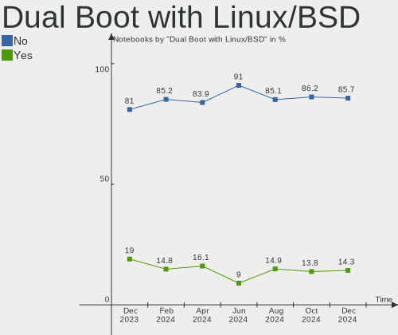
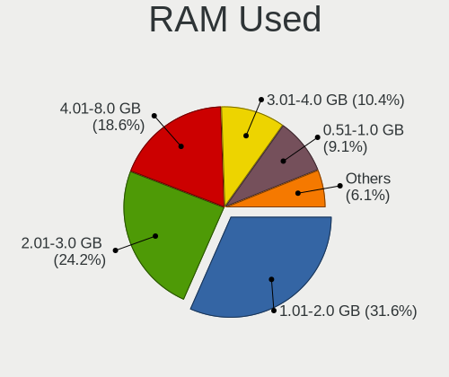
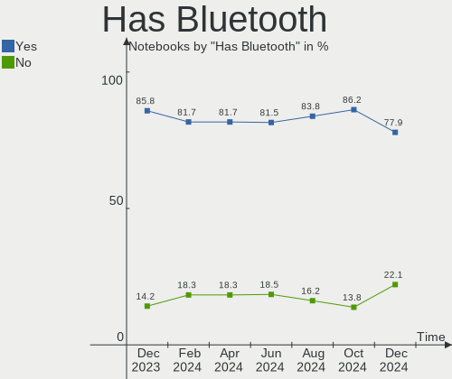
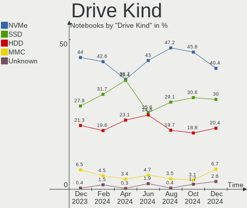
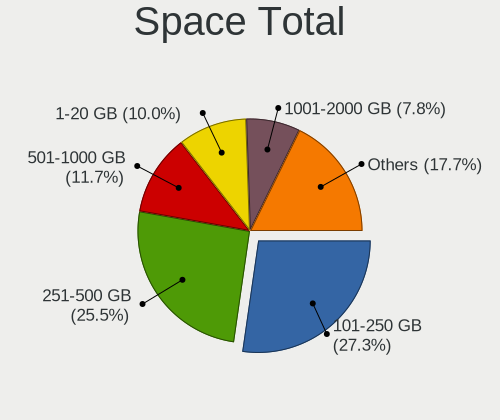
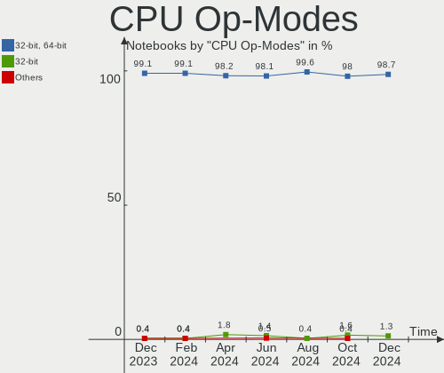
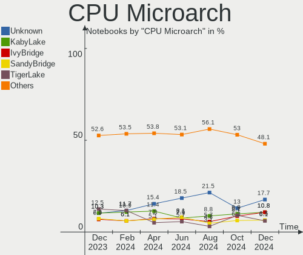
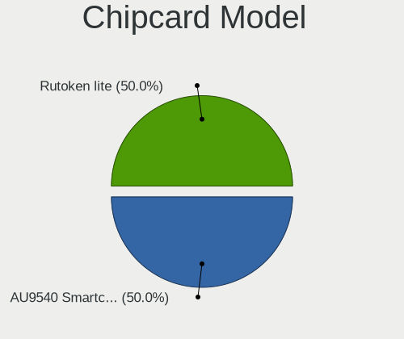
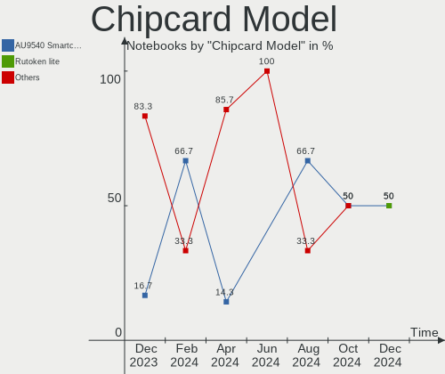

Linux in Russia - Hardware Trends (Notebooks)
---------------------------------------------

A project to identify most popular hardware characteristics and track their change
over time based on data collected by Linux users at https://Linux-Hardware.org.

Anyone can contribute to this report by the [hw-probe](https://github.com/linuxhw/hw-probe) tool:

    sudo -E hw-probe -all -upload

Period: Mar, 2023.

Contents
--------

* [ System ](#system)
  - [ OS                       ](#os)
  - [ OS Family                ](#os-family)
  - [ Kernel                   ](#kernel)
  - [ Kernel Family            ](#kernel-family)
  - [ Kernel Major Ver.        ](#kernel-major-ver)
  - [ Arch                     ](#arch)
  - [ DE                       ](#de)
  - [ Display Server           ](#display-server)
  - [ Display Manager          ](#display-manager)
  - [ OS Lang                  ](#os-lang)
  - [ Boot Mode                ](#boot-mode)
  - [ Filesystem               ](#filesystem)
  - [ Part. scheme             ](#part-scheme)
  - [ Dual Boot with Linux/BSD ](#dual-boot-with-linuxbsd)
  - [ Dual Boot (Win)          ](#dual-boot-win)

* [ Board ](#board)
  - [ Vendor                   ](#vendor)
  - [ Model                    ](#model)
  - [ Model Family             ](#model-family)
  - [ MFG Year                 ](#mfg-year)
  - [ Form Factor              ](#form-factor)
  - [ Secure Boot              ](#secure-boot)
  - [ Coreboot                 ](#coreboot)
  - [ RAM Size                 ](#ram-size)
  - [ RAM Used                 ](#ram-used)
  - [ Total Drives             ](#total-drives)
  - [ Has CD-ROM               ](#has-cd-rom)
  - [ Has Ethernet             ](#has-ethernet)
  - [ Has WiFi                 ](#has-wifi)
  - [ Has Bluetooth            ](#has-bluetooth)

* [ Location ](#location)
  - [ Country                  ](#country)
  - [ City                     ](#city)

* [ Drives ](#drives)
  - [ Drive Vendor             ](#drive-vendor)
  - [ Drive Model              ](#drive-model)
  - [ HDD Vendor               ](#hdd-vendor)
  - [ SSD Vendor               ](#ssd-vendor)
  - [ Drive Kind               ](#drive-kind)
  - [ Drive Connector          ](#drive-connector)
  - [ Drive Size               ](#drive-size)
  - [ Space Total              ](#space-total)
  - [ Space Used               ](#space-used)
  - [ Malfunc. Drives          ](#malfunc-drives)
  - [ Malfunc. Drive Vendor    ](#malfunc-drive-vendor)
  - [ Malfunc. HDD Vendor      ](#malfunc-hdd-vendor)
  - [ Malfunc. Drive Kind      ](#malfunc-drive-kind)
  - [ Failed Drives            ](#failed-drives)
  - [ Failed Drive Vendor      ](#failed-drive-vendor)
  - [ Drive Status             ](#drive-status)

* [ Storage controller ](#storage-controller)
  - [ Storage Vendor           ](#storage-vendor)
  - [ Storage Model            ](#storage-model)
  - [ Storage Kind             ](#storage-kind)

* [ Processor ](#processor)
  - [ CPU Vendor               ](#cpu-vendor)
  - [ CPU Model                ](#cpu-model)
  - [ CPU Model Family         ](#cpu-model-family)
  - [ CPU Cores                ](#cpu-cores)
  - [ CPU Sockets              ](#cpu-sockets)
  - [ CPU Threads              ](#cpu-threads)
  - [ CPU Op-Modes             ](#cpu-op-modes)
  - [ CPU Microcode            ](#cpu-microcode)
  - [ CPU Microarch            ](#cpu-microarch)

* [ Graphics ](#graphics)
  - [ GPU Vendor               ](#gpu-vendor)
  - [ GPU Model                ](#gpu-model)
  - [ GPU Combo                ](#gpu-combo)
  - [ GPU Driver               ](#gpu-driver)
  - [ GPU Memory               ](#gpu-memory)

* [ Monitor ](#monitor)
  - [ Monitor Vendor           ](#monitor-vendor)
  - [ Monitor Model            ](#monitor-model)
  - [ Monitor Resolution       ](#monitor-resolution)
  - [ Monitor Diagonal         ](#monitor-diagonal)
  - [ Monitor Width            ](#monitor-width)
  - [ Aspect Ratio             ](#aspect-ratio)
  - [ Monitor Area             ](#monitor-area)
  - [ Pixel Density            ](#pixel-density)
  - [ Multiple Monitors        ](#multiple-monitors)

* [ Network ](#network)
  - [ Net Controller Vendor    ](#net-controller-vendor)
  - [ Net Controller Model     ](#net-controller-model)
  - [ Wireless Vendor          ](#wireless-vendor)
  - [ Wireless Model           ](#wireless-model)
  - [ Ethernet Vendor          ](#ethernet-vendor)
  - [ Ethernet Model           ](#ethernet-model)
  - [ Net Controller Kind      ](#net-controller-kind)
  - [ Used Controller          ](#used-controller)
  - [ NICs                     ](#nics)
  - [ IPv6                     ](#ipv6)

* [ Bluetooth ](#bluetooth)
  - [ Bluetooth Vendor         ](#bluetooth-vendor)
  - [ Bluetooth Model          ](#bluetooth-model)

* [ Sound ](#sound)
  - [ Sound Vendor             ](#sound-vendor)
  - [ Sound Model              ](#sound-model)

* [ Memory ](#memory)
  - [ Memory Vendor            ](#memory-vendor)
  - [ Memory Model             ](#memory-model)
  - [ Memory Kind              ](#memory-kind)
  - [ Memory Form Factor       ](#memory-form-factor)
  - [ Memory Size              ](#memory-size)
  - [ Memory Speed             ](#memory-speed)

* [ Printers & scanners ](#printers--scanners)
  - [ Printer Vendor           ](#printer-vendor)
  - [ Printer Model            ](#printer-model)
  - [ Scanner Vendor           ](#scanner-vendor)
  - [ Scanner Model            ](#scanner-model)

* [ Camera ](#camera)
  - [ Camera Vendor            ](#camera-vendor)
  - [ Camera Model             ](#camera-model)

* [ Security ](#security)
  - [ Fingerprint Vendor       ](#fingerprint-vendor)
  - [ Fingerprint Model        ](#fingerprint-model)
  - [ Chipcard Vendor          ](#chipcard-vendor)
  - [ Chipcard Model           ](#chipcard-model)

* [ Unsupported ](#unsupported)
  - [ Unsupported Devices      ](#unsupported-devices)
  - [ Unsupported Device Types ](#unsupported-device-types)

System
------

OS
--

Installed operating systems

| Name                | Notebooks | Percent |
|---------------------|-----------|---------|
| ROSA 12.3           | 87        | 30.53%  |
| Fedora 37           | 16        | 5.61%   |
| OpenMandriva 23.03  | 15        | 5.26%   |
| Ubuntu 22.04        | 13        | 4.56%   |
| Debian 11           | 12        | 4.21%   |
| ROSA 12.4           | 10        | 3.51%   |
| Ubuntu 22.10        | 7         | 2.46%   |
| Linux Mint 21.1     | 7         | 2.46%   |
| Arch Rolling        | 7         | 2.46%   |
| ALT Linux 10.1      | 7         | 2.46%   |
| ROSA R11.1          | 6         | 2.11%   |
| Red OS 7.3.2        | 6         | 2.11%   |
| OpenMandriva 4.3    | 5         | 1.75%   |
| OpenMandriva 23.01  | 5         | 1.75%   |
| Manjaro             | 5         | 1.75%   |
| Kali 2023.1         | 5         | 1.75%   |
| Debian              | 5         | 1.75%   |
| Pop!_OS 22.04       | 4         | 1.4%    |
| Nobara 37           | 4         | 1.4%    |
| Xubuntu 20.04       | 3         | 1.05%   |
| Ubuntu 20.04        | 3         | 1.05%   |
| ROSA 12.2           | 3         | 1.05%   |
| MOS 10              | 3         | 1.05%   |
| KDE neon 22.04      | 3         | 1.05%   |
| Zorin 16            | 2         | 0.7%    |
| SteamOS 3.4.6       | 2         | 0.7%    |
| OpenMandriva 4.2    | 2         | 0.7%    |
| MX 21               | 2         | 0.7%    |
| Lubuntu 22.04       | 2         | 0.7%    |
| LMDE 5              | 2         | 0.7%    |
| Kubuntu 22.10       | 2         | 0.7%    |
| Fedora 38           | 2         | 0.7%    |
| Fedora 36           | 2         | 0.7%    |
| EndeavourOS Rolling | 2         | 0.7%    |
| Elementary 7        | 2         | 0.7%    |
| Elementary 6.1      | 2         | 0.7%    |
| Xubuntu 22.10       | 1         | 0.35%   |
| Xubuntu 18.04       | 1         | 0.35%   |
| Xero Rolling        | 1         | 0.35%   |
| Void Linux Rolling  | 1         | 0.35%   |

OS Family
---------

OS without a version

| Name         | Notebooks | Percent |
|--------------|-----------|---------|
| ROSA         | 106       | 37.19%  |
| OpenMandriva | 27        | 9.47%   |
| Ubuntu       | 25        | 8.77%   |
| Fedora       | 20        | 7.02%   |
| Debian       | 17        | 5.96%   |
| ALT Linux    | 10        | 3.51%   |
| Linux Mint   | 9         | 3.16%   |
| Manjaro      | 8         | 2.81%   |
| Red OS       | 7         | 2.46%   |
| Arch         | 7         | 2.46%   |
| Kali         | 6         | 2.11%   |
| Xubuntu      | 5         | 1.75%   |
| Pop!_OS      | 4         | 1.4%    |
| Nobara       | 4         | 1.4%    |
| Elementary   | 4         | 1.4%    |
| SteamOS      | 3         | 1.05%   |
| Lubuntu      | 3         | 1.05%   |
| Kubuntu      | 3         | 1.05%   |
| KDE neon     | 3         | 1.05%   |
| Zorin        | 2         | 0.7%    |
| MX           | 2         | 0.7%    |
| LMDE         | 2         | 0.7%    |
| EndeavourOS  | 2         | 0.7%    |
| Xero         | 1         | 0.35%   |
| Void Linux   | 1         | 0.35%   |
| Ubuntu Unity | 1         | 0.35%   |
| RELD         | 1         | 0.35%   |
| Gentoo       | 1         | 0.35%   |
| Endless      | 1         | 0.35%   |

Kernel
------

Version of the Linux kernel

| Version                                   | Notebooks | Percent |
|-------------------------------------------|-----------|---------|
| 5.15.75-generic-1rosa2021.1-x86_64        | 31        | 10.88%  |
| 5.15.79-generic-1rosa2021.1-x86_64        | 23        | 8.07%   |
| 5.19.0-35-generic                         | 20        | 7.02%   |
| 6.2.6-desktop-1omv2390                    | 11        | 3.86%   |
| 5.15.75-generic-1rosa2021.1-i686          | 10        | 3.51%   |
| 5.15.0-67-generic                         | 8         | 2.81%   |
| 5.10.0-21-amd64                           | 8         | 2.81%   |
| 6.1.20-generic-2rosa2021.1-x86_64         | 5         | 1.75%   |
| 6.1.18-200.fc37.x86_64                    | 5         | 1.75%   |
| 6.1.15-200.fc37.x86_64                    | 5         | 1.75%   |
| 6.1.1-desktop-1omv2290                    | 4         | 1.4%    |
| 6.1.0-kali5-amd64                         | 4         | 1.4%    |
| 6.0.12.xm1-1.klp-xanmod-rosa2021.1-x86_64 | 4         | 1.4%    |
| 5.4.0-144-generic                         | 4         | 1.4%    |
| 5.19.0-38-generic                         | 4         | 1.4%    |
| 5.15.77-generic-1rosa2021.1-x86_64        | 4         | 1.4%    |
| 5.10.155-generic-1rosa2021.1-x86_64       | 4         | 1.4%    |
| 6.2.6-arch1-1                             | 3         | 1.05%   |
| 6.2.2-desktop-1omv2390                    | 3         | 1.05%   |
| 6.1.20-generic-1rosa2021.1-x86_64         | 3         | 1.05%   |
| 6.1.12-1-MANJARO                          | 3         | 1.05%   |
| 5.17.11-generic-2rosa2021.1-x86_64        | 3         | 1.05%   |
| 5.16.13-desktop-1omv4003                  | 3         | 1.05%   |
| 5.15.87-1.el7.3.x86_64                    | 3         | 1.05%   |
| 5.15.103-generic-1rosa2021.1-x86_64       | 3         | 1.05%   |
| 5.15.0-56-generic                         | 3         | 1.05%   |
| 5.13.0-valve36-1-neptune                  | 3         | 1.05%   |
| 5.10.74-generic-2rosa2021.1-x86_64        | 3         | 1.05%   |
| 5.10.0-2-amd64                            | 3         | 1.05%   |
| 6.2.8-arch1-1                             | 2         | 0.7%    |
| 6.2.8-200.fc37.x86_64                     | 2         | 0.7%    |
| 6.2.7-200.fc37.x86_64                     | 2         | 0.7%    |
| 6.2.6-201.fsync.fc37.x86_64               | 2         | 0.7%    |
| 6.2.2-zen1-1-zen                          | 2         | 0.7%    |
| 6.2.2-arch1-1                             | 2         | 0.7%    |
| 6.2.0-76060200-generic                    | 2         | 0.7%    |
| 6.1.19-generic-1rosa2021.1-x86_64         | 2         | 0.7%    |
| 6.1.19-1-MANJARO                          | 2         | 0.7%    |
| 6.1.14-201.fsync.fc37.x86_64              | 2         | 0.7%    |
| 6.1.11-76060111-generic                   | 2         | 0.7%    |

Kernel Family
-------------

Linux kernel without a distro release

| Version  | Notebooks | Percent |
|----------|-----------|---------|
| 5.15.75  | 41        | 14.39%  |
| 5.19.0   | 27        | 9.47%   |
| 5.15.79  | 23        | 8.07%   |
| 6.2.6    | 18        | 6.32%   |
| 5.15.0   | 15        | 5.26%   |
| 5.10.0   | 12        | 4.21%   |
| 6.1.0    | 9         | 3.16%   |
| 6.1.20   | 8         | 2.81%   |
| 6.2.2    | 7         | 2.46%   |
| 6.1.18   | 7         | 2.46%   |
| 6.2.8    | 6         | 2.11%   |
| 6.1.15   | 6         | 2.11%   |
| 5.4.0    | 6         | 2.11%   |
| 6.1.19   | 5         | 1.75%   |
| 6.2.7    | 4         | 1.4%    |
| 6.1.12   | 4         | 1.4%    |
| 6.1.1    | 4         | 1.4%    |
| 6.0.12   | 4         | 1.4%    |
| 6.0.0    | 4         | 1.4%    |
| 5.17.11  | 4         | 1.4%    |
| 5.15.77  | 4         | 1.4%    |
| 5.10.155 | 4         | 1.4%    |
| 6.2.0    | 3         | 1.05%   |
| 6.1.14   | 3         | 1.05%   |
| 6.1.11   | 3         | 1.05%   |
| 5.16.13  | 3         | 1.05%   |
| 5.15.87  | 3         | 1.05%   |
| 5.15.72  | 3         | 1.05%   |
| 5.15.103 | 3         | 1.05%   |
| 5.13.0   | 3         | 1.05%   |
| 5.10.74  | 3         | 1.05%   |
| 4.15.0   | 3         | 1.05%   |
| 6.1.9    | 2         | 0.7%    |
| 5.4.32   | 2         | 0.7%    |
| 5.16.7   | 2         | 0.7%    |
| 5.15.80  | 2         | 0.7%    |
| 5.10.152 | 2         | 0.7%    |
| 5.10.14  | 2         | 0.7%    |
| 6.2.5    | 1         | 0.35%   |
| 6.1.4    | 1         | 0.35%   |

Kernel Major Ver.
-----------------

Linux kernel major version

| Version | Notebooks | Percent |
|---------|-----------|---------|
| 5.15    | 98        | 34.39%  |
| 6.1     | 54        | 18.95%  |
| 6.2     | 39        | 13.68%  |
| 5.19    | 29        | 10.18%  |
| 5.10    | 28        | 9.82%   |
| 6.0     | 10        | 3.51%   |
| 5.4     | 9         | 3.16%   |
| 5.16    | 5         | 1.75%   |
| 5.17    | 4         | 1.4%    |
| 5.13    | 3         | 1.05%   |
| 4.15    | 3         | 1.05%   |
| 5.8     | 1         | 0.35%   |
| 5.18    | 1         | 0.35%   |
| 4.19    | 1         | 0.35%   |

Arch
----

OS architecture (x86_64, i586, etc.)

| Name   | Notebooks | Percent |
|--------|-----------|---------|
| x86_64 | 272       | 95.44%  |
| i686   | 13        | 4.56%   |

DE
--

Desktop Environment

| Name       | Notebooks | Percent |
|------------|-----------|---------|
| KDE5       | 103       | 36.14%  |
| GNOME      | 99        | 34.74%  |
| LXQt       | 21        | 7.37%   |
| XFCE       | 14        | 4.91%   |
| Unknown    | 11        | 3.86%   |
| MATE       | 9         | 3.16%   |
| X-Cinnamon | 8         | 2.81%   |
| KDE4       | 5         | 1.75%   |
| Pantheon   | 4         | 1.4%    |
| Cinnamon   | 3         | 1.05%   |
| i3         | 2         | 0.7%    |
| Unity      | 1         | 0.35%   |
| Trinity    | 1         | 0.35%   |
| sway       | 1         | 0.35%   |
| LXDE       | 1         | 0.35%   |
| fluxbox    | 1         | 0.35%   |
| Budgie     | 1         | 0.35%   |

Display Server
--------------

X11 or Wayland

| Name    | Notebooks | Percent |
|---------|-----------|---------|
| X11     | 144       | 50.53%  |
| Wayland | 132       | 46.32%  |
| Unknown | 6         | 2.11%   |
| Tty     | 3         | 1.05%   |

Display Manager
---------------

SDDM, LightDM, etc.

| Name    | Notebooks | Percent |
|---------|-----------|---------|
| SDDM    | 95        | 33.33%  |
| GDM     | 63        | 22.11%  |
| Unknown | 54        | 18.95%  |
| LightDM | 41        | 14.39%  |
| GDM3    | 26        | 9.12%   |
| KDM     | 5         | 1.75%   |
| TDM     | 1         | 0.35%   |

OS Lang
-------

Language

| Lang    | Notebooks | Percent |
|---------|-----------|---------|
| ru_RU   | 231       | 81.05%  |
| en_US   | 50        | 17.54%  |
| en_GB   | 2         | 0.7%    |
| C       | 1         | 0.35%   |
| Unknown | 1         | 0.35%   |

Boot Mode
---------

EFI or BIOS

| Mode | Notebooks | Percent |
|------|-----------|---------|
| EFI  | 178       | 62.46%  |
| BIOS | 107       | 37.54%  |

Filesystem
----------

Type of filesystem

| Type    | Notebooks | Percent |
|---------|-----------|---------|
| Ext4    | 215       | 75.44%  |
| Btrfs   | 44        | 15.44%  |
| Overlay | 21        | 7.37%   |
| Xfs     | 3         | 1.05%   |
| Zfs     | 1         | 0.35%   |
| Aufs    | 1         | 0.35%   |

Part. scheme
------------

Scheme of partitioning

| Type    | Notebooks | Percent |
|---------|-----------|---------|
| GPT     | 172       | 60.35%  |
| MBR     | 68        | 23.86%  |
| Unknown | 45        | 15.79%  |

Dual Boot with Linux/BSD
------------------------

Hosting more than one Linux/BSD

| Dual boot | Notebooks | Percent |
|-----------|-----------|---------|
| No        | 234       | 82.11%  |
| Yes       | 51        | 17.89%  |

Dual Boot (Win)
---------------

Hosting Linux and Windows

| Dual boot | Notebooks | Percent |
|-----------|-----------|---------|
| No        | 202       | 70.88%  |
| Yes       | 83        | 29.12%  |

Board
-----

Vendor
------

Motherboard manufacturer

| Name                     | Notebooks | Percent |
|--------------------------|-----------|---------|
| ASUSTek Computer         | 53        | 18.6%   |
| Lenovo                   | 47        | 16.49%  |
| Acer                     | 31        | 10.88%  |
| Hewlett-Packard          | 28        | 9.82%   |
| Dell                     | 19        | 6.67%   |
| HUAWEI                   | 12        | 4.21%   |
| HONOR                    | 12        | 4.21%   |
| MSI                      | 9         | 3.16%   |
| Samsung Electronics      | 7         | 2.46%   |
| Toshiba                  | 6         | 2.11%   |
| Unknown                  | 6         | 2.11%   |
| Sony                     | 5         | 1.75%   |
| Clevo                    | 5         | 1.75%   |
| Timi                     | 4         | 1.4%    |
| Valve                    | 3         | 1.05%   |
| Pegatron                 | 3         | 1.05%   |
| Prestigio                | 2         | 0.7%    |
| Packard Bell             | 2         | 0.7%    |
| Maibenben                | 2         | 0.7%    |
| Infinix                  | 2         | 0.7%    |
| HIPER                    | 2         | 0.7%    |
| Haier                    | 2         | 0.7%    |
| Gigabyte Technology      | 2         | 0.7%    |
| Fujitsu                  | 2         | 0.7%    |
| eMachines                | 2         | 0.7%    |
| Aquarius                 | 2         | 0.7%    |
| THUNDEROBOT              | 1         | 0.35%   |
| TECNO                    | 1         | 0.35%   |
| Teclast                  | 1         | 0.35%   |
| realme                   | 1         | 0.35%   |
| Positivo                 | 1         | 0.35%   |
| New IT Project           | 1         | 0.35%   |
| LTD Delovoy Office       | 1         | 0.35%   |
| Kraftway                 | 1         | 0.35%   |
| Irbis                    | 1         | 0.35%   |
| HIPER Technology Limited | 1         | 0.35%   |
| Gateway                  | 1         | 0.35%   |
| Fujitsu Siemens          | 1         | 0.35%   |
| DEXP                     | 1         | 0.35%   |
| DEPO Computers           | 1         | 0.35%   |

Model
-----

Motherboard model

| Name                                       | Notebooks | Percent |
|--------------------------------------------|-----------|---------|
| Unknown                                    | 6         | 2.11%   |
| HONOR HYM-WXX                              | 4         | 1.4%    |
| Clevo NL41MU2                              | 4         | 1.4%    |
| Valve Jupiter                              | 3         | 1.05%   |
| HONOR NBR-WAX9                             | 3         | 1.05%   |
| HONOR BMH-WCX9                             | 3         | 1.05%   |
| Timi Redmi Book Pro 15 2022                | 2         | 0.7%    |
| Samsung 300V3A/300V4A/300V5A/200A4B/200A5B | 2         | 0.7%    |
| Lenovo ThinkPad P1 Gen 4i 20Y3001LUK       | 2         | 0.7%    |
| Lenovo B570e HuronRiver Platform           | 2         | 0.7%    |
| Infinix INBOOK X2 GEN11                    | 2         | 0.7%    |
| HUAWEI KLVL-WXXW                           | 2         | 0.7%    |
| HUAWEI HN-WX9X                             | 2         | 0.7%    |
| HIPER WORKBOOK                             | 2         | 0.7%    |
| HP Pavilion Notebook                       | 2         | 0.7%    |
| HP Pavilion dv6                            | 2         | 0.7%    |
| HP Laptop 15s-eq2xxx                       | 2         | 0.7%    |
| Dell Vostro 3400                           | 2         | 0.7%    |
| Dell Latitude 5521                         | 2         | 0.7%    |
| ASUS Zenbook UX535QE_UM535QE               | 2         | 0.7%    |
| ASUS VivoBook_ASUSLaptop M6500QC_M6500QC   | 2         | 0.7%    |
| Toshiba T20                                | 1         | 0.35%   |
| Toshiba Satellite U300                     | 1         | 0.35%   |
| Toshiba Satellite Pro L300                 | 1         | 0.35%   |
| Toshiba Satellite L850D-BJS                | 1         | 0.35%   |
| Toshiba Satellite A500                     | 1         | 0.35%   |
| Toshiba Satellite A200                     | 1         | 0.35%   |
| Timi TM1701                                | 1         | 0.35%   |
| Timi Redmi Book Pro 14 2022                | 1         | 0.35%   |
| THUNDEROBOT 911 Plus                       | 1         | 0.35%   |
| TECNO MEGABOOK T1                          | 1         | 0.35%   |
| Teclast F15Plus 2                          | 1         | 0.35%   |
| Sony VPCZ12V9R                             | 1         | 0.35%   |
| Sony VPCZ12S9R                             | 1         | 0.35%   |
| Sony VPCF13E8R                             | 1         | 0.35%   |
| Sony SVT1313X9RS                           | 1         | 0.35%   |
| Sony SVE1713P1RB                           | 1         | 0.35%   |
| Samsung RV408/RV508                        | 1         | 0.35%   |
| Samsung R530/R730                          | 1         | 0.35%   |
| Samsung NC10                               | 1         | 0.35%   |

Model Family
------------

Motherboard model prefix

| Name                  | Notebooks | Percent |
|-----------------------|-----------|---------|
| Acer Aspire           | 23        | 8.07%   |
| Lenovo IdeaPad        | 18        | 6.32%   |
| Lenovo ThinkPad       | 15        | 5.26%   |
| ASUS VivoBook         | 13        | 4.56%   |
| HP Laptop             | 9         | 3.16%   |
| HP Pavilion           | 7         | 2.46%   |
| Unknown               | 6         | 2.11%   |
| Toshiba Satellite     | 5         | 1.75%   |
| Dell Vostro           | 5         | 1.75%   |
| Dell Latitude         | 5         | 1.75%   |
| Dell Inspiron         | 5         | 1.75%   |
| HONOR HYM-WXX         | 4         | 1.4%    |
| HP ProBook            | 4         | 1.4%    |
| Clevo NL41MU2         | 4         | 1.4%    |
| Valve Jupiter         | 3         | 1.05%   |
| Timi Redmi            | 3         | 1.05%   |
| MSI Modern            | 3         | 1.05%   |
| HONOR NBR-WAX9        | 3         | 1.05%   |
| HONOR BMH-WCX9        | 3         | 1.05%   |
| HP EliteBook          | 3         | 1.05%   |
| ASUS Zenbook          | 3         | 1.05%   |
| Acer Swift            | 3         | 1.05%   |
| Samsung 300V3A        | 2         | 0.7%    |
| Packard Bell EasyNote | 2         | 0.7%    |
| Lenovo ThinkBook      | 2         | 0.7%    |
| Lenovo Legion         | 2         | 0.7%    |
| Lenovo B570e          | 2         | 0.7%    |
| Infinix INBOOK        | 2         | 0.7%    |
| HUAWEI KLVL-WXXW      | 2         | 0.7%    |
| HUAWEI HN-WX9X        | 2         | 0.7%    |
| HIPER WORKBOOK        | 2         | 0.7%    |
| Fujitsu LIFEBOOK      | 2         | 0.7%    |
| ASUS ROG              | 2         | 0.7%    |
| Acer Extensa          | 2         | 0.7%    |
| Toshiba T20           | 1         | 0.35%   |
| Timi TM1701           | 1         | 0.35%   |
| THUNDEROBOT 911       | 1         | 0.35%   |
| TECNO MEGABOOK        | 1         | 0.35%   |
| Teclast F15Plus       | 1         | 0.35%   |
| Sony VPCZ12V9R        | 1         | 0.35%   |

MFG Year
--------

Motherboard manufacture year

| Year | Notebooks | Percent |
|------|-----------|---------|
| 2022 | 51        | 17.89%  |
| 2021 | 44        | 15.44%  |
| 2011 | 27        | 9.47%   |
| 2019 | 24        | 8.42%   |
| 2017 | 19        | 6.67%   |
| 2012 | 18        | 6.32%   |
| 2010 | 18        | 6.32%   |
| 2020 | 13        | 4.56%   |
| 2013 | 13        | 4.56%   |
| 2014 | 12        | 4.21%   |
| 2018 | 9         | 3.16%   |
| 2016 | 7         | 2.46%   |
| 2008 | 7         | 2.46%   |
| 2007 | 7         | 2.46%   |
| 2009 | 6         | 2.11%   |
| 2006 | 5         | 1.75%   |
| 2015 | 4         | 1.4%    |
| 2023 | 1         | 0.35%   |

Form Factor
-----------

Physical design of the computer

| Name     | Notebooks | Percent |
|----------|-----------|---------|
| Notebook | 285       | 100%    |

Secure Boot
-----------

Enabled or disabled

| State    | Notebooks | Percent |
|----------|-----------|---------|
| Disabled | 265       | 92.98%  |
| Enabled  | 20        | 7.02%   |

Coreboot
--------

Have coreboot on board

| Used | Notebooks | Percent |
|------|-----------|---------|
| No   | 285       | 100%    |

RAM Size
--------

Total RAM memory

| Size in GB  | Notebooks | Percent |
|-------------|-----------|---------|
| 4.01-8.0    | 92        | 32.28%  |
| 8.01-16.0   | 59        | 20.7%   |
| 3.01-4.0    | 53        | 18.6%   |
| 16.01-24.0  | 41        | 14.39%  |
| 1.01-2.0    | 17        | 5.96%   |
| 32.01-64.0  | 10        | 3.51%   |
| 2.01-3.0    | 7         | 2.46%   |
| 0.51-1.0    | 3         | 1.05%   |
| 64.01-256.0 | 2         | 0.7%    |
| 24.01-32.0  | 1         | 0.35%   |

RAM Used
--------

Used RAM memory

| Used GB   | Notebooks | Percent |
|-----------|-----------|---------|
| 1.01-2.0  | 112       | 39.3%   |
| 2.01-3.0  | 57        | 20%     |
| 0.51-1.0  | 38        | 13.33%  |
| 4.01-8.0  | 36        | 12.63%  |
| 3.01-4.0  | 29        | 10.18%  |
| 8.01-16.0 | 10        | 3.51%   |
| 0.01-0.5  | 3         | 1.05%   |

Total Drives
------------

Number of drives on board

| Drives | Notebooks | Percent |
|--------|-----------|---------|
| 1      | 218       | 76.49%  |
| 2      | 58        | 20.35%  |
| 3      | 5         | 1.75%   |
| 4      | 2         | 0.7%    |
| 0      | 2         | 0.7%    |

Has CD-ROM
----------

Has CD-ROM on board

| Presented | Notebooks | Percent |
|-----------|-----------|---------|
| No        | 206       | 72.28%  |
| Yes       | 79        | 27.72%  |

Has Ethernet
------------

Has Ethernet on board

| Presented | Notebooks | Percent |
|-----------|-----------|---------|
| Yes       | 206       | 72.28%  |
| No        | 79        | 27.72%  |

Has WiFi
--------

Has WiFi module

| Presented | Notebooks | Percent |
|-----------|-----------|---------|
| Yes       | 281       | 98.6%   |
| No        | 4         | 1.4%    |

Has Bluetooth
-------------

Has Bluetooth module

| Presented | Notebooks | Percent |
|-----------|-----------|---------|
| Yes       | 234       | 82.11%  |
| No        | 51        | 17.89%  |

Location
--------

Country
-------

Geographic location (country)

| Country | Notebooks | Percent |
|---------|-----------|---------|
| Russia  | 285       | 100%    |

City
----

Geographic location (city)

| City             | Notebooks | Percent |
|------------------|-----------|---------|
| Moscow           | 72        | 25.26%  |
| St Petersburg    | 35        | 12.28%  |
| Krasnodar        | 11        | 3.86%   |
| Voronezh         | 8         | 2.81%   |
| Samara           | 7         | 2.46%   |
| Nizhniy Novgorod | 7         | 2.46%   |
| Novosibirsk      | 6         | 2.11%   |
| Yekaterinburg    | 5         | 1.75%   |
| Volgograd        | 5         | 1.75%   |
| Ufa              | 5         | 1.75%   |
| Perm             | 5         | 1.75%   |
| Omsk             | 5         | 1.75%   |
| Chelyabinsk      | 5         | 1.75%   |
| Yakutsk          | 4         | 1.4%    |
| Lipetsk          | 4         | 1.4%    |
| Yaroslavl        | 3         | 1.05%   |
| Vladivostok      | 3         | 1.05%   |
| Ulyanovsk        | 3         | 1.05%   |
| Saratov          | 3         | 1.05%   |
| Krasnoyarsk      | 3         | 1.05%   |
| Kirishi          | 3         | 1.05%   |
| Khabarovsk       | 3         | 1.05%   |
| Kazan’         | 3         | 1.05%   |
| Vsevolozhsk      | 2         | 0.7%    |
| Vologda          | 2         | 0.7%    |
| Veliky Novgorod  | 2         | 0.7%    |
| Tyumen           | 2         | 0.7%    |
| Tambov           | 2         | 0.7%    |
| Taganrog         | 2         | 0.7%    |
| Surgut           | 2         | 0.7%    |
| Smolensk         | 2         | 0.7%    |
| Ryazan           | 2         | 0.7%    |
| Rostov-on-Don    | 2         | 0.7%    |
| Novocherkassk    | 2         | 0.7%    |
| Kursk            | 2         | 0.7%    |
| Khimki           | 2         | 0.7%    |
| Blagoveshchensk  | 2         | 0.7%    |
| Zvëzdnyy        | 1         | 0.35%   |
| Zuyevka          | 1         | 0.35%   |
| Zhigulevsk       | 1         | 0.35%   |

Drives
------

Drive Vendor
------------

Hard drive vendors

| Vendor                         | Notebooks | Drives | Percent |
|--------------------------------|-----------|--------|---------|
| WDC                            | 50        | 51     | 14.84%  |
| Samsung Electronics            | 36        | 40     | 10.68%  |
| Seagate                        | 31        | 31     | 9.2%    |
| Toshiba                        | 25        | 27     | 7.42%   |
| SK hynix                       | 20        | 20     | 5.93%   |
| SanDisk                        | 15        | 16     | 4.45%   |
| Kingston                       | 15        | 16     | 4.45%   |
| Unknown                        | 10        | 10     | 2.97%   |
| SPCC                           | 10        | 10     | 2.97%   |
| Hitachi                        | 10        | 10     | 2.97%   |
| KIOXIA                         | 8         | 8      | 2.37%   |
| China                          | 8         | 9      | 2.37%   |
| A-DATA Technology              | 8         | 8      | 2.37%   |
| Micron Technology              | 7         | 7      | 2.08%   |
| Netac                          | 5         | 5      | 1.48%   |
| Intel                          | 5         | 6      | 1.48%   |
| HGST                           | 4         | 4      | 1.19%   |
| BIWIN                          | 4         | 4      | 1.19%   |
| Apacer                         | 4         | 4      | 1.19%   |
| SSSTC                          | 3         | 3      | 0.89%   |
| Silicon Motion                 | 3         | 3      | 0.89%   |
| Phison Electronics             | 3         | 3      | 0.89%   |
| Phison                         | 3         | 3      | 0.89%   |
| FORESEE                        | 3         | 3      | 0.89%   |
| Crucial                        | 3         | 3      | 0.89%   |
| XrayDisk                       | 2         | 2      | 0.59%   |
| Transcend                      | 2         | 2      | 0.59%   |
| TO Exter                       | 2         | 2      | 0.59%   |
| ShiJi                          | 2         | 2      | 0.59%   |
| Patriot                        | 2         | 2      | 0.59%   |
| Kimtigo                        | 2         | 2      | 0.59%   |
| Unknown                        | 2         | 2      | 0.59%   |
| YMTC                           | 1         | 1      | 0.3%    |
| USB                            | 1         | 1      | 0.3%    |
| Teclast                        | 1         | 1      | 0.3%    |
| SWORDBILL                      | 1         | 1      | 0.3%    |
| Solid State Storage Technology | 1         | 1      | 0.3%    |
| Solid State Storage            | 1         | 1      | 0.3%    |
| Shenzhen Longsys Electronics   | 1         | 1      | 0.3%    |
| SCY                            | 1         | 1      | 0.3%    |

Drive Model
-----------

Hard drive models

| Model                                           | Notebooks | Percent |
|-------------------------------------------------|-----------|---------|
| SPCC Solid State Disk 128GB                     | 5         | 1.46%   |
| Toshiba MQ04ABF100 1TB                          | 4         | 1.17%   |
| Toshiba MQ01ABF050 500GB                        | 4         | 1.17%   |
| SK hynix HFM512GD3JX013N 512GB                  | 4         | 1.17%   |
| Seagate ST9320325AS 320GB                       | 4         | 1.17%   |
| Seagate ST500LT012-1DG142 500GB                 | 4         | 1.17%   |
| Seagate ST1000LM035-1RK172 1TB                  | 4         | 1.17%   |
| Seagate ST1000LM024 HN-M101MBB 1TB              | 4         | 1.17%   |
| BIWIN CE480T5D101-256 256GB                     | 4         | 1.17%   |
| WDC WD5000LPVX-22V0TT0 500GB                    | 3         | 0.88%   |
| WDC WD5000LPCX-24VHAT0 500GB                    | 3         | 0.88%   |
| Unknown MMC Card  32GB                          | 3         | 0.88%   |
| Seagate ST9500325AS 500GB                       | 3         | 0.88%   |
| Samsung SSD 860 EVO 250GB                       | 3         | 0.88%   |
| Samsung MZVL2512HCJQ-00B00 512GB                | 3         | 0.88%   |
| Phison PS5013 E13 NVMe Controller 256GB         | 3         | 0.88%   |
| HGST HTS721010A9E630 1TB                        | 3         | 0.88%   |
| WDC WDS500G2B0A-00SM50 500GB SSD                | 2         | 0.58%   |
| WDC WDS240G2G0A-00JH30 240GB SSD                | 2         | 0.58%   |
| WDC WDS120G2G0A-00JH30 120GB SSD                | 2         | 0.58%   |
| WDC WD5000LPCX-60VHAT1 500GB                    | 2         | 0.58%   |
| WDC WD5000LPCX-21VHAT0 500GB                    | 2         | 0.58%   |
| WDC WD3200BPVT-24ZEST0 320GB                    | 2         | 0.58%   |
| WDC PC SN730 SDBPNTY-256G-1027 256GB            | 2         | 0.58%   |
| WDC PC SN730 SDBPNTY-1T00-1102 1TB              | 2         | 0.58%   |
| WDC PC SN530 SDBPNPZ-512G-1036 512GB            | 2         | 0.58%   |
| Toshiba MQ01ABD100 1TB                          | 2         | 0.58%   |
| Toshiba MK5059GSXP 500GB                        | 2         | 0.58%   |
| Toshiba KXG60ZNV256G 256GB                      | 2         | 0.58%   |
| Toshiba HDWK105 500GB                           | 2         | 0.58%   |
| TO Exter nal USB 3.0 1TB                        | 2         | 0.58%   |
| SPCC Solid State Disk 256GB                     | 2         | 0.58%   |
| SPCC M.2 PCIe SSD 1TB                           | 2         | 0.58%   |
| SK hynix SKHynix_HFS512GDE9X084N 512GB          | 2         | 0.58%   |
| SK hynix PC711 NVMe 512GB                       | 2         | 0.58%   |
| SK hynix HFS128G39TND-N210A 128GB SSD           | 2         | 0.58%   |
| SK hynix BC711 NVMe 512GB                       | 2         | 0.58%   |
| ShiJi SSD 1TB                                   | 2         | 0.58%   |
| Seagate ST9250315AS 250GB                       | 2         | 0.58%   |
| Sandisk WD Blue SN500 / PC SN520 NVMe SSD 512GB | 2         | 0.58%   |

HDD Vendor
----------

Hard disk drive vendors

| Vendor              | Notebooks | Drives | Percent |
|---------------------|-----------|--------|---------|
| Seagate             | 31        | 31     | 31.96%  |
| WDC                 | 27        | 27     | 27.84%  |
| Toshiba             | 19        | 20     | 19.59%  |
| Hitachi             | 10        | 10     | 10.31%  |
| HGST                | 4         | 4      | 4.12%   |
| Samsung Electronics | 3         | 3      | 3.09%   |
| USB                 | 1         | 1      | 1.03%   |
| Unknown             | 1         | 1      | 1.03%   |
| Fujitsu             | 1         | 1      | 1.03%   |

SSD Vendor
----------

Solid state drive vendors

| Vendor              | Notebooks | Drives | Percent |
|---------------------|-----------|--------|---------|
| Samsung Electronics | 11        | 14     | 10.48%  |
| Kingston            | 10        | 11     | 9.52%   |
| WDC                 | 9         | 9      | 8.57%   |
| SPCC                | 8         | 8      | 7.62%   |
| China               | 7         | 8      | 6.67%   |
| A-DATA Technology   | 7         | 7      | 6.67%   |
| SanDisk             | 6         | 7      | 5.71%   |
| SK hynix            | 4         | 4      | 3.81%   |
| Netac               | 4         | 4      | 3.81%   |
| Crucial             | 3         | 3      | 2.86%   |
| Apacer              | 3         | 3      | 2.86%   |
| XrayDisk            | 2         | 2      | 1.9%    |
| Transcend           | 2         | 2      | 1.9%    |
| Toshiba             | 2         | 3      | 1.9%    |
| TO Exter            | 2         | 2      | 1.9%    |
| ShiJi               | 2         | 2      | 1.9%    |
| Patriot             | 2         | 2      | 1.9%    |
| Kimtigo             | 2         | 2      | 1.9%    |
| Teclast             | 1         | 1      | 0.95%   |
| SWORDBILL           | 1         | 1      | 0.95%   |
| Qumo                | 1         | 1      | 0.95%   |
| Plextor             | 1         | 1      | 0.95%   |
| KingSpec            | 1         | 1      | 0.95%   |
| JMicron Technology  | 1         | 1      | 0.95%   |
| Intel               | 1         | 1      | 0.95%   |
| HS-SSD-C100         | 1         | 1      | 0.95%   |
| HJDK                | 1         | 1      | 0.95%   |
| Hewlett-Packard     | 1         | 1      | 0.95%   |
| HEORIADY            | 1         | 1      | 0.95%   |
| GS                  | 1         | 1      | 0.95%   |
| Gigabyte Technology | 1         | 1      | 0.95%   |
| FORESEE             | 1         | 1      | 0.95%   |
| Fanxiang            | 1         | 1      | 0.95%   |
| CT250MX5            | 1         | 1      | 0.95%   |
| Azerty              | 1         | 1      | 0.95%   |
| ACOS                | 1         | 1      | 0.95%   |
| Unknown             | 1         | 1      | 0.95%   |

Drive Kind
----------

HDD or SSD

| Kind    | Notebooks | Drives | Percent |
|---------|-----------|--------|---------|
| NVMe    | 118       | 127    | 36.09%  |
| SSD     | 103       | 112    | 31.5%   |
| HDD     | 95        | 98     | 29.05%  |
| MMC     | 10        | 10     | 3.06%   |
| Unknown | 1         | 1      | 0.31%   |

Drive Connector
---------------

SATA, SAS, NVMe, etc.

| Type | Notebooks | Drives | Percent |
|------|-----------|--------|---------|
| SATA | 168       | 205    | 55.81%  |
| NVMe | 117       | 126    | 38.87%  |
| MMC  | 10        | 10     | 3.32%   |
| SAS  | 6         | 7      | 1.99%   |

Drive Size
----------

Size of hard drive

| Size in TB | Notebooks | Drives | Percent |
|------------|-----------|--------|---------|
| 0.01-0.5   | 138       | 161    | 74.19%  |
| 0.51-1.0   | 47        | 48     | 25.27%  |
| 1.01-2.0   | 1         | 1      | 0.54%   |

Space Total
-----------

Amount of disk space available on the file system

| Size in GB     | Notebooks | Percent |
|----------------|-----------|---------|
| 251-500        | 79        | 27.72%  |
| 101-250        | 78        | 27.37%  |
| 501-1000       | 39        | 13.68%  |
| 51-100         | 27        | 9.47%   |
| 1-20           | 22        | 7.72%   |
| 1001-2000      | 16        | 5.61%   |
| Unknown        | 12        | 4.21%   |
| 21-50          | 9         | 3.16%   |
| 2001-3000      | 2         | 0.7%    |
| More than 3000 | 1         | 0.35%   |

Space Used
----------

Amount of used disk space

| Used GB        | Notebooks | Percent |
|----------------|-----------|---------|
| 1-20           | 132       | 46.32%  |
| 21-50          | 49        | 17.19%  |
| 101-250        | 32        | 11.23%  |
| 51-100         | 27        | 9.47%   |
| 251-500        | 22        | 7.72%   |
| Unknown        | 12        | 4.21%   |
| 501-1000       | 6         | 2.11%   |
| 1001-2000      | 3         | 1.05%   |
| More than 3000 | 1         | 0.35%   |
| 2001-3000      | 1         | 0.35%   |

Malfunc. Drives
---------------

Drive models with a malfunction

| Model                                 | Notebooks | Drives | Percent |
|---------------------------------------|-----------|--------|---------|
| Toshiba MQ01ABF050 500GB              | 3         | 3      | 6.25%   |
| Seagate ST9500325AS 500GB             | 2         | 2      | 4.17%   |
| Seagate ST500LT012-1DG142 500GB       | 2         | 2      | 4.17%   |
| WDC WDS240G2G0B-00EPW0 240GB SSD      | 1         | 1      | 2.08%   |
| WDC WDS120G2G0A-00JH30 120GB SSD      | 1         | 1      | 2.08%   |
| WDC WD7500BPVX-00FA7T0 752GB          | 1         | 1      | 2.08%   |
| WDC WD5000LPVX-22V0TT0 500GB          | 1         | 1      | 2.08%   |
| WDC WD5000BPVT-80HXZT1 500GB          | 1         | 1      | 2.08%   |
| WDC WD3200BPVT-80ZEST0 320GB          | 1         | 1      | 2.08%   |
| WDC WD3200BPVT-22ZEST0 320GB          | 1         | 1      | 2.08%   |
| WDC WD3200BPVT-22JJ5T0 320GB          | 1         | 1      | 2.08%   |
| WDC WD1600BEVT-22ZCT0 160GB           | 1         | 1      | 2.08%   |
| WDC WD Green 2.5 240GB SSD            | 1         | 1      | 2.08%   |
| Toshiba THNSNH060GBST 64GB SSD        | 1         | 1      | 2.08%   |
| Toshiba MQ04ABF100 1TB                | 1         | 1      | 2.08%   |
| Toshiba MQ01ABD100 1TB                | 1         | 1      | 2.08%   |
| Toshiba MQ01ABD050 500GB              | 1         | 1      | 2.08%   |
| Toshiba MK5075GSX 500GB               | 1         | 1      | 2.08%   |
| Toshiba MK1665GSX 160GB               | 1         | 1      | 2.08%   |
| Toshiba MK1237GSX 120GB               | 1         | 1      | 2.08%   |
| SK hynix HFS256G32TNH-73A0A 256GB SSD | 1         | 1      | 2.08%   |
| SK hynix HFS128G39TND-N210A 128GB SSD | 1         | 1      | 2.08%   |
| Seagate ST96812A 64GB                 | 1         | 1      | 2.08%   |
| Seagate ST9320325AS 320GB             | 1         | 1      | 2.08%   |
| Seagate ST9250827AS 250GB             | 1         | 1      | 2.08%   |
| Seagate ST9250315AS 250GB             | 1         | 1      | 2.08%   |
| Seagate ST500LM012 HN-M500MBB 500GB   | 1         | 1      | 2.08%   |
| Samsung Electronics HM321HI 320GB     | 1         | 1      | 2.08%   |
| Samsung Electronics HM160HI 160GB     | 1         | 1      | 2.08%   |
| Plextor PX-128M6M 128GB SSD           | 1         | 1      | 2.08%   |
| Netac SSD 240GB                       | 1         | 1      | 2.08%   |
| Kingston SA400S37120G 120GB SSD       | 1         | 1      | 2.08%   |
| KingSpec Q-720 720GB SSD              | 1         | 1      | 2.08%   |
| Intel SSDSC2BW240A4 240GB             | 1         | 1      | 2.08%   |
| Hitachi HTS545050B9A300 500GB         | 1         | 1      | 2.08%   |
| Hitachi HTS545025B9A300 250GB         | 1         | 1      | 2.08%   |
| Hitachi HTS542525K9SA00 250GB         | 1         | 1      | 2.08%   |
| Hitachi HTS541680J9SA00 80GB          | 1         | 1      | 2.08%   |
| Hitachi HTS541612J9SA00 120GB         | 1         | 1      | 2.08%   |
| HGST HTS721010A9E630 1TB              | 1         | 1      | 2.08%   |

Malfunc. Drive Vendor
---------------------

Vendors of faulty drives

| Vendor              | Notebooks | Drives | Percent |
|---------------------|-----------|--------|---------|
| WDC                 | 10        | 10     | 21.28%  |
| Toshiba             | 9         | 10     | 19.15%  |
| Seagate             | 9         | 9      | 19.15%  |
| Hitachi             | 5         | 5      | 10.64%  |
| SK hynix            | 2         | 2      | 4.26%   |
| Samsung Electronics | 2         | 2      | 4.26%   |
| HGST                | 2         | 2      | 4.26%   |
| A-DATA Technology   | 2         | 2      | 4.26%   |
| Plextor             | 1         | 1      | 2.13%   |
| Netac               | 1         | 1      | 2.13%   |
| Kingston            | 1         | 1      | 2.13%   |
| KingSpec            | 1         | 1      | 2.13%   |
| Intel               | 1         | 1      | 2.13%   |
| ACOS                | 1         | 1      | 2.13%   |

Malfunc. HDD Vendor
-------------------

Vendors of faulty HDD drives

| Vendor              | Notebooks | Drives | Percent |
|---------------------|-----------|--------|---------|
| Seagate             | 9         | 9      | 27.27%  |
| Toshiba             | 8         | 9      | 24.24%  |
| WDC                 | 7         | 7      | 21.21%  |
| Hitachi             | 5         | 5      | 15.15%  |
| Samsung Electronics | 2         | 2      | 6.06%   |
| HGST                | 2         | 2      | 6.06%   |

Malfunc. Drive Kind
-------------------

Kinds of faulty drives

| Kind | Notebooks | Drives | Percent |
|------|-----------|--------|---------|
| HDD  | 33        | 34     | 70.21%  |
| SSD  | 14        | 14     | 29.79%  |

Failed Drives
-------------

Failed drive models

Zero info for selected period =(

Failed Drive Vendor
-------------------

Failed drive vendors

Zero info for selected period =(

Drive Status
------------

Number of failed and malfunc. drives

| Status   | Notebooks | Drives | Percent |
|----------|-----------|--------|---------|
| Works    | 189       | 216    | 63.21%  |
| Detected | 65        | 84     | 21.74%  |
| Malfunc  | 45        | 48     | 15.05%  |

Storage controller
------------------

Storage Vendor
--------------

Storage controller vendors

| Vendor                           | Notebooks | Percent |
|----------------------------------|-----------|---------|
| Intel                            | 173       | 50.44%  |
| AMD                              | 48        | 13.99%  |
| SanDisk                          | 24        | 7%      |
| Samsung Electronics              | 22        | 6.41%   |
| SK hynix                         | 16        | 4.66%   |
| KIOXIA                           | 8         | 2.33%   |
| Phison Electronics               | 7         | 2.04%   |
| Micron Technology                | 7         | 2.04%   |
| Silicon Motion                   | 6         | 1.75%   |
| Solid State Storage Technology   | 5         | 1.46%   |
| Kingston Technology Company      | 5         | 1.46%   |
| Toshiba America Info Systems     | 4         | 1.17%   |
| Shenzhen Longsys Electronics     | 4         | 1.17%   |
| INNOGRIT                         | 4         | 1.17%   |
| Realtek Semiconductor            | 3         | 0.87%   |
| Yangtze Memory Technologies      | 1         | 0.29%   |
| Silicon Integrated Systems [SiS] | 1         | 0.29%   |
| Shenzhen Shichuangyi Electronics | 1         | 0.29%   |
| Nvidia                           | 1         | 0.29%   |
| Netac Technology                 | 1         | 0.29%   |
| MAXIO Technology (Hangzhou)      | 1         | 0.29%   |
| ADATA Technology                 | 1         | 0.29%   |

Storage Model
-------------

Storage controller models

| Model                                                                          | Notebooks | Percent |
|--------------------------------------------------------------------------------|-----------|---------|
| AMD FCH SATA Controller [AHCI mode]                                            | 41        | 11.17%  |
| Intel 7 Series Chipset Family 6-port SATA Controller [AHCI mode]               | 21        | 5.72%   |
| Intel Sunrise Point-LP SATA Controller [AHCI mode]                             | 15        | 4.09%   |
| SK hynix Gold P31/PC711 NVMe Solid State Drive                                 | 14        | 3.81%   |
| Intel Tiger Lake-LP SATA Controller                                            | 14        | 3.81%   |
| Intel 6 Series/C200 Series Chipset Family 6 port Mobile SATA AHCI Controller   | 14        | 3.81%   |
| Samsung NVMe SSD Controller 980                                                | 11        | 3%      |
| Samsung NVMe SSD Controller PM9A1/PM9A3/980PRO                                 | 9         | 2.45%   |
| Intel 82801 Mobile SATA Controller [RAID mode]                                 | 9         | 2.45%   |
| Intel 5 Series/3400 Series Chipset 4 port SATA AHCI Controller                 | 9         | 2.45%   |
| Intel Comet Lake SATA AHCI Controller                                          | 8         | 2.18%   |
| Intel Celeron/Pentium Silver Processor SATA Controller                         | 8         | 2.18%   |
| SanDisk WD Black SN750 / PC SN730 NVMe SSD                                     | 7         | 1.91%   |
| KIOXIA NVMe SSD Controller BG4                                                 | 7         | 1.91%   |
| Intel 82801HM/HEM (ICH8M/ICH8M-E) SATA Controller [AHCI mode]                  | 7         | 1.91%   |
| Intel 82801HM/HEM (ICH8M/ICH8M-E) IDE Controller                               | 7         | 1.91%   |
| Micron NVMe Storage Controller                                                 | 6         | 1.63%   |
| Intel Volume Management Device NVMe RAID Controller                            | 6         | 1.63%   |
| Intel NM10/ICH7 Family SATA Controller [AHCI mode]                             | 6         | 1.63%   |
| Intel Cannon Point-LP SATA Controller [AHCI Mode]                              | 6         | 1.63%   |
| Intel 8 Series/C220 Series Chipset Family 6-port SATA Controller 1 [AHCI mode] | 6         | 1.63%   |
| Solid State Storage Non-Volatile memory controller                             | 5         | 1.36%   |
| SanDisk WD Blue SN550 NVMe SSD                                                 | 5         | 1.36%   |
| Phison PS5013 E13 NVMe Controller                                              | 5         | 1.36%   |
| Intel HM170/QM170 Chipset SATA Controller [AHCI Mode]                          | 5         | 1.36%   |
| AMD SB7x0/SB8x0/SB9x0 SATA Controller [AHCI mode]                              | 5         | 1.36%   |
| Toshiba America Info Systems XG6 NVMe SSD Controller                           | 4         | 1.09%   |
| Silicon Motion SM2263EN/SM2263XT SSD Controller                                | 4         | 1.09%   |
| SanDisk Non-Volatile memory controller                                         | 4         | 1.09%   |
| Intel Wildcat Point-LP SATA Controller [AHCI Mode]                             | 4         | 1.09%   |
| Intel 82801IBM/IEM (ICH9M/ICH9M-E) 4 port SATA Controller [AHCI mode]          | 4         | 1.09%   |
| Intel 5 Series/3400 Series Chipset 6 port SATA AHCI Controller                 | 4         | 1.09%   |
| INNOGRIT Non-Volatile memory controller                                        | 4         | 1.09%   |
| Shenzhen Longsys Electronics Non-Volatile memory controller                    | 3         | 0.82%   |
| SanDisk WD Blue SN500 / PC SN520 NVMe SSD                                      | 3         | 0.82%   |
| Samsung NVMe SSD Controller SM981/PM981/PM983                                  | 3         | 0.82%   |
| Kingston Company Company Non-Volatile memory controller                        | 3         | 0.82%   |
| Intel Non-Volatile memory controller                                           | 3         | 0.82%   |
| Intel Celeron N3350/Pentium N4200/Atom E3900 Series SATA AHCI Controller       | 3         | 0.82%   |
| Intel 82801GBM/GHM (ICH7-M Family) SATA Controller [IDE mode]                  | 3         | 0.82%   |

Storage Kind
------------

Kind of storage controller (IDE, SATA, NVMe, SAS, ...)

| Kind | Notebooks | Percent |
|------|-----------|---------|
| SATA | 201       | 56.78%  |
| NVMe | 117       | 33.05%  |
| IDE  | 20        | 5.65%   |
| RAID | 16        | 4.52%   |

Processor
---------

CPU Vendor
----------

Processor vendors

| Vendor | Notebooks | Percent |
|--------|-----------|---------|
| Intel  | 201       | 70.53%  |
| AMD    | 84        | 29.47%  |

CPU Model
---------

Processor models

| Model                                         | Notebooks | Percent |
|-----------------------------------------------|-----------|---------|
| Intel 11th Gen Core i5-1135G7 @ 2.40GHz       | 10        | 3.51%   |
| Intel 11th Gen Core i3-1115G4 @ 3.00GHz       | 7         | 2.46%   |
| AMD Ryzen 5 5600H with Radeon Graphics        | 7         | 2.46%   |
| AMD Ryzen 7 5800H with Radeon Graphics        | 6         | 2.11%   |
| AMD Ryzen 5 5500U with Radeon Graphics        | 6         | 2.11%   |
| AMD Ryzen 3 5300U with Radeon Graphics        | 6         | 2.11%   |
| Intel Core i5-10210U CPU @ 1.60GHz            | 5         | 1.75%   |
| Intel Core i3-10110U CPU @ 2.10GHz            | 5         | 1.75%   |
| AMD Ryzen 5 3500U with Radeon Vega Mobile Gfx | 5         | 1.75%   |
| Intel Core i5-8265U CPU @ 1.60GHz             | 4         | 1.4%    |
| Intel Core i5-8250U CPU @ 1.60GHz             | 4         | 1.4%    |
| Intel Core i5-3230M CPU @ 2.60GHz             | 4         | 1.4%    |
| Intel 11th Gen Core i7-11850H @ 2.50GHz       | 4         | 1.4%    |
| Intel Core i5-8259U CPU @ 2.30GHz             | 3         | 1.05%   |
| Intel Core i5-7300HQ CPU @ 2.50GHz            | 3         | 1.05%   |
| Intel Core i5-7200U CPU @ 2.50GHz             | 3         | 1.05%   |
| Intel Core i5-4200M CPU @ 2.50GHz             | 3         | 1.05%   |
| Intel Core i5-3210M CPU @ 2.50GHz             | 3         | 1.05%   |
| Intel Core i5-1035G1 CPU @ 1.00GHz            | 3         | 1.05%   |
| Intel Core i3-3217U CPU @ 1.80GHz             | 3         | 1.05%   |
| Intel Core i3-2350M CPU @ 2.30GHz             | 3         | 1.05%   |
| Intel 12th Gen Core i5-12500H                 | 3         | 1.05%   |
| AMD Ryzen 9 5900HX with Radeon Graphics       | 3         | 1.05%   |
| AMD Ryzen 3 3200U with Radeon Vega Mobile Gfx | 3         | 1.05%   |
| AMD Custom APU 0405                           | 3         | 1.05%   |
| AMD A10-4600M APU with Radeon HD Graphics     | 3         | 1.05%   |
| Intel Pentium Silver N5030 CPU @ 1.10GHz      | 2         | 0.7%    |
| Intel Pentium Dual CPU T2390 @ 1.86GHz        | 2         | 0.7%    |
| Intel Pentium CPU P6200 @ 2.13GHz             | 2         | 0.7%    |
| Intel Pentium CPU N4200 @ 1.10GHz             | 2         | 0.7%    |
| Intel Pentium CPU B950 @ 2.10GHz              | 2         | 0.7%    |
| Intel Core i7-6700HQ CPU @ 2.60GHz            | 2         | 0.7%    |
| Intel Core i7-2630QM CPU @ 2.00GHz            | 2         | 0.7%    |
| Intel Core i7 CPU M 620 @ 2.67GHz             | 2         | 0.7%    |
| Intel Core i5-8300H CPU @ 2.30GHz             | 2         | 0.7%    |
| Intel Core i5-6200U CPU @ 2.30GHz             | 2         | 0.7%    |
| Intel Core i5-5200U CPU @ 2.20GHz             | 2         | 0.7%    |
| Intel Core i5-4210U CPU @ 1.70GHz             | 2         | 0.7%    |
| Intel Core i5-3337U CPU @ 1.80GHz             | 2         | 0.7%    |
| Intel Core i5-2410M CPU @ 2.30GHz             | 2         | 0.7%    |

CPU Model Family
----------------

Processor model prefix

| Model                          | Notebooks | Percent |
|--------------------------------|-----------|---------|
| Intel Core i5                  | 58        | 20.35%  |
| Other                          | 46        | 16.14%  |
| Intel Core i3                  | 29        | 10.18%  |
| AMD Ryzen 5                    | 24        | 8.42%   |
| Intel Pentium                  | 15        | 5.26%   |
| Intel Core i7                  | 15        | 5.26%   |
| Intel Celeron                  | 12        | 4.21%   |
| AMD Ryzen 7                    | 12        | 4.21%   |
| AMD Ryzen 3                    | 12        | 4.21%   |
| Intel Atom                     | 10        | 3.51%   |
| Intel Core 2 Duo               | 6         | 2.11%   |
| AMD A6                         | 5         | 1.75%   |
| AMD A4                         | 5         | 1.75%   |
| Intel Pentium Silver           | 4         | 1.4%    |
| AMD A10                        | 4         | 1.4%    |
| Intel Celeron M                | 3         | 1.05%   |
| Intel Celeron Dual-Core        | 3         | 1.05%   |
| AMD Ryzen 9                    | 3         | 1.05%   |
| AMD E1                         | 3         | 1.05%   |
| Intel Pentium Dual             | 2         | 0.7%    |
| AMD E2                         | 2         | 0.7%    |
| AMD E                          | 2         | 0.7%    |
| AMD Athlon 64 X2               | 2         | 0.7%    |
| Intel Pentium Dual-Core        | 1         | 0.35%   |
| Intel Genuine                  | 1         | 0.35%   |
| Intel Core Duo                 | 1         | 0.35%   |
| AMD Turion X2 Dual-Core Mobile | 1         | 0.35%   |
| AMD Ryzen 7 PRO                | 1         | 0.35%   |
| AMD Athlon Neo X2              | 1         | 0.35%   |
| AMD Athlon II Dual-Core        | 1         | 0.35%   |
| AMD A8                         | 1         | 0.35%   |

CPU Cores
---------

Number of processor cores

| Number | Notebooks | Percent |
|--------|-----------|---------|
| 2      | 134       | 47.02%  |
| 4      | 88        | 30.88%  |
| 8      | 21        | 7.37%   |
| 6      | 21        | 7.37%   |
| 1      | 11        | 3.86%   |
| 12     | 5         | 1.75%   |
| 10     | 4         | 1.4%    |
| 14     | 1         | 0.35%   |

CPU Sockets
-----------

Number of sockets

| Number | Notebooks | Percent |
|--------|-----------|---------|
| 1      | 285       | 100%    |

CPU Threads
-----------

Threads per core (Hyper-Threading)

| Number | Notebooks | Percent |
|--------|-----------|---------|
| 2      | 207       | 72.63%  |
| 1      | 78        | 27.37%  |

CPU Op-Modes
------------

CPU Operation Modes (32-bit, 64-bit)

| Op mode        | Notebooks | Percent |
|----------------|-----------|---------|
| 32-bit, 64-bit | 279       | 97.89%  |
| 32-bit         | 6         | 2.11%   |

CPU Microcode
-------------

Microcode number

| Number     | Notebooks | Percent |
|------------|-----------|---------|
| Unknown    | 60        | 21.05%  |
| 0x806c1    | 18        | 6.32%   |
| 0x306a9    | 15        | 5.26%   |
| 0x0a50000c | 14        | 4.91%   |
| 0x206a7    | 13        | 4.56%   |
| 0x806ec    | 11        | 3.86%   |
| 0x906a3    | 8         | 2.81%   |
| 0x08608103 | 8         | 2.81%   |
| 0x806ea    | 7         | 2.46%   |
| 0x20655    | 7         | 2.46%   |
| 0x08108102 | 6         | 2.11%   |
| 0x306c3    | 5         | 1.75%   |
| 0x106ca    | 5         | 1.75%   |
| 0x0a50000d | 5         | 1.75%   |
| 0x06006705 | 5         | 1.75%   |
| 0x906a4    | 4         | 1.4%    |
| 0x706a1    | 4         | 1.4%    |
| 0x6fd      | 4         | 1.4%    |
| 0x406e3    | 4         | 1.4%    |
| 0x306d4    | 4         | 1.4%    |
| 0x08600106 | 4         | 1.4%    |
| 0x08108109 | 4         | 1.4%    |
| 0x0600110f | 4         | 1.4%    |
| 0x806e9    | 3         | 1.05%   |
| 0x706e5    | 3         | 1.05%   |
| 0x706a8    | 3         | 1.05%   |
| 0x6e8      | 3         | 1.05%   |
| 0x20652    | 3         | 1.05%   |
| 0x1067a    | 3         | 1.05%   |
| 0x03000014 | 3         | 1.05%   |
| 0xa0652    | 2         | 0.7%    |
| 0x906c0    | 2         | 0.7%    |
| 0x806eb    | 2         | 0.7%    |
| 0x806c2    | 2         | 0.7%    |
| 0x506e3    | 2         | 0.7%    |
| 0x506c9    | 2         | 0.7%    |
| 0x406c4    | 2         | 0.7%    |
| 0x106c2    | 2         | 0.7%    |
| 0x10676    | 2         | 0.7%    |
| 0x08608102 | 2         | 0.7%    |

CPU Microarch
-------------

Microarchitecture

| Name             | Notebooks | Percent |
|------------------|-----------|---------|
| KabyLake         | 35        | 12.28%  |
| TigerLake        | 23        | 8.07%   |
| Zen 3            | 22        | 7.72%   |
| Unknown          | 20        | 7.02%   |
| SandyBridge      | 19        | 6.67%   |
| IvyBridge        | 19        | 6.67%   |
| Westmere         | 14        | 4.91%   |
| Alderlake Hybrid | 12        | 4.21%   |
| Zen+             | 10        | 3.51%   |
| Haswell          | 9         | 3.16%   |
| Excavator        | 9         | 3.16%   |
| Skylake          | 8         | 2.81%   |
| Goldmont plus    | 8         | 2.81%   |
| Bonnell          | 8         | 2.81%   |
| Penryn           | 7         | 2.46%   |
| Icelake          | 7         | 2.46%   |
| Core             | 7         | 2.46%   |
| Zen 2            | 5         | 1.75%   |
| Silvermont       | 5         | 1.75%   |
| Piledriver       | 4         | 1.4%    |
| P6               | 4         | 1.4%    |
| K10 Llano        | 4         | 1.4%    |
| Broadwell        | 4         | 1.4%    |
| K8 Hammer        | 3         | 1.05%   |
| Jaguar           | 3         | 1.05%   |
| Goldmont         | 3         | 1.05%   |
| CometLake        | 3         | 1.05%   |
| Tremont          | 2         | 0.7%    |
| Puma             | 2         | 0.7%    |
| Bobcat           | 2         | 0.7%    |
| Zen              | 1         | 0.35%   |
| Nehalem          | 1         | 0.35%   |
| K8 & K10 hybrid  | 1         | 0.35%   |
| K10              | 1         | 0.35%   |

Graphics
--------

GPU Vendor
----------

Vendors of graphics cards

| Vendor | Notebooks | Percent |
|--------|-----------|---------|
| Intel  | 186       | 51.1%   |
| AMD    | 99        | 27.2%   |
| Nvidia | 79        | 21.7%   |

GPU Model
---------

Graphics card models

| Model                                                                                 | Notebooks | Percent |
|---------------------------------------------------------------------------------------|-----------|---------|
| Intel 2nd Generation Core Processor Family Integrated Graphics Controller             | 19        | 4.92%   |
| AMD Cezanne [Radeon Vega Series / Radeon Vega Mobile Series]                          | 19        | 4.92%   |
| Intel 3rd Gen Core processor Graphics Controller                                      | 18        | 4.66%   |
| Intel TigerLake-LP GT2 [Iris Xe Graphics]                                             | 16        | 4.15%   |
| AMD Lucienne                                                                          | 12        | 3.11%   |
| Intel Core Processor Integrated Graphics Controller                                   | 10        | 2.59%   |
| Intel CometLake-U GT2 [UHD Graphics]                                                  | 10        | 2.59%   |
| AMD Picasso/Raven 2 [Radeon Vega Series / Radeon Vega Mobile Series]                  | 10        | 2.59%   |
| AMD Stoney [Radeon R2/R3/R4/R5 Graphics]                                              | 8         | 2.07%   |
| Intel Tiger Lake-LP GT2 [UHD Graphics G4]                                             | 7         | 1.81%   |
| Nvidia GF117M [GeForce 610M/710M/810M/820M / GT 620M/625M/630M/720M]                  | 6         | 1.55%   |
| Intel TigerLake-H GT1 [UHD Graphics]                                                  | 6         | 1.55%   |
| Intel Mobile 945GM/GMS/GME, 943/940GML Express Integrated Graphics Controller         | 6         | 1.55%   |
| Intel Atom Processor D4xx/D5xx/N4xx/N5xx Integrated Graphics Controller               | 6         | 1.55%   |
| Intel Alder Lake-P Integrated Graphics Controller                                     | 6         | 1.55%   |
| Intel 4th Gen Core Processor Integrated Graphics Controller                           | 6         | 1.55%   |
| Intel WhiskeyLake-U GT2 [UHD Graphics 620]                                            | 5         | 1.3%    |
| Intel Skylake GT2 [HD Graphics 520]                                                   | 5         | 1.3%    |
| Intel Mobile GM965/GL960 Integrated Graphics Controller (secondary)                   | 5         | 1.3%    |
| Intel Mobile GM965/GL960 Integrated Graphics Controller (primary)                     | 5         | 1.3%    |
| Intel GeminiLake [UHD Graphics 600]                                                   | 5         | 1.3%    |
| AMD Renoir                                                                            | 5         | 1.3%    |
| Nvidia GP107M [GeForce GTX 1050 Mobile]                                               | 4         | 1.04%   |
| Nvidia GA106M [GeForce RTX 3060 Mobile / Max-Q]                                       | 4         | 1.04%   |
| Intel UHD Graphics 620                                                                | 4         | 1.04%   |
| Intel Mobile 945GM/GMS, 943/940GML Express Integrated Graphics Controller             | 4         | 1.04%   |
| Intel HD Graphics 620                                                                 | 4         | 1.04%   |
| Intel HD Graphics 5500                                                                | 4         | 1.04%   |
| Intel CoffeeLake-U GT3e [Iris Plus Graphics 655]                                      | 4         | 1.04%   |
| AMD Topaz XT [Radeon R7 M260/M265 / M340/M360 / M440/M445 / 530/535 / 620/625 Mobile] | 4         | 1.04%   |
| Nvidia TU117M [GeForce GTX 1650 Mobile / Max-Q]                                       | 3         | 0.78%   |
| Nvidia GT216M [GeForce GT 330M]                                                       | 3         | 0.78%   |
| Nvidia GP108M [GeForce MX150]                                                         | 3         | 0.78%   |
| Nvidia GK208M [GeForce GT 740M]                                                       | 3         | 0.78%   |
| Nvidia GA107M [GeForce RTX 3050 Ti Mobile]                                            | 3         | 0.78%   |
| Nvidia GA107M [GeForce RTX 3050 Mobile]                                               | 3         | 0.78%   |
| Nvidia GA107M [GeForce RTX 2050]                                                      | 3         | 0.78%   |
| Intel Iris Plus Graphics G1 (Ice Lake)                                                | 3         | 0.78%   |
| Intel Haswell-ULT Integrated Graphics Controller                                      | 3         | 0.78%   |
| Intel GeminiLake [UHD Graphics 605]                                                   | 3         | 0.78%   |

GPU Combo
---------

Combinations of graphics cards

| Name           | Notebooks | Percent |
|----------------|-----------|---------|
| 1 x Intel      | 116       | 40.7%   |
| 1 x AMD        | 69        | 24.21%  |
| Intel + Nvidia | 60        | 21.05%  |
| 2 x AMD        | 11        | 3.86%   |
| AMD + Nvidia   | 10        | 3.51%   |
| 1 x Nvidia     | 9         | 3.16%   |
| Intel + AMD    | 9         | 3.16%   |
| 2 x Intel      | 1         | 0.35%   |

GPU Driver
----------

Free vs proprietary

| Driver      | Notebooks | Percent |
|-------------|-----------|---------|
| Free        | 243       | 85.26%  |
| Proprietary | 30        | 10.53%  |
| Unknown     | 12        | 4.21%   |

GPU Memory
----------

Total video memory

| Size in GB | Notebooks | Percent |
|------------|-----------|---------|
| Unknown    | 163       | 57.19%  |
| 0.01-0.5   | 57        | 20%     |
| 1.01-2.0   | 29        | 10.18%  |
| 0.51-1.0   | 24        | 8.42%   |
| 3.01-4.0   | 7         | 2.46%   |
| 5.01-6.0   | 3         | 1.05%   |
| 2.01-3.0   | 2         | 0.7%    |

Monitor
-------

Monitor Vendor
--------------

Monitor vendors

| Vendor                  | Notebooks | Percent |
|-------------------------|-----------|---------|
| BOE                     | 61        | 20.27%  |
| Chimei Innolux          | 47        | 15.61%  |
| AU Optronics            | 47        | 15.61%  |
| Samsung Electronics     | 31        | 10.3%   |
| LG Display              | 28        | 9.3%    |
| Chi Mei Optoelectronics | 12        | 3.99%   |
| Lenovo                  | 7         | 2.33%   |
| Philips                 | 6         | 1.99%   |
| Sony                    | 5         | 1.66%   |
| LG Philips              | 5         | 1.66%   |
| Sharp                   | 4         | 1.33%   |
| PANDA                   | 4         | 1.33%   |
| Valve                   | 3         | 1%      |
| TMX                     | 3         | 1%      |
| HKC                     | 3         | 1%      |
| HannStar                | 3         | 1%      |
| Dell                    | 3         | 1%      |
| CSO                     | 3         | 1%      |
| HUAWEI                  | 2         | 0.66%   |
| Goldstar                | 2         | 0.66%   |
| CPT                     | 2         | 0.66%   |
| BenQ                    | 2         | 0.66%   |
| AOC                     | 2         | 0.66%   |
| Acer                    | 2         | 0.66%   |
| ViewSonic               | 1         | 0.33%   |
| Unknown                 | 1         | 0.33%   |
| Toshiba                 | 1         | 0.33%   |
| STA                     | 1         | 0.33%   |
| SBI                     | 1         | 0.33%   |
| Mi                      | 1         | 0.33%   |
| MacroSilicon            | 1         | 0.33%   |
| KDC                     | 1         | 0.33%   |
| InnoLux Display         | 1         | 0.33%   |
| Iiyama                  | 1         | 0.33%   |
| ELSA                    | 1         | 0.33%   |
| Eizo                    | 1         | 0.33%   |
| ASUSTek Computer        | 1         | 0.33%   |
| Apple                   | 1         | 0.33%   |

Monitor Model
-------------

Monitor models

| Model                                                                    | Notebooks | Percent |
|--------------------------------------------------------------------------|-----------|---------|
| Chi Mei Optoelectronics LCD Monitor CMO15A7 1366x768 344x193mm 15.5-inch | 8         | 2.66%   |
| Chimei Innolux LCD Monitor CMN15E7 1920x1080 344x193mm 15.5-inch         | 5         | 1.66%   |
| BOE LCD Monitor BOE0878 1920x1080 355x200mm 16.0-inch                    | 5         | 1.66%   |
| BOE LCD Monitor BOE0877 1920x1080 309x173mm 13.9-inch                    | 5         | 1.66%   |
| Samsung Electronics LCD Monitor SEC324A 1366x768 344x194mm 15.5-inch     | 4         | 1.33%   |
| BOE LCD Monitor BOE06A5 1366x768 344x194mm 15.5-inch                     | 4         | 1.33%   |
| Valve ANX7530 U VLV3001 800x1280 100x150mm 7.1-inch                      | 3         | 1%      |
| Samsung Electronics LCD Monitor SDC4161 1920x1080 344x194mm 15.5-inch    | 3         | 1%      |
| Lenovo LCD Monitor LEN40B0 1366x768 344x194mm 15.5-inch                  | 3         | 1%      |
| HKC LCD Monitor HKC3CFB 1920x1080 344x194mm 15.5-inch                    | 3         | 1%      |
| Chimei Innolux LCD Monitor CMN153C 1920x1080 344x193mm 15.5-inch         | 3         | 1%      |
| BOE LCD Monitor BOE0936 1920x1080 344x194mm 15.5-inch                    | 3         | 1%      |
| BOE LCD Monitor BOE08E2 1920x1080 344x194mm 15.5-inch                    | 3         | 1%      |
| BOE LCD Monitor BOE0893 2160x1440 296x197mm 14.0-inch                    | 3         | 1%      |
| AU Optronics LCD Monitor AUO61ED 1920x1080 344x194mm 15.5-inch           | 3         | 1%      |
| AU Optronics LCD Monitor AUO46EC 1366x768 344x193mm 15.5-inch            | 3         | 1%      |
| AU Optronics LCD Monitor AUO38ED 1920x1080 344x193mm 15.5-inch           | 3         | 1%      |
| AU Optronics LCD Monitor AUO22EC 1366x768 344x193mm 15.5-inch            | 3         | 1%      |
| TMX TL140VDXP03-2 TMX1398 1920x1080 309x174mm 14.0-inch                  | 2         | 0.66%   |
| Sony Nvidia Defaul t Flat Panel SNY06FA 1600x900 360x200mm 16.2-inch     | 2         | 0.66%   |
| Samsung Electronics LCD Monitor SEC3641 1366x768 353x198mm 15.9-inch     | 2         | 0.66%   |
| Samsung Electronics LCD Monitor SEC3245 1366x768 344x194mm 15.5-inch     | 2         | 0.66%   |
| Samsung Electronics LCD Monitor SDC416E 2880x1620 344x194mm 15.5-inch    | 2         | 0.66%   |
| PANDA LCD Monitor NCP002B 1920x1080 309x174mm 14.0-inch                  | 2         | 0.66%   |
| LG Display LCD Monitor LGD05E5 1920x1080 344x194mm 15.5-inch             | 2         | 0.66%   |
| Dell U2412M DELA07A 1920x1200 518x324mm 24.1-inch                        | 2         | 0.66%   |
| Chimei Innolux LCD Monitor CMN1735 1920x1080 382x215mm 17.3-inch         | 2         | 0.66%   |
| Chimei Innolux LCD Monitor CMN1728 1600x900 382x215mm 17.3-inch          | 2         | 0.66%   |
| Chimei Innolux LCD Monitor CMN15F5 1920x1080 344x193mm 15.5-inch         | 2         | 0.66%   |
| Chimei Innolux LCD Monitor CMN15B4 1366x768 344x193mm 15.5-inch          | 2         | 0.66%   |
| Chimei Innolux LCD Monitor CMN1515 1920x1080 344x193mm 15.5-inch         | 2         | 0.66%   |
| Chimei Innolux LCD Monitor CMN14D4 1920x1080 309x173mm 13.9-inch         | 2         | 0.66%   |
| Chimei Innolux LCD Monitor CMN1404 1920x1080 309x173mm 13.9-inch         | 2         | 0.66%   |
| Chimei Innolux LCD Monitor CMN1132 1366x768 256x144mm 11.6-inch          | 2         | 0.66%   |
| BOE LCD Monitor BOE09C5 1920x1080 345x195mm 15.6-inch                    | 2         | 0.66%   |
| BOE LCD Monitor BOE09BA 2560x1600 345x215mm 16.0-inch                    | 2         | 0.66%   |
| BOE LCD Monitor BOE092E 1920x1080 310x173mm 14.0-inch                    | 2         | 0.66%   |
| BOE LCD Monitor BOE081D 1920x1080 309x174mm 14.0-inch                    | 2         | 0.66%   |
| BOE LCD Monitor BOE0747 1920x1080 344x194mm 15.5-inch                    | 2         | 0.66%   |
| BOE LCD Monitor BOE0675 1366x768 344x194mm 15.5-inch                     | 2         | 0.66%   |

Monitor Resolution
------------------

Monitor screen resolution

| Resolution        | Notebooks | Percent |
|-------------------|-----------|---------|
| 1920x1080 (FHD)   | 138       | 47.26%  |
| 1366x768 (WXGA)   | 75        | 25.68%  |
| 1600x900 (HD+)    | 12        | 4.11%   |
| 1280x800 (WXGA)   | 9         | 3.08%   |
| 3840x2160 (4K)    | 8         | 2.74%   |
| 2560x1440 (QHD)   | 8         | 2.74%   |
| 1024x600          | 7         | 2.4%    |
| 2160x1440         | 6         | 2.05%   |
| 2560x1600         | 5         | 1.71%   |
| 1440x900 (WXGA+)  | 5         | 1.71%   |
| 800x1280          | 3         | 1.03%   |
| 3440x1440         | 2         | 0.68%   |
| 2880x1620         | 2         | 0.68%   |
| 2288x1287         | 2         | 0.68%   |
| 1920x1200 (WUXGA) | 2         | 0.68%   |
| 3840x2400         | 1         | 0.34%   |
| 3200x2000         | 1         | 0.34%   |
| 2880x1800         | 1         | 0.34%   |
| 2520x1680         | 1         | 0.34%   |
| 1920x540          | 1         | 0.34%   |
| 1400x1050         | 1         | 0.34%   |
| 1360x768          | 1         | 0.34%   |
| 1280x1024 (SXGA)  | 1         | 0.34%   |

Monitor Diagonal
----------------

Diagonal size in inches

| Inches  | Notebooks | Percent |
|---------|-----------|---------|
| 15      | 148       | 49.17%  |
| 14      | 31        | 10.3%   |
| 13      | 30        | 9.97%   |
| 17      | 21        | 6.98%   |
| 27      | 11        | 3.65%   |
| 16      | 10        | 3.32%   |
| 10      | 8         | 2.66%   |
| 24      | 7         | 2.33%   |
| 23      | 7         | 2.33%   |
| 11      | 5         | 1.66%   |
| 31      | 3         | 1%      |
| 21      | 3         | 1%      |
| 12      | 3         | 1%      |
| 7       | 3         | 1%      |
| 72      | 2         | 0.66%   |
| 142     | 1         | 0.33%   |
| 50      | 1         | 0.33%   |
| 40      | 1         | 0.33%   |
| 35      | 1         | 0.33%   |
| 34      | 1         | 0.33%   |
| 32      | 1         | 0.33%   |
| 25      | 1         | 0.33%   |
| 18      | 1         | 0.33%   |
| Unknown | 1         | 0.33%   |

Monitor Width
-------------

Physical width

| Width in mm    | Notebooks | Percent |
|----------------|-----------|---------|
| 301-350        | 194       | 64.88%  |
| 351-400        | 31        | 10.37%  |
| 201-300        | 31        | 10.37%  |
| 501-600        | 23        | 7.69%   |
| 601-700        | 4         | 1.34%   |
| 401-500        | 4         | 1.34%   |
| 1-100          | 3         | 1%      |
| 801-900        | 2         | 0.67%   |
| 701-800        | 2         | 0.67%   |
| 1501-2000      | 2         | 0.67%   |
| More than 2000 | 1         | 0.33%   |
| 1001-1500      | 1         | 0.33%   |
| Unknown        | 1         | 0.33%   |

Aspect Ratio
------------

Proportional relationship between the width and the height

| Ratio | Notebooks | Percent |
|-------|-----------|---------|
| 16/9  | 237       | 85.56%  |
| 16/10 | 25        | 9.03%   |
| 3/2   | 7         | 2.53%   |
| 0.67  | 3         | 1.08%   |
| 21/9  | 2         | 0.72%   |
| 5/4   | 1         | 0.36%   |
| 4/3   | 1         | 0.36%   |
| 1.00  | 1         | 0.36%   |

Monitor Area
------------

Area in inch²

| Area in inch² | Notebooks | Percent |
|----------------|-----------|---------|
| 101-110        | 154       | 51.33%  |
| 81-90          | 51        | 17%     |
| 121-130        | 16        | 5.33%   |
| 201-250        | 14        | 4.67%   |
| 301-350        | 11        | 3.67%   |
| 71-80          | 10        | 3.33%   |
| 41-50          | 8         | 2.67%   |
| 351-500        | 6         | 2%      |
| 51-60          | 5         | 1.67%   |
| 131-140        | 5         | 1.67%   |
| More than 1000 | 4         | 1.33%   |
| 111-120        | 4         | 1.33%   |
| 61-70          | 3         | 1%      |
| 1-40           | 3         | 1%      |
| 251-300        | 3         | 1%      |
| 151-200        | 1         | 0.33%   |
| 501-1000       | 1         | 0.33%   |
| Unknown        | 1         | 0.33%   |

Pixel Density
-------------

Pixels per inch

| Density       | Notebooks | Percent |
|---------------|-----------|---------|
| 121-160       | 138       | 46.78%  |
| 101-120       | 78        | 26.44%  |
| 51-100        | 48        | 16.27%  |
| 161-240       | 22        | 7.46%   |
| More than 240 | 4         | 1.36%   |
| 1-50          | 4         | 1.36%   |
| Unknown       | 1         | 0.34%   |

Multiple Monitors
-----------------

Total monitors connected

| Total | Notebooks | Percent |
|-------|-----------|---------|
| 1     | 239       | 83.86%  |
| 2     | 28        | 9.82%   |
| 0     | 14        | 4.91%   |
| 3     | 4         | 1.4%    |

Network
-------

Net Controller Vendor
---------------------

Controller vendors

| Vendor                           | Notebooks | Percent |
|----------------------------------|-----------|---------|
| Realtek Semiconductor            | 159       | 35.89%  |
| Intel                            | 119       | 26.86%  |
| Qualcomm Atheros                 | 78        | 17.61%  |
| Broadcom                         | 20        | 4.51%   |
| MediaTek                         | 14        | 3.16%   |
| Broadcom Limited                 | 8         | 1.81%   |
| Qualcomm                         | 7         | 1.58%   |
| Xiaomi                           | 6         | 1.35%   |
| Marvell Technology Group         | 5         | 1.13%   |
| ASIX Electronics                 | 5         | 1.13%   |
| TP-Link                          | 4         | 0.9%    |
| Samsung Electronics              | 2         | 0.45%   |
| OPPO Electronics                 | 2         | 0.45%   |
| Lenovo                           | 2         | 0.45%   |
| JMicron Technology               | 2         | 0.45%   |
| Attansic Technology              | 2         | 0.45%   |
| Silicon Integrated Systems [SiS] | 1         | 0.23%   |
| Ralink Technology                | 1         | 0.23%   |
| Ralink                           | 1         | 0.23%   |
| Huawei Technologies              | 1         | 0.23%   |
| Dell                             | 1         | 0.23%   |
| D-Link System                    | 1         | 0.23%   |
| D-Link                           | 1         | 0.23%   |
| ASUSTek Computer                 | 1         | 0.23%   |

Net Controller Model
--------------------

Controller models

| Model                                                             | Notebooks | Percent |
|-------------------------------------------------------------------|-----------|---------|
| Realtek RTL8111/8168/8411 PCI Express Gigabit Ethernet Controller | 96        | 18.71%  |
| Qualcomm Atheros AR9285 Wireless Network Adapter (PCI-Express)    | 21        | 4.09%   |
| Intel Wi-Fi 6 AX201                                               | 21        | 4.09%   |
| Realtek RTL810xE PCI Express Fast Ethernet controller             | 18        | 3.51%   |
| Realtek RTL8822CE 802.11ac PCIe Wireless Network Adapter          | 15        | 2.92%   |
| Qualcomm Atheros AR9485 Wireless Network Adapter                  | 13        | 2.53%   |
| Qualcomm Atheros QCA9377 802.11ac Wireless Network Adapter        | 12        | 2.34%   |
| MediaTek MT7921 802.11ax PCI Express Wireless Network Adapter     | 11        | 2.14%   |
| Realtek RTL8821CE 802.11ac PCIe Wireless Network Adapter          | 10        | 1.95%   |
| Intel Alder Lake-P PCH CNVi WiFi                                  | 10        | 1.95%   |
| Qualcomm Atheros QCA9565 / AR9565 Wireless Network Adapter        | 8         | 1.56%   |
| Qualcomm Atheros AR8151 v2.0 Gigabit Ethernet                     | 7         | 1.36%   |
| Intel Wireless 3165                                               | 7         | 1.36%   |
| Realtek RTL8153 Gigabit Ethernet Adapter                          | 6         | 1.17%   |
| Qualcomm QCNFA765 Wireless Network Adapter                        | 6         | 1.17%   |
| Intel Wi-Fi 6 AX210/AX211/AX411 160MHz                            | 6         | 1.17%   |
| Intel Comet Lake PCH-LP CNVi WiFi                                 | 6         | 1.17%   |
| Realtek RTL8852BE PCIe 802.11ax Wireless Network Controller       | 5         | 0.97%   |
| Realtek RTL8723DE Wireless Network Adapter                        | 5         | 0.97%   |
| Realtek RTL8723AE PCIe Wireless Network Adapter                   | 5         | 0.97%   |
| Qualcomm Atheros AR8161 Gigabit Ethernet                          | 5         | 0.97%   |
| Intel Wireless 8265 / 8275                                        | 5         | 0.97%   |
| Intel Wireless 7265                                               | 5         | 0.97%   |
| Intel Ethernet Connection (13) I219-V                             | 5         | 0.97%   |
| Intel Cannon Point-LP CNVi [Wireless-AC]                          | 5         | 0.97%   |
| ASIX AX88179 Gigabit Ethernet                                     | 5         | 0.97%   |
| Xiaomi Mi/Redmi series (RNDIS)                                    | 4         | 0.78%   |
| Qualcomm Atheros AR9287 Wireless Network Adapter (PCI-Express)    | 4         | 0.78%   |
| Intel Wi-Fi 6 AX200                                               | 4         | 0.78%   |
| Broadcom BCM4313 802.11bgn Wireless Network Adapter               | 4         | 0.78%   |
| TP-Link UE300 10/100/1000 LAN (ethernet mode) [Realtek RTL8153]   | 3         | 0.58%   |
| Realtek 802.11n WLAN Adapter                                      | 3         | 0.58%   |
| Qualcomm Atheros QCA6174 802.11ac Wireless Network Adapter        | 3         | 0.58%   |
| Qualcomm Atheros AR9462 Wireless Network Adapter                  | 3         | 0.58%   |
| Marvell Group 88E8040 PCI-E Fast Ethernet Controller              | 3         | 0.58%   |
| Intel Wireless 7260                                               | 3         | 0.58%   |
| Intel WiMAX Connection 2400m                                      | 3         | 0.58%   |
| Intel PRO/Wireless 4965 AG or AGN [Kedron] Network Connection     | 3         | 0.58%   |
| Intel PRO/Wireless 3945ABG [Golan] Network Connection             | 3         | 0.58%   |
| Intel Gemini Lake PCH CNVi WiFi                                   | 3         | 0.58%   |

Wireless Vendor
---------------

Wireless vendors

| Vendor                | Notebooks | Percent |
|-----------------------|-----------|---------|
| Intel                 | 117       | 40.63%  |
| Qualcomm Atheros      | 68        | 23.61%  |
| Realtek Semiconductor | 59        | 20.49%  |
| MediaTek              | 13        | 4.51%   |
| Broadcom              | 13        | 4.51%   |
| Qualcomm              | 7         | 2.43%   |
| Broadcom Limited      | 6         | 2.08%   |
| TP-Link               | 1         | 0.35%   |
| Ralink Technology     | 1         | 0.35%   |
| Ralink                | 1         | 0.35%   |
| D-Link System         | 1         | 0.35%   |
| ASUSTek Computer      | 1         | 0.35%   |

Wireless Model
--------------

Wireless models

| Model                                                          | Notebooks | Percent |
|----------------------------------------------------------------|-----------|---------|
| Qualcomm Atheros AR9285 Wireless Network Adapter (PCI-Express) | 21        | 7.24%   |
| Intel Wi-Fi 6 AX201                                            | 21        | 7.24%   |
| Realtek RTL8822CE 802.11ac PCIe Wireless Network Adapter       | 15        | 5.17%   |
| Qualcomm Atheros AR9485 Wireless Network Adapter               | 13        | 4.48%   |
| Qualcomm Atheros QCA9377 802.11ac Wireless Network Adapter     | 12        | 4.14%   |
| MediaTek MT7921 802.11ax PCI Express Wireless Network Adapter  | 11        | 3.79%   |
| Realtek RTL8821CE 802.11ac PCIe Wireless Network Adapter       | 10        | 3.45%   |
| Intel Alder Lake-P PCH CNVi WiFi                               | 10        | 3.45%   |
| Qualcomm Atheros QCA9565 / AR9565 Wireless Network Adapter     | 8         | 2.76%   |
| Intel Wireless 3165                                            | 7         | 2.41%   |
| Qualcomm QCNFA765 Wireless Network Adapter                     | 6         | 2.07%   |
| Intel Wi-Fi 6 AX210/AX211/AX411 160MHz                         | 6         | 2.07%   |
| Intel Comet Lake PCH-LP CNVi WiFi                              | 6         | 2.07%   |
| Realtek RTL8852BE PCIe 802.11ax Wireless Network Controller    | 5         | 1.72%   |
| Realtek RTL8723DE Wireless Network Adapter                     | 5         | 1.72%   |
| Realtek RTL8723AE PCIe Wireless Network Adapter                | 5         | 1.72%   |
| Intel Wireless 8265 / 8275                                     | 5         | 1.72%   |
| Intel Wireless 7265                                            | 5         | 1.72%   |
| Intel Cannon Point-LP CNVi [Wireless-AC]                       | 5         | 1.72%   |
| Qualcomm Atheros AR9287 Wireless Network Adapter (PCI-Express) | 4         | 1.38%   |
| Intel Wi-Fi 6 AX200                                            | 4         | 1.38%   |
| Broadcom BCM4313 802.11bgn Wireless Network Adapter            | 4         | 1.38%   |
| Realtek 802.11n WLAN Adapter                                   | 3         | 1.03%   |
| Qualcomm Atheros QCA6174 802.11ac Wireless Network Adapter     | 3         | 1.03%   |
| Qualcomm Atheros AR9462 Wireless Network Adapter               | 3         | 1.03%   |
| Intel Wireless 7260                                            | 3         | 1.03%   |
| Intel PRO/Wireless 4965 AG or AGN [Kedron] Network Connection  | 3         | 1.03%   |
| Intel PRO/Wireless 3945ABG [Golan] Network Connection          | 3         | 1.03%   |
| Intel Gemini Lake PCH CNVi WiFi                                | 3         | 1.03%   |
| Intel Dual Band Wireless-AC 3168NGW [Stone Peak]               | 3         | 1.03%   |
| Intel Dual Band Wireless-AC 3165 Plus Bluetooth                | 3         | 1.03%   |
| Intel Comet Lake PCH CNVi WiFi                                 | 3         | 1.03%   |
| Intel Centrino Advanced-N 6205 [Taylor Peak]                   | 3         | 1.03%   |
| Intel Centrino Advanced-N + WiMAX 6250 [Kilmer Peak]           | 3         | 1.03%   |
| Intel Cannon Lake PCH CNVi WiFi                                | 3         | 1.03%   |
| Broadcom BCM43142 802.11b/g/n                                  | 3         | 1.03%   |
| Broadcom BCM4312 802.11b/g LP-PHY                              | 3         | 1.03%   |
| Broadcom BCM4311 802.11b/g WLAN                                | 3         | 1.03%   |
| Realtek RTL8852AE 802.11ax PCIe Wireless Network Adapter       | 2         | 0.69%   |
| Realtek RTL8821AE 802.11ac PCIe Wireless Network Adapter       | 2         | 0.69%   |

Ethernet Vendor
---------------

Ethernet vendors

| Vendor                           | Notebooks | Percent |
|----------------------------------|-----------|---------|
| Realtek Semiconductor            | 125       | 57.08%  |
| Intel                            | 26        | 11.87%  |
| Qualcomm Atheros                 | 25        | 11.42%  |
| Broadcom                         | 8         | 3.65%   |
| Xiaomi                           | 6         | 2.74%   |
| Marvell Technology Group         | 5         | 2.28%   |
| ASIX Electronics                 | 5         | 2.28%   |
| TP-Link                          | 3         | 1.37%   |
| Samsung Electronics              | 2         | 0.91%   |
| OPPO Electronics                 | 2         | 0.91%   |
| Lenovo                           | 2         | 0.91%   |
| JMicron Technology               | 2         | 0.91%   |
| Broadcom Limited                 | 2         | 0.91%   |
| Attansic Technology              | 2         | 0.91%   |
| Silicon Integrated Systems [SiS] | 1         | 0.46%   |
| MediaTek                         | 1         | 0.46%   |
| Huawei Technologies              | 1         | 0.46%   |
| D-Link                           | 1         | 0.46%   |

Ethernet Model
--------------

Ethernet models

| Model                                                             | Notebooks | Percent |
|-------------------------------------------------------------------|-----------|---------|
| Realtek RTL8111/8168/8411 PCI Express Gigabit Ethernet Controller | 96        | 43.24%  |
| Realtek RTL810xE PCI Express Fast Ethernet controller             | 18        | 8.11%   |
| Qualcomm Atheros AR8151 v2.0 Gigabit Ethernet                     | 7         | 3.15%   |
| Realtek RTL8153 Gigabit Ethernet Adapter                          | 6         | 2.7%    |
| Qualcomm Atheros AR8161 Gigabit Ethernet                          | 5         | 2.25%   |
| Intel Ethernet Connection (13) I219-V                             | 5         | 2.25%   |
| ASIX AX88179 Gigabit Ethernet                                     | 5         | 2.25%   |
| Xiaomi Mi/Redmi series (RNDIS)                                    | 4         | 1.8%    |
| TP-Link UE300 10/100/1000 LAN (ethernet mode) [Realtek RTL8153]   | 3         | 1.35%   |
| Marvell Group 88E8040 PCI-E Fast Ethernet Controller              | 3         | 1.35%   |
| Intel Ethernet Connection (16) I219-V                             | 3         | 1.35%   |
| Intel 82579LM Gigabit Network Connection (Lewisville)             | 3         | 1.35%   |
| Intel 82577LC Gigabit Network Connection                          | 3         | 1.35%   |
| Broadcom NetLink BCM57785 Gigabit Ethernet PCIe                   | 3         | 1.35%   |
| Xiaomi Mi/Redmi series (RNDIS + ADB)                              | 2         | 0.9%    |
| Samsung Galaxy series, misc. (tethering mode)                     | 2         | 0.9%    |
| Realtek RTL8152 Fast Ethernet Adapter                             | 2         | 0.9%    |
| Realtek RTL-8100/8101L/8139 PCI Fast Ethernet Adapter             | 2         | 0.9%    |
| Qualcomm Atheros QCA8171 Gigabit Ethernet                         | 2         | 0.9%    |
| Qualcomm Atheros AR8162 Fast Ethernet                             | 2         | 0.9%    |
| Qualcomm Atheros AR8152 v2.0 Fast Ethernet                        | 2         | 0.9%    |
| Qualcomm Atheros AR8132 Fast Ethernet                             | 2         | 0.9%    |
| OPPO RMX3263                                                      | 2         | 0.9%    |
| Lenovo ThinkPad TBT 3 Dock                                        | 2         | 0.9%    |
| Intel WiMAX Connection 2400m                                      | 2         | 0.9%    |
| Intel Ethernet Connection (16) I219-LM                            | 2         | 0.9%    |
| Intel Ethernet Connection (14) I219-LM                            | 2         | 0.9%    |
| Broadcom BCM4401-B0 100Base-TX                                    | 2         | 0.9%    |
| Attansic AR8152 v2.0 Fast Ethernet                                | 2         | 0.9%    |
| Silicon Integrated Systems [SiS] 191 Gigabit Ethernet Adapter     | 1         | 0.45%   |
| Realtek PCIe GbE Family Controller                                | 1         | 0.45%   |
| Realtek Killer E2500 Gigabit Ethernet Controller                  | 1         | 0.45%   |
| Qualcomm Atheros QCA8172 Fast Ethernet                            | 1         | 0.45%   |
| Qualcomm Atheros Killer E2400 Gigabit Ethernet Controller         | 1         | 0.45%   |
| Qualcomm Atheros AR8152 v1.1 Fast Ethernet                        | 1         | 0.45%   |
| Qualcomm Atheros AR8151 v1.0 Gigabit Ethernet                     | 1         | 0.45%   |
| Qualcomm Atheros AR8131 Gigabit Ethernet                          | 1         | 0.45%   |
| MediaTek U318AA                                                   | 1         | 0.45%   |
| Marvell Group 88E8057 PCI-E Gigabit Ethernet Controller           | 1         | 0.45%   |
| Marvell Group 88E8055 PCI-E Gigabit Ethernet Controller           | 1         | 0.45%   |

Net Controller Kind
-------------------

Ethernet, WiFi or modem

| Kind     | Notebooks | Percent |
|----------|-----------|---------|
| WiFi     | 281       | 57.58%  |
| Ethernet | 206       | 42.21%  |
| Modem    | 1         | 0.2%    |

Used Controller
---------------

Currently used network controller

| Kind     | Notebooks | Percent |
|----------|-----------|---------|
| WiFi     | 223       | 78.25%  |
| Ethernet | 62        | 21.75%  |

NICs
----

Total network controllers on board

| Total | Notebooks | Percent |
|-------|-----------|---------|
| 2     | 185       | 64.91%  |
| 1     | 93        | 32.63%  |
| 0     | 7         | 2.46%   |

IPv6
----

IPv6 vs IPv4

| Used | Notebooks | Percent |
|------|-----------|---------|
| No   | 264       | 92.63%  |
| Yes  | 21        | 7.37%   |

Bluetooth
---------

Bluetooth Vendor
----------------

Controller vendors

| Vendor                          | Notebooks | Percent |
|---------------------------------|-----------|---------|
| Intel                           | 100       | 42.19%  |
| Realtek Semiconductor           | 26        | 10.97%  |
| IMC Networks                    | 26        | 10.97%  |
| Foxconn / Hon Hai               | 19        | 8.02%   |
| Qualcomm Atheros Communications | 18        | 7.59%   |
| Broadcom                        | 10        | 4.22%   |
| Lite-On Technology              | 9         | 3.8%    |
| Realtek                         | 7         | 2.95%   |
| Toshiba                         | 4         | 1.69%   |
| Opticis                         | 3         | 1.27%   |
| Hewlett-Packard                 | 3         | 1.27%   |
| Cambridge Silicon Radio         | 3         | 1.27%   |
| Foxconn International           | 2         | 0.84%   |
| ASUSTek Computer                | 2         | 0.84%   |
| TP-Link                         | 1         | 0.42%   |
| Taiyo Yuden                     | 1         | 0.42%   |
| Ralink                          | 1         | 0.42%   |
| MediaTek                        | 1         | 0.42%   |
| Dell                            | 1         | 0.42%   |

Bluetooth Model
---------------

Controller models

| Model                                               | Notebooks | Percent |
|-----------------------------------------------------|-----------|---------|
| Intel Bluetooth 9460/9560 Jefferson Peak (JfP)      | 26        | 10.97%  |
| Intel AX201 Bluetooth                               | 26        | 10.97%  |
| Intel Bluetooth wireless interface                  | 25        | 10.55%  |
| Realtek Bluetooth Radio                             | 16        | 6.75%   |
| Qualcomm Atheros  Bluetooth Device                  | 12        | 5.06%   |
| Foxconn / Hon Hai Bluetooth Device                  | 9         | 3.8%    |
| IMC Networks Bluetooth Radio                        | 8         | 3.38%   |
| Realtek  Bluetooth 4.2 Adapter                      | 7         | 2.95%   |
| Realtek Bluetooth Radio                             | 7         | 2.95%   |
| IMC Networks Wireless_Device                        | 7         | 2.95%   |
| Intel AX210 Bluetooth                               | 6         | 2.53%   |
| Foxconn / Hon Hai Wireless_Device                   | 5         | 2.11%   |
| Intel Centrino Advanced-N 6230 Bluetooth adapter    | 4         | 1.69%   |
| Intel AX200 Bluetooth                               | 4         | 1.69%   |
| IMC Networks Atheros AR3012 Bluetooth 4.0 Adapter   | 4         | 1.69%   |
| Toshiba Integrated Bluetooth HCI                    | 3         | 1.27%   |
| Qualcomm Atheros AR3011 Bluetooth                   | 3         | 1.27%   |
| Opticis Bluetooth Radio                             | 3         | 1.27%   |
| Intel Wireless-AC 3168 Bluetooth                    | 3         | 1.27%   |
| Intel Bluetooth Device                              | 3         | 1.27%   |
| IMC Networks Bluetooth                              | 3         | 1.27%   |
| Cambridge Silicon Radio Bluetooth Dongle (HCI mode) | 3         | 1.27%   |
| Broadcom BCM2045B (BDC-2.1)                         | 3         | 1.27%   |
| Broadcom BCM2045 Bluetooth                          | 3         | 1.27%   |
| Realtek RTL8821A Bluetooth                          | 2         | 0.84%   |
| Qualcomm Atheros AR3012 Bluetooth 4.0               | 2         | 0.84%   |
| Lite-On Qualcomm Atheros QCA9377 Bluetooth          | 2         | 0.84%   |
| Lite-On Bluetooth Device                            | 2         | 0.84%   |
| Lite-On Atheros AR3012 Bluetooth                    | 2         | 0.84%   |
| Intel Wireless-AC 9260 Bluetooth Adapter            | 2         | 0.84%   |
| IMC Networks Bluetooth Module                       | 2         | 0.84%   |
| IMC Networks Bluetooth Device                       | 2         | 0.84%   |
| HP Bluetooth 2.0 Interface [Broadcom BCM2045]       | 2         | 0.84%   |
| Foxconn International BCM43142A0 Bluetooth module   | 2         | 0.84%   |
| TP-Link UB500 Adapter                               | 1         | 0.42%   |
| Toshiba RT Bluetooth Radio                          | 1         | 0.42%   |
| Taiyo Yuden Bluetooth Device (V2.0+EDR)             | 1         | 0.42%   |
| Realtek RTL8723A Bluetooth                          | 1         | 0.42%   |
| Ralink RT3290 Bluetooth                             | 1         | 0.42%   |
| Qualcomm Atheros Bluetooth                          | 1         | 0.42%   |

Sound
-----

Sound Vendor
------------

Sound card vendors

| Vendor                                       | Notebooks | Percent |
|----------------------------------------------|-----------|---------|
| Intel                                        | 197       | 57.1%   |
| AMD                                          | 92        | 26.67%  |
| Nvidia                                       | 38        | 11.01%  |
| C-Media Electronics                          | 7         | 2.03%   |
| Lenovo                                       | 2         | 0.58%   |
| Zoran Co. Personal Media Division (Nogatech) | 1         | 0.29%   |
| Silicon Integrated Systems [SiS]             | 1         | 0.29%   |
| Sennheiser Communications                    | 1         | 0.29%   |
| Realtek Semiconductor                        | 1         | 0.29%   |
| JMTek                                        | 1         | 0.29%   |
| GN Netcom                                    | 1         | 0.29%   |
| Generalplus Technology                       | 1         | 0.29%   |
| fifine Microphones                           | 1         | 0.29%   |
| Creative Technology                          | 1         | 0.29%   |

Sound Model
-----------

Sound card models

| Model                                                                      | Notebooks | Percent |
|----------------------------------------------------------------------------|-----------|---------|
| AMD Family 17h/19h HD Audio Controller                                     | 49        | 11.37%  |
| AMD Renoir Radeon High Definition Audio Controller                         | 36        | 8.35%   |
| Intel Tiger Lake-LP Smart Sound Technology Audio Controller                | 23        | 5.34%   |
| Intel 7 Series/C216 Chipset Family High Definition Audio Controller        | 23        | 5.34%   |
| Intel Sunrise Point-LP HD Audio                                            | 16        | 3.71%   |
| Intel 6 Series/C200 Series Chipset Family High Definition Audio Controller | 15        | 3.48%   |
| Intel 5 Series/3400 Series Chipset High Definition Audio                   | 15        | 3.48%   |
| Intel NM10/ICH7 Family High Definition Audio Controller                    | 13        | 3.02%   |
| AMD FCH Azalia Controller                                                  | 13        | 3.02%   |
| Intel Alder Lake PCH-P High Definition Audio Controller                    | 12        | 2.78%   |
| AMD Raven/Raven2/Fenghuang HDMI/DP Audio Controller                        | 11        | 2.55%   |
| Intel Comet Lake PCH-LP cAVS                                               | 10        | 2.32%   |
| Nvidia GF108 High Definition Audio Controller                              | 9         | 2.09%   |
| Intel Cannon Point-LP High Definition Audio Controller                     | 9         | 2.09%   |
| AMD Family 15h (Models 60h-6fh) Audio Controller                           | 9         | 2.09%   |
| Intel Celeron/Pentium Silver Processor High Definition Audio               | 8         | 1.86%   |
| AMD High Definition Audio Controller                                       | 8         | 1.86%   |
| Intel 82801H (ICH8 Family) HD Audio Controller                             | 7         | 1.62%   |
| Nvidia TU107 GeForce GTX 1650 High Definition Audio Controller             | 6         | 1.39%   |
| Intel Xeon E3-1200 v3/4th Gen Core Processor HD Audio Controller           | 6         | 1.39%   |
| Intel Tiger Lake-H HD Audio Controller                                     | 6         | 1.39%   |
| Intel 8 Series/C220 Series Chipset High Definition Audio Controller        | 6         | 1.39%   |
| AMD SBx00 Azalia (Intel HDA)                                               | 6         | 1.39%   |
| AMD Kabini HDMI/DP Audio                                                   | 6         | 1.39%   |
| C-Media Electronics USB Advanced Audio Device                              | 5         | 1.16%   |
| AMD Rembrandt Radeon High Definition Audio Controller                      | 5         | 1.16%   |
| Nvidia GA106 High Definition Audio Controller                              | 4         | 0.93%   |
| Intel Wildcat Point-LP High Definition Audio Controller                    | 4         | 0.93%   |
| Intel Ice Lake-LP Smart Sound Technology Audio Controller                  | 4         | 0.93%   |
| Intel Broadwell-U Audio Controller                                         | 4         | 0.93%   |
| Intel 82801I (ICH9 Family) HD Audio Controller                             | 4         | 0.93%   |
| AMD Trinity HDMI Audio Controller                                          | 4         | 0.93%   |
| AMD BeaverCreek HDMI Audio [Radeon HD 6500D and 6400G-6600G series]        | 4         | 0.93%   |
| Nvidia GT216 HDMI Audio Controller                                         | 3         | 0.7%    |
| Nvidia GP107GL High Definition Audio Controller                            | 3         | 0.7%    |
| Nvidia Audio device                                                        | 3         | 0.7%    |
| Intel Haswell-ULT HD Audio Controller                                      | 3         | 0.7%    |
| Intel Comet Lake PCH cAVS                                                  | 3         | 0.7%    |
| Intel CM238 HD Audio Controller                                            | 3         | 0.7%    |
| Intel Celeron N3350/Pentium N4200/Atom E3900 Series Audio Cluster          | 3         | 0.7%    |

Memory
------

Memory Vendor
-------------

Memory module vendors

| Vendor              | Notebooks | Percent |
|---------------------|-----------|---------|
| Samsung Electronics | 58        | 20%     |
| SK hynix            | 55        | 18.97%  |
| Micron Technology   | 36        | 12.41%  |
| Kingston            | 33        | 11.38%  |
| Unknown             | 30        | 10.34%  |
| Ramaxel Technology  | 9         | 3.1%    |
| AMD                 | 9         | 3.1%    |
| Elpida              | 8         | 2.76%   |
| Crucial             | 8         | 2.76%   |
| Patriot             | 5         | 1.72%   |
| Nanya Technology    | 5         | 1.72%   |
| Unknown (ABCD)      | 4         | 1.38%   |
| ACPI Digital        | 4         | 1.38%   |
| A-DATA Technology   | 4         | 1.38%   |
| Foxline             | 3         | 1.03%   |
| Corsair             | 3         | 1.03%   |
| GOODRAM             | 2         | 0.69%   |
| Apacer              | 2         | 0.69%   |
| Unknown             | 2         | 0.69%   |
| Unknown (8AD6)      | 1         | 0.34%   |
| Transcend           | 1         | 0.34%   |
| SHARETRONIC         | 1         | 0.34%   |
| Qimonda             | 1         | 0.34%   |
| Kingmax             | 1         | 0.34%   |
| Kembona             | 1         | 0.34%   |
| Goldkey             | 1         | 0.34%   |
| ChangXin Memory     | 1         | 0.34%   |
| ASint Technology    | 1         | 0.34%   |
| A-DA                | 1         | 0.34%   |

Memory Model
------------

Memory module models

| Model                                                            | Notebooks | Percent |
|------------------------------------------------------------------|-----------|---------|
| Samsung RAM M471A5244CB0-CTD 4GB SODIMM DDR4 3266MT/s            | 5         | 1.63%   |
| Samsung RAM M471A1K43EB1-CWE 8GB SODIMM DDR4 3200MT/s            | 5         | 1.63%   |
| Samsung RAM M471A1G44AB0-CWE 8GB Row Of Chips DDR4 3200MT/s      | 5         | 1.63%   |
| SK hynix RAM HMAA1GS6CJR6N-XN 8GB SODIMM DDR4 3200MT/s           | 4         | 1.31%   |
| Samsung RAM M471A1G44BB0-CWE 8GB SODIMM DDR4 3200MT/s            | 4         | 1.31%   |
| Samsung RAM M471A1G44AB0-CWE 8GB SODIMM DDR4 3200MT/s            | 4         | 1.31%   |
| Micron RAM 4ATF1G64HZ-3G2E1 8GB Row Of Chips DDR4 3200MT/s       | 4         | 1.31%   |
| Elpida RAM EBJ41UF8BCS0-DJ-F 4GB SODIMM DDR3 1334MT/s            | 4         | 1.31%   |
| ACPI Digital RAM CMB6-DHDA1BAR08D00 16GB SODIMM DDR4 3200MT/s    | 4         | 1.31%   |
| Unknown RAM Module 1GB SODIMM DDR2                               | 3         | 0.98%   |
| Unknown (ABCD) RAM 123456789012345678 2GB SODIMM LPDDR4 2400MT/s | 3         | 0.98%   |
| SK hynix RAM HMT451S6AFR8A-PB 4GB SODIMM DDR3 1600MT/s           | 3         | 0.98%   |
| SK hynix RAM HMAA1GS6CMR6N-VK 8GB SODIMM DDR4 2667MT/s           | 3         | 0.98%   |
| SK hynix RAM HMA81GS6DJR8N-XN 8GB SODIMM DDR4 3200MT/s           | 3         | 0.98%   |
| Samsung RAM M471B5273DH0-CH9 4GB SODIMM DDR3 1334MT/s            | 3         | 0.98%   |
| Samsung RAM M471A5244CB0-CRC 4GB SODIMM DDR4 2667MT/s            | 3         | 0.98%   |
| Ramaxel RAM RMSA3270ME86H9F-2666 4GB SODIMM DDR4 2667MT/s        | 3         | 0.98%   |
| Micron RAM 8ATF1G64HZ-3G2R1 8GB SODIMM DDR4 3200MT/s             | 3         | 0.98%   |
| Micron RAM 4ATF51264HZ-3G2J1 4GB SODIMM DDR4 3200MT/s            | 3         | 0.98%   |
| Kingston RAM ACR16D3LS1KFG/4G 4GB SODIMM DDR3 1600MT/s           | 3         | 0.98%   |
| Unknown RAM Module 4GB SODIMM DDR3 1600MT/s                      | 2         | 0.65%   |
| Unknown RAM Module 2GB SODIMM DDR3 667MT/s                       | 2         | 0.65%   |
| Unknown RAM Module 2GB SODIMM DDR2 667MT/s                       | 2         | 0.65%   |
| Unknown RAM Module 2GB SODIMM DDR2 333MT/s                       | 2         | 0.65%   |
| Unknown RAM Module 2GB SODIMM DDR2                               | 2         | 0.65%   |
| Unknown RAM Module 1GB SODIMM DDR2 333MT/s                       | 2         | 0.65%   |
| SK hynix RAM HMT451S6MFR8C-PB 4GB SODIMM DDR3 1600MT/s           | 2         | 0.65%   |
| SK hynix RAM HMT351S6CFR8C-PB 4GB SODIMM DDR3 1600MT/s           | 2         | 0.65%   |
| SK hynix RAM HMT325S6CFR8C-PB 2GB SODIMM DDR3 1600MT/s           | 2         | 0.65%   |
| SK hynix RAM HMA851S6CJR6N-VK 8GB SODIMM DDR4 2667MT/s           | 2         | 0.65%   |
| SK hynix RAM HMA851S6AFR6N-UH 4GB SODIMM DDR4 2667MT/s           | 2         | 0.65%   |
| SK hynix RAM HMA851S6AFR6N-UH 4GB SODIMM DDR4 2400MT/s           | 2         | 0.65%   |
| SK hynix RAM HMA81GS6AFR8N-UH 8GB SODIMM DDR4 2667MT/s           | 2         | 0.65%   |
| SK hynix RAM H9HCNNNCPMMLXR-NEE 8GB SODIMM LPDDR4 4266MT/s       | 2         | 0.65%   |
| Samsung RAM M471B5773DH0-CK0 2GB SODIMM DDR3 1600MT/s            | 2         | 0.65%   |
| Samsung RAM M471B5773CHS-CH9 2GB SODIMM DDR3 4199MT/s            | 2         | 0.65%   |
| Samsung RAM M471B5273DH0-YK0 4GB SODIMM DDR3 1600MT/s            | 2         | 0.65%   |
| Samsung RAM M471B5273DH0-CK0 4GB SODIMM DDR3 1600MT/s            | 2         | 0.65%   |
| Samsung RAM M471B5173BH0-CK0 4GB SODIMM DDR3 1600MT/s            | 2         | 0.65%   |
| Samsung RAM M471A5244CB0-CWE 4GB SODIMM DDR4 3200MT/s            | 2         | 0.65%   |

Memory Kind
-----------

Memory module kinds

| Kind    | Notebooks | Percent |
|---------|-----------|---------|
| DDR4    | 113       | 47.08%  |
| DDR3    | 79        | 32.92%  |
| DDR2    | 18        | 7.5%    |
| LPDDR4  | 17        | 7.08%   |
| SDRAM   | 6         | 2.5%    |
| LPDDR5  | 3         | 1.25%   |
| Unknown | 2         | 0.83%   |
| DRAM    | 1         | 0.42%   |
| DDR     | 1         | 0.42%   |

Memory Form Factor
------------------

Physical design of the memory module

| Name         | Notebooks | Percent |
|--------------|-----------|---------|
| SODIMM       | 206       | 86.55%  |
| Row Of Chips | 30        | 12.61%  |
| DIMM         | 2         | 0.84%   |

Memory Size
-----------

Memory module size

| Size  | Notebooks | Percent |
|-------|-----------|---------|
| 8192  | 93        | 33.45%  |
| 4096  | 93        | 33.45%  |
| 2048  | 52        | 18.71%  |
| 1024  | 18        | 6.47%   |
| 16384 | 15        | 5.4%    |
| 32768 | 6         | 2.16%   |
| 512   | 1         | 0.36%   |

Memory Speed
------------

Memory module speed

| Speed   | Notebooks | Percent |
|---------|-----------|---------|
| 3200    | 69        | 26.74%  |
| 1600    | 49        | 18.99%  |
| 2667    | 33        | 12.79%  |
| 2400    | 17        | 6.59%   |
| 1334    | 16        | 6.2%    |
| 1333    | 13        | 5.04%   |
| Unknown | 11        | 4.26%   |
| 667     | 8         | 3.1%    |
| 3266    | 5         | 1.94%   |
| 800     | 5         | 1.94%   |
| 2133    | 4         | 1.55%   |
| 1067    | 4         | 1.55%   |
| 6400    | 3         | 1.16%   |
| 4267    | 3         | 1.16%   |
| 3733    | 3         | 1.16%   |
| 533     | 3         | 1.16%   |
| 333     | 3         | 1.16%   |
| 4266    | 2         | 0.78%   |
| 4199    | 2         | 0.78%   |
| 2048    | 2         | 0.78%   |
| 2933    | 1         | 0.39%   |
| 1867    | 1         | 0.39%   |
| 1066    | 1         | 0.39%   |

Printers & scanners
-------------------

Printer Vendor
--------------

Printer device vendors

| Vendor              | Notebooks | Percent |
|---------------------|-----------|---------|
| Samsung Electronics | 3         | 33.33%  |
| Xerox               | 2         | 22.22%  |
| Hewlett-Packard     | 2         | 22.22%  |
| Canon               | 2         | 22.22%  |

Printer Model
-------------

Printer device models

| Model                    | Notebooks | Percent |
|--------------------------|-----------|---------|
| Samsung SCX-3400 Series  | 2         | 22.22%  |
| Xerox WorkCentre 6025    | 1         | 11.11%  |
| Xerox Printing Support   | 1         | 11.11%  |
| Samsung Composite Device | 1         | 11.11%  |
| HP LaserJet 1150         | 1         | 11.11%  |
| HP DeskJet 2700 series   | 1         | 11.11%  |
| Canon MF4410             | 1         | 11.11%  |
| Canon I-SENSYS MF4550d   | 1         | 11.11%  |

Scanner Vendor
--------------

Scanner device vendors

Zero info for selected period =(

Scanner Model
-------------

Scanner device models

Zero info for selected period =(

Camera
------

Camera Vendor
-------------

Camera device vendors

| Vendor                                 | Notebooks | Percent |
|----------------------------------------|-----------|---------|
| Chicony Electronics                    | 52        | 20.47%  |
| IMC Networks                           | 50        | 19.69%  |
| Sunplus Innovation Technology          | 19        | 7.48%   |
| Acer                                   | 19        | 7.48%   |
| Quanta                                 | 16        | 6.3%    |
| Microdia                               | 14        | 5.51%   |
| Realtek Semiconductor                  | 13        | 5.12%   |
| Suyin                                  | 9         | 3.54%   |
| SunplusIT                              | 9         | 3.54%   |
| Sonix Technology                       | 6         | 2.36%   |
| Silicon Motion                         | 6         | 2.36%   |
| Alcor Micro                            | 6         | 2.36%   |
| Syntek                                 | 5         | 1.97%   |
| Cheng Uei Precision Industry (Foxlink) | 5         | 1.97%   |
| Ricoh                                  | 4         | 1.57%   |
| Luxvisions Innotech Limited            | 4         | 1.57%   |
| USB Camera                             | 3         | 1.18%   |
| Logitech                               | 2         | 0.79%   |
| BRS 2Mp Camera                         | 2         | 0.79%   |
| Z-Star Microelectronics                | 1         | 0.39%   |
| USB Camera CS                          | 1         | 0.39%   |
| Lite-On Technology                     | 1         | 0.39%   |
| Lenovo                                 | 1         | 0.39%   |
| HYGD-220628-A                          | 1         | 0.39%   |
| GEMBIRD                                | 1         | 0.39%   |
| DigiTech                               | 1         | 0.39%   |
| Bison Electronics                      | 1         | 0.39%   |
| ALi                                    | 1         | 0.39%   |
| Unknown                                | 1         | 0.39%   |

Camera Model
------------

Camera device models

| Model                                  | Notebooks | Percent |
|----------------------------------------|-----------|---------|
| IMC Networks HD Camera                 | 9         | 3.54%   |
| Chicony Integrated Camera              | 9         | 3.54%   |
| Chicony USB2.0 HD UVC WebCam           | 8         | 3.15%   |
| IMC Networks USB2.0 HD UVC WebCam      | 7         | 2.76%   |
| Chicony HD WebCam                      | 6         | 2.36%   |
| Sunplus Integrated_Webcam_HD           | 5         | 1.97%   |
| Microdia Integrated_Webcam_HD          | 5         | 1.97%   |
| IMC Networks Integrated Camera         | 5         | 1.97%   |
| Acer Lenovo Integrated Webcam          | 5         | 1.97%   |
| Sunplus HD WebCam                      | 4         | 1.57%   |
| Sonix USB2.0 FHD UVC WebCam            | 4         | 1.57%   |
| IMC Networks UVC VGA Webcam            | 4         | 1.57%   |
| IMC Networks USB2.0 VGA UVC WebCam     | 4         | 1.57%   |
| IMC Networks ov9734_azurewave_camera   | 4         | 1.57%   |
| Acer BisonCam,NB Pro                   | 4         | 1.57%   |
| USB Camera USB Camera                  | 3         | 1.18%   |
| Syntek Integrated Camera               | 3         | 1.18%   |
| SunplusIT XiaoMi USB 2.0 Webcam        | 3         | 1.18%   |
| SunplusIT HD Camera                    | 3         | 1.18%   |
| Ricoh Sony Visual Communication Camera | 3         | 1.18%   |
| Realtek USB2.0 camera                  | 3         | 1.18%   |
| Quanta VGA WebCam                      | 3         | 1.18%   |
| Quanta HP TrueVision HD Camera         | 3         | 1.18%   |
| Quanta HD Camera                       | 3         | 1.18%   |
| Chicony USB2.0 Camera                  | 3         | 1.18%   |
| Chicony Lenovo EasyCamera              | 3         | 1.18%   |
| Acer HD Webcam                         | 3         | 1.18%   |
| SunplusIT USB camera                   | 2         | 0.79%   |
| Sunplus Laptop Integrated WebCam HD    | 2         | 0.79%   |
| Sunplus Hy HD Camera                   | 2         | 0.79%   |
| Silicon Motion WebCam SCB-1100N        | 2         | 0.79%   |
| Realtek USB2.0 HD UVC WebCam           | 2         | 0.79%   |
| Realtek Lenovo EasyCamera              | 2         | 0.79%   |
| Quanta HP HD Camera                    | 2         | 0.79%   |
| Quanta HD User Facing                  | 2         | 0.79%   |
| Microdia USB 2.0 Camera                | 2         | 0.79%   |
| IMC Networks USB2.0 UVC HD Webcam      | 2         | 0.79%   |
| IMC Networks Integrated Webcam         | 2         | 0.79%   |
| IMC Networks Integrated RGB Camera     | 2         | 0.79%   |
| IMC Networks EasyCamera                | 2         | 0.79%   |

Security
--------

Fingerprint Vendor
------------------

Fingerprint sensor vendors

| Vendor                             | Notebooks | Percent |
|------------------------------------|-----------|---------|
| Shenzhen Goodix Technology         | 20        | 50%     |
| Synaptics                          | 5         | 12.5%   |
| Realtek USB2.0 Finger Print Bridge | 4         | 10%     |
| Validity Sensors                   | 3         | 7.5%    |
| Upek                               | 2         | 5%      |
| LighTuning Technology              | 2         | 5%      |
| Elan Microelectronics              | 2         | 5%      |
| Focal-systems.Corp                 | 1         | 2.5%    |
| AuthenTec                          | 1         | 2.5%    |

Fingerprint Model
-----------------

Fingerprint sensor models

| Model                                                                      | Notebooks | Percent |
|----------------------------------------------------------------------------|-----------|---------|
| Shenzhen Goodix  Fingerprint Device                                        | 16        | 40%     |
| Synaptics UWP WBDI Device                                                  | 4         | 10%     |
| Realtek USB2.0 Finger Print Bridge FocalTech Fingerprint Device            | 4         | 10%     |
| Shenzhen Goodix Fingerprint Reader                                         | 3         | 7.5%    |
| LighTuning EgisTec Touch Fingerprint Sensor                                | 2         | 5%      |
| Elan ELAN:Fingerprint                                                      | 2         | 5%      |
| Validity Sensors VFS5011 Fingerprint Reader                                | 1         | 2.5%    |
| Validity Sensors VFS451 Fingerprint Reader                                 | 1         | 2.5%    |
| Validity Sensors Synaptics VFS7552 Touch Fingerprint Sensor with PurePrint | 1         | 2.5%    |
| Upek TCS5B Fingerprint sensor                                              | 1         | 2.5%    |
| Upek Biometric Touchchip/Touchstrip Fingerprint Sensor                     | 1         | 2.5%    |
| Synaptics FS7604 Touch Fingerprint Sensor with PurePrint                   | 1         | 2.5%    |
| Shenzhen Goodix FingerPrint                                                | 1         | 2.5%    |
| Focal-systems.Corp FT9201Fingerprint.                                      | 1         | 2.5%    |
| AuthenTec AES2501 Fingerprint Sensor                                       | 1         | 2.5%    |

Chipcard Vendor
---------------

Chipcard module vendors

| Vendor       | Notebooks | Percent |
|--------------|-----------|---------|
| Broadcom     | 3         | 42.86%  |
| Upek         | 2         | 28.57%  |
| Yubico.com   | 1         | 14.29%  |
| Aladdin R.D. | 1         | 14.29%  |

Chipcard Model
--------------

Chipcard module models

| Model                                                                        | Notebooks | Percent |
|------------------------------------------------------------------------------|-----------|---------|
| Upek TouchChip Fingerprint Coprocessor (WBF advanced mode)                   | 2         | 28.57%  |
| Broadcom 58200                                                               | 2         | 28.57%  |
| Yubico.com Yubikey 4/5 U2F+CCID                                              | 1         | 14.29%  |
| Broadcom BCM5880 Secure Applications Processor with fingerprint swipe sensor | 1         | 14.29%  |
| Aladdin R.D. JaCarta                                                         | 1         | 14.29%  |

Unsupported
-----------

Unsupported Devices
-------------------

Total unsupported devices on board

| Total | Notebooks | Percent |
|-------|-----------|---------|
| 0     | 204       | 71.58%  |
| 1     | 64        | 22.46%  |
| 2     | 17        | 5.96%   |

Unsupported Device Types
------------------------

Types of unsupported devices

| Type                     | Notebooks | Percent |
|--------------------------|-----------|---------|
| Fingerprint reader       | 40        | 44.94%  |
| Graphics card            | 28        | 31.46%  |
| Chipcard                 | 4         | 4.49%   |
| Net/wireless             | 3         | 3.37%   |
| Multimedia controller    | 3         | 3.37%   |
| Flash memory             | 3         | 3.37%   |
| Camera                   | 3         | 3.37%   |
| Storage                  | 2         | 2.25%   |
| Bluetooth                | 2         | 2.25%   |
| Communication controller | 1         | 1.12%   |

