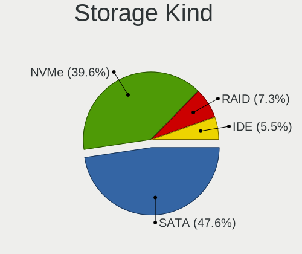
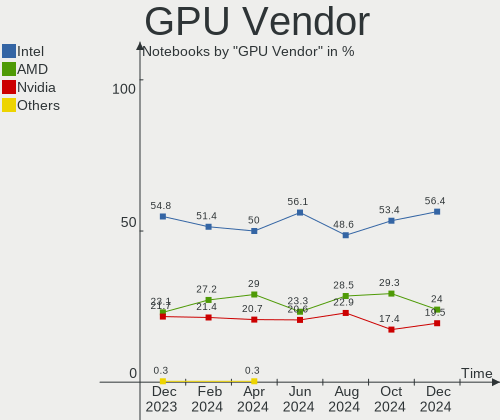
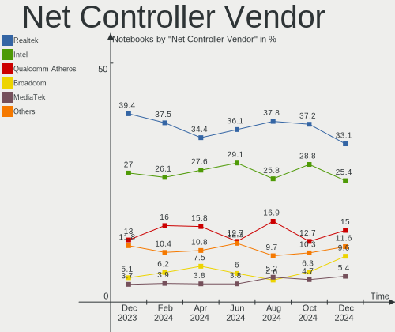
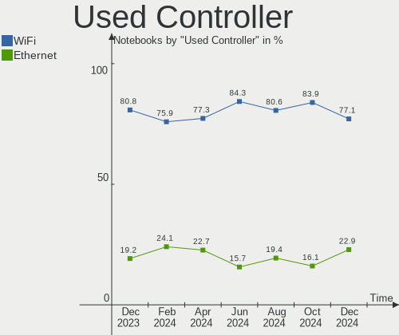
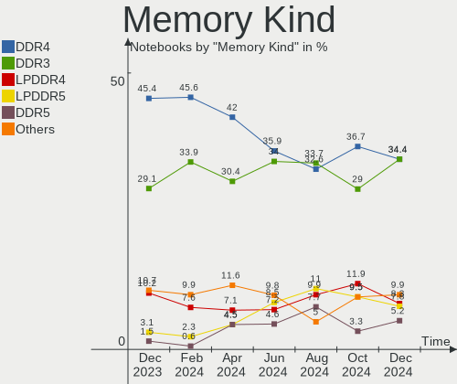

Linux in Russia - Hardware Trends (Notebooks)
---------------------------------------------

A project to identify most popular hardware characteristics and track their change
over time based on data collected by Linux users at https://Linux-Hardware.org.

Anyone can contribute to this report by the [hw-probe](https://github.com/linuxhw/hw-probe) tool:

    sudo -E hw-probe -all -upload

Period: Dec, 2022.

Contents
--------

* [ System ](#system)
  - [ OS                       ](#os)
  - [ OS Family                ](#os-family)
  - [ Kernel                   ](#kernel)
  - [ Kernel Family            ](#kernel-family)
  - [ Kernel Major Ver.        ](#kernel-major-ver)
  - [ Arch                     ](#arch)
  - [ DE                       ](#de)
  - [ Display Server           ](#display-server)
  - [ Display Manager          ](#display-manager)
  - [ OS Lang                  ](#os-lang)
  - [ Boot Mode                ](#boot-mode)
  - [ Filesystem               ](#filesystem)
  - [ Part. scheme             ](#part-scheme)
  - [ Dual Boot with Linux/BSD ](#dual-boot-with-linuxbsd)
  - [ Dual Boot (Win)          ](#dual-boot-win)

* [ Board ](#board)
  - [ Vendor                   ](#vendor)
  - [ Model                    ](#model)
  - [ Model Family             ](#model-family)
  - [ MFG Year                 ](#mfg-year)
  - [ Form Factor              ](#form-factor)
  - [ Secure Boot              ](#secure-boot)
  - [ Coreboot                 ](#coreboot)
  - [ RAM Size                 ](#ram-size)
  - [ RAM Used                 ](#ram-used)
  - [ Total Drives             ](#total-drives)
  - [ Has CD-ROM               ](#has-cd-rom)
  - [ Has Ethernet             ](#has-ethernet)
  - [ Has WiFi                 ](#has-wifi)
  - [ Has Bluetooth            ](#has-bluetooth)

* [ Location ](#location)
  - [ Country                  ](#country)
  - [ City                     ](#city)

* [ Drives ](#drives)
  - [ Drive Vendor             ](#drive-vendor)
  - [ Drive Model              ](#drive-model)
  - [ HDD Vendor               ](#hdd-vendor)
  - [ SSD Vendor               ](#ssd-vendor)
  - [ Drive Kind               ](#drive-kind)
  - [ Drive Connector          ](#drive-connector)
  - [ Drive Size               ](#drive-size)
  - [ Space Total              ](#space-total)
  - [ Space Used               ](#space-used)
  - [ Malfunc. Drives          ](#malfunc-drives)
  - [ Malfunc. Drive Vendor    ](#malfunc-drive-vendor)
  - [ Malfunc. HDD Vendor      ](#malfunc-hdd-vendor)
  - [ Malfunc. Drive Kind      ](#malfunc-drive-kind)
  - [ Failed Drives            ](#failed-drives)
  - [ Failed Drive Vendor      ](#failed-drive-vendor)
  - [ Drive Status             ](#drive-status)

* [ Storage controller ](#storage-controller)
  - [ Storage Vendor           ](#storage-vendor)
  - [ Storage Model            ](#storage-model)
  - [ Storage Kind             ](#storage-kind)

* [ Processor ](#processor)
  - [ CPU Vendor               ](#cpu-vendor)
  - [ CPU Model                ](#cpu-model)
  - [ CPU Model Family         ](#cpu-model-family)
  - [ CPU Cores                ](#cpu-cores)
  - [ CPU Sockets              ](#cpu-sockets)
  - [ CPU Threads              ](#cpu-threads)
  - [ CPU Op-Modes             ](#cpu-op-modes)
  - [ CPU Microcode            ](#cpu-microcode)
  - [ CPU Microarch            ](#cpu-microarch)

* [ Graphics ](#graphics)
  - [ GPU Vendor               ](#gpu-vendor)
  - [ GPU Model                ](#gpu-model)
  - [ GPU Combo                ](#gpu-combo)
  - [ GPU Driver               ](#gpu-driver)
  - [ GPU Memory               ](#gpu-memory)

* [ Monitor ](#monitor)
  - [ Monitor Vendor           ](#monitor-vendor)
  - [ Monitor Model            ](#monitor-model)
  - [ Monitor Resolution       ](#monitor-resolution)
  - [ Monitor Diagonal         ](#monitor-diagonal)
  - [ Monitor Width            ](#monitor-width)
  - [ Aspect Ratio             ](#aspect-ratio)
  - [ Monitor Area             ](#monitor-area)
  - [ Pixel Density            ](#pixel-density)
  - [ Multiple Monitors        ](#multiple-monitors)

* [ Network ](#network)
  - [ Net Controller Vendor    ](#net-controller-vendor)
  - [ Net Controller Model     ](#net-controller-model)
  - [ Wireless Vendor          ](#wireless-vendor)
  - [ Wireless Model           ](#wireless-model)
  - [ Ethernet Vendor          ](#ethernet-vendor)
  - [ Ethernet Model           ](#ethernet-model)
  - [ Net Controller Kind      ](#net-controller-kind)
  - [ Used Controller          ](#used-controller)
  - [ NICs                     ](#nics)
  - [ IPv6                     ](#ipv6)

* [ Bluetooth ](#bluetooth)
  - [ Bluetooth Vendor         ](#bluetooth-vendor)
  - [ Bluetooth Model          ](#bluetooth-model)

* [ Sound ](#sound)
  - [ Sound Vendor             ](#sound-vendor)
  - [ Sound Model              ](#sound-model)

* [ Memory ](#memory)
  - [ Memory Vendor            ](#memory-vendor)
  - [ Memory Model             ](#memory-model)
  - [ Memory Kind              ](#memory-kind)
  - [ Memory Form Factor       ](#memory-form-factor)
  - [ Memory Size              ](#memory-size)
  - [ Memory Speed             ](#memory-speed)

* [ Printers & scanners ](#printers--scanners)
  - [ Printer Vendor           ](#printer-vendor)
  - [ Printer Model            ](#printer-model)
  - [ Scanner Vendor           ](#scanner-vendor)
  - [ Scanner Model            ](#scanner-model)

* [ Camera ](#camera)
  - [ Camera Vendor            ](#camera-vendor)
  - [ Camera Model             ](#camera-model)

* [ Security ](#security)
  - [ Fingerprint Vendor       ](#fingerprint-vendor)
  - [ Fingerprint Model        ](#fingerprint-model)
  - [ Chipcard Vendor          ](#chipcard-vendor)
  - [ Chipcard Model           ](#chipcard-model)

* [ Unsupported ](#unsupported)
  - [ Unsupported Devices      ](#unsupported-devices)
  - [ Unsupported Device Types ](#unsupported-device-types)

System
------

OS
--

Installed operating systems

| Name                         | Notebooks | Percent |
|------------------------------|-----------|---------|
| ROSA 12.3                    | 82        | 29.08%  |
| Ubuntu 22.04                 | 19        | 6.74%   |
| Fedora 37                    | 19        | 6.74%   |
| OpenMandriva 4.3             | 14        | 4.96%   |
| Debian 11                    | 12        | 4.26%   |
| Linux Mint 21                | 11        | 3.9%    |
| Arch Rolling                 | 11        | 3.9%    |
| Red OS 7.3.2                 | 10        | 3.55%   |
| Ubuntu 20.04                 | 8         | 2.84%   |
| ALT Linux 10.1               | 8         | 2.84%   |
| Ubuntu 22.10                 | 5         | 1.77%   |
| OpenMandriva 22.12           | 5         | 1.77%   |
| MOS 10                       | 5         | 1.77%   |
| Manjaro                      | 5         | 1.77%   |
| ROSA R11.1                   | 4         | 1.42%   |
| ROSA 12.2                    | 4         | 1.42%   |
| ROSA 12.1                    | 3         | 1.06%   |
| Linux Mint 20.3              | 3         | 1.06%   |
| Kali 2022.4                  | 3         | 1.06%   |
| Xubuntu 22.04                | 2         | 0.71%   |
| Ubuntu Unity 22.04           | 2         | 0.71%   |
| RELD 7.9                     | 2         | 0.71%   |
| Pop!_OS 22.04                | 2         | 0.71%   |
| openSUSE Tumbleweed-XXXXXXXX | 2         | 0.71%   |
| OpenMandriva 4.2             | 2         | 0.71%   |
| Manjaro 22.0.0               | 2         | 0.71%   |
| LMDE 5                       | 2         | 0.71%   |
| Kubuntu 20.04                | 2         | 0.71%   |
| KDE neon 22.04               | 2         | 0.71%   |
| Gentoo 2.9                   | 2         | 0.71%   |
| Fedora 36                    | 2         | 0.71%   |
| Elementary 6.1               | 2         | 0.71%   |
| Zorin 16                     | 1         | 0.35%   |
| Xero Rolling                 | 1         | 0.35%   |
| Ubuntu MATE 22.10            | 1         | 0.35%   |
| Ubuntu 23.04                 | 1         | 0.35%   |
| SteamOS 3.4.4                | 1         | 0.35%   |
| SteamOS 3.3.2                | 1         | 0.35%   |
| Slackware 14.2               | 1         | 0.35%   |
| ROSA R11                     | 1         | 0.35%   |

OS Family
---------

OS without a version

| Name             | Notebooks | Percent |
|------------------|-----------|---------|
| ROSA             | 94        | 33.33%  |
| Ubuntu           | 33        | 11.7%   |
| Fedora           | 22        | 7.8%    |
| OpenMandriva     | 21        | 7.45%   |
| Linux Mint       | 15        | 5.32%   |
| ALT Linux        | 15        | 5.32%   |
| Debian           | 14        | 4.96%   |
| Red OS           | 11        | 3.9%    |
| Arch             | 11        | 3.9%    |
| Manjaro          | 7         | 2.48%   |
| Kubuntu          | 3         | 1.06%   |
| Kali             | 3         | 1.06%   |
| Xubuntu          | 2         | 0.71%   |
| Ubuntu Unity     | 2         | 0.71%   |
| SteamOS          | 2         | 0.71%   |
| RELD             | 2         | 0.71%   |
| Pop!_OS          | 2         | 0.71%   |
| openSUSE         | 2         | 0.71%   |
| LMDE             | 2         | 0.71%   |
| KDE neon         | 2         | 0.71%   |
| Gentoo           | 2         | 0.71%   |
| Elementary       | 2         | 0.71%   |
| Zorin            | 1         | 0.35%   |
| Xero             | 1         | 0.35%   |
| Ubuntu MATE      | 1         | 0.35%   |
| Slackware        | 1         | 0.35%   |
| Redcore          | 1         | 0.35%   |
| Parrot           | 1         | 0.35%   |
| org.kde.Platform | 1         | 0.35%   |
| NixOS            | 1         | 0.35%   |
| Lubuntu          | 1         | 0.35%   |
| Endless          | 1         | 0.35%   |
| CentOS           | 1         | 0.35%   |
| Artix            | 1         | 0.35%   |
| ArcoLinux        | 1         | 0.35%   |

Kernel
------

Version of the Linux kernel

| Version                                                          | Notebooks | Percent |
|------------------------------------------------------------------|-----------|---------|
| 5.15.0-56-generic                                                | 39        | 13.83%  |
| 5.15.79-generic-1rosa2021.1-x86_64                               | 29        | 10.28%  |
| 5.15.75-generic-1rosa2021.1-x86_64                               | 27        | 9.57%   |
| 5.16.7-desktop-1omv4003                                          | 14        | 4.96%   |
| 6.0.12-300.fc37.x86_64                                           | 8         | 2.84%   |
| 5.15.72-1.el7.3.x86_64                                           | 8         | 2.84%   |
| 5.10.155-generic-1rosa2021.1-x86_64                              | 7         | 2.48%   |
| 5.19.0-26-generic                                                | 6         | 2.13%   |
| 5.10.74-generic-2rosa2021.1-x86_64                               | 6         | 2.13%   |
| 5.10.156-std-def-alt1                                            | 6         | 2.13%   |
| 5.10.0-20-amd64                                                  | 6         | 2.13%   |
| 6.0.10-desktop-2omv22090                                         | 5         | 1.77%   |
| 5.10.0-7-amd64                                                   | 5         | 1.77%   |
| 6.0.15-300.fc37.x86_64                                           | 4         | 1.42%   |
| 5.15.80-un-def-alt1                                              | 4         | 1.42%   |
| 5.15.77-generic-1rosa2021.1-x86_64                               | 4         | 1.42%   |
| 5.15.75-generic-1rosa2021.1-i686                                 | 4         | 1.42%   |
| 6.0.12-zen1-1-zen                                                | 3         | 1.06%   |
| 5.17.11-generic-2rosa2021.1-x86_64                               | 3         | 1.06%   |
| 5.15.10-1.el7.x86_64                                             | 3         | 1.06%   |
| 5.15.0-43-generic                                                | 3         | 1.06%   |
| 6.1.0-1-MANJARO                                                  | 2         | 0.71%   |
| 6.0.9-300.fc37.x86_64                                            | 2         | 0.71%   |
| 6.0.6-76060006-generic                                           | 2         | 0.71%   |
| 6.0.11-zen1-1-zen                                                | 2         | 0.71%   |
| 6.0.11-arch1-1                                                   | 2         | 0.71%   |
| 6.0.11-300.fc37.x86_64                                           | 2         | 0.71%   |
| 6.0.10-200.fc36.x86_64                                           | 2         | 0.71%   |
| 6.0.0-kali3-amd64                                                | 2         | 0.71%   |
| 5.4.32-generic-2rosa-x86_64                                      | 2         | 0.71%   |
| 5.15.0-57-generic                                                | 2         | 0.71%   |
| 5.15.0-53-generic                                                | 2         | 0.71%   |
| 5.14.0-1054-oem                                                  | 2         | 0.71%   |
| 5.10.118-generic-2rosa2021.1-x86_64                              | 2         | 0.71%   |
| 5.10.0-19-amd64                                                  | 2         | 0.71%   |
| 4.9.155-nrj-desktop-1rosa-x86_64                                 | 2         | 0.71%   |
| 6.2.0-rc1-1b929c02afd37871d5afb9d498426f83432e71c2-btrfs-debug4+ | 1         | 0.35%   |
| 6.1.1-xm1.0.fc37.x86_64                                          | 1         | 0.35%   |
| 6.1.1-arch1-1                                                    | 1         | 0.35%   |
| 6.1.0-generic-0.rc8.1rosa2021.1-x86_64                           | 1         | 0.35%   |

Kernel Family
-------------

Linux kernel without a distro release

| Version  | Notebooks | Percent |
|----------|-----------|---------|
| 5.15.0   | 47        | 16.67%  |
| 5.15.79  | 31        | 10.99%  |
| 5.15.75  | 31        | 10.99%  |
| 5.16.7   | 14        | 4.96%   |
| 5.10.0   | 14        | 4.96%   |
| 6.0.12   | 13        | 4.61%   |
| 6.0.10   | 12        | 4.26%   |
| 6.0.11   | 8         | 2.84%   |
| 5.19.0   | 8         | 2.84%   |
| 5.15.72  | 8         | 2.84%   |
| 5.10.155 | 8         | 2.84%   |
| 5.15.80  | 7         | 2.48%   |
| 5.10.74  | 6         | 2.13%   |
| 5.10.156 | 6         | 2.13%   |
| 6.1.0    | 5         | 1.77%   |
| 6.0.15   | 4         | 1.42%   |
| 5.15.77  | 4         | 1.42%   |
| 6.0.9    | 3         | 1.06%   |
| 6.0.0    | 3         | 1.06%   |
| 5.17.11  | 3         | 1.06%   |
| 5.15.10  | 3         | 1.06%   |
| 6.1.1    | 2         | 0.71%   |
| 6.0.6    | 2         | 0.71%   |
| 5.4.32   | 2         | 0.71%   |
| 5.4.0    | 2         | 0.71%   |
| 5.18.0   | 2         | 0.71%   |
| 5.15.85  | 2         | 0.71%   |
| 5.14.0   | 2         | 0.71%   |
| 5.13.0   | 2         | 0.71%   |
| 5.11.0   | 2         | 0.71%   |
| 5.10.118 | 2         | 0.71%   |
| 4.9.155  | 2         | 0.71%   |
| 6.2.0    | 1         | 0.35%   |
| 6.0.13   | 1         | 0.35%   |
| 5.18.19  | 1         | 0.35%   |
| 5.17.9   | 1         | 0.35%   |
| 5.17.6   | 1         | 0.35%   |
| 5.15.84  | 1         | 0.35%   |
| 5.15.81  | 1         | 0.35%   |
| 5.15.78  | 1         | 0.35%   |

Kernel Major Ver.
-----------------

Linux kernel major version

| Version | Notebooks | Percent |
|---------|-----------|---------|
| 5.15    | 139       | 49.29%  |
| 6.0     | 46        | 16.31%  |
| 5.10    | 41        | 14.54%  |
| 5.16    | 14        | 4.96%   |
| 5.19    | 8         | 2.84%   |
| 6.1     | 7         | 2.48%   |
| 5.17    | 5         | 1.77%   |
| 5.4     | 4         | 1.42%   |
| 5.18    | 3         | 1.06%   |
| 5.11    | 3         | 1.06%   |
| 5.14    | 2         | 0.71%   |
| 5.13    | 2         | 0.71%   |
| 4.9     | 2         | 0.71%   |
| 3.10    | 2         | 0.71%   |
| 6.2     | 1         | 0.35%   |
| 4.4     | 1         | 0.35%   |
| 4.19    | 1         | 0.35%   |
| 4.15    | 1         | 0.35%   |

Arch
----

OS architecture (x86_64, i586, etc.)

| Name   | Notebooks | Percent |
|--------|-----------|---------|
| x86_64 | 275       | 97.52%  |
| i686   | 6         | 2.13%   |
| armv7l | 1         | 0.35%   |

DE
--

Desktop Environment

| Name          | Notebooks | Percent |
|---------------|-----------|---------|
| KDE5          | 114       | 40.43%  |
| GNOME         | 88        | 31.21%  |
| MATE          | 16        | 5.67%   |
| Unknown       | 13        | 4.61%   |
| X-Cinnamon    | 12        | 4.26%   |
| LXQt          | 12        | 4.26%   |
| XFCE          | 11        | 3.9%    |
| KDE4          | 5         | 1.77%   |
| Unity         | 2         | 0.71%   |
| Pantheon      | 2         | 0.71%   |
| Cinnamon      | 2         | 0.71%   |
| Trinity       | 1         | 0.35%   |
| qtile         | 1         | 0.35%   |
| LXDE          | 1         | 0.35%   |
| GNOME Classic | 1         | 0.35%   |
| Deepin        | 1         | 0.35%   |

Display Server
--------------

X11 or Wayland

| Name    | Notebooks | Percent |
|---------|-----------|---------|
| X11     | 145       | 51.42%  |
| Wayland | 124       | 43.97%  |
| Unknown | 10        | 3.55%   |
| Tty     | 3         | 1.06%   |

Display Manager
---------------

SDDM, LightDM, etc.

| Name    | Notebooks | Percent |
|---------|-----------|---------|
| SDDM    | 94        | 33.33%  |
| GDM     | 61        | 21.63%  |
| Unknown | 59        | 20.92%  |
| LightDM | 32        | 11.35%  |
| GDM3    | 28        | 9.93%   |
| KDM     | 5         | 1.77%   |
| XDM     | 1         | 0.35%   |
| TDM     | 1         | 0.35%   |
| LXDM    | 1         | 0.35%   |

OS Lang
-------

Language

| Lang    | Notebooks | Percent |
|---------|-----------|---------|
| ru_RU   | 211       | 74.82%  |
| en_US   | 48        | 17.02%  |
| Unknown | 15        | 5.32%   |
| en_GB   | 3         | 1.06%   |
| C       | 3         | 1.06%   |
| it_IT   | 1         | 0.35%   |
| es_ES   | 1         | 0.35%   |

Boot Mode
---------

EFI or BIOS

| Mode | Notebooks | Percent |
|------|-----------|---------|
| EFI  | 166       | 58.87%  |
| BIOS | 116       | 41.13%  |

Filesystem
----------

Type of filesystem

| Type    | Notebooks | Percent |
|---------|-----------|---------|
| Ext4    | 206       | 73.05%  |
| Btrfs   | 41        | 14.54%  |
| Overlay | 26        | 9.22%   |
| Xfs     | 6         | 2.13%   |
| Zfs     | 1         | 0.35%   |
| Tmpfs   | 1         | 0.35%   |
| Unknown | 1         | 0.35%   |

Part. scheme
------------

Scheme of partitioning

| Type    | Notebooks | Percent |
|---------|-----------|---------|
| GPT     | 160       | 56.74%  |
| MBR     | 73        | 25.89%  |
| Unknown | 49        | 17.38%  |

Dual Boot with Linux/BSD
------------------------

Hosting more than one Linux/BSD

| Dual boot | Notebooks | Percent |
|-----------|-----------|---------|
| No        | 229       | 81.21%  |
| Yes       | 53        | 18.79%  |

Dual Boot (Win)
---------------

Hosting Linux and Windows

| Dual boot | Notebooks | Percent |
|-----------|-----------|---------|
| No        | 190       | 67.38%  |
| Yes       | 92        | 32.62%  |

Board
-----

Vendor
------

Motherboard manufacturer

| Name                           | Notebooks | Percent |
|--------------------------------|-----------|---------|
| Lenovo                         | 57        | 20.21%  |
| ASUSTek Computer               | 46        | 16.31%  |
| Hewlett-Packard                | 29        | 10.28%  |
| Acer                           | 27        | 9.57%   |
| Dell                           | 17        | 6.03%   |
| MSI                            | 12        | 4.26%   |
| HUAWEI                         | 8         | 2.84%   |
| Unknown                        | 8         | 2.84%   |
| Samsung Electronics            | 7         | 2.48%   |
| Aquarius                       | 7         | 2.48%   |
| Timi                           | 6         | 2.13%   |
| Clevo                          | 6         | 2.13%   |
| Pegatron                       | 5         | 1.77%   |
| Toshiba                        | 4         | 1.42%   |
| HONOR                          | 4         | 1.42%   |
| Gigabyte Technology            | 4         | 1.42%   |
| Apple                          | 4         | 1.42%   |
| 3Logic Group                   | 4         | 1.42%   |
| Sony                           | 3         | 1.06%   |
| Valve                          | 2         | 0.71%   |
| MACHENIKE                      | 2         | 0.71%   |
| MACHCREATOR                    | 2         | 0.71%   |
| Kraftway                       | 2         | 0.71%   |
| ICL                            | 2         | 0.71%   |
| Digma                          | 2         | 0.71%   |
| Shanghai Zhaoxin Semiconductor | 1         | 0.35%   |
| Prestigio                      | 1         | 0.35%   |
| Packard Bell                   | 1         | 0.35%   |
| Notebook                       | 1         | 0.35%   |
| Maibenben                      | 1         | 0.35%   |
| LTD Delovoy Office             | 1         | 0.35%   |
| Irbis                          | 1         | 0.35%   |
| Intel                          | 1         | 0.35%   |
| GPD                            | 1         | 0.35%   |
| eMachines                      | 1         | 0.35%   |
| ECS                            | 1         | 0.35%   |
| DEPO Computers                 | 1         | 0.35%   |

Model
-----

Motherboard model

| Name                                  | Notebooks | Percent |
|---------------------------------------|-----------|---------|
| Unknown                               | 8         | 2.84%   |
| Clevo NL41MU2                         | 4         | 1.42%   |
| Aquarius NS585                        | 4         | 1.42%   |
| Lenovo IdeaPad 330-15IKB 81DE         | 3         | 1.06%   |
| 3Logic Group Graviton N15i-K2         | 3         | 1.06%   |
| Valve Jupiter                         | 2         | 0.71%   |
| Toshiba Satellite A300                | 2         | 0.71%   |
| Timi RedmiBook Pro 15S                | 2         | 0.71%   |
| Samsung 350V5C/351V5C/3540VC/3440VC   | 2         | 0.71%   |
| Pegatron C17A                         | 2         | 0.71%   |
| Pegatron C15B                         | 2         | 0.71%   |
| MACHENIKE MACHCREATOR-16              | 2         | 0.71%   |
| Lenovo ThinkBook 15 G3 ACL 21A4       | 2         | 0.71%   |
| Lenovo IdeaPad L340-17IRH Gaming 81LL | 2         | 0.71%   |
| Lenovo IdeaPad L340-15API 81LW        | 2         | 0.71%   |
| Lenovo IdeaPad Gaming 3 15ARH05 82EY  | 2         | 0.71%   |
| Lenovo G700 20251                     | 2         | 0.71%   |
| Lenovo B590 20206                     | 2         | 0.71%   |
| Kraftway ACCORD                       | 2         | 0.71%   |
| HUAWEI KLVL-WXXW                      | 2         | 0.71%   |
| HP Laptop 15s-eq1xxx                  | 2         | 0.71%   |
| HP Laptop 15-bw0xx                    | 2         | 0.71%   |
| Dell Inspiron 5490                    | 2         | 0.71%   |
| Dell Inspiron 1525                    | 2         | 0.71%   |
| Dell Inspiron 15-3552                 | 2         | 0.71%   |
| ASUS X550CC                           | 2         | 0.71%   |
| ASUS N551JM                           | 2         | 0.71%   |
| ASUS K42F                             | 2         | 0.71%   |
| Aquarius NS685U R11                   | 2         | 0.71%   |
| Toshiba Satellite U300                | 1         | 0.35%   |
| Toshiba Satellite C55-A               | 1         | 0.35%   |
| Timi TM1701                           | 1         | 0.35%   |
| Timi Redmi Book Pro 14 2022           | 1         | 0.35%   |
| Timi A35S                             | 1         | 0.35%   |
| Timi A18R                             | 1         | 0.35%   |
| Sony VPCEJ1L1R                        | 1         | 0.35%   |
| Sony VPCEB3D4R                        | 1         | 0.35%   |
| Sony SVE1111M1RW                      | 1         | 0.35%   |
| Shanghai Zhaoxin ZXE CRB              | 1         | 0.35%   |
| Samsung SQ45/Q70C/P200                | 1         | 0.35%   |

Model Family
------------

Motherboard model prefix

| Name                     | Notebooks | Percent |
|--------------------------|-----------|---------|
| Lenovo IdeaPad           | 22        | 7.8%    |
| Acer Aspire              | 21        | 7.45%   |
| Lenovo ThinkPad          | 15        | 5.32%   |
| Dell Inspiron            | 10        | 3.55%   |
| HP Laptop                | 8         | 2.84%   |
| Unknown                  | 8         | 2.84%   |
| HP ProBook               | 6         | 2.13%   |
| ASUS VivoBook            | 6         | 2.13%   |
| HP Pavilion              | 5         | 1.77%   |
| Toshiba Satellite        | 4         | 1.42%   |
| Lenovo ThinkBook         | 4         | 1.42%   |
| Dell Vostro              | 4         | 1.42%   |
| Clevo NL41MU2            | 4         | 1.42%   |
| ASUS ROG                 | 4         | 1.42%   |
| Aquarius NS585           | 4         | 1.42%   |
| 3Logic Group Graviton    | 4         | 1.42%   |
| MSI Modern               | 3         | 1.06%   |
| Lenovo B590              | 3         | 1.06%   |
| HP EliteBook             | 3         | 1.06%   |
| ASUS ASUS                | 3         | 1.06%   |
| Acer Nitro               | 3         | 1.06%   |
| Valve Jupiter            | 2         | 0.71%   |
| Timi RedmiBook           | 2         | 0.71%   |
| Samsung 350V5C           | 2         | 0.71%   |
| Pegatron C17A            | 2         | 0.71%   |
| Pegatron C15B            | 2         | 0.71%   |
| MACHENIKE MACHCREATOR-16 | 2         | 0.71%   |
| Lenovo Legion            | 2         | 0.71%   |
| Lenovo G700              | 2         | 0.71%   |
| Kraftway ACCORD          | 2         | 0.71%   |
| ICL RAYbook              | 2         | 0.71%   |
| HUAWEI KLVL-WXXW         | 2         | 0.71%   |
| ASUS Zenbook             | 2         | 0.71%   |
| ASUS X550CC              | 2         | 0.71%   |
| ASUS N551JM              | 2         | 0.71%   |
| ASUS K42F                | 2         | 0.71%   |
| Aquarius NS685U          | 2         | 0.71%   |
| Timi TM1701              | 1         | 0.35%   |
| Timi Redmi               | 1         | 0.35%   |
| Timi A35S                | 1         | 0.35%   |

MFG Year
--------

Motherboard manufacture year

| Year    | Notebooks | Percent |
|---------|-----------|---------|
| 2021    | 48        | 17.02%  |
| 2019    | 35        | 12.41%  |
| 2022    | 31        | 10.99%  |
| 2013    | 26        | 9.22%   |
| 2012    | 23        | 8.16%   |
| 2020    | 21        | 7.45%   |
| 2011    | 18        | 6.38%   |
| 2018    | 13        | 4.61%   |
| 2010    | 13        | 4.61%   |
| 2017    | 10        | 3.55%   |
| 2008    | 10        | 3.55%   |
| 2016    | 8         | 2.84%   |
| 2015    | 7         | 2.48%   |
| 2009    | 7         | 2.48%   |
| 2014    | 6         | 2.13%   |
| 2007    | 5         | 1.77%   |
| Unknown | 1         | 0.35%   |

Form Factor
-----------

Physical design of the computer

| Name     | Notebooks | Percent |
|----------|-----------|---------|
| Notebook | 282       | 100%    |

Secure Boot
-----------

Enabled or disabled

| State    | Notebooks | Percent |
|----------|-----------|---------|
| Disabled | 259       | 91.84%  |
| Enabled  | 23        | 8.16%   |

Coreboot
--------

Have coreboot on board

| Used | Notebooks | Percent |
|------|-----------|---------|
| No   | 282       | 100%    |

RAM Size
--------

Total RAM memory

| Size in GB  | Notebooks | Percent |
|-------------|-----------|---------|
| 4.01-8.0    | 95        | 33.69%  |
| 3.01-4.0    | 54        | 19.15%  |
| 8.01-16.0   | 52        | 18.44%  |
| 16.01-24.0  | 45        | 15.96%  |
| 1.01-2.0    | 14        | 4.96%   |
| 32.01-64.0  | 11        | 3.9%    |
| 24.01-32.0  | 5         | 1.77%   |
| 2.01-3.0    | 3         | 1.06%   |
| 0.51-1.0    | 2         | 0.71%   |
| 64.01-256.0 | 1         | 0.35%   |

RAM Used
--------

Used RAM memory

| Used GB   | Notebooks | Percent |
|-----------|-----------|---------|
| 1.01-2.0  | 115       | 40.78%  |
| 2.01-3.0  | 64        | 22.7%   |
| 0.51-1.0  | 35        | 12.41%  |
| 4.01-8.0  | 30        | 10.64%  |
| 3.01-4.0  | 25        | 8.87%   |
| 8.01-16.0 | 7         | 2.48%   |
| 0.01-0.5  | 5         | 1.77%   |
| Unknown   | 1         | 0.35%   |

Total Drives
------------

Number of drives on board

| Drives | Notebooks | Percent |
|--------|-----------|---------|
| 1      | 210       | 74.47%  |
| 2      | 65        | 23.05%  |
| 3      | 5         | 1.77%   |
| 0      | 2         | 0.71%   |

Has CD-ROM
----------

Has CD-ROM on board

| Presented | Notebooks | Percent |
|-----------|-----------|---------|
| No        | 204       | 72.34%  |
| Yes       | 78        | 27.66%  |

Has Ethernet
------------

Has Ethernet on board

| Presented | Notebooks | Percent |
|-----------|-----------|---------|
| Yes       | 219       | 77.66%  |
| No        | 63        | 22.34%  |

Has WiFi
--------

Has WiFi module

| Presented | Notebooks | Percent |
|-----------|-----------|---------|
| Yes       | 278       | 98.58%  |
| No        | 4         | 1.42%   |

Has Bluetooth
-------------

Has Bluetooth module

| Presented | Notebooks | Percent |
|-----------|-----------|---------|
| Yes       | 231       | 81.91%  |
| No        | 51        | 18.09%  |

Location
--------

Country
-------

Geographic location (country)

| Country | Notebooks | Percent |
|---------|-----------|---------|
| Russia  | 282       | 100%    |

City
----

Geographic location (city)

| City             | Notebooks | Percent |
|------------------|-----------|---------|
| Moscow           | 70        | 24.82%  |
| St Petersburg    | 34        | 12.06%  |
| Novosibirsk      | 11        | 3.9%    |
| Krasnodar        | 10        | 3.55%   |
| Yekaterinburg    | 9         | 3.19%   |
| Voronezh         | 9         | 3.19%   |
| Ufa              | 6         | 2.13%   |
| Perm             | 6         | 2.13%   |
| Rostov-on-Don    | 5         | 1.77%   |
| Volgograd        | 4         | 1.42%   |
| Stavropol        | 4         | 1.42%   |
| Nizhniy Novgorod | 4         | 1.42%   |
| Yakutsk          | 3         | 1.06%   |
| Vladivostok      | 3         | 1.06%   |
| Vladimir         | 3         | 1.06%   |
| Ulyanovsk        | 3         | 1.06%   |
| Smolensk         | 3         | 1.06%   |
| Omsk             | 3         | 1.06%   |
| Chelyabinsk      | 3         | 1.06%   |
| Tomsk            | 2         | 0.71%   |
| Taganrog         | 2         | 0.71%   |
| Stary Oskol      | 2         | 0.71%   |
| Seversk          | 2         | 0.71%   |
| Saransk          | 2         | 0.71%   |
| Salekhard        | 2         | 0.71%   |
| Ryazan           | 2         | 0.71%   |
| Podolsk          | 2         | 0.71%   |
| Korolyov         | 2         | 0.71%   |
| Khabarovsk       | 2         | 0.71%   |
| Kemerovo         | 2         | 0.71%   |
| Belgorod         | 2         | 0.71%   |
| Astrakhan        | 2         | 0.71%   |
| Zvenigorod       | 1         | 0.35%   |
| Zlatoust         | 1         | 0.35%   |
| Zhukovskiy       | 1         | 0.35%   |
| Yuzhnoural'sk    | 1         | 0.35%   |
| Yoshkar-Ola      | 1         | 0.35%   |
| Yasnogorsk       | 1         | 0.35%   |
| Yaroslavl        | 1         | 0.35%   |
| Vsevolozhsk      | 1         | 0.35%   |

Drives
------

Drive Vendor
------------

Hard drive vendors

| Vendor                         | Notebooks | Drives | Percent |
|--------------------------------|-----------|--------|---------|
| Samsung Electronics            | 39        | 41     | 11.17%  |
| WDC                            | 36        | 36     | 10.32%  |
| Seagate                        | 32        | 34     | 9.17%   |
| Kingston                       | 24        | 24     | 6.88%   |
| Toshiba                        | 23        | 23     | 6.59%   |
| SK hynix                       | 18        | 19     | 5.16%   |
| A-DATA Technology              | 14        | 14     | 4.01%   |
| Sandisk                        | 11        | 11     | 3.15%   |
| Unknown                        | 10        | 12     | 2.87%   |
| Hitachi                        | 10        | 10     | 2.87%   |
| HGST                           | 10        | 10     | 2.87%   |
| Intel                          | 9         | 9      | 2.58%   |
| China                          | 9         | 9      | 2.58%   |
| Micron Technology              | 8         | 8      | 2.29%   |
| Phison Electronics             | 7         | 7      | 2.01%   |
| KIOXIA                         | 6         | 6      | 1.72%   |
| Apacer                         | 6         | 6      | 1.72%   |
| Unknown                        | 6         | 6      | 1.72%   |
| SSSTC                          | 5         | 5      | 1.43%   |
| SPCC                           | 5         | 5      | 1.43%   |
| KingSpec                       | 5         | 5      | 1.43%   |
| BIWIN                          | 5         | 5      | 1.43%   |
| Crucial                        | 4         | 4      | 1.15%   |
| AMD                            | 4         | 4      | 1.15%   |
| XrayDisk                       | 3         | 3      | 0.86%   |
| UMIS                           | 3         | 3      | 0.86%   |
| Smartbuy                       | 3         | 3      | 0.86%   |
| Netac                          | 3         | 4      | 0.86%   |
| Solid State Storage Technology | 2         | 2      | 0.57%   |
| ShiJi                          | 2         | 3      | 0.57%   |
| Phison                         | 2         | 2      | 0.57%   |
| Foxline                        | 2         | 2      | 0.57%   |
| XPG                            | 1         | 1      | 0.29%   |
| WALRAM                         | 1         | 1      | 0.29%   |
| V-32                           | 1         | 1      | 0.29%   |
| USB30                          | 1         | 1      | 0.29%   |
| TO Exter                       | 1         | 1      | 0.29%   |
| Team                           | 1         | 1      | 0.29%   |
| SPCC Sol                       | 1         | 1      | 0.29%   |
| Solid State Storage            | 1         | 1      | 0.29%   |

Drive Model
-----------

Hard drive models

| Model                                               | Notebooks | Percent |
|-----------------------------------------------------|-----------|---------|
| Toshiba MQ01ABF050 500GB                            | 9         | 2.51%   |
| Phison PS5013 E13 NVMe Controller 512GB             | 6         | 1.68%   |
| Unknown                                             | 6         | 1.68%   |
| Seagate ST500LT012-1DG142 500GB                     | 5         | 1.4%    |
| Seagate ST1000LM035-1RK172 1TB                      | 5         | 1.4%    |
| Samsung NVMe SSD Controller SM981/PM981/PM983 500GB | 5         | 1.4%    |
| A-DATA SU800 512GB SSD                              | 5         | 1.4%    |
| Seagate ST1000LM024 HN-M101MBB 1TB                  | 4         | 1.12%   |
| HGST HTS541010A9E680 1TB                            | 4         | 1.12%   |
| BIWIN CE480T5D101-256 256GB                         | 4         | 1.12%   |
| Toshiba MQ01ABD100 1TB                              | 3         | 0.84%   |
| SK hynix HFM001TD3JX013N 1TB                        | 3         | 0.84%   |
| Seagate ST9320325AS 320GB                           | 3         | 0.84%   |
| Seagate ST500LT012-9WS142 500GB                     | 3         | 0.84%   |
| Samsung SSD 860 EVO 250GB                           | 3         | 0.84%   |
| Samsung MZVLQ512HBLU-00B00 512GB                    | 3         | 0.84%   |
| Samsung MZALQ512HALU-000L2 512GB                    | 3         | 0.84%   |
| KIOXIA KBG40ZNV512G 512GB                           | 3         | 0.84%   |
| Kingston SA400S37480G 480GB SSD                     | 3         | 0.84%   |
| Kingston SA400S37240G 240GB SSD                     | 3         | 0.84%   |
| Intel SSD 660P Series 1024GB                        | 3         | 0.84%   |
| HGST HTS545050A7E380 500GB                          | 3         | 0.84%   |
| Apacer AS350 128GB SSD                              | 3         | 0.84%   |
| AMD R5SL120G 120GB SSD                              | 3         | 0.84%   |
| WDC WDS120G2G0A-00JH30 120GB SSD                    | 2         | 0.56%   |
| WDC WD10SPZX-24Z10 1TB                              | 2         | 0.56%   |
| UMIS RPFTJ128PDD2EWX 128GB                          | 2         | 0.56%   |
| Toshiba MQ04ABF100 1TB                              | 2         | 0.56%   |
| SSSTC CL1-3D256-Q11 NVMe 256GB                      | 2         | 0.56%   |
| SPCC Solid State Disk 256GB                         | 2         | 0.56%   |
| Smartbuy SSD 120GB                                  | 2         | 0.56%   |
| SK hynix SKHynix_HFM256GD3HX015N 256GB              | 2         | 0.56%   |
| SK hynix PC711 HFS512GDE9X073N 512GB                | 2         | 0.56%   |
| SK hynix HFM256GDJTNG-8310A 256GB                   | 2         | 0.56%   |
| Seagate ST9250827AS 250GB                           | 2         | 0.56%   |
| Seagate ST320LT020-9YG142 320GB                     | 2         | 0.56%   |
| Sandisk WD Blue SN550 NVMe SSD 500GB                | 2         | 0.56%   |
| Samsung SSD 980 500GB                               | 2         | 0.56%   |
| Samsung MZVLQ512HBLU-00BTW 512GB                    | 2         | 0.56%   |
| Micron 2450_MTFDKBA512TFK 512GB                     | 2         | 0.56%   |

HDD Vendor
----------

Hard disk drive vendors

| Vendor              | Notebooks | Drives | Percent |
|---------------------|-----------|--------|---------|
| Seagate             | 31        | 32     | 31.63%  |
| WDC                 | 25        | 25     | 25.51%  |
| Toshiba             | 21        | 21     | 21.43%  |
| Hitachi             | 10        | 10     | 10.2%   |
| HGST                | 10        | 10     | 10.2%   |
| Samsung Electronics | 1         | 1      | 1.02%   |

SSD Vendor
----------

Solid state drive vendors

| Vendor              | Notebooks | Drives | Percent |
|---------------------|-----------|--------|---------|
| Kingston            | 15        | 15     | 13.89%  |
| A-DATA Technology   | 14        | 14     | 12.96%  |
| China               | 9         | 9      | 8.33%   |
| Samsung Electronics | 8         | 8      | 7.41%   |
| SPCC                | 5         | 5      | 4.63%   |
| KingSpec            | 5         | 5      | 4.63%   |
| WDC                 | 4         | 4      | 3.7%    |
| SanDisk             | 4         | 4      | 3.7%    |
| Crucial             | 4         | 4      | 3.7%    |
| Apacer              | 4         | 4      | 3.7%    |
| AMD                 | 4         | 4      | 3.7%    |
| XrayDisk            | 3         | 3      | 2.78%   |
| Smartbuy            | 3         | 3      | 2.78%   |
| Intel               | 3         | 3      | 2.78%   |
| Unknown             | 3         | 3      | 2.78%   |
| ShiJi               | 2         | 2      | 1.85%   |
| Micron Technology   | 2         | 2      | 1.85%   |
| WALRAM              | 1         | 1      | 0.93%   |
| USB30               | 1         | 1      | 0.93%   |
| Toshiba             | 1         | 1      | 0.93%   |
| TO Exter            | 1         | 1      | 0.93%   |
| Team                | 1         | 1      | 0.93%   |
| SPCC Sol            | 1         | 1      | 0.93%   |
| SK hynix            | 1         | 1      | 0.93%   |
| RUN                 | 1         | 1      | 0.93%   |
| Qumo                | 1         | 1      | 0.93%   |
| Patriot             | 1         | 1      | 0.93%   |
| LITEON              | 1         | 1      | 0.93%   |
| KingFast            | 1         | 1      | 0.93%   |
| Kimtigo             | 1         | 1      | 0.93%   |
| Gigabyte Technology | 1         | 1      | 0.93%   |
| BR                  | 1         | 1      | 0.93%   |
| Apple               | 1         | 1      | 0.93%   |

Drive Kind
----------

HDD or SSD

| Kind    | Notebooks | Drives | Percent |
|---------|-----------|--------|---------|
| NVMe    | 116       | 130    | 34.52%  |
| SSD     | 102       | 108    | 30.36%  |
| HDD     | 98        | 99     | 29.17%  |
| MMC     | 12        | 14     | 3.57%   |
| Unknown | 8         | 7      | 2.38%   |

Drive Connector
---------------

SATA, SAS, NVMe, etc.

| Type | Notebooks | Drives | Percent |
|------|-----------|--------|---------|
| SATA | 174       | 208    | 56.31%  |
| NVMe | 116       | 130    | 37.54%  |
| MMC  | 12        | 14     | 3.88%   |
| SAS  | 7         | 6      | 2.27%   |

Drive Size
----------

Size of hard drive

| Size in TB | Notebooks | Drives | Percent |
|------------|-----------|--------|---------|
| 0.01-0.5   | 136       | 151    | 70.83%  |
| 0.51-1.0   | 53        | 53     | 27.6%   |
| 1.01-2.0   | 3         | 3      | 1.56%   |

Space Total
-----------

Amount of disk space available on the file system

| Size in GB     | Notebooks | Percent |
|----------------|-----------|---------|
| 101-250        | 92        | 32.62%  |
| 251-500        | 66        | 23.4%   |
| 501-1000       | 35        | 12.41%  |
| 1-20           | 30        | 10.64%  |
| 51-100         | 17        | 6.03%   |
| Unknown        | 13        | 4.61%   |
| 21-50          | 12        | 4.26%   |
| 1001-2000      | 12        | 4.26%   |
| More than 3000 | 3         | 1.06%   |
| 2001-3000      | 2         | 0.71%   |

Space Used
----------

Amount of used disk space

| Used GB        | Notebooks | Percent |
|----------------|-----------|---------|
| 1-20           | 156       | 55.32%  |
| 21-50          | 43        | 15.25%  |
| 51-100         | 24        | 8.51%   |
| 101-250        | 23        | 8.16%   |
| 251-500        | 15        | 5.32%   |
| Unknown        | 13        | 4.61%   |
| 501-1000       | 5         | 1.77%   |
| More than 3000 | 1         | 0.35%   |
| 2001-3000      | 1         | 0.35%   |
| 1001-2000      | 1         | 0.35%   |

Malfunc. Drives
---------------

Drive models with a malfunction

| Model                                 | Notebooks | Drives | Percent |
|---------------------------------------|-----------|--------|---------|
| Seagate ST500LT012-9WS142 500GB       | 3         | 3      | 7.32%   |
| Toshiba MQ01ABD100 1TB                | 2         | 2      | 4.88%   |
| Seagate ST9320325AS 320GB             | 2         | 2      | 4.88%   |
| Seagate ST500LT012-1DG142 500GB       | 2         | 2      | 4.88%   |
| HGST HTS545050A7E680 500GB            | 2         | 2      | 4.88%   |
| XrayDisk 240GB SSD                    | 1         | 1      | 2.44%   |
| WDC WDS100T2B0A-00SM50 1TB SSD        | 1         | 1      | 2.44%   |
| WDC WD7500BPKT-75PK4T0 752GB          | 1         | 1      | 2.44%   |
| WDC WD5000BPVT-22HXZT1 500GB          | 1         | 1      | 2.44%   |
| WDC WD5000BEVT-22A0RT0 500GB          | 1         | 1      | 2.44%   |
| WDC WD3200BPVT-35ZEST0 320GB          | 1         | 1      | 2.44%   |
| WDC WD3200BEVT-60A23T0 320GB          | 1         | 1      | 2.44%   |
| WDC WD3200BEVT-22A23T0 320GB          | 1         | 1      | 2.44%   |
| WDC WD3200BEVT-00A0RT0 320GB          | 1         | 1      | 2.44%   |
| Toshiba MQ01ABF050 500GB              | 1         | 1      | 2.44%   |
| Toshiba MQ01ABD075 752GB              | 1         | 1      | 2.44%   |
| Toshiba MK2565GSX 250GB               | 1         | 1      | 2.44%   |
| Toshiba MK2046GSX 200GB               | 1         | 1      | 2.44%   |
| Toshiba MK1255GSX H 120GB             | 1         | 1      | 2.44%   |
| Seagate ST9250827AS 250GB             | 1         | 1      | 2.44%   |
| Seagate ST9250410AS 250GB             | 1         | 1      | 2.44%   |
| Seagate ST9250320AS 250GB             | 1         | 1      | 2.44%   |
| Seagate ST320LT012-9WS14C 320GB       | 1         | 1      | 2.44%   |
| Seagate ST1000LM035-1RK172 1TB        | 1         | 1      | 2.44%   |
| Seagate ST1000LM024 HN-M101MBB 1TB    | 1         | 1      | 2.44%   |
| Samsung Electronics SSD 870 EVO 500GB | 1         | 1      | 2.44%   |
| Kingston SHFS37A120G 120GB SSD        | 1         | 1      | 2.44%   |
| Intel SSDSCKKF256H6H 256GB            | 1         | 1      | 2.44%   |
| Hitachi HTS547550A9E384 500GB         | 1         | 1      | 2.44%   |
| Hitachi HTS543225A7A384 250GB         | 1         | 1      | 2.44%   |
| Hitachi HTS542516K9A300 160GB         | 1         | 1      | 2.44%   |
| HGST HTS541010A9E680 1TB              | 1         | 1      | 2.44%   |
| China SSD 256GB                       | 1         | 1      | 2.44%   |
| AMD R5SL120G 120GB SSD                | 1         | 1      | 2.44%   |
| A-DATA Technology SU655 240GB SSD     | 1         | 1      | 2.44%   |

Malfunc. Drive Vendor
---------------------

Vendors of faulty drives

| Vendor              | Notebooks | Drives | Percent |
|---------------------|-----------|--------|---------|
| Seagate             | 13        | 13     | 31.71%  |
| WDC                 | 8         | 8      | 19.51%  |
| Toshiba             | 7         | 7      | 17.07%  |
| Hitachi             | 3         | 3      | 7.32%   |
| HGST                | 3         | 3      | 7.32%   |
| XrayDisk            | 1         | 1      | 2.44%   |
| Samsung Electronics | 1         | 1      | 2.44%   |
| Kingston            | 1         | 1      | 2.44%   |
| Intel               | 1         | 1      | 2.44%   |
| China               | 1         | 1      | 2.44%   |
| AMD                 | 1         | 1      | 2.44%   |
| A-DATA Technology   | 1         | 1      | 2.44%   |

Malfunc. HDD Vendor
-------------------

Vendors of faulty HDD drives

| Vendor  | Notebooks | Drives | Percent |
|---------|-----------|--------|---------|
| Seagate | 13        | 13     | 39.39%  |
| WDC     | 7         | 7      | 21.21%  |
| Toshiba | 7         | 7      | 21.21%  |
| Hitachi | 3         | 3      | 9.09%   |
| HGST    | 3         | 3      | 9.09%   |

Malfunc. Drive Kind
-------------------

Kinds of faulty drives

| Kind | Notebooks | Drives | Percent |
|------|-----------|--------|---------|
| HDD  | 33        | 33     | 80.49%  |
| SSD  | 8         | 8      | 19.51%  |

Failed Drives
-------------

Failed drive models

| Model                             | Notebooks | Drives | Percent |
|-----------------------------------|-----------|--------|---------|
| Samsung Electronics SSD 980 1TB   | 1         | 1      | 50%     |
| Samsung Electronics HM500JI 500GB | 1         | 1      | 50%     |

Failed Drive Vendor
-------------------

Failed drive vendors

| Vendor              | Notebooks | Drives | Percent |
|---------------------|-----------|--------|---------|
| Samsung Electronics | 2         | 2      | 100%    |

Drive Status
------------

Number of failed and malfunc. drives

| Status   | Notebooks | Drives | Percent |
|----------|-----------|--------|---------|
| Works    | 182       | 216    | 59.48%  |
| Detected | 81        | 99     | 26.47%  |
| Malfunc  | 41        | 41     | 13.4%   |
| Failed   | 2         | 2      | 0.65%   |

Storage controller
------------------

Storage Vendor
--------------

Storage controller vendors

| Vendor                         | Notebooks | Percent |
|--------------------------------|-----------|---------|
| Intel                          | 185       | 52.11%  |
| AMD                            | 46        | 12.96%  |
| Samsung Electronics            | 30        | 8.45%   |
| SK hynix                       | 17        | 4.79%   |
| SanDisk                        | 14        | 3.94%   |
| Phison Electronics             | 12        | 3.38%   |
| Kingston Technology Company    | 9         | 2.54%   |
| Solid State Storage Technology | 7         | 1.97%   |
| Micron Technology              | 6         | 1.69%   |
| KIOXIA                         | 6         | 1.69%   |
| Nvidia                         | 4         | 1.13%   |
| INNOGRIT                       | 4         | 1.13%   |
| Union Memory (Shenzhen)        | 3         | 0.85%   |
| Netac Technology               | 3         | 0.85%   |
| Silicon Motion                 | 2         | 0.56%   |
| Zhaoxin                        | 1         | 0.28%   |
| Toshiba America Info Systems   | 1         | 0.28%   |
| Shenzhen Longsys Electronics   | 1         | 0.28%   |
| Seagate Technology             | 1         | 0.28%   |
| Realtek Semiconductor          | 1         | 0.28%   |
| MAXIO Technology (Hangzhou)    | 1         | 0.28%   |
| Marvell Technology Group       | 1         | 0.28%   |

Storage Model
-------------

Storage controller models

| Model                                                                            | Notebooks | Percent |
|----------------------------------------------------------------------------------|-----------|---------|
| AMD FCH SATA Controller [AHCI mode]                                              | 40        | 10.53%  |
| Intel 7 Series Chipset Family 6-port SATA Controller [AHCI mode]                 | 33        | 8.68%   |
| Samsung NVMe SSD Controller 980                                                  | 16        | 4.21%   |
| Intel 6 Series/C200 Series Chipset Family 6 port Mobile SATA AHCI Controller     | 16        | 4.21%   |
| Intel Sunrise Point-LP SATA Controller [AHCI mode]                               | 14        | 3.68%   |
| Samsung NVMe SSD Controller SM981/PM981/PM983                                    | 12        | 3.16%   |
| Intel Comet Lake SATA AHCI Controller                                            | 12        | 3.16%   |
| Intel Tiger Lake-LP SATA Controller                                              | 11        | 2.89%   |
| SK hynix Gold P31/PC711 NVMe Solid State Drive                                   | 10        | 2.63%   |
| Phison PS5013 E13 NVMe Controller                                                | 10        | 2.63%   |
| Intel Celeron/Pentium Silver Processor SATA Controller                           | 10        | 2.63%   |
| Intel Volume Management Device NVMe RAID Controller                              | 9         | 2.37%   |
| Intel Cannon Point-LP SATA Controller [AHCI Mode]                                | 9         | 2.37%   |
| Intel 82801HM/HEM (ICH8M/ICH8M-E) IDE Controller                                 | 8         | 2.11%   |
| Intel 8 Series SATA Controller 1 [AHCI mode]                                     | 8         | 2.11%   |
| Solid State Storage Non-Volatile memory controller                               | 7         | 1.84%   |
| Intel 82801HM/HEM (ICH8M/ICH8M-E) SATA Controller [AHCI mode]                    | 7         | 1.84%   |
| Intel 8 Series/C220 Series Chipset Family 6-port SATA Controller 1 [AHCI mode]   | 7         | 1.84%   |
| Micron Non-Volatile memory controller                                            | 6         | 1.58%   |
| KIOXIA NVMe SSD Controller BG4                                                   | 6         | 1.58%   |
| Intel 5 Series/3400 Series Chipset 4 port SATA AHCI Controller                   | 6         | 1.58%   |
| SanDisk WD Blue SN550 NVMe SSD                                                   | 5         | 1.32%   |
| Intel Cannon Lake Mobile PCH SATA AHCI Controller                                | 5         | 1.32%   |
| Intel 82801IBM/IEM (ICH9M/ICH9M-E) 4 port SATA Controller [AHCI mode]            | 5         | 1.32%   |
| SK hynix BC501 NVMe Solid State Drive                                            | 4         | 1.05%   |
| Kingston Company Company Non-Volatile memory controller                          | 4         | 1.05%   |
| Intel SSD 660P Series                                                            | 4         | 1.05%   |
| Intel Cannon Lake PCH SATA AHCI Controller                                       | 4         | 1.05%   |
| INNOGRIT Non-Volatile memory controller                                          | 4         | 1.05%   |
| Union Memory (Shenzhen) Non-Volatile memory controller                           | 3         | 0.79%   |
| SanDisk WD Black SN750 / PC SN730 NVMe SSD                                       | 3         | 0.79%   |
| SanDisk Non-Volatile memory controller                                           | 3         | 0.79%   |
| Netac Non-Volatile memory controller                                             | 3         | 0.79%   |
| Kingston Company OM3PDP3 NVMe SSD                                                | 3         | 0.79%   |
| Intel NM10/ICH7 Family SATA Controller [AHCI mode]                               | 3         | 0.79%   |
| Intel Atom/Celeron/Pentium Processor x5-E8000/J3xxx/N3xxx Series SATA Controller | 3         | 0.79%   |
| Intel 82801 Mobile SATA Controller [RAID mode]                                   | 3         | 0.79%   |
| AMD SB7x0/SB8x0/SB9x0 SATA Controller [AHCI mode]                                | 3         | 0.79%   |
| AMD SB600 Non-Raid-5 SATA                                                        | 3         | 0.79%   |
| AMD SB600 IDE                                                                    | 3         | 0.79%   |

Storage Kind
------------

Kind of storage controller (IDE, SATA, NVMe, SAS, ...)

| Kind | Notebooks | Percent |
|------|-----------|---------|
| SATA | 215       | 58.9%   |
| NVMe | 116       | 31.78%  |
| IDE  | 22        | 6.03%   |
| RAID | 12        | 3.29%   |

Processor
---------

CPU Vendor
----------

Processor vendors

| Vendor       | Notebooks | Percent |
|--------------|-----------|---------|
| Intel        | 211       | 74.82%  |
| AMD          | 69        | 24.47%  |
| CentaurHauls | 1         | 0.35%   |
| ARM          | 1         | 0.35%   |

CPU Model
---------

Processor models

| Model                                         | Notebooks | Percent |
|-----------------------------------------------|-----------|---------|
| Intel 11th Gen Core i5-1135G7 @ 2.40GHz       | 12        | 4.26%   |
| Intel Core i5-10210U CPU @ 1.60GHz            | 11        | 3.9%    |
| AMD Ryzen 5 5500U with Radeon Graphics        | 8         | 2.84%   |
| Intel Core i5-8259U CPU @ 2.30GHz             | 6         | 2.13%   |
| AMD Ryzen 5 3500U with Radeon Vega Mobile Gfx | 6         | 2.13%   |
| Intel Core i5-8250U CPU @ 1.60GHz             | 5         | 1.77%   |
| Intel Core i5-3210M CPU @ 2.50GHz             | 4         | 1.42%   |
| Intel Core i5-2430M CPU @ 2.40GHz             | 4         | 1.42%   |
| Intel Core i5-2410M CPU @ 2.30GHz             | 4         | 1.42%   |
| Intel Core i3-9100 CPU @ 3.60GHz              | 4         | 1.42%   |
| Intel Celeron N4020 CPU @ 1.10GHz             | 4         | 1.42%   |
| Intel 11th Gen Core i5-11320H @ 3.20GHz       | 4         | 1.42%   |
| AMD Ryzen 7 5800H with Radeon Graphics        | 4         | 1.42%   |
| Intel Pentium CPU B960 @ 2.20GHz              | 3         | 1.06%   |
| Intel Core i7-9750H CPU @ 2.60GHz             | 3         | 1.06%   |
| Intel Core i7-3630QM CPU @ 2.40GHz            | 3         | 1.06%   |
| Intel Core i5-4210M CPU @ 2.60GHz             | 3         | 1.06%   |
| Intel Core i5-3230M CPU @ 2.60GHz             | 3         | 1.06%   |
| Intel Core i3-3120M CPU @ 2.50GHz             | 3         | 1.06%   |
| Intel Core i3-2350M CPU @ 2.30GHz             | 3         | 1.06%   |
| Intel 12th Gen Core i7-12700H                 | 3         | 1.06%   |
| Intel 11th Gen Core i7-11800H @ 2.30GHz       | 3         | 1.06%   |
| AMD Ryzen 9 5900HX with Radeon Graphics       | 3         | 1.06%   |
| AMD Ryzen 7 4800H with Radeon Graphics        | 3         | 1.06%   |
| AMD Ryzen 5 4600H with Radeon Graphics        | 3         | 1.06%   |
| Intel Pentium CPU P6100 @ 2.00GHz             | 2         | 0.71%   |
| Intel Pentium 3556U @ 1.70GHz                 | 2         | 0.71%   |
| Intel Core i7-4710HQ CPU @ 2.50GHz            | 2         | 0.71%   |
| Intel Core i7-3610QM CPU @ 2.30GHz            | 2         | 0.71%   |
| Intel Core i7-2670QM CPU @ 2.20GHz            | 2         | 0.71%   |
| Intel Core i5-8265U CPU @ 1.60GHz             | 2         | 0.71%   |
| Intel Core i5-5200U CPU @ 2.20GHz             | 2         | 0.71%   |
| Intel Core i5-4210U CPU @ 1.70GHz             | 2         | 0.71%   |
| Intel Core i5-2450M CPU @ 2.50GHz             | 2         | 0.71%   |
| Intel Core i5-1035G1 CPU @ 1.00GHz            | 2         | 0.71%   |
| Intel Core i5-10310U CPU @ 1.70GHz            | 2         | 0.71%   |
| Intel Core i3-6006U CPU @ 2.00GHz             | 2         | 0.71%   |
| Intel Core i3-4005U CPU @ 1.70GHz             | 2         | 0.71%   |
| Intel Core i3-3217U CPU @ 1.80GHz             | 2         | 0.71%   |
| Intel Core i3-2370M CPU @ 2.40GHz             | 2         | 0.71%   |

CPU Model Family
----------------

Processor model prefix

| Model                   | Notebooks | Percent |
|-------------------------|-----------|---------|
| Intel Core i5           | 68        | 24.11%  |
| Other                   | 41        | 14.54%  |
| Intel Core i3           | 31        | 10.99%  |
| Intel Core i7           | 25        | 8.87%   |
| AMD Ryzen 5             | 22        | 7.8%    |
| Intel Pentium           | 14        | 4.96%   |
| AMD Ryzen 7             | 14        | 4.96%   |
| Intel Celeron           | 13        | 4.61%   |
| Intel Core 2 Duo        | 10        | 3.55%   |
| AMD Ryzen 3             | 6         | 2.13%   |
| Intel Atom              | 5         | 1.77%   |
| AMD E2                  | 4         | 1.42%   |
| AMD Ryzen 9             | 3         | 1.06%   |
| AMD A8                  | 3         | 1.06%   |
| AMD A6                  | 3         | 1.06%   |
| Intel Pentium Silver    | 2         | 0.71%   |
| Intel Pentium Dual      | 2         | 0.71%   |
| AMD Athlon X2           | 2         | 0.71%   |
| AMD A4                  | 2         | 0.71%   |
| AMD A10                 | 2         | 0.71%   |
| Intel Pentium Dual-Core | 1         | 0.35%   |
| Intel Genuine           | 1         | 0.35%   |
| Intel Celeron M         | 1         | 0.35%   |
| ARM ARMv7               | 1         | 0.35%   |
| AMD Ryzen 7 PRO         | 1         | 0.35%   |
| AMD E1                  | 1         | 0.35%   |
| AMD E                   | 1         | 0.35%   |
| AMD Athlon 64 X2        | 1         | 0.35%   |
| AMD Athlon              | 1         | 0.35%   |
| AMD A12                 | 1         | 0.35%   |

CPU Cores
---------

Number of processor cores

| Number | Notebooks | Percent |
|--------|-----------|---------|
| 2      | 119       | 42.2%   |
| 4      | 104       | 36.88%  |
| 8      | 21        | 7.45%   |
| 6      | 20        | 7.09%   |
| 1      | 9         | 3.19%   |
| 14     | 4         | 1.42%   |
| 12     | 3         | 1.06%   |
| 10     | 2         | 0.71%   |

CPU Sockets
-----------

Number of sockets

| Number | Notebooks | Percent |
|--------|-----------|---------|
| 1      | 282       | 100%    |

CPU Threads
-----------

Threads per core (Hyper-Threading)

| Number | Notebooks | Percent |
|--------|-----------|---------|
| 2      | 207       | 73.4%   |
| 1      | 74        | 26.24%  |
| 4      | 1         | 0.35%   |

CPU Op-Modes
------------

CPU Operation Modes (32-bit, 64-bit)

| Op mode        | Notebooks | Percent |
|----------------|-----------|---------|
| 32-bit, 64-bit | 281       | 99.65%  |
| Unknown        | 1         | 0.35%   |

CPU Microcode
-------------

Microcode number

| Number     | Notebooks | Percent |
|------------|-----------|---------|
| Unknown    | 41        | 14.54%  |
| 0x306a9    | 25        | 8.87%   |
| 0x206a7    | 20        | 7.09%   |
| 0x806c1    | 17        | 6.03%   |
| 0x806ec    | 14        | 4.96%   |
| 0x806ea    | 12        | 4.26%   |
| 0x906a3    | 8         | 2.84%   |
| 0x306c3    | 8         | 2.84%   |
| 0x706a8    | 6         | 2.13%   |
| 0x6fd      | 6         | 2.13%   |
| 0x406e3    | 6         | 2.13%   |
| 0x40651    | 6         | 2.13%   |
| 0x08600104 | 6         | 2.13%   |
| 0x906ea    | 5         | 1.77%   |
| 0x20655    | 5         | 1.77%   |
| 0x1067a    | 5         | 1.77%   |
| 0x10676    | 5         | 1.77%   |
| 0x0a50000c | 5         | 1.77%   |
| 0x08608103 | 5         | 1.77%   |
| 0x08108102 | 5         | 1.77%   |
| 0xa0652    | 4         | 1.42%   |
| 0x906eb    | 4         | 1.42%   |
| 0x706a1    | 4         | 1.42%   |
| 0x08108109 | 4         | 1.42%   |
| 0x806d1    | 3         | 1.06%   |
| 0x706e5    | 3         | 1.06%   |
| 0x406c4    | 3         | 1.06%   |
| 0x106ca    | 3         | 1.06%   |
| 0x06006705 | 3         | 1.06%   |
| 0x0600611a | 3         | 1.06%   |
| 0x906a4    | 2         | 0.71%   |
| 0x806e9    | 2         | 0.71%   |
| 0x806c2    | 2         | 0.71%   |
| 0x20652    | 2         | 0.71%   |
| 0x10661    | 2         | 0.71%   |
| 0x08608102 | 2         | 0.71%   |
| 0x08600106 | 2         | 0.71%   |
| 0x07030105 | 2         | 0.71%   |
| 0x06006704 | 2         | 0.71%   |
| 0x02000032 | 2         | 0.71%   |

CPU Microarch
-------------

Microarchitecture

| Name             | Notebooks | Percent |
|------------------|-----------|---------|
| KabyLake         | 44        | 15.6%   |
| IvyBridge        | 26        | 9.22%   |
| SandyBridge      | 25        | 8.87%   |
| TigerLake        | 24        | 8.51%   |
| Haswell          | 17        | 6.03%   |
| Unknown          | 16        | 5.67%   |
| Zen 2            | 13        | 4.61%   |
| Zen+             | 11        | 3.9%    |
| Zen 3            | 10        | 3.55%   |
| Penryn           | 10        | 3.55%   |
| Goldmont plus    | 10        | 3.55%   |
| Core             | 9         | 3.19%   |
| Alderlake Hybrid | 9         | 3.19%   |
| Westmere         | 8         | 2.84%   |
| Excavator        | 8         | 2.84%   |
| Skylake          | 7         | 2.48%   |
| IceLake          | 6         | 2.13%   |
| Silvermont       | 4         | 1.42%   |
| CometLake        | 4         | 1.42%   |
| Bonnell          | 4         | 1.42%   |
| Puma             | 3         | 1.06%   |
| Piledriver       | 3         | 1.06%   |
| K8 & K10 hybrid  | 3         | 1.06%   |
| Broadwell        | 2         | 0.71%   |
| Bobcat           | 2         | 0.71%   |
| Zen              | 1         | 0.35%   |
| K8 Hammer        | 1         | 0.35%   |
| K10 Llano        | 1         | 0.35%   |
| Goldmont         | 1         | 0.35%   |

Graphics
--------

GPU Vendor
----------

Vendors of graphics cards

| Vendor  | Notebooks | Percent |
|---------|-----------|---------|
| Intel   | 194       | 51.87%  |
| Nvidia  | 96        | 25.67%  |
| AMD     | 83        | 22.19%  |
| Zhaoxin | 1         | 0.27%   |

GPU Model
---------

Graphics card models

| Model                                                                                    | Notebooks | Percent |
|------------------------------------------------------------------------------------------|-----------|---------|
| Intel 3rd Gen Core processor Graphics Controller                                         | 26        | 6.57%   |
| Intel TigerLake-LP GT2 [Iris Xe Graphics]                                                | 23        | 5.81%   |
| Intel 2nd Generation Core Processor Family Integrated Graphics Controller                | 23        | 5.81%   |
| Intel CometLake-U GT2 [UHD Graphics]                                                     | 14        | 3.54%   |
| AMD Renoir                                                                               | 13        | 3.28%   |
| AMD Picasso/Raven 2 [Radeon Vega Series / Radeon Vega Mobile Series]                     | 11        | 2.78%   |
| AMD Lucienne                                                                             | 10        | 2.53%   |
| AMD Cezanne [Radeon Vega Series / Radeon Vega Mobile Series]                             | 10        | 2.53%   |
| Intel Haswell-ULT Integrated Graphics Controller                                         | 9         | 2.27%   |
| Intel GeminiLake [UHD Graphics 600]                                                      | 8         | 2.02%   |
| Intel 4th Gen Core Processor Integrated Graphics Controller                              | 8         | 2.02%   |
| Nvidia GF117M [GeForce 610M/710M/810M/820M / GT 620M/625M/630M/720M]                     | 7         | 1.77%   |
| Nvidia GA106M [GeForce RTX 3060 Mobile / Max-Q]                                          | 7         | 1.77%   |
| Intel UHD Graphics 620                                                                   | 7         | 1.77%   |
| Intel Mobile GM965/GL960 Integrated Graphics Controller (secondary)                      | 7         | 1.77%   |
| Intel Mobile GM965/GL960 Integrated Graphics Controller (primary)                        | 7         | 1.77%   |
| Intel CoffeeLake-U GT3e [Iris Plus Graphics 655]                                         | 7         | 1.77%   |
| Intel Alder Lake-P Integrated Graphics Controller                                        | 7         | 1.77%   |
| Intel Skylake GT2 [HD Graphics 520]                                                      | 6         | 1.52%   |
| Nvidia GF108M [GeForce GT 540M]                                                          | 5         | 1.26%   |
| Intel Mobile 4 Series Chipset Integrated Graphics Controller                             | 5         | 1.26%   |
| Intel CoffeeLake-H GT2 [UHD Graphics 630]                                                | 5         | 1.26%   |
| AMD Stoney [Radeon R2/R3/R4/R5 Graphics]                                                 | 5         | 1.26%   |
| Nvidia TU117M [GeForce GTX 1650 Mobile / Max-Q]                                          | 4         | 1.01%   |
| Nvidia GP107M [GeForce GTX 1050 Mobile]                                                  | 4         | 1.01%   |
| Nvidia GM108M [GeForce 840M]                                                             | 4         | 1.01%   |
| Nvidia GK208M [GeForce GT 740M]                                                          | 4         | 1.01%   |
| Nvidia GK208BM [GeForce 920M]                                                            | 4         | 1.01%   |
| Nvidia GK107M [GeForce GT 750M]                                                          | 4         | 1.01%   |
| Intel Core Processor Integrated Graphics Controller                                      | 4         | 1.01%   |
| Intel CoffeeLake-S GT2 [UHD Graphics 630]                                                | 4         | 1.01%   |
| Intel Atom/Celeron/Pentium Processor x5-E8000/J3xxx/N3xxx Integrated Graphics Controller | 4         | 1.01%   |
| AMD Thames [Radeon HD 7500M/7600M Series]                                                | 4         | 1.01%   |
| Nvidia GP108M [GeForce MX230]                                                            | 3         | 0.76%   |
| Nvidia GP108M [GeForce MX150]                                                            | 3         | 0.76%   |
| Nvidia GA107M [GeForce RTX 3050 Ti Mobile]                                               | 3         | 0.76%   |
| Intel TigerLake-H GT1 [UHD Graphics]                                                     | 3         | 0.76%   |
| Intel HD Graphics 620                                                                    | 3         | 0.76%   |
| Intel Atom Processor D4xx/D5xx/N4xx/N5xx Integrated Graphics Controller                  | 3         | 0.76%   |
| AMD Wani [Radeon R5/R6/R7 Graphics]                                                      | 3         | 0.76%   |

GPU Combo
---------

Combinations of graphics cards

| Name           | Notebooks | Percent |
|----------------|-----------|---------|
| 1 x Intel      | 108       | 38.3%   |
| Intel + Nvidia | 73        | 25.89%  |
| 1 x AMD        | 49        | 17.38%  |
| 2 x AMD        | 14        | 4.96%   |
| 1 x Nvidia     | 12        | 4.26%   |
| AMD + Nvidia   | 11        | 3.9%    |
| Intel + AMD    | 9         | 3.19%   |
| 2 x Intel      | 4         | 1.42%   |
| Other          | 1         | 0.35%   |
| 1 x Zhaoxin    | 1         | 0.35%   |

GPU Driver
----------

Free vs proprietary

| Driver      | Notebooks | Percent |
|-------------|-----------|---------|
| Free        | 232       | 82.27%  |
| Proprietary | 37        | 13.12%  |
| Unknown     | 13        | 4.61%   |

GPU Memory
----------

Total video memory

| Size in GB | Notebooks | Percent |
|------------|-----------|---------|
| Unknown    | 171       | 60.64%  |
| 0.01-0.5   | 48        | 17.02%  |
| 1.01-2.0   | 33        | 11.7%   |
| 0.51-1.0   | 15        | 5.32%   |
| 3.01-4.0   | 6         | 2.13%   |
| 7.01-8.0   | 4         | 1.42%   |
| 5.01-6.0   | 3         | 1.06%   |
| 2.01-3.0   | 1         | 0.35%   |
| 8.01-16.0  | 1         | 0.35%   |

Monitor
-------

Monitor Vendor
--------------

Monitor vendors

| Vendor                  | Notebooks | Percent |
|-------------------------|-----------|---------|
| BOE                     | 58        | 19.4%   |
| AU Optronics            | 53        | 17.73%  |
| Chimei Innolux          | 51        | 17.06%  |
| LG Display              | 32        | 10.7%   |
| Samsung Electronics     | 25        | 8.36%   |
| Chi Mei Optoelectronics | 11        | 3.68%   |
| BenQ                    | 6         | 2.01%   |
| PANDA                   | 5         | 1.67%   |
| Apple                   | 5         | 1.67%   |
| LG Philips              | 4         | 1.34%   |
| Goldstar                | 4         | 1.34%   |
| CSO                     | 4         | 1.34%   |
| Philips                 | 3         | 1%      |
| InfoVision              | 3         | 1%      |
| Hewlett-Packard         | 3         | 1%      |
| HannStar                | 3         | 1%      |
| Dell                    | 3         | 1%      |
| TMX                     | 2         | 0.67%   |
| NLE                     | 2         | 0.67%   |
| Lenovo                  | 2         | 0.67%   |
| HKC                     | 2         | 0.67%   |
| Ancor Communications    | 2         | 0.67%   |
| Acer                    | 2         | 0.67%   |
| ViewSonic               | 1         | 0.33%   |
| VIE                     | 1         | 0.33%   |
| Valve                   | 1         | 0.33%   |
| Toshiba                 | 1         | 0.33%   |
| Sony                    | 1         | 0.33%   |
| Sharp                   | 1         | 0.33%   |
| NEC Computers           | 1         | 0.33%   |
| Mi                      | 1         | 0.33%   |
| JDI                     | 1         | 0.33%   |
| Iiyama                  | 1         | 0.33%   |
| HUAWEI                  | 1         | 0.33%   |
| CPT                     | 1         | 0.33%   |
| Analogix                | 1         | 0.33%   |
| AGO                     | 1         | 0.33%   |

Monitor Model
-------------

Monitor models

| Model                                                                    | Notebooks | Percent |
|--------------------------------------------------------------------------|-----------|---------|
| BOE LCD Monitor BOE09C5 1920x1080 345x194mm 15.6-inch                    | 7         | 2.33%   |
| Chimei Innolux LCD Monitor CMN15F5 1920x1080 344x193mm 15.5-inch         | 4         | 1.33%   |
| Chimei Innolux LCD Monitor CMN15C9 1366x768 344x193mm 15.5-inch          | 4         | 1.33%   |
| Chimei Innolux LCD Monitor CMN1521 1920x1080 344x193mm 15.5-inch         | 4         | 1.33%   |
| Chimei Innolux LCD Monitor CMN14D5 1920x1080 309x173mm 13.9-inch         | 4         | 1.33%   |
| Chimei Innolux LCD Monitor CMN14D4 1920x1080 309x173mm 13.9-inch         | 4         | 1.33%   |
| BOE LCD Monitor BOE069C 1920x1080 344x193mm 15.5-inch                    | 4         | 1.33%   |
| AU Optronics LCD Monitor AUO21ED 1920x1080 344x193mm 15.5-inch           | 4         | 1.33%   |
| LG Display LCD Monitor LGD062E 1920x1080 344x194mm 15.5-inch             | 3         | 1%      |
| Chi Mei Optoelectronics LCD Monitor CMO15A7 1366x768 344x193mm 15.5-inch | 3         | 1%      |
| BOE LCD Monitor BOE0872 1920x1080 344x194mm 15.5-inch                    | 3         | 1%      |
| AU Optronics LCD Monitor AUO61ED 1920x1080 344x194mm 15.5-inch           | 3         | 1%      |
| AU Optronics LCD Monitor AUO21EC 1366x768 344x193mm 15.5-inch            | 3         | 1%      |
| TMX TL156MDMP01-0 TMX1560 3200x2000 336x210mm 15.6-inch                  | 2         | 0.66%   |
| Samsung Electronics S24D300 SAM0B43 1920x1080 531x299mm 24.0-inch        | 2         | 0.66%   |
| Samsung Electronics LCD Monitor SEC544B 1600x900 382x214mm 17.2-inch     | 2         | 0.66%   |
| Samsung Electronics LCD Monitor SEC4542 1366x768 309x174mm 14.0-inch     | 2         | 0.66%   |
| Samsung Electronics LCD Monitor SEC324A 1366x768 344x194mm 15.5-inch     | 2         | 0.66%   |
| PANDA LCD Monitor NCP004D 1920x1080 344x194mm 15.5-inch                  | 2         | 0.66%   |
| NLE Newline NLE0032 3840x2160 944x398mm 40.3-inch                        | 2         | 0.66%   |
| LG Philips LCD Monitor LPL0301 1280x800 331x207mm 15.4-inch              | 2         | 0.66%   |
| LG Display LCD Monitor LGD0396 1600x900 382x215mm 17.3-inch              | 2         | 0.66%   |
| LG Display LCD Monitor LGD032E 1366x768 345x194mm 15.6-inch              | 2         | 0.66%   |
| LG Display LCD Monitor LGD02DC 1366x768 344x194mm 15.5-inch              | 2         | 0.66%   |
| LG Display LCD Monitor LGD02AC 1366x768 344x194mm 15.5-inch              | 2         | 0.66%   |
| CSO LCD Monitor CSO160A 2560x1600 345x215mm 16.0-inch                    | 2         | 0.66%   |
| Chimei Innolux LCD Monitor CMN1738 1920x1080 381x214mm 17.2-inch         | 2         | 0.66%   |
| Chimei Innolux LCD Monitor CMN15D5 1920x1080 344x193mm 15.5-inch         | 2         | 0.66%   |
| Chimei Innolux LCD Monitor CMN15BE 1366x768 344x193mm 15.5-inch          | 2         | 0.66%   |
| Chimei Innolux LCD Monitor CMN151E 1920x1080 344x193mm 15.5-inch         | 2         | 0.66%   |
| Chimei Innolux LCD Monitor CMN1404 1920x1080 309x173mm 13.9-inch         | 2         | 0.66%   |
| Chi Mei Optoelectronics LCD Monitor CMO1554 1280x800 331x207mm 15.4-inch | 2         | 0.66%   |
| Chi Mei Optoelectronics LCD Monitor CMO1453 1366x768 309x174mm 14.0-inch | 2         | 0.66%   |
| BOE LCD Monitor BOE0893 2160x1440 296x197mm 14.0-inch                    | 2         | 0.66%   |
| BOE LCD Monitor BOE0878 1920x1080 355x200mm 16.0-inch                    | 2         | 0.66%   |
| BOE LCD Monitor BOE082E 1920x1080 309x174mm 14.0-inch                    | 2         | 0.66%   |
| BOE LCD Monitor BOE07C9 1920x1080 309x173mm 13.9-inch                    | 2         | 0.66%   |
| BOE LCD Monitor BOE0747 1920x1080 344x194mm 15.5-inch                    | 2         | 0.66%   |
| BOE LCD Monitor BOE0687 1920x1080 344x193mm 15.5-inch                    | 2         | 0.66%   |
| AU Optronics LCD Monitor AUOAF90 1920x1080 344x193mm 15.5-inch           | 2         | 0.66%   |

Monitor Resolution
------------------

Monitor screen resolution

| Resolution        | Notebooks | Percent |
|-------------------|-----------|---------|
| 1920x1080 (FHD)   | 141       | 48.96%  |
| 1366x768 (WXGA)   | 77        | 26.74%  |
| 1280x800 (WXGA)   | 15        | 5.21%   |
| 1600x900 (HD+)    | 14        | 4.86%   |
| 2560x1600         | 8         | 2.78%   |
| 3840x2160 (4K)    | 4         | 1.39%   |
| 2560x1440 (QHD)   | 4         | 1.39%   |
| 1920x1200 (WUXGA) | 4         | 1.39%   |
| 1280x1024 (SXGA)  | 4         | 1.39%   |
| 800x1280          | 2         | 0.69%   |
| 3200x2000         | 2         | 0.69%   |
| 2880x1800         | 2         | 0.69%   |
| 2160x1440         | 2         | 0.69%   |
| 1440x900 (WXGA+)  | 2         | 0.69%   |
| 1360x768          | 2         | 0.69%   |
| 3456x2160         | 1         | 0.35%   |
| 3440x1440         | 1         | 0.35%   |
| 1600x1200         | 1         | 0.35%   |
| 1280x720 (HD)     | 1         | 0.35%   |
| 1024x600          | 1         | 0.35%   |

Monitor Diagonal
----------------

Diagonal size in inches

| Inches  | Notebooks | Percent |
|---------|-----------|---------|
| 15      | 148       | 49.17%  |
| 14      | 36        | 11.96%  |
| 13      | 34        | 11.3%   |
| 17      | 25        | 8.31%   |
| 24      | 8         | 2.66%   |
| 16      | 7         | 2.33%   |
| 23      | 6         | 1.99%   |
| 11      | 6         | 1.99%   |
| 27      | 5         | 1.66%   |
| 40      | 4         | 1.33%   |
| 21      | 4         | 1.33%   |
| 12      | 3         | 1%      |
| 31      | 2         | 0.66%   |
| 20      | 2         | 0.66%   |
| 10      | 2         | 0.66%   |
| Unknown | 2         | 0.66%   |
| 84      | 1         | 0.33%   |
| 34      | 1         | 0.33%   |
| 28      | 1         | 0.33%   |
| 26      | 1         | 0.33%   |
| 19      | 1         | 0.33%   |
| 18      | 1         | 0.33%   |
| 7       | 1         | 0.33%   |

Monitor Width
-------------

Physical width

| Width in mm | Notebooks | Percent |
|-------------|-----------|---------|
| 301-350     | 206       | 68.67%  |
| 351-400     | 30        | 10%     |
| 201-300     | 25        | 8.33%   |
| 501-600     | 18        | 6%      |
| 401-500     | 8         | 2.67%   |
| 601-700     | 4         | 1.33%   |
| 801-900     | 2         | 0.67%   |
| 901-1000    | 2         | 0.67%   |
| Unknown     | 2         | 0.67%   |
| 701-800     | 1         | 0.33%   |
| 1501-2000   | 1         | 0.33%   |
| 1-100       | 1         | 0.33%   |

Aspect Ratio
------------

Proportional relationship between the width and the height

| Ratio | Notebooks | Percent |
|-------|-----------|---------|
| 16/9  | 235       | 83.04%  |
| 16/10 | 35        | 12.37%  |
| 5/4   | 3         | 1.06%   |
| 4/3   | 3         | 1.06%   |
| 21/9  | 3         | 1.06%   |
| 3/2   | 2         | 0.71%   |
| 0.67  | 1         | 0.35%   |
| 0.62  | 1         | 0.35%   |

Monitor Area
------------

Area in inch

| Area in inch | Notebooks | Percent |
|----------------|-----------|---------|
| 101-110        | 149       | 49.5%   |
| 81-90          | 63        | 20.93%  |
| 121-130        | 22        | 7.31%   |
| 201-250        | 14        | 4.65%   |
| 71-80          | 8         | 2.66%   |
| 51-60          | 6         | 1.99%   |
| 301-350        | 6         | 1.99%   |
| 151-200        | 5         | 1.66%   |
| 351-500        | 4         | 1.33%   |
| 111-120        | 4         | 1.33%   |
| 501-1000       | 4         | 1.33%   |
| 61-70          | 2         | 0.66%   |
| 41-50          | 2         | 0.66%   |
| 251-300        | 2         | 0.66%   |
| 141-150        | 2         | 0.66%   |
| 131-140        | 2         | 0.66%   |
| 91-100         | 2         | 0.66%   |
| Unknown        | 2         | 0.66%   |
| More than 1000 | 1         | 0.33%   |
| 1-40           | 1         | 0.33%   |

Pixel Density
-------------

Pixels per inch

| Density       | Notebooks | Percent |
|---------------|-----------|---------|
| 121-160       | 139       | 47.12%  |
| 101-120       | 83        | 28.14%  |
| 51-100        | 47        | 15.93%  |
| 161-240       | 18        | 6.1%    |
| More than 240 | 5         | 1.69%   |
| Unknown       | 2         | 0.68%   |
| 1-50          | 1         | 0.34%   |

Multiple Monitors
-----------------

Total monitors connected

| Total | Notebooks | Percent |
|-------|-----------|---------|
| 1     | 231       | 81.91%  |
| 2     | 37        | 13.12%  |
| 0     | 14        | 4.96%   |

Network
-------

Net Controller Vendor
---------------------

Controller vendors

| Vendor                            | Notebooks | Percent |
|-----------------------------------|-----------|---------|
| Realtek Semiconductor             | 175       | 39.86%  |
| Intel                             | 114       | 25.97%  |
| Qualcomm Atheros                  | 80        | 18.22%  |
| Broadcom                          | 26        | 5.92%   |
| MediaTek                          | 8         | 1.82%   |
| Marvell Technology Group          | 6         | 1.37%   |
| JMicron Technology                | 5         | 1.14%   |
| TP-Link                           | 3         | 0.68%   |
| Ralink                            | 3         | 0.68%   |
| Broadcom Limited                  | 3         | 0.68%   |
| Samsung Electronics               | 2         | 0.46%   |
| Qualcomm                          | 2         | 0.46%   |
| Nvidia                            | 2         | 0.46%   |
| Huawei Technologies               | 2         | 0.46%   |
| Xiaomi                            | 1         | 0.23%   |
| Tenda                             | 1         | 0.23%   |
| Ralink Technology                 | 1         | 0.23%   |
| OPPO Electronics                  | 1         | 0.23%   |
| Hewlett-Packard                   | 1         | 0.23%   |
| Ericsson Business Mobile Networks | 1         | 0.23%   |
| DisplayLink                       | 1         | 0.23%   |
| ASIX Electronics                  | 1         | 0.23%   |

Net Controller Model
--------------------

Controller models

| Model                                                                   | Notebooks | Percent |
|-------------------------------------------------------------------------|-----------|---------|
| Realtek RTL8111/8168/8411 PCI Express Gigabit Ethernet Controller       | 111       | 21.68%  |
| Intel Wi-Fi 6 AX201                                                     | 23        | 4.49%   |
| Realtek RTL8822CE 802.11ac PCIe Wireless Network Adapter                | 21        | 4.1%    |
| Qualcomm Atheros AR9285 Wireless Network Adapter (PCI-Express)          | 19        | 3.71%   |
| Realtek RTL810xE PCI Express Fast Ethernet controller                   | 18        | 3.52%   |
| Realtek RTL8821CE 802.11ac PCIe Wireless Network Adapter                | 16        | 3.13%   |
| Qualcomm Atheros QCA9377 802.11ac Wireless Network Adapter              | 13        | 2.54%   |
| Qualcomm Atheros AR9485 Wireless Network Adapter                        | 12        | 2.34%   |
| Intel Wireless 7265                                                     | 10        | 1.95%   |
| Intel Wi-Fi 6 AX200                                                     | 10        | 1.95%   |
| Qualcomm Atheros QCA9565 / AR9565 Wireless Network Adapter              | 9         | 1.76%   |
| Intel Comet Lake PCH-LP CNVi WiFi                                       | 9         | 1.76%   |
| Intel Alder Lake-P PCH CNVi WiFi                                        | 9         | 1.76%   |
| Broadcom BCM4313 802.11bgn Wireless Network Adapter                     | 8         | 1.56%   |
| Qualcomm Atheros AR8151 v2.0 Gigabit Ethernet                           | 7         | 1.37%   |
| Intel Cannon Lake PCH CNVi WiFi                                         | 7         | 1.37%   |
| Realtek RTL8723BE PCIe Wireless Network Adapter                         | 6         | 1.17%   |
| Qualcomm Atheros AR9462 Wireless Network Adapter                        | 6         | 1.17%   |
| Intel Ethernet Connection (13) I219-V                                   | 6         | 1.17%   |
| Broadcom BCM43142 802.11b/g/n                                           | 6         | 1.17%   |
| Realtek RTL8153 Gigabit Ethernet Adapter                                | 5         | 0.98%   |
| MediaTek MT7921 802.11ax PCI Express Wireless Network Adapter           | 5         | 0.98%   |
| Intel Wireless 7260                                                     | 5         | 0.98%   |
| Intel Ethernet Connection (6) I219-V                                    | 5         | 0.98%   |
| Qualcomm Atheros AR8162 Fast Ethernet                                   | 4         | 0.78%   |
| Qualcomm Atheros AR242x / AR542x Wireless Network Adapter (PCI-Express) | 4         | 0.78%   |
| Intel Wireless 3165                                                     | 4         | 0.78%   |
| Intel Ethernet Connection (10) I219-V                                   | 4         | 0.78%   |
| Realtek RTL8723DE Wireless Network Adapter                              | 3         | 0.59%   |
| Realtek RTL8723AE PCIe Wireless Network Adapter                         | 3         | 0.59%   |
| Realtek 802.11n WLAN Adapter                                            | 3         | 0.59%   |
| Ralink RT3290 Wireless 802.11n 1T/1R PCIe                               | 3         | 0.59%   |
| Qualcomm Atheros QCA6174 802.11ac Wireless Network Adapter              | 3         | 0.59%   |
| Qualcomm Atheros AR928X Wireless Network Adapter (PCI-Express)          | 3         | 0.59%   |
| Qualcomm Atheros AR8132 Fast Ethernet                                   | 3         | 0.59%   |
| JMicron JMC250 PCI Express Gigabit Ethernet Controller                  | 3         | 0.59%   |
| Intel Wireless-AC 9260                                                  | 3         | 0.59%   |
| Intel Wi-Fi 6 AX210/AX211/AX411 160MHz                                  | 3         | 0.59%   |
| Intel Ethernet Connection (16) I219-V                                   | 3         | 0.59%   |
| Intel Comet Lake PCH CNVi WiFi                                          | 3         | 0.59%   |

Wireless Vendor
---------------

Wireless vendors

| Vendor                | Notebooks | Percent |
|-----------------------|-----------|---------|
| Intel                 | 112       | 39.58%  |
| Qualcomm Atheros      | 70        | 24.73%  |
| Realtek Semiconductor | 63        | 22.26%  |
| Broadcom              | 20        | 7.07%   |
| MediaTek              | 8         | 2.83%   |
| Ralink                | 3         | 1.06%   |
| TP-Link               | 2         | 0.71%   |
| Broadcom Limited      | 2         | 0.71%   |
| Tenda                 | 1         | 0.35%   |
| Ralink Technology     | 1         | 0.35%   |
| Qualcomm              | 1         | 0.35%   |

Wireless Model
--------------

Wireless models

| Model                                                                   | Notebooks | Percent |
|-------------------------------------------------------------------------|-----------|---------|
| Intel Wi-Fi 6 AX201                                                     | 23        | 8.13%   |
| Realtek RTL8822CE 802.11ac PCIe Wireless Network Adapter                | 21        | 7.42%   |
| Qualcomm Atheros AR9285 Wireless Network Adapter (PCI-Express)          | 19        | 6.71%   |
| Realtek RTL8821CE 802.11ac PCIe Wireless Network Adapter                | 16        | 5.65%   |
| Qualcomm Atheros QCA9377 802.11ac Wireless Network Adapter              | 13        | 4.59%   |
| Qualcomm Atheros AR9485 Wireless Network Adapter                        | 12        | 4.24%   |
| Intel Wireless 7265                                                     | 10        | 3.53%   |
| Intel Wi-Fi 6 AX200                                                     | 10        | 3.53%   |
| Qualcomm Atheros QCA9565 / AR9565 Wireless Network Adapter              | 9         | 3.18%   |
| Intel Comet Lake PCH-LP CNVi WiFi                                       | 9         | 3.18%   |
| Intel Alder Lake-P PCH CNVi WiFi                                        | 9         | 3.18%   |
| Broadcom BCM4313 802.11bgn Wireless Network Adapter                     | 8         | 2.83%   |
| Intel Cannon Lake PCH CNVi WiFi                                         | 7         | 2.47%   |
| Realtek RTL8723BE PCIe Wireless Network Adapter                         | 6         | 2.12%   |
| Qualcomm Atheros AR9462 Wireless Network Adapter                        | 6         | 2.12%   |
| Broadcom BCM43142 802.11b/g/n                                           | 6         | 2.12%   |
| MediaTek MT7921 802.11ax PCI Express Wireless Network Adapter           | 5         | 1.77%   |
| Intel Wireless 7260                                                     | 5         | 1.77%   |
| Qualcomm Atheros AR242x / AR542x Wireless Network Adapter (PCI-Express) | 4         | 1.41%   |
| Intel Wireless 3165                                                     | 4         | 1.41%   |
| Realtek RTL8723DE Wireless Network Adapter                              | 3         | 1.06%   |
| Realtek RTL8723AE PCIe Wireless Network Adapter                         | 3         | 1.06%   |
| Realtek 802.11n WLAN Adapter                                            | 3         | 1.06%   |
| Ralink RT3290 Wireless 802.11n 1T/1R PCIe                               | 3         | 1.06%   |
| Qualcomm Atheros QCA6174 802.11ac Wireless Network Adapter              | 3         | 1.06%   |
| Qualcomm Atheros AR928X Wireless Network Adapter (PCI-Express)          | 3         | 1.06%   |
| Intel Wireless-AC 9260                                                  | 3         | 1.06%   |
| Intel Wi-Fi 6 AX210/AX211/AX411 160MHz                                  | 3         | 1.06%   |
| Intel Comet Lake PCH CNVi WiFi                                          | 3         | 1.06%   |
| Intel Centrino Wireless-N 130                                           | 3         | 1.06%   |
| Intel Cannon Point-LP CNVi [Wireless-AC]                                | 3         | 1.06%   |
| Realtek RTL8191SEvB Wireless LAN Controller                             | 2         | 0.71%   |
| Realtek RTL8188CE 802.11b/g/n WiFi Adapter                              | 2         | 0.71%   |
| Realtek Realtek Network controller                                      | 2         | 0.71%   |
| MediaTek MT7630e 802.11bgn Wireless Network Adapter                     | 2         | 0.71%   |
| Intel Wireless 8265 / 8275                                              | 2         | 0.71%   |
| Intel Wireless 8260                                                     | 2         | 0.71%   |
| Intel WiMAX/WiFi Link 5150                                              | 2         | 0.71%   |
| Intel WiFi Link 5100                                                    | 2         | 0.71%   |
| Intel PRO/Wireless 3945ABG [Golan] Network Connection                   | 2         | 0.71%   |

Ethernet Vendor
---------------

Ethernet vendors

| Vendor                   | Notebooks | Percent |
|--------------------------|-----------|---------|
| Realtek Semiconductor    | 141       | 62.39%  |
| Intel                    | 29        | 12.83%  |
| Qualcomm Atheros         | 24        | 10.62%  |
| Broadcom                 | 8         | 3.54%   |
| Marvell Technology Group | 6         | 2.65%   |
| JMicron Technology       | 5         | 2.21%   |
| Samsung Electronics      | 2         | 0.88%   |
| Nvidia                   | 2         | 0.88%   |
| Xiaomi                   | 1         | 0.44%   |
| TP-Link                  | 1         | 0.44%   |
| Qualcomm                 | 1         | 0.44%   |
| OPPO Electronics         | 1         | 0.44%   |
| Huawei Technologies      | 1         | 0.44%   |
| Hewlett-Packard          | 1         | 0.44%   |
| DisplayLink              | 1         | 0.44%   |
| Broadcom Limited         | 1         | 0.44%   |
| ASIX Electronics         | 1         | 0.44%   |

Ethernet Model
--------------

Ethernet models

| Model                                                                          | Notebooks | Percent |
|--------------------------------------------------------------------------------|-----------|---------|
| Realtek RTL8111/8168/8411 PCI Express Gigabit Ethernet Controller              | 111       | 48.9%   |
| Realtek RTL810xE PCI Express Fast Ethernet controller                          | 18        | 7.93%   |
| Qualcomm Atheros AR8151 v2.0 Gigabit Ethernet                                  | 7         | 3.08%   |
| Intel Ethernet Connection (13) I219-V                                          | 6         | 2.64%   |
| Realtek RTL8153 Gigabit Ethernet Adapter                                       | 5         | 2.2%    |
| Intel Ethernet Connection (6) I219-V                                           | 5         | 2.2%    |
| Qualcomm Atheros AR8162 Fast Ethernet                                          | 4         | 1.76%   |
| Intel Ethernet Connection (10) I219-V                                          | 4         | 1.76%   |
| Qualcomm Atheros AR8132 Fast Ethernet                                          | 3         | 1.32%   |
| JMicron JMC250 PCI Express Gigabit Ethernet Controller                         | 3         | 1.32%   |
| Intel Ethernet Connection (16) I219-V                                          | 3         | 1.32%   |
| Samsung Galaxy series, misc. (tethering mode)                                  | 2         | 0.88%   |
| Realtek RTL8125 2.5GbE Controller                                              | 2         | 0.88%   |
| Realtek Realtek Ethernet controller                                            | 2         | 0.88%   |
| Realtek Killer E2500 Gigabit Ethernet Controller                               | 2         | 0.88%   |
| Qualcomm Atheros QCA8172 Fast Ethernet                                         | 2         | 0.88%   |
| Qualcomm Atheros AR8121/AR8113/AR8114 Gigabit or Fast Ethernet                 | 2         | 0.88%   |
| Marvell Group 88E8040 PCI-E Fast Ethernet Controller                           | 2         | 0.88%   |
| JMicron JMC260 PCI Express Fast Ethernet Controller                            | 2         | 0.88%   |
| Intel Ethernet Connection (10) I219-LM                                         | 2         | 0.88%   |
| Broadcom NetLink BCM5787M Gigabit Ethernet PCI Express                         | 2         | 0.88%   |
| Broadcom NetLink BCM57785 Gigabit Ethernet PCIe                                | 2         | 0.88%   |
| Xiaomi Mi/Redmi series (RNDIS)                                                 | 1         | 0.44%   |
| TP-Link USB 10/100 LAN                                                         | 1         | 0.44%   |
| Realtek RTL8152 Fast Ethernet Adapter                                          | 1         | 0.44%   |
| Realtek Killer E2600 Gigabit Ethernet Controller                               | 1         | 0.44%   |
| Qualcomm MegaFon M150-4                                                        | 1         | 0.44%   |
| Qualcomm Atheros QCA8171 Gigabit Ethernet                                      | 1         | 0.44%   |
| Qualcomm Atheros Killer E2400 Gigabit Ethernet Controller                      | 1         | 0.44%   |
| Qualcomm Atheros AR8161 Gigabit Ethernet                                       | 1         | 0.44%   |
| Qualcomm Atheros AR8152 v2.0 Fast Ethernet                                     | 1         | 0.44%   |
| Qualcomm Atheros AR8152 v1.1 Fast Ethernet                                     | 1         | 0.44%   |
| Qualcomm Atheros AR8131 Gigabit Ethernet                                       | 1         | 0.44%   |
| OPPO RMX3263                                                                   | 1         | 0.44%   |
| Nvidia MCP89 Ethernet                                                          | 1         | 0.44%   |
| Nvidia MCP77 Ethernet                                                          | 1         | 0.44%   |
| Marvell Group Yukon Optima 88E8059 [PCIe Gigabit Ethernet Controller with AVB] | 1         | 0.44%   |
| Marvell Group 88E8058 PCI-E Gigabit Ethernet Controller                        | 1         | 0.44%   |
| Marvell Group 88E8055 PCI-E Gigabit Ethernet Controller                        | 1         | 0.44%   |
| Marvell Group 88E8039 PCI-E Fast Ethernet Controller                           | 1         | 0.44%   |

Net Controller Kind
-------------------

Ethernet, WiFi or modem

| Kind     | Notebooks | Percent |
|----------|-----------|---------|
| WiFi     | 278       | 55.71%  |
| Ethernet | 219       | 43.89%  |
| Modem    | 2         | 0.4%    |

Used Controller
---------------

Currently used network controller

| Kind     | Notebooks | Percent |
|----------|-----------|---------|
| WiFi     | 219       | 78.78%  |
| Ethernet | 59        | 21.22%  |

NICs
----

Total network controllers on board

| Total | Notebooks | Percent |
|-------|-----------|---------|
| 2     | 206       | 73.05%  |
| 1     | 69        | 24.47%  |
| 0     | 7         | 2.48%   |

IPv6
----

IPv6 vs IPv4

| Used | Notebooks | Percent |
|------|-----------|---------|
| No   | 264       | 93.62%  |
| Yes  | 18        | 6.38%   |

Bluetooth
---------

Bluetooth Vendor
----------------

Controller vendors

| Vendor                          | Notebooks | Percent |
|---------------------------------|-----------|---------|
| Intel                           | 99        | 42.67%  |
| Realtek Semiconductor           | 30        | 12.93%  |
| Qualcomm Atheros Communications | 25        | 10.78%  |
| IMC Networks                    | 20        | 8.62%   |
| Foxconn / Hon Hai               | 13        | 5.6%    |
| Lite-On Technology              | 10        | 4.31%   |
| Broadcom                        | 10        | 4.31%   |
| Realtek                         | 7         | 3.02%   |
| Apple                           | 4         | 1.72%   |
| Ralink                          | 3         | 1.29%   |
| ASUSTek Computer                | 3         | 1.29%   |
| Opticis                         | 2         | 0.86%   |
| Foxconn International           | 2         | 0.86%   |
| TP-Link                         | 1         | 0.43%   |
| Toshiba                         | 1         | 0.43%   |
| MediaTek                        | 1         | 0.43%   |
| Hewlett-Packard                 | 1         | 0.43%   |

Bluetooth Model
---------------

Controller models

| Model                                             | Notebooks | Percent |
|---------------------------------------------------|-----------|---------|
| Intel AX201 Bluetooth                             | 30        | 12.93%  |
| Realtek Bluetooth Radio                           | 23        | 9.91%   |
| Intel Bluetooth wireless interface                | 22        | 9.48%   |
| Intel Bluetooth 9460/9560 Jefferson Peak (JfP)    | 20        | 8.62%   |
| Qualcomm Atheros  Bluetooth Device                | 12        | 5.17%   |
| Intel AX200 Bluetooth                             | 10        | 4.31%   |
| IMC Networks Bluetooth Radio                      | 9         | 3.88%   |
| Realtek Bluetooth Radio                           | 7         | 3.02%   |
| Realtek  Bluetooth 4.2 Adapter                    | 6         | 2.59%   |
| Qualcomm Atheros AR3011 Bluetooth                 | 5         | 2.16%   |
| Lite-On Bluetooth Device                          | 5         | 2.16%   |
| Qualcomm Atheros AR3012 Bluetooth 4.0             | 4         | 1.72%   |
| Intel Bluetooth Device                            | 4         | 1.72%   |
| Ralink RT3290 Bluetooth                           | 3         | 1.29%   |
| Intel Wireless-AC 9260 Bluetooth Adapter          | 3         | 1.29%   |
| Intel Centrino Advanced-N 6230 Bluetooth adapter  | 3         | 1.29%   |
| Intel AX210 Bluetooth                             | 3         | 1.29%   |
| IMC Networks Wireless_Device                      | 3         | 1.29%   |
| Qualcomm Atheros AR9462 Bluetooth                 | 2         | 0.86%   |
| Opticis Bluetooth Radio                           | 2         | 0.86%   |
| Lite-On Qualcomm Atheros QCA9377 Bluetooth        | 2         | 0.86%   |
| Lite-On Atheros AR3012 Bluetooth                  | 2         | 0.86%   |
| Intel Wireless-AC 3168 Bluetooth                  | 2         | 0.86%   |
| Intel Centrino Bluetooth Wireless Transceiver     | 2         | 0.86%   |
| IMC Networks Bluetooth                            | 2         | 0.86%   |
| IMC Networks Atheros AR3012 Bluetooth 4.0 Adapter | 2         | 0.86%   |
| Foxconn International BCM43142A0 Bluetooth module | 2         | 0.86%   |
| Foxconn / Hon Hai Wireless_Device                 | 2         | 0.86%   |
| Foxconn / Hon Hai BT                              | 2         | 0.86%   |
| Foxconn / Hon Hai Broadcom BCM20702 Bluetooth     | 2         | 0.86%   |
| Foxconn / Hon Hai Bluetooth Device                | 2         | 0.86%   |
| Broadcom BCM20702A0                               | 2         | 0.86%   |
| Broadcom BCM20702 Bluetooth 4.0 [ThinkPad]        | 2         | 0.86%   |
| Broadcom BCM2070 Bluetooth 2.1 + EDR              | 2         | 0.86%   |
| Broadcom BCM2045 Bluetooth                        | 2         | 0.86%   |
| ASUS BT-253 Bluetooth Adapter                     | 2         | 0.86%   |
| Apple Bluetooth USB Host Controller               | 2         | 0.86%   |
| TP-Link UB500 Adapter                             | 1         | 0.43%   |
| Toshiba Integrated Bluetooth HCI                  | 1         | 0.43%   |
| Realtek RTL8723B Bluetooth                        | 1         | 0.43%   |

Sound
-----

Sound Vendor
------------

Sound card vendors

| Vendor                                       | Notebooks | Percent |
|----------------------------------------------|-----------|---------|
| Intel                                        | 205       | 59.42%  |
| AMD                                          | 75        | 21.74%  |
| Nvidia                                       | 52        | 15.07%  |
| C-Media Electronics                          | 5         | 1.45%   |
| Logitech                                     | 2         | 0.58%   |
| Zoran Co. Personal Media Division (Nogatech) | 1         | 0.29%   |
| Zhaoxin                                      | 1         | 0.29%   |
| TTGK Technology                              | 1         | 0.29%   |
| Trust                                        | 1         | 0.29%   |
| Promethean Limited                           | 1         | 0.29%   |
| Generalplus Technology                       | 1         | 0.29%   |

Sound Model
-----------

Sound card models

| Model                                                                                             | Notebooks | Percent |
|---------------------------------------------------------------------------------------------------|-----------|---------|
| AMD Family 17h/19h HD Audio Controller                                                            | 41        | 9.62%   |
| Intel 7 Series/C216 Chipset Family High Definition Audio Controller                               | 34        | 7.98%   |
| AMD Renoir Radeon High Definition Audio Controller                                                | 31        | 7.28%   |
| Intel Tiger Lake-LP Smart Sound Technology Audio Controller                                       | 24        | 5.63%   |
| Intel 6 Series/C200 Series Chipset Family High Definition Audio Controller                        | 17        | 3.99%   |
| Intel Sunrise Point-LP HD Audio                                                                   | 16        | 3.76%   |
| Intel Comet Lake PCH-LP cAVS                                                                      | 14        | 3.29%   |
| AMD Raven/Raven2/Fenghuang HDMI/DP Audio Controller                                               | 11        | 2.58%   |
| Intel Celeron/Pentium Silver Processor High Definition Audio                                      | 10        | 2.35%   |
| Intel Cannon Lake PCH cAVS                                                                        | 10        | 2.35%   |
| Intel Alder Lake PCH-P High Definition Audio Controller                                           | 10        | 2.35%   |
| Nvidia GF108 High Definition Audio Controller                                                     | 9         | 2.11%   |
| Intel Haswell-ULT HD Audio Controller                                                             | 9         | 2.11%   |
| Intel Cannon Point-LP High Definition Audio Controller                                            | 9         | 2.11%   |
| Intel 8 Series HD Audio Controller                                                                | 9         | 2.11%   |
| Intel Xeon E3-1200 v3/4th Gen Core Processor HD Audio Controller                                  | 8         | 1.88%   |
| Intel 82801H (ICH8 Family) HD Audio Controller                                                    | 8         | 1.88%   |
| Intel 8 Series/C220 Series Chipset High Definition Audio Controller                               | 8         | 1.88%   |
| Intel 5 Series/3400 Series Chipset High Definition Audio                                          | 8         | 1.88%   |
| AMD FCH Azalia Controller                                                                         | 8         | 1.88%   |
| AMD Family 15h (Models 60h-6fh) Audio Controller                                                  | 8         | 1.88%   |
| Nvidia GA106 High Definition Audio Controller                                                     | 7         | 1.64%   |
| Intel 82801I (ICH9 Family) HD Audio Controller                                                    | 7         | 1.64%   |
| AMD SBx00 Azalia (Intel HDA)                                                                      | 6         | 1.41%   |
| AMD Kabini HDMI/DP Audio                                                                          | 6         | 1.41%   |
| Nvidia TU107 GeForce GTX 1650 High Definition Audio Controller                                    | 5         | 1.17%   |
| Nvidia GK208 HDMI/DP Audio Controller                                                             | 5         | 1.17%   |
| C-Media Electronics USB Advanced Audio Device                                                     | 5         | 1.17%   |
| AMD High Definition Audio Controller                                                              | 5         | 1.17%   |
| Intel Comet Lake PCH cAVS                                                                         | 4         | 0.94%   |
| Nvidia TU106 High Definition Audio Controller                                                     | 3         | 0.7%    |
| Nvidia GA104 High Definition Audio Controller                                                     | 3         | 0.7%    |
| Nvidia Audio device                                                                               | 3         | 0.7%    |
| Intel Tiger Lake-H HD Audio Controller                                                            | 3         | 0.7%    |
| Intel NM10/ICH7 Family High Definition Audio Controller                                           | 3         | 0.7%    |
| Intel Ice Lake-LP Smart Sound Technology Audio Controller                                         | 3         | 0.7%    |
| Intel Atom/Celeron/Pentium Processor x5-E8000/J3xxx/N3xxx Series High Definition Audio Controller | 3         | 0.7%    |
| AMD Trinity HDMI Audio Controller                                                                 | 3         | 0.7%    |
| AMD Rembrandt Radeon High Definition Audio Controller                                             | 3         | 0.7%    |
| AMD Navi 21/23 HDMI/DP Audio Controller                                                           | 3         | 0.7%    |

Memory
------

Memory Vendor
-------------

Memory module vendors

| Vendor                             | Notebooks | Percent |
|------------------------------------|-----------|---------|
| Samsung Electronics                | 71        | 25.72%  |
| SK hynix                           | 51        | 18.48%  |
| Kingston                           | 25        | 9.06%   |
| Micron Technology                  | 24        | 8.7%    |
| Unknown                            | 21        | 7.61%   |
| Crucial                            | 15        | 5.43%   |
| Ramaxel Technology                 | 8         | 2.9%    |
| Foxline                            | 7         | 2.54%   |
| Elpida                             | 7         | 2.54%   |
| AMD                                | 6         | 2.17%   |
| A-DATA Technology                  | 6         | 2.17%   |
| Unknown (ABCD)                     | 5         | 1.81%   |
| Nanya Technology                   | 4         | 1.45%   |
| ACPI Digital                       | 4         | 1.45%   |
| SHARETRONIC                        | 3         | 1.09%   |
| Patriot                            | 3         | 1.09%   |
| Unknown                            | 3         | 1.09%   |
| Corsair                            | 2         | 0.72%   |
| Transcend                          | 1         | 0.36%   |
| TEXTORM                            | 1         | 0.36%   |
| Patriot Memory (PDP Systems)       | 1         | 0.36%   |
| Kllisre                            | 1         | 0.36%   |
| Kimtigo Semiconductor (HK) Limited | 1         | 0.36%   |
| Kimtigo                            | 1         | 0.36%   |
| GOODRAM                            | 1         | 0.36%   |
| ChangXin Memory                    | 1         | 0.36%   |
| Atermiter                          | 1         | 0.36%   |
| Apacer                             | 1         | 0.36%   |
| <Invalid>                          | 1         | 0.36%   |

Memory Model
------------

Memory module models

| Model                                                            | Notebooks | Percent |
|------------------------------------------------------------------|-----------|---------|
| Samsung RAM M471A5244CB0-CTD 4GB SODIMM DDR4 3266MT/s            | 6         | 2.01%   |
| Unknown (ABCD) RAM 123456789012345678 2GB SODIMM LPDDR4 2400MT/s | 5         | 1.68%   |
| Samsung RAM M471A1K43DB1-CWE 8GB SODIMM DDR4 3200MT/s            | 5         | 1.68%   |
| Foxline RAM FL2666D4S19-8G 8GB SODIMM DDR4 2667MT/s              | 5         | 1.68%   |
| SK hynix RAM HMA81GS6DJR8N-XN 8GB SODIMM DDR4 3200MT/s           | 4         | 1.34%   |
| Samsung RAM M471A5244CB0-CRC 4GB SODIMM DDR4 2667MT/s            | 4         | 1.34%   |
| Ramaxel RAM RMSA3270ME86H9F-2666 4096MB SODIMM DDR4 2667MT/s     | 4         | 1.34%   |
| Crucial RAM CT8G4SFRA266.C8FD1 8GB SODIMM DDR4 2667MT/s          | 4         | 1.34%   |
| ACPI Digital RAM CMB6-DHDA1BAR08D00 16GB SODIMM DDR4 3200MT/s    | 4         | 1.34%   |
| Unknown RAM Module 2GB SODIMM DDR2 667MT/s                       | 3         | 1.01%   |
| SK hynix RAM HMT451S6BFR8A-PB 4GB SODIMM DDR3 1600MT/s           | 3         | 1.01%   |
| SK hynix RAM HMT451S6AFR8A-PB 4GB SODIMM DDR3 1600MT/s           | 3         | 1.01%   |
| SK hynix RAM HMA851S6CJR6N-XN 4GB SODIMM DDR4 3200MT/s           | 3         | 1.01%   |
| SHARETRONIC RAM Module 4GB SODIMM DDR3 1333MT/s                  | 3         | 1.01%   |
| Samsung RAM M471B5773DH0-CK0 2048MB SODIMM DDR3 1600MT/s         | 3         | 1.01%   |
| Samsung RAM M471B5173QH0-YK0 4GB SODIMM DDR3 1600MT/s            | 3         | 1.01%   |
| Samsung RAM M471A1K43EB1-CWE 8GB SODIMM DDR4 3200MT/s            | 3         | 1.01%   |
| Samsung RAM M471A1G44BB0-CWE 8GB SODIMM DDR4 3200MT/s            | 3         | 1.01%   |
| Micron RAM 4ATS2G64HZ-3G2B1 16GB SODIMM DDR4 3200MT/s            | 3         | 1.01%   |
| Micron RAM 4ATF1G64HZ-3G2E1 8GB SODIMM DDR4 3200MT/s             | 3         | 1.01%   |
| Kingston RAM LV32D4S2S8HD-8 8GB SODIMM DDR4 3200MT/s             | 3         | 1.01%   |
| Elpida RAM EBJ40UG8EFU0 4GB SODIMM DDR3 1600MT/s                 | 3         | 1.01%   |
| Unknown                                                          | 3         | 1.01%   |
| Unknown RAM Module 2GB SODIMM 800MT/s                            | 2         | 0.67%   |
| SK hynix RAM HMT351S6EFR8C-PB 4GB SODIMM DDR3 1600MT/s           | 2         | 0.67%   |
| SK hynix RAM HMT325S6BFR8C-H9 2GB SODIMM DDR3 1600MT/s           | 2         | 0.67%   |
| SK hynix RAM HMT325S6BFR8C-H9 2GB SODIMM DDR3 1333MT/s           | 2         | 0.67%   |
| SK hynix RAM HMA851S6DJR6N-VK 4GB SODIMM DDR4 2667MT/s           | 2         | 0.67%   |
| SK hynix RAM HMA851S6AFR6N-UH 2GB SODIMM LPDDR4 2667MT/s         | 2         | 0.67%   |
| SK hynix RAM HCNNNCPMMLXR-NEE 2GB Row Of Chips LPDDR4 4267MT/s   | 2         | 0.67%   |
| Samsung RAM M471B5273DH0-CK0 4GB SODIMM DDR3 1600MT/s            | 2         | 0.67%   |
| Samsung RAM M471B5273DH0-CH9 4096MB SODIMM DDR3 1334MT/s         | 2         | 0.67%   |
| Samsung RAM M471B5273CM0-CH9 4096MB SODIMM DDR3 1334MT/s         | 2         | 0.67%   |
| Samsung RAM M471B5273CH0-YK0 4GB SODIMM DDR3 1600MT/s            | 2         | 0.67%   |
| Samsung RAM M471B5273CH0-CH9 4GB SODIMM DDR3 1334MT/s            | 2         | 0.67%   |
| Samsung RAM M471B5173EB0-YK0 4GB SODIMM DDR3 1600MT/s            | 2         | 0.67%   |
| Samsung RAM M471B5173DB0-YK0 4GB SODIMM DDR3 1600MT/s            | 2         | 0.67%   |
| Samsung RAM M471B1G73DB0-YK0 8GB SODIMM DDR3 1600MT/s            | 2         | 0.67%   |
| Samsung RAM M471A5644EB0-CRC 2GB SODIMM DDR4 2400MT/s            | 2         | 0.67%   |
| Samsung RAM M471A5244CB0-CWE 4GB Row Of Chips DDR4 3200MT/s      | 2         | 0.67%   |

Memory Kind
-----------

Memory module kinds

| Kind    | Notebooks | Percent |
|---------|-----------|---------|
| DDR4    | 111       | 48.9%   |
| DDR3    | 76        | 33.48%  |
| DDR2    | 15        | 6.61%   |
| LPDDR4  | 11        | 4.85%   |
| SDRAM   | 5         | 2.2%    |
| DRAM    | 3         | 1.32%   |
| LPDDR5  | 2         | 0.88%   |
| Unknown | 2         | 0.88%   |
| DDR5    | 1         | 0.44%   |
| DDR     | 1         | 0.44%   |

Memory Form Factor
------------------

Physical design of the memory module

| Name         | Notebooks | Percent |
|--------------|-----------|---------|
| SODIMM       | 206       | 90.35%  |
| Row Of Chips | 16        | 7.02%   |
| DIMM         | 4         | 1.75%   |
| Chip         | 2         | 0.88%   |

Memory Size
-----------

Memory module size

| Size  | Notebooks | Percent |
|-------|-----------|---------|
| 8192  | 91        | 35.97%  |
| 4096  | 87        | 34.39%  |
| 2048  | 47        | 18.58%  |
| 16384 | 17        | 6.72%   |
| 1024  | 7         | 2.77%   |
| 32768 | 3         | 1.19%   |
| 512   | 1         | 0.4%    |

Memory Speed
------------

Memory module speed

| Speed   | Notebooks | Percent |
|---------|-----------|---------|
| 1600    | 54        | 21.09%  |
| 3200    | 51        | 19.92%  |
| 2667    | 50        | 19.53%  |
| 2400    | 22        | 8.59%   |
| 1334    | 13        | 5.08%   |
| 1333    | 9         | 3.52%   |
| 667     | 9         | 3.52%   |
| 3266    | 6         | 2.34%   |
| 800     | 6         | 2.34%   |
| Unknown | 6         | 2.34%   |
| 2133    | 4         | 1.56%   |
| 1066    | 4         | 1.56%   |
| 4199    | 3         | 1.17%   |
| 6400    | 2         | 0.78%   |
| 4267    | 2         | 0.78%   |
| 2933    | 2         | 0.78%   |
| 2048    | 2         | 0.78%   |
| 1067    | 2         | 0.78%   |
| 533     | 2         | 0.78%   |
| 333     | 2         | 0.78%   |
| 4800    | 1         | 0.39%   |
| 3733    | 1         | 0.39%   |
| 2666    | 1         | 0.39%   |
| 1866    | 1         | 0.39%   |
| 975     | 1         | 0.39%   |

Printers & scanners
-------------------

Printer Vendor
--------------

Printer device vendors

| Vendor                 | Notebooks | Percent |
|------------------------|-----------|---------|
| Samsung Electronics    | 1         | 50%     |
| Panasonic (Matsushita) | 1         | 50%     |

Printer Model
-------------

Printer device models

| Model                             | Notebooks | Percent |
|-----------------------------------|-----------|---------|
| Samsung SCX-472x Series           | 1         | 50%     |
| Panasonic (Matsushita) KX-MB283RU | 1         | 50%     |

Scanner Vendor
--------------

Scanner device vendors

Zero info for selected period =(

Scanner Model
-------------

Scanner device models

Zero info for selected period =(

Camera
------

Camera Vendor
-------------

Camera device vendors

| Vendor                                 | Notebooks | Percent |
|----------------------------------------|-----------|---------|
| Chicony Electronics                    | 60        | 23.81%  |
| IMC Networks                           | 39        | 15.48%  |
| Acer                                   | 25        | 9.92%   |
| Realtek Semiconductor                  | 17        | 6.75%   |
| Quanta                                 | 16        | 6.35%   |
| Sunplus Innovation Technology          | 14        | 5.56%   |
| Suyin                                  | 13        | 5.16%   |
| Syntek                                 | 11        | 4.37%   |
| Microdia                               | 9         | 3.57%   |
| Alcor Micro                            | 8         | 3.17%   |
| Lite-On Technology                     | 6         | 2.38%   |
| Silicon Motion                         | 5         | 1.98%   |
| Luxvisions Innotech Limited            | 5         | 1.98%   |
| USB Camera                             | 4         | 1.59%   |
| Sonix Technology                       | 3         | 1.19%   |
| Apple                                  | 3         | 1.19%   |
| Cheng Uei Precision Industry (Foxlink) | 2         | 0.79%   |
| Unknown                                | 2         | 0.79%   |
| Z-Star Microelectronics                | 1         | 0.4%    |
| Y Media                                | 1         | 0.4%    |
| USB Camera CS                          | 1         | 0.4%    |
| Tripath Technology                     | 1         | 0.4%    |
| OYT Tech                               | 1         | 0.4%    |
| Logitech                               | 1         | 0.4%    |
| Importek                               | 1         | 0.4%    |
| Image Processor                        | 1         | 0.4%    |
| Google                                 | 1         | 0.4%    |
| ALi                                    | 1         | 0.4%    |

Camera Model
------------

Camera device models

| Model                                         | Notebooks | Percent |
|-----------------------------------------------|-----------|---------|
| Chicony Integrated Camera                     | 14        | 5.56%   |
| IMC Networks USB2.0 VGA UVC WebCam            | 7         | 2.78%   |
| IMC Networks USB2.0 HD UVC WebCam             | 6         | 2.38%   |
| IMC Networks Integrated Camera                | 6         | 2.38%   |
| IMC Networks HD Camera                        | 6         | 2.38%   |
| Realtek Integrated_Webcam_HD                  | 5         | 1.98%   |
| Quanta HP TrueVision HD Camera                | 5         | 1.98%   |
| Chicony USB2.0 HD UVC WebCam                  | 5         | 1.98%   |
| Chicony USB camera                            | 5         | 1.98%   |
| Chicony HD WebCam                             | 5         | 1.98%   |
| Alcor Micro Asus Integrated Webcam            | 5         | 1.98%   |
| Acer BisonCam,NB Pro                          | 5         | 1.98%   |
| Acer BisonCam, NB Pro                         | 5         | 1.98%   |
| USB Camera USB Camera                         | 4         | 1.59%   |
| Syntek Integrated Camera                      | 4         | 1.59%   |
| Sunplus XiaoMi USB 2.0 Webcam                 | 4         | 1.59%   |
| Luxvisions Innotech Limited Integrated Camera | 4         | 1.59%   |
| Chicony HP HD Camera                          | 4         | 1.59%   |
| Acer HD Webcam                                | 4         | 1.59%   |
| Syntek Lenovo EasyCamera                      | 3         | 1.19%   |
| Silicon Motion WebCam SCB-1100N               | 3         | 1.19%   |
| Realtek USB2.0 camera                         | 3         | 1.19%   |
| Quanta VGA WebCam                             | 3         | 1.19%   |
| Lite-On Integrated Camera                     | 3         | 1.19%   |
| IMC Networks USB2.0 UVC HD Webcam             | 3         | 1.19%   |
| Chicony USB 2.0 Camera                        | 3         | 1.19%   |
| Chicony HD User Facing                        | 3         | 1.19%   |
| Acer Lenovo Integrated Webcam                 | 3         | 1.19%   |
| Syntek EasyCamera                             | 2         | 0.79%   |
| Suyin Integrated_Webcam_HD                    | 2         | 0.79%   |
| Sunplus Integrated_Webcam_HD                  | 2         | 0.79%   |
| Sonix USB 2.0 Camera                          | 2         | 0.79%   |
| Silicon Motion WebCam SC-13HDL11939N          | 2         | 0.79%   |
| Realtek USB Camera                            | 2         | 0.79%   |
| Realtek HP "Truevision HD" laptop camera      | 2         | 0.79%   |
| Quanta ov9734_techfront_camera                | 2         | 0.79%   |
| Quanta HD User Facing                         | 2         | 0.79%   |
| Quanta HD Camera                              | 2         | 0.79%   |
| Microdia Webcam Vitade AF                     | 2         | 0.79%   |
| Microdia USB 2.0 Camera                       | 2         | 0.79%   |

Security
--------

Fingerprint Vendor
------------------

Fingerprint sensor vendors

| Vendor                     | Notebooks | Percent |
|----------------------------|-----------|---------|
| Shenzhen Goodix Technology | 15        | 37.5%   |
| Validity Sensors           | 10        | 25%     |
| Synaptics                  | 4         | 10%     |
| Elan Microelectronics      | 4         | 10%     |
| Upek                       | 2         | 5%      |
| LighTuning Technology      | 2         | 5%      |
| Focal-systems.Corp         | 2         | 5%      |
| AuthenTec                  | 1         | 2.5%    |

Fingerprint Model
-----------------

Fingerprint sensor models

| Model                                                  | Notebooks | Percent |
|--------------------------------------------------------|-----------|---------|
| Shenzhen Goodix  Fingerprint Device                    | 14        | 35%     |
| Validity Sensors VFS495 Fingerprint Reader             | 4         | 10%     |
| Validity Sensors VFS 5011 fingerprint sensor           | 3         | 7.5%    |
| Synaptics Prometheus MIS Touch Fingerprint Reader      | 2         | 5%      |
| LighTuning Fingerprint Reader                          | 2         | 5%      |
| Focal-systems.Corp FT9201Fingerprint.                  | 2         | 5%      |
| Elan ELAN:Fingerprint                                  | 2         | 5%      |
| Elan ELAN:ARM-M4                                       | 2         | 5%      |
| Validity Sensors VFS5011 Fingerprint Reader            | 1         | 2.5%    |
| Validity Sensors VFS451 Fingerprint Reader             | 1         | 2.5%    |
| Validity Sensors Swipe Fingerprint Sensor              | 1         | 2.5%    |
| Upek TCS5B Fingerprint sensor                          | 1         | 2.5%    |
| Upek Biometric Touchchip/Touchstrip Fingerprint Sensor | 1         | 2.5%    |
| Synaptics Metallica MOH Touch Fingerprint Reader       | 1         | 2.5%    |
| Shenzhen Goodix Fingerprint Reader                     | 1         | 2.5%    |
| AuthenTec AES1600                                      | 1         | 2.5%    |
| Unknown                                                | 1         | 2.5%    |

Chipcard Vendor
---------------

Chipcard module vendors

| Vendor      | Notebooks | Percent |
|-------------|-----------|---------|
| Alcor Micro | 2         | 40%     |
| Upek        | 1         | 20%     |
| Lenovo      | 1         | 20%     |
| Broadcom    | 1         | 20%     |

Chipcard Model
--------------

Chipcard module models

| Model                                                      | Notebooks | Percent |
|------------------------------------------------------------|-----------|---------|
| Alcor Micro AU9540 Smartcard Reader                        | 2         | 40%     |
| Upek TouchChip Fingerprint Coprocessor (WBF advanced mode) | 1         | 20%     |
| Lenovo Integrated Smart Card Reader                        | 1         | 20%     |
| Broadcom 58200                                             | 1         | 20%     |

Unsupported
-----------

Unsupported Devices
-------------------

Total unsupported devices on board

| Total | Notebooks | Percent |
|-------|-----------|---------|
| 0     | 186       | 65.96%  |
| 1     | 77        | 27.3%   |
| 2     | 15        | 5.32%   |
| 3     | 4         | 1.42%   |

Unsupported Device Types
------------------------

Types of unsupported devices

| Type                     | Notebooks | Percent |
|--------------------------|-----------|---------|
| Fingerprint reader       | 40        | 35.09%  |
| Graphics card            | 36        | 31.58%  |
| Multimedia controller    | 10        | 8.77%   |
| Net/wireless             | 9         | 7.89%   |
| Bluetooth                | 5         | 4.39%   |
| Chipcard                 | 4         | 3.51%   |
| Communication controller | 3         | 2.63%   |
| Camera                   | 3         | 2.63%   |
| Storage                  | 1         | 0.88%   |
| Sound                    | 1         | 0.88%   |
| Net/ethernet             | 1         | 0.88%   |
| Card reader              | 1         | 0.88%   |

