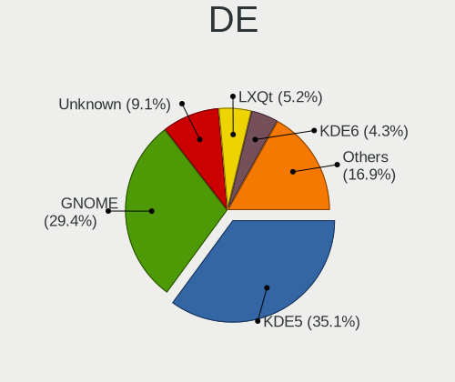
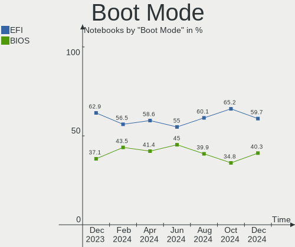
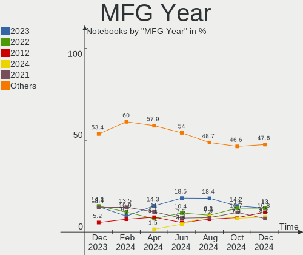
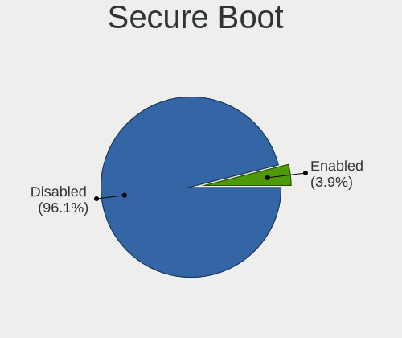
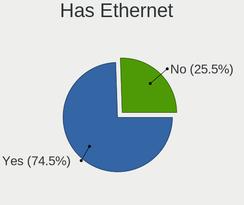
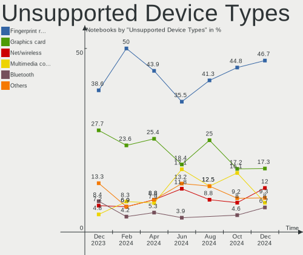

Linux in Russia - Hardware Trends (Notebooks)
---------------------------------------------

A project to identify most popular hardware characteristics and track their change
over time based on data collected by Linux users at https://Linux-Hardware.org.

Anyone can contribute to this report by the [hw-probe](https://github.com/linuxhw/hw-probe) tool:

    sudo -E hw-probe -all -upload

Period: May, 2023.

Contents
--------

* [ System ](#system)
  - [ OS                       ](#os)
  - [ OS Family                ](#os-family)
  - [ Kernel                   ](#kernel)
  - [ Kernel Family            ](#kernel-family)
  - [ Kernel Major Ver.        ](#kernel-major-ver)
  - [ Arch                     ](#arch)
  - [ DE                       ](#de)
  - [ Display Server           ](#display-server)
  - [ Display Manager          ](#display-manager)
  - [ OS Lang                  ](#os-lang)
  - [ Boot Mode                ](#boot-mode)
  - [ Filesystem               ](#filesystem)
  - [ Part. scheme             ](#part-scheme)
  - [ Dual Boot with Linux/BSD ](#dual-boot-with-linuxbsd)
  - [ Dual Boot (Win)          ](#dual-boot-win)

* [ Board ](#board)
  - [ Vendor                   ](#vendor)
  - [ Model                    ](#model)
  - [ Model Family             ](#model-family)
  - [ MFG Year                 ](#mfg-year)
  - [ Form Factor              ](#form-factor)
  - [ Secure Boot              ](#secure-boot)
  - [ Coreboot                 ](#coreboot)
  - [ RAM Size                 ](#ram-size)
  - [ RAM Used                 ](#ram-used)
  - [ Total Drives             ](#total-drives)
  - [ Has CD-ROM               ](#has-cd-rom)
  - [ Has Ethernet             ](#has-ethernet)
  - [ Has WiFi                 ](#has-wifi)
  - [ Has Bluetooth            ](#has-bluetooth)

* [ Location ](#location)
  - [ Country                  ](#country)
  - [ City                     ](#city)

* [ Drives ](#drives)
  - [ Drive Vendor             ](#drive-vendor)
  - [ Drive Model              ](#drive-model)
  - [ HDD Vendor               ](#hdd-vendor)
  - [ SSD Vendor               ](#ssd-vendor)
  - [ Drive Kind               ](#drive-kind)
  - [ Drive Connector          ](#drive-connector)
  - [ Drive Size               ](#drive-size)
  - [ Space Total              ](#space-total)
  - [ Space Used               ](#space-used)
  - [ Malfunc. Drives          ](#malfunc-drives)
  - [ Malfunc. Drive Vendor    ](#malfunc-drive-vendor)
  - [ Malfunc. HDD Vendor      ](#malfunc-hdd-vendor)
  - [ Malfunc. Drive Kind      ](#malfunc-drive-kind)
  - [ Failed Drives            ](#failed-drives)
  - [ Failed Drive Vendor      ](#failed-drive-vendor)
  - [ Drive Status             ](#drive-status)

* [ Storage controller ](#storage-controller)
  - [ Storage Vendor           ](#storage-vendor)
  - [ Storage Model            ](#storage-model)
  - [ Storage Kind             ](#storage-kind)

* [ Processor ](#processor)
  - [ CPU Vendor               ](#cpu-vendor)
  - [ CPU Model                ](#cpu-model)
  - [ CPU Model Family         ](#cpu-model-family)
  - [ CPU Cores                ](#cpu-cores)
  - [ CPU Sockets              ](#cpu-sockets)
  - [ CPU Threads              ](#cpu-threads)
  - [ CPU Op-Modes             ](#cpu-op-modes)
  - [ CPU Microcode            ](#cpu-microcode)
  - [ CPU Microarch            ](#cpu-microarch)

* [ Graphics ](#graphics)
  - [ GPU Vendor               ](#gpu-vendor)
  - [ GPU Model                ](#gpu-model)
  - [ GPU Combo                ](#gpu-combo)
  - [ GPU Driver               ](#gpu-driver)
  - [ GPU Memory               ](#gpu-memory)

* [ Monitor ](#monitor)
  - [ Monitor Vendor           ](#monitor-vendor)
  - [ Monitor Model            ](#monitor-model)
  - [ Monitor Resolution       ](#monitor-resolution)
  - [ Monitor Diagonal         ](#monitor-diagonal)
  - [ Monitor Width            ](#monitor-width)
  - [ Aspect Ratio             ](#aspect-ratio)
  - [ Monitor Area             ](#monitor-area)
  - [ Pixel Density            ](#pixel-density)
  - [ Multiple Monitors        ](#multiple-monitors)

* [ Network ](#network)
  - [ Net Controller Vendor    ](#net-controller-vendor)
  - [ Net Controller Model     ](#net-controller-model)
  - [ Wireless Vendor          ](#wireless-vendor)
  - [ Wireless Model           ](#wireless-model)
  - [ Ethernet Vendor          ](#ethernet-vendor)
  - [ Ethernet Model           ](#ethernet-model)
  - [ Net Controller Kind      ](#net-controller-kind)
  - [ Used Controller          ](#used-controller)
  - [ NICs                     ](#nics)
  - [ IPv6                     ](#ipv6)

* [ Bluetooth ](#bluetooth)
  - [ Bluetooth Vendor         ](#bluetooth-vendor)
  - [ Bluetooth Model          ](#bluetooth-model)

* [ Sound ](#sound)
  - [ Sound Vendor             ](#sound-vendor)
  - [ Sound Model              ](#sound-model)

* [ Memory ](#memory)
  - [ Memory Vendor            ](#memory-vendor)
  - [ Memory Model             ](#memory-model)
  - [ Memory Kind              ](#memory-kind)
  - [ Memory Form Factor       ](#memory-form-factor)
  - [ Memory Size              ](#memory-size)
  - [ Memory Speed             ](#memory-speed)

* [ Printers & scanners ](#printers--scanners)
  - [ Printer Vendor           ](#printer-vendor)
  - [ Printer Model            ](#printer-model)
  - [ Scanner Vendor           ](#scanner-vendor)
  - [ Scanner Model            ](#scanner-model)

* [ Camera ](#camera)
  - [ Camera Vendor            ](#camera-vendor)
  - [ Camera Model             ](#camera-model)

* [ Security ](#security)
  - [ Fingerprint Vendor       ](#fingerprint-vendor)
  - [ Fingerprint Model        ](#fingerprint-model)
  - [ Chipcard Vendor          ](#chipcard-vendor)
  - [ Chipcard Model           ](#chipcard-model)

* [ Unsupported ](#unsupported)
  - [ Unsupported Devices      ](#unsupported-devices)
  - [ Unsupported Device Types ](#unsupported-device-types)

System
------

OS
--

Installed operating systems

| Name                         | Notebooks | Percent |
|------------------------------|-----------|---------|
| ROSA 12.4                    | 63        | 28.9%   |
| Ubuntu 22.04                 | 13        | 5.96%   |
| Fedora 38                    | 12        | 5.5%    |
| Arch Rolling                 | 11        | 5.05%   |
| Debian 12                    | 9         | 4.13%   |
| Ubuntu 23.04                 | 7         | 3.21%   |
| Red OS 7.3.2                 | 6         | 2.75%   |
| Pop!_OS 22.04                | 6         | 2.75%   |
| ROSA 12                      | 5         | 2.29%   |
| OpenMandriva 23.03           | 5         | 2.29%   |
| Elementary 7                 | 5         | 2.29%   |
| ROSA 12.3                    | 4         | 1.83%   |
| MOS 10                       | 4         | 1.83%   |
| Linux Mint 21.1              | 4         | 1.83%   |
| Gentoo 2.13                  | 4         | 1.83%   |
| SteamOS 3.4.6                | 3         | 1.38%   |
| ROSA R11.1                   | 3         | 1.38%   |
| Debian 11                    | 3         | 1.38%   |
| ALT Linux 10.1               | 3         | 1.38%   |
| Zorin 16                     | 2         | 0.92%   |
| ROSA 12.1                    | 2         | 0.92%   |
| RELD 7.9                     | 2         | 0.92%   |
| openSUSE Tumbleweed-XXXXXXXX | 2         | 0.92%   |
| Manjaro                      | 2         | 0.92%   |
| Linux Mint 20.3              | 2         | 0.92%   |
| Kubuntu 22.04                | 2         | 0.92%   |
| KDE neon 22.04               | 2         | 0.92%   |
| Kali 2023.1                  | 2         | 0.92%   |
| Xubuntu 23.04                | 1         | 0.46%   |
| Xubuntu 20.04                | 1         | 0.46%   |
| Ubuntu Budgie 23.04          | 1         | 0.46%   |
| Ubuntu 22.10                 | 1         | 0.46%   |
| Ubuntu 20.04                 | 1         | 0.46%   |
| SteamOS 3.5                  | 1         | 0.46%   |
| ROSA R9                      | 1         | 0.46%   |
| ROSA R11                     | 1         | 0.46%   |
| ROSA R10                     | 1         | 0.46%   |
| ROSA 2021.1                  | 1         | 0.46%   |
| Rocky Linux 9.1              | 1         | 0.46%   |
| Red OS 7.2                   | 1         | 0.46%   |

OS Family
---------

OS without a version

| Name          | Notebooks | Percent |
|---------------|-----------|---------|
| ROSA          | 81        | 37.16%  |
| Ubuntu        | 22        | 10.09%  |
| Fedora        | 15        | 6.88%   |
| Debian        | 12        | 5.5%    |
| Arch          | 11        | 5.05%   |
| ALT Linux     | 9         | 4.13%   |
| Red OS        | 7         | 3.21%   |
| Linux Mint    | 7         | 3.21%   |
| Pop!_OS       | 6         | 2.75%   |
| OpenMandriva  | 6         | 2.75%   |
| Gentoo        | 5         | 2.29%   |
| Elementary    | 5         | 2.29%   |
| SteamOS       | 4         | 1.83%   |
| Manjaro       | 4         | 1.83%   |
| Zorin         | 2         | 0.92%   |
| Xubuntu       | 2         | 0.92%   |
| RELD          | 2         | 0.92%   |
| openSUSE      | 2         | 0.92%   |
| Kubuntu       | 2         | 0.92%   |
| KDE neon      | 2         | 0.92%   |
| Kali          | 2         | 0.92%   |
| Ubuntu Budgie | 1         | 0.46%   |
| Rocky Linux   | 1         | 0.46%   |
| NixOS         | 1         | 0.46%   |
| Endless       | 1         | 0.46%   |
| EndeavourOS   | 1         | 0.46%   |
| Clear Linux   | 1         | 0.46%   |
| Calculate     | 1         | 0.46%   |
| BunsenLabs    | 1         | 0.46%   |
| Artix         | 1         | 0.46%   |
| ArcoLinux     | 1         | 0.46%   |

Kernel
------

Version of the Linux kernel

| Version                                            | Notebooks | Percent |
|----------------------------------------------------|-----------|---------|
| 6.1.20-generic-2rosa2021.1-x86_64                  | 57        | 26.15%  |
| 5.19.0-41-generic                                  | 14        | 6.42%   |
| 6.2.0-20-generic                                   | 9         | 4.13%   |
| 6.2.15-300.fc38.x86_64                             | 7         | 3.21%   |
| 6.2.6-76060206-generic                             | 6         | 2.75%   |
| 6.1.0-4-amd64                                      | 6         | 2.75%   |
| 5.19.0-42-generic                                  | 6         | 2.75%   |
| 5.15.103-generic-1rosa2021.1-x86_64                | 6         | 2.75%   |
| 5.15.0-71-generic                                  | 6         | 2.75%   |
| 6.3.2-arch1-1                                      | 5         | 2.29%   |
| 6.2.6-desktop-1omv2390                             | 5         | 2.29%   |
| 6.2.14-300.fc38.x86_64                             | 4         | 1.83%   |
| 5.15.72-1.el7.3.x86_64                             | 3         | 1.38%   |
| 5.15.103-generic-1rosa2021.1-i686                  | 3         | 1.38%   |
| 5.13.0-valve36-1-neptune                           | 3         | 1.38%   |
| 5.10.0-22-amd64                                    | 3         | 1.38%   |
| 6.3.1-arch2-1                                      | 2         | 0.92%   |
| 6.2.13-zen-1-zen                                   | 2         | 0.92%   |
| 6.1.26-1-MANJARO                                   | 2         | 0.92%   |
| 6.1.19-gentoo-x86_64                               | 2         | 0.92%   |
| 6.1.0-kali7-amd64                                  | 2         | 0.92%   |
| 5.15.87-1.el7.3.x86_64                             | 2         | 0.92%   |
| 5.15.77-generic-1rosa2021.1-x86_64                 | 2         | 0.92%   |
| 5.15.75-generic-1rosa2021.1-x86_64                 | 2         | 0.92%   |
| 5.15.33-1.res7.x86_64                              | 2         | 0.92%   |
| 5.10.74-generic-2rosa2021.1-x86_64                 | 2         | 0.92%   |
| 5.10.176-generic-1rosa2021.1-x86_64                | 2         | 0.92%   |
| 6.4.0-0.rc2.20230519git2d1bcbc6cd70.25.fc39.x86_64 | 1         | 0.46%   |
| 6.3.4-latitude-xanmod1                             | 1         | 0.46%   |
| 6.3.4-arch1-1                                      | 1         | 0.46%   |
| 6.3.4-2-MANJARO                                    | 1         | 0.46%   |
| 6.3.3-zen1-1-zen                                   | 1         | 0.46%   |
| 6.3.2-artix1-1                                     | 1         | 0.46%   |
| 6.3.2-1-default                                    | 1         | 0.46%   |
| 6.3.2-060302-generic                               | 1         | 0.46%   |
| 6.3.1-arch1-1                                      | 1         | 0.46%   |
| 6.3.1-1-default                                    | 1         | 0.46%   |
| 6.3.1-060301-generic                               | 1         | 0.46%   |
| 6.3.1                                              | 1         | 0.46%   |
| 6.3.0-7-amd64                                      | 1         | 0.46%   |

Kernel Family
-------------

Linux kernel without a distro release

| Version  | Notebooks | Percent |
|----------|-----------|---------|
| 6.1.20   | 58        | 26.61%  |
| 5.19.0   | 20        | 9.17%   |
| 6.2.6    | 11        | 5.05%   |
| 6.1.0    | 10        | 4.59%   |
| 6.2.0    | 9         | 4.13%   |
| 5.15.103 | 9         | 4.13%   |
| 5.15.0   | 9         | 4.13%   |
| 6.3.2    | 8         | 3.67%   |
| 6.2.15   | 7         | 3.21%   |
| 6.2.14   | 7         | 3.21%   |
| 6.3.1    | 6         | 2.75%   |
| 6.2.13   | 4         | 1.83%   |
| 5.15.72  | 4         | 1.83%   |
| 6.3.4    | 3         | 1.38%   |
| 5.13.0   | 3         | 1.38%   |
| 5.10.0   | 3         | 1.38%   |
| 6.1.29   | 2         | 0.92%   |
| 6.1.26   | 2         | 0.92%   |
| 6.1.19   | 2         | 0.92%   |
| 5.4.83   | 2         | 0.92%   |
| 5.4.0    | 2         | 0.92%   |
| 5.15.87  | 2         | 0.92%   |
| 5.15.77  | 2         | 0.92%   |
| 5.15.75  | 2         | 0.92%   |
| 5.15.33  | 2         | 0.92%   |
| 5.14.0   | 2         | 0.92%   |
| 5.10.74  | 2         | 0.92%   |
| 5.10.176 | 2         | 0.92%   |
| 4.15.0   | 2         | 0.92%   |
| 6.4.0    | 1         | 0.46%   |
| 6.3.3    | 1         | 0.46%   |
| 6.3.0    | 1         | 0.46%   |
| 6.2.8    | 1         | 0.46%   |
| 6.1.30   | 1         | 0.46%   |
| 6.1.27   | 1         | 0.46%   |
| 6.1.21   | 1         | 0.46%   |
| 5.7.13   | 1         | 0.46%   |
| 5.17.6   | 1         | 0.46%   |
| 5.17.12  | 1         | 0.46%   |
| 5.16.13  | 1         | 0.46%   |

Kernel Major Ver.
-----------------

Linux kernel major version

| Version | Notebooks | Percent |
|---------|-----------|---------|
| 6.1     | 77        | 35.32%  |
| 6.2     | 39        | 17.89%  |
| 5.15    | 33        | 15.14%  |
| 5.19    | 20        | 9.17%   |
| 6.3     | 19        | 8.72%   |
| 5.10    | 11        | 5.05%   |
| 5.4     | 4         | 1.83%   |
| 5.13    | 3         | 1.38%   |
| 5.17    | 2         | 0.92%   |
| 5.14    | 2         | 0.92%   |
| 4.9     | 2         | 0.92%   |
| 4.15    | 2         | 0.92%   |
| 6.4     | 1         | 0.46%   |
| 5.7     | 1         | 0.46%   |
| 5.16    | 1         | 0.46%   |
| 4.19    | 1         | 0.46%   |

Arch
----

OS architecture (x86_64, i586, etc.)

| Name   | Notebooks | Percent |
|--------|-----------|---------|
| x86_64 | 213       | 97.71%  |
| i686   | 5         | 2.29%   |

DE
--

Desktop Environment

| Name            | Notebooks | Percent |
|-----------------|-----------|---------|
| KDE5            | 79        | 36.24%  |
| GNOME           | 65        | 29.82%  |
| LXQt            | 14        | 6.42%   |
| Unknown         | 13        | 5.96%   |
| XFCE            | 11        | 5.05%   |
| MATE            | 10        | 4.59%   |
| Pantheon        | 5         | 2.29%   |
| KDE4            | 5         | 2.29%   |
| X-Cinnamon      | 4         | 1.83%   |
| i3              | 2         | 0.92%   |
| Deepin          | 2         | 0.92%   |
| Trinity         | 1         | 0.46%   |
| LXDE            | 1         | 0.46%   |
| Hyprland        | 1         | 0.46%   |
| GNOME Flashback | 1         | 0.46%   |
| Cinnamon        | 1         | 0.46%   |
| Budgie          | 1         | 0.46%   |
| bspwm           | 1         | 0.46%   |
| awesome         | 1         | 0.46%   |

Display Server
--------------

X11 or Wayland

| Name    | Notebooks | Percent |
|---------|-----------|---------|
| X11     | 108       | 49.54%  |
| Wayland | 100       | 45.87%  |
| Unknown | 8         | 3.67%   |
| Tty     | 2         | 0.92%   |

Display Manager
---------------

SDDM, LightDM, etc.

| Name    | Notebooks | Percent |
|---------|-----------|---------|
| SDDM    | 72        | 33.03%  |
| Unknown | 52        | 23.85%  |
| GDM     | 40        | 18.35%  |
| LightDM | 24        | 11.01%  |
| GDM3    | 24        | 11.01%  |
| KDM     | 5         | 2.29%   |
| TDM     | 1         | 0.46%   |

OS Lang
-------

Language

| Lang    | Notebooks | Percent |
|---------|-----------|---------|
| ru_RU   | 167       | 76.61%  |
| en_US   | 42        | 19.27%  |
| Unknown | 6         | 2.75%   |
| en_DK   | 1         | 0.46%   |
| C.UTF8  | 1         | 0.46%   |
| C       | 1         | 0.46%   |

Boot Mode
---------

EFI or BIOS

| Mode | Notebooks | Percent |
|------|-----------|---------|
| EFI  | 136       | 62.39%  |
| BIOS | 82        | 37.61%  |

Filesystem
----------

Type of filesystem

| Type    | Notebooks | Percent |
|---------|-----------|---------|
| Ext4    | 160       | 73.39%  |
| Btrfs   | 35        | 16.06%  |
| Overlay | 10        | 4.59%   |
| Tmpfs   | 7         | 3.21%   |
| Xfs     | 4         | 1.83%   |
| F2fs    | 1         | 0.46%   |
| Aufs    | 1         | 0.46%   |

Part. scheme
------------

Scheme of partitioning

| Type    | Notebooks | Percent |
|---------|-----------|---------|
| GPT     | 131       | 60.09%  |
| MBR     | 45        | 20.64%  |
| Unknown | 42        | 19.27%  |

Dual Boot with Linux/BSD
------------------------

Hosting more than one Linux/BSD

| Dual boot | Notebooks | Percent |
|-----------|-----------|---------|
| No        | 184       | 84.4%   |
| Yes       | 34        | 15.6%   |

Dual Boot (Win)
---------------

Hosting Linux and Windows

| Dual boot | Notebooks | Percent |
|-----------|-----------|---------|
| No        | 141       | 64.68%  |
| Yes       | 77        | 35.32%  |

Board
-----

Vendor
------

Motherboard manufacturer

| Name                              | Notebooks | Percent |
|-----------------------------------|-----------|---------|
| Hewlett-Packard                   | 29        | 13.3%   |
| Lenovo                            | 27        | 12.39%  |
| ASUSTek Computer                  | 26        | 11.93%  |
| Acer                              | 24        | 11.01%  |
| HUAWEI                            | 11        | 5.05%   |
| Samsung Electronics               | 10        | 4.59%   |
| MSI                               | 8         | 3.67%   |
| Dell                              | 8         | 3.67%   |
| Clevo                             | 8         | 3.67%   |
| Unknown                           | 8         | 3.67%   |
| HONOR                             | 6         | 2.75%   |
| Aquarius                          | 6         | 2.75%   |
| Valve                             | 4         | 1.83%   |
| Toshiba                           | 4         | 1.83%   |
| Digma                             | 4         | 1.83%   |
| Apple                             | 4         | 1.83%   |
| Timi                              | 3         | 1.38%   |
| Packard Bell                      | 3         | 1.38%   |
| Quanta                            | 2         | 0.92%   |
| Maibenben                         | 2         | 0.92%   |
| LTD Delovoy Office                | 2         | 0.92%   |
| Irbis                             | 2         | 0.92%   |
| eMachines                         | 2         | 0.92%   |
| THUNDEROBOT                       | 1         | 0.46%   |
| Sony                              | 1         | 0.46%   |
| Rombica                           | 1         | 0.46%   |
| realme                            | 1         | 0.46%   |
| Notebook                          | 1         | 0.46%   |
| Intel Client Systems              | 1         | 0.46%   |
| Infinix                           | 1         | 0.46%   |
| ICL-KME CS                        | 1         | 0.46%   |
| ICL                               | 1         | 0.46%   |
| HIPER Technology Limited          | 1         | 0.46%   |
| HASEE Computer                    | 1         | 0.46%   |
| Graviton                          | 1         | 0.46%   |
| F-PLUS EQUIPMENT AND DEVELOPMENTS | 1         | 0.46%   |
| DEXP                              | 1         | 0.46%   |
| Chuwi                             | 1         | 0.46%   |

Model
-----

Motherboard model

| Name                                 | Notebooks | Percent |
|--------------------------------------|-----------|---------|
| Unknown                              | 11        | 5.05%   |
| Clevo NL41MU2                        | 6         | 2.75%   |
| Valve Jupiter                        | 4         | 1.83%   |
| Aquarius NS585                       | 4         | 1.83%   |
| HP 255 G8 Notebook PC                | 3         | 1.38%   |
| Timi TM1701                          | 2         | 0.92%   |
| Packard Bell DOT S                   | 2         | 0.92%   |
| Maibenben MaiBook M                  | 2         | 0.92%   |
| Lenovo ThinkPad E14 Gen 3 20Y70044RT | 2         | 0.92%   |
| HUAWEI CREM-WXX9                     | 2         | 0.92%   |
| HONOR HYM-WXX                        | 2         | 0.92%   |
| HONOR BBR-WAX9                       | 2         | 0.92%   |
| Digma EVE 11 C422 ES1068EW           | 2         | 0.92%   |
| ASUS X550CC                          | 2         | 0.92%   |
| ASUS GL553VD                         | 2         | 0.92%   |
| Aquarius NS685U R11                  | 2         | 0.92%   |
| Acer Aspire E5-573G                  | 2         | 0.92%   |
| Toshiba Satellite X200               | 1         | 0.46%   |
| Toshiba Satellite L855               | 1         | 0.46%   |
| Toshiba Satellite L850D-BNK          | 1         | 0.46%   |
| Toshiba Satellite L755               | 1         | 0.46%   |
| Timi Xiaomi Book Pro 14 2022         | 1         | 0.46%   |
| THUNDEROBOT 911AirXD                 | 1         | 0.46%   |
| Sony VPCZ23Q9R                       | 1         | 0.46%   |
| Samsung RV410/RV510/S3510/E3510      | 1         | 0.46%   |
| Samsung R780                         | 1         | 0.46%   |
| Samsung R710                         | 1         | 0.46%   |
| Samsung R428/P428                    | 1         | 0.46%   |
| Samsung R425/R525                    | 1         | 0.46%   |
| Samsung N130                         | 1         | 0.46%   |
| Samsung 355V4C/356V4C/3445VC/3545VC  | 1         | 0.46%   |
| Samsung 350V5C/351V5C/3540VC/3440VC  | 1         | 0.46%   |
| Samsung 305V4A/305V5A                | 1         | 0.46%   |
| Samsung 300V3A/300V4A/300V5A         | 1         | 0.46%   |
| Rombica myBook Zenith                | 1         | 0.46%   |
| realme RMNBXXXX                      | 1         | 0.46%   |
| Quanta UW3                           | 1         | 0.46%   |
| Quanta JW2                           | 1         | 0.46%   |
| Packard Bell EasyNote TK85           | 1         | 0.46%   |
| Notebook W250EGQ / W270EGQ           | 1         | 0.46%   |

Model Family
------------

Motherboard model prefix

| Name                 | Notebooks | Percent |
|----------------------|-----------|---------|
| Acer Aspire          | 17        | 7.8%    |
| Unknown              | 11        | 5.05%   |
| HP Laptop            | 9         | 4.13%   |
| Lenovo ThinkPad      | 7         | 3.21%   |
| HP ProBook           | 6         | 2.75%   |
| Dell Inspiron        | 6         | 2.75%   |
| Clevo NL41MU2        | 6         | 2.75%   |
| Valve Jupiter        | 4         | 1.83%   |
| Toshiba Satellite    | 4         | 1.83%   |
| Lenovo IdeaPad       | 4         | 1.83%   |
| ASUS VivoBook        | 4         | 1.83%   |
| Aquarius NS585       | 4         | 1.83%   |
| MSI Katana           | 3         | 1.38%   |
| Lenovo ThinkBook     | 3         | 1.38%   |
| Lenovo Legion        | 3         | 1.38%   |
| HP Pavilion          | 3         | 1.38%   |
| HP EliteBook         | 3         | 1.38%   |
| HP 255               | 3         | 1.38%   |
| Digma EVE            | 3         | 1.38%   |
| Timi TM1701          | 2         | 0.92%   |
| Packard Bell DOT     | 2         | 0.92%   |
| Maibenben MaiBook    | 2         | 0.92%   |
| Lenovo B590          | 2         | 0.92%   |
| HUAWEI CREM-WXX9     | 2         | 0.92%   |
| HONOR HYM-WXX        | 2         | 0.92%   |
| HONOR BBR-WAX9       | 2         | 0.92%   |
| HP OMEN              | 2         | 0.92%   |
| ASUS X550CC          | 2         | 0.92%   |
| ASUS ROG             | 2         | 0.92%   |
| ASUS GL553VD         | 2         | 0.92%   |
| ASUS ASUS            | 2         | 0.92%   |
| Aquarius NS685U      | 2         | 0.92%   |
| Acer Swift           | 2         | 0.92%   |
| Acer Nitro           | 2         | 0.92%   |
| Timi Xiaomi          | 1         | 0.46%   |
| THUNDEROBOT 911AirXD | 1         | 0.46%   |
| Sony VPCZ23Q9R       | 1         | 0.46%   |
| Samsung RV410        | 1         | 0.46%   |
| Samsung R780         | 1         | 0.46%   |
| Samsung R710         | 1         | 0.46%   |

MFG Year
--------

Motherboard manufacture year

| Year | Notebooks | Percent |
|------|-----------|---------|
| 2022 | 43        | 19.72%  |
| 2021 | 28        | 12.84%  |
| 2011 | 23        | 10.55%  |
| 2012 | 21        | 9.63%   |
| 2020 | 20        | 9.17%   |
| 2019 | 20        | 9.17%   |
| 2013 | 11        | 5.05%   |
| 2017 | 9         | 4.13%   |
| 2009 | 7         | 3.21%   |
| 2018 | 6         | 2.75%   |
| 2016 | 6         | 2.75%   |
| 2010 | 6         | 2.75%   |
| 2014 | 5         | 2.29%   |
| 2008 | 4         | 1.83%   |
| 2023 | 3         | 1.38%   |
| 2015 | 3         | 1.38%   |
| 2007 | 2         | 0.92%   |
| 2006 | 1         | 0.46%   |

Form Factor
-----------

Physical design of the computer

| Name     | Notebooks | Percent |
|----------|-----------|---------|
| Notebook | 218       | 100%    |

Secure Boot
-----------

Enabled or disabled

| State    | Notebooks | Percent |
|----------|-----------|---------|
| Disabled | 206       | 94.5%   |
| Enabled  | 12        | 5.5%    |

Coreboot
--------

Have coreboot on board

| Used | Notebooks | Percent |
|------|-----------|---------|
| No   | 218       | 100%    |

RAM Size
--------

Total RAM memory

| Size in GB  | Notebooks | Percent |
|-------------|-----------|---------|
| 4.01-8.0    | 70        | 32.11%  |
| 8.01-16.0   | 49        | 22.48%  |
| 16.01-24.0  | 40        | 18.35%  |
| 3.01-4.0    | 33        | 15.14%  |
| 1.01-2.0    | 10        | 4.59%   |
| 32.01-64.0  | 7         | 3.21%   |
| 2.01-3.0    | 6         | 2.75%   |
| 64.01-256.0 | 2         | 0.92%   |
| 24.01-32.0  | 1         | 0.46%   |

RAM Used
--------

Used RAM memory

| Used GB   | Notebooks | Percent |
|-----------|-----------|---------|
| 1.01-2.0  | 76        | 34.86%  |
| 2.01-3.0  | 44        | 20.18%  |
| 4.01-8.0  | 33        | 15.14%  |
| 0.51-1.0  | 29        | 13.3%   |
| 3.01-4.0  | 26        | 11.93%  |
| 8.01-16.0 | 8         | 3.67%   |
| 0.01-0.5  | 2         | 0.92%   |

Total Drives
------------

Number of drives on board

| Drives | Notebooks | Percent |
|--------|-----------|---------|
| 1      | 156       | 71.56%  |
| 2      | 53        | 24.31%  |
| 3      | 7         | 3.21%   |
| 4      | 1         | 0.46%   |
| 0      | 1         | 0.46%   |

Has CD-ROM
----------

Has CD-ROM on board

| Presented | Notebooks | Percent |
|-----------|-----------|---------|
| No        | 170       | 77.98%  |
| Yes       | 48        | 22.02%  |

Has Ethernet
------------

Has Ethernet on board

| Presented | Notebooks | Percent |
|-----------|-----------|---------|
| Yes       | 168       | 77.06%  |
| No        | 50        | 22.94%  |

Has WiFi
--------

Has WiFi module

| Presented | Notebooks | Percent |
|-----------|-----------|---------|
| Yes       | 214       | 98.17%  |
| No        | 4         | 1.83%   |

Has Bluetooth
-------------

Has Bluetooth module

| Presented | Notebooks | Percent |
|-----------|-----------|---------|
| Yes       | 169       | 77.52%  |
| No        | 49        | 22.48%  |

Location
--------

Country
-------

Geographic location (country)

| Country | Notebooks | Percent |
|---------|-----------|---------|
| Russia  | 218       | 100%    |

City
----

Geographic location (city)

| City             | Notebooks | Percent |
|------------------|-----------|---------|
| Moscow           | 65        | 29.82%  |
| St Petersburg    | 18        | 8.26%   |
| Voronezh         | 9         | 4.13%   |
| Kaluga           | 6         | 2.75%   |
| Yekaterinburg    | 5         | 2.29%   |
| Tyumen           | 4         | 1.83%   |
| Surgut           | 4         | 1.83%   |
| Omsk             | 4         | 1.83%   |
| Nizhniy Novgorod | 4         | 1.83%   |
| Krasnodar        | 4         | 1.83%   |
| Khabarovsk       | 4         | 1.83%   |
| Volgograd        | 3         | 1.38%   |
| Ufa              | 3         | 1.38%   |
| Rostov-on-Don    | 3         | 1.38%   |
| Novosibirsk      | 3         | 1.38%   |
| Krasnoyarsk      | 3         | 1.38%   |
| Chelyabinsk      | 3         | 1.38%   |
| Yaroslavl        | 2         | 0.92%   |
| Tomsk            | 2         | 0.92%   |
| Taganrog         | 2         | 0.92%   |
| Saratov          | 2         | 0.92%   |
| Saransk          | 2         | 0.92%   |
| Samara           | 2         | 0.92%   |
| Ryazan           | 2         | 0.92%   |
| Perm             | 2         | 0.92%   |
| Oryol            | 2         | 0.92%   |
| Odintsovo        | 2         | 0.92%   |
| Lipetsk          | 2         | 0.92%   |
| Kurchatov        | 2         | 0.92%   |
| Kazan’         | 2         | 0.92%   |
| Cheboksary       | 2         | 0.92%   |
| Barnaul          | 2         | 0.92%   |
| Yurginskoye      | 1         | 0.46%   |
| Yoshkar-Ola      | 1         | 0.46%   |
| Yablonitsy       | 1         | 0.46%   |
| Vorkuta          | 1         | 0.46%   |
| Vladivostok      | 1         | 0.46%   |
| Vladimir         | 1         | 0.46%   |
| Veliky Novgorod  | 1         | 0.46%   |
| Ukhta            | 1         | 0.46%   |

Drives
------

Drive Vendor
------------

Hard drive vendors

| Vendor                      | Notebooks | Drives | Percent |
|-----------------------------|-----------|--------|---------|
| Samsung Electronics         | 38        | 41     | 14.02%  |
| WDC                         | 32        | 32     | 11.81%  |
| Seagate                     | 18        | 18     | 6.64%   |
| Toshiba                     | 16        | 17     | 5.9%    |
| Sandisk                     | 15        | 15     | 5.54%   |
| Kingston                    | 15        | 15     | 5.54%   |
| Hitachi                     | 14        | 14     | 5.17%   |
| A-DATA Technology           | 11        | 11     | 4.06%   |
| China                       | 9         | 10     | 3.32%   |
| Unknown                     | 8         | 8      | 2.95%   |
| Phison Electronics          | 7         | 7      | 2.58%   |
| Intel                       | 7         | 7      | 2.58%   |
| BIWIN                       | 7         | 7      | 2.58%   |
| SK hynix                    | 6         | 6      | 2.21%   |
| SPCC                        | 5         | 5      | 1.85%   |
| KIOXIA                      | 5         | 5      | 1.85%   |
| Micron Technology           | 4         | 4      | 1.48%   |
| Apacer                      | 4         | 4      | 1.48%   |
| Unknown                     | 4         | 4      | 1.48%   |
| Netac                       | 3         | 3      | 1.11%   |
| HGST                        | 3         | 3      | 1.11%   |
| Crucial                     | 3         | 3      | 1.11%   |
| ADATA Technology            | 3         | 3      | 1.11%   |
| Transcend                   | 2         | 2      | 0.74%   |
| Smartbuy                    | 2         | 2      | 0.74%   |
| Kingston Technology Company | 2         | 2      | 0.74%   |
| KingSpec                    | 2         | 2      | 0.74%   |
| GOODRAM                     | 2         | 2      | 0.74%   |
| Apple                       | 2         | 2      | 0.74%   |
| YMTC                        | 1         | 1      | 0.37%   |
| Yangtze Memory Technologies | 1         | 1      | 0.37%   |
| XrayDisk                    | 1         | 1      | 0.37%   |
| Wdxsky                      | 1         | 1      | 0.37%   |
| Vaseky                      | 1         | 1      | 0.37%   |
| SSSTC                       | 1         | 1      | 0.37%   |
| Silicon Motion              | 1         | 1      | 0.37%   |
| ShiJi                       | 1         | 1      | 0.37%   |
| Realtek Semiconductor       | 1         | 1      | 0.37%   |
| Qumo                        | 1         | 1      | 0.37%   |
| Plextor                     | 1         | 1      | 0.37%   |

Drive Model
-----------

Hard drive models

| Model                                                           | Notebooks | Percent |
|-----------------------------------------------------------------|-----------|---------|
| Samsung NVMe SSD Controller SM981/PM981/PM983 256GB             | 6         | 2.19%   |
| BIWIN CE480T5D101-256 256GB                                     | 5         | 1.82%   |
| Hitachi HTS547575A9E384 752GB                                   | 4         | 1.46%   |
| A-DATA SU800 512GB SSD                                          | 4         | 1.46%   |
| Unknown                                                         | 4         | 1.46%   |
| Toshiba MQ04ABF100 1TB                                          | 3         | 1.09%   |
| SPCC Solid State Disk 256GB                                     | 3         | 1.09%   |
| Seagate ST500LT012-9WS142 500GB                                 | 3         | 1.09%   |
| Sandisk WD Blue SN550 NVMe SSD 512GB                            | 3         | 1.09%   |
| Samsung MZVL2512HCJQ-00B00 512GB                                | 3         | 1.09%   |
| Phison E12 NVMe Controller 256GB                                | 3         | 1.09%   |
| Kingston SV300S37A120G 120GB SSD                                | 3         | 1.09%   |
| ADATA XPG SX8200 Pro PCIe Gen3x4 M.2 2280 Solid State Drive 1TB | 3         | 1.09%   |
| WDC WDS240G2G0A-00JH30 240GB SSD                                | 2         | 0.73%   |
| WDC WD5000LPCX-24VHAT0 500GB                                    | 2         | 0.73%   |
| Unknown MMC Card  64GB                                          | 2         | 0.73%   |
| Unknown MMC Card  32GB                                          | 2         | 0.73%   |
| Toshiba KXG60ZNV512G 512GB                                      | 2         | 0.73%   |
| Seagate ST9500325AS 500GB                                       | 2         | 0.73%   |
| Sandisk WD Black SN750 / PC SN730 NVMe SSD 256GB                | 2         | 0.73%   |
| SanDisk NVMe SSD Drive 512GB                                    | 2         | 0.73%   |
| Samsung SSD 980 1TB                                             | 2         | 0.73%   |
| Samsung SSD 970 EVO Plus 1TB                                    | 2         | 0.73%   |
| Samsung MZALQ512HALU-000L2 512GB                                | 2         | 0.73%   |
| Samsung MZALQ256HBJD-00BL1 256GB                                | 2         | 0.73%   |
| Phison PS5013 E13 NVMe Controller 512GB                         | 2         | 0.73%   |
| Phison PCIe SSD 512GB                                           | 2         | 0.73%   |
| Micron MTFDKBA512TFH 512GB                                      | 2         | 0.73%   |
| Kingston SA400M8240G 240GB SSD                                  | 2         | 0.73%   |
| Intel SSD 660P Series 512GB                                     | 2         | 0.73%   |
| Hitachi HTS547550A9E384 500GB                                   | 2         | 0.73%   |
| Hitachi HTS543232A7A384 320GB                                   | 2         | 0.73%   |
| HGST HTS545050A7E680 500GB                                      | 2         | 0.73%   |
| YMTC PC005 512GB                                                | 1         | 0.36%   |
| Yangtze Memory YMTC PC005 512GB                                 | 1         | 0.36%   |
| XrayDisk 240GB SSD                                              | 1         | 0.36%   |
| Wdxsky W31-256G SSD                                             | 1         | 0.36%   |
| WDC WDS500G2B0A 500GB SSD                                       | 1         | 0.36%   |
| WDC WDS100T2B0A-00SM50 1TB SSD                                  | 1         | 0.36%   |
| WDC WD7500BPVX-22JC3T0 752GB                                    | 1         | 0.36%   |

HDD Vendor
----------

Hard disk drive vendors

| Vendor              | Notebooks | Drives | Percent |
|---------------------|-----------|--------|---------|
| WDC                 | 22        | 22     | 30.56%  |
| Seagate             | 18        | 18     | 25%     |
| Hitachi             | 14        | 14     | 19.44%  |
| Toshiba             | 13        | 14     | 18.06%  |
| HGST                | 3         | 3      | 4.17%   |
| Samsung Electronics | 2         | 2      | 2.78%   |

SSD Vendor
----------

Solid state drive vendors

| Vendor              | Notebooks | Drives | Percent |
|---------------------|-----------|--------|---------|
| Kingston            | 12        | 12     | 14.46%  |
| China               | 9         | 10     | 10.84%  |
| Samsung Electronics | 7         | 8      | 8.43%   |
| A-DATA Technology   | 7         | 7      | 8.43%   |
| WDC                 | 4         | 4      | 4.82%   |
| SPCC                | 4         | 4      | 4.82%   |
| Apacer              | 4         | 4      | 4.82%   |
| SanDisk             | 3         | 3      | 3.61%   |
| Intel               | 3         | 3      | 3.61%   |
| Transcend           | 2         | 2      | 2.41%   |
| Smartbuy            | 2         | 2      | 2.41%   |
| Netac               | 2         | 2      | 2.41%   |
| KingSpec            | 2         | 2      | 2.41%   |
| GOODRAM             | 2         | 2      | 2.41%   |
| Crucial             | 2         | 2      | 2.41%   |
| XrayDisk            | 1         | 1      | 1.2%    |
| Wdxsky              | 1         | 1      | 1.2%    |
| Vaseky              | 1         | 1      | 1.2%    |
| Toshiba             | 1         | 1      | 1.2%    |
| ShiJi               | 1         | 1      | 1.2%    |
| Qumo                | 1         | 1      | 1.2%    |
| Plextor             | 1         | 1      | 1.2%    |
| Patriot             | 1         | 1      | 1.2%    |
| Micron Technology   | 1         | 1      | 1.2%    |
| LITEON              | 1         | 1      | 1.2%    |
| Hoodisk             | 1         | 1      | 1.2%    |
| Hewlett-Packard     | 1         | 1      | 1.2%    |
| Gigabyte Technology | 1         | 1      | 1.2%    |
| Fanxiang            | 1         | 1      | 1.2%    |
| Biwintech           | 1         | 1      | 1.2%    |
| BIWIN               | 1         | 1      | 1.2%    |
| Azerty              | 1         | 1      | 1.2%    |
| Apple               | 1         | 1      | 1.2%    |

Drive Kind
----------

HDD or SSD

| Kind    | Notebooks | Drives | Percent |
|---------|-----------|--------|---------|
| NVMe    | 93        | 104    | 36.61%  |
| SSD     | 77        | 85     | 30.31%  |
| HDD     | 70        | 73     | 27.56%  |
| MMC     | 12        | 12     | 4.72%   |
| Unknown | 2         | 2      | 0.79%   |

Drive Connector
---------------

SATA, SAS, NVMe, etc.

| Type | Notebooks | Drives | Percent |
|------|-----------|--------|---------|
| SATA | 127       | 157    | 54.04%  |
| NVMe | 93        | 104    | 39.57%  |
| MMC  | 12        | 12     | 5.11%   |
| SAS  | 3         | 3      | 1.28%   |

Drive Size
----------

Size of hard drive

| Size in TB | Notebooks | Drives | Percent |
|------------|-----------|--------|---------|
| 0.01-0.5   | 99        | 115    | 70.21%  |
| 0.51-1.0   | 39        | 39     | 27.66%  |
| 1.01-2.0   | 3         | 4      | 2.13%   |

Space Total
-----------

Amount of disk space available on the file system

| Size in GB     | Notebooks | Percent |
|----------------|-----------|---------|
| 101-250        | 64        | 29.36%  |
| 251-500        | 54        | 24.77%  |
| 501-1000       | 39        | 17.89%  |
| 1-20           | 17        | 7.8%    |
| 51-100         | 15        | 6.88%   |
| Unknown        | 10        | 4.59%   |
| 21-50          | 7         | 3.21%   |
| 1001-2000      | 5         | 2.29%   |
| 2001-3000      | 4         | 1.83%   |
| More than 3000 | 3         | 1.38%   |

Space Used
----------

Amount of used disk space

| Used GB        | Notebooks | Percent |
|----------------|-----------|---------|
| 1-20           | 91        | 41.74%  |
| 21-50          | 41        | 18.81%  |
| 51-100         | 30        | 13.76%  |
| 101-250        | 23        | 10.55%  |
| 251-500        | 12        | 5.5%    |
| Unknown        | 10        | 4.59%   |
| 501-1000       | 7         | 3.21%   |
| 2001-3000      | 2         | 0.92%   |
| More than 3000 | 1         | 0.46%   |
| 1001-2000      | 1         | 0.46%   |

Malfunc. Drives
---------------

Drive models with a malfunction

| Model                               | Notebooks | Drives | Percent |
|-------------------------------------|-----------|--------|---------|
| Toshiba MQ04ABF100 1TB              | 2         | 2      | 5.88%   |
| Seagate ST9500325AS 500GB           | 2         | 2      | 5.88%   |
| Seagate ST500LT012-9WS142 500GB     | 2         | 2      | 5.88%   |
| Hitachi HTS543232A7A384 320GB       | 2         | 2      | 5.88%   |
| WDC WD7500BPVT-00HXZT3 752GB        | 1         | 1      | 2.94%   |
| WDC WD5000BPVT-75HXZT3 500GB        | 1         | 1      | 2.94%   |
| WDC WD5000BPVT-22HXZT3 500GB        | 1         | 1      | 2.94%   |
| Toshiba MQ01ABF050 500GB            | 1         | 1      | 2.94%   |
| Toshiba MK5075GSX 500GB             | 1         | 1      | 2.94%   |
| SPCC SSD162 56GB                    | 1         | 1      | 2.94%   |
| Seagate ST9750420AS 752GB           | 1         | 1      | 2.94%   |
| Seagate ST9500423AS 500GB           | 1         | 1      | 2.94%   |
| Seagate ST9160314AS 160GB           | 1         | 1      | 2.94%   |
| Seagate ST9120822AS 120GB           | 1         | 1      | 2.94%   |
| Seagate ST500LM012 HN-M500MBB 500GB | 1         | 1      | 2.94%   |
| Seagate ST1000LM035-1RK172 1TB      | 1         | 1      | 2.94%   |
| SanDisk SD8SNAT128G1002 128GB SSD   | 1         | 1      | 2.94%   |
| Samsung Electronics SSD 980 1TB     | 1         | 1      | 2.94%   |
| Samsung Electronics HM321HI 320GB   | 1         | 1      | 2.94%   |
| Samsung Electronics HM320JI 320GB   | 1         | 1      | 2.94%   |
| Netac SSD 256GB                     | 1         | 1      | 2.94%   |
| Kingston SV300S37A120G 120GB SSD    | 1         | 1      | 2.94%   |
| Kingston SA400S37120G 120GB SSD     | 1         | 1      | 2.94%   |
| Intel SSDSC2CW120A3 120GB           | 1         | 1      | 2.94%   |
| Intel SSDSC2BW120A4 120GB           | 1         | 1      | 2.94%   |
| Hitachi HTS723232A7A364 320GB       | 1         | 1      | 2.94%   |
| Hitachi HTS545050B9A300 500GB       | 1         | 1      | 2.94%   |
| Hitachi HTS545032A7E380 320GB       | 1         | 1      | 2.94%   |
| Hitachi HTS542512K9SA00 120GB       | 1         | 1      | 2.94%   |
| Hitachi HTS541080G9AT00 80GB        | 1         | 1      | 2.94%   |

Malfunc. Drive Vendor
---------------------

Vendors of faulty drives

| Vendor              | Notebooks | Drives | Percent |
|---------------------|-----------|--------|---------|
| Seagate             | 10        | 10     | 30.3%   |
| Hitachi             | 7         | 7      | 21.21%  |
| WDC                 | 3         | 3      | 9.09%   |
| Toshiba             | 3         | 4      | 9.09%   |
| Samsung Electronics | 3         | 3      | 9.09%   |
| Kingston            | 2         | 2      | 6.06%   |
| Intel               | 2         | 2      | 6.06%   |
| SPCC                | 1         | 1      | 3.03%   |
| SanDisk             | 1         | 1      | 3.03%   |
| Netac               | 1         | 1      | 3.03%   |

Malfunc. HDD Vendor
-------------------

Vendors of faulty HDD drives

| Vendor              | Notebooks | Drives | Percent |
|---------------------|-----------|--------|---------|
| Seagate             | 10        | 10     | 40%     |
| Hitachi             | 7         | 7      | 28%     |
| WDC                 | 3         | 3      | 12%     |
| Toshiba             | 3         | 4      | 12%     |
| Samsung Electronics | 2         | 2      | 8%      |

Malfunc. Drive Kind
-------------------

Kinds of faulty drives

| Kind | Notebooks | Drives | Percent |
|------|-----------|--------|---------|
| HDD  | 24        | 26     | 75%     |
| SSD  | 7         | 7      | 21.88%  |
| NVMe | 1         | 1      | 3.13%   |

Failed Drives
-------------

Failed drive models

Zero info for selected period =(

Failed Drive Vendor
-------------------

Failed drive vendors

Zero info for selected period =(

Drive Status
------------

Number of failed and malfunc. drives

| Status   | Notebooks | Drives | Percent |
|----------|-----------|--------|---------|
| Works    | 135       | 162    | 59.21%  |
| Detected | 64        | 80     | 28.07%  |
| Malfunc  | 29        | 34     | 12.72%  |

Storage controller
------------------

Storage Vendor
--------------

Storage controller vendors

| Vendor                         | Notebooks | Percent |
|--------------------------------|-----------|---------|
| Intel                          | 135       | 50.94%  |
| Samsung Electronics            | 30        | 11.32%  |
| AMD                            | 30        | 11.32%  |
| SanDisk                        | 18        | 6.79%   |
| Phison Electronics             | 7         | 2.64%   |
| SK hynix                       | 6         | 2.26%   |
| INNOGRIT                       | 6         | 2.26%   |
| ADATA Technology               | 6         | 2.26%   |
| KIOXIA                         | 5         | 1.89%   |
| Kingston Technology Company    | 5         | 1.89%   |
| Toshiba America Info Systems   | 3         | 1.13%   |
| Micron Technology              | 3         | 1.13%   |
| Yangtze Memory Technologies    | 2         | 0.75%   |
| Silicon Motion                 | 2         | 0.75%   |
| Shenzhen Longsys Electronics   | 2         | 0.75%   |
| Realtek Semiconductor          | 2         | 0.75%   |
| Solid State Storage Technology | 1         | 0.38%   |
| Micron/Crucial Technology      | 1         | 0.38%   |
| Apple                          | 1         | 0.38%   |

Storage Model
-------------

Storage controller models

| Model                                                                          | Notebooks | Percent |
|--------------------------------------------------------------------------------|-----------|---------|
| AMD FCH SATA Controller [AHCI mode]                                            | 25        | 9.16%   |
| Intel 7 Series Chipset Family 6-port SATA Controller [AHCI mode]               | 23        | 8.42%   |
| Samsung NVMe SSD Controller 980                                                | 13        | 4.76%   |
| Intel 6 Series/C200 Series Chipset Family 6 port Mobile SATA AHCI Controller   | 13        | 4.76%   |
| Samsung NVMe SSD Controller SM981/PM981/PM983                                  | 12        | 4.4%    |
| Intel Tiger Lake-LP SATA Controller                                            | 10        | 3.66%   |
| Intel 82801IBM/IEM (ICH9M/ICH9M-E) 4 port SATA Controller [AHCI mode]          | 10        | 3.66%   |
| Intel Comet Lake SATA AHCI Controller                                          | 7         | 2.56%   |
| Intel 82801 Mobile SATA Controller [RAID mode]                                 | 7         | 2.56%   |
| Intel Celeron/Pentium Silver Processor SATA Controller                         | 6         | 2.2%    |
| INNOGRIT Non-Volatile memory controller                                        | 6         | 2.2%    |
| SanDisk Non-Volatile memory controller                                         | 5         | 1.83%   |
| Intel Sunrise Point-LP SATA Controller [AHCI mode]                             | 5         | 1.83%   |
| Intel NM10/ICH7 Family SATA Controller [AHCI mode]                             | 5         | 1.83%   |
| Intel 8 Series SATA Controller 1 [AHCI mode]                                   | 5         | 1.83%   |
| ADATA XPG SX8200 Pro PCIe Gen3x4 M.2 2280 Solid State Drive                    | 5         | 1.83%   |
| SK hynix Gold P31/PC711 NVMe Solid State Drive                                 | 4         | 1.47%   |
| SanDisk WD Blue SN550 NVMe SSD                                                 | 4         | 1.47%   |
| SanDisk WD Black SN750 / PC SN730 NVMe SSD                                     | 4         | 1.47%   |
| Samsung NVMe SSD Controller PM9A1/PM9A3/980PRO                                 | 4         | 1.47%   |
| Intel Celeron N3350/Pentium N4200/Atom E3900 Series SATA AHCI Controller       | 4         | 1.47%   |
| Intel Cannon Lake PCH SATA AHCI Controller                                     | 4         | 1.47%   |
| Intel Alder Lake-P SATA AHCI Controller                                        | 4         | 1.47%   |
| Phison PS5013 E13 NVMe Controller                                              | 3         | 1.1%    |
| Phison E12 NVMe Controller                                                     | 3         | 1.1%    |
| Micron NVMe Storage Controller                                                 | 3         | 1.1%    |
| KIOXIA NVMe SSD Controller BG4                                                 | 3         | 1.1%    |
| Kingston Company Company Non-Volatile memory controller                        | 3         | 1.1%    |
| Intel Wildcat Point-LP SATA Controller [AHCI Mode]                             | 3         | 1.1%    |
| Intel HM170/QM170 Chipset SATA Controller [AHCI Mode]                          | 3         | 1.1%    |
| Intel Cannon Lake Mobile PCH SATA AHCI Controller                              | 3         | 1.1%    |
| Intel 82801HM/HEM (ICH8M/ICH8M-E) SATA Controller [AHCI mode]                  | 3         | 1.1%    |
| Intel 82801HM/HEM (ICH8M/ICH8M-E) IDE Controller                               | 3         | 1.1%    |
| Intel 8 Series/C220 Series Chipset Family 6-port SATA Controller 1 [AHCI mode] | 3         | 1.1%    |
| Intel 5 Series/3400 Series Chipset 4 port SATA AHCI Controller                 | 3         | 1.1%    |
| AMD SB7x0/SB8x0/SB9x0 SATA Controller [AHCI mode]                              | 3         | 1.1%    |
| Yangtze Memory Non-Volatile memory controller                                  | 2         | 0.73%   |
| Toshiba America Info Systems XG6 NVMe SSD Controller                           | 2         | 0.73%   |
| Silicon Motion SM2263EN/SM2263XT SSD Controller                                | 2         | 0.73%   |
| Realtek NVMe Controller                                                        | 2         | 0.73%   |

Storage Kind
------------

Kind of storage controller (IDE, SATA, NVMe, SAS, ...)

| Kind | Notebooks | Percent |
|------|-----------|---------|
| SATA | 151       | 58.08%  |
| NVMe | 93        | 35.77%  |
| RAID | 9         | 3.46%   |
| IDE  | 7         | 2.69%   |

Processor
---------

CPU Vendor
----------

Processor vendors

| Vendor | Notebooks | Percent |
|--------|-----------|---------|
| Intel  | 159       | 72.94%  |
| AMD    | 59        | 27.06%  |

CPU Model
---------

Processor models

| Model                                         | Notebooks | Percent |
|-----------------------------------------------|-----------|---------|
| Intel 11th Gen Core i5-1135G7 @ 2.40GHz       | 12        | 5.5%    |
| Intel Core i5-10210U CPU @ 1.60GHz            | 6         | 2.75%   |
| AMD Ryzen 5 5600H with Radeon Graphics        | 5         | 2.29%   |
| AMD Ryzen 5 5500U with Radeon Graphics        | 5         | 2.29%   |
| AMD Ryzen 5 3500U with Radeon Vega Mobile Gfx | 5         | 2.29%   |
| Intel Core i7-2670QM CPU @ 2.20GHz            | 4         | 1.83%   |
| Intel Core i3-9100 CPU @ 3.60GHz              | 4         | 1.83%   |
| AMD Ryzen 7 5800H with Radeon Graphics        | 4         | 1.83%   |
| AMD Custom APU 0405                           | 4         | 1.83%   |
| Intel Pentium Dual-Core CPU T4300 @ 2.10GHz   | 3         | 1.38%   |
| Intel Core i5-8300H CPU @ 2.30GHz             | 3         | 1.38%   |
| Intel Core i5-7300HQ CPU @ 2.50GHz            | 3         | 1.38%   |
| Intel Core i5-1035G1 CPU @ 1.00GHz            | 3         | 1.38%   |
| Intel Core i3-3110M CPU @ 2.40GHz             | 3         | 1.38%   |
| Intel 12th Gen Core i7-12700H                 | 3         | 1.38%   |
| Intel 11th Gen Core i7-1165G7 @ 2.80GHz       | 3         | 1.38%   |
| AMD Ryzen 7 4800H with Radeon Graphics        | 3         | 1.38%   |
| Intel Pentium CPU 2117U @ 1.80GHz             | 2         | 0.92%   |
| Intel Genuine CPU U7300 @ 1.30GHz             | 2         | 0.92%   |
| Intel Core i7-9750H CPU @ 2.60GHz             | 2         | 0.92%   |
| Intel Core i7-8550U CPU @ 1.80GHz             | 2         | 0.92%   |
| Intel Core i7-5500U CPU @ 2.40GHz             | 2         | 0.92%   |
| Intel Core i7-4500U CPU @ 1.80GHz             | 2         | 0.92%   |
| Intel Core i5-8265U CPU @ 1.60GHz             | 2         | 0.92%   |
| Intel Core i3-6006U CPU @ 2.00GHz             | 2         | 0.92%   |
| Intel Core i3-2310M CPU @ 2.10GHz             | 2         | 0.92%   |
| Intel Core i3-10110U CPU @ 2.10GHz            | 2         | 0.92%   |
| Intel Celeron N4020 CPU @ 1.10GHz             | 2         | 0.92%   |
| Intel Celeron J4005 CPU @ 2.00GHz             | 2         | 0.92%   |
| Intel Celeron CPU N3350 @ 1.10GHz             | 2         | 0.92%   |
| Intel Celeron CPU B815 @ 1.60GHz              | 2         | 0.92%   |
| Intel Atom x5-Z8350 CPU @ 1.44GHz             | 2         | 0.92%   |
| Intel Atom CPU N570 @ 1.66GHz                 | 2         | 0.92%   |
| Intel 12th Gen Core i5-12450H                 | 2         | 0.92%   |
| Intel 12th Gen Core i5-1235U                  | 2         | 0.92%   |
| Intel 11th Gen Core i5-11400H @ 2.70GHz       | 2         | 0.92%   |
| Intel 11th Gen Core i3-1125G4 @ 2.00GHz       | 2         | 0.92%   |
| Intel 11th Gen Core i3-1115G4 @ 3.00GHz       | 2         | 0.92%   |
| AMD Ryzen 7 6800H with Radeon Graphics        | 2         | 0.92%   |
| AMD Ryzen 7 4700U with Radeon Graphics        | 2         | 0.92%   |

CPU Model Family
----------------

Processor model prefix

| Model                   | Notebooks | Percent |
|-------------------------|-----------|---------|
| Other                   | 38        | 17.43%  |
| Intel Core i5           | 32        | 14.68%  |
| Intel Core i7           | 24        | 11.01%  |
| Intel Core i3           | 20        | 9.17%   |
| Intel Celeron           | 17        | 7.8%    |
| AMD Ryzen 5             | 16        | 7.34%   |
| AMD Ryzen 7             | 14        | 6.42%   |
| Intel Pentium           | 8         | 3.67%   |
| Intel Atom              | 8         | 3.67%   |
| Intel Core 2 Duo        | 7         | 3.21%   |
| Intel Pentium Dual-Core | 4         | 1.83%   |
| Intel Genuine           | 3         | 1.38%   |
| AMD Ryzen 3             | 3         | 1.38%   |
| AMD A8                  | 3         | 1.38%   |
| AMD A6                  | 3         | 1.38%   |
| AMD A4                  | 3         | 1.38%   |
| AMD A10                 | 3         | 1.38%   |
| AMD Ryzen 7 PRO         | 2         | 0.92%   |
| Intel Pentium Silver    | 1         | 0.46%   |
| Intel Pentium Gold      | 1         | 0.46%   |
| Intel Pentium Dual      | 1         | 0.46%   |
| AMD Turion 64 Mobile    | 1         | 0.46%   |
| AMD Ryzen 9             | 1         | 0.46%   |
| AMD Ryzen 5 PRO         | 1         | 0.46%   |
| AMD Phenom II           | 1         | 0.46%   |
| AMD E                   | 1         | 0.46%   |
| AMD Athlon II Dual-Core | 1         | 0.46%   |
| AMD Athlon              | 1         | 0.46%   |

CPU Cores
---------

Number of processor cores

| Number | Notebooks | Percent |
|--------|-----------|---------|
| 2      | 91        | 41.74%  |
| 4      | 81        | 37.16%  |
| 8      | 17        | 7.8%    |
| 6      | 17        | 7.8%    |
| 1      | 4         | 1.83%   |
| 14     | 3         | 1.38%   |
| 12     | 2         | 0.92%   |
| 10     | 2         | 0.92%   |
| 24     | 1         | 0.46%   |

CPU Sockets
-----------

Number of sockets

| Number | Notebooks | Percent |
|--------|-----------|---------|
| 1      | 218       | 100%    |

CPU Threads
-----------

Threads per core (Hyper-Threading)

| Number | Notebooks | Percent |
|--------|-----------|---------|
| 2      | 151       | 69.27%  |
| 1      | 67        | 30.73%  |

CPU Op-Modes
------------

CPU Operation Modes (32-bit, 64-bit)

| Op mode        | Notebooks | Percent |
|----------------|-----------|---------|
| 32-bit, 64-bit | 217       | 99.54%  |
| 32-bit         | 1         | 0.46%   |

CPU Microcode
-------------

Microcode number

| Number     | Notebooks | Percent |
|------------|-----------|---------|
| Unknown    | 65        | 29.82%  |
| 0x206a7    | 17        | 7.8%    |
| 0x806c1    | 13        | 5.96%   |
| 0x306a9    | 8         | 3.67%   |
| 0x0a50000c | 8         | 3.67%   |
| 0x806ec    | 5         | 2.29%   |
| 0x1067a    | 5         | 2.29%   |
| 0x08608103 | 5         | 2.29%   |
| 0x08108109 | 5         | 2.29%   |
| 0x906eb    | 4         | 1.83%   |
| 0x906a3    | 4         | 1.83%   |
| 0x706a1    | 4         | 1.83%   |
| 0x08600104 | 4         | 1.83%   |
| 0x706e5    | 3         | 1.38%   |
| 0x20655    | 3         | 1.38%   |
| 0x10676    | 3         | 1.38%   |
| 0x0a50000d | 3         | 1.38%   |
| 0x906ea    | 2         | 0.92%   |
| 0x906c0    | 2         | 0.92%   |
| 0x906a4    | 2         | 0.92%   |
| 0x806eb    | 2         | 0.92%   |
| 0x806e9    | 2         | 0.92%   |
| 0x806d1    | 2         | 0.92%   |
| 0x806c2    | 2         | 0.92%   |
| 0x706a8    | 2         | 0.92%   |
| 0x6fd      | 2         | 0.92%   |
| 0x406e3    | 2         | 0.92%   |
| 0x406c4    | 2         | 0.92%   |
| 0x40651    | 2         | 0.92%   |
| 0x306d4    | 2         | 0.92%   |
| 0x306c3    | 2         | 0.92%   |
| 0x30661    | 2         | 0.92%   |
| 0x106ca    | 2         | 0.92%   |
| 0x08608102 | 2         | 0.92%   |
| 0x06006705 | 2         | 0.92%   |
| 0x03000014 | 2         | 0.92%   |
| 0xb0671    | 1         | 0.46%   |
| 0x906e9    | 1         | 0.46%   |
| 0x806ea    | 1         | 0.46%   |
| 0x6fb      | 1         | 0.46%   |

CPU Microarch
-------------

Microarchitecture

| Name             | Notebooks | Percent |
|------------------|-----------|---------|
| KabyLake         | 28        | 12.84%  |
| SandyBridge      | 24        | 11.01%  |
| TigerLake        | 22        | 10.09%  |
| IvyBridge        | 15        | 6.88%   |
| Unknown          | 15        | 6.88%   |
| Zen 3            | 14        | 6.42%   |
| Penryn           | 11        | 5.05%   |
| Haswell          | 9         | 4.13%   |
| Alderlake Hybrid | 9         | 4.13%   |
| Zen+             | 7         | 3.21%   |
| Zen 2            | 6         | 2.75%   |
| Goldmont plus    | 6         | 2.75%   |
| Bonnell          | 6         | 2.75%   |
| Icelake          | 5         | 2.29%   |
| Westmere         | 4         | 1.83%   |
| Skylake          | 4         | 1.83%   |
| Piledriver       | 4         | 1.83%   |
| Goldmont         | 4         | 1.83%   |
| Excavator        | 4         | 1.83%   |
| K10 Llano        | 3         | 1.38%   |
| Core             | 3         | 1.38%   |
| Broadwell        | 3         | 1.38%   |
| Tremont          | 2         | 0.92%   |
| Silvermont       | 2         | 0.92%   |
| Puma             | 2         | 0.92%   |
| K10              | 2         | 0.92%   |
| Zen              | 1         | 0.46%   |
| K8 Hammer        | 1         | 0.46%   |
| CometLake        | 1         | 0.46%   |
| Bobcat           | 1         | 0.46%   |

Graphics
--------

GPU Vendor
----------

Vendors of graphics cards

| Vendor | Notebooks | Percent |
|--------|-----------|---------|
| Intel  | 143       | 52.77%  |
| AMD    | 68        | 25.09%  |
| Nvidia | 60        | 22.14%  |

GPU Model
---------

Graphics card models

| Model                                                                                 | Notebooks | Percent |
|---------------------------------------------------------------------------------------|-----------|---------|
| Intel 2nd Generation Core Processor Family Integrated Graphics Controller             | 21        | 7.37%   |
| Intel TigerLake-LP GT2 [Iris Xe Graphics]                                             | 17        | 5.96%   |
| Intel 3rd Gen Core processor Graphics Controller                                      | 14        | 4.91%   |
| AMD Cezanne [Radeon Vega Series / Radeon Vega Mobile Series]                          | 12        | 4.21%   |
| Intel CometLake-U GT2 [UHD Graphics]                                                  | 8         | 2.81%   |
| AMD Lucienne                                                                          | 8         | 2.81%   |
| AMD Picasso/Raven 2 [Radeon Vega Series / Radeon Vega Mobile Series]                  | 7         | 2.46%   |
| Nvidia GF117M [GeForce 610M/710M/810M/820M / GT 620M/625M/630M/720M]                  | 6         | 2.11%   |
| Nvidia GA106M [GeForce RTX 3060 Mobile / Max-Q]                                       | 6         | 2.11%   |
| Intel Mobile 4 Series Chipset Integrated Graphics Controller                          | 6         | 2.11%   |
| Intel GeminiLake [UHD Graphics 600]                                                   | 6         | 2.11%   |
| Intel Tiger Lake-LP GT2 [UHD Graphics G4]                                             | 5         | 1.75%   |
| Intel Haswell-ULT Integrated Graphics Controller                                      | 5         | 1.75%   |
| Intel Alder Lake-P Integrated Graphics Controller                                     | 5         | 1.75%   |
| AMD Renoir                                                                            | 5         | 1.75%   |
| Nvidia GP107M [GeForce GTX 1050 Mobile]                                               | 4         | 1.4%    |
| Intel HD Graphics 630                                                                 | 4         | 1.4%    |
| Intel CoffeeLake-S GT2 [UHD Graphics 630]                                             | 4         | 1.4%    |
| Intel CoffeeLake-H GT2 [UHD Graphics 630]                                             | 4         | 1.4%    |
| AMD VanGogh [AMD Custom GPU 0405]                                                     | 4         | 1.4%    |
| AMD Seymour [Radeon HD 6400M/7400M Series]                                            | 4         | 1.4%    |
| Nvidia GK208M [GeForce GT 740M]                                                       | 3         | 1.05%   |
| Nvidia GA107M [GeForce RTX 3050 Mobile]                                               | 3         | 1.05%   |
| Intel Iris Plus Graphics G1 (Ice Lake)                                                | 3         | 1.05%   |
| Intel HD Graphics 5500                                                                | 3         | 1.05%   |
| Intel HD Graphics 500                                                                 | 3         | 1.05%   |
| Intel Atom Processor D4xx/D5xx/N4xx/N5xx Integrated Graphics Controller               | 3         | 1.05%   |
| Intel 4th Gen Core Processor Integrated Graphics Controller                           | 3         | 1.05%   |
| AMD Topaz XT [Radeon R7 M260/M265 / M340/M360 / M440/M445 / 530/535 / 620/625 Mobile] | 3         | 1.05%   |
| AMD Thames [Radeon HD 7500M/7600M Series]                                             | 3         | 1.05%   |
| AMD Stoney [Radeon R2/R3/R4/R5 Graphics]                                              | 3         | 1.05%   |
| Nvidia TU117M [GeForce GTX 1650 Mobile / Max-Q]                                       | 2         | 0.7%    |
| Nvidia TU116M [GeForce GTX 1660 Ti Mobile]                                            | 2         | 0.7%    |
| Nvidia TU106M [GeForce RTX 2060 Mobile]                                               | 2         | 0.7%    |
| Nvidia GP107M [GeForce GTX 1050 Ti Mobile]                                            | 2         | 0.7%    |
| Nvidia GF119M [GeForce GT 520MX]                                                      | 2         | 0.7%    |
| Nvidia GF108M [GeForce GT 620M/630M/635M/640M LE]                                     | 2         | 0.7%    |
| Intel WhiskeyLake-U GT2 [UHD Graphics 620]                                            | 2         | 0.7%    |
| Intel UHD Graphics 620                                                                | 2         | 0.7%    |
| Intel Skylake GT2 [HD Graphics 520]                                                   | 2         | 0.7%    |

GPU Combo
---------

Combinations of graphics cards

| Name           | Notebooks | Percent |
|----------------|-----------|---------|
| 1 x Intel      | 98        | 44.95%  |
| 1 x AMD        | 45        | 20.64%  |
| Intel + Nvidia | 40        | 18.35%  |
| 2 x AMD        | 12        | 5.5%    |
| 1 x Nvidia     | 11        | 5.05%   |
| AMD + Nvidia   | 7         | 3.21%   |
| Intel + AMD    | 4         | 1.83%   |
| 2 x Intel      | 1         | 0.46%   |

GPU Driver
----------

Free vs proprietary

| Driver      | Notebooks | Percent |
|-------------|-----------|---------|
| Free        | 189       | 86.7%   |
| Proprietary | 22        | 10.09%  |
| Unknown     | 7         | 3.21%   |

GPU Memory
----------

Total video memory

| Size in GB | Notebooks | Percent |
|------------|-----------|---------|
| Unknown    | 137       | 62.84%  |
| 0.01-0.5   | 36        | 16.51%  |
| 1.01-2.0   | 23        | 10.55%  |
| 0.51-1.0   | 14        | 6.42%   |
| 3.01-4.0   | 4         | 1.83%   |
| 7.01-8.0   | 2         | 0.92%   |
| 5.01-6.0   | 2         | 0.92%   |

Monitor
-------

Monitor Vendor
--------------

Monitor vendors

| Vendor                  | Notebooks | Percent |
|-------------------------|-----------|---------|
| BOE                     | 51        | 21.16%  |
| AU Optronics            | 35        | 14.52%  |
| Chimei Innolux          | 33        | 13.69%  |
| LG Display              | 27        | 11.2%   |
| Samsung Electronics     | 23        | 9.54%   |
| Chi Mei Optoelectronics | 10        | 4.15%   |
| PANDA                   | 8         | 3.32%   |
| Philips                 | 7         | 2.9%    |
| InfoVision              | 5         | 2.07%   |
| Valve                   | 4         | 1.66%   |
| Lenovo                  | 4         | 1.66%   |
| Apple                   | 4         | 1.66%   |
| Acer                    | 4         | 1.66%   |
| Iiyama                  | 2         | 0.83%   |
| HannStar                | 2         | 0.83%   |
| Goldstar                | 2         | 0.83%   |
| BenQ                    | 2         | 0.83%   |
| ViewSonic               | 1         | 0.41%   |
| Unknown                 | 1         | 0.41%   |
| TMX                     | 1         | 0.41%   |
| Tianma XM               | 1         | 0.41%   |
| Sony                    | 1         | 0.41%   |
| Sharp                   | 1         | 0.41%   |
| Packard Bell            | 1         | 0.41%   |
| KDC                     | 1         | 0.41%   |
| HUAWEI                  | 1         | 0.41%   |
| HJC                     | 1         | 0.41%   |
| FUN                     | 1         | 0.41%   |
| ELSA                    | 1         | 0.41%   |
| Dell                    | 1         | 0.41%   |
| CTV                     | 1         | 0.41%   |
| CSO                     | 1         | 0.41%   |
| BBK                     | 1         | 0.41%   |
| AOC                     | 1         | 0.41%   |
| Ancor Communications    | 1         | 0.41%   |

Monitor Model
-------------

Monitor models

| Model                                                                    | Notebooks | Percent |
|--------------------------------------------------------------------------|-----------|---------|
| Chimei Innolux LCD Monitor CMN14D4 1920x1080 309x173mm 13.9-inch         | 6         | 2.48%   |
| Valve ANX7530 U VLV3001 800x1280 100x150mm 7.1-inch                      | 4         | 1.65%   |
| PANDA LCD Monitor NCP004D 1920x1080 344x194mm 15.5-inch                  | 4         | 1.65%   |
| LG Display LCD Monitor LGD02DC 1366x768 344x194mm 15.5-inch              | 4         | 1.65%   |
| Chi Mei Optoelectronics LCD Monitor CMO15A7 1366x768 344x193mm 15.5-inch | 4         | 1.65%   |
| BOE LCD Monitor BOE0877 1920x1080 309x173mm 13.9-inch                    | 4         | 1.65%   |
| PANDA LCD Monitor NCP004A 1920x1080 309x174mm 14.0-inch                  | 3         | 1.24%   |
| BOE LCD Monitor BOE092F 2520x1680 338x226mm 16.0-inch                    | 3         | 1.24%   |
| BOE LCD Monitor BOE0878 1920x1080 355x200mm 16.0-inch                    | 3         | 1.24%   |
| AU Optronics LCD Monitor AUO61D2 1024x600 222x125mm 10.0-inch            | 3         | 1.24%   |
| AU Optronics LCD Monitor AUO403D 1920x1080 309x173mm 13.9-inch           | 3         | 1.24%   |
| Samsung Electronics LCD Monitor SEC5441 1280x800 331x207mm 15.4-inch     | 2         | 0.83%   |
| Samsung Electronics LCD Monitor SEC3245 1366x768 344x194mm 15.5-inch     | 2         | 0.83%   |
| LG Display LCD Monitor LGD038E 1366x768 344x194mm 15.5-inch              | 2         | 0.83%   |
| LG Display LCD Monitor LGD033B 1366x768 344x194mm 15.5-inch              | 2         | 0.83%   |
| Chimei Innolux LCD Monitor CMN15F5 1920x1080 344x193mm 15.5-inch         | 2         | 0.83%   |
| Chimei Innolux LCD Monitor CMN15C4 1920x1080 344x193mm 15.5-inch         | 2         | 0.83%   |
| Chimei Innolux LCD Monitor CMN1521 1920x1080 344x193mm 15.5-inch         | 2         | 0.83%   |
| Chimei Innolux LCD Monitor CMN1515 1920x1080 344x193mm 15.5-inch         | 2         | 0.83%   |
| Chi Mei Optoelectronics LCD Monitor CMO15A3 1366x768 344x193mm 15.5-inch | 2         | 0.83%   |
| Chi Mei Optoelectronics LCD Monitor CMO1592 1366x768 344x193mm 15.5-inch | 2         | 0.83%   |
| BOE LCD Monitor BOE09DE 1920x1080 309x174mm 14.0-inch                    | 2         | 0.83%   |
| BOE LCD Monitor BOE0936 1920x1080 344x194mm 15.5-inch                    | 2         | 0.83%   |
| BOE LCD Monitor BOE0893 2160x1440 296x197mm 14.0-inch                    | 2         | 0.83%   |
| BOE LCD Monitor BOE0872 1920x1080 344x194mm 15.5-inch                    | 2         | 0.83%   |
| BOE LCD Monitor BOE07CB 1920x1080 344x193mm 15.5-inch                    | 2         | 0.83%   |
| BOE LCD Monitor BOE07C9 1920x1080 309x173mm 13.9-inch                    | 2         | 0.83%   |
| BOE LCD Monitor BOE0747 1920x1080 344x194mm 15.5-inch                    | 2         | 0.83%   |
| BenQ GW2270 BNQ78DB 1920x1080 480x270mm 21.7-inch                        | 2         | 0.83%   |
| AU Optronics LCD Monitor AUOAF90 1920x1080 344x193mm 15.5-inch           | 2         | 0.83%   |
| AU Optronics LCD Monitor AUO61ED 1920x1080 344x193mm 15.5-inch           | 2         | 0.83%   |
| AU Optronics LCD Monitor AUO405C 1366x768 256x144mm 11.6-inch            | 2         | 0.83%   |
| Apple LCD Monitor APP9CCB 1280x800 286x179mm 13.3-inch                   | 2         | 0.83%   |
| ViewSonic VA2231 Series VSCBB25 1920x1080 477x268mm 21.5-inch            | 1         | 0.41%   |
| Unknown LCD Monitor FFFF 2288x1287 2550x2550mm 142.0-inch                | 1         | 0.41%   |
| TMX TL160ADMP03-0 TMX1603 2560x1600 345x215mm 16.0-inch                  | 1         | 0.41%   |
| Tianma XM LCD Monitor TLX1388 3000x2000 293x196mm 13.9-inch              | 1         | 0.41%   |
| Sony Nvidia Defaul t Flat Panel SNY06FA 1600x900 360x200mm 16.2-inch     | 1         | 0.41%   |
| Sharp LCD Monitor SHP1540 1920x1080 309x174mm 14.0-inch                  | 1         | 0.41%   |
| Samsung Electronics SyncMaster SAM0523 1920x1080 477x268mm 21.5-inch     | 1         | 0.41%   |

Monitor Resolution
------------------

Monitor screen resolution

| Resolution         | Notebooks | Percent |
|--------------------|-----------|---------|
| 1920x1080 (FHD)    | 111       | 47.44%  |
| 1366x768 (WXGA)    | 63        | 26.92%  |
| 1600x900 (HD+)     | 10        | 4.27%   |
| 3840x2160 (4K)     | 6         | 2.56%   |
| 1280x800 (WXGA)    | 6         | 2.56%   |
| 800x1280           | 4         | 1.71%   |
| 2560x1440 (QHD)    | 4         | 1.71%   |
| 1920x1200 (WUXGA)  | 4         | 1.71%   |
| 1024x600           | 4         | 1.71%   |
| 2560x1600          | 3         | 1.28%   |
| 2520x1680          | 3         | 1.28%   |
| 2160x1440          | 3         | 1.28%   |
| 3440x1440          | 2         | 0.85%   |
| 2880x1800          | 2         | 0.85%   |
| 1440x900 (WXGA+)   | 2         | 0.85%   |
| 1360x768           | 2         | 0.85%   |
| 3072x1920          | 1         | 0.43%   |
| 3000x2000          | 1         | 0.43%   |
| 2288x1287          | 1         | 0.43%   |
| 1920x540           | 1         | 0.43%   |
| 1680x1050 (WSXGA+) | 1         | 0.43%   |

Monitor Diagonal
----------------

Diagonal size in inches

| Inches | Notebooks | Percent |
|--------|-----------|---------|
| 15     | 110       | 45.45%  |
| 13     | 30        | 12.4%   |
| 14     | 27        | 11.16%  |
| 16     | 12        | 4.96%   |
| 21     | 11        | 4.55%   |
| 17     | 11        | 4.55%   |
| 27     | 9         | 3.72%   |
| 11     | 6         | 2.48%   |
| 10     | 5         | 2.07%   |
| 7      | 4         | 1.65%   |
| 24     | 3         | 1.24%   |
| 23     | 3         | 1.24%   |
| 34     | 2         | 0.83%   |
| 32     | 2         | 0.83%   |
| 31     | 2         | 0.83%   |
| 142    | 1         | 0.41%   |
| 40     | 1         | 0.41%   |
| 22     | 1         | 0.41%   |
| 20     | 1         | 0.41%   |
| 19     | 1         | 0.41%   |

Monitor Width
-------------

Physical width

| Width in mm    | Notebooks | Percent |
|----------------|-----------|---------|
| 301-350        | 158       | 65.29%  |
| 201-300        | 26        | 10.74%  |
| 351-400        | 17        | 7.02%   |
| 501-600        | 15        | 6.2%    |
| 401-500        | 14        | 5.79%   |
| 701-800        | 4         | 1.65%   |
| 1-100          | 4         | 1.65%   |
| 601-700        | 2         | 0.83%   |
| More than 2000 | 1         | 0.41%   |
| 801-900        | 1         | 0.41%   |

Aspect Ratio
------------

Proportional relationship between the width and the height

| Ratio | Notebooks | Percent |
|-------|-----------|---------|
| 16/9  | 183       | 84.72%  |
| 16/10 | 19        | 8.8%    |
| 3/2   | 7         | 3.24%   |
| 0.67  | 4         | 1.85%   |
| 21/9  | 2         | 0.93%   |
| 1.00  | 1         | 0.46%   |

Monitor Area
------------

Area in inch²

| Area in inch² | Notebooks | Percent |
|----------------|-----------|---------|
| 101-110        | 114       | 47.11%  |
| 81-90          | 46        | 19.01%  |
| 201-250        | 17        | 7.02%   |
| 71-80          | 11        | 4.55%   |
| 301-350        | 9         | 3.72%   |
| 121-130        | 8         | 3.31%   |
| 111-120        | 8         | 3.31%   |
| 51-60          | 6         | 2.48%   |
| 351-500        | 6         | 2.48%   |
| 41-50          | 5         | 2.07%   |
| 1-40           | 4         | 1.65%   |
| 151-200        | 3         | 1.24%   |
| 131-140        | 3         | 1.24%   |
| More than 1000 | 1         | 0.41%   |
| 501-1000       | 1         | 0.41%   |

Pixel Density
-------------

Pixels per inch

| Density       | Notebooks | Percent |
|---------------|-----------|---------|
| 121-160       | 105       | 43.75%  |
| 101-120       | 75        | 31.25%  |
| 51-100        | 33        | 13.75%  |
| 161-240       | 23        | 9.58%   |
| More than 240 | 2         | 0.83%   |
| 1-50          | 2         | 0.83%   |

Multiple Monitors
-----------------

Total monitors connected

| Total | Notebooks | Percent |
|-------|-----------|---------|
| 1     | 179       | 82.11%  |
| 2     | 31        | 14.22%  |
| 0     | 7         | 3.21%   |
| 3     | 1         | 0.46%   |

Network
-------

Net Controller Vendor
---------------------

Controller vendors

| Vendor                   | Notebooks | Percent |
|--------------------------|-----------|---------|
| Realtek Semiconductor    | 138       | 39.77%  |
| Intel                    | 82        | 23.63%  |
| Qualcomm Atheros         | 54        | 15.56%  |
| Broadcom                 | 20        | 5.76%   |
| MediaTek                 | 12        | 3.46%   |
| Xiaomi                   | 6         | 1.73%   |
| Marvell Technology Group | 6         | 1.73%   |
| Huawei Technologies      | 5         | 1.44%   |
| Ralink                   | 4         | 1.15%   |
| TP-Link                  | 3         | 0.86%   |
| Qualcomm                 | 3         | 0.86%   |
| Broadcom Limited         | 3         | 0.86%   |
| ASIX Electronics         | 3         | 0.86%   |
| ZyXEL Communications     | 1         | 0.29%   |
| Samsung Electronics      | 1         | 0.29%   |
| Ralink Technology        | 1         | 0.29%   |
| OPPO Electronics         | 1         | 0.29%   |
| JMicron Technology       | 1         | 0.29%   |
| Hewlett-Packard          | 1         | 0.29%   |
| D-Link                   | 1         | 0.29%   |
| Apple                    | 1         | 0.29%   |

Net Controller Model
--------------------

Controller models

| Model                                                             | Notebooks | Percent |
|-------------------------------------------------------------------|-----------|---------|
| Realtek RTL8111/8168/8411 PCI Express Gigabit Ethernet Controller | 87        | 21.53%  |
| Intel Wi-Fi 6 AX201                                               | 17        | 4.21%   |
| Realtek RTL8822CE 802.11ac PCIe Wireless Network Adapter          | 16        | 3.96%   |
| Realtek RTL810xE PCI Express Fast Ethernet controller             | 14        | 3.47%   |
| Qualcomm Atheros AR9285 Wireless Network Adapter (PCI-Express)    | 14        | 3.47%   |
| Realtek RTL8821CE 802.11ac PCIe Wireless Network Adapter          | 11        | 2.72%   |
| Qualcomm Atheros AR9485 Wireless Network Adapter                  | 10        | 2.48%   |
| Realtek 802.11n WLAN Adapter                                      | 7         | 1.73%   |
| Intel Ethernet Connection (13) I219-V                             | 7         | 1.73%   |
| Intel Alder Lake-P PCH CNVi WiFi                                  | 7         | 1.73%   |
| Qualcomm Atheros QCA9565 / AR9565 Wireless Network Adapter        | 6         | 1.49%   |
| Qualcomm Atheros QCA9377 802.11ac Wireless Network Adapter        | 6         | 1.49%   |
| Intel Cannon Lake PCH CNVi WiFi                                   | 6         | 1.49%   |
| Xiaomi Mi/Redmi series (RNDIS)                                    | 5         | 1.24%   |
| Intel Comet Lake PCH-LP CNVi WiFi                                 | 5         | 1.24%   |
| Realtek RTL8852AE 802.11ax PCIe Wireless Network Adapter          | 4         | 0.99%   |
| Realtek RTL8723DE Wireless Network Adapter                        | 4         | 0.99%   |
| Realtek RTL8723AE PCIe Wireless Network Adapter                   | 4         | 0.99%   |
| Qualcomm Atheros AR9462 Wireless Network Adapter                  | 4         | 0.99%   |
| Qualcomm Atheros AR8161 Gigabit Ethernet                          | 4         | 0.99%   |
| Qualcomm Atheros AR8151 v2.0 Gigabit Ethernet                     | 4         | 0.99%   |
| MediaTek MT7921 802.11ax PCI Express Wireless Network Adapter     | 4         | 0.99%   |
| Intel WiFi Link 5100                                              | 4         | 0.99%   |
| Intel Wi-Fi 6 AX200                                               | 4         | 0.99%   |
| Broadcom BCM43142 802.11b/g/n                                     | 4         | 0.99%   |
| Realtek RTL8153 Gigabit Ethernet Adapter                          | 3         | 0.74%   |
| Realtek RTL8152 Fast Ethernet Adapter                             | 3         | 0.74%   |
| Qualcomm QCNFA765 Wireless Network Adapter                        | 3         | 0.74%   |
| Qualcomm Atheros AR8132 Fast Ethernet                             | 3         | 0.74%   |
| MediaTek MT7922 802.11ax PCI Express Wireless Network Adapter     | 3         | 0.74%   |
| Marvell Group 88E8040 PCI-E Fast Ethernet Controller              | 3         | 0.74%   |
| Intel Wireless 8265 / 8275                                        | 3         | 0.74%   |
| Intel Wireless 7265                                               | 3         | 0.74%   |
| Intel Wi-Fi 6 AX210/AX211/AX411 160MHz                            | 3         | 0.74%   |
| Intel Dual Band Wireless-AC 3168NGW [Stone Peak]                  | 3         | 0.74%   |
| Huawei ANE-LX1                                                    | 3         | 0.74%   |
| Broadcom BCM4313 802.11bgn Wireless Network Adapter               | 3         | 0.74%   |
| ASIX AX88179 Gigabit Ethernet                                     | 3         | 0.74%   |
| TP-Link M7200                                                     | 2         | 0.5%    |
| Realtek RTL8822BE 802.11a/b/g/n/ac WiFi adapter                   | 2         | 0.5%    |

Wireless Vendor
---------------

Wireless vendors

| Vendor                | Notebooks | Percent |
|-----------------------|-----------|---------|
| Intel                 | 78        | 35.94%  |
| Realtek Semiconductor | 55        | 25.35%  |
| Qualcomm Atheros      | 46        | 21.2%   |
| Broadcom              | 14        | 6.45%   |
| MediaTek              | 11        | 5.07%   |
| Ralink                | 4         | 1.84%   |
| Qualcomm              | 3         | 1.38%   |
| Broadcom Limited      | 3         | 1.38%   |
| ZyXEL Communications  | 1         | 0.46%   |
| TP-Link               | 1         | 0.46%   |
| Ralink Technology     | 1         | 0.46%   |

Wireless Model
--------------

Wireless models

| Model                                                                   | Notebooks | Percent |
|-------------------------------------------------------------------------|-----------|---------|
| Intel Wi-Fi 6 AX201                                                     | 17        | 7.73%   |
| Realtek RTL8822CE 802.11ac PCIe Wireless Network Adapter                | 16        | 7.27%   |
| Qualcomm Atheros AR9285 Wireless Network Adapter (PCI-Express)          | 14        | 6.36%   |
| Realtek RTL8821CE 802.11ac PCIe Wireless Network Adapter                | 11        | 5%      |
| Qualcomm Atheros AR9485 Wireless Network Adapter                        | 10        | 4.55%   |
| Realtek 802.11n WLAN Adapter                                            | 7         | 3.18%   |
| Intel Alder Lake-P PCH CNVi WiFi                                        | 7         | 3.18%   |
| Qualcomm Atheros QCA9565 / AR9565 Wireless Network Adapter              | 6         | 2.73%   |
| Qualcomm Atheros QCA9377 802.11ac Wireless Network Adapter              | 6         | 2.73%   |
| Intel Cannon Lake PCH CNVi WiFi                                         | 6         | 2.73%   |
| Intel Comet Lake PCH-LP CNVi WiFi                                       | 5         | 2.27%   |
| Realtek RTL8852AE 802.11ax PCIe Wireless Network Adapter                | 4         | 1.82%   |
| Realtek RTL8723DE Wireless Network Adapter                              | 4         | 1.82%   |
| Realtek RTL8723AE PCIe Wireless Network Adapter                         | 4         | 1.82%   |
| Qualcomm Atheros AR9462 Wireless Network Adapter                        | 4         | 1.82%   |
| MediaTek MT7921 802.11ax PCI Express Wireless Network Adapter           | 4         | 1.82%   |
| Intel WiFi Link 5100                                                    | 4         | 1.82%   |
| Intel Wi-Fi 6 AX200                                                     | 4         | 1.82%   |
| Broadcom BCM43142 802.11b/g/n                                           | 4         | 1.82%   |
| Qualcomm QCNFA765 Wireless Network Adapter                              | 3         | 1.36%   |
| MediaTek MT7922 802.11ax PCI Express Wireless Network Adapter           | 3         | 1.36%   |
| Intel Wireless 8265 / 8275                                              | 3         | 1.36%   |
| Intel Wireless 7265                                                     | 3         | 1.36%   |
| Intel Wi-Fi 6 AX210/AX211/AX411 160MHz                                  | 3         | 1.36%   |
| Intel Dual Band Wireless-AC 3168NGW [Stone Peak]                        | 3         | 1.36%   |
| Broadcom BCM4313 802.11bgn Wireless Network Adapter                     | 3         | 1.36%   |
| Realtek RTL8822BE 802.11a/b/g/n/ac WiFi adapter                         | 2         | 0.91%   |
| Realtek RTL8723BE PCIe Wireless Network Adapter                         | 2         | 0.91%   |
| Ralink RT3290 Wireless 802.11n 1T/1R PCIe                               | 2         | 0.91%   |
| Qualcomm Atheros AR928X Wireless Network Adapter (PCI-Express)          | 2         | 0.91%   |
| Qualcomm Atheros AR242x / AR542x Wireless Network Adapter (PCI-Express) | 2         | 0.91%   |
| MediaTek MT7921K (RZ608) Wi-Fi 6E 80MHz                                 | 2         | 0.91%   |
| Intel WiMAX/WiFi Link 5150                                              | 2         | 0.91%   |
| Intel WiMAX Connection 2400m                                            | 2         | 0.91%   |
| Intel Tiger Lake PCH CNVi WiFi                                          | 2         | 0.91%   |
| Intel PRO/Wireless 4965 AG or AGN [Kedron] Network Connection           | 2         | 0.91%   |
| Intel Centrino Wireless-N 130                                           | 2         | 0.91%   |
| Intel Centrino Advanced-N 6235                                          | 2         | 0.91%   |
| Broadcom BCM4331 802.11a/b/g/n                                          | 2         | 0.91%   |
| ZyXEL NWD6505 802.11a/b/g/n/ac Wireless Adapter [MediaTek MT7610U]      | 1         | 0.45%   |

Ethernet Vendor
---------------

Ethernet vendors

| Vendor                   | Notebooks | Percent |
|--------------------------|-----------|---------|
| Realtek Semiconductor    | 109       | 60.22%  |
| Qualcomm Atheros         | 19        | 10.5%   |
| Intel                    | 17        | 9.39%   |
| Broadcom                 | 8         | 4.42%   |
| Xiaomi                   | 6         | 3.31%   |
| Marvell Technology Group | 6         | 3.31%   |
| Huawei Technologies      | 4         | 2.21%   |
| ASIX Electronics         | 3         | 1.66%   |
| TP-Link                  | 2         | 1.1%    |
| Samsung Electronics      | 1         | 0.55%   |
| OPPO Electronics         | 1         | 0.55%   |
| MediaTek                 | 1         | 0.55%   |
| JMicron Technology       | 1         | 0.55%   |
| Hewlett-Packard          | 1         | 0.55%   |
| D-Link                   | 1         | 0.55%   |
| Apple                    | 1         | 0.55%   |

Ethernet Model
--------------

Ethernet models

| Model                                                                          | Notebooks | Percent |
|--------------------------------------------------------------------------------|-----------|---------|
| Realtek RTL8111/8168/8411 PCI Express Gigabit Ethernet Controller              | 87        | 47.54%  |
| Realtek RTL810xE PCI Express Fast Ethernet controller                          | 14        | 7.65%   |
| Intel Ethernet Connection (13) I219-V                                          | 7         | 3.83%   |
| Xiaomi Mi/Redmi series (RNDIS)                                                 | 5         | 2.73%   |
| Qualcomm Atheros AR8161 Gigabit Ethernet                                       | 4         | 2.19%   |
| Qualcomm Atheros AR8151 v2.0 Gigabit Ethernet                                  | 4         | 2.19%   |
| Realtek RTL8153 Gigabit Ethernet Adapter                                       | 3         | 1.64%   |
| Realtek RTL8152 Fast Ethernet Adapter                                          | 3         | 1.64%   |
| Qualcomm Atheros AR8132 Fast Ethernet                                          | 3         | 1.64%   |
| Marvell Group 88E8040 PCI-E Fast Ethernet Controller                           | 3         | 1.64%   |
| Huawei ANE-LX1                                                                 | 3         | 1.64%   |
| ASIX AX88179 Gigabit Ethernet                                                  | 3         | 1.64%   |
| TP-Link M7200                                                                  | 2         | 1.09%   |
| Realtek Killer E2600 Gigabit Ethernet Controller                               | 2         | 1.09%   |
| Qualcomm Atheros QCA8171 Gigabit Ethernet                                      | 2         | 1.09%   |
| Intel Ethernet Connection (16) I219-V                                          | 2         | 1.09%   |
| Broadcom NetXtreme BCM57765 Gigabit Ethernet PCIe                              | 2         | 1.09%   |
| Broadcom NetXtreme BCM5764M Gigabit Ethernet PCIe                              | 2         | 1.09%   |
| Broadcom NetLink BCM57785 Gigabit Ethernet PCIe                                | 2         | 1.09%   |
| Broadcom NetLink BCM57780 Gigabit Ethernet PCIe                                | 2         | 1.09%   |
| Xiaomi Mi/Redmi series (RNDIS + ADB)                                           | 1         | 0.55%   |
| Samsung Galaxy series, misc. (tethering mode)                                  | 1         | 0.55%   |
| Realtek RTL8125 2.5GbE Controller                                              | 1         | 0.55%   |
| Realtek RTL-8100/8101L/8139 PCI Fast Ethernet Adapter                          | 1         | 0.55%   |
| Qualcomm Atheros QCA8172 Fast Ethernet                                         | 1         | 0.55%   |
| Qualcomm Atheros Killer E220x Gigabit Ethernet Controller                      | 1         | 0.55%   |
| Qualcomm Atheros Attansic L1 Gigabit Ethernet                                  | 1         | 0.55%   |
| Qualcomm Atheros AR8162 Fast Ethernet                                          | 1         | 0.55%   |
| Qualcomm Atheros AR8152 v2.0 Fast Ethernet                                     | 1         | 0.55%   |
| Qualcomm Atheros AR8131 Gigabit Ethernet                                       | 1         | 0.55%   |
| OPPO SM8350-MTP _SN:1518BD09                                                   | 1         | 0.55%   |
| MediaTek TECNO SPARK 9T                                                        | 1         | 0.55%   |
| Marvell Group Yukon Optima 88E8059 [PCIe Gigabit Ethernet Controller with AVB] | 1         | 0.55%   |
| Marvell Group 88E8071 PCI-E Gigabit Ethernet Controller                        | 1         | 0.55%   |
| Marvell Group 88E8055 PCI-E Gigabit Ethernet Controller                        | 1         | 0.55%   |
| JMicron JMC260 PCI Express Fast Ethernet Controller                            | 1         | 0.55%   |
| Intel I210 Gigabit Network Connection                                          | 1         | 0.55%   |
| Intel Ethernet Connection I219-LM                                              | 1         | 0.55%   |
| Intel Ethernet Connection (11) I219-LM                                         | 1         | 0.55%   |
| Intel Ethernet Connection (10) I219-V                                          | 1         | 0.55%   |

Net Controller Kind
-------------------

Ethernet, WiFi or modem

| Kind     | Notebooks | Percent |
|----------|-----------|---------|
| WiFi     | 214       | 55.87%  |
| Ethernet | 168       | 43.86%  |
| Modem    | 1         | 0.26%   |

Used Controller
---------------

Currently used network controller

| Kind     | Notebooks | Percent |
|----------|-----------|---------|
| WiFi     | 157       | 73.36%  |
| Ethernet | 57        | 26.64%  |

NICs
----

Total network controllers on board

| Total | Notebooks | Percent |
|-------|-----------|---------|
| 2     | 147       | 67.43%  |
| 1     | 61        | 27.98%  |
| 0     | 9         | 4.13%   |
| 3     | 1         | 0.46%   |

IPv6
----

IPv6 vs IPv4

| Used | Notebooks | Percent |
|------|-----------|---------|
| No   | 205       | 94.04%  |
| Yes  | 13        | 5.96%   |

Bluetooth
---------

Bluetooth Vendor
----------------

Controller vendors

| Vendor                          | Notebooks | Percent |
|---------------------------------|-----------|---------|
| Intel                           | 65        | 38.24%  |
| Realtek Semiconductor           | 30        | 17.65%  |
| IMC Networks                    | 15        | 8.82%   |
| Qualcomm Atheros Communications | 12        | 7.06%   |
| Foxconn / Hon Hai               | 11        | 6.47%   |
| Lite-On Technology              | 9         | 5.29%   |
| Broadcom                        | 8         | 4.71%   |
| Realtek                         | 5         | 2.94%   |
| Toshiba                         | 3         | 1.76%   |
| Apple                           | 3         | 1.76%   |
| Ralink                          | 2         | 1.18%   |
| MediaTek                        | 2         | 1.18%   |
| Hewlett-Packard                 | 2         | 1.18%   |
| Foxconn International           | 1         | 0.59%   |
| Cambridge Silicon Radio         | 1         | 0.59%   |
| ASUSTek Computer                | 1         | 0.59%   |

Bluetooth Model
---------------

Controller models

| Model                                             | Notebooks | Percent |
|---------------------------------------------------|-----------|---------|
| Intel AX201 Bluetooth                             | 24        | 14.12%  |
| Realtek Bluetooth Radio                           | 20        | 11.76%  |
| Intel Bluetooth 9460/9560 Jefferson Peak (JfP)    | 16        | 9.41%   |
| Intel Bluetooth wireless interface                | 9         | 5.29%   |
| Realtek  Bluetooth 4.2 Adapter                    | 8         | 4.71%   |
| IMC Networks Bluetooth Radio                      | 8         | 4.71%   |
| Realtek Bluetooth Radio                           | 5         | 2.94%   |
| Intel Bluetooth Device                            | 5         | 2.94%   |
| Intel AX200 Bluetooth                             | 4         | 2.35%   |
| Foxconn / Hon Hai Bluetooth Device                | 4         | 2.35%   |
| Qualcomm Atheros  Bluetooth Device                | 3         | 1.76%   |
| Qualcomm Atheros AR3011 Bluetooth                 | 3         | 1.76%   |
| Lite-On Qualcomm Atheros QCA9377 Bluetooth        | 3         | 1.76%   |
| Intel Wireless-AC 3168 Bluetooth                  | 3         | 1.76%   |
| Foxconn / Hon Hai Wireless_Device                 | 3         | 1.76%   |
| Ralink RT3290 Bluetooth                           | 2         | 1.18%   |
| Qualcomm Atheros AR9462 Bluetooth                 | 2         | 1.18%   |
| Qualcomm Atheros AR3012 Bluetooth 4.0             | 2         | 1.18%   |
| Qualcomm Atheros AR3012 Bluetooth                 | 2         | 1.18%   |
| MediaTek Wireless_Device                          | 2         | 1.18%   |
| Lite-On Wireless_Device                           | 2         | 1.18%   |
| Lite-On Bluetooth Device                          | 2         | 1.18%   |
| Intel Centrino Bluetooth Wireless Transceiver     | 2         | 1.18%   |
| Intel AX210 Bluetooth                             | 2         | 1.18%   |
| IMC Networks Wireless_Device                      | 2         | 1.18%   |
| HP Broadcom 2070 Bluetooth Combo                  | 2         | 1.18%   |
| Foxconn / Hon Hai Bluetooth USB Host Controller   | 2         | 1.18%   |
| Broadcom Bluetooth 2.1 Device                     | 2         | 1.18%   |
| Apple Bluetooth Host Controller                   | 2         | 1.18%   |
| Toshiba RT Bluetooth Radio                        | 1         | 0.59%   |
| Toshiba Integrated Bluetooth HCI                  | 1         | 0.59%   |
| Toshiba Bluetooth USB Host Controller             | 1         | 0.59%   |
| Realtek RTL8822BE Bluetooth 4.2 Adapter           | 1         | 0.59%   |
| Realtek RTL8723A Bluetooth                        | 1         | 0.59%   |
| Lite-On Broadcom BCM43142A0 Bluetooth Device      | 1         | 0.59%   |
| Lite-On Atheros Bluetooth                         | 1         | 0.59%   |
| IMC Networks Bluetooth Device                     | 1         | 0.59%   |
| IMC Networks Bluetooth                            | 1         | 0.59%   |
| IMC Networks BCM20702A0                           | 1         | 0.59%   |
| IMC Networks Atheros AR3012 Bluetooth 4.0 Adapter | 1         | 0.59%   |

Sound
-----

Sound Vendor
------------

Sound card vendors

| Vendor                 | Notebooks | Percent |
|------------------------|-----------|---------|
| Intel                  | 156       | 59.09%  |
| AMD                    | 65        | 24.62%  |
| Nvidia                 | 27        | 10.23%  |
| C-Media Electronics    | 8         | 3.03%   |
| Texas Instruments      | 1         | 0.38%   |
| Sony                   | 1         | 0.38%   |
| Realtek Semiconductor  | 1         | 0.38%   |
| JMTek                  | 1         | 0.38%   |
| Generalplus Technology | 1         | 0.38%   |
| fifine Microphones     | 1         | 0.38%   |
| Creative Technology    | 1         | 0.38%   |
| Apple                  | 1         | 0.38%   |

Sound Model
-----------

Sound card models

| Model                                                                      | Notebooks | Percent |
|----------------------------------------------------------------------------|-----------|---------|
| AMD Family 17h/19h HD Audio Controller                                     | 37        | 11.38%  |
| Intel 7 Series/C216 Chipset Family High Definition Audio Controller        | 24        | 7.38%   |
| AMD Renoir Radeon High Definition Audio Controller                         | 24        | 7.38%   |
| Intel Tiger Lake-LP Smart Sound Technology Audio Controller                | 22        | 6.77%   |
| Intel 6 Series/C200 Series Chipset Family High Definition Audio Controller | 15        | 4.62%   |
| Intel 82801I (ICH9 Family) HD Audio Controller                             | 11        | 3.38%   |
| Intel Cannon Lake PCH cAVS                                                 | 9         | 2.77%   |
| Intel Alder Lake PCH-P High Definition Audio Controller                    | 9         | 2.77%   |
| AMD FCH Azalia Controller                                                  | 9         | 2.77%   |
| Intel Comet Lake PCH-LP cAVS                                               | 8         | 2.46%   |
| AMD Raven/Raven2/Fenghuang HDMI/DP Audio Controller                        | 8         | 2.46%   |
| Intel Sunrise Point-LP HD Audio                                            | 7         | 2.15%   |
| Nvidia GA106 High Definition Audio Controller                              | 6         | 1.85%   |
| Intel NM10/ICH7 Family High Definition Audio Controller                    | 6         | 1.85%   |
| Intel Celeron/Pentium Silver Processor High Definition Audio               | 6         | 1.85%   |
| C-Media Electronics USB Advanced Audio Device                              | 6         | 1.85%   |
| AMD Rembrandt Radeon High Definition Audio Controller                      | 6         | 1.85%   |
| Intel Haswell-ULT HD Audio Controller                                      | 5         | 1.54%   |
| Intel 8 Series HD Audio Controller                                         | 5         | 1.54%   |
| Nvidia GF108 High Definition Audio Controller                              | 4         | 1.23%   |
| Intel CM238 HD Audio Controller                                            | 4         | 1.23%   |
| Intel Celeron N3350/Pentium N4200/Atom E3900 Series Audio Cluster          | 4         | 1.23%   |
| Intel 8 Series/C220 Series Chipset High Definition Audio Controller        | 4         | 1.23%   |
| Intel 5 Series/3400 Series Chipset High Definition Audio                   | 4         | 1.23%   |
| AMD Trinity HDMI Audio Controller                                          | 4         | 1.23%   |
| AMD Family 15h (Models 60h-6fh) Audio Controller                           | 4         | 1.23%   |
| Nvidia Audio device                                                        | 3         | 0.92%   |
| Intel Xeon E3-1200 v3/4th Gen Core Processor HD Audio Controller           | 3         | 0.92%   |
| Intel Wildcat Point-LP High Definition Audio Controller                    | 3         | 0.92%   |
| Intel Ice Lake-LP Smart Sound Technology Audio Controller                  | 3         | 0.92%   |
| Intel Broadwell-U Audio Controller                                         | 3         | 0.92%   |
| Intel 82801H (ICH8 Family) HD Audio Controller                             | 3         | 0.92%   |
| AMD SBx00 Azalia (Intel HDA)                                               | 3         | 0.92%   |
| AMD Kabini HDMI/DP Audio                                                   | 3         | 0.92%   |
| AMD High Definition Audio Controller                                       | 3         | 0.92%   |
| AMD BeaverCreek HDMI Audio [Radeon HD 6500D and 6400G-6600G series]        | 3         | 0.92%   |
| Nvidia TU116 High Definition Audio Controller                              | 2         | 0.62%   |
| Nvidia TU106 High Definition Audio Controller                              | 2         | 0.62%   |
| Nvidia High Definition Audio Controller                                    | 2         | 0.62%   |
| Nvidia GT216 HDMI Audio Controller                                         | 2         | 0.62%   |

Memory
------

Memory Vendor
-------------

Memory module vendors

| Vendor              | Notebooks | Percent |
|---------------------|-----------|---------|
| Samsung Electronics | 52        | 26.53%  |
| SK hynix            | 39        | 19.9%   |
| Micron Technology   | 17        | 8.67%   |
| Kingston            | 14        | 7.14%   |
| Crucial             | 10        | 5.1%    |
| Unknown             | 9         | 4.59%   |
| Unknown (ABCD)      | 8         | 4.08%   |
| A-DATA Technology   | 6         | 3.06%   |
| Ramaxel Technology  | 5         | 2.55%   |
| Nanya Technology    | 5         | 2.55%   |
| Elpida              | 5         | 2.55%   |
| ACPI Digital        | 5         | 2.55%   |
| Patriot             | 4         | 2.04%   |
| ASint Technology    | 3         | 1.53%   |
| Foxline             | 2         | 1.02%   |
| Corsair             | 2         | 1.02%   |
| AMD                 | 2         | 1.02%   |
| Unknown             | 2         | 1.02%   |
| Transcend           | 1         | 0.51%   |
| Qumo                | 1         | 0.51%   |
| Lexar Co Limited    | 1         | 0.51%   |
| Kllisre             | 1         | 0.51%   |
| GOODRAM             | 1         | 0.51%   |
| ChangXin Memory     | 1         | 0.51%   |

Memory Model
------------

Memory module models

| Model                                                            | Notebooks | Percent |
|------------------------------------------------------------------|-----------|---------|
| Unknown (ABCD) RAM 123456789012345678 2GB SODIMM LPDDR4 2400MT/s | 8         | 3.9%    |
| Samsung RAM M471B5273DH0-CK0 4GB SODIMM DDR3 1600MT/s            | 5         | 2.44%   |
| Micron RAM 4ATF1G64HZ-3G2E1 8GB Row Of Chips DDR4 3200MT/s       | 5         | 2.44%   |
| ACPI Digital RAM CMB6-DHDA1BAR08D00 16GB SODIMM DDR4 3200MT/s    | 5         | 2.44%   |
| SK hynix RAM HMA851S6CJR6N-VK 4GB SODIMM DDR4 2667MT/s           | 4         | 1.95%   |
| SK hynix RAM HMA81GS6CJR8N-VK 8GB SODIMM DDR4 2667MT/s           | 4         | 1.95%   |
| Samsung RAM M471B5273DH0-CH9 4GB SODIMM DDR3 1334MT/s            | 4         | 1.95%   |
| Crucial RAM CT8G4SFRA266.C8FD1 8GB SODIMM DDR4 2667MT/s          | 4         | 1.95%   |
| Unknown RAM Module 2GB SODIMM DDR2 667MT/s                       | 3         | 1.46%   |
| Samsung RAM U6E3S4AA-MGCR 1GB Row Of Chips LPDDR4 4267MT/s       | 3         | 1.46%   |
| Samsung RAM M471B5773DH0-CK0 2048MB SODIMM DDR3 1600MT/s         | 3         | 1.46%   |
| Samsung RAM M471B5773DH0-CH9 2GB SODIMM DDR3 1600MT/s            | 3         | 1.46%   |
| Samsung RAM M471A1K43EB1-CWE 8GB SODIMM DDR4 3200MT/s            | 3         | 1.46%   |
| SK hynix RAM HMAA1GS6CJR6N-XN 8GB SODIMM DDR4 3200MT/s           | 2         | 0.98%   |
| SK hynix RAM HMAA1GS6CJR6N-XN 8GB Row Of Chips DDR4 3200MT/s     | 2         | 0.98%   |
| SK hynix RAM HMA851S6JJR6N-VK 4GB SODIMM DDR4 2400MT/s           | 2         | 0.98%   |
| SK hynix RAM HMA81GS6AFR8N-UH 8GB SODIMM DDR4 2667MT/s           | 2         | 0.98%   |
| SK hynix RAM H5AN8G6NCJR-VKC 4GB SODIMM DDR4 2667MT/s            | 2         | 0.98%   |
| Samsung RAM M471B5673EH1-CF8 2GB SODIMM 4199MT/s                 | 2         | 0.98%   |
| Samsung RAM M471B5273CH0-CH9 4GB SODIMM DDR3 1334MT/s            | 2         | 0.98%   |
| Samsung RAM M471B5173QH0-YK0 4GB SODIMM DDR3 1600MT/s            | 2         | 0.98%   |
| Samsung RAM M471A5244CB0-CWE 4GB SODIMM DDR4 3200MT/s            | 2         | 0.98%   |
| Samsung RAM M471A1K43BB1-CRC 8GB SODIMM DDR4 2667MT/s            | 2         | 0.98%   |
| Samsung RAM M471A1G44AB0-CWE 8GB SODIMM DDR4 3200MT/s            | 2         | 0.98%   |
| Samsung RAM M425R1GB4BB0-CQKOL 8GB SODIMM DDR5 4800MT/s          | 2         | 0.98%   |
| Elpida RAM EBJ41UF8BCS0-DJ-F 4GB SODIMM DDR3 1334MT/s            | 2         | 0.98%   |
| Elpida RAM EBJ20UF8BCS0-DJ-F 2GB SODIMM DDR3 1334MT/s            | 2         | 0.98%   |
| A-DATA RAM Module 8GB SODIMM DDR4 3200MT/s                       | 2         | 0.98%   |
| Unknown                                                          | 2         | 0.98%   |
| Unknown RAM Module 4GB SODIMM DDR2 800MT/s                       | 1         | 0.49%   |
| Unknown RAM Module 4GB SODIMM DDR2 667MT/s                       | 1         | 0.49%   |
| Unknown RAM Module 2GB SODIMM DDR3                               | 1         | 0.49%   |
| Unknown RAM Module 2GB SODIMM DDR2 800MT/s                       | 1         | 0.49%   |
| Unknown RAM Module 2GB SODIMM DDR2 533MT/s                       | 1         | 0.49%   |
| Unknown RAM Module 1GB SODIMM DDR2 800MT/s                       | 1         | 0.49%   |
| Unknown RAM Module 1GB SODIMM DDR2 667MT/s                       | 1         | 0.49%   |
| Unknown RAM Module 1024MB SODIMM DDR2                            | 1         | 0.49%   |
| Transcend RAM JM2400HSH-4G 4GB SODIMM DDR4 2133MT/s              | 1         | 0.49%   |
| SK hynix RAM Module 8GB SODIMM DDR4 2133MT/s                     | 1         | 0.49%   |
| SK hynix RAM Module 4GB SODIMM DDR3 1066MT/s                     | 1         | 0.49%   |

Memory Kind
-----------

Memory module kinds

| Kind   | Notebooks | Percent |
|--------|-----------|---------|
| DDR4   | 77        | 45.03%  |
| DDR3   | 52        | 30.41%  |
| LPDDR4 | 20        | 11.7%   |
| DDR2   | 11        | 6.43%   |
| SDRAM  | 4         | 2.34%   |
| LPDDR5 | 3         | 1.75%   |
| DDR5   | 3         | 1.75%   |
| LPDDR3 | 1         | 0.58%   |

Memory Form Factor
------------------

Physical design of the memory module

| Name         | Notebooks | Percent |
|--------------|-----------|---------|
| SODIMM       | 145       | 84.8%   |
| Row Of Chips | 26        | 15.2%   |

Memory Size
-----------

Memory module size

| Size  | Notebooks | Percent |
|-------|-----------|---------|
| 8192  | 71        | 37.77%  |
| 4096  | 59        | 31.38%  |
| 2048  | 28        | 14.89%  |
| 16384 | 21        | 11.17%  |
| 1024  | 7         | 3.72%   |
| 32768 | 2         | 1.06%   |

Memory Speed
------------

Memory module speed

| Speed   | Notebooks | Percent |
|---------|-----------|---------|
| 3200    | 46        | 25.27%  |
| 2667    | 29        | 15.93%  |
| 1600    | 29        | 15.93%  |
| 2400    | 14        | 7.69%   |
| 1334    | 13        | 7.14%   |
| 1333    | 10        | 5.49%   |
| 4267    | 7         | 3.85%   |
| 667     | 7         | 3.85%   |
| 2133    | 5         | 2.75%   |
| 6400    | 3         | 1.65%   |
| 4800    | 3         | 1.65%   |
| 4199    | 3         | 1.65%   |
| 800     | 3         | 1.65%   |
| 3733    | 2         | 1.1%    |
| 1066    | 2         | 1.1%    |
| Unknown | 2         | 1.1%    |
| 3266    | 1         | 0.55%   |
| 1639    | 1         | 0.55%   |
| 1067    | 1         | 0.55%   |
| 533     | 1         | 0.55%   |

Printers & scanners
-------------------

Printer Vendor
--------------

Printer device vendors

| Vendor             | Notebooks | Percent |
|--------------------|-----------|---------|
| Hewlett-Packard    | 2         | 50%     |
| iDPRT              | 1         | 25%     |
| Brother Industries | 1         | 25%     |

Printer Model
-------------

Printer device models

| Model                    | Notebooks | Percent |
|--------------------------|-----------|---------|
| iDPRT iE4S2              | 1         | 25%     |
| HP LaserJet P1005        | 1         | 25%     |
| HP Laser 107a            | 1         | 25%     |
| Brother HL-L2300D series | 1         | 25%     |

Scanner Vendor
--------------

Scanner device vendors

| Vendor         | Notebooks | Percent |
|----------------|-----------|---------|
| Mustek Systems | 1         | 100%    |

Scanner Model
-------------

Scanner device models

| Model                       | Notebooks | Percent |
|-----------------------------|-----------|---------|
| Mustek Systems SNAPSCAN e22 | 1         | 100%    |

Camera
------

Camera Vendor
-------------

Camera device vendors

| Vendor                                 | Notebooks | Percent |
|----------------------------------------|-----------|---------|
| Chicony Electronics                    | 40        | 20%     |
| Quanta                                 | 20        | 10%     |
| IMC Networks                           | 19        | 9.5%    |
| Acer                                   | 15        | 7.5%    |
| Realtek Semiconductor                  | 12        | 6%      |
| Sunplus Innovation Technology          | 10        | 5%      |
| Bison Electronics                      | 9         | 4.5%    |
| Suyin                                  | 8         | 4%      |
| Cheng Uei Precision Industry (Foxlink) | 8         | 4%      |
| Luxvisions Innotech Limited            | 6         | 3%      |
| Z-Star Microelectronics                | 5         | 2.5%    |
| Silicon Motion                         | 5         | 2.5%    |
| Y Media                                | 4         | 2%      |
| Sonix Technology                       | 4         | 2%      |
| USB Camera CS                          | 3         | 1.5%    |
| SunplusIT                              | 3         | 1.5%    |
| Microdia                               | 3         | 1.5%    |
| icSpring                               | 3         | 1.5%    |
| Apple                                  | 3         | 1.5%    |
| Alcor Micro                            | 3         | 1.5%    |
| Syntek                                 | 2         | 1%      |
| Lite-On Technology                     | 2         | 1%      |
| ALi                                    | 2         | 1%      |
| Sunplus Technology                     | 1         | 0.5%    |
| ShineTech                              | 1         | 0.5%    |
| Samsung Electronics                    | 1         | 0.5%    |
| Primax Electronics                     | 1         | 0.5%    |
| Logitech                               | 1         | 0.5%    |
| Importek                               | 1         | 0.5%    |
| HYGD-220628-A                          | 1         | 0.5%    |
| HRY                                    | 1         | 0.5%    |
| BRS 2Mp Camera                         | 1         | 0.5%    |
| AVer Information                       | 1         | 0.5%    |
| Unknown                                | 1         | 0.5%    |

Camera Model
------------

Camera device models

| Model                                               | Notebooks | Percent |
|-----------------------------------------------------|-----------|---------|
| Acer BisonCam,NB Pro                                | 7         | 3.5%    |
| IMC Networks HD Camera                              | 6         | 3%      |
| IMC Networks USB2.0 HD UVC WebCam                   | 5         | 2.5%    |
| Chicony HD WebCam                                   | 5         | 2.5%    |
| Acer BisonCam, NB Pro                               | 5         | 2.5%    |
| Y Media USB Camera                                  | 4         | 2%      |
| Z-Star Webcam                                       | 3         | 1.5%    |
| USB Camera CS USB Camera CS                         | 3         | 1.5%    |
| Suyin Acer/HP Integrated Webcam [CN0314]            | 3         | 1.5%    |
| Sonix USB2.0 HD UVC WebCam                          | 3         | 1.5%    |
| Realtek Integrated_Webcam_HD                        | 3         | 1.5%    |
| Quanta ov9734_techfront_camera                      | 3         | 1.5%    |
| Quanta HP Wide Vision HD Camera                     | 3         | 1.5%    |
| Quanta HD User Facing                               | 3         | 1.5%    |
| Luxvisions Innotech Limited Integrated Camera       | 3         | 1.5%    |
| IMC Networks Integrated Camera                      | 3         | 1.5%    |
| icSpring camera                                     | 3         | 1.5%    |
| Chicony Integrated Camera                           | 3         | 1.5%    |
| Chicony HP HD Camera                                | 3         | 1.5%    |
| Bison Lenovo Integrated Webcam                      | 3         | 1.5%    |
| Bison Integrated Camera                             | 3         | 1.5%    |
| SunplusIT HD Camera                                 | 2         | 1%      |
| Sunplus HD WebCam                                   | 2         | 1%      |
| Sunplus FHD Camera Microphone                       | 2         | 1%      |
| Silicon Motion WebCam SCB-1100N                     | 2         | 1%      |
| Silicon Motion WebCam SC-13HDL11939N                | 2         | 1%      |
| Realtek USB2.0 HD UVC WebCam                        | 2         | 1%      |
| Quanta USB HD Webcam                                | 2         | 1%      |
| Quanta HP TrueVision HD Camera                      | 2         | 1%      |
| Luxvisions Innotech Limited HP TrueVision HD Camera | 2         | 1%      |
| IMC Networks USB2.0 UVC HD Webcam                   | 2         | 1%      |
| IMC Networks ov9734_azurewave_camera                | 2         | 1%      |
| Chicony USB2.0 HD UVC WebCam                        | 2         | 1%      |
| Chicony Lenovo EasyCamera                           | 2         | 1%      |
| Cheng Uei Precision Industry (Foxlink) HP Webcam    | 2         | 1%      |
| Bison BisonCam, NB Pro                              | 2         | 1%      |
| Apple FaceTime HD Camera                            | 2         | 1%      |
| ALi WebCam                                          | 2         | 1%      |
| Z-Star WebCam SCB-1900N                             | 1         | 0.5%    |
| Z-Star Vega USB 2.0 Camera                          | 1         | 0.5%    |

Security
--------

Fingerprint Vendor
------------------

Fingerprint sensor vendors

| Vendor                             | Notebooks | Percent |
|------------------------------------|-----------|---------|
| Shenzhen Goodix Technology         | 15        | 39.47%  |
| Validity Sensors                   | 6         | 15.79%  |
| Synaptics                          | 4         | 10.53%  |
| Elan Microelectronics              | 4         | 10.53%  |
| STMicroelectronics                 | 2         | 5.26%   |
| LighTuning Technology              | 2         | 5.26%   |
| AuthenTec                          | 2         | 5.26%   |
| Upek                               | 1         | 2.63%   |
| Realtek USB2.0 Finger Print Bridge | 1         | 2.63%   |
| Focal-systems.Corp                 | 1         | 2.63%   |

Fingerprint Model
-----------------

Fingerprint sensor models

| Model                                                                      | Notebooks | Percent |
|----------------------------------------------------------------------------|-----------|---------|
| Shenzhen Goodix  FingerPrint Device                                        | 14        | 36.84%  |
| Validity Sensors VFS495 Fingerprint Reader                                 | 2         | 5.26%   |
| STMicroelectronics Fingerprint Reader                                      | 2         | 5.26%   |
| Elan ELAN:Fingerprint                                                      | 2         | 5.26%   |
| Elan ELAN:ARM-M4                                                           | 2         | 5.26%   |
| Validity Sensors VFS5011 Fingerprint Reader                                | 1         | 2.63%   |
| Validity Sensors VFS451 Fingerprint Reader                                 | 1         | 2.63%   |
| Validity Sensors Synaptics VFS7552 Touch Fingerprint Sensor with PurePrint | 1         | 2.63%   |
| Validity Sensors Fingerprint scanner                                       | 1         | 2.63%   |
| Upek Biometric Touchchip/Touchstrip Fingerprint Sensor                     | 1         | 2.63%   |
| Synaptics WBDI Fingerprint Reader USB 086                                  | 1         | 2.63%   |
| Synaptics UWP WBDI Device                                                  | 1         | 2.63%   |
| Synaptics  WBDI                                                            | 1         | 2.63%   |
| Synaptics FS7604 Touch Fingerprint Sensor with PurePrint                   | 1         | 2.63%   |
| Shenzhen Goodix Fingerprint Reader                                         | 1         | 2.63%   |
| Realtek USB2.0 Finger Print Bridge FocalTech Fingerprint Device            | 1         | 2.63%   |
| LighTuning Fingerprint Reader                                              | 1         | 2.63%   |
| LighTuning EgisTec Touch Fingerprint Sensor                                | 1         | 2.63%   |
| Focal-systems.Corp FT9201Fingerprint.                                      | 1         | 2.63%   |
| AuthenTec AES1660 Fingerprint Sensor                                       | 1         | 2.63%   |
| AuthenTec AES1600                                                          | 1         | 2.63%   |

Chipcard Vendor
---------------

Chipcard module vendors

| Vendor      | Notebooks | Percent |
|-------------|-----------|---------|
| Broadcom    | 1         | 50%     |
| Alcor Micro | 1         | 50%     |

Chipcard Model
--------------

Chipcard module models

| Model                               | Notebooks | Percent |
|-------------------------------------|-----------|---------|
| Broadcom 58200                      | 1         | 50%     |
| Alcor Micro AU9540 Smartcard Reader | 1         | 50%     |

Unsupported
-----------

Unsupported Devices
-------------------

Total unsupported devices on board

| Total | Notebooks | Percent |
|-------|-----------|---------|
| 0     | 146       | 66.97%  |
| 1     | 58        | 26.61%  |
| 2     | 11        | 5.05%   |
| 3     | 2         | 0.92%   |
| 4     | 1         | 0.46%   |

Unsupported Device Types
------------------------

Types of unsupported devices

| Type                  | Notebooks | Percent |
|-----------------------|-----------|---------|
| Fingerprint reader    | 38        | 43.68%  |
| Graphics card         | 17        | 19.54%  |
| Multimedia controller | 9         | 10.34%  |
| Net/wireless          | 8         | 9.2%    |
| Camera                | 4         | 4.6%    |
| Bluetooth             | 4         | 4.6%    |
| Chipcard              | 2         | 2.3%    |
| Storage/ide           | 1         | 1.15%   |
| Storage               | 1         | 1.15%   |
| Network               | 1         | 1.15%   |
| Flash memory          | 1         | 1.15%   |
| Dvb card              | 1         | 1.15%   |

