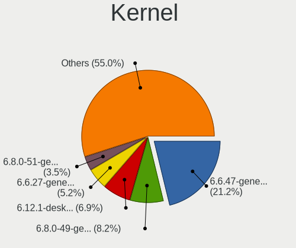
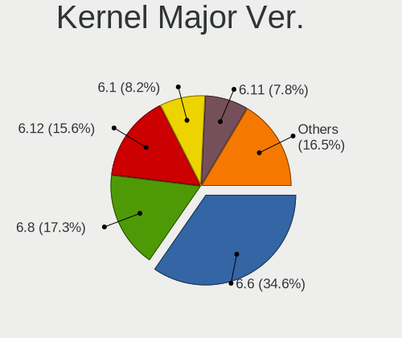
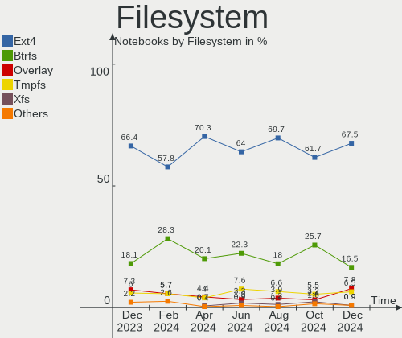
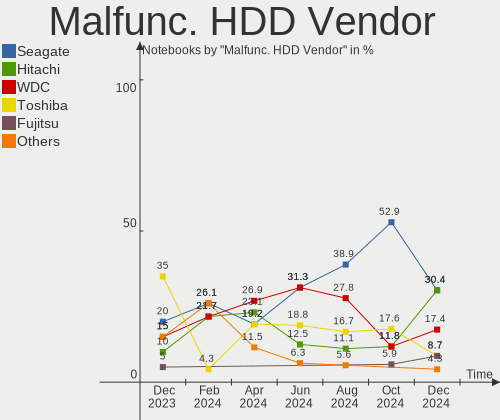
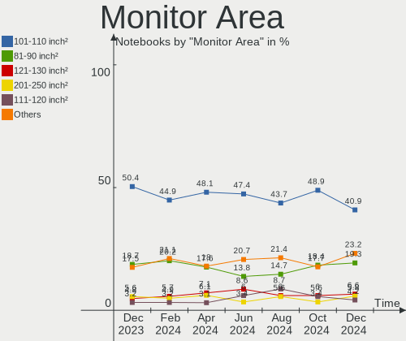
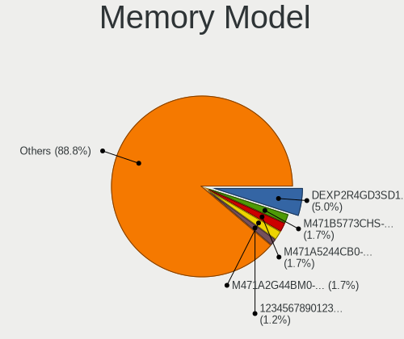

Linux in Russia - Hardware Trends (Notebooks)
---------------------------------------------

A project to identify most popular hardware characteristics and track their change
over time based on data collected by Linux users at https://Linux-Hardware.org.

Anyone can contribute to this report by the [hw-probe](https://github.com/linuxhw/hw-probe) tool:

    sudo -E hw-probe -all -upload

Period: Apr, 2023.

Contents
--------

* [ System ](#system)
  - [ OS                       ](#os)
  - [ OS Family                ](#os-family)
  - [ Kernel                   ](#kernel)
  - [ Kernel Family            ](#kernel-family)
  - [ Kernel Major Ver.        ](#kernel-major-ver)
  - [ Arch                     ](#arch)
  - [ DE                       ](#de)
  - [ Display Server           ](#display-server)
  - [ Display Manager          ](#display-manager)
  - [ OS Lang                  ](#os-lang)
  - [ Boot Mode                ](#boot-mode)
  - [ Filesystem               ](#filesystem)
  - [ Part. scheme             ](#part-scheme)
  - [ Dual Boot with Linux/BSD ](#dual-boot-with-linuxbsd)
  - [ Dual Boot (Win)          ](#dual-boot-win)

* [ Board ](#board)
  - [ Vendor                   ](#vendor)
  - [ Model                    ](#model)
  - [ Model Family             ](#model-family)
  - [ MFG Year                 ](#mfg-year)
  - [ Form Factor              ](#form-factor)
  - [ Secure Boot              ](#secure-boot)
  - [ Coreboot                 ](#coreboot)
  - [ RAM Size                 ](#ram-size)
  - [ RAM Used                 ](#ram-used)
  - [ Total Drives             ](#total-drives)
  - [ Has CD-ROM               ](#has-cd-rom)
  - [ Has Ethernet             ](#has-ethernet)
  - [ Has WiFi                 ](#has-wifi)
  - [ Has Bluetooth            ](#has-bluetooth)

* [ Location ](#location)
  - [ Country                  ](#country)
  - [ City                     ](#city)

* [ Drives ](#drives)
  - [ Drive Vendor             ](#drive-vendor)
  - [ Drive Model              ](#drive-model)
  - [ HDD Vendor               ](#hdd-vendor)
  - [ SSD Vendor               ](#ssd-vendor)
  - [ Drive Kind               ](#drive-kind)
  - [ Drive Connector          ](#drive-connector)
  - [ Drive Size               ](#drive-size)
  - [ Space Total              ](#space-total)
  - [ Space Used               ](#space-used)
  - [ Malfunc. Drives          ](#malfunc-drives)
  - [ Malfunc. Drive Vendor    ](#malfunc-drive-vendor)
  - [ Malfunc. HDD Vendor      ](#malfunc-hdd-vendor)
  - [ Malfunc. Drive Kind      ](#malfunc-drive-kind)
  - [ Failed Drives            ](#failed-drives)
  - [ Failed Drive Vendor      ](#failed-drive-vendor)
  - [ Drive Status             ](#drive-status)

* [ Storage controller ](#storage-controller)
  - [ Storage Vendor           ](#storage-vendor)
  - [ Storage Model            ](#storage-model)
  - [ Storage Kind             ](#storage-kind)

* [ Processor ](#processor)
  - [ CPU Vendor               ](#cpu-vendor)
  - [ CPU Model                ](#cpu-model)
  - [ CPU Model Family         ](#cpu-model-family)
  - [ CPU Cores                ](#cpu-cores)
  - [ CPU Sockets              ](#cpu-sockets)
  - [ CPU Threads              ](#cpu-threads)
  - [ CPU Op-Modes             ](#cpu-op-modes)
  - [ CPU Microcode            ](#cpu-microcode)
  - [ CPU Microarch            ](#cpu-microarch)

* [ Graphics ](#graphics)
  - [ GPU Vendor               ](#gpu-vendor)
  - [ GPU Model                ](#gpu-model)
  - [ GPU Combo                ](#gpu-combo)
  - [ GPU Driver               ](#gpu-driver)
  - [ GPU Memory               ](#gpu-memory)

* [ Monitor ](#monitor)
  - [ Monitor Vendor           ](#monitor-vendor)
  - [ Monitor Model            ](#monitor-model)
  - [ Monitor Resolution       ](#monitor-resolution)
  - [ Monitor Diagonal         ](#monitor-diagonal)
  - [ Monitor Width            ](#monitor-width)
  - [ Aspect Ratio             ](#aspect-ratio)
  - [ Monitor Area             ](#monitor-area)
  - [ Pixel Density            ](#pixel-density)
  - [ Multiple Monitors        ](#multiple-monitors)

* [ Network ](#network)
  - [ Net Controller Vendor    ](#net-controller-vendor)
  - [ Net Controller Model     ](#net-controller-model)
  - [ Wireless Vendor          ](#wireless-vendor)
  - [ Wireless Model           ](#wireless-model)
  - [ Ethernet Vendor          ](#ethernet-vendor)
  - [ Ethernet Model           ](#ethernet-model)
  - [ Net Controller Kind      ](#net-controller-kind)
  - [ Used Controller          ](#used-controller)
  - [ NICs                     ](#nics)
  - [ IPv6                     ](#ipv6)

* [ Bluetooth ](#bluetooth)
  - [ Bluetooth Vendor         ](#bluetooth-vendor)
  - [ Bluetooth Model          ](#bluetooth-model)

* [ Sound ](#sound)
  - [ Sound Vendor             ](#sound-vendor)
  - [ Sound Model              ](#sound-model)

* [ Memory ](#memory)
  - [ Memory Vendor            ](#memory-vendor)
  - [ Memory Model             ](#memory-model)
  - [ Memory Kind              ](#memory-kind)
  - [ Memory Form Factor       ](#memory-form-factor)
  - [ Memory Size              ](#memory-size)
  - [ Memory Speed             ](#memory-speed)

* [ Printers & scanners ](#printers--scanners)
  - [ Printer Vendor           ](#printer-vendor)
  - [ Printer Model            ](#printer-model)
  - [ Scanner Vendor           ](#scanner-vendor)
  - [ Scanner Model            ](#scanner-model)

* [ Camera ](#camera)
  - [ Camera Vendor            ](#camera-vendor)
  - [ Camera Model             ](#camera-model)

* [ Security ](#security)
  - [ Fingerprint Vendor       ](#fingerprint-vendor)
  - [ Fingerprint Model        ](#fingerprint-model)
  - [ Chipcard Vendor          ](#chipcard-vendor)
  - [ Chipcard Model           ](#chipcard-model)

* [ Unsupported ](#unsupported)
  - [ Unsupported Devices      ](#unsupported-devices)
  - [ Unsupported Device Types ](#unsupported-device-types)

System
------

OS
--

Installed operating systems

| Name               | Notebooks | Percent |
|--------------------|-----------|---------|
| ROSA 12.4          | 62        | 23.31%  |
| Debian 12          | 32        | 12.03%  |
| Ubuntu 22.04       | 23        | 8.65%   |
| OpenMandriva 23.03 | 23        | 8.65%   |
| Fedora 37          | 10        | 3.76%   |
| Linux Mint 21.1    | 9         | 3.38%   |
| Arch Rolling       | 8         | 3.01%   |
| Fedora 38          | 7         | 2.63%   |
| Ubuntu 23.04       | 6         | 2.26%   |
| ROSA 12.2          | 6         | 2.26%   |
| Kali 2023.1        | 6         | 2.26%   |
| Debian 11          | 6         | 2.26%   |
| Ubuntu 20.04       | 5         | 1.88%   |
| ROSA 12.3          | 5         | 1.88%   |
| Red OS 7.3.2       | 5         | 1.88%   |
| ROSA R11.1         | 4         | 1.5%    |
| MOS 10             | 4         | 1.5%    |
| Ubuntu 22.10       | 3         | 1.13%   |
| OpenMandriva 4.3   | 3         | 1.13%   |
| Manjaro 22.1.0     | 3         | 1.13%   |
| KDE neon 22.04     | 3         | 1.13%   |
| Gentoo 2.13        | 3         | 1.13%   |
| SteamOS 3.4.6      | 2         | 0.75%   |
| Manjaro            | 2         | 0.75%   |
| LMDE 5             | 2         | 0.75%   |
| Linux Mint 21      | 2         | 0.75%   |
| Linux Mint 20.3    | 2         | 0.75%   |
| Kubuntu 22.04      | 2         | 0.75%   |
| ALT Linux 10.1     | 2         | 0.75%   |
| Zorin 16           | 1         | 0.38%   |
| Ubuntu MATE 22.04  | 1         | 0.38%   |
| Red OS 7.3         | 1         | 0.38%   |
| openSUSE Leap-15.4 | 1         | 0.38%   |
| OpenMandriva 4.2   | 1         | 0.38%   |
| OpenMandriva 23.01 | 1         | 0.38%   |
| MX 21              | 1         | 0.38%   |
| Linux Mint 20.1    | 1         | 0.38%   |
| Kubuntu 23.04      | 1         | 0.38%   |
| Kubuntu 20.04      | 1         | 0.38%   |
| Fedora 35          | 1         | 0.38%   |

OS Family
---------

OS without a version

| Name         | Notebooks | Percent |
|--------------|-----------|---------|
| ROSA         | 77        | 28.95%  |
| Debian       | 38        | 14.29%  |
| Ubuntu       | 37        | 13.91%  |
| OpenMandriva | 28        | 10.53%  |
| Fedora       | 18        | 6.77%   |
| Linux Mint   | 14        | 5.26%   |
| Arch         | 8         | 3.01%   |
| ALT Linux    | 8         | 3.01%   |
| Red OS       | 6         | 2.26%   |
| Kali         | 6         | 2.26%   |
| Manjaro      | 5         | 1.88%   |
| Kubuntu      | 4         | 1.5%    |
| KDE neon     | 3         | 1.13%   |
| Gentoo       | 3         | 1.13%   |
| SteamOS      | 2         | 0.75%   |
| LMDE         | 2         | 0.75%   |
| Zorin        | 1         | 0.38%   |
| Ubuntu MATE  | 1         | 0.38%   |
| openSUSE     | 1         | 0.38%   |
| MX           | 1         | 0.38%   |
| EndeavourOS  | 1         | 0.38%   |
| Elementary   | 1         | 0.38%   |
| antiX        | 1         | 0.38%   |

Kernel
------

Version of the Linux kernel

| Version                             | Notebooks | Percent |
|-------------------------------------|-----------|---------|
| 6.1.20-generic-2rosa2021.1-x86_64   | 50        | 18.8%   |
| 6.1.0-4-amd64                       | 29        | 10.9%   |
| 6.2.6-desktop-1omv2390              | 23        | 8.65%   |
| 5.19.0-38-generic                   | 18        | 6.77%   |
| 5.15.0-69-generic                   | 12        | 4.51%   |
| 6.2.9-200.fc37.x86_64               | 7         | 2.63%   |
| 5.15.103-generic-1rosa2021.1-x86_64 | 7         | 2.63%   |
| 5.19.0-40-generic                   | 6         | 2.26%   |
| 5.15.75-generic-1rosa2021.1-x86_64  | 5         | 1.88%   |
| 5.10.74-generic-2rosa2021.1-x86_64  | 5         | 1.88%   |
| 5.10.0-21-amd64                     | 5         | 1.88%   |
| 6.2.11-300.fc38.x86_64              | 4         | 1.5%    |
| 6.2.0-20-generic                    | 4         | 1.5%    |
| 6.2.0-18-generic                    | 3         | 1.13%   |
| 6.1.23-1-MANJARO                    | 3         | 1.13%   |
| 6.1.0-kali7-amd64                   | 3         | 1.13%   |
| 6.1.0-kali5-amd64                   | 3         | 1.13%   |
| 5.16.7-desktop-1omv4003             | 3         | 1.13%   |
| 5.15.103-generic-1rosa2021.1-i686   | 3         | 1.13%   |
| 5.15.0-67-generic                   | 3         | 1.13%   |
| 6.2.12-300.fc38.x86_64              | 2         | 0.75%   |
| 6.2.11-arch1-1                      | 2         | 0.75%   |
| 6.1.21-1-MANJARO                    | 2         | 0.75%   |
| 6.1.19-gentoo-x86_64                | 2         | 0.75%   |
| 6.1.0-7-amd64                       | 2         | 0.75%   |
| 5.4.83-generic-2rosa-x86_64         | 2         | 0.75%   |
| 5.19.0-32-generic                   | 2         | 0.75%   |
| 5.15.87-1.el7.3.x86_64              | 2         | 0.75%   |
| 5.15.72-1.el7.3.x86_64              | 2         | 0.75%   |
| 5.13.0-valve36-1-neptune            | 2         | 0.75%   |
| 5.10.139-std-def-alt1               | 2         | 0.75%   |
| 5.10.0-20-amd64                     | 2         | 0.75%   |
| 6.2.9-arch1-1                       | 1         | 0.38%   |
| 6.2.9-300.fc38.x86_64               | 1         | 0.38%   |
| 6.2.9-273-tkg-pds                   | 1         | 0.38%   |
| 6.2.8-arch1-1                       | 1         | 0.38%   |
| 6.2.8-200.fc37.x86_64               | 1         | 0.38%   |
| 6.2.8-060208-generic                | 1         | 0.38%   |
| 6.2.7-060207-generic                | 1         | 0.38%   |
| 6.2.6-arch1-1                       | 1         | 0.38%   |

Kernel Family
-------------

Linux kernel without a distro release

| Version  | Notebooks | Percent |
|----------|-----------|---------|
| 6.1.20   | 50        | 18.8%   |
| 6.1.0    | 38        | 14.29%  |
| 5.19.0   | 28        | 10.53%  |
| 6.2.6    | 24        | 9.02%   |
| 5.15.0   | 19        | 7.14%   |
| 6.2.9    | 10        | 3.76%   |
| 5.15.103 | 10        | 3.76%   |
| 6.2.0    | 8         | 3.01%   |
| 5.10.0   | 8         | 3.01%   |
| 6.2.11   | 7         | 2.63%   |
| 5.10.74  | 6         | 2.26%   |
| 5.15.75  | 5         | 1.88%   |
| 6.2.12   | 4         | 1.5%    |
| 6.2.8    | 3         | 1.13%   |
| 6.1.23   | 3         | 1.13%   |
| 5.4.0    | 3         | 1.13%   |
| 5.16.7   | 3         | 1.13%   |
| 6.2.13   | 2         | 0.75%   |
| 6.2.10   | 2         | 0.75%   |
| 6.1.21   | 2         | 0.75%   |
| 6.1.19   | 2         | 0.75%   |
| 5.4.83   | 2         | 0.75%   |
| 5.15.87  | 2         | 0.75%   |
| 5.15.72  | 2         | 0.75%   |
| 5.13.0   | 2         | 0.75%   |
| 5.10.139 | 2         | 0.75%   |
| 4.15.0   | 2         | 0.75%   |
| 6.2.7    | 1         | 0.38%   |
| 6.1.22   | 1         | 0.38%   |
| 6.1.1    | 1         | 0.38%   |
| 6.0.12   | 1         | 0.38%   |
| 6.0.0    | 1         | 0.38%   |
| 5.15.79  | 1         | 0.38%   |
| 5.15.106 | 1         | 0.38%   |
| 5.15.104 | 1         | 0.38%   |
| 5.15.10  | 1         | 0.38%   |
| 5.14.21  | 1         | 0.38%   |
| 5.11.12  | 1         | 0.38%   |
| 5.10.29  | 1         | 0.38%   |
| 5.10.177 | 1         | 0.38%   |

Kernel Major Ver.
-----------------

Linux kernel major version

| Version | Notebooks | Percent |
|---------|-----------|---------|
| 6.1     | 97        | 36.47%  |
| 6.2     | 61        | 22.93%  |
| 5.15    | 42        | 15.79%  |
| 5.19    | 28        | 10.53%  |
| 5.10    | 22        | 8.27%   |
| 5.4     | 5         | 1.88%   |
| 5.16    | 3         | 1.13%   |
| 6.0     | 2         | 0.75%   |
| 5.13    | 2         | 0.75%   |
| 4.15    | 2         | 0.75%   |
| 5.14    | 1         | 0.38%   |
| 5.11    | 1         | 0.38%   |

Arch
----

OS architecture (x86_64, i586, etc.)

| Name   | Notebooks | Percent |
|--------|-----------|---------|
| x86_64 | 261       | 98.12%  |
| i686   | 5         | 1.88%   |

DE
--

Desktop Environment

| Name       | Notebooks | Percent |
|------------|-----------|---------|
| KDE5       | 93        | 34.96%  |
| GNOME      | 88        | 33.08%  |
| Unknown    | 30        | 11.28%  |
| LXQt       | 14        | 5.26%   |
| X-Cinnamon | 13        | 4.89%   |
| XFCE       | 11        | 4.14%   |
| MATE       | 10        | 3.76%   |
| Trinity    | 1         | 0.38%   |
| Pantheon   | 1         | 0.38%   |
| KDE4       | 1         | 0.38%   |
| icewm      | 1         | 0.38%   |
| i3         | 1         | 0.38%   |
| Cinnamon   | 1         | 0.38%   |
| bspwm      | 1         | 0.38%   |

Display Server
--------------

X11 or Wayland

| Name    | Notebooks | Percent |
|---------|-----------|---------|
| X11     | 125       | 46.99%  |
| Wayland | 110       | 41.35%  |
| Unknown | 29        | 10.9%   |
| Tty     | 2         | 0.75%   |

Display Manager
---------------

SDDM, LightDM, etc.

| Name    | Notebooks | Percent |
|---------|-----------|---------|
| SDDM    | 84        | 31.58%  |
| GDM     | 60        | 22.56%  |
| Unknown | 59        | 22.18%  |
| GDM3    | 32        | 12.03%  |
| LightDM | 29        | 10.9%   |
| TDM     | 1         | 0.38%   |
| KDM     | 1         | 0.38%   |

OS Lang
-------

Language

| Lang   | Notebooks | Percent |
|--------|-----------|---------|
| ru_RU  | 205       | 77.07%  |
| en_US  | 55        | 20.68%  |
| C      | 2         | 0.75%   |
| en_IL  | 1         | 0.38%   |
| en_GB  | 1         | 0.38%   |
| C.UTF8 | 1         | 0.38%   |
| ba_RU  | 1         | 0.38%   |

Boot Mode
---------

EFI or BIOS

| Mode | Notebooks | Percent |
|------|-----------|---------|
| EFI  | 163       | 61.28%  |
| BIOS | 103       | 38.72%  |

Filesystem
----------

Type of filesystem

| Type    | Notebooks | Percent |
|---------|-----------|---------|
| Ext4    | 182       | 68.42%  |
| Overlay | 48        | 18.05%  |
| Btrfs   | 30        | 11.28%  |
| Tmpfs   | 6         | 2.26%   |

Part. scheme
------------

Scheme of partitioning

| Type    | Notebooks | Percent |
|---------|-----------|---------|
| GPT     | 173       | 65.04%  |
| MBR     | 65        | 24.44%  |
| Unknown | 28        | 10.53%  |

Dual Boot with Linux/BSD
------------------------

Hosting more than one Linux/BSD

| Dual boot | Notebooks | Percent |
|-----------|-----------|---------|
| No        | 235       | 88.35%  |
| Yes       | 31        | 11.65%  |

Dual Boot (Win)
---------------

Hosting Linux and Windows

| Dual boot | Notebooks | Percent |
|-----------|-----------|---------|
| No        | 145       | 54.51%  |
| Yes       | 121       | 45.49%  |

Board
-----

Vendor
------

Motherboard manufacturer

| Name                | Notebooks | Percent |
|---------------------|-----------|---------|
| Lenovo              | 41        | 15.41%  |
| ASUSTek Computer    | 40        | 15.04%  |
| Hewlett-Packard     | 28        | 10.53%  |
| Aquarius            | 25        | 9.4%    |
| Acer                | 25        | 9.4%    |
| HUAWEI              | 20        | 7.52%   |
| Dell                | 15        | 5.64%   |
| MSI                 | 9         | 3.38%   |
| Clevo               | 7         | 2.63%   |
| Timi                | 5         | 1.88%   |
| Sony                | 5         | 1.88%   |
| Toshiba             | 4         | 1.5%    |
| Unknown             | 4         | 1.5%    |
| Valve               | 3         | 1.13%   |
| Samsung Electronics | 3         | 1.13%   |
| Notebook            | 3         | 1.13%   |
| ICL                 | 3         | 1.13%   |
| HONOR               | 3         | 1.13%   |
| Haier               | 2         | 0.75%   |
| F-Plus Mobile       | 2         | 0.75%   |
| Digma               | 2         | 0.75%   |
| 3Logic Group        | 2         | 0.75%   |
| Unchartevice        | 1         | 0.38%   |
| TPS                 | 1         | 0.38%   |
| Thomson             | 1         | 0.38%   |
| Prestigio           | 1         | 0.38%   |
| Panasonic           | 1         | 0.38%   |
| Maibenben           | 1         | 0.38%   |
| MACHENIKE           | 1         | 0.38%   |
| Irbis               | 1         | 0.38%   |
| Intel               | 1         | 0.38%   |
| Infinix             | 1         | 0.38%   |
| Fujitsu Siemens     | 1         | 0.38%   |
| eMachines           | 1         | 0.38%   |
| DEXP                | 1         | 0.38%   |
| ARDOR GAMING        | 1         | 0.38%   |
| Apple               | 1         | 0.38%   |

Model
-----

Motherboard model

| Name                                | Notebooks | Percent |
|-------------------------------------|-----------|---------|
| Aquarius NS585                      | 25        | 9.4%    |
| Unknown                             | 6         | 2.26%   |
| HUAWEI HVY-WXX9                     | 4         | 1.5%    |
| HUAWEI BOM-WXX9                     | 4         | 1.5%    |
| Clevo NL41MU2                       | 4         | 1.5%    |
| Valve Jupiter                       | 3         | 1.13%   |
| ICL RAYbook Si1512                  | 3         | 1.13%   |
| Dell Inspiron N5110                 | 3         | 1.13%   |
| Timi Redmi Book Pro 15 2022         | 2         | 0.75%   |
| MSI Katana GF66 12UE                | 2         | 0.75%   |
| Lenovo B590 20206                   | 2         | 0.75%   |
| HUAWEI NBD-WXX9                     | 2         | 0.75%   |
| HUAWEI HN-WX9X                      | 2         | 0.75%   |
| HUAWEI CREM-WXX9                    | 2         | 0.75%   |
| HONOR HYM-WXX                       | 2         | 0.75%   |
| F-Plus Mobile FLAPTOP r             | 2         | 0.75%   |
| Digma EVE 11 C422 ES1068EW          | 2         | 0.75%   |
| ASUS X551CAP                        | 2         | 0.75%   |
| ASUS UX303UB                        | 2         | 0.75%   |
| ASUS K50IJ                          | 2         | 0.75%   |
| Acer Extensa 2519                   | 2         | 0.75%   |
| Unchartevice 6540                   | 1         | 0.38%   |
| TPS C48P                            | 1         | 0.38%   |
| Toshiba Satellite X200              | 1         | 0.38%   |
| Toshiba Satellite S50-A-K7M         | 1         | 0.38%   |
| Toshiba Satellite C850-D8K          | 1         | 0.38%   |
| Toshiba Satellite A100              | 1         | 0.38%   |
| Timi TM1701                         | 1         | 0.38%   |
| Timi RedmiBook Pro 15S              | 1         | 0.38%   |
| Timi Redmi Book Pro 14 2022         | 1         | 0.38%   |
| Thomson NEO14A-4WH128               | 1         | 0.38%   |
| Sony VPCSB2A7R                      | 1         | 0.38%   |
| Sony VPCEH1S1R                      | 1         | 0.38%   |
| Sony VGN-NW24MR                     | 1         | 0.38%   |
| Sony VGN-CS31MR_P                   | 1         | 0.38%   |
| Sony SVE1512K1RW                    | 1         | 0.38%   |
| Samsung R460                        | 1         | 0.38%   |
| Samsung 350V5C/351V5C/3540VC/3440VC | 1         | 0.38%   |
| Samsung 300E4C/300E5C/300E7C        | 1         | 0.38%   |
| Prestigio PSB133S01ZFH              | 1         | 0.38%   |

Model Family
------------

Motherboard model prefix

| Name                  | Notebooks | Percent |
|-----------------------|-----------|---------|
| Aquarius NS585        | 25        | 9.4%    |
| Acer Aspire           | 17        | 6.39%   |
| Lenovo ThinkPad       | 13        | 4.89%   |
| Lenovo IdeaPad        | 13        | 4.89%   |
| HP ProBook            | 10        | 3.76%   |
| HP Pavilion           | 7         | 2.63%   |
| Dell Inspiron         | 7         | 2.63%   |
| ASUS VivoBook         | 6         | 2.26%   |
| Unknown               | 6         | 2.26%   |
| Toshiba Satellite     | 4         | 1.5%    |
| HUAWEI HVY-WXX9       | 4         | 1.5%    |
| HUAWEI BOM-WXX9       | 4         | 1.5%    |
| Dell Latitude         | 4         | 1.5%    |
| Clevo NL41MU2         | 4         | 1.5%    |
| Valve Jupiter         | 3         | 1.13%   |
| Timi Redmi            | 3         | 1.13%   |
| MSI Katana            | 3         | 1.13%   |
| Lenovo B590           | 3         | 1.13%   |
| ICL RAYbook           | 3         | 1.13%   |
| Dell Vostro           | 3         | 1.13%   |
| ASUS Zenbook          | 3         | 1.13%   |
| ASUS ROG              | 3         | 1.13%   |
| ASUS ASUS             | 3         | 1.13%   |
| Acer Swift            | 3         | 1.13%   |
| Acer Extensa          | 3         | 1.13%   |
| Lenovo ThinkBook      | 2         | 0.75%   |
| Lenovo Legion         | 2         | 0.75%   |
| HUAWEI NBD-WXX9       | 2         | 0.75%   |
| HUAWEI HN-WX9X        | 2         | 0.75%   |
| HUAWEI CREM-WXX9      | 2         | 0.75%   |
| HONOR HYM-WXX         | 2         | 0.75%   |
| HP OMEN               | 2         | 0.75%   |
| HP Laptop             | 2         | 0.75%   |
| HP EliteBook          | 2         | 0.75%   |
| F-Plus Mobile FLAPTOP | 2         | 0.75%   |
| Digma EVE             | 2         | 0.75%   |
| ASUS X551CAP          | 2         | 0.75%   |
| ASUS UX303UB          | 2         | 0.75%   |
| ASUS K50IJ            | 2         | 0.75%   |
| 3Logic Group Graviton | 2         | 0.75%   |

MFG Year
--------

Motherboard manufacture year

| Year | Notebooks | Percent |
|------|-----------|---------|
| 2019 | 43        | 16.17%  |
| 2022 | 38        | 14.29%  |
| 2021 | 34        | 12.78%  |
| 2020 | 27        | 10.15%  |
| 2013 | 18        | 6.77%   |
| 2012 | 15        | 5.64%   |
| 2011 | 14        | 5.26%   |
| 2010 | 13        | 4.89%   |
| 2015 | 12        | 4.51%   |
| 2018 | 8         | 3.01%   |
| 2009 | 8         | 3.01%   |
| 2008 | 8         | 3.01%   |
| 2007 | 8         | 3.01%   |
| 2014 | 6         | 2.26%   |
| 2017 | 5         | 1.88%   |
| 2016 | 4         | 1.5%    |
| 2006 | 3         | 1.13%   |
| 2023 | 1         | 0.38%   |
| 2005 | 1         | 0.38%   |

Form Factor
-----------

Physical design of the computer

| Name     | Notebooks | Percent |
|----------|-----------|---------|
| Notebook | 266       | 100%    |

Secure Boot
-----------

Enabled or disabled

| State    | Notebooks | Percent |
|----------|-----------|---------|
| Disabled | 241       | 90.6%   |
| Enabled  | 25        | 9.4%    |

Coreboot
--------

Have coreboot on board

| Used | Notebooks | Percent |
|------|-----------|---------|
| No   | 266       | 100%    |

RAM Size
--------

Total RAM memory

| Size in GB | Notebooks | Percent |
|------------|-----------|---------|
| 4.01-8.0   | 91        | 34.21%  |
| 8.01-16.0  | 61        | 22.93%  |
| 3.01-4.0   | 44        | 16.54%  |
| 16.01-24.0 | 39        | 14.66%  |
| 1.01-2.0   | 11        | 4.14%   |
| 2.01-3.0   | 10        | 3.76%   |
| 32.01-64.0 | 8         | 3.01%   |
| 0.51-1.0   | 2         | 0.75%   |

RAM Used
--------

Used RAM memory

| Used GB   | Notebooks | Percent |
|-----------|-----------|---------|
| 1.01-2.0  | 88        | 33.08%  |
| 2.01-3.0  | 68        | 25.56%  |
| 0.51-1.0  | 51        | 19.17%  |
| 3.01-4.0  | 31        | 11.65%  |
| 4.01-8.0  | 18        | 6.77%   |
| 8.01-16.0 | 7         | 2.63%   |
| 0.01-0.5  | 3         | 1.13%   |

Total Drives
------------

Number of drives on board

| Drives | Notebooks | Percent |
|--------|-----------|---------|
| 1      | 200       | 75.19%  |
| 2      | 59        | 22.18%  |
| 3      | 7         | 2.63%   |

Has CD-ROM
----------

Has CD-ROM on board

| Presented | Notebooks | Percent |
|-----------|-----------|---------|
| No        | 201       | 75.56%  |
| Yes       | 65        | 24.44%  |

Has Ethernet
------------

Has Ethernet on board

| Presented | Notebooks | Percent |
|-----------|-----------|---------|
| Yes       | 202       | 75.94%  |
| No        | 64        | 24.06%  |

Has WiFi
--------

Has WiFi module

| Presented | Notebooks | Percent |
|-----------|-----------|---------|
| Yes       | 265       | 99.62%  |
| No        | 1         | 0.38%   |

Has Bluetooth
-------------

Has Bluetooth module

| Presented | Notebooks | Percent |
|-----------|-----------|---------|
| Yes       | 221       | 83.08%  |
| No        | 45        | 16.92%  |

Location
--------

Country
-------

Geographic location (country)

| Country | Notebooks | Percent |
|---------|-----------|---------|
| Russia  | 266       | 100%    |

City
----

Geographic location (city)

| City              | Notebooks | Percent |
|-------------------|-----------|---------|
| Moscow            | 53        | 19.92%  |
| Voronezh          | 35        | 13.16%  |
| St Petersburg     | 32        | 12.03%  |
| Novosibirsk       | 8         | 3.01%   |
| Yekaterinburg     | 7         | 2.63%   |
| Kazan’          | 5         | 1.88%   |
| Ufa               | 4         | 1.5%    |
| Rostov-on-Don     | 4         | 1.5%    |
| Omsk              | 4         | 1.5%    |
| Nizhniy Novgorod  | 4         | 1.5%    |
| Krasnodar         | 4         | 1.5%    |
| Chelyabinsk       | 4         | 1.5%    |
| Yaroslavl         | 3         | 1.13%   |
| Tomsk             | 3         | 1.13%   |
| Saratov           | 3         | 1.13%   |
| Samara            | 3         | 1.13%   |
| Perm              | 3         | 1.13%   |
| Orenburg          | 3         | 1.13%   |
| Arkhangelsk       | 3         | 1.13%   |
| Yoshkar-Ola       | 2         | 0.75%   |
| Yakutsk           | 2         | 0.75%   |
| Taskino           | 2         | 0.75%   |
| Stavropol         | 2         | 0.75%   |
| Podolsk           | 2         | 0.75%   |
| Murom             | 2         | 0.75%   |
| Kurchatov         | 2         | 0.75%   |
| Krasnoyarsk       | 2         | 0.75%   |
| Ivanovo           | 2         | 0.75%   |
| Belgorod          | 2         | 0.75%   |
| Zvenigorod        | 1         | 0.38%   |
| Zlatoust          | 1         | 0.38%   |
| Zheleznovodskiy   | 1         | 0.38%   |
| Zheleznogorsk     | 1         | 0.38%   |
| Zernograd         | 1         | 0.38%   |
| Yuzhno-Sakhalinsk | 1         | 0.38%   |
| Yelizovo          | 1         | 0.38%   |
| Volzhsk           | 1         | 0.38%   |
| Vologda           | 1         | 0.38%   |
| Volgograd         | 1         | 0.38%   |
| Volgodonsk        | 1         | 0.38%   |

Drives
------

Drive Vendor
------------

Hard drive vendors

| Vendor                       | Notebooks | Drives | Percent |
|------------------------------|-----------|--------|---------|
| Samsung Electronics          | 45        | 53     | 13.98%  |
| WDC                          | 31        | 31     | 9.63%   |
| A-DATA Technology            | 31        | 31     | 9.63%   |
| Seagate                      | 24        | 24     | 7.45%   |
| Unknown                      | 19        | 21     | 5.9%    |
| Kingston                     | 14        | 14     | 4.35%   |
| Toshiba                      | 13        | 13     | 4.04%   |
| SK hynix                     | 13        | 13     | 4.04%   |
| Intel                        | 11        | 12     | 3.42%   |
| SanDisk                      | 10        | 10     | 3.11%   |
| Hitachi                      | 10        | 10     | 3.11%   |
| China                        | 10        | 10     | 3.11%   |
| HGST                         | 9         | 9      | 2.8%    |
| Micron Technology            | 7         | 7      | 2.17%   |
| Crucial                      | 7         | 7      | 2.17%   |
| Phison                       | 5         | 5      | 1.55%   |
| KIOXIA                       | 5         | 5      | 1.55%   |
| Transcend                    | 4         | 4      | 1.24%   |
| Silicon Motion               | 4         | 4      | 1.24%   |
| Phison Electronics           | 4         | 4      | 1.24%   |
| BIWIN                        | 4         | 4      | 1.24%   |
| KingSpec                     | 3         | 3      | 0.93%   |
| Apacer                       | 3         | 3      | 0.93%   |
| Unknown                      | 3         | 3      | 0.93%   |
| UMIS                         | 2         | 2      | 0.62%   |
| SPCC                         | 2         | 2      | 0.62%   |
| Smartbuy                     | 2         | 2      | 0.62%   |
| Plextor                      | 2         | 2      | 0.62%   |
| Netac                        | 2         | 2      | 0.62%   |
| JMicron Technology           | 2         | 2      | 0.62%   |
| Fujitsu                      | 2         | 2      | 0.62%   |
| FORESEE                      | 2         | 2      | 0.62%   |
| YMTC                         | 1         | 1      | 0.31%   |
| Wicgtyp                      | 1         | 1      | 0.31%   |
| WALRAM                       | 1         | 1      | 0.31%   |
| TO Exter                     | 1         | 1      | 0.31%   |
| Shenzhen Longsys Electronics | 1         | 1      | 0.31%   |
| Realtek Semiconductor        | 1         | 1      | 0.31%   |
| OCZ                          | 1         | 1      | 0.31%   |
| MSI                          | 1         | 1      | 0.31%   |

Drive Model
-----------

Hard drive models

| Model                                              | Notebooks | Percent |
|----------------------------------------------------|-----------|---------|
| A-DATA SU800 512GB SSD                             | 25        | 7.51%   |
| Unknown MMC Card  64GB                             | 5         | 1.5%    |
| Samsung NVMe SSD Controller SM981/PM981/PM983 1TB  | 4         | 1.2%    |
| Kingston SA400S37480G 480GB SSD                    | 4         | 1.2%    |
| BIWIN CE480T5D101-256 256GB                        | 4         | 1.2%    |
| Seagate ST500LT012-1DG142 500GB                    | 3         | 0.9%    |
| Samsung MZVL2512HCJQ-00B00 512GB                   | 3         | 0.9%    |
| Phison E12 NVMe Controller 512GB                   | 3         | 0.9%    |
| Micron 2450_MTFDKBA512TFK 512GB                    | 3         | 0.9%    |
| HGST HTS545050A7E680 500GB                         | 3         | 0.9%    |
| Crucial CT250MX500SSD1 250GB                       | 3         | 0.9%    |
| Unknown                                            | 3         | 0.9%    |
| WDC WD5000LPLX-75ZNTT0 500GB                       | 2         | 0.6%    |
| Unknown SD/MMC/MS PRO 249GB                        | 2         | 0.6%    |
| Unknown NVMe SSD Drive 512GB                       | 2         | 0.6%    |
| Unknown MMC Card  128GB                            | 2         | 0.6%    |
| Toshiba MQ02ABF100 1TB                             | 2         | 0.6%    |
| Toshiba MQ01ABF050 500GB                           | 2         | 0.6%    |
| Toshiba MQ01ABD100 1TB                             | 2         | 0.6%    |
| SPCC Solid State Disk 256GB                        | 2         | 0.6%    |
| SK hynix HFM512GDJTNG-8310A 512GB                  | 2         | 0.6%    |
| Silicon Motion PCIe-8 SSD 512GB                    | 2         | 0.6%    |
| Seagate ST9500325AS 500GB                          | 2         | 0.6%    |
| Seagate ST500LM030-1RK17D 500GB                    | 2         | 0.6%    |
| Seagate ST2000LM015-2E8174 2TB                     | 2         | 0.6%    |
| Seagate ST1000LM035-1RK172 970GB                   | 2         | 0.6%    |
| Samsung SSD 980 PRO 1TB                            | 2         | 0.6%    |
| Samsung SSD 980 500GB                              | 2         | 0.6%    |
| Samsung SSD 970 EVO Plus 500GB                     | 2         | 0.6%    |
| Samsung SSD 860 EVO 1TB                            | 2         | 0.6%    |
| Samsung NVMe SSD Controller PM9A1/PM9A3/980PRO 2TB | 2         | 0.6%    |
| Samsung MZVLQ512HBLU-00B00 512GB                   | 2         | 0.6%    |
| Samsung MZVLQ1T0HBLB-00B00 1024GB                  | 2         | 0.6%    |
| Samsung MZVLB512HBJQ-00000 512GB                   | 2         | 0.6%    |
| Samsung MZVLB512HAJQ-00000 512GB                   | 2         | 0.6%    |
| Phison CFESR512GMTCT-E9C-2 512GB                   | 2         | 0.6%    |
| Phison 511BS0256GB                                 | 2         | 0.6%    |
| KIOXIA KBG40ZNV512G 512GB                          | 2         | 0.6%    |
| Kingston RBUSNS8154P3256GJ1 256GB                  | 2         | 0.6%    |
| JMicron Generic 1TB                                | 2         | 0.6%    |

HDD Vendor
----------

Hard disk drive vendors

| Vendor              | Notebooks | Drives | Percent |
|---------------------|-----------|--------|---------|
| Seagate             | 24        | 24     | 29.27%  |
| WDC                 | 20        | 20     | 24.39%  |
| Toshiba             | 11        | 11     | 13.41%  |
| Hitachi             | 10        | 10     | 12.2%   |
| HGST                | 9         | 9      | 10.98%  |
| Unknown             | 2         | 2      | 2.44%   |
| Samsung Electronics | 2         | 2      | 2.44%   |
| JMicron Technology  | 2         | 2      | 2.44%   |
| Fujitsu             | 2         | 2      | 2.44%   |

SSD Vendor
----------

Solid state drive vendors

| Vendor              | Notebooks | Drives | Percent |
|---------------------|-----------|--------|---------|
| A-DATA Technology   | 29        | 29     | 27.62%  |
| China               | 10        | 10     | 9.52%   |
| Samsung Electronics | 9         | 9      | 8.57%   |
| Kingston            | 8         | 8      | 7.62%   |
| Crucial             | 7         | 7      | 6.67%   |
| SanDisk             | 5         | 5      | 4.76%   |
| Intel               | 5         | 5      | 4.76%   |
| Transcend           | 4         | 4      | 3.81%   |
| WDC                 | 3         | 3      | 2.86%   |
| KingSpec            | 3         | 3      | 2.86%   |
| SPCC                | 2         | 2      | 1.9%    |
| Smartbuy            | 2         | 2      | 1.9%    |
| Plextor             | 2         | 2      | 1.9%    |
| Wicgtyp             | 1         | 1      | 0.95%   |
| Toshiba             | 1         | 1      | 0.95%   |
| TO Exter            | 1         | 1      | 0.95%   |
| SK hynix            | 1         | 1      | 0.95%   |
| OCZ                 | 1         | 1      | 0.95%   |
| Netac               | 1         | 1      | 0.95%   |
| Micron Technology   | 1         | 1      | 0.95%   |
| KODAK               | 1         | 1      | 0.95%   |
| KingFast            | 1         | 1      | 0.95%   |
| GOODRAM             | 1         | 1      | 0.95%   |
| Corsair             | 1         | 1      | 0.95%   |
| Biwintech           | 1         | 1      | 0.95%   |
| Apple               | 1         | 1      | 0.95%   |
| Apacer              | 1         | 1      | 0.95%   |
| AMD                 | 1         | 1      | 0.95%   |
| ADATA SU            | 1         | 1      | 0.95%   |

Drive Kind
----------

HDD or SSD

| Kind    | Notebooks | Drives | Percent |
|---------|-----------|--------|---------|
| NVMe    | 110       | 125    | 35.26%  |
| SSD     | 102       | 105    | 32.69%  |
| HDD     | 80        | 82     | 25.64%  |
| MMC     | 19        | 20     | 6.09%   |
| Unknown | 1         | 1      | 0.32%   |

Drive Connector
---------------

SATA, SAS, NVMe, etc.

| Type | Notebooks | Drives | Percent |
|------|-----------|--------|---------|
| SATA | 156       | 180    | 53.24%  |
| NVMe | 110       | 125    | 37.54%  |
| MMC  | 19        | 20     | 6.48%   |
| SAS  | 8         | 8      | 2.73%   |

Drive Size
----------

Size of hard drive

| Size in TB | Notebooks | Drives | Percent |
|------------|-----------|--------|---------|
| 0.01-0.5   | 111       | 124    | 64.16%  |
| 0.51-1.0   | 57        | 58     | 32.95%  |
| 1.01-2.0   | 4         | 4      | 2.31%   |
| 3.01-4.0   | 1         | 1      | 0.58%   |

Space Total
-----------

Amount of disk space available on the file system

| Size in GB     | Notebooks | Percent |
|----------------|-----------|---------|
| 101-250        | 72        | 27.07%  |
| 251-500        | 62        | 23.31%  |
| 501-1000       | 36        | 13.53%  |
| Unknown        | 33        | 12.41%  |
| 1-20           | 26        | 9.77%   |
| 51-100         | 17        | 6.39%   |
| 1001-2000      | 9         | 3.38%   |
| 21-50          | 8         | 3.01%   |
| More than 3000 | 2         | 0.75%   |
| 2001-3000      | 1         | 0.38%   |

Space Used
----------

Amount of used disk space

| Used GB   | Notebooks | Percent |
|-----------|-----------|---------|
| 1-20      | 118       | 44.36%  |
| 21-50     | 45        | 16.92%  |
| Unknown   | 33        | 12.41%  |
| 101-250   | 25        | 9.4%    |
| 51-100    | 25        | 9.4%    |
| 251-500   | 12        | 4.51%   |
| 501-1000  | 7         | 2.63%   |
| 1001-2000 | 1         | 0.38%   |

Malfunc. Drives
---------------

Drive models with a malfunction

| Model                               | Notebooks | Drives | Percent |
|-------------------------------------|-----------|--------|---------|
| Seagate ST9500325AS 500GB           | 2         | 2      | 6.25%   |
| HGST HTS545050A7E680 500GB          | 2         | 2      | 6.25%   |
| WDC WD7500BPVT-00HXZT3 752GB        | 1         | 1      | 3.13%   |
| WDC WD5000LPVX-22V0TT0 500GB        | 1         | 1      | 3.13%   |
| WDC WD5000LPVT-00FMCT0 500GB        | 1         | 1      | 3.13%   |
| WDC WD5000BPVT-24HXZT3 500GB        | 1         | 1      | 3.13%   |
| WDC WD3200BEVT-00A0RT0 320GB        | 1         | 1      | 3.13%   |
| Toshiba MK2046GSX 200GB             | 1         | 1      | 3.13%   |
| Seagate ST9320325AS 320GB           | 1         | 1      | 3.13%   |
| Seagate ST9250315AS 250GB           | 1         | 1      | 3.13%   |
| Seagate ST9160827AS 160GB           | 1         | 1      | 3.13%   |
| Seagate ST9160310AS 160GB           | 1         | 1      | 3.13%   |
| Seagate ST750LM022 HN-M750MBB 752GB | 1         | 1      | 3.13%   |
| Seagate ST500LT012-9WS142 500GB     | 1         | 1      | 3.13%   |
| Seagate ST500LT012-1DG142 500GB     | 1         | 1      | 3.13%   |
| Seagate ST2000LM015-2E8174 2TB      | 1         | 1      | 3.13%   |
| Seagate ST1000LM049-2GH172 1TB      | 1         | 1      | 3.13%   |
| SanDisk SSD U100 128GB              | 1         | 1      | 3.13%   |
| SanDisk SSD P4 32GB                 | 1         | 1      | 3.13%   |
| Samsung Electronics SSD 980 PRO 1TB | 1         | 1      | 3.13%   |
| Plextor PX-128M6Pro 128GB SSD       | 1         | 1      | 3.13%   |
| KingSpec Q-720 720GB SSD            | 1         | 1      | 3.13%   |
| KingSpec P3-256 256GB               | 1         | 1      | 3.13%   |
| Intel SSDSC2BF240A5L 240GB          | 1         | 1      | 3.13%   |
| Hitachi HTS545032B9A300 320GB       | 1         | 1      | 3.13%   |
| Hitachi HTS542516K9SA00 160GB       | 1         | 1      | 3.13%   |
| Hitachi HTS541616J9SA00 160GB       | 1         | 1      | 3.13%   |
| HGST HTS721010A9E630 1TB            | 1         | 1      | 3.13%   |
| HGST HTS545050A7E380 500GB          | 1         | 1      | 3.13%   |
| HGST HTS541075A9E680 752GB          | 1         | 1      | 3.13%   |

Malfunc. Drive Vendor
---------------------

Vendors of faulty drives

| Vendor              | Notebooks | Drives | Percent |
|---------------------|-----------|--------|---------|
| Seagate             | 11        | 11     | 34.38%  |
| WDC                 | 5         | 5      | 15.63%  |
| HGST                | 5         | 5      | 15.63%  |
| Hitachi             | 3         | 3      | 9.38%   |
| SanDisk             | 2         | 2      | 6.25%   |
| KingSpec            | 2         | 2      | 6.25%   |
| Toshiba             | 1         | 1      | 3.13%   |
| Samsung Electronics | 1         | 1      | 3.13%   |
| Plextor             | 1         | 1      | 3.13%   |
| Intel               | 1         | 1      | 3.13%   |

Malfunc. HDD Vendor
-------------------

Vendors of faulty HDD drives

| Vendor  | Notebooks | Drives | Percent |
|---------|-----------|--------|---------|
| Seagate | 11        | 11     | 44%     |
| WDC     | 5         | 5      | 20%     |
| HGST    | 5         | 5      | 20%     |
| Hitachi | 3         | 3      | 12%     |
| Toshiba | 1         | 1      | 4%      |

Malfunc. Drive Kind
-------------------

Kinds of faulty drives

| Kind | Notebooks | Drives | Percent |
|------|-----------|--------|---------|
| HDD  | 25        | 25     | 78.13%  |
| SSD  | 6         | 6      | 18.75%  |
| NVMe | 1         | 1      | 3.13%   |

Failed Drives
-------------

Failed drive models

Zero info for selected period =(

Failed Drive Vendor
-------------------

Failed drive vendors

Zero info for selected period =(

Drive Status
------------

Number of failed and malfunc. drives

| Status   | Notebooks | Drives | Percent |
|----------|-----------|--------|---------|
| Works    | 187       | 217    | 65.38%  |
| Detected | 67        | 84     | 23.43%  |
| Malfunc  | 32        | 32     | 11.19%  |

Storage controller
------------------

Storage Vendor
--------------

Storage controller vendors

| Vendor                       | Notebooks | Percent |
|------------------------------|-----------|---------|
| Intel                        | 175       | 54.35%  |
| Samsung Electronics          | 37        | 11.49%  |
| AMD                          | 33        | 10.25%  |
| SanDisk                      | 13        | 4.04%   |
| Phison Electronics           | 13        | 4.04%   |
| SK hynix                     | 12        | 3.73%   |
| Micron Technology            | 6         | 1.86%   |
| Kingston Technology Company  | 6         | 1.86%   |
| KIOXIA                       | 5         | 1.55%   |
| Silicon Motion               | 4         | 1.24%   |
| INNOGRIT                     | 4         | 1.24%   |
| Shenzhen Longsys Electronics | 3         | 0.93%   |
| Union Memory (Shenzhen)      | 2         | 0.62%   |
| ADATA Technology             | 2         | 0.62%   |
| Unknown                      | 2         | 0.62%   |
| Yangtze Memory Technologies  | 1         | 0.31%   |
| Toshiba America Info Systems | 1         | 0.31%   |
| Realtek Semiconductor        | 1         | 0.31%   |
| Netac Technology             | 1         | 0.31%   |
| JMicron Technology           | 1         | 0.31%   |

Storage Model
-------------

Storage controller models

| Model                                                                          | Notebooks | Percent |
|--------------------------------------------------------------------------------|-----------|---------|
| AMD FCH SATA Controller [AHCI mode]                                            | 26        | 7.51%   |
| Intel Cannon Lake PCH SATA AHCI Controller                                     | 25        | 7.23%   |
| Intel 7 Series Chipset Family 6-port SATA Controller [AHCI mode]               | 21        | 6.07%   |
| Samsung NVMe SSD Controller SM981/PM981/PM983                                  | 16        | 4.62%   |
| Samsung NVMe SSD Controller PM9A1/PM9A3/980PRO                                 | 10        | 2.89%   |
| Samsung NVMe SSD Controller 980                                                | 10        | 2.89%   |
| Intel 6 Series/C200 Series Chipset Family 6 port Mobile SATA AHCI Controller   | 10        | 2.89%   |
| Intel Celeron/Pentium Silver Processor SATA Controller                         | 8         | 2.31%   |
| Intel Cannon Point-LP SATA Controller [AHCI Mode]                              | 8         | 2.31%   |
| Intel 82801IBM/IEM (ICH9M/ICH9M-E) 4 port SATA Controller [AHCI mode]          | 8         | 2.31%   |
| Intel Sunrise Point-LP SATA Controller [AHCI mode]                             | 7         | 2.02%   |
| Intel 8 Series SATA Controller 1 [AHCI mode]                                   | 7         | 2.02%   |
| SanDisk WD Black SN750 / PC SN730 NVMe SSD                                     | 6         | 1.73%   |
| Intel Volume Management Device NVMe RAID Controller                            | 6         | 1.73%   |
| Intel Alder Lake-P SATA AHCI Controller                                        | 6         | 1.73%   |
| Intel 82801HM/HEM (ICH8M/ICH8M-E) IDE Controller                               | 6         | 1.73%   |
| Intel 82801 Mobile SATA Controller [RAID mode]                                 | 6         | 1.73%   |
| Phison E12 NVMe Controller                                                     | 5         | 1.45%   |
| Micron NVMe Storage Controller                                                 | 5         | 1.45%   |
| Intel Tiger Lake-LP SATA Controller                                            | 5         | 1.45%   |
| Intel 82801HM/HEM (ICH8M/ICH8M-E) SATA Controller [AHCI mode]                  | 5         | 1.45%   |
| Intel 5 Series/3400 Series Chipset 6 port SATA AHCI Controller                 | 5         | 1.45%   |
| Intel 5 Series/3400 Series Chipset 4 port SATA AHCI Controller                 | 5         | 1.45%   |
| Phison PS5013 E13 NVMe Controller                                              | 4         | 1.16%   |
| Phison Electronics Non-Volatile memory controller                              | 4         | 1.16%   |
| KIOXIA NVMe SSD Controller BG4                                                 | 4         | 1.16%   |
| Intel NM10/ICH7 Family SATA Controller [AHCI mode]                             | 4         | 1.16%   |
| Intel HM170/QM170 Chipset SATA Controller [AHCI Mode]                          | 4         | 1.16%   |
| Intel 8 Series/C220 Series Chipset Family 6-port SATA Controller 1 [AHCI mode] | 4         | 1.16%   |
| INNOGRIT Non-Volatile memory controller                                        | 4         | 1.16%   |
| AMD SB600 Non-Raid-5 SATA                                                      | 4         | 1.16%   |
| AMD SB600 IDE                                                                  | 4         | 1.16%   |
| SK hynix Gold P31/PC711 NVMe Solid State Drive                                 | 3         | 0.87%   |
| SK hynix BC511                                                                 | 3         | 0.87%   |
| SK hynix BC501 NVMe Solid State Drive                                          | 3         | 0.87%   |
| Shenzhen Longsys Electronics Non-Volatile memory controller                    | 3         | 0.87%   |
| SanDisk WD Blue SN550 NVMe SSD                                                 | 3         | 0.87%   |
| Intel Ice Lake-LP SATA Controller [AHCI mode]                                  | 3         | 0.87%   |
| Intel Celeron N3350/Pentium N4200/Atom E3900 Series SATA AHCI Controller       | 3         | 0.87%   |
| Intel 82801GBM/GHM (ICH7-M Family) SATA Controller [IDE mode]                  | 3         | 0.87%   |

Storage Kind
------------

Kind of storage controller (IDE, SATA, NVMe, SAS, ...)

| Kind | Notebooks | Percent |
|------|-----------|---------|
| SATA | 187       | 56.84%  |
| NVMe | 110       | 33.43%  |
| IDE  | 20        | 6.08%   |
| RAID | 12        | 3.65%   |

Processor
---------

CPU Vendor
----------

Processor vendors

| Vendor | Notebooks | Percent |
|--------|-----------|---------|
| Intel  | 197       | 74.06%  |
| AMD    | 69        | 25.94%  |

CPU Model
---------

Processor models

| Model                                         | Notebooks | Percent |
|-----------------------------------------------|-----------|---------|
| Intel Core i3-9100 CPU @ 3.60GHz              | 25        | 9.4%    |
| AMD Ryzen 5 4600H with Radeon Graphics        | 7         | 2.63%   |
| Intel 12th Gen Core i7-12700H                 | 6         | 2.26%   |
| Intel 11th Gen Core i5-1135G7 @ 2.40GHz       | 6         | 2.26%   |
| AMD Ryzen 5 5500U with Radeon Graphics        | 6         | 2.26%   |
| AMD Ryzen 7 6800H with Radeon Graphics        | 5         | 1.88%   |
| AMD Ryzen 5 5600H with Radeon Graphics        | 5         | 1.88%   |
| Intel Core i5-8265U CPU @ 1.60GHz             | 4         | 1.5%    |
| AMD Ryzen 7 5800H with Radeon Graphics        | 4         | 1.5%    |
| AMD Ryzen 5 3500U with Radeon Vega Mobile Gfx | 4         | 1.5%    |
| Intel Core i7-10750H CPU @ 2.60GHz            | 3         | 1.13%   |
| Intel Core i5-8279U CPU @ 2.40GHz             | 3         | 1.13%   |
| Intel Core i5-6200U CPU @ 2.30GHz             | 3         | 1.13%   |
| Intel Core i5-10210U CPU @ 1.60GHz            | 3         | 1.13%   |
| Intel Core i3-6100U CPU @ 2.30GHz             | 3         | 1.13%   |
| Intel Core i3-3120M CPU @ 2.50GHz             | 3         | 1.13%   |
| Intel Core i3-2350M CPU @ 2.30GHz             | 3         | 1.13%   |
| Intel Celeron CPU N3350 @ 1.10GHz             | 3         | 1.13%   |
| AMD Ryzen 3 5300U with Radeon Graphics        | 3         | 1.13%   |
| AMD Custom APU 0405                           | 3         | 1.13%   |
| Intel Pentium Silver N6000 @ 1.10GHz          | 2         | 0.75%   |
| Intel Pentium Dual-Core CPU T4500 @ 2.30GHz   | 2         | 0.75%   |
| Intel Core i7-8565U CPU @ 1.80GHz             | 2         | 0.75%   |
| Intel Core i7-4700HQ CPU @ 2.40GHz            | 2         | 0.75%   |
| Intel Core i7-4500U CPU @ 1.80GHz             | 2         | 0.75%   |
| Intel Core i7-2630QM CPU @ 2.00GHz            | 2         | 0.75%   |
| Intel Core i7-10510U CPU @ 1.80GHz            | 2         | 0.75%   |
| Intel Core i5-7300HQ CPU @ 2.50GHz            | 2         | 0.75%   |
| Intel Core i5-4200M CPU @ 2.50GHz             | 2         | 0.75%   |
| Intel Core i5-3230M CPU @ 2.60GHz             | 2         | 0.75%   |
| Intel Core i5-3210M CPU @ 2.50GHz             | 2         | 0.75%   |
| Intel Core i5-2410M CPU @ 2.30GHz             | 2         | 0.75%   |
| Intel Core i3-2370M CPU @ 2.40GHz             | 2         | 0.75%   |
| Intel Core i3-1005G1 CPU @ 1.20GHz            | 2         | 0.75%   |
| Intel Core i3 CPU M 380 @ 2.53GHz             | 2         | 0.75%   |
| Intel Core 2 Duo CPU P7350 @ 2.00GHz          | 2         | 0.75%   |
| Intel Core 2 CPU T7200 @ 2.00GHz              | 2         | 0.75%   |
| Intel Celeron N4020 CPU @ 1.10GHz             | 2         | 0.75%   |
| Intel Celeron N4000 CPU @ 1.10GHz             | 2         | 0.75%   |
| Intel Celeron J4005 CPU @ 2.00GHz             | 2         | 0.75%   |

CPU Model Family
----------------

Processor model prefix

| Model                   | Notebooks | Percent |
|-------------------------|-----------|---------|
| Intel Core i3           | 47        | 17.67%  |
| Intel Core i5           | 40        | 15.04%  |
| Other                   | 30        | 11.28%  |
| Intel Core i7           | 25        | 9.4%    |
| AMD Ryzen 5             | 25        | 9.4%    |
| Intel Celeron           | 19        | 7.14%   |
| AMD Ryzen 7             | 13        | 4.89%   |
| Intel Core 2 Duo        | 11        | 4.14%   |
| AMD Ryzen 3             | 9         | 3.38%   |
| Intel Pentium           | 8         | 3.01%   |
| Intel Atom              | 5         | 1.88%   |
| Intel Pentium Silver    | 4         | 1.5%    |
| AMD Ryzen 9             | 4         | 1.5%    |
| Intel Pentium Dual-Core | 3         | 1.13%   |
| Intel Core 2            | 3         | 1.13%   |
| AMD A4                  | 3         | 1.13%   |
| Intel Pentium M         | 2         | 0.75%   |
| Intel Celeron Dual-Core | 2         | 0.75%   |
| AMD Athlon 64 X2        | 2         | 0.75%   |
| Intel Pentium Dual      | 1         | 0.38%   |
| AMD Turion 64 X2 Mobile | 1         | 0.38%   |
| AMD Ryzen 5 PRO         | 1         | 0.38%   |
| AMD Phenom II           | 1         | 0.38%   |
| AMD E1                  | 1         | 0.38%   |
| AMD C-70                | 1         | 0.38%   |
| AMD Athlon II Neo       | 1         | 0.38%   |
| AMD Athlon II Dual-Core | 1         | 0.38%   |
| AMD A8                  | 1         | 0.38%   |
| AMD A6                  | 1         | 0.38%   |
| AMD A10                 | 1         | 0.38%   |

CPU Cores
---------

Number of processor cores

| Number | Notebooks | Percent |
|--------|-----------|---------|
| 2      | 113       | 42.48%  |
| 4      | 91        | 34.21%  |
| 6      | 25        | 9.4%    |
| 8      | 17        | 6.39%   |
| 14     | 7         | 2.63%   |
| 1      | 7         | 2.63%   |
| 12     | 4         | 1.5%    |
| 10     | 2         | 0.75%   |

CPU Sockets
-----------

Number of sockets

| Number | Notebooks | Percent |
|--------|-----------|---------|
| 1      | 266       | 100%    |

CPU Threads
-----------

Threads per core (Hyper-Threading)

| Number | Notebooks | Percent |
|--------|-----------|---------|
| 2      | 165       | 62.03%  |
| 1      | 101       | 37.97%  |

CPU Op-Modes
------------

CPU Operation Modes (32-bit, 64-bit)

| Op mode        | Notebooks | Percent |
|----------------|-----------|---------|
| 32-bit, 64-bit | 264       | 99.25%  |
| 32-bit         | 2         | 0.75%   |

CPU Microcode
-------------

Microcode number

| Number     | Notebooks | Percent |
|------------|-----------|---------|
| Unknown    | 73        | 27.44%  |
| 0x906eb    | 25        | 9.4%    |
| 0x306a9    | 13        | 4.89%   |
| 0x0a50000c | 12        | 4.51%   |
| 0x206a7    | 10        | 3.76%   |
| 0x806c1    | 8         | 3.01%   |
| 0x1067a    | 7         | 2.63%   |
| 0x906a3    | 6         | 2.26%   |
| 0x406e3    | 6         | 2.26%   |
| 0x08608103 | 6         | 2.26%   |
| 0x08600106 | 6         | 2.26%   |
| 0x806ec    | 5         | 1.88%   |
| 0x40651    | 5         | 1.88%   |
| 0x08108109 | 5         | 1.88%   |
| 0xa0652    | 4         | 1.5%    |
| 0x20652    | 4         | 1.5%    |
| 0x806ea    | 3         | 1.13%   |
| 0x706a1    | 3         | 1.13%   |
| 0x406c4    | 3         | 1.13%   |
| 0x306d4    | 3         | 1.13%   |
| 0x20655    | 3         | 1.13%   |
| 0x10676    | 3         | 1.13%   |
| 0x0a404101 | 3         | 1.13%   |
| 0x08600104 | 3         | 1.13%   |
| 0x906e9    | 2         | 0.75%   |
| 0x906c0    | 2         | 0.75%   |
| 0x906a4    | 2         | 0.75%   |
| 0x706a8    | 2         | 0.75%   |
| 0x6fd      | 2         | 0.75%   |
| 0x6f6      | 2         | 0.75%   |
| 0x6d8      | 2         | 0.75%   |
| 0x306c3    | 2         | 0.75%   |
| 0x106ca    | 2         | 0.75%   |
| 0x0a50000d | 2         | 0.75%   |
| 0x0a50000b | 2         | 0.75%   |
| 0x0a404102 | 2         | 0.75%   |
| 0x06001119 | 2         | 0.75%   |
| 0x010000c8 | 2         | 0.75%   |
| 0x906ed    | 1         | 0.38%   |
| 0x906ea    | 1         | 0.38%   |

CPU Microarch
-------------

Microarchitecture

| Name             | Notebooks | Percent |
|------------------|-----------|---------|
| KabyLake         | 48        | 18.05%  |
| Unknown          | 21        | 7.89%   |
| Zen 3            | 17        | 6.39%   |
| SandyBridge      | 16        | 6.02%   |
| IvyBridge        | 16        | 6.02%   |
| TigerLake        | 13        | 4.89%   |
| Zen 2            | 11        | 4.14%   |
| Westmere         | 11        | 4.14%   |
| Skylake          | 11        | 4.14%   |
| Penryn           | 11        | 4.14%   |
| Haswell          | 11        | 4.14%   |
| Zen+             | 9         | 3.38%   |
| Goldmont plus    | 9         | 3.38%   |
| Core             | 9         | 3.38%   |
| Alderlake Hybrid | 9         | 3.38%   |
| CometLake        | 5         | 1.88%   |
| Silvermont       | 4         | 1.5%    |
| IceLake          | 4         | 1.5%    |
| Broadwell        | 4         | 1.5%    |
| Bonnell          | 4         | 1.5%    |
| Tremont          | 3         | 1.13%   |
| K8 Hammer        | 3         | 1.13%   |
| K10              | 3         | 1.13%   |
| Goldmont         | 3         | 1.13%   |
| Piledriver       | 2         | 0.75%   |
| P6               | 2         | 0.75%   |
| K10 Llano        | 2         | 0.75%   |
| Zen              | 1         | 0.38%   |
| Puma             | 1         | 0.38%   |
| Jaguar           | 1         | 0.38%   |
| Excavator        | 1         | 0.38%   |
| Bobcat           | 1         | 0.38%   |

Graphics
--------

GPU Vendor
----------

Vendors of graphics cards

| Vendor | Notebooks | Percent |
|--------|-----------|---------|
| Intel  | 178       | 52.35%  |
| AMD    | 87        | 25.59%  |
| Nvidia | 75        | 22.06%  |

GPU Model
---------

Graphics card models

| Model                                                                                    | Notebooks | Percent |
|------------------------------------------------------------------------------------------|-----------|---------|
| Intel CoffeeLake-S GT2 [UHD Graphics 630]                                                | 25        | 7.16%   |
| AMD Cezanne [Radeon Vega Series / Radeon Vega Mobile Series]                             | 16        | 4.58%   |
| Intel 3rd Gen Core processor Graphics Controller                                         | 15        | 4.3%    |
| Intel 2nd Generation Core Processor Family Integrated Graphics Controller                | 14        | 4.01%   |
| Intel TigerLake-LP GT2 [Iris Xe Graphics]                                                | 11        | 3.15%   |
| AMD Renoir                                                                               | 10        | 2.87%   |
| Intel Skylake GT2 [HD Graphics 520]                                                      | 9         | 2.58%   |
| Intel Alder Lake-P Integrated Graphics Controller                                        | 9         | 2.58%   |
| AMD Picasso/Raven 2 [Radeon Vega Series / Radeon Vega Mobile Series]                     | 9         | 2.58%   |
| AMD Lucienne                                                                             | 9         | 2.58%   |
| Nvidia GA106M [GeForce RTX 3060 Mobile / Max-Q]                                          | 8         | 2.29%   |
| Intel Mobile 4 Series Chipset Integrated Graphics Controller                             | 7         | 2.01%   |
| Intel Haswell-ULT Integrated Graphics Controller                                         | 7         | 2.01%   |
| Intel GeminiLake [UHD Graphics 600]                                                      | 7         | 2.01%   |
| Intel Core Processor Integrated Graphics Controller                                      | 7         | 2.01%   |
| Nvidia GK208M [GeForce GT 740M]                                                          | 6         | 1.72%   |
| Intel WhiskeyLake-U GT2 [UHD Graphics 620]                                               | 6         | 1.72%   |
| Nvidia GF117M [GeForce 610M/710M/810M/820M / GT 620M/625M/630M/720M]                     | 5         | 1.43%   |
| Intel CometLake-U GT2 [UHD Graphics]                                                     | 5         | 1.43%   |
| Intel CometLake-H GT2 [UHD Graphics]                                                     | 5         | 1.43%   |
| AMD Rembrandt [Radeon 680M]                                                              | 5         | 1.43%   |
| Intel CoffeeLake-U GT3e [Iris Plus Graphics 655]                                         | 4         | 1.15%   |
| Intel 4th Gen Core Processor Integrated Graphics Controller                              | 4         | 1.15%   |
| Nvidia TU116M [GeForce GTX 1660 Ti Mobile]                                               | 3         | 0.86%   |
| Nvidia GF108M [GeForce GT 620M/630M/635M/640M LE]                                        | 3         | 0.86%   |
| Intel Mobile GM965/GL960 Integrated Graphics Controller (secondary)                      | 3         | 0.86%   |
| Intel Mobile GM965/GL960 Integrated Graphics Controller (primary)                        | 3         | 0.86%   |
| Intel JasperLake [UHD Graphics]                                                          | 3         | 0.86%   |
| Intel Iris Plus Graphics G1 (Ice Lake)                                                   | 3         | 0.86%   |
| Intel HD Graphics 500                                                                    | 3         | 0.86%   |
| Intel Atom/Celeron/Pentium Processor x5-E8000/J3xxx/N3xxx Integrated Graphics Controller | 3         | 0.86%   |
| Intel Atom Processor D4xx/D5xx/N4xx/N5xx Integrated Graphics Controller                  | 3         | 0.86%   |
| AMD VanGogh [AMD Custom GPU 0405]                                                        | 3         | 0.86%   |
| AMD Thames [Radeon HD 7550M/7570M/7650M]                                                 | 3         | 0.86%   |
| AMD Sun XT [Radeon HD 8670A/8670M/8690M / R5 M330 / M430 / Radeon 520 Mobile]            | 3         | 0.86%   |
| AMD RS690M [Radeon Xpress 1200/1250/1270]                                                | 3         | 0.86%   |
| Nvidia TU117M [GeForce GTX 1650 Ti Mobile]                                               | 2         | 0.57%   |
| Nvidia TU117M                                                                            | 2         | 0.57%   |
| Nvidia GT218M [GeForce 310M]                                                             | 2         | 0.57%   |
| Nvidia GP108M [GeForce MX250]                                                            | 2         | 0.57%   |

GPU Combo
---------

Combinations of graphics cards

| Name           | Notebooks | Percent |
|----------------|-----------|---------|
| 1 x Intel      | 111       | 41.73%  |
| 1 x AMD        | 61        | 22.93%  |
| Intel + Nvidia | 54        | 20.3%   |
| 1 x Nvidia     | 11        | 4.14%   |
| Intel + AMD    | 10        | 3.76%   |
| AMD + Nvidia   | 10        | 3.76%   |
| 2 x AMD        | 6         | 2.26%   |
| 2 x Intel      | 3         | 1.13%   |

GPU Driver
----------

Free vs proprietary

| Driver      | Notebooks | Percent |
|-------------|-----------|---------|
| Free        | 207       | 77.82%  |
| Unknown     | 36        | 13.53%  |
| Proprietary | 23        | 8.65%   |

GPU Memory
----------

Total video memory

| Size in GB | Notebooks | Percent |
|------------|-----------|---------|
| Unknown    | 156       | 58.65%  |
| 0.01-0.5   | 51        | 19.17%  |
| 1.01-2.0   | 24        | 9.02%   |
| 0.51-1.0   | 19        | 7.14%   |
| 3.01-4.0   | 10        | 3.76%   |
| 5.01-6.0   | 4         | 1.5%    |
| 7.01-8.0   | 1         | 0.38%   |
| 8.01-16.0  | 1         | 0.38%   |

Monitor
-------

Monitor Vendor
--------------

Monitor vendors

| Vendor                  | Notebooks | Percent |
|-------------------------|-----------|---------|
| BOE                     | 54        | 21.86%  |
| AU Optronics            | 36        | 14.57%  |
| Chimei Innolux          | 34        | 13.77%  |
| LG Display              | 31        | 12.55%  |
| Samsung Electronics     | 20        | 8.1%    |
| Chi Mei Optoelectronics | 12        | 4.86%   |
| TMX                     | 5         | 2.02%   |
| Lenovo                  | 5         | 2.02%   |
| HannStar                | 4         | 1.62%   |
| Valve                   | 3         | 1.21%   |
| Philips                 | 3         | 1.21%   |
| PANDA                   | 3         | 1.21%   |
| Hewlett-Packard         | 3         | 1.21%   |
| CSO                     | 3         | 1.21%   |
| Unknown                 | 2         | 0.81%   |
| Sharp                   | 2         | 0.81%   |
| LG Philips              | 2         | 0.81%   |
| HKC                     | 2         | 0.81%   |
| Goldstar                | 2         | 0.81%   |
| Dell                    | 2         | 0.81%   |
| AOC                     | 2         | 0.81%   |
| Acer                    | 2         | 0.81%   |
| WST                     | 1         | 0.4%    |
| TR_                     | 1         | 0.4%    |
| Toshiba                 | 1         | 0.4%    |
| SLD                     | 1         | 0.4%    |
| Panasonic               | 1         | 0.4%    |
| NCS                     | 1         | 0.4%    |
| LG Electronics          | 1         | 0.4%    |
| KDC                     | 1         | 0.4%    |
| JDZ                     | 1         | 0.4%    |
| InfoVision              | 1         | 0.4%    |
| Envision Peripherals    | 1         | 0.4%    |
| CPT                     | 1         | 0.4%    |
| ASUSTek Computer        | 1         | 0.4%    |
| Apple                   | 1         | 0.4%    |
| Unknown                 | 1         | 0.4%    |

Monitor Model
-------------

Monitor models

| Model                                                                    | Notebooks | Percent |
|--------------------------------------------------------------------------|-----------|---------|
| BOE LCD Monitor BOE0878 1920x1080 355x200mm 16.0-inch                    | 6         | 2.43%   |
| Chimei Innolux LCD Monitor CMN14D4 1920x1080 309x173mm 13.9-inch         | 5         | 2.02%   |
| BOE LCD Monitor BOE0872 1920x1080 344x194mm 15.5-inch                    | 5         | 2.02%   |
| LG Display LCD Monitor LGD033A 1366x768 344x194mm 15.5-inch              | 4         | 1.62%   |
| Valve ANX7530 U VLV3001 800x1280 100x150mm 7.1-inch                      | 3         | 1.21%   |
| TMX TL156MDMP11-0 TMX1560 3200x2000 336x210mm 15.6-inch                  | 3         | 1.21%   |
| Lenovo LCD Monitor LEN40A0 1366x768 309x174mm 14.0-inch                  | 3         | 1.21%   |
| Chi Mei Optoelectronics LCD Monitor CMO15A7 1366x768 344x193mm 15.5-inch | 3         | 1.21%   |
| BOE LCD Monitor BOE0877 1920x1080 309x173mm 13.9-inch                    | 3         | 1.21%   |
| AU Optronics LCD Monitor AUOAF90 1920x1080 344x193mm 15.5-inch           | 3         | 1.21%   |
| AU Optronics LCD Monitor AUO22EC 1366x768 344x193mm 15.5-inch            | 3         | 1.21%   |
| Samsung Electronics LCD Monitor SDC4161 1920x1080 344x194mm 15.5-inch    | 2         | 0.81%   |
| Philips PHL 240V5A PHLC10C 1920x1080 527x296mm 23.8-inch                 | 2         | 0.81%   |
| PANDA LCD Monitor NCP004D 1920x1080 344x194mm 15.5-inch                  | 2         | 0.81%   |
| LG Display LCD Monitor LGD05FA 1920x1080 309x174mm 14.0-inch             | 2         | 0.81%   |
| LG Display LCD Monitor LGD02AC 1366x768 344x194mm 15.5-inch              | 2         | 0.81%   |
| HKC LCD Monitor HKC3D05 1920x1080 344x194mm 15.5-inch                    | 2         | 0.81%   |
| HannStar JM01-22 HSP0016 1680x1050 480x270mm 21.7-inch                   | 2         | 0.81%   |
| Chimei Innolux P130ZFA-BA1 CMN8201 2160x1440 275x183mm 13.0-inch         | 2         | 0.81%   |
| Chimei Innolux LCD Monitor CMN1604 1920x1080 355x199mm 16.0-inch         | 2         | 0.81%   |
| Chimei Innolux LCD Monitor CMN15F5 1920x1080 344x193mm 15.5-inch         | 2         | 0.81%   |
| Chimei Innolux LCD Monitor CMN1515 1920x1080 344x193mm 15.5-inch         | 2         | 0.81%   |
| Chimei Innolux LCD Monitor CMN1361 1920x1080 293x165mm 13.2-inch         | 2         | 0.81%   |
| Chi Mei Optoelectronics LCD Monitor CMO15A3 1366x768 344x193mm 15.5-inch | 2         | 0.81%   |
| BOE LCD Monitor BOE0A56 1920x1080 344x194mm 15.5-inch                    | 2         | 0.81%   |
| BOE LCD Monitor BOE09C5 1920x1080 341x192mm 15.4-inch                    | 2         | 0.81%   |
| BOE LCD Monitor BOE092F 2520x1680 338x226mm 16.0-inch                    | 2         | 0.81%   |
| BOE LCD Monitor BOE07D0 1920x1080 294x165mm 13.3-inch                    | 2         | 0.81%   |
| BOE LCD Monitor BOE07CB 1920x1080 344x193mm 15.5-inch                    | 2         | 0.81%   |
| BOE LCD Monitor BOE0675 1366x768 344x194mm 15.5-inch                     | 2         | 0.81%   |
| AU Optronics LCD Monitor AUO405C 1366x768 256x144mm 11.6-inch            | 2         | 0.81%   |
| AU Optronics LCD Monitor AUO38ED 1920x1080 344x193mm 15.5-inch           | 2         | 0.81%   |
| AU Optronics LCD Monitor AUO21EC 1366x768 344x193mm 15.5-inch            | 2         | 0.81%   |
| AU Optronics LCD Monitor AUO119E 1600x900 382x214mm 17.2-inch            | 2         | 0.81%   |
| WST LCD Monitor WST1560 1920x1080 344x194mm 15.5-inch                    | 1         | 0.4%    |
| Unknown LCD Monitor Sharp LQ156M1JW03 1920x1080                          | 1         | 0.4%    |
| Unknown LCD Monitor FFFF 2288x1287 2550x2550mm 142.0-inch                | 1         | 0.4%    |
| TR_ LCD Monitor TR_5511 1366x768 518x333mm 24.2-inch                     | 1         | 0.4%    |
| Toshiba TV TSB0108 1360x768 576x324mm 26.0-inch                          | 1         | 0.4%    |
| TMX TL140BDXP01-0 TMX1400 2560x1440 310x174mm 14.0-inch                  | 1         | 0.4%    |

Monitor Resolution
------------------

Monitor screen resolution

| Resolution         | Notebooks | Percent |
|--------------------|-----------|---------|
| 1920x1080 (FHD)    | 104       | 44.07%  |
| 1366x768 (WXGA)    | 58        | 24.58%  |
| 1280x800 (WXGA)    | 11        | 4.66%   |
| 2560x1440 (QHD)    | 10        | 4.24%   |
| 1600x900 (HD+)     | 10        | 4.24%   |
| 1920x1200 (WUXGA)  | 6         | 2.54%   |
| 1440x900 (WXGA+)   | 6         | 2.54%   |
| 2560x1600          | 5         | 2.12%   |
| 800x1280           | 3         | 1.27%   |
| 3200x2000          | 3         | 1.27%   |
| 2880x1800          | 3         | 1.27%   |
| 2520x1680          | 3         | 1.27%   |
| 2160x1440          | 3         | 1.27%   |
| 1024x600           | 3         | 1.27%   |
| 3840x2160 (4K)     | 1         | 0.42%   |
| 3840x1080          | 1         | 0.42%   |
| 2288x1287          | 1         | 0.42%   |
| 1920x540           | 1         | 0.42%   |
| 1920x515           | 1         | 0.42%   |
| 1680x1050 (WSXGA+) | 1         | 0.42%   |
| 1280x720 (HD)      | 1         | 0.42%   |
| 1280x1024 (SXGA)   | 1         | 0.42%   |

Monitor Diagonal
----------------

Diagonal size in inches

| Inches  | Notebooks | Percent |
|---------|-----------|---------|
| 15      | 110       | 45.08%  |
| 14      | 32        | 13.11%  |
| 13      | 30        | 12.3%   |
| 16      | 14        | 5.74%   |
| 17      | 13        | 5.33%   |
| 24      | 8         | 3.28%   |
| 11      | 6         | 2.46%   |
| 21      | 5         | 2.05%   |
| 27      | 4         | 1.64%   |
| 12      | 4         | 1.64%   |
| 10      | 3         | 1.23%   |
| 7       | 3         | 1.23%   |
| Unknown | 3         | 1.23%   |
| 23      | 2         | 0.82%   |
| 19      | 2         | 0.82%   |
| 142     | 1         | 0.41%   |
| 72      | 1         | 0.41%   |
| 31      | 1         | 0.41%   |
| 26      | 1         | 0.41%   |
| 25      | 1         | 0.41%   |

Monitor Width
-------------

Physical width

| Width in mm    | Notebooks | Percent |
|----------------|-----------|---------|
| 301-350        | 164       | 67.49%  |
| 201-300        | 27        | 11.11%  |
| 351-400        | 21        | 8.64%   |
| 501-600        | 16        | 6.58%   |
| 401-500        | 6         | 2.47%   |
| 1-100          | 3         | 1.23%   |
| Unknown        | 3         | 1.23%   |
| More than 2000 | 1         | 0.41%   |
| 601-700        | 1         | 0.41%   |
| 1501-2000      | 1         | 0.41%   |

Aspect Ratio
------------

Proportional relationship between the width and the height

| Ratio   | Notebooks | Percent |
|---------|-----------|---------|
| 16/9    | 174       | 77.33%  |
| 16/10   | 36        | 16%     |
| 3/2     | 6         | 2.67%   |
| 0.67    | 3         | 1.33%   |
| Unknown | 2         | 0.89%   |
| 5/4     | 1         | 0.44%   |
| 4/3     | 1         | 0.44%   |
| 3.73    | 1         | 0.44%   |
| 1.00    | 1         | 0.44%   |

Monitor Area
------------

Area in inch²

| Area in inch² | Notebooks | Percent |
|----------------|-----------|---------|
| 101-110        | 118       | 48.16%  |
| 81-90          | 49        | 20%     |
| 71-80          | 13        | 5.31%   |
| 201-250        | 12        | 4.9%    |
| 121-130        | 11        | 4.49%   |
| 51-60          | 6         | 2.45%   |
| 111-120        | 6         | 2.45%   |
| 301-350        | 5         | 2.04%   |
| 251-300        | 5         | 2.04%   |
| 61-70          | 3         | 1.22%   |
| 41-50          | 3         | 1.22%   |
| 1-40           | 3         | 1.22%   |
| Unknown        | 3         | 1.22%   |
| More than 1000 | 2         | 0.82%   |
| 151-200        | 2         | 0.82%   |
| 131-140        | 2         | 0.82%   |
| 351-500        | 1         | 0.41%   |
| 91-100         | 1         | 0.41%   |

Pixel Density
-------------

Pixels per inch

| Density       | Notebooks | Percent |
|---------------|-----------|---------|
| 121-160       | 103       | 42.56%  |
| 101-120       | 67        | 27.69%  |
| 161-240       | 30        | 12.4%   |
| 51-100        | 30        | 12.4%   |
| More than 240 | 6         | 2.48%   |
| 1-50          | 3         | 1.24%   |
| Unknown       | 3         | 1.24%   |

Multiple Monitors
-----------------

Total monitors connected

| Total | Notebooks | Percent |
|-------|-----------|---------|
| 1     | 201       | 75.56%  |
| 0     | 39        | 14.66%  |
| 2     | 24        | 9.02%   |
| 3     | 2         | 0.75%   |

Network
-------

Net Controller Vendor
---------------------

Controller vendors

| Vendor                          | Notebooks | Percent |
|---------------------------------|-----------|---------|
| Realtek Semiconductor           | 177       | 41.45%  |
| Intel                           | 123       | 28.81%  |
| Qualcomm Atheros                | 53        | 12.41%  |
| Broadcom                        | 20        | 4.68%   |
| MediaTek                        | 11        | 2.58%   |
| Ralink                          | 7         | 1.64%   |
| Broadcom Limited                | 5         | 1.17%   |
| ASIX Electronics                | 5         | 1.17%   |
| Xiaomi                          | 4         | 0.94%   |
| Marvell Technology Group        | 4         | 0.94%   |
| Ralink Technology               | 3         | 0.7%    |
| Qualcomm                        | 3         | 0.7%    |
| JMicron Technology              | 3         | 0.7%    |
| Vimtron Electronics             | 2         | 0.47%   |
| Sierra Wireless                 | 2         | 0.47%   |
| Qualcomm Atheros Communications | 2         | 0.47%   |
| Lenovo                          | 2         | 0.47%   |
| TP-Link                         | 1         | 0.23%   |

Net Controller Model
--------------------

Controller models

| Model                                                                   | Notebooks | Percent |
|-------------------------------------------------------------------------|-----------|---------|
| Realtek RTL8111/8168/8411 PCI Express Gigabit Ethernet Controller       | 109       | 22.47%  |
| Intel Cannon Lake PCH CNVi WiFi                                         | 25        | 5.15%   |
| Realtek RTL8822CE 802.11ac PCIe Wireless Network Adapter                | 20        | 4.12%   |
| Realtek RTL810xE PCI Express Fast Ethernet controller                   | 18        | 3.71%   |
| Qualcomm Atheros AR9285 Wireless Network Adapter (PCI-Express)          | 16        | 3.3%    |
| Intel Wireless 7265                                                     | 13        | 2.68%   |
| Intel Wi-Fi 6 AX201                                                     | 12        | 2.47%   |
| Qualcomm Atheros QCA9565 / AR9565 Wireless Network Adapter              | 10        | 2.06%   |
| Intel Wi-Fi 6 AX200                                                     | 9         | 1.86%   |
| Intel Alder Lake-P PCH CNVi WiFi                                        | 9         | 1.86%   |
| Qualcomm Atheros AR9485 Wireless Network Adapter                        | 8         | 1.65%   |
| MediaTek MT7921 802.11ax PCI Express Wireless Network Adapter           | 8         | 1.65%   |
| Realtek RTL8821CE 802.11ac PCIe Wireless Network Adapter                | 7         | 1.44%   |
| Ralink RT3290 Wireless 802.11n 1T/1R PCIe                               | 7         | 1.44%   |
| Qualcomm Atheros QCA9377 802.11ac Wireless Network Adapter              | 6         | 1.24%   |
| Intel Wireless 8265 / 8275                                              | 6         | 1.24%   |
| Realtek RTL8852BE PCIe 802.11ax Wireless Network Controller             | 5         | 1.03%   |
| Realtek 802.11n WLAN Adapter                                            | 5         | 1.03%   |
| Qualcomm Atheros AR242x / AR542x Wireless Network Adapter (PCI-Express) | 5         | 1.03%   |
| Intel Comet Lake PCH CNVi WiFi                                          | 5         | 1.03%   |
| Intel Cannon Point-LP CNVi [Wireless-AC]                                | 5         | 1.03%   |
| ASIX AX88179 Gigabit Ethernet                                           | 5         | 1.03%   |
| Xiaomi Mi/Redmi series (RNDIS)                                          | 4         | 0.82%   |
| Realtek RTL8152 Fast Ethernet Adapter                                   | 4         | 0.82%   |
| Qualcomm Atheros AR9462 Wireless Network Adapter                        | 4         | 0.82%   |
| Intel WiFi Link 5100                                                    | 4         | 0.82%   |
| Intel PRO/Wireless 3945ABG [Golan] Network Connection                   | 4         | 0.82%   |
| Intel Ethernet Connection (6) I219-V                                    | 4         | 0.82%   |
| Intel Ethernet Connection (13) I219-V                                   | 4         | 0.82%   |
| Intel Comet Lake PCH-LP CNVi WiFi                                       | 4         | 0.82%   |
| Broadcom BCM43142 802.11b/g/n                                           | 4         | 0.82%   |
| Broadcom BCM4313 802.11bgn Wireless Network Adapter                     | 4         | 0.82%   |
| Realtek RTL8723BU 802.11b/g/n WLAN Adapter                              | 3         | 0.62%   |
| Realtek RTL8153 Gigabit Ethernet Adapter                                | 3         | 0.62%   |
| Ralink MT7601U Wireless Adapter                                         | 3         | 0.62%   |
| Qualcomm QCNFA765 Wireless Network Adapter                              | 3         | 0.62%   |
| Intel Wireless 8260                                                     | 3         | 0.62%   |
| Intel 82577LM Gigabit Network Connection                                | 3         | 0.62%   |
| Vimtron Mobile Composite Device Bus                                     | 2         | 0.41%   |
| Sierra Wireless EM7455                                                  | 2         | 0.41%   |

Wireless Vendor
---------------

Wireless vendors

| Vendor                          | Notebooks | Percent |
|---------------------------------|-----------|---------|
| Intel                           | 121       | 44.16%  |
| Realtek Semiconductor           | 58        | 21.17%  |
| Qualcomm Atheros                | 50        | 18.25%  |
| Broadcom                        | 13        | 4.74%   |
| MediaTek                        | 11        | 4.01%   |
| Ralink                          | 7         | 2.55%   |
| Ralink Technology               | 3         | 1.09%   |
| Qualcomm                        | 3         | 1.09%   |
| Broadcom Limited                | 3         | 1.09%   |
| Sierra Wireless                 | 2         | 0.73%   |
| Qualcomm Atheros Communications | 2         | 0.73%   |
| TP-Link                         | 1         | 0.36%   |

Wireless Model
--------------

Wireless models

| Model                                                                   | Notebooks | Percent |
|-------------------------------------------------------------------------|-----------|---------|
| Intel Cannon Lake PCH CNVi WiFi                                         | 25        | 9.09%   |
| Realtek RTL8822CE 802.11ac PCIe Wireless Network Adapter                | 20        | 7.27%   |
| Qualcomm Atheros AR9285 Wireless Network Adapter (PCI-Express)          | 16        | 5.82%   |
| Intel Wireless 7265                                                     | 13        | 4.73%   |
| Intel Wi-Fi 6 AX201                                                     | 12        | 4.36%   |
| Qualcomm Atheros QCA9565 / AR9565 Wireless Network Adapter              | 10        | 3.64%   |
| Intel Wi-Fi 6 AX200                                                     | 9         | 3.27%   |
| Intel Alder Lake-P PCH CNVi WiFi                                        | 9         | 3.27%   |
| Qualcomm Atheros AR9485 Wireless Network Adapter                        | 8         | 2.91%   |
| MediaTek MT7921 802.11ax PCI Express Wireless Network Adapter           | 8         | 2.91%   |
| Realtek RTL8821CE 802.11ac PCIe Wireless Network Adapter                | 7         | 2.55%   |
| Ralink RT3290 Wireless 802.11n 1T/1R PCIe                               | 7         | 2.55%   |
| Qualcomm Atheros QCA9377 802.11ac Wireless Network Adapter              | 6         | 2.18%   |
| Intel Wireless 8265 / 8275                                              | 6         | 2.18%   |
| Realtek RTL8852BE PCIe 802.11ax Wireless Network Controller             | 5         | 1.82%   |
| Realtek 802.11n WLAN Adapter                                            | 5         | 1.82%   |
| Qualcomm Atheros AR242x / AR542x Wireless Network Adapter (PCI-Express) | 5         | 1.82%   |
| Intel Comet Lake PCH CNVi WiFi                                          | 5         | 1.82%   |
| Intel Cannon Point-LP CNVi [Wireless-AC]                                | 5         | 1.82%   |
| Qualcomm Atheros AR9462 Wireless Network Adapter                        | 4         | 1.45%   |
| Intel WiFi Link 5100                                                    | 4         | 1.45%   |
| Intel PRO/Wireless 3945ABG [Golan] Network Connection                   | 4         | 1.45%   |
| Intel Comet Lake PCH-LP CNVi WiFi                                       | 4         | 1.45%   |
| Broadcom BCM43142 802.11b/g/n                                           | 4         | 1.45%   |
| Broadcom BCM4313 802.11bgn Wireless Network Adapter                     | 4         | 1.45%   |
| Realtek RTL8723BU 802.11b/g/n WLAN Adapter                              | 3         | 1.09%   |
| Ralink MT7601U Wireless Adapter                                         | 3         | 1.09%   |
| Qualcomm QCNFA765 Wireless Network Adapter                              | 3         | 1.09%   |
| Intel Wireless 8260                                                     | 3         | 1.09%   |
| Sierra Wireless EM7455                                                  | 2         | 0.73%   |
| Realtek RTL8822BE 802.11a/b/g/n/ac WiFi adapter                         | 2         | 0.73%   |
| Realtek RTL8821AE 802.11ac PCIe Wireless Network Adapter                | 2         | 0.73%   |
| Realtek RTL8723BE PCIe Wireless Network Adapter                         | 2         | 0.73%   |
| Realtek RTL8723AE PCIe Wireless Network Adapter                         | 2         | 0.73%   |
| Realtek RTL8192CU 802.11n WLAN Adapter                                  | 2         | 0.73%   |
| Realtek RTL8191SEvB Wireless LAN Controller                             | 2         | 0.73%   |
| Realtek RTL8188EUS 802.11n Wireless Network Adapter                     | 2         | 0.73%   |
| Qualcomm Atheros AR9271 802.11n                                         | 2         | 0.73%   |
| Intel Wi-Fi 6 AX210/AX211/AX411 160MHz                                  | 2         | 0.73%   |
| Intel Wi-Fi 6 AX201 160MHz                                              | 2         | 0.73%   |

Ethernet Vendor
---------------

Ethernet vendors

| Vendor                   | Notebooks | Percent |
|--------------------------|-----------|---------|
| Realtek Semiconductor    | 138       | 66.03%  |
| Intel                    | 29        | 13.88%  |
| Qualcomm Atheros         | 11        | 5.26%   |
| Broadcom                 | 8         | 3.83%   |
| ASIX Electronics         | 5         | 2.39%   |
| Xiaomi                   | 4         | 1.91%   |
| Marvell Technology Group | 4         | 1.91%   |
| JMicron Technology       | 3         | 1.44%   |
| Broadcom Limited         | 3         | 1.44%   |
| Vimtron Electronics      | 2         | 0.96%   |
| Lenovo                   | 2         | 0.96%   |

Ethernet Model
--------------

Ethernet models

| Model                                                             | Notebooks | Percent |
|-------------------------------------------------------------------|-----------|---------|
| Realtek RTL8111/8168/8411 PCI Express Gigabit Ethernet Controller | 109       | 51.9%   |
| Realtek RTL810xE PCI Express Fast Ethernet controller             | 18        | 8.57%   |
| ASIX AX88179 Gigabit Ethernet                                     | 5         | 2.38%   |
| Xiaomi Mi/Redmi series (RNDIS)                                    | 4         | 1.9%    |
| Realtek RTL8152 Fast Ethernet Adapter                             | 4         | 1.9%    |
| Intel Ethernet Connection (6) I219-V                              | 4         | 1.9%    |
| Intel Ethernet Connection (13) I219-V                             | 4         | 1.9%    |
| Realtek RTL8153 Gigabit Ethernet Adapter                          | 3         | 1.43%   |
| Intel 82577LM Gigabit Network Connection                          | 3         | 1.43%   |
| Vimtron Mobile Composite Device Bus                               | 2         | 0.95%   |
| Qualcomm Atheros AR8162 Fast Ethernet                             | 2         | 0.95%   |
| Qualcomm Atheros AR8161 Gigabit Ethernet                          | 2         | 0.95%   |
| Qualcomm Atheros AR8121/AR8113/AR8114 Gigabit or Fast Ethernet    | 2         | 0.95%   |
| JMicron JMC260 PCI Express Fast Ethernet Controller               | 2         | 0.95%   |
| Intel Ethernet Connection (16) I219-V                             | 2         | 0.95%   |
| Broadcom NetLink BCM5787M Gigabit Ethernet PCI Express            | 2         | 0.95%   |
| Broadcom NetLink BCM57785 Gigabit Ethernet PCIe                   | 2         | 0.95%   |
| Realtek RTL8169 PCI Gigabit Ethernet Controller                   | 1         | 0.48%   |
| Realtek RTL8125 2.5GbE Controller                                 | 1         | 0.48%   |
| Realtek RTL-8110SC/8169SC Gigabit Ethernet                        | 1         | 0.48%   |
| Realtek RTL-8100/8101L/8139 PCI Fast Ethernet Adapter             | 1         | 0.48%   |
| Realtek Killer E2600 Gigabit Ethernet Controller                  | 1         | 0.48%   |
| Qualcomm Atheros QCA8172 Fast Ethernet                            | 1         | 0.48%   |
| Qualcomm Atheros QCA8171 Gigabit Ethernet                         | 1         | 0.48%   |
| Qualcomm Atheros Killer E2400 Gigabit Ethernet Controller         | 1         | 0.48%   |
| Qualcomm Atheros AR8151 v1.0 Gigabit Ethernet                     | 1         | 0.48%   |
| Qualcomm Atheros AR8131 Gigabit Ethernet                          | 1         | 0.48%   |
| Marvell Group 88E8071 PCI-E Gigabit Ethernet Controller           | 1         | 0.48%   |
| Marvell Group 88E8057 PCI-E Gigabit Ethernet Controller           | 1         | 0.48%   |
| Marvell Group 88E8055 PCI-E Gigabit Ethernet Controller           | 1         | 0.48%   |
| Marvell Group 88E8040 PCI-E Fast Ethernet Controller              | 1         | 0.48%   |
| Lenovo ThinkPad TBT 3 Dock                                        | 1         | 0.48%   |
| Lenovo Thinkpad LAN                                               | 1         | 0.48%   |
| JMicron JMC250 PCI Express Gigabit Ethernet Controller            | 1         | 0.48%   |
| Intel WiMAX Connection 2400m                                      | 1         | 0.48%   |
| Intel PRO/100 VE Network Connection                               | 1         | 0.48%   |
| Intel Ethernet Connection I219-V                                  | 1         | 0.48%   |
| Intel Ethernet Connection I219-LM                                 | 1         | 0.48%   |
| Intel Ethernet Connection I218-LM                                 | 1         | 0.48%   |
| Intel Ethernet Connection (4) I219-LM                             | 1         | 0.48%   |

Net Controller Kind
-------------------

Ethernet, WiFi or modem

| Kind     | Notebooks | Percent |
|----------|-----------|---------|
| WiFi     | 265       | 56.75%  |
| Ethernet | 202       | 43.25%  |

Used Controller
---------------

Currently used network controller

| Kind     | Notebooks | Percent |
|----------|-----------|---------|
| WiFi     | 189       | 70.52%  |
| Ethernet | 79        | 29.48%  |

NICs
----

Total network controllers on board

| Total | Notebooks | Percent |
|-------|-----------|---------|
| 2     | 185       | 69.55%  |
| 1     | 71        | 26.69%  |
| 0     | 9         | 3.38%   |
| 3     | 1         | 0.38%   |

IPv6
----

IPv6 vs IPv4

| Used | Notebooks | Percent |
|------|-----------|---------|
| No   | 252       | 94.74%  |
| Yes  | 14        | 5.26%   |

Bluetooth
---------

Bluetooth Vendor
----------------

Controller vendors

| Vendor                          | Notebooks | Percent |
|---------------------------------|-----------|---------|
| Intel                           | 102       | 45.54%  |
| IMC Networks                    | 18        | 8.04%   |
| Realtek Semiconductor           | 16        | 7.14%   |
| Lite-On Technology              | 15        | 6.7%    |
| Realtek                         | 13        | 5.8%    |
| Qualcomm Atheros Communications | 13        | 5.8%    |
| Foxconn / Hon Hai               | 11        | 4.91%   |
| Broadcom                        | 8         | 3.57%   |
| Ralink                          | 7         | 3.13%   |
| Opticis                         | 4         | 1.79%   |
| Toshiba                         | 3         | 1.34%   |
| ASUSTek Computer                | 3         | 1.34%   |
| Hewlett-Packard                 | 2         | 0.89%   |
| Foxconn International           | 2         | 0.89%   |
| Dell                            | 2         | 0.89%   |
| Alps Electric                   | 2         | 0.89%   |
| MediaTek                        | 1         | 0.45%   |
| Cambridge Silicon Radio         | 1         | 0.45%   |
| Apple                           | 1         | 0.45%   |

Bluetooth Model
---------------

Controller models

| Model                                             | Notebooks | Percent |
|---------------------------------------------------|-----------|---------|
| Intel Bluetooth 9460/9560 Jefferson Peak (JfP)    | 37        | 16.52%  |
| Intel AX201 Bluetooth                             | 24        | 10.71%  |
| Intel Bluetooth wireless interface                | 23        | 10.27%  |
| Realtek 802.11ac WLAN Adapter                     | 13        | 5.8%    |
| Realtek Bluetooth Radio                           | 11        | 4.91%   |
| Intel AX200 Bluetooth                             | 9         | 4.02%   |
| Ralink RT3290 Bluetooth                           | 7         | 3.13%   |
| Qualcomm Atheros AR3011 Bluetooth                 | 7         | 3.13%   |
| Foxconn / Hon Hai Bluetooth Device                | 6         | 2.68%   |
| Qualcomm Atheros AR3012 Bluetooth 4.0             | 5         | 2.23%   |
| IMC Networks Bluetooth Radio                      | 5         | 2.23%   |
| Opticis Bluetooth Radio                           | 4         | 1.79%   |
| Lite-On Atheros AR3012 Bluetooth                  | 4         | 1.79%   |
| Intel Bluetooth Device                            | 4         | 1.79%   |
| IMC Networks Wireless_Device                      | 4         | 1.79%   |
| IMC Networks Bluetooth Device                     | 4         | 1.79%   |
| IMC Networks Atheros AR3012 Bluetooth 4.0 Adapter | 4         | 1.79%   |
| Lite-On Wireless_Device                           | 3         | 1.34%   |
| Lite-On Qualcomm Atheros QCA9377 Bluetooth        | 3         | 1.34%   |
| Lite-On Bluetooth Device                          | 3         | 1.34%   |
| Toshiba Integrated Bluetooth HCI                  | 2         | 0.89%   |
| Realtek RTL8821A Bluetooth                        | 2         | 0.89%   |
| Realtek  Bluetooth 4.2 Adapter                    | 2         | 0.89%   |
| Intel AX210 Bluetooth                             | 2         | 0.89%   |
| HP Broadcom 2070 Bluetooth Combo                  | 2         | 0.89%   |
| Foxconn International BCM43142A0 Bluetooth module | 2         | 0.89%   |
| Foxconn / Hon Hai Wireless_Device                 | 2         | 0.89%   |
| Broadcom HP Portable SoftSailing                  | 2         | 0.89%   |
| ASUS BT-183 Bluetooth 2.0+EDR adapter             | 2         | 0.89%   |
| Toshiba Bluetooth Device                          | 1         | 0.45%   |
| Realtek RTL8822BE Bluetooth 4.2 Adapter           | 1         | 0.45%   |
| Qualcomm Atheros  Bluetooth Device                | 1         | 0.45%   |
| MediaTek Wireless_Device                          | 1         | 0.45%   |
| Lite-On Broadcom BCM43142A0 Bluetooth Device      | 1         | 0.45%   |
| Lite-On Bluetooth Radio                           | 1         | 0.45%   |
| Intel Wireless-AC 9260 Bluetooth Adapter          | 1         | 0.45%   |
| Intel Centrino Bluetooth Wireless Transceiver     | 1         | 0.45%   |
| Intel Centrino Advanced-N 6230 Bluetooth adapter  | 1         | 0.45%   |
| IMC Networks Bluetooth                            | 1         | 0.45%   |
| Foxconn / Hon Hai BT                              | 1         | 0.45%   |

Sound
-----

Sound Vendor
------------

Sound card vendors

| Vendor                   | Notebooks | Percent |
|--------------------------|-----------|---------|
| Intel                    | 195       | 60.37%  |
| AMD                      | 76        | 23.53%  |
| Nvidia                   | 39        | 12.07%  |
| C-Media Electronics      | 4         | 1.24%   |
| TTGK Technology          | 1         | 0.31%   |
| Texas Instruments        | 1         | 0.31%   |
| Nordic Semiconductor ASA | 1         | 0.31%   |
| Logitech                 | 1         | 0.31%   |
| Lenovo                   | 1         | 0.31%   |
| Hewlett-Packard          | 1         | 0.31%   |
| GN Netcom                | 1         | 0.31%   |
| Generalplus Technology   | 1         | 0.31%   |
| ASUSTek Computer         | 1         | 0.31%   |

Sound Model
-----------

Sound card models

| Model                                                                                             | Notebooks | Percent |
|---------------------------------------------------------------------------------------------------|-----------|---------|
| AMD Family 17h/19h HD Audio Controller                                                            | 44        | 11.22%  |
| AMD Renoir Radeon High Definition Audio Controller                                                | 34        | 8.67%   |
| Intel Cannon Lake PCH cAVS                                                                        | 27        | 6.89%   |
| Intel 7 Series/C216 Chipset Family High Definition Audio Controller                               | 22        | 5.61%   |
| Intel Tiger Lake-LP Smart Sound Technology Audio Controller                                       | 13        | 3.32%   |
| Intel Sunrise Point-LP HD Audio                                                                   | 12        | 3.06%   |
| Intel Alder Lake PCH-P High Definition Audio Controller                                           | 12        | 3.06%   |
| Intel 5 Series/3400 Series Chipset High Definition Audio                                          | 11        | 2.81%   |
| Intel Cannon Point-LP High Definition Audio Controller                                            | 10        | 2.55%   |
| Intel 82801I (ICH9 Family) HD Audio Controller                                                    | 10        | 2.55%   |
| Intel 6 Series/C200 Series Chipset Family High Definition Audio Controller                        | 10        | 2.55%   |
| AMD Raven/Raven2/Fenghuang HDMI/DP Audio Controller                                               | 10        | 2.55%   |
| Intel Celeron/Pentium Silver Processor High Definition Audio                                      | 9         | 2.3%    |
| AMD Rembrandt Radeon High Definition Audio Controller                                             | 8         | 2.04%   |
| Nvidia GF108 High Definition Audio Controller                                                     | 7         | 1.79%   |
| Nvidia GA106 High Definition Audio Controller                                                     | 7         | 1.79%   |
| Intel NM10/ICH7 Family High Definition Audio Controller                                           | 7         | 1.79%   |
| Intel Haswell-ULT HD Audio Controller                                                             | 7         | 1.79%   |
| Intel 8 Series HD Audio Controller                                                                | 7         | 1.79%   |
| AMD SBx00 Azalia (Intel HDA)                                                                      | 7         | 1.79%   |
| AMD FCH Azalia Controller                                                                         | 7         | 1.79%   |
| Nvidia TU107 GeForce GTX 1650 High Definition Audio Controller                                    | 6         | 1.53%   |
| Intel 82801H (ICH8 Family) HD Audio Controller                                                    | 6         | 1.53%   |
| Intel Comet Lake PCH-LP cAVS                                                                      | 5         | 1.28%   |
| Intel Comet Lake PCH cAVS                                                                         | 5         | 1.28%   |
| Intel Xeon E3-1200 v3/4th Gen Core Processor HD Audio Controller                                  | 4         | 1.02%   |
| Intel Wildcat Point-LP High Definition Audio Controller                                           | 4         | 1.02%   |
| Intel Broadwell-U Audio Controller                                                                | 4         | 1.02%   |
| Intel 8 Series/C220 Series Chipset High Definition Audio Controller                               | 4         | 1.02%   |
| C-Media Electronics USB Advanced Audio Device                                                     | 4         | 1.02%   |
| Nvidia TU116 High Definition Audio Controller                                                     | 3         | 0.77%   |
| Nvidia GA104 High Definition Audio Controller                                                     | 3         | 0.77%   |
| Intel Jasper Lake HD Audio                                                                        | 3         | 0.77%   |
| Intel Ice Lake-LP Smart Sound Technology Audio Controller                                         | 3         | 0.77%   |
| Intel CM238 HD Audio Controller                                                                   | 3         | 0.77%   |
| Intel Celeron N3350/Pentium N4200/Atom E3900 Series Audio Cluster                                 | 3         | 0.77%   |
| Nvidia High Definition Audio Controller                                                           | 2         | 0.51%   |
| Nvidia GM107 High Definition Audio Controller [GeForce 940MX]                                     | 2         | 0.51%   |
| Nvidia Audio device                                                                               | 2         | 0.51%   |
| Intel Atom/Celeron/Pentium Processor x5-E8000/J3xxx/N3xxx Series High Definition Audio Controller | 2         | 0.51%   |

Memory
------

Memory Vendor
-------------

Memory module vendors

| Vendor                             | Notebooks | Percent |
|------------------------------------|-----------|---------|
| Samsung Electronics                | 55        | 21.32%  |
| Micron Technology                  | 40        | 15.5%   |
| SK hynix                           | 37        | 14.34%  |
| Crucial                            | 32        | 12.4%   |
| Unknown                            | 25        | 9.69%   |
| Kingston                           | 19        | 7.36%   |
| Unknown (ABCD)                     | 7         | 2.71%   |
| A-DATA Technology                  | 7         | 2.71%   |
| Elpida                             | 6         | 2.33%   |
| Ramaxel Technology                 | 5         | 1.94%   |
| ACPI Digital                       | 4         | 1.55%   |
| Patriot                            | 3         | 1.16%   |
| Nanya Technology                   | 3         | 1.16%   |
| Corsair                            | 3         | 1.16%   |
| Unknown                            | 3         | 1.16%   |
| GOODRAM                            | 2         | 0.78%   |
| Foxline                            | 2         | 0.78%   |
| AMD                                | 2         | 0.78%   |
| Kimtigo Semiconductor (HK) Limited | 1         | 0.39%   |
| ASint Technology                   | 1         | 0.39%   |
| Apacer                             | 1         | 0.39%   |

Memory Model
------------

Memory module models

| Model                                                            | Notebooks | Percent |
|------------------------------------------------------------------|-----------|---------|
| Crucial RAM CT8G4SFRA266.C8FD1 8GB SODIMM DDR4 2667MT/s          | 25        | 9.09%   |
| Unknown RAM Module 2GB SODIMM DDR2 667MT/s                       | 7         | 2.55%   |
| Unknown (ABCD) RAM 123456789012345678 3GB SODIMM LPDDR4 2400MT/s | 7         | 2.55%   |
| Micron RAM 4ATF1G64HZ-3G2E1 8GB Row Of Chips DDR4 3200MT/s       | 6         | 2.18%   |
| Micron RAM 8ATF1G64HZ-3G2R1 8GB SODIMM DDR4 3200MT/s             | 5         | 1.82%   |
| Samsung RAM M471B5173DB0-YK0 4GB SODIMM DDR3 1600MT/s            | 4         | 1.45%   |
| Samsung RAM M471A1G44AB0-CWE 8GB Row Of Chips DDR4 3200MT/s      | 4         | 1.45%   |
| ACPI Digital RAM CMB6-DHDA1BAR08D00 16GB SODIMM DDR4 3200MT/s    | 4         | 1.45%   |
| Unknown RAM Module 1GB SODIMM DDR2 667MT/s                       | 3         | 1.09%   |
| SK hynix RAM HMT351S6BFR8C-H9 4GB SODIMM DDR3 1333MT/s           | 3         | 1.09%   |
| SK hynix RAM HMA81GS6DJR8N-XN 8GB SODIMM DDR4 3200MT/s           | 3         | 1.09%   |
| Samsung RAM M471B5173BH0-CK0 4GB SODIMM DDR3 1600MT/s            | 3         | 1.09%   |
| Samsung RAM M471A5244CB0-CWE 4GB Row Of Chips DDR4 3200MT/s      | 3         | 1.09%   |
| Unknown                                                          | 3         | 1.09%   |
| Unknown RAM Module 4GB SODIMM DDR3                               | 2         | 0.73%   |
| Unknown RAM Module 2GB SODIMM DDR2                               | 2         | 0.73%   |
| SK hynix RAM HMT351S6EFR8A-PB 4GB SODIMM DDR3 1600MT/s           | 2         | 0.73%   |
| SK hynix RAM HMAA1GS6CMR6N-VK 8GB SODIMM DDR4 2667MT/s           | 2         | 0.73%   |
| SK hynix RAM HMA81GS6CJR8N-VK 8GB SODIMM DDR4 2667MT/s           | 2         | 0.73%   |
| SK hynix RAM H9JCNNNCP3MLYR-N6E 4GB Row Of Chips LPDDR5 6400MT/s | 2         | 0.73%   |
| Samsung RAM M471B5773DH0-CH9 2GB SODIMM DDR3 1600MT/s            | 2         | 0.73%   |
| Samsung RAM M471B5273DH0-CH9 4GB SODIMM DDR3 1334MT/s            | 2         | 0.73%   |
| Samsung RAM M471B5273CH0-CH9 4GB SODIMM DDR3 1334MT/s            | 2         | 0.73%   |
| Samsung RAM M471A1K43EB1-CWE 8GB SODIMM DDR4 3200MT/s            | 2         | 0.73%   |
| Samsung RAM M471A1K43DB1-CWE 8GB SODIMM DDR4 3200MT/s            | 2         | 0.73%   |
| Samsung RAM M471A1K43BB1-CRC 8GB SODIMM DDR4 2667MT/s            | 2         | 0.73%   |
| Samsung RAM M471A1G44AB0-CWE 8GB SODIMM DDR4 3200MT/s            | 2         | 0.73%   |
| Samsung RAM M425R1GB4BB0-CQKOL 8GB SODIMM DDR5 4800MT/s          | 2         | 0.73%   |
| Patriot RAM PSD34G16002S 4GB SODIMM DDR3 1600MT/s                | 2         | 0.73%   |
| Nanya RAM NT2GC64B88B0NS-CG 2GB SODIMM DDR3 1334MT/s             | 2         | 0.73%   |
| Micron RAM Module 8GB SODIMM DDR4 3200MT/s                       | 2         | 0.73%   |
| Micron RAM 4ATF1G64HZ-3G2E1 8GB SODIMM DDR4 3200MT/s             | 2         | 0.73%   |
| Micron RAM 16KTF1G64HZ-1G9P1 8GB SODIMM DDR3 1867MT/s            | 2         | 0.73%   |
| A-DATA RAM Module 8GB SODIMM DDR4 3200MT/s                       | 2         | 0.73%   |
| Unknown RAM Module 8GB SODIMM DDR3 1600MT/s                      | 1         | 0.36%   |
| Unknown RAM Module 512MB SODIMM DDR2 667MT/s                     | 1         | 0.36%   |
| Unknown RAM Module 512MB SODIMM DDR                              | 1         | 0.36%   |
| Unknown RAM Module 4GB SODIMM DDR3 800MT/s                       | 1         | 0.36%   |
| Unknown RAM Module 4GB SODIMM 1067MT/s                           | 1         | 0.36%   |
| Unknown RAM Module 2GB SODIMM SDRAM                              | 1         | 0.36%   |

Memory Kind
-----------

Memory module kinds

| Kind    | Notebooks | Percent |
|---------|-----------|---------|
| DDR4    | 113       | 50%     |
| DDR3    | 58        | 25.66%  |
| LPDDR4  | 17        | 7.52%   |
| DDR2    | 17        | 7.52%   |
| DDR     | 5         | 2.21%   |
| LPDDR3  | 4         | 1.77%   |
| DDR5    | 4         | 1.77%   |
| LPDDR5  | 3         | 1.33%   |
| Unknown | 3         | 1.33%   |
| SDRAM   | 2         | 0.88%   |

Memory Form Factor
------------------

Physical design of the memory module

| Name         | Notebooks | Percent |
|--------------|-----------|---------|
| SODIMM       | 193       | 84.65%  |
| Row Of Chips | 31        | 13.6%   |
| DIMM         | 2         | 0.88%   |
| Chip         | 2         | 0.88%   |

Memory Size
-----------

Memory module size

| Size  | Notebooks | Percent |
|-------|-----------|---------|
| 8192  | 111       | 44.58%  |
| 4096  | 67        | 26.91%  |
| 2048  | 34        | 13.65%  |
| 16384 | 18        | 7.23%   |
| 1024  | 12        | 4.82%   |
| 32768 | 4         | 1.61%   |
| 512   | 3         | 1.2%    |

Memory Speed
------------

Memory module speed

| Speed   | Notebooks | Percent |
|---------|-----------|---------|
| 3200    | 57        | 23.17%  |
| 2667    | 53        | 21.54%  |
| 1600    | 43        | 17.48%  |
| 2400    | 14        | 5.69%   |
| 667     | 14        | 5.69%   |
| 1334    | 10        | 4.07%   |
| Unknown | 9         | 3.66%   |
| 1333    | 7         | 2.85%   |
| 4267    | 5         | 2.03%   |
| 2133    | 5         | 2.03%   |
| 4800    | 4         | 1.63%   |
| 1067    | 4         | 1.63%   |
| 6400    | 3         | 1.22%   |
| 4266    | 3         | 1.22%   |
| 1867    | 3         | 1.22%   |
| 800     | 3         | 1.22%   |
| 2933    | 2         | 0.81%   |
| 533     | 2         | 0.81%   |
| 333     | 2         | 0.81%   |
| 3733    | 1         | 0.41%   |
| 3266    | 1         | 0.41%   |
| 2048    | 1         | 0.41%   |

Printers & scanners
-------------------

Printer Vendor
--------------

Printer device vendors

| Vendor | Notebooks | Percent |
|--------|-----------|---------|
| Ricoh  | 2         | 28.57%  |
| Canon  | 2         | 28.57%  |
| Xiaomi | 1         | 14.29%  |
| Xerox  | 1         | 14.29%  |
| Pantum | 1         | 14.29%  |

Printer Model
-------------

Printer device models

| Model                  | Notebooks | Percent |
|------------------------|-----------|---------|
| Xiaomi MiMouse 2       | 1         | 14.29%  |
| Xerox WorkCentre 5222  | 1         | 14.29%  |
| Ricoh SP 210SU         | 1         | 14.29%  |
| Ricoh Aficio SP C240DN | 1         | 14.29%  |
| Pantum P2200 series    | 1         | 14.29%  |
| Canon LBP6030w/6018w   | 1         | 14.29%  |
| Canon LBP6020          | 1         | 14.29%  |

Scanner Vendor
--------------

Scanner device vendors

Zero info for selected period =(

Scanner Model
-------------

Scanner device models

Zero info for selected period =(

Camera
------

Camera Vendor
-------------

Camera device vendors

| Vendor                                 | Notebooks | Percent |
|----------------------------------------|-----------|---------|
| Chicony Electronics                    | 45        | 19.74%  |
| Acer                                   | 38        | 16.67%  |
| IMC Networks                           | 28        | 12.28%  |
| Quanta                                 | 22        | 9.65%   |
| Microdia                               | 15        | 6.58%   |
| Realtek Semiconductor                  | 11        | 4.82%   |
| Cheng Uei Precision Industry (Foxlink) | 8         | 3.51%   |
| Sunplus Innovation Technology          | 7         | 3.07%   |
| Bison Electronics                      | 7         | 3.07%   |
| Y Media                                | 6         | 2.63%   |
| Syntek                                 | 6         | 2.63%   |
| Suyin                                  | 5         | 2.19%   |
| SunplusIT                              | 4         | 1.75%   |
| Luxvisions Innotech Limited            | 4         | 1.75%   |
| icSpring                               | 3         | 1.32%   |
| Alcor Micro                            | 3         | 1.32%   |
| Z-Star Microelectronics                | 2         | 0.88%   |
| Silicon Motion                         | 2         | 0.88%   |
| ShineTech                              | 2         | 0.88%   |
| Lite-On Technology                     | 2         | 0.88%   |
| vivo                                   | 1         | 0.44%   |
| Sonix Technology                       | 1         | 0.44%   |
| Samsung Electronics                    | 1         | 0.44%   |
| Ricoh                                  | 1         | 0.44%   |
| Primax Electronics                     | 1         | 0.44%   |
| Lenovo                                 | 1         | 0.44%   |
| HYGD-220628-A                          | 1         | 0.44%   |
| ALi                                    | 1         | 0.44%   |

Camera Model
------------

Camera device models

| Model                                            | Notebooks | Percent |
|--------------------------------------------------|-----------|---------|
| Acer BisonCam, NB Pro                            | 26        | 11.4%   |
| Quanta ov9734_techfront_camera                   | 9         | 3.95%   |
| IMC Networks USB2.0 HD UVC WebCam                | 8         | 3.51%   |
| Chicony Integrated Camera                        | 7         | 3.07%   |
| Y Media USB Camera                               | 6         | 2.63%   |
| IMC Networks Integrated Camera                   | 5         | 2.19%   |
| Acer BisonCam,NB Pro                             | 5         | 2.19%   |
| Microdia Integrated_Webcam_HD                    | 4         | 1.75%   |
| Chicony USB2.0 HD UVC WebCam                     | 4         | 1.75%   |
| Chicony HD Webcam                                | 4         | 1.75%   |
| Cheng Uei Precision Industry (Foxlink) HD Camera | 4         | 1.75%   |
| Syntek Integrated Camera                         | 3         | 1.32%   |
| Quanta VGA WebCam                                | 3         | 1.32%   |
| Microdia USB Camera                              | 3         | 1.32%   |
| IMC Networks USB2.0 VGA UVC WebCam               | 3         | 1.32%   |
| IMC Networks HD Camera                           | 3         | 1.32%   |
| icSpring camera                                  | 3         | 1.32%   |
| Chicony VGA WebCam                               | 3         | 1.32%   |
| Chicony USB2.0 Camera                            | 3         | 1.32%   |
| Chicony USB camera                               | 3         | 1.32%   |
| Chicony Lenovo EasyCamera                        | 3         | 1.32%   |
| Acer Integrated Camera                           | 3         | 1.32%   |
| Suyin HD Video WebCam                            | 2         | 0.88%   |
| SunplusIT XiaoMi USB 2.0 Webcam                  | 2         | 0.88%   |
| SunplusIT HD Camera                              | 2         | 0.88%   |
| Sunplus Integrated_Webcam_HD                     | 2         | 0.88%   |
| ShineTech HD Camera                              | 2         | 0.88%   |
| Realtek Lenovo EasyCamera                        | 2         | 0.88%   |
| Realtek Integrated_Webcam_HD                     | 2         | 0.88%   |
| Quanta HP TrueVision HD Camera                   | 2         | 0.88%   |
| Quanta HP HD Camera                              | 2         | 0.88%   |
| Quanta HD User Facing                            | 2         | 0.88%   |
| Quanta ACER HD User Facing                       | 2         | 0.88%   |
| Microdia Lenovo EasyCamera                       | 2         | 0.88%   |
| Microdia Laptop_Integrated_Webcam_HD             | 2         | 0.88%   |
| Luxvisions Innotech Limited Integrated Camera    | 2         | 0.88%   |
| IMC Networks ov9734_azurewave_camera             | 2         | 0.88%   |
| IMC Networks Integrated Webcam                   | 2         | 0.88%   |
| Chicony USB 2.0 Camera                           | 2         | 0.88%   |
| Chicony HP Truevision HD                         | 2         | 0.88%   |

Security
--------

Fingerprint Vendor
------------------

Fingerprint sensor vendors

| Vendor                     | Notebooks | Percent |
|----------------------------|-----------|---------|
| Shenzhen Goodix Technology | 25        | 50%     |
| Validity Sensors           | 9         | 18%     |
| Synaptics                  | 5         | 10%     |
| AuthenTec                  | 3         | 6%      |
| STMicroelectronics         | 2         | 4%      |
| LighTuning Technology      | 2         | 4%      |
| Focal-systems.Corp         | 2         | 4%      |
| Upek                       | 1         | 2%      |
| Elan Microelectronics      | 1         | 2%      |

Fingerprint Model
-----------------

Fingerprint sensor models

| Model                                                                      | Notebooks | Percent |
|----------------------------------------------------------------------------|-----------|---------|
| Shenzhen Goodix  Fingerprint Device                                        | 19        | 38%     |
| Shenzhen Goodix Fingerprint Reader                                         | 5         | 10%     |
| Synaptics Prometheus MIS Touch Fingerprint Reader                          | 3         | 6%      |
| Validity Sensors VFS7500 Touch Fingerprint Sensor                          | 2         | 4%      |
| Validity Sensors VFS451 Fingerprint Reader                                 | 2         | 4%      |
| STMicroelectronics Fingerprint Reader                                      | 2         | 4%      |
| Focal-systems.Corp FT9201Fingerprint.                                      | 2         | 4%      |
| Validity Sensors VFS5011 Fingerprint Reader                                | 1         | 2%      |
| Validity Sensors VFS491                                                    | 1         | 2%      |
| Validity Sensors Synaptics WBDI                                            | 1         | 2%      |
| Validity Sensors Synaptics VFS7552 Touch Fingerprint Sensor with PurePrint | 1         | 2%      |
| Validity Sensors Fingerprint scanner                                       | 1         | 2%      |
| Upek Biometric Touchchip/Touchstrip Fingerprint Sensor                     | 1         | 2%      |
| Synaptics UWP WBDI Device                                                  | 1         | 2%      |
| Synaptics  VFS7552 Touch Fingerprint Sensor with PurePrint                 | 1         | 2%      |
| Shenzhen Goodix FingerPrint                                                | 1         | 2%      |
| LighTuning Fingerprint Reader                                              | 1         | 2%      |
| LighTuning ES603 Swipe Fingerprint Sensor                                  | 1         | 2%      |
| Elan ELAN:Fingerprint                                                      | 1         | 2%      |
| AuthenTec AES2810                                                          | 1         | 2%      |
| AuthenTec AES1660 Fingerprint Sensor                                       | 1         | 2%      |
| AuthenTec AES1600                                                          | 1         | 2%      |

Chipcard Vendor
---------------

Chipcard module vendors

| Vendor      | Notebooks | Percent |
|-------------|-----------|---------|
| Alcor Micro | 3         | 75%     |
| Broadcom    | 1         | 25%     |

Chipcard Model
--------------

Chipcard module models

| Model                                          | Notebooks | Percent |
|------------------------------------------------|-----------|---------|
| Alcor Micro AU9540 Smartcard Reader            | 3         | 75%     |
| Broadcom BCM5880 Secure Applications Processor | 1         | 25%     |

Unsupported
-----------

Unsupported Devices
-------------------

Total unsupported devices on board

| Total | Notebooks | Percent |
|-------|-----------|---------|
| 0     | 152       | 57.14%  |
| 1     | 98        | 36.84%  |
| 2     | 14        | 5.26%   |
| 3     | 2         | 0.75%   |

Unsupported Device Types
------------------------

Types of unsupported devices

| Type                  | Notebooks | Percent |
|-----------------------|-----------|---------|
| Graphics card         | 52        | 40.94%  |
| Fingerprint reader    | 50        | 39.37%  |
| Net/wireless          | 8         | 6.3%    |
| Bluetooth             | 8         | 6.3%    |
| Chipcard              | 3         | 2.36%   |
| Multimedia controller | 2         | 1.57%   |
| Camera                | 2         | 1.57%   |
| Tv card               | 1         | 0.79%   |
| Network               | 1         | 0.79%   |

