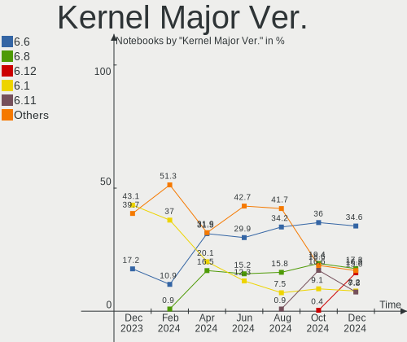
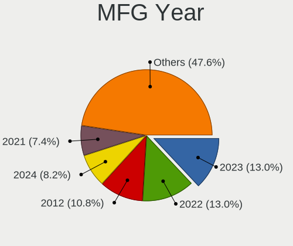
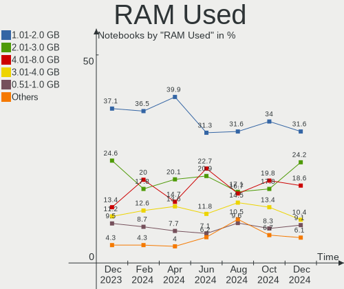
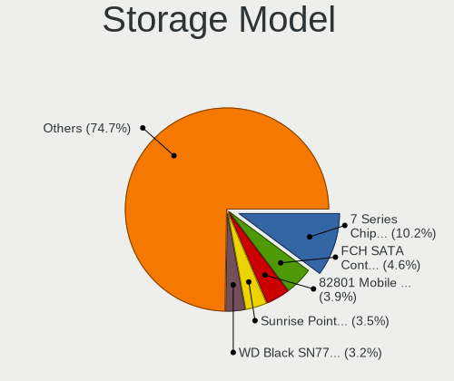
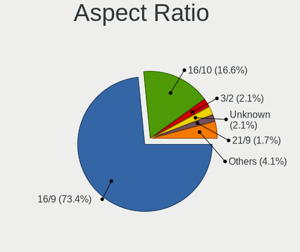
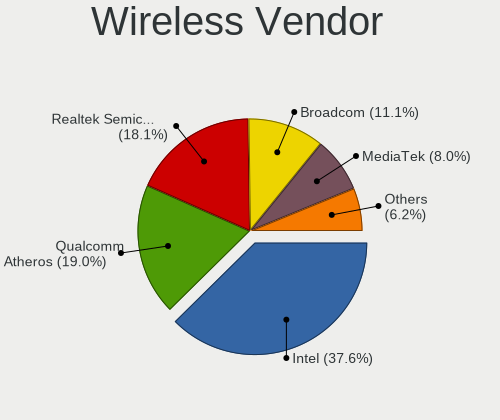
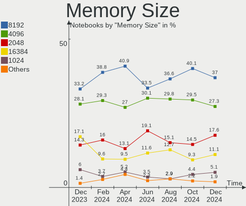
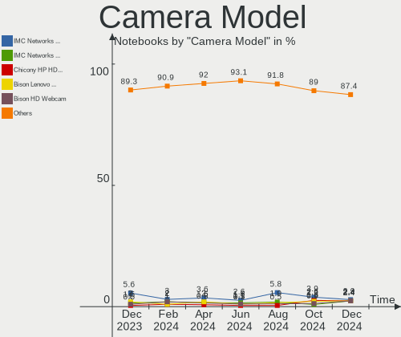

Linux in Russia - Hardware Trends (Notebooks)
---------------------------------------------

A project to identify most popular hardware characteristics and track their change
over time based on data collected by Linux users at https://Linux-Hardware.org.

Anyone can contribute to this report by the [hw-probe](https://github.com/linuxhw/hw-probe) tool:

    sudo -E hw-probe -all -upload

Period: Oct, 2023.

Contents
--------

* [ System ](#system)
  - [ OS                       ](#os)
  - [ OS Family                ](#os-family)
  - [ Kernel                   ](#kernel)
  - [ Kernel Family            ](#kernel-family)
  - [ Kernel Major Ver.        ](#kernel-major-ver)
  - [ Arch                     ](#arch)
  - [ DE                       ](#de)
  - [ Display Server           ](#display-server)
  - [ Display Manager          ](#display-manager)
  - [ OS Lang                  ](#os-lang)
  - [ Boot Mode                ](#boot-mode)
  - [ Filesystem               ](#filesystem)
  - [ Part. scheme             ](#part-scheme)
  - [ Dual Boot with Linux/BSD ](#dual-boot-with-linuxbsd)
  - [ Dual Boot (Win)          ](#dual-boot-win)

* [ Board ](#board)
  - [ Vendor                   ](#vendor)
  - [ Model                    ](#model)
  - [ Model Family             ](#model-family)
  - [ MFG Year                 ](#mfg-year)
  - [ Form Factor              ](#form-factor)
  - [ Secure Boot              ](#secure-boot)
  - [ Coreboot                 ](#coreboot)
  - [ RAM Size                 ](#ram-size)
  - [ RAM Used                 ](#ram-used)
  - [ Total Drives             ](#total-drives)
  - [ Has CD-ROM               ](#has-cd-rom)
  - [ Has Ethernet             ](#has-ethernet)
  - [ Has WiFi                 ](#has-wifi)
  - [ Has Bluetooth            ](#has-bluetooth)

* [ Location ](#location)
  - [ Country                  ](#country)
  - [ City                     ](#city)

* [ Drives ](#drives)
  - [ Drive Vendor             ](#drive-vendor)
  - [ Drive Model              ](#drive-model)
  - [ HDD Vendor               ](#hdd-vendor)
  - [ SSD Vendor               ](#ssd-vendor)
  - [ Drive Kind               ](#drive-kind)
  - [ Drive Connector          ](#drive-connector)
  - [ Drive Size               ](#drive-size)
  - [ Space Total              ](#space-total)
  - [ Space Used               ](#space-used)
  - [ Malfunc. Drives          ](#malfunc-drives)
  - [ Malfunc. Drive Vendor    ](#malfunc-drive-vendor)
  - [ Malfunc. HDD Vendor      ](#malfunc-hdd-vendor)
  - [ Malfunc. Drive Kind      ](#malfunc-drive-kind)
  - [ Failed Drives            ](#failed-drives)
  - [ Failed Drive Vendor      ](#failed-drive-vendor)
  - [ Drive Status             ](#drive-status)

* [ Storage controller ](#storage-controller)
  - [ Storage Vendor           ](#storage-vendor)
  - [ Storage Model            ](#storage-model)
  - [ Storage Kind             ](#storage-kind)

* [ Processor ](#processor)
  - [ CPU Vendor               ](#cpu-vendor)
  - [ CPU Model                ](#cpu-model)
  - [ CPU Model Family         ](#cpu-model-family)
  - [ CPU Cores                ](#cpu-cores)
  - [ CPU Sockets              ](#cpu-sockets)
  - [ CPU Threads              ](#cpu-threads)
  - [ CPU Op-Modes             ](#cpu-op-modes)
  - [ CPU Microcode            ](#cpu-microcode)
  - [ CPU Microarch            ](#cpu-microarch)

* [ Graphics ](#graphics)
  - [ GPU Vendor               ](#gpu-vendor)
  - [ GPU Model                ](#gpu-model)
  - [ GPU Combo                ](#gpu-combo)
  - [ GPU Driver               ](#gpu-driver)
  - [ GPU Memory               ](#gpu-memory)

* [ Monitor ](#monitor)
  - [ Monitor Vendor           ](#monitor-vendor)
  - [ Monitor Model            ](#monitor-model)
  - [ Monitor Resolution       ](#monitor-resolution)
  - [ Monitor Diagonal         ](#monitor-diagonal)
  - [ Monitor Width            ](#monitor-width)
  - [ Aspect Ratio             ](#aspect-ratio)
  - [ Monitor Area             ](#monitor-area)
  - [ Pixel Density            ](#pixel-density)
  - [ Multiple Monitors        ](#multiple-monitors)

* [ Network ](#network)
  - [ Net Controller Vendor    ](#net-controller-vendor)
  - [ Net Controller Model     ](#net-controller-model)
  - [ Wireless Vendor          ](#wireless-vendor)
  - [ Wireless Model           ](#wireless-model)
  - [ Ethernet Vendor          ](#ethernet-vendor)
  - [ Ethernet Model           ](#ethernet-model)
  - [ Net Controller Kind      ](#net-controller-kind)
  - [ Used Controller          ](#used-controller)
  - [ NICs                     ](#nics)
  - [ IPv6                     ](#ipv6)

* [ Bluetooth ](#bluetooth)
  - [ Bluetooth Vendor         ](#bluetooth-vendor)
  - [ Bluetooth Model          ](#bluetooth-model)

* [ Sound ](#sound)
  - [ Sound Vendor             ](#sound-vendor)
  - [ Sound Model              ](#sound-model)

* [ Memory ](#memory)
  - [ Memory Vendor            ](#memory-vendor)
  - [ Memory Model             ](#memory-model)
  - [ Memory Kind              ](#memory-kind)
  - [ Memory Form Factor       ](#memory-form-factor)
  - [ Memory Size              ](#memory-size)
  - [ Memory Speed             ](#memory-speed)

* [ Printers & scanners ](#printers--scanners)
  - [ Printer Vendor           ](#printer-vendor)
  - [ Printer Model            ](#printer-model)
  - [ Scanner Vendor           ](#scanner-vendor)
  - [ Scanner Model            ](#scanner-model)

* [ Camera ](#camera)
  - [ Camera Vendor            ](#camera-vendor)
  - [ Camera Model             ](#camera-model)

* [ Security ](#security)
  - [ Fingerprint Vendor       ](#fingerprint-vendor)
  - [ Fingerprint Model        ](#fingerprint-model)
  - [ Chipcard Vendor          ](#chipcard-vendor)
  - [ Chipcard Model           ](#chipcard-model)

* [ Unsupported ](#unsupported)
  - [ Unsupported Devices      ](#unsupported-devices)
  - [ Unsupported Device Types ](#unsupported-device-types)

System
------

OS
--

Installed operating systems

| Name                            | Notebooks | Percent |
|---------------------------------|-----------|---------|
| ROSA 12.4                       | 73        | 27.24%  |
| Ubuntu 22.04                    | 22        | 8.21%   |
| ALT Linux 10.2                  | 14        | 5.22%   |
| Debian 12                       | 13        | 4.85%   |
| Linux Mint 21.2                 | 12        | 4.48%   |
| Ubuntu 23.10                    | 11        | 4.1%    |
| Fedora 38                       | 10        | 3.73%   |
| Arch Rolling                    | 10        | 3.73%   |
| ROSA 12                         | 8         | 2.99%   |
| SteamOS 3.4.11                  | 6         | 2.24%   |
| ALT Linux 10.1                  | 6         | 2.24%   |
| KDE neon 22.04                  | 5         | 1.87%   |
| Gentoo 2.14                     | 5         | 1.87%   |
| ROSA R11.1                      | 4         | 1.49%   |
| Red OS 7.3                      | 4         | 1.49%   |
| OpenMandriva 23.10              | 4         | 1.49%   |
| OpenMandriva 23.08              | 4         | 1.49%   |
| Fedora 39                       | 4         | 1.49%   |
| ROSA 12.3                       | 3         | 1.12%   |
| Debian 11                       | 3         | 1.12%   |
| Ubuntu 23.04                    | 2         | 0.75%   |
| Pop!_OS 22.04                   | 2         | 0.75%   |
| org.kde.Platform 5.15-21.08     | 2         | 0.75%   |
| Nobara 38                       | 2         | 0.75%   |
| Manjaro                         | 2         | 0.75%   |
| Kubuntu 22.04                   | 2         | 0.75%   |
| Kali 2023.3                     | 2         | 0.75%   |
| Zorin 16                        | 1         | 0.37%   |
| Xubuntu 23.04                   | 1         | 0.37%   |
| Xubuntu 22.04                   | 1         | 0.37%   |
| Xero Rolling                    | 1         | 0.37%   |
| Ubuntu 22.10                    | 1         | 0.37%   |
| Ubuntu 20.04                    | 1         | 0.37%   |
| Taleui 0.2.int-beta.ui_test-cid | 1         | 0.37%   |
| SteamOS 3.6                     | 1         | 0.37%   |
| SteamOS 3.4.10                  | 1         | 0.37%   |
| ROSA R8.1                       | 1         | 0.37%   |
| ROSA 12.2                       | 1         | 0.37%   |
| RELD 7.9                        | 1         | 0.37%   |
| Red OS 7.3.2                    | 1         | 0.37%   |

OS Family
---------

OS without a version

| Name             | Notebooks | Percent |
|------------------|-----------|---------|
| ROSA             | 90        | 33.58%  |
| Ubuntu           | 37        | 13.81%  |
| ALT Linux        | 21        | 7.84%   |
| Debian           | 17        | 6.34%   |
| Fedora           | 14        | 5.22%   |
| Linux Mint       | 13        | 4.85%   |
| Arch             | 10        | 3.73%   |
| SteamOS          | 8         | 2.99%   |
| OpenMandriva     | 8         | 2.99%   |
| Red OS           | 5         | 1.87%   |
| KDE neon         | 5         | 1.87%   |
| Gentoo           | 5         | 1.87%   |
| Manjaro          | 3         | 1.12%   |
| Kubuntu          | 3         | 1.12%   |
| Kali             | 3         | 1.12%   |
| Xubuntu          | 2         | 0.75%   |
| Pop!_OS          | 2         | 0.75%   |
| org.kde.Platform | 2         | 0.75%   |
| Nobara           | 2         | 0.75%   |
| Deepin           | 2         | 0.75%   |
| Zorin            | 1         | 0.37%   |
| Xero             | 1         | 0.37%   |
| Taleui           | 1         | 0.37%   |
| RELD             | 1         | 0.37%   |
| Parrot           | 1         | 0.37%   |
| MX               | 1         | 0.37%   |
| Lubuntu          | 1         | 0.37%   |
| LMDE             | 1         | 0.37%   |
| Green            | 1         | 0.37%   |
| Garuda Linux     | 1         | 0.37%   |
| EndeavourOS      | 1         | 0.37%   |
| Elementary       | 1         | 0.37%   |
| Clear Linux      | 1         | 0.37%   |
| blendOS          | 1         | 0.37%   |
| Astra Linux      | 1         | 0.37%   |
| ArcoLinux        | 1         | 0.37%   |

Kernel
------

Version of the Linux kernel

| Version                             | Notebooks | Percent |
|-------------------------------------|-----------|---------|
| 6.1.46-generic-2rosa2021.1-x86_64   | 28        | 10.45%  |
| 6.1.20-generic-2rosa2021.1-x86_64   | 23        | 8.58%   |
| 6.2.0-34-generic                    | 18        | 6.72%   |
| 6.2.0-35-generic                    | 13        | 4.85%   |
| 6.1.58-generic-1rosa2021.1-x86_64   | 8         | 2.99%   |
| 6.1.0-13-amd64                      | 7         | 2.61%   |
| 5.13.0-valve37-1-neptune            | 7         | 2.61%   |
| 6.5.0-9-generic                     | 6         | 2.24%   |
| 6.5.7-arch1-1                       | 5         | 1.87%   |
| 6.1.54-un-def-alt1                  | 5         | 1.87%   |
| 5.15.127-generic-1rosa2021.1-x86_64 | 5         | 1.87%   |
| 5.10.184-generic-1rosa2021.1-x86_64 | 5         | 1.87%   |
| 6.5.7-200.fc38.x86_64               | 4         | 1.49%   |
| 6.5.5-desktop-1omv2390              | 4         | 1.49%   |
| 6.2.0-33-generic                    | 4         | 1.49%   |
| 6.1.55-un-def-alt1                  | 4         | 1.49%   |
| 6.1.38-generic-1rosa2021.1-x86_64   | 4         | 1.49%   |
| 5.15.103-generic-1rosa2021.1-i686   | 4         | 1.49%   |
| 5.15.0-87-generic                   | 4         | 1.49%   |
| 5.15.0-76-generic                   | 4         | 1.49%   |
| 6.5.0-5-generic                     | 3         | 1.12%   |
| 6.4.11-desktop-1omv2390             | 3         | 1.12%   |
| 6.1.49-un-def-alt1                  | 3         | 1.12%   |
| 6.1.0-4-amd64                       | 3         | 1.12%   |
| 5.15.0-86-generic                   | 3         | 1.12%   |
| 6.5.9-arch2-1                       | 2         | 0.75%   |
| 6.5.5-300.fc39.x86_64               | 2         | 0.75%   |
| 6.5.5-1-MANJARO                     | 2         | 0.75%   |
| 6.2.9-300.fc38.x86_64               | 2         | 0.75%   |
| 6.1.58-1-lts                        | 2         | 0.75%   |
| 6.1.52-1.el7.3.x86_64               | 2         | 0.75%   |
| 6.1.0-10-amd64                      | 2         | 0.75%   |
| 5.15.75-generic-1rosa2021.1-i686    | 2         | 0.75%   |
| 5.15.105-un-def-alt1                | 2         | 0.75%   |
| 5.10.198-std-def-alt1               | 2         | 0.75%   |
| 5.10.164-std-def-alt1               | 2         | 0.75%   |
| 6.5.9-gentoo                        | 1         | 0.37%   |
| 6.5.9-1-MANJARO                     | 1         | 0.37%   |
| 6.5.8-zen1-1-zen                    | 1         | 0.37%   |
| 6.5.8-gentoo-dist                   | 1         | 0.37%   |

Kernel Family
-------------

Linux kernel without a distro release

| Version  | Notebooks | Percent |
|----------|-----------|---------|
| 6.2.0    | 37        | 13.81%  |
| 6.1.46   | 29        | 10.82%  |
| 6.1.20   | 23        | 8.58%   |
| 6.5.7    | 15        | 5.6%    |
| 6.1.0    | 15        | 5.6%    |
| 6.5.5    | 13        | 4.85%   |
| 6.5.0    | 13        | 4.85%   |
| 5.15.0   | 12        | 4.48%   |
| 6.1.58   | 10        | 3.73%   |
| 5.13.0   | 7         | 2.61%   |
| 5.15.127 | 6         | 2.24%   |
| 6.1.54   | 5         | 1.87%   |
| 5.10.184 | 5         | 1.87%   |
| 6.5.9    | 4         | 1.49%   |
| 6.5.8    | 4         | 1.49%   |
| 6.5.6    | 4         | 1.49%   |
| 6.1.55   | 4         | 1.49%   |
| 6.1.38   | 4         | 1.49%   |
| 5.15.103 | 4         | 1.49%   |
| 6.5.4    | 3         | 1.12%   |
| 6.4.11   | 3         | 1.12%   |
| 6.1.52   | 3         | 1.12%   |
| 6.1.49   | 3         | 1.12%   |
| 5.15.75  | 3         | 1.12%   |
| 6.2.9    | 2         | 0.75%   |
| 5.15.105 | 2         | 0.75%   |
| 5.10.198 | 2         | 0.75%   |
| 5.10.164 | 2         | 0.75%   |
| 5.10.0   | 2         | 0.75%   |
| 4.15.0   | 2         | 0.75%   |
| 6.4.8    | 1         | 0.37%   |
| 6.4.6    | 1         | 0.37%   |
| 6.4.0    | 1         | 0.37%   |
| 6.3.12   | 1         | 0.37%   |
| 6.3.0    | 1         | 0.37%   |
| 6.2.16   | 1         | 0.37%   |
| 6.1.59   | 1         | 0.37%   |
| 6.1.57   | 1         | 0.37%   |
| 6.1.56   | 1         | 0.37%   |
| 6.1.53   | 1         | 0.37%   |

Kernel Major Ver.
-----------------

Linux kernel major version

| Version | Notebooks | Percent |
|---------|-----------|---------|
| 6.1     | 102       | 38.06%  |
| 6.5     | 56        | 20.9%   |
| 6.2     | 40        | 14.93%  |
| 5.15    | 32        | 11.94%  |
| 5.10    | 13        | 4.85%   |
| 5.13    | 7         | 2.61%   |
| 6.4     | 6         | 2.24%   |
| 5.4     | 3         | 1.12%   |
| 6.3     | 2         | 0.75%   |
| 6.0     | 2         | 0.75%   |
| 4.15    | 2         | 0.75%   |
| 5.19    | 1         | 0.37%   |
| 5.18    | 1         | 0.37%   |
| 4.1     | 1         | 0.37%   |

Arch
----

OS architecture (x86_64, i586, etc.)

| Name   | Notebooks | Percent |
|--------|-----------|---------|
| x86_64 | 258       | 96.27%  |
| i686   | 10        | 3.73%   |

DE
--

Desktop Environment

| Name            | Notebooks | Percent |
|-----------------|-----------|---------|
| KDE5            | 101       | 37.69%  |
| GNOME           | 91        | 33.96%  |
| LXQt            | 19        | 7.09%   |
| X-Cinnamon      | 13        | 4.85%   |
| MATE            | 13        | 4.85%   |
| XFCE            | 10        | 3.73%   |
| Unknown         | 4         | 1.49%   |
| KDE4            | 3         | 1.12%   |
| i3              | 2         | 0.75%   |
| GNOME Flashback | 2         | 0.75%   |
| Cinnamon        | 2         | 0.75%   |
| Pantheon        | 1         | 0.37%   |
| LXDE            | 1         | 0.37%   |
| KDE             | 1         | 0.37%   |
| fly             | 1         | 0.37%   |
| DWM             | 1         | 0.37%   |
| Deepin          | 1         | 0.37%   |
| DDE             | 1         | 0.37%   |
| Budgie          | 1         | 0.37%   |

Display Server
--------------

X11 or Wayland

| Name    | Notebooks | Percent |
|---------|-----------|---------|
| Wayland | 130       | 48.51%  |
| X11     | 129       | 48.13%  |
| Unknown | 6         | 2.24%   |
| Tty     | 3         | 1.12%   |

Display Manager
---------------

SDDM, LightDM, etc.

| Name    | Notebooks | Percent |
|---------|-----------|---------|
| SDDM    | 77        | 28.73%  |
| Unknown | 54        | 20.15%  |
| GDM3    | 46        | 17.16%  |
| LightDM | 45        | 16.79%  |
| GDM     | 43        | 16.04%  |
| KDM     | 3         | 1.12%   |

OS Lang
-------

Language

| Lang    | Notebooks | Percent |
|---------|-----------|---------|
| ru_RU   | 201       | 75%     |
| en_US   | 52        | 19.4%   |
| C       | 9         | 3.36%   |
| en_GB   | 3         | 1.12%   |
| Unknown | 3         | 1.12%   |

Boot Mode
---------

EFI or BIOS

| Mode | Notebooks | Percent |
|------|-----------|---------|
| EFI  | 162       | 60.45%  |
| BIOS | 106       | 39.55%  |

Filesystem
----------

Type of filesystem

| Type    | Notebooks | Percent |
|---------|-----------|---------|
| Ext4    | 182       | 67.91%  |
| Btrfs   | 48        | 17.91%  |
| Tmpfs   | 16        | 5.97%   |
| Overlay | 16        | 5.97%   |
| Xfs     | 3         | 1.12%   |
| Zfs     | 1         | 0.37%   |
| Aufs    | 1         | 0.37%   |
| Unknown | 1         | 0.37%   |

Part. scheme
------------

Scheme of partitioning

| Type    | Notebooks | Percent |
|---------|-----------|---------|
| GPT     | 168       | 62.69%  |
| MBR     | 52        | 19.4%   |
| Unknown | 48        | 17.91%  |

Dual Boot with Linux/BSD
------------------------

Hosting more than one Linux/BSD

| Dual boot | Notebooks | Percent |
|-----------|-----------|---------|
| No        | 233       | 86.94%  |
| Yes       | 35        | 13.06%  |

Dual Boot (Win)
---------------

Hosting Linux and Windows

| Dual boot | Notebooks | Percent |
|-----------|-----------|---------|
| No        | 179       | 66.79%  |
| Yes       | 89        | 33.21%  |

Board
-----

Vendor
------

Motherboard manufacturer

| Name                              | Notebooks | Percent |
|-----------------------------------|-----------|---------|
| Lenovo                            | 40        | 14.93%  |
| ASUSTek Computer                  | 38        | 14.18%  |
| Hewlett-Packard                   | 34        | 12.69%  |
| Acer                              | 27        | 10.07%  |
| HUAWEI                            | 18        | 6.72%   |
| Dell                              | 16        | 5.97%   |
| MSI                               | 13        | 4.85%   |
| Valve                             | 8         | 2.99%   |
| Apple                             | 6         | 2.24%   |
| Maibenben                         | 5         | 1.87%   |
| HONOR                             | 5         | 1.87%   |
| Clevo                             | 5         | 1.87%   |
| XIAOMI                            | 4         | 1.49%   |
| Sony                              | 4         | 1.49%   |
| Samsung Electronics               | 4         | 1.49%   |
| Unknown                           | 4         | 1.49%   |
| Toshiba                           | 3         | 1.12%   |
| Timi                              | 2         | 0.75%   |
| TECNO                             | 2         | 0.75%   |
| realme                            | 2         | 0.75%   |
| Packard Bell                      | 2         | 0.75%   |
| Getac                             | 2         | 0.75%   |
| F-PLUS EQUIPMENT AND DEVELOPMENTS | 2         | 0.75%   |
| eMachines                         | 2         | 0.75%   |
| Chuwi                             | 2         | 0.75%   |
| Aquarius                          | 2         | 0.75%   |
| ANCOMP                            | 2         | 0.75%   |
| THUNDEROBOT                       | 1         | 0.37%   |
| ROMBICA                           | 1         | 0.37%   |
| Prestigio                         | 1         | 0.37%   |
| MACHENIKE                         | 1         | 0.37%   |
| Kraftway                          | 1         | 0.37%   |
| Jumper                            | 1         | 0.37%   |
| Irbis                             | 1         | 0.37%   |
| Intel Client Systems              | 1         | 0.37%   |
| ICL                               | 1         | 0.37%   |
| HIPER                             | 1         | 0.37%   |
| Graviton                          | 1         | 0.37%   |
| Fujitsu Siemens                   | 1         | 0.37%   |
| Fujitsu                           | 1         | 0.37%   |

Model
-----

Motherboard model

| Name                                                                                     | Notebooks | Percent |
|------------------------------------------------------------------------------------------|-----------|---------|
| Valve Jupiter                                                                            | 8         | 2.99%   |
| Unknown                                                                                  | 7         | 2.61%   |
| XIAOMI Redmi Book Pro 15 2023                                                            | 4         | 1.49%   |
| HP Notebook                                                                              | 4         | 1.49%   |
| Clevo NL41MU2                                                                            | 4         | 1.49%   |
| HUAWEI BOM-WXX9                                                                          | 3         | 1.12%   |
| Apple MacBookPro8,1                                                                      | 3         | 1.12%   |
| Acer Nitro AN515-57                                                                      | 3         | 1.12%   |
| TECNO MEGABOOK T1                                                                        | 2         | 0.75%   |
| realme RMNBXXXX                                                                          | 2         | 0.75%   |
| MSI Prestige 14Evo A12M                                                                  | 2         | 0.75%   |
| Maibenben MaiBook X series                                                               | 2         | 0.75%   |
| HUAWEI RLEF-XX                                                                           | 2         | 0.75%   |
| HUAWEI CREM-WXX9                                                                         | 2         | 0.75%   |
| HUAWEI BOHK-WAX9X                                                                        | 2         | 0.75%   |
| HONOR HYM-WXX                                                                            | 2         | 0.75%   |
| HP Pavilion dv6                                                                          | 2         | 0.75%   |
| HP Laptop 15s-eq2xxx                                                                     | 2         | 0.75%   |
| HP Laptop 15-bw0xx                                                                       | 2         | 0.75%   |
| eMachines E510                                                                           | 2         | 0.75%   |
| ASUS Zenbook UX3402VA_UX3402VA                                                           | 2         | 0.75%   |
| Aquarius NS585                                                                           | 2         | 0.75%   |
| ANCOMP Learnmate A15-501                                                                 | 2         | 0.75%   |
| Acer AOD270                                                                              | 2         | 0.75%   |
| Toshiba Satellite L755                                                                   | 1         | 0.37%   |
| Toshiba Satellite C660D                                                                  | 1         | 0.37%   |
| Toshiba Satellite A200                                                                   | 1         | 0.37%   |
| Timi Redmi Book Pro 14 2022                                                              | 1         | 0.37%   |
| Timi A35S                                                                                | 1         | 0.37%   |
| THUNDEROBOT 911AirD                                                                      | 1         | 0.37%   |
| Sony VPCEB1S1R                                                                           | 1         | 0.37%   |
| Sony VGN-SR19VRN                                                                         | 1         | 0.37%   |
| Sony VGN-NS11ER_S                                                                        | 1         | 0.37%   |
| Sony SVE1511B1RB                                                                         | 1         | 0.37%   |
| Samsung R780                                                                             | 1         | 0.37%   |
| Samsung N100                                                                             | 1         | 0.37%   |
| Samsung 355V4C/355V4X/355V5C/355V5X/356V4C/356V4X/356V5C/356V5X/3445VC/3445VX/3545VC/354 | 1         | 0.37%   |
| Samsung 350V5C/351V5C/3540VC/3440VC                                                      | 1         | 0.37%   |
| ROMBICA myBook Eclipse                                                                   | 1         | 0.37%   |
| Prestigio Visconte Quad 3GK                                                              | 1         | 0.37%   |

Model Family
------------

Motherboard model prefix

| Name                  | Notebooks | Percent |
|-----------------------|-----------|---------|
| Lenovo IdeaPad        | 12        | 4.48%   |
| Lenovo ThinkPad       | 11        | 4.1%    |
| Acer Aspire           | 11        | 4.1%    |
| HP Laptop             | 10        | 3.73%   |
| Valve Jupiter         | 8         | 2.99%   |
| HP ProBook            | 7         | 2.61%   |
| Unknown               | 7         | 2.61%   |
| HP Pavilion           | 6         | 2.24%   |
| Dell Inspiron         | 6         | 2.24%   |
| ASUS Zenbook          | 6         | 2.24%   |
| ASUS VivoBook         | 6         | 2.24%   |
| XIAOMI Redmi          | 4         | 1.49%   |
| Maibenben MaiBook     | 4         | 1.49%   |
| HP Notebook           | 4         | 1.49%   |
| Clevo NL41MU2         | 4         | 1.49%   |
| Toshiba Satellite     | 3         | 1.12%   |
| Lenovo Legion         | 3         | 1.12%   |
| HUAWEI BOM-WXX9       | 3         | 1.12%   |
| Dell Vostro           | 3         | 1.12%   |
| Dell Latitude         | 3         | 1.12%   |
| ASUS ROG              | 3         | 1.12%   |
| Apple MacBookPro8     | 3         | 1.12%   |
| Acer TravelMate       | 3         | 1.12%   |
| Acer Swift            | 3         | 1.12%   |
| Acer Nitro            | 3         | 1.12%   |
| Acer Extensa          | 3         | 1.12%   |
| TECNO MEGABOOK        | 2         | 0.75%   |
| realme RMNBXXXX       | 2         | 0.75%   |
| Packard Bell EasyNote | 2         | 0.75%   |
| MSI Prestige          | 2         | 0.75%   |
| MSI Modern            | 2         | 0.75%   |
| MSI Katana            | 2         | 0.75%   |
| HUAWEI RLEF-XX        | 2         | 0.75%   |
| HUAWEI CREM-WXX9      | 2         | 0.75%   |
| HUAWEI BOHK-WAX9X     | 2         | 0.75%   |
| HONOR HYM-WXX         | 2         | 0.75%   |
| HP 250                | 2         | 0.75%   |
| eMachines E510        | 2         | 0.75%   |
| ASUS ASUS             | 2         | 0.75%   |
| Aquarius NS585        | 2         | 0.75%   |

MFG Year
--------

Motherboard manufacture year

| Year | Notebooks | Percent |
|------|-----------|---------|
| 2022 | 41        | 15.3%   |
| 2021 | 36        | 13.43%  |
| 2023 | 32        | 11.94%  |
| 2020 | 19        | 7.09%   |
| 2019 | 19        | 7.09%   |
| 2011 | 18        | 6.72%   |
| 2012 | 15        | 5.6%    |
| 2017 | 14        | 5.22%   |
| 2013 | 10        | 3.73%   |
| 2018 | 9         | 3.36%   |
| 2010 | 9         | 3.36%   |
| 2016 | 8         | 2.99%   |
| 2015 | 8         | 2.99%   |
| 2007 | 7         | 2.61%   |
| 2014 | 6         | 2.24%   |
| 2009 | 6         | 2.24%   |
| 2008 | 6         | 2.24%   |
| 2006 | 3         | 1.12%   |
| 2005 | 1         | 0.37%   |
| 2004 | 1         | 0.37%   |

Form Factor
-----------

Physical design of the computer

| Name     | Notebooks | Percent |
|----------|-----------|---------|
| Notebook | 268       | 100%    |

Secure Boot
-----------

Enabled or disabled

| State    | Notebooks | Percent |
|----------|-----------|---------|
| Disabled | 249       | 92.91%  |
| Enabled  | 19        | 7.09%   |

Coreboot
--------

Have coreboot on board

| Used | Notebooks | Percent |
|------|-----------|---------|
| No   | 268       | 100%    |

RAM Size
--------

Total RAM memory

| Size in GB  | Notebooks | Percent |
|-------------|-----------|---------|
| 4.01-8.0    | 92        | 34.33%  |
| 8.01-16.0   | 57        | 21.27%  |
| 16.01-24.0  | 42        | 15.67%  |
| 3.01-4.0    | 38        | 14.18%  |
| 32.01-64.0  | 14        | 5.22%   |
| 1.01-2.0    | 10        | 3.73%   |
| 2.01-3.0    | 6         | 2.24%   |
| 0.51-1.0    | 6         | 2.24%   |
| 24.01-32.0  | 2         | 0.75%   |
| 64.01-256.0 | 1         | 0.37%   |

RAM Used
--------

Used RAM memory

| Used GB    | Notebooks | Percent |
|------------|-----------|---------|
| 1.01-2.0   | 75        | 27.99%  |
| 2.01-3.0   | 65        | 24.25%  |
| 3.01-4.0   | 48        | 17.91%  |
| 4.01-8.0   | 39        | 14.55%  |
| 0.51-1.0   | 27        | 10.07%  |
| 8.01-16.0  | 8         | 2.99%   |
| 0.01-0.5   | 5         | 1.87%   |
| 16.01-24.0 | 1         | 0.37%   |

Total Drives
------------

Number of drives on board

| Drives | Notebooks | Percent |
|--------|-----------|---------|
| 1      | 201       | 75%     |
| 2      | 63        | 23.51%  |
| 3      | 4         | 1.49%   |

Has CD-ROM
----------

Has CD-ROM on board

| Presented | Notebooks | Percent |
|-----------|-----------|---------|
| No        | 207       | 77.24%  |
| Yes       | 61        | 22.76%  |

Has Ethernet
------------

Has Ethernet on board

| Presented | Notebooks | Percent |
|-----------|-----------|---------|
| Yes       | 186       | 69.4%   |
| No        | 82        | 30.6%   |

Has WiFi
--------

Has WiFi module

| Presented | Notebooks | Percent |
|-----------|-----------|---------|
| Yes       | 264       | 98.51%  |
| No        | 4         | 1.49%   |

Has Bluetooth
-------------

Has Bluetooth module

| Presented | Notebooks | Percent |
|-----------|-----------|---------|
| Yes       | 230       | 85.82%  |
| No        | 38        | 14.18%  |

Location
--------

Country
-------

Geographic location (country)

| Country | Notebooks | Percent |
|---------|-----------|---------|
| Russia  | 268       | 100%    |

City
----

Geographic location (city)

| City                        | Notebooks | Percent |
|-----------------------------|-----------|---------|
| Moscow                      | 87        | 32.46%  |
| St Petersburg               | 29        | 10.82%  |
| Yekaterinburg               | 11        | 4.1%    |
| Novosibirsk                 | 11        | 4.1%    |
| Rostov-on-Don               | 9         | 3.36%   |
| Krasnodar                   | 8         | 2.99%   |
| Ufa                         | 7         | 2.61%   |
| Nizhniy Novgorod            | 6         | 2.24%   |
| Voronezh                    | 5         | 1.87%   |
| Smolensk                    | 4         | 1.49%   |
| Perm                        | 4         | 1.49%   |
| Kazan’                    | 4         | 1.49%   |
| Saratov                     | 3         | 1.12%   |
| Obninsk                     | 3         | 1.12%   |
| Chelyabinsk                 | 3         | 1.12%   |
| Barnaul                     | 3         | 1.12%   |
| Yoshkar-Ola                 | 2         | 0.75%   |
| Yaroslavl                   | 2         | 0.75%   |
| Vladivostok                 | 2         | 0.75%   |
| Tolyatti                    | 2         | 0.75%   |
| Stavropol                   | 2         | 0.75%   |
| Shchelkovo                  | 2         | 0.75%   |
| Samara                      | 2         | 0.75%   |
| Orenburg                    | 2         | 0.75%   |
| Lipetsk                     | 2         | 0.75%   |
| Krasnoyarsk                 | 2         | 0.75%   |
| Khabarovsk                  | 2         | 0.75%   |
| Belgorod                    | 2         | 0.75%   |
| Zvenigorod                  | 1         | 0.37%   |
| Yakhroma                    | 1         | 0.37%   |
| Volzhsky                    | 1         | 0.37%   |
| Vologodsko-Yamskaya Sloboda | 1         | 0.37%   |
| Vologda                     | 1         | 0.37%   |
| Volgograd                   | 1         | 0.37%   |
| Vladimir                    | 1         | 0.37%   |
| Veliky Novgorod             | 1         | 0.37%   |
| Ulyanovsk                   | 1         | 0.37%   |
| Tyumen                      | 1         | 0.37%   |
| Syktyvkar                   | 1         | 0.37%   |
| Surgut                      | 1         | 0.37%   |

Drives
------

Drive Vendor
------------

Hard drive vendors

| Vendor                      | Notebooks | Drives | Percent |
|-----------------------------|-----------|--------|---------|
| Samsung Electronics         | 46        | 49     | 13.86%  |
| WDC                         | 40        | 42     | 12.05%  |
| Kingston                    | 25        | 26     | 7.53%   |
| Toshiba                     | 16        | 17     | 4.82%   |
| Unknown                     | 14        | 15     | 4.22%   |
| Hitachi                     | 13        | 13     | 3.92%   |
| HGST                        | 13        | 13     | 3.92%   |
| Seagate                     | 12        | 12     | 3.61%   |
| SK hynix                    | 11        | 11     | 3.31%   |
| Micron Technology           | 11        | 11     | 3.31%   |
| KIOXIA                      | 10        | 11     | 3.01%   |
| Sandisk                     | 9         | 9      | 2.71%   |
| Intel                       | 8         | 8      | 2.41%   |
| A-DATA Technology           | 8         | 8      | 2.41%   |
| Silicon Motion              | 7         | 7      | 2.11%   |
| China                       | 5         | 5      | 1.51%   |
| Apacer                      | 5         | 5      | 1.51%   |
| Phison Electronics          | 4         | 4      | 1.2%    |
| JetFlash                    | 4         | 4      | 1.2%    |
| Hewlett-Packard             | 4         | 4      | 1.2%    |
| BIWIN                       | 4         | 4      | 1.2%    |
| SPCC                        | 3         | 3      | 0.9%    |
| FORESEE                     | 3         | 3      | 0.9%    |
| External                    | 3         | 3      | 0.9%    |
| Crucial                     | 3         | 3      | 0.9%    |
| Apple                       | 3         | 4      | 0.9%    |
| Union Memory (Shenzhen)     | 2         | 2      | 0.6%    |
| Smartbuy                    | 2         | 2      | 0.6%    |
| SCY                         | 2         | 2      | 0.6%    |
| Phison                      | 2         | 2      | 0.6%    |
| O2 Micro                    | 2         | 2      | 0.6%    |
| Netac                       | 2         | 2      | 0.6%    |
| Micron/Crucial Technology   | 2         | 3      | 0.6%    |
| Kimtigo                     | 2         | 2      | 0.6%    |
| AMD                         | 2         | 2      | 0.6%    |
| Unknown                     | 2         | 2      | 0.6%    |
| Zheino                      | 1         | 1      | 0.3%    |
| Yangtze Memory Technologies | 1         | 1      | 0.3%    |
| UMIS                        | 1         | 1      | 0.3%    |
| Transcend                   | 1         | 1      | 0.3%    |

Drive Model
-----------

Hard drive models

| Model                                              | Notebooks | Percent |
|----------------------------------------------------|-----------|---------|
| Kingston SA400S37480G 480GB SSD                    | 7         | 2.06%   |
| KIOXIA KBG50ZNV512G 512GB                          | 5         | 1.47%   |
| Intel SSDPEKNU512GZ 512GB                          | 5         | 1.47%   |
| HGST HTS721010A9E630 1TB                           | 5         | 1.47%   |
| Toshiba MQ01ABF050 500GB                           | 4         | 1.18%   |
| Sandisk WD Black SN750 / PC SN730 NVMe SSD 1024GB  | 4         | 1.18%   |
| Samsung NVMe SSD Controller PM9A1/PM9A3/980PRO 1TB | 4         | 1.18%   |
| Micron 2400_MTFDKBA512QFM 512GB                    | 4         | 1.18%   |
| Kingston SA400S37240G 240GB SSD                    | 4         | 1.18%   |
| JetFlash Transcend 128GB                           | 4         | 1.18%   |
| BIWIN CE480T5D101-256 256GB                        | 4         | 1.18%   |
| Silicon Motion PCIe-8 SSD 512GB                    | 3         | 0.88%   |
| Seagate ST1000LM035-1RK172 1TB                     | 3         | 0.88%   |
| Seagate ST1000LM024 HN-M101MBB 1TB                 | 3         | 0.88%   |
| Samsung MZVL4512HBLU-00BTW 512GB                   | 3         | 0.88%   |
| Phison PS5013 E13 NVMe Controller 256GB            | 3         | 0.88%   |
| HGST HTS541010A9E680 1TB                           | 3         | 0.88%   |
| External USB3.0 2TB                                | 3         | 0.88%   |
| A-DATA SU650 240GB SSD                             | 3         | 0.88%   |
| WDC WD5000LPCX-21VHAT0 500GB                       | 2         | 0.59%   |
| WDC WD3200BPVT-22JJ5T0 320GB                       | 2         | 0.59%   |
| WDC PC SN730 SDBPNTY-512G-1027 512GB               | 2         | 0.59%   |
| Unknown NVMe SSD Drive 512GB                       | 2         | 0.59%   |
| Unknown MMC Card  256GB                            | 2         | 0.59%   |
| Toshiba MQ04ABF100 1TB                             | 2         | 0.59%   |
| Toshiba KBG40ZNT256G MEMORY 256GB                  | 2         | 0.59%   |
| SK hynix HFM512GD3JX013N 512GB                     | 2         | 0.59%   |
| SK hynix HFM001TD3JX013N 1024GB                    | 2         | 0.59%   |
| SK hynix BC501 NVMe Solid State Drive 512GB        | 2         | 0.59%   |
| Seagate ST500LT012-1DG142 500GB                    | 2         | 0.59%   |
| SCY SMM5T1G25600D 256GB                            | 2         | 0.59%   |
| Sandisk WD Black SN850 1TB                         | 2         | 0.59%   |
| Samsung SSD 850 EVO 250GB                          | 2         | 0.59%   |
| Samsung MZVLQ512HBLU-00BTW 512GB                   | 2         | 0.59%   |
| Samsung MZVLQ256HBJD-00B00 256GB                   | 2         | 0.59%   |
| Samsung MZVLQ256HAJD-000H1 256GB                   | 2         | 0.59%   |
| Samsung MZ9LQ512HBLU-00B00 512GB                   | 2         | 0.59%   |
| O2 Micro E2M2 64GB                                 | 2         | 0.59%   |
| Micron/Crucial P2 NVMe PCIe SSD 500GB              | 2         | 0.59%   |
| Micron 2450_MTFDKBA512TFK 512GB                    | 2         | 0.59%   |

HDD Vendor
----------

Hard disk drive vendors

| Vendor              | Notebooks | Drives | Percent |
|---------------------|-----------|--------|---------|
| WDC                 | 26        | 26     | 32.5%   |
| Hitachi             | 13        | 13     | 16.25%  |
| HGST                | 13        | 13     | 16.25%  |
| Seagate             | 12        | 12     | 15%     |
| Toshiba             | 11        | 12     | 13.75%  |
| External            | 3         | 3      | 3.75%   |
| Samsung Electronics | 1         | 1      | 1.25%   |
| Fujitsu             | 1         | 1      | 1.25%   |

SSD Vendor
----------

Solid state drive vendors

| Vendor              | Notebooks | Drives | Percent |
|---------------------|-----------|--------|---------|
| Kingston            | 17        | 18     | 21.25%  |
| Samsung Electronics | 9         | 9      | 11.25%  |
| A-DATA Technology   | 7         | 7      | 8.75%   |
| China               | 5         | 5      | 6.25%   |
| Apacer              | 5         | 5      | 6.25%   |
| SPCC                | 3         | 3      | 3.75%   |
| Hewlett-Packard     | 3         | 3      | 3.75%   |
| Crucial             | 3         | 3      | 3.75%   |
| WDC                 | 2         | 2      | 2.5%    |
| Smartbuy            | 2         | 2      | 2.5%    |
| SK hynix            | 2         | 2      | 2.5%    |
| SanDisk             | 2         | 2      | 2.5%    |
| AMD                 | 2         | 2      | 2.5%    |
| Zheino              | 1         | 1      | 1.25%   |
| Transcend           | 1         | 1      | 1.25%   |
| Toshiba             | 1         | 1      | 1.25%   |
| Qumo                | 1         | 1      | 1.25%   |
| Patriot             | 1         | 1      | 1.25%   |
| OCZ                 | 1         | 1      | 1.25%   |
| Netac               | 1         | 1      | 1.25%   |
| Micron Technology   | 1         | 1      | 1.25%   |
| KingSpec            | 1         | 1      | 1.25%   |
| KingFast            | 1         | 1      | 1.25%   |
| Kimtigo             | 1         | 1      | 1.25%   |
| Intel               | 1         | 1      | 1.25%   |
| GOODRAM             | 1         | 1      | 1.25%   |
| Gigabyte Technology | 1         | 1      | 1.25%   |
| Digma               | 1         | 1      | 1.25%   |
| ASint Technology    | 1         | 1      | 1.25%   |
| Apple               | 1         | 1      | 1.25%   |
| AGI                 | 1         | 1      | 1.25%   |

Drive Kind
----------

HDD or SSD

| Kind    | Notebooks | Drives | Percent |
|---------|-----------|--------|---------|
| NVMe    | 139       | 157    | 43.99%  |
| HDD     | 78        | 81     | 24.68%  |
| SSD     | 77        | 81     | 24.37%  |
| MMC     | 14        | 16     | 4.43%   |
| Unknown | 8         | 8      | 2.53%   |

Drive Connector
---------------

SATA, SAS, NVMe, etc.

| Type | Notebooks | Drives | Percent |
|------|-----------|--------|---------|
| NVMe | 139       | 156    | 46.33%  |
| SATA | 137       | 161    | 45.67%  |
| MMC  | 14        | 16     | 4.67%   |
| SAS  | 10        | 10     | 3.33%   |

Drive Size
----------

Size of hard drive

| Size in TB | Notebooks | Drives | Percent |
|------------|-----------|--------|---------|
| 0.01-0.5   | 105       | 118    | 71.43%  |
| 0.51-1.0   | 38        | 40     | 25.85%  |
| 1.01-2.0   | 4         | 4      | 2.72%   |

Space Total
-----------

Amount of disk space available on the file system

| Size in GB     | Notebooks | Percent |
|----------------|-----------|---------|
| 101-250        | 80        | 29.85%  |
| 251-500        | 75        | 27.99%  |
| 501-1000       | 38        | 14.18%  |
| 1-20           | 21        | 7.84%   |
| 51-100         | 20        | 7.46%   |
| 1001-2000      | 16        | 5.97%   |
| Unknown        | 7         | 2.61%   |
| 21-50          | 6         | 2.24%   |
| 2001-3000      | 3         | 1.12%   |
| More than 3000 | 2         | 0.75%   |

Space Used
----------

Amount of used disk space

| Used GB   | Notebooks | Percent |
|-----------|-----------|---------|
| 1-20      | 117       | 43.66%  |
| 21-50     | 58        | 21.64%  |
| 51-100    | 28        | 10.45%  |
| 101-250   | 26        | 9.7%    |
| 251-500   | 23        | 8.58%   |
| Unknown   | 7         | 2.61%   |
| 501-1000  | 6         | 2.24%   |
| 1001-2000 | 3         | 1.12%   |

Malfunc. Drives
---------------

Drive models with a malfunction

| Model                                            | Notebooks | Drives | Percent |
|--------------------------------------------------|-----------|--------|---------|
| Toshiba MQ01ABF050 500GB                         | 2         | 2      | 7.41%   |
| HGST HTS721010A9E630 1TB                         | 2         | 2      | 7.41%   |
| HGST HTS541010A9E680 1TB                         | 2         | 2      | 7.41%   |
| WDC WD2500BEVE-00A0HT0 250GB                     | 1         | 1      | 3.7%    |
| Toshiba MK5075GSX 500GB                          | 1         | 1      | 3.7%    |
| Toshiba MK2565GSX 250GB                          | 1         | 1      | 3.7%    |
| Seagate ST500LT012-9WS142 500GB                  | 1         | 1      | 3.7%    |
| Seagate ST500LT012-1DG142 500GB                  | 1         | 1      | 3.7%    |
| Seagate ST1000LM024 HN-M101MBB 1TB               | 1         | 1      | 3.7%    |
| Samsung Electronics MZNLH128HBHQ-000H1 128GB SSD | 1         | 1      | 3.7%    |
| Samsung Electronics HM160HI 160GB                | 1         | 1      | 3.7%    |
| Phison PSEJN512GA87EC0 512GB                     | 1         | 1      | 3.7%    |
| Kingston SA400S37480G 480GB SSD                  | 1         | 2      | 3.7%    |
| Kingston SA400S37240G 240GB SSD                  | 1         | 1      | 3.7%    |
| Kimtigo SSD 256GB                                | 1         | 1      | 3.7%    |
| Hitachi HTS545025B9A300 250GB                    | 1         | 1      | 3.7%    |
| Hitachi HTS543232A7A384 320GB                    | 1         | 1      | 3.7%    |
| Hitachi HTS542512K9SA00 120GB                    | 1         | 1      | 3.7%    |
| Hitachi HTS541612J9SA00 120GB                    | 1         | 1      | 3.7%    |
| Hitachi HTS541010G9SA00 100GB                    | 1         | 1      | 3.7%    |
| HGST HTS725050B7E630 500GB                       | 1         | 1      | 3.7%    |
| HGST HTS545050A7E680 500GB                       | 1         | 1      | 3.7%    |
| HGST HTS545050A7E380 500GB                       | 1         | 1      | 3.7%    |
| Apacer AS350 128GB SSD                           | 1         | 1      | 3.7%    |

Malfunc. Drive Vendor
---------------------

Vendors of faulty drives

| Vendor              | Notebooks | Drives | Percent |
|---------------------|-----------|--------|---------|
| HGST                | 7         | 7      | 26.92%  |
| Hitachi             | 5         | 5      | 19.23%  |
| Toshiba             | 3         | 4      | 11.54%  |
| Seagate             | 3         | 3      | 11.54%  |
| Samsung Electronics | 2         | 2      | 7.69%   |
| Kingston            | 2         | 3      | 7.69%   |
| WDC                 | 1         | 1      | 3.85%   |
| Phison              | 1         | 1      | 3.85%   |
| Kimtigo             | 1         | 1      | 3.85%   |
| Apacer              | 1         | 1      | 3.85%   |

Malfunc. HDD Vendor
-------------------

Vendors of faulty HDD drives

| Vendor              | Notebooks | Drives | Percent |
|---------------------|-----------|--------|---------|
| HGST                | 7         | 7      | 35%     |
| Hitachi             | 5         | 5      | 25%     |
| Toshiba             | 3         | 4      | 15%     |
| Seagate             | 3         | 3      | 15%     |
| WDC                 | 1         | 1      | 5%      |
| Samsung Electronics | 1         | 1      | 5%      |

Malfunc. Drive Kind
-------------------

Kinds of faulty drives

| Kind | Notebooks | Drives | Percent |
|------|-----------|--------|---------|
| HDD  | 20        | 21     | 76.92%  |
| SSD  | 4         | 5      | 15.38%  |
| NVMe | 2         | 2      | 7.69%   |

Failed Drives
-------------

Failed drive models

Zero info for selected period =(

Failed Drive Vendor
-------------------

Failed drive vendors

Zero info for selected period =(

Drive Status
------------

Number of failed and malfunc. drives

| Status   | Notebooks | Drives | Percent |
|----------|-----------|--------|---------|
| Works    | 179       | 203    | 61.51%  |
| Detected | 86        | 112    | 29.55%  |
| Malfunc  | 26        | 28     | 8.93%   |

Storage controller
------------------

Storage Vendor
--------------

Storage controller vendors

| Vendor                                  | Notebooks | Percent |
|-----------------------------------------|-----------|---------|
| Intel                                   | 145       | 43.94%  |
| AMD                                     | 38        | 11.52%  |
| Samsung Electronics                     | 36        | 10.91%  |
| SanDisk                                 | 19        | 5.76%   |
| KIOXIA                                  | 12        | 3.64%   |
| Micron Technology                       | 10        | 3.03%   |
| SK hynix                                | 9         | 2.73%   |
| Kingston Technology Company             | 9         | 2.73%   |
| Silicon Motion                          | 7         | 2.12%   |
| Phison Electronics                      | 7         | 2.12%   |
| Shenzhen Longsys Electronics            | 4         | 1.21%   |
| INNOGRIT                                | 4         | 1.21%   |
| Nvidia                                  | 3         | 0.91%   |
| MAXIO Technology (Hangzhou)             | 3         | 0.91%   |
| Toshiba America Info Systems            | 2         | 0.61%   |
| Solid State Storage Technology          | 2         | 0.61%   |
| Shenzhen Shichuangyi Electronics        | 2         | 0.61%   |
| O2 Micro                                | 2         | 0.61%   |
| Micron/Crucial Technology               | 2         | 0.61%   |
| ADATA Technology                        | 2         | 0.61%   |
| Yangtze Memory Technologies             | 1         | 0.3%    |
| VIA Technologies                        | 1         | 0.3%    |
| Union Memory (Shenzhen)                 | 1         | 0.3%    |
| Shenzhen Unionmemory Information System | 1         | 0.3%    |
| ShenZhen TIGO Semiconductor             | 1         | 0.3%    |
| Realtek Semiconductor                   | 1         | 0.3%    |
| Netac Technology                        | 1         | 0.3%    |
| Marvell Technology Group                | 1         | 0.3%    |
| JMicron Technology                      | 1         | 0.3%    |
| Jiangsu Huacun Elec.                    | 1         | 0.3%    |
| Biwin Storage Technology                | 1         | 0.3%    |
| Apple                                   | 1         | 0.3%    |

Storage Model
-------------

Storage controller models

| Model                                                                            | Notebooks | Percent |
|----------------------------------------------------------------------------------|-----------|---------|
| AMD FCH SATA Controller [AHCI mode]                                              | 32        | 9.12%   |
| Intel 7 Series Chipset Family 6-port SATA Controller [AHCI mode]                 | 17        | 4.84%   |
| Intel 6 Series/C200 Series Chipset Family 6 port Mobile SATA AHCI Controller     | 15        | 4.27%   |
| Samsung NVMe SSD Controller 980 (DRAM-less)                                      | 13        | 3.7%    |
| Intel Tiger Lake-LP SATA Controller                                              | 13        | 3.7%    |
| Intel Volume Management Device NVMe RAID Controller                              | 11        | 3.13%   |
| SanDisk Extreme Pro / WD Black SN750 / PC SN730 / Red SN700 NVMe SSD             | 8         | 2.28%   |
| Samsung NVMe SSD Controller PM9A1/PM9A3/980PRO                                   | 8         | 2.28%   |
| Intel 82801 Mobile SATA Controller [RAID mode]                                   | 8         | 2.28%   |
| SK hynix Gold P31/BC711/PC711 NVMe Solid State Drive                             | 7         | 1.99%   |
| Samsung NVMe SSD Controller SM981/PM981/PM983                                    | 7         | 1.99%   |
| KIOXIA NVMe SSD Controller BG4 (DRAM-less)                                       | 7         | 1.99%   |
| Intel Sunrise Point-LP SATA Controller [AHCI mode]                               | 7         | 1.99%   |
| Intel Celeron/Pentium Silver Processor SATA Controller                           | 7         | 1.99%   |
| Intel Tiger Lake SATA AHCI Controller                                            | 6         | 1.71%   |
| Intel 82801IBM/IEM (ICH9M/ICH9M-E) 4 port SATA Controller [AHCI mode]            | 6         | 1.71%   |
| Silicon Motion Non-Volatile memory controller                                    | 5         | 1.42%   |
| Phison PS5013-E13 PCIe3 NVMe Controller (DRAM-less)                              | 5         | 1.42%   |
| Micron 2400 NVMe SSD (DRAM-less)                                                 | 5         | 1.42%   |
| KIOXIA NVMe SSD Controller BG5 (DRAM-less)                                       | 5         | 1.42%   |
| Intel SSD 670p Series [Keystone Harbor]                                          | 5         | 1.42%   |
| Intel 82801HM/HEM (ICH8M/ICH8M-E) SATA Controller [AHCI mode]                    | 5         | 1.42%   |
| Intel 82801HM/HEM (ICH8M/ICH8M-E) IDE Controller                                 | 5         | 1.42%   |
| Shenzhen Longsys Lexar NM620 NVME SSD (DRAM-less)                                | 4         | 1.14%   |
| SanDisk Ultra 3D / WD Blue SN550 NVMe SSD                                        | 4         | 1.14%   |
| Samsung NVMe SSD Controller PM9B1 (DRAM-less)                                    | 4         | 1.14%   |
| Intel Comet Lake SATA AHCI Controller                                            | 4         | 1.14%   |
| Intel Atom/Celeron/Pentium Processor x5-E8000/J3xxx/N3xxx Series SATA Controller | 4         | 1.14%   |
| Intel 5 Series/3400 Series Chipset 4 port SATA AHCI Controller                   | 4         | 1.14%   |
| INNOGRIT NVMe SSD Controller IG5216 (DRAM-less)                                  | 4         | 1.14%   |
| AMD SB7x0/SB8x0/SB9x0 SATA Controller [AHCI mode]                                | 4         | 1.14%   |
| Samsung NVMe SSD Controller SM961/PM961/SM963                                    | 3         | 0.85%   |
| Micron 2450 NVMe SSD [HendrixV] (DRAM-less)                                      | 3         | 0.85%   |
| MAXIO (Hangzhou) NVMe SSD Controller MAP1202                                     | 3         | 0.85%   |
| Kingston Company KC3000/FURY Renegade NVMe SSD E18                               | 3         | 0.85%   |
| Intel Wildcat Point-LP SATA Controller [AHCI Mode]                               | 3         | 0.85%   |
| Intel HM170/QM170 Chipset SATA Controller [AHCI Mode]                            | 3         | 0.85%   |
| Intel Cannon Point-LP SATA Controller [AHCI Mode]                                | 3         | 0.85%   |
| Intel Alder Lake-P SATA AHCI Controller                                          | 3         | 0.85%   |
| Intel 82801GBM/GHM (ICH7-M Family) SATA Controller [IDE mode]                    | 3         | 0.85%   |

Storage Kind
------------

Kind of storage controller (IDE, SATA, NVMe, SAS, ...)

| Kind | Notebooks | Percent |
|------|-----------|---------|
| SATA | 158       | 46.75%  |
| NVMe | 139       | 41.12%  |
| RAID | 21        | 6.21%   |
| IDE  | 20        | 5.92%   |

Processor
---------

CPU Vendor
----------

Processor vendors

| Vendor | Notebooks | Percent |
|--------|-----------|---------|
| Intel  | 180       | 67.16%  |
| AMD    | 88        | 32.84%  |

CPU Model
---------

Processor models

| Model                                         | Notebooks | Percent |
|-----------------------------------------------|-----------|---------|
| Intel 11th Gen Core i5-1135G7 @ 2.40GHz       | 12        | 4.48%   |
| AMD Custom APU 0405                           | 8         | 2.99%   |
| Intel 11th Gen Core i3-1115G4 @ 3.00GHz       | 7         | 2.61%   |
| AMD Ryzen 7 5800H with Radeon Graphics        | 6         | 2.24%   |
| AMD Ryzen 5 5500U with Radeon Graphics        | 6         | 2.24%   |
| Intel 12th Gen Core i5-1235U                  | 4         | 1.49%   |
| AMD Ryzen 7 7840HS w/ Radeon 780M Graphics    | 4         | 1.49%   |
| AMD Ryzen 7 5700U with Radeon Graphics        | 4         | 1.49%   |
| AMD Ryzen 5 5600H with Radeon Graphics        | 4         | 1.49%   |
| AMD Ryzen 3 5300U with Radeon Graphics        | 4         | 1.49%   |
| Intel Core i5-2430M CPU @ 2.40GHz             | 3         | 1.12%   |
| Intel Core i5-2410M CPU @ 2.30GHz             | 3         | 1.12%   |
| Intel Core i5-1035G1 CPU @ 1.00GHz            | 3         | 1.12%   |
| Intel 12th Gen Core i7-12700H                 | 3         | 1.12%   |
| Intel 11th Gen Core i5-11400H @ 2.70GHz       | 3         | 1.12%   |
| AMD Ryzen 7 6800H with Radeon Graphics        | 3         | 1.12%   |
| AMD Ryzen 5 4600H with Radeon Graphics        | 3         | 1.12%   |
| AMD Ryzen 5 3500U with Radeon Vega Mobile Gfx | 3         | 1.12%   |
| Intel Pentium CPU N3700 @ 1.60GHz             | 2         | 0.75%   |
| Intel Core i7-7700HQ CPU @ 2.80GHz            | 2         | 0.75%   |
| Intel Core i7-3632QM CPU @ 2.20GHz            | 2         | 0.75%   |
| Intel Core i7-3610QM CPU @ 2.30GHz            | 2         | 0.75%   |
| Intel Core i5-8300H CPU @ 2.30GHz             | 2         | 0.75%   |
| Intel Core i5-7300HQ CPU @ 2.50GHz            | 2         | 0.75%   |
| Intel Core i5-6300U CPU @ 2.40GHz             | 2         | 0.75%   |
| Intel Core i5-6200U CPU @ 2.30GHz             | 2         | 0.75%   |
| Intel Core i5-4200U CPU @ 1.60GHz             | 2         | 0.75%   |
| Intel Core i5-2520M CPU @ 2.50GHz             | 2         | 0.75%   |
| Intel Core i5-2450M CPU @ 2.50GHz             | 2         | 0.75%   |
| Intel Core i5-2435M CPU @ 2.40GHz             | 2         | 0.75%   |
| Intel Core i5-10210U CPU @ 1.60GHz            | 2         | 0.75%   |
| Intel Core i5 CPU M 430 @ 2.27GHz             | 2         | 0.75%   |
| Intel Core i3-9100 CPU @ 3.60GHz              | 2         | 0.75%   |
| Intel Core i3-3110M CPU @ 2.40GHz             | 2         | 0.75%   |
| Intel Core i3-10110U CPU @ 2.10GHz            | 2         | 0.75%   |
| Intel Core 2 Duo CPU T7500 @ 2.20GHz          | 2         | 0.75%   |
| Intel Core 2 CPU T7200 @ 2.00GHz              | 2         | 0.75%   |
| Intel Celeron N4020 CPU @ 1.10GHz             | 2         | 0.75%   |
| Intel Celeron J4125 CPU @ 2.00GHz             | 2         | 0.75%   |
| Intel Atom CPU N2600 @ 1.60GHz                | 2         | 0.75%   |

CPU Model Family
----------------

Processor model prefix

| Model                          | Notebooks | Percent |
|--------------------------------|-----------|---------|
| Other                          | 65        | 24.25%  |
| Intel Core i5                  | 44        | 16.42%  |
| AMD Ryzen 7                    | 24        | 8.96%   |
| AMD Ryzen 5                    | 21        | 7.84%   |
| Intel Core i7                  | 18        | 6.72%   |
| Intel Core i3                  | 16        | 5.97%   |
| Intel Celeron                  | 11        | 4.1%    |
| Intel Pentium                  | 8         | 2.99%   |
| Intel Core 2 Duo               | 8         | 2.99%   |
| AMD Ryzen 3                    | 8         | 2.99%   |
| AMD A6                         | 6         | 2.24%   |
| Intel Atom                     | 5         | 1.87%   |
| AMD E2                         | 4         | 1.49%   |
| Intel Core 2                   | 3         | 1.12%   |
| Intel Pentium Silver           | 2         | 0.75%   |
| Intel Pentium Dual-Core        | 2         | 0.75%   |
| Intel Genuine                  | 2         | 0.75%   |
| AMD Turion 64 X2 Mobile        | 2         | 0.75%   |
| AMD Ryzen 9                    | 2         | 0.75%   |
| AMD A4                         | 2         | 0.75%   |
| Intel Pentium M                | 1         | 0.37%   |
| Intel Pentium Dual             | 1         | 0.37%   |
| Intel Core M                   | 1         | 0.37%   |
| Intel Celeron Dual-Core        | 1         | 0.37%   |
| AMD V140                       | 1         | 0.37%   |
| AMD Turion X2 Dual-Core Mobile | 1         | 0.37%   |
| AMD Mobile Sempron             | 1         | 0.37%   |
| AMD Mobile Athlon 64           | 1         | 0.37%   |
| AMD E1                         | 1         | 0.37%   |
| AMD E                          | 1         | 0.37%   |
| AMD Athlon Neo                 | 1         | 0.37%   |
| AMD Athlon II Dual-Core        | 1         | 0.37%   |
| AMD Athlon                     | 1         | 0.37%   |
| AMD A8                         | 1         | 0.37%   |
| AMD A10                        | 1         | 0.37%   |

CPU Cores
---------

Number of processor cores

| Number | Notebooks | Percent |
|--------|-----------|---------|
| 2      | 102       | 38.06%  |
| 4      | 93        | 34.7%   |
| 8      | 27        | 10.07%  |
| 6      | 19        | 7.09%   |
| 10     | 8         | 2.99%   |
| 12     | 7         | 2.61%   |
| 1      | 6         | 2.24%   |
| 14     | 5         | 1.87%   |
| 24     | 1         | 0.37%   |

CPU Sockets
-----------

Number of sockets

| Number | Notebooks | Percent |
|--------|-----------|---------|
| 1      | 268       | 100%    |

CPU Threads
-----------

Threads per core (Hyper-Threading)

| Number | Notebooks | Percent |
|--------|-----------|---------|
| 2      | 191       | 71.27%  |
| 1      | 77        | 28.73%  |

CPU Op-Modes
------------

CPU Operation Modes (32-bit, 64-bit)

| Op mode        | Notebooks | Percent |
|----------------|-----------|---------|
| 32-bit, 64-bit | 266       | 99.25%  |
| 32-bit         | 2         | 0.75%   |

CPU Microcode
-------------

Microcode number

| Number     | Notebooks | Percent |
|------------|-----------|---------|
| Unknown    | 102       | 38.06%  |
| 0x806c1    | 14        | 5.22%   |
| 0x206a7    | 11        | 4.1%    |
| 0x306a9    | 9         | 3.36%   |
| 0x906a3    | 7         | 2.61%   |
| 0x0a50000c | 7         | 2.61%   |
| 0x906a4    | 6         | 2.24%   |
| 0x0a704103 | 6         | 2.24%   |
| 0x08608103 | 6         | 2.24%   |
| 0x08108109 | 6         | 2.24%   |
| 0x906e9    | 4         | 1.49%   |
| 0x806d1    | 4         | 1.49%   |
| 0x6fd      | 4         | 1.49%   |
| 0x1067a    | 4         | 1.49%   |
| 0x06006705 | 4         | 1.49%   |
| 0x806ec    | 3         | 1.12%   |
| 0x706a8    | 3         | 1.12%   |
| 0x6f6      | 3         | 1.12%   |
| 0x406c3    | 3         | 1.12%   |
| 0x306d4    | 3         | 1.12%   |
| 0x08608102 | 3         | 1.12%   |
| 0x08600106 | 3         | 1.12%   |
| 0x906eb    | 2         | 0.75%   |
| 0x906ea    | 2         | 0.75%   |
| 0x806ea    | 2         | 0.75%   |
| 0x806c2    | 2         | 0.75%   |
| 0x706e5    | 2         | 0.75%   |
| 0x706a1    | 2         | 0.75%   |
| 0x20652    | 2         | 0.75%   |
| 0x10676    | 2         | 0.75%   |
| 0x0a404102 | 2         | 0.75%   |
| 0x08600104 | 2         | 0.75%   |
| 0x08108102 | 2         | 0.75%   |
| 0x03000027 | 2         | 0.75%   |
| 0xa0652    | 1         | 0.37%   |
| 0x906c0    | 1         | 0.37%   |
| 0x806eb    | 1         | 0.37%   |
| 0x6fb      | 1         | 0.37%   |
| 0x6fa      | 1         | 0.37%   |
| 0x6e8      | 1         | 0.37%   |

CPU Microarch
-------------

Microarchitecture

| Name             | Notebooks | Percent |
|------------------|-----------|---------|
| Unknown          | 38        | 14.18%  |
| TigerLake        | 28        | 10.45%  |
| KabyLake         | 27        | 10.07%  |
| Alderlake Hybrid | 20        | 7.46%   |
| SandyBridge      | 19        | 7.09%   |
| IvyBridge        | 14        | 5.22%   |
| Zen 3            | 12        | 4.48%   |
| Core             | 10        | 3.73%   |
| Zen+             | 9         | 3.36%   |
| IceLake          | 9         | 3.36%   |
| Zen 2            | 8         | 2.99%   |
| Silvermont       | 7         | 2.61%   |
| Goldmont plus    | 7         | 2.61%   |
| Excavator        | 7         | 2.61%   |
| Skylake          | 6         | 2.24%   |
| Penryn           | 6         | 2.24%   |
| K8 Hammer        | 5         | 1.87%   |
| Haswell          | 5         | 1.87%   |
| Westmere         | 4         | 1.49%   |
| Broadwell        | 4         | 1.49%   |
| Bonnell          | 3         | 1.12%   |
| Puma             | 2         | 0.75%   |
| Piledriver       | 2         | 0.75%   |
| P6               | 2         | 0.75%   |
| K10 Llano        | 2         | 0.75%   |
| K10              | 2         | 0.75%   |
| Goldmont         | 2         | 0.75%   |
| Bobcat           | 2         | 0.75%   |
| Zen              | 1         | 0.37%   |
| Tremont          | 1         | 0.37%   |
| Nehalem          | 1         | 0.37%   |
| K8 & K10 hybrid  | 1         | 0.37%   |
| Jaguar           | 1         | 0.37%   |
| CometLake        | 1         | 0.37%   |

Graphics
--------

GPU Vendor
----------

Vendors of graphics cards

| Vendor | Notebooks | Percent |
|--------|-----------|---------|
| Intel  | 164       | 50.31%  |
| AMD    | 99        | 30.37%  |
| Nvidia | 63        | 19.33%  |

GPU Model
---------

Graphics card models

| Model                                                                                    | Notebooks | Percent |
|------------------------------------------------------------------------------------------|-----------|---------|
| Intel TigerLake-LP GT2 [Iris Xe Graphics]                                                | 20        | 5.87%   |
| Intel 2nd Generation Core Processor Family Integrated Graphics Controller                | 18        | 5.28%   |
| Intel 3rd Gen Core processor Graphics Controller                                         | 14        | 4.11%   |
| AMD Lucienne                                                                             | 14        | 4.11%   |
| AMD Cezanne [Radeon Vega Series / Radeon Vega Mobile Series]                             | 12        | 3.52%   |
| AMD Picasso/Raven 2 [Radeon Vega Series / Radeon Vega Mobile Series]                     | 9         | 2.64%   |
| Intel Tiger Lake-LP GT2 [UHD Graphics G4]                                                | 8         | 2.35%   |
| Intel Alder Lake-P GT2 [Iris Xe Graphics]                                                | 8         | 2.35%   |
| AMD VanGogh [AMD Custom GPU 0405]                                                        | 8         | 2.35%   |
| AMD Renoir [Radeon RX Vega 6 (Ryzen 4000/5000 Mobile Series)]                            | 8         | 2.35%   |
| AMD Stoney [Radeon R2/R3/R4/R5 Graphics]                                                 | 7         | 2.05%   |
| Nvidia GA107M [GeForce RTX 3050 Mobile]                                                  | 6         | 1.76%   |
| Intel TigerLake-H GT1 [UHD Graphics]                                                     | 6         | 1.76%   |
| Intel GeminiLake [UHD Graphics 600]                                                      | 6         | 1.76%   |
| AMD Phoenix1                                                                             | 6         | 1.76%   |
| Nvidia TU117M [GeForce GTX 1650 Mobile / Max-Q]                                          | 5         | 1.47%   |
| Intel Skylake GT2 [HD Graphics 520]                                                      | 5         | 1.47%   |
| Intel CometLake-U GT2 [UHD Graphics]                                                     | 5         | 1.47%   |
| Intel Alder Lake-UP3 GT2 [Iris Xe Graphics]                                              | 5         | 1.47%   |
| AMD Rembrandt [Radeon 680M]                                                              | 5         | 1.47%   |
| Nvidia GA106M [GeForce RTX 3060 Mobile / Max-Q]                                          | 4         | 1.17%   |
| Intel UHD Graphics 620                                                                   | 4         | 1.17%   |
| Intel Mobile 4 Series Chipset Integrated Graphics Controller                             | 4         | 1.17%   |
| Intel Iris Plus Graphics G1 (Ice Lake)                                                   | 4         | 1.17%   |
| Intel HD Graphics 630                                                                    | 4         | 1.17%   |
| Intel Haswell-ULT Integrated Graphics Controller                                         | 4         | 1.17%   |
| Intel Atom/Celeron/Pentium Processor x5-E8000/J3xxx/N3xxx Integrated Graphics Controller | 4         | 1.17%   |
| AMD Sun XT [Radeon HD 8670A/8670M/8690M / R5 M330 / M430 / Radeon 520 Mobile]            | 4         | 1.17%   |
| Nvidia GP107M [GeForce GTX 1050 Mobile]                                                  | 3         | 0.88%   |
| Nvidia GF117M [GeForce 610M/710M/810M/820M / GT 620M/625M/630M/720M]                     | 3         | 0.88%   |
| Intel Mobile GM965/GL960 Integrated Graphics Controller (secondary)                      | 3         | 0.88%   |
| Intel Mobile GM965/GL960 Integrated Graphics Controller (primary)                        | 3         | 0.88%   |
| Intel Mobile 945GM/GMS/GME, 943/940GML Express Integrated Graphics Controller            | 3         | 0.88%   |
| Intel Mobile 945GM/GMS, 943/940GML Express Integrated Graphics Controller                | 3         | 0.88%   |
| Intel HD Graphics 620                                                                    | 3         | 0.88%   |
| Intel CoffeeLake-H GT2 [UHD Graphics 630]                                                | 3         | 0.88%   |
| Intel Atom Processor Z36xxx/Z37xxx Series Graphics & Display                             | 3         | 0.88%   |
| Nvidia GT216M [GeForce GT 240M]                                                          | 2         | 0.59%   |
| Nvidia GK208BM [GeForce 920M]                                                            | 2         | 0.59%   |
| Nvidia GK107M [GeForce GT 750M]                                                          | 2         | 0.59%   |

GPU Combo
---------

Combinations of graphics cards

| Name           | Notebooks | Percent |
|----------------|-----------|---------|
| 1 x Intel      | 117       | 43.66%  |
| 1 x AMD        | 73        | 27.24%  |
| Intel + Nvidia | 40        | 14.93%  |
| 1 x Nvidia     | 12        | 4.48%   |
| AMD + Nvidia   | 11        | 4.1%    |
| 2 x AMD        | 8         | 2.99%   |
| Intel + AMD    | 7         | 2.61%   |

GPU Driver
----------

Free vs proprietary

| Driver      | Notebooks | Percent |
|-------------|-----------|---------|
| Free        | 239       | 89.18%  |
| Proprietary | 25        | 9.33%   |
| Unknown     | 4         | 1.49%   |

GPU Memory
----------

Total video memory

| Size in GB | Notebooks | Percent |
|------------|-----------|---------|
| Unknown    | 165       | 61.57%  |
| 0.01-0.5   | 54        | 20.15%  |
| 1.01-2.0   | 20        | 7.46%   |
| 0.51-1.0   | 14        | 5.22%   |
| 3.01-4.0   | 11        | 4.1%    |
| 7.01-8.0   | 2         | 0.75%   |
| 5.01-6.0   | 2         | 0.75%   |

Monitor
-------

Monitor Vendor
--------------

Monitor vendors

| Vendor                  | Notebooks | Percent |
|-------------------------|-----------|---------|
| BOE                     | 65        | 22.18%  |
| Chimei Innolux          | 41        | 13.99%  |
| AU Optronics            | 39        | 13.31%  |
| Samsung Electronics     | 31        | 10.58%  |
| LG Display              | 29        | 9.9%    |
| Chi Mei Optoelectronics | 10        | 3.41%   |
| PANDA                   | 9         | 3.07%   |
| Valve                   | 8         | 2.73%   |
| Goldstar                | 6         | 2.05%   |
| Apple                   | 6         | 2.05%   |
| TMX                     | 5         | 1.71%   |
| Dell                    | 5         | 1.71%   |
| LG Philips              | 3         | 1.02%   |
| Lenovo                  | 3         | 1.02%   |
| CSO                     | 3         | 1.02%   |
| AOC                     | 3         | 1.02%   |
| Sharp                   | 2         | 0.68%   |
| Philips                 | 2         | 0.68%   |
| Hewlett-Packard         | 2         | 0.68%   |
| FME                     | 2         | 0.68%   |
| Acer                    | 2         | 0.68%   |
| YTH                     | 1         | 0.34%   |
| ViewSonic               | 1         | 0.34%   |
| Unknown                 | 1         | 0.34%   |
| SYM                     | 1         | 0.34%   |
| STA                     | 1         | 0.34%   |
| Sony                    | 1         | 0.34%   |
| SKG                     | 1         | 0.34%   |
| SAC                     | 1         | 0.34%   |
| RGT                     | 1         | 0.34%   |
| Quanta Display          | 1         | 0.34%   |
| NEC Computers           | 1         | 0.34%   |
| Mi                      | 1         | 0.34%   |
| JDI                     | 1         | 0.34%   |
| InfoVision              | 1         | 0.34%   |
| HUAWEI                  | 1         | 0.34%   |
| HGC                     | 1         | 0.34%   |
| BenQ                    | 1         | 0.34%   |

Monitor Model
-------------

Monitor models

| Model                                                                     | Notebooks | Percent |
|---------------------------------------------------------------------------|-----------|---------|
| Valve ANX7530 U VLV3001 800x1280 100x150mm 7.1-inch                       | 8         | 2.71%   |
| BOE LCD Monitor BOE0872 1920x1080 344x194mm 15.5-inch                     | 6         | 2.03%   |
| Chimei Innolux LCD Monitor CMN15F5 1920x1080 344x193mm 15.5-inch          | 5         | 1.69%   |
| Chimei Innolux LCD Monitor CMN15E7 1920x1080 344x193mm 15.5-inch          | 5         | 1.69%   |
| TMX TL156MDMP31-0 TMX2005 3200x2000 336x210mm 15.6-inch                   | 4         | 1.36%   |
| AU Optronics LCD Monitor AUO21EC 1366x768 344x193mm 15.5-inch             | 4         | 1.36%   |
| BOE LCD Monitor BOE0878 1920x1080 355x200mm 16.0-inch                     | 3         | 1.02%   |
| BOE LCD Monitor BOE0700 1920x1080 344x194mm 15.5-inch                     | 3         | 1.02%   |
| AU Optronics LCD Monitor AUO403D 1920x1080 309x173mm 13.9-inch            | 3         | 1.02%   |
| Samsung Electronics LCD Monitor SEC544B 1600x900 382x214mm 17.2-inch      | 2         | 0.68%   |
| Samsung Electronics LCD Monitor SEC5441 1366x768 309x174mm 14.0-inch      | 2         | 0.68%   |
| Samsung Electronics LCD Monitor SEC314C 1920x1080 344x194mm 15.5-inch     | 2         | 0.68%   |
| Samsung Electronics LCD Monitor SDC4161 1920x1080 344x194mm 15.5-inch     | 2         | 0.68%   |
| PANDA LCD Monitor NCP004A 1920x1080 309x174mm 14.0-inch                   | 2         | 0.68%   |
| LG Display LCD Monitor LGD05E5 1920x1080 344x194mm 15.5-inch              | 2         | 0.68%   |
| LG Display LCD Monitor LGD02F1 1366x768 344x194mm 15.5-inch               | 2         | 0.68%   |
| FME TS35505 FME7210 1920x1080 256x192mm 12.6-inch                         | 2         | 0.68%   |
| Chimei Innolux LCD Monitor CMN1734 1600x900 382x214mm 17.2-inch           | 2         | 0.68%   |
| Chimei Innolux LCD Monitor CMN15E8 1920x1080 344x193mm 15.5-inch          | 2         | 0.68%   |
| Chimei Innolux LCD Monitor CMN15DB 1366x768 344x193mm 15.5-inch           | 2         | 0.68%   |
| Chimei Innolux LCD Monitor CMN15CA 1366x768 344x193mm 15.5-inch           | 2         | 0.68%   |
| Chimei Innolux LCD Monitor CMN1521 1920x1080 344x193mm 15.5-inch          | 2         | 0.68%   |
| Chimei Innolux LCD Monitor CMN14D4 1920x1080 309x173mm 13.9-inch          | 2         | 0.68%   |
| Chimei Innolux HD140ZB-01A CMN8C04 2160x1440 296x197mm 14.0-inch          | 2         | 0.68%   |
| Chi Mei Optoelectronics LCD Monitor CMO1720 1920x1080 382x215mm 17.3-inch | 2         | 0.68%   |
| BOE LCD Monitor BOE0A74 1920x1200 345x215mm 16.0-inch                     | 2         | 0.68%   |
| BOE LCD Monitor BOE092F 2520x1680 338x226mm 16.0-inch                     | 2         | 0.68%   |
| BOE LCD Monitor BOE0877 1920x1080 309x173mm 13.9-inch                     | 2         | 0.68%   |
| BOE LCD Monitor BOE0868 1920x1080 309x174mm 14.0-inch                     | 2         | 0.68%   |
| BOE LCD Monitor BOE0792 1920x1080 344x194mm 15.5-inch                     | 2         | 0.68%   |
| BOE LCD Monitor BOE0747 1920x1080 344x194mm 15.5-inch                     | 2         | 0.68%   |
| AU Optronics LCD Monitor AUO623D 1920x1080 309x174mm 14.0-inch            | 2         | 0.68%   |
| AU Optronics LCD Monitor AUO61D2 1024x600 222x125mm 10.0-inch             | 2         | 0.68%   |
| AOC Q27P2W AOC2702 2560x1440 597x336mm 27.0-inch                          | 2         | 0.68%   |
| YTH YTH156KC YTH1560 3840x2160 300x260mm 15.6-inch                        | 1         | 0.34%   |
| ViewSonic VA2718-FHD VSCD839 1920x1080 598x336mm 27.0-inch                | 1         | 0.34%   |
| Unknown LCD Monitor CSO 2560x1600                                         | 1         | 0.34%   |
| TMX LCD Monitor TMX1388 3000x2000 293x196mm 13.9-inch                     | 1         | 0.34%   |
| SYM SY238 SYM2380 1920x1080 527x296mm 23.8-inch                           | 1         | 0.34%   |
| STA LCD Monitor STAAFC9 1920x1080 344x194mm 15.5-inch                     | 1         | 0.34%   |

Monitor Resolution
------------------

Monitor screen resolution

| Resolution         | Notebooks | Percent |
|--------------------|-----------|---------|
| 1920x1080 (FHD)    | 124       | 45.09%  |
| 1366x768 (WXGA)    | 53        | 19.27%  |
| 1600x900 (HD+)     | 14        | 5.09%   |
| 1280x800 (WXGA)    | 13        | 4.73%   |
| 2560x1440 (QHD)    | 10        | 3.64%   |
| 800x1280           | 8         | 2.91%   |
| 3840x2160 (4K)     | 6         | 2.18%   |
| 2560x1600          | 6         | 2.18%   |
| 2160x1440          | 5         | 1.82%   |
| 1920x1200 (WUXGA)  | 5         | 1.82%   |
| 3200x2000          | 4         | 1.45%   |
| 2880x1800          | 3         | 1.09%   |
| 2520x1680          | 3         | 1.09%   |
| 1280x1024 (SXGA)   | 3         | 1.09%   |
| 1024x600           | 3         | 1.09%   |
| 3000x2000          | 2         | 0.73%   |
| 2880x1620          | 2         | 0.73%   |
| 1440x900 (WXGA+)   | 2         | 0.73%   |
| 1024x768 (XGA)     | 2         | 0.73%   |
| 3456x2160          | 1         | 0.36%   |
| 3200x1800 (QHD+)   | 1         | 0.36%   |
| 2560x1080          | 1         | 0.36%   |
| 2304x1440          | 1         | 0.36%   |
| 2240x1400          | 1         | 0.36%   |
| 1920x1440          | 1         | 0.36%   |
| 1680x1050 (WSXGA+) | 1         | 0.36%   |

Monitor Diagonal
----------------

Diagonal size in inches

| Inches  | Notebooks | Percent |
|---------|-----------|---------|
| 15      | 145       | 49.66%  |
| 14      | 35        | 11.99%  |
| 17      | 25        | 8.56%   |
| 13      | 24        | 8.22%   |
| 16      | 13        | 4.45%   |
| 27      | 11        | 3.77%   |
| 7       | 8         | 2.74%   |
| 24      | 7         | 2.4%    |
| 21      | 6         | 2.05%   |
| 12      | 5         | 1.71%   |
| 23      | 4         | 1.37%   |
| 10      | 3         | 1.03%   |
| 11      | 2         | 0.68%   |
| 29      | 1         | 0.34%   |
| 28      | 1         | 0.34%   |
| 19      | 1         | 0.34%   |
| Unknown | 1         | 0.34%   |

Monitor Width
-------------

Physical width

| Width in mm | Notebooks | Percent |
|-------------|-----------|---------|
| 301-350     | 190       | 65.07%  |
| 351-400     | 35        | 11.99%  |
| 201-300     | 28        | 9.59%   |
| 501-600     | 22        | 7.53%   |
| 1-100       | 8         | 2.74%   |
| 401-500     | 6         | 2.05%   |
| 601-700     | 2         | 0.68%   |
| Unknown     | 1         | 0.34%   |

Aspect Ratio
------------

Proportional relationship between the width and the height

| Ratio   | Notebooks | Percent |
|---------|-----------|---------|
| 16/9    | 203       | 75.75%  |
| 16/10   | 37        | 13.81%  |
| 3/2     | 10        | 3.73%   |
| 0.67    | 8         | 2.99%   |
| 4/3     | 5         | 1.87%   |
| 5/4     | 3         | 1.12%   |
| 21/9    | 1         | 0.37%   |
| Unknown | 1         | 0.37%   |

Monitor Area
------------

Area in inch²

| Area in inch² | Notebooks | Percent |
|----------------|-----------|---------|
| 101-110        | 148       | 50.51%  |
| 81-90          | 51        | 17.41%  |
| 121-130        | 24        | 8.19%   |
| 201-250        | 16        | 5.46%   |
| 301-350        | 12        | 4.1%    |
| 71-80          | 8         | 2.73%   |
| 1-40           | 8         | 2.73%   |
| 111-120        | 6         | 2.05%   |
| 61-70          | 3         | 1.02%   |
| 41-50          | 3         | 1.02%   |
| 131-140        | 3         | 1.02%   |
| 91-100         | 3         | 1.02%   |
| 51-60          | 2         | 0.68%   |
| 141-150        | 2         | 0.68%   |
| 351-500        | 1         | 0.34%   |
| 251-300        | 1         | 0.34%   |
| 151-200        | 1         | 0.34%   |
| Unknown        | 1         | 0.34%   |

Pixel Density
-------------

Pixels per inch

| Density       | Notebooks | Percent |
|---------------|-----------|---------|
| 121-160       | 126       | 43.3%   |
| 101-120       | 69        | 23.71%  |
| 51-100        | 47        | 16.15%  |
| 161-240       | 38        | 13.06%  |
| More than 240 | 10        | 3.44%   |
| Unknown       | 1         | 0.34%   |

Multiple Monitors
-----------------

Total monitors connected

| Total | Notebooks | Percent |
|-------|-----------|---------|
| 1     | 228       | 85.07%  |
| 2     | 33        | 12.31%  |
| 0     | 5         | 1.87%   |
| 3     | 2         | 0.75%   |

Network
-------

Net Controller Vendor
---------------------

Controller vendors

| Vendor                          | Notebooks | Percent |
|---------------------------------|-----------|---------|
| Realtek Semiconductor           | 156       | 38.14%  |
| Intel                           | 108       | 26.41%  |
| Qualcomm Atheros                | 54        | 13.2%   |
| Broadcom                        | 22        | 5.38%   |
| MediaTek                        | 17        | 4.16%   |
| Broadcom Limited                | 9         | 2.2%    |
| Xiaomi                          | 5         | 1.22%   |
| Samsung Electronics             | 5         | 1.22%   |
| Qualcomm                        | 5         | 1.22%   |
| Ralink                          | 4         | 0.98%   |
| Marvell Technology Group        | 4         | 0.98%   |
| Unknown                         | 4         | 0.98%   |
| Nvidia                          | 3         | 0.73%   |
| Google                          | 2         | 0.49%   |
| TP-Link                         | 1         | 0.24%   |
| SuperLead                       | 1         | 0.24%   |
| Sierra Wireless                 | 1         | 0.24%   |
| Ralink Technology               | 1         | 0.24%   |
| Qualcomm Atheros Communications | 1         | 0.24%   |
| OPPO Electronics                | 1         | 0.24%   |
| JMicron Technology              | 1         | 0.24%   |
| ICS Advent                      | 1         | 0.24%   |
| Huawei Technologies             | 1         | 0.24%   |
| Hewlett-Packard                 | 1         | 0.24%   |
| D-Link                          | 1         | 0.24%   |

Net Controller Model
--------------------

Controller models

| Model                                                             | Notebooks | Percent |
|-------------------------------------------------------------------|-----------|---------|
| Realtek RTL8111/8168/8411 PCI Express Gigabit Ethernet Controller | 84        | 17.8%   |
| Realtek RTL8822CE 802.11ac PCIe Wireless Network Adapter          | 29        | 6.14%   |
| Realtek RTL810xE PCI Express Fast Ethernet controller             | 23        | 4.87%   |
| Intel Wi-Fi 6 AX201                                               | 21        | 4.45%   |
| Qualcomm Atheros AR9285 Wireless Network Adapter (PCI-Express)    | 15        | 3.18%   |
| Intel Alder Lake-P PCH CNVi WiFi                                  | 13        | 2.75%   |
| Realtek RTL8821CE 802.11ac PCIe Wireless Network Adapter          | 11        | 2.33%   |
| Qualcomm Atheros AR9485 Wireless Network Adapter                  | 9         | 1.91%   |
| Qualcomm Atheros QCA9377 802.11ac Wireless Network Adapter        | 8         | 1.69%   |
| MediaTek MT7921 802.11ax PCI Express Wireless Network Adapter     | 7         | 1.48%   |
| Intel Wireless 8265 / 8275                                        | 7         | 1.48%   |
| Xiaomi Mi/Redmi series (RNDIS)                                    | 5         | 1.06%   |
| Samsung Galaxy series, misc. (tethering mode)                     | 5         | 1.06%   |
| Qualcomm Atheros QCA6174 802.11ac Wireless Network Adapter        | 5         | 1.06%   |
| MediaTek MT7922 802.11ax PCI Express Wireless Network Adapter     | 5         | 1.06%   |
| Intel Tiger Lake PCH CNVi WiFi                                    | 5         | 1.06%   |
| Intel PRO/Wireless 3945ABG [Golan] Network Connection             | 5         | 1.06%   |
| Intel Comet Lake PCH-LP CNVi WiFi                                 | 5         | 1.06%   |
| Broadcom BCM43142 802.11b/g/n                                     | 5         | 1.06%   |
| Realtek RTL8723BE PCIe Wireless Network Adapter                   | 4         | 0.85%   |
| Realtek RTL8153 Gigabit Ethernet Adapter                          | 4         | 0.85%   |
| Realtek Killer E2600 Gigabit Ethernet Controller                  | 4         | 0.85%   |
| Ralink RT3290 Wireless 802.11n 1T/1R PCIe                         | 4         | 0.85%   |
| Intel Wireless 3165                                               | 4         | 0.85%   |
| Intel Wi-Fi 6 AX200                                               | 4         | 0.85%   |
| Intel Ethernet Connection (13) I219-V                             | 4         | 0.85%   |
| Intel Cannon Point-LP CNVi [Wireless-AC]                          | 4         | 0.85%   |
| Broadcom BCM4313 802.11bgn Wireless Network Adapter               | 4         | 0.85%   |
| Unknown                                                           | 4         | 0.85%   |
| Realtek RTL8821AE 802.11ac PCIe Wireless Network Adapter          | 3         | 0.64%   |
| Realtek RTL8723DE Wireless Network Adapter                        | 3         | 0.64%   |
| Realtek RTL8188CE 802.11b/g/n WiFi Adapter                        | 3         | 0.64%   |
| Qualcomm QCNFA765 Wireless Network Adapter                        | 3         | 0.64%   |
| Qualcomm Atheros QCA8172 Fast Ethernet                            | 3         | 0.64%   |
| Qualcomm Atheros AR928X Wireless Network Adapter (PCI-Express)    | 3         | 0.64%   |
| Qualcomm Atheros AR8161 Gigabit Ethernet                          | 3         | 0.64%   |
| Qualcomm Atheros AR8151 v2.0 Gigabit Ethernet                     | 3         | 0.64%   |
| MediaTek MT7921K (RZ608) Wi-Fi 6E 80MHz                           | 3         | 0.64%   |
| Intel Wireless 8260                                               | 3         | 0.64%   |
| Intel Wireless 7265                                               | 3         | 0.64%   |

Wireless Vendor
---------------

Wireless vendors

| Vendor                          | Notebooks | Percent |
|---------------------------------|-----------|---------|
| Intel                           | 106       | 39.11%  |
| Realtek Semiconductor           | 64        | 23.62%  |
| Qualcomm Atheros                | 45        | 16.61%  |
| Broadcom                        | 20        | 7.38%   |
| MediaTek                        | 16        | 5.9%    |
| Ralink                          | 4         | 1.48%   |
| Broadcom Limited                | 4         | 1.48%   |
| Unknown                         | 4         | 1.48%   |
| Qualcomm                        | 3         | 1.11%   |
| TP-Link                         | 1         | 0.37%   |
| Sierra Wireless                 | 1         | 0.37%   |
| Ralink Technology               | 1         | 0.37%   |
| Qualcomm Atheros Communications | 1         | 0.37%   |
| D-Link                          | 1         | 0.37%   |

Wireless Model
--------------

Wireless models

| Model                                                                   | Notebooks | Percent |
|-------------------------------------------------------------------------|-----------|---------|
| Realtek RTL8822CE 802.11ac PCIe Wireless Network Adapter                | 29        | 10.7%   |
| Intel Wi-Fi 6 AX201                                                     | 21        | 7.75%   |
| Qualcomm Atheros AR9285 Wireless Network Adapter (PCI-Express)          | 15        | 5.54%   |
| Intel Alder Lake-P PCH CNVi WiFi                                        | 13        | 4.8%    |
| Realtek RTL8821CE 802.11ac PCIe Wireless Network Adapter                | 11        | 4.06%   |
| Qualcomm Atheros AR9485 Wireless Network Adapter                        | 9         | 3.32%   |
| Qualcomm Atheros QCA9377 802.11ac Wireless Network Adapter              | 8         | 2.95%   |
| MediaTek MT7921 802.11ax PCI Express Wireless Network Adapter           | 7         | 2.58%   |
| Intel Wireless 8265 / 8275                                              | 7         | 2.58%   |
| Qualcomm Atheros QCA6174 802.11ac Wireless Network Adapter              | 5         | 1.85%   |
| MediaTek MT7922 802.11ax PCI Express Wireless Network Adapter           | 5         | 1.85%   |
| Intel Tiger Lake PCH CNVi WiFi                                          | 5         | 1.85%   |
| Intel PRO/Wireless 3945ABG [Golan] Network Connection                   | 5         | 1.85%   |
| Intel Comet Lake PCH-LP CNVi WiFi                                       | 5         | 1.85%   |
| Broadcom BCM43142 802.11b/g/n                                           | 5         | 1.85%   |
| Realtek RTL8723BE PCIe Wireless Network Adapter                         | 4         | 1.48%   |
| Ralink RT3290 Wireless 802.11n 1T/1R PCIe                               | 4         | 1.48%   |
| Intel Wireless 3165                                                     | 4         | 1.48%   |
| Intel Wi-Fi 6 AX200                                                     | 4         | 1.48%   |
| Intel Cannon Point-LP CNVi [Wireless-AC]                                | 4         | 1.48%   |
| Broadcom BCM4313 802.11bgn Wireless Network Adapter                     | 4         | 1.48%   |
| Unknown                                                                 | 4         | 1.48%   |
| Realtek RTL8821AE 802.11ac PCIe Wireless Network Adapter                | 3         | 1.11%   |
| Realtek RTL8723DE Wireless Network Adapter                              | 3         | 1.11%   |
| Realtek RTL8188CE 802.11b/g/n WiFi Adapter                              | 3         | 1.11%   |
| Qualcomm QCNFA765 Wireless Network Adapter                              | 3         | 1.11%   |
| Qualcomm Atheros AR928X Wireless Network Adapter (PCI-Express)          | 3         | 1.11%   |
| MediaTek MT7921K (RZ608) Wi-Fi 6E 80MHz                                 | 3         | 1.11%   |
| Intel Wireless 8260                                                     | 3         | 1.11%   |
| Intel Wireless 7265                                                     | 3         | 1.11%   |
| Intel Wireless 7260                                                     | 3         | 1.11%   |
| Intel Dual Band Wireless-AC 3168NGW [Stone Peak]                        | 3         | 1.11%   |
| Intel Cannon Lake PCH CNVi WiFi                                         | 3         | 1.11%   |
| Broadcom BCM4331 802.11a/b/g/n                                          | 3         | 1.11%   |
| Realtek RTL8822BE 802.11a/b/g/n/ac WiFi adapter                         | 2         | 0.74%   |
| Realtek RTL8188EE Wireless Network Adapter                              | 2         | 0.74%   |
| Qualcomm Atheros QCA9565 / AR9565 Wireless Network Adapter              | 2         | 0.74%   |
| Qualcomm Atheros AR242x / AR542x Wireless Network Adapter (PCI-Express) | 2         | 0.74%   |
| Intel Wireless-AC 9260                                                  | 2         | 0.74%   |
| Intel WiFi Link 5100                                                    | 2         | 0.74%   |

Ethernet Vendor
---------------

Ethernet vendors

| Vendor                   | Notebooks | Percent |
|--------------------------|-----------|---------|
| Realtek Semiconductor    | 119       | 60.1%   |
| Intel                    | 22        | 11.11%  |
| Qualcomm Atheros         | 18        | 9.09%   |
| Broadcom                 | 8         | 4.04%   |
| Xiaomi                   | 5         | 2.53%   |
| Samsung Electronics      | 5         | 2.53%   |
| Broadcom Limited         | 5         | 2.53%   |
| Marvell Technology Group | 4         | 2.02%   |
| Nvidia                   | 3         | 1.52%   |
| Qualcomm                 | 2         | 1.01%   |
| Google                   | 2         | 1.01%   |
| OPPO Electronics         | 1         | 0.51%   |
| MediaTek                 | 1         | 0.51%   |
| JMicron Technology       | 1         | 0.51%   |
| ICS Advent               | 1         | 0.51%   |
| Huawei Technologies      | 1         | 0.51%   |

Ethernet Model
--------------

Ethernet models

| Model                                                                          | Notebooks | Percent |
|--------------------------------------------------------------------------------|-----------|---------|
| Realtek RTL8111/8168/8411 PCI Express Gigabit Ethernet Controller              | 84        | 42.42%  |
| Realtek RTL810xE PCI Express Fast Ethernet controller                          | 23        | 11.62%  |
| Xiaomi Mi/Redmi series (RNDIS)                                                 | 5         | 2.53%   |
| Samsung Galaxy series, misc. (tethering mode)                                  | 5         | 2.53%   |
| Realtek RTL8153 Gigabit Ethernet Adapter                                       | 4         | 2.02%   |
| Realtek Killer E2600 Gigabit Ethernet Controller                               | 4         | 2.02%   |
| Intel Ethernet Connection (13) I219-V                                          | 4         | 2.02%   |
| Qualcomm Atheros QCA8172 Fast Ethernet                                         | 3         | 1.52%   |
| Qualcomm Atheros AR8161 Gigabit Ethernet                                       | 3         | 1.52%   |
| Qualcomm Atheros AR8151 v2.0 Gigabit Ethernet                                  | 3         | 1.52%   |
| Broadcom NetXtreme BCM57765 Gigabit Ethernet PCIe                              | 3         | 1.52%   |
| Realtek RTL8125 2.5GbE Controller                                              | 2         | 1.01%   |
| Qualcomm SDM630-MTP _SN:0B9EB96E                                               | 2         | 1.01%   |
| Qualcomm Atheros Killer E2500 Gigabit Ethernet Controller                      | 2         | 1.01%   |
| Qualcomm Atheros AR8132 Fast Ethernet                                          | 2         | 1.01%   |
| Marvell Group Yukon Optima 88E8059 [PCIe Gigabit Ethernet Controller with AVB] | 2         | 1.01%   |
| Intel Ethernet Connection I219-LM                                              | 2         | 1.01%   |
| Intel Ethernet Connection (6) I219-V                                           | 2         | 1.01%   |
| Intel Ethernet Connection (4) I219-LM                                          | 2         | 1.01%   |
| Intel 82579LM Gigabit Network Connection (Lewisville)                          | 2         | 1.01%   |
| Broadcom NetLink BCM5787M Gigabit Ethernet PCI Express                         | 2         | 1.01%   |
| Broadcom Limited NetLink BCM5906M Fast Ethernet PCI Express                    | 2         | 1.01%   |
| Broadcom Limited NetLink BCM57780 Gigabit Ethernet PCIe                        | 2         | 1.01%   |
| Realtek RTL8152 Fast Ethernet Adapter                                          | 1         | 0.51%   |
| Realtek RTL-8100/8101L/8139 PCI Fast Ethernet Adapter                          | 1         | 0.51%   |
| Qualcomm Atheros Killer E2400 Gigabit Ethernet Controller                      | 1         | 0.51%   |
| Qualcomm Atheros Attansic L1 Gigabit Ethernet                                  | 1         | 0.51%   |
| Qualcomm Atheros AR8162 Fast Ethernet                                          | 1         | 0.51%   |
| Qualcomm Atheros AR8131 Gigabit Ethernet                                       | 1         | 0.51%   |
| Qualcomm Atheros AR8121/AR8113/AR8114 Gigabit or Fast Ethernet                 | 1         | 0.51%   |
| OPPO WAIPIO-MTP _SN:AC53F926                                                   | 1         | 0.51%   |
| Nvidia MCP79 Ethernet                                                          | 1         | 0.51%   |
| Nvidia MCP67 Ethernet                                                          | 1         | 0.51%   |
| Nvidia MCP65 Ethernet                                                          | 1         | 0.51%   |
| MediaTek Wiko U316AT                                                           | 1         | 0.51%   |
| Marvell Group 88E8055 PCI-E Gigabit Ethernet Controller                        | 1         | 0.51%   |
| Marvell Group 88E8040 PCI-E Fast Ethernet Controller                           | 1         | 0.51%   |
| JMicron JMC250 PCI Express Gigabit Ethernet Controller                         | 1         | 0.51%   |
| Intel Ethernet Controller I225-V                                               | 1         | 0.51%   |
| Intel Ethernet Connection I219-V                                               | 1         | 0.51%   |

Net Controller Kind
-------------------

Ethernet, WiFi or modem

| Kind     | Notebooks | Percent |
|----------|-----------|---------|
| WiFi     | 264       | 58.28%  |
| Ethernet | 186       | 41.06%  |
| Modem    | 2         | 0.44%   |
| Unknown  | 1         | 0.22%   |

Used Controller
---------------

Currently used network controller

| Kind     | Notebooks | Percent |
|----------|-----------|---------|
| WiFi     | 222       | 81.62%  |
| Ethernet | 50        | 18.38%  |

NICs
----

Total network controllers on board

| Total | Notebooks | Percent |
|-------|-----------|---------|
| 2     | 168       | 62.69%  |
| 1     | 94        | 35.07%  |
| 0     | 4         | 1.49%   |
| 3     | 2         | 0.75%   |

IPv6
----

IPv6 vs IPv4

| Used | Notebooks | Percent |
|------|-----------|---------|
| No   | 252       | 94.03%  |
| Yes  | 16        | 5.97%   |

Bluetooth
---------

Bluetooth Vendor
----------------

Controller vendors

| Vendor                          | Notebooks | Percent |
|---------------------------------|-----------|---------|
| Intel                           | 89        | 38.2%   |
| Realtek Semiconductor           | 31        | 13.3%   |
| IMC Networks                    | 22        | 9.44%   |
| Qualcomm Atheros Communications | 21        | 9.01%   |
| Foxconn / Hon Hai               | 13        | 5.58%   |
| Realtek                         | 10        | 4.29%   |
| Lite-On Technology              | 8         | 3.43%   |
| MediaTek                        | 7         | 3%      |
| Broadcom                        | 7         | 3%      |
| Foxconn International           | 5         | 2.15%   |
| ASUSTek Computer                | 5         | 2.15%   |
| Ralink                          | 4         | 1.72%   |
| Apple                           | 4         | 1.72%   |
| Cambridge Silicon Radio         | 3         | 1.29%   |
| Toshiba                         | 2         | 0.86%   |
| Hewlett-Packard                 | 1         | 0.43%   |
| Alps Electric                   | 1         | 0.43%   |

Bluetooth Model
---------------

Controller models

| Model                                                                               | Notebooks | Percent |
|-------------------------------------------------------------------------------------|-----------|---------|
| Intel AX201 Bluetooth                                                               | 35        | 15.02%  |
| Realtek Bluetooth Radio                                                             | 23        | 9.87%   |
| Intel Bluetooth wireless interface                                                  | 19        | 8.15%   |
| Intel Bluetooth 9460/9560 Jefferson Peak (JfP)                                      | 17        | 7.3%    |
| IMC Networks Bluetooth Radio                                                        | 12        | 5.15%   |
| Realtek Bluetooth Radio                                                             | 10        | 4.29%   |
| Qualcomm Atheros AR3011 Bluetooth                                                   | 7         | 3%      |
| MediaTek Wireless_Device                                                            | 7         | 3%      |
| Intel Bluetooth Device                                                              | 7         | 3%      |
| IMC Networks Wireless_Device                                                        | 7         | 3%      |
| Qualcomm Atheros  Bluetooth Device                                                  | 6         | 2.58%   |
| Foxconn International BCM43142A0 Bluetooth module                                   | 5         | 2.15%   |
| Realtek  Bluetooth 4.2 Adapter                                                      | 4         | 1.72%   |
| Ralink RT3290 Bluetooth                                                             | 4         | 1.72%   |
| Qualcomm Atheros QCA61x4 Bluetooth 4.0                                              | 4         | 1.72%   |
| Lite-On Qualcomm Atheros QCA9377 Bluetooth                                          | 4         | 1.72%   |
| Intel AX200 Bluetooth                                                               | 4         | 1.72%   |
| Foxconn / Hon Hai Wireless_Device                                                   | 4         | 1.72%   |
| Realtek RTL8821A Bluetooth                                                          | 3         | 1.29%   |
| Qualcomm Atheros AR3012 Bluetooth 4.0                                               | 3         | 1.29%   |
| Intel Wireless-AC 3168 Bluetooth                                                    | 3         | 1.29%   |
| IMC Networks Atheros AR3012 Bluetooth 4.0 Adapter                                   | 3         | 1.29%   |
| Foxconn / Hon Hai Bluetooth Device                                                  | 3         | 1.29%   |
| Cambridge Silicon Radio Bluetooth Dongle (HCI mode)                                 | 3         | 1.29%   |
| ASUS BT-253 Bluetooth Adapter                                                       | 3         | 1.29%   |
| Apple Bluetooth Host Controller                                                     | 3         | 1.29%   |
| Lite-On Bluetooth Radio                                                             | 2         | 0.86%   |
| Intel Wireless-AC 9260 Bluetooth Adapter                                            | 2         | 0.86%   |
| Intel AX210 Bluetooth                                                               | 2         | 0.86%   |
| Broadcom BCM2045B (BDC-2.1)                                                         | 2         | 0.86%   |
| ASUS BT-183 Bluetooth 2.0+EDR adapter                                               | 2         | 0.86%   |
| Toshiba Integrated Bluetooth HCI                                                    | 1         | 0.43%   |
| Toshiba Askey Bluetooth Module                                                      | 1         | 0.43%   |
| Realtek RTL8822BE Bluetooth 4.2 Adapter                                             | 1         | 0.43%   |
| Qualcomm Atheros Bluetooth USB Host Controller                                      | 1         | 0.43%   |
| Lite-On Wireless_Device                                                             | 1         | 0.43%   |
| Lite-On Qualcomm Atheros Bluetooth                                                  | 1         | 0.43%   |
| HP Bluetooth 2.0 Interface [Broadcom BCM2045]                                       | 1         | 0.43%   |
| Foxconn / Hon Hai Foxconn T77H114 BCM2070 [Single-Chip Bluetooth 2.1 + EDR Adapter] | 1         | 0.43%   |
| Foxconn / Hon Hai BT                                                                | 1         | 0.43%   |

Sound
-----

Sound Vendor
------------

Sound card vendors

| Vendor                | Notebooks | Percent |
|-----------------------|-----------|---------|
| Intel                 | 176       | 56.23%  |
| AMD                   | 88        | 28.12%  |
| Nvidia                | 39        | 12.46%  |
| C-Media Electronics   | 4         | 1.28%   |
| Realtek Semiconductor | 2         | 0.64%   |
| VIA Technologies      | 1         | 0.32%   |
| Texas Instruments     | 1         | 0.32%   |
| SteelSeries ApS       | 1         | 0.32%   |
| Huawei Technologies   | 1         | 0.32%   |

Sound Model
-----------

Sound card models

| Model                                                                                             | Notebooks | Percent |
|---------------------------------------------------------------------------------------------------|-----------|---------|
| AMD Family 17h/19h HD Audio Controller                                                            | 51        | 13.08%  |
| AMD Renoir Radeon High Definition Audio Controller                                                | 33        | 8.46%   |
| Intel Tiger Lake-LP Smart Sound Technology Audio Controller                                       | 27        | 6.92%   |
| Intel Alder Lake PCH-P High Definition Audio Controller                                           | 19        | 4.87%   |
| Intel 7 Series/C216 Chipset Family High Definition Audio Controller                               | 18        | 4.62%   |
| AMD Rembrandt Radeon High Definition Audio Controller                                             | 18        | 4.62%   |
| Intel 6 Series/C200 Series Chipset Family High Definition Audio Controller                        | 15        | 3.85%   |
| Intel Sunrise Point-LP HD Audio                                                                   | 12        | 3.08%   |
| AMD Raven/Raven2/Fenghuang HDMI/DP Audio Controller                                               | 9         | 2.31%   |
| AMD FCH Azalia Controller                                                                         | 8         | 2.05%   |
| Nvidia Audio device                                                                               | 7         | 1.79%   |
| Intel NM10/ICH7 Family High Definition Audio Controller                                           | 7         | 1.79%   |
| Intel Celeron/Pentium Silver Processor High Definition Audio                                      | 7         | 1.79%   |
| Intel 82801I (ICH9 Family) HD Audio Controller                                                    | 7         | 1.79%   |
| AMD High Definition Audio Controller                                                              | 7         | 1.79%   |
| AMD Family 15h (Models 60h-6fh) Audio Controller                                                  | 7         | 1.79%   |
| Intel Tiger Lake-H HD Audio Controller                                                            | 6         | 1.54%   |
| AMD SBx00 Azalia (Intel HDA)                                                                      | 6         | 1.54%   |
| Nvidia GF108 High Definition Audio Controller                                                     | 5         | 1.28%   |
| Intel Comet Lake PCH-LP cAVS                                                                      | 5         | 1.28%   |
| Intel CM238 HD Audio Controller                                                                   | 5         | 1.28%   |
| Intel Cannon Lake PCH cAVS                                                                        | 5         | 1.28%   |
| Intel 82801H (ICH8 Family) HD Audio Controller                                                    | 5         | 1.28%   |
| Intel 5 Series/3400 Series Chipset High Definition Audio                                          | 5         | 1.28%   |
| Nvidia TU107 GeForce GTX 1650 High Definition Audio Controller                                    | 4         | 1.03%   |
| Nvidia GA106 High Definition Audio Controller                                                     | 4         | 1.03%   |
| Intel Wildcat Point-LP High Definition Audio Controller                                           | 4         | 1.03%   |
| Intel Ice Lake-LP Smart Sound Technology Audio Controller                                         | 4         | 1.03%   |
| Intel Haswell-ULT HD Audio Controller                                                             | 4         | 1.03%   |
| Intel Cannon Point-LP High Definition Audio Controller                                            | 4         | 1.03%   |
| Intel Broadwell-U Audio Controller                                                                | 4         | 1.03%   |
| Intel Atom/Celeron/Pentium Processor x5-E8000/J3xxx/N3xxx Series High Definition Audio Controller | 4         | 1.03%   |
| Intel 8 Series HD Audio Controller                                                                | 4         | 1.03%   |
| C-Media Electronics USB Advanced Audio Device                                                     | 4         | 1.03%   |
| Nvidia GT216 HDMI Audio Controller                                                                | 3         | 0.77%   |
| Nvidia GK208 HDMI/DP Audio Controller                                                             | 3         | 0.77%   |
| AMD Navi 21/23 HDMI/DP Audio Controller                                                           | 3         | 0.77%   |
| AMD Kabini HDMI/DP Audio                                                                          | 3         | 0.77%   |
| Nvidia GP107GL High Definition Audio Controller                                                   | 2         | 0.51%   |
| Intel Raptor Lake-P/U/H cAVS                                                                      | 2         | 0.51%   |

Memory
------

Memory Vendor
-------------

Memory module vendors

| Vendor                             | Notebooks | Percent |
|------------------------------------|-----------|---------|
| Samsung Electronics                | 58        | 23.67%  |
| SK hynix                           | 43        | 17.55%  |
| Micron Technology                  | 33        | 13.47%  |
| Unknown                            | 23        | 9.39%   |
| Kingston                           | 19        | 7.76%   |
| A-DATA Technology                  | 7         | 2.86%   |
| Ramaxel Technology                 | 6         | 2.45%   |
| Unknown (ABCD)                     | 5         | 2.04%   |
| Elpida                             | 5         | 2.04%   |
| AMD                                | 5         | 2.04%   |
| Unknown                            | 5         | 2.04%   |
| Nanya Technology                   | 4         | 1.63%   |
| Crucial                            | 4         | 1.63%   |
| ACPI Digital                       | 4         | 1.63%   |
| Transcend                          | 3         | 1.22%   |
| Patriot                            | 3         | 1.22%   |
| Apacer                             | 3         | 1.22%   |
| Unknown (0x0BEC)                   | 2         | 0.82%   |
| Lexar Co Limited                   | 2         | 0.82%   |
| Unknown (0x0B92)                   | 1         | 0.41%   |
| Unknown (0x0098000000000000)       | 1         | 0.41%   |
| Shenzhen Giant Hui Kang Tech       | 1         | 0.41%   |
| King Tiger                         | 1         | 0.41%   |
| Kimtigo Semiconductor (HK) Limited | 1         | 0.41%   |
| KANMEIQi                           | 1         | 0.41%   |
| Foxline                            | 1         | 0.41%   |
| Corsair                            | 1         | 0.41%   |
| ChangXin Memory                    | 1         | 0.41%   |
| ASint Technology                   | 1         | 0.41%   |
| 48spaces                           | 1         | 0.41%   |

Memory Model
------------

Memory module models

| Model                                                            | Notebooks | Percent |
|------------------------------------------------------------------|-----------|---------|
| Unknown RAM Module 2GB SODIMM DDR2                               | 6         | 2.36%   |
| Unknown (ABCD) RAM 123456789012345678 2GB SODIMM LPDDR4 2400MT/s | 5         | 1.97%   |
| Samsung RAM M471A5244CB0-CTD 4GB SODIMM DDR4 3266MT/s            | 5         | 1.97%   |
| Samsung RAM M471A1K43EB1-CWE 8GB SODIMM DDR4 3200MT/s            | 5         | 1.97%   |
| Unknown                                                          | 5         | 1.97%   |
| Samsung RAM U6E3S4AA-MGCR 1GB Row Of Chips LPDDR4 4267MT/s       | 4         | 1.57%   |
| Micron RAM 4ATF1G64HZ-3G2E1 8GB Row Of Chips DDR4 3200MT/s       | 4         | 1.57%   |
| ACPI Digital RAM CMB6-DHDA1BAR08D00 16GB SODIMM DDR4 3200MT/s    | 4         | 1.57%   |
| SK hynix RAM HMA81GS6AFR8N-UH 8GB SODIMM DDR4 2667MT/s           | 3         | 1.18%   |
| Samsung RAM M471B5273CH0-CH9 4GB SODIMM DDR3 1334MT/s            | 3         | 1.18%   |
| Samsung RAM M471A5244CB0-CWE 4GB SODIMM DDR4 3200MT/s            | 3         | 1.18%   |
| Micron RAM 4ATF51264HZ-3G2J1 4GB SODIMM DDR4 3200MT/s            | 3         | 1.18%   |
| Elpida RAM EBJ41UF8BCS0-DJ-F 4GB SODIMM DDR3 1334MT/s            | 3         | 1.18%   |
| Crucial RAM CT8G4SFRA266.C8FD1 8GB SODIMM DDR4 2667MT/s          | 3         | 1.18%   |
| A-DATA RAM Module 8GB SODIMM DDR4 3200MT/s                       | 3         | 1.18%   |
| Unknown RAM Module 2GB SODIMM DDR2 667MT/s                       | 2         | 0.79%   |
| Unknown RAM Module 2GB Row Of Chips LPDDR4 4267MT/s              | 2         | 0.79%   |
| Unknown RAM Module 1GB SODIMM DDR2 667MT/s                       | 2         | 0.79%   |
| Unknown (0x0BEC) RAM SM4S510888DFC 8GB SODIMM DDR4 2667MT/s      | 2         | 0.79%   |
| SK hynix RAM HMT425S6AFR6A-PB 2GB SODIMM DDR3 3200MT/s           | 2         | 0.79%   |
| SK hynix RAM HMAA1GS6CJR6N-XN 8GB Row Of Chips DDR4 3200MT/s     | 2         | 0.79%   |
| SK hynix RAM HMA851S6CJR6N-XN 4GB SODIMM DDR4 3200MT/s           | 2         | 0.79%   |
| SK hynix RAM HMA851S6CJR6N-XN 4GB Row Of Chips DDR4 3200MT/s     | 2         | 0.79%   |
| SK hynix RAM HMA81GS6JJR8N-VK 8GB SODIMM DDR4 2667MT/s           | 2         | 0.79%   |
| SK hynix RAM H9HCNNNCPMMLXR-NEE 2GB Row Of Chips LPDDR4 4267MT/s | 2         | 0.79%   |
| Samsung RAM M471B5773DH0-CK0 2GB SODIMM DDR3 1600MT/s            | 2         | 0.79%   |
| Samsung RAM M471B5773CHS-CH9 2GB SODIMM 4199MT/s                 | 2         | 0.79%   |
| Samsung RAM M471B5273DH0-CK0 4GB SODIMM DDR3 1600MT/s            | 2         | 0.79%   |
| Samsung RAM M471B5273DH0-CH9 4GB SODIMM DDR3 1334MT/s            | 2         | 0.79%   |
| Samsung RAM M471A5244CB0-CTD 4GB Row Of Chips DDR4 2667MT/s      | 2         | 0.79%   |
| Samsung RAM M471A2K43EB1-CWE 16GB SODIMM DDR4 3200MT/s           | 2         | 0.79%   |
| Samsung RAM M471A1G44BB0-CWE 8GB SODIMM DDR4 3200MT/s            | 2         | 0.79%   |
| Nanya RAM NT8GA64D88CX3S-JR 8GB SODIMM DDR4 3200MT/s             | 2         | 0.79%   |
| Micron RAM Module 8GB SODIMM DDR4 3200MT/s                       | 2         | 0.79%   |
| Micron RAM 8ATF1G64HZ-3G2R1 8GB SODIMM DDR4 3200MT/s             | 2         | 0.79%   |
| Lexar Co Limited RAM LD4AS008G-3200ST 8GB SODIMM DDR4 3200MT/s   | 2         | 0.79%   |
| Kingston RAM 99U5428-040.A01LF 4GB SODIMM DDR3 1334MT/s          | 2         | 0.79%   |
| Apacer RAM D22.27553S.001 16GB SODIMM DDR4 3200MT/s              | 2         | 0.79%   |
| AMD RAM R538G1601S2SL 8GB SODIMM DDR3                            | 2         | 0.79%   |
| A-DATA RAM AO1L16BC2N1-BQHS 2GB SODIMM DDR3 1600MT/s             | 2         | 0.79%   |

Memory Kind
-----------

Memory module kinds

| Kind    | Notebooks | Percent |
|---------|-----------|---------|
| DDR4    | 95        | 44.6%   |
| DDR3    | 55        | 25.82%  |
| LPDDR4  | 22        | 10.33%  |
| DDR2    | 18        | 8.45%   |
| LPDDR5  | 8         | 3.76%   |
| SDRAM   | 5         | 2.35%   |
| DDR5    | 5         | 2.35%   |
| Unknown | 2         | 0.94%   |
| LPDDR3  | 1         | 0.47%   |
| DRAM    | 1         | 0.47%   |
| DDR     | 1         | 0.47%   |

Memory Form Factor
------------------

Physical design of the memory module

| Name         | Notebooks | Percent |
|--------------|-----------|---------|
| SODIMM       | 176       | 80.73%  |
| Row Of Chips | 39        | 17.89%  |
| DIMM         | 3         | 1.38%   |

Memory Size
-----------

Memory module size

| Size  | Notebooks | Percent |
|-------|-----------|---------|
| 8192  | 86        | 36.13%  |
| 4096  | 68        | 28.57%  |
| 2048  | 43        | 18.07%  |
| 16384 | 23        | 9.66%   |
| 1024  | 11        | 4.62%   |
| 32768 | 3         | 1.26%   |
| 512   | 3         | 1.26%   |
| 256   | 1         | 0.42%   |

Memory Speed
------------

Memory module speed

| Speed   | Notebooks | Percent |
|---------|-----------|---------|
| 3200    | 61        | 26.75%  |
| 1600    | 32        | 14.04%  |
| 2667    | 29        | 12.72%  |
| 4267    | 13        | 5.7%    |
| 2400    | 13        | 5.7%    |
| 1334    | 12        | 5.26%   |
| 1333    | 10        | 4.39%   |
| Unknown | 10        | 4.39%   |
| 6400    | 7         | 3.07%   |
| 667     | 7         | 3.07%   |
| 3266    | 5         | 2.19%   |
| 2133    | 4         | 1.75%   |
| 4800    | 3         | 1.32%   |
| 5600    | 2         | 0.88%   |
| 4266    | 2         | 0.88%   |
| 4199    | 2         | 0.88%   |
| 3733    | 2         | 0.88%   |
| 1067    | 2         | 0.88%   |
| 800     | 2         | 0.88%   |
| 533     | 2         | 0.88%   |
| 8400    | 1         | 0.44%   |
| 5500    | 1         | 0.44%   |
| 2048    | 1         | 0.44%   |
| 1639    | 1         | 0.44%   |
| 1066    | 1         | 0.44%   |
| 975     | 1         | 0.44%   |
| 666     | 1         | 0.44%   |
| 333     | 1         | 0.44%   |

Printers & scanners
-------------------

Printer Vendor
--------------

Printer device vendors

| Vendor  | Notebooks | Percent |
|---------|-----------|---------|
| Kyocera | 1         | 50%     |
| Canon   | 1         | 50%     |

Printer Model
-------------

Printer device models

| Model                  | Notebooks | Percent |
|------------------------|-----------|---------|
| Kyocera ECOSYS M2040dn | 1         | 50%     |
| Canon LBP810           | 1         | 50%     |

Scanner Vendor
--------------

Scanner device vendors

| Vendor      | Notebooks | Percent |
|-------------|-----------|---------|
| Seiko Epson | 1         | 100%    |

Scanner Model
-------------

Scanner device models

| Model                                        | Notebooks | Percent |
|----------------------------------------------|-----------|---------|
| Seiko Epson GT-9700F [Perfection 2450 PHOTO] | 1         | 100%    |

Camera
------

Camera Vendor
-------------

Camera device vendors

| Vendor                                 | Notebooks | Percent |
|----------------------------------------|-----------|---------|
| Chicony Electronics                    | 42        | 19.09%  |
| Quanta                                 | 26        | 11.82%  |
| IMC Networks                           | 19        | 8.64%   |
| Realtek Semiconductor                  | 12        | 5.45%   |
| Bison Electronics                      | 12        | 5.45%   |
| Acer                                   | 12        | 5.45%   |
| Sunplus Innovation Technology          | 11        | 5%      |
| Syntek                                 | 9         | 4.09%   |
| SunplusIT                              | 9         | 4.09%   |
| Microdia                               | 9         | 4.09%   |
| Cheng Uei Precision Industry (Foxlink) | 8         | 3.64%   |
| Sonix Technology                       | 6         | 2.73%   |
| Suyin                                  | 5         | 2.27%   |
| Silicon Motion                         | 5         | 2.27%   |
| Luxvisions Innotech Limited            | 5         | 2.27%   |
| Alcor Micro                            | 5         | 2.27%   |
| ShineTech                              | 3         | 1.36%   |
| Apple                                  | 3         | 1.36%   |
| Z-Star Microelectronics                | 2         | 0.91%   |
| Ricoh                                  | 2         | 0.91%   |
| Lite-On Technology                     | 2         | 0.91%   |
| icSpring                               | 2         | 0.91%   |
| Y Media                                | 1         | 0.45%   |
| USB Camera CS                          | 1         | 0.45%   |
| TXD                                    | 1         | 0.45%   |
| Tripath Technology                     | 1         | 0.45%   |
| Shine-optics                           | 1         | 0.45%   |
| Primax Electronics                     | 1         | 0.45%   |
| Logitech                               | 1         | 0.45%   |
| Lenovo                                 | 1         | 0.45%   |
| DX-221104-A                            | 1         | 0.45%   |
| BRS 2Mp Camera                         | 1         | 0.45%   |
| ALi                                    | 1         | 0.45%   |

Camera Model
------------

Camera device models

| Model                                               | Notebooks | Percent |
|-----------------------------------------------------|-----------|---------|
| Quanta ov9734_techfront_camera                      | 7         | 3.18%   |
| Syntek Integrated Camera                            | 6         | 2.73%   |
| IMC Networks USB2.0 HD UVC WebCam                   | 6         | 2.73%   |
| Quanta HD User Facing                               | 5         | 2.27%   |
| Chicony Integrated Camera                           | 5         | 2.27%   |
| Chicony HD WebCam                                   | 5         | 2.27%   |
| Chicony HD User Facing                              | 5         | 2.27%   |
| Bison Lenovo Integrated Webcam                      | 5         | 2.27%   |
| SunplusIT XiaoMi USB 2.0 Webcam                     | 4         | 1.82%   |
| Sonix USB2.0 FHD UVC WebCam                         | 4         | 1.82%   |
| Realtek Integrated_Webcam_HD                        | 4         | 1.82%   |
| Bison HD Webcam                                     | 4         | 1.82%   |
| Acer BisonCam,NB Pro                                | 4         | 1.82%   |
| Sunplus Asus Webcam                                 | 3         | 1.36%   |
| Realtek USB2.0 camera                               | 3         | 1.36%   |
| Realtek Lenovo EasyCamera                           | 3         | 1.36%   |
| Quanta HP Webcam                                    | 3         | 1.36%   |
| Quanta HP TrueVision HD Camera                      | 3         | 1.36%   |
| Microdia Integrated_Webcam_HD                       | 3         | 1.36%   |
| Luxvisions Innotech Limited HP TrueVision HD Camera | 3         | 1.36%   |
| IMC Networks Integrated Camera                      | 3         | 1.36%   |
| IMC Networks HD Camera                              | 3         | 1.36%   |
| Chicony VGA WebCam                                  | 3         | 1.36%   |
| Apple FaceTime HD Camera                            | 3         | 1.36%   |
| Acer Integrated Camera                              | 3         | 1.36%   |
| Acer BisonCam, NB Pro                               | 3         | 1.36%   |
| SunplusIT 720p HD Camera                            | 2         | 0.91%   |
| Sunplus SPCA2281 Web Camera                         | 2         | 0.91%   |
| Silicon Motion WebCam SC-13HDL11939N                | 2         | 0.91%   |
| ShineTech HD Camera                                 | 2         | 0.91%   |
| Quanta VGA WebCam                                   | 2         | 0.91%   |
| Quanta USB HD Webcam                                | 2         | 0.91%   |
| Quanta FHD Camera                                   | 2         | 0.91%   |
| Lite-On Integrated Camera                           | 2         | 0.91%   |
| IMC Networks USB2.0 VGA UVC WebCam                  | 2         | 0.91%   |
| icSpring camera                                     | 2         | 0.91%   |
| Chicony USB2.0 HD UVC WebCam                        | 2         | 0.91%   |
| Chicony HP Webcam                                   | 2         | 0.91%   |
| Chicony HP TrueVision HD Camera                     | 2         | 0.91%   |
| Chicony HP Truevision HD                            | 2         | 0.91%   |

Security
--------

Fingerprint Vendor
------------------

Fingerprint sensor vendors

| Vendor                             | Notebooks | Percent |
|------------------------------------|-----------|---------|
| Shenzhen Goodix Technology         | 19        | 46.34%  |
| Synaptics                          | 6         | 14.63%  |
| Validity Sensors                   | 4         | 9.76%   |
| Upek                               | 3         | 7.32%   |
| Realtek USB2.0 Finger Print Bridge | 2         | 4.88%   |
| Focal-systems.Corp                 | 2         | 4.88%   |
| AuthenTec                          | 2         | 4.88%   |
| STMicroelectronics                 | 1         | 2.44%   |
| FocalTech                          | 1         | 2.44%   |
| Elan Microelectronics              | 1         | 2.44%   |

Fingerprint Model
-----------------

Fingerprint sensor models

| Model                                                           | Notebooks | Percent |
|-----------------------------------------------------------------|-----------|---------|
| Shenzhen Goodix  Fingerprint Device                             | 17        | 41.46%  |
| Upek Biometric Touchchip/Touchstrip Fingerprint Sensor          | 3         | 7.32%   |
| Synaptics WBDI Fingerprint Reader USB 086                       | 2         | 4.88%   |
| Realtek USB2.0 Finger Print Bridge FocalTech Fingerprint Device | 2         | 4.88%   |
| Focal-systems.Corp FT9201Fingerprint.                           | 2         | 4.88%   |
| Validity Sensors VFS495 Fingerprint Reader                      | 1         | 2.44%   |
| Validity Sensors VFS 5011 fingerprint sensor                    | 1         | 2.44%   |
| Validity Sensors Synaptics WBDI                                 | 1         | 2.44%   |
| Validity Sensors Fingerprint scanner                            | 1         | 2.44%   |
| Synaptics WBDI                                                  | 1         | 2.44%   |
| Synaptics  WBDI                                                 | 1         | 2.44%   |
| Synaptics Prometheus MIS Touch Fingerprint Reader               | 1         | 2.44%   |
| Synaptics FS7604 Touch Fingerprint Sensor with PurePrint        | 1         | 2.44%   |
| STMicroelectronics Fingerprint Reader                           | 1         | 2.44%   |
| Shenzhen Goodix Fingerprint Reader                              | 1         | 2.44%   |
| Shenzhen Goodix FingerPrint                                     | 1         | 2.44%   |
| FocalTech Fingerprint Device                                    | 1         | 2.44%   |
| Elan ELAN:ARM-M4                                                | 1         | 2.44%   |
| AuthenTec Fingerprint Sensor                                    | 1         | 2.44%   |
| AuthenTec AES2501 Fingerprint Sensor                            | 1         | 2.44%   |

Chipcard Vendor
---------------

Chipcard module vendors

| Vendor       | Notebooks | Percent |
|--------------|-----------|---------|
| Broadcom     | 3         | 50%     |
| Alcor Micro  | 2         | 33.33%  |
| Aladdin R.D. | 1         | 16.67%  |

Chipcard Model
--------------

Chipcard module models

| Model                               | Notebooks | Percent |
|-------------------------------------|-----------|---------|
| Broadcom 5880                       | 2         | 33.33%  |
| Alcor Micro AU9540 Smartcard Reader | 2         | 33.33%  |
| Broadcom 58200                      | 1         | 16.67%  |
| Aladdin R.D. JaCarta                | 1         | 16.67%  |

Unsupported
-----------

Unsupported Devices
-------------------

Total unsupported devices on board

| Total | Notebooks | Percent |
|-------|-----------|---------|
| 0     | 192       | 71.64%  |
| 1     | 65        | 24.25%  |
| 2     | 8         | 2.99%   |
| 3     | 2         | 0.75%   |
| 5     | 1         | 0.37%   |

Unsupported Device Types
------------------------

Types of unsupported devices

| Type                  | Notebooks | Percent |
|-----------------------|-----------|---------|
| Fingerprint reader    | 41        | 46.59%  |
| Multimedia controller | 10        | 11.36%  |
| Graphics card         | 10        | 11.36%  |
| Net/wireless          | 8         | 9.09%   |
| Bluetooth             | 6         | 6.82%   |
| Chipcard              | 5         | 5.68%   |
| Camera                | 4         | 4.55%   |
| Storage/nvme          | 1         | 1.14%   |
| Storage               | 1         | 1.14%   |
| Flash memory          | 1         | 1.14%   |
| Card reader           | 1         | 1.14%   |

