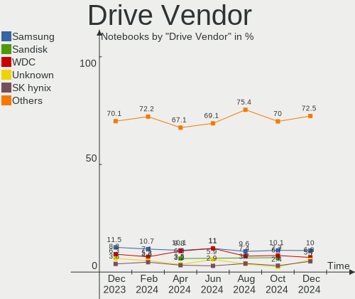
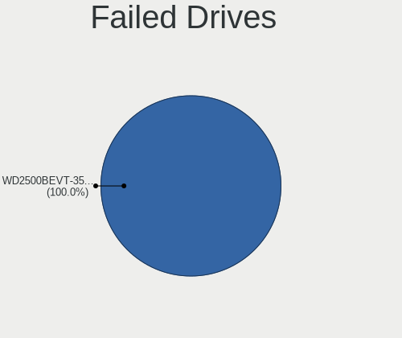
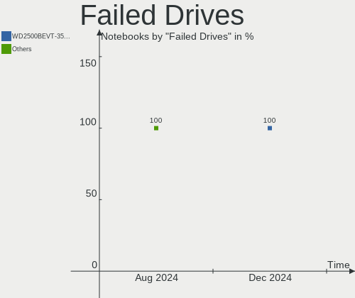
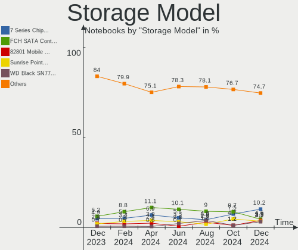
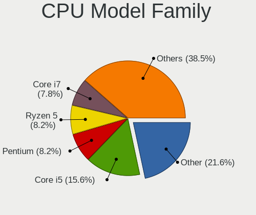
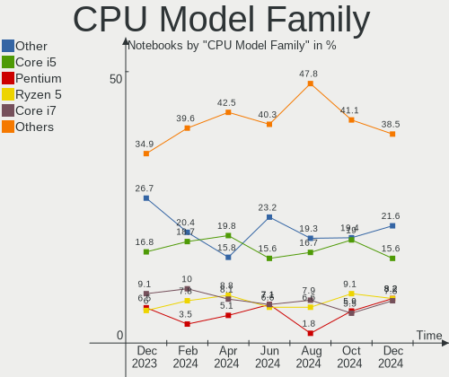
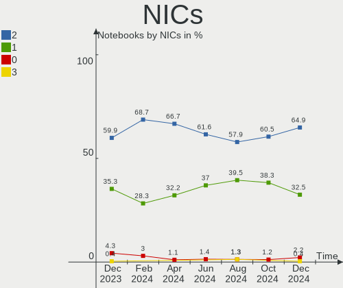
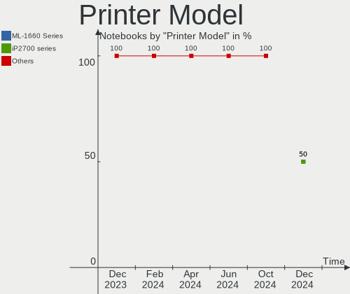

Linux in Russia - Hardware Trends (Notebooks)
---------------------------------------------

A project to identify most popular hardware characteristics and track their change
over time based on data collected by Linux users at https://Linux-Hardware.org.

Anyone can contribute to this report by the [hw-probe](https://github.com/linuxhw/hw-probe) tool:

    sudo -E hw-probe -all -upload

Period: Jun, 2023.

Contents
--------

* [ System ](#system)
  - [ OS                       ](#os)
  - [ OS Family                ](#os-family)
  - [ Kernel                   ](#kernel)
  - [ Kernel Family            ](#kernel-family)
  - [ Kernel Major Ver.        ](#kernel-major-ver)
  - [ Arch                     ](#arch)
  - [ DE                       ](#de)
  - [ Display Server           ](#display-server)
  - [ Display Manager          ](#display-manager)
  - [ OS Lang                  ](#os-lang)
  - [ Boot Mode                ](#boot-mode)
  - [ Filesystem               ](#filesystem)
  - [ Part. scheme             ](#part-scheme)
  - [ Dual Boot with Linux/BSD ](#dual-boot-with-linuxbsd)
  - [ Dual Boot (Win)          ](#dual-boot-win)

* [ Board ](#board)
  - [ Vendor                   ](#vendor)
  - [ Model                    ](#model)
  - [ Model Family             ](#model-family)
  - [ MFG Year                 ](#mfg-year)
  - [ Form Factor              ](#form-factor)
  - [ Secure Boot              ](#secure-boot)
  - [ Coreboot                 ](#coreboot)
  - [ RAM Size                 ](#ram-size)
  - [ RAM Used                 ](#ram-used)
  - [ Total Drives             ](#total-drives)
  - [ Has CD-ROM               ](#has-cd-rom)
  - [ Has Ethernet             ](#has-ethernet)
  - [ Has WiFi                 ](#has-wifi)
  - [ Has Bluetooth            ](#has-bluetooth)

* [ Location ](#location)
  - [ Country                  ](#country)
  - [ City                     ](#city)

* [ Drives ](#drives)
  - [ Drive Vendor             ](#drive-vendor)
  - [ Drive Model              ](#drive-model)
  - [ HDD Vendor               ](#hdd-vendor)
  - [ SSD Vendor               ](#ssd-vendor)
  - [ Drive Kind               ](#drive-kind)
  - [ Drive Connector          ](#drive-connector)
  - [ Drive Size               ](#drive-size)
  - [ Space Total              ](#space-total)
  - [ Space Used               ](#space-used)
  - [ Malfunc. Drives          ](#malfunc-drives)
  - [ Malfunc. Drive Vendor    ](#malfunc-drive-vendor)
  - [ Malfunc. HDD Vendor      ](#malfunc-hdd-vendor)
  - [ Malfunc. Drive Kind      ](#malfunc-drive-kind)
  - [ Failed Drives            ](#failed-drives)
  - [ Failed Drive Vendor      ](#failed-drive-vendor)
  - [ Drive Status             ](#drive-status)

* [ Storage controller ](#storage-controller)
  - [ Storage Vendor           ](#storage-vendor)
  - [ Storage Model            ](#storage-model)
  - [ Storage Kind             ](#storage-kind)

* [ Processor ](#processor)
  - [ CPU Vendor               ](#cpu-vendor)
  - [ CPU Model                ](#cpu-model)
  - [ CPU Model Family         ](#cpu-model-family)
  - [ CPU Cores                ](#cpu-cores)
  - [ CPU Sockets              ](#cpu-sockets)
  - [ CPU Threads              ](#cpu-threads)
  - [ CPU Op-Modes             ](#cpu-op-modes)
  - [ CPU Microcode            ](#cpu-microcode)
  - [ CPU Microarch            ](#cpu-microarch)

* [ Graphics ](#graphics)
  - [ GPU Vendor               ](#gpu-vendor)
  - [ GPU Model                ](#gpu-model)
  - [ GPU Combo                ](#gpu-combo)
  - [ GPU Driver               ](#gpu-driver)
  - [ GPU Memory               ](#gpu-memory)

* [ Monitor ](#monitor)
  - [ Monitor Vendor           ](#monitor-vendor)
  - [ Monitor Model            ](#monitor-model)
  - [ Monitor Resolution       ](#monitor-resolution)
  - [ Monitor Diagonal         ](#monitor-diagonal)
  - [ Monitor Width            ](#monitor-width)
  - [ Aspect Ratio             ](#aspect-ratio)
  - [ Monitor Area             ](#monitor-area)
  - [ Pixel Density            ](#pixel-density)
  - [ Multiple Monitors        ](#multiple-monitors)

* [ Network ](#network)
  - [ Net Controller Vendor    ](#net-controller-vendor)
  - [ Net Controller Model     ](#net-controller-model)
  - [ Wireless Vendor          ](#wireless-vendor)
  - [ Wireless Model           ](#wireless-model)
  - [ Ethernet Vendor          ](#ethernet-vendor)
  - [ Ethernet Model           ](#ethernet-model)
  - [ Net Controller Kind      ](#net-controller-kind)
  - [ Used Controller          ](#used-controller)
  - [ NICs                     ](#nics)
  - [ IPv6                     ](#ipv6)

* [ Bluetooth ](#bluetooth)
  - [ Bluetooth Vendor         ](#bluetooth-vendor)
  - [ Bluetooth Model          ](#bluetooth-model)

* [ Sound ](#sound)
  - [ Sound Vendor             ](#sound-vendor)
  - [ Sound Model              ](#sound-model)

* [ Memory ](#memory)
  - [ Memory Vendor            ](#memory-vendor)
  - [ Memory Model             ](#memory-model)
  - [ Memory Kind              ](#memory-kind)
  - [ Memory Form Factor       ](#memory-form-factor)
  - [ Memory Size              ](#memory-size)
  - [ Memory Speed             ](#memory-speed)

* [ Printers & scanners ](#printers--scanners)
  - [ Printer Vendor           ](#printer-vendor)
  - [ Printer Model            ](#printer-model)
  - [ Scanner Vendor           ](#scanner-vendor)
  - [ Scanner Model            ](#scanner-model)

* [ Camera ](#camera)
  - [ Camera Vendor            ](#camera-vendor)
  - [ Camera Model             ](#camera-model)

* [ Security ](#security)
  - [ Fingerprint Vendor       ](#fingerprint-vendor)
  - [ Fingerprint Model        ](#fingerprint-model)
  - [ Chipcard Vendor          ](#chipcard-vendor)
  - [ Chipcard Model           ](#chipcard-model)

* [ Unsupported ](#unsupported)
  - [ Unsupported Devices      ](#unsupported-devices)
  - [ Unsupported Device Types ](#unsupported-device-types)

System
------

OS
--

Installed operating systems

| Name                         | Notebooks | Percent |
|------------------------------|-----------|---------|
| ROSA 12.4                    | 59        | 28.92%  |
| Debian 12                    | 21        | 10.29%  |
| Fedora 38                    | 12        | 5.88%   |
| Linux Mint 21.1              | 7         | 3.43%   |
| Ubuntu 23.04                 | 6         | 2.94%   |
| Ubuntu 22.04                 | 5         | 2.45%   |
| ROSA R11.1                   | 5         | 2.45%   |
| ROSA 12.3                    | 5         | 2.45%   |
| ArcoLinux Rolling            | 5         | 2.45%   |
| Manjaro 23.0.0               | 4         | 1.96%   |
| SteamOS 3.4.8                | 3         | 1.47%   |
| ROSA 12                      | 3         | 1.47%   |
| Kubuntu 23.04                | 3         | 1.47%   |
| Gentoo 2.13                  | 3         | 1.47%   |
| Debian 11                    | 3         | 1.47%   |
| Arch Rolling                 | 3         | 1.47%   |
| ALT Linux 10.1               | 3         | 1.47%   |
| Ubuntu 20.04                 | 2         | 0.98%   |
| Red OS 7.3.2                 | 2         | 0.98%   |
| Pop!_OS 22.04                | 2         | 0.98%   |
| Parrot 5.3                   | 2         | 0.98%   |
| openSUSE Tumbleweed-XXXXXXXX | 2         | 0.98%   |
| OpenMandriva 23.06           | 2         | 0.98%   |
| OpenMandriva 23.03           | 2         | 0.98%   |
| Lubuntu 22.04                | 2         | 0.98%   |
| Kubuntu 22.04                | 2         | 0.98%   |
| Kubuntu 20.04                | 2         | 0.98%   |
| Fedora 37                    | 2         | 0.98%   |
| EndeavourOS Rolling          | 2         | 0.98%   |
| Elementary 7                 | 2         | 0.98%   |
| Debian                       | 2         | 0.98%   |
| Xubuntu 20.04                | 1         | 0.49%   |
| Uncom 2.0                    | 1         | 0.49%   |
| Ubuntu MATE 22.04            | 1         | 0.49%   |
| Ubuntu MATE 20.04            | 1         | 0.49%   |
| ROSA 13.0                    | 1         | 0.49%   |
| ROSA 12.2                    | 1         | 0.49%   |
| ROSA 12.1                    | 1         | 0.49%   |
| PostmarketOS Edge            | 1         | 0.49%   |
| openSUSE Leap-15.4           | 1         | 0.49%   |

OS Family
---------

OS without a version

| Name         | Notebooks | Percent |
|--------------|-----------|---------|
| ROSA         | 75        | 36.76%  |
| Debian       | 26        | 12.75%  |
| Fedora       | 14        | 6.86%   |
| Ubuntu       | 13        | 6.37%   |
| Linux Mint   | 7         | 3.43%   |
| Kubuntu      | 7         | 3.43%   |
| Manjaro      | 6         | 2.94%   |
| ALT Linux    | 6         | 2.94%   |
| OpenMandriva | 5         | 2.45%   |
| ArcoLinux    | 5         | 2.45%   |
| SteamOS      | 3         | 1.47%   |
| openSUSE     | 3         | 1.47%   |
| Lubuntu      | 3         | 1.47%   |
| Gentoo       | 3         | 1.47%   |
| Arch         | 3         | 1.47%   |
| Ubuntu MATE  | 2         | 0.98%   |
| Red OS       | 2         | 0.98%   |
| Pop!_OS      | 2         | 0.98%   |
| Parrot       | 2         | 0.98%   |
| EndeavourOS  | 2         | 0.98%   |
| Elementary   | 2         | 0.98%   |
| Xubuntu      | 1         | 0.49%   |
| Uncom        | 1         | 0.49%   |
| PostmarketOS | 1         | 0.49%   |
| Nobara       | 1         | 0.49%   |
| NixOS        | 1         | 0.49%   |
| MX           | 1         | 0.49%   |
| LMDE         | 1         | 0.49%   |
| KDE neon     | 1         | 0.49%   |
| Kali         | 1         | 0.49%   |
| Endless      | 1         | 0.49%   |
| Artix        | 1         | 0.49%   |
| Archcraft    | 1         | 0.49%   |
| AlmaLinux    | 1         | 0.49%   |

Kernel
------

Version of the Linux kernel

| Version                                  | Notebooks | Percent |
|------------------------------------------|-----------|---------|
| 6.1.20-generic-2rosa2021.1-x86_64        | 55        | 26.96%  |
| 6.1.0-4-amd64                            | 13        | 6.37%   |
| 5.19.0-43-generic                        | 9         | 4.41%   |
| 6.1.0-9-amd64                            | 6         | 2.94%   |
| 6.3.6-arch1-1                            | 4         | 1.96%   |
| 6.2.0-20-generic                         | 4         | 1.96%   |
| 5.15.103-generic-1rosa2021.1-i686        | 4         | 1.96%   |
| 5.15.0-73-generic                        | 4         | 1.96%   |
| 5.10.0-23-amd64                          | 4         | 1.96%   |
| 6.3.9-arch1-1                            | 3         | 1.47%   |
| 6.2.9-300.fc38.x86_64                    | 3         | 1.47%   |
| 6.1.31-2-MANJARO                         | 3         | 1.47%   |
| 5.15.0-75-generic                        | 3         | 1.47%   |
| 5.13.0-valve36-1-neptune                 | 3         | 1.47%   |
| 6.4.0-060400-generic                     | 2         | 0.98%   |
| 6.3.9-1-liquorix-amd64                   | 2         | 0.98%   |
| 6.3.8-200.fc38.x86_64                    | 2         | 0.98%   |
| 6.3.5-desktop-3omv2390                   | 2         | 0.98%   |
| 6.3.5-200.fc38.x86_64                    | 2         | 0.98%   |
| 6.3.4-201.fc38.x86_64                    | 2         | 0.98%   |
| 6.2.6-desktop-1omv2390                   | 2         | 0.98%   |
| 6.2.6-76060206-generic                   | 2         | 0.98%   |
| 6.2.15-300.fc38.x86_64                   | 2         | 0.98%   |
| 6.2.0-23-generic                         | 2         | 0.98%   |
| 6.1.35-1-lts                             | 2         | 0.98%   |
| 6.1.0-1parrot1-amd64                     | 2         | 0.98%   |
| 5.4.83-generic-2rosa-i586                | 2         | 0.98%   |
| 5.4.0-150-generic                        | 2         | 0.98%   |
| 5.19.0-45-generic                        | 2         | 0.98%   |
| 5.15.75-generic-1rosa2021.1-x86_64       | 2         | 0.98%   |
| 5.15.0-69-generic                        | 2         | 0.98%   |
| 5.10.74-generic-2rosa2021.1-x86_64       | 2         | 0.98%   |
| 5.10.164-std-def-alt1                    | 2         | 0.98%   |
| 6.3.9.xm1-1.klp-xanmod-rosa2021.1-x86_64 | 1         | 0.49%   |
| 6.3.9-1-default                          | 1         | 0.49%   |
| 6.3.9-0-edge                             | 1         | 0.49%   |
| 6.3.8-zen1-1-zen                         | 1         | 0.49%   |
| 6.3.8-gentoo                             | 1         | 0.49%   |
| 6.3.8-100.fc37.x86_64                    | 1         | 0.49%   |
| 6.3.7-surface                            | 1         | 0.49%   |

Kernel Family
-------------

Linux kernel without a distro release

| Version  | Notebooks | Percent |
|----------|-----------|---------|
| 6.1.20   | 55        | 26.96%  |
| 6.1.0    | 23        | 11.27%  |
| 5.19.0   | 13        | 6.37%   |
| 5.15.0   | 10        | 4.9%    |
| 6.2.0    | 9         | 4.41%   |
| 6.3.9    | 8         | 3.92%   |
| 6.3.5    | 7         | 3.43%   |
| 6.3.8    | 5         | 2.45%   |
| 6.3.7    | 5         | 2.45%   |
| 6.1.31   | 5         | 2.45%   |
| 5.10.0   | 5         | 2.45%   |
| 6.3.6    | 4         | 1.96%   |
| 6.2.6    | 4         | 1.96%   |
| 5.15.103 | 4         | 1.96%   |
| 6.2.9    | 3         | 1.47%   |
| 6.2.15   | 3         | 1.47%   |
| 5.4.83   | 3         | 1.47%   |
| 5.4.0    | 3         | 1.47%   |
| 5.15.75  | 3         | 1.47%   |
| 5.13.0   | 3         | 1.47%   |
| 6.4.0    | 2         | 0.98%   |
| 6.3.4    | 2         | 0.98%   |
| 6.1.35   | 2         | 0.98%   |
| 6.1.34   | 2         | 0.98%   |
| 5.15.72  | 2         | 0.98%   |
| 5.10.74  | 2         | 0.98%   |
| 5.10.164 | 2         | 0.98%   |
| 6.3.0    | 1         | 0.49%   |
| 6.2.14   | 1         | 0.49%   |
| 6.1.32   | 1         | 0.49%   |
| 6.1.30   | 1         | 0.49%   |
| 5.4.32   | 1         | 0.49%   |
| 5.4.244  | 1         | 0.49%   |
| 5.15.87  | 1         | 0.49%   |
| 5.15.79  | 1         | 0.49%   |
| 5.14.21  | 1         | 0.49%   |
| 5.14.0   | 1         | 0.49%   |
| 5.11.12  | 1         | 0.49%   |
| 5.10.176 | 1         | 0.49%   |
| 5.10.155 | 1         | 0.49%   |

Kernel Major Ver.
-----------------

Linux kernel major version

| Version | Notebooks | Percent |
|---------|-----------|---------|
| 6.1     | 89        | 43.63%  |
| 6.3     | 32        | 15.69%  |
| 5.15    | 21        | 10.29%  |
| 6.2     | 20        | 9.8%    |
| 5.19    | 13        | 6.37%   |
| 5.10    | 12        | 5.88%   |
| 5.4     | 8         | 3.92%   |
| 5.13    | 3         | 1.47%   |
| 6.4     | 2         | 0.98%   |
| 5.14    | 2         | 0.98%   |
| 5.11    | 1         | 0.49%   |
| 4.15    | 1         | 0.49%   |

Arch
----

OS architecture (x86_64, i586, etc.)

| Name   | Notebooks | Percent |
|--------|-----------|---------|
| x86_64 | 194       | 95.1%   |
| i686   | 10        | 4.9%    |

DE
--

Desktop Environment

| Name            | Notebooks | Percent |
|-----------------|-----------|---------|
| KDE5            | 76        | 37.25%  |
| GNOME           | 62        | 30.39%  |
| Unknown         | 18        | 8.82%   |
| MATE            | 10        | 4.9%    |
| LXQt            | 10        | 4.9%    |
| XFCE            | 8         | 3.92%   |
| X-Cinnamon      | 6         | 2.94%   |
| KDE4            | 5         | 2.45%   |
| Pantheon        | 2         | 0.98%   |
| i3              | 2         | 0.98%   |
| Budgie          | 2         | 0.98%   |
| LXDE            | 1         | 0.49%   |
| KDE             | 1         | 0.49%   |
| GNOME Flashback | 1         | 0.49%   |

Display Server
--------------

X11 or Wayland

| Name    | Notebooks | Percent |
|---------|-----------|---------|
| Wayland | 98        | 48.04%  |
| X11     | 88        | 43.14%  |
| Unknown | 17        | 8.33%   |
| Tty     | 1         | 0.49%   |

Display Manager
---------------

SDDM, LightDM, etc.

| Name    | Notebooks | Percent |
|---------|-----------|---------|
| SDDM    | 71        | 34.8%   |
| Unknown | 49        | 24.02%  |
| GDM     | 38        | 18.63%  |
| LightDM | 29        | 14.22%  |
| GDM3    | 12        | 5.88%   |
| KDM     | 5         | 2.45%   |

OS Lang
-------

Language

| Lang    | Notebooks | Percent |
|---------|-----------|---------|
| ru_RU   | 162       | 79.41%  |
| en_US   | 36        | 17.65%  |
| Unknown | 3         | 1.47%   |
| ru_UA   | 1         | 0.49%   |
| POSIX   | 1         | 0.49%   |
| en_GB   | 1         | 0.49%   |

Boot Mode
---------

EFI or BIOS

| Mode | Notebooks | Percent |
|------|-----------|---------|
| EFI  | 136       | 66.67%  |
| BIOS | 68        | 33.33%  |

Filesystem
----------

Type of filesystem

| Type    | Notebooks | Percent |
|---------|-----------|---------|
| Ext4    | 146       | 71.57%  |
| Btrfs   | 33        | 16.18%  |
| Overlay | 15        | 7.35%   |
| Tmpfs   | 6         | 2.94%   |
| Zfs     | 2         | 0.98%   |
| Xfs     | 1         | 0.49%   |
| Aufs    | 1         | 0.49%   |

Part. scheme
------------

Scheme of partitioning

| Type    | Notebooks | Percent |
|---------|-----------|---------|
| GPT     | 135       | 66.18%  |
| MBR     | 37        | 18.14%  |
| Unknown | 32        | 15.69%  |

Dual Boot with Linux/BSD
------------------------

Hosting more than one Linux/BSD

| Dual boot | Notebooks | Percent |
|-----------|-----------|---------|
| No        | 171       | 83.82%  |
| Yes       | 33        | 16.18%  |

Dual Boot (Win)
---------------

Hosting Linux and Windows

| Dual boot | Notebooks | Percent |
|-----------|-----------|---------|
| No        | 126       | 61.76%  |
| Yes       | 78        | 38.24%  |

Board
-----

Vendor
------

Motherboard manufacturer

| Name                     | Notebooks | Percent |
|--------------------------|-----------|---------|
| ASUSTek Computer         | 33        | 16.18%  |
| Lenovo                   | 31        | 15.2%   |
| Hewlett-Packard          | 27        | 13.24%  |
| Acer                     | 17        | 8.33%   |
| Dell                     | 13        | 6.37%   |
| Aquarius                 | 12        | 5.88%   |
| MSI                      | 10        | 4.9%    |
| HUAWEI                   | 8         | 3.92%   |
| Timi                     | 7         | 3.43%   |
| Samsung Electronics      | 6         | 2.94%   |
| Valve                    | 3         | 1.47%   |
| Maibenben                | 3         | 1.47%   |
| HONOR                    | 3         | 1.47%   |
| Apple                    | 3         | 1.47%   |
| Unknown                  | 3         | 1.47%   |
| Toshiba                  | 2         | 0.98%   |
| Packard Bell             | 2         | 0.98%   |
| eMachines                | 2         | 0.98%   |
| Clevo                    | 2         | 0.98%   |
| 3Logic Group             | 2         | 0.98%   |
| WeiBu                    | 1         | 0.49%   |
| TECNO                    | 1         | 0.49%   |
| Sony                     | 1         | 0.49%   |
| realme                   | 1         | 0.49%   |
| Quanta                   | 1         | 0.49%   |
| MACHENIKE                | 1         | 0.49%   |
| Machcreator              | 1         | 0.49%   |
| Irbis                    | 1         | 0.49%   |
| Intel Client Systems     | 1         | 0.49%   |
| INFERIT                  | 1         | 0.49%   |
| HIPER Technology Limited | 1         | 0.49%   |
| HASEE Computer           | 1         | 0.49%   |
| Haier                    | 1         | 0.49%   |
| DEXP                     | 1         | 0.49%   |
| Chuwi                    | 1         | 0.49%   |

Model
-----

Motherboard model

| Name                                | Notebooks | Percent |
|-------------------------------------|-----------|---------|
| Aquarius NS585                      | 11        | 5.39%   |
| Unknown                             | 5         | 2.45%   |
| Valve Jupiter                       | 3         | 1.47%   |
| Timi RedmiBook Pro 14S              | 2         | 0.98%   |
| Timi Redmi Book Pro 14 2022         | 2         | 0.98%   |
| Maibenben MaiBook X series          | 2         | 0.98%   |
| HP Laptop 15s-eq1xxx                | 2         | 0.98%   |
| HP Laptop 15-bw0xx                  | 2         | 0.98%   |
| Clevo NL41MU2                       | 2         | 0.98%   |
| WeiBu OEM                           | 1         | 0.49%   |
| Toshiba Satellite U300              | 1         | 0.49%   |
| Toshiba Satellite L30               | 1         | 0.49%   |
| Timi TM1801                         | 1         | 0.49%   |
| Timi RedmiBook Pro 15S              | 1         | 0.49%   |
| Timi Redmi Book Pro 15 2022         | 1         | 0.49%   |
| TECNO MEGABOOK T1                   | 1         | 0.49%   |
| Sony VPCEH2E1R                      | 1         | 0.49%   |
| Samsung P29/28/26                   | 1         | 0.49%   |
| Samsung N102                        | 1         | 0.49%   |
| Samsung 355V4C/356V4C/3445VC/3545VC | 1         | 0.49%   |
| Samsung 350V5C/351V5C/3540VC/3440VC | 1         | 0.49%   |
| Samsung 305V4A/305V5A/3415VA        | 1         | 0.49%   |
| Samsung 300E4C/300E5C/300E7C        | 1         | 0.49%   |
| realme CloudProXXXX                 | 1         | 0.49%   |
| Quanta TWH                          | 1         | 0.49%   |
| Packard Bell EasyNote TE69KB        | 1         | 0.49%   |
| Packard Bell EasyNote TE69CX        | 1         | 0.49%   |
| MSI Prestige 14Evo A12M             | 1         | 0.49%   |
| MSI Modern 14 B4MW                  | 1         | 0.49%   |
| MSI Katana GF66 12UE                | 1         | 0.49%   |
| MSI Katana GF66 11SC                | 1         | 0.49%   |
| MSI GX60 1AC                        | 1         | 0.49%   |
| MSI GT70 2OC/2OD                    | 1         | 0.49%   |
| MSI GL65 Leopard 10SCSR             | 1         | 0.49%   |
| MSI GF63 Thin 11SC                  | 1         | 0.49%   |
| MSI GE60 2PL                        | 1         | 0.49%   |
| MSI Delta 15 A5EFK                  | 1         | 0.49%   |
| Maibenben MaiBook M                 | 1         | 0.49%   |
| MACHENIKE F117-7P                   | 1         | 0.49%   |
| Machcreator 14                      | 1         | 0.49%   |

Model Family
------------

Motherboard model prefix

| Name                  | Notebooks | Percent |
|-----------------------|-----------|---------|
| ASUS VivoBook         | 11        | 5.39%   |
| Aquarius NS585        | 11        | 5.39%   |
| Acer Aspire           | 11        | 5.39%   |
| Lenovo IdeaPad        | 10        | 4.9%    |
| HP Pavilion           | 7         | 3.43%   |
| Lenovo ThinkPad       | 6         | 2.94%   |
| Dell Inspiron         | 6         | 2.94%   |
| HP Laptop             | 5         | 2.45%   |
| Unknown               | 5         | 2.45%   |
| HP EliteBook          | 4         | 1.96%   |
| ASUS ROG              | 4         | 1.96%   |
| Valve Jupiter         | 3         | 1.47%   |
| Timi RedmiBook        | 3         | 1.47%   |
| Timi Redmi            | 3         | 1.47%   |
| Maibenben MaiBook     | 3         | 1.47%   |
| Lenovo Legion         | 3         | 1.47%   |
| HP ProBook            | 3         | 1.47%   |
| Dell Latitude         | 3         | 1.47%   |
| ASUS ASUS             | 3         | 1.47%   |
| Acer Extensa          | 3         | 1.47%   |
| Toshiba Satellite     | 2         | 0.98%   |
| Packard Bell EasyNote | 2         | 0.98%   |
| MSI Katana            | 2         | 0.98%   |
| Lenovo B590           | 2         | 0.98%   |
| Clevo NL41MU2         | 2         | 0.98%   |
| ASUS ZenBook          | 2         | 0.98%   |
| WeiBu OEM             | 1         | 0.49%   |
| Timi TM1801           | 1         | 0.49%   |
| TECNO MEGABOOK        | 1         | 0.49%   |
| Sony VPCEH2E1R        | 1         | 0.49%   |
| Samsung P29           | 1         | 0.49%   |
| Samsung N102          | 1         | 0.49%   |
| Samsung 355V4C        | 1         | 0.49%   |
| Samsung 350V5C        | 1         | 0.49%   |
| Samsung 305V4A        | 1         | 0.49%   |
| Samsung 300E4C        | 1         | 0.49%   |
| realme CloudProXXXX   | 1         | 0.49%   |
| Quanta TWH            | 1         | 0.49%   |
| MSI Prestige          | 1         | 0.49%   |
| MSI Modern            | 1         | 0.49%   |

MFG Year
--------

Motherboard manufacture year

| Year | Notebooks | Percent |
|------|-----------|---------|
| 2022 | 37        | 18.14%  |
| 2021 | 32        | 15.69%  |
| 2019 | 21        | 10.29%  |
| 2020 | 20        | 9.8%    |
| 2013 | 12        | 5.88%   |
| 2011 | 12        | 5.88%   |
| 2012 | 11        | 5.39%   |
| 2018 | 8         | 3.92%   |
| 2017 | 8         | 3.92%   |
| 2014 | 8         | 3.92%   |
| 2010 | 7         | 3.43%   |
| 2008 | 6         | 2.94%   |
| 2015 | 5         | 2.45%   |
| 2009 | 5         | 2.45%   |
| 2007 | 4         | 1.96%   |
| 2023 | 3         | 1.47%   |
| 2016 | 2         | 0.98%   |
| 2006 | 2         | 0.98%   |
| 2005 | 1         | 0.49%   |

Form Factor
-----------

Physical design of the computer

| Name     | Notebooks | Percent |
|----------|-----------|---------|
| Notebook | 204       | 100%    |

Secure Boot
-----------

Enabled or disabled

| State    | Notebooks | Percent |
|----------|-----------|---------|
| Disabled | 189       | 92.65%  |
| Enabled  | 15        | 7.35%   |

Coreboot
--------

Have coreboot on board

| Used | Notebooks | Percent |
|------|-----------|---------|
| No   | 204       | 100%    |

RAM Size
--------

Total RAM memory

| Size in GB  | Notebooks | Percent |
|-------------|-----------|---------|
| 4.01-8.0    | 68        | 33.33%  |
| 8.01-16.0   | 37        | 18.14%  |
| 3.01-4.0    | 32        | 15.69%  |
| 16.01-24.0  | 32        | 15.69%  |
| 32.01-64.0  | 12        | 5.88%   |
| 1.01-2.0    | 9         | 4.41%   |
| 24.01-32.0  | 5         | 2.45%   |
| 2.01-3.0    | 5         | 2.45%   |
| 0.51-1.0    | 3         | 1.47%   |
| 64.01-256.0 | 1         | 0.49%   |

RAM Used
--------

Used RAM memory

| Used GB    | Notebooks | Percent |
|------------|-----------|---------|
| 1.01-2.0   | 67        | 32.84%  |
| 2.01-3.0   | 41        | 20.1%   |
| 0.51-1.0   | 36        | 17.65%  |
| 3.01-4.0   | 27        | 13.24%  |
| 4.01-8.0   | 26        | 12.75%  |
| 8.01-16.0  | 4         | 1.96%   |
| 32.01-64.0 | 1         | 0.49%   |
| 24.01-32.0 | 1         | 0.49%   |
| 0.01-0.5   | 1         | 0.49%   |

Total Drives
------------

Number of drives on board

| Drives | Notebooks | Percent |
|--------|-----------|---------|
| 1      | 154       | 75.49%  |
| 2      | 46        | 22.55%  |
| 3      | 2         | 0.98%   |
| 4      | 1         | 0.49%   |
| 0      | 1         | 0.49%   |

Has CD-ROM
----------

Has CD-ROM on board

| Presented | Notebooks | Percent |
|-----------|-----------|---------|
| No        | 159       | 77.94%  |
| Yes       | 45        | 22.06%  |

Has Ethernet
------------

Has Ethernet on board

| Presented | Notebooks | Percent |
|-----------|-----------|---------|
| Yes       | 146       | 71.57%  |
| No        | 58        | 28.43%  |

Has WiFi
--------

Has WiFi module

| Presented | Notebooks | Percent |
|-----------|-----------|---------|
| Yes       | 198       | 97.06%  |
| No        | 6         | 2.94%   |

Has Bluetooth
-------------

Has Bluetooth module

| Presented | Notebooks | Percent |
|-----------|-----------|---------|
| Yes       | 172       | 84.31%  |
| No        | 32        | 15.69%  |

Location
--------

Country
-------

Geographic location (country)

| Country | Notebooks | Percent |
|---------|-----------|---------|
| Russia  | 204       | 100%    |

City
----

Geographic location (city)

| City             | Notebooks | Percent |
|------------------|-----------|---------|
| Moscow           | 54        | 26.47%  |
| Voronezh         | 15        | 7.35%   |
| St Petersburg    | 13        | 6.37%   |
| Samara           | 6         | 2.94%   |
| Novosibirsk      | 6         | 2.94%   |
| Nizhniy Novgorod | 6         | 2.94%   |
| Yekaterinburg    | 4         | 1.96%   |
| Saratov          | 4         | 1.96%   |
| Volgograd        | 3         | 1.47%   |
| Ryazan           | 3         | 1.47%   |
| Perm             | 3         | 1.47%   |
| Chelyabinsk      | 3         | 1.47%   |
| Zhukovskiy       | 2         | 0.98%   |
| Yakutsk          | 2         | 0.98%   |
| Ulyanovsk        | 2         | 0.98%   |
| Tyumen           | 2         | 0.98%   |
| Tambov           | 2         | 0.98%   |
| Surgut           | 2         | 0.98%   |
| Smolensk         | 2         | 0.98%   |
| Omsk             | 2         | 0.98%   |
| Krasnodar        | 2         | 0.98%   |
| Kirov            | 2         | 0.98%   |
| Khabarovsk       | 2         | 0.98%   |
| Kazan'           | 2         | 0.98%   |
| Kaliningrad      | 2         | 0.98%   |
| Ivanovo          | 2         | 0.98%   |
| Yevpatoriya      | 1         | 0.49%   |
| Yelan'           | 1         | 0.49%   |
| Yaroslavl        | 1         | 0.49%   |
| Vyborg           | 1         | 0.49%   |
| Vostochnaya      | 1         | 0.49%   |
| Vladivostok      | 1         | 0.49%   |
| Ustyuzhna        | 1         | 0.49%   |
| Ufa              | 1         | 0.49%   |
| Tver             | 1         | 0.49%   |
| Tula             | 1         | 0.49%   |
| Tsarskoye Selo   | 1         | 0.49%   |
| Taman'           | 1         | 0.49%   |
| Strelitsa        | 1         | 0.49%   |
| Stavropol        | 1         | 0.49%   |

Drives
------

Drive Vendor
------------

Hard drive vendors

| Vendor                         | Notebooks | Drives | Percent |
|--------------------------------|-----------|--------|---------|
| Samsung Electronics            | 29        | 30     | 11.79%  |
| WDC                            | 21        | 24     | 8.54%   |
| Toshiba                        | 21        | 24     | 8.54%   |
| Seagate                        | 17        | 18     | 6.91%   |
| Intel                          | 14        | 14     | 5.69%   |
| A-DATA Technology              | 13        | 13     | 5.28%   |
| Kingston                       | 11        | 11     | 4.47%   |
| Unknown                        | 9         | 10     | 3.66%   |
| Micron Technology              | 9         | 9      | 3.66%   |
| KIOXIA                         | 7         | 7      | 2.85%   |
| SanDisk                        | 6         | 6      | 2.44%   |
| Netac                          | 6         | 7      | 2.44%   |
| Hitachi                        | 5         | 5      | 2.03%   |
| HGST                           | 5         | 5      | 2.03%   |
| SK hynix                       | 4         | 4      | 1.63%   |
| Phison Electronics             | 4         | 4      | 1.63%   |
| Kingston Technology Company    | 4         | 4      | 1.63%   |
| Apacer                         | 4         | 4      | 1.63%   |
| SPCC                           | 3         | 3      | 1.22%   |
| Silicon Motion                 | 3         | 3      | 1.22%   |
| China                          | 3         | 3      | 1.22%   |
| JMicron Technology             | 2         | 2      | 0.81%   |
| Hewlett-Packard                | 2         | 2      | 0.81%   |
| GOODRAM                        | 2         | 2      | 0.81%   |
| Fujitsu                        | 2         | 2      | 0.81%   |
| FORESEE                        | 2         | 2      | 0.81%   |
| Crucial                        | 2         | 2      | 0.81%   |
| BIWIN                          | 2         | 2      | 0.81%   |
| AMD                            | 2         | 2      | 0.81%   |
| Unknown                        | 2         | 2      | 0.81%   |
| XrayDisk                       | 1         | 2      | 0.41%   |
| Wdxsky                         | 1         | 1      | 0.41%   |
| USB                            | 1         | 1      | 0.41%   |
| Union Memory (Shenzhen)        | 1         | 1      | 0.41%   |
| UMIS                           | 1         | 1      | 0.41%   |
| Transcend                      | 1         | 1      | 0.41%   |
| Team                           | 1         | 1      | 0.41%   |
| SSSTC                          | 1         | 1      | 0.41%   |
| Solid State Storage Technology | 1         | 1      | 0.41%   |
| Solid State Storage            | 1         | 1      | 0.41%   |

Drive Model
-----------

Hard drive models

| Model                                               | Notebooks | Percent |
|-----------------------------------------------------|-----------|---------|
| A-DATA SU800 512GB SSD                              | 11        | 4.31%   |
| Toshiba MQ01ABF050 500GB                            | 7         | 2.75%   |
| Intel SSDPEKNU512GZ 512GB                           | 5         | 1.96%   |
| Seagate ST1000LM035-1RK172 1TB                      | 4         | 1.57%   |
| WDC WD10SPZX-22Z10T1 1TB                            | 3         | 1.18%   |
| SanDisk NVMe SSD Drive 1TB                          | 3         | 1.18%   |
| Samsung NVMe SSD Controller SM981/PM981/PM983 250GB | 3         | 1.18%   |
| Phison PS5013 E13 NVMe Controller 512GB             | 3         | 1.18%   |
| Intel SSD 660P Series 512GB                         | 3         | 1.18%   |
| HGST HTS545050A7E680 500GB                          | 3         | 1.18%   |
| WDC WDS240G2G0A-00JH30 240GB SSD                    | 2         | 0.78%   |
| Toshiba MQ04ABF100 1TB                              | 2         | 0.78%   |
| Toshiba MQ01ABD100 1TB                              | 2         | 0.78%   |
| Toshiba MK6034GSX 64GB                              | 2         | 0.78%   |
| SPCC Solid State Disk 256GB                         | 2         | 0.78%   |
| Silicon Motion PCIe-8 SSD 512GB                     | 2         | 0.78%   |
| Seagate ST500LT012-1DG142 500GB                     | 2         | 0.78%   |
| Seagate ST500LM030-1RK17D 500GB                     | 2         | 0.78%   |
| Seagate ST1000LM048-2E7172 1TB                      | 2         | 0.78%   |
| Samsung SSD 860 EVO 250GB                           | 2         | 0.78%   |
| Samsung SSD 850 120GB                               | 2         | 0.78%   |
| Samsung MZVLQ512HBLU-00B00 512GB                    | 2         | 0.78%   |
| Micron MTFDHBA512QFD-1AX1AABHA 512GB                | 2         | 0.78%   |
| Micron 2450_MTFDKBA512TFK 512GB                     | 2         | 0.78%   |
| KIOXIA KBG50ZNV512G 512GB                           | 2         | 0.78%   |
| KIOXIA KBG40ZNV512G 512GB                           | 2         | 0.78%   |
| Kingston Company OM3PDP3 NVMe SSD 256GB             | 2         | 0.78%   |
| Kingston SA400S37240G 240GB SSD                     | 2         | 0.78%   |
| JMicron Generic 240GB                               | 2         | 0.78%   |
| Intel SSDPEKNW512G8 512GB                           | 2         | 0.78%   |
| Hitachi HTS547550A9E384 500GB                       | 2         | 0.78%   |
| HGST HTS545050A7E380 500GB                          | 2         | 0.78%   |
| Unknown                                             | 2         | 0.78%   |
| XrayDisk 240GB SSD                                  | 1         | 0.39%   |
| XrayDisk 128GB                                      | 1         | 0.39%   |
| Wdxsky W31-256G                                     | 1         | 0.39%   |
| WDC WDS250G2B0A-00SM50 250GB SSD                    | 1         | 0.39%   |
| WDC WDS250G2B0A 250GB SSD                           | 1         | 0.39%   |
| WDC WD6400BPVT-24HXZT1 640GB                        | 1         | 0.39%   |
| WDC WD5000LPCX-21VHAT0 500GB                        | 1         | 0.39%   |

HDD Vendor
----------

Hard disk drive vendors

| Vendor              | Notebooks | Drives | Percent |
|---------------------|-----------|--------|---------|
| Toshiba             | 18        | 18     | 28.57%  |
| Seagate             | 17        | 18     | 26.98%  |
| WDC                 | 13        | 14     | 20.63%  |
| Hitachi             | 5         | 5      | 7.94%   |
| HGST                | 5         | 5      | 7.94%   |
| Fujitsu             | 2         | 2      | 3.17%   |
| Unknown             | 1         | 1      | 1.59%   |
| Samsung Electronics | 1         | 1      | 1.59%   |
| Apple               | 1         | 1      | 1.59%   |

SSD Vendor
----------

Solid state drive vendors

| Vendor              | Notebooks | Drives | Percent |
|---------------------|-----------|--------|---------|
| A-DATA Technology   | 12        | 12     | 17.39%  |
| Kingston            | 7         | 7      | 10.14%  |
| Samsung Electronics | 6         | 6      | 8.7%    |
| WDC                 | 4         | 4      | 5.8%    |
| SPCC                | 3         | 3      | 4.35%   |
| Netac               | 3         | 3      | 4.35%   |
| China               | 3         | 3      | 4.35%   |
| Apacer              | 3         | 3      | 4.35%   |
| Hewlett-Packard     | 2         | 2      | 2.9%    |
| GOODRAM             | 2         | 2      | 2.9%    |
| Crucial             | 2         | 2      | 2.9%    |
| AMD                 | 2         | 2      | 2.9%    |
| XrayDisk            | 1         | 1      | 1.45%   |
| Wdxsky              | 1         | 1      | 1.45%   |
| USB                 | 1         | 1      | 1.45%   |
| Transcend           | 1         | 1      | 1.45%   |
| Team                | 1         | 1      | 1.45%   |
| SSSTC               | 1         | 1      | 1.45%   |
| Smartbuy            | 1         | 1      | 1.45%   |
| Plextor             | 1         | 1      | 1.45%   |
| Patriot             | 1         | 1      | 1.45%   |
| OCZ                 | 1         | 1      | 1.45%   |
| Micron Technology   | 1         | 1      | 1.45%   |
| LITEONIT            | 1         | 1      | 1.45%   |
| Kimtigo             | 1         | 1      | 1.45%   |
| Intel               | 1         | 1      | 1.45%   |
| HJDK                | 1         | 1      | 1.45%   |
| HEORIADY            | 1         | 1      | 1.45%   |
| Fanxiang            | 1         | 1      | 1.45%   |
| ExeGate             | 1         | 1      | 1.45%   |
| Azerty              | 1         | 1      | 1.45%   |
| Unknown             | 1         | 1      | 1.45%   |

Drive Kind
----------

HDD or SSD

| Kind    | Notebooks | Drives | Percent |
|---------|-----------|--------|---------|
| NVMe    | 93        | 113    | 40.09%  |
| SSD     | 66        | 69     | 28.45%  |
| HDD     | 63        | 65     | 27.16%  |
| MMC     | 8         | 9      | 3.45%   |
| Unknown | 2         | 2      | 0.86%   |

Drive Connector
---------------

SATA, SAS, NVMe, etc.

| Type | Notebooks | Drives | Percent |
|------|-----------|--------|---------|
| SATA | 118       | 134    | 52.68%  |
| NVMe | 93        | 110    | 41.52%  |
| MMC  | 8         | 9      | 3.57%   |
| SAS  | 5         | 5      | 2.23%   |

Drive Size
----------

Size of hard drive

| Size in TB | Notebooks | Drives | Percent |
|------------|-----------|--------|---------|
| 0.01-0.5   | 83        | 92     | 66.94%  |
| 0.51-1.0   | 40        | 41     | 32.26%  |
| 1.01-2.0   | 1         | 1      | 0.81%   |

Space Total
-----------

Amount of disk space available on the file system

| Size in GB     | Notebooks | Percent |
|----------------|-----------|---------|
| 251-500        | 61        | 29.9%   |
| 101-250        | 56        | 27.45%  |
| 501-1000       | 26        | 12.75%  |
| Unknown        | 17        | 8.33%   |
| 51-100         | 12        | 5.88%   |
| 1-20           | 11        | 5.39%   |
| 1001-2000      | 9         | 4.41%   |
| 21-50          | 7         | 3.43%   |
| More than 3000 | 5         | 2.45%   |

Space Used
----------

Amount of used disk space

| Used GB   | Notebooks | Percent |
|-----------|-----------|---------|
| 1-20      | 96        | 47.06%  |
| 21-50     | 35        | 17.16%  |
| 251-500   | 18        | 8.82%   |
| 51-100    | 17        | 8.33%   |
| Unknown   | 17        | 8.33%   |
| 101-250   | 13        | 6.37%   |
| 501-1000  | 6         | 2.94%   |
| 1001-2000 | 2         | 0.98%   |

Malfunc. Drives
---------------

Drive models with a malfunction

| Model                                    | Notebooks | Drives | Percent |
|------------------------------------------|-----------|--------|---------|
| Toshiba MQ01ABF050 500GB                 | 3         | 3      | 11.11%  |
| Toshiba MK6034GSX 64GB                   | 2         | 2      | 7.41%   |
| WDC WDS240G2G0A-00JH30 240GB SSD         | 1         | 1      | 3.7%    |
| WDC WD3200BPVT-35ZEST0 320GB             | 1         | 1      | 3.7%    |
| WDC WD3200BPVT-22JJ5T0 320GB             | 1         | 1      | 3.7%    |
| Toshiba MQ01ABD100 1TB                   | 1         | 1      | 3.7%    |
| Toshiba MK1637GSX 160GB                  | 1         | 1      | 3.7%    |
| SSSTC CV8-8E128-HP 128GB SSD             | 1         | 1      | 3.7%    |
| SPCC Solid State Disk 256GB              | 1         | 1      | 3.7%    |
| SK hynix BC711 HFM256GD3JX013N 256GB     | 1         | 1      | 3.7%    |
| Seagate ST9500325AS 500GB                | 1         | 1      | 3.7%    |
| Seagate ST9320423AS 320GB                | 1         | 1      | 3.7%    |
| Seagate ST9320325AS 320GB                | 1         | 1      | 3.7%    |
| Seagate ST1000LM048-2E7172 1TB           | 1         | 1      | 3.7%    |
| Seagate ST1000LM024 HN-M101MBB 1TB       | 1         | 1      | 3.7%    |
| Samsung Electronics HN-M101MBB 1TB       | 1         | 1      | 3.7%    |
| LITEONIT LCT-256M3S-41 7mm 256GB FDE SSD | 1         | 1      | 3.7%    |
| Hitachi HTS545025B9A300 250GB            | 1         | 1      | 3.7%    |
| Hitachi HTS542516K9SA00 160GB            | 1         | 1      | 3.7%    |
| Fujitsu MHY2120BH 120GB                  | 1         | 1      | 3.7%    |
| Fujitsu MHT2040AH 40GB                   | 1         | 1      | 3.7%    |
| China SSD 256GB                          | 1         | 1      | 3.7%    |
| China SATA SSD 20GB                      | 1         | 1      | 3.7%    |
| AMD R5SL120G 120GB SSD                   | 1         | 1      | 3.7%    |

Malfunc. Drive Vendor
---------------------

Vendors of faulty drives

| Vendor              | Notebooks | Drives | Percent |
|---------------------|-----------|--------|---------|
| Toshiba             | 7         | 7      | 26.92%  |
| Seagate             | 4         | 5      | 15.38%  |
| WDC                 | 3         | 3      | 11.54%  |
| Hitachi             | 2         | 2      | 7.69%   |
| Fujitsu             | 2         | 2      | 7.69%   |
| China               | 2         | 2      | 7.69%   |
| SSSTC               | 1         | 1      | 3.85%   |
| SPCC                | 1         | 1      | 3.85%   |
| SK hynix            | 1         | 1      | 3.85%   |
| Samsung Electronics | 1         | 1      | 3.85%   |
| LITEONIT            | 1         | 1      | 3.85%   |
| AMD                 | 1         | 1      | 3.85%   |

Malfunc. HDD Vendor
-------------------

Vendors of faulty HDD drives

| Vendor              | Notebooks | Drives | Percent |
|---------------------|-----------|--------|---------|
| Toshiba             | 7         | 7      | 38.89%  |
| Seagate             | 4         | 5      | 22.22%  |
| WDC                 | 2         | 2      | 11.11%  |
| Hitachi             | 2         | 2      | 11.11%  |
| Fujitsu             | 2         | 2      | 11.11%  |
| Samsung Electronics | 1         | 1      | 5.56%   |

Malfunc. Drive Kind
-------------------

Kinds of faulty drives

| Kind | Notebooks | Drives | Percent |
|------|-----------|--------|---------|
| HDD  | 18        | 19     | 69.23%  |
| SSD  | 7         | 7      | 26.92%  |
| NVMe | 1         | 1      | 3.85%   |

Failed Drives
-------------

Failed drive models

| Model                         | Notebooks | Drives | Percent |
|-------------------------------|-----------|--------|---------|
| Hitachi HTS547550A9E384 500GB | 1         | 1      | 100%    |

Failed Drive Vendor
-------------------

Failed drive vendors

| Vendor  | Notebooks | Drives | Percent |
|---------|-----------|--------|---------|
| Hitachi | 1         | 1      | 100%    |

Drive Status
------------

Number of failed and malfunc. drives

| Status   | Notebooks | Drives | Percent |
|----------|-----------|--------|---------|
| Works    | 137       | 161    | 63.13%  |
| Detected | 53        | 69     | 24.42%  |
| Malfunc  | 26        | 27     | 11.98%  |
| Failed   | 1         | 1      | 0.46%   |

Storage controller
------------------

Storage Vendor
--------------

Storage controller vendors

| Vendor                                  | Notebooks | Percent |
|-----------------------------------------|-----------|---------|
| Intel                                   | 140       | 54.9%   |
| AMD                                     | 24        | 9.41%   |
| Samsung Electronics                     | 22        | 8.63%   |
| SanDisk                                 | 11        | 4.31%   |
| Micron Technology                       | 8         | 3.14%   |
| Kingston Technology Company             | 8         | 3.14%   |
| Phison Electronics                      | 6         | 2.35%   |
| KIOXIA                                  | 6         | 2.35%   |
| Toshiba America Info Systems            | 4         | 1.57%   |
| SK hynix                                | 4         | 1.57%   |
| Silicon Motion                          | 3         | 1.18%   |
| Netac Technology                        | 3         | 1.18%   |
| INNOGRIT                                | 3         | 1.18%   |
| Solid State Storage Technology          | 2         | 0.78%   |
| Shenzhen Longsys Electronics            | 2         | 0.78%   |
| ADATA Technology                        | 2         | 0.78%   |
| Union Memory (Shenzhen)                 | 1         | 0.39%   |
| Shenzhen Unionmemory Information System | 1         | 0.39%   |
| Shenzhen Shichuangyi Electronics        | 1         | 0.39%   |
| O2 Micro                                | 1         | 0.39%   |
| Nvidia                                  | 1         | 0.39%   |
| Micron/Crucial Technology               | 1         | 0.39%   |
| MAXIO Technology (Hangzhou)             | 1         | 0.39%   |

Storage Model
-------------

Storage controller models

| Model                                                                        | Notebooks | Percent |
|------------------------------------------------------------------------------|-----------|---------|
| AMD FCH SATA Controller [AHCI mode]                                          | 18        | 6.55%   |
| Intel 7 Series Chipset Family 6-port SATA Controller [AHCI mode]             | 15        | 5.45%   |
| Intel Sunrise Point-LP SATA Controller [AHCI mode]                           | 11        | 4%      |
| Intel Cannon Lake PCH SATA AHCI Controller                                   | 11        | 4%      |
| Intel 8 Series SATA Controller 1 [AHCI mode]                                 | 10        | 3.64%   |
| Intel 6 Series/C200 Series Chipset Family 6 port Mobile SATA AHCI Controller | 10        | 3.64%   |
| Intel Volume Management Device NVMe RAID Controller                          | 8         | 2.91%   |
| Intel SSD 660P Series                                                        | 8         | 2.91%   |
| Samsung NVMe SSD Controller SM981/PM981/PM983                                | 7         | 2.55%   |
| Samsung NVMe SSD Controller PM9A1/PM9A3/980PRO                               | 7         | 2.55%   |
| Samsung NVMe SSD Controller 980                                              | 7         | 2.55%   |
| Intel Tiger Lake-LP SATA Controller                                          | 6         | 2.18%   |
| Intel 82801HM/HEM (ICH8M/ICH8M-E) IDE Controller                             | 6         | 2.18%   |
| Intel Non-Volatile memory controller                                         | 5         | 1.82%   |
| Intel Comet Lake SATA AHCI Controller                                        | 5         | 1.82%   |
| Intel 82801 Mobile SATA Controller [RAID mode]                               | 5         | 1.82%   |
| SanDisk WD Blue SN550 NVMe SSD                                               | 4         | 1.45%   |
| Phison PS5013 E13 NVMe Controller                                            | 4         | 1.45%   |
| KIOXIA NVMe SSD Controller BG4                                               | 4         | 1.45%   |
| Intel NM10/ICH7 Family SATA Controller [AHCI mode]                           | 4         | 1.45%   |
| Intel Celeron/Pentium Silver Processor SATA Controller                       | 4         | 1.45%   |
| Intel Cannon Lake Mobile PCH SATA AHCI Controller                            | 4         | 1.45%   |
| Intel 82801IBM/IEM (ICH9M/ICH9M-E) 4 port SATA Controller [AHCI mode]        | 4         | 1.45%   |
| Intel 82801HM/HEM (ICH8M/ICH8M-E) SATA Controller [AHCI mode]                | 4         | 1.45%   |
| Intel 5 Series/3400 Series Chipset 4 port SATA AHCI Controller               | 4         | 1.45%   |
| Toshiba America Info Systems XG6 NVMe SSD Controller                         | 3         | 1.09%   |
| SK hynix Gold P31/BC711/PC711 NVMe Solid State Drive                         | 3         | 1.09%   |
| Netac Non-Volatile memory controller                                         | 3         | 1.09%   |
| Micron NVMe Storage Controller                                               | 3         | 1.09%   |
| Micron 2450 NVMe SSD (DRAM-less)                                             | 3         | 1.09%   |
| Kingston Company OM3PDP3 NVMe SSD                                            | 3         | 1.09%   |
| Intel Tiger Lake SATA AHCI Controller                                        | 3         | 1.09%   |
| Intel Cannon Point-LP SATA Controller [AHCI Mode]                            | 3         | 1.09%   |
| Intel Alder Lake-P SATA AHCI Controller                                      | 3         | 1.09%   |
| Intel 400 Series Chipset Family SATA AHCI Controller                         | 3         | 1.09%   |
| INNOGRIT Non-Volatile memory controller                                      | 3         | 1.09%   |
| Silicon Motion Non-Volatile memory controller                                | 2         | 0.73%   |
| SanDisk WD Black SN770 NVMe SSD                                              | 2         | 0.73%   |
| SanDisk WD Black SN750 / PC SN730 NVMe SSD                                   | 2         | 0.73%   |
| KIOXIA Non-Volatile memory controller                                        | 2         | 0.73%   |

Storage Kind
------------

Kind of storage controller (IDE, SATA, NVMe, SAS, ...)

| Kind | Notebooks | Percent |
|------|-----------|---------|
| SATA | 140       | 53.85%  |
| NVMe | 93        | 35.77%  |
| IDE  | 14        | 5.38%   |
| RAID | 13        | 5%      |

Processor
---------

CPU Vendor
----------

Processor vendors

| Vendor | Notebooks | Percent |
|--------|-----------|---------|
| Intel  | 156       | 76.47%  |
| AMD    | 48        | 23.53%  |

CPU Model
---------

Processor models

| Model                                         | Notebooks | Percent |
|-----------------------------------------------|-----------|---------|
| Intel Core i3-9100 CPU @ 3.60GHz              | 11        | 5.39%   |
| Intel 11th Gen Core i5-1135G7 @ 2.40GHz       | 8         | 3.92%   |
| Intel Core i7-10750H CPU @ 2.60GHz            | 4         | 1.96%   |
| Intel Core i5-1035G1 CPU @ 1.00GHz            | 4         | 1.96%   |
| AMD Ryzen 7 5800H with Radeon Graphics        | 4         | 1.96%   |
| Intel Pentium CPU 2117U @ 1.80GHz             | 3         | 1.47%   |
| Intel Core i5-10210U CPU @ 1.60GHz            | 3         | 1.47%   |
| Intel Core i3-10110U CPU @ 2.10GHz            | 3         | 1.47%   |
| Intel 12th Gen Core i7-12650H                 | 3         | 1.47%   |
| Intel 11th Gen Core i5-11400H @ 2.70GHz       | 3         | 1.47%   |
| Intel 11th Gen Core i3-1115G4 @ 3.00GHz       | 3         | 1.47%   |
| AMD Ryzen 7 5700U with Radeon Graphics        | 3         | 1.47%   |
| AMD Ryzen 5 5600H with Radeon Graphics        | 3         | 1.47%   |
| AMD Ryzen 5 5500U with Radeon Graphics        | 3         | 1.47%   |
| AMD Custom APU 0405                           | 3         | 1.47%   |
| Intel Pentium CPU 4417U @ 2.30GHz             | 2         | 0.98%   |
| Intel Core i7-9750H CPU @ 2.60GHz             | 2         | 0.98%   |
| Intel Core i5-8300H CPU @ 2.30GHz             | 2         | 0.98%   |
| Intel Core i5-8250U CPU @ 1.60GHz             | 2         | 0.98%   |
| Intel Core i5-4200U CPU @ 1.60GHz             | 2         | 0.98%   |
| Intel Core i5-3210M CPU @ 2.50GHz             | 2         | 0.98%   |
| Intel Core i5-10300H CPU @ 2.50GHz            | 2         | 0.98%   |
| Intel Core i5 CPU M 460 @ 2.53GHz             | 2         | 0.98%   |
| Intel Core i3-5005U CPU @ 2.00GHz             | 2         | 0.98%   |
| Intel Core i3-4030U CPU @ 1.90GHz             | 2         | 0.98%   |
| Intel Core i3-4010U CPU @ 1.70GHz             | 2         | 0.98%   |
| Intel Core i3-3120M CPU @ 2.50GHz             | 2         | 0.98%   |
| Intel Core i3-2350M CPU @ 2.30GHz             | 2         | 0.98%   |
| Intel Core 2 Duo CPU T5450 @ 1.66GHz          | 2         | 0.98%   |
| Intel Celeron J4105 CPU @ 1.50GHz             | 2         | 0.98%   |
| Intel Celeron CPU N3060 @ 1.60GHz             | 2         | 0.98%   |
| Intel 12th Gen Core i7-12700H                 | 2         | 0.98%   |
| Intel 12th Gen Core i5-12500H                 | 2         | 0.98%   |
| Intel 12th Gen Core i5-1235U                  | 2         | 0.98%   |
| Intel 11th Gen Core i7-11800H @ 2.30GHz       | 2         | 0.98%   |
| AMD Ryzen 7 6800H with Radeon Graphics        | 2         | 0.98%   |
| AMD Ryzen 7 5800U with Radeon Graphics        | 2         | 0.98%   |
| AMD Ryzen 5 4600H with Radeon Graphics        | 2         | 0.98%   |
| AMD Ryzen 5 4500U with Radeon Graphics        | 2         | 0.98%   |
| AMD Ryzen 5 3500U with Radeon Vega Mobile Gfx | 2         | 0.98%   |

CPU Model Family
----------------

Processor model prefix

| Model                   | Notebooks | Percent |
|-------------------------|-----------|---------|
| Intel Core i5           | 37        | 18.14%  |
| Other                   | 33        | 16.18%  |
| Intel Core i3           | 30        | 14.71%  |
| Intel Core i7           | 15        | 7.35%   |
| AMD Ryzen 7             | 14        | 6.86%   |
| AMD Ryzen 5             | 14        | 6.86%   |
| Intel Pentium           | 13        | 6.37%   |
| Intel Core 2 Duo        | 10        | 4.9%    |
| Intel Celeron           | 8         | 3.92%   |
| Intel Atom              | 7         | 3.43%   |
| AMD Ryzen 3             | 3         | 1.47%   |
| AMD A4                  | 3         | 1.47%   |
| Intel Celeron M         | 2         | 0.98%   |
| AMD Ryzen 9             | 2         | 0.98%   |
| AMD Ryzen 7 PRO         | 2         | 0.98%   |
| AMD A6                  | 2         | 0.98%   |
| Intel Pentium Silver    | 1         | 0.49%   |
| Intel Pentium Dual-Core | 1         | 0.49%   |
| Intel Pentium Dual      | 1         | 0.49%   |
| Intel Core Duo          | 1         | 0.49%   |
| AMD Turion 64 X2 Mobile | 1         | 0.49%   |
| AMD E2                  | 1         | 0.49%   |
| AMD E                   | 1         | 0.49%   |
| AMD Athlon II           | 1         | 0.49%   |
| AMD A10                 | 1         | 0.49%   |

CPU Cores
---------

Number of processor cores

| Number | Notebooks | Percent |
|--------|-----------|---------|
| 2      | 83        | 40.69%  |
| 4      | 60        | 29.41%  |
| 6      | 22        | 10.78%  |
| 8      | 19        | 9.31%   |
| 1      | 9         | 4.41%   |
| 10     | 5         | 2.45%   |
| 14     | 3         | 1.47%   |
| 12     | 3         | 1.47%   |

CPU Sockets
-----------

Number of sockets

| Number | Notebooks | Percent |
|--------|-----------|---------|
| 1      | 204       | 100%    |

CPU Threads
-----------

Threads per core (Hyper-Threading)

| Number | Notebooks | Percent |
|--------|-----------|---------|
| 2      | 142       | 69.61%  |
| 1      | 62        | 30.39%  |

CPU Op-Modes
------------

CPU Operation Modes (32-bit, 64-bit)

| Op mode        | Notebooks | Percent |
|----------------|-----------|---------|
| 32-bit, 64-bit | 199       | 97.55%  |
| 32-bit         | 5         | 2.45%   |

CPU Microcode
-------------

Microcode number

| Number     | Notebooks | Percent |
|------------|-----------|---------|
| Unknown    | 57        | 27.94%  |
| 0x906eb    | 11        | 5.39%   |
| 0x306a9    | 11        | 5.39%   |
| 0x206a7    | 10        | 4.9%    |
| 0x806ec    | 7         | 3.43%   |
| 0x40651    | 7         | 3.43%   |
| 0x0a50000c | 7         | 3.43%   |
| 0x906a3    | 6         | 2.94%   |
| 0x806ea    | 5         | 2.45%   |
| 0x806c1    | 5         | 2.45%   |
| 0x08608103 | 5         | 2.45%   |
| 0x906ea    | 4         | 1.96%   |
| 0x806d1    | 4         | 1.96%   |
| 0x1067a    | 4         | 1.96%   |
| 0x0a404102 | 4         | 1.96%   |
| 0x08600106 | 4         | 1.96%   |
| 0x6fd      | 3         | 1.47%   |
| 0x106ca    | 3         | 1.47%   |
| 0x08108109 | 3         | 1.47%   |
| 0xa0652    | 2         | 0.98%   |
| 0x806e9    | 2         | 0.98%   |
| 0x706e5    | 2         | 0.98%   |
| 0x406e3    | 2         | 0.98%   |
| 0x406c4    | 2         | 0.98%   |
| 0x306c3    | 2         | 0.98%   |
| 0x20655    | 2         | 0.98%   |
| 0x10676    | 2         | 0.98%   |
| 0x0a50000d | 2         | 0.98%   |
| 0x06001116 | 2         | 0.98%   |
| 0x906e9    | 1         | 0.49%   |
| 0x906a4    | 1         | 0.49%   |
| 0x706a8    | 1         | 0.49%   |
| 0x706a1    | 1         | 0.49%   |
| 0x6ec      | 1         | 0.49%   |
| 0x6e8      | 1         | 0.49%   |
| 0x6d8      | 1         | 0.49%   |
| 0x506e3    | 1         | 0.49%   |
| 0x306d4    | 1         | 0.49%   |
| 0x30678    | 1         | 0.49%   |
| 0x30661    | 1         | 0.49%   |

CPU Microarch
-------------

Microarchitecture

| Name             | Notebooks | Percent |
|------------------|-----------|---------|
| KabyLake         | 38        | 18.63%  |
| Unknown          | 17        | 8.33%   |
| TigerLake        | 15        | 7.35%   |
| IvyBridge        | 13        | 6.37%   |
| Haswell          | 13        | 6.37%   |
| SandyBridge      | 12        | 5.88%   |
| Zen 3            | 11        | 5.39%   |
| Alderlake Hybrid | 9         | 4.41%   |
| Zen 2            | 8         | 3.92%   |
| IceLake          | 8         | 3.92%   |
| Penryn           | 7         | 3.43%   |
| Core             | 6         | 2.94%   |
| CometLake        | 6         | 2.94%   |
| Bonnell          | 5         | 2.45%   |
| Zen+             | 4         | 1.96%   |
| Westmere         | 4         | 1.96%   |
| Silvermont       | 4         | 1.96%   |
| Goldmont plus    | 4         | 1.96%   |
| Skylake          | 3         | 1.47%   |
| P6               | 3         | 1.47%   |
| Excavator        | 3         | 1.47%   |
| Piledriver       | 2         | 0.98%   |
| Goldmont         | 2         | 0.98%   |
| Broadwell        | 2         | 0.98%   |
| K8 Hammer        | 1         | 0.49%   |
| K10 Llano        | 1         | 0.49%   |
| K10              | 1         | 0.49%   |
| Jaguar           | 1         | 0.49%   |
| Bobcat           | 1         | 0.49%   |

Graphics
--------

GPU Vendor
----------

Vendors of graphics cards

| Vendor | Notebooks | Percent |
|--------|-----------|---------|
| Intel  | 145       | 55.98%  |
| AMD    | 58        | 22.39%  |
| Nvidia | 56        | 21.62%  |

GPU Model
---------

Graphics card models

| Model                                                                         | Notebooks | Percent |
|-------------------------------------------------------------------------------|-----------|---------|
| Intel 3rd Gen Core processor Graphics Controller                              | 13        | 4.81%   |
| Intel TigerLake-LP GT2 [Iris Xe Graphics]                                     | 12        | 4.44%   |
| Intel 2nd Generation Core Processor Family Integrated Graphics Controller     | 12        | 4.44%   |
| Intel Haswell-ULT Integrated Graphics Controller                              | 11        | 4.07%   |
| Intel CoffeeLake-S GT2 [UHD Graphics 630]                                     | 11        | 4.07%   |
| AMD Cezanne [Radeon Vega Series / Radeon Vega Mobile Series]                  | 10        | 3.7%    |
| Intel CometLake-U GT2 [UHD Graphics]                                          | 7         | 2.59%   |
| AMD Renoir                                                                    | 7         | 2.59%   |
| Nvidia GF117M [GeForce 610M/710M/810M/820M / GT 620M/625M/630M/720M]          | 6         | 2.22%   |
| Nvidia GA106M [GeForce RTX 3060 Mobile / Max-Q]                               | 6         | 2.22%   |
| AMD Lucienne                                                                  | 6         | 2.22%   |
| Intel TigerLake-H GT1 [UHD Graphics]                                          | 5         | 1.85%   |
| Intel CometLake-H GT2 [UHD Graphics]                                          | 5         | 1.85%   |
| Intel CoffeeLake-H GT2 [UHD Graphics 630]                                     | 5         | 1.85%   |
| Intel Alder Lake-P Integrated Graphics Controller                             | 5         | 1.85%   |
| AMD Rembrandt [Radeon 680M]                                                   | 5         | 1.85%   |
| Nvidia TU117M [GeForce GTX 1650 Mobile / Max-Q]                               | 4         | 1.48%   |
| Intel UHD Graphics 620                                                        | 4         | 1.48%   |
| Intel Mobile GM965/GL960 Integrated Graphics Controller (secondary)           | 4         | 1.48%   |
| Intel Mobile GM965/GL960 Integrated Graphics Controller (primary)             | 4         | 1.48%   |
| Intel Mobile 4 Series Chipset Integrated Graphics Controller                  | 4         | 1.48%   |
| Intel Iris Plus Graphics G1 (Ice Lake)                                        | 4         | 1.48%   |
| AMD Picasso/Raven 2 [Radeon Vega Series / Radeon Vega Mobile Series]          | 4         | 1.48%   |
| Intel WhiskeyLake-U GT2 [UHD Graphics 620]                                    | 3         | 1.11%   |
| Intel Tiger Lake-LP GT2 [UHD Graphics G4]                                     | 3         | 1.11%   |
| Intel HD Graphics 610                                                         | 3         | 1.11%   |
| Intel GeminiLake [UHD Graphics 600]                                           | 3         | 1.11%   |
| Intel Atom Processor D4xx/D5xx/N4xx/N5xx Integrated Graphics Controller       | 3         | 1.11%   |
| Intel Alder Lake-P GT1 [UHD Graphics]                                         | 3         | 1.11%   |
| AMD VanGogh [AMD Custom GPU 0405]                                             | 3         | 1.11%   |
| AMD Thames [Radeon HD 7500M/7600M Series]                                     | 3         | 1.11%   |
| AMD Stoney [Radeon R2/R3/R4/R5 Graphics]                                      | 3         | 1.11%   |
| Nvidia TU117M [GeForce GTX 1650 Ti Mobile]                                    | 2         | 0.74%   |
| Nvidia TU117GLM [Quadro T1000 Mobile]                                         | 2         | 0.74%   |
| Nvidia TU116M [GeForce GTX 1660 Ti Mobile]                                    | 2         | 0.74%   |
| Nvidia GA107M [GeForce RTX 3050 Ti Mobile]                                    | 2         | 0.74%   |
| Intel Skylake GT2 [HD Graphics 520]                                           | 2         | 0.74%   |
| Intel Mobile 945GSE Express Integrated Graphics Controller                    | 2         | 0.74%   |
| Intel Mobile 945GM/GMS/GME, 943/940GML Express Integrated Graphics Controller | 2         | 0.74%   |
| Intel HD Graphics 5500                                                        | 2         | 0.74%   |

GPU Combo
---------

Combinations of graphics cards

| Name           | Notebooks | Percent |
|----------------|-----------|---------|
| 1 x Intel      | 94        | 46.08%  |
| Intel + Nvidia | 42        | 20.59%  |
| 1 x AMD        | 40        | 19.61%  |
| AMD + Nvidia   | 7         | 3.43%   |
| 1 x Nvidia     | 6         | 2.94%   |
| Intel + AMD    | 6         | 2.94%   |
| 2 x AMD        | 5         | 2.45%   |
| 2 x Intel      | 3         | 1.47%   |
| Other          | 1         | 0.49%   |

GPU Driver
----------

Free vs proprietary

| Driver      | Notebooks | Percent |
|-------------|-----------|---------|
| Free        | 167       | 81.86%  |
| Proprietary | 21        | 10.29%  |
| Unknown     | 16        | 7.84%   |

GPU Memory
----------

Total video memory

| Size in GB | Notebooks | Percent |
|------------|-----------|---------|
| Unknown    | 132       | 64.71%  |
| 0.01-0.5   | 34        | 16.67%  |
| 1.01-2.0   | 16        | 7.84%   |
| 0.51-1.0   | 9         | 4.41%   |
| 3.01-4.0   | 8         | 3.92%   |
| 5.01-6.0   | 4         | 1.96%   |
| 8.01-16.0  | 1         | 0.49%   |

Monitor
-------

Monitor Vendor
--------------

Monitor vendors

| Vendor                  | Notebooks | Percent |
|-------------------------|-----------|---------|
| BOE                     | 48        | 23.19%  |
| AU Optronics            | 39        | 18.84%  |
| Samsung Electronics     | 24        | 11.59%  |
| Chimei Innolux          | 23        | 11.11%  |
| LG Display              | 15        | 7.25%   |
| Chi Mei Optoelectronics | 8         | 3.86%   |
| PANDA                   | 4         | 1.93%   |
| Apple                   | 4         | 1.93%   |
| Valve                   | 3         | 1.45%   |
| TMX                     | 3         | 1.45%   |
| LG Philips              | 3         | 1.45%   |
| Lenovo                  | 3         | 1.45%   |
| Dell                    | 3         | 1.45%   |
| CSO                     | 3         | 1.45%   |
| Toshiba                 | 2         | 0.97%   |
| Sharp                   | 2         | 0.97%   |
| InnoLux Display         | 2         | 0.97%   |
| InfoVision              | 2         | 0.97%   |
| HKC                     | 2         | 0.97%   |
| BenQ                    | 2         | 0.97%   |
| STA                     | 1         | 0.48%   |
| Philips                 | 1         | 0.48%   |
| NEC Computers           | 1         | 0.48%   |
| MSI                     | 1         | 0.48%   |
| Mi                      | 1         | 0.48%   |
| KDC                     | 1         | 0.48%   |
| HUAWEI                  | 1         | 0.48%   |
| Hewlett-Packard         | 1         | 0.48%   |
| HannStar                | 1         | 0.48%   |
| CHD                     | 1         | 0.48%   |
| AOC                     | 1         | 0.48%   |
| Acer                    | 1         | 0.48%   |

Monitor Model
-------------

Monitor models

| Model                                                                    | Notebooks | Percent |
|--------------------------------------------------------------------------|-----------|---------|
| BOE LCD Monitor BOE0872 1920x1080 344x194mm 15.5-inch                    | 4         | 1.93%   |
| Valve ANX7530 U VLV3001 800x1280 100x150mm 7.1-inch                      | 3         | 1.45%   |
| LG Display LCD Monitor LGD033A 1366x768 344x194mm 15.5-inch              | 3         | 1.45%   |
| Chimei Innolux LCD Monitor CMN14D4 1920x1080 309x173mm 13.9-inch         | 3         | 1.45%   |
| BOE LCD Monitor BOE08D7 1920x1080 309x174mm 14.0-inch                    | 3         | 1.45%   |
| AU Optronics LCD Monitor AUO38ED 1920x1080 344x193mm 15.5-inch           | 3         | 1.45%   |
| AU Optronics LCD Monitor AUO26EC 1366x768 344x193mm 15.5-inch            | 3         | 1.45%   |
| Toshiba ScreenXpert TSB8888 1080x2160                                    | 2         | 0.97%   |
| TMX TL156MDMP11-0 TMX1560 3200x2000 336x210mm 15.6-inch                  | 2         | 0.97%   |
| Samsung Electronics LCD Monitor SDC4161 1920x1080 344x194mm 15.5-inch    | 2         | 0.97%   |
| Chimei Innolux LCD Monitor CMN1738 1920x1080 381x214mm 17.2-inch         | 2         | 0.97%   |
| Chimei Innolux LCD Monitor CMN15E7 1920x1080 344x193mm 15.5-inch         | 2         | 0.97%   |
| Chimei Innolux LCD Monitor CMN1521 1920x1080 344x193mm 15.5-inch         | 2         | 0.97%   |
| Chi Mei Optoelectronics LCD Monitor CMO15A2 1366x768 344x193mm 15.5-inch | 2         | 0.97%   |
| BOE LCD Monitor BOE0A92 2560x1600 302x189mm 14.0-inch                    | 2         | 0.97%   |
| BOE LCD Monitor BOE0A46 2560x1600 302x189mm 14.0-inch                    | 2         | 0.97%   |
| BOE LCD Monitor BOE092E 1920x1080 310x173mm 14.0-inch                    | 2         | 0.97%   |
| BOE LCD Monitor BOE0700 1920x1080 344x194mm 15.5-inch                    | 2         | 0.97%   |
| BOE LCD Monitor BOE06A5 1366x768 344x194mm 15.5-inch                     | 2         | 0.97%   |
| BOE LCD Monitor BOE0685 1600x900 382x215mm 17.3-inch                     | 2         | 0.97%   |
| AU Optronics LCD Monitor AUO403D 1920x1080 309x174mm 14.0-inch           | 2         | 0.97%   |
| AU Optronics LCD Monitor AUO22EC 1366x768 344x193mm 15.5-inch            | 2         | 0.97%   |
| AU Optronics LCD Monitor AUO21EC 1366x768 344x193mm 15.5-inch            | 2         | 0.97%   |
| TMX LCD Monitor TMX1430 2520x1680 300x200mm 14.2-inch                    | 1         | 0.48%   |
| STA LCD Monitor STAAFC9 1920x1080 344x194mm 15.5-inch                    | 1         | 0.48%   |
| Sharp LQ156M1JW03 SHP155D 1920x1080 344x194mm 15.5-inch                  | 1         | 0.48%   |
| Sharp LCD Monitor SHP1540 1920x1080 309x174mm 14.0-inch                  | 1         | 0.48%   |
| Samsung Electronics SyncMaster SAM02AD 1440x900 410x257mm 19.1-inch      | 1         | 0.48%   |
| Samsung Electronics SyncMaster SAM01F9 1280x1024 376x301mm 19.0-inch     | 1         | 0.48%   |
| Samsung Electronics SyncMaster SAM011E 1280x1024 338x270mm 17.0-inch     | 1         | 0.48%   |
| Samsung Electronics SME2020N SAM06A6 1600x900 443x249mm 20.0-inch        | 1         | 0.48%   |
| Samsung Electronics S24D300 SAM0B43 1920x1080 531x299mm 24.0-inch        | 1         | 0.48%   |
| Samsung Electronics LS27A600N SAM716D 2560x1440 597x337mm 27.0-inch      | 1         | 0.48%   |
| Samsung Electronics LCD Monitor SEC5741 1280x800 261x163mm 12.1-inch     | 1         | 0.48%   |
| Samsung Electronics LCD Monitor SEC544B 1600x900 382x215mm 17.3-inch     | 1         | 0.48%   |
| Samsung Electronics LCD Monitor SEC5441 1366x768 293x165mm 13.2-inch     | 1         | 0.48%   |
| Samsung Electronics LCD Monitor SEC4C4E 1024x600 223x125mm 10.1-inch     | 1         | 0.48%   |
| Samsung Electronics LCD Monitor SEC4256 1600x900 382x215mm 17.3-inch     | 1         | 0.48%   |
| Samsung Electronics LCD Monitor SEC3945 1280x800 331x207mm 15.4-inch     | 1         | 0.48%   |
| Samsung Electronics LCD Monitor SEC3258 1440x900 370x230mm 17.2-inch     | 1         | 0.48%   |

Monitor Resolution
------------------

Monitor screen resolution

| Resolution        | Notebooks | Percent |
|-------------------|-----------|---------|
| 1920x1080 (FHD)   | 90        | 45.45%  |
| 1366x768 (WXGA)   | 47        | 23.74%  |
| 1280x800 (WXGA)   | 13        | 6.57%   |
| 2560x1600         | 12        | 6.06%   |
| 1600x900 (HD+)    | 8         | 4.04%   |
| 2560x1440 (QHD)   | 4         | 2.02%   |
| 1280x1024 (SXGA)  | 4         | 2.02%   |
| 1024x600          | 4         | 2.02%   |
| 800x1280          | 3         | 1.52%   |
| 1440x900 (WXGA+)  | 3         | 1.52%   |
| 3200x2000         | 2         | 1.01%   |
| 2160x1440         | 2         | 1.01%   |
| 1920x1200 (WUXGA) | 2         | 1.01%   |
| 3840x2160 (4K)    | 1         | 0.51%   |
| 2880x1800         | 1         | 0.51%   |
| 2880x1620         | 1         | 0.51%   |
| 2520x1680         | 1         | 0.51%   |

Monitor Diagonal
----------------

Diagonal size in inches

| Inches | Notebooks | Percent |
|--------|-----------|---------|
| 15     | 91        | 44.17%  |
| 14     | 31        | 15.05%  |
| 17     | 23        | 11.17%  |
| 13     | 17        | 8.25%   |
| 24     | 7         | 3.4%    |
| 16     | 7         | 3.4%    |
| 11     | 4         | 1.94%   |
| 10     | 4         | 1.94%   |
| 31     | 3         | 1.46%   |
| 19     | 3         | 1.46%   |
| 12     | 3         | 1.46%   |
| 7      | 3         | 1.46%   |
| 27     | 2         | 0.97%   |
| 26     | 2         | 0.97%   |
| 23     | 2         | 0.97%   |
| 21     | 2         | 0.97%   |
| 40     | 1         | 0.49%   |
| 20     | 1         | 0.49%   |

Monitor Width
-------------

Physical width

| Width in mm | Notebooks | Percent |
|-------------|-----------|---------|
| 301-350     | 131       | 63.9%   |
| 351-400     | 26        | 12.68%  |
| 201-300     | 23        | 11.22%  |
| 501-600     | 13        | 6.34%   |
| 401-500     | 5         | 2.44%   |
| 601-700     | 3         | 1.46%   |
| 1-100       | 3         | 1.46%   |
| 801-900     | 1         | 0.49%   |

Aspect Ratio
------------

Proportional relationship between the width and the height

| Ratio | Notebooks | Percent |
|-------|-----------|---------|
| 16/9  | 150       | 77.72%  |
| 16/10 | 32        | 16.58%  |
| 3/2   | 4         | 2.07%   |
| 0.67  | 3         | 1.55%   |
| 5/4   | 2         | 1.04%   |
| 4/3   | 2         | 1.04%   |

Monitor Area
------------

Area in inch

| Area in inch | Notebooks | Percent |
|----------------|-----------|---------|
| 101-110        | 93        | 45.15%  |
| 81-90          | 40        | 19.42%  |
| 121-130        | 21        | 10.19%  |
| 201-250        | 9         | 4.37%   |
| 71-80          | 7         | 3.4%    |
| 151-200        | 5         | 2.43%   |
| 111-120        | 5         | 2.43%   |
| 51-60          | 4         | 1.94%   |
| 41-50          | 4         | 1.94%   |
| 301-350        | 4         | 1.94%   |
| 61-70          | 3         | 1.46%   |
| 351-500        | 3         | 1.46%   |
| 1-40           | 3         | 1.46%   |
| 251-300        | 1         | 0.49%   |
| 141-150        | 1         | 0.49%   |
| 131-140        | 1         | 0.49%   |
| 501-1000       | 1         | 0.49%   |
| 91-100         | 1         | 0.49%   |

Pixel Density
-------------

Pixels per inch

| Density       | Notebooks | Percent |
|---------------|-----------|---------|
| 121-160       | 92        | 44.88%  |
| 101-120       | 52        | 25.37%  |
| 51-100        | 35        | 17.07%  |
| 161-240       | 23        | 11.22%  |
| More than 240 | 3         | 1.46%   |

Multiple Monitors
-----------------

Total monitors connected

| Total | Notebooks | Percent |
|-------|-----------|---------|
| 1     | 167       | 81.86%  |
| 2     | 20        | 9.8%    |
| 0     | 16        | 7.84%   |
| 3     | 1         | 0.49%   |

Network
-------

Net Controller Vendor
---------------------

Controller vendors

| Vendor                   | Notebooks | Percent |
|--------------------------|-----------|---------|
| Realtek Semiconductor    | 123       | 38.32%  |
| Intel                    | 87        | 27.1%   |
| Qualcomm Atheros         | 45        | 14.02%  |
| Broadcom                 | 19        | 5.92%   |
| MediaTek                 | 13        | 4.05%   |
| Broadcom Limited         | 9         | 2.8%    |
| Xiaomi                   | 4         | 1.25%   |
| Ralink                   | 4         | 1.25%   |
| Qualcomm                 | 3         | 0.93%   |
| OPPO Electronics         | 3         | 0.93%   |
| Ralink Technology        | 2         | 0.62%   |
| Marvell Technology Group | 2         | 0.62%   |
| Samsung Electronics      | 1         | 0.31%   |
| QinHeng Electronics      | 1         | 0.31%   |
| JMicron Technology       | 1         | 0.31%   |
| Hewlett-Packard          | 1         | 0.31%   |
| Attansic Technology      | 1         | 0.31%   |
| ASIX Electronics         | 1         | 0.31%   |
| AMD                      | 1         | 0.31%   |

Net Controller Model
--------------------

Controller models

| Model                                                             | Notebooks | Percent |
|-------------------------------------------------------------------|-----------|---------|
| Realtek RTL8111/8168/8411 PCI Express Gigabit Ethernet Controller | 76        | 21.35%  |
| Realtek RTL810xE PCI Express Fast Ethernet controller             | 16        | 4.49%   |
| Intel Cannon Lake PCH CNVi WiFi                                   | 16        | 4.49%   |
| Qualcomm Atheros AR9485 Wireless Network Adapter                  | 13        | 3.65%   |
| Intel Wi-Fi 6 AX201                                               | 12        | 3.37%   |
| Realtek RTL8821CE 802.11ac PCIe Wireless Network Adapter          | 10        | 2.81%   |
| Qualcomm Atheros QCA9565 / AR9565 Wireless Network Adapter        | 10        | 2.81%   |
| Realtek RTL8822CE 802.11ac PCIe Wireless Network Adapter          | 8         | 2.25%   |
| MediaTek MT7921 802.11ax PCI Express Wireless Network Adapter     | 8         | 2.25%   |
| Realtek RTL8852BE PCIe 802.11ax Wireless Network Controller       | 7         | 1.97%   |
| Intel Wi-Fi 6 AX200                                               | 7         | 1.97%   |
| Qualcomm Atheros AR9285 Wireless Network Adapter (PCI-Express)    | 6         | 1.69%   |
| Intel Comet Lake PCH-LP CNVi WiFi                                 | 6         | 1.69%   |
| Intel Alder Lake-P PCH CNVi WiFi                                  | 6         | 1.69%   |
| Qualcomm Atheros QCA9377 802.11ac Wireless Network Adapter        | 5         | 1.4%    |
| Intel Comet Lake PCH CNVi WiFi                                    | 5         | 1.4%    |
| Intel Wireless 8265 / 8275                                        | 4         | 1.12%   |
| Broadcom BCM4313 802.11bgn Wireless Network Adapter               | 4         | 1.12%   |
| Realtek RTL8125 2.5GbE Controller                                 | 3         | 0.84%   |
| Qualcomm Atheros Killer E220x Gigabit Ethernet Controller         | 3         | 0.84%   |
| Qualcomm Atheros AR9462 Wireless Network Adapter                  | 3         | 0.84%   |
| OPPO CPH2411                                                      | 3         | 0.84%   |
| MediaTek MT7922 802.11ax PCI Express Wireless Network Adapter     | 3         | 0.84%   |
| Intel Wireless 3165                                               | 3         | 0.84%   |
| Intel WiFi Link 5100                                              | 3         | 0.84%   |
| Intel Tiger Lake PCH CNVi WiFi                                    | 3         | 0.84%   |
| Intel PRO/Wireless 3945ABG [Golan] Network Connection             | 3         | 0.84%   |
| Intel Dual Band Wireless-AC 3165 Plus Bluetooth                   | 3         | 0.84%   |
| Broadcom Limited BCM4312 802.11b/g LP-PHY                         | 3         | 0.84%   |
| Xiaomi Mi/Redmi series (RNDIS)                                    | 2         | 0.56%   |
| Xiaomi Mi/Redmi series (RNDIS + ADB)                              | 2         | 0.56%   |
| Realtek RTL8723DE Wireless Network Adapter                        | 2         | 0.56%   |
| Realtek RTL8723BE PCIe Wireless Network Adapter                   | 2         | 0.56%   |
| Realtek RTL8188CE 802.11b/g/n WiFi Adapter                        | 2         | 0.56%   |
| Realtek 802.11n WLAN Adapter                                      | 2         | 0.56%   |
| Ralink RT3290 Wireless 802.11n 1T/1R PCIe                         | 2         | 0.56%   |
| Qualcomm QCNFA765 Wireless Network Adapter                        | 2         | 0.56%   |
| Qualcomm Atheros AR8162 Fast Ethernet                             | 2         | 0.56%   |
| Qualcomm Atheros AR8131 Gigabit Ethernet                          | 2         | 0.56%   |
| Marvell Group 88E8040 PCI-E Fast Ethernet Controller              | 2         | 0.56%   |

Wireless Vendor
---------------

Wireless vendors

| Vendor                | Notebooks | Percent |
|-----------------------|-----------|---------|
| Intel                 | 85        | 42.29%  |
| Qualcomm Atheros      | 39        | 19.4%   |
| Realtek Semiconductor | 38        | 18.91%  |
| MediaTek              | 12        | 5.97%   |
| Broadcom              | 12        | 5.97%   |
| Broadcom Limited      | 7         | 3.48%   |
| Ralink                | 4         | 1.99%   |
| Ralink Technology     | 2         | 1%      |
| Qualcomm              | 2         | 1%      |

Wireless Model
--------------

Wireless models

| Model                                                          | Notebooks | Percent |
|----------------------------------------------------------------|-----------|---------|
| Intel Cannon Lake PCH CNVi WiFi                                | 16        | 7.96%   |
| Qualcomm Atheros AR9485 Wireless Network Adapter               | 13        | 6.47%   |
| Intel Wi-Fi 6 AX201                                            | 12        | 5.97%   |
| Realtek RTL8821CE 802.11ac PCIe Wireless Network Adapter       | 10        | 4.98%   |
| Qualcomm Atheros QCA9565 / AR9565 Wireless Network Adapter     | 10        | 4.98%   |
| Realtek RTL8822CE 802.11ac PCIe Wireless Network Adapter       | 8         | 3.98%   |
| MediaTek MT7921 802.11ax PCI Express Wireless Network Adapter  | 8         | 3.98%   |
| Realtek RTL8852BE PCIe 802.11ax Wireless Network Controller    | 7         | 3.48%   |
| Intel Wi-Fi 6 AX200                                            | 7         | 3.48%   |
| Qualcomm Atheros AR9285 Wireless Network Adapter (PCI-Express) | 6         | 2.99%   |
| Intel Comet Lake PCH-LP CNVi WiFi                              | 6         | 2.99%   |
| Intel Alder Lake-P PCH CNVi WiFi                               | 6         | 2.99%   |
| Qualcomm Atheros QCA9377 802.11ac Wireless Network Adapter     | 5         | 2.49%   |
| Intel Comet Lake PCH CNVi WiFi                                 | 5         | 2.49%   |
| Intel Wireless 8265 / 8275                                     | 4         | 1.99%   |
| Broadcom BCM4313 802.11bgn Wireless Network Adapter            | 4         | 1.99%   |
| Qualcomm Atheros AR9462 Wireless Network Adapter               | 3         | 1.49%   |
| MediaTek MT7922 802.11ax PCI Express Wireless Network Adapter  | 3         | 1.49%   |
| Intel Wireless 3165                                            | 3         | 1.49%   |
| Intel WiFi Link 5100                                           | 3         | 1.49%   |
| Intel Tiger Lake PCH CNVi WiFi                                 | 3         | 1.49%   |
| Intel PRO/Wireless 3945ABG [Golan] Network Connection          | 3         | 1.49%   |
| Intel Dual Band Wireless-AC 3165 Plus Bluetooth                | 3         | 1.49%   |
| Broadcom Limited BCM4312 802.11b/g LP-PHY                      | 3         | 1.49%   |
| Realtek RTL8723DE Wireless Network Adapter                     | 2         | 1%      |
| Realtek RTL8723BE PCIe Wireless Network Adapter                | 2         | 1%      |
| Realtek RTL8188CE 802.11b/g/n WiFi Adapter                     | 2         | 1%      |
| Realtek 802.11n WLAN Adapter                                   | 2         | 1%      |
| Ralink RT3290 Wireless 802.11n 1T/1R PCIe                      | 2         | 1%      |
| Qualcomm QCNFA765 Wireless Network Adapter                     | 2         | 1%      |
| Intel Wireless 7265                                            | 2         | 1%      |
| Intel Wi-Fi 6 AX210/AX211/AX411 160MHz                         | 2         | 1%      |
| Intel Dual Band Wireless-AC 3168NGW [Stone Peak]               | 2         | 1%      |
| Broadcom BCM43142 802.11b/g/n                                  | 2         | 1%      |
| Broadcom BCM4312 802.11b/g LP-PHY                              | 2         | 1%      |
| Realtek RTL8852AE WiFi 6 802.11ax PCIe Adapter                 | 1         | 0.5%    |
| Realtek RTL8852AE 802.11ax PCIe Wireless Network Adapter       | 1         | 0.5%    |
| Realtek RTL8822BE 802.11a/b/g/n/ac WiFi adapter                | 1         | 0.5%    |
| Realtek RTL8188EUS 802.11n Wireless Network Adapter            | 1         | 0.5%    |
| Realtek 802.11ac NIC                                           | 1         | 0.5%    |

Ethernet Vendor
---------------

Ethernet vendors

| Vendor                   | Notebooks | Percent |
|--------------------------|-----------|---------|
| Realtek Semiconductor    | 98        | 65.33%  |
| Intel                    | 14        | 9.33%   |
| Qualcomm Atheros         | 12        | 8%      |
| Broadcom                 | 10        | 6.67%   |
| Xiaomi                   | 4         | 2.67%   |
| OPPO Electronics         | 3         | 2%      |
| Marvell Technology Group | 2         | 1.33%   |
| Broadcom Limited         | 2         | 1.33%   |
| Qualcomm                 | 1         | 0.67%   |
| MediaTek                 | 1         | 0.67%   |
| JMicron Technology       | 1         | 0.67%   |
| Attansic Technology      | 1         | 0.67%   |
| ASIX Electronics         | 1         | 0.67%   |

Ethernet Model
--------------

Ethernet models

| Model                                                                | Notebooks | Percent |
|----------------------------------------------------------------------|-----------|---------|
| Realtek RTL8111/8168/8411 PCI Express Gigabit Ethernet Controller    | 76        | 50.33%  |
| Realtek RTL810xE PCI Express Fast Ethernet controller                | 16        | 10.6%   |
| Realtek RTL8125 2.5GbE Controller                                    | 3         | 1.99%   |
| Qualcomm Atheros Killer E220x Gigabit Ethernet Controller            | 3         | 1.99%   |
| OPPO CPH2411                                                         | 3         | 1.99%   |
| Xiaomi Mi/Redmi series (RNDIS)                                       | 2         | 1.32%   |
| Xiaomi Mi/Redmi series (RNDIS + ADB)                                 | 2         | 1.32%   |
| Qualcomm Atheros AR8162 Fast Ethernet                                | 2         | 1.32%   |
| Qualcomm Atheros AR8131 Gigabit Ethernet                             | 2         | 1.32%   |
| Marvell Group 88E8040 PCI-E Fast Ethernet Controller                 | 2         | 1.32%   |
| Intel Ethernet Connection (13) I219-V                                | 2         | 1.32%   |
| Intel Ethernet Connection (11) I219-V                                | 2         | 1.32%   |
| Intel 82579LM Gigabit Network Connection (Lewisville)                | 2         | 1.32%   |
| Broadcom NetXtreme BCM5764M Gigabit Ethernet PCIe                    | 2         | 1.32%   |
| Broadcom NetLink BCM5787M Gigabit Ethernet PCI Express               | 2         | 1.32%   |
| Broadcom NetLink BCM57785 Gigabit Ethernet PCIe                      | 2         | 1.32%   |
| Broadcom Limited BCM4401-B0 100Base-TX                               | 2         | 1.32%   |
| Realtek RTL8153 Gigabit Ethernet Adapter                             | 1         | 0.66%   |
| Realtek RTL8152 Fast Ethernet Adapter                                | 1         | 0.66%   |
| Realtek PCIe GbE Family Controller                                   | 1         | 0.66%   |
| Realtek Killer E2600 Gigabit Ethernet Controller                     | 1         | 0.66%   |
| Qualcomm Atheros QCA8171 Gigabit Ethernet                            | 1         | 0.66%   |
| Qualcomm Atheros Killer E2400 Gigabit Ethernet Controller            | 1         | 0.66%   |
| Qualcomm Atheros AR8161 Gigabit Ethernet                             | 1         | 0.66%   |
| Qualcomm Atheros AR8151 v2.0 Gigabit Ethernet                        | 1         | 0.66%   |
| Qualcomm Atheros AR8132 Fast Ethernet                                | 1         | 0.66%   |
| Qualcomm Android                                                     | 1         | 0.66%   |
| MediaTek WP15                                                        | 1         | 0.66%   |
| JMicron JMC250 PCI Express Gigabit Ethernet Controller               | 1         | 0.66%   |
| Intel WiMAX Connection 2400m                                         | 1         | 0.66%   |
| Intel Ethernet Controller I225-V                                     | 1         | 0.66%   |
| Intel Ethernet Connection (6) I219-V                                 | 1         | 0.66%   |
| Intel Ethernet Connection (6) I219-LM                                | 1         | 0.66%   |
| Intel Ethernet Connection (5) I219-LM                                | 1         | 0.66%   |
| Intel Ethernet Connection (4) I219-LM                                | 1         | 0.66%   |
| Intel Ethernet Connection (10) I219-V                                | 1         | 0.66%   |
| Intel 82562ET/EZ/GT/GZ - PRO/100 VE (LOM) Ethernet Controller Mobile | 1         | 0.66%   |
| Broadcom NetXtreme BCM57786 Gigabit Ethernet PCIe                    | 1         | 0.66%   |
| Broadcom NetXtreme BCM57765 Gigabit Ethernet PCIe                    | 1         | 0.66%   |
| Broadcom NetLink BCM57780 Gigabit Ethernet PCIe                      | 1         | 0.66%   |

Net Controller Kind
-------------------

Ethernet, WiFi or modem

| Kind     | Notebooks | Percent |
|----------|-----------|---------|
| WiFi     | 198       | 56.9%   |
| Ethernet | 146       | 41.95%  |
| Modem    | 4         | 1.15%   |

Used Controller
---------------

Currently used network controller

| Kind     | Notebooks | Percent |
|----------|-----------|---------|
| WiFi     | 148       | 73.63%  |
| Ethernet | 53        | 26.37%  |

NICs
----

Total network controllers on board

| Total | Notebooks | Percent |
|-------|-----------|---------|
| 2     | 134       | 65.69%  |
| 1     | 65        | 31.86%  |
| 0     | 5         | 2.45%   |

IPv6
----

IPv6 vs IPv4

| Used | Notebooks | Percent |
|------|-----------|---------|
| No   | 195       | 95.59%  |
| Yes  | 9         | 4.41%   |

Bluetooth
---------

Bluetooth Vendor
----------------

Controller vendors

| Vendor                          | Notebooks | Percent |
|---------------------------------|-----------|---------|
| Intel                           | 72        | 41.86%  |
| Realtek Semiconductor           | 20        | 11.63%  |
| IMC Networks                    | 18        | 10.47%  |
| Qualcomm Atheros Communications | 17        | 9.88%   |
| Lite-On Technology              | 9         | 5.23%   |
| Foxconn / Hon Hai               | 8         | 4.65%   |
| Opticis                         | 5         | 2.91%   |
| Hewlett-Packard                 | 3         | 1.74%   |
| Dell                            | 3         | 1.74%   |
| Apple                           | 3         | 1.74%   |
| Toshiba                         | 2         | 1.16%   |
| Realtek                         | 2         | 1.16%   |
| Ralink                          | 2         | 1.16%   |
| Foxconn International           | 2         | 1.16%   |
| Cambridge Silicon Radio         | 2         | 1.16%   |
| Ralink Technology               | 1         | 0.58%   |
| MediaTek                        | 1         | 0.58%   |
| Broadcom                        | 1         | 0.58%   |
| ASUSTek Computer                | 1         | 0.58%   |

Bluetooth Model
---------------

Controller models

| Model                                               | Notebooks | Percent |
|-----------------------------------------------------|-----------|---------|
| Intel AX201 Bluetooth                               | 25        | 14.53%  |
| Intel Bluetooth 9460/9560 Jefferson Peak (JfP)      | 21        | 12.21%  |
| Realtek Bluetooth Radio                             | 14        | 8.14%   |
| Intel Bluetooth wireless interface                  | 13        | 7.56%   |
| Qualcomm Atheros AR3012 Bluetooth 4.0               | 8         | 4.65%   |
| Intel AX200 Bluetooth                               | 7         | 4.07%   |
| IMC Networks Wireless_Device                        | 7         | 4.07%   |
| IMC Networks Bluetooth Radio                        | 6         | 3.49%   |
| Realtek  Bluetooth 4.2 Adapter                      | 5         | 2.91%   |
| Opticis Bluetooth Radio                             | 5         | 2.91%   |
| Qualcomm Atheros  Bluetooth Device                  | 4         | 2.33%   |
| Lite-On Atheros AR3012 Bluetooth                    | 3         | 1.74%   |
| Intel Bluetooth Device                              | 3         | 1.74%   |
| IMC Networks Atheros AR3012 Bluetooth 4.0 Adapter   | 3         | 1.74%   |
| Foxconn / Hon Hai Bluetooth Device                  | 3         | 1.74%   |
| Dell Wireless 355 Bluetooth                         | 3         | 1.74%   |
| Realtek Bluetooth Radio                             | 2         | 1.16%   |
| Ralink RT3290 Bluetooth                             | 2         | 1.16%   |
| Qualcomm Atheros AR3011 Bluetooth                   | 2         | 1.16%   |
| Lite-On Wireless_Device                             | 2         | 1.16%   |
| IMC Networks Bluetooth Device                       | 2         | 1.16%   |
| HP Broadcom 2070 Bluetooth Combo                    | 2         | 1.16%   |
| Foxconn International BCM43142A0 Bluetooth module   | 2         | 1.16%   |
| Foxconn / Hon Hai Wireless_Device                   | 2         | 1.16%   |
| Cambridge Silicon Radio Bluetooth Dongle (HCI mode) | 2         | 1.16%   |
| Apple Bluetooth Host Controller                     | 2         | 1.16%   |
| Toshiba Integrated Bluetooth HCI                    | 1         | 0.58%   |
| Toshiba Atheros AR3012 Bluetooth                    | 1         | 0.58%   |
| Realtek RTL8723B Bluetooth                          | 1         | 0.58%   |
| Ralink Motorola BC4 Bluetooth 3.0+HS Adapter        | 1         | 0.58%   |
| Qualcomm Atheros QCA61x4 Bluetooth 4.0              | 1         | 0.58%   |
| Qualcomm Atheros Bluetooth (AR3011)                 | 1         | 0.58%   |
| Qualcomm Atheros AR3012 Bluetooth                   | 1         | 0.58%   |
| MediaTek Wireless_Device                            | 1         | 0.58%   |
| Lite-On Qualcomm Atheros QCA9377 Bluetooth          | 1         | 0.58%   |
| Lite-On Qualcomm Atheros Bluetooth                  | 1         | 0.58%   |
| Lite-On Broadcom BCM43142A0 Bluetooth Device        | 1         | 0.58%   |
| Lite-On Bluetooth Device                            | 1         | 0.58%   |
| Intel Wireless-AC 9260 Bluetooth Adapter            | 1         | 0.58%   |
| Intel Wireless-AC 3168 Bluetooth                    | 1         | 0.58%   |

Sound
-----

Sound Vendor
------------

Sound card vendors

| Vendor                 | Notebooks | Percent |
|------------------------|-----------|---------|
| Intel                  | 150       | 62.5%   |
| AMD                    | 53        | 22.08%  |
| Nvidia                 | 29        | 12.08%  |
| C-Media Electronics    | 3         | 1.25%   |
| Texas Instruments      | 1         | 0.42%   |
| Logitech               | 1         | 0.42%   |
| Lenovo                 | 1         | 0.42%   |
| JMTek                  | 1         | 0.42%   |
| Generalplus Technology | 1         | 0.42%   |

Sound Model
-----------

Sound card models

| Model                                                                                             | Notebooks | Percent |
|---------------------------------------------------------------------------------------------------|-----------|---------|
| AMD Family 17h/19h HD Audio Controller                                                            | 31        | 10.69%  |
| AMD Renoir Radeon High Definition Audio Controller                                                | 20        | 6.9%    |
| Intel Cannon Lake PCH cAVS                                                                        | 17        | 5.86%   |
| Intel Tiger Lake-LP Smart Sound Technology Audio Controller                                       | 15        | 5.17%   |
| Intel 7 Series/C216 Chipset Family High Definition Audio Controller                               | 15        | 5.17%   |
| Intel Sunrise Point-LP HD Audio                                                                   | 11        | 3.79%   |
| Intel Haswell-ULT HD Audio Controller                                                             | 11        | 3.79%   |
| Intel 8 Series HD Audio Controller                                                                | 11        | 3.79%   |
| Intel Alder Lake PCH-P High Definition Audio Controller                                           | 10        | 3.45%   |
| Intel 6 Series/C200 Series Chipset Family High Definition Audio Controller                        | 10        | 3.45%   |
| AMD Rembrandt Radeon High Definition Audio Controller                                             | 8         | 2.76%   |
| Intel Comet Lake PCH-LP cAVS                                                                      | 7         | 2.41%   |
| Intel NM10/ICH7 Family High Definition Audio Controller                                           | 6         | 2.07%   |
| Intel Comet Lake PCH cAVS                                                                         | 6         | 2.07%   |
| Intel 82801I (ICH9 Family) HD Audio Controller                                                    | 6         | 2.07%   |
| Intel 82801H (ICH8 Family) HD Audio Controller                                                    | 6         | 2.07%   |
| Nvidia TU107 GeForce GTX 1650 High Definition Audio Controller                                    | 5         | 1.72%   |
| Nvidia GA106 High Definition Audio Controller                                                     | 5         | 1.72%   |
| Intel Tiger Lake-H HD Audio Controller                                                            | 5         | 1.72%   |
| Intel Ice Lake-LP Smart Sound Technology Audio Controller                                         | 4         | 1.38%   |
| Intel Celeron/Pentium Silver Processor High Definition Audio                                      | 4         | 1.38%   |
| Intel Cannon Point-LP High Definition Audio Controller                                            | 4         | 1.38%   |
| AMD Raven/Raven2/Fenghuang HDMI/DP Audio Controller                                               | 4         | 1.38%   |
| AMD FCH Azalia Controller                                                                         | 4         | 1.38%   |
| Nvidia GF108 High Definition Audio Controller                                                     | 3         | 1.03%   |
| Nvidia Audio device                                                                               | 3         | 1.03%   |
| Intel 5 Series/3400 Series Chipset High Definition Audio                                          | 3         | 1.03%   |
| AMD SBx00 Azalia (Intel HDA)                                                                      | 3         | 1.03%   |
| AMD High Definition Audio Controller                                                              | 3         | 1.03%   |
| AMD Family 15h (Models 60h-6fh) Audio Controller                                                  | 3         | 1.03%   |
| Nvidia TU116 High Definition Audio Controller                                                     | 2         | 0.69%   |
| Nvidia GP106 High Definition Audio Controller                                                     | 2         | 0.69%   |
| Nvidia GA104 High Definition Audio Controller                                                     | 2         | 0.69%   |
| Intel Wildcat Point-LP High Definition Audio Controller                                           | 2         | 0.69%   |
| Intel Celeron N3350/Pentium N4200/Atom E3900 Series Audio Cluster                                 | 2         | 0.69%   |
| Intel Broadwell-U Audio Controller                                                                | 2         | 0.69%   |
| Intel Atom/Celeron/Pentium Processor x5-E8000/J3xxx/N3xxx Series High Definition Audio Controller | 2         | 0.69%   |
| Intel 8 Series/C220 Series Chipset High Definition Audio Controller                               | 2         | 0.69%   |
| C-Media Electronics USB Advanced Audio Device                                                     | 2         | 0.69%   |
| AMD Trinity HDMI Audio Controller                                                                 | 2         | 0.69%   |

Memory
------

Memory Vendor
-------------

Memory module vendors

| Vendor                       | Notebooks | Percent |
|------------------------------|-----------|---------|
| Samsung Electronics          | 54        | 25.96%  |
| Micron Technology            | 28        | 13.46%  |
| SK hynix                     | 26        | 12.5%   |
| Crucial                      | 20        | 9.62%   |
| Unknown                      | 18        | 8.65%   |
| Kingston                     | 18        | 8.65%   |
| Elpida                       | 8         | 3.85%   |
| A-DATA Technology            | 7         | 3.37%   |
| AMD                          | 5         | 2.4%    |
| Transcend                    | 3         | 1.44%   |
| Unknown (ABCD)               | 2         | 0.96%   |
| Patriot                      | 2         | 0.96%   |
| Unknown                      | 2         | 0.96%   |
| Unknown (0x0100)             | 1         | 0.48%   |
| SHARETRONIC                  | 1         | 0.48%   |
| Ramaxel Technology           | 1         | 0.48%   |
| PKI                          | 1         | 0.48%   |
| Patriot Memory (PDP Systems) | 1         | 0.48%   |
| Nanya Technology             | 1         | 0.48%   |
| Kimtigo                      | 1         | 0.48%   |
| Goldkey                      | 1         | 0.48%   |
| Corsair                      | 1         | 0.48%   |
| ChangXin Memory              | 1         | 0.48%   |
| ASint Technology             | 1         | 0.48%   |
| Apacer                       | 1         | 0.48%   |
| Ankowall                     | 1         | 0.48%   |
| ACPI Digital                 | 1         | 0.48%   |
| 48spaces                     | 1         | 0.48%   |

Memory Model
------------

Memory module models

| Model                                                            | Notebooks | Percent |
|------------------------------------------------------------------|-----------|---------|
| Crucial RAM CT8G4SFRA266.C8FD1 8GB SODIMM DDR4 2667MT/s          | 11        | 5.05%   |
| Samsung RAM M471A1K43EB1-CWE 8GB SODIMM DDR4 3200MT/s            | 6         | 2.75%   |
| Samsung RAM M471A5244CB0-CRC 4GB SODIMM DDR4 2667MT/s            | 4         | 1.83%   |
| Samsung RAM M471A2K43EB1-CWE 16GB SODIMM DDR4 3200MT/s           | 4         | 1.83%   |
| Samsung RAM M471A5244CB0-CTD 4GB SODIMM DDR4 3266MT/s            | 3         | 1.38%   |
| Samsung RAM M471A1K43DB1-CTD 8GB SODIMM DDR4 2667MT/s            | 3         | 1.38%   |
| Samsung RAM M471A1G44AB0-CWE 8GB SODIMM DDR4 3200MT/s            | 3         | 1.38%   |
| Micron RAM 4ATF51264HZ-2G6E1 4GB SODIMM DDR4 2667MT/s            | 3         | 1.38%   |
| Micron RAM 4ATF1G64HZ-3G2E1 8GB SODIMM DDR4 3200MT/s             | 3         | 1.38%   |
| Unknown RAM Module 4GB SODIMM DDR3 1600MT/s                      | 2         | 0.92%   |
| Unknown RAM Module 4GB SODIMM DDR3 1333MT/s                      | 2         | 0.92%   |
| Unknown (ABCD) RAM 123456789012345678 3GB SODIMM LPDDR4 2400MT/s | 2         | 0.92%   |
| SK hynix RAM Module 4GB SODIMM DDR3 1600MT/s                     | 2         | 0.92%   |
| SK hynix RAM HMT351S6CFR8C-PB 4GB SODIMM DDR3 1600MT/s           | 2         | 0.92%   |
| SK hynix RAM HMA81GS6JJR8N-VK 8GB SODIMM DDR4 2667MT/s           | 2         | 0.92%   |
| Samsung RAM M471A1K43DB1-CWE 8GB SODIMM DDR4 3200MT/s            | 2         | 0.92%   |
| Samsung RAM M471A1G44AB0-CWE 8GB Row Of Chips DDR4 3200MT/s      | 2         | 0.92%   |
| Samsung RAM M471A1G43DB0-CPB 8GB SODIMM DDR4 2667MT/s            | 2         | 0.92%   |
| Samsung RAM K3LKBKB@BM-MGCP 2GB Row Of Chips LPDDR5 6400MT/s     | 2         | 0.92%   |
| Micron RAM 4ATF51264HZ-3G2J1 4GB Row Of Chips DDR4 3200MT/s      | 2         | 0.92%   |
| Micron RAM 4ATF1G64HZ-3G2E1 8GB Row Of Chips DDR4 3200MT/s       | 2         | 0.92%   |
| Kingston RAM KF2666C15S4/8G 8GB SODIMM DDR4 2667MT/s             | 2         | 0.92%   |
| Elpida RAM EBJ41UF8BCS0-DJ-F 4GB SODIMM DDR3 1334MT/s            | 2         | 0.92%   |
| Crucial RAM CB8GS2666.C8ET 8GB SODIMM DDR4 2667MT/s              | 2         | 0.92%   |
| Unknown                                                          | 2         | 0.92%   |
| Unknown RAM Module 4GB SODIMM DDR3                               | 1         | 0.46%   |
| Unknown RAM Module 4GB SODIMM 1066MT/s                           | 1         | 0.46%   |
| Unknown RAM Module 2GB SODIMM DRAM                               | 1         | 0.46%   |
| Unknown RAM Module 2GB SODIMM DDR3 1333MT/s                      | 1         | 0.46%   |
| Unknown RAM Module 2GB SODIMM DDR2 800MT/s                       | 1         | 0.46%   |
| Unknown RAM Module 2GB SODIMM DDR2 667MT/s                       | 1         | 0.46%   |
| Unknown RAM Module 2GB SODIMM DDR2 533MT/s                       | 1         | 0.46%   |
| Unknown RAM Module 2GB SODIMM DDR2 200MT/s                       | 1         | 0.46%   |
| Unknown RAM Module 2GB Row Of Chips LPDDR4 4267MT/s              | 1         | 0.46%   |
| Unknown RAM Module 256MB SODIMM DDR                              | 1         | 0.46%   |
| Unknown RAM Module 2048MB SODIMM DDR3 800MT/s                    | 1         | 0.46%   |
| Unknown RAM Module 1GB SODIMM DRAM                               | 1         | 0.46%   |
| Unknown RAM Module 1GB SODIMM DDR3 1066MT/s                      | 1         | 0.46%   |
| Unknown RAM Module 1GB SODIMM DDR2 800MT/s                       | 1         | 0.46%   |
| Unknown RAM Module 1GB SODIMM DDR2 667MT/s                       | 1         | 0.46%   |

Memory Kind
-----------

Memory module kinds

| Kind    | Notebooks | Percent |
|---------|-----------|---------|
| DDR4    | 79        | 46.47%  |
| DDR3    | 48        | 28.24%  |
| LPDDR4  | 13        | 7.65%   |
| DDR2    | 12        | 7.06%   |
| SDRAM   | 4         | 2.35%   |
| LPDDR5  | 4         | 2.35%   |
| DDR5    | 4         | 2.35%   |
| DRAM    | 2         | 1.18%   |
| Unknown | 2         | 1.18%   |
| LPDDR3  | 1         | 0.59%   |
| DDR     | 1         | 0.59%   |

Memory Form Factor
------------------

Physical design of the memory module

| Name         | Notebooks | Percent |
|--------------|-----------|---------|
| SODIMM       | 146       | 86.9%   |
| Row Of Chips | 22        | 13.1%   |

Memory Size
-----------

Memory module size

| Size  | Notebooks | Percent |
|-------|-----------|---------|
| 8192  | 71        | 38.17%  |
| 4096  | 58        | 31.18%  |
| 2048  | 23        | 12.37%  |
| 16384 | 19        | 10.22%  |
| 1024  | 11        | 5.91%   |
| 32768 | 3         | 1.61%   |
| 256   | 1         | 0.54%   |

Memory Speed
------------

Memory module speed

| Speed   | Notebooks | Percent |
|---------|-----------|---------|
| 3200    | 40        | 21.86%  |
| 2667    | 36        | 19.67%  |
| 1600    | 33        | 18.03%  |
| 667     | 8         | 4.37%   |
| 4267    | 7         | 3.83%   |
| 1334    | 7         | 3.83%   |
| 2400    | 6         | 3.28%   |
| 1333    | 6         | 3.28%   |
| 800     | 5         | 2.73%   |
| 6400    | 4         | 2.19%   |
| 4800    | 4         | 2.19%   |
| 2133    | 4         | 2.19%   |
| Unknown | 4         | 2.19%   |
| 3266    | 3         | 1.64%   |
| 1066    | 3         | 1.64%   |
| 3733    | 2         | 1.09%   |
| 2048    | 2         | 1.09%   |
| 975     | 2         | 1.09%   |
| 533     | 2         | 1.09%   |
| 4199    | 1         | 0.55%   |
| 1866    | 1         | 0.55%   |
| 1639    | 1         | 0.55%   |
| 1067    | 1         | 0.55%   |
| 200     | 1         | 0.55%   |

Printers & scanners
-------------------

Printer Vendor
--------------

Printer device vendors

| Vendor              | Notebooks | Percent |
|---------------------|-----------|---------|
| Samsung Electronics | 1         | 33.33%  |
| Hewlett-Packard     | 1         | 33.33%  |
| Canon               | 1         | 33.33%  |

Printer Model
-------------

Printer device models

| Model                                | Notebooks | Percent |
|--------------------------------------|-----------|---------|
| Samsung ML-1640 Series Laser Printer | 1         | 33.33%  |
| HP Smart Tank 500 series             | 1         | 33.33%  |
| Canon LBP6020                        | 1         | 33.33%  |

Scanner Vendor
--------------

Scanner device vendors

Zero info for selected period =(

Scanner Model
-------------

Scanner device models

Zero info for selected period =(

Camera
------

Camera Vendor
-------------

Camera device vendors

| Vendor                                 | Notebooks | Percent |
|----------------------------------------|-----------|---------|
| IMC Networks                           | 26        | 14.53%  |
| Acer                                   | 25        | 13.97%  |
| Chicony Electronics                    | 20        | 11.17%  |
| Quanta                                 | 12        | 6.7%    |
| Sunplus Innovation Technology          | 11        | 6.15%   |
| Suyin                                  | 8         | 4.47%   |
| Realtek Semiconductor                  | 8         | 4.47%   |
| Microdia                               | 8         | 4.47%   |
| Bison Electronics                      | 8         | 4.47%   |
| Syntek                                 | 6         | 3.35%   |
| Cheng Uei Precision Industry (Foxlink) | 6         | 3.35%   |
| SunplusIT                              | 5         | 2.79%   |
| Luxvisions Innotech Limited            | 5         | 2.79%   |
| Sonix Technology                       | 4         | 2.23%   |
| Silicon Motion                         | 4         | 2.23%   |
| Apple                                  | 3         | 1.68%   |
| Z-Star Microelectronics                | 2         | 1.12%   |
| USB Camera CS                          | 2         | 1.12%   |
| USB Camera                             | 2         | 1.12%   |
| OmniVision Technologies                | 2         | 1.12%   |
| Logitech                               | 2         | 1.12%   |
| Alcor Micro                            | 2         | 1.12%   |
| Unknown (3730304231385631394831)       | 1         | 0.56%   |
| Lite-On Technology                     | 1         | 0.56%   |
| LG Electronics                         | 1         | 0.56%   |
| Lenovo                                 | 1         | 0.56%   |
| HYGD-220628-A                          | 1         | 0.56%   |
| GEMBIRD                                | 1         | 0.56%   |
| ALi                                    | 1         | 0.56%   |
| A4Tech                                 | 1         | 0.56%   |

Camera Model
------------

Camera device models

| Model                                                   | Notebooks | Percent |
|---------------------------------------------------------|-----------|---------|
| IMC Networks USB2.0 HD UVC WebCam                       | 11        | 6.15%   |
| Acer BisonCam, NB Pro                                   | 11        | 6.15%   |
| Syntek Integrated Camera                                | 5         | 2.79%   |
| IMC Networks HD Camera                                  | 5         | 2.79%   |
| Sunplus XiaoMi USB 2.0 Webcam                           | 4         | 2.23%   |
| Acer HD Webcam                                          | 4         | 2.23%   |
| Suyin 1.3M HD WebCam                                    | 3         | 1.68%   |
| Quanta HD User Facing                                   | 3         | 1.68%   |
| IMC Networks USB2.0 VGA UVC WebCam                      | 3         | 1.68%   |
| Bison Lenovo EasyCamera                                 | 3         | 1.68%   |
| Acer Lenovo Integrated Webcam                           | 3         | 1.68%   |
| Acer Integrated Camera                                  | 3         | 1.68%   |
| USB Camera USB Camera                                   | 2         | 1.12%   |
| USB Camera CS USB Camera CS                             | 2         | 1.12%   |
| SunplusIT XiaoMi USB 2.0 Webcam                         | 2         | 1.12%   |
| Sunplus Integrated_Webcam_HD                            | 2         | 1.12%   |
| Sonix USB2.0 HD UVC WebCam                              | 2         | 1.12%   |
| Sonix USB2.0 FHD UVC WebCam                             | 2         | 1.12%   |
| Realtek USB2.0 HD UVC WebCam                            | 2         | 1.12%   |
| Quanta ov9734_techfront_camera                          | 2         | 1.12%   |
| Quanta HP TrueVision HD Camera                          | 2         | 1.12%   |
| OmniVision OV2640 Webcam                                | 2         | 1.12%   |
| Microdia Webcam Vitade AF                               | 2         | 1.12%   |
| Microdia Integrated_Webcam_HD                           | 2         | 1.12%   |
| Chicony Integrated Camera                               | 2         | 1.12%   |
| Chicony HP Truevision HD                                | 2         | 1.12%   |
| Chicony HP HD Webcam                                    | 2         | 1.12%   |
| Cheng Uei Precision Industry (Foxlink) HP TrueVision HD | 2         | 1.12%   |
| Bison BisonCam,NB Pro                                   | 2         | 1.12%   |
| Acer BisonCam,NB Pro                                    | 2         | 1.12%   |
| Z-Star Vimicro USB Camera (Phosphor)                    | 1         | 0.56%   |
| Z-Star A4 TECH USB2.0 PC Camera J                       | 1         | 0.56%   |
| Unknown (3730304231385631394831) USB Camera             | 1         | 0.56%   |
| Syntek Sonix USB 2.0 Camera                             | 1         | 0.56%   |
| Suyin WebCam                                            | 1         | 0.56%   |
| Suyin USB Webcam                                        | 1         | 0.56%   |
| Suyin HD WebCam                                         | 1         | 0.56%   |
| Suyin Acer/HP Integrated Webcam [CN0314]                | 1         | 0.56%   |
| Suyin Acer CrystalEye Webcam                            | 1         | 0.56%   |
| SunplusIT USB Camera                                    | 1         | 0.56%   |

Security
--------

Fingerprint Vendor
------------------

Fingerprint sensor vendors

| Vendor                             | Notebooks | Percent |
|------------------------------------|-----------|---------|
| Shenzhen Goodix Technology         | 7         | 28%     |
| Synaptics                          | 6         | 24%     |
| Validity Sensors                   | 5         | 20%     |
| Realtek USB2.0 Finger Print Bridge | 3         | 12%     |
| Elan Microelectronics              | 3         | 12%     |
| LighTuning Technology              | 1         | 4%      |

Fingerprint Model
-----------------

Fingerprint sensor models

| Model                                                           | Notebooks | Percent |
|-----------------------------------------------------------------|-----------|---------|
| Shenzhen Goodix  Fingerprint Device                             | 7         | 28%     |
| Realtek USB2.0 Finger Print Bridge FocalTech Fingerprint Device | 3         | 12%     |
| Validity Sensors VFS471 Fingerprint Reader                      | 2         | 8%      |
| Elan ELAN:ARM-M4                                                | 2         | 8%      |
| Validity Sensors VFS5011 Fingerprint Reader                     | 1         | 4%      |
| Validity Sensors VFS495 Fingerprint Reader                      | 1         | 4%      |
| Validity Sensors Fingerprint scanner                            | 1         | 4%      |
| Synaptics WBDI Fingerprint Reader USB 086                       | 1         | 4%      |
| Synaptics  VFS7552 Touch Fingerprint Sensor with PurePrint      | 1         | 4%      |
| Synaptics  FS7604 Touch Fingerprint Sensor with PurePrint       | 1         | 4%      |
| Synaptics Prometheus MIS Touch Fingerprint Reader               | 1         | 4%      |
| Synaptics Metallica MOH Touch Fingerprint Reader                | 1         | 4%      |
| Synaptics FS7604 Touch Fingerprint Sensor with PurePrint        | 1         | 4%      |
| LighTuning Fingerprint Reader                                   | 1         | 4%      |
| Elan ELAN:Fingerprint                                           | 1         | 4%      |

Chipcard Vendor
---------------

Chipcard module vendors

| Vendor      | Notebooks | Percent |
|-------------|-----------|---------|
| Alcor Micro | 2         | 66.67%  |
| Broadcom    | 1         | 33.33%  |

Chipcard Model
--------------

Chipcard module models

| Model                               | Notebooks | Percent |
|-------------------------------------|-----------|---------|
| Alcor Micro AU9540 Smartcard Reader | 2         | 66.67%  |
| Broadcom 5880                       | 1         | 33.33%  |

Unsupported
-----------

Unsupported Devices
-------------------

Total unsupported devices on board

| Total | Notebooks | Percent |
|-------|-----------|---------|
| 0     | 134       | 65.69%  |
| 1     | 60        | 29.41%  |
| 2     | 8         | 3.92%   |
| 5     | 1         | 0.49%   |
| 3     | 1         | 0.49%   |

Unsupported Device Types
------------------------

Types of unsupported devices

| Type                     | Notebooks | Percent |
|--------------------------|-----------|---------|
| Graphics card            | 32        | 39.51%  |
| Fingerprint reader       | 25        | 30.86%  |
| Multimedia controller    | 7         | 8.64%   |
| Net/wireless             | 6         | 7.41%   |
| Camera                   | 5         | 6.17%   |
| Bluetooth                | 3         | 3.7%    |
| Storage                  | 1         | 1.23%   |
| Communication controller | 1         | 1.23%   |
| Card reader              | 1         | 1.23%   |

