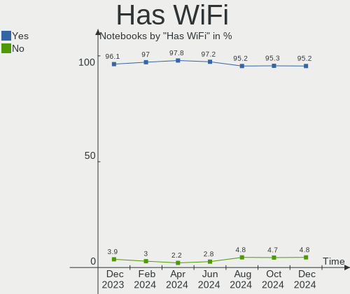
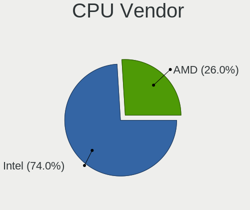
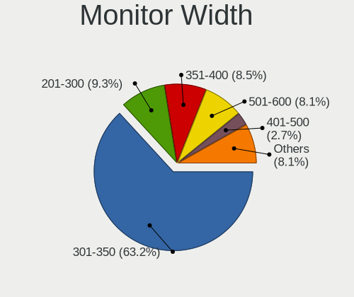
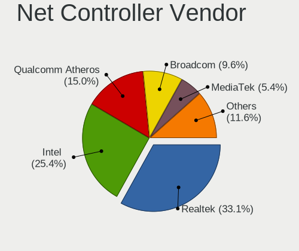
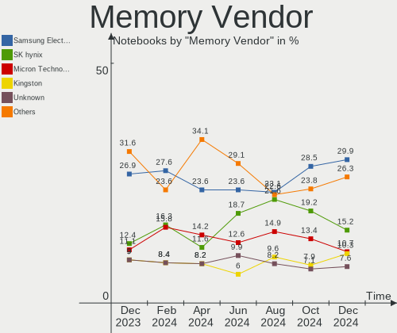

Linux in Russia - Hardware Trends (Notebooks)
---------------------------------------------

A project to identify most popular hardware characteristics and track their change
over time based on data collected by Linux users at https://Linux-Hardware.org.

Anyone can contribute to this report by the [hw-probe](https://github.com/linuxhw/hw-probe) tool:

    sudo -E hw-probe -all -upload

Period: Apr, 2024.

Contents
--------

* [ System ](#system)
  - [ OS                       ](#os)
  - [ OS Family                ](#os-family)
  - [ Kernel                   ](#kernel)
  - [ Kernel Family            ](#kernel-family)
  - [ Kernel Major Ver.        ](#kernel-major-ver)
  - [ Arch                     ](#arch)
  - [ DE                       ](#de)
  - [ Display Server           ](#display-server)
  - [ Display Manager          ](#display-manager)
  - [ OS Lang                  ](#os-lang)
  - [ Boot Mode                ](#boot-mode)
  - [ Filesystem               ](#filesystem)
  - [ Part. scheme             ](#part-scheme)
  - [ Dual Boot with Linux/BSD ](#dual-boot-with-linuxbsd)
  - [ Dual Boot (Win)          ](#dual-boot-win)

* [ Board ](#board)
  - [ Vendor                   ](#vendor)
  - [ Model                    ](#model)
  - [ Model Family             ](#model-family)
  - [ MFG Year                 ](#mfg-year)
  - [ Form Factor              ](#form-factor)
  - [ Secure Boot              ](#secure-boot)
  - [ Coreboot                 ](#coreboot)
  - [ RAM Size                 ](#ram-size)
  - [ RAM Used                 ](#ram-used)
  - [ Total Drives             ](#total-drives)
  - [ Has CD-ROM               ](#has-cd-rom)
  - [ Has Ethernet             ](#has-ethernet)
  - [ Has WiFi                 ](#has-wifi)
  - [ Has Bluetooth            ](#has-bluetooth)

* [ Location ](#location)
  - [ Country                  ](#country)
  - [ City                     ](#city)

* [ Drives ](#drives)
  - [ Drive Vendor             ](#drive-vendor)
  - [ Drive Model              ](#drive-model)
  - [ HDD Vendor               ](#hdd-vendor)
  - [ SSD Vendor               ](#ssd-vendor)
  - [ Drive Kind               ](#drive-kind)
  - [ Drive Connector          ](#drive-connector)
  - [ Drive Size               ](#drive-size)
  - [ Space Total              ](#space-total)
  - [ Space Used               ](#space-used)
  - [ Malfunc. Drives          ](#malfunc-drives)
  - [ Malfunc. Drive Vendor    ](#malfunc-drive-vendor)
  - [ Malfunc. HDD Vendor      ](#malfunc-hdd-vendor)
  - [ Malfunc. Drive Kind      ](#malfunc-drive-kind)
  - [ Failed Drives            ](#failed-drives)
  - [ Failed Drive Vendor      ](#failed-drive-vendor)
  - [ Drive Status             ](#drive-status)

* [ Storage controller ](#storage-controller)
  - [ Storage Vendor           ](#storage-vendor)
  - [ Storage Model            ](#storage-model)
  - [ Storage Kind             ](#storage-kind)

* [ Processor ](#processor)
  - [ CPU Vendor               ](#cpu-vendor)
  - [ CPU Model                ](#cpu-model)
  - [ CPU Model Family         ](#cpu-model-family)
  - [ CPU Cores                ](#cpu-cores)
  - [ CPU Sockets              ](#cpu-sockets)
  - [ CPU Threads              ](#cpu-threads)
  - [ CPU Op-Modes             ](#cpu-op-modes)
  - [ CPU Microcode            ](#cpu-microcode)
  - [ CPU Microarch            ](#cpu-microarch)

* [ Graphics ](#graphics)
  - [ GPU Vendor               ](#gpu-vendor)
  - [ GPU Model                ](#gpu-model)
  - [ GPU Combo                ](#gpu-combo)
  - [ GPU Driver               ](#gpu-driver)
  - [ GPU Memory               ](#gpu-memory)

* [ Monitor ](#monitor)
  - [ Monitor Vendor           ](#monitor-vendor)
  - [ Monitor Model            ](#monitor-model)
  - [ Monitor Resolution       ](#monitor-resolution)
  - [ Monitor Diagonal         ](#monitor-diagonal)
  - [ Monitor Width            ](#monitor-width)
  - [ Aspect Ratio             ](#aspect-ratio)
  - [ Monitor Area             ](#monitor-area)
  - [ Pixel Density            ](#pixel-density)
  - [ Multiple Monitors        ](#multiple-monitors)

* [ Network ](#network)
  - [ Net Controller Vendor    ](#net-controller-vendor)
  - [ Net Controller Model     ](#net-controller-model)
  - [ Wireless Vendor          ](#wireless-vendor)
  - [ Wireless Model           ](#wireless-model)
  - [ Ethernet Vendor          ](#ethernet-vendor)
  - [ Ethernet Model           ](#ethernet-model)
  - [ Net Controller Kind      ](#net-controller-kind)
  - [ Used Controller          ](#used-controller)
  - [ NICs                     ](#nics)
  - [ IPv6                     ](#ipv6)

* [ Bluetooth ](#bluetooth)
  - [ Bluetooth Vendor         ](#bluetooth-vendor)
  - [ Bluetooth Model          ](#bluetooth-model)

* [ Sound ](#sound)
  - [ Sound Vendor             ](#sound-vendor)
  - [ Sound Model              ](#sound-model)

* [ Memory ](#memory)
  - [ Memory Vendor            ](#memory-vendor)
  - [ Memory Model             ](#memory-model)
  - [ Memory Kind              ](#memory-kind)
  - [ Memory Form Factor       ](#memory-form-factor)
  - [ Memory Size              ](#memory-size)
  - [ Memory Speed             ](#memory-speed)

* [ Printers & scanners ](#printers--scanners)
  - [ Printer Vendor           ](#printer-vendor)
  - [ Printer Model            ](#printer-model)
  - [ Scanner Vendor           ](#scanner-vendor)
  - [ Scanner Model            ](#scanner-model)

* [ Camera ](#camera)
  - [ Camera Vendor            ](#camera-vendor)
  - [ Camera Model             ](#camera-model)

* [ Security ](#security)
  - [ Fingerprint Vendor       ](#fingerprint-vendor)
  - [ Fingerprint Model        ](#fingerprint-model)
  - [ Chipcard Vendor          ](#chipcard-vendor)
  - [ Chipcard Model           ](#chipcard-model)

* [ Unsupported ](#unsupported)
  - [ Unsupported Devices      ](#unsupported-devices)
  - [ Unsupported Device Types ](#unsupported-device-types)

System
------

OS
--

Installed operating systems

| Name               | Notebooks | Percent |
|--------------------|-----------|---------|
| ROSA 12.5          | 91        | 33.33%  |
| Debian 12          | 13        | 4.76%   |
| Ubuntu 22.04       | 12        | 4.4%    |
| Fedora 39          | 12        | 4.4%    |
| Arch Rolling       | 11        | 4.03%   |
| Fedora 40          | 10        | 3.66%   |
| OpenMandriva 23.08 | 7         | 2.56%   |
| ROSA 12.4          | 6         | 2.2%    |
| ROSA 12            | 6         | 2.2%    |
| Manjaro            | 6         | 2.2%    |
| Linux Mint 21.3    | 6         | 2.2%    |
| ROSA 13.0          | 5         | 1.83%   |
| Ubuntu 23.10       | 4         | 1.47%   |
| ROSA R11.1         | 4         | 1.47%   |
| OpenMandriva 5.0   | 4         | 1.47%   |
| ALT Linux 10.3     | 4         | 1.47%   |
| Ubuntu 24.04       | 3         | 1.1%    |
| Ubuntu 20.04       | 3         | 1.1%    |
| SteamOS 3.5.17     | 3         | 1.1%    |
| Manjaro 23.1.4     | 3         | 1.1%    |
| Gentoo 2.14        | 3         | 1.1%    |
| Elementary 7.1     | 3         | 1.1%    |
| Debian 11          | 3         | 1.1%    |
| ArcoLinux Rolling  | 3         | 1.1%    |
| ALT Linux 10.2     | 3         | 1.1%    |
| Red OS 8.0         | 2         | 0.73%   |
| Red OS 7.3         | 2         | 0.73%   |
| Pop!_OS 22.04      | 2         | 0.73%   |
| OpenMandriva 4.3   | 2         | 0.73%   |
| Linux Mint 21.2    | 2         | 0.73%   |
| KDE neon 22.04     | 2         | 0.73%   |
| Kali 2024.1        | 2         | 0.73%   |
| Gentoo 2.15        | 2         | 0.73%   |
| ALT Linux 20240122 | 2         | 0.73%   |
| Zorin 16           | 1         | 0.37%   |
| Xubuntu 23.10      | 1         | 0.37%   |
| Void Linux Rolling | 1         | 0.37%   |
| Ubuntu MATE 23.10  | 1         | 0.37%   |
| Ubuntu 23.04       | 1         | 0.37%   |
| ROSA R8.1          | 1         | 0.37%   |

OS Family
---------

OS without a version

| Name             | Notebooks | Percent |
|------------------|-----------|---------|
| ROSA             | 114       | 41.76%  |
| Ubuntu           | 23        | 8.42%   |
| Fedora           | 23        | 8.42%   |
| Debian           | 16        | 5.86%   |
| OpenMandriva     | 15        | 5.49%   |
| Arch             | 11        | 4.03%   |
| ALT Linux        | 11        | 4.03%   |
| Manjaro          | 9         | 3.3%    |
| Linux Mint       | 9         | 3.3%    |
| Gentoo           | 6         | 2.2%    |
| Red OS           | 4         | 1.47%   |
| Kubuntu          | 4         | 1.47%   |
| SteamOS          | 3         | 1.1%    |
| Elementary       | 3         | 1.1%    |
| ArcoLinux        | 3         | 1.1%    |
| Pop!_OS          | 2         | 0.73%   |
| openSUSE         | 2         | 0.73%   |
| KDE neon         | 2         | 0.73%   |
| Kali             | 2         | 0.73%   |
| Zorin            | 1         | 0.37%   |
| Xubuntu          | 1         | 0.37%   |
| Void Linux       | 1         | 0.37%   |
| Ubuntu MATE      | 1         | 0.37%   |
| org.kde.Platform | 1         | 0.37%   |
| Nobara           | 1         | 0.37%   |
| NixOS            | 1         | 0.37%   |
| Garuda Linux     | 1         | 0.37%   |
| Endless          | 1         | 0.37%   |
| EndeavourOS      | 1         | 0.37%   |
| Archcraft        | 1         | 0.37%   |

Kernel
------

Version of the Linux kernel

| Version                             | Notebooks | Percent |
|-------------------------------------|-----------|---------|
| 6.6.21-generic-8rosa2021.1-x86_64   | 57        | 20.88%  |
| 6.1.81-generic-2rosa2021.1-x86_64   | 19        | 6.96%   |
| 6.5.0-27-generic                    | 10        | 3.66%   |
| 6.8.7-300.fc40.x86_64               | 9         | 3.3%    |
| 6.1.0-18-amd64                      | 8         | 2.93%   |
| 6.5.0-26-generic                    | 7         | 2.56%   |
| 6.4.11-desktop-1omv2390             | 5         | 1.83%   |
| 6.1.20-generic-2rosa2021.1-x86_64   | 5         | 1.83%   |
| 5.15.127-generic-1rosa2021.1-i686   | 5         | 1.83%   |
| 5.15.0-102-generic                  | 5         | 1.83%   |
| 6.8.4-200.fc39.x86_64               | 4         | 1.47%   |
| 6.6.27-generic-2rosa2021.1-x86_64   | 4         | 1.47%   |
| 6.6.22-generic-2rosa2023.1-x86_64   | 4         | 1.47%   |
| 6.6.2-desktop-1omv2390              | 4         | 1.47%   |
| 6.8.2-arch2-1                       | 3         | 1.1%    |
| 6.7.10-200.fc39.x86_64              | 3         | 1.1%    |
| 6.6.27-generic-3rosa2021.1-x86_64   | 3         | 1.1%    |
| 6.6.19-1-MANJARO                    | 3         | 1.1%    |
| 6.5.0-28-generic                    | 3         | 1.1%    |
| 6.1.86-generic-1rosa2021.1-x86_64   | 3         | 1.1%    |
| 6.1.52-valve16-1-neptune-61         | 3         | 1.1%    |
| 6.1.0-20-amd64                      | 3         | 1.1%    |
| 5.10.184-generic-1rosa2021.1-x86_64 | 3         | 1.1%    |
| 6.8.7-arch1-2                       | 2         | 0.73%   |
| 6.8.7-arch1-1                       | 2         | 0.73%   |
| 6.8.5-arch1-1                       | 2         | 0.73%   |
| 6.8.2-zen2-1-zen                    | 2         | 0.73%   |
| 6.8.0-76060800daily20240311-generic | 2         | 0.73%   |
| 6.7.4-gentoo                        | 2         | 0.73%   |
| 6.7.11-200.fc39.x86_64              | 2         | 0.73%   |
| 6.6.6-1.red80.x86_64                | 2         | 0.73%   |
| 6.5.6-300.fc39.x86_64               | 2         | 0.73%   |
| 6.1.83-un-def-alt1                  | 2         | 0.73%   |
| 6.1.58-generic-1rosa2021.1-x86_64   | 2         | 0.73%   |
| 6.1.0-4-amd64                       | 2         | 0.73%   |
| 5.4.32-generic-2rosa-i586           | 2         | 0.73%   |
| 5.16.7-desktop-1omv4003             | 2         | 0.73%   |
| 5.15.127-generic-1rosa2021.1-x86_64 | 2         | 0.73%   |
| 5.15.0-76-generic                   | 2         | 0.73%   |
| 5.15.0-101-generic                  | 2         | 0.73%   |

Kernel Family
-------------

Linux kernel without a distro release

| Version  | Notebooks | Percent |
|----------|-----------|---------|
| 6.6.21   | 57        | 20.88%  |
| 6.5.0    | 22        | 8.06%   |
| 6.8.7    | 20        | 7.33%   |
| 6.1.81   | 20        | 7.33%   |
| 6.1.0    | 13        | 4.76%   |
| 5.15.0   | 11        | 4.03%   |
| 6.8.4    | 8         | 2.93%   |
| 6.6.27   | 8         | 2.93%   |
| 5.15.127 | 7         | 2.56%   |
| 6.8.2    | 5         | 1.83%   |
| 6.4.11   | 5         | 1.83%   |
| 6.1.20   | 5         | 1.83%   |
| 6.8.6    | 4         | 1.47%   |
| 6.8.0    | 4         | 1.47%   |
| 6.6.22   | 4         | 1.47%   |
| 6.6.2    | 4         | 1.47%   |
| 6.1.52   | 4         | 1.47%   |
| 6.7.10   | 3         | 1.1%    |
| 6.6.6    | 3         | 1.1%    |
| 6.6.19   | 3         | 1.1%    |
| 6.2.0    | 3         | 1.1%    |
| 6.1.86   | 3         | 1.1%    |
| 5.10.184 | 3         | 1.1%    |
| 5.10.0   | 3         | 1.1%    |
| 6.8.5    | 2         | 0.73%   |
| 6.7.4    | 2         | 0.73%   |
| 6.7.11   | 2         | 0.73%   |
| 6.7.0    | 2         | 0.73%   |
| 6.6.28   | 2         | 0.73%   |
| 6.6.26   | 2         | 0.73%   |
| 6.5.6    | 2         | 0.73%   |
| 6.1.85   | 2         | 0.73%   |
| 6.1.83   | 2         | 0.73%   |
| 6.1.58   | 2         | 0.73%   |
| 5.4.32   | 2         | 0.73%   |
| 5.4.0    | 2         | 0.73%   |
| 5.16.7   | 2         | 0.73%   |
| 5.10.198 | 2         | 0.73%   |
| 5.10.164 | 2         | 0.73%   |
| 4.15.0   | 2         | 0.73%   |

Kernel Major Ver.
-----------------

Linux kernel major version

| Version | Notebooks | Percent |
|---------|-----------|---------|
| 6.6     | 86        | 31.5%   |
| 6.1     | 55        | 20.15%  |
| 6.8     | 45        | 16.48%  |
| 6.5     | 25        | 9.16%   |
| 5.15    | 19        | 6.96%   |
| 5.10    | 12        | 4.4%    |
| 6.7     | 10        | 3.66%   |
| 6.4     | 6         | 2.2%    |
| 5.4     | 4         | 1.47%   |
| 6.2     | 3         | 1.1%    |
| 5.16    | 2         | 0.73%   |
| 4.15    | 2         | 0.73%   |
| 5.17    | 1         | 0.37%   |
| 5.14    | 1         | 0.37%   |
| 5.11    | 1         | 0.37%   |
| 4.9     | 1         | 0.37%   |

Arch
----

OS architecture (x86_64, i586, etc.)

| Name   | Notebooks | Percent |
|--------|-----------|---------|
| x86_64 | 264       | 96.7%   |
| i686   | 9         | 3.3%    |

DE
--

Desktop Environment

| Name            | Notebooks | Percent |
|-----------------|-----------|---------|
| KDE5            | 108       | 39.56%  |
| GNOME           | 85        | 31.14%  |
| LXQt            | 15        | 5.49%   |
| XFCE            | 11        | 4.03%   |
| MATE            | 10        | 3.66%   |
| KDE6            | 9         | 3.3%    |
| Unknown         | 7         | 2.56%   |
| X-Cinnamon      | 6         | 2.2%    |
| sway            | 5         | 1.83%   |
| Hyprland        | 5         | 1.83%   |
| Pantheon        | 3         | 1.1%    |
| KDE4            | 3         | 1.1%    |
| GNOME Classic   | 2         | 0.73%   |
| bspwm           | 2         | 0.73%   |
| GNOME Flashback | 1         | 0.37%   |
| Cinnamon        | 1         | 0.37%   |

Display Server
--------------

X11 or Wayland

| Name    | Notebooks | Percent |
|---------|-----------|---------|
| Wayland | 175       | 64.1%   |
| X11     | 94        | 34.43%  |
| Tty     | 2         | 0.73%   |
| Unknown | 2         | 0.73%   |

Display Manager
---------------

SDDM, LightDM, etc.

| Name    | Notebooks | Percent |
|---------|-----------|---------|
| SDDM    | 104       | 38.1%   |
| Unknown | 55        | 20.15%  |
| GDM     | 51        | 18.68%  |
| LightDM | 32        | 11.72%  |
| GDM3    | 27        | 9.89%   |
| KDM     | 2         | 0.73%   |
| LY-DM   | 1         | 0.37%   |
| Ly      | 1         | 0.37%   |

OS Lang
-------

Language

| Lang    | Notebooks | Percent |
|---------|-----------|---------|
| ru_RU   | 204       | 74.73%  |
| en_US   | 57        | 20.88%  |
| C       | 4         | 1.47%   |
| en_GB   | 3         | 1.1%    |
| Unknown | 3         | 1.1%    |
| ru      | 1         | 0.37%   |
| POSIX   | 1         | 0.37%   |

Boot Mode
---------

EFI or BIOS

| Mode | Notebooks | Percent |
|------|-----------|---------|
| EFI  | 160       | 58.61%  |
| BIOS | 113       | 41.39%  |

Filesystem
----------

Type of filesystem

| Type    | Notebooks | Percent |
|---------|-----------|---------|
| Ext4    | 192       | 70.33%  |
| Btrfs   | 55        | 20.15%  |
| Overlay | 12        | 4.4%    |
| Tmpfs   | 11        | 4.03%   |
| Xfs     | 2         | 0.73%   |
| F2fs    | 1         | 0.37%   |

Part. scheme
------------

Scheme of partitioning

| Type    | Notebooks | Percent |
|---------|-----------|---------|
| GPT     | 169       | 61.9%   |
| MBR     | 58        | 21.25%  |
| Unknown | 46        | 16.85%  |

Dual Boot with Linux/BSD
------------------------

Hosting more than one Linux/BSD

| Dual boot | Notebooks | Percent |
|-----------|-----------|---------|
| No        | 229       | 83.88%  |
| Yes       | 44        | 16.12%  |

Dual Boot (Win)
---------------

Hosting Linux and Windows

| Dual boot | Notebooks | Percent |
|-----------|-----------|---------|
| No        | 174       | 63.74%  |
| Yes       | 99        | 36.26%  |

Board
-----

Vendor
------

Motherboard manufacturer

| Name                     | Notebooks | Percent |
|--------------------------|-----------|---------|
| Lenovo                   | 55        | 20.15%  |
| ASUSTek Computer         | 35        | 12.82%  |
| Hewlett-Packard          | 31        | 11.36%  |
| Acer                     | 27        | 9.89%   |
| HUAWEI                   | 18        | 6.59%   |
| Dell                     | 12        | 4.4%    |
| MSI                      | 7         | 2.56%   |
| Unknown                  | 7         | 2.56%   |
| Maibenben                | 6         | 2.2%    |
| HONOR                    | 6         | 2.2%    |
| Toshiba                  | 5         | 1.83%   |
| Timi                     | 4         | 1.47%   |
| Sony                     | 4         | 1.47%   |
| Samsung Electronics      | 4         | 1.47%   |
| XIAOMI                   | 3         | 1.1%    |
| Valve                    | 3         | 1.1%    |
| Packard Bell             | 3         | 1.1%    |
| DEXP                     | 3         | 1.1%    |
| DEPO Computers           | 3         | 1.1%    |
| Aquarius                 | 3         | 1.1%    |
| Apple                    | 3         | 1.1%    |
| Notebook                 | 2         | 0.73%   |
| MACHENIKE                | 2         | 0.73%   |
| eMachines                | 2         | 0.73%   |
| Clevo                    | 2         | 0.73%   |
| Alienware                | 2         | 0.73%   |
| ZET                      | 1         | 0.37%   |
| TPS                      | 1         | 0.37%   |
| TECNO                    | 1         | 0.37%   |
| Standard                 | 1         | 0.37%   |
| MECHREVO                 | 1         | 0.37%   |
| Irbis                    | 1         | 0.37%   |
| IP3 Tech                 | 1         | 0.37%   |
| Intel Client Systems     | 1         | 0.37%   |
| Infinix                  | 1         | 0.37%   |
| ICL Techno               | 1         | 0.37%   |
| HIPER Technology Limited | 1         | 0.37%   |
| HIPER                    | 1         | 0.37%   |
| Haier                    | 1         | 0.37%   |
| GPD                      | 1         | 0.37%   |

Model
-----

Motherboard model

| Name                                     | Notebooks | Percent |
|------------------------------------------|-----------|---------|
| Unknown                                  | 9         | 3.3%    |
| HUAWEI BOM-WXX9                          | 5         | 1.83%   |
| Valve Jupiter                            | 3         | 1.1%    |
| Maibenben MaiBook M                      | 3         | 1.1%    |
| XIAOMI Redmi Book Pro 15 2023            | 2         | 0.73%   |
| Timi TM1701                              | 2         | 0.73%   |
| Samsung 350V5C/351V5C/3540VC/3440VC      | 2         | 0.73%   |
| Lenovo G50-30 80G0                       | 2         | 0.73%   |
| Lenovo B590 20208                        | 2         | 0.73%   |
| Lenovo B50-80 80EW                       | 2         | 0.73%   |
| HUAWEI NbDE-WXX9                         | 2         | 0.73%   |
| HONOR NMH-WDX9                           | 2         | 0.73%   |
| HONOR GLO-GXXX                           | 2         | 0.73%   |
| HP Pavilion g6                           | 2         | 0.73%   |
| HP Laptop 15-bw0xx                       | 2         | 0.73%   |
| HP EliteBook 845 14 inch G10 Notebook PC | 2         | 0.73%   |
| DEPO Computers DPC156                    | 2         | 0.73%   |
| Clevo NL41MU2                            | 2         | 0.73%   |
| ASUS X541NA                              | 2         | 0.73%   |
| Aquarius NS685U R11                      | 2         | 0.73%   |
| Acer Swift SF314-43                      | 2         | 0.73%   |
| Acer Aspire A315-53G                     | 2         | 0.73%   |
| ZET Ward M103                            | 1         | 0.37%   |
| XIAOMI Redmi Book 14 2024                | 1         | 0.37%   |
| TPS C48P                                 | 1         | 0.37%   |
| Toshiba Satellite U300                   | 1         | 0.37%   |
| Toshiba Satellite Pro L300               | 1         | 0.37%   |
| Toshiba Satellite C850-C1S               | 1         | 0.37%   |
| Toshiba Satellite C850-B1K               | 1         | 0.37%   |
| Toshiba Satellite A200                   | 1         | 0.37%   |
| Timi Xiaomi Book Pro 14 2022             | 1         | 0.37%   |
| Timi RedmiBook Pro 14S                   | 1         | 0.37%   |
| TECNO MEGABOOK T1                        | 1         | 0.37%   |
| Sony VGN-Z21VRN_X                        | 1         | 0.37%   |
| Sony VGN-FW11ER                          | 1         | 0.37%   |
| Sony SVF1521X1RB                         | 1         | 0.37%   |
| Sony SVE1512G1RB                         | 1         | 0.37%   |
| Samsung RV413/RV513                      | 1         | 0.37%   |
| Samsung R510/P510                        | 1         | 0.37%   |
| Packard Bell EasyNote TV11HC             | 1         | 0.37%   |

Model Family
------------

Motherboard model prefix

| Name                  | Notebooks | Percent |
|-----------------------|-----------|---------|
| Lenovo ThinkPad       | 19        | 6.96%   |
| Acer Aspire           | 19        | 6.96%   |
| Lenovo IdeaPad        | 13        | 4.76%   |
| ASUS VivoBook         | 10        | 3.66%   |
| Unknown               | 9         | 3.3%    |
| HP Pavilion           | 7         | 2.56%   |
| HP ProBook            | 6         | 2.2%    |
| HP Laptop             | 6         | 2.2%    |
| Toshiba Satellite     | 5         | 1.83%   |
| HUAWEI BOM-WXX9       | 5         | 1.83%   |
| HP EliteBook          | 5         | 1.83%   |
| Dell Inspiron         | 5         | 1.83%   |
| Maibenben MaiBook     | 4         | 1.47%   |
| Lenovo ThinkBook      | 4         | 1.47%   |
| XIAOMI Redmi          | 3         | 1.1%    |
| Valve Jupiter         | 3         | 1.1%    |
| Packard Bell EasyNote | 3         | 1.1%    |
| Lenovo Legion         | 3         | 1.1%    |
| Lenovo B590           | 3         | 1.1%    |
| DEXP Atlas            | 3         | 1.1%    |
| Dell Vostro           | 3         | 1.1%    |
| Timi TM1701           | 2         | 0.73%   |
| Samsung 350V5C        | 2         | 0.73%   |
| Lenovo XiaoXinPro     | 2         | 0.73%   |
| Lenovo G50-30         | 2         | 0.73%   |
| Lenovo B50-80         | 2         | 0.73%   |
| HUAWEI NbDE-WXX9      | 2         | 0.73%   |
| HONOR NMH-WDX9        | 2         | 0.73%   |
| HONOR GLO-GXXX        | 2         | 0.73%   |
| HP Presario           | 2         | 0.73%   |
| DEPO Computers DPC156 | 2         | 0.73%   |
| Dell Precision        | 2         | 0.73%   |
| Clevo NL41MU2         | 2         | 0.73%   |
| ASUS X541NA           | 2         | 0.73%   |
| Aquarius NS685U       | 2         | 0.73%   |
| Apple MacBookPro11    | 2         | 0.73%   |
| Acer Swift            | 2         | 0.73%   |
| Acer Nitro            | 2         | 0.73%   |
| ZET Ward              | 1         | 0.37%   |
| TPS C48P              | 1         | 0.37%   |

MFG Year
--------

Motherboard manufacture year

| Year | Notebooks | Percent |
|------|-----------|---------|
| 2023 | 39        | 14.29%  |
| 2021 | 30        | 10.99%  |
| 2012 | 22        | 8.06%   |
| 2022 | 20        | 7.33%   |
| 2018 | 19        | 6.96%   |
| 2020 | 18        | 6.59%   |
| 2011 | 15        | 5.49%   |
| 2019 | 14        | 5.13%   |
| 2013 | 13        | 4.76%   |
| 2017 | 12        | 4.4%    |
| 2010 | 12        | 4.4%    |
| 2016 | 11        | 4.03%   |
| 2015 | 11        | 4.03%   |
| 2009 | 11        | 4.03%   |
| 2008 | 10        | 3.66%   |
| 2014 | 7         | 2.56%   |
| 2024 | 4         | 1.47%   |
| 2007 | 3         | 1.1%    |
| 2006 | 2         | 0.73%   |

Form Factor
-----------

Physical design of the computer

| Name     | Notebooks | Percent |
|----------|-----------|---------|
| Notebook | 273       | 100%    |

Secure Boot
-----------

Enabled or disabled

| State    | Notebooks | Percent |
|----------|-----------|---------|
| Disabled | 264       | 96.7%   |
| Enabled  | 9         | 3.3%    |

Coreboot
--------

Have coreboot on board

| Used | Notebooks | Percent |
|------|-----------|---------|
| No   | 272       | 99.63%  |
| Yes  | 1         | 0.37%   |

RAM Size
--------

Total RAM memory

| Size in GB  | Notebooks | Percent |
|-------------|-----------|---------|
| 4.01-8.0    | 83        | 30.4%   |
| 8.01-16.0   | 63        | 23.08%  |
| 3.01-4.0    | 43        | 15.75%  |
| 16.01-24.0  | 39        | 14.29%  |
| 32.01-64.0  | 16        | 5.86%   |
| 1.01-2.0    | 14        | 5.13%   |
| 2.01-3.0    | 6         | 2.2%    |
| 24.01-32.0  | 5         | 1.83%   |
| 64.01-256.0 | 3         | 1.1%    |
| 0.51-1.0    | 1         | 0.37%   |

RAM Used
--------

Used RAM memory

| Used GB    | Notebooks | Percent |
|------------|-----------|---------|
| 1.01-2.0   | 109       | 39.93%  |
| 2.01-3.0   | 55        | 20.15%  |
| 4.01-8.0   | 40        | 14.65%  |
| 3.01-4.0   | 37        | 13.55%  |
| 0.51-1.0   | 21        | 7.69%   |
| 8.01-16.0  | 7         | 2.56%   |
| 0.01-0.5   | 3         | 1.1%    |
| 24.01-32.0 | 1         | 0.37%   |

Total Drives
------------

Number of drives on board

| Drives | Notebooks | Percent |
|--------|-----------|---------|
| 1      | 193       | 70.7%   |
| 2      | 74        | 27.11%  |
| 3      | 5         | 1.83%   |
| 0      | 1         | 0.37%   |

Has CD-ROM
----------

Has CD-ROM on board

| Presented | Notebooks | Percent |
|-----------|-----------|---------|
| No        | 211       | 77.29%  |
| Yes       | 62        | 22.71%  |

Has Ethernet
------------

Has Ethernet on board

| Presented | Notebooks | Percent |
|-----------|-----------|---------|
| Yes       | 200       | 73.26%  |
| No        | 73        | 26.74%  |

Has WiFi
--------

Has WiFi module

| Presented | Notebooks | Percent |
|-----------|-----------|---------|
| Yes       | 271       | 99.27%  |
| No        | 2         | 0.73%   |

Has Bluetooth
-------------

Has Bluetooth module

| Presented | Notebooks | Percent |
|-----------|-----------|---------|
| Yes       | 223       | 81.68%  |
| No        | 50        | 18.32%  |

Location
--------

Country
-------

Geographic location (country)

| Country | Notebooks | Percent |
|---------|-----------|---------|
| Russia  | 273       | 100%    |

City
----

Geographic location (city)

| City              | Notebooks | Percent |
|-------------------|-----------|---------|
| Moscow            | 79        | 28.94%  |
| St Petersburg     | 29        | 10.62%  |
| Novosibirsk       | 8         | 2.93%   |
| Yekaterinburg     | 7         | 2.56%   |
| Krasnodar         | 7         | 2.56%   |
| Nizhniy Novgorod  | 6         | 2.2%    |
| Voronezh          | 5         | 1.83%   |
| Tyumen            | 4         | 1.47%   |
| Tomsk             | 4         | 1.47%   |
| Ryazan            | 4         | 1.47%   |
| Kemerovo          | 4         | 1.47%   |
| Veliky Novgorod   | 3         | 1.1%    |
| Surgut            | 3         | 1.1%    |
| Saratov           | 3         | 1.1%    |
| Saransk           | 3         | 1.1%    |
| Penza             | 3         | 1.1%    |
| Murino            | 3         | 1.1%    |
| Kazan’          | 3         | 1.1%    |
| Izhevsk           | 3         | 1.1%    |
| Irkutsk           | 3         | 1.1%    |
| Chelyabinsk       | 3         | 1.1%    |
| Zima              | 2         | 0.73%   |
| Vologda           | 2         | 0.73%   |
| Volgograd         | 2         | 0.73%   |
| Vladivostok       | 2         | 0.73%   |
| Ulyanovsk         | 2         | 0.73%   |
| Tambov            | 2         | 0.73%   |
| Sochi             | 2         | 0.73%   |
| Smolensk          | 2         | 0.73%   |
| Samara            | 2         | 0.73%   |
| Rostov-on-Don     | 2         | 0.73%   |
| Ramenskoye        | 2         | 0.73%   |
| Pskov             | 2         | 0.73%   |
| Omsk              | 2         | 0.73%   |
| Krasnoyarsk       | 2         | 0.73%   |
| Khimki            | 2         | 0.73%   |
| Kazan'            | 2         | 0.73%   |
| Kamyshlov         | 2         | 0.73%   |
| Zheleznodorozhnyy | 1         | 0.37%   |
| Yoshkar-Ola       | 1         | 0.37%   |

Drives
------

Drive Vendor
------------

Hard drive vendors

| Vendor                      | Notebooks | Drives | Percent |
|-----------------------------|-----------|--------|---------|
| Samsung Electronics         | 35        | 35     | 10.09%  |
| WDC                         | 34        | 37     | 9.8%    |
| SanDisk                     | 22        | 23     | 6.34%   |
| Seagate                     | 20        | 20     | 5.76%   |
| Toshiba                     | 17        | 17     | 4.9%    |
| Kingston                    | 16        | 17     | 4.61%   |
| Unknown                     | 12        | 12     | 3.46%   |
| KIOXIA                      | 12        | 12     | 3.46%   |
| SK hynix                    | 11        | 11     | 3.17%   |
| Micron Technology           | 10        | 10     | 2.88%   |
| Intel                       | 10        | 10     | 2.88%   |
| Hitachi                     | 10        | 10     | 2.88%   |
| China                       | 9         | 9      | 2.59%   |
| Phison Electronics          | 7         | 7      | 2.02%   |
| AMD                         | 7         | 8      | 2.02%   |
| Silicon Motion              | 6         | 6      | 1.73%   |
| KingSpec                    | 6         | 7      | 1.73%   |
| A-DATA Technology           | 6         | 6      | 1.73%   |
| Phison                      | 5         | 5      | 1.44%   |
| Netac                       | 5         | 5      | 1.44%   |
| HGST                        | 5         | 5      | 1.44%   |
| YMTC                        | 4         | 4      | 1.15%   |
| Qumo                        | 4         | 4      | 1.15%   |
| Crucial                     | 4         | 4      | 1.15%   |
| BIWIN                       | 4         | 4      | 1.15%   |
| Apacer                      | 4         | 4      | 1.15%   |
| Unknown                     | 4         | 4      | 1.15%   |
| XrayDisk                    | 3         | 3      | 0.86%   |
| SPCC                        | 3         | 3      | 0.86%   |
| MAXIO Technology (Hangzhou) | 3         | 3      | 0.86%   |
| Kingston Technology Company | 3         | 3      | 0.86%   |
| Gigabyte Technology         | 3         | 3      | 0.86%   |
| Transcend                   | 2         | 2      | 0.58%   |
| SSSTC                       | 2         | 2      | 0.58%   |
| RTS                         | 2         | 2      | 0.58%   |
| Plextor                     | 2         | 2      | 0.58%   |
| Patriot                     | 2         | 2      | 0.58%   |
| Kimtigo                     | 2         | 2      | 0.58%   |
| Apple                       | 2         | 2      | 0.58%   |
| Zheino                      | 1         | 1      | 0.29%   |

Drive Model
-----------

Hard drive models

| Model                                              | Notebooks | Percent |
|----------------------------------------------------|-----------|---------|
| Silicon Motion PCIe-8 SSD 512GB                    | 5         | 1.42%   |
| Samsung NVMe SSD Controller SM981/PM981/PM983 1TB  | 5         | 1.42%   |
| YMTC PC300-512GB-B                                 | 4         | 1.13%   |
| Toshiba MQ01ABF050 500GB                           | 4         | 1.13%   |
| KIOXIA KBG50ZNV512G 512GB                          | 4         | 1.13%   |
| Kingston SA400S37240G 240GB SSD                    | 4         | 1.13%   |
| Unknown                                            | 4         | 1.13%   |
| Seagate ST1000LM035-1RK172 1TB                     | 3         | 0.85%   |
| Samsung SSD 870 EVO 1TB                            | 3         | 0.85%   |
| Qumo Q3DT-256GMSY-M2 256GB SSD                     | 3         | 0.85%   |
| Phison E12 NVMe Controller 2TB                     | 3         | 0.85%   |
| Micron 2400_MTFDKBA512QFM 512GB                    | 3         | 0.85%   |
| KIOXIA KXG80ZNV1T02 1TB                            | 3         | 0.85%   |
| Kingston SA400S37480G 480GB SSD                    | 3         | 0.85%   |
| KingSpec P3-512 512GB SSD                          | 3         | 0.85%   |
| Intel SSDPEKNU512GZ 512GB                          | 3         | 0.85%   |
| WDC WDS240G2G0A-00JH30 240GB SSD                   | 2         | 0.57%   |
| Unknown MMC Card  512GB                            | 2         | 0.57%   |
| Toshiba MQ04ABF100 1TB                             | 2         | 0.57%   |
| Toshiba MQ01ABD050 500GB                           | 2         | 0.57%   |
| Toshiba HDWJ110 1TB                                | 2         | 0.57%   |
| SPCC Solid State Disk 256GB                        | 2         | 0.57%   |
| Seagate ST9250315AS 250GB                          | 2         | 0.57%   |
| Seagate ST1000LM048-2E7172 1TB                     | 2         | 0.57%   |
| Seagate ST1000LM024 HN-M101MBB 1TB                 | 2         | 0.57%   |
| Seagate Expansion 2TB                              | 2         | 0.57%   |
| Sandisk WD PC SN540 SDDPNPF-512G                   | 2         | 0.57%   |
| Sandisk WD Black SN750 / PC SN730 NVMe SSD 512GB   | 2         | 0.57%   |
| SanDisk NVMe SSD Drive 1TB                         | 2         | 0.57%   |
| Samsung SSD 980 1TB                                | 2         | 0.57%   |
| Samsung SSD 860 EVO 1TB                            | 2         | 0.57%   |
| Samsung SSD 850 EVO 250GB                          | 2         | 0.57%   |
| Samsung NVMe SSD Controller PM9A1/PM9A3/980PRO 1TB | 2         | 0.57%   |
| Samsung MZVL4512HBLU-00BTW 512GB                   | 2         | 0.57%   |
| Samsung HM500JI 500GB                              | 2         | 0.57%   |
| RTS 256G SSD                                       | 2         | 0.57%   |
| Phison PS5013 E13 NVMe Controller 512GB            | 2         | 0.57%   |
| Netac SSD 240GB                                    | 2         | 0.57%   |
| Micron 2210_MTFDHBA512QFD 512GB                    | 2         | 0.57%   |
| MAXIO (Hangzhou) NVMe SSD Drive 512GB              | 2         | 0.57%   |

HDD Vendor
----------

Hard disk drive vendors

| Vendor              | Notebooks | Drives | Percent |
|---------------------|-----------|--------|---------|
| WDC                 | 25        | 27     | 30.86%  |
| Seagate             | 20        | 20     | 24.69%  |
| Toshiba             | 15        | 15     | 18.52%  |
| Hitachi             | 10        | 10     | 12.35%  |
| HGST                | 5         | 5      | 6.17%   |
| Samsung Electronics | 3         | 3      | 3.7%    |
| StoreJet            | 1         | 1      | 1.23%   |
| JMicron Technology  | 1         | 1      | 1.23%   |
| Unknown             | 1         | 1      | 1.23%   |

SSD Vendor
----------

Solid state drive vendors

| Vendor              | Notebooks | Drives | Percent |
|---------------------|-----------|--------|---------|
| Kingston            | 15        | 16     | 11.72%  |
| Samsung Electronics | 14        | 14     | 10.94%  |
| SanDisk             | 9         | 10     | 7.03%   |
| China               | 9         | 9      | 7.03%   |
| AMD                 | 7         | 7      | 5.47%   |
| WDC                 | 6         | 6      | 4.69%   |
| KingSpec            | 6         | 7      | 4.69%   |
| Qumo                | 4         | 4      | 3.13%   |
| Netac               | 4         | 4      | 3.13%   |
| Apacer              | 4         | 4      | 3.13%   |
| A-DATA Technology   | 4         | 4      | 3.13%   |
| XrayDisk            | 3         | 3      | 2.34%   |
| Crucial             | 3         | 3      | 2.34%   |
| SPCC                | 2         | 2      | 1.56%   |
| RTS                 | 2         | 2      | 1.56%   |
| Plextor             | 2         | 2      | 1.56%   |
| Patriot             | 2         | 2      | 1.56%   |
| Kimtigo             | 2         | 2      | 1.56%   |
| Intel               | 2         | 2      | 1.56%   |
| Gigabyte Technology | 2         | 2      | 1.56%   |
| Apple               | 2         | 2      | 1.56%   |
| Unknown             | 2         | 2      | 1.56%   |
| Zheino              | 1         | 1      | 0.78%   |
| Union Memory        | 1         | 1      | 0.78%   |
| Transcend           | 1         | 1      | 0.78%   |
| Toshiba             | 1         | 1      | 0.78%   |
| Team                | 1         | 1      | 0.78%   |
| SSSTC               | 1         | 1      | 0.78%   |
| SK hynix            | 1         | 1      | 0.78%   |
| Q600S               | 1         | 1      | 0.78%   |
| OCZ                 | 1         | 1      | 0.78%   |
| Neo                 | 1         | 1      | 0.78%   |
| Micron Technology   | 1         | 1      | 0.78%   |
| M500                | 1         | 1      | 0.78%   |
| KIOXIA-EXCERIA      | 1         | 1      | 0.78%   |
| KingDian            | 1         | 1      | 0.78%   |
| HJDK                | 1         | 1      | 0.78%   |
| Hewlett-Packard     | 1         | 1      | 0.78%   |
| GS                  | 1         | 1      | 0.78%   |
| Fanxiang            | 1         | 1      | 0.78%   |

Drive Kind
----------

HDD or SSD

| Kind    | Notebooks | Drives | Percent |
|---------|-----------|--------|---------|
| NVMe    | 119       | 128    | 36.73%  |
| SSD     | 117       | 131    | 36.11%  |
| HDD     | 76        | 83     | 23.46%  |
| MMC     | 11        | 12     | 3.4%    |
| Unknown | 1         | 1      | 0.31%   |

Drive Connector
---------------

SATA, SAS, NVMe, etc.

| Type | Notebooks | Drives | Percent |
|------|-----------|--------|---------|
| SATA | 162       | 206    | 53.82%  |
| NVMe | 119       | 128    | 39.53%  |
| MMC  | 11        | 12     | 3.65%   |
| SAS  | 9         | 9      | 2.99%   |

Drive Size
----------

Size of hard drive

| Size in TB | Notebooks | Drives | Percent |
|------------|-----------|--------|---------|
| 0.01-0.5   | 131       | 153    | 70.05%  |
| 0.51-1.0   | 48        | 53     | 25.67%  |
| 1.01-2.0   | 7         | 7      | 3.74%   |
| 0          | 1         | 1      | 0.53%   |

Space Total
-----------

Amount of disk space available on the file system

| Size in GB     | Notebooks | Percent |
|----------------|-----------|---------|
| 251-500        | 81        | 29.67%  |
| 101-250        | 73        | 26.74%  |
| 501-1000       | 46        | 16.85%  |
| 1-20           | 22        | 8.06%   |
| 51-100         | 16        | 5.86%   |
| 1001-2000      | 13        | 4.76%   |
| 21-50          | 11        | 4.03%   |
| More than 3000 | 6         | 2.2%    |
| Unknown        | 4         | 1.47%   |
| 2001-3000      | 1         | 0.37%   |

Space Used
----------

Amount of used disk space

| Used GB        | Notebooks | Percent |
|----------------|-----------|---------|
| 1-20           | 124       | 45.42%  |
| 21-50          | 52        | 19.05%  |
| 101-250        | 34        | 12.45%  |
| 51-100         | 27        | 9.89%   |
| 251-500        | 17        | 6.23%   |
| 501-1000       | 9         | 3.3%    |
| Unknown        | 4         | 1.47%   |
| More than 3000 | 3         | 1.1%    |
| 1001-2000      | 3         | 1.1%    |

Malfunc. Drives
---------------

Drive models with a malfunction

| Model                                   | Notebooks | Drives | Percent |
|-----------------------------------------|-----------|--------|---------|
| Toshiba MQ01ABF050 500GB                | 2         | 2      | 4.88%   |
| WDC WDS240G2G0A-00JH30 240GB SSD        | 1         | 1      | 2.44%   |
| WDC WD7500BPVX-60JC3T0 752GB            | 1         | 1      | 2.44%   |
| WDC WD600BEVS-07LAT0 64GB               | 1         | 1      | 2.44%   |
| WDC WD5000LPVX-80V0TT0 500GB            | 1         | 1      | 2.44%   |
| WDC WD5000LPVX-22V0TT0 500GB            | 1         | 1      | 2.44%   |
| WDC WD3200BEVT-26A23T0 320GB            | 1         | 1      | 2.44%   |
| WDC WD1600BEVS-22RST0 160GB             | 1         | 1      | 2.44%   |
| WDC WD10JPVT-60A1YT0 1TB                | 1         | 2      | 2.44%   |
| WDC WD Green M.2 2280 240GB             | 1         | 1      | 2.44%   |
| Toshiba THNSNK128GCS8 SATA 128GB SSD    | 1         | 1      | 2.44%   |
| Toshiba MQ01ABD050 500GB                | 1         | 1      | 2.44%   |
| Toshiba MK6034GSX 64GB                  | 1         | 1      | 2.44%   |
| Toshiba HDWJ110 1TB                     | 1         | 1      | 2.44%   |
| SSSTC CV8-8E128-HP 128GB                | 1         | 1      | 2.44%   |
| Seagate ST9250315AS 250GB               | 1         | 1      | 2.44%   |
| Seagate ST9160310AS 160GB               | 1         | 1      | 2.44%   |
| Seagate ST320LT020-9YG142 320GB         | 1         | 1      | 2.44%   |
| Seagate ST320LT012-9WS14C 320GB         | 1         | 1      | 2.44%   |
| Seagate ST1000LM 024 HN-M101MBB 1TB     | 1         | 1      | 2.44%   |
| SanDisk SSD PLUS 240GB                  | 1         | 1      | 2.44%   |
| Samsung Electronics SSD 870 EVO 1TB     | 1         | 1      | 2.44%   |
| Samsung Electronics HM500JI 500GB       | 1         | 1      | 2.44%   |
| Samsung Electronics HM160HI 160GB       | 1         | 1      | 2.44%   |
| Plextor PX-128M6Pro 128GB SSD           | 1         | 1      | 2.44%   |
| OCZ VECTOR150 120GB SSD                 | 1         | 1      | 2.44%   |
| Neo Forza NFS121SA324-6007000 240GB SSD | 1         | 1      | 2.44%   |
| Kingston SUV500MS240G 240GB SSD         | 1         | 1      | 2.44%   |
| Kingston SHFS37A120G 120GB SSD          | 1         | 1      | 2.44%   |
| Kingston SH103S3120G 120GB SSD          | 1         | 1      | 2.44%   |
| KingSpec P3-512 512GB SSD               | 1         | 1      | 2.44%   |
| Intel SSDPEKNU512GZ 512GB               | 1         | 1      | 2.44%   |
| Hitachi HTS545050A7E380 500GB           | 1         | 1      | 2.44%   |
| Hitachi HTS545025B9A300 250GB           | 1         | 1      | 2.44%   |
| Hitachi HTS545016B9A300 160GB           | 1         | 1      | 2.44%   |
| Hitachi HTS542525K9SA00 250GB           | 1         | 1      | 2.44%   |
| Hitachi HTS541616J9SA00 160GB           | 1         | 1      | 2.44%   |
| Hitachi HTS541612J9SA00 120GB           | 1         | 1      | 2.44%   |
| HGST HTS725032A7E630 320GB              | 1         | 1      | 2.44%   |
| DEXP SSD C100 1024Gb 1TB                | 1         | 1      | 2.44%   |

Malfunc. Drive Vendor
---------------------

Vendors of faulty drives

| Vendor              | Notebooks | Drives | Percent |
|---------------------|-----------|--------|---------|
| WDC                 | 9         | 10     | 21.95%  |
| Toshiba             | 6         | 6      | 14.63%  |
| Hitachi             | 6         | 6      | 14.63%  |
| Seagate             | 5         | 5      | 12.2%   |
| Samsung Electronics | 3         | 3      | 7.32%   |
| Kingston            | 3         | 3      | 7.32%   |
| SSSTC               | 1         | 1      | 2.44%   |
| SanDisk             | 1         | 1      | 2.44%   |
| Plextor             | 1         | 1      | 2.44%   |
| OCZ                 | 1         | 1      | 2.44%   |
| Neo                 | 1         | 1      | 2.44%   |
| KingSpec            | 1         | 1      | 2.44%   |
| Intel               | 1         | 1      | 2.44%   |
| HGST                | 1         | 1      | 2.44%   |
| DEXP                | 1         | 1      | 2.44%   |

Malfunc. HDD Vendor
-------------------

Vendors of faulty HDD drives

| Vendor              | Notebooks | Drives | Percent |
|---------------------|-----------|--------|---------|
| WDC                 | 8         | 9      | 29.63%  |
| Hitachi             | 6         | 6      | 22.22%  |
| Toshiba             | 5         | 5      | 18.52%  |
| Seagate             | 5         | 5      | 18.52%  |
| Samsung Electronics | 2         | 2      | 7.41%   |
| HGST                | 1         | 1      | 3.7%    |

Malfunc. Drive Kind
-------------------

Kinds of faulty drives

| Kind | Notebooks | Drives | Percent |
|------|-----------|--------|---------|
| HDD  | 27        | 28     | 65.85%  |
| SSD  | 13        | 13     | 31.71%  |
| NVMe | 1         | 1      | 2.44%   |

Failed Drives
-------------

Failed drive models

Zero info for selected period =(

Failed Drive Vendor
-------------------

Failed drive vendors

Zero info for selected period =(

Drive Status
------------

Number of failed and malfunc. drives

| Status   | Notebooks | Drives | Percent |
|----------|-----------|--------|---------|
| Works    | 174       | 219    | 60%     |
| Detected | 75        | 94     | 25.86%  |
| Malfunc  | 41        | 42     | 14.14%  |

Storage controller
------------------

Storage Vendor
--------------

Storage controller vendors

| Vendor                                  | Notebooks | Percent |
|-----------------------------------------|-----------|---------|
| Intel                                   | 155       | 48.44%  |
| AMD                                     | 43        | 13.44%  |
| Samsung Electronics                     | 18        | 5.63%   |
| SanDisk                                 | 16        | 5%      |
| Phison Electronics                      | 12        | 3.75%   |
| KIOXIA                                  | 12        | 3.75%   |
| SK hynix                                | 10        | 3.13%   |
| Micron Technology                       | 9         | 2.81%   |
| Silicon Motion                          | 7         | 2.19%   |
| MAXIO Technology (Hangzhou)             | 5         | 1.56%   |
| Yangtze Memory Technologies             | 4         | 1.25%   |
| Kingston Technology Company             | 4         | 1.25%   |
| Solid State Storage Technology          | 2         | 0.63%   |
| Silicon Integrated Systems [SiS]        | 2         | 0.63%   |
| Shenzhen Longsys Electronics            | 2         | 0.63%   |
| Realtek Semiconductor                   | 2         | 0.63%   |
| Micron/Crucial Technology               | 2         | 0.63%   |
| INNOGRIT                                | 2         | 0.63%   |
| ADATA Technology                        | 2         | 0.63%   |
| Zhaoxin                                 | 1         | 0.31%   |
| Transcend                               | 1         | 0.31%   |
| Toshiba America Info Systems            | 1         | 0.31%   |
| Shenzhen Unionmemory Information System | 1         | 0.31%   |
| Shenzhen Shichuangyi Electronics        | 1         | 0.31%   |
| O2 Micro                                | 1         | 0.31%   |
| Nvidia                                  | 1         | 0.31%   |
| Netac Technology                        | 1         | 0.31%   |
| Marvell Technology Group                | 1         | 0.31%   |
| Hosin Global Electronics                | 1         | 0.31%   |
| Unknown                                 | 1         | 0.31%   |

Storage Model
-------------

Storage controller models

| Model                                                                            | Notebooks | Percent |
|----------------------------------------------------------------------------------|-----------|---------|
| AMD FCH SATA Controller [AHCI mode]                                              | 37        | 11.08%  |
| Intel 7 Series Chipset Family 6-port SATA Controller [AHCI mode]                 | 23        | 6.89%   |
| Intel Sunrise Point-LP SATA Controller [AHCI mode]                               | 13        | 3.89%   |
| Intel 6 Series/C200 Series Chipset Family 6 port Mobile SATA AHCI Controller     | 12        | 3.59%   |
| Intel 82801IBM/IEM (ICH9M/ICH9M-E) 4 port SATA Controller [AHCI mode]            | 9         | 2.69%   |
| Intel 82801 Mobile SATA Controller [RAID mode]                                   | 8         | 2.4%    |
| Samsung NVMe SSD Controller SM981/PM981/PM983                                    | 7         | 2.1%    |
| Intel Wildcat Point-LP SATA Controller [AHCI Mode]                               | 7         | 2.1%    |
| SK hynix Gold P31/BC711/PC711 NVMe Solid State Drive                             | 6         | 1.8%    |
| KIOXIA NVMe SSD Controller BG5 (DRAM-less)                                       | 6         | 1.8%    |
| Intel Celeron N3350/Pentium N4200/Atom E3900 Series SATA AHCI Controller         | 6         | 1.8%    |
| Silicon Motion Non-Volatile memory controller                                    | 5         | 1.5%    |
| MAXIO (Hangzhou) NVMe SSD Controller MAP1202 (DRAM-less)                         | 5         | 1.5%    |
| Intel Tiger Lake-LP SATA Controller                                              | 5         | 1.5%    |
| Intel Celeron/Pentium Silver Processor SATA Controller                           | 5         | 1.5%    |
| Intel Cannon Lake Mobile PCH SATA AHCI Controller                                | 5         | 1.5%    |
| Intel 82801HM/HEM (ICH8M/ICH8M-E) SATA Controller [AHCI mode]                    | 5         | 1.5%    |
| Intel 82801HM/HEM (ICH8M/ICH8M-E) IDE Controller                                 | 5         | 1.5%    |
| Intel 8 Series/C220 Series Chipset Family 6-port SATA Controller 1 [AHCI mode]   | 5         | 1.5%    |
| Intel 5 Series/3400 Series Chipset 4 port SATA AHCI Controller                   | 5         | 1.5%    |
| Yangtze Memory PC300 NVMe SSD (DRAM-less)                                        | 4         | 1.2%    |
| Sandisk WD PC SN740 NVMe SSD 512GB (DRAM-less)                                   | 4         | 1.2%    |
| Samsung NVMe SSD Controller 980 (DRAM-less)                                      | 4         | 1.2%    |
| Phison PS5013-E13 PCIe3 NVMe Controller (DRAM-less)                              | 4         | 1.2%    |
| Phison E12 NVMe Controller                                                       | 4         | 1.2%    |
| Intel NM10/ICH7 Family SATA Controller [AHCI mode]                               | 4         | 1.2%    |
| Intel Cannon Point-LP SATA Controller [AHCI Mode]                                | 4         | 1.2%    |
| Intel Atom Processor E3800 Series SATA AHCI Controller                           | 4         | 1.2%    |
| SanDisk WD PC SN540 / Green SN350 NVMe SSD 1 TB (DRAM-less)                      | 3         | 0.9%    |
| SanDisk Extreme Pro / WD Black SN750 / PC SN730 / Red SN700 NVMe SSD             | 3         | 0.9%    |
| Samsung NVMe SSD Controller PM9B1 (DRAM-less)                                    | 3         | 0.9%    |
| Micron 2400 NVMe SSD (DRAM-less)                                                 | 3         | 0.9%    |
| KIOXIA NVMe SSD Controller XG8                                                   | 3         | 0.9%    |
| KIOXIA NVMe SSD Controller BG4 (DRAM-less)                                       | 3         | 0.9%    |
| Intel SSD 670p Series [Keystone Harbor]                                          | 3         | 0.9%    |
| Intel SSD 660P Series                                                            | 3         | 0.9%    |
| Intel Ice Lake-LP SATA Controller [AHCI mode]                                    | 3         | 0.9%    |
| Intel HM170/QM170 Chipset SATA Controller [AHCI Mode]                            | 3         | 0.9%    |
| Intel Comet Lake SATA AHCI Controller                                            | 3         | 0.9%    |
| Intel Atom/Celeron/Pentium Processor x5-E8000/J3xxx/N3xxx Series SATA Controller | 3         | 0.9%    |

Storage Kind
------------

Kind of storage controller (IDE, SATA, NVMe, SAS, ...)

| Kind | Notebooks | Percent |
|------|-----------|---------|
| SATA | 180       | 55.56%  |
| NVMe | 119       | 36.73%  |
| IDE  | 14        | 4.32%   |
| RAID | 11        | 3.4%    |

Processor
---------

CPU Vendor
----------

Processor vendors

| Vendor       | Notebooks | Percent |
|--------------|-----------|---------|
| Intel        | 190       | 69.6%   |
| AMD          | 82        | 30.04%  |
| CentaurHauls | 1         | 0.37%   |

CPU Model
---------

Processor models

| Model                                         | Notebooks | Percent |
|-----------------------------------------------|-----------|---------|
| AMD Ryzen 5 5500U with Radeon Graphics        | 10        | 3.66%   |
| Intel 11th Gen Core i5-1135G7 @ 2.40GHz       | 8         | 2.93%   |
| AMD Ryzen 7 5700U with Radeon Graphics        | 5         | 1.83%   |
| AMD Ryzen 5 3500U with Radeon Vega Mobile Gfx | 5         | 1.83%   |
| Intel Core i5-3230M CPU @ 2.60GHz             | 4         | 1.47%   |
| Intel Core i5-1035G1 CPU @ 1.00GHz            | 4         | 1.47%   |
| Intel Celeron CPU N3350 @ 1.10GHz             | 4         | 1.47%   |
| Intel 12th Gen Core i7-12700H                 | 4         | 1.47%   |
| Intel 11th Gen Core i5-1155G7 @ 2.50GHz       | 4         | 1.47%   |
| AMD Ryzen 7 5800H with Radeon Graphics        | 4         | 1.47%   |
| Intel Pentium CPU N3540 @ 2.16GHz             | 3         | 1.1%    |
| Intel Core i7-3630QM CPU @ 2.40GHz            | 3         | 1.1%    |
| Intel Core i5-8300H CPU @ 2.30GHz             | 3         | 1.1%    |
| Intel Core i5-8250U CPU @ 1.60GHz             | 3         | 1.1%    |
| Intel Core i5 CPU M 460 @ 2.53GHz             | 3         | 1.1%    |
| Intel Core i3-5005U CPU @ 2.00GHz             | 3         | 1.1%    |
| Intel 13th Gen Core i7-13700H                 | 3         | 1.1%    |
| Intel 13th Gen Core i5-13500H                 | 3         | 1.1%    |
| AMD Ryzen 7 7840HS w/ Radeon 780M Graphics    | 3         | 1.1%    |
| AMD Ryzen 7 7730U with Radeon Graphics        | 3         | 1.1%    |
| AMD Ryzen 7 4700U with Radeon Graphics        | 3         | 1.1%    |
| AMD Custom APU 0405                           | 3         | 1.1%    |
| Intel Pentium CPU N4200 @ 1.10GHz             | 2         | 0.73%   |
| Intel Pentium CPU N3710 @ 1.60GHz             | 2         | 0.73%   |
| Intel Core i7-8850H CPU @ 2.60GHz             | 2         | 0.73%   |
| Intel Core i5-8350U CPU @ 1.70GHz             | 2         | 0.73%   |
| Intel Core i5-8259U CPU @ 2.30GHz             | 2         | 0.73%   |
| Intel Core i5-7300HQ CPU @ 2.50GHz            | 2         | 0.73%   |
| Intel Core i5-7200U CPU @ 2.50GHz             | 2         | 0.73%   |
| Intel Core i5-6200U CPU @ 2.30GHz             | 2         | 0.73%   |
| Intel Core i5-5200U CPU @ 2.20GHz             | 2         | 0.73%   |
| Intel Core i5-2520M CPU @ 2.50GHz             | 2         | 0.73%   |
| Intel Core i5-2450M CPU @ 2.50GHz             | 2         | 0.73%   |
| Intel Core i5-2430M CPU @ 2.40GHz             | 2         | 0.73%   |
| Intel Core i5-10210U CPU @ 1.60GHz            | 2         | 0.73%   |
| Intel Core i3-3120M CPU @ 2.50GHz             | 2         | 0.73%   |
| Intel Core i3-2370M CPU @ 2.40GHz             | 2         | 0.73%   |
| Intel Core i3-2310M CPU @ 2.10GHz             | 2         | 0.73%   |
| Intel Core 2 Duo CPU P8400 @ 2.26GHz          | 2         | 0.73%   |
| Intel Core 2 Duo CPU L9400 @ 1.86GHz          | 2         | 0.73%   |

CPU Model Family
----------------

Processor model prefix

| Model                   | Notebooks | Percent |
|-------------------------|-----------|---------|
| Intel Core i5           | 54        | 19.78%  |
| Other                   | 43        | 15.75%  |
| AMD Ryzen 7             | 26        | 9.52%   |
| AMD Ryzen 5             | 24        | 8.79%   |
| Intel Core i7           | 22        | 8.06%   |
| Intel Core i3           | 21        | 7.69%   |
| Intel Pentium           | 14        | 5.13%   |
| Intel Celeron           | 11        | 4.03%   |
| Intel Core 2 Duo        | 10        | 3.66%   |
| Intel Atom              | 8         | 2.93%   |
| AMD Ryzen 3             | 8         | 2.93%   |
| AMD A6                  | 4         | 1.47%   |
| Intel Pentium Dual-Core | 3         | 1.1%    |
| AMD A4                  | 3         | 1.1%    |
| Intel Pentium Dual      | 2         | 0.73%   |
| Intel Genuine           | 2         | 0.73%   |
| AMD Ryzen 9             | 2         | 0.73%   |
| AMD A8                  | 2         | 0.73%   |
| Intel Pentium Silver    | 1         | 0.37%   |
| Intel Pentium Gold      | 1         | 0.37%   |
| Intel Core m3           | 1         | 0.37%   |
| Intel Core 2            | 1         | 0.37%   |
| Intel Celeron M         | 1         | 0.37%   |
| AMD E2                  | 1         | 0.37%   |
| AMD E1                  | 1         | 0.37%   |
| AMD E                   | 1         | 0.37%   |
| AMD C-60                | 1         | 0.37%   |
| AMD Athlon X2           | 1         | 0.37%   |
| AMD Athlon II Dual-Core | 1         | 0.37%   |
| AMD Athlon              | 1         | 0.37%   |
| AMD A12                 | 1         | 0.37%   |
| AMD A10                 | 1         | 0.37%   |

CPU Cores
---------

Number of processor cores

| Number | Notebooks | Percent |
|--------|-----------|---------|
| 2      | 109       | 39.93%  |
| 4      | 78        | 28.57%  |
| 8      | 30        | 10.99%  |
| 6      | 26        | 9.52%   |
| 1      | 10        | 3.66%   |
| 14     | 8         | 2.93%   |
| 12     | 7         | 2.56%   |
| 10     | 4         | 1.47%   |
| 24     | 1         | 0.37%   |

CPU Sockets
-----------

Number of sockets

| Number | Notebooks | Percent |
|--------|-----------|---------|
| 1      | 273       | 100%    |

CPU Threads
-----------

Threads per core (Hyper-Threading)

| Number | Notebooks | Percent |
|--------|-----------|---------|
| 2      | 198       | 72.53%  |
| 1      | 74        | 27.11%  |
| 8      | 1         | 0.37%   |

CPU Op-Modes
------------

CPU Operation Modes (32-bit, 64-bit)

| Op mode        | Notebooks | Percent |
|----------------|-----------|---------|
| 32-bit, 64-bit | 268       | 98.17%  |
| 32-bit         | 5         | 1.83%   |

CPU Microcode
-------------

Microcode number

| Number     | Notebooks | Percent |
|------------|-----------|---------|
| Unknown    | 168       | 61.54%  |
| 0x306a9    | 7         | 2.56%   |
| 0x806c1    | 6         | 2.2%    |
| 0x206a7    | 6         | 2.2%    |
| 0x0a50000c | 6         | 2.2%    |
| 0x806ea    | 5         | 1.83%   |
| 0x6fd      | 4         | 1.47%   |
| 0x06006705 | 4         | 1.47%   |
| 0xb06a2    | 3         | 1.1%    |
| 0x306d4    | 3         | 1.1%    |
| 0x106ca    | 3         | 1.1%    |
| 0x106c2    | 3         | 1.1%    |
| 0x0a50000d | 3         | 1.1%    |
| 0x08608104 | 3         | 1.1%    |
| 0x08608103 | 3         | 1.1%    |
| 0x08108109 | 3         | 1.1%    |
| 0x08108102 | 3         | 1.1%    |
| 0x906e9    | 2         | 0.73%   |
| 0x1067a    | 2         | 0.73%   |
| 0x0a404102 | 2         | 0.73%   |
| 0x0700010b | 2         | 0.73%   |
| 0x0500010d | 2         | 0.73%   |
| 0x906ea    | 1         | 0.37%   |
| 0x906a4    | 1         | 0.37%   |
| 0x906a3    | 1         | 0.37%   |
| 0x706e5    | 1         | 0.37%   |
| 0x706a8    | 1         | 0.37%   |
| 0x706a1    | 1         | 0.37%   |
| 0x6f6      | 1         | 0.37%   |
| 0x6ec      | 1         | 0.37%   |
| 0x6e8      | 1         | 0.37%   |
| 0x506c9    | 1         | 0.37%   |
| 0x406c4    | 1         | 0.37%   |
| 0x406c3    | 1         | 0.37%   |
| 0x306c3    | 1         | 0.37%   |
| 0x0a705203 | 1         | 0.37%   |
| 0x0a404105 | 1         | 0.37%   |
| 0x0a404101 | 1         | 0.37%   |
| 0x08608102 | 1         | 0.37%   |
| 0x08600109 | 1         | 0.37%   |

CPU Microarch
-------------

Microarchitecture

| Name             | Notebooks | Percent |
|------------------|-----------|---------|
| Unknown          | 42        | 15.38%  |
| KabyLake         | 31        | 11.36%  |
| IvyBridge        | 20        | 7.33%   |
| SandyBridge      | 19        | 6.96%   |
| Alderlake Hybrid | 15        | 5.49%   |
| TigerLake        | 14        | 5.13%   |
| Zen 3            | 13        | 4.76%   |
| Penryn           | 11        | 4.03%   |
| Zen+             | 9         | 3.3%    |
| Haswell          | 9         | 3.3%    |
| Zen 2            | 8         | 2.93%   |
| Westmere         | 8         | 2.93%   |
| Silvermont       | 8         | 2.93%   |
| Core             | 7         | 2.56%   |
| Broadwell        | 7         | 2.56%   |
| Bonnell          | 7         | 2.56%   |
| IceLake          | 6         | 2.2%    |
| Goldmont         | 6         | 2.2%    |
| Excavator        | 6         | 2.2%    |
| Goldmont plus    | 5         | 1.83%   |
| Skylake          | 4         | 1.47%   |
| Jaguar           | 3         | 1.1%    |
| Bobcat           | 3         | 1.1%    |
| Piledriver       | 2         | 0.73%   |
| P6               | 2         | 0.73%   |
| CometLake        | 2         | 0.73%   |
| Zen              | 1         | 0.37%   |
| Steamroller      | 1         | 0.37%   |
| Puma             | 1         | 0.37%   |
| K8 Hammer        | 1         | 0.37%   |
| K8 & K10 hybrid  | 1         | 0.37%   |
| K10              | 1         | 0.37%   |

Graphics
--------

GPU Vendor
----------

Vendors of graphics cards

| Vendor  | Notebooks | Percent |
|---------|-----------|---------|
| Intel   | 174       | 50%     |
| AMD     | 101       | 29.02%  |
| Nvidia  | 72        | 20.69%  |
| Zhaoxin | 1         | 0.29%   |

GPU Model
---------

Graphics card models

| Model                                                                                    | Notebooks | Percent |
|------------------------------------------------------------------------------------------|-----------|---------|
| Intel 3rd Gen Core processor Graphics Controller                                         | 20        | 5.48%   |
| Intel 2nd Generation Core Processor Family Integrated Graphics Controller                | 18        | 4.93%   |
| AMD Lucienne                                                                             | 17        | 4.66%   |
| Intel TigerLake-LP GT2 [Iris Xe Graphics]                                                | 12        | 3.29%   |
| Intel Raptor Lake-P [Iris Xe Graphics]                                                   | 10        | 2.74%   |
| AMD Picasso/Raven 2 [Radeon Vega Series / Radeon Vega Mobile Series]                     | 9         | 2.47%   |
| AMD Cezanne [Radeon Vega Series / Radeon Vega Mobile Series]                             | 9         | 2.47%   |
| Nvidia GF117M [GeForce 610M/710M/810M/820M / GT 620M/625M/630M/720M]                     | 8         | 2.19%   |
| Intel UHD Graphics 620                                                                   | 8         | 2.19%   |
| Intel CoffeeLake-H GT2 [UHD Graphics 630]                                                | 8         | 2.19%   |
| AMD Renoir [Radeon RX Vega 6 (Ryzen 4000/5000 Mobile Series)]                            | 8         | 2.19%   |
| Intel HD Graphics 5500                                                                   | 7         | 1.92%   |
| AMD Phoenix1                                                                             | 7         | 1.92%   |
| Intel Mobile 4 Series Chipset Integrated Graphics Controller                             | 6         | 1.64%   |
| AMD Thames [Radeon HD 7500M/7600M Series]                                                | 6         | 1.64%   |
| Nvidia GP107M [GeForce GTX 1050 Mobile]                                                  | 5         | 1.37%   |
| Intel Mobile 945GM/GMS/GME, 943/940GML Express Integrated Graphics Controller            | 5         | 1.37%   |
| Intel Iris Plus Graphics G1 (Ice Lake)                                                   | 5         | 1.37%   |
| Intel 4th Gen Core Processor Integrated Graphics Controller                              | 5         | 1.37%   |
| AMD Stoney [Radeon R2/R3/R4/R5 Graphics]                                                 | 5         | 1.37%   |
| Nvidia GK208BM [GeForce 920M]                                                            | 4         | 1.1%    |
| Intel HD Graphics 620                                                                    | 4         | 1.1%    |
| Intel HD Graphics 500                                                                    | 4         | 1.1%    |
| Intel GeminiLake [UHD Graphics 600]                                                      | 4         | 1.1%    |
| Intel Atom/Celeron/Pentium Processor x5-E8000/J3xxx/N3xxx Integrated Graphics Controller | 4         | 1.1%    |
| Intel Atom Processor Z36xxx/Z37xxx Series Graphics & Display                             | 4         | 1.1%    |
| Intel Atom Processor D4xx/D5xx/N4xx/N5xx Integrated Graphics Controller                  | 4         | 1.1%    |
| Intel Alder Lake-P Integrated Graphics Controller                                        | 4         | 1.1%    |
| AMD Topaz XT [Radeon R7 M260/M265 / M340/M360 / M440/M445 / 530/535 / 620/625 Mobile]    | 4         | 1.1%    |
| AMD Rembrandt [Radeon 680M]                                                              | 4         | 1.1%    |
| AMD Barcelo                                                                              | 4         | 1.1%    |
| Nvidia TU117M [GeForce GTX 1650 Mobile / Max-Q]                                          | 3         | 0.82%   |
| Nvidia GK208M [GeForce GT 740M]                                                          | 3         | 0.82%   |
| Nvidia AD107M [GeForce RTX 4050 Max-Q / Mobile]                                          | 3         | 0.82%   |
| Intel Skylake GT2 [HD Graphics 520]                                                      | 3         | 0.82%   |
| Intel Mobile GM965/GL960 Integrated Graphics Controller (secondary)                      | 3         | 0.82%   |
| Intel Mobile GM965/GL960 Integrated Graphics Controller (primary)                        | 3         | 0.82%   |
| Intel Mobile 945GM/GMS, 943/940GML Express Integrated Graphics Controller                | 3         | 0.82%   |
| Intel HD Graphics 630                                                                    | 3         | 0.82%   |
| Intel Haswell-ULT Integrated Graphics Controller                                         | 3         | 0.82%   |

GPU Combo
---------

Combinations of graphics cards

| Name           | Notebooks | Percent |
|----------------|-----------|---------|
| 1 x Intel      | 105       | 38.46%  |
| 1 x AMD        | 76        | 27.84%  |
| Intel + Nvidia | 60        | 21.98%  |
| Intel + AMD    | 9         | 3.3%    |
| 2 x AMD        | 8         | 2.93%   |
| AMD + Nvidia   | 8         | 2.93%   |
| 1 x Nvidia     | 5         | 1.83%   |
| 2 x Intel      | 1         | 0.37%   |
| 1 x Zhaoxin    | 1         | 0.37%   |

GPU Driver
----------

Free vs proprietary

| Driver      | Notebooks | Percent |
|-------------|-----------|---------|
| Free        | 241       | 88.28%  |
| Proprietary | 24        | 8.79%   |
| Unknown     | 8         | 2.93%   |

GPU Memory
----------

Total video memory

| Size in GB | Notebooks | Percent |
|------------|-----------|---------|
| Unknown    | 164       | 60.07%  |
| 0.01-0.5   | 52        | 19.05%  |
| 1.01-2.0   | 29        | 10.62%  |
| 0.51-1.0   | 16        | 5.86%   |
| 3.01-4.0   | 9         | 3.3%    |
| 5.01-6.0   | 2         | 0.73%   |
| 2.01-3.0   | 1         | 0.37%   |

Monitor
-------

Monitor Vendor
--------------

Monitor vendors

| Vendor                  | Notebooks | Percent |
|-------------------------|-----------|---------|
| BOE                     | 71        | 23.99%  |
| AU Optronics            | 59        | 19.93%  |
| LG Display              | 35        | 11.82%  |
| Chimei Innolux          | 27        | 9.12%   |
| Samsung Electronics     | 23        | 7.77%   |
| Lenovo                  | 7         | 2.36%   |
| Chi Mei Optoelectronics | 7         | 2.36%   |
| TMX                     | 5         | 1.69%   |
| Dell                    | 4         | 1.35%   |
| CSO                     | 4         | 1.35%   |
| Apple                   | 4         | 1.35%   |
| AOC                     | 4         | 1.35%   |
| Acer                    | 4         | 1.35%   |
| Valve                   | 3         | 1.01%   |
| Mi                      | 3         | 1.01%   |
| HannStar                | 3         | 1.01%   |
| BenQ                    | 3         | 1.01%   |
| ASUSTek Computer        | 3         | 1.01%   |
| Toshiba                 | 2         | 0.68%   |
| Sharp                   | 2         | 0.68%   |
| Philips                 | 2         | 0.68%   |
| PANDA                   | 2         | 0.68%   |
| LG Philips              | 2         | 0.68%   |
| InfoVision              | 2         | 0.68%   |
| HUAWEI                  | 2         | 0.68%   |
| HKC                     | 2         | 0.68%   |
| Ancor Communications    | 2         | 0.68%   |
| Unknown (XXX)           | 1         | 0.34%   |
| TSK                     | 1         | 0.34%   |
| TR_                     | 1         | 0.34%   |
| TMA                     | 1         | 0.34%   |
| NEC Computers           | 1         | 0.34%   |
| JDI                     | 1         | 0.34%   |
| HGC                     | 1         | 0.34%   |
| Goldstar                | 1         | 0.34%   |
| CPT                     | 1         | 0.34%   |

Monitor Model
-------------

Monitor models

| Model                                                                    | Notebooks | Percent |
|--------------------------------------------------------------------------|-----------|---------|
| BOE LCD Monitor BOE0872 1920x1080 344x194mm 15.5-inch                    | 9         | 3.03%   |
| BOE LCD Monitor BOE0877 1920x1080 309x173mm 13.9-inch                    | 6         | 2.02%   |
| BOE LCD Monitor BOE0747 1920x1080 344x194mm 15.5-inch                    | 5         | 1.68%   |
| Valve ANX7530 U VLV3001 800x1280 100x150mm 7.1-inch                      | 3         | 1.01%   |
| LG Display LCD Monitor LGD02DC 1366x768 344x194mm 15.5-inch              | 3         | 1.01%   |
| Chimei Innolux LCD Monitor CMN15E7 1920x1080 344x193mm 15.5-inch         | 3         | 1.01%   |
| BOE LCD Monitor BOE0953 1920x1080 382x215mm 17.3-inch                    | 3         | 1.01%   |
| BOE LCD Monitor BOE0687 1920x1080 344x193mm 15.5-inch                    | 3         | 1.01%   |
| AU Optronics LCD Monitor AUO38ED 1920x1080 344x193mm 15.5-inch           | 3         | 1.01%   |
| AU Optronics LCD Monitor AUO22EC 1366x768 344x193mm 15.5-inch            | 3         | 1.01%   |
| AU Optronics LCD Monitor AUO21EC 1366x768 344x193mm 15.5-inch            | 3         | 1.01%   |
| TMX TL156MDMP31-0 TMX2005 3200x2000 336x210mm 15.6-inch                  | 2         | 0.67%   |
| TMX TL142GVXP12-0 TMX2007 2520x1680 300x200mm 14.2-inch                  | 2         | 0.67%   |
| Samsung Electronics LCD Monitor SDC4161 1920x1080 344x194mm 15.5-inch    | 2         | 0.67%   |
| LG Display LCD Monitor LGD05EC 1920x1080 309x174mm 14.0-inch             | 2         | 0.67%   |
| LG Display LCD Monitor LGD056D 1920x1080 382x215mm 17.3-inch             | 2         | 0.67%   |
| LG Display LCD Monitor LGD0521 1920x1080 309x174mm 14.0-inch             | 2         | 0.67%   |
| LG Display LCD Monitor LGD046F 1920x1080 340x190mm 15.3-inch             | 2         | 0.67%   |
| Lenovo LCD Monitor LEN40B0 1366x768 344x193mm 15.5-inch                  | 2         | 0.67%   |
| Lenovo LCD Monitor LEN40A0 1366x768 309x174mm 14.0-inch                  | 2         | 0.67%   |
| HannStar LCD Monitor HSD03E9 1024x600 220x129mm 10.0-inch                | 2         | 0.67%   |
| Chimei Innolux LCD Monitor CMN15DB 1366x768 344x193mm 15.5-inch          | 2         | 0.67%   |
| Chimei Innolux LCD Monitor CMN14D4 1920x1080 309x173mm 13.9-inch         | 2         | 0.67%   |
| Chimei Innolux LCD Monitor CMN1132 1366x768 256x144mm 11.6-inch          | 2         | 0.67%   |
| Chi Mei Optoelectronics LCD Monitor CMO15AB 1366x768 340x190mm 15.3-inch | 2         | 0.67%   |
| BOE LCD Monitor BOE0812 1920x1080 344x194mm 15.5-inch                    | 2         | 0.67%   |
| BOE LCD Monitor BOE0700 1920x1080 344x194mm 15.5-inch                    | 2         | 0.67%   |
| BOE LCD Monitor BOE06A5 1366x768 344x194mm 15.5-inch                     | 2         | 0.67%   |
| BOE LCD Monitor BOE0672 1366x768 344x194mm 15.5-inch                     | 2         | 0.67%   |
| AU Optronics LCD Monitor AUO978F 1920x1080 382x215mm 17.3-inch           | 2         | 0.67%   |
| AU Optronics LCD Monitor AUO71EC 1366x768 344x193mm 15.5-inch            | 2         | 0.67%   |
| AU Optronics LCD Monitor AUO6DA8 2560x1600 301x188mm 14.0-inch           | 2         | 0.67%   |
| AU Optronics LCD Monitor AUO41EC 1366x768 344x193mm 15.5-inch            | 2         | 0.67%   |
| AU Optronics LCD Monitor AUO325C 1366x768 256x144mm 11.6-inch            | 2         | 0.67%   |
| AU Optronics LCD Monitor AUO21ED 1920x1080 344x193mm 15.5-inch           | 2         | 0.67%   |
| AU Optronics LCD Monitor AUO139E 1600x900 382x214mm 17.2-inch            | 2         | 0.67%   |
| Unknown (XXX) HDMI XXX0029 1920x1080 1152x648mm 52.0-inch                | 1         | 0.34%   |
| TSK TS2400-N2 TSK2380 2560x1440 530x290mm 23.8-inch                      | 1         | 0.34%   |
| TR_ LCD Monitor TR_5511 1366x768 518x333mm 24.2-inch                     | 1         | 0.34%   |
| Toshiba LCD Monitor LCD58EF 1280x800 261x163mm 12.1-inch                 | 1         | 0.34%   |

Monitor Resolution
------------------

Monitor screen resolution

| Resolution        | Notebooks | Percent |
|-------------------|-----------|---------|
| 1920x1080 (FHD)   | 132       | 46.32%  |
| 1366x768 (WXGA)   | 71        | 24.91%  |
| 1600x900 (HD+)    | 14        | 4.91%   |
| 1280x800 (WXGA)   | 11        | 3.86%   |
| 2560x1600         | 9         | 3.16%   |
| 2560x1440 (QHD)   | 7         | 2.46%   |
| 1920x1200 (WUXGA) | 7         | 2.46%   |
| 2880x1800         | 6         | 2.11%   |
| 3840x2160 (4K)    | 5         | 1.75%   |
| 1024x600          | 4         | 1.4%    |
| 800x1280          | 3         | 1.05%   |
| 2520x1680         | 3         | 1.05%   |
| 3200x2000         | 2         | 0.7%    |
| 3840x2560         | 1         | 0.35%   |
| 3840x2400         | 1         | 0.35%   |
| 3120x2080         | 1         | 0.35%   |
| 2880x864          | 1         | 0.35%   |
| 2240x1400         | 1         | 0.35%   |
| 2160x1440         | 1         | 0.35%   |
| 1920x1280         | 1         | 0.35%   |
| 1440x900 (WXGA+)  | 1         | 0.35%   |
| 1280x720 (HD)     | 1         | 0.35%   |
| 1280x1024 (SXGA)  | 1         | 0.35%   |
| 1024x768 (XGA)    | 1         | 0.35%   |

Monitor Diagonal
----------------

Diagonal size in inches

| Inches  | Notebooks | Percent |
|---------|-----------|---------|
| 15      | 143       | 48.47%  |
| 14      | 35        | 11.86%  |
| 13      | 28        | 9.49%   |
| 17      | 24        | 8.14%   |
| 27      | 9         | 3.05%   |
| 23      | 9         | 3.05%   |
| 16      | 9         | 3.05%   |
| 24      | 8         | 2.71%   |
| 12      | 6         | 2.03%   |
| 11      | 6         | 2.03%   |
| 10      | 5         | 1.69%   |
| 21      | 3         | 1.02%   |
| 7       | 3         | 1.02%   |
| 20      | 2         | 0.68%   |
| 52      | 1         | 0.34%   |
| 40      | 1         | 0.34%   |
| 31      | 1         | 0.34%   |
| 28      | 1         | 0.34%   |
| Unknown | 1         | 0.34%   |

Monitor Width
-------------

Physical width

| Width in mm | Notebooks | Percent |
|-------------|-----------|---------|
| 301-350     | 199       | 67.46%  |
| 201-300     | 31        | 10.51%  |
| 501-600     | 26        | 8.81%   |
| 351-400     | 26        | 8.81%   |
| 401-500     | 5         | 1.69%   |
| 1-100       | 3         | 1.02%   |
| 601-700     | 2         | 0.68%   |
| 801-900     | 1         | 0.34%   |
| 1001-1500   | 1         | 0.34%   |
| Unknown     | 1         | 0.34%   |

Aspect Ratio
------------

Proportional relationship between the width and the height

| Ratio | Notebooks | Percent |
|-------|-----------|---------|
| 16/9  | 223       | 81.09%  |
| 16/10 | 39        | 14.18%  |
| 3/2   | 7         | 2.55%   |
| 0.67  | 3         | 1.09%   |
| 5/4   | 1         | 0.36%   |
| 4/3   | 1         | 0.36%   |
| 3.33  | 1         | 0.36%   |

Monitor Area
------------

Area in inch²

| Area in inch² | Notebooks | Percent |
|----------------|-----------|---------|
| 101-110        | 143       | 48.47%  |
| 81-90          | 52        | 17.63%  |
| 121-130        | 21        | 7.12%   |
| 201-250        | 17        | 5.76%   |
| 301-350        | 9         | 3.05%   |
| 111-120        | 9         | 3.05%   |
| 71-80          | 6         | 2.03%   |
| 61-70          | 6         | 2.03%   |
| 51-60          | 6         | 2.03%   |
| 41-50          | 5         | 1.69%   |
| 91-100         | 5         | 1.69%   |
| 1-40           | 3         | 1.02%   |
| 151-200        | 3         | 1.02%   |
| 351-500        | 2         | 0.68%   |
| 251-300        | 2         | 0.68%   |
| 131-140        | 2         | 0.68%   |
| More than 1000 | 1         | 0.34%   |
| 141-150        | 1         | 0.34%   |
| 501-1000       | 1         | 0.34%   |
| Unknown        | 1         | 0.34%   |

Pixel Density
-------------

Pixels per inch

| Density       | Notebooks | Percent |
|---------------|-----------|---------|
| 121-160       | 140       | 47.95%  |
| 101-120       | 81        | 27.74%  |
| 51-100        | 37        | 12.67%  |
| 161-240       | 23        | 7.88%   |
| More than 240 | 9         | 3.08%   |
| 1-50          | 1         | 0.34%   |
| Unknown       | 1         | 0.34%   |

Multiple Monitors
-----------------

Total monitors connected

| Total | Notebooks | Percent |
|-------|-----------|---------|
| 1     | 229       | 83.88%  |
| 2     | 34        | 12.45%  |
| 0     | 8         | 2.93%   |
| 3     | 2         | 0.73%   |

Network
-------

Net Controller Vendor
---------------------

Controller vendors

| Vendor                           | Notebooks | Percent |
|----------------------------------|-----------|---------|
| Realtek Semiconductor            | 146       | 34.43%  |
| Intel                            | 117       | 27.59%  |
| Qualcomm Atheros                 | 67        | 15.8%   |
| Broadcom                         | 32        | 7.55%   |
| MediaTek                         | 16        | 3.77%   |
| ASIX Electronics                 | 7         | 1.65%   |
| Ralink                           | 6         | 1.42%   |
| Marvell Technology Group         | 5         | 1.18%   |
| TP-Link                          | 4         | 0.94%   |
| Qualcomm                         | 3         | 0.71%   |
| Broadcom Limited                 | 3         | 0.71%   |
| Silicon Integrated Systems [SiS] | 2         | 0.47%   |
| Samsung Electronics              | 2         | 0.47%   |
| Huawei Technologies              | 2         | 0.47%   |
| Unknown                          | 2         | 0.47%   |
| Vimtron Electronics              | 1         | 0.24%   |
| Ralink Technology                | 1         | 0.24%   |
| OPPO Electronics                 | 1         | 0.24%   |
| Mercucys                         | 1         | 0.24%   |
| Edimax Technology                | 1         | 0.24%   |
| DisplayLink                      | 1         | 0.24%   |
| Dell                             | 1         | 0.24%   |
| D-Link System                    | 1         | 0.24%   |
| D-Link                           | 1         | 0.24%   |
| Attansic Technology              | 1         | 0.24%   |

Net Controller Model
--------------------

Controller models

| Model                                                                   | Notebooks | Percent |
|-------------------------------------------------------------------------|-----------|---------|
| Realtek RTL8111/8168/8211/8411 PCI Express Gigabit Ethernet Controller  | 97        | 19.8%   |
| Realtek RTL810xE PCI Express Fast Ethernet controller                   | 19        | 3.88%   |
| Realtek RTL8822CE 802.11ac PCIe Wireless Network Adapter                | 18        | 3.67%   |
| Intel Wireless 8265 / 8275                                              | 14        | 2.86%   |
| Qualcomm Atheros AR9485 Wireless Network Adapter                        | 11        | 2.24%   |
| Intel Wi-Fi 6 AX201                                                     | 11        | 2.24%   |
| Broadcom BCM43142 802.11b/g/n                                           | 11        | 2.24%   |
| Realtek RTL8821CE 802.11ac PCIe Wireless Network Adapter                | 10        | 2.04%   |
| Qualcomm Atheros QCA9565 / AR9565 Wireless Network Adapter              | 10        | 2.04%   |
| Qualcomm Atheros QCA9377 802.11ac Wireless Network Adapter              | 10        | 2.04%   |
| Intel Alder Lake-P PCH CNVi WiFi                                        | 10        | 2.04%   |
| Qualcomm Atheros AR9285 Wireless Network Adapter (PCI-Express)          | 9         | 1.84%   |
| Intel Wi-Fi 6 AX200                                                     | 9         | 1.84%   |
| Intel Raptor Lake PCH CNVi WiFi                                         | 9         | 1.84%   |
| Intel Wireless 7265                                                     | 8         | 1.63%   |
| Intel Dual Band Wireless-AC 3168NGW [Stone Peak]                        | 8         | 1.63%   |
| Broadcom BCM4313 802.11bgn Wireless Network Adapter                     | 8         | 1.63%   |
| MediaTek MT7921 802.11ax PCI Express Wireless Network Adapter           | 7         | 1.43%   |
| Realtek RTL8723BE PCIe Wireless Network Adapter                         | 6         | 1.22%   |
| Realtek RTL8153 Gigabit Ethernet Adapter                                | 6         | 1.22%   |
| ASIX AX88179 Gigabit Ethernet                                           | 6         | 1.22%   |
| Qualcomm Atheros AR242x / AR542x Wireless Network Adapter (PCI-Express) | 5         | 1.02%   |
| Intel Wireless 3165                                                     | 5         | 1.02%   |
| Intel Wi-Fi 6E(802.11ax) AX210/AX1675* 2x2 [Typhoon Peak]               | 5         | 1.02%   |
| Intel 82579LM Gigabit Network Connection (Lewisville)                   | 5         | 1.02%   |
| Qualcomm Atheros AR9462 Wireless Network Adapter                        | 4         | 0.82%   |
| Qualcomm Atheros AR8161 Gigabit Ethernet                                | 4         | 0.82%   |
| Qualcomm Atheros AR8151 v2.0 Gigabit Ethernet                           | 4         | 0.82%   |
| MediaTek MT7922 802.11ax PCI Express Wireless Network Adapter           | 4         | 0.82%   |
| Intel Ice Lake-LP PCH CNVi WiFi                                         | 4         | 0.82%   |
| Intel Cannon Lake PCH CNVi WiFi                                         | 4         | 0.82%   |
| Realtek RTL8723DE Wireless Network Adapter                              | 3         | 0.61%   |
| Realtek RTL8723AE PCIe Wireless Network Adapter                         | 3         | 0.61%   |
| Ralink RT3290 Wireless 802.11n 1T/1R PCIe                               | 3         | 0.61%   |
| Ralink RT3090 Wireless 802.11n 1T/1R PCIe                               | 3         | 0.61%   |
| Qualcomm QCNFA765 Wireless Network Adapter                              | 3         | 0.61%   |
| Qualcomm Atheros QCA8172 Fast Ethernet                                  | 3         | 0.61%   |
| Qualcomm Atheros AR8152 v2.0 Fast Ethernet                              | 3         | 0.61%   |
| Marvell Group 88E8055 PCI-E Gigabit Ethernet Controller                 | 3         | 0.61%   |
| Intel PRO/Wireless 3945ABG [Golan] Network Connection                   | 3         | 0.61%   |

Wireless Vendor
---------------

Wireless vendors

| Vendor                | Notebooks | Percent |
|-----------------------|-----------|---------|
| Intel                 | 112       | 40.14%  |
| Qualcomm Atheros      | 54        | 19.35%  |
| Realtek Semiconductor | 51        | 18.28%  |
| Broadcom              | 25        | 8.96%   |
| MediaTek              | 16        | 5.73%   |
| Ralink                | 6         | 2.15%   |
| Qualcomm              | 3         | 1.08%   |
| Broadcom Limited      | 3         | 1.08%   |
| TP-Link               | 2         | 0.72%   |
| Unknown               | 2         | 0.72%   |
| Ralink Technology     | 1         | 0.36%   |
| Mercucys              | 1         | 0.36%   |
| Edimax Technology     | 1         | 0.36%   |
| Dell                  | 1         | 0.36%   |
| D-Link System         | 1         | 0.36%   |

Wireless Model
--------------

Wireless models

| Model                                                                   | Notebooks | Percent |
|-------------------------------------------------------------------------|-----------|---------|
| Realtek RTL8822CE 802.11ac PCIe Wireless Network Adapter                | 18        | 6.45%   |
| Intel Wireless 8265 / 8275                                              | 14        | 5.02%   |
| Qualcomm Atheros AR9485 Wireless Network Adapter                        | 11        | 3.94%   |
| Intel Wi-Fi 6 AX201                                                     | 11        | 3.94%   |
| Broadcom BCM43142 802.11b/g/n                                           | 11        | 3.94%   |
| Realtek RTL8821CE 802.11ac PCIe Wireless Network Adapter                | 10        | 3.58%   |
| Qualcomm Atheros QCA9565 / AR9565 Wireless Network Adapter              | 10        | 3.58%   |
| Qualcomm Atheros QCA9377 802.11ac Wireless Network Adapter              | 10        | 3.58%   |
| Intel Alder Lake-P PCH CNVi WiFi                                        | 10        | 3.58%   |
| Qualcomm Atheros AR9285 Wireless Network Adapter (PCI-Express)          | 9         | 3.23%   |
| Intel Wi-Fi 6 AX200                                                     | 9         | 3.23%   |
| Intel Raptor Lake PCH CNVi WiFi                                         | 9         | 3.23%   |
| Intel Wireless 7265                                                     | 8         | 2.87%   |
| Intel Dual Band Wireless-AC 3168NGW [Stone Peak]                        | 8         | 2.87%   |
| Broadcom BCM4313 802.11bgn Wireless Network Adapter                     | 8         | 2.87%   |
| MediaTek MT7921 802.11ax PCI Express Wireless Network Adapter           | 7         | 2.51%   |
| Realtek RTL8723BE PCIe Wireless Network Adapter                         | 6         | 2.15%   |
| Qualcomm Atheros AR242x / AR542x Wireless Network Adapter (PCI-Express) | 5         | 1.79%   |
| Intel Wireless 3165                                                     | 5         | 1.79%   |
| Intel Wi-Fi 6E(802.11ax) AX210/AX1675* 2x2 [Typhoon Peak]               | 5         | 1.79%   |
| Qualcomm Atheros AR9462 Wireless Network Adapter                        | 4         | 1.43%   |
| MediaTek MT7922 802.11ax PCI Express Wireless Network Adapter           | 4         | 1.43%   |
| Intel Ice Lake-LP PCH CNVi WiFi                                         | 4         | 1.43%   |
| Intel Cannon Lake PCH CNVi WiFi                                         | 4         | 1.43%   |
| Realtek RTL8723DE Wireless Network Adapter                              | 3         | 1.08%   |
| Realtek RTL8723AE PCIe Wireless Network Adapter                         | 3         | 1.08%   |
| Ralink RT3290 Wireless 802.11n 1T/1R PCIe                               | 3         | 1.08%   |
| Ralink RT3090 Wireless 802.11n 1T/1R PCIe                               | 3         | 1.08%   |
| Qualcomm QCNFA765 Wireless Network Adapter                              | 3         | 1.08%   |
| Intel PRO/Wireless 3945ABG [Golan] Network Connection                   | 3         | 1.08%   |
| Intel Centrino Advanced-N 6205 [Taylor Peak]                            | 3         | 1.08%   |
| Broadcom BCM4312 802.11b/g LP-PHY                                       | 3         | 1.08%   |
| Realtek RTL8852BE PCIe 802.11ax Wireless Network Controller             | 2         | 0.72%   |
| Realtek RTL8723BU 802.11b/g/n WLAN Adapter                              | 2         | 0.72%   |
| Realtek RTL8188CUS 802.11n WLAN Adapter                                 | 2         | 0.72%   |
| Qualcomm Atheros QCA6174 802.11ac Wireless Network Adapter              | 2         | 0.72%   |
| MediaTek Wi-Fi 6E MT7902 Wireless Network Adapter                       | 2         | 0.72%   |
| MediaTek MT7921K (RZ608) Wi-Fi 6E 80MHz                                 | 2         | 0.72%   |
| Intel Wireless 3160                                                     | 2         | 0.72%   |
| Intel WiFi Link 5100                                                    | 2         | 0.72%   |

Ethernet Vendor
---------------

Ethernet vendors

| Vendor                           | Notebooks | Percent |
|----------------------------------|-----------|---------|
| Realtek Semiconductor            | 123       | 59.13%  |
| Intel                            | 33        | 15.87%  |
| Qualcomm Atheros                 | 21        | 10.1%   |
| Broadcom                         | 7         | 3.37%   |
| ASIX Electronics                 | 7         | 3.37%   |
| Marvell Technology Group         | 5         | 2.4%    |
| TP-Link                          | 2         | 0.96%   |
| Silicon Integrated Systems [SiS] | 2         | 0.96%   |
| Samsung Electronics              | 2         | 0.96%   |
| Vimtron Electronics              | 1         | 0.48%   |
| OPPO Electronics                 | 1         | 0.48%   |
| Huawei Technologies              | 1         | 0.48%   |
| DisplayLink                      | 1         | 0.48%   |
| D-Link                           | 1         | 0.48%   |
| Attansic Technology              | 1         | 0.48%   |

Ethernet Model
--------------

Ethernet models

| Model                                                                  | Notebooks | Percent |
|------------------------------------------------------------------------|-----------|---------|
| Realtek RTL8111/8168/8211/8411 PCI Express Gigabit Ethernet Controller | 97        | 46.19%  |
| Realtek RTL810xE PCI Express Fast Ethernet controller                  | 19        | 9.05%   |
| Realtek RTL8153 Gigabit Ethernet Adapter                               | 6         | 2.86%   |
| ASIX AX88179 Gigabit Ethernet                                          | 6         | 2.86%   |
| Intel 82579LM Gigabit Network Connection (Lewisville)                  | 5         | 2.38%   |
| Qualcomm Atheros AR8161 Gigabit Ethernet                               | 4         | 1.9%    |
| Qualcomm Atheros AR8151 v2.0 Gigabit Ethernet                          | 4         | 1.9%    |
| Qualcomm Atheros QCA8172 Fast Ethernet                                 | 3         | 1.43%   |
| Qualcomm Atheros AR8152 v2.0 Fast Ethernet                             | 3         | 1.43%   |
| Marvell Group 88E8055 PCI-E Gigabit Ethernet Controller                | 3         | 1.43%   |
| Intel Ethernet Connection (4) I219-LM                                  | 3         | 1.43%   |
| Intel Ethernet Connection (13) I219-V                                  | 3         | 1.43%   |
| Broadcom NetLink BCM57780 Gigabit Ethernet PCIe                        | 3         | 1.43%   |
| Silicon Integrated Systems [SiS] 191 Gigabit Ethernet Adapter          | 2         | 0.95%   |
| Realtek RTL8152 Fast Ethernet Adapter                                  | 2         | 0.95%   |
| Qualcomm Atheros AR8132 Fast Ethernet                                  | 2         | 0.95%   |
| Intel Ethernet Connection (7) I219-LM                                  | 2         | 0.95%   |
| Intel Ethernet Connection (6) I219-V                                   | 2         | 0.95%   |
| Intel Ethernet Connection (23) I219-V                                  | 2         | 0.95%   |
| Intel 82567LM Gigabit Network Connection                               | 2         | 0.95%   |
| Broadcom NetLink BCM57785 Gigabit Ethernet PCIe                        | 2         | 0.95%   |
| Vimtron Mobile Composite Device Bus                                    | 1         | 0.48%   |
| TP-Link USB 10/100 LAN                                                 | 1         | 0.48%   |
| TP-Link UE300 10/100/1000 LAN (ethernet mode) [Realtek RTL8153]        | 1         | 0.48%   |
| Samsung GT-I9070 (network tethering, USB debugging enabled)            | 1         | 0.48%   |
| Samsung Galaxy series, misc. (tethering mode)                          | 1         | 0.48%   |
| Realtek Killer E2500 Gigabit Ethernet Controller                       | 1         | 0.48%   |
| Qualcomm Atheros QCA8171 Gigabit Ethernet                              | 1         | 0.48%   |
| Qualcomm Atheros Killer E2400 Gigabit Ethernet Controller              | 1         | 0.48%   |
| Qualcomm Atheros AR8162 Fast Ethernet                                  | 1         | 0.48%   |
| Qualcomm Atheros AR8131 Gigabit Ethernet                               | 1         | 0.48%   |
| Qualcomm Atheros AR8121/AR8113/AR8114 Gigabit or Fast Ethernet         | 1         | 0.48%   |
| OPPO SM8350-MTP _SN:9338D66C                                           | 1         | 0.48%   |
| Marvell Group 88E8072 PCI-E Gigabit Ethernet Controller                | 1         | 0.48%   |
| Marvell Group 88E8040 PCI-E Fast Ethernet Controller                   | 1         | 0.48%   |
| Intel WiMAX Connection 2400m                                           | 1         | 0.48%   |
| Intel Ethernet Controller I225-V                                       | 1         | 0.48%   |
| Intel Ethernet Controller (2) I225-LMvP                                | 1         | 0.48%   |
| Intel Ethernet Connection I217-LM                                      | 1         | 0.48%   |
| Intel Ethernet Connection (4) I219-V                                   | 1         | 0.48%   |

Net Controller Kind
-------------------

Ethernet, WiFi or modem

| Kind     | Notebooks | Percent |
|----------|-----------|---------|
| WiFi     | 270       | 57.57%  |
| Ethernet | 198       | 42.22%  |
| Modem    | 1         | 0.21%   |

Used Controller
---------------

Currently used network controller

| Kind     | Notebooks | Percent |
|----------|-----------|---------|
| WiFi     | 219       | 78.78%  |
| Ethernet | 59        | 21.22%  |

NICs
----

Total network controllers on board

| Total | Notebooks | Percent |
|-------|-----------|---------|
| 2     | 182       | 66.67%  |
| 1     | 88        | 32.23%  |
| 0     | 3         | 1.1%    |

IPv6
----

IPv6 vs IPv4

| Used | Notebooks | Percent |
|------|-----------|---------|
| No   | 251       | 91.94%  |
| Yes  | 22        | 8.06%   |

Bluetooth
---------

Bluetooth Vendor
----------------

Controller vendors

| Vendor                          | Notebooks | Percent |
|---------------------------------|-----------|---------|
| Intel                           | 89        | 39.73%  |
| Realtek Semiconductor           | 28        | 12.5%   |
| Qualcomm Atheros Communications | 20        | 8.93%   |
| Foxconn / Hon Hai               | 15        | 6.7%    |
| Lite-On Technology              | 14        | 6.25%   |
| IMC Networks                    | 14        | 6.25%   |
| Realtek                         | 10        | 4.46%   |
| Broadcom                        | 10        | 4.46%   |
| MediaTek                        | 4         | 1.79%   |
| Foxconn International           | 4         | 1.79%   |
| Cambridge Silicon Radio         | 4         | 1.79%   |
| Ralink                          | 3         | 1.34%   |
| Apple                           | 3         | 1.34%   |
| Toshiba                         | 2         | 0.89%   |
| Hewlett-Packard                 | 2         | 0.89%   |
| Ralink Technology               | 1         | 0.45%   |
| Alps Electric                   | 1         | 0.45%   |

Bluetooth Model
---------------

Controller models

| Model                                               | Notebooks | Percent |
|-----------------------------------------------------|-----------|---------|
| Intel AX201 Bluetooth                               | 21        | 9.38%   |
| Realtek Bluetooth Radio                             | 17        | 7.59%   |
| Intel Bluetooth wireless interface                  | 14        | 6.25%   |
| Intel Bluetooth Device                              | 14        | 6.25%   |
| Intel Bluetooth 9460/9560 Jefferson Peak (JfP)      | 14        | 6.25%   |
| Realtek Bluetooth Radio                             | 10        | 4.46%   |
| Qualcomm Atheros  Bluetooth Device                  | 10        | 4.46%   |
| Intel AX200 Bluetooth                               | 9         | 4.02%   |
| Intel Wireless-AC 3168 Bluetooth                    | 7         | 3.13%   |
| Realtek  Bluetooth 4.2 Adapter                      | 5         | 2.23%   |
| Intel AX211 Bluetooth                               | 5         | 2.23%   |
| Qualcomm Atheros AR3012 Bluetooth 4.0               | 4         | 1.79%   |
| MediaTek Wireless_Device                            | 4         | 1.79%   |
| Lite-On Qualcomm Atheros QCA9377 Bluetooth          | 4         | 1.79%   |
| Intel AX210 Bluetooth                               | 4         | 1.79%   |
| IMC Networks Wireless_Device                        | 4         | 1.79%   |
| IMC Networks Bluetooth Radio                        | 4         | 1.79%   |
| Foxconn International BCM43142A0 Bluetooth module   | 4         | 1.79%   |
| Foxconn / Hon Hai Wireless_Device                   | 4         | 1.79%   |
| Foxconn / Hon Hai Bluetooth Device                  | 4         | 1.79%   |
| Cambridge Silicon Radio Bluetooth Dongle (HCI mode) | 4         | 1.79%   |
| Realtek 802.11ac WLAN Adapter                       | 3         | 1.34%   |
| Ralink RT3290 Bluetooth                             | 3         | 1.34%   |
| Qualcomm Atheros AR3011 Bluetooth                   | 3         | 1.34%   |
| Lite-On Broadcom BCM43142A0 Bluetooth Device        | 3         | 1.34%   |
| IMC Networks Atheros AR3012 Bluetooth 4.0 Adapter   | 3         | 1.34%   |
| Foxconn / Hon Hai MediaTek Bluetooth Adapter        | 3         | 1.34%   |
| Lite-On Wireless_Device                             | 2         | 0.89%   |
| Lite-On Qualcomm Atheros Bluetooth                  | 2         | 0.89%   |
| HP Broadcom 2070 Bluetooth Combo                    | 2         | 0.89%   |
| Broadcom HP Portable Valentine                      | 2         | 0.89%   |
| Broadcom BCM20702 Bluetooth 4.0 [ThinkPad]          | 2         | 0.89%   |
| Broadcom BCM2045B (BDC-2) [Bluetooth Controller]    | 2         | 0.89%   |
| Apple Bluetooth Host Controller                     | 2         | 0.89%   |
| Toshiba RT Bluetooth Radio                          | 1         | 0.45%   |
| Toshiba Integrated Bluetooth HCI                    | 1         | 0.45%   |
| Realtek RTL8822BE Bluetooth 4.2 Adapter             | 1         | 0.45%   |
| Realtek RTL8723B Bluetooth                          | 1         | 0.45%   |
| Realtek RTL8723A Bluetooth                          | 1         | 0.45%   |
| Ralink Motorola BC4 Bluetooth 3.0+HS Adapter        | 1         | 0.45%   |

Sound
-----

Sound Vendor
------------

Sound card vendors

| Vendor                                       | Notebooks | Percent |
|----------------------------------------------|-----------|---------|
| Intel                                        | 185       | 55.89%  |
| AMD                                          | 90        | 27.19%  |
| Nvidia                                       | 34        | 10.27%  |
| C-Media Electronics                          | 4         | 1.21%   |
| Silicon Integrated Systems [SiS]             | 2         | 0.6%    |
| Realtek Semiconductor                        | 2         | 0.6%    |
| Zoran Co. Personal Media Division (Nogatech) | 1         | 0.3%    |
| Zhaoxin                                      | 1         | 0.3%    |
| SteelSeries ApS                              | 1         | 0.3%    |
| Razer USA                                    | 1         | 0.3%    |
| Logitech                                     | 1         | 0.3%    |
| Lenovo                                       | 1         | 0.3%    |
| JMTek                                        | 1         | 0.3%    |
| JBL                                          | 1         | 0.3%    |
| Huawei Technologies                          | 1         | 0.3%    |
| Goldvish                                     | 1         | 0.3%    |
| EGO SYStems                                  | 1         | 0.3%    |
| Creative Technology                          | 1         | 0.3%    |
| Comtrue                                      | 1         | 0.3%    |
| Unknown                                      | 1         | 0.3%    |

Sound Model
-----------

Sound card models

| Model                                                                                             | Notebooks | Percent |
|---------------------------------------------------------------------------------------------------|-----------|---------|
| AMD Family 17h/19h HD Audio Controller                                                            | 53        | 12.83%  |
| AMD Renoir Radeon High Definition Audio Controller                                                | 36        | 8.72%   |
| Intel 7 Series/C216 Chipset Family High Definition Audio Controller                               | 27        | 6.54%   |
| Intel Sunrise Point-LP HD Audio                                                                   | 16        | 3.87%   |
| Intel Tiger Lake-LP Smart Sound Technology Audio Controller                                       | 14        | 3.39%   |
| AMD Rembrandt Radeon High Definition Audio Controller                                             | 13        | 3.15%   |
| Intel 6 Series/C200 Series Chipset Family High Definition Audio Controller                        | 12        | 2.91%   |
| Intel Raptor Lake-P/U/H cAVS                                                                      | 11        | 2.66%   |
| Intel Alder Lake PCH-P High Definition Audio Controller                                           | 10        | 2.42%   |
| Intel NM10/ICH7 Family High Definition Audio Controller                                           | 9         | 2.18%   |
| Intel 82801I (ICH9 Family) HD Audio Controller                                                    | 9         | 2.18%   |
| AMD Raven/Raven2/Fenghuang HDMI/DP Audio Controller                                               | 9         | 2.18%   |
| AMD FCH Azalia Controller                                                                         | 9         | 2.18%   |
| Intel Cannon Lake PCH cAVS                                                                        | 8         | 1.94%   |
| Intel 5 Series/3400 Series Chipset High Definition Audio                                          | 8         | 1.94%   |
| Nvidia GF108 High Definition Audio Controller                                                     | 7         | 1.69%   |
| Intel Wildcat Point-LP High Definition Audio Controller                                           | 7         | 1.69%   |
| Intel Broadwell-U Audio Controller                                                                | 7         | 1.69%   |
| Intel Celeron N3350/Pentium N4200/Atom E3900 Series Audio Cluster                                 | 6         | 1.45%   |
| Intel 8 Series/C220 Series Chipset High Definition Audio Controller                               | 6         | 1.45%   |
| AMD Family 15h (Models 60h-6fh) Audio Controller                                                  | 6         | 1.45%   |
| Nvidia GK208 HDMI/DP Audio Controller                                                             | 5         | 1.21%   |
| Nvidia Audio device                                                                               | 5         | 1.21%   |
| Intel Xeon E3-1200 v3/4th Gen Core Processor HD Audio Controller                                  | 5         | 1.21%   |
| Intel Ice Lake-LP Smart Sound Technology Audio Controller                                         | 5         | 1.21%   |
| Intel Celeron/Pentium Silver Processor High Definition Audio                                      | 5         | 1.21%   |
| Intel 82801H (ICH8 Family) HD Audio Controller                                                    | 5         | 1.21%   |
| AMD Kabini HDMI/DP Audio                                                                          | 5         | 1.21%   |
| AMD High Definition Audio Controller                                                              | 5         | 1.21%   |
| Intel Cannon Point-LP High Definition Audio Controller                                            | 4         | 0.97%   |
| Intel Atom Processor Z36xxx/Z37xxx Series High Definition Audio Controller                        | 4         | 0.97%   |
| AMD SBx00 Azalia (Intel HDA)                                                                      | 4         | 0.97%   |
| Nvidia High Definition Audio Controller                                                           | 3         | 0.73%   |
| Nvidia GP107GL High Definition Audio Controller                                                   | 3         | 0.73%   |
| Intel Haswell-ULT HD Audio Controller                                                             | 3         | 0.73%   |
| Intel Comet Lake PCH-LP cAVS                                                                      | 3         | 0.73%   |
| Intel CM238 HD Audio Controller                                                                   | 3         | 0.73%   |
| Intel Atom/Celeron/Pentium Processor x5-E8000/J3xxx/N3xxx Series High Definition Audio Controller | 3         | 0.73%   |
| Intel 8 Series HD Audio Controller                                                                | 3         | 0.73%   |
| AMD Wrestler HDMI Audio                                                                           | 3         | 0.73%   |

Memory
------

Memory Vendor
-------------

Memory module vendors

| Vendor                             | Notebooks | Percent |
|------------------------------------|-----------|---------|
| Samsung Electronics                | 63        | 23.6%   |
| Micron Technology                  | 38        | 14.23%  |
| SK hynix                           | 31        | 11.61%  |
| Unknown                            | 22        | 8.24%   |
| Kingston                           | 22        | 8.24%   |
| Crucial                            | 13        | 4.87%   |
| AMD                                | 10        | 3.75%   |
| Unknown                            | 10        | 3.75%   |
| Elpida                             | 7         | 2.62%   |
| Unknown (ABCD)                     | 5         | 1.87%   |
| Ramaxel Technology                 | 5         | 1.87%   |
| Patriot                            | 4         | 1.5%    |
| Nanya Technology                   | 4         | 1.5%    |
| A-DATA Technology                  | 4         | 1.5%    |
| Unknown (0x0BEC)                   | 3         | 1.12%   |
| Kllisre                            | 2         | 0.75%   |
| GOODRAM                            | 2         | 0.75%   |
| Foxline                            | 2         | 0.75%   |
| ChangXin Memory                    | 2         | 0.75%   |
| ACPI Digital                       | 2         | 0.75%   |
| Unknown (89F7)                     | 1         | 0.37%   |
| Unknown (0x0CAB)                   | 1         | 0.37%   |
| Unknown (0000000080CE)             | 1         | 0.37%   |
| Shenzhen WODPOSIT                  | 1         | 0.37%   |
| SHARETRONIC                        | 1         | 0.37%   |
| Qimonda                            | 1         | 0.37%   |
| PUSKILL                            | 1         | 0.37%   |
| Patriot Memory (PDP Systems)       | 1         | 0.37%   |
| Kingmax                            | 1         | 0.37%   |
| Kimtigo Semiconductor (HK) Limited | 1         | 0.37%   |
| Goldkey                            | 1         | 0.37%   |
| GeIL                               | 1         | 0.37%   |
| Corsair                            | 1         | 0.37%   |
| Atermiter                          | 1         | 0.37%   |
| ASint Technology                   | 1         | 0.37%   |
| Apacer                             | 1         | 0.37%   |

Memory Model
------------

Memory module models

| Model                                                            | Notebooks | Percent |
|------------------------------------------------------------------|-----------|---------|
| Unknown                                                          | 10        | 3.55%   |
| Micron RAM 4ATF1G64HZ-3G2E1 8GB Row Of Chips DDR4 3200MT/s       | 7         | 2.48%   |
| Unknown RAM Module 2GB SODIMM DDR2 667MT/s                       | 5         | 1.77%   |
| Samsung RAM M471A1K43EB1-CWE 8GB SODIMM DDR4 3200MT/s            | 5         | 1.77%   |
| Samsung RAM M471A1K43CB1-CRC 8GB SODIMM DDR4 2667MT/s            | 5         | 1.77%   |
| Unknown (ABCD) RAM 123456789012345678 2GB SODIMM LPDDR4 2400MT/s | 4         | 1.42%   |
| Unknown RAM Module 2GB SODIMM DDR2                               | 3         | 1.06%   |
| Samsung RAM M471B5273DH0-CH9 4GB SODIMM DDR3 1334MT/s            | 3         | 1.06%   |
| Samsung RAM M471B5273CH0-CH9 4GB SODIMM DDR3 1334MT/s            | 3         | 1.06%   |
| Samsung RAM M471B5173DB0-YK0 4GB SODIMM DDR3 1600MT/s            | 3         | 1.06%   |
| Samsung RAM M471A5244CB0-CWE 4GB SODIMM DDR4 3200MT/s            | 3         | 1.06%   |
| Samsung RAM M471A5244CB0-CTD 4GB SODIMM DDR4 3266MT/s            | 3         | 1.06%   |
| Samsung RAM M471A5244BB0-CRC 4GB SODIMM DDR4 2667MT/s            | 3         | 1.06%   |
| Samsung RAM M471A1G44AB0-CWE 8192MB SODIMM DDR4 3200MT/s         | 3         | 1.06%   |
| Micron RAM 4ATF51264HZ-2G6E1 4GB SODIMM DDR4 2667MT/s            | 3         | 1.06%   |
| Micron RAM 4ATF1G64HZ-3G2F1 8GB SODIMM DDR4 3200MT/s             | 3         | 1.06%   |
| Unknown (0x0BEC) RAM SM4S510A8ADHC 16GB SODIMM DDR4 3200MT/s     | 2         | 0.71%   |
| SK hynix RAM HMT351S6CFR8C-PB 4GB SODIMM DDR3 1600MT/s           | 2         | 0.71%   |
| SK hynix RAM HMT325S6CFR8C-PB 2GB SODIMM DDR3 1600MT/s           | 2         | 0.71%   |
| SK hynix RAM HMA851S6AFR6N-UH 4GB SODIMM DDR4 2667MT/s           | 2         | 0.71%   |
| SK hynix RAM H9JCNNNCP3MLYR-N6E 2GB Row Of Chips LPDDR5 6400MT/s | 2         | 0.71%   |
| Samsung RAM Module 8GB SODIMM DDR4 2133MT/s                      | 2         | 0.71%   |
| Samsung RAM M471B5273DH0-CK0 4096MB SODIMM DDR3 1600MT/s         | 2         | 0.71%   |
| Samsung RAM M471B5173BH0-CK0 4GB SODIMM DDR3 1600MT/s            | 2         | 0.71%   |
| Samsung RAM M471B1G73DB0-YK0 8GB SODIMM DDR3 1600MT/s            | 2         | 0.71%   |
| Samsung RAM M471A5244CB0-CRC 4GB SODIMM DDR4 2667MT/s            | 2         | 0.71%   |
| Samsung RAM M471A1G44BB0-CWE 8GB SODIMM DDR4 3200MT/s            | 2         | 0.71%   |
| Samsung RAM M471A1G44AB0-CWE 8GB Row Of Chips DDR4 3200MT/s      | 2         | 0.71%   |
| Samsung RAM M425R1GB4BB0-CQKOL 8GB SODIMM 4800MT/s               | 2         | 0.71%   |
| Patriot RAM PSD38G1600L2S 8GB SODIMM DDR3 1600MT/s               | 2         | 0.71%   |
| Nanya RAM QUM4S-8G2666P19 8GB SODIMM DDR4 2667MT/s               | 2         | 0.71%   |
| Micron RAM MTA4ATF1G64HZ-3G2E2 8GB Row Of Chips DDR4 3200MT/s    | 2         | 0.71%   |
| Micron RAM 4ATF51264HZ-2G3B1 4GB SODIMM DDR4 3200MT/s            | 2         | 0.71%   |
| Kingston RAM Module 8GB SODIMM DDR4 2133MT/s                     | 2         | 0.71%   |
| Kingston RAM KHX2400C14S4/16G 16GB SODIMM DDR4 2667MT/s          | 2         | 0.71%   |
| Kingston RAM KHX1866C11S3L/8G 8GB SODIMM DDR3 1867MT/s           | 2         | 0.71%   |
| Elpida RAM EBJ41UF8BCS0-DJ-F 4GB SODIMM DDR3 1334MT/s            | 2         | 0.71%   |
| Crucial RAM CT8G4SFS832A.M8FR 8GB SODIMM DDR4 3200MT/s           | 2         | 0.71%   |
| Crucial RAM CT8G4SFS832A.C8FR 8GB SODIMM DDR4 3200MT/s           | 2         | 0.71%   |
| Crucial RAM CT32G48C40S5.C16A1 32GB SODIMM DDR5 4800MT/s         | 2         | 0.71%   |

Memory Kind
-----------

Memory module kinds

| Kind    | Notebooks | Percent |
|---------|-----------|---------|
| DDR4    | 91        | 40.81%  |
| DDR3    | 70        | 31.39%  |
| DDR2    | 17        | 7.62%   |
| LPDDR4  | 16        | 7.17%   |
| LPDDR5  | 10        | 4.48%   |
| DDR5    | 10        | 4.48%   |
| SDRAM   | 5         | 2.24%   |
| Unknown | 2         | 0.9%    |
| LPDDR3  | 1         | 0.45%   |
| DDR     | 1         | 0.45%   |

Memory Form Factor
------------------

Physical design of the memory module

| Name         | Notebooks | Percent |
|--------------|-----------|---------|
| SODIMM       | 189       | 84.75%  |
| Row Of Chips | 30        | 13.45%  |
| DIMM         | 3         | 1.35%   |
| Unknown      | 1         | 0.45%   |

Memory Size
-----------

Memory module size

| Size  | Notebooks | Percent |
|-------|-----------|---------|
| 8192  | 101       | 40.08%  |
| 4096  | 69        | 27.38%  |
| 2048  | 34        | 13.49%  |
| 16384 | 24        | 9.52%   |
| 1024  | 13        | 5.16%   |
| 32768 | 8         | 3.17%   |
| 12288 | 1         | 0.4%    |
| 1536  | 1         | 0.4%    |
| 512   | 1         | 0.4%    |

Memory Speed
------------

Memory module speed

| Speed   | Notebooks | Percent |
|---------|-----------|---------|
| 1600    | 51        | 20.65%  |
| 3200    | 50        | 20.24%  |
| 2667    | 32        | 12.96%  |
| 1334    | 14        | 5.67%   |
| 2400    | 13        | 5.26%   |
| 1333    | 11        | 4.45%   |
| 667     | 10        | 4.05%   |
| Unknown | 9         | 3.64%   |
| 6400    | 8         | 3.24%   |
| 4800    | 8         | 3.24%   |
| 2133    | 7         | 2.83%   |
| 800     | 4         | 1.62%   |
| 3733    | 3         | 1.21%   |
| 3266    | 3         | 1.21%   |
| 1867    | 3         | 1.21%   |
| 1067    | 3         | 1.21%   |
| 533     | 3         | 1.21%   |
| 4267    | 2         | 0.81%   |
| 4266    | 2         | 0.81%   |
| 4199    | 2         | 0.81%   |
| 2666    | 2         | 0.81%   |
| 2048    | 2         | 0.81%   |
| 7500    | 1         | 0.4%    |
| 7400    | 1         | 0.4%    |
| 5600    | 1         | 0.4%    |
| 5200    | 1         | 0.4%    |
| 2933    | 1         | 0.4%    |

Printers & scanners
-------------------

Printer Vendor
--------------

Printer device vendors

| Vendor              | Notebooks | Percent |
|---------------------|-----------|---------|
| Samsung Electronics | 1         | 50%     |
| Kyocera             | 1         | 50%     |

Printer Model
-------------

Printer device models

| Model                          | Notebooks | Percent |
|--------------------------------|-----------|---------|
| Samsung M332x 382x 402x Series | 1         | 50%     |
| Kyocera FS-1040                | 1         | 50%     |

Scanner Vendor
--------------

Scanner device vendors

| Vendor | Notebooks | Percent |
|--------|-----------|---------|
| Canon  | 1         | 100%    |

Scanner Model
-------------

Scanner device models

| Model                  | Notebooks | Percent |
|------------------------|-----------|---------|
| Canon CanoScan LIDE 25 | 1         | 100%    |

Camera
------

Camera Vendor
-------------

Camera device vendors

| Vendor                                 | Notebooks | Percent |
|----------------------------------------|-----------|---------|
| Chicony Electronics                    | 53        | 21.2%   |
| IMC Networks                           | 39        | 15.6%   |
| Quanta                                 | 19        | 7.6%    |
| Sunplus Innovation Technology          | 18        | 7.2%    |
| Realtek Semiconductor                  | 14        | 5.6%    |
| Microdia                               | 14        | 5.6%    |
| Acer                                   | 13        | 5.2%    |
| Suyin                                  | 11        | 4.4%    |
| Syntek                                 | 8         | 3.2%    |
| Cheng Uei Precision Industry (Foxlink) | 8         | 3.2%    |
| Bison Electronics                      | 7         | 2.8%    |
| Silicon Motion                         | 5         | 2%      |
| Apple                                  | 5         | 2%      |
| SunplusIT                              | 4         | 1.6%    |
| Luxvisions Innotech Limited            | 4         | 1.6%    |
| Sonix Technology                       | 3         | 1.2%    |
| Lite-On Technology                     | 3         | 1.2%    |
| USB Camera CS                          | 2         | 0.8%    |
| Ricoh                                  | 2         | 0.8%    |
| Logitech                               | 2         | 0.8%    |
| icSpring                               | 2         | 0.8%    |
| Alcor Micro                            | 2         | 0.8%    |
| Z-Star Microelectronics                | 1         | 0.4%    |
| Tripath Technology                     | 1         | 0.4%    |
| Samsung Electronics                    | 1         | 0.4%    |
| Novatek Microelectronics               | 1         | 0.4%    |
| Microsoft                              | 1         | 0.4%    |
| Lenovo                                 | 1         | 0.4%    |
| kingcome                               | 1         | 0.4%    |
| HYGD-220831-A                          | 1         | 0.4%    |
| GEMBIRD                                | 1         | 0.4%    |
| BRS-ZW-230825                          | 1         | 0.4%    |
| ALi                                    | 1         | 0.4%    |
| Unknown                                | 1         | 0.4%    |

Camera Model
------------

Camera device models

| Model                                   | Notebooks | Percent |
|-----------------------------------------|-----------|---------|
| IMC Networks USB2.0 HD UVC WebCam       | 9         | 3.6%    |
| Syntek Integrated Camera                | 7         | 2.8%    |
| IMC Networks ov9734_azurewave_camera    | 7         | 2.8%    |
| Quanta ov9734_techfront_camera          | 6         | 2.4%    |
| Microdia Integrated_Webcam_HD           | 6         | 2.4%    |
| IMC Networks UVC VGA Webcam             | 6         | 2.4%    |
| Chicony Integrated Camera               | 6         | 2.4%    |
| Realtek Lenovo EasyCamera               | 5         | 2%      |
| IMC Networks HD Camera                  | 5         | 2%      |
| Acer Lenovo Integrated Webcam           | 5         | 2%      |
| Suyin HD WebCam                         | 4         | 1.6%    |
| IMC Networks USB2.0 VGA UVC WebCam      | 4         | 1.6%    |
| IMC Networks Integrated Camera          | 4         | 1.6%    |
| Chicony Integrated Camera (1280x720@30) | 4         | 1.6%    |
| Apple iPhone 5/5C/5S/6/SE/7/8/X         | 4         | 1.6%    |
| Acer Integrated Camera                  | 4         | 1.6%    |
| Sunplus HD WebCam                       | 3         | 1.2%    |
| Quanta VGA Webcam                       | 3         | 1.2%    |
| Chicony VGA WebCam                      | 3         | 1.2%    |
| Chicony HD Webcam                       | 3         | 1.2%    |
| Chicony HD User Facing                  | 3         | 1.2%    |
| USB Camera CS USB Camera CS             | 2         | 0.8%    |
| Suyin Acer/Lenovo Webcam [CN0316]       | 2         | 0.8%    |
| SunplusIT XiaoMi USB 2.0 Webcam         | 2         | 0.8%    |
| Sunplus XiaoMi USB 2.0 Webcam           | 2         | 0.8%    |
| Sunplus USB2.0 camera                   | 2         | 0.8%    |
| Sunplus HesTongCamera                   | 2         | 0.8%    |
| Sunplus BKX Usb FHD Camera              | 2         | 0.8%    |
| Silicon Motion WebCam SC-13HDL11939N    | 2         | 0.8%    |
| Ricoh Sony Vaio Integrated Webcam       | 2         | 0.8%    |
| Realtek USB Camera                      | 2         | 0.8%    |
| Realtek Integrated_Webcam_HD            | 2         | 0.8%    |
| Realtek Acer 640 x 480 laptop camera    | 2         | 0.8%    |
| Quanta USB HD Webcam                    | 2         | 0.8%    |
| Quanta HD Camera                        | 2         | 0.8%    |
| Microdia Lenovo EasyCamera              | 2         | 0.8%    |
| Microdia Integrated Webcam              | 2         | 0.8%    |
| Logitech Webcam C270                    | 2         | 0.8%    |
| IMC Networks 2M Integrated Webcam       | 2         | 0.8%    |
| icSpring camera                         | 2         | 0.8%    |

Security
--------

Fingerprint Vendor
------------------

Fingerprint sensor vendors

| Vendor                     | Notebooks | Percent |
|----------------------------|-----------|---------|
| Shenzhen Goodix Technology | 20        | 40%     |
| Validity Sensors           | 11        | 22%     |
| Upek                       | 6         | 12%     |
| Synaptics                  | 4         | 8%      |
| STMicroelectronics         | 2         | 4%      |
| FocalTech                  | 2         | 4%      |
| Elan Microelectronics      | 2         | 4%      |
| Next Biometrics            | 1         | 2%      |
| LighTuning Technology      | 1         | 2%      |
| GDMicroelectronics         | 1         | 2%      |

Fingerprint Model
-----------------

Fingerprint sensor models

| Model                                                  | Notebooks | Percent |
|--------------------------------------------------------|-----------|---------|
| Shenzhen Goodix  FingerPrint Device                    | 20        | 40%     |
| Upek Biometric Touchchip/Touchstrip Fingerprint Sensor | 6         | 12%     |
| Validity Sensors VFS495 Fingerprint Reader             | 3         | 6%      |
| Validity Sensors VFS451 Fingerprint Reader             | 3         | 6%      |
| Validity Sensors VFS5011 Fingerprint Reader            | 2         | 4%      |
| Validity Sensors Fingerprint scanner                   | 2         | 4%      |
| Synaptics Metallica MIS Touch Fingerprint Reader       | 2         | 4%      |
| STMicroelectronics Fingerprint Reader                  | 2         | 4%      |
| FocalTech Fingerprint Device                           | 2         | 4%      |
| Elan ELAN:Fingerprint                                  | 2         | 4%      |
| Validity Sensors VFS 5011 fingerprint sensor           | 1         | 2%      |
| Synaptics Prometheus MIS Touch Fingerprint Reader      | 1         | 2%      |
| Synaptics Metallica MOH Touch Fingerprint Reader       | 1         | 2%      |
| Next Biometrics NB-2020-U Fingerprint Reader           | 1         | 2%      |
| LighTuning Fingerprint Reader                          | 1         | 2%      |
| GDMicroelectronics Touch Fingerprint Sensor            | 1         | 2%      |

Chipcard Vendor
---------------

Chipcard module vendors

| Vendor                    | Notebooks | Percent |
|---------------------------|-----------|---------|
| Upek                      | 2         | 28.57%  |
| Aladdin Knowledge Systems | 2         | 28.57%  |
| O2 Micro                  | 1         | 14.29%  |
| Broadcom                  | 1         | 14.29%  |
| Alcor Micro               | 1         | 14.29%  |

Chipcard Model
--------------

Chipcard module models

| Model                                                      | Notebooks | Percent |
|------------------------------------------------------------|-----------|---------|
| Upek TouchChip Fingerprint Coprocessor (WBF advanced mode) | 2         | 28.57%  |
| Aladdin Knowledge Systems Token JC                         | 2         | 28.57%  |
| O2 Micro OZ776 CCID Smartcard Reader                       | 1         | 14.29%  |
| Broadcom 5880                                              | 1         | 14.29%  |
| Alcor Micro AU9540 Smartcard Reader                        | 1         | 14.29%  |

Unsupported
-----------

Unsupported Devices
-------------------

Total unsupported devices on board

| Total | Notebooks | Percent |
|-------|-----------|---------|
| 0     | 178       | 65.2%   |
| 1     | 84        | 30.77%  |
| 2     | 8         | 2.93%   |
| 3     | 2         | 0.73%   |
| 4     | 1         | 0.37%   |

Unsupported Device Types
------------------------

Types of unsupported devices

| Type                     | Notebooks | Percent |
|--------------------------|-----------|---------|
| Fingerprint reader       | 50        | 45.87%  |
| Graphics card            | 24        | 22.02%  |
| Net/wireless             | 10        | 9.17%   |
| Multimedia controller    | 9         | 8.26%   |
| Bluetooth                | 6         | 5.5%    |
| Chipcard                 | 5         | 4.59%   |
| Camera                   | 2         | 1.83%   |
| Sound                    | 1         | 0.92%   |
| Communication controller | 1         | 0.92%   |
| Card reader              | 1         | 0.92%   |

