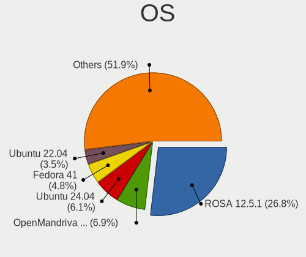
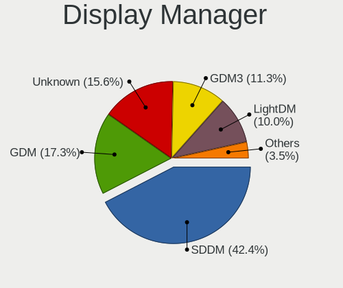
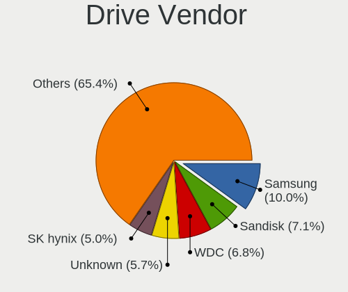
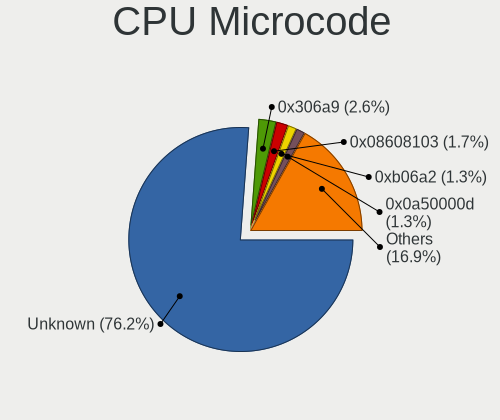
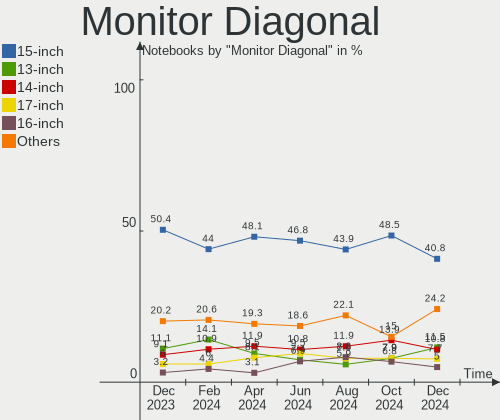
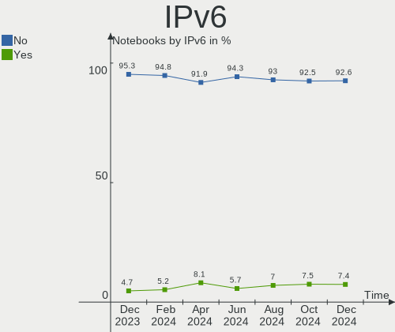
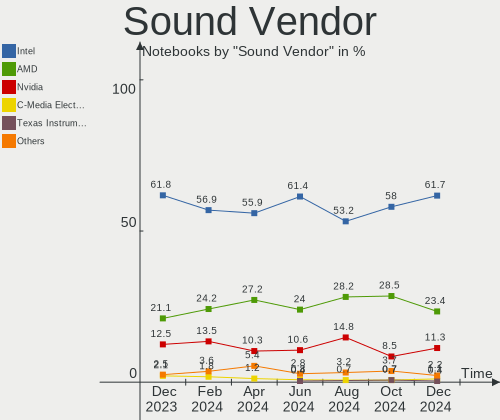
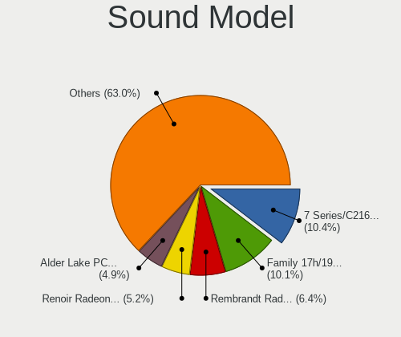

Linux in Russia - Hardware Trends (Notebooks)
---------------------------------------------

A project to identify most popular hardware characteristics and track their change
over time based on data collected by Linux users at https://Linux-Hardware.org.

Anyone can contribute to this report by the [hw-probe](https://github.com/linuxhw/hw-probe) tool:

    sudo -E hw-probe -all -upload

Period: Nov, 2022.

Contents
--------

* [ System ](#system)
  - [ OS                       ](#os)
  - [ OS Family                ](#os-family)
  - [ Kernel                   ](#kernel)
  - [ Kernel Family            ](#kernel-family)
  - [ Kernel Major Ver.        ](#kernel-major-ver)
  - [ Arch                     ](#arch)
  - [ DE                       ](#de)
  - [ Display Server           ](#display-server)
  - [ Display Manager          ](#display-manager)
  - [ OS Lang                  ](#os-lang)
  - [ Boot Mode                ](#boot-mode)
  - [ Filesystem               ](#filesystem)
  - [ Part. scheme             ](#part-scheme)
  - [ Dual Boot with Linux/BSD ](#dual-boot-with-linuxbsd)
  - [ Dual Boot (Win)          ](#dual-boot-win)

* [ Board ](#board)
  - [ Vendor                   ](#vendor)
  - [ Model                    ](#model)
  - [ Model Family             ](#model-family)
  - [ MFG Year                 ](#mfg-year)
  - [ Form Factor              ](#form-factor)
  - [ Secure Boot              ](#secure-boot)
  - [ Coreboot                 ](#coreboot)
  - [ RAM Size                 ](#ram-size)
  - [ RAM Used                 ](#ram-used)
  - [ Total Drives             ](#total-drives)
  - [ Has CD-ROM               ](#has-cd-rom)
  - [ Has Ethernet             ](#has-ethernet)
  - [ Has WiFi                 ](#has-wifi)
  - [ Has Bluetooth            ](#has-bluetooth)

* [ Location ](#location)
  - [ Country                  ](#country)
  - [ City                     ](#city)

* [ Drives ](#drives)
  - [ Drive Vendor             ](#drive-vendor)
  - [ Drive Model              ](#drive-model)
  - [ HDD Vendor               ](#hdd-vendor)
  - [ SSD Vendor               ](#ssd-vendor)
  - [ Drive Kind               ](#drive-kind)
  - [ Drive Connector          ](#drive-connector)
  - [ Drive Size               ](#drive-size)
  - [ Space Total              ](#space-total)
  - [ Space Used               ](#space-used)
  - [ Malfunc. Drives          ](#malfunc-drives)
  - [ Malfunc. Drive Vendor    ](#malfunc-drive-vendor)
  - [ Malfunc. HDD Vendor      ](#malfunc-hdd-vendor)
  - [ Malfunc. Drive Kind      ](#malfunc-drive-kind)
  - [ Failed Drives            ](#failed-drives)
  - [ Failed Drive Vendor      ](#failed-drive-vendor)
  - [ Drive Status             ](#drive-status)

* [ Storage controller ](#storage-controller)
  - [ Storage Vendor           ](#storage-vendor)
  - [ Storage Model            ](#storage-model)
  - [ Storage Kind             ](#storage-kind)

* [ Processor ](#processor)
  - [ CPU Vendor               ](#cpu-vendor)
  - [ CPU Model                ](#cpu-model)
  - [ CPU Model Family         ](#cpu-model-family)
  - [ CPU Cores                ](#cpu-cores)
  - [ CPU Sockets              ](#cpu-sockets)
  - [ CPU Threads              ](#cpu-threads)
  - [ CPU Op-Modes             ](#cpu-op-modes)
  - [ CPU Microcode            ](#cpu-microcode)
  - [ CPU Microarch            ](#cpu-microarch)

* [ Graphics ](#graphics)
  - [ GPU Vendor               ](#gpu-vendor)
  - [ GPU Model                ](#gpu-model)
  - [ GPU Combo                ](#gpu-combo)
  - [ GPU Driver               ](#gpu-driver)
  - [ GPU Memory               ](#gpu-memory)

* [ Monitor ](#monitor)
  - [ Monitor Vendor           ](#monitor-vendor)
  - [ Monitor Model            ](#monitor-model)
  - [ Monitor Resolution       ](#monitor-resolution)
  - [ Monitor Diagonal         ](#monitor-diagonal)
  - [ Monitor Width            ](#monitor-width)
  - [ Aspect Ratio             ](#aspect-ratio)
  - [ Monitor Area             ](#monitor-area)
  - [ Pixel Density            ](#pixel-density)
  - [ Multiple Monitors        ](#multiple-monitors)

* [ Network ](#network)
  - [ Net Controller Vendor    ](#net-controller-vendor)
  - [ Net Controller Model     ](#net-controller-model)
  - [ Wireless Vendor          ](#wireless-vendor)
  - [ Wireless Model           ](#wireless-model)
  - [ Ethernet Vendor          ](#ethernet-vendor)
  - [ Ethernet Model           ](#ethernet-model)
  - [ Net Controller Kind      ](#net-controller-kind)
  - [ Used Controller          ](#used-controller)
  - [ NICs                     ](#nics)
  - [ IPv6                     ](#ipv6)

* [ Bluetooth ](#bluetooth)
  - [ Bluetooth Vendor         ](#bluetooth-vendor)
  - [ Bluetooth Model          ](#bluetooth-model)

* [ Sound ](#sound)
  - [ Sound Vendor             ](#sound-vendor)
  - [ Sound Model              ](#sound-model)

* [ Memory ](#memory)
  - [ Memory Vendor            ](#memory-vendor)
  - [ Memory Model             ](#memory-model)
  - [ Memory Kind              ](#memory-kind)
  - [ Memory Form Factor       ](#memory-form-factor)
  - [ Memory Size              ](#memory-size)
  - [ Memory Speed             ](#memory-speed)

* [ Printers & scanners ](#printers--scanners)
  - [ Printer Vendor           ](#printer-vendor)
  - [ Printer Model            ](#printer-model)
  - [ Scanner Vendor           ](#scanner-vendor)
  - [ Scanner Model            ](#scanner-model)

* [ Camera ](#camera)
  - [ Camera Vendor            ](#camera-vendor)
  - [ Camera Model             ](#camera-model)

* [ Security ](#security)
  - [ Fingerprint Vendor       ](#fingerprint-vendor)
  - [ Fingerprint Model        ](#fingerprint-model)
  - [ Chipcard Vendor          ](#chipcard-vendor)
  - [ Chipcard Model           ](#chipcard-model)

* [ Unsupported ](#unsupported)
  - [ Unsupported Devices      ](#unsupported-devices)
  - [ Unsupported Device Types ](#unsupported-device-types)

System
------

OS
--

Installed operating systems

| Name               | Notebooks | Percent |
|--------------------|-----------|---------|
| ROSA 12.3          | 92        | 34.07%  |
| Ubuntu 22.04       | 19        | 7.04%   |
| Debian 11          | 19        | 7.04%   |
| ROSA 12.2          | 18        | 6.67%   |
| Linux Mint 21      | 15        | 5.56%   |
| Fedora 37          | 14        | 5.19%   |
| ALT Linux 10.1     | 11        | 4.07%   |
| Arch Rolling       | 9         | 3.33%   |
| OpenMandriva 4.3   | 8         | 2.96%   |
| ALT Linux P10      | 4         | 1.48%   |
| ROSA R11.1         | 3         | 1.11%   |
| Red OS 7.3.1       | 3         | 1.11%   |
| MOS 10             | 3         | 1.11%   |
| Kubuntu 22.04      | 3         | 1.11%   |
| Zorin 16           | 2         | 0.74%   |
| Ubuntu 22.10       | 2         | 0.74%   |
| Manjaro            | 2         | 0.74%   |
| Gentoo 2.8         | 2         | 0.74%   |
| Fedora 36          | 2         | 0.74%   |
| Fedora 35          | 2         | 0.74%   |
| Elementary 6.1     | 2         | 0.74%   |
| antiX 22           | 2         | 0.74%   |
| Xubuntu 22.04      | 1         | 0.37%   |
| Xubuntu 20.04      | 1         | 0.37%   |
| Void Linux Rolling | 1         | 0.37%   |
| Ubuntu Unity 22.10 | 1         | 0.37%   |
| Ubuntu MATE 20.04  | 1         | 0.37%   |
| Ubuntu MATE 16.04  | 1         | 0.37%   |
| Ubuntu 23.04       | 1         | 0.37%   |
| Ubuntu 18.04       | 1         | 0.37%   |
| SteamOS 3.3.2      | 1         | 0.37%   |
| ROSA R10           | 1         | 0.37%   |
| RELD 7.9           | 1         | 0.37%   |
| Red OS 7.3.2       | 1         | 0.37%   |
| Pop!_OS 22.04      | 1         | 0.37%   |
| OpenMandriva 4.90  | 1         | 0.37%   |
| OpenMandriva 4.50  | 1         | 0.37%   |
| MX 21              | 1         | 0.37%   |
| Manjaro 22.0.0     | 1         | 0.37%   |
| Manjaro 21.3.7     | 1         | 0.37%   |

OS Family
---------

OS without a version

| Name         | Notebooks | Percent |
|--------------|-----------|---------|
| ROSA         | 114       | 42.22%  |
| Ubuntu       | 23        | 8.52%   |
| Debian       | 20        | 7.41%   |
| Fedora       | 18        | 6.67%   |
| ALT Linux    | 18        | 6.67%   |
| Linux Mint   | 17        | 6.3%    |
| OpenMandriva | 10        | 3.7%    |
| Arch         | 9         | 3.33%   |
| Red OS       | 4         | 1.48%   |
| Manjaro      | 4         | 1.48%   |
| Gentoo       | 4         | 1.48%   |
| Kubuntu      | 3         | 1.11%   |
| Zorin        | 2         | 0.74%   |
| Xubuntu      | 2         | 0.74%   |
| Ubuntu MATE  | 2         | 0.74%   |
| Endless      | 2         | 0.74%   |
| Elementary   | 2         | 0.74%   |
| Artix        | 2         | 0.74%   |
| antiX        | 2         | 0.74%   |
| Void Linux   | 1         | 0.37%   |
| Ubuntu Unity | 1         | 0.37%   |
| SteamOS      | 1         | 0.37%   |
| RELD         | 1         | 0.37%   |
| Pop!_OS      | 1         | 0.37%   |
| MX           | 1         | 0.37%   |
| Lubuntu      | 1         | 0.37%   |
| KDE neon     | 1         | 0.37%   |
| EndeavourOS  | 1         | 0.37%   |
| Devuan       | 1         | 0.37%   |
| BlackArch    | 1         | 0.37%   |
| ArcoLinux    | 1         | 0.37%   |

Kernel
------

Version of the Linux kernel

| Version                                  | Notebooks | Percent |
|------------------------------------------|-----------|---------|
| 5.15.75-generic-1rosa2021.1-x86_64       | 25        | 9.26%   |
| 5.15.77-generic-1rosa2021.1-x86_64       | 21        | 7.78%   |
| 5.15.0-53-generic                        | 20        | 7.41%   |
| 5.15.0-52-generic                        | 18        | 6.67%   |
| 5.10.150-generic-1rosa2021.1-x86_64      | 18        | 6.67%   |
| 5.10.74-generic-2rosa2021.1-x86_64       | 12        | 4.44%   |
| 5.10.0-7-amd64                           | 9         | 3.33%   |
| 5.17.11-generic-2rosa2021.1-x86_64       | 8         | 2.96%   |
| 5.16.7-desktop-1omv4003                  | 7         | 2.59%   |
| 5.15.75-generic-1rosa2021.1-i686         | 6         | 2.22%   |
| 5.10.0-19-amd64                          | 6         | 2.22%   |
| 5.10.118-generic-2rosa2021.1-x86_64      | 5         | 1.85%   |
| 6.0.9-300.fc37.x86_64                    | 4         | 1.48%   |
| 6.0.8-300.fc37.x86_64                    | 4         | 1.48%   |
| 5.15.76-un-def-alt1                      | 4         | 1.48%   |
| 6.0.6-300.fc37.x86_64                    | 3         | 1.11%   |
| 5.10.152-std-def-alt1                    | 3         | 1.11%   |
| 6.1.0-generic-0.rc4.1rosa2021.1-x86_64   | 2         | 0.74%   |
| 6.1.0-1-MANJARO                          | 2         | 0.74%   |
| 6.0.8-zen1-1-zen                         | 2         | 0.74%   |
| 6.0.7-zen1-1-zen                         | 2         | 0.74%   |
| 6.0.7-arch1-1                            | 2         | 0.74%   |
| 6.0.6.xm1-2.klp-xanmod-rosa2021.1-x86_64 | 2         | 0.74%   |
| 6.0.5-100.fc35.x86_64                    | 2         | 0.74%   |
| 6.0.10-arch2-1                           | 2         | 0.74%   |
| 5.19.0-23-generic                        | 2         | 0.74%   |
| 5.19.0-21-generic                        | 2         | 0.74%   |
| 5.15.79-un-def-alt1                      | 2         | 0.74%   |
| 5.15.75-gentoo-x86_64                    | 2         | 0.74%   |
| 5.15.35-5.el7.3.x86_64                   | 2         | 0.74%   |
| 5.10.139-std-def-alt1                    | 2         | 0.74%   |
| 5.10.0-18-amd64                          | 2         | 0.74%   |
| 6.1.0-generic-0.rc6.1rosa2021.1-x86_64   | 1         | 0.37%   |
| 6.1.0-generic-0.rc5.1rosa2021.1-x86_64   | 1         | 0.37%   |
| 6.1.0-0.rc6.46.fc38.x86_64               | 1         | 0.37%   |
| 6.0.9.xm1-1.klp-xanmod-rosa2021.1-x86_64 | 1         | 0.37%   |
| 6.0.9-arch1-1                            | 1         | 0.37%   |
| 6.0.9-302.rog.fc37.x86_64                | 1         | 0.37%   |
| 6.0.7.xm1-1.klp-xanmod-rosa2021.1-x86_64 | 1         | 0.37%   |
| 6.0.7-x64v3-xanmod1                      | 1         | 0.37%   |

Kernel Family
-------------

Linux kernel without a distro release

| Version  | Notebooks | Percent |
|----------|-----------|---------|
| 5.15.0   | 41        | 15.19%  |
| 5.15.75  | 33        | 12.22%  |
| 5.15.77  | 23        | 8.52%   |
| 5.10.0   | 19        | 7.04%   |
| 5.10.150 | 18        | 6.67%   |
| 5.10.74  | 13        | 4.81%   |
| 6.0.6    | 9         | 3.33%   |
| 5.17.11  | 8         | 2.96%   |
| 6.1.0    | 7         | 2.59%   |
| 6.0.9    | 7         | 2.59%   |
| 5.16.7   | 7         | 2.59%   |
| 6.0.8    | 6         | 2.22%   |
| 6.0.7    | 6         | 2.22%   |
| 5.10.118 | 6         | 2.22%   |
| 5.15.76  | 5         | 1.85%   |
| 6.0.10   | 4         | 1.48%   |
| 5.19.0   | 4         | 1.48%   |
| 6.0.5    | 3         | 1.11%   |
| 6.0.0    | 3         | 1.11%   |
| 5.10.152 | 3         | 1.11%   |
| 6.0.2    | 2         | 0.74%   |
| 5.4.83   | 2         | 0.74%   |
| 5.19.17  | 2         | 0.74%   |
| 5.15.79  | 2         | 0.74%   |
| 5.15.73  | 2         | 0.74%   |
| 5.15.72  | 2         | 0.74%   |
| 5.15.35  | 2         | 0.74%   |
| 5.11.0   | 2         | 0.74%   |
| 5.10.139 | 2         | 0.74%   |
| 4.15.0   | 2         | 0.74%   |
| 5.7.1    | 1         | 0.37%   |
| 5.6.0    | 1         | 0.37%   |
| 5.4.0    | 1         | 0.37%   |
| 5.19.7   | 1         | 0.37%   |
| 5.19.16  | 1         | 0.37%   |
| 5.19.15  | 1         | 0.37%   |
| 5.19.12  | 1         | 0.37%   |
| 5.18.19  | 1         | 0.37%   |
| 5.18.12  | 1         | 0.37%   |
| 5.17.5   | 1         | 0.37%   |

Kernel Major Ver.
-----------------

Linux kernel major version

| Version | Notebooks | Percent |
|---------|-----------|---------|
| 5.15    | 112       | 41.48%  |
| 5.10    | 67        | 24.81%  |
| 6.0     | 40        | 14.81%  |
| 5.19    | 10        | 3.7%    |
| 5.17    | 9         | 3.33%   |
| 5.16    | 8         | 2.96%   |
| 6.1     | 7         | 2.59%   |
| 5.4     | 3         | 1.11%   |
| 5.18    | 2         | 0.74%   |
| 5.11    | 2         | 0.74%   |
| 4.9     | 2         | 0.74%   |
| 4.15    | 2         | 0.74%   |
| 5.7     | 1         | 0.37%   |
| 5.6     | 1         | 0.37%   |
| 5.14    | 1         | 0.37%   |
| 5.13    | 1         | 0.37%   |
| 4.4     | 1         | 0.37%   |
| 3.10    | 1         | 0.37%   |

Arch
----

OS architecture (x86_64, i586, etc.)

| Name   | Notebooks | Percent |
|--------|-----------|---------|
| x86_64 | 254       | 94.07%  |
| i686   | 14        | 5.19%   |
| ppc    | 1         | 0.37%   |
| armv7l | 1         | 0.37%   |

DE
--

Desktop Environment

| Name       | Notebooks | Percent |
|------------|-----------|---------|
| KDE5       | 103       | 38.15%  |
| GNOME      | 81        | 30%     |
| Unknown    | 21        | 7.78%   |
| LXQt       | 19        | 7.04%   |
| X-Cinnamon | 15        | 5.56%   |
| MATE       | 10        | 3.7%    |
| XFCE       | 8         | 2.96%   |
| KDE4       | 3         | 1.11%   |
| Trinity    | 2         | 0.74%   |
| Pantheon   | 2         | 0.74%   |
| Unity      | 1         | 0.37%   |
| sway       | 1         | 0.37%   |
| openbox    | 1         | 0.37%   |
| LXDE       | 1         | 0.37%   |
| icewm      | 1         | 0.37%   |
| Cinnamon   | 1         | 0.37%   |

Display Server
--------------

X11 or Wayland

| Name    | Notebooks | Percent |
|---------|-----------|---------|
| X11     | 128       | 47.41%  |
| Wayland | 126       | 46.67%  |
| Unknown | 10        | 3.7%    |
| Tty     | 6         | 2.22%   |

Display Manager
---------------

SDDM, LightDM, etc.

| Name    | Notebooks | Percent |
|---------|-----------|---------|
| SDDM    | 94        | 34.81%  |
| GDM     | 55        | 20.37%  |
| Unknown | 52        | 19.26%  |
| LightDM | 40        | 14.81%  |
| GDM3    | 23        | 8.52%   |
| KDM     | 3         | 1.11%   |
| TDM     | 2         | 0.74%   |
| GREETD  | 1         | 0.37%   |

OS Lang
-------

Language

| Lang        | Notebooks | Percent |
|-------------|-----------|---------|
| ru_RU       | 212       | 78.52%  |
| en_US       | 42        | 15.56%  |
| Unknown     | 10        | 3.7%    |
| ru_RU.UTF_8 | 2         | 0.74%   |
| zh_CN       | 1         | 0.37%   |
| it_IT       | 1         | 0.37%   |
| C.UTF8      | 1         | 0.37%   |
| C           | 1         | 0.37%   |

Boot Mode
---------

EFI or BIOS

| Mode | Notebooks | Percent |
|------|-----------|---------|
| EFI  | 150       | 55.56%  |
| BIOS | 120       | 44.44%  |

Filesystem
----------

Type of filesystem

| Type    | Notebooks | Percent |
|---------|-----------|---------|
| Ext4    | 209       | 77.41%  |
| Btrfs   | 34        | 12.59%  |
| Overlay | 22        | 8.15%   |
| Zfs     | 2         | 0.74%   |
| Unknown | 2         | 0.74%   |
| Xfs     | 1         | 0.37%   |

Part. scheme
------------

Scheme of partitioning

| Type    | Notebooks | Percent |
|---------|-----------|---------|
| GPT     | 160       | 59.26%  |
| MBR     | 74        | 27.41%  |
| Unknown | 36        | 13.33%  |

Dual Boot with Linux/BSD
------------------------

Hosting more than one Linux/BSD

| Dual boot | Notebooks | Percent |
|-----------|-----------|---------|
| No        | 219       | 81.11%  |
| Yes       | 51        | 18.89%  |

Dual Boot (Win)
---------------

Hosting Linux and Windows

| Dual boot | Notebooks | Percent |
|-----------|-----------|---------|
| No        | 176       | 65.19%  |
| Yes       | 94        | 34.81%  |

Board
-----

Vendor
------

Motherboard manufacturer

| Name                | Notebooks | Percent |
|---------------------|-----------|---------|
| Lenovo              | 46        | 17.04%  |
| ASUSTek Computer    | 44        | 16.3%   |
| Acer                | 37        | 13.7%   |
| Hewlett-Packard     | 29        | 10.74%  |
| HUAWEI              | 17        | 6.3%    |
| Samsung Electronics | 12        | 4.44%   |
| Dell                | 11        | 4.07%   |
| Sony                | 7         | 2.59%   |
| Toshiba             | 6         | 2.22%   |
| MSI                 | 6         | 2.22%   |
| Aquarius            | 6         | 2.22%   |
| Unknown             | 6         | 2.22%   |
| Apple               | 4         | 1.48%   |
| Digma               | 3         | 1.11%   |
| Clevo               | 3         | 1.11%   |
| Timi                | 2         | 0.74%   |
| Pegatron            | 2         | 0.74%   |
| Packard Bell        | 2         | 0.74%   |
| Irbis               | 2         | 0.74%   |
| HONOR               | 2         | 0.74%   |
| Haier               | 2         | 0.74%   |
| Gigabyte Technology | 2         | 0.74%   |
| Fujitsu             | 2         | 0.74%   |
| Chuwi               | 2         | 0.74%   |
| Valve               | 1         | 0.37%   |
| Quanta              | 1         | 0.37%   |
| Pretech             | 1         | 0.37%   |
| Panasonic           | 1         | 0.37%   |
| Notebook            | 1         | 0.37%   |
| NCA Group           | 1         | 0.37%   |
| MACHENIKE           | 1         | 0.37%   |
| Kraftway            | 1         | 0.37%   |
| Insyde              | 1         | 0.37%   |
| Infinix             | 1         | 0.37%   |
| Fujitsu Siemens     | 1         | 0.37%   |
| eMachines           | 1         | 0.37%   |
| DNS                 | 1         | 0.37%   |
| DEPO Computers      | 1         | 0.37%   |
| ALLDOCUBE           | 1         | 0.37%   |

Model
-----

Motherboard model

| Name                                 | Notebooks | Percent |
|--------------------------------------|-----------|---------|
| Unknown                              | 6         | 2.22%   |
| HP Notebook                          | 4         | 1.48%   |
| Aquarius NS585                       | 4         | 1.48%   |
| Lenovo B590 20206                    | 3         | 1.11%   |
| HUAWEI NBD-WXX9                      | 3         | 1.11%   |
| HUAWEI CREM-WXX9                     | 3         | 1.11%   |
| HP Pavilion g6                       | 3         | 1.11%   |
| Clevo NL41MU2                        | 3         | 1.11%   |
| Toshiba Satellite C660               | 2         | 0.74%   |
| Samsung 300E4C/300E5C/300E7C         | 2         | 0.74%   |
| Lenovo ThinkBook 15 G3 ACL 21A4      | 2         | 0.74%   |
| Lenovo ThinkBook 15 G2 ITL 20VE      | 2         | 0.74%   |
| Lenovo IdeaPad Gaming 3 15ARH05 82EY | 2         | 0.74%   |
| Lenovo B590 20208                    | 2         | 0.74%   |
| HUAWEI KLVL-WXXW                     | 2         | 0.74%   |
| HUAWEI BOD-WXX9                      | 2         | 0.74%   |
| HP ENVY m6                           | 2         | 0.74%   |
| Digma EVE 15 C423 ES5069EW           | 2         | 0.74%   |
| ASUS X550CC                          | 2         | 0.74%   |
| ASUS K53SD                           | 2         | 0.74%   |
| Aquarius NS685U R11                  | 2         | 0.74%   |
| Acer TravelMate 5760                 | 2         | 0.74%   |
| Acer Extensa 2519                    | 2         | 0.74%   |
| Acer Aspire 5315                     | 2         | 0.74%   |
| Valve Jupiter                        | 1         | 0.37%   |
| Toshiba Satellite U300               | 1         | 0.37%   |
| Toshiba Satellite L755               | 1         | 0.37%   |
| Toshiba Satellite L550               | 1         | 0.37%   |
| Toshiba Satellite A300D              | 1         | 0.37%   |
| Timi TM1701                          | 1         | 0.37%   |
| Timi RedmiBook Pro 15S               | 1         | 0.37%   |
| Sony VPCZ13S9R                       | 1         | 0.37%   |
| Sony VPCS11V9R                       | 1         | 0.37%   |
| Sony VPCEH3J1R                       | 1         | 0.37%   |
| Sony VPCEA1S1R                       | 1         | 0.37%   |
| Sony VGN-TZ3RXN_B                    | 1         | 0.37%   |
| Sony VGN-P31ZRK_G                    | 1         | 0.37%   |
| Sony SVE1512H1RW                     | 1         | 0.37%   |
| Samsung SR70S/SR71S                  | 1         | 0.37%   |
| Samsung R560                         | 1         | 0.37%   |

Model Family
------------

Motherboard model prefix

| Name                  | Notebooks | Percent |
|-----------------------|-----------|---------|
| Acer Aspire           | 24        | 8.89%   |
| Lenovo IdeaPad        | 13        | 4.81%   |
| Dell Inspiron         | 8         | 2.96%   |
| Lenovo ThinkPad       | 7         | 2.59%   |
| HP Pavilion           | 7         | 2.59%   |
| Toshiba Satellite     | 6         | 2.22%   |
| Lenovo ThinkBook      | 6         | 2.22%   |
| ASUS VivoBook         | 6         | 2.22%   |
| Unknown               | 6         | 2.22%   |
| Lenovo B590           | 5         | 1.85%   |
| HP Notebook           | 4         | 1.48%   |
| HP Laptop             | 4         | 1.48%   |
| HP ENVY               | 4         | 1.48%   |
| Aquarius NS585        | 4         | 1.48%   |
| Acer TravelMate       | 4         | 1.48%   |
| Acer Extensa          | 4         | 1.48%   |
| HUAWEI NBD-WXX9       | 3         | 1.11%   |
| HUAWEI CREM-WXX9      | 3         | 1.11%   |
| Digma EVE             | 3         | 1.11%   |
| Clevo NL41MU2         | 3         | 1.11%   |
| ASUS ROG              | 3         | 1.11%   |
| Acer Nitro            | 3         | 1.11%   |
| Samsung 300E4C        | 2         | 0.74%   |
| Packard Bell EasyNote | 2         | 0.74%   |
| Lenovo Legion         | 2         | 0.74%   |
| HUAWEI KLVL-WXXW      | 2         | 0.74%   |
| HUAWEI BOD-WXX9       | 2         | 0.74%   |
| HP ProBook            | 2         | 0.74%   |
| HP EliteBook          | 2         | 0.74%   |
| HP Compaq             | 2         | 0.74%   |
| Fujitsu LIFEBOOK      | 2         | 0.74%   |
| ASUS X550CC           | 2         | 0.74%   |
| ASUS TUF              | 2         | 0.74%   |
| ASUS K53SD            | 2         | 0.74%   |
| ASUS ASUS             | 2         | 0.74%   |
| Aquarius NS685U       | 2         | 0.74%   |
| Valve Jupiter         | 1         | 0.37%   |
| Timi TM1701           | 1         | 0.37%   |
| Timi RedmiBook        | 1         | 0.37%   |
| Sony VPCZ13S9R        | 1         | 0.37%   |

MFG Year
--------

Motherboard manufacture year

| Year    | Notebooks | Percent |
|---------|-----------|---------|
| 2021    | 41        | 15.19%  |
| 2011    | 29        | 10.74%  |
| 2020    | 23        | 8.52%   |
| 2022    | 22        | 8.15%   |
| 2012    | 22        | 8.15%   |
| 2019    | 20        | 7.41%   |
| 2010    | 16        | 5.93%   |
| 2015    | 15        | 5.56%   |
| 2014    | 14        | 5.19%   |
| 2013    | 12        | 4.44%   |
| 2018    | 9         | 3.33%   |
| 2009    | 9         | 3.33%   |
| 2007    | 9         | 3.33%   |
| 2016    | 7         | 2.59%   |
| 2008    | 7         | 2.59%   |
| 2017    | 6         | 2.22%   |
| 2005    | 3         | 1.11%   |
| 2006    | 2         | 0.74%   |
| 2004    | 2         | 0.74%   |
| Unknown | 2         | 0.74%   |

Form Factor
-----------

Physical design of the computer

| Name     | Notebooks | Percent |
|----------|-----------|---------|
| Notebook | 270       | 100%    |

Secure Boot
-----------

Enabled or disabled

| State    | Notebooks | Percent |
|----------|-----------|---------|
| Disabled | 255       | 94.44%  |
| Enabled  | 15        | 5.56%   |

Coreboot
--------

Have coreboot on board

| Used | Notebooks | Percent |
|------|-----------|---------|
| No   | 270       | 100%    |

RAM Size
--------

Total RAM memory

| Size in GB  | Notebooks | Percent |
|-------------|-----------|---------|
| 4.01-8.0    | 92        | 34.07%  |
| 3.01-4.0    | 60        | 22.22%  |
| 8.01-16.0   | 45        | 16.67%  |
| 16.01-24.0  | 31        | 11.48%  |
| 1.01-2.0    | 19        | 7.04%   |
| 32.01-64.0  | 7         | 2.59%   |
| 24.01-32.0  | 6         | 2.22%   |
| 0.51-1.0    | 4         | 1.48%   |
| 2.01-3.0    | 3         | 1.11%   |
| 0.01-0.5    | 2         | 0.74%   |
| 64.01-256.0 | 1         | 0.37%   |

RAM Used
--------

Used RAM memory

| Used GB   | Notebooks | Percent |
|-----------|-----------|---------|
| 1.01-2.0  | 100       | 37.04%  |
| 2.01-3.0  | 50        | 18.52%  |
| 0.51-1.0  | 50        | 18.52%  |
| 4.01-8.0  | 32        | 11.85%  |
| 3.01-4.0  | 19        | 7.04%   |
| 8.01-16.0 | 10        | 3.7%    |
| 0.01-0.5  | 9         | 3.33%   |

Total Drives
------------

Number of drives on board

| Drives | Notebooks | Percent |
|--------|-----------|---------|
| 1      | 186       | 68.89%  |
| 2      | 76        | 28.15%  |
| 3      | 7         | 2.59%   |
| 4      | 1         | 0.37%   |

Has CD-ROM
----------

Has CD-ROM on board

| Presented | Notebooks | Percent |
|-----------|-----------|---------|
| No        | 177       | 65.56%  |
| Yes       | 93        | 34.44%  |

Has Ethernet
------------

Has Ethernet on board

| Presented | Notebooks | Percent |
|-----------|-----------|---------|
| Yes       | 203       | 75.19%  |
| No        | 67        | 24.81%  |

Has WiFi
--------

Has WiFi module

| Presented | Notebooks | Percent |
|-----------|-----------|---------|
| Yes       | 265       | 98.15%  |
| No        | 5         | 1.85%   |

Has Bluetooth
-------------

Has Bluetooth module

| Presented | Notebooks | Percent |
|-----------|-----------|---------|
| Yes       | 212       | 78.52%  |
| No        | 58        | 21.48%  |

Location
--------

Country
-------

Geographic location (country)

| Country | Notebooks | Percent |
|---------|-----------|---------|
| Russia  | 270       | 100%    |

City
----

Geographic location (city)

| City              | Notebooks | Percent |
|-------------------|-----------|---------|
| Moscow            | 66        | 24.44%  |
| St Petersburg     | 36        | 13.33%  |
| Voronezh          | 11        | 4.07%   |
| Novosibirsk       | 11        | 4.07%   |
| Krasnodar         | 11        | 4.07%   |
| Perm              | 9         | 3.33%   |
| Nizhniy Novgorod  | 7         | 2.59%   |
| Rostov-on-Don     | 6         | 2.22%   |
| Kazan’          | 6         | 2.22%   |
| Samara            | 5         | 1.85%   |
| Taganrog          | 4         | 1.48%   |
| Chelyabinsk       | 4         | 1.48%   |
| Yekaterinburg     | 3         | 1.11%   |
| Yaroslavl         | 3         | 1.11%   |
| Volgograd         | 3         | 1.11%   |
| Saratov           | 3         | 1.11%   |
| Odintsovo         | 3         | 1.11%   |
| Krasnoyarsk       | 3         | 1.11%   |
| Cheboksary        | 3         | 1.11%   |
| Vladimir          | 2         | 0.74%   |
| Ufa               | 2         | 0.74%   |
| Tolyatti          | 2         | 0.74%   |
| Smolensk          | 2         | 0.74%   |
| Serpukhov         | 2         | 0.74%   |
| Saransk           | 2         | 0.74%   |
| Penza             | 2         | 0.74%   |
| Orenburg          | 2         | 0.74%   |
| Murom             | 2         | 0.74%   |
| Kaliningrad       | 2         | 0.74%   |
| Belgorod          | 2         | 0.74%   |
| Astrakhan         | 2         | 0.74%   |
| Zima              | 1         | 0.37%   |
| Yuzhno-Sakhalinsk | 1         | 0.37%   |
| Yefremov          | 1         | 0.37%   |
| Yaya              | 1         | 0.37%   |
| Yakutsk           | 1         | 0.37%   |
| Volkhov           | 1         | 0.37%   |
| Ulyanovsk         | 1         | 0.37%   |
| Tyumen            | 1         | 0.37%   |
| Tula              | 1         | 0.37%   |

Drives
------

Drive Vendor
------------

Hard drive vendors

| Vendor                         | Notebooks | Drives | Percent |
|--------------------------------|-----------|--------|---------|
| WDC                            | 39        | 42     | 11.37%  |
| Samsung Electronics            | 36        | 38     | 10.5%   |
| Seagate                        | 30        | 30     | 8.75%   |
| Toshiba                        | 22        | 24     | 6.41%   |
| Unknown                        | 21        | 23     | 6.12%   |
| Kingston                       | 20        | 20     | 5.83%   |
| Hitachi                        | 19        | 19     | 5.54%   |
| HGST                           | 12        | 13     | 3.5%    |
| SK hynix                       | 11        | 11     | 3.21%   |
| Sandisk                        | 11        | 12     | 3.21%   |
| Intel                          | 9         | 10     | 2.62%   |
| China                          | 9         | 9      | 2.62%   |
| A-DATA Technology              | 8         | 8      | 2.33%   |
| Crucial                        | 7         | 7      | 2.04%   |
| SPCC                           | 6         | 6      | 1.75%   |
| Phison Electronics             | 6         | 6      | 1.75%   |
| Fujitsu                        | 5         | 5      | 1.46%   |
| Apacer                         | 5         | 5      | 1.46%   |
| Unknown                        | 5         | 5      | 1.46%   |
| Silicon Motion                 | 4         | 4      | 1.17%   |
| Phison                         | 4         | 4      | 1.17%   |
| Micron Technology              | 4         | 4      | 1.17%   |
| BIWIN                          | 4         | 4      | 1.17%   |
| KIOXIA                         | 3         | 3      | 0.87%   |
| KingSpec                       | 3         | 3      | 0.87%   |
| Smartbuy                       | 2         | 2      | 0.58%   |
| OCZ                            | 2         | 2      | 0.58%   |
| MAXIO Technology (Hangzhou)    | 2         | 2      | 0.58%   |
| FORESEE                        | 2         | 2      | 0.58%   |
| Apple                          | 2         | 2      | 0.58%   |
| Zheino                         | 1         | 1      | 0.29%   |
| XPG GAMM                       | 1         | 1      | 0.29%   |
| UMIS                           | 1         | 1      | 0.29%   |
| Transcend                      | 1         | 1      | 0.29%   |
| Team                           | 1         | 1      | 0.29%   |
| Solid State Storage Technology | 1         | 1      | 0.29%   |
| Solid State Storage            | 1         | 1      | 0.29%   |
| Seagate Technology             | 1         | 1      | 0.29%   |
| Plextor                        | 1         | 1      | 0.29%   |
| Patriot                        | 1         | 1      | 0.29%   |

Drive Model
-----------

Hard drive models

| Model                                             | Notebooks | Percent |
|---------------------------------------------------|-----------|---------|
| Samsung NVMe SSD Controller SM981/PM981/PM983 1TB | 5         | 1.41%   |
| Phison PS5013 E13 NVMe Controller 256GB           | 5         | 1.41%   |
| Unknown                                           | 5         | 1.41%   |
| Unknown MMC Card  64GB                            | 4         | 1.13%   |
| Toshiba MQ01ABF050 500GB                          | 4         | 1.13%   |
| Seagate ST500LT012-1DG142 500GB                   | 4         | 1.13%   |
| Seagate ST1000LM035-1RK172 1TB                    | 4         | 1.13%   |
| Samsung SSD 860 EVO 250GB                         | 4         | 1.13%   |
| Samsung MZALQ512HALU-000L2 512GB                  | 4         | 1.13%   |
| Phison 311CD0512GB                                | 4         | 1.13%   |
| Intel SSDPEKNU512GZ 512GB                         | 4         | 1.13%   |
| Hitachi HTS547575A9E384 752GB                     | 4         | 1.13%   |
| A-DATA SU800 512GB SSD                            | 4         | 1.13%   |
| WDC WDS500G2B0A-00SM50 500GB SSD                  | 3         | 0.85%   |
| WDC WD10SPZX-21Z10T0 1TB                          | 3         | 0.85%   |
| WDC WD10JPVX-22JC3T0 1TB                          | 3         | 0.85%   |
| Unknown MMC Card  16GB                            | 3         | 0.85%   |
| Unknown MMC Card  128GB                           | 3         | 0.85%   |
| Seagate ST320LT012-9WS14C 320GB                   | 3         | 0.85%   |
| Kingston SA400S37480G 480GB SSD                   | 3         | 0.85%   |
| Kingston SA400S37240G 240GB SSD                   | 3         | 0.85%   |
| Hitachi HTS545050B9A300 500GB                     | 3         | 0.85%   |
| Hitachi HTS543232A7A384 320GB                     | 3         | 0.85%   |
| HGST HTS721010A9E630 1TB                          | 3         | 0.85%   |
| China SSD 1TB                                     | 3         | 0.85%   |
| BIWIN CE480T5D101-256 256GB                       | 3         | 0.85%   |
| WDC WD5000LPVX-22V0TT0 500GB                      | 2         | 0.56%   |
| WDC WD5000LPCX-21VHAT0 500GB                      | 2         | 0.56%   |
| WDC PC SN730 SDBPNTY-512G                         | 2         | 0.56%   |
| Unknown MMC64G  64GB                              | 2         | 0.56%   |
| Unknown MMC Card  32GB                            | 2         | 0.56%   |
| Toshiba MQ04ABF100 1TB                            | 2         | 0.56%   |
| Toshiba MQ01ABF032 320GB                          | 2         | 0.56%   |
| Toshiba MQ01ABD050 500GB                          | 2         | 0.56%   |
| Toshiba MK3275GSX 320GB                           | 2         | 0.56%   |
| SPCC Solid State Disk 128GB                       | 2         | 0.56%   |
| SK hynix SKHynix_HFM256GD3HX015N 256GB            | 2         | 0.56%   |
| Silicon Motion PCIe-8 SSD 1TB                     | 2         | 0.56%   |
| Seagate ST9500325AS 500GB                         | 2         | 0.56%   |
| Seagate ST9320325AS 320GB                         | 2         | 0.56%   |

HDD Vendor
----------

Hard disk drive vendors

| Vendor      | Notebooks | Drives | Percent |
|-------------|-----------|--------|---------|
| Seagate     | 29        | 29     | 26.13%  |
| WDC         | 23        | 23     | 20.72%  |
| Toshiba     | 21        | 21     | 18.92%  |
| Hitachi     | 19        | 19     | 17.12%  |
| HGST        | 12        | 13     | 10.81%  |
| Fujitsu     | 5         | 5      | 4.5%    |
| IBM/Hitachi | 1         | 1      | 0.9%    |
| Apple       | 1         | 1      | 0.9%    |

SSD Vendor
----------

Solid state drive vendors

| Vendor              | Notebooks | Drives | Percent |
|---------------------|-----------|--------|---------|
| Samsung Electronics | 14        | 14     | 13.08%  |
| Kingston            | 13        | 13     | 12.15%  |
| WDC                 | 9         | 9      | 8.41%   |
| China               | 9         | 9      | 8.41%   |
| Crucial             | 7         | 7      | 6.54%   |
| A-DATA Technology   | 7         | 7      | 6.54%   |
| SPCC                | 6         | 6      | 5.61%   |
| SanDisk             | 5         | 6      | 4.67%   |
| Apacer              | 4         | 4      | 3.74%   |
| KingSpec            | 3         | 3      | 2.8%    |
| Toshiba             | 2         | 3      | 1.87%   |
| Smartbuy            | 2         | 2      | 1.87%   |
| OCZ                 | 2         | 2      | 1.87%   |
| Intel               | 2         | 2      | 1.87%   |
| Unknown             | 2         | 2      | 1.87%   |
| Zheino              | 1         | 1      | 0.93%   |
| Transcend           | 1         | 1      | 0.93%   |
| Team                | 1         | 1      | 0.93%   |
| SK hynix            | 1         | 1      | 0.93%   |
| Plextor             | 1         | 1      | 0.93%   |
| Patriot             | 1         | 1      | 0.93%   |
| Netac               | 1         | 1      | 0.93%   |
| Neo                 | 1         | 1      | 0.93%   |
| LITEONIT            | 1         | 1      | 0.93%   |
| LITEON              | 1         | 1      | 0.93%   |
| Kllisre             | 1         | 1      | 0.93%   |
| Kingmax             | 1         | 1      | 0.93%   |
| HS-SSD-C100         | 1         | 1      | 0.93%   |
| Hewlett-Packard     | 1         | 1      | 0.93%   |
| Gigabyte Technology | 1         | 1      | 0.93%   |
| ExeGate             | 1         | 1      | 0.93%   |
| BIWIN               | 1         | 1      | 0.93%   |
| Apple               | 1         | 1      | 0.93%   |
| AMD                 | 1         | 1      | 0.93%   |
| AGI                 | 1         | 1      | 0.93%   |

Drive Kind
----------

HDD or SSD

| Kind    | Notebooks | Drives | Percent |
|---------|-----------|--------|---------|
| HDD     | 109       | 112    | 32.83%  |
| SSD     | 102       | 109    | 30.72%  |
| NVMe    | 93        | 102    | 28.01%  |
| MMC     | 23        | 27     | 6.93%   |
| Unknown | 5         | 5      | 1.51%   |

Drive Connector
---------------

SATA, SAS, NVMe, etc.

| Type | Notebooks | Drives | Percent |
|------|-----------|--------|---------|
| SATA | 183       | 222    | 60.4%   |
| NVMe | 91        | 100    | 30.03%  |
| MMC  | 23        | 27     | 7.59%   |
| SAS  | 6         | 6      | 1.98%   |

Drive Size
----------

Size of hard drive

| Size in TB | Notebooks | Drives | Percent |
|------------|-----------|--------|---------|
| 0.01-0.5   | 147       | 171    | 75%     |
| 0.51-1.0   | 44        | 45     | 22.45%  |
| 1.01-2.0   | 3         | 3      | 1.53%   |
| 3.01-4.0   | 1         | 1      | 0.51%   |
| 4.01-10.0  | 1         | 1      | 0.51%   |

Space Total
-----------

Amount of disk space available on the file system

| Size in GB     | Notebooks | Percent |
|----------------|-----------|---------|
| 101-250        | 65        | 24.07%  |
| 251-500        | 61        | 22.59%  |
| 501-1000       | 35        | 12.96%  |
| 1-20           | 32        | 11.85%  |
| 51-100         | 31        | 11.48%  |
| 1001-2000      | 17        | 6.3%    |
| Unknown        | 14        | 5.19%   |
| 21-50          | 9         | 3.33%   |
| More than 3000 | 3         | 1.11%   |
| 2001-3000      | 3         | 1.11%   |

Space Used
----------

Amount of used disk space

| Used GB   | Notebooks | Percent |
|-----------|-----------|---------|
| 1-20      | 135       | 50%     |
| 21-50     | 36        | 13.33%  |
| 51-100    | 24        | 8.89%   |
| 101-250   | 23        | 8.52%   |
| 251-500   | 21        | 7.78%   |
| 501-1000  | 14        | 5.19%   |
| Unknown   | 14        | 5.19%   |
| 1001-2000 | 2         | 0.74%   |
| 2001-3000 | 1         | 0.37%   |

Malfunc. Drives
---------------

Drive models with a malfunction

| Model                                                            | Notebooks | Drives | Percent |
|------------------------------------------------------------------|-----------|--------|---------|
| Seagate ST320LT012-9WS14C 320GB                                  | 3         | 3      | 6.82%   |
| Toshiba MK3275GSX 320GB                                          | 2         | 2      | 4.55%   |
| Hitachi HTS547575A9E384 752GB                                    | 2         | 2      | 4.55%   |
| Hitachi HTS541680J9SA00 80GB                                     | 2         | 2      | 4.55%   |
| HGST HTS545050A7E680 500GB                                       | 2         | 2      | 4.55%   |
| WDC WDS240G2G0A-00JH30 240GB SSD                                 | 1         | 1      | 2.27%   |
| WDC WD5000LPVX-55V0TT0 500GB                                     | 1         | 1      | 2.27%   |
| WDC WD5000LPCX-60VHAT0 500GB                                     | 1         | 1      | 2.27%   |
| WDC WD10JPVT-60A1YT0 1TB                                         | 1         | 1      | 2.27%   |
| Toshiba MQ01ABF050 500GB                                         | 1         | 1      | 2.27%   |
| Toshiba MQ01ABF032 320GB                                         | 1         | 1      | 2.27%   |
| Toshiba MQ01ABD050 500GB                                         | 1         | 1      | 2.27%   |
| Toshiba MQ01ABD032 320GB                                         | 1         | 1      | 2.27%   |
| Toshiba MK5065GSX 500GB                                          | 1         | 1      | 2.27%   |
| Toshiba MK3252GSX 320GB                                          | 1         | 1      | 2.27%   |
| Toshiba MK1637GSX 160GB                                          | 1         | 1      | 2.27%   |
| Toshiba MK1031GAS 100GB                                          | 1         | 1      | 2.27%   |
| Team T253X1120G 120GB SSD                                        | 1         | 1      | 2.27%   |
| Seagate ST9500325AS 500GB                                        | 1         | 1      | 2.27%   |
| Seagate ST9320325AS 320GB                                        | 1         | 1      | 2.27%   |
| Seagate ST9160310AS 160GB                                        | 1         | 1      | 2.27%   |
| Seagate ST500LT012-9WS142 500GB                                  | 1         | 1      | 2.27%   |
| Seagate ST500LT012-1DG142 500GB                                  | 1         | 1      | 2.27%   |
| Seagate ST1000LM024 HN-M101MBB 1TB                               | 1         | 1      | 2.27%   |
| SanDisk SSD PLUS 240GB                                           | 1         | 1      | 2.27%   |
| Samsung Electronics NVMe SSD Controller PM9A1/PM9A3/980PRO 250GB | 1         | 1      | 2.27%   |
| OCZ VERTEX460 240GB SSD                                          | 1         | 1      | 2.27%   |
| LITEONIT LMT-32L3M-HP 32GB SSD                                   | 1         | 1      | 2.27%   |
| Kingston SVP200S37A60G 64GB SSD                                  | 1         | 1      | 2.27%   |
| Kingston SHFS37A120G 120GB SSD                                   | 1         | 1      | 2.27%   |
| Hitachi HTS547550A9E384 500GB                                    | 1         | 1      | 2.27%   |
| Hitachi HTS545032B9A300 320GB                                    | 1         | 1      | 2.27%   |
| Hitachi HTS543232A7A384 320GB                                    | 1         | 1      | 2.27%   |
| Hitachi HTS543225A7A384 250GB                                    | 1         | 1      | 2.27%   |
| Hitachi HTS542516K9SA00 160GB                                    | 1         | 1      | 2.27%   |
| HGST HTS541010A9E680 1TB                                         | 1         | 1      | 2.27%   |
| Fujitsu MJA2500BH G2 500GB                                       | 1         | 1      | 2.27%   |
| Fujitsu MHW2160BH PL 160GB                                       | 1         | 1      | 2.27%   |

Malfunc. Drive Vendor
---------------------

Vendors of faulty drives

| Vendor              | Notebooks | Drives | Percent |
|---------------------|-----------|--------|---------|
| Toshiba             | 10        | 10     | 22.73%  |
| Seagate             | 9         | 9      | 20.45%  |
| Hitachi             | 9         | 9      | 20.45%  |
| WDC                 | 4         | 4      | 9.09%   |
| HGST                | 3         | 3      | 6.82%   |
| Kingston            | 2         | 2      | 4.55%   |
| Fujitsu             | 2         | 2      | 4.55%   |
| Team                | 1         | 1      | 2.27%   |
| SanDisk             | 1         | 1      | 2.27%   |
| Samsung Electronics | 1         | 1      | 2.27%   |
| OCZ                 | 1         | 1      | 2.27%   |
| LITEONIT            | 1         | 1      | 2.27%   |

Malfunc. HDD Vendor
-------------------

Vendors of faulty HDD drives

| Vendor  | Notebooks | Drives | Percent |
|---------|-----------|--------|---------|
| Toshiba | 10        | 10     | 27.78%  |
| Seagate | 9         | 9      | 25%     |
| Hitachi | 9         | 9      | 25%     |
| WDC     | 3         | 3      | 8.33%   |
| HGST    | 3         | 3      | 8.33%   |
| Fujitsu | 2         | 2      | 5.56%   |

Malfunc. Drive Kind
-------------------

Kinds of faulty drives

| Kind | Notebooks | Drives | Percent |
|------|-----------|--------|---------|
| HDD  | 36        | 36     | 81.82%  |
| SSD  | 7         | 7      | 15.91%  |
| NVMe | 1         | 1      | 2.27%   |

Failed Drives
-------------

Failed drive models

| Model                                           | Notebooks | Drives | Percent |
|-------------------------------------------------|-----------|--------|---------|
| WDC WD5000BEVT-35ZAT0 500GB                     | 1         | 1      | 25%     |
| Toshiba MK8025GAL 80GB                          | 1         | 1      | 25%     |
| Samsung Electronics MZMPC032HBCD-000H1 32GB SSD | 1         | 1      | 25%     |
| Hitachi HTS545050A7E380 500GB                   | 1         | 1      | 25%     |

Failed Drive Vendor
-------------------

Failed drive vendors

| Vendor              | Notebooks | Drives | Percent |
|---------------------|-----------|--------|---------|
| WDC                 | 1         | 1      | 25%     |
| Toshiba             | 1         | 1      | 25%     |
| Samsung Electronics | 1         | 1      | 25%     |
| Hitachi             | 1         | 1      | 25%     |

Drive Status
------------

Number of failed and malfunc. drives

| Status   | Notebooks | Drives | Percent |
|----------|-----------|--------|---------|
| Works    | 182       | 214    | 61.28%  |
| Detected | 68        | 93     | 22.9%   |
| Malfunc  | 43        | 44     | 14.48%  |
| Failed   | 4         | 4      | 1.35%   |

Storage controller
------------------

Storage Vendor
--------------

Storage controller vendors

| Vendor                           | Notebooks | Percent |
|----------------------------------|-----------|---------|
| Intel                            | 180       | 56.78%  |
| AMD                              | 40        | 12.62%  |
| Samsung Electronics              | 23        | 7.26%   |
| SanDisk                          | 15        | 4.73%   |
| Phison Electronics               | 12        | 3.79%   |
| SK hynix                         | 10        | 3.15%   |
| Kingston Technology Company      | 7         | 2.21%   |
| Silicon Motion                   | 4         | 1.26%   |
| Micron Technology                | 4         | 1.26%   |
| Nvidia                           | 3         | 0.95%   |
| KIOXIA                           | 3         | 0.95%   |
| INNOGRIT                         | 3         | 0.95%   |
| Solid State Storage Technology   | 2         | 0.63%   |
| Silicon Integrated Systems [SiS] | 2         | 0.63%   |
| Shenzhen Longsys Electronics     | 2         | 0.63%   |
| MAXIO Technology (Hangzhou)      | 2         | 0.63%   |
| Union Memory (Shenzhen)          | 1         | 0.32%   |
| Seagate Technology               | 1         | 0.32%   |
| Realtek Semiconductor            | 1         | 0.32%   |
| Lenovo                           | 1         | 0.32%   |
| ADATA Technology                 | 1         | 0.32%   |

Storage Model
-------------

Storage controller models

| Model                                                                            | Notebooks | Percent |
|----------------------------------------------------------------------------------|-----------|---------|
| AMD FCH SATA Controller [AHCI mode]                                              | 34        | 10.06%  |
| Intel 7 Series Chipset Family 6-port SATA Controller [AHCI mode]                 | 28        | 8.28%   |
| Intel 6 Series/C200 Series Chipset Family 6 port Mobile SATA AHCI Controller     | 21        | 6.21%   |
| Phison PS5013 E13 NVMe Controller                                                | 11        | 3.25%   |
| Intel 82801 Mobile SATA Controller [RAID mode]                                   | 11        | 3.25%   |
| Samsung NVMe SSD Controller SM981/PM981/PM983                                    | 10        | 2.96%   |
| Samsung NVMe SSD Controller 980                                                  | 10        | 2.96%   |
| Intel Tiger Lake-LP SATA Controller                                              | 8         | 2.37%   |
| Intel Sunrise Point-LP SATA Controller [AHCI mode]                               | 8         | 2.37%   |
| Intel 5 Series/3400 Series Chipset 4 port SATA AHCI Controller                   | 8         | 2.37%   |
| Intel Celeron/Pentium Silver Processor SATA Controller                           | 7         | 2.07%   |
| Intel 82801IBM/IEM (ICH9M/ICH9M-E) 4 port SATA Controller [AHCI mode]            | 7         | 2.07%   |
| Intel 82801HM/HEM (ICH8M/ICH8M-E) IDE Controller                                 | 7         | 2.07%   |
| Intel 8 Series/C220 Series Chipset Family 6-port SATA Controller 1 [AHCI mode]   | 7         | 2.07%   |
| Intel Wildcat Point-LP SATA Controller [AHCI Mode]                               | 6         | 1.78%   |
| Intel 82801HM/HEM (ICH8M/ICH8M-E) SATA Controller [AHCI mode]                    | 6         | 1.78%   |
| AMD SB7x0/SB8x0/SB9x0 SATA Controller [AHCI mode]                                | 6         | 1.78%   |
| Intel Volume Management Device NVMe RAID Controller                              | 5         | 1.48%   |
| Intel Non-Volatile memory controller                                             | 5         | 1.48%   |
| SK hynix Gold P31/PC711 NVMe Solid State Drive                                   | 4         | 1.18%   |
| Silicon Motion Non-Volatile memory controller                                    | 4         | 1.18%   |
| SanDisk WD Blue SN550 NVMe SSD                                                   | 4         | 1.18%   |
| SanDisk WD Black SN750 / PC SN730 NVMe SSD                                       | 4         | 1.18%   |
| SanDisk Non-Volatile memory controller                                           | 4         | 1.18%   |
| Micron Non-Volatile memory controller                                            | 4         | 1.18%   |
| Intel NM10/ICH7 Family SATA Controller [AHCI mode]                               | 4         | 1.18%   |
| Intel HM170/QM170 Chipset SATA Controller [AHCI Mode]                            | 4         | 1.18%   |
| Intel Cannon Lake PCH SATA AHCI Controller                                       | 4         | 1.18%   |
| Intel Atom/Celeron/Pentium Processor x5-E8000/J3xxx/N3xxx Series SATA Controller | 4         | 1.18%   |
| Intel 8 Series SATA Controller 1 [AHCI mode]                                     | 4         | 1.18%   |
| Intel 5 Series/3400 Series Chipset 6 port SATA AHCI Controller                   | 4         | 1.18%   |
| SK hynix BC511                                                                   | 3         | 0.89%   |
| SK hynix BC501 NVMe Solid State Drive                                            | 3         | 0.89%   |
| KIOXIA NVMe SSD Controller BG4                                                   | 3         | 0.89%   |
| Kingston Company Company Non-Volatile memory controller                          | 3         | 0.89%   |
| Intel Ice Lake-LP SATA Controller [AHCI mode]                                    | 3         | 0.89%   |
| Intel Comet Lake SATA AHCI Controller                                            | 3         | 0.89%   |
| Intel Celeron N3350/Pentium N4200/Atom E3900 Series SATA AHCI Controller         | 3         | 0.89%   |
| Intel Atom Processor E3800 Series SATA AHCI Controller                           | 3         | 0.89%   |
| Intel 82801DBM (ICH4-M) IDE Controller                                           | 3         | 0.89%   |

Storage Kind
------------

Kind of storage controller (IDE, SATA, NVMe, SAS, ...)

| Kind | Notebooks | Percent |
|------|-----------|---------|
| SATA | 195       | 59.82%  |
| NVMe | 91        | 27.91%  |
| IDE  | 24        | 7.36%   |
| RAID | 16        | 4.91%   |

Processor
---------

CPU Vendor
----------

Processor vendors

| Vendor       | Notebooks | Percent |
|--------------|-----------|---------|
| Intel        | 208       | 77.04%  |
| AMD          | 60        | 22.22%  |
| PowerBook5,6 | 1         | 0.37%   |
| ARM          | 1         | 0.37%   |

CPU Model
---------

Processor models

| Model                                         | Notebooks | Percent |
|-----------------------------------------------|-----------|---------|
| Intel 11th Gen Core i5-1135G7 @ 2.40GHz       | 12        | 4.44%   |
| Intel Core i5-3210M CPU @ 2.50GHz             | 8         | 2.96%   |
| AMD Ryzen 7 5800H with Radeon Graphics        | 7         | 2.59%   |
| Intel Core i7-2670QM CPU @ 2.20GHz            | 5         | 1.85%   |
| AMD Ryzen 5 5500U with Radeon Graphics        | 5         | 1.85%   |
| Intel Core i5-2410M CPU @ 2.30GHz             | 4         | 1.48%   |
| Intel Core i3-9100 CPU @ 3.60GHz              | 4         | 1.48%   |
| Intel 11th Gen Core i3-1115G4 @ 3.00GHz       | 4         | 1.48%   |
| AMD Ryzen 5 3500U with Radeon Vega Mobile Gfx | 4         | 1.48%   |
| Intel Pentium CPU 2020M @ 2.40GHz             | 3         | 1.11%   |
| Intel Core i7-6700HQ CPU @ 2.60GHz            | 3         | 1.11%   |
| Intel Core i5-8250U CPU @ 1.60GHz             | 3         | 1.11%   |
| Intel Core i5-2450M CPU @ 2.50GHz             | 3         | 1.11%   |
| Intel Core i5 CPU M 540 @ 2.53GHz             | 3         | 1.11%   |
| Intel Core i3-2310M CPU @ 2.10GHz             | 3         | 1.11%   |
| Intel Core 2 Duo CPU P8400 @ 2.26GHz          | 3         | 1.11%   |
| AMD Ryzen 7 4800H with Radeon Graphics        | 3         | 1.11%   |
| AMD Ryzen 3 5300U with Radeon Graphics        | 3         | 1.11%   |
| Intel Pentium Dual-Core CPU T4500 @ 2.30GHz   | 2         | 0.74%   |
| Intel Pentium Dual-Core CPU T4300 @ 2.10GHz   | 2         | 0.74%   |
| Intel Pentium CPU N3700 @ 1.60GHz             | 2         | 0.74%   |
| Intel Pentium CPU B960 @ 2.20GHz              | 2         | 0.74%   |
| Intel Core i5-8300H CPU @ 2.30GHz             | 2         | 0.74%   |
| Intel Core i5-6200U CPU @ 2.30GHz             | 2         | 0.74%   |
| Intel Core i5-5200U CPU @ 2.20GHz             | 2         | 0.74%   |
| Intel Core i5-4210H CPU @ 2.90GHz             | 2         | 0.74%   |
| Intel Core i5-3317U CPU @ 1.70GHz             | 2         | 0.74%   |
| Intel Core i5-3230M CPU @ 2.60GHz             | 2         | 0.74%   |
| Intel Core i5-1035G1 CPU @ 1.00GHz            | 2         | 0.74%   |
| Intel Core i5-10300H CPU @ 2.50GHz            | 2         | 0.74%   |
| Intel Core i5 CPU M 460 @ 2.53GHz             | 2         | 0.74%   |
| Intel Core i3-8145U CPU @ 2.10GHz             | 2         | 0.74%   |
| Intel Core i3-6006U CPU @ 2.00GHz             | 2         | 0.74%   |
| Intel Core i3-5005U CPU @ 2.00GHz             | 2         | 0.74%   |
| Intel Core i3-4000M CPU @ 2.40GHz             | 2         | 0.74%   |
| Intel Core i3-3227U CPU @ 1.90GHz             | 2         | 0.74%   |
| Intel Core i3-2350M CPU @ 2.30GHz             | 2         | 0.74%   |
| Intel Core i3-2328M CPU @ 2.20GHz             | 2         | 0.74%   |
| Intel Core i3-10110U CPU @ 2.10GHz            | 2         | 0.74%   |
| Intel Core i3 CPU M 330 @ 2.13GHz             | 2         | 0.74%   |

CPU Model Family
----------------

Processor model prefix

| Model                          | Notebooks | Percent |
|--------------------------------|-----------|---------|
| Intel Core i5                  | 56        | 20.74%  |
| Intel Core i3                  | 36        | 13.33%  |
| Other                          | 32        | 11.85%  |
| Intel Core i7                  | 19        | 7.04%   |
| Intel Pentium                  | 16        | 5.93%   |
| Intel Celeron                  | 15        | 5.56%   |
| Intel Core 2 Duo               | 14        | 5.19%   |
| AMD Ryzen 7                    | 14        | 5.19%   |
| AMD Ryzen 5                    | 14        | 5.19%   |
| Intel Atom                     | 9         | 3.33%   |
| AMD Ryzen 3                    | 7         | 2.59%   |
| Intel Pentium Dual-Core        | 5         | 1.85%   |
| Intel Pentium M                | 4         | 1.48%   |
| AMD A6                         | 3         | 1.11%   |
| Intel Pentium Silver           | 2         | 0.74%   |
| Intel Genuine                  | 2         | 0.74%   |
| AMD Ryzen 9                    | 2         | 0.74%   |
| AMD Phenom II                  | 2         | 0.74%   |
| AMD E2                         | 2         | 0.74%   |
| AMD E1                         | 2         | 0.74%   |
| AMD E                          | 2         | 0.74%   |
| AMD Athlon                     | 2         | 0.74%   |
| Intel Celeron M                | 1         | 0.37%   |
| ARM Allwinner                  | 1         | 0.37%   |
| AMD Turion X2 Dual-Core Mobile | 1         | 0.37%   |
| AMD Ryzen 7 PRO                | 1         | 0.37%   |
| AMD Ryzen 5 PRO                | 1         | 0.37%   |
| AMD Athlon II                  | 1         | 0.37%   |
| AMD Athlon 64 X2               | 1         | 0.37%   |
| AMD A8                         | 1         | 0.37%   |
| AMD A4                         | 1         | 0.37%   |
| AMD A10                        | 1         | 0.37%   |

CPU Cores
---------

Number of processor cores

| Number | Notebooks | Percent |
|--------|-----------|---------|
| 2      | 137       | 50.74%  |
| 4      | 85        | 31.48%  |
| 8      | 18        | 6.67%   |
| 1      | 14        | 5.19%   |
| 6      | 11        | 4.07%   |
| 14     | 3         | 1.11%   |
| 12     | 2         | 0.74%   |

CPU Sockets
-----------

Number of sockets

| Number | Notebooks | Percent |
|--------|-----------|---------|
| 1      | 270       | 100%    |

CPU Threads
-----------

Threads per core (Hyper-Threading)

| Number | Notebooks | Percent |
|--------|-----------|---------|
| 2      | 182       | 67.41%  |
| 1      | 88        | 32.59%  |

CPU Op-Modes
------------

CPU Operation Modes (32-bit, 64-bit)

| Op mode        | Notebooks | Percent |
|----------------|-----------|---------|
| 32-bit, 64-bit | 260       | 96.3%   |
| 32-bit         | 9         | 3.33%   |
| Unknown        | 1         | 0.37%   |

CPU Microcode
-------------

Microcode number

| Number     | Notebooks | Percent |
|------------|-----------|---------|
| Unknown    | 36        | 13.33%  |
| 0x206a7    | 27        | 10%     |
| 0x306a9    | 24        | 8.89%   |
| 0x806c1    | 17        | 6.3%    |
| 0x1067a    | 8         | 2.96%   |
| 0x306d4    | 6         | 2.22%   |
| 0x20655    | 6         | 2.22%   |
| 0x0a50000c | 6         | 2.22%   |
| 0x806ec    | 5         | 1.85%   |
| 0x806ea    | 5         | 1.85%   |
| 0x306c3    | 5         | 1.85%   |
| 0x20652    | 5         | 1.85%   |
| 0x10676    | 5         | 1.85%   |
| 0x08608103 | 5         | 1.85%   |
| 0x08108109 | 5         | 1.85%   |
| 0x906eb    | 4         | 1.48%   |
| 0x906a3    | 4         | 1.48%   |
| 0x6fd      | 4         | 1.48%   |
| 0x406e3    | 4         | 1.48%   |
| 0x406c3    | 4         | 1.48%   |
| 0x106ca    | 4         | 1.48%   |
| 0x08108102 | 4         | 1.48%   |
| 0xa0652    | 3         | 1.11%   |
| 0x906ea    | 3         | 1.11%   |
| 0x706e5    | 3         | 1.11%   |
| 0x706a8    | 3         | 1.11%   |
| 0x706a1    | 3         | 1.11%   |
| 0x506e3    | 3         | 1.11%   |
| 0x40651    | 3         | 1.11%   |
| 0x08600106 | 3         | 1.11%   |
| 0x08600104 | 3         | 1.11%   |
| 0x0810100b | 3         | 1.11%   |
| 0x06001116 | 3         | 1.11%   |
| 0x906c0    | 2         | 0.74%   |
| 0x806d1    | 2         | 0.74%   |
| 0x6e8      | 2         | 0.74%   |
| 0x6d6      | 2         | 0.74%   |
| 0x506c9    | 2         | 0.74%   |
| 0x406c4    | 2         | 0.74%   |
| 0x30678    | 2         | 0.74%   |

CPU Microarch
-------------

Microarchitecture

| Name             | Notebooks | Percent |
|------------------|-----------|---------|
| SandyBridge      | 29        | 10.74%  |
| IvyBridge        | 25        | 9.26%   |
| KabyLake         | 23        | 8.52%   |
| TigerLake        | 21        | 7.78%   |
| Unknown          | 15        | 5.56%   |
| Penryn           | 13        | 4.81%   |
| Zen 3            | 12        | 4.44%   |
| Westmere         | 12        | 4.44%   |
| Silvermont       | 12        | 4.44%   |
| Zen+             | 10        | 3.7%    |
| Haswell          | 10        | 3.7%    |
| Broadwell        | 8         | 2.96%   |
| Zen 2            | 7         | 2.59%   |
| Skylake          | 7         | 2.59%   |
| P6               | 7         | 2.59%   |
| Goldmont plus    | 7         | 2.59%   |
| Core             | 7         | 2.59%   |
| IceLake          | 6         | 2.22%   |
| Bonnell          | 5         | 1.85%   |
| Zen              | 4         | 1.48%   |
| Puma             | 4         | 1.48%   |
| Alderlake Hybrid | 4         | 1.48%   |
| Piledriver       | 3         | 1.11%   |
| K10              | 3         | 1.11%   |
| Goldmont         | 3         | 1.11%   |
| CometLake        | 3         | 1.11%   |
| Tremont          | 2         | 0.74%   |
| Bobcat           | 2         | 0.74%   |
| Nehalem          | 1         | 0.37%   |
| K8 Hammer        | 1         | 0.37%   |
| K8 & K10 hybrid  | 1         | 0.37%   |
| K10 Llano        | 1         | 0.37%   |
| Jaguar           | 1         | 0.37%   |
| Excavator        | 1         | 0.37%   |

Graphics
--------

GPU Vendor
----------

Vendors of graphics cards

| Vendor                           | Notebooks | Percent |
|----------------------------------|-----------|---------|
| Intel                            | 180       | 51.87%  |
| Nvidia                           | 92        | 26.51%  |
| AMD                              | 74        | 21.33%  |
| Silicon Integrated Systems [SiS] | 1         | 0.29%   |

GPU Model
---------

Graphics card models

| Model                                                                                    | Notebooks | Percent |
|------------------------------------------------------------------------------------------|-----------|---------|
| Intel 3rd Gen Core processor Graphics Controller                                         | 25        | 6.91%   |
| Intel 2nd Generation Core Processor Family Integrated Graphics Controller                | 25        | 6.91%   |
| Intel TigerLake-LP GT2 [Iris Xe Graphics]                                                | 16        | 4.42%   |
| AMD Picasso/Raven 2 [Radeon Vega Series / Radeon Vega Mobile Series]                     | 11        | 3.04%   |
| AMD Cezanne [Radeon Vega Series / Radeon Vega Mobile Series]                             | 11        | 3.04%   |
| AMD Lucienne                                                                             | 8         | 2.21%   |
| Intel Atom/Celeron/Pentium Processor x5-E8000/J3xxx/N3xxx Integrated Graphics Controller | 7         | 1.93%   |
| AMD Renoir                                                                               | 7         | 1.93%   |
| Nvidia GF117M [GeForce 610M/710M/810M/820M / GT 620M/625M/630M/720M]                     | 6         | 1.66%   |
| Intel Mobile GM965/GL960 Integrated Graphics Controller (secondary)                      | 6         | 1.66%   |
| Intel Mobile GM965/GL960 Integrated Graphics Controller (primary)                        | 6         | 1.66%   |
| Intel GeminiLake [UHD Graphics 600]                                                      | 6         | 1.66%   |
| Intel Core Processor Integrated Graphics Controller                                      | 6         | 1.66%   |
| Intel 4th Gen Core Processor Integrated Graphics Controller                              | 6         | 1.66%   |
| AMD Thames [Radeon HD 7500M/7600M Series]                                                | 6         | 1.66%   |
| Intel Tiger Lake-LP GT2 [UHD Graphics G4]                                                | 5         | 1.38%   |
| Intel HD Graphics 5500                                                                   | 5         | 1.38%   |
| Intel Atom Processor Z36xxx/Z37xxx Series Graphics & Display                             | 5         | 1.38%   |
| Intel Alder Lake-P Integrated Graphics Controller                                        | 5         | 1.38%   |
| Nvidia TU117M [GeForce GTX 1650 Mobile / Max-Q]                                          | 4         | 1.1%    |
| Nvidia GM108M [GeForce 840M]                                                             | 4         | 1.1%    |
| Intel UHD Graphics 620                                                                   | 4         | 1.1%    |
| Intel Skylake GT2 [HD Graphics 520]                                                      | 4         | 1.1%    |
| Intel Haswell-ULT Integrated Graphics Controller                                         | 4         | 1.1%    |
| Intel CoffeeLake-S GT2 [UHD Graphics 630]                                                | 4         | 1.1%    |
| Intel Atom Processor D4xx/D5xx/N4xx/N5xx Integrated Graphics Controller                  | 4         | 1.1%    |
| AMD Seymour [Radeon HD 6400M/7400M Series]                                               | 4         | 1.1%    |
| Nvidia GF119M [GeForce 610M]                                                             | 3         | 0.83%   |
| Nvidia GF108M [GeForce GT 540M]                                                          | 3         | 0.83%   |
| Nvidia GA107M [GeForce RTX 3050 Ti Mobile]                                               | 3         | 0.83%   |
| Nvidia GA107M [GeForce RTX 3050 Mobile]                                                  | 3         | 0.83%   |
| Nvidia GA106M [GeForce RTX 3060 Mobile / Max-Q]                                          | 3         | 0.83%   |
| Intel WhiskeyLake-U GT2 [UHD Graphics 620]                                               | 3         | 0.83%   |
| Intel TigerLake-H GT1 [UHD Graphics]                                                     | 3         | 0.83%   |
| Intel Iris Plus Graphics G1 (Ice Lake)                                                   | 3         | 0.83%   |
| Intel HD Graphics 530                                                                    | 3         | 0.83%   |
| Intel CometLake-U GT2 [UHD Graphics]                                                     | 3         | 0.83%   |
| Intel CoffeeLake-H GT2 [UHD Graphics 630]                                                | 3         | 0.83%   |
| Intel 82852/855GM Integrated Graphics Device                                             | 3         | 0.83%   |
| AMD Raven Ridge [Radeon Vega Series / Radeon Vega Mobile Series]                         | 3         | 0.83%   |

GPU Combo
---------

Combinations of graphics cards

| Name           | Notebooks | Percent |
|----------------|-----------|---------|
| 1 x Intel      | 109       | 40.37%  |
| Intel + Nvidia | 59        | 21.85%  |
| 1 x AMD        | 48        | 17.78%  |
| 1 x Nvidia     | 22        | 8.15%   |
| AMD + Nvidia   | 11        | 4.07%   |
| Intel + AMD    | 8         | 2.96%   |
| 2 x AMD        | 7         | 2.59%   |
| Other          | 4         | 1.48%   |
| 2 x Intel      | 1         | 0.37%   |
| 1 x SiS        | 1         | 0.37%   |

GPU Driver
----------

Free vs proprietary

| Driver      | Notebooks | Percent |
|-------------|-----------|---------|
| Free        | 225       | 83.33%  |
| Proprietary | 34        | 12.59%  |
| Unknown     | 11        | 4.07%   |

GPU Memory
----------

Total video memory

| Size in GB | Notebooks | Percent |
|------------|-----------|---------|
| Unknown    | 164       | 60.74%  |
| 0.01-0.5   | 45        | 16.67%  |
| 1.01-2.0   | 29        | 10.74%  |
| 0.51-1.0   | 24        | 8.89%   |
| 3.01-4.0   | 6         | 2.22%   |
| 5.01-6.0   | 2         | 0.74%   |

Monitor
-------

Monitor Vendor
--------------

Monitor vendors

| Vendor                  | Notebooks | Percent |
|-------------------------|-----------|---------|
| AU Optronics            | 49        | 17.75%  |
| BOE                     | 42        | 15.22%  |
| Chimei Innolux          | 39        | 14.13%  |
| LG Display              | 38        | 13.77%  |
| Samsung Electronics     | 27        | 9.78%   |
| Chi Mei Optoelectronics | 13        | 4.71%   |
| Apple                   | 6         | 2.17%   |
| PANDA                   | 5         | 1.81%   |
| CSO                     | 5         | 1.81%   |
| Goldstar                | 4         | 1.45%   |
| Sony                    | 3         | 1.09%   |
| Sharp                   | 3         | 1.09%   |
| LG Philips              | 3         | 1.09%   |
| Hewlett-Packard         | 3         | 1.09%   |
| Acer                    | 3         | 1.09%   |
| VIE                     | 2         | 0.72%   |
| Toshiba                 | 2         | 0.72%   |
| Philips                 | 2         | 0.72%   |
| GDH                     | 2         | 0.72%   |
| CPT                     | 2         | 0.72%   |
| Valve                   | 1         | 0.36%   |
| TMX                     | 1         | 0.36%   |
| STA                     | 1         | 0.36%   |
| SLD                     | 1         | 0.36%   |
| PRM                     | 1         | 0.36%   |
| NEC Computers           | 1         | 0.36%   |
| MSI                     | 1         | 0.36%   |
| Mi                      | 1         | 0.36%   |
| Lenovo                  | 1         | 0.36%   |
| JDI                     | 1         | 0.36%   |
| InnoLux Display         | 1         | 0.36%   |
| InfoVision              | 1         | 0.36%   |
| Iiyama                  | 1         | 0.36%   |
| HUAWEI                  | 1         | 0.36%   |
| HJC                     | 1         | 0.36%   |
| HannStar                | 1         | 0.36%   |
| eMachines               | 1         | 0.36%   |
| Dell                    | 1         | 0.36%   |
| BenQ                    | 1         | 0.36%   |
| ASUSTek Computer        | 1         | 0.36%   |

Monitor Model
-------------

Monitor models

| Model                                                                     | Notebooks | Percent |
|---------------------------------------------------------------------------|-----------|---------|
| BOE LCD Monitor BOE0872 1920x1080 344x194mm 15.5-inch                     | 5         | 1.81%   |
| Chimei Innolux LCD Monitor CMN15F5 1920x1080 344x193mm 15.5-inch          | 4         | 1.45%   |
| Chimei Innolux LCD Monitor CMN15DB 1366x768 344x193mm 15.5-inch           | 4         | 1.45%   |
| AU Optronics LCD Monitor AUO26EC 1366x768 344x193mm 15.5-inch             | 4         | 1.45%   |
| AU Optronics LCD Monitor AUO21EC 1366x768 344x193mm 15.5-inch             | 4         | 1.45%   |
| Samsung Electronics LCD Monitor SEC5441 1366x768 344x194mm 15.5-inch      | 3         | 1.09%   |
| LG Display LCD Monitor LGD02DC 1366x768 344x194mm 15.5-inch               | 3         | 1.09%   |
| Chimei Innolux LCD Monitor CMN1735 1920x1080 382x215mm 17.3-inch          | 3         | 1.09%   |
| Chimei Innolux LCD Monitor CMN1521 1920x1080 344x193mm 15.5-inch          | 3         | 1.09%   |
| Chimei Innolux LCD Monitor CMN14D4 1920x1080 309x173mm 13.9-inch          | 3         | 1.09%   |
| Chimei Innolux LCD Monitor CMN1404 1920x1080 309x173mm 13.9-inch          | 3         | 1.09%   |
| Chi Mei Optoelectronics LCD Monitor CMO1720 1920x1080 382x215mm 17.3-inch | 3         | 1.09%   |
| BOE LCD Monitor BOE092F 2520x1680 338x226mm 16.0-inch                     | 3         | 1.09%   |
| BOE LCD Monitor BOE0893 2160x1440 296x197mm 14.0-inch                     | 3         | 1.09%   |
| AU Optronics LCD Monitor AUO22EC 1366x768 344x193mm 15.5-inch             | 3         | 1.09%   |
| VIE IM27VL1 VIE2120 1920x1080 600x330mm 27.0-inch                         | 2         | 0.72%   |
| Sony Nvidia Defaul t Flat Panel SNY06FA 1600x900 360x200mm 16.2-inch      | 2         | 0.72%   |
| Samsung Electronics LCD Monitor SEC3646 1680x1050 330x210mm 15.4-inch     | 2         | 0.72%   |
| Samsung Electronics LCD Monitor SEC3245 1366x768 344x194mm 15.5-inch      | 2         | 0.72%   |
| PANDA LCD Monitor NCP004A 1920x1080 309x174mm 14.0-inch                   | 2         | 0.72%   |
| PANDA LCD Monitor NCP002D 1920x1080 344x194mm 15.5-inch                   | 2         | 0.72%   |
| LG Display LP156WH2-TLAA LGD0230 1366x768 344x194mm 15.5-inch             | 2         | 0.72%   |
| LG Display LCD Monitor LGD060F 1920x1080 309x174mm 14.0-inch              | 2         | 0.72%   |
| LG Display LCD Monitor LGD05E5 1920x1080 344x194mm 15.5-inch              | 2         | 0.72%   |
| GDH PHILCO GDH0030 1920x540 708x398mm 32.0-inch                           | 2         | 0.72%   |
| Chimei Innolux LCD Monitor CMN15E7 1920x1080 344x193mm 15.5-inch          | 2         | 0.72%   |
| Chimei Innolux LCD Monitor CMN151E 1920x1080 344x193mm 15.5-inch          | 2         | 0.72%   |
| Chi Mei Optoelectronics LCD Monitor CMO15A3 1366x768 344x193mm 15.5-inch  | 2         | 0.72%   |
| BOE LCD Monitor BOE09C5 1920x1080 345x194mm 15.6-inch                     | 2         | 0.72%   |
| BOE LCD Monitor BOE097D 1920x1080 344x194mm 15.5-inch                     | 2         | 0.72%   |
| AU Optronics LCD Monitor AUO8174 1280x800 331x207mm 15.4-inch             | 2         | 0.72%   |
| AU Optronics LCD Monitor AUO41EC 1366x768 344x193mm 15.5-inch             | 2         | 0.72%   |
| AU Optronics LCD Monitor AUO38ED 1920x1080 344x193mm 15.5-inch            | 2         | 0.72%   |
| AU Optronics LCD Monitor AUO2774 1280x800 331x207mm 15.4-inch             | 2         | 0.72%   |
| AU Optronics LCD Monitor AUO23EC 1366x768 344x193mm 15.5-inch             | 2         | 0.72%   |
| AU Optronics LCD Monitor AUO21ED 1920x1080 344x193mm 15.5-inch            | 2         | 0.72%   |
| Valve ANX7530 U VLV3001 800x1280 100x150mm 7.1-inch                       | 1         | 0.36%   |
| Toshiba LCD Monitor LCD58EB 1280x800 261x163mm 12.1-inch                  | 1         | 0.36%   |
| Toshiba LCD Monitor LCD58E1 1280x800 261x163mm 12.1-inch                  | 1         | 0.36%   |
| TMX TL156VDXP01 TMX1560 1920x1080 344x194mm 15.5-inch                     | 1         | 0.36%   |

Monitor Resolution
------------------

Monitor screen resolution

| Resolution         | Notebooks | Percent |
|--------------------|-----------|---------|
| 1920x1080 (FHD)    | 108       | 40.75%  |
| 1366x768 (WXGA)    | 84        | 31.7%   |
| 1280x800 (WXGA)    | 16        | 6.04%   |
| 1600x900 (HD+)     | 11        | 4.15%   |
| 3840x2160 (4K)     | 5         | 1.89%   |
| 2560x1600          | 4         | 1.51%   |
| 2520x1680          | 4         | 1.51%   |
| 2160x1440          | 4         | 1.51%   |
| 1920x1200 (WUXGA)  | 4         | 1.51%   |
| 2560x1440 (QHD)    | 3         | 1.13%   |
| 1024x768 (XGA)     | 3         | 1.13%   |
| 1024x600           | 3         | 1.13%   |
| 3440x1440          | 2         | 0.75%   |
| 3000x2000          | 2         | 0.75%   |
| 1680x1050 (WSXGA+) | 2         | 0.75%   |
| 1280x1024 (SXGA)   | 2         | 0.75%   |
| 800x1280           | 1         | 0.38%   |
| 3840x2400          | 1         | 0.38%   |
| 3200x2000          | 1         | 0.38%   |
| 3120x2080          | 1         | 0.38%   |
| 2880x1620          | 1         | 0.38%   |
| 1440x900 (WXGA+)   | 1         | 0.38%   |
| 1360x768           | 1         | 0.38%   |
| 1280x854           | 1         | 0.38%   |

Monitor Diagonal
----------------

Diagonal size in inches

| Inches  | Notebooks | Percent |
|---------|-----------|---------|
| 15      | 144       | 52.17%  |
| 13      | 30        | 10.87%  |
| 14      | 24        | 8.7%    |
| 17      | 23        | 8.33%   |
| 27      | 9         | 3.26%   |
| 16      | 9         | 3.26%   |
| 21      | 7         | 2.54%   |
| 12      | 6         | 2.17%   |
| 23      | 5         | 1.81%   |
| 24      | 3         | 1.09%   |
| 11      | 3         | 1.09%   |
| 10      | 3         | 1.09%   |
| 52      | 2         | 0.72%   |
| 34      | 2         | 0.72%   |
| 31      | 2         | 0.72%   |
| Unknown | 2         | 0.72%   |
| 54      | 1         | 0.36%   |
| 7       | 1         | 0.36%   |

Monitor Width
-------------

Physical width

| Width in mm | Notebooks | Percent |
|-------------|-----------|---------|
| 301-350     | 180       | 65.69%  |
| 201-300     | 34        | 12.41%  |
| 351-400     | 27        | 9.85%   |
| 501-600     | 16        | 5.84%   |
| 401-500     | 7         | 2.55%   |
| 1001-1500   | 3         | 1.09%   |
| 701-800     | 2         | 0.73%   |
| 601-700     | 2         | 0.73%   |
| Unknown     | 2         | 0.73%   |
| 1-100       | 1         | 0.36%   |

Aspect Ratio
------------

Proportional relationship between the width and the height

| Ratio   | Notebooks | Percent |
|---------|-----------|---------|
| 16/9    | 205       | 79.77%  |
| 16/10   | 31        | 12.06%  |
| 3/2     | 12        | 4.67%   |
| 4/3     | 3         | 1.17%   |
| 5/4     | 2         | 0.78%   |
| 21/9    | 2         | 0.78%   |
| 0.67    | 1         | 0.39%   |
| Unknown | 1         | 0.39%   |

Monitor Area
------------

Area in inch²

| Area in inch² | Notebooks | Percent |
|----------------|-----------|---------|
| 101-110        | 144       | 52.17%  |
| 81-90          | 42        | 15.22%  |
| 121-130        | 19        | 6.88%   |
| 201-250        | 12        | 4.35%   |
| 71-80          | 10        | 3.62%   |
| 301-350        | 9         | 3.26%   |
| 111-120        | 8         | 2.9%    |
| 61-70          | 6         | 2.17%   |
| 351-500        | 4         | 1.45%   |
| More than 1000 | 3         | 1.09%   |
| 51-60          | 3         | 1.09%   |
| 41-50          | 3         | 1.09%   |
| 131-140        | 3         | 1.09%   |
| 91-100         | 3         | 1.09%   |
| 151-200        | 2         | 0.72%   |
| Unknown        | 2         | 0.72%   |
| 1-40           | 1         | 0.36%   |
| 251-300        | 1         | 0.36%   |
| 141-150        | 1         | 0.36%   |

Pixel Density
-------------

Pixels per inch

| Density       | Notebooks | Percent |
|---------------|-----------|---------|
| 121-160       | 106       | 38.83%  |
| 101-120       | 93        | 34.07%  |
| 51-100        | 45        | 16.48%  |
| 161-240       | 19        | 6.96%   |
| More than 240 | 5         | 1.83%   |
| 1-50          | 3         | 1.1%    |
| Unknown       | 2         | 0.73%   |

Multiple Monitors
-----------------

Total monitors connected

| Total | Notebooks | Percent |
|-------|-----------|---------|
| 1     | 228       | 84.44%  |
| 2     | 26        | 9.63%   |
| 0     | 14        | 5.19%   |
| 3     | 2         | 0.74%   |

Network
-------

Net Controller Vendor
---------------------

Controller vendors

| Vendor                           | Notebooks | Percent |
|----------------------------------|-----------|---------|
| Realtek Semiconductor            | 163       | 37.73%  |
| Intel                            | 101       | 23.38%  |
| Qualcomm Atheros                 | 85        | 19.68%  |
| Broadcom                         | 33        | 7.64%   |
| Ralink                           | 9         | 2.08%   |
| MediaTek                         | 8         | 1.85%   |
| Marvell Technology Group         | 8         | 1.85%   |
| TP-Link                          | 5         | 1.16%   |
| Xiaomi                           | 2         | 0.46%   |
| Nvidia                           | 2         | 0.46%   |
| Broadcom Limited                 | 2         | 0.46%   |
| ASUSTek Computer                 | 2         | 0.46%   |
| Silicon Integrated Systems [SiS] | 1         | 0.23%   |
| Sierra Wireless                  | 1         | 0.23%   |
| Ralink Technology                | 1         | 0.23%   |
| Qualcomm Atheros Communications  | 1         | 0.23%   |
| Qualcomm                         | 1         | 0.23%   |
| Microchip Technology             | 1         | 0.23%   |
| JMicron Technology               | 1         | 0.23%   |
| Huawei Technologies              | 1         | 0.23%   |
| DisplayLink                      | 1         | 0.23%   |
| D-Link                           | 1         | 0.23%   |
| Attansic Technology              | 1         | 0.23%   |
| Apple                            | 1         | 0.23%   |

Net Controller Model
--------------------

Controller models

| Model                                                                   | Notebooks | Percent |
|-------------------------------------------------------------------------|-----------|---------|
| Realtek RTL8111/8168/8411 PCI Express Gigabit Ethernet Controller       | 99        | 20.04%  |
| Realtek RTL810xE PCI Express Fast Ethernet controller                   | 26        | 5.26%   |
| Intel Wi-Fi 6 AX201                                                     | 18        | 3.64%   |
| Qualcomm Atheros AR9285 Wireless Network Adapter (PCI-Express)          | 17        | 3.44%   |
| Realtek RTL8822CE 802.11ac PCIe Wireless Network Adapter                | 16        | 3.24%   |
| Qualcomm Atheros AR9485 Wireless Network Adapter                        | 14        | 2.83%   |
| Qualcomm Atheros QCA9377 802.11ac Wireless Network Adapter              | 12        | 2.43%   |
| Qualcomm Atheros QCA9565 / AR9565 Wireless Network Adapter              | 11        | 2.23%   |
| Realtek RTL8821CE 802.11ac PCIe Wireless Network Adapter                | 8         | 1.62%   |
| Qualcomm Atheros AR8151 v2.0 Gigabit Ethernet                           | 8         | 1.62%   |
| MediaTek MT7921 802.11ax PCI Express Wireless Network Adapter           | 8         | 1.62%   |
| Broadcom BCM4313 802.11bgn Wireless Network Adapter                     | 8         | 1.62%   |
| Intel Cannon Lake PCH CNVi WiFi                                         | 7         | 1.42%   |
| Broadcom BCM43142 802.11b/g/n                                           | 7         | 1.42%   |
| Realtek RTL8723BE PCIe Wireless Network Adapter                         | 6         | 1.21%   |
| Qualcomm Atheros QCA6174 802.11ac Wireless Network Adapter              | 6         | 1.21%   |
| Qualcomm Atheros AR8161 Gigabit Ethernet                                | 6         | 1.21%   |
| Intel Ethernet Connection (13) I219-V                                   | 6         | 1.21%   |
| Realtek 802.11n WLAN Adapter                                            | 5         | 1.01%   |
| Ralink RT3290 Wireless 802.11n 1T/1R PCIe                               | 5         | 1.01%   |
| Qualcomm Atheros AR242x / AR542x Wireless Network Adapter (PCI-Express) | 5         | 1.01%   |
| Intel WiFi Link 5100                                                    | 5         | 1.01%   |
| Intel Wi-Fi 6 AX210/AX211/AX411 160MHz                                  | 5         | 1.01%   |
| Intel PRO/Wireless 3945ABG [Golan] Network Connection                   | 5         | 1.01%   |
| Intel Alder Lake-P PCH CNVi WiFi                                        | 5         | 1.01%   |
| Realtek RTL8852AE 802.11ax PCIe Wireless Network Adapter                | 4         | 0.81%   |
| Realtek RTL-8100/8101L/8139 PCI Fast Ethernet Adapter                   | 4         | 0.81%   |
| Qualcomm Atheros AR9462 Wireless Network Adapter                        | 4         | 0.81%   |
| Marvell Group 88E8055 PCI-E Gigabit Ethernet Controller                 | 4         | 0.81%   |
| Intel Wireless 7260                                                     | 4         | 0.81%   |
| Realtek RTL8723BU 802.11b/g/n WLAN Adapter                              | 3         | 0.61%   |
| Ralink RT3090 Wireless 802.11n 1T/1R PCIe                               | 3         | 0.61%   |
| Qualcomm Atheros AR9287 Wireless Network Adapter (PCI-Express)          | 3         | 0.61%   |
| Intel Wireless 8265 / 8275                                              | 3         | 0.61%   |
| Intel Wireless 7265                                                     | 3         | 0.61%   |
| Intel WiMAX Connection 2400m                                            | 3         | 0.61%   |
| Intel Wi-Fi 6 AX200                                                     | 3         | 0.61%   |
| Intel Dual Band Wireless-AC 3168NGW [Stone Peak]                        | 3         | 0.61%   |
| Intel Centrino Wireless-N 130                                           | 3         | 0.61%   |
| Intel Centrino Advanced-N 6235                                          | 3         | 0.61%   |

Wireless Vendor
---------------

Wireless vendors

| Vendor                          | Notebooks | Percent |
|---------------------------------|-----------|---------|
| Intel                           | 98        | 35.51%  |
| Qualcomm Atheros                | 73        | 26.45%  |
| Realtek Semiconductor           | 51        | 18.48%  |
| Broadcom                        | 23        | 8.33%   |
| Ralink                          | 9         | 3.26%   |
| MediaTek                        | 8         | 2.9%    |
| TP-Link                         | 5         | 1.81%   |
| Broadcom Limited                | 2         | 0.72%   |
| ASUSTek Computer                | 2         | 0.72%   |
| Sierra Wireless                 | 1         | 0.36%   |
| Ralink Technology               | 1         | 0.36%   |
| Qualcomm Atheros Communications | 1         | 0.36%   |
| Qualcomm                        | 1         | 0.36%   |
| D-Link                          | 1         | 0.36%   |

Wireless Model
--------------

Wireless models

| Model                                                                   | Notebooks | Percent |
|-------------------------------------------------------------------------|-----------|---------|
| Intel Wi-Fi 6 AX201                                                     | 18        | 6.52%   |
| Qualcomm Atheros AR9285 Wireless Network Adapter (PCI-Express)          | 17        | 6.16%   |
| Realtek RTL8822CE 802.11ac PCIe Wireless Network Adapter                | 16        | 5.8%    |
| Qualcomm Atheros AR9485 Wireless Network Adapter                        | 14        | 5.07%   |
| Qualcomm Atheros QCA9377 802.11ac Wireless Network Adapter              | 12        | 4.35%   |
| Qualcomm Atheros QCA9565 / AR9565 Wireless Network Adapter              | 11        | 3.99%   |
| Realtek RTL8821CE 802.11ac PCIe Wireless Network Adapter                | 8         | 2.9%    |
| MediaTek MT7921 802.11ax PCI Express Wireless Network Adapter           | 8         | 2.9%    |
| Broadcom BCM4313 802.11bgn Wireless Network Adapter                     | 8         | 2.9%    |
| Intel Cannon Lake PCH CNVi WiFi                                         | 7         | 2.54%   |
| Broadcom BCM43142 802.11b/g/n                                           | 7         | 2.54%   |
| Realtek RTL8723BE PCIe Wireless Network Adapter                         | 6         | 2.17%   |
| Qualcomm Atheros QCA6174 802.11ac Wireless Network Adapter              | 6         | 2.17%   |
| Realtek 802.11n WLAN Adapter                                            | 5         | 1.81%   |
| Ralink RT3290 Wireless 802.11n 1T/1R PCIe                               | 5         | 1.81%   |
| Qualcomm Atheros AR242x / AR542x Wireless Network Adapter (PCI-Express) | 5         | 1.81%   |
| Intel WiFi Link 5100                                                    | 5         | 1.81%   |
| Intel Wi-Fi 6 AX210/AX211/AX411 160MHz                                  | 5         | 1.81%   |
| Intel PRO/Wireless 3945ABG [Golan] Network Connection                   | 5         | 1.81%   |
| Intel Alder Lake-P PCH CNVi WiFi                                        | 5         | 1.81%   |
| Realtek RTL8852AE 802.11ax PCIe Wireless Network Adapter                | 4         | 1.45%   |
| Qualcomm Atheros AR9462 Wireless Network Adapter                        | 4         | 1.45%   |
| Intel Wireless 7260                                                     | 4         | 1.45%   |
| Realtek RTL8723BU 802.11b/g/n WLAN Adapter                              | 3         | 1.09%   |
| Ralink RT3090 Wireless 802.11n 1T/1R PCIe                               | 3         | 1.09%   |
| Qualcomm Atheros AR9287 Wireless Network Adapter (PCI-Express)          | 3         | 1.09%   |
| Intel Wireless 8265 / 8275                                              | 3         | 1.09%   |
| Intel Wireless 7265                                                     | 3         | 1.09%   |
| Intel Wi-Fi 6 AX200                                                     | 3         | 1.09%   |
| Intel Dual Band Wireless-AC 3168NGW [Stone Peak]                        | 3         | 1.09%   |
| Intel Centrino Wireless-N 130                                           | 3         | 1.09%   |
| Intel Centrino Advanced-N 6235                                          | 3         | 1.09%   |
| Intel Cannon Point-LP CNVi [Wireless-AC]                                | 3         | 1.09%   |
| TP-Link 802.11ac WLAN Adapter                                           | 2         | 0.72%   |
| Realtek 802.11n                                                         | 2         | 0.72%   |
| Intel Wireless 3165                                                     | 2         | 0.72%   |
| Intel PRO/Wireless 2200BG [Calexico2] Network Connection                | 2         | 0.72%   |
| Intel Comet Lake PCH-LP CNVi WiFi                                       | 2         | 0.72%   |
| Intel Comet Lake PCH CNVi WiFi                                          | 2         | 0.72%   |
| Intel Centrino Advanced-N 6230 [Rainbow Peak]                           | 2         | 0.72%   |

Ethernet Vendor
---------------

Ethernet vendors

| Vendor                           | Notebooks | Percent |
|----------------------------------|-----------|---------|
| Realtek Semiconductor            | 133       | 63.03%  |
| Qualcomm Atheros                 | 26        | 12.32%  |
| Intel                            | 19        | 9%      |
| Broadcom                         | 14        | 6.64%   |
| Marvell Technology Group         | 8         | 3.79%   |
| Xiaomi                           | 2         | 0.95%   |
| Nvidia                           | 2         | 0.95%   |
| Silicon Integrated Systems [SiS] | 1         | 0.47%   |
| Microchip Technology             | 1         | 0.47%   |
| JMicron Technology               | 1         | 0.47%   |
| Huawei Technologies              | 1         | 0.47%   |
| DisplayLink                      | 1         | 0.47%   |
| Attansic Technology              | 1         | 0.47%   |
| Apple                            | 1         | 0.47%   |

Ethernet Model
--------------

Ethernet models

| Model                                                                          | Notebooks | Percent |
|--------------------------------------------------------------------------------|-----------|---------|
| Realtek RTL8111/8168/8411 PCI Express Gigabit Ethernet Controller              | 99        | 46.48%  |
| Realtek RTL810xE PCI Express Fast Ethernet controller                          | 26        | 12.21%  |
| Qualcomm Atheros AR8151 v2.0 Gigabit Ethernet                                  | 8         | 3.76%   |
| Qualcomm Atheros AR8161 Gigabit Ethernet                                       | 6         | 2.82%   |
| Intel Ethernet Connection (13) I219-V                                          | 6         | 2.82%   |
| Realtek RTL-8100/8101L/8139 PCI Fast Ethernet Adapter                          | 4         | 1.88%   |
| Marvell Group 88E8055 PCI-E Gigabit Ethernet Controller                        | 4         | 1.88%   |
| Intel WiMAX Connection 2400m                                                   | 3         | 1.41%   |
| Broadcom NetLink BCM5906M Fast Ethernet PCI Express                            | 3         | 1.41%   |
| Broadcom NetLink BCM5787M Gigabit Ethernet PCI Express                         | 3         | 1.41%   |
| Xiaomi Mi/Redmi series (RNDIS)                                                 | 2         | 0.94%   |
| Realtek Killer E2600 Gigabit Ethernet Controller                               | 2         | 0.94%   |
| Qualcomm Atheros Killer E220x Gigabit Ethernet Controller                      | 2         | 0.94%   |
| Qualcomm Atheros AR8132 Fast Ethernet                                          | 2         | 0.94%   |
| Qualcomm Atheros AR8131 Gigabit Ethernet                                       | 2         | 0.94%   |
| Marvell Group 88E8040 PCI-E Fast Ethernet Controller                           | 2         | 0.94%   |
| Intel 82577LM Gigabit Network Connection                                       | 2         | 0.94%   |
| Broadcom NetXtreme BCM57765 Gigabit Ethernet PCIe                              | 2         | 0.94%   |
| Broadcom NetLink BCM57780 Gigabit Ethernet PCIe                                | 2         | 0.94%   |
| Silicon Integrated Systems [SiS] SiS900 PCI Fast Ethernet                      | 1         | 0.47%   |
| Realtek RTL8153 Gigabit Ethernet Adapter                                       | 1         | 0.47%   |
| Realtek RTL8152 Fast Ethernet Adapter                                          | 1         | 0.47%   |
| Realtek Realtek Ethernet controller                                            | 1         | 0.47%   |
| Qualcomm Atheros QCA8172 Fast Ethernet                                         | 1         | 0.47%   |
| Qualcomm Atheros Osprey Emulation Wireless Network Adapter                     | 1         | 0.47%   |
| Qualcomm Atheros Killer E2400 Gigabit Ethernet Controller                      | 1         | 0.47%   |
| Qualcomm Atheros AR8162 Fast Ethernet                                          | 1         | 0.47%   |
| Qualcomm Atheros AR8152 v1.1 Fast Ethernet                                     | 1         | 0.47%   |
| Qualcomm Atheros AR8151 v1.0 Gigabit Ethernet                                  | 1         | 0.47%   |
| Nvidia MCP79 Ethernet                                                          | 1         | 0.47%   |
| Nvidia MCP67 Ethernet                                                          | 1         | 0.47%   |
| Microchip SMSC9512/9514 Fast Ethernet Adapter                                  | 1         | 0.47%   |
| Marvell Group Yukon Optima 88E8059 [PCIe Gigabit Ethernet Controller with AVB] | 1         | 0.47%   |
| Marvell Group 88E8057 PCI-E Gigabit Ethernet Controller                        | 1         | 0.47%   |
| JMicron JMC250 PCI Express Gigabit Ethernet Controller                         | 1         | 0.47%   |
| Intel PRO/100 VE Network Connection                                            | 1         | 0.47%   |
| Intel Ethernet Connection I218-LM                                              | 1         | 0.47%   |
| Intel Ethernet Connection I217-V                                               | 1         | 0.47%   |
| Intel Ethernet Connection I217-LM                                              | 1         | 0.47%   |
| Intel Ethernet Connection (6) I219-V                                           | 1         | 0.47%   |

Net Controller Kind
-------------------

Ethernet, WiFi or modem

| Kind     | Notebooks | Percent |
|----------|-----------|---------|
| WiFi     | 266       | 56.12%  |
| Ethernet | 203       | 42.83%  |
| Modem    | 5         | 1.05%   |

Used Controller
---------------

Currently used network controller

| Kind     | Notebooks | Percent |
|----------|-----------|---------|
| WiFi     | 221       | 79.78%  |
| Ethernet | 56        | 20.22%  |

NICs
----

Total network controllers on board

| Total | Notebooks | Percent |
|-------|-----------|---------|
| 2     | 199       | 73.7%   |
| 1     | 59        | 21.85%  |
| 0     | 12        | 4.44%   |

IPv6
----

IPv6 vs IPv4

| Used | Notebooks | Percent |
|------|-----------|---------|
| No   | 253       | 93.7%   |
| Yes  | 17        | 6.3%    |

Bluetooth
---------

Bluetooth Vendor
----------------

Controller vendors

| Vendor                          | Notebooks | Percent |
|---------------------------------|-----------|---------|
| Intel                           | 74        | 34.42%  |
| Qualcomm Atheros Communications | 24        | 11.16%  |
| Realtek Semiconductor           | 23        | 10.7%   |
| IMC Networks                    | 20        | 9.3%    |
| Broadcom                        | 13        | 6.05%   |
| Lite-On Technology              | 12        | 5.58%   |
| Foxconn / Hon Hai               | 11        | 5.12%   |
| Realtek                         | 7         | 3.26%   |
| Toshiba                         | 5         | 2.33%   |
| Ralink                          | 5         | 2.33%   |
| Apple                           | 5         | 2.33%   |
| Cambridge Silicon Radio         | 4         | 1.86%   |
| Foxconn International           | 3         | 1.4%    |
| Dell                            | 2         | 0.93%   |
| Alps Electric                   | 2         | 0.93%   |
| USI                             | 1         | 0.47%   |
| Opticis                         | 1         | 0.47%   |
| Hewlett-Packard                 | 1         | 0.47%   |
| ASUSTek Computer                | 1         | 0.47%   |
| Unknown                         | 1         | 0.47%   |

Bluetooth Model
---------------

Controller models

| Model                                                                               | Notebooks | Percent |
|-------------------------------------------------------------------------------------|-----------|---------|
| Intel AX201 Bluetooth                                                               | 24        | 11.16%  |
| Realtek Bluetooth Radio                                                             | 18        | 8.37%   |
| Intel Bluetooth wireless interface                                                  | 13        | 6.05%   |
| Intel Bluetooth 9460/9560 Jefferson Peak (JfP)                                      | 12        | 5.58%   |
| Qualcomm Atheros  Bluetooth Device                                                  | 8         | 3.72%   |
| Realtek Bluetooth Radio                                                             | 7         | 3.26%   |
| IMC Networks Atheros AR3012 Bluetooth 4.0 Adapter                                   | 6         | 2.79%   |
| Ralink RT3290 Bluetooth                                                             | 5         | 2.33%   |
| Qualcomm Atheros AR3011 Bluetooth                                                   | 5         | 2.33%   |
| Intel Centrino Bluetooth Wireless Transceiver                                       | 5         | 2.33%   |
| Intel Centrino Advanced-N 6230 Bluetooth adapter                                    | 5         | 2.33%   |
| Intel AX210 Bluetooth                                                               | 5         | 2.33%   |
| IMC Networks Wireless_Device                                                        | 5         | 2.33%   |
| Realtek  Bluetooth 4.2 Adapter                                                      | 4         | 1.86%   |
| Qualcomm Atheros AR3012 Bluetooth 4.0                                               | 4         | 1.86%   |
| Lite-On Atheros AR3012 Bluetooth                                                    | 4         | 1.86%   |
| IMC Networks Bluetooth Radio                                                        | 4         | 1.86%   |
| Foxconn / Hon Hai Bluetooth Device                                                  | 4         | 1.86%   |
| Cambridge Silicon Radio Bluetooth Dongle (HCI mode)                                 | 4         | 1.86%   |
| Broadcom BCM2045 Bluetooth                                                          | 4         | 1.86%   |
| Qualcomm Atheros QCA61x4 Bluetooth 4.0                                              | 3         | 1.4%    |
| Lite-On Qualcomm Atheros QCA9377 Bluetooth                                          | 3         | 1.4%    |
| Lite-On Bluetooth Device                                                            | 3         | 1.4%    |
| Intel Wireless-AC 3168 Bluetooth                                                    | 3         | 1.4%    |
| Intel Bluetooth Device                                                              | 3         | 1.4%    |
| Intel AX200 Bluetooth                                                               | 3         | 1.4%    |
| IMC Networks Bluetooth Device                                                       | 3         | 1.4%    |
| Foxconn International BCM43142A0 Bluetooth module                                   | 3         | 1.4%    |
| Foxconn / Hon Hai Foxconn T77H114 BCM2070 [Single-Chip Bluetooth 2.1 + EDR Adapter] | 3         | 1.4%    |
| Apple Bluetooth Host Controller                                                     | 3         | 1.4%    |
| Toshiba Integrated Bluetooth HCI                                                    | 2         | 0.93%   |
| Toshiba Bluetooth Device                                                            | 2         | 0.93%   |
| IMC Networks Asus Integrated Bluetooth module [AR3011]                              | 2         | 0.93%   |
| Foxconn / Hon Hai Wireless_Device                                                   | 2         | 0.93%   |
| Dell Wireless 365 Bluetooth                                                         | 2         | 0.93%   |
| Alps Electric BCM2046 Bluetooth Device                                              | 2         | 0.93%   |
| USI Bluetooth Module BCM92070                                                       | 1         | 0.47%   |
| Toshiba Integrated Bluetooth (Taiyo Yuden)                                          | 1         | 0.47%   |
| Realtek RTL8821A Bluetooth                                                          | 1         | 0.47%   |
| Qualcomm Atheros Bluetooth USB Host Controller                                      | 1         | 0.47%   |

Sound
-----

Sound Vendor
------------

Sound card vendors

| Vendor                           | Notebooks | Percent |
|----------------------------------|-----------|---------|
| Intel                            | 200       | 62.31%  |
| AMD                              | 65        | 20.25%  |
| Nvidia                           | 44        | 13.71%  |
| C-Media Electronics              | 3         | 0.93%   |
| Silicon Integrated Systems [SiS] | 2         | 0.62%   |
| Texas Instruments                | 1         | 0.31%   |
| Promethean Limited               | 1         | 0.31%   |
| GYROCOM C&C                      | 1         | 0.31%   |
| Generalplus Technology           | 1         | 0.31%   |
| fifine Microphones               | 1         | 0.31%   |
| Creative Technology              | 1         | 0.31%   |
| ASUSTek Computer                 | 1         | 0.31%   |

Sound Model
-----------

Sound card models

| Model                                                                                             | Notebooks | Percent |
|---------------------------------------------------------------------------------------------------|-----------|---------|
| AMD Family 17h/19h HD Audio Controller                                                            | 38        | 9.77%   |
| Intel 7 Series/C216 Chipset Family High Definition Audio Controller                               | 33        | 8.48%   |
| AMD Renoir Radeon High Definition Audio Controller                                                | 24        | 6.17%   |
| Intel Tiger Lake-LP Smart Sound Technology Audio Controller                                       | 21        | 5.4%    |
| Intel 6 Series/C200 Series Chipset Family High Definition Audio Controller                        | 21        | 5.4%    |
| Intel 5 Series/3400 Series Chipset High Definition Audio                                          | 13        | 3.34%   |
| AMD Raven/Raven2/Fenghuang HDMI/DP Audio Controller                                               | 12        | 3.08%   |
| Intel Sunrise Point-LP HD Audio                                                                   | 10        | 2.57%   |
| Nvidia GF108 High Definition Audio Controller                                                     | 9         | 2.31%   |
| AMD FCH Azalia Controller                                                                         | 9         | 2.31%   |
| Intel Cannon Lake PCH cAVS                                                                        | 8         | 2.06%   |
| Intel Broadwell-U Audio Controller                                                                | 8         | 2.06%   |
| Intel 82801I (ICH9 Family) HD Audio Controller                                                    | 8         | 2.06%   |
| Intel 82801H (ICH8 Family) HD Audio Controller                                                    | 8         | 2.06%   |
| Nvidia High Definition Audio Controller                                                           | 7         | 1.8%    |
| Intel Wildcat Point-LP High Definition Audio Controller                                           | 7         | 1.8%    |
| Intel NM10/ICH7 Family High Definition Audio Controller                                           | 7         | 1.8%    |
| Intel Celeron/Pentium Silver Processor High Definition Audio                                      | 7         | 1.8%    |
| Intel 8 Series/C220 Series Chipset High Definition Audio Controller                               | 7         | 1.8%    |
| Intel Xeon E3-1200 v3/4th Gen Core Processor HD Audio Controller                                  | 6         | 1.54%   |
| AMD SBx00 Azalia (Intel HDA)                                                                      | 6         | 1.54%   |
| Intel Ice Lake-LP Smart Sound Technology Audio Controller                                         | 5         | 1.29%   |
| Intel Cannon Point-LP High Definition Audio Controller                                            | 5         | 1.29%   |
| Intel Atom/Celeron/Pentium Processor x5-E8000/J3xxx/N3xxx Series High Definition Audio Controller | 5         | 1.29%   |
| Intel Alder Lake PCH-P High Definition Audio Controller                                           | 5         | 1.29%   |
| AMD Kabini HDMI/DP Audio                                                                          | 5         | 1.29%   |
| Nvidia TU107 GeForce GTX 1650 High Definition Audio Controller                                    | 4         | 1.03%   |
| Intel Haswell-ULT HD Audio Controller                                                             | 4         | 1.03%   |
| Intel 8 Series HD Audio Controller                                                                | 4         | 1.03%   |
| Nvidia TU106 High Definition Audio Controller                                                     | 3         | 0.77%   |
| Nvidia GA106 High Definition Audio Controller                                                     | 3         | 0.77%   |
| Nvidia Audio device                                                                               | 3         | 0.77%   |
| Intel Tiger Lake-H HD Audio Controller                                                            | 3         | 0.77%   |
| Intel Comet Lake PCH-LP cAVS                                                                      | 3         | 0.77%   |
| Intel Comet Lake PCH cAVS                                                                         | 3         | 0.77%   |
| Intel Celeron N3350/Pentium N4200/Atom E3900 Series Audio Cluster                                 | 3         | 0.77%   |
| Intel Atom Processor Z36xxx/Z37xxx Series High Definition Audio Controller                        | 3         | 0.77%   |
| Intel 82801DB/DBL/DBM (ICH4/ICH4-L/ICH4-M) AC'97 Audio Controller                                 | 3         | 0.77%   |
| Intel 100 Series/C230 Series Chipset Family HD Audio Controller                                   | 3         | 0.77%   |
| C-Media Electronics USB Advanced Audio Device                                                     | 3         | 0.77%   |

Memory
------

Memory Vendor
-------------

Memory module vendors

| Vendor                                           | Notebooks | Percent |
|--------------------------------------------------|-----------|---------|
| Samsung Electronics                              | 63        | 21.95%  |
| SK hynix                                         | 50        | 17.42%  |
| Kingston                                         | 37        | 12.89%  |
| Micron Technology                                | 27        | 9.41%   |
| Unknown                                          | 25        | 8.71%   |
| Elpida                                           | 11        | 3.83%   |
| Crucial                                          | 11        | 3.83%   |
| AMD                                              | 11        | 3.83%   |
| A-DATA Technology                                | 6         | 2.09%   |
| Unknown (ABCD)                                   | 4         | 1.39%   |
| Ramaxel Technology                               | 4         | 1.39%   |
| Nanya Technology                                 | 4         | 1.39%   |
| ChangXin Memory                                  | 4         | 1.39%   |
| Transcend                                        | 3         | 1.05%   |
| Corsair                                          | 3         | 1.05%   |
| ACPI Digital                                     | 3         | 1.05%   |
| Patriot                                          | 2         | 0.7%    |
| Kingmax                                          | 2         | 0.7%    |
| Foxline                                          | 2         | 0.7%    |
| ASint Technology                                 | 2         | 0.7%    |
| Apacer                                           | 2         | 0.7%    |
| Unknown                                          | 2         | 0.7%    |
| Unknown (89F7)                                   | 1         | 0.35%   |
| Unknown (0x393955353239352D3032322E4130304C4620) | 1         | 0.35%   |
| Unifosa                                          | 1         | 0.35%   |
| Silicon Power                                    | 1         | 0.35%   |
| Ramos Technology                                 | 1         | 0.35%   |
| Qumo                                             | 1         | 0.35%   |
| Patriot Memory (PDP Systems)                     | 1         | 0.35%   |
| MLLSE                                            | 1         | 0.35%   |
| 48spaces                                         | 1         | 0.35%   |

Memory Model
------------

Memory module models

| Model                                                            | Notebooks | Percent |
|------------------------------------------------------------------|-----------|---------|
| Samsung RAM M471B5273CH0-CH9 4GB SODIMM DDR3 1334MT/s            | 7         | 2.31%   |
| SK hynix RAM HMT325S6CFR8C-PB 2GB SODIMM DDR3 1600MT/s           | 5         | 1.65%   |
| Samsung RAM M471A5244CB0-CTD 4GB SODIMM DDR4 3266MT/s            | 5         | 1.65%   |
| Micron RAM 4ATF1G64HZ-3G2E1 8GB Row Of Chips DDR4 3200MT/s       | 5         | 1.65%   |
| Unknown (ABCD) RAM 123456789012345678 2GB SODIMM LPDDR4 2400MT/s | 4         | 1.32%   |
| SK hynix RAM HMA851S6CJR6N-VK 4GB SODIMM DDR4 2667MT/s           | 4         | 1.32%   |
| Samsung RAM M471B5173EB0-YK0 4GB SODIMM DDR3 1600MT/s            | 4         | 1.32%   |
| Elpida RAM EBJ41UF8BCS0-DJ-F 4GB SODIMM DDR3 1334MT/s            | 4         | 1.32%   |
| Crucial RAM CT8G4SFRA266.C8FD1 8GB SODIMM DDR4 2667MT/s          | 4         | 1.32%   |
| Unknown RAM Module 1GB SODIMM DDR2 667MT/s                       | 3         | 0.99%   |
| Samsung RAM M471B5773DH0-CH9 2GB SODIMM DDR3 1600MT/s            | 3         | 0.99%   |
| Samsung RAM M471B5173QH0-YK0 4GB SODIMM DDR3 1600MT/s            | 3         | 0.99%   |
| Samsung RAM M471A5244CB0-CWE 4096MB SODIMM DDR4 3200MT/s         | 3         | 0.99%   |
| Samsung RAM M471A1K43DB1-CWE 8192MB SODIMM DDR4 3200MT/s         | 3         | 0.99%   |
| Micron RAM 8ATF1G64HZ-3G2J1 8GB SODIMM DDR4 3200MT/s             | 3         | 0.99%   |
| Kingston RAM 99U5469-046.A00LF 4GB SODIMM DDR3 1333MT/s          | 3         | 0.99%   |
| ChangXin Memory RAM DB4ABAM-MK 1GB Row Of Chips LPDDR4 3733MT/s  | 3         | 0.99%   |
| AMD RAM R534G1601S1S 4GB SODIMM DDR3 1600MT/s                    | 3         | 0.99%   |
| ACPI Digital RAM CMB6-DHDA1BAR08D00 16GB SODIMM DDR4 3200MT/s    | 3         | 0.99%   |
| Unknown RAM Module 512MB SODIMM DDR                              | 2         | 0.66%   |
| Unknown RAM Module 4GB SODIMM DDR3                               | 2         | 0.66%   |
| Unknown RAM Module 2GB SODIMM DDR2 800MT/s                       | 2         | 0.66%   |
| Unknown RAM Module 2GB SODIMM DDR2 667MT/s                       | 2         | 0.66%   |
| SK hynix RAM HMT451S6DFR8A-PB 4GB SODIMM DDR3 1600MT/s           | 2         | 0.66%   |
| SK hynix RAM HMT425S6AFR6A-PB 2GB SODIMM DDR3 3200MT/s           | 2         | 0.66%   |
| SK hynix RAM HMT351S6CFR8C-PB 4GB SODIMM DDR3 1600MT/s           | 2         | 0.66%   |
| SK hynix RAM HMT351S6CFR8C-H9 4GB SODIMM DDR3 1333MT/s           | 2         | 0.66%   |
| SK hynix RAM HMT351S6BFR8C-H9 4GB SODIMM DDR3 1333MT/s           | 2         | 0.66%   |
| SK hynix RAM HMT325S6BFR8C-H9 2GB SODIMM DDR3 1333MT/s           | 2         | 0.66%   |
| SK hynix RAM HMA851S6DJR6N-XN 4096MB Row Of Chips DDR4 3200MT/s  | 2         | 0.66%   |
| SK hynix RAM HMA81GS6DJR8N-XN 8GB SODIMM DDR4 3200MT/s           | 2         | 0.66%   |
| Samsung RAM M471B5673FH0-CF8 2GB SODIMM DDR3 1067MT/s            | 2         | 0.66%   |
| Samsung RAM M471B5273DH0-CK0 4GB SODIMM DDR3 1600MT/s            | 2         | 0.66%   |
| Samsung RAM M471B5273DH0-CH9 4GB SODIMM DDR3 1334MT/s            | 2         | 0.66%   |
| Samsung RAM M471B5173DB0-YK0 4096MB SODIMM DDR3 1600MT/s         | 2         | 0.66%   |
| Samsung RAM M471B5173BH0-CK0 4GB SODIMM DDR3 1600MT/s            | 2         | 0.66%   |
| Samsung RAM M471A5244CB0-CWE 4GB Row Of Chips DDR4 3200MT/s      | 2         | 0.66%   |
| Samsung RAM M471A1G44AB0-CWE 8GB Row Of Chips DDR4 3200MT/s      | 2         | 0.66%   |
| Samsung RAM M4 70T5663QZ3-CF7 2GB SODIMM DDR 2048MT/s            | 2         | 0.66%   |
| Ramaxel RAM RMSA3270ME86H9F-2666 4GB SODIMM DDR4 2667MT/s        | 2         | 0.66%   |

Memory Kind
-----------

Memory module kinds

| Kind    | Notebooks | Percent |
|---------|-----------|---------|
| DDR3    | 96        | 43.24%  |
| DDR4    | 77        | 34.68%  |
| DDR2    | 17        | 7.66%   |
| LPDDR4  | 15        | 6.76%   |
| SDRAM   | 7         | 3.15%   |
| DDR     | 5         | 2.25%   |
| Unknown | 3         | 1.35%   |
| LPDDR5  | 1         | 0.45%   |
| LPDDR3  | 1         | 0.45%   |

Memory Form Factor
------------------

Physical design of the memory module

| Name         | Notebooks | Percent |
|--------------|-----------|---------|
| SODIMM       | 196       | 85.96%  |
| Row Of Chips | 30        | 13.16%  |
| DIMM         | 2         | 0.88%   |

Memory Size
-----------

Memory module size

| Size  | Notebooks | Percent |
|-------|-----------|---------|
| 4096  | 99        | 38.08%  |
| 8192  | 70        | 26.92%  |
| 2048  | 53        | 20.38%  |
| 16384 | 17        | 6.54%   |
| 1024  | 14        | 5.38%   |
| 512   | 5         | 1.92%   |
| 32768 | 2         | 0.77%   |

Memory Speed
------------

Memory module speed

| Speed   | Notebooks | Percent |
|---------|-----------|---------|
| 1600    | 61        | 24.21%  |
| 3200    | 45        | 17.86%  |
| 2667    | 26        | 10.32%  |
| 1334    | 23        | 9.13%   |
| 1333    | 18        | 7.14%   |
| 2400    | 15        | 5.95%   |
| Unknown | 12        | 4.76%   |
| 667     | 10        | 3.97%   |
| 3266    | 5         | 1.98%   |
| 1067    | 5         | 1.98%   |
| 800     | 5         | 1.98%   |
| 4266    | 4         | 1.59%   |
| 3733    | 4         | 1.59%   |
| 2133    | 4         | 1.59%   |
| 4199    | 3         | 1.19%   |
| 533     | 3         | 1.19%   |
| 4267    | 2         | 0.79%   |
| 2048    | 2         | 0.79%   |
| 8400    | 1         | 0.4%    |
| 6400    | 1         | 0.4%    |
| 4800    | 1         | 0.4%    |
| 1867    | 1         | 0.4%    |
| 333     | 1         | 0.4%    |

Printers & scanners
-------------------

Printer Vendor
--------------

Printer device vendors

| Vendor                 | Notebooks | Percent |
|------------------------|-----------|---------|
| Panasonic (Matsushita) | 1         | 100%    |

Printer Model
-------------

Printer device models

| Model                              | Notebooks | Percent |
|------------------------------------|-----------|---------|
| Panasonic (Matsushita) KX-MB1500RU | 1         | 100%    |

Scanner Vendor
--------------

Scanner device vendors

Zero info for selected period =(

Scanner Model
-------------

Scanner device models

Zero info for selected period =(

Camera
------

Camera Vendor
-------------

Camera device vendors

| Vendor                                 | Notebooks | Percent |
|----------------------------------------|-----------|---------|
| Chicony Electronics                    | 57        | 24.05%  |
| IMC Networks                           | 35        | 14.77%  |
| Acer                                   | 22        | 9.28%   |
| Suyin                                  | 13        | 5.49%   |
| Quanta                                 | 11        | 4.64%   |
| Syntek                                 | 10        | 4.22%   |
| Microdia                               | 10        | 4.22%   |
| Sunplus Innovation Technology          | 9         | 3.8%    |
| Realtek Semiconductor                  | 9         | 3.8%    |
| Alcor Micro                            | 8         | 3.38%   |
| Silicon Motion                         | 7         | 2.95%   |
| Cheng Uei Precision Industry (Foxlink) | 7         | 2.95%   |
| Y Media                                | 6         | 2.53%   |
| Ricoh                                  | 5         | 2.11%   |
| Z-Star Microelectronics                | 4         | 1.69%   |
| Sonix Technology                       | 4         | 1.69%   |
| Apple                                  | 4         | 1.69%   |
| Luxvisions Innotech Limited            | 3         | 1.27%   |
| ALi                                    | 2         | 0.84%   |
| USB Camera CS                          | 1         | 0.42%   |
| SunplusIT                              | 1         | 0.42%   |
| ShineTech                              | 1         | 0.42%   |
| Samsung Electronics                    | 1         | 0.42%   |
| S1F0009330LB620L4100030N               | 1         | 0.42%   |
| Logitech                               | 1         | 0.42%   |
| Lite-On Technology                     | 1         | 0.42%   |
| LG Electronics                         | 1         | 0.42%   |
| Google                                 | 1         | 0.42%   |
| ANYKA                                  | 1         | 0.42%   |
| Unknown                                | 1         | 0.42%   |

Camera Model
------------

Camera device models

| Model                                  | Notebooks | Percent |
|----------------------------------------|-----------|---------|
| Chicony Integrated Camera              | 11        | 4.64%   |
| IMC Networks USB2.0 HD UVC WebCam      | 9         | 3.8%    |
| Y Media USB Camera                     | 6         | 2.53%   |
| IMC Networks HD Camera                 | 6         | 2.53%   |
| Chicony VGA Webcam                     | 6         | 2.53%   |
| Syntek Integrated Camera               | 5         | 2.11%   |
| IMC Networks USB2.0 VGA UVC WebCam     | 5         | 2.11%   |
| IMC Networks Integrated Camera         | 5         | 2.11%   |
| Acer Integrated Camera                 | 5         | 2.11%   |
| Chicony HD WebCam                      | 4         | 1.69%   |
| Acer Lenovo Integrated Webcam          | 4         | 1.69%   |
| Acer BisonCam, NB Pro                  | 4         | 1.69%   |
| Suyin HP TrueVision HD                 | 3         | 1.27%   |
| Ricoh Sony Visual Communication Camera | 3         | 1.27%   |
| Quanta ov9734_techfront_camera         | 3         | 1.27%   |
| Quanta HP TrueVision HD Camera         | 3         | 1.27%   |
| IMC Networks ov9734_azurewave_camera   | 3         | 1.27%   |
| Chicony USB 2.0 Camera                 | 3         | 1.27%   |
| Chicony HP Truevision HD               | 3         | 1.27%   |
| Chicony HD User Facing                 | 3         | 1.27%   |
| Alcor Micro Asus Integrated Webcam     | 3         | 1.27%   |
| Alcor Micro Acer Integrated Webcam     | 3         | 1.27%   |
| Acer BisonCam,NB Pro                   | 3         | 1.27%   |
| Z-Star WebCam SC-03FFL11739P           | 2         | 0.84%   |
| Z-Star Vega USB 2.0 Camera             | 2         | 0.84%   |
| Syntek Lenovo EasyCamera               | 2         | 0.84%   |
| Suyin HD WebCam                        | 2         | 0.84%   |
| Suyin Acer CrystalEye Webcam           | 2         | 0.84%   |
| Suyin 1.3M HD WebCam                   | 2         | 0.84%   |
| Sunplus HD WebCam                      | 2         | 0.84%   |
| Sunplus Asus Webcam                    | 2         | 0.84%   |
| Sonix USB2.0 HD UVC WebCam             | 2         | 0.84%   |
| Silicon Motion WebCam SC-13HDL11939N   | 2         | 0.84%   |
| Silicon Motion Lenovo EasyCamera       | 2         | 0.84%   |
| Realtek Integrated_Webcam_HD           | 2         | 0.84%   |
| Quanta VGA WebCam                      | 2         | 0.84%   |
| Quanta HD User Facing                  | 2         | 0.84%   |
| Microdia Integrated_Webcam_HD          | 2         | 0.84%   |
| Luxvisions Innotech Limited USB Camera | 2         | 0.84%   |
| IMC Networks UVC VGA Webcam            | 2         | 0.84%   |

Security
--------

Fingerprint Vendor
------------------

Fingerprint sensor vendors

| Vendor                     | Notebooks | Percent |
|----------------------------|-----------|---------|
| Shenzhen Goodix Technology | 19        | 50%     |
| Validity Sensors           | 8         | 21.05%  |
| Upek                       | 4         | 10.53%  |
| Synaptics                  | 4         | 10.53%  |
| LighTuning Technology      | 2         | 5.26%   |
| Elan Microelectronics      | 1         | 2.63%   |

Fingerprint Model
-----------------

Fingerprint sensor models

| Model                                                  | Notebooks | Percent |
|--------------------------------------------------------|-----------|---------|
| Shenzhen Goodix  Fingerprint Device                    | 18        | 47.37%  |
| Upek Biometric Touchchip/Touchstrip Fingerprint Sensor | 3         | 7.89%   |
| Validity Sensors VFS5011 Fingerprint Reader            | 2         | 5.26%   |
| Validity Sensors Swipe Fingerprint Sensor              | 2         | 5.26%   |
| Validity Sensors Fingerprint scanner                   | 2         | 5.26%   |
| Synaptics Prometheus MIS Touch Fingerprint Reader      | 2         | 5.26%   |
| Unknown                                                | 2         | 5.26%   |
| Validity Sensors VFS495 Fingerprint Reader             | 1         | 2.63%   |
| Validity Sensors VFS451 Fingerprint Reader             | 1         | 2.63%   |
| Upek TCS5B Fingerprint sensor                          | 1         | 2.63%   |
| Shenzhen Goodix FingerPrint                            | 1         | 2.63%   |
| LighTuning Fingerprint Reader                          | 1         | 2.63%   |
| LighTuning ES603 Swipe Fingerprint Sensor              | 1         | 2.63%   |
| Elan ELAN:Fingerprint                                  | 1         | 2.63%   |

Chipcard Vendor
---------------

Chipcard module vendors

| Vendor      | Notebooks | Percent |
|-------------|-----------|---------|
| Alcor Micro | 4         | 100%    |

Chipcard Model
--------------

Chipcard module models

| Model                               | Notebooks | Percent |
|-------------------------------------|-----------|---------|
| Alcor Micro AU9540 Smartcard Reader | 4         | 100%    |

Unsupported
-----------

Unsupported Devices
-------------------

Total unsupported devices on board

| Total | Notebooks | Percent |
|-------|-----------|---------|
| 0     | 187       | 69.26%  |
| 1     | 65        | 24.07%  |
| 2     | 14        | 5.19%   |
| 3     | 3         | 1.11%   |
| 5     | 1         | 0.37%   |

Unsupported Device Types
------------------------

Types of unsupported devices

| Type                     | Notebooks | Percent |
|--------------------------|-----------|---------|
| Fingerprint reader       | 38        | 36.54%  |
| Graphics card            | 27        | 25.96%  |
| Net/wireless             | 10        | 9.62%   |
| Bluetooth                | 7         | 6.73%   |
| Communication controller | 5         | 4.81%   |
| Camera                   | 5         | 4.81%   |
| Multimedia controller    | 4         | 3.85%   |
| Chipcard                 | 3         | 2.88%   |
| Net/ethernet             | 2         | 1.92%   |
| Sound                    | 1         | 0.96%   |
| Modem                    | 1         | 0.96%   |
| Flash memory             | 1         | 0.96%   |

