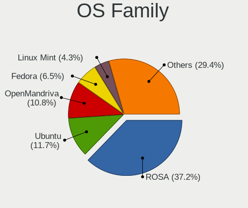
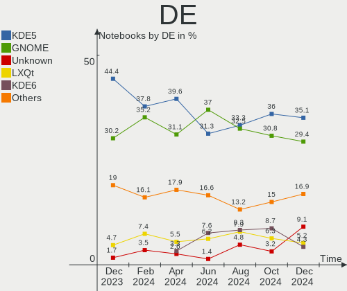
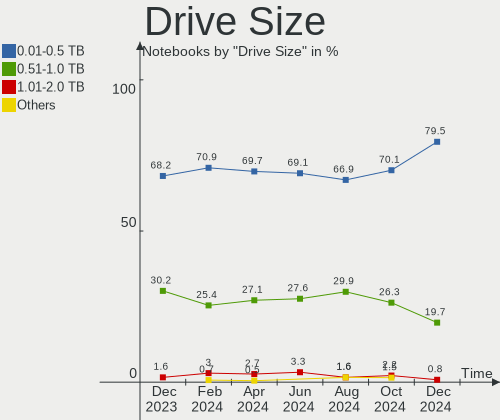
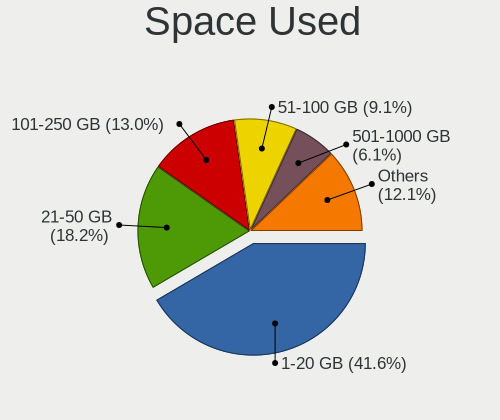
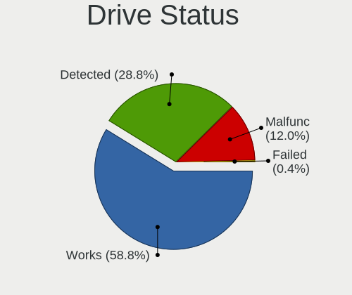
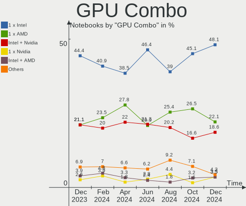
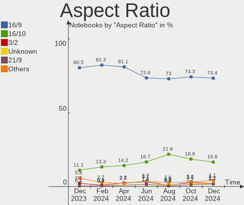
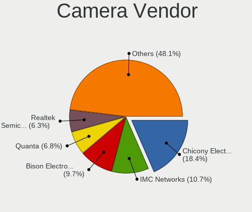

Linux in Russia - Hardware Trends (Notebooks)
---------------------------------------------

A project to identify most popular hardware characteristics and track their change
over time based on data collected by Linux users at https://Linux-Hardware.org.

Anyone can contribute to this report by the [hw-probe](https://github.com/linuxhw/hw-probe) tool:

    sudo -E hw-probe -all -upload

Period: Sep, 2022.

Contents
--------

* [ System ](#system)
  - [ OS                       ](#os)
  - [ OS Family                ](#os-family)
  - [ Kernel                   ](#kernel)
  - [ Kernel Family            ](#kernel-family)
  - [ Kernel Major Ver.        ](#kernel-major-ver)
  - [ Arch                     ](#arch)
  - [ DE                       ](#de)
  - [ Display Server           ](#display-server)
  - [ Display Manager          ](#display-manager)
  - [ OS Lang                  ](#os-lang)
  - [ Boot Mode                ](#boot-mode)
  - [ Filesystem               ](#filesystem)
  - [ Part. scheme             ](#part-scheme)
  - [ Dual Boot with Linux/BSD ](#dual-boot-with-linuxbsd)
  - [ Dual Boot (Win)          ](#dual-boot-win)

* [ Board ](#board)
  - [ Vendor                   ](#vendor)
  - [ Model                    ](#model)
  - [ Model Family             ](#model-family)
  - [ MFG Year                 ](#mfg-year)
  - [ Form Factor              ](#form-factor)
  - [ Secure Boot              ](#secure-boot)
  - [ Coreboot                 ](#coreboot)
  - [ RAM Size                 ](#ram-size)
  - [ RAM Used                 ](#ram-used)
  - [ Total Drives             ](#total-drives)
  - [ Has CD-ROM               ](#has-cd-rom)
  - [ Has Ethernet             ](#has-ethernet)
  - [ Has WiFi                 ](#has-wifi)
  - [ Has Bluetooth            ](#has-bluetooth)

* [ Location ](#location)
  - [ Country                  ](#country)
  - [ City                     ](#city)

* [ Drives ](#drives)
  - [ Drive Vendor             ](#drive-vendor)
  - [ Drive Model              ](#drive-model)
  - [ HDD Vendor               ](#hdd-vendor)
  - [ SSD Vendor               ](#ssd-vendor)
  - [ Drive Kind               ](#drive-kind)
  - [ Drive Connector          ](#drive-connector)
  - [ Drive Size               ](#drive-size)
  - [ Space Total              ](#space-total)
  - [ Space Used               ](#space-used)
  - [ Malfunc. Drives          ](#malfunc-drives)
  - [ Malfunc. Drive Vendor    ](#malfunc-drive-vendor)
  - [ Malfunc. HDD Vendor      ](#malfunc-hdd-vendor)
  - [ Malfunc. Drive Kind      ](#malfunc-drive-kind)
  - [ Failed Drives            ](#failed-drives)
  - [ Failed Drive Vendor      ](#failed-drive-vendor)
  - [ Drive Status             ](#drive-status)

* [ Storage controller ](#storage-controller)
  - [ Storage Vendor           ](#storage-vendor)
  - [ Storage Model            ](#storage-model)
  - [ Storage Kind             ](#storage-kind)

* [ Processor ](#processor)
  - [ CPU Vendor               ](#cpu-vendor)
  - [ CPU Model                ](#cpu-model)
  - [ CPU Model Family         ](#cpu-model-family)
  - [ CPU Cores                ](#cpu-cores)
  - [ CPU Sockets              ](#cpu-sockets)
  - [ CPU Threads              ](#cpu-threads)
  - [ CPU Op-Modes             ](#cpu-op-modes)
  - [ CPU Microcode            ](#cpu-microcode)
  - [ CPU Microarch            ](#cpu-microarch)

* [ Graphics ](#graphics)
  - [ GPU Vendor               ](#gpu-vendor)
  - [ GPU Model                ](#gpu-model)
  - [ GPU Combo                ](#gpu-combo)
  - [ GPU Driver               ](#gpu-driver)
  - [ GPU Memory               ](#gpu-memory)

* [ Monitor ](#monitor)
  - [ Monitor Vendor           ](#monitor-vendor)
  - [ Monitor Model            ](#monitor-model)
  - [ Monitor Resolution       ](#monitor-resolution)
  - [ Monitor Diagonal         ](#monitor-diagonal)
  - [ Monitor Width            ](#monitor-width)
  - [ Aspect Ratio             ](#aspect-ratio)
  - [ Monitor Area             ](#monitor-area)
  - [ Pixel Density            ](#pixel-density)
  - [ Multiple Monitors        ](#multiple-monitors)

* [ Network ](#network)
  - [ Net Controller Vendor    ](#net-controller-vendor)
  - [ Net Controller Model     ](#net-controller-model)
  - [ Wireless Vendor          ](#wireless-vendor)
  - [ Wireless Model           ](#wireless-model)
  - [ Ethernet Vendor          ](#ethernet-vendor)
  - [ Ethernet Model           ](#ethernet-model)
  - [ Net Controller Kind      ](#net-controller-kind)
  - [ Used Controller          ](#used-controller)
  - [ NICs                     ](#nics)
  - [ IPv6                     ](#ipv6)

* [ Bluetooth ](#bluetooth)
  - [ Bluetooth Vendor         ](#bluetooth-vendor)
  - [ Bluetooth Model          ](#bluetooth-model)

* [ Sound ](#sound)
  - [ Sound Vendor             ](#sound-vendor)
  - [ Sound Model              ](#sound-model)

* [ Memory ](#memory)
  - [ Memory Vendor            ](#memory-vendor)
  - [ Memory Model             ](#memory-model)
  - [ Memory Kind              ](#memory-kind)
  - [ Memory Form Factor       ](#memory-form-factor)
  - [ Memory Size              ](#memory-size)
  - [ Memory Speed             ](#memory-speed)

* [ Printers & scanners ](#printers--scanners)
  - [ Printer Vendor           ](#printer-vendor)
  - [ Printer Model            ](#printer-model)
  - [ Scanner Vendor           ](#scanner-vendor)
  - [ Scanner Model            ](#scanner-model)

* [ Camera ](#camera)
  - [ Camera Vendor            ](#camera-vendor)
  - [ Camera Model             ](#camera-model)

* [ Security ](#security)
  - [ Fingerprint Vendor       ](#fingerprint-vendor)
  - [ Fingerprint Model        ](#fingerprint-model)
  - [ Chipcard Vendor          ](#chipcard-vendor)
  - [ Chipcard Model           ](#chipcard-model)

* [ Unsupported ](#unsupported)
  - [ Unsupported Devices      ](#unsupported-devices)
  - [ Unsupported Device Types ](#unsupported-device-types)

System
------

OS
--

Installed operating systems

| Name                         | Notebooks | Percent |
|------------------------------|-----------|---------|
| ROSA 12.2                    | 91        | 32.85%  |
| Debian 11                    | 40        | 14.44%  |
| Fedora 36                    | 19        | 6.86%   |
| Ubuntu 22.04                 | 13        | 4.69%   |
| OpenMandriva 4.3             | 13        | 4.69%   |
| Linux Mint 21                | 10        | 3.61%   |
| ROSA R11.1                   | 9         | 3.25%   |
| Ubuntu 20.04                 | 6         | 2.17%   |
| Red OS 7.3.1                 | 6         | 2.17%   |
| ROSA 12.1                    | 5         | 1.81%   |
| Pop!_OS 22.04                | 5         | 1.81%   |
| Linux Mint 20.3              | 4         | 1.44%   |
| Arch                         | 4         | 1.44%   |
| MOS 10                       | 3         | 1.08%   |
| Manjaro 22.0.0               | 3         | 1.08%   |
| Manjaro                      | 3         | 1.08%   |
| Kubuntu 22.04                | 3         | 1.08%   |
| Zorin 16                     | 2         | 0.72%   |
| Ubuntu 22.10                 | 2         | 0.72%   |
| LMDE 5                       | 2         | 0.72%   |
| Elementary 6.1               | 2         | 0.72%   |
| Debian Testing               | 2         | 0.72%   |
| ALT Linux 10.1               | 2         | 0.72%   |
| ALT Linux 10.0               | 2         | 0.72%   |
| Xubuntu 16.04                | 1         | 0.36%   |
| Ubuntu 18.04                 | 1         | 0.36%   |
| Trisquel 10.0.1              | 1         | 0.36%   |
| ROSA 12                      | 1         | 0.36%   |
| RED X4                       | 1         | 0.36%   |
| Pop!_OS 21.10                | 1         | 0.36%   |
| Parrot 4.11                  | 1         | 0.36%   |
| openSUSE Tumbleweed-XXXXXXXX | 1         | 0.36%   |
| openSUSE Leap-15.4           | 1         | 0.36%   |
| OpenMandriva 4.50            | 1         | 0.36%   |
| OpenMandriva 4.2             | 1         | 0.36%   |
| Nobara 36                    | 1         | 0.36%   |
| Manjaro 21.2.6               | 1         | 0.36%   |
| Linux Mint 20.1              | 1         | 0.36%   |
| Gentoo 2.8                   | 1         | 0.36%   |
| Fedora 37                    | 1         | 0.36%   |

OS Family
---------

OS without a version

| Name         | Notebooks | Percent |
|--------------|-----------|---------|
| ROSA         | 106       | 38.27%  |
| Debian       | 44        | 15.88%  |
| Ubuntu       | 22        | 7.94%   |
| Fedora       | 22        | 7.94%   |
| OpenMandriva | 15        | 5.42%   |
| Linux Mint   | 15        | 5.42%   |
| Manjaro      | 7         | 2.53%   |
| ALT Linux    | 7         | 2.53%   |
| Red OS       | 6         | 2.17%   |
| Pop!_OS      | 6         | 2.17%   |
| Arch         | 4         | 1.44%   |
| Kubuntu      | 3         | 1.08%   |
| Zorin        | 2         | 0.72%   |
| openSUSE     | 2         | 0.72%   |
| LMDE         | 2         | 0.72%   |
| Elementary   | 2         | 0.72%   |
| Xubuntu      | 1         | 0.36%   |
| Trisquel     | 1         | 0.36%   |
| RED          | 1         | 0.36%   |
| Parrot       | 1         | 0.36%   |
| Nobara       | 1         | 0.36%   |
| Gentoo       | 1         | 0.36%   |
| Endless      | 1         | 0.36%   |
| EndeavourOS  | 1         | 0.36%   |
| Astra Linux  | 1         | 0.36%   |
| ArcoLinux    | 1         | 0.36%   |
| Arch ARM     | 1         | 0.36%   |
| antiX        | 1         | 0.36%   |

Kernel
------

Version of the Linux kernel

| Version                                | Notebooks | Percent |
|----------------------------------------|-----------|---------|
| 5.10.74-generic-2rosa2021.1-x86_64     | 44        | 15.88%  |
| 5.10.0-7-amd64                         | 31        | 11.19%  |
| 5.10.118-generic-2rosa2021.1-x86_64    | 27        | 9.75%   |
| 5.15.0-47-generic                      | 19        | 6.86%   |
| 5.16.7-desktop-1omv4003                | 12        | 4.33%   |
| 5.17.11-generic-2rosa2021.1-x86_64     | 9         | 3.25%   |
| 5.15.0-48-generic                      | 7         | 2.53%   |
| 5.15.0-46-generic                      | 5         | 1.81%   |
| 5.10.0-18-amd64                        | 5         | 1.81%   |
| 5.19.4-200.fc36.x86_64                 | 4         | 1.44%   |
| 5.19.0-76051900-generic                | 4         | 1.44%   |
| 5.18.18.xm1-1-xanmod-rosa2021.1-x86_64 | 4         | 1.44%   |
| 5.15.67-generic-1rosa2021.1-x86_64     | 4         | 1.44%   |
| 5.4.83-generic-2rosa-x86_64            | 3         | 1.08%   |
| 5.19.9-200.fc36.x86_64                 | 3         | 1.08%   |
| 5.19.8-200.fc36.x86_64                 | 3         | 1.08%   |
| 5.19.6-200.fc36.x86_64                 | 3         | 1.08%   |
| 5.19.11-200.fc36.x86_64                | 3         | 1.08%   |
| 5.15.43-generic-2rosa2021.1-x86_64     | 3         | 1.08%   |
| 5.15.35-4.el7.3.x86_64                 | 3         | 1.08%   |
| 5.15.34-un-def-alt1                    | 3         | 1.08%   |
| 5.15.10-1.el7.x86_64                   | 3         | 1.08%   |
| 5.10.74-generic-2rosa2021.1-i586       | 3         | 1.08%   |
| 5.10.139-std-def-alt1                  | 3         | 1.08%   |
| 4.15.0-desktop-122.124.1rosa-x86_64    | 3         | 1.08%   |
| 5.4.83-generic-2rosa-i586              | 2         | 0.72%   |
| 5.4.0-126-generic                      | 2         | 0.72%   |
| 5.4.0-125-generic                      | 2         | 0.72%   |
| 5.19.11-arch1-1                        | 2         | 0.72%   |
| 5.19.0-1-amd64                         | 2         | 0.72%   |
| 5.17.5-300.fc36.x86_64                 | 2         | 0.72%   |
| 5.15.65-generic-1rosa2021.1-x86_64     | 2         | 0.72%   |
| 5.15.65-1-MANJARO                      | 2         | 0.72%   |
| 5.10.0-17-amd64                        | 2         | 0.72%   |
| 6.0.0-rc6-asahi-1-1-ARCH               | 1         | 0.36%   |
| 5.8.0-43-generic                       | 1         | 0.36%   |
| 5.8.0-14-generic                       | 1         | 0.36%   |
| 5.5.9-200.fc31.x86_64                  | 1         | 0.36%   |
| 5.4.32-generic-2rosa-i586              | 1         | 0.36%   |
| 5.4.0-113-generic                      | 1         | 0.36%   |

Kernel Family
-------------

Linux kernel without a distro release

| Version  | Notebooks | Percent |
|----------|-----------|---------|
| 5.10.74  | 47        | 16.97%  |
| 5.10.0   | 40        | 14.44%  |
| 5.15.0   | 33        | 11.91%  |
| 5.10.118 | 27        | 9.75%   |
| 5.16.7   | 12        | 4.33%   |
| 5.17.11  | 9         | 3.25%   |
| 5.19.0   | 8         | 2.89%   |
| 5.19.11  | 6         | 2.17%   |
| 5.4.83   | 5         | 1.81%   |
| 5.4.0    | 5         | 1.81%   |
| 5.15.67  | 5         | 1.81%   |
| 5.19.9   | 4         | 1.44%   |
| 5.19.8   | 4         | 1.44%   |
| 5.19.6   | 4         | 1.44%   |
| 5.19.4   | 4         | 1.44%   |
| 5.18.18  | 4         | 1.44%   |
| 5.15.65  | 4         | 1.44%   |
| 5.13.0   | 4         | 1.44%   |
| 4.15.0   | 4         | 1.44%   |
| 5.15.43  | 3         | 1.08%   |
| 5.15.35  | 3         | 1.08%   |
| 5.15.34  | 3         | 1.08%   |
| 5.15.10  | 3         | 1.08%   |
| 5.10.139 | 3         | 1.08%   |
| 5.8.0    | 2         | 0.72%   |
| 5.19.7   | 2         | 0.72%   |
| 5.18.0   | 2         | 0.72%   |
| 5.17.5   | 2         | 0.72%   |
| 6.0.0    | 1         | 0.36%   |
| 5.5.9    | 1         | 0.36%   |
| 5.4.32   | 1         | 0.36%   |
| 5.19.5   | 1         | 0.36%   |
| 5.19.2   | 1         | 0.36%   |
| 5.19.10  | 1         | 0.36%   |
| 5.19.1   | 1         | 0.36%   |
| 5.18.17  | 1         | 0.36%   |
| 5.18.10  | 1         | 0.36%   |
| 5.17.15  | 1         | 0.36%   |
| 5.16.13  | 1         | 0.36%   |
| 5.16.0   | 1         | 0.36%   |

Kernel Major Ver.
-----------------

Linux kernel major version

| Version | Notebooks | Percent |
|---------|-----------|---------|
| 5.10    | 121       | 43.68%  |
| 5.15    | 57        | 20.58%  |
| 5.19    | 36        | 13%     |
| 5.16    | 14        | 5.05%   |
| 5.17    | 12        | 4.33%   |
| 5.4     | 11        | 3.97%   |
| 5.18    | 8         | 2.89%   |
| 5.13    | 4         | 1.44%   |
| 4.15    | 4         | 1.44%   |
| 5.8     | 2         | 0.72%   |
| 5.14    | 2         | 0.72%   |
| 6.0     | 1         | 0.36%   |
| 5.5     | 1         | 0.36%   |
| 5.11    | 1         | 0.36%   |
| 4.9     | 1         | 0.36%   |
| 4.4     | 1         | 0.36%   |
| 3.0     | 1         | 0.36%   |

Arch
----

OS architecture (x86_64, i586, etc.)

| Name    | Notebooks | Percent |
|---------|-----------|---------|
| x86_64  | 266       | 96.03%  |
| i686    | 9         | 3.25%   |
| armv7l  | 1         | 0.36%   |
| aarch64 | 1         | 0.36%   |

DE
--

Desktop Environment

| Name            | Notebooks | Percent |
|-----------------|-----------|---------|
| GNOME           | 95        | 34.3%   |
| KDE5            | 92        | 33.21%  |
| Unknown         | 38        | 13.72%  |
| LXQt            | 12        | 4.33%   |
| X-Cinnamon      | 11        | 3.97%   |
| XFCE            | 9         | 3.25%   |
| MATE            | 7         | 2.53%   |
| KDE4            | 5         | 1.81%   |
| Pantheon        | 2         | 0.72%   |
| i3              | 2         | 0.72%   |
| Cinnamon        | 2         | 0.72%   |
| GNOME Flashback | 1         | 0.36%   |
| fluxbox         | 1         | 0.36%   |

Display Server
--------------

X11 or Wayland

| Name    | Notebooks | Percent |
|---------|-----------|---------|
| Wayland | 133       | 48.01%  |
| X11     | 107       | 38.63%  |
| Unknown | 32        | 11.55%  |
| Tty     | 5         | 1.81%   |

Display Manager
---------------

SDDM, LightDM, etc.

| Name    | Notebooks | Percent |
|---------|-----------|---------|
| Unknown | 86        | 31.05%  |
| SDDM    | 80        | 28.88%  |
| GDM     | 73        | 26.35%  |
| GDM3    | 17        | 6.14%   |
| LightDM | 16        | 5.78%   |
| KDM     | 5         | 1.81%   |

OS Lang
-------

Language

| Lang    | Notebooks | Percent |
|---------|-----------|---------|
| ru_RU   | 226       | 81.59%  |
| en_US   | 37        | 13.36%  |
| Unknown | 7         | 2.53%   |
| en_GB   | 3         | 1.08%   |
| C       | 3         | 1.08%   |
| en_AG   | 1         | 0.36%   |

Boot Mode
---------

EFI or BIOS

| Mode | Notebooks | Percent |
|------|-----------|---------|
| EFI  | 168       | 60.65%  |
| BIOS | 109       | 39.35%  |

Filesystem
----------

Type of filesystem

| Type    | Notebooks | Percent |
|---------|-----------|---------|
| Ext4    | 197       | 71.12%  |
| Overlay | 45        | 16.25%  |
| Btrfs   | 32        | 11.55%  |
| Xfs     | 2         | 0.72%   |
| Ext3    | 1         | 0.36%   |

Part. scheme
------------

Scheme of partitioning

| Type    | Notebooks | Percent |
|---------|-----------|---------|
| GPT     | 167       | 60.29%  |
| Unknown | 62        | 22.38%  |
| MBR     | 48        | 17.33%  |

Dual Boot with Linux/BSD
------------------------

Hosting more than one Linux/BSD

| Dual boot | Notebooks | Percent |
|-----------|-----------|---------|
| No        | 234       | 84.48%  |
| Yes       | 43        | 15.52%  |

Dual Boot (Win)
---------------

Hosting Linux and Windows

| Dual boot | Notebooks | Percent |
|-----------|-----------|---------|
| No        | 174       | 62.82%  |
| Yes       | 103       | 37.18%  |

Board
-----

Vendor
------

Motherboard manufacturer

| Name                           | Notebooks | Percent |
|--------------------------------|-----------|---------|
| Lenovo                         | 58        | 20.94%  |
| ASUSTek Computer               | 42        | 15.16%  |
| Hewlett-Packard                | 36        | 13%     |
| Aquarius                       | 36        | 13%     |
| Acer                           | 28        | 10.11%  |
| HUAWEI                         | 11        | 3.97%   |
| Dell                           | 11        | 3.97%   |
| Samsung Electronics            | 9         | 3.25%   |
| MSI                            | 6         | 2.17%   |
| Chuwi                          | 4         | 1.44%   |
| Unknown                        | 4         | 1.44%   |
| Toshiba                        | 3         | 1.08%   |
| Irbis                          | 3         | 1.08%   |
| Timi                           | 2         | 0.72%   |
| ICL                            | 2         | 0.72%   |
| HONOR                          | 2         | 0.72%   |
| Apple                          | 2         | 0.72%   |
| THUNDEROBOT                    | 1         | 0.36%   |
| Sony                           | 1         | 0.36%   |
| Packard Bell                   | 1         | 0.36%   |
| Notebook                       | 1         | 0.36%   |
| MECHREVO                       | 1         | 0.36%   |
| Matsushita Electric Industrial | 1         | 0.36%   |
| IP3 Technology                 | 1         | 0.36%   |
| Intel                          | 1         | 0.36%   |
| Haier                          | 1         | 0.36%   |
| GPD                            | 1         | 0.36%   |
| Gigabyte Technology            | 1         | 0.36%   |
| Getac                          | 1         | 0.36%   |
| Fujitsu                        | 1         | 0.36%   |
| Durabook                       | 1         | 0.36%   |
| Digma                          | 1         | 0.36%   |
| DEXP                           | 1         | 0.36%   |
| Clevo                          | 1         | 0.36%   |
| 3Logic Group                   | 1         | 0.36%   |

Model
-----

Motherboard model

| Name                                     | Notebooks | Percent |
|------------------------------------------|-----------|---------|
| Aquarius NS585                           | 30        | 10.83%  |
| HP Pavilion g6                           | 6         | 2.17%   |
| Aquarius NS685U R11                      | 5         | 1.81%   |
| Unknown                                  | 5         | 1.81%   |
| HUAWEI KLVL-WXXW                         | 3         | 1.08%   |
| ASUS K50IJ                               | 3         | 1.08%   |
| Samsung 350V5C/351V5C/3540VC/3440VC      | 2         | 0.72%   |
| Lenovo ThinkBook 16p Gen 2 20YM          | 2         | 0.72%   |
| Lenovo IdeaPad 5 15ARE05 81YQ            | 2         | 0.72%   |
| Lenovo IdeaPad 330-15AST 81D6            | 2         | 0.72%   |
| Lenovo IdeaPad 320-15IKB 80XL            | 2         | 0.72%   |
| HUAWEI NBLB-WAX9N                        | 2         | 0.72%   |
| HUAWEI KLVD-WXX9                         | 2         | 0.72%   |
| HP Notebook                              | 2         | 0.72%   |
| HP Laptop 15s-eq1xxx                     | 2         | 0.72%   |
| HP Laptop 15-bw0xx                       | 2         | 0.72%   |
| Chuwi HeroBook Air                       | 2         | 0.72%   |
| ASUS ZenBook UX325EA_UX325EA             | 2         | 0.72%   |
| Acer Nitro AN515-31                      | 2         | 0.72%   |
| Acer Aspire 5742G                        | 2         | 0.72%   |
| Toshiba Satellite Pro L630               | 1         | 0.36%   |
| Toshiba Satellite C660                   | 1         | 0.36%   |
| Toshiba Satellite A300                   | 1         | 0.36%   |
| Timi TM1612                              | 1         | 0.36%   |
| Timi Redmi Book Pro 15 2022              | 1         | 0.36%   |
| THUNDEROBOT 911AirD                      | 1         | 0.36%   |
| Sony VPCEH1S1R                           | 1         | 0.36%   |
| Samsung R540/R580/R780/SA41/E452         | 1         | 0.36%   |
| Samsung R530/R730/R540                   | 1         | 0.36%   |
| Samsung R530/R730                        | 1         | 0.36%   |
| Samsung R430/P430                        | 1         | 0.36%   |
| Samsung N150P/N210P/N220P                | 1         | 0.36%   |
| Samsung 3570R/370R/470R/450R/510R/4450RV | 1         | 0.36%   |
| Samsung 355V4C/356V4C/3445VC/3545VC      | 1         | 0.36%   |
| Packard Bell DOT S                       | 1         | 0.36%   |
| Notebook W65_67SB                        | 1         | 0.36%   |
| MSI MS-N051                              | 1         | 0.36%   |
| MSI Katana GF66 11UE                     | 1         | 0.36%   |
| MSI GS66 Stealth 10SE                    | 1         | 0.36%   |
| MSI GP60 2OD                             | 1         | 0.36%   |

Model Family
------------

Motherboard model prefix

| Name                | Notebooks | Percent |
|---------------------|-----------|---------|
| Aquarius NS585      | 30        | 10.83%  |
| Lenovo IdeaPad      | 23        | 8.3%    |
| Lenovo ThinkPad     | 16        | 5.78%   |
| Acer Aspire         | 16        | 5.78%   |
| HP Pavilion         | 9         | 3.25%   |
| HP Laptop           | 8         | 2.89%   |
| Dell Inspiron       | 8         | 2.89%   |
| HP ProBook          | 7         | 2.53%   |
| ASUS VivoBook       | 7         | 2.53%   |
| Lenovo Legion       | 5         | 1.81%   |
| Aquarius NS685U     | 5         | 1.81%   |
| Unknown             | 5         | 1.81%   |
| Lenovo ThinkBook    | 4         | 1.44%   |
| ASUS ZenBook        | 4         | 1.44%   |
| Acer Nitro          | 4         | 1.44%   |
| Toshiba Satellite   | 3         | 1.08%   |
| HUAWEI KLVL-WXXW    | 3         | 1.08%   |
| Chuwi HeroBook      | 3         | 1.08%   |
| ASUS K50IJ          | 3         | 1.08%   |
| Acer Extensa        | 3         | 1.08%   |
| Samsung R530        | 2         | 0.72%   |
| Samsung 350V5C      | 2         | 0.72%   |
| HUAWEI NBLB-WAX9N   | 2         | 0.72%   |
| HUAWEI KLVD-WXX9    | 2         | 0.72%   |
| HP Presario         | 2         | 0.72%   |
| HP Notebook         | 2         | 0.72%   |
| HP EliteBook        | 2         | 0.72%   |
| Dell Latitude       | 2         | 0.72%   |
| Acer TravelMate     | 2         | 0.72%   |
| Timi TM1612         | 1         | 0.36%   |
| Timi Redmi          | 1         | 0.36%   |
| THUNDEROBOT 911AirD | 1         | 0.36%   |
| Sony VPCEH1S1R      | 1         | 0.36%   |
| Samsung R540        | 1         | 0.36%   |
| Samsung R430        | 1         | 0.36%   |
| Samsung N150P       | 1         | 0.36%   |
| Samsung 3570R       | 1         | 0.36%   |
| Samsung 355V4C      | 1         | 0.36%   |
| Packard Bell DOT    | 1         | 0.36%   |
| Notebook W65        | 1         | 0.36%   |

MFG Year
--------

Motherboard manufacture year

| Year    | Notebooks | Percent |
|---------|-----------|---------|
| 2019    | 46        | 16.61%  |
| 2021    | 40        | 14.44%  |
| 2020    | 27        | 9.75%   |
| 2011    | 26        | 9.39%   |
| 2018    | 18        | 6.5%    |
| 2022    | 16        | 5.78%   |
| 2010    | 16        | 5.78%   |
| 2013    | 14        | 5.05%   |
| 2012    | 14        | 5.05%   |
| 2017    | 11        | 3.97%   |
| 2015    | 10        | 3.61%   |
| 2016    | 9         | 3.25%   |
| 2009    | 8         | 2.89%   |
| 2014    | 7         | 2.53%   |
| 2008    | 7         | 2.53%   |
| 2007    | 3         | 1.08%   |
| 2006    | 2         | 0.72%   |
| Unknown | 2         | 0.72%   |
| 2004    | 1         | 0.36%   |

Form Factor
-----------

Physical design of the computer

| Name     | Notebooks | Percent |
|----------|-----------|---------|
| Notebook | 277       | 100%    |

Secure Boot
-----------

Enabled or disabled

| State    | Notebooks | Percent |
|----------|-----------|---------|
| Disabled | 267       | 96.39%  |
| Enabled  | 10        | 3.61%   |

Coreboot
--------

Have coreboot on board

| Used | Notebooks | Percent |
|------|-----------|---------|
| No   | 277       | 100%    |

RAM Size
--------

Total RAM memory

| Size in GB | Notebooks | Percent |
|------------|-----------|---------|
| 4.01-8.0   | 125       | 45.13%  |
| 3.01-4.0   | 51        | 18.41%  |
| 8.01-16.0  | 38        | 13.72%  |
| 16.01-24.0 | 27        | 9.75%   |
| 1.01-2.0   | 12        | 4.33%   |
| 32.01-64.0 | 9         | 3.25%   |
| 2.01-3.0   | 9         | 3.25%   |
| 0.51-1.0   | 5         | 1.81%   |
| 0.01-0.5   | 1         | 0.36%   |

RAM Used
--------

Used RAM memory

| Used GB    | Notebooks | Percent |
|------------|-----------|---------|
| 1.01-2.0   | 95        | 34.3%   |
| 0.51-1.0   | 66        | 23.83%  |
| 2.01-3.0   | 49        | 17.69%  |
| 3.01-4.0   | 33        | 11.91%  |
| 4.01-8.0   | 22        | 7.94%   |
| 8.01-16.0  | 5         | 1.81%   |
| 0.01-0.5   | 5         | 1.81%   |
| 16.01-24.0 | 1         | 0.36%   |
| Unknown    | 1         | 0.36%   |

Total Drives
------------

Number of drives on board

| Drives | Notebooks | Percent |
|--------|-----------|---------|
| 1      | 207       | 74.73%  |
| 2      | 62        | 22.38%  |
| 3      | 8         | 2.89%   |

Has CD-ROM
----------

Has CD-ROM on board

| Presented | Notebooks | Percent |
|-----------|-----------|---------|
| No        | 213       | 76.9%   |
| Yes       | 64        | 23.1%   |

Has Ethernet
------------

Has Ethernet on board

| Presented | Notebooks | Percent |
|-----------|-----------|---------|
| Yes       | 224       | 80.87%  |
| No        | 53        | 19.13%  |

Has WiFi
--------

Has WiFi module

| Presented | Notebooks | Percent |
|-----------|-----------|---------|
| Yes       | 271       | 97.83%  |
| No        | 6         | 2.17%   |

Has Bluetooth
-------------

Has Bluetooth module

| Presented | Notebooks | Percent |
|-----------|-----------|---------|
| Yes       | 223       | 80.51%  |
| No        | 54        | 19.49%  |

Location
--------

Country
-------

Geographic location (country)

| Country | Notebooks | Percent |
|---------|-----------|---------|
| Russia  | 277       | 100%    |

City
----

Geographic location (city)

| City             | Notebooks | Percent |
|------------------|-----------|---------|
| Moscow           | 71        | 25.63%  |
| Voronezh         | 35        | 12.64%  |
| St Petersburg    | 25        | 9.03%   |
| Nizhniy Novgorod | 9         | 3.25%   |
| Krasnodar        | 8         | 2.89%   |
| Rostov-on-Don    | 6         | 2.17%   |
| Krasnoyarsk      | 6         | 2.17%   |
| Yekaterinburg    | 5         | 1.81%   |
| Samara           | 5         | 1.81%   |
| Ufa              | 4         | 1.44%   |
| Tomsk            | 4         | 1.44%   |
| Novosibirsk      | 4         | 1.44%   |
| Chelyabinsk      | 4         | 1.44%   |
| Saratov          | 3         | 1.08%   |
| Perm             | 3         | 1.08%   |
| Zanevka          | 2         | 0.72%   |
| Tver             | 2         | 0.72%   |
| Tolyatti         | 2         | 0.72%   |
| Syktyvkar        | 2         | 0.72%   |
| Ryazan           | 2         | 0.72%   |
| Penza            | 2         | 0.72%   |
| Nakhodka         | 2         | 0.72%   |
| Kirov            | 2         | 0.72%   |
| Khabarovsk       | 2         | 0.72%   |
| Kazan’         | 2         | 0.72%   |
| Elektrostal      | 2         | 0.72%   |
| Chita            | 2         | 0.72%   |
| Blagoveshchensk  | 2         | 0.72%   |
| Balashikha       | 2         | 0.72%   |
| Zhukovskiy       | 1         | 0.36%   |
| Zheleznogorsk    | 1         | 0.36%   |
| Zaprudnya        | 1         | 0.36%   |
| Yukki            | 1         | 0.36%   |
| Yaroslavl        | 1         | 0.36%   |
| Volgograd        | 1         | 0.36%   |
| Vladivostok      | 1         | 0.36%   |
| Varezh           | 1         | 0.36%   |
| Usinsk           | 1         | 0.36%   |
| Ursala           | 1         | 0.36%   |
| Ulyanovsk        | 1         | 0.36%   |

Drives
------

Drive Vendor
------------

Hard drive vendors

| Vendor                  | Notebooks | Drives | Percent |
|-------------------------|-----------|--------|---------|
| WDC                     | 45        | 45     | 13.35%  |
| A-DATA Technology       | 42        | 42     | 12.46%  |
| Samsung Electronics     | 38        | 44     | 11.28%  |
| Seagate                 | 29        | 30     | 8.61%   |
| Toshiba                 | 21        | 21     | 6.23%   |
| Kingston                | 18        | 18     | 5.34%   |
| SK hynix                | 14        | 14     | 4.15%   |
| Hitachi                 | 13        | 13     | 3.86%   |
| Unknown                 | 12        | 14     | 3.56%   |
| Intel                   | 10        | 10     | 2.97%   |
| SanDisk                 | 7         | 8      | 2.08%   |
| China                   | 7         | 7      | 2.08%   |
| Micron Technology       | 6         | 6      | 1.78%   |
| SPCC                    | 5         | 5      | 1.48%   |
| Phison                  | 5         | 5      | 1.48%   |
| KIOXIA                  | 5         | 5      | 1.48%   |
| Transcend               | 3         | 3      | 0.89%   |
| Solid State Storage     | 3         | 3      | 0.89%   |
| BIWIN                   | 3         | 3      | 0.89%   |
| Apacer                  | 3         | 3      | 0.89%   |
| Silicon Motion          | 2         | 2      | 0.59%   |
| Qumo                    | 2         | 2      | 0.59%   |
| Plextor                 | 2         | 2      | 0.59%   |
| Netac                   | 2         | 2      | 0.59%   |
| KingSpec                | 2         | 2      | 0.59%   |
| Kingmax                 | 2         | 2      | 0.59%   |
| Kimtigo                 | 2         | 2      | 0.59%   |
| JMicron Technology      | 2         | 2      | 0.59%   |
| HGST                    | 2         | 2      | 0.59%   |
| Hewlett-Packard         | 2         | 2      | 0.59%   |
| GOODRAM                 | 2         | 2      | 0.59%   |
| Fujitsu                 | 2         | 2      | 0.59%   |
| External                | 2         | 2      | 0.59%   |
| Crucial                 | 2         | 2      | 0.59%   |
| Unknown                 | 2         | 2      | 0.59%   |
| XrayDisk                | 1         | 1      | 0.3%    |
| WALRAM                  | 1         | 1      | 0.3%    |
| Union Memory (Shenzhen) | 1         | 1      | 0.3%    |
| RUN                     | 1         | 1      | 0.3%    |
| Realtek Semiconductor   | 1         | 1      | 0.3%    |

Drive Model
-----------

Hard drive models

| Model                                               | Notebooks | Percent |
|-----------------------------------------------------|-----------|---------|
| A-DATA SU800 512GB SSD                              | 30        | 8.65%   |
| A-DATA SU800NS38 256GB SSD                          | 6         | 1.73%   |
| Toshiba MQ01ABF050 500GB                            | 5         | 1.44%   |
| Seagate ST1000LM024 HN-M101MBB 1TB                  | 5         | 1.44%   |
| Seagate ST500LT012-1DG142 500GB                     | 4         | 1.15%   |
| Kingston SA400S37240G 240GB SSD                     | 4         | 1.15%   |
| Toshiba XG6 NVMe SSD Controller 512GB               | 3         | 0.86%   |
| Toshiba MQ04ABF100 1TB                              | 3         | 0.86%   |
| SPCC Solid State Disk 128GB                         | 3         | 0.86%   |
| Seagate ST1000LM035-1RK172 1TB                      | 3         | 0.86%   |
| Samsung NVMe SSD Controller SM981/PM981/PM983 256GB | 3         | 0.86%   |
| KIOXIA KBG40ZNV256G 256GB                           | 3         | 0.86%   |
| Kingston SA400S37480G 480GB SSD                     | 3         | 0.86%   |
| Hitachi HTS547550A9E384 500GB                       | 3         | 0.86%   |
| WDC WDS240G2G0A-00JH30 240GB SSD                    | 2         | 0.58%   |
| WDC WDS120G2G0B-00EPW0 120GB SSD                    | 2         | 0.58%   |
| WDC WD5000LPCX-60VHAT0 500GB                        | 2         | 0.58%   |
| WDC PC SN530 SDBPNPZ-512G-1114 512GB                | 2         | 0.58%   |
| Unknown MMC Card  64GB                              | 2         | 0.58%   |
| Toshiba MQ01ABD050 500GB                            | 2         | 0.58%   |
| SK hynix SKHynix_HFS512GDE9X084N 512GB              | 2         | 0.58%   |
| SK hynix NVMe SSD Drive 512GB                       | 2         | 0.58%   |
| SK hynix HFS128G39TND-N210A 128GB SSD               | 2         | 0.58%   |
| Seagate ST9500420AS 500GB                           | 2         | 0.58%   |
| Seagate ST9500325AS 500GB                           | 2         | 0.58%   |
| Seagate ST9320325AS 320GB                           | 2         | 0.58%   |
| Samsung NVMe SSD Drive 256GB                        | 2         | 0.58%   |
| Samsung NVMe SSD Drive 250GB                        | 2         | 0.58%   |
| Samsung MZNLN128HAHQ-000H1 128GB SSD                | 2         | 0.58%   |
| Samsung HM250HI 250GB                               | 2         | 0.58%   |
| Phison NVMe SSD Drive 512GB                         | 2         | 0.58%   |
| Phison 311CD0512GB                                  | 2         | 0.58%   |
| Kingmax SSD 120GB                                   | 2         | 0.58%   |
| Intel SSDPEKNW512G8 512GB                           | 2         | 0.58%   |
| Intel SSDPEKNU512GZ 512GB                           | 2         | 0.58%   |
| Hitachi HTS545025B9A300 250GB                       | 2         | 0.58%   |
| Hitachi HTS542580K9SA00 80GB                        | 2         | 0.58%   |
| External USB3.0 1TB                                 | 2         | 0.58%   |
| China SSD 128G                                      | 2         | 0.58%   |
| BIWIN CE480T5D101-256 256GB                         | 2         | 0.58%   |

HDD Vendor
----------

Hard disk drive vendors

| Vendor              | Notebooks | Drives | Percent |
|---------------------|-----------|--------|---------|
| Seagate             | 29        | 30     | 31.18%  |
| WDC                 | 26        | 26     | 27.96%  |
| Toshiba             | 16        | 16     | 17.2%   |
| Hitachi             | 13        | 13     | 13.98%  |
| Samsung Electronics | 5         | 5      | 5.38%   |
| HGST                | 2         | 2      | 2.15%   |
| Fujitsu             | 2         | 2      | 2.15%   |

SSD Vendor
----------

Solid state drive vendors

| Vendor              | Notebooks | Drives | Percent |
|---------------------|-----------|--------|---------|
| A-DATA Technology   | 39        | 39     | 30%     |
| Samsung Electronics | 14        | 14     | 10.77%  |
| Kingston            | 12        | 12     | 9.23%   |
| WDC                 | 10        | 10     | 7.69%   |
| China               | 7         | 7      | 5.38%   |
| SPCC                | 5         | 5      | 3.85%   |
| SK hynix            | 4         | 4      | 3.08%   |
| SanDisk             | 4         | 4      | 3.08%   |
| Transcend           | 3         | 3      | 2.31%   |
| Intel               | 3         | 3      | 2.31%   |
| Apacer              | 3         | 3      | 2.31%   |
| Qumo                | 2         | 2      | 1.54%   |
| Plextor             | 2         | 2      | 1.54%   |
| Netac               | 2         | 2      | 1.54%   |
| KingSpec            | 2         | 2      | 1.54%   |
| Kingmax             | 2         | 2      | 1.54%   |
| GOODRAM             | 2         | 2      | 1.54%   |
| Crucial             | 2         | 2      | 1.54%   |
| XrayDisk            | 1         | 1      | 0.77%   |
| RUN                 | 1         | 1      | 0.77%   |
| Patriot             | 1         | 1      | 0.77%   |
| Palit               | 1         | 1      | 0.77%   |
| OCZ                 | 1         | 1      | 0.77%   |
| Micron Technology   | 1         | 1      | 0.77%   |
| LITEON              | 1         | 1      | 0.77%   |
| KingDian            | 1         | 1      | 0.77%   |
| Hewlett-Packard     | 1         | 1      | 0.77%   |
| GS                  | 1         | 2      | 0.77%   |
| BIWIN               | 1         | 1      | 0.77%   |
| AMD                 | 1         | 1      | 0.77%   |

Drive Kind
----------

HDD or SSD

| Kind    | Notebooks | Drives | Percent |
|---------|-----------|--------|---------|
| SSD     | 125       | 131    | 38.7%   |
| HDD     | 91        | 94     | 28.17%  |
| NVMe    | 90        | 106    | 27.86%  |
| MMC     | 14        | 16     | 4.33%   |
| Unknown | 3         | 3      | 0.93%   |

Drive Connector
---------------

SATA, SAS, NVMe, etc.

| Type | Notebooks | Drives | Percent |
|------|-----------|--------|---------|
| SATA | 197       | 222    | 63.96%  |
| NVMe | 88        | 103    | 28.57%  |
| MMC  | 14        | 16     | 4.55%   |
| SAS  | 9         | 9      | 2.92%   |

Drive Size
----------

Size of hard drive

| Size in TB | Notebooks | Drives | Percent |
|------------|-----------|--------|---------|
| 0.01-0.5   | 141       | 154    | 67.14%  |
| 0.51-1.0   | 67        | 69     | 31.9%   |
| 1.01-2.0   | 2         | 2      | 0.95%   |

Space Total
-----------

Amount of disk space available on the file system

| Size in GB | Notebooks | Percent |
|------------|-----------|---------|
| 101-250    | 78        | 28.16%  |
| 251-500    | 59        | 21.3%   |
| Unknown    | 37        | 13.36%  |
| 501-1000   | 34        | 12.27%  |
| 1-20       | 26        | 9.39%   |
| 51-100     | 25        | 9.03%   |
| 1001-2000  | 9         | 3.25%   |
| 21-50      | 7         | 2.53%   |
| 2001-3000  | 2         | 0.72%   |

Space Used
----------

Amount of used disk space

| Used GB   | Notebooks | Percent |
|-----------|-----------|---------|
| 1-20      | 137       | 49.46%  |
| Unknown   | 37        | 13.36%  |
| 21-50     | 35        | 12.64%  |
| 51-100    | 26        | 9.39%   |
| 101-250   | 22        | 7.94%   |
| 251-500   | 9         | 3.25%   |
| 501-1000  | 9         | 3.25%   |
| 1001-2000 | 2         | 0.72%   |

Malfunc. Drives
---------------

Drive models with a malfunction

| Model                                | Notebooks | Drives | Percent |
|--------------------------------------|-----------|--------|---------|
| Toshiba MQ01ABF050 500GB             | 2         | 2      | 5%      |
| Seagate ST9500420AS 500GB            | 2         | 2      | 5%      |
| Seagate ST9500325AS 500GB            | 2         | 2      | 5%      |
| Hitachi HTS545025B9A300 250GB        | 2         | 2      | 5%      |
| Hitachi HTS542580K9SA00 80GB         | 2         | 2      | 5%      |
| WDC WDS240G2G0A-00JH30 240GB SSD     | 1         | 1      | 2.5%    |
| WDC WDS120G2G0A-00JH30 120GB SSD     | 1         | 1      | 2.5%    |
| WDC WD5000LPCX-60VHAT0 500GB         | 1         | 1      | 2.5%    |
| WDC WD3200BPVT-22ZEST0 320GB         | 1         | 1      | 2.5%    |
| WDC WD3200BEVT-80A0RT0 320GB         | 1         | 1      | 2.5%    |
| WDC WD2500LPCX-24C6HT0 250GB         | 1         | 1      | 2.5%    |
| WDC WD2500BEVT-35A23T0 250GB         | 1         | 1      | 2.5%    |
| WDC WD2500BEKT-60A25T1 250GB         | 1         | 1      | 2.5%    |
| Toshiba MQ01ABD050 500GB             | 1         | 1      | 2.5%    |
| Toshiba MK2546GSX 250GB              | 1         | 1      | 2.5%    |
| SK hynix BC711 HFM256GD3JX013N 256GB | 1         | 1      | 2.5%    |
| Seagate ST9320325AS 320GB            | 1         | 1      | 2.5%    |
| Seagate ST500LT012-1DG142 500GB      | 1         | 1      | 2.5%    |
| Seagate ST500LM000-SSHD-8GB          | 1         | 1      | 2.5%    |
| Seagate ST320LT012-9WS14C 320GB      | 1         | 1      | 2.5%    |
| Seagate ST320LT007-9ZV142 320GB      | 1         | 1      | 2.5%    |
| Samsung Electronics HN-M101MBB 1TB   | 1         | 1      | 2.5%    |
| Samsung Electronics HM321HI 320GB    | 1         | 1      | 2.5%    |
| Samsung Electronics HM320HJ 320GB    | 1         | 1      | 2.5%    |
| Plextor PX-128M6S 128GB SSD          | 1         | 1      | 2.5%    |
| LITEON L8H-256V2G 256GB SSD          | 1         | 1      | 2.5%    |
| KingSpec V-32 32GB SSD               | 1         | 1      | 2.5%    |
| Hitachi HTS547550A9E384 500GB        | 1         | 1      | 2.5%    |
| Hitachi HTS545050B9A300 500GB        | 1         | 1      | 2.5%    |
| Hitachi HTS543232L9SA00 320GB        | 1         | 1      | 2.5%    |
| Hitachi HTS542516K9SA00 160GB        | 1         | 1      | 2.5%    |
| Fujitsu MHY2160BH 160GB              | 1         | 1      | 2.5%    |
| Crucial CT128M550SSD1 128GB          | 1         | 1      | 2.5%    |
| A-DATA Technology SX8200PNP 256GB    | 1         | 1      | 2.5%    |
| A-DATA Technology SU800 256GB SSD    | 1         | 1      | 2.5%    |

Malfunc. Drive Vendor
---------------------

Vendors of faulty drives

| Vendor              | Notebooks | Drives | Percent |
|---------------------|-----------|--------|---------|
| Seagate             | 9         | 9      | 22.5%   |
| WDC                 | 8         | 8      | 20%     |
| Hitachi             | 8         | 8      | 20%     |
| Toshiba             | 4         | 4      | 10%     |
| Samsung Electronics | 3         | 3      | 7.5%    |
| A-DATA Technology   | 2         | 2      | 5%      |
| SK hynix            | 1         | 1      | 2.5%    |
| Plextor             | 1         | 1      | 2.5%    |
| LITEON              | 1         | 1      | 2.5%    |
| KingSpec            | 1         | 1      | 2.5%    |
| Fujitsu             | 1         | 1      | 2.5%    |
| Crucial             | 1         | 1      | 2.5%    |

Malfunc. HDD Vendor
-------------------

Vendors of faulty HDD drives

| Vendor              | Notebooks | Drives | Percent |
|---------------------|-----------|--------|---------|
| Seagate             | 9         | 9      | 29.03%  |
| Hitachi             | 8         | 8      | 25.81%  |
| WDC                 | 6         | 6      | 19.35%  |
| Toshiba             | 4         | 4      | 12.9%   |
| Samsung Electronics | 3         | 3      | 9.68%   |
| Fujitsu             | 1         | 1      | 3.23%   |

Malfunc. Drive Kind
-------------------

Kinds of faulty drives

| Kind | Notebooks | Drives | Percent |
|------|-----------|--------|---------|
| HDD  | 31        | 31     | 77.5%   |
| SSD  | 7         | 7      | 17.5%   |
| NVMe | 2         | 2      | 5%      |

Failed Drives
-------------

Failed drive models

Zero info for selected period =(

Failed Drive Vendor
-------------------

Failed drive vendors

Zero info for selected period =(

Drive Status
------------

Number of failed and malfunc. drives

| Status   | Notebooks | Drives | Percent |
|----------|-----------|--------|---------|
| Works    | 182       | 215    | 60.87%  |
| Detected | 77        | 95     | 25.75%  |
| Malfunc  | 40        | 40     | 13.38%  |

Storage controller
------------------

Storage Vendor
--------------

Storage controller vendors

| Vendor                         | Notebooks | Percent |
|--------------------------------|-----------|---------|
| Intel                          | 190       | 57.75%  |
| AMD                            | 48        | 14.59%  |
| Samsung Electronics            | 21        | 6.38%   |
| SK hynix                       | 10        | 3.04%   |
| SanDisk                        | 10        | 3.04%   |
| Phison Electronics             | 8         | 2.43%   |
| Kingston Technology Company    | 7         | 2.13%   |
| Toshiba America Info Systems   | 5         | 1.52%   |
| Micron Technology              | 5         | 1.52%   |
| KIOXIA                         | 5         | 1.52%   |
| Silicon Motion                 | 4         | 1.22%   |
| Solid State Storage Technology | 3         | 0.91%   |
| Nvidia                         | 3         | 0.91%   |
| ADATA Technology               | 3         | 0.91%   |
| Unknown                        | 2         | 0.61%   |
| VIA Technologies               | 1         | 0.3%    |
| Union Memory (Shenzhen)        | 1         | 0.3%    |
| Realtek Semiconductor          | 1         | 0.3%    |
| JMicron Technology             | 1         | 0.3%    |
| Unknown                        | 1         | 0.3%    |

Storage Model
-------------

Storage controller models

| Model                                                                          | Notebooks | Percent |
|--------------------------------------------------------------------------------|-----------|---------|
| AMD FCH SATA Controller [AHCI mode]                                            | 41        | 11.65%  |
| Intel Cannon Lake PCH SATA AHCI Controller                                     | 30        | 8.52%   |
| Intel 7 Series Chipset Family 6-port SATA Controller [AHCI mode]               | 18        | 5.11%   |
| Intel 6 Series/C200 Series Chipset Family 6 port Mobile SATA AHCI Controller   | 16        | 4.55%   |
| Intel Sunrise Point-LP SATA Controller [AHCI mode]                             | 14        | 3.98%   |
| Samsung NVMe SSD Controller SM981/PM981/PM983                                  | 12        | 3.41%   |
| Intel Comet Lake SATA AHCI Controller                                          | 10        | 2.84%   |
| Intel Celeron/Pentium Silver Processor SATA Controller                         | 10        | 2.84%   |
| Intel 5 Series/3400 Series Chipset 4 port SATA AHCI Controller                 | 10        | 2.84%   |
| Samsung NVMe SSD Controller 980                                                | 8         | 2.27%   |
| Intel Cannon Lake Mobile PCH SATA AHCI Controller                              | 8         | 2.27%   |
| SK hynix Gold P31 SSD                                                          | 7         | 1.99%   |
| Phison PS5013 E13 NVMe Controller                                              | 7         | 1.99%   |
| Intel Volume Management Device NVMe RAID Controller                            | 7         | 1.99%   |
| Intel 82801IBM/IEM (ICH9M/ICH9M-E) 4 port SATA Controller [AHCI mode]          | 7         | 1.99%   |
| Intel 8 Series SATA Controller 1 [AHCI mode]                                   | 7         | 1.99%   |
| Intel NM10/ICH7 Family SATA Controller [AHCI mode]                             | 6         | 1.7%    |
| AMD SB7x0/SB8x0/SB9x0 SATA Controller [AHCI mode]                              | 6         | 1.7%    |
| SanDisk WD Blue SN550 NVMe SSD                                                 | 5         | 1.42%   |
| Micron Non-Volatile memory controller                                          | 5         | 1.42%   |
| Intel Tiger Lake-LP SATA Controller                                            | 5         | 1.42%   |
| Intel 82801HM/HEM (ICH8M/ICH8M-E) SATA Controller [AHCI mode]                  | 5         | 1.42%   |
| Intel 82801HM/HEM (ICH8M/ICH8M-E) IDE Controller                               | 5         | 1.42%   |
| Toshiba America Info Systems XG6 NVMe SSD Controller                           | 4         | 1.14%   |
| SanDisk WD Black SN750 / PC SN730 NVMe SSD                                     | 4         | 1.14%   |
| KIOXIA NVMe SSD Controller BG4                                                 | 4         | 1.14%   |
| Intel Wildcat Point-LP SATA Controller [AHCI Mode]                             | 4         | 1.14%   |
| Intel SSD 660P Series                                                          | 4         | 1.14%   |
| Intel Celeron N3350/Pentium N4200/Atom E3900 Series SATA AHCI Controller       | 4         | 1.14%   |
| Intel Atom Processor E3800 Series SATA AHCI Controller                         | 4         | 1.14%   |
| Intel 82801 Mobile SATA Controller [RAID mode]                                 | 4         | 1.14%   |
| Intel 8 Series/C220 Series Chipset Family 6-port SATA Controller 1 [AHCI mode] | 4         | 1.14%   |
| Intel 500 Series Chipset Family SATA AHCI Controller                           | 4         | 1.14%   |
| Solid State Storage Non-Volatile memory controller                             | 3         | 0.85%   |
| Samsung NVMe SSD Controller PM9A1/PM9A3/980PRO                                 | 3         | 0.85%   |
| Intel Cannon Point-LP SATA Controller [AHCI Mode]                              | 3         | 0.85%   |
| AMD SB7x0/SB8x0/SB9x0 IDE Controller                                           | 3         | 0.85%   |
| ADATA XPG SX8200 Pro PCIe Gen3x4 M.2 2280 Solid State Drive                    | 3         | 0.85%   |
| Unknown Non-Volatile memory controller                                         | 2         | 0.57%   |
| SK hynix BC501 NVMe Solid State Drive                                          | 2         | 0.57%   |

Storage Kind
------------

Kind of storage controller (IDE, SATA, NVMe, SAS, ...)

| Kind | Notebooks | Percent |
|------|-----------|---------|
| SATA | 228       | 66.86%  |
| NVMe | 88        | 25.81%  |
| IDE  | 14        | 4.11%   |
| RAID | 11        | 3.23%   |

Processor
---------

CPU Vendor
----------

Processor vendors

| Vendor  | Notebooks | Percent |
|---------|-----------|---------|
| Intel   | 209       | 75.45%  |
| AMD     | 66        | 23.83%  |
| ARM     | 1         | 0.36%   |
| Unknown | 1         | 0.36%   |

CPU Model
---------

Processor models

| Model                                         | Notebooks | Percent |
|-----------------------------------------------|-----------|---------|
| Intel Core i3-9100 CPU @ 3.60GHz              | 30        | 10.83%  |
| Intel 11th Gen Core i5-1135G7 @ 2.40GHz       | 11        | 3.97%   |
| Intel Core i5-10210U CPU @ 1.60GHz            | 9         | 3.25%   |
| Intel Core i5-8250U CPU @ 1.60GHz             | 5         | 1.81%   |
| Intel Core i5-2410M CPU @ 2.30GHz             | 5         | 1.81%   |
| Intel Celeron N4020 CPU @ 1.10GHz             | 5         | 1.81%   |
| AMD Ryzen 7 5800H with Radeon Graphics        | 5         | 1.81%   |
| AMD Ryzen 5 5500U with Radeon Graphics        | 5         | 1.81%   |
| Intel Core i5-3210M CPU @ 2.50GHz             | 4         | 1.44%   |
| AMD Ryzen 5 5600H with Radeon Graphics        | 4         | 1.44%   |
| Intel Core i7-8750H CPU @ 2.20GHz             | 3         | 1.08%   |
| Intel Core i5-8300H CPU @ 2.30GHz             | 3         | 1.08%   |
| Intel Core i5-7200U CPU @ 2.50GHz             | 3         | 1.08%   |
| Intel Core i5-4200U CPU @ 1.60GHz             | 3         | 1.08%   |
| Intel Core i5-2520M CPU @ 2.50GHz             | 3         | 1.08%   |
| Intel Core i3-7100U CPU @ 2.40GHz             | 3         | 1.08%   |
| Intel Core i3 CPU M 370 @ 2.40GHz             | 3         | 1.08%   |
| AMD Ryzen 7 4700U with Radeon Graphics        | 3         | 1.08%   |
| AMD Ryzen 5 3500U with Radeon Vega Mobile Gfx | 3         | 1.08%   |
| AMD Ryzen 3 5300U with Radeon Graphics        | 3         | 1.08%   |
| AMD A9-9425 RADEON R5, 5 COMPUTE CORES 2C+3G  | 3         | 1.08%   |
| AMD A10-4600M APU with Radeon HD Graphics     | 3         | 1.08%   |
| Intel Pentium Dual-Core CPU T4500 @ 2.30GHz   | 2         | 0.72%   |
| Intel Pentium CPU P6000 @ 1.87GHz             | 2         | 0.72%   |
| Intel Pentium CPU N4200 @ 1.10GHz             | 2         | 0.72%   |
| Intel Pentium CPU N3540 @ 2.16GHz             | 2         | 0.72%   |
| Intel Core i7-9750H CPU @ 2.60GHz             | 2         | 0.72%   |
| Intel Core i7-10750H CPU @ 2.60GHz            | 2         | 0.72%   |
| Intel Core i7-10510U CPU @ 1.80GHz            | 2         | 0.72%   |
| Intel Core i5-2430M CPU @ 2.40GHz             | 2         | 0.72%   |
| Intel Core i3-5005U CPU @ 2.00GHz             | 2         | 0.72%   |
| Intel Core i3-4000M CPU @ 2.40GHz             | 2         | 0.72%   |
| Intel Core i3-3120M CPU @ 2.50GHz             | 2         | 0.72%   |
| Intel Core i3-1005G1 CPU @ 1.20GHz            | 2         | 0.72%   |
| Intel Core i3 CPU M 380 @ 2.53GHz             | 2         | 0.72%   |
| Intel Core 2 Duo CPU T5550 @ 1.83GHz          | 2         | 0.72%   |
| Intel Celeron N4120 CPU @ 1.10GHz             | 2         | 0.72%   |
| Intel Celeron Dual-Core CPU T3100 @ 1.90GHz   | 2         | 0.72%   |
| Intel Atom CPU N450 @ 1.66GHz                 | 2         | 0.72%   |
| Intel Atom CPU N270 @ 1.60GHz                 | 2         | 0.72%   |

CPU Model Family
----------------

Processor model prefix

| Model                          | Notebooks | Percent |
|--------------------------------|-----------|---------|
| Intel Core i3                  | 57        | 20.58%  |
| Intel Core i5                  | 53        | 19.13%  |
| Other                          | 28        | 10.11%  |
| Intel Core i7                  | 20        | 7.22%   |
| Intel Celeron                  | 17        | 6.14%   |
| AMD Ryzen 5                    | 17        | 6.14%   |
| Intel Pentium                  | 11        | 3.97%   |
| Intel Atom                     | 10        | 3.61%   |
| AMD Ryzen 7                    | 10        | 3.61%   |
| AMD Ryzen 3                    | 6         | 2.17%   |
| AMD A10                        | 5         | 1.81%   |
| Intel Core 2 Duo               | 4         | 1.44%   |
| AMD A8                         | 4         | 1.44%   |
| Intel Pentium Silver           | 3         | 1.08%   |
| Intel Pentium Dual-Core        | 3         | 1.08%   |
| Intel Celeron Dual-Core        | 3         | 1.08%   |
| AMD E                          | 3         | 1.08%   |
| AMD E1                         | 2         | 0.72%   |
| AMD Athlon                     | 2         | 0.72%   |
| AMD A6                         | 2         | 0.72%   |
| AMD A4                         | 2         | 0.72%   |
| Intel Pentium M                | 1         | 0.36%   |
| Intel Pentium Gold             | 1         | 0.36%   |
| Intel Pentium Dual             | 1         | 0.36%   |
| Intel Core m3                  | 1         | 0.36%   |
| Intel Celeron M                | 1         | 0.36%   |
| ARM ARMv7                      | 1         | 0.36%   |
| AMD Turion X2 Dual-Core Mobile | 1         | 0.36%   |
| AMD Turion II Dual-Core        | 1         | 0.36%   |
| AMD Ryzen 9                    | 1         | 0.36%   |
| AMD Phenom II                  | 1         | 0.36%   |
| AMD Mobile Athlon 64           | 1         | 0.36%   |
| AMD FX                         | 1         | 0.36%   |
| AMD C-60                       | 1         | 0.36%   |
| AMD Athlon II Dual-Core        | 1         | 0.36%   |
| AMD Athlon 64 X2               | 1         | 0.36%   |

CPU Cores
---------

Number of processor cores

| Number | Notebooks | Percent |
|--------|-----------|---------|
| 2      | 125       | 45.13%  |
| 4      | 104       | 37.55%  |
| 6      | 22        | 7.94%   |
| 8      | 14        | 5.05%   |
| 1      | 9         | 3.25%   |
| 14     | 1         | 0.36%   |
| 12     | 1         | 0.36%   |
| 3      | 1         | 0.36%   |

CPU Sockets
-----------

Number of sockets

| Number | Notebooks | Percent |
|--------|-----------|---------|
| 1      | 276       | 99.64%  |
| 2      | 1         | 0.36%   |

CPU Threads
-----------

Threads per core (Hyper-Threading)

| Number | Notebooks | Percent |
|--------|-----------|---------|
| 2      | 168       | 60.65%  |
| 1      | 109       | 39.35%  |

CPU Op-Modes
------------

CPU Operation Modes (32-bit, 64-bit)

| Op mode        | Notebooks | Percent |
|----------------|-----------|---------|
| 32-bit, 64-bit | 270       | 97.47%  |
| 32-bit         | 5         | 1.81%   |
| 64-bit         | 1         | 0.36%   |
| Unknown        | 1         | 0.36%   |

CPU Microcode
-------------

Microcode number

| Number     | Notebooks | Percent |
|------------|-----------|---------|
| Unknown    | 45        | 16.25%  |
| 0x906eb    | 30        | 10.83%  |
| 0x206a7    | 18        | 6.5%    |
| 0x306a9    | 13        | 4.69%   |
| 0x806c1    | 12        | 4.33%   |
| 0x806ec    | 10        | 3.61%   |
| 0x906ea    | 9         | 3.25%   |
| 0x806ea    | 9         | 3.25%   |
| 0x20655    | 7         | 2.53%   |
| 0x0a50000c | 7         | 2.53%   |
| 0x706a8    | 6         | 2.17%   |
| 0x1067a    | 6         | 2.17%   |
| 0x806e9    | 5         | 1.81%   |
| 0x40651    | 5         | 1.81%   |
| 0x306d4    | 4         | 1.44%   |
| 0x306c3    | 4         | 1.44%   |
| 0x30678    | 4         | 1.44%   |
| 0x20652    | 4         | 1.44%   |
| 0x106ca    | 4         | 1.44%   |
| 0x08608103 | 4         | 1.44%   |
| 0x07030105 | 4         | 1.44%   |
| 0x06006705 | 4         | 1.44%   |
| 0x06001119 | 4         | 1.44%   |
| 0xa0652    | 3         | 1.08%   |
| 0x906a3    | 3         | 1.08%   |
| 0x806d1    | 3         | 1.08%   |
| 0x6fd      | 3         | 1.08%   |
| 0x506c9    | 3         | 1.08%   |
| 0x08608102 | 3         | 1.08%   |
| 0x08108109 | 3         | 1.08%   |
| 0x08108102 | 3         | 1.08%   |
| 0x806c2    | 2         | 0.72%   |
| 0x706a1    | 2         | 0.72%   |
| 0x30661    | 2         | 0.72%   |
| 0x106c2    | 2         | 0.72%   |
| 0x08600106 | 2         | 0.72%   |
| 0x08600104 | 2         | 0.72%   |
| 0x0600611a | 2         | 0.72%   |
| 0x05000028 | 2         | 0.72%   |
| 0x03000027 | 2         | 0.72%   |

CPU Microarch
-------------

Microarchitecture

| Name             | Notebooks | Percent |
|------------------|-----------|---------|
| KabyLake         | 70        | 25.27%  |
| SandyBridge      | 21        | 7.58%   |
| TigerLake        | 17        | 6.14%   |
| IvyBridge        | 15        | 5.42%   |
| Unknown          | 14        | 5.05%   |
| Westmere         | 12        | 4.33%   |
| Zen 3            | 11        | 3.97%   |
| Haswell          | 11        | 3.97%   |
| Goldmont plus    | 10        | 3.61%   |
| Penryn           | 8         | 2.89%   |
| Excavator        | 8         | 2.89%   |
| Bonnell          | 8         | 2.89%   |
| Zen+             | 7         | 2.53%   |
| Zen 2            | 7         | 2.53%   |
| Silvermont       | 6         | 2.17%   |
| Icelake          | 6         | 2.17%   |
| Puma             | 4         | 1.44%   |
| Piledriver       | 4         | 1.44%   |
| Goldmont         | 4         | 1.44%   |
| Core             | 4         | 1.44%   |
| Broadwell        | 4         | 1.44%   |
| Bobcat           | 4         | 1.44%   |
| Skylake          | 3         | 1.08%   |
| K10              | 3         | 1.08%   |
| CometLake        | 3         | 1.08%   |
| Zen              | 2         | 0.72%   |
| P6               | 2         | 0.72%   |
| K8 Hammer        | 2         | 0.72%   |
| K10 Llano        | 2         | 0.72%   |
| Jaguar           | 2         | 0.72%   |
| Tremont          | 1         | 0.36%   |
| K8 & K10 hybrid  | 1         | 0.36%   |
| Alderlake Hybrid | 1         | 0.36%   |

Graphics
--------

GPU Vendor
----------

Vendors of graphics cards

| Vendor | Notebooks | Percent |
|--------|-----------|---------|
| Intel  | 199       | 57.68%  |
| AMD    | 82        | 23.77%  |
| Nvidia | 64        | 18.55%  |

GPU Model
---------

Graphics card models

| Model                                                                                 | Notebooks | Percent |
|---------------------------------------------------------------------------------------|-----------|---------|
| Intel CoffeeLake-S GT2 [UHD Graphics 630]                                             | 30        | 8.13%   |
| Intel 2nd Generation Core Processor Family Integrated Graphics Controller             | 19        | 5.15%   |
| Intel 3rd Gen Core processor Graphics Controller                                      | 15        | 4.07%   |
| Intel TigerLake-LP GT2 [Iris Xe Graphics]                                             | 14        | 3.79%   |
| Intel CometLake-U GT2 [UHD Graphics]                                                  | 12        | 3.25%   |
| AMD Cezanne                                                                           | 11        | 2.98%   |
| AMD Lucienne                                                                          | 9         | 2.44%   |
| Intel HD Graphics 620                                                                 | 8         | 2.17%   |
| Intel GeminiLake [UHD Graphics 600]                                                   | 8         | 2.17%   |
| Intel CoffeeLake-H GT2 [UHD Graphics 630]                                             | 8         | 2.17%   |
| Nvidia GA106M [GeForce RTX 3060 Mobile / Max-Q]                                       | 7         | 1.9%    |
| Intel UHD Graphics 620                                                                | 7         | 1.9%    |
| Intel Mobile 4 Series Chipset Integrated Graphics Controller                          | 7         | 1.9%    |
| Intel Haswell-ULT Integrated Graphics Controller                                      | 7         | 1.9%    |
| Intel Core Processor Integrated Graphics Controller                                   | 7         | 1.9%    |
| AMD Thames [Radeon HD 7500M/7600M Series]                                             | 7         | 1.9%    |
| AMD Renoir                                                                            | 7         | 1.9%    |
| AMD Picasso/Raven 2 [Radeon Vega Series / Radeon Vega Mobile Series]                  | 7         | 1.9%    |
| AMD Park [Mobility Radeon HD 5430/5450/5470]                                          | 6         | 1.63%   |
| Intel Atom Processor Z36xxx/Z37xxx Series Graphics & Display                          | 5         | 1.36%   |
| AMD Topaz XT [Radeon R7 M260/M265 / M340/M360 / M440/M445 / 530/535 / 620/625 Mobile] | 5         | 1.36%   |
| AMD Stoney [Radeon R2/R3/R4/R5 Graphics]                                              | 5         | 1.36%   |
| Nvidia GP107M [GeForce GTX 1050 Ti Mobile]                                            | 4         | 1.08%   |
| Nvidia GM108M [GeForce 940MX]                                                         | 4         | 1.08%   |
| Intel TigerLake-H GT1 [UHD Graphics]                                                  | 4         | 1.08%   |
| Intel Mobile GM965/GL960 Integrated Graphics Controller (secondary)                   | 4         | 1.08%   |
| Intel Mobile GM965/GL960 Integrated Graphics Controller (primary)                     | 4         | 1.08%   |
| Intel HD Graphics 5500                                                                | 4         | 1.08%   |
| Intel Atom Processor D4xx/D5xx/N4xx/N5xx Integrated Graphics Controller               | 4         | 1.08%   |
| Intel 4th Gen Core Processor Integrated Graphics Controller                           | 4         | 1.08%   |
| AMD Seymour [Radeon HD 6400M/7400M Series]                                            | 4         | 1.08%   |
| Nvidia TU117M [GeForce GTX 1650 Mobile / Max-Q]                                       | 3         | 0.81%   |
| Nvidia GF117M [GeForce 610M/710M/810M/820M / GT 620M/625M/630M/720M]                  | 3         | 0.81%   |
| Nvidia GF108M [GeForce GT 540M]                                                       | 3         | 0.81%   |
| Intel Iris Plus Graphics G1 (Ice Lake)                                                | 3         | 0.81%   |
| Intel CometLake-H GT2 [UHD Graphics]                                                  | 3         | 0.81%   |
| AMD Wani [Radeon R5/R6/R7 Graphics]                                                   | 3         | 0.81%   |
| AMD Trinity [Radeon HD 7660G]                                                         | 3         | 0.81%   |
| AMD Sun XT [Radeon HD 8670A/8670M/8690M / R5 M330 / M430 / Radeon 520 Mobile]         | 3         | 0.81%   |
| AMD Mullins [Radeon R4/R5 Graphics]                                                   | 3         | 0.81%   |

GPU Combo
---------

Combinations of graphics cards

| Name           | Notebooks | Percent |
|----------------|-----------|---------|
| 1 x Intel      | 138       | 49.82%  |
| Intel + Nvidia | 48        | 17.33%  |
| 1 x AMD        | 44        | 15.88%  |
| 2 x AMD        | 16        | 5.78%   |
| Intel + AMD    | 12        | 4.33%   |
| AMD + Nvidia   | 10        | 3.61%   |
| 1 x Nvidia     | 5         | 1.81%   |
| Other          | 2         | 0.72%   |
| 2 x Nvidia     | 1         | 0.36%   |
| 2 x Intel      | 1         | 0.36%   |

GPU Driver
----------

Free vs proprietary

| Driver      | Notebooks | Percent |
|-------------|-----------|---------|
| Free        | 223       | 80.51%  |
| Unknown     | 36        | 13%     |
| Proprietary | 18        | 6.5%    |

GPU Memory
----------

Total video memory

| Size in GB | Notebooks | Percent |
|------------|-----------|---------|
| Unknown    | 177       | 63.9%   |
| 0.01-0.5   | 45        | 16.25%  |
| 1.01-2.0   | 25        | 9.03%   |
| 0.51-1.0   | 19        | 6.86%   |
| 3.01-4.0   | 8         | 2.89%   |
| 5.01-6.0   | 1         | 0.36%   |
| 2.01-3.0   | 1         | 0.36%   |
| 8.01-16.0  | 1         | 0.36%   |

Monitor
-------

Monitor Vendor
--------------

Monitor vendors

| Vendor                  | Notebooks | Percent |
|-------------------------|-----------|---------|
| AU Optronics            | 54        | 21.43%  |
| BOE                     | 48        | 19.05%  |
| Chimei Innolux          | 36        | 14.29%  |
| LG Display              | 33        | 13.1%   |
| Samsung Electronics     | 26        | 10.32%  |
| PANDA                   | 7         | 2.78%   |
| Goldstar                | 5         | 1.98%   |
| Chi Mei Optoelectronics | 5         | 1.98%   |
| Dell                    | 4         | 1.59%   |
| CSO                     | 4         | 1.59%   |
| Philips                 | 3         | 1.19%   |
| InfoVision              | 3         | 1.19%   |
| Hewlett-Packard         | 3         | 1.19%   |
| AOC                     | 3         | 1.19%   |
| TMX                     | 2         | 0.79%   |
| Sharp                   | 2         | 0.79%   |
| Iiyama                  | 2         | 0.79%   |
| BenQ                    | 2         | 0.79%   |
| Apple                   | 2         | 0.79%   |
| Ancor Communications    | 2         | 0.79%   |
| LG Philips              | 1         | 0.4%    |
| Lenovo                  | 1         | 0.4%    |
| HUAWEI                  | 1         | 0.4%    |
| HannStar                | 1         | 0.4%    |
| CPT                     | 1         | 0.4%    |
| Acer                    | 1         | 0.4%    |

Monitor Model
-------------

Monitor models

| Model                                                                    | Notebooks | Percent |
|--------------------------------------------------------------------------|-----------|---------|
| BOE LCD Monitor BOE09C5 1920x1080 341x192mm 15.4-inch                    | 7         | 2.77%   |
| Samsung Electronics LCD Monitor SEC3245 1366x768 344x194mm 15.5-inch     | 5         | 1.98%   |
| Chimei Innolux LCD Monitor CMN15F5 1920x1080 344x193mm 15.5-inch         | 5         | 1.98%   |
| BOE LCD Monitor BOE0893 2160x1440 296x197mm 14.0-inch                    | 5         | 1.98%   |
| AU Optronics LCD Monitor AUO21ED 1920x1080 344x193mm 15.5-inch           | 4         | 1.58%   |
| AU Optronics LCD Monitor AUO21EC 1366x768 344x193mm 15.5-inch            | 4         | 1.58%   |
| Chimei Innolux LCD Monitor CMN15DB 1366x768 344x193mm 15.5-inch          | 3         | 1.19%   |
| Chimei Innolux LCD Monitor CMN1521 1920x1080 344x193mm 15.5-inch         | 3         | 1.19%   |
| Chimei Innolux LCD Monitor CMN151E 1920x1080 344x193mm 15.5-inch         | 3         | 1.19%   |
| AU Optronics LCD Monitor AUO26EC 1366x768 344x193mm 15.5-inch            | 3         | 1.19%   |
| AU Optronics LCD Monitor AUO22EC 1366x768 344x193mm 15.5-inch            | 3         | 1.19%   |
| Samsung Electronics LCD Monitor SEC315A 1366x768 344x194mm 15.5-inch     | 2         | 0.79%   |
| Samsung Electronics LCD Monitor SDC4161 1920x1080 344x194mm 15.5-inch    | 2         | 0.79%   |
| Samsung Electronics LCD Monitor SDC4158 1920x1080 294x165mm 13.3-inch    | 2         | 0.79%   |
| LG Display LCD Monitor LGD0590 1920x1080 344x194mm 15.5-inch             | 2         | 0.79%   |
| LG Display LCD Monitor LGD0563 1920x1080 344x194mm 15.5-inch             | 2         | 0.79%   |
| Hewlett-Packard M24f FHD HPN3706 1920x1080 527x296mm 23.8-inch           | 2         | 0.79%   |
| Goldstar L1751SQ GSM43F1 1280x1024 338x270mm 17.0-inch                   | 2         | 0.79%   |
| Goldstar 23MP65 GSM5A45 1920x1080 510x290mm 23.1-inch                    | 2         | 0.79%   |
| CSO LCD Monitor CSO1603 2560x1600 344x215mm 16.0-inch                    | 2         | 0.79%   |
| Chimei Innolux LCD Monitor CMN15D5 1920x1080 344x193mm 15.5-inch         | 2         | 0.79%   |
| Chimei Innolux LCD Monitor CMN15C5 1366x768 344x193mm 15.5-inch          | 2         | 0.79%   |
| Chimei Innolux LCD Monitor CMN1404 1920x1080 309x173mm 13.9-inch         | 2         | 0.79%   |
| Chi Mei Optoelectronics LCD Monitor CMO15A7 1366x768 344x193mm 15.5-inch | 2         | 0.79%   |
| BOE LCD Monitor BOE0965 1366x768 256x144mm 11.6-inch                     | 2         | 0.79%   |
| BOE LCD Monitor BOE0877 1920x1080 309x173mm 13.9-inch                    | 2         | 0.79%   |
| AU Optronics LCD Monitor AUO61ED 1920x1080 344x194mm 15.5-inch           | 2         | 0.79%   |
| AU Optronics LCD Monitor AUO61D2 1024x600 222x125mm 10.0-inch            | 2         | 0.79%   |
| AU Optronics LCD Monitor AUO123D 1920x1080 309x173mm 13.9-inch           | 2         | 0.79%   |
| TMX TL156MDMP01-0 TMX1560 3200x2000 336x210mm 15.6-inch                  | 1         | 0.4%    |
| TMX TL142GDXP10-0 TMX1420 2520x1680 300x200mm 14.2-inch                  | 1         | 0.4%    |
| Sharp LQ156M1JW03 SHP14C5 1920x1080 344x194mm 15.5-inch                  | 1         | 0.4%    |
| Sharp LQ133M1JW01 SHP141B 1920x1080 294x165mm 13.3-inch                  | 1         | 0.4%    |
| Samsung Electronics SyncMaster SAM036E 1280x1024 380x300mm 19.1-inch     | 1         | 0.4%    |
| Samsung Electronics SyncMaster SAM0285 1440x900 410x257mm 19.1-inch      | 1         | 0.4%    |
| Samsung Electronics LCD Monitor SEC5541 1366x768 340x190mm 15.3-inch     | 1         | 0.4%    |
| Samsung Electronics LCD Monitor SEC5441 1366x768 353x198mm 15.9-inch     | 1         | 0.4%    |
| Samsung Electronics LCD Monitor SEC4754 1280x800 261x163mm 12.1-inch     | 1         | 0.4%    |
| Samsung Electronics LCD Monitor SEC4542 1366x768 309x174mm 14.0-inch     | 1         | 0.4%    |
| Samsung Electronics LCD Monitor SEC4442 1280x800 303x190mm 14.1-inch     | 1         | 0.4%    |

Monitor Resolution
------------------

Monitor screen resolution

| Resolution         | Notebooks | Percent |
|--------------------|-----------|---------|
| 1920x1080 (FHD)    | 108       | 45%     |
| 1366x768 (WXGA)    | 74        | 30.83%  |
| 1600x900 (HD+)     | 15        | 6.25%   |
| 1280x800 (WXGA)    | 7         | 2.92%   |
| 2560x1600          | 5         | 2.08%   |
| 2160x1440          | 5         | 2.08%   |
| 1920x1200 (WUXGA)  | 4         | 1.67%   |
| 1024x600           | 4         | 1.67%   |
| 1440x900 (WXGA+)   | 3         | 1.25%   |
| 1280x1024 (SXGA)   | 3         | 1.25%   |
| 3440x1440          | 2         | 0.83%   |
| 2520x1680          | 2         | 0.83%   |
| 1680x1050 (WSXGA+) | 2         | 0.83%   |
| 3200x2000          | 1         | 0.42%   |
| 2560x1440 (QHD)    | 1         | 0.42%   |
| 2560x1080          | 1         | 0.42%   |
| 2240x1400          | 1         | 0.42%   |
| 2160x1350          | 1         | 0.42%   |
| 1920x515           | 1         | 0.42%   |

Monitor Diagonal
----------------

Diagonal size in inches

| Inches  | Notebooks | Percent |
|---------|-----------|---------|
| 15      | 130       | 51.59%  |
| 13      | 29        | 11.51%  |
| 14      | 26        | 10.32%  |
| 17      | 18        | 7.14%   |
| 23      | 10        | 3.97%   |
| 11      | 8         | 3.17%   |
| 16      | 6         | 2.38%   |
| 27      | 4         | 1.59%   |
| 10      | 4         | 1.59%   |
| 34      | 3         | 1.19%   |
| 24      | 3         | 1.19%   |
| 12      | 3         | 1.19%   |
| 22      | 2         | 0.79%   |
| 21      | 2         | 0.79%   |
| 19      | 2         | 0.79%   |
| 18      | 1         | 0.4%    |
| Unknown | 1         | 0.4%    |

Monitor Width
-------------

Physical width

| Width in mm | Notebooks | Percent |
|-------------|-----------|---------|
| 301-350     | 171       | 68.13%  |
| 201-300     | 35        | 13.94%  |
| 351-400     | 20        | 7.97%   |
| 501-600     | 16        | 6.37%   |
| 401-500     | 5         | 1.99%   |
| 701-800     | 3         | 1.2%    |
| Unknown     | 1         | 0.4%    |

Aspect Ratio
------------

Proportional relationship between the width and the height

| Ratio | Notebooks | Percent |
|-------|-----------|---------|
| 16/9  | 197       | 83.83%  |
| 16/10 | 23        | 9.79%   |
| 3/2   | 8         | 3.4%    |
| 5/4   | 3         | 1.28%   |
| 21/9  | 3         | 1.28%   |
| 3.73  | 1         | 0.43%   |

Monitor Area
------------

Area in inch²

| Area in inch² | Notebooks | Percent |
|----------------|-----------|---------|
| 101-110        | 131       | 52.19%  |
| 81-90          | 42        | 16.73%  |
| 71-80          | 13        | 5.18%   |
| 201-250        | 13        | 5.18%   |
| 121-130        | 13        | 5.18%   |
| 51-60          | 8         | 3.19%   |
| 111-120        | 5         | 1.99%   |
| 41-50          | 4         | 1.59%   |
| 301-350        | 4         | 1.59%   |
| 351-500        | 3         | 1.2%    |
| 151-200        | 3         | 1.2%    |
| 141-150        | 3         | 1.2%    |
| 131-140        | 3         | 1.2%    |
| 61-70          | 2         | 0.8%    |
| 251-300        | 2         | 0.8%    |
| 91-100         | 1         | 0.4%    |
| Unknown        | 1         | 0.4%    |

Pixel Density
-------------

Pixels per inch

| Density       | Notebooks | Percent |
|---------------|-----------|---------|
| 121-160       | 105       | 41.83%  |
| 101-120       | 85        | 33.86%  |
| 51-100        | 35        | 13.94%  |
| 161-240       | 24        | 9.56%   |
| More than 240 | 1         | 0.4%    |
| Unknown       | 1         | 0.4%    |

Multiple Monitors
-----------------

Total monitors connected

| Total | Notebooks | Percent |
|-------|-----------|---------|
| 1     | 214       | 77.26%  |
| 0     | 39        | 14.08%  |
| 2     | 22        | 7.94%   |
| 3     | 2         | 0.72%   |

Network
-------

Net Controller Vendor
---------------------

Controller vendors

| Vendor                            | Notebooks | Percent |
|-----------------------------------|-----------|---------|
| Realtek Semiconductor             | 175       | 39.41%  |
| Intel                             | 112       | 25.23%  |
| Qualcomm Atheros                  | 75        | 16.89%  |
| Broadcom                          | 24        | 5.41%   |
| Ralink                            | 10        | 2.25%   |
| MediaTek                          | 10        | 2.25%   |
| Marvell Technology Group          | 8         | 1.8%    |
| Broadcom Limited                  | 7         | 1.58%   |
| Xiaomi                            | 3         | 0.68%   |
| Samsung Electronics               | 2         | 0.45%   |
| Ralink Technology                 | 2         | 0.45%   |
| ASIX Electronics                  | 2         | 0.45%   |
| U-Blox                            | 1         | 0.23%   |
| TP-Link                           | 1         | 0.23%   |
| Sierra Wireless                   | 1         | 0.23%   |
| Quectel Wireless Solutions        | 1         | 0.23%   |
| Qualcomm Atheros Communications   | 1         | 0.23%   |
| Qualcomm                          | 1         | 0.23%   |
| OPPO Electronics                  | 1         | 0.23%   |
| Nvidia                            | 1         | 0.23%   |
| Lenovo                            | 1         | 0.23%   |
| Huawei Technologies               | 1         | 0.23%   |
| Ericsson Business Mobile Networks | 1         | 0.23%   |
| DisplayLink                       | 1         | 0.23%   |
| Dell                              | 1         | 0.23%   |
| Attansic Technology               | 1         | 0.23%   |

Net Controller Model
--------------------

Controller models

| Model                                                             | Notebooks | Percent |
|-------------------------------------------------------------------|-----------|---------|
| Realtek RTL8111/8168/8411 PCI Express Gigabit Ethernet Controller | 113       | 21.86%  |
| Intel Cannon Lake PCH CNVi WiFi                                   | 34        | 6.58%   |
| Realtek RTL810xE PCI Express Fast Ethernet controller             | 31        | 6%      |
| Qualcomm Atheros AR9285 Wireless Network Adapter (PCI-Express)    | 20        | 3.87%   |
| Qualcomm Atheros QCA9377 802.11ac Wireless Network Adapter        | 14        | 2.71%   |
| Realtek RTL8822CE 802.11ac PCIe Wireless Network Adapter          | 12        | 2.32%   |
| Qualcomm Atheros AR9485 Wireless Network Adapter                  | 12        | 2.32%   |
| Intel Wi-Fi 6 AX201                                               | 12        | 2.32%   |
| Qualcomm Atheros QCA9565 / AR9565 Wireless Network Adapter        | 11        | 2.13%   |
| Realtek RTL8821CE 802.11ac PCIe Wireless Network Adapter          | 10        | 1.93%   |
| Intel Wireless 7265                                               | 9         | 1.74%   |
| Intel Wireless 8265 / 8275                                        | 7         | 1.35%   |
| Broadcom BCM4313 802.11bgn Wireless Network Adapter               | 7         | 1.35%   |
| Realtek RTL8852AE 802.11ax PCIe Wireless Network Adapter          | 6         | 1.16%   |
| Realtek RTL8723BE PCIe Wireless Network Adapter                   | 6         | 1.16%   |
| Qualcomm Atheros QCA6174 802.11ac Wireless Network Adapter        | 6         | 1.16%   |
| MediaTek MT7921 802.11ax PCI Express Wireless Network Adapter     | 6         | 1.16%   |
| Intel 82579LM Gigabit Network Connection (Lewisville)             | 6         | 1.16%   |
| Marvell Group 88E8040 PCI-E Fast Ethernet Controller              | 5         | 0.97%   |
| Intel Comet Lake PCH-LP CNVi WiFi                                 | 5         | 0.97%   |
| Intel Centrino Advanced-N 6205 [Taylor Peak]                      | 5         | 0.97%   |
| Realtek RTL8723DE Wireless Network Adapter                        | 4         | 0.77%   |
| Ralink RT3290 Wireless 802.11n 1T/1R PCIe                         | 4         | 0.77%   |
| Qualcomm Atheros AR8151 v2.0 Gigabit Ethernet                     | 4         | 0.77%   |
| Qualcomm Atheros AR8121/AR8113/AR8114 Gigabit or Fast Ethernet    | 4         | 0.77%   |
| Intel Wi-Fi 6 AX200                                               | 4         | 0.77%   |
| Intel Ethernet Connection (13) I219-V                             | 4         | 0.77%   |
| Broadcom BCM43142 802.11b/g/n                                     | 4         | 0.77%   |
| Realtek RTL8822BE 802.11a/b/g/n/ac WiFi adapter                   | 3         | 0.58%   |
| Realtek RTL8723BU 802.11b/g/n WLAN Adapter                        | 3         | 0.58%   |
| Realtek RTL8125 2.5GbE Controller                                 | 3         | 0.58%   |
| Realtek 802.11n WLAN Adapter                                      | 3         | 0.58%   |
| Qualcomm Atheros AR8161 Gigabit Ethernet                          | 3         | 0.58%   |
| Intel Tiger Lake PCH CNVi WiFi                                    | 3         | 0.58%   |
| Intel Ethernet Connection (4) I219-V                              | 3         | 0.58%   |
| Intel Comet Lake PCH CNVi WiFi                                    | 3         | 0.58%   |
| Intel Alder Lake-P PCH CNVi WiFi                                  | 3         | 0.58%   |
| Broadcom NetLink BCM57780 Gigabit Ethernet PCIe                   | 3         | 0.58%   |
| Xiaomi Mi/Redmi series (RNDIS)                                    | 2         | 0.39%   |
| Samsung Galaxy series, misc. (tethering mode)                     | 2         | 0.39%   |

Wireless Vendor
---------------

Wireless vendors

| Vendor                          | Notebooks | Percent |
|---------------------------------|-----------|---------|
| Intel                           | 108       | 38.85%  |
| Qualcomm Atheros                | 66        | 23.74%  |
| Realtek Semiconductor           | 56        | 20.14%  |
| Broadcom                        | 20        | 7.19%   |
| Ralink                          | 10        | 3.6%    |
| MediaTek                        | 8         | 2.88%   |
| Broadcom Limited                | 4         | 1.44%   |
| Ralink Technology               | 2         | 0.72%   |
| TP-Link                         | 1         | 0.36%   |
| Sierra Wireless                 | 1         | 0.36%   |
| Quectel Wireless Solutions      | 1         | 0.36%   |
| Qualcomm Atheros Communications | 1         | 0.36%   |

Wireless Model
--------------

Wireless models

| Model                                                            | Notebooks | Percent |
|------------------------------------------------------------------|-----------|---------|
| Intel Cannon Lake PCH CNVi WiFi                                  | 34        | 12.23%  |
| Qualcomm Atheros AR9285 Wireless Network Adapter (PCI-Express)   | 20        | 7.19%   |
| Qualcomm Atheros QCA9377 802.11ac Wireless Network Adapter       | 14        | 5.04%   |
| Realtek RTL8822CE 802.11ac PCIe Wireless Network Adapter         | 12        | 4.32%   |
| Qualcomm Atheros AR9485 Wireless Network Adapter                 | 12        | 4.32%   |
| Intel Wi-Fi 6 AX201                                              | 12        | 4.32%   |
| Qualcomm Atheros QCA9565 / AR9565 Wireless Network Adapter       | 11        | 3.96%   |
| Realtek RTL8821CE 802.11ac PCIe Wireless Network Adapter         | 10        | 3.6%    |
| Intel Wireless 7265                                              | 9         | 3.24%   |
| Intel Wireless 8265 / 8275                                       | 7         | 2.52%   |
| Broadcom BCM4313 802.11bgn Wireless Network Adapter              | 7         | 2.52%   |
| Realtek RTL8852AE 802.11ax PCIe Wireless Network Adapter         | 6         | 2.16%   |
| Realtek RTL8723BE PCIe Wireless Network Adapter                  | 6         | 2.16%   |
| Qualcomm Atheros QCA6174 802.11ac Wireless Network Adapter       | 6         | 2.16%   |
| MediaTek MT7921 802.11ax PCI Express Wireless Network Adapter    | 6         | 2.16%   |
| Intel Comet Lake PCH-LP CNVi WiFi                                | 5         | 1.8%    |
| Intel Centrino Advanced-N 6205 [Taylor Peak]                     | 5         | 1.8%    |
| Realtek RTL8723DE Wireless Network Adapter                       | 4         | 1.44%   |
| Ralink RT3290 Wireless 802.11n 1T/1R PCIe                        | 4         | 1.44%   |
| Intel Wi-Fi 6 AX200                                              | 4         | 1.44%   |
| Broadcom BCM43142 802.11b/g/n                                    | 4         | 1.44%   |
| Realtek RTL8822BE 802.11a/b/g/n/ac WiFi adapter                  | 3         | 1.08%   |
| Realtek RTL8723BU 802.11b/g/n WLAN Adapter                       | 3         | 1.08%   |
| Realtek 802.11n WLAN Adapter                                     | 3         | 1.08%   |
| Intel Tiger Lake PCH CNVi WiFi                                   | 3         | 1.08%   |
| Intel Comet Lake PCH CNVi WiFi                                   | 3         | 1.08%   |
| Intel Alder Lake-P PCH CNVi WiFi                                 | 3         | 1.08%   |
| Realtek RTL8821AE 802.11ac PCIe Wireless Network Adapter         | 2         | 0.72%   |
| Realtek RTL8188EUS 802.11n Wireless Network Adapter              | 2         | 0.72%   |
| Realtek RTL8188EE Wireless Network Adapter                       | 2         | 0.72%   |
| Ralink RT5390 [802.11 b/g/n 1T1R G-band PCI Express Single Chip] | 2         | 0.72%   |
| Ralink RT5390 Wireless 802.11n 1T/1R PCIe                        | 2         | 0.72%   |
| Ralink RT3090 Wireless 802.11n 1T/1R PCIe                        | 2         | 0.72%   |
| Intel Wireless-AC 9260                                           | 2         | 0.72%   |
| Intel Wireless 7260                                              | 2         | 0.72%   |
| Intel Wireless 3165                                              | 2         | 0.72%   |
| Intel Wi-Fi 6 AX210/AX211/AX411 160MHz                           | 2         | 0.72%   |
| Intel Dual Band Wireless-AC 3168NGW [Stone Peak]                 | 2         | 0.72%   |
| Broadcom Limited BCM4313 802.11bgn Wireless Network Adapter      | 2         | 0.72%   |
| Broadcom BCM4311 802.11b/g WLAN                                  | 2         | 0.72%   |

Ethernet Vendor
---------------

Ethernet vendors

| Vendor                   | Notebooks | Percent |
|--------------------------|-----------|---------|
| Realtek Semiconductor    | 149       | 63.95%  |
| Intel                    | 30        | 12.88%  |
| Qualcomm Atheros         | 19        | 8.15%   |
| Broadcom                 | 9         | 3.86%   |
| Marvell Technology Group | 8         | 3.43%   |
| Xiaomi                   | 3         | 1.29%   |
| Broadcom Limited         | 3         | 1.29%   |
| Samsung Electronics      | 2         | 0.86%   |
| ASIX Electronics         | 2         | 0.86%   |
| Qualcomm                 | 1         | 0.43%   |
| OPPO Electronics         | 1         | 0.43%   |
| Nvidia                   | 1         | 0.43%   |
| MediaTek                 | 1         | 0.43%   |
| Lenovo                   | 1         | 0.43%   |
| Huawei Technologies      | 1         | 0.43%   |
| DisplayLink              | 1         | 0.43%   |
| Attansic Technology      | 1         | 0.43%   |

Ethernet Model
--------------

Ethernet models

| Model                                                             | Notebooks | Percent |
|-------------------------------------------------------------------|-----------|---------|
| Realtek RTL8111/8168/8411 PCI Express Gigabit Ethernet Controller | 113       | 48.5%   |
| Realtek RTL810xE PCI Express Fast Ethernet controller             | 31        | 13.3%   |
| Intel 82579LM Gigabit Network Connection (Lewisville)             | 6         | 2.58%   |
| Marvell Group 88E8040 PCI-E Fast Ethernet Controller              | 5         | 2.15%   |
| Qualcomm Atheros AR8151 v2.0 Gigabit Ethernet                     | 4         | 1.72%   |
| Qualcomm Atheros AR8121/AR8113/AR8114 Gigabit or Fast Ethernet    | 4         | 1.72%   |
| Intel Ethernet Connection (13) I219-V                             | 4         | 1.72%   |
| Realtek RTL8125 2.5GbE Controller                                 | 3         | 1.29%   |
| Qualcomm Atheros AR8161 Gigabit Ethernet                          | 3         | 1.29%   |
| Intel Ethernet Connection (4) I219-V                              | 3         | 1.29%   |
| Broadcom NetLink BCM57780 Gigabit Ethernet PCIe                   | 3         | 1.29%   |
| Xiaomi Mi/Redmi series (RNDIS)                                    | 2         | 0.86%   |
| Samsung Galaxy series, misc. (tethering mode)                     | 2         | 0.86%   |
| Qualcomm Atheros QCA8172 Fast Ethernet                            | 2         | 0.86%   |
| Qualcomm Atheros AR8162 Fast Ethernet                             | 2         | 0.86%   |
| Intel Ethernet Connection (6) I219-V                              | 2         | 0.86%   |
| Intel Ethernet Connection (4) I219-LM                             | 2         | 0.86%   |
| Intel 82577LM Gigabit Network Connection                          | 2         | 0.86%   |
| Broadcom Limited NetLink BCM5906M Fast Ethernet PCI Express       | 2         | 0.86%   |
| Xiaomi Mi/Redmi series (RNDIS + ADB)                              | 1         | 0.43%   |
| Realtek RTL8153 Gigabit Ethernet Adapter                          | 1         | 0.43%   |
| Realtek RTL8152 Fast Ethernet Adapter                             | 1         | 0.43%   |
| Qualcomm Mobile Router                                            | 1         | 0.43%   |
| Qualcomm Atheros Attansic L1 Gigabit Ethernet                     | 1         | 0.43%   |
| Qualcomm Atheros AR8152 v2.0 Fast Ethernet                        | 1         | 0.43%   |
| Qualcomm Atheros AR8151 v1.0 Gigabit Ethernet                     | 1         | 0.43%   |
| Qualcomm Atheros AR8132 Fast Ethernet                             | 1         | 0.43%   |
| OPPO RMX2117                                                      | 1         | 0.43%   |
| Nvidia MCP67 Ethernet                                             | 1         | 0.43%   |
| MediaTek TECNO POVA 2                                             | 1         | 0.43%   |
| Marvell Group 88E8058 PCI-E Gigabit Ethernet Controller           | 1         | 0.43%   |
| Marvell Group 88E8053 PCI-E Gigabit Ethernet Controller           | 1         | 0.43%   |
| Marvell Group 88E8040T PCI-E Fast Ethernet Controller             | 1         | 0.43%   |
| Lenovo ThinkPad TBT 3 Dock                                        | 1         | 0.43%   |
| Intel WiMAX Connection 2400m                                      | 1         | 0.43%   |
| Intel Ethernet Controller I225-V                                  | 1         | 0.43%   |
| Intel Ethernet controller                                         | 1         | 0.43%   |
| Intel Ethernet Connection I219-LM                                 | 1         | 0.43%   |
| Intel Ethernet Connection I218-V                                  | 1         | 0.43%   |
| Intel Ethernet Connection (7) I219-V                              | 1         | 0.43%   |

Net Controller Kind
-------------------

Ethernet, WiFi or modem

| Kind     | Notebooks | Percent |
|----------|-----------|---------|
| WiFi     | 271       | 54.2%   |
| Ethernet | 223       | 44.6%   |
| Modem    | 5         | 1%      |
| Unknown  | 1         | 0.2%    |

Used Controller
---------------

Currently used network controller

| Kind     | Notebooks | Percent |
|----------|-----------|---------|
| WiFi     | 191       | 69.96%  |
| Ethernet | 82        | 30.04%  |

NICs
----

Total network controllers on board

| Total | Notebooks | Percent |
|-------|-----------|---------|
| 2     | 214       | 77.26%  |
| 1     | 53        | 19.13%  |
| 0     | 10        | 3.61%   |

IPv6
----

IPv6 vs IPv4

| Used | Notebooks | Percent |
|------|-----------|---------|
| No   | 261       | 94.22%  |
| Yes  | 16        | 5.78%   |

Bluetooth
---------

Bluetooth Vendor
----------------

Controller vendors

| Vendor                          | Notebooks | Percent |
|---------------------------------|-----------|---------|
| Intel                           | 96        | 42.86%  |
| Realtek Semiconductor           | 31        | 13.84%  |
| Qualcomm Atheros Communications | 29        | 12.95%  |
| Lite-On Technology              | 16        | 7.14%   |
| IMC Networks                    | 10        | 4.46%   |
| Broadcom                        | 10        | 4.46%   |
| Realtek                         | 6         | 2.68%   |
| Foxconn / Hon Hai               | 5         | 2.23%   |
| Ralink                          | 4         | 1.79%   |
| Foxconn International           | 3         | 1.34%   |
| Cambridge Silicon Radio         | 3         | 1.34%   |
| Toshiba                         | 2         | 0.89%   |
| Ralink Technology               | 2         | 0.89%   |
| Hewlett-Packard                 | 2         | 0.89%   |
| Apple                           | 2         | 0.89%   |
| MediaTek                        | 1         | 0.45%   |
| Chicony Electronics             | 1         | 0.45%   |
| ASUSTek Computer                | 1         | 0.45%   |

Bluetooth Model
---------------

Controller models

| Model                                               | Notebooks | Percent |
|-----------------------------------------------------|-----------|---------|
| Intel Bluetooth 9460/9560 Jefferson Peak (JfP)      | 41        | 18.3%   |
| Realtek Bluetooth Radio                             | 22        | 9.82%   |
| Intel Bluetooth wireless interface                  | 22        | 9.82%   |
| Intel AX201 Bluetooth                               | 20        | 8.93%   |
| Qualcomm Atheros  Bluetooth Device                  | 11        | 4.91%   |
| Realtek  Bluetooth 4.2 Adapter                      | 8         | 3.57%   |
| Qualcomm Atheros AR3011 Bluetooth                   | 8         | 3.57%   |
| Realtek Bluetooth Radio                             | 6         | 2.68%   |
| Qualcomm Atheros AR3012 Bluetooth 4.0               | 5         | 2.23%   |
| Lite-On Bluetooth Device                            | 5         | 2.23%   |
| IMC Networks Bluetooth Device                       | 5         | 2.23%   |
| Ralink RT3290 Bluetooth                             | 4         | 1.79%   |
| Lite-On Qualcomm Atheros QCA9377 Bluetooth          | 4         | 1.79%   |
| Intel AX200 Bluetooth                               | 4         | 1.79%   |
| Lite-On Wireless_Device                             | 3         | 1.34%   |
| Foxconn International BCM43142A0 Bluetooth module   | 3         | 1.34%   |
| Cambridge Silicon Radio Bluetooth Dongle (HCI mode) | 3         | 1.34%   |
| Intel Wireless-AC 9260 Bluetooth Adapter            | 2         | 0.89%   |
| Intel Wireless-AC 3168 Bluetooth                    | 2         | 0.89%   |
| Intel Bluetooth Device                              | 2         | 0.89%   |
| Intel AX210 Bluetooth                               | 2         | 0.89%   |
| IMC Networks Bluetooth Radio                        | 2         | 0.89%   |
| HP Broadcom 2070 Bluetooth Combo                    | 2         | 0.89%   |
| Foxconn / Hon Hai Wireless_Device                   | 2         | 0.89%   |
| Broadcom BCM2070 Bluetooth Device                   | 2         | 0.89%   |
| Broadcom BCM2070 Bluetooth 2.1 + EDR                | 2         | 0.89%   |
| Broadcom BCM2045B (BDC-2.1)                         | 2         | 0.89%   |
| Toshiba Integrated Bluetooth HCI                    | 1         | 0.45%   |
| Toshiba Askey Bluetooth Module                      | 1         | 0.45%   |
| Realtek RTL8723B Bluetooth                          | 1         | 0.45%   |
| Ralink Motorola BC4 Bluetooth 3.0+HS Adapter        | 1         | 0.45%   |
| Ralink CSR BS8510                                   | 1         | 0.45%   |
| Qualcomm Atheros QCA61x4 Bluetooth 4.0              | 1         | 0.45%   |
| Qualcomm Atheros Bluetooth USB Host Controller      | 1         | 0.45%   |
| Qualcomm Atheros Bluetooth                          | 1         | 0.45%   |
| Qualcomm Atheros AR9462 Bluetooth                   | 1         | 0.45%   |
| Qualcomm Atheros AR3012 Bluetooth                   | 1         | 0.45%   |
| MediaTek Wireless_Device                            | 1         | 0.45%   |
| Lite-On Broadcom BCM43142A0 Bluetooth Device        | 1         | 0.45%   |
| Lite-On Bluetooth Radio                             | 1         | 0.45%   |

Sound
-----

Sound Vendor
------------

Sound card vendors

| Vendor              | Notebooks | Percent |
|---------------------|-----------|---------|
| Intel               | 206       | 63.58%  |
| AMD                 | 68        | 20.99%  |
| Nvidia              | 39        | 12.04%  |
| Creative Technology | 2         | 0.62%   |
| C-Media Electronics | 2         | 0.62%   |
| VIA Technologies    | 1         | 0.31%   |
| RME                 | 1         | 0.31%   |
| Razer USA           | 1         | 0.31%   |
| Logitech            | 1         | 0.31%   |
| Lenovo              | 1         | 0.31%   |
| JMTek               | 1         | 0.31%   |
| DigiTech            | 1         | 0.31%   |

Sound Model
-----------

Sound card models

| Model                                                                      | Notebooks | Percent |
|----------------------------------------------------------------------------|-----------|---------|
| Intel Cannon Lake PCH cAVS                                                 | 39        | 9.92%   |
| AMD Family 17h/19h HD Audio Controller                                     | 33        | 8.4%    |
| AMD Renoir Radeon High Definition Audio Controller                         | 21        | 5.34%   |
| Intel Sunrise Point-LP HD Audio                                            | 18        | 4.58%   |
| Intel 7 Series/C216 Chipset Family High Definition Audio Controller        | 18        | 4.58%   |
| Intel 6 Series/C200 Series Chipset Family High Definition Audio Controller | 18        | 4.58%   |
| Intel Tiger Lake-LP Smart Sound Technology Audio Controller                | 17        | 4.33%   |
| Intel Comet Lake PCH-LP cAVS                                               | 12        | 3.05%   |
| Intel 5 Series/3400 Series Chipset High Definition Audio                   | 12        | 3.05%   |
| AMD FCH Azalia Controller                                                  | 12        | 3.05%   |
| Intel Celeron/Pentium Silver Processor High Definition Audio               | 10        | 2.54%   |
| AMD Raven/Raven2/Fenghuang HDMI/DP Audio Controller                        | 9         | 2.29%   |
| AMD Kabini HDMI/DP Audio                                                   | 9         | 2.29%   |
| Intel NM10/ICH7 Family High Definition Audio Controller                    | 8         | 2.04%   |
| AMD Family 15h (Models 60h-6fh) Audio Controller                           | 8         | 2.04%   |
| Nvidia GF108 High Definition Audio Controller                              | 7         | 1.78%   |
| Nvidia GA106 High Definition Audio Controller                              | 7         | 1.78%   |
| Intel Haswell-ULT HD Audio Controller                                      | 7         | 1.78%   |
| Intel 82801I (ICH9 Family) HD Audio Controller                             | 7         | 1.78%   |
| Intel 8 Series HD Audio Controller                                         | 7         | 1.78%   |
| AMD SBx00 Azalia (Intel HDA)                                               | 7         | 1.78%   |
| Nvidia TU107 GeForce GTX 1650 High Definition Audio Controller             | 5         | 1.27%   |
| Nvidia GP107GL High Definition Audio Controller                            | 5         | 1.27%   |
| Intel 82801H (ICH8 Family) HD Audio Controller                             | 5         | 1.27%   |
| AMD High Definition Audio Controller                                       | 5         | 1.27%   |
| Intel Xeon E3-1200 v3/4th Gen Core Processor HD Audio Controller           | 4         | 1.02%   |
| Intel Wildcat Point-LP High Definition Audio Controller                    | 4         | 1.02%   |
| Intel Tiger Lake-H HD Audio Controller                                     | 4         | 1.02%   |
| Intel Celeron N3350/Pentium N4200/Atom E3900 Series Audio Cluster          | 4         | 1.02%   |
| Intel Broadwell-U Audio Controller                                         | 4         | 1.02%   |
| Intel Atom Processor Z36xxx/Z37xxx Series High Definition Audio Controller | 4         | 1.02%   |
| Intel 8 Series/C220 Series Chipset High Definition Audio Controller        | 4         | 1.02%   |
| AMD Wrestler HDMI Audio                                                    | 4         | 1.02%   |
| AMD Trinity HDMI Audio Controller                                          | 4         | 1.02%   |
| AMD Cedar HDMI Audio [Radeon HD 5400/6300/7300 Series]                     | 4         | 1.02%   |
| Intel Ice Lake-LP Smart Sound Technology Audio Controller                  | 3         | 0.76%   |
| Intel Comet Lake PCH cAVS                                                  | 3         | 0.76%   |
| Intel Cannon Point-LP High Definition Audio Controller                     | 3         | 0.76%   |
| Intel Alder Lake PCH-P High Definition Audio Controller                    | 3         | 0.76%   |
| Nvidia TU106 High Definition Audio Controller                              | 2         | 0.51%   |

Memory
------

Memory Vendor
-------------

Memory module vendors

| Vendor              | Notebooks | Percent |
|---------------------|-----------|---------|
| Samsung Electronics | 44        | 16.99%  |
| SK hynix            | 42        | 16.22%  |
| Crucial             | 34        | 13.13%  |
| Kingston            | 33        | 12.74%  |
| Micron Technology   | 21        | 8.11%   |
| Unknown             | 20        | 7.72%   |
| Ramaxel Technology  | 11        | 4.25%   |
| Foxline             | 9         | 3.47%   |
| Elpida              | 8         | 3.09%   |
| A-DATA Technology   | 7         | 2.7%    |
| Unknown (ABCD)      | 6         | 2.32%   |
| Patriot             | 6         | 2.32%   |
| Corsair             | 3         | 1.16%   |
| AMD                 | 3         | 1.16%   |
| ACPI Digital        | 2         | 0.77%   |
| Unknown (89F7)      | 1         | 0.39%   |
| Unknown (0x0205)    | 1         | 0.39%   |
| Nanya Technology    | 1         | 0.39%   |
| King Tiger          | 1         | 0.39%   |
| Hexon               | 1         | 0.39%   |
| GOODRAM             | 1         | 0.39%   |
| ChangXin Memory     | 1         | 0.39%   |
| Atermiter           | 1         | 0.39%   |
| ASint Technology    | 1         | 0.39%   |
| 48spaces            | 1         | 0.39%   |

Memory Model
------------

Memory module models

| Model                                                            | Notebooks | Percent |
|------------------------------------------------------------------|-----------|---------|
| Crucial RAM CT8G4SFRA266.C8FD1 8GB SODIMM DDR4 2667MT/s          | 30        | 11.07%  |
| Samsung RAM M471A5244CB0-CTD 4GB SODIMM DDR4 3266MT/s            | 7         | 2.58%   |
| Foxline RAM FL2666D4S19-8G 8GB SODIMM DDR4 2667MT/s              | 7         | 2.58%   |
| Unknown (ABCD) RAM 123456789012345678 1GB SODIMM LPDDR4 2400MT/s | 6         | 2.21%   |
| Unknown RAM Module 1GB SODIMM DDR2 667MT/s                       | 4         | 1.48%   |
| SK hynix RAM HMT351S6CFR8C-PB 4GB SODIMM DDR3 1600MT/s           | 4         | 1.48%   |
| Micron RAM 4ATF1G64HZ-3G2E2 8GB SODIMM DDR4 3200MT/s             | 4         | 1.48%   |
| Unknown RAM Module 2GB SODIMM DDR2 667MT/s                       | 3         | 1.11%   |
| Samsung RAM M471A5244CB0-CWE 4GB SODIMM DDR4 3200MT/s            | 3         | 1.11%   |
| Ramaxel RAM RMT3170ME68F9F1600 4GB SODIMM DDR3 1600MT/s          | 3         | 1.11%   |
| Micron RAM 4ATF1G64HZ-3G2E1 8GB Row Of Chips DDR4 3200MT/s       | 3         | 1.11%   |
| Unknown RAM Module 2GB SODIMM DDR2                               | 2         | 0.74%   |
| Unknown RAM Module 1GB SODIMM DDR2 533MT/s                       | 2         | 0.74%   |
| SK hynix RAM HMT425S6AFR6A-PB 2GB SODIMM DDR3 3200MT/s           | 2         | 0.74%   |
| SK hynix RAM HMT351S6BFR8C-H9 4GB SODIMM DDR3 1334MT/s           | 2         | 0.74%   |
| SK hynix RAM HMT325S6CFR8C-PB 2GB SODIMM DDR3 1600MT/s           | 2         | 0.74%   |
| SK hynix RAM HMAA1GS6CJR6N-XN 8GB Row Of Chips DDR4 3200MT/s     | 2         | 0.74%   |
| SK hynix RAM HMA851S6AFR6N-UH 4GB SODIMM DDR4 2667MT/s           | 2         | 0.74%   |
| SK hynix RAM HMA82GS6AFR8N-UH 16GB SODIMM DDR4 2667MT/s          | 2         | 0.74%   |
| SK hynix RAM HMA425S6BJR6N-UH 2GB SODIMM DDR4 2667MT/s           | 2         | 0.74%   |
| Samsung RAM M471B5773DH0-CH9 2GB SODIMM DDR3 1600MT/s            | 2         | 0.74%   |
| Samsung RAM M471B5773CHS-CH9 2GB SODIMM DDR3 4199MT/s            | 2         | 0.74%   |
| Samsung RAM M471A1K43EB1-CWE 8GB SODIMM DDR4 3200MT/s            | 2         | 0.74%   |
| Samsung RAM M471A1K43DB1-CWE 8192MB SODIMM DDR4 3200MT/s         | 2         | 0.74%   |
| Samsung RAM M471A1G44AB0-CWE 8GB Row Of Chips DDR4 3200MT/s      | 2         | 0.74%   |
| Ramaxel RAM RMT3170MK58F8F1600 2GB SODIMM DDR3 1600MT/s          | 2         | 0.74%   |
| Ramaxel RAM RMT3170EF68F9W1600 4GB SODIMM DDR3 1600MT/s          | 2         | 0.74%   |
| Ramaxel RAM RMSA3270ME86H9F-2666 4GB SODIMM DDR4 2667MT/s        | 2         | 0.74%   |
| Micron RAM Module 8GB SODIMM DDR4 3200MT/s                       | 2         | 0.74%   |
| Micron RAM 4ATF51264HZ-2G6E1 4GB SODIMM DDR4 2667MT/s            | 2         | 0.74%   |
| Micron RAM 4ATF51264HZ-2G3B1 4GB SODIMM DDR4 2400MT/s            | 2         | 0.74%   |
| Kingston RAM 99U5469-041.A00LF 4096MB SODIMM DDR3 1600MT/s       | 2         | 0.74%   |
| Kingston RAM 99U5428-063.A00LF 8GB SODIMM DDR3 1600MT/s          | 2         | 0.74%   |
| Elpida RAM EBJ40UG8EFU0-GN-F 4GB SODIMM DDR3 1600MT/s            | 2         | 0.74%   |
| ACPI Digital RAM CMB6-DHDA1BAR08D00 16GB SODIMM DDR4 3200MT/s    | 2         | 0.74%   |
| A-DATA RAM AM1U16BC4P2-B19H 4GB SODIMM DDR3 1600MT/s             | 2         | 0.74%   |
| Unknown RAM Module 8GB SODIMM DDR4 2400MT/s                      | 1         | 0.37%   |
| Unknown RAM Module 512MB SODIMM DRAM                             | 1         | 0.37%   |
| Unknown RAM Module 512MB SODIMM DDR2 333MT/s                     | 1         | 0.37%   |
| Unknown RAM Module 512MB SODIMM DDR2                             | 1         | 0.37%   |

Memory Kind
-----------

Memory module kinds

| Kind    | Notebooks | Percent |
|---------|-----------|---------|
| DDR4    | 112       | 51.61%  |
| DDR3    | 69        | 31.8%   |
| DDR2    | 15        | 6.91%   |
| LPDDR4  | 11        | 5.07%   |
| SDRAM   | 4         | 1.84%   |
| LPDDR3  | 2         | 0.92%   |
| Unknown | 2         | 0.92%   |
| LPDDR5  | 1         | 0.46%   |
| DRAM    | 1         | 0.46%   |

Memory Form Factor
------------------

Physical design of the memory module

| Name         | Notebooks | Percent |
|--------------|-----------|---------|
| SODIMM       | 200       | 91.32%  |
| Row Of Chips | 15        | 6.85%   |
| DIMM         | 2         | 0.91%   |
| Chip         | 2         | 0.91%   |

Memory Size
-----------

Memory module size

| Size  | Notebooks | Percent |
|-------|-----------|---------|
| 8192  | 93        | 38.75%  |
| 4096  | 81        | 33.75%  |
| 2048  | 37        | 15.42%  |
| 1024  | 13        | 5.42%   |
| 16384 | 12        | 5%      |
| 512   | 3         | 1.25%   |
| 256   | 1         | 0.42%   |

Memory Speed
------------

Memory module speed

| Speed   | Notebooks | Percent |
|---------|-----------|---------|
| 2667    | 66        | 27.5%   |
| 1600    | 52        | 21.67%  |
| 3200    | 39        | 16.25%  |
| 2400    | 15        | 6.25%   |
| 1334    | 12        | 5%      |
| 1333    | 10        | 4.17%   |
| 667     | 10        | 4.17%   |
| 3266    | 7         | 2.92%   |
| Unknown | 6         | 2.5%    |
| 2133    | 5         | 2.08%   |
| 1067    | 3         | 1.25%   |
| 533     | 3         | 1.25%   |
| 4199    | 2         | 0.83%   |
| 6400    | 1         | 0.42%   |
| 4267    | 1         | 0.42%   |
| 4266    | 1         | 0.42%   |
| 3733    | 1         | 0.42%   |
| 2048    | 1         | 0.42%   |
| 1867    | 1         | 0.42%   |
| 1066    | 1         | 0.42%   |
| 975     | 1         | 0.42%   |
| 800     | 1         | 0.42%   |
| 333     | 1         | 0.42%   |

Printers & scanners
-------------------

Printer Vendor
--------------

Printer device vendors

| Vendor             | Notebooks | Percent |
|--------------------|-----------|---------|
| Seiko Epson        | 2         | 40%     |
| NXP Semiconductors | 1         | 20%     |
| Hewlett-Packard    | 1         | 20%     |
| Brother Industries | 1         | 20%     |

Printer Model
-------------

Printer device models

| Model                         | Notebooks | Percent |
|-------------------------------|-----------|---------|
| Seiko Epson L132 Series       | 1         | 20%     |
| Seiko Epson L120 Series       | 1         | 20%     |
| NXP Semiconductors Printer-80 | 1         | 20%     |
| HP LaserJet 1020              | 1         | 20%     |
| Brother DCP-T220              | 1         | 20%     |

Scanner Vendor
--------------

Scanner device vendors

| Vendor      | Notebooks | Percent |
|-------------|-----------|---------|
| Seiko Epson | 1         | 100%    |

Scanner Model
-------------

Scanner device models

| Model                                             | Notebooks | Percent |
|---------------------------------------------------|-----------|---------|
| Seiko Epson GT-F650 [GT-S600/Perfection V10/V100] | 1         | 100%    |

Camera
------

Camera Vendor
-------------

Camera device vendors

| Vendor                                 | Notebooks | Percent |
|----------------------------------------|-----------|---------|
| Chicony Electronics                    | 61        | 23.28%  |
| Acer                                   | 52        | 19.85%  |
| IMC Networks                           | 26        | 9.92%   |
| Quanta                                 | 17        | 6.49%   |
| Realtek Semiconductor                  | 11        | 4.2%    |
| Suyin                                  | 10        | 3.82%   |
| Microdia                               | 9         | 3.44%   |
| Cheng Uei Precision Industry (Foxlink) | 9         | 3.44%   |
| Luxvisions Innotech Limited            | 8         | 3.05%   |
| Syntek                                 | 7         | 2.67%   |
| Alcor Micro                            | 6         | 2.29%   |
| Unknown                                | 6         | 2.29%   |
| Lite-On Technology                     | 5         | 1.91%   |
| Silicon Motion                         | 4         | 1.53%   |
| Apple                                  | 4         | 1.53%   |
| Sunplus Innovation Technology          | 3         | 1.15%   |
| DigiTech                               | 3         | 1.15%   |
| Z-Star Microelectronics                | 2         | 0.76%   |
| USB Camera CS                          | 2         | 0.76%   |
| SunplusIT                              | 2         | 0.76%   |
| Logitech                               | 2         | 0.76%   |
| icSpring                               | 2         | 0.76%   |
| ALi                                    | 2         | 0.76%   |
| Y Media                                | 1         | 0.38%   |
| Sonix Technology                       | 1         | 0.38%   |
| ShineTech                              | 1         | 0.38%   |
| Ricoh                                  | 1         | 0.38%   |
| Lenovo                                 | 1         | 0.38%   |
| Image Processor                        | 1         | 0.38%   |
| Goodong                                | 1         | 0.38%   |
| Anchor Chips                           | 1         | 0.38%   |
| 8SSC21D67422V1SR25503GH                | 1         | 0.38%   |

Camera Model
------------

Camera device models

| Model                                               | Notebooks | Percent |
|-----------------------------------------------------|-----------|---------|
| Acer BisonCam, NB Pro                               | 30        | 11.41%  |
| Chicony Integrated Camera                           | 13        | 4.94%   |
| Acer Integrated Camera                              | 8         | 3.04%   |
| IMC Networks USB2.0 HD UVC WebCam                   | 6         | 2.28%   |
| Unknown                                             | 6         | 2.28%   |
| Quanta VGA WebCam                                   | 5         | 1.9%    |
| IMC Networks USB2.0 VGA UVC WebCam                  | 5         | 1.9%    |
| Chicony USB2.0 HD UVC WebCam                        | 5         | 1.9%    |
| Realtek HD WebCam                                   | 4         | 1.52%   |
| IMC Networks HD Camera                              | 4         | 1.52%   |
| Chicony USB 2.0 Camera                              | 4         | 1.52%   |
| Chicony HD User Facing                              | 4         | 1.52%   |
| Chicony EasyCamera                                  | 4         | 1.52%   |
| Syntek Lenovo EasyCamera                            | 3         | 1.14%   |
| Quanta USB2.0 HD UVC WebCam                         | 3         | 1.14%   |
| Microdia Integrated_Webcam_HD                       | 3         | 1.14%   |
| Luxvisions Innotech Limited Integrated Camera       | 3         | 1.14%   |
| Luxvisions Innotech Limited HP TrueVision HD Camera | 3         | 1.14%   |
| DigiTech USB 2.0 PC Camera                          | 3         | 1.14%   |
| Chicony USB camera                                  | 3         | 1.14%   |
| Chicony Lenovo EasyCamera                           | 3         | 1.14%   |
| Alcor Micro SHUNCCM2MP                              | 3         | 1.14%   |
| Acer SunplusIT Integrated Camera                    | 3         | 1.14%   |
| Z-Star Webcam                                       | 2         | 0.76%   |
| USB Camera CS USB Camera CS                         | 2         | 0.76%   |
| Syntek EasyCamera                                   | 2         | 0.76%   |
| Suyin Integrated_Webcam_HD                          | 2         | 0.76%   |
| Silicon Motion WebCam SC-13HDL11939N                | 2         | 0.76%   |
| Realtek USB Camera                                  | 2         | 0.76%   |
| Realtek Lenovo EasyCamera                           | 2         | 0.76%   |
| Quanta ov9734_techfront_camera                      | 2         | 0.76%   |
| Quanta HD Camera                                    | 2         | 0.76%   |
| Microdia HP Webcam                                  | 2         | 0.76%   |
| Lite-On Integrated Camera                           | 2         | 0.76%   |
| Lite-On HP HD Camera                                | 2         | 0.76%   |
| IMC Networks Integrated Camera                      | 2         | 0.76%   |
| IMC Networks EasyCamera                             | 2         | 0.76%   |
| icSpring camera                                     | 2         | 0.76%   |
| Chicony HP Webcam                                   | 2         | 0.76%   |
| Chicony HP HD Camera                                | 2         | 0.76%   |

Security
--------

Fingerprint Vendor
------------------

Fingerprint sensor vendors

| Vendor                     | Notebooks | Percent |
|----------------------------|-----------|---------|
| Validity Sensors           | 11        | 30.56%  |
| Shenzhen Goodix Technology | 11        | 30.56%  |
| Synaptics                  | 8         | 22.22%  |
| AuthenTec                  | 3         | 8.33%   |
| Upek                       | 1         | 2.78%   |
| LighTuning Technology      | 1         | 2.78%   |
| Elan Microelectronics      | 1         | 2.78%   |

Fingerprint Model
-----------------

Fingerprint sensor models

| Model                                                  | Notebooks | Percent |
|--------------------------------------------------------|-----------|---------|
| Shenzhen Goodix  Fingerprint Device                    | 10        | 27.78%  |
| Validity Sensors VFS495 Fingerprint Reader             | 3         | 8.33%   |
| Synaptics Metallica MIS Touch Fingerprint Reader       | 3         | 8.33%   |
| Validity Sensors Fingerprint scanner                   | 2         | 5.56%   |
| Synaptics Prometheus MIS Touch Fingerprint Reader      | 2         | 5.56%   |
| Unknown                                                | 2         | 5.56%   |
| Validity Sensors VFS5011 Fingerprint Reader            | 1         | 2.78%   |
| Validity Sensors VFS471 Fingerprint Reader             | 1         | 2.78%   |
| Validity Sensors VFS451 Fingerprint Reader             | 1         | 2.78%   |
| Validity Sensors VFS Fingerprint sensor                | 1         | 2.78%   |
| Validity Sensors VFS 5011 fingerprint sensor           | 1         | 2.78%   |
| Validity Sensors Synaptics WBDI                        | 1         | 2.78%   |
| Upek Biometric Touchchip/Touchstrip Fingerprint Sensor | 1         | 2.78%   |
| Synaptics Metallica MOH Touch Fingerprint Reader       | 1         | 2.78%   |
| Shenzhen Goodix Fingerprint Reader                     | 1         | 2.78%   |
| LighTuning EgisTec Touch Fingerprint Sensor            | 1         | 2.78%   |
| Elan ELAN:Fingerprint                                  | 1         | 2.78%   |
| AuthenTec Fingerprint Sensor                           | 1         | 2.78%   |
| AuthenTec AES2810                                      | 1         | 2.78%   |
| AuthenTec AES2550 Fingerprint Sensor                   | 1         | 2.78%   |

Chipcard Vendor
---------------

Chipcard module vendors

| Vendor      | Notebooks | Percent |
|-------------|-----------|---------|
| Alcor Micro | 8         | 61.54%  |
| Lenovo      | 2         | 15.38%  |
| Upek        | 1         | 7.69%   |
| Broadcom    | 1         | 7.69%   |
| Aktiv       | 1         | 7.69%   |

Chipcard Model
--------------

Chipcard module models

| Model                                                                        | Notebooks | Percent |
|------------------------------------------------------------------------------|-----------|---------|
| Alcor Micro AU9540 Smartcard Reader                                          | 7         | 53.85%  |
| Lenovo Integrated Smart Card Reader                                          | 2         | 15.38%  |
| Upek TouchChip Fingerprint Coprocessor (WBF advanced mode)                   | 1         | 7.69%   |
| Broadcom BCM5880 Secure Applications Processor with fingerprint swipe sensor | 1         | 7.69%   |
| Alcor Micro EMV Smartcard Reader                                             | 1         | 7.69%   |
| Aktiv Rutoken lite                                                           | 1         | 7.69%   |

Unsupported
-----------

Unsupported Devices
-------------------

Total unsupported devices on board

| Total | Notebooks | Percent |
|-------|-----------|---------|
| 0     | 161       | 58.12%  |
| 1     | 102       | 36.82%  |
| 2     | 11        | 3.97%   |
| 3     | 3         | 1.08%   |

Unsupported Device Types
------------------------

Types of unsupported devices

| Type                     | Notebooks | Percent |
|--------------------------|-----------|---------|
| Graphics card            | 66        | 49.62%  |
| Fingerprint reader       | 36        | 27.07%  |
| Chipcard                 | 8         | 6.02%   |
| Multimedia controller    | 6         | 4.51%   |
| Bluetooth                | 6         | 4.51%   |
| Net/wireless             | 4         | 3.01%   |
| Camera                   | 4         | 3.01%   |
| Storage                  | 2         | 1.5%    |
| Communication controller | 1         | 0.75%   |

