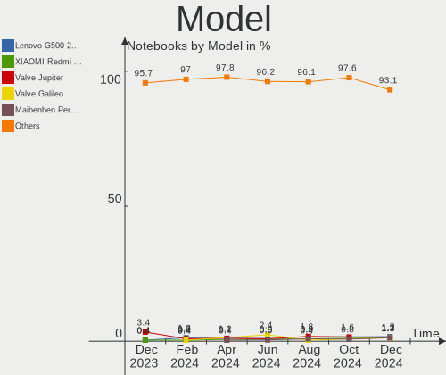
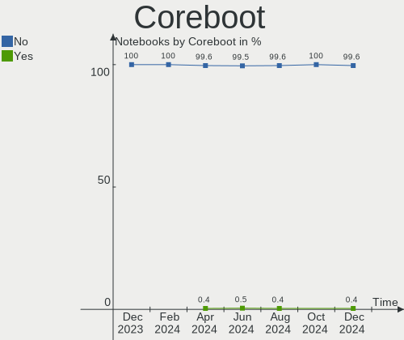
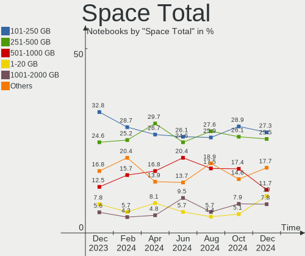
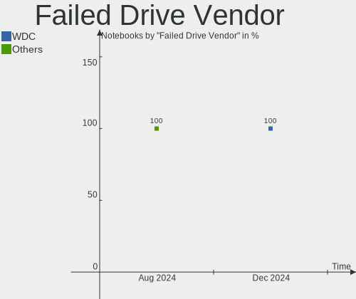
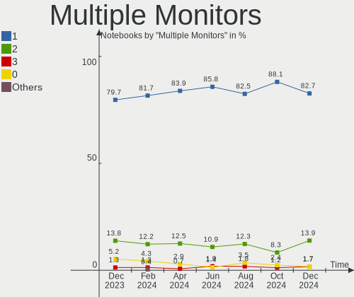
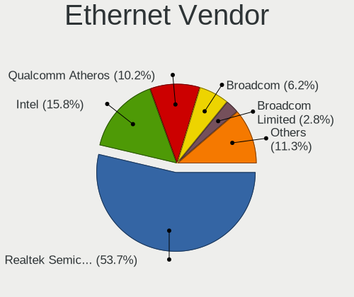
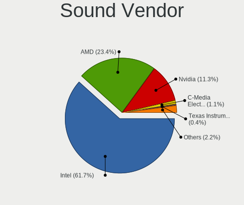
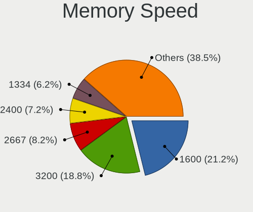
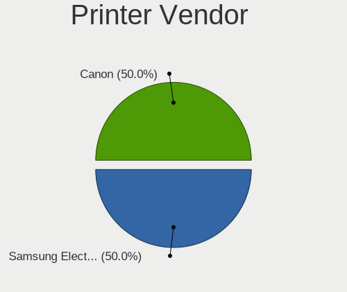
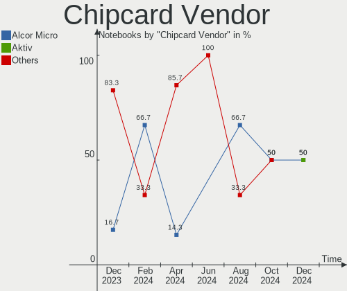

Linux in Russia - Hardware Trends (Notebooks)
---------------------------------------------

A project to identify most popular hardware characteristics and track their change
over time based on data collected by Linux users at https://Linux-Hardware.org.

Anyone can contribute to this report by the [hw-probe](https://github.com/linuxhw/hw-probe) tool:

    sudo -E hw-probe -all -upload

Contents
--------

* [ System ](#system)
  - [ OS                       ](#os)
  - [ OS Family                ](#os-family)
  - [ Kernel                   ](#kernel)
  - [ Kernel Family            ](#kernel-family)
  - [ Kernel Major Ver.        ](#kernel-major-ver)
  - [ Arch                     ](#arch)
  - [ DE                       ](#de)
  - [ Display Server           ](#display-server)
  - [ Display Manager          ](#display-manager)
  - [ OS Lang                  ](#os-lang)
  - [ Boot Mode                ](#boot-mode)
  - [ Filesystem               ](#filesystem)
  - [ Part. scheme             ](#part-scheme)
  - [ Dual Boot with Linux/BSD ](#dual-boot-with-linuxbsd)
  - [ Dual Boot (Win)          ](#dual-boot-win)

* [ Board ](#board)
  - [ Vendor                   ](#vendor)
  - [ Model                    ](#model)
  - [ Model Family             ](#model-family)
  - [ MFG Year                 ](#mfg-year)
  - [ Form Factor              ](#form-factor)
  - [ Secure Boot              ](#secure-boot)
  - [ Coreboot                 ](#coreboot)
  - [ RAM Size                 ](#ram-size)
  - [ RAM Used                 ](#ram-used)
  - [ Total Drives             ](#total-drives)
  - [ Has CD-ROM               ](#has-cd-rom)
  - [ Has Ethernet             ](#has-ethernet)
  - [ Has WiFi                 ](#has-wifi)
  - [ Has Bluetooth            ](#has-bluetooth)

* [ Location ](#location)
  - [ Country                  ](#country)
  - [ City                     ](#city)

* [ Drives ](#drives)
  - [ Drive Vendor             ](#drive-vendor)
  - [ Drive Model              ](#drive-model)
  - [ HDD Vendor               ](#hdd-vendor)
  - [ SSD Vendor               ](#ssd-vendor)
  - [ Drive Kind               ](#drive-kind)
  - [ Drive Connector          ](#drive-connector)
  - [ Drive Size               ](#drive-size)
  - [ Space Total              ](#space-total)
  - [ Space Used               ](#space-used)
  - [ Malfunc. Drives          ](#malfunc-drives)
  - [ Malfunc. Drive Vendor    ](#malfunc-drive-vendor)
  - [ Malfunc. HDD Vendor      ](#malfunc-hdd-vendor)
  - [ Malfunc. Drive Kind      ](#malfunc-drive-kind)
  - [ Failed Drives            ](#failed-drives)
  - [ Failed Drive Vendor      ](#failed-drive-vendor)
  - [ Drive Status             ](#drive-status)

* [ Storage controller ](#storage-controller)
  - [ Storage Vendor           ](#storage-vendor)
  - [ Storage Model            ](#storage-model)
  - [ Storage Kind             ](#storage-kind)

* [ Processor ](#processor)
  - [ CPU Vendor               ](#cpu-vendor)
  - [ CPU Model                ](#cpu-model)
  - [ CPU Model Family         ](#cpu-model-family)
  - [ CPU Cores                ](#cpu-cores)
  - [ CPU Sockets              ](#cpu-sockets)
  - [ CPU Threads              ](#cpu-threads)
  - [ CPU Op-Modes             ](#cpu-op-modes)
  - [ CPU Microcode            ](#cpu-microcode)
  - [ CPU Microarch            ](#cpu-microarch)

* [ Graphics ](#graphics)
  - [ GPU Vendor               ](#gpu-vendor)
  - [ GPU Model                ](#gpu-model)
  - [ GPU Combo                ](#gpu-combo)
  - [ GPU Driver               ](#gpu-driver)
  - [ GPU Memory               ](#gpu-memory)

* [ Monitor ](#monitor)
  - [ Monitor Vendor           ](#monitor-vendor)
  - [ Monitor Model            ](#monitor-model)
  - [ Monitor Resolution       ](#monitor-resolution)
  - [ Monitor Diagonal         ](#monitor-diagonal)
  - [ Monitor Width            ](#monitor-width)
  - [ Aspect Ratio             ](#aspect-ratio)
  - [ Monitor Area             ](#monitor-area)
  - [ Pixel Density            ](#pixel-density)
  - [ Multiple Monitors        ](#multiple-monitors)

* [ Network ](#network)
  - [ Net Controller Vendor    ](#net-controller-vendor)
  - [ Net Controller Model     ](#net-controller-model)
  - [ Wireless Vendor          ](#wireless-vendor)
  - [ Wireless Model           ](#wireless-model)
  - [ Ethernet Vendor          ](#ethernet-vendor)
  - [ Ethernet Model           ](#ethernet-model)
  - [ Net Controller Kind      ](#net-controller-kind)
  - [ Used Controller          ](#used-controller)
  - [ NICs                     ](#nics)
  - [ IPv6                     ](#ipv6)

* [ Bluetooth ](#bluetooth)
  - [ Bluetooth Vendor         ](#bluetooth-vendor)
  - [ Bluetooth Model          ](#bluetooth-model)

* [ Sound ](#sound)
  - [ Sound Vendor             ](#sound-vendor)
  - [ Sound Model              ](#sound-model)

* [ Memory ](#memory)
  - [ Memory Vendor            ](#memory-vendor)
  - [ Memory Model             ](#memory-model)
  - [ Memory Kind              ](#memory-kind)
  - [ Memory Form Factor       ](#memory-form-factor)
  - [ Memory Size              ](#memory-size)
  - [ Memory Speed             ](#memory-speed)

* [ Printers & scanners ](#printers--scanners)
  - [ Printer Vendor           ](#printer-vendor)
  - [ Printer Model            ](#printer-model)
  - [ Scanner Vendor           ](#scanner-vendor)
  - [ Scanner Model            ](#scanner-model)

* [ Camera ](#camera)
  - [ Camera Vendor            ](#camera-vendor)
  - [ Camera Model             ](#camera-model)

* [ Security ](#security)
  - [ Fingerprint Vendor       ](#fingerprint-vendor)
  - [ Fingerprint Model        ](#fingerprint-model)
  - [ Chipcard Vendor          ](#chipcard-vendor)
  - [ Chipcard Model           ](#chipcard-model)

* [ Unsupported ](#unsupported)
  - [ Unsupported Devices      ](#unsupported-devices)
  - [ Unsupported Device Types ](#unsupported-device-types)

System
------

OS
--

Installed operating systems

| Name               | Notebooks | Percent |
|--------------------|-----------|---------|
| ROSA 12.2          | 159       | 43.92%  |
| Kometa P10         | 48        | 13.26%  |
| Ubuntu 20.04       | 19        | 5.25%   |
| ROSA R11.1         | 17        | 4.7%    |
| Debian 11          | 15        | 4.14%   |
| Linux Mint 20.3    | 10        | 2.76%   |
| KDE neon 20.04     | 9         | 2.49%   |
| Fedora 35          | 9         | 2.49%   |
| Ubuntu 22.04       | 7         | 1.93%   |
| OpenMandriva 4.3   | 6         | 1.66%   |
| Ubuntu 21.10       | 4         | 1.1%    |
| Arch Rolling       | 4         | 1.1%    |
| Red OS 7.3.1       | 3         | 0.83%   |
| Pop!_OS 21.10      | 3         | 0.83%   |
| Manjaro            | 3         | 0.83%   |
| Fedora 36          | 3         | 0.83%   |
| Debian Testing     | 3         | 0.83%   |
| ALT Linux 10.0     | 3         | 0.83%   |
| Zorin 16           | 2         | 0.55%   |
| Xubuntu 22.04      | 2         | 0.55%   |
| Xubuntu 20.04      | 2         | 0.55%   |
| ROSA 12.1          | 2         | 0.55%   |
| Kubuntu 20.04      | 2         | 0.55%   |
| Kali 2022.1        | 2         | 0.55%   |
| Elementary 6.1     | 2         | 0.55%   |
| Arch               | 2         | 0.55%   |
| Xubuntu 18.04      | 1         | 0.28%   |
| Ubuntu MATE 18.04  | 1         | 0.28%   |
| ROSA R11           | 1         | 0.28%   |
| ROSA 2019.05       | 1         | 0.28%   |
| RELD 7.9           | 1         | 0.28%   |
| PureOS 10          | 1         | 0.28%   |
| openSUSE 20220407  | 1         | 0.28%   |
| OpenMandriva 4.2   | 1         | 0.28%   |
| Manjaro 21.2.6     | 1         | 0.28%   |
| Manjaro 21.2.5     | 1         | 0.28%   |
| LMDE 5             | 1         | 0.28%   |
| LMDE 4             | 1         | 0.28%   |
| Linux Mint 20      | 1         | 0.28%   |
| Linux Mint 18.3    | 1         | 0.28%   |
| Kubuntu 22.04      | 1         | 0.28%   |
| Gentoo 2.6         | 1         | 0.28%   |
| Deepin 20.5        | 1         | 0.28%   |
| Debian 8           | 1         | 0.28%   |
| CentOS 7           | 1         | 0.28%   |
| Calculate 22.0.1   | 1         | 0.28%   |
| ALT Linux 20201124 | 1         | 0.28%   |

OS Family
---------

OS without a version

| Name         | Notebooks | Percent |
|--------------|-----------|---------|
| ROSA         | 180       | 49.72%  |
| ALT Linux    | 52        | 14.36%  |
| Ubuntu       | 30        | 8.29%   |
| Debian       | 19        | 5.25%   |
| Linux Mint   | 12        | 3.31%   |
| Fedora       | 12        | 3.31%   |
| KDE neon     | 9         | 2.49%   |
| OpenMandriva | 7         | 1.93%   |
| Arch         | 6         | 1.66%   |
| Xubuntu      | 5         | 1.38%   |
| Manjaro      | 5         | 1.38%   |
| Red OS       | 3         | 0.83%   |
| Pop!_OS      | 3         | 0.83%   |
| Kubuntu      | 3         | 0.83%   |
| Zorin        | 2         | 0.55%   |
| LMDE         | 2         | 0.55%   |
| Kali         | 2         | 0.55%   |
| Elementary   | 2         | 0.55%   |
| Ubuntu MATE  | 1         | 0.28%   |
| RELD         | 1         | 0.28%   |
| PureOS       | 1         | 0.28%   |
| openSUSE     | 1         | 0.28%   |
| Gentoo       | 1         | 0.28%   |
| Deepin       | 1         | 0.28%   |
| CentOS       | 1         | 0.28%   |
| Calculate    | 1         | 0.28%   |

Kernel
------

Version of the Linux kernel

| Version                                    | Notebooks | Percent |
|--------------------------------------------|-----------|---------|
| 5.10.74-generic-2rosa2021.1-x86_64         | 129       | 35.64%  |
| 5.10.102-std-def-alt1                      | 31        | 8.56%   |
| 5.13.0-39-generic                          | 23        | 6.35%   |
| 5.10.109-std-def-alt1                      | 17        | 4.7%    |
| 5.15.32-generic-5rosa2021.1-x86_64         | 11        | 3.04%   |
| 5.13.0-40-generic                          | 9         | 2.49%   |
| 5.10.0-7-amd64                             | 7         | 1.93%   |
| 5.4.32-generic-2rosa-x86_64                | 6         | 1.66%   |
| 5.4.0-107-generic                          | 6         | 1.66%   |
| 5.16.7-desktop-1omv4003                    | 6         | 1.66%   |
| 5.10.74-generic-2rosa2021.1-i586           | 6         | 1.66%   |
| 5.15.0-25-generic                          | 5         | 1.38%   |
| 5.4.83-generic-2rosa-i586                  | 4         | 1.1%    |
| 5.10.0-13-amd64                            | 4         | 1.1%    |
| 5.4.83-generic-2rosa-x86_64                | 3         | 0.83%   |
| 5.4.0-109-generic                          | 3         | 0.83%   |
| 5.16.18-200.fc35.x86_64                    | 3         | 0.83%   |
| 5.16.0-6-amd64                             | 3         | 0.83%   |
| 5.15.32-generic-6rosa2021.1-x86_64         | 3         | 0.83%   |
| 5.15.0-27-generic                          | 3         | 0.83%   |
| 4.15.0-desktop-122.124.1rosa-x86_64        | 3         | 0.83%   |
| 5.17.4-200.fc35.x86_64                     | 2         | 0.55%   |
| 5.17.3-arch1-1                             | 2         | 0.55%   |
| 5.17.1-arch1-1                             | 2         | 0.55%   |
| 5.16.20-200.fc35.x86_64                    | 2         | 0.55%   |
| 5.16.18-generic-1rosa2021.1-x86_64         | 2         | 0.55%   |
| 5.16.16.xm1-1.klp-xanmod-rosa2021.1-x86_64 | 2         | 0.55%   |
| 5.16.15-76051615-generic                   | 2         | 0.55%   |
| 5.15.32-1-MANJARO                          | 2         | 0.55%   |
| 5.15.28-1-MANJARO                          | 2         | 0.55%   |
| 5.15.10-4.el7.x86_64                       | 2         | 0.55%   |
| 5.10.0-13-686                              | 2         | 0.55%   |
| 5.6.19-050619-generic                      | 1         | 0.28%   |
| 5.4.32-generic-2rosa-i586                  | 1         | 0.28%   |
| 5.4.139-nickel-4rosa2019.05-x86_64         | 1         | 0.28%   |
| 5.4.0-91-generic                           | 1         | 0.28%   |
| 5.4.0-26-generic                           | 1         | 0.28%   |
| 5.4.0-105-generic                          | 1         | 0.28%   |
| 5.17.5-zen1-1-zen                          | 1         | 0.28%   |
| 5.17.3-302.fc36.x86_64                     | 1         | 0.28%   |
| 5.17.2-xanmod1-1                           | 1         | 0.28%   |
| 5.17.2-300.fc36.x86_64                     | 1         | 0.28%   |
| 5.17.1-1-default                           | 1         | 0.28%   |
| 5.17.0-ashpy3-lyesdef                      | 1         | 0.28%   |
| 5.17.0-0.rc7.116.fc36.x86_64               | 1         | 0.28%   |
| 5.16.19-200.fc35.x86_64                    | 1         | 0.28%   |
| 5.16.18-generic-4rosa2021.1-x86_64         | 1         | 0.28%   |
| 5.16.18-generic-2rosa2021.1-x86_64         | 1         | 0.28%   |
| 5.16.16-zen1-1-zen                         | 1         | 0.28%   |
| 5.16.11-76051611-generic                   | 1         | 0.28%   |
| 5.16.0-kali7-amd64                         | 1         | 0.28%   |
| 5.16.0-kali6-amd64                         | 1         | 0.28%   |
| 5.16.0-0.bpo.4-amd64                       | 1         | 0.28%   |
| 5.15.34-un-def-alt1                        | 1         | 0.28%   |
| 5.15.33-un-def-alt1                        | 1         | 0.28%   |
| 5.15.33-1.res7.x86_64                      | 1         | 0.28%   |
| 5.15.32-xm1tt.0.fc35.x86_64                | 1         | 0.28%   |
| 5.15.32-xanmod1                            | 1         | 0.28%   |
| 5.15.32-generic-5rosa2021.1-i686           | 1         | 0.28%   |
| 5.15.32-generic-1rosa2021.1-x86_64         | 1         | 0.28%   |

Kernel Family
-------------

Linux kernel without a distro release

| Version  | Notebooks | Percent |
|----------|-----------|---------|
| 5.10.74  | 135       | 37.29%  |
| 5.13.0   | 34        | 9.39%   |
| 5.10.102 | 31        | 8.56%   |
| 5.15.32  | 20        | 5.52%   |
| 5.10.109 | 17        | 4.7%    |
| 5.10.0   | 17        | 4.7%    |
| 5.4.0    | 12        | 3.31%   |
| 5.15.0   | 8         | 2.21%   |
| 5.4.83   | 7         | 1.93%   |
| 5.4.32   | 7         | 1.93%   |
| 5.16.18  | 7         | 1.93%   |
| 5.16.7   | 6         | 1.66%   |
| 5.16.0   | 6         | 1.66%   |
| 4.15.0   | 5         | 1.38%   |
| 5.15.28  | 4         | 1.1%    |
| 5.17.3   | 3         | 0.83%   |
| 5.17.1   | 3         | 0.83%   |
| 5.16.16  | 3         | 0.83%   |
| 5.15.10  | 3         | 0.83%   |
| 5.17.4   | 2         | 0.55%   |
| 5.17.2   | 2         | 0.55%   |
| 5.17.0   | 2         | 0.55%   |
| 5.16.20  | 2         | 0.55%   |
| 5.16.15  | 2         | 0.55%   |
| 5.15.33  | 2         | 0.55%   |
| 5.14.0   | 2         | 0.55%   |
| 5.10.101 | 2         | 0.55%   |
| 5.6.19   | 1         | 0.28%   |
| 5.4.139  | 1         | 0.28%   |
| 5.17.5   | 1         | 0.28%   |
| 5.16.19  | 1         | 0.28%   |
| 5.16.11  | 1         | 0.28%   |
| 5.15.34  | 1         | 0.28%   |
| 5.15.29  | 1         | 0.28%   |
| 5.15.26  | 1         | 0.28%   |
| 5.13.19  | 1         | 0.28%   |
| 5.10.71  | 1         | 0.28%   |
| 5.10.61  | 1         | 0.28%   |
| 5.10.14  | 1         | 0.28%   |
| 5.10.111 | 1         | 0.28%   |
| 4.7.10   | 1         | 0.28%   |
| 4.4.0    | 1         | 0.28%   |
| 4.19.0   | 1         | 0.28%   |
| 3.10.0   | 1         | 0.28%   |
| 3.0.21   | 1         | 0.28%   |

Kernel Major Ver.
-----------------

Linux kernel major version

| Version | Notebooks | Percent |
|---------|-----------|---------|
| 5.10    | 206       | 56.91%  |
| 5.15    | 40        | 11.05%  |
| 5.13    | 35        | 9.67%   |
| 5.16    | 28        | 7.73%   |
| 5.4     | 27        | 7.46%   |
| 5.17    | 13        | 3.59%   |
| 4.15    | 5         | 1.38%   |
| 5.14    | 2         | 0.55%   |
| 5.6     | 1         | 0.28%   |
| 4.7     | 1         | 0.28%   |
| 4.4     | 1         | 0.28%   |
| 4.19    | 1         | 0.28%   |
| 3.10    | 1         | 0.28%   |
| 3.0     | 1         | 0.28%   |

Arch
----

OS architecture (x86_64, i586, etc.)

| Name   | Notebooks | Percent |
|--------|-----------|---------|
| x86_64 | 345       | 95.3%   |
| i686   | 16        | 4.42%   |
| armv7l | 1         | 0.28%   |

DE
--

Desktop Environment

| Name          | Notebooks | Percent |
|---------------|-----------|---------|
| KDE5          | 156       | 43.09%  |
| GNOME         | 111       | 30.66%  |
| LXQt          | 34        | 9.39%   |
| KDE4          | 14        | 3.87%   |
| XFCE          | 12        | 3.31%   |
| Unknown       | 11        | 3.04%   |
| X-Cinnamon    | 8         | 2.21%   |
| MATE          | 6         | 1.66%   |
| Cinnamon      | 5         | 1.38%   |
| Pantheon      | 2         | 0.55%   |
| i3            | 1         | 0.28%   |
| GNOME Classic | 1         | 0.28%   |
| Deepin        | 1         | 0.28%   |

Display Server
--------------

X11 or Wayland

| Name    | Notebooks | Percent |
|---------|-----------|---------|
| X11     | 184       | 50.83%  |
| Wayland | 168       | 46.41%  |
| Unknown | 8         | 2.21%   |
| Tty     | 2         | 0.55%   |

Display Manager
---------------

SDDM, LightDM, etc.

| Name    | Notebooks | Percent |
|---------|-----------|---------|
| SDDM    | 143       | 39.5%   |
| GDM     | 108       | 29.83%  |
| Unknown | 41        | 11.33%  |
| LightDM | 34        | 9.39%   |
| GDM3    | 21        | 5.8%    |
| KDM     | 14        | 3.87%   |
| XDM     | 1         | 0.28%   |

OS Lang
-------

Language

| Lang    | Notebooks | Percent |
|---------|-----------|---------|
| ru_RU   | 295       | 81.49%  |
| en_US   | 54        | 14.92%  |
| Unknown | 5         | 1.38%   |
| en_GB   | 2         | 0.55%   |
| C       | 2         | 0.55%   |
| zh_CN   | 1         | 0.28%   |
| en_CA   | 1         | 0.28%   |
| C.UTF8  | 1         | 0.28%   |
| ba_RU   | 1         | 0.28%   |

Boot Mode
---------

EFI or BIOS

| Mode | Notebooks | Percent |
|------|-----------|---------|
| EFI  | 222       | 61.33%  |
| BIOS | 140       | 38.67%  |

Filesystem
----------

Type of filesystem

| Type    | Notebooks | Percent |
|---------|-----------|---------|
| Ext4    | 321       | 88.67%  |
| Btrfs   | 19        | 5.25%   |
| Overlay | 18        | 4.97%   |
| Xfs     | 2         | 0.55%   |
| XXXXXXX | 1         | 0.28%   |
| Aufs    | 1         | 0.28%   |

Part. scheme
------------

Scheme of partitioning

| Type    | Notebooks | Percent |
|---------|-----------|---------|
| GPT     | 224       | 61.88%  |
| MBR     | 87        | 24.03%  |
| Unknown | 51        | 14.09%  |

Dual Boot with Linux/BSD
------------------------

Hosting more than one Linux/BSD

| Dual boot | Notebooks | Percent |
|-----------|-----------|---------|
| No        | 307       | 84.81%  |
| Yes       | 55        | 15.19%  |

Dual Boot (Win)
---------------

Hosting Linux and Windows

| Dual boot | Notebooks | Percent |
|-----------|-----------|---------|
| No        | 207       | 57.18%  |
| Yes       | 155       | 42.82%  |

Board
-----

Vendor
------

Motherboard manufacturer

| Name                | Notebooks | Percent |
|---------------------|-----------|---------|
| Hewlett-Packard     | 87        | 24.03%  |
| ASUSTek Computer    | 54        | 14.92%  |
| Acer                | 52        | 14.36%  |
| Lenovo              | 50        | 13.81%  |
| Dell                | 30        | 8.29%   |
| Samsung Electronics | 15        | 4.14%   |
| MSI                 | 11        | 3.04%   |
| Sony                | 6         | 1.66%   |
| ICL                 | 6         | 1.66%   |
| HUAWEI              | 6         | 1.66%   |
| Toshiba             | 5         | 1.38%   |
| Packard Bell        | 5         | 1.38%   |
| eMachines           | 5         | 1.38%   |
| Apple               | 5         | 1.38%   |
| Timi                | 2         | 0.55%   |
| ONDA                | 2         | 0.55%   |
| Maibenben           | 2         | 0.55%   |
| HONOR               | 2         | 0.55%   |
| Haier               | 2         | 0.55%   |
| DNS                 | 2         | 0.55%   |
| Unknown             | 2         | 0.55%   |
| SLIMBOOK            | 1         | 0.28%   |
| Pegatron            | 1         | 0.28%   |
| Notebook            | 1         | 0.28%   |
| Jumper              | 1         | 0.28%   |
| iRU                 | 1         | 0.28%   |
| Irbis               | 1         | 0.28%   |
| Insignia            | 1         | 0.28%   |
| Gigabyte Technology | 1         | 0.28%   |
| Fujitsu             | 1         | 0.28%   |
| Digma               | 1         | 0.28%   |
| Clevo               | 1         | 0.28%   |

Model
-----

Motherboard model

| Name                                                                                     | Notebooks | Percent |
|------------------------------------------------------------------------------------------|-----------|---------|
| HP 250 G7 Notebook PC                                                                    | 12        | 3.31%   |
| HP ProBook 440 G5                                                                        | 8         | 2.21%   |
| ICL RAYbook Si1512                                                                       | 6         | 1.66%   |
| HP ZBook 17 G5                                                                           | 6         | 1.66%   |
| HP 250 G6 Notebook PC                                                                    | 5         | 1.38%   |
| HP Notebook                                                                              | 4         | 1.1%    |
| HP Laptop 15-bw0xx                                                                       | 4         | 1.1%    |
| HP EliteBook 840 G4                                                                      | 4         | 1.1%    |
| Dell Latitude 3420                                                                       | 4         | 1.1%    |
| Unknown                                                                                  | 4         | 1.1%    |
| Timi TM1701                                                                              | 2         | 0.55%   |
| Samsung R425D/R525D                                                                      | 2         | 0.55%   |
| ONDA OBOOK 20 PLUS                                                                       | 2         | 0.55%   |
| Lenovo V570c HuronRiver Platform                                                         | 2         | 0.55%   |
| Lenovo IdeaPad Z570 HuronRiver Platform                                                  | 2         | 0.55%   |
| Lenovo G570 20079                                                                        | 2         | 0.55%   |
| Lenovo B590 20206                                                                        | 2         | 0.55%   |
| HUAWEI KLVL-WXXW                                                                         | 2         | 0.55%   |
| HP ProBook 440 G7                                                                        | 2         | 0.55%   |
| HP Pavilion 15                                                                           | 2         | 0.55%   |
| HP Laptop 15s-fq2xxx                                                                     | 2         | 0.55%   |
| HP Laptop 15s-eq1xxx                                                                     | 2         | 0.55%   |
| HP Laptop 15-db1xxx                                                                      | 2         | 0.55%   |
| HP Laptop 14s-fq0xxx                                                                     | 2         | 0.55%   |
| Dell Inspiron N5050                                                                      | 2         | 0.55%   |
| ASUS ZenBook UX425EA_UX425EA                                                             | 2         | 0.55%   |
| ASUS X553MA                                                                              | 2         | 0.55%   |
| ASUS VivoBook_ASUSLaptop M3500QA_M3500QA                                                 | 2         | 0.55%   |
| ASUS ASUS TUF Gaming A17 FA706IC_FA706IC                                                 | 2         | 0.55%   |
| ASUS 1011PX                                                                              | 2         | 0.55%   |
| Acer TravelMate 5760                                                                     | 2         | 0.55%   |
| Acer Swift SF314-43                                                                      | 2         | 0.55%   |
| Acer Aspire A317-32                                                                      | 2         | 0.55%   |
| Acer Aspire A315-42G                                                                     | 2         | 0.55%   |
| Acer AOD270                                                                              | 2         | 0.55%   |
| Toshiba Satellite U300                                                                   | 1         | 0.28%   |
| Toshiba Satellite Pro L300                                                               | 1         | 0.28%   |
| Toshiba Satellite P200                                                                   | 1         | 0.28%   |
| Toshiba Satellite L655                                                                   | 1         | 0.28%   |
| Toshiba QOSMIO F60                                                                       | 1         | 0.28%   |
| Sony VPCEH3F1R                                                                           | 1         | 0.28%   |
| Sony VGN-TT31MR_N                                                                        | 1         | 0.28%   |
| Sony VGN-P688E                                                                           | 1         | 0.28%   |
| Sony VGN-NR31ZR_S                                                                        | 1         | 0.28%   |
| Sony SVE1712V1RB                                                                         | 1         | 0.28%   |
| Sony SVE1512H1RW                                                                         | 1         | 0.28%   |
| SLIMBOOK PROX15-AMD                                                                      | 1         | 0.28%   |
| Samsung RV411/RV511/E3511/S3511/RV711                                                    | 1         | 0.28%   |
| Samsung R519/R719                                                                        | 1         | 0.28%   |
| Samsung R19/R20/R21                                                                      | 1         | 0.28%   |
| Samsung NC210/NC110                                                                      | 1         | 0.28%   |
| Samsung NB30P                                                                            | 1         | 0.28%   |
| Samsung N150/N210/N220                                                                   | 1         | 0.28%   |
| Samsung 700T                                                                             | 1         | 0.28%   |
| Samsung 530U3BI/530U4BI/530U4BH                                                          | 1         | 0.28%   |
| Samsung 3570R/370R/470R/450R/510R/4450RV                                                 | 1         | 0.28%   |
| Samsung 355V4C/355V4X/355V5C/355V5X/356V4C/356V4X/356V5C/356V5X/3445VC/3445VX/3545VC/354 | 1         | 0.28%   |
| Samsung 350V5C/351V5C/3540VC/3440VC                                                      | 1         | 0.28%   |
| Samsung 300V3A/300V4A/300V5A/200A4B/200A5B                                               | 1         | 0.28%   |
| Samsung 300V3A/300V4A/300V5A                                                             | 1         | 0.28%   |

Model Family
------------

Motherboard model prefix

| Name                  | Notebooks | Percent |
|-----------------------|-----------|---------|
| Acer Aspire           | 33        | 9.12%   |
| HP ProBook            | 20        | 5.52%   |
| Lenovo IdeaPad        | 19        | 5.25%   |
| HP 250                | 17        | 4.7%    |
| HP Laptop             | 16        | 4.42%   |
| HP Pavilion           | 11        | 3.04%   |
| Dell Latitude         | 11        | 3.04%   |
| Lenovo ThinkPad       | 10        | 2.76%   |
| Dell Inspiron         | 7         | 1.93%   |
| ICL RAYbook           | 6         | 1.66%   |
| HP ZBook              | 6         | 1.66%   |
| HP EliteBook          | 6         | 1.66%   |
| ASUS VivoBook         | 6         | 1.66%   |
| ASUS ASUS             | 6         | 1.66%   |
| Acer TravelMate       | 6         | 1.66%   |
| Packard Bell EasyNote | 5         | 1.38%   |
| Dell Vostro           | 5         | 1.38%   |
| ASUS ZenBook          | 5         | 1.38%   |
| Toshiba Satellite     | 4         | 1.1%    |
| HP Notebook           | 4         | 1.1%    |
| Unknown               | 4         | 1.1%    |
| Lenovo ThinkBook      | 3         | 0.83%   |
| HP ENVY               | 3         | 0.83%   |
| Dell Precision        | 3         | 0.83%   |
| Acer Swift            | 3         | 0.83%   |
| Acer Nitro            | 3         | 0.83%   |
| Timi TM1701           | 2         | 0.55%   |
| Samsung R425D         | 2         | 0.55%   |
| Samsung 300V3A        | 2         | 0.55%   |
| ONDA OBOOK            | 2         | 0.55%   |
| Lenovo V570c          | 2         | 0.55%   |
| Lenovo Legion         | 2         | 0.55%   |
| Lenovo G570           | 2         | 0.55%   |
| Lenovo B590           | 2         | 0.55%   |
| HUAWEI KLVL-WXXW      | 2         | 0.55%   |
| Dell XPS              | 2         | 0.55%   |
| ASUS X553MA           | 2         | 0.55%   |
| ASUS TUF              | 2         | 0.55%   |
| ASUS ROG              | 2         | 0.55%   |
| ASUS 1011PX           | 2         | 0.55%   |
| Acer AOD270           | 2         | 0.55%   |
| Toshiba QOSMIO        | 1         | 0.28%   |
| Sony VPCEH3F1R        | 1         | 0.28%   |
| Sony VGN-TT31MR       | 1         | 0.28%   |
| Sony VGN-P688E        | 1         | 0.28%   |
| Sony VGN-NR31ZR       | 1         | 0.28%   |
| Sony SVE1712V1RB      | 1         | 0.28%   |
| Sony SVE1512H1RW      | 1         | 0.28%   |
| SLIMBOOK PROX15-AMD   | 1         | 0.28%   |
| Samsung RV411         | 1         | 0.28%   |
| Samsung R519          | 1         | 0.28%   |
| Samsung R19           | 1         | 0.28%   |
| Samsung NC210         | 1         | 0.28%   |
| Samsung NB30P         | 1         | 0.28%   |
| Samsung N150          | 1         | 0.28%   |
| Samsung 700T          | 1         | 0.28%   |
| Samsung 530U3BI       | 1         | 0.28%   |
| Samsung 3570R         | 1         | 0.28%   |
| Samsung 355V4C        | 1         | 0.28%   |
| Samsung 350V5C        | 1         | 0.28%   |

MFG Year
--------

Motherboard manufacture year

| Year    | Notebooks | Percent |
|---------|-----------|---------|
| 2021    | 42        | 11.6%   |
| 2018    | 35        | 9.67%   |
| 2017    | 33        | 9.12%   |
| 2011    | 32        | 8.84%   |
| 2019    | 31        | 8.56%   |
| 2012    | 30        | 8.29%   |
| 2020    | 28        | 7.73%   |
| 2010    | 25        | 6.91%   |
| 2013    | 20        | 5.52%   |
| 2016    | 18        | 4.97%   |
| 2009    | 17        | 4.7%    |
| 2015    | 16        | 4.42%   |
| 2008    | 11        | 3.04%   |
| 2014    | 10        | 2.76%   |
| 2007    | 10        | 2.76%   |
| 2006    | 2         | 0.55%   |
| 2022    | 1         | 0.28%   |
| Unknown | 1         | 0.28%   |

Form Factor
-----------

Physical design of the computer

| Name     | Notebooks | Percent |
|----------|-----------|---------|
| Notebook | 362       | 100%    |

Secure Boot
-----------

Enabled or disabled

| State    | Notebooks | Percent |
|----------|-----------|---------|
| Disabled | 330       | 91.16%  |
| Enabled  | 32        | 8.84%   |

Coreboot
--------

Have coreboot on board

| Used | Notebooks | Percent |
|------|-----------|---------|
| No   | 361       | 99.72%  |
| Yes  | 1         | 0.28%   |

RAM Size
--------

Total RAM memory

| Size in GB  | Notebooks | Percent |
|-------------|-----------|---------|
| 4.01-8.0    | 127       | 35.08%  |
| 3.01-4.0    | 84        | 23.2%   |
| 8.01-16.0   | 44        | 12.15%  |
| 16.01-24.0  | 42        | 11.6%   |
| 1.01-2.0    | 31        | 8.56%   |
| 32.01-64.0  | 13        | 3.59%   |
| 2.01-3.0    | 13        | 3.59%   |
| 24.01-32.0  | 4         | 1.1%    |
| 0.51-1.0    | 2         | 0.55%   |
| 64.01-256.0 | 1         | 0.28%   |
| 0.01-0.5    | 1         | 0.28%   |

RAM Used
--------

Used RAM memory

| Used GB    | Notebooks | Percent |
|------------|-----------|---------|
| 1.01-2.0   | 168       | 46.41%  |
| 0.51-1.0   | 74        | 20.44%  |
| 2.01-3.0   | 56        | 15.47%  |
| 3.01-4.0   | 27        | 7.46%   |
| 4.01-8.0   | 19        | 5.25%   |
| 8.01-16.0  | 10        | 2.76%   |
| 0.01-0.5   | 6         | 1.66%   |
| 16.01-24.0 | 1         | 0.28%   |
| Unknown    | 1         | 0.28%   |

Total Drives
------------

Number of drives on board

| Drives | Notebooks | Percent |
|--------|-----------|---------|
| 1      | 278       | 76.8%   |
| 2      | 72        | 19.89%  |
| 3      | 12        | 3.31%   |

Has CD-ROM
----------

Has CD-ROM on board

| Presented | Notebooks | Percent |
|-----------|-----------|---------|
| No        | 224       | 61.88%  |
| Yes       | 138       | 38.12%  |

Has Ethernet
------------

Has Ethernet on board

| Presented | Notebooks | Percent |
|-----------|-----------|---------|
| Yes       | 315       | 87.02%  |
| No        | 47        | 12.98%  |

Has WiFi
--------

Has WiFi module

| Presented | Notebooks | Percent |
|-----------|-----------|---------|
| Yes       | 356       | 98.34%  |
| No        | 6         | 1.66%   |

Has Bluetooth
-------------

Has Bluetooth module

| Presented | Notebooks | Percent |
|-----------|-----------|---------|
| Yes       | 268       | 74.03%  |
| No        | 94        | 25.97%  |

Location
--------

Country
-------

Geographic location (country)

| Country | Notebooks | Percent |
|---------|-----------|---------|
| Russia  | 362       | 100%    |

City
----

Geographic location (city)

| City             | Notebooks | Percent |
|------------------|-----------|---------|
| Moscow           | 123       | 33.98%  |
| St Petersburg    | 33        | 9.12%   |
| Voronezh         | 12        | 3.31%   |
| Yekaterinburg    | 11        | 3.04%   |
| Krasnodar        | 10        | 2.76%   |
| Samara           | 9         | 2.49%   |
| Novosibirsk      | 8         | 2.21%   |
| Chelyabinsk      | 6         | 1.66%   |
| Yaroslavl        | 5         | 1.38%   |
| Ufa              | 5         | 1.38%   |
| Rostov-on-Don    | 5         | 1.38%   |
| Nizhniy Novgorod | 5         | 1.38%   |
| Krasnoyarsk      | 5         | 1.38%   |
| Perm             | 4         | 1.1%    |
| Khabarovsk       | 4         | 1.1%    |
| Kaliningrad      | 4         | 1.1%    |
| Irkutsk          | 4         | 1.1%    |
| Barnaul          | 4         | 1.1%    |
| Stavropol        | 3         | 0.83%   |
| Severodvinsk     | 3         | 0.83%   |
| Petrozavodsk     | 3         | 0.83%   |
| Lipetsk          | 3         | 0.83%   |
| Belgorod         | 3         | 0.83%   |
| Zlatoust         | 2         | 0.55%   |
| Zhukovskiy       | 2         | 0.55%   |
| Yakutsk          | 2         | 0.55%   |
| Volgograd        | 2         | 0.55%   |
| Vladivostok      | 2         | 0.55%   |
| Veliky Novgorod  | 2         | 0.55%   |
| Ulan-Ude         | 2         | 0.55%   |
| Surgut           | 2         | 0.55%   |
| Smolensk         | 2         | 0.55%   |
| Pskov            | 2         | 0.55%   |
| Nizhnevartovsk   | 2         | 0.55%   |
| Mirny            | 2         | 0.55%   |
| Kirov            | 2         | 0.55%   |
| Khimki           | 2         | 0.55%   |
| Astrakhan        | 2         | 0.55%   |
| Zelenograd       | 1         | 0.28%   |
| Zelenodolsk      | 1         | 0.28%   |
| Vladimir         | 1         | 0.28%   |
| Verkhnyaya Tula  | 1         | 0.28%   |
| Ulyanovsk        | 1         | 0.28%   |
| Tyumen           | 1         | 0.28%   |
| Tuchkovo         | 1         | 0.28%   |
| Tomsk            | 1         | 0.28%   |
| Tambov           | 1         | 0.28%   |
| Sredneuralsk     | 1         | 0.28%   |
| Skolkovo         | 1         | 0.28%   |
| Shuvakish        | 1         | 0.28%   |
| Saratov          | 1         | 0.28%   |
| Ramenskoye       | 1         | 0.28%   |
| Privolzhskiy     | 1         | 0.28%   |
| Polevskoy        | 1         | 0.28%   |
| Plavsk           | 1         | 0.28%   |
| Petergof         | 1         | 0.28%   |
| Pangody          | 1         | 0.28%   |
| Oryol            | 1         | 0.28%   |
| Oktyabrsky       | 1         | 0.28%   |
| Odintsovo        | 1         | 0.28%   |

Drives
------

Drive Vendor
------------

Hard drive vendors

| Vendor                         | Notebooks | Drives | Percent |
|--------------------------------|-----------|--------|---------|
| WDC                            | 75        | 78     | 17.12%  |
| Seagate                        | 47        | 48     | 10.73%  |
| Samsung Electronics            | 45        | 46     | 10.27%  |
| Toshiba                        | 35        | 37     | 7.99%   |
| SK Hynix                       | 28        | 28     | 6.39%   |
| Kingston                       | 22        | 22     | 5.02%   |
| Intel                          | 22        | 23     | 5.02%   |
| SanDisk                        | 19        | 19     | 4.34%   |
| Unknown                        | 14        | 16     | 3.2%    |
| Hitachi                        | 13        | 13     | 2.97%   |
| SPCC                           | 8         | 9      | 1.83%   |
| HGST                           | 8         | 8      | 1.83%   |
| China                          | 8         | 8      | 1.83%   |
| Micron Technology              | 7         | 7      | 1.6%    |
| SSSTC                          | 6         | 6      | 1.37%   |
| KingSpec                       | 6         | 6      | 1.37%   |
| FOXLINE                        | 6         | 6      | 1.37%   |
| Transcend                      | 5         | 5      | 1.14%   |
| KIOXIA                         | 5         | 5      | 1.14%   |
| Crucial                        | 5         | 5      | 1.14%   |
| Apacer                         | 5         | 5      | 1.14%   |
| GOODRAM                        | 4         | 4      | 0.91%   |
| XrayDisk                       | 3         | 4      | 0.68%   |
| Smartbuy                       | 3         | 3      | 0.68%   |
| Phison                         | 3         | 3      | 0.68%   |
| KingDian                       | 3         | 3      | 0.68%   |
| AMD                            | 3         | 3      | 0.68%   |
| XPG                            | 2         | 2      | 0.46%   |
| UMIS                           | 2         | 2      | 0.46%   |
| OCZ                            | 2         | 2      | 0.46%   |
| Netac                          | 2         | 2      | 0.46%   |
| LONDISK                        | 2         | 2      | 0.46%   |
| Apple                          | 2         | 2      | 0.46%   |
| A-DATA Technology              | 2         | 2      | 0.46%   |
| Wdstars                        | 1         | 1      | 0.23%   |
| TMI                            | 1         | 1      | 0.23%   |
| SUNTRSI                        | 1         | 1      | 0.23%   |
| SP                             | 1         | 1      | 0.23%   |
| Solid State Storage Technology | 1         | 1      | 0.23%   |
| Patriot                        | 1         | 1      | 0.23%   |
| LITEONIT                       | 1         | 1      | 0.23%   |
| LITEON                         | 1         | 1      | 0.23%   |
| JMicron                        | 1         | 1      | 0.23%   |
| Hewlett-Packard                | 1         | 1      | 0.23%   |
| GS                             | 1         | 2      | 0.23%   |
| Gigabyte Technology            | 1         | 1      | 0.23%   |
| Fujitsu                        | 1         | 1      | 0.23%   |
| E535N                          | 1         | 1      | 0.23%   |
| Corsair                        | 1         | 1      | 0.23%   |
| BR                             | 1         | 1      | 0.23%   |

Drive Model
-----------

Hard drive models

| Model                                   | Notebooks | Percent |
|-----------------------------------------|-----------|---------|
| SK Hynix BC501 HFM256GDJTNG-8310A 256GB | 12        | 2.68%   |
| Intel SSDPEKKF256G7H 256GB              | 8         | 1.79%   |
| Toshiba MQ01ABF050 500GB                | 7         | 1.56%   |
| Seagate ST1000LM024 HN-M101MBB 1TB      | 6         | 1.34%   |
| Intel SSDPEMKF256G8H 256GB              | 6         | 1.34%   |
| FOXLINE FLSSD256M80E13TCX5 256GB        | 6         | 1.34%   |
| WDC WDS240G2G0A-00JH30 240GB SSD        | 5         | 1.12%   |
| Seagate ST1000LM049-2GH172 1TB          | 5         | 1.12%   |
| Seagate ST1000LM035-1RK172 1TB          | 5         | 1.12%   |
| Toshiba MQ04ABF100 1TB                  | 4         | 0.89%   |
| Micron 2210_MTFDHBA512QFD 512GB         | 4         | 0.89%   |
| WDC WDS120G2G0A-00JH30 120GB SSD        | 3         | 0.67%   |
| WDC WD5000LPVX-22V0TT0 500GB            | 3         | 0.67%   |
| WDC WD5000LPCX-21VHAT0 500GB            | 3         | 0.67%   |
| WDC WD3200BPVT-22JJ5T0 320GB            | 3         | 0.67%   |
| WDC WD10SPZX-24Z10 1TB                  | 3         | 0.67%   |
| WDC WD10SPZX-21Z10T0 1TB                | 3         | 0.67%   |
| Toshiba MQ01ABD075 752GB                | 3         | 0.67%   |
| Toshiba HDWL110 1TB                     | 3         | 0.67%   |
| SSSTC CL1-8D256-HP 256GB                | 3         | 0.67%   |
| SPCC Solid State Disk 256GB             | 3         | 0.67%   |
| Seagate ST9500325AS 500GB               | 3         | 0.67%   |
| Seagate ST9250315AS 250GB               | 3         | 0.67%   |
| Seagate ST500LT012-9WS142 500GB         | 3         | 0.67%   |
| Seagate ST500LT012-1DG142 500GB         | 3         | 0.67%   |
| Samsung SSD 970 EVO 1TB                 | 3         | 0.67%   |
| Samsung SSD 860 EVO 250GB               | 3         | 0.67%   |
| Samsung NVMe SSD Drive 512GB            | 3         | 0.67%   |
| Samsung HM321HI 320GB                   | 3         | 0.67%   |
| Kingston SA400S37240G 240GB SSD         | 3         | 0.67%   |
| Kingston NVMe SSD Drive 256GB           | 3         | 0.67%   |
| Intel NVMe SSD Drive 512GB              | 3         | 0.67%   |
| Apacer AS350 128GB SSD                  | 3         | 0.67%   |
| XrayDisk SSD 240GB                      | 2         | 0.45%   |
| WDC WDS120G2G0B-00EPW0 120GB SSD        | 2         | 0.45%   |
| WDC WD5000LPVX-00V0TT0 500GB            | 2         | 0.45%   |
| WDC WD5000LPLX-60ZNTT2 500GB            | 2         | 0.45%   |
| WDC WD2500BEVT-22A23T0 250GB            | 2         | 0.45%   |
| WDC WD1200UE-22KVT0 120GB               | 2         | 0.45%   |
| WDC WD10SPZX-60Z10T0 1TB                | 2         | 0.45%   |
| WDC WD10JPVX-22JC3T0 1TB                | 2         | 0.45%   |
| WDC PC SN530 SDBPNPZ-512G-1114 512GB    | 2         | 0.45%   |
| WDC PC SN530 SDBPMPZ-512G-1101 512GB    | 2         | 0.45%   |
| Unknown NCard  64GB                     | 2         | 0.45%   |
| Unknown MMC Card  4GB                   | 2         | 0.45%   |
| UMIS RPFTJ128PDD2EWX 128GB              | 2         | 0.45%   |
| Transcend TS240GMTS420S 240GB SSD       | 2         | 0.45%   |
| Toshiba MQ01ABD100 1TB                  | 2         | 0.45%   |
| Toshiba MK6465GSX 640GB                 | 2         | 0.45%   |
| Toshiba MK3259GSXP 320GB                | 2         | 0.45%   |
| Toshiba KXG50ZNV256G 256GB              | 2         | 0.45%   |
| SSSTC CL1-3D256-Q11 NVMe 256GB          | 2         | 0.45%   |
| SPCC Solid State Disk 128GB             | 2         | 0.45%   |
| SK Hynix HFM512GD3JX013N 512GB          | 2         | 0.45%   |
| Seagate ST9320325AS 320GB               | 2         | 0.45%   |
| Seagate ST500LM021-1KJ152 500GB         | 2         | 0.45%   |
| Seagate ST320LT020-9YG142 320GB         | 2         | 0.45%   |
| Seagate ST1000LM048-2E7172 1TB          | 2         | 0.45%   |
| SanDisk SSD G5 BICS4 500GB              | 2         | 0.45%   |
| SanDisk SD9SN8W-128G-1006 128GB SSD     | 2         | 0.45%   |

HDD Vendor
----------

Hard disk drive vendors

| Vendor              | Notebooks | Drives | Percent |
|---------------------|-----------|--------|---------|
| WDC                 | 53        | 53     | 34.42%  |
| Seagate             | 47        | 48     | 30.52%  |
| Toshiba             | 28        | 29     | 18.18%  |
| Hitachi             | 13        | 13     | 8.44%   |
| HGST                | 8         | 8      | 5.19%   |
| Samsung Electronics | 3         | 3      | 1.95%   |
| Unknown             | 1         | 1      | 0.65%   |
| Fujitsu             | 1         | 1      | 0.65%   |

SSD Vendor
----------

Solid state drive vendors

| Vendor              | Notebooks | Drives | Percent |
|---------------------|-----------|--------|---------|
| Samsung Electronics | 18        | 18     | 12.77%  |
| SanDisk             | 15        | 15     | 10.64%  |
| WDC                 | 13        | 13     | 9.22%   |
| Kingston            | 12        | 12     | 8.51%   |
| China               | 8         | 8      | 5.67%   |
| SPCC                | 7         | 8      | 4.96%   |
| KingSpec            | 6         | 6      | 4.26%   |
| Transcend           | 5         | 5      | 3.55%   |
| Crucial             | 5         | 5      | 3.55%   |
| SK Hynix            | 4         | 4      | 2.84%   |
| GOODRAM             | 4         | 4      | 2.84%   |
| Apacer              | 4         | 4      | 2.84%   |
| XrayDisk            | 3         | 3      | 2.13%   |
| Toshiba             | 3         | 4      | 2.13%   |
| Smartbuy            | 3         | 3      | 2.13%   |
| KingDian            | 3         | 3      | 2.13%   |
| OCZ                 | 2         | 2      | 1.42%   |
| Netac               | 2         | 2      | 1.42%   |
| LONDISK             | 2         | 2      | 1.42%   |
| Apple               | 2         | 2      | 1.42%   |
| AMD                 | 2         | 2      | 1.42%   |
| A-DATA Technology   | 2         | 2      | 1.42%   |
| Wdstars             | 1         | 1      | 0.71%   |
| TMI                 | 1         | 1      | 0.71%   |
| SUNTRSI             | 1         | 1      | 0.71%   |
| SSSTC               | 1         | 1      | 0.71%   |
| SP                  | 1         | 1      | 0.71%   |
| Patriot             | 1         | 1      | 0.71%   |
| Micron Technology   | 1         | 1      | 0.71%   |
| LITEONIT            | 1         | 1      | 0.71%   |
| LITEON              | 1         | 1      | 0.71%   |
| JMicron             | 1         | 1      | 0.71%   |
| Intel               | 1         | 1      | 0.71%   |
| Hewlett-Packard     | 1         | 1      | 0.71%   |
| GS                  | 1         | 2      | 0.71%   |
| E535N               | 1         | 1      | 0.71%   |
| Corsair             | 1         | 1      | 0.71%   |
| BR                  | 1         | 1      | 0.71%   |

Drive Kind
----------

HDD or SSD

| Kind    | Notebooks | Drives | Percent |
|---------|-----------|--------|---------|
| HDD     | 150       | 156    | 35.46%  |
| SSD     | 131       | 144    | 30.97%  |
| NVMe    | 126       | 133    | 29.79%  |
| MMC     | 15        | 17     | 3.55%   |
| Unknown | 1         | 1      | 0.24%   |

Drive Connector
---------------

SATA, SAS, NVMe, etc.

| Type | Notebooks | Drives | Percent |
|------|-----------|--------|---------|
| SATA | 250       | 294    | 62.81%  |
| NVMe | 126       | 133    | 31.66%  |
| MMC  | 15        | 17     | 3.77%   |
| SAS  | 7         | 7      | 1.76%   |

Drive Size
----------

Size of hard drive

| Size in TB | Notebooks | Drives | Percent |
|------------|-----------|--------|---------|
| 0.01-0.5   | 206       | 229    | 75.46%  |
| 0.51-1.0   | 64        | 68     | 23.44%  |
| 1.01-2.0   | 2         | 2      | 0.73%   |
| 3.01-4.0   | 1         | 1      | 0.37%   |

Space Total
-----------

Amount of disk space available on the file system

| Size in GB     | Notebooks | Percent |
|----------------|-----------|---------|
| 101-250        | 132       | 36.46%  |
| 251-500        | 80        | 22.1%   |
| 1-20           | 39        | 10.77%  |
| 51-100         | 33        | 9.12%   |
| 501-1000       | 28        | 7.73%   |
| 1001-2000      | 20        | 5.52%   |
| 21-50          | 15        | 4.14%   |
| Unknown        | 11        | 3.04%   |
| More than 3000 | 4         | 1.1%    |

Space Used
----------

Amount of used disk space

| Used GB        | Notebooks | Percent |
|----------------|-----------|---------|
| 1-20           | 218       | 60.22%  |
| 21-50          | 47        | 12.98%  |
| 101-250        | 30        | 8.29%   |
| 51-100         | 25        | 6.91%   |
| 251-500        | 13        | 3.59%   |
| 501-1000       | 11        | 3.04%   |
| Unknown        | 11        | 3.04%   |
| 1001-2000      | 6         | 1.66%   |
| More than 3000 | 1         | 0.28%   |

Malfunc. Drives
---------------

Drive models with a malfunction

| Model                                   | Notebooks | Drives | Percent |
|-----------------------------------------|-----------|--------|---------|
| WDC WD5000LPVX-22V0TT0 500GB            | 2         | 2      | 3.33%   |
| Seagate ST9500325AS 500GB               | 2         | 2      | 3.33%   |
| Seagate ST9320325AS 320GB               | 2         | 2      | 3.33%   |
| Seagate ST9250315AS 250GB               | 2         | 2      | 3.33%   |
| Seagate ST500LT012-9WS142 500GB         | 2         | 2      | 3.33%   |
| SanDisk SD9SN8W-128G-1006 128GB SSD     | 2         | 2      | 3.33%   |
| Samsung Electronics HM321HI 320GB       | 2         | 2      | 3.33%   |
| HGST HTS545050A7E680 500GB              | 2         | 2      | 3.33%   |
| WDC WDS240G2G0B-00EPW0 240GB SSD        | 1         | 1      | 1.67%   |
| WDC WDS120G2G0B-00EPW0 120GB SSD        | 1         | 1      | 1.67%   |
| WDC WD5000LPVX-00V0TT0 500GB            | 1         | 1      | 1.67%   |
| WDC WD5000LPLX-60ZNTT2 500GB            | 1         | 1      | 1.67%   |
| WDC WD5000LPLX-00ZNTT0 500GB            | 1         | 1      | 1.67%   |
| WDC WD5000BEVT-26A0RT0 500GB            | 1         | 1      | 1.67%   |
| WDC WD3200BEVT-60A23T0 320GB            | 1         | 1      | 1.67%   |
| WDC WD3200BEVT-24A23T0 320GB            | 1         | 1      | 1.67%   |
| WDC WD2500BEVT-60ZCT1 250GB             | 1         | 1      | 1.67%   |
| WDC WD2500BEVT-22ZCT0 250GB             | 1         | 1      | 1.67%   |
| WDC WD2500BEVT-22A23T0 250GB            | 1         | 1      | 1.67%   |
| WDC WD2500BEKT-60A25T1 250GB            | 1         | 1      | 1.67%   |
| WDC WD1600BEVT-80A23T0 160GB            | 1         | 1      | 1.67%   |
| WDC WD1600BEVT-60ZCT1 160GB             | 1         | 1      | 1.67%   |
| WDC WD1200UE-22KVT0 120GB               | 1         | 1      | 1.67%   |
| Toshiba MQ01ABF050 500GB                | 1         | 1      | 1.67%   |
| Toshiba MK8034GSX 80GB                  | 1         | 1      | 1.67%   |
| Toshiba MK2565GSX 250GB                 | 1         | 1      | 1.67%   |
| Toshiba MK1652GSX 160GB                 | 1         | 1      | 1.67%   |
| SSSTC CVB-8D128-HP 128GB SSD            | 1         | 1      | 1.67%   |
| SK Hynix SC308 SATA 256GB SSD           | 1         | 1      | 1.67%   |
| SK Hynix HFS128G39TND-N210A 128GB SSD   | 1         | 1      | 1.67%   |
| SK Hynix BC511 HFM256GDJTNI-82A0A 256GB | 1         | 1      | 1.67%   |
| SK Hynix BC501 HFM256GDJTNG-8310A 256GB | 1         | 1      | 1.67%   |
| Seagate ST9320423AS 320GB               | 1         | 1      | 1.67%   |
| Seagate ST500LT012-1DG142 500GB         | 1         | 1      | 1.67%   |
| Seagate ST500LM021-1KJ152 500GB         | 1         | 1      | 1.67%   |
| Seagate ST320LT020-9YG142 320GB         | 1         | 1      | 1.67%   |
| Seagate ST1000LM024 HN-M101MBB 1TB      | 1         | 2      | 1.67%   |
| SanDisk SSD P4 64GB                     | 1         | 1      | 1.67%   |
| SanDisk SDCFHS-016G SSD                 | 1         | 1      | 1.67%   |
| LITEONIT LMT-32L3M-HP 32GB SSD          | 1         | 1      | 1.67%   |
| LITEON CV3-8D512-11 SATA 512GB SSD      | 1         | 1      | 1.67%   |
| KingSpec ACJC2M060S25 64GB SSD          | 1         | 1      | 1.67%   |
| Hitachi HTS722020K9A300 200GB           | 1         | 1      | 1.67%   |
| Hitachi HTS547550A9E384 500GB           | 1         | 1      | 1.67%   |
| Hitachi HTS545050A7E380 500GB           | 1         | 1      | 1.67%   |
| Hitachi HTS545025B9A300 250GB           | 1         | 1      | 1.67%   |
| Hitachi HTS542525K9SA00 250GB           | 1         | 1      | 1.67%   |
| Hitachi HTS542516K9SA00 160GB           | 1         | 1      | 1.67%   |
| HGST HTS541010A9E680 1TB                | 1         | 1      | 1.67%   |
| Fujitsu MHY2120BH 120GB                 | 1         | 1      | 1.67%   |
| Apple SSD TS0128F 121GB                 | 1         | 1      | 1.67%   |
| AMD R5SL120G 120GB SSD                  | 1         | 1      | 1.67%   |

Malfunc. Drive Vendor
---------------------

Vendors of faulty drives

| Vendor              | Notebooks | Drives | Percent |
|---------------------|-----------|--------|---------|
| WDC                 | 17        | 17     | 28.33%  |
| Seagate             | 13        | 14     | 21.67%  |
| Hitachi             | 6         | 6      | 10%     |
| Toshiba             | 4         | 4      | 6.67%   |
| SK Hynix            | 4         | 4      | 6.67%   |
| SanDisk             | 4         | 4      | 6.67%   |
| HGST                | 3         | 3      | 5%      |
| Samsung Electronics | 2         | 2      | 3.33%   |
| SSSTC               | 1         | 1      | 1.67%   |
| LITEONIT            | 1         | 1      | 1.67%   |
| LITEON              | 1         | 1      | 1.67%   |
| KingSpec            | 1         | 1      | 1.67%   |
| Fujitsu             | 1         | 1      | 1.67%   |
| Apple               | 1         | 1      | 1.67%   |
| AMD                 | 1         | 1      | 1.67%   |

Malfunc. HDD Vendor
-------------------

Vendors of faulty HDD drives

| Vendor              | Notebooks | Drives | Percent |
|---------------------|-----------|--------|---------|
| WDC                 | 15        | 15     | 34.09%  |
| Seagate             | 13        | 14     | 29.55%  |
| Hitachi             | 6         | 6      | 13.64%  |
| Toshiba             | 4         | 4      | 9.09%   |
| HGST                | 3         | 3      | 6.82%   |
| Samsung Electronics | 2         | 2      | 4.55%   |
| Fujitsu             | 1         | 1      | 2.27%   |

Malfunc. Drive Kind
-------------------

Kinds of faulty drives

| Kind | Notebooks | Drives | Percent |
|------|-----------|--------|---------|
| HDD  | 44        | 45     | 73.33%  |
| SSD  | 14        | 14     | 23.33%  |
| NVMe | 2         | 2      | 3.33%   |

Failed Drives
-------------

Failed drive models

| Model                         | Notebooks | Drives | Percent |
|-------------------------------|-----------|--------|---------|
| WDC WD3200BPVT-22JJ5T0 320GB  | 1         | 1      | 50%     |
| Hitachi HTS545050A7E380 500GB | 1         | 1      | 50%     |

Failed Drive Vendor
-------------------

Failed drive vendors

| Vendor  | Notebooks | Drives | Percent |
|---------|-----------|--------|---------|
| WDC     | 1         | 1      | 50%     |
| Hitachi | 1         | 1      | 50%     |

Drive Status
------------

Number of failed and malfunc. drives

| Status   | Notebooks | Drives | Percent |
|----------|-----------|--------|---------|
| Works    | 256       | 301    | 65.98%  |
| Detected | 70        | 87     | 18.04%  |
| Malfunc  | 60        | 61     | 15.46%  |
| Failed   | 2         | 2      | 0.52%   |

Storage controller
------------------

Storage Vendor
--------------

Storage controller vendors

| Vendor                           | Notebooks | Percent |
|----------------------------------|-----------|---------|
| Intel                            | 255       | 58.09%  |
| AMD                              | 65        | 14.81%  |
| Samsung Electronics              | 25        | 5.69%   |
| SK Hynix                         | 23        | 5.24%   |
| Sandisk                          | 14        | 3.19%   |
| Phison Electronics               | 11        | 2.51%   |
| Kingston Technology Company      | 10        | 2.28%   |
| Nvidia                           | 7         | 1.59%   |
| Toshiba America Info Systems     | 6         | 1.37%   |
| Solid State Storage Technology   | 6         | 1.37%   |
| Micron Technology                | 6         | 1.37%   |
| KIOXIA                           | 4         | 0.91%   |
| Union Memory (Shenzhen)          | 2         | 0.46%   |
| ADATA Technology                 | 2         | 0.46%   |
| Silicon Motion                   | 1         | 0.23%   |
| Silicon Integrated Systems [SiS] | 1         | 0.23%   |
| Shenzhen Longsys Electronics     | 1         | 0.23%   |

Storage Model
-------------

Storage controller models

| Model                                                                                  | Notebooks | Percent |
|----------------------------------------------------------------------------------------|-----------|---------|
| AMD FCH SATA Controller [AHCI mode]                                                    | 50        | 10.27%  |
| Intel Sunrise Point-LP SATA Controller [AHCI mode]                                     | 41        | 8.42%   |
| Intel 7 Series Chipset Family 6-port SATA Controller [AHCI mode]                       | 26        | 5.34%   |
| Intel 82801 Mobile SATA Controller [RAID mode]                                         | 22        | 4.52%   |
| Intel 6 Series/C200 Series Chipset Family 6 port Mobile SATA AHCI Controller           | 22        | 4.52%   |
| SK Hynix BC501 NVMe Solid State Drive                                                  | 15        | 3.08%   |
| Intel NM10/ICH7 Family SATA Controller [AHCI mode]                                     | 12        | 2.46%   |
| Intel 82801IBM/IEM (ICH9M/ICH9M-E) 4 port SATA Controller [AHCI mode]                  | 12        | 2.46%   |
| Samsung NVMe SSD Controller 980                                                        | 11        | 2.26%   |
| Intel Volume Management Device NVMe RAID Controller                                    | 11        | 2.26%   |
| Intel Cannon Lake Mobile PCH SATA AHCI Controller                                      | 11        | 2.26%   |
| Intel 82801HM/HEM (ICH8M/ICH8M-E) IDE Controller                                       | 11        | 2.26%   |
| Intel 5 Series/3400 Series Chipset 4 port SATA AHCI Controller                         | 11        | 2.26%   |
| Phison PS5013 E13 NVMe Controller                                                      | 10        | 2.05%   |
| Intel Tiger Lake-LP SATA Controller [AHCI mode]                                        | 10        | 2.05%   |
| Samsung NVMe SSD Controller SM981/PM981/PM983                                          | 9         | 1.85%   |
| Intel Comet Lake SATA AHCI Controller                                                  | 9         | 1.85%   |
| Intel 82801HM/HEM (ICH8M/ICH8M-E) SATA Controller [AHCI mode]                          | 9         | 1.85%   |
| Intel 8 Series/C220 Series Chipset Family 6-port SATA Controller 1 [AHCI mode]         | 9         | 1.85%   |
| Intel 8 Series SATA Controller 1 [AHCI mode]                                           | 9         | 1.85%   |
| Intel SSD 600P Series                                                                  | 8         | 1.64%   |
| AMD SB7x0/SB8x0/SB9x0 SATA Controller [AHCI mode]                                      | 8         | 1.64%   |
| Solid State Storage Non-Volatile memory controller                                     | 6         | 1.23%   |
| Sandisk WD Blue SN550 NVMe SSD                                                         | 6         | 1.23%   |
| Micron Non-Volatile memory controller                                                  | 6         | 1.23%   |
| Intel SSD Pro 7600p/760p/E 6100p Series                                                | 6         | 1.23%   |
| SK Hynix Gold P31 SSD                                                                  | 5         | 1.03%   |
| Kingston Company OM3PDP3 NVMe SSD                                                      | 5         | 1.03%   |
| Intel Atom Processor E3800 Series SATA AHCI Controller                                 | 5         | 1.03%   |
| Sandisk WD Black SN750 / PC SN730 NVMe SSD                                             | 4         | 0.82%   |
| KIOXIA Non-Volatile memory controller                                                  | 4         | 0.82%   |
| Kingston Company U-SNS8154P3 NVMe SSD                                                  | 4         | 0.82%   |
| Intel SSD 660P Series                                                                  | 4         | 0.82%   |
| Intel Celeron/Pentium Silver Processor SATA Controller                                 | 4         | 0.82%   |
| Intel Celeron N3350/Pentium N4200/Atom E3900 Series SATA AHCI Controller               | 4         | 0.82%   |
| Intel Atom/Celeron/Pentium Processor x5-E8000/J3xxx/N3xxx Series SATA Controller       | 4         | 0.82%   |
| AMD SB600 Non-Raid-5 SATA                                                              | 4         | 0.82%   |
| AMD SB600 IDE                                                                          | 4         | 0.82%   |
| SK Hynix BC511                                                                         | 3         | 0.62%   |
| Sandisk Non-Volatile memory controller                                                 | 3         | 0.62%   |
| Samsung NVMe SSD Controller PM9A1/PM9A3/980PRO                                         | 3         | 0.62%   |
| Nvidia MCP79 AHCI Controller                                                           | 3         | 0.62%   |
| Intel Non-Volatile memory controller                                                   | 3         | 0.62%   |
| Intel HM170/QM170 Chipset SATA Controller [AHCI Mode]                                  | 3         | 0.62%   |
| Intel 82801HM/HEM (ICH8M/ICH8M-E) SATA Controller [IDE mode]                           | 3         | 0.62%   |
| Intel 400 Series Chipset Family SATA AHCI Controller                                   | 3         | 0.62%   |
| Union Memory (Shenzhen) Non-Volatile memory controller                                 | 2         | 0.41%   |
| Toshiba America Info Systems XG6 NVMe SSD Controller                                   | 2         | 0.41%   |
| Toshiba America Info Systems Toshiba America Info Non-Volatile memory controller       | 2         | 0.41%   |
| Samsung NVMe SSD Controller SM951/PM951                                                | 2         | 0.41%   |
| Nvidia MCP51 Serial ATA Controller                                                     | 2         | 0.41%   |
| Nvidia MCP51 IDE                                                                       | 2         | 0.41%   |
| Intel 82801GBM/GHM (ICH7-M Family) SATA Controller [IDE mode]                          | 2         | 0.41%   |
| Intel 82801GBM/GHM (ICH7-M Family) SATA Controller [AHCI mode]                         | 2         | 0.41%   |
| Intel 82801G (ICH7 Family) IDE Controller                                              | 2         | 0.41%   |
| Intel 6 Series/C200 Series Chipset Family Mobile SATA Controller (IDE mode, ports 4-5) | 2         | 0.41%   |
| Intel 6 Series/C200 Series Chipset Family Mobile SATA Controller (IDE mode, ports 0-3) | 2         | 0.41%   |
| Intel 500 Series Chipset Family SATA AHCI Controller                                   | 2         | 0.41%   |
| AMD SB7x0/SB8x0/SB9x0 IDE Controller                                                   | 2         | 0.41%   |
| AMD FCH SATA Controller [IDE mode]                                                     | 2         | 0.41%   |

Storage Kind
------------

Kind of storage controller (IDE, SATA, NVMe, SAS, ...)

| Kind | Notebooks | Percent |
|------|-----------|---------|
| SATA | 281       | 59.41%  |
| NVMe | 126       | 26.64%  |
| RAID | 33        | 6.98%   |
| IDE  | 33        | 6.98%   |

Processor
---------

CPU Vendor
----------

Processor vendors

| Vendor | Notebooks | Percent |
|--------|-----------|---------|
| Intel  | 278       | 76.8%   |
| AMD    | 83        | 22.93%  |
| ARM    | 1         | 0.28%   |

CPU Model
---------

Processor models

| Model                                         | Notebooks | Percent |
|-----------------------------------------------|-----------|---------|
| Intel Core i5-8265U CPU @ 1.60GHz             | 14        | 3.87%   |
| Intel Core i5-10210U CPU @ 1.60GHz            | 10        | 2.76%   |
| Intel 11th Gen Core i5-1135G7 @ 2.40GHz       | 9         | 2.49%   |
| Intel Core i3-7100U CPU @ 2.40GHz             | 8         | 2.21%   |
| Intel Core i5-7200U CPU @ 2.50GHz             | 7         | 1.93%   |
| Intel Core i3-7020U CPU @ 2.30GHz             | 7         | 1.93%   |
| Intel Core i7-8750H CPU @ 2.20GHz             | 6         | 1.66%   |
| AMD Ryzen 7 4800H with Radeon Graphics        | 6         | 1.66%   |
| AMD Ryzen 3 3200U with Radeon Vega Mobile Gfx | 6         | 1.66%   |
| Intel Pentium CPU B960 @ 2.20GHz              | 5         | 1.38%   |
| Intel Core i5-4200U CPU @ 1.60GHz             | 4         | 1.1%    |
| Intel Core i3-6006U CPU @ 2.00GHz             | 4         | 1.1%    |
| Intel Atom CPU N450 @ 1.66GHz                 | 4         | 1.1%    |
| Intel Core i7-8550U CPU @ 1.80GHz             | 3         | 0.83%   |
| Intel Core i7-3630QM CPU @ 2.40GHz            | 3         | 0.83%   |
| Intel Core i5-8250U CPU @ 1.60GHz             | 3         | 0.83%   |
| Intel Core i5-4210U CPU @ 1.70GHz             | 3         | 0.83%   |
| Intel Core i5-3210M CPU @ 2.50GHz             | 3         | 0.83%   |
| Intel Core i5-10300H CPU @ 2.50GHz            | 3         | 0.83%   |
| Intel Core i3-4000M CPU @ 2.40GHz             | 3         | 0.83%   |
| Intel Core i3-3110M CPU @ 2.40GHz             | 3         | 0.83%   |
| Intel Core i3-2370M CPU @ 2.40GHz             | 3         | 0.83%   |
| Intel Core i3-2350M CPU @ 2.30GHz             | 3         | 0.83%   |
| Intel Core 2 Duo CPU T8300 @ 2.40GHz          | 3         | 0.83%   |
| Intel Celeron CPU N3050 @ 1.60GHz             | 3         | 0.83%   |
| Intel Celeron CPU 900 @ 2.20GHz               | 3         | 0.83%   |
| Intel Atom CPU N570 @ 1.66GHz                 | 3         | 0.83%   |
| Intel Atom CPU N2600 @ 1.60GHz                | 3         | 0.83%   |
| Intel 11th Gen Core i7-1165G7 @ 2.80GHz       | 3         | 0.83%   |
| Intel 11th Gen Core i5-11400H @ 2.70GHz       | 3         | 0.83%   |
| Intel 11th Gen Core i3-1115G4 @ 3.00GHz       | 3         | 0.83%   |
| AMD Ryzen 7 5800U with Radeon Graphics        | 3         | 0.83%   |
| AMD Ryzen 7 5800H with Radeon Graphics        | 3         | 0.83%   |
| AMD Ryzen 5 5500U with Radeon Graphics        | 3         | 0.83%   |
| AMD Ryzen 5 2500U with Radeon Vega Mobile Gfx | 3         | 0.83%   |
| AMD Athlon II P340 Dual-Core Processor        | 3         | 0.83%   |
| AMD 3020e with Radeon Graphics                | 3         | 0.83%   |
| Intel Pentium Silver N5030 CPU @ 1.10GHz      | 2         | 0.55%   |
| Intel Pentium Dual-Core CPU T4400 @ 2.20GHz   | 2         | 0.55%   |
| Intel Pentium Dual-Core CPU T4300 @ 2.10GHz   | 2         | 0.55%   |
| Intel Pentium Dual CPU T2390 @ 1.86GHz        | 2         | 0.55%   |
| Intel Pentium CPU P6100 @ 2.00GHz             | 2         | 0.55%   |
| Intel Pentium CPU N3530 @ 2.16GHz             | 2         | 0.55%   |
| Intel Pentium CPU 4417U @ 2.30GHz             | 2         | 0.55%   |
| Intel Core i7-9750H CPU @ 2.60GHz             | 2         | 0.55%   |
| Intel Core i7-7500U CPU @ 2.70GHz             | 2         | 0.55%   |
| Intel Core i7-6600U CPU @ 2.60GHz             | 2         | 0.55%   |
| Intel Core i7-6500U CPU @ 2.50GHz             | 2         | 0.55%   |
| Intel Core i7-4800MQ CPU @ 2.70GHz            | 2         | 0.55%   |
| Intel Core i7-10750H CPU @ 2.60GHz            | 2         | 0.55%   |
| Intel Core i7-10510U CPU @ 1.80GHz            | 2         | 0.55%   |
| Intel Core i5-9300H CPU @ 2.40GHz             | 2         | 0.55%   |
| Intel Core i5-7300HQ CPU @ 2.50GHz            | 2         | 0.55%   |
| Intel Core i5-6200U CPU @ 2.30GHz             | 2         | 0.55%   |
| Intel Core i5-3230M CPU @ 2.60GHz             | 2         | 0.55%   |
| Intel Core i5-2430M CPU @ 2.40GHz             | 2         | 0.55%   |
| Intel Core i5-2410M CPU @ 2.30GHz             | 2         | 0.55%   |
| Intel Core i5 CPU M 460 @ 2.53GHz             | 2         | 0.55%   |
| Intel Core i3-6100U CPU @ 2.30GHz             | 2         | 0.55%   |
| Intel Core i3-3120M CPU @ 2.50GHz             | 2         | 0.55%   |

CPU Model Family
----------------

Processor model prefix

| Model                   | Notebooks | Percent |
|-------------------------|-----------|---------|
| Intel Core i5           | 71        | 19.61%  |
| Intel Core i3           | 51        | 14.09%  |
| Intel Core i7           | 42        | 11.6%   |
| Other                   | 28        | 7.73%   |
| Intel Celeron           | 20        | 5.52%   |
| Intel Pentium           | 19        | 5.25%   |
| Intel Core 2 Duo        | 17        | 4.7%    |
| Intel Atom              | 17        | 4.7%    |
| AMD Ryzen 7             | 15        | 4.14%   |
| AMD Ryzen 5             | 14        | 3.87%   |
| AMD Ryzen 3             | 9         | 2.49%   |
| Intel Pentium Dual-Core | 6         | 1.66%   |
| AMD A10                 | 6         | 1.66%   |
| AMD E1                  | 5         | 1.38%   |
| Intel Pentium Dual      | 4         | 1.1%    |
| AMD Turion 64 X2 Mobile | 4         | 1.1%    |
| AMD A6                  | 4         | 1.1%    |
| AMD E2                  | 3         | 0.83%   |
| AMD Athlon II           | 3         | 0.83%   |
| Intel Pentium Silver    | 2         | 0.55%   |
| AMD A8                  | 2         | 0.55%   |
| AMD A4                  | 2         | 0.55%   |
| Intel Genuine           | 1         | 0.28%   |
| Intel Core m5           | 1         | 0.28%   |
| Intel Core Duo          | 1         | 0.28%   |
| Intel Core 2            | 1         | 0.28%   |
| Intel Celeron M         | 1         | 0.28%   |
| ARM ARMv7               | 1         | 0.28%   |
| AMD Z                   | 1         | 0.28%   |
| AMD V140                | 1         | 0.28%   |
| AMD Turion II Dual-Core | 1         | 0.28%   |
| AMD Turion II           | 1         | 0.28%   |
| AMD Ryzen 9             | 1         | 0.28%   |
| AMD Ryzen 7 PRO         | 1         | 0.28%   |
| AMD Ryzen 3 PRO         | 1         | 0.28%   |
| AMD C-60                | 1         | 0.28%   |
| AMD C-50                | 1         | 0.28%   |
| AMD Athlon II Dual-Core | 1         | 0.28%   |
| AMD Athlon              | 1         | 0.28%   |
| AMD A12                 | 1         | 0.28%   |

CPU Cores
---------

Number of processor cores

| Number | Notebooks | Percent |
|--------|-----------|---------|
| 2      | 205       | 56.63%  |
| 4      | 98        | 27.07%  |
| 6      | 22        | 6.08%   |
| 8      | 19        | 5.25%   |
| 1      | 18        | 4.97%   |

CPU Sockets
-----------

Number of sockets

| Number | Notebooks | Percent |
|--------|-----------|---------|
| 1      | 362       | 100%    |

CPU Threads
-----------

Threads per core (Hyper-Threading)

| Number | Notebooks | Percent |
|--------|-----------|---------|
| 2      | 247       | 68.23%  |
| 1      | 115       | 31.77%  |

CPU Op-Modes
------------

CPU Operation Modes (32-bit, 64-bit)

| Op mode        | Notebooks | Percent |
|----------------|-----------|---------|
| 32-bit, 64-bit | 355       | 98.07%  |
| 32-bit         | 6         | 1.66%   |
| Unknown        | 1         | 0.28%   |

CPU Microcode
-------------

Microcode number

| Number     | Notebooks | Percent |
|------------|-----------|---------|
| Unknown    | 32        | 8.84%   |
| 0x206a7    | 31        | 8.56%   |
| 0x806e9    | 20        | 5.52%   |
| 0x806ec    | 19        | 5.25%   |
| 0x306a9    | 18        | 4.97%   |
| 0x806c1    | 17        | 4.7%    |
| 0x1067a    | 15        | 4.14%   |
| 0x406e3    | 12        | 3.31%   |
| 0x906ea    | 11        | 3.04%   |
| 0x806ea    | 11        | 3.04%   |
| 0x6fd      | 10        | 2.76%   |
| 0x40651    | 10        | 2.76%   |
| 0x106ca    | 9         | 2.49%   |
| 0x08108102 | 9         | 2.49%   |
| 0x306c3    | 8         | 2.21%   |
| 0x20655    | 8         | 2.21%   |
| 0x0a50000c | 8         | 2.21%   |
| 0xa0660    | 6         | 1.66%   |
| 0x806d1    | 6         | 1.66%   |
| 0x406c3    | 5         | 1.38%   |
| 0x30678    | 5         | 1.38%   |
| 0x10676    | 5         | 1.38%   |
| 0x08600106 | 5         | 1.38%   |
| 0x06006705 | 5         | 1.38%   |
| 0x010000c8 | 5         | 1.38%   |
| 0xa0652    | 4         | 1.1%    |
| 0x506c9    | 4         | 1.1%    |
| 0x08608102 | 4         | 1.1%    |
| 0x08600104 | 4         | 1.1%    |
| 0x0810100b | 4         | 1.1%    |
| 0x706a8    | 3         | 0.83%   |
| 0x30661    | 3         | 0.83%   |
| 0x08200103 | 3         | 0.83%   |
| 0x0700010f | 3         | 0.83%   |
| 0x06001119 | 3         | 0.83%   |
| 0x906e9    | 2         | 0.55%   |
| 0x6e8      | 2         | 0.55%   |
| 0x20652    | 2         | 0.55%   |
| 0x106c2    | 2         | 0.55%   |
| 0x10661    | 2         | 0.55%   |
| 0x08108109 | 2         | 0.55%   |
| 0x07030105 | 2         | 0.55%   |
| 0x0600611a | 2         | 0.55%   |
| 0x06003106 | 2         | 0.55%   |
| 0x05000119 | 2         | 0.55%   |
| 0x03000027 | 2         | 0.55%   |
| 0x806eb    | 1         | 0.28%   |
| 0x706e5    | 1         | 0.28%   |
| 0x706a1    | 1         | 0.28%   |
| 0x6f6      | 1         | 0.28%   |
| 0x6ec      | 1         | 0.28%   |
| 0x506e3    | 1         | 0.28%   |
| 0x406c4    | 1         | 0.28%   |
| 0x30673    | 1         | 0.28%   |
| 0x106e5    | 1         | 0.28%   |
| 0x0a50000b | 1         | 0.28%   |
| 0x08600103 | 1         | 0.28%   |
| 0x07030106 | 1         | 0.28%   |
| 0x07000110 | 1         | 0.28%   |
| 0x06006118 | 1         | 0.28%   |

CPU Microarch
-------------

Microarchitecture

| Name          | Notebooks | Percent |
|---------------|-----------|---------|
| KabyLake      | 71        | 19.61%  |
| SandyBridge   | 33        | 9.12%   |
| Penryn        | 20        | 5.52%   |
| IvyBridge     | 20        | 5.52%   |
| Haswell       | 20        | 5.52%   |
| TigerLake     | 18        | 4.97%   |
| Skylake       | 15        | 4.14%   |
| Bonnell       | 14        | 3.87%   |
| Core          | 13        | 3.59%   |
| Zen 2         | 12        | 3.31%   |
| Silvermont    | 12        | 3.31%   |
| CometLake     | 12        | 3.31%   |
| Zen+          | 11        | 3.04%   |
| Westmere      | 11        | 3.04%   |
| Zen 3         | 10        | 2.76%   |
| Excavator     | 10        | 2.76%   |
| Zen           | 7         | 1.93%   |
| K10           | 7         | 1.93%   |
| Unknown       | 7         | 1.93%   |
| IceLake       | 6         | 1.66%   |
| K8 Hammer     | 4         | 1.1%    |
| Jaguar        | 4         | 1.1%    |
| Goldmont plus | 4         | 1.1%    |
| Goldmont      | 4         | 1.1%    |
| Puma          | 3         | 0.83%   |
| Piledriver    | 3         | 0.83%   |
| P6            | 3         | 0.83%   |
| Bobcat        | 3         | 0.83%   |
| Steamroller   | 2         | 0.55%   |
| K10 Llano     | 2         | 0.55%   |
| Nehalem       | 1         | 0.28%   |

Graphics
--------

GPU Vendor
----------

Vendors of graphics cards

| Vendor | Notebooks | Percent |
|--------|-----------|---------|
| Intel  | 244       | 53.16%  |
| AMD    | 112       | 24.4%   |
| Nvidia | 103       | 22.44%  |

GPU Model
---------

Graphics card models

| Model                                                                                    | Notebooks | Percent |
|------------------------------------------------------------------------------------------|-----------|---------|
| Intel 2nd Generation Core Processor Family Integrated Graphics Controller                | 30        | 6.2%    |
| Intel HD Graphics 620                                                                    | 25        | 5.17%   |
| Intel 3rd Gen Core processor Graphics Controller                                         | 19        | 3.93%   |
| Intel WhiskeyLake-U GT2 [UHD Graphics 620]                                               | 15        | 3.1%    |
| Intel TigerLake-LP GT2 [Iris Xe Graphics]                                                | 14        | 2.89%   |
| AMD Picasso/Raven 2 [Radeon Vega Series / Radeon Vega Mobile Series]                     | 14        | 2.89%   |
| Intel Skylake GT2 [HD Graphics 520]                                                      | 12        | 2.48%   |
| AMD Renoir                                                                               | 12        | 2.48%   |
| Intel Haswell-ULT Integrated Graphics Controller                                         | 10        | 2.07%   |
| Intel CoffeeLake-H GT2 [UHD Graphics 630]                                                | 10        | 2.07%   |
| Intel 4th Gen Core Processor Integrated Graphics Controller                              | 10        | 2.07%   |
| AMD Cezanne                                                                              | 10        | 2.07%   |
| Intel Atom Processor D4xx/D5xx/N4xx/N5xx Integrated Graphics Controller                  | 9         | 1.86%   |
| Intel CometLake-U GT2 [UHD Graphics]                                                     | 8         | 1.65%   |
| AMD Park [Mobility Radeon HD 5430/5450/5470]                                             | 8         | 1.65%   |
| Intel UHD Graphics 620                                                                   | 7         | 1.45%   |
| Intel Comet Lake UHD Graphics                                                            | 7         | 1.45%   |
| AMD Stoney [Radeon R2/R3/R4/R5 Graphics]                                                 | 7         | 1.45%   |
| Nvidia GP107GLM [Quadro P1000 Mobile]                                                    | 6         | 1.24%   |
| Intel TigerLake-H GT1 [UHD Graphics]                                                     | 6         | 1.24%   |
| Intel Mobile 4 Series Chipset Integrated Graphics Controller                             | 6         | 1.24%   |
| Intel Core Processor Integrated Graphics Controller                                      | 6         | 1.24%   |
| Intel CometLake-H GT2 [UHD Graphics]                                                     | 6         | 1.24%   |
| Intel Atom/Celeron/Pentium Processor x5-E8000/J3xxx/N3xxx Integrated Graphics Controller | 6         | 1.24%   |
| Intel Atom Processor Z36xxx/Z37xxx Series Graphics & Display                             | 6         | 1.24%   |
| AMD Topaz XT [Radeon R7 M260/M265 / M340/M360 / M440/M445 / 530/535 / 620/625 Mobile]    | 6         | 1.24%   |
| Nvidia GM108M [GeForce 840M]                                                             | 5         | 1.03%   |
| Intel Mobile GM965/GL960 Integrated Graphics Controller (secondary)                      | 5         | 1.03%   |
| Intel Mobile GM965/GL960 Integrated Graphics Controller (primary)                        | 5         | 1.03%   |
| AMD Lucienne                                                                             | 5         | 1.03%   |
| Nvidia TU117M [GeForce GTX 1650 Mobile / Max-Q]                                          | 4         | 0.83%   |
| Nvidia TU117M                                                                            | 4         | 0.83%   |
| Intel Tiger Lake UHD Graphics                                                            | 4         | 0.83%   |
| AMD Thames [Radeon HD 7500M/7600M Series]                                                | 4         | 0.83%   |
| AMD RS880M [Mobility Radeon HD 4225/4250]                                                | 4         | 0.83%   |
| AMD Raven Ridge [Radeon Vega Series / Radeon Vega Mobile Series]                         | 4         | 0.83%   |
| Nvidia TU117M [GeForce GTX 1650 Ti Mobile]                                               | 3         | 0.62%   |
| Nvidia GP108BM [GeForce MX250]                                                           | 3         | 0.62%   |
| Nvidia GM108M [GeForce MX110]                                                            | 3         | 0.62%   |
| Nvidia GA107M [GeForce RTX 3050 Ti Mobile]                                               | 3         | 0.62%   |
| Nvidia GA107M [GeForce RTX 3050 Mobile]                                                  | 3         | 0.62%   |
| Intel HD Graphics 500                                                                    | 3         | 0.62%   |
| Intel Atom Processor D2xxx/N2xxx Integrated Graphics Controller                          | 3         | 0.62%   |
| AMD Wani [Radeon R5/R6/R7 Graphics]                                                      | 3         | 0.62%   |
| AMD Sun XT [Radeon HD 8670A/8670M/8690M / R5 M330 / M430 / Radeon 520 Mobile]            | 3         | 0.62%   |
| AMD Seymour [Radeon HD 6400M/7400M Series]                                               | 3         | 0.62%   |
| Nvidia TU106M [GeForce RTX 2070 Mobile / Max-Q Refresh]                                  | 2         | 0.41%   |
| Nvidia GT218M [GeForce G 105M]                                                           | 2         | 0.41%   |
| Nvidia GT218M [GeForce 310M]                                                             | 2         | 0.41%   |
| Nvidia GP107M [GeForce GTX 1050 Mobile]                                                  | 2         | 0.41%   |
| Nvidia GP107M [GeForce GTX 1050 3 GB Max-Q]                                              | 2         | 0.41%   |
| Nvidia GK208M [GeForce GT 740M]                                                          | 2         | 0.41%   |
| Nvidia GK208BM [GeForce 920M]                                                            | 2         | 0.41%   |
| Nvidia GK107M [GeForce GT 750M]                                                          | 2         | 0.41%   |
| Nvidia GK107M [GeForce GT 640M]                                                          | 2         | 0.41%   |
| Nvidia GF119M [GeForce GT 520MX]                                                         | 2         | 0.41%   |
| Nvidia GF119M [GeForce 410M]                                                             | 2         | 0.41%   |
| Nvidia GF117M [GeForce 610M/710M/810M/820M / GT 620M/625M/630M/720M]                     | 2         | 0.41%   |
| Nvidia GF108M [GeForce GT 635M]                                                          | 2         | 0.41%   |
| Nvidia GF108M [GeForce GT 620M/630M/635M/640M LE]                                        | 2         | 0.41%   |

GPU Combo
---------

Combinations of graphics cards

| Name           | Notebooks | Percent |
|----------------|-----------|---------|
| 1 x Intel      | 154       | 42.54%  |
| Intel + Nvidia | 75        | 20.72%  |
| 1 x AMD        | 71        | 19.61%  |
| 1 x Nvidia     | 20        | 5.52%   |
| 2 x AMD        | 18        | 4.97%   |
| Intel + AMD    | 15        | 4.14%   |
| AMD + Nvidia   | 8         | 2.21%   |
| Other          | 1         | 0.28%   |

GPU Driver
----------

Free vs proprietary

| Driver      | Notebooks | Percent |
|-------------|-----------|---------|
| Free        | 328       | 90.61%  |
| Proprietary | 23        | 6.35%   |
| Unknown     | 11        | 3.04%   |

GPU Memory
----------

Total video memory

| Size in GB | Notebooks | Percent |
|------------|-----------|---------|
| Unknown    | 192       | 53.04%  |
| 0.01-0.5   | 74        | 20.44%  |
| 1.01-2.0   | 45        | 12.43%  |
| 0.51-1.0   | 27        | 7.46%   |
| 3.01-4.0   | 19        | 5.25%   |
| 5.01-6.0   | 3         | 0.83%   |
| 7.01-8.0   | 1         | 0.28%   |
| 2.01-3.0   | 1         | 0.28%   |

Monitor
-------

Monitor Vendor
--------------

Monitor vendors

| Vendor                  | Notebooks | Percent |
|-------------------------|-----------|---------|
| AU Optronics            | 87        | 23.58%  |
| BOE                     | 59        | 15.99%  |
| Chimei Innolux          | 54        | 14.63%  |
| LG Display              | 36        | 9.76%   |
| Samsung Electronics     | 32        | 8.67%   |
| Chi Mei Optoelectronics | 14        | 3.79%   |
| Sharp                   | 9         | 2.44%   |
| PANDA                   | 9         | 2.44%   |
| LG Philips              | 6         | 1.63%   |
| Lenovo                  | 6         | 1.63%   |
| Dell                    | 6         | 1.63%   |
| Apple                   | 6         | 1.63%   |
| InfoVision              | 5         | 1.36%   |
| HannStar                | 5         | 1.36%   |
| Hewlett-Packard         | 4         | 1.08%   |
| Goldstar                | 4         | 1.08%   |
| BenQ                    | 4         | 1.08%   |
| Philips                 | 3         | 0.81%   |
| Unknown                 | 2         | 0.54%   |
| Toshiba                 | 2         | 0.54%   |
| Iiyama                  | 2         | 0.54%   |
| AOC                     | 2         | 0.54%   |
| Acer                    | 2         | 0.54%   |
| TIANMA XM               | 1         | 0.27%   |
| Quanta Display          | 1         | 0.27%   |
| PRM                     | 1         | 0.27%   |
| Panasonic               | 1         | 0.27%   |
| InnoLux Display         | 1         | 0.27%   |
| Hitachi                 | 1         | 0.27%   |
| CS_                     | 1         | 0.27%   |
| CSO                     | 1         | 0.27%   |
| CPT                     | 1         | 0.27%   |
| Ancor Communications    | 1         | 0.27%   |

Monitor Model
-------------

Monitor models

| Model                                                                    | Notebooks | Percent |
|--------------------------------------------------------------------------|-----------|---------|
| BOE LCD Monitor BOE0687 1920x1080 344x193mm 15.5-inch                    | 13        | 3.51%   |
| AU Optronics LCD Monitor AUO38ED 1920x1080 344x193mm 15.5-inch           | 10        | 2.7%    |
| Chimei Innolux LCD Monitor CMN175A 1920x1080 381x214mm 17.2-inch         | 6         | 1.62%   |
| BOE LCD Monitor BOE09EF 1920x1080 344x194mm 15.5-inch                    | 6         | 1.62%   |
| Chimei Innolux LCD Monitor CMN15DB 1366x768 344x193mm 15.5-inch          | 5         | 1.35%   |
| AU Optronics LCD Monitor AUO213D 1920x1080 309x173mm 13.9-inch           | 5         | 1.35%   |
| Chimei Innolux LCD Monitor CMN15C9 1366x768 344x193mm 15.5-inch          | 4         | 1.08%   |
| AU Optronics LCD Monitor AUO26EC 1366x768 344x193mm 15.5-inch            | 4         | 1.08%   |
| AU Optronics LCD Monitor AUO21ED 1920x1080 344x193mm 15.5-inch           | 4         | 1.08%   |
| Sharp LCD Monitor SHP1542 1920x1080 309x174mm 14.0-inch                  | 3         | 0.81%   |
| Samsung Electronics LCD Monitor SDC4161 1920x1080 344x194mm 15.5-inch    | 3         | 0.81%   |
| LG Display LCD Monitor LGD04B2 1920x1080 309x175mm 14.0-inch             | 3         | 0.81%   |
| LG Display LCD Monitor LGD02DC 1366x768 344x194mm 15.5-inch              | 3         | 0.81%   |
| Chimei Innolux LCD Monitor CMN15E3 1920x1080 344x193mm 15.5-inch         | 3         | 0.81%   |
| Chimei Innolux LCD Monitor CMN15C4 1920x1080 344x193mm 15.5-inch         | 3         | 0.81%   |
| BOE LCD Monitor BOE0900 1920x1080 344x194mm 15.5-inch                    | 3         | 0.81%   |
| BOE LCD Monitor BOE0812 1920x1080 344x194mm 15.5-inch                    | 3         | 0.81%   |
| AU Optronics LCD Monitor AUO23EC 1366x768 344x193mm 15.5-inch            | 3         | 0.81%   |
| AU Optronics LCD Monitor AUO22EC 1366x768 344x193mm 15.5-inch            | 3         | 0.81%   |
| AU Optronics LCD Monitor AUO20EC 1366x768 344x193mm 15.5-inch            | 3         | 0.81%   |
| Unknown LCD Monitor FFFF 2288x1287 2550x2550mm 142.0-inch                | 2         | 0.54%   |
| Toshiba ScreenXpert TSB8888 1080x2160                                    | 2         | 0.54%   |
| Samsung Electronics LCD Monitor SDC4E51 1366x768 344x194mm 15.5-inch     | 2         | 0.54%   |
| Samsung Electronics LCD Monitor SDC354A 1366x768 344x194mm 15.5-inch     | 2         | 0.54%   |
| Samsung Electronics C27F390 SAM0D32 1920x1080 600x340mm 27.2-inch        | 2         | 0.54%   |
| LG Philips LCD Monitor LPLE300 1280x800 331x207mm 15.4-inch              | 2         | 0.54%   |
| LG Display LCD Monitor LGD060F 1920x1080 309x174mm 14.0-inch             | 2         | 0.54%   |
| LG Display LCD Monitor LGD01E8 1366x768 344x194mm 15.5-inch              | 2         | 0.54%   |
| Lenovo LCD Monitor LEN40B0 1366x768 345x194mm 15.6-inch                  | 2         | 0.54%   |
| Lenovo LCD Monitor LEN40A0 1366x768 309x174mm 14.0-inch                  | 2         | 0.54%   |
| HannStar HSD100IFW4A HSD03EE 1024x600 220x129mm 10.0-inch                | 2         | 0.54%   |
| Dell P2419H DELD0DA 1920x1080 527x296mm 23.8-inch                        | 2         | 0.54%   |
| Chimei Innolux LCD Monitor CMN15E7 1920x1080 344x193mm 15.5-inch         | 2         | 0.54%   |
| Chimei Innolux LCD Monitor CMN1521 1920x1080 344x193mm 15.5-inch         | 2         | 0.54%   |
| Chimei Innolux LCD Monitor CMN14D7 1920x1080 309x173mm 13.9-inch         | 2         | 0.54%   |
| Chimei Innolux LCD Monitor CMN14D5 1920x1080 309x173mm 13.9-inch         | 2         | 0.54%   |
| Chimei Innolux LCD Monitor CMN14D4 1920x1080 309x173mm 13.9-inch         | 2         | 0.54%   |
| Chi Mei Optoelectronics LCD Monitor CMO1592 1366x768 344x193mm 15.5-inch | 2         | 0.54%   |
| Chi Mei Optoelectronics LCD Monitor CMO1554 1280x800 331x207mm 15.4-inch | 2         | 0.54%   |
| BOE LCD Monitor BOE0893 2160x1440 296x197mm 14.0-inch                    | 2         | 0.54%   |
| BOE LCD Monitor BOE0747 1920x1080 344x194mm 15.5-inch                    | 2         | 0.54%   |
| BOE LCD Monitor BOE0700 1920x1080 344x194mm 15.5-inch                    | 2         | 0.54%   |
| BOE LCD Monitor BOE0675 1366x768 344x194mm 15.5-inch                     | 2         | 0.54%   |
| AU Optronics LCD Monitor AUOAF90 1920x1080 344x193mm 15.5-inch           | 2         | 0.54%   |
| AU Optronics LCD Monitor AUO8294 1920x1080 382x215mm 17.3-inch           | 2         | 0.54%   |
| AU Optronics LCD Monitor AUO71EC 1366x768 344x193mm 15.5-inch            | 2         | 0.54%   |
| AU Optronics LCD Monitor AUO61D2 1024x600 222x125mm 10.0-inch            | 2         | 0.54%   |
| AU Optronics LCD Monitor AUO47EC 1366x768 344x193mm 15.5-inch            | 2         | 0.54%   |
| AU Optronics LCD Monitor AUO45EC 1366x768 344x193mm 15.5-inch            | 2         | 0.54%   |
| AU Optronics LCD Monitor AUO21EC 1366x768 344x194mm 15.5-inch            | 2         | 0.54%   |
| AU Optronics LCD Monitor AUO219E 1600x900 382x214mm 17.2-inch            | 2         | 0.54%   |
| AU Optronics LCD Monitor AUO103C 1366x768 309x173mm 13.9-inch            | 2         | 0.54%   |
| TIANMA XM LCD Monitor TLX1388 3000x2000 293x196mm 13.9-inch              | 1         | 0.27%   |
| Sharp LQ173M1JW04 SHP14E1 1920x1080 382x215mm 17.3-inch                  | 1         | 0.27%   |
| Sharp LCD Monitor SHP1517 3840x2400 366x229mm 17.0-inch                  | 1         | 0.27%   |
| Sharp LCD Monitor SHP14A1 3840x2160 344x194mm 15.5-inch                  | 1         | 0.27%   |
| Sharp LCD Monitor SHP144F 1920x1080 276x156mm 12.5-inch                  | 1         | 0.27%   |
| Sharp LCD Monitor SHP1449 1920x1080 294x165mm 13.3-inch                  | 1         | 0.27%   |
| Sharp LCD Monitor SHP143E 3840x2160 346x194mm 15.6-inch                  | 1         | 0.27%   |
| Samsung Electronics U28E590 SAM0C4E 3840x2160 608x345mm 27.5-inch        | 1         | 0.27%   |

Monitor Resolution
------------------

Monitor screen resolution

| Resolution         | Notebooks | Percent |
|--------------------|-----------|---------|
| 1920x1080 (FHD)    | 175       | 49.72%  |
| 1366x768 (WXGA)    | 102       | 28.98%  |
| 1280x800 (WXGA)    | 16        | 4.55%   |
| 1024x600           | 12        | 3.41%   |
| 1600x900 (HD+)     | 10        | 2.84%   |
| 3840x2160 (4K)     | 8         | 2.27%   |
| 1280x1024 (SXGA)   | 6         | 1.7%    |
| 1440x900 (WXGA+)   | 5         | 1.42%   |
| 1920x1200 (WUXGA)  | 4         | 1.14%   |
| 2880x1800          | 2         | 0.57%   |
| 2288x1287          | 2         | 0.57%   |
| 2160x1440          | 2         | 0.57%   |
| 3840x2400          | 1         | 0.28%   |
| 3000x2000          | 1         | 0.28%   |
| 2560x1600          | 1         | 0.28%   |
| 2560x1440 (QHD)    | 1         | 0.28%   |
| 2520x1680          | 1         | 0.28%   |
| 2240x1400          | 1         | 0.28%   |
| 1680x1050 (WSXGA+) | 1         | 0.28%   |
| 1400x1050          | 1         | 0.28%   |

Monitor Diagonal
----------------

Diagonal size in inches

| Inches  | Notebooks | Percent |
|---------|-----------|---------|
| 15      | 192       | 51.89%  |
| 13      | 41        | 11.08%  |
| 17      | 39        | 10.54%  |
| 14      | 33        | 8.92%   |
| 10      | 12        | 3.24%   |
| 24      | 11        | 2.97%   |
| 27      | 8         | 2.16%   |
| 11      | 6         | 1.62%   |
| 21      | 5         | 1.35%   |
| 23      | 4         | 1.08%   |
| 16      | 3         | 0.81%   |
| 12      | 3         | 0.81%   |
| 142     | 2         | 0.54%   |
| 26      | 2         | 0.54%   |
| 22      | 2         | 0.54%   |
| 59      | 1         | 0.27%   |
| 40      | 1         | 0.27%   |
| 31      | 1         | 0.27%   |
| 19      | 1         | 0.27%   |
| 18      | 1         | 0.27%   |
| 8       | 1         | 0.27%   |
| Unknown | 1         | 0.27%   |

Monitor Width
-------------

Physical width

| Width in mm    | Notebooks | Percent |
|----------------|-----------|---------|
| 301-350        | 244       | 66.67%  |
| 201-300        | 43        | 11.75%  |
| 351-400        | 41        | 11.2%   |
| 501-600        | 22        | 6.01%   |
| 401-500        | 8         | 2.19%   |
| More than 2000 | 2         | 0.55%   |
| 601-700        | 2         | 0.55%   |
| 801-900        | 1         | 0.27%   |
| 101-200        | 1         | 0.27%   |
| 1001-1500      | 1         | 0.27%   |
| Unknown        | 1         | 0.27%   |

Aspect Ratio
------------

Proportional relationship between the width and the height

| Ratio | Notebooks | Percent |
|-------|-----------|---------|
| 16/9  | 303       | 87.32%  |
| 16/10 | 30        | 8.65%   |
| 3/2   | 5         | 1.44%   |
| 4/3   | 4         | 1.15%   |
| 5/4   | 3         | 0.86%   |
| 1.00  | 2         | 0.58%   |

Monitor Area
------------

Area in inch

| Area in inch | Notebooks | Percent |
|----------------|-----------|---------|
| 101-110        | 191       | 51.76%  |
| 81-90          | 60        | 16.26%  |
| 121-130        | 35        | 9.49%   |
| 201-250        | 17        | 4.61%   |
| 71-80          | 15        | 4.07%   |
| 41-50          | 12        | 3.25%   |
| 301-350        | 10        | 2.71%   |
| 51-60          | 6         | 1.63%   |
| 131-140        | 4         | 1.08%   |
| More than 1000 | 3         | 0.81%   |
| 151-200        | 3         | 0.81%   |
| 111-120        | 3         | 0.81%   |
| 61-70          | 2         | 0.54%   |
| 251-300        | 2         | 0.54%   |
| 141-150        | 2         | 0.54%   |
| 351-500        | 1         | 0.27%   |
| 1-40           | 1         | 0.27%   |
| 501-1000       | 1         | 0.27%   |
| Unknown        | 1         | 0.27%   |

Pixel Density
-------------

Pixels per inch

| Density       | Notebooks | Percent |
|---------------|-----------|---------|
| 121-160       | 165       | 45.58%  |
| 101-120       | 119       | 32.87%  |
| 51-100        | 50        | 13.81%  |
| 161-240       | 17        | 4.7%    |
| More than 240 | 7         | 1.93%   |
| 1-50          | 3         | 0.83%   |
| Unknown       | 1         | 0.28%   |

Multiple Monitors
-----------------

Total monitors connected

| Total | Notebooks | Percent |
|-------|-----------|---------|
| 1     | 305       | 84.25%  |
| 2     | 36        | 9.94%   |
| 0     | 20        | 5.52%   |
| 3     | 1         | 0.28%   |

Network
-------

Net Controller Vendor
---------------------

Controller vendors

| Vendor                           | Notebooks | Percent |
|----------------------------------|-----------|---------|
| Realtek Semiconductor            | 219       | 37.69%  |
| Intel                            | 142       | 24.44%  |
| Qualcomm Atheros                 | 114       | 19.62%  |
| Broadcom                         | 39        | 6.71%   |
| Broadcom Limited                 | 12        | 2.07%   |
| MediaTek                         | 11        | 1.89%   |
| Marvell Technology Group         | 8         | 1.38%   |
| Ralink                           | 7         | 1.2%    |
| TP-Link                          | 4         | 0.69%   |
| Nvidia                           | 4         | 0.69%   |
| Attansic Technology              | 4         | 0.69%   |
| JMicron Technology               | 3         | 0.52%   |
| Dell                             | 3         | 0.52%   |
| Qualcomm                         | 2         | 0.34%   |
| Xiaomi                           | 1         | 0.17%   |
| Tenda                            | 1         | 0.17%   |
| Silicon Integrated Systems [SiS] | 1         | 0.17%   |
| Sierra Wireless                  | 1         | 0.17%   |
| Samsung Electronics              | 1         | 0.17%   |
| Ralink Technology                | 1         | 0.17%   |
| Huawei Technologies              | 1         | 0.17%   |
| Gemtek                           | 1         | 0.17%   |
| D-Link System                    | 1         | 0.17%   |

Net Controller Model
--------------------

Controller models

| Model                                                                   | Notebooks | Percent |
|-------------------------------------------------------------------------|-----------|---------|
| Realtek RTL8111/8168/8411 PCI Express Gigabit Ethernet Controller       | 150       | 21.55%  |
| Qualcomm Atheros AR9285 Wireless Network Adapter (PCI-Express)          | 38        | 5.46%   |
| Realtek RTL810xE PCI Express Fast Ethernet controller                   | 35        | 5.03%   |
| Intel Wireless 8265 / 8275                                              | 22        | 3.16%   |
| Qualcomm Atheros AR9485 Wireless Network Adapter                        | 15        | 2.16%   |
| Intel Wi-Fi 6 AX201                                                     | 15        | 2.16%   |
| Realtek RTL8821CE 802.11ac PCIe Wireless Network Adapter                | 14        | 2.01%   |
| Qualcomm Atheros QCA9377 802.11ac Wireless Network Adapter              | 13        | 1.87%   |
| Intel Comet Lake PCH-LP CNVi WiFi                                       | 13        | 1.87%   |
| Realtek RTL8822CE 802.11ac PCIe Wireless Network Adapter                | 12        | 1.72%   |
| Realtek RTL8822BE 802.11a/b/g/n/ac WiFi adapter                         | 12        | 1.72%   |
| Broadcom BCM4313 802.11bgn Wireless Network Adapter                     | 12        | 1.72%   |
| Qualcomm Atheros QCA9565 / AR9565 Wireless Network Adapter              | 11        | 1.58%   |
| MEDIATEK MT7921 802.11ax PCI Express Wireless Network Adapter           | 10        | 1.44%   |
| Intel Wi-Fi 6 AX200                                                     | 9         | 1.29%   |
| Intel Cannon Lake PCH CNVi WiFi                                         | 9         | 1.29%   |
| Realtek RTL8723BE PCIe Wireless Network Adapter                         | 8         | 1.15%   |
| Qualcomm Atheros AR8132 Fast Ethernet                                   | 8         | 1.15%   |
| Qualcomm Atheros AR242x / AR542x Wireless Network Adapter (PCI-Express) | 8         | 1.15%   |
| Intel Wireless 7260                                                     | 8         | 1.15%   |
| Intel Dual Band Wireless-AC 3168NGW [Stone Peak]                        | 8         | 1.15%   |
| Realtek RTL8723DE Wireless Network Adapter                              | 7         | 1.01%   |
| Realtek RTL8153 Gigabit Ethernet Adapter                                | 7         | 1.01%   |
| Intel Ethernet Connection (10) I219-V                                   | 7         | 1.01%   |
| Intel Ethernet Connection (7) I219-LM                                   | 6         | 0.86%   |
| Qualcomm Atheros AR8151 v2.0 Gigabit Ethernet                           | 5         | 0.72%   |
| Marvell Group 88E8040 PCI-E Fast Ethernet Controller                    | 5         | 0.72%   |
| Intel Wireless 3165                                                     | 5         | 0.72%   |
| Intel Ethernet Connection (4) I219-V                                    | 5         | 0.72%   |
| Intel Comet Lake PCH CNVi WiFi                                          | 5         | 0.72%   |
| Intel 82579LM Gigabit Network Connection (Lewisville)                   | 5         | 0.72%   |
| Realtek RTL8723BU 802.11b/g/n WLAN Adapter                              | 4         | 0.57%   |
| Realtek RTL8188EE Wireless Network Adapter                              | 4         | 0.57%   |
| Realtek 802.11ac NIC                                                    | 4         | 0.57%   |
| Ralink RT3290 Wireless 802.11n 1T/1R PCIe                               | 4         | 0.57%   |
| Qualcomm Atheros QCA6174 802.11ac Wireless Network Adapter              | 4         | 0.57%   |
| Qualcomm Atheros AR9462 Wireless Network Adapter                        | 4         | 0.57%   |
| Qualcomm Atheros AR9287 Wireless Network Adapter (PCI-Express)          | 4         | 0.57%   |
| Qualcomm Atheros AR8151 v1.0 Gigabit Ethernet                           | 4         | 0.57%   |
| Intel Wireless 7265                                                     | 4         | 0.57%   |
| Intel WiFi Link 5100                                                    | 4         | 0.57%   |
| Intel PRO/Wireless 3945ABG [Golan] Network Connection                   | 4         | 0.57%   |
| Broadcom NetLink BCM57785 Gigabit Ethernet PCIe                         | 4         | 0.57%   |
| Broadcom BCM43142 802.11b/g/n                                           | 4         | 0.57%   |
| Attansic AR8152 v2.0 Fast Ethernet                                      | 4         | 0.57%   |
| Qualcomm Atheros AR8162 Fast Ethernet                                   | 3         | 0.43%   |
| Qualcomm Atheros AR8161 Gigabit Ethernet                                | 3         | 0.43%   |
| Qualcomm Atheros AR8152 v2.0 Fast Ethernet                              | 3         | 0.43%   |
| Qualcomm Atheros AR8131 Gigabit Ethernet                                | 3         | 0.43%   |
| Intel Wireless 8260                                                     | 3         | 0.43%   |
| Intel WiMAX Connection 2400m                                            | 3         | 0.43%   |
| Intel Tiger Lake PCH CNVi WiFi                                          | 3         | 0.43%   |
| Intel Ethernet Connection I217-LM                                       | 3         | 0.43%   |
| Intel Ethernet Connection (13) I219-V                                   | 3         | 0.43%   |
| Intel Dual Band Wireless-AC 3165 Plus Bluetooth                         | 3         | 0.43%   |
| Intel Centrino Wireless-N 130                                           | 3         | 0.43%   |
| Intel Cannon Point-LP CNVi [Wireless-AC]                                | 3         | 0.43%   |
| Broadcom NetLink BCM5784M Gigabit Ethernet PCIe                         | 3         | 0.43%   |
| Broadcom NetLink BCM57780 Gigabit Ethernet PCIe                         | 3         | 0.43%   |
| Broadcom BCM4312 802.11b/g LP-PHY                                       | 3         | 0.43%   |

Wireless Vendor
---------------

Wireless vendors

| Vendor                | Notebooks | Percent |
|-----------------------|-----------|---------|
| Intel                 | 137       | 37.43%  |
| Qualcomm Atheros      | 99        | 27.05%  |
| Realtek Semiconductor | 71        | 19.4%   |
| Broadcom              | 25        | 6.83%   |
| MEDIATEK              | 10        | 2.73%   |
| Broadcom Limited      | 9         | 2.46%   |
| Ralink                | 7         | 1.91%   |
| TP-Link               | 2         | 0.55%   |
| Dell                  | 2         | 0.55%   |
| Tenda                 | 1         | 0.27%   |
| Sierra Wireless       | 1         | 0.27%   |
| Ralink Technology     | 1         | 0.27%   |
| D-Link System         | 1         | 0.27%   |

Wireless Model
--------------

Wireless models

| Model                                                                                         | Notebooks | Percent |
|-----------------------------------------------------------------------------------------------|-----------|---------|
| Qualcomm Atheros AR9285 Wireless Network Adapter (PCI-Express)                                | 38        | 10.27%  |
| Intel Wireless 8265 / 8275                                                                    | 22        | 5.95%   |
| Qualcomm Atheros AR9485 Wireless Network Adapter                                              | 15        | 4.05%   |
| Intel Wi-Fi 6 AX201                                                                           | 15        | 4.05%   |
| Realtek RTL8821CE 802.11ac PCIe Wireless Network Adapter                                      | 14        | 3.78%   |
| Qualcomm Atheros QCA9377 802.11ac Wireless Network Adapter                                    | 13        | 3.51%   |
| Intel Comet Lake PCH-LP CNVi WiFi                                                             | 13        | 3.51%   |
| Realtek RTL8822CE 802.11ac PCIe Wireless Network Adapter                                      | 12        | 3.24%   |
| Realtek RTL8822BE 802.11a/b/g/n/ac WiFi adapter                                               | 12        | 3.24%   |
| Broadcom BCM4313 802.11bgn Wireless Network Adapter                                           | 12        | 3.24%   |
| Qualcomm Atheros QCA9565 / AR9565 Wireless Network Adapter                                    | 11        | 2.97%   |
| MEDIATEK MT7921 802.11ax PCI Express Wireless Network Adapter                                 | 10        | 2.7%    |
| Intel Wi-Fi 6 AX200                                                                           | 9         | 2.43%   |
| Intel Cannon Lake PCH CNVi WiFi                                                               | 9         | 2.43%   |
| Realtek RTL8723BE PCIe Wireless Network Adapter                                               | 8         | 2.16%   |
| Qualcomm Atheros AR242x / AR542x Wireless Network Adapter (PCI-Express)                       | 8         | 2.16%   |
| Intel Wireless 7260                                                                           | 8         | 2.16%   |
| Intel Dual Band Wireless-AC 3168NGW [Stone Peak]                                              | 8         | 2.16%   |
| Realtek RTL8723DE Wireless Network Adapter                                                    | 7         | 1.89%   |
| Intel Wireless 3165                                                                           | 5         | 1.35%   |
| Intel Comet Lake PCH CNVi WiFi                                                                | 5         | 1.35%   |
| Realtek RTL8723BU 802.11b/g/n WLAN Adapter                                                    | 4         | 1.08%   |
| Realtek RTL8188EE Wireless Network Adapter                                                    | 4         | 1.08%   |
| Realtek 802.11ac NIC                                                                          | 4         | 1.08%   |
| Ralink RT3290 Wireless 802.11n 1T/1R PCIe                                                     | 4         | 1.08%   |
| Qualcomm Atheros QCA6174 802.11ac Wireless Network Adapter                                    | 4         | 1.08%   |
| Qualcomm Atheros AR9462 Wireless Network Adapter                                              | 4         | 1.08%   |
| Qualcomm Atheros AR9287 Wireless Network Adapter (PCI-Express)                                | 4         | 1.08%   |
| Intel Wireless 7265                                                                           | 4         | 1.08%   |
| Intel WiFi Link 5100                                                                          | 4         | 1.08%   |
| Intel PRO/Wireless 3945ABG [Golan] Network Connection                                         | 4         | 1.08%   |
| Broadcom BCM43142 802.11b/g/n                                                                 | 4         | 1.08%   |
| Intel Wireless 8260                                                                           | 3         | 0.81%   |
| Intel Tiger Lake PCH CNVi WiFi                                                                | 3         | 0.81%   |
| Intel Dual Band Wireless-AC 3165 Plus Bluetooth                                               | 3         | 0.81%   |
| Intel Centrino Wireless-N 130                                                                 | 3         | 0.81%   |
| Intel Cannon Point-LP CNVi [Wireless-AC]                                                      | 3         | 0.81%   |
| Broadcom BCM4312 802.11b/g LP-PHY                                                             | 3         | 0.81%   |
| Realtek RTL8188CE 802.11b/g/n WiFi Adapter                                                    | 2         | 0.54%   |
| Ralink RT3090 Wireless 802.11n 1T/1R PCIe                                                     | 2         | 0.54%   |
| Intel WiMAX/WiFi Link 5150                                                                    | 2         | 0.54%   |
| Intel PRO/Wireless 4965 AG or AGN [Kedron] Network Connection                                 | 2         | 0.54%   |
| Intel Centrino Advanced-N 6235                                                                | 2         | 0.54%   |
| Intel Centrino Advanced-N 6230 [Rainbow Peak]                                                 | 2         | 0.54%   |
| Intel Centrino Advanced-N 6205 [Taylor Peak]                                                  | 2         | 0.54%   |
| Dell DW5811e Snapdragon X7 LTE                                                          | 2         | 0.54%   |
| Broadcom Limited BCM4360 802.11ac Wireless Network Adapter                                    | 2         | 0.54%   |
| Broadcom Limited BCM4311 802.11a/b/g                                                          | 2         | 0.54%   |
| TP-Link 802.11ac WLAN Adapter                                                                 | 1         | 0.27%   |
| TP-Link 802.11ac NIC                                                                          | 1         | 0.27%   |
| Tenda U12                                                                                     | 1         | 0.27%   |
| Sierra Wireless EM7455                                                                        | 1         | 0.27%   |
| Realtek RTL8821AE 802.11ac PCIe Wireless Network Adapter                                      | 1         | 0.27%   |
| Realtek RTL8723AE PCIe Wireless Network Adapter                                               | 1         | 0.27%   |
| Realtek RTL8187B Wireless Adapter                                                             | 1         | 0.27%   |
| Realtek Realtek Network controller                                                            | 1         | 0.27%   |
| Realtek Realtek 8812AU/8821AU 802.11ac WLAN Adapter [USB Wireless Dual-Band Adapter 2.4/5Ghz] | 1         | 0.27%   |
| Ralink MT7601U Wireless Adapter                                                               | 1         | 0.27%   |
| Ralink RT5390 Wireless 802.11n 1T/1R PCIe                                                     | 1         | 0.27%   |
| Qualcomm Atheros AR2427 802.11bg Wireless Network Adapter (PCI-Express)                       | 1         | 0.27%   |

Ethernet Vendor
---------------

Ethernet vendors

| Vendor                           | Notebooks | Percent |
|----------------------------------|-----------|---------|
| Realtek Semiconductor            | 200       | 61.73%  |
| Intel                            | 39        | 12.04%  |
| Qualcomm Atheros                 | 38        | 11.73%  |
| Broadcom                         | 15        | 4.63%   |
| Marvell Technology Group         | 8         | 2.47%   |
| Nvidia                           | 4         | 1.23%   |
| Attansic Technology              | 4         | 1.23%   |
| JMicron Technology               | 3         | 0.93%   |
| Broadcom Limited                 | 3         | 0.93%   |
| TP-Link                          | 2         | 0.62%   |
| Qualcomm                         | 2         | 0.62%   |
| Xiaomi                           | 1         | 0.31%   |
| Silicon Integrated Systems [SiS] | 1         | 0.31%   |
| Samsung Electronics              | 1         | 0.31%   |
| MediaTek                         | 1         | 0.31%   |
| Huawei Technologies              | 1         | 0.31%   |
| Gemtek                           | 1         | 0.31%   |

Ethernet Model
--------------

Ethernet models

| Model                                                             | Notebooks | Percent |
|-------------------------------------------------------------------|-----------|---------|
| Realtek RTL8111/8168/8411 PCI Express Gigabit Ethernet Controller | 150       | 46.15%  |
| Realtek RTL810xE PCI Express Fast Ethernet controller             | 35        | 10.77%  |
| Qualcomm Atheros AR8132 Fast Ethernet                             | 8         | 2.46%   |
| Realtek RTL8153 Gigabit Ethernet Adapter                          | 7         | 2.15%   |
| Intel Ethernet Connection (10) I219-V                             | 7         | 2.15%   |
| Intel Ethernet Connection (7) I219-LM                             | 6         | 1.85%   |
| Qualcomm Atheros AR8151 v2.0 Gigabit Ethernet                     | 5         | 1.54%   |
| Marvell Group 88E8040 PCI-E Fast Ethernet Controller              | 5         | 1.54%   |
| Intel Ethernet Connection (4) I219-V                              | 5         | 1.54%   |
| Intel 82579LM Gigabit Network Connection (Lewisville)             | 5         | 1.54%   |
| Qualcomm Atheros AR8151 v1.0 Gigabit Ethernet                     | 4         | 1.23%   |
| Broadcom NetLink BCM57785 Gigabit Ethernet PCIe                   | 4         | 1.23%   |
| Attansic AR8152 v2.0 Fast Ethernet                                | 4         | 1.23%   |
| Qualcomm Atheros AR8162 Fast Ethernet                             | 3         | 0.92%   |
| Qualcomm Atheros AR8161 Gigabit Ethernet                          | 3         | 0.92%   |
| Qualcomm Atheros AR8152 v2.0 Fast Ethernet                        | 3         | 0.92%   |
| Qualcomm Atheros AR8131 Gigabit Ethernet                          | 3         | 0.92%   |
| Intel Ethernet Connection I217-LM                                 | 3         | 0.92%   |
| Intel Ethernet Connection (13) I219-V                             | 3         | 0.92%   |
| Broadcom NetLink BCM5784M Gigabit Ethernet PCIe                   | 3         | 0.92%   |
| Broadcom NetLink BCM57780 Gigabit Ethernet PCIe                   | 3         | 0.92%   |
| TP-Link USB 10/100 LAN                                            | 2         | 0.62%   |
| Realtek RTL8152 Fast Ethernet Adapter                             | 2         | 0.62%   |
| Realtek Killer E2600 Gigabit Ethernet Controller                  | 2         | 0.62%   |
| Qualcomm Redmi 9T                                                 | 2         | 0.62%   |
| Qualcomm Atheros Killer E220x Gigabit Ethernet Controller         | 2         | 0.62%   |
| Qualcomm Atheros AR8152 v1.1 Fast Ethernet                        | 2         | 0.62%   |
| Qualcomm Atheros AR8121/AR8113/AR8114 Gigabit or Fast Ethernet    | 2         | 0.62%   |
| Nvidia MCP51 Ethernet Controller                                  | 2         | 0.62%   |
| JMicron JMC250 PCI Express Gigabit Ethernet Controller            | 2         | 0.62%   |
| Intel WiMAX Connection 2400m                                      | 2         | 0.62%   |
| Intel Ethernet Connection I219-LM                                 | 2         | 0.62%   |
| Intel Ethernet Connection (4) I219-LM                             | 2         | 0.62%   |
| Broadcom NetLink BCM5787M Gigabit Ethernet PCI Express            | 2         | 0.62%   |
| Xiaomi Mi/Redmi series (RNDIS + ADB)                              | 1         | 0.31%   |
| Silicon Integrated Systems [SiS] 191 Gigabit Ethernet Adapter     | 1         | 0.31%   |
| Samsung GT-I9070 (network tethering, USB debugging enabled)       | 1         | 0.31%   |
| Realtek USB 10/100/1G/2.5G LAN                                    | 1         | 0.31%   |
| Realtek RTL-8100/8101L/8139 PCI Fast Ethernet Adapter             | 1         | 0.31%   |
| Realtek Realtek Ethernet controller                               | 1         | 0.31%   |
| Realtek Killer E3000 2.5GbE Controller                            | 1         | 0.31%   |
| Realtek Killer E2500 Gigabit Ethernet Controller                  | 1         | 0.31%   |
| Qualcomm Atheros QCA8172 Fast Ethernet                            | 1         | 0.31%   |
| Qualcomm Atheros QCA8171 Gigabit Ethernet                         | 1         | 0.31%   |
| Qualcomm Atheros Attansic L2 Fast Ethernet                        | 1         | 0.31%   |
| Nvidia MCP89 Ethernet                                             | 1         | 0.31%   |
| Nvidia MCP79 Ethernet                                             | 1         | 0.31%   |
| MediaTek WP7                                                      | 1         | 0.31%   |
| Marvell Group 88E8058 PCI-E Gigabit Ethernet Controller           | 1         | 0.31%   |
| Marvell Group 88E8057 PCI-E Gigabit Ethernet Controller           | 1         | 0.31%   |
| Marvell Group 88E8039 PCI-E Fast Ethernet Controller              | 1         | 0.31%   |
| JMicron JMC260 PCI Express Fast Ethernet Controller               | 1         | 0.31%   |
| Intel Ethernet Connection (10) I219-LM                            | 1         | 0.31%   |
| Intel 82567LM Gigabit Network Connection                          | 1         | 0.31%   |
| Intel 82566MM Gigabit Network Connection                          | 1         | 0.31%   |
| Intel 82562GT 10/100 Network Connection                           | 1         | 0.31%   |
| Huawei JNY-LX1                                                    | 1         | 0.31%   |
| Gemtek WLTUBA-107 [Yota 4G LTE]                                   | 1         | 0.31%   |
| Broadcom NetXtreme BCM57786 Gigabit Ethernet PCIe                 | 1         | 0.31%   |
| Broadcom NetXtreme BCM57762 Gigabit Ethernet PCIe                 | 1         | 0.31%   |

Net Controller Kind
-------------------

Ethernet, WiFi or modem

| Kind     | Notebooks | Percent |
|----------|-----------|---------|
| WiFi     | 356       | 52.98%  |
| Ethernet | 315       | 46.88%  |
| Modem    | 1         | 0.15%   |

Used Controller
---------------

Currently used network controller

| Kind     | Notebooks | Percent |
|----------|-----------|---------|
| WiFi     | 293       | 79.4%   |
| Ethernet | 76        | 20.6%   |

NICs
----

Total network controllers on board

| Total | Notebooks | Percent |
|-------|-----------|---------|
| 2     | 299       | 82.6%   |
| 1     | 53        | 14.64%  |
| 0     | 9         | 2.49%   |
| 3     | 1         | 0.28%   |

IPv6
----

IPv6 vs IPv4

| Used | Notebooks | Percent |
|------|-----------|---------|
| No   | 351       | 96.96%  |
| Yes  | 11        | 3.04%   |

Bluetooth
---------

Bluetooth Vendor
----------------

Controller vendors

| Vendor                          | Notebooks | Percent |
|---------------------------------|-----------|---------|
| Intel                           | 118       | 43.54%  |
| Realtek Semiconductor           | 33        | 12.18%  |
| Qualcomm Atheros Communications | 22        | 8.12%   |
| Lite-On Technology              | 19        | 7.01%   |
| IMC Networks                    | 16        | 5.9%    |
| Foxconn / Hon Hai               | 14        | 5.17%   |
| Broadcom                        | 12        | 4.43%   |
| Dell                            | 6         | 2.21%   |
| Apple                           | 6         | 2.21%   |
| Realtek                         | 4         | 1.48%   |
| Ralink                          | 4         | 1.48%   |
| Cambridge Silicon Radio         | 4         | 1.48%   |
| Toshiba                         | 3         | 1.11%   |
| Hewlett-Packard                 | 3         | 1.11%   |
| Foxconn International           | 2         | 0.74%   |
| Alps Electric                   | 2         | 0.74%   |
| Ralink Technology               | 1         | 0.37%   |
| Chicony Electronics             | 1         | 0.37%   |
| ASUSTek Computer                | 1         | 0.37%   |

Bluetooth Model
---------------

Controller models

| Model                                               | Notebooks | Percent |
|-----------------------------------------------------|-----------|---------|
| Intel Bluetooth wireless interface                  | 44        | 16.24%  |
| Intel AX201 Bluetooth                               | 26        | 9.59%   |
| Intel Bluetooth 9460/9560 Jefferson Peak (JfP)      | 22        | 8.12%   |
| Realtek Bluetooth Radio                             | 18        | 6.64%   |
| Intel AX200 Bluetooth                               | 9         | 3.32%   |
| Qualcomm Atheros  Bluetooth Device                  | 8         | 2.95%   |
| Lite-On Qualcomm Atheros QCA9377 Bluetooth          | 8         | 2.95%   |
| Intel Wireless-AC 3168 Bluetooth                    | 8         | 2.95%   |
| Realtek 802.11n WLAN Adapter                        | 7         | 2.58%   |
| IMC Networks Wireless_Device                        | 7         | 2.58%   |
| Qualcomm Atheros AR3012 Bluetooth 4.0               | 5         | 1.85%   |
| Qualcomm Atheros AR3011 Bluetooth                   | 5         | 1.85%   |
| Intel Bluetooth Device                              | 5         | 1.85%   |
| Foxconn / Hon Hai Bluetooth Device                  | 5         | 1.85%   |
| Realtek  Bluetooth 4.2 Adapter                      | 4         | 1.48%   |
| Realtek Bluetooth Radio                             | 4         | 1.48%   |
| Ralink RT3290 Bluetooth                             | 4         | 1.48%   |
| Cambridge Silicon Radio Bluetooth Dongle (HCI mode) | 4         | 1.48%   |
| Realtek RTL8723B Bluetooth                          | 3         | 1.11%   |
| Lite-On Bluetooth Device                            | 3         | 1.11%   |
| Lite-On Atheros AR3012 Bluetooth                    | 3         | 1.11%   |
| Intel Centrino Bluetooth Wireless Transceiver       | 3         | 1.11%   |
| IMC Networks Bluetooth Radio                        | 3         | 1.11%   |
| IMC Networks Atheros AR3012 Bluetooth 4.0 Adapter   | 3         | 1.11%   |
| Foxconn / Hon Hai Bluetooth USB Host Controller     | 3         | 1.11%   |
| Toshiba Integrated Bluetooth HCI                    | 2         | 0.74%   |
| Qualcomm Atheros QCA61x4 Bluetooth 4.0              | 2         | 0.74%   |
| Lite-On Wireless_Device                             | 2         | 0.74%   |
| IMC Networks Bluetooth USB Host Controller          | 2         | 0.74%   |
| HP Bluetooth 2.0 Interface [Broadcom BCM2045]       | 2         | 0.74%   |
| Foxconn International BCM43142A0 Bluetooth module   | 2         | 0.74%   |
| Foxconn / Hon Hai Broadcom Bluetooth 2.1 Device     | 2         | 0.74%   |
| Foxconn / Hon Hai Acer Bluetooth module             | 2         | 0.74%   |
| Dell Wireless 360 Bluetooth                         | 2         | 0.74%   |
| Dell Wireless 355 Bluetooth                         | 2         | 0.74%   |
| Broadcom BCM2070 Bluetooth Device                   | 2         | 0.74%   |
| Broadcom BCM2045 Bluetooth                          | 2         | 0.74%   |
| Apple Bluetooth USB Host Controller                 | 2         | 0.74%   |
| Apple Bluetooth Host Controller                     | 2         | 0.74%   |
| Alps Electric BCM2046 Bluetooth Device              | 2         | 0.74%   |
| Toshiba Askey Bluetooth Module                      | 1         | 0.37%   |
| Realtek RTL8821A Bluetooth                          | 1         | 0.37%   |
| Ralink Motorola BC4 Bluetooth 3.0+HS Adapter        | 1         | 0.37%   |
| Qualcomm Atheros Bluetooth (AR3011)                 | 1         | 0.37%   |
| Qualcomm Atheros AR3012 Bluetooth                   | 1         | 0.37%   |
| Lite-On Qualcomm Atheros Bluetooth                  | 1         | 0.37%   |
| Lite-On Broadcom BCM43142A0 Bluetooth Device        | 1         | 0.37%   |
| Lite-On Bluetooth Radio                             | 1         | 0.37%   |
| Intel AX210 Bluetooth                               | 1         | 0.37%   |
| IMC Networks Bluetooth                              | 1         | 0.37%   |
| HP Broadcom 2070 Bluetooth Combo                    | 1         | 0.37%   |
| Foxconn / Hon Hai Wireless_Device                   | 1         | 0.37%   |
| Foxconn / Hon Hai Acer Module                       | 1         | 0.37%   |
| Dell Broadcom BCM20702A0 Bluetooth                  | 1         | 0.37%   |
| Dell BCM20702A0 Bluetooth Module                    | 1         | 0.37%   |
| Chicony Bluetooth (RTL8723BE)                       | 1         | 0.37%   |
| Broadcom HP Portable Valentine                      | 1         | 0.37%   |
| Broadcom Bluetooth 2.1 Device                       | 1         | 0.37%   |
| Broadcom BCM43142A0 Bluetooth Device                | 1         | 0.37%   |
| Broadcom BCM20702 Bluetooth 4.0 [ThinkPad]          | 1         | 0.37%   |

Sound
-----

Sound Vendor
------------

Sound card vendors

| Vendor                           | Notebooks | Percent |
|----------------------------------|-----------|---------|
| Intel                            | 267       | 61.38%  |
| AMD                              | 95        | 21.84%  |
| Nvidia                           | 60        | 13.79%  |
| C-Media Electronics              | 2         | 0.46%   |
| SteelSeries ApS                  | 1         | 0.23%   |
| Silicon Integrated Systems [SiS] | 1         | 0.23%   |
| Microsoft                        | 1         | 0.23%   |
| Logitech                         | 1         | 0.23%   |
| Hewlett-Packard                  | 1         | 0.23%   |
| GN Netcom                        | 1         | 0.23%   |
| Generalplus Technology           | 1         | 0.23%   |
| Focusrite-Novation               | 1         | 0.23%   |
| ELMCU                            | 1         | 0.23%   |
| DigiTech                         | 1         | 0.23%   |
| Conexant Systems                 | 1         | 0.23%   |

Sound Model
-----------

Sound card models

| Model                                                                                             | Notebooks | Percent |
|---------------------------------------------------------------------------------------------------|-----------|---------|
| Intel Sunrise Point-LP HD Audio                                                                   | 48        | 9.04%   |
| AMD Family 17h/19h HD Audio Controller                                                            | 43        | 8.1%    |
| Intel 7 Series/C216 Chipset Family High Definition Audio Controller                               | 29        | 5.46%   |
| Intel 6 Series/C200 Series Chipset Family High Definition Audio Controller                        | 24        | 4.52%   |
| AMD Renoir Radeon High Definition Audio Controller                                                | 24        | 4.52%   |
| Intel Tiger Lake-LP Smart Sound Technology Audio Controller                                       | 18        | 3.39%   |
| AMD Raven/Raven2/Fenghuang HDMI/DP Audio Controller                                               | 18        | 3.39%   |
| Intel NM10/ICH7 Family High Definition Audio Controller                                           | 16        | 3.01%   |
| Intel Comet Lake PCH-LP cAVS                                                                      | 15        | 2.82%   |
| Intel Cannon Point-LP High Definition Audio Controller                                            | 15        | 2.82%   |
| AMD FCH Azalia Controller                                                                         | 15        | 2.82%   |
| Intel 82801I (ICH9 Family) HD Audio Controller                                                    | 13        | 2.45%   |
| AMD SBx00 Azalia (Intel HDA)                                                                      | 13        | 2.45%   |
| Intel 82801H (ICH8 Family) HD Audio Controller                                                    | 12        | 2.26%   |
| Intel 5 Series/3400 Series Chipset High Definition Audio                                          | 12        | 2.26%   |
| Intel Cannon Lake PCH cAVS                                                                        | 11        | 2.07%   |
| Nvidia GP107GL High Definition Audio Controller                                                   | 10        | 1.88%   |
| Intel Xeon E3-1200 v3/4th Gen Core Processor HD Audio Controller                                  | 10        | 1.88%   |
| Intel Haswell-ULT HD Audio Controller                                                             | 10        | 1.88%   |
| Intel 8 Series/C220 Series Chipset High Definition Audio Controller                               | 10        | 1.88%   |
| Intel 8 Series HD Audio Controller                                                                | 10        | 1.88%   |
| AMD Kabini HDMI/DP Audio                                                                          | 10        | 1.88%   |
| AMD Family 15h (Models 60h-6fh) Audio Controller                                                  | 10        | 1.88%   |
| Nvidia TU107 GeForce GTX 1650 High Definition Audio Controller                                    | 8         | 1.51%   |
| Nvidia GF108 High Definition Audio Controller                                                     | 8         | 1.51%   |
| AMD High Definition Audio Controller                                                              | 7         | 1.32%   |
| Nvidia High Definition Audio Controller                                                           | 6         | 1.13%   |
| Nvidia Audio device                                                                               | 6         | 1.13%   |
| Intel Tiger Lake-H HD Audio Controller                                                            | 6         | 1.13%   |
| Intel Comet Lake PCH cAVS                                                                         | 6         | 1.13%   |
| AMD Cedar HDMI Audio [Radeon HD 5400/6300/7300 Series]                                            | 6         | 1.13%   |
| Intel Atom Processor Z36xxx/Z37xxx Series High Definition Audio Controller                        | 5         | 0.94%   |
| Nvidia TU106 High Definition Audio Controller                                                     | 4         | 0.75%   |
| Nvidia MCP79 High Definition Audio                                                                | 4         | 0.75%   |
| Intel Celeron/Pentium Silver Processor High Definition Audio                                      | 4         | 0.75%   |
| Intel Celeron N3350/Pentium N4200/Atom E3900 Series Audio Cluster                                 | 4         | 0.75%   |
| Intel Atom/Celeron/Pentium Processor x5-E8000/J3xxx/N3xxx Series High Definition Audio Controller | 4         | 0.75%   |
| Nvidia GT216 HDMI Audio Controller                                                                | 3         | 0.56%   |
| Nvidia GK107 HDMI Audio Controller                                                                | 3         | 0.56%   |
| AMD Wrestler HDMI Audio                                                                           | 3         | 0.56%   |
| AMD Turks HDMI Audio [Radeon HD 6500/6600 / 6700M Series]                                         | 3         | 0.56%   |
| AMD Trinity HDMI Audio Controller                                                                 | 3         | 0.56%   |
| AMD RV710/730 HDMI Audio [Radeon HD 4000 series]                                                  | 3         | 0.56%   |
| AMD RS880 HDMI Audio [Radeon HD 4200 Series]                                                      | 3         | 0.56%   |
| Nvidia MCP51 High Definition Audio                                                                | 2         | 0.38%   |
| Nvidia GM107 High Definition Audio Controller [GeForce 940MX]                                     | 2         | 0.38%   |
| Nvidia GK208 HDMI/DP Audio Controller                                                             | 2         | 0.38%   |
| Nvidia GA104 High Definition Audio Controller                                                     | 2         | 0.38%   |
| Intel CM238 HD Audio Controller                                                                   | 2         | 0.38%   |
| AMD Kaveri HDMI/DP Audio Controller                                                               | 2         | 0.38%   |
| AMD BeaverCreek HDMI Audio [Radeon HD 6500D and 6400G-6600G series]                               | 2         | 0.38%   |
| SteelSeries ApS SteelSeries Arctis 1 Wireless                                                     | 1         | 0.19%   |
| Silicon Integrated Systems [SiS] Azalia Audio Controller                                          | 1         | 0.19%   |
| Nvidia MCP89 High Definition Audio                                                                | 1         | 0.19%   |
| Nvidia GF106 High Definition Audio Controller                                                     | 1         | 0.19%   |
| Microsoft LifeChat LX-3000 Headset                                                                | 1         | 0.19%   |
| Logitech 960 Headset                                                                              | 1         | 0.19%   |
| Intel US15W/US15X/US15L/UL11L SCH [Poulsbo] HD Audio Controller                                   | 1         | 0.19%   |
| Intel Ice Lake-LP Smart Sound Technology Audio Controller                                         | 1         | 0.19%   |
| Intel 100 Series/C230 Series Chipset Family HD Audio Controller                                   | 1         | 0.19%   |

Memory
------

Memory Vendor
-------------

Memory module vendors

| Vendor                       | Notebooks | Percent |
|------------------------------|-----------|---------|
| Samsung Electronics          | 91        | 24.33%  |
| SK Hynix                     | 89        | 23.8%   |
| Kingston                     | 39        | 10.43%  |
| Unknown                      | 36        | 9.63%   |
| Micron Technology            | 28        | 7.49%   |
| Crucial                      | 12        | 3.21%   |
| Elpida                       | 11        | 2.94%   |
| AMD                          | 9         | 2.41%   |
| A-DATA Technology            | 9         | 2.41%   |
| Ramaxel Technology           | 6         | 1.6%    |
| Patriot                      | 6         | 1.6%    |
| Nanya Technology             | 6         | 1.6%    |
| Unknown (ABCD)               | 5         | 1.34%   |
| Corsair                      | 4         | 1.07%   |
| ASint Technology             | 4         | 1.07%   |
| 48spaces                     | 4         | 1.07%   |
| Transcend                    | 2         | 0.53%   |
| SHARETRONIC                  | 2         | 0.53%   |
| Kllisre                      | 2         | 0.53%   |
| Unknown                      | 2         | 0.53%   |
| Unknown (8A02)               | 1         | 0.27%   |
| Unknown (0x7F7F7F7F7F7F7F07) | 1         | 0.27%   |
| Unifosa                      | 1         | 0.27%   |
| Qimonda                      | 1         | 0.27%   |
| GOODRAM                      | 1         | 0.27%   |
| Goldkey                      | 1         | 0.27%   |
| Apacer                       | 1         | 0.27%   |

Memory Model
------------

Memory module models

| Model                                                                        | Notebooks | Percent |
|------------------------------------------------------------------------------|-----------|---------|
| SK Hynix RAM HMA81GS6JJR8N-VK 8GB SODIMM DDR4 2667MT/s                       | 13        | 3.29%   |
| Samsung RAM M471A5244CB0-CTD 4GB SODIMM DDR4 3266MT/s                        | 13        | 3.29%   |
| Samsung RAM Module 16GB SODIMM DDR4 2667MT/s                                 | 6         | 1.52%   |
| Samsung RAM M471B5273DH0-CH9 4GB SODIMM DDR3 1334MT/s                        | 6         | 1.52%   |
| Samsung RAM M471B5173QH0-YK0 4GB SODIMM DDR3 1600MT/s                        | 6         | 1.52%   |
| Samsung RAM M471A1G44AB0-CWE 8GB SODIMM DDR4 3200MT/s                        | 6         | 1.52%   |
| Unknown (ABCD) RAM 123456789012345678 2048MB SODIMM LPDDR4 2400MT/s          | 5         | 1.27%   |
| SK Hynix RAM Module 8GB SODIMM DDR4 2133MT/s                                 | 5         | 1.27%   |
| SK Hynix RAM HMT325S6CFR8C-PB 2GB SODIMM DDR3 1600MT/s                       | 5         | 1.27%   |
| SK Hynix RAM HMAA1GS6CJR6N-XN 8GB SODIMM DDR4 3200MT/s                       | 5         | 1.27%   |
| SK Hynix RAM HMA851S6CJR6N-VK 4GB SODIMM DDR4 2667MT/s                       | 5         | 1.27%   |
| Samsung RAM Module 8GB SODIMM DDR4 2133MT/s                                  | 5         | 1.27%   |
| Unknown RAM Module 2GB SODIMM DDR2 667MT/s                                   | 4         | 1.01%   |
| SK Hynix RAM HMT351S6CFR8C-PB 4GB SODIMM DDR3 1600MT/s                       | 4         | 1.01%   |
| SK Hynix RAM HMA851S6AFR6N-UH 4GB SODIMM DDR4 2667MT/s                       | 4         | 1.01%   |
| Micron RAM 4ATF1G64HZ-3G2E1 8GB SODIMM DDR4 3200MT/s                         | 4         | 1.01%   |
| Elpida RAM EBJ41UF8BCS0-DJ-F 4096MB SODIMM DDR3 1334MT/s                     | 4         | 1.01%   |
| Crucial RAM CT8G4SFRA266.C4FE 8GB SODIMM DDR4 2667MT/s                       | 4         | 1.01%   |
| 48spaces RAM 012345678901234567890123456789012345 2048MB SODIMM DDR2 667MT/s | 4         | 1.01%   |
| Unknown RAM Module 2GB SODIMM 800MT/s                                        | 3         | 0.76%   |
| Unknown RAM Module 1GB SODIMM DDR2                                           | 3         | 0.76%   |
| SK Hynix RAM HMT451S6BFR8A-PB 4GB SODIMM DDR3 1600MT/s                       | 3         | 0.76%   |
| Samsung RAM M471A2G43AB2-CWE 16GB SODIMM DDR4 3200MT/s                       | 3         | 0.76%   |
| Nanya RAM NT2GC64B8HC0NS-CG 2GB SODIMM DDR3 1334MT/s                         | 3         | 0.76%   |
| Micron RAM 4ATF1G64HZ-3G2E2 8GB SODIMM DDR4 3200MT/s                         | 3         | 0.76%   |
| Kingston RAM 99U5428-063.A00LF 8GB SODIMM DDR3 1600MT/s                      | 3         | 0.76%   |
| Unknown RAM Module 4GB SODIMM DDR3 1066MT/s                                  | 2         | 0.51%   |
| Unknown RAM Module 4GB SODIMM 800MT/s                                        | 2         | 0.51%   |
| Unknown RAM Module 2GB SODIMM DDR2 800MT/s                                   | 2         | 0.51%   |
| Unknown RAM Module 2GB SODIMM DDR2                                           | 2         | 0.51%   |
| SK Hynix RAM HMAA1GS6CJR6N-XN 8GB Row Of Chips DDR4 3200MT/s                 | 2         | 0.51%   |
| SK Hynix RAM HMA81GS6DJR8N-XN 8GB SODIMM DDR4 3200MT/s                       | 2         | 0.51%   |
| SK Hynix RAM HMA81GS6AFR8N-UH 8GB SODIMM DDR4 2667MT/s                       | 2         | 0.51%   |
| SK Hynix RAM HMA81GS6AFR8N-UH 8GB SODIMM DDR4 2400MT/s                       | 2         | 0.51%   |
| SK Hynix RAM H9HCNNNBKMMLXR-NEE 4GB SODIMM LPDDR4 4266MT/s                   | 2         | 0.51%   |
| SK Hynix RAM H5AN8G6NCJR-VKC 4GB SODIMM DDR4 2667MT/s                        | 2         | 0.51%   |
| Samsung RAM M471B5773DH0-CH9 2GB SODIMM DDR3 1600MT/s                        | 2         | 0.51%   |
| Samsung RAM M471B5773CHS-CH9 2GB SODIMM DDR3 4199MT/s                        | 2         | 0.51%   |
| Samsung RAM M471B5673FH0-CH9 2048MB SODIMM DDR3 1334MT/s                     | 2         | 0.51%   |
| Samsung RAM M471B5173EB0-YK0 4GB SODIMM DDR3 1600MT/s                        | 2         | 0.51%   |
| Samsung RAM M471B5173DB0-YK0 4096MB SODIMM DDR3 1600MT/s                     | 2         | 0.51%   |
| Samsung RAM M471B2873GB0-CH9 1GB SODIMM DDR3 1334MT/s                        | 2         | 0.51%   |
| Samsung RAM M471A5244CB0-CWE 4GB SODIMM DDR4 3200MT/s                        | 2         | 0.51%   |
| Samsung RAM M471A5244CB0-CRC 4096MB SODIMM DDR4 2667MT/s                     | 2         | 0.51%   |
| Samsung RAM M471A1K43DB1-CTD 8GB SODIMM DDR4 2667MT/s                        | 2         | 0.51%   |
| Samsung RAM M471A1K43CB1-CTD 8GB SODIMM DDR4 2667MT/s                        | 2         | 0.51%   |
| Samsung RAM M471A1G44AB0-CWE 8GB Row Of Chips DDR4 3200MT/s                  | 2         | 0.51%   |
| Samsung RAM M4 70T2864QZ3-CF7 1GB SODIMM DDR 2048MT/s                        | 2         | 0.51%   |
| Ramaxel RAM RMSA3270ME86H9F-2666 4GB SODIMM DDR4 2667MT/s                    | 2         | 0.51%   |
| Patriot RAM PSD38G16002S 8GB SODIMM DDR3 1600MT/s                            | 2         | 0.51%   |
| Micron RAM 4ATF51264HZ-3G2J1 4GB SODIMM DDR4 3200MT/s                        | 2         | 0.51%   |
| Micron RAM 4ATF51264HZ-2G3B1 4GB SODIMM DDR4 2400MT/s                        | 2         | 0.51%   |
| Kingston RAM Module 8GB SODIMM DDR4 2133MT/s                                 | 2         | 0.51%   |
| Kingston RAM KHX2666C15S4/8G 8192MB SODIMM DDR4 2667MT/s                     | 2         | 0.51%   |
| Kingston RAM ACR512X64D3S13C9G 4096MB SODIMM DDR3 1334MT/s                   | 2         | 0.51%   |
| Kingston RAM ACR16D3LFS1KBG/2G 2GB SODIMM DDR3 1600MT/s                      | 2         | 0.51%   |
| Elpida RAM Module 4GB SODIMM DDR3 1600MT/s                                   | 2         | 0.51%   |
| Crucial RAM CT8G4SFRA266.M8FRS 8GB SODIMM DDR4 2667MT/s                      | 2         | 0.51%   |
| AMD RAM R534G1601S1S 4GB SODIMM DDR3 1600MT/s                                | 2         | 0.51%   |
| A-DATA RAM AD73I1B1672EG 2GB SODIMM DDR3 1333MT/s                            | 2         | 0.51%   |

Memory Kind
-----------

Memory module kinds

| Kind    | Notebooks | Percent |
|---------|-----------|---------|
| DDR4    | 142       | 44.38%  |
| DDR3    | 110       | 34.38%  |
| DDR2    | 28        | 8.75%   |
| LPDDR4  | 12        | 3.75%   |
| SDRAM   | 11        | 3.44%   |
| Unknown | 9         | 2.81%   |
| LPDDR3  | 5         | 1.56%   |
| DDR     | 2         | 0.63%   |
| DRAM    | 1         | 0.31%   |

Memory Form Factor
------------------

Physical design of the memory module

| Name         | Notebooks | Percent |
|--------------|-----------|---------|
| SODIMM       | 299       | 95.83%  |
| Row Of Chips | 10        | 3.21%   |
| DIMM         | 2         | 0.64%   |
| Chip         | 1         | 0.32%   |

Memory Size
-----------

Memory module size

| Size  | Notebooks | Percent |
|-------|-----------|---------|
| 8192  | 117       | 33.05%  |
| 4096  | 117       | 33.05%  |
| 2048  | 68        | 19.21%  |
| 16384 | 26        | 7.34%   |
| 1024  | 22        | 6.21%   |
| 32768 | 3         | 0.85%   |
| 512   | 1         | 0.28%   |

Memory Speed
------------

Memory module speed

| Speed   | Notebooks | Percent |
|---------|-----------|---------|
| 1600    | 68        | 19.37%  |
| 2667    | 67        | 19.09%  |
| 3200    | 47        | 13.39%  |
| 1334    | 27        | 7.69%   |
| 667     | 25        | 7.12%   |
| 2133    | 21        | 5.98%   |
| 2400    | 19        | 5.41%   |
| 1333    | 18        | 5.13%   |
| 3266    | 13        | 3.7%    |
| Unknown | 11        | 3.13%   |
| 800     | 10        | 2.85%   |
| 4199    | 6         | 1.71%   |
| 1067    | 5         | 1.42%   |
| 2048    | 4         | 1.14%   |
| 4266    | 3         | 0.85%   |
| 1066    | 3         | 0.85%   |
| 2933    | 1         | 0.28%   |
| 1867    | 1         | 0.28%   |
| 975     | 1         | 0.28%   |
| 533     | 1         | 0.28%   |

Printers & scanners
-------------------

Printer Vendor
--------------

Printer device vendors

| Vendor                 | Notebooks | Percent |
|------------------------|-----------|---------|
| Panasonic (Matsushita) | 2         | 33.33%  |
| Canon                  | 2         | 33.33%  |
| Samsung Electronics    | 1         | 16.67%  |
| Brother Industries     | 1         | 16.67%  |

Printer Model
-------------

Printer device models

| Model                                                        | Notebooks | Percent |
|--------------------------------------------------------------|-----------|---------|
| Panasonic (Matsushita) KX-MB2030 Multifunction Laser Printer | 2         | 33.33%  |
| Samsung ML-1210 Printer                                      | 1         | 16.67%  |
| Canon MF4010 series                                          | 1         | 16.67%  |
| Canon LBP6020                                                | 1         | 16.67%  |
| Brother HL-L2300D series                                     | 1         | 16.67%  |

Scanner Vendor
--------------

Scanner device vendors

| Vendor | Notebooks | Percent |
|--------|-----------|---------|
| Canon  | 1         | 100%    |

Scanner Model
-------------

Scanner device models

| Model                   | Notebooks | Percent |
|-------------------------|-----------|---------|
| Canon CanoScan LiDE 220 | 1         | 100%    |

Camera
------

Camera Vendor
-------------

Camera device vendors

| Vendor                                 | Notebooks | Percent |
|----------------------------------------|-----------|---------|
| Chicony Electronics                    | 87        | 26.93%  |
| Cheng Uei Precision Industry (Foxlink) | 34        | 10.53%  |
| IMC Networks                           | 33        | 10.22%  |
| Acer                                   | 22        | 6.81%   |
| Quanta                                 | 21        | 6.5%    |
| Suyin                                  | 17        | 5.26%   |
| Sunplus Innovation Technology          | 17        | 5.26%   |
| Realtek Semiconductor                  | 17        | 5.26%   |
| Microdia                               | 13        | 4.02%   |
| Silicon Motion                         | 11        | 3.41%   |
| Syntek                                 | 10        | 3.1%    |
| Sonix Technology                       | 5         | 1.55%   |
| Ricoh                                  | 4         | 1.24%   |
| Luxvisions Innotech Limited            | 4         | 1.24%   |
| Apple                                  | 4         | 1.24%   |
| Z-Star Microelectronics                | 3         | 0.93%   |
| Lite-On Technology                     | 3         | 0.93%   |
| ALi                                    | 3         | 0.93%   |
| Alcor Micro                            | 3         | 0.93%   |
| OmniVision Technologies                | 2         | 0.62%   |
| DJJHFA1BIF5CB0                         | 2         | 0.62%   |
| Y Media                                | 1         | 0.31%   |
| ShineTech                              | 1         | 0.31%   |
| Primax Electronics                     | 1         | 0.31%   |
| Pixart Imaging                         | 1         | 0.31%   |
| Importek                               | 1         | 0.31%   |
| Genesys Logic                          | 1         | 0.31%   |
| DigiTech                               | 1         | 0.31%   |
| Denron                                 | 1         | 0.31%   |

Camera Model
------------

Camera device models

| Model                                                          | Notebooks | Percent |
|----------------------------------------------------------------|-----------|---------|
| Cheng Uei Precision Industry (Foxlink) HP TrueVision HD Camera | 16        | 4.95%   |
| IMC Networks USB2.0 HD UVC WebCam                              | 12        | 3.72%   |
| Chicony HP HD Camera                                           | 12        | 3.72%   |
| Cheng Uei Precision Industry (Foxlink) Webcam                  | 10        | 3.1%    |
| Sunplus Integrated_Webcam_HD                                   | 8         | 2.48%   |
| Chicony Lenovo EasyCamera                                      | 7         | 2.17%   |
| Chicony HD Webcam                                              | 7         | 2.17%   |
| Chicony USB2.0 Camera                                          | 6         | 1.86%   |
| Chicony HD User Facing                                         | 6         | 1.86%   |
| Acer Integrated Camera                                         | 6         | 1.86%   |
| Syntek EasyCamera                                              | 5         | 1.55%   |
| Sonix USB2.0 HD UVC WebCam                                     | 5         | 1.55%   |
| Realtek Integrated_Webcam_HD                                   | 5         | 1.55%   |
| Quanta VGA WebCam                                              | 5         | 1.55%   |
| Quanta HP TrueVision HD Camera                                 | 5         | 1.55%   |
| Chicony Integrated Camera                                      | 5         | 1.55%   |
| Chicony HP Webcam                                              | 5         | 1.55%   |
| Suyin Acer/HP Integrated Webcam [CN0314]                       | 4         | 1.24%   |
| IMC Networks UVC VGA Webcam                                    | 4         | 1.24%   |
| Chicony VGA WebCam                                             | 4         | 1.24%   |
| Chicony USB 2.0 Camera                                         | 4         | 1.24%   |
| Acer Lenovo Integrated Webcam                                  | 4         | 1.24%   |
| Sunplus HD Webcam                                              | 3         | 0.93%   |
| Realtek Integrated Webcam                                      | 3         | 0.93%   |
| Quanta HP Webcam                                               | 3         | 0.93%   |
| Microdia Integrated_Webcam_HD                                  | 3         | 0.93%   |
| IMC Networks Integrated Webcam                                 | 3         | 0.93%   |
| IMC Networks Integrated Camera                                 | 3         | 0.93%   |
| IMC Networks HD Camera                                         | 3         | 0.93%   |
| Chicony USB2.0 HD UVC WebCam                                   | 3         | 0.93%   |
| Chicony Acer CrystalEye Webcam                                 | 3         | 0.93%   |
| ALi Gateway Webcam                                             | 3         | 0.93%   |
| Acer HD Webcam                                                 | 3         | 0.93%   |
| Z-Star Webcam                                                  | 2         | 0.62%   |
| Syntek Lenovo EasyCamera                                       | 2         | 0.62%   |
| Suyin WebCam                                                   | 2         | 0.62%   |
| Suyin HP TrueVision HD                                         | 2         | 0.62%   |
| Suyin 1.3M HD WebCam                                           | 2         | 0.62%   |
| Sunplus ASUS USB2.0 Webcam                                     | 2         | 0.62%   |
| Silicon Motion WebCam SCB-1100N                                | 2         | 0.62%   |
| Silicon Motion WebCam SCB-0355N                                | 2         | 0.62%   |
| Silicon Motion WebCam SC-13HDL11939N                           | 2         | 0.62%   |
| Silicon Motion WebCam SC-0311139N                              | 2         | 0.62%   |
| Ricoh USB2.0 Camera                                            | 2         | 0.62%   |
| Realtek HP Webcam                                              | 2         | 0.62%   |
| Realtek HD Webcam - Realtek                                    | 2         | 0.62%   |
| Quanta USB HD Webcam                                           | 2         | 0.62%   |
| Quanta HD Webcam                                               | 2         | 0.62%   |
| Quanta HD User Facing                                          | 2         | 0.62%   |
| OmniVision OV2640 Webcam                                       | 2         | 0.62%   |
| Microdia USB 2.0 Camera                                        | 2         | 0.62%   |
| Microdia Sonix USB 2.0 Camera                                  | 2         | 0.62%   |
| Microdia Integrated Webcam HD                                  | 2         | 0.62%   |
| Microdia HP Webcam                                             | 2         | 0.62%   |
| Luxvisions Innotech Limited HP TrueVision HD Camera            | 2         | 0.62%   |
| IMC Networks USB2.0 VGA UVC WebCam                             | 2         | 0.62%   |
| IMC Networks USB2.0 UVC HD Webcam                              | 2         | 0.62%   |
| IMC Networks USB2.0 HD IR UVC WebCam                           | 2         | 0.62%   |
| DJJHFA1BIF5CB0 HP HD Camera                                    | 2         | 0.62%   |
| Chicony USB2.0 0.3M UVC WebCam                                 | 2         | 0.62%   |

Security
--------

Fingerprint Vendor
------------------

Fingerprint sensor vendors

| Vendor                     | Notebooks | Percent |
|----------------------------|-----------|---------|
| Validity Sensors           | 14        | 40%     |
| Shenzhen Goodix Technology | 7         | 20%     |
| Elan Microelectronics      | 5         | 14.29%  |
| LighTuning Technology      | 3         | 8.57%   |
| Synaptics                  | 2         | 5.71%   |
| STMicroelectronics         | 2         | 5.71%   |
| AuthenTec                  | 2         | 5.71%   |

Fingerprint Model
-----------------

Fingerprint sensor models

| Model                                                     | Notebooks | Percent |
|-----------------------------------------------------------|-----------|---------|
| Shenzhen Goodix  Fingerprint Device                       | 7         | 20%     |
| Elan ELAN:Fingerprint                                     | 4         | 11.43%  |
| Validity Sensors VFS5011 Fingerprint Reader               | 3         | 8.57%   |
| Validity Sensors VFS495 Fingerprint Reader                | 3         | 8.57%   |
| Validity Sensors VFS 5011 fingerprint sensor              | 2         | 5.71%   |
| Validity Sensors Fingerprint scanner                      | 2         | 5.71%   |
| STMicroelectronics Fingerprint Reader                     | 2         | 5.71%   |
| LighTuning ES603 Swipe Fingerprint Sensor                 | 2         | 5.71%   |
| Validity Sensors VFS7500 Touch Fingerprint Sensor         | 1         | 2.86%   |
| Validity Sensors VFS471 Fingerprint Reader                | 1         | 2.86%   |
| Validity Sensors Synaptics WBDI                           | 1         | 2.86%   |
| Validity Sensors Swipe Fingerprint Sensor                 | 1         | 2.86%   |
| Synaptics  FS7604 Touch Fingerprint Sensor with PurePrint | 1         | 2.86%   |
| LighTuning Fingerprint Reader                             | 1         | 2.86%   |
| Elan fingerprint sensor [FeinTech FPS00200]               | 1         | 2.86%   |
| AuthenTec Fingerprint Sensor                              | 1         | 2.86%   |
| AuthenTec AES2501 Fingerprint Sensor                      | 1         | 2.86%   |
| Unknown                                                   | 1         | 2.86%   |

Chipcard Vendor
---------------

Chipcard module vendors

| Vendor                | Notebooks | Percent |
|-----------------------|-----------|---------|
| Broadcom              | 5         | 55.56%  |
| O2 Micro              | 1         | 11.11%  |
| Gemalto (was Gemplus) | 1         | 11.11%  |
| ARDS                  | 1         | 11.11%  |
| Alcor Micro           | 1         | 11.11%  |

Chipcard Model
--------------

Chipcard module models

| Model                                                                        | Notebooks | Percent |
|------------------------------------------------------------------------------|-----------|---------|
| Broadcom 5880                                                                | 2         | 22.22%  |
| O2 Micro OZ776 CCID Smartcard Reader                                         | 1         | 11.11%  |
| Gemalto (was Gemplus) GemPC Key SmartCard Reader                             | 1         | 11.11%  |
| Broadcom BCM5880 Secure Applications Processor with fingerprint swipe sensor | 1         | 11.11%  |
| Broadcom BCM5880 Secure Applications Processor                               | 1         | 11.11%  |
| Broadcom 58200                                                               | 1         | 11.11%  |
| ARDS JaCarta                                                                 | 1         | 11.11%  |
| Alcor Micro AU9540 Smartcard Reader                                          | 1         | 11.11%  |

Unsupported
-----------

Unsupported Devices
-------------------

Total unsupported devices on board

| Total | Notebooks | Percent |
|-------|-----------|---------|
| 0     | 270       | 74.59%  |
| 1     | 70        | 19.34%  |
| 2     | 17        | 4.7%    |
| 3     | 4         | 1.1%    |
| 4     | 1         | 0.28%   |

Unsupported Device Types
------------------------

Types of unsupported devices

| Type                     | Notebooks | Percent |
|--------------------------|-----------|---------|
| Graphics card            | 39        | 33.62%  |
| Fingerprint reader       | 35        | 30.17%  |
| Multimedia controller    | 11        | 9.48%   |
| Net/wireless             | 9         | 7.76%   |
| Chipcard                 | 8         | 6.9%    |
| Bluetooth                | 7         | 6.03%   |
| Camera                   | 5         | 4.31%   |
| Net/ethernet             | 1         | 0.86%   |
| Communication controller | 1         | 0.86%   |

