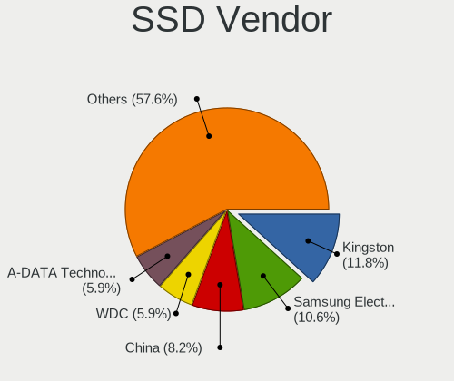
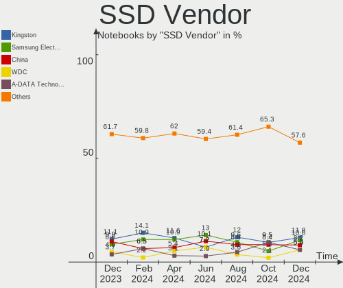
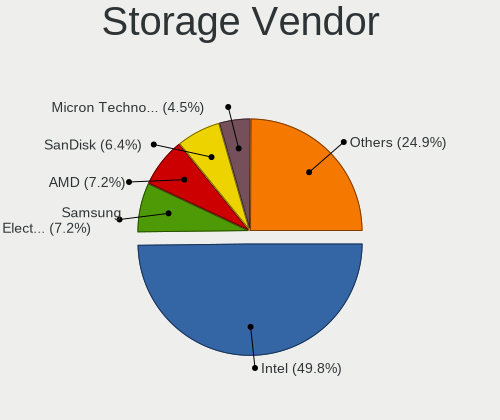
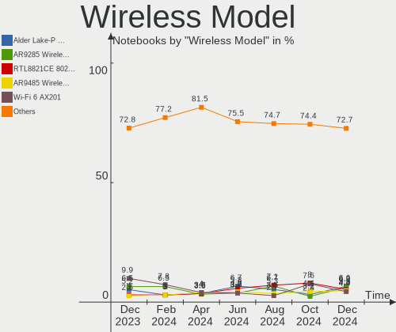
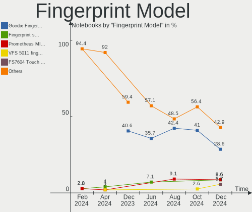

Linux in Russia - Hardware Trends (Notebooks)
---------------------------------------------

A project to identify most popular hardware characteristics and track their change
over time based on data collected by Linux users at https://Linux-Hardware.org.

Anyone can contribute to this report by the [hw-probe](https://github.com/linuxhw/hw-probe) tool:

    sudo -E hw-probe -all -upload

Period: Nov, 2023.

Contents
--------

* [ System ](#system)
  - [ OS                       ](#os)
  - [ OS Family                ](#os-family)
  - [ Kernel                   ](#kernel)
  - [ Kernel Family            ](#kernel-family)
  - [ Kernel Major Ver.        ](#kernel-major-ver)
  - [ Arch                     ](#arch)
  - [ DE                       ](#de)
  - [ Display Server           ](#display-server)
  - [ Display Manager          ](#display-manager)
  - [ OS Lang                  ](#os-lang)
  - [ Boot Mode                ](#boot-mode)
  - [ Filesystem               ](#filesystem)
  - [ Part. scheme             ](#part-scheme)
  - [ Dual Boot with Linux/BSD ](#dual-boot-with-linuxbsd)
  - [ Dual Boot (Win)          ](#dual-boot-win)

* [ Board ](#board)
  - [ Vendor                   ](#vendor)
  - [ Model                    ](#model)
  - [ Model Family             ](#model-family)
  - [ MFG Year                 ](#mfg-year)
  - [ Form Factor              ](#form-factor)
  - [ Secure Boot              ](#secure-boot)
  - [ Coreboot                 ](#coreboot)
  - [ RAM Size                 ](#ram-size)
  - [ RAM Used                 ](#ram-used)
  - [ Total Drives             ](#total-drives)
  - [ Has CD-ROM               ](#has-cd-rom)
  - [ Has Ethernet             ](#has-ethernet)
  - [ Has WiFi                 ](#has-wifi)
  - [ Has Bluetooth            ](#has-bluetooth)

* [ Location ](#location)
  - [ Country                  ](#country)
  - [ City                     ](#city)

* [ Drives ](#drives)
  - [ Drive Vendor             ](#drive-vendor)
  - [ Drive Model              ](#drive-model)
  - [ HDD Vendor               ](#hdd-vendor)
  - [ SSD Vendor               ](#ssd-vendor)
  - [ Drive Kind               ](#drive-kind)
  - [ Drive Connector          ](#drive-connector)
  - [ Drive Size               ](#drive-size)
  - [ Space Total              ](#space-total)
  - [ Space Used               ](#space-used)
  - [ Malfunc. Drives          ](#malfunc-drives)
  - [ Malfunc. Drive Vendor    ](#malfunc-drive-vendor)
  - [ Malfunc. HDD Vendor      ](#malfunc-hdd-vendor)
  - [ Malfunc. Drive Kind      ](#malfunc-drive-kind)
  - [ Failed Drives            ](#failed-drives)
  - [ Failed Drive Vendor      ](#failed-drive-vendor)
  - [ Drive Status             ](#drive-status)

* [ Storage controller ](#storage-controller)
  - [ Storage Vendor           ](#storage-vendor)
  - [ Storage Model            ](#storage-model)
  - [ Storage Kind             ](#storage-kind)

* [ Processor ](#processor)
  - [ CPU Vendor               ](#cpu-vendor)
  - [ CPU Model                ](#cpu-model)
  - [ CPU Model Family         ](#cpu-model-family)
  - [ CPU Cores                ](#cpu-cores)
  - [ CPU Sockets              ](#cpu-sockets)
  - [ CPU Threads              ](#cpu-threads)
  - [ CPU Op-Modes             ](#cpu-op-modes)
  - [ CPU Microcode            ](#cpu-microcode)
  - [ CPU Microarch            ](#cpu-microarch)

* [ Graphics ](#graphics)
  - [ GPU Vendor               ](#gpu-vendor)
  - [ GPU Model                ](#gpu-model)
  - [ GPU Combo                ](#gpu-combo)
  - [ GPU Driver               ](#gpu-driver)
  - [ GPU Memory               ](#gpu-memory)

* [ Monitor ](#monitor)
  - [ Monitor Vendor           ](#monitor-vendor)
  - [ Monitor Model            ](#monitor-model)
  - [ Monitor Resolution       ](#monitor-resolution)
  - [ Monitor Diagonal         ](#monitor-diagonal)
  - [ Monitor Width            ](#monitor-width)
  - [ Aspect Ratio             ](#aspect-ratio)
  - [ Monitor Area             ](#monitor-area)
  - [ Pixel Density            ](#pixel-density)
  - [ Multiple Monitors        ](#multiple-monitors)

* [ Network ](#network)
  - [ Net Controller Vendor    ](#net-controller-vendor)
  - [ Net Controller Model     ](#net-controller-model)
  - [ Wireless Vendor          ](#wireless-vendor)
  - [ Wireless Model           ](#wireless-model)
  - [ Ethernet Vendor          ](#ethernet-vendor)
  - [ Ethernet Model           ](#ethernet-model)
  - [ Net Controller Kind      ](#net-controller-kind)
  - [ Used Controller          ](#used-controller)
  - [ NICs                     ](#nics)
  - [ IPv6                     ](#ipv6)

* [ Bluetooth ](#bluetooth)
  - [ Bluetooth Vendor         ](#bluetooth-vendor)
  - [ Bluetooth Model          ](#bluetooth-model)

* [ Sound ](#sound)
  - [ Sound Vendor             ](#sound-vendor)
  - [ Sound Model              ](#sound-model)

* [ Memory ](#memory)
  - [ Memory Vendor            ](#memory-vendor)
  - [ Memory Model             ](#memory-model)
  - [ Memory Kind              ](#memory-kind)
  - [ Memory Form Factor       ](#memory-form-factor)
  - [ Memory Size              ](#memory-size)
  - [ Memory Speed             ](#memory-speed)

* [ Printers & scanners ](#printers--scanners)
  - [ Printer Vendor           ](#printer-vendor)
  - [ Printer Model            ](#printer-model)
  - [ Scanner Vendor           ](#scanner-vendor)
  - [ Scanner Model            ](#scanner-model)

* [ Camera ](#camera)
  - [ Camera Vendor            ](#camera-vendor)
  - [ Camera Model             ](#camera-model)

* [ Security ](#security)
  - [ Fingerprint Vendor       ](#fingerprint-vendor)
  - [ Fingerprint Model        ](#fingerprint-model)
  - [ Chipcard Vendor          ](#chipcard-vendor)
  - [ Chipcard Model           ](#chipcard-model)

* [ Unsupported ](#unsupported)
  - [ Unsupported Devices      ](#unsupported-devices)
  - [ Unsupported Device Types ](#unsupported-device-types)

System
------

OS
--

Installed operating systems

| Name                | Notebooks | Percent |
|---------------------|-----------|---------|
| ROSA 12.4           | 64        | 22.22%  |
| Ubuntu 22.04        | 29        | 10.07%  |
| Debian 12           | 23        | 7.99%   |
| Fedora 39           | 22        | 7.64%   |
| OpenMandriva 5.0    | 11        | 3.82%   |
| OpenMandriva 23.08  | 11        | 3.82%   |
| Arch Rolling        | 9         | 3.13%   |
| ROSA 12             | 8         | 2.78%   |
| Red OS 7.3          | 7         | 2.43%   |
| Linux Mint 21.2     | 7         | 2.43%   |
| Ubuntu 23.10        | 6         | 2.08%   |
| ROSA R11.1          | 6         | 2.08%   |
| Manjaro 23.1.0      | 6         | 2.08%   |
| Manjaro             | 5         | 1.74%   |
| Gentoo 2.14         | 5         | 1.74%   |
| Fedora 38           | 5         | 1.74%   |
| Ubuntu 23.04        | 3         | 1.04%   |
| SteamOS 3.5.7       | 3         | 1.04%   |
| SteamOS 3.4.11      | 3         | 1.04%   |
| ROSA 12.3           | 3         | 1.04%   |
| ROSA 12.2           | 3         | 1.04%   |
| Kali 2023.3         | 3         | 1.04%   |
| Xubuntu 20.04       | 2         | 0.69%   |
| Ubuntu 20.04        | 2         | 0.69%   |
| OpenMandriva 23.11  | 2         | 0.69%   |
| Lubuntu 22.04       | 2         | 0.69%   |
| Kubuntu 23.10       | 2         | 0.69%   |
| KDE neon 22.04      | 2         | 0.69%   |
| Elementary 7.1      | 2         | 0.69%   |
| ArcoLinux Rolling   | 2         | 0.69%   |
| ALT Linux 10.2      | 2         | 0.69%   |
| ALT Linux 10.1      | 2         | 0.69%   |
| Void Linux Rolling  | 1         | 0.35%   |
| Uncom OS 2.2        | 1         | 0.35%   |
| Ubuntu Unity 16.04  | 1         | 0.35%   |
| Ubuntu Budgie 23.10 | 1         | 0.35%   |
| Ubuntu 16.04        | 1         | 0.35%   |
| Ttk 23.1            | 1         | 0.35%   |
| ROSA 13.0           | 1         | 0.35%   |
| ROSA 12.1           | 1         | 0.35%   |

OS Family
---------

OS without a version

| Name          | Notebooks | Percent |
|---------------|-----------|---------|
| ROSA          | 86        | 29.86%  |
| Ubuntu        | 41        | 14.24%  |
| Fedora        | 29        | 10.07%  |
| OpenMandriva  | 25        | 8.68%   |
| Debian        | 24        | 8.33%   |
| Manjaro       | 12        | 4.17%   |
| Arch          | 9         | 3.13%   |
| Red OS        | 8         | 2.78%   |
| Linux Mint    | 8         | 2.78%   |
| SteamOS       | 6         | 2.08%   |
| Gentoo        | 5         | 1.74%   |
| ALT Linux     | 5         | 1.74%   |
| Lubuntu       | 3         | 1.04%   |
| Kubuntu       | 3         | 1.04%   |
| Kali          | 3         | 1.04%   |
| Xubuntu       | 2         | 0.69%   |
| openSUSE      | 2         | 0.69%   |
| KDE neon      | 2         | 0.69%   |
| Elementary    | 2         | 0.69%   |
| ArcoLinux     | 2         | 0.69%   |
| Void Linux    | 1         | 0.35%   |
| Uncom OS      | 1         | 0.35%   |
| Ubuntu Unity  | 1         | 0.35%   |
| Ubuntu Budgie | 1         | 0.35%   |
| Ttk           | 1         | 0.35%   |
| Pop!_OS       | 1         | 0.35%   |
| NixOS         | 1         | 0.35%   |
| EndeavourOS   | 1         | 0.35%   |
| CentOS        | 1         | 0.35%   |
| antiX         | 1         | 0.35%   |
| Alteros       | 1         | 0.35%   |

Kernel
------

Version of the Linux kernel

| Version                                            | Notebooks | Percent |
|----------------------------------------------------|-----------|---------|
| 6.1.58-generic-1rosa2021.1-x86_64                  | 38        | 13.19%  |
| 6.2.0-36-generic                                   | 22        | 7.64%   |
| 6.1.20-generic-2rosa2021.1-x86_64                  | 21        | 7.29%   |
| 6.1.0-4-amd64                                      | 14        | 4.86%   |
| 6.2.0-37-generic                                   | 13        | 4.51%   |
| 6.6.2-desktop-1omv2390                             | 12        | 4.17%   |
| 6.5.11-300.fc39.x86_64                             | 8         | 2.78%   |
| 6.4.11-desktop-1omv2390                            | 8         | 2.78%   |
| 6.1.0-13-amd64                                     | 8         | 2.78%   |
| 6.5.12-300.fc39.x86_64                             | 7         | 2.43%   |
| 6.5.0-10-generic                                   | 7         | 2.43%   |
| 6.1.52-1.el7.3.x86_64                              | 5         | 1.74%   |
| 5.10.74-generic-2rosa2021.1-x86_64                 | 5         | 1.74%   |
| 6.5.9-1-MANJARO                                    | 4         | 1.39%   |
| 5.15.103-generic-1rosa2021.1-i686                  | 4         | 1.39%   |
| 5.15.0-88-generic                                  | 4         | 1.39%   |
| 6.6.1-arch1-1                                      | 3         | 1.04%   |
| 6.5.0-kali3-amd64                                  | 3         | 1.04%   |
| 6.1.52-valve9-1-neptune-61                         | 3         | 1.04%   |
| 5.13.0-valve37-1-neptune                           | 3         | 1.04%   |
| 4.15.0-desktop-122.124.1rosa-x86_64                | 3         | 1.04%   |
| 6.6.1-zen1-1-zen                                   | 2         | 0.69%   |
| 6.5.9-200.fc38.x86_64                              | 2         | 0.69%   |
| 6.5.6-300.fc39.x86_64                              | 2         | 0.69%   |
| 6.5.11-1-MANJARO                                   | 2         | 0.69%   |
| 6.5.0-13-generic                                   | 2         | 0.69%   |
| 6.4.8-desktop-2omv2390                             | 2         | 0.69%   |
| 6.1.60-1-MANJARO                                   | 2         | 0.69%   |
| 6.1.44-1.el7.3.x86_64                              | 2         | 0.69%   |
| 5.15.75-generic-1rosa2021.1-x86_64                 | 2         | 0.69%   |
| 5.15.127-generic-1rosa2021.1-x86_64                | 2         | 0.69%   |
| 5.15.0-87-generic                                  | 2         | 0.69%   |
| 4.15.0-142-generic                                 | 2         | 0.69%   |
| 6.7.0-0.rc2.321.vanilla.fc39.x86_64                | 1         | 0.35%   |
| 6.7.0-0.rc1.20231117git7475e51b8796.19.fc39.x86_64 | 1         | 0.35%   |
| 6.6.3-arch1-1                                      | 1         | 0.35%   |
| 6.6.2-zen1-1-zen                                   | 1         | 0.35%   |
| 6.6.2-arch1-1                                      | 1         | 0.35%   |
| 6.6.2-101.fc38.x86_64                              | 1         | 0.35%   |
| 6.6.1-desktop-1omv2390                             | 1         | 0.35%   |

Kernel Family
-------------

Linux kernel without a distro release

| Version  | Notebooks | Percent |
|----------|-----------|---------|
| 6.2.0    | 39        | 13.54%  |
| 6.1.58   | 39        | 13.54%  |
| 6.1.0    | 23        | 7.99%   |
| 6.1.20   | 21        | 7.29%   |
| 6.5.0    | 17        | 5.9%    |
| 6.6.2    | 15        | 5.21%   |
| 6.5.11   | 12        | 4.17%   |
| 5.15.0   | 10        | 3.47%   |
| 6.5.9    | 9         | 3.13%   |
| 6.4.11   | 9         | 3.13%   |
| 6.1.52   | 9         | 3.13%   |
| 6.6.1    | 8         | 2.78%   |
| 6.5.12   | 8         | 2.78%   |
| 5.10.74  | 6         | 2.08%   |
| 4.15.0   | 5         | 1.74%   |
| 6.5.10   | 4         | 1.39%   |
| 5.15.103 | 4         | 1.39%   |
| 6.6.0    | 3         | 1.04%   |
| 6.5.6    | 3         | 1.04%   |
| 6.1.60   | 3         | 1.04%   |
| 5.15.127 | 3         | 1.04%   |
| 5.13.0   | 3         | 1.04%   |
| 6.7.0    | 2         | 0.69%   |
| 6.4.8    | 2         | 0.69%   |
| 6.1.57   | 2         | 0.69%   |
| 6.1.44   | 2         | 0.69%   |
| 5.15.75  | 2         | 0.69%   |
| 6.6.3    | 1         | 0.35%   |
| 6.5.7    | 1         | 0.35%   |
| 6.5.5    | 1         | 0.35%   |
| 6.5.4    | 1         | 0.35%   |
| 6.5.2    | 1         | 0.35%   |
| 6.4.0    | 1         | 0.35%   |
| 6.2.9    | 1         | 0.35%   |
| 6.1.62   | 1         | 0.35%   |
| 6.1.55   | 1         | 0.35%   |
| 6.1.53   | 1         | 0.35%   |
| 6.1.46   | 1         | 0.35%   |
| 5.4.83   | 1         | 0.35%   |
| 5.4.32   | 1         | 0.35%   |

Kernel Major Ver.
-----------------

Linux kernel major version

| Version | Notebooks | Percent |
|---------|-----------|---------|
| 6.1     | 103       | 35.76%  |
| 6.5     | 57        | 19.79%  |
| 6.2     | 40        | 13.89%  |
| 6.6     | 27        | 9.38%   |
| 5.15    | 21        | 7.29%   |
| 6.4     | 12        | 4.17%   |
| 5.10    | 10        | 3.47%   |
| 4.15    | 5         | 1.74%   |
| 5.4     | 3         | 1.04%   |
| 5.13    | 3         | 1.04%   |
| 6.7     | 2         | 0.69%   |
| 5.14    | 2         | 0.69%   |
| 4.9     | 2         | 0.69%   |
| 5.16    | 1         | 0.35%   |

Arch
----

OS architecture (x86_64, i586, etc.)

| Name   | Notebooks | Percent |
|--------|-----------|---------|
| x86_64 | 280       | 97.22%  |
| i686   | 8         | 2.78%   |

DE
--

Desktop Environment

| Name       | Notebooks | Percent |
|------------|-----------|---------|
| GNOME      | 106       | 36.81%  |
| KDE5       | 105       | 36.46%  |
| Unknown    | 20        | 6.94%   |
| LXQt       | 18        | 6.25%   |
| MATE       | 11        | 3.82%   |
| XFCE       | 7         | 2.43%   |
| X-Cinnamon | 5         | 1.74%   |
| KDE4       | 4         | 1.39%   |
| Cinnamon   | 3         | 1.04%   |
| Pantheon   | 2         | 0.69%   |
| Unity      | 1         | 0.35%   |
| openbox    | 1         | 0.35%   |
| KDE        | 1         | 0.35%   |
| i3         | 1         | 0.35%   |
| Hyprland   | 1         | 0.35%   |
| DWM        | 1         | 0.35%   |
| Budgie     | 1         | 0.35%   |

Display Server
--------------

X11 or Wayland

| Name    | Notebooks | Percent |
|---------|-----------|---------|
| Wayland | 161       | 55.9%   |
| X11     | 112       | 38.89%  |
| Unknown | 14        | 4.86%   |
| Tty     | 1         | 0.35%   |

Display Manager
---------------

SDDM, LightDM, etc.

| Name    | Notebooks | Percent |
|---------|-----------|---------|
| SDDM    | 88        | 30.56%  |
| Unknown | 75        | 26.04%  |
| GDM     | 49        | 17.01%  |
| GDM3    | 40        | 13.89%  |
| LightDM | 30        | 10.42%  |
| KDM     | 4         | 1.39%   |
| Ly      | 2         | 0.69%   |

OS Lang
-------

Language

| Lang       | Notebooks | Percent |
|------------|-----------|---------|
| ru_RU      | 212       | 73.61%  |
| en_US      | 65        | 22.57%  |
| Unknown    | 5         | 1.74%   |
| C          | 2         | 0.69%   |
| ru_RU-UTF8 | 1         | 0.35%   |
| it_IT      | 1         | 0.35%   |
| en_GB      | 1         | 0.35%   |
| C.UTF8     | 1         | 0.35%   |

Boot Mode
---------

EFI or BIOS

| Mode | Notebooks | Percent |
|------|-----------|---------|
| EFI  | 177       | 61.46%  |
| BIOS | 111       | 38.54%  |

Filesystem
----------

Type of filesystem

| Type    | Notebooks | Percent |
|---------|-----------|---------|
| Ext4    | 171       | 59.38%  |
| Btrfs   | 51        | 17.71%  |
| Overlay | 36        | 12.5%   |
| Tmpfs   | 23        | 7.99%   |
| F2fs    | 3         | 1.04%   |
| Xfs     | 2         | 0.69%   |
| Ext3    | 1         | 0.35%   |
| Unknown | 1         | 0.35%   |

Part. scheme
------------

Scheme of partitioning

| Type    | Notebooks | Percent |
|---------|-----------|---------|
| GPT     | 181       | 62.85%  |
| MBR     | 54        | 18.75%  |
| Unknown | 53        | 18.4%   |

Dual Boot with Linux/BSD
------------------------

Hosting more than one Linux/BSD

| Dual boot | Notebooks | Percent |
|-----------|-----------|---------|
| No        | 248       | 86.11%  |
| Yes       | 40        | 13.89%  |

Dual Boot (Win)
---------------

Hosting Linux and Windows

| Dual boot | Notebooks | Percent |
|-----------|-----------|---------|
| No        | 187       | 64.93%  |
| Yes       | 101       | 35.07%  |

Board
-----

Vendor
------

Motherboard manufacturer

| Name                     | Notebooks | Percent |
|--------------------------|-----------|---------|
| Lenovo                   | 50        | 17.36%  |
| ASUSTek Computer         | 48        | 16.67%  |
| Hewlett-Packard          | 38        | 13.19%  |
| Acer                     | 25        | 8.68%   |
| HUAWEI                   | 21        | 7.29%   |
| Dell                     | 14        | 4.86%   |
| Unknown                  | 11        | 3.82%   |
| Timi                     | 9         | 3.13%   |
| Samsung Electronics      | 9         | 3.13%   |
| MSI                      | 8         | 2.78%   |
| Aquarius                 | 8         | 2.78%   |
| Valve                    | 6         | 2.08%   |
| Toshiba                  | 3         | 1.04%   |
| Sony                     | 3         | 1.04%   |
| Irbis                    | 3         | 1.04%   |
| HONOR                    | 3         | 1.04%   |
| Clevo                    | 3         | 1.04%   |
| Apple                    | 3         | 1.04%   |
| Infinix                  | 2         | 0.69%   |
| Haier                    | 2         | 0.69%   |
| Fujitsu Siemens          | 2         | 0.69%   |
| Unchartevice             | 1         | 0.35%   |
| TECNO Mobile Limited     | 1         | 0.35%   |
| TECNO                    | 1         | 0.35%   |
| Razer                    | 1         | 0.35%   |
| Pegatron                 | 1         | 0.35%   |
| Packard Bell             | 1         | 0.35%   |
| Maibenben                | 1         | 0.35%   |
| Machcreator              | 1         | 0.35%   |
| LTD Delovoy Office       | 1         | 0.35%   |
| KVADRA                   | 1         | 0.35%   |
| Inferit                  | 1         | 0.35%   |
| HIPER Technology Limited | 1         | 0.35%   |
| Gigabyte Technology      | 1         | 0.35%   |
| Digma                    | 1         | 0.35%   |
| DEXP                     | 1         | 0.35%   |
| ARDOR GAMING             | 1         | 0.35%   |
| ANCOMP                   | 1         | 0.35%   |

Model
-----

Motherboard model

| Name                                     | Notebooks | Percent |
|------------------------------------------|-----------|---------|
| Unknown                                  | 11        | 3.82%   |
| Aquarius NS585                           | 7         | 2.43%   |
| Valve Jupiter                            | 6         | 2.08%   |
| Timi Redmi Book Pro 15 2022              | 3         | 1.04%   |
| HUAWEI HVY-WXX9                          | 3         | 1.04%   |
| HUAWEI BOM-WXX9                          | 3         | 1.04%   |
| HP Pavilion g6                           | 3         | 1.04%   |
| HP Laptop 15-bw0xx                       | 3         | 1.04%   |
| Clevo NL41MU2                            | 3         | 1.04%   |
| Timi TM1701                              | 2         | 0.69%   |
| Lenovo ThinkPad T14 Gen 3 21AJS7P700     | 2         | 0.69%   |
| Lenovo IdeaPad L340-15API 81LW           | 2         | 0.69%   |
| HUAWEI CREF-XX                           | 2         | 0.69%   |
| HUAWEI BOD-WXX9                          | 2         | 0.69%   |
| HP Pavilion dv7                          | 2         | 0.69%   |
| HP Notebook                              | 2         | 0.69%   |
| HP EliteBook 8460p                       | 2         | 0.69%   |
| Dell Vostro 14 5410                      | 2         | 0.69%   |
| ASUS VivoBook_ASUSLaptop M1403QA_M1403QA | 2         | 0.69%   |
| ASUS VivoBook_ASUSLaptop M1402IA_M1402IA | 2         | 0.69%   |
| Acer TravelMate B118-M                   | 2         | 0.69%   |
| Unchartevice 6540                        | 1         | 0.35%   |
| Toshiba Satellite U300                   | 1         | 0.35%   |
| Toshiba Satellite L735                   | 1         | 0.35%   |
| Toshiba Satellite L300                   | 1         | 0.35%   |
| Timi TM1703                              | 1         | 0.35%   |
| Timi RedmiBook 15                        | 1         | 0.35%   |
| Timi Mi Laptop Pro 15 2020               | 1         | 0.35%   |
| Timi A35S                                | 1         | 0.35%   |
| TECNO Mobile Limited MEGABOOK T14TA      | 1         | 0.35%   |
| TECNO MEGABOOK T1                        | 1         | 0.35%   |
| Sony VPCEL3S1R                           | 1         | 0.35%   |
| Sony VPCCA2S1R                           | 1         | 0.35%   |
| Sony VGN-NS11ER_S                        | 1         | 0.35%   |
| Samsung RV411/RV511/E3511/S3511          | 1         | 0.35%   |
| Samsung RC530/RC730                      | 1         | 0.35%   |
| Samsung P29/28/26                        | 1         | 0.35%   |
| Samsung G25/G26                          | 1         | 0.35%   |
| Samsung 700Z3A/700Z4A/700Z5A/700Z5B      | 1         | 0.35%   |
| Samsung 355V4C/356V4C/3445VC/3545VC      | 1         | 0.35%   |

Model Family
------------

Motherboard model prefix

| Name                  | Notebooks | Percent |
|-----------------------|-----------|---------|
| ASUS VivoBook         | 21        | 7.29%   |
| Acer Aspire           | 17        | 5.9%    |
| Lenovo IdeaPad        | 16        | 5.56%   |
| Lenovo ThinkPad       | 11        | 3.82%   |
| Unknown               | 11        | 3.82%   |
| HP ProBook            | 10        | 3.47%   |
| HP Pavilion           | 8         | 2.78%   |
| HP Laptop             | 8         | 2.78%   |
| Aquarius NS585        | 7         | 2.43%   |
| Valve Jupiter         | 6         | 2.08%   |
| MSI Modern            | 4         | 1.39%   |
| Lenovo ThinkBook      | 4         | 1.39%   |
| HP EliteBook          | 4         | 1.39%   |
| Dell Latitude         | 4         | 1.39%   |
| Dell Inspiron         | 4         | 1.39%   |
| Acer TravelMate       | 4         | 1.39%   |
| Toshiba Satellite     | 3         | 1.04%   |
| Timi Redmi            | 3         | 1.04%   |
| Lenovo Legion         | 3         | 1.04%   |
| HUAWEI HVY-WXX9       | 3         | 1.04%   |
| HUAWEI BOM-WXX9       | 3         | 1.04%   |
| Dell Vostro           | 3         | 1.04%   |
| Clevo NL41MU2         | 3         | 1.04%   |
| ASUS ZenBook          | 3         | 1.04%   |
| ASUS ROG              | 3         | 1.04%   |
| ASUS ASUS             | 3         | 1.04%   |
| Timi TM1701           | 2         | 0.69%   |
| MSI Katana            | 2         | 0.69%   |
| Lenovo G700           | 2         | 0.69%   |
| Lenovo G580           | 2         | 0.69%   |
| Infinix INBOOK        | 2         | 0.69%   |
| HUAWEI CREF-XX        | 2         | 0.69%   |
| HUAWEI BOD-WXX9       | 2         | 0.69%   |
| HP Notebook           | 2         | 0.69%   |
| Fujitsu Siemens AMILO | 2         | 0.69%   |
| Unchartevice 6540     | 1         | 0.35%   |
| Timi TM1703           | 1         | 0.35%   |
| Timi RedmiBook        | 1         | 0.35%   |
| Timi Mi               | 1         | 0.35%   |
| Timi A35S             | 1         | 0.35%   |

MFG Year
--------

Motherboard manufacture year

| Year | Notebooks | Percent |
|------|-----------|---------|
| 2022 | 48        | 16.67%  |
| 2021 | 35        | 12.15%  |
| 2023 | 30        | 10.42%  |
| 2020 | 25        | 8.68%   |
| 2012 | 23        | 7.99%   |
| 2019 | 20        | 6.94%   |
| 2013 | 17        | 5.9%    |
| 2011 | 17        | 5.9%    |
| 2017 | 14        | 4.86%   |
| 2018 | 12        | 4.17%   |
| 2014 | 8         | 2.78%   |
| 2008 | 8         | 2.78%   |
| 2010 | 7         | 2.43%   |
| 2016 | 6         | 2.08%   |
| 2015 | 6         | 2.08%   |
| 2007 | 6         | 2.08%   |
| 2009 | 3         | 1.04%   |
| 2006 | 2         | 0.69%   |
| 2005 | 1         | 0.35%   |

Form Factor
-----------

Physical design of the computer

| Name     | Notebooks | Percent |
|----------|-----------|---------|
| Notebook | 288       | 100%    |

Secure Boot
-----------

Enabled or disabled

| State    | Notebooks | Percent |
|----------|-----------|---------|
| Disabled | 273       | 94.79%  |
| Enabled  | 15        | 5.21%   |

Coreboot
--------

Have coreboot on board

| Used | Notebooks | Percent |
|------|-----------|---------|
| No   | 288       | 100%    |

RAM Size
--------

Total RAM memory

| Size in GB  | Notebooks | Percent |
|-------------|-----------|---------|
| 4.01-8.0    | 91        | 31.6%   |
| 8.01-16.0   | 71        | 24.65%  |
| 16.01-24.0  | 52        | 18.06%  |
| 3.01-4.0    | 37        | 12.85%  |
| 32.01-64.0  | 16        | 5.56%   |
| 2.01-3.0    | 9         | 3.13%   |
| 1.01-2.0    | 8         | 2.78%   |
| 24.01-32.0  | 2         | 0.69%   |
| 64.01-256.0 | 1         | 0.35%   |
| 0.51-1.0    | 1         | 0.35%   |

RAM Used
--------

Used RAM memory

| Used GB    | Notebooks | Percent |
|------------|-----------|---------|
| 1.01-2.0   | 107       | 37.15%  |
| 2.01-3.0   | 53        | 18.4%   |
| 3.01-4.0   | 39        | 13.54%  |
| 4.01-8.0   | 38        | 13.19%  |
| 0.51-1.0   | 38        | 13.19%  |
| 8.01-16.0  | 9         | 3.13%   |
| 0.01-0.5   | 3         | 1.04%   |
| 16.01-24.0 | 1         | 0.35%   |

Total Drives
------------

Number of drives on board

| Drives | Notebooks | Percent |
|--------|-----------|---------|
| 1      | 224       | 77.78%  |
| 2      | 58        | 20.14%  |
| 3      | 6         | 2.08%   |

Has CD-ROM
----------

Has CD-ROM on board

| Presented | Notebooks | Percent |
|-----------|-----------|---------|
| No        | 214       | 74.31%  |
| Yes       | 74        | 25.69%  |

Has Ethernet
------------

Has Ethernet on board

| Presented | Notebooks | Percent |
|-----------|-----------|---------|
| Yes       | 202       | 70.14%  |
| No        | 86        | 29.86%  |

Has WiFi
--------

Has WiFi module

| Presented | Notebooks | Percent |
|-----------|-----------|---------|
| Yes       | 285       | 98.96%  |
| No        | 3         | 1.04%   |

Has Bluetooth
-------------

Has Bluetooth module

| Presented | Notebooks | Percent |
|-----------|-----------|---------|
| Yes       | 250       | 86.81%  |
| No        | 38        | 13.19%  |

Location
--------

Country
-------

Geographic location (country)

| Country | Notebooks | Percent |
|---------|-----------|---------|
| Russia  | 288       | 100%    |

City
----

Geographic location (city)

| City              | Notebooks | Percent |
|-------------------|-----------|---------|
| Moscow            | 67        | 23.26%  |
| St Petersburg     | 32        | 11.11%  |
| Voronezh          | 22        | 7.64%   |
| Yekaterinburg     | 8         | 2.78%   |
| Perm              | 8         | 2.78%   |
| Krasnoyarsk       | 8         | 2.78%   |
| Samara            | 7         | 2.43%   |
| Novosibirsk       | 6         | 2.08%   |
| Krasnodar         | 6         | 2.08%   |
| Ulyanovsk         | 5         | 1.74%   |
| Nizhniy Novgorod  | 5         | 1.74%   |
| Smolensk          | 4         | 1.39%   |
| Tomsk             | 3         | 1.04%   |
| Sergiyev Posad    | 3         | 1.04%   |
| Rostov-on-Don     | 3         | 1.04%   |
| Kazan’          | 3         | 1.04%   |
| Cherepovets       | 3         | 1.04%   |
| Yaroslavl         | 2         | 0.69%   |
| Vladivostok       | 2         | 0.69%   |
| Ulan-Ude          | 2         | 0.69%   |
| Saratov           | 2         | 0.69%   |
| Pionerskiy        | 2         | 0.69%   |
| Penza             | 2         | 0.69%   |
| Novorossiysk      | 2         | 0.69%   |
| Murmansk          | 2         | 0.69%   |
| Moscow Oblast     | 2         | 0.69%   |
| Magnitogorsk      | 2         | 0.69%   |
| Khabarovsk        | 2         | 0.69%   |
| Irkutsk           | 2         | 0.69%   |
| Dolgoprudnyy      | 2         | 0.69%   |
| Barnaul           | 2         | 0.69%   |
| Balashikha        | 2         | 0.69%   |
| Zhukovskiy        | 1         | 0.35%   |
| Zheleznogorsk     | 1         | 0.35%   |
| Zhavoronki        | 1         | 0.35%   |
| Zelenograd        | 1         | 0.35%   |
| Yuzhno-Sakhalinsk | 1         | 0.35%   |
| Yakutsk           | 1         | 0.35%   |
| Vsevolozhsk       | 1         | 0.35%   |
| Volzhskiy         | 1         | 0.35%   |

Drives
------

Drive Vendor
------------

Hard drive vendors

| Vendor                       | Notebooks | Drives | Percent |
|------------------------------|-----------|--------|---------|
| Samsung Electronics          | 50        | 54     | 14.25%  |
| WDC                          | 33        | 35     | 9.4%    |
| SanDisk                      | 21        | 21     | 5.98%   |
| Intel                        | 18        | 18     | 5.13%   |
| Micron Technology            | 16        | 16     | 4.56%   |
| Unknown                      | 15        | 15     | 4.27%   |
| A-DATA Technology            | 14        | 14     | 3.99%   |
| Toshiba                      | 13        | 14     | 3.7%    |
| Seagate                      | 13        | 14     | 3.7%    |
| Kingston                     | 12        | 12     | 3.42%   |
| SK hynix                     | 11        | 11     | 3.13%   |
| Silicon Motion               | 8         | 8      | 2.28%   |
| HGST                         | 8         | 8      | 2.28%   |
| Phison                       | 7         | 7      | 1.99%   |
| China                        | 7         | 7      | 1.99%   |
| Hitachi                      | 6         | 6      | 1.71%   |
| KIOXIA                       | 5         | 5      | 1.42%   |
| SPCC                         | 4         | 4      | 1.14%   |
| MAXIO Technology (Hangzhou)  | 4         | 4      | 1.14%   |
| DEXP                         | 4         | 4      | 1.14%   |
| SSSTC                        | 3         | 3      | 0.85%   |
| Phison Electronics           | 3         | 3      | 0.85%   |
| Patriot                      | 3         | 3      | 0.85%   |
| Fujitsu                      | 3         | 3      | 0.85%   |
| BIWIN                        | 3         | 3      | 0.85%   |
| Apple                        | 3         | 3      | 0.85%   |
| Apacer                       | 3         | 3      | 0.85%   |
| AMD                          | 3         | 3      | 0.85%   |
| Transcend                    | 2         | 2      | 0.57%   |
| Shenzhen Longsys Electronics | 2         | 2      | 0.57%   |
| SCY                          | 2         | 2      | 0.57%   |
| Qumo                         | 2         | 2      | 0.57%   |
| O2 Micro                     | 2         | 2      | 0.57%   |
| Neo                          | 2         | 2      | 0.57%   |
| MSI                          | 2         | 2      | 0.57%   |
| Kingston Technology Company  | 2         | 2      | 0.57%   |
| KingSpec                     | 2         | 2      | 0.57%   |
| KingFast                     | 2         | 2      | 0.57%   |
| JMicron Technology           | 2         | 2      | 0.57%   |
| HS-SSD-E100                  | 2         | 2      | 0.57%   |

Drive Model
-----------

Hard drive models

| Model                                               | Notebooks | Percent |
|-----------------------------------------------------|-----------|---------|
| A-DATA SU800 512GB SSD                              | 7         | 1.97%   |
| Toshiba MQ01ABF050 500GB                            | 6         | 1.69%   |
| Silicon Motion PCIe-8 SSD 512GB                     | 5         | 1.4%    |
| Samsung NVMe SSD Controller SM981/PM981/PM983 250GB | 5         | 1.4%    |
| Intel SSDPEKNU512GZ 512GB                           | 5         | 1.4%    |
| Unknown MMC Card  128GB                             | 4         | 1.12%   |
| SK hynix HFM512GD3JX013N 512GB                      | 4         | 1.12%   |
| Samsung MZVL4512HBLU-00BTW 512GB                    | 4         | 1.12%   |
| Micron 2400_MTFDKBA512QFM 512GB                     | 4         | 1.12%   |
| Unknown MMC Card  64GB                              | 3         | 0.84%   |
| Sandisk WD Blue SN550 NVMe SSD 512GB                | 3         | 0.84%   |
| Samsung MZALQ512HALU-000L2 512GB                    | 3         | 0.84%   |
| Phison PS5013 E13 NVMe Controller 512GB             | 3         | 0.84%   |
| Intel SSD 660P Series 512GB                         | 3         | 0.84%   |
| BIWIN CE480T5D101-256 256GB                         | 3         | 0.84%   |
| WDC WDS240G2G0A-00JH30 240GB SSD                    | 2         | 0.56%   |
| WDC WD5000LPVX-22V0TT0 500GB                        | 2         | 0.56%   |
| WDC WD5000LPCX-24VHAT0 500GB                        | 2         | 0.56%   |
| WDC WD5000LPCX-21VHAT0 500GB                        | 2         | 0.56%   |
| Unknown SD32G  32GB                                 | 2         | 0.56%   |
| SPCC Solid State Disk 256GB                         | 2         | 0.56%   |
| SK hynix BC511 HFM256GDJTNI-82A0A 256GB             | 2         | 0.56%   |
| Silicon Motion PCIe-4 SSD 512GB                     | 2         | 0.56%   |
| Shenzhen Longsys FORESEE XP1000F512G 512GB          | 2         | 0.56%   |
| Seagate ST320LT012-9WS14C 320GB                     | 2         | 0.56%   |
| Seagate ST1000LM035-1RK172 1TB                      | 2         | 0.56%   |
| Seagate ST1000LM024 HN-M101MBB 1TB                  | 2         | 0.56%   |
| SCY SMM5T1G25600D 256GB                             | 2         | 0.56%   |
| SanDisk NVMe SSD Drive 1TB                          | 2         | 0.56%   |
| Samsung SSD 970 EVO Plus 1TB                        | 2         | 0.56%   |
| Samsung SSD 870 EVO 500GB                           | 2         | 0.56%   |
| Samsung SSD 860 EVO 500GB                           | 2         | 0.56%   |
| Samsung NVMe SSD Controller PM9A1/PM9A3/980PRO 2TB  | 2         | 0.56%   |
| Samsung MZVLB256HAHQ-00000 256GB                    | 2         | 0.56%   |
| Phison CFESR512GMTCT-E9C-2 512GB                    | 2         | 0.56%   |
| Phison 311CD0512GB                                  | 2         | 0.56%   |
| O2 Micro E2M2 64GB                                  | 2         | 0.56%   |
| Micron 2210_MTFDHBA1T0QFD 1TB                       | 2         | 0.56%   |
| MAXIO (Hangzhou) NVMe SSD Controller MAP1202 1024GB | 2         | 0.56%   |
| KIOXIA KBG40ZNS512G NVMe 512GB                      | 2         | 0.56%   |

HDD Vendor
----------

Hard disk drive vendors

| Vendor   | Notebooks | Drives | Percent |
|----------|-----------|--------|---------|
| WDC      | 25        | 25     | 35.71%  |
| Seagate  | 12        | 12     | 17.14%  |
| Toshiba  | 11        | 12     | 15.71%  |
| HGST     | 8         | 8      | 11.43%  |
| Hitachi  | 6         | 6      | 8.57%   |
| Fujitsu  | 3         | 3      | 4.29%   |
| USB3.0   | 1         | 1      | 1.43%   |
| USB      | 1         | 1      | 1.43%   |
| Unknown  | 1         | 1      | 1.43%   |
| TO Exter | 1         | 1      | 1.43%   |
| External | 1         | 1      | 1.43%   |

SSD Vendor
----------

Solid state drive vendors

| Vendor              | Notebooks | Drives | Percent |
|---------------------|-----------|--------|---------|
| Samsung Electronics | 20        | 22     | 17.54%  |
| A-DATA Technology   | 13        | 13     | 11.4%   |
| Kingston            | 11        | 11     | 9.65%   |
| China               | 7         | 7      | 6.14%   |
| SanDisk             | 6         | 6      | 5.26%   |
| WDC                 | 4         | 4      | 3.51%   |
| SPCC                | 4         | 4      | 3.51%   |
| DEXP                | 4         | 4      | 3.51%   |
| Patriot             | 3         | 3      | 2.63%   |
| Intel               | 3         | 3      | 2.63%   |
| AMD                 | 3         | 3      | 2.63%   |
| Transcend           | 2         | 2      | 1.75%   |
| Neo                 | 2         | 2      | 1.75%   |
| KingSpec            | 2         | 2      | 1.75%   |
| JMicron Technology  | 2         | 2      | 1.75%   |
| HS-SSD-E100         | 2         | 2      | 1.75%   |
| GOODRAM             | 2         | 2      | 1.75%   |
| Apple               | 2         | 2      | 1.75%   |
| Apacer              | 2         | 2      | 1.75%   |
| AGI                 | 2         | 2      | 1.75%   |
| Zheino              | 1         | 1      | 0.88%   |
| Toshiba             | 1         | 1      | 0.88%   |
| Thinkplus           | 1         | 1      | 0.88%   |
| Smartbuy            | 1         | 1      | 0.88%   |
| SK hynix            | 1         | 1      | 0.88%   |
| SandForce           | 1         | 1      | 0.88%   |
| Qumo                | 1         | 1      | 0.88%   |
| Plextor             | 1         | 1      | 0.88%   |
| OCZ                 | 1         | 1      | 0.88%   |
| Micron Technology   | 1         | 1      | 0.88%   |
| Lenovo              | 1         | 1      | 0.88%   |
| KingFast            | 1         | 1      | 0.88%   |
| Hewlett-Packard     | 1         | 1      | 0.88%   |
| Fanxiang            | 1         | 1      | 0.88%   |
| Digma               | 1         | 1      | 0.88%   |
| Crucial             | 1         | 1      | 0.88%   |
| Azerty              | 1         | 1      | 0.88%   |
| ACOS                | 1         | 1      | 0.88%   |

Drive Kind
----------

HDD or SSD

| Kind    | Notebooks | Drives | Percent |
|---------|-----------|--------|---------|
| NVMe    | 143       | 153    | 42.31%  |
| SSD     | 108       | 116    | 31.95%  |
| HDD     | 68        | 71     | 20.12%  |
| MMC     | 15        | 15     | 4.44%   |
| Unknown | 4         | 4      | 1.18%   |

Drive Connector
---------------

SATA, SAS, NVMe, etc.

| Type | Notebooks | Drives | Percent |
|------|-----------|--------|---------|
| SATA | 151       | 179    | 47.04%  |
| NVMe | 143       | 153    | 44.55%  |
| MMC  | 15        | 15     | 4.67%   |
| SAS  | 12        | 12     | 3.74%   |

Drive Size
----------

Size of hard drive

| Size in TB | Notebooks | Drives | Percent |
|------------|-----------|--------|---------|
| 0.01-0.5   | 126       | 141    | 75%     |
| 0.51-1.0   | 40        | 44     | 23.81%  |
| 1.01-2.0   | 2         | 2      | 1.19%   |

Space Total
-----------

Amount of disk space available on the file system

| Size in GB     | Notebooks | Percent |
|----------------|-----------|---------|
| 101-250        | 82        | 28.47%  |
| 251-500        | 72        | 25%     |
| 501-1000       | 37        | 12.85%  |
| 1-20           | 30        | 10.42%  |
| Unknown        | 21        | 7.29%   |
| 51-100         | 16        | 5.56%   |
| 1001-2000      | 15        | 5.21%   |
| 21-50          | 9         | 3.13%   |
| More than 3000 | 4         | 1.39%   |
| 2001-3000      | 2         | 0.69%   |

Space Used
----------

Amount of used disk space

| Used GB        | Notebooks | Percent |
|----------------|-----------|---------|
| 1-20           | 124       | 43.06%  |
| 21-50          | 47        | 16.32%  |
| 101-250        | 35        | 12.15%  |
| 51-100         | 31        | 10.76%  |
| Unknown        | 21        | 7.29%   |
| 251-500        | 19        | 6.6%    |
| 501-1000       | 6         | 2.08%   |
| More than 3000 | 2         | 0.69%   |
| 1001-2000      | 2         | 0.69%   |
| 0              | 1         | 0.35%   |

Malfunc. Drives
---------------

Drive models with a malfunction

| Model                                            | Notebooks | Drives | Percent |
|--------------------------------------------------|-----------|--------|---------|
| WDC WD5000LPVX-22V0TT0 500GB                     | 2         | 2      | 5.26%   |
| Seagate ST320LT012-9WS14C 320GB                  | 2         | 2      | 5.26%   |
| HGST HTS541010A9E680 1TB                         | 2         | 2      | 5.26%   |
| WDC WD3200BPVT-24ZEST0 320GB                     | 1         | 1      | 2.63%   |
| WDC WD3200BEVT-80A0RT0 320GB                     | 1         | 1      | 2.63%   |
| WDC WD2500LPCX-24C6HT0 250GB                     | 1         | 1      | 2.63%   |
| WDC WD1200BEVS-60UST0 120GB                      | 1         | 1      | 2.63%   |
| WDC WD1200BEVS-07LAT0 120GB                      | 1         | 1      | 2.63%   |
| WDC WD10JPVT-60A1YT0 1TB                         | 1         | 1      | 2.63%   |
| Toshiba MQ01ABF050 500GB                         | 1         | 1      | 2.63%   |
| Toshiba MQ01ABD075 752GB                         | 1         | 1      | 2.63%   |
| Toshiba MK5075GSX 500GB                          | 1         | 1      | 2.63%   |
| Toshiba MK3259GSXP 320GB                         | 1         | 1      | 2.63%   |
| Toshiba MK2565GSX 250GB                          | 1         | 1      | 2.63%   |
| SK hynix HFS128G39TND-N210A 128GB SSD            | 1         | 1      | 2.63%   |
| Seagate ST9500423AS 500GB                        | 1         | 1      | 2.63%   |
| Seagate ST9320325AS 320GB                        | 1         | 1      | 2.63%   |
| Seagate ST9250315AS 250GB                        | 1         | 1      | 2.63%   |
| Seagate ST1000LM035-1RK172 1TB                   | 1         | 1      | 2.63%   |
| Seagate ST1000LM024 HN-M101MBB 1TB               | 1         | 1      | 2.63%   |
| Seagate ST1000LM014-1EJ164 1TB                   | 1         | 1      | 2.63%   |
| SanDisk SDSSDH120GG25 120GB                      | 1         | 1      | 2.63%   |
| SandForce 113444 120GB SSD                       | 1         | 1      | 2.63%   |
| Samsung Electronics MZNLH128HBHQ-000H1 128GB SSD | 1         | 1      | 2.63%   |
| Patriot P210 256GB SSD                           | 1         | 1      | 2.63%   |
| Neo Forza NFS121SA324-6007000 240GB SSD          | 1         | 1      | 2.63%   |
| Kingston SHFS37A120G 120GB SSD                   | 1         | 1      | 2.63%   |
| Hitachi HTS543225A7A384 250GB                    | 1         | 1      | 2.63%   |
| Hitachi HTS542516K9SA00 160GB                    | 1         | 1      | 2.63%   |
| HGST HTS721010A9E630 1TB                         | 1         | 1      | 2.63%   |
| HGST HTS545050A7E380 500GB                       | 1         | 1      | 2.63%   |
| HGST HTE721010A9E630 1TB                         | 1         | 1      | 2.63%   |
| Fujitsu MHY2120BH 120GB                          | 1         | 1      | 2.63%   |
| Fujitsu MHT2040AH 40GB                           | 1         | 1      | 2.63%   |
| ACOS AS-512 512GB SSD                            | 1         | 1      | 2.63%   |

Malfunc. Drive Vendor
---------------------

Vendors of faulty drives

| Vendor              | Notebooks | Drives | Percent |
|---------------------|-----------|--------|---------|
| WDC                 | 8         | 8      | 21.62%  |
| Seagate             | 8         | 8      | 21.62%  |
| HGST                | 5         | 5      | 13.51%  |
| Toshiba             | 4         | 5      | 10.81%  |
| Hitachi             | 2         | 2      | 5.41%   |
| Fujitsu             | 2         | 2      | 5.41%   |
| SK hynix            | 1         | 1      | 2.7%    |
| SanDisk             | 1         | 1      | 2.7%    |
| SandForce           | 1         | 1      | 2.7%    |
| Samsung Electronics | 1         | 1      | 2.7%    |
| Patriot             | 1         | 1      | 2.7%    |
| Neo                 | 1         | 1      | 2.7%    |
| Kingston            | 1         | 1      | 2.7%    |
| ACOS                | 1         | 1      | 2.7%    |

Malfunc. HDD Vendor
-------------------

Vendors of faulty HDD drives

| Vendor  | Notebooks | Drives | Percent |
|---------|-----------|--------|---------|
| WDC     | 8         | 8      | 27.59%  |
| Seagate | 8         | 8      | 27.59%  |
| HGST    | 5         | 5      | 17.24%  |
| Toshiba | 4         | 5      | 13.79%  |
| Hitachi | 2         | 2      | 6.9%    |
| Fujitsu | 2         | 2      | 6.9%    |

Malfunc. Drive Kind
-------------------

Kinds of faulty drives

| Kind | Notebooks | Drives | Percent |
|------|-----------|--------|---------|
| HDD  | 29        | 30     | 78.38%  |
| SSD  | 8         | 8      | 21.62%  |

Failed Drives
-------------

Failed drive models

Zero info for selected period =(

Failed Drive Vendor
-------------------

Failed drive vendors

Zero info for selected period =(

Drive Status
------------

Number of failed and malfunc. drives

| Status   | Notebooks | Drives | Percent |
|----------|-----------|--------|---------|
| Works    | 182       | 201    | 56.7%   |
| Detected | 102       | 120    | 31.78%  |
| Malfunc  | 37        | 38     | 11.53%  |

Storage controller
------------------

Storage Vendor
--------------

Storage controller vendors

| Vendor                           | Notebooks | Percent |
|----------------------------------|-----------|---------|
| Intel                            | 165       | 47.01%  |
| AMD                              | 49        | 13.96%  |
| Samsung Electronics              | 31        | 8.83%   |
| SanDisk                          | 20        | 5.7%    |
| Phison Electronics               | 15        | 4.27%   |
| Micron Technology                | 15        | 4.27%   |
| SK hynix                         | 10        | 2.85%   |
| Silicon Motion                   | 9         | 2.56%   |
| KIOXIA                           | 6         | 1.71%   |
| MAXIO Technology (Hangzhou)      | 5         | 1.42%   |
| Solid State Storage Technology   | 4         | 1.14%   |
| Shenzhen Longsys Electronics     | 4         | 1.14%   |
| Kingston Technology Company      | 3         | 0.85%   |
| INNOGRIT                         | 3         | 0.85%   |
| Shenzhen Shichuangyi Electronics | 2         | 0.57%   |
| O2 Micro                         | 2         | 0.57%   |
| Yangtze Memory Technologies      | 1         | 0.28%   |
| Union Memory (Shenzhen)          | 1         | 0.28%   |
| Seagate Technology               | 1         | 0.28%   |
| Nvidia                           | 1         | 0.28%   |
| Micron/Crucial Technology        | 1         | 0.28%   |
| Marvell Technology Group         | 1         | 0.28%   |
| Apple                            | 1         | 0.28%   |
| ADATA Technology                 | 1         | 0.28%   |

Storage Model
-------------

Storage controller models

| Model                                                                          | Notebooks | Percent |
|--------------------------------------------------------------------------------|-----------|---------|
| AMD FCH SATA Controller [AHCI mode]                                            | 40        | 10.78%  |
| Intel 7 Series Chipset Family 6-port SATA Controller [AHCI mode]               | 26        | 7.01%   |
| Intel 6 Series/C200 Series Chipset Family 6 port Mobile SATA AHCI Controller   | 13        | 3.5%    |
| Intel Sunrise Point-LP SATA Controller [AHCI mode]                             | 12        | 3.23%   |
| Samsung NVMe SSD Controller SM981/PM981/PM983                                  | 11        | 2.96%   |
| Samsung NVMe SSD Controller 980 (DRAM-less)                                    | 11        | 2.96%   |
| Intel 82801 Mobile SATA Controller [RAID mode]                                 | 11        | 2.96%   |
| Intel Tiger Lake-LP SATA Controller                                            | 10        | 2.7%    |
| Intel SSD 670p Series [Keystone Harbor]                                        | 9         | 2.43%   |
| Silicon Motion Non-Volatile memory controller                                  | 8         | 2.16%   |
| Intel Volume Management Device NVMe RAID Controller                            | 8         | 2.16%   |
| Intel Celeron/Pentium Silver Processor SATA Controller                         | 8         | 2.16%   |
| Intel Cannon Lake PCH SATA AHCI Controller                                     | 7         | 1.89%   |
| Intel Alder Lake-P SATA AHCI Controller                                        | 7         | 1.89%   |
| SK hynix Gold P31/BC711/PC711 NVMe Solid State Drive                           | 6         | 1.62%   |
| Phison PS5013-E13 PCIe3 NVMe Controller (DRAM-less)                            | 6         | 1.62%   |
| Intel Comet Lake SATA AHCI Controller                                          | 6         | 1.62%   |
| SanDisk WD Black SN770 / PC SN740 256GB / PC SN560 (DRAM-less) NVMe SSD        | 5         | 1.35%   |
| Micron 2400 NVMe SSD (DRAM-less)                                               | 5         | 1.35%   |
| MAXIO (Hangzhou) NVMe SSD Controller MAP1202                                   | 5         | 1.35%   |
| KIOXIA NVMe SSD Controller BG4 (DRAM-less)                                     | 5         | 1.35%   |
| Intel SSD 660P Series                                                          | 5         | 1.35%   |
| Intel 8 Series/C220 Series Chipset Family 6-port SATA Controller 1 [AHCI mode] | 5         | 1.35%   |
| SanDisk Ultra 3D / WD Blue SN550 NVMe SSD                                      | 4         | 1.08%   |
| SanDisk Extreme Pro / WD Black SN750 / PC SN730 / Red SN700 NVMe SSD           | 4         | 1.08%   |
| Samsung NVMe SSD Controller PM9B1 (DRAM-less)                                  | 4         | 1.08%   |
| Phison PS5019-E19 PCIe4 NVMe Controller (DRAM-less)                            | 4         | 1.08%   |
| Micron 2450 NVMe SSD [HendrixV] (DRAM-less)                                    | 4         | 1.08%   |
| Intel Celeron N3350/Pentium N4200/Atom E3900 Series SATA AHCI Controller       | 4         | 1.08%   |
| Intel Atom Processor E3800 Series SATA AHCI Controller                         | 4         | 1.08%   |
| Intel 8 Series SATA Controller 1 [AHCI mode]                                   | 4         | 1.08%   |
| AMD SB7x0/SB8x0/SB9x0 SATA Controller [AHCI mode]                              | 4         | 1.08%   |
| Solid State Storage CL1-3D256-Q11 NVMe SSD M.2                                 | 3         | 0.81%   |
| Shenzhen Longsys Lexar NM620 NVME SSD (DRAM-less)                              | 3         | 0.81%   |
| SanDisk Ultra 3D / WD Blue SN570 NVMe SSD (DRAM-less)                          | 3         | 0.81%   |
| Samsung NVMe SSD Controller PM9A1/PM9A3/980PRO                                 | 3         | 0.81%   |
| Micron 2210 NVMe SSD [Cobain]                                                  | 3         | 0.81%   |
| Micron 2200S NVMe SSD [Cassandra]                                              | 3         | 0.81%   |
| Intel NM10/ICH7 Family SATA Controller [AHCI mode]                             | 3         | 0.81%   |
| Intel Cannon Lake Mobile PCH SATA AHCI Controller                              | 3         | 0.81%   |

Storage Kind
------------

Kind of storage controller (IDE, SATA, NVMe, SAS, ...)

| Kind | Notebooks | Percent |
|------|-----------|---------|
| SATA | 181       | 50.14%  |
| NVMe | 143       | 39.61%  |
| RAID | 20        | 5.54%   |
| IDE  | 17        | 4.71%   |

Processor
---------

CPU Vendor
----------

Processor vendors

| Vendor | Notebooks | Percent |
|--------|-----------|---------|
| Intel  | 190       | 65.97%  |
| AMD    | 98        | 34.03%  |

CPU Model
---------

Processor models

| Model                                         | Notebooks | Percent |
|-----------------------------------------------|-----------|---------|
| Intel 11th Gen Core i5-1135G7 @ 2.40GHz       | 9         | 3.13%   |
| AMD Ryzen 5 5500U with Radeon Graphics        | 8         | 2.78%   |
| Intel Core i3-9100 CPU @ 3.60GHz              | 7         | 2.43%   |
| Intel Core i5-3230M CPU @ 2.60GHz             | 6         | 2.08%   |
| Intel Core i5-10210U CPU @ 1.60GHz            | 6         | 2.08%   |
| Intel 12th Gen Core i5-1235U                  | 6         | 2.08%   |
| AMD Ryzen 7 5700U with Radeon Graphics        | 6         | 2.08%   |
| AMD Custom APU 0405                           | 6         | 2.08%   |
| AMD Ryzen 7 5800H with Radeon Graphics        | 5         | 1.74%   |
| AMD Ryzen 5 4600H with Radeon Graphics        | 5         | 1.74%   |
| Intel Core i5-3210M CPU @ 2.50GHz             | 4         | 1.39%   |
| Intel Core i5-1035G1 CPU @ 1.00GHz            | 4         | 1.39%   |
| Intel Celeron N4020 CPU @ 1.10GHz             | 4         | 1.39%   |
| Intel 11th Gen Core i5-1155G7 @ 2.50GHz       | 4         | 1.39%   |
| AMD Ryzen 7 6800H with Radeon Graphics        | 4         | 1.39%   |
| Intel Core i7-8550U CPU @ 1.80GHz             | 3         | 1.04%   |
| Intel Core i3-2310M CPU @ 2.10GHz             | 3         | 1.04%   |
| Intel 12th Gen Core i5-12500H                 | 3         | 1.04%   |
| Intel 12th Gen Core i5-12450H                 | 3         | 1.04%   |
| Intel 12th Gen Core i5-1240P                  | 3         | 1.04%   |
| AMD Ryzen 7 4700U with Radeon Graphics        | 3         | 1.04%   |
| AMD Ryzen 5 3500U with Radeon Vega Mobile Gfx | 3         | 1.04%   |
| AMD Ryzen 3 3250U with Radeon Graphics        | 3         | 1.04%   |
| AMD A6-3400M APU with Radeon HD Graphics      | 3         | 1.04%   |
| Intel Pentium Silver N5000 CPU @ 1.10GHz      | 2         | 0.69%   |
| Intel Pentium CPU N3540 @ 2.16GHz             | 2         | 0.69%   |
| Intel Core i7-3610QM CPU @ 2.30GHz            | 2         | 0.69%   |
| Intel Core i5-7300HQ CPU @ 2.50GHz            | 2         | 0.69%   |
| Intel Core i5-6300U CPU @ 2.40GHz             | 2         | 0.69%   |
| Intel Core i5-6200U CPU @ 2.30GHz             | 2         | 0.69%   |
| Intel Core i5-4210U CPU @ 1.70GHz             | 2         | 0.69%   |
| Intel Core i5-4200M CPU @ 2.50GHz             | 2         | 0.69%   |
| Intel Core i5-2520M CPU @ 2.50GHz             | 2         | 0.69%   |
| Intel Core i5-2410M CPU @ 2.30GHz             | 2         | 0.69%   |
| Intel Core i3-6006U CPU @ 2.00GHz             | 2         | 0.69%   |
| Intel Core i3-5005U CPU @ 2.00GHz             | 2         | 0.69%   |
| Intel Core i3-3120M CPU @ 2.50GHz             | 2         | 0.69%   |
| Intel Core i3-1005G1 CPU @ 1.20GHz            | 2         | 0.69%   |
| Intel Core 2 CPU T5200 @ 1.60GHz              | 2         | 0.69%   |
| Intel Celeron N4120 CPU @ 1.10GHz             | 2         | 0.69%   |

CPU Model Family
----------------

Processor model prefix

| Model                   | Notebooks | Percent |
|-------------------------|-----------|---------|
| Other                   | 56        | 19.44%  |
| Intel Core i5           | 49        | 17.01%  |
| AMD Ryzen 7             | 29        | 10.07%  |
| Intel Core i3           | 28        | 9.72%   |
| AMD Ryzen 5             | 25        | 8.68%   |
| Intel Core i7           | 22        | 7.64%   |
| Intel Celeron           | 16        | 5.56%   |
| Intel Pentium           | 9         | 3.13%   |
| AMD Ryzen 3             | 8         | 2.78%   |
| AMD A6                  | 6         | 2.08%   |
| Intel Atom              | 5         | 1.74%   |
| AMD Ryzen 9             | 4         | 1.39%   |
| Intel Pentium Silver    | 3         | 1.04%   |
| Intel Core 2 Duo        | 3         | 1.04%   |
| Intel Core 2            | 3         | 1.04%   |
| AMD Turion 64 X2 Mobile | 2         | 0.69%   |
| AMD E2                  | 2         | 0.69%   |
| AMD Athlon              | 2         | 0.69%   |
| Intel Pentium Gold      | 1         | 0.35%   |
| Intel Pentium Dual-Core | 1         | 0.35%   |
| Intel Pentium Dual      | 1         | 0.35%   |
| Intel Core Duo          | 1         | 0.35%   |
| Intel Celeron M         | 1         | 0.35%   |
| AMD Turion II Dual-Core | 1         | 0.35%   |
| AMD Turion 64 Mobile    | 1         | 0.35%   |
| AMD Ryzen 5 PRO         | 1         | 0.35%   |
| AMD E1                  | 1         | 0.35%   |
| AMD E                   | 1         | 0.35%   |
| AMD Athlon X2           | 1         | 0.35%   |
| AMD Athlon II           | 1         | 0.35%   |
| AMD A8                  | 1         | 0.35%   |
| AMD A4                  | 1         | 0.35%   |
| AMD A12                 | 1         | 0.35%   |
| AMD A10                 | 1         | 0.35%   |

CPU Cores
---------

Number of processor cores

| Number | Notebooks | Percent |
|--------|-----------|---------|
| 2      | 104       | 36.11%  |
| 4      | 97        | 33.68%  |
| 8      | 34        | 11.81%  |
| 6      | 23        | 7.99%   |
| 12     | 10        | 3.47%   |
| 10     | 9         | 3.13%   |
| 1      | 6         | 2.08%   |
| 14     | 4         | 1.39%   |
| 16     | 1         | 0.35%   |

CPU Sockets
-----------

Number of sockets

| Number | Notebooks | Percent |
|--------|-----------|---------|
| 1      | 288       | 100%    |

CPU Threads
-----------

Threads per core (Hyper-Threading)

| Number | Notebooks | Percent |
|--------|-----------|---------|
| 2      | 208       | 72.22%  |
| 1      | 80        | 27.78%  |

CPU Op-Modes
------------

CPU Operation Modes (32-bit, 64-bit)

| Op mode        | Notebooks | Percent |
|----------------|-----------|---------|
| 32-bit, 64-bit | 285       | 98.96%  |
| 32-bit         | 3         | 1.04%   |

CPU Microcode
-------------

Microcode number

| Number     | Notebooks | Percent |
|------------|-----------|---------|
| Unknown    | 118       | 40.97%  |
| 0x306a9    | 15        | 5.21%   |
| 0x206a7    | 13        | 4.51%   |
| 0x08608103 | 10        | 3.47%   |
| 0x806c1    | 9         | 3.13%   |
| 0x906eb    | 7         | 2.43%   |
| 0x0a50000c | 7         | 2.43%   |
| 0x08600106 | 7         | 2.43%   |
| 0x906a3    | 6         | 2.08%   |
| 0x806ec    | 5         | 1.74%   |
| 0x08108109 | 5         | 1.74%   |
| 0x0a50000d | 4         | 1.39%   |
| 0x08600104 | 4         | 1.39%   |
| 0x806ea    | 3         | 1.04%   |
| 0x6f6      | 3         | 1.04%   |
| 0x406e3    | 3         | 1.04%   |
| 0x306c3    | 3         | 1.04%   |
| 0x106ca    | 3         | 1.04%   |
| 0x0a404102 | 3         | 1.04%   |
| 0x0a404101 | 3         | 1.04%   |
| 0x08108102 | 3         | 1.04%   |
| 0x03000027 | 3         | 1.04%   |
| 0x906a4    | 2         | 0.69%   |
| 0x706e5    | 2         | 0.69%   |
| 0x706a1    | 2         | 0.69%   |
| 0x6fd      | 2         | 0.69%   |
| 0x406c3    | 2         | 0.69%   |
| 0x30678    | 2         | 0.69%   |
| 0x1067a    | 2         | 0.69%   |
| 0x07030105 | 2         | 0.69%   |
| 0x06006705 | 2         | 0.69%   |
| 0x906ea    | 1         | 0.35%   |
| 0x906e9    | 1         | 0.35%   |
| 0x906c0    | 1         | 0.35%   |
| 0x806e9    | 1         | 0.35%   |
| 0x806d1    | 1         | 0.35%   |
| 0x806c2    | 1         | 0.35%   |
| 0x706a8    | 1         | 0.35%   |
| 0x6fa      | 1         | 0.35%   |
| 0x6ec      | 1         | 0.35%   |

CPU Microarch
-------------

Microarchitecture

| Name             | Notebooks | Percent |
|------------------|-----------|---------|
| Unknown          | 37        | 12.85%  |
| KabyLake         | 31        | 10.76%  |
| IvyBridge        | 25        | 8.68%   |
| TigerLake        | 21        | 7.29%   |
| Alderlake Hybrid | 21        | 7.29%   |
| SandyBridge      | 18        | 6.25%   |
| Zen 2            | 16        | 5.56%   |
| Zen 3            | 14        | 4.86%   |
| Haswell          | 11        | 3.82%   |
| Zen+             | 10        | 3.47%   |
| IceLake          | 9         | 3.13%   |
| Goldmont plus    | 8         | 2.78%   |
| Skylake          | 7         | 2.43%   |
| Silvermont       | 6         | 2.08%   |
| K10 Llano        | 6         | 2.08%   |
| Core             | 6         | 2.08%   |
| Excavator        | 5         | 1.74%   |
| Goldmont         | 4         | 1.39%   |
| Bonnell          | 4         | 1.39%   |
| Zen              | 3         | 1.04%   |
| Penryn           | 3         | 1.04%   |
| K8 Hammer        | 3         | 1.04%   |
| Broadwell        | 3         | 1.04%   |
| Westmere         | 2         | 0.69%   |
| Tremont          | 2         | 0.69%   |
| Puma             | 2         | 0.69%   |
| P6               | 2         | 0.69%   |
| K8 & K10 hybrid  | 2         | 0.69%   |
| K10              | 2         | 0.69%   |
| CometLake        | 2         | 0.69%   |
| Piledriver       | 1         | 0.35%   |
| Jaguar           | 1         | 0.35%   |
| Bobcat           | 1         | 0.35%   |

Graphics
--------

GPU Vendor
----------

Vendors of graphics cards

| Vendor | Notebooks | Percent |
|--------|-----------|---------|
| Intel  | 179       | 49.86%  |
| AMD    | 108       | 30.08%  |
| Nvidia | 72        | 20.06%  |

GPU Model
---------

Graphics card models

| Model                                                                         | Notebooks | Percent |
|-------------------------------------------------------------------------------|-----------|---------|
| Intel 3rd Gen Core processor Graphics Controller                              | 23        | 6.13%   |
| Intel TigerLake-LP GT2 [Iris Xe Graphics]                                     | 18        | 4.8%    |
| Intel 2nd Generation Core Processor Family Integrated Graphics Controller     | 16        | 4.27%   |
| AMD Renoir [Radeon RX Vega 6 (Ryzen 4000/5000 Mobile Series)]                 | 15        | 4%      |
| AMD Lucienne                                                                  | 14        | 3.73%   |
| AMD Cezanne [Radeon Vega Series / Radeon Vega Mobile Series]                  | 12        | 3.2%    |
| Intel Alder Lake-P GT2 [Iris Xe Graphics]                                     | 11        | 2.93%   |
| AMD Picasso/Raven 2 [Radeon Vega Series / Radeon Vega Mobile Series]          | 11        | 2.93%   |
| AMD Rembrandt [Radeon 680M]                                                   | 10        | 2.67%   |
| Nvidia GF117M [GeForce 610M/710M/810M/820M / GT 620M/625M/630M/720M]          | 9         | 2.4%    |
| Intel CometLake-U GT2 [UHD Graphics]                                          | 8         | 2.13%   |
| Intel Skylake GT2 [HD Graphics 520]                                           | 7         | 1.87%   |
| Intel CoffeeLake-S GT2 [UHD Graphics 630]                                     | 7         | 1.87%   |
| Intel Iris Plus Graphics G1 (Ice Lake)                                        | 6         | 1.6%    |
| Intel GeminiLake [UHD Graphics 600]                                           | 6         | 1.6%    |
| Intel Alder Lake-UP3 GT2 [Iris Xe Graphics]                                   | 6         | 1.6%    |
| AMD VanGogh [AMD Custom GPU 0405]                                             | 6         | 1.6%    |
| Nvidia GA107M [GeForce RTX 3050 Mobile]                                       | 5         | 1.33%   |
| Intel UHD Graphics 620                                                        | 5         | 1.33%   |
| Intel Haswell-ULT Integrated Graphics Controller                              | 5         | 1.33%   |
| Intel 4th Gen Core Processor Integrated Graphics Controller                   | 5         | 1.33%   |
| Intel Mobile 945GM/GMS/GME, 943/940GML Express Integrated Graphics Controller | 4         | 1.07%   |
| Intel Atom Processor Z36xxx/Z37xxx Series Graphics & Display                  | 4         | 1.07%   |
| AMD Whistler [Radeon HD 6630M/6650M/6750M/7670M/7690M]                        | 4         | 1.07%   |
| AMD Sumo [Radeon HD 6520G]                                                    | 4         | 1.07%   |
| AMD Stoney [Radeon R2/R3/R4/R5 Graphics]                                      | 4         | 1.07%   |
| Nvidia GA106M [GeForce RTX 3060 Mobile / Max-Q]                               | 3         | 0.8%    |
| Intel WhiskeyLake-U GT2 [UHD Graphics 620]                                    | 3         | 0.8%    |
| Intel Tiger Lake-LP GT2 [UHD Graphics G4]                                     | 3         | 0.8%    |
| Intel Raptor Lake-P [Iris Xe Graphics]                                        | 3         | 0.8%    |
| Intel Mobile 945GM/GMS, 943/940GML Express Integrated Graphics Controller     | 3         | 0.8%    |
| Intel HD Graphics 620                                                         | 3         | 0.8%    |
| Intel HD Graphics 500                                                         | 3         | 0.8%    |
| Intel Atom Processor D4xx/D5xx/N4xx/N5xx Integrated Graphics Controller       | 3         | 0.8%    |
| Intel Alder Lake-P GT1 [UHD Graphics]                                         | 3         | 0.8%    |
| AMD Sun XT [Radeon HD 8670A/8670M/8690M / R5 M330 / M430 / Radeon 520 Mobile] | 3         | 0.8%    |
| AMD Seymour [Radeon HD 6400M/7400M Series]                                    | 3         | 0.8%    |
| Nvidia TU117M [GeForce MX450]                                                 | 2         | 0.53%   |
| Nvidia TU117M [GeForce GTX 1650 Ti Mobile]                                    | 2         | 0.53%   |
| Nvidia TU117M [GeForce GTX 1650 Mobile / Max-Q]                               | 2         | 0.53%   |

GPU Combo
---------

Combinations of graphics cards

| Name           | Notebooks | Percent |
|----------------|-----------|---------|
| 1 x Intel      | 121       | 42.01%  |
| 1 x AMD        | 77        | 26.74%  |
| Intel + Nvidia | 50        | 17.36%  |
| AMD + Nvidia   | 13        | 4.51%   |
| 2 x AMD        | 10        | 3.47%   |
| 1 x Nvidia     | 9         | 3.13%   |
| Intel + AMD    | 8         | 2.78%   |

GPU Driver
----------

Free vs proprietary

| Driver      | Notebooks | Percent |
|-------------|-----------|---------|
| Free        | 247       | 85.76%  |
| Proprietary | 21        | 7.29%   |
| Unknown     | 20        | 6.94%   |

GPU Memory
----------

Total video memory

| Size in GB | Notebooks | Percent |
|------------|-----------|---------|
| Unknown    | 167       | 57.99%  |
| 0.01-0.5   | 55        | 19.1%   |
| 1.01-2.0   | 35        | 12.15%  |
| 0.51-1.0   | 17        | 5.9%    |
| 3.01-4.0   | 9         | 3.13%   |
| 5.01-6.0   | 2         | 0.69%   |
| 7.01-8.0   | 1         | 0.35%   |
| 2.01-3.0   | 1         | 0.35%   |
| 8.01-16.0  | 1         | 0.35%   |

Monitor
-------

Monitor Vendor
--------------

Monitor vendors

| Vendor                  | Notebooks | Percent |
|-------------------------|-----------|---------|
| BOE                     | 63        | 20.59%  |
| Chimei Innolux          | 45        | 14.71%  |
| Samsung Electronics     | 35        | 11.44%  |
| AU Optronics            | 35        | 11.44%  |
| LG Display              | 34        | 11.11%  |
| Chi Mei Optoelectronics | 11        | 3.59%   |
| PANDA                   | 10        | 3.27%   |
| Valve                   | 6         | 1.96%   |
| Dell                    | 6         | 1.96%   |
| HKC                     | 5         | 1.63%   |
| Goldstar                | 5         | 1.63%   |
| TMX                     | 4         | 1.31%   |
| Sharp                   | 4         | 1.31%   |
| Philips                 | 4         | 1.31%   |
| Apple                   | 4         | 1.31%   |
| AOC                     | 4         | 1.31%   |
| HUAWEI                  | 3         | 0.98%   |
| CSO                     | 3         | 0.98%   |
| RGT                     | 2         | 0.65%   |
| Quanta Display          | 2         | 0.65%   |
| Hewlett-Packard         | 2         | 0.65%   |
| Acer                    | 2         | 0.65%   |
| ViewSonic               | 1         | 0.33%   |
| Toshiba                 | 1         | 0.33%   |
| SBI                     | 1         | 0.33%   |
| SAC                     | 1         | 0.33%   |
| RTK                     | 1         | 0.33%   |
| Pixio                   | 1         | 0.33%   |
| OOO                     | 1         | 0.33%   |
| MSI                     | 1         | 0.33%   |
| Mi                      | 1         | 0.33%   |
| Lenovo                  | 1         | 0.33%   |
| KGS                     | 1         | 0.33%   |
| InnoLux Display         | 1         | 0.33%   |
| HJC                     | 1         | 0.33%   |
| HannStar                | 1         | 0.33%   |
| Gigabyte Technology     | 1         | 0.33%   |
| CPT                     | 1         | 0.33%   |
| CHO                     | 1         | 0.33%   |

Monitor Model
-------------

Monitor models

| Model                                                                    | Notebooks | Percent |
|--------------------------------------------------------------------------|-----------|---------|
| Valve ANX7530 U VLV3001 800x1280 100x150mm 7.1-inch                      | 6         | 1.95%   |
| BOE LCD Monitor BOE0872 1920x1080 344x194mm 15.5-inch                    | 6         | 1.95%   |
| Samsung Electronics LCD Monitor SDC4161 1920x1080 344x194mm 15.5-inch    | 5         | 1.62%   |
| Chimei Innolux LCD Monitor CMN15F5 1920x1080 344x193mm 15.5-inch         | 4         | 1.3%    |
| Chimei Innolux LCD Monitor CMN15E7 1920x1080 344x193mm 15.5-inch         | 4         | 1.3%    |
| Chi Mei Optoelectronics LCD Monitor CMO15A7 1366x768 344x193mm 15.5-inch | 4         | 1.3%    |
| Chi Mei Optoelectronics LCD Monitor CMO15A3 1366x768 344x194mm 15.5-inch | 4         | 1.3%    |
| TMX LCD Monitor TMX1560 1920x1080 344x194mm 15.5-inch                    | 3         | 0.97%   |
| PANDA LCD Monitor NCP0035 1920x1080 309x174mm 14.0-inch                  | 3         | 0.97%   |
| LG Display LCD Monitor LGD05E5 1920x1080 344x194mm 15.5-inch             | 3         | 0.97%   |
| LG Display LCD Monitor LGD033A 1366x768 344x194mm 15.5-inch              | 3         | 0.97%   |
| HUAWEI SSN-24 HWV6E4E 1920x1080 527x296mm 23.8-inch                      | 3         | 0.97%   |
| Chimei Innolux LCD Monitor CMN15D5 1920x1080 344x193mm 15.5-inch         | 3         | 0.97%   |
| Chimei Innolux LCD Monitor CMN142B 1920x1080 309x173mm 13.9-inch         | 3         | 0.97%   |
| BOE LCD Monitor BOE09CC 1920x1080 344x194mm 15.5-inch                    | 3         | 0.97%   |
| BOE LCD Monitor BOE0893 2160x1440 296x197mm 14.0-inch                    | 3         | 0.97%   |
| BOE LCD Monitor BOE0878 1920x1080 355x200mm 16.0-inch                    | 3         | 0.97%   |
| BOE LCD Monitor BOE0877 1920x1080 309x173mm 13.9-inch                    | 3         | 0.97%   |
| BOE LCD Monitor BOE0747 1920x1080 345x195mm 15.6-inch                    | 3         | 0.97%   |
| AU Optronics LCD Monitor AUO978F 1920x1080 382x215mm 17.3-inch           | 3         | 0.97%   |
| AU Optronics LCD Monitor AUO71EC 1366x768 344x193mm 15.5-inch            | 3         | 0.97%   |
| Samsung Electronics LCD Monitor SEC5441 1366x768 309x174mm 14.0-inch     | 2         | 0.65%   |
| Samsung Electronics LCD Monitor SEC4256 1600x900 382x215mm 17.3-inch     | 2         | 0.65%   |
| Samsung Electronics LCD Monitor SEC3859 1366x768 293x165mm 13.2-inch     | 2         | 0.65%   |
| Philips 226V4 PHLC0B1 1920x1080 477x268mm 21.5-inch                      | 2         | 0.65%   |
| PANDA LCD Monitor NCP004A 1920x1080 309x174mm 14.0-inch                  | 2         | 0.65%   |
| LG Display LCD Monitor LGD0690 2560x1440 344x194mm 15.5-inch             | 2         | 0.65%   |
| LG Display LCD Monitor LGD03DB 1366x768 345x194mm 15.6-inch              | 2         | 0.65%   |
| LG Display LCD Monitor LGD027A 1600x900 382x215mm 17.3-inch              | 2         | 0.65%   |
| HKC LCD Monitor HKC023D 1920x1080 344x194mm 15.5-inch                    | 2         | 0.65%   |
| Chimei Innolux LCD Monitor CMN1540 2560x1440 344x193mm 15.5-inch         | 2         | 0.65%   |
| Chimei Innolux LCD Monitor CMN1521 1920x1080 344x193mm 15.5-inch         | 2         | 0.65%   |
| Chimei Innolux LCD Monitor CMN14D5 1920x1080 309x173mm 13.9-inch         | 2         | 0.65%   |
| Chimei Innolux LCD Monitor CMN14D4 1920x1080 309x173mm 13.9-inch         | 2         | 0.65%   |
| Chimei Innolux LCD Monitor CMN1441 1920x1200 301x188mm 14.0-inch         | 2         | 0.65%   |
| BOE LCD Monitor BOE0A35 1920x1200 302x189mm 14.0-inch                    | 2         | 0.65%   |
| BOE LCD Monitor BOE07C9 1920x1080 309x173mm 13.9-inch                    | 2         | 0.65%   |
| BOE LCD Monitor BOE0731 1366x768 256x144mm 11.6-inch                     | 2         | 0.65%   |
| BOE LCD Monitor BOE0675 1366x768 344x194mm 15.5-inch                     | 2         | 0.65%   |
| AU Optronics LCD Monitor AUO45EC 1366x768 344x193mm 15.5-inch            | 2         | 0.65%   |

Monitor Resolution
------------------

Monitor screen resolution

| Resolution        | Notebooks | Percent |
|-------------------|-----------|---------|
| 1920x1080 (FHD)   | 132       | 45.36%  |
| 1366x768 (WXGA)   | 68        | 23.37%  |
| 1600x900 (HD+)    | 16        | 5.5%    |
| 2560x1440 (QHD)   | 11        | 3.78%   |
| 1920x1200 (WUXGA) | 11        | 3.78%   |
| 3840x2160 (4K)    | 8         | 2.75%   |
| 2560x1600         | 7         | 2.41%   |
| 1280x800 (WXGA)   | 7         | 2.41%   |
| 800x1280          | 6         | 2.06%   |
| 3200x2000         | 3         | 1.03%   |
| 2160x1440         | 3         | 1.03%   |
| 1280x1024 (SXGA)  | 3         | 1.03%   |
| 1024x600          | 3         | 1.03%   |
| 2880x1800         | 2         | 0.69%   |
| 2880x1620         | 2         | 0.69%   |
| 1440x900 (WXGA+)  | 2         | 0.69%   |
| 3840x2400         | 1         | 0.34%   |
| 3456x2160         | 1         | 0.34%   |
| 3440x1440         | 1         | 0.34%   |
| 3200x1800 (QHD+)  | 1         | 0.34%   |
| 3120x2080         | 1         | 0.34%   |
| 2520x1680         | 1         | 0.34%   |
| 1280x720 (HD)     | 1         | 0.34%   |

Monitor Diagonal
----------------

Diagonal size in inches

| Inches  | Notebooks | Percent |
|---------|-----------|---------|
| 15      | 145       | 47.54%  |
| 14      | 34        | 11.15%  |
| 13      | 29        | 9.51%   |
| 17      | 20        | 6.56%   |
| 16      | 15        | 4.92%   |
| 24      | 9         | 2.95%   |
| 23      | 8         | 2.62%   |
| 27      | 6         | 1.97%   |
| 21      | 6         | 1.97%   |
| 7       | 6         | 1.97%   |
| 11      | 5         | 1.64%   |
| 31      | 4         | 1.31%   |
| 10      | 4         | 1.31%   |
| 19      | 3         | 0.98%   |
| 12      | 3         | 0.98%   |
| 34      | 2         | 0.66%   |
| 18      | 2         | 0.66%   |
| 86      | 1         | 0.33%   |
| 26      | 1         | 0.33%   |
| 20      | 1         | 0.33%   |
| Unknown | 1         | 0.33%   |

Monitor Width
-------------

Physical width

| Width in mm | Notebooks | Percent |
|-------------|-----------|---------|
| 301-350     | 203       | 66.78%  |
| 351-400     | 30        | 9.87%   |
| 201-300     | 25        | 8.22%   |
| 501-600     | 22        | 7.24%   |
| 401-500     | 10        | 3.29%   |
| 1-100       | 6         | 1.97%   |
| 601-700     | 4         | 1.32%   |
| 701-800     | 2         | 0.66%   |
| 1001-1500   | 1         | 0.33%   |
| Unknown     | 1         | 0.33%   |

Aspect Ratio
------------

Proportional relationship between the width and the height

| Ratio | Notebooks | Percent |
|-------|-----------|---------|
| 16/9  | 227       | 81.36%  |
| 16/10 | 35        | 12.54%  |
| 0.67  | 6         | 2.15%   |
| 3/2   | 5         | 1.79%   |
| 5/4   | 3         | 1.08%   |
| 21/9  | 2         | 0.72%   |
| 0.56  | 1         | 0.36%   |

Monitor Area
------------

Area in inch²

| Area in inch² | Notebooks | Percent |
|----------------|-----------|---------|
| 101-110        | 149       | 49.01%  |
| 81-90          | 55        | 18.09%  |
| 201-250        | 21        | 6.91%   |
| 121-130        | 18        | 5.92%   |
| 111-120        | 9         | 2.96%   |
| 71-80          | 7         | 2.3%    |
| 301-350        | 7         | 2.3%    |
| 351-500        | 6         | 1.97%   |
| 1-40           | 6         | 1.97%   |
| 51-60          | 5         | 1.64%   |
| 41-50          | 4         | 1.32%   |
| 151-200        | 4         | 1.32%   |
| 61-70          | 3         | 0.99%   |
| 141-150        | 3         | 0.99%   |
| 131-140        | 2         | 0.66%   |
| 91-100         | 2         | 0.66%   |
| More than 1000 | 1         | 0.33%   |
| 251-300        | 1         | 0.33%   |
| Unknown        | 1         | 0.33%   |

Pixel Density
-------------

Pixels per inch

| Density       | Notebooks | Percent |
|---------------|-----------|---------|
| 121-160       | 138       | 45.7%   |
| 101-120       | 73        | 24.17%  |
| 51-100        | 43        | 14.24%  |
| 161-240       | 38        | 12.58%  |
| More than 240 | 8         | 2.65%   |
| 1-50          | 1         | 0.33%   |
| Unknown       | 1         | 0.33%   |

Multiple Monitors
-----------------

Total monitors connected

| Total | Notebooks | Percent |
|-------|-----------|---------|
| 1     | 229       | 79.51%  |
| 2     | 35        | 12.15%  |
| 0     | 20        | 6.94%   |
| 3     | 4         | 1.39%   |

Network
-------

Net Controller Vendor
---------------------

Controller vendors

| Vendor                     | Notebooks | Percent |
|----------------------------|-----------|---------|
| Realtek Semiconductor      | 176       | 39.73%  |
| Intel                      | 116       | 26.19%  |
| Qualcomm Atheros           | 57        | 12.87%  |
| Broadcom                   | 30        | 6.77%   |
| MediaTek                   | 24        | 5.42%   |
| Broadcom Limited           | 8         | 1.81%   |
| Marvell Technology Group   | 6         | 1.35%   |
| Qualcomm                   | 4         | 0.9%    |
| Ralink                     | 3         | 0.68%   |
| TP-Link                    | 2         | 0.45%   |
| Samsung Electronics        | 2         | 0.45%   |
| Ralink Technology          | 2         | 0.45%   |
| Attansic Technology        | 2         | 0.45%   |
| Xiaomi                     | 1         | 0.23%   |
| Shenzhen Goodix Technology | 1         | 0.23%   |
| Nvidia                     | 1         | 0.23%   |
| Lenovo                     | 1         | 0.23%   |
| Google                     | 1         | 0.23%   |
| DisplayLink                | 1         | 0.23%   |
| D-Link System              | 1         | 0.23%   |
| D-Link                     | 1         | 0.23%   |
| ASUSTek Computer           | 1         | 0.23%   |
| ASIX Electronics           | 1         | 0.23%   |
| AMD                        | 1         | 0.23%   |

Net Controller Model
--------------------

Controller models

| Model                                                             | Notebooks | Percent |
|-------------------------------------------------------------------|-----------|---------|
| Realtek RTL8111/8168/8411 PCI Express Gigabit Ethernet Controller | 105       | 20.83%  |
| Realtek RTL8822CE 802.11ac PCIe Wireless Network Adapter          | 19        | 3.77%   |
| Realtek RTL810xE PCI Express Fast Ethernet controller             | 19        | 3.77%   |
| Intel Alder Lake-P PCH CNVi WiFi                                  | 19        | 3.77%   |
| MediaTek MT7921 802.11ax PCI Express Wireless Network Adapter     | 17        | 3.37%   |
| Intel Wi-Fi 6 AX201                                               | 16        | 3.17%   |
| Realtek RTL8821CE 802.11ac PCIe Wireless Network Adapter          | 11        | 2.18%   |
| Qualcomm Atheros AR9485 Wireless Network Adapter                  | 11        | 2.18%   |
| Qualcomm Atheros QCA9377 802.11ac Wireless Network Adapter        | 10        | 1.98%   |
| Qualcomm Atheros AR9285 Wireless Network Adapter (PCI-Express)    | 10        | 1.98%   |
| Broadcom BCM4313 802.11bgn Wireless Network Adapter               | 10        | 1.98%   |
| Realtek RTL8153 Gigabit Ethernet Adapter                          | 9         | 1.79%   |
| Qualcomm Atheros QCA9565 / AR9565 Wireless Network Adapter        | 8         | 1.59%   |
| Intel Wi-Fi 6 AX200                                               | 8         | 1.59%   |
| Intel Cannon Lake PCH CNVi WiFi                                   | 8         | 1.59%   |
| Broadcom BCM43142 802.11b/g/n                                     | 8         | 1.59%   |
| Realtek RTL8852BE PCIe 802.11ax Wireless Network Controller       | 7         | 1.39%   |
| Intel Wireless 7265                                               | 7         | 1.39%   |
| Intel 82579LM Gigabit Network Connection (Lewisville)             | 7         | 1.39%   |
| Intel Wireless 8265 / 8275                                        | 6         | 1.19%   |
| Realtek RTL8723DE Wireless Network Adapter                        | 5         | 0.99%   |
| Realtek RTL8723BE PCIe Wireless Network Adapter                   | 5         | 0.99%   |
| Qualcomm Atheros QCA8172 Fast Ethernet                            | 5         | 0.99%   |
| Qualcomm Atheros AR8151 v2.0 Gigabit Ethernet                     | 5         | 0.99%   |
| Intel Ethernet Connection (16) I219-V                             | 5         | 0.99%   |
| Intel Comet Lake PCH-LP CNVi WiFi                                 | 5         | 0.99%   |
| Intel Centrino Advanced-N 6205 [Taylor Peak]                      | 5         | 0.99%   |
| Realtek RTL8152 Fast Ethernet Adapter                             | 4         | 0.79%   |
| Realtek RTL-8100/8101L/8139 PCI Fast Ethernet Adapter             | 4         | 0.79%   |
| Qualcomm QCNFA765 Wireless Network Adapter                        | 4         | 0.79%   |
| Qualcomm Atheros AR8162 Fast Ethernet                             | 4         | 0.79%   |
| MediaTek MT7922 802.11ax PCI Express Wireless Network Adapter     | 4         | 0.79%   |
| Intel Wireless 3165                                               | 4         | 0.79%   |
| Intel PRO/Wireless 3945ABG [Golan] Network Connection             | 4         | 0.79%   |
| Intel Ice Lake-LP PCH CNVi WiFi                                   | 4         | 0.79%   |
| Intel Wireless 8260                                               | 3         | 0.6%    |
| Intel Ethernet Connection I219-LM                                 | 3         | 0.6%    |
| Intel Ethernet Connection (13) I219-V                             | 3         | 0.6%    |
| Intel Centrino Wireless-N 130                                     | 3         | 0.6%    |
| Intel Cannon Point-LP CNVi [Wireless-AC]                          | 3         | 0.6%    |

Wireless Vendor
---------------

Wireless vendors

| Vendor                   | Notebooks | Percent |
|--------------------------|-----------|---------|
| Intel                    | 113       | 38.7%   |
| Realtek Semiconductor    | 60        | 20.55%  |
| Qualcomm Atheros         | 46        | 15.75%  |
| Broadcom                 | 28        | 9.59%   |
| MediaTek                 | 24        | 8.22%   |
| Broadcom Limited         | 6         | 2.05%   |
| Qualcomm                 | 4         | 1.37%   |
| Ralink                   | 3         | 1.03%   |
| TP-Link                  | 2         | 0.68%   |
| Ralink Technology        | 2         | 0.68%   |
| Marvell Technology Group | 1         | 0.34%   |
| D-Link System            | 1         | 0.34%   |
| D-Link                   | 1         | 0.34%   |
| ASUSTek Computer         | 1         | 0.34%   |

Wireless Model
--------------

Wireless models

| Model                                                                   | Notebooks | Percent |
|-------------------------------------------------------------------------|-----------|---------|
| Realtek RTL8822CE 802.11ac PCIe Wireless Network Adapter                | 19        | 6.51%   |
| Intel Alder Lake-P PCH CNVi WiFi                                        | 19        | 6.51%   |
| MediaTek MT7921 802.11ax PCI Express Wireless Network Adapter           | 17        | 5.82%   |
| Intel Wi-Fi 6 AX201                                                     | 16        | 5.48%   |
| Realtek RTL8821CE 802.11ac PCIe Wireless Network Adapter                | 11        | 3.77%   |
| Qualcomm Atheros AR9485 Wireless Network Adapter                        | 11        | 3.77%   |
| Qualcomm Atheros QCA9377 802.11ac Wireless Network Adapter              | 10        | 3.42%   |
| Qualcomm Atheros AR9285 Wireless Network Adapter (PCI-Express)          | 10        | 3.42%   |
| Broadcom BCM4313 802.11bgn Wireless Network Adapter                     | 10        | 3.42%   |
| Qualcomm Atheros QCA9565 / AR9565 Wireless Network Adapter              | 8         | 2.74%   |
| Intel Wi-Fi 6 AX200                                                     | 8         | 2.74%   |
| Intel Cannon Lake PCH CNVi WiFi                                         | 8         | 2.74%   |
| Broadcom BCM43142 802.11b/g/n                                           | 8         | 2.74%   |
| Realtek RTL8852BE PCIe 802.11ax Wireless Network Controller             | 7         | 2.4%    |
| Intel Wireless 7265                                                     | 7         | 2.4%    |
| Intel Wireless 8265 / 8275                                              | 6         | 2.05%   |
| Realtek RTL8723DE Wireless Network Adapter                              | 5         | 1.71%   |
| Realtek RTL8723BE PCIe Wireless Network Adapter                         | 5         | 1.71%   |
| Intel Comet Lake PCH-LP CNVi WiFi                                       | 5         | 1.71%   |
| Intel Centrino Advanced-N 6205 [Taylor Peak]                            | 5         | 1.71%   |
| Qualcomm QCNFA765 Wireless Network Adapter                              | 4         | 1.37%   |
| MediaTek MT7922 802.11ax PCI Express Wireless Network Adapter           | 4         | 1.37%   |
| Intel Wireless 3165                                                     | 4         | 1.37%   |
| Intel PRO/Wireless 3945ABG [Golan] Network Connection                   | 4         | 1.37%   |
| Intel Ice Lake-LP PCH CNVi WiFi                                         | 4         | 1.37%   |
| Intel Wireless 8260                                                     | 3         | 1.03%   |
| Intel Centrino Wireless-N 130                                           | 3         | 1.03%   |
| Intel Cannon Point-LP CNVi [Wireless-AC]                                | 3         | 1.03%   |
| Broadcom Limited BCM4313 802.11bgn Wireless Network Adapter             | 3         | 1.03%   |
| Broadcom BCM4312 802.11b/g LP-PHY                                       | 3         | 1.03%   |
| Realtek RTL8822BE 802.11a/b/g/n/ac WiFi adapter                         | 2         | 0.68%   |
| Realtek RTL8821AE 802.11ac PCIe Wireless Network Adapter                | 2         | 0.68%   |
| Realtek RTL8723BU 802.11b/g/n WLAN Adapter                              | 2         | 0.68%   |
| Realtek 802.11n WLAN Adapter                                            | 2         | 0.68%   |
| Ralink RT3290 Wireless 802.11n 1T/1R PCIe                               | 2         | 0.68%   |
| Qualcomm Atheros AR9462 Wireless Network Adapter                        | 2         | 0.68%   |
| Qualcomm Atheros AR928X Wireless Network Adapter (PCI-Express)          | 2         | 0.68%   |
| Qualcomm Atheros AR242x / AR542x Wireless Network Adapter (PCI-Express) | 2         | 0.68%   |
| MediaTek MT7921K (RZ608) Wi-Fi 6E 80MHz                                 | 2         | 0.68%   |
| Intel Wireless-AC 9260                                                  | 2         | 0.68%   |

Ethernet Vendor
---------------

Ethernet vendors

| Vendor                   | Notebooks | Percent |
|--------------------------|-----------|---------|
| Realtek Semiconductor    | 142       | 68.6%   |
| Qualcomm Atheros         | 23        | 11.11%  |
| Intel                    | 22        | 10.63%  |
| Marvell Technology Group | 5         | 2.42%   |
| Broadcom                 | 4         | 1.93%   |
| Broadcom Limited         | 2         | 0.97%   |
| Attansic Technology      | 2         | 0.97%   |
| Xiaomi                   | 1         | 0.48%   |
| Samsung Electronics      | 1         | 0.48%   |
| Nvidia                   | 1         | 0.48%   |
| Lenovo                   | 1         | 0.48%   |
| Google                   | 1         | 0.48%   |
| DisplayLink              | 1         | 0.48%   |
| ASIX Electronics         | 1         | 0.48%   |

Ethernet Model
--------------

Ethernet models

| Model                                                             | Notebooks | Percent |
|-------------------------------------------------------------------|-----------|---------|
| Realtek RTL8111/8168/8411 PCI Express Gigabit Ethernet Controller | 105       | 50.24%  |
| Realtek RTL810xE PCI Express Fast Ethernet controller             | 19        | 9.09%   |
| Realtek RTL8153 Gigabit Ethernet Adapter                          | 9         | 4.31%   |
| Intel 82579LM Gigabit Network Connection (Lewisville)             | 7         | 3.35%   |
| Qualcomm Atheros QCA8172 Fast Ethernet                            | 5         | 2.39%   |
| Qualcomm Atheros AR8151 v2.0 Gigabit Ethernet                     | 5         | 2.39%   |
| Intel Ethernet Connection (16) I219-V                             | 5         | 2.39%   |
| Realtek RTL8152 Fast Ethernet Adapter                             | 4         | 1.91%   |
| Realtek RTL-8100/8101L/8139 PCI Fast Ethernet Adapter             | 4         | 1.91%   |
| Qualcomm Atheros AR8162 Fast Ethernet                             | 4         | 1.91%   |
| Intel Ethernet Connection I219-LM                                 | 3         | 1.44%   |
| Intel Ethernet Connection (13) I219-V                             | 3         | 1.44%   |
| Realtek Killer E2600 Gigabit Ethernet Controller                  | 2         | 0.96%   |
| Qualcomm Atheros AR8152 v2.0 Fast Ethernet                        | 2         | 0.96%   |
| Marvell Group 88E8072 PCI-E Gigabit Ethernet Controller           | 2         | 0.96%   |
| Marvell Group 88E8055 PCI-E Gigabit Ethernet Controller           | 2         | 0.96%   |
| Broadcom NetLink BCM57785 Gigabit Ethernet PCIe                   | 2         | 0.96%   |
| Broadcom Limited BCM4401-B0 100Base-TX                            | 2         | 0.96%   |
| Attansic AR8152 v2.0 Fast Ethernet                                | 2         | 0.96%   |
| Xiaomi Mi/Redmi series (RNDIS)                                    | 1         | 0.48%   |
| Samsung Galaxy series, misc. (tethering mode)                     | 1         | 0.48%   |
| Realtek RTL8125 2.5GbE Controller                                 | 1         | 0.48%   |
| Qualcomm Atheros QCA8171 Gigabit Ethernet                         | 1         | 0.48%   |
| Qualcomm Atheros Killer E220x Gigabit Ethernet Controller         | 1         | 0.48%   |
| Qualcomm Atheros AR8161 Gigabit Ethernet                          | 1         | 0.48%   |
| Qualcomm Atheros AR8152 v1.1 Fast Ethernet                        | 1         | 0.48%   |
| Qualcomm Atheros AR8132 Fast Ethernet                             | 1         | 0.48%   |
| Qualcomm Atheros AR8131 Gigabit Ethernet                          | 1         | 0.48%   |
| Qualcomm Atheros AR8121/AR8113/AR8114 Gigabit or Fast Ethernet    | 1         | 0.48%   |
| Nvidia MCP77 Ethernet                                             | 1         | 0.48%   |
| Marvell Group 88E8038 PCI-E Fast Ethernet Controller              | 1         | 0.48%   |
| Lenovo USB-C Dock Ethernet                                        | 1         | 0.48%   |
| Intel Ethernet Connection I218-LM                                 | 1         | 0.48%   |
| Intel Ethernet Connection (6) I219-V                              | 1         | 0.48%   |
| Intel Ethernet Connection (4) I219-LM                             | 1         | 0.48%   |
| Intel Ethernet Connection (23) I219-V                             | 1         | 0.48%   |
| Google Pixel 7 Pro                                                | 1         | 0.48%   |
| DisplayLink Dell D3100 Docking Station                            | 1         | 0.48%   |
| Broadcom NetXtreme BCM57786 Gigabit Ethernet PCIe                 | 1         | 0.48%   |
| Broadcom NetXtreme BCM57762 Gigabit Ethernet PCIe                 | 1         | 0.48%   |

Net Controller Kind
-------------------

Ethernet, WiFi or modem

| Kind     | Notebooks | Percent |
|----------|-----------|---------|
| WiFi     | 285       | 58.28%  |
| Ethernet | 201       | 41.1%   |
| Modem    | 2         | 0.41%   |
| Unknown  | 1         | 0.2%    |

Used Controller
---------------

Currently used network controller

| Kind     | Notebooks | Percent |
|----------|-----------|---------|
| WiFi     | 223       | 74.09%  |
| Ethernet | 78        | 25.91%  |

NICs
----

Total network controllers on board

| Total | Notebooks | Percent |
|-------|-----------|---------|
| 2     | 185       | 64.24%  |
| 1     | 98        | 34.03%  |
| 0     | 5         | 1.74%   |

IPv6
----

IPv6 vs IPv4

| Used | Notebooks | Percent |
|------|-----------|---------|
| No   | 273       | 94.79%  |
| Yes  | 15        | 5.21%   |

Bluetooth
---------

Bluetooth Vendor
----------------

Controller vendors

| Vendor                          | Notebooks | Percent |
|---------------------------------|-----------|---------|
| Intel                           | 99        | 39.6%   |
| IMC Networks                    | 33        | 13.2%   |
| Realtek Semiconductor           | 28        | 11.2%   |
| Qualcomm Atheros Communications | 19        | 7.6%    |
| Lite-On Technology              | 13        | 5.2%    |
| Foxconn / Hon Hai               | 11        | 4.4%    |
| Broadcom                        | 11        | 4.4%    |
| Realtek                         | 8         | 3.2%    |
| Foxconn International           | 5         | 2%      |
| Cambridge Silicon Radio         | 4         | 1.6%    |
| Opticis                         | 3         | 1.2%    |
| Hewlett-Packard                 | 3         | 1.2%    |
| Ralink                          | 2         | 0.8%    |
| MediaTek                        | 2         | 0.8%    |
| Dell                            | 2         | 0.8%    |
| ASUSTek Computer                | 2         | 0.8%    |
| Apple                           | 2         | 0.8%    |
| Toshiba                         | 1         | 0.4%    |
| Ralink Technology               | 1         | 0.4%    |
| Marvell Semiconductor           | 1         | 0.4%    |

Bluetooth Model
---------------

Controller models

| Model                                               | Notebooks | Percent |
|-----------------------------------------------------|-----------|---------|
| Intel AX201 Bluetooth                               | 31        | 12.4%   |
| Intel Bluetooth wireless interface                  | 21        | 8.4%    |
| Intel Bluetooth 9460/9560 Jefferson Peak (JfP)      | 21        | 8.4%    |
| Realtek Bluetooth Radio                             | 17        | 6.8%    |
| IMC Networks Wireless_Device                        | 13        | 5.2%    |
| IMC Networks Bluetooth Radio                        | 12        | 4.8%    |
| Intel Bluetooth Device                              | 9         | 3.6%    |
| Realtek  Bluetooth 4.2 Adapter                      | 7         | 2.8%    |
| Realtek 802.11ac WLAN Adapter                       | 7         | 2.8%    |
| Intel AX200 Bluetooth                               | 7         | 2.8%    |
| Qualcomm Atheros AR3012 Bluetooth 4.0               | 6         | 2.4%    |
| Qualcomm Atheros AR3011 Bluetooth                   | 6         | 2.4%    |
| IMC Networks Bluetooth Device                       | 5         | 2%      |
| Foxconn International BCM43142A0 Bluetooth module   | 5         | 2%      |
| Qualcomm Atheros  Bluetooth Device                  | 4         | 1.6%    |
| Intel Centrino Advanced-N 6230 Bluetooth adapter    | 4         | 1.6%    |
| Cambridge Silicon Radio Bluetooth Dongle (HCI mode) | 4         | 1.6%    |
| Opticis Bluetooth Radio                             | 3         | 1.2%    |
| Lite-On Wireless_Device                             | 3         | 1.2%    |
| Lite-On Qualcomm Atheros QCA9377 Bluetooth          | 3         | 1.2%    |
| IMC Networks Atheros AR3012 Bluetooth 4.0 Adapter   | 3         | 1.2%    |
| HP Broadcom 2070 Bluetooth Combo                    | 3         | 1.2%    |
| Foxconn / Hon Hai MediaTek Bluetooth Adapter        | 3         | 1.2%    |
| Foxconn / Hon Hai Bluetooth Device                  | 3         | 1.2%    |
| Broadcom BCM2070 Bluetooth 2.1 + EDR                | 3         | 1.2%    |
| Realtek 802.11ac WLAN Adapter                       | 2         | 0.8%    |
| Ralink RT3290 Bluetooth                             | 2         | 0.8%    |
| Qualcomm Atheros AR3012 Bluetooth                   | 2         | 0.8%    |
| MediaTek Wireless_Device                            | 2         | 0.8%    |
| Lite-On Broadcom BCM43142A0 Bluetooth Device        | 2         | 0.8%    |
| Lite-On Bluetooth Device                            | 2         | 0.8%    |
| Intel Wireless-AC 9260 Bluetooth Adapter            | 2         | 0.8%    |
| Intel Centrino Bluetooth Wireless Transceiver       | 2         | 0.8%    |
| Foxconn / Hon Hai Wireless_Device                   | 2         | 0.8%    |
| Broadcom HP Portable Valentine                      | 2         | 0.8%    |
| Broadcom HP Portable Bumble Bee                     | 2         | 0.8%    |
| Apple Bluetooth USB Host Controller                 | 2         | 0.8%    |
| Toshiba Integrated Bluetooth HCI                    | 1         | 0.4%    |
| Realtek RTL8822BE Bluetooth 4.2 Adapter             | 1         | 0.4%    |
| Realtek RTL8723B Bluetooth                          | 1         | 0.4%    |

Sound
-----

Sound Vendor
------------

Sound card vendors

| Vendor                                       | Notebooks | Percent |
|----------------------------------------------|-----------|---------|
| Intel                                        | 188       | 55.46%  |
| AMD                                          | 101       | 29.79%  |
| Nvidia                                       | 31        | 9.14%   |
| C-Media Electronics                          | 4         | 1.18%   |
| Lenovo                                       | 2         | 0.59%   |
| Creative Technology                          | 2         | 0.59%   |
| Zoran Co. Personal Media Division (Nogatech) | 1         | 0.29%   |
| Texas Instruments                            | 1         | 0.29%   |
| SteelSeries ApS                              | 1         | 0.29%   |
| OnePlus Technology (Shenzhen)                | 1         | 0.29%   |
| Logitech                                     | 1         | 0.29%   |
| Kingston Technology                          | 1         | 0.29%   |
| JMTek                                        | 1         | 0.29%   |
| Generalplus Technology                       | 1         | 0.29%   |
| BR25                                         | 1         | 0.29%   |
| ASUSTek Computer                             | 1         | 0.29%   |
| Apple                                        | 1         | 0.29%   |

Sound Model
-----------

Sound card models

| Model                                                                      | Notebooks | Percent |
|----------------------------------------------------------------------------|-----------|---------|
| AMD Family 17h/19h HD Audio Controller                                     | 63        | 14.72%  |
| AMD Renoir Radeon High Definition Audio Controller                         | 40        | 9.35%   |
| Intel 7 Series/C216 Chipset Family High Definition Audio Controller        | 30        | 7.01%   |
| Intel Alder Lake PCH-P High Definition Audio Controller                    | 23        | 5.37%   |
| Intel Tiger Lake-LP Smart Sound Technology Audio Controller                | 21        | 4.91%   |
| AMD Rembrandt Radeon High Definition Audio Controller                      | 16        | 3.74%   |
| Intel Sunrise Point-LP HD Audio                                            | 15        | 3.5%    |
| Intel 6 Series/C200 Series Chipset Family High Definition Audio Controller | 13        | 3.04%   |
| AMD Raven/Raven2/Fenghuang HDMI/DP Audio Controller                        | 13        | 3.04%   |
| Intel Cannon Lake PCH cAVS                                                 | 10        | 2.34%   |
| AMD FCH Azalia Controller                                                  | 10        | 2.34%   |
| Intel Comet Lake PCH-LP cAVS                                               | 8         | 1.87%   |
| Intel Celeron/Pentium Silver Processor High Definition Audio               | 8         | 1.87%   |
| Intel NM10/ICH7 Family High Definition Audio Controller                    | 7         | 1.64%   |
| Intel Ice Lake-LP Smart Sound Technology Audio Controller                  | 7         | 1.64%   |
| Nvidia GF108 High Definition Audio Controller                              | 6         | 1.4%    |
| Nvidia Audio device                                                        | 6         | 1.4%    |
| Intel 8 Series/C220 Series Chipset High Definition Audio Controller        | 6         | 1.4%    |
| AMD SBx00 Azalia (Intel HDA)                                               | 6         | 1.4%    |
| AMD BeaverCreek HDMI Audio [Radeon HD 6500D and 6400G-6600G series]        | 6         | 1.4%    |
| Intel Haswell-ULT HD Audio Controller                                      | 5         | 1.17%   |
| Intel 8 Series HD Audio Controller                                         | 5         | 1.17%   |
| AMD Family 15h (Models 60h-6fh) Audio Controller                           | 5         | 1.17%   |
| Intel Xeon E3-1200 v3/4th Gen Core Processor HD Audio Controller           | 4         | 0.93%   |
| Intel Celeron N3350/Pentium N4200/Atom E3900 Series Audio Cluster          | 4         | 0.93%   |
| Intel Atom Processor Z36xxx/Z37xxx Series High Definition Audio Controller | 4         | 0.93%   |
| Intel 82801I (ICH9 Family) HD Audio Controller                             | 4         | 0.93%   |
| AMD Kabini HDMI/DP Audio                                                   | 4         | 0.93%   |
| AMD High Definition Audio Controller                                       | 4         | 0.93%   |
| Nvidia TU107 GeForce GTX 1650 High Definition Audio Controller             | 3         | 0.7%    |
| Nvidia GA106 High Definition Audio Controller                              | 3         | 0.7%    |
| Intel Wildcat Point-LP High Definition Audio Controller                    | 3         | 0.7%    |
| Intel Raptor Lake-P/U/H cAVS                                               | 3         | 0.7%    |
| Intel Cannon Point-LP High Definition Audio Controller                     | 3         | 0.7%    |
| Intel Broadwell-U Audio Controller                                         | 3         | 0.7%    |
| C-Media Electronics USB Advanced Audio Device                              | 3         | 0.7%    |
| Nvidia TU106 High Definition Audio Controller                              | 2         | 0.47%   |
| Nvidia High Definition Audio Controller                                    | 2         | 0.47%   |
| Nvidia GK104 HDMI Audio Controller                                         | 2         | 0.47%   |
| Intel Jasper Lake HD Audio                                                 | 2         | 0.47%   |

Memory
------

Memory Vendor
-------------

Memory module vendors

| Vendor              | Notebooks | Percent |
|---------------------|-----------|---------|
| Samsung Electronics | 74        | 27.82%  |
| Micron Technology   | 36        | 13.53%  |
| SK hynix            | 35        | 13.16%  |
| Kingston            | 23        | 8.65%   |
| Unknown             | 22        | 8.27%   |
| Crucial             | 16        | 6.02%   |
| Unknown             | 7         | 2.63%   |
| Ramaxel Technology  | 6         | 2.26%   |
| Nanya Technology    | 6         | 2.26%   |
| AMD                 | 6         | 2.26%   |
| Patriot             | 5         | 1.88%   |
| Elpida              | 5         | 1.88%   |
| A-DATA Technology   | 4         | 1.5%    |
| Unknown (ABCD)      | 3         | 1.13%   |
| ACPI Digital        | 3         | 1.13%   |
| Kingmax             | 2         | 0.75%   |
| Foxline             | 2         | 0.75%   |
| Corsair             | 2         | 0.75%   |
| Apacer              | 2         | 0.75%   |
| Unknown (0x0BEC)    | 1         | 0.38%   |
| SHARETRONIC         | 1         | 0.38%   |
| Qimonda             | 1         | 0.38%   |
| PKI                 | 1         | 0.38%   |
| Hoodisk             | 1         | 0.38%   |
| Hikvision           | 1         | 0.38%   |
| ChangXin Memory     | 1         | 0.38%   |

Memory Model
------------

Memory module models

| Model                                                            | Notebooks | Percent |
|------------------------------------------------------------------|-----------|---------|
| Samsung RAM M471A1G44BB0-CWE 8GB SODIMM DDR4 3200MT/s            | 7         | 2.39%   |
| Crucial RAM CT8G4SFRA266.C8FD1 8GB SODIMM DDR4 2667MT/s          | 7         | 2.39%   |
| Unknown                                                          | 7         | 2.39%   |
| Samsung RAM M471A5244CB0-CTD 4GB SODIMM DDR4 3266MT/s            | 6         | 2.05%   |
| Samsung RAM M471A1K43EB1-CWE 8GB SODIMM DDR4 3200MT/s            | 6         | 2.05%   |
| Samsung RAM M471B5273DH0-CH9 4GB SODIMM DDR3 1334MT/s            | 5         | 1.71%   |
| Samsung RAM M471A1G44AB0-CWE 8GB SODIMM DDR4 3200MT/s            | 5         | 1.71%   |
| Samsung RAM M471A5244CB0-CWE 4GB SODIMM DDR4 3200MT/s            | 4         | 1.37%   |
| Samsung RAM M471A1K43BB1-CRC 8192MB SODIMM DDR4 2667MT/s         | 4         | 1.37%   |
| Micron RAM 8ATF1G64HZ-3G2R1 8GB SODIMM DDR4 3200MT/s             | 4         | 1.37%   |
| Micron RAM 4ATF1G64HZ-3G2E1 8GB Row Of Chips DDR4 3200MT/s       | 4         | 1.37%   |
| Unknown RAM Module 2GB SODIMM DDR2                               | 3         | 1.02%   |
| Unknown (ABCD) RAM 123456789012345678 2GB SODIMM LPDDR4 2400MT/s | 3         | 1.02%   |
| Samsung RAM M471A2G44BM0-CWE 16GB SODIMM DDR4 3200MT/s           | 3         | 1.02%   |
| Samsung RAM M471A1G44AB0-CWE 8GB Row Of Chips DDR4 3200MT/s      | 3         | 1.02%   |
| Patriot RAM PSD34G16002S 4GB SODIMM DDR3 1600MT/s                | 3         | 1.02%   |
| ACPI Digital RAM CMB6-DHDA1BAR08D00 16GB SODIMM DDR4 3200MT/s    | 3         | 1.02%   |
| Unknown RAM Module 1GB SODIMM DDR2                               | 2         | 0.68%   |
| SK hynix RAM Module 2GB SODIMM DDR3 1600MT/s                     | 2         | 0.68%   |
| SK hynix RAM HMT451S6BFR8A-PB 4GB SODIMM DDR3 1600MT/s           | 2         | 0.68%   |
| SK hynix RAM HMT41GS6AFR8A-PB 8GB SODIMM DDR3 1600MT/s           | 2         | 0.68%   |
| SK hynix RAM HMT351S6EFR8A-PB 4096MB SODIMM DDR3 1600MT/s        | 2         | 0.68%   |
| SK hynix RAM HMT351S6CFR8C-PB 4GB SODIMM DDR3 1600MT/s           | 2         | 0.68%   |
| SK hynix RAM HMT351S6BFR8C-H9 4GB SODIMM DDR3 1333MT/s           | 2         | 0.68%   |
| SK hynix RAM H9JCNNNCP3MLYR-N6E 2GB Row Of Chips LPDDR5 6400MT/s | 2         | 0.68%   |
| Samsung RAM U6E3S4AA-MGCR 1GB Row Of Chips LPDDR4 4267MT/s       | 2         | 0.68%   |
| Samsung RAM M471B5773DH0-CH9 2GB SODIMM DDR3 1600MT/s            | 2         | 0.68%   |
| Samsung RAM M471B5273DH0-CK0 4GB SODIMM DDR3 1600MT/s            | 2         | 0.68%   |
| Samsung RAM M471B5273CH0-CH9 4GB SODIMM DDR3 1334MT/s            | 2         | 0.68%   |
| Samsung RAM M471B5173QH0-YK0 4GB SODIMM DDR3 1600MT/s            | 2         | 0.68%   |
| Samsung RAM M471B1G73DB0-YK0 8GB SODIMM DDR3 1600MT/s            | 2         | 0.68%   |
| Samsung RAM M471A2G43BB2-CWE 16GB SODIMM DDR4 3200MT/s           | 2         | 0.68%   |
| Samsung RAM M471A1K43DB1-CWE 8GB SODIMM DDR4 3200MT/s            | 2         | 0.68%   |
| Micron RAM 8ATF2G64HZ-3G2E1 8GB Row Of Chips DDR4 3200MT/s       | 2         | 0.68%   |
| Micron RAM 4ATF51264HZ-3G2J1 4GB SODIMM DDR4 3200MT/s            | 2         | 0.68%   |
| Micron RAM 4ATF1G64HZ-3G2F1 8GB SODIMM DDR4 3200MT/s             | 2         | 0.68%   |
| Kingston RAM LV32D4S2S8HD-8 8GB SODIMM DDR4 3200MT/s             | 2         | 0.68%   |
| Kingston RAM ACR16D3LS1NGG/4G 4GB SODIMM DDR3 1600MT/s           | 2         | 0.68%   |
| Elpida RAM EBJ21UE8BFU0-DJ-F 2GB SODIMM DDR3 1334MT/s            | 2         | 0.68%   |
| Unknown RAM Module 8GB SODIMM DDR3 1600MT/s                      | 1         | 0.34%   |

Memory Kind
-----------

Memory module kinds

| Kind    | Notebooks | Percent |
|---------|-----------|---------|
| DDR4    | 103       | 46.61%  |
| DDR3    | 60        | 27.15%  |
| LPDDR4  | 18        | 8.14%   |
| DDR2    | 14        | 6.33%   |
| LPDDR5  | 8         | 3.62%   |
| DDR5    | 8         | 3.62%   |
| SDRAM   | 5         | 2.26%   |
| DRAM    | 2         | 0.9%    |
| DDR     | 2         | 0.9%    |
| Unknown | 1         | 0.45%   |

Memory Form Factor
------------------

Physical design of the memory module

| Name         | Notebooks | Percent |
|--------------|-----------|---------|
| SODIMM       | 183       | 83.18%  |
| Row Of Chips | 35        | 15.91%  |
| DIMM         | 1         | 0.45%   |
| Chip         | 1         | 0.45%   |

Memory Size
-----------

Memory module size

| Size  | Notebooks | Percent |
|-------|-----------|---------|
| 8192  | 93        | 37.05%  |
| 4096  | 64        | 25.5%   |
| 2048  | 43        | 17.13%  |
| 16384 | 31        | 12.35%  |
| 1024  | 13        | 5.18%   |
| 32768 | 6         | 2.39%   |
| 256   | 1         | 0.4%    |

Memory Speed
------------

Memory module speed

| Speed   | Notebooks | Percent |
|---------|-----------|---------|
| 3200    | 65        | 26.42%  |
| 1600    | 42        | 17.07%  |
| 2667    | 26        | 10.57%  |
| 1334    | 15        | 6.1%    |
| 2400    | 12        | 4.88%   |
| 1333    | 12        | 4.88%   |
| 4267    | 9         | 3.66%   |
| Unknown | 9         | 3.66%   |
| 6400    | 8         | 3.25%   |
| 2133    | 7         | 2.85%   |
| 4800    | 6         | 2.44%   |
| 3266    | 6         | 2.44%   |
| 667     | 6         | 2.44%   |
| 800     | 4         | 1.63%   |
| 4199    | 3         | 1.22%   |
| 5600    | 2         | 0.81%   |
| 4266    | 2         | 0.81%   |
| 3733    | 2         | 0.81%   |
| 2933    | 2         | 0.81%   |
| 1066    | 2         | 0.81%   |
| 533     | 2         | 0.81%   |
| 2048    | 1         | 0.41%   |
| 1067    | 1         | 0.41%   |
| 975     | 1         | 0.41%   |
| 333     | 1         | 0.41%   |

Printers & scanners
-------------------

Printer Vendor
--------------

Printer device vendors

| Vendor          | Notebooks | Percent |
|-----------------|-----------|---------|
| Seiko Epson     | 1         | 50%     |
| Hewlett-Packard | 1         | 50%     |

Printer Model
-------------

Printer device models

| Model                            | Notebooks | Percent |
|----------------------------------|-----------|---------|
| Seiko Epson L1300 Series         | 1         | 50%     |
| HP LaserJet Professional P 1102w | 1         | 50%     |

Scanner Vendor
--------------

Scanner device vendors

| Vendor          | Notebooks | Percent |
|-----------------|-----------|---------|
| Hewlett-Packard | 1         | 50%     |
| Canon           | 1         | 50%     |

Scanner Model
-------------

Scanner device models

| Model                   | Notebooks | Percent |
|-------------------------|-----------|---------|
| HP ScanJet 7400c        | 1         | 50%     |
| Canon CanoScan LiDE 110 | 1         | 50%     |

Camera
------

Camera Vendor
-------------

Camera device vendors

| Vendor                                 | Notebooks | Percent |
|----------------------------------------|-----------|---------|
| Chicony Electronics                    | 53        | 20.23%  |
| IMC Networks                           | 37        | 14.12%  |
| Quanta                                 | 22        | 8.4%    |
| Bison Electronics                      | 21        | 8.02%   |
| Sunplus Innovation Technology          | 15        | 5.73%   |
| Realtek Semiconductor                  | 15        | 5.73%   |
| Acer                                   | 14        | 5.34%   |
| Microdia                               | 12        | 4.58%   |
| Syntek                                 | 10        | 3.82%   |
| Silicon Motion                         | 7         | 2.67%   |
| Suyin                                  | 6         | 2.29%   |
| Sonix Technology                       | 6         | 2.29%   |
| Luxvisions Innotech Limited            | 6         | 2.29%   |
| Cheng Uei Precision Industry (Foxlink) | 6         | 2.29%   |
| Lite-On Technology                     | 5         | 1.91%   |
| icSpring                               | 5         | 1.91%   |
| SunplusIT                              | 3         | 1.15%   |
| USB Camera CS                          | 2         | 0.76%   |
| Shine-optics                           | 2         | 0.76%   |
| Alcor Micro                            | 2         | 0.76%   |
| Y Media                                | 1         | 0.38%   |
| Shinetech                              | 1         | 0.38%   |
| Ricoh                                  | 1         | 0.38%   |
| Primax Electronics                     | 1         | 0.38%   |
| OmniVision Technologies                | 1         | 0.38%   |
| Microsoft                              | 1         | 0.38%   |
| Logitech                               | 1         | 0.38%   |
| kingcome                               | 1         | 0.38%   |
| Hy-UXGA(B5M2)-Camera                   | 1         | 0.38%   |
| GEMBIRD                                | 1         | 0.38%   |
| Apple                                  | 1         | 0.38%   |
| ALi                                    | 1         | 0.38%   |
| Unknown                                | 1         | 0.38%   |

Camera Model
------------

Camera device models

| Model                                | Notebooks | Percent |
|--------------------------------------|-----------|---------|
| IMC Networks USB2.0 HD UVC WebCam    | 14        | 5.34%   |
| Chicony Integrated Camera            | 9         | 3.44%   |
| Acer BisonCam, NB Pro                | 7         | 2.67%   |
| Quanta ov9734_techfront_camera       | 6         | 2.29%   |
| Syntek Integrated Camera             | 5         | 1.91%   |
| icSpring camera                      | 5         | 1.91%   |
| Bison Lenovo Integrated Webcam       | 5         | 1.91%   |
| Sonix USB2.0 HD UVC WebCam           | 4         | 1.53%   |
| Realtek USB Camera                   | 4         | 1.53%   |
| IMC Networks Integrated Camera       | 4         | 1.53%   |
| IMC Networks HD Camera               | 4         | 1.53%   |
| Chicony HD User Facing               | 4         | 1.53%   |
| Bison Integrated Camera              | 4         | 1.53%   |
| Bison HD Webcam                      | 4         | 1.53%   |
| Syntek Lenovo EasyCamera             | 3         | 1.15%   |
| Sunplus HD WebCam                    | 3         | 1.15%   |
| Silicon Motion WebCam SCB-1100N      | 3         | 1.15%   |
| Realtek Integrated_Webcam_HD         | 3         | 1.15%   |
| Quanta USB2.0 HD UVC WebCam          | 3         | 1.15%   |
| Quanta FHD Camera                    | 3         | 1.15%   |
| Lite-On HP HD Camera                 | 3         | 1.15%   |
| IMC Networks ov9734_azurewave_camera | 3         | 1.15%   |
| Chicony VGA WebCam                   | 3         | 1.15%   |
| Chicony Lenovo EasyCamera            | 3         | 1.15%   |
| Chicony HP HD Webcam                 | 3         | 1.15%   |
| Bison BisonCam,NB Pro                | 3         | 1.15%   |
| Acer BisonCam,NB Pro                 | 3         | 1.15%   |
| USB Camera CS USB Camera CS          | 2         | 0.76%   |
| Syntek EasyCamera                    | 2         | 0.76%   |
| Suyin USB2.0 UVC 1.3M WebCam         | 2         | 0.76%   |
| Suyin HP Truevision HD               | 2         | 0.76%   |
| Sunplus XiaoMi USB 2.0 Webcam        | 2         | 0.76%   |
| Sunplus Integrated_Webcam_HD         | 2         | 0.76%   |
| Sunplus HesTongCamera                | 2         | 0.76%   |
| Silicon Motion WebCam SC-13HDL11939N | 2         | 0.76%   |
| Shine-optics USB2.0 HD UVC WebCam    | 2         | 0.76%   |
| Realtek VGA WebCam                   | 2         | 0.76%   |
| Realtek USB2.0 HD UVC WebCam         | 2         | 0.76%   |
| Quanta VGA WebCam                    | 2         | 0.76%   |
| Quanta HP TrueVision HD Camera       | 2         | 0.76%   |

Security
--------

Fingerprint Vendor
------------------

Fingerprint sensor vendors

| Vendor                             | Notebooks | Percent |
|------------------------------------|-----------|---------|
| Shenzhen Goodix Technology         | 16        | 30.19%  |
| Validity Sensors                   | 14        | 26.42%  |
| Elan Microelectronics              | 11        | 20.75%  |
| Synaptics                          | 5         | 9.43%   |
| HOLTEK                             | 3         | 5.66%   |
| Realtek USB2.0 Finger Print Bridge | 2         | 3.77%   |
| LighTuning Technology              | 1         | 1.89%   |
| Focal-systems.Corp                 | 1         | 1.89%   |

Fingerprint Model
-----------------

Fingerprint sensor models

| Model                                                                      | Notebooks | Percent |
|----------------------------------------------------------------------------|-----------|---------|
| Shenzhen Goodix  Fingerprint Device                                        | 14        | 26.42%  |
| Elan ELAN:Fingerprint                                                      | 9         | 16.98%  |
| Validity Sensors VFS495 Fingerprint Reader                                 | 3         | 5.66%   |
| Synaptics Prometheus MIS Touch Fingerprint Reader                          | 3         | 5.66%   |
| HOLTEK FocalTech Fingerprint Device                                        | 3         | 5.66%   |
| Validity Sensors VFS471 Fingerprint Reader                                 | 2         | 3.77%   |
| Validity Sensors Fingerprint scanner                                       | 2         | 3.77%   |
| Synaptics UWP WBDI Device                                                  | 2         | 3.77%   |
| Shenzhen Goodix Fingerprint Reader                                         | 2         | 3.77%   |
| Realtek USB2.0 Finger Print Bridge FocalTech Fingerprint Device            | 2         | 3.77%   |
| Elan ELAN:ARM-M4                                                           | 2         | 3.77%   |
| Validity Sensors VFS7500 Touch Fingerprint Sensor                          | 1         | 1.89%   |
| Validity Sensors VFS5011 Fingerprint Reader                                | 1         | 1.89%   |
| Validity Sensors VFS491                                                    | 1         | 1.89%   |
| Validity Sensors VFS451 Fingerprint Reader                                 | 1         | 1.89%   |
| Validity Sensors VFS 5011 fingerprint sensor                               | 1         | 1.89%   |
| Validity Sensors Synaptics VFS7552 Touch Fingerprint Sensor with PurePrint | 1         | 1.89%   |
| Validity Sensors Swipe Fingerprint Sensor                                  | 1         | 1.89%   |
| LighTuning Fingerprint Reader                                              | 1         | 1.89%   |
| Focal-systems.Corp FT9201Fingerprint.                                      | 1         | 1.89%   |

Chipcard Vendor
---------------

Chipcard module vendors

| Vendor      | Notebooks | Percent |
|-------------|-----------|---------|
| Alcor Micro | 3         | 42.86%  |
| Yubico.com  | 1         | 14.29%  |
| Upek        | 1         | 14.29%  |
| Broadcom    | 1         | 14.29%  |
| Aktiv       | 1         | 14.29%  |

Chipcard Model
--------------

Chipcard module models

| Model                                                      | Notebooks | Percent |
|------------------------------------------------------------|-----------|---------|
| Alcor Micro AU9540 Smartcard Reader                        | 3         | 42.86%  |
| Yubico.com Yubikey 4/5 CCID                                | 1         | 14.29%  |
| Upek TouchChip Fingerprint Coprocessor (WBF advanced mode) | 1         | 14.29%  |
| Broadcom 5880                                              | 1         | 14.29%  |
| Aktiv Rutoken lite                                         | 1         | 14.29%  |

Unsupported
-----------

Unsupported Devices
-------------------

Total unsupported devices on board

| Total | Notebooks | Percent |
|-------|-----------|---------|
| 0     | 181       | 62.85%  |
| 1     | 84        | 29.17%  |
| 2     | 19        | 6.6%    |
| 4     | 3         | 1.04%   |
| 3     | 1         | 0.35%   |

Unsupported Device Types
------------------------

Types of unsupported devices

| Type                     | Notebooks | Percent |
|--------------------------|-----------|---------|
| Fingerprint reader       | 53        | 41.09%  |
| Graphics card            | 35        | 27.13%  |
| Multimedia controller    | 11        | 8.53%   |
| Camera                   | 7         | 5.43%   |
| Bluetooth                | 5         | 3.88%   |
| Net/wireless             | 4         | 3.1%    |
| Chipcard                 | 4         | 3.1%    |
| Flash memory             | 3         | 2.33%   |
| Communication controller | 3         | 2.33%   |
| Sound                    | 1         | 0.78%   |
| Network                  | 1         | 0.78%   |
| Net/ethernet             | 1         | 0.78%   |
| Card reader              | 1         | 0.78%   |

