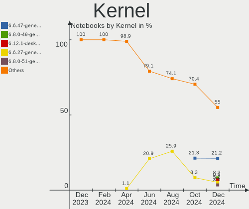
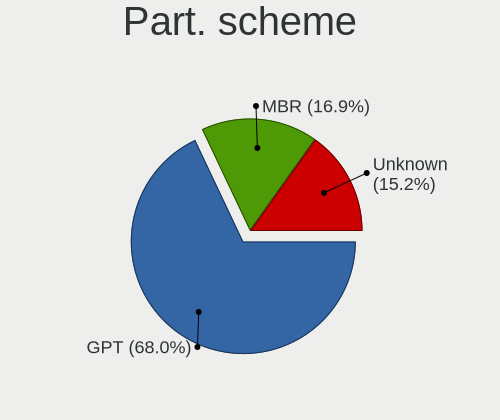
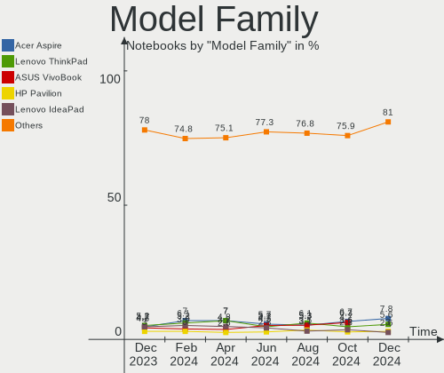
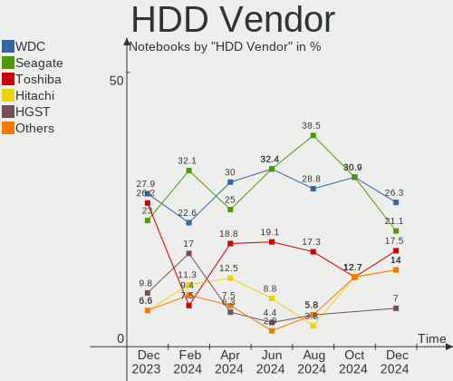
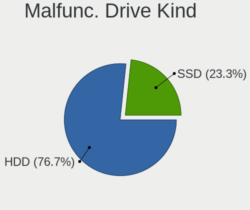
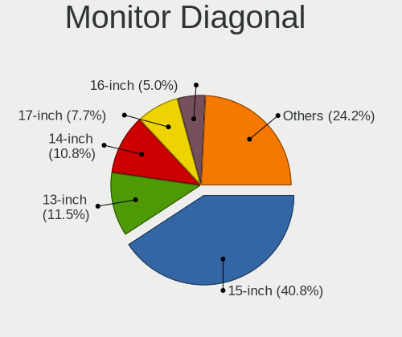
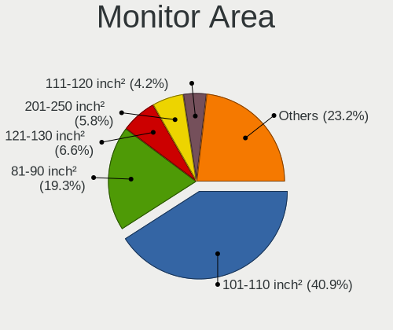
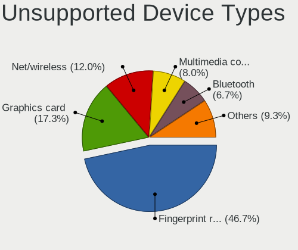

Linux in Russia - Hardware Trends (Notebooks)
---------------------------------------------

A project to identify most popular hardware characteristics and track their change
over time based on data collected by Linux users at https://Linux-Hardware.org.

Anyone can contribute to this report by the [hw-probe](https://github.com/linuxhw/hw-probe) tool:

    sudo -E hw-probe -all -upload

Period: Sep, 2023.

Contents
--------

* [ System ](#system)
  - [ OS                       ](#os)
  - [ OS Family                ](#os-family)
  - [ Kernel                   ](#kernel)
  - [ Kernel Family            ](#kernel-family)
  - [ Kernel Major Ver.        ](#kernel-major-ver)
  - [ Arch                     ](#arch)
  - [ DE                       ](#de)
  - [ Display Server           ](#display-server)
  - [ Display Manager          ](#display-manager)
  - [ OS Lang                  ](#os-lang)
  - [ Boot Mode                ](#boot-mode)
  - [ Filesystem               ](#filesystem)
  - [ Part. scheme             ](#part-scheme)
  - [ Dual Boot with Linux/BSD ](#dual-boot-with-linuxbsd)
  - [ Dual Boot (Win)          ](#dual-boot-win)

* [ Board ](#board)
  - [ Vendor                   ](#vendor)
  - [ Model                    ](#model)
  - [ Model Family             ](#model-family)
  - [ MFG Year                 ](#mfg-year)
  - [ Form Factor              ](#form-factor)
  - [ Secure Boot              ](#secure-boot)
  - [ Coreboot                 ](#coreboot)
  - [ RAM Size                 ](#ram-size)
  - [ RAM Used                 ](#ram-used)
  - [ Total Drives             ](#total-drives)
  - [ Has CD-ROM               ](#has-cd-rom)
  - [ Has Ethernet             ](#has-ethernet)
  - [ Has WiFi                 ](#has-wifi)
  - [ Has Bluetooth            ](#has-bluetooth)

* [ Location ](#location)
  - [ Country                  ](#country)
  - [ City                     ](#city)

* [ Drives ](#drives)
  - [ Drive Vendor             ](#drive-vendor)
  - [ Drive Model              ](#drive-model)
  - [ HDD Vendor               ](#hdd-vendor)
  - [ SSD Vendor               ](#ssd-vendor)
  - [ Drive Kind               ](#drive-kind)
  - [ Drive Connector          ](#drive-connector)
  - [ Drive Size               ](#drive-size)
  - [ Space Total              ](#space-total)
  - [ Space Used               ](#space-used)
  - [ Malfunc. Drives          ](#malfunc-drives)
  - [ Malfunc. Drive Vendor    ](#malfunc-drive-vendor)
  - [ Malfunc. HDD Vendor      ](#malfunc-hdd-vendor)
  - [ Malfunc. Drive Kind      ](#malfunc-drive-kind)
  - [ Failed Drives            ](#failed-drives)
  - [ Failed Drive Vendor      ](#failed-drive-vendor)
  - [ Drive Status             ](#drive-status)

* [ Storage controller ](#storage-controller)
  - [ Storage Vendor           ](#storage-vendor)
  - [ Storage Model            ](#storage-model)
  - [ Storage Kind             ](#storage-kind)

* [ Processor ](#processor)
  - [ CPU Vendor               ](#cpu-vendor)
  - [ CPU Model                ](#cpu-model)
  - [ CPU Model Family         ](#cpu-model-family)
  - [ CPU Cores                ](#cpu-cores)
  - [ CPU Sockets              ](#cpu-sockets)
  - [ CPU Threads              ](#cpu-threads)
  - [ CPU Op-Modes             ](#cpu-op-modes)
  - [ CPU Microcode            ](#cpu-microcode)
  - [ CPU Microarch            ](#cpu-microarch)

* [ Graphics ](#graphics)
  - [ GPU Vendor               ](#gpu-vendor)
  - [ GPU Model                ](#gpu-model)
  - [ GPU Combo                ](#gpu-combo)
  - [ GPU Driver               ](#gpu-driver)
  - [ GPU Memory               ](#gpu-memory)

* [ Monitor ](#monitor)
  - [ Monitor Vendor           ](#monitor-vendor)
  - [ Monitor Model            ](#monitor-model)
  - [ Monitor Resolution       ](#monitor-resolution)
  - [ Monitor Diagonal         ](#monitor-diagonal)
  - [ Monitor Width            ](#monitor-width)
  - [ Aspect Ratio             ](#aspect-ratio)
  - [ Monitor Area             ](#monitor-area)
  - [ Pixel Density            ](#pixel-density)
  - [ Multiple Monitors        ](#multiple-monitors)

* [ Network ](#network)
  - [ Net Controller Vendor    ](#net-controller-vendor)
  - [ Net Controller Model     ](#net-controller-model)
  - [ Wireless Vendor          ](#wireless-vendor)
  - [ Wireless Model           ](#wireless-model)
  - [ Ethernet Vendor          ](#ethernet-vendor)
  - [ Ethernet Model           ](#ethernet-model)
  - [ Net Controller Kind      ](#net-controller-kind)
  - [ Used Controller          ](#used-controller)
  - [ NICs                     ](#nics)
  - [ IPv6                     ](#ipv6)

* [ Bluetooth ](#bluetooth)
  - [ Bluetooth Vendor         ](#bluetooth-vendor)
  - [ Bluetooth Model          ](#bluetooth-model)

* [ Sound ](#sound)
  - [ Sound Vendor             ](#sound-vendor)
  - [ Sound Model              ](#sound-model)

* [ Memory ](#memory)
  - [ Memory Vendor            ](#memory-vendor)
  - [ Memory Model             ](#memory-model)
  - [ Memory Kind              ](#memory-kind)
  - [ Memory Form Factor       ](#memory-form-factor)
  - [ Memory Size              ](#memory-size)
  - [ Memory Speed             ](#memory-speed)

* [ Printers & scanners ](#printers--scanners)
  - [ Printer Vendor           ](#printer-vendor)
  - [ Printer Model            ](#printer-model)
  - [ Scanner Vendor           ](#scanner-vendor)
  - [ Scanner Model            ](#scanner-model)

* [ Camera ](#camera)
  - [ Camera Vendor            ](#camera-vendor)
  - [ Camera Model             ](#camera-model)

* [ Security ](#security)
  - [ Fingerprint Vendor       ](#fingerprint-vendor)
  - [ Fingerprint Model        ](#fingerprint-model)
  - [ Chipcard Vendor          ](#chipcard-vendor)
  - [ Chipcard Model           ](#chipcard-model)

* [ Unsupported ](#unsupported)
  - [ Unsupported Devices      ](#unsupported-devices)
  - [ Unsupported Device Types ](#unsupported-device-types)

System
------

OS
--

Installed operating systems

| Name                         | Notebooks | Percent |
|------------------------------|-----------|---------|
| ROSA 12.4                    | 63        | 25.1%   |
| Fedora 38                    | 24        | 9.56%   |
| Ubuntu 22.04                 | 23        | 9.16%   |
| Debian 12                    | 15        | 5.98%   |
| OpenMandriva 23.08           | 10        | 3.98%   |
| Linux Mint 21.2              | 10        | 3.98%   |
| Arch Rolling                 | 9         | 3.59%   |
| ROSA 12                      | 7         | 2.79%   |
| Ubuntu 23.04                 | 6         | 2.39%   |
| OpenMandriva 23.09           | 6         | 2.39%   |
| SteamOS 3.4.10               | 5         | 1.99%   |
| Red OS 7.3                   | 5         | 1.99%   |
| ROSA R11.1                   | 4         | 1.59%   |
| ALT Linux 10.2               | 4         | 1.59%   |
| Ubuntu 23.10                 | 3         | 1.2%    |
| EndeavourOS Rolling          | 3         | 1.2%    |
| Zorin 16                     | 2         | 0.8%    |
| Xubuntu 20.04                | 2         | 0.8%    |
| Xero Rolling                 | 2         | 0.8%    |
| openSUSE Tumbleweed-XXXXXXXX | 2         | 0.8%    |
| Manjaro 23.0.2               | 2         | 0.8%    |
| Manjaro 23.0.1               | 2         | 0.8%    |
| Manjaro                      | 2         | 0.8%    |
| Linux Mint 21.1              | 2         | 0.8%    |
| Gentoo 2.14                  | 2         | 0.8%    |
| Fedora 39                    | 2         | 0.8%    |
| Fedora 37                    | 2         | 0.8%    |
| ArcoLinux Rolling            | 2         | 0.8%    |
| ALT Linux 10.1.900           | 2         | 0.8%    |
| Xubuntu 22.04                | 1         | 0.4%    |
| Ubuntu Unity 16.04           | 1         | 0.4%    |
| Ubuntu MATE 16.04            | 1         | 0.4%    |
| Ubuntu Budgie 23.04          | 1         | 0.4%    |
| Ubuntu 20.04                 | 1         | 0.4%    |
| ROSA R11                     | 1         | 0.4%    |
| ROSA 13.0                    | 1         | 0.4%    |
| ROSA 12.3                    | 1         | 0.4%    |
| ROSA 12.2                    | 1         | 0.4%    |
| Red OS 7.3.2                 | 1         | 0.4%    |
| Pop!_OS 22.04                | 1         | 0.4%    |

OS Family
---------

OS without a version

| Name          | Notebooks | Percent |
|---------------|-----------|---------|
| ROSA          | 78        | 31.08%  |
| Ubuntu        | 33        | 13.15%  |
| Fedora        | 30        | 11.95%  |
| OpenMandriva  | 18        | 7.17%   |
| Debian        | 16        | 6.37%   |
| Linux Mint    | 13        | 5.18%   |
| Arch          | 9         | 3.59%   |
| Red OS        | 6         | 2.39%   |
| Manjaro       | 6         | 2.39%   |
| ALT Linux     | 6         | 2.39%   |
| SteamOS       | 5         | 1.99%   |
| Xubuntu       | 3         | 1.2%    |
| EndeavourOS   | 3         | 1.2%    |
| Zorin         | 2         | 0.8%    |
| Xero          | 2         | 0.8%    |
| openSUSE      | 2         | 0.8%    |
| Gentoo        | 2         | 0.8%    |
| ArcoLinux     | 2         | 0.8%    |
| Ubuntu Unity  | 1         | 0.4%    |
| Ubuntu MATE   | 1         | 0.4%    |
| Ubuntu Budgie | 1         | 0.4%    |
| Pop!_OS       | 1         | 0.4%    |
| Lubuntu       | 1         | 0.4%    |
| LMDE          | 1         | 0.4%    |
| Linux Lite    | 1         | 0.4%    |
| LFS           | 1         | 0.4%    |
| Kubuntu       | 1         | 0.4%    |
| KDE neon      | 1         | 0.4%    |
| Kali          | 1         | 0.4%    |
| Green         | 1         | 0.4%    |
| Elementary    | 1         | 0.4%    |
| Clear Linux   | 1         | 0.4%    |
| antiX         | 1         | 0.4%    |

Kernel
------

Version of the Linux kernel

| Version                             | Notebooks | Percent |
|-------------------------------------|-----------|---------|
| 6.1.46-generic-2rosa2021.1-x86_64   | 27        | 10.76%  |
| 6.2.0-32-generic                    | 16        | 6.37%   |
| 6.1.20-generic-2rosa2021.1-x86_64   | 15        | 5.98%   |
| 6.1.38-generic-1rosa2021.1-x86_64   | 13        | 5.18%   |
| 6.4.11-desktop-1omv2390             | 9         | 3.59%   |
| 6.2.0-33-generic                    | 9         | 3.59%   |
| 6.2.9-300.fc38.x86_64               | 8         | 3.19%   |
| 6.4.15-200.fc38.x86_64              | 6         | 2.39%   |
| 5.15.0-84-generic                   | 6         | 2.39%   |
| 6.4.13-200.fc38.x86_64              | 5         | 1.99%   |
| 6.4.12-arch1-1                      | 5         | 1.99%   |
| 6.2.0-31-generic                    | 5         | 1.99%   |
| 6.1.0-11-amd64                      | 5         | 1.99%   |
| 5.15.127-generic-1rosa2021.1-x86_64 | 5         | 1.99%   |
| 5.13.0-valve37-1-neptune            | 5         | 1.99%   |
| 6.5.3-arch1-1                       | 4         | 1.59%   |
| 6.1.0-4-amd64                       | 4         | 1.59%   |
| 5.15.0-82-generic                   | 4         | 1.59%   |
| 6.5.2-desktop-1omv2390              | 3         | 1.2%    |
| 6.5.0-5-generic                     | 3         | 1.2%    |
| 6.1.0-12-amd64                      | 3         | 1.2%    |
| 6.1.0-10-amd64                      | 3         | 1.2%    |
| 5.4.83-generic-2rosa-i586           | 3         | 1.2%    |
| 5.15.125-1.el7.3.x86_64             | 3         | 1.2%    |
| 5.15.103-generic-1rosa2021.1-i686   | 3         | 1.2%    |
| 5.10.184-generic-1rosa2021.1-x86_64 | 3         | 1.2%    |
| 6.5.4-zen2-1-zen                    | 2         | 0.8%    |
| 6.5.2-arch1-1                       | 2         | 0.8%    |
| 6.5.1-1-MANJARO                     | 2         | 0.8%    |
| 6.4.8-desktop-2omv2390              | 2         | 0.8%    |
| 6.2.0-26-generic                    | 2         | 0.8%    |
| 6.1.51-1-MANJARO                    | 2         | 0.8%    |
| 5.4.0-163-generic                   | 2         | 0.8%    |
| 5.15.0-83-generic                   | 2         | 0.8%    |
| 5.10.0-25-amd64                     | 2         | 0.8%    |
| 6.6.0-1-MANJARO                     | 1         | 0.4%    |
| 6.6.0-0.rc1.13.fc40.x86_64+debug    | 1         | 0.4%    |
| 6.5.5-desktop-1omv2390              | 1         | 0.4%    |
| 6.5.5-300.fc39.x86_64               | 1         | 0.4%    |
| 6.5.5-100.fc37.x86_64               | 1         | 0.4%    |

Kernel Family
-------------

Linux kernel without a distro release

| Version  | Notebooks | Percent |
|----------|-----------|---------|
| 6.2.0    | 34        | 13.55%  |
| 6.1.46   | 29        | 11.55%  |
| 6.1.20   | 16        | 6.37%   |
| 6.1.0    | 16        | 6.37%   |
| 6.1.38   | 14        | 5.58%   |
| 5.15.0   | 13        | 5.18%   |
| 6.4.11   | 10        | 3.98%   |
| 6.5.0    | 9         | 3.59%   |
| 6.5.3    | 8         | 3.19%   |
| 6.2.9    | 8         | 3.19%   |
| 6.4.12   | 7         | 2.79%   |
| 6.4.15   | 6         | 2.39%   |
| 6.4.13   | 6         | 2.39%   |
| 6.5.2    | 5         | 1.99%   |
| 5.15.127 | 5         | 1.99%   |
| 5.13.0   | 5         | 1.99%   |
| 6.5.4    | 4         | 1.59%   |
| 6.5.1    | 4         | 1.59%   |
| 6.5.5    | 3         | 1.2%    |
| 6.1.51   | 3         | 1.2%    |
| 5.4.83   | 3         | 1.2%    |
| 5.15.125 | 3         | 1.2%    |
| 5.15.103 | 3         | 1.2%    |
| 5.10.184 | 3         | 1.2%    |
| 6.6.0    | 2         | 0.8%    |
| 6.4.8    | 2         | 0.8%    |
| 6.4.6    | 2         | 0.8%    |
| 6.3.12   | 2         | 0.8%    |
| 6.1.49   | 2         | 0.8%    |
| 5.4.0    | 2         | 0.8%    |
| 5.10.0   | 2         | 0.8%    |
| 4.15.0   | 2         | 0.8%    |
| 6.4.14   | 1         | 0.4%    |
| 6.3.1    | 1         | 0.4%    |
| 6.2.15   | 1         | 0.4%    |
| 6.1.54   | 1         | 0.4%    |
| 6.1.52   | 1         | 0.4%    |
| 6.1.44   | 1         | 0.4%    |
| 5.4.32   | 1         | 0.4%    |
| 5.17.11  | 1         | 0.4%    |

Kernel Major Ver.
-----------------

Linux kernel major version

| Version | Notebooks | Percent |
|---------|-----------|---------|
| 6.1     | 83        | 33.07%  |
| 6.2     | 43        | 17.13%  |
| 6.4     | 34        | 13.55%  |
| 6.5     | 33        | 13.15%  |
| 5.15    | 26        | 10.36%  |
| 5.10    | 10        | 3.98%   |
| 5.4     | 6         | 2.39%   |
| 5.13    | 5         | 1.99%   |
| 6.3     | 3         | 1.2%    |
| 6.6     | 2         | 0.8%    |
| 4.15    | 2         | 0.8%    |
| 5.17    | 1         | 0.4%    |
| 5.16    | 1         | 0.4%    |
| 5.14    | 1         | 0.4%    |
| 4.4     | 1         | 0.4%    |

Arch
----

OS architecture (x86_64, i586, etc.)

| Name   | Notebooks | Percent |
|--------|-----------|---------|
| x86_64 | 240       | 95.62%  |
| i686   | 10        | 3.98%   |
| ppc    | 1         | 0.4%    |

DE
--

Desktop Environment

| Name       | Notebooks | Percent |
|------------|-----------|---------|
| GNOME      | 94        | 37.45%  |
| KDE5       | 83        | 33.07%  |
| XFCE       | 14        | 5.58%   |
| X-Cinnamon | 14        | 5.58%   |
| LXQt       | 14        | 5.58%   |
| MATE       | 10        | 3.98%   |
| Unknown    | 8         | 3.19%   |
| KDE4       | 3         | 1.2%    |
| i3         | 3         | 1.2%    |
| Cinnamon   | 2         | 0.8%    |
| Unity      | 1         | 0.4%    |
| Pantheon   | 1         | 0.4%    |
| LXDE       | 1         | 0.4%    |
| icewm      | 1         | 0.4%    |
| Hyprland   | 1         | 0.4%    |
| Budgie     | 1         | 0.4%    |

Display Server
--------------

X11 or Wayland

| Name    | Notebooks | Percent |
|---------|-----------|---------|
| Wayland | 132       | 52.59%  |
| X11     | 110       | 43.82%  |
| Unknown | 5         | 1.99%   |
| Tty     | 4         | 1.59%   |

Display Manager
---------------

SDDM, LightDM, etc.

| Name    | Notebooks | Percent |
|---------|-----------|---------|
| SDDM    | 76        | 30.28%  |
| Unknown | 55        | 21.91%  |
| GDM     | 44        | 17.53%  |
| LightDM | 39        | 15.54%  |
| GDM3    | 33        | 13.15%  |
| KDM     | 3         | 1.2%    |
| SLIMSKI | 1         | 0.4%    |

OS Lang
-------

Language

| Lang    | Notebooks | Percent |
|---------|-----------|---------|
| ru_RU   | 186       | 74.1%   |
| en_US   | 55        | 21.91%  |
| C       | 4         | 1.59%   |
| Unknown | 3         | 1.2%    |
| fr_FR   | 1         | 0.4%    |
| en_GB   | 1         | 0.4%    |
| en_AG   | 1         | 0.4%    |

Boot Mode
---------

EFI or BIOS

| Mode | Notebooks | Percent |
|------|-----------|---------|
| EFI  | 154       | 61.35%  |
| BIOS | 97        | 38.65%  |

Filesystem
----------

Type of filesystem

| Type    | Notebooks | Percent |
|---------|-----------|---------|
| Ext4    | 165       | 65.74%  |
| Btrfs   | 54        | 21.51%  |
| Overlay | 14        | 5.58%   |
| Tmpfs   | 13        | 5.18%   |
| Zfs     | 1         | 0.4%    |
| XXXXX   | 1         | 0.4%    |
| F2fs    | 1         | 0.4%    |
| Aufs    | 1         | 0.4%    |
| Unknown | 1         | 0.4%    |

Part. scheme
------------

Scheme of partitioning

| Type    | Notebooks | Percent |
|---------|-----------|---------|
| GPT     | 153       | 60.96%  |
| MBR     | 49        | 19.52%  |
| Unknown | 49        | 19.52%  |

Dual Boot with Linux/BSD
------------------------

Hosting more than one Linux/BSD

| Dual boot | Notebooks | Percent |
|-----------|-----------|---------|
| No        | 213       | 84.86%  |
| Yes       | 38        | 15.14%  |

Dual Boot (Win)
---------------

Hosting Linux and Windows

| Dual boot | Notebooks | Percent |
|-----------|-----------|---------|
| No        | 158       | 62.95%  |
| Yes       | 93        | 37.05%  |

Board
-----

Vendor
------

Motherboard manufacturer

| Name                              | Notebooks | Percent |
|-----------------------------------|-----------|---------|
| ASUSTek Computer                  | 43        | 17.13%  |
| Lenovo                            | 41        | 16.33%  |
| Hewlett-Packard                   | 37        | 14.74%  |
| Acer                              | 21        | 8.37%   |
| HUAWEI                            | 17        | 6.77%   |
| Timi                              | 10        | 3.98%   |
| Dell                              | 10        | 3.98%   |
| MSI                               | 8         | 3.19%   |
| Clevo                             | 6         | 2.39%   |
| Valve                             | 5         | 1.99%   |
| Samsung Electronics               | 5         | 1.99%   |
| Toshiba                           | 4         | 1.59%   |
| Apple                             | 4         | 1.59%   |
| Unknown                           | 4         | 1.59%   |
| Maibenben                         | 3         | 1.2%    |
| HONOR                             | 3         | 1.2%    |
| Aquarius                          | 3         | 1.2%    |
| Sony                              | 2         | 0.8%    |
| Notebook                          | 2         | 0.8%    |
| iRU                               | 2         | 0.8%    |
| Intel Client Systems              | 2         | 0.8%    |
| Infinix                           | 2         | 0.8%    |
| Fujitsu Siemens                   | 2         | 0.8%    |
| eMachines                         | 2         | 0.8%    |
| TECNO                             | 1         | 0.4%    |
| ROMBICA                           | 1         | 0.4%    |
| realme                            | 1         | 0.4%    |
| Prestigio                         | 1         | 0.4%    |
| Pegatron                          | 1         | 0.4%    |
| Packard Bell                      | 1         | 0.4%    |
| LTD Delovoy Office                | 1         | 0.4%    |
| Kraftway                          | 1         | 0.4%    |
| Irbis                             | 1         | 0.4%    |
| Gigabyte Technology               | 1         | 0.4%    |
| Fujitsu                           | 1         | 0.4%    |
| F-PLUS EQUIPMENT AND DEVELOPMENTS | 1         | 0.4%    |
| Chuwi                             | 1         | 0.4%    |

Model
-----

Motherboard model

| Name                                 | Notebooks | Percent |
|--------------------------------------|-----------|---------|
| Valve Jupiter                        | 5         | 1.99%   |
| Unknown                              | 5         | 1.99%   |
| HUAWEI NBD-WXX9                      | 4         | 1.59%   |
| HUAWEI KLVL-WXXW                     | 4         | 1.59%   |
| HUAWEI BOM-WXX9                      | 4         | 1.59%   |
| Clevo NL41MU2                        | 4         | 1.59%   |
| Timi Redmi Book Pro 15 2022          | 2         | 0.8%    |
| Timi Redmi Book Pro 14S              | 2         | 0.8%    |
| Timi Redmi Book Pro 14 2022          | 2         | 0.8%    |
| Timi A35S                            | 2         | 0.8%    |
| Maibenben MaiBook M                  | 2         | 0.8%    |
| Lenovo IdeaPad Gaming 3 15IMH05 81Y4 | 2         | 0.8%    |
| Intel Client Systems LAPBC710        | 2         | 0.8%    |
| HONOR HYM-WXX                        | 2         | 0.8%    |
| HP ProBook 430 G5                    | 2         | 0.8%    |
| HP Pavilion DV6                      | 2         | 0.8%    |
| HP Laptop 15s-eq2xxx                 | 2         | 0.8%    |
| HP 630                               | 2         | 0.8%    |
| Clevo W240EL/W250ELQ/W270ELQ         | 2         | 0.8%    |
| ASUS K50IJ                           | 2         | 0.8%    |
| Aquarius NS585                       | 2         | 0.8%    |
| Acer Aspire ES1-520                  | 2         | 0.8%    |
| Toshiba Satellite C850-C1S           | 1         | 0.4%    |
| Toshiba Satellite A200               | 1         | 0.4%    |
| Toshiba QOSMIO X300                  | 1         | 0.4%    |
| Toshiba dynabook Satellite B350/B    | 1         | 0.4%    |
| Timi Xiaomi Book Pro 14 2022         | 1         | 0.4%    |
| Timi TM1701                          | 1         | 0.4%    |
| TECNO MEGABOOK T1                    | 1         | 0.4%    |
| Sony VPCEL1E1R                       | 1         | 0.4%    |
| Sony VGN-FW11LR                      | 1         | 0.4%    |
| Samsung R505                         | 1         | 0.4%    |
| Samsung NC210/NC110                  | 1         | 0.4%    |
| Samsung N250P                        | 1         | 0.4%    |
| Samsung 350V5C/351V5C/3540VC/3440VC  | 1         | 0.4%    |
| Samsung 300E4Z/300E5Z/300E7Z         | 1         | 0.4%    |
| ROMBICA myBook Eclipse               | 1         | 0.4%    |
| realme RMNBXXXX                      | 1         | 0.4%    |
| Prestigio Multipad Visconte V        | 1         | 0.4%    |
| Pegatron A35                         | 1         | 0.4%    |

Model Family
------------

Motherboard model prefix

| Name                          | Notebooks | Percent |
|-------------------------------|-----------|---------|
| Acer Aspire                   | 15        | 5.98%   |
| Lenovo IdeaPad                | 14        | 5.58%   |
| ASUS VivoBook                 | 12        | 4.78%   |
| Lenovo ThinkPad               | 11        | 4.38%   |
| HP ProBook                    | 9         | 3.59%   |
| HP Pavilion                   | 9         | 3.59%   |
| HP Laptop                     | 7         | 2.79%   |
| Timi Redmi                    | 6         | 2.39%   |
| Valve Jupiter                 | 5         | 1.99%   |
| HP EliteBook                  | 5         | 1.99%   |
| ASUS ASUS                     | 5         | 1.99%   |
| Unknown                       | 5         | 1.99%   |
| HUAWEI NBD-WXX9               | 4         | 1.59%   |
| HUAWEI KLVL-WXXW              | 4         | 1.59%   |
| HUAWEI BOM-WXX9               | 4         | 1.59%   |
| Dell Inspiron                 | 4         | 1.59%   |
| Clevo NL41MU2                 | 4         | 1.59%   |
| ASUS ZenBook                  | 4         | 1.59%   |
| Maibenben MaiBook             | 3         | 1.2%    |
| ASUS TUF                      | 3         | 1.2%    |
| Toshiba Satellite             | 2         | 0.8%    |
| Timi A35S                     | 2         | 0.8%    |
| MSI Bravo                     | 2         | 0.8%    |
| Lenovo ThinkBook              | 2         | 0.8%    |
| Lenovo G580                   | 2         | 0.8%    |
| Lenovo B590                   | 2         | 0.8%    |
| Intel Client Systems LAPBC710 | 2         | 0.8%    |
| Infinix INBOOK                | 2         | 0.8%    |
| HONOR HYM-WXX                 | 2         | 0.8%    |
| HP ENVY                       | 2         | 0.8%    |
| HP 630                        | 2         | 0.8%    |
| Fujitsu Siemens AMILO         | 2         | 0.8%    |
| Dell Vostro                   | 2         | 0.8%    |
| Clevo W240EL                  | 2         | 0.8%    |
| ASUS ROG                      | 2         | 0.8%    |
| ASUS K50IJ                    | 2         | 0.8%    |
| Aquarius NS585                | 2         | 0.8%    |
| Acer TravelMate               | 2         | 0.8%    |
| Toshiba QOSMIO                | 1         | 0.4%    |
| Toshiba dynabook              | 1         | 0.4%    |

MFG Year
--------

Motherboard manufacture year

| Year    | Notebooks | Percent |
|---------|-----------|---------|
| 2021    | 43        | 17.13%  |
| 2022    | 39        | 15.54%  |
| 2020    | 23        | 9.16%   |
| 2023    | 20        | 7.97%   |
| 2011    | 20        | 7.97%   |
| 2019    | 17        | 6.77%   |
| 2012    | 16        | 6.37%   |
| 2013    | 12        | 4.78%   |
| 2018    | 9         | 3.59%   |
| 2017    | 9         | 3.59%   |
| 2015    | 8         | 3.19%   |
| 2014    | 7         | 2.79%   |
| 2009    | 6         | 2.39%   |
| 2008    | 6         | 2.39%   |
| 2007    | 6         | 2.39%   |
| 2010    | 4         | 1.59%   |
| 2016    | 3         | 1.2%    |
| 2006    | 1         | 0.4%    |
| 2005    | 1         | 0.4%    |
| Unknown | 1         | 0.4%    |

Form Factor
-----------

Physical design of the computer

| Name     | Notebooks | Percent |
|----------|-----------|---------|
| Notebook | 251       | 100%    |

Secure Boot
-----------

Enabled or disabled

| State    | Notebooks | Percent |
|----------|-----------|---------|
| Disabled | 227       | 90.44%  |
| Enabled  | 24        | 9.56%   |

Coreboot
--------

Have coreboot on board

| Used | Notebooks | Percent |
|------|-----------|---------|
| No   | 251       | 100%    |

RAM Size
--------

Total RAM memory

| Size in GB  | Notebooks | Percent |
|-------------|-----------|---------|
| 4.01-8.0    | 88        | 35.06%  |
| 8.01-16.0   | 63        | 25.1%   |
| 16.01-24.0  | 39        | 15.54%  |
| 3.01-4.0    | 27        | 10.76%  |
| 1.01-2.0    | 13        | 5.18%   |
| 32.01-64.0  | 7         | 2.79%   |
| 24.01-32.0  | 5         | 1.99%   |
| 2.01-3.0    | 5         | 1.99%   |
| 0.51-1.0    | 3         | 1.2%    |
| 64.01-256.0 | 1         | 0.4%    |

RAM Used
--------

Used RAM memory

| Used GB    | Notebooks | Percent |
|------------|-----------|---------|
| 1.01-2.0   | 80        | 31.87%  |
| 2.01-3.0   | 60        | 23.9%   |
| 4.01-8.0   | 39        | 15.54%  |
| 3.01-4.0   | 35        | 13.94%  |
| 0.51-1.0   | 18        | 7.17%   |
| 8.01-16.0  | 13        | 5.18%   |
| 0.01-0.5   | 5         | 1.99%   |
| 16.01-24.0 | 1         | 0.4%    |

Total Drives
------------

Number of drives on board

| Drives | Notebooks | Percent |
|--------|-----------|---------|
| 1      | 179       | 71.31%  |
| 2      | 61        | 24.3%   |
| 3      | 9         | 3.59%   |
| 5      | 1         | 0.4%    |
| 0      | 1         | 0.4%    |

Has CD-ROM
----------

Has CD-ROM on board

| Presented | Notebooks | Percent |
|-----------|-----------|---------|
| No        | 196       | 78.09%  |
| Yes       | 55        | 21.91%  |

Has Ethernet
------------

Has Ethernet on board

| Presented | Notebooks | Percent |
|-----------|-----------|---------|
| Yes       | 171       | 68.13%  |
| No        | 80        | 31.87%  |

Has WiFi
--------

Has WiFi module

| Presented | Notebooks | Percent |
|-----------|-----------|---------|
| Yes       | 247       | 98.41%  |
| No        | 4         | 1.59%   |

Has Bluetooth
-------------

Has Bluetooth module

| Presented | Notebooks | Percent |
|-----------|-----------|---------|
| Yes       | 214       | 85.26%  |
| No        | 37        | 14.74%  |

Location
--------

Country
-------

Geographic location (country)

| Country | Notebooks | Percent |
|---------|-----------|---------|
| Russia  | 251       | 100%    |

City
----

Geographic location (city)

| City              | Notebooks | Percent |
|-------------------|-----------|---------|
| Moscow            | 64        | 25.5%   |
| St Petersburg     | 31        | 12.35%  |
| Voronezh          | 7         | 2.79%   |
| Rostov-on-Don     | 7         | 2.79%   |
| Krasnodar         | 7         | 2.79%   |
| Perm              | 6         | 2.39%   |
| Chelyabinsk       | 6         | 2.39%   |
| Yekaterinburg     | 5         | 1.99%   |
| Tyumen            | 4         | 1.59%   |
| Samara            | 4         | 1.59%   |
| Nizhniy Novgorod  | 4         | 1.59%   |
| Volgograd         | 3         | 1.2%    |
| Saratov           | 3         | 1.2%    |
| Novosibirsk       | 3         | 1.2%    |
| Krasnoyarsk       | 3         | 1.2%    |
| Belgorod          | 3         | 1.2%    |
| Barnaul           | 3         | 1.2%    |
| Balashikha        | 3         | 1.2%    |
| Yuzhno-Sakhalinsk | 2         | 0.8%    |
| Yoshkar-Ola       | 2         | 0.8%    |
| Vladivostok       | 2         | 0.8%    |
| Sochi             | 2         | 0.8%    |
| Omsk              | 2         | 0.8%    |
| Moscow Oblast     | 2         | 0.8%    |
| Kirov             | 2         | 0.8%    |
| Khabarovsk        | 2         | 0.8%    |
| Kazan’          | 2         | 0.8%    |
| Kaluga            | 2         | 0.8%    |
| Irkutsk           | 2         | 0.8%    |
| Zlatoust          | 1         | 0.4%    |
| Zernograd         | 1         | 0.4%    |
| Yelizovo          | 1         | 0.4%    |
| Yaroslavl         | 1         | 0.4%    |
| Volzhsky          | 1         | 0.4%    |
| Vlasikha          | 1         | 0.4%    |
| Vladimir          | 1         | 0.4%    |
| Ulan-Ude          | 1         | 0.4%    |
| Ufa               | 1         | 0.4%    |
| Tver              | 1         | 0.4%    |
| Tolyatti          | 1         | 0.4%    |

Drives
------

Drive Vendor
------------

Hard drive vendors

| Vendor                      | Notebooks | Drives | Percent |
|-----------------------------|-----------|--------|---------|
| Samsung Electronics         | 43        | 45     | 13.48%  |
| Seagate                     | 33        | 38     | 10.34%  |
| WDC                         | 31        | 33     | 9.72%   |
| Toshiba                     | 18        | 19     | 5.64%   |
| SK hynix                    | 16        | 16     | 5.02%   |
| SanDisk                     | 15        | 15     | 4.7%    |
| Kingston                    | 12        | 12     | 3.76%   |
| Unknown                     | 11        | 13     | 3.45%   |
| Micron Technology           | 11        | 11     | 3.45%   |
| KIOXIA                      | 8         | 8      | 2.51%   |
| Intel                       | 8         | 8      | 2.51%   |
| Hitachi                     | 8         | 8      | 2.51%   |
| A-DATA Technology           | 8         | 8      | 2.51%   |
| Silicon Motion              | 7         | 7      | 2.19%   |
| Crucial                     | 7         | 7      | 2.19%   |
| China                       | 5         | 5      | 1.57%   |
| Phison Electronics          | 4         | 4      | 1.25%   |
| Phison                      | 4         | 4      | 1.25%   |
| HGST                        | 4         | 4      | 1.25%   |
| FORESEE                     | 4         | 4      | 1.25%   |
| BIWIN                       | 4         | 4      | 1.25%   |
| XrayDisk                    | 3         | 3      | 0.94%   |
| SPCC                        | 3         | 3      | 0.94%   |
| Netac                       | 3         | 3      | 0.94%   |
| Apacer                      | 3         | 3      | 0.94%   |
| AMD                         | 3         | 3      | 0.94%   |
| UMIS                        | 2         | 2      | 0.63%   |
| TO Exter                    | 2         | 2      | 0.63%   |
| O2 Micro                    | 2         | 2      | 0.63%   |
| Micron/Crucial Technology   | 2         | 2      | 0.63%   |
| HUAWEI                      | 2         | 2      | 0.63%   |
| Fujitsu                     | 2         | 3      | 0.63%   |
| Apple                       | 2         | 2      | 0.63%   |
| ADATA Technology            | 2         | 2      | 0.63%   |
| Unknown                     | 2         | 2      | 0.63%   |
| YMTC                        | 1         | 1      | 0.31%   |
| Yangtze Memory Technologies | 1         | 1      | 0.31%   |
| Union Memory (Shenzhen)     | 1         | 1      | 0.31%   |
| Union Memory                | 1         | 1      | 0.31%   |
| Team                        | 1         | 1      | 0.31%   |

Drive Model
-----------

Hard drive models

| Model                                                 | Notebooks | Percent |
|-------------------------------------------------------|-----------|---------|
| Seagate ST1000LM024 HN-M101MBB 1TB                    | 7         | 2.13%   |
| Toshiba MQ01ABF050 500GB                              | 6         | 1.82%   |
| WDC WDS120G2G0A-00JH30 120GB SSD                      | 5         | 1.52%   |
| Seagate ST500LT012-1DG142 500GB                       | 5         | 1.52%   |
| Samsung NVMe SSD Controller PM9A1/PM9A3/980PRO 1TB    | 5         | 1.52%   |
| Micron 2400_MTFDKBA512QFM 512GB                       | 5         | 1.52%   |
| Unknown NVMe SSD Drive 512GB                          | 4         | 1.22%   |
| SK hynix HFM512GD3JX013N 512GB                        | 4         | 1.22%   |
| SK hynix BC511 HFM512GDJTNI-82A0A 512GB               | 4         | 1.22%   |
| Seagate ST1000LM035-1RK172 1TB                        | 4         | 1.22%   |
| KIOXIA KBG50ZNV512G 512GB                             | 4         | 1.22%   |
| Intel SSDPEKNU512GZ 512GB                             | 4         | 1.22%   |
| BIWIN CE480T5D101-256 256GB                           | 4         | 1.22%   |
| Unknown MMC Card  512GB                               | 3         | 0.91%   |
| Toshiba MQ04ABF100 1TB                                | 3         | 0.91%   |
| Silicon Motion PCIe-8 SSD 512GB                       | 3         | 0.91%   |
| Sandisk WD Black SN750 / PC SN730 NVMe SSD 512GB      | 3         | 0.91%   |
| Samsung MZVLQ512HBLU-00B00 512GB                      | 3         | 0.91%   |
| Phison 311CD0512GB                                    | 3         | 0.91%   |
| Kingston SA400S37480G 480GB SSD                       | 3         | 0.91%   |
| Crucial CT240BX500SSD1 240GB                          | 3         | 0.91%   |
| A-DATA SU800 512GB SSD                                | 3         | 0.91%   |
| WDC WD10SPZX-22Z10T1 1TB                              | 2         | 0.61%   |
| WDC WD10JPCX-24UE4T0 1TB                              | 2         | 0.61%   |
| WDC PC SN530 SDBPNPZ-256G-1006 256GB                  | 2         | 0.61%   |
| Toshiba MQ01ABD032 320GB                              | 2         | 0.61%   |
| Toshiba KBG30ZMT256G 256GB                            | 2         | 0.61%   |
| TO Exter nal USB 3.0 120GB                            | 2         | 0.61%   |
| SPCC Solid State Disk 256GB                           | 2         | 0.61%   |
| Silicon Motion SM2263EN/SM2263XT SSD Controller 512GB | 2         | 0.61%   |
| Seagate ST9500325AS 500GB                             | 2         | 0.61%   |
| Seagate ST1000LX015-1U7172 1TB                        | 2         | 0.61%   |
| Sandisk PC SN520 NVMe SSD 512GB                       | 2         | 0.61%   |
| Samsung NVMe SSD Controller SM981/PM981/PM983 256GB   | 2         | 0.61%   |
| Samsung NVMe SSD Controller SM961/PM961/SM963 500GB   | 2         | 0.61%   |
| Samsung MZVL4512HBLU-00BTW 512GB                      | 2         | 0.61%   |
| Samsung MZVL2512HCJQ-00B00 512GB                      | 2         | 0.61%   |
| Samsung MZALQ512HALU-000L2 512GB                      | 2         | 0.61%   |
| Samsung MZALQ256HAJD-000L2 256GB                      | 2         | 0.61%   |
| Phison PS5013 E13 NVMe Controller 512GB               | 2         | 0.61%   |

HDD Vendor
----------

Hard disk drive vendors

| Vendor              | Notebooks | Drives | Percent |
|---------------------|-----------|--------|---------|
| Seagate             | 31        | 35     | 36.47%  |
| WDC                 | 19        | 19     | 22.35%  |
| Toshiba             | 16        | 17     | 18.82%  |
| Hitachi             | 8         | 8      | 9.41%   |
| HGST                | 4         | 4      | 4.71%   |
| Samsung Electronics | 2         | 2      | 2.35%   |
| Fujitsu             | 2         | 3      | 2.35%   |
| Initio              | 1         | 1      | 1.18%   |
| External            | 1         | 1      | 1.18%   |
| Unknown             | 1         | 1      | 1.18%   |

SSD Vendor
----------

Solid state drive vendors

| Vendor              | Notebooks | Drives | Percent |
|---------------------|-----------|--------|---------|
| Samsung Electronics | 9         | 10     | 11.84%  |
| WDC                 | 8         | 8      | 10.53%  |
| Crucial             | 7         | 7      | 9.21%   |
| A-DATA Technology   | 7         | 7      | 9.21%   |
| Kingston            | 6         | 6      | 7.89%   |
| China               | 5         | 5      | 6.58%   |
| SanDisk             | 4         | 4      | 5.26%   |
| SPCC                | 3         | 3      | 3.95%   |
| Apacer              | 3         | 3      | 3.95%   |
| XrayDisk            | 2         | 2      | 2.63%   |
| TO Exter            | 2         | 2      | 2.63%   |
| Apple               | 2         | 2      | 2.63%   |
| AMD                 | 2         | 2      | 2.63%   |
| Team                | 1         | 1      | 1.32%   |
| NT-256              | 1         | 1      | 1.32%   |
| NGFF                | 1         | 1      | 1.32%   |
| Netac               | 1         | 1      | 1.32%   |
| Neo                 | 1         | 1      | 1.32%   |
| Micron Technology   | 1         | 1      | 1.32%   |
| Londisk             | 1         | 1      | 1.32%   |
| Lexar               | 1         | 1      | 1.32%   |
| Kingmax             | 1         | 1      | 1.32%   |
| KingFast            | 1         | 1      | 1.32%   |
| Kingchuxing         | 1         | 1      | 1.32%   |
| Intel               | 1         | 1      | 1.32%   |
| GS                  | 1         | 1      | 1.32%   |
| DEXP                | 1         | 1      | 1.32%   |
| Azerty              | 1         | 1      | 1.32%   |
| AEGO                | 1         | 1      | 1.32%   |

Drive Kind
----------

HDD or SSD

| Kind    | Notebooks | Drives | Percent |
|---------|-----------|--------|---------|
| NVMe    | 138       | 147    | 45.25%  |
| HDD     | 82        | 91     | 26.89%  |
| SSD     | 71        | 77     | 23.28%  |
| MMC     | 8         | 11     | 2.62%   |
| Unknown | 6         | 6      | 1.97%   |

Drive Connector
---------------

SATA, SAS, NVMe, etc.

| Type | Notebooks | Drives | Percent |
|------|-----------|--------|---------|
| NVMe | 138       | 147    | 48.42%  |
| SATA | 128       | 161    | 44.91%  |
| SAS  | 11        | 13     | 3.86%   |
| MMC  | 8         | 11     | 2.81%   |

Drive Size
----------

Size of hard drive

| Size in TB | Notebooks | Drives | Percent |
|------------|-----------|--------|---------|
| 0.01-0.5   | 95        | 110    | 64.19%  |
| 0.51-1.0   | 44        | 49     | 29.73%  |
| 1.01-2.0   | 6         | 6      | 4.05%   |
| 4.01-10.0  | 2         | 2      | 1.35%   |
| 3.01-4.0   | 1         | 1      | 0.68%   |

Space Total
-----------

Amount of disk space available on the file system

| Size in GB     | Notebooks | Percent |
|----------------|-----------|---------|
| 251-500        | 66        | 26.29%  |
| 101-250        | 64        | 25.5%   |
| 501-1000       | 41        | 16.33%  |
| 51-100         | 19        | 7.57%   |
| 21-50          | 15        | 5.98%   |
| 1001-2000      | 14        | 5.58%   |
| 1-20           | 13        | 5.18%   |
| Unknown        | 10        | 3.98%   |
| 2001-3000      | 5         | 1.99%   |
| More than 3000 | 4         | 1.59%   |

Space Used
----------

Amount of used disk space

| Used GB        | Notebooks | Percent |
|----------------|-----------|---------|
| 1-20           | 110       | 43.82%  |
| 21-50          | 45        | 17.93%  |
| 51-100         | 33        | 13.15%  |
| 101-250        | 22        | 8.76%   |
| 251-500        | 15        | 5.98%   |
| Unknown        | 10        | 3.98%   |
| 501-1000       | 9         | 3.59%   |
| 1001-2000      | 4         | 1.59%   |
| More than 3000 | 2         | 0.8%    |
| 2001-3000      | 1         | 0.4%    |

Malfunc. Drives
---------------

Drive models with a malfunction

| Model                              | Notebooks | Drives | Percent |
|------------------------------------|-----------|--------|---------|
| Seagate ST500LT012-1DG142 500GB    | 2         | 2      | 6.25%   |
| WDC WDS120G2G0A-00JH30 120GB SSD   | 1         | 1      | 3.13%   |
| WDC WD7500BPVT-75HXZT3 752GB       | 1         | 1      | 3.13%   |
| WDC WD5000LPVX-55V0TT0 500GB       | 1         | 1      | 3.13%   |
| WDC WD5000LPCX-60VHAT1 500GB       | 1         | 1      | 3.13%   |
| WDC WD2500BEVT-22A23T0 208GB       | 1         | 1      | 3.13%   |
| WDC WD1200BEVS-08RST2 120GB        | 1         | 1      | 3.13%   |
| WDC WD10JPCX-24UE4T0 1TB           | 1         | 1      | 3.13%   |
| Toshiba MQ04ABF100 1TB             | 1         | 1      | 3.13%   |
| Toshiba MQ01ABF050 500GB           | 1         | 1      | 3.13%   |
| Toshiba MK5075GSX 500GB            | 1         | 1      | 3.13%   |
| Toshiba MK3265GSX 320GB            | 1         | 1      | 3.13%   |
| Toshiba MK2556GSY 250GB            | 1         | 1      | 3.13%   |
| Seagate ST980812AS 80GB            | 1         | 1      | 3.13%   |
| Seagate ST9500325AS 500GB          | 1         | 1      | 3.13%   |
| Seagate ST9320423AS 320GB          | 1         | 1      | 3.13%   |
| Seagate ST9320325AS 320GB          | 1         | 1      | 3.13%   |
| Seagate ST500LT012-9WS142 500GB    | 1         | 1      | 3.13%   |
| Seagate ST1000LM049-2GH172 1TB     | 1         | 1      | 3.13%   |
| Seagate ST1000LM048-2E7172 1TB     | 1         | 1      | 3.13%   |
| Seagate ST1000LM024 HN-M101MBB 1TB | 1         | 1      | 3.13%   |
| SanDisk SSD PLUS 240GB             | 1         | 1      | 3.13%   |
| Samsung Electronics HM250HI 250GB  | 1         | 1      | 3.13%   |
| Netac SSD 256GB                    | 1         | 1      | 3.13%   |
| Kingston SA400S37120GB SSD         | 1         | 1      | 3.13%   |
| Kingmax SSD 120GB                  | 1         | 1      | 3.13%   |
| Kingchuxing SSD 256GB              | 1         | 1      | 3.13%   |
| Hitachi HTS543232A7A384 320GB      | 1         | 1      | 3.13%   |
| Hitachi HTS542516K9SA00 160GB      | 1         | 1      | 3.13%   |
| Hitachi HTS542512K9SA00 120GB      | 1         | 1      | 3.13%   |
| Apple SSD SM0512F 500GB            | 1         | 1      | 3.13%   |

Malfunc. Drive Vendor
---------------------

Vendors of faulty drives

| Vendor              | Notebooks | Drives | Percent |
|---------------------|-----------|--------|---------|
| Seagate             | 9         | 10     | 30%     |
| WDC                 | 7         | 7      | 23.33%  |
| Toshiba             | 4         | 5      | 13.33%  |
| Hitachi             | 3         | 3      | 10%     |
| SanDisk             | 1         | 1      | 3.33%   |
| Samsung Electronics | 1         | 1      | 3.33%   |
| Netac               | 1         | 1      | 3.33%   |
| Kingston            | 1         | 1      | 3.33%   |
| Kingmax             | 1         | 1      | 3.33%   |
| Kingchuxing         | 1         | 1      | 3.33%   |
| Apple               | 1         | 1      | 3.33%   |

Malfunc. HDD Vendor
-------------------

Vendors of faulty HDD drives

| Vendor              | Notebooks | Drives | Percent |
|---------------------|-----------|--------|---------|
| Seagate             | 9         | 10     | 39.13%  |
| WDC                 | 6         | 6      | 26.09%  |
| Toshiba             | 4         | 5      | 17.39%  |
| Hitachi             | 3         | 3      | 13.04%  |
| Samsung Electronics | 1         | 1      | 4.35%   |

Malfunc. Drive Kind
-------------------

Kinds of faulty drives

| Kind | Notebooks | Drives | Percent |
|------|-----------|--------|---------|
| HDD  | 23        | 25     | 76.67%  |
| SSD  | 7         | 7      | 23.33%  |

Failed Drives
-------------

Failed drive models

Zero info for selected period =(

Failed Drive Vendor
-------------------

Failed drive vendors

Zero info for selected period =(

Drive Status
------------

Number of failed and malfunc. drives

| Status   | Notebooks | Drives | Percent |
|----------|-----------|--------|---------|
| Works    | 161       | 195    | 58.76%  |
| Detected | 83        | 105    | 30.29%  |
| Malfunc  | 30        | 32     | 10.95%  |

Storage controller
------------------

Storage Vendor
--------------

Storage controller vendors

| Vendor                                  | Notebooks | Percent |
|-----------------------------------------|-----------|---------|
| Intel                                   | 138       | 43.53%  |
| AMD                                     | 40        | 12.62%  |
| Samsung Electronics                     | 31        | 9.78%   |
| SanDisk                                 | 17        | 5.36%   |
| SK hynix                                | 15        | 4.73%   |
| Micron Technology                       | 10        | 3.15%   |
| Silicon Motion                          | 9         | 2.84%   |
| Phison Electronics                      | 9         | 2.84%   |
| KIOXIA                                  | 8         | 2.52%   |
| Kingston Technology Company             | 7         | 2.21%   |
| Shenzhen Longsys Electronics            | 5         | 1.58%   |
| INNOGRIT                                | 4         | 1.26%   |
| Union Memory (Shenzhen)                 | 3         | 0.95%   |
| MAXIO Technology (Hangzhou)             | 3         | 0.95%   |
| ADATA Technology                        | 3         | 0.95%   |
| Yangtze Memory Technologies             | 2         | 0.63%   |
| Toshiba America Info Systems            | 2         | 0.63%   |
| O2 Micro                                | 2         | 0.63%   |
| Micron/Crucial Technology               | 2         | 0.63%   |
| Shenzhen Unionmemory Information System | 1         | 0.32%   |
| Seagate Technology                      | 1         | 0.32%   |
| Nvidia                                  | 1         | 0.32%   |
| Netac Technology                        | 1         | 0.32%   |
| Marvell Technology Group                | 1         | 0.32%   |
| Jiangsu Huacun Elec.                    | 1         | 0.32%   |
| Unknown                                 | 1         | 0.32%   |

Storage Model
-------------

Storage controller models

| Model                                                                          | Notebooks | Percent |
|--------------------------------------------------------------------------------|-----------|---------|
| AMD FCH SATA Controller [AHCI mode]                                            | 35        | 10.51%  |
| Intel 7 Series Chipset Family 6-port SATA Controller [AHCI mode]               | 19        | 5.71%   |
| Samsung NVMe SSD Controller 980                                                | 16        | 4.8%    |
| Intel Volume Management Device NVMe RAID Controller                            | 12        | 3.6%    |
| Intel 6 Series/C200 Series Chipset Family 6 port Mobile SATA AHCI Controller   | 11        | 3.3%    |
| Intel Tiger Lake-LP SATA Controller                                            | 10        | 3%      |
| Intel Sunrise Point-LP SATA Controller [AHCI mode]                             | 9         | 2.7%    |
| SK hynix Gold P31/BC711/PC711 NVMe Solid State Drive                           | 8         | 2.4%    |
| Intel 82801 Mobile SATA Controller [RAID mode]                                 | 8         | 2.4%    |
| Samsung NVMe SSD Controller PM9A1/PM9A3/980PRO                                 | 7         | 2.1%    |
| Intel 82801IBM/IEM (ICH9M/ICH9M-E) 4 port SATA Controller [AHCI mode]          | 7         | 2.1%    |
| Phison PS5013 E13 NVMe Controller                                              | 6         | 1.8%    |
| Micron 2400 NVMe SSD (DRAM-less)                                               | 6         | 1.8%    |
| Intel 8 Series/C220 Series Chipset Family 6-port SATA Controller 1 [AHCI mode] | 6         | 1.8%    |
| SK hynix BC511 NVMe SSD                                                        | 5         | 1.5%    |
| Silicon Motion Non-Volatile memory controller                                  | 5         | 1.5%    |
| Shenzhen Longsys Lexar NM620 NVME SSD (DRAM-less)                              | 5         | 1.5%    |
| SanDisk WD Black SN750 / PC SN730 NVMe SSD                                     | 5         | 1.5%    |
| Intel SSD 670p Series [Keystone Harbor]                                        | 5         | 1.5%    |
| Intel NM10/ICH7 Family SATA Controller [AHCI mode]                             | 5         | 1.5%    |
| Intel Cannon Point-LP SATA Controller [AHCI Mode]                              | 5         | 1.5%    |
| Intel Cannon Lake Mobile PCH SATA AHCI Controller                              | 5         | 1.5%    |
| AMD SB7x0/SB8x0/SB9x0 SATA Controller [AHCI mode]                              | 5         | 1.5%    |
| Silicon Motion SM2263EN/SM2263XT (DRAM-less) NVMe SSD Controllers              | 4         | 1.2%    |
| SanDisk WD Blue SN550 NVMe SSD                                                 | 4         | 1.2%    |
| KIOXIA NVMe SSD Controller BG5 (DRAM-less)                                     | 4         | 1.2%    |
| KIOXIA NVMe SSD Controller BG4 (DRAM-less)                                     | 4         | 1.2%    |
| Intel 82801HM/HEM (ICH8M/ICH8M-E) SATA Controller [AHCI mode]                  | 4         | 1.2%    |
| Intel 82801HM/HEM (ICH8M/ICH8M-E) IDE Controller                               | 4         | 1.2%    |
| INNOGRIT NVMe SSD Controller IG5216 (DRAM-less)                                | 4         | 1.2%    |
| Samsung NVMe SSD Controller SM981/PM981/PM983                                  | 3         | 0.9%    |
| Samsung NVMe SSD Controller PM9B1                                              | 3         | 0.9%    |
| MAXIO (Hangzhou) NVMe SSD Controller MAP1202                                   | 3         | 0.9%    |
| Intel Jasper Lake SATA AHCI Controller                                         | 3         | 0.9%    |
| Intel 82801G (ICH7 Family) IDE Controller                                      | 3         | 0.9%    |
| Intel 8 Series SATA Controller 1 [AHCI mode]                                   | 3         | 0.9%    |
| Intel 400 Series Chipset Family SATA AHCI Controller                           | 3         | 0.9%    |
| Yangtze Memory PC005 NVMe SSD                                                  | 2         | 0.6%    |
| Union Memory (Shenzhen) AM620 PCIe 3.0 NVMe SSD 512GB                          | 2         | 0.6%    |
| Toshiba America Info Systems BG3 NVMe SSD Controller                           | 2         | 0.6%    |

Storage Kind
------------

Kind of storage controller (IDE, SATA, NVMe, SAS, ...)

| Kind | Notebooks | Percent |
|------|-----------|---------|
| SATA | 154       | 47.53%  |
| NVMe | 137       | 42.28%  |
| RAID | 21        | 6.48%   |
| IDE  | 12        | 3.7%    |

Processor
---------

CPU Vendor
----------

Processor vendors

| Vendor       | Notebooks | Percent |
|--------------|-----------|---------|
| Intel        | 168       | 66.93%  |
| AMD          | 82        | 32.67%  |
| PowerBook5,6 | 1         | 0.4%    |

CPU Model
---------

Processor models

| Model                                         | Notebooks | Percent |
|-----------------------------------------------|-----------|---------|
| AMD Ryzen 5 5500U with Radeon Graphics        | 10        | 3.98%   |
| Intel 11th Gen Core i5-1135G7 @ 2.40GHz       | 9         | 3.59%   |
| Intel 11th Gen Core i3-1115G4 @ 3.00GHz       | 9         | 3.59%   |
| AMD Ryzen 7 5700U with Radeon Graphics        | 6         | 2.39%   |
| Intel Core i7-10750H CPU @ 2.60GHz            | 5         | 1.99%   |
| Intel 11th Gen Core i7-1165G7 @ 2.80GHz       | 5         | 1.99%   |
| AMD Custom APU 0405                           | 5         | 1.99%   |
| Intel Core i5-3210M CPU @ 2.50GHz             | 4         | 1.59%   |
| Intel Core i3-1005G1 CPU @ 1.20GHz            | 4         | 1.59%   |
| AMD Ryzen 7 5800H with Radeon Graphics        | 4         | 1.59%   |
| Intel Pentium CPU B960 @ 2.20GHz              | 3         | 1.2%    |
| Intel Core i7-3630QM CPU @ 2.40GHz            | 3         | 1.2%    |
| Intel Core i5-8300H CPU @ 2.30GHz             | 3         | 1.2%    |
| Intel Core i5-6200U CPU @ 2.30GHz             | 3         | 1.2%    |
| Intel Core i5-2450M CPU @ 2.50GHz             | 3         | 1.2%    |
| Intel 12th Gen Core i5-12500H                 | 3         | 1.2%    |
| AMD Ryzen 5 6600H with Radeon Graphics        | 3         | 1.2%    |
| AMD Ryzen 5 5600H with Radeon Graphics        | 3         | 1.2%    |
| AMD Ryzen 5 3500U with Radeon Vega Mobile Gfx | 3         | 1.2%    |
| Intel Pentium Gold 7505 @ 2.00GHz             | 2         | 0.8%    |
| Intel Core i7-9750H CPU @ 2.60GHz             | 2         | 0.8%    |
| Intel Core i7-4700HQ CPU @ 2.40GHz            | 2         | 0.8%    |
| Intel Core i5-9300H CPU @ 2.40GHz             | 2         | 0.8%    |
| Intel Core i5-8265U CPU @ 1.60GHz             | 2         | 0.8%    |
| Intel Core i5-8259U CPU @ 2.30GHz             | 2         | 0.8%    |
| Intel Core i5-8250U CPU @ 1.60GHz             | 2         | 0.8%    |
| Intel Core i5-7200U CPU @ 2.50GHz             | 2         | 0.8%    |
| Intel Core i5-4200U CPU @ 1.60GHz             | 2         | 0.8%    |
| Intel Core i5-3230M CPU @ 2.60GHz             | 2         | 0.8%    |
| Intel Core i5-2430M CPU @ 2.40GHz             | 2         | 0.8%    |
| Intel Core i3-9100 CPU @ 3.60GHz              | 2         | 0.8%    |
| Intel Core i3-3120M CPU @ 2.50GHz             | 2         | 0.8%    |
| Intel Celeron CPU B830 @ 1.80GHz              | 2         | 0.8%    |
| Intel Celeron CPU B800 @ 1.50GHz              | 2         | 0.8%    |
| Intel Atom CPU N570 @ 1.66GHz                 | 2         | 0.8%    |
| Intel 12th Gen Core i7-12700H                 | 2         | 0.8%    |
| Intel 12th Gen Core i5-1235U                  | 2         | 0.8%    |
| Intel 11th Gen Core i7-1185G7 @ 3.00GHz       | 2         | 0.8%    |
| Intel 11th Gen Core i7-11370H @ 3.30GHz       | 2         | 0.8%    |
| Intel 11th Gen Core i5-11300H @ 3.10GHz       | 2         | 0.8%    |

CPU Model Family
----------------

Processor model prefix

| Model                          | Notebooks | Percent |
|--------------------------------|-----------|---------|
| Other                          | 48        | 19.12%  |
| Intel Core i5                  | 43        | 17.13%  |
| AMD Ryzen 7                    | 25        | 9.96%   |
| AMD Ryzen 5                    | 25        | 9.96%   |
| Intel Core i7                  | 21        | 8.37%   |
| Intel Core i3                  | 16        | 6.37%   |
| Intel Celeron                  | 13        | 5.18%   |
| Intel Atom                     | 7         | 2.79%   |
| Intel Pentium                  | 6         | 2.39%   |
| Intel Core 2 Duo               | 5         | 1.99%   |
| AMD Ryzen 3                    | 4         | 1.59%   |
| AMD Ryzen 9                    | 3         | 1.2%    |
| AMD A6                         | 3         | 1.2%    |
| AMD A4                         | 3         | 1.2%    |
| Intel Pentium Silver           | 2         | 0.8%    |
| Intel Pentium Gold             | 2         | 0.8%    |
| Intel Pentium Dual-Core        | 2         | 0.8%    |
| Intel Genuine                  | 2         | 0.8%    |
| Intel Celeron M                | 2         | 0.8%    |
| Intel Celeron Dual-Core        | 2         | 0.8%    |
| AMD E2                         | 2         | 0.8%    |
| AMD E1                         | 2         | 0.8%    |
| Intel Pentium Dual             | 1         | 0.4%    |
| Intel Core i9                  | 1         | 0.4%    |
| Intel Core 2                   | 1         | 0.4%    |
| AMD V140                       | 1         | 0.4%    |
| AMD Turion X2 Dual-Core Mobile | 1         | 0.4%    |
| AMD Turion 64 X2 Mobile        | 1         | 0.4%    |
| AMD Ryzen 7 PRO                | 1         | 0.4%    |
| AMD Phenom II                  | 1         | 0.4%    |
| AMD E                          | 1         | 0.4%    |
| AMD C-60                       | 1         | 0.4%    |
| AMD Athlon                     | 1         | 0.4%    |
| AMD A8                         | 1         | 0.4%    |
| AMD A10                        | 1         | 0.4%    |

CPU Cores
---------

Number of processor cores

| Number | Notebooks | Percent |
|--------|-----------|---------|
| 2      | 102       | 40.64%  |
| 4      | 72        | 28.69%  |
| 8      | 29        | 11.55%  |
| 6      | 29        | 11.55%  |
| 1      | 6         | 2.39%   |
| 12     | 5         | 1.99%   |
| 10     | 5         | 1.99%   |
| 14     | 3         | 1.2%    |

CPU Sockets
-----------

Number of sockets

| Number | Notebooks | Percent |
|--------|-----------|---------|
| 1      | 251       | 100%    |

CPU Threads
-----------

Threads per core (Hyper-Threading)

| Number | Notebooks | Percent |
|--------|-----------|---------|
| 2      | 189       | 75.3%   |
| 1      | 62        | 24.7%   |

CPU Op-Modes
------------

CPU Operation Modes (32-bit, 64-bit)

| Op mode        | Notebooks | Percent |
|----------------|-----------|---------|
| 32-bit, 64-bit | 247       | 98.41%  |
| 32-bit         | 4         | 1.59%   |

CPU Microcode
-------------

Microcode number

| Number     | Notebooks | Percent |
|------------|-----------|---------|
| Unknown    | 92        | 36.65%  |
| 0x806c1    | 12        | 4.78%   |
| 0x206a7    | 11        | 4.38%   |
| 0x0a50000c | 10        | 3.98%   |
| 0x08608103 | 10        | 3.98%   |
| 0x306a9    | 9         | 3.59%   |
| 0x906a3    | 5         | 1.99%   |
| 0x1067a    | 5         | 1.99%   |
| 0x08608102 | 5         | 1.99%   |
| 0x06006705 | 5         | 1.99%   |
| 0x906ea    | 4         | 1.59%   |
| 0x40651    | 4         | 1.59%   |
| 0x106ca    | 4         | 1.59%   |
| 0x08108109 | 4         | 1.59%   |
| 0x08108102 | 4         | 1.59%   |
| 0x706e5    | 3         | 1.2%    |
| 0x6fd      | 3         | 1.2%    |
| 0x306c3    | 3         | 1.2%    |
| 0x0a50000d | 3         | 1.2%    |
| 0x0a404102 | 3         | 1.2%    |
| 0x0a404101 | 3         | 1.2%    |
| 0x08600106 | 3         | 1.2%    |
| 0x906eb    | 2         | 0.8%    |
| 0x906c0    | 2         | 0.8%    |
| 0x906a4    | 2         | 0.8%    |
| 0x806ea    | 2         | 0.8%    |
| 0x806e9    | 2         | 0.8%    |
| 0x6e8      | 2         | 0.8%    |
| 0x306d4    | 2         | 0.8%    |
| 0x30678    | 2         | 0.8%    |
| 0x10676    | 2         | 0.8%    |
| 0x0a704101 | 2         | 0.8%    |
| 0x08600104 | 2         | 0.8%    |
| 0x07000106 | 2         | 0.8%    |
| 0x010000c8 | 2         | 0.8%    |
| 0xa0652    | 1         | 0.4%    |
| 0x906ed    | 1         | 0.4%    |
| 0x806ec    | 1         | 0.4%    |
| 0x806c2    | 1         | 0.4%    |
| 0x6f6      | 1         | 0.4%    |

CPU Microarch
-------------

Microarchitecture

| Name             | Notebooks | Percent |
|------------------|-----------|---------|
| Unknown          | 37        | 14.74%  |
| TigerLake        | 31        | 12.35%  |
| KabyLake         | 25        | 9.96%   |
| SandyBridge      | 17        | 6.77%   |
| Zen 3            | 16        | 6.37%   |
| IvyBridge        | 15        | 5.98%   |
| Alderlake Hybrid | 12        | 4.78%   |
| Haswell          | 11        | 4.38%   |
| Zen+             | 8         | 3.19%   |
| Penryn           | 8         | 3.19%   |
| CometLake        | 7         | 2.79%   |
| Skylake          | 6         | 2.39%   |
| IceLake          | 6         | 2.39%   |
| Zen 2            | 5         | 1.99%   |
| Silvermont       | 5         | 1.99%   |
| Excavator        | 5         | 1.99%   |
| Bonnell          | 5         | 1.99%   |
| Westmere         | 4         | 1.59%   |
| Core             | 4         | 1.59%   |
| Tremont          | 3         | 1.2%    |
| P6               | 3         | 1.2%    |
| Jaguar           | 3         | 1.2%    |
| K10 Llano        | 2         | 0.8%    |
| K10              | 2         | 0.8%    |
| Goldmont plus    | 2         | 0.8%    |
| Broadwell        | 2         | 0.8%    |
| Bobcat           | 2         | 0.8%    |
| Puma             | 1         | 0.4%    |
| Piledriver       | 1         | 0.4%    |
| K8 Hammer        | 1         | 0.4%    |
| K8 & K10 hybrid  | 1         | 0.4%    |
| Goldmont         | 1         | 0.4%    |

Graphics
--------

GPU Vendor
----------

Vendors of graphics cards

| Vendor | Notebooks | Percent |
|--------|-----------|---------|
| Intel  | 161       | 50.31%  |
| AMD    | 94        | 29.38%  |
| Nvidia | 65        | 20.31%  |

GPU Model
---------

Graphics card models

| Model                                                                         | Notebooks | Percent |
|-------------------------------------------------------------------------------|-----------|---------|
| Intel TigerLake-LP GT2 [Iris Xe Graphics]                                     | 20        | 6.02%   |
| Intel 2nd Generation Core Processor Family Integrated Graphics Controller     | 17        | 5.12%   |
| AMD Lucienne                                                                  | 17        | 5.12%   |
| Intel 3rd Gen Core processor Graphics Controller                              | 15        | 4.52%   |
| Intel Tiger Lake-LP GT2 [UHD Graphics G4]                                     | 11        | 3.31%   |
| AMD Cezanne [Radeon Vega Series / Radeon Vega Mobile Series]                  | 11        | 3.31%   |
| Intel CoffeeLake-H GT2 [UHD Graphics 630]                                     | 8         | 2.41%   |
| AMD Rembrandt [Radeon 680M]                                                   | 8         | 2.41%   |
| AMD Picasso/Raven 2 [Radeon Vega Series / Radeon Vega Mobile Series]          | 8         | 2.41%   |
| Intel Alder Lake-P Integrated Graphics Controller                             | 7         | 2.11%   |
| Intel CometLake-H GT2 [UHD Graphics]                                          | 6         | 1.81%   |
| Intel 4th Gen Core Processor Integrated Graphics Controller                   | 6         | 1.81%   |
| Nvidia GA107M [GeForce RTX 3050 Mobile]                                       | 5         | 1.51%   |
| Intel Mobile 4 Series Chipset Integrated Graphics Controller                  | 5         | 1.51%   |
| Intel Iris Plus Graphics G1 (Ice Lake)                                        | 5         | 1.51%   |
| Intel Haswell-ULT Integrated Graphics Controller                              | 5         | 1.51%   |
| Intel Atom Processor D4xx/D5xx/N4xx/N5xx Integrated Graphics Controller       | 5         | 1.51%   |
| AMD VanGogh [AMD Custom GPU 0405]                                             | 5         | 1.51%   |
| AMD Stoney [Radeon R2/R3/R4/R5 Graphics]                                      | 5         | 1.51%   |
| AMD Renoir                                                                    | 5         | 1.51%   |
| AMD Barcelo                                                                   | 5         | 1.51%   |
| Nvidia TU117M [GeForce GTX 1650 Ti Mobile]                                    | 4         | 1.2%    |
| Nvidia TU117M [GeForce GTX 1650 Mobile / Max-Q]                               | 4         | 1.2%    |
| Intel UHD Graphics 620                                                        | 4         | 1.2%    |
| Intel Atom Processor Z36xxx/Z37xxx Series Graphics & Display                  | 4         | 1.2%    |
| AMD Phoenix1                                                                  | 4         | 1.2%    |
| Nvidia TU106M [GeForce RTX 2060 Mobile]                                       | 3         | 0.9%    |
| Nvidia GK107M [GeForce GT 750M]                                               | 3         | 0.9%    |
| Nvidia GF117M [GeForce 610M/710M/810M/820M / GT 620M/625M/630M/720M]          | 3         | 0.9%    |
| Nvidia GA106M [GeForce RTX 3060 Mobile / Max-Q]                               | 3         | 0.9%    |
| Intel WhiskeyLake-U GT2 [UHD Graphics 620]                                    | 3         | 0.9%    |
| Intel Skylake GT2 [HD Graphics 520]                                           | 3         | 0.9%    |
| Intel Mobile 945GM/GMS/GME, 943/940GML Express Integrated Graphics Controller | 3         | 0.9%    |
| Intel Mobile 945GM/GMS, 943/940GML Express Integrated Graphics Controller     | 3         | 0.9%    |
| Intel JasperLake [UHD Graphics]                                               | 3         | 0.9%    |
| Intel HD Graphics 620                                                         | 3         | 0.9%    |
| Intel Core Processor Integrated Graphics Controller                           | 3         | 0.9%    |
| Intel CometLake-U GT2 [UHD Graphics]                                          | 3         | 0.9%    |
| AMD Thames [Radeon HD 7500M/7600M Series]                                     | 3         | 0.9%    |
| Nvidia TU117M [GeForce MX550]                                                 | 2         | 0.6%    |

GPU Combo
---------

Combinations of graphics cards

| Name           | Notebooks | Percent |
|----------------|-----------|---------|
| 1 x Intel      | 104       | 41.43%  |
| 1 x AMD        | 68        | 27.09%  |
| Intel + Nvidia | 48        | 19.12%  |
| AMD + Nvidia   | 11        | 4.38%   |
| 2 x AMD        | 7         | 2.79%   |
| Intel + AMD    | 7         | 2.79%   |
| 1 x Nvidia     | 4         | 1.59%   |
| 2 x Intel      | 2         | 0.8%    |

GPU Driver
----------

Free vs proprietary

| Driver      | Notebooks | Percent |
|-------------|-----------|---------|
| Free        | 218       | 86.85%  |
| Proprietary | 27        | 10.76%  |
| Unknown     | 6         | 2.39%   |

GPU Memory
----------

Total video memory

| Size in GB | Notebooks | Percent |
|------------|-----------|---------|
| Unknown    | 150       | 59.76%  |
| 0.01-0.5   | 53        | 21.12%  |
| 1.01-2.0   | 24        | 9.56%   |
| 0.51-1.0   | 12        | 4.78%   |
| 3.01-4.0   | 7         | 2.79%   |
| 5.01-6.0   | 3         | 1.2%    |
| 7.01-8.0   | 1         | 0.4%    |
| 8.01-16.0  | 1         | 0.4%    |

Monitor
-------

Monitor Vendor
--------------

Monitor vendors

| Vendor                  | Notebooks | Percent |
|-------------------------|-----------|---------|
| BOE                     | 60        | 21.98%  |
| Chimei Innolux          | 49        | 17.95%  |
| AU Optronics            | 35        | 12.82%  |
| Samsung Electronics     | 32        | 11.72%  |
| LG Display              | 28        | 10.26%  |
| Chi Mei Optoelectronics | 11        | 4.03%   |
| PANDA                   | 6         | 2.2%    |
| Valve                   | 5         | 1.83%   |
| Apple                   | 5         | 1.83%   |
| Goldstar                | 4         | 1.47%   |
| AOC                     | 4         | 1.47%   |
| TMX                     | 3         | 1.1%    |
| LG Philips              | 3         | 1.1%    |
| RGT                     | 2         | 0.73%   |
| Quanta Display          | 2         | 0.73%   |
| Philips                 | 2         | 0.73%   |
| Lenovo                  | 2         | 0.73%   |
| Dell                    | 2         | 0.73%   |
| Toshiba                 | 1         | 0.37%   |
| STA                     | 1         | 0.37%   |
| Sony                    | 1         | 0.37%   |
| SKY                     | 1         | 0.37%   |
| Sharp                   | 1         | 0.37%   |
| PRM                     | 1         | 0.37%   |
| Panasonic               | 1         | 0.37%   |
| Mi                      | 1         | 0.37%   |
| KDC                     | 1         | 0.37%   |
| JRY                     | 1         | 0.37%   |
| InnoLux Display         | 1         | 0.37%   |
| InfoVision              | 1         | 0.37%   |
| HKC                     | 1         | 0.37%   |
| Hitachi                 | 1         | 0.37%   |
| HannStar                | 1         | 0.37%   |
| CSO                     | 1         | 0.37%   |
| CPT                     | 1         | 0.37%   |
| ASUSTek Computer        | 1         | 0.37%   |

Monitor Model
-------------

Monitor models

| Model                                                                     | Notebooks | Percent |
|---------------------------------------------------------------------------|-----------|---------|
| Chimei Innolux LCD Monitor CMN1521 1920x1080 344x193mm 15.5-inch          | 7         | 2.55%   |
| Chimei Innolux LCD Monitor CMN14D4 1920x1080 309x173mm 13.9-inch          | 6         | 2.19%   |
| Valve ANX7530 U VLV3001 800x1280 100x150mm 7.1-inch                       | 5         | 1.82%   |
| LG Display LCD Monitor LGD02DC 1366x768 344x194mm 15.5-inch               | 5         | 1.82%   |
| Chimei Innolux LCD Monitor CMN15E7 1920x1080 344x193mm 15.5-inch          | 4         | 1.46%   |
| BOE LCD Monitor BOE0893 2160x1440 296x197mm 14.0-inch                     | 4         | 1.46%   |
| BOE LCD Monitor BOE0877 1920x1080 309x173mm 13.9-inch                     | 4         | 1.46%   |
| BOE LCD Monitor BOE0872 1920x1080 344x194mm 15.5-inch                     | 4         | 1.46%   |
| BOE LCD Monitor BOE0700 1920x1080 344x194mm 15.5-inch                     | 4         | 1.46%   |
| Samsung Electronics LCD Monitor SDC4161 1920x1080 344x194mm 15.5-inch     | 3         | 1.09%   |
| Chimei Innolux LCD Monitor CMN15F5 1920x1080 344x193mm 15.5-inch          | 3         | 1.09%   |
| Chimei Innolux LCD Monitor CMN14FF 1920x1080 309x173mm 13.9-inch          | 3         | 1.09%   |
| BOE LCD Monitor BOE08F5 1920x1080 344x194mm 15.5-inch                     | 3         | 1.09%   |
| BOE LCD Monitor BOE0747 1920x1080 344x194mm 15.5-inch                     | 3         | 1.09%   |
| TMX TL156MDMP01-0 TMX1560 3200x2000 336x210mm 15.6-inch                   | 2         | 0.73%   |
| Samsung Electronics LCD Monitor SEC3945 1280x800 331x207mm 15.4-inch      | 2         | 0.73%   |
| Samsung Electronics LCD Monitor SEC384A 1366x768 344x194mm 15.5-inch      | 2         | 0.73%   |
| Samsung Electronics LCD Monitor SDC4150 3456x2160 336x210mm 15.6-inch     | 2         | 0.73%   |
| Samsung Electronics LCD Monitor SDC4143 3840x2160 344x194mm 15.5-inch     | 2         | 0.73%   |
| RGT LCD Monitor RGT1352 1920x1080 480x270mm 21.7-inch                     | 2         | 0.73%   |
| PANDA LCD Monitor NCP004D 1920x1080 344x194mm 15.5-inch                   | 2         | 0.73%   |
| LG Philips LCD Monitor LPLBC00 1280x800 331x207mm 15.4-inch               | 2         | 0.73%   |
| LG Display LCD Monitor LGD05FA 1920x1080 309x174mm 14.0-inch              | 2         | 0.73%   |
| LG Display LCD Monitor LGD038E 1366x768 344x194mm 15.5-inch               | 2         | 0.73%   |
| Chimei Innolux LCD Monitor CMN1738 1920x1080 381x214mm 17.2-inch          | 2         | 0.73%   |
| Chimei Innolux LCD Monitor CMN15DB 1366x768 344x193mm 15.5-inch           | 2         | 0.73%   |
| Chimei Innolux LCD Monitor CMN15C9 1366x768 344x193mm 15.5-inch           | 2         | 0.73%   |
| Chimei Innolux LCD Monitor CMN1515 1920x1080 344x193mm 15.5-inch          | 2         | 0.73%   |
| Chi Mei Optoelectronics LCD Monitor CMO1720 1920x1080 380x210mm 17.1-inch | 2         | 0.73%   |
| Chi Mei Optoelectronics LCD Monitor CMO1680 1366x768 344x193mm 15.5-inch  | 2         | 0.73%   |
| BOE LCD Monitor BOE0A46 2560x1600 302x189mm 14.0-inch                     | 2         | 0.73%   |
| BOE LCD Monitor BOE0852 1920x1080 344x194mm 15.5-inch                     | 2         | 0.73%   |
| BOE LCD Monitor BOE0812 1920x1080 344x194mm 15.5-inch                     | 2         | 0.73%   |
| BOE LCD Monitor BOE0687 1920x1080 344x193mm 15.5-inch                     | 2         | 0.73%   |
| AU Optronics LCD Monitor AUO403D 1920x1080 309x173mm 13.9-inch            | 2         | 0.73%   |
| AU Optronics LCD Monitor AUO26EC 1366x768 344x193mm 15.5-inch             | 2         | 0.73%   |
| AU Optronics LCD Monitor AUO21EC 1366x768 344x193mm 15.5-inch             | 2         | 0.73%   |
| AU Optronics LCD Monitor AUO162C 1366x768 293x164mm 13.2-inch             | 2         | 0.73%   |
| Toshiba no-audio-HD TSB8888 1080x1920 1080x1920mm 86.7-inch               | 1         | 0.36%   |
| TMX TL140VDXP04-0 TMX1398 1920x1080 309x174mm 14.0-inch                   | 1         | 0.36%   |

Monitor Resolution
------------------

Monitor screen resolution

| Resolution         | Notebooks | Percent |
|--------------------|-----------|---------|
| 1920x1080 (FHD)    | 128       | 47.76%  |
| 1366x768 (WXGA)    | 58        | 21.64%  |
| 3840x2160 (4K)     | 11        | 4.1%    |
| 2560x1600          | 9         | 3.36%   |
| 1600x900 (HD+)     | 8         | 2.99%   |
| 1280x800 (WXGA)    | 8         | 2.99%   |
| 2560x1440 (QHD)    | 6         | 2.24%   |
| 2160x1440          | 6         | 2.24%   |
| 800x1280           | 5         | 1.87%   |
| 1920x1200 (WUXGA)  | 4         | 1.49%   |
| 1024x600           | 4         | 1.49%   |
| 2880x1800          | 3         | 1.12%   |
| 1280x1024 (SXGA)   | 3         | 1.12%   |
| 3456x2160          | 2         | 0.75%   |
| 3200x2000          | 2         | 0.75%   |
| 2560x1080          | 2         | 0.75%   |
| 1440x900 (WXGA+)   | 2         | 0.75%   |
| 1024x768 (XGA)     | 2         | 0.75%   |
| 3840x1100          | 1         | 0.37%   |
| 2944x1840          | 1         | 0.37%   |
| 2880x1620          | 1         | 0.37%   |
| 1680x1050 (WSXGA+) | 1         | 0.37%   |
| 1280x854           | 1         | 0.37%   |

Monitor Diagonal
----------------

Diagonal size in inches

| Inches  | Notebooks | Percent |
|---------|-----------|---------|
| 15      | 136       | 50%     |
| 14      | 38        | 13.97%  |
| 13      | 28        | 10.29%  |
| 17      | 19        | 6.99%   |
| 27      | 9         | 3.31%   |
| 16      | 9         | 3.31%   |
| 7       | 5         | 1.84%   |
| 23      | 4         | 1.47%   |
| 12      | 4         | 1.47%   |
| 10      | 4         | 1.47%   |
| 31      | 3         | 1.1%    |
| 21      | 3         | 1.1%    |
| Unknown | 3         | 1.1%    |
| 34      | 2         | 0.74%   |
| 86      | 1         | 0.37%   |
| 32      | 1         | 0.37%   |
| 24      | 1         | 0.37%   |
| 20      | 1         | 0.37%   |
| 19      | 1         | 0.37%   |

Monitor Width
-------------

Physical width

| Width in mm | Notebooks | Percent |
|-------------|-----------|---------|
| 301-350     | 186       | 68.89%  |
| 351-400     | 26        | 9.63%   |
| 201-300     | 25        | 9.26%   |
| 501-600     | 13        | 4.81%   |
| 1-100       | 5         | 1.85%   |
| 601-700     | 4         | 1.48%   |
| 401-500     | 4         | 1.48%   |
| 701-800     | 3         | 1.11%   |
| Unknown     | 3         | 1.11%   |
| 1001-1500   | 1         | 0.37%   |

Aspect Ratio
------------

Proportional relationship between the width and the height

| Ratio | Notebooks | Percent |
|-------|-----------|---------|
| 16/9  | 200       | 79.05%  |
| 16/10 | 32        | 12.65%  |
| 3/2   | 7         | 2.77%   |
| 0.67  | 5         | 1.98%   |
| 5/4   | 3         | 1.19%   |
| 4/3   | 2         | 0.79%   |
| 21/9  | 2         | 0.79%   |
| 3.40  | 1         | 0.4%    |
| 0.56  | 1         | 0.4%    |

Monitor Area
------------

Area in inch²

| Area in inch² | Notebooks | Percent |
|----------------|-----------|---------|
| 101-110        | 138       | 50.74%  |
| 81-90          | 54        | 19.85%  |
| 121-130        | 17        | 6.25%   |
| 71-80          | 10        | 3.68%   |
| 301-350        | 9         | 3.31%   |
| 201-250        | 8         | 2.94%   |
| 111-120        | 7         | 2.57%   |
| 351-500        | 6         | 2.21%   |
| 1-40           | 5         | 1.84%   |
| 61-70          | 4         | 1.47%   |
| 41-50          | 4         | 1.47%   |
| Unknown        | 3         | 1.1%    |
| 151-200        | 2         | 0.74%   |
| 131-140        | 2         | 0.74%   |
| More than 1000 | 1         | 0.37%   |
| 51-60          | 1         | 0.37%   |
| 91-100         | 1         | 0.37%   |

Pixel Density
-------------

Pixels per inch

| Density       | Notebooks | Percent |
|---------------|-----------|---------|
| 121-160       | 126       | 46.84%  |
| 101-120       | 65        | 24.16%  |
| 161-240       | 32        | 11.9%   |
| 51-100        | 32        | 11.9%   |
| More than 240 | 9         | 3.35%   |
| Unknown       | 3         | 1.12%   |
| 1-50          | 2         | 0.74%   |

Multiple Monitors
-----------------

Total monitors connected

| Total | Notebooks | Percent |
|-------|-----------|---------|
| 1     | 217       | 86.45%  |
| 2     | 25        | 9.96%   |
| 0     | 7         | 2.79%   |
| 3     | 2         | 0.8%    |

Network
-------

Net Controller Vendor
---------------------

Controller vendors

| Vendor                    | Notebooks | Percent |
|---------------------------|-----------|---------|
| Realtek Semiconductor     | 148       | 38.74%  |
| Intel                     | 103       | 26.96%  |
| Qualcomm Atheros          | 52        | 13.61%  |
| Broadcom                  | 25        | 6.54%   |
| MediaTek                  | 21        | 5.5%    |
| Broadcom Limited          | 7         | 1.83%   |
| Marvell Technology Group  | 5         | 1.31%   |
| Ralink                    | 4         | 1.05%   |
| Qualcomm                  | 3         | 0.79%   |
| Huawei Technologies       | 2         | 0.52%   |
| Attansic Technology       | 2         | 0.52%   |
| ASIX Electronics          | 2         | 0.52%   |
| Xiaomi                    | 1         | 0.26%   |
| Spreadtrum Communications | 1         | 0.26%   |
| Samsung Electronics       | 1         | 0.26%   |
| Nvidia                    | 1         | 0.26%   |
| Google                    | 1         | 0.26%   |
| DisplayLink               | 1         | 0.26%   |
| D-Link System             | 1         | 0.26%   |
| Apple                     | 1         | 0.26%   |

Net Controller Model
--------------------

Controller models

| Model                                                                   | Notebooks | Percent |
|-------------------------------------------------------------------------|-----------|---------|
| Realtek RTL8111/8168/8411 PCI Express Gigabit Ethernet Controller       | 83        | 19.26%  |
| Intel Wi-Fi 6 AX201                                                     | 26        | 6.03%   |
| Realtek RTL8822CE 802.11ac PCIe Wireless Network Adapter                | 20        | 4.64%   |
| Realtek RTL810xE PCI Express Fast Ethernet controller                   | 15        | 3.48%   |
| Qualcomm Atheros AR9285 Wireless Network Adapter (PCI-Express)          | 14        | 3.25%   |
| Realtek RTL8821CE 802.11ac PCIe Wireless Network Adapter                | 11        | 2.55%   |
| Qualcomm Atheros AR9485 Wireless Network Adapter                        | 11        | 2.55%   |
| MediaTek MT7921 802.11ax PCI Express Wireless Network Adapter           | 11        | 2.55%   |
| Intel Alder Lake-P PCH CNVi WiFi                                        | 11        | 2.55%   |
| Realtek RTL8852BE PCIe 802.11ax Wireless Network Controller             | 9         | 2.09%   |
| Qualcomm Atheros QCA9377 802.11ac Wireless Network Adapter              | 8         | 1.86%   |
| Intel Cannon Lake PCH CNVi WiFi                                         | 8         | 1.86%   |
| Realtek RTL8152 Fast Ethernet Adapter                                   | 6         | 1.39%   |
| Intel Wireless 8265 / 8275                                              | 6         | 1.39%   |
| Intel Wi-Fi 6 AX200                                                     | 6         | 1.39%   |
| Intel Comet Lake PCH CNVi WiFi                                          | 6         | 1.39%   |
| Broadcom BCM43142 802.11b/g/n                                           | 6         | 1.39%   |
| Broadcom BCM4313 802.11bgn Wireless Network Adapter                     | 6         | 1.39%   |
| MediaTek MT7922 802.11ax PCI Express Wireless Network Adapter           | 5         | 1.16%   |
| Intel Wireless 3165                                                     | 5         | 1.16%   |
| Realtek RTL8723BE PCIe Wireless Network Adapter                         | 4         | 0.93%   |
| Qualcomm Atheros AR8161 Gigabit Ethernet                                | 4         | 0.93%   |
| Qualcomm Atheros AR242x / AR542x Wireless Network Adapter (PCI-Express) | 4         | 0.93%   |
| MediaTek MT7921K (RZ608) Wi-Fi 6E 80MHz                                 | 4         | 0.93%   |
| Intel Wireless 7265                                                     | 4         | 0.93%   |
| Intel Ethernet Connection (13) I219-V                                   | 4         | 0.93%   |
| Broadcom NetLink BCM57785 Gigabit Ethernet PCIe                         | 4         | 0.93%   |
| Realtek RTL8723AE PCIe Wireless Network Adapter                         | 3         | 0.7%    |
| Realtek RTL8153 Gigabit Ethernet Adapter                                | 3         | 0.7%    |
| Realtek RTL-8100/8101L/8139 PCI Fast Ethernet Adapter                   | 3         | 0.7%    |
| Ralink RT3290 Wireless 802.11n 1T/1R PCIe                               | 3         | 0.7%    |
| Qualcomm QCNFA765 Wireless Network Adapter                              | 3         | 0.7%    |
| Qualcomm Atheros QCA9565 / AR9565 Wireless Network Adapter              | 3         | 0.7%    |
| Intel Ethernet Connection (16) I219-V                                   | 3         | 0.7%    |
| Realtek RTL8822BE 802.11a/b/g/n/ac WiFi adapter                         | 2         | 0.46%   |
| Qualcomm Atheros QCA8172 Fast Ethernet                                  | 2         | 0.46%   |
| Qualcomm Atheros Killer E220x Gigabit Ethernet Controller               | 2         | 0.46%   |
| Qualcomm Atheros AR8162 Fast Ethernet                                   | 2         | 0.46%   |
| Qualcomm Atheros AR8152 v2.0 Fast Ethernet                              | 2         | 0.46%   |
| Qualcomm Atheros AR8121/AR8113/AR8114 Gigabit or Fast Ethernet          | 2         | 0.46%   |

Wireless Vendor
---------------

Wireless vendors

| Vendor                | Notebooks | Percent |
|-----------------------|-----------|---------|
| Intel                 | 99        | 39.44%  |
| Realtek Semiconductor | 55        | 21.91%  |
| Qualcomm Atheros      | 45        | 17.93%  |
| Broadcom              | 21        | 8.37%   |
| MediaTek              | 20        | 7.97%   |
| Ralink                | 4         | 1.59%   |
| Qualcomm              | 3         | 1.2%    |
| Broadcom Limited      | 3         | 1.2%    |
| D-Link System         | 1         | 0.4%    |

Wireless Model
--------------

Wireless models

| Model                                                                   | Notebooks | Percent |
|-------------------------------------------------------------------------|-----------|---------|
| Intel Wi-Fi 6 AX201                                                     | 26        | 10.36%  |
| Realtek RTL8822CE 802.11ac PCIe Wireless Network Adapter                | 20        | 7.97%   |
| Qualcomm Atheros AR9285 Wireless Network Adapter (PCI-Express)          | 14        | 5.58%   |
| Realtek RTL8821CE 802.11ac PCIe Wireless Network Adapter                | 11        | 4.38%   |
| Qualcomm Atheros AR9485 Wireless Network Adapter                        | 11        | 4.38%   |
| MediaTek MT7921 802.11ax PCI Express Wireless Network Adapter           | 11        | 4.38%   |
| Intel Alder Lake-P PCH CNVi WiFi                                        | 11        | 4.38%   |
| Realtek RTL8852BE PCIe 802.11ax Wireless Network Controller             | 9         | 3.59%   |
| Qualcomm Atheros QCA9377 802.11ac Wireless Network Adapter              | 8         | 3.19%   |
| Intel Cannon Lake PCH CNVi WiFi                                         | 8         | 3.19%   |
| Intel Wireless 8265 / 8275                                              | 6         | 2.39%   |
| Intel Wi-Fi 6 AX200                                                     | 6         | 2.39%   |
| Intel Comet Lake PCH CNVi WiFi                                          | 6         | 2.39%   |
| Broadcom BCM43142 802.11b/g/n                                           | 6         | 2.39%   |
| Broadcom BCM4313 802.11bgn Wireless Network Adapter                     | 6         | 2.39%   |
| MediaTek MT7922 802.11ax PCI Express Wireless Network Adapter           | 5         | 1.99%   |
| Intel Wireless 3165                                                     | 5         | 1.99%   |
| Realtek RTL8723BE PCIe Wireless Network Adapter                         | 4         | 1.59%   |
| Qualcomm Atheros AR242x / AR542x Wireless Network Adapter (PCI-Express) | 4         | 1.59%   |
| MediaTek MT7921K (RZ608) Wi-Fi 6E 80MHz                                 | 4         | 1.59%   |
| Intel Wireless 7265                                                     | 4         | 1.59%   |
| Realtek RTL8723AE PCIe Wireless Network Adapter                         | 3         | 1.2%    |
| Ralink RT3290 Wireless 802.11n 1T/1R PCIe                               | 3         | 1.2%    |
| Qualcomm QCNFA765 Wireless Network Adapter                              | 3         | 1.2%    |
| Qualcomm Atheros QCA9565 / AR9565 Wireless Network Adapter              | 3         | 1.2%    |
| Realtek RTL8822BE 802.11a/b/g/n/ac WiFi adapter                         | 2         | 0.8%    |
| Intel WiFi Link 5100                                                    | 2         | 0.8%    |
| Intel Wi-Fi 6 AX201 160MHz                                              | 2         | 0.8%    |
| Intel PRO/Wireless 4965 AG or AGN [Kedron] Network Connection           | 2         | 0.8%    |
| Intel Ice Lake-LP PCH CNVi WiFi                                         | 2         | 0.8%    |
| Intel Comet Lake PCH-LP CNVi WiFi                                       | 2         | 0.8%    |
| Intel Centrino Wireless-N 2230                                          | 2         | 0.8%    |
| Intel Centrino Wireless-N 130                                           | 2         | 0.8%    |
| Intel Cannon Point-LP CNVi [Wireless-AC]                                | 2         | 0.8%    |
| Broadcom Limited BCM4360 802.11ac Wireless Network Adapter              | 2         | 0.8%    |
| Broadcom BCM43228 802.11a/b/g/n                                         | 2         | 0.8%    |
| Realtek RTL8852AE WiFi 6 802.11ax PCIe Adapter                          | 1         | 0.4%    |
| Realtek RTL8852AE 802.11ax PCIe Wireless Network Adapter                | 1         | 0.4%    |
| Realtek RTL8723DE Wireless Network Adapter                              | 1         | 0.4%    |
| Realtek RTL8188EUS 802.11n Wireless Network Adapter                     | 1         | 0.4%    |

Ethernet Vendor
---------------

Ethernet vendors

| Vendor                    | Notebooks | Percent |
|---------------------------|-----------|---------|
| Realtek Semiconductor     | 112       | 63.64%  |
| Intel                     | 19        | 10.8%   |
| Qualcomm Atheros          | 17        | 9.66%   |
| Broadcom                  | 7         | 3.98%   |
| Marvell Technology Group  | 5         | 2.84%   |
| Broadcom Limited          | 4         | 2.27%   |
| Attansic Technology       | 2         | 1.14%   |
| ASIX Electronics          | 2         | 1.14%   |
| Xiaomi                    | 1         | 0.57%   |
| Spreadtrum Communications | 1         | 0.57%   |
| Samsung Electronics       | 1         | 0.57%   |
| Nvidia                    | 1         | 0.57%   |
| MediaTek                  | 1         | 0.57%   |
| Google                    | 1         | 0.57%   |
| DisplayLink               | 1         | 0.57%   |
| Apple                     | 1         | 0.57%   |

Ethernet Model
--------------

Ethernet models

| Model                                                             | Notebooks | Percent |
|-------------------------------------------------------------------|-----------|---------|
| Realtek RTL8111/8168/8411 PCI Express Gigabit Ethernet Controller | 83        | 46.89%  |
| Realtek RTL810xE PCI Express Fast Ethernet controller             | 15        | 8.47%   |
| Realtek RTL8152 Fast Ethernet Adapter                             | 6         | 3.39%   |
| Qualcomm Atheros AR8161 Gigabit Ethernet                          | 4         | 2.26%   |
| Intel Ethernet Connection (13) I219-V                             | 4         | 2.26%   |
| Broadcom NetLink BCM57785 Gigabit Ethernet PCIe                   | 4         | 2.26%   |
| Realtek RTL8153 Gigabit Ethernet Adapter                          | 3         | 1.69%   |
| Realtek RTL-8100/8101L/8139 PCI Fast Ethernet Adapter             | 3         | 1.69%   |
| Intel Ethernet Connection (16) I219-V                             | 3         | 1.69%   |
| Qualcomm Atheros QCA8172 Fast Ethernet                            | 2         | 1.13%   |
| Qualcomm Atheros Killer E220x Gigabit Ethernet Controller         | 2         | 1.13%   |
| Qualcomm Atheros AR8162 Fast Ethernet                             | 2         | 1.13%   |
| Qualcomm Atheros AR8152 v2.0 Fast Ethernet                        | 2         | 1.13%   |
| Qualcomm Atheros AR8121/AR8113/AR8114 Gigabit or Fast Ethernet    | 2         | 1.13%   |
| Marvell Group 88E8055 PCI-E Gigabit Ethernet Controller           | 2         | 1.13%   |
| Intel Ethernet Connection (10) I219-V                             | 2         | 1.13%   |
| Intel 82579V Gigabit Network Connection                           | 2         | 1.13%   |
| Intel 82577LM Gigabit Network Connection                          | 2         | 1.13%   |
| Broadcom Limited NetLink BCM5906M Fast Ethernet PCI Express       | 2         | 1.13%   |
| Attansic AR8152 v2.0 Fast Ethernet                                | 2         | 1.13%   |
| ASIX AX88179 Gigabit Ethernet                                     | 2         | 1.13%   |
| Xiaomi Mi/Redmi series (RNDIS)                                    | 1         | 0.56%   |
| Spreadtrum realme Phone                                           | 1         | 0.56%   |
| Samsung Galaxy series, misc. (tethering mode)                     | 1         | 0.56%   |
| Realtek RTL8125 2.5GbE Controller                                 | 1         | 0.56%   |
| Realtek Killer E2600 Gigabit Ethernet Controller                  | 1         | 0.56%   |
| Realtek Killer E2500 Gigabit Ethernet Controller                  | 1         | 0.56%   |
| Qualcomm Atheros AR8151 v2.0 Gigabit Ethernet                     | 1         | 0.56%   |
| Qualcomm Atheros AR8151 v1.0 Gigabit Ethernet                     | 1         | 0.56%   |
| Qualcomm Atheros AR8132 Fast Ethernet                             | 1         | 0.56%   |
| Nvidia MCP67 Ethernet                                             | 1         | 0.56%   |
| MediaTek Infinix SMART 6 HD                                       | 1         | 0.56%   |
| Marvell Group 88E8072 PCI-E Gigabit Ethernet Controller           | 1         | 0.56%   |
| Marvell Group 88E8057 PCI-E Gigabit Ethernet Controller           | 1         | 0.56%   |
| Marvell Group 88E8040 PCI-E Fast Ethernet Controller              | 1         | 0.56%   |
| Intel WiMAX Connection 2400m                                      | 1         | 0.56%   |
| Intel Ethernet Connection I219-V                                  | 1         | 0.56%   |
| Intel Ethernet Connection (4) I219-V                              | 1         | 0.56%   |
| Intel Ethernet Connection (4) I219-LM                             | 1         | 0.56%   |
| Intel Ethernet Connection (3) I218-LM                             | 1         | 0.56%   |

Net Controller Kind
-------------------

Ethernet, WiFi or modem

| Kind     | Notebooks | Percent |
|----------|-----------|---------|
| WiFi     | 247       | 58.53%  |
| Ethernet | 172       | 40.76%  |
| Modem    | 3         | 0.71%   |

Used Controller
---------------

Currently used network controller

| Kind     | Notebooks | Percent |
|----------|-----------|---------|
| WiFi     | 200       | 78.13%  |
| Ethernet | 56        | 21.88%  |

NICs
----

Total network controllers on board

| Total | Notebooks | Percent |
|-------|-----------|---------|
| 2     | 156       | 62.15%  |
| 1     | 92        | 36.65%  |
| 0     | 3         | 1.2%    |

IPv6
----

IPv6 vs IPv4

| Used | Notebooks | Percent |
|------|-----------|---------|
| No   | 234       | 93.23%  |
| Yes  | 17        | 6.77%   |

Bluetooth
---------

Bluetooth Vendor
----------------

Controller vendors

| Vendor                          | Notebooks | Percent |
|---------------------------------|-----------|---------|
| Intel                           | 88        | 40.74%  |
| Realtek Semiconductor           | 25        | 11.57%  |
| IMC Networks                    | 23        | 10.65%  |
| Qualcomm Atheros Communications | 18        | 8.33%   |
| Foxconn / Hon Hai               | 11        | 5.09%   |
| Realtek                         | 8         | 3.7%    |
| Lite-On Technology              | 8         | 3.7%    |
| Broadcom                        | 8         | 3.7%    |
| Opticis                         | 6         | 2.78%   |
| MediaTek                        | 4         | 1.85%   |
| Apple                           | 4         | 1.85%   |
| Ralink                          | 3         | 1.39%   |
| Foxconn International           | 3         | 1.39%   |
| Hewlett-Packard                 | 2         | 0.93%   |
| Toshiba                         | 1         | 0.46%   |
| Edimax Technology               | 1         | 0.46%   |
| Cambridge Silicon Radio         | 1         | 0.46%   |
| Alps Electric                   | 1         | 0.46%   |
| Unknown                         | 1         | 0.46%   |

Bluetooth Model
---------------

Controller models

| Model                                             | Notebooks | Percent |
|---------------------------------------------------|-----------|---------|
| Intel AX201 Bluetooth                             | 39        | 18.06%  |
| Realtek Bluetooth Radio                           | 18        | 8.33%   |
| Intel Bluetooth wireless interface                | 17        | 7.87%   |
| Intel Bluetooth 9460/9560 Jefferson Peak (JfP)    | 16        | 7.41%   |
| IMC Networks Bluetooth Radio                      | 12        | 5.56%   |
| Realtek Bluetooth Radio                           | 8         | 3.7%    |
| Qualcomm Atheros AR3011 Bluetooth                 | 6         | 2.78%   |
| Opticis Bluetooth Radio                           | 6         | 2.78%   |
| Intel AX200 Bluetooth                             | 6         | 2.78%   |
| IMC Networks Wireless_Device                      | 6         | 2.78%   |
| Realtek  Bluetooth 4.2 Adapter                    | 5         | 2.31%   |
| Qualcomm Atheros  Bluetooth Device                | 5         | 2.31%   |
| Qualcomm Atheros AR3012 Bluetooth 4.0             | 5         | 2.31%   |
| Foxconn / Hon Hai Wireless_Device                 | 5         | 2.31%   |
| MediaTek Wireless_Device                          | 4         | 1.85%   |
| Ralink RT3290 Bluetooth                           | 3         | 1.39%   |
| Lite-On Wireless_Device                           | 3         | 1.39%   |
| Intel Bluetooth Device                            | 3         | 1.39%   |
| Foxconn International BCM43142A0 Bluetooth module | 3         | 1.39%   |
| Foxconn / Hon Hai Bluetooth Device                | 3         | 1.39%   |
| Realtek RTL8723A Bluetooth                        | 2         | 0.93%   |
| Lite-On Qualcomm Atheros QCA9377 Bluetooth        | 2         | 0.93%   |
| Lite-On BCM43142A0                                | 2         | 0.93%   |
| Intel Centrino Bluetooth Wireless Transceiver     | 2         | 0.93%   |
| Intel Centrino Advanced-N 6230 Bluetooth adapter  | 2         | 0.93%   |
| IMC Networks Bluetooth Device                     | 2         | 0.93%   |
| IMC Networks Atheros AR3012 Bluetooth 4.0 Adapter | 2         | 0.93%   |
| HP Broadcom 2070 Bluetooth Combo                  | 2         | 0.93%   |
| Foxconn / Hon Hai MediaTek Bluetooth Adapter      | 2         | 0.93%   |
| Broadcom BCM2045B (BDC-2.1)                       | 2         | 0.93%   |
| Apple Bluetooth Host Controller                   | 2         | 0.93%   |
| Toshiba Askey Bluetooth Module                    | 1         | 0.46%   |
| Qualcomm Atheros QCA61x4 Bluetooth 4.0            | 1         | 0.46%   |
| Qualcomm Atheros AR3012 Bluetooth                 | 1         | 0.46%   |
| Lite-On Atheros AR3012 Bluetooth                  | 1         | 0.46%   |
| Intel Wireless-AC 9260 Bluetooth Adapter          | 1         | 0.46%   |
| Intel Wireless-AC 3168 Bluetooth                  | 1         | 0.46%   |
| Intel AX210 Bluetooth                             | 1         | 0.46%   |
| IMC Networks Bluetooth USB Host Controller        | 1         | 0.46%   |
| Foxconn / Hon Hai BCM20702A0                      | 1         | 0.46%   |

Sound
-----

Sound Vendor
------------

Sound card vendors

| Vendor                                       | Notebooks | Percent |
|----------------------------------------------|-----------|---------|
| Intel                                        | 166       | 54.61%  |
| AMD                                          | 86        | 28.29%  |
| Nvidia                                       | 37        | 12.17%  |
| C-Media Electronics                          | 4         | 1.32%   |
| GN Netcom                                    | 2         | 0.66%   |
| Zoran Co. Personal Media Division (Nogatech) | 1         | 0.33%   |
| Unknown (ABC)                                | 1         | 0.33%   |
| Texas Instruments                            | 1         | 0.33%   |
| Promethean Limited                           | 1         | 0.33%   |
| Lenovo                                       | 1         | 0.33%   |
| JMTek                                        | 1         | 0.33%   |
| Generalplus Technology                       | 1         | 0.33%   |
| BEHRINGER International                      | 1         | 0.33%   |
| Unknown                                      | 1         | 0.33%   |

Sound Model
-----------

Sound card models

| Model                                                                      | Notebooks | Percent |
|----------------------------------------------------------------------------|-----------|---------|
| AMD Family 17h/19h HD Audio Controller                                     | 52        | 13.61%  |
| AMD Renoir Radeon High Definition Audio Controller                         | 36        | 9.42%   |
| Intel Tiger Lake-LP Smart Sound Technology Audio Controller                | 31        | 8.12%   |
| Intel 7 Series/C216 Chipset Family High Definition Audio Controller        | 20        | 5.24%   |
| AMD Rembrandt Radeon High Definition Audio Controller                      | 18        | 4.71%   |
| Intel Alder Lake PCH-P High Definition Audio Controller                    | 13        | 3.4%    |
| Intel 6 Series/C200 Series Chipset Family High Definition Audio Controller | 12        | 3.14%   |
| Intel Sunrise Point-LP HD Audio                                            | 11        | 2.88%   |
| Intel Cannon Lake PCH cAVS                                                 | 10        | 2.62%   |
| Nvidia TU107 GeForce GTX 1650 High Definition Audio Controller             | 8         | 2.09%   |
| Nvidia Audio device                                                        | 8         | 2.09%   |
| Intel NM10/ICH7 Family High Definition Audio Controller                    | 8         | 2.09%   |
| Intel Comet Lake PCH cAVS                                                  | 7         | 1.83%   |
| Intel 82801I (ICH9 Family) HD Audio Controller                             | 7         | 1.83%   |
| AMD Raven/Raven2/Fenghuang HDMI/DP Audio Controller                        | 7         | 1.83%   |
| AMD FCH Azalia Controller                                                  | 7         | 1.83%   |
| Intel Ice Lake-LP Smart Sound Technology Audio Controller                  | 6         | 1.57%   |
| Intel 8 Series/C220 Series Chipset High Definition Audio Controller        | 6         | 1.57%   |
| Intel Xeon E3-1200 v3/4th Gen Core Processor HD Audio Controller           | 5         | 1.31%   |
| Intel Haswell-ULT HD Audio Controller                                      | 5         | 1.31%   |
| Intel Cannon Point-LP High Definition Audio Controller                     | 5         | 1.31%   |
| Intel 8 Series HD Audio Controller                                         | 5         | 1.31%   |
| AMD SBx00 Azalia (Intel HDA)                                               | 5         | 1.31%   |
| AMD High Definition Audio Controller                                       | 5         | 1.31%   |
| AMD Family 15h (Models 60h-6fh) Audio Controller                           | 5         | 1.31%   |
| Nvidia GF108 High Definition Audio Controller                              | 4         | 1.05%   |
| Intel 82801H (ICH8 Family) HD Audio Controller                             | 4         | 1.05%   |
| Intel 5 Series/3400 Series Chipset High Definition Audio                   | 4         | 1.05%   |
| C-Media Electronics USB Advanced Audio Device                              | 4         | 1.05%   |
| AMD Kabini HDMI/DP Audio                                                   | 4         | 1.05%   |
| Nvidia TU106 High Definition Audio Controller                              | 3         | 0.79%   |
| Nvidia GA106 High Definition Audio Controller                              | 3         | 0.79%   |
| Intel Jasper Lake HD Audio                                                 | 3         | 0.79%   |
| Intel Comet Lake PCH-LP cAVS                                               | 3         | 0.79%   |
| Nvidia TU116 High Definition Audio Controller                              | 2         | 0.52%   |
| Nvidia GP107GL High Definition Audio Controller                            | 2         | 0.52%   |
| Intel Wildcat Point-LP High Definition Audio Controller                    | 2         | 0.52%   |
| Intel Celeron/Pentium Silver Processor High Definition Audio               | 2         | 0.52%   |
| Intel Broadwell-U Audio Controller                                         | 2         | 0.52%   |
| Intel Atom Processor Z36xxx/Z37xxx Series High Definition Audio Controller | 2         | 0.52%   |

Memory
------

Memory Vendor
-------------

Memory module vendors

| Vendor                                  | Notebooks | Percent |
|-----------------------------------------|-----------|---------|
| Samsung Electronics                     | 68        | 30.36%  |
| SK hynix                                | 48        | 21.43%  |
| Micron Technology                       | 26        | 11.61%  |
| Unknown                                 | 21        | 9.38%   |
| Kingston                                | 11        | 4.91%   |
| Ramaxel Technology                      | 6         | 2.68%   |
| A-DATA Technology                       | 6         | 2.68%   |
| Crucial                                 | 5         | 2.23%   |
| Elpida                                  | 4         | 1.79%   |
| ACPI Digital                            | 4         | 1.79%   |
| Unknown (ABCD)                          | 2         | 0.89%   |
| Patriot                                 | 2         | 0.89%   |
| Goldkey                                 | 2         | 0.89%   |
| Foxline                                 | 2         | 0.89%   |
| Corsair                                 | 2         | 0.89%   |
| AMD                                     | 2         | 0.89%   |
| 48spaces                                | 2         | 0.89%   |
| Unknown (88BC)                          | 1         | 0.45%   |
| Transcend                               | 1         | 0.45%   |
| Silicon Power Computer & Communications | 1         | 0.45%   |
| Shenzhen Giant Hui Kang Tech            | 1         | 0.45%   |
| PUSKILL                                 | 1         | 0.45%   |
| Nanya Technology                        | 1         | 0.45%   |
| Lexar Co Limited                        | 1         | 0.45%   |
| ChangXin Memory                         | 1         | 0.45%   |
| Apacer                                  | 1         | 0.45%   |
| Ankowall                                | 1         | 0.45%   |
| Unknown                                 | 1         | 0.45%   |

Memory Model
------------

Memory module models

| Model                                                                     | Notebooks | Percent |
|---------------------------------------------------------------------------|-----------|---------|
| Unknown RAM Module 2GB SODIMM DDR2 667MT/s                                | 5         | 2.09%   |
| Samsung RAM M471A1G44AB0-CWE 8GB Row Of Chips DDR4 3200MT/s               | 5         | 2.09%   |
| SK hynix RAM HMAA1GS6CJR6N-XN 8GB SODIMM DDR4 3200MT/s                    | 4         | 1.67%   |
| Samsung RAM U6E3S4AA-MGCR 1GB Row Of Chips LPDDR4 4267MT/s                | 4         | 1.67%   |
| Samsung RAM M471B5273DH0-CH9 4GB SODIMM DDR3 1334MT/s                     | 4         | 1.67%   |
| Samsung RAM M471B5173BH0-CK0 4GB SODIMM DDR3 1600MT/s                     | 4         | 1.67%   |
| Samsung RAM M471A1G44AB0-CWE 8GB SODIMM DDR4 3200MT/s                     | 4         | 1.67%   |
| Micron RAM 4ATF1G64HZ-3G2E1 8GB Row Of Chips DDR4 3200MT/s                | 4         | 1.67%   |
| ACPI Digital RAM CMB6-DHDA1BAR08D00 16GB SODIMM DDR4 3200MT/s             | 4         | 1.67%   |
| SK hynix RAM HMT351S6CFR8C-PB 4GB SODIMM DDR3 1600MT/s                    | 3         | 1.26%   |
| SK hynix RAM HMA851S6DJR6N-XN 4GB SODIMM DDR4 3200MT/s                    | 3         | 1.26%   |
| SK hynix RAM HMA81GS6DJR8N-XN 8192MB SODIMM DDR4 3200MT/s                 | 3         | 1.26%   |
| Samsung RAM M471A5244CB0-CWE 4GB SODIMM DDR4 3200MT/s                     | 3         | 1.26%   |
| Samsung RAM M471A5244CB0-CTD 4GB SODIMM DDR4 3266MT/s                     | 3         | 1.26%   |
| Ramaxel RAM RMT3010EC58E8F1333 2GB SODIMM DDR3 1600MT/s                   | 3         | 1.26%   |
| Micron RAM 8ATF1G64HZ-3G2R1 8GB SODIMM DDR4 3200MT/s                      | 3         | 1.26%   |
| Micron RAM 4ATF51264HZ-3G2J1 4GB SODIMM DDR4 3200MT/s                     | 3         | 1.26%   |
| Unknown RAM Module 1GB SODIMM DDR3 1066MT/s                               | 2         | 0.84%   |
| Unknown RAM Module 1GB SODIMM DDR2 667MT/s                                | 2         | 0.84%   |
| Unknown (ABCD) RAM 123456789012345678 1GB SODIMM LPDDR4 2400MT/s          | 2         | 0.84%   |
| SK hynix RAM HMT351S6CFR8C-H9 4GB SODIMM DDR3 1334MT/s                    | 2         | 0.84%   |
| SK hynix RAM HMA81GS6JJR8N-VK 8GB SODIMM DDR4 2667MT/s                    | 2         | 0.84%   |
| SK hynix RAM H9JCNNNCP3MLYR-N6E 2GB Row Of Chips LPDDR5 6400MT/s          | 2         | 0.84%   |
| Samsung RAM UBE3D4AA-MGCR 2048MB Row Of Chips LPDDR4 4267MT/s             | 2         | 0.84%   |
| Samsung RAM Module 4GB SODIMM DDR3 1333MT/s                               | 2         | 0.84%   |
| Samsung RAM Module 16GB SODIMM DDR4 3200MT/s                              | 2         | 0.84%   |
| Samsung RAM M471B5273CH0-CH9 4GB SODIMM DDR3 1334MT/s                     | 2         | 0.84%   |
| Samsung RAM M471B5173DB0-YK0 4GB SODIMM DDR3 1600MT/s                     | 2         | 0.84%   |
| Samsung RAM M471A5244CB0-CTD 4GB Row Of Chips DDR4 2667MT/s               | 2         | 0.84%   |
| Samsung RAM M471A1K43DB1-CWE 8GB SODIMM DDR4 3200MT/s                     | 2         | 0.84%   |
| Samsung RAM M471A1G44BB0-CWE 8GB SODIMM DDR4 3200MT/s                     | 2         | 0.84%   |
| Samsung RAM M471A1G44BB0-CWE 8GB Row Of Chips DDR4 3200MT/s               | 2         | 0.84%   |
| Samsung RAM M425R1GB4BB0-CQKOL 8GB SODIMM DDR5 4800MT/s                   | 2         | 0.84%   |
| Ramaxel RAM RMSA3270ME86H9F-2666 4GB SODIMM DDR4 2667MT/s                 | 2         | 0.84%   |
| Micron RAM 8ATF1G64HZ-3G2J1 8GB SODIMM DDR4 3200MT/s                      | 2         | 0.84%   |
| Micron RAM 53E1G32D4NQ-046WTE 1GB Row Of Chips LPDDR4 3200MT/s            | 2         | 0.84%   |
| Crucial RAM CT8G4SFRA266.C8FD1 8GB SODIMM DDR4 2667MT/s                   | 2         | 0.84%   |
| AMD RAM R538G1601S2SL 8GB SODIMM DDR3 1600MT/s                            | 2         | 0.84%   |
| A-DATA RAM AM1U16BC4P2-B19H 4GB SODIMM DDR3 1600MT/s                      | 2         | 0.84%   |
| 48spaces RAM 012345678901234567890123456789012345 1GB SODIMM DDR2 667MT/s | 2         | 0.84%   |

Memory Kind
-----------

Memory module kinds

| Kind    | Notebooks | Percent |
|---------|-----------|---------|
| DDR4    | 92        | 47.67%  |
| DDR3    | 55        | 28.5%   |
| LPDDR4  | 17        | 8.81%   |
| DDR2    | 14        | 7.25%   |
| DDR5    | 8         | 4.15%   |
| LPDDR5  | 4         | 2.07%   |
| SDRAM   | 1         | 0.52%   |
| DDR     | 1         | 0.52%   |
| Unknown | 1         | 0.52%   |

Memory Form Factor
------------------

Physical design of the memory module

| Name         | Notebooks | Percent |
|--------------|-----------|---------|
| SODIMM       | 157       | 80.51%  |
| Row Of Chips | 36        | 18.46%  |
| DIMM         | 2         | 1.03%   |

Memory Size
-----------

Memory module size

| Size  | Notebooks | Percent |
|-------|-----------|---------|
| 8192  | 85        | 38.99%  |
| 4096  | 58        | 26.61%  |
| 2048  | 39        | 17.89%  |
| 16384 | 20        | 9.17%   |
| 1024  | 11        | 5.05%   |
| 32768 | 4         | 1.83%   |
| 512   | 1         | 0.46%   |

Memory Speed
------------

Memory module speed

| Speed   | Notebooks | Percent |
|---------|-----------|---------|
| 3200    | 60        | 29.27%  |
| 1600    | 34        | 16.59%  |
| 2667    | 24        | 11.71%  |
| 2400    | 11        | 5.37%   |
| 4267    | 10        | 4.88%   |
| 1334    | 10        | 4.88%   |
| 1333    | 10        | 4.88%   |
| 667     | 8         | 3.9%    |
| 4800    | 7         | 3.41%   |
| Unknown | 5         | 2.44%   |
| 6400    | 4         | 1.95%   |
| 2133    | 4         | 1.95%   |
| 3266    | 3         | 1.46%   |
| 800     | 3         | 1.46%   |
| 1067    | 2         | 0.98%   |
| 1066    | 2         | 0.98%   |
| 533     | 2         | 0.98%   |
| 5600    | 1         | 0.49%   |
| 4266    | 1         | 0.49%   |
| 4199    | 1         | 0.49%   |
| 3733    | 1         | 0.49%   |
| 400     | 1         | 0.49%   |
| 333     | 1         | 0.49%   |

Printers & scanners
-------------------

Printer Vendor
--------------

Printer device vendors

| Vendor          | Notebooks | Percent |
|-----------------|-----------|---------|
| Hewlett-Packard | 2         | 50%     |
| Xiaomi          | 1         | 25%     |
| Pantum          | 1         | 25%     |

Printer Model
-------------

Printer device models

| Model                  | Notebooks | Percent |
|------------------------|-----------|---------|
| Xiaomi MiMouse 2       | 1         | 25%     |
| Pantum M7100DW series  | 1         | 25%     |
| HP Laser 107a          | 1         | 25%     |
| HP DeskJet 2300 series | 1         | 25%     |

Scanner Vendor
--------------

Scanner device vendors

Zero info for selected period =(

Scanner Model
-------------

Scanner device models

Zero info for selected period =(

Camera
------

Camera Vendor
-------------

Camera device vendors

| Vendor                                 | Notebooks | Percent |
|----------------------------------------|-----------|---------|
| IMC Networks                           | 37        | 16.82%  |
| Chicony Electronics                    | 37        | 16.82%  |
| Quanta                                 | 19        | 8.64%   |
| Sunplus Innovation Technology          | 16        | 7.27%   |
| Acer                                   | 15        | 6.82%   |
| Cheng Uei Precision Industry (Foxlink) | 11        | 5%      |
| Microdia                               | 10        | 4.55%   |
| Realtek Semiconductor                  | 7         | 3.18%   |
| Luxvisions Innotech Limited            | 7         | 3.18%   |
| Lite-On Technology                     | 7         | 3.18%   |
| Bison Electronics                      | 7         | 3.18%   |
| Suyin                                  | 6         | 2.73%   |
| Apple                                  | 5         | 2.27%   |
| Alcor Micro                            | 5         | 2.27%   |
| Syntek                                 | 4         | 1.82%   |
| SunplusIT                              | 4         | 1.82%   |
| Sonix Technology                       | 4         | 1.82%   |
| Silicon Motion                         | 3         | 1.36%   |
| Logitech                               | 3         | 1.36%   |
| Z-Star Microelectronics                | 2         | 0.91%   |
| Lenovo                                 | 2         | 0.91%   |
| Shinetech                              | 1         | 0.45%   |
| ShineOptics                            | 1         | 0.45%   |
| Shine-optics                           | 1         | 0.45%   |
| Ricoh                                  | 1         | 0.45%   |
| Primax Electronics                     | 1         | 0.45%   |
| Importek                               | 1         | 0.45%   |
| icSpring                               | 1         | 0.45%   |
| DX-221104-A                            | 1         | 0.45%   |
| 8SSC21D67422V1SR28902JL                | 1         | 0.45%   |

Camera Model
------------

Camera device models

| Model                                            | Notebooks | Percent |
|--------------------------------------------------|-----------|---------|
| IMC Networks USB2.0 HD UVC WebCam                | 12        | 5.45%   |
| Quanta ov9734_techfront_camera                   | 9         | 4.09%   |
| Chicony Integrated Camera                        | 7         | 3.18%   |
| IMC Networks USB2.0 VGA UVC WebCam               | 6         | 2.73%   |
| Acer BisonCam,NB Pro                             | 6         | 2.73%   |
| Sunplus XiaoMi USB 2.0 Webcam                    | 5         | 2.27%   |
| Microdia Integrated_Webcam_HD                    | 5         | 2.27%   |
| IMC Networks Integrated Camera                   | 5         | 2.27%   |
| Acer BisonCam, NB Pro                            | 5         | 2.27%   |
| Microdia USB 2.0 Camera                          | 4         | 1.82%   |
| Chicony Lenovo EasyCamera                        | 4         | 1.82%   |
| Syntek Integrated Camera                         | 3         | 1.36%   |
| Sunplus Asus Webcam                              | 3         | 1.36%   |
| Quanta USB2.0 HD UVC WebCam                      | 3         | 1.36%   |
| Luxvisions Innotech Limited HP HD Camera         | 3         | 1.36%   |
| IMC Networks ov9734_azurewave_camera             | 3         | 1.36%   |
| Chicony VGA Webcam                               | 3         | 1.36%   |
| Chicony USB 2.0 Camera                           | 3         | 1.36%   |
| Chicony HP HD Camera                             | 3         | 1.36%   |
| Chicony HD User Facing                           | 3         | 1.36%   |
| Apple iPhone 5/5C/5S/6/SE/7/8/X/XR               | 3         | 1.36%   |
| SunplusIT HD Camera                              | 2         | 0.91%   |
| Sunplus Integrated_Webcam_HD                     | 2         | 0.91%   |
| Sonix USB2.0 HD UVC WebCam                       | 2         | 0.91%   |
| Quanta HP TrueVision HD Camera                   | 2         | 0.91%   |
| Luxvisions Innotech Limited Integrated Camera    | 2         | 0.91%   |
| Logitech Webcam C270                             | 2         | 0.91%   |
| Lite-On Integrated Camera                        | 2         | 0.91%   |
| Lite-On HP Wide Vision HD Camera                 | 2         | 0.91%   |
| Lite-On HP HD Camera                             | 2         | 0.91%   |
| Lenovo Integrated Webcam [R5U877]                | 2         | 0.91%   |
| IMC Networks XiaoMi Webcam                       | 2         | 0.91%   |
| IMC Networks UVC VGA Webcam                      | 2         | 0.91%   |
| IMC Networks HP TrueVision HD Camera             | 2         | 0.91%   |
| Chicony HP Truevision HD                         | 2         | 0.91%   |
| Chicony HD WebCam                                | 2         | 0.91%   |
| Cheng Uei Precision Industry (Foxlink) Webcam    | 2         | 0.91%   |
| Cheng Uei Precision Industry (Foxlink) HD Camera | 2         | 0.91%   |
| Bison SunplusIT Integrated Camera                | 2         | 0.91%   |
| Bison Lenovo Integrated Webcam                   | 2         | 0.91%   |

Security
--------

Fingerprint Vendor
------------------

Fingerprint sensor vendors

| Vendor                             | Notebooks | Percent |
|------------------------------------|-----------|---------|
| Shenzhen Goodix Technology         | 20        | 46.51%  |
| Validity Sensors                   | 8         | 18.6%   |
| Synaptics                          | 5         | 11.63%  |
| AuthenTec                          | 3         | 6.98%   |
| Upek                               | 2         | 4.65%   |
| Realtek USB2.0 Finger Print Bridge | 2         | 4.65%   |
| Elan Microelectronics              | 2         | 4.65%   |
| Focal-systems.Corp                 | 1         | 2.33%   |

Fingerprint Model
-----------------

Fingerprint sensor models

| Model                                                           | Notebooks | Percent |
|-----------------------------------------------------------------|-----------|---------|
| Shenzhen Goodix  FingerPrint Device                             | 19        | 44.19%  |
| Validity Sensors VFS495 Fingerprint Reader                      | 3         | 6.98%   |
| Validity Sensors Fingerprint scanner                            | 2         | 4.65%   |
| Upek Biometric Touchchip/Touchstrip Fingerprint Sensor          | 2         | 4.65%   |
| Synaptics FS7604 Touch Fingerprint Sensor with PurePrint        | 2         | 4.65%   |
| Realtek USB2.0 Finger Print Bridge FocalTech Fingerprint Device | 2         | 4.65%   |
| Elan ELAN:Fingerprint                                           | 2         | 4.65%   |
| Validity Sensors VFS471 Fingerprint Reader                      | 1         | 2.33%   |
| Validity Sensors VFS301 Fingerprint Reader                      | 1         | 2.33%   |
| Validity Sensors VFS 5011 fingerprint sensor                    | 1         | 2.33%   |
| Synaptics WBDI Fingerprint Reader USB 086                       | 1         | 2.33%   |
| Synaptics  FS7604 Touch Fingerprint Sensor with PurePrint       | 1         | 2.33%   |
| Synaptics Metallica MOH Touch Fingerprint Reader                | 1         | 2.33%   |
| Shenzhen Goodix Fingerprint Reader                              | 1         | 2.33%   |
| Focal-systems.Corp FT9201Fingerprint.                           | 1         | 2.33%   |
| AuthenTec AES2810                                               | 1         | 2.33%   |
| AuthenTec AES2501 Fingerprint Sensor                            | 1         | 2.33%   |
| AuthenTec AES1600                                               | 1         | 2.33%   |

Chipcard Vendor
---------------

Chipcard module vendors

| Vendor      | Notebooks | Percent |
|-------------|-----------|---------|
| Alcor Micro | 1         | 100%    |

Chipcard Model
--------------

Chipcard module models

| Model                               | Notebooks | Percent |
|-------------------------------------|-----------|---------|
| Alcor Micro AU9540 Smartcard Reader | 1         | 100%    |

Unsupported
-----------

Unsupported Devices
-------------------

Total unsupported devices on board

| Total | Notebooks | Percent |
|-------|-----------|---------|
| 0     | 164       | 65.34%  |
| 1     | 78        | 31.08%  |
| 2     | 8         | 3.19%   |
| 3     | 1         | 0.4%    |

Unsupported Device Types
------------------------

Types of unsupported devices

| Type                     | Notebooks | Percent |
|--------------------------|-----------|---------|
| Fingerprint reader       | 43        | 45.26%  |
| Graphics card            | 29        | 30.53%  |
| Multimedia controller    | 10        | 10.53%  |
| Net/wireless             | 4         | 4.21%   |
| Bluetooth                | 3         | 3.16%   |
| Storage                  | 1         | 1.05%   |
| Net/ethernet             | 1         | 1.05%   |
| Flash memory             | 1         | 1.05%   |
| Communication controller | 1         | 1.05%   |
| Card reader              | 1         | 1.05%   |
| Camera                   | 1         | 1.05%   |

