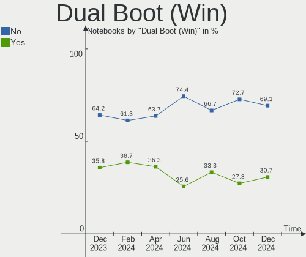
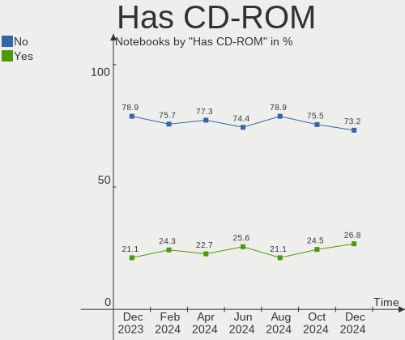
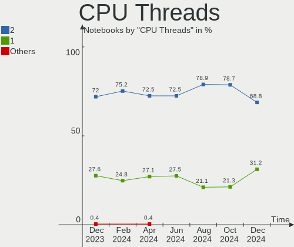
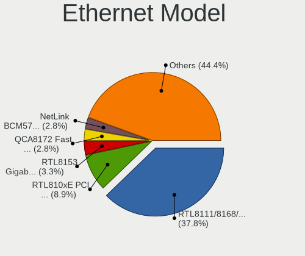
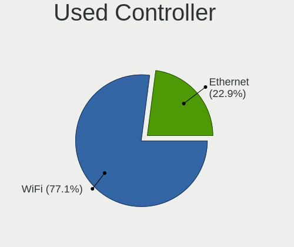
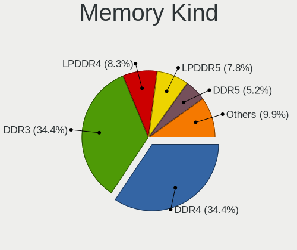

Linux in Russia - Hardware Trends (Notebooks)
---------------------------------------------

A project to identify most popular hardware characteristics and track their change
over time based on data collected by Linux users at https://Linux-Hardware.org.

Anyone can contribute to this report by the [hw-probe](https://github.com/linuxhw/hw-probe) tool:

    sudo -E hw-probe -all -upload

Period: Jan, 2024.

Contents
--------

* [ System ](#system)
  - [ OS                       ](#os)
  - [ OS Family                ](#os-family)
  - [ Kernel                   ](#kernel)
  - [ Kernel Family            ](#kernel-family)
  - [ Kernel Major Ver.        ](#kernel-major-ver)
  - [ Arch                     ](#arch)
  - [ DE                       ](#de)
  - [ Display Server           ](#display-server)
  - [ Display Manager          ](#display-manager)
  - [ OS Lang                  ](#os-lang)
  - [ Boot Mode                ](#boot-mode)
  - [ Filesystem               ](#filesystem)
  - [ Part. scheme             ](#part-scheme)
  - [ Dual Boot with Linux/BSD ](#dual-boot-with-linuxbsd)
  - [ Dual Boot (Win)          ](#dual-boot-win)

* [ Board ](#board)
  - [ Vendor                   ](#vendor)
  - [ Model                    ](#model)
  - [ Model Family             ](#model-family)
  - [ MFG Year                 ](#mfg-year)
  - [ Form Factor              ](#form-factor)
  - [ Secure Boot              ](#secure-boot)
  - [ Coreboot                 ](#coreboot)
  - [ RAM Size                 ](#ram-size)
  - [ RAM Used                 ](#ram-used)
  - [ Total Drives             ](#total-drives)
  - [ Has CD-ROM               ](#has-cd-rom)
  - [ Has Ethernet             ](#has-ethernet)
  - [ Has WiFi                 ](#has-wifi)
  - [ Has Bluetooth            ](#has-bluetooth)

* [ Location ](#location)
  - [ Country                  ](#country)
  - [ City                     ](#city)

* [ Drives ](#drives)
  - [ Drive Vendor             ](#drive-vendor)
  - [ Drive Model              ](#drive-model)
  - [ HDD Vendor               ](#hdd-vendor)
  - [ SSD Vendor               ](#ssd-vendor)
  - [ Drive Kind               ](#drive-kind)
  - [ Drive Connector          ](#drive-connector)
  - [ Drive Size               ](#drive-size)
  - [ Space Total              ](#space-total)
  - [ Space Used               ](#space-used)
  - [ Malfunc. Drives          ](#malfunc-drives)
  - [ Malfunc. Drive Vendor    ](#malfunc-drive-vendor)
  - [ Malfunc. HDD Vendor      ](#malfunc-hdd-vendor)
  - [ Malfunc. Drive Kind      ](#malfunc-drive-kind)
  - [ Failed Drives            ](#failed-drives)
  - [ Failed Drive Vendor      ](#failed-drive-vendor)
  - [ Drive Status             ](#drive-status)

* [ Storage controller ](#storage-controller)
  - [ Storage Vendor           ](#storage-vendor)
  - [ Storage Model            ](#storage-model)
  - [ Storage Kind             ](#storage-kind)

* [ Processor ](#processor)
  - [ CPU Vendor               ](#cpu-vendor)
  - [ CPU Model                ](#cpu-model)
  - [ CPU Model Family         ](#cpu-model-family)
  - [ CPU Cores                ](#cpu-cores)
  - [ CPU Sockets              ](#cpu-sockets)
  - [ CPU Threads              ](#cpu-threads)
  - [ CPU Op-Modes             ](#cpu-op-modes)
  - [ CPU Microcode            ](#cpu-microcode)
  - [ CPU Microarch            ](#cpu-microarch)

* [ Graphics ](#graphics)
  - [ GPU Vendor               ](#gpu-vendor)
  - [ GPU Model                ](#gpu-model)
  - [ GPU Combo                ](#gpu-combo)
  - [ GPU Driver               ](#gpu-driver)
  - [ GPU Memory               ](#gpu-memory)

* [ Monitor ](#monitor)
  - [ Monitor Vendor           ](#monitor-vendor)
  - [ Monitor Model            ](#monitor-model)
  - [ Monitor Resolution       ](#monitor-resolution)
  - [ Monitor Diagonal         ](#monitor-diagonal)
  - [ Monitor Width            ](#monitor-width)
  - [ Aspect Ratio             ](#aspect-ratio)
  - [ Monitor Area             ](#monitor-area)
  - [ Pixel Density            ](#pixel-density)
  - [ Multiple Monitors        ](#multiple-monitors)

* [ Network ](#network)
  - [ Net Controller Vendor    ](#net-controller-vendor)
  - [ Net Controller Model     ](#net-controller-model)
  - [ Wireless Vendor          ](#wireless-vendor)
  - [ Wireless Model           ](#wireless-model)
  - [ Ethernet Vendor          ](#ethernet-vendor)
  - [ Ethernet Model           ](#ethernet-model)
  - [ Net Controller Kind      ](#net-controller-kind)
  - [ Used Controller          ](#used-controller)
  - [ NICs                     ](#nics)
  - [ IPv6                     ](#ipv6)

* [ Bluetooth ](#bluetooth)
  - [ Bluetooth Vendor         ](#bluetooth-vendor)
  - [ Bluetooth Model          ](#bluetooth-model)

* [ Sound ](#sound)
  - [ Sound Vendor             ](#sound-vendor)
  - [ Sound Model              ](#sound-model)

* [ Memory ](#memory)
  - [ Memory Vendor            ](#memory-vendor)
  - [ Memory Model             ](#memory-model)
  - [ Memory Kind              ](#memory-kind)
  - [ Memory Form Factor       ](#memory-form-factor)
  - [ Memory Size              ](#memory-size)
  - [ Memory Speed             ](#memory-speed)

* [ Printers & scanners ](#printers--scanners)
  - [ Printer Vendor           ](#printer-vendor)
  - [ Printer Model            ](#printer-model)
  - [ Scanner Vendor           ](#scanner-vendor)
  - [ Scanner Model            ](#scanner-model)

* [ Camera ](#camera)
  - [ Camera Vendor            ](#camera-vendor)
  - [ Camera Model             ](#camera-model)

* [ Security ](#security)
  - [ Fingerprint Vendor       ](#fingerprint-vendor)
  - [ Fingerprint Model        ](#fingerprint-model)
  - [ Chipcard Vendor          ](#chipcard-vendor)
  - [ Chipcard Model           ](#chipcard-model)

* [ Unsupported ](#unsupported)
  - [ Unsupported Devices      ](#unsupported-devices)
  - [ Unsupported Device Types ](#unsupported-device-types)

System
------

OS
--

Installed operating systems

| Name                         | Notebooks | Percent |
|------------------------------|-----------|---------|
| ROSA 12.4                    | 68        | 26.36%  |
| Fedora 39                    | 23        | 8.91%   |
| Debian 12                    | 22        | 8.53%   |
| Ubuntu 22.04                 | 16        | 6.2%    |
| Ubuntu 23.10                 | 11        | 4.26%   |
| Linux Mint 21.3              | 9         | 3.49%   |
| Arch Rolling                 | 7         | 2.71%   |
| ROSA 12                      | 6         | 2.33%   |
| Manjaro                      | 6         | 2.33%   |
| Red OS 7.3                   | 5         | 1.94%   |
| OpenMandriva 5.0             | 5         | 1.94%   |
| Linux Mint 21.2              | 5         | 1.94%   |
| KDE neon 22.04               | 4         | 1.55%   |
| ROSA R11.1                   | 3         | 1.16%   |
| Nobara 39                    | 3         | 1.16%   |
| Manjaro 23.1.3               | 3         | 1.16%   |
| Kubuntu 23.10                | 3         | 1.16%   |
| Kubuntu 22.04                | 3         | 1.16%   |
| Elementary 7.1               | 3         | 1.16%   |
| Debian                       | 3         | 1.16%   |
| ArcoLinux Rolling            | 3         | 1.16%   |
| Zorin 17                     | 2         | 0.78%   |
| Xubuntu 22.04                | 2         | 0.78%   |
| Xero Rolling                 | 2         | 0.78%   |
| Ubuntu 23.04                 | 2         | 0.78%   |
| Red OS 8.0                   | 2         | 0.78%   |
| openSUSE Tumbleweed-XXXXXXXX | 2         | 0.78%   |
| OpenMandriva 23.08           | 2         | 0.78%   |
| Kali 2023.4                  | 2         | 0.78%   |
| Gentoo 2.14                  | 2         | 0.78%   |
| Fedora 38                    | 2         | 0.78%   |
| Xubuntu 20.04                | 1         | 0.39%   |
| Ubuntu 20.04                 | 1         | 0.39%   |
| SteamOS 4                    | 1         | 0.39%   |
| SteamOS 3.5.7                | 1         | 0.39%   |
| ROSA 12.2                    | 1         | 0.39%   |
| ROSA 12.1                    | 1         | 0.39%   |
| RHEL 9                       | 1         | 0.39%   |
| Red OS 7.3.1                 | 1         | 0.39%   |
| PostmarketOS Edge            | 1         | 0.39%   |

OS Family
---------

OS without a version

| Name         | Notebooks | Percent |
|--------------|-----------|---------|
| ROSA         | 79        | 30.62%  |
| Ubuntu       | 30        | 11.63%  |
| Fedora       | 26        | 10.08%  |
| Debian       | 26        | 10.08%  |
| Linux Mint   | 16        | 6.2%    |
| OpenMandriva | 10        | 3.88%   |
| Manjaro      | 10        | 3.88%   |
| Red OS       | 8         | 3.1%    |
| Arch         | 7         | 2.71%   |
| Kubuntu      | 6         | 2.33%   |
| KDE neon     | 4         | 1.55%   |
| Xubuntu      | 3         | 1.16%   |
| openSUSE     | 3         | 1.16%   |
| Nobara       | 3         | 1.16%   |
| Elementary   | 3         | 1.16%   |
| ArcoLinux    | 3         | 1.16%   |
| Zorin        | 2         | 0.78%   |
| Xero         | 2         | 0.78%   |
| SteamOS      | 2         | 0.78%   |
| Lubuntu      | 2         | 0.78%   |
| Kali         | 2         | 0.78%   |
| Gentoo       | 2         | 0.78%   |
| RHEL         | 1         | 0.39%   |
| PostmarketOS | 1         | 0.39%   |
| Pop!_OS      | 1         | 0.39%   |
| NixOS        | 1         | 0.39%   |
| Neptune OS   | 1         | 0.39%   |
| MX           | 1         | 0.39%   |
| Endless      | 1         | 0.39%   |
| Astra Linux  | 1         | 0.39%   |
| ALT Linux    | 1         | 0.39%   |

Kernel
------

Version of the Linux kernel

| Version                             | Notebooks | Percent |
|-------------------------------------|-----------|---------|
| 6.1.58-generic-1rosa2021.1-x86_64   | 35        | 13.57%  |
| 6.5.0-14-generic                    | 26        | 10.08%  |
| 6.1.20-generic-2rosa2021.1-x86_64   | 21        | 8.14%   |
| 6.1.0-4-amd64                       | 12        | 4.65%   |
| 6.6.9-200.fc39.x86_64               | 11        | 4.26%   |
| 6.2.0-39-generic                    | 10        | 3.88%   |
| 6.6.13-200.fc39.x86_64              | 7         | 2.71%   |
| 6.1.0-17-amd64                      | 7         | 2.71%   |
| 5.15.0-91-generic                   | 7         | 2.71%   |
| 6.6.2-desktop-1omv2390              | 6         | 2.33%   |
| 6.6.10-1-MANJARO                    | 4         | 1.55%   |
| 6.5.0-15-generic                    | 4         | 1.55%   |
| 5.15.103-generic-1rosa2021.1-i686   | 4         | 1.55%   |
| 5.15.0-92-generic                   | 4         | 1.55%   |
| 6.7.1-arch1-1                       | 3         | 1.16%   |
| 6.7.0-arch3-1                       | 3         | 1.16%   |
| 6.7.0-204.fsync.fc39.x86_64         | 3         | 1.16%   |
| 6.5.6-300.fc39.x86_64               | 3         | 1.16%   |
| 6.5.0-9-generic                     | 3         | 1.16%   |
| 6.1.52-1.el7.3.x86_64               | 3         | 1.16%   |
| 5.15.127-generic-1rosa2021.1-x86_64 | 3         | 1.16%   |
| 6.7.0-0-MANJARO                     | 2         | 0.78%   |
| 6.6.7-1-default                     | 2         | 0.78%   |
| 6.6.6-1.red80.x86_64                | 2         | 0.78%   |
| 6.5.0-kali3-amd64                   | 2         | 0.78%   |
| 6.1.0-15-amd64                      | 2         | 0.78%   |
| 5.4.83-generic-2rosa-x86_64         | 2         | 0.78%   |
| 5.4.150-generic-1rosa2021.1-x86_64  | 2         | 0.78%   |
| 5.10.74-generic-2rosa2021.1-x86_64  | 2         | 0.78%   |
| 5.10.184-generic-1rosa2021.1-x86_64 | 2         | 0.78%   |
| 6.7-amd64                           | 1         | 0.39%   |
| 6.6.9-zen1-1-zen                    | 1         | 0.39%   |
| 6.6.9-postmarketos-grate            | 1         | 0.39%   |
| 6.6.9-amd64                         | 1         | 0.39%   |
| 6.6.8-arch1-1                       | 1         | 0.39%   |
| 6.6.8-200.fc39.x86_64               | 1         | 0.39%   |
| 6.6.8-2-MANJARO                     | 1         | 0.39%   |
| 6.6.8-100.fc38.x86_64               | 1         | 0.39%   |
| 6.6.4-arch1-1                       | 1         | 0.39%   |
| 6.6.11-hardened1-1-hardened         | 1         | 0.39%   |

Kernel Family
-------------

Linux kernel without a distro release

| Version  | Notebooks | Percent |
|----------|-----------|---------|
| 6.5.0    | 36        | 13.95%  |
| 6.1.58   | 35        | 13.57%  |
| 6.1.0    | 22        | 8.53%   |
| 6.1.20   | 21        | 8.14%   |
| 6.6.9    | 14        | 5.43%   |
| 5.15.0   | 14        | 5.43%   |
| 6.2.0    | 13        | 5.04%   |
| 6.7.0    | 8         | 3.1%    |
| 6.6.13   | 7         | 2.71%   |
| 6.6.10   | 7         | 2.71%   |
| 6.6.2    | 6         | 2.33%   |
| 6.6.8    | 4         | 1.55%   |
| 6.1.52   | 4         | 1.55%   |
| 5.15.127 | 4         | 1.55%   |
| 5.15.103 | 4         | 1.55%   |
| 6.7.1    | 3         | 1.16%   |
| 6.6.11   | 3         | 1.16%   |
| 6.5.6    | 3         | 1.16%   |
| 6.6.7    | 2         | 0.78%   |
| 6.6.6    | 2         | 0.78%   |
| 5.4.83   | 2         | 0.78%   |
| 5.4.150  | 2         | 0.78%   |
| 5.4.0    | 2         | 0.78%   |
| 5.10.74  | 2         | 0.78%   |
| 5.10.184 | 2         | 0.78%   |
| 6.7      | 1         | 0.39%   |
| 6.6.4    | 1         | 0.39%   |
| 6.6.1    | 1         | 0.39%   |
| 6.5.8    | 1         | 0.39%   |
| 6.5.7    | 1         | 0.39%   |
| 6.5.3    | 1         | 0.39%   |
| 6.5.13   | 1         | 0.39%   |
| 6.4.8    | 1         | 0.39%   |
| 6.4.15   | 1         | 0.39%   |
| 6.4.11   | 1         | 0.39%   |
| 6.4.0    | 1         | 0.39%   |
| 6.3.7    | 1         | 0.39%   |
| 6.3.0    | 1         | 0.39%   |
| 6.2.9    | 1         | 0.39%   |
| 6.2.6    | 1         | 0.39%   |

Kernel Major Ver.
-----------------

Linux kernel major version

| Version | Notebooks | Percent |
|---------|-----------|---------|
| 6.1     | 91        | 35.27%  |
| 6.6     | 47        | 18.22%  |
| 6.5     | 43        | 16.67%  |
| 5.15    | 23        | 8.91%   |
| 6.2     | 16        | 6.2%    |
| 6.7     | 11        | 4.26%   |
| 5.4     | 7         | 2.71%   |
| 5.10    | 6         | 2.33%   |
| 6.4     | 4         | 1.55%   |
| 6.3     | 2         | 0.78%   |
| 5.14    | 2         | 0.78%   |
| 6       | 1         | 0.39%   |
| 5.8     | 1         | 0.39%   |
| 5.19    | 1         | 0.39%   |
| 5.18    | 1         | 0.39%   |
| 5.16    | 1         | 0.39%   |
| 4.15    | 1         | 0.39%   |

Arch
----

OS architecture (x86_64, i586, etc.)

| Name   | Notebooks | Percent |
|--------|-----------|---------|
| x86_64 | 252       | 97.67%  |
| i686   | 5         | 1.94%   |
| armv7l | 1         | 0.39%   |

DE
--

Desktop Environment

| Name             | Notebooks | Percent |
|------------------|-----------|---------|
| KDE5             | 91        | 35.27%  |
| GNOME            | 86        | 33.33%  |
| LXQt             | 16        | 6.2%    |
| X-Cinnamon       | 15        | 5.81%   |
| XFCE             | 14        | 5.43%   |
| Unknown          | 13        | 5.04%   |
| MATE             | 10        | 3.88%   |
| Pantheon         | 3         | 1.16%   |
| sway             | 2         | 0.78%   |
| KDE4             | 2         | 0.78%   |
| lightdm-xsession | 1         | 0.39%   |
| i3               | 1         | 0.39%   |
| Hyprland         | 1         | 0.39%   |
| GNOME Classic    | 1         | 0.39%   |
| fly              | 1         | 0.39%   |
| Cinnamon         | 1         | 0.39%   |

Display Server
--------------

X11 or Wayland

| Name    | Notebooks | Percent |
|---------|-----------|---------|
| Wayland | 121       | 46.9%   |
| X11     | 120       | 46.51%  |
| Unknown | 12        | 4.65%   |
| Tty     | 5         | 1.94%   |

Display Manager
---------------

SDDM, LightDM, etc.

| Name    | Notebooks | Percent |
|---------|-----------|---------|
| SDDM    | 82        | 31.78%  |
| Unknown | 67        | 25.97%  |
| GDM     | 38        | 14.73%  |
| LightDM | 35        | 13.57%  |
| GDM3    | 34        | 13.18%  |
| KDM     | 2         | 0.78%   |

OS Lang
-------

Language

| Lang    | Notebooks | Percent |
|---------|-----------|---------|
| ru_RU   | 201       | 77.91%  |
| en_US   | 50        | 19.38%  |
| C       | 4         | 1.55%   |
| zh_CN   | 1         | 0.39%   |
| ru      | 1         | 0.39%   |
| Unknown | 1         | 0.39%   |

Boot Mode
---------

EFI or BIOS

| Mode | Notebooks | Percent |
|------|-----------|---------|
| EFI  | 158       | 61.24%  |
| BIOS | 100       | 38.76%  |

Filesystem
----------

Type of filesystem

| Type    | Notebooks | Percent |
|---------|-----------|---------|
| Ext4    | 168       | 65.12%  |
| Btrfs   | 47        | 18.22%  |
| Tmpfs   | 19        | 7.36%   |
| Overlay | 17        | 6.59%   |
| Xfs     | 3         | 1.16%   |
| Unknown | 3         | 1.16%   |
| F2fs    | 1         | 0.39%   |

Part. scheme
------------

Scheme of partitioning

| Type    | Notebooks | Percent |
|---------|-----------|---------|
| GPT     | 152       | 58.91%  |
| MBR     | 55        | 21.32%  |
| Unknown | 51        | 19.77%  |

Dual Boot with Linux/BSD
------------------------

Hosting more than one Linux/BSD

| Dual boot | Notebooks | Percent |
|-----------|-----------|---------|
| No        | 226       | 87.6%   |
| Yes       | 32        | 12.4%   |

Dual Boot (Win)
---------------

Hosting Linux and Windows

| Dual boot | Notebooks | Percent |
|-----------|-----------|---------|
| No        | 174       | 67.44%  |
| Yes       | 84        | 32.56%  |

Board
-----

Vendor
------

Motherboard manufacturer

| Name                     | Notebooks | Percent |
|--------------------------|-----------|---------|
| ASUSTek Computer         | 47        | 18.22%  |
| Lenovo                   | 45        | 17.44%  |
| Acer                     | 27        | 10.47%  |
| Hewlett-Packard          | 24        | 9.3%    |
| HUAWEI                   | 19        | 7.36%   |
| MSI                      | 12        | 4.65%   |
| Dell                     | 9         | 3.49%   |
| Aquarius                 | 9         | 3.49%   |
| Unknown                  | 9         | 3.49%   |
| Samsung Electronics      | 6         | 2.33%   |
| Packard Bell             | 4         | 1.55%   |
| Clevo                    | 4         | 1.55%   |
| Timi                     | 3         | 1.16%   |
| HONOR                    | 3         | 1.16%   |
| eMachines                | 3         | 1.16%   |
| Apple                    | 3         | 1.16%   |
| Sony                     | 2         | 0.78%   |
| Maibenben                | 2         | 0.78%   |
| MACHENIKE                | 2         | 0.78%   |
| Fujitsu                  | 2         | 0.78%   |
| Chuwi                    | 2         | 0.78%   |
| Valve                    | 1         | 0.39%   |
| TECNO Mobile Limited     | 1         | 0.39%   |
| realme                   | 1         | 0.39%   |
| Pegatron                 | 1         | 0.39%   |
| MECHREVO                 | 1         | 0.39%   |
| MACHCREATOR              | 1         | 0.39%   |
| KVADRA                   | 1         | 0.39%   |
| iRU                      | 1         | 0.39%   |
| Irbis                    | 1         | 0.39%   |
| Intel                    | 1         | 0.39%   |
| Infinix                  | 1         | 0.39%   |
| HIPER Technology Limited | 1         | 0.39%   |
| GPD                      | 1         | 0.39%   |
| Digitek                  | 1         | 0.39%   |
| DEXP                     | 1         | 0.39%   |
| DEPO Computers           | 1         | 0.39%   |
| ARDOR GAMING             | 1         | 0.39%   |
| AMI                      | 1         | 0.39%   |
| Alienware                | 1         | 0.39%   |

Model
-----

Motherboard model

| Name                                       | Notebooks | Percent |
|--------------------------------------------|-----------|---------|
| Unknown                                    | 10        | 3.88%   |
| Aquarius NS585                             | 9         | 3.49%   |
| HUAWEI BOM-WXX9                            | 4         | 1.55%   |
| Lenovo IdeaPad L340-15API 81LW             | 3         | 1.16%   |
| HP Pavilion 15                             | 3         | 1.16%   |
| ASUS VivoBook_ASUSLaptop M6500QC_M6500QC   | 3         | 1.16%   |
| Lenovo G50-30 80G0                         | 2         | 0.78%   |
| HP ProBook 445 G7                          | 2         | 0.78%   |
| HP Laptop 15s-eq2xxx                       | 2         | 0.78%   |
| Clevo NL41MU2                              | 2         | 0.78%   |
| ASUS Vivobook Go E1504FA_E1504FA           | 2         | 0.78%   |
| Acer Aspire ES1-531                        | 2         | 0.78%   |
| Acer Aspire A315-24P                       | 2         | 0.78%   |
| Valve Galileo                              | 1         | 0.39%   |
| Timi Xiaomi Book Pro 16 2022               | 1         | 0.39%   |
| Timi RedmiBook Pro 15S                     | 1         | 0.39%   |
| Timi Redmi Book Pro 15 2022                | 1         | 0.39%   |
| TECNO Mobile Limited MEGABOOK T14TA        | 1         | 0.39%   |
| Sony VPCEH3P1R                             | 1         | 0.39%   |
| Sony VGN-NS11ER_S                          | 1         | 0.39%   |
| Samsung RC410/RC510/RC710                  | 1         | 0.39%   |
| Samsung R580/R590                          | 1         | 0.39%   |
| Samsung N145P/N250P/N260P                  | 1         | 0.39%   |
| Samsung 550P5C/550P7C                      | 1         | 0.39%   |
| Samsung 305V4A/305V5A                      | 1         | 0.39%   |
| Samsung 300V3A/300V4A/300V5A/200A4B/200A5B | 1         | 0.39%   |
| realme CloudProXXXX                        | 1         | 0.39%   |
| Pegatron C15B                              | 1         | 0.39%   |
| Packard Bell EasyNote TS11HR               | 1         | 0.39%   |
| Packard Bell EasyNote TE11HC               | 1         | 0.39%   |
| Packard Bell EasyNote ENTE70BH             | 1         | 0.39%   |
| Packard Bell EasyNote ENLG81BA             | 1         | 0.39%   |
| MSI Prestige 13Evo A13M                    | 1         | 0.39%   |
| MSI Modern 15 B5M                          | 1         | 0.39%   |
| MSI Katana GF76 12UC                       | 1         | 0.39%   |
| MSI Katana GF66 12UE                       | 1         | 0.39%   |
| MSI Katana 17 B11UCX                       | 1         | 0.39%   |
| MSI GL62M 7REX                             | 1         | 0.39%   |
| MSI GF65 Thin 9SEXR                        | 1         | 0.39%   |
| MSI GE62 6QE                               | 1         | 0.39%   |

Model Family
------------

Motherboard model prefix

| Name                          | Notebooks | Percent |
|-------------------------------|-----------|---------|
| Acer Aspire                   | 20        | 7.75%   |
| ASUS VivoBook                 | 18        | 6.98%   |
| Lenovo ThinkPad               | 12        | 4.65%   |
| Lenovo IdeaPad                | 12        | 4.65%   |
| Unknown                       | 10        | 3.88%   |
| Aquarius NS585                | 9         | 3.49%   |
| HP ProBook                    | 8         | 3.1%    |
| HP Pavilion                   | 6         | 2.33%   |
| Dell Inspiron                 | 6         | 2.33%   |
| Packard Bell EasyNote         | 4         | 1.55%   |
| Lenovo Legion                 | 4         | 1.55%   |
| HUAWEI BOM-WXX9               | 4         | 1.55%   |
| HP Laptop                     | 4         | 1.55%   |
| HP EliteBook                  | 4         | 1.55%   |
| MSI Katana                    | 3         | 1.16%   |
| ASUS ROG                      | 3         | 1.16%   |
| ASUS ASUS                     | 3         | 1.16%   |
| Lenovo G50-30                 | 2         | 0.78%   |
| Fujitsu LIFEBOOK              | 2         | 0.78%   |
| Clevo NL41MU2                 | 2         | 0.78%   |
| ASUS TUF                      | 2         | 0.78%   |
| Acer Extensa                  | 2         | 0.78%   |
| Valve Galileo                 | 1         | 0.39%   |
| Timi Xiaomi                   | 1         | 0.39%   |
| Timi RedmiBook                | 1         | 0.39%   |
| Timi Redmi                    | 1         | 0.39%   |
| TECNO Mobile Limited MEGABOOK | 1         | 0.39%   |
| Sony VPCEH3P1R                | 1         | 0.39%   |
| Sony VGN-NS11ER               | 1         | 0.39%   |
| Samsung RC410                 | 1         | 0.39%   |
| Samsung R580                  | 1         | 0.39%   |
| Samsung N145P                 | 1         | 0.39%   |
| Samsung 550P5C                | 1         | 0.39%   |
| Samsung 305V4A                | 1         | 0.39%   |
| Samsung 300V3A                | 1         | 0.39%   |
| realme CloudProXXXX           | 1         | 0.39%   |
| Pegatron C15B                 | 1         | 0.39%   |
| MSI Prestige                  | 1         | 0.39%   |
| MSI Modern                    | 1         | 0.39%   |
| MSI GL62M                     | 1         | 0.39%   |

MFG Year
--------

Motherboard manufacture year

| Year    | Notebooks | Percent |
|---------|-----------|---------|
| 2022    | 41        | 15.89%  |
| 2021    | 37        | 14.34%  |
| 2019    | 26        | 10.08%  |
| 2023    | 24        | 9.3%    |
| 2013    | 17        | 6.59%   |
| 2011    | 17        | 6.59%   |
| 2010    | 16        | 6.2%    |
| 2020    | 14        | 5.43%   |
| 2012    | 12        | 4.65%   |
| 2018    | 8         | 3.1%    |
| 2015    | 8         | 3.1%    |
| 2014    | 8         | 3.1%    |
| 2009    | 8         | 3.1%    |
| 2008    | 6         | 2.33%   |
| 2017    | 5         | 1.94%   |
| 2016    | 4         | 1.55%   |
| 2007    | 4         | 1.55%   |
| 2006    | 2         | 0.78%   |
| Unknown | 1         | 0.39%   |

Form Factor
-----------

Physical design of the computer

| Name     | Notebooks | Percent |
|----------|-----------|---------|
| Notebook | 258       | 100%    |

Secure Boot
-----------

Enabled or disabled

| State    | Notebooks | Percent |
|----------|-----------|---------|
| Disabled | 243       | 94.19%  |
| Enabled  | 15        | 5.81%   |

Coreboot
--------

Have coreboot on board

| Used | Notebooks | Percent |
|------|-----------|---------|
| No   | 257       | 99.61%  |
| Yes  | 1         | 0.39%   |

RAM Size
--------

Total RAM memory

| Size in GB  | Notebooks | Percent |
|-------------|-----------|---------|
| 4.01-8.0    | 85        | 32.95%  |
| 8.01-16.0   | 54        | 20.93%  |
| 3.01-4.0    | 39        | 15.12%  |
| 16.01-24.0  | 38        | 14.73%  |
| 32.01-64.0  | 17        | 6.59%   |
| 1.01-2.0    | 12        | 4.65%   |
| 24.01-32.0  | 4         | 1.55%   |
| 2.01-3.0    | 4         | 1.55%   |
| 64.01-256.0 | 3         | 1.16%   |
| 0.51-1.0    | 1         | 0.39%   |
| 0.01-0.5    | 1         | 0.39%   |

RAM Used
--------

Used RAM memory

| Used GB   | Notebooks | Percent |
|-----------|-----------|---------|
| 1.01-2.0  | 97        | 37.6%   |
| 4.01-8.0  | 48        | 18.6%   |
| 2.01-3.0  | 44        | 17.05%  |
| 3.01-4.0  | 32        | 12.4%   |
| 0.51-1.0  | 26        | 10.08%  |
| 8.01-16.0 | 8         | 3.1%    |
| 0.01-0.5  | 3         | 1.16%   |

Total Drives
------------

Number of drives on board

| Drives | Notebooks | Percent |
|--------|-----------|---------|
| 1      | 189       | 73.26%  |
| 2      | 63        | 24.42%  |
| 3      | 4         | 1.55%   |
| 4      | 1         | 0.39%   |
| 0      | 1         | 0.39%   |

Has CD-ROM
----------

Has CD-ROM on board

| Presented | Notebooks | Percent |
|-----------|-----------|---------|
| No        | 195       | 75.58%  |
| Yes       | 63        | 24.42%  |

Has Ethernet
------------

Has Ethernet on board

| Presented | Notebooks | Percent |
|-----------|-----------|---------|
| Yes       | 181       | 70.16%  |
| No        | 77        | 29.84%  |

Has WiFi
--------

Has WiFi module

| Presented | Notebooks | Percent |
|-----------|-----------|---------|
| Yes       | 253       | 98.06%  |
| No        | 5         | 1.94%   |

Has Bluetooth
-------------

Has Bluetooth module

| Presented | Notebooks | Percent |
|-----------|-----------|---------|
| Yes       | 211       | 81.78%  |
| No        | 47        | 18.22%  |

Location
--------

Country
-------

Geographic location (country)

| Country | Notebooks | Percent |
|---------|-----------|---------|
| Russia  | 258       | 100%    |

City
----

Geographic location (city)

| City              | Notebooks | Percent |
|-------------------|-----------|---------|
| Moscow            | 51        | 19.77%  |
| St Petersburg     | 24        | 9.3%    |
| Voronezh          | 14        | 5.43%   |
| Perm              | 7         | 2.71%   |
| Surgut            | 6         | 2.33%   |
| Novosibirsk       | 5         | 1.94%   |
| Krasnoyarsk       | 5         | 1.94%   |
| Chelyabinsk       | 5         | 1.94%   |
| Ufa               | 4         | 1.55%   |
| Saratov           | 4         | 1.55%   |
| Samara            | 4         | 1.55%   |
| Orenburg          | 4         | 1.55%   |
| Volgograd         | 3         | 1.16%   |
| Saransk           | 3         | 1.16%   |
| Khabarovsk        | 3         | 1.16%   |
| Kemerovo          | 3         | 1.16%   |
| Kazan’          | 3         | 1.16%   |
| Irkutsk           | 3         | 1.16%   |
| Dolgoprudnyy      | 3         | 1.16%   |
| Bryansk           | 3         | 1.16%   |
| Belovo            | 3         | 1.16%   |
| Barnaul           | 3         | 1.16%   |
| Yoshkar-Ola       | 2         | 0.78%   |
| Yekaterinburg     | 2         | 0.78%   |
| Yaroslavl         | 2         | 0.78%   |
| Vologda           | 2         | 0.78%   |
| Ulan-Ude          | 2         | 0.78%   |
| Tver              | 2         | 0.78%   |
| Tula              | 2         | 0.78%   |
| Tolyatti          | 2         | 0.78%   |
| Tambov            | 2         | 0.78%   |
| Rostov-on-Don     | 2         | 0.78%   |
| Ostrovtsy         | 2         | 0.78%   |
| Omsk              | 2         | 0.78%   |
| Lipetsk           | 2         | 0.78%   |
| Kurgan            | 2         | 0.78%   |
| Krasnodar         | 2         | 0.78%   |
| Blagoveshchensk   | 2         | 0.78%   |
| Belgorod          | 2         | 0.78%   |
| Yuzhno-Sakhalinsk | 1         | 0.39%   |

Drives
------

Drive Vendor
------------

Hard drive vendors

| Vendor                      | Notebooks | Drives | Percent |
|-----------------------------|-----------|--------|---------|
| Samsung Electronics         | 35        | 39     | 10.97%  |
| WDC                         | 32        | 33     | 10.03%  |
| Seagate                     | 17        | 17     | 5.33%   |
| Kingston                    | 17        | 18     | 5.33%   |
| A-DATA Technology           | 17        | 17     | 5.33%   |
| SK hynix                    | 16        | 16     | 5.02%   |
| Toshiba                     | 12        | 13     | 3.76%   |
| Intel                       | 12        | 14     | 3.76%   |
| China                       | 12        | 12     | 3.76%   |
| Unknown                     | 11        | 12     | 3.45%   |
| SanDisk                     | 11        | 12     | 3.45%   |
| Hitachi                     | 11        | 11     | 3.45%   |
| Silicon Motion              | 9         | 9      | 2.82%   |
| Micron Technology           | 8         | 8      | 2.51%   |
| Unknown                     | 8         | 8      | 2.51%   |
| Phison Electronics          | 7         | 7      | 2.19%   |
| KIOXIA                      | 6         | 6      | 1.88%   |
| Phison                      | 5         | 5      | 1.57%   |
| HGST                        | 5         | 5      | 1.57%   |
| SSSTC                       | 3         | 3      | 0.94%   |
| SPCC                        | 3         | 3      | 0.94%   |
| MAXIO Technology (Hangzhou) | 3         | 3      | 0.94%   |
| Kingston Technology Company | 3         | 3      | 0.94%   |
| JMicron Technology          | 3         | 3      | 0.94%   |
| BIWIN                       | 3         | 3      | 0.94%   |
| AMD                         | 3         | 3      | 0.94%   |
| XrayDisk                    | 2         | 2      | 0.63%   |
| Union Memory                | 2         | 2      | 0.63%   |
| Smartbuy                    | 2         | 2      | 0.63%   |
| Patriot                     | 2         | 2      | 0.63%   |
| Netac                       | 2         | 2      | 0.63%   |
| Digma                       | 2         | 2      | 0.63%   |
| DEXP                        | 2         | 2      | 0.63%   |
| Crucial                     | 2         | 2      | 0.63%   |
| Apacer                      | 2         | 2      | 0.63%   |
| YMTC                        | 1         | 1      | 0.31%   |
| WALRAM                      | 1         | 1      | 0.31%   |
| Vaseky                      | 1         | 1      | 0.31%   |
| Union Memory (Shenzhen)     | 1         | 1      | 0.31%   |
| UMIS                        | 1         | 1      | 0.31%   |

Drive Model
-----------

Hard drive models

| Model                                              | Notebooks | Percent |
|----------------------------------------------------|-----------|---------|
| A-DATA SU800 512GB SSD                             | 10        | 3.04%   |
| Unknown                                            | 8         | 2.43%   |
| Silicon Motion PCIe-8 SSD 512GB                    | 5         | 1.52%   |
| Samsung NVMe SSD Controller SM981/PM981/PM983 1TB  | 5         | 1.52%   |
| Intel SSDPEKNU512GZ 512GB                          | 5         | 1.52%   |
| SK hynix HFM512GD3JX013N 512GB                     | 4         | 1.22%   |
| SK hynix HFM001TD3JX013N 1024GB                    | 4         | 1.22%   |
| Samsung NVMe SSD Controller PM9A1/PM9A3/980PRO 2TB | 4         | 1.22%   |
| China SSD 128GB                                    | 4         | 1.22%   |
| Unknown MMC Card  128GB                            | 3         | 0.91%   |
| Toshiba MQ04ABF100 1TB                             | 3         | 0.91%   |
| Toshiba MQ01ABF050 500GB                           | 3         | 0.91%   |
| Seagate ST500LT012-1DG142 500GB                    | 3         | 0.91%   |
| SanDisk NVMe SSD Drive 512GB                       | 3         | 0.91%   |
| Phison PS5013 E13 NVMe Controller 256GB            | 3         | 0.91%   |
| Kingston Company OM3PDP3 NVMe SSD 256GB            | 3         | 0.91%   |
| Kingston SA400S37480G 480GB SSD                    | 3         | 0.91%   |
| JMicron Generic 8GB                                | 3         | 0.91%   |
| WDC WDS500G2B0A-00SM50 500GB SSD                   | 2         | 0.61%   |
| WDC WD5000LPVX-22V0TT0 500GB                       | 2         | 0.61%   |
| Unknown SD128  128GB                               | 2         | 0.61%   |
| Unknown MMC Card  64GB                             | 2         | 0.61%   |
| SPCC Solid State Disk 256GB                        | 2         | 0.61%   |
| Seagate ST9250315AS 250GB                          | 2         | 0.61%   |
| Seagate ST320LT020-9YG142 320GB                    | 2         | 0.61%   |
| Seagate ST1000LM035-1RK172 1TB                     | 2         | 0.61%   |
| Samsung SSD 870 EVO 500GB                          | 2         | 0.61%   |
| Samsung SSD 870 EVO 1TB                            | 2         | 0.61%   |
| Samsung MZVLQ512HBLU-00B00 512GB                   | 2         | 0.61%   |
| Samsung MZVL4512HBLU-00BTW 512GB                   | 2         | 0.61%   |
| Samsung MZVL41T0HBLB-00BTW 1TB                     | 2         | 0.61%   |
| Phison 321JN1024GB                                 | 2         | 0.61%   |
| Phison CFESR512GMTCT-E9C-2 512GB                   | 2         | 0.61%   |
| Micron 2400_MTFDKBA512QFM 512GB                    | 2         | 0.61%   |
| MAXIO (Hangzhou) NVMe SSD Controller MAP1202 512GB | 2         | 0.61%   |
| KIOXIA KBG40ZNV512G 512GB                          | 2         | 0.61%   |
| Kingston SNVS1000G 1TB                             | 2         | 0.61%   |
| Kingston SA400S37240G 240GB SSD                    | 2         | 0.61%   |
| Hitachi HTS545032B9A300 320GB                      | 2         | 0.61%   |
| Hitachi HTS543232A7A384 320GB                      | 2         | 0.61%   |

HDD Vendor
----------

Hard disk drive vendors

| Vendor             | Notebooks | Drives | Percent |
|--------------------|-----------|--------|---------|
| WDC                | 22        | 22     | 31.88%  |
| Seagate            | 17        | 17     | 24.64%  |
| Hitachi            | 11        | 11     | 15.94%  |
| Toshiba            | 10        | 11     | 14.49%  |
| HGST               | 5         | 5      | 7.25%   |
| JMicron Technology | 3         | 3      | 4.35%   |
| TO Exter           | 1         | 1      | 1.45%   |

SSD Vendor
----------

Solid state drive vendors

| Vendor              | Notebooks | Drives | Percent |
|---------------------|-----------|--------|---------|
| A-DATA Technology   | 16        | 16     | 14.16%  |
| Kingston            | 12        | 12     | 10.62%  |
| China               | 12        | 12     | 10.62%  |
| Samsung Electronics | 11        | 11     | 9.73%   |
| WDC                 | 7         | 7      | 6.19%   |
| Unknown             | 5         | 5      | 4.42%   |
| Intel               | 4         | 4      | 3.54%   |
| SPCC                | 3         | 3      | 2.65%   |
| SanDisk             | 3         | 3      | 2.65%   |
| AMD                 | 3         | 3      | 2.65%   |
| XrayDisk            | 2         | 2      | 1.77%   |
| Smartbuy            | 2         | 2      | 1.77%   |
| Patriot             | 2         | 2      | 1.77%   |
| Netac               | 2         | 2      | 1.77%   |
| Micron Technology   | 2         | 2      | 1.77%   |
| Digma               | 2         | 2      | 1.77%   |
| DEXP                | 2         | 2      | 1.77%   |
| Apacer              | 2         | 2      | 1.77%   |
| Vaseky              | 1         | 1      | 0.88%   |
| Union Memory        | 1         | 1      | 0.88%   |
| Team                | 1         | 1      | 0.88%   |
| SK hynix            | 1         | 1      | 0.88%   |
| Qumo                | 1         | 1      | 0.88%   |
| OCZ                 | 1         | 1      | 0.88%   |
| Min Yi U            | 1         | 1      | 0.88%   |
| MG                  | 1         | 1      | 0.88%   |
| KingSpec            | 1         | 1      | 0.88%   |
| HUAXUAN             | 1         | 1      | 0.88%   |
| HS-SSD-E100         | 1         | 1      | 0.88%   |
| Hewlett-Packard     | 1         | 1      | 0.88%   |
| GS                  | 1         | 1      | 0.88%   |
| Gigabyte Technology | 1         | 1      | 0.88%   |
| Firebat             | 1         | 1      | 0.88%   |
| Fanxiang            | 1         | 1      | 0.88%   |
| Crucial             | 1         | 1      | 0.88%   |
| Colorful            | 1         | 1      | 0.88%   |
| BRAVEEAGLE          | 1         | 1      | 0.88%   |
| Apple               | 1         | 1      | 0.88%   |
| AMD R5SL            | 1         | 1      | 0.88%   |

Drive Kind
----------

HDD or SSD

| Kind    | Notebooks | Drives | Percent |
|---------|-----------|--------|---------|
| NVMe    | 113       | 129    | 37.17%  |
| SSD     | 108       | 113    | 35.53%  |
| HDD     | 67        | 70     | 22.04%  |
| MMC     | 11        | 13     | 3.62%   |
| Unknown | 5         | 5      | 1.64%   |

Drive Connector
---------------

SATA, SAS, NVMe, etc.

| Type | Notebooks | Drives | Percent |
|------|-----------|--------|---------|
| SATA | 155       | 177    | 53.26%  |
| NVMe | 113       | 127    | 38.83%  |
| SAS  | 12        | 13     | 4.12%   |
| MMC  | 11        | 13     | 3.78%   |

Drive Size
----------

Size of hard drive

| Size in TB | Notebooks | Drives | Percent |
|------------|-----------|--------|---------|
| 0.01-0.5   | 111       | 124    | 66.87%  |
| 0.51-1.0   | 52        | 56     | 31.33%  |
| 1.01-2.0   | 3         | 3      | 1.81%   |

Space Total
-----------

Amount of disk space available on the file system

| Size in GB     | Notebooks | Percent |
|----------------|-----------|---------|
| 251-500        | 81        | 31.4%   |
| 101-250        | 64        | 24.81%  |
| 501-1000       | 44        | 17.05%  |
| 1001-2000      | 19        | 7.36%   |
| 51-100         | 17        | 6.59%   |
| Unknown        | 14        | 5.43%   |
| 1-20           | 9         | 3.49%   |
| 21-50          | 6         | 2.33%   |
| More than 3000 | 3         | 1.16%   |
| 2001-3000      | 1         | 0.39%   |

Space Used
----------

Amount of used disk space

| Used GB        | Notebooks | Percent |
|----------------|-----------|---------|
| 1-20           | 107       | 41.47%  |
| 21-50          | 48        | 18.6%   |
| 101-250        | 38        | 14.73%  |
| 251-500        | 22        | 8.53%   |
| 51-100         | 18        | 6.98%   |
| Unknown        | 14        | 5.43%   |
| 501-1000       | 9         | 3.49%   |
| More than 3000 | 1         | 0.39%   |
| 1001-2000      | 1         | 0.39%   |

Malfunc. Drives
---------------

Drive models with a malfunction

| Model                                 | Notebooks | Drives | Percent |
|---------------------------------------|-----------|--------|---------|
| Toshiba MQ01ABF050 500GB              | 2         | 2      | 7.41%   |
| Seagate ST320LT020-9YG142 320GB       | 2         | 2      | 7.41%   |
| WDC WDS240G3G0A-00BJG0 240GB SSD      | 1         | 1      | 3.7%    |
| WDC WD7500BPVT-08HXZT3 752GB          | 1         | 1      | 3.7%    |
| WDC WD5000LPVX-22V0TT0 500GB          | 1         | 1      | 3.7%    |
| WDC WD3200BPVT-22JJ5T0 320GB          | 1         | 1      | 3.7%    |
| WDC WD3200BEKT-22A25T1 320GB          | 1         | 1      | 3.7%    |
| WDC WD1600BEKT-00F3T0 160GB           | 1         | 1      | 3.7%    |
| WDC WD10JPVT-60A1YT0 1TB              | 1         | 1      | 3.7%    |
| Toshiba MK6475GSX 640GB               | 1         | 1      | 3.7%    |
| Toshiba MK5075GSX 500GB               | 1         | 1      | 3.7%    |
| Seagate ST9250827AS 250GB             | 1         | 1      | 3.7%    |
| Seagate ST9250315AS 250GB             | 1         | 1      | 3.7%    |
| Samsung Electronics SSD 870 EVO 500GB | 1         | 1      | 3.7%    |
| Samsung Electronics SSD 870 EVO 1TB   | 1         | 1      | 3.7%    |
| Intel SSDSC2KF256H6 SATA 256GB        | 1         | 1      | 3.7%    |
| Intel SSDSA2M080G2GC 80GB             | 1         | 1      | 3.7%    |
| Hitachi HTS547564A9E384 640GB         | 1         | 1      | 3.7%    |
| Hitachi HTS545050B9A300 500GB         | 1         | 1      | 3.7%    |
| Hitachi HTS545032B9A300 320GB         | 1         | 1      | 3.7%    |
| Hitachi HTS541010G9SA00 100GB         | 1         | 1      | 3.7%    |
| HGST HTS725050A7E635 500GB            | 1         | 1      | 3.7%    |
| HGST HTS545050A7E380 500GB            | 1         | 1      | 3.7%    |
| China SSD 240GB                       | 1         | 1      | 3.7%    |
| Unknown                               | 1         | 1      | 3.7%    |

Malfunc. Drive Vendor
---------------------

Vendors of faulty drives

| Vendor              | Notebooks | Drives | Percent |
|---------------------|-----------|--------|---------|
| WDC                 | 7         | 7      | 26.92%  |
| Seagate             | 4         | 4      | 15.38%  |
| Hitachi             | 4         | 4      | 15.38%  |
| Toshiba             | 3         | 4      | 11.54%  |
| Samsung Electronics | 2         | 2      | 7.69%   |
| Intel               | 2         | 2      | 7.69%   |
| HGST                | 2         | 2      | 7.69%   |
| China               | 1         | 1      | 3.85%   |
| Unknown             | 1         | 1      | 3.85%   |

Malfunc. HDD Vendor
-------------------

Vendors of faulty HDD drives

| Vendor  | Notebooks | Drives | Percent |
|---------|-----------|--------|---------|
| WDC     | 6         | 6      | 31.58%  |
| Seagate | 4         | 4      | 21.05%  |
| Hitachi | 4         | 4      | 21.05%  |
| Toshiba | 3         | 4      | 15.79%  |
| HGST    | 2         | 2      | 10.53%  |

Malfunc. Drive Kind
-------------------

Kinds of faulty drives

| Kind | Notebooks | Drives | Percent |
|------|-----------|--------|---------|
| HDD  | 19        | 20     | 73.08%  |
| SSD  | 7         | 7      | 26.92%  |

Failed Drives
-------------

Failed drive models

Zero info for selected period =(

Failed Drive Vendor
-------------------

Failed drive vendors

Zero info for selected period =(

Drive Status
------------

Number of failed and malfunc. drives

| Status   | Notebooks | Drives | Percent |
|----------|-----------|--------|---------|
| Works    | 159       | 187    | 58.03%  |
| Detected | 89        | 116    | 32.48%  |
| Malfunc  | 26        | 27     | 9.49%   |

Storage controller
------------------

Storage Vendor
--------------

Storage controller vendors

| Vendor                                  | Notebooks | Percent |
|-----------------------------------------|-----------|---------|
| Intel                                   | 146       | 46.95%  |
| AMD                                     | 46        | 14.79%  |
| Samsung Electronics                     | 24        | 7.72%   |
| SK hynix                                | 14        | 4.5%    |
| Phison Electronics                      | 12        | 3.86%   |
| Silicon Motion                          | 11        | 3.54%   |
| SanDisk                                 | 11        | 3.54%   |
| Kingston Technology Company             | 9         | 2.89%   |
| Micron Technology                       | 6         | 1.93%   |
| KIOXIA                                  | 6         | 1.93%   |
| Nvidia                                  | 5         | 1.61%   |
| Solid State Storage Technology          | 4         | 1.29%   |
| MAXIO Technology (Hangzhou)             | 3         | 0.96%   |
| INNOGRIT                                | 3         | 0.96%   |
| Union Memory (Shenzhen)                 | 2         | 0.64%   |
| Toshiba America Info Systems            | 2         | 0.64%   |
| Yangtze Memory Technologies             | 1         | 0.32%   |
| Shenzhen Unionmemory Information System | 1         | 0.32%   |
| Shenzhen Longsys Electronics            | 1         | 0.32%   |
| Micron/Crucial Technology               | 1         | 0.32%   |
| Marvell Technology Group                | 1         | 0.32%   |
| ASMedia Technology                      | 1         | 0.32%   |
| ADATA Technology                        | 1         | 0.32%   |

Storage Model
-------------

Storage controller models

| Model                                                                            | Notebooks | Percent |
|----------------------------------------------------------------------------------|-----------|---------|
| AMD FCH SATA Controller [AHCI mode]                                              | 39        | 12.04%  |
| Intel 7 Series Chipset Family 6-port SATA Controller [AHCI mode]                 | 14        | 4.32%   |
| Intel 5 Series/3400 Series Chipset 4 port SATA AHCI Controller                   | 13        | 4.01%   |
| SK hynix Gold P31/BC711/PC711 NVMe Solid State Drive                             | 10        | 3.09%   |
| Intel Cannon Lake PCH SATA AHCI Controller                                       | 10        | 3.09%   |
| Intel 6 Series/C200 Series Chipset Family 6 port Mobile SATA AHCI Controller     | 10        | 3.09%   |
| Samsung NVMe SSD Controller 980 (DRAM-less)                                      | 7         | 2.16%   |
| Intel Tiger Lake-LP SATA Controller                                              | 7         | 2.16%   |
| Intel Celeron/Pentium Silver Processor SATA Controller                           | 7         | 2.16%   |
| Intel 8 Series SATA Controller 1 [AHCI mode]                                     | 7         | 2.16%   |
| Silicon Motion Non-Volatile memory controller                                    | 6         | 1.85%   |
| Samsung NVMe SSD Controller SM981/PM981/PM983                                    | 6         | 1.85%   |
| Samsung NVMe SSD Controller PM9A1/PM9A3/980PRO                                   | 6         | 1.85%   |
| Intel Sunrise Point-LP SATA Controller [AHCI mode]                               | 6         | 1.85%   |
| Intel SSD 670p Series [Keystone Harbor]                                          | 6         | 1.85%   |
| Intel 8 Series/C220 Series Chipset Family 6-port SATA Controller 1 [AHCI mode]   | 6         | 1.85%   |
| AMD SB7x0/SB8x0/SB9x0 SATA Controller [AHCI mode]                                | 6         | 1.85%   |
| Phison PS5013-E13 PCIe3 NVMe Controller (DRAM-less)                              | 5         | 1.54%   |
| KIOXIA NVMe SSD Controller BG4 (DRAM-less)                                       | 5         | 1.54%   |
| Intel Volume Management Device NVMe RAID Controller                              | 5         | 1.54%   |
| Intel Jasper Lake SATA AHCI Controller                                           | 5         | 1.54%   |
| Intel Atom/Celeron/Pentium Processor x5-E8000/J3xxx/N3xxx Series SATA Controller | 5         | 1.54%   |
| Intel Alder Lake-P SATA AHCI Controller                                          | 5         | 1.54%   |
| Intel 82801IBM/IEM (ICH9M/ICH9M-E) 4 port SATA Controller [AHCI mode]            | 5         | 1.54%   |
| Intel 82801HM/HEM (ICH8M/ICH8M-E) SATA Controller [AHCI mode]                    | 5         | 1.54%   |
| Intel 82801HM/HEM (ICH8M/ICH8M-E) IDE Controller                                 | 5         | 1.54%   |
| Intel 82801 Mobile SATA Controller [RAID mode]                                   | 5         | 1.54%   |
| Samsung NVMe SSD Controller PM9B1 (DRAM-less)                                    | 4         | 1.23%   |
| Phison PS5019-E19 PCIe4 NVMe Controller (DRAM-less)                              | 4         | 1.23%   |
| Kingston Company OM3PDP3 NVMe SSD                                                | 4         | 1.23%   |
| SK hynix BC511 NVMe SSD                                                          | 3         | 0.93%   |
| Silicon Motion SM2263EN/SM2263XT (DRAM-less) NVMe SSD Controllers                | 3         | 0.93%   |
| SanDisk WD Black SN770 / PC SN740 256GB / PC SN560 (DRAM-less) NVMe SSD          | 3         | 0.93%   |
| SanDisk Extreme Pro / WD Black SN750 / PC SN730 / Red SN700 NVMe SSD             | 3         | 0.93%   |
| Kingston Company NV1 NVMe SSD SM2263XT (DRAM-less)                               | 3         | 0.93%   |
| Intel Wildcat Point-LP SATA Controller [AHCI Mode]                               | 3         | 0.93%   |
| Intel HM170/QM170 Chipset SATA Controller [AHCI Mode]                            | 3         | 0.93%   |
| Intel Atom Processor E3800 Series SATA AHCI Controller                           | 3         | 0.93%   |
| Toshiba America Info Systems XG6 NVMe SSD Controller                             | 2         | 0.62%   |
| Solid State Storage CL4-8D512 NVMe SSD M.2 (DRAM-less)                           | 2         | 0.62%   |

Storage Kind
------------

Kind of storage controller (IDE, SATA, NVMe, SAS, ...)

| Kind | Notebooks | Percent |
|------|-----------|---------|
| SATA | 176       | 55.87%  |
| NVMe | 113       | 35.87%  |
| IDE  | 14        | 4.44%   |
| RAID | 12        | 3.81%   |

Processor
---------

CPU Vendor
----------

Processor vendors

| Vendor | Notebooks | Percent |
|--------|-----------|---------|
| Intel  | 174       | 67.44%  |
| AMD    | 83        | 32.17%  |
| ARM    | 1         | 0.39%   |

CPU Model
---------

Processor models

| Model                                         | Notebooks | Percent |
|-----------------------------------------------|-----------|---------|
| Intel Core i3-9100 CPU @ 3.60GHz              | 9         | 3.49%   |
| AMD Ryzen 7 5800H with Radeon Graphics        | 6         | 2.33%   |
| AMD Ryzen 7 5700U with Radeon Graphics        | 6         | 2.33%   |
| AMD Ryzen 5 5600H with Radeon Graphics        | 6         | 2.33%   |
| AMD Ryzen 5 5500U with Radeon Graphics        | 6         | 2.33%   |
| AMD Ryzen 5 3500U with Radeon Vega Mobile Gfx | 6         | 2.33%   |
| Intel 11th Gen Core i5-1135G7 @ 2.40GHz       | 5         | 1.94%   |
| Intel Core i5-4200M CPU @ 2.50GHz             | 4         | 1.55%   |
| Intel 11th Gen Core i7-1165G7 @ 2.80GHz       | 4         | 1.55%   |
| AMD Ryzen 5 7520U with Radeon Graphics        | 4         | 1.55%   |
| Intel Core i5-1035G1 CPU @ 1.00GHz            | 3         | 1.16%   |
| Intel Core i3-6006U CPU @ 2.00GHz             | 3         | 1.16%   |
| Intel Celeron N4020 CPU @ 1.10GHz             | 3         | 1.16%   |
| Intel Celeron CPU N3050 @ 1.60GHz             | 3         | 1.16%   |
| Intel Atom CPU N450 @ 1.66GHz                 | 3         | 1.16%   |
| Intel 12th Gen Core i5-12500H                 | 3         | 1.16%   |
| Intel 12th Gen Core i5-12450H                 | 3         | 1.16%   |
| Intel Pentium Dual-Core CPU T4400 @ 2.20GHz   | 2         | 0.78%   |
| Intel Pentium CPU P6200 @ 2.13GHz             | 2         | 0.78%   |
| Intel Pentium CPU N3700 @ 1.60GHz             | 2         | 0.78%   |
| Intel Pentium CPU B960 @ 2.20GHz              | 2         | 0.78%   |
| Intel Core i7-3610QM CPU @ 2.30GHz            | 2         | 0.78%   |
| Intel Core i7-3517U CPU @ 1.90GHz             | 2         | 0.78%   |
| Intel Core i5-7300HQ CPU @ 2.50GHz            | 2         | 0.78%   |
| Intel Core i5-4210U CPU @ 1.70GHz             | 2         | 0.78%   |
| Intel Core i5-4210M CPU @ 2.60GHz             | 2         | 0.78%   |
| Intel Core i5-4200U CPU @ 1.60GHz             | 2         | 0.78%   |
| Intel Core i5-3320M CPU @ 2.60GHz             | 2         | 0.78%   |
| Intel Core i5 CPU M 430 @ 2.27GHz             | 2         | 0.78%   |
| Intel Core i3-3110M CPU @ 2.40GHz             | 2         | 0.78%   |
| Intel Core i3 CPU M 380 @ 2.53GHz             | 2         | 0.78%   |
| Intel Core i3 CPU M 370 @ 2.40GHz             | 2         | 0.78%   |
| Intel Core 2 Duo CPU T9300 @ 2.50GHz          | 2         | 0.78%   |
| Intel Celeron N5095A @ 2.00GHz                | 2         | 0.78%   |
| Intel Celeron N4000 CPU @ 1.10GHz             | 2         | 0.78%   |
| Intel Celeron CPU B815 @ 1.60GHz              | 2         | 0.78%   |
| Intel 13th Gen Core i7-1360P                  | 2         | 0.78%   |
| Intel 12th Gen Core i7-12700H                 | 2         | 0.78%   |
| Intel 12th Gen Core i5-1240P                  | 2         | 0.78%   |
| Intel 11th Gen Core i5-1155G7 @ 2.50GHz       | 2         | 0.78%   |

CPU Model Family
----------------

Processor model prefix

| Model                   | Notebooks | Percent |
|-------------------------|-----------|---------|
| Other                   | 47        | 18.22%  |
| Intel Core i5           | 36        | 13.95%  |
| Intel Core i3           | 28        | 10.85%  |
| AMD Ryzen 7             | 27        | 10.47%  |
| AMD Ryzen 5             | 27        | 10.47%  |
| Intel Celeron           | 19        | 7.36%   |
| Intel Core i7           | 14        | 5.43%   |
| Intel Pentium           | 12        | 4.65%   |
| Intel Core 2 Duo        | 9         | 3.49%   |
| AMD Ryzen 3             | 7         | 2.71%   |
| Intel Atom              | 6         | 2.33%   |
| AMD E                   | 4         | 1.55%   |
| Intel Pentium Dual-Core | 3         | 1.16%   |
| AMD A6                  | 3         | 1.16%   |
| AMD Turion 64 X2 Mobile | 2         | 0.78%   |
| AMD Ryzen 9             | 2         | 0.78%   |
| Intel Pentium Silver    | 1         | 0.39%   |
| Intel Genuine           | 1         | 0.39%   |
| Intel Core i9           | 1         | 0.39%   |
| Intel Celeron Dual-Core | 1         | 0.39%   |
| AMD Turion Dual-Core    | 1         | 0.39%   |
| AMD Ryzen 7 PRO         | 1         | 0.39%   |
| AMD Phenom II           | 1         | 0.39%   |
| AMD E2                  | 1         | 0.39%   |
| AMD Athlon II           | 1         | 0.39%   |
| AMD A8                  | 1         | 0.39%   |
| AMD A4                  | 1         | 0.39%   |
| AMD A10                 | 1         | 0.39%   |

CPU Cores
---------

Number of processor cores

| Number | Notebooks | Percent |
|--------|-----------|---------|
| 2      | 106       | 41.09%  |
| 4      | 75        | 29.07%  |
| 8      | 34        | 13.18%  |
| 6      | 19        | 7.36%   |
| 12     | 9         | 3.49%   |
| 1      | 5         | 1.94%   |
| 10     | 4         | 1.55%   |
| 16     | 2         | 0.78%   |
| 14     | 2         | 0.78%   |
| 24     | 1         | 0.39%   |
| 3      | 1         | 0.39%   |

CPU Sockets
-----------

Number of sockets

| Number | Notebooks | Percent |
|--------|-----------|---------|
| 1      | 258       | 100%    |

CPU Threads
-----------

Threads per core (Hyper-Threading)

| Number | Notebooks | Percent |
|--------|-----------|---------|
| 2      | 175       | 67.83%  |
| 1      | 83        | 32.17%  |

CPU Op-Modes
------------

CPU Operation Modes (32-bit, 64-bit)

| Op mode        | Notebooks | Percent |
|----------------|-----------|---------|
| 32-bit, 64-bit | 255       | 98.84%  |
| 32-bit         | 2         | 0.78%   |
| Unknown        | 1         | 0.39%   |

CPU Microcode
-------------

Microcode number

| Number     | Notebooks | Percent |
|------------|-----------|---------|
| Unknown    | 99        | 38.37%  |
| 0x906eb    | 9         | 3.49%   |
| 0x206a7    | 9         | 3.49%   |
| 0x306a9    | 8         | 3.1%    |
| 0x08608103 | 8         | 3.1%    |
| 0x08108102 | 8         | 3.1%    |
| 0x806c1    | 6         | 2.33%   |
| 0x0a50000d | 6         | 2.33%   |
| 0x406c3    | 5         | 1.94%   |
| 0x20655    | 5         | 1.94%   |
| 0x1067a    | 5         | 1.94%   |
| 0x0a50000c | 5         | 1.94%   |
| 0x40651    | 4         | 1.55%   |
| 0x08108109 | 4         | 1.55%   |
| 0x806ec    | 3         | 1.16%   |
| 0x706e5    | 3         | 1.16%   |
| 0x306d4    | 3         | 1.16%   |
| 0x306c3    | 3         | 1.16%   |
| 0x0a404102 | 3         | 1.16%   |
| 0x08600106 | 3         | 1.16%   |
| 0x806d1    | 2         | 0.78%   |
| 0x706a8    | 2         | 0.78%   |
| 0x706a1    | 2         | 0.78%   |
| 0x406e3    | 2         | 0.78%   |
| 0x30678    | 2         | 0.78%   |
| 0x20652    | 2         | 0.78%   |
| 0x106ca    | 2         | 0.78%   |
| 0x10676    | 2         | 0.78%   |
| 0x0a601203 | 2         | 0.78%   |
| 0x0a404101 | 2         | 0.78%   |
| 0x08a00008 | 2         | 0.78%   |
| 0x08a00006 | 2         | 0.78%   |
| 0x08608102 | 2         | 0.78%   |
| 0x08600104 | 2         | 0.78%   |
| 0x06006705 | 2         | 0.78%   |
| 0x010000c8 | 2         | 0.78%   |
| 0xb06e0    | 1         | 0.39%   |
| 0xb06a2    | 1         | 0.39%   |
| 0x906e9    | 1         | 0.39%   |
| 0x906a4    | 1         | 0.39%   |

CPU Microarch
-------------

Microarchitecture

| Name             | Notebooks | Percent |
|------------------|-----------|---------|
| Unknown          | 33        | 12.79%  |
| KabyLake         | 21        | 8.14%   |
| Alderlake Hybrid | 20        | 7.75%   |
| TigerLake        | 19        | 7.36%   |
| Zen 3            | 17        | 6.59%   |
| Haswell          | 15        | 5.81%   |
| Westmere         | 14        | 5.43%   |
| IvyBridge        | 13        | 5.04%   |
| Zen+             | 12        | 4.65%   |
| SandyBridge      | 12        | 4.65%   |
| Silvermont       | 10        | 3.88%   |
| Penryn           | 9         | 3.49%   |
| Zen 2            | 7         | 2.71%   |
| IceLake          | 7         | 2.71%   |
| Goldmont plus    | 7         | 2.71%   |
| Skylake          | 5         | 1.94%   |
| Core             | 4         | 1.55%   |
| Bonnell          | 4         | 1.55%   |
| Bobcat           | 4         | 1.55%   |
| Tremont          | 3         | 1.16%   |
| Excavator        | 3         | 1.16%   |
| Broadwell        | 3         | 1.16%   |
| Zen              | 2         | 0.78%   |
| Puma             | 2         | 0.78%   |
| Piledriver       | 2         | 0.78%   |
| K8 Hammer        | 2         | 0.78%   |
| K10 Llano        | 2         | 0.78%   |
| K10              | 2         | 0.78%   |
| CometLake        | 2         | 0.78%   |
| P6               | 1         | 0.39%   |
| K8 & K10 hybrid  | 1         | 0.39%   |

Graphics
--------

GPU Vendor
----------

Vendors of graphics cards

| Vendor | Notebooks | Percent |
|--------|-----------|---------|
| Intel  | 154       | 47.68%  |
| AMD    | 93        | 28.79%  |
| Nvidia | 76        | 23.53%  |

GPU Model
---------

Graphics card models

| Model                                                                                    | Notebooks | Percent |
|------------------------------------------------------------------------------------------|-----------|---------|
| Intel TigerLake-LP GT2 [Iris Xe Graphics]                                                | 17        | 5.11%   |
| AMD Lucienne                                                                             | 14        | 4.2%    |
| Intel 3rd Gen Core processor Graphics Controller                                         | 13        | 3.9%    |
| AMD Picasso/Raven 2 [Radeon Vega Series / Radeon Vega Mobile Series]                     | 12        | 3.6%    |
| AMD Cezanne [Radeon Vega Series / Radeon Vega Mobile Series]                             | 12        | 3.6%    |
| Nvidia GA107M [GeForce RTX 3050 Mobile]                                                  | 11        | 3.3%    |
| Intel CoffeeLake-S GT2 [UHD Graphics 630]                                                | 10        | 3%      |
| Intel 2nd Generation Core Processor Family Integrated Graphics Controller                | 10        | 3%      |
| Intel Core Processor Integrated Graphics Controller                                      | 9         | 2.7%    |
| Intel Haswell-ULT Integrated Graphics Controller                                         | 8         | 2.4%    |
| Intel Alder Lake-P GT2 [Iris Xe Graphics]                                                | 8         | 2.4%    |
| Intel GeminiLake [UHD Graphics 600]                                                      | 7         | 2.1%    |
| Intel 4th Gen Core Processor Integrated Graphics Controller                              | 7         | 2.1%    |
| AMD Renoir [Radeon RX Vega 6 (Ryzen 4000/5000 Mobile Series)]                            | 7         | 2.1%    |
| Nvidia GA106M [GeForce RTX 3060 Mobile / Max-Q]                                          | 6         | 1.8%    |
| Intel Atom/Celeron/Pentium Processor x5-E8000/J3xxx/N3xxx Integrated Graphics Controller | 6         | 1.8%    |
| Intel JasperLake [UHD Graphics]                                                          | 5         | 1.5%    |
| AMD Rembrandt [Radeon 680M]                                                              | 5         | 1.5%    |
| Nvidia GF117M [GeForce 610M/710M/810M/820M / GT 620M/625M/630M/720M]                     | 4         | 1.2%    |
| Intel Skylake GT2 [HD Graphics 520]                                                      | 4         | 1.2%    |
| Intel Raptor Lake-P [Iris Xe Graphics]                                                   | 4         | 1.2%    |
| Intel Iris Plus Graphics G1 (Ice Lake)                                                   | 4         | 1.2%    |
| Intel Atom Processor Z36xxx/Z37xxx Series Graphics & Display                             | 4         | 1.2%    |
| Intel Alder Lake-P GT1 [UHD Graphics]                                                    | 4         | 1.2%    |
| AMD Mendocino                                                                            | 4         | 1.2%    |
| Intel Atom Processor D4xx/D5xx/N4xx/N5xx Integrated Graphics Controller                  | 3         | 0.9%    |
| AMD Wrestler [Radeon HD 6310]                                                            | 3         | 0.9%    |
| AMD Topaz XT [Radeon R7 M260/M265 / M340/M360 / M440/M445 / 530/535 / 620/625 Mobile]    | 3         | 0.9%    |
| AMD Sun XT [Radeon HD 8670A/8670M/8690M / R5 M330 / M430 / Radeon 520 Mobile]            | 3         | 0.9%    |
| AMD Stoney [Radeon R2/R3/R4/R5 Graphics]                                                 | 3         | 0.9%    |
| AMD Barcelo                                                                              | 3         | 0.9%    |
| Nvidia TU117M [GeForce GTX 1650 Mobile / Max-Q]                                          | 2         | 0.6%    |
| Nvidia GT218M [GeForce 310M]                                                             | 2         | 0.6%    |
| Nvidia GP107M [GeForce GTX 1050 Ti Mobile]                                               | 2         | 0.6%    |
| Nvidia GM108M [GeForce 840M]                                                             | 2         | 0.6%    |
| Nvidia GA104 [Geforce RTX 3070 Ti Laptop GPU]                                            | 2         | 0.6%    |
| Nvidia C79 [GeForce G102M]                                                               | 2         | 0.6%    |
| Nvidia AD107M [GeForce RTX 4060 Max-Q / Mobile]                                          | 2         | 0.6%    |
| Intel WhiskeyLake-U GT2 [UHD Graphics 620]                                               | 2         | 0.6%    |
| Intel TigerLake-H GT1 [UHD Graphics]                                                     | 2         | 0.6%    |

GPU Combo
---------

Combinations of graphics cards

| Name           | Notebooks | Percent |
|----------------|-----------|---------|
| 1 x Intel      | 103       | 39.92%  |
| 1 x AMD        | 63        | 24.42%  |
| Intel + Nvidia | 42        | 16.28%  |
| 1 x Nvidia     | 19        | 7.36%   |
| AMD + Nvidia   | 15        | 5.81%   |
| Intel + AMD    | 8         | 3.1%    |
| 2 x AMD        | 7         | 2.71%   |
| Other          | 1         | 0.39%   |

GPU Driver
----------

Free vs proprietary

| Driver      | Notebooks | Percent |
|-------------|-----------|---------|
| Free        | 208       | 80.62%  |
| Proprietary | 34        | 13.18%  |
| Unknown     | 16        | 6.2%    |

GPU Memory
----------

Total video memory

| Size in GB | Notebooks | Percent |
|------------|-----------|---------|
| Unknown    | 139       | 53.88%  |
| 0.01-0.5   | 52        | 20.16%  |
| 1.01-2.0   | 27        | 10.47%  |
| 0.51-1.0   | 21        | 8.14%   |
| 7.01-8.0   | 7         | 2.71%   |
| 3.01-4.0   | 7         | 2.71%   |
| 5.01-6.0   | 5         | 1.94%   |

Monitor
-------

Monitor Vendor
--------------

Monitor vendors

| Vendor                  | Notebooks | Percent |
|-------------------------|-----------|---------|
| BOE                     | 53        | 20.46%  |
| Chimei Innolux          | 42        | 16.22%  |
| AU Optronics            | 40        | 15.44%  |
| Samsung Electronics     | 34        | 13.13%  |
| LG Display              | 24        | 9.27%   |
| Chi Mei Optoelectronics | 11        | 4.25%   |
| Philips                 | 4         | 1.54%   |
| PANDA                   | 4         | 1.54%   |
| InfoVision              | 4         | 1.54%   |
| HKC                     | 4         | 1.54%   |
| CSO                     | 4         | 1.54%   |
| AOC                     | 4         | 1.54%   |
| TMX                     | 3         | 1.16%   |
| Lenovo                  | 3         | 1.16%   |
| Goldstar                | 3         | 1.16%   |
| Apple                   | 3         | 1.16%   |
| Sharp                   | 2         | 0.77%   |
| LG Philips              | 2         | 0.77%   |
| ZLX                     | 1         | 0.39%   |
| ViewSonic               | 1         | 0.39%   |
| Valve                   | 1         | 0.39%   |
| Tianma XM               | 1         | 0.39%   |
| SLD                     | 1         | 0.39%   |
| SGT                     | 1         | 0.39%   |
| NEC Computers           | 1         | 0.39%   |
| MSI                     | 1         | 0.39%   |
| InnoLux Display         | 1         | 0.39%   |
| Iiyama                  | 1         | 0.39%   |
| HUAWEI                  | 1         | 0.39%   |
| HJC                     | 1         | 0.39%   |
| Dell                    | 1         | 0.39%   |
| BenQ                    | 1         | 0.39%   |
| Unknown                 | 1         | 0.39%   |

Monitor Model
-------------

Monitor models

| Model                                                                    | Notebooks | Percent |
|--------------------------------------------------------------------------|-----------|---------|
| BOE LCD Monitor BOE0872 1920x1080 344x194mm 15.5-inch                    | 7         | 2.68%   |
| Chimei Innolux LCD Monitor CMN1521 1920x1080 344x193mm 15.5-inch         | 5         | 1.92%   |
| Chimei Innolux LCD Monitor CMN15F5 1920x1080 344x193mm 15.5-inch         | 4         | 1.53%   |
| Chimei Innolux LCD Monitor CMN15E7 1920x1080 344x193mm 15.5-inch         | 4         | 1.53%   |
| BOE LCD Monitor BOE0893 2160x1440 296x197mm 14.0-inch                    | 4         | 1.53%   |
| AU Optronics LCD Monitor AUO22EC 1366x768 344x193mm 15.5-inch            | 4         | 1.53%   |
| Samsung Electronics LCD Monitor SDC4161 1920x1080 344x194mm 15.5-inch    | 3         | 1.15%   |
| Chimei Innolux LCD Monitor CMN15C9 1366x768 344x193mm 15.5-inch          | 3         | 1.15%   |
| Chimei Innolux LCD Monitor CMN1515 1920x1080 344x193mm 15.5-inch         | 3         | 1.15%   |
| Chimei Innolux LCD Monitor CMN14D4 1920x1080 309x173mm 13.9-inch         | 3         | 1.15%   |
| Chi Mei Optoelectronics LCD Monitor CMO15A7 1366x768 344x193mm 15.5-inch | 3         | 1.15%   |
| BOE LCD Monitor BOE0812 1920x1080 344x194mm 15.5-inch                    | 3         | 1.15%   |
| AU Optronics LCD Monitor AUO26EC 1366x768 344x193mm 15.5-inch            | 3         | 1.15%   |
| TMX TL156MDMP01-0 TMX1560 3200x2000 336x210mm 15.6-inch                  | 2         | 0.77%   |
| Samsung Electronics LCD Monitor SEC3245 1366x768 344x194mm 15.5-inch     | 2         | 0.77%   |
| Samsung Electronics LCD Monitor SEC3030 1024x600 223x125mm 10.1-inch     | 2         | 0.77%   |
| PANDA LCD Monitor NCP004D 1920x1080 344x194mm 15.5-inch                  | 2         | 0.77%   |
| Chimei Innolux LCD Monitor CMN1728 1600x900 382x215mm 17.3-inch          | 2         | 0.77%   |
| Chimei Innolux LCD Monitor CMN1404 1920x1080 309x173mm 13.9-inch         | 2         | 0.77%   |
| Chi Mei Optoelectronics LCD Monitor CMO15A3 1366x768 344x193mm 15.5-inch | 2         | 0.77%   |
| BOE LCD Monitor BOE092E 1920x1080 310x173mm 14.0-inch                    | 2         | 0.77%   |
| BOE LCD Monitor BOE084E 1920x1080 382x215mm 17.3-inch                    | 2         | 0.77%   |
| BOE LCD Monitor BOE07CB 1920x1080 344x193mm 15.5-inch                    | 2         | 0.77%   |
| BOE LCD Monitor BOE078B 1366x768 344x194mm 15.5-inch                     | 2         | 0.77%   |
| BOE LCD Monitor BOE06BA 1920x1080 344x193mm 15.5-inch                    | 2         | 0.77%   |
| BOE LCD Monitor BOE069C 1920x1080 344x193mm 15.5-inch                    | 2         | 0.77%   |
| AU Optronics LCD Monitor AUO978F 1920x1080 382x215mm 17.3-inch           | 2         | 0.77%   |
| AU Optronics LCD Monitor AUO403D 1920x1080 309x174mm 14.0-inch           | 2         | 0.77%   |
| AOC 27G2G8 AOC2702 1920x1080 598x336mm 27.0-inch                         | 2         | 0.77%   |
| ZLX Dummy display ZLX0301 1920x1080 480x270mm 21.7-inch                  | 1         | 0.38%   |
| ViewSonic VA2231 Series VSCBB25 1920x1080 477x268mm 21.5-inch            | 1         | 0.38%   |
| Valve ANX7530 U VLV3003 800x1280 100x160mm 7.4-inch                      | 1         | 0.38%   |
| TMX TL142GDXP04-0 TMX2008 2520x1680 300x200mm 14.2-inch                  | 1         | 0.38%   |
| Tianma XM LCD Monitor TLX1388 3000x2000 293x196mm 13.9-inch              | 1         | 0.38%   |
| SLD LCD Monitor SLD003C 1366x768 309x173mm 13.9-inch                     | 1         | 0.38%   |
| Sharp LQ133M1JW14 SHP1442 1920x1080 294x165mm 13.3-inch                  | 1         | 0.38%   |
| Sharp LCD Monitor SHP1548 1920x1200 288x180mm 13.4-inch                  | 1         | 0.38%   |
| SGT 2388T SGT2388 1920x1080 477x268mm 21.5-inch                          | 1         | 0.38%   |
| Samsung Electronics SyncMaster SAM047D 1360x768 410x230mm 18.5-inch      | 1         | 0.38%   |
| Samsung Electronics S24F350 SAM0D21 1920x1080 520x290mm 23.4-inch        | 1         | 0.38%   |

Monitor Resolution
------------------

Monitor screen resolution

| Resolution        | Notebooks | Percent |
|-------------------|-----------|---------|
| 1920x1080 (FHD)   | 116       | 46.03%  |
| 1366x768 (WXGA)   | 62        | 24.6%   |
| 1600x900 (HD+)    | 11        | 4.37%   |
| 1920x1200 (WUXGA) | 9         | 3.57%   |
| 1280x800 (WXGA)   | 8         | 3.17%   |
| 2560x1440 (QHD)   | 7         | 2.78%   |
| 3840x2160 (4K)    | 6         | 2.38%   |
| 2160x1440         | 6         | 2.38%   |
| 2560x1600         | 4         | 1.59%   |
| 3200x2000         | 3         | 1.19%   |
| 1440x900 (WXGA+)  | 3         | 1.19%   |
| 2880x1800         | 2         | 0.79%   |
| 2240x1400         | 2         | 0.79%   |
| 800x1280          | 1         | 0.4%    |
| 3840x2400         | 1         | 0.4%    |
| 3840x1080         | 1         | 0.4%    |
| 3440x1440         | 1         | 0.4%    |
| 3120x2080         | 1         | 0.4%    |
| 3000x2000         | 1         | 0.4%    |
| 2944x1840         | 1         | 0.4%    |
| 2880x1620         | 1         | 0.4%    |
| 2520x1680         | 1         | 0.4%    |
| 1680x945          | 1         | 0.4%    |
| 1360x768          | 1         | 0.4%    |
| 1280x720 (HD)     | 1         | 0.4%    |
| 1024x600          | 1         | 0.4%    |

Monitor Diagonal
----------------

Diagonal size in inches

| Inches  | Notebooks | Percent |
|---------|-----------|---------|
| 15      | 133       | 51.15%  |
| 14      | 34        | 13.08%  |
| 17      | 23        | 8.85%   |
| 13      | 23        | 8.85%   |
| 16      | 9         | 3.46%   |
| 27      | 7         | 2.69%   |
| 23      | 5         | 1.92%   |
| 21      | 5         | 1.92%   |
| 24      | 4         | 1.54%   |
| 12      | 3         | 1.15%   |
| 18      | 2         | 0.77%   |
| 11      | 2         | 0.77%   |
| 10      | 2         | 0.77%   |
| Unknown | 2         | 0.77%   |
| 48      | 1         | 0.38%   |
| 46      | 1         | 0.38%   |
| 40      | 1         | 0.38%   |
| 34      | 1         | 0.38%   |
| 19      | 1         | 0.38%   |
| 7       | 1         | 0.38%   |

Monitor Width
-------------

Physical width

| Width in mm | Notebooks | Percent |
|-------------|-----------|---------|
| 301-350     | 179       | 68.85%  |
| 351-400     | 25        | 9.62%   |
| 201-300     | 25        | 9.62%   |
| 501-600     | 16        | 6.15%   |
| 401-500     | 8         | 3.08%   |
| 1001-1500   | 2         | 0.77%   |
| Unknown     | 2         | 0.77%   |
| 801-900     | 1         | 0.38%   |
| 701-800     | 1         | 0.38%   |
| 1-100       | 1         | 0.38%   |

Aspect Ratio
------------

Proportional relationship between the width and the height

| Ratio   | Notebooks | Percent |
|---------|-----------|---------|
| 16/9    | 196       | 81.33%  |
| 16/10   | 31        | 12.86%  |
| 3/2     | 9         | 3.73%   |
| Unknown | 2         | 0.83%   |
| 32/9    | 1         | 0.41%   |
| 21/9    | 1         | 0.41%   |
| 0.62    | 1         | 0.41%   |

Monitor Area
------------

Area in inch²

| Area in inch² | Notebooks | Percent |
|----------------|-----------|---------|
| 101-110        | 134       | 51.34%  |
| 81-90          | 46        | 17.62%  |
| 121-130        | 19        | 7.28%   |
| 201-250        | 12        | 4.6%    |
| 71-80          | 8         | 3.07%   |
| 111-120        | 8         | 3.07%   |
| 301-350        | 7         | 2.68%   |
| 131-140        | 4         | 1.53%   |
| 91-100         | 4         | 1.53%   |
| 61-70          | 3         | 1.15%   |
| 501-1000       | 3         | 1.15%   |
| 51-60          | 2         | 0.77%   |
| 41-50          | 2         | 0.77%   |
| 251-300        | 2         | 0.77%   |
| 141-150        | 2         | 0.77%   |
| Unknown        | 2         | 0.77%   |
| 351-500        | 1         | 0.38%   |
| 1-40           | 1         | 0.38%   |
| 151-200        | 1         | 0.38%   |

Pixel Density
-------------

Pixels per inch

| Density       | Notebooks | Percent |
|---------------|-----------|---------|
| 121-160       | 114       | 44.19%  |
| 101-120       | 69        | 26.74%  |
| 51-100        | 33        | 12.79%  |
| 161-240       | 30        | 11.63%  |
| More than 240 | 8         | 3.1%    |
| 1-50          | 2         | 0.78%   |
| Unknown       | 2         | 0.78%   |

Multiple Monitors
-----------------

Total monitors connected

| Total | Notebooks | Percent |
|-------|-----------|---------|
| 1     | 217       | 84.11%  |
| 2     | 20        | 7.75%   |
| 0     | 18        | 6.98%   |
| 3     | 3         | 1.16%   |

Network
-------

Net Controller Vendor
---------------------

Controller vendors

| Vendor                          | Notebooks | Percent |
|---------------------------------|-----------|---------|
| Realtek Semiconductor           | 151       | 36.83%  |
| Intel                           | 98        | 23.9%   |
| Qualcomm Atheros                | 68        | 16.59%  |
| MediaTek                        | 26        | 6.34%   |
| Broadcom                        | 18        | 4.39%   |
| Broadcom Limited                | 8         | 1.95%   |
| Ralink                          | 6         | 1.46%   |
| Xiaomi                          | 5         | 1.22%   |
| Marvell Technology Group        | 5         | 1.22%   |
| Qualcomm                        | 4         | 0.98%   |
| JMicron Technology              | 4         | 0.98%   |
| Ralink Technology               | 2         | 0.49%   |
| Nvidia                          | 2         | 0.49%   |
| Hewlett-Packard                 | 2         | 0.49%   |
| TP-Link                         | 1         | 0.24%   |
| Samsung Electronics             | 1         | 0.24%   |
| Quectel Wireless Solutions      | 1         | 0.24%   |
| Qualcomm Atheros Communications | 1         | 0.24%   |
| Micro Star International        | 1         | 0.24%   |
| Mercucys                        | 1         | 0.24%   |
| ICS Advent                      | 1         | 0.24%   |
| Huawei Technologies             | 1         | 0.24%   |
| Davicom Semiconductor           | 1         | 0.24%   |
| ASIX Electronics                | 1         | 0.24%   |
| Apple                           | 1         | 0.24%   |

Net Controller Model
--------------------

Controller models

| Model                                                                   | Notebooks | Percent |
|-------------------------------------------------------------------------|-----------|---------|
| Realtek RTL8111/8168/8211/8411 PCI Express Gigabit Ethernet Controller  | 87        | 19.16%  |
| Realtek RTL8822CE 802.11ac PCIe Wireless Network Adapter                | 17        | 3.74%   |
| Realtek RTL8821CE 802.11ac PCIe Wireless Network Adapter                | 16        | 3.52%   |
| Realtek RTL810xE PCI Express Fast Ethernet controller                   | 16        | 3.52%   |
| Qualcomm Atheros AR9285 Wireless Network Adapter (PCI-Express)          | 14        | 3.08%   |
| MediaTek MT7921 802.11ax PCI Express Wireless Network Adapter           | 13        | 2.86%   |
| Intel Alder Lake-P PCH CNVi WiFi                                        | 13        | 2.86%   |
| Intel Wi-Fi 6 AX201                                                     | 12        | 2.64%   |
| Intel Cannon Lake PCH CNVi WiFi                                         | 11        | 2.42%   |
| Qualcomm Atheros QCA9565 / AR9565 Wireless Network Adapter              | 10        | 2.2%    |
| Qualcomm Atheros QCA9377 802.11ac Wireless Network Adapter              | 10        | 2.2%    |
| Qualcomm Atheros AR9485 Wireless Network Adapter                        | 8         | 1.76%   |
| Realtek RTL8125 2.5GbE Controller                                       | 6         | 1.32%   |
| Qualcomm Atheros AR9462 Wireless Network Adapter                        | 6         | 1.32%   |
| Qualcomm Atheros AR242x / AR542x Wireless Network Adapter (PCI-Express) | 6         | 1.32%   |
| Intel Wireless 7265                                                     | 6         | 1.32%   |
| Xiaomi Mi/Redmi series (RNDIS)                                          | 5         | 1.1%    |
| MediaTek MT7922 802.11ax PCI Express Wireless Network Adapter           | 5         | 1.1%    |
| Intel Dual Band Wireless-AC 3168NGW [Stone Peak]                        | 5         | 1.1%    |
| Broadcom BCM4313 802.11bgn Wireless Network Adapter                     | 5         | 1.1%    |
| Realtek RTL8723BE PCIe Wireless Network Adapter                         | 4         | 0.88%   |
| Qualcomm Atheros AR8131 Gigabit Ethernet                                | 4         | 0.88%   |
| MediaTek MT7921K (RZ608) Wi-Fi 6E 80MHz                                 | 4         | 0.88%   |
| Intel Raptor Lake PCH CNVi WiFi                                         | 4         | 0.88%   |
| Intel Ethernet Connection (13) I219-V                                   | 4         | 0.88%   |
| Intel 82579LM Gigabit Network Connection (Lewisville)                   | 4         | 0.88%   |
| Realtek RTL8852BE PCIe 802.11ax Wireless Network Controller             | 3         | 0.66%   |
| Realtek RTL8153 Gigabit Ethernet Adapter                                | 3         | 0.66%   |
| Ralink RT3290 Wireless 802.11n 1T/1R PCIe                               | 3         | 0.66%   |
| Qualcomm Atheros AR8152 v2.0 Fast Ethernet                              | 3         | 0.66%   |
| Intel Wireless 3165                                                     | 3         | 0.66%   |
| Intel Wi-Fi 6E(802.11ax) AX210/AX1675* 2x2 [Typhoon Peak]               | 3         | 0.66%   |
| Intel Wi-Fi 6 AX200                                                     | 3         | 0.66%   |
| Intel PRO/Wireless 3945ABG [Golan] Network Connection                   | 3         | 0.66%   |
| Intel Cannon Point-LP CNVi [Wireless-AC]                                | 3         | 0.66%   |
| Realtek RTL8852AE 802.11ax PCIe Wireless Network Adapter                | 2         | 0.44%   |
| Realtek RTL8191SEvB Wireless LAN Controller                             | 2         | 0.44%   |
| Realtek RTL8188CE 802.11b/g/n WiFi Adapter                              | 2         | 0.44%   |
| Realtek RTL8152 Fast Ethernet Adapter                                   | 2         | 0.44%   |
| Realtek Killer E3000 2.5GbE Controller                                  | 2         | 0.44%   |

Wireless Vendor
---------------

Wireless vendors

| Vendor                          | Notebooks | Percent |
|---------------------------------|-----------|---------|
| Intel                           | 92        | 34.98%  |
| Qualcomm Atheros                | 56        | 21.29%  |
| Realtek Semiconductor           | 54        | 20.53%  |
| MediaTek                        | 25        | 9.51%   |
| Broadcom                        | 14        | 5.32%   |
| Ralink                          | 6         | 2.28%   |
| Qualcomm                        | 4         | 1.52%   |
| Broadcom Limited                | 4         | 1.52%   |
| Ralink Technology               | 2         | 0.76%   |
| TP-Link                         | 1         | 0.38%   |
| Quectel Wireless Solutions      | 1         | 0.38%   |
| Qualcomm Atheros Communications | 1         | 0.38%   |
| Micro Star International        | 1         | 0.38%   |
| Mercucys                        | 1         | 0.38%   |
| Hewlett-Packard                 | 1         | 0.38%   |

Wireless Model
--------------

Wireless models

| Model                                                                   | Notebooks | Percent |
|-------------------------------------------------------------------------|-----------|---------|
| Realtek RTL8822CE 802.11ac PCIe Wireless Network Adapter                | 17        | 6.44%   |
| Realtek RTL8821CE 802.11ac PCIe Wireless Network Adapter                | 16        | 6.06%   |
| Qualcomm Atheros AR9285 Wireless Network Adapter (PCI-Express)          | 14        | 5.3%    |
| MediaTek MT7921 802.11ax PCI Express Wireless Network Adapter           | 13        | 4.92%   |
| Intel Alder Lake-P PCH CNVi WiFi                                        | 13        | 4.92%   |
| Intel Wi-Fi 6 AX201                                                     | 12        | 4.55%   |
| Intel Cannon Lake PCH CNVi WiFi                                         | 11        | 4.17%   |
| Qualcomm Atheros QCA9565 / AR9565 Wireless Network Adapter              | 10        | 3.79%   |
| Qualcomm Atheros QCA9377 802.11ac Wireless Network Adapter              | 10        | 3.79%   |
| Qualcomm Atheros AR9485 Wireless Network Adapter                        | 8         | 3.03%   |
| Qualcomm Atheros AR9462 Wireless Network Adapter                        | 6         | 2.27%   |
| Qualcomm Atheros AR242x / AR542x Wireless Network Adapter (PCI-Express) | 6         | 2.27%   |
| Intel Wireless 7265                                                     | 6         | 2.27%   |
| MediaTek MT7922 802.11ax PCI Express Wireless Network Adapter           | 5         | 1.89%   |
| Intel Dual Band Wireless-AC 3168NGW [Stone Peak]                        | 5         | 1.89%   |
| Broadcom BCM4313 802.11bgn Wireless Network Adapter                     | 5         | 1.89%   |
| Realtek RTL8723BE PCIe Wireless Network Adapter                         | 4         | 1.52%   |
| MediaTek MT7921K (RZ608) Wi-Fi 6E 80MHz                                 | 4         | 1.52%   |
| Intel Raptor Lake PCH CNVi WiFi                                         | 4         | 1.52%   |
| Realtek RTL8852BE PCIe 802.11ax Wireless Network Controller             | 3         | 1.14%   |
| Ralink RT3290 Wireless 802.11n 1T/1R PCIe                               | 3         | 1.14%   |
| Intel Wireless 3165                                                     | 3         | 1.14%   |
| Intel Wi-Fi 6E(802.11ax) AX210/AX1675* 2x2 [Typhoon Peak]               | 3         | 1.14%   |
| Intel Wi-Fi 6 AX200                                                     | 3         | 1.14%   |
| Intel PRO/Wireless 3945ABG [Golan] Network Connection                   | 3         | 1.14%   |
| Intel Cannon Point-LP CNVi [Wireless-AC]                                | 3         | 1.14%   |
| Realtek RTL8852AE 802.11ax PCIe Wireless Network Adapter                | 2         | 0.76%   |
| Realtek RTL8191SEvB Wireless LAN Controller                             | 2         | 0.76%   |
| Realtek RTL8188CE 802.11b/g/n WiFi Adapter                              | 2         | 0.76%   |
| Realtek 802.11ax WLAN Adapter                                           | 2         | 0.76%   |
| Ralink RT3090 Wireless 802.11n 1T/1R PCIe                               | 2         | 0.76%   |
| Qualcomm QCNFA765 Wireless Network Adapter                              | 2         | 0.76%   |
| Qualcomm Gobi 2000                                                      | 2         | 0.76%   |
| MediaTek Wi-Fi 6E MT7902 Wireless Network Adapter                       | 2         | 0.76%   |
| Intel Wireless 8265 / 8275                                              | 2         | 0.76%   |
| Intel WiMAX/WiFi Link 5150                                              | 2         | 0.76%   |
| Intel Tiger Lake PCH CNVi WiFi                                          | 2         | 0.76%   |
| Intel Raptor Lake-S PCH CNVi WiFi                                       | 2         | 0.76%   |
| Intel Ice Lake-LP PCH CNVi WiFi                                         | 2         | 0.76%   |
| Intel Comet Lake PCH-LP CNVi WiFi                                       | 2         | 0.76%   |

Ethernet Vendor
---------------

Ethernet vendors

| Vendor                   | Notebooks | Percent |
|--------------------------|-----------|---------|
| Realtek Semiconductor    | 115       | 61.17%  |
| Intel                    | 21        | 11.17%  |
| Qualcomm Atheros         | 19        | 10.11%  |
| Broadcom                 | 6         | 3.19%   |
| Xiaomi                   | 5         | 2.66%   |
| Marvell Technology Group | 5         | 2.66%   |
| JMicron Technology       | 4         | 2.13%   |
| Broadcom Limited         | 4         | 2.13%   |
| Nvidia                   | 2         | 1.06%   |
| Samsung Electronics      | 1         | 0.53%   |
| MediaTek                 | 1         | 0.53%   |
| ICS Advent               | 1         | 0.53%   |
| Huawei Technologies      | 1         | 0.53%   |
| Davicom Semiconductor    | 1         | 0.53%   |
| ASIX Electronics         | 1         | 0.53%   |
| Apple                    | 1         | 0.53%   |

Ethernet Model
--------------

Ethernet models

| Model                                                                          | Notebooks | Percent |
|--------------------------------------------------------------------------------|-----------|---------|
| Realtek RTL8111/8168/8211/8411 PCI Express Gigabit Ethernet Controller         | 87        | 46.03%  |
| Realtek RTL810xE PCI Express Fast Ethernet controller                          | 16        | 8.47%   |
| Realtek RTL8125 2.5GbE Controller                                              | 6         | 3.17%   |
| Xiaomi Mi/Redmi series (RNDIS)                                                 | 5         | 2.65%   |
| Qualcomm Atheros AR8131 Gigabit Ethernet                                       | 4         | 2.12%   |
| Intel Ethernet Connection (13) I219-V                                          | 4         | 2.12%   |
| Intel 82579LM Gigabit Network Connection (Lewisville)                          | 4         | 2.12%   |
| Realtek RTL8153 Gigabit Ethernet Adapter                                       | 3         | 1.59%   |
| Qualcomm Atheros AR8152 v2.0 Fast Ethernet                                     | 3         | 1.59%   |
| Realtek RTL8152 Fast Ethernet Adapter                                          | 2         | 1.06%   |
| Realtek Killer E3000 2.5GbE Controller                                         | 2         | 1.06%   |
| Qualcomm Atheros QCA8172 Fast Ethernet                                         | 2         | 1.06%   |
| Qualcomm Atheros QCA8171 Gigabit Ethernet                                      | 2         | 1.06%   |
| JMicron JMC260 PCI Express Fast Ethernet Controller                            | 2         | 1.06%   |
| JMicron JMC250 PCI Express Gigabit Ethernet Controller                         | 2         | 1.06%   |
| Intel WiMAX Connection 2400m                                                   | 2         | 1.06%   |
| Intel Ethernet Connection (16) I219-V                                          | 2         | 1.06%   |
| Intel 82579V Gigabit Network Connection                                        | 2         | 1.06%   |
| Broadcom NetLink BCM57785 Gigabit Ethernet PCIe                                | 2         | 1.06%   |
| Broadcom NetLink BCM57780 Gigabit Ethernet PCIe                                | 2         | 1.06%   |
| Broadcom Limited NetLink BCM57780 Gigabit Ethernet PCIe                        | 2         | 1.06%   |
| Samsung GT-I9070 (network tethering, USB debugging enabled)                    | 1         | 0.53%   |
| Qualcomm Atheros Killer E2400 Gigabit Ethernet Controller                      | 1         | 0.53%   |
| Qualcomm Atheros Killer E220x Gigabit Ethernet Controller                      | 1         | 0.53%   |
| Qualcomm Atheros Attansic L1 Gigabit Ethernet                                  | 1         | 0.53%   |
| Qualcomm Atheros AR8162 Fast Ethernet                                          | 1         | 0.53%   |
| Qualcomm Atheros AR8151 v2.0 Gigabit Ethernet                                  | 1         | 0.53%   |
| Qualcomm Atheros AR8151 v1.0 Gigabit Ethernet                                  | 1         | 0.53%   |
| Qualcomm Atheros AR8132 Fast Ethernet                                          | 1         | 0.53%   |
| Qualcomm Atheros AR8121/AR8113/AR8114 Gigabit or Fast Ethernet                 | 1         | 0.53%   |
| Nvidia MCP77 Ethernet                                                          | 1         | 0.53%   |
| Nvidia MCP67 Ethernet                                                          | 1         | 0.53%   |
| MediaTek File-CD Gadget                                                        | 1         | 0.53%   |
| Marvell Group Yukon Optima 88E8059 [PCIe Gigabit Ethernet Controller with AVB] | 1         | 0.53%   |
| Marvell Group 88E8072 PCI-E Gigabit Ethernet Controller                        | 1         | 0.53%   |
| Marvell Group 88E8058 PCI-E Gigabit Ethernet Controller                        | 1         | 0.53%   |
| Marvell Group 88E8055 PCI-E Gigabit Ethernet Controller                        | 1         | 0.53%   |
| Marvell Group 88E8040 PCI-E Fast Ethernet Controller                           | 1         | 0.53%   |
| Intel Ethernet Connection I218-LM                                              | 1         | 0.53%   |
| Intel Ethernet Connection I217-V                                               | 1         | 0.53%   |

Net Controller Kind
-------------------

Ethernet, WiFi or modem

| Kind     | Notebooks | Percent |
|----------|-----------|---------|
| WiFi     | 253       | 58.16%  |
| Ethernet | 181       | 41.61%  |
| Modem    | 1         | 0.23%   |

Used Controller
---------------

Currently used network controller

| Kind     | Notebooks | Percent |
|----------|-----------|---------|
| WiFi     | 206       | 78.93%  |
| Ethernet | 55        | 21.07%  |

NICs
----

Total network controllers on board

| Total | Notebooks | Percent |
|-------|-----------|---------|
| 2     | 163       | 63.18%  |
| 1     | 88        | 34.11%  |
| 0     | 7         | 2.71%   |

IPv6
----

IPv6 vs IPv4

| Used | Notebooks | Percent |
|------|-----------|---------|
| No   | 253       | 98.06%  |
| Yes  | 5         | 1.94%   |

Bluetooth
---------

Bluetooth Vendor
----------------

Controller vendors

| Vendor                          | Notebooks | Percent |
|---------------------------------|-----------|---------|
| Intel                           | 80        | 37.38%  |
| Realtek Semiconductor           | 26        | 12.15%  |
| IMC Networks                    | 22        | 10.28%  |
| Foxconn / Hon Hai               | 17        | 7.94%   |
| Qualcomm Atheros Communications | 14        | 6.54%   |
| Lite-On Technology              | 13        | 6.07%   |
| Broadcom                        | 9         | 4.21%   |
| Realtek                         | 8         | 3.74%   |
| MediaTek                        | 5         | 2.34%   |
| Ralink                          | 3         | 1.4%    |
| Hewlett-Packard                 | 3         | 1.4%    |
| Cambridge Silicon Radio         | 3         | 1.4%    |
| ASUSTek Computer                | 3         | 1.4%    |
| Apple                           | 3         | 1.4%    |
| Opticis                         | 2         | 0.93%   |
| Foxconn International           | 2         | 0.93%   |
| Micro Star International        | 1         | 0.47%   |

Bluetooth Model
---------------

Controller models

| Model                                               | Notebooks | Percent |
|-----------------------------------------------------|-----------|---------|
| Intel AX201 Bluetooth                               | 27        | 12.62%  |
| Realtek Bluetooth Radio                             | 22        | 10.28%  |
| Intel Bluetooth 9460/9560 Jefferson Peak (JfP)      | 20        | 9.35%   |
| IMC Networks Wireless_Device                        | 13        | 6.07%   |
| Intel Bluetooth wireless interface                  | 12        | 5.61%   |
| Realtek Bluetooth Radio                             | 8         | 3.74%   |
| Intel Bluetooth Device                              | 8         | 3.74%   |
| Foxconn / Hon Hai Wireless_Device                   | 6         | 2.8%    |
| Qualcomm Atheros  Bluetooth Device                  | 5         | 2.34%   |
| Qualcomm Atheros AR3011 Bluetooth                   | 5         | 2.34%   |
| IMC Networks Bluetooth Device                       | 5         | 2.34%   |
| Foxconn / Hon Hai Bluetooth Device                  | 5         | 2.34%   |
| MediaTek Wireless_Device                            | 4         | 1.87%   |
| Intel Centrino Bluetooth Wireless Transceiver       | 4         | 1.87%   |
| Ralink RT3290 Bluetooth                             | 3         | 1.4%    |
| Lite-On Qualcomm Atheros QCA9377 Bluetooth          | 3         | 1.4%    |
| Lite-On Bluetooth Radio                             | 3         | 1.4%    |
| Lite-On Bluetooth Device                            | 3         | 1.4%    |
| Lite-On Atheros AR3012 Bluetooth                    | 3         | 1.4%    |
| Intel Wireless-AC 3168 Bluetooth                    | 3         | 1.4%    |
| Intel AX210 Bluetooth                               | 3         | 1.4%    |
| Intel AX200 Bluetooth                               | 3         | 1.4%    |
| IMC Networks Bluetooth Radio                        | 3         | 1.4%    |
| HP Broadcom 2070 Bluetooth Combo                    | 3         | 1.4%    |
| Cambridge Silicon Radio Bluetooth Dongle (HCI mode) | 3         | 1.4%    |
| Broadcom BCM20702 Bluetooth 4.0 [ThinkPad]          | 3         | 1.4%    |
| Realtek RTL8723B Bluetooth                          | 2         | 0.93%   |
| Qualcomm Atheros AR3012 Bluetooth 4.0               | 2         | 0.93%   |
| Opticis Bluetooth Radio                             | 2         | 0.93%   |
| Foxconn International BCM43142A0 Bluetooth module   | 2         | 0.93%   |
| Foxconn / Hon Hai Broadcom Bluetooth 2.1 Device     | 2         | 0.93%   |
| Foxconn / Hon Hai Acer Bluetooth module             | 2         | 0.93%   |
| Broadcom HP Portable Bumble Bee                     | 2         | 0.93%   |
| ASUS BT-183 Bluetooth 2.0+EDR adapter               | 2         | 0.93%   |
| Realtek  Bluetooth 4.2 Adapter                      | 1         | 0.47%   |
| Realtek 802.11ac WLAN Adapter                       | 1         | 0.47%   |
| Qualcomm Atheros Bluetooth                          | 1         | 0.47%   |
| Qualcomm Atheros AR3012 Bluetooth                   | 1         | 0.47%   |
| Micro Star International Bluetooth Device           | 1         | 0.47%   |
| MediaTek MT7630e Bluetooth Adapter                  | 1         | 0.47%   |

Sound
-----

Sound Vendor
------------

Sound card vendors

| Vendor                                       | Notebooks | Percent |
|----------------------------------------------|-----------|---------|
| Intel                                        | 169       | 53.31%  |
| AMD                                          | 87        | 27.44%  |
| Nvidia                                       | 43        | 13.56%  |
| C-Media Electronics                          | 5         | 1.58%   |
| Logitech                                     | 3         | 0.95%   |
| Generalplus Technology                       | 3         | 0.95%   |
| Zoran Co. Personal Media Division (Nogatech) | 1         | 0.32%   |
| JMTek                                        | 1         | 0.32%   |
| Hewlett-Packard                              | 1         | 0.32%   |
| FiiO Electronics Technology                  | 1         | 0.32%   |
| BR23                                         | 1         | 0.32%   |
| ASUSTek Computer                             | 1         | 0.32%   |
| Anlya.cn                                     | 1         | 0.32%   |

Sound Model
-----------

Sound card models

| Model                                                                                             | Notebooks | Percent |
|---------------------------------------------------------------------------------------------------|-----------|---------|
| AMD Family 17h/19h HD Audio Controller                                                            | 57        | 14.36%  |
| AMD Renoir Radeon High Definition Audio Controller                                                | 33        | 8.31%   |
| Intel Tiger Lake-LP Smart Sound Technology Audio Controller                                       | 19        | 4.79%   |
| Intel 7 Series/C216 Chipset Family High Definition Audio Controller                               | 15        | 3.78%   |
| Intel Alder Lake PCH-P High Definition Audio Controller                                           | 14        | 3.53%   |
| Intel 5 Series/3400 Series Chipset High Definition Audio                                          | 13        | 3.27%   |
| AMD Raven/Raven2/Fenghuang HDMI/DP Audio Controller                                               | 13        | 3.27%   |
| Intel Cannon Lake PCH cAVS                                                                        | 12        | 3.02%   |
| Nvidia Audio device                                                                               | 10        | 2.52%   |
| Intel 6 Series/C200 Series Chipset Family High Definition Audio Controller                        | 10        | 2.52%   |
| AMD Rembrandt Radeon High Definition Audio Controller                                             | 10        | 2.52%   |
| Intel Haswell-ULT HD Audio Controller                                                             | 8         | 2.02%   |
| Intel Celeron/Pentium Silver Processor High Definition Audio                                      | 8         | 2.02%   |
| Intel 8 Series HD Audio Controller                                                                | 8         | 2.02%   |
| Intel Xeon E3-1200 v3/4th Gen Core Processor HD Audio Controller                                  | 7         | 1.76%   |
| Intel 8 Series/C220 Series Chipset High Definition Audio Controller                               | 7         | 1.76%   |
| AMD SBx00 Azalia (Intel HDA)                                                                      | 7         | 1.76%   |
| Nvidia GA106 High Definition Audio Controller                                                     | 6         | 1.51%   |
| Intel Sunrise Point-LP HD Audio                                                                   | 6         | 1.51%   |
| AMD FCH Azalia Controller                                                                         | 6         | 1.51%   |
| Nvidia GF108 High Definition Audio Controller                                                     | 5         | 1.26%   |
| Intel NM10/ICH7 Family High Definition Audio Controller                                           | 5         | 1.26%   |
| Intel Jasper Lake HD Audio                                                                        | 5         | 1.26%   |
| Intel Ice Lake-LP Smart Sound Technology Audio Controller                                         | 5         | 1.26%   |
| Intel Atom/Celeron/Pentium Processor x5-E8000/J3xxx/N3xxx Series High Definition Audio Controller | 5         | 1.26%   |
| Intel 82801I (ICH9 Family) HD Audio Controller                                                    | 5         | 1.26%   |
| Intel 82801H (ICH8 Family) HD Audio Controller                                                    | 5         | 1.26%   |
| Intel Raptor Lake-P/U/H cAVS                                                                      | 4         | 1.01%   |
| Nvidia High Definition Audio Controller                                                           | 3         | 0.76%   |
| Nvidia GA104 High Definition Audio Controller                                                     | 3         | 0.76%   |
| Intel Wildcat Point-LP High Definition Audio Controller                                           | 3         | 0.76%   |
| Intel Cannon Point-LP High Definition Audio Controller                                            | 3         | 0.76%   |
| Intel Broadwell-U Audio Controller                                                                | 3         | 0.76%   |
| Intel Atom Processor Z36xxx/Z37xxx Series High Definition Audio Controller                        | 3         | 0.76%   |
| Generalplus Technology USB Audio Device                                                           | 3         | 0.76%   |
| AMD Wrestler HDMI Audio                                                                           | 3         | 0.76%   |
| AMD High Definition Audio Controller                                                              | 3         | 0.76%   |
| AMD Family 15h (Models 60h-6fh) Audio Controller                                                  | 3         | 0.76%   |
| Nvidia TU107 GeForce GTX 1650 High Definition Audio Controller                                    | 2         | 0.5%    |
| Nvidia TU104 HD Audio Controller                                                                  | 2         | 0.5%    |

Memory
------

Memory Vendor
-------------

Memory module vendors

| Vendor                                  | Notebooks | Percent |
|-----------------------------------------|-----------|---------|
| Samsung Electronics                     | 56        | 24.67%  |
| SK hynix                                | 45        | 19.82%  |
| Micron Technology                       | 26        | 11.45%  |
| Kingston                                | 24        | 10.57%  |
| Unknown                                 | 16        | 7.05%   |
| Crucial                                 | 15        | 6.61%   |
| Patriot                                 | 5         | 2.2%    |
| A-DATA Technology                       | 5         | 2.2%    |
| Elpida                                  | 4         | 1.76%   |
| Ramaxel Technology                      | 3         | 1.32%   |
| Nanya Technology                        | 3         | 1.32%   |
| ChangXin Memory                         | 3         | 1.32%   |
| Unknown                                 | 3         | 1.32%   |
| Unknown (ABCD)                          | 2         | 0.88%   |
| ASint Technology                        | 2         | 0.88%   |
| Apacer                                  | 2         | 0.88%   |
| Unknown (0x0098000000000000)            | 1         | 0.44%   |
| Transcend                               | 1         | 0.44%   |
| Silicon Power Computer & Communications | 1         | 0.44%   |
| MLLSE                                   | 1         | 0.44%   |
| Kingmax                                 | 1         | 0.44%   |
| Hikvision                               | 1         | 0.44%   |
| Gowe                                    | 1         | 0.44%   |
| GOODRAM                                 | 1         | 0.44%   |
| Goldkey                                 | 1         | 0.44%   |
| Corsair                                 | 1         | 0.44%   |
| AMD                                     | 1         | 0.44%   |
| ACPI Digital                            | 1         | 0.44%   |
| 48spaces                                | 1         | 0.44%   |

Memory Model
------------

Memory module models

| Model                                                               | Notebooks | Percent |
|---------------------------------------------------------------------|-----------|---------|
| Crucial RAM CT8G4SFRA266.C8FD1 8GB SODIMM DDR4 2667MT/s             | 9         | 3.73%   |
| Samsung RAM M471A5244CB0-CTD 4096MB SODIMM DDR4 3266MT/s            | 6         | 2.49%   |
| SK hynix RAM HMA81GS6DJR8N-XN 8GB SODIMM DDR4 3200MT/s              | 5         | 2.07%   |
| Samsung RAM M471B5773DH0-CH9 2GB SODIMM DDR3 1600MT/s               | 5         | 2.07%   |
| Samsung RAM M471A1K43EB1-CWE 8GB SODIMM DDR4 3200MT/s               | 4         | 1.66%   |
| Micron RAM 4ATF1G64HZ-3G2F1 8GB SODIMM DDR4 3200MT/s                | 4         | 1.66%   |
| SK hynix RAM HMA851S6AFR6N-UH 4GB SODIMM DDR4 2667MT/s              | 3         | 1.24%   |
| Samsung RAM M471B5173DB0-YK0 4GB SODIMM DDR3 1600MT/s               | 3         | 1.24%   |
| Patriot RAM PSD34G13332S 4096MB SODIMM DDR3 1334MT/s                | 3         | 1.24%   |
| Micron RAM Module 4GB SODIMM DDR3 1600MT/s                          | 3         | 1.24%   |
| Unknown                                                             | 3         | 1.24%   |
| Unknown RAM Module 2GB SODIMM DDR2 667MT/s                          | 2         | 0.83%   |
| Unknown RAM Module 2GB Row Of Chips LPDDR4 4267MT/s                 | 2         | 0.83%   |
| Unknown (ABCD) RAM 123456789012345678 2048MB SODIMM LPDDR4 2400MT/s | 2         | 0.83%   |
| SK hynix RAM HMT451S6BFR8A-PB 4GB SODIMM DDR3 1600MT/s              | 2         | 0.83%   |
| SK hynix RAM HMT425S6AFR6A-PB 2GB SODIMM DDR3 3200MT/s              | 2         | 0.83%   |
| SK hynix RAM HMT351S6CFR8C-PB 4GB SODIMM DDR3 1600MT/s              | 2         | 0.83%   |
| SK hynix RAM HMT325S6CFR8C-PB 2GB SODIMM DDR3 1600MT/s              | 2         | 0.83%   |
| SK hynix RAM HMAB2GS6AMR6N-XN 16GB SODIMM DDR4 3200MT/s             | 2         | 0.83%   |
| SK hynix RAM HMA851S6CJR6N-VK 4GB Row Of Chips DDR4 2667MT/s        | 2         | 0.83%   |
| SK hynix RAM H9JCNNNCP3MLYR-N6E 4GB SODIMM LPDDR5 6400MT/s          | 2         | 0.83%   |
| Samsung RAM M471B5674QH0-YK0 2GB SODIMM DDR3 3200MT/s               | 2         | 0.83%   |
| Samsung RAM M471B5273DH0-CH9 4GB SODIMM DDR3 1334MT/s               | 2         | 0.83%   |
| Samsung RAM M471B5173QH0-YK0 4096MB SODIMM DDR3 1600MT/s            | 2         | 0.83%   |
| Samsung RAM M471A1K43DB1-CTD 8GB SODIMM DDR4 2667MT/s               | 2         | 0.83%   |
| Samsung RAM M471A1G44BB0-CWE 8GB SODIMM DDR4 3200MT/s               | 2         | 0.83%   |
| Samsung RAM M471A1G44AB0-CWE 8GB SODIMM DDR4 3200MT/s               | 2         | 0.83%   |
| Samsung RAM M425R1GB4BB0-CQKOL 8GB SODIMM DDR5 4800MT/s             | 2         | 0.83%   |
| Samsung RAM K3LKCKC0BM-MGCP 8GB SODIMM LPDDR5 6400MT/s              | 2         | 0.83%   |
| Micron RAM Module 8GB SODIMM DDR4 3200MT/s                          | 2         | 0.83%   |
| Micron RAM 4ATF51264HZ-3G2J1 4GB SODIMM DDR4 3200MT/s               | 2         | 0.83%   |
| Micron RAM 4ATF51264HZ-2G6E1 4GB SODIMM DDR4 2667MT/s               | 2         | 0.83%   |
| Micron RAM 4ATF1G64HZ-3G2E1 8GB Row Of Chips DDR4 3200MT/s          | 2         | 0.83%   |
| Kingston RAM ACR256X64D3S1333C9 2GB SODIMM DDR3 1334MT/s            | 2         | 0.83%   |
| Kingston RAM ACR16D3LS1KNG/4G 4GB SODIMM DDR3 1600MT/s              | 2         | 0.83%   |
| Elpida RAM EBJ41UF8BCS0-DJ-F 4GB SODIMM DDR3 1334MT/s               | 2         | 0.83%   |
| ChangXin Memory RAM DB4ABAM-MK 1GB Row Of Chips LPDDR4 3733MT/s     | 2         | 0.83%   |
| Unknown RAM Module 512MB SODIMM SDRAM                               | 1         | 0.41%   |
| Unknown RAM Module 4GB SODIMM DDR4 2133MT/s                         | 1         | 0.41%   |
| Unknown RAM Module 4GB SODIMM DDR3                                  | 1         | 0.41%   |

Memory Kind
-----------

Memory module kinds

| Kind    | Notebooks | Percent |
|---------|-----------|---------|
| DDR4    | 80        | 40.82%  |
| DDR3    | 60        | 30.61%  |
| LPDDR4  | 20        | 10.2%   |
| LPDDR5  | 11        | 5.61%   |
| DDR2    | 11        | 5.61%   |
| DDR5    | 7         | 3.57%   |
| SDRAM   | 4         | 2.04%   |
| Unknown | 2         | 1.02%   |
| DRAM    | 1         | 0.51%   |

Memory Form Factor
------------------

Physical design of the memory module

| Name         | Notebooks | Percent |
|--------------|-----------|---------|
| SODIMM       | 161       | 83.42%  |
| Row Of Chips | 30        | 15.54%  |
| DIMM         | 2         | 1.04%   |

Memory Size
-----------

Memory module size

| Size  | Notebooks | Percent |
|-------|-----------|---------|
| 8192  | 80        | 36.36%  |
| 4096  | 65        | 29.55%  |
| 2048  | 42        | 19.09%  |
| 16384 | 23        | 10.45%  |
| 1024  | 9         | 4.09%   |
| 512   | 1         | 0.45%   |

Memory Speed
------------

Memory module speed

| Speed   | Notebooks | Percent |
|---------|-----------|---------|
| 3200    | 46        | 21.3%   |
| 1600    | 38        | 17.59%  |
| 2667    | 33        | 15.28%  |
| 1334    | 14        | 6.48%   |
| 1333    | 13        | 6.02%   |
| 6400    | 9         | 4.17%   |
| 667     | 9         | 4.17%   |
| 4267    | 7         | 3.24%   |
| 2400    | 7         | 3.24%   |
| 4800    | 6         | 2.78%   |
| 3266    | 6         | 2.78%   |
| Unknown | 4         | 1.85%   |
| 3733    | 3         | 1.39%   |
| 2133    | 3         | 1.39%   |
| 4266    | 2         | 0.93%   |
| 1639    | 2         | 0.93%   |
| 1066    | 2         | 0.93%   |
| 800     | 2         | 0.93%   |
| 533     | 2         | 0.93%   |
| 7467    | 1         | 0.46%   |
| 7400    | 1         | 0.46%   |
| 5600    | 1         | 0.46%   |
| 4199    | 1         | 0.46%   |
| 2933    | 1         | 0.46%   |
| 2048    | 1         | 0.46%   |
| 1067    | 1         | 0.46%   |
| 975     | 1         | 0.46%   |

Printers & scanners
-------------------

Printer Vendor
--------------

Printer device vendors

| Vendor              | Notebooks | Percent |
|---------------------|-----------|---------|
| Samsung Electronics | 2         | 100%    |

Printer Model
-------------

Printer device models

| Model                   | Notebooks | Percent |
|-------------------------|-----------|---------|
| Samsung SCX-3400 Series | 1         | 50%     |
| Samsung Phaser 3120     | 1         | 50%     |

Scanner Vendor
--------------

Scanner device vendors

| Vendor | Notebooks | Percent |
|--------|-----------|---------|
| Canon  | 1         | 100%    |

Scanner Model
-------------

Scanner device models

| Model                  | Notebooks | Percent |
|------------------------|-----------|---------|
| Canon CanoScan LIDE 25 | 1         | 100%    |

Camera
------

Camera Vendor
-------------

Camera device vendors

| Vendor                                 | Notebooks | Percent |
|----------------------------------------|-----------|---------|
| Chicony Electronics                    | 53        | 23.25%  |
| IMC Networks                           | 23        | 10.09%  |
| Quanta                                 | 18        | 7.89%   |
| Bison Electronics                      | 18        | 7.89%   |
| Realtek Semiconductor                  | 13        | 5.7%    |
| Acer                                   | 13        | 5.7%    |
| Sunplus Innovation Technology          | 9         | 3.95%   |
| Sonix Technology                       | 9         | 3.95%   |
| Suyin                                  | 8         | 3.51%   |
| Luxvisions Innotech Limited            | 8         | 3.51%   |
| Microdia                               | 7         | 3.07%   |
| USB Camera                             | 6         | 2.63%   |
| Cheng Uei Precision Industry (Foxlink) | 5         | 2.19%   |
| Alcor Micro                            | 5         | 2.19%   |
| Silicon Motion                         | 4         | 1.75%   |
| ShineTech                              | 3         | 1.32%   |
| Lite-On Technology                     | 3         | 1.32%   |
| Z-Star Microelectronics                | 2         | 0.88%   |
| USB Camera CS                          | 2         | 0.88%   |
| SunplusIT                              | 2         | 0.88%   |
| Samsung Electronics                    | 2         | 0.88%   |
| Apple                                  | 2         | 0.88%   |
| Y Media                                | 1         | 0.44%   |
| Unknown (3730304233333731323245)       | 1         | 0.44%   |
| Syntek                                 | 1         | 0.44%   |
| ShineOptics                            | 1         | 0.44%   |
| Primax Electronics                     | 1         | 0.44%   |
| OmniVision Technologies                | 1         | 0.44%   |
| Logitech                               | 1         | 0.44%   |
| kingcome                               | 1         | 0.44%   |
| icSpring                               | 1         | 0.44%   |
| Hy-UXGA(B5M2)-Camera                   | 1         | 0.44%   |
| ALi                                    | 1         | 0.44%   |
| 8SSC21D67422V1SR3AV5KW1                | 1         | 0.44%   |
| Unknown                                | 1         | 0.44%   |

Camera Model
------------

Camera device models

| Model                                               | Notebooks | Percent |
|-----------------------------------------------------|-----------|---------|
| Acer BisonCam, NB Pro                               | 9         | 3.93%   |
| IMC Networks Integrated Camera                      | 8         | 3.49%   |
| Quanta ov9734_techfront_camera                      | 7         | 3.06%   |
| IMC Networks USB2.0 HD UVC WebCam                   | 7         | 3.06%   |
| USB Camera USB Camera                               | 6         | 2.62%   |
| Chicony VGA WebCam                                  | 5         | 2.18%   |
| Chicony USB2.0 HD UVC WebCam                        | 5         | 2.18%   |
| Chicony Integrated Camera                           | 5         | 2.18%   |
| Chicony HD WebCam                                   | 5         | 2.18%   |
| Bison Integrated Camera                             | 5         | 2.18%   |
| Sonix USB2.0 HD UVC WebCam                          | 4         | 1.75%   |
| Sonix USB2.0 FHD UVC WebCam                         | 4         | 1.75%   |
| Realtek USB Camera                                  | 4         | 1.75%   |
| Bison BisonCam,NB Pro                               | 4         | 1.75%   |
| ShineTech USB2.0 HD UVC WebCam                      | 3         | 1.31%   |
| Quanta VGA WebCam                                   | 3         | 1.31%   |
| Microdia Lenovo EasyCamera                          | 3         | 1.31%   |
| Luxvisions Innotech Limited Integrated Camera       | 3         | 1.31%   |
| Chicony USB2.0 VGA UVC WebCam                       | 3         | 1.31%   |
| Chicony USB2.0 Camera                               | 3         | 1.31%   |
| Chicony Lenovo EasyCamera                           | 3         | 1.31%   |
| Chicony HD User Facing                              | 3         | 1.31%   |
| Chicony 2.0M UVC Webcam / CNF7129                   | 3         | 1.31%   |
| Bison Lenovo Integrated Webcam                      | 3         | 1.31%   |
| Bison HD Webcam                                     | 3         | 1.31%   |
| USB Camera CS USB Camera CS                         | 2         | 0.87%   |
| Silicon Motion WebCam SCB-1100N                     | 2         | 0.87%   |
| Samsung Galaxy series, misc. (MTP mode)             | 2         | 0.87%   |
| Realtek Lenovo EasyCamera                           | 2         | 0.87%   |
| Realtek Integrated_Webcam_HD                        | 2         | 0.87%   |
| Quanta USB2.0 HD UVC WebCam                         | 2         | 0.87%   |
| Quanta HD Camera                                    | 2         | 0.87%   |
| Luxvisions Innotech Limited HP TrueVision HD Camera | 2         | 0.87%   |
| IMC Networks USB2.0 VGA UVC WebCam                  | 2         | 0.87%   |
| IMC Networks ov9734_azurewave_camera                | 2         | 0.87%   |
| IMC Networks HD Camera                              | 2         | 0.87%   |
| Chicony WebCam                                      | 2         | 0.87%   |
| Chicony HP HD Camera                                | 2         | 0.87%   |
| Chicony FJ Camera                                   | 2         | 0.87%   |
| Chicony ACER HD User Facing                         | 2         | 0.87%   |

Security
--------

Fingerprint Vendor
------------------

Fingerprint sensor vendors

| Vendor                             | Notebooks | Percent |
|------------------------------------|-----------|---------|
| Shenzhen Goodix Technology         | 13        | 30.23%  |
| Validity Sensors                   | 7         | 16.28%  |
| Realtek USB2.0 Finger Print Bridge | 5         | 11.63%  |
| Synaptics                          | 4         | 9.3%    |
| LighTuning Technology              | 3         | 6.98%   |
| Focal-systems.Corp                 | 3         | 6.98%   |
| FocalTech                          | 2         | 4.65%   |
| Elan Microelectronics              | 2         | 4.65%   |
| AuthenTec                          | 2         | 4.65%   |
| Upek                               | 1         | 2.33%   |
| GDMicroelectronics                 | 1         | 2.33%   |

Fingerprint Model
-----------------

Fingerprint sensor models

| Model                                                           | Notebooks | Percent |
|-----------------------------------------------------------------|-----------|---------|
| Shenzhen Goodix  Fingerprint Device                             | 11        | 25.58%  |
| Realtek USB2.0 Finger Print Bridge FocalTech Fingerprint Device | 5         | 11.63%  |
| Synaptics Prometheus MIS Touch Fingerprint Reader               | 3         | 6.98%   |
| Focal-systems.Corp FT9201Fingerprint.̚                       | 3         | 6.98%   |
| Validity Sensors VFS495 Fingerprint Reader                      | 2         | 4.65%   |
| Shenzhen Goodix Fingerprint Reader                              | 2         | 4.65%   |
| LighTuning Fingerprint Reader                                   | 2         | 4.65%   |
| FocalTech Fingerprint Device                                    | 2         | 4.65%   |
| Elan ELAN:Fingerprint                                           | 2         | 4.65%   |
| Validity Sensors VFS5011 Fingerprint Reader                     | 1         | 2.33%   |
| Validity Sensors VFS471 Fingerprint Reader                      | 1         | 2.33%   |
| Validity Sensors VFS451 Fingerprint Reader                      | 1         | 2.33%   |
| Validity Sensors VFS Fingerprint sensor                         | 1         | 2.33%   |
| Validity Sensors Fingerprint scanner                            | 1         | 2.33%   |
| Upek Biometric Touchchip/Touchstrip Fingerprint Sensor          | 1         | 2.33%   |
| Synaptics FS7604 Touch Fingerprint Sensor with PurePrint        | 1         | 2.33%   |
| LighTuning ES603 Swipe Fingerprint Sensor                       | 1         | 2.33%   |
| GDMicroelectronics Touch Fingerprint Sensor                     | 1         | 2.33%   |
| AuthenTec Fingerprint Sensor                                    | 1         | 2.33%   |
| AuthenTec AES1600                                               | 1         | 2.33%   |

Chipcard Vendor
---------------

Chipcard module vendors

| Vendor      | Notebooks | Percent |
|-------------|-----------|---------|
| Upek        | 3         | 50%     |
| Alcor Micro | 2         | 33.33%  |
| Broadcom    | 1         | 16.67%  |

Chipcard Model
--------------

Chipcard module models

| Model                                                      | Notebooks | Percent |
|------------------------------------------------------------|-----------|---------|
| Upek TouchChip Fingerprint Coprocessor (WBF advanced mode) | 3         | 50%     |
| Alcor Micro AU9540 Smartcard Reader                        | 2         | 33.33%  |
| Broadcom BCM5880 Secure Applications Processor             | 1         | 16.67%  |

Unsupported
-----------

Unsupported Devices
-------------------

Total unsupported devices on board

| Total | Notebooks | Percent |
|-------|-----------|---------|
| 0     | 168       | 65.12%  |
| 1     | 80        | 31.01%  |
| 2     | 10        | 3.88%   |

Unsupported Device Types
------------------------

Types of unsupported devices

| Type                  | Notebooks | Percent |
|-----------------------|-----------|---------|
| Fingerprint reader    | 43        | 43.88%  |
| Graphics card         | 25        | 25.51%  |
| Multimedia controller | 9         | 9.18%   |
| Net/wireless          | 6         | 6.12%   |
| Chipcard              | 5         | 5.1%    |
| Bluetooth             | 5         | 5.1%    |
| Camera                | 4         | 4.08%   |
| Network               | 1         | 1.02%   |

