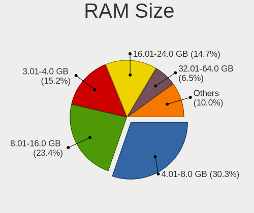
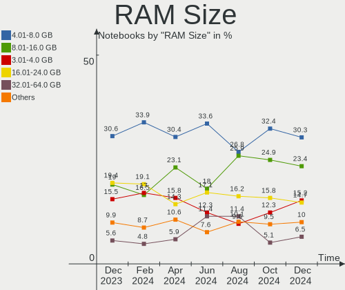
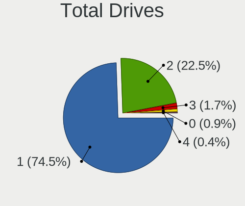
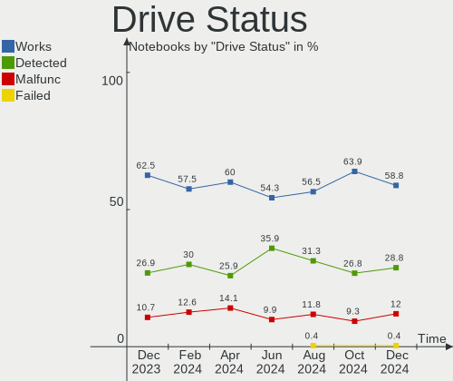
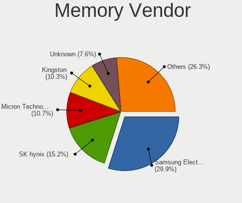

Linux in Russia - Hardware Trends (Notebooks)
---------------------------------------------

A project to identify most popular hardware characteristics and track their change
over time based on data collected by Linux users at https://Linux-Hardware.org.

Anyone can contribute to this report by the [hw-probe](https://github.com/linuxhw/hw-probe) tool:

    sudo -E hw-probe -all -upload

Period: Oct, 2022.

Contents
--------

* [ System ](#system)
  - [ OS                       ](#os)
  - [ OS Family                ](#os-family)
  - [ Kernel                   ](#kernel)
  - [ Kernel Family            ](#kernel-family)
  - [ Kernel Major Ver.        ](#kernel-major-ver)
  - [ Arch                     ](#arch)
  - [ DE                       ](#de)
  - [ Display Server           ](#display-server)
  - [ Display Manager          ](#display-manager)
  - [ OS Lang                  ](#os-lang)
  - [ Boot Mode                ](#boot-mode)
  - [ Filesystem               ](#filesystem)
  - [ Part. scheme             ](#part-scheme)
  - [ Dual Boot with Linux/BSD ](#dual-boot-with-linuxbsd)
  - [ Dual Boot (Win)          ](#dual-boot-win)

* [ Board ](#board)
  - [ Vendor                   ](#vendor)
  - [ Model                    ](#model)
  - [ Model Family             ](#model-family)
  - [ MFG Year                 ](#mfg-year)
  - [ Form Factor              ](#form-factor)
  - [ Secure Boot              ](#secure-boot)
  - [ Coreboot                 ](#coreboot)
  - [ RAM Size                 ](#ram-size)
  - [ RAM Used                 ](#ram-used)
  - [ Total Drives             ](#total-drives)
  - [ Has CD-ROM               ](#has-cd-rom)
  - [ Has Ethernet             ](#has-ethernet)
  - [ Has WiFi                 ](#has-wifi)
  - [ Has Bluetooth            ](#has-bluetooth)

* [ Location ](#location)
  - [ Country                  ](#country)
  - [ City                     ](#city)

* [ Drives ](#drives)
  - [ Drive Vendor             ](#drive-vendor)
  - [ Drive Model              ](#drive-model)
  - [ HDD Vendor               ](#hdd-vendor)
  - [ SSD Vendor               ](#ssd-vendor)
  - [ Drive Kind               ](#drive-kind)
  - [ Drive Connector          ](#drive-connector)
  - [ Drive Size               ](#drive-size)
  - [ Space Total              ](#space-total)
  - [ Space Used               ](#space-used)
  - [ Malfunc. Drives          ](#malfunc-drives)
  - [ Malfunc. Drive Vendor    ](#malfunc-drive-vendor)
  - [ Malfunc. HDD Vendor      ](#malfunc-hdd-vendor)
  - [ Malfunc. Drive Kind      ](#malfunc-drive-kind)
  - [ Failed Drives            ](#failed-drives)
  - [ Failed Drive Vendor      ](#failed-drive-vendor)
  - [ Drive Status             ](#drive-status)

* [ Storage controller ](#storage-controller)
  - [ Storage Vendor           ](#storage-vendor)
  - [ Storage Model            ](#storage-model)
  - [ Storage Kind             ](#storage-kind)

* [ Processor ](#processor)
  - [ CPU Vendor               ](#cpu-vendor)
  - [ CPU Model                ](#cpu-model)
  - [ CPU Model Family         ](#cpu-model-family)
  - [ CPU Cores                ](#cpu-cores)
  - [ CPU Sockets              ](#cpu-sockets)
  - [ CPU Threads              ](#cpu-threads)
  - [ CPU Op-Modes             ](#cpu-op-modes)
  - [ CPU Microcode            ](#cpu-microcode)
  - [ CPU Microarch            ](#cpu-microarch)

* [ Graphics ](#graphics)
  - [ GPU Vendor               ](#gpu-vendor)
  - [ GPU Model                ](#gpu-model)
  - [ GPU Combo                ](#gpu-combo)
  - [ GPU Driver               ](#gpu-driver)
  - [ GPU Memory               ](#gpu-memory)

* [ Monitor ](#monitor)
  - [ Monitor Vendor           ](#monitor-vendor)
  - [ Monitor Model            ](#monitor-model)
  - [ Monitor Resolution       ](#monitor-resolution)
  - [ Monitor Diagonal         ](#monitor-diagonal)
  - [ Monitor Width            ](#monitor-width)
  - [ Aspect Ratio             ](#aspect-ratio)
  - [ Monitor Area             ](#monitor-area)
  - [ Pixel Density            ](#pixel-density)
  - [ Multiple Monitors        ](#multiple-monitors)

* [ Network ](#network)
  - [ Net Controller Vendor    ](#net-controller-vendor)
  - [ Net Controller Model     ](#net-controller-model)
  - [ Wireless Vendor          ](#wireless-vendor)
  - [ Wireless Model           ](#wireless-model)
  - [ Ethernet Vendor          ](#ethernet-vendor)
  - [ Ethernet Model           ](#ethernet-model)
  - [ Net Controller Kind      ](#net-controller-kind)
  - [ Used Controller          ](#used-controller)
  - [ NICs                     ](#nics)
  - [ IPv6                     ](#ipv6)

* [ Bluetooth ](#bluetooth)
  - [ Bluetooth Vendor         ](#bluetooth-vendor)
  - [ Bluetooth Model          ](#bluetooth-model)

* [ Sound ](#sound)
  - [ Sound Vendor             ](#sound-vendor)
  - [ Sound Model              ](#sound-model)

* [ Memory ](#memory)
  - [ Memory Vendor            ](#memory-vendor)
  - [ Memory Model             ](#memory-model)
  - [ Memory Kind              ](#memory-kind)
  - [ Memory Form Factor       ](#memory-form-factor)
  - [ Memory Size              ](#memory-size)
  - [ Memory Speed             ](#memory-speed)

* [ Printers & scanners ](#printers--scanners)
  - [ Printer Vendor           ](#printer-vendor)
  - [ Printer Model            ](#printer-model)
  - [ Scanner Vendor           ](#scanner-vendor)
  - [ Scanner Model            ](#scanner-model)

* [ Camera ](#camera)
  - [ Camera Vendor            ](#camera-vendor)
  - [ Camera Model             ](#camera-model)

* [ Security ](#security)
  - [ Fingerprint Vendor       ](#fingerprint-vendor)
  - [ Fingerprint Model        ](#fingerprint-model)
  - [ Chipcard Vendor          ](#chipcard-vendor)
  - [ Chipcard Model           ](#chipcard-model)

* [ Unsupported ](#unsupported)
  - [ Unsupported Devices      ](#unsupported-devices)
  - [ Unsupported Device Types ](#unsupported-device-types)

System
------

OS
--

Installed operating systems

| Name                         | Notebooks | Percent |
|------------------------------|-----------|---------|
| ROSA 12.2                    | 92        | 39.32%  |
| Ubuntu 22.04                 | 19        | 8.12%   |
| ROSA R11.1                   | 12        | 5.13%   |
| Fedora 36                    | 12        | 5.13%   |
| Linux Mint 21                | 11        | 4.7%    |
| Debian 11                    | 9         | 3.85%   |
| Red OS 7.3.1                 | 6         | 2.56%   |
| Manjaro 22.0.0               | 5         | 2.14%   |
| Fedora 37                    | 5         | 2.14%   |
| ALT Linux 10.1               | 5         | 2.14%   |
| Ubuntu 20.04                 | 4         | 1.71%   |
| LMDE 5                       | 4         | 1.71%   |
| Ubuntu 22.10                 | 3         | 1.28%   |
| OpenMandriva 4.3             | 3         | 1.28%   |
| Kali 2022.3                  | 3         | 1.28%   |
| Elementary 6.1               | 3         | 1.28%   |
| Arch Rolling                 | 3         | 1.28%   |
| Red OS 7.3.2                 | 2         | 0.85%   |
| Linux Mint 20.3              | 2         | 0.85%   |
| Kubuntu 22.04                | 2         | 0.85%   |
| KDE neon 22.04               | 2         | 0.85%   |
| KDE neon 20.04               | 2         | 0.85%   |
| Gentoo 2.8                   | 2         | 0.85%   |
| Xubuntu 20.04                | 1         | 0.43%   |
| Xubuntu 18.04                | 1         | 0.43%   |
| Xubuntu 16.04                | 1         | 0.43%   |
| Void Linux Rolling           | 1         | 0.43%   |
| Ubuntu MATE 22.04            | 1         | 0.43%   |
| Ubuntu Budgie 22.04          | 1         | 0.43%   |
| SteamOS 3.3.2                | 1         | 0.43%   |
| SteamOS 3.3.1                | 1         | 0.43%   |
| ROSA 12.3                    | 1         | 0.43%   |
| Rocky Linux 9.0              | 1         | 0.43%   |
| Pop!_OS 22.04                | 1         | 0.43%   |
| Parrot 5.1                   | 1         | 0.43%   |
| openSUSE Tumbleweed-XXXXXXXX | 1         | 0.43%   |
| OpenMandriva 4.2             | 1         | 0.43%   |
| Manjaro 21.3.7               | 1         | 0.43%   |
| Manjaro                      | 1         | 0.43%   |
| Linux Mint 20.2              | 1         | 0.43%   |

OS Family
---------

OS without a version

| Name          | Notebooks | Percent |
|---------------|-----------|---------|
| ROSA          | 105       | 44.87%  |
| Ubuntu        | 26        | 11.11%  |
| Fedora        | 17        | 7.26%   |
| Linux Mint    | 15        | 6.41%   |
| Debian        | 11        | 4.7%    |
| Red OS        | 8         | 3.42%   |
| Manjaro       | 7         | 2.99%   |
| ALT Linux     | 6         | 2.56%   |
| OpenMandriva  | 4         | 1.71%   |
| LMDE          | 4         | 1.71%   |
| KDE neon      | 4         | 1.71%   |
| Xubuntu       | 3         | 1.28%   |
| Kubuntu       | 3         | 1.28%   |
| Kali          | 3         | 1.28%   |
| Gentoo        | 3         | 1.28%   |
| Elementary    | 3         | 1.28%   |
| Arch          | 3         | 1.28%   |
| SteamOS       | 2         | 0.85%   |
| Void Linux    | 1         | 0.43%   |
| Ubuntu MATE   | 1         | 0.43%   |
| Ubuntu Budgie | 1         | 0.43%   |
| Rocky Linux   | 1         | 0.43%   |
| Pop!_OS       | 1         | 0.43%   |
| Parrot        | 1         | 0.43%   |
| openSUSE      | 1         | 0.43%   |

Kernel
------

Version of the Linux kernel

| Version                                  | Notebooks | Percent |
|------------------------------------------|-----------|---------|
| 5.10.118-generic-2rosa2021.1-x86_64      | 37        | 15.81%  |
| 5.10.74-generic-2rosa2021.1-x86_64       | 35        | 14.96%  |
| 5.15.0-52-generic                        | 14        | 5.98%   |
| 5.15.0-48-generic                        | 12        | 5.13%   |
| 5.15.0-50-generic                        | 7         | 2.99%   |
| 5.17.11-generic-2rosa2021.1-x86_64       | 5         | 2.14%   |
| 5.15.10-1.el7.x86_64                     | 5         | 2.14%   |
| 5.10.0-19-amd64                          | 5         | 2.14%   |
| 5.4.32-generic-2rosa-x86_64              | 4         | 1.71%   |
| 5.19.16-200.fc36.x86_64                  | 4         | 1.71%   |
| 5.19.0-21-generic                        | 4         | 1.71%   |
| 5.15.0-41-generic                        | 4         | 1.71%   |
| 5.10.0-7-amd64                           | 4         | 1.71%   |
| 5.19.14-300.fc37.x86_64                  | 3         | 1.28%   |
| 5.18.18.xm1-1-xanmod-rosa2021.1-x86_64   | 3         | 1.28%   |
| 5.16.7-desktop-1omv4003                  | 3         | 1.28%   |
| 5.10.150-generic-1rosa2021.1-x86_64      | 3         | 1.28%   |
| 5.10.0-18-amd64                          | 3         | 1.28%   |
| 6.0.5-060005-generic                     | 2         | 0.85%   |
| 6.0.2-arch1-1                            | 2         | 0.85%   |
| 6.0.0-060000-generic                     | 2         | 0.85%   |
| 5.4.83-generic-2rosa-x86_64              | 2         | 0.85%   |
| 5.4.83-generic-2rosa-i586                | 2         | 0.85%   |
| 5.19.15-201.fc36.x86_64                  | 2         | 0.85%   |
| 5.19.0-kali2-amd64                       | 2         | 0.85%   |
| 5.17.5-300.fc36.x86_64                   | 2         | 0.85%   |
| 5.15.74-generic-1rosa2021.1-x86_64       | 2         | 0.85%   |
| 5.15.71-1-MANJARO                        | 2         | 0.85%   |
| 5.15.63-un-def-alt1                      | 2         | 0.85%   |
| 5.15.35-5.el7.3.x86_64                   | 2         | 0.85%   |
| 5.10.74-generic-2rosa2021.1-i586         | 2         | 0.85%   |
| 4.9.155-nrj-desktop-1rosa-x86_64         | 2         | 0.85%   |
| 6.0.6.xm1-1.klp-xanmod-rosa2021.1-x86_64 | 1         | 0.43%   |
| 6.0.5-300.fc37.x86_64                    | 1         | 0.43%   |
| 6.0.5-200.fc36.x86_64                    | 1         | 0.43%   |
| 6.0.3.xm1-1.klp-xanmod-rosa2021.1-x86_64 | 1         | 0.43%   |
| 6.0.2-2-MANJARO                          | 1         | 0.43%   |
| 6.0.0-pf2                                | 1         | 0.43%   |
| 6.0.0-2-amd64                            | 1         | 0.43%   |
| 5.4.32-generic-2rosa-i586                | 1         | 0.43%   |

Kernel Family
-------------

Linux kernel without a distro release

| Version  | Notebooks | Percent |
|----------|-----------|---------|
| 5.15.0   | 40        | 17.09%  |
| 5.10.118 | 38        | 16.24%  |
| 5.10.74  | 37        | 15.81%  |
| 5.10.0   | 13        | 5.56%   |
| 5.19.0   | 8         | 3.42%   |
| 5.4.32   | 5         | 2.14%   |
| 5.19.16  | 5         | 2.14%   |
| 5.17.11  | 5         | 2.14%   |
| 5.15.74  | 5         | 2.14%   |
| 5.15.10  | 5         | 2.14%   |
| 6.0.5    | 4         | 1.71%   |
| 6.0.0    | 4         | 1.71%   |
| 5.4.83   | 4         | 1.71%   |
| 5.4.0    | 4         | 1.71%   |
| 5.19.14  | 4         | 1.71%   |
| 6.0.2    | 3         | 1.28%   |
| 5.18.18  | 3         | 1.28%   |
| 5.16.7   | 3         | 1.28%   |
| 5.10.150 | 3         | 1.28%   |
| 4.9.155  | 3         | 1.28%   |
| 5.19.15  | 2         | 0.85%   |
| 5.19.13  | 2         | 0.85%   |
| 5.18.0   | 2         | 0.85%   |
| 5.17.5   | 2         | 0.85%   |
| 5.15.72  | 2         | 0.85%   |
| 5.15.71  | 2         | 0.85%   |
| 5.15.63  | 2         | 0.85%   |
| 5.15.35  | 2         | 0.85%   |
| 5.13.0   | 2         | 0.85%   |
| 6.0.6    | 1         | 0.43%   |
| 6.0.3    | 1         | 0.43%   |
| 5.4.218  | 1         | 0.43%   |
| 5.19.12  | 1         | 0.43%   |
| 5.19.11  | 1         | 0.43%   |
| 5.19.10  | 1         | 0.43%   |
| 5.18.19  | 1         | 0.43%   |
| 5.18.12  | 1         | 0.43%   |
| 5.16.11  | 1         | 0.43%   |
| 5.15.73  | 1         | 0.43%   |
| 5.15.70  | 1         | 0.43%   |

Kernel Major Ver.
-----------------

Linux kernel major version

| Version | Notebooks | Percent |
|---------|-----------|---------|
| 5.10    | 92        | 39.32%  |
| 5.15    | 65        | 27.78%  |
| 5.19    | 24        | 10.26%  |
| 5.4     | 14        | 5.98%   |
| 6.0     | 13        | 5.56%   |
| 5.18    | 7         | 2.99%   |
| 5.17    | 7         | 2.99%   |
| 5.16    | 4         | 1.71%   |
| 4.9     | 3         | 1.28%   |
| 5.13    | 2         | 0.85%   |
| 5.14    | 1         | 0.43%   |
| 5.11    | 1         | 0.43%   |
| 4.4     | 1         | 0.43%   |

Arch
----

OS architecture (x86_64, i586, etc.)

| Name   | Notebooks | Percent |
|--------|-----------|---------|
| x86_64 | 224       | 95.73%  |
| i686   | 10        | 4.27%   |

DE
--

Desktop Environment

| Name       | Notebooks | Percent |
|------------|-----------|---------|
| GNOME      | 80        | 34.19%  |
| KDE5       | 75        | 32.05%  |
| XFCE       | 16        | 6.84%   |
| LXQt       | 16        | 6.84%   |
| X-Cinnamon | 13        | 5.56%   |
| MATE       | 9         | 3.85%   |
| KDE4       | 8         | 3.42%   |
| Unknown    | 7         | 2.99%   |
| Cinnamon   | 4         | 1.71%   |
| Pantheon   | 3         | 1.28%   |
| LXDE       | 1         | 0.43%   |
| fluxbox    | 1         | 0.43%   |
| Budgie     | 1         | 0.43%   |

Display Server
--------------

X11 or Wayland

| Name    | Notebooks | Percent |
|---------|-----------|---------|
| Wayland | 115       | 49.15%  |
| X11     | 113       | 48.29%  |
| Unknown | 4         | 1.71%   |
| Tty     | 2         | 0.85%   |

Display Manager
---------------

SDDM, LightDM, etc.

| Name    | Notebooks | Percent |
|---------|-----------|---------|
| SDDM    | 69        | 29.49%  |
| GDM     | 68        | 29.06%  |
| Unknown | 40        | 17.09%  |
| LightDM | 27        | 11.54%  |
| GDM3    | 21        | 8.97%   |
| KDM     | 8         | 3.42%   |
| LXDM    | 1         | 0.43%   |

OS Lang
-------

Language

| Lang    | Notebooks | Percent |
|---------|-----------|---------|
| ru_RU   | 186       | 79.49%  |
| en_US   | 36        | 15.38%  |
| Unknown | 8         | 3.42%   |
| en_GB   | 1         | 0.43%   |
| en_AG   | 1         | 0.43%   |
| C.UTF8  | 1         | 0.43%   |
| C       | 1         | 0.43%   |

Boot Mode
---------

EFI or BIOS

| Mode | Notebooks | Percent |
|------|-----------|---------|
| EFI  | 138       | 58.97%  |
| BIOS | 96        | 41.03%  |

Filesystem
----------

Type of filesystem

| Type    | Notebooks | Percent |
|---------|-----------|---------|
| Ext4    | 195       | 83.33%  |
| Btrfs   | 26        | 11.11%  |
| Overlay | 10        | 4.27%   |
| Xfs     | 2         | 0.85%   |
| Ext3    | 1         | 0.43%   |

Part. scheme
------------

Scheme of partitioning

| Type    | Notebooks | Percent |
|---------|-----------|---------|
| GPT     | 141       | 60.26%  |
| MBR     | 59        | 25.21%  |
| Unknown | 34        | 14.53%  |

Dual Boot with Linux/BSD
------------------------

Hosting more than one Linux/BSD

| Dual boot | Notebooks | Percent |
|-----------|-----------|---------|
| No        | 200       | 85.47%  |
| Yes       | 34        | 14.53%  |

Dual Boot (Win)
---------------

Hosting Linux and Windows

| Dual boot | Notebooks | Percent |
|-----------|-----------|---------|
| No        | 149       | 63.68%  |
| Yes       | 85        | 36.32%  |

Board
-----

Vendor
------

Motherboard manufacturer

| Name                           | Notebooks | Percent |
|--------------------------------|-----------|---------|
| Lenovo                         | 42        | 17.95%  |
| ASUSTek Computer               | 38        | 16.24%  |
| Hewlett-Packard                | 36        | 15.38%  |
| Acer                           | 26        | 11.11%  |
| HUAWEI                         | 18        | 7.69%   |
| Dell                           | 13        | 5.56%   |
| Samsung Electronics            | 9         | 3.85%   |
| Sony                           | 8         | 3.42%   |
| MSI                            | 7         | 2.99%   |
| Aquarius                       | 5         | 2.14%   |
| Toshiba                        | 3         | 1.28%   |
| Valve                          | 2         | 0.85%   |
| Prestigio                      | 2         | 0.85%   |
| Pegatron                       | 2         | 0.85%   |
| Maibenben                      | 2         | 0.85%   |
| HONOR                          | 2         | 0.85%   |
| Clevo                          | 2         | 0.85%   |
| Chuwi                          | 2         | 0.85%   |
| Apple                          | 2         | 0.85%   |
| THUNDEROBOT                    | 1         | 0.43%   |
| Thomson                        | 1         | 0.43%   |
| System76                       | 1         | 0.43%   |
| Shanghai Zhaoxin Semiconductor | 1         | 0.43%   |
| Quanta                         | 1         | 0.43%   |
| Irbis                          | 1         | 0.43%   |
| HIPER                          | 1         | 0.43%   |
| Haier                          | 1         | 0.43%   |
| eMachines                      | 1         | 0.43%   |
| DEPO Computers                 | 1         | 0.43%   |
| BenQ                           | 1         | 0.43%   |
| 3Logic Group                   | 1         | 0.43%   |
| Unknown                        | 1         | 0.43%   |

Model
-----

Motherboard model

| Name                                  | Notebooks | Percent |
|---------------------------------------|-----------|---------|
| HUAWEI NBLK-WAX9X                     | 3         | 1.28%   |
| HP Pavilion g6                        | 3         | 1.28%   |
| HP Pavilion dv7                       | 3         | 1.28%   |
| ASUS K43SJ                            | 3         | 1.28%   |
| Aquarius NS585                        | 3         | 1.28%   |
| Valve Jupiter                         | 2         | 0.85%   |
| Lenovo ThinkBook 15 G3 ACL 21A4       | 2         | 0.85%   |
| Lenovo IdeaPad 5 Pro 14ACN6 82L7      | 2         | 0.85%   |
| Lenovo IdeaPad 5 15ARE05 81YQ         | 2         | 0.85%   |
| Lenovo IdeaPad 110-15ACL 80TJ         | 2         | 0.85%   |
| Lenovo B560                           | 2         | 0.85%   |
| HUAWEI NBLB-WAX9N                     | 2         | 0.85%   |
| HUAWEI NBD-WXX9                       | 2         | 0.85%   |
| HUAWEI HVY-WXX9                       | 2         | 0.85%   |
| HUAWEI HLY-WX9XX                      | 2         | 0.85%   |
| HUAWEI BOM-WXX9                       | 2         | 0.85%   |
| HP Pavilion Notebook                  | 2         | 0.85%   |
| HP Notebook                           | 2         | 0.85%   |
| HP Laptop 15s-eq2xxx                  | 2         | 0.85%   |
| HP EliteBook 855 G8 Notebook PC       | 2         | 0.85%   |
| ASUS ROG Zephyrus M16 GU603HE_GU603HE | 2         | 0.85%   |
| Acer Nitro AN515-54                   | 2         | 0.85%   |
| Acer Nitro AN515-52                   | 2         | 0.85%   |
| Acer Aspire E1-571G                   | 2         | 0.85%   |
| Acer Aspire A715-41G                  | 2         | 0.85%   |
| Acer Aspire 5742G                     | 2         | 0.85%   |
| Toshiba Satellite L755                | 1         | 0.43%   |
| Toshiba Satellite C660                | 1         | 0.43%   |
| Toshiba Satellite A300                | 1         | 0.43%   |
| THUNDEROBOT 911AirD                   | 1         | 0.43%   |
| Thomson NEO14A-4WH128                 | 1         | 0.43%   |
| System76 Galago Pro                   | 1         | 0.43%   |
| Sony VPCSB1V9R                        | 1         | 0.43%   |
| Sony VPCF12Z1R                        | 1         | 0.43%   |
| Sony VPCEL3S1R                        | 1         | 0.43%   |
| Sony VPCEB1S1R                        | 1         | 0.43%   |
| Sony VPCCB3S1R                        | 1         | 0.43%   |
| Sony VGN-AR71MR                       | 1         | 0.43%   |
| Sony SVE1513U1RW                      | 1         | 0.43%   |
| Sony SVE1512H1RW                      | 1         | 0.43%   |

Model Family
------------

Motherboard model prefix

| Name                  | Notebooks | Percent |
|-----------------------|-----------|---------|
| Acer Aspire           | 19        | 8.12%   |
| Lenovo IdeaPad        | 18        | 7.69%   |
| HP Pavilion           | 14        | 5.98%   |
| HP Laptop             | 9         | 3.85%   |
| ASUS VivoBook         | 7         | 2.99%   |
| Lenovo ThinkPad       | 5         | 2.14%   |
| HP EliteBook          | 5         | 2.14%   |
| Dell Inspiron         | 5         | 2.14%   |
| ASUS ASUS             | 5         | 2.14%   |
| Acer Nitro            | 5         | 2.14%   |
| Lenovo Legion         | 4         | 1.71%   |
| Toshiba Satellite     | 3         | 1.28%   |
| Lenovo ThinkBook      | 3         | 1.28%   |
| HUAWEI NBLK-WAX9X     | 3         | 1.28%   |
| HP ProBook            | 3         | 1.28%   |
| Dell Vostro           | 3         | 1.28%   |
| ASUS ROG              | 3         | 1.28%   |
| ASUS K43SJ            | 3         | 1.28%   |
| Aquarius NS585        | 3         | 1.28%   |
| Valve Jupiter         | 2         | 0.85%   |
| Samsung 300V3A        | 2         | 0.85%   |
| Lenovo B560           | 2         | 0.85%   |
| HUAWEI NBLB-WAX9N     | 2         | 0.85%   |
| HUAWEI NBD-WXX9       | 2         | 0.85%   |
| HUAWEI HVY-WXX9       | 2         | 0.85%   |
| HUAWEI HLY-WX9XX      | 2         | 0.85%   |
| HUAWEI BOM-WXX9       | 2         | 0.85%   |
| HP Notebook           | 2         | 0.85%   |
| Dell XPS              | 2         | 0.85%   |
| ASUS ZenBook          | 2         | 0.85%   |
| THUNDEROBOT 911AirD   | 1         | 0.43%   |
| Thomson NEO14A-4WH128 | 1         | 0.43%   |
| System76 Galago       | 1         | 0.43%   |
| Sony VPCSB1V9R        | 1         | 0.43%   |
| Sony VPCF12Z1R        | 1         | 0.43%   |
| Sony VPCEL3S1R        | 1         | 0.43%   |
| Sony VPCEB1S1R        | 1         | 0.43%   |
| Sony VPCCB3S1R        | 1         | 0.43%   |
| Sony VGN-AR71MR       | 1         | 0.43%   |
| Sony SVE1513U1RW      | 1         | 0.43%   |

MFG Year
--------

Motherboard manufacture year

| Year | Notebooks | Percent |
|------|-----------|---------|
| 2021 | 43        | 18.38%  |
| 2019 | 28        | 11.97%  |
| 2020 | 26        | 11.11%  |
| 2011 | 25        | 10.68%  |
| 2012 | 16        | 6.84%   |
| 2018 | 15        | 6.41%   |
| 2022 | 11        | 4.7%    |
| 2010 | 11        | 4.7%    |
| 2017 | 10        | 4.27%   |
| 2008 | 10        | 4.27%   |
| 2016 | 9         | 3.85%   |
| 2013 | 9         | 3.85%   |
| 2014 | 6         | 2.56%   |
| 2009 | 6         | 2.56%   |
| 2007 | 5         | 2.14%   |
| 2015 | 4         | 1.71%   |

Form Factor
-----------

Physical design of the computer

| Name     | Notebooks | Percent |
|----------|-----------|---------|
| Notebook | 234       | 100%    |

Secure Boot
-----------

Enabled or disabled

| State    | Notebooks | Percent |
|----------|-----------|---------|
| Disabled | 220       | 94.02%  |
| Enabled  | 14        | 5.98%   |

Coreboot
--------

Have coreboot on board

| Used | Notebooks | Percent |
|------|-----------|---------|
| No   | 233       | 99.57%  |
| Yes  | 1         | 0.43%   |

RAM Size
--------

Total RAM memory

| Size in GB  | Notebooks | Percent |
|-------------|-----------|---------|
| 4.01-8.0    | 83        | 35.47%  |
| 8.01-16.0   | 49        | 20.94%  |
| 3.01-4.0    | 38        | 16.24%  |
| 16.01-24.0  | 24        | 10.26%  |
| 32.01-64.0  | 13        | 5.56%   |
| 1.01-2.0    | 12        | 5.13%   |
| 2.01-3.0    | 9         | 3.85%   |
| 24.01-32.0  | 2         | 0.85%   |
| 64.01-256.0 | 2         | 0.85%   |
| 0.51-1.0    | 2         | 0.85%   |

RAM Used
--------

Used RAM memory

| Used GB   | Notebooks | Percent |
|-----------|-----------|---------|
| 1.01-2.0  | 86        | 36.75%  |
| 2.01-3.0  | 47        | 20.09%  |
| 0.51-1.0  | 40        | 17.09%  |
| 4.01-8.0  | 29        | 12.39%  |
| 3.01-4.0  | 23        | 9.83%   |
| 8.01-16.0 | 6         | 2.56%   |
| 0.01-0.5  | 3         | 1.28%   |

Total Drives
------------

Number of drives on board

| Drives | Notebooks | Percent |
|--------|-----------|---------|
| 1      | 169       | 72.22%  |
| 2      | 61        | 26.07%  |
| 3      | 3         | 1.28%   |
| 0      | 1         | 0.43%   |

Has CD-ROM
----------

Has CD-ROM on board

| Presented | Notebooks | Percent |
|-----------|-----------|---------|
| No        | 160       | 68.38%  |
| Yes       | 74        | 31.62%  |

Has Ethernet
------------

Has Ethernet on board

| Presented | Notebooks | Percent |
|-----------|-----------|---------|
| Yes       | 176       | 75.21%  |
| No        | 58        | 24.79%  |

Has WiFi
--------

Has WiFi module

| Presented | Notebooks | Percent |
|-----------|-----------|---------|
| Yes       | 232       | 99.15%  |
| No        | 2         | 0.85%   |

Has Bluetooth
-------------

Has Bluetooth module

| Presented | Notebooks | Percent |
|-----------|-----------|---------|
| Yes       | 194       | 82.91%  |
| No        | 40        | 17.09%  |

Location
--------

Country
-------

Geographic location (country)

| Country | Notebooks | Percent |
|---------|-----------|---------|
| Russia  | 234       | 100%    |

City
----

Geographic location (city)

| City              | Notebooks | Percent |
|-------------------|-----------|---------|
| Moscow            | 63        | 26.92%  |
| St Petersburg     | 20        | 8.55%   |
| Yekaterinburg     | 7         | 2.99%   |
| Nizhniy Novgorod  | 7         | 2.99%   |
| Voronezh          | 6         | 2.56%   |
| Saratov           | 6         | 2.56%   |
| Murom             | 5         | 2.14%   |
| Samara            | 4         | 1.71%   |
| Rostov-on-Don     | 4         | 1.71%   |
| Perm              | 4         | 1.71%   |
| Krasnodar         | 4         | 1.71%   |
| Kazan’          | 4         | 1.71%   |
| Tver              | 3         | 1.28%   |
| Tula              | 3         | 1.28%   |
| Orenburg          | 3         | 1.28%   |
| Novosibirsk       | 3         | 1.28%   |
| Kaluga            | 3         | 1.28%   |
| Yaroslavl         | 2         | 0.85%   |
| Vladivostok       | 2         | 0.85%   |
| Ulyanovsk         | 2         | 0.85%   |
| Tyumen            | 2         | 0.85%   |
| Stavropol         | 2         | 0.85%   |
| Sochi             | 2         | 0.85%   |
| Severodvinsk      | 2         | 0.85%   |
| Murmansk          | 2         | 0.85%   |
| Krasnoyarsk       | 2         | 0.85%   |
| Khimki            | 2         | 0.85%   |
| Kaliningrad       | 2         | 0.85%   |
| Istra             | 2         | 0.85%   |
| Irkutsk           | 2         | 0.85%   |
| Chelyabinsk       | 2         | 0.85%   |
| Barnaul           | 2         | 0.85%   |
| Zheleznogorsk     | 1         | 0.43%   |
| Zanevka           | 1         | 0.43%   |
| Yuzhno-Sakhalinsk | 1         | 0.43%   |
| Yurga             | 1         | 0.43%   |
| Yoshkar-Ola       | 1         | 0.43%   |
| Yefremov          | 1         | 0.43%   |
| Vsevolozhsk       | 1         | 0.43%   |
| Ussuriysk         | 1         | 0.43%   |

Drives
------

Drive Vendor
------------

Hard drive vendors

| Vendor                      | Notebooks | Drives | Percent |
|-----------------------------|-----------|--------|---------|
| WDC                         | 35        | 36     | 12.28%  |
| Samsung Electronics         | 32        | 34     | 11.23%  |
| Seagate                     | 25        | 25     | 8.77%   |
| Toshiba                     | 19        | 19     | 6.67%   |
| Hitachi                     | 19        | 19     | 6.67%   |
| SK hynix                    | 17        | 17     | 5.96%   |
| Unknown                     | 13        | 15     | 4.56%   |
| SanDisk                     | 10        | 10     | 3.51%   |
| KIOXIA                      | 9         | 9      | 3.16%   |
| A-DATA Technology           | 9         | 9      | 3.16%   |
| Kingston                    | 8         | 8      | 2.81%   |
| Intel                       | 8         | 10     | 2.81%   |
| HGST                        | 8         | 8      | 2.81%   |
| China                       | 6         | 7      | 2.11%   |
| Micron Technology           | 5         | 5      | 1.75%   |
| KingSpec                    | 4         | 4      | 1.4%    |
| Unknown                     | 4         | 4      | 1.4%    |
| Transcend                   | 3         | 3      | 1.05%   |
| SPCC                        | 3         | 3      | 1.05%   |
| Phison                      | 3         | 3      | 1.05%   |
| Netac                       | 3         | 3      | 1.05%   |
| GOODRAM                     | 3         | 3      | 1.05%   |
| Crucial                     | 3         | 3      | 1.05%   |
| SSSTC                       | 2         | 2      | 0.7%    |
| Silicon Motion              | 2         | 2      | 0.7%    |
| Phison Electronics          | 2         | 2      | 0.7%    |
| Patriot                     | 2         | 2      | 0.7%    |
| Kingston Technology Company | 2         | 2      | 0.7%    |
| Apacer                      | 2         | 2      | 0.7%    |
| AMD                         | 2         | 2      | 0.7%    |
| WALRAM                      | 1         | 1      | 0.35%   |
| UMIS                        | 1         | 1      | 0.35%   |
| Solid State Storage         | 1         | 1      | 0.35%   |
| Smartbuy                    | 1         | 1      | 0.35%   |
| Realtek Semiconductor       | 1         | 1      | 0.35%   |
| PNY                         | 1         | 1      | 0.35%   |
| OCZ                         | 1         | 1      | 0.35%   |
| LITEONIT                    | 1         | 1      | 0.35%   |
| Kingsand                    | 1         | 1      | 0.35%   |
| KingDian                    | 1         | 1      | 0.35%   |

Drive Model
-----------

Hard drive models

| Model                                               | Notebooks | Percent |
|-----------------------------------------------------|-----------|---------|
| Seagate ST500LT012-1DG142 500GB                     | 5         | 1.71%   |
| Seagate ST1000LM024 HN-M101MBB 1TB                  | 5         | 1.71%   |
| Unknown MMC Card  64GB                              | 4         | 1.37%   |
| Toshiba MQ04ABF100 1TB                              | 4         | 1.37%   |
| Toshiba MQ01ABF050 500GB                            | 4         | 1.37%   |
| Seagate ST1000LM035-1RK172 1TB                      | 4         | 1.37%   |
| Samsung NVMe SSD Controller SM981/PM981/PM983 500GB | 4         | 1.37%   |
| Unknown                                             | 4         | 1.37%   |
| WDC WDS240G2G0A-00JH30 240GB SSD                    | 3         | 1.02%   |
| WDC WD5000LPCX-24VHAT0 500GB                        | 3         | 1.02%   |
| SK hynix HFM256GDJTNG-8310A 256GB                   | 3         | 1.02%   |
| SK hynix BC711 HFM512GD3JX013N 512GB                | 3         | 1.02%   |
| Samsung MZVLQ512HALU-000H1 512GB                    | 3         | 1.02%   |
| KIOXIA KBG40ZNV512G 512GB                           | 3         | 1.02%   |
| Intel SSDPEKNU512GZ 512GB                           | 3         | 1.02%   |
| A-DATA SU800 512GB SSD                              | 3         | 1.02%   |
| WDC WD10JPCX-24UE4T0 1TB                            | 2         | 0.68%   |
| WDC PC SN730 SDBPNTY-256G                           | 2         | 0.68%   |
| WDC PC SN530 SDBPNPZ-256G-1006 256GB                | 2         | 0.68%   |
| Unknown MMC Card  32GB                              | 2         | 0.68%   |
| Unknown MMC Card  128GB                             | 2         | 0.68%   |
| SPCC Solid State Disk 256GB                         | 2         | 0.68%   |
| SK hynix SKHynix_HFM256GD3HX015N 256GB              | 2         | 0.68%   |
| SK hynix BC501 NVMe Solid State Drive 512GB         | 2         | 0.68%   |
| Seagate ST9250315AS 250GB                           | 2         | 0.68%   |
| Seagate ST320LT020-9YG142 320GB                     | 2         | 0.68%   |
| Sandisk WD Black SN750 / PC SN730 NVMe SSD 1TB      | 2         | 0.68%   |
| Samsung SSD 860 PRO 512GB                           | 2         | 0.68%   |
| Samsung SSD 860 EVO 500GB                           | 2         | 0.68%   |
| Phison PS5013 E13 NVMe Controller 256GB             | 2         | 0.68%   |
| Netac SSD 512GB                                     | 2         | 0.68%   |
| Micron 2210_MTFDHBA1T0QFD 1TB                       | 2         | 0.68%   |
| Micron 2200_MTFDHBA256TCK 256GB                     | 2         | 0.68%   |
| KIOXIA KBG40ZNS512G NVMe 512GB                      | 2         | 0.68%   |
| Intel SSDPEKNW512G8 512GB                           | 2         | 0.68%   |
| Hitachi HTS723232A7A364 320GB                       | 2         | 0.68%   |
| Hitachi HTS547550A9E384 500GB                       | 2         | 0.68%   |
| Hitachi HTS545050B9A300 500GB                       | 2         | 0.68%   |
| Hitachi HTS542516K9SA00 160GB                       | 2         | 0.68%   |
| Hitachi HTS542512K9SA00 120GB                       | 2         | 0.68%   |

HDD Vendor
----------

Hard disk drive vendors

| Vendor              | Notebooks | Drives | Percent |
|---------------------|-----------|--------|---------|
| Seagate             | 25        | 25     | 28.09%  |
| WDC                 | 19        | 19     | 21.35%  |
| Hitachi             | 19        | 19     | 21.35%  |
| Toshiba             | 15        | 15     | 16.85%  |
| HGST                | 8         | 8      | 8.99%   |
| Samsung Electronics | 2         | 2      | 2.25%   |
| Unknown             | 1         | 1      | 1.12%   |

SSD Vendor
----------

Solid state drive vendors

| Vendor              | Notebooks | Drives | Percent |
|---------------------|-----------|--------|---------|
| Samsung Electronics | 11        | 11     | 13.58%  |
| WDC                 | 7         | 7      | 8.64%   |
| A-DATA Technology   | 7         | 7      | 8.64%   |
| Kingston            | 6         | 6      | 7.41%   |
| China               | 6         | 7      | 7.41%   |
| SanDisk             | 4         | 4      | 4.94%   |
| KingSpec            | 4         | 4      | 4.94%   |
| Transcend           | 3         | 3      | 3.7%    |
| SPCC                | 3         | 3      | 3.7%    |
| Netac               | 3         | 3      | 3.7%    |
| GOODRAM             | 3         | 3      | 3.7%    |
| Toshiba             | 2         | 2      | 2.47%   |
| Patriot             | 2         | 2      | 2.47%   |
| Crucial             | 2         | 2      | 2.47%   |
| Apacer              | 2         | 2      | 2.47%   |
| AMD                 | 2         | 2      | 2.47%   |
| WALRAM              | 1         | 1      | 1.23%   |
| PNY                 | 1         | 1      | 1.23%   |
| OCZ                 | 1         | 1      | 1.23%   |
| LITEONIT            | 1         | 1      | 1.23%   |
| KingDian            | 1         | 1      | 1.23%   |
| HS-SSD-E100         | 1         | 1      | 1.23%   |
| Hikvision           | 1         | 1      | 1.23%   |
| GS                  | 1         | 2      | 1.23%   |
| ExeGate             | 1         | 1      | 1.23%   |
| CT240BX5            | 1         | 1      | 1.23%   |
| BIWIN               | 1         | 1      | 1.23%   |
| Apple               | 1         | 1      | 1.23%   |
| 1TB                 | 1         | 1      | 1.23%   |
| Unknown             | 1         | 1      | 1.23%   |

Drive Kind
----------

HDD or SSD

| Kind    | Notebooks | Drives | Percent |
|---------|-----------|--------|---------|
| NVMe    | 99        | 104    | 35.23%  |
| HDD     | 88        | 89     | 31.32%  |
| SSD     | 79        | 83     | 28.11%  |
| MMC     | 14        | 17     | 4.98%   |
| Unknown | 1         | 1      | 0.36%   |

Drive Connector
---------------

SATA, SAS, NVMe, etc.

| Type | Notebooks | Drives | Percent |
|------|-----------|--------|---------|
| SATA | 147       | 169    | 55.68%  |
| NVMe | 98        | 103    | 37.12%  |
| MMC  | 14        | 17     | 5.3%    |
| SAS  | 5         | 5      | 1.89%   |

Drive Size
----------

Size of hard drive

| Size in TB | Notebooks | Drives | Percent |
|------------|-----------|--------|---------|
| 0.01-0.5   | 112       | 125    | 71.79%  |
| 0.51-1.0   | 43        | 46     | 27.56%  |
| 1.01-2.0   | 1         | 1      | 0.64%   |

Space Total
-----------

Amount of disk space available on the file system

| Size in GB     | Notebooks | Percent |
|----------------|-----------|---------|
| 101-250        | 82        | 35.04%  |
| 251-500        | 66        | 28.21%  |
| 501-1000       | 24        | 10.26%  |
| 1-20           | 17        | 7.26%   |
| 51-100         | 15        | 6.41%   |
| 21-50          | 10        | 4.27%   |
| 1001-2000      | 10        | 4.27%   |
| Unknown        | 6         | 2.56%   |
| 2001-3000      | 3         | 1.28%   |
| More than 3000 | 1         | 0.43%   |

Space Used
----------

Amount of used disk space

| Used GB        | Notebooks | Percent |
|----------------|-----------|---------|
| 1-20           | 133       | 56.84%  |
| 21-50          | 33        | 14.1%   |
| 101-250        | 20        | 8.55%   |
| 251-500        | 17        | 7.26%   |
| 51-100         | 15        | 6.41%   |
| 501-1000       | 8         | 3.42%   |
| Unknown        | 6         | 2.56%   |
| More than 3000 | 1         | 0.43%   |
| 1001-2000      | 1         | 0.43%   |

Malfunc. Drives
---------------

Drive models with a malfunction

| Model                                       | Notebooks | Drives | Percent |
|---------------------------------------------|-----------|--------|---------|
| Seagate ST500LT012-1DG142 500GB             | 4         | 4      | 9.52%   |
| Toshiba MQ01ABF050 500GB                    | 2         | 2      | 4.76%   |
| Hitachi HTS547550A9E384 500GB               | 2         | 2      | 4.76%   |
| Hitachi HTS542516K9SA00 160GB               | 2         | 2      | 4.76%   |
| WDC WD5000LPLX-22ZNTT0 500GB                | 1         | 1      | 2.38%   |
| WDC WD5000BPVT-00HXZT1 500GB                | 1         | 1      | 2.38%   |
| WDC WD3200BPVT-24ZEST0 320GB                | 1         | 1      | 2.38%   |
| WDC WD3200BPVT-24JJ5T0 320GB                | 1         | 1      | 2.38%   |
| WDC WD3200BPVT-22JJ5T0 320GB                | 1         | 1      | 2.38%   |
| WDC WD2500BEVT-22A23T0 250GB                | 1         | 1      | 2.38%   |
| Toshiba MQ04ABF100 1TB                      | 1         | 1      | 2.38%   |
| Toshiba MQ01ABD050 500GB                    | 1         | 1      | 2.38%   |
| Toshiba MQ01ABD032 320GB                    | 1         | 1      | 2.38%   |
| Toshiba MK5065GSXN 500GB                    | 1         | 1      | 2.38%   |
| Toshiba MK5059GSXP 500GB                    | 1         | 1      | 2.38%   |
| Toshiba MK3265GSX 320GB                     | 1         | 1      | 2.38%   |
| SK hynix BC711 HFM512GD3JX013N 512GB        | 1         | 1      | 2.38%   |
| Seagate ST9500420AS 500GB                   | 1         | 1      | 2.38%   |
| Seagate ST9250315AS 250GB                   | 1         | 1      | 2.38%   |
| Seagate ST320LT020-9YG142 320GB             | 1         | 1      | 2.38%   |
| Seagate ST1000LM049-2GH172 1TB              | 1         | 1      | 2.38%   |
| Seagate ST1000LM048-2E7172 1TB              | 1         | 1      | 2.38%   |
| Seagate ST1000LM024 HN-M101MBB 1TB          | 1         | 1      | 2.38%   |
| Samsung Electronics SSD PM810 2.5 7mm 256GB | 1         | 1      | 2.38%   |
| Samsung Electronics HM321HI 320GB           | 1         | 1      | 2.38%   |
| KingSpec T-60 64GB SSD                      | 1         | 1      | 2.38%   |
| Hitachi HTS723232A7A364 320GB               | 1         | 1      | 2.38%   |
| Hitachi HTS547564A9E384 640GB               | 1         | 1      | 2.38%   |
| Hitachi HTS545050B9SA00 500GB               | 1         | 1      | 2.38%   |
| Hitachi HTS545050B9A300 500GB               | 1         | 1      | 2.38%   |
| Hitachi HTS545032B9A300 320GB               | 1         | 1      | 2.38%   |
| Hitachi HTS543232A7A384 320GB               | 1         | 1      | 2.38%   |
| Hitachi HTS542512K9SA00 120GB               | 1         | 1      | 2.38%   |
| Hitachi HTS541612J9SA00 120GB               | 1         | 1      | 2.38%   |
| HGST HTS721010A9E630 1TB                    | 1         | 1      | 2.38%   |
| China SSD 240GB                             | 1         | 2      | 2.38%   |

Malfunc. Drive Vendor
---------------------

Vendors of faulty drives

| Vendor              | Notebooks | Drives | Percent |
|---------------------|-----------|--------|---------|
| Hitachi             | 12        | 12     | 28.57%  |
| Seagate             | 10        | 10     | 23.81%  |
| Toshiba             | 8         | 8      | 19.05%  |
| WDC                 | 6         | 6      | 14.29%  |
| Samsung Electronics | 2         | 2      | 4.76%   |
| SK hynix            | 1         | 1      | 2.38%   |
| KingSpec            | 1         | 1      | 2.38%   |
| HGST                | 1         | 1      | 2.38%   |
| China               | 1         | 2      | 2.38%   |

Malfunc. HDD Vendor
-------------------

Vendors of faulty HDD drives

| Vendor              | Notebooks | Drives | Percent |
|---------------------|-----------|--------|---------|
| Hitachi             | 12        | 12     | 31.58%  |
| Seagate             | 10        | 10     | 26.32%  |
| Toshiba             | 8         | 8      | 21.05%  |
| WDC                 | 6         | 6      | 15.79%  |
| Samsung Electronics | 1         | 1      | 2.63%   |
| HGST                | 1         | 1      | 2.63%   |

Malfunc. Drive Kind
-------------------

Kinds of faulty drives

| Kind | Notebooks | Drives | Percent |
|------|-----------|--------|---------|
| HDD  | 38        | 38     | 90.48%  |
| SSD  | 3         | 4      | 7.14%   |
| NVMe | 1         | 1      | 2.38%   |

Failed Drives
-------------

Failed drive models

Zero info for selected period =(

Failed Drive Vendor
-------------------

Failed drive vendors

Zero info for selected period =(

Drive Status
------------

Number of failed and malfunc. drives

| Status   | Notebooks | Drives | Percent |
|----------|-----------|--------|---------|
| Works    | 150       | 175    | 60%     |
| Detected | 58        | 76     | 23.2%   |
| Malfunc  | 42        | 43     | 16.8%   |

Storage controller
------------------

Storage Vendor
--------------

Storage controller vendors

| Vendor                           | Notebooks | Percent |
|----------------------------------|-----------|---------|
| Intel                            | 150       | 52.45%  |
| AMD                              | 38        | 13.29%  |
| Samsung Electronics              | 22        | 7.69%   |
| SK hynix                         | 17        | 5.94%   |
| SanDisk                          | 15        | 5.24%   |
| KIOXIA                           | 10        | 3.5%    |
| Phison Electronics               | 8         | 2.8%    |
| Micron Technology                | 5         | 1.75%   |
| Kingston Technology Company      | 4         | 1.4%    |
| Solid State Storage Technology   | 3         | 1.05%   |
| Silicon Motion                   | 2         | 0.7%    |
| Silicon Integrated Systems [SiS] | 2         | 0.7%    |
| ADATA Technology                 | 2         | 0.7%    |
| Unknown                          | 2         | 0.7%    |
| Zhaoxin                          | 1         | 0.35%   |
| Union Memory (Shenzhen)          | 1         | 0.35%   |
| Toshiba America Info Systems     | 1         | 0.35%   |
| Realtek Semiconductor            | 1         | 0.35%   |
| Micron/Crucial Technology        | 1         | 0.35%   |
| JMicron Technology               | 1         | 0.35%   |

Storage Model
-------------

Storage controller models

| Model                                                                            | Notebooks | Percent |
|----------------------------------------------------------------------------------|-----------|---------|
| AMD FCH SATA Controller [AHCI mode]                                              | 32        | 10.39%  |
| Intel 6 Series/C200 Series Chipset Family 6 port Mobile SATA AHCI Controller     | 18        | 5.84%   |
| Intel 7 Series Chipset Family 6-port SATA Controller [AHCI mode]                 | 16        | 5.19%   |
| Samsung NVMe SSD Controller SM981/PM981/PM983                                    | 12        | 3.9%    |
| Intel 5 Series/3400 Series Chipset 4 port SATA AHCI Controller                   | 12        | 3.9%    |
| Intel Volume Management Device NVMe RAID Controller                              | 10        | 3.25%   |
| Intel Comet Lake SATA AHCI Controller                                            | 10        | 3.25%   |
| Intel 82801 Mobile SATA Controller [RAID mode]                                   | 10        | 3.25%   |
| KIOXIA NVMe SSD Controller BG4                                                   | 9         | 2.92%   |
| Samsung NVMe SSD Controller 980                                                  | 8         | 2.6%    |
| Intel Sunrise Point-LP SATA Controller [AHCI mode]                               | 8         | 2.6%    |
| SK hynix Gold P31 SSD                                                            | 7         | 2.27%   |
| SK hynix BC501 NVMe Solid State Drive                                            | 7         | 2.27%   |
| Intel Cannon Lake Mobile PCH SATA AHCI Controller                                | 7         | 2.27%   |
| Intel 82801IBM/IEM (ICH9M/ICH9M-E) 4 port SATA Controller [AHCI mode]            | 7         | 2.27%   |
| SanDisk WD Blue SN550 NVMe SSD                                                   | 6         | 1.95%   |
| SanDisk WD Black SN750 / PC SN730 NVMe SSD                                       | 6         | 1.95%   |
| Phison PS5013 E13 NVMe Controller                                                | 6         | 1.95%   |
| Intel 82801HM/HEM (ICH8M/ICH8M-E) IDE Controller                                 | 6         | 1.95%   |
| Micron Non-Volatile memory controller                                            | 5         | 1.62%   |
| Intel Non-Volatile memory controller                                             | 5         | 1.62%   |
| Intel Celeron/Pentium Silver Processor SATA Controller                           | 5         | 1.62%   |
| Intel Cannon Point-LP SATA Controller [AHCI Mode]                                | 5         | 1.62%   |
| Intel 8 Series SATA Controller 1 [AHCI mode]                                     | 5         | 1.62%   |
| Intel Tiger Lake-LP SATA Controller                                              | 4         | 1.3%    |
| Intel SSD 660P Series                                                            | 4         | 1.3%    |
| Intel Cannon Lake PCH SATA AHCI Controller                                       | 4         | 1.3%    |
| Intel 82801HM/HEM (ICH8M/ICH8M-E) SATA Controller [AHCI mode]                    | 4         | 1.3%    |
| Solid State Storage Non-Volatile memory controller                               | 3         | 0.97%   |
| Intel NM10/ICH7 Family SATA Controller [AHCI mode]                               | 3         | 0.97%   |
| Intel HM170/QM170 Chipset SATA Controller [AHCI Mode]                            | 3         | 0.97%   |
| Intel Celeron N3350/Pentium N4200/Atom E3900 Series SATA AHCI Controller         | 3         | 0.97%   |
| AMD SB7x0/SB8x0/SB9x0 SATA Controller [AHCI mode]                                | 3         | 0.97%   |
| SK hynix Non-Volatile memory controller                                          | 2         | 0.65%   |
| Silicon Integrated Systems [SiS] SATA Controller / IDE mode                      | 2         | 0.65%   |
| Silicon Integrated Systems [SiS] 5513 IDE Controller                             | 2         | 0.65%   |
| Intel Wildcat Point-LP SATA Controller [AHCI Mode]                               | 2         | 0.65%   |
| Intel Atom/Celeron/Pentium Processor x5-E8000/J3xxx/N3xxx Series SATA Controller | 2         | 0.65%   |
| Intel Atom Processor E3800 Series SATA AHCI Controller                           | 2         | 0.65%   |
| Intel 82801HM/HEM (ICH8M/ICH8M-E) SATA Controller [IDE mode]                     | 2         | 0.65%   |

Storage Kind
------------

Kind of storage controller (IDE, SATA, NVMe, SAS, ...)

| Kind | Notebooks | Percent |
|------|-----------|---------|
| SATA | 167       | 56.04%  |
| NVMe | 98        | 32.89%  |
| RAID | 20        | 6.71%   |
| IDE  | 13        | 4.36%   |

Processor
---------

CPU Vendor
----------

Processor vendors

| Vendor       | Notebooks | Percent |
|--------------|-----------|---------|
| Intel        | 167       | 71.37%  |
| AMD          | 66        | 28.21%  |
| CentaurHauls | 1         | 0.43%   |

CPU Model
---------

Processor models

| Model                                         | Notebooks | Percent |
|-----------------------------------------------|-----------|---------|
| AMD Ryzen 5 3500U with Radeon Vega Mobile Gfx | 9         | 3.85%   |
| Intel Core i5-8300H CPU @ 2.30GHz             | 7         | 2.99%   |
| Intel Core i5-10210U CPU @ 1.60GHz            | 7         | 2.99%   |
| AMD Ryzen 5 5500U with Radeon Graphics        | 7         | 2.99%   |
| Intel Core i5-8265U CPU @ 1.60GHz             | 5         | 2.14%   |
| Intel Core i5-2410M CPU @ 2.30GHz             | 5         | 2.14%   |
| Intel Pentium CPU B960 @ 2.20GHz              | 4         | 1.71%   |
| Intel Core i7-2670QM CPU @ 2.20GHz            | 4         | 1.71%   |
| Intel Core i7-9750H CPU @ 2.60GHz             | 3         | 1.28%   |
| Intel Core i5-7200U CPU @ 2.50GHz             | 3         | 1.28%   |
| Intel Core i5-2430M CPU @ 2.40GHz             | 3         | 1.28%   |
| Intel Core i3-9100 CPU @ 3.60GHz              | 3         | 1.28%   |
| Intel Core i3-3110M CPU @ 2.40GHz             | 3         | 1.28%   |
| Intel Core i3-10110U CPU @ 2.10GHz            | 3         | 1.28%   |
| Intel Core i3 CPU M 380 @ 2.53GHz             | 3         | 1.28%   |
| Intel 11th Gen Core i7-11800H @ 2.30GHz       | 3         | 1.28%   |
| Intel 11th Gen Core i5-11400H @ 2.70GHz       | 3         | 1.28%   |
| Intel 11th Gen Core i5-1135G7 @ 2.40GHz       | 3         | 1.28%   |
| Intel 11th Gen Core i3-1115G4 @ 3.00GHz       | 3         | 1.28%   |
| AMD Ryzen 7 4800H with Radeon Graphics        | 3         | 1.28%   |
| AMD Ryzen 5 4600H with Radeon Graphics        | 3         | 1.28%   |
| AMD Ryzen 5 3550H with Radeon Vega Mobile Gfx | 3         | 1.28%   |
| Intel Pentium Dual-Core CPU T4500 @ 2.30GHz   | 2         | 0.85%   |
| Intel Pentium CPU P6100 @ 2.00GHz             | 2         | 0.85%   |
| Intel Pentium CPU N3540 @ 2.16GHz             | 2         | 0.85%   |
| Intel Core i7-3610QM CPU @ 2.30GHz            | 2         | 0.85%   |
| Intel Core i5-8259U CPU @ 2.30GHz             | 2         | 0.85%   |
| Intel Core i5-8250U CPU @ 1.60GHz             | 2         | 0.85%   |
| Intel Core i5-7300HQ CPU @ 2.50GHz            | 2         | 0.85%   |
| Intel Core i5-1035G1 CPU @ 1.00GHz            | 2         | 0.85%   |
| Intel Core i3-3217U CPU @ 1.80GHz             | 2         | 0.85%   |
| Intel Core i3-2310M CPU @ 2.10GHz             | 2         | 0.85%   |
| Intel Core i3 CPU M 370 @ 2.40GHz             | 2         | 0.85%   |
| Intel Core 2 Duo CPU T6400 @ 2.00GHz          | 2         | 0.85%   |
| Intel Celeron CPU N3350 @ 1.10GHz             | 2         | 0.85%   |
| Intel Celeron CPU N3060 @ 1.60GHz             | 2         | 0.85%   |
| Intel Celeron CPU 540 @ 1.86GHz               | 2         | 0.85%   |
| Intel Atom CPU N2800 @ 1.86GHz                | 2         | 0.85%   |
| AMD Ryzen 7 PRO 5850U with Radeon Graphics    | 2         | 0.85%   |
| AMD Ryzen 7 4700U with Radeon Graphics        | 2         | 0.85%   |

CPU Model Family
----------------

Processor model prefix

| Model                   | Notebooks | Percent |
|-------------------------|-----------|---------|
| Intel Core i5           | 52        | 22.22%  |
| Intel Core i3           | 28        | 11.97%  |
| AMD Ryzen 5             | 27        | 11.54%  |
| Other                   | 24        | 10.26%  |
| Intel Core i7           | 21        | 8.97%   |
| Intel Celeron           | 15        | 6.41%   |
| Intel Pentium           | 12        | 5.13%   |
| AMD Ryzen 7             | 9         | 3.85%   |
| Intel Core 2 Duo        | 6         | 2.56%   |
| Intel Atom              | 6         | 2.56%   |
| AMD Ryzen 3             | 4         | 1.71%   |
| AMD A8                  | 4         | 1.71%   |
| AMD A10                 | 4         | 1.71%   |
| Intel Pentium Dual-Core | 3         | 1.28%   |
| Intel Pentium Silver    | 2         | 0.85%   |
| AMD Turion 64 X2 Mobile | 2         | 0.85%   |
| AMD Ryzen 7 PRO         | 2         | 0.85%   |
| AMD E2                  | 2         | 0.85%   |
| AMD E                   | 2         | 0.85%   |
| Intel Xeon              | 1         | 0.43%   |
| Intel Pentium Gold      | 1         | 0.43%   |
| Intel Core Duo          | 1         | 0.43%   |
| AMD Ryzen 9             | 1         | 0.43%   |
| AMD Ryzen 5 PRO         | 1         | 0.43%   |
| AMD Phenom II           | 1         | 0.43%   |
| AMD Athlon              | 1         | 0.43%   |
| AMD A6                  | 1         | 0.43%   |
| AMD A4                  | 1         | 0.43%   |

CPU Cores
---------

Number of processor cores

| Number | Notebooks | Percent |
|--------|-----------|---------|
| 2      | 104       | 44.44%  |
| 4      | 84        | 35.9%   |
| 6      | 24        | 10.26%  |
| 8      | 15        | 6.41%   |
| 1      | 6         | 2.56%   |
| 14     | 1         | 0.43%   |

CPU Sockets
-----------

Number of sockets

| Number | Notebooks | Percent |
|--------|-----------|---------|
| 1      | 234       | 100%    |

CPU Threads
-----------

Threads per core (Hyper-Threading)

| Number | Notebooks | Percent |
|--------|-----------|---------|
| 2      | 168       | 71.79%  |
| 1      | 66        | 28.21%  |

CPU Op-Modes
------------

CPU Operation Modes (32-bit, 64-bit)

| Op mode        | Notebooks | Percent |
|----------------|-----------|---------|
| 32-bit, 64-bit | 231       | 98.72%  |
| 32-bit         | 3         | 1.28%   |

CPU Microcode
-------------

Microcode number

| Number     | Notebooks | Percent |
|------------|-----------|---------|
| Unknown    | 31        | 13.25%  |
| 0x206a7    | 24        | 10.26%  |
| 0x806ec    | 15        | 6.41%   |
| 0x906ea    | 11        | 4.7%    |
| 0x306a9    | 11        | 4.7%    |
| 0x20655    | 9         | 3.85%   |
| 0x08608103 | 9         | 3.85%   |
| 0x08108109 | 9         | 3.85%   |
| 0x806c1    | 8         | 3.42%   |
| 0x806d1    | 7         | 2.99%   |
| 0x1067a    | 7         | 2.99%   |
| 0x08600106 | 6         | 2.56%   |
| 0x40651    | 5         | 2.14%   |
| 0x0a50000c | 5         | 2.14%   |
| 0x08108102 | 5         | 2.14%   |
| 0x806e9    | 4         | 1.71%   |
| 0x10661    | 4         | 1.71%   |
| 0x06001119 | 4         | 1.71%   |
| 0x906eb    | 3         | 1.28%   |
| 0x806ea    | 3         | 1.28%   |
| 0x506c9    | 3         | 1.28%   |
| 0x406c4    | 3         | 1.28%   |
| 0x306d4    | 3         | 1.28%   |
| 0x30661    | 3         | 1.28%   |
| 0xa0652    | 2         | 0.85%   |
| 0x906e9    | 2         | 0.85%   |
| 0x706a8    | 2         | 0.85%   |
| 0x6fa      | 2         | 0.85%   |
| 0x406e3    | 2         | 0.85%   |
| 0x30678    | 2         | 0.85%   |
| 0x20652    | 2         | 0.85%   |
| 0x106e5    | 2         | 0.85%   |
| 0x0a50000d | 2         | 0.85%   |
| 0x08600104 | 2         | 0.85%   |
| 0x0810100b | 2         | 0.85%   |
| 0x06006704 | 2         | 0.85%   |
| 0x906c0    | 1         | 0.43%   |
| 0x906a3    | 1         | 0.43%   |
| 0x806eb    | 1         | 0.43%   |
| 0x706e5    | 1         | 0.43%   |

CPU Microarch
-------------

Microarchitecture

| Name             | Notebooks | Percent |
|------------------|-----------|---------|
| KabyLake         | 43        | 18.38%  |
| SandyBridge      | 24        | 10.26%  |
| Zen+             | 16        | 6.84%   |
| Unknown          | 14        | 5.98%   |
| IvyBridge        | 13        | 5.56%   |
| TigerLake        | 12        | 5.13%   |
| Zen 2            | 11        | 4.7%    |
| Westmere         | 11        | 4.7%    |
| Icelake          | 8         | 3.42%   |
| Zen 3            | 7         | 2.99%   |
| Penryn           | 7         | 2.99%   |
| Haswell          | 7         | 2.99%   |
| Core             | 7         | 2.99%   |
| Silvermont       | 6         | 2.56%   |
| Piledriver       | 6         | 2.56%   |
| Skylake          | 5         | 2.14%   |
| Goldmont plus    | 5         | 2.14%   |
| Excavator        | 4         | 1.71%   |
| Bonnell          | 4         | 1.71%   |
| Zen              | 3         | 1.28%   |
| Goldmont         | 3         | 1.28%   |
| Broadwell        | 3         | 1.28%   |
| Puma             | 2         | 0.85%   |
| Nehalem          | 2         | 0.85%   |
| K8 Hammer        | 2         | 0.85%   |
| CometLake        | 2         | 0.85%   |
| Bobcat           | 2         | 0.85%   |
| Tremont          | 1         | 0.43%   |
| P6               | 1         | 0.43%   |
| K10 Llano        | 1         | 0.43%   |
| K10              | 1         | 0.43%   |
| Alderlake Hybrid | 1         | 0.43%   |

Graphics
--------

GPU Vendor
----------

Vendors of graphics cards

| Vendor                           | Notebooks | Percent |
|----------------------------------|-----------|---------|
| Intel                            | 147       | 46.82%  |
| AMD                              | 86        | 27.39%  |
| Nvidia                           | 78        | 24.84%  |
| Zhaoxin                          | 1         | 0.32%   |
| Silicon Integrated Systems [SiS] | 1         | 0.32%   |
| ATI Technologies                 | 1         | 0.32%   |

GPU Model
---------

Graphics card models

| Model                                                                                    | Notebooks | Percent |
|------------------------------------------------------------------------------------------|-----------|---------|
| Intel 2nd Generation Core Processor Family Integrated Graphics Controller                | 19        | 5.76%   |
| AMD Picasso/Raven 2 [Radeon Vega Series / Radeon Vega Mobile Series]                     | 17        | 5.15%   |
| Intel CoffeeLake-H GT2 [UHD Graphics 630]                                                | 12        | 3.64%   |
| Intel 3rd Gen Core processor Graphics Controller                                         | 12        | 3.64%   |
| AMD Renoir                                                                               | 11        | 3.33%   |
| Intel CometLake-U GT2 [UHD Graphics]                                                     | 10        | 3.03%   |
| AMD Lucienne                                                                             | 9         | 2.73%   |
| Nvidia GP107M [GeForce GTX 1050 Mobile]                                                  | 8         | 2.42%   |
| Intel WhiskeyLake-U GT2 [UHD Graphics 620]                                               | 8         | 2.42%   |
| Intel Core Processor Integrated Graphics Controller                                      | 8         | 2.42%   |
| Intel TigerLake-LP GT2 [Iris Xe Graphics]                                                | 7         | 2.12%   |
| Intel TigerLake-H GT1 [UHD Graphics]                                                     | 7         | 2.12%   |
| AMD Cezanne                                                                              | 6         | 1.82%   |
| Intel Tiger Lake UHD Graphics                                                            | 5         | 1.52%   |
| Intel Haswell-ULT Integrated Graphics Controller                                         | 5         | 1.52%   |
| Nvidia TU117M [GeForce GTX 1650 Mobile / Max-Q]                                          | 4         | 1.21%   |
| Nvidia GF119M [GeForce GT 520M]                                                          | 4         | 1.21%   |
| Nvidia GF117M [GeForce 610M/710M/810M/820M / GT 620M/625M/630M/720M]                     | 4         | 1.21%   |
| Nvidia GF108M [GeForce GT 540M]                                                          | 4         | 1.21%   |
| Intel Mobile GM965/GL960 Integrated Graphics Controller (secondary)                      | 4         | 1.21%   |
| Intel Mobile GM965/GL960 Integrated Graphics Controller (primary)                        | 4         | 1.21%   |
| Intel HD Graphics 620                                                                    | 4         | 1.21%   |
| Intel GeminiLake [UHD Graphics 600]                                                      | 4         | 1.21%   |
| AMD Sun XT [Radeon HD 8670A/8670M/8690M / R5 M330 / M430 / Radeon 520 Mobile]            | 4         | 1.21%   |
| AMD Stoney [Radeon R2/R3/R4/R5 Graphics]                                                 | 4         | 1.21%   |
| Nvidia GP107M [GeForce GTX 1050 3 GB Max-Q]                                              | 3         | 0.91%   |
| Nvidia GM108M [GeForce MX130]                                                            | 3         | 0.91%   |
| Nvidia GM108M [GeForce 920MX]                                                            | 3         | 0.91%   |
| Nvidia GA107M [GeForce RTX 3050 Mobile]                                                  | 3         | 0.91%   |
| Intel Mobile 4 Series Chipset Integrated Graphics Controller                             | 3         | 0.91%   |
| Intel CoffeeLake-S GT2 [UHD Graphics 630]                                                | 3         | 0.91%   |
| Intel Atom/Celeron/Pentium Processor x5-E8000/J3xxx/N3xxx Integrated Graphics Controller | 3         | 0.91%   |
| Intel Atom Processor Z36xxx/Z37xxx Series Graphics & Display                             | 3         | 0.91%   |
| Intel Atom Processor D2xxx/N2xxx Integrated Graphics Controller                          | 3         | 0.91%   |
| AMD Topaz XT [Radeon R7 M260/M265 / M340/M360 / M440/M445 / 530/535 / 620/625 Mobile]    | 3         | 0.91%   |
| AMD Thames [Radeon HD 7500M/7600M Series]                                                | 3         | 0.91%   |
| AMD Park [Mobility Radeon HD 5430/5450/5470]                                             | 3         | 0.91%   |
| Nvidia TU117M [GeForce GTX 1650 Ti Mobile]                                               | 2         | 0.61%   |
| Nvidia TU117M                                                                            | 2         | 0.61%   |
| Nvidia TU116M [GeForce GTX 1660 Ti Mobile]                                               | 2         | 0.61%   |

GPU Combo
---------

Combinations of graphics cards

| Name           | Notebooks | Percent |
|----------------|-----------|---------|
| 1 x Intel      | 74        | 31.62%  |
| Intel + Nvidia | 59        | 25.21%  |
| 1 x AMD        | 55        | 23.5%   |
| Intel + AMD    | 14        | 5.98%   |
| 1 x Nvidia     | 12        | 5.13%   |
| 2 x AMD        | 11        | 4.7%    |
| AMD + Nvidia   | 7         | 2.99%   |
| 1 x Zhaoxin    | 1         | 0.43%   |
| 1 x SiS        | 1         | 0.43%   |

GPU Driver
----------

Free vs proprietary

| Driver      | Notebooks | Percent |
|-------------|-----------|---------|
| Free        | 198       | 84.62%  |
| Proprietary | 23        | 9.83%   |
| Unknown     | 13        | 5.56%   |

GPU Memory
----------

Total video memory

| Size in GB | Notebooks | Percent |
|------------|-----------|---------|
| Unknown    | 118       | 50.43%  |
| 0.01-0.5   | 40        | 17.09%  |
| 1.01-2.0   | 31        | 13.25%  |
| 0.51-1.0   | 25        | 10.68%  |
| 3.01-4.0   | 15        | 6.41%   |
| 5.01-6.0   | 2         | 0.85%   |
| 2.01-3.0   | 2         | 0.85%   |
| 8.01-16.0  | 1         | 0.43%   |

Monitor
-------

Monitor Vendor
--------------

Monitor vendors

| Vendor                  | Notebooks | Percent |
|-------------------------|-----------|---------|
| BOE                     | 44        | 18.18%  |
| AU Optronics            | 41        | 16.94%  |
| Chimei Innolux          | 35        | 14.46%  |
| LG Display              | 31        | 12.81%  |
| Samsung Electronics     | 29        | 11.98%  |
| Chi Mei Optoelectronics | 8         | 3.31%   |
| PANDA                   | 5         | 2.07%   |
| ViewSonic               | 4         | 1.65%   |
| Philips                 | 4         | 1.65%   |
| Apple                   | 4         | 1.65%   |
| Acer                    | 3         | 1.24%   |
| VIE                     | 2         | 0.83%   |
| Sony                    | 2         | 0.83%   |
| Sharp                   | 2         | 0.83%   |
| LG Philips              | 2         | 0.83%   |
| InfoVision              | 2         | 0.83%   |
| HUAWEI                  | 2         | 0.83%   |
| Hewlett-Packard         | 2         | 0.83%   |
| CSO                     | 2         | 0.83%   |
| BenQ                    | 2         | 0.83%   |
| AOC                     | 2         | 0.83%   |
| Analogix                | 2         | 0.83%   |
| TR_                     | 1         | 0.41%   |
| Toshiba                 | 1         | 0.41%   |
| STA                     | 1         | 0.41%   |
| SLD                     | 1         | 0.41%   |
| RGT                     | 1         | 0.41%   |
| Lenovo                  | 1         | 0.41%   |
| JDI                     | 1         | 0.41%   |
| HUI                     | 1         | 0.41%   |
| HannStar                | 1         | 0.41%   |
| Goldstar                | 1         | 0.41%   |
| Dell                    | 1         | 0.41%   |
| CPT                     | 1         | 0.41%   |

Monitor Model
-------------

Monitor models

| Model                                                                    | Notebooks | Percent |
|--------------------------------------------------------------------------|-----------|---------|
| BOE LCD Monitor BOE0877 1920x1080 309x173mm 13.9-inch                    | 6         | 2.48%   |
| AU Optronics LCD Monitor AUO21ED 1920x1080 344x193mm 15.5-inch           | 6         | 2.48%   |
| Chimei Innolux LCD Monitor CMN151E 1920x1080 344x193mm 15.5-inch         | 5         | 2.07%   |
| Samsung Electronics LCD Monitor SEC4542 1366x768 309x174mm 14.0-inch     | 3         | 1.24%   |
| Samsung Electronics LCD Monitor SEC3245 1366x768 344x194mm 15.5-inch     | 3         | 1.24%   |
| PANDA LCD Monitor NCP004D 1920x1080 344x194mm 15.5-inch                  | 3         | 1.24%   |
| LG Display LCD Monitor LGD065A 1920x1080 344x194mm 15.5-inch             | 3         | 1.24%   |
| LG Display LCD Monitor LGD02DC 1366x768 344x194mm 15.5-inch              | 3         | 1.24%   |
| Chimei Innolux LCD Monitor CMN1404 1920x1080 309x173mm 13.9-inch         | 3         | 1.24%   |
| Chi Mei Optoelectronics LCD Monitor CMO15A2 1366x768 344x193mm 15.5-inch | 3         | 1.24%   |
| BOE LCD Monitor BOE0872 1920x1080 344x194mm 15.5-inch                    | 3         | 1.24%   |
| BOE LCD Monitor BOE0700 1920x1080 344x194mm 15.5-inch                    | 3         | 1.24%   |
| AU Optronics LCD Monitor AUO26EC 1366x768 344x193mm 15.5-inch            | 3         | 1.24%   |
| AU Optronics LCD Monitor AUO22EC 1366x768 344x193mm 15.5-inch            | 3         | 1.24%   |
| Samsung Electronics LCD Monitor SEC324A 1366x768 344x194mm 15.5-inch     | 2         | 0.83%   |
| Samsung Electronics LCD Monitor SDC324C 1920x1080 344x194mm 15.5-inch    | 2         | 0.83%   |
| LG Display LP156WH2-TLAA LGD0230 1366x768 344x194mm 15.5-inch            | 2         | 0.83%   |
| LG Display LCD Monitor LGD05D8 1920x1080 344x194mm 15.5-inch             | 2         | 0.83%   |
| LG Display LCD Monitor LGD02F2 1366x768 344x194mm 15.5-inch              | 2         | 0.83%   |
| HUAWEI ZQE-CBA HWV6A25 3440x1440 797x334mm 34.0-inch                     | 2         | 0.83%   |
| Chimei Innolux LCD Monitor CMN1604 1920x1080 355x199mm 16.0-inch         | 2         | 0.83%   |
| Chimei Innolux LCD Monitor CMN15F5 1920x1080 344x193mm 15.5-inch         | 2         | 0.83%   |
| Chimei Innolux LCD Monitor CMN15E7 1920x1080 344x193mm 15.5-inch         | 2         | 0.83%   |
| Chimei Innolux LCD Monitor CMN15DB 1366x768 344x193mm 15.5-inch          | 2         | 0.83%   |
| Chimei Innolux LCD Monitor CMN15D5 1920x1080 344x193mm 15.5-inch         | 2         | 0.83%   |
| Chimei Innolux LCD Monitor CMN15C4 1920x1080 344x193mm 15.5-inch         | 2         | 0.83%   |
| Chimei Innolux LCD Monitor CMN14D4 1920x1080 309x173mm 13.9-inch         | 2         | 0.83%   |
| Chi Mei Optoelectronics LCD Monitor CMO15A7 1366x768 344x193mm 15.5-inch | 2         | 0.83%   |
| BOE LCD Monitor BOE0A0B 2560x1600 344x215mm 16.0-inch                    | 2         | 0.83%   |
| BOE LCD Monitor BOE0878 1920x1080 355x200mm 16.0-inch                    | 2         | 0.83%   |
| BOE LCD Monitor BOE069C 1920x1080 344x193mm 15.5-inch                    | 2         | 0.83%   |
| BOE LCD Monitor BOE0672 1366x768 344x194mm 15.5-inch                     | 2         | 0.83%   |
| AU Optronics LCD Monitor AUO41EC 1366x768 344x193mm 15.5-inch            | 2         | 0.83%   |
| AU Optronics LCD Monitor AUO38ED 1920x1080 344x193mm 15.5-inch           | 2         | 0.83%   |
| AOC 2475W AOC2475 1920x1080 521x293mm 23.5-inch                          | 2         | 0.83%   |
| Analogix ANX7530 U ANX7539 800x1280                                      | 2         | 0.83%   |
| ViewSonic VA2718-FHD VSCD839 1920x1080 598x336mm 27.0-inch               | 1         | 0.41%   |
| ViewSonic VA2419 Series VSC7B32 1920x1080 527x296mm 23.8-inch            | 1         | 0.41%   |
| ViewSonic VA2418-FHD VSCD739 1920x1080 527x296mm 23.8-inch               | 1         | 0.41%   |
| ViewSonic PJ VSC9B34 1920x1080                                           | 1         | 0.41%   |

Monitor Resolution
------------------

Monitor screen resolution

| Resolution        | Notebooks | Percent |
|-------------------|-----------|---------|
| 1920x1080 (FHD)   | 112       | 49.12%  |
| 1366x768 (WXGA)   | 65        | 28.51%  |
| 1600x900 (HD+)    | 10        | 4.39%   |
| 1280x800 (WXGA)   | 8         | 3.51%   |
| 2560x1440 (QHD)   | 4         | 1.75%   |
| 1440x900 (WXGA+)  | 4         | 1.75%   |
| 3840x2160 (4K)    | 3         | 1.32%   |
| 2560x1600         | 3         | 1.32%   |
| 1280x1024 (SXGA)  | 3         | 1.32%   |
| 800x1280          | 2         | 0.88%   |
| 3440x1440         | 2         | 0.88%   |
| 2880x1800         | 2         | 0.88%   |
| 2160x1440         | 2         | 0.88%   |
| 1920x1200 (WUXGA) | 2         | 0.88%   |
| 1024x600          | 2         | 0.88%   |
| 3000x2000         | 1         | 0.44%   |
| 2520x1680         | 1         | 0.44%   |
| 2240x1400         | 1         | 0.44%   |
| 1600x1200         | 1         | 0.44%   |

Monitor Diagonal
----------------

Diagonal size in inches

| Inches  | Notebooks | Percent |
|---------|-----------|---------|
| 15      | 129       | 53.53%  |
| 13      | 30        | 12.45%  |
| 14      | 20        | 8.3%    |
| 17      | 17        | 7.05%   |
| 16      | 8         | 3.32%   |
| 24      | 7         | 2.9%    |
| 23      | 6         | 2.49%   |
| 21      | 4         | 1.66%   |
| Unknown | 4         | 1.66%   |
| 27      | 3         | 1.24%   |
| 19      | 3         | 1.24%   |
| 34      | 2         | 0.83%   |
| 12      | 2         | 0.83%   |
| 22      | 1         | 0.41%   |
| 20      | 1         | 0.41%   |
| 18      | 1         | 0.41%   |
| 11      | 1         | 0.41%   |
| 10      | 1         | 0.41%   |
| 8       | 1         | 0.41%   |

Monitor Width
-------------

Physical width

| Width in mm | Notebooks | Percent |
|-------------|-----------|---------|
| 301-350     | 169       | 70.71%  |
| 351-400     | 23        | 9.62%   |
| 201-300     | 16        | 6.69%   |
| 501-600     | 15        | 6.28%   |
| 401-500     | 9         | 3.77%   |
| Unknown     | 4         | 1.67%   |
| 701-800     | 2         | 0.84%   |
| 101-200     | 1         | 0.42%   |

Aspect Ratio
------------

Proportional relationship between the width and the height

| Ratio | Notebooks | Percent |
|-------|-----------|---------|
| 16/9  | 188       | 83.93%  |
| 16/10 | 24        | 10.71%  |
| 3/2   | 4         | 1.79%   |
| 5/4   | 3         | 1.34%   |
| 21/9  | 2         | 0.89%   |
| 0.62  | 2         | 0.89%   |
| 4/3   | 1         | 0.45%   |

Monitor Area
------------

Area in inch²

| Area in inch² | Notebooks | Percent |
|----------------|-----------|---------|
| 101-110        | 132       | 54.77%  |
| 81-90          | 42        | 17.43%  |
| 201-250        | 16        | 6.64%   |
| 121-130        | 14        | 5.81%   |
| 71-80          | 8         | 3.32%   |
| 151-200        | 6         | 2.49%   |
| 111-120        | 4         | 1.66%   |
| Unknown        | 4         | 1.66%   |
| 301-350        | 3         | 1.24%   |
| 61-70          | 2         | 0.83%   |
| 351-500        | 2         | 0.83%   |
| 131-140        | 2         | 0.83%   |
| 51-60          | 1         | 0.41%   |
| 41-50          | 1         | 0.41%   |
| 1-40           | 1         | 0.41%   |
| 251-300        | 1         | 0.41%   |
| 141-150        | 1         | 0.41%   |
| 91-100         | 1         | 0.41%   |

Pixel Density
-------------

Pixels per inch

| Density       | Notebooks | Percent |
|---------------|-----------|---------|
| 121-160       | 103       | 43.64%  |
| 101-120       | 78        | 33.05%  |
| 51-100        | 32        | 13.56%  |
| 161-240       | 15        | 6.36%   |
| More than 240 | 4         | 1.69%   |
| Unknown       | 4         | 1.69%   |

Multiple Monitors
-----------------

Total monitors connected

| Total | Notebooks | Percent |
|-------|-----------|---------|
| 1     | 195       | 83.33%  |
| 2     | 23        | 9.83%   |
| 0     | 16        | 6.84%   |

Network
-------

Net Controller Vendor
---------------------

Controller vendors

| Vendor                   | Notebooks | Percent |
|--------------------------|-----------|---------|
| Realtek Semiconductor    | 155       | 41.55%  |
| Intel                    | 77        | 20.64%  |
| Qualcomm Atheros         | 72        | 19.3%   |
| Broadcom                 | 22        | 5.9%    |
| MediaTek                 | 13        | 3.49%   |
| Marvell Technology Group | 8         | 2.14%   |
| Ralink                   | 6         | 1.61%   |
| Broadcom Limited         | 3         | 0.8%    |
| TP-Link                  | 2         | 0.54%   |
| Samsung Electronics      | 2         | 0.54%   |
| Qualcomm                 | 2         | 0.54%   |
| JMicron Technology       | 2         | 0.54%   |
| ASIX Electronics         | 2         | 0.54%   |
| Xiaomi                   | 1         | 0.27%   |
| Vimtron Electronics      | 1         | 0.27%   |
| Microsoft                | 1         | 0.27%   |
| Huawei Technologies      | 1         | 0.27%   |
| DisplayLink              | 1         | 0.27%   |
| Attansic Technology      | 1         | 0.27%   |
| ASUSTek Computer         | 1         | 0.27%   |

Net Controller Model
--------------------

Controller models

| Model                                                                   | Notebooks | Percent |
|-------------------------------------------------------------------------|-----------|---------|
| Realtek RTL8111/8168/8411 PCI Express Gigabit Ethernet Controller       | 90        | 21.33%  |
| Realtek RTL810xE PCI Express Fast Ethernet controller                   | 24        | 5.69%   |
| Realtek RTL8822CE 802.11ac PCIe Wireless Network Adapter                | 22        | 5.21%   |
| Qualcomm Atheros AR9285 Wireless Network Adapter (PCI-Express)          | 18        | 4.27%   |
| Qualcomm Atheros AR9485 Wireless Network Adapter                        | 14        | 3.32%   |
| Qualcomm Atheros QCA9377 802.11ac Wireless Network Adapter              | 12        | 2.84%   |
| Realtek RTL8821CE 802.11ac PCIe Wireless Network Adapter                | 10        | 2.37%   |
| MediaTek MT7921 802.11ax PCI Express Wireless Network Adapter           | 10        | 2.37%   |
| Broadcom BCM4313 802.11bgn Wireless Network Adapter                     | 10        | 2.37%   |
| Qualcomm Atheros QCA9565 / AR9565 Wireless Network Adapter              | 8         | 1.9%    |
| Intel Wi-Fi 6 AX200                                                     | 8         | 1.9%    |
| Intel Comet Lake PCH-LP CNVi WiFi                                       | 8         | 1.9%    |
| Intel Cannon Lake PCH CNVi WiFi                                         | 7         | 1.66%   |
| Intel Wireless 7265                                                     | 6         | 1.42%   |
| Intel Cannon Point-LP CNVi [Wireless-AC]                                | 6         | 1.42%   |
| Realtek RTL8723BE PCIe Wireless Network Adapter                         | 5         | 1.18%   |
| Ralink RT3290 Wireless 802.11n 1T/1R PCIe                               | 5         | 1.18%   |
| Qualcomm Atheros AR8151 v2.0 Gigabit Ethernet                           | 5         | 1.18%   |
| Qualcomm Atheros AR242x / AR542x Wireless Network Adapter (PCI-Express) | 5         | 1.18%   |
| Intel Wireless 8265 / 8275                                              | 5         | 1.18%   |
| Realtek RTL8188EUS 802.11n Wireless Network Adapter                     | 4         | 0.95%   |
| Qualcomm Atheros QCA6174 802.11ac Wireless Network Adapter              | 4         | 0.95%   |
| Intel Wi-Fi 6 AX210/AX211/AX411 160MHz                                  | 4         | 0.95%   |
| Intel Wi-Fi 6 AX201                                                     | 4         | 0.95%   |
| Realtek RTL8822BE 802.11a/b/g/n/ac WiFi adapter                         | 3         | 0.71%   |
| Realtek RTL8723BU 802.11b/g/n WLAN Adapter                              | 3         | 0.71%   |
| Realtek RTL8188CE 802.11b/g/n WiFi Adapter                              | 3         | 0.71%   |
| Realtek Realtek Ethernet controller                                     | 3         | 0.71%   |
| Qualcomm Atheros AR8161 Gigabit Ethernet                                | 3         | 0.71%   |
| Marvell Group 88E8040 PCI-E Fast Ethernet Controller                    | 3         | 0.71%   |
| Intel Wireless 7260                                                     | 3         | 0.71%   |
| Intel PRO/Wireless 3945ABG [Golan] Network Connection                   | 3         | 0.71%   |
| Intel Ethernet Connection (6) I219-V                                    | 3         | 0.71%   |
| Intel Centrino Wireless-N 130                                           | 3         | 0.71%   |
| Broadcom NetLink BCM57785 Gigabit Ethernet PCIe                         | 3         | 0.71%   |
| Samsung Galaxy series, misc. (tethering mode)                           | 2         | 0.47%   |
| Realtek RTL8852AE 802.11ax PCIe Wireless Network Adapter                | 2         | 0.47%   |
| Realtek RTL8821AE 802.11ac PCIe Wireless Network Adapter                | 2         | 0.47%   |
| Realtek RTL8723DE Wireless Network Adapter                              | 2         | 0.47%   |
| Realtek Realtek Network controller                                      | 2         | 0.47%   |

Wireless Vendor
---------------

Wireless vendors

| Vendor                | Notebooks | Percent |
|-----------------------|-----------|---------|
| Intel                 | 77        | 32.35%  |
| Qualcomm Atheros      | 63        | 26.47%  |
| Realtek Semiconductor | 58        | 24.37%  |
| Broadcom              | 16        | 6.72%   |
| MediaTek              | 13        | 5.46%   |
| Ralink                | 6         | 2.52%   |
| TP-Link               | 2         | 0.84%   |
| Microsoft             | 1         | 0.42%   |
| Broadcom Limited      | 1         | 0.42%   |
| ASUSTek Computer      | 1         | 0.42%   |

Wireless Model
--------------

Wireless models

| Model                                                                   | Notebooks | Percent |
|-------------------------------------------------------------------------|-----------|---------|
| Realtek RTL8822CE 802.11ac PCIe Wireless Network Adapter                | 22        | 9.17%   |
| Qualcomm Atheros AR9285 Wireless Network Adapter (PCI-Express)          | 18        | 7.5%    |
| Qualcomm Atheros AR9485 Wireless Network Adapter                        | 14        | 5.83%   |
| Qualcomm Atheros QCA9377 802.11ac Wireless Network Adapter              | 12        | 5%      |
| Realtek RTL8821CE 802.11ac PCIe Wireless Network Adapter                | 10        | 4.17%   |
| MediaTek MT7921 802.11ax PCI Express Wireless Network Adapter           | 10        | 4.17%   |
| Broadcom BCM4313 802.11bgn Wireless Network Adapter                     | 10        | 4.17%   |
| Qualcomm Atheros QCA9565 / AR9565 Wireless Network Adapter              | 8         | 3.33%   |
| Intel Wi-Fi 6 AX200                                                     | 8         | 3.33%   |
| Intel Comet Lake PCH-LP CNVi WiFi                                       | 8         | 3.33%   |
| Intel Cannon Lake PCH CNVi WiFi                                         | 7         | 2.92%   |
| Intel Wireless 7265                                                     | 6         | 2.5%    |
| Intel Cannon Point-LP CNVi [Wireless-AC]                                | 6         | 2.5%    |
| Realtek RTL8723BE PCIe Wireless Network Adapter                         | 5         | 2.08%   |
| Ralink RT3290 Wireless 802.11n 1T/1R PCIe                               | 5         | 2.08%   |
| Qualcomm Atheros AR242x / AR542x Wireless Network Adapter (PCI-Express) | 5         | 2.08%   |
| Intel Wireless 8265 / 8275                                              | 5         | 2.08%   |
| Realtek RTL8188EUS 802.11n Wireless Network Adapter                     | 4         | 1.67%   |
| Qualcomm Atheros QCA6174 802.11ac Wireless Network Adapter              | 4         | 1.67%   |
| Intel Wi-Fi 6 AX210/AX211/AX411 160MHz                                  | 4         | 1.67%   |
| Intel Wi-Fi 6 AX201                                                     | 4         | 1.67%   |
| Realtek RTL8822BE 802.11a/b/g/n/ac WiFi adapter                         | 3         | 1.25%   |
| Realtek RTL8723BU 802.11b/g/n WLAN Adapter                              | 3         | 1.25%   |
| Realtek RTL8188CE 802.11b/g/n WiFi Adapter                              | 3         | 1.25%   |
| Intel Wireless 7260                                                     | 3         | 1.25%   |
| Intel PRO/Wireless 3945ABG [Golan] Network Connection                   | 3         | 1.25%   |
| Intel Centrino Wireless-N 130                                           | 3         | 1.25%   |
| Realtek RTL8852AE 802.11ax PCIe Wireless Network Adapter                | 2         | 0.83%   |
| Realtek RTL8821AE 802.11ac PCIe Wireless Network Adapter                | 2         | 0.83%   |
| Realtek RTL8723DE Wireless Network Adapter                              | 2         | 0.83%   |
| Realtek Realtek Network controller                                      | 2         | 0.83%   |
| MediaTek MT7630e 802.11bgn Wireless Network Adapter                     | 2         | 0.83%   |
| Intel Wireless 3165                                                     | 2         | 0.83%   |
| Intel WiFi Link 5100                                                    | 2         | 0.83%   |
| Intel Tiger Lake PCH CNVi WiFi                                          | 2         | 0.83%   |
| Intel Ice Lake-LP PCH CNVi WiFi                                         | 2         | 0.83%   |
| Intel Dual Band Wireless-AC 3168NGW [Stone Peak]                        | 2         | 0.83%   |
| Intel Comet Lake PCH CNVi WiFi                                          | 2         | 0.83%   |
| Broadcom BCM43602 802.11ac Wireless LAN SoC                             | 2         | 0.83%   |
| Broadcom BCM4312 802.11b/g LP-PHY                                       | 2         | 0.83%   |

Ethernet Vendor
---------------

Ethernet vendors

| Vendor                   | Notebooks | Percent |
|--------------------------|-----------|---------|
| Realtek Semiconductor    | 121       | 66.85%  |
| Qualcomm Atheros         | 17        | 9.39%   |
| Intel                    | 12        | 6.63%   |
| Marvell Technology Group | 8         | 4.42%   |
| Broadcom                 | 8         | 4.42%   |
| Samsung Electronics      | 2         | 1.1%    |
| Qualcomm                 | 2         | 1.1%    |
| JMicron Technology       | 2         | 1.1%    |
| Broadcom Limited         | 2         | 1.1%    |
| ASIX Electronics         | 2         | 1.1%    |
| Xiaomi                   | 1         | 0.55%   |
| Vimtron Electronics      | 1         | 0.55%   |
| Huawei Technologies      | 1         | 0.55%   |
| DisplayLink              | 1         | 0.55%   |
| Attansic Technology      | 1         | 0.55%   |

Ethernet Model
--------------

Ethernet models

| Model                                                                          | Notebooks | Percent |
|--------------------------------------------------------------------------------|-----------|---------|
| Realtek RTL8111/8168/8411 PCI Express Gigabit Ethernet Controller              | 90        | 49.45%  |
| Realtek RTL810xE PCI Express Fast Ethernet controller                          | 24        | 13.19%  |
| Qualcomm Atheros AR8151 v2.0 Gigabit Ethernet                                  | 5         | 2.75%   |
| Realtek Realtek Ethernet controller                                            | 3         | 1.65%   |
| Qualcomm Atheros AR8161 Gigabit Ethernet                                       | 3         | 1.65%   |
| Marvell Group 88E8040 PCI-E Fast Ethernet Controller                           | 3         | 1.65%   |
| Intel Ethernet Connection (6) I219-V                                           | 3         | 1.65%   |
| Broadcom NetLink BCM57785 Gigabit Ethernet PCIe                                | 3         | 1.65%   |
| Samsung Galaxy series, misc. (tethering mode)                                  | 2         | 1.1%    |
| Qualcomm Mobile Router                                                         | 2         | 1.1%    |
| Qualcomm Atheros AR8131 Gigabit Ethernet                                       | 2         | 1.1%    |
| Marvell Group 88E8055 PCI-E Gigabit Ethernet Controller                        | 2         | 1.1%    |
| Intel Ethernet Connection (6) I219-LM                                          | 2         | 1.1%    |
| Broadcom NetLink BCM5787M Gigabit Ethernet PCI Express                         | 2         | 1.1%    |
| Broadcom NetLink BCM57780 Gigabit Ethernet PCIe                                | 2         | 1.1%    |
| Broadcom Limited NetLink BCM57780 Gigabit Ethernet PCIe                        | 2         | 1.1%    |
| ASIX AX88179 Gigabit Ethernet                                                  | 2         | 1.1%    |
| Xiaomi Mi/Redmi series (RNDIS)                                                 | 1         | 0.55%   |
| Vimtron Mobile Composite Device Bus                                            | 1         | 0.55%   |
| Realtek RTL8153 Gigabit Ethernet Adapter                                       | 1         | 0.55%   |
| Realtek RTL8125 2.5GbE Controller                                              | 1         | 0.55%   |
| Realtek RTL-8110SC/8169SC Gigabit Ethernet                                     | 1         | 0.55%   |
| Realtek RTL-8100/8101L/8139 PCI Fast Ethernet Adapter                          | 1         | 0.55%   |
| Realtek Killer E3000 2.5GbE Controller                                         | 1         | 0.55%   |
| Qualcomm Atheros QCA8172 Fast Ethernet                                         | 1         | 0.55%   |
| Qualcomm Atheros QCA8171 Gigabit Ethernet                                      | 1         | 0.55%   |
| Qualcomm Atheros Killer E220x Gigabit Ethernet Controller                      | 1         | 0.55%   |
| Qualcomm Atheros AR8162 Fast Ethernet                                          | 1         | 0.55%   |
| Qualcomm Atheros AR8152 v2.0 Fast Ethernet                                     | 1         | 0.55%   |
| Qualcomm Atheros AR8152 v1.1 Fast Ethernet                                     | 1         | 0.55%   |
| Qualcomm Atheros AR8132 Fast Ethernet                                          | 1         | 0.55%   |
| Marvell Group Yukon Optima 88E8059 [PCIe Gigabit Ethernet Controller with AVB] | 1         | 0.55%   |
| Marvell Group 88E8072 PCI-E Gigabit Ethernet Controller                        | 1         | 0.55%   |
| Marvell Group 88E8057 PCI-E Gigabit Ethernet Controller                        | 1         | 0.55%   |
| JMicron JMC260 PCI Express Fast Ethernet Controller                            | 1         | 0.55%   |
| JMicron JMC250 PCI Express Gigabit Ethernet Controller                         | 1         | 0.55%   |
| Intel WiMAX Connection 2400m                                                   | 1         | 0.55%   |
| Intel Ethernet Connection (4) I219-V                                           | 1         | 0.55%   |
| Intel Ethernet Connection (2) I219-V                                           | 1         | 0.55%   |
| Intel Ethernet Connection (14) I219-LM                                         | 1         | 0.55%   |

Net Controller Kind
-------------------

Ethernet, WiFi or modem

| Kind     | Notebooks | Percent |
|----------|-----------|---------|
| WiFi     | 232       | 56.86%  |
| Ethernet | 176       | 43.14%  |

Used Controller
---------------

Currently used network controller

| Kind     | Notebooks | Percent |
|----------|-----------|---------|
| WiFi     | 184       | 76.35%  |
| Ethernet | 57        | 23.65%  |

NICs
----

Total network controllers on board

| Total | Notebooks | Percent |
|-------|-----------|---------|
| 2     | 170       | 72.65%  |
| 1     | 57        | 24.36%  |
| 0     | 7         | 2.99%   |

IPv6
----

IPv6 vs IPv4

| Used | Notebooks | Percent |
|------|-----------|---------|
| No   | 221       | 94.44%  |
| Yes  | 13        | 5.56%   |

Bluetooth
---------

Bluetooth Vendor
----------------

Controller vendors

| Vendor                          | Notebooks | Percent |
|---------------------------------|-----------|---------|
| Intel                           | 65        | 33.51%  |
| Realtek Semiconductor           | 29        | 14.95%  |
| Qualcomm Atheros Communications | 27        | 13.92%  |
| IMC Networks                    | 16        | 8.25%   |
| Realtek                         | 11        | 5.67%   |
| Foxconn / Hon Hai               | 11        | 5.67%   |
| Lite-On Technology              | 9         | 4.64%   |
| Broadcom                        | 8         | 4.12%   |
| Ralink                          | 5         | 2.58%   |
| Hewlett-Packard                 | 3         | 1.55%   |
| Toshiba                         | 2         | 1.03%   |
| Apple                           | 2         | 1.03%   |
| USI                             | 1         | 0.52%   |
| MediaTek                        | 1         | 0.52%   |
| Dell                            | 1         | 0.52%   |
| Cambridge Silicon Radio         | 1         | 0.52%   |
| ASUSTek Computer                | 1         | 0.52%   |
| Alps Electric                   | 1         | 0.52%   |

Bluetooth Model
---------------

Controller models

| Model                                            | Notebooks | Percent |
|--------------------------------------------------|-----------|---------|
| Realtek Bluetooth Radio                          | 21        | 10.82%  |
| Intel Bluetooth 9460/9560 Jefferson Peak (JfP)   | 21        | 10.82%  |
| Intel Bluetooth wireless interface               | 16        | 8.25%   |
| Realtek Bluetooth Radio                          | 11        | 5.67%   |
| Qualcomm Atheros AR3011 Bluetooth                | 8         | 4.12%   |
| Intel AX201 Bluetooth                            | 8         | 4.12%   |
| Intel AX200 Bluetooth                            | 8         | 4.12%   |
| Qualcomm Atheros  Bluetooth Device               | 7         | 3.61%   |
| IMC Networks Wireless_Device                     | 7         | 3.61%   |
| IMC Networks Bluetooth Radio                     | 6         | 3.09%   |
| Ralink RT3290 Bluetooth                          | 5         | 2.58%   |
| Realtek  Bluetooth 4.2 Adapter                   | 4         | 2.06%   |
| Intel Centrino Advanced-N 6230 Bluetooth adapter | 4         | 2.06%   |
| Intel AX210 Bluetooth                            | 4         | 2.06%   |
| Qualcomm Atheros Bluetooth                       | 3         | 1.55%   |
| Qualcomm Atheros AR3012 Bluetooth 4.0            | 3         | 1.55%   |
| Lite-On Qualcomm Atheros QCA9377 Bluetooth       | 3         | 1.55%   |
| Lite-On Bluetooth Device                         | 3         | 1.55%   |
| Foxconn / Hon Hai Broadcom Bluetooth 2.1 Device  | 3         | 1.55%   |
| Broadcom BCM2070 Bluetooth Device                | 3         | 1.55%   |
| Realtek RTL8821A Bluetooth                       | 2         | 1.03%   |
| Qualcomm Atheros QCA61x4 Bluetooth 4.0           | 2         | 1.03%   |
| Qualcomm Atheros AR9462 Bluetooth                | 2         | 1.03%   |
| Intel Wireless-AC 3168 Bluetooth                 | 2         | 1.03%   |
| IMC Networks Bluetooth Device                    | 2         | 1.03%   |
| HP Bluetooth 2.0 Interface [Broadcom BCM2045]    | 2         | 1.03%   |
| Foxconn / Hon Hai Wireless_Device                | 2         | 1.03%   |
| Foxconn / Hon Hai BT                             | 2         | 1.03%   |
| Foxconn / Hon Hai Bluetooth USB Host Controller  | 2         | 1.03%   |
| Broadcom HP Portable Valentine                   | 2         | 1.03%   |
| USI Bluetooth Module BCM92070                    | 1         | 0.52%   |
| Toshiba Bluetooth Device                         | 1         | 0.52%   |
| Toshiba Askey Bluetooth Module                   | 1         | 0.52%   |
| Realtek RTL8822BE Bluetooth 4.2 Adapter          | 1         | 0.52%   |
| Realtek CSR BS8510                               | 1         | 0.52%   |
| Qualcomm Atheros Bluetooth USB Host Controller   | 1         | 0.52%   |
| Qualcomm Atheros Bluetooth (AR3011)              | 1         | 0.52%   |
| MediaTek Wireless_Device                         | 1         | 0.52%   |
| Lite-On Wireless_Device                          | 1         | 0.52%   |
| Lite-On Bluetooth Radio                          | 1         | 0.52%   |

Sound
-----

Sound Vendor
------------

Sound card vendors

| Vendor                           | Notebooks | Percent |
|----------------------------------|-----------|---------|
| Intel                            | 163       | 56.4%   |
| AMD                              | 73        | 25.26%  |
| Nvidia                           | 45        | 15.57%  |
| Silicon Integrated Systems [SiS] | 2         | 0.69%   |
| Zhaoxin                          | 1         | 0.35%   |
| Yamaha                           | 1         | 0.35%   |
| Nordic Semiconductor ASA         | 1         | 0.35%   |
| Microsoft                        | 1         | 0.35%   |
| JMTek                            | 1         | 0.35%   |
| Generalplus Technology           | 1         | 0.35%   |

Sound Model
-----------

Sound card models

| Model                                                                      | Notebooks | Percent |
|----------------------------------------------------------------------------|-----------|---------|
| AMD Family 17h/19h HD Audio Controller                                     | 41        | 11.48%  |
| AMD Renoir Radeon High Definition Audio Controller                         | 26        | 7.28%   |
| Intel 7 Series/C216 Chipset Family High Definition Audio Controller        | 19        | 5.32%   |
| AMD Raven/Raven2/Fenghuang HDMI/DP Audio Controller                        | 19        | 5.32%   |
| Intel 6 Series/C200 Series Chipset Family High Definition Audio Controller | 18        | 5.04%   |
| Intel Cannon Lake PCH cAVS                                                 | 15        | 4.2%    |
| Intel 5 Series/3400 Series Chipset High Definition Audio                   | 13        | 3.64%   |
| Intel Tiger Lake-LP Smart Sound Technology Audio Controller                | 12        | 3.36%   |
| Nvidia GP107GL High Definition Audio Controller                            | 10        | 2.8%    |
| Intel Comet Lake PCH-LP cAVS                                               | 10        | 2.8%    |
| Intel Cannon Point-LP High Definition Audio Controller                     | 10        | 2.8%    |
| Intel Sunrise Point-LP HD Audio                                            | 9         | 2.52%   |
| AMD FCH Azalia Controller                                                  | 9         | 2.52%   |
| Intel Tiger Lake-H HD Audio Controller                                     | 8         | 2.24%   |
| Nvidia GF108 High Definition Audio Controller                              | 7         | 1.96%   |
| Intel 82801I (ICH9 Family) HD Audio Controller                             | 7         | 1.96%   |
| Intel 82801H (ICH8 Family) HD Audio Controller                             | 6         | 1.68%   |
| AMD Trinity HDMI Audio Controller                                          | 6         | 1.68%   |
| Nvidia Audio device                                                        | 5         | 1.4%    |
| Intel Haswell-ULT HD Audio Controller                                      | 5         | 1.4%    |
| Intel Celeron/Pentium Silver Processor High Definition Audio               | 5         | 1.4%    |
| Intel 8 Series HD Audio Controller                                         | 5         | 1.4%    |
| AMD SBx00 Azalia (Intel HDA)                                               | 5         | 1.4%    |
| Nvidia TU107 GeForce GTX 1650 High Definition Audio Controller             | 4         | 1.12%   |
| Nvidia GF119 HDMI Audio Controller                                         | 4         | 1.12%   |
| Intel NM10/ICH7 Family High Definition Audio Controller                    | 4         | 1.12%   |
| AMD High Definition Audio Controller                                       | 4         | 1.12%   |
| AMD Family 15h (Models 60h-6fh) Audio Controller                           | 4         | 1.12%   |
| Nvidia High Definition Audio Controller                                    | 3         | 0.84%   |
| Intel Wildcat Point-LP High Definition Audio Controller                    | 3         | 0.84%   |
| Intel Celeron N3350/Pentium N4200/Atom E3900 Series Audio Cluster          | 3         | 0.84%   |
| Intel Broadwell-U Audio Controller                                         | 3         | 0.84%   |
| Silicon Integrated Systems [SiS] Azalia Audio Controller                   | 2         | 0.56%   |
| Nvidia TU116 High Definition Audio Controller                              | 2         | 0.56%   |
| Nvidia GK107 HDMI Audio Controller                                         | 2         | 0.56%   |
| Nvidia GA106 High Definition Audio Controller                              | 2         | 0.56%   |
| Nvidia GA104 High Definition Audio Controller                              | 2         | 0.56%   |
| Intel Ice Lake-LP Smart Sound Technology Audio Controller                  | 2         | 0.56%   |
| Intel Comet Lake PCH cAVS                                                  | 2         | 0.56%   |
| Intel CM238 HD Audio Controller                                            | 2         | 0.56%   |

Memory
------

Memory Vendor
-------------

Memory module vendors

| Vendor                       | Notebooks | Percent |
|------------------------------|-----------|---------|
| Samsung Electronics          | 60        | 25.75%  |
| SK hynix                     | 35        | 15.02%  |
| Kingston                     | 31        | 13.3%   |
| Micron Technology            | 24        | 10.3%   |
| Unknown                      | 15        | 6.44%   |
| Ramaxel Technology           | 10        | 4.29%   |
| Crucial                      | 10        | 4.29%   |
| Elpida                       | 8         | 3.43%   |
| AMD                          | 7         | 3%      |
| Patriot                      | 6         | 2.58%   |
| Nanya Technology             | 6         | 2.58%   |
| A-DATA Technology            | 4         | 1.72%   |
| Unknown (ABCD)               | 3         | 1.29%   |
| Foxline                      | 2         | 0.86%   |
| Unknown                      | 2         | 0.86%   |
| Unifosa                      | 1         | 0.43%   |
| Transcend                    | 1         | 0.43%   |
| Qumo                         | 1         | 0.43%   |
| PKI/Kingston                 | 1         | 0.43%   |
| Patriot Memory (PDP Systems) | 1         | 0.43%   |
| King Tiger                   | 1         | 0.43%   |
| Goldkey                      | 1         | 0.43%   |
| Corsair                      | 1         | 0.43%   |
| ChangXin Memory              | 1         | 0.43%   |
| <Invalid>                    | 1         | 0.43%   |

Memory Model
------------

Memory module models

| Model                                                            | Notebooks | Percent |
|------------------------------------------------------------------|-----------|---------|
| Samsung RAM M471A5244CB0-CTD 4GB SODIMM DDR4 3266MT/s            | 6         | 2.46%   |
| Samsung RAM M471B5273DH0-CK0 4GB SODIMM DDR3 1600MT/s            | 4         | 1.64%   |
| Samsung RAM M471B5273CH0-CH9 4GB SODIMM DDR3 1334MT/s            | 4         | 1.64%   |
| Samsung RAM M471A1G44AB0-CWE 8GB SODIMM DDR4 3200MT/s            | 4         | 1.64%   |
| Micron RAM 4ATF1G64HZ-3G2E1 8GB Row Of Chips DDR4 3200MT/s       | 4         | 1.64%   |
| Unknown RAM Module 4GB SODIMM DDR3                               | 3         | 1.23%   |
| Unknown (ABCD) RAM 123456789012345678 2GB SODIMM LPDDR4 2400MT/s | 3         | 1.23%   |
| SK hynix RAM HMT351S6BFR8C-H9 4GB SODIMM DDR3 1333MT/s           | 3         | 1.23%   |
| SK hynix RAM HMA851S6CJR6N-VK 4GB Row Of Chips DDR4 2667MT/s     | 3         | 1.23%   |
| Samsung RAM M471B5773CHS-CH9 2GB SODIMM DDR3 4199MT/s            | 3         | 1.23%   |
| Samsung RAM M471A1K43DB1-CTD 8GB SODIMM DDR4 2667MT/s            | 3         | 1.23%   |
| Micron RAM 4ATF1G64HZ-3G2E1 8GB SODIMM DDR4 3200MT/s             | 3         | 1.23%   |
| Kingston RAM KF3200C20S4/16GX 16GB SODIMM DDR4 3200MT/s          | 3         | 1.23%   |
| Elpida RAM EBJ40UG8BBU0-GN-F 4GB SODIMM DDR3 1600MT/s            | 3         | 1.23%   |
| Crucial RAM CT8G4SFRA266.C8FD1 8GB SODIMM DDR4 2667MT/s          | 3         | 1.23%   |
| Unknown RAM Module 2GB SODIMM DDR3                               | 2         | 0.82%   |
| Unknown RAM Module 1GB SODIMM DDR2 533MT/s                       | 2         | 0.82%   |
| SK hynix RAM HMT351S6CFR8C-PB 4GB SODIMM DDR3 1600MT/s           | 2         | 0.82%   |
| SK hynix RAM HMAA1GS6CMR6N-XN 8GB Row Of Chips DDR4 3200MT/s     | 2         | 0.82%   |
| SK hynix RAM HMA851S6DJR6N-XN 4GB Row Of Chips DDR4 3200MT/s     | 2         | 0.82%   |
| SK hynix RAM HMA851S6CJR6N-VK 4GB SODIMM DDR4 2667MT/s           | 2         | 0.82%   |
| SK hynix RAM HMA81GS6JJR8N-VK 8GB SODIMM DDR4 2667MT/s           | 2         | 0.82%   |
| SK hynix RAM HMA425S6BJR6N-UH 2GB SODIMM DDR4 2667MT/s           | 2         | 0.82%   |
| SK hynix RAM H5AN8G6NCJR-VKC 4GB SODIMM DDR4 2667MT/s            | 2         | 0.82%   |
| Samsung RAM M471A5244CB0-CWE 4GB SODIMM DDR4 3200MT/s            | 2         | 0.82%   |
| Samsung RAM M471A1K43BB1-CTD 8GB SODIMM DDR4 2667MT/s            | 2         | 0.82%   |
| Samsung RAM M471A1G44AB0-CTD 8GB Row Of Chips DDR4 2667MT/s      | 2         | 0.82%   |
| Samsung RAM M471A1G43DB0-CPB 8GB SODIMM DDR4 2400MT/s            | 2         | 0.82%   |
| Samsung RAM K4A8G165WC-BCTD 4GB SODIMM DDR4 2667MT/s             | 2         | 0.82%   |
| Ramaxel RAM RMT3020EC58E9F1333 4GB SODIMM DDR3 4199MT/s          | 2         | 0.82%   |
| Ramaxel RAM RMSA3260KE78HAF-3200 8GB SODIMM DDR4 3200MT/s        | 2         | 0.82%   |
| Micron RAM 8ATF1G64HZ-2G6E1 8GB SODIMM DDR4 2667MT/s             | 2         | 0.82%   |
| Micron RAM 8ATF1G64HZ-2G3B1 8GB SODIMM DDR4 2400MT/s             | 2         | 0.82%   |
| Kingston RAM KHX2666C15S4/16G 16GB SODIMM DDR4 2667MT/s          | 2         | 0.82%   |
| Kingston RAM ACR26D4S9S8ME-8 8GB SODIMM DDR4 2667MT/s            | 2         | 0.82%   |
| Foxline RAM FL2666D4S19-8G 8GB SODIMM DDR4 2667MT/s              | 2         | 0.82%   |
| AMD RAM R538G1601S2S 8GB SODIMM DDR3 1600MT/s                    | 2         | 0.82%   |
| AMD RAM R534G1601S1S 4GB SODIMM DDR3 1600MT/s                    | 2         | 0.82%   |
| A-DATA RAM AM1U16BC4P2-B19H 4GB SODIMM DDR3 1600MT/s             | 2         | 0.82%   |
| Unknown                                                          | 2         | 0.82%   |

Memory Kind
-----------

Memory module kinds

| Kind   | Notebooks | Percent |
|--------|-----------|---------|
| DDR4   | 98        | 51.04%  |
| DDR3   | 67        | 34.9%   |
| DDR2   | 12        | 6.25%   |
| SDRAM  | 7         | 3.65%   |
| LPDDR4 | 6         | 3.13%   |
| LPDDR3 | 1         | 0.52%   |
| DDR5   | 1         | 0.52%   |

Memory Form Factor
------------------

Physical design of the memory module

| Name         | Notebooks | Percent |
|--------------|-----------|---------|
| SODIMM       | 167       | 88.36%  |
| Row Of Chips | 21        | 11.11%  |
| Chip         | 1         | 0.53%   |

Memory Size
-----------

Memory module size

| Size  | Notebooks | Percent |
|-------|-----------|---------|
| 4096  | 84        | 38.89%  |
| 8192  | 71        | 32.87%  |
| 2048  | 29        | 13.43%  |
| 16384 | 16        | 7.41%   |
| 1024  | 11        | 5.09%   |
| 32768 | 3         | 1.39%   |
| 512   | 2         | 0.93%   |

Memory Speed
------------

Memory module speed

| Speed   | Notebooks | Percent |
|---------|-----------|---------|
| 2667    | 49        | 22.69%  |
| 1600    | 41        | 18.98%  |
| 3200    | 37        | 17.13%  |
| 2400    | 15        | 6.94%   |
| 1334    | 15        | 6.94%   |
| 1333    | 7         | 3.24%   |
| Unknown | 7         | 3.24%   |
| 3266    | 6         | 2.78%   |
| 4199    | 5         | 2.31%   |
| 2133    | 5         | 2.31%   |
| 1067    | 5         | 2.31%   |
| 800     | 5         | 2.31%   |
| 533     | 3         | 1.39%   |
| 1866    | 2         | 0.93%   |
| 667     | 2         | 0.93%   |
| 333     | 2         | 0.93%   |
| 8400    | 1         | 0.46%   |
| 4800    | 1         | 0.46%   |
| 4267    | 1         | 0.46%   |
| 3733    | 1         | 0.46%   |
| 2933    | 1         | 0.46%   |
| 2800    | 1         | 0.46%   |
| 2666    | 1         | 0.46%   |
| 2048    | 1         | 0.46%   |
| 1776    | 1         | 0.46%   |
| 1066    | 1         | 0.46%   |

Printers & scanners
-------------------

Printer Vendor
--------------

Printer device vendors

| Vendor | Notebooks | Percent |
|--------|-----------|---------|
| Pantum | 1         | 50%     |
| Canon  | 1         | 50%     |

Printer Model
-------------

Printer device models

| Model                     | Notebooks | Percent |
|---------------------------|-----------|---------|
| Pantum M6500-series       | 1         | 50%     |
| Canon PIXMA MG2500 Series | 1         | 50%     |

Scanner Vendor
--------------

Scanner device vendors

| Vendor | Notebooks | Percent |
|--------|-----------|---------|
| Canon  | 1         | 100%    |

Scanner Model
-------------

Scanner device models

| Model                   | Notebooks | Percent |
|-------------------------|-----------|---------|
| Canon CanoScan LiDE 120 | 1         | 100%    |

Camera
------

Camera Vendor
-------------

Camera device vendors

| Vendor                                 | Notebooks | Percent |
|----------------------------------------|-----------|---------|
| Chicony Electronics                    | 39        | 18.93%  |
| IMC Networks                           | 33        | 16.02%  |
| Acer                                   | 25        | 12.14%  |
| Quanta                                 | 24        | 11.65%  |
| Realtek Semiconductor                  | 12        | 5.83%   |
| Microdia                               | 10        | 4.85%   |
| Suyin                                  | 8         | 3.88%   |
| Cheng Uei Precision Industry (Foxlink) | 8         | 3.88%   |
| Syntek                                 | 6         | 2.91%   |
| Silicon Motion                         | 6         | 2.91%   |
| Alcor Micro                            | 6         | 2.91%   |
| Sunplus Innovation Technology          | 4         | 1.94%   |
| Ricoh                                  | 4         | 1.94%   |
| Luxvisions Innotech Limited            | 4         | 1.94%   |
| Sonix Technology                       | 3         | 1.46%   |
| Z-Star Microelectronics                | 2         | 0.97%   |
| Lite-On Technology                     | 2         | 0.97%   |
| Y Media                                | 1         | 0.49%   |
| USB Camera CS                          | 1         | 0.49%   |
| ShineTech                              | 1         | 0.49%   |
| Samsung Electronics                    | 1         | 0.49%   |
| Logitech                               | 1         | 0.49%   |
| Importek                               | 1         | 0.49%   |
| icSpring                               | 1         | 0.49%   |
| Google                                 | 1         | 0.49%   |
| DigiTech                               | 1         | 0.49%   |
| Unknown                                | 1         | 0.49%   |

Camera Model
------------

Camera device models

| Model                                                                      | Notebooks | Percent |
|----------------------------------------------------------------------------|-----------|---------|
| IMC Networks USB2.0 HD UVC WebCam                                          | 10        | 4.85%   |
| Chicony Integrated Camera                                                  | 7         | 3.4%    |
| IMC Networks HD Camera                                                     | 6         | 2.91%   |
| Quanta ov9734_techfront_camera                                             | 5         | 2.43%   |
| Quanta HD User Facing                                                      | 5         | 2.43%   |
| IMC Networks Integrated Camera                                             | 5         | 2.43%   |
| Chicony HD WebCam                                                          | 5         | 2.43%   |
| Acer Integrated Camera                                                     | 5         | 2.43%   |
| Acer BisonCam, NB Pro                                                      | 5         | 2.43%   |
| Quanta HD Camera                                                           | 4         | 1.94%   |
| Luxvisions Innotech Limited HP TrueVision HD Camera                        | 4         | 1.94%   |
| Acer EasyCamera                                                            | 4         | 1.94%   |
| Suyin 1.3M HD WebCam                                                       | 3         | 1.46%   |
| Sonix USB2.0 HD UVC WebCam                                                 | 3         | 1.46%   |
| Realtek Integrated_Webcam_HD                                               | 3         | 1.46%   |
| Quanta HP TrueVision HD Camera                                             | 3         | 1.46%   |
| IMC Networks USB2.0 VGA UVC WebCam                                         | 3         | 1.46%   |
| IMC Networks ov9734_azurewave_camera                                       | 3         | 1.46%   |
| Chicony HP TrueVision HD                                                   | 3         | 1.46%   |
| Alcor Micro Asus Integrated Webcam                                         | 3         | 1.46%   |
| Syntek Integrated Camera                                                   | 2         | 0.97%   |
| Syntek EasyCamera                                                          | 2         | 0.97%   |
| Silicon Motion WebCam SC-0311139N                                          | 2         | 0.97%   |
| Ricoh USB2.0 Camera                                                        | 2         | 0.97%   |
| Realtek MTD Camera                                                         | 2         | 0.97%   |
| Realtek HD WebCam                                                          | 2         | 0.97%   |
| Quanta HD Webcam                                                           | 2         | 0.97%   |
| Microdia Webcam Vitade AF                                                  | 2         | 0.97%   |
| Microdia Lenovo EasyCamera                                                 | 2         | 0.97%   |
| IMC Networks EasyCamera                                                    | 2         | 0.97%   |
| Chicony USB2.0 VGA UVC WebCam                                              | 2         | 0.97%   |
| Chicony USB2.0 HD UVC WebCam                                               | 2         | 0.97%   |
| Chicony Lenovo EasyCamera                                                  | 2         | 0.97%   |
| Chicony HP Wide Vision HD                                                  | 2         | 0.97%   |
| Chicony HP Webcam-50                                                       | 2         | 0.97%   |
| Chicony HP HD Camera                                                       | 2         | 0.97%   |
| Chicony HD User Facing                                                     | 2         | 0.97%   |
| Cheng Uei Precision Industry (Foxlink) USB2.0 UVC 1.3M Webcam              | 2         | 0.97%   |
| Cheng Uei Precision Industry (Foxlink) HP Wide Vision HD Integrated Webcam | 2         | 0.97%   |
| Acer Lenovo EasyCamera Integrated Webcam                                   | 2         | 0.97%   |

Security
--------

Fingerprint Vendor
------------------

Fingerprint sensor vendors

| Vendor                     | Notebooks | Percent |
|----------------------------|-----------|---------|
| Shenzhen Goodix Technology | 18        | 40.91%  |
| Synaptics                  | 7         | 15.91%  |
| Validity Sensors           | 6         | 13.64%  |
| Elan Microelectronics      | 5         | 11.36%  |
| LighTuning Technology      | 3         | 6.82%   |
| AuthenTec                  | 3         | 6.82%   |
| Upek                       | 2         | 4.55%   |

Fingerprint Model
-----------------

Fingerprint sensor models

| Model                                                      | Notebooks | Percent |
|------------------------------------------------------------|-----------|---------|
| Shenzhen Goodix  Fingerprint Device                        | 15        | 34.09%  |
| Synaptics Prometheus MIS Touch Fingerprint Reader          | 3         | 6.82%   |
| Shenzhen Goodix Fingerprint Reader                         | 3         | 6.82%   |
| Elan ELAN:ARM-M4                                           | 3         | 6.82%   |
| Validity Sensors VFS301 Fingerprint Reader                 | 2         | 4.55%   |
| Validity Sensors Fingerprint scanner                       | 2         | 4.55%   |
| LighTuning Fingerprint Reader                              | 2         | 4.55%   |
| Elan ELAN:Fingerprint                                      | 2         | 4.55%   |
| AuthenTec AES2810                                          | 2         | 4.55%   |
| Unknown                                                    | 2         | 4.55%   |
| Validity Sensors VFS5011 Fingerprint Reader                | 1         | 2.27%   |
| Validity Sensors VFS471 Fingerprint Reader                 | 1         | 2.27%   |
| Upek TCS5B Fingerprint sensor                              | 1         | 2.27%   |
| Upek Biometric Touchchip/Touchstrip Fingerprint Sensor     | 1         | 2.27%   |
| Synaptics  VFS7552 Touch Fingerprint Sensor with PurePrint | 1         | 2.27%   |
| Synaptics  FS7604 Touch Fingerprint Sensor with PurePrint  | 1         | 2.27%   |
| LighTuning EgisTec_ES603                                   | 1         | 2.27%   |
| AuthenTec AES1660 Fingerprint Sensor                       | 1         | 2.27%   |

Chipcard Vendor
---------------

Chipcard module vendors

| Vendor      | Notebooks | Percent |
|-------------|-----------|---------|
| Broadcom    | 2         | 40%     |
| Lenovo      | 1         | 20%     |
| Alcor Micro | 1         | 20%     |
| Aktiv       | 1         | 20%     |

Chipcard Model
--------------

Chipcard module models

| Model                               | Notebooks | Percent |
|-------------------------------------|-----------|---------|
| Broadcom 58200                      | 2         | 40%     |
| Lenovo Integrated Smart Card Reader | 1         | 20%     |
| Alcor Micro AU9540 Smartcard Reader | 1         | 20%     |
| Aktiv Rutoken lite                  | 1         | 20%     |

Unsupported
-----------

Unsupported Devices
-------------------

Total unsupported devices on board

| Total | Notebooks | Percent |
|-------|-----------|---------|
| 0     | 146       | 62.39%  |
| 1     | 73        | 31.2%   |
| 2     | 11        | 4.7%    |
| 4     | 2         | 0.85%   |
| 3     | 2         | 0.85%   |

Unsupported Device Types
------------------------

Types of unsupported devices

| Type                     | Notebooks | Percent |
|--------------------------|-----------|---------|
| Fingerprint reader       | 44        | 41.51%  |
| Graphics card            | 29        | 27.36%  |
| Bluetooth                | 9         | 8.49%   |
| Net/wireless             | 8         | 7.55%   |
| Camera                   | 6         | 5.66%   |
| Multimedia controller    | 4         | 3.77%   |
| Chipcard                 | 3         | 2.83%   |
| Sound                    | 2         | 1.89%   |
| Communication controller | 1         | 0.94%   |

