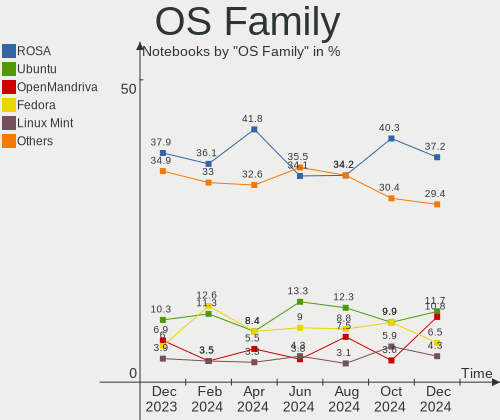
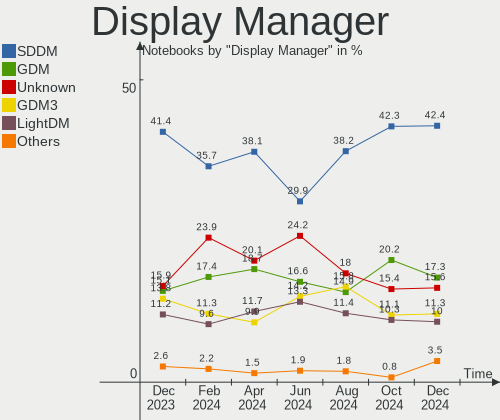
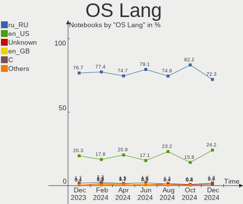
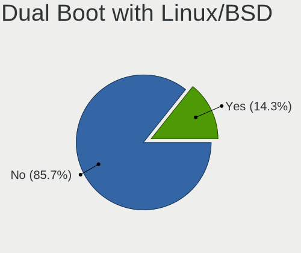
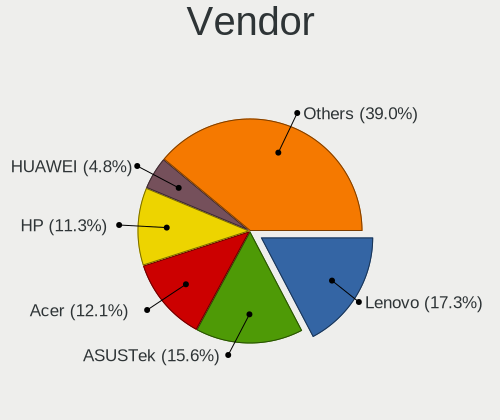
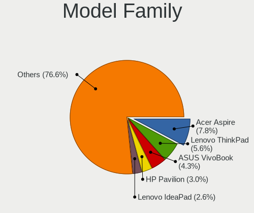
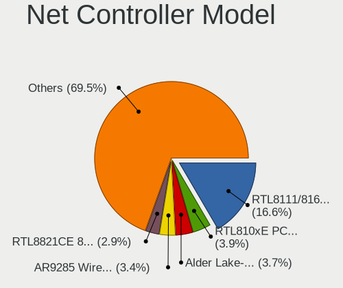
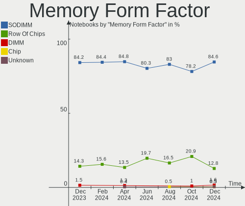
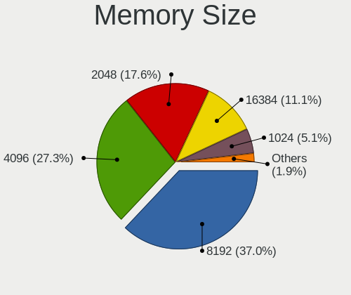

Linux in Russia - Hardware Trends (Notebooks)
---------------------------------------------

A project to identify most popular hardware characteristics and track their change
over time based on data collected by Linux users at https://Linux-Hardware.org.

Anyone can contribute to this report by the [hw-probe](https://github.com/linuxhw/hw-probe) tool:

    sudo -E hw-probe -all -upload

Period: Jun, 2022.

Contents
--------

* [ System ](#system)
  - [ OS                       ](#os)
  - [ OS Family                ](#os-family)
  - [ Kernel                   ](#kernel)
  - [ Kernel Family            ](#kernel-family)
  - [ Kernel Major Ver.        ](#kernel-major-ver)
  - [ Arch                     ](#arch)
  - [ DE                       ](#de)
  - [ Display Server           ](#display-server)
  - [ Display Manager          ](#display-manager)
  - [ OS Lang                  ](#os-lang)
  - [ Boot Mode                ](#boot-mode)
  - [ Filesystem               ](#filesystem)
  - [ Part. scheme             ](#part-scheme)
  - [ Dual Boot with Linux/BSD ](#dual-boot-with-linuxbsd)
  - [ Dual Boot (Win)          ](#dual-boot-win)

* [ Board ](#board)
  - [ Vendor                   ](#vendor)
  - [ Model                    ](#model)
  - [ Model Family             ](#model-family)
  - [ MFG Year                 ](#mfg-year)
  - [ Form Factor              ](#form-factor)
  - [ Secure Boot              ](#secure-boot)
  - [ Coreboot                 ](#coreboot)
  - [ RAM Size                 ](#ram-size)
  - [ RAM Used                 ](#ram-used)
  - [ Total Drives             ](#total-drives)
  - [ Has CD-ROM               ](#has-cd-rom)
  - [ Has Ethernet             ](#has-ethernet)
  - [ Has WiFi                 ](#has-wifi)
  - [ Has Bluetooth            ](#has-bluetooth)

* [ Location ](#location)
  - [ Country                  ](#country)
  - [ City                     ](#city)

* [ Drives ](#drives)
  - [ Drive Vendor             ](#drive-vendor)
  - [ Drive Model              ](#drive-model)
  - [ HDD Vendor               ](#hdd-vendor)
  - [ SSD Vendor               ](#ssd-vendor)
  - [ Drive Kind               ](#drive-kind)
  - [ Drive Connector          ](#drive-connector)
  - [ Drive Size               ](#drive-size)
  - [ Space Total              ](#space-total)
  - [ Space Used               ](#space-used)
  - [ Malfunc. Drives          ](#malfunc-drives)
  - [ Malfunc. Drive Vendor    ](#malfunc-drive-vendor)
  - [ Malfunc. HDD Vendor      ](#malfunc-hdd-vendor)
  - [ Malfunc. Drive Kind      ](#malfunc-drive-kind)
  - [ Failed Drives            ](#failed-drives)
  - [ Failed Drive Vendor      ](#failed-drive-vendor)
  - [ Drive Status             ](#drive-status)

* [ Storage controller ](#storage-controller)
  - [ Storage Vendor           ](#storage-vendor)
  - [ Storage Model            ](#storage-model)
  - [ Storage Kind             ](#storage-kind)

* [ Processor ](#processor)
  - [ CPU Vendor               ](#cpu-vendor)
  - [ CPU Model                ](#cpu-model)
  - [ CPU Model Family         ](#cpu-model-family)
  - [ CPU Cores                ](#cpu-cores)
  - [ CPU Sockets              ](#cpu-sockets)
  - [ CPU Threads              ](#cpu-threads)
  - [ CPU Op-Modes             ](#cpu-op-modes)
  - [ CPU Microcode            ](#cpu-microcode)
  - [ CPU Microarch            ](#cpu-microarch)

* [ Graphics ](#graphics)
  - [ GPU Vendor               ](#gpu-vendor)
  - [ GPU Model                ](#gpu-model)
  - [ GPU Combo                ](#gpu-combo)
  - [ GPU Driver               ](#gpu-driver)
  - [ GPU Memory               ](#gpu-memory)

* [ Monitor ](#monitor)
  - [ Monitor Vendor           ](#monitor-vendor)
  - [ Monitor Model            ](#monitor-model)
  - [ Monitor Resolution       ](#monitor-resolution)
  - [ Monitor Diagonal         ](#monitor-diagonal)
  - [ Monitor Width            ](#monitor-width)
  - [ Aspect Ratio             ](#aspect-ratio)
  - [ Monitor Area             ](#monitor-area)
  - [ Pixel Density            ](#pixel-density)
  - [ Multiple Monitors        ](#multiple-monitors)

* [ Network ](#network)
  - [ Net Controller Vendor    ](#net-controller-vendor)
  - [ Net Controller Model     ](#net-controller-model)
  - [ Wireless Vendor          ](#wireless-vendor)
  - [ Wireless Model           ](#wireless-model)
  - [ Ethernet Vendor          ](#ethernet-vendor)
  - [ Ethernet Model           ](#ethernet-model)
  - [ Net Controller Kind      ](#net-controller-kind)
  - [ Used Controller          ](#used-controller)
  - [ NICs                     ](#nics)
  - [ IPv6                     ](#ipv6)

* [ Bluetooth ](#bluetooth)
  - [ Bluetooth Vendor         ](#bluetooth-vendor)
  - [ Bluetooth Model          ](#bluetooth-model)

* [ Sound ](#sound)
  - [ Sound Vendor             ](#sound-vendor)
  - [ Sound Model              ](#sound-model)

* [ Memory ](#memory)
  - [ Memory Vendor            ](#memory-vendor)
  - [ Memory Model             ](#memory-model)
  - [ Memory Kind              ](#memory-kind)
  - [ Memory Form Factor       ](#memory-form-factor)
  - [ Memory Size              ](#memory-size)
  - [ Memory Speed             ](#memory-speed)

* [ Printers & scanners ](#printers--scanners)
  - [ Printer Vendor           ](#printer-vendor)
  - [ Printer Model            ](#printer-model)
  - [ Scanner Vendor           ](#scanner-vendor)
  - [ Scanner Model            ](#scanner-model)

* [ Camera ](#camera)
  - [ Camera Vendor            ](#camera-vendor)
  - [ Camera Model             ](#camera-model)

* [ Security ](#security)
  - [ Fingerprint Vendor       ](#fingerprint-vendor)
  - [ Fingerprint Model        ](#fingerprint-model)
  - [ Chipcard Vendor          ](#chipcard-vendor)
  - [ Chipcard Model           ](#chipcard-model)

* [ Unsupported ](#unsupported)
  - [ Unsupported Devices      ](#unsupported-devices)
  - [ Unsupported Device Types ](#unsupported-device-types)

System
------

OS
--

Installed operating systems

| Name                         | Notebooks | Percent |
|------------------------------|-----------|---------|
| ROSA 12.2                    | 103       | 42.39%  |
| Debian 11                    | 33        | 13.58%  |
| Fedora 36                    | 17        | 7%      |
| ROSA R11.1                   | 13        | 5.35%   |
| Ubuntu 22.04                 | 8         | 3.29%   |
| Ubuntu 20.04                 | 7         | 2.88%   |
| Linux Mint 20.3              | 7         | 2.88%   |
| OpenMandriva 4.3             | 5         | 2.06%   |
| Kubuntu 22.04                | 5         | 2.06%   |
| LMDE 5                       | 3         | 1.23%   |
| Kali 2022.2                  | 3         | 1.23%   |
| Xubuntu 18.04                | 2         | 0.82%   |
| Ubuntu MATE 22.04            | 2         | 0.82%   |
| Red OS 7.3.1                 | 2         | 0.82%   |
| Pop!_OS 22.04                | 2         | 0.82%   |
| Manjaro 21.3.1               | 2         | 0.82%   |
| Manjaro                      | 2         | 0.82%   |
| Debian Testing               | 2         | 0.82%   |
| Arch Rolling                 | 2         | 0.82%   |
| Arch                         | 2         | 0.82%   |
| Xubuntu 22.04                | 1         | 0.41%   |
| Ubuntu Studio 22.04          | 1         | 0.41%   |
| Ubuntu 18.04                 | 1         | 0.41%   |
| ROSA 12.1                    | 1         | 0.41%   |
| Red OS 7.3                   | 1         | 0.41%   |
| openSUSE Tumbleweed-XXXXXXXX | 1         | 0.41%   |
| MOS 10                       | 1         | 0.41%   |
| Manjaro 21.2.6               | 1         | 0.41%   |
| Linux Mint 20.2              | 1         | 0.41%   |
| KDE neon 20.04               | 1         | 0.41%   |
| Gentoo 2.8                   | 1         | 0.41%   |
| Garuda Linux Soaring         | 1         | 0.41%   |
| Fedora 35                    | 1         | 0.41%   |
| Elementary 6.1               | 1         | 0.41%   |
| Debian 8                     | 1         | 0.41%   |
| Debian 10                    | 1         | 0.41%   |
| Clear Linux 36470            | 1         | 0.41%   |
| Clear Linux 36450            | 1         | 0.41%   |
| Astra Linux 2.12.44          | 1         | 0.41%   |
| Artix Rolling                | 1         | 0.41%   |
| ALT Linux 10.0               | 1         | 0.41%   |

OS Family
---------

OS without a version

| Name          | Notebooks | Percent |
|---------------|-----------|---------|
| ROSA          | 117       | 48.15%  |
| Debian        | 37        | 15.23%  |
| Fedora        | 18        | 7.41%   |
| Ubuntu        | 16        | 6.58%   |
| Linux Mint    | 8         | 3.29%   |
| OpenMandriva  | 5         | 2.06%   |
| Manjaro       | 5         | 2.06%   |
| Kubuntu       | 5         | 2.06%   |
| Arch          | 4         | 1.65%   |
| Xubuntu       | 3         | 1.23%   |
| Red OS        | 3         | 1.23%   |
| LMDE          | 3         | 1.23%   |
| Kali          | 3         | 1.23%   |
| Ubuntu MATE   | 2         | 0.82%   |
| Pop!_OS       | 2         | 0.82%   |
| Clear Linux   | 2         | 0.82%   |
| ALT Linux     | 2         | 0.82%   |
| Ubuntu Studio | 1         | 0.41%   |
| openSUSE      | 1         | 0.41%   |
| KDE neon      | 1         | 0.41%   |
| Gentoo        | 1         | 0.41%   |
| Garuda Linux  | 1         | 0.41%   |
| Elementary    | 1         | 0.41%   |
| Astra Linux   | 1         | 0.41%   |
| Artix         | 1         | 0.41%   |

Kernel
------

Version of the Linux kernel

| Version                                   | Notebooks | Percent |
|-------------------------------------------|-----------|---------|
| 5.10.74-generic-2rosa2021.1-x86_64        | 67        | 27.57%  |
| 5.10.0-7-amd64                            | 29        | 11.93%  |
| 5.10.118-generic-2rosa2021.1-x86_64       | 20        | 8.23%   |
| 5.15.0-35-generic                         | 5         | 2.06%   |
| 5.4.83-generic-2rosa-x86_64               | 4         | 1.65%   |
| 5.4.0-113-generic                         | 4         | 1.65%   |
| 5.18.3-zen1-1-zen                         | 4         | 1.65%   |
| 5.17.13-300.fc36.x86_64                   | 4         | 1.65%   |
| 5.17.11-300.fc36.x86_64                   | 4         | 1.65%   |
| 5.16.7-desktop-1omv4003                   | 4         | 1.65%   |
| 5.15.0-39-generic                         | 4         | 1.65%   |
| 5.10.74-generic-2rosa2021.1-i586          | 4         | 1.65%   |
| 5.17.12-300.fc36.x86_64                   | 3         | 1.23%   |
| 5.15.32-generic-6rosa2021.1-x86_64        | 3         | 1.23%   |
| 5.10.0-15-amd64                           | 3         | 1.23%   |
| 5.4.83-generic-2rosa-i586                 | 2         | 0.82%   |
| 5.4.0-117-generic                         | 2         | 0.82%   |
| 5.18.5-200.fc36.x86_64                    | 2         | 0.82%   |
| 5.17.5-76051705-generic                   | 2         | 0.82%   |
| 5.17.11-generic-1rosa2021.1-x86_64        | 2         | 0.82%   |
| 5.15.49-1-MANJARO                         | 2         | 0.82%   |
| 5.15.0-40-generic                         | 2         | 0.82%   |
| 5.15.0-37-generic                         | 2         | 0.82%   |
| 5.15.0-33-generic                         | 2         | 0.82%   |
| 5.13.0-48-generic                         | 2         | 0.82%   |
| 5.13.0-44-generic                         | 2         | 0.82%   |
| 5.10.0-14-amd64                           | 2         | 0.82%   |
| 4.15.0-desktop-122.124.1rosa-x86_64       | 2         | 0.82%   |
| 5.4.32-generic-2rosa-x86_64               | 1         | 0.41%   |
| 5.4.32-generic-2rosa-i586                 | 1         | 0.41%   |
| 5.4.0-91-generic                          | 1         | 0.41%   |
| 5.4.0-74-generic                          | 1         | 0.41%   |
| 5.4.0-71-generic                          | 1         | 0.41%   |
| 5.4.0-121-generic                         | 1         | 0.41%   |
| 5.4.0-107-generic                         | 1         | 0.41%   |
| 5.18.8-gentoo                             | 1         | 0.41%   |
| 5.18.6-200.fc36.x86_64                    | 1         | 0.41%   |
| 5.18.6-1-MANJARO                          | 1         | 0.41%   |
| 5.18.5-201.fsync.fc36.x86_64              | 1         | 0.41%   |
| 5.18.4.xm1-1.klp-xanmod-rosa2021.1-x86_64 | 1         | 0.41%   |
| 5.18.4-xanmod1-1-zen2                     | 1         | 0.41%   |
| 5.18.4-101.fc35.x86_64                    | 1         | 0.41%   |
| 5.18.3.xm1-1.klp-xanmod-rosa2021.1-x86_64 | 1         | 0.41%   |
| 5.18.3-051803-generic                     | 1         | 0.41%   |
| 5.18.2.xm1-3.klp-xanmod-rosa2021.1-x86_64 | 1         | 0.41%   |
| 5.18.2-1156.native                        | 1         | 0.41%   |
| 5.18.2-1-default                          | 1         | 0.41%   |
| 5.18.2-051802-generic                     | 1         | 0.41%   |
| 5.18.1.xm1-3.klp-xanmod-rosa2021.1-x86_64 | 1         | 0.41%   |
| 5.18.1-generic-1rosa2021.1-x86_64         | 1         | 0.41%   |
| 5.18.1-arch1-1                            | 1         | 0.41%   |
| 5.18.1-1.el7.x86_64                       | 1         | 0.41%   |
| 5.18.0-kali2-amd64                        | 1         | 0.41%   |
| 5.18.0-2-amd64                            | 1         | 0.41%   |
| 5.18.0-1-amd64                            | 1         | 0.41%   |
| 5.18.0-051800-generic                     | 1         | 0.41%   |
| 5.17.9-1145.native                        | 1         | 0.41%   |
| 5.17.5-zen1-1-zen                         | 1         | 0.41%   |
| 5.17.5-300.fc36.x86_64                    | 1         | 0.41%   |
| 5.17.1-desktop-2omv4050                   | 1         | 0.41%   |

Kernel Family
-------------

Linux kernel without a distro release

| Version  | Notebooks | Percent |
|----------|-----------|---------|
| 5.10.74  | 71        | 29.22%  |
| 5.10.0   | 36        | 14.81%  |
| 5.10.118 | 23        | 9.47%   |
| 5.15.0   | 18        | 7.41%   |
| 5.4.0    | 11        | 4.53%   |
| 5.4.83   | 6         | 2.47%   |
| 5.18.3   | 6         | 2.47%   |
| 5.17.11  | 6         | 2.47%   |
| 5.13.0   | 5         | 2.06%   |
| 5.18.2   | 4         | 1.65%   |
| 5.18.1   | 4         | 1.65%   |
| 5.18.0   | 4         | 1.65%   |
| 5.17.5   | 4         | 1.65%   |
| 5.17.13  | 4         | 1.65%   |
| 5.16.7   | 4         | 1.65%   |
| 5.18.5   | 3         | 1.23%   |
| 5.18.4   | 3         | 1.23%   |
| 5.17.12  | 3         | 1.23%   |
| 5.15.32  | 3         | 1.23%   |
| 4.15.0   | 3         | 1.23%   |
| 5.4.32   | 2         | 0.82%   |
| 5.18.6   | 2         | 0.82%   |
| 5.15.49  | 2         | 0.82%   |
| 5.18.8   | 1         | 0.41%   |
| 5.17.9   | 1         | 0.41%   |
| 5.17.1   | 1         | 0.41%   |
| 5.17.0   | 1         | 0.41%   |
| 5.16.2   | 1         | 0.41%   |
| 5.16.0   | 1         | 0.41%   |
| 5.15.43  | 1         | 0.41%   |
| 5.15.41  | 1         | 0.41%   |
| 5.15.35  | 1         | 0.41%   |
| 5.11.0   | 1         | 0.41%   |
| 5.10.82  | 1         | 0.41%   |
| 5.10.29  | 1         | 0.41%   |
| 4.9.60   | 1         | 0.41%   |
| 4.9.155  | 1         | 0.41%   |
| 4.19.0   | 1         | 0.41%   |
| 3.0.21   | 1         | 0.41%   |

Kernel Major Ver.
-----------------

Linux kernel major version

| Version | Notebooks | Percent |
|---------|-----------|---------|
| 5.10    | 132       | 54.32%  |
| 5.18    | 27        | 11.11%  |
| 5.15    | 26        | 10.7%   |
| 5.17    | 20        | 8.23%   |
| 5.4     | 19        | 7.82%   |
| 5.16    | 6         | 2.47%   |
| 5.13    | 5         | 2.06%   |
| 4.15    | 3         | 1.23%   |
| 4.9     | 2         | 0.82%   |
| 5.11    | 1         | 0.41%   |
| 4.19    | 1         | 0.41%   |
| 3.0     | 1         | 0.41%   |

Arch
----

OS architecture (x86_64, i586, etc.)

| Name   | Notebooks | Percent |
|--------|-----------|---------|
| x86_64 | 230       | 94.65%  |
| i686   | 12        | 4.94%   |
| armv7l | 1         | 0.41%   |

DE
--

Desktop Environment

| Name       | Notebooks | Percent |
|------------|-----------|---------|
| GNOME      | 85        | 34.98%  |
| KDE5       | 74        | 30.45%  |
| Unknown    | 33        | 13.58%  |
| LXQt       | 17        | 7%      |
| X-Cinnamon | 8         | 3.29%   |
| XFCE       | 7         | 2.88%   |
| MATE       | 7         | 2.88%   |
| KDE4       | 6         | 2.47%   |
| sway       | 2         | 0.82%   |
| Pantheon   | 1         | 0.41%   |
| LXDE       | 1         | 0.41%   |
| fly        | 1         | 0.41%   |
| Cinnamon   | 1         | 0.41%   |

Display Server
--------------

X11 or Wayland

| Name    | Notebooks | Percent |
|---------|-----------|---------|
| Wayland | 126       | 51.85%  |
| X11     | 85        | 34.98%  |
| Unknown | 30        | 12.35%  |
| Tty     | 2         | 0.82%   |

Display Manager
---------------

SDDM, LightDM, etc.

| Name    | Notebooks | Percent |
|---------|-----------|---------|
| SDDM    | 72        | 29.63%  |
| GDM     | 65        | 26.75%  |
| Unknown | 62        | 25.51%  |
| LightDM | 24        | 9.88%   |
| GDM3    | 11        | 4.53%   |
| KDM     | 6         | 2.47%   |
| XDM     | 1         | 0.41%   |
| Ly      | 1         | 0.41%   |
| FLY-DM  | 1         | 0.41%   |

OS Lang
-------

Language

| Lang    | Notebooks | Percent |
|---------|-----------|---------|
| ru_RU   | 212       | 87.24%  |
| en_US   | 23        | 9.47%   |
| Unknown | 4         | 1.65%   |
| fr_FR   | 1         | 0.41%   |
| en_GB   | 1         | 0.41%   |
| en-US   | 1         | 0.41%   |
| C       | 1         | 0.41%   |

Boot Mode
---------

EFI or BIOS

| Mode | Notebooks | Percent |
|------|-----------|---------|
| EFI  | 156       | 64.2%   |
| BIOS | 87        | 35.8%   |

Filesystem
----------

Type of filesystem

| Type    | Notebooks | Percent |
|---------|-----------|---------|
| Ext4    | 173       | 71.19%  |
| Overlay | 37        | 15.23%  |
| Btrfs   | 32        | 13.17%  |
| Zfs     | 1         | 0.41%   |

Part. scheme
------------

Scheme of partitioning

| Type    | Notebooks | Percent |
|---------|-----------|---------|
| GPT     | 154       | 63.37%  |
| MBR     | 52        | 21.4%   |
| Unknown | 37        | 15.23%  |

Dual Boot with Linux/BSD
------------------------

Hosting more than one Linux/BSD

| Dual boot | Notebooks | Percent |
|-----------|-----------|---------|
| No        | 218       | 89.71%  |
| Yes       | 25        | 10.29%  |

Dual Boot (Win)
---------------

Hosting Linux and Windows

| Dual boot | Notebooks | Percent |
|-----------|-----------|---------|
| No        | 134       | 55.14%  |
| Yes       | 109       | 44.86%  |

Board
-----

Vendor
------

Motherboard manufacturer

| Name                | Notebooks | Percent |
|---------------------|-----------|---------|
| Hewlett-Packard     | 39        | 16.05%  |
| Lenovo              | 35        | 14.4%   |
| Acer                | 35        | 14.4%   |
| Aquarius            | 32        | 13.17%  |
| ASUSTek Computer    | 29        | 11.93%  |
| Samsung Electronics | 13        | 5.35%   |
| Dell                | 13        | 5.35%   |
| MSI                 | 5         | 2.06%   |
| Toshiba             | 4         | 1.65%   |
| HUAWEI              | 4         | 1.65%   |
| Timi                | 3         | 1.23%   |
| HONOR               | 3         | 1.23%   |
| Unknown             | 3         | 1.23%   |
| Sony                | 2         | 0.82%   |
| Packard Bell        | 2         | 0.82%   |
| Jumper              | 2         | 0.82%   |
| ICL                 | 2         | 0.82%   |
| Haier               | 2         | 0.82%   |
| Fujitsu             | 2         | 0.82%   |
| 3Logic Group        | 2         | 0.82%   |
| Pegatron            | 1         | 0.41%   |
| Notebook            | 1         | 0.41%   |
| mtech               | 1         | 0.41%   |
| Kraftway            | 1         | 0.41%   |
| Intel               | 1         | 0.41%   |
| Google              | 1         | 0.41%   |
| eMachines           | 1         | 0.41%   |
| DNS                 | 1         | 0.41%   |
| Digma               | 1         | 0.41%   |
| Chuwi               | 1         | 0.41%   |
| Apple               | 1         | 0.41%   |

Model
-----

Motherboard model

| Name                                        | Notebooks | Percent |
|---------------------------------------------|-----------|---------|
| Aquarius NS585                              | 28        | 11.52%  |
| Acer Aspire V3-571G                         | 5         | 2.06%   |
| Unknown                                     | 5         | 2.06%   |
| Lenovo ThinkBook 15 G3 ACL 21A4             | 3         | 1.23%   |
| HP Pavilion g6                              | 3         | 1.23%   |
| HP Pavilion dv6                             | 3         | 1.23%   |
| Aquarius NS685U R11                         | 3         | 1.23%   |
| Acer Swift SF314-43                         | 3         | 1.23%   |
| Lenovo G505s 20255                          | 2         | 0.82%   |
| Jumper EZpad                                | 2         | 0.82%   |
| HP Laptop 14s-fq0xxx                        | 2         | 0.82%   |
| HP EliteBook 855 G8 Notebook PC             | 2         | 0.82%   |
| HP 250 G7 Notebook PC                       | 2         | 0.82%   |
| Acer Aspire A315-51                         | 2         | 0.82%   |
| 3Logic Group Graviton N15i-K2               | 2         | 0.82%   |
| Toshiba Satellite R630                      | 1         | 0.41%   |
| Toshiba Satellite L850-B5K                  | 1         | 0.41%   |
| Toshiba Satellite L755D                     | 1         | 0.41%   |
| Toshiba Satellite A300                      | 1         | 0.41%   |
| Timi RedmiBook 14 II                        | 1         | 0.41%   |
| Timi RedmiBook 13                           | 1         | 0.41%   |
| Timi A35S                                   | 1         | 0.41%   |
| Sony VPCSB1V9R                              | 1         | 0.41%   |
| Sony VPCF12Z1R                              | 1         | 0.41%   |
| Samsung RV411/RV511/E3511/S3511/RV711/E3411 | 1         | 0.41%   |
| Samsung R710                                | 1         | 0.41%   |
| Samsung R59P/R60P/R61P                      | 1         | 0.41%   |
| Samsung R530/R730/R540                      | 1         | 0.41%   |
| Samsung R519/R719                           | 1         | 0.41%   |
| Samsung R430/P430/R480                      | 1         | 0.41%   |
| Samsung R40/R41                             | 1         | 0.41%   |
| Samsung QX310/QX410/QX510/SF310/SF410/SF510 | 1         | 0.41%   |
| Samsung N150P/N210P/N220P                   | 1         | 0.41%   |
| Samsung 530U3C/530U4C                       | 1         | 0.41%   |
| Samsung 355V4C/356V4C/3445VC/3545VC         | 1         | 0.41%   |
| Samsung 350V5C/351V5C/3540VC/3440VC         | 1         | 0.41%   |
| Samsung 305V4A/305V5A/3415VA                | 1         | 0.41%   |
| Pegatron A15W8                              | 1         | 0.41%   |
| Packard Bell EasyNote TE11HC                | 1         | 0.41%   |
| Packard Bell EasyNote MH36                  | 1         | 0.41%   |
| Notebook W35xSS_370SS                       | 1         | 0.41%   |
| mtech MTL1578                               | 1         | 0.41%   |
| MSI U180                                    | 1         | 0.41%   |
| MSI GP72 2QE                                | 1         | 0.41%   |
| MSI GP66 Leopard 11UG                       | 1         | 0.41%   |
| MSI GE70 2OC\2OD\2OE                        | 1         | 0.41%   |
| MSI Alpha 15 B5EEK                          | 1         | 0.41%   |
| Lenovo Z50-70 20354                         | 1         | 0.41%   |
| Lenovo Y720-15IKB 80VR                      | 1         | 0.41%   |
| Lenovo V580 20147                           | 1         | 0.41%   |
| Lenovo V14-IIL 82C4                         | 1         | 0.41%   |
| Lenovo ThinkPad X260 VB6R77903H             | 1         | 0.41%   |
| Lenovo ThinkPad X200T 7449G6G               | 1         | 0.41%   |
| Lenovo ThinkPad E14 20RA0011RT              | 1         | 0.41%   |
| Lenovo ThinkBook 16p Gen 2 20YM             | 1         | 0.41%   |
| Lenovo ThinkBook 15 G2 ARE 20VG             | 1         | 0.41%   |
| Lenovo Legion 5 15ACH6 82JW                 | 1         | 0.41%   |
| Lenovo IdeaPad Z500 20202                   | 1         | 0.41%   |
| Lenovo IdeaPad S340-14API 81NB              | 1         | 0.41%   |
| Lenovo IdeaPad S145-15IWL 81MV              | 1         | 0.41%   |

Model Family
------------

Motherboard model prefix

| Name                  | Notebooks | Percent |
|-----------------------|-----------|---------|
| Aquarius NS585        | 28        | 11.52%  |
| Acer Aspire           | 25        | 10.29%  |
| ASUS VivoBook         | 12        | 4.94%   |
| Lenovo IdeaPad        | 10        | 4.12%   |
| HP Pavilion           | 9         | 3.7%    |
| Dell Inspiron         | 6         | 2.47%   |
| Lenovo ThinkBook      | 5         | 2.06%   |
| HP Laptop             | 5         | 2.06%   |
| HP EliteBook          | 5         | 2.06%   |
| HP 250                | 5         | 2.06%   |
| Unknown               | 5         | 2.06%   |
| Toshiba Satellite     | 4         | 1.65%   |
| Dell Vostro           | 4         | 1.65%   |
| Aquarius NS685U       | 4         | 1.65%   |
| Acer Swift            | 4         | 1.65%   |
| Lenovo ThinkPad       | 3         | 1.23%   |
| HP ProBook            | 3         | 1.23%   |
| HP OMEN               | 3         | 1.23%   |
| ASUS ROG              | 3         | 1.23%   |
| Timi RedmiBook        | 2         | 0.82%   |
| Packard Bell EasyNote | 2         | 0.82%   |
| Lenovo G505s          | 2         | 0.82%   |
| Lenovo B590           | 2         | 0.82%   |
| Jumper EZpad          | 2         | 0.82%   |
| HP ENVY               | 2         | 0.82%   |
| HP Compaq             | 2         | 0.82%   |
| Fujitsu LIFEBOOK      | 2         | 0.82%   |
| ASUS ASUS             | 2         | 0.82%   |
| Acer TravelMate       | 2         | 0.82%   |
| 3Logic Group Graviton | 2         | 0.82%   |
| Timi A35S             | 1         | 0.41%   |
| Sony VPCSB1V9R        | 1         | 0.41%   |
| Sony VPCF12Z1R        | 1         | 0.41%   |
| Samsung RV411         | 1         | 0.41%   |
| Samsung R710          | 1         | 0.41%   |
| Samsung R59P          | 1         | 0.41%   |
| Samsung R530          | 1         | 0.41%   |
| Samsung R519          | 1         | 0.41%   |
| Samsung R430          | 1         | 0.41%   |
| Samsung R40           | 1         | 0.41%   |
| Samsung QX310         | 1         | 0.41%   |
| Samsung N150P         | 1         | 0.41%   |
| Samsung 530U3C        | 1         | 0.41%   |
| Samsung 355V4C        | 1         | 0.41%   |
| Samsung 350V5C        | 1         | 0.41%   |
| Samsung 305V4A        | 1         | 0.41%   |
| Pegatron A15W8        | 1         | 0.41%   |
| Notebook W35xSS       | 1         | 0.41%   |
| mtech MTL1578         | 1         | 0.41%   |
| MSI U180              | 1         | 0.41%   |
| MSI GP72              | 1         | 0.41%   |
| MSI GP66              | 1         | 0.41%   |
| MSI GE70              | 1         | 0.41%   |
| MSI Alpha             | 1         | 0.41%   |
| Lenovo Z50-70         | 1         | 0.41%   |
| Lenovo Y720-15IKB     | 1         | 0.41%   |
| Lenovo V580           | 1         | 0.41%   |
| Lenovo V14-IIL        | 1         | 0.41%   |
| Lenovo Legion         | 1         | 0.41%   |
| Lenovo G700           | 1         | 0.41%   |

MFG Year
--------

Motherboard manufacture year

| Year    | Notebooks | Percent |
|---------|-----------|---------|
| 2020    | 44        | 18.11%  |
| 2021    | 38        | 15.64%  |
| 2012    | 26        | 10.7%   |
| 2013    | 16        | 6.58%   |
| 2011    | 16        | 6.58%   |
| 2018    | 15        | 6.17%   |
| 2019    | 14        | 5.76%   |
| 2010    | 13        | 5.35%   |
| 2017    | 11        | 4.53%   |
| 2008    | 11        | 4.53%   |
| 2014    | 9         | 3.7%    |
| 2022    | 8         | 3.29%   |
| 2016    | 5         | 2.06%   |
| 2009    | 5         | 2.06%   |
| 2007    | 5         | 2.06%   |
| 2006    | 4         | 1.65%   |
| 2015    | 2         | 0.82%   |
| Unknown | 1         | 0.41%   |

Form Factor
-----------

Physical design of the computer

| Name     | Notebooks | Percent |
|----------|-----------|---------|
| Notebook | 243       | 100%    |

Secure Boot
-----------

Enabled or disabled

| State    | Notebooks | Percent |
|----------|-----------|---------|
| Disabled | 228       | 93.83%  |
| Enabled  | 15        | 6.17%   |

Coreboot
--------

Have coreboot on board

| Used | Notebooks | Percent |
|------|-----------|---------|
| No   | 242       | 99.59%  |
| Yes  | 1         | 0.41%   |

RAM Size
--------

Total RAM memory

| Size in GB  | Notebooks | Percent |
|-------------|-----------|---------|
| 4.01-8.0    | 115       | 47.33%  |
| 8.01-16.0   | 42        | 17.28%  |
| 3.01-4.0    | 41        | 16.87%  |
| 16.01-24.0  | 20        | 8.23%   |
| 1.01-2.0    | 13        | 5.35%   |
| 2.01-3.0    | 4         | 1.65%   |
| 32.01-64.0  | 3         | 1.23%   |
| 0.51-1.0    | 3         | 1.23%   |
| 64.01-256.0 | 1         | 0.41%   |
| 0.01-0.5    | 1         | 0.41%   |

RAM Used
--------

Used RAM memory

| Used GB   | Notebooks | Percent |
|-----------|-----------|---------|
| 1.01-2.0  | 88        | 36.21%  |
| 0.51-1.0  | 70        | 28.81%  |
| 2.01-3.0  | 43        | 17.7%   |
| 4.01-8.0  | 19        | 7.82%   |
| 3.01-4.0  | 15        | 6.17%   |
| 8.01-16.0 | 5         | 2.06%   |
| 0.01-0.5  | 2         | 0.82%   |
| Unknown   | 1         | 0.41%   |

Total Drives
------------

Number of drives on board

| Drives | Notebooks | Percent |
|--------|-----------|---------|
| 1      | 184       | 75.72%  |
| 2      | 49        | 20.16%  |
| 3      | 6         | 2.47%   |
| 0      | 2         | 0.82%   |
| 5      | 1         | 0.41%   |
| 4      | 1         | 0.41%   |

Has CD-ROM
----------

Has CD-ROM on board

| Presented | Notebooks | Percent |
|-----------|-----------|---------|
| No        | 170       | 69.96%  |
| Yes       | 73        | 30.04%  |

Has Ethernet
------------

Has Ethernet on board

| Presented | Notebooks | Percent |
|-----------|-----------|---------|
| Yes       | 189       | 77.78%  |
| No        | 54        | 22.22%  |

Has WiFi
--------

Has WiFi module

| Presented | Notebooks | Percent |
|-----------|-----------|---------|
| Yes       | 241       | 99.18%  |
| No        | 2         | 0.82%   |

Has Bluetooth
-------------

Has Bluetooth module

| Presented | Notebooks | Percent |
|-----------|-----------|---------|
| Yes       | 205       | 84.36%  |
| No        | 38        | 15.64%  |

Location
--------

Country
-------

Geographic location (country)

| Country | Notebooks | Percent |
|---------|-----------|---------|
| Russia  | 243       | 100%    |

City
----

Geographic location (city)

| City              | Notebooks | Percent |
|-------------------|-----------|---------|
| Moscow            | 49        | 20.16%  |
| Voronezh          | 32        | 13.17%  |
| St Petersburg     | 27        | 11.11%  |
| Novosibirsk       | 14        | 5.76%   |
| Yekaterinburg     | 8         | 3.29%   |
| Krasnodar         | 7         | 2.88%   |
| Krasnoyarsk       | 5         | 2.06%   |
| Tyumen            | 4         | 1.65%   |
| Tula              | 4         | 1.65%   |
| Rostov-on-Don     | 4         | 1.65%   |
| Perm              | 4         | 1.65%   |
| Chelyabinsk       | 4         | 1.65%   |
| Yaroslavl         | 3         | 1.23%   |
| Ufa               | 3         | 1.23%   |
| Tver              | 3         | 1.23%   |
| Saratov           | 3         | 1.23%   |
| Samara            | 3         | 1.23%   |
| Pskov             | 3         | 1.23%   |
| Barnaul           | 3         | 1.23%   |
| Yuzhno-Sakhalinsk | 2         | 0.82%   |
| Smolensk          | 2         | 0.82%   |
| Murmansk          | 2         | 0.82%   |
| Kursk             | 2         | 0.82%   |
| Kemerovo          | 2         | 0.82%   |
| Blagoveshchensk   | 2         | 0.82%   |
| Armavir           | 2         | 0.82%   |
| Yoshkar-Ola       | 1         | 0.41%   |
| Yessentuki        | 1         | 0.41%   |
| Yartsevo          | 1         | 0.41%   |
| Yablonovsky       | 1         | 0.41%   |
| Voskresensk       | 1         | 0.41%   |
| Volgograd         | 1         | 0.41%   |
| Vladivostok       | 1         | 0.41%   |
| Vladimir          | 1         | 0.41%   |
| Ulyanovsk         | 1         | 0.41%   |
| Tomsk             | 1         | 0.41%   |
| Tambov            | 1         | 0.41%   |
| Surgut            | 1         | 0.41%   |
| Stavropol         | 1         | 0.41%   |
| Snezhinsk         | 1         | 0.41%   |
| Sharypovo         | 1         | 0.41%   |
| Severodvinsk      | 1         | 0.41%   |
| Serpukhov         | 1         | 0.41%   |
| Sakharovo         | 1         | 0.41%   |
| Ryazan            | 1         | 0.41%   |
| Pyatigorsk        | 1         | 0.41%   |
| Petrozavodsk      | 1         | 0.41%   |
| Pervouralsk       | 1         | 0.41%   |
| Penza             | 1         | 0.41%   |
| Orenburg          | 1         | 0.41%   |
| Omsk              | 1         | 0.41%   |
| Nizhniy Novgorod  | 1         | 0.41%   |
| Murom             | 1         | 0.41%   |
| Maykop            | 1         | 0.41%   |
| Lesnoy            | 1         | 0.41%   |
| Leninsk-Kuznetsky | 1         | 0.41%   |
| Kurgan            | 1         | 0.41%   |
| Korolyov          | 1         | 0.41%   |
| Kirov             | 1         | 0.41%   |
| Kimry             | 1         | 0.41%   |

Drives
------

Drive Vendor
------------

Hard drive vendors

| Vendor                         | Notebooks | Drives | Percent |
|--------------------------------|-----------|--------|---------|
| WDC                            | 47        | 49     | 15.99%  |
| A-DATA Technology              | 37        | 37     | 12.59%  |
| Samsung Electronics            | 29        | 31     | 9.86%   |
| Seagate                        | 24        | 25     | 8.16%   |
| Kingston                       | 20        | 20     | 6.8%    |
| Toshiba                        | 19        | 19     | 6.46%   |
| Unknown                        | 14        | 16     | 4.76%   |
| Hitachi                        | 14        | 14     | 4.76%   |
| SanDisk                        | 12        | 12     | 4.08%   |
| SK hynix                       | 6         | 6      | 2.04%   |
| Intel                          | 6         | 6      | 2.04%   |
| HGST                           | 6         | 6      | 2.04%   |
| China                          | 6         | 6      | 2.04%   |
| Micron Technology              | 5         | 5      | 1.7%    |
| Apacer                         | 4         | 4      | 1.36%   |
| KingSpec                       | 3         | 3      | 1.02%   |
| Goodram                        | 3         | 3      | 1.02%   |
| Gigabyte Technology            | 3         | 3      | 1.02%   |
| Crucial                        | 3         | 3      | 1.02%   |
| UMIS                           | 2         | 2      | 0.68%   |
| Phison                         | 2         | 2      | 0.68%   |
| Netac                          | 2         | 2      | 0.68%   |
| KIOXIA                         | 2         | 2      | 0.68%   |
| Fujitsu                        | 2         | 2      | 0.68%   |
| Foxline                        | 2         | 2      | 0.68%   |
| XPG                            | 1         | 1      | 0.34%   |
| WDC WDS                        | 1         | 1      | 0.34%   |
| Vaseky                         | 1         | 1      | 0.34%   |
| Union Memory                   | 1         | 1      | 0.34%   |
| Transcend                      | 1         | 1      | 0.34%   |
| SPCC                           | 1         | 1      | 0.34%   |
| Solid State Storage Technology | 1         | 1      | 0.34%   |
| Smartbuy                       | 1         | 1      | 0.34%   |
| ShiJi                          | 1         | 1      | 0.34%   |
| Reeinno                        | 1         | 1      | 0.34%   |
| Realtek                        | 1         | 1      | 0.34%   |
| Patriot                        | 1         | 1      | 0.34%   |
| Micron/Crucial Technology      | 1         | 1      | 0.34%   |
| Londisk                        | 1         | 1      | 0.34%   |
| HPE                            | 1         | 1      | 0.34%   |
| Hikvision                      | 1         | 1      | 0.34%   |
| Hewlett-Packard                | 1         | 1      | 0.34%   |
| GS                             | 1         | 2      | 0.34%   |
| BHT                            | 1         | 1      | 0.34%   |
| AMD                            | 1         | 1      | 0.34%   |
| Unknown                        | 1         | 1      | 0.34%   |

Drive Model
-----------

Hard drive models

| Model                                | Notebooks | Percent |
|--------------------------------------|-----------|---------|
| A-DATA SU800 512GB SSD               | 28        | 9.33%   |
| Samsung NVMe SSD Drive 512GB         | 5         | 1.67%   |
| Toshiba MQ04ABF100 1TB               | 4         | 1.33%   |
| Kingston SA400S37240G 240GB SSD      | 4         | 1.33%   |
| WDC WDS240G2G0A-00JH30 240GB SSD     | 3         | 1%      |
| Toshiba MQ01ABD100 1TB               | 3         | 1%      |
| Seagate ST9320325AS 320GB            | 3         | 1%      |
| Seagate ST1000LM024 HN-M101MBB 1TB   | 3         | 1%      |
| Kingston NVMe SSD Drive 256GB        | 3         | 1%      |
| Intel SSDPEKNU512GZ 512GB            | 3         | 1%      |
| A-DATA SU800NS38 256GB SSD           | 3         | 1%      |
| WDC WDS500G2B0A-00SM50 500GB SSD     | 2         | 0.67%   |
| WDC WDS480G2G0A-00JH30 480GB SSD     | 2         | 0.67%   |
| WDC WD5000LPCX-21VHAT0 500GB         | 2         | 0.67%   |
| WDC WD3200BPVT-80JJ5T0 320GB         | 2         | 0.67%   |
| WDC PC SN730 SDBPNTY-512G-1027 512GB | 2         | 0.67%   |
| Unknown SLD128  128GB                | 2         | 0.67%   |
| Unknown SD/MMC/MS PRO 128GB          | 2         | 0.67%   |
| Unknown MMC64G  64GB                 | 2         | 0.67%   |
| Toshiba MQ01ABF050 500GB             | 2         | 0.67%   |
| Seagate ST500LT012-9WS142 500GB      | 2         | 0.67%   |
| Seagate ST500LT012-1DG142 500GB      | 2         | 0.67%   |
| Seagate ST320LT012-9WS14C 320GB      | 2         | 0.67%   |
| Seagate ST1000LM035-1RK172 1TB       | 2         | 0.67%   |
| Samsung SSD 850 EVO 250GB            | 2         | 0.67%   |
| Micron 1100_MTFDDAV256TBN 256GB SSD  | 2         | 0.67%   |
| Kingston OM8PCP3512F-AI1 512GB       | 2         | 0.67%   |
| Hitachi HTS725050A9A364 500GB        | 2         | 0.67%   |
| Hitachi HTS542512K9SA00 120GB        | 2         | 0.67%   |
| HGST HTS545050A7E680 500GB           | 2         | 0.67%   |
| Gigabyte GP-GSM2NE3256GNTD 256GB     | 2         | 0.67%   |
| A-DATA SX6000LNP 256GB               | 2         | 0.67%   |
| A-DATA SU650 120GB SSD               | 2         | 0.67%   |
| XPG GAMMIX S11 Pro 1TB               | 1         | 0.33%   |
| WDC WDS250G2B0C-00PXH0 250GB         | 1         | 0.33%   |
| WDC WDS120G2G0A-00JH30 120GB SSD     | 1         | 0.33%   |
| WDC WDS 250G2B0A-00SM50 250GB SSD    | 1         | 0.33%   |
| WDC WD5000LPVX-22V0TT0 500GB         | 1         | 0.33%   |
| WDC WD5000LPLX-75ZNTT0 500GB         | 1         | 0.33%   |
| WDC WD5000LPLX-00ZNTT0 500GB         | 1         | 0.33%   |
| WDC WD5000LPCX-24C6HT0 500GB         | 1         | 0.33%   |
| WDC WD5000BPVT-80HXZT3 500GB         | 1         | 0.33%   |
| WDC WD5000BPVT-22HXZT3 500GB         | 1         | 0.33%   |
| WDC WD5000BPKX-00HPJT0 500GB         | 1         | 0.33%   |
| WDC WD5000BPKT-22PK4T0 500GB         | 1         | 0.33%   |
| WDC WD4000LPCX-24C6HT0 400GB         | 1         | 0.33%   |
| WDC WD3200LPCX-24C6HT0 320GB         | 1         | 0.33%   |
| WDC WD3200BPVT-24JJ5T0 320GB         | 1         | 0.33%   |
| WDC WD3200BEVT-22ZCT0 320GB          | 1         | 0.33%   |
| WDC WD3200BEKT-08PVMT1 320GB         | 1         | 0.33%   |
| WDC WD2500BUCT-63TWBY0 250GB         | 1         | 0.33%   |
| WDC WD2500BEVT-22ZCT0 250GB          | 1         | 0.33%   |
| WDC WD2500BEKT-60A25T1 250GB         | 1         | 0.33%   |
| WDC WD1600BEVT-22ZCT0 160GB          | 1         | 0.33%   |
| WDC WD1600BEVS-22RST0 160GB          | 1         | 0.33%   |
| WDC WD1600BEKT-60A25T1 160GB         | 1         | 0.33%   |
| WDC WD10SPZX-60Z10T0 1TB             | 1         | 0.33%   |
| WDC WD10SPZX-24Z10T0 1TB             | 1         | 0.33%   |
| WDC WD10SPZX-24Z10 1TB               | 1         | 0.33%   |
| WDC WD10SPZX-22Z10T1 1TB             | 1         | 0.33%   |

HDD Vendor
----------

Hard disk drive vendors

| Vendor              | Notebooks | Drives | Percent |
|---------------------|-----------|--------|---------|
| WDC                 | 32        | 32     | 32.65%  |
| Seagate             | 24        | 25     | 24.49%  |
| Toshiba             | 17        | 17     | 17.35%  |
| Hitachi             | 14        | 14     | 14.29%  |
| HGST                | 6         | 6      | 6.12%   |
| Unknown             | 2         | 2      | 2.04%   |
| Fujitsu             | 2         | 2      | 2.04%   |
| Samsung Electronics | 1         | 1      | 1.02%   |

SSD Vendor
----------

Solid state drive vendors

| Vendor              | Notebooks | Drives | Percent |
|---------------------|-----------|--------|---------|
| A-DATA Technology   | 35        | 35     | 30.43%  |
| Samsung Electronics | 12        | 13     | 10.43%  |
| Kingston            | 11        | 11     | 9.57%   |
| SanDisk             | 9         | 9      | 7.83%   |
| WDC                 | 8         | 8      | 6.96%   |
| China               | 6         | 6      | 5.22%   |
| Micron Technology   | 4         | 4      | 3.48%   |
| KingSpec            | 3         | 3      | 2.61%   |
| Goodram             | 3         | 3      | 2.61%   |
| Crucial             | 3         | 3      | 2.61%   |
| Apacer              | 3         | 3      | 2.61%   |
| Netac               | 2         | 2      | 1.74%   |
| WDC WDS             | 1         | 1      | 0.87%   |
| Vaseky              | 1         | 1      | 0.87%   |
| Union Memory        | 1         | 1      | 0.87%   |
| Toshiba             | 1         | 1      | 0.87%   |
| SPCC                | 1         | 1      | 0.87%   |
| Smartbuy            | 1         | 1      | 0.87%   |
| Patriot             | 1         | 1      | 0.87%   |
| Londisk             | 1         | 1      | 0.87%   |
| Intel               | 1         | 1      | 0.87%   |
| HPE                 | 1         | 1      | 0.87%   |
| Hewlett-Packard     | 1         | 1      | 0.87%   |
| GS                  | 1         | 2      | 0.87%   |
| Gigabyte Technology | 1         | 1      | 0.87%   |
| Foxline             | 1         | 1      | 0.87%   |
| BHT                 | 1         | 1      | 0.87%   |
| AMD                 | 1         | 1      | 0.87%   |

Drive Kind
----------

HDD or SSD

| Kind    | Notebooks | Drives | Percent |
|---------|-----------|--------|---------|
| SSD     | 110       | 117    | 38.19%  |
| HDD     | 96        | 99     | 33.33%  |
| NVMe    | 66        | 68     | 22.92%  |
| MMC     | 14        | 16     | 4.86%   |
| Unknown | 2         | 2      | 0.69%   |

Drive Connector
---------------

SATA, SAS, NVMe, etc.

| Type | Notebooks | Drives | Percent |
|------|-----------|--------|---------|
| SATA | 178       | 210    | 67.17%  |
| NVMe | 65        | 67     | 24.53%  |
| MMC  | 14        | 16     | 5.28%   |
| SAS  | 8         | 9      | 3.02%   |

Drive Size
----------

Size of hard drive

| Size in TB | Notebooks | Drives | Percent |
|------------|-----------|--------|---------|
| 0.01-0.5   | 124       | 145    | 63.92%  |
| 0.51-1.0   | 67        | 68     | 34.54%  |
| 1.01-2.0   | 3         | 3      | 1.55%   |

Space Total
-----------

Amount of disk space available on the file system

| Size in GB     | Notebooks | Percent |
|----------------|-----------|---------|
| 101-250        | 69        | 28.4%   |
| 251-500        | 55        | 22.63%  |
| Unknown        | 35        | 14.4%   |
| 501-1000       | 29        | 11.93%  |
| 1-20           | 17        | 7%      |
| 1001-2000      | 11        | 4.53%   |
| 51-100         | 11        | 4.53%   |
| 21-50          | 8         | 3.29%   |
| More than 3000 | 4         | 1.65%   |
| 2001-3000      | 4         | 1.65%   |

Space Used
----------

Amount of used disk space

| Used GB        | Notebooks | Percent |
|----------------|-----------|---------|
| 1-20           | 118       | 48.56%  |
| Unknown        | 35        | 14.4%   |
| 21-50          | 27        | 11.11%  |
| 101-250        | 22        | 9.05%   |
| 51-100         | 16        | 6.58%   |
| 251-500        | 12        | 4.94%   |
| 501-1000       | 7         | 2.88%   |
| 1001-2000      | 5         | 2.06%   |
| More than 3000 | 1         | 0.41%   |

Malfunc. Drives
---------------

Drive models with a malfunction

| Model                                               | Notebooks | Drives | Percent |
|-----------------------------------------------------|-----------|--------|---------|
| Seagate ST9320325AS 320GB                           | 3         | 3      | 6.12%   |
| Seagate ST1000LM024 HN-M101MBB 1TB                  | 3         | 3      | 6.12%   |
| Seagate ST500LT012-9WS142 500GB                     | 2         | 2      | 4.08%   |
| Seagate ST320LT012-9WS14C 320GB                     | 2         | 2      | 4.08%   |
| Hitachi HTS725050A9A364 500GB                       | 2         | 2      | 4.08%   |
| Hitachi HTS542512K9SA00 120GB                       | 2         | 2      | 4.08%   |
| HGST HTS545050A7E680 500GB                          | 2         | 2      | 4.08%   |
| WDC WDS240G2G0A-00JH30 240GB SSD                    | 1         | 1      | 2.04%   |
| WDC WD5000LPLX-00ZNTT0 500GB                        | 1         | 1      | 2.04%   |
| WDC WD5000BPVT-80HXZT3 500GB                        | 1         | 1      | 2.04%   |
| WDC WD5000BPVT-22HXZT3 500GB                        | 1         | 1      | 2.04%   |
| WDC WD3200LPCX-24C6HT0 320GB                        | 1         | 1      | 2.04%   |
| WDC WD2500BUCT-63TWBY0 250GB                        | 1         | 1      | 2.04%   |
| WDC WD2500BEKT-60A25T1 250GB                        | 1         | 1      | 2.04%   |
| WDC WD10SPZX-08Z10 1TB                              | 1         | 1      | 2.04%   |
| WDC WD10JPVT-08A1YT2 1TB                            | 1         | 1      | 2.04%   |
| Toshiba MQ04ABF100 1TB                              | 1         | 1      | 2.04%   |
| Toshiba MK6476GSX 640GB                             | 1         | 1      | 2.04%   |
| Toshiba MK5065GSXN 500GB                            | 1         | 1      | 2.04%   |
| Toshiba MK5059GSXP 500GB                            | 1         | 1      | 2.04%   |
| Toshiba MK2552GSX 250GB                             | 1         | 1      | 2.04%   |
| Toshiba MK2546GSX 250GB                             | 1         | 1      | 2.04%   |
| SK hynix BC711 HFM512GD3JX013N 512GB                | 1         | 1      | 2.04%   |
| SK hynix BC511 HFM256GDJTNI-82A0A 256GB             | 1         | 1      | 2.04%   |
| Seagate ST9500420AS 500GB                           | 1         | 1      | 2.04%   |
| Seagate ST500LM021-1KJ152 500GB                     | 1         | 1      | 2.04%   |
| Seagate ST500LM000-SSHD-8GB                         | 1         | 1      | 2.04%   |
| Seagate ST320LT020-9YG142 320GB                     | 1         | 1      | 2.04%   |
| Samsung Electronics MZNLH256HAJD-000H1 256GB SSD    | 1         | 1      | 2.04%   |
| Samsung Electronics HM160HI 160GB                   | 1         | 1      | 2.04%   |
| Micron Technology MTFDDAK256TBN-1AR1ZABHA 256GB SSD | 1         | 1      | 2.04%   |
| Intel SSDSCKKF256G8H 256GB                          | 1         | 1      | 2.04%   |
| Hitachi HTS547550A9E384 500GB                       | 1         | 1      | 2.04%   |
| Hitachi HTS545050B9A300 500GB                       | 1         | 1      | 2.04%   |
| Hitachi HTS542525K9A300 250GB                       | 1         | 1      | 2.04%   |
| Hitachi HTS542516K9SA00 160GB                       | 1         | 1      | 2.04%   |
| Hitachi HTS541612J9SA00 120GB                       | 1         | 1      | 2.04%   |
| HGST HTS545050A7E380 500GB                          | 1         | 1      | 2.04%   |
| China SSD 256GB                                     | 1         | 1      | 2.04%   |
| AMD R3SL120G 120GB SSD                              | 1         | 1      | 2.04%   |

Malfunc. Drive Vendor
---------------------

Vendors of faulty drives

| Vendor              | Notebooks | Drives | Percent |
|---------------------|-----------|--------|---------|
| Seagate             | 14        | 14     | 28.57%  |
| WDC                 | 9         | 9      | 18.37%  |
| Hitachi             | 9         | 9      | 18.37%  |
| Toshiba             | 6         | 6      | 12.24%  |
| HGST                | 3         | 3      | 6.12%   |
| SK hynix            | 2         | 2      | 4.08%   |
| Samsung Electronics | 2         | 2      | 4.08%   |
| Micron Technology   | 1         | 1      | 2.04%   |
| Intel               | 1         | 1      | 2.04%   |
| China               | 1         | 1      | 2.04%   |
| AMD                 | 1         | 1      | 2.04%   |

Malfunc. HDD Vendor
-------------------

Vendors of faulty HDD drives

| Vendor              | Notebooks | Drives | Percent |
|---------------------|-----------|--------|---------|
| Seagate             | 14        | 14     | 34.15%  |
| Hitachi             | 9         | 9      | 21.95%  |
| WDC                 | 8         | 8      | 19.51%  |
| Toshiba             | 6         | 6      | 14.63%  |
| HGST                | 3         | 3      | 7.32%   |
| Samsung Electronics | 1         | 1      | 2.44%   |

Malfunc. Drive Kind
-------------------

Kinds of faulty drives

| Kind | Notebooks | Drives | Percent |
|------|-----------|--------|---------|
| HDD  | 41        | 41     | 83.67%  |
| SSD  | 6         | 6      | 12.24%  |
| NVMe | 2         | 2      | 4.08%   |

Failed Drives
-------------

Failed drive models

Zero info for selected period =(

Failed Drive Vendor
-------------------

Failed drive vendors

Zero info for selected period =(

Drive Status
------------

Number of failed and malfunc. drives

| Status   | Notebooks | Drives | Percent |
|----------|-----------|--------|---------|
| Works    | 165       | 190    | 62.26%  |
| Detected | 52        | 63     | 19.62%  |
| Malfunc  | 48        | 49     | 18.11%  |

Storage controller
------------------

Storage Vendor
--------------

Storage controller vendors

| Vendor                         | Notebooks | Percent |
|--------------------------------|-----------|---------|
| Intel                          | 180       | 61.86%  |
| AMD                            | 46        | 15.81%  |
| Samsung Electronics            | 17        | 5.84%   |
| SanDisk                        | 11        | 3.78%   |
| Kingston Technology Company    | 9         | 3.09%   |
| SK hynix                       | 6         | 2.06%   |
| Phison Electronics             | 5         | 1.72%   |
| Union Memory (Shenzhen)        | 2         | 0.69%   |
| Realtek Semiconductor          | 2         | 0.69%   |
| KIOXIA                         | 2         | 0.69%   |
| Unknown                        | 1         | 0.34%   |
| Toshiba America Info Systems   | 1         | 0.34%   |
| Solid State Storage Technology | 1         | 0.34%   |
| Silicon Motion                 | 1         | 0.34%   |
| Shenzhen Longsys Electronics   | 1         | 0.34%   |
| Nvidia                         | 1         | 0.34%   |
| Micron/Crucial Technology      | 1         | 0.34%   |
| Micron Technology              | 1         | 0.34%   |
| Marvell Technology Group       | 1         | 0.34%   |
| JMicron Technology             | 1         | 0.34%   |
| ADATA Technology               | 1         | 0.34%   |

Storage Model
-------------

Storage controller models

| Model                                                                          | Notebooks | Percent |
|--------------------------------------------------------------------------------|-----------|---------|
| AMD FCH SATA Controller [AHCI mode]                                            | 41        | 13.18%  |
| Intel Cannon Lake PCH SATA AHCI Controller                                     | 28        | 9%      |
| Intel 7 Series Chipset Family 6-port SATA Controller [AHCI mode]               | 27        | 8.68%   |
| Intel Sunrise Point-LP SATA Controller [AHCI mode]                             | 15        | 4.82%   |
| Samsung NVMe SSD Controller 980                                                | 11        | 3.54%   |
| Intel 6 Series/C200 Series Chipset Family 6 port Mobile SATA AHCI Controller   | 11        | 3.54%   |
| Intel 82801 Mobile SATA Controller [RAID mode]                                 | 9         | 2.89%   |
| Intel Comet Lake SATA AHCI Controller                                          | 8         | 2.57%   |
| Intel Tiger Lake-LP SATA Controller [AHCI mode]                                | 7         | 2.25%   |
| Intel 8 Series/C220 Series Chipset Family 6-port SATA Controller 1 [AHCI mode] | 7         | 2.25%   |
| Intel 5 Series/3400 Series Chipset 4 port SATA AHCI Controller                 | 7         | 2.25%   |
| Intel Volume Management Device NVMe RAID Controller                            | 6         | 1.93%   |
| Intel Celeron N3350/Pentium N4200/Atom E3900 Series SATA AHCI Controller       | 6         | 1.93%   |
| Intel Cannon Point-LP SATA Controller [AHCI Mode]                              | 6         | 1.93%   |
| Intel 82801IBM/IEM (ICH9M/ICH9M-E) 4 port SATA Controller [AHCI mode]          | 6         | 1.93%   |
| Intel 82801HM/HEM (ICH8M/ICH8M-E) IDE Controller                               | 6         | 1.93%   |
| Phison PS5013 E13 NVMe Controller                                              | 5         | 1.61%   |
| Kingston Company OM3PDP3 NVMe SSD                                              | 5         | 1.61%   |
| Intel Celeron/Pentium Silver Processor SATA Controller                         | 5         | 1.61%   |
| SanDisk WD Black SN750 / PC SN730 NVMe SSD                                     | 4         | 1.29%   |
| Samsung NVMe SSD Controller SM981/PM981/PM983                                  | 4         | 1.29%   |
| Intel Non-Volatile memory controller                                           | 4         | 1.29%   |
| Intel NM10/ICH7 Family SATA Controller [AHCI mode]                             | 4         | 1.29%   |
| Intel Atom Processor E3800 Series SATA AHCI Controller                         | 4         | 1.29%   |
| Intel 82801HM/HEM (ICH8M/ICH8M-E) SATA Controller [AHCI mode]                  | 4         | 1.29%   |
| Intel 8 Series SATA Controller 1 [AHCI mode]                                   | 4         | 1.29%   |
| SanDisk Non-Volatile memory controller                                         | 3         | 0.96%   |
| Intel 82801IBM/IEM (ICH9M/ICH9M-E) 2 port SATA Controller [IDE mode]           | 3         | 0.96%   |
| AMD SB600 Non-Raid-5 SATA                                                      | 3         | 0.96%   |
| AMD SB600 IDE                                                                  | 3         | 0.96%   |
| AMD FCH IDE Controller                                                         | 3         | 0.96%   |
| Union Memory (Shenzhen) Non-Volatile memory controller                         | 2         | 0.64%   |
| SK hynix Gold P31 SSD                                                          | 2         | 0.64%   |
| SK hynix BC511                                                                 | 2         | 0.64%   |
| SK hynix BC501 NVMe Solid State Drive                                          | 2         | 0.64%   |
| SanDisk WD Blue SN550 NVMe SSD                                                 | 2         | 0.64%   |
| SanDisk WD Blue SN500 / PC SN520 NVMe SSD                                      | 2         | 0.64%   |
| Realtek Realtek Non-Volatile memory controller                                 | 2         | 0.64%   |
| KIOXIA Non-Volatile memory controller                                          | 2         | 0.64%   |
| Kingston Company Company Non-Volatile memory controller                        | 2         | 0.64%   |
| Intel Wildcat Point-LP SATA Controller [AHCI Mode]                             | 2         | 0.64%   |
| Intel 82801HM/HEM (ICH8M/ICH8M-E) SATA Controller [IDE mode]                   | 2         | 0.64%   |
| Intel 5 Series/3400 Series Chipset 6 port SATA AHCI Controller                 | 2         | 0.64%   |
| Unknown Non-Volatile memory controller                                         | 1         | 0.32%   |
| Toshiba America Info Systems BG3 NVMe SSD Controller                           | 1         | 0.32%   |
| Solid State Storage Non-Volatile memory controller                             | 1         | 0.32%   |
| Silicon Motion SM2263EN/SM2263XT SSD Controller                                | 1         | 0.32%   |
| Shenzhen Longsys Electronics Non-Volatile memory controller                    | 1         | 0.32%   |
| Samsung NVMe SSD Controller SM961/PM961/SM963                                  | 1         | 0.32%   |
| Samsung NVMe SSD Controller PM9A1/PM9A3/980PRO                                 | 1         | 0.32%   |
| Nvidia MCP67 IDE Controller                                                    | 1         | 0.32%   |
| Nvidia MCP67 AHCI Controller                                                   | 1         | 0.32%   |
| Micron/Crucial P2 NVMe PCIe SSD                                                | 1         | 0.32%   |
| Micron Non-Volatile memory controller                                          | 1         | 0.32%   |
| Marvell Group 88SS9183 PCIe SSD Controller                                     | 1         | 0.32%   |
| Kingston Company SNVS2000G [NV1 NVMe PCIe SSD 2TB]                             | 1         | 0.32%   |
| Kingston Company KC2000 NVMe SSD                                               | 1         | 0.32%   |
| JMicron JMB360 AHCI Controller                                                 | 1         | 0.32%   |
| Intel SSD 660P Series                                                          | 1         | 0.32%   |
| Intel Ice Lake-LP SATA Controller [AHCI mode]                                  | 1         | 0.32%   |

Storage Kind
------------

Kind of storage controller (IDE, SATA, NVMe, SAS, ...)

| Kind | Notebooks | Percent |
|------|-----------|---------|
| SATA | 202       | 66.89%  |
| NVMe | 65        | 21.52%  |
| IDE  | 20        | 6.62%   |
| RAID | 15        | 4.97%   |

Processor
---------

CPU Vendor
----------

Processor vendors

| Vendor  | Notebooks | Percent |
|---------|-----------|---------|
| Intel   | 179       | 73.66%  |
| AMD     | 62        | 25.51%  |
| ARM     | 1         | 0.41%   |
| Unknown | 1         | 0.41%   |

CPU Model
---------

Processor models

| Model                                         | Notebooks | Percent |
|-----------------------------------------------|-----------|---------|
| Intel Core i3-9100 CPU @ 3.60GHz              | 28        | 11.52%  |
| Intel Core i5-10210U CPU @ 1.60GHz            | 7         | 2.88%   |
| AMD Ryzen 5 5500U with Radeon Graphics        | 7         | 2.88%   |
| Intel Core i5-7200U CPU @ 2.50GHz             | 6         | 2.47%   |
| Intel Celeron CPU N3350 @ 1.10GHz             | 5         | 2.06%   |
| Intel Core i3-3120M CPU @ 2.50GHz             | 4         | 1.65%   |
| AMD Ryzen 5 5600H with Radeon Graphics        | 4         | 1.65%   |
| Intel Pentium CPU 2020M @ 2.40GHz             | 3         | 1.23%   |
| Intel Core i5-8259U CPU @ 2.30GHz             | 3         | 1.23%   |
| Intel Core i5-8250U CPU @ 1.60GHz             | 3         | 1.23%   |
| Intel Core i5-6200U CPU @ 2.30GHz             | 3         | 1.23%   |
| Intel Core i3-7020U CPU @ 2.30GHz             | 3         | 1.23%   |
| Intel Core i3-3110M CPU @ 2.40GHz             | 3         | 1.23%   |
| Intel Core i3-2330M CPU @ 2.20GHz             | 3         | 1.23%   |
| Intel 11th Gen Core i7-1165G7 @ 2.80GHz       | 3         | 1.23%   |
| AMD Ryzen 5 3500U with Radeon Vega Mobile Gfx | 3         | 1.23%   |
| AMD Ryzen 3 5300U with Radeon Graphics        | 3         | 1.23%   |
| AMD A6-3410MX APU with Radeon HD Graphics     | 3         | 1.23%   |
| Intel Pentium Dual-Core CPU T4500 @ 2.30GHz   | 2         | 0.82%   |
| Intel Pentium Dual-Core CPU T4300 @ 2.10GHz   | 2         | 0.82%   |
| Intel Pentium CPU P6200 @ 2.13GHz             | 2         | 0.82%   |
| Intel Core i7-4710HQ CPU @ 2.50GHz            | 2         | 0.82%   |
| Intel Core i7-3630QM CPU @ 2.40GHz            | 2         | 0.82%   |
| Intel Core i5-8279U CPU @ 2.40GHz             | 2         | 0.82%   |
| Intel Core i5-5200U CPU @ 2.20GHz             | 2         | 0.82%   |
| Intel Core i5-4210U CPU @ 1.70GHz             | 2         | 0.82%   |
| Intel Core i5-3230M CPU @ 2.60GHz             | 2         | 0.82%   |
| Intel Core i5-3210M CPU @ 2.50GHz             | 2         | 0.82%   |
| Intel Core i5-2540M CPU @ 2.60GHz             | 2         | 0.82%   |
| Intel Core i5-2430M CPU @ 2.40GHz             | 2         | 0.82%   |
| Intel Core i3-2328M CPU @ 2.20GHz             | 2         | 0.82%   |
| Intel Core i3-10110U CPU @ 2.10GHz            | 2         | 0.82%   |
| Intel Core i3 CPU M 350 @ 2.27GHz             | 2         | 0.82%   |
| Intel Core i3 CPU M 330 @ 2.13GHz             | 2         | 0.82%   |
| Intel Celeron N4000 CPU @ 1.10GHz             | 2         | 0.82%   |
| Intel Atom CPU N570 @ 1.66GHz                 | 2         | 0.82%   |
| Intel 11th Gen Core i7-11800H @ 2.30GHz       | 2         | 0.82%   |
| Intel 11th Gen Core i3-1115G4 @ 3.00GHz       | 2         | 0.82%   |
| AMD Ryzen 7 PRO 5850U with Radeon Graphics    | 2         | 0.82%   |
| AMD Ryzen 7 5800H with Radeon Graphics        | 2         | 0.82%   |
| AMD Ryzen 7 4800H with Radeon Graphics        | 2         | 0.82%   |
| AMD Ryzen 7 3700U with Radeon Vega Mobile Gfx | 2         | 0.82%   |
| AMD Ryzen 5 4500U with Radeon Graphics        | 2         | 0.82%   |
| AMD A8-4500M APU with Radeon HD Graphics      | 2         | 0.82%   |
| AMD A10-4600M APU with Radeon HD Graphics     | 2         | 0.82%   |
| Intel Pentium Silver N5030 CPU @ 1.10GHz      | 1         | 0.41%   |
| Intel Pentium Silver N5000 CPU @ 1.10GHz      | 1         | 0.41%   |
| Intel Pentium Gold 7505 @ 2.00GHz             | 1         | 0.41%   |
| Intel Pentium Dual-Core CPU T4400 @ 2.20GHz   | 1         | 0.41%   |
| Intel Pentium CPU P6100 @ 2.00GHz             | 1         | 0.41%   |
| Intel Pentium CPU N3520 @ 2.16GHz             | 1         | 0.41%   |
| Intel Pentium CPU B980 @ 2.40GHz              | 1         | 0.41%   |
| Intel Pentium CPU B960 @ 2.20GHz              | 1         | 0.41%   |
| Intel Pentium CPU 5405U @ 2.30GHz             | 1         | 0.41%   |
| Intel Pentium CPU 4417U @ 2.30GHz             | 1         | 0.41%   |
| Intel Genuine CPU T1400 @ 1.73GHz             | 1         | 0.41%   |
| Intel Core i7-9750H CPU @ 2.60GHz             | 1         | 0.41%   |
| Intel Core i7-8750H CPU @ 2.20GHz             | 1         | 0.41%   |
| Intel Core i7-7700HQ CPU @ 2.80GHz            | 1         | 0.41%   |
| Intel Core i7-4800MQ CPU @ 2.70GHz            | 1         | 0.41%   |

CPU Model Family
----------------

Processor model prefix

| Model                   | Notebooks | Percent |
|-------------------------|-----------|---------|
| Intel Core i3           | 54        | 22.22%  |
| Intel Core i5           | 49        | 20.16%  |
| AMD Ryzen 5             | 18        | 7.41%   |
| Intel Celeron           | 17        | 7%      |
| Intel Core i7           | 15        | 6.17%   |
| Other                   | 12        | 4.94%   |
| Intel Pentium           | 11        | 4.53%   |
| AMD Ryzen 7             | 10        | 4.12%   |
| Intel Core 2 Duo        | 8         | 3.29%   |
| AMD A6                  | 7         | 2.88%   |
| AMD Ryzen 3             | 6         | 2.47%   |
| Intel Pentium Dual-Core | 5         | 2.06%   |
| Intel Atom              | 4         | 1.65%   |
| AMD A10                 | 4         | 1.65%   |
| AMD A8                  | 3         | 1.23%   |
| Intel Pentium Silver    | 2         | 0.82%   |
| Intel Core 2            | 2         | 0.82%   |
| AMD Turion 64 X2 Mobile | 2         | 0.82%   |
| AMD Ryzen 9             | 2         | 0.82%   |
| AMD Ryzen 7 PRO         | 2         | 0.82%   |
| AMD A4                  | 2         | 0.82%   |
| Intel Pentium Gold      | 1         | 0.41%   |
| Intel Genuine           | 1         | 0.41%   |
| ARM ARMv7               | 1         | 0.41%   |
| AMD V120                | 1         | 0.41%   |
| AMD E2                  | 1         | 0.41%   |
| AMD E1                  | 1         | 0.41%   |
| AMD Athlon 64 X2        | 1         | 0.41%   |
| AMD Athlon              | 1         | 0.41%   |

CPU Cores
---------

Number of processor cores

| Number | Notebooks | Percent |
|--------|-----------|---------|
| 2      | 122       | 50.21%  |
| 4      | 86        | 35.39%  |
| 6      | 16        | 6.58%   |
| 8      | 13        | 5.35%   |
| 1      | 6         | 2.47%   |

CPU Sockets
-----------

Number of sockets

| Number | Notebooks | Percent |
|--------|-----------|---------|
| 1      | 242       | 99.59%  |
| 2      | 1         | 0.41%   |

CPU Threads
-----------

Threads per core (Hyper-Threading)

| Number | Notebooks | Percent |
|--------|-----------|---------|
| 2      | 151       | 62.14%  |
| 1      | 92        | 37.86%  |

CPU Op-Modes
------------

CPU Operation Modes (32-bit, 64-bit)

| Op mode        | Notebooks | Percent |
|----------------|-----------|---------|
| 32-bit, 64-bit | 242       | 99.59%  |
| Unknown        | 1         | 0.41%   |

CPU Microcode
-------------

Microcode number

| Number     | Notebooks | Percent |
|------------|-----------|---------|
| 0x906eb    | 28        | 11.52%  |
| 0x306a9    | 21        | 8.64%   |
| Unknown    | 21        | 8.64%   |
| 0x206a7    | 18        | 7.41%   |
| 0x806ec    | 11        | 4.53%   |
| 0x806ea    | 11        | 4.53%   |
| 0x806c1    | 9         | 3.7%    |
| 0x806e9    | 8         | 3.29%   |
| 0x0a50000c | 8         | 3.29%   |
| 0x6fd      | 7         | 2.88%   |
| 0x08108109 | 7         | 2.88%   |
| 0x306c3    | 6         | 2.47%   |
| 0x1067a    | 6         | 2.47%   |
| 0x06001119 | 6         | 2.47%   |
| 0x506c9    | 4         | 1.65%   |
| 0x40651    | 4         | 1.65%   |
| 0x20655    | 4         | 1.65%   |
| 0x20652    | 4         | 1.65%   |
| 0x08608103 | 4         | 1.65%   |
| 0x08600106 | 4         | 1.65%   |
| 0x03000027 | 4         | 1.65%   |
| 0x906ea    | 3         | 1.23%   |
| 0x406e3    | 3         | 1.23%   |
| 0x106ca    | 3         | 1.23%   |
| 0x706a8    | 2         | 0.82%   |
| 0x706a1    | 2         | 0.82%   |
| 0x506ca    | 2         | 0.82%   |
| 0x306d4    | 2         | 0.82%   |
| 0x30673    | 2         | 0.82%   |
| 0x08608102 | 2         | 0.82%   |
| 0x0810100b | 2         | 0.82%   |
| 0x06006705 | 2         | 0.82%   |
| 0x06001116 | 2         | 0.82%   |
| 0xa0652    | 1         | 0.41%   |
| 0x906e9    | 1         | 0.41%   |
| 0x806eb    | 1         | 0.41%   |
| 0x806d1    | 1         | 0.41%   |
| 0x706e5    | 1         | 0.41%   |
| 0x6f6      | 1         | 0.41%   |
| 0x6f2      | 1         | 0.41%   |
| 0x30678    | 1         | 0.41%   |
| 0x30661    | 1         | 0.41%   |
| 0x106e5    | 1         | 0.41%   |
| 0x10676    | 1         | 0.41%   |
| 0x10661    | 1         | 0.41%   |
| 0x08600104 | 1         | 0.41%   |
| 0x08200103 | 1         | 0.41%   |
| 0x08108102 | 1         | 0.41%   |
| 0x08101016 | 1         | 0.41%   |
| 0x07030106 | 1         | 0.41%   |
| 0x07030105 | 1         | 0.41%   |
| 0x0700010f | 1         | 0.41%   |
| 0x0300000f | 1         | 0.41%   |
| 0x010000c8 | 1         | 0.41%   |

CPU Microarch
-------------

Microarchitecture

| Name          | Notebooks | Percent |
|---------------|-----------|---------|
| KabyLake      | 63        | 25.93%  |
| IvyBridge     | 21        | 8.64%   |
| SandyBridge   | 20        | 8.23%   |
| Unknown       | 13        | 5.35%   |
| Haswell       | 12        | 4.94%   |
| Core          | 10        | 4.12%   |
| Zen 3         | 9         | 3.7%    |
| TigerLake     | 9         | 3.7%    |
| Zen+          | 8         | 3.29%   |
| Zen 2         | 8         | 3.29%   |
| Westmere      | 8         | 3.29%   |
| Piledriver    | 8         | 3.29%   |
| Penryn        | 8         | 3.29%   |
| Goldmont      | 6         | 2.47%   |
| K10 Llano     | 5         | 2.06%   |
| Goldmont plus | 5         | 2.06%   |
| Zen           | 4         | 1.65%   |
| Silvermont    | 4         | 1.65%   |
| Bonnell       | 4         | 1.65%   |
| Skylake       | 3         | 1.23%   |
| K8 Hammer     | 3         | 1.23%   |
| Puma          | 2         | 0.82%   |
| IceLake       | 2         | 0.82%   |
| Excavator     | 2         | 0.82%   |
| Broadwell     | 2         | 0.82%   |
| Nehalem       | 1         | 0.41%   |
| K10           | 1         | 0.41%   |
| Jaguar        | 1         | 0.41%   |
| CometLake     | 1         | 0.41%   |

Graphics
--------

GPU Vendor
----------

Vendors of graphics cards

| Vendor | Notebooks | Percent |
|--------|-----------|---------|
| Intel  | 167       | 54.75%  |
| AMD    | 77        | 25.25%  |
| Nvidia | 61        | 20%     |

GPU Model
---------

Graphics card models

| Model                                                                                 | Notebooks | Percent |
|---------------------------------------------------------------------------------------|-----------|---------|
| Intel CoffeeLake-S GT2 [UHD Graphics 630]                                             | 28        | 8.7%    |
| Intel 3rd Gen Core processor Graphics Controller                                      | 21        | 6.52%   |
| Intel 2nd Generation Core Processor Family Integrated Graphics Controller             | 19        | 5.9%    |
| AMD Lucienne                                                                          | 11        | 3.42%   |
| Intel CometLake-U GT2 [UHD Graphics]                                                  | 9         | 2.8%    |
| AMD Picasso/Raven 2 [Radeon Vega Series / Radeon Vega Mobile Series]                  | 9         | 2.8%    |
| AMD Cezanne                                                                           | 9         | 2.8%    |
| Intel HD Graphics 620                                                                 | 8         | 2.48%   |
| AMD Thames [Radeon HD 7500M/7600M Series]                                             | 8         | 2.48%   |
| AMD Renoir                                                                            | 8         | 2.48%   |
| Nvidia GF117M [GeForce 610M/710M/810M/820M / GT 620M/625M/630M/720M]                  | 7         | 2.17%   |
| Intel Mobile 4 Series Chipset Integrated Graphics Controller                          | 7         | 2.17%   |
| Intel 4th Gen Core Processor Integrated Graphics Controller                           | 7         | 2.17%   |
| Intel HD Graphics 500                                                                 | 6         | 1.86%   |
| Intel Core Processor Integrated Graphics Controller                                   | 6         | 1.86%   |
| Intel TigerLake-LP GT2 [Iris Xe Graphics]                                             | 5         | 1.55%   |
| Intel Haswell-ULT Integrated Graphics Controller                                      | 5         | 1.55%   |
| Intel CoffeeLake-U GT3e [Iris Plus Graphics 655]                                      | 5         | 1.55%   |
| Nvidia GK107M [GeForce GT 730M]                                                       | 4         | 1.24%   |
| Intel UHD Graphics 620                                                                | 4         | 1.24%   |
| Intel Tiger Lake UHD Graphics                                                         | 4         | 1.24%   |
| Intel Atom Processor Z36xxx/Z37xxx Series Graphics & Display                          | 4         | 1.24%   |
| AMD Sumo [Radeon HD 6520G]                                                            | 4         | 1.24%   |
| Nvidia GP108M [GeForce MX150]                                                         | 3         | 0.93%   |
| Nvidia GM108M [GeForce MX110]                                                         | 3         | 0.93%   |
| Intel Skylake GT2 [HD Graphics 520]                                                   | 3         | 0.93%   |
| Intel Mobile GM965/GL960 Integrated Graphics Controller (secondary)                   | 3         | 0.93%   |
| Intel Mobile GM965/GL960 Integrated Graphics Controller (primary)                     | 3         | 0.93%   |
| Intel GeminiLake [UHD Graphics 600]                                                   | 3         | 0.93%   |
| Intel Atom Processor D4xx/D5xx/N4xx/N5xx Integrated Graphics Controller               | 3         | 0.93%   |
| AMD Seymour [Radeon HD 6400M/7400M Series]                                            | 3         | 0.93%   |
| AMD Raven Ridge [Radeon Vega Series / Radeon Vega Mobile Series]                      | 3         | 0.93%   |
| Nvidia TU106M [GeForce RTX 2060 Mobile]                                               | 2         | 0.62%   |
| Nvidia GP108M [GeForce MX250]                                                         | 2         | 0.62%   |
| Nvidia GM108M [GeForce 940MX]                                                         | 2         | 0.62%   |
| Nvidia GM107M [GeForce GTX 950M]                                                      | 2         | 0.62%   |
| Nvidia GM107M [GeForce GTX 860M]                                                      | 2         | 0.62%   |
| Nvidia GF108M [GeForce GT 620M/630M/635M/640M LE]                                     | 2         | 0.62%   |
| Nvidia GF108M [GeForce GT 540M]                                                       | 2         | 0.62%   |
| Nvidia GA107M [GeForce RTX 3050 Ti Mobile]                                            | 2         | 0.62%   |
| Nvidia GA106M [GeForce RTX 3060 Mobile / Max-Q]                                       | 2         | 0.62%   |
| Intel WhiskeyLake-U GT2 [UHD Graphics 620]                                            | 2         | 0.62%   |
| Intel TigerLake-H GT1 [UHD Graphics]                                                  | 2         | 0.62%   |
| Intel HD Graphics 5500                                                                | 2         | 0.62%   |
| Intel GeminiLake [UHD Graphics 605]                                                   | 2         | 0.62%   |
| Intel CoffeeLake-H GT2 [UHD Graphics 630]                                             | 2         | 0.62%   |
| AMD Whistler [Radeon HD 6730M/6770M/7690M XT]                                         | 2         | 0.62%   |
| AMD Whistler [Radeon HD 6630M/6650M/6750M/7670M/7690M]                                | 2         | 0.62%   |
| AMD Trinity [Radeon HD 7660G]                                                         | 2         | 0.62%   |
| AMD Trinity [Radeon HD 7640G]                                                         | 2         | 0.62%   |
| AMD Topaz XT [Radeon R7 M260/M265 / M340/M360 / M440/M445 / 530/535 / 620/625 Mobile] | 2         | 0.62%   |
| AMD Sun XT [Radeon HD 8670A/8670M/8690M / R5 M330 / M430 / Radeon 520 Mobile]         | 2         | 0.62%   |
| AMD Stoney [Radeon R2/R3/R4/R5 Graphics]                                              | 2         | 0.62%   |
| Nvidia TU117M [GeForce GTX 1650 Mobile / Max-Q]                                       | 1         | 0.31%   |
| Nvidia TU116M [GeForce GTX 1660 Ti Mobile]                                            | 1         | 0.31%   |
| Nvidia GT218M [GeForce 315M]                                                          | 1         | 0.31%   |
| Nvidia GT218M [GeForce 310M]                                                          | 1         | 0.31%   |
| Nvidia GT216M [GeForce GT 330M]                                                       | 1         | 0.31%   |
| Nvidia GT215M [GeForce GT 335M]                                                       | 1         | 0.31%   |
| Nvidia GP107M [GeForce GTX 1050 Ti Mobile]                                            | 1         | 0.31%   |

GPU Combo
---------

Combinations of graphics cards

| Name           | Notebooks | Percent |
|----------------|-----------|---------|
| 1 x Intel      | 111       | 45.68%  |
| Intel + Nvidia | 45        | 18.52%  |
| 1 x AMD        | 45        | 18.52%  |
| 2 x AMD        | 14        | 5.76%   |
| Intel + AMD    | 11        | 4.53%   |
| 1 x Nvidia     | 9         | 3.7%    |
| AMD + Nvidia   | 7         | 2.88%   |
| Other          | 1         | 0.41%   |

GPU Driver
----------

Free vs proprietary

| Driver      | Notebooks | Percent |
|-------------|-----------|---------|
| Free        | 198       | 81.48%  |
| Unknown     | 34        | 13.99%  |
| Proprietary | 11        | 4.53%   |

GPU Memory
----------

Total video memory

| Size in GB | Notebooks | Percent |
|------------|-----------|---------|
| Unknown    | 134       | 55.14%  |
| 1.01-2.0   | 42        | 17.28%  |
| 0.01-0.5   | 42        | 17.28%  |
| 0.51-1.0   | 17        | 7%      |
| 5.01-6.0   | 4         | 1.65%   |
| 3.01-4.0   | 4         | 1.65%   |

Monitor
-------

Monitor Vendor
--------------

Monitor vendors

| Vendor                  | Notebooks | Percent |
|-------------------------|-----------|---------|
| AU Optronics            | 52        | 22.22%  |
| BOE                     | 43        | 18.38%  |
| LG Display              | 30        | 12.82%  |
| Samsung Electronics     | 27        | 11.54%  |
| Chimei Innolux          | 25        | 10.68%  |
| Chi Mei Optoelectronics | 8         | 3.42%   |
| PANDA                   | 6         | 2.56%   |
| Goldstar                | 5         | 2.14%   |
| LG Philips              | 4         | 1.71%   |
| Acer                    | 4         | 1.71%   |
| BenQ                    | 3         | 1.28%   |
| SLD                     | 2         | 0.85%   |
| Sharp                   | 2         | 0.85%   |
| Lenovo                  | 2         | 0.85%   |
| InfoVision              | 2         | 0.85%   |
| Dell                    | 2         | 0.85%   |
| ViewSonic               | 1         | 0.43%   |
| TR_                     | 1         | 0.43%   |
| TMX                     | 1         | 0.43%   |
| Sony                    | 1         | 0.43%   |
| Philips                 | 1         | 0.43%   |
| Packard Bell            | 1         | 0.43%   |
| LG Electronics          | 1         | 0.43%   |
| InnoLux Display         | 1         | 0.43%   |
| Iiyama                  | 1         | 0.43%   |
| HUAWEI                  | 1         | 0.43%   |
| Hewlett-Packard         | 1         | 0.43%   |
| CSO                     | 1         | 0.43%   |
| CPT                     | 1         | 0.43%   |
| ASUSTek Computer        | 1         | 0.43%   |
| Apple                   | 1         | 0.43%   |
| AOC                     | 1         | 0.43%   |
| Ancor Communications    | 1         | 0.43%   |

Monitor Model
-------------

Monitor models

| Model                                                                     | Notebooks | Percent |
|---------------------------------------------------------------------------|-----------|---------|
| BOE LCD Monitor BOE09C5 1920x1080 345x194mm 15.6-inch                     | 5         | 2.13%   |
| AU Optronics LCD Monitor AUO22EC 1366x768 344x193mm 15.5-inch             | 5         | 2.13%   |
| AU Optronics LCD Monitor AUO21EC 1366x768 344x193mm 15.5-inch             | 5         | 2.13%   |
| LG Display LCD Monitor LGD02DC 1366x768 344x194mm 15.5-inch               | 4         | 1.7%    |
| LG Display LCD Monitor LGD038E 1366x768 344x194mm 15.5-inch               | 3         | 1.28%   |
| SLD LCD Monitor SLD003C 1366x768 309x173mm 13.9-inch                      | 2         | 0.85%   |
| Samsung Electronics LCD Monitor SEC5441 1366x768 344x194mm 15.5-inch      | 2         | 0.85%   |
| Samsung Electronics LCD Monitor SEC3245 1280x800 261x163mm 12.1-inch      | 2         | 0.85%   |
| PANDA LCD Monitor NCP004D 1920x1080 344x194mm 15.5-inch                   | 2         | 0.85%   |
| LG Philips LCD Monitor LPLA002 1440x900 367x230mm 17.1-inch               | 2         | 0.85%   |
| LG Display LCD Monitor LGD0395 1366x768 344x194mm 15.5-inch               | 2         | 0.85%   |
| LG Display LCD Monitor LGD033A 1366x768 344x194mm 15.5-inch               | 2         | 0.85%   |
| LG Display LCD Monitor LGD02F2 1366x768 344x194mm 15.5-inch               | 2         | 0.85%   |
| InfoVision LCD Monitor IVO03F4 1024x600 223x125mm 10.1-inch               | 2         | 0.85%   |
| Goldstar ULTRAWIDE GSM76F9 2560x1080 531x298mm 24.0-inch                  | 2         | 0.85%   |
| Chimei Innolux LCD Monitor CMN1728 1600x900 382x215mm 17.3-inch           | 2         | 0.85%   |
| Chimei Innolux LCD Monitor CMN15DB 1366x768 344x193mm 15.5-inch           | 2         | 0.85%   |
| Chimei Innolux LCD Monitor CMN15D5 1920x1080 344x193mm 15.5-inch          | 2         | 0.85%   |
| Chimei Innolux LCD Monitor CMN151E 1920x1080 344x193mm 15.5-inch          | 2         | 0.85%   |
| Chimei Innolux LCD Monitor CMN14D4 1920x1080 309x173mm 13.9-inch          | 2         | 0.85%   |
| Chi Mei Optoelectronics LCD Monitor CMO1720 1920x1080 382x215mm 17.3-inch | 2         | 0.85%   |
| Chi Mei Optoelectronics LCD Monitor CMO15A7 1366x768 344x193mm 15.5-inch  | 2         | 0.85%   |
| BOE LCD Monitor BOE0878 1920x1080 355x200mm 16.0-inch                     | 2         | 0.85%   |
| BOE LCD Monitor BOE0747 1920x1080 344x194mm 15.5-inch                     | 2         | 0.85%   |
| BOE LCD Monitor BOE06A5 1366x768 344x194mm 15.5-inch                      | 2         | 0.85%   |
| BOE LCD Monitor BOE069C 1920x1080 344x193mm 15.5-inch                     | 2         | 0.85%   |
| AU Optronics LCD Monitor AUOA08B 1920x1080 344x193mm 15.5-inch            | 2         | 0.85%   |
| AU Optronics LCD Monitor AUO403D 1920x1080 309x174mm 14.0-inch            | 2         | 0.85%   |
| AU Optronics LCD Monitor AUO38ED 1920x1080 344x193mm 15.5-inch            | 2         | 0.85%   |
| AU Optronics LCD Monitor AUO26EC 1366x768 344x193mm 15.5-inch             | 2         | 0.85%   |
| AU Optronics LCD Monitor AUO21ED 1920x1080 344x193mm 15.5-inch            | 2         | 0.85%   |
| AU Optronics LCD Monitor AUO20EC 1366x768 344x193mm 15.5-inch             | 2         | 0.85%   |
| AU Optronics LCD Monitor AUO203D 1920x1080 309x174mm 14.0-inch            | 2         | 0.85%   |
| ViewSonic VA2231 Series VSCBB25 1920x1080 477x268mm 21.5-inch             | 1         | 0.43%   |
| TR_ LCD Monitor TR_5511 1366x768 518x333mm 24.2-inch                      | 1         | 0.43%   |
| TMX TL140BDXP01-0 TMX1400 2560x1440 310x174mm 14.0-inch                   | 1         | 0.43%   |
| Sony Nvidia Defaul t Flat Panel MS_0025 1920x1080 360x200mm 16.2-inch     | 1         | 0.43%   |
| Sharp LQ156M1JW03 SHP155D 1920x1080 344x194mm 15.5-inch                   | 1         | 0.43%   |
| Sharp LCD Monitor SHP14AD 3840x2160 290x170mm 13.2-inch                   | 1         | 0.43%   |
| Samsung Electronics SyncMaster SAM036F 1440x900 428x255mm 19.6-inch       | 1         | 0.43%   |
| Samsung Electronics SyncMaster SAM022B 1280x1024 338x270mm 17.0-inch      | 1         | 0.43%   |
| Samsung Electronics SMB2220N SAM06A2 1920x1080 480x270mm 21.7-inch        | 1         | 0.43%   |
| Samsung Electronics S27H85x SAM0E0F 2560x1440 600x340mm 27.2-inch         | 1         | 0.43%   |
| Samsung Electronics S24F350 SAM0D20 1920x1080 521x293mm 23.5-inch         | 1         | 0.43%   |
| Samsung Electronics S24C350 SAM0A37 1920x1080 521x293mm 23.5-inch         | 1         | 0.43%   |
| Samsung Electronics LCD Monitor SEC4742 1280x800 331x207mm 15.4-inch      | 1         | 0.43%   |
| Samsung Electronics LCD Monitor SEC4542 1366x768 309x174mm 14.0-inch      | 1         | 0.43%   |
| Samsung Electronics LCD Monitor SEC3945 1280x800 331x207mm 15.4-inch      | 1         | 0.43%   |
| Samsung Electronics LCD Monitor SEC354E 1366x768 344x193mm 15.5-inch      | 1         | 0.43%   |
| Samsung Electronics LCD Monitor SEC3355 1366x768 293x165mm 13.2-inch      | 1         | 0.43%   |
| Samsung Electronics LCD Monitor SEC324A 1366x768 344x194mm 15.5-inch      | 1         | 0.43%   |
| Samsung Electronics LCD Monitor SEC315A 1366x768 344x194mm 15.5-inch      | 1         | 0.43%   |
| Samsung Electronics LCD Monitor SEC3152 1366x768 344x194mm 15.5-inch      | 1         | 0.43%   |
| Samsung Electronics LCD Monitor SEC3052 1024x600 223x125mm 10.1-inch      | 1         | 0.43%   |
| Samsung Electronics LCD Monitor SDC5344 1920x1080 344x194mm 15.5-inch     | 1         | 0.43%   |
| Samsung Electronics LCD Monitor SDC4951 1366x768 344x194mm 15.5-inch      | 1         | 0.43%   |
| Samsung Electronics LCD Monitor SDC4652 1366x768 344x194mm 15.5-inch      | 1         | 0.43%   |
| Samsung Electronics LCD Monitor SDC4161 1920x1080 344x194mm 15.5-inch     | 1         | 0.43%   |
| Samsung Electronics LCD Monitor SDC4150 3456x2160 336x210mm 15.6-inch     | 1         | 0.43%   |
| Samsung Electronics LCD Monitor SDC3252 1366x768 344x194mm 15.5-inch      | 1         | 0.43%   |

Monitor Resolution
------------------

Monitor screen resolution

| Resolution         | Notebooks | Percent |
|--------------------|-----------|---------|
| 1920x1080 (FHD)    | 101       | 44.89%  |
| 1366x768 (WXGA)    | 80        | 35.56%  |
| 1280x800 (WXGA)    | 9         | 4%      |
| 1600x900 (HD+)     | 8         | 3.56%   |
| 1440x900 (WXGA+)   | 7         | 3.11%   |
| 2560x1600          | 3         | 1.33%   |
| 2560x1440 (QHD)    | 3         | 1.33%   |
| 1680x1050 (WSXGA+) | 3         | 1.33%   |
| 3840x2160 (4K)     | 2         | 0.89%   |
| 2560x1080          | 2         | 0.89%   |
| 1920x1200 (WUXGA)  | 2         | 0.89%   |
| 3456x2160          | 1         | 0.44%   |
| 2520x1680          | 1         | 0.44%   |
| 2160x1440          | 1         | 0.44%   |
| 1280x1024 (SXGA)   | 1         | 0.44%   |
| 1024x600           | 1         | 0.44%   |

Monitor Diagonal
----------------

Diagonal size in inches

| Inches  | Notebooks | Percent |
|---------|-----------|---------|
| 15      | 134       | 57.02%  |
| 13      | 25        | 10.64%  |
| 14      | 18        | 7.66%   |
| 17      | 14        | 5.96%   |
| 27      | 6         | 2.55%   |
| 21      | 6         | 2.55%   |
| 23      | 5         | 2.13%   |
| 16      | 5         | 2.13%   |
| 24      | 4         | 1.7%    |
| 19      | 3         | 1.28%   |
| 34      | 2         | 0.85%   |
| 31      | 2         | 0.85%   |
| 18      | 2         | 0.85%   |
| 12      | 2         | 0.85%   |
| 11      | 2         | 0.85%   |
| 84      | 1         | 0.43%   |
| 22      | 1         | 0.43%   |
| 20      | 1         | 0.43%   |
| 10      | 1         | 0.43%   |
| Unknown | 1         | 0.43%   |

Monitor Width
-------------

Physical width

| Width in mm | Notebooks | Percent |
|-------------|-----------|---------|
| 301-350     | 167       | 71.37%  |
| 351-400     | 17        | 7.26%   |
| 201-300     | 16        | 6.84%   |
| 501-600     | 15        | 6.41%   |
| 401-500     | 13        | 5.56%   |
| 701-800     | 2         | 0.85%   |
| 601-700     | 2         | 0.85%   |
| 1501-2000   | 1         | 0.43%   |
| Unknown     | 1         | 0.43%   |

Aspect Ratio
------------

Proportional relationship between the width and the height

| Ratio   | Notebooks | Percent |
|---------|-----------|---------|
| 16/9    | 185       | 86.05%  |
| 16/10   | 23        | 10.7%   |
| 3/2     | 3         | 1.4%    |
| 21/9    | 2         | 0.93%   |
| 5/4     | 1         | 0.47%   |
| Unknown | 1         | 0.47%   |

Monitor Area
------------

Area in inch

| Area in inch | Notebooks | Percent |
|----------------|-----------|---------|
| 101-110        | 136       | 57.87%  |
| 81-90          | 34        | 14.47%  |
| 201-250        | 15        | 6.38%   |
| 71-80          | 9         | 3.83%   |
| 121-130        | 8         | 3.4%    |
| 301-350        | 6         | 2.55%   |
| 131-140        | 5         | 2.13%   |
| 351-500        | 4         | 1.7%    |
| 151-200        | 4         | 1.7%    |
| 141-150        | 3         | 1.28%   |
| 111-120        | 3         | 1.28%   |
| 61-70          | 2         | 0.85%   |
| 51-60          | 2         | 0.85%   |
| More than 1000 | 1         | 0.43%   |
| 41-50          | 1         | 0.43%   |
| 251-300        | 1         | 0.43%   |
| Unknown        | 1         | 0.43%   |

Pixel Density
-------------

Pixels per inch

| Density       | Notebooks | Percent |
|---------------|-----------|---------|
| 121-160       | 87        | 37.5%   |
| 101-120       | 86        | 37.07%  |
| 51-100        | 43        | 18.53%  |
| 161-240       | 12        | 5.17%   |
| More than 240 | 3         | 1.29%   |
| Unknown       | 1         | 0.43%   |

Multiple Monitors
-----------------

Total monitors connected

| Total | Notebooks | Percent |
|-------|-----------|---------|
| 1     | 180       | 74.07%  |
| 0     | 35        | 14.4%   |
| 2     | 27        | 11.11%  |
| 3     | 1         | 0.41%   |

Network
-------

Net Controller Vendor
---------------------

Controller vendors

| Vendor                   | Notebooks | Percent |
|--------------------------|-----------|---------|
| Realtek Semiconductor    | 155       | 39.34%  |
| Intel                    | 89        | 22.59%  |
| Qualcomm Atheros         | 66        | 16.75%  |
| Broadcom                 | 37        | 9.39%   |
| Ralink                   | 10        | 2.54%   |
| MediaTek                 | 10        | 2.54%   |
| Marvell Technology Group | 10        | 2.54%   |
| Broadcom Limited         | 6         | 1.52%   |
| Samsung Electronics      | 4         | 1.02%   |
| Xiaomi                   | 1         | 0.25%   |
| TP-Link                  | 1         | 0.25%   |
| Ralink Technology        | 1         | 0.25%   |
| Qualcomm                 | 1         | 0.25%   |
| Nvidia                   | 1         | 0.25%   |
| Huawei Technologies      | 1         | 0.25%   |
| ASIX Electronics         | 1         | 0.25%   |

Net Controller Model
--------------------

Controller models

| Model                                                                   | Notebooks | Percent |
|-------------------------------------------------------------------------|-----------|---------|
| Realtek RTL8111/8168/8411 PCI Express Gigabit Ethernet Controller       | 102       | 23.29%  |
| Intel Cannon Lake PCH CNVi WiFi                                         | 30        | 6.85%   |
| Realtek RTL810xE PCI Express Fast Ethernet controller                   | 18        | 4.11%   |
| Realtek RTL8822CE 802.11ac PCIe Wireless Network Adapter                | 13        | 2.97%   |
| Qualcomm Atheros QCA9377 802.11ac Wireless Network Adapter              | 13        | 2.97%   |
| Realtek RTL8821CE 802.11ac PCIe Wireless Network Adapter                | 12        | 2.74%   |
| Qualcomm Atheros AR9285 Wireless Network Adapter (PCI-Express)          | 11        | 2.51%   |
| Broadcom BCM4313 802.11bgn Wireless Network Adapter                     | 11        | 2.51%   |
| Qualcomm Atheros AR9462 Wireless Network Adapter                        | 10        | 2.28%   |
| Broadcom NetLink BCM57785 Gigabit Ethernet PCIe                         | 10        | 2.28%   |
| Qualcomm Atheros AR9485 Wireless Network Adapter                        | 9         | 2.05%   |
| MediaTek MT7921 802.11ax PCI Express Wireless Network Adapter           | 9         | 2.05%   |
| Intel Wireless 7265                                                     | 9         | 2.05%   |
| Ralink RT3290 Wireless 802.11n 1T/1R PCIe                               | 8         | 1.83%   |
| Qualcomm Atheros QCA9565 / AR9565 Wireless Network Adapter              | 8         | 1.83%   |
| Qualcomm Atheros QCA6174 802.11ac Wireless Network Adapter              | 6         | 1.37%   |
| Broadcom BCM43142 802.11b/g/n                                           | 6         | 1.37%   |
| Realtek RTL8723BE PCIe Wireless Network Adapter                         | 5         | 1.14%   |
| Qualcomm Atheros QCA8172 Fast Ethernet                                  | 5         | 1.14%   |
| Intel Wi-Fi 6 AX201                                                     | 5         | 1.14%   |
| Intel Comet Lake PCH-LP CNVi WiFi                                       | 5         | 1.14%   |
| Samsung Galaxy series, misc. (tethering mode)                           | 4         | 0.91%   |
| Marvell Group 88E8040 PCI-E Fast Ethernet Controller                    | 4         | 0.91%   |
| Intel PRO/Wireless 3945ABG [Golan] Network Connection                   | 4         | 0.91%   |
| Intel Ethernet Connection (6) I219-V                                    | 4         | 0.91%   |
| Realtek RTL8188CE 802.11b/g/n WiFi Adapter                              | 3         | 0.68%   |
| Realtek 802.11n WLAN Adapter                                            | 3         | 0.68%   |
| Intel Wireless 7260                                                     | 3         | 0.68%   |
| Intel Wireless 3165                                                     | 3         | 0.68%   |
| Intel Wi-Fi 6 AX200                                                     | 3         | 0.68%   |
| Intel Cannon Point-LP CNVi [Wireless-AC]                                | 3         | 0.68%   |
| Realtek RTL8852AE 802.11ax PCIe Wireless Network Adapter                | 2         | 0.46%   |
| Realtek RTL8723DE Wireless Network Adapter                              | 2         | 0.46%   |
| Realtek RTL8723BU 802.11b/g/n WLAN Adapter                              | 2         | 0.46%   |
| Realtek RTL8153 Gigabit Ethernet Adapter                                | 2         | 0.46%   |
| Qualcomm Atheros Killer E220x Gigabit Ethernet Controller               | 2         | 0.46%   |
| Qualcomm Atheros AR8151 v2.0 Gigabit Ethernet                           | 2         | 0.46%   |
| Qualcomm Atheros AR8132 Fast Ethernet                                   | 2         | 0.46%   |
| Qualcomm Atheros AR8131 Gigabit Ethernet                                | 2         | 0.46%   |
| Qualcomm Atheros AR242x / AR542x Wireless Network Adapter (PCI-Express) | 2         | 0.46%   |
| Intel Wireless 8265 / 8275                                              | 2         | 0.46%   |
| Intel PRO/Wireless 4965 AG or AGN [Kedron] Network Connection           | 2         | 0.46%   |
| Intel Ethernet Connection I218-LM                                       | 2         | 0.46%   |
| Intel Ethernet Connection (13) I219-V                                   | 2         | 0.46%   |
| Intel Centrino Wireless-N 2230                                          | 2         | 0.46%   |
| Intel Centrino Advanced-N 6205 [Taylor Peak]                            | 2         | 0.46%   |
| Intel 82579LM Gigabit Network Connection (Lewisville)                   | 2         | 0.46%   |
| Broadcom BCM4401-B0 100Base-TX                                          | 2         | 0.46%   |
| Broadcom BCM43228 802.11a/b/g/n                                         | 2         | 0.46%   |
| Broadcom BCM4311 802.11b/g WLAN                                         | 2         | 0.46%   |
| Xiaomi Mi/Redmi series (RNDIS)                                          | 1         | 0.23%   |
| TP-Link 802.11n NIC                                                     | 1         | 0.23%   |
| Realtek RTL8822BE 802.11a/b/g/n/ac WiFi adapter                         | 1         | 0.23%   |
| Realtek RTL8821AE 802.11ac PCIe Wireless Network Adapter                | 1         | 0.23%   |
| Realtek RTL8814AU 802.11a/b/g/n/ac Wireless Adapter                     | 1         | 0.23%   |
| Realtek RTL8188FTV 802.11b/g/n 1T1R 2.4G WLAN Adapter                   | 1         | 0.23%   |
| Realtek RTL8125 2.5GbE Controller                                       | 1         | 0.23%   |
| Realtek RTL-8100/8101L/8139 PCI Fast Ethernet Adapter                   | 1         | 0.23%   |
| Realtek Realtek Ethernet controller                                     | 1         | 0.23%   |
| Realtek Killer E2600 Gigabit Ethernet Controller                        | 1         | 0.23%   |

Wireless Vendor
---------------

Wireless vendors

| Vendor                | Notebooks | Percent |
|-----------------------|-----------|---------|
| Intel                 | 83        | 34.16%  |
| Qualcomm Atheros      | 61        | 25.1%   |
| Realtek Semiconductor | 47        | 19.34%  |
| Broadcom              | 25        | 10.29%  |
| Ralink                | 10        | 4.12%   |
| MediaTek              | 10        | 4.12%   |
| Broadcom Limited      | 4         | 1.65%   |
| TP-Link               | 1         | 0.41%   |
| Ralink Technology     | 1         | 0.41%   |
| Qualcomm              | 1         | 0.41%   |

Wireless Model
--------------

Wireless models

| Model                                                                         | Notebooks | Percent |
|-------------------------------------------------------------------------------|-----------|---------|
| Intel Cannon Lake PCH CNVi WiFi                                               | 30        | 12.35%  |
| Realtek RTL8822CE 802.11ac PCIe Wireless Network Adapter                      | 13        | 5.35%   |
| Qualcomm Atheros QCA9377 802.11ac Wireless Network Adapter                    | 13        | 5.35%   |
| Realtek RTL8821CE 802.11ac PCIe Wireless Network Adapter                      | 12        | 4.94%   |
| Qualcomm Atheros AR9285 Wireless Network Adapter (PCI-Express)                | 11        | 4.53%   |
| Broadcom BCM4313 802.11bgn Wireless Network Adapter                           | 11        | 4.53%   |
| Qualcomm Atheros AR9462 Wireless Network Adapter                              | 10        | 4.12%   |
| Qualcomm Atheros AR9485 Wireless Network Adapter                              | 9         | 3.7%    |
| MediaTek MT7921 802.11ax PCI Express Wireless Network Adapter                 | 9         | 3.7%    |
| Intel Wireless 7265                                                           | 9         | 3.7%    |
| Ralink RT3290 Wireless 802.11n 1T/1R PCIe                                     | 8         | 3.29%   |
| Qualcomm Atheros QCA9565 / AR9565 Wireless Network Adapter                    | 8         | 3.29%   |
| Qualcomm Atheros QCA6174 802.11ac Wireless Network Adapter                    | 6         | 2.47%   |
| Broadcom BCM43142 802.11b/g/n                                                 | 6         | 2.47%   |
| Realtek RTL8723BE PCIe Wireless Network Adapter                               | 5         | 2.06%   |
| Intel Wi-Fi 6 AX201                                                           | 5         | 2.06%   |
| Intel Comet Lake PCH-LP CNVi WiFi                                             | 5         | 2.06%   |
| Intel PRO/Wireless 3945ABG [Golan] Network Connection                         | 4         | 1.65%   |
| Realtek RTL8188CE 802.11b/g/n WiFi Adapter                                    | 3         | 1.23%   |
| Realtek 802.11n WLAN Adapter                                                  | 3         | 1.23%   |
| Intel Wireless 7260                                                           | 3         | 1.23%   |
| Intel Wireless 3165                                                           | 3         | 1.23%   |
| Intel Wi-Fi 6 AX200                                                           | 3         | 1.23%   |
| Intel Cannon Point-LP CNVi [Wireless-AC]                                      | 3         | 1.23%   |
| Realtek RTL8852AE 802.11ax PCIe Wireless Network Adapter                      | 2         | 0.82%   |
| Realtek RTL8723DE Wireless Network Adapter                                    | 2         | 0.82%   |
| Realtek RTL8723BU 802.11b/g/n WLAN Adapter                                    | 2         | 0.82%   |
| Qualcomm Atheros AR242x / AR542x Wireless Network Adapter (PCI-Express)       | 2         | 0.82%   |
| Intel Wireless 8265 / 8275                                                    | 2         | 0.82%   |
| Intel PRO/Wireless 4965 AG or AGN [Kedron] Network Connection                 | 2         | 0.82%   |
| Intel Centrino Wireless-N 2230                                                | 2         | 0.82%   |
| Intel Centrino Advanced-N 6205 [Taylor Peak]                                  | 2         | 0.82%   |
| Broadcom BCM43228 802.11a/b/g/n                                               | 2         | 0.82%   |
| Broadcom BCM4311 802.11b/g WLAN                                               | 2         | 0.82%   |
| TP-Link 802.11n NIC                                                           | 1         | 0.41%   |
| Realtek RTL8822BE 802.11a/b/g/n/ac WiFi adapter                               | 1         | 0.41%   |
| Realtek RTL8821AE 802.11ac PCIe Wireless Network Adapter                      | 1         | 0.41%   |
| Realtek RTL8814AU 802.11a/b/g/n/ac Wireless Adapter                           | 1         | 0.41%   |
| Realtek RTL8188FTV 802.11b/g/n 1T1R 2.4G WLAN Adapter                         | 1         | 0.41%   |
| Realtek 802.11ac NIC                                                          | 1         | 0.41%   |
| Ralink MT7601U Wireless Adapter                                               | 1         | 0.41%   |
| Ralink RT5390 [802.11 b/g/n 1T1R G-band PCI Express Single Chip]              | 1         | 0.41%   |
| Ralink RT2790 Wireless 802.11n 1T/2R PCIe                                     | 1         | 0.41%   |
| Qualcomm QCNFA765 Wireless Network Adapter                                    | 1         | 0.41%   |
| Qualcomm Atheros AR9287 Wireless Network Adapter (PCI-Express)                | 1         | 0.41%   |
| Qualcomm Atheros AR2413/AR2414 Wireless Network Adapter [AR5005G(S) 802.11bg] | 1         | 0.41%   |
| MediaTek MT7921K (RZ608) Wi-Fi 6E 80MHz                                       | 1         | 0.41%   |
| Intel Wireless 8260                                                           | 1         | 0.41%   |
| Intel WiFi Link 5100                                                          | 1         | 0.41%   |
| Intel Wi-Fi 6 AX210/AX211/AX411 160MHz                                        | 1         | 0.41%   |
| Intel PRO/Wireless 5100 AGN [Shiloh] Network Connection                       | 1         | 0.41%   |
| Intel Dual Band Wireless-AC 3168NGW [Stone Peak]                              | 1         | 0.41%   |
| Intel Dual Band Wireless-AC 3165 Plus Bluetooth                               | 1         | 0.41%   |
| Intel Comet Lake PCH CNVi WiFi                                                | 1         | 0.41%   |
| Intel Centrino Wireless-N 105                                                 | 1         | 0.41%   |
| Intel Centrino Advanced-N 6235                                                | 1         | 0.41%   |
| Intel Centrino Advanced-N + WiMAX 6250 [Kilmer Peak]                          | 1         | 0.41%   |
| Broadcom Limited BCM4352 802.11ac Wireless Network Adapter                    | 1         | 0.41%   |
| Broadcom Limited BCM4313 802.11bgn Wireless Network Adapter                   | 1         | 0.41%   |
| Broadcom Limited BCM4312 802.11b/g LP-PHY                                     | 1         | 0.41%   |

Ethernet Vendor
---------------

Ethernet vendors

| Vendor                   | Notebooks | Percent |
|--------------------------|-----------|---------|
| Realtek Semiconductor    | 126       | 64.62%  |
| Intel                    | 19        | 9.74%   |
| Broadcom                 | 16        | 8.21%   |
| Qualcomm Atheros         | 14        | 7.18%   |
| Marvell Technology Group | 10        | 5.13%   |
| Samsung Electronics      | 4         | 2.05%   |
| Broadcom Limited         | 2         | 1.03%   |
| Xiaomi                   | 1         | 0.51%   |
| Nvidia                   | 1         | 0.51%   |
| Huawei Technologies      | 1         | 0.51%   |
| ASIX Electronics         | 1         | 0.51%   |

Ethernet Model
--------------

Ethernet models

| Model                                                                          | Notebooks | Percent |
|--------------------------------------------------------------------------------|-----------|---------|
| Realtek RTL8111/8168/8411 PCI Express Gigabit Ethernet Controller              | 102       | 52.31%  |
| Realtek RTL810xE PCI Express Fast Ethernet controller                          | 18        | 9.23%   |
| Broadcom NetLink BCM57785 Gigabit Ethernet PCIe                                | 10        | 5.13%   |
| Qualcomm Atheros QCA8172 Fast Ethernet                                         | 5         | 2.56%   |
| Samsung Galaxy series, misc. (tethering mode)                                  | 4         | 2.05%   |
| Marvell Group 88E8040 PCI-E Fast Ethernet Controller                           | 4         | 2.05%   |
| Intel Ethernet Connection (6) I219-V                                           | 4         | 2.05%   |
| Realtek RTL8153 Gigabit Ethernet Adapter                                       | 2         | 1.03%   |
| Qualcomm Atheros Killer E220x Gigabit Ethernet Controller                      | 2         | 1.03%   |
| Qualcomm Atheros AR8151 v2.0 Gigabit Ethernet                                  | 2         | 1.03%   |
| Qualcomm Atheros AR8132 Fast Ethernet                                          | 2         | 1.03%   |
| Qualcomm Atheros AR8131 Gigabit Ethernet                                       | 2         | 1.03%   |
| Intel Ethernet Connection I218-LM                                              | 2         | 1.03%   |
| Intel Ethernet Connection (13) I219-V                                          | 2         | 1.03%   |
| Intel 82579LM Gigabit Network Connection (Lewisville)                          | 2         | 1.03%   |
| Broadcom BCM4401-B0 100Base-TX                                                 | 2         | 1.03%   |
| Xiaomi Mi/Redmi series (RNDIS)                                                 | 1         | 0.51%   |
| Realtek RTL8125 2.5GbE Controller                                              | 1         | 0.51%   |
| Realtek RTL-8100/8101L/8139 PCI Fast Ethernet Adapter                          | 1         | 0.51%   |
| Realtek Realtek Ethernet controller                                            | 1         | 0.51%   |
| Realtek Killer E2600 Gigabit Ethernet Controller                               | 1         | 0.51%   |
| Qualcomm Atheros AR8152 v2.0 Fast Ethernet                                     | 1         | 0.51%   |
| Nvidia MCP67 Ethernet                                                          | 1         | 0.51%   |
| Marvell Group Yukon Optima 88E8059 [PCIe Gigabit Ethernet Controller with AVB] | 1         | 0.51%   |
| Marvell Group 88E8072 PCI-E Gigabit Ethernet Controller                        | 1         | 0.51%   |
| Marvell Group 88E8057 PCI-E Gigabit Ethernet Controller                        | 1         | 0.51%   |
| Marvell Group 88E8055 PCI-E Gigabit Ethernet Controller                        | 1         | 0.51%   |
| Marvell Group 88E8040T PCI-E Fast Ethernet Controller                          | 1         | 0.51%   |
| Marvell Group 88E8039 PCI-E Fast Ethernet Controller                           | 1         | 0.51%   |
| Intel WiMAX Connection 2400m                                                   | 1         | 0.51%   |
| Intel Ethernet Connection I219-V                                               | 1         | 0.51%   |
| Intel Ethernet Connection I217-V                                               | 1         | 0.51%   |
| Intel Ethernet Connection I217-LM                                              | 1         | 0.51%   |
| Intel Ethernet Connection (4) I219-V                                           | 1         | 0.51%   |
| Intel Ethernet Connection (10) I219-V                                          | 1         | 0.51%   |
| Intel 82577LM Gigabit Network Connection                                       | 1         | 0.51%   |
| Intel 82577LC Gigabit Network Connection                                       | 1         | 0.51%   |
| Intel 82567LM Gigabit Network Connection                                       | 1         | 0.51%   |
| Huawei E353/E3131                                                              | 1         | 0.51%   |
| Broadcom NetXtreme BCM57765 Gigabit Ethernet PCIe                              | 1         | 0.51%   |
| Broadcom NetLink BCM5906M Fast Ethernet PCI Express                            | 1         | 0.51%   |
| Broadcom NetLink BCM5787M Gigabit Ethernet PCI Express                         | 1         | 0.51%   |
| Broadcom NetLink BCM57780 Gigabit Ethernet PCIe                                | 1         | 0.51%   |
| Broadcom Limited NetLink BCM5787M Gigabit Ethernet PCI Express                 | 1         | 0.51%   |
| Broadcom Limited BCM4401-B0 100Base-TX                                         | 1         | 0.51%   |
| ASIX AX88179 Gigabit Ethernet                                                  | 1         | 0.51%   |

Net Controller Kind
-------------------

Ethernet, WiFi or modem

| Kind     | Notebooks | Percent |
|----------|-----------|---------|
| WiFi     | 241       | 56.05%  |
| Ethernet | 189       | 43.95%  |

Used Controller
---------------

Currently used network controller

| Kind     | Notebooks | Percent |
|----------|-----------|---------|
| WiFi     | 181       | 72.4%   |
| Ethernet | 69        | 27.6%   |

NICs
----

Total network controllers on board

| Total | Notebooks | Percent |
|-------|-----------|---------|
| 2     | 182       | 74.9%   |
| 1     | 53        | 21.81%  |
| 0     | 8         | 3.29%   |

IPv6
----

IPv6 vs IPv4

| Used | Notebooks | Percent |
|------|-----------|---------|
| No   | 238       | 97.94%  |
| Yes  | 5         | 2.06%   |

Bluetooth
---------

Bluetooth Vendor
----------------

Controller vendors

| Vendor                          | Notebooks | Percent |
|---------------------------------|-----------|---------|
| Intel                           | 70        | 33.82%  |
| Realtek Semiconductor           | 26        | 12.56%  |
| Qualcomm Atheros Communications | 23        | 11.11%  |
| IMC Networks                    | 17        | 8.21%   |
| Broadcom                        | 14        | 6.76%   |
| Lite-On Technology              | 12        | 5.8%    |
| Foxconn / Hon Hai               | 12        | 5.8%    |
| Ralink                          | 8         | 3.86%   |
| Realtek                         | 6         | 2.9%    |
| Foxconn International           | 5         | 2.42%   |
| Toshiba                         | 3         | 1.45%   |
| Hewlett-Packard                 | 3         | 1.45%   |
| Dell                            | 3         | 1.45%   |
| ASUSTek Computer                | 2         | 0.97%   |
| Ralink Technology               | 1         | 0.48%   |
| MediaTek                        | 1         | 0.48%   |
| Apple                           | 1         | 0.48%   |

Bluetooth Model
---------------

Controller models

| Model                                                                               | Notebooks | Percent |
|-------------------------------------------------------------------------------------|-----------|---------|
| Intel Bluetooth 9460/9560 Jefferson Peak (JfP)                                      | 37        | 17.87%  |
| Intel Bluetooth wireless interface                                                  | 18        | 8.7%    |
| Realtek Bluetooth Radio                                                             | 17        | 8.21%   |
| Qualcomm Atheros  Bluetooth Device                                                  | 9         | 4.35%   |
| Foxconn / Hon Hai Bluetooth Device                                                  | 9         | 4.35%   |
| Realtek  Bluetooth 4.2 Adapter                                                      | 8         | 3.86%   |
| Ralink RT3290 Bluetooth                                                             | 8         | 3.86%   |
| Intel Bluetooth Device                                                              | 7         | 3.38%   |
| Realtek Bluetooth Radio                                                             | 6         | 2.9%    |
| Qualcomm Atheros AR3012 Bluetooth 4.0                                               | 6         | 2.9%    |
| Qualcomm Atheros QCA61x4 Bluetooth 4.0                                              | 5         | 2.42%   |
| IMC Networks Wireless_Device                                                        | 5         | 2.42%   |
| IMC Networks Bluetooth Radio                                                        | 5         | 2.42%   |
| Foxconn International BCM43142A0 Bluetooth module                                   | 5         | 2.42%   |
| IMC Networks Bluetooth Device                                                       | 4         | 1.93%   |
| Broadcom BCM2070 Bluetooth 2.1 + EDR                                                | 4         | 1.93%   |
| Broadcom BCM2045 Bluetooth                                                          | 4         | 1.93%   |
| Lite-On Wireless_Device                                                             | 3         | 1.45%   |
| Lite-On Qualcomm Atheros QCA9377 Bluetooth                                          | 3         | 1.45%   |
| Lite-On Bluetooth Device                                                            | 3         | 1.45%   |
| Intel Centrino Bluetooth Wireless Transceiver                                       | 3         | 1.45%   |
| Intel AX200 Bluetooth                                                               | 3         | 1.45%   |
| Qualcomm Atheros AR3011 Bluetooth                                                   | 2         | 0.97%   |
| Lite-On Atheros AR3012 Bluetooth                                                    | 2         | 0.97%   |
| HP Broadcom 2070 Bluetooth Combo                                                    | 2         | 0.97%   |
| Dell Wireless 355 Bluetooth                                                         | 2         | 0.97%   |
| Broadcom BCM2070 Bluetooth Device                                                   | 2         | 0.97%   |
| Toshiba Integrated Bluetooth HCI                                                    | 1         | 0.48%   |
| Toshiba Bluetooth USB Host Controller                                               | 1         | 0.48%   |
| Toshiba Askey Bluetooth Module                                                      | 1         | 0.48%   |
| Realtek RTL8723B Bluetooth                                                          | 1         | 0.48%   |
| Ralink CSR BS8510                                                                   | 1         | 0.48%   |
| Qualcomm Atheros Bluetooth (AR3011)                                                 | 1         | 0.48%   |
| MediaTek Wireless_Device                                                            | 1         | 0.48%   |
| Lite-On Broadcom BCM43142A0 Bluetooth Device                                        | 1         | 0.48%   |
| Intel Wireless-AC 3168 Bluetooth                                                    | 1         | 0.48%   |
| Intel AX210 Bluetooth                                                               | 1         | 0.48%   |
| IMC Networks Bluetooth USB Host Controller                                          | 1         | 0.48%   |
| IMC Networks Bluetooth module                                                       | 1         | 0.48%   |
| IMC Networks Atheros AR3012 Bluetooth                                               | 1         | 0.48%   |
| HP Bluetooth 2.0 Interface [Broadcom BCM2045]                                       | 1         | 0.48%   |
| Foxconn / Hon Hai Wireless_Device                                                   | 1         | 0.48%   |
| Foxconn / Hon Hai Foxconn T77H114 BCM2070 [Single-Chip Bluetooth 2.1 + EDR Adapter] | 1         | 0.48%   |
| Foxconn / Hon Hai Acer Bluetooth module                                             | 1         | 0.48%   |
| Dell Broadcom BCM20702A0 Bluetooth                                                  | 1         | 0.48%   |
| Broadcom HP Portable Bumble Bee                                                     | 1         | 0.48%   |
| Broadcom Bluetooth 3.0 Dongle                                                       | 1         | 0.48%   |
| Broadcom BCM20702A0                                                                 | 1         | 0.48%   |
| Broadcom BCM2045B (BDC-2.1) [Bluetooth Controller]                                  | 1         | 0.48%   |
| ASUS BT-270 Bluetooth Adapter                                                       | 1         | 0.48%   |
| ASUS BT-183 Bluetooth 2.0+EDR adapter                                               | 1         | 0.48%   |
| Apple Bluetooth Host Controller                                                     | 1         | 0.48%   |

Sound
-----

Sound Vendor
------------

Sound card vendors

| Vendor               | Notebooks | Percent |
|----------------------|-----------|---------|
| Intel                | 178       | 64.49%  |
| AMD                  | 66        | 23.91%  |
| Nvidia               | 23        | 8.33%   |
| JMTek                | 2         | 0.72%   |
| Texas Instruments    | 1         | 0.36%   |
| SteelSeries ApS      | 1         | 0.36%   |
| Samsung Electronics  | 1         | 0.36%   |
| Logitech             | 1         | 0.36%   |
| DEXP U700 microphone | 1         | 0.36%   |
| Conexant Systems     | 1         | 0.36%   |
| C-Media Electronics  | 1         | 0.36%   |

Sound Model
-----------

Sound card models

| Model                                                                      | Notebooks | Percent |
|----------------------------------------------------------------------------|-----------|---------|
| AMD Family 17h/19h HD Audio Controller                                     | 38        | 11.01%  |
| Intel Cannon Lake PCH cAVS                                                 | 31        | 8.99%   |
| Intel 7 Series/C216 Chipset Family High Definition Audio Controller        | 29        | 8.41%   |
| AMD Renoir Radeon High Definition Audio Controller                         | 25        | 7.25%   |
| Intel Sunrise Point-LP HD Audio                                            | 17        | 4.93%   |
| AMD FCH Azalia Controller                                                  | 16        | 4.64%   |
| Intel 6 Series/C200 Series Chipset Family High Definition Audio Controller | 12        | 3.48%   |
| AMD Raven/Raven2/Fenghuang HDMI/DP Audio Controller                        | 12        | 3.48%   |
| Intel Tiger Lake-LP Smart Sound Technology Audio Controller                | 9         | 2.61%   |
| Intel Comet Lake PCH-LP cAVS                                               | 9         | 2.61%   |
| Intel 82801I (ICH9 Family) HD Audio Controller                             | 9         | 2.61%   |
| Intel 5 Series/3400 Series Chipset High Definition Audio                   | 9         | 2.61%   |
| Intel Cannon Point-LP High Definition Audio Controller                     | 8         | 2.32%   |
| AMD Trinity HDMI Audio Controller                                          | 8         | 2.32%   |
| Intel Xeon E3-1200 v3/4th Gen Core Processor HD Audio Controller           | 7         | 2.03%   |
| Intel 8 Series/C220 Series Chipset High Definition Audio Controller        | 7         | 2.03%   |
| Intel Celeron N3350/Pentium N4200/Atom E3900 Series Audio Cluster          | 6         | 1.74%   |
| Intel 82801H (ICH8 Family) HD Audio Controller                             | 6         | 1.74%   |
| Nvidia Audio device                                                        | 5         | 1.45%   |
| Intel NM10/ICH7 Family High Definition Audio Controller                    | 5         | 1.45%   |
| Intel Haswell-ULT HD Audio Controller                                      | 5         | 1.45%   |
| Intel Celeron/Pentium Silver Processor High Definition Audio               | 5         | 1.45%   |
| Intel 8 Series HD Audio Controller                                         | 5         | 1.45%   |
| AMD BeaverCreek HDMI Audio [Radeon HD 6500D and 6400G-6600G series]        | 5         | 1.45%   |
| Nvidia GF108 High Definition Audio Controller                              | 4         | 1.16%   |
| Intel Atom Processor Z36xxx/Z37xxx Series High Definition Audio Controller | 4         | 1.16%   |
| AMD SBx00 Azalia (Intel HDA)                                               | 4         | 1.16%   |
| Nvidia High Definition Audio Controller                                    | 3         | 0.87%   |
| AMD Kabini HDMI/DP Audio                                                   | 3         | 0.87%   |
| Nvidia TU106 High Definition Audio Controller                              | 2         | 0.58%   |
| Nvidia GK107 HDMI Audio Controller                                         | 2         | 0.58%   |
| JMTek USB PnP Audio Device                                                 | 2         | 0.58%   |
| Intel Wildcat Point-LP High Definition Audio Controller                    | 2         | 0.58%   |
| Intel Tiger Lake-H HD Audio Controller                                     | 2         | 0.58%   |
| Intel Broadwell-U Audio Controller                                         | 2         | 0.58%   |
| AMD High Definition Audio Controller                                       | 2         | 0.58%   |
| AMD Family 15h (Models 60h-6fh) Audio Controller                           | 2         | 0.58%   |
| Texas Instruments PCM2902 Audio Codec                                      | 1         | 0.29%   |
| SteelSeries ApS Arctis 7 wireless adapter                                  | 1         | 0.29%   |
| Samsung Electronics USBC Headset                                           | 1         | 0.29%   |
| Nvidia TU116 High Definition Audio Controller                              | 1         | 0.29%   |
| Nvidia TU107 GeForce GTX 1650 High Definition Audio Controller             | 1         | 0.29%   |
| Nvidia MCP67 High Definition Audio                                         | 1         | 0.29%   |
| Nvidia GT216 HDMI Audio Controller                                         | 1         | 0.29%   |
| Nvidia GP107GL High Definition Audio Controller                            | 1         | 0.29%   |
| Nvidia GP106 High Definition Audio Controller                              | 1         | 0.29%   |
| Nvidia GA104 High Definition Audio Controller                              | 1         | 0.29%   |
| Logitech 960 Headset                                                       | 1         | 0.29%   |
| Intel Ice Lake-LP Smart Sound Technology Audio Controller                  | 1         | 0.29%   |
| Intel Comet Lake PCH cAVS                                                  | 1         | 0.29%   |
| Intel CM238 HD Audio Controller                                            | 1         | 0.29%   |
| DEXP U700 microphone DEXP U700 microphone                                  | 1         | 0.29%   |
| Conexant Systems ASUS USB Audio                                            | 1         | 0.29%   |
| C-Media Electronics USB Audio Device                                       | 1         | 0.29%   |
| AMD Turks HDMI Audio [Radeon HD 6500/6600 / 6700M Series]                  | 1         | 0.29%   |
| AMD RS880 HDMI Audio [Radeon HD 4200 Series]                               | 1         | 0.29%   |
| AMD Oland/Hainan/Cape Verde/Pitcairn HDMI Audio [Radeon HD 7000 Series]    | 1         | 0.29%   |
| AMD Navi 21/23 HDMI/DP Audio Controller                                    | 1         | 0.29%   |
| AMD IXP SB4x0 High Definition Audio Controller                             | 1         | 0.29%   |
| AMD Cedar HDMI Audio [Radeon HD 5400/6300/7300 Series]                     | 1         | 0.29%   |

Memory
------

Memory Vendor
-------------

Memory module vendors

| Vendor              | Notebooks | Percent |
|---------------------|-----------|---------|
| Samsung Electronics | 51        | 20.82%  |
| SK hynix            | 39        | 15.92%  |
| Crucial             | 33        | 13.47%  |
| Kingston            | 27        | 11.02%  |
| Unknown             | 23        | 9.39%   |
| Micron Technology   | 19        | 7.76%   |
| Ramaxel Technology  | 8         | 3.27%   |
| Foxline             | 7         | 2.86%   |
| Unknown (ABCD)      | 6         | 2.45%   |
| Nanya Technology    | 6         | 2.45%   |
| Elpida              | 5         | 2.04%   |
| AMD                 | 5         | 2.04%   |
| A-DATA Technology   | 4         | 1.63%   |
| Kllisre             | 2         | 0.82%   |
| Apacer              | 2         | 0.82%   |
| Transcend           | 1         | 0.41%   |
| SHARETRONIC         | 1         | 0.41%   |
| Ramos Technology    | 1         | 0.41%   |
| Qumo                | 1         | 0.41%   |
| Patriot             | 1         | 0.41%   |
| Goldkey             | 1         | 0.41%   |
| Corsair             | 1         | 0.41%   |
| 48spaces            | 1         | 0.41%   |

Memory Model
------------

Memory module models

| Model                                                               | Notebooks | Percent |
|---------------------------------------------------------------------|-----------|---------|
| Crucial RAM CT8G4SFRA266.C8FD1 8GB SODIMM DDR4 2667MT/s             | 28        | 10.85%  |
| Foxline RAM FL2666D4S19-8G 8GB SODIMM DDR4 2667MT/s                 | 6         | 2.33%   |
| Unknown (ABCD) RAM 123456789012345678 2048MB SODIMM LPDDR4 2400MT/s | 4         | 1.55%   |
| SK hynix RAM HMT351S6EFR8A-PB 4GB SODIMM DDR3 1600MT/s              | 4         | 1.55%   |
| Samsung RAM M471B5773DH0-CH9 2GB SODIMM DDR3 1600MT/s               | 4         | 1.55%   |
| Samsung RAM M471B5273DH0-CH9 4GB SODIMM DDR3 1334MT/s               | 4         | 1.55%   |
| Samsung RAM M471B5173EB0-YK0 4GB SODIMM DDR3 1600MT/s               | 4         | 1.55%   |
| Micron RAM 4ATF1G64HZ-3G2E2 8GB SODIMM DDR4 3200MT/s                | 4         | 1.55%   |
| Unknown RAM Module 1GB SODIMM DRAM                                  | 3         | 1.16%   |
| SK hynix RAM HMT451S6MFR8C-PB 4GB SODIMM DDR3 1600MT/s              | 3         | 1.16%   |
| Samsung RAM M471A1G44AB0-CWE 8192MB SODIMM DDR4 3200MT/s            | 3         | 1.16%   |
| Kingston RAM KHX1600C9S3L/8G 8GB SODIMM DDR3 1600MT/s               | 3         | 1.16%   |
| Kingston RAM ACR256X64D3S13C9G 2GB SODIMM DDR3 1334MT/s             | 3         | 1.16%   |
| Unknown RAM Module 8GB SODIMM DDR3                                  | 2         | 0.78%   |
| Unknown RAM Module 4GB SODIMM DDR4 2133MT/s                         | 2         | 0.78%   |
| Unknown RAM Module 2GB SODIMM DDR2 667MT/s                          | 2         | 0.78%   |
| Unknown RAM Module 2GB SODIMM 800MT/s                               | 2         | 0.78%   |
| Unknown RAM Module 2GB SODIMM 667MT/s                               | 2         | 0.78%   |
| Unknown (ABCD) RAM 123456789012345678 2GB DIMM LPDDR4 2400MT/s      | 2         | 0.78%   |
| SK hynix RAM HMT451S6MFR8C-PB 4096MB SODIMM DDR3 1600MT/s           | 2         | 0.78%   |
| SK hynix RAM HMT351S6CFR8C-H9 4GB SODIMM DDR3 1334MT/s              | 2         | 0.78%   |
| SK hynix RAM HMA851S6DJR6N-XN 4GB Row Of Chips DDR4 3200MT/s        | 2         | 0.78%   |
| SK hynix RAM HMA81GS6JJR8N-VK 8GB SODIMM DDR4 2667MT/s              | 2         | 0.78%   |
| Samsung RAM M471B5673FH0-CF8 2GB SODIMM DDR3 1067MT/s               | 2         | 0.78%   |
| Samsung RAM M471B5273CM0-CH9 4GB SODIMM DDR3 1334MT/s               | 2         | 0.78%   |
| Samsung RAM M471B5173QH0-YK0 4GB SODIMM DDR3 1600MT/s               | 2         | 0.78%   |
| Samsung RAM M471A5244CB0-CRC 4GB SODIMM DDR4 2667MT/s               | 2         | 0.78%   |
| Samsung RAM M471A5244BB0-CWE 4GB SODIMM DDR4 3200MT/s               | 2         | 0.78%   |
| Samsung RAM M471A1K43EB1-CWE 8GB SODIMM DDR4 3200MT/s               | 2         | 0.78%   |
| Samsung RAM M471A1G44AB0-CTD 8GB SODIMM DDR4 2667MT/s               | 2         | 0.78%   |
| Ramaxel RAM RMT3170ME68F9F1600 4GB SODIMM DDR3 1600MT/s             | 2         | 0.78%   |
| Micron RAM 4ATF51264HZ-2G6E1 4GB SODIMM DDR4 2667MT/s               | 2         | 0.78%   |
| Micron RAM 4ATF51264HZ-2G3B1 4GB SODIMM DDR4 2400MT/s               | 2         | 0.78%   |
| Micron RAM 4ATF1G64HZ-3G2E1 8GB SODIMM DDR4 3200MT/s                | 2         | 0.78%   |
| Micron RAM 4ATF1G64HZ-3G2E1 8192MB Row Of Chips DDR4 3200MT/s       | 2         | 0.78%   |
| Micron RAM 16KTF51264HZ-1G6M1 4GB SODIMM DDR3 1600MT/s              | 2         | 0.78%   |
| AMD RAM R538G1601S2S 8GB SODIMM DDR3 1600MT/s                       | 2         | 0.78%   |
| AMD RAM R534G1601S1SL 4GB SODIMM DDR3 1600MT/s                      | 2         | 0.78%   |
| A-DATA RAM AD73I1C1674EV 4GB SODIMM DDR3 1334MT/s                   | 2         | 0.78%   |
| Unknown RAM Module 8GB SODIMM DDR3 1600MT/s                         | 1         | 0.39%   |
| Unknown RAM Module 512MB SODIMM DRAM                                | 1         | 0.39%   |
| Unknown RAM Module 4GB SODIMM DDR4 2667MT/s                         | 1         | 0.39%   |
| Unknown RAM Module 4GB SODIMM DDR3                                  | 1         | 0.39%   |
| Unknown RAM Module 4GB SODIMM DDR2 800MT/s                          | 1         | 0.39%   |
| Unknown RAM Module 4096MB SODIMM DDR2 667MT/s                       | 1         | 0.39%   |
| Unknown RAM Module 2GB SODIMM LPDDR4 2400MT/s                       | 1         | 0.39%   |
| Unknown RAM Module 2GB SODIMM DRAM                                  | 1         | 0.39%   |
| Unknown RAM Module 2GB SODIMM DDR3                                  | 1         | 0.39%   |
| Unknown RAM Module 2GB SODIMM DDR2 800MT/s                          | 1         | 0.39%   |
| Unknown RAM Module 2048MB SODIMM DDR2 667MT/s                       | 1         | 0.39%   |
| Unknown RAM Module 2048MB SODIMM DDR2                               | 1         | 0.39%   |
| Unknown RAM Module 1GB SODIMM DDR2 667MT/s                          | 1         | 0.39%   |
| Unknown RAM Module 1GB SODIMM DDR2                                  | 1         | 0.39%   |
| Unknown RAM Module 1024MB SODIMM DDR2 667MT/s                       | 1         | 0.39%   |
| Transcend RAM JM2400HSB-8G 8GB Chip DDR4 2133MT/s                   | 1         | 0.39%   |
| SK hynix RAM HYMP512S64CP8-Y5 1GB SODIMM DDR 667MT/s                | 1         | 0.39%   |
| SK hynix RAM HMT451S6BMR8C-H9 4GB SODIMM DDR3 1333MT/s              | 1         | 0.39%   |
| SK hynix RAM HMT425S6AFR6A-H9 2048MB SODIMM DDR3 1066MT/s           | 1         | 0.39%   |
| SK hynix RAM HMT41GS6AFR8A-PB 8192MB SODIMM DDR3 1600MT/s           | 1         | 0.39%   |
| SK hynix RAM HMT351S6BFR8C-H9 4GB SODIMM DDR3 1333MT/s              | 1         | 0.39%   |

Memory Kind
-----------

Memory module kinds

| Kind    | Notebooks | Percent |
|---------|-----------|---------|
| DDR4    | 98        | 46.89%  |
| DDR3    | 77        | 36.84%  |
| DDR2    | 13        | 6.22%   |
| LPDDR4  | 10        | 4.78%   |
| DRAM    | 4         | 1.91%   |
| Unknown | 4         | 1.91%   |
| SDRAM   | 1         | 0.48%   |
| LPDDR3  | 1         | 0.48%   |
| DDR     | 1         | 0.48%   |

Memory Form Factor
------------------

Physical design of the memory module

| Name         | Notebooks | Percent |
|--------------|-----------|---------|
| SODIMM       | 195       | 92.42%  |
| Row Of Chips | 12        | 5.69%   |
| DIMM         | 3         | 1.42%   |
| Chip         | 1         | 0.47%   |

Memory Size
-----------

Memory module size

| Size  | Notebooks | Percent |
|-------|-----------|---------|
| 8192  | 94        | 40.52%  |
| 4096  | 85        | 36.64%  |
| 2048  | 35        | 15.09%  |
| 1024  | 10        | 4.31%   |
| 16384 | 6         | 2.59%   |
| 32768 | 1         | 0.43%   |
| 512   | 1         | 0.43%   |

Memory Speed
------------

Memory module speed

| Speed   | Notebooks | Percent |
|---------|-----------|---------|
| 2667    | 62        | 27.19%  |
| 1600    | 52        | 22.81%  |
| 3200    | 29        | 12.72%  |
| 1334    | 21        | 9.21%   |
| 2400    | 19        | 8.33%   |
| 667     | 9         | 3.95%   |
| Unknown | 8         | 3.51%   |
| 2133    | 6         | 2.63%   |
| 1333    | 6         | 2.63%   |
| 800     | 6         | 2.63%   |
| 1067    | 4         | 1.75%   |
| 1066    | 2         | 0.88%   |
| 4266    | 1         | 0.44%   |
| 4199    | 1         | 0.44%   |
| 3266    | 1         | 0.44%   |
| 533     | 1         | 0.44%   |

Printers & scanners
-------------------

Printer Vendor
--------------

Printer device vendors

| Vendor              | Notebooks | Percent |
|---------------------|-----------|---------|
| Xerox               | 2         | 40%     |
| Samsung Electronics | 2         | 40%     |
| Hewlett-Packard     | 1         | 20%     |

Printer Model
-------------

Printer device models

| Model                               | Notebooks | Percent |
|-------------------------------------|-----------|---------|
| Xerox B205                          | 2         | 40%     |
| Samsung ML-2010P Mono Laser Printer | 1         | 20%     |
| Samsung ML-1210 Printer             | 1         | 20%     |
| HP LaserJet 1022                    | 1         | 20%     |

Scanner Vendor
--------------

Scanner device vendors

Zero info for selected period =(

Scanner Model
-------------

Scanner device models

Zero info for selected period =(

Camera
------

Camera Vendor
-------------

Camera device vendors

| Vendor                                 | Notebooks | Percent |
|----------------------------------------|-----------|---------|
| Acer                                   | 47        | 21.86%  |
| Chicony Electronics                    | 45        | 20.93%  |
| IMC Networks                           | 26        | 12.09%  |
| Quanta                                 | 17        | 7.91%   |
| Realtek Semiconductor                  | 11        | 5.12%   |
| Suyin                                  | 10        | 4.65%   |
| Sunplus Innovation Technology          | 10        | 4.65%   |
| Cheng Uei Precision Industry (Foxlink) | 8         | 3.72%   |
| Microdia                               | 7         | 3.26%   |
| Silicon Motion                         | 5         | 2.33%   |
| Z-Star Microelectronics                | 3         | 1.4%    |
| Syntek                                 | 3         | 1.4%    |
| Lite-On Technology                     | 3         | 1.4%    |
| Unknown                                | 3         | 1.4%    |
| Y Media                                | 2         | 0.93%   |
| SunplusIT                              | 2         | 0.93%   |
| Logitech                               | 2         | 0.93%   |
| Apple                                  | 2         | 0.93%   |
| USB Camera CS                          | 1         | 0.47%   |
| Sonix Technology                       | 1         | 0.47%   |
| Ricoh                                  | 1         | 0.47%   |
| Primax Electronics                     | 1         | 0.47%   |
| OmniVision Technologies                | 1         | 0.47%   |
| Nebraska Furniture Mart                | 1         | 0.47%   |
| Lenovo                                 | 1         | 0.47%   |
| icSpring                               | 1         | 0.47%   |
| DigiTech                               | 1         | 0.47%   |

Camera Model
------------

Camera device models

| Model                                            | Notebooks | Percent |
|--------------------------------------------------|-----------|---------|
| Acer BisonCam, NB Pro                            | 27        | 12.5%   |
| IMC Networks USB2.0 HD UVC WebCam                | 11        | 5.09%   |
| Sunplus HD WebCam                                | 7         | 3.24%   |
| Chicony HD WebCam                                | 6         | 2.78%   |
| Chicony Integrated Camera                        | 5         | 2.31%   |
| Acer Integrated Camera                           | 5         | 2.31%   |
| Suyin HP TrueVision HD Integrated Webcam         | 4         | 1.85%   |
| Quanta VGA WebCam                                | 4         | 1.85%   |
| Quanta HD User Facing                            | 4         | 1.85%   |
| Chicony HP Truevision HD                         | 4         | 1.85%   |
| Acer EasyCamera                                  | 4         | 1.85%   |
| Realtek Lenovo EasyCamera                        | 3         | 1.39%   |
| Microdia Integrated_Webcam_HD                    | 3         | 1.39%   |
| IMC Networks USB2.0 VGA UVC WebCam               | 3         | 1.39%   |
| IMC Networks Integrated Camera                   | 3         | 1.39%   |
| Chicony USB2.0 HD UVC WebCam                     | 3         | 1.39%   |
| Chicony USB camera                               | 3         | 1.39%   |
| Chicony USB 2.0 Camera                           | 3         | 1.39%   |
| Acer Lenovo EasyCamera                           | 3         | 1.39%   |
| Unknown                                          | 3         | 1.39%   |
| Z-Star Webcam                                    | 2         | 0.93%   |
| Y Media USB Camera                               | 2         | 0.93%   |
| Syntek Integrated Camera                         | 2         | 0.93%   |
| Suyin Acer CrystalEye Webcam                     | 2         | 0.93%   |
| Sunplus Integrated_Webcam_HD                     | 2         | 0.93%   |
| Realtek Integrated Webcam                        | 2         | 0.93%   |
| Quanta HP Webcam                                 | 2         | 0.93%   |
| Quanta HP TrueVision HD Camera                   | 2         | 0.93%   |
| Quanta HP HD Camera                              | 2         | 0.93%   |
| Microdia USB 2.0 Camera                          | 2         | 0.93%   |
| Microdia Integrated Webcam                       | 2         | 0.93%   |
| IMC Networks HD Camera                           | 2         | 0.93%   |
| Chicony VGA WebCam                               | 2         | 0.93%   |
| Chicony Lenovo EasyCamera                        | 2         | 0.93%   |
| Chicony HD User Facing                           | 2         | 0.93%   |
| Cheng Uei Precision Industry (Foxlink) HD Camera | 2         | 0.93%   |
| Acer Lenovo Integrated Webcam                    | 2         | 0.93%   |
| Acer HD Webcam                                   | 2         | 0.93%   |
| Z-Star Vega USB 2.0 Camera                       | 1         | 0.46%   |
| USB Camera CS USB Camera CS                      | 1         | 0.46%   |
| Syntek Lenovo EasyCamera                         | 1         | 0.46%   |
| Suyin HP Truevision HD                           | 1         | 0.46%   |
| Suyin HD WebCam                                  | 1         | 0.46%   |
| Suyin HD Video WebCam                            | 1         | 0.46%   |
| Suyin Acer/HP Integrated Webcam [CN0314]         | 1         | 0.46%   |
| SunplusIT MTD camera                             | 1         | 0.46%   |
| SunplusIT HD Camera                              | 1         | 0.46%   |
| Sunplus HP Truevision Full HD                    | 1         | 0.46%   |
| Sonix USB2.0 HD UVC WebCam                       | 1         | 0.46%   |
| Silicon Motion WebCam SCB-1100N                  | 1         | 0.46%   |
| Silicon Motion WebCam SCB-0370N                  | 1         | 0.46%   |
| Silicon Motion WebCam SC-13HDL11939N             | 1         | 0.46%   |
| Silicon Motion WebCam SC-03FFL11939N             | 1         | 0.46%   |
| Silicon Motion Lenovo EasyCamera                 | 1         | 0.46%   |
| Ricoh Sony Visual Communication Camera           | 1         | 0.46%   |
| Realtek USB2.0 HD UVC WebCam                     | 1         | 0.46%   |
| Realtek MTD Camera                               | 1         | 0.46%   |
| Realtek HP Webcam                                | 1         | 0.46%   |
| Realtek HP "Truevision HD" laptop camera         | 1         | 0.46%   |
| Realtek EasyCamera                               | 1         | 0.46%   |

Security
--------

Fingerprint Vendor
------------------

Fingerprint sensor vendors

| Vendor                     | Notebooks | Percent |
|----------------------------|-----------|---------|
| Validity Sensors           | 11        | 34.38%  |
| Shenzhen Goodix Technology | 11        | 34.38%  |
| Elan Microelectronics      | 4         | 12.5%   |
| AuthenTec                  | 2         | 6.25%   |
| Upek                       | 1         | 3.13%   |
| Synaptics                  | 1         | 3.13%   |
| LighTuning Technology      | 1         | 3.13%   |
| Focal-systems.Corp         | 1         | 3.13%   |

Fingerprint Model
-----------------

Fingerprint sensor models

| Model                                                  | Notebooks | Percent |
|--------------------------------------------------------|-----------|---------|
| Shenzhen Goodix  Fingerprint Device                    | 11        | 34.38%  |
| Validity Sensors Fingerprint scanner                   | 5         | 15.63%  |
| Validity Sensors VFS5011 Fingerprint Reader            | 3         | 9.38%   |
| Elan ELAN:Fingerprint                                  | 2         | 6.25%   |
| Elan ELAN:ARM-M4                                       | 2         | 6.25%   |
| Validity Sensors VFS495 Fingerprint Reader             | 1         | 3.13%   |
| Validity Sensors VFS491                                | 1         | 3.13%   |
| Validity Sensors VFS471 Fingerprint Reader             | 1         | 3.13%   |
| Upek Biometric Touchchip/Touchstrip Fingerprint Sensor | 1         | 3.13%   |
| LighTuning EgisTec Touch Fingerprint Sensor            | 1         | 3.13%   |
| Focal-systems.Corp FT9201Fingerprint.                  | 1         | 3.13%   |
| AuthenTec AES2810                                      | 1         | 3.13%   |
| AuthenTec AES1660 Fingerprint Sensor                   | 1         | 3.13%   |
| Unknown                                                | 1         | 3.13%   |

Chipcard Vendor
---------------

Chipcard module vendors

| Vendor                | Notebooks | Percent |
|-----------------------|-----------|---------|
| Broadcom              | 2         | 66.67%  |
| Gemalto (was Gemplus) | 1         | 33.33%  |

Chipcard Model
--------------

Chipcard module models

| Model                                                  | Notebooks | Percent |
|--------------------------------------------------------|-----------|---------|
| Broadcom BCM5880 Secure Applications Processor         | 2         | 66.67%  |
| Gemalto (was Gemplus) Compact Smart Card Reader Writer | 1         | 33.33%  |

Unsupported
-----------

Unsupported Devices
-------------------

Total unsupported devices on board

| Total | Notebooks | Percent |
|-------|-----------|---------|
| 0     | 138       | 56.79%  |
| 1     | 91        | 37.45%  |
| 2     | 14        | 5.76%   |

Unsupported Device Types
------------------------

Types of unsupported devices

| Type                     | Notebooks | Percent |
|--------------------------|-----------|---------|
| Graphics card            | 53        | 45.69%  |
| Fingerprint reader       | 32        | 27.59%  |
| Multimedia controller    | 9         | 7.76%   |
| Bluetooth                | 9         | 7.76%   |
| Net/wireless             | 5         | 4.31%   |
| Chipcard                 | 3         | 2.59%   |
| Communication controller | 2         | 1.72%   |
| Storage                  | 1         | 0.86%   |
| Flash memory             | 1         | 0.86%   |
| Camera                   | 1         | 0.86%   |

