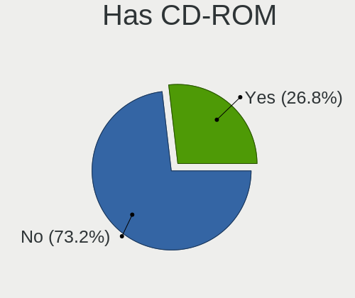
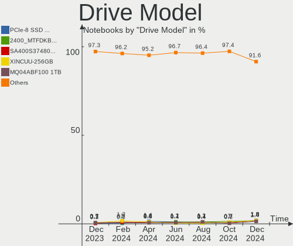
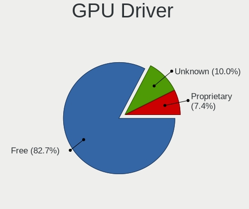
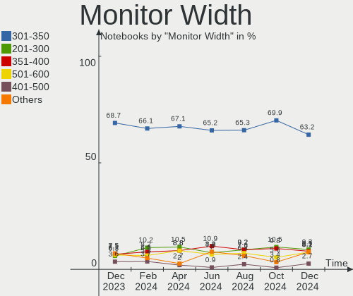
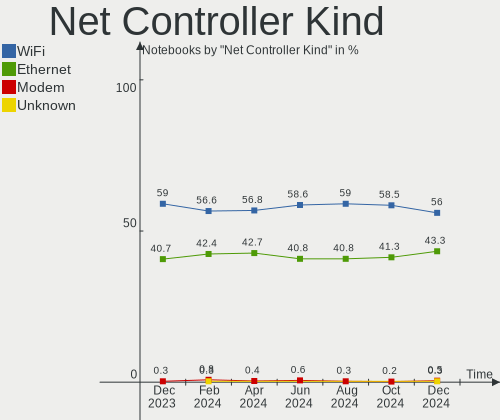

Linux in Russia - Hardware Trends (Notebooks)
---------------------------------------------

A project to identify most popular hardware characteristics and track their change
over time based on data collected by Linux users at https://Linux-Hardware.org.

Anyone can contribute to this report by the [hw-probe](https://github.com/linuxhw/hw-probe) tool:

    sudo -E hw-probe -all -upload

Period: Jul, 2023.

Contents
--------

* [ System ](#system)
  - [ OS                       ](#os)
  - [ OS Family                ](#os-family)
  - [ Kernel                   ](#kernel)
  - [ Kernel Family            ](#kernel-family)
  - [ Kernel Major Ver.        ](#kernel-major-ver)
  - [ Arch                     ](#arch)
  - [ DE                       ](#de)
  - [ Display Server           ](#display-server)
  - [ Display Manager          ](#display-manager)
  - [ OS Lang                  ](#os-lang)
  - [ Boot Mode                ](#boot-mode)
  - [ Filesystem               ](#filesystem)
  - [ Part. scheme             ](#part-scheme)
  - [ Dual Boot with Linux/BSD ](#dual-boot-with-linuxbsd)
  - [ Dual Boot (Win)          ](#dual-boot-win)

* [ Board ](#board)
  - [ Vendor                   ](#vendor)
  - [ Model                    ](#model)
  - [ Model Family             ](#model-family)
  - [ MFG Year                 ](#mfg-year)
  - [ Form Factor              ](#form-factor)
  - [ Secure Boot              ](#secure-boot)
  - [ Coreboot                 ](#coreboot)
  - [ RAM Size                 ](#ram-size)
  - [ RAM Used                 ](#ram-used)
  - [ Total Drives             ](#total-drives)
  - [ Has CD-ROM               ](#has-cd-rom)
  - [ Has Ethernet             ](#has-ethernet)
  - [ Has WiFi                 ](#has-wifi)
  - [ Has Bluetooth            ](#has-bluetooth)

* [ Location ](#location)
  - [ Country                  ](#country)
  - [ City                     ](#city)

* [ Drives ](#drives)
  - [ Drive Vendor             ](#drive-vendor)
  - [ Drive Model              ](#drive-model)
  - [ HDD Vendor               ](#hdd-vendor)
  - [ SSD Vendor               ](#ssd-vendor)
  - [ Drive Kind               ](#drive-kind)
  - [ Drive Connector          ](#drive-connector)
  - [ Drive Size               ](#drive-size)
  - [ Space Total              ](#space-total)
  - [ Space Used               ](#space-used)
  - [ Malfunc. Drives          ](#malfunc-drives)
  - [ Malfunc. Drive Vendor    ](#malfunc-drive-vendor)
  - [ Malfunc. HDD Vendor      ](#malfunc-hdd-vendor)
  - [ Malfunc. Drive Kind      ](#malfunc-drive-kind)
  - [ Failed Drives            ](#failed-drives)
  - [ Failed Drive Vendor      ](#failed-drive-vendor)
  - [ Drive Status             ](#drive-status)

* [ Storage controller ](#storage-controller)
  - [ Storage Vendor           ](#storage-vendor)
  - [ Storage Model            ](#storage-model)
  - [ Storage Kind             ](#storage-kind)

* [ Processor ](#processor)
  - [ CPU Vendor               ](#cpu-vendor)
  - [ CPU Model                ](#cpu-model)
  - [ CPU Model Family         ](#cpu-model-family)
  - [ CPU Cores                ](#cpu-cores)
  - [ CPU Sockets              ](#cpu-sockets)
  - [ CPU Threads              ](#cpu-threads)
  - [ CPU Op-Modes             ](#cpu-op-modes)
  - [ CPU Microcode            ](#cpu-microcode)
  - [ CPU Microarch            ](#cpu-microarch)

* [ Graphics ](#graphics)
  - [ GPU Vendor               ](#gpu-vendor)
  - [ GPU Model                ](#gpu-model)
  - [ GPU Combo                ](#gpu-combo)
  - [ GPU Driver               ](#gpu-driver)
  - [ GPU Memory               ](#gpu-memory)

* [ Monitor ](#monitor)
  - [ Monitor Vendor           ](#monitor-vendor)
  - [ Monitor Model            ](#monitor-model)
  - [ Monitor Resolution       ](#monitor-resolution)
  - [ Monitor Diagonal         ](#monitor-diagonal)
  - [ Monitor Width            ](#monitor-width)
  - [ Aspect Ratio             ](#aspect-ratio)
  - [ Monitor Area             ](#monitor-area)
  - [ Pixel Density            ](#pixel-density)
  - [ Multiple Monitors        ](#multiple-monitors)

* [ Network ](#network)
  - [ Net Controller Vendor    ](#net-controller-vendor)
  - [ Net Controller Model     ](#net-controller-model)
  - [ Wireless Vendor          ](#wireless-vendor)
  - [ Wireless Model           ](#wireless-model)
  - [ Ethernet Vendor          ](#ethernet-vendor)
  - [ Ethernet Model           ](#ethernet-model)
  - [ Net Controller Kind      ](#net-controller-kind)
  - [ Used Controller          ](#used-controller)
  - [ NICs                     ](#nics)
  - [ IPv6                     ](#ipv6)

* [ Bluetooth ](#bluetooth)
  - [ Bluetooth Vendor         ](#bluetooth-vendor)
  - [ Bluetooth Model          ](#bluetooth-model)

* [ Sound ](#sound)
  - [ Sound Vendor             ](#sound-vendor)
  - [ Sound Model              ](#sound-model)

* [ Memory ](#memory)
  - [ Memory Vendor            ](#memory-vendor)
  - [ Memory Model             ](#memory-model)
  - [ Memory Kind              ](#memory-kind)
  - [ Memory Form Factor       ](#memory-form-factor)
  - [ Memory Size              ](#memory-size)
  - [ Memory Speed             ](#memory-speed)

* [ Printers & scanners ](#printers--scanners)
  - [ Printer Vendor           ](#printer-vendor)
  - [ Printer Model            ](#printer-model)
  - [ Scanner Vendor           ](#scanner-vendor)
  - [ Scanner Model            ](#scanner-model)

* [ Camera ](#camera)
  - [ Camera Vendor            ](#camera-vendor)
  - [ Camera Model             ](#camera-model)

* [ Security ](#security)
  - [ Fingerprint Vendor       ](#fingerprint-vendor)
  - [ Fingerprint Model        ](#fingerprint-model)
  - [ Chipcard Vendor          ](#chipcard-vendor)
  - [ Chipcard Model           ](#chipcard-model)

* [ Unsupported ](#unsupported)
  - [ Unsupported Devices      ](#unsupported-devices)
  - [ Unsupported Device Types ](#unsupported-device-types)

System
------

OS
--

Installed operating systems

| Name                         | Notebooks | Percent |
|------------------------------|-----------|---------|
| ROSA 12.4                    | 67        | 31.75%  |
| Arch Rolling                 | 18        | 8.53%   |
| Ubuntu 22.04                 | 15        | 7.11%   |
| Fedora 38                    | 14        | 6.64%   |
| Ubuntu 23.04                 | 12        | 5.69%   |
| Debian 12                    | 12        | 5.69%   |
| Red OS 7.3.2                 | 6         | 2.84%   |
| Linux Mint 21.1              | 6         | 2.84%   |
| Debian 11                    | 5         | 2.37%   |
| ROSA R11.1                   | 4         | 1.9%    |
| ALT Linux 10.1               | 4         | 1.9%    |
| Manjaro                      | 3         | 1.42%   |
| Ubuntu 20.04                 | 2         | 0.95%   |
| SteamOS 3.4.8                | 2         | 0.95%   |
| ROSA 12.3                    | 2         | 0.95%   |
| Pop!_OS 22.04                | 2         | 0.95%   |
| Linux Mint 21.2.0            | 2         | 0.95%   |
| Linux Mint 21.2              | 2         | 0.95%   |
| KDE neon 22.04               | 2         | 0.95%   |
| Fedora 37                    | 2         | 0.95%   |
| Zorin 16                     | 1         | 0.47%   |
| Void Linux Rolling           | 1         | 0.47%   |
| Ubuntu Unity 22.04           | 1         | 0.47%   |
| Ubuntu Studio 22.04          | 1         | 0.47%   |
| Ubuntu MATE 23.04            | 1         | 0.47%   |
| Ubuntu 22.10                 | 1         | 0.47%   |
| ROSA 13.0                    | 1         | 0.47%   |
| ROSA 12.2                    | 1         | 0.47%   |
| ROSA 12.1                    | 1         | 0.47%   |
| openSUSE Tumbleweed-XXXXXXXX | 1         | 0.47%   |
| openSUSE Leap-15.5           | 1         | 0.47%   |
| OpenMandriva 23.03           | 1         | 0.47%   |
| NixOS 23.05                  | 1         | 0.47%   |
| Manjaro 23.0.0               | 1         | 0.47%   |
| Manjaro 22.1.0               | 1         | 0.47%   |
| Lubuntu 22.04                | 1         | 0.47%   |
| Lubuntu 13.04                | 1         | 0.47%   |
| Linux Mint 20                | 1         | 0.47%   |
| Kubuntu 23.04                | 1         | 0.47%   |
| Kali 2023.2                  | 1         | 0.47%   |

OS Family
---------

OS without a version

| Name          | Notebooks | Percent |
|---------------|-----------|---------|
| ROSA          | 76        | 36.02%  |
| Ubuntu        | 30        | 14.22%  |
| Arch          | 18        | 8.53%   |
| Debian        | 17        | 8.06%   |
| Fedora        | 16        | 7.58%   |
| Linux Mint    | 11        | 5.21%   |
| Red OS        | 6         | 2.84%   |
| ALT Linux     | 6         | 2.84%   |
| Manjaro       | 5         | 2.37%   |
| SteamOS       | 2         | 0.95%   |
| Pop!_OS       | 2         | 0.95%   |
| openSUSE      | 2         | 0.95%   |
| Lubuntu       | 2         | 0.95%   |
| KDE neon      | 2         | 0.95%   |
| Astra Linux   | 2         | 0.95%   |
| Zorin         | 1         | 0.47%   |
| Void Linux    | 1         | 0.47%   |
| Ubuntu Unity  | 1         | 0.47%   |
| Ubuntu Studio | 1         | 0.47%   |
| Ubuntu MATE   | 1         | 0.47%   |
| OpenMandriva  | 1         | 0.47%   |
| NixOS         | 1         | 0.47%   |
| Kubuntu       | 1         | 0.47%   |
| Kali          | 1         | 0.47%   |
| Gentoo        | 1         | 0.47%   |
| EndeavourOS   | 1         | 0.47%   |
| Elementary    | 1         | 0.47%   |
| Devuan        | 1         | 0.47%   |
| AlmaLinux     | 1         | 0.47%   |

Kernel
------

Version of the Linux kernel

| Version                            | Notebooks | Percent |
|------------------------------------|-----------|---------|
| 6.1.38-generic-1rosa2021.1-x86_64  | 35        | 16.59%  |
| 6.1.20-generic-2rosa2021.1-x86_64  | 23        | 10.9%   |
| 5.19.0-46-generic                  | 11        | 5.21%   |
| 5.15.0-76-generic                  | 8         | 3.79%   |
| 6.1.0-10-amd64                     | 6         | 2.84%   |
| 6.2.0-24-generic                   | 5         | 2.37%   |
| 5.19.0-50-generic                  | 5         | 2.37%   |
| 6.4.4-arch1-1                      | 4         | 1.9%    |
| 6.4.4-200.fc38.x86_64              | 4         | 1.9%    |
| 6.3.8-200.fc38.x86_64              | 4         | 1.9%    |
| 6.3.12-200.fc38.x86_64             | 4         | 1.9%    |
| 6.2.0-25-generic                   | 4         | 1.9%    |
| 6.1.0-9-amd64                      | 4         | 1.9%    |
| 5.10.0-23-amd64                    | 4         | 1.9%    |
| 6.2.0-26-generic                   | 3         | 1.42%   |
| 6.1.38-un-def-alt1                 | 3         | 1.42%   |
| 5.15.103-generic-1rosa2021.1-i686  | 3         | 1.42%   |
| 6.4.7-arch1-1                      | 2         | 0.95%   |
| 6.4.1-arch2-1                      | 2         | 0.95%   |
| 6.4.1-arch1-1                      | 2         | 0.95%   |
| 6.3.8-100.fc37.x86_64              | 2         | 0.95%   |
| 6.2.6-76060206-generic             | 2         | 0.95%   |
| 6.2.0-20-generic                   | 2         | 0.95%   |
| 6.1.38-1-MANJARO                   | 2         | 0.95%   |
| 6.1.31-2-MANJARO                   | 2         | 0.95%   |
| 6.1.20-2.el7.3.x86_64              | 2         | 0.95%   |
| 5.15.87-1.el7.3.x86_64             | 2         | 0.95%   |
| 5.15.0-70-generic                  | 2         | 0.95%   |
| 5.13.0-valve36-1-neptune           | 2         | 0.95%   |
| 5.10.74-generic-2rosa2021.1-x86_64 | 2         | 0.95%   |
| 5.10.185-std-def-alt1              | 2         | 0.95%   |
| 4.9.155-nrj-desktop-1rosa-i586     | 2         | 0.95%   |
| 6.4.6-arch1-1                      | 1         | 0.47%   |
| 6.4.6-200.fc38.x86_64              | 1         | 0.47%   |
| 6.4.5-x64v1-xanmod1                | 1         | 0.47%   |
| 6.4.5-alderlake-xanmod1-1          | 1         | 0.47%   |
| 6.4.3-zen1-2-zen                   | 1         | 0.47%   |
| 6.4.3-zen1-1-zen                   | 1         | 0.47%   |
| 6.4.3-x64v2-xanmod1                | 1         | 0.47%   |
| 6.4.3-arch1-2                      | 1         | 0.47%   |

Kernel Family
-------------

Linux kernel without a distro release

| Version  | Notebooks | Percent |
|----------|-----------|---------|
| 6.1.38   | 42        | 19.91%  |
| 6.1.20   | 25        | 11.85%  |
| 5.19.0   | 16        | 7.58%   |
| 5.15.0   | 15        | 7.11%   |
| 6.2.0    | 14        | 6.64%   |
| 6.1.0    | 13        | 6.16%   |
| 6.4.4    | 8         | 3.79%   |
| 6.4.3    | 7         | 3.32%   |
| 6.4.1    | 6         | 2.84%   |
| 6.3.8    | 6         | 2.84%   |
| 6.3.12   | 5         | 2.37%   |
| 5.10.0   | 4         | 1.9%    |
| 6.2.6    | 3         | 1.42%   |
| 5.15.103 | 3         | 1.42%   |
| 6.4.7    | 2         | 0.95%   |
| 6.4.6    | 2         | 0.95%   |
| 6.4.5    | 2         | 0.95%   |
| 6.1.31   | 2         | 0.95%   |
| 6.1.22   | 2         | 0.95%   |
| 5.15.87  | 2         | 0.95%   |
| 5.15.117 | 2         | 0.95%   |
| 5.13.0   | 2         | 0.95%   |
| 5.10.74  | 2         | 0.95%   |
| 5.10.185 | 2         | 0.95%   |
| 4.9.155  | 2         | 0.95%   |
| 6.4.0    | 1         | 0.47%   |
| 6.3.4    | 1         | 0.47%   |
| 6.3.13   | 1         | 0.47%   |
| 6.3.1    | 1         | 0.47%   |
| 6.2.9    | 1         | 0.47%   |
| 6.2.8    | 1         | 0.47%   |
| 6.1.9    | 1         | 0.47%   |
| 6.1.34   | 1         | 0.47%   |
| 5.4.83   | 1         | 0.47%   |
| 5.4.0    | 1         | 0.47%   |
| 5.15.79  | 1         | 0.47%   |
| 5.15.75  | 1         | 0.47%   |
| 5.15.72  | 1         | 0.47%   |
| 5.15.120 | 1         | 0.47%   |
| 5.14.21  | 1         | 0.47%   |

Kernel Major Ver.
-----------------

Linux kernel major version

| Version | Notebooks | Percent |
|---------|-----------|---------|
| 6.1     | 86        | 40.76%  |
| 6.4     | 28        | 13.27%  |
| 5.15    | 26        | 12.32%  |
| 6.2     | 19        | 9%      |
| 5.19    | 16        | 7.58%   |
| 6.3     | 14        | 6.64%   |
| 5.10    | 12        | 5.69%   |
| 5.13    | 3         | 1.42%   |
| 5.4     | 2         | 0.95%   |
| 5.14    | 2         | 0.95%   |
| 4.9     | 2         | 0.95%   |
| 3.1     | 1         | 0.47%   |

Arch
----

OS architecture (x86_64, i586, etc.)

| Name   | Notebooks | Percent |
|--------|-----------|---------|
| x86_64 | 203       | 96.21%  |
| i686   | 6         | 2.84%   |
| armv7l | 2         | 0.95%   |

DE
--

Desktop Environment

| Name       | Notebooks | Percent |
|------------|-----------|---------|
| KDE5       | 73        | 34.6%   |
| GNOME      | 70        | 33.18%  |
| MATE       | 13        | 6.16%   |
| XFCE       | 10        | 4.74%   |
| X-Cinnamon | 10        | 4.74%   |
| LXQt       | 10        | 4.74%   |
| Unknown    | 10        | 4.74%   |
| KDE4       | 3         | 1.42%   |
| i3         | 2         | 0.95%   |
| Unity      | 1         | 0.47%   |
| Trinity    | 1         | 0.47%   |
| sway       | 1         | 0.47%   |
| Pantheon   | 1         | 0.47%   |
| LXDE       | 1         | 0.47%   |
| Hyprland   | 1         | 0.47%   |
| fly        | 1         | 0.47%   |
| Cinnamon   | 1         | 0.47%   |
| Budgie     | 1         | 0.47%   |
| bspwm      | 1         | 0.47%   |

Display Server
--------------

X11 or Wayland

| Name        | Notebooks | Percent |
|-------------|-----------|---------|
| Wayland     | 110       | 52.13%  |
| X11         | 94        | 44.55%  |
| Unknown     | 5         | 2.37%   |
| Unspecified | 1         | 0.47%   |
| Tty         | 1         | 0.47%   |

Display Manager
---------------

SDDM, LightDM, etc.

| Name    | Notebooks | Percent |
|---------|-----------|---------|
| SDDM    | 67        | 31.75%  |
| GDM     | 41        | 19.43%  |
| LightDM | 35        | 16.59%  |
| GDM3    | 34        | 16.11%  |
| Unknown | 31        | 14.69%  |
| KDM     | 2         | 0.95%   |
| GREETD  | 1         | 0.47%   |

OS Lang
-------

Language

| Lang        | Notebooks | Percent |
|-------------|-----------|---------|
| ru_RU       | 166       | 78.67%  |
| en_US       | 35        | 16.59%  |
| Unknown     | 4         | 1.9%    |
| C           | 3         | 1.42%   |
| en_GB       | 2         | 0.95%   |
| ru_RU.utf-8 | 1         | 0.47%   |

Boot Mode
---------

EFI or BIOS

| Mode | Notebooks | Percent |
|------|-----------|---------|
| EFI  | 141       | 66.82%  |
| BIOS | 70        | 33.18%  |

Filesystem
----------

Type of filesystem

| Type    | Notebooks | Percent |
|---------|-----------|---------|
| Ext4    | 153       | 72.51%  |
| Btrfs   | 29        | 13.74%  |
| Tmpfs   | 18        | 8.53%   |
| Overlay | 6         | 2.84%   |
| Xfs     | 2         | 0.95%   |
| F2fs    | 2         | 0.95%   |
| Aufs    | 1         | 0.47%   |

Part. scheme
------------

Scheme of partitioning

| Type    | Notebooks | Percent |
|---------|-----------|---------|
| GPT     | 152       | 72.04%  |
| MBR     | 35        | 16.59%  |
| Unknown | 24        | 11.37%  |

Dual Boot with Linux/BSD
------------------------

Hosting more than one Linux/BSD

| Dual boot | Notebooks | Percent |
|-----------|-----------|---------|
| No        | 181       | 85.78%  |
| Yes       | 30        | 14.22%  |

Dual Boot (Win)
---------------

Hosting Linux and Windows

| Dual boot | Notebooks | Percent |
|-----------|-----------|---------|
| No        | 133       | 63.03%  |
| Yes       | 78        | 36.97%  |

Board
-----

Vendor
------

Motherboard manufacturer

| Name                 | Notebooks | Percent |
|----------------------|-----------|---------|
| Lenovo               | 42        | 19.91%  |
| ASUSTek Computer     | 34        | 16.11%  |
| Hewlett-Packard      | 30        | 14.22%  |
| Acer                 | 22        | 10.43%  |
| Dell                 | 12        | 5.69%   |
| HUAWEI               | 11        | 5.21%   |
| MSI                  | 10        | 4.74%   |
| Samsung Electronics  | 5         | 2.37%   |
| HONOR                | 5         | 2.37%   |
| Unknown              | 4         | 1.9%    |
| Valve                | 3         | 1.42%   |
| Toshiba              | 3         | 1.42%   |
| Timi                 | 3         | 1.42%   |
| TECNO                | 2         | 0.95%   |
| Sony                 | 2         | 0.95%   |
| Maibenben            | 2         | 0.95%   |
| Infinix              | 2         | 0.95%   |
| Gigabyte Technology  | 2         | 0.95%   |
| Apple                | 2         | 0.95%   |
| rombica              | 1         | 0.47%   |
| Quanta               | 1         | 0.47%   |
| Prestigio            | 1         | 0.47%   |
| Pegatron             | 1         | 0.47%   |
| Notebook             | 1         | 0.47%   |
| Nokia                | 1         | 0.47%   |
| Intel Client Systems | 1         | 0.47%   |
| INSYS                | 1         | 0.47%   |
| ICL                  | 1         | 0.47%   |
| Haier                | 1         | 0.47%   |
| Graviton             | 1         | 0.47%   |
| F-Plus Mobile        | 1         | 0.47%   |
| Digma                | 1         | 0.47%   |
| Chuwi                | 1         | 0.47%   |
| Aquarius             | 1         | 0.47%   |

Model
-----

Motherboard model

| Name                                                                                     | Notebooks | Percent |
|------------------------------------------------------------------------------------------|-----------|---------|
| Unknown                                                                                  | 5         | 2.37%   |
| HUAWEI BOD-WXX9                                                                          | 4         | 1.9%    |
| Valve Jupiter                                                                            | 3         | 1.42%   |
| TECNO MEGABOOK T1                                                                        | 2         | 0.95%   |
| Maibenben MaiBook M                                                                      | 2         | 0.95%   |
| Lenovo V14-IIL 82C4                                                                      | 2         | 0.95%   |
| Lenovo B590 20208                                                                        | 2         | 0.95%   |
| Infinix INBOOK X2 GEN11                                                                  | 2         | 0.95%   |
| HUAWEI NBLB-WAX9N                                                                        | 2         | 0.95%   |
| HUAWEI BOM-WXX9                                                                          | 2         | 0.95%   |
| HP Notebook                                                                              | 2         | 0.95%   |
| HP EliteBook 830 G5                                                                      | 2         | 0.95%   |
| ASUS VivoBook_ASUSLaptop M6500QC_M6500QC                                                 | 2         | 0.95%   |
| Acer Nitro AN515-46                                                                      | 2         | 0.95%   |
| Toshiba Satellite P200D                                                                  | 1         | 0.47%   |
| Toshiba Satellite C870-D7K                                                               | 1         | 0.47%   |
| Toshiba QOSMIO G30                                                                       | 1         | 0.47%   |
| Timi Redmi G 2022                                                                        | 1         | 0.47%   |
| Timi Redmi Book Pro 15 2022                                                              | 1         | 0.47%   |
| Timi Redmi Book Pro 14 2022                                                              | 1         | 0.47%   |
| Sony VPCSB1V9R                                                                           | 1         | 0.47%   |
| Sony SVS13A1Z9RN                                                                         | 1         | 0.47%   |
| Samsung R780                                                                             | 1         | 0.47%   |
| Samsung R530/R730                                                                        | 1         | 0.47%   |
| Samsung 355V4C/355V4X/355V5C/355V5X/356V4C/356V4X/356V5C/356V5X/3445VC/3445VX/3545VC/354 | 1         | 0.47%   |
| Samsung 350V5C/351V5C/3540VC/3440VC                                                      | 1         | 0.47%   |
| Samsung 300V3A/300V4A/300V5A                                                             | 1         | 0.47%   |
| rombica myBook Eclipse                                                                   | 1         | 0.47%   |
| Quanta SWH                                                                               | 1         | 0.47%   |
| Prestigio Smartbook PSB116A                                                              | 1         | 0.47%   |
| Pegatron A24                                                                             | 1         | 0.47%   |
| Notebook W510LU                                                                          | 1         | 0.47%   |
| Nokia N900                                                                               | 1         | 0.47%   |
| MSI Sword 17 A11UD                                                                       | 1         | 0.47%   |
| MSI Summit E13FlipEvo A13MT                                                              | 1         | 0.47%   |
| MSI Modern 15 A11SBU                                                                     | 1         | 0.47%   |
| MSI Modern 14 B11MOU                                                                     | 1         | 0.47%   |
| MSI Katana GF76 11UD                                                                     | 1         | 0.47%   |
| MSI GS73 Stealth 8RE                                                                     | 1         | 0.47%   |
| MSI GF63 Thin 11UC                                                                       | 1         | 0.47%   |

Model Family
------------

Motherboard model prefix

| Name              | Notebooks | Percent |
|-------------------|-----------|---------|
| Lenovo ThinkPad   | 14        | 6.64%   |
| ASUS VivoBook     | 12        | 5.69%   |
| Lenovo IdeaPad    | 11        | 5.21%   |
| Acer Aspire       | 11        | 5.21%   |
| HP EliteBook      | 6         | 2.84%   |
| HP Laptop         | 5         | 2.37%   |
| Dell Inspiron     | 5         | 2.37%   |
| Unknown           | 5         | 2.37%   |
| HUAWEI BOD-WXX9   | 4         | 1.9%    |
| HP Pavilion       | 4         | 1.9%    |
| Acer Extensa      | 4         | 1.9%    |
| Valve Jupiter     | 3         | 1.42%   |
| Timi Redmi        | 3         | 1.42%   |
| Lenovo ThinkBook  | 3         | 1.42%   |
| Lenovo Legion     | 3         | 1.42%   |
| Lenovo B590       | 3         | 1.42%   |
| HP ProBook        | 3         | 1.42%   |
| Acer Nitro        | 3         | 1.42%   |
| Toshiba Satellite | 2         | 0.95%   |
| TECNO MEGABOOK    | 2         | 0.95%   |
| MSI Modern        | 2         | 0.95%   |
| Maibenben MaiBook | 2         | 0.95%   |
| Lenovo V14-IIL    | 2         | 0.95%   |
| Infinix INBOOK    | 2         | 0.95%   |
| HUAWEI NBLB-WAX9N | 2         | 0.95%   |
| HUAWEI BOM-WXX9   | 2         | 0.95%   |
| HP OMEN           | 2         | 0.95%   |
| HP Notebook       | 2         | 0.95%   |
| HP Compaq         | 2         | 0.95%   |
| HP 250            | 2         | 0.95%   |
| Gigabyte G5       | 2         | 0.95%   |
| Dell Vostro       | 2         | 0.95%   |
| Dell Latitude     | 2         | 0.95%   |
| ASUS Zenbook      | 2         | 0.95%   |
| ASUS TUF          | 2         | 0.95%   |
| ASUS ROG          | 2         | 0.95%   |
| ASUS ASUS         | 2         | 0.95%   |
| Toshiba QOSMIO    | 1         | 0.47%   |
| Sony VPCSB1V9R    | 1         | 0.47%   |
| Sony SVS13A1Z9RN  | 1         | 0.47%   |

MFG Year
--------

Motherboard manufacture year

| Year    | Notebooks | Percent |
|---------|-----------|---------|
| 2022    | 39        | 18.48%  |
| 2021    | 37        | 17.54%  |
| 2019    | 18        | 8.53%   |
| 2020    | 15        | 7.11%   |
| 2012    | 15        | 7.11%   |
| 2011    | 14        | 6.64%   |
| 2013    | 11        | 5.21%   |
| 2017    | 8         | 3.79%   |
| 2015    | 8         | 3.79%   |
| 2014    | 7         | 3.32%   |
| 2010    | 7         | 3.32%   |
| 2023    | 6         | 2.84%   |
| 2018    | 6         | 2.84%   |
| 2007    | 5         | 2.37%   |
| 2009    | 4         | 1.9%    |
| 2008    | 4         | 1.9%    |
| 2006    | 3         | 1.42%   |
| 2016    | 2         | 0.95%   |
| Unknown | 2         | 0.95%   |

Form Factor
-----------

Physical design of the computer

| Name     | Notebooks | Percent |
|----------|-----------|---------|
| Notebook | 211       | 100%    |

Secure Boot
-----------

Enabled or disabled

| State    | Notebooks | Percent |
|----------|-----------|---------|
| Disabled | 191       | 90.52%  |
| Enabled  | 20        | 9.48%   |

Coreboot
--------

Have coreboot on board

| Used | Notebooks | Percent |
|------|-----------|---------|
| No   | 211       | 100%    |

RAM Size
--------

Total RAM memory

| Size in GB  | Notebooks | Percent |
|-------------|-----------|---------|
| 4.01-8.0    | 73        | 34.6%   |
| 8.01-16.0   | 51        | 24.17%  |
| 16.01-24.0  | 28        | 13.27%  |
| 3.01-4.0    | 26        | 12.32%  |
| 32.01-64.0  | 13        | 6.16%   |
| 2.01-3.0    | 7         | 3.32%   |
| 24.01-32.0  | 5         | 2.37%   |
| 1.01-2.0    | 3         | 1.42%   |
| 64.01-256.0 | 2         | 0.95%   |
| 0.01-0.5    | 2         | 0.95%   |
| 0.51-1.0    | 1         | 0.47%   |

RAM Used
--------

Used RAM memory

| Used GB    | Notebooks | Percent |
|------------|-----------|---------|
| 1.01-2.0   | 70        | 33.18%  |
| 2.01-3.0   | 43        | 20.38%  |
| 4.01-8.0   | 42        | 19.91%  |
| 3.01-4.0   | 26        | 12.32%  |
| 8.01-16.0  | 12        | 5.69%   |
| 0.51-1.0   | 12        | 5.69%   |
| 0.01-0.5   | 4         | 1.9%    |
| 24.01-32.0 | 1         | 0.47%   |
| Unknown    | 1         | 0.47%   |

Total Drives
------------

Number of drives on board

| Drives | Notebooks | Percent |
|--------|-----------|---------|
| 1      | 152       | 72.04%  |
| 2      | 55        | 26.07%  |
| 3      | 2         | 0.95%   |
| 5      | 1         | 0.47%   |
| 0      | 1         | 0.47%   |

Has CD-ROM
----------

Has CD-ROM on board

| Presented | Notebooks | Percent |
|-----------|-----------|---------|
| No        | 162       | 76.78%  |
| Yes       | 49        | 23.22%  |

Has Ethernet
------------

Has Ethernet on board

| Presented | Notebooks | Percent |
|-----------|-----------|---------|
| Yes       | 144       | 68.25%  |
| No        | 67        | 31.75%  |

Has WiFi
--------

Has WiFi module

| Presented | Notebooks | Percent |
|-----------|-----------|---------|
| Yes       | 206       | 97.63%  |
| No        | 5         | 2.37%   |

Has Bluetooth
-------------

Has Bluetooth module

| Presented | Notebooks | Percent |
|-----------|-----------|---------|
| Yes       | 180       | 85.31%  |
| No        | 31        | 14.69%  |

Location
--------

Country
-------

Geographic location (country)

| Country | Notebooks | Percent |
|---------|-----------|---------|
| Russia  | 211       | 100%    |

City
----

Geographic location (city)

| City             | Notebooks | Percent |
|------------------|-----------|---------|
| Moscow           | 53        | 25.12%  |
| St Petersburg    | 24        | 11.37%  |
| Saratov          | 8         | 3.79%   |
| Samara           | 8         | 3.79%   |
| Krasnodar        | 8         | 3.79%   |
| Voronezh         | 6         | 2.84%   |
| Nizhniy Novgorod | 6         | 2.84%   |
| Kazan’         | 6         | 2.84%   |
| Perm             | 5         | 2.37%   |
| Ufa              | 3         | 1.42%   |
| Smolensk         | 3         | 1.42%   |
| Novosibirsk      | 3         | 1.42%   |
| Lipetsk          | 3         | 1.42%   |
| Belgorod         | 3         | 1.42%   |
| Barnaul          | 3         | 1.42%   |
| Yoshkar-Ola      | 2         | 0.95%   |
| Yaroslavl        | 2         | 0.95%   |
| Tyumen           | 2         | 0.95%   |
| Tomsk            | 2         | 0.95%   |
| Shchelkovo       | 2         | 0.95%   |
| Ryazan           | 2         | 0.95%   |
| Murom            | 2         | 0.95%   |
| Kurgan           | 2         | 0.95%   |
| Kirov            | 2         | 0.95%   |
| Zvenigorod       | 1         | 0.47%   |
| Yekaterinburg    | 1         | 0.47%   |
| Yasnogorsk       | 1         | 0.47%   |
| Volgograd        | 1         | 0.47%   |
| Vladivostok      | 1         | 0.47%   |
| Vladimir         | 1         | 0.47%   |
| Vladikavkaz      | 1         | 0.47%   |
| Veliky Novgorod  | 1         | 0.47%   |
| Ulyanovsk        | 1         | 0.47%   |
| Uglich           | 1         | 0.47%   |
| Tula             | 1         | 0.47%   |
| Tsarskoye Selo   | 1         | 0.47%   |
| Tolyatti         | 1         | 0.47%   |
| Stavropol        | 1         | 0.47%   |
| Sochi            | 1         | 0.47%   |
| Severodvinsk     | 1         | 0.47%   |

Drives
------

Drive Vendor
------------

Hard drive vendors

| Vendor                       | Notebooks | Drives | Percent |
|------------------------------|-----------|--------|---------|
| Samsung Electronics          | 35        | 35     | 13.16%  |
| WDC                          | 22        | 23     | 8.27%   |
| SK hynix                     | 18        | 18     | 6.77%   |
| Kingston                     | 16        | 18     | 6.02%   |
| Seagate                      | 14        | 15     | 5.26%   |
| Sandisk                      | 12        | 12     | 4.51%   |
| Toshiba                      | 11        | 12     | 4.14%   |
| Intel                        | 11        | 12     | 4.14%   |
| Micron Technology            | 10        | 10     | 3.76%   |
| Unknown                      | 9         | 10     | 3.38%   |
| A-DATA Technology            | 7         | 7      | 2.63%   |
| Silicon Motion               | 6         | 6      | 2.26%   |
| SPCC                         | 5         | 5      | 1.88%   |
| Netac                        | 5         | 5      | 1.88%   |
| Crucial                      | 5         | 5      | 1.88%   |
| China                        | 5         | 5      | 1.88%   |
| Phison Electronics           | 4         | 4      | 1.5%    |
| Hitachi                      | 4         | 4      | 1.5%    |
| HGST                         | 4         | 4      | 1.5%    |
| Smartbuy                     | 3         | 3      | 1.13%   |
| Kingston Technology Company  | 3         | 3      | 1.13%   |
| JMicron Technology           | 3         | 3      | 1.13%   |
| FORESEE                      | 3         | 3      | 1.13%   |
| Unknown                      | 3         | 3      | 1.13%   |
| Shenzhen Longsys Electronics | 2         | 2      | 0.75%   |
| Realtek Semiconductor        | 2         | 2      | 0.75%   |
| Plextor                      | 2         | 2      | 0.75%   |
| KIOXIA                       | 2         | 2      | 0.75%   |
| Apacer                       | 2         | 2      | 0.75%   |
| AMD                          | 2         | 2      | 0.75%   |
| XrayDisk                     | 1         | 1      | 0.38%   |
| Wdxsky                       | 1         | 1      | 0.38%   |
| WDC WDS                      | 1         | 1      | 0.38%   |
| WALRAM                       | 1         | 1      | 0.38%   |
| Verbatim                     | 1         | 1      | 0.38%   |
| USB                          | 1         | 1      | 0.38%   |
| Union Memory (Shenzhen)      | 1         | 1      | 0.38%   |
| Team                         | 1         | 1      | 0.38%   |
| SSSTC                        | 1         | 1      | 0.38%   |
| Solid State Storage          | 1         | 1      | 0.38%   |

Drive Model
-----------

Hard drive models

| Model                                               | Notebooks | Percent |
|-----------------------------------------------------|-----------|---------|
| Intel SSDPEKNU512GZ 512GB                           | 6         | 2.22%   |
| Samsung NVMe SSD Controller SM981/PM981/PM983 500GB | 5         | 1.85%   |
| Samsung NVMe SSD Controller PM9A1/PM9A3/980PRO 1TB  | 5         | 1.85%   |
| Kingston SA400S37240G 240GB SSD                     | 5         | 1.85%   |
| SK hynix HFM512GD3JX013N 512GB                      | 4         | 1.48%   |
| Sandisk WD Black SN750 / PC SN730 NVMe SSD 1024GB   | 4         | 1.48%   |
| SPCC Solid State Disk 256GB                         | 3         | 1.11%   |
| Silicon Motion PCIe-4 SSD 256GB                     | 3         | 1.11%   |
| Seagate ST1000LM024 HN-M101MBB 1TB                  | 3         | 1.11%   |
| Kingston SA400S37480G 480GB SSD                     | 3         | 1.11%   |
| HGST HTS545050A7E380 500GB                          | 3         | 1.11%   |
| Unknown                                             | 3         | 1.11%   |
| WDC WD5000LPCX-21VHAT0 500GB                        | 2         | 0.74%   |
| WDC WD10SPZX-00Z10T0 1TB                            | 2         | 0.74%   |
| WDC PC SN730 SDBPNTY-512G-1027 512GB                | 2         | 0.74%   |
| Unknown MMC Card  32GB                              | 2         | 0.74%   |
| Smartbuy SSD 120GB                                  | 2         | 0.74%   |
| SK hynix HFM128GDHTNG-8310A 128GB                   | 2         | 0.74%   |
| Silicon Motion PCIe-8 SSD 512GB                     | 2         | 0.74%   |
| Seagate ST1000LM049-2GH172 1TB                      | 2         | 0.74%   |
| Seagate ST1000LM035-1RK172 1TB                      | 2         | 0.74%   |
| Samsung SSD 870 EVO 500GB                           | 2         | 0.74%   |
| Samsung SSD 860 EVO 250GB                           | 2         | 0.74%   |
| Realtek NVMe SSD Drive 128GB                        | 2         | 0.74%   |
| Phison PS5013 E13 NVMe Controller 256GB             | 2         | 0.74%   |
| Micron 2400_MTFDKBA512QFM 512GB                     | 2         | 0.74%   |
| KIOXIA KBG40ZNV256G 256GB                           | 2         | 0.74%   |
| Kingston Company OM3PDP3 NVMe SSD 512GB             | 2         | 0.74%   |
| Kingston SHFS37A120G 120GB SSD                      | 2         | 0.74%   |
| Kingston OM8PCP3512F-AI1 512GB                      | 2         | 0.74%   |
| JMicron Generic 512GB                               | 2         | 0.74%   |
| Intel SSD 660P Series 1024GB                        | 2         | 0.74%   |
| Hitachi HTS547575A9E384 752GB                       | 2         | 0.74%   |
| China SSD 240GB                                     | 2         | 0.74%   |
| XrayDisk 2TB SSD                                    | 1         | 0.37%   |
| Wdxsky W31-256G SSD                                 | 1         | 0.37%   |
| WDC WDS480G2G0C-00AJM0 480GB                        | 1         | 0.37%   |
| WDC WDS240G2G0A-00JH30 240GB SSD                    | 1         | 0.37%   |
| WDC WDS100T2G0A-00JH30 1TB SSD                      | 1         | 0.37%   |
| WDC WDS100T1R0A-68A4W0 1TB SSD                      | 1         | 0.37%   |

HDD Vendor
----------

Hard disk drive vendors

| Vendor              | Notebooks | Drives | Percent |
|---------------------|-----------|--------|---------|
| Seagate             | 13        | 14     | 27.66%  |
| WDC                 | 12        | 12     | 25.53%  |
| Toshiba             | 7         | 8      | 14.89%  |
| Hitachi             | 4         | 4      | 8.51%   |
| HGST                | 4         | 4      | 8.51%   |
| JMicron Technology  | 3         | 3      | 6.38%   |
| Unknown             | 1         | 1      | 2.13%   |
| Samsung Electronics | 1         | 1      | 2.13%   |
| QNAP                | 1         | 4      | 2.13%   |
| Fujitsu             | 1         | 1      | 2.13%   |

SSD Vendor
----------

Solid state drive vendors

| Vendor              | Notebooks | Drives | Percent |
|---------------------|-----------|--------|---------|
| Samsung Electronics | 13        | 13     | 15.48%  |
| Kingston            | 12        | 13     | 14.29%  |
| SPCC                | 5         | 5      | 5.95%   |
| China               | 5         | 5      | 5.95%   |
| A-DATA Technology   | 5         | 5      | 5.95%   |
| Crucial             | 4         | 4      | 4.76%   |
| WDC                 | 3         | 3      | 3.57%   |
| Smartbuy            | 3         | 3      | 3.57%   |
| SanDisk             | 2         | 2      | 2.38%   |
| Plextor             | 2         | 2      | 2.38%   |
| Netac               | 2         | 2      | 2.38%   |
| AMD                 | 2         | 2      | 2.38%   |
| XrayDisk            | 1         | 1      | 1.19%   |
| Wdxsky              | 1         | 1      | 1.19%   |
| WDC WDS             | 1         | 1      | 1.19%   |
| WALRAM              | 1         | 1      | 1.19%   |
| Verbatim            | 1         | 1      | 1.19%   |
| USB                 | 1         | 1      | 1.19%   |
| Team                | 1         | 1      | 1.19%   |
| SSSTC               | 1         | 1      | 1.19%   |
| SK hynix            | 1         | 1      | 1.19%   |
| ShiJi               | 1         | 1      | 1.19%   |
| Seagate             | 1         | 1      | 1.19%   |
| Patriot             | 1         | 1      | 1.19%   |
| Palit               | 1         | 1      | 1.19%   |
| OCZ                 | 1         | 1      | 1.19%   |
| Neo                 | 1         | 1      | 1.19%   |
| MII                 | 1         | 1      | 1.19%   |
| Micron Technology   | 1         | 1      | 1.19%   |
| KingSpec            | 1         | 1      | 1.19%   |
| HS-SSD-E100         | 1         | 1      | 1.19%   |
| Hewlett-Packard     | 1         | 1      | 1.19%   |
| GS                  | 1         | 1      | 1.19%   |
| Azerty              | 1         | 1      | 1.19%   |
| Apple               | 1         | 1      | 1.19%   |
| Apacer              | 1         | 1      | 1.19%   |
| ACOS                | 1         | 1      | 1.19%   |
| Unknown             | 1         | 1      | 1.19%   |

Drive Kind
----------

HDD or SSD

| Kind    | Notebooks | Drives | Percent |
|---------|-----------|--------|---------|
| NVMe    | 112       | 126    | 44.98%  |
| SSD     | 78        | 85     | 31.33%  |
| HDD     | 47        | 52     | 18.88%  |
| MMC     | 9         | 10     | 3.61%   |
| Unknown | 3         | 3      | 1.2%    |

Drive Connector
---------------

SATA, SAS, NVMe, etc.

| Type | Notebooks | Drives | Percent |
|------|-----------|--------|---------|
| NVMe | 112       | 125    | 47.26%  |
| SATA | 105       | 130    | 44.3%   |
| SAS  | 11        | 11     | 4.64%   |
| MMC  | 9         | 10     | 3.8%    |

Drive Size
----------

Size of hard drive

| Size in TB | Notebooks | Drives | Percent |
|------------|-----------|--------|---------|
| 0.01-0.5   | 80        | 95     | 67.8%   |
| 0.51-1.0   | 36        | 40     | 30.51%  |
| 1.01-2.0   | 1         | 1      | 0.85%   |
| 4.01-10.0  | 1         | 1      | 0.85%   |

Space Total
-----------

Amount of disk space available on the file system

| Size in GB     | Notebooks | Percent |
|----------------|-----------|---------|
| 101-250        | 73        | 34.6%   |
| 251-500        | 49        | 23.22%  |
| 501-1000       | 25        | 11.85%  |
| 21-50          | 14        | 6.64%   |
| 1-20           | 14        | 6.64%   |
| 51-100         | 14        | 6.64%   |
| 1001-2000      | 13        | 6.16%   |
| Unknown        | 4         | 1.9%    |
| More than 3000 | 3         | 1.42%   |
| 2001-3000      | 2         | 0.95%   |

Space Used
----------

Amount of used disk space

| Used GB        | Notebooks | Percent |
|----------------|-----------|---------|
| 1-20           | 91        | 43.13%  |
| 101-250        | 35        | 16.59%  |
| 21-50          | 34        | 16.11%  |
| 51-100         | 25        | 11.85%  |
| 501-1000       | 9         | 4.27%   |
| 251-500        | 8         | 3.79%   |
| Unknown        | 4         | 1.9%    |
| 1001-2000      | 3         | 1.42%   |
| More than 3000 | 1         | 0.47%   |
| 2001-3000      | 1         | 0.47%   |

Malfunc. Drives
---------------

Drive models with a malfunction

| Model                              | Notebooks | Drives | Percent |
|------------------------------------|-----------|--------|---------|
| Seagate ST1000LM024 HN-M101MBB 1TB | 2         | 3      | 11.11%  |
| HGST HTS545050A7E380 500GB         | 2         | 2      | 11.11%  |
| Toshiba MQ01ABF050 500GB           | 1         | 1      | 5.56%   |
| Toshiba MQ01ABF032 320GB           | 1         | 1      | 5.56%   |
| Toshiba MK6465GSXN 640GB           | 1         | 1      | 5.56%   |
| Toshiba MK1637GSX 160GB            | 1         | 2      | 5.56%   |
| SSSTC CV8-8E128-HP 128GB SSD       | 1         | 1      | 5.56%   |
| Seagate ST9500420AS 500GB          | 1         | 1      | 5.56%   |
| Seagate ST9500325AS 500GB          | 1         | 1      | 5.56%   |
| Seagate ST500LT012-9WS142 500GB    | 1         | 1      | 5.56%   |
| Seagate ST320LT020-9YG142 320GB    | 1         | 1      | 5.56%   |
| OCZ NOCTI 120GB SSD                | 1         | 1      | 5.56%   |
| Kingston SHFS37A120G 120GB SSD     | 1         | 1      | 5.56%   |
| Hitachi HTS541616J9SA00 160GB      | 1         | 1      | 5.56%   |
| HGST HTS725050A7E630 500GB         | 1         | 1      | 5.56%   |
| ACOS AS-512 512GB SSD              | 1         | 1      | 5.56%   |

Malfunc. Drive Vendor
---------------------

Vendors of faulty drives

| Vendor   | Notebooks | Drives | Percent |
|----------|-----------|--------|---------|
| Seagate  | 6         | 7      | 33.33%  |
| Toshiba  | 4         | 5      | 22.22%  |
| HGST     | 3         | 3      | 16.67%  |
| SSSTC    | 1         | 1      | 5.56%   |
| OCZ      | 1         | 1      | 5.56%   |
| Kingston | 1         | 1      | 5.56%   |
| Hitachi  | 1         | 1      | 5.56%   |
| ACOS     | 1         | 1      | 5.56%   |

Malfunc. HDD Vendor
-------------------

Vendors of faulty HDD drives

| Vendor  | Notebooks | Drives | Percent |
|---------|-----------|--------|---------|
| Seagate | 6         | 7      | 42.86%  |
| Toshiba | 4         | 5      | 28.57%  |
| HGST    | 3         | 3      | 21.43%  |
| Hitachi | 1         | 1      | 7.14%   |

Malfunc. Drive Kind
-------------------

Kinds of faulty drives

| Kind | Notebooks | Drives | Percent |
|------|-----------|--------|---------|
| HDD  | 14        | 16     | 77.78%  |
| SSD  | 4         | 4      | 22.22%  |

Failed Drives
-------------

Failed drive models

Zero info for selected period =(

Failed Drive Vendor
-------------------

Failed drive vendors

Zero info for selected period =(

Drive Status
------------

Number of failed and malfunc. drives

| Status   | Notebooks | Drives | Percent |
|----------|-----------|--------|---------|
| Works    | 148       | 181    | 66.07%  |
| Detected | 59        | 75     | 26.34%  |
| Malfunc  | 17        | 20     | 7.59%   |

Storage controller
------------------

Storage Vendor
--------------

Storage controller vendors

| Vendor                           | Notebooks | Percent |
|----------------------------------|-----------|---------|
| Intel                            | 128       | 47.76%  |
| AMD                              | 26        | 9.7%    |
| Samsung Electronics              | 22        | 8.21%   |
| SanDisk                          | 18        | 6.72%   |
| SK hynix                         | 17        | 6.34%   |
| Micron Technology                | 9         | 3.36%   |
| Phison Electronics               | 7         | 2.61%   |
| Silicon Motion                   | 6         | 2.24%   |
| Kingston Technology Company      | 6         | 2.24%   |
| Shenzhen Longsys Electronics     | 5         | 1.87%   |
| Toshiba America Info Systems     | 4         | 1.49%   |
| Realtek Semiconductor            | 3         | 1.12%   |
| Nvidia                           | 2         | 0.75%   |
| Netac Technology                 | 2         | 0.75%   |
| Micron/Crucial Technology        | 2         | 0.75%   |
| KIOXIA                           | 2         | 0.75%   |
| ADATA Technology                 | 2         | 0.75%   |
| Union Memory (Shenzhen)          | 1         | 0.37%   |
| Solid State Storage Technology   | 1         | 0.37%   |
| Shenzhen Shichuangyi Electronics | 1         | 0.37%   |
| O2 Micro                         | 1         | 0.37%   |
| MAXIO Technology (Hangzhou)      | 1         | 0.37%   |
| JMicron Technology               | 1         | 0.37%   |
| Jiangsu Huacun Elec.             | 1         | 0.37%   |

Storage Model
-------------

Storage controller models

| Model                                                                            | Notebooks | Percent |
|----------------------------------------------------------------------------------|-----------|---------|
| AMD FCH SATA Controller [AHCI mode]                                              | 22        | 7.77%   |
| Intel 7 Series Chipset Family 6-port SATA Controller [AHCI mode]                 | 15        | 5.3%    |
| SK hynix Gold P31/BC711/PC711 NVMe Solid State Drive                             | 9         | 3.18%   |
| Samsung NVMe SSD Controller PM9A1/PM9A3/980PRO                                   | 9         | 3.18%   |
| Intel Sunrise Point-LP SATA Controller [AHCI mode]                               | 9         | 3.18%   |
| Intel 6 Series/C200 Series Chipset Family 6 port Mobile SATA AHCI Controller     | 9         | 3.18%   |
| SanDisk WD Black SN750 / PC SN730 NVMe SSD                                       | 8         | 2.83%   |
| Intel Comet Lake SATA AHCI Controller                                            | 8         | 2.83%   |
| Intel 5 Series/3400 Series Chipset 4 port SATA AHCI Controller                   | 8         | 2.83%   |
| Samsung NVMe SSD Controller SM981/PM981/PM983                                    | 7         | 2.47%   |
| Intel Volume Management Device NVMe RAID Controller                              | 7         | 2.47%   |
| Intel SSD 670p Series [Keystone Harbor]                                          | 7         | 2.47%   |
| Intel 82801 Mobile SATA Controller [RAID mode]                                   | 7         | 2.47%   |
| Intel Tiger Lake-LP SATA Controller                                              | 6         | 2.12%   |
| Intel 8 Series SATA Controller 1 [AHCI mode]                                     | 6         | 2.12%   |
| Silicon Motion Non-Volatile memory controller                                    | 5         | 1.77%   |
| Intel Ice Lake-LP SATA Controller [AHCI mode]                                    | 5         | 1.77%   |
| SK hynix BC511 NVMe SSD                                                          | 4         | 1.41%   |
| SK hynix BC501 NVMe Solid State Drive                                            | 4         | 1.41%   |
| Micron 2450 NVMe SSD [HendrixV] (DRAM-less)                                      | 4         | 1.41%   |
| Intel Tiger Lake SATA AHCI Controller                                            | 4         | 1.41%   |
| Intel Celeron/Pentium Silver Processor SATA Controller                           | 4         | 1.41%   |
| Shenzhen Longsys Lexar NM620 NVME SSD (DRAM-less)                                | 3         | 1.06%   |
| Realtek RTS5765DL NVMe SSD Controller (DRAM-less)                                | 3         | 1.06%   |
| Phison PS5013 E13 NVMe Controller                                                | 3         | 1.06%   |
| Kingston Company KC2000/KC2500 NVMe SSD                                          | 3         | 1.06%   |
| Intel Cannon Lake Mobile PCH SATA AHCI Controller                                | 3         | 1.06%   |
| Intel Atom/Celeron/Pentium Processor x5-E8000/J3xxx/N3xxx Series SATA Controller | 3         | 1.06%   |
| Intel 82801HM/HEM (ICH8M/ICH8M-E) IDE Controller                                 | 3         | 1.06%   |
| Intel 82801GBM/GHM (ICH7-M Family) SATA Controller [IDE mode]                    | 3         | 1.06%   |
| Toshiba America Info Systems XG6 NVMe SSD Controller                             | 2         | 0.71%   |
| Samsung NVMe SSD Controller PM9B1                                                | 2         | 0.71%   |
| Samsung NVMe SSD Controller 980                                                  | 2         | 0.71%   |
| Phison E16 PCIe4 NVMe Controller                                                 | 2         | 0.71%   |
| Nvidia MCP79 AHCI Controller                                                     | 2         | 0.71%   |
| Netac NVMe SSD (DRAM-less)                                                       | 2         | 0.71%   |
| Micron 2400 NVMe SSD (DRAM-less)                                                 | 2         | 0.71%   |
| KIOXIA NVMe SSD Controller BG4 (DRAM-less)                                       | 2         | 0.71%   |
| Kingston Company OM8PCP Design-In PCIe 3 NVMe SSD (DRAM-less)                    | 2         | 0.71%   |
| Kingston Company OM3PDP3 NVMe SSD                                                | 2         | 0.71%   |

Storage Kind
------------

Kind of storage controller (IDE, SATA, NVMe, SAS, ...)

| Kind | Notebooks | Percent |
|------|-----------|---------|
| SATA | 129       | 48.31%  |
| NVMe | 112       | 41.95%  |
| RAID | 14        | 5.24%   |
| IDE  | 12        | 4.49%   |

Processor
---------

CPU Vendor
----------

Processor vendors

| Vendor  | Notebooks | Percent |
|---------|-----------|---------|
| Intel   | 149       | 70.62%  |
| AMD     | 60        | 28.44%  |
| ARM     | 1         | 0.47%   |
| Unknown | 1         | 0.47%   |

CPU Model
---------

Processor models

| Model                                         | Notebooks | Percent |
|-----------------------------------------------|-----------|---------|
| Intel 11th Gen Core i5-1135G7 @ 2.40GHz       | 6         | 2.84%   |
| AMD Ryzen 5 5600H with Radeon Graphics        | 6         | 2.84%   |
| Intel Core i5-10210U CPU @ 1.60GHz            | 5         | 2.37%   |
| AMD Ryzen 7 6800H with Radeon Graphics        | 5         | 2.37%   |
| AMD Ryzen 7 5800H with Radeon Graphics        | 5         | 2.37%   |
| Intel Core i5-7200U CPU @ 2.50GHz             | 4         | 1.9%    |
| Intel Core i5-1035G1 CPU @ 1.00GHz            | 4         | 1.9%    |
| Intel Core i3-10110U CPU @ 2.10GHz            | 4         | 1.9%    |
| Intel 11th Gen Core i3-1115G4 @ 3.00GHz       | 4         | 1.9%    |
| Intel Core i3-1005G1 CPU @ 1.20GHz            | 3         | 1.42%   |
| Intel 12th Gen Core i7-1260P                  | 3         | 1.42%   |
| Intel 12th Gen Core i5-12500H                 | 3         | 1.42%   |
| Intel 11th Gen Core i7-11800H @ 2.30GHz       | 3         | 1.42%   |
| AMD Ryzen 7 5700U with Radeon Graphics        | 3         | 1.42%   |
| AMD Ryzen 5 5500U with Radeon Graphics        | 3         | 1.42%   |
| AMD Ryzen 5 3500U with Radeon Vega Mobile Gfx | 3         | 1.42%   |
| AMD Custom APU 0405                           | 3         | 1.42%   |
| Intel Pentium Silver N6000 @ 1.10GHz          | 2         | 0.95%   |
| Intel Core i7-9750H CPU @ 2.60GHz             | 2         | 0.95%   |
| Intel Core i7-8565U CPU @ 1.80GHz             | 2         | 0.95%   |
| Intel Core i7-7700HQ CPU @ 2.80GHz            | 2         | 0.95%   |
| Intel Core i7-3610QM CPU @ 2.30GHz            | 2         | 0.95%   |
| Intel Core i5-9300H CPU @ 2.40GHz             | 2         | 0.95%   |
| Intel Core i5-8250U CPU @ 1.60GHz             | 2         | 0.95%   |
| Intel Core i5-4200U CPU @ 1.60GHz             | 2         | 0.95%   |
| Intel Core i5-3230M CPU @ 2.60GHz             | 2         | 0.95%   |
| Intel Core i5-3210M CPU @ 2.50GHz             | 2         | 0.95%   |
| Intel Core i5-2410M CPU @ 2.30GHz             | 2         | 0.95%   |
| Intel Core i3-3217U CPU @ 1.80GHz             | 2         | 0.95%   |
| Intel Core i3-3110M CPU @ 2.40GHz             | 2         | 0.95%   |
| Intel Core i3-2310M CPU @ 2.10GHz             | 2         | 0.95%   |
| Intel Core i3 CPU M 380 @ 2.53GHz             | 2         | 0.95%   |
| Intel Core 2 Duo CPU P8700 @ 2.53GHz          | 2         | 0.95%   |
| Intel Celeron J4105 CPU @ 1.50GHz             | 2         | 0.95%   |
| Intel Celeron CPU N3060 @ 1.60GHz             | 2         | 0.95%   |
| Intel 12th Gen Core i5-1235U                  | 2         | 0.95%   |
| Intel 11th Gen Core i7-1165G7 @ 2.80GHz       | 2         | 0.95%   |
| Intel 11th Gen Core i5-1155G7 @ 2.50GHz       | 2         | 0.95%   |
| Intel 11th Gen Core i5-11300H @ 3.10GHz       | 2         | 0.95%   |
| AMD Ryzen 9 5900HX with Radeon Graphics       | 2         | 0.95%   |

CPU Model Family
----------------

Processor model prefix

| Model                   | Notebooks | Percent |
|-------------------------|-----------|---------|
| Intel Core i5           | 39        | 18.48%  |
| Other                   | 38        | 18.01%  |
| Intel Core i3           | 24        | 11.37%  |
| Intel Core i7           | 20        | 9.48%   |
| AMD Ryzen 7             | 20        | 9.48%   |
| AMD Ryzen 5             | 17        | 8.06%   |
| Intel Celeron           | 12        | 5.69%   |
| Intel Core 2 Duo        | 7         | 3.32%   |
| Intel Pentium           | 5         | 2.37%   |
| Intel Atom              | 3         | 1.42%   |
| Intel Pentium Silver    | 2         | 0.95%   |
| Intel Core 2            | 2         | 0.95%   |
| AMD Ryzen 9             | 2         | 0.95%   |
| AMD Ryzen 7 PRO         | 2         | 0.95%   |
| AMD Ryzen 3             | 2         | 0.95%   |
| AMD Athlon              | 2         | 0.95%   |
| AMD A6                  | 2         | 0.95%   |
| Intel Pentium Gold      | 1         | 0.47%   |
| Intel Pentium Dual-Core | 1         | 0.47%   |
| Intel Genuine           | 1         | 0.47%   |
| AMD Turion 64 X2 Mobile | 1         | 0.47%   |
| AMD E1                  | 1         | 0.47%   |
| AMD E                   | 1         | 0.47%   |
| AMD C-60                | 1         | 0.47%   |
| AMD Athlon 64 X2        | 1         | 0.47%   |
| AMD A8                  | 1         | 0.47%   |
| AMD A4                  | 1         | 0.47%   |
| AMD A12                 | 1         | 0.47%   |
| AMD A10                 | 1         | 0.47%   |

CPU Cores
---------

Number of processor cores

| Number | Notebooks | Percent |
|--------|-----------|---------|
| 2      | 91        | 43.13%  |
| 4      | 61        | 28.91%  |
| 8      | 25        | 11.85%  |
| 6      | 19        | 9%      |
| 12     | 7         | 3.32%   |
| 1      | 4         | 1.9%    |
| 10     | 3         | 1.42%   |
| 14     | 1         | 0.47%   |

CPU Sockets
-----------

Number of sockets

| Number | Notebooks | Percent |
|--------|-----------|---------|
| 1      | 210       | 99.53%  |
| 2      | 1         | 0.47%   |

CPU Threads
-----------

Threads per core (Hyper-Threading)

| Number | Notebooks | Percent |
|--------|-----------|---------|
| 2      | 163       | 77.25%  |
| 1      | 48        | 22.75%  |

CPU Op-Modes
------------

CPU Operation Modes (32-bit, 64-bit)

| Op mode        | Notebooks | Percent |
|----------------|-----------|---------|
| 32-bit, 64-bit | 207       | 98.1%   |
| 32-bit         | 2         | 0.95%   |
| Unknown        | 2         | 0.95%   |

CPU Microcode
-------------

Microcode number

| Number     | Notebooks | Percent |
|------------|-----------|---------|
| Unknown    | 66        | 31.28%  |
| 0x306a9    | 13        | 6.16%   |
| 0x806c1    | 11        | 5.21%   |
| 0x206a7    | 9         | 4.27%   |
| 0x706e5    | 8         | 3.79%   |
| 0x0a50000c | 8         | 3.79%   |
| 0x20655    | 6         | 2.84%   |
| 0x0a50000d | 6         | 2.84%   |
| 0x08608103 | 6         | 2.84%   |
| 0x806ea    | 4         | 1.9%    |
| 0x0a404102 | 4         | 1.9%    |
| 0x08108109 | 4         | 1.9%    |
| 0x906ea    | 3         | 1.42%   |
| 0x906c0    | 3         | 1.42%   |
| 0x806ec    | 3         | 1.42%   |
| 0x806e9    | 3         | 1.42%   |
| 0x406c4    | 3         | 1.42%   |
| 0x40651    | 3         | 1.42%   |
| 0x0a404101 | 3         | 1.42%   |
| 0x906a4    | 2         | 0.95%   |
| 0x906a3    | 2         | 0.95%   |
| 0x806d1    | 2         | 0.95%   |
| 0x806c2    | 2         | 0.95%   |
| 0x706a1    | 2         | 0.95%   |
| 0x6fd      | 2         | 0.95%   |
| 0x6f6      | 2         | 0.95%   |
| 0x30678    | 2         | 0.95%   |
| 0x1067a    | 2         | 0.95%   |
| 0x08600104 | 2         | 0.95%   |
| 0x08108102 | 2         | 0.95%   |
| 0x706a8    | 1         | 0.47%   |
| 0x6fb      | 1         | 0.47%   |
| 0x6e8      | 1         | 0.47%   |
| 0x506ca    | 1         | 0.47%   |
| 0x406e3    | 1         | 0.47%   |
| 0x306d4    | 1         | 0.47%   |
| 0x20652    | 1         | 0.47%   |
| 0x106e5    | 1         | 0.47%   |
| 0x106ca    | 1         | 0.47%   |
| 0x106c2    | 1         | 0.47%   |

CPU Microarch
-------------

Microarchitecture

| Name             | Notebooks | Percent |
|------------------|-----------|---------|
| KabyLake         | 29        | 13.74%  |
| Unknown          | 20        | 9.48%   |
| Zen 3            | 18        | 8.53%   |
| TigerLake        | 18        | 8.53%   |
| IvyBridge        | 16        | 7.58%   |
| SandyBridge      | 13        | 6.16%   |
| Icelake          | 12        | 5.69%   |
| Alderlake Hybrid | 11        | 5.21%   |
| Haswell          | 8         | 3.79%   |
| Zen+             | 7         | 3.32%   |
| Westmere         | 7         | 3.32%   |
| Core             | 6         | 2.84%   |
| Zen 2            | 5         | 2.37%   |
| Silvermont       | 5         | 2.37%   |
| Penryn           | 4         | 1.9%    |
| Goldmont plus    | 4         | 1.9%    |
| Excavator        | 4         | 1.9%    |
| Tremont          | 3         | 1.42%   |
| Skylake          | 3         | 1.42%   |
| Piledriver       | 2         | 0.95%   |
| Nehalem          | 2         | 0.95%   |
| K8 Hammer        | 2         | 0.95%   |
| CometLake        | 2         | 0.95%   |
| Broadwell        | 2         | 0.95%   |
| Bonnell          | 2         | 0.95%   |
| Bobcat           | 2         | 0.95%   |
| Puma             | 1         | 0.47%   |
| P6               | 1         | 0.47%   |
| Jaguar           | 1         | 0.47%   |
| Goldmont         | 1         | 0.47%   |

Graphics
--------

GPU Vendor
----------

Vendors of graphics cards

| Vendor | Notebooks | Percent |
|--------|-----------|---------|
| Intel  | 135       | 50%     |
| AMD    | 71        | 26.3%   |
| Nvidia | 64        | 23.7%   |

GPU Model
---------

Graphics card models

| Model                                                                                    | Notebooks | Percent |
|------------------------------------------------------------------------------------------|-----------|---------|
| Intel 3rd Gen Core processor Graphics Controller                                         | 16        | 5.69%   |
| AMD Cezanne [Radeon Vega Series / Radeon Vega Mobile Series]                             | 15        | 5.34%   |
| Intel TigerLake-LP GT2 [Iris Xe Graphics]                                                | 13        | 4.63%   |
| Intel 2nd Generation Core Processor Family Integrated Graphics Controller                | 12        | 4.27%   |
| Intel CometLake-U GT2 [UHD Graphics]                                                     | 9         | 3.2%    |
| AMD Rembrandt [Radeon 680M]                                                              | 8         | 2.85%   |
| Nvidia GA107M [GeForce RTX 3050 Mobile]                                                  | 7         | 2.49%   |
| Intel Iris Plus Graphics G1 (Ice Lake)                                                   | 7         | 2.49%   |
| Intel Haswell-ULT Integrated Graphics Controller                                         | 7         | 2.49%   |
| Intel Alder Lake-P Integrated Graphics Controller                                        | 7         | 2.49%   |
| AMD Picasso/Raven 2 [Radeon Vega Series / Radeon Vega Mobile Series]                     | 7         | 2.49%   |
| Nvidia GF117M [GeForce 610M/710M/810M/820M / GT 620M/625M/630M/720M]                     | 6         | 2.14%   |
| Nvidia GA107M [GeForce RTX 3050 Ti Mobile]                                               | 6         | 2.14%   |
| Intel Core Processor Integrated Graphics Controller                                      | 6         | 2.14%   |
| AMD Lucienne                                                                             | 6         | 2.14%   |
| Intel UHD Graphics 620                                                                   | 5         | 1.78%   |
| Intel Tiger Lake-LP GT2 [UHD Graphics G4]                                                | 5         | 1.78%   |
| Intel CoffeeLake-H GT2 [UHD Graphics 630]                                                | 5         | 1.78%   |
| AMD Renoir                                                                               | 5         | 1.78%   |
| Nvidia TU117M [GeForce GTX 1650 Mobile / Max-Q]                                          | 4         | 1.42%   |
| Intel TigerLake-H GT1 [UHD Graphics]                                                     | 4         | 1.42%   |
| Intel HD Graphics 620                                                                    | 4         | 1.42%   |
| Intel GeminiLake [UHD Graphics 600]                                                      | 4         | 1.42%   |
| AMD Topaz XT [Radeon R7 M260/M265 / M340/M360 / M440/M445 / 530/535 / 620/625 Mobile]    | 4         | 1.42%   |
| Nvidia GF108M [GeForce GT 620M/630M/635M/640M LE]                                        | 3         | 1.07%   |
| Nvidia GA106M [GeForce RTX 3060 Mobile / Max-Q]                                          | 3         | 1.07%   |
| Intel WhiskeyLake-U GT2 [UHD Graphics 620]                                               | 3         | 1.07%   |
| Intel JasperLake [UHD Graphics]                                                          | 3         | 1.07%   |
| Intel Atom/Celeron/Pentium Processor x5-E8000/J3xxx/N3xxx Integrated Graphics Controller | 3         | 1.07%   |
| Intel Alder Lake-UP3 GT2 [Iris Xe Graphics]                                              | 3         | 1.07%   |
| AMD VanGogh [AMD Custom GPU 0405]                                                        | 3         | 1.07%   |
| AMD Stoney [Radeon R2/R3/R4/R5 Graphics]                                                 | 3         | 1.07%   |
| AMD Seymour [Radeon HD 6400M/7400M Series]                                               | 3         | 1.07%   |
| Nvidia GT218M [GeForce 310M]                                                             | 2         | 0.71%   |
| Nvidia GM108M [GeForce 840M]                                                             | 2         | 0.71%   |
| Nvidia GM107GLM [Quadro M1000M]                                                          | 2         | 0.71%   |
| Nvidia GK107M [GeForce GT 650M]                                                          | 2         | 0.71%   |
| Nvidia GF108M [GeForce GT 540M]                                                          | 2         | 0.71%   |
| Intel Skylake GT2 [HD Graphics 520]                                                      | 2         | 0.71%   |
| Intel Mobile GM965/GL960 Integrated Graphics Controller (secondary)                      | 2         | 0.71%   |

GPU Combo
---------

Combinations of graphics cards

| Name           | Notebooks | Percent |
|----------------|-----------|---------|
| 1 x Intel      | 84        | 39.81%  |
| 1 x AMD        | 46        | 21.8%   |
| Intel + Nvidia | 43        | 20.38%  |
| 1 x Nvidia     | 11        | 5.21%   |
| AMD + Nvidia   | 10        | 4.74%   |
| Intel + AMD    | 8         | 3.79%   |
| 2 x AMD        | 7         | 3.32%   |
| Other          | 2         | 0.95%   |

GPU Driver
----------

Free vs proprietary

| Driver      | Notebooks | Percent |
|-------------|-----------|---------|
| Free        | 178       | 84.36%  |
| Proprietary | 26        | 12.32%  |
| Unknown     | 7         | 3.32%   |

GPU Memory
----------

Total video memory

| Size in GB | Notebooks | Percent |
|------------|-----------|---------|
| Unknown    | 124       | 58.77%  |
| 0.01-0.5   | 44        | 20.85%  |
| 1.01-2.0   | 18        | 8.53%   |
| 0.51-1.0   | 13        | 6.16%   |
| 3.01-4.0   | 10        | 4.74%   |
| 5.01-6.0   | 1         | 0.47%   |
| 8.01-16.0  | 1         | 0.47%   |

Monitor
-------

Monitor Vendor
--------------

Monitor vendors

| Vendor                  | Notebooks | Percent |
|-------------------------|-----------|---------|
| AU Optronics            | 45        | 19.48%  |
| BOE                     | 42        | 18.18%  |
| Chimei Innolux          | 35        | 15.15%  |
| LG Display              | 27        | 11.69%  |
| Samsung Electronics     | 21        | 9.09%   |
| Chi Mei Optoelectronics | 9         | 3.9%    |
| PANDA                   | 7         | 3.03%   |
| Dell                    | 7         | 3.03%   |
| TMX                     | 4         | 1.73%   |
| Goldstar                | 4         | 1.73%   |
| CSO                     | 4         | 1.73%   |
| Valve                   | 3         | 1.3%    |
| Philips                 | 3         | 1.3%    |
| Acer                    | 3         | 1.3%    |
| Sharp                   | 2         | 0.87%   |
| Lenovo                  | 2         | 0.87%   |
| Apple                   | 2         | 0.87%   |
| AOC                     | 2         | 0.87%   |
| Sony                    | 1         | 0.43%   |
| Mi                      | 1         | 0.43%   |
| LG Philips              | 1         | 0.43%   |
| InnoLux Display         | 1         | 0.43%   |
| InfoVision              | 1         | 0.43%   |
| HXS                     | 1         | 0.43%   |
| HKC                     | 1         | 0.43%   |
| HannStar                | 1         | 0.43%   |
| BenQ                    | 1         | 0.43%   |

Monitor Model
-------------

Monitor models

| Model                                                                    | Notebooks | Percent |
|--------------------------------------------------------------------------|-----------|---------|
| BOE LCD Monitor BOE0872 1920x1080 344x194mm 15.5-inch                    | 8         | 3.43%   |
| Chimei Innolux LCD Monitor CMN1521 1920x1080 344x193mm 15.5-inch         | 4         | 1.72%   |
| AU Optronics LCD Monitor AUO21EC 1366x768 344x193mm 15.5-inch            | 4         | 1.72%   |
| Valve ANX7530 U VLV3001 800x1280 100x150mm 7.1-inch                      | 3         | 1.29%   |
| Samsung Electronics LCD Monitor SDC4161 1920x1080 344x194mm 15.5-inch    | 3         | 1.29%   |
| Chimei Innolux LCD Monitor CMN15E8 1920x1080 344x193mm 15.5-inch         | 3         | 1.29%   |
| Chimei Innolux LCD Monitor CMN14D4 1920x1080 309x173mm 13.9-inch         | 3         | 1.29%   |
| BOE LCD Monitor BOE0877 1920x1080 309x173mm 13.9-inch                    | 3         | 1.29%   |
| BOE LCD Monitor BOE0700 1920x1080 344x194mm 15.5-inch                    | 3         | 1.29%   |
| AU Optronics LCD Monitor AUO61ED 1920x1080 344x193mm 15.5-inch           | 3         | 1.29%   |
| TMX TL140VDXP04-0 TMX1398 1920x1080 309x174mm 14.0-inch                  | 2         | 0.86%   |
| Samsung Electronics LCD Monitor SEC3245 1366x768 344x194mm 15.5-inch     | 2         | 0.86%   |
| PANDA LCD Monitor NCP0040 1920x1080 344x194mm 15.5-inch                  | 2         | 0.86%   |
| PANDA LCD Monitor NCP002D 1920x1080 344x194mm 15.5-inch                  | 2         | 0.86%   |
| LG Display LCD Monitor LGD05E5 1920x1080 344x194mm 15.5-inch             | 2         | 0.86%   |
| LG Display LCD Monitor LGD027A 1600x900 382x215mm 17.3-inch              | 2         | 0.86%   |
| Chimei Innolux LCD Monitor CMN15E7 1920x1080 344x193mm 15.5-inch         | 2         | 0.86%   |
| Chi Mei Optoelectronics LCD Monitor CMO15A3 1366x768 344x193mm 15.5-inch | 2         | 0.86%   |
| BOE LCD Monitor BOE0AC9 2240x1400 302x189mm 14.0-inch                    | 2         | 0.86%   |
| BOE LCD Monitor BOE0878 1920x1080 355x200mm 16.0-inch                    | 2         | 0.86%   |
| AU Optronics LCD Monitor AUOAF90 1920x1080 344x193mm 15.5-inch           | 2         | 0.86%   |
| AU Optronics LCD Monitor AUO38ED 1920x1080 344x193mm 15.5-inch           | 2         | 0.86%   |
| AU Optronics LCD Monitor AUO22EC 1366x768 344x193mm 15.5-inch            | 2         | 0.86%   |
| AU Optronics LCD Monitor AUO203D 1920x1080 309x174mm 14.0-inch           | 2         | 0.86%   |
| TMX TL160ADMP11-0 TMX1601 2560x1600 345x215mm 16.0-inch                  | 1         | 0.43%   |
| TMX TL156MDMP01-0 TMX1560 3200x2000 336x210mm 15.6-inch                  | 1         | 0.43%   |
| Sony TV SNYE903 1920x1080                                                | 1         | 0.43%   |
| Sharp LQ134N1JW53 SHP1521 1920x1200 288x180mm 13.4-inch                  | 1         | 0.43%   |
| Sharp LCD Monitor SHP13BE 1920x1200 366x229mm 17.0-inch                  | 1         | 0.43%   |
| Samsung Electronics SyncMaster SAM0590 1600x900 443x249mm 20.0-inch      | 1         | 0.43%   |
| Samsung Electronics SyncMaster SAM011E 1280x1024 338x270mm 17.0-inch     | 1         | 0.43%   |
| Samsung Electronics SMS23A350H SAM07D4 1920x1080 509x286mm 23.0-inch     | 1         | 0.43%   |
| Samsung Electronics SME1720NR SAM0696 1280x1024 338x270mm 17.0-inch      | 1         | 0.43%   |
| Samsung Electronics S24R35x SAM100E 1920x1080 527x296mm 23.8-inch        | 1         | 0.43%   |
| Samsung Electronics LU28R55 SAM1018 3840x2160 632x360mm 28.6-inch        | 1         | 0.43%   |
| Samsung Electronics LS27A70 SAM719F 3840x2160 597x336mm 27.0-inch        | 1         | 0.43%   |
| Samsung Electronics LCD Monitor SEC544B 1600x900 382x214mm 17.2-inch     | 1         | 0.43%   |
| Samsung Electronics LCD Monitor SEC4252 1366x768 344x194mm 15.5-inch     | 1         | 0.43%   |
| Samsung Electronics LCD Monitor SEC4141 1366x768 344x193mm 15.5-inch     | 1         | 0.43%   |
| Samsung Electronics LCD Monitor SEC325A 1366x768 344x194mm 15.5-inch     | 1         | 0.43%   |

Monitor Resolution
------------------

Monitor screen resolution

| Resolution        | Notebooks | Percent |
|-------------------|-----------|---------|
| 1920x1080 (FHD)   | 111       | 51.15%  |
| 1366x768 (WXGA)   | 43        | 19.82%  |
| 1600x900 (HD+)    | 12        | 5.53%   |
| 2560x1600         | 7         | 3.23%   |
| 1920x1200 (WUXGA) | 7         | 3.23%   |
| 2560x1440 (QHD)   | 6         | 2.76%   |
| 1280x800 (WXGA)   | 5         | 2.3%    |
| 3840x2160 (4K)    | 4         | 1.84%   |
| 1440x900 (WXGA+)  | 4         | 1.84%   |
| 800x1280          | 3         | 1.38%   |
| 2880x1800         | 3         | 1.38%   |
| 1024x600          | 3         | 1.38%   |
| 2560x1080         | 2         | 0.92%   |
| 2240x1400         | 2         | 0.92%   |
| 1280x1024 (SXGA)  | 2         | 0.92%   |
| 3200x2000         | 1         | 0.46%   |
| 2880x1620         | 1         | 0.46%   |
| 2520x1680         | 1         | 0.46%   |

Monitor Diagonal
----------------

Diagonal size in inches

| Inches | Notebooks | Percent |
|--------|-----------|---------|
| 15     | 102       | 44.35%  |
| 13     | 28        | 12.17%  |
| 17     | 26        | 11.3%   |
| 14     | 26        | 11.3%   |
| 16     | 9         | 3.91%   |
| 27     | 6         | 2.61%   |
| 24     | 6         | 2.61%   |
| 21     | 6         | 2.61%   |
| 23     | 4         | 1.74%   |
| 11     | 4         | 1.74%   |
| 10     | 3         | 1.3%    |
| 7      | 3         | 1.3%    |
| 34     | 2         | 0.87%   |
| 72     | 1         | 0.43%   |
| 28     | 1         | 0.43%   |
| 20     | 1         | 0.43%   |
| 18     | 1         | 0.43%   |
| 12     | 1         | 0.43%   |

Monitor Width
-------------

Physical width

| Width in mm | Notebooks | Percent |
|-------------|-----------|---------|
| 301-350     | 149       | 65.64%  |
| 351-400     | 28        | 12.33%  |
| 201-300     | 20        | 8.81%   |
| 501-600     | 14        | 6.17%   |
| 401-500     | 8         | 3.52%   |
| 1-100       | 3         | 1.32%   |
| 701-800     | 2         | 0.88%   |
| 601-700     | 2         | 0.88%   |
| 1501-2000   | 1         | 0.44%   |

Aspect Ratio
------------

Proportional relationship between the width and the height

| Ratio | Notebooks | Percent |
|-------|-----------|---------|
| 16/9  | 172       | 82.3%   |
| 16/10 | 28        | 13.4%   |
| 0.67  | 3         | 1.44%   |
| 5/4   | 2         | 0.96%   |
| 3/2   | 2         | 0.96%   |
| 21/9  | 2         | 0.96%   |

Monitor Area
------------

Area in inch²

| Area in inch² | Notebooks | Percent |
|----------------|-----------|---------|
| 101-110        | 104       | 45.22%  |
| 81-90          | 43        | 18.7%   |
| 121-130        | 21        | 9.13%   |
| 201-250        | 14        | 6.09%   |
| 71-80          | 11        | 4.78%   |
| 111-120        | 7         | 3.04%   |
| 301-350        | 6         | 2.61%   |
| 51-60          | 4         | 1.74%   |
| 351-500        | 3         | 1.3%    |
| 41-50          | 3         | 1.3%    |
| 1-40           | 3         | 1.3%    |
| 141-150        | 3         | 1.3%    |
| 131-140        | 3         | 1.3%    |
| 151-200        | 2         | 0.87%   |
| More than 1000 | 1         | 0.43%   |
| 61-70          | 1         | 0.43%   |
| 251-300        | 1         | 0.43%   |

Pixel Density
-------------

Pixels per inch

| Density       | Notebooks | Percent |
|---------------|-----------|---------|
| 121-160       | 109       | 48.02%  |
| 101-120       | 57        | 25.11%  |
| 161-240       | 28        | 12.33%  |
| 51-100        | 28        | 12.33%  |
| More than 240 | 4         | 1.76%   |
| 1-50          | 1         | 0.44%   |

Multiple Monitors
-----------------

Total monitors connected

| Total | Notebooks | Percent |
|-------|-----------|---------|
| 1     | 173       | 81.99%  |
| 2     | 26        | 12.32%  |
| 0     | 8         | 3.79%   |
| 3     | 4         | 1.9%    |

Network
-------

Net Controller Vendor
---------------------

Controller vendors

| Vendor                          | Notebooks | Percent |
|---------------------------------|-----------|---------|
| Realtek Semiconductor           | 125       | 38.46%  |
| Intel                           | 98        | 30.15%  |
| Qualcomm Atheros                | 41        | 12.62%  |
| MediaTek                        | 15        | 4.62%   |
| Broadcom                        | 13        | 4%      |
| Xiaomi                          | 7         | 2.15%   |
| Qualcomm                        | 4         | 1.23%   |
| Broadcom Limited                | 3         | 0.92%   |
| ASIX Electronics                | 3         | 0.92%   |
| TP-Link                         | 2         | 0.62%   |
| Qualcomm Atheros Communications | 2         | 0.62%   |
| ZTE WCDMA Technologies MSM      | 1         | 0.31%   |
| Tenda                           | 1         | 0.31%   |
| Sierra Wireless                 | 1         | 0.31%   |
| Ralink                          | 1         | 0.31%   |
| Nvidia                          | 1         | 0.31%   |
| Micro Star International        | 1         | 0.31%   |
| Marvell Technology Group        | 1         | 0.31%   |
| Huawei Technologies             | 1         | 0.31%   |
| DisplayLink                     | 1         | 0.31%   |
| Dell                            | 1         | 0.31%   |
| Attansic Technology             | 1         | 0.31%   |
| ASUSTek Computer                | 1         | 0.31%   |

Net Controller Model
--------------------

Controller models

| Model                                                                   | Notebooks | Percent |
|-------------------------------------------------------------------------|-----------|---------|
| Realtek RTL8111/8168/8411 PCI Express Gigabit Ethernet Controller       | 72        | 19.35%  |
| Intel Wi-Fi 6 AX201                                                     | 15        | 4.03%   |
| Realtek RTL8822CE 802.11ac PCIe Wireless Network Adapter                | 14        | 3.76%   |
| Realtek RTL810xE PCI Express Fast Ethernet controller                   | 13        | 3.49%   |
| Qualcomm Atheros AR9285 Wireless Network Adapter (PCI-Express)          | 12        | 3.23%   |
| Realtek RTL8821CE 802.11ac PCIe Wireless Network Adapter                | 11        | 2.96%   |
| MediaTek MT7921 802.11ax PCI Express Wireless Network Adapter           | 9         | 2.42%   |
| Intel Alder Lake-P PCH CNVi WiFi                                        | 8         | 2.15%   |
| Intel Comet Lake PCH-LP CNVi WiFi                                       | 7         | 1.88%   |
| Xiaomi Mi/Redmi series (RNDIS)                                          | 6         | 1.61%   |
| Qualcomm Atheros QCA9565 / AR9565 Wireless Network Adapter              | 6         | 1.61%   |
| Qualcomm Atheros AR9485 Wireless Network Adapter                        | 6         | 1.61%   |
| Realtek RTL8153 Gigabit Ethernet Adapter                                | 5         | 1.34%   |
| Qualcomm Atheros QCA9377 802.11ac Wireless Network Adapter              | 5         | 1.34%   |
| Intel Wireless 8265 / 8275                                              | 5         | 1.34%   |
| Intel Wireless 7265                                                     | 5         | 1.34%   |
| Realtek RTL8852BE PCIe 802.11ax Wireless Network Controller             | 4         | 1.08%   |
| MediaTek MT7922 802.11ax PCI Express Wireless Network Adapter           | 4         | 1.08%   |
| Intel Wireless 7260                                                     | 4         | 1.08%   |
| Intel Tiger Lake PCH CNVi WiFi                                          | 4         | 1.08%   |
| Intel PRO/Wireless 3945ABG [Golan] Network Connection                   | 4         | 1.08%   |
| Intel Ice Lake-LP PCH CNVi WiFi                                         | 4         | 1.08%   |
| Intel Dual Band Wireless-AC 3168NGW [Stone Peak]                        | 4         | 1.08%   |
| Broadcom BCM43142 802.11b/g/n                                           | 4         | 1.08%   |
| Realtek RTL8852AE 802.11ax PCIe Wireless Network Adapter                | 3         | 0.81%   |
| Realtek RTL8822BE 802.11a/b/g/n/ac WiFi adapter                         | 3         | 0.81%   |
| Realtek RTL8152 Fast Ethernet Adapter                                   | 3         | 0.81%   |
| Qualcomm Atheros AR9462 Wireless Network Adapter                        | 3         | 0.81%   |
| Qualcomm Atheros AR8151 v2.0 Gigabit Ethernet                           | 3         | 0.81%   |
| Qualcomm Atheros AR242x / AR542x Wireless Network Adapter (PCI-Express) | 3         | 0.81%   |
| Intel Wireless-AC 9260                                                  | 3         | 0.81%   |
| Intel Wi-Fi 6 AX210/AX211/AX411 160MHz                                  | 3         | 0.81%   |
| Intel Wi-Fi 6 AX200                                                     | 3         | 0.81%   |
| Intel Ethernet Connection (4) I219-V                                    | 3         | 0.81%   |
| Intel Cannon Lake PCH CNVi WiFi                                         | 3         | 0.81%   |
| Intel 82579LM Gigabit Network Connection (Lewisville)                   | 3         | 0.81%   |
| Broadcom BCM4401-B0 100Base-TX                                          | 3         | 0.81%   |
| Broadcom BCM4313 802.11bgn Wireless Network Adapter                     | 3         | 0.81%   |
| ASIX AX88179 Gigabit Ethernet                                           | 3         | 0.81%   |
| Realtek RTL8723DE Wireless Network Adapter                              | 2         | 0.54%   |

Wireless Vendor
---------------

Wireless vendors

| Vendor                          | Notebooks | Percent |
|---------------------------------|-----------|---------|
| Intel                           | 95        | 44.19%  |
| Realtek Semiconductor           | 47        | 21.86%  |
| Qualcomm Atheros                | 36        | 16.74%  |
| MediaTek                        | 15        | 6.98%   |
| Broadcom                        | 9         | 4.19%   |
| Qualcomm                        | 3         | 1.4%    |
| Qualcomm Atheros Communications | 2         | 0.93%   |
| Broadcom Limited                | 2         | 0.93%   |
| Xiaomi                          | 1         | 0.47%   |
| TP-Link                         | 1         | 0.47%   |
| Sierra Wireless                 | 1         | 0.47%   |
| Ralink                          | 1         | 0.47%   |
| Micro Star International        | 1         | 0.47%   |
| ASUSTek Computer                | 1         | 0.47%   |

Wireless Model
--------------

Wireless models

| Model                                                                   | Notebooks | Percent |
|-------------------------------------------------------------------------|-----------|---------|
| Intel Wi-Fi 6 AX201                                                     | 15        | 6.98%   |
| Realtek RTL8822CE 802.11ac PCIe Wireless Network Adapter                | 14        | 6.51%   |
| Qualcomm Atheros AR9285 Wireless Network Adapter (PCI-Express)          | 12        | 5.58%   |
| Realtek RTL8821CE 802.11ac PCIe Wireless Network Adapter                | 11        | 5.12%   |
| MediaTek MT7921 802.11ax PCI Express Wireless Network Adapter           | 9         | 4.19%   |
| Intel Alder Lake-P PCH CNVi WiFi                                        | 8         | 3.72%   |
| Intel Comet Lake PCH-LP CNVi WiFi                                       | 7         | 3.26%   |
| Qualcomm Atheros QCA9565 / AR9565 Wireless Network Adapter              | 6         | 2.79%   |
| Qualcomm Atheros AR9485 Wireless Network Adapter                        | 6         | 2.79%   |
| Qualcomm Atheros QCA9377 802.11ac Wireless Network Adapter              | 5         | 2.33%   |
| Intel Wireless 8265 / 8275                                              | 5         | 2.33%   |
| Intel Wireless 7265                                                     | 5         | 2.33%   |
| Realtek RTL8852BE PCIe 802.11ax Wireless Network Controller             | 4         | 1.86%   |
| MediaTek MT7922 802.11ax PCI Express Wireless Network Adapter           | 4         | 1.86%   |
| Intel Wireless 7260                                                     | 4         | 1.86%   |
| Intel Tiger Lake PCH CNVi WiFi                                          | 4         | 1.86%   |
| Intel PRO/Wireless 3945ABG [Golan] Network Connection                   | 4         | 1.86%   |
| Intel Ice Lake-LP PCH CNVi WiFi                                         | 4         | 1.86%   |
| Intel Dual Band Wireless-AC 3168NGW [Stone Peak]                        | 4         | 1.86%   |
| Broadcom BCM43142 802.11b/g/n                                           | 4         | 1.86%   |
| Realtek RTL8852AE 802.11ax PCIe Wireless Network Adapter                | 3         | 1.4%    |
| Realtek RTL8822BE 802.11a/b/g/n/ac WiFi adapter                         | 3         | 1.4%    |
| Qualcomm Atheros AR9462 Wireless Network Adapter                        | 3         | 1.4%    |
| Qualcomm Atheros AR242x / AR542x Wireless Network Adapter (PCI-Express) | 3         | 1.4%    |
| Intel Wireless-AC 9260                                                  | 3         | 1.4%    |
| Intel Wi-Fi 6 AX210/AX211/AX411 160MHz                                  | 3         | 1.4%    |
| Intel Wi-Fi 6 AX200                                                     | 3         | 1.4%    |
| Intel Cannon Lake PCH CNVi WiFi                                         | 3         | 1.4%    |
| Broadcom BCM4313 802.11bgn Wireless Network Adapter                     | 3         | 1.4%    |
| Realtek RTL8723DE Wireless Network Adapter                              | 2         | 0.93%   |
| Realtek RTL8723BE PCIe Wireless Network Adapter                         | 2         | 0.93%   |
| Realtek RTL8723AE PCIe Wireless Network Adapter                         | 2         | 0.93%   |
| Realtek RTL8188CE 802.11b/g/n WiFi Adapter                              | 2         | 0.93%   |
| Qualcomm QCNFA765 Wireless Network Adapter                              | 2         | 0.93%   |
| Qualcomm Atheros AR9271 802.11n                                         | 2         | 0.93%   |
| Intel Wireless 8260                                                     | 2         | 0.93%   |
| Intel Wi-Fi 6 AX201 160MHz                                              | 2         | 0.93%   |
| Intel Dual Band Wireless-AC 3165 Plus Bluetooth                         | 2         | 0.93%   |
| Intel Comet Lake PCH CNVi WiFi                                          | 2         | 0.93%   |
| Intel Centrino Wireless-N 2230                                          | 2         | 0.93%   |

Ethernet Vendor
---------------

Ethernet vendors

| Vendor                     | Notebooks | Percent |
|----------------------------|-----------|---------|
| Realtek Semiconductor      | 96        | 62.75%  |
| Intel                      | 21        | 13.73%  |
| Qualcomm Atheros           | 13        | 8.5%    |
| Xiaomi                     | 6         | 3.92%   |
| Broadcom                   | 5         | 3.27%   |
| ASIX Electronics           | 3         | 1.96%   |
| ZTE WCDMA Technologies MSM | 1         | 0.65%   |
| TP-Link                    | 1         | 0.65%   |
| Tenda                      | 1         | 0.65%   |
| Qualcomm                   | 1         | 0.65%   |
| Nvidia                     | 1         | 0.65%   |
| Marvell Technology Group   | 1         | 0.65%   |
| DisplayLink                | 1         | 0.65%   |
| Broadcom Limited           | 1         | 0.65%   |
| Attansic Technology        | 1         | 0.65%   |

Ethernet Model
--------------

Ethernet models

| Model                                                             | Notebooks | Percent |
|-------------------------------------------------------------------|-----------|---------|
| Realtek RTL8111/8168/8411 PCI Express Gigabit Ethernet Controller | 72        | 46.45%  |
| Realtek RTL810xE PCI Express Fast Ethernet controller             | 13        | 8.39%   |
| Xiaomi Mi/Redmi series (RNDIS)                                    | 6         | 3.87%   |
| Realtek RTL8153 Gigabit Ethernet Adapter                          | 5         | 3.23%   |
| Realtek RTL8152 Fast Ethernet Adapter                             | 3         | 1.94%   |
| Qualcomm Atheros AR8151 v2.0 Gigabit Ethernet                     | 3         | 1.94%   |
| Intel Ethernet Connection (4) I219-V                              | 3         | 1.94%   |
| Intel 82579LM Gigabit Network Connection (Lewisville)             | 3         | 1.94%   |
| Broadcom BCM4401-B0 100Base-TX                                    | 3         | 1.94%   |
| ASIX AX88179 Gigabit Ethernet                                     | 3         | 1.94%   |
| Realtek RTL8125 2.5GbE Controller                                 | 2         | 1.29%   |
| Realtek Killer E2600 Gigabit Ethernet Controller                  | 2         | 1.29%   |
| Qualcomm Atheros AR8161 Gigabit Ethernet                          | 2         | 1.29%   |
| Intel WiMAX Connection 2400m                                      | 2         | 1.29%   |
| Intel Ethernet Connection (6) I219-V                              | 2         | 1.29%   |
| Intel Ethernet Connection (16) I219-V                             | 2         | 1.29%   |
| Intel Ethernet Connection (13) I219-V                             | 2         | 1.29%   |
| ZTE WCDMA MSM USB SCSI CD-ROM                                     | 1         | 0.65%   |
| TP-Link USB 10/100 LAN                                            | 1         | 0.65%   |
| Tenda U12                                                         | 1         | 0.65%   |
| Realtek Killer E3000 2.5GbE Controller                            | 1         | 0.65%   |
| Qualcomm SM6150-IDP _SN:488AC473                                  | 1         | 0.65%   |
| Qualcomm Atheros QCA8172 Fast Ethernet                            | 1         | 0.65%   |
| Qualcomm Atheros Killer E2500 Gigabit Ethernet Controller         | 1         | 0.65%   |
| Qualcomm Atheros Attansic L1 Gigabit Ethernet                     | 1         | 0.65%   |
| Qualcomm Atheros AR8162 Fast Ethernet                             | 1         | 0.65%   |
| Qualcomm Atheros AR8152 v2.0 Fast Ethernet                        | 1         | 0.65%   |
| Qualcomm Atheros AR8151 v1.0 Gigabit Ethernet                     | 1         | 0.65%   |
| Qualcomm Atheros AR8132 Fast Ethernet                             | 1         | 0.65%   |
| Qualcomm Atheros AR8131 Gigabit Ethernet                          | 1         | 0.65%   |
| Nvidia MCP79 Ethernet                                             | 1         | 0.65%   |
| Marvell Group 88E8040 PCI-E Fast Ethernet Controller              | 1         | 0.65%   |
| Intel Ethernet Connection I219-LM                                 | 1         | 0.65%   |
| Intel Ethernet Connection I217-LM                                 | 1         | 0.65%   |
| Intel Ethernet Connection (4) I219-LM                             | 1         | 0.65%   |
| Intel Ethernet Connection (2) I219-LM                             | 1         | 0.65%   |
| Intel 82577LM Gigabit Network Connection                          | 1         | 0.65%   |
| Intel 82573L Gigabit Ethernet Controller                          | 1         | 0.65%   |
| Intel 82566MM Gigabit Network Connection                          | 1         | 0.65%   |
| DisplayLink HP USB Dock                                           | 1         | 0.65%   |

Net Controller Kind
-------------------

Ethernet, WiFi or modem

| Kind     | Notebooks | Percent |
|----------|-----------|---------|
| WiFi     | 206       | 58.69%  |
| Ethernet | 143       | 40.74%  |
| Modem    | 2         | 0.57%   |

Used Controller
---------------

Currently used network controller

| Kind     | Notebooks | Percent |
|----------|-----------|---------|
| WiFi     | 175       | 81.02%  |
| Ethernet | 41        | 18.98%  |

NICs
----

Total network controllers on board

| Total | Notebooks | Percent |
|-------|-----------|---------|
| 2     | 128       | 60.66%  |
| 1     | 79        | 37.44%  |
| 0     | 4         | 1.9%    |

IPv6
----

IPv6 vs IPv4

| Used | Notebooks | Percent |
|------|-----------|---------|
| No   | 202       | 95.73%  |
| Yes  | 9         | 4.27%   |

Bluetooth
---------

Bluetooth Vendor
----------------

Controller vendors

| Vendor                          | Notebooks | Percent |
|---------------------------------|-----------|---------|
| Intel                           | 76        | 41.99%  |
| Realtek Semiconductor           | 25        | 13.81%  |
| IMC Networks                    | 20        | 11.05%  |
| Qualcomm Atheros Communications | 13        | 7.18%   |
| Foxconn / Hon Hai               | 8         | 4.42%   |
| Realtek                         | 6         | 3.31%   |
| Lite-On Technology              | 4         | 2.21%   |
| Broadcom                        | 4         | 2.21%   |
| Toshiba                         | 3         | 1.66%   |
| Foxconn International           | 3         | 1.66%   |
| Cambridge Silicon Radio         | 3         | 1.66%   |
| Opticis                         | 2         | 1.1%    |
| Micro Star International        | 2         | 1.1%    |
| Hewlett-Packard                 | 2         | 1.1%    |
| Dell                            | 2         | 1.1%    |
| ASUSTek Computer                | 2         | 1.1%    |
| Apple                           | 2         | 1.1%    |
| USI                             | 1         | 0.55%   |
| TP-Link                         | 1         | 0.55%   |
| Ralink                          | 1         | 0.55%   |
| MediaTek                        | 1         | 0.55%   |

Bluetooth Model
---------------

Controller models

| Model                                                      | Notebooks | Percent |
|------------------------------------------------------------|-----------|---------|
| Intel AX201 Bluetooth                                      | 24        | 13.26%  |
| Intel Bluetooth 9460/9560 Jefferson Peak (JfP)             | 18        | 9.94%   |
| Intel Bluetooth wireless interface                         | 16        | 8.84%   |
| Realtek Bluetooth Radio                                    | 15        | 8.29%   |
| IMC Networks Wireless_Device                               | 9         | 4.97%   |
| Realtek  Bluetooth 4.2 Adapter                             | 8         | 4.42%   |
| IMC Networks Bluetooth Radio                               | 7         | 3.87%   |
| Realtek 802.11ac WLAN Adapter                              | 6         | 3.31%   |
| Qualcomm Atheros  Bluetooth Device                         | 5         | 2.76%   |
| Intel Bluetooth Device                                     | 5         | 2.76%   |
| Qualcomm Atheros AR3011 Bluetooth                          | 4         | 2.21%   |
| Intel Wireless-AC 3168 Bluetooth                           | 3         | 1.66%   |
| Intel AX210 Bluetooth                                      | 3         | 1.66%   |
| Intel AX200 Bluetooth                                      | 3         | 1.66%   |
| Foxconn International BCM43142A0 Bluetooth module          | 3         | 1.66%   |
| Foxconn / Hon Hai Wireless_Device                          | 3         | 1.66%   |
| Foxconn / Hon Hai Bluetooth Device                         | 3         | 1.66%   |
| Cambridge Silicon Radio Bluetooth Dongle (HCI mode)        | 3         | 1.66%   |
| Toshiba Integrated Bluetooth HCI                           | 2         | 1.1%    |
| Opticis Bluetooth Radio                                    | 2         | 1.1%    |
| Intel Wireless-AC 9260 Bluetooth Adapter                   | 2         | 1.1%    |
| IMC Networks Bluetooth Device                              | 2         | 1.1%    |
| IMC Networks Atheros AR3012 Bluetooth 4.0 Adapter          | 2         | 1.1%    |
| USI Bluetooth Device                                       | 1         | 0.55%   |
| TP-Link UB500 Adapter                                      | 1         | 0.55%   |
| Toshiba RT Bluetooth Radio                                 | 1         | 0.55%   |
| Realtek RTL8723B Bluetooth                                 | 1         | 0.55%   |
| Realtek RTL8723A Bluetooth                                 | 1         | 0.55%   |
| Ralink RT3290 Bluetooth                                    | 1         | 0.55%   |
| Qualcomm Atheros QCA61x4 Bluetooth 4.0                     | 1         | 0.55%   |
| Qualcomm Atheros AR9462 Bluetooth                          | 1         | 0.55%   |
| Qualcomm Atheros AR3012 Bluetooth 4.0                      | 1         | 0.55%   |
| Qualcomm Atheros AR3012 Bluetooth                          | 1         | 0.55%   |
| Micro Star International Motorola Bluetooth 2.1+EDR Device | 1         | 0.55%   |
| Micro Star International Bluetooth Device                  | 1         | 0.55%   |
| MediaTek Wireless_Device                                   | 1         | 0.55%   |
| Lite-On Wireless_Device                                    | 1         | 0.55%   |
| Lite-On Qualcomm Atheros QCA9377 Bluetooth                 | 1         | 0.55%   |
| Lite-On Bluetooth Radio                                    | 1         | 0.55%   |
| Lite-On Atheros AR3012 Bluetooth                           | 1         | 0.55%   |

Sound
-----

Sound Vendor
------------

Sound card vendors

| Vendor                 | Notebooks | Percent |
|------------------------|-----------|---------|
| Intel                  | 146       | 55.94%  |
| AMD                    | 63        | 24.14%  |
| Nvidia                 | 37        | 14.18%  |
| C-Media Electronics    | 4         | 1.53%   |
| JMTek                  | 3         | 1.15%   |
| Texas Instruments      | 1         | 0.38%   |
| Realtek Semiconductor  | 1         | 0.38%   |
| MediaTek               | 1         | 0.38%   |
| Logitech               | 1         | 0.38%   |
| HiBy                   | 1         | 0.38%   |
| Generalplus Technology | 1         | 0.38%   |
| Creative Technology    | 1         | 0.38%   |
| ASUSTek Computer       | 1         | 0.38%   |

Sound Model
-----------

Sound card models

| Model                                                                                             | Notebooks | Percent |
|---------------------------------------------------------------------------------------------------|-----------|---------|
| AMD Family 17h/19h HD Audio Controller                                                            | 41        | 12.81%  |
| AMD Renoir Radeon High Definition Audio Controller                                                | 26        | 8.13%   |
| Intel 7 Series/C216 Chipset Family High Definition Audio Controller                               | 20        | 6.25%   |
| Intel Tiger Lake-LP Smart Sound Technology Audio Controller                                       | 18        | 5.63%   |
| Intel Sunrise Point-LP HD Audio                                                                   | 12        | 3.75%   |
| Intel Alder Lake PCH-P High Definition Audio Controller                                           | 10        | 3.13%   |
| AMD Rembrandt Radeon High Definition Audio Controller                                             | 10        | 3.13%   |
| Intel Comet Lake PCH-LP cAVS                                                                      | 9         | 2.81%   |
| Intel 6 Series/C200 Series Chipset Family High Definition Audio Controller                        | 9         | 2.81%   |
| Intel 5 Series/3400 Series Chipset High Definition Audio                                          | 9         | 2.81%   |
| Intel Ice Lake-LP Smart Sound Technology Audio Controller                                         | 8         | 2.5%    |
| Nvidia GF108 High Definition Audio Controller                                                     | 7         | 2.19%   |
| Nvidia Audio device                                                                               | 7         | 2.19%   |
| Intel Haswell-ULT HD Audio Controller                                                             | 7         | 2.19%   |
| Intel 8 Series HD Audio Controller                                                                | 7         | 2.19%   |
| AMD Raven/Raven2/Fenghuang HDMI/DP Audio Controller                                               | 6         | 1.88%   |
| Intel NM10/ICH7 Family High Definition Audio Controller                                           | 5         | 1.56%   |
| Intel Cannon Lake PCH cAVS                                                                        | 5         | 1.56%   |
| Nvidia TU107 GeForce GTX 1650 High Definition Audio Controller                                    | 4         | 1.25%   |
| Intel Tiger Lake-H HD Audio Controller                                                            | 4         | 1.25%   |
| Intel Celeron/Pentium Silver Processor High Definition Audio                                      | 4         | 1.25%   |
| Intel 82801H (ICH8 Family) HD Audio Controller                                                    | 4         | 1.25%   |
| AMD SBx00 Azalia (Intel HDA)                                                                      | 4         | 1.25%   |
| AMD FCH Azalia Controller                                                                         | 4         | 1.25%   |
| AMD Family 15h (Models 60h-6fh) Audio Controller                                                  | 4         | 1.25%   |
| Nvidia High Definition Audio Controller                                                           | 3         | 0.94%   |
| Nvidia GA106 High Definition Audio Controller                                                     | 3         | 0.94%   |
| Intel Jasper Lake HD Audio                                                                        | 3         | 0.94%   |
| Intel Cannon Point-LP High Definition Audio Controller                                            | 3         | 0.94%   |
| Intel Atom/Celeron/Pentium Processor x5-E8000/J3xxx/N3xxx Series High Definition Audio Controller | 3         | 0.94%   |
| C-Media Electronics USB Audio Device                                                              | 3         | 0.94%   |
| AMD Kabini HDMI/DP Audio                                                                          | 3         | 0.94%   |
| AMD High Definition Audio Controller                                                              | 3         | 0.94%   |
| Nvidia MCP79 High Definition Audio                                                                | 2         | 0.63%   |
| Nvidia GM107 High Definition Audio Controller [GeForce 940MX]                                     | 2         | 0.63%   |
| Nvidia GA104 High Definition Audio Controller                                                     | 2         | 0.63%   |
| JMTek USB PnP Audio Device                                                                        | 2         | 0.63%   |
| Intel Wildcat Point-LP High Definition Audio Controller                                           | 2         | 0.63%   |
| Intel Comet Lake PCH cAVS                                                                         | 2         | 0.63%   |
| Intel CM238 HD Audio Controller                                                                   | 2         | 0.63%   |

Memory
------

Memory Vendor
-------------

Memory module vendors

| Vendor              | Notebooks | Percent |
|---------------------|-----------|---------|
| Samsung Electronics | 62        | 30.39%  |
| SK hynix            | 36        | 17.65%  |
| Micron Technology   | 36        | 17.65%  |
| Kingston            | 19        | 9.31%   |
| Unknown             | 8         | 3.92%   |
| Crucial             | 7         | 3.43%   |
| AMD                 | 5         | 2.45%   |
| A-DATA Technology   | 5         | 2.45%   |
| Elpida              | 4         | 1.96%   |
| Unknown (ABCD)      | 3         | 1.47%   |
| Apacer              | 3         | 1.47%   |
| Unknown             | 3         | 1.47%   |
| Patriot             | 2         | 0.98%   |
| Corsair             | 2         | 0.98%   |
| Unknown (0x0100)    | 1         | 0.49%   |
| Ramaxel Technology  | 1         | 0.49%   |
| Netac               | 1         | 0.49%   |
| Kimtigo             | 1         | 0.49%   |
| GOODRAM             | 1         | 0.49%   |
| G.Skill             | 1         | 0.49%   |
| Foxline             | 1         | 0.49%   |
| ChangXin Memory     | 1         | 0.49%   |
| Ankowall            | 1         | 0.49%   |

Memory Model
------------

Memory module models

| Model                                                            | Notebooks | Percent |
|------------------------------------------------------------------|-----------|---------|
| Samsung RAM M471B5273DH0-CH9 4GB SODIMM DDR3 1334MT/s            | 5         | 2.31%   |
| Samsung RAM M471A1K43EB1-CWE 8GB SODIMM DDR4 3200MT/s            | 5         | 2.31%   |
| Samsung RAM M471B5273DH0-CK0 4GB SODIMM DDR3 1600MT/s            | 4         | 1.85%   |
| Samsung RAM M471A5244CB0-CTD 4GB SODIMM DDR4 3266MT/s            | 4         | 1.85%   |
| Micron RAM 4ATF51264HZ-3G2J1 4GB SODIMM DDR4 3200MT/s            | 4         | 1.85%   |
| Unknown (ABCD) RAM 123456789012345678 2GB SODIMM LPDDR4 2400MT/s | 3         | 1.39%   |
| Samsung RAM M471A1G44AB0-CWE 8GB SODIMM DDR4 3200MT/s            | 3         | 1.39%   |
| Micron RAM 4ATF51264HZ-3G2J1 4GB Row Of Chips DDR4 3200MT/s      | 3         | 1.39%   |
| Micron RAM 4ATF1G64HZ-3G2F1 8GB SODIMM DDR4 3200MT/s             | 3         | 1.39%   |
| Micron RAM 4ATF1G64HZ-3G2E1 8GB Row Of Chips DDR4 3200MT/s       | 3         | 1.39%   |
| Unknown                                                          | 3         | 1.39%   |
| Unknown RAM Module 4GB SODIMM DDR3                               | 2         | 0.93%   |
| SK hynix RAM HMAA1GS6CJR6N-XN 8GB SODIMM DDR4 3200MT/s           | 2         | 0.93%   |
| SK hynix RAM HMA851S6DJR6N-XN 4GB SODIMM DDR4 3200MT/s           | 2         | 0.93%   |
| SK hynix RAM H9JCNNNCP3MLYR-N6E 2GB Row Of Chips 6400MT/s        | 2         | 0.93%   |
| Samsung RAM U6E3S4AA-MGCR 1GB Row Of Chips LPDDR4 4267MT/s       | 2         | 0.93%   |
| Samsung RAM M471B5773DH0-CK0 2GB SODIMM DDR3 1600MT/s            | 2         | 0.93%   |
| Samsung RAM M471B5673FH0-CH9 2GB SODIMM DDR3 1334MT/s            | 2         | 0.93%   |
| Samsung RAM M471B5273CH0-CH9 4GB SODIMM DDR3 1334MT/s            | 2         | 0.93%   |
| Samsung RAM M471A5244CB0-CWE 4GB SODIMM DDR4 3200MT/s            | 2         | 0.93%   |
| Samsung RAM M471A1G44BB0-CWE 8GB SODIMM DDR4 3200MT/s            | 2         | 0.93%   |
| Samsung RAM M471A1G44AB0-CWE 8GB Row Of Chips DDR4 3200MT/s      | 2         | 0.93%   |
| Samsung RAM M425R1GB4BB0-CQKOL 8GB SODIMM DDR5 4800MT/s          | 2         | 0.93%   |
| Samsung RAM M4 70T5663QZ3-CF7 2GB SODIMM DDR 2048MT/s            | 2         | 0.93%   |
| Samsung RAM 53E1G32D4NQ-046WTE 2GB Row Of Chips LPDDR4 3200MT/s  | 2         | 0.93%   |
| Micron RAM MT53D1536M64D8EG-046 8GB Row Of Chips LPDDR4 3733MT/s | 2         | 0.93%   |
| Micron RAM 8ATF1G64HZ-3G2J1 8GB SODIMM DDR4 3200MT/s             | 2         | 0.93%   |
| Micron RAM 4ATF1G64HZ-3G2E1 8GB SODIMM DDR4 3200MT/s             | 2         | 0.93%   |
| Elpida RAM EBJ41UF8BCS0-DJ-F 4GB SODIMM DDR3 1334MT/s            | 2         | 0.93%   |
| Crucial RAM CT8G4SFS832A.M8FR 8GB SODIMM DDR4 3200MT/s           | 2         | 0.93%   |
| Crucial RAM CT8G4SFS832A.C8FR 8GB SODIMM DDR4 3200MT/s           | 2         | 0.93%   |
| Unknown RAM Module 8GB SODIMM DDR3                               | 1         | 0.46%   |
| Unknown RAM Module 2GB SODIMM DDR2 667MT/s                       | 1         | 0.46%   |
| Unknown RAM Module 2GB SODIMM DDR2 333MT/s                       | 1         | 0.46%   |
| Unknown RAM Module 2GB SODIMM DDR2                               | 1         | 0.46%   |
| Unknown RAM Module 2GB DIMM DDR3 1333MT/s                        | 1         | 0.46%   |
| Unknown RAM Module 1GB SODIMM DDR3 1066MT/s                      | 1         | 0.46%   |
| Unknown RAM Module 1GB SODIMM DDR2 667MT/s                       | 1         | 0.46%   |
| Unknown RAM Module 1GB SODIMM DDR2 333MT/s                       | 1         | 0.46%   |
| Unknown RAM Module 1GB SODIMM DDR2                               | 1         | 0.46%   |

Memory Kind
-----------

Memory module kinds

| Kind   | Notebooks | Percent |
|--------|-----------|---------|
| DDR4   | 80        | 47.06%  |
| DDR3   | 46        | 27.06%  |
| LPDDR4 | 16        | 9.41%   |
| DDR2   | 11        | 6.47%   |
| LPDDR5 | 8         | 4.71%   |
| DDR5   | 5         | 2.94%   |
| SDRAM  | 4         | 2.35%   |

Memory Form Factor
------------------

Physical design of the memory module

| Name         | Notebooks | Percent |
|--------------|-----------|---------|
| SODIMM       | 143       | 83.14%  |
| Row Of Chips | 28        | 16.28%  |
| DIMM         | 1         | 0.58%   |

Memory Size
-----------

Memory module size

| Size  | Notebooks | Percent |
|-------|-----------|---------|
| 8192  | 84        | 42.64%  |
| 4096  | 55        | 27.92%  |
| 2048  | 28        | 14.21%  |
| 16384 | 16        | 8.12%   |
| 1024  | 10        | 5.08%   |
| 32768 | 2         | 1.02%   |
| 12288 | 2         | 1.02%   |

Memory Speed
------------

Memory module speed

| Speed   | Notebooks | Percent |
|---------|-----------|---------|
| 3200    | 53        | 28.04%  |
| 1600    | 27        | 14.29%  |
| 2667    | 25        | 13.23%  |
| 1334    | 14        | 7.41%   |
| 2400    | 10        | 5.29%   |
| 6400    | 8         | 4.23%   |
| 1333    | 7         | 3.7%    |
| 4800    | 5         | 2.65%   |
| Unknown | 5         | 2.65%   |
| 4267    | 4         | 2.12%   |
| 3733    | 4         | 2.12%   |
| 3266    | 4         | 2.12%   |
| 667     | 4         | 2.12%   |
| 2133    | 3         | 1.59%   |
| 2048    | 3         | 1.59%   |
| 4266    | 2         | 1.06%   |
| 1067    | 2         | 1.06%   |
| 1066    | 2         | 1.06%   |
| 4199    | 1         | 0.53%   |
| 1866    | 1         | 0.53%   |
| 1639    | 1         | 0.53%   |
| 975     | 1         | 0.53%   |
| 800     | 1         | 0.53%   |
| 533     | 1         | 0.53%   |
| 333     | 1         | 0.53%   |

Printers & scanners
-------------------

Printer Vendor
--------------

Printer device vendors

| Vendor          | Notebooks | Percent |
|-----------------|-----------|---------|
| Hewlett-Packard | 1         | 100%    |

Printer Model
-------------

Printer device models

| Model             | Notebooks | Percent |
|-------------------|-----------|---------|
| HP LaserJet P1005 | 1         | 100%    |

Scanner Vendor
--------------

Scanner device vendors

Zero info for selected period =(

Scanner Model
-------------

Scanner device models

Zero info for selected period =(

Camera
------

Camera Vendor
-------------

Camera device vendors

| Vendor                                 | Notebooks | Percent |
|----------------------------------------|-----------|---------|
| Chicony Electronics                    | 45        | 23.94%  |
| IMC Networks                           | 30        | 15.96%  |
| Quanta                                 | 20        | 10.64%  |
| Syntek                                 | 11        | 5.85%   |
| Microdia                               | 11        | 5.85%   |
| Sunplus Innovation Technology          | 10        | 5.32%   |
| Bison Electronics                      | 8         | 4.26%   |
| Realtek Semiconductor                  | 7         | 3.72%   |
| Acer                                   | 6         | 3.19%   |
| Sonix Technology                       | 5         | 2.66%   |
| Suyin                                  | 4         | 2.13%   |
| SunplusIT                              | 4         | 2.13%   |
| Silicon Motion                         | 3         | 1.6%    |
| Luxvisions Innotech Limited            | 3         | 1.6%    |
| icSpring                               | 3         | 1.6%    |
| Cheng Uei Precision Industry (Foxlink) | 3         | 1.6%    |
| Apple                                  | 3         | 1.6%    |
| DigiTech                               | 2         | 1.06%   |
| USB Camera CS                          | 1         | 0.53%   |
| ShineTech                              | 1         | 0.53%   |
| Shine-optics                           | 1         | 0.53%   |
| Ricoh                                  | 1         | 0.53%   |
| Primax Electronics                     | 1         | 0.53%   |
| Logitech                               | 1         | 0.53%   |
| GEMBIRD                                | 1         | 0.53%   |
| DX-220914-A                            | 1         | 0.53%   |
| ALi                                    | 1         | 0.53%   |
| Alcor Micro                            | 1         | 0.53%   |

Camera Model
------------

Camera device models

| Model                                                   | Notebooks | Percent |
|---------------------------------------------------------|-----------|---------|
| IMC Networks USB2.0 HD UVC WebCam                       | 11        | 5.85%   |
| Syntek Integrated Camera                                | 8         | 4.26%   |
| IMC Networks Integrated Camera                          | 6         | 3.19%   |
| Chicony Integrated Camera                               | 6         | 3.19%   |
| Quanta HD Camera                                        | 5         | 2.66%   |
| Sunplus HD WebCam                                       | 4         | 2.13%   |
| Sonix USB2.0 FHD UVC WebCam                             | 4         | 2.13%   |
| Quanta ov9734_techfront_camera                          | 4         | 2.13%   |
| Microdia USB 2.0 Camera                                 | 4         | 2.13%   |
| Chicony VGA WebCam                                      | 4         | 2.13%   |
| Chicony USB2.0 Camera                                   | 4         | 2.13%   |
| Chicony HP HD Camera                                    | 4         | 2.13%   |
| Realtek USB Camera                                      | 3         | 1.6%    |
| Microdia Integrated_Webcam_HD                           | 3         | 1.6%    |
| IMC Networks UVC VGA Webcam                             | 3         | 1.6%    |
| IMC Networks HD Camera                                  | 3         | 1.6%    |
| icSpring camera                                         | 3         | 1.6%    |
| Chicony Lenovo EasyCamera                               | 3         | 1.6%    |
| Acer Integrated Camera                                  | 3         | 1.6%    |
| Syntek Lenovo EasyCamera                                | 2         | 1.06%   |
| Quanta HP Webcam                                        | 2         | 1.06%   |
| Quanta HP HD Camera                                     | 2         | 1.06%   |
| Quanta HD User Facing                                   | 2         | 1.06%   |
| Microdia Integrated Webcam                              | 2         | 1.06%   |
| IMC Networks ov9734_azurewave_camera                    | 2         | 1.06%   |
| DigiTech USB 2.0 PC Camera                              | 2         | 1.06%   |
| Chicony USB 2.0 Camera                                  | 2         | 1.06%   |
| Chicony Integrated HP HD Webcam                         | 2         | 1.06%   |
| Chicony HP TrueVision HD Camera                         | 2         | 1.06%   |
| Chicony HD WebCam                                       | 2         | 1.06%   |
| Chicony ACER HD User Facing                             | 2         | 1.06%   |
| Cheng Uei Precision Industry (Foxlink) HP Truevision HD | 2         | 1.06%   |
| Bison Lenovo Integrated Webcam                          | 2         | 1.06%   |
| Bison HD Webcam                                         | 2         | 1.06%   |
| Apple iPhone 5/5C/5S/6/SE/7/8/X                         | 2         | 1.06%   |
| USB Camera CS USB Camera CS                             | 1         | 0.53%   |
| Syntek Web Cam - Asus A8J, F3S, F5R, VX2S, V1S          | 1         | 0.53%   |
| Suyin Integrated_Webcam_HD                              | 1         | 0.53%   |
| Suyin HP Truevision HD                                  | 1         | 0.53%   |
| Suyin Acer/HP Integrated Webcam [CN0314]                | 1         | 0.53%   |

Security
--------

Fingerprint Vendor
------------------

Fingerprint sensor vendors

| Vendor                             | Notebooks | Percent |
|------------------------------------|-----------|---------|
| Validity Sensors                   | 11        | 27.5%   |
| Shenzhen Goodix Technology         | 11        | 27.5%   |
| Synaptics                          | 5         | 12.5%   |
| Realtek USB2.0 Finger Print Bridge | 4         | 10%     |
| Elan Microelectronics              | 4         | 10%     |
| AuthenTec                          | 3         | 7.5%    |
| GDMicroelectronics                 | 1         | 2.5%    |
| Focal-systems.Corp                 | 1         | 2.5%    |

Fingerprint Model
-----------------

Fingerprint sensor models

| Model                                                                      | Notebooks | Percent |
|----------------------------------------------------------------------------|-----------|---------|
| Shenzhen Goodix  Fingerprint Device                                        | 10        | 25%     |
| Realtek USB2.0 Finger Print Bridge FocalTech Fingerprint Device            | 4         | 10%     |
| Synaptics Prometheus MIS Touch Fingerprint Reader                          | 3         | 7.5%    |
| Elan ELAN:Fingerprint                                                      | 3         | 7.5%    |
| Validity Sensors Fingerprint scanner                                       | 2         | 5%      |
| AuthenTec AES1660 Fingerprint Sensor                                       | 2         | 5%      |
| Validity Sensors VFS7500 Touch Fingerprint Sensor                          | 1         | 2.5%    |
| Validity Sensors VFS5011 Fingerprint Reader                                | 1         | 2.5%    |
| Validity Sensors VFS495 Fingerprint Reader                                 | 1         | 2.5%    |
| Validity Sensors VFS491                                                    | 1         | 2.5%    |
| Validity Sensors VFS471 Fingerprint Reader                                 | 1         | 2.5%    |
| Validity Sensors VFS301 Fingerprint Reader                                 | 1         | 2.5%    |
| Validity Sensors VFS 5011 fingerprint sensor                               | 1         | 2.5%    |
| Validity Sensors Synaptics WBDI                                            | 1         | 2.5%    |
| Validity Sensors Synaptics VFS7552 Touch Fingerprint Sensor with PurePrint | 1         | 2.5%    |
| Synaptics Metallica MOH Touch Fingerprint Reader                           | 1         | 2.5%    |
| Synaptics FS7604 Touch Fingerprint Sensor with PurePrint                   | 1         | 2.5%    |
| Shenzhen Goodix Fingerprint Reader                                         | 1         | 2.5%    |
| GDMicroelectronics Touch Fingerprint Sensor                                | 1         | 2.5%    |
| Focal-systems.Corp FT9201Fingerprint.                                      | 1         | 2.5%    |
| Elan ELAN:ARM-M4                                                           | 1         | 2.5%    |
| AuthenTec AES2501 Fingerprint Sensor                                       | 1         | 2.5%    |

Chipcard Vendor
---------------

Chipcard module vendors

| Vendor       | Notebooks | Percent |
|--------------|-----------|---------|
| Broadcom     | 2         | 33.33%  |
| Alcor Micro  | 2         | 33.33%  |
| Yubico.com   | 1         | 16.67%  |
| Aladdin R.D. | 1         | 16.67%  |

Chipcard Model
--------------

Chipcard module models

| Model                                                                        | Notebooks | Percent |
|------------------------------------------------------------------------------|-----------|---------|
| Alcor Micro AU9540 Smartcard Reader                                          | 2         | 33.33%  |
| Yubico.com Yubikey 4/5 U2F+CCID                                              | 1         | 16.67%  |
| Broadcom BCM5880 Secure Applications Processor with fingerprint swipe sensor | 1         | 16.67%  |
| Broadcom 5880                                                                | 1         | 16.67%  |
| Aladdin R.D. JaCarta                                                         | 1         | 16.67%  |

Unsupported
-----------

Unsupported Devices
-------------------

Total unsupported devices on board

| Total | Notebooks | Percent |
|-------|-----------|---------|
| 0     | 136       | 64.45%  |
| 1     | 63        | 29.86%  |
| 2     | 10        | 4.74%   |
| 5     | 1         | 0.47%   |
| 3     | 1         | 0.47%   |

Unsupported Device Types
------------------------

Types of unsupported devices

| Type                     | Notebooks | Percent |
|--------------------------|-----------|---------|
| Fingerprint reader       | 40        | 45.98%  |
| Graphics card            | 19        | 21.84%  |
| Net/wireless             | 7         | 8.05%   |
| Multimedia controller    | 7         | 8.05%   |
| Camera                   | 4         | 4.6%    |
| Chipcard                 | 3         | 3.45%   |
| Communication controller | 2         | 2.3%    |
| Bluetooth                | 2         | 2.3%    |
| Storage                  | 1         | 1.15%   |
| Sound                    | 1         | 1.15%   |
| Flash memory             | 1         | 1.15%   |

