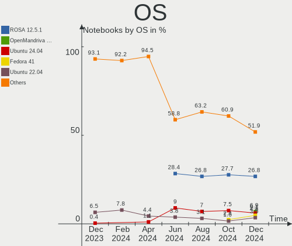
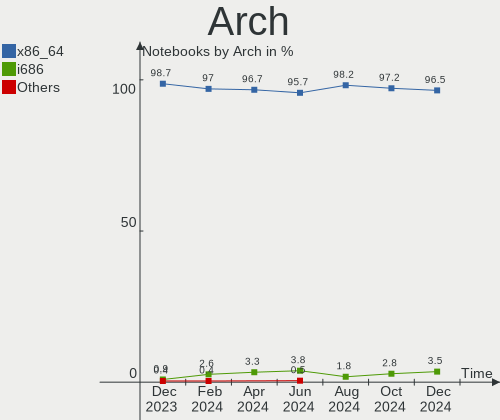
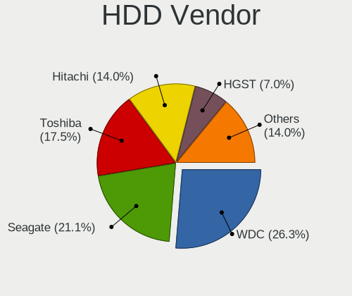
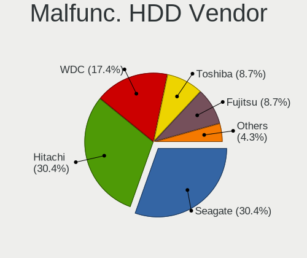
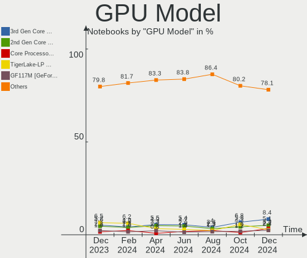
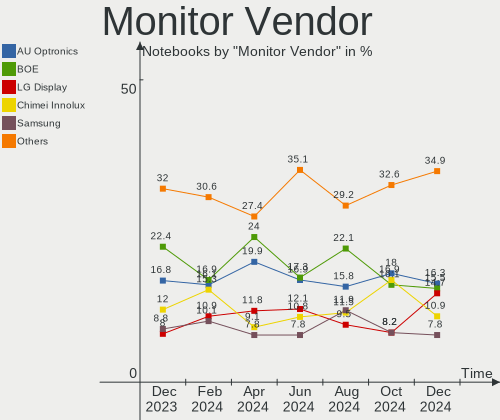
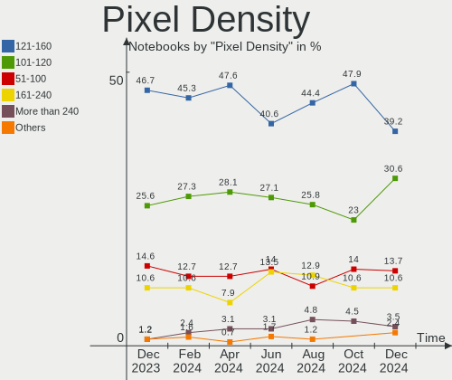
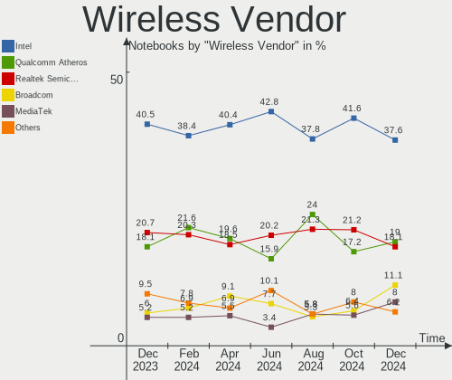
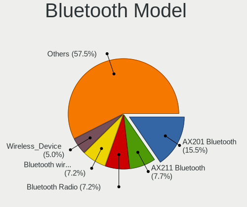
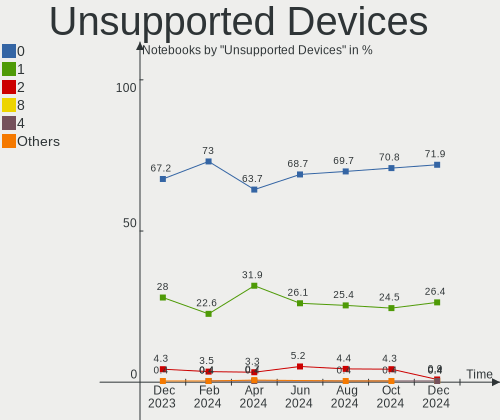

Linux in Russia - Hardware Trends (Notebooks)
---------------------------------------------

A project to identify most popular hardware characteristics and track their change
over time based on data collected by Linux users at https://Linux-Hardware.org.

Anyone can contribute to this report by the [hw-probe](https://github.com/linuxhw/hw-probe) tool:

    sudo -E hw-probe -all -upload

Period: Jan, 2023.

Contents
--------

* [ System ](#system)
  - [ OS                       ](#os)
  - [ OS Family                ](#os-family)
  - [ Kernel                   ](#kernel)
  - [ Kernel Family            ](#kernel-family)
  - [ Kernel Major Ver.        ](#kernel-major-ver)
  - [ Arch                     ](#arch)
  - [ DE                       ](#de)
  - [ Display Server           ](#display-server)
  - [ Display Manager          ](#display-manager)
  - [ OS Lang                  ](#os-lang)
  - [ Boot Mode                ](#boot-mode)
  - [ Filesystem               ](#filesystem)
  - [ Part. scheme             ](#part-scheme)
  - [ Dual Boot with Linux/BSD ](#dual-boot-with-linuxbsd)
  - [ Dual Boot (Win)          ](#dual-boot-win)

* [ Board ](#board)
  - [ Vendor                   ](#vendor)
  - [ Model                    ](#model)
  - [ Model Family             ](#model-family)
  - [ MFG Year                 ](#mfg-year)
  - [ Form Factor              ](#form-factor)
  - [ Secure Boot              ](#secure-boot)
  - [ Coreboot                 ](#coreboot)
  - [ RAM Size                 ](#ram-size)
  - [ RAM Used                 ](#ram-used)
  - [ Total Drives             ](#total-drives)
  - [ Has CD-ROM               ](#has-cd-rom)
  - [ Has Ethernet             ](#has-ethernet)
  - [ Has WiFi                 ](#has-wifi)
  - [ Has Bluetooth            ](#has-bluetooth)

* [ Location ](#location)
  - [ Country                  ](#country)
  - [ City                     ](#city)

* [ Drives ](#drives)
  - [ Drive Vendor             ](#drive-vendor)
  - [ Drive Model              ](#drive-model)
  - [ HDD Vendor               ](#hdd-vendor)
  - [ SSD Vendor               ](#ssd-vendor)
  - [ Drive Kind               ](#drive-kind)
  - [ Drive Connector          ](#drive-connector)
  - [ Drive Size               ](#drive-size)
  - [ Space Total              ](#space-total)
  - [ Space Used               ](#space-used)
  - [ Malfunc. Drives          ](#malfunc-drives)
  - [ Malfunc. Drive Vendor    ](#malfunc-drive-vendor)
  - [ Malfunc. HDD Vendor      ](#malfunc-hdd-vendor)
  - [ Malfunc. Drive Kind      ](#malfunc-drive-kind)
  - [ Failed Drives            ](#failed-drives)
  - [ Failed Drive Vendor      ](#failed-drive-vendor)
  - [ Drive Status             ](#drive-status)

* [ Storage controller ](#storage-controller)
  - [ Storage Vendor           ](#storage-vendor)
  - [ Storage Model            ](#storage-model)
  - [ Storage Kind             ](#storage-kind)

* [ Processor ](#processor)
  - [ CPU Vendor               ](#cpu-vendor)
  - [ CPU Model                ](#cpu-model)
  - [ CPU Model Family         ](#cpu-model-family)
  - [ CPU Cores                ](#cpu-cores)
  - [ CPU Sockets              ](#cpu-sockets)
  - [ CPU Threads              ](#cpu-threads)
  - [ CPU Op-Modes             ](#cpu-op-modes)
  - [ CPU Microcode            ](#cpu-microcode)
  - [ CPU Microarch            ](#cpu-microarch)

* [ Graphics ](#graphics)
  - [ GPU Vendor               ](#gpu-vendor)
  - [ GPU Model                ](#gpu-model)
  - [ GPU Combo                ](#gpu-combo)
  - [ GPU Driver               ](#gpu-driver)
  - [ GPU Memory               ](#gpu-memory)

* [ Monitor ](#monitor)
  - [ Monitor Vendor           ](#monitor-vendor)
  - [ Monitor Model            ](#monitor-model)
  - [ Monitor Resolution       ](#monitor-resolution)
  - [ Monitor Diagonal         ](#monitor-diagonal)
  - [ Monitor Width            ](#monitor-width)
  - [ Aspect Ratio             ](#aspect-ratio)
  - [ Monitor Area             ](#monitor-area)
  - [ Pixel Density            ](#pixel-density)
  - [ Multiple Monitors        ](#multiple-monitors)

* [ Network ](#network)
  - [ Net Controller Vendor    ](#net-controller-vendor)
  - [ Net Controller Model     ](#net-controller-model)
  - [ Wireless Vendor          ](#wireless-vendor)
  - [ Wireless Model           ](#wireless-model)
  - [ Ethernet Vendor          ](#ethernet-vendor)
  - [ Ethernet Model           ](#ethernet-model)
  - [ Net Controller Kind      ](#net-controller-kind)
  - [ Used Controller          ](#used-controller)
  - [ NICs                     ](#nics)
  - [ IPv6                     ](#ipv6)

* [ Bluetooth ](#bluetooth)
  - [ Bluetooth Vendor         ](#bluetooth-vendor)
  - [ Bluetooth Model          ](#bluetooth-model)

* [ Sound ](#sound)
  - [ Sound Vendor             ](#sound-vendor)
  - [ Sound Model              ](#sound-model)

* [ Memory ](#memory)
  - [ Memory Vendor            ](#memory-vendor)
  - [ Memory Model             ](#memory-model)
  - [ Memory Kind              ](#memory-kind)
  - [ Memory Form Factor       ](#memory-form-factor)
  - [ Memory Size              ](#memory-size)
  - [ Memory Speed             ](#memory-speed)

* [ Printers & scanners ](#printers--scanners)
  - [ Printer Vendor           ](#printer-vendor)
  - [ Printer Model            ](#printer-model)
  - [ Scanner Vendor           ](#scanner-vendor)
  - [ Scanner Model            ](#scanner-model)

* [ Camera ](#camera)
  - [ Camera Vendor            ](#camera-vendor)
  - [ Camera Model             ](#camera-model)

* [ Security ](#security)
  - [ Fingerprint Vendor       ](#fingerprint-vendor)
  - [ Fingerprint Model        ](#fingerprint-model)
  - [ Chipcard Vendor          ](#chipcard-vendor)
  - [ Chipcard Model           ](#chipcard-model)

* [ Unsupported ](#unsupported)
  - [ Unsupported Devices      ](#unsupported-devices)
  - [ Unsupported Device Types ](#unsupported-device-types)

System
------

OS
--

Installed operating systems

| Name                         | Notebooks | Percent |
|------------------------------|-----------|---------|
| ROSA 12.3                    | 63        | 24.05%  |
| OpenMandriva 23.01           | 24        | 9.16%   |
| Fedora 37                    | 22        | 8.4%    |
| Ubuntu 22.04                 | 17        | 6.49%   |
| Debian 11                    | 11        | 4.2%    |
| Linux Mint 21.1              | 10        | 3.82%   |
| Ubuntu 22.10                 | 9         | 3.44%   |
| ROSA R11.1                   | 9         | 3.44%   |
| MOS 10                       | 8         | 3.05%   |
| Arch Rolling                 | 8         | 3.05%   |
| KDE neon 22.04               | 6         | 2.29%   |
| ROSA 12.2                    | 5         | 1.91%   |
| Pop!_OS 22.04                | 4         | 1.53%   |
| ALT Linux 10.1               | 4         | 1.53%   |
| openSUSE Tumbleweed-XXXXXXXX | 3         | 1.15%   |
| Manjaro 22.0.0               | 3         | 1.15%   |
| Kubuntu 22.04                | 3         | 1.15%   |
| Debian                       | 3         | 1.15%   |
| Ubuntu 18.04                 | 2         | 0.76%   |
| Red OS 7.3.2                 | 2         | 0.76%   |
| Manjaro 22.0                 | 2         | 0.76%   |
| LMDE 5                       | 2         | 0.76%   |
| Fedora 35                    | 2         | 0.76%   |
| Astra Linux 2.12.45          | 2         | 0.76%   |
| Xubuntu 22.04                | 1         | 0.38%   |
| Xero Rolling                 | 1         | 0.38%   |
| Ubuntu MATE 22.04            | 1         | 0.38%   |
| Ubuntu 20.04                 | 1         | 0.38%   |
| SteamOS 3.5                  | 1         | 0.38%   |
| SteamOS 3.4.4                | 1         | 0.38%   |
| SteamOS 3.3.3                | 1         | 0.38%   |
| Slackware 15.0               | 1         | 0.38%   |
| ROSA R11                     | 1         | 0.38%   |
| ROSA 13.0                    | 1         | 0.38%   |
| ROSA 12.1                    | 1         | 0.38%   |
| RELD 7.9                     | 1         | 0.38%   |
| PostmarketOS Edge            | 1         | 0.38%   |
| Parrot 5.1                   | 1         | 0.38%   |
| org.kde.Platform 5.15-21.08  | 1         | 0.38%   |
| openSUSE Leap-15.4           | 1         | 0.38%   |

OS Family
---------

OS without a version

| Name             | Notebooks | Percent |
|------------------|-----------|---------|
| ROSA             | 80        | 30.53%  |
| Ubuntu           | 29        | 11.07%  |
| Fedora           | 27        | 10.31%  |
| OpenMandriva     | 26        | 9.92%   |
| Debian           | 14        | 5.34%   |
| Linux Mint       | 13        | 4.96%   |
| ALT Linux        | 12        | 4.58%   |
| Arch             | 8         | 3.05%   |
| Manjaro          | 7         | 2.67%   |
| KDE neon         | 6         | 2.29%   |
| Pop!_OS          | 4         | 1.53%   |
| openSUSE         | 4         | 1.53%   |
| SteamOS          | 3         | 1.15%   |
| Kubuntu          | 3         | 1.15%   |
| Astra Linux      | 3         | 1.15%   |
| Red OS           | 2         | 0.76%   |
| LMDE             | 2         | 0.76%   |
| Endless          | 2         | 0.76%   |
| Xubuntu          | 1         | 0.38%   |
| Xero             | 1         | 0.38%   |
| Ubuntu MATE      | 1         | 0.38%   |
| Slackware        | 1         | 0.38%   |
| RELD             | 1         | 0.38%   |
| PostmarketOS     | 1         | 0.38%   |
| Parrot           | 1         | 0.38%   |
| org.kde.Platform | 1         | 0.38%   |
| Nobara           | 1         | 0.38%   |
| NixOS            | 1         | 0.38%   |
| Lubuntu          | 1         | 0.38%   |
| Kali             | 1         | 0.38%   |
| Gentoo           | 1         | 0.38%   |
| EndeavourOS      | 1         | 0.38%   |
| Elementary       | 1         | 0.38%   |
| Deepin           | 1         | 0.38%   |
| ArcoLinux        | 1         | 0.38%   |

Kernel
------

Version of the Linux kernel

| Version                                            | Notebooks | Percent |
|----------------------------------------------------|-----------|---------|
| 5.15.79-generic-1rosa2021.1-x86_64                 | 26        | 9.92%   |
| 6.1.1-desktop-1omv2290                             | 23        | 8.78%   |
| 5.15.75-generic-1rosa2021.1-x86_64                 | 19        | 7.25%   |
| 5.15.0-56-generic                                  | 13        | 4.96%   |
| 5.15.0-57-generic                                  | 12        | 4.58%   |
| 6.0.15-300.fc37.x86_64                             | 8         | 3.05%   |
| 5.15.0-58-generic                                  | 8         | 3.05%   |
| 5.19.0-29-generic                                  | 6         | 2.29%   |
| 5.10.155-generic-1rosa2021.1-x86_64                | 6         | 2.29%   |
| 5.10.156-std-def-alt1                              | 5         | 1.91%   |
| 5.10.0-2-amd64                                     | 5         | 1.91%   |
| 6.1.7-arch1-1                                      | 4         | 1.53%   |
| 6.1.7-200.fc37.x86_64                              | 4         | 1.53%   |
| 6.1.1-1-MANJARO                                    | 4         | 1.53%   |
| 6.0.12-76060006-generic                            | 4         | 1.53%   |
| 5.15.0-59-generic                                  | 4         | 1.53%   |
| 5.10.74-generic-2rosa2021.1-x86_64                 | 4         | 1.53%   |
| 6.0.18-300.fc37.x86_64                             | 3         | 1.15%   |
| 5.4.32-generic-2rosa-i586                          | 3         | 1.15%   |
| 5.15.75-generic-1rosa2021.1-i686                   | 3         | 1.15%   |
| 6.1.6-200.fc37.x86_64                              | 2         | 0.76%   |
| 6.1.5-200.fc37.x86_64                              | 2         | 0.76%   |
| 6.1.4-generic-1rosa2021.1-x86_64                   | 2         | 0.76%   |
| 6.1.3-zen1-1-zen                                   | 2         | 0.76%   |
| 6.1.3-arch1-1                                      | 2         | 0.76%   |
| 6.1.2-1-default                                    | 2         | 0.76%   |
| 6.0.7-301.fc37.x86_64                              | 2         | 0.76%   |
| 6.0.0-6-amd64                                      | 2         | 0.76%   |
| 5.4.32-generic-2rosa-x86_64                        | 2         | 0.76%   |
| 5.19.0-28-generic                                  | 2         | 0.76%   |
| 5.16.19-generic-2rosa2021.1-x86_64                 | 2         | 0.76%   |
| 5.15.0-33-generic                                  | 2         | 0.76%   |
| 5.10.139-std-def-alt1                              | 2         | 0.76%   |
| 5.10.0-20-amd64                                    | 2         | 0.76%   |
| 4.15.0-desktop-122.124.1rosa-i586                  | 2         | 0.76%   |
| 4.15.0-202-generic                                 | 2         | 0.76%   |
| 6.2.0-0.rc4.20230120gitd368967cb103.35.fc38.x86_64 | 1         | 0.38%   |
| 6.1.8-gentoo-x86_64                                | 1         | 0.38%   |
| 6.1.7-x64v1-xanmod1-1                              | 1         | 0.38%   |
| 6.1.7-1-MANJARO                                    | 1         | 0.38%   |

Kernel Family
-------------

Linux kernel without a distro release

| Version  | Notebooks | Percent |
|----------|-----------|---------|
| 5.15.0   | 41        | 15.65%  |
| 6.1.1    | 27        | 10.31%  |
| 5.15.79  | 26        | 9.92%   |
| 5.15.75  | 22        | 8.4%    |
| 5.10.0   | 14        | 5.34%   |
| 6.1.7    | 11        | 4.2%    |
| 6.0.15   | 9         | 3.44%   |
| 5.19.0   | 9         | 3.44%   |
| 5.10.155 | 6         | 2.29%   |
| 6.1.3    | 5         | 1.91%   |
| 6.0.12   | 5         | 1.91%   |
| 6.0.0    | 5         | 1.91%   |
| 5.4.32   | 5         | 1.91%   |
| 5.10.74  | 5         | 1.91%   |
| 5.10.156 | 5         | 1.91%   |
| 4.15.0   | 5         | 1.91%   |
| 6.1.6    | 4         | 1.53%   |
| 6.1.4    | 3         | 1.15%   |
| 6.1.2    | 3         | 1.15%   |
| 6.1.0    | 3         | 1.15%   |
| 6.0.7    | 3         | 1.15%   |
| 6.0.18   | 3         | 1.15%   |
| 5.13.0   | 3         | 1.15%   |
| 5.11.0   | 3         | 1.15%   |
| 6.1.5    | 2         | 0.76%   |
| 6.0.17   | 2         | 0.76%   |
| 5.4.83   | 2         | 0.76%   |
| 5.16.19  | 2         | 0.76%   |
| 5.15.85  | 2         | 0.76%   |
| 5.15.80  | 2         | 0.76%   |
| 5.15.77  | 2         | 0.76%   |
| 5.10.139 | 2         | 0.76%   |
| 6.2.0    | 1         | 0.38%   |
| 6.1.8    | 1         | 0.38%   |
| 6.0.3    | 1         | 0.38%   |
| 5.8.0    | 1         | 0.38%   |
| 5.4.0    | 1         | 0.38%   |
| 5.19.10  | 1         | 0.38%   |
| 5.17.11  | 1         | 0.38%   |
| 5.16.7   | 1         | 0.38%   |

Kernel Major Ver.
-----------------

Linux kernel major version

| Version | Notebooks | Percent |
|---------|-----------|---------|
| 5.15    | 99        | 37.79%  |
| 6.1     | 59        | 22.52%  |
| 5.10    | 37        | 14.12%  |
| 6.0     | 28        | 10.69%  |
| 5.19    | 10        | 3.82%   |
| 5.4     | 8         | 3.05%   |
| 4.15    | 5         | 1.91%   |
| 5.16    | 3         | 1.15%   |
| 5.14    | 3         | 1.15%   |
| 5.13    | 3         | 1.15%   |
| 5.11    | 3         | 1.15%   |
| 6.2     | 1         | 0.38%   |
| 5.8     | 1         | 0.38%   |
| 5.17    | 1         | 0.38%   |
| 3.4     | 1         | 0.38%   |

Arch
----

OS architecture (x86_64, i586, etc.)

| Name   | Notebooks | Percent |
|--------|-----------|---------|
| x86_64 | 248       | 94.66%  |
| i686   | 13        | 4.96%   |
| armv7l | 1         | 0.38%   |

DE
--

Desktop Environment

| Name            | Notebooks | Percent |
|-----------------|-----------|---------|
| KDE5            | 104       | 39.69%  |
| GNOME           | 93        | 35.5%   |
| LXQt            | 13        | 4.96%   |
| X-Cinnamon      | 11        | 4.2%    |
| MATE            | 10        | 3.82%   |
| Unknown         | 8         | 3.05%   |
| XFCE            | 6         | 2.29%   |
| KDE4            | 5         | 1.91%   |
| Cinnamon        | 3         | 1.15%   |
| fly             | 2         | 0.76%   |
| xmonad          | 1         | 0.38%   |
| Pantheon        | 1         | 0.38%   |
| openbox         | 1         | 0.38%   |
| LXDE            | 1         | 0.38%   |
| GNOME Flashback | 1         | 0.38%   |
| Deepin          | 1         | 0.38%   |
| awesome         | 1         | 0.38%   |

Display Server
--------------

X11 or Wayland

| Name    | Notebooks | Percent |
|---------|-----------|---------|
| X11     | 141       | 53.82%  |
| Wayland | 113       | 43.13%  |
| Unknown | 5         | 1.91%   |
| Tty     | 3         | 1.15%   |

Display Manager
---------------

SDDM, LightDM, etc.

| Name    | Notebooks | Percent |
|---------|-----------|---------|
| SDDM    | 95        | 36.26%  |
| Unknown | 53        | 20.23%  |
| GDM     | 49        | 18.7%   |
| GDM3    | 28        | 10.69%  |
| LightDM | 27        | 10.31%  |
| KDM     | 5         | 1.91%   |
| XDM     | 2         | 0.76%   |
| FLY-DM  | 2         | 0.76%   |
| Ly      | 1         | 0.38%   |

OS Lang
-------

Language

| Lang    | Notebooks | Percent |
|---------|-----------|---------|
| ru_RU   | 197       | 75.19%  |
| en_US   | 57        | 21.76%  |
| Unknown | 3         | 1.15%   |
| en_GB   | 2         | 0.76%   |
| POSIX   | 1         | 0.38%   |
| it_IT   | 1         | 0.38%   |
| C       | 1         | 0.38%   |

Boot Mode
---------

EFI or BIOS

| Mode | Notebooks | Percent |
|------|-----------|---------|
| EFI  | 158       | 60.31%  |
| BIOS | 104       | 39.69%  |

Filesystem
----------

Type of filesystem

| Type    | Notebooks | Percent |
|---------|-----------|---------|
| Ext4    | 191       | 72.9%   |
| Btrfs   | 41        | 15.65%  |
| Overlay | 27        | 10.31%  |
| Xfs     | 2         | 0.76%   |
| Zfs     | 1         | 0.38%   |

Part. scheme
------------

Scheme of partitioning

| Type    | Notebooks | Percent |
|---------|-----------|---------|
| GPT     | 148       | 56.49%  |
| MBR     | 68        | 25.95%  |
| Unknown | 46        | 17.56%  |

Dual Boot with Linux/BSD
------------------------

Hosting more than one Linux/BSD

| Dual boot | Notebooks | Percent |
|-----------|-----------|---------|
| No        | 219       | 83.59%  |
| Yes       | 43        | 16.41%  |

Dual Boot (Win)
---------------

Hosting Linux and Windows

| Dual boot | Notebooks | Percent |
|-----------|-----------|---------|
| No        | 174       | 66.41%  |
| Yes       | 88        | 33.59%  |

Board
-----

Vendor
------

Motherboard manufacturer

| Name                     | Notebooks | Percent |
|--------------------------|-----------|---------|
| Lenovo                   | 56        | 21.37%  |
| ASUSTek Computer         | 37        | 14.12%  |
| Hewlett-Packard          | 35        | 13.36%  |
| Acer                     | 34        | 12.98%  |
| Samsung Electronics      | 10        | 3.82%   |
| MSI                      | 9         | 3.44%   |
| HUAWEI                   | 9         | 3.44%   |
| Dell                     | 9         | 3.44%   |
| Clevo                    | 8         | 3.05%   |
| Unknown                  | 8         | 3.05%   |
| Timi                     | 5         | 1.91%   |
| Sony                     | 4         | 1.53%   |
| Infinix                  | 4         | 1.53%   |
| HONOR                    | 4         | 1.53%   |
| Valve                    | 3         | 1.15%   |
| Toshiba                  | 3         | 1.15%   |
| Chuwi                    | 3         | 1.15%   |
| Aquarius                 | 3         | 1.15%   |
| Notebook                 | 2         | 0.76%   |
| Intel                    | 2         | 0.76%   |
| TECNO                    | 1         | 0.38%   |
| MECHREVO                 | 1         | 0.38%   |
| Maibenben                | 1         | 0.38%   |
| MACHENIKE                | 1         | 0.38%   |
| Kraftway                 | 1         | 0.38%   |
| Jumper                   | 1         | 0.38%   |
| ICL                      | 1         | 0.38%   |
| HIPER Technology Limited | 1         | 0.38%   |
| Gigabyte Technology      | 1         | 0.38%   |
| Fujitsu                  | 1         | 0.38%   |
| eMachines                | 1         | 0.38%   |
| Digma                    | 1         | 0.38%   |
| DEPO Computers           | 1         | 0.38%   |
| Blackview                | 1         | 0.38%   |

Model
-----

Motherboard model

| Name                                                                                     | Notebooks | Percent |
|------------------------------------------------------------------------------------------|-----------|---------|
| Unknown                                                                                  | 9         | 3.44%   |
| Clevo NL41MU2                                                                            | 5         | 1.91%   |
| Valve Jupiter                                                                            | 3         | 1.15%   |
| Infinix INBOOK X2 GEN11                                                                  | 3         | 1.15%   |
| HP Notebook                                                                              | 3         | 1.15%   |
| ASUS VivoBook_ASUSLaptop X540MAR_A543MA                                                  | 3         | 1.15%   |
| Timi Redmi Book Pro 15 2022                                                              | 2         | 0.76%   |
| Lenovo B570e HuronRiver Platform                                                         | 2         | 0.76%   |
| Lenovo B560                                                                              | 2         | 0.76%   |
| Intel Jasper Lake Client Platform                                                        | 2         | 0.76%   |
| HUAWEI HVY-WXX9                                                                          | 2         | 0.76%   |
| HUAWEI BOM-WXX9                                                                          | 2         | 0.76%   |
| HP Pavilion dv6                                                                          | 2         | 0.76%   |
| ASUS VivoBook_ASUSLaptop X7400PC_N7400PC                                                 | 2         | 0.76%   |
| ASUS VivoBook_ASUSLaptop M1503QA_M1503QA                                                 | 2         | 0.76%   |
| ASUS TUF Gaming FX505DT_FX505DT                                                          | 2         | 0.76%   |
| Acer Extensa 2540                                                                        | 2         | 0.76%   |
| Acer Aspire V3-571G                                                                      | 2         | 0.76%   |
| Acer Aspire A315-59                                                                      | 2         | 0.76%   |
| Toshiba Satellite Pro C660                                                               | 1         | 0.38%   |
| Toshiba Satellite P200                                                                   | 1         | 0.38%   |
| Toshiba Satellite L300                                                                   | 1         | 0.38%   |
| Timi TM1701                                                                              | 1         | 0.38%   |
| Timi RedmiBook Pro 15S                                                                   | 1         | 0.38%   |
| Timi Redmi Book Pro 14S                                                                  | 1         | 0.38%   |
| TECNO MEGABOOK T1                                                                        | 1         | 0.38%   |
| Sony VPCSB11FX                                                                           | 1         | 0.38%   |
| Sony VGN-FJ3SR_B                                                                         | 1         | 0.38%   |
| Sony SVS1512U1RW                                                                         | 1         | 0.38%   |
| Sony PCG-Z1VA(UC)                                                                        | 1         | 0.38%   |
| Samsung RV420/RV520/RV720/E3530/S3530/E3420/E3520                                        | 1         | 0.38%   |
| Samsung RV420/RV520/RV720                                                                | 1         | 0.38%   |
| Samsung RV408/RV508                                                                      | 1         | 0.38%   |
| Samsung NC10                                                                             | 1         | 0.38%   |
| Samsung 355V4C/355V4X/355V5C/355V5X/356V4C/356V4X/356V5C/356V5X/3445VC/3445VX/3545VC/354 | 1         | 0.38%   |
| Samsung 350V5C/351V5C/3540VC/3440VC                                                      | 1         | 0.38%   |
| Samsung 350V5C/350V5X/350V4C/350V4X/351V5C/351V5X/351V4C/351V4X/3540VC/3540VX/3440VC/344 | 1         | 0.38%   |
| Samsung 305E4A/305E5A/305E7A                                                             | 1         | 0.38%   |
| Samsung 300E4C/300E5C/300E7C                                                             | 1         | 0.38%   |
| Samsung 300E4A/300E5A/300E7A                                                             | 1         | 0.38%   |

Model Family
------------

Motherboard model prefix

| Name              | Notebooks | Percent |
|-------------------|-----------|---------|
| Acer Aspire       | 27        | 10.31%  |
| Lenovo ThinkPad   | 18        | 6.87%   |
| Lenovo IdeaPad    | 17        | 6.49%   |
| ASUS VivoBook     | 12        | 4.58%   |
| HP ProBook        | 9         | 3.44%   |
| Unknown           | 9         | 3.44%   |
| HP Pavilion       | 8         | 3.05%   |
| Dell Inspiron     | 6         | 2.29%   |
| HP Laptop         | 5         | 1.91%   |
| Clevo NL41MU2     | 5         | 1.91%   |
| Lenovo ThinkBook  | 4         | 1.53%   |
| Infinix INBOOK    | 4         | 1.53%   |
| Valve Jupiter     | 3         | 1.15%   |
| Toshiba Satellite | 3         | 1.15%   |
| Timi Redmi        | 3         | 1.15%   |
| HP Notebook       | 3         | 1.15%   |
| HP EliteBook      | 3         | 1.15%   |
| ASUS ASUS         | 3         | 1.15%   |
| Acer Nitro        | 3         | 1.15%   |
| Samsung RV420     | 2         | 0.76%   |
| Samsung 350V5C    | 2         | 0.76%   |
| Notebook W65      | 2         | 0.76%   |
| Lenovo B570e      | 2         | 0.76%   |
| Lenovo B560       | 2         | 0.76%   |
| Intel Jasper      | 2         | 0.76%   |
| HUAWEI HVY-WXX9   | 2         | 0.76%   |
| HUAWEI BOM-WXX9   | 2         | 0.76%   |
| HP OMEN           | 2         | 0.76%   |
| Dell Latitude     | 2         | 0.76%   |
| ASUS TUF          | 2         | 0.76%   |
| Acer Extensa      | 2         | 0.76%   |
| Timi TM1701       | 1         | 0.38%   |
| Timi RedmiBook    | 1         | 0.38%   |
| TECNO MEGABOOK    | 1         | 0.38%   |
| Sony VPCSB11FX    | 1         | 0.38%   |
| Sony VGN-FJ3SR    | 1         | 0.38%   |
| Sony SVS1512U1RW  | 1         | 0.38%   |
| Sony PCG-Z1VA(UC) | 1         | 0.38%   |
| Samsung RV408     | 1         | 0.38%   |
| Samsung NC10      | 1         | 0.38%   |

MFG Year
--------

Motherboard manufacture year

| Year    | Notebooks | Percent |
|---------|-----------|---------|
| 2022    | 43        | 16.41%  |
| 2021    | 37        | 14.12%  |
| 2019    | 23        | 8.78%   |
| 2020    | 22        | 8.4%    |
| 2011    | 20        | 7.63%   |
| 2012    | 19        | 7.25%   |
| 2017    | 15        | 5.73%   |
| 2013    | 15        | 5.73%   |
| 2018    | 12        | 4.58%   |
| 2010    | 11        | 4.2%    |
| 2014    | 10        | 3.82%   |
| 2009    | 9         | 3.44%   |
| 2015    | 7         | 2.67%   |
| 2008    | 6         | 2.29%   |
| 2016    | 5         | 1.91%   |
| 2007    | 3         | 1.15%   |
| 2005    | 2         | 0.76%   |
| 2006    | 1         | 0.38%   |
| 2003    | 1         | 0.38%   |
| Unknown | 1         | 0.38%   |

Form Factor
-----------

Physical design of the computer

| Name     | Notebooks | Percent |
|----------|-----------|---------|
| Notebook | 262       | 100%    |

Secure Boot
-----------

Enabled or disabled

| State    | Notebooks | Percent |
|----------|-----------|---------|
| Disabled | 240       | 91.6%   |
| Enabled  | 22        | 8.4%    |

Coreboot
--------

Have coreboot on board

| Used | Notebooks | Percent |
|------|-----------|---------|
| No   | 262       | 100%    |

RAM Size
--------

Total RAM memory

| Size in GB | Notebooks | Percent |
|------------|-----------|---------|
| 4.01-8.0   | 96        | 36.64%  |
| 8.01-16.0  | 52        | 19.85%  |
| 3.01-4.0   | 43        | 16.41%  |
| 16.01-24.0 | 40        | 15.27%  |
| 1.01-2.0   | 13        | 4.96%   |
| 32.01-64.0 | 8         | 3.05%   |
| 2.01-3.0   | 4         | 1.53%   |
| 0.51-1.0   | 4         | 1.53%   |
| 24.01-32.0 | 2         | 0.76%   |

RAM Used
--------

Used RAM memory

| Used GB    | Notebooks | Percent |
|------------|-----------|---------|
| 1.01-2.0   | 96        | 36.64%  |
| 2.01-3.0   | 65        | 24.81%  |
| 4.01-8.0   | 41        | 15.65%  |
| 3.01-4.0   | 27        | 10.31%  |
| 0.51-1.0   | 24        | 9.16%   |
| 8.01-16.0  | 4         | 1.53%   |
| 0.01-0.5   | 3         | 1.15%   |
| 16.01-24.0 | 1         | 0.38%   |
| Unknown    | 1         | 0.38%   |

Total Drives
------------

Number of drives on board

| Drives | Notebooks | Percent |
|--------|-----------|---------|
| 1      | 188       | 71.76%  |
| 2      | 71        | 27.1%   |
| 3      | 2         | 0.76%   |
| 5      | 1         | 0.38%   |

Has CD-ROM
----------

Has CD-ROM on board

| Presented | Notebooks | Percent |
|-----------|-----------|---------|
| No        | 199       | 75.95%  |
| Yes       | 63        | 24.05%  |

Has Ethernet
------------

Has Ethernet on board

| Presented | Notebooks | Percent |
|-----------|-----------|---------|
| Yes       | 195       | 74.43%  |
| No        | 67        | 25.57%  |

Has WiFi
--------

Has WiFi module

| Presented | Notebooks | Percent |
|-----------|-----------|---------|
| Yes       | 258       | 98.47%  |
| No        | 4         | 1.53%   |

Has Bluetooth
-------------

Has Bluetooth module

| Presented | Notebooks | Percent |
|-----------|-----------|---------|
| Yes       | 216       | 82.44%  |
| No        | 46        | 17.56%  |

Location
--------

Country
-------

Geographic location (country)

| Country | Notebooks | Percent |
|---------|-----------|---------|
| Russia  | 262       | 100%    |

City
----

Geographic location (city)

| City              | Notebooks | Percent |
|-------------------|-----------|---------|
| Moscow            | 66        | 25.19%  |
| St Petersburg     | 37        | 14.12%  |
| Krasnodar         | 12        | 4.58%   |
| Voronezh          | 9         | 3.44%   |
| Chelyabinsk       | 7         | 2.67%   |
| Perm              | 5         | 1.91%   |
| Novosibirsk       | 5         | 1.91%   |
| Tver              | 4         | 1.53%   |
| Saratov           | 4         | 1.53%   |
| Yekaterinburg     | 3         | 1.15%   |
| Yaroslavl         | 3         | 1.15%   |
| Volgograd         | 3         | 1.15%   |
| Vladivostok       | 3         | 1.15%   |
| Ulyanovsk         | 3         | 1.15%   |
| Orenburg          | 3         | 1.15%   |
| Irkutsk           | 3         | 1.15%   |
| Domodedovo        | 3         | 1.15%   |
| Yoshkar-Ola       | 2         | 0.76%   |
| Yakutsk           | 2         | 0.76%   |
| Vologda           | 2         | 0.76%   |
| Vladimir          | 2         | 0.76%   |
| Tyumen            | 2         | 0.76%   |
| Surgut            | 2         | 0.76%   |
| Smolensk          | 2         | 0.76%   |
| Samara            | 2         | 0.76%   |
| Rostov-on-Don     | 2         | 0.76%   |
| Nizhniy Novgorod  | 2         | 0.76%   |
| Mytishchi         | 2         | 0.76%   |
| Murino            | 2         | 0.76%   |
| Lytkarino         | 2         | 0.76%   |
| Lipetsk           | 2         | 0.76%   |
| Kaliningrad       | 2         | 0.76%   |
| Cheboksary        | 2         | 0.76%   |
| Bryansk           | 2         | 0.76%   |
| Zheleznogorsk     | 1         | 0.38%   |
| Zheleznodorozhnyy | 1         | 0.38%   |
| Zelenodolsk       | 1         | 0.38%   |
| Vol'sk            | 1         | 0.38%   |
| Vichuga           | 1         | 0.38%   |
| Veliky Novgorod   | 1         | 0.38%   |

Drives
------

Drive Vendor
------------

Hard drive vendors

| Vendor                         | Notebooks | Drives | Percent |
|--------------------------------|-----------|--------|---------|
| WDC                            | 42        | 42     | 12.69%  |
| Seagate                        | 31        | 33     | 9.37%   |
| Samsung Electronics            | 30        | 30     | 9.06%   |
| Kingston                       | 23        | 23     | 6.95%   |
| SK hynix                       | 17        | 17     | 5.14%   |
| Toshiba                        | 15        | 15     | 4.53%   |
| Sandisk                        | 14        | 15     | 4.23%   |
| Unknown                        | 10        | 13     | 3.02%   |
| Micron Technology              | 10        | 10     | 3.02%   |
| Intel                          | 9         | 9      | 2.72%   |
| China                          | 9         | 9      | 2.72%   |
| KIOXIA                         | 8         | 8      | 2.42%   |
| HGST                           | 8         | 8      | 2.42%   |
| Apacer                         | 7         | 7      | 2.11%   |
| Silicon Motion                 | 6         | 6      | 1.81%   |
| Hitachi                        | 6         | 6      | 1.81%   |
| FORESEE                        | 6         | 6      | 1.81%   |
| Crucial                        | 6         | 6      | 1.81%   |
| A-DATA Technology              | 6         | 7      | 1.81%   |
| SPCC                           | 5         | 5      | 1.51%   |
| Netac                          | 5         | 5      | 1.51%   |
| BIWIN                          | 5         | 5      | 1.51%   |
| Smartbuy                       | 4         | 4      | 1.21%   |
| Unknown                        | 4         | 4      | 1.21%   |
| Phison Electronics             | 3         | 3      | 0.91%   |
| Patriot                        | 3         | 3      | 0.91%   |
| XrayDisk                       | 2         | 2      | 0.6%    |
| Solid State Storage            | 2         | 2      | 0.6%    |
| Shenzhen Longsys Electronics   | 2         | 2      | 0.6%    |
| Plextor                        | 2         | 2      | 0.6%    |
| Phison                         | 2         | 2      | 0.6%    |
| O2 Micro                       | 2         | 2      | 0.6%    |
| Kingchuxing                    | 2         | 2      | 0.6%    |
| Gigabyte Technology            | 2         | 2      | 0.6%    |
| Fujitsu                        | 2         | 2      | 0.6%    |
| Transcend                      | 1         | 1      | 0.3%    |
| Team                           | 1         | 1      | 0.3%    |
| SSSTC                          | 1         | 1      | 0.3%    |
| Solid State Storage Technology | 1         | 1      | 0.3%    |
| Realtek Semiconductor          | 1         | 1      | 0.3%    |

Drive Model
-----------

Hard drive models

| Model                                                 | Notebooks | Percent |
|-------------------------------------------------------|-----------|---------|
| Seagate ST1000LM035-1RK172 1TB                        | 7         | 2.07%   |
| Toshiba MQ01ABF050 500GB                              | 6         | 1.78%   |
| SK hynix BC501 NVMe Solid State Drive 512GB           | 6         | 1.78%   |
| Intel SSDPEKNU512GZ 512GB                             | 5         | 1.48%   |
| BIWIN CE480T5D101-256 256GB                           | 5         | 1.48%   |
| Sandisk WD Black SN750 / PC SN730 NVMe SSD 1TB        | 4         | 1.18%   |
| Kingston RBUSC180DS37128GJ 128GB SSD                  | 4         | 1.18%   |
| Unknown                                               | 4         | 1.18%   |
| WDC WD5000LPVX-22V0TT0 500GB                          | 3         | 0.89%   |
| WDC WD10JPVX-22JC3T0 1TB                              | 3         | 0.89%   |
| Unknown MMC Card  32GB                                | 3         | 0.89%   |
| Unknown MMC Card  128GB                               | 3         | 0.89%   |
| Toshiba MQ04ABF100 1TB                                | 3         | 0.89%   |
| SPCC Solid State Disk 256GB                           | 3         | 0.89%   |
| Seagate ST500LT012-1DG142 500GB                       | 3         | 0.89%   |
| Seagate ST500LM012 HN-M500MBB 500GB                   | 3         | 0.89%   |
| Seagate ST1000LM048-2E7172 1TB                        | 3         | 0.89%   |
| KIOXIA KBG40ZNV256G 256GB                             | 3         | 0.89%   |
| Kingston SA400S37240G 240GB SSD                       | 3         | 0.89%   |
| Kingston SA400S37120G 120GB SSD                       | 3         | 0.89%   |
| A-DATA SU800 512GB SSD                                | 3         | 0.89%   |
| WDC WDS120G2G0A-00JH30 120GB SSD                      | 2         | 0.59%   |
| WDC WD10SPZX-21Z10T0 1TB                              | 2         | 0.59%   |
| Unknown MMC Card  249GB                               | 2         | 0.59%   |
| SPCC Solid State Disk 120GB                           | 2         | 0.59%   |
| Smartbuy SSD 120GB                                    | 2         | 0.59%   |
| SK hynix SKHynix_HFS512GDE9X081N 512GB                | 2         | 0.59%   |
| SK hynix HFM001TD3JX013N 1TB                          | 2         | 0.59%   |
| SK hynix BC511 HFM512GDJTNI-82A0A 512GB               | 2         | 0.59%   |
| Silicon Motion SM2263EN/SM2263XT SSD Controller 512GB | 2         | 0.59%   |
| Silicon Motion PCIe-8 SSD 512GB                       | 2         | 0.59%   |
| Seagate ST9250315AS 250GB                             | 2         | 0.59%   |
| Seagate ST1000LM024 HN-M101MBB 1TB                    | 2         | 0.59%   |
| Samsung SSD 870 EVO 500GB                             | 2         | 0.59%   |
| Samsung SSD 850 EVO 250GB                             | 2         | 0.59%   |
| Samsung NVMe SSD Controller PM9A1/PM9A3/980PRO 512GB  | 2         | 0.59%   |
| Samsung MZVLQ512HALU-000H1 512GB                      | 2         | 0.59%   |
| Samsung MZALQ512HALU-000L2 512GB                      | 2         | 0.59%   |
| Samsung HN-M500MBB 500GB                              | 2         | 0.59%   |
| Phison PS5013 E13 NVMe Controller 256GB               | 2         | 0.59%   |

HDD Vendor
----------

Hard disk drive vendors

| Vendor              | Notebooks | Drives | Percent |
|---------------------|-----------|--------|---------|
| Seagate             | 31        | 33     | 33.33%  |
| WDC                 | 30        | 30     | 32.26%  |
| Toshiba             | 14        | 14     | 15.05%  |
| HGST                | 8         | 8      | 8.6%    |
| Hitachi             | 6         | 6      | 6.45%   |
| Samsung Electronics | 2         | 2      | 2.15%   |
| Fujitsu             | 2         | 2      | 2.15%   |

SSD Vendor
----------

Solid state drive vendors

| Vendor              | Notebooks | Drives | Percent |
|---------------------|-----------|--------|---------|
| Kingston            | 15        | 15     | 14.15%  |
| Samsung Electronics | 9         | 9      | 8.49%   |
| China               | 9         | 9      | 8.49%   |
| Apacer              | 6         | 6      | 5.66%   |
| A-DATA Technology   | 6         | 6      | 5.66%   |
| SPCC                | 5         | 5      | 4.72%   |
| SanDisk             | 5         | 5      | 4.72%   |
| WDC                 | 4         | 4      | 3.77%   |
| Netac               | 4         | 4      | 3.77%   |
| Crucial             | 4         | 4      | 3.77%   |
| Unknown             | 4         | 4      | 3.77%   |
| Smartbuy            | 3         | 3      | 2.83%   |
| Patriot             | 3         | 3      | 2.83%   |
| Micron Technology   | 3         | 3      | 2.83%   |
| Intel               | 3         | 3      | 2.83%   |
| XrayDisk            | 2         | 2      | 1.89%   |
| Plextor             | 2         | 2      | 1.89%   |
| Transcend           | 1         | 1      | 0.94%   |
| Toshiba             | 1         | 1      | 0.94%   |
| Team                | 1         | 1      | 0.94%   |
| SK hynix            | 1         | 1      | 0.94%   |
| Qumo                | 1         | 1      | 0.94%   |
| NGFF                | 1         | 1      | 0.94%   |
| LEQIXIANG           | 1         | 1      | 0.94%   |
| Kllisre             | 1         | 1      | 0.94%   |
| KingSpec            | 1         | 1      | 0.94%   |
| KingDian            | 1         | 1      | 0.94%   |
| Kingchuxing         | 1         | 1      | 0.94%   |
| GS                  | 1         | 1      | 0.94%   |
| GOODRAM             | 1         | 1      | 0.94%   |
| Gigabyte Technology | 1         | 1      | 0.94%   |
| G521N               | 1         | 1      | 0.94%   |
| Foxline             | 1         | 1      | 0.94%   |
| FORESEE             | 1         | 1      | 0.94%   |
| Fanxiang            | 1         | 1      | 0.94%   |
| AMD                 | 1         | 1      | 0.94%   |

Drive Kind
----------

HDD or SSD

| Kind    | Notebooks | Drives | Percent |
|---------|-----------|--------|---------|
| NVMe    | 114       | 120    | 35.63%  |
| SSD     | 100       | 106    | 31.25%  |
| HDD     | 91        | 95     | 28.44%  |
| MMC     | 11        | 14     | 3.44%   |
| Unknown | 4         | 4      | 1.25%   |

Drive Connector
---------------

SATA, SAS, NVMe, etc.

| Type | Notebooks | Drives | Percent |
|------|-----------|--------|---------|
| SATA | 166       | 196    | 55.7%   |
| NVMe | 113       | 119    | 37.92%  |
| MMC  | 11        | 14     | 3.69%   |
| SAS  | 8         | 10     | 2.68%   |

Drive Size
----------

Size of hard drive

| Size in TB | Notebooks | Drives | Percent |
|------------|-----------|--------|---------|
| 0.01-0.5   | 127       | 143    | 69.4%   |
| 0.51-1.0   | 53        | 54     | 28.96%  |
| 3.01-4.0   | 1         | 1      | 0.55%   |
| 1.01-2.0   | 1         | 1      | 0.55%   |
| 4.01-10.0  | 1         | 2      | 0.55%   |

Space Total
-----------

Amount of disk space available on the file system

| Size in GB     | Notebooks | Percent |
|----------------|-----------|---------|
| 101-250        | 82        | 31.3%   |
| 251-500        | 69        | 26.34%  |
| 1-20           | 29        | 11.07%  |
| 501-1000       | 26        | 9.92%   |
| 1001-2000      | 18        | 6.87%   |
| 51-100         | 18        | 6.87%   |
| Unknown        | 8         | 3.05%   |
| 21-50          | 7         | 2.67%   |
| More than 3000 | 3         | 1.15%   |
| 2001-3000      | 2         | 0.76%   |

Space Used
----------

Amount of used disk space

| Used GB        | Notebooks | Percent |
|----------------|-----------|---------|
| 1-20           | 122       | 46.56%  |
| 21-50          | 43        | 16.41%  |
| 101-250        | 38        | 14.5%   |
| 51-100         | 23        | 8.78%   |
| 251-500        | 17        | 6.49%   |
| 501-1000       | 9         | 3.44%   |
| Unknown        | 8         | 3.05%   |
| More than 3000 | 2         | 0.76%   |

Malfunc. Drives
---------------

Drive models with a malfunction

| Model                                                  | Notebooks | Drives | Percent |
|--------------------------------------------------------|-----------|--------|---------|
| Toshiba MQ01ABF050 500GB                               | 2         | 2      | 5.71%   |
| Seagate ST9250315AS 250GB                              | 2         | 2      | 5.71%   |
| Seagate ST500LM012 HN-M500MBB 500GB                    | 2         | 2      | 5.71%   |
| WDC WDS120G2G0A-00JH30 120GB SSD                       | 1         | 1      | 2.86%   |
| WDC WD5000LPCX-21VHAT0 500GB                           | 1         | 1      | 2.86%   |
| WDC WD1600BEVT-22ZCT0 160GB                            | 1         | 1      | 2.86%   |
| WDC WD10JPVX-22JC3T0 1TB                               | 1         | 1      | 2.86%   |
| Toshiba MK2565GSX 250GB                                | 1         | 1      | 2.86%   |
| SK hynix PC401 NVMe 512GB                              | 1         | 1      | 2.86%   |
| SK hynix BC711 HFM512GD3JX013N 512GB                   | 1         | 1      | 2.86%   |
| Shenzhen Longsys Electronics FORESEE XP1000F512G 512GB | 1         | 1      | 2.86%   |
| Seagate ST980811AS 80GB                                | 1         | 1      | 2.86%   |
| Seagate ST500LT012-9WS142 500GB                        | 1         | 1      | 2.86%   |
| Seagate ST500LT012-1DG142 500GB                        | 1         | 1      | 2.86%   |
| Seagate ST320LT020-9YG142 320GB                        | 1         | 1      | 2.86%   |
| Seagate ST1000LM048-2E7172 1TB                         | 1         | 1      | 2.86%   |
| Seagate ST1000LM024 HN-M101MBB 1TB                     | 1         | 1      | 2.86%   |
| Seagate ST1000LM014-1EJ164 1TB                         | 1         | 1      | 2.86%   |
| Samsung Electronics SSD 870 EVO 500GB                  | 1         | 1      | 2.86%   |
| Plextor PX-128M5S 128GB SSD                            | 1         | 1      | 2.86%   |
| Patriot P200 256GB SSD                                 | 1         | 1      | 2.86%   |
| Netac SSD 256GB                                        | 1         | 1      | 2.86%   |
| Intel SSDSC2CT240A3 240GB                              | 1         | 1      | 2.86%   |
| Hitachi HTS541680J9SA00 80GB                           | 1         | 1      | 2.86%   |
| HGST HTS725032A7E630 320GB                             | 1         | 1      | 2.86%   |
| HGST HTS721010A9E630 1TB                               | 1         | 1      | 2.86%   |
| HGST HTS545050A7E380 500GB                             | 1         | 1      | 2.86%   |
| HGST HTS541010A9E680 1TB                               | 1         | 1      | 2.86%   |
| Fujitsu MHX2300BT 304GB                                | 1         | 1      | 2.86%   |
| Fujitsu MHV2060AH 64GB                                 | 1         | 1      | 2.86%   |
| China SSD 256GB                                        | 1         | 1      | 2.86%   |
| Unknown                                                | 1         | 1      | 2.86%   |

Malfunc. Drive Vendor
---------------------

Vendors of faulty drives

| Vendor                       | Notebooks | Drives | Percent |
|------------------------------|-----------|--------|---------|
| Seagate                      | 11        | 11     | 31.43%  |
| WDC                          | 4         | 4      | 11.43%  |
| HGST                         | 4         | 4      | 11.43%  |
| Toshiba                      | 3         | 3      | 8.57%   |
| SK hynix                     | 2         | 2      | 5.71%   |
| Fujitsu                      | 2         | 2      | 5.71%   |
| Shenzhen Longsys Electronics | 1         | 1      | 2.86%   |
| Samsung Electronics          | 1         | 1      | 2.86%   |
| Plextor                      | 1         | 1      | 2.86%   |
| Patriot                      | 1         | 1      | 2.86%   |
| Netac                        | 1         | 1      | 2.86%   |
| Intel                        | 1         | 1      | 2.86%   |
| Hitachi                      | 1         | 1      | 2.86%   |
| China                        | 1         | 1      | 2.86%   |
| Unknown                      | 1         | 1      | 2.86%   |

Malfunc. HDD Vendor
-------------------

Vendors of faulty HDD drives

| Vendor  | Notebooks | Drives | Percent |
|---------|-----------|--------|---------|
| Seagate | 11        | 11     | 45.83%  |
| HGST    | 4         | 4      | 16.67%  |
| WDC     | 3         | 3      | 12.5%   |
| Toshiba | 3         | 3      | 12.5%   |
| Fujitsu | 2         | 2      | 8.33%   |
| Hitachi | 1         | 1      | 4.17%   |

Malfunc. Drive Kind
-------------------

Kinds of faulty drives

| Kind | Notebooks | Drives | Percent |
|------|-----------|--------|---------|
| HDD  | 24        | 24     | 68.57%  |
| SSD  | 8         | 8      | 22.86%  |
| NVMe | 3         | 3      | 8.57%   |

Failed Drives
-------------

Failed drive models

| Model                         | Notebooks | Drives | Percent |
|-------------------------------|-----------|--------|---------|
| Hitachi HTS545050A7E380 500GB | 1         | 1      | 100%    |

Failed Drive Vendor
-------------------

Failed drive vendors

| Vendor  | Notebooks | Drives | Percent |
|---------|-----------|--------|---------|
| Hitachi | 1         | 1      | 100%    |

Drive Status
------------

Number of failed and malfunc. drives

| Status   | Notebooks | Drives | Percent |
|----------|-----------|--------|---------|
| Works    | 170       | 200    | 61.15%  |
| Detected | 73        | 103    | 26.26%  |
| Malfunc  | 34        | 35     | 12.23%  |
| Failed   | 1         | 1      | 0.36%   |

Storage controller
------------------

Storage Vendor
--------------

Storage controller vendors

| Vendor                           | Notebooks | Percent |
|----------------------------------|-----------|---------|
| Intel                            | 170       | 52.47%  |
| AMD                              | 38        | 11.73%  |
| Samsung Electronics              | 19        | 5.86%   |
| SK hynix                         | 16        | 4.94%   |
| SanDisk                          | 16        | 4.94%   |
| Kingston Technology Company      | 9         | 2.78%   |
| KIOXIA                           | 8         | 2.47%   |
| Silicon Motion                   | 7         | 2.16%   |
| Shenzhen Longsys Electronics     | 7         | 2.16%   |
| Phison Electronics               | 7         | 2.16%   |
| Micron Technology                | 7         | 2.16%   |
| INNOGRIT                         | 5         | 1.54%   |
| Solid State Storage Technology   | 4         | 1.23%   |
| Silicon Integrated Systems [SiS] | 2         | 0.62%   |
| Realtek Semiconductor            | 2         | 0.62%   |
| O2 Micro                         | 2         | 0.62%   |
| Nvidia                           | 2         | 0.62%   |
| Micron/Crucial Technology        | 2         | 0.62%   |
| Netac Technology                 | 1         | 0.31%   |

Storage Model
-------------

Storage controller models

| Model                                                                          | Notebooks | Percent |
|--------------------------------------------------------------------------------|-----------|---------|
| AMD FCH SATA Controller [AHCI mode]                                            | 32        | 9.5%    |
| Intel 7 Series Chipset Family 6-port SATA Controller [AHCI mode]               | 20        | 5.93%   |
| Intel Sunrise Point-LP SATA Controller [AHCI mode]                             | 16        | 4.75%   |
| Intel 6 Series/C200 Series Chipset Family 6 port Mobile SATA AHCI Controller   | 15        | 4.45%   |
| Intel Tiger Lake-LP SATA Controller                                            | 12        | 3.56%   |
| Samsung NVMe SSD Controller 980                                                | 11        | 3.26%   |
| Intel Celeron/Pentium Silver Processor SATA Controller                         | 10        | 2.97%   |
| Intel Volume Management Device NVMe RAID Controller                            | 9         | 2.67%   |
| Micron Non-Volatile memory controller                                          | 7         | 2.08%   |
| KIOXIA NVMe SSD Controller BG4                                                 | 7         | 2.08%   |
| Intel Comet Lake SATA AHCI Controller                                          | 7         | 2.08%   |
| Intel 8 Series/C220 Series Chipset Family 6-port SATA Controller 1 [AHCI mode] | 7         | 2.08%   |
| SK hynix Gold P31/PC711 NVMe Solid State Drive                                 | 6         | 1.78%   |
| SK hynix BC501 NVMe Solid State Drive                                          | 6         | 1.78%   |
| Intel Cannon Point-LP SATA Controller [AHCI Mode]                              | 6         | 1.78%   |
| Intel Cannon Lake Mobile PCH SATA AHCI Controller                              | 6         | 1.78%   |
| Intel 8 Series SATA Controller 1 [AHCI mode]                                   | 6         | 1.78%   |
| Shenzhen Longsys Electronics Non-Volatile memory controller                    | 5         | 1.48%   |
| SanDisk WD Blue SN550 NVMe SSD                                                 | 5         | 1.48%   |
| Kingston Company Company Non-Volatile memory controller                        | 5         | 1.48%   |
| Intel Non-Volatile memory controller                                           | 5         | 1.48%   |
| Intel NM10/ICH7 Family SATA Controller [AHCI mode]                             | 5         | 1.48%   |
| Intel 82801IBM/IEM (ICH9M/ICH9M-E) 4 port SATA Controller [AHCI mode]          | 5         | 1.48%   |
| INNOGRIT Non-Volatile memory controller                                        | 5         | 1.48%   |
| Solid State Storage Non-Volatile memory controller                             | 4         | 1.19%   |
| Silicon Motion SM2263EN/SM2263XT SSD Controller                                | 4         | 1.19%   |
| SanDisk WD Black SN750 / PC SN730 NVMe SSD                                     | 4         | 1.19%   |
| SanDisk Non-Volatile memory controller                                         | 4         | 1.19%   |
| Phison PS5013 E13 NVMe Controller                                              | 4         | 1.19%   |
| Intel Jasper Lake SATA AHCI Controller                                         | 4         | 1.19%   |
| Intel 82801HM/HEM (ICH8M/ICH8M-E) SATA Controller [AHCI mode]                  | 4         | 1.19%   |
| Intel 82801HM/HEM (ICH8M/ICH8M-E) IDE Controller                               | 4         | 1.19%   |
| SK hynix BC511                                                                 | 3         | 0.89%   |
| Silicon Motion Non-Volatile memory controller                                  | 3         | 0.89%   |
| Samsung NVMe SSD Controller SM981/PM981/PM983                                  | 3         | 0.89%   |
| Samsung NVMe SSD Controller PM9A1/PM9A3/980PRO                                 | 3         | 0.89%   |
| Kingston Company OM3PDP3 NVMe SSD                                              | 3         | 0.89%   |
| Intel Wildcat Point-LP SATA Controller [AHCI Mode]                             | 3         | 0.89%   |
| Intel Ice Lake-LP SATA Controller [AHCI mode]                                  | 3         | 0.89%   |
| Intel HM170/QM170 Chipset SATA Controller [AHCI Mode]                          | 3         | 0.89%   |

Storage Kind
------------

Kind of storage controller (IDE, SATA, NVMe, SAS, ...)

| Kind | Notebooks | Percent |
|------|-----------|---------|
| SATA | 190       | 57.58%  |
| NVMe | 113       | 34.24%  |
| IDE  | 16        | 4.85%   |
| RAID | 11        | 3.33%   |

Processor
---------

CPU Vendor
----------

Processor vendors

| Vendor | Notebooks | Percent |
|--------|-----------|---------|
| Intel  | 193       | 73.66%  |
| AMD    | 68        | 25.95%  |
| ARM    | 1         | 0.38%   |

CPU Model
---------

Processor models

| Model                                         | Notebooks | Percent |
|-----------------------------------------------|-----------|---------|
| Intel 11th Gen Core i5-1135G7 @ 2.40GHz       | 9         | 3.44%   |
| Intel Core i5-3210M CPU @ 2.50GHz             | 6         | 2.29%   |
| AMD Ryzen 7 5800H with Radeon Graphics        | 6         | 2.29%   |
| AMD Ryzen 5 5500U with Radeon Graphics        | 6         | 2.29%   |
| AMD Ryzen 5 4600H with Radeon Graphics        | 6         | 2.29%   |
| Intel Core i3-6006U CPU @ 2.00GHz             | 5         | 1.91%   |
| AMD Ryzen 5 3500U with Radeon Vega Mobile Gfx | 5         | 1.91%   |
| Intel Core i5-8250U CPU @ 1.60GHz             | 4         | 1.53%   |
| Intel 11th Gen Core i3-1115G4 @ 3.00GHz       | 4         | 1.53%   |
| Intel Pentium CPU P6100 @ 2.00GHz             | 3         | 1.15%   |
| Intel Core i5-8265U CPU @ 1.60GHz             | 3         | 1.15%   |
| Intel Core i5-4200M CPU @ 2.50GHz             | 3         | 1.15%   |
| Intel Core i5-3230M CPU @ 2.60GHz             | 3         | 1.15%   |
| Intel Core i5-2430M CPU @ 2.40GHz             | 3         | 1.15%   |
| Intel Core i3-10110U CPU @ 2.10GHz            | 3         | 1.15%   |
| Intel Celeron N4020 CPU @ 1.10GHz             | 3         | 1.15%   |
| Intel 12th Gen Core i7-12700H                 | 3         | 1.15%   |
| Intel 11th Gen Core i5-1155G7 @ 2.50GHz       | 3         | 1.15%   |
| AMD Ryzen 9 5900HX with Radeon Graphics       | 3         | 1.15%   |
| AMD Custom APU 0405                           | 3         | 1.15%   |
| Intel Pentium Silver N5000 CPU @ 1.10GHz      | 2         | 0.76%   |
| Intel Pentium Gold 7505 @ 2.00GHz             | 2         | 0.76%   |
| Intel Pentium Dual-Core CPU T4400 @ 2.20GHz   | 2         | 0.76%   |
| Intel Pentium CPU N3540 @ 2.16GHz             | 2         | 0.76%   |
| Intel Pentium CPU 4405U @ 2.10GHz             | 2         | 0.76%   |
| Intel Core i7-9750H CPU @ 2.60GHz             | 2         | 0.76%   |
| Intel Core i7-1065G7 CPU @ 1.30GHz            | 2         | 0.76%   |
| Intel Core i7-10510U CPU @ 1.80GHz            | 2         | 0.76%   |
| Intel Core i5-8350U CPU @ 1.70GHz             | 2         | 0.76%   |
| Intel Core i5-8300H CPU @ 2.30GHz             | 2         | 0.76%   |
| Intel Core i5-8259U CPU @ 2.30GHz             | 2         | 0.76%   |
| Intel Core i5-7200U CPU @ 2.50GHz             | 2         | 0.76%   |
| Intel Core i5-2540M CPU @ 2.60GHz             | 2         | 0.76%   |
| Intel Core i5-2410M CPU @ 2.30GHz             | 2         | 0.76%   |
| Intel Core i5-1035G1 CPU @ 1.00GHz            | 2         | 0.76%   |
| Intel Core i5-10210U CPU @ 1.60GHz            | 2         | 0.76%   |
| Intel Core i3-4030U CPU @ 1.90GHz             | 2         | 0.76%   |
| Intel Core i3-2370M CPU @ 2.40GHz             | 2         | 0.76%   |
| Intel Core i3-2350M CPU @ 2.30GHz             | 2         | 0.76%   |
| Intel Core i3 CPU M 380 @ 2.53GHz             | 2         | 0.76%   |

CPU Model Family
----------------

Processor model prefix

| Model                   | Notebooks | Percent |
|-------------------------|-----------|---------|
| Intel Core i5           | 49        | 18.7%   |
| Other                   | 36        | 13.74%  |
| Intel Core i3           | 27        | 10.31%  |
| AMD Ryzen 5             | 24        | 9.16%   |
| Intel Celeron           | 21        | 8.02%   |
| Intel Core i7           | 18        | 6.87%   |
| Intel Pentium           | 14        | 5.34%   |
| AMD Ryzen 7             | 14        | 5.34%   |
| Intel Atom              | 9         | 3.44%   |
| Intel Pentium Silver    | 4         | 1.53%   |
| Intel Pentium M         | 4         | 1.53%   |
| Intel Pentium Dual-Core | 4         | 1.53%   |
| AMD A4                  | 4         | 1.53%   |
| Intel Core 2 Duo        | 3         | 1.15%   |
| AMD Ryzen 9             | 3         | 1.15%   |
| AMD A6                  | 3         | 1.15%   |
| Intel Pentium Gold      | 2         | 0.76%   |
| Intel Pentium Dual      | 2         | 0.76%   |
| Intel Genuine           | 2         | 0.76%   |
| AMD Ryzen 7 PRO         | 2         | 0.76%   |
| AMD Ryzen 3             | 2         | 0.76%   |
| AMD E1                  | 2         | 0.76%   |
| AMD A8                  | 2         | 0.76%   |
| AMD A10                 | 2         | 0.76%   |
| Intel Core 2            | 1         | 0.38%   |
| Intel Celeron Dual-Core | 1         | 0.38%   |
| ARM ARMv7               | 1         | 0.38%   |
| AMD Ryzen 5 PRO         | 1         | 0.38%   |
| AMD Phenom II           | 1         | 0.38%   |
| AMD E2                  | 1         | 0.38%   |
| AMD E                   | 1         | 0.38%   |
| AMD Athlon X2           | 1         | 0.38%   |
| AMD Athlon II           | 1         | 0.38%   |

CPU Cores
---------

Number of processor cores

| Number | Notebooks | Percent |
|--------|-----------|---------|
| 2      | 119       | 45.42%  |
| 4      | 79        | 30.15%  |
| 6      | 24        | 9.16%   |
| 8      | 21        | 8.02%   |
| 1      | 12        | 4.58%   |
| 14     | 5         | 1.91%   |
| 10     | 1         | 0.38%   |
| 3      | 1         | 0.38%   |

CPU Sockets
-----------

Number of sockets

| Number | Notebooks | Percent |
|--------|-----------|---------|
| 1      | 262       | 100%    |

CPU Threads
-----------

Threads per core (Hyper-Threading)

| Number | Notebooks | Percent |
|--------|-----------|---------|
| 2      | 183       | 69.85%  |
| 1      | 79        | 30.15%  |

CPU Op-Modes
------------

CPU Operation Modes (32-bit, 64-bit)

| Op mode        | Notebooks | Percent |
|----------------|-----------|---------|
| 32-bit, 64-bit | 255       | 97.33%  |
| 32-bit         | 6         | 2.29%   |
| Unknown        | 1         | 0.38%   |

CPU Microcode
-------------

Microcode number

| Number     | Notebooks | Percent |
|------------|-----------|---------|
| Unknown    | 46        | 17.56%  |
| 0x806c1    | 19        | 7.25%   |
| 0x206a7    | 18        | 6.87%   |
| 0x306a9    | 12        | 4.58%   |
| 0x806ea    | 10        | 3.82%   |
| 0x0a50000c | 10        | 3.82%   |
| 0x806ec    | 8         | 3.05%   |
| 0x706a8    | 7         | 2.67%   |
| 0x406e3    | 7         | 2.67%   |
| 0x20655    | 6         | 2.29%   |
| 0x1067a    | 6         | 2.29%   |
| 0x906c0    | 5         | 1.91%   |
| 0x706e5    | 5         | 1.91%   |
| 0x40651    | 5         | 1.91%   |
| 0x08608103 | 5         | 1.91%   |
| 0x906ea    | 4         | 1.53%   |
| 0x906a3    | 4         | 1.53%   |
| 0x306c3    | 4         | 1.53%   |
| 0x30678    | 4         | 1.53%   |
| 0x106ca    | 4         | 1.53%   |
| 0x08600106 | 4         | 1.53%   |
| 0x08600104 | 4         | 1.53%   |
| 0x08108109 | 4         | 1.53%   |
| 0x806e9    | 3         | 1.15%   |
| 0x806c2    | 3         | 1.15%   |
| 0x706a1    | 3         | 1.15%   |
| 0x6fd      | 3         | 1.15%   |
| 0x306d4    | 3         | 1.15%   |
| 0x106c2    | 3         | 1.15%   |
| 0x0a50000d | 3         | 1.15%   |
| 0x08108102 | 3         | 1.15%   |
| 0xa0652    | 2         | 0.76%   |
| 0x906a4    | 2         | 0.76%   |
| 0x806d1    | 2         | 0.76%   |
| 0x6d8      | 2         | 0.76%   |
| 0x0a404101 | 2         | 0.76%   |
| 0x08608102 | 2         | 0.76%   |
| 0x06006705 | 2         | 0.76%   |
| 0x03000027 | 2         | 0.76%   |
| 0x906eb    | 1         | 0.38%   |

CPU Microarch
-------------

Microarchitecture

| Name             | Notebooks | Percent |
|------------------|-----------|---------|
| KabyLake         | 35        | 13.36%  |
| TigerLake        | 23        | 8.78%   |
| SandyBridge      | 21        | 8.02%   |
| Unknown          | 17        | 6.49%   |
| Zen 3            | 16        | 6.11%   |
| IvyBridge        | 16        | 6.11%   |
| Haswell          | 13        | 4.96%   |
| Zen 2            | 10        | 3.82%   |
| Goldmont plus    | 10        | 3.82%   |
| Zen+             | 9         | 3.44%   |
| Skylake          | 9         | 3.44%   |
| Bonnell          | 8         | 3.05%   |
| Westmere         | 7         | 2.67%   |
| Penryn           | 7         | 2.67%   |
| Alderlake Hybrid | 7         | 2.67%   |
| IceLake          | 6         | 2.29%   |
| Core             | 6         | 2.29%   |
| Tremont          | 5         | 1.91%   |
| Silvermont       | 5         | 1.91%   |
| Excavator        | 5         | 1.91%   |
| P6               | 4         | 1.53%   |
| Jaguar           | 4         | 1.53%   |
| Piledriver       | 3         | 1.15%   |
| Goldmont         | 3         | 1.15%   |
| Broadwell        | 3         | 1.15%   |
| K10 Llano        | 2         | 0.76%   |
| K10              | 2         | 0.76%   |
| CometLake        | 2         | 0.76%   |
| Zen              | 1         | 0.38%   |
| Puma             | 1         | 0.38%   |
| K8 & K10 hybrid  | 1         | 0.38%   |
| Bobcat           | 1         | 0.38%   |

Graphics
--------

GPU Vendor
----------

Vendors of graphics cards

| Vendor                           | Notebooks | Percent |
|----------------------------------|-----------|---------|
| Intel                            | 180       | 54.55%  |
| AMD                              | 80        | 24.24%  |
| Nvidia                           | 69        | 20.91%  |
| Silicon Integrated Systems [SiS] | 1         | 0.3%    |

GPU Model
---------

Graphics card models

| Model                                                                                 | Notebooks | Percent |
|---------------------------------------------------------------------------------------|-----------|---------|
| Intel 2nd Generation Core Processor Family Integrated Graphics Controller             | 19        | 5.44%   |
| Intel TigerLake-LP GT2 [Iris Xe Graphics]                                             | 16        | 4.58%   |
| Intel 3rd Gen Core processor Graphics Controller                                      | 16        | 4.58%   |
| AMD Cezanne [Radeon Vega Series / Radeon Vega Mobile Series]                          | 12        | 3.44%   |
| AMD Renoir                                                                            | 10        | 2.87%   |
| AMD Picasso/Raven 2 [Radeon Vega Series / Radeon Vega Mobile Series]                  | 9         | 2.58%   |
| Intel CometLake-U GT2 [UHD Graphics]                                                  | 8         | 2.29%   |
| AMD Lucienne                                                                          | 8         | 2.29%   |
| Intel UHD Graphics 620                                                                | 7         | 2.01%   |
| Intel Tiger Lake-LP GT2 [UHD Graphics G4]                                             | 7         | 2.01%   |
| Intel GeminiLake [UHD Graphics 600]                                                   | 7         | 2.01%   |
| Intel 4th Gen Core Processor Integrated Graphics Controller                           | 7         | 2.01%   |
| Intel Skylake GT2 [HD Graphics 520]                                                   | 6         | 1.72%   |
| Intel Haswell-ULT Integrated Graphics Controller                                      | 6         | 1.72%   |
| Intel CoffeeLake-H GT2 [UHD Graphics 630]                                             | 6         | 1.72%   |
| Nvidia GF117M [GeForce 610M/710M/810M/820M / GT 620M/625M/630M/720M]                  | 5         | 1.43%   |
| Nvidia GA107M [GeForce RTX 3050 Mobile]                                               | 5         | 1.43%   |
| Intel JasperLake [UHD Graphics]                                                       | 5         | 1.43%   |
| Intel Core Processor Integrated Graphics Controller                                   | 5         | 1.43%   |
| Intel Alder Lake-P Integrated Graphics Controller                                     | 5         | 1.43%   |
| AMD Thames [Radeon HD 7500M/7600M Series]                                             | 5         | 1.43%   |
| Intel Mobile 4 Series Chipset Integrated Graphics Controller                          | 4         | 1.15%   |
| Intel HD Graphics 620                                                                 | 4         | 1.15%   |
| Intel Atom Processor Z36xxx/Z37xxx Series Graphics & Display                          | 4         | 1.15%   |
| Intel Atom Processor D4xx/D5xx/N4xx/N5xx Integrated Graphics Controller               | 4         | 1.15%   |
| AMD Topaz XT [Radeon R7 M260/M265 / M340/M360 / M440/M445 / 530/535 / 620/625 Mobile] | 4         | 1.15%   |
| AMD Stoney [Radeon R2/R3/R4/R5 Graphics]                                              | 4         | 1.15%   |
| Nvidia TU117M [GeForce GTX 1650 Ti Mobile]                                            | 3         | 0.86%   |
| Nvidia TU117M [GeForce GTX 1650 Mobile / Max-Q]                                       | 3         | 0.86%   |
| Nvidia TU116M [GeForce GTX 1660 Ti Mobile]                                            | 3         | 0.86%   |
| Nvidia GP107M [GeForce GTX 1050 Mobile]                                               | 3         | 0.86%   |
| Nvidia GK208M [GeForce GT 740M]                                                       | 3         | 0.86%   |
| Nvidia GA106M [GeForce RTX 3060 Mobile / Max-Q]                                       | 3         | 0.86%   |
| Nvidia GA104M [GeForce RTX 3070 Mobile / Max-Q]                                       | 3         | 0.86%   |
| Intel WhiskeyLake-U GT2 [UHD Graphics 620]                                            | 3         | 0.86%   |
| Intel TigerLake-H GT1 [UHD Graphics]                                                  | 3         | 0.86%   |
| Intel Mobile 945GM/GMS/GME, 943/940GML Express Integrated Graphics Controller         | 3         | 0.86%   |
| Intel Iris Plus Graphics G1 (Ice Lake)                                                | 3         | 0.86%   |
| Intel GeminiLake [UHD Graphics 605]                                                   | 3         | 0.86%   |
| Intel CoffeeLake-U GT3e [Iris Plus Graphics 655]                                      | 3         | 0.86%   |

GPU Combo
---------

Combinations of graphics cards

| Name           | Notebooks | Percent |
|----------------|-----------|---------|
| 1 x Intel      | 122       | 46.56%  |
| Intel + Nvidia | 52        | 19.85%  |
| 1 x AMD        | 49        | 18.7%   |
| 2 x AMD        | 14        | 5.34%   |
| AMD + Nvidia   | 11        | 4.2%    |
| 1 x Nvidia     | 6         | 2.29%   |
| Intel + AMD    | 6         | 2.29%   |
| Other          | 1         | 0.38%   |
| 1 x SiS        | 1         | 0.38%   |

GPU Driver
----------

Free vs proprietary

| Driver      | Notebooks | Percent |
|-------------|-----------|---------|
| Free        | 227       | 86.64%  |
| Proprietary | 25        | 9.54%   |
| Unknown     | 10        | 3.82%   |

GPU Memory
----------

Total video memory

| Size in GB | Notebooks | Percent |
|------------|-----------|---------|
| Unknown    | 171       | 65.27%  |
| 0.01-0.5   | 40        | 15.27%  |
| 1.01-2.0   | 26        | 9.92%   |
| 0.51-1.0   | 15        | 5.73%   |
| 3.01-4.0   | 7         | 2.67%   |
| 5.01-6.0   | 2         | 0.76%   |
| 7.01-8.0   | 1         | 0.38%   |

Monitor
-------

Monitor Vendor
--------------

Monitor vendors

| Vendor                  | Notebooks | Percent |
|-------------------------|-----------|---------|
| BOE                     | 55        | 18.97%  |
| Chimei Innolux          | 40        | 13.79%  |
| LG Display              | 38        | 13.1%   |
| AU Optronics            | 37        | 12.76%  |
| Samsung Electronics     | 27        | 9.31%   |
| Chi Mei Optoelectronics | 12        | 4.14%   |
| PANDA                   | 9         | 3.1%    |
| TMX                     | 6         | 2.07%   |
| Lenovo                  | 6         | 2.07%   |
| CSO                     | 6         | 2.07%   |
| LG Philips              | 4         | 1.38%   |
| InfoVision              | 4         | 1.38%   |
| Dell                    | 4         | 1.38%   |
| HannStar                | 3         | 1.03%   |
| Goldstar                | 3         | 1.03%   |
| AOC                     | 3         | 1.03%   |
| Valve                   | 2         | 0.69%   |
| Sharp                   | 2         | 0.69%   |
| PRM                     | 2         | 0.69%   |
| Philips                 | 2         | 0.69%   |
| HUAWEI                  | 2         | 0.69%   |
| Hewlett-Packard         | 2         | 0.69%   |
| CPT                     | 2         | 0.69%   |
| BenQ                    | 2         | 0.69%   |
| Acer                    | 2         | 0.69%   |
| ViewSonic               | 1         | 0.34%   |
| Sony                    | 1         | 0.34%   |
| RTK                     | 1         | 0.34%   |
| OBT                     | 1         | 0.34%   |
| NCS                     | 1         | 0.34%   |
| MStar                   | 1         | 0.34%   |
| MSI                     | 1         | 0.34%   |
| Mi                      | 1         | 0.34%   |
| Iiyama                  | 1         | 0.34%   |
| HJC                     | 1         | 0.34%   |
| EXP                     | 1         | 0.34%   |
| ASUSTek Computer        | 1         | 0.34%   |
| Ancor Communications    | 1         | 0.34%   |
| Analogix                | 1         | 0.34%   |
| AGO                     | 1         | 0.34%   |

Monitor Model
-------------

Monitor models

| Model                                                                    | Notebooks | Percent |
|--------------------------------------------------------------------------|-----------|---------|
| Chimei Innolux LCD Monitor CMN15E7 1920x1080 344x193mm 15.5-inch         | 4         | 1.38%   |
| Chimei Innolux LCD Monitor CMN15DB 1366x768 344x193mm 15.5-inch          | 4         | 1.38%   |
| BOE LCD Monitor BOE0893 2160x1440 296x197mm 14.0-inch                    | 4         | 1.38%   |
| BOE LCD Monitor BOE0872 1920x1080 344x194mm 15.5-inch                    | 4         | 1.38%   |
| TMX TL156MDMP01-0 TMX1560 3200x2000 336x210mm 15.6-inch                  | 3         | 1.03%   |
| TMX TL140VDXP04-0 TMX1398 1920x1080 309x174mm 14.0-inch                  | 3         | 1.03%   |
| Samsung Electronics LCD Monitor SEC324A 1366x768 344x194mm 15.5-inch     | 3         | 1.03%   |
| Chimei Innolux LCD Monitor CMN1521 1920x1080 344x193mm 15.5-inch         | 3         | 1.03%   |
| BOE LCD Monitor BOE0878 1920x1080 355x200mm 16.0-inch                    | 3         | 1.03%   |
| BOE LCD Monitor BOE0700 1920x1080 344x194mm 15.5-inch                    | 3         | 1.03%   |
| Valve ANX7530 U VLV3001 800x1280 100x150mm 7.1-inch                      | 2         | 0.69%   |
| Samsung Electronics S24D300 SAM0B43 1920x1080 531x299mm 24.0-inch        | 2         | 0.69%   |
| Samsung Electronics LCD Monitor SEC5441 1366x768 344x194mm 15.5-inch     | 2         | 0.69%   |
| Samsung Electronics LCD Monitor SDC416E 2880x1620 344x194mm 15.5-inch    | 2         | 0.69%   |
| Samsung Electronics LCD Monitor SDC4154 2880x1800 302x189mm 14.0-inch    | 2         | 0.69%   |
| PANDA LCD Monitor NCP004D 1920x1080 344x194mm 15.5-inch                  | 2         | 0.69%   |
| PANDA LCD Monitor NCP004A 1920x1080 309x174mm 14.0-inch                  | 2         | 0.69%   |
| LG Display LCD Monitor LGD060F 1920x1080 309x174mm 14.0-inch             | 2         | 0.69%   |
| LG Display LCD Monitor LGD0563 1920x1080 344x194mm 15.5-inch             | 2         | 0.69%   |
| LG Display LCD Monitor LGD03C4 1366x768 345x194mm 15.6-inch              | 2         | 0.69%   |
| LG Display LCD Monitor LGD0384 1366x768 344x194mm 15.5-inch              | 2         | 0.69%   |
| LG Display LCD Monitor LGD033A 1366x768 344x194mm 15.5-inch              | 2         | 0.69%   |
| LG Display LCD Monitor LGD02DC 1366x768 344x194mm 15.5-inch              | 2         | 0.69%   |
| Lenovo LCD Monitor LEN40BA 1920x1080 344x194mm 15.5-inch                 | 2         | 0.69%   |
| Chimei Innolux LCD Monitor CMN1735 1920x1080 382x215mm 17.3-inch         | 2         | 0.69%   |
| Chimei Innolux LCD Monitor CMN15D5 1920x1080 344x193mm 15.5-inch         | 2         | 0.69%   |
| Chimei Innolux LCD Monitor CMN15BE 1366x768 344x194mm 15.5-inch          | 2         | 0.69%   |
| Chi Mei Optoelectronics LCD Monitor CMO15A3 1366x768 344x193mm 15.5-inch | 2         | 0.69%   |
| BOE LCD Monitor BOE09C5 1920x1080 345x195mm 15.6-inch                    | 2         | 0.69%   |
| BOE LCD Monitor BOE0936 1920x1080 344x194mm 15.5-inch                    | 2         | 0.69%   |
| BOE LCD Monitor BOE07C9 1920x1080 309x173mm 13.9-inch                    | 2         | 0.69%   |
| BOE LCD Monitor BOE06BA 1920x1080 344x193mm 15.5-inch                    | 2         | 0.69%   |
| BOE LCD Monitor BOE069C 1920x1080 344x193mm 15.5-inch                    | 2         | 0.69%   |
| BOE LCD Monitor BOE0687 1920x1080 344x193mm 15.5-inch                    | 2         | 0.69%   |
| BOE LCD Monitor BOE0675 1366x768 344x194mm 15.5-inch                     | 2         | 0.69%   |
| AU Optronics LCD Monitor AUOAF90 1920x1080 344x193mm 15.5-inch           | 2         | 0.69%   |
| AU Optronics LCD Monitor AUO61ED 1920x1080 344x194mm 15.5-inch           | 2         | 0.69%   |
| AU Optronics LCD Monitor AUO22EC 1366x768 344x193mm 15.5-inch            | 2         | 0.69%   |
| AU Optronics LCD Monitor AUO21ED 1920x1080 344x194mm 15.5-inch           | 2         | 0.69%   |
| AU Optronics LCD Monitor AUO21EC 1366x768 344x193mm 15.5-inch            | 2         | 0.69%   |

Monitor Resolution
------------------

Monitor screen resolution

| Resolution        | Notebooks | Percent |
|-------------------|-----------|---------|
| 1920x1080 (FHD)   | 134       | 49.26%  |
| 1366x768 (WXGA)   | 73        | 26.84%  |
| 3840x2160 (4K)    | 8         | 2.94%   |
| 1600x900 (HD+)    | 8         | 2.94%   |
| 2560x1600         | 7         | 2.57%   |
| 1280x800 (WXGA)   | 5         | 1.84%   |
| 1024x600          | 5         | 1.84%   |
| 2160x1440         | 4         | 1.47%   |
| 1920x1200 (WUXGA) | 4         | 1.47%   |
| 1440x900 (WXGA+)  | 4         | 1.47%   |
| 800x1280          | 3         | 1.1%    |
| 3200x2000         | 3         | 1.1%    |
| 2880x1800         | 3         | 1.1%    |
| 2560x1440 (QHD)   | 3         | 1.1%    |
| 1280x1024 (SXGA)  | 3         | 1.1%    |
| 2880x1620         | 2         | 0.74%   |
| 3440x1440         | 1         | 0.37%   |
| 1280x720 (HD)     | 1         | 0.37%   |
| 1024x768 (XGA)    | 1         | 0.37%   |

Monitor Diagonal
----------------

Diagonal size in inches

| Inches  | Notebooks | Percent |
|---------|-----------|---------|
| 15      | 144       | 49.83%  |
| 14      | 42        | 14.53%  |
| 13      | 20        | 6.92%   |
| 17      | 18        | 6.23%   |
| 27      | 9         | 3.11%   |
| 23      | 9         | 3.11%   |
| 16      | 9         | 3.11%   |
| 24      | 8         | 2.77%   |
| 10      | 5         | 1.73%   |
| 12      | 4         | 1.38%   |
| 11      | 4         | 1.38%   |
| 21      | 3         | 1.04%   |
| Unknown | 3         | 1.04%   |
| 31      | 2         | 0.69%   |
| 18      | 2         | 0.69%   |
| 7       | 2         | 0.69%   |
| 72      | 1         | 0.35%   |
| 52      | 1         | 0.35%   |
| 40      | 1         | 0.35%   |
| 34      | 1         | 0.35%   |
| 19      | 1         | 0.35%   |

Monitor Width
-------------

Physical width

| Width in mm | Notebooks | Percent |
|-------------|-----------|---------|
| 301-350     | 199       | 69.34%  |
| 501-600     | 24        | 8.36%   |
| 351-400     | 24        | 8.36%   |
| 201-300     | 23        | 8.01%   |
| 401-500     | 5         | 1.74%   |
| 601-700     | 3         | 1.05%   |
| Unknown     | 3         | 1.05%   |
| 1-100       | 2         | 0.7%    |
| 801-900     | 1         | 0.35%   |
| 701-800     | 1         | 0.35%   |
| 1501-2000   | 1         | 0.35%   |
| 1001-1500   | 1         | 0.35%   |

Aspect Ratio
------------

Proportional relationship between the width and the height

| Ratio | Notebooks | Percent |
|-------|-----------|---------|
| 16/9  | 223       | 84.79%  |
| 16/10 | 25        | 9.51%   |
| 4/3   | 4         | 1.52%   |
| 3/2   | 4         | 1.52%   |
| 5/4   | 3         | 1.14%   |
| 0.67  | 2         | 0.76%   |
| 21/9  | 1         | 0.38%   |
| 0.62  | 1         | 0.38%   |

Monitor Area
------------

Area in inch

| Area in inch | Notebooks | Percent |
|----------------|-----------|---------|
| 101-110        | 148       | 51.21%  |
| 81-90          | 55        | 19.03%  |
| 201-250        | 17        | 5.88%   |
| 121-130        | 14        | 4.84%   |
| 301-350        | 9         | 3.11%   |
| 71-80          | 8         | 2.77%   |
| 41-50          | 5         | 1.73%   |
| 111-120        | 5         | 1.73%   |
| 51-60          | 4         | 1.38%   |
| 351-500        | 3         | 1.04%   |
| 151-200        | 3         | 1.04%   |
| 131-140        | 3         | 1.04%   |
| Unknown        | 3         | 1.04%   |
| More than 1000 | 2         | 0.69%   |
| 61-70          | 2         | 0.69%   |
| 1-40           | 2         | 0.69%   |
| 251-300        | 2         | 0.69%   |
| 141-150        | 2         | 0.69%   |
| 501-1000       | 1         | 0.35%   |
| 91-100         | 1         | 0.35%   |

Pixel Density
-------------

Pixels per inch

| Density       | Notebooks | Percent |
|---------------|-----------|---------|
| 121-160       | 135       | 47.2%   |
| 101-120       | 72        | 25.17%  |
| 51-100        | 46        | 16.08%  |
| 161-240       | 20        | 6.99%   |
| More than 240 | 7         | 2.45%   |
| 1-50          | 3         | 1.05%   |
| Unknown       | 3         | 1.05%   |

Multiple Monitors
-----------------

Total monitors connected

| Total | Notebooks | Percent |
|-------|-----------|---------|
| 1     | 217       | 82.82%  |
| 2     | 37        | 14.12%  |
| 0     | 7         | 2.67%   |
| 3     | 1         | 0.38%   |

Network
-------

Net Controller Vendor
---------------------

Controller vendors

| Vendor                           | Notebooks | Percent |
|----------------------------------|-----------|---------|
| Realtek Semiconductor            | 153       | 38.25%  |
| Intel                            | 110       | 27.5%   |
| Qualcomm Atheros                 | 62        | 15.5%   |
| Broadcom                         | 28        | 7%      |
| MediaTek                         | 12        | 3%      |
| Ralink                           | 6         | 1.5%    |
| Marvell Technology Group         | 5         | 1.25%   |
| Xiaomi                           | 4         | 1%      |
| Broadcom Limited                 | 4         | 1%      |
| ASIX Electronics                 | 3         | 0.75%   |
| Silicon Integrated Systems [SiS] | 2         | 0.5%    |
| Samsung Electronics              | 2         | 0.5%    |
| Ralink Technology                | 2         | 0.5%    |
| Qualcomm                         | 1         | 0.25%   |
| Lenovo                           | 1         | 0.25%   |
| JMicron Technology               | 1         | 0.25%   |
| ICS Advent                       | 1         | 0.25%   |
| Hewlett-Packard                  | 1         | 0.25%   |
| Digitech Systems                 | 1         | 0.25%   |
| Attansic Technology              | 1         | 0.25%   |

Net Controller Model
--------------------

Controller models

| Model                                                             | Notebooks | Percent |
|-------------------------------------------------------------------|-----------|---------|
| Realtek RTL8111/8168/8411 PCI Express Gigabit Ethernet Controller | 85        | 17.97%  |
| Realtek RTL8822CE 802.11ac PCIe Wireless Network Adapter          | 20        | 4.23%   |
| Realtek RTL810xE PCI Express Fast Ethernet controller             | 20        | 4.23%   |
| Intel Wi-Fi 6 AX201                                               | 18        | 3.81%   |
| Qualcomm Atheros AR9285 Wireless Network Adapter (PCI-Express)    | 15        | 3.17%   |
| Realtek RTL8821CE 802.11ac PCIe Wireless Network Adapter          | 12        | 2.54%   |
| Broadcom BCM4313 802.11bgn Wireless Network Adapter               | 12        | 2.54%   |
| Qualcomm Atheros QCA9377 802.11ac Wireless Network Adapter        | 10        | 2.11%   |
| Intel Wireless 8265 / 8275                                        | 10        | 2.11%   |
| Qualcomm Atheros AR9485 Wireless Network Adapter                  | 9         | 1.9%    |
| MediaTek MT7921 802.11ax PCI Express Wireless Network Adapter     | 9         | 1.9%    |
| Intel Wi-Fi 6 AX200                                               | 8         | 1.69%   |
| Intel Ethernet Connection (13) I219-V                             | 7         | 1.48%   |
| Intel Alder Lake-P PCH CNVi WiFi                                  | 7         | 1.48%   |
| Realtek RTL8723BE PCIe Wireless Network Adapter                   | 6         | 1.27%   |
| Realtek Realtek Network controller                                | 6         | 1.27%   |
| Qualcomm Atheros QCA9565 / AR9565 Wireless Network Adapter        | 6         | 1.27%   |
| Intel Wireless 3165                                               | 6         | 1.27%   |
| Intel Dual Band Wireless-AC 3168NGW [Stone Peak]                  | 6         | 1.27%   |
| Intel Comet Lake PCH-LP CNVi WiFi                                 | 6         | 1.27%   |
| Qualcomm Atheros AR9462 Wireless Network Adapter                  | 5         | 1.06%   |
| Qualcomm Atheros AR8151 v2.0 Gigabit Ethernet                     | 5         | 1.06%   |
| Intel Wireless 7265                                               | 5         | 1.06%   |
| Intel Cannon Lake PCH CNVi WiFi                                   | 5         | 1.06%   |
| Broadcom BCM43142 802.11b/g/n                                     | 5         | 1.06%   |
| Xiaomi Mi/Redmi series (RNDIS)                                    | 4         | 0.85%   |
| Ralink RT3290 Wireless 802.11n 1T/1R PCIe                         | 4         | 0.85%   |
| Realtek RTL8723AE PCIe Wireless Network Adapter                   | 3         | 0.63%   |
| Realtek RTL8153 Gigabit Ethernet Adapter                          | 3         | 0.63%   |
| Qualcomm Atheros QCA8171 Gigabit Ethernet                         | 3         | 0.63%   |
| Qualcomm Atheros AR8162 Fast Ethernet                             | 3         | 0.63%   |
| Qualcomm Atheros AR8161 Gigabit Ethernet                          | 3         | 0.63%   |
| Qualcomm Atheros AR8131 Gigabit Ethernet                          | 3         | 0.63%   |
| Marvell Group 88E8040 PCI-E Fast Ethernet Controller              | 3         | 0.63%   |
| Intel Wireless-AC 9260                                            | 3         | 0.63%   |
| Intel WiMAX/WiFi Link 5150                                        | 3         | 0.63%   |
| Intel WiMAX Connection 2400m                                      | 3         | 0.63%   |
| Intel Ice Lake-LP PCH CNVi WiFi                                   | 3         | 0.63%   |
| Intel Ethernet Connection (6) I219-V                              | 3         | 0.63%   |
| Intel Ethernet Connection (4) I219-LM                             | 3         | 0.63%   |

Wireless Vendor
---------------

Wireless vendors

| Vendor                | Notebooks | Percent |
|-----------------------|-----------|---------|
| Intel                 | 107       | 41%     |
| Realtek Semiconductor | 62        | 23.75%  |
| Qualcomm Atheros      | 48        | 18.39%  |
| Broadcom              | 23        | 8.81%   |
| MediaTek              | 11        | 4.21%   |
| Ralink                | 6         | 2.3%    |
| Ralink Technology     | 2         | 0.77%   |
| Qualcomm              | 1         | 0.38%   |
| Broadcom Limited      | 1         | 0.38%   |

Wireless Model
--------------

Wireless models

| Model                                                          | Notebooks | Percent |
|----------------------------------------------------------------|-----------|---------|
| Realtek RTL8822CE 802.11ac PCIe Wireless Network Adapter       | 20        | 7.66%   |
| Intel Wi-Fi 6 AX201                                            | 18        | 6.9%    |
| Qualcomm Atheros AR9285 Wireless Network Adapter (PCI-Express) | 15        | 5.75%   |
| Realtek RTL8821CE 802.11ac PCIe Wireless Network Adapter       | 12        | 4.6%    |
| Broadcom BCM4313 802.11bgn Wireless Network Adapter            | 12        | 4.6%    |
| Qualcomm Atheros QCA9377 802.11ac Wireless Network Adapter     | 10        | 3.83%   |
| Intel Wireless 8265 / 8275                                     | 10        | 3.83%   |
| Qualcomm Atheros AR9485 Wireless Network Adapter               | 9         | 3.45%   |
| MediaTek MT7921 802.11ax PCI Express Wireless Network Adapter  | 9         | 3.45%   |
| Intel Wi-Fi 6 AX200                                            | 8         | 3.07%   |
| Intel Alder Lake-P PCH CNVi WiFi                               | 7         | 2.68%   |
| Realtek RTL8723BE PCIe Wireless Network Adapter                | 6         | 2.3%    |
| Realtek Realtek Network controller                             | 6         | 2.3%    |
| Qualcomm Atheros QCA9565 / AR9565 Wireless Network Adapter     | 6         | 2.3%    |
| Intel Wireless 3165                                            | 6         | 2.3%    |
| Intel Dual Band Wireless-AC 3168NGW [Stone Peak]               | 6         | 2.3%    |
| Intel Comet Lake PCH-LP CNVi WiFi                              | 6         | 2.3%    |
| Qualcomm Atheros AR9462 Wireless Network Adapter               | 5         | 1.92%   |
| Intel Wireless 7265                                            | 5         | 1.92%   |
| Intel Cannon Lake PCH CNVi WiFi                                | 5         | 1.92%   |
| Broadcom BCM43142 802.11b/g/n                                  | 5         | 1.92%   |
| Ralink RT3290 Wireless 802.11n 1T/1R PCIe                      | 4         | 1.53%   |
| Realtek RTL8723AE PCIe Wireless Network Adapter                | 3         | 1.15%   |
| Intel Wireless-AC 9260                                         | 3         | 1.15%   |
| Intel WiMAX/WiFi Link 5150                                     | 3         | 1.15%   |
| Intel Ice Lake-LP PCH CNVi WiFi                                | 3         | 1.15%   |
| Intel Centrino Advanced-N 6205 [Taylor Peak]                   | 3         | 1.15%   |
| Intel Cannon Point-LP CNVi [Wireless-AC]                       | 3         | 1.15%   |
| Realtek RTL8821AE 802.11ac PCIe Wireless Network Adapter       | 2         | 0.77%   |
| Realtek RTL8811AU 802.11a/b/g/n/ac WLAN Adapter                | 2         | 0.77%   |
| Realtek RTL8188EE Wireless Network Adapter                     | 2         | 0.77%   |
| Realtek RTL8188CE 802.11b/g/n WiFi Adapter                     | 2         | 0.77%   |
| Ralink RT3090 Wireless 802.11n 1T/1R PCIe                      | 2         | 0.77%   |
| Intel Wireless 7260                                            | 2         | 0.77%   |
| Intel PRO/Wireless 4965 AG or AGN [Kedron] Network Connection  | 2         | 0.77%   |
| Intel Gemini Lake PCH CNVi WiFi                                | 2         | 0.77%   |
| Intel Dual Band Wireless-AC 3165 Plus Bluetooth                | 2         | 0.77%   |
| Intel Comet Lake PCH CNVi WiFi                                 | 2         | 0.77%   |
| Broadcom BCM43228 802.11a/b/g/n                                | 2         | 0.77%   |
| Broadcom BCM4312 802.11b/g LP-PHY                              | 2         | 0.77%   |

Ethernet Vendor
---------------

Ethernet vendors

| Vendor                           | Notebooks | Percent |
|----------------------------------|-----------|---------|
| Realtek Semiconductor            | 116       | 56.04%  |
| Intel                            | 32        | 15.46%  |
| Qualcomm Atheros                 | 27        | 13.04%  |
| Broadcom                         | 7         | 3.38%   |
| Marvell Technology Group         | 5         | 2.42%   |
| Xiaomi                           | 4         | 1.93%   |
| Broadcom Limited                 | 3         | 1.45%   |
| ASIX Electronics                 | 3         | 1.45%   |
| Silicon Integrated Systems [SiS] | 2         | 0.97%   |
| Samsung Electronics              | 2         | 0.97%   |
| MediaTek                         | 1         | 0.48%   |
| Lenovo                           | 1         | 0.48%   |
| JMicron Technology               | 1         | 0.48%   |
| ICS Advent                       | 1         | 0.48%   |
| Digitech Systems                 | 1         | 0.48%   |
| Attansic Technology              | 1         | 0.48%   |

Ethernet Model
--------------

Ethernet models

| Model                                                             | Notebooks | Percent |
|-------------------------------------------------------------------|-----------|---------|
| Realtek RTL8111/8168/8411 PCI Express Gigabit Ethernet Controller | 85        | 40.67%  |
| Realtek RTL810xE PCI Express Fast Ethernet controller             | 20        | 9.57%   |
| Intel Ethernet Connection (13) I219-V                             | 7         | 3.35%   |
| Qualcomm Atheros AR8151 v2.0 Gigabit Ethernet                     | 5         | 2.39%   |
| Xiaomi Mi/Redmi series (RNDIS)                                    | 4         | 1.91%   |
| Realtek RTL8153 Gigabit Ethernet Adapter                          | 3         | 1.44%   |
| Qualcomm Atheros QCA8171 Gigabit Ethernet                         | 3         | 1.44%   |
| Qualcomm Atheros AR8162 Fast Ethernet                             | 3         | 1.44%   |
| Qualcomm Atheros AR8161 Gigabit Ethernet                          | 3         | 1.44%   |
| Qualcomm Atheros AR8131 Gigabit Ethernet                          | 3         | 1.44%   |
| Marvell Group 88E8040 PCI-E Fast Ethernet Controller              | 3         | 1.44%   |
| Intel WiMAX Connection 2400m                                      | 3         | 1.44%   |
| Intel Ethernet Connection (6) I219-V                              | 3         | 1.44%   |
| Intel Ethernet Connection (4) I219-LM                             | 3         | 1.44%   |
| Intel 82579LM Gigabit Network Connection (Lewisville)             | 3         | 1.44%   |
| Broadcom NetLink BCM57785 Gigabit Ethernet PCIe                   | 3         | 1.44%   |
| ASIX AX88179 Gigabit Ethernet                                     | 3         | 1.44%   |
| Realtek RTL8152 Fast Ethernet Adapter                             | 2         | 0.96%   |
| Realtek RTL8125 2.5GbE Controller                                 | 2         | 0.96%   |
| Realtek RTL-8100/8101L/8139 PCI Fast Ethernet Adapter             | 2         | 0.96%   |
| Qualcomm Atheros QCA8172 Fast Ethernet                            | 2         | 0.96%   |
| Qualcomm Atheros AR8132 Fast Ethernet                             | 2         | 0.96%   |
| Broadcom NetLink BCM57780 Gigabit Ethernet PCIe                   | 2         | 0.96%   |
| Broadcom Limited NetLink BCM57780 Gigabit Ethernet PCIe           | 2         | 0.96%   |
| Silicon Integrated Systems [SiS] SiS900 PCI Fast Ethernet         | 1         | 0.48%   |
| Silicon Integrated Systems [SiS] 191 Gigabit Ethernet Adapter     | 1         | 0.48%   |
| Samsung GT-I9070 (network tethering, USB debugging enabled)       | 1         | 0.48%   |
| Samsung Galaxy series, misc. (tethering mode)                     | 1         | 0.48%   |
| Realtek Realtek Ethernet controller                               | 1         | 0.48%   |
| Realtek Killer E3000 2.5GbE Controller                            | 1         | 0.48%   |
| Realtek Killer E2600 Gigabit Ethernet Controller                  | 1         | 0.48%   |
| Realtek Killer E2500 Gigabit Ethernet Controller                  | 1         | 0.48%   |
| Qualcomm Atheros Killer E2500 Gigabit Ethernet Controller         | 1         | 0.48%   |
| Qualcomm Atheros Killer E2400 Gigabit Ethernet Controller         | 1         | 0.48%   |
| Qualcomm Atheros Killer E220x Gigabit Ethernet Controller         | 1         | 0.48%   |
| Qualcomm Atheros AR8152 v2.0 Fast Ethernet                        | 1         | 0.48%   |
| Qualcomm Atheros AR8151 v1.0 Gigabit Ethernet                     | 1         | 0.48%   |
| Qualcomm Atheros AR8121/AR8113/AR8114 Gigabit or Fast Ethernet    | 1         | 0.48%   |
| MediaTek File-CD Gadget                                           | 1         | 0.48%   |
| Marvell Group 88E8042 PCI-E Fast Ethernet Controller              | 1         | 0.48%   |

Net Controller Kind
-------------------

Ethernet, WiFi or modem

| Kind     | Notebooks | Percent |
|----------|-----------|---------|
| WiFi     | 258       | 56.58%  |
| Ethernet | 195       | 42.76%  |
| Modem    | 2         | 0.44%   |
| Unknown  | 1         | 0.22%   |

Used Controller
---------------

Currently used network controller

| Kind     | Notebooks | Percent |
|----------|-----------|---------|
| WiFi     | 211       | 80.53%  |
| Ethernet | 51        | 19.47%  |

NICs
----

Total network controllers on board

| Total | Notebooks | Percent |
|-------|-----------|---------|
| 2     | 180       | 68.7%   |
| 1     | 76        | 29.01%  |
| 0     | 4         | 1.53%   |
| 3     | 2         | 0.76%   |

IPv6
----

IPv6 vs IPv4

| Used | Notebooks | Percent |
|------|-----------|---------|
| No   | 249       | 95.04%  |
| Yes  | 13        | 4.96%   |

Bluetooth
---------

Bluetooth Vendor
----------------

Controller vendors

| Vendor                          | Notebooks | Percent |
|---------------------------------|-----------|---------|
| Intel                           | 92        | 42.59%  |
| Realtek Semiconductor           | 28        | 12.96%  |
| IMC Networks                    | 19        | 8.8%    |
| Lite-On Technology              | 16        | 7.41%   |
| Foxconn / Hon Hai               | 13        | 6.02%   |
| Qualcomm Atheros Communications | 12        | 5.56%   |
| Broadcom                        | 12        | 5.56%   |
| Realtek                         | 5         | 2.31%   |
| Ralink                          | 4         | 1.85%   |
| Opticis                         | 4         | 1.85%   |
| Hewlett-Packard                 | 3         | 1.39%   |
| Foxconn International           | 2         | 0.93%   |
| ASUSTek Computer                | 2         | 0.93%   |
| Toshiba                         | 1         | 0.46%   |
| MediaTek                        | 1         | 0.46%   |
| Cambridge Silicon Radio         | 1         | 0.46%   |
| Alps Electric                   | 1         | 0.46%   |

Bluetooth Model
---------------

Controller models

| Model                                             | Notebooks | Percent |
|---------------------------------------------------|-----------|---------|
| Intel Bluetooth Device                            | 28        | 12.96%  |
| Intel Bluetooth wireless interface                | 23        | 10.65%  |
| Realtek Bluetooth Radio                           | 21        | 9.72%   |
| Intel Bluetooth 9460/9560 Jefferson Peak (JfP)    | 20        | 9.26%   |
| Intel AX200 Bluetooth                             | 8         | 3.7%    |
| IMC Networks Bluetooth Radio                      | 7         | 3.24%   |
| Intel Wireless-AC 3168 Bluetooth                  | 6         | 2.78%   |
| Foxconn / Hon Hai Bluetooth Device                | 6         | 2.78%   |
| Realtek Bluetooth Radio                           | 5         | 2.31%   |
| Lite-On Bluetooth Device                          | 5         | 2.31%   |
| IMC Networks Wireless_Device                      | 5         | 2.31%   |
| Ralink RT3290 Bluetooth                           | 4         | 1.85%   |
| Qualcomm Atheros  Bluetooth Device                | 4         | 1.85%   |
| Qualcomm Atheros AR3012 Bluetooth 4.0             | 4         | 1.85%   |
| Opticis Bluetooth Radio                           | 4         | 1.85%   |
| Lite-On Bluetooth Radio                           | 4         | 1.85%   |
| Lite-On Atheros AR3012 Bluetooth                  | 4         | 1.85%   |
| Intel Wireless-AC 9260 Bluetooth Adapter          | 4         | 1.85%   |
| Foxconn / Hon Hai Wireless_Device                 | 4         | 1.85%   |
| Broadcom BCM2070 Bluetooth 2.1 + EDR              | 3         | 1.39%   |
| Realtek RTL8821A Bluetooth                        | 2         | 0.93%   |
| Realtek RTL8723A Bluetooth                        | 2         | 0.93%   |
| Realtek  Bluetooth 4.2 Adapter                    | 2         | 0.93%   |
| Qualcomm Atheros AR3011 Bluetooth                 | 2         | 0.93%   |
| Intel Centrino Bluetooth Wireless Transceiver     | 2         | 0.93%   |
| IMC Networks Bluetooth Device                     | 2         | 0.93%   |
| HP Broadcom 2070 Bluetooth Combo                  | 2         | 0.93%   |
| Foxconn International BCM43142A0 Bluetooth module | 2         | 0.93%   |
| Broadcom BCM2070 Bluetooth Device                 | 2         | 0.93%   |
| Toshiba Integrated Bluetooth HCI                  | 1         | 0.46%   |
| Realtek RTL8723B Bluetooth                        | 1         | 0.46%   |
| Qualcomm Atheros QCA61x4 Bluetooth 4.0            | 1         | 0.46%   |
| Qualcomm Atheros AR9462 Bluetooth                 | 1         | 0.46%   |
| MediaTek Wireless_Device                          | 1         | 0.46%   |
| Lite-On Wireless_Device                           | 1         | 0.46%   |
| Lite-On Broadcom BCM43142A0 Bluetooth Device      | 1         | 0.46%   |
| Lite-On Atheros Bluetooth                         | 1         | 0.46%   |
| Intel AX210 Bluetooth                             | 1         | 0.46%   |
| IMC Networks Bluetooth USB Host Controller        | 1         | 0.46%   |
| IMC Networks Bluetooth module                     | 1         | 0.46%   |

Sound
-----

Sound Vendor
------------

Sound card vendors

| Vendor                           | Notebooks | Percent |
|----------------------------------|-----------|---------|
| Intel                            | 188       | 60.06%  |
| AMD                              | 73        | 23.32%  |
| Nvidia                           | 30        | 9.58%   |
| C-Media Electronics              | 6         | 1.92%   |
| Promethean Limited               | 3         | 0.96%   |
| Silicon Integrated Systems [SiS] | 2         | 0.64%   |
| Focusrite-Novation               | 2         | 0.64%   |
| ASUSTek Computer                 | 2         | 0.64%   |
| Sennheiser Communications        | 1         | 0.32%   |
| M-Audio                          | 1         | 0.32%   |
| Logitech                         | 1         | 0.32%   |
| Lenovo                           | 1         | 0.32%   |
| Hewlett-Packard                  | 1         | 0.32%   |
| GN Netcom                        | 1         | 0.32%   |
| DSEA A/S                         | 1         | 0.32%   |

Sound Model
-----------

Sound card models

| Model                                                                      | Notebooks | Percent |
|----------------------------------------------------------------------------|-----------|---------|
| AMD Family 17h/19h HD Audio Controller                                     | 41        | 10.79%  |
| AMD Renoir Radeon High Definition Audio Controller                         | 28        | 7.37%   |
| Intel Tiger Lake-LP Smart Sound Technology Audio Controller                | 23        | 6.05%   |
| Intel 7 Series/C216 Chipset Family High Definition Audio Controller        | 22        | 5.79%   |
| Intel Sunrise Point-LP HD Audio                                            | 20        | 5.26%   |
| Intel 6 Series/C200 Series Chipset Family High Definition Audio Controller | 15        | 3.95%   |
| Intel Celeron/Pentium Silver Processor High Definition Audio               | 10        | 2.63%   |
| AMD FCH Azalia Controller                                                  | 10        | 2.63%   |
| Intel NM10/ICH7 Family High Definition Audio Controller                    | 8         | 2.11%   |
| Intel Comet Lake PCH-LP cAVS                                               | 8         | 2.11%   |
| Intel Alder Lake PCH-P High Definition Audio Controller                    | 8         | 2.11%   |
| AMD Raven/Raven2/Fenghuang HDMI/DP Audio Controller                        | 8         | 2.11%   |
| Intel Xeon E3-1200 v3/4th Gen Core Processor HD Audio Controller           | 7         | 1.84%   |
| Intel Cannon Lake PCH cAVS                                                 | 7         | 1.84%   |
| Intel 8 Series/C220 Series Chipset High Definition Audio Controller        | 7         | 1.84%   |
| Intel 5 Series/3400 Series Chipset High Definition Audio                   | 7         | 1.84%   |
| Nvidia TU107 GeForce GTX 1650 High Definition Audio Controller             | 6         | 1.58%   |
| Intel Haswell-ULT HD Audio Controller                                      | 6         | 1.58%   |
| Intel Cannon Point-LP High Definition Audio Controller                     | 6         | 1.58%   |
| Intel 82801I (ICH9 Family) HD Audio Controller                             | 6         | 1.58%   |
| Intel 8 Series HD Audio Controller                                         | 6         | 1.58%   |
| AMD Kabini HDMI/DP Audio                                                   | 6         | 1.58%   |
| Nvidia GF108 High Definition Audio Controller                              | 5         | 1.32%   |
| Intel Jasper Lake HD Audio                                                 | 5         | 1.32%   |
| Intel Ice Lake-LP Smart Sound Technology Audio Controller                  | 5         | 1.32%   |
| C-Media Electronics USB Advanced Audio Device                              | 5         | 1.32%   |
| AMD Rembrandt Radeon High Definition Audio Controller                      | 5         | 1.32%   |
| AMD Family 15h (Models 60h-6fh) Audio Controller                           | 5         | 1.32%   |
| Nvidia GA104 High Definition Audio Controller                              | 4         | 1.05%   |
| Intel 82801H (ICH8 Family) HD Audio Controller                             | 4         | 1.05%   |
| AMD SBx00 Azalia (Intel HDA)                                               | 4         | 1.05%   |
| AMD High Definition Audio Controller                                       | 4         | 1.05%   |
| Promethean Limited Audio                                                   | 3         | 0.79%   |
| Nvidia GA106 High Definition Audio Controller                              | 3         | 0.79%   |
| Intel Wildcat Point-LP High Definition Audio Controller                    | 3         | 0.79%   |
| Intel Tiger Lake-H HD Audio Controller                                     | 3         | 0.79%   |
| Intel Celeron N3350/Pentium N4200/Atom E3900 Series Audio Cluster          | 3         | 0.79%   |
| Intel Broadwell-U Audio Controller                                         | 3         | 0.79%   |
| Intel Atom Processor Z36xxx/Z37xxx Series High Definition Audio Controller | 3         | 0.79%   |
| AMD Trinity HDMI Audio Controller                                          | 3         | 0.79%   |

Memory
------

Memory Vendor
-------------

Memory module vendors

| Vendor              | Notebooks | Percent |
|---------------------|-----------|---------|
| Samsung Electronics | 63        | 26.36%  |
| SK hynix            | 41        | 17.15%  |
| Kingston            | 24        | 10.04%  |
| Unknown             | 22        | 9.21%   |
| Micron Technology   | 21        | 8.79%   |
| Crucial             | 10        | 4.18%   |
| A-DATA Technology   | 8         | 3.35%   |
| Ramaxel Technology  | 5         | 2.09%   |
| AMD                 | 5         | 2.09%   |
| ACPI Digital        | 5         | 2.09%   |
| Unknown (ABCD)      | 4         | 1.67%   |
| Patriot             | 4         | 1.67%   |
| Nanya Technology    | 4         | 1.67%   |
| Apacer              | 4         | 1.67%   |
| Unknown             | 3         | 1.26%   |
| PUSKILL             | 2         | 0.84%   |
| Kllisre             | 2         | 0.84%   |
| Corsair             | 2         | 0.84%   |
| Unknown (8AD6)      | 1         | 0.42%   |
| Unknown (0x0080)    | 1         | 0.42%   |
| Transcend           | 1         | 0.42%   |
| Toshiba             | 1         | 0.42%   |
| Shenzhen Longsys    | 1         | 0.42%   |
| KingTiger           | 1         | 0.42%   |
| Goldkey             | 1         | 0.42%   |
| Foxline             | 1         | 0.42%   |
| Elpida              | 1         | 0.42%   |
| ChangXin Memory     | 1         | 0.42%   |

Memory Model
------------

Memory module models

| Model                                                            | Notebooks | Percent |
|------------------------------------------------------------------|-----------|---------|
| ACPI Digital RAM CMB6-DHDA1BAR08D00 16GB SODIMM DDR4 3200MT/s    | 5         | 2%      |
| Unknown RAM Module 1GB SODIMM LPDDR4 2400MT/s                    | 4         | 1.6%    |
| SK hynix RAM HMT451S6AFR8A-PB 4GB SODIMM DDR3 1600MT/s           | 4         | 1.6%    |
| Samsung RAM M471A5244CB0-CWE 4GB SODIMM DDR4 3200MT/s            | 4         | 1.6%    |
| Unknown (ABCD) RAM 123456789012345678 2GB SODIMM LPDDR4 2400MT/s | 3         | 1.2%    |
| Samsung RAM M471B5773DH0-CK0 2GB SODIMM DDR3 1600MT/s            | 3         | 1.2%    |
| Samsung RAM M471A5244CB0-CTD 4GB SODIMM DDR4 3266MT/s            | 3         | 1.2%    |
| Samsung RAM M471A1K43EB1-CWE 8GB SODIMM DDR4 3200MT/s            | 3         | 1.2%    |
| Samsung RAM M471A1K43CB1-CTD 8GB SODIMM DDR4 2667MT/s            | 3         | 1.2%    |
| Samsung RAM M471A1G44BB0-CWE 8GB SODIMM DDR4 3200MT/s            | 3         | 1.2%    |
| Samsung RAM M471A1G44AB0-CWE 8GB Row Of Chips DDR4 3200MT/s      | 3         | 1.2%    |
| Samsung RAM 53E1G32D4NQ-046WTE 1GB Row Of Chips LPDDR4 3200MT/s  | 3         | 1.2%    |
| Unknown                                                          | 3         | 1.2%    |
| Unknown RAM Module 2GB SODIMM LPDDR4 2400MT/s                    | 2         | 0.8%    |
| Unknown RAM Module 1024MB SODIMM SDRAM                           | 2         | 0.8%    |
| SK hynix RAM HMT351S6CFR8C-PB 4GB SODIMM DDR3 1600MT/s           | 2         | 0.8%    |
| SK hynix RAM HMT325S6CFR8C-PB 2GB SODIMM DDR3 1600MT/s           | 2         | 0.8%    |
| SK hynix RAM HMT325S6BFR8C-H9 2GB SODIMM DDR3 1333MT/s           | 2         | 0.8%    |
| SK hynix RAM HMAA1GS6CJR6N-XN 8GB SODIMM DDR4 3200MT/s           | 2         | 0.8%    |
| SK hynix RAM HMA851S6AFR6N-UH 4GB SODIMM DDR4 2667MT/s           | 2         | 0.8%    |
| SK hynix RAM HMA81GS6CJR8N-VK 8GB SODIMM DDR4 2667MT/s           | 2         | 0.8%    |
| Samsung RAM M471B5773CHS-CH9 2GB SODIMM DDR3 4199MT/s            | 2         | 0.8%    |
| Samsung RAM M471B5273DH0-CH9 4GB SODIMM DDR3 1334MT/s            | 2         | 0.8%    |
| Samsung RAM M471B5173EB0-YK0 4GB SODIMM DDR3 1600MT/s            | 2         | 0.8%    |
| Samsung RAM M471A5244CB0-CRC 4GB SODIMM DDR4 2667MT/s            | 2         | 0.8%    |
| PUSKILL RAM PJ16TFK512M8 8GB SODIMM DDR3 1600MT/s                | 2         | 0.8%    |
| Micron RAM 8ATF1G64HZ-3G2J1 8GB SODIMM DDR4 3200MT/s             | 2         | 0.8%    |
| Micron RAM 4ATF51264HZ-2G6E1 4GB SODIMM DDR4 2667MT/s            | 2         | 0.8%    |
| Micron RAM 4ATF1G64HZ-3G2E2 8GB SODIMM DDR4 3200MT/s             | 2         | 0.8%    |
| Kllisre RAM KRE-D3S1600M/8G 8GB SODIMM DDR3 1600MT/s             | 2         | 0.8%    |
| Kingston RAM ACR256X64D3S1333C9 2GB SODIMM DDR3 1334MT/s         | 2         | 0.8%    |
| Kingston RAM ACR16D3LS1KBGR/4G 4GB SODIMM DDR3 1600MT/s          | 2         | 0.8%    |
| Crucial RAM CT8G4SFRA266.C8FD1 8GB SODIMM DDR4 2667MT/s          | 2         | 0.8%    |
| Unknown RAM Module 8GB SODIMM DDR3 1600MT/s                      | 1         | 0.4%    |
| Unknown RAM Module 512MB SODIMM DDR2 533MT/s                     | 1         | 0.4%    |
| Unknown RAM Module 512MB SODIMM DDR 100MT/s                      | 1         | 0.4%    |
| Unknown RAM Module 512MB SODIMM DDR                              | 1         | 0.4%    |
| Unknown RAM Module 4GB SODIMM DDR4 2400MT/s                      | 1         | 0.4%    |
| Unknown RAM Module 4GB SODIMM DDR3                               | 1         | 0.4%    |
| Unknown RAM Module 4GB SODIMM DDR2 800MT/s                       | 1         | 0.4%    |

Memory Kind
-----------

Memory module kinds

| Kind    | Notebooks | Percent |
|---------|-----------|---------|
| DDR4    | 91        | 45.27%  |
| DDR3    | 59        | 29.35%  |
| LPDDR4  | 22        | 10.95%  |
| DDR2    | 9         | 4.48%   |
| SDRAM   | 8         | 3.98%   |
| DDR     | 4         | 1.99%   |
| LPDDR5  | 3         | 1.49%   |
| DDR5    | 2         | 1%      |
| LPDDR3  | 1         | 0.5%    |
| DRAM    | 1         | 0.5%    |
| Unknown | 1         | 0.5%    |

Memory Form Factor
------------------

Physical design of the memory module

| Name         | Notebooks | Percent |
|--------------|-----------|---------|
| SODIMM       | 173       | 85.22%  |
| Row Of Chips | 28        | 13.79%  |
| DIMM         | 2         | 0.99%   |

Memory Size
-----------

Memory module size

| Size  | Notebooks | Percent |
|-------|-----------|---------|
| 8192  | 81        | 36.82%  |
| 4096  | 62        | 28.18%  |
| 2048  | 35        | 15.91%  |
| 16384 | 19        | 8.64%   |
| 1024  | 18        | 8.18%   |
| 512   | 3         | 1.36%   |
| 32768 | 1         | 0.45%   |
| 256   | 1         | 0.45%   |

Memory Speed
------------

Memory module speed

| Speed   | Notebooks | Percent |
|---------|-----------|---------|
| 3200    | 52        | 24.07%  |
| 1600    | 44        | 20.37%  |
| 2667    | 31        | 14.35%  |
| 2400    | 22        | 10.19%  |
| 1333    | 11        | 5.09%   |
| 1334    | 8         | 3.7%    |
| 667     | 8         | 3.7%    |
| Unknown | 7         | 3.24%   |
| 2133    | 5         | 2.31%   |
| 6400    | 3         | 1.39%   |
| 3266    | 3         | 1.39%   |
| 2048    | 3         | 1.39%   |
| 533     | 3         | 1.39%   |
| 4800    | 2         | 0.93%   |
| 4266    | 2         | 0.93%   |
| 4199    | 2         | 0.93%   |
| 3733    | 2         | 0.93%   |
| 1067    | 2         | 0.93%   |
| 8400    | 1         | 0.46%   |
| 4267    | 1         | 0.46%   |
| 2933    | 1         | 0.46%   |
| 1066    | 1         | 0.46%   |
| 800     | 1         | 0.46%   |
| 100     | 1         | 0.46%   |

Printers & scanners
-------------------

Printer Vendor
--------------

Printer device vendors

| Vendor          | Notebooks | Percent |
|-----------------|-----------|---------|
| Hewlett-Packard | 2         | 33.33%  |
| Xerox           | 1         | 16.67%  |
| Seiko Epson     | 1         | 16.67%  |
| Kyocera         | 1         | 16.67%  |
| Canon           | 1         | 16.67%  |

Printer Model
-------------

Printer device models

| Model                           | Notebooks | Percent |
|---------------------------------|-----------|---------|
| Xerox WorkCentre 3220           | 1         | 16.67%  |
| Seiko Epson L132 Series         | 1         | 16.67%  |
| Kyocera FS-1120MFP              | 1         | 16.67%  |
| HP LaserJet P1102               | 1         | 16.67%  |
| HP Ink Tank Wireless 410 series | 1         | 16.67%  |
| Canon MF3110                    | 1         | 16.67%  |

Scanner Vendor
--------------

Scanner device vendors

| Vendor          | Notebooks | Percent |
|-----------------|-----------|---------|
| Hewlett-Packard | 1         | 100%    |

Scanner Model
-------------

Scanner device models

| Model            | Notebooks | Percent |
|------------------|-----------|---------|
| HP ScanJet 2400c | 1         | 100%    |

Camera
------

Camera Vendor
-------------

Camera device vendors

| Vendor                                 | Notebooks | Percent |
|----------------------------------------|-----------|---------|
| Chicony Electronics                    | 56        | 25%     |
| IMC Networks                           | 30        | 13.39%  |
| Acer                                   | 29        | 12.95%  |
| Quanta                                 | 20        | 8.93%   |
| Sunplus Innovation Technology          | 12        | 5.36%   |
| Suyin                                  | 10        | 4.46%   |
| Realtek Semiconductor                  | 10        | 4.46%   |
| Silicon Motion                         | 9         | 4.02%   |
| Microdia                               | 9         | 4.02%   |
| Cheng Uei Precision Industry (Foxlink) | 7         | 3.13%   |
| Luxvisions Innotech Limited            | 6         | 2.68%   |
| Syntek                                 | 4         | 1.79%   |
| Lite-On Technology                     | 4         | 1.79%   |
| Alcor Micro                            | 4         | 1.79%   |
| SunplusIT                              | 3         | 1.34%   |
| Sonix Technology                       | 3         | 1.34%   |
| icSpring                               | 2         | 0.89%   |
| ALi                                    | 2         | 0.89%   |
| Z-Star Microelectronics                | 1         | 0.45%   |
| USB Camera CS                          | 1         | 0.45%   |
| Logitech                               | 1         | 0.45%   |
| Foxconn / Hon Hai                      | 1         | 0.45%   |

Camera Model
------------

Camera device models

| Model                                               | Notebooks | Percent |
|-----------------------------------------------------|-----------|---------|
| Chicony Integrated Camera                           | 11        | 4.91%   |
| IMC Networks USB2.0 HD UVC WebCam                   | 8         | 3.57%   |
| Acer Integrated Camera                              | 8         | 3.57%   |
| Quanta HD Camera                                    | 5         | 2.23%   |
| Microdia USB 2.0 Camera                             | 5         | 2.23%   |
| IMC Networks USB2.0 VGA UVC WebCam                  | 5         | 2.23%   |
| Chicony HD WebCam                                   | 5         | 2.23%   |
| Acer BisonCam,NB Pro                                | 5         | 2.23%   |
| Acer Lenovo Integrated Webcam                       | 4         | 1.79%   |
| Syntek Integrated Camera                            | 3         | 1.34%   |
| Sunplus XiaoMi USB 2.0 Webcam                       | 3         | 1.34%   |
| Sunplus HD WebCam                                   | 3         | 1.34%   |
| Sonix USB2.0 HD UVC WebCam                          | 3         | 1.34%   |
| Realtek Integrated_Webcam_HD                        | 3         | 1.34%   |
| Quanta HD User Facing                               | 3         | 1.34%   |
| Luxvisions Innotech Limited HP TrueVision HD Camera | 3         | 1.34%   |
| IMC Networks Integrated Camera                      | 3         | 1.34%   |
| IMC Networks HD Camera                              | 3         | 1.34%   |
| IMC Networks EasyCamera                             | 3         | 1.34%   |
| Chicony VGA Webcam                                  | 3         | 1.34%   |
| Chicony USB2.0 VGA UVC WebCam                       | 3         | 1.34%   |
| Chicony USB 2.0 Camera                              | 3         | 1.34%   |
| Chicony Lenovo EasyCamera                           | 3         | 1.34%   |
| Chicony HP HD Camera                                | 3         | 1.34%   |
| Acer HD Webcam                                      | 3         | 1.34%   |
| Acer BisonCam, NB Pro                               | 3         | 1.34%   |
| Suyin HD WebCam                                     | 2         | 0.89%   |
| Sunplus HesTongCamera                               | 2         | 0.89%   |
| Silicon Motion WebCam SCB-0385N                     | 2         | 0.89%   |
| Silicon Motion WebCam SC-03FFL11939N                | 2         | 0.89%   |
| Silicon Motion WebCam SC-0311139N                   | 2         | 0.89%   |
| Realtek Acer 640 x 480 laptop camera                | 2         | 0.89%   |
| Quanta HP Wide Vision HD Camera                     | 2         | 0.89%   |
| Quanta HP TrueVision HD Camera                      | 2         | 0.89%   |
| Quanta HD Webcam                                    | 2         | 0.89%   |
| Quanta ACER HD User Facing                          | 2         | 0.89%   |
| Lite-On Integrated Camera                           | 2         | 0.89%   |
| IMC Networks UVC VGA Webcam                         | 2         | 0.89%   |
| IMC Networks ov9734_azurewave_camera                | 2         | 0.89%   |
| icSpring camera                                     | 2         | 0.89%   |

Security
--------

Fingerprint Vendor
------------------

Fingerprint sensor vendors

| Vendor                     | Notebooks | Percent |
|----------------------------|-----------|---------|
| Shenzhen Goodix Technology | 15        | 40.54%  |
| Validity Sensors           | 7         | 18.92%  |
| Synaptics                  | 6         | 16.22%  |
| Elan Microelectronics      | 4         | 10.81%  |
| LighTuning Technology      | 3         | 8.11%   |
| Upek                       | 1         | 2.7%    |
| AuthenTec                  | 1         | 2.7%    |

Fingerprint Model
-----------------

Fingerprint sensor models

| Model                                                  | Notebooks | Percent |
|--------------------------------------------------------|-----------|---------|
| Shenzhen Goodix  Fingerprint Device                    | 13        | 35.14%  |
| Elan ELAN:ARM-M4                                       | 3         | 8.11%   |
| Validity Sensors VFS 5011 fingerprint sensor           | 2         | 5.41%   |
| Validity Sensors Fingerprint scanner                   | 2         | 5.41%   |
| Synaptics Prometheus MIS Touch Fingerprint Reader      | 2         | 5.41%   |
| Shenzhen Goodix Fingerprint Reader                     | 2         | 5.41%   |
| LighTuning Fingerprint Reader                          | 2         | 5.41%   |
| Unknown                                                | 2         | 5.41%   |
| Validity Sensors VFS5011 Fingerprint Reader            | 1         | 2.7%    |
| Validity Sensors VFS471 Fingerprint Reader             | 1         | 2.7%    |
| Validity Sensors VFS451 Fingerprint Reader             | 1         | 2.7%    |
| Upek Biometric Touchchip/Touchstrip Fingerprint Sensor | 1         | 2.7%    |
| Synaptics Metallica MOH Touch Fingerprint Reader       | 1         | 2.7%    |
| Synaptics Metallica MIS Touch Fingerprint Reader       | 1         | 2.7%    |
| LighTuning EgisTec Touch Fingerprint Sensor            | 1         | 2.7%    |
| Elan ELAN:Fingerprint                                  | 1         | 2.7%    |
| AuthenTec AES1600                                      | 1         | 2.7%    |

Chipcard Vendor
---------------

Chipcard module vendors

| Vendor                    | Notebooks | Percent |
|---------------------------|-----------|---------|
| Broadcom                  | 2         | 40%     |
| Alcor Micro               | 2         | 40%     |
| Aladdin Knowledge Systems | 1         | 20%     |

Chipcard Model
--------------

Chipcard module models

| Model                               | Notebooks | Percent |
|-------------------------------------|-----------|---------|
| Alcor Micro AU9540 Smartcard Reader | 2         | 40%     |
| Broadcom 5880                       | 1         | 20%     |
| Broadcom 58200                      | 1         | 20%     |
| Aladdin Knowledge Systems Token JC  | 1         | 20%     |

Unsupported
-----------

Unsupported Devices
-------------------

Total unsupported devices on board

| Total | Notebooks | Percent |
|-------|-----------|---------|
| 0     | 179       | 68.32%  |
| 1     | 70        | 26.72%  |
| 2     | 12        | 4.58%   |
| 4     | 1         | 0.38%   |

Unsupported Device Types
------------------------

Types of unsupported devices

| Type                     | Notebooks | Percent |
|--------------------------|-----------|---------|
| Fingerprint reader       | 37        | 39.36%  |
| Graphics card            | 29        | 30.85%  |
| Net/wireless             | 8         | 8.51%   |
| Multimedia controller    | 6         | 6.38%   |
| Camera                   | 4         | 4.26%   |
| Bluetooth                | 4         | 4.26%   |
| Sound                    | 2         | 2.13%   |
| Chipcard                 | 2         | 2.13%   |
| Modem                    | 1         | 1.06%   |
| Communication controller | 1         | 1.06%   |

