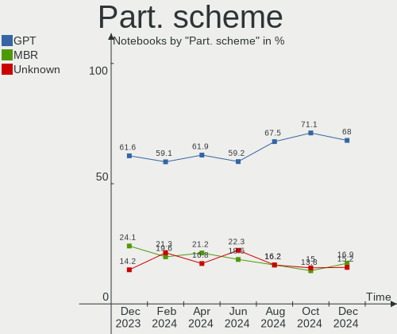
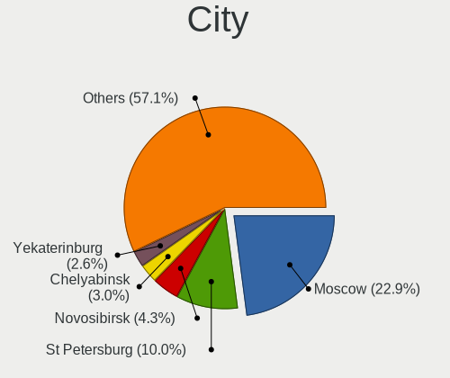
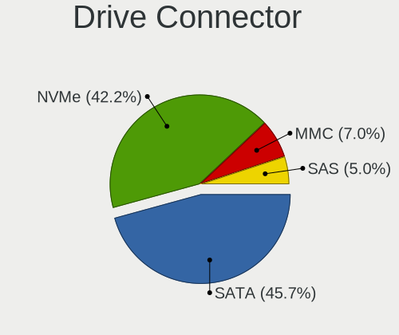
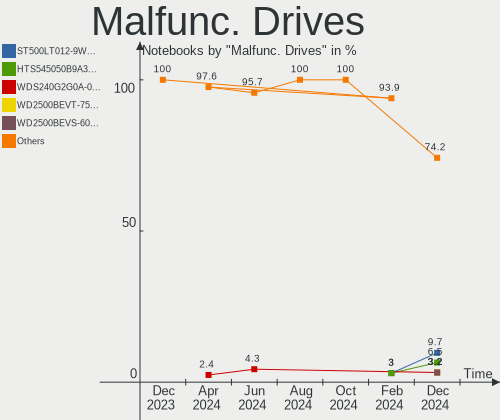
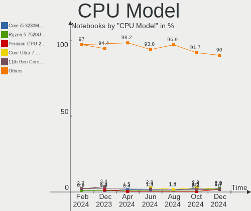
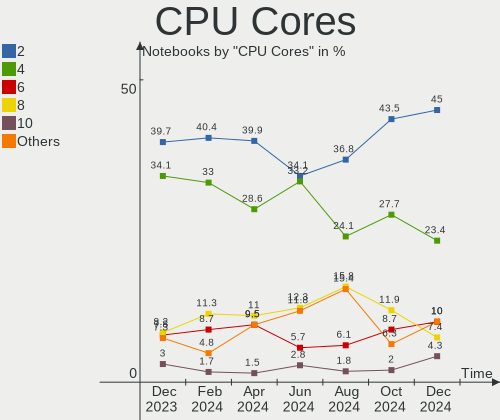
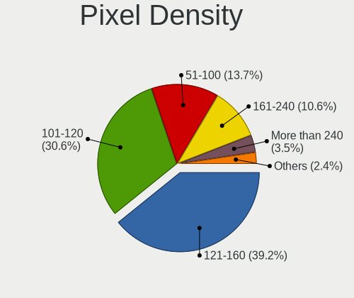
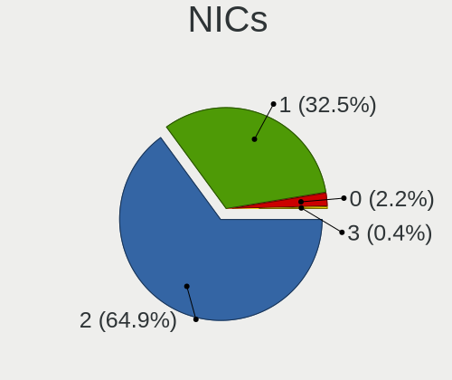
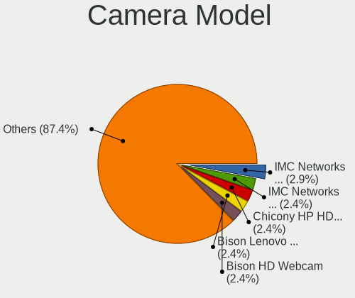

Linux in Russia - Hardware Trends (Notebooks)
---------------------------------------------

A project to identify most popular hardware characteristics and track their change
over time based on data collected by Linux users at https://Linux-Hardware.org.

Anyone can contribute to this report by the [hw-probe](https://github.com/linuxhw/hw-probe) tool:

    sudo -E hw-probe -all -upload

Period: Jul, 2022.

Contents
--------

* [ System ](#system)
  - [ OS                       ](#os)
  - [ OS Family                ](#os-family)
  - [ Kernel                   ](#kernel)
  - [ Kernel Family            ](#kernel-family)
  - [ Kernel Major Ver.        ](#kernel-major-ver)
  - [ Arch                     ](#arch)
  - [ DE                       ](#de)
  - [ Display Server           ](#display-server)
  - [ Display Manager          ](#display-manager)
  - [ OS Lang                  ](#os-lang)
  - [ Boot Mode                ](#boot-mode)
  - [ Filesystem               ](#filesystem)
  - [ Part. scheme             ](#part-scheme)
  - [ Dual Boot with Linux/BSD ](#dual-boot-with-linuxbsd)
  - [ Dual Boot (Win)          ](#dual-boot-win)

* [ Board ](#board)
  - [ Vendor                   ](#vendor)
  - [ Model                    ](#model)
  - [ Model Family             ](#model-family)
  - [ MFG Year                 ](#mfg-year)
  - [ Form Factor              ](#form-factor)
  - [ Secure Boot              ](#secure-boot)
  - [ Coreboot                 ](#coreboot)
  - [ RAM Size                 ](#ram-size)
  - [ RAM Used                 ](#ram-used)
  - [ Total Drives             ](#total-drives)
  - [ Has CD-ROM               ](#has-cd-rom)
  - [ Has Ethernet             ](#has-ethernet)
  - [ Has WiFi                 ](#has-wifi)
  - [ Has Bluetooth            ](#has-bluetooth)

* [ Location ](#location)
  - [ Country                  ](#country)
  - [ City                     ](#city)

* [ Drives ](#drives)
  - [ Drive Vendor             ](#drive-vendor)
  - [ Drive Model              ](#drive-model)
  - [ HDD Vendor               ](#hdd-vendor)
  - [ SSD Vendor               ](#ssd-vendor)
  - [ Drive Kind               ](#drive-kind)
  - [ Drive Connector          ](#drive-connector)
  - [ Drive Size               ](#drive-size)
  - [ Space Total              ](#space-total)
  - [ Space Used               ](#space-used)
  - [ Malfunc. Drives          ](#malfunc-drives)
  - [ Malfunc. Drive Vendor    ](#malfunc-drive-vendor)
  - [ Malfunc. HDD Vendor      ](#malfunc-hdd-vendor)
  - [ Malfunc. Drive Kind      ](#malfunc-drive-kind)
  - [ Failed Drives            ](#failed-drives)
  - [ Failed Drive Vendor      ](#failed-drive-vendor)
  - [ Drive Status             ](#drive-status)

* [ Storage controller ](#storage-controller)
  - [ Storage Vendor           ](#storage-vendor)
  - [ Storage Model            ](#storage-model)
  - [ Storage Kind             ](#storage-kind)

* [ Processor ](#processor)
  - [ CPU Vendor               ](#cpu-vendor)
  - [ CPU Model                ](#cpu-model)
  - [ CPU Model Family         ](#cpu-model-family)
  - [ CPU Cores                ](#cpu-cores)
  - [ CPU Sockets              ](#cpu-sockets)
  - [ CPU Threads              ](#cpu-threads)
  - [ CPU Op-Modes             ](#cpu-op-modes)
  - [ CPU Microcode            ](#cpu-microcode)
  - [ CPU Microarch            ](#cpu-microarch)

* [ Graphics ](#graphics)
  - [ GPU Vendor               ](#gpu-vendor)
  - [ GPU Model                ](#gpu-model)
  - [ GPU Combo                ](#gpu-combo)
  - [ GPU Driver               ](#gpu-driver)
  - [ GPU Memory               ](#gpu-memory)

* [ Monitor ](#monitor)
  - [ Monitor Vendor           ](#monitor-vendor)
  - [ Monitor Model            ](#monitor-model)
  - [ Monitor Resolution       ](#monitor-resolution)
  - [ Monitor Diagonal         ](#monitor-diagonal)
  - [ Monitor Width            ](#monitor-width)
  - [ Aspect Ratio             ](#aspect-ratio)
  - [ Monitor Area             ](#monitor-area)
  - [ Pixel Density            ](#pixel-density)
  - [ Multiple Monitors        ](#multiple-monitors)

* [ Network ](#network)
  - [ Net Controller Vendor    ](#net-controller-vendor)
  - [ Net Controller Model     ](#net-controller-model)
  - [ Wireless Vendor          ](#wireless-vendor)
  - [ Wireless Model           ](#wireless-model)
  - [ Ethernet Vendor          ](#ethernet-vendor)
  - [ Ethernet Model           ](#ethernet-model)
  - [ Net Controller Kind      ](#net-controller-kind)
  - [ Used Controller          ](#used-controller)
  - [ NICs                     ](#nics)
  - [ IPv6                     ](#ipv6)

* [ Bluetooth ](#bluetooth)
  - [ Bluetooth Vendor         ](#bluetooth-vendor)
  - [ Bluetooth Model          ](#bluetooth-model)

* [ Sound ](#sound)
  - [ Sound Vendor             ](#sound-vendor)
  - [ Sound Model              ](#sound-model)

* [ Memory ](#memory)
  - [ Memory Vendor            ](#memory-vendor)
  - [ Memory Model             ](#memory-model)
  - [ Memory Kind              ](#memory-kind)
  - [ Memory Form Factor       ](#memory-form-factor)
  - [ Memory Size              ](#memory-size)
  - [ Memory Speed             ](#memory-speed)

* [ Printers & scanners ](#printers--scanners)
  - [ Printer Vendor           ](#printer-vendor)
  - [ Printer Model            ](#printer-model)
  - [ Scanner Vendor           ](#scanner-vendor)
  - [ Scanner Model            ](#scanner-model)

* [ Camera ](#camera)
  - [ Camera Vendor            ](#camera-vendor)
  - [ Camera Model             ](#camera-model)

* [ Security ](#security)
  - [ Fingerprint Vendor       ](#fingerprint-vendor)
  - [ Fingerprint Model        ](#fingerprint-model)
  - [ Chipcard Vendor          ](#chipcard-vendor)
  - [ Chipcard Model           ](#chipcard-model)

* [ Unsupported ](#unsupported)
  - [ Unsupported Devices      ](#unsupported-devices)
  - [ Unsupported Device Types ](#unsupported-device-types)

System
------

OS
--

Installed operating systems

| Name                         | Notebooks | Percent |
|------------------------------|-----------|---------|
| ROSA 12.2                    | 112       | 40.58%  |
| Red OS 7.3.1                 | 19        | 6.88%   |
| Ubuntu 22.04                 | 13        | 4.71%   |
| Linux Mint 20.3              | 13        | 4.71%   |
| Fedora 36                    | 12        | 4.35%   |
| Ubuntu 20.04                 | 11        | 3.99%   |
| ROSA R11.1                   | 8         | 2.9%    |
| Debian 11                    | 8         | 2.9%    |
| OpenMandriva 4.3             | 6         | 2.17%   |
| KDE neon 20.04               | 6         | 2.17%   |
| Red OS 7.3                   | 5         | 1.81%   |
| Manjaro 21.3.2               | 5         | 1.81%   |
| Arch                         | 5         | 1.81%   |
| ALT Linux 10.0               | 5         | 1.81%   |
| Pop!_OS 22.04                | 4         | 1.45%   |
| Kubuntu 22.04                | 3         | 1.09%   |
| Elementary 6.1               | 3         | 1.09%   |
| ArcoLinux Rolling            | 3         | 1.09%   |
| Arch Rolling                 | 3         | 1.09%   |
| OpenMandriva 4.90            | 2         | 0.72%   |
| Manjaro                      | 2         | 0.72%   |
| LMDE 5                       | 2         | 0.72%   |
| Kali 2022.2                  | 2         | 0.72%   |
| ALT Linux 10.1               | 2         | 0.72%   |
| Xubuntu 18.04                | 1         | 0.36%   |
| Ubuntu 22.10                 | 1         | 0.36%   |
| Ubuntu 21.04                 | 1         | 0.36%   |
| Ubuntu 18.04                 | 1         | 0.36%   |
| ROSA R11                     | 1         | 0.36%   |
| ROSA 12.1                    | 1         | 0.36%   |
| Rocky Linux 9.0              | 1         | 0.36%   |
| Parrot 5.0                   | 1         | 0.36%   |
| Parrot 4.11                  | 1         | 0.36%   |
| openSUSE Tumbleweed-XXXXXXXX | 1         | 0.36%   |
| OpenMandriva 4.2             | 1         | 0.36%   |
| MOS 10                       | 1         | 0.36%   |
| Manjaro 21.3.5               | 1         | 0.36%   |
| Manjaro 21.3.3               | 1         | 0.36%   |
| Lubuntu 12.04                | 1         | 0.36%   |
| Linux Mint 19.1              | 1         | 0.36%   |
| Gentoo 2.8                   | 1         | 0.36%   |
| Endless 3.8.7                | 1         | 0.36%   |
| Debian 8                     | 1         | 0.36%   |
| BlackPanther 18.1            | 1         | 0.36%   |
| Astra Linux 2.12.44          | 1         | 0.36%   |
| ALT Linux 20201124           | 1         | 0.36%   |

OS Family
---------

OS without a version

| Name         | Notebooks | Percent |
|--------------|-----------|---------|
| ROSA         | 122       | 44.2%   |
| Ubuntu       | 27        | 9.78%   |
| Red OS       | 24        | 8.7%    |
| Linux Mint   | 14        | 5.07%   |
| Fedora       | 12        | 4.35%   |
| OpenMandriva | 9         | 3.26%   |
| Manjaro      | 9         | 3.26%   |
| Debian       | 9         | 3.26%   |
| ALT Linux    | 9         | 3.26%   |
| Arch         | 8         | 2.9%    |
| KDE neon     | 6         | 2.17%   |
| Pop!_OS      | 4         | 1.45%   |
| Kubuntu      | 3         | 1.09%   |
| Elementary   | 3         | 1.09%   |
| ArcoLinux    | 3         | 1.09%   |
| Parrot       | 2         | 0.72%   |
| LMDE         | 2         | 0.72%   |
| Kali         | 2         | 0.72%   |
| Xubuntu      | 1         | 0.36%   |
| Rocky Linux  | 1         | 0.36%   |
| openSUSE     | 1         | 0.36%   |
| Lubuntu      | 1         | 0.36%   |
| Gentoo       | 1         | 0.36%   |
| Endless      | 1         | 0.36%   |
| BlackPanther | 1         | 0.36%   |
| Astra Linux  | 1         | 0.36%   |

Kernel
------

Version of the Linux kernel

| Version                                    | Notebooks | Percent |
|--------------------------------------------|-----------|---------|
| 5.10.74-generic-2rosa2021.1-x86_64         | 52        | 18.84%  |
| 5.10.118-generic-2rosa2021.1-x86_64        | 42        | 15.22%  |
| 5.15.0-41-generic                          | 21        | 7.61%   |
| 5.15.10-1.el7.x86_64                       | 11        | 3.99%   |
| 5.15.35-4.el7.3.x86_64                     | 6         | 2.17%   |
| 5.4.0-122-generic                          | 5         | 1.81%   |
| 5.16.7-desktop-1omv4003                    | 5         | 1.81%   |
| 5.15.50-1-MANJARO                          | 5         | 1.81%   |
| 5.15.0-40-generic                          | 5         | 1.81%   |
| 5.13.0-51-generic                          | 5         | 1.81%   |
| 5.4.83-generic-2rosa-i586                  | 4         | 1.45%   |
| 5.18.13-200.fc36.x86_64                    | 4         | 1.45%   |
| 5.17.11-generic-2rosa2021.1-x86_64         | 4         | 1.45%   |
| 5.15.35-1.el7.3.x86_64                     | 4         | 1.45%   |
| 5.4.0-121-generic                          | 3         | 1.09%   |
| 5.18.7-200.fc36.x86_64                     | 3         | 1.09%   |
| 5.18.14-arch1-1                            | 3         | 1.09%   |
| 5.18.11-200.fc36.x86_64                    | 3         | 1.09%   |
| 5.17.15-76051715-generic                   | 3         | 1.09%   |
| 5.15.43-generic-2rosa2021.1-x86_64         | 3         | 1.09%   |
| 5.10.0-16-amd64                            | 3         | 1.09%   |
| 5.10.0-15-amd64                            | 3         | 1.09%   |
| 5.4.83-generic-2rosa-x86_64                | 2         | 0.72%   |
| 5.18.9-200.fc36.x86_64                     | 2         | 0.72%   |
| 5.18.12-desktop-3omv4090                   | 2         | 0.72%   |
| 5.18.0-kali5-amd64                         | 2         | 0.72%   |
| 5.17.6-arch1-1                             | 2         | 0.72%   |
| 5.15.53-1-MANJARO                          | 2         | 0.72%   |
| 5.15.52-un-def-alt1                        | 2         | 0.72%   |
| 5.15.32-generic-6rosa2021.1-x86_64         | 2         | 0.72%   |
| 5.14.0-1044-oem                            | 2         | 0.72%   |
| 5.13.0-52-generic                          | 2         | 0.72%   |
| 5.10.74-generic-2rosa2021.1-i586           | 2         | 0.72%   |
| 5.10.29-1.el7.x86_64                       | 2         | 0.72%   |
| 5.10.0-7-amd64                             | 2         | 0.72%   |
| 5.6.14-desktop-2bP                         | 1         | 0.36%   |
| 5.4.32-generic-2rosa-x86_64                | 1         | 0.36%   |
| 5.4.32-generic-2rosa-i586                  | 1         | 0.36%   |
| 5.4.189-0504189-generic                    | 1         | 0.36%   |
| 5.4.150-generic-1rosa2021.1-x86_64         | 1         | 0.36%   |
| 5.4.0-42-generic                           | 1         | 0.36%   |
| 5.19.0-051900rc4-generic                   | 1         | 0.36%   |
| 5.18.9-un-def-alt1                         | 1         | 0.36%   |
| 5.18.9-arch1-1                             | 1         | 0.36%   |
| 5.18.8.xm1-1.klp-xanmod-rosa2021.1-x86_64  | 1         | 0.36%   |
| 5.18.6-arch1-1                             | 1         | 0.36%   |
| 5.18.6-051806-generic                      | 1         | 0.36%   |
| 5.18.3.xm1-1.klp-xanmod-rosa2021.1-x86_64  | 1         | 0.36%   |
| 5.18.3-zen1-1-zen                          | 1         | 0.36%   |
| 5.18.3-arch1-1                             | 1         | 0.36%   |
| 5.18.13-generic-1rosa2021.1-x86_64         | 1         | 0.36%   |
| 5.18.12-un-def-alt1.2                      | 1         | 0.36%   |
| 5.18.12-arch1-1                            | 1         | 0.36%   |
| 5.18.12-264-tkg-pds-llvm                   | 1         | 0.36%   |
| 5.18.11.xm1-1.klp-xanmod-rosa2021.1-x86_64 | 1         | 0.36%   |
| 5.18.11-1-default                          | 1         | 0.36%   |
| 5.18.10.xm1-1.klp-xanmod-rosa2021.1-x86_64 | 1         | 0.36%   |
| 5.18.10-76051810-generic                   | 1         | 0.36%   |
| 5.18.10-1-MANJARO                          | 1         | 0.36%   |
| 5.18.0-1parrot1-amd64                      | 1         | 0.36%   |

Kernel Family
-------------

Linux kernel without a distro release

| Version  | Notebooks | Percent |
|----------|-----------|---------|
| 5.10.74  | 54        | 19.57%  |
| 5.10.118 | 43        | 15.58%  |
| 5.15.0   | 28        | 10.14%  |
| 5.15.10  | 11        | 3.99%   |
| 5.15.35  | 10        | 3.62%   |
| 5.10.0   | 10        | 3.62%   |
| 5.4.0    | 9         | 3.26%   |
| 5.13.0   | 9         | 3.26%   |
| 5.4.83   | 6         | 2.17%   |
| 5.18.13  | 5         | 1.81%   |
| 5.18.12  | 5         | 1.81%   |
| 5.18.11  | 5         | 1.81%   |
| 5.16.7   | 5         | 1.81%   |
| 5.15.50  | 5         | 1.81%   |
| 5.18.9   | 4         | 1.45%   |
| 5.18.0   | 4         | 1.45%   |
| 5.17.11  | 4         | 1.45%   |
| 5.14.0   | 4         | 1.45%   |
| 5.18.7   | 3         | 1.09%   |
| 5.18.3   | 3         | 1.09%   |
| 5.18.14  | 3         | 1.09%   |
| 5.18.10  | 3         | 1.09%   |
| 5.17.15  | 3         | 1.09%   |
| 5.15.52  | 3         | 1.09%   |
| 5.15.43  | 3         | 1.09%   |
| 5.10.29  | 3         | 1.09%   |
| 4.15.0   | 3         | 1.09%   |
| 5.4.32   | 2         | 0.72%   |
| 5.18.6   | 2         | 0.72%   |
| 5.17.6   | 2         | 0.72%   |
| 5.15.53  | 2         | 0.72%   |
| 5.15.32  | 2         | 0.72%   |
| 5.6.14   | 1         | 0.36%   |
| 5.4.189  | 1         | 0.36%   |
| 5.4.150  | 1         | 0.36%   |
| 5.19.0   | 1         | 0.36%   |
| 5.18.8   | 1         | 0.36%   |
| 5.16.19  | 1         | 0.36%   |
| 5.16.13  | 1         | 0.36%   |
| 5.16.0   | 1         | 0.36%   |
| 5.15.55  | 1         | 0.36%   |
| 5.15.54  | 1         | 0.36%   |
| 5.15.34  | 1         | 0.36%   |
| 5.11.20  | 1         | 0.36%   |
| 5.10.14  | 1         | 0.36%   |
| 5.10.126 | 1         | 0.36%   |
| 5.10.123 | 1         | 0.36%   |
| 5.10.121 | 1         | 0.36%   |
| 3.13.0   | 1         | 0.36%   |
| 3.0.21   | 1         | 0.36%   |

Kernel Major Ver.
-----------------

Linux kernel major version

| Version | Notebooks | Percent |
|---------|-----------|---------|
| 5.10    | 114       | 41.3%   |
| 5.15    | 67        | 24.28%  |
| 5.18    | 38        | 13.77%  |
| 5.4     | 19        | 6.88%   |
| 5.17    | 9         | 3.26%   |
| 5.13    | 9         | 3.26%   |
| 5.16    | 8         | 2.9%    |
| 5.14    | 4         | 1.45%   |
| 4.15    | 3         | 1.09%   |
| 5.6     | 1         | 0.36%   |
| 5.19    | 1         | 0.36%   |
| 5.11    | 1         | 0.36%   |
| 3.13    | 1         | 0.36%   |
| 3.0     | 1         | 0.36%   |

Arch
----

OS architecture (x86_64, i586, etc.)

| Name   | Notebooks | Percent |
|--------|-----------|---------|
| x86_64 | 265       | 96.01%  |
| i686   | 10        | 3.62%   |
| armv7l | 1         | 0.36%   |

DE
--

Desktop Environment

| Name       | Notebooks | Percent |
|------------|-----------|---------|
| GNOME      | 101       | 36.59%  |
| KDE5       | 93        | 33.7%   |
| MATE       | 24        | 8.7%    |
| LXQt       | 11        | 3.99%   |
| XFCE       | 10        | 3.62%   |
| X-Cinnamon | 9         | 3.26%   |
| Cinnamon   | 8         | 2.9%    |
| KDE4       | 7         | 2.54%   |
| Unknown    | 6         | 2.17%   |
| Pantheon   | 3         | 1.09%   |
| sway       | 1         | 0.36%   |
| openbox    | 1         | 0.36%   |
| i3         | 1         | 0.36%   |
| fly        | 1         | 0.36%   |

Display Server
--------------

X11 or Wayland

| Name    | Notebooks | Percent |
|---------|-----------|---------|
| X11     | 145       | 52.54%  |
| Wayland | 128       | 46.38%  |
| Unknown | 3         | 1.09%   |

Display Manager
---------------

SDDM, LightDM, etc.

| Name    | Notebooks | Percent |
|---------|-----------|---------|
| GDM     | 95        | 34.42%  |
| SDDM    | 83        | 30.07%  |
| Unknown | 42        | 15.22%  |
| LightDM | 27        | 9.78%   |
| GDM3    | 20        | 7.25%   |
| KDM     | 7         | 2.54%   |
| XDM     | 1         | 0.36%   |
| GREETD  | 1         | 0.36%   |

OS Lang
-------

Language

| Lang    | Notebooks | Percent |
|---------|-----------|---------|
| ru_RU   | 207       | 75%     |
| en_US   | 35        | 12.68%  |
| Unknown | 28        | 10.14%  |
| en_GB   | 2         | 0.72%   |
| C       | 2         | 0.72%   |
| ru_UA   | 1         | 0.36%   |
| C.UTF8  | 1         | 0.36%   |

Boot Mode
---------

EFI or BIOS

| Mode | Notebooks | Percent |
|------|-----------|---------|
| EFI  | 169       | 61.23%  |
| BIOS | 107       | 38.77%  |

Filesystem
----------

Type of filesystem

| Type    | Notebooks | Percent |
|---------|-----------|---------|
| Ext4    | 234       | 84.78%  |
| Btrfs   | 24        | 8.7%    |
| Overlay | 16        | 5.8%    |
| Xfs     | 1         | 0.36%   |
| F2fs    | 1         | 0.36%   |

Part. scheme
------------

Scheme of partitioning

| Type    | Notebooks | Percent |
|---------|-----------|---------|
| GPT     | 163       | 59.06%  |
| MBR     | 63        | 22.83%  |
| Unknown | 50        | 18.12%  |

Dual Boot with Linux/BSD
------------------------

Hosting more than one Linux/BSD

| Dual boot | Notebooks | Percent |
|-----------|-----------|---------|
| No        | 238       | 86.23%  |
| Yes       | 38        | 13.77%  |

Dual Boot (Win)
---------------

Hosting Linux and Windows

| Dual boot | Notebooks | Percent |
|-----------|-----------|---------|
| No        | 185       | 67.03%  |
| Yes       | 91        | 32.97%  |

Board
-----

Vendor
------

Motherboard manufacturer

| Name                | Notebooks | Percent |
|---------------------|-----------|---------|
| Lenovo              | 72        | 26.09%  |
| ASUSTek Computer    | 41        | 14.86%  |
| Acer                | 37        | 13.41%  |
| Hewlett-Packard     | 33        | 11.96%  |
| Dell                | 15        | 5.43%   |
| HUAWEI              | 13        | 4.71%   |
| Sony                | 7         | 2.54%   |
| Samsung Electronics | 7         | 2.54%   |
| Toshiba             | 5         | 1.81%   |
| Timi                | 5         | 1.81%   |
| Aquarius            | 5         | 1.81%   |
| Packard Bell        | 3         | 1.09%   |
| MSI                 | 3         | 1.09%   |
| Gigabyte Technology | 3         | 1.09%   |
| Digma               | 3         | 1.09%   |
| Unknown             | 3         | 1.09%   |
| Irbis               | 2         | 0.72%   |
| Insyde              | 2         | 0.72%   |
| HONOR               | 2         | 0.72%   |
| Chuwi               | 2         | 0.72%   |
| 3Logic Group        | 2         | 0.72%   |
| THD                 | 1         | 0.36%   |
| Notebook            | 1         | 0.36%   |
| Maibenben           | 1         | 0.36%   |
| Kraftway            | 1         | 0.36%   |
| Intel               | 1         | 0.36%   |
| ICL                 | 1         | 0.36%   |
| Fujitsu Siemens     | 1         | 0.36%   |
| Fujitsu             | 1         | 0.36%   |
| eMachines           | 1         | 0.36%   |
| AMI                 | 1         | 0.36%   |
| Alienware           | 1         | 0.36%   |

Model
-----

Motherboard model

| Name                                        | Notebooks | Percent |
|---------------------------------------------|-----------|---------|
| Lenovo V15-IWL 81YE                         | 17        | 6.16%   |
| HUAWEI KLVL-WXXW                            | 4         | 1.45%   |
| HP Pavilion g6                              | 4         | 1.45%   |
| Unknown                                     | 4         | 1.45%   |
| Lenovo IdeaPad Gaming 3 15ARH05 82EY        | 3         | 1.09%   |
| HP Notebook                                 | 3         | 1.09%   |
| HP Laptop 15-bw0xx                          | 3         | 1.09%   |
| Aquarius NS685U R11                         | 3         | 1.09%   |
| Acer Aspire E5-573G                         | 3         | 1.09%   |
| Acer Aspire A315-51                         | 3         | 1.09%   |
| Toshiba Satellite A300                      | 2         | 0.72%   |
| Timi TM1701                                 | 2         | 0.72%   |
| Samsung 350V5C/351V5C/3540VC/3440VC         | 2         | 0.72%   |
| Lenovo IdeaPad L340-15API 81LW              | 2         | 0.72%   |
| Lenovo G580 20157                           | 2         | 0.72%   |
| Lenovo G570 20079                           | 2         | 0.72%   |
| Insyde CherryTrail                          | 2         | 0.72%   |
| HUAWEI HVY-WXX9                             | 2         | 0.72%   |
| HUAWEI HLYL-WXX9                            | 2         | 0.72%   |
| HUAWEI CREM-WXX9                            | 2         | 0.72%   |
| HP OMEN by Laptop 16-c0xxx                  | 2         | 0.72%   |
| HP Laptop 15-db1xxx                         | 2         | 0.72%   |
| HP EliteBook 855 G8 Notebook PC             | 2         | 0.72%   |
| ASUS X541UVK                                | 2         | 0.72%   |
| Acer Swift SF114-34                         | 2         | 0.72%   |
| Acer Aspire 5742G                           | 2         | 0.72%   |
| Toshiba TECRA R850                          | 1         | 0.36%   |
| Toshiba Satellite A200                      | 1         | 0.36%   |
| Toshiba Satellite A100                      | 1         | 0.36%   |
| Timi RedmiBook 14 II                        | 1         | 0.36%   |
| Timi Redmi Book Pro 15 2022                 | 1         | 0.36%   |
| Timi Mi Laptop Pro 15 2020                  | 1         | 0.36%   |
| THD PX1                                     | 1         | 0.36%   |
| Sony VPCEL3S1R                              | 1         | 0.36%   |
| Sony VPCEH2E1R                              | 1         | 0.36%   |
| Sony VGN-TT31MR_N                           | 1         | 0.36%   |
| Sony VGN-FS515BR                            | 1         | 0.36%   |
| Sony SVE1512H1RW                            | 1         | 0.36%   |
| Sony SVE1512G1RW                            | 1         | 0.36%   |
| Sony SVE1511B1RW                            | 1         | 0.36%   |
| Samsung R530/R730/R540                      | 1         | 0.36%   |
| Samsung QX310/QX410/QX510/SF310/SF410/SF510 | 1         | 0.36%   |
| Samsung Q430/Q530                           | 1         | 0.36%   |
| Samsung N150/N210/N220                      | 1         | 0.36%   |
| Samsung 300E4C/300E5C/300E7C                | 1         | 0.36%   |
| Packard Bell EasyNote TJ71                  | 1         | 0.36%   |
| Packard Bell EasyNote TE11HC                | 1         | 0.36%   |
| Packard Bell EasyNote LJ75                  | 1         | 0.36%   |
| Notebook W250EGQ / W270EGQ                  | 1         | 0.36%   |
| MSI GP66 Leopard 11UG                       | 1         | 0.36%   |
| MSI GL65 Leopard 10SCSR                     | 1         | 0.36%   |
| MSI FX610                                   | 1         | 0.36%   |
| Maibenben ZiMai Z5                          | 1         | 0.36%   |
| Lenovo Y520-15IKBN 80WK                     | 1         | 0.36%   |
| Lenovo V570 HuronRiver Platform             | 1         | 0.36%   |
| Lenovo V15-IIL 82C5                         | 1         | 0.36%   |
| Lenovo V14-IIL 82C4                         | 1         | 0.36%   |
| Lenovo ThinkPad X270 W10DG 20K5S0XB12       | 1         | 0.36%   |
| Lenovo ThinkPad T470 20HES0MV00             | 1         | 0.36%   |
| Lenovo ThinkPad T14 Gen 2i 20W00095RT       | 1         | 0.36%   |

Model Family
------------

Motherboard model prefix

| Name                  | Notebooks | Percent |
|-----------------------|-----------|---------|
| Acer Aspire           | 29        | 10.51%  |
| Lenovo IdeaPad        | 20        | 7.25%   |
| Lenovo V15-IWL        | 17        | 6.16%   |
| Lenovo ThinkPad       | 9         | 3.26%   |
| HP Pavilion           | 9         | 3.26%   |
| HP ProBook            | 7         | 2.54%   |
| HP Laptop             | 7         | 2.54%   |
| ASUS VivoBook         | 7         | 2.54%   |
| Lenovo ThinkBook      | 5         | 1.81%   |
| Dell Latitude         | 5         | 1.81%   |
| Toshiba Satellite     | 4         | 1.45%   |
| HUAWEI KLVL-WXXW      | 4         | 1.45%   |
| Unknown               | 4         | 1.45%   |
| Packard Bell EasyNote | 3         | 1.09%   |
| HP Notebook           | 3         | 1.09%   |
| Digma EVE             | 3         | 1.09%   |
| Dell Vostro           | 3         | 1.09%   |
| ASUS ASUS             | 3         | 1.09%   |
| Aquarius NS685U       | 3         | 1.09%   |
| Acer Swift            | 3         | 1.09%   |
| Timi TM1701           | 2         | 0.72%   |
| Samsung 350V5C        | 2         | 0.72%   |
| Lenovo Legion         | 2         | 0.72%   |
| Lenovo G580           | 2         | 0.72%   |
| Lenovo G570           | 2         | 0.72%   |
| Lenovo B590           | 2         | 0.72%   |
| Insyde CherryTrail    | 2         | 0.72%   |
| HUAWEI HVY-WXX9       | 2         | 0.72%   |
| HUAWEI HLYL-WXX9      | 2         | 0.72%   |
| HUAWEI CREM-WXX9      | 2         | 0.72%   |
| HP OMEN               | 2         | 0.72%   |
| HP EliteBook          | 2         | 0.72%   |
| Dell XPS              | 2         | 0.72%   |
| ASUS X541UVK          | 2         | 0.72%   |
| ASUS TUF              | 2         | 0.72%   |
| ASUS ROG              | 2         | 0.72%   |
| Acer Extensa          | 2         | 0.72%   |
| Toshiba TECRA         | 1         | 0.36%   |
| Timi RedmiBook        | 1         | 0.36%   |
| Timi Redmi            | 1         | 0.36%   |
| Timi Mi               | 1         | 0.36%   |
| THD PX1               | 1         | 0.36%   |
| Sony VPCEL3S1R        | 1         | 0.36%   |
| Sony VPCEH2E1R        | 1         | 0.36%   |
| Sony VGN-TT31MR       | 1         | 0.36%   |
| Sony VGN-FS515BR      | 1         | 0.36%   |
| Sony SVE1512H1RW      | 1         | 0.36%   |
| Sony SVE1512G1RW      | 1         | 0.36%   |
| Sony SVE1511B1RW      | 1         | 0.36%   |
| Samsung R530          | 1         | 0.36%   |
| Samsung QX310         | 1         | 0.36%   |
| Samsung Q430          | 1         | 0.36%   |
| Samsung N150          | 1         | 0.36%   |
| Samsung 300E4C        | 1         | 0.36%   |
| Notebook W250EGQ      | 1         | 0.36%   |
| MSI GP66              | 1         | 0.36%   |
| MSI GL65              | 1         | 0.36%   |
| MSI FX610             | 1         | 0.36%   |
| Maibenben ZiMai       | 1         | 0.36%   |
| Lenovo Y520-15IKBN    | 1         | 0.36%   |

MFG Year
--------

Motherboard manufacture year

| Year    | Notebooks | Percent |
|---------|-----------|---------|
| 2021    | 44        | 15.94%  |
| 2019    | 35        | 12.68%  |
| 2020    | 31        | 11.23%  |
| 2017    | 22        | 7.97%   |
| 2012    | 22        | 7.97%   |
| 2011    | 17        | 6.16%   |
| 2010    | 14        | 5.07%   |
| 2016    | 12        | 4.35%   |
| 2013    | 12        | 4.35%   |
| 2022    | 11        | 3.99%   |
| 2014    | 11        | 3.99%   |
| 2018    | 10        | 3.62%   |
| 2009    | 8         | 2.9%    |
| 2008    | 8         | 2.9%    |
| 2015    | 7         | 2.54%   |
| 2007    | 6         | 2.17%   |
| 2006    | 3         | 1.09%   |
| 2005    | 2         | 0.72%   |
| Unknown | 1         | 0.36%   |

Form Factor
-----------

Physical design of the computer

| Name     | Notebooks | Percent |
|----------|-----------|---------|
| Notebook | 276       | 100%    |

Secure Boot
-----------

Enabled or disabled

| State    | Notebooks | Percent |
|----------|-----------|---------|
| Disabled | 260       | 94.2%   |
| Enabled  | 16        | 5.8%    |

Coreboot
--------

Have coreboot on board

| Used | Notebooks | Percent |
|------|-----------|---------|
| No   | 276       | 100%    |

RAM Size
--------

Total RAM memory

| Size in GB  | Notebooks | Percent |
|-------------|-----------|---------|
| 4.01-8.0    | 106       | 38.41%  |
| 3.01-4.0    | 58        | 21.01%  |
| 8.01-16.0   | 51        | 18.48%  |
| 16.01-24.0  | 27        | 9.78%   |
| 1.01-2.0    | 22        | 7.97%   |
| 32.01-64.0  | 7         | 2.54%   |
| 2.01-3.0    | 2         | 0.72%   |
| 64.01-256.0 | 1         | 0.36%   |
| 0.51-1.0    | 1         | 0.36%   |
| 0.01-0.5    | 1         | 0.36%   |

RAM Used
--------

Used RAM memory

| Used GB   | Notebooks | Percent |
|-----------|-----------|---------|
| 1.01-2.0  | 124       | 44.93%  |
| 0.51-1.0  | 45        | 16.3%   |
| 2.01-3.0  | 43        | 15.58%  |
| 3.01-4.0  | 27        | 9.78%   |
| 4.01-8.0  | 26        | 9.42%   |
| 8.01-16.0 | 7         | 2.54%   |
| 0.01-0.5  | 2         | 0.72%   |
| Unknown   | 2         | 0.72%   |

Total Drives
------------

Number of drives on board

| Drives | Notebooks | Percent |
|--------|-----------|---------|
| 1      | 211       | 76.45%  |
| 2      | 57        | 20.65%  |
| 3      | 6         | 2.17%   |
| 5      | 1         | 0.36%   |
| 4      | 1         | 0.36%   |

Has CD-ROM
----------

Has CD-ROM on board

| Presented | Notebooks | Percent |
|-----------|-----------|---------|
| No        | 203       | 73.55%  |
| Yes       | 73        | 26.45%  |

Has Ethernet
------------

Has Ethernet on board

| Presented | Notebooks | Percent |
|-----------|-----------|---------|
| Yes       | 197       | 71.38%  |
| No        | 79        | 28.62%  |

Has WiFi
--------

Has WiFi module

| Presented | Notebooks | Percent |
|-----------|-----------|---------|
| Yes       | 269       | 97.46%  |
| No        | 7         | 2.54%   |

Has Bluetooth
-------------

Has Bluetooth module

| Presented | Notebooks | Percent |
|-----------|-----------|---------|
| Yes       | 217       | 78.62%  |
| No        | 59        | 21.38%  |

Location
--------

Country
-------

Geographic location (country)

| Country | Notebooks | Percent |
|---------|-----------|---------|
| Russia  | 276       | 100%    |

City
----

Geographic location (city)

| City             | Notebooks | Percent |
|------------------|-----------|---------|
| Moscow           | 52        | 18.84%  |
| St Petersburg    | 25        | 9.06%   |
| Salekhard        | 18        | 6.52%   |
| Yekaterinburg    | 8         | 2.9%    |
| Perm             | 8         | 2.9%    |
| Voronezh         | 7         | 2.54%   |
| Ufa              | 7         | 2.54%   |
| Nizhniy Novgorod | 6         | 2.17%   |
| Saratov          | 5         | 1.81%   |
| Samara           | 5         | 1.81%   |
| Novosibirsk      | 5         | 1.81%   |
| Vladivostok      | 4         | 1.45%   |
| Tyumen           | 4         | 1.45%   |
| Surgut           | 4         | 1.45%   |
| Krasnodar        | 4         | 1.45%   |
| Kazan’         | 4         | 1.45%   |
| Chelyabinsk      | 4         | 1.45%   |
| Barnaul          | 4         | 1.45%   |
| Volgograd        | 3         | 1.09%   |
| Smolensk         | 3         | 1.09%   |
| Rostov-on-Don    | 3         | 1.09%   |
| Kaluga           | 3         | 1.09%   |
| Belgorod         | 3         | 1.09%   |
| Yaroslavl        | 2         | 0.72%   |
| Tomsk            | 2         | 0.72%   |
| Stavropol        | 2         | 0.72%   |
| Serpukhov        | 2         | 0.72%   |
| Sergiyev Posad   | 2         | 0.72%   |
| Podolsk          | 2         | 0.72%   |
| Penza            | 2         | 0.72%   |
| Novy Urengoy     | 2         | 0.72%   |
| Mytishchi        | 2         | 0.72%   |
| Murom            | 2         | 0.72%   |
| Krasnoyarsk      | 2         | 0.72%   |
| Kirov            | 2         | 0.72%   |
| Khabarovsk       | 2         | 0.72%   |
| Kaliningrad      | 2         | 0.72%   |
| Izhevsk          | 2         | 0.72%   |
| Dolgoprudnyy     | 2         | 0.72%   |
| Blagoveshchensk  | 2         | 0.72%   |
| Zvenigorod       | 1         | 0.36%   |
| Yartsevo         | 1         | 0.36%   |
| Yablonovsky      | 1         | 0.36%   |
| Volzhskiy        | 1         | 0.36%   |
| Vladimir         | 1         | 0.36%   |
| Velikiye Luki    | 1         | 0.36%   |
| Ust'-Ilimsk      | 1         | 0.36%   |
| Ulyanovsk        | 1         | 0.36%   |
| Ulan-Ude         | 1         | 0.36%   |
| Tver             | 1         | 0.36%   |
| Tula             | 1         | 0.36%   |
| Tatsinskiy       | 1         | 0.36%   |
| Sumino           | 1         | 0.36%   |
| Solikamsk        | 1         | 0.36%   |
| Shushary         | 1         | 0.36%   |
| Sheksna          | 1         | 0.36%   |
| Shchelkovo       | 1         | 0.36%   |
| Sharypovo        | 1         | 0.36%   |
| Severodvinsk     | 1         | 0.36%   |
| Sertolovo        | 1         | 0.36%   |

Drives
------

Drive Vendor
------------

Hard drive vendors

| Vendor                      | Notebooks | Drives | Percent |
|-----------------------------|-----------|--------|---------|
| WDC                         | 60        | 62     | 17.65%  |
| Samsung Electronics         | 55        | 58     | 16.18%  |
| Seagate                     | 27        | 29     | 7.94%   |
| Toshiba                     | 21        | 22     | 6.18%   |
| Kingston                    | 20        | 20     | 5.88%   |
| Unknown                     | 15        | 17     | 4.41%   |
| Hitachi                     | 15        | 15     | 4.41%   |
| SanDisk                     | 13        | 13     | 3.82%   |
| SK hynix                    | 11        | 11     | 3.24%   |
| Phison                      | 8         | 8      | 2.35%   |
| Intel                       | 8         | 8      | 2.35%   |
| A-DATA Technology           | 8         | 8      | 2.35%   |
| HGST                        | 7         | 7      | 2.06%   |
| China                       | 7         | 7      | 2.06%   |
| UMIS                        | 5         | 5      | 1.47%   |
| SPCC                        | 5         | 5      | 1.47%   |
| Smartbuy                    | 5         | 5      | 1.47%   |
| Netac                       | 4         | 4      | 1.18%   |
| Micron Technology           | 4         | 4      | 1.18%   |
| Gigabyte Technology         | 4         | 4      | 1.18%   |
| Transcend                   | 3         | 3      | 0.88%   |
| Silicon Motion              | 3         | 3      | 0.88%   |
| Realtek                     | 2         | 2      | 0.59%   |
| KIOXIA                      | 2         | 2      | 0.59%   |
| GOODRAM                     | 2         | 2      | 0.59%   |
| Corsair                     | 2         | 2      | 0.59%   |
| BR                          | 2         | 2      | 0.59%   |
| Apacer                      | 2         | 2      | 0.59%   |
| Yangtze Memory Technologies | 1         | 1      | 0.29%   |
| XrayDisk                    | 1         | 1      | 0.29%   |
| XPG                         | 1         | 1      | 0.29%   |
| walram                      | 1         | 1      | 0.29%   |
| Union Memory (Shenzhen)     | 1         | 1      | 0.29%   |
| SSSTC                       | 1         | 1      | 0.29%   |
| ShiJi                       | 1         | 1      | 0.29%   |
| Plextor                     | 1         | 1      | 0.29%   |
| OCZ                         | 1         | 1      | 0.29%   |
| MTFDDAK1                    | 1         | 1      | 0.29%   |
| Londisk                     | 1         | 1      | 0.29%   |
| KingSpec                    | 1         | 1      | 0.29%   |
| Kingmax                     | 1         | 1      | 0.29%   |
| ITHOO                       | 1         | 1      | 0.29%   |
| GALAX                       | 1         | 1      | 0.29%   |
| Fujitsu                     | 1         | 1      | 0.29%   |
| EAGET                       | 1         | 1      | 0.29%   |
| DeTech                      | 1         | 1      | 0.29%   |
| BIWIN                       | 1         | 1      | 0.29%   |
| Unknown                     | 1         | 1      | 0.29%   |

Drive Model
-----------

Hard drive models

| Model                                | Notebooks | Percent |
|--------------------------------------|-----------|---------|
| Samsung MZALQ256HAJD-000L2 256GB     | 17        | 4.9%    |
| Seagate ST320LT020-9YG142 320GB      | 5         | 1.44%   |
| WDC WDS240G2G0A-00JH30 240GB SSD     | 4         | 1.15%   |
| Seagate ST1000LM024 HN-M101MBB 1TB   | 4         | 1.15%   |
| Samsung SSD 860 EVO 250GB            | 4         | 1.15%   |
| Samsung MZALQ512HALU-000L2 512GB     | 4         | 1.15%   |
| Gigabyte GP-GSM2NE3256GNTD 256GB     | 4         | 1.15%   |
| WDC WD5000LPCX-21VHAT0 500GB         | 3         | 0.86%   |
| WDC WD10SPZX-24Z10 1TB               | 3         | 0.86%   |
| Toshiba MQ01ABF050 500GB             | 3         | 0.86%   |
| Seagate ST1000LM048-2E7172 1TB       | 3         | 0.86%   |
| SanDisk NVMe SSD Drive 256GB         | 3         | 0.86%   |
| Phison 311CD0512GB                   | 3         | 0.86%   |
| Kingston SA400S37240G 240GB SSD      | 3         | 0.86%   |
| Hitachi HTS547575A9E384 752GB        | 3         | 0.86%   |
| A-DATA SU800NS38 256GB SSD           | 3         | 0.86%   |
| WDC WD5000LPCX-60VHAT0 500GB         | 2         | 0.58%   |
| WDC WD5000BEVT-22A0RT0 500GB         | 2         | 0.58%   |
| WDC WD10JPVX-22JC3T0 1TB             | 2         | 0.58%   |
| WDC PC SN730 SDBQNTY-512G-1001 512GB | 2         | 0.58%   |
| WDC PC SN730 SDBPNTY-512G-1027 512GB | 2         | 0.58%   |
| WDC PC SN730 SDBPNTY-512G            | 2         | 0.58%   |
| Unknown SLD128  128GB                | 2         | 0.58%   |
| Unknown NCard  64GB                  | 2         | 0.58%   |
| Unknown DA4064  64GB                 | 2         | 0.58%   |
| Unknown 58K722  128GB                | 2         | 0.58%   |
| UMIS RPJTJ512MEE1OWX 512GB           | 2         | 0.58%   |
| UMIS RPJTJ256MEE1OWX 256GB           | 2         | 0.58%   |
| Toshiba MQ04ABF100 1TB               | 2         | 0.58%   |
| Toshiba MQ01ABD100 1TB               | 2         | 0.58%   |
| SPCC Solid State Disk 256GB          | 2         | 0.58%   |
| Smartbuy SSD 240GB                   | 2         | 0.58%   |
| Silicon Motion PCIe-8 SSD 512GB      | 2         | 0.58%   |
| Seagate ST500LT012-1DG142 500GB      | 2         | 0.58%   |
| Seagate ST1000LX015-1U7172 1TB       | 2         | 0.58%   |
| Seagate ST1000LM035-1RK172 1TB       | 2         | 0.58%   |
| SanDisk SD8SN8U-128G-1006 128GB SSD  | 2         | 0.58%   |
| SanDisk NVMe SSD Drive 512GB         | 2         | 0.58%   |
| Samsung NVMe SSD Drive 512GB         | 2         | 0.58%   |
| KIOXIA KBG40ZNS512G NVMe 512GB       | 2         | 0.58%   |
| Kingston SA400S37480G 480GB SSD      | 2         | 0.58%   |
| Hitachi HTS547550A9E384 500GB        | 2         | 0.58%   |
| Hitachi HTS545032B9A300 320GB        | 2         | 0.58%   |
| HGST HTS541010B7E610 1TB             | 2         | 0.58%   |
| China SSD 512GB                      | 2         | 0.58%   |
| China SSD 120GB                      | 2         | 0.58%   |
| Yangtze Memory NVMe SSD Drive 256GB  | 1         | 0.29%   |
| XrayDisk SSD 256GB                   | 1         | 0.29%   |
| XPG SPECTRIX S40G 256GB              | 1         | 0.29%   |
| WDC WDS500G2B0B-00YS70 500GB SSD     | 1         | 0.29%   |
| WDC WDS500G2B0A-00SM50 500GB SSD     | 1         | 0.29%   |
| WDC WDS480G2G0A-00JH30 480GB SSD     | 1         | 0.29%   |
| WDC WDS250G2B0C-00PXH0 250GB         | 1         | 0.29%   |
| WDC WDS240G2G0B-00EPW0 240GB SSD     | 1         | 0.29%   |
| WDC WDS120G2G0A-00JH30 120GB SSD     | 1         | 0.29%   |
| WDC WDS100T2B0C-00PXH0 1TB           | 1         | 0.29%   |
| WDC WD7500BPVX-60JC3T0 752GB         | 1         | 0.29%   |
| WDC WD7500BPVT-60HXZT3 752GB         | 1         | 0.29%   |
| WDC WD7500BPVT-35HXZT3 752GB         | 1         | 0.29%   |
| WDC WD7500BPVT-08A1YT2 752GB         | 1         | 0.29%   |

HDD Vendor
----------

Hard disk drive vendors

| Vendor              | Notebooks | Drives | Percent |
|---------------------|-----------|--------|---------|
| WDC                 | 38        | 40     | 36.19%  |
| Seagate             | 26        | 28     | 24.76%  |
| Toshiba             | 16        | 17     | 15.24%  |
| Hitachi             | 15        | 15     | 14.29%  |
| HGST                | 7         | 7      | 6.67%   |
| Samsung Electronics | 2         | 2      | 1.9%    |
| Fujitsu             | 1         | 1      | 0.95%   |

SSD Vendor
----------

Solid state drive vendors

| Vendor              | Notebooks | Drives | Percent |
|---------------------|-----------|--------|---------|
| Samsung Electronics | 15        | 16     | 15.46%  |
| Kingston            | 12        | 12     | 12.37%  |
| WDC                 | 9         | 9      | 9.28%   |
| SanDisk             | 7         | 7      | 7.22%   |
| China               | 7         | 7      | 7.22%   |
| SPCC                | 5         | 5      | 5.15%   |
| Smartbuy            | 5         | 5      | 5.15%   |
| A-DATA Technology   | 5         | 5      | 5.15%   |
| Netac               | 4         | 4      | 4.12%   |
| Transcend           | 3         | 3      | 3.09%   |
| Intel               | 2         | 2      | 2.06%   |
| GOODRAM             | 2         | 2      | 2.06%   |
| Corsair             | 2         | 2      | 2.06%   |
| BR                  | 2         | 2      | 2.06%   |
| Apacer              | 2         | 2      | 2.06%   |
| XrayDisk            | 1         | 1      | 1.03%   |
| walram              | 1         | 1      | 1.03%   |
| SK hynix            | 1         | 1      | 1.03%   |
| ShiJi               | 1         | 1      | 1.03%   |
| Seagate             | 1         | 1      | 1.03%   |
| Plextor             | 1         | 1      | 1.03%   |
| OCZ                 | 1         | 1      | 1.03%   |
| Micron Technology   | 1         | 1      | 1.03%   |
| Londisk             | 1         | 1      | 1.03%   |
| KingSpec            | 1         | 1      | 1.03%   |
| Kingmax             | 1         | 1      | 1.03%   |
| GALAX               | 1         | 1      | 1.03%   |
| EAGET               | 1         | 1      | 1.03%   |
| DeTech              | 1         | 1      | 1.03%   |
| Unknown             | 1         | 1      | 1.03%   |

Drive Kind
----------

HDD or SSD

| Kind    | Notebooks | Drives | Percent |
|---------|-----------|--------|---------|
| NVMe    | 115       | 122    | 35.38%  |
| HDD     | 103       | 110    | 31.69%  |
| SSD     | 89        | 98     | 27.38%  |
| MMC     | 16        | 18     | 4.92%   |
| Unknown | 2         | 2      | 0.62%   |

Drive Connector
---------------

SATA, SAS, NVMe, etc.

| Type | Notebooks | Drives | Percent |
|------|-----------|--------|---------|
| SATA | 170       | 204    | 55.37%  |
| NVMe | 114       | 120    | 37.13%  |
| MMC  | 16        | 18     | 5.21%   |
| SAS  | 7         | 8      | 2.28%   |

Drive Size
----------

Size of hard drive

| Size in TB | Notebooks | Drives | Percent |
|------------|-----------|--------|---------|
| 0.01-0.5   | 133       | 149    | 70.37%  |
| 0.51-1.0   | 53        | 56     | 28.04%  |
| 1.01-2.0   | 2         | 2      | 1.06%   |
| 3.01-4.0   | 1         | 1      | 0.53%   |

Space Total
-----------

Amount of disk space available on the file system

| Size in GB     | Notebooks | Percent |
|----------------|-----------|---------|
| 101-250        | 101       | 36.59%  |
| 251-500        | 57        | 20.65%  |
| 501-1000       | 32        | 11.59%  |
| 1-20           | 24        | 8.7%    |
| 21-50          | 17        | 6.16%   |
| 51-100         | 17        | 6.16%   |
| 1001-2000      | 13        | 4.71%   |
| Unknown        | 7         | 2.54%   |
| 2001-3000      | 5         | 1.81%   |
| More than 3000 | 3         | 1.09%   |

Space Used
----------

Amount of used disk space

| Used GB        | Notebooks | Percent |
|----------------|-----------|---------|
| 1-20           | 161       | 58.33%  |
| 21-50          | 34        | 12.32%  |
| 101-250        | 29        | 10.51%  |
| 51-100         | 23        | 8.33%   |
| 251-500        | 8         | 2.9%    |
| 501-1000       | 7         | 2.54%   |
| Unknown        | 7         | 2.54%   |
| 1001-2000      | 6         | 2.17%   |
| More than 3000 | 1         | 0.36%   |

Malfunc. Drives
---------------

Drive models with a malfunction

| Model                               | Notebooks | Drives | Percent |
|-------------------------------------|-----------|--------|---------|
| Seagate ST320LT020-9YG142 320GB     | 2         | 2      | 5.41%   |
| Hitachi HTS545032B9A300 320GB       | 2         | 2      | 5.41%   |
| WDC WD7500BPVT-60HXZT3 752GB        | 1         | 1      | 2.7%    |
| WDC WD5000LPCX-60VHAT0 500GB        | 1         | 1      | 2.7%    |
| WDC WD5000BEVT-22A0RT0 500GB        | 1         | 1      | 2.7%    |
| WDC WD2500BEVT-22A23T0 250GB        | 1         | 1      | 2.7%    |
| WDC WD2500BEKT-60A25T1 250GB        | 1         | 1      | 2.7%    |
| WDC WD10SPZX-24Z10 1TB              | 1         | 1      | 2.7%    |
| WDC WD10JPVT-60A1YT0 1TB            | 1         | 2      | 2.7%    |
| Toshiba MQ01ABF050 500GB            | 1         | 1      | 2.7%    |
| Toshiba MK8025GAS 80GB              | 1         | 1      | 2.7%    |
| Toshiba MK3259GSXP 320GB            | 1         | 1      | 2.7%    |
| Smartbuy SSD 240GB                  | 1         | 1      | 2.7%    |
| Seagate ST9320325AS 320GB           | 1         | 1      | 2.7%    |
| Seagate ST500LT012-1DG142 500GB     | 1         | 1      | 2.7%    |
| Seagate ST500LM021-1KJ152 500GB     | 1         | 1      | 2.7%    |
| Seagate ST320LM001 HN-M320MBB 320GB | 1         | 1      | 2.7%    |
| Seagate ST1000LM048-2E7172 1TB      | 1         | 1      | 2.7%    |
| Seagate ST1000LM024 HN-M101MBB 1TB  | 1         | 1      | 2.7%    |
| SanDisk SSD PLUS 240GB              | 1         | 1      | 2.7%    |
| Samsung Electronics HM160HI 160GB   | 1         | 1      | 2.7%    |
| Netac SSD 720GB                     | 1         | 1      | 2.7%    |
| Kingston SV200S364G 64GB SSD        | 1         | 1      | 2.7%    |
| Hitachi HTS547550A9E384 500GB       | 1         | 1      | 2.7%    |
| Hitachi HTS545050B9A300 500GB       | 1         | 1      | 2.7%    |
| Hitachi HTS542525K9SA00 250GB       | 1         | 1      | 2.7%    |
| Hitachi HTS542516K9SA00 160GB       | 1         | 1      | 2.7%    |
| Hitachi HTS542512K9SA00 120GB       | 1         | 1      | 2.7%    |
| Hitachi HTS421260H9AT00 64GB        | 1         | 1      | 2.7%    |
| HGST HTS545050A7E680 500GB          | 1         | 1      | 2.7%    |
| Corsair CSSD-F240GB2                | 1         | 1      | 2.7%    |
| China SSD 512GB                     | 1         | 1      | 2.7%    |
| China SSD 128GB                     | 1         | 1      | 2.7%    |
| A-DATA Technology SU650 240GB SSD   | 1         | 1      | 2.7%    |
| Unknown                             | 1         | 1      | 2.7%    |

Malfunc. Drive Vendor
---------------------

Vendors of faulty drives

| Vendor              | Notebooks | Drives | Percent |
|---------------------|-----------|--------|---------|
| Seagate             | 8         | 8      | 21.62%  |
| Hitachi             | 8         | 8      | 21.62%  |
| WDC                 | 7         | 8      | 18.92%  |
| Toshiba             | 3         | 3      | 8.11%   |
| China               | 2         | 2      | 5.41%   |
| Smartbuy            | 1         | 1      | 2.7%    |
| SanDisk             | 1         | 1      | 2.7%    |
| Samsung Electronics | 1         | 1      | 2.7%    |
| Netac               | 1         | 1      | 2.7%    |
| Kingston            | 1         | 1      | 2.7%    |
| HGST                | 1         | 1      | 2.7%    |
| Corsair             | 1         | 1      | 2.7%    |
| A-DATA Technology   | 1         | 1      | 2.7%    |
| Unknown             | 1         | 1      | 2.7%    |

Malfunc. HDD Vendor
-------------------

Vendors of faulty HDD drives

| Vendor              | Notebooks | Drives | Percent |
|---------------------|-----------|--------|---------|
| Seagate             | 8         | 8      | 28.57%  |
| Hitachi             | 8         | 8      | 28.57%  |
| WDC                 | 7         | 8      | 25%     |
| Toshiba             | 3         | 3      | 10.71%  |
| Samsung Electronics | 1         | 1      | 3.57%   |
| HGST                | 1         | 1      | 3.57%   |

Malfunc. Drive Kind
-------------------

Kinds of faulty drives

| Kind | Notebooks | Drives | Percent |
|------|-----------|--------|---------|
| HDD  | 27        | 29     | 75%     |
| SSD  | 9         | 9      | 25%     |

Failed Drives
-------------

Failed drive models

| Model                        | Notebooks | Drives | Percent |
|------------------------------|-----------|--------|---------|
| WDC WD5000LPCX-24VHAT0 500GB | 1         | 1      | 100%    |

Failed Drive Vendor
-------------------

Failed drive vendors

| Vendor | Notebooks | Drives | Percent |
|--------|-----------|--------|---------|
| WDC    | 1         | 1      | 100%    |

Drive Status
------------

Number of failed and malfunc. drives

| Status   | Notebooks | Drives | Percent |
|----------|-----------|--------|---------|
| Works    | 191       | 223    | 64.75%  |
| Detected | 68        | 88     | 23.05%  |
| Malfunc  | 35        | 38     | 11.86%  |
| Failed   | 1         | 1      | 0.34%   |

Storage controller
------------------

Storage Vendor
--------------

Storage controller vendors

| Vendor                           | Notebooks | Percent |
|----------------------------------|-----------|---------|
| Intel                            | 190       | 55.23%  |
| Samsung Electronics              | 40        | 11.63%  |
| AMD                              | 38        | 11.05%  |
| SanDisk                          | 18        | 5.23%   |
| Phison Electronics               | 12        | 3.49%   |
| SK hynix                         | 9         | 2.62%   |
| Kingston Technology Company      | 8         | 2.33%   |
| Union Memory (Shenzhen)          | 6         | 1.74%   |
| Toshiba America Info Systems     | 4         | 1.16%   |
| Silicon Motion                   | 3         | 0.87%   |
| Micron Technology                | 3         | 0.87%   |
| KIOXIA                           | 3         | 0.87%   |
| Realtek Semiconductor            | 2         | 0.58%   |
| Nvidia                           | 2         | 0.58%   |
| ADATA Technology                 | 2         | 0.58%   |
| Yangtze Memory Technologies      | 1         | 0.29%   |
| Unknown                          | 1         | 0.29%   |
| Solid State Storage Technology   | 1         | 0.29%   |
| Silicon Integrated Systems [SiS] | 1         | 0.29%   |

Storage Model
-------------

Storage controller models

| Model                                                                            | Notebooks | Percent |
|----------------------------------------------------------------------------------|-----------|---------|
| AMD FCH SATA Controller [AHCI mode]                                              | 31        | 8.61%   |
| Samsung NVMe SSD Controller 980                                                  | 30        | 8.33%   |
| Intel 7 Series Chipset Family 6-port SATA Controller [AHCI mode]                 | 27        | 7.5%    |
| Intel Cannon Point-LP SATA Controller [AHCI Mode]                                | 22        | 6.11%   |
| Intel Sunrise Point-LP SATA Controller [AHCI mode]                               | 20        | 5.56%   |
| Intel Comet Lake SATA AHCI Controller                                            | 11        | 3.06%   |
| Intel 6 Series/C200 Series Chipset Family 6 port Mobile SATA AHCI Controller     | 10        | 2.78%   |
| Intel 5 Series/3400 Series Chipset 4 port SATA AHCI Controller                   | 10        | 2.78%   |
| SanDisk WD Black SN750 / PC SN730 NVMe SSD                                       | 9         | 2.5%    |
| Phison PS5013 E13 NVMe Controller                                                | 8         | 2.22%   |
| Intel 82801IBM/IEM (ICH9M/ICH9M-E) 4 port SATA Controller [AHCI mode]            | 8         | 2.22%   |
| Samsung NVMe SSD Controller SM981/PM981/PM983                                    | 7         | 1.94%   |
| Intel Tiger Lake-LP SATA Controller                                              | 7         | 1.94%   |
| Intel Cannon Lake Mobile PCH SATA AHCI Controller                                | 7         | 1.94%   |
| Intel 8 Series SATA Controller 1 [AHCI mode]                                     | 7         | 1.94%   |
| Union Memory (Shenzhen) Non-Volatile memory controller                           | 6         | 1.67%   |
| Intel Celeron/Pentium Silver Processor SATA Controller                           | 6         | 1.67%   |
| SanDisk WD Blue SN550 NVMe SSD                                                   | 5         | 1.39%   |
| Intel Volume Management Device NVMe RAID Controller                              | 5         | 1.39%   |
| Intel Ice Lake-LP SATA Controller [AHCI mode]                                    | 5         | 1.39%   |
| Intel 82801HM/HEM (ICH8M/ICH8M-E) IDE Controller                                 | 5         | 1.39%   |
| Intel Wildcat Point-LP SATA Controller [AHCI Mode]                               | 4         | 1.11%   |
| Intel 82801HM/HEM (ICH8M/ICH8M-E) SATA Controller [AHCI mode]                    | 4         | 1.11%   |
| Intel 8 Series/C220 Series Chipset Family 6-port SATA Controller 1 [AHCI mode]   | 4         | 1.11%   |
| AMD SB7x0/SB8x0/SB9x0 SATA Controller [AHCI mode]                                | 4         | 1.11%   |
| Toshiba America Info Systems XG6 NVMe SSD Controller                             | 3         | 0.83%   |
| SK hynix BC511                                                                   | 3         | 0.83%   |
| SanDisk Non-Volatile memory controller                                           | 3         | 0.83%   |
| Micron Non-Volatile memory controller                                            | 3         | 0.83%   |
| KIOXIA NVMe SSD Controller BG4                                                   | 3         | 0.83%   |
| Intel Non-Volatile memory controller                                             | 3         | 0.83%   |
| Intel NM10/ICH7 Family SATA Controller [AHCI mode]                               | 3         | 0.83%   |
| Intel Atom/Celeron/Pentium Processor x5-E8000/J3xxx/N3xxx Series SATA Controller | 3         | 0.83%   |
| Intel 82801 Mobile SATA Controller [RAID mode]                                   | 3         | 0.83%   |
| Intel 400 Series Chipset Family SATA AHCI Controller                             | 3         | 0.83%   |
| SK hynix Gold P31 SSD                                                            | 2         | 0.56%   |
| SK hynix BC501 NVMe Solid State Drive                                            | 2         | 0.56%   |
| Silicon Motion Non-Volatile memory controller                                    | 2         | 0.56%   |
| Samsung NVMe SSD Controller SM961/PM961/SM963                                    | 2         | 0.56%   |
| Phison E16 PCIe4 NVMe Controller                                                 | 2         | 0.56%   |
| Kingston Company U-SNS8154P3 NVMe SSD                                            | 2         | 0.56%   |
| Kingston Company Company Non-Volatile memory controller                          | 2         | 0.56%   |
| Kingston Company OM3PDP3 NVMe SSD                                                | 2         | 0.56%   |
| Kingston Company A2000 NVMe SSD                                                  | 2         | 0.56%   |
| Intel Jasper Lake SATA AHCI Controller                                           | 2         | 0.56%   |
| Intel HM170/QM170 Chipset SATA Controller [AHCI Mode]                            | 2         | 0.56%   |
| Intel Celeron N3350/Pentium N4200/Atom E3900 Series SATA AHCI Controller         | 2         | 0.56%   |
| Intel Atom Processor E3800 Series SATA AHCI Controller                           | 2         | 0.56%   |
| Intel 82801GBM/GHM (ICH7-M Family) SATA Controller [IDE mode]                    | 2         | 0.56%   |
| Intel 82801FB/FBM/FR/FW/FRW (ICH6 Family) IDE Controller                         | 2         | 0.56%   |
| Intel 500 Series Chipset Family SATA AHCI Controller                             | 2         | 0.56%   |
| ADATA XPG SX8200 Pro PCIe Gen3x4 M.2 2280 Solid State Drive                      | 2         | 0.56%   |
| Yangtze Memory Non-Volatile memory controller                                    | 1         | 0.28%   |
| Unknown Non-Volatile memory controller                                           | 1         | 0.28%   |
| Toshiba America Info Systems Toshiba America Info Non-Volatile memory controller | 1         | 0.28%   |
| Solid State Storage Non-Volatile memory controller                               | 1         | 0.28%   |
| SK hynix PC401 NVMe Solid State Drive 256GB                                      | 1         | 0.28%   |
| SK hynix Non-Volatile memory controller                                          | 1         | 0.28%   |
| Silicon Motion SM2263EN/SM2263XT SSD Controller                                  | 1         | 0.28%   |
| Silicon Integrated Systems [SiS] 5513 IDE Controller                             | 1         | 0.28%   |

Storage Kind
------------

Kind of storage controller (IDE, SATA, NVMe, SAS, ...)

| Kind | Notebooks | Percent |
|------|-----------|---------|
| SATA | 211       | 60.29%  |
| NVMe | 114       | 32.57%  |
| IDE  | 17        | 4.86%   |
| RAID | 8         | 2.29%   |

Processor
---------

CPU Vendor
----------

Processor vendors

| Vendor | Notebooks | Percent |
|--------|-----------|---------|
| Intel  | 211       | 76.45%  |
| AMD    | 64        | 23.19%  |
| ARM    | 1         | 0.36%   |

CPU Model
---------

Processor models

| Model                                         | Notebooks | Percent |
|-----------------------------------------------|-----------|---------|
| Intel Core i5-8265U CPU @ 1.60GHz             | 20        | 7.25%   |
| Intel Core i5-10210U CPU @ 1.60GHz            | 7         | 2.54%   |
| AMD Ryzen 5 4600H with Radeon Graphics        | 6         | 2.17%   |
| Intel Core i3-10110U CPU @ 2.10GHz            | 5         | 1.81%   |
| Intel 11th Gen Core i7-11800H @ 2.30GHz       | 5         | 1.81%   |
| Intel 11th Gen Core i5-1135G7 @ 2.40GHz       | 5         | 1.81%   |
| AMD Ryzen 5 5500U with Radeon Graphics        | 5         | 1.81%   |
| Intel Core i7-3630QM CPU @ 2.40GHz            | 4         | 1.45%   |
| Intel Core i5-8300H CPU @ 2.30GHz             | 4         | 1.45%   |
| Intel Core i5-8250U CPU @ 1.60GHz             | 4         | 1.45%   |
| Intel Core i5-7200U CPU @ 2.50GHz             | 4         | 1.45%   |
| Intel Core i5-4210U CPU @ 1.70GHz             | 4         | 1.45%   |
| Intel Core i3-6006U CPU @ 2.00GHz             | 4         | 1.45%   |
| AMD Ryzen 5 3500U with Radeon Vega Mobile Gfx | 4         | 1.45%   |
| Intel Core i7-7500U CPU @ 2.70GHz             | 3         | 1.09%   |
| Intel Core i5-8259U CPU @ 2.30GHz             | 3         | 1.09%   |
| Intel Core i5-5200U CPU @ 2.20GHz             | 3         | 1.09%   |
| Intel Core i5-2410M CPU @ 2.30GHz             | 3         | 1.09%   |
| Intel Core i5-1035G1 CPU @ 1.00GHz            | 3         | 1.09%   |
| Intel Core i3 CPU M 370 @ 2.40GHz             | 3         | 1.09%   |
| AMD Ryzen 7 5800H with Radeon Graphics        | 3         | 1.09%   |
| AMD Ryzen 7 4800H with Radeon Graphics        | 3         | 1.09%   |
| AMD Ryzen 5 4500U with Radeon Graphics        | 3         | 1.09%   |
| AMD A8-3500M APU with Radeon HD Graphics      | 3         | 1.09%   |
| Intel Pentium CPU J3710 @ 1.60GHz             | 2         | 0.72%   |
| Intel Pentium CPU B980 @ 2.40GHz              | 2         | 0.72%   |
| Intel Core i7-9750H CPU @ 2.60GHz             | 2         | 0.72%   |
| Intel Core i7-8550U CPU @ 1.80GHz             | 2         | 0.72%   |
| Intel Core i7-4710HQ CPU @ 2.50GHz            | 2         | 0.72%   |
| Intel Core i7-3610QM CPU @ 2.30GHz            | 2         | 0.72%   |
| Intel Core i5-4200U CPU @ 1.60GHz             | 2         | 0.72%   |
| Intel Core i5-3230M CPU @ 2.60GHz             | 2         | 0.72%   |
| Intel Core i5-3210M CPU @ 2.50GHz             | 2         | 0.72%   |
| Intel Core i5-10300H CPU @ 2.50GHz            | 2         | 0.72%   |
| Intel Core i5 CPU M 460 @ 2.53GHz             | 2         | 0.72%   |
| Intel Core i3-3110M CPU @ 2.40GHz             | 2         | 0.72%   |
| Intel Core i3-2310M CPU @ 2.10GHz             | 2         | 0.72%   |
| Intel Core i3-1005G1 CPU @ 1.20GHz            | 2         | 0.72%   |
| Intel Core 2 Duo CPU T5800 @ 2.00GHz          | 2         | 0.72%   |
| Intel Celeron J4125 CPU @ 2.00GHz             | 2         | 0.72%   |
| Intel Celeron CPU N3350 @ 1.10GHz             | 2         | 0.72%   |
| Intel Atom x5-Z8300 CPU @ 1.44GHz             | 2         | 0.72%   |
| Intel Atom CPU N450 @ 1.66GHz                 | 2         | 0.72%   |
| Intel 11th Gen Core i3-1115G4 @ 3.00GHz       | 2         | 0.72%   |
| AMD Ryzen 3 5300U with Radeon Graphics        | 2         | 0.72%   |
| AMD Ryzen 3 3200U with Radeon Vega Mobile Gfx | 2         | 0.72%   |
| AMD A6-9220 RADEON R4, 5 COMPUTE CORES 2C+3G  | 2         | 0.72%   |
| Intel Pentium Silver N6000 @ 1.10GHz          | 1         | 0.36%   |
| Intel Pentium Silver N5000 CPU @ 1.10GHz      | 1         | 0.36%   |
| Intel Pentium M processor 2.00GHz             | 1         | 0.36%   |
| Intel Pentium M processor 1.73GHz             | 1         | 0.36%   |
| Intel Pentium Gold 7505 @ 2.00GHz             | 1         | 0.36%   |
| Intel Pentium Dual-Core CPU T4500 @ 2.30GHz   | 1         | 0.36%   |
| Intel Pentium Dual-Core CPU T4400 @ 2.20GHz   | 1         | 0.36%   |
| Intel Pentium Dual CPU T3200 @ 2.00GHz        | 1         | 0.36%   |
| Intel Pentium Dual CPU T2390 @ 1.86GHz        | 1         | 0.36%   |
| Intel Pentium Dual CPU T2310 @ 1.46GHz        | 1         | 0.36%   |
| Intel Pentium CPU P6100 @ 2.00GHz             | 1         | 0.36%   |
| Intel Pentium CPU N3710 @ 1.60GHz             | 1         | 0.36%   |
| Intel Pentium CPU N3530 @ 2.16GHz             | 1         | 0.36%   |

CPU Model Family
----------------

Processor model prefix

| Model                   | Notebooks | Percent |
|-------------------------|-----------|---------|
| Intel Core i5           | 76        | 27.54%  |
| Intel Core i7           | 29        | 10.51%  |
| Intel Core i3           | 29        | 10.51%  |
| AMD Ryzen 5             | 22        | 7.97%   |
| Other                   | 19        | 6.88%   |
| Intel Celeron           | 15        | 5.43%   |
| Intel Pentium           | 12        | 4.35%   |
| AMD Ryzen 7             | 12        | 4.35%   |
| Intel Atom              | 10        | 3.62%   |
| Intel Core 2 Duo        | 8         | 2.9%    |
| AMD A6                  | 6         | 2.17%   |
| AMD Ryzen 3             | 5         | 1.81%   |
| AMD A8                  | 5         | 1.81%   |
| Intel Pentium Dual      | 3         | 1.09%   |
| Intel Pentium Silver    | 2         | 0.72%   |
| Intel Pentium M         | 2         | 0.72%   |
| Intel Pentium Dual-Core | 2         | 0.72%   |
| Intel Core 2            | 2         | 0.72%   |
| AMD Phenom II           | 2         | 0.72%   |
| Intel Pentium Gold      | 1         | 0.36%   |
| Intel Genuine           | 1         | 0.36%   |
| Intel Celeron M         | 1         | 0.36%   |
| ARM ARMv7               | 1         | 0.36%   |
| AMD Turion II Dual-Core | 1         | 0.36%   |
| AMD Turion 64 X2 Mobile | 1         | 0.36%   |
| AMD Ryzen 7 PRO         | 1         | 0.36%   |
| AMD Ryzen 5 PRO         | 1         | 0.36%   |
| AMD FX                  | 1         | 0.36%   |
| AMD E2                  | 1         | 0.36%   |
| AMD E                   | 1         | 0.36%   |
| AMD Athlon X2           | 1         | 0.36%   |
| AMD Athlon 64 X2        | 1         | 0.36%   |
| AMD Athlon              | 1         | 0.36%   |
| AMD A12                 | 1         | 0.36%   |

CPU Cores
---------

Number of processor cores

| Number | Notebooks | Percent |
|--------|-----------|---------|
| 2      | 122       | 44.2%   |
| 4      | 103       | 37.32%  |
| 6      | 23        | 8.33%   |
| 8      | 17        | 6.16%   |
| 1      | 9         | 3.26%   |
| 3      | 2         | 0.72%   |

CPU Sockets
-----------

Number of sockets

| Number | Notebooks | Percent |
|--------|-----------|---------|
| 1      | 276       | 100%    |

CPU Threads
-----------

Threads per core (Hyper-Threading)

| Number | Notebooks | Percent |
|--------|-----------|---------|
| 2      | 198       | 71.74%  |
| 1      | 78        | 28.26%  |

CPU Op-Modes
------------

CPU Operation Modes (32-bit, 64-bit)

| Op mode        | Notebooks | Percent |
|----------------|-----------|---------|
| 32-bit, 64-bit | 271       | 98.19%  |
| 32-bit         | 4         | 1.45%   |
| Unknown        | 1         | 0.36%   |

CPU Microcode
-------------

Microcode number

| Number     | Notebooks | Percent |
|------------|-----------|---------|
| 0x806ec    | 31        | 11.23%  |
| Unknown    | 30        | 10.87%  |
| 0x306a9    | 20        | 7.25%   |
| 0x206a7    | 17        | 6.16%   |
| 0x806c1    | 10        | 3.62%   |
| 0x806e9    | 9         | 3.26%   |
| 0x806ea    | 8         | 2.9%    |
| 0x6fd      | 8         | 2.9%    |
| 0x20655    | 8         | 2.9%    |
| 0x0a50000c | 8         | 2.9%    |
| 0x406e3    | 6         | 2.17%   |
| 0x08600106 | 6         | 2.17%   |
| 0x08600104 | 6         | 2.17%   |
| 0x08108102 | 6         | 2.17%   |
| 0x906ea    | 5         | 1.81%   |
| 0x40651    | 5         | 1.81%   |
| 0x1067a    | 5         | 1.81%   |
| 0x08608102 | 5         | 1.81%   |
| 0x08108109 | 5         | 1.81%   |
| 0x906c0    | 4         | 1.45%   |
| 0x806d1    | 4         | 1.45%   |
| 0x706a8    | 4         | 1.45%   |
| 0x406c4    | 4         | 1.45%   |
| 0x306d4    | 4         | 1.45%   |
| 0x30678    | 4         | 1.45%   |
| 0x106ca    | 4         | 1.45%   |
| 0xa0652    | 3         | 1.09%   |
| 0x706e5    | 3         | 1.09%   |
| 0x6d8      | 3         | 1.09%   |
| 0x406c3    | 3         | 1.09%   |
| 0x08608103 | 3         | 1.09%   |
| 0x07030105 | 3         | 1.09%   |
| 0x06006705 | 3         | 1.09%   |
| 0x706a1    | 2         | 0.72%   |
| 0x506ca    | 2         | 0.72%   |
| 0x306c3    | 2         | 0.72%   |
| 0x20652    | 2         | 0.72%   |
| 0x03000027 | 2         | 0.72%   |
| 0x010000c8 | 2         | 0.72%   |
| 0x906ed    | 1         | 0.36%   |
| 0x906e9    | 1         | 0.36%   |
| 0x806eb    | 1         | 0.36%   |
| 0x806c2    | 1         | 0.36%   |
| 0x6fb      | 1         | 0.36%   |
| 0x6f6      | 1         | 0.36%   |
| 0x6f2      | 1         | 0.36%   |
| 0x506e3    | 1         | 0.36%   |
| 0x106c2    | 1         | 0.36%   |
| 0x0a404101 | 1         | 0.36%   |
| 0x06006704 | 1         | 0.36%   |
| 0x06003106 | 1         | 0.36%   |
| 0x06001119 | 1         | 0.36%   |
| 0x05000119 | 1         | 0.36%   |
| 0x03000014 | 1         | 0.36%   |
| 0x02000057 | 1         | 0.36%   |
| 0x00000000 | 1         | 0.36%   |

CPU Microarch
-------------

Microarchitecture

| Name            | Notebooks | Percent |
|-----------------|-----------|---------|
| KabyLake        | 62        | 22.46%  |
| IvyBridge       | 21        | 7.61%   |
| SandyBridge     | 19        | 6.88%   |
| Unknown         | 14        | 5.07%   |
| Zen 2           | 13        | 4.71%   |
| TigerLake       | 12        | 4.35%   |
| Core            | 12        | 4.35%   |
| Zen+            | 11        | 3.99%   |
| Silvermont      | 11        | 3.99%   |
| Haswell         | 11        | 3.99%   |
| Westmere        | 10        | 3.62%   |
| Zen 3           | 9         | 3.26%   |
| Skylake         | 9         | 3.26%   |
| Icelake         | 9         | 3.26%   |
| Goldmont plus   | 6         | 2.17%   |
| Penryn          | 5         | 1.81%   |
| Excavator       | 5         | 1.81%   |
| Bonnell         | 5         | 1.81%   |
| Broadwell       | 4         | 1.45%   |
| Tremont         | 3         | 1.09%   |
| Puma            | 3         | 1.09%   |
| P6              | 3         | 1.09%   |
| K10 Llano       | 3         | 1.09%   |
| K10             | 3         | 1.09%   |
| CometLake       | 3         | 1.09%   |
| Piledriver      | 2         | 0.72%   |
| K8 Hammer       | 2         | 0.72%   |
| Goldmont        | 2         | 0.72%   |
| Zen             | 1         | 0.36%   |
| Steamroller     | 1         | 0.36%   |
| K8 & K10 hybrid | 1         | 0.36%   |
| Bobcat          | 1         | 0.36%   |

Graphics
--------

GPU Vendor
----------

Vendors of graphics cards

| Vendor                           | Notebooks | Percent |
|----------------------------------|-----------|---------|
| Intel                            | 191       | 54.73%  |
| AMD                              | 81        | 23.21%  |
| Nvidia                           | 76        | 21.78%  |
| Silicon Integrated Systems [SiS] | 1         | 0.29%   |

GPU Model
---------

Graphics card models

| Model                                                                                    | Notebooks | Percent |
|------------------------------------------------------------------------------------------|-----------|---------|
| Intel 3rd Gen Core processor Graphics Controller                                         | 21        | 5.75%   |
| Intel WhiskeyLake-U GT2 [UHD Graphics 620]                                               | 20        | 5.48%   |
| Intel 2nd Generation Core Processor Family Integrated Graphics Controller                | 17        | 4.66%   |
| Intel CometLake-U GT2 [UHD Graphics]                                                     | 13        | 3.56%   |
| AMD Renoir                                                                               | 13        | 3.56%   |
| AMD Picasso/Raven 2 [Radeon Vega Series / Radeon Vega Mobile Series]                     | 12        | 3.29%   |
| Intel TigerLake-LP GT2 [Iris Xe Graphics]                                                | 9         | 2.47%   |
| Intel HD Graphics 620                                                                    | 9         | 2.47%   |
| AMD Cezanne                                                                              | 9         | 2.47%   |
| AMD Lucienne                                                                             | 8         | 2.19%   |
| Intel UHD Graphics 620                                                                   | 7         | 1.92%   |
| Intel TigerLake-H GT1 [UHD Graphics]                                                     | 7         | 1.92%   |
| Intel Skylake GT2 [HD Graphics 520]                                                      | 7         | 1.92%   |
| Intel Haswell-ULT Integrated Graphics Controller                                         | 7         | 1.92%   |
| Intel Atom/Celeron/Pentium Processor x5-E8000/J3xxx/N3xxx Integrated Graphics Controller | 7         | 1.92%   |
| Intel CoffeeLake-H GT2 [UHD Graphics 630]                                                | 6         | 1.64%   |
| Nvidia GF117M [GeForce 610M/710M/810M/820M / GT 620M/625M/630M/720M]                     | 5         | 1.37%   |
| Intel Mobile GM965/GL960 Integrated Graphics Controller (secondary)                      | 5         | 1.37%   |
| Intel Mobile GM965/GL960 Integrated Graphics Controller (primary)                        | 5         | 1.37%   |
| Intel Iris Plus Graphics G1 (Ice Lake)                                                   | 5         | 1.37%   |
| Intel GeminiLake [UHD Graphics 600]                                                      | 5         | 1.37%   |
| Intel Core Processor Integrated Graphics Controller                                      | 5         | 1.37%   |
| Nvidia TU117M [GeForce GTX 1650 Ti Mobile]                                               | 4         | 1.1%    |
| Nvidia GM108M [GeForce 840M]                                                             | 4         | 1.1%    |
| Intel JasperLake [UHD Graphics]                                                          | 4         | 1.1%    |
| Intel HD Graphics 5500                                                                   | 4         | 1.1%    |
| Intel Atom Processor Z36xxx/Z37xxx Series Graphics & Display                             | 4         | 1.1%    |
| Intel Atom Processor D4xx/D5xx/N4xx/N5xx Integrated Graphics Controller                  | 4         | 1.1%    |
| Intel 4th Gen Core Processor Integrated Graphics Controller                              | 4         | 1.1%    |
| AMD Thames [Radeon HD 7500M/7600M Series]                                                | 4         | 1.1%    |
| AMD Sun XT [Radeon HD 8670A/8670M/8690M / R5 M330 / M430 / Radeon 520 Mobile]            | 4         | 1.1%    |
| AMD Stoney [Radeon R2/R3/R4/R5 Graphics]                                                 | 4         | 1.1%    |
| Nvidia GK208BM [GeForce 920M]                                                            | 3         | 0.82%   |
| Nvidia GA107M [GeForce RTX 3050 Mobile]                                                  | 3         | 0.82%   |
| Nvidia G98M [GeForce 9300M GS]                                                           | 3         | 0.82%   |
| Intel Tiger Lake UHD Graphics                                                            | 3         | 0.82%   |
| Intel Mobile 4 Series Chipset Integrated Graphics Controller                             | 3         | 0.82%   |
| Intel CoffeeLake-U GT3e [Iris Plus Graphics 655]                                         | 3         | 0.82%   |
| AMD Topaz XT [Radeon R7 M260/M265 / M340/M360 / M440/M445 / 530/535 / 620/625 Mobile]    | 3         | 0.82%   |
| AMD Sumo [Radeon HD 6620G]                                                               | 3         | 0.82%   |
| AMD Robson CE [Radeon HD 6370M/7370M]                                                    | 3         | 0.82%   |
| AMD Mullins [Radeon R4/R5 Graphics]                                                      | 3         | 0.82%   |
| Nvidia TU117M [GeForce GTX 1650 Mobile / Max-Q]                                          | 2         | 0.55%   |
| Nvidia TU106M [GeForce RTX 2060 Mobile]                                                  | 2         | 0.55%   |
| Nvidia GT218M [GeForce 310M]                                                             | 2         | 0.55%   |
| Nvidia GT216M [GeForce GT 320M]                                                          | 2         | 0.55%   |
| Nvidia GP107M [GeForce GTX 1050 Ti Mobile]                                               | 2         | 0.55%   |
| Nvidia GP107M [GeForce GTX 1050 Mobile]                                                  | 2         | 0.55%   |
| Nvidia GM108M [GeForce MX130]                                                            | 2         | 0.55%   |
| Nvidia GM108M [GeForce 920MX]                                                            | 2         | 0.55%   |
| Nvidia GM107M [GeForce GTX 850M]                                                         | 2         | 0.55%   |
| Nvidia GF119M [GeForce GT 520M]                                                          | 2         | 0.55%   |
| Nvidia GF119M [GeForce 610M]                                                             | 2         | 0.55%   |
| Nvidia GF108M [GeForce GT 620M/630M/635M/640M LE]                                        | 2         | 0.55%   |
| Nvidia GA104M [GeForce RTX 3070 Mobile / Max-Q]                                          | 2         | 0.55%   |
| Intel Mobile 915GM/GMS/910GML Express Graphics Controller                                | 2         | 0.55%   |
| Intel HD Graphics 500                                                                    | 2         | 0.55%   |
| Intel CometLake-H GT2 [UHD Graphics]                                                     | 2         | 0.55%   |
| AMD RV710/M92 [Mobility Radeon HD 4530/4570/545v]                                        | 2         | 0.55%   |
| AMD RS880M [Mobility Radeon HD 4225/4250]                                                | 2         | 0.55%   |

GPU Combo
---------

Combinations of graphics cards

| Name           | Notebooks | Percent |
|----------------|-----------|---------|
| 1 x Intel      | 123       | 44.57%  |
| Intel + Nvidia | 57        | 20.65%  |
| 1 x AMD        | 54        | 19.57%  |
| 1 x Nvidia     | 13        | 4.71%   |
| Intel + AMD    | 11        | 3.99%   |
| 2 x AMD        | 10        | 3.62%   |
| AMD + Nvidia   | 6         | 2.17%   |
| Other          | 1         | 0.36%   |
| 1 x SiS        | 1         | 0.36%   |

GPU Driver
----------

Free vs proprietary

| Driver      | Notebooks | Percent |
|-------------|-----------|---------|
| Free        | 241       | 87.32%  |
| Proprietary | 27        | 9.78%   |
| Unknown     | 8         | 2.9%    |

GPU Memory
----------

Total video memory

| Size in GB | Notebooks | Percent |
|------------|-----------|---------|
| Unknown    | 162       | 58.7%   |
| 0.01-0.5   | 49        | 17.75%  |
| 0.51-1.0   | 27        | 9.78%   |
| 1.01-2.0   | 25        | 9.06%   |
| 3.01-4.0   | 8         | 2.9%    |
| 7.01-8.0   | 3         | 1.09%   |
| 5.01-6.0   | 2         | 0.72%   |

Monitor
-------

Monitor Vendor
--------------

Monitor vendors

| Vendor                  | Notebooks | Percent |
|-------------------------|-----------|---------|
| BOE                     | 76        | 27.05%  |
| AU Optronics            | 66        | 23.49%  |
| LG Display              | 30        | 10.68%  |
| Chimei Innolux          | 27        | 9.61%   |
| Samsung Electronics     | 26        | 9.25%   |
| Chi Mei Optoelectronics | 10        | 3.56%   |
| PANDA                   | 6         | 2.14%   |
| LG Philips              | 6         | 2.14%   |
| Sharp                   | 4         | 1.42%   |
| BenQ                    | 4         | 1.42%   |
| Philips                 | 3         | 1.07%   |
| Dell                    | 3         | 1.07%   |
| InfoVision              | 2         | 0.71%   |
| Goldstar                | 2         | 0.71%   |
| CPT                     | 2         | 0.71%   |
| Ancor Communications    | 2         | 0.71%   |
| Acer                    | 2         | 0.71%   |
| ViewSonic               | 1         | 0.36%   |
| Toshiba                 | 1         | 0.36%   |
| TMX                     | 1         | 0.36%   |
| Plain Tree Systems      | 1         | 0.36%   |
| Hewlett-Packard         | 1         | 0.36%   |
| HannStar                | 1         | 0.36%   |
| Fujitsu Siemens         | 1         | 0.36%   |
| cPATH                   | 1         | 0.36%   |
| ASUSTek Computer        | 1         | 0.36%   |
| AOC                     | 1         | 0.36%   |

Monitor Model
-------------

Monitor models

| Model                                                                    | Notebooks | Percent |
|--------------------------------------------------------------------------|-----------|---------|
| BOE LCD Monitor BOE0812 1920x1080 344x194mm 15.5-inch                    | 18        | 6.41%   |
| BOE LCD Monitor BOE09C5 1920x1080 341x192mm 15.4-inch                    | 6         | 2.14%   |
| AU Optronics LCD Monitor AUO22EC 1366x768 344x193mm 15.5-inch            | 6         | 2.14%   |
| BOE LCD Monitor BOE0893 2160x1440 296x197mm 14.0-inch                    | 5         | 1.78%   |
| Chimei Innolux LCD Monitor CMN1521 1920x1080 344x193mm 15.5-inch         | 4         | 1.42%   |
| LG Display LCD Monitor LGD033B 1366x768 344x194mm 15.5-inch              | 3         | 1.07%   |
| LG Display LCD Monitor LGD02DC 1366x768 344x194mm 15.5-inch              | 3         | 1.07%   |
| BOE LCD Monitor BOE0878 1920x1080 355x200mm 16.0-inch                    | 3         | 1.07%   |
| AU Optronics LCD Monitor AUO61ED 1920x1080 344x193mm 15.5-inch           | 3         | 1.07%   |
| AU Optronics LCD Monitor AUO45EC 1366x768 344x193mm 15.5-inch            | 3         | 1.07%   |
| AU Optronics LCD Monitor AUO21ED 1920x1080 344x194mm 15.5-inch           | 3         | 1.07%   |
| AU Optronics LCD Monitor AUO21EC 1366x768 344x193mm 15.5-inch            | 3         | 1.07%   |
| Samsung Electronics LCD Monitor SEC4252 1366x768 344x194mm 15.5-inch     | 2         | 0.71%   |
| Samsung Electronics LCD Monitor SEC3253 1366x768 344x194mm 15.5-inch     | 2         | 0.71%   |
| Samsung Electronics LCD Monitor SEC314C 1920x1080 344x194mm 15.5-inch    | 2         | 0.71%   |
| PANDA LCD Monitor NCP004D 1920x1080 344x194mm 15.5-inch                  | 2         | 0.71%   |
| LG Philips LCD Monitor LPLE800 1280x800 304x190mm 14.1-inch              | 2         | 0.71%   |
| LG Display LCD Monitor LGD03DE 1600x900 382x215mm 17.3-inch              | 2         | 0.71%   |
| CPT LCD Monitor CPT1401 1280x800 331x207mm 15.4-inch                     | 2         | 0.71%   |
| Chimei Innolux LCD Monitor CMN1604 1920x1080 355x199mm 16.0-inch         | 2         | 0.71%   |
| Chimei Innolux LCD Monitor CMN15F5 1920x1080 344x193mm 15.5-inch         | 2         | 0.71%   |
| Chimei Innolux LCD Monitor CMN15DB 1366x768 344x193mm 15.5-inch          | 2         | 0.71%   |
| Chimei Innolux LCD Monitor CMN15D5 1920x1080 344x193mm 15.5-inch         | 2         | 0.71%   |
| Chimei Innolux LCD Monitor CMN15C9 1366x768 344x193mm 15.5-inch          | 2         | 0.71%   |
| Chimei Innolux LCD Monitor CMN14D4 1920x1080 309x173mm 13.9-inch         | 2         | 0.71%   |
| Chi Mei Optoelectronics LCD Monitor CMO1592 1366x768 344x193mm 15.5-inch | 2         | 0.71%   |
| BOE LCD Monitor BOE092F 2520x1680 338x226mm 16.0-inch                    | 2         | 0.71%   |
| BOE LCD Monitor BOE08E8 1920x1080 344x194mm 15.5-inch                    | 2         | 0.71%   |
| BOE LCD Monitor BOE0877 1920x1080 309x173mm 13.9-inch                    | 2         | 0.71%   |
| BOE LCD Monitor BOE07F7 1920x1080 309x174mm 14.0-inch                    | 2         | 0.71%   |
| BOE LCD Monitor BOE0757 1366x768 344x194mm 15.5-inch                     | 2         | 0.71%   |
| BOE LCD Monitor BOE0747 1920x1080 344x194mm 15.5-inch                    | 2         | 0.71%   |
| BOE LCD Monitor BOE069C 1920x1080 344x193mm 15.5-inch                    | 2         | 0.71%   |
| BOE LCD Monitor BOE0675 1366x768 344x194mm 15.5-inch                     | 2         | 0.71%   |
| AU Optronics LCD Monitor AUOE48D 1920x1080 344x194mm 15.5-inch           | 2         | 0.71%   |
| AU Optronics LCD Monitor AUOA08B 1920x1080 344x193mm 15.5-inch           | 2         | 0.71%   |
| AU Optronics LCD Monitor AUO71EC 1366x768 344x193mm 15.5-inch            | 2         | 0.71%   |
| AU Optronics LCD Monitor AUO47EC 1366x768 344x193mm 15.5-inch            | 2         | 0.71%   |
| AU Optronics LCD Monitor AUO41EC 1366x768 344x193mm 15.5-inch            | 2         | 0.71%   |
| AU Optronics LCD Monitor AUO403D 1920x1080 309x174mm 14.0-inch           | 2         | 0.71%   |
| AU Optronics LCD Monitor AUO38ED 1920x1080 344x193mm 15.5-inch           | 2         | 0.71%   |
| AU Optronics LCD Monitor AUO219D 1920x1080 381x214mm 17.2-inch           | 2         | 0.71%   |
| AU Optronics LCD Monitor AUO20EC 1366x768 344x193mm 15.5-inch            | 2         | 0.71%   |
| ViewSonic VA2261 Series VSC0F30 1920x1080 477x268mm 21.5-inch            | 1         | 0.36%   |
| Toshiba Internal LCD TOS5091 1366x768 344x193mm 15.5-inch                | 1         | 0.36%   |
| TMX TL156MDMP11-0 TMX1560 3200x2000 336x210mm 15.6-inch                  | 1         | 0.36%   |
| Sharp LQ156M1JW03 SHP155D 1920x1080 344x194mm 15.5-inch                  | 1         | 0.36%   |
| Sharp LQ156M1JW01 SHP14C3 1920x1080 344x194mm 15.5-inch                  | 1         | 0.36%   |
| Sharp LCD Monitor SHP149A 1920x1080 344x194mm 15.5-inch                  | 1         | 0.36%   |
| Sharp LCD Monitor SHP144A 3200x1800 294x165mm 13.3-inch                  | 1         | 0.36%   |
| Samsung Electronics SyncMaster SAM022B 1280x1024 340x270mm 17.1-inch     | 1         | 0.36%   |
| Samsung Electronics SyncMaster SAM01E1 1280x1024 376x301mm 19.0-inch     | 1         | 0.36%   |
| Samsung Electronics SyncMaster SAM011E 1280x1024 338x270mm 17.0-inch     | 1         | 0.36%   |
| Samsung Electronics S24E310 SAM0C2F 1920x1080 521x293mm 23.5-inch        | 1         | 0.36%   |
| Samsung Electronics LCD Monitor SEC5541 1366x768 344x193mm 15.5-inch     | 1         | 0.36%   |
| Samsung Electronics LCD Monitor SEC4542 1366x768 309x174mm 14.0-inch     | 1         | 0.36%   |
| Samsung Electronics LCD Monitor SEC4251 1366x768 344x194mm 15.5-inch     | 1         | 0.36%   |
| Samsung Electronics LCD Monitor SEC3959 1366x768 344x194mm 15.5-inch     | 1         | 0.36%   |
| Samsung Electronics LCD Monitor SEC3945 1280x800 331x207mm 15.4-inch     | 1         | 0.36%   |
| Samsung Electronics LCD Monitor SEC3651 1366x768 344x194mm 15.5-inch     | 1         | 0.36%   |

Monitor Resolution
------------------

Monitor screen resolution

| Resolution         | Notebooks | Percent |
|--------------------|-----------|---------|
| 1920x1080 (FHD)    | 130       | 48.51%  |
| 1366x768 (WXGA)    | 81        | 30.22%  |
| 1280x800 (WXGA)    | 11        | 4.1%    |
| 1600x900 (HD+)     | 10        | 3.73%   |
| 2160x1440          | 5         | 1.87%   |
| 3840x2160 (4K)     | 4         | 1.49%   |
| 2560x1440 (QHD)    | 4         | 1.49%   |
| 1280x1024 (SXGA)   | 3         | 1.12%   |
| 2560x1600          | 2         | 0.75%   |
| 2520x1680          | 2         | 0.75%   |
| 2288x1287          | 2         | 0.75%   |
| 1680x1050 (WSXGA+) | 2         | 0.75%   |
| 4480x1440          | 1         | 0.37%   |
| 3840x2400          | 1         | 0.37%   |
| 3200x2000          | 1         | 0.37%   |
| 3200x1800 (QHD+)   | 1         | 0.37%   |
| 2240x1400          | 1         | 0.37%   |
| 2048x1152          | 1         | 0.37%   |
| 1920x1200 (WUXGA)  | 1         | 0.37%   |
| 1440x900 (WXGA+)   | 1         | 0.37%   |
| 1280x720 (HD)      | 1         | 0.37%   |
| 1024x768 (XGA)     | 1         | 0.37%   |
| 1024x600           | 1         | 0.37%   |
| Unknown            | 1         | 0.37%   |

Monitor Diagonal
----------------

Diagonal size in inches

| Inches  | Notebooks | Percent |
|---------|-----------|---------|
| 15      | 172       | 61.43%  |
| 14      | 27        | 9.64%   |
| 13      | 18        | 6.43%   |
| 17      | 17        | 6.07%   |
| 16      | 11        | 3.93%   |
| 24      | 8         | 2.86%   |
| 23      | 5         | 1.79%   |
| 11      | 3         | 1.07%   |
| Unknown | 3         | 1.07%   |
| 84      | 2         | 0.71%   |
| 31      | 2         | 0.71%   |
| 27      | 2         | 0.71%   |
| 20      | 2         | 0.71%   |
| 19      | 2         | 0.71%   |
| 12      | 2         | 0.71%   |
| 22      | 1         | 0.36%   |
| 21      | 1         | 0.36%   |
| 18      | 1         | 0.36%   |
| 10      | 1         | 0.36%   |

Monitor Width
-------------

Physical width

| Width in mm | Notebooks | Percent |
|-------------|-----------|---------|
| 301-350     | 206       | 74.1%   |
| 351-400     | 25        | 8.99%   |
| 201-300     | 20        | 7.19%   |
| 501-600     | 14        | 5.04%   |
| 401-500     | 6         | 2.16%   |
| Unknown     | 3         | 1.08%   |
| 601-700     | 2         | 0.72%   |
| 1501-2000   | 2         | 0.72%   |

Aspect Ratio
------------

Proportional relationship between the width and the height

| Ratio   | Notebooks | Percent |
|---------|-----------|---------|
| 16/9    | 227       | 86.64%  |
| 16/10   | 22        | 8.4%    |
| 3/2     | 7         | 2.67%   |
| 5/4     | 3         | 1.15%   |
| Unknown | 2         | 0.76%   |
| 4/3     | 1         | 0.38%   |

Monitor Area
------------

Area in inch²

| Area in inch² | Notebooks | Percent |
|----------------|-----------|---------|
| 101-110        | 179       | 64.16%  |
| 81-90          | 36        | 12.9%   |
| 121-130        | 13        | 4.66%   |
| 201-250        | 11        | 3.94%   |
| 71-80          | 9         | 3.23%   |
| 151-200        | 5         | 1.79%   |
| 111-120        | 4         | 1.43%   |
| 51-60          | 3         | 1.08%   |
| 141-150        | 3         | 1.08%   |
| Unknown        | 3         | 1.08%   |
| More than 1000 | 2         | 0.72%   |
| 61-70          | 2         | 0.72%   |
| 351-500        | 2         | 0.72%   |
| 301-350        | 2         | 0.72%   |
| 251-300        | 2         | 0.72%   |
| 131-140        | 2         | 0.72%   |
| 41-50          | 1         | 0.36%   |

Pixel Density
-------------

Pixels per inch

| Density       | Notebooks | Percent |
|---------------|-----------|---------|
| 121-160       | 129       | 46.57%  |
| 101-120       | 86        | 31.05%  |
| 51-100        | 40        | 14.44%  |
| 161-240       | 15        | 5.42%   |
| More than 240 | 4         | 1.44%   |
| Unknown       | 3         | 1.08%   |

Multiple Monitors
-----------------

Total monitors connected

| Total | Notebooks | Percent |
|-------|-----------|---------|
| 1     | 237       | 85.87%  |
| 2     | 24        | 8.7%    |
| 0     | 14        | 5.07%   |
| 3     | 1         | 0.36%   |

Network
-------

Net Controller Vendor
---------------------

Controller vendors

| Vendor                           | Notebooks | Percent |
|----------------------------------|-----------|---------|
| Realtek Semiconductor            | 182       | 43.13%  |
| Intel                            | 79        | 18.72%  |
| Qualcomm Atheros                 | 78        | 18.48%  |
| Broadcom                         | 30        | 7.11%   |
| MediaTek                         | 9         | 2.13%   |
| Broadcom Limited                 | 9         | 2.13%   |
| Ralink                           | 8         | 1.9%    |
| Marvell Technology Group         | 8         | 1.9%    |
| TP-Link                          | 4         | 0.95%   |
| Ralink Technology                | 4         | 0.95%   |
| Xiaomi                           | 1         | 0.24%   |
| Spreadtrum Communications        | 1         | 0.24%   |
| Silicon Integrated Systems [SiS] | 1         | 0.24%   |
| Nvidia                           | 1         | 0.24%   |
| Lenovo                           | 1         | 0.24%   |
| ICS Advent                       | 1         | 0.24%   |
| Huawei Technologies              | 1         | 0.24%   |
| DisplayLink                      | 1         | 0.24%   |
| Davicom Semiconductor            | 1         | 0.24%   |
| Attansic Technology              | 1         | 0.24%   |
| Apple                            | 1         | 0.24%   |

Net Controller Model
--------------------

Controller models

| Model                                                                          | Notebooks | Percent |
|--------------------------------------------------------------------------------|-----------|---------|
| Realtek RTL8111/8168/8411 PCI Express Gigabit Ethernet Controller              | 99        | 20.37%  |
| Realtek RTL8822CE 802.11ac PCIe Wireless Network Adapter                       | 27        | 5.56%   |
| Realtek RTL8821CE 802.11ac PCIe Wireless Network Adapter                       | 24        | 4.94%   |
| Qualcomm Atheros AR9285 Wireless Network Adapter (PCI-Express)                 | 22        | 4.53%   |
| Realtek RTL810xE PCI Express Fast Ethernet controller                          | 16        | 3.29%   |
| Qualcomm Atheros QCA9377 802.11ac Wireless Network Adapter                     | 15        | 3.09%   |
| Qualcomm Atheros AR9485 Wireless Network Adapter                               | 15        | 3.09%   |
| Intel Wi-Fi 6 AX201                                                            | 9         | 1.85%   |
| Realtek RTL8723BE PCIe Wireless Network Adapter                                | 8         | 1.65%   |
| Intel Wireless 7265                                                            | 8         | 1.65%   |
| Qualcomm Atheros QCA9565 / AR9565 Wireless Network Adapter                     | 7         | 1.44%   |
| Intel Comet Lake PCH-LP CNVi WiFi                                              | 7         | 1.44%   |
| Broadcom BCM4313 802.11bgn Wireless Network Adapter                            | 7         | 1.44%   |
| Realtek RTL8852AE 802.11ax PCIe Wireless Network Adapter                       | 6         | 1.23%   |
| Qualcomm Atheros AR8161 Gigabit Ethernet                                       | 6         | 1.23%   |
| Intel Wireless 8265 / 8275                                                     | 6         | 1.23%   |
| Broadcom BCM43142 802.11b/g/n                                                  | 6         | 1.23%   |
| Qualcomm Atheros AR242x / AR542x Wireless Network Adapter (PCI-Express)        | 5         | 1.03%   |
| Realtek RTL8723DE Wireless Network Adapter                                     | 4         | 0.82%   |
| Ralink RT3290 Wireless 802.11n 1T/1R PCIe                                      | 4         | 0.82%   |
| Qualcomm Atheros QCA6174 802.11ac Wireless Network Adapter                     | 4         | 0.82%   |
| Intel Wi-Fi 6 AX200                                                            | 4         | 0.82%   |
| Intel Ethernet Connection (13) I219-V                                          | 4         | 0.82%   |
| Intel Cannon Lake PCH CNVi WiFi                                                | 4         | 0.82%   |
| Realtek RTL8723BU 802.11b/g/n WLAN Adapter                                     | 3         | 0.62%   |
| Realtek RTL-8100/8101L/8139 PCI Fast Ethernet Adapter                          | 3         | 0.62%   |
| Ralink MT7601U Wireless Adapter                                                | 3         | 0.62%   |
| Qualcomm Atheros AR9462 Wireless Network Adapter                               | 3         | 0.62%   |
| Qualcomm Atheros AR8151 v2.0 Gigabit Ethernet                                  | 3         | 0.62%   |
| MediaTek MT7921 802.11ax PCI Express Wireless Network Adapter                  | 3         | 0.62%   |
| MediaTek moto e(6) plus                                                        | 3         | 0.62%   |
| Marvell Group 88E8040 PCI-E Fast Ethernet Controller                           | 3         | 0.62%   |
| Intel Wi-Fi 6 AX210/AX211/AX411 160MHz                                         | 3         | 0.62%   |
| Intel Wi-Fi 6 AX201 160MHz                                                     | 3         | 0.62%   |
| Intel Tiger Lake PCH CNVi WiFi                                                 | 3         | 0.62%   |
| Intel PRO/Wireless 3945ABG [Golan] Network Connection                          | 3         | 0.62%   |
| Intel Ice Lake-LP PCH CNVi WiFi                                                | 3         | 0.62%   |
| Intel Comet Lake PCH CNVi WiFi                                                 | 3         | 0.62%   |
| Intel Cannon Point-LP CNVi [Wireless-AC]                                       | 3         | 0.62%   |
| Broadcom NetLink BCM5906M Fast Ethernet PCI Express                            | 3         | 0.62%   |
| Broadcom NetLink BCM57780 Gigabit Ethernet PCIe                                | 3         | 0.62%   |
| Broadcom Limited NetLink BCM57780 Gigabit Ethernet PCIe                        | 3         | 0.62%   |
| Realtek RTL8822BE 802.11a/b/g/n/ac WiFi adapter                                | 2         | 0.41%   |
| Realtek RTL8188EUS 802.11n Wireless Network Adapter                            | 2         | 0.41%   |
| Realtek RTL8152 Fast Ethernet Adapter                                          | 2         | 0.41%   |
| Realtek RTL8125 2.5GbE Controller                                              | 2         | 0.41%   |
| Realtek 802.11ac NIC                                                           | 2         | 0.41%   |
| Ralink RT5390 Wireless 802.11n 1T/1R PCIe                                      | 2         | 0.41%   |
| Qualcomm Atheros AR8162 Fast Ethernet                                          | 2         | 0.41%   |
| Qualcomm Atheros AR8152 v2.0 Fast Ethernet                                     | 2         | 0.41%   |
| Qualcomm Atheros AR8132 Fast Ethernet                                          | 2         | 0.41%   |
| MediaTek MT7630e 802.11bgn Wireless Network Adapter                            | 2         | 0.41%   |
| Marvell Group Yukon Optima 88E8059 [PCIe Gigabit Ethernet Controller with AVB] | 2         | 0.41%   |
| Intel Wireless 8260                                                            | 2         | 0.41%   |
| Intel Wireless 3165                                                            | 2         | 0.41%   |
| Intel WiFi Link 5100                                                           | 2         | 0.41%   |
| Intel Ethernet Connection I219-LM                                              | 2         | 0.41%   |
| Intel Ethernet Connection (6) I219-V                                           | 2         | 0.41%   |
| Intel Ethernet Connection (4) I219-LM                                          | 2         | 0.41%   |
| Intel Ethernet Connection (10) I219-V                                          | 2         | 0.41%   |

Wireless Vendor
---------------

Wireless vendors

| Vendor                | Notebooks | Percent |
|-----------------------|-----------|---------|
| Realtek Semiconductor | 86        | 30.82%  |
| Intel                 | 75        | 26.88%  |
| Qualcomm Atheros      | 72        | 25.81%  |
| Broadcom              | 20        | 7.17%   |
| Ralink                | 8         | 2.87%   |
| MediaTek              | 5         | 1.79%   |
| Broadcom Limited      | 5         | 1.79%   |
| TP-Link               | 4         | 1.43%   |
| Ralink Technology     | 4         | 1.43%   |

Wireless Model
--------------

Wireless models

| Model                                                                   | Notebooks | Percent |
|-------------------------------------------------------------------------|-----------|---------|
| Realtek RTL8822CE 802.11ac PCIe Wireless Network Adapter                | 27        | 9.64%   |
| Realtek RTL8821CE 802.11ac PCIe Wireless Network Adapter                | 24        | 8.57%   |
| Qualcomm Atheros AR9285 Wireless Network Adapter (PCI-Express)          | 22        | 7.86%   |
| Qualcomm Atheros QCA9377 802.11ac Wireless Network Adapter              | 15        | 5.36%   |
| Qualcomm Atheros AR9485 Wireless Network Adapter                        | 15        | 5.36%   |
| Intel Wi-Fi 6 AX201                                                     | 9         | 3.21%   |
| Realtek RTL8723BE PCIe Wireless Network Adapter                         | 8         | 2.86%   |
| Intel Wireless 7265                                                     | 8         | 2.86%   |
| Qualcomm Atheros QCA9565 / AR9565 Wireless Network Adapter              | 7         | 2.5%    |
| Intel Comet Lake PCH-LP CNVi WiFi                                       | 7         | 2.5%    |
| Broadcom BCM4313 802.11bgn Wireless Network Adapter                     | 7         | 2.5%    |
| Realtek RTL8852AE 802.11ax PCIe Wireless Network Adapter                | 6         | 2.14%   |
| Intel Wireless 8265 / 8275                                              | 6         | 2.14%   |
| Broadcom BCM43142 802.11b/g/n                                           | 6         | 2.14%   |
| Qualcomm Atheros AR242x / AR542x Wireless Network Adapter (PCI-Express) | 5         | 1.79%   |
| Realtek RTL8723DE Wireless Network Adapter                              | 4         | 1.43%   |
| Ralink RT3290 Wireless 802.11n 1T/1R PCIe                               | 4         | 1.43%   |
| Qualcomm Atheros QCA6174 802.11ac Wireless Network Adapter              | 4         | 1.43%   |
| Intel Wi-Fi 6 AX200                                                     | 4         | 1.43%   |
| Intel Cannon Lake PCH CNVi WiFi                                         | 4         | 1.43%   |
| Realtek RTL8723BU 802.11b/g/n WLAN Adapter                              | 3         | 1.07%   |
| Ralink MT7601U Wireless Adapter                                         | 3         | 1.07%   |
| Qualcomm Atheros AR9462 Wireless Network Adapter                        | 3         | 1.07%   |
| MediaTek MT7921 802.11ax PCI Express Wireless Network Adapter           | 3         | 1.07%   |
| Intel Wi-Fi 6 AX210/AX211/AX411 160MHz                                  | 3         | 1.07%   |
| Intel Wi-Fi 6 AX201 160MHz                                              | 3         | 1.07%   |
| Intel Tiger Lake PCH CNVi WiFi                                          | 3         | 1.07%   |
| Intel PRO/Wireless 3945ABG [Golan] Network Connection                   | 3         | 1.07%   |
| Intel Ice Lake-LP PCH CNVi WiFi                                         | 3         | 1.07%   |
| Intel Comet Lake PCH CNVi WiFi                                          | 3         | 1.07%   |
| Intel Cannon Point-LP CNVi [Wireless-AC]                                | 3         | 1.07%   |
| Realtek RTL8822BE 802.11a/b/g/n/ac WiFi adapter                         | 2         | 0.71%   |
| Realtek RTL8188EUS 802.11n Wireless Network Adapter                     | 2         | 0.71%   |
| Realtek 802.11ac NIC                                                    | 2         | 0.71%   |
| Ralink RT5390 Wireless 802.11n 1T/1R PCIe                               | 2         | 0.71%   |
| MediaTek MT7630e 802.11bgn Wireless Network Adapter                     | 2         | 0.71%   |
| Intel Wireless 8260                                                     | 2         | 0.71%   |
| Intel Wireless 3165                                                     | 2         | 0.71%   |
| Intel WiFi Link 5100                                                    | 2         | 0.71%   |
| Intel Dual Band Wireless-AC 3168NGW [Stone Peak]                        | 2         | 0.71%   |
| Broadcom BCM43228 802.11a/b/g/n                                         | 2         | 0.71%   |
| Broadcom BCM4312 802.11b/g LP-PHY                                       | 2         | 0.71%   |
| TP-Link TL-WN722N v2/v3 [Realtek RTL8188EUS]                            | 1         | 0.36%   |
| TP-Link Archer T1U 802.11a/n/ac Wireless Adapter [MediaTek MT7610U]     | 1         | 0.36%   |
| TP-Link 802.11n NIC                                                     | 1         | 0.36%   |
| TP-Link 802.11ac WLAN Adapter                                           | 1         | 0.36%   |
| Realtek RTL88x2bu [AC1200 Techkey]                                      | 1         | 0.36%   |
| Realtek RTL8821AE 802.11ac PCIe Wireless Network Adapter                | 1         | 0.36%   |
| Realtek RTL8723AU 802.11n WLAN Adapter                                  | 1         | 0.36%   |
| Realtek RTL8723AE PCIe Wireless Network Adapter                         | 1         | 0.36%   |
| Realtek RTL8192EU 802.11b/g/n WLAN Adapter                              | 1         | 0.36%   |
| Realtek RTL8188FTV 802.11b/g/n 1T1R 2.4G WLAN Adapter                   | 1         | 0.36%   |
| Realtek RTL8188CE 802.11b/g/n WiFi Adapter                              | 1         | 0.36%   |
| Realtek Realtek Network controller                                      | 1         | 0.36%   |
| Realtek 802.11n WLAN Adapter                                            | 1         | 0.36%   |
| Ralink RT2870 Wireless Adapter                                          | 1         | 0.36%   |
| Ralink RT3090 Wireless 802.11n 1T/1R PCIe                               | 1         | 0.36%   |
| Ralink RT2790 Wireless 802.11n 1T/2R PCIe                               | 1         | 0.36%   |
| Qualcomm Atheros AR9287 Wireless Network Adapter (PCI-Express)          | 1         | 0.36%   |
| Intel Wireless-AC 9260                                                  | 1         | 0.36%   |

Ethernet Vendor
---------------

Ethernet vendors

| Vendor                           | Notebooks | Percent |
|----------------------------------|-----------|---------|
| Realtek Semiconductor            | 125       | 61.58%  |
| Intel                            | 23        | 11.33%  |
| Qualcomm Atheros                 | 18        | 8.87%   |
| Broadcom                         | 11        | 5.42%   |
| Marvell Technology Group         | 8         | 3.94%   |
| Broadcom Limited                 | 4         | 1.97%   |
| MediaTek                         | 3         | 1.48%   |
| Xiaomi                           | 1         | 0.49%   |
| Spreadtrum Communications        | 1         | 0.49%   |
| Silicon Integrated Systems [SiS] | 1         | 0.49%   |
| Nvidia                           | 1         | 0.49%   |
| Lenovo                           | 1         | 0.49%   |
| ICS Advent                       | 1         | 0.49%   |
| Huawei Technologies              | 1         | 0.49%   |
| DisplayLink                      | 1         | 0.49%   |
| Davicom Semiconductor            | 1         | 0.49%   |
| Attansic Technology              | 1         | 0.49%   |
| Apple                            | 1         | 0.49%   |

Ethernet Model
--------------

Ethernet models

| Model                                                                          | Notebooks | Percent |
|--------------------------------------------------------------------------------|-----------|---------|
| Realtek RTL8111/8168/8411 PCI Express Gigabit Ethernet Controller              | 99        | 48.77%  |
| Realtek RTL810xE PCI Express Fast Ethernet controller                          | 16        | 7.88%   |
| Qualcomm Atheros AR8161 Gigabit Ethernet                                       | 6         | 2.96%   |
| Intel Ethernet Connection (13) I219-V                                          | 4         | 1.97%   |
| Realtek RTL-8100/8101L/8139 PCI Fast Ethernet Adapter                          | 3         | 1.48%   |
| Qualcomm Atheros AR8151 v2.0 Gigabit Ethernet                                  | 3         | 1.48%   |
| MediaTek moto e(6) plus                                                        | 3         | 1.48%   |
| Marvell Group 88E8040 PCI-E Fast Ethernet Controller                           | 3         | 1.48%   |
| Broadcom NetLink BCM5906M Fast Ethernet PCI Express                            | 3         | 1.48%   |
| Broadcom NetLink BCM57780 Gigabit Ethernet PCIe                                | 3         | 1.48%   |
| Broadcom Limited NetLink BCM57780 Gigabit Ethernet PCIe                        | 3         | 1.48%   |
| Realtek RTL8152 Fast Ethernet Adapter                                          | 2         | 0.99%   |
| Realtek RTL8125 2.5GbE Controller                                              | 2         | 0.99%   |
| Qualcomm Atheros AR8162 Fast Ethernet                                          | 2         | 0.99%   |
| Qualcomm Atheros AR8152 v2.0 Fast Ethernet                                     | 2         | 0.99%   |
| Qualcomm Atheros AR8132 Fast Ethernet                                          | 2         | 0.99%   |
| Marvell Group Yukon Optima 88E8059 [PCIe Gigabit Ethernet Controller with AVB] | 2         | 0.99%   |
| Intel Ethernet Connection I219-LM                                              | 2         | 0.99%   |
| Intel Ethernet Connection (6) I219-V                                           | 2         | 0.99%   |
| Intel Ethernet Connection (4) I219-LM                                          | 2         | 0.99%   |
| Intel Ethernet Connection (10) I219-V                                          | 2         | 0.99%   |
| Intel 82579V Gigabit Network Connection                                        | 2         | 0.99%   |
| Broadcom NetLink BCM5784M Gigabit Ethernet PCIe                                | 2         | 0.99%   |
| Broadcom NetLink BCM57785 Gigabit Ethernet PCIe                                | 2         | 0.99%   |
| Xiaomi Mi/Redmi series (RNDIS)                                                 | 1         | 0.49%   |
| Spreadtrum Spreadtrum Phone                                                    | 1         | 0.49%   |
| Silicon Integrated Systems [SiS] SiS900 PCI Fast Ethernet                      | 1         | 0.49%   |
| Realtek RTL8153 Gigabit Ethernet Adapter                                       | 1         | 0.49%   |
| Realtek Realtek Ethernet controller                                            | 1         | 0.49%   |
| Realtek Killer E2600 Gigabit Ethernet Controller                               | 1         | 0.49%   |
| Qualcomm Atheros Killer E220x Gigabit Ethernet Controller                      | 1         | 0.49%   |
| Qualcomm Atheros AR8131 Gigabit Ethernet                                       | 1         | 0.49%   |
| Qualcomm Atheros AR8121/AR8113/AR8114 Gigabit or Fast Ethernet                 | 1         | 0.49%   |
| Nvidia MCP67 Ethernet                                                          | 1         | 0.49%   |
| Marvell Group 88E8072 PCI-E Gigabit Ethernet Controller                        | 1         | 0.49%   |
| Marvell Group 88E8071 PCI-E Gigabit Ethernet Controller                        | 1         | 0.49%   |
| Marvell Group 88E8040T PCI-E Fast Ethernet Controller                          | 1         | 0.49%   |
| Lenovo USB-C Hub                                                               | 1         | 0.49%   |
| Intel PRO/100 VE Network Connection                                            | 1         | 0.49%   |
| Intel Ethernet Connection I217-LM                                              | 1         | 0.49%   |
| Intel Ethernet Connection (7) I219-LM                                          | 1         | 0.49%   |
| Intel Ethernet Connection (4) I219-V                                           | 1         | 0.49%   |
| Intel Ethernet Connection (2) I219-V                                           | 1         | 0.49%   |
| Intel Ethernet Connection (14) I219-V                                          | 1         | 0.49%   |
| Intel 82579LM Gigabit Network Connection (Lewisville)                          | 1         | 0.49%   |
| Intel 82567LM Gigabit Network Connection                                       | 1         | 0.49%   |
| Intel 82562ET/EZ/GT/GZ - PRO/100 VE (LOM) Ethernet Controller Mobile           | 1         | 0.49%   |
| ICS Advent 10/100M LAN                                                         | 1         | 0.49%   |
| Huawei LYA-L09                                                                 | 1         | 0.49%   |
| DisplayLink ThinkPad USB 3.0 Dock                                              | 1         | 0.49%   |
| Davicom DM9621A USB To FastEther                                               | 1         | 0.49%   |
| Broadcom NetXtreme BCM57786 Gigabit Ethernet PCIe                              | 1         | 0.49%   |
| Broadcom Limited NetLink BCM5787M Gigabit Ethernet PCI Express                 | 1         | 0.49%   |
| Attansic AR8152 v2.0 Fast Ethernet                                             | 1         | 0.49%   |
| Apple Ethernet Adapter [A1277]                                                 | 1         | 0.49%   |

Net Controller Kind
-------------------

Ethernet, WiFi or modem

| Kind     | Notebooks | Percent |
|----------|-----------|---------|
| WiFi     | 269       | 57.36%  |
| Ethernet | 197       | 42%     |
| Modem    | 3         | 0.64%   |

Used Controller
---------------

Currently used network controller

| Kind     | Notebooks | Percent |
|----------|-----------|---------|
| WiFi     | 233       | 83.81%  |
| Ethernet | 45        | 16.19%  |

NICs
----

Total network controllers on board

| Total | Notebooks | Percent |
|-------|-----------|---------|
| 2     | 185       | 67.03%  |
| 1     | 79        | 28.62%  |
| 0     | 12        | 4.35%   |

IPv6
----

IPv6 vs IPv4

| Used | Notebooks | Percent |
|------|-----------|---------|
| No   | 265       | 96.01%  |
| Yes  | 11        | 3.99%   |

Bluetooth
---------

Bluetooth Vendor
----------------

Controller vendors

| Vendor                          | Notebooks | Percent |
|---------------------------------|-----------|---------|
| Intel                           | 64        | 29.36%  |
| Realtek Semiconductor           | 51        | 23.39%  |
| Qualcomm Atheros Communications | 22        | 10.09%  |
| Realtek                         | 12        | 5.5%    |
| Lite-On Technology              | 12        | 5.5%    |
| IMC Networks                    | 12        | 5.5%    |
| Foxconn / Hon Hai               | 12        | 5.5%    |
| Broadcom                        | 10        | 4.59%   |
| Cambridge Silicon Radio         | 7         | 3.21%   |
| Toshiba                         | 4         | 1.83%   |
| Ralink                          | 4         | 1.83%   |
| Dell                            | 2         | 0.92%   |
| Opticis                         | 1         | 0.46%   |
| Hewlett-Packard                 | 1         | 0.46%   |
| Fujitsu                         | 1         | 0.46%   |
| Foxconn International           | 1         | 0.46%   |
| Chicony Electronics             | 1         | 0.46%   |
| Alps Electric                   | 1         | 0.46%   |

Bluetooth Model
---------------

Controller models

| Model                                               | Notebooks | Percent |
|-----------------------------------------------------|-----------|---------|
| Realtek Bluetooth Radio                             | 43        | 19.72%  |
| Intel Bluetooth wireless interface                  | 19        | 8.72%   |
| Intel Bluetooth 9460/9560 Jefferson Peak (JfP)      | 18        | 8.26%   |
| Intel AX201 Bluetooth                               | 17        | 7.8%    |
| Realtek Bluetooth Radio                             | 12        | 5.5%    |
| Qualcomm Atheros  Bluetooth Device                  | 11        | 5.05%   |
| Cambridge Silicon Radio Bluetooth Dongle (HCI mode) | 7         | 3.21%   |
| Lite-On Qualcomm Atheros QCA9377 Bluetooth          | 5         | 2.29%   |
| Realtek  Bluetooth 4.2 Adapter                      | 4         | 1.83%   |
| Ralink RT3290 Bluetooth                             | 4         | 1.83%   |
| Qualcomm Atheros AR3012 Bluetooth 4.0               | 4         | 1.83%   |
| Intel AX200 Bluetooth                               | 4         | 1.83%   |
| IMC Networks Bluetooth Radio                        | 4         | 1.83%   |
| Toshiba Integrated Bluetooth HCI                    | 3         | 1.38%   |
| Qualcomm Atheros Bluetooth                          | 3         | 1.38%   |
| Qualcomm Atheros AR3011 Bluetooth                   | 3         | 1.38%   |
| Intel AX210 Bluetooth                               | 3         | 1.38%   |
| IMC Networks Atheros AR3012 Bluetooth 4.0 Adapter   | 3         | 1.38%   |
| Foxconn / Hon Hai Bluetooth USB Host Controller     | 3         | 1.38%   |
| Foxconn / Hon Hai Bluetooth Device                  | 3         | 1.38%   |
| Realtek RTL8723B Bluetooth                          | 2         | 0.92%   |
| Lite-On Broadcom BCM43142A0 Bluetooth Device        | 2         | 0.92%   |
| Lite-On Bluetooth Radio                             | 2         | 0.92%   |
| Lite-On Atheros AR3012 Bluetooth                    | 2         | 0.92%   |
| Intel Wireless-AC 3168 Bluetooth                    | 2         | 0.92%   |
| IMC Networks Wireless_Device                        | 2         | 0.92%   |
| Foxconn / Hon Hai BT                                | 2         | 0.92%   |
| Foxconn / Hon Hai Broadcom Bluetooth 2.1 Device     | 2         | 0.92%   |
| Broadcom BCM43142A0 Bluetooth 4.0                   | 2         | 0.92%   |
| Broadcom BCM2070 Bluetooth Device                   | 2         | 0.92%   |
| Broadcom BCM2070 Bluetooth 2.1 + EDR                | 2         | 0.92%   |
| Toshiba Integrated Bluetooth (Taiyo Yuden)          | 1         | 0.46%   |
| Realtek RTL8822BE Bluetooth 4.2 Adapter             | 1         | 0.46%   |
| Realtek RTL8821A Bluetooth                          | 1         | 0.46%   |
| Qualcomm Atheros AR3012 Bluetooth                   | 1         | 0.46%   |
| Opticis Bluetooth Radio                             | 1         | 0.46%   |
| Lite-On BCM43142A0                                  | 1         | 0.46%   |
| Intel Bluetooth Device                              | 1         | 0.46%   |
| IMC Networks Bluetooth USB Host Controller          | 1         | 0.46%   |
| IMC Networks Bluetooth Device                       | 1         | 0.46%   |
| IMC Networks BCM20702A0                             | 1         | 0.46%   |
| HP Broadcom 2070 Bluetooth Combo                    | 1         | 0.46%   |
| Fujitsu Bluetooth Device                            | 1         | 0.46%   |
| Foxconn International BCM43142A0 Bluetooth module   | 1         | 0.46%   |
| Foxconn / Hon Hai Wireless_Device                   | 1         | 0.46%   |
| Foxconn / Hon Hai Acer Bluetooth module             | 1         | 0.46%   |
| Dell Wireless 355 Bluetooth                         | 1         | 0.46%   |
| Dell Broadcom BCM20702A0 Bluetooth                  | 1         | 0.46%   |
| Chicony Bluetooth (RTL8723BE)                       | 1         | 0.46%   |
| Broadcom HP Portable Valentine                      | 1         | 0.46%   |
| Broadcom HP Portable SoftSailing                    | 1         | 0.46%   |
| Broadcom Bluetooth 2.1 Device                       | 1         | 0.46%   |
| Broadcom BCM20703A1 Bluetooth 4.1 + LE              | 1         | 0.46%   |
| Alps Electric BCM2046 Bluetooth Device              | 1         | 0.46%   |

Sound
-----

Sound Vendor
------------

Sound card vendors

| Vendor                                       | Notebooks | Percent |
|----------------------------------------------|-----------|---------|
| Intel                                        | 203       | 62.27%  |
| AMD                                          | 71        | 21.78%  |
| Nvidia                                       | 39        | 11.96%  |
| Logitech                                     | 3         | 0.92%   |
| C-Media Electronics                          | 2         | 0.61%   |
| Zoran Co. Personal Media Division (Nogatech) | 1         | 0.31%   |
| SteelSeries ApS                              | 1         | 0.31%   |
| Sony Ericsson Mobile Communications AB       | 1         | 0.31%   |
| Silicon Integrated Systems [SiS]             | 1         | 0.31%   |
| Native Instruments                           | 1         | 0.31%   |
| MosArt Semiconductor                         | 1         | 0.31%   |
| GN Netcom                                    | 1         | 0.31%   |
| Creative Technology                          | 1         | 0.31%   |

Sound Model
-----------

Sound card models

| Model                                                                                             | Notebooks | Percent |
|---------------------------------------------------------------------------------------------------|-----------|---------|
| AMD Family 17h/19h HD Audio Controller                                                            | 37        | 9.37%   |
| Intel 7 Series/C216 Chipset Family High Definition Audio Controller                               | 29        | 7.34%   |
| AMD Renoir Radeon High Definition Audio Controller                                                | 27        | 6.84%   |
| Intel Sunrise Point-LP HD Audio                                                                   | 25        | 6.33%   |
| Intel Cannon Point-LP High Definition Audio Controller                                            | 23        | 5.82%   |
| Intel Comet Lake PCH-LP cAVS                                                                      | 13        | 3.29%   |
| Intel Tiger Lake-LP Smart Sound Technology Audio Controller                                       | 12        | 3.04%   |
| Intel 6 Series/C200 Series Chipset Family High Definition Audio Controller                        | 11        | 2.78%   |
| AMD Raven/Raven2/Fenghuang HDMI/DP Audio Controller                                               | 11        | 2.78%   |
| Intel 5 Series/3400 Series Chipset High Definition Audio                                          | 10        | 2.53%   |
| AMD FCH Azalia Controller                                                                         | 9         | 2.28%   |
| Intel 82801I (ICH9 Family) HD Audio Controller                                                    | 8         | 2.03%   |
| Intel Tiger Lake-H HD Audio Controller                                                            | 7         | 1.77%   |
| Intel NM10/ICH7 Family High Definition Audio Controller                                           | 7         | 1.77%   |
| Intel Haswell-ULT HD Audio Controller                                                             | 7         | 1.77%   |
| Intel Cannon Lake PCH cAVS                                                                        | 7         | 1.77%   |
| Intel 8 Series HD Audio Controller                                                                | 7         | 1.77%   |
| Nvidia GF108 High Definition Audio Controller                                                     | 6         | 1.52%   |
| Intel Celeron/Pentium Silver Processor High Definition Audio                                      | 6         | 1.52%   |
| AMD SBx00 Azalia (Intel HDA)                                                                      | 6         | 1.52%   |
| Nvidia TU107 GeForce GTX 1650 High Definition Audio Controller                                    | 5         | 1.27%   |
| Intel Ice Lake-LP Smart Sound Technology Audio Controller                                         | 5         | 1.27%   |
| Intel 82801H (ICH8 Family) HD Audio Controller                                                    | 5         | 1.27%   |
| AMD Family 15h (Models 60h-6fh) Audio Controller                                                  | 5         | 1.27%   |
| Nvidia Audio device                                                                               | 4         | 1.01%   |
| Intel Xeon E3-1200 v3/4th Gen Core Processor HD Audio Controller                                  | 4         | 1.01%   |
| Intel Wildcat Point-LP High Definition Audio Controller                                           | 4         | 1.01%   |
| Intel Jasper Lake HD Audio                                                                        | 4         | 1.01%   |
| Intel Broadwell-U Audio Controller                                                                | 4         | 1.01%   |
| Intel Atom/Celeron/Pentium Processor x5-E8000/J3xxx/N3xxx Series High Definition Audio Controller | 4         | 1.01%   |
| Intel 8 Series/C220 Series Chipset High Definition Audio Controller                               | 4         | 1.01%   |
| AMD Kabini HDMI/DP Audio                                                                          | 4         | 1.01%   |
| AMD High Definition Audio Controller                                                              | 4         | 1.01%   |
| Nvidia TU106 High Definition Audio Controller                                                     | 3         | 0.76%   |
| Nvidia High Definition Audio Controller                                                           | 3         | 0.76%   |
| Nvidia GT216 HDMI Audio Controller                                                                | 3         | 0.76%   |
| Nvidia GK107 HDMI Audio Controller                                                                | 3         | 0.76%   |
| Nvidia GA104 High Definition Audio Controller                                                     | 3         | 0.76%   |
| Intel Comet Lake PCH cAVS                                                                         | 3         | 0.76%   |
| AMD RV710/730 HDMI Audio [Radeon HD 4000 series]                                                  | 3         | 0.76%   |
| AMD BeaverCreek HDMI Audio [Radeon HD 6500D and 6400G-6600G series]                               | 3         | 0.76%   |
| Nvidia GP107GL High Definition Audio Controller                                                   | 2         | 0.51%   |
| Nvidia GK208 HDMI/DP Audio Controller                                                             | 2         | 0.51%   |
| Logitech 960 Headset                                                                              | 2         | 0.51%   |
| Intel CM238 HD Audio Controller                                                                   | 2         | 0.51%   |
| Intel Celeron N3350/Pentium N4200/Atom E3900 Series Audio Cluster                                 | 2         | 0.51%   |
| Intel Atom Processor Z36xxx/Z37xxx Series High Definition Audio Controller                        | 2         | 0.51%   |
| AMD Trinity HDMI Audio Controller                                                                 | 2         | 0.51%   |
| AMD Redwood HDMI Audio [Radeon HD 5000 Series]                                                    | 2         | 0.51%   |
| AMD Navi 21/23 HDMI/DP Audio Controller                                                           | 2         | 0.51%   |
| AMD Cedar HDMI Audio [Radeon HD 5400/6300/7300 Series]                                            | 2         | 0.51%   |
| Zoran Co. Personal Media Division (Nogatech) USB Audio and HID                                    | 1         | 0.25%   |
| SteelSeries ApS Arctis 7 wireless adapter                                                         | 1         | 0.25%   |
| Sony Ericsson Mobile Communications AB E5823                                                      | 1         | 0.25%   |
| Silicon Integrated Systems [SiS] SiS7012 AC'97 Sound Controller                                   | 1         | 0.25%   |
| Nvidia MCP79 High Definition Audio                                                                | 1         | 0.25%   |
| Nvidia MCP67 High Definition Audio                                                                | 1         | 0.25%   |
| Nvidia GP104 High Definition Audio Controller                                                     | 1         | 0.25%   |
| Nvidia GM204 High Definition Audio Controller                                                     | 1         | 0.25%   |
| Nvidia GF119 HDMI Audio Controller                                                                | 1         | 0.25%   |

Memory
------

Memory Vendor
-------------

Memory module vendors

| Vendor                       | Notebooks | Percent |
|------------------------------|-----------|---------|
| Samsung Electronics          | 75        | 27.88%  |
| Unknown                      | 35        | 13.01%  |
| SK hynix                     | 35        | 13.01%  |
| Micron Technology            | 35        | 13.01%  |
| Kingston                     | 26        | 9.67%   |
| AMD                          | 10        | 3.72%   |
| Elpida                       | 8         | 2.97%   |
| A-DATA Technology            | 8         | 2.97%   |
| Ramaxel Technology           | 5         | 1.86%   |
| Nanya Technology             | 5         | 1.86%   |
| Unknown (ABCD)               | 4         | 1.49%   |
| Foxline                      | 4         | 1.49%   |
| Crucial                      | 4         | 1.49%   |
| Patriot                      | 3         | 1.12%   |
| ASint Technology             | 2         | 0.74%   |
| Transcend                    | 1         | 0.37%   |
| SHARETRONIC                  | 1         | 0.37%   |
| Patriot Memory (PDP Systems) | 1         | 0.37%   |
| Kingmax                      | 1         | 0.37%   |
| GOODRAM                      | 1         | 0.37%   |
| Goldkey                      | 1         | 0.37%   |
| Apacer                       | 1         | 0.37%   |
| ACPI Digital                 | 1         | 0.37%   |
| 48spaces                     | 1         | 0.37%   |
| Unknown                      | 1         | 0.37%   |

Memory Model
------------

Memory module models

| Model                                                            | Notebooks | Percent |
|------------------------------------------------------------------|-----------|---------|
| Samsung RAM M471A1K43DB1-CTD 8192MB SODIMM DDR4 2667MT/s         | 18        | 6.25%   |
| Samsung RAM M471A5244CB0-CTD 4096MB SODIMM DDR4 3266MT/s         | 6         | 2.08%   |
| Samsung RAM M471A1K43EB1-CWE 8192MB SODIMM DDR4 3200MT/s         | 6         | 2.08%   |
| Micron RAM 4ATF1G64HZ-3G2E1 8GB Row Of Chips DDR4 3200MT/s       | 6         | 2.08%   |
| Unknown RAM Module 2GB SODIMM DDR2 667MT/s                       | 5         | 1.74%   |
| Samsung RAM M471B5173EB0-YK0 4GB SODIMM DDR3 1600MT/s            | 5         | 1.74%   |
| Unknown (ABCD) RAM 123456789012345678 4GB SODIMM LPDDR4 2400MT/s | 4         | 1.39%   |
| Micron RAM 4ATF51264HZ-2G6E1 4GB SODIMM DDR4 2667MT/s            | 4         | 1.39%   |
| Micron RAM 4ATF1G64HZ-3G2E1 8GB SODIMM DDR4 3200MT/s             | 4         | 1.39%   |
| Kingston RAM ACR256X64D3S1333C9 2048MB SODIMM DDR3 1334MT/s      | 4         | 1.39%   |
| Unknown RAM Module 4GB SODIMM DDR4 2133MT/s                      | 3         | 1.04%   |
| Unknown RAM Module 4GB SODIMM DDR3                               | 3         | 1.04%   |
| Unknown RAM Module 2GB SODIMM DDR3 1066MT/s                      | 3         | 1.04%   |
| SK hynix RAM HMA851S6DJR6N-XN 4GB SODIMM DDR4 3200MT/s           | 3         | 1.04%   |
| Samsung RAM M471B5273DH0-CH9 4GB SODIMM DDR3 1334MT/s            | 3         | 1.04%   |
| Samsung RAM M471B5173QH0-YK0 4GB SODIMM DDR3 1600MT/s            | 3         | 1.04%   |
| Micron RAM 4ATF51264HZ-3G2J1 4GB SODIMM DDR4 3200MT/s            | 3         | 1.04%   |
| Micron RAM 4ATF51264HZ-2G3B1 4GB SODIMM DDR4 2400MT/s            | 3         | 1.04%   |
| Kingston RAM LV32D4S2S8HD-8 8GB SODIMM DDR4 3200MT/s             | 3         | 1.04%   |
| Kingston RAM ACR16D3LFS1KBG/2G 2GB SODIMM DDR3 1600MT/s          | 3         | 1.04%   |
| Foxline RAM FL2666D4S19-8G 8GB SODIMM DDR4 2667MT/s              | 3         | 1.04%   |
| Unknown RAM Module 2GB SODIMM DDR2                               | 2         | 0.69%   |
| Unknown RAM Module 2GB DIMM DDR3 1066MT/s                        | 2         | 0.69%   |
| Unknown RAM Module 1GB SODIMM DDR                                | 2         | 0.69%   |
| Unknown RAM Module 1024MB SODIMM DDR2 667MT/s                    | 2         | 0.69%   |
| SK hynix RAM HYMP125S64CP8-S6 2GB SODIMM DDR 800MT/s             | 2         | 0.69%   |
| SK hynix RAM HMT451S6BFR8A-PB 4GB SODIMM DDR3 1600MT/s           | 2         | 0.69%   |
| SK hynix RAM HMAA1GS6CJR6N-XN 8GB SODIMM DDR4 3200MT/s           | 2         | 0.69%   |
| SK hynix RAM HMAA1GS6CJR6N-XN 8GB Row Of Chips DDR4 3200MT/s     | 2         | 0.69%   |
| SK hynix RAM HMA851S6DJR6N-XN 4GB Row Of Chips DDR4 3200MT/s     | 2         | 0.69%   |
| SK hynix RAM HMA851S6CJR6N-VK 4GB SODIMM DDR4 2667MT/s           | 2         | 0.69%   |
| Samsung RAM M471B5273DH0-CK0 4GB SODIMM DDR3 1600MT/s            | 2         | 0.69%   |
| Samsung RAM M471B5273CH0-CH9 4GB SODIMM DDR3 1334MT/s            | 2         | 0.69%   |
| Samsung RAM M471B5173DB0-YK0 4GB SODIMM DDR3 1600MT/s            | 2         | 0.69%   |
| Samsung RAM M471A5244CB0-CWE 4096MB Row Of Chips DDR4 3200MT/s   | 2         | 0.69%   |
| Samsung RAM M471A5244CB0-CTD 4096MB Row Of Chips DDR4 2667MT/s   | 2         | 0.69%   |
| Samsung RAM M471A5244BB0-CWE 4GB SODIMM DDR4 3200MT/s            | 2         | 0.69%   |
| Samsung RAM M471A1K43CB1-CRC 8GB SODIMM DDR4 2667MT/s            | 2         | 0.69%   |
| Samsung RAM M471A1K43BB1-CRC 8GB SODIMM DDR4 2667MT/s            | 2         | 0.69%   |
| Samsung RAM M471A1G44AB0-CWE 8GB Row Of Chips DDR4 3200MT/s      | 2         | 0.69%   |
| Samsung RAM M471A1G44AB0-CTD 8GB SODIMM DDR4 2667MT/s            | 2         | 0.69%   |
| Ramaxel RAM RMSA3270ME86H9F-2666 4GB SODIMM DDR4 2667MT/s        | 2         | 0.69%   |
| Micron RAM 53E512M32D2NP-046 1GB Row Of Chips LPDDR4 4267MT/s    | 2         | 0.69%   |
| Kingston RAM 99U5469-041.A00LF 4GB SODIMM DDR3 1600MT/s          | 2         | 0.69%   |
| Crucial RAM CB8GS2666.C8ET 8GB SODIMM DDR4 2667MT/s              | 2         | 0.69%   |
| AMD RAM R538G1601S2S-U 8GB SODIMM DDR3 1600MT/s                  | 2         | 0.69%   |
| AMD RAM R538G1601S2S 8GB SODIMM DDR3 1600MT/s                    | 2         | 0.69%   |
| AMD RAM R534G1601S1SL 4GB SODIMM DDR3 1600MT/s                   | 2         | 0.69%   |
| A-DATA RAM AM1U16BC4P2-B19C 4GB SODIMM DDR3 1600MT/s             | 2         | 0.69%   |
| A-DATA RAM AD73I1C1674EV 4GB SODIMM DDR3 1334MT/s                | 2         | 0.69%   |
| Unknown RAM Module 8GB SODIMM DDR3 1600MT/s                      | 1         | 0.35%   |
| Unknown RAM Module 8192MB SODIMM DDR3 1600MT/s                   | 1         | 0.35%   |
| Unknown RAM Module 512MB SODIMM DDR2                             | 1         | 0.35%   |
| Unknown RAM Module 512MB SODIMM DDR                              | 1         | 0.35%   |
| Unknown RAM Module 2GB SODIMM DDR3 1333MT/s                      | 1         | 0.35%   |
| Unknown RAM Module 2GB SODIMM DDR2 333MT/s                       | 1         | 0.35%   |
| Unknown RAM Module 2GB SODIMM 800MT/s                            | 1         | 0.35%   |
| Unknown RAM Module 2GB SODIMM 667MT/s                            | 1         | 0.35%   |
| Unknown RAM Module 2048MB SODIMM SDRAM                           | 1         | 0.35%   |
| Unknown RAM Module 2048MB SODIMM DDR2 667MT/s                    | 1         | 0.35%   |

Memory Kind
-----------

Memory module kinds

| Kind    | Notebooks | Percent |
|---------|-----------|---------|
| DDR4    | 119       | 51.52%  |
| DDR3    | 73        | 31.6%   |
| DDR2    | 18        | 7.79%   |
| LPDDR4  | 8         | 3.46%   |
| SDRAM   | 5         | 2.16%   |
| DDR     | 3         | 1.3%    |
| Unknown | 3         | 1.3%    |
| LPDDR5  | 1         | 0.43%   |
| LPDDR3  | 1         | 0.43%   |

Memory Form Factor
------------------

Physical design of the memory module

| Name         | Notebooks | Percent |
|--------------|-----------|---------|
| SODIMM       | 207       | 88.46%  |
| Row Of Chips | 23        | 9.83%   |
| DIMM         | 4         | 1.71%   |

Memory Size
-----------

Memory module size

| Size  | Notebooks | Percent |
|-------|-----------|---------|
| 4096  | 88        | 34.92%  |
| 8192  | 85        | 33.73%  |
| 2048  | 47        | 18.65%  |
| 1024  | 16        | 6.35%   |
| 16384 | 13        | 5.16%   |
| 512   | 2         | 0.79%   |
| 32768 | 1         | 0.4%    |

Memory Speed
------------

Memory module speed

| Speed   | Notebooks | Percent |
|---------|-----------|---------|
| 2667    | 56        | 22.22%  |
| 3200    | 47        | 18.65%  |
| 1600    | 44        | 17.46%  |
| 2400    | 18        | 7.14%   |
| 1334    | 15        | 5.95%   |
| 667     | 10        | 3.97%   |
| Unknown | 10        | 3.97%   |
| 2133    | 9         | 3.57%   |
| 1333    | 8         | 3.17%   |
| 3266    | 6         | 2.38%   |
| 1066    | 5         | 1.98%   |
| 800     | 5         | 1.98%   |
| 533     | 5         | 1.98%   |
| 4199    | 3         | 1.19%   |
| 1067    | 3         | 1.19%   |
| 4267    | 2         | 0.79%   |
| 975     | 2         | 0.79%   |
| 6400    | 1         | 0.4%    |
| 2933    | 1         | 0.4%    |
| 1867    | 1         | 0.4%    |
| 333     | 1         | 0.4%    |

Printers & scanners
-------------------

Printer Vendor
--------------

Printer device vendors

| Vendor          | Notebooks | Percent |
|-----------------|-----------|---------|
| Xiaomi          | 1         | 33.33%  |
| Hewlett-Packard | 1         | 33.33%  |
| Canon           | 1         | 33.33%  |

Printer Model
-------------

Printer device models

| Model                  | Notebooks | Percent |
|------------------------|-----------|---------|
| Xiaomi MiMouse 2       | 1         | 33.33%  |
| HP DeskJet 2700 series | 1         | 33.33%  |
| Canon G2000 series     | 1         | 33.33%  |

Scanner Vendor
--------------

Scanner device vendors

Zero info for selected period =(

Scanner Model
-------------

Scanner device models

Zero info for selected period =(

Camera
------

Camera Vendor
-------------

Camera device vendors

| Vendor                                 | Notebooks | Percent |
|----------------------------------------|-----------|---------|
| Chicony Electronics                    | 57        | 23.17%  |
| IMC Networks                           | 34        | 13.82%  |
| Syntek                                 | 24        | 9.76%   |
| Acer                                   | 24        | 9.76%   |
| Quanta                                 | 13        | 5.28%   |
| Microdia                               | 12        | 4.88%   |
| Sunplus Innovation Technology          | 11        | 4.47%   |
| Cheng Uei Precision Industry (Foxlink) | 11        | 4.47%   |
| Realtek Semiconductor                  | 10        | 4.07%   |
| Suyin                                  | 8         | 3.25%   |
| Silicon Motion                         | 5         | 2.03%   |
| Luxvisions Innotech Limited            | 4         | 1.63%   |
| ALi                                    | 4         | 1.63%   |
| Alcor Micro                            | 4         | 1.63%   |
| Ricoh                                  | 3         | 1.22%   |
| Lite-On Technology                     | 3         | 1.22%   |
| Unknown                                | 3         | 1.22%   |
| USB Camera CS                          | 2         | 0.81%   |
| Sonix Technology                       | 2         | 0.81%   |
| DigiTech                               | 2         | 0.81%   |
| Z-Star Microelectronics                | 1         | 0.41%   |
| SunplusIT                              | 1         | 0.41%   |
| ShineTech                              | 1         | 0.41%   |
| Samsung Electronics                    | 1         | 0.41%   |
| Primax Electronics                     | 1         | 0.41%   |
| Logitech                               | 1         | 0.41%   |
| icSpring                               | 1         | 0.41%   |
| Cubeternet                             | 1         | 0.41%   |
| BRS 2Mp Camera                         | 1         | 0.41%   |
| 8SSC20F27142V1GZ17M2049                | 1         | 0.41%   |

Camera Model
------------

Camera device models

| Model                                                       | Notebooks | Percent |
|-------------------------------------------------------------|-----------|---------|
| Syntek Integrated Camera                                    | 24        | 9.76%   |
| Chicony Integrated Camera                                   | 10        | 4.07%   |
| IMC Networks USB2.0 HD UVC WebCam                           | 9         | 3.66%   |
| Chicony HD WebCam                                           | 9         | 3.66%   |
| Acer Integrated Camera                                      | 9         | 3.66%   |
| Microdia Integrated_Webcam_HD                               | 6         | 2.44%   |
| IMC Networks USB2.0 VGA UVC WebCam                          | 6         | 2.44%   |
| IMC Networks HD Camera                                      | 6         | 2.44%   |
| IMC Networks Integrated Camera                              | 5         | 2.03%   |
| Quanta VGA WebCam                                           | 4         | 1.63%   |
| Chicony USB 2.0 Camera                                      | 4         | 1.63%   |
| Chicony Lenovo EasyCamera                                   | 4         | 1.63%   |
| Chicony HP Webcam                                           | 4         | 1.63%   |
| ALi Gateway Webcam                                          | 4         | 1.63%   |
| Acer Lenovo Integrated Webcam                               | 4         | 1.63%   |
| Acer Lenovo EasyCamera                                      | 4         | 1.63%   |
| Sunplus Integrated_Webcam_HD                                | 3         | 1.22%   |
| Sunplus ASUS USB2.0 Webcam                                  | 3         | 1.22%   |
| Quanta HD User Facing                                       | 3         | 1.22%   |
| IMC Networks ov9734_azurewave_camera                        | 3         | 1.22%   |
| Chicony VGA Webcam                                          | 3         | 1.22%   |
| Cheng Uei Precision Industry (Foxlink) HD Camera            | 3         | 1.22%   |
| Unknown                                                     | 3         | 1.22%   |
| USB Camera CS USB Camera CS                                 | 2         | 0.81%   |
| Suyin Acer/HP Integrated Webcam [CN0314]                    | 2         | 0.81%   |
| Sunplus Laptop Integrated WebCam HD                         | 2         | 0.81%   |
| Silicon Motion WebCam SC-13HDL11939N                        | 2         | 0.81%   |
| Ricoh USB2.0 Camera                                         | 2         | 0.81%   |
| Realtek USB Camera                                          | 2         | 0.81%   |
| Realtek Integrated_Webcam_HD                                | 2         | 0.81%   |
| Quanta HP Wide Vision HD Camera                             | 2         | 0.81%   |
| Luxvisions Innotech Limited HP HD Camera                    | 2         | 0.81%   |
| Lite-On Integrated Camera                                   | 2         | 0.81%   |
| DigiTech USB 2.0 PC Camera                                  | 2         | 0.81%   |
| Chicony XiaoMi USB 2.0 Webcam                               | 2         | 0.81%   |
| Chicony UVC 1.00 device HD UVC WebCam                       | 2         | 0.81%   |
| Chicony USB2.0 HD UVC WebCam                                | 2         | 0.81%   |
| Chicony USB camera                                          | 2         | 0.81%   |
| Chicony Integrated Camera (1280x720@30)                     | 2         | 0.81%   |
| Chicony HP Truevision HD                                    | 2         | 0.81%   |
| Chicony HD WebCam (Asus N-series)                           | 2         | 0.81%   |
| Cheng Uei Precision Industry (Foxlink) HP Webcam-101        | 2         | 0.81%   |
| Alcor Micro Asus Integrated Webcam                          | 2         | 0.81%   |
| Z-Star Webcam                                               | 1         | 0.41%   |
| Suyin UVC 1.3MPixel WebCam                                  | 1         | 0.41%   |
| Suyin Sony Visual Communication Camera                      | 1         | 0.41%   |
| Suyin HP TrueVision HD Integrated Webcam                    | 1         | 0.41%   |
| Suyin HP Truevision HD                                      | 1         | 0.41%   |
| Suyin 1.3M WebCam (notebook emachines E730, Acer sub-brand) | 1         | 0.41%   |
| Suyin 1.3M HD WebCam                                        | 1         | 0.41%   |
| SunplusIT XiaoMi USB 2.0 Webcam                             | 1         | 0.41%   |
| Sunplus Laptop Integrated Webcam FHD                        | 1         | 0.41%   |
| Sunplus HP HD Webcam [Fixed]                                | 1         | 0.41%   |
| Sunplus HD WebCam                                           | 1         | 0.41%   |
| Sonix USB2.0 HD UVC WebCam                                  | 1         | 0.41%   |
| Sonix USB 2.0 Camera                                        | 1         | 0.41%   |
| Silicon Motion WebCam SCB-0370N                             | 1         | 0.41%   |
| Silicon Motion WebCam SC-03FFL11939N                        | 1         | 0.41%   |
| Silicon Motion 300k Pixel Camera                            | 1         | 0.41%   |
| ShineTech HD Camera                                         | 1         | 0.41%   |

Security
--------

Fingerprint Vendor
------------------

Fingerprint sensor vendors

| Vendor                     | Notebooks | Percent |
|----------------------------|-----------|---------|
| Shenzhen Goodix Technology | 12        | 27.27%  |
| Validity Sensors           | 11        | 25%     |
| Synaptics                  | 9         | 20.45%  |
| Elan Microelectronics      | 5         | 11.36%  |
| LighTuning Technology      | 4         | 9.09%   |
| Upek                       | 1         | 2.27%   |
| STMicroelectronics         | 1         | 2.27%   |
| AuthenTec                  | 1         | 2.27%   |

Fingerprint Model
-----------------

Fingerprint sensor models

| Model                                             | Notebooks | Percent |
|---------------------------------------------------|-----------|---------|
| Shenzhen Goodix  FingerPrint Device               | 10        | 22.73%  |
| Unknown                                           | 4         | 9.09%   |
| Validity Sensors VFS495 Fingerprint Reader        | 3         | 6.82%   |
| Synaptics Prometheus MIS Touch Fingerprint Reader | 3         | 6.82%   |
| Elan ELAN:Fingerprint                             | 3         | 6.82%   |
| Validity Sensors VFS5011 Fingerprint Reader       | 2         | 4.55%   |
| Validity Sensors VFS491                           | 2         | 4.55%   |
| Validity Sensors Synaptics WBDI                   | 2         | 4.55%   |
| Validity Sensors Fingerprint scanner              | 2         | 4.55%   |
| Synaptics Metallica MOH Touch Fingerprint Reader  | 2         | 4.55%   |
| Shenzhen Goodix Fingerprint Reader                | 2         | 4.55%   |
| LighTuning ES603 Swipe Fingerprint Sensor         | 2         | 4.55%   |
| Elan ELAN:ARM-M4                                  | 2         | 4.55%   |
| Upek TCS5B Fingerprint sensor                     | 1         | 2.27%   |
| STMicroelectronics Fingerprint Reader             | 1         | 2.27%   |
| LighTuning Fingerprint Reader                     | 1         | 2.27%   |
| LighTuning EgisTec Touch Fingerprint Sensor       | 1         | 2.27%   |
| AuthenTec Fingerprint Sensor                      | 1         | 2.27%   |

Chipcard Vendor
---------------

Chipcard module vendors

| Vendor      | Notebooks | Percent |
|-------------|-----------|---------|
| Alcor Micro | 4         | 50%     |
| Broadcom    | 3         | 37.5%   |
| Aktiv       | 1         | 12.5%   |

Chipcard Model
--------------

Chipcard module models

| Model                                          | Notebooks | Percent |
|------------------------------------------------|-----------|---------|
| Alcor Micro AU9540 Smartcard Reader            | 4         | 50%     |
| Broadcom 58200                                 | 2         | 25%     |
| Broadcom BCM5880 Secure Applications Processor | 1         | 12.5%   |
| Aktiv Rutoken lite                             | 1         | 12.5%   |

Unsupported
-----------

Unsupported Devices
-------------------

Total unsupported devices on board

| Total | Notebooks | Percent |
|-------|-----------|---------|
| 0     | 189       | 68.48%  |
| 1     | 69        | 25%     |
| 2     | 14        | 5.07%   |
| 3     | 4         | 1.45%   |

Unsupported Device Types
------------------------

Types of unsupported devices

| Type                     | Notebooks | Percent |
|--------------------------|-----------|---------|
| Fingerprint reader       | 44        | 41.9%   |
| Graphics card            | 28        | 26.67%  |
| Chipcard                 | 8         | 7.62%   |
| Bluetooth                | 7         | 6.67%   |
| Net/wireless             | 6         | 5.71%   |
| Multimedia controller    | 3         | 2.86%   |
| Camera                   | 3         | 2.86%   |
| Net/ethernet             | 2         | 1.9%    |
| Storage                  | 1         | 0.95%   |
| Modem                    | 1         | 0.95%   |
| Flash memory             | 1         | 0.95%   |
| Communication controller | 1         | 0.95%   |

