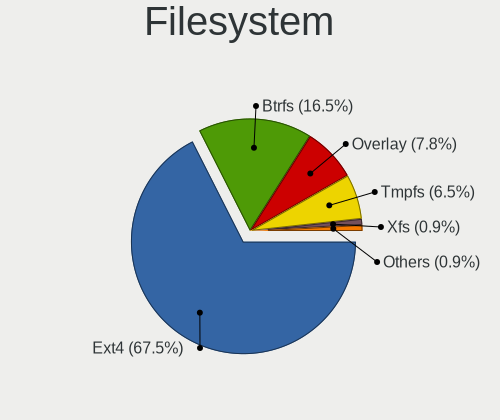
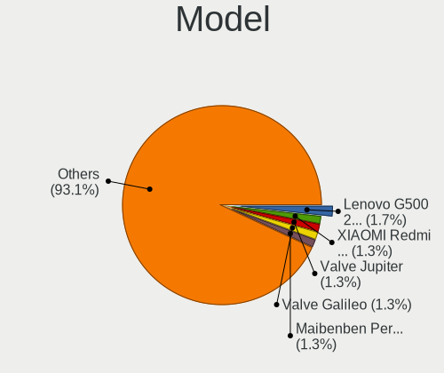
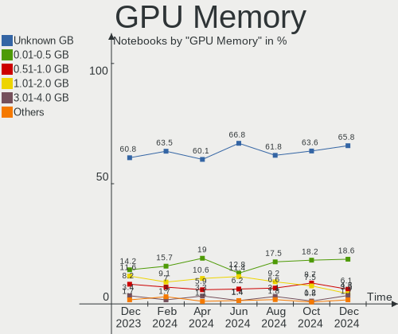
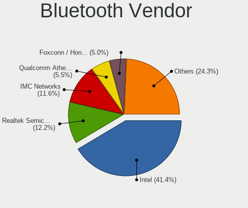
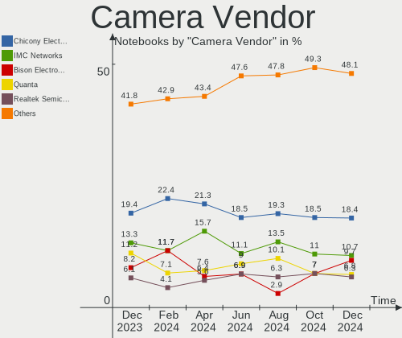
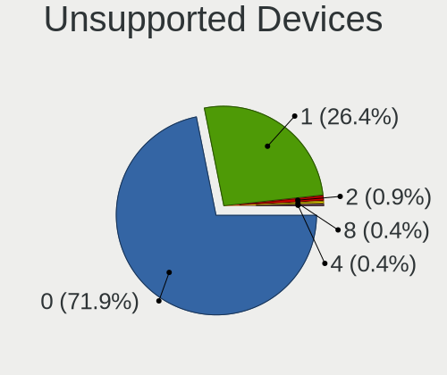

Linux in Russia - Hardware Trends (Notebooks)
---------------------------------------------

A project to identify most popular hardware characteristics and track their change
over time based on data collected by Linux users at https://Linux-Hardware.org.

Anyone can contribute to this report by the [hw-probe](https://github.com/linuxhw/hw-probe) tool:

    sudo -E hw-probe -all -upload

Period: Dec, 2024.

Contents
--------

* [ System ](#system)
  - [ OS                       ](#os)
  - [ OS Family                ](#os-family)
  - [ Kernel                   ](#kernel)
  - [ Kernel Family            ](#kernel-family)
  - [ Kernel Major Ver.        ](#kernel-major-ver)
  - [ Arch                     ](#arch)
  - [ DE                       ](#de)
  - [ Display Server           ](#display-server)
  - [ Display Manager          ](#display-manager)
  - [ OS Lang                  ](#os-lang)
  - [ Boot Mode                ](#boot-mode)
  - [ Filesystem               ](#filesystem)
  - [ Part. scheme             ](#part-scheme)
  - [ Dual Boot with Linux/BSD ](#dual-boot-with-linuxbsd)
  - [ Dual Boot (Win)          ](#dual-boot-win)

* [ Board ](#board)
  - [ Vendor                   ](#vendor)
  - [ Model                    ](#model)
  - [ Model Family             ](#model-family)
  - [ MFG Year                 ](#mfg-year)
  - [ Form Factor              ](#form-factor)
  - [ Secure Boot              ](#secure-boot)
  - [ Coreboot                 ](#coreboot)
  - [ RAM Size                 ](#ram-size)
  - [ RAM Used                 ](#ram-used)
  - [ Total Drives             ](#total-drives)
  - [ Has CD-ROM               ](#has-cd-rom)
  - [ Has Ethernet             ](#has-ethernet)
  - [ Has WiFi                 ](#has-wifi)
  - [ Has Bluetooth            ](#has-bluetooth)

* [ Location ](#location)
  - [ Country                  ](#country)
  - [ City                     ](#city)

* [ Drives ](#drives)
  - [ Drive Vendor             ](#drive-vendor)
  - [ Drive Model              ](#drive-model)
  - [ HDD Vendor               ](#hdd-vendor)
  - [ SSD Vendor               ](#ssd-vendor)
  - [ Drive Kind               ](#drive-kind)
  - [ Drive Connector          ](#drive-connector)
  - [ Drive Size               ](#drive-size)
  - [ Space Total              ](#space-total)
  - [ Space Used               ](#space-used)
  - [ Malfunc. Drives          ](#malfunc-drives)
  - [ Malfunc. Drive Vendor    ](#malfunc-drive-vendor)
  - [ Malfunc. HDD Vendor      ](#malfunc-hdd-vendor)
  - [ Malfunc. Drive Kind      ](#malfunc-drive-kind)
  - [ Failed Drives            ](#failed-drives)
  - [ Failed Drive Vendor      ](#failed-drive-vendor)
  - [ Drive Status             ](#drive-status)

* [ Storage controller ](#storage-controller)
  - [ Storage Vendor           ](#storage-vendor)
  - [ Storage Model            ](#storage-model)
  - [ Storage Kind             ](#storage-kind)

* [ Processor ](#processor)
  - [ CPU Vendor               ](#cpu-vendor)
  - [ CPU Model                ](#cpu-model)
  - [ CPU Model Family         ](#cpu-model-family)
  - [ CPU Cores                ](#cpu-cores)
  - [ CPU Sockets              ](#cpu-sockets)
  - [ CPU Threads              ](#cpu-threads)
  - [ CPU Op-Modes             ](#cpu-op-modes)
  - [ CPU Microcode            ](#cpu-microcode)
  - [ CPU Microarch            ](#cpu-microarch)

* [ Graphics ](#graphics)
  - [ GPU Vendor               ](#gpu-vendor)
  - [ GPU Model                ](#gpu-model)
  - [ GPU Combo                ](#gpu-combo)
  - [ GPU Driver               ](#gpu-driver)
  - [ GPU Memory               ](#gpu-memory)

* [ Monitor ](#monitor)
  - [ Monitor Vendor           ](#monitor-vendor)
  - [ Monitor Model            ](#monitor-model)
  - [ Monitor Resolution       ](#monitor-resolution)
  - [ Monitor Diagonal         ](#monitor-diagonal)
  - [ Monitor Width            ](#monitor-width)
  - [ Aspect Ratio             ](#aspect-ratio)
  - [ Monitor Area             ](#monitor-area)
  - [ Pixel Density            ](#pixel-density)
  - [ Multiple Monitors        ](#multiple-monitors)

* [ Network ](#network)
  - [ Net Controller Vendor    ](#net-controller-vendor)
  - [ Net Controller Model     ](#net-controller-model)
  - [ Wireless Vendor          ](#wireless-vendor)
  - [ Wireless Model           ](#wireless-model)
  - [ Ethernet Vendor          ](#ethernet-vendor)
  - [ Ethernet Model           ](#ethernet-model)
  - [ Net Controller Kind      ](#net-controller-kind)
  - [ Used Controller          ](#used-controller)
  - [ NICs                     ](#nics)
  - [ IPv6                     ](#ipv6)

* [ Bluetooth ](#bluetooth)
  - [ Bluetooth Vendor         ](#bluetooth-vendor)
  - [ Bluetooth Model          ](#bluetooth-model)

* [ Sound ](#sound)
  - [ Sound Vendor             ](#sound-vendor)
  - [ Sound Model              ](#sound-model)

* [ Memory ](#memory)
  - [ Memory Vendor            ](#memory-vendor)
  - [ Memory Model             ](#memory-model)
  - [ Memory Kind              ](#memory-kind)
  - [ Memory Form Factor       ](#memory-form-factor)
  - [ Memory Size              ](#memory-size)
  - [ Memory Speed             ](#memory-speed)

* [ Printers & scanners ](#printers--scanners)
  - [ Printer Vendor           ](#printer-vendor)
  - [ Printer Model            ](#printer-model)
  - [ Scanner Vendor           ](#scanner-vendor)
  - [ Scanner Model            ](#scanner-model)

* [ Camera ](#camera)
  - [ Camera Vendor            ](#camera-vendor)
  - [ Camera Model             ](#camera-model)

* [ Security ](#security)
  - [ Fingerprint Vendor       ](#fingerprint-vendor)
  - [ Fingerprint Model        ](#fingerprint-model)
  - [ Chipcard Vendor          ](#chipcard-vendor)
  - [ Chipcard Model           ](#chipcard-model)

* [ Unsupported ](#unsupported)
  - [ Unsupported Devices      ](#unsupported-devices)
  - [ Unsupported Device Types ](#unsupported-device-types)

System
------

OS
--

Installed operating systems

| Name                         | Notebooks | Percent |
|------------------------------|-----------|---------|
| ROSA 12.5.1                  | 62        | 26.84%  |
| OpenMandriva 24.12           | 16        | 6.93%   |
| Ubuntu 24.04                 | 14        | 6.06%   |
| Fedora 41                    | 11        | 4.76%   |
| Ubuntu 22.04                 | 8         | 3.46%   |
| ROSA 12                      | 8         | 3.46%   |
| Linux Mint 22                | 8         | 3.46%   |
| Arch Rolling                 | 8         | 3.46%   |
| Red OS 8.0                   | 7         | 3.03%   |
| Debian 12                    | 6         | 2.6%    |
| Ubuntu 24.10                 | 4         | 1.73%   |
| ROSA 12.6                    | 4         | 1.73%   |
| ROSA 12.4                    | 4         | 1.73%   |
| OpenMandriva 5.0             | 4         | 1.73%   |
| SteamOS 3.6.20               | 3         | 1.3%    |
| ROSA R11.1                   | 3         | 1.3%    |
| Manjaro                      | 3         | 1.3%    |
| Fedora 40                    | 3         | 1.3%    |
| ALT Linux 20240122           | 3         | 1.3%    |
| SteamOS 3.6.21               | 2         | 0.87%   |
| ROSA 12.2                    | 2         | 0.87%   |
| Red OS 7.3                   | 2         | 0.87%   |
| openSUSE Tumbleweed-XXXXXXXX | 2         | 0.87%   |
| openSUSE Leap-15.6           | 2         | 0.87%   |
| OpenMandriva 24.07           | 2         | 0.87%   |
| OpenMandriva 23.08           | 2         | 0.87%   |
| Manjaro 24.2.0               | 2         | 0.87%   |
| KDE neon 24.04               | 2         | 0.87%   |
| Elementary 8                 | 2         | 0.87%   |
| Zorin 17                     | 1         | 0.43%   |
| Void Linux Rolling           | 1         | 0.43%   |
| Ubuntu MATE 24.04            | 1         | 0.43%   |
| Ubuntu 18.04                 | 1         | 0.43%   |
| SteamOS 3.5.19               | 1         | 0.43%   |
| ROSA R9                      | 1         | 0.43%   |
| ROSA 12.5                    | 1         | 0.43%   |
| ROSA 12.3                    | 1         | 0.43%   |
| Rocky Linux 9.5              | 1         | 0.43%   |
| Peppermint                   | 1         | 0.43%   |
| OpenMandriva 4.3             | 1         | 0.43%   |

OS Family
---------

OS without a version

| Name         | Notebooks | Percent |
|--------------|-----------|---------|
| ROSA         | 86        | 37.23%  |
| Ubuntu       | 27        | 11.69%  |
| OpenMandriva | 25        | 10.82%  |
| Fedora       | 15        | 6.49%   |
| Linux Mint   | 10        | 4.33%   |
| Red OS       | 9         | 3.9%    |
| Arch         | 8         | 3.46%   |
| SteamOS      | 6         | 2.6%    |
| Manjaro      | 6         | 2.6%    |
| Debian       | 6         | 2.6%    |
| ALT Linux    | 5         | 2.16%   |
| openSUSE     | 4         | 1.73%   |
| KDE neon     | 3         | 1.3%    |
| Elementary   | 3         | 1.3%    |
| Astra Linux  | 3         | 1.3%    |
| NixOS        | 2         | 0.87%   |
| Kubuntu      | 2         | 0.87%   |
| Zorin        | 1         | 0.43%   |
| Void Linux   | 1         | 0.43%   |
| Ubuntu MATE  | 1         | 0.43%   |
| Rocky Linux  | 1         | 0.43%   |
| Peppermint   | 1         | 0.43%   |
| Gentoo       | 1         | 0.43%   |
| Devuan       | 1         | 0.43%   |
| blendOS      | 1         | 0.43%   |
| Artix        | 1         | 0.43%   |
| ArcoLinux    | 1         | 0.43%   |
| antiX        | 1         | 0.43%   |

Kernel
------

Version of the Linux kernel

| Version                                  | Notebooks | Percent |
|------------------------------------------|-----------|---------|
| 6.6.47-generic-1rosa2021.1-x86_64        | 49        | 21.21%  |
| 6.8.0-49-generic                         | 19        | 8.23%   |
| 6.12.1-desktop-1omv2490                  | 16        | 6.93%   |
| 6.6.27-generic-3rosa2021.1-x86_64        | 12        | 5.19%   |
| 6.8.0-51-generic                         | 8         | 3.46%   |
| 6.8.0-50-generic                         | 7         | 3.03%   |
| 6.1.89-generic-2rosa2021.1-x86_64        | 6         | 2.6%    |
| 6.6.51-1.red80.x86_64                    | 5         | 2.16%   |
| 6.6.2-desktop-1omv2390                   | 4         | 1.73%   |
| 6.5.0-valve23-1-neptune-65-g385b5e207ae2 | 3         | 1.3%    |
| 6.12.5-200.fc41.x86_64                   | 3         | 1.3%    |
| 6.11.10-300.fc41.x86_64                  | 3         | 1.3%    |
| 6.11.10-2-MANJARO                        | 3         | 1.3%    |
| 6.11.0-9-generic                         | 3         | 1.3%    |
| 6.1.0-28-amd64                           | 3         | 1.3%    |
| 6.8.0-47-generic                         | 2         | 0.87%   |
| 6.6.65-1-MANJARO                         | 2         | 0.87%   |
| 6.6.6-1.red80.x86_64                     | 2         | 0.87%   |
| 6.6.21-generic-8rosa2021.1-x86_64        | 2         | 0.87%   |
| 6.5.0-valve22-1-neptune-65-g9a338ed8a75e | 2         | 0.87%   |
| 6.4.8-desktop-2omv2390                   | 2         | 0.87%   |
| 6.4.0-150600.23.25-default               | 2         | 0.87%   |
| 6.12.4-arch1-1                           | 2         | 0.87%   |
| 6.12.1-arch1-1                           | 2         | 0.87%   |
| 6.11.8-300.fc41.x86_64                   | 2         | 0.87%   |
| 6.11.10-200.fc40.x86_64                  | 2         | 0.87%   |
| 6.10.11+bpo-amd64                        | 2         | 0.87%   |
| 6.10.0-desktop-1omv2490                  | 2         | 0.87%   |
| 6.1.90-1-generic                         | 2         | 0.87%   |
| 6.1.20-generic-2rosa2021.1-x86_64        | 2         | 0.87%   |
| 5.15.170-generic-1rosa2021.1-x86_64      | 2         | 0.87%   |
| 5.15.103-generic-1rosa2021.1-i686        | 2         | 0.87%   |
| 5.10.74-generic-2rosa2021.1-x86_64       | 2         | 0.87%   |
| 6.8.9-100.fc38.x86_64                    | 1         | 0.43%   |
| 6.8.10-300.fc40.x86_64                   | 1         | 0.43%   |
| 6.8.0-40-generic                         | 1         | 0.43%   |
| 6.8.0-38-generic                         | 1         | 0.43%   |
| 6.6.63_1                                 | 1         | 0.43%   |
| 6.6.63-6.6-alt1                          | 1         | 0.43%   |
| 6.6.63-1-lts                             | 1         | 0.43%   |

Kernel Family
-------------

Linux kernel without a distro release

| Version  | Notebooks | Percent |
|----------|-----------|---------|
| 6.6.47   | 49        | 21.21%  |
| 6.8.0    | 38        | 16.45%  |
| 6.12.1   | 18        | 7.79%   |
| 6.6.27   | 12        | 5.19%   |
| 6.11.10  | 8         | 3.46%   |
| 6.5.0    | 6         | 2.6%    |
| 6.12.4   | 6         | 2.6%    |
| 6.1.89   | 6         | 2.6%    |
| 6.1.0    | 6         | 2.6%    |
| 6.6.51   | 5         | 2.16%   |
| 6.12.6   | 5         | 2.16%   |
| 6.6.2    | 4         | 1.73%   |
| 6.11.0   | 4         | 1.73%   |
| 6.6.63   | 3         | 1.3%    |
| 6.12.5   | 3         | 1.3%    |
| 6.11.8   | 3         | 1.3%    |
| 5.15.170 | 3         | 1.3%    |
| 6.6.65   | 2         | 0.87%   |
| 6.6.6    | 2         | 0.87%   |
| 6.6.21   | 2         | 0.87%   |
| 6.4.8    | 2         | 0.87%   |
| 6.4.0    | 2         | 0.87%   |
| 6.12.3   | 2         | 0.87%   |
| 6.12.2   | 2         | 0.87%   |
| 6.10.11  | 2         | 0.87%   |
| 6.10.0   | 2         | 0.87%   |
| 6.1.90   | 2         | 0.87%   |
| 6.1.20   | 2         | 0.87%   |
| 5.4.0    | 2         | 0.87%   |
| 5.15.103 | 2         | 0.87%   |
| 5.15.0   | 2         | 0.87%   |
| 5.10.74  | 2         | 0.87%   |
| 6.8.9    | 1         | 0.43%   |
| 6.8.10   | 1         | 0.43%   |
| 6.6.62   | 1         | 0.43%   |
| 6.2.9    | 1         | 0.43%   |
| 6.2.0    | 1         | 0.43%   |
| 6.11.9   | 1         | 0.43%   |
| 6.11.5   | 1         | 0.43%   |
| 6.11.4   | 1         | 0.43%   |

Kernel Major Ver.
-----------------

Linux kernel major version

| Version | Notebooks | Percent |
|---------|-----------|---------|
| 6.6     | 80        | 34.63%  |
| 6.8     | 40        | 17.32%  |
| 6.12    | 36        | 15.58%  |
| 6.1     | 19        | 8.23%   |
| 6.11    | 18        | 7.79%   |
| 5.15    | 8         | 3.46%   |
| 6.5     | 6         | 2.6%    |
| 6.10    | 5         | 2.16%   |
| 6.4     | 4         | 1.73%   |
| 5.4     | 4         | 1.73%   |
| 5.10    | 4         | 1.73%   |
| 6.2     | 2         | 0.87%   |
| 5.17    | 1         | 0.43%   |
| 5.16    | 1         | 0.43%   |
| 5.14    | 1         | 0.43%   |
| 4.9     | 1         | 0.43%   |
| 4.15    | 1         | 0.43%   |

Arch
----

OS architecture (x86_64, i586, etc.)

| Name   | Notebooks | Percent |
|--------|-----------|---------|
| x86_64 | 223       | 96.54%  |
| i686   | 8         | 3.46%   |

DE
--

Desktop Environment

| Name            | Notebooks | Percent |
|-----------------|-----------|---------|
| KDE5            | 81        | 35.06%  |
| GNOME           | 68        | 29.44%  |
| Unknown         | 21        | 9.09%   |
| LXQt            | 12        | 5.19%   |
| KDE6            | 10        | 4.33%   |
| MATE            | 9         | 3.9%    |
| X-Cinnamon      | 8         | 3.46%   |
| XFCE            | 6         | 2.6%    |
| Hyprland        | 4         | 1.73%   |
| Pantheon        | 3         | 1.3%    |
| KDE4            | 2         | 0.87%   |
| i3              | 2         | 0.87%   |
| sway            | 1         | 0.43%   |
| KDE             | 1         | 0.43%   |
| icewm           | 1         | 0.43%   |
| GNOME Flashback | 1         | 0.43%   |
| fly             | 1         | 0.43%   |

Display Server
--------------

X11 or Wayland

| Name    | Notebooks | Percent |
|---------|-----------|---------|
| Wayland | 139       | 60.17%  |
| X11     | 87        | 37.66%  |
| Unknown | 4         | 1.73%   |
| Tty     | 1         | 0.43%   |

Display Manager
---------------

SDDM, LightDM, etc.

| Name    | Notebooks | Percent |
|---------|-----------|---------|
| SDDM    | 98        | 42.42%  |
| GDM     | 40        | 17.32%  |
| Unknown | 36        | 15.58%  |
| GDM3    | 26        | 11.26%  |
| LightDM | 23        | 9.96%   |
| FLY-DM  | 3         | 1.3%    |
| KDM     | 2         | 0.87%   |
| GREETD  | 2         | 0.87%   |
| SLIMSKI | 1         | 0.43%   |

OS Lang
-------

Language

| Lang    | Notebooks | Percent |
|---------|-----------|---------|
| ru_RU   | 167       | 72.29%  |
| en_US   | 56        | 24.24%  |
| Unknown | 4         | 1.73%   |
| en_GB   | 2         | 0.87%   |
| C       | 2         | 0.87%   |

Boot Mode
---------

EFI or BIOS

| Mode | Notebooks | Percent |
|------|-----------|---------|
| EFI  | 138       | 59.74%  |
| BIOS | 93        | 40.26%  |

Filesystem
----------

Type of filesystem

| Type    | Notebooks | Percent |
|---------|-----------|---------|
| Ext4    | 156       | 67.53%  |
| Btrfs   | 38        | 16.45%  |
| Overlay | 18        | 7.79%   |
| Tmpfs   | 15        | 6.49%   |
| Xfs     | 2         | 0.87%   |
| Zfs     | 1         | 0.43%   |
| Unknown | 1         | 0.43%   |

Part. scheme
------------

Scheme of partitioning

| Type    | Notebooks | Percent |
|---------|-----------|---------|
| GPT     | 157       | 67.97%  |
| MBR     | 39        | 16.88%  |
| Unknown | 35        | 15.15%  |

Dual Boot with Linux/BSD
------------------------

Hosting more than one Linux/BSD

| Dual boot | Notebooks | Percent |
|-----------|-----------|---------|
| No        | 198       | 85.71%  |
| Yes       | 33        | 14.29%  |

Dual Boot (Win)
---------------

Hosting Linux and Windows

| Dual boot | Notebooks | Percent |
|-----------|-----------|---------|
| No        | 160       | 69.26%  |
| Yes       | 71        | 30.74%  |

Board
-----

Vendor
------

Motherboard manufacturer

| Name                 | Notebooks | Percent |
|----------------------|-----------|---------|
| Lenovo               | 40        | 17.32%  |
| ASUSTek Computer     | 36        | 15.58%  |
| Acer                 | 28        | 12.12%  |
| Hewlett-Packard      | 26        | 11.26%  |
| HUAWEI               | 11        | 4.76%   |
| Dell                 | 11        | 4.76%   |
| MSI                  | 9         | 3.9%    |
| Valve                | 6         | 2.6%    |
| Maibenben            | 5         | 2.16%   |
| HONOR                | 5         | 2.16%   |
| Apple                | 5         | 2.16%   |
| Samsung Electronics  | 4         | 1.73%   |
| Infinix              | 4         | 1.73%   |
| XIAOMI               | 3         | 1.3%    |
| LTD Delovoy Office   | 3         | 1.3%    |
| Clevo                | 3         | 1.3%    |
| TECNO Mobile Limited | 2         | 0.87%   |
| Sony                 | 2         | 0.87%   |
| Notebook             | 2         | 0.87%   |
| KVADRA               | 2         | 0.87%   |
| ICL                  | 2         | 0.87%   |
| Haier                | 2         | 0.87%   |
| Fujitsu Siemens      | 2         | 0.87%   |
| eMachines            | 2         | 0.87%   |
| Aquarius             | 2         | 0.87%   |
| Toshiba              | 1         | 0.43%   |
| Pegatron             | 1         | 0.43%   |
| Packard Bell         | 1         | 0.43%   |
| Lunnen               | 1         | 0.43%   |
| iRU                  | 1         | 0.43%   |
| Intel                | 1         | 0.43%   |
| Google               | 1         | 0.43%   |
| Gigabyte Technology  | 1         | 0.43%   |
| DNS                  | 1         | 0.43%   |
| Digma                | 1         | 0.43%   |
| DEXP                 | 1         | 0.43%   |
| Chuwi                | 1         | 0.43%   |
| ASRock               | 1         | 0.43%   |
| Unknown              | 1         | 0.43%   |

Model
-----

Motherboard model

| Name                                                                                     | Notebooks | Percent |
|------------------------------------------------------------------------------------------|-----------|---------|
| Lenovo G500 20236                                                                        | 4         | 1.73%   |
| XIAOMI Redmi Book Pro 15 2023                                                            | 3         | 1.3%    |
| Valve Jupiter                                                                            | 3         | 1.3%    |
| Valve Galileo                                                                            | 3         | 1.3%    |
| Maibenben Perfectum Series                                                               | 3         | 1.3%    |
| ASUS VivoBook_ASUSLaptop X1605VA_X1605VA                                                 | 3         | 1.3%    |
| Acer Extensa 215-23                                                                      | 3         | 1.3%    |
| Lenovo G700 20251                                                                        | 2         | 0.87%   |
| Lenovo B590 20208                                                                        | 2         | 0.87%   |
| KVADRA NAU LE14U                                                                         | 2         | 0.87%   |
| HUAWEI VGHH-XX                                                                           | 2         | 0.87%   |
| HUAWEI BOM-WXX9                                                                          | 2         | 0.87%   |
| HUAWEI BoDE-WXX9                                                                         | 2         | 0.87%   |
| HP Pavilion dv6                                                                          | 2         | 0.87%   |
| Dell Inspiron 3521                                                                       | 2         | 0.87%   |
| ASUS X751MD                                                                              | 2         | 0.87%   |
| ASUS VivoBook 15_ASUS Laptop X540BA                                                      | 2         | 0.87%   |
| ASUS 1225B                                                                               | 2         | 0.87%   |
| Acer Nitro AN517-51                                                                      | 2         | 0.87%   |
| Acer Aspire 5742G                                                                        | 2         | 0.87%   |
| Unknown                                                                                  | 2         | 0.87%   |
| Toshiba Satellite U300                                                                   | 1         | 0.43%   |
| TECNO Mobile Limited MEGABOOK T16RA                                                      | 1         | 0.43%   |
| TECNO Mobile Limited MEGABOOK K16SDA                                                     | 1         | 0.43%   |
| Sony VPCSB3V9R                                                                           | 1         | 0.43%   |
| Sony SVS1313V9RB                                                                         | 1         | 0.43%   |
| Samsung R530/R730                                                                        | 1         | 0.43%   |
| Samsung R510/P510                                                                        | 1         | 0.43%   |
| Samsung 355V4C/355V4X/355V5C/355V5X/356V4C/356V4X/356V5C/356V5X/3445VC/3445VX/3545VC/354 | 1         | 0.43%   |
| Samsung 305V4A/305V5A                                                                    | 1         | 0.43%   |
| Pegatron A15                                                                             | 1         | 0.43%   |
| Packard Bell EasyNote TE11HC                                                             | 1         | 0.43%   |
| Notebook W65_67SH                                                                        | 1         | 0.43%   |
| Notebook W250EGQ / W270EGQ                                                               | 1         | 0.43%   |
| MSI VR610                                                                                | 1         | 0.43%   |
| MSI Stealth GS66 12UHS                                                                   | 1         | 0.43%   |
| MSI Modern 14 C5M                                                                        | 1         | 0.43%   |
| MSI Modern 14 B5M                                                                        | 1         | 0.43%   |
| MSI Katana GF66 12UE                                                                     | 1         | 0.43%   |
| MSI Katana GF66 11UE                                                                     | 1         | 0.43%   |

Model Family
------------

Motherboard model prefix

| Name                          | Notebooks | Percent |
|-------------------------------|-----------|---------|
| Acer Aspire                   | 18        | 7.79%   |
| Lenovo ThinkPad               | 13        | 5.63%   |
| ASUS VivoBook                 | 10        | 4.33%   |
| HP Pavilion                   | 7         | 3.03%   |
| Lenovo IdeaPad                | 6         | 2.6%    |
| Lenovo ThinkBook              | 5         | 2.16%   |
| HP ProBook                    | 5         | 2.16%   |
| HP Laptop                     | 5         | 2.16%   |
| Dell Inspiron                 | 5         | 2.16%   |
| Lenovo G500                   | 4         | 1.73%   |
| HP EliteBook                  | 4         | 1.73%   |
| XIAOMI Redmi                  | 3         | 1.3%    |
| Valve Jupiter                 | 3         | 1.3%    |
| Valve Galileo                 | 3         | 1.3%    |
| MSI Katana                    | 3         | 1.3%    |
| Maibenben Perfectum           | 3         | 1.3%    |
| Lenovo B590                   | 3         | 1.3%    |
| ASUS ASUS                     | 3         | 1.3%    |
| Acer Nitro                    | 3         | 1.3%    |
| Acer Extensa                  | 3         | 1.3%    |
| TECNO Mobile Limited MEGABOOK | 2         | 0.87%   |
| MSI Modern                    | 2         | 0.87%   |
| Lenovo G700                   | 2         | 0.87%   |
| KVADRA NAU                    | 2         | 0.87%   |
| Infinix INBOOK                | 2         | 0.87%   |
| HUAWEI VGHH-XX                | 2         | 0.87%   |
| HUAWEI BOM-WXX9               | 2         | 0.87%   |
| HUAWEI BoDE-WXX9              | 2         | 0.87%   |
| Dell Latitude                 | 2         | 0.87%   |
| ASUS X751MD                   | 2         | 0.87%   |
| ASUS ROG                      | 2         | 0.87%   |
| ASUS 1225B                    | 2         | 0.87%   |
| Unknown                       | 2         | 0.87%   |
| Toshiba Satellite             | 1         | 0.43%   |
| Sony VPCSB3V9R                | 1         | 0.43%   |
| Sony SVS1313V9RB              | 1         | 0.43%   |
| Samsung R530                  | 1         | 0.43%   |
| Samsung R510                  | 1         | 0.43%   |
| Samsung 355V4C                | 1         | 0.43%   |
| Samsung 305V4A                | 1         | 0.43%   |

MFG Year
--------

Motherboard manufacture year

| Year | Notebooks | Percent |
|------|-----------|---------|
| 2023 | 30        | 12.99%  |
| 2022 | 30        | 12.99%  |
| 2012 | 25        | 10.82%  |
| 2024 | 19        | 8.23%   |
| 2021 | 17        | 7.36%   |
| 2019 | 12        | 5.19%   |
| 2013 | 12        | 5.19%   |
| 2011 | 12        | 5.19%   |
| 2010 | 12        | 5.19%   |
| 2020 | 11        | 4.76%   |
| 2018 | 8         | 3.46%   |
| 2015 | 8         | 3.46%   |
| 2017 | 7         | 3.03%   |
| 2014 | 7         | 3.03%   |
| 2008 | 7         | 3.03%   |
| 2007 | 5         | 2.16%   |
| 2016 | 4         | 1.73%   |
| 2009 | 3         | 1.3%    |
| 2006 | 1         | 0.43%   |
| 2005 | 1         | 0.43%   |

Form Factor
-----------

Physical design of the computer

| Name     | Notebooks | Percent |
|----------|-----------|---------|
| Notebook | 231       | 100%    |

Secure Boot
-----------

Enabled or disabled

| State    | Notebooks | Percent |
|----------|-----------|---------|
| Disabled | 222       | 96.1%   |
| Enabled  | 9         | 3.9%    |

Coreboot
--------

Have coreboot on board

| Used | Notebooks | Percent |
|------|-----------|---------|
| No   | 230       | 99.57%  |
| Yes  | 1         | 0.43%   |

RAM Size
--------

Total RAM memory

| Size in GB  | Notebooks | Percent |
|-------------|-----------|---------|
| 4.01-8.0    | 70        | 30.3%   |
| 8.01-16.0   | 54        | 23.38%  |
| 3.01-4.0    | 35        | 15.15%  |
| 16.01-24.0  | 34        | 14.72%  |
| 32.01-64.0  | 15        | 6.49%   |
| 1.01-2.0    | 12        | 5.19%   |
| 24.01-32.0  | 7         | 3.03%   |
| 2.01-3.0    | 3         | 1.3%    |
| 64.01-256.0 | 1         | 0.43%   |

RAM Used
--------

Used RAM memory

| Used GB    | Notebooks | Percent |
|------------|-----------|---------|
| 1.01-2.0   | 73        | 31.6%   |
| 2.01-3.0   | 56        | 24.24%  |
| 4.01-8.0   | 43        | 18.61%  |
| 3.01-4.0   | 24        | 10.39%  |
| 0.51-1.0   | 21        | 9.09%   |
| 8.01-16.0  | 10        | 4.33%   |
| 16.01-24.0 | 2         | 0.87%   |
| 0.01-0.5   | 2         | 0.87%   |

Total Drives
------------

Number of drives on board

| Drives | Notebooks | Percent |
|--------|-----------|---------|
| 1      | 172       | 74.46%  |
| 2      | 52        | 22.51%  |
| 3      | 4         | 1.73%   |
| 0      | 2         | 0.87%   |
| 4      | 1         | 0.43%   |

Has CD-ROM
----------

Has CD-ROM on board

| Presented | Notebooks | Percent |
|-----------|-----------|---------|
| No        | 169       | 73.16%  |
| Yes       | 62        | 26.84%  |

Has Ethernet
------------

Has Ethernet on board

| Presented | Notebooks | Percent |
|-----------|-----------|---------|
| Yes       | 172       | 74.46%  |
| No        | 59        | 25.54%  |

Has WiFi
--------

Has WiFi module

| Presented | Notebooks | Percent |
|-----------|-----------|---------|
| Yes       | 220       | 95.24%  |
| No        | 11        | 4.76%   |

Has Bluetooth
-------------

Has Bluetooth module

| Presented | Notebooks | Percent |
|-----------|-----------|---------|
| Yes       | 180       | 77.92%  |
| No        | 51        | 22.08%  |

Location
--------

Country
-------

Geographic location (country)

| Country | Notebooks | Percent |
|---------|-----------|---------|
| Russia  | 231       | 100%    |

City
----

Geographic location (city)

| City              | Notebooks | Percent |
|-------------------|-----------|---------|
| Moscow            | 53        | 22.94%  |
| St Petersburg     | 23        | 9.96%   |
| Novosibirsk       | 10        | 4.33%   |
| Chelyabinsk       | 7         | 3.03%   |
| Yekaterinburg     | 6         | 2.6%    |
| Samara            | 6         | 2.6%    |
| Yoshkar-Ola       | 5         | 2.16%   |
| Krasnoyarsk       | 5         | 2.16%   |
| Voronezh          | 4         | 1.73%   |
| Ufa               | 3         | 1.3%    |
| Perm              | 3         | 1.3%    |
| Kursk             | 3         | 1.3%    |
| Kazan’          | 3         | 1.3%    |
| Barnaul           | 3         | 1.3%    |
| Yaroslavl         | 2         | 0.87%   |
| Volzhsky          | 2         | 0.87%   |
| Vladivostok       | 2         | 0.87%   |
| Ulyanovsk         | 2         | 0.87%   |
| Tula              | 2         | 0.87%   |
| Tambov            | 2         | 0.87%   |
| Taganrog          | 2         | 0.87%   |
| Saratov           | 2         | 0.87%   |
| Rostov-on-Don     | 2         | 0.87%   |
| Pyatigorsk        | 2         | 0.87%   |
| Pskov             | 2         | 0.87%   |
| Krasnodar         | 2         | 0.87%   |
| Kaluga            | 2         | 0.87%   |
| Kaliningrad       | 2         | 0.87%   |
| Cheboksary        | 2         | 0.87%   |
| Belgorod          | 2         | 0.87%   |
| Balashikha        | 2         | 0.87%   |
| Zvenigovo         | 1         | 0.43%   |
| Zelenogorsk       | 1         | 0.43%   |
| Yuzhno-Sakhalinsk | 1         | 0.43%   |
| Yakutsk           | 1         | 0.43%   |
| Vyksa             | 1         | 0.43%   |
| Voskresensk       | 1         | 0.43%   |
| Volgograd         | 1         | 0.43%   |
| Volchanka         | 1         | 0.43%   |
| Tyumen            | 1         | 0.43%   |

Drives
------

Drive Vendor
------------

Hard drive vendors

| Vendor                       | Notebooks | Drives | Percent |
|------------------------------|-----------|--------|---------|
| Samsung Electronics          | 28        | 31     | 10%     |
| Sandisk                      | 20        | 20     | 7.14%   |
| WDC                          | 19        | 21     | 6.79%   |
| Unknown                      | 16        | 16     | 5.71%   |
| SK hynix                     | 14        | 14     | 5%      |
| Kingston                     | 14        | 15     | 5%      |
| Micron Technology            | 13        | 13     | 4.64%   |
| Toshiba                      | 12        | 13     | 4.29%   |
| Seagate                      | 12        | 12     | 4.29%   |
| Hitachi                      | 9         | 9      | 3.21%   |
| Silicon Motion               | 8         | 8      | 2.86%   |
| A-DATA Technology            | 8         | 8      | 2.86%   |
| KIOXIA                       | 7         | 7      | 2.5%    |
| Intel                        | 7         | 7      | 2.5%    |
| China                        | 7         | 7      | 2.5%    |
| Unknown                      | 5         | 5      | 1.79%   |
| Patriot                      | 4         | 4      | 1.43%   |
| HGST                         | 4         | 4      | 1.43%   |
| Apple                        | 4         | 5      | 1.43%   |
| Apacer                       | 4         | 4      | 1.43%   |
| Transcend                    | 3         | 3      | 1.07%   |
| Phison Electronics           | 3         | 3      | 1.07%   |
| Phison                       | 3         | 3      | 1.07%   |
| Kingston Technology Company  | 3         | 3      | 1.07%   |
| JMicron Technology           | 3         | 3      | 1.07%   |
| Hewlett-Packard              | 3         | 3      | 1.07%   |
| YMTC                         | 2         | 2      | 0.71%   |
| SPCC                         | 2         | 2      | 0.71%   |
| Shenzhen Longsys Electronics | 2         | 2      | 0.71%   |
| SCY                          | 2         | 2      | 0.71%   |
| Netac                        | 2         | 2      | 0.71%   |
| KingSpec                     | 2         | 2      | 0.71%   |
| GOODRAM                      | 2         | 2      | 0.71%   |
| Fujitsu                      | 2         | 2      | 0.71%   |
| FORESEE                      | 2         | 2      | 0.71%   |
| BR                           | 2         | 2      | 0.71%   |
| ZTE                          | 1         | 1      | 0.36%   |
| XrayDisk                     | 1         | 1      | 0.36%   |
| VK000240                     | 1         | 1      | 0.36%   |
| USB3.0                       | 1         | 1      | 0.36%   |

Drive Model
-----------

Hard drive models

| Model                                                | Notebooks | Percent |
|------------------------------------------------------|-----------|---------|
| Silicon Motion PCIe-8 SSD 512GB                      | 5         | 1.75%   |
| Micron 2400_MTFDKBA512QFM 512GB                      | 5         | 1.75%   |
| Kingston SA400S37480G 480GB SSD                      | 5         | 1.75%   |
| Unknown                                              | 5         | 1.75%   |
| Toshiba MQ04ABF100 1TB                               | 4         | 1.4%    |
| Toshiba MQ01ABF050 500GB                             | 4         | 1.4%    |
| Seagate ST500LT012-9WS142 500GB                      | 3         | 1.05%   |
| KIOXIA KBG50ZNV512G 512GB                            | 3         | 1.05%   |
| KIOXIA KBG40ZNV512G 512GB                            | 3         | 1.05%   |
| JMicron Generic 500GB                                | 3         | 1.05%   |
| A-DATA SX6000PNP 256GB                               | 3         | 1.05%   |
| WDC WDS240G2G0A-00JH30 240GB SSD                     | 2         | 0.7%    |
| WDC WD5000LPVX-22V0TT0 500GB                         | 2         | 0.7%    |
| Unknown SLD64G  64GB                                 | 2         | 0.7%    |
| Unknown MMC Card  64GB                               | 2         | 0.7%    |
| Unknown MMC Card  512GB                              | 2         | 0.7%    |
| SK hynix SKHynix_HFS512GEJ4X112N 512GB               | 2         | 0.7%    |
| SK hynix HFS128G39TND-N210A 128GB SSD                | 2         | 0.7%    |
| Silicon Motion PCIe-4 SSD 256GB                      | 2         | 0.7%    |
| Shenzhen Longsys FORESEE XP1000F512G 512GB           | 2         | 0.7%    |
| Seagate ST1000LM024 HN-M101MBB 1TB                   | 2         | 0.7%    |
| Sandisk WD PC SN560 SDDPNQE-1T00-1102 1024GB         | 2         | 0.7%    |
| SanDisk NVMe SSD Drive 512GB                         | 2         | 0.7%    |
| SanDisk NVMe SSD Drive 256GB                         | 2         | 0.7%    |
| Samsung SSD 870 EVO 500GB                            | 2         | 0.7%    |
| Samsung NVMe SSD Controller PM9A1/PM9A3/980PRO 512GB | 2         | 0.7%    |
| Patriot P210 512GB SSD                               | 2         | 0.7%    |
| Kingston SKC600256G 256GB SSD                        | 2         | 0.7%    |
| Hitachi HTS547575A9E384 752GB                        | 2         | 0.7%    |
| Hitachi HTS545050B9A300 500GB                        | 2         | 0.7%    |
| HGST HTS545050A7E380 500GB                           | 2         | 0.7%    |
| China SSD 480GB                                      | 2         | 0.7%    |
| China SSD 1TB                                        | 2         | 0.7%    |
| ZTE MMC Storage 942MB                                | 1         | 0.35%   |
| YMTC PC300-512GB-B                                   | 1         | 0.35%   |
| YMTC PC300-1TB-B                                     | 1         | 0.35%   |
| XrayDisk 2TB SSD                                     | 1         | 0.35%   |
| WDC WDS500G2B0A-00SM50 500GB SSD                     | 1         | 0.35%   |
| WDC WDS250G2B0A-00SM50 250GB SSD                     | 1         | 0.35%   |
| WDC WDS240G1G0A-00SS50 240GB SSD                     | 1         | 0.35%   |

HDD Vendor
----------

Hard disk drive vendors

| Vendor              | Notebooks | Drives | Percent |
|---------------------|-----------|--------|---------|
| WDC                 | 15        | 16     | 26.32%  |
| Seagate             | 12        | 12     | 21.05%  |
| Toshiba             | 10        | 11     | 17.54%  |
| Hitachi             | 8         | 8      | 14.04%  |
| HGST                | 4         | 4      | 7.02%   |
| JMicron Technology  | 3         | 3      | 5.26%   |
| Fujitsu             | 2         | 2      | 3.51%   |
| Samsung Electronics | 1         | 1      | 1.75%   |
| HGST HTS            | 1         | 1      | 1.75%   |
| External            | 1         | 1      | 1.75%   |

SSD Vendor
----------

Solid state drive vendors

| Vendor              | Notebooks | Drives | Percent |
|---------------------|-----------|--------|---------|
| Kingston            | 10        | 11     | 11.76%  |
| Samsung Electronics | 9         | 9      | 10.59%  |
| China               | 7         | 7      | 8.24%   |
| WDC                 | 5         | 5      | 5.88%   |
| A-DATA Technology   | 5         | 5      | 5.88%   |
| Patriot             | 4         | 4      | 4.71%   |
| Intel               | 4         | 4      | 4.71%   |
| Transcend           | 3         | 3      | 3.53%   |
| SK hynix            | 3         | 3      | 3.53%   |
| SanDisk             | 3         | 3      | 3.53%   |
| Apacer              | 3         | 3      | 3.53%   |
| SPCC                | 2         | 2      | 2.35%   |
| Netac               | 2         | 2      | 2.35%   |
| KingSpec            | 2         | 2      | 2.35%   |
| Hewlett-Packard     | 2         | 2      | 2.35%   |
| GOODRAM             | 2         | 2      | 2.35%   |
| Apple               | 2         | 2      | 2.35%   |
| Unknown             | 2         | 2      | 2.35%   |
| XrayDisk            | 1         | 1      | 1.18%   |
| USB3.0              | 1         | 1      | 1.18%   |
| Smartbuy            | 1         | 1      | 1.18%   |
| Q600S               | 1         | 1      | 1.18%   |
| PNY                 | 1         | 1      | 1.18%   |
| Plextor             | 1         | 1      | 1.18%   |
| Micron Technology   | 1         | 1      | 1.18%   |
| HS-SSD-E100         | 1         | 1      | 1.18%   |
| GS                  | 1         | 1      | 1.18%   |
| ExeGate             | 1         | 1      | 1.18%   |
| DEXP                | 1         | 1      | 1.18%   |
| BR                  | 1         | 1      | 1.18%   |
| BIWIN               | 1         | 1      | 1.18%   |
| Azerty              | 1         | 1      | 1.18%   |
| ASMT                | 1         | 1      | 1.18%   |

Drive Kind
----------

HDD or SSD

| Kind    | Notebooks | Drives | Percent |
|---------|-----------|--------|---------|
| NVMe    | 109       | 119    | 40.37%  |
| SSD     | 81        | 86     | 30%     |
| HDD     | 55        | 59     | 20.37%  |
| MMC     | 18        | 18     | 6.67%   |
| Unknown | 7         | 7      | 2.59%   |

Drive Connector
---------------

SATA, SAS, NVMe, etc.

| Type | Notebooks | Drives | Percent |
|------|-----------|--------|---------|
| SATA | 118       | 139    | 45.74%  |
| NVMe | 109       | 119    | 42.25%  |
| MMC  | 18        | 18     | 6.98%   |
| SAS  | 13        | 13     | 5.04%   |

Drive Size
----------

Size of hard drive

| Size in TB | Notebooks | Drives | Percent |
|------------|-----------|--------|---------|
| 0.01-0.5   | 105       | 114    | 79.55%  |
| 0.51-1.0   | 26        | 30     | 19.7%   |
| 1.01-2.0   | 1         | 1      | 0.76%   |

Space Total
-----------

Amount of disk space available on the file system

| Size in GB     | Notebooks | Percent |
|----------------|-----------|---------|
| 101-250        | 63        | 27.27%  |
| 251-500        | 59        | 25.54%  |
| 501-1000       | 27        | 11.69%  |
| 1-20           | 23        | 9.96%   |
| 1001-2000      | 18        | 7.79%   |
| 51-100         | 17        | 7.36%   |
| 21-50          | 12        | 5.19%   |
| Unknown        | 6         | 2.6%    |
| 2001-3000      | 5         | 2.16%   |
| More than 3000 | 1         | 0.43%   |

Space Used
----------

Amount of used disk space

| Used GB   | Notebooks | Percent |
|-----------|-----------|---------|
| 1-20      | 96        | 41.56%  |
| 21-50     | 42        | 18.18%  |
| 101-250   | 30        | 12.99%  |
| 51-100    | 21        | 9.09%   |
| 251-500   | 14        | 6.06%   |
| 501-1000  | 14        | 6.06%   |
| 1001-2000 | 8         | 3.46%   |
| Unknown   | 6         | 2.6%    |

Malfunc. Drives
---------------

Drive models with a malfunction

| Model                                 | Notebooks | Drives | Percent |
|---------------------------------------|-----------|--------|---------|
| Seagate ST500LT012-9WS142 500GB       | 3         | 3      | 9.68%   |
| Hitachi HTS545050B9A300 500GB         | 2         | 2      | 6.45%   |
| WDC WDS240G2G0A-00JH30 240GB SSD      | 1         | 1      | 3.23%   |
| WDC WD2500BEVT-75ZCT2 250GB           | 1         | 1      | 3.23%   |
| WDC WD2500BEVS-60UST0 250GB           | 1         | 1      | 3.23%   |
| WDC WD1600BEVS-60RST0 160GB           | 1         | 1      | 3.23%   |
| WDC WD10JPVT-60A1YT0 1TB              | 1         | 1      | 3.23%   |
| Toshiba MQ01ABF050 500GB              | 1         | 1      | 3.23%   |
| Toshiba MQ01ABD100 1TB                | 1         | 1      | 3.23%   |
| Toshiba MK5075GSX 500GB               | 1         | 1      | 3.23%   |
| SK hynix HFS128G39TND-N210A 128GB SSD | 1         | 1      | 3.23%   |
| Seagate ST9500325AS 500GB             | 1         | 1      | 3.23%   |
| Seagate ST9250315AS 250GB             | 1         | 1      | 3.23%   |
| Seagate ST320LT020-9YG142 320GB       | 1         | 1      | 3.23%   |
| Seagate ST1000LM024 HN-M101MBB 1TB    | 1         | 1      | 3.23%   |
| Samsung Electronics SSD 870 EVO 500GB | 1         | 1      | 3.23%   |
| Kingston SA400S37480G 480GB SSD       | 1         | 2      | 3.23%   |
| Hitachi HTS725032A9A364 320GB         | 1         | 1      | 3.23%   |
| Hitachi HTS547575A9E384 752GB         | 1         | 1      | 3.23%   |
| Hitachi HTS545025B9A300 250GB         | 1         | 1      | 3.23%   |
| Hitachi HTS545016B9A300 160GB         | 1         | 1      | 3.23%   |
| Hitachi HTS542512K9SA00 120GB         | 1         | 1      | 3.23%   |
| HGST HTS545050A7E380 500GB            | 1         | 1      | 3.23%   |
| Hewlett-Packard SSD S700 1TB          | 1         | 1      | 3.23%   |
| GS SSD 256-16 STR 256GB               | 1         | 1      | 3.23%   |
| Fujitsu MHT2080BH 80GB                | 1         | 1      | 3.23%   |
| Fujitsu MHT2060BH 64GB                | 1         | 1      | 3.23%   |
| A-DATA Technology SU635 240GB SSD     | 1         | 1      | 3.23%   |

Malfunc. Drive Vendor
---------------------

Vendors of faulty drives

| Vendor              | Notebooks | Drives | Percent |
|---------------------|-----------|--------|---------|
| Seagate             | 7         | 7      | 23.33%  |
| Hitachi             | 7         | 7      | 23.33%  |
| WDC                 | 5         | 5      | 16.67%  |
| Toshiba             | 2         | 3      | 6.67%   |
| Fujitsu             | 2         | 2      | 6.67%   |
| SK hynix            | 1         | 1      | 3.33%   |
| Samsung Electronics | 1         | 1      | 3.33%   |
| Kingston            | 1         | 2      | 3.33%   |
| HGST                | 1         | 1      | 3.33%   |
| Hewlett-Packard     | 1         | 1      | 3.33%   |
| GS                  | 1         | 1      | 3.33%   |
| A-DATA Technology   | 1         | 1      | 3.33%   |

Malfunc. HDD Vendor
-------------------

Vendors of faulty HDD drives

| Vendor  | Notebooks | Drives | Percent |
|---------|-----------|--------|---------|
| Seagate | 7         | 7      | 30.43%  |
| Hitachi | 7         | 7      | 30.43%  |
| WDC     | 4         | 4      | 17.39%  |
| Toshiba | 2         | 3      | 8.7%    |
| Fujitsu | 2         | 2      | 8.7%    |
| HGST    | 1         | 1      | 4.35%   |

Malfunc. Drive Kind
-------------------

Kinds of faulty drives

| Kind | Notebooks | Drives | Percent |
|------|-----------|--------|---------|
| HDD  | 23        | 24     | 76.67%  |
| SSD  | 7         | 8      | 23.33%  |

Failed Drives
-------------

Failed drive models

| Model                        | Notebooks | Drives | Percent |
|------------------------------|-----------|--------|---------|
| WDC WD2500BEVT-35A23T0 250GB | 1         | 1      | 100%    |

Failed Drive Vendor
-------------------

Failed drive vendors

| Vendor | Notebooks | Drives | Percent |
|--------|-----------|--------|---------|
| WDC    | 1         | 1      | 100%    |

Drive Status
------------

Number of failed and malfunc. drives

| Status   | Notebooks | Drives | Percent |
|----------|-----------|--------|---------|
| Works    | 147       | 165    | 58.8%   |
| Detected | 72        | 91     | 28.8%   |
| Malfunc  | 30        | 32     | 12%     |
| Failed   | 1         | 1      | 0.4%    |

Storage controller
------------------

Storage Vendor
--------------

Storage controller vendors

| Vendor                           | Notebooks | Percent |
|----------------------------------|-----------|---------|
| Intel                            | 132       | 49.81%  |
| Samsung Electronics              | 19        | 7.17%   |
| AMD                              | 19        | 7.17%   |
| SanDisk                          | 17        | 6.42%   |
| Micron Technology                | 12        | 4.53%   |
| SK hynix                         | 10        | 3.77%   |
| Silicon Motion                   | 9         | 3.4%    |
| Phison Electronics               | 7         | 2.64%   |
| KIOXIA                           | 7         | 2.64%   |
| Kingston Technology Company      | 7         | 2.64%   |
| Shenzhen Longsys Electronics     | 4         | 1.51%   |
| MAXIO Technology (Hangzhou)      | 4         | 1.51%   |
| Yangtze Memory Technologies      | 2         | 0.75%   |
| Toshiba America Info Systems     | 2         | 0.75%   |
| Shenzhen Shichuangyi Electronics | 2         | 0.75%   |
| Realtek Semiconductor            | 2         | 0.75%   |
| Apple                            | 2         | 0.75%   |
| ADATA Technology                 | 2         | 0.75%   |
| Nvidia                           | 1         | 0.38%   |
| Micron/Crucial Technology        | 1         | 0.38%   |
| Marvell Technology Group         | 1         | 0.38%   |
| Lite-On Technology               | 1         | 0.38%   |
| INNOGRIT                         | 1         | 0.38%   |
| Unknown                          | 1         | 0.38%   |

Storage Model
-------------

Storage controller models

| Model                                                                                                              | Notebooks | Percent |
|--------------------------------------------------------------------------------------------------------------------|-----------|---------|
| Intel 7 Series Chipset Family 6-port SATA Controller [AHCI mode]                                                   | 29        | 10.18%  |
| AMD FCH SATA Controller [AHCI mode]                                                                                | 13        | 4.56%   |
| Intel 82801 Mobile SATA Controller [RAID mode]                                                                     | 11        | 3.86%   |
| Intel Sunrise Point-LP SATA Controller [AHCI mode]                                                                 | 10        | 3.51%   |
| SanDisk WD Black SN770 / PC SN740 256GB / PC SN560 (DRAM-less) NVMe SSD                                            | 9         | 3.16%   |
| Intel Tiger Lake-LP SATA Controller                                                                                | 8         | 2.81%   |
| Intel 5 Series/3400 Series Chipset 4 port SATA AHCI Controller                                                     | 8         | 2.81%   |
| Silicon Motion Non-Volatile memory controller                                                                      | 7         | 2.46%   |
| Micron 2400 NVMe SSD (DRAM-less)                                                                                   | 7         | 2.46%   |
| Samsung NVMe SSD Controller 980 (DRAM-less)                                                                        | 6         | 2.11%   |
| Intel 6 Series/C200 Series Chipset Family 6 port Mobile SATA AHCI Controller                                       | 6         | 2.11%   |
| Intel Volume Management Device NVMe RAID Controller Intel Corporation                                              | 5         | 1.75%   |
| Intel Alder Lake-P SATA AHCI Controller                                                                            | 5         | 1.75%   |
| AMD SB7x0/SB8x0/SB9x0 SATA Controller [AHCI mode]                                                                  | 5         | 1.75%   |
| Samsung NVMe SSD Controller SM981/PM981/PM983                                                                      | 4         | 1.4%    |
| Samsung NVMe SSD Controller PM9A1/PM9A3/980PRO                                                                     | 4         | 1.4%    |
| MAXIO (Hangzhou) NVMe SSD Controller MAP1202 (DRAM-less)                                                           | 4         | 1.4%    |
| KIOXIA NVMe SSD Controller BG5 (DRAM-less)                                                                         | 4         | 1.4%    |
| Intel Volume Management Device NVMe RAID Controller                                                                | 4         | 1.4%    |
| Intel Celeron/Pentium Silver Processor SATA Controller                                                             | 4         | 1.4%    |
| Intel Atom Processor E3800 Series SATA AHCI Controller                                                             | 4         | 1.4%    |
| Intel 82801HM/HEM (ICH8M/ICH8M-E) SATA Controller [AHCI mode]                                                      | 4         | 1.4%    |
| Intel 82801HM/HEM (ICH8M/ICH8M-E) IDE Controller                                                                   | 4         | 1.4%    |
| SK hynix Gold P31/BC711/PC711 NVMe Solid State Drive                                                               | 3         | 1.05%   |
| SK hynix BC901 NVMe Solid State Drive (DRAM-less)                                                                  | 3         | 1.05%   |
| Shenzhen Longsys FORESEE XP1000 / Lexar Professional CFexpress Type B Gold series, NM620 PCIe NVME SSD (DRAM-less) | 3         | 1.05%   |
| Samsung NVMe SSD Controller PM9B1 (DRAM-less)                                                                      | 3         | 1.05%   |
| Micron 2450 NVMe SSD [HendrixV] (DRAM-less)                                                                        | 3         | 1.05%   |
| KIOXIA NVMe SSD Controller BG4 (DRAM-less)                                                                         | 3         | 1.05%   |
| Intel Wildcat Point-LP SATA Controller [AHCI Mode]                                                                 | 3         | 1.05%   |
| Intel Cannon Point-LP SATA Controller [AHCI Mode]                                                                  | 3         | 1.05%   |
| Intel 82801IBM/IEM (ICH9M/ICH9M-E) 4 port SATA Controller [AHCI mode]                                              | 3         | 1.05%   |
| Yangtze Memory PC300 NVMe SSD (DRAM-less)                                                                          | 2         | 0.7%    |
| SK hynix BC511 NVMe SSD                                                                                            | 2         | 0.7%    |
| Silicon Motion SM2263EN/SM2263XT (DRAM-less) NVMe SSD Controllers                                                  | 2         | 0.7%    |
| Shenzhen Shichuangyi MAP1202-Based NVMe SSD (DRAM-less)                                                            | 2         | 0.7%    |
| Sandisk WD PC SN740 NVMe SSD 512GB (DRAM-less)                                                                     | 2         | 0.7%    |
| Sandisk PC SN740 NVMe SSD (DRAM-less)                                                                              | 2         | 0.7%    |
| Phison PS5015-E15 PCIe3 NVMe Controller (DRAM-less)                                                                | 2         | 0.7%    |
| Phison PS5013-E13 PCIe3 NVMe Controller (DRAM-less)                                                                | 2         | 0.7%    |

Storage Kind
------------

Kind of storage controller (IDE, SATA, NVMe, SAS, ...)

| Kind | Notebooks | Percent |
|------|-----------|---------|
| SATA | 131       | 47.64%  |
| NVMe | 109       | 39.64%  |
| RAID | 20        | 7.27%   |
| IDE  | 15        | 5.45%   |

Processor
---------

CPU Vendor
----------

Processor vendors

| Vendor | Notebooks | Percent |
|--------|-----------|---------|
| Intel  | 171       | 74.03%  |
| AMD    | 60        | 25.97%  |

CPU Model
---------

Processor models

| Model                                      | Notebooks | Percent |
|--------------------------------------------|-----------|---------|
| Intel Core i5-3230M CPU @ 2.60GHz          | 6         | 2.6%    |
| AMD Ryzen 5 7520U with Radeon Graphics     | 5         | 2.16%   |
| Intel Pentium CPU 2020M @ 2.40GHz          | 4         | 1.73%   |
| Intel Core Ultra 7 155H                    | 4         | 1.73%   |
| Intel 11th Gen Core i3-1115G4 @ 3.00GHz    | 4         | 1.73%   |
| AMD Ryzen 5 5500U with Radeon Graphics     | 4         | 1.73%   |
| Intel Core i5-8300H CPU @ 2.30GHz          | 3         | 1.3%    |
| Intel Core i5-6200U CPU @ 2.30GHz          | 3         | 1.3%    |
| Intel Core i5-3210M CPU @ 2.50GHz          | 3         | 1.3%    |
| Intel Core i3 CPU M 380 @ 2.53GHz          | 3         | 1.3%    |
| Intel Celeron CPU 1005M @ 1.90GHz          | 3         | 1.3%    |
| Intel 13th Gen Core i7-13700H              | 3         | 1.3%    |
| Intel 12th Gen Core i7-12700H              | 3         | 1.3%    |
| Intel 12th Gen Core i7-1255U               | 3         | 1.3%    |
| Intel 12th Gen Core i5-1235U               | 3         | 1.3%    |
| Intel 11th Gen Core i5-1135G7 @ 2.40GHz    | 3         | 1.3%    |
| AMD Ryzen 7 7840HS w/ Radeon 780M Graphics | 3         | 1.3%    |
| AMD Custom APU 0932                        | 3         | 1.3%    |
| AMD Custom APU 0405                        | 3         | 1.3%    |
| Intel Pentium CPU P6200 @ 2.13GHz          | 2         | 0.87%   |
| Intel Pentium CPU P6100 @ 2.00GHz          | 2         | 0.87%   |
| Intel Pentium CPU N3530 @ 2.16GHz          | 2         | 0.87%   |
| Intel Pentium CPU B980 @ 2.40GHz           | 2         | 0.87%   |
| Intel Core Ultra 9 185H                    | 2         | 0.87%   |
| Intel Core i7-8750H CPU @ 2.20GHz          | 2         | 0.87%   |
| Intel Core i7-3610QM CPU @ 2.30GHz         | 2         | 0.87%   |
| Intel Core i7-10750H CPU @ 2.60GHz         | 2         | 0.87%   |
| Intel Core i5-5200U CPU @ 2.20GHz          | 2         | 0.87%   |
| Intel Core i3-7100U CPU @ 2.40GHz          | 2         | 0.87%   |
| Intel Core i3-7020U CPU @ 2.30GHz          | 2         | 0.87%   |
| Intel Core i3-2365M CPU @ 1.40GHz          | 2         | 0.87%   |
| Intel Core i3-1005G1 CPU @ 1.20GHz         | 2         | 0.87%   |
| Intel Celeron N4020C CPU @ 1.10GHz         | 2         | 0.87%   |
| Intel Celeron CPU N3350 @ 1.10GHz          | 2         | 0.87%   |
| Intel Celeron CPU B830 @ 1.80GHz           | 2         | 0.87%   |
| Intel Celeron CPU B815 @ 1.60GHz           | 2         | 0.87%   |
| Intel 13th Gen Core i7-13620H              | 2         | 0.87%   |
| Intel 13th Gen Core i5-13420H              | 2         | 0.87%   |
| Intel 12th Gen Core i7-12650H              | 2         | 0.87%   |
| Intel 12th Gen Core i5-12450H              | 2         | 0.87%   |

CPU Model Family
----------------

Processor model prefix

| Model                   | Notebooks | Percent |
|-------------------------|-----------|---------|
| Other                   | 50        | 21.65%  |
| Intel Core i5           | 36        | 15.58%  |
| Intel Pentium           | 19        | 8.23%   |
| AMD Ryzen 5             | 19        | 8.23%   |
| Intel Core i7           | 18        | 7.79%   |
| Intel Core i3           | 18        | 7.79%   |
| Intel Celeron           | 16        | 6.93%   |
| AMD Ryzen 7             | 12        | 5.19%   |
| Intel Core              | 6         | 2.6%    |
| Intel Atom              | 5         | 2.16%   |
| AMD A6                  | 5         | 2.16%   |
| Intel Core 2 Duo        | 4         | 1.73%   |
| Intel Genuine           | 2         | 0.87%   |
| AMD Ryzen 5 PRO         | 2         | 0.87%   |
| AMD Ryzen 3             | 2         | 0.87%   |
| Intel Pentium Silver    | 1         | 0.43%   |
| Intel Pentium M         | 1         | 0.43%   |
| Intel Pentium Dual-Core | 1         | 0.43%   |
| Intel Celeron Dual-Core | 1         | 0.43%   |
| AMD Turion II           | 1         | 0.43%   |
| AMD Turion 64 X2 Mobile | 1         | 0.43%   |
| AMD Ryzen 9             | 1         | 0.43%   |
| AMD Mobile Sempron      | 1         | 0.43%   |
| AMD E2                  | 1         | 0.43%   |
| AMD E1                  | 1         | 0.43%   |
| AMD E                   | 1         | 0.43%   |
| AMD C-60                | 1         | 0.43%   |
| AMD Athlon II Neo       | 1         | 0.43%   |
| AMD Athlon II           | 1         | 0.43%   |
| AMD Athlon              | 1         | 0.43%   |
| AMD A12                 | 1         | 0.43%   |
| AMD A10                 | 1         | 0.43%   |

CPU Cores
---------

Number of processor cores

| Number | Notebooks | Percent |
|--------|-----------|---------|
| 2      | 104       | 45.02%  |
| 4      | 54        | 23.38%  |
| 6      | 23        | 9.96%   |
| 8      | 17        | 7.36%   |
| 10     | 10        | 4.33%   |
| 16     | 7         | 3.03%   |
| 14     | 7         | 3.03%   |
| 1      | 5         | 2.16%   |
| 12     | 4         | 1.73%   |

CPU Sockets
-----------

Number of sockets

| Number | Notebooks | Percent |
|--------|-----------|---------|
| 1      | 230       | 99.57%  |
| 2      | 1         | 0.43%   |

CPU Threads
-----------

Threads per core (Hyper-Threading)

| Number | Notebooks | Percent |
|--------|-----------|---------|
| 2      | 159       | 68.83%  |
| 1      | 72        | 31.17%  |

CPU Op-Modes
------------

CPU Operation Modes (32-bit, 64-bit)

| Op mode        | Notebooks | Percent |
|----------------|-----------|---------|
| 32-bit, 64-bit | 228       | 98.7%   |
| 32-bit         | 3         | 1.3%    |

CPU Microcode
-------------

Microcode number

| Number     | Notebooks | Percent |
|------------|-----------|---------|
| Unknown    | 176       | 76.19%  |
| 0x306a9    | 6         | 2.6%    |
| 0x08608103 | 4         | 1.73%   |
| 0xb06a2    | 3         | 1.3%    |
| 0x0a50000d | 3         | 1.3%    |
| 0x806c1    | 2         | 0.87%   |
| 0x20655    | 2         | 0.87%   |
| 0x0a500011 | 2         | 0.87%   |
| 0x08a00006 | 2         | 0.87%   |
| 0x03000014 | 2         | 0.87%   |
| 0x010000b6 | 2         | 0.87%   |
| 0xa0652    | 1         | 0.43%   |
| 0x906ea    | 1         | 0.43%   |
| 0x906e9    | 1         | 0.43%   |
| 0x806ea    | 1         | 0.43%   |
| 0x806c2    | 1         | 0.43%   |
| 0x706a8    | 1         | 0.43%   |
| 0x6fd      | 1         | 0.43%   |
| 0x6e8      | 1         | 0.43%   |
| 0x6d8      | 1         | 0.43%   |
| 0x406e3    | 1         | 0.43%   |
| 0x406c4    | 1         | 0.43%   |
| 0x406c3    | 1         | 0.43%   |
| 0x306d4    | 1         | 0.43%   |
| 0x30678    | 1         | 0.43%   |
| 0x30661    | 1         | 0.43%   |
| 0x206a7    | 1         | 0.43%   |
| 0x20652    | 1         | 0.43%   |
| 0x106ca    | 1         | 0.43%   |
| 0x106c2    | 1         | 0.43%   |
| 0x0a704103 | 1         | 0.43%   |
| 0x0a704101 | 1         | 0.43%   |
| 0x0a50000f | 1         | 0.43%   |
| 0x0a50000c | 1         | 0.43%   |
| 0x08108109 | 1         | 0.43%   |
| 0x08108102 | 1         | 0.43%   |
| 0x0600611a | 1         | 0.43%   |
| 0x05000119 | 1         | 0.43%   |

CPU Microarch
-------------

Microarchitecture

| Name              | Notebooks | Percent |
|-------------------|-----------|---------|
| Unknown           | 41        | 17.75%  |
| KabyLake          | 25        | 10.82%  |
| IvyBridge         | 25        | 10.82%  |
| SandyBridge       | 15        | 6.49%   |
| TigerLake         | 14        | 6.06%   |
| Alderlake Hybrid  | 14        | 6.06%   |
| Zen 3             | 12        | 5.19%   |
| Westmere          | 12        | 5.19%   |
| Silvermont        | 9         | 3.9%    |
| Skylake           | 5         | 2.16%   |
| Icelake           | 5         | 2.16%   |
| Core              | 5         | 2.16%   |
| Zen+              | 4         | 1.73%   |
| Meteorlake Hybrid | 4         | 1.73%   |
| Haswell           | 4         | 1.73%   |
| Goldmont plus     | 4         | 1.73%   |
| Broadwell         | 4         | 1.73%   |
| K10 Llano         | 3         | 1.3%    |
| K10               | 3         | 1.3%    |
| Excavator         | 3         | 1.3%    |
| Bonnell           | 3         | 1.3%    |
| Bobcat            | 3         | 1.3%    |
| Piledriver        | 2         | 0.87%   |
| Penryn            | 2         | 0.87%   |
| P6                | 2         | 0.87%   |
| K8 Hammer         | 2         | 0.87%   |
| Goldmont          | 2         | 0.87%   |
| CometLake         | 2         | 0.87%   |
| Zen 2             | 1         | 0.43%   |
| Gracemont         | 1         | 0.43%   |

Graphics
--------

GPU Vendor
----------

Vendors of graphics cards

| Vendor | Notebooks | Percent |
|--------|-----------|---------|
| Intel  | 162       | 56.45%  |
| AMD    | 69        | 24.04%  |
| Nvidia | 56        | 19.51%  |

GPU Model
---------

Graphics card models

| Model                                                                                    | Notebooks | Percent |
|------------------------------------------------------------------------------------------|-----------|---------|
| Intel 3rd Gen Core processor Graphics Controller                                         | 25        | 8.42%   |
| Intel 2nd Generation Core Processor Family Integrated Graphics Controller                | 15        | 5.05%   |
| Intel Core Processor Integrated Graphics Controller                                      | 10        | 3.37%   |
| Intel TigerLake-LP GT2 [Iris Xe Graphics]                                                | 8         | 2.69%   |
| Nvidia GF117M [GeForce 610M/710M/810M/820M / GT 620M/625M/630M/720M]                     | 7         | 2.36%   |
| Intel Tiger Lake-LP GT2 [UHD Graphics G4]                                                | 6         | 2.02%   |
| Intel Meteor Lake-P [Intel Arc Graphics]                                                 | 6         | 2.02%   |
| Intel CoffeeLake-H GT2 [UHD Graphics 630]                                                | 6         | 2.02%   |
| Intel Atom Processor Z36xxx/Z37xxx Series Graphics & Display                             | 6         | 2.02%   |
| AMD Mendocino                                                                            | 6         | 2.02%   |
| AMD Barcelo                                                                              | 6         | 2.02%   |
| Intel Skylake GT2 [HD Graphics 520]                                                      | 5         | 1.68%   |
| Intel Raptor Lake-P [UHD Graphics]                                                       | 5         | 1.68%   |
| Intel HD Graphics 620                                                                    | 5         | 1.68%   |
| Intel Alder Lake-P GT2 [Iris Xe Graphics]                                                | 5         | 1.68%   |
| AMD Phoenix1                                                                             | 5         | 1.68%   |
| AMD Lucienne                                                                             | 5         | 1.68%   |
| AMD Cezanne [Radeon Vega Series / Radeon Vega Mobile Series]                             | 5         | 1.68%   |
| Intel Alder Lake-P GT1 [UHD Graphics]                                                    | 4         | 1.35%   |
| AMD Picasso/Raven 2 [Radeon Vega Series / Radeon Vega Mobile Series]                     | 4         | 1.35%   |
| Nvidia GK208M [GeForce GT 740M]                                                          | 3         | 1.01%   |
| Nvidia GF108M [GeForce GT 620M/630M/635M/640M LE]                                        | 3         | 1.01%   |
| Nvidia G86M [GeForce 8400M GS]                                                           | 3         | 1.01%   |
| Nvidia AD106M [GeForce RTX 4070 Max-Q / Mobile]                                          | 3         | 1.01%   |
| Intel UHD Graphics 620                                                                   | 3         | 1.01%   |
| Intel TigerLake-H GT1 [UHD Graphics]                                                     | 3         | 1.01%   |
| Intel Raptor Lake-P [Iris Xe Graphics]                                                   | 3         | 1.01%   |
| Intel Iris Plus Graphics G1 (Ice Lake)                                                   | 3         | 1.01%   |
| Intel GeminiLake [UHD Graphics 600]                                                      | 3         | 1.01%   |
| Intel Atom/Celeron/Pentium Processor x5-E8000/J3xxx/N3xxx Integrated Graphics Controller | 3         | 1.01%   |
| Intel Alder Lake-UP3 GT2 [UHD Graphics]                                                  | 3         | 1.01%   |
| Intel Alder Lake-UP3 GT2 [Iris Xe Graphics]                                              | 3         | 1.01%   |
| AMD VanGogh [AMD Custom GPU 0405]                                                        | 3         | 1.01%   |
| AMD Topaz XT [Radeon R7 M260/M265 / M340/M360 / M440/M445 / 530/535 / 620/625 Mobile]    | 3         | 1.01%   |
| AMD Seymour [Radeon HD 6400M/7400M Series]                                               | 3         | 1.01%   |
| AMD Sephiroth [AMD Custom GPU 0405]                                                      | 3         | 1.01%   |
| AMD Rembrandt [Radeon 680M]                                                              | 3         | 1.01%   |
| AMD Park [Mobility Radeon HD 5430/5450/5470]                                             | 3         | 1.01%   |
| Nvidia GT218M [GeForce 310M]                                                             | 2         | 0.67%   |
| Nvidia GP107M [GeForce GTX 1050 Ti Mobile]                                               | 2         | 0.67%   |

GPU Combo
---------

Combinations of graphics cards

| Name           | Notebooks | Percent |
|----------------|-----------|---------|
| 1 x Intel      | 111       | 48.05%  |
| 1 x AMD        | 51        | 22.08%  |
| Intel + Nvidia | 43        | 18.61%  |
| 1 x Nvidia     | 8         | 3.46%   |
| Intel + AMD    | 8         | 3.46%   |
| 2 x AMD        | 5         | 2.16%   |
| AMD + Nvidia   | 5         | 2.16%   |

GPU Driver
----------

Free vs proprietary

| Driver      | Notebooks | Percent |
|-------------|-----------|---------|
| Free        | 191       | 82.68%  |
| Unknown     | 23        | 9.96%   |
| Proprietary | 17        | 7.36%   |

GPU Memory
----------

Total video memory

| Size in GB | Notebooks | Percent |
|------------|-----------|---------|
| Unknown    | 152       | 65.8%   |
| 0.01-0.5   | 43        | 18.61%  |
| 0.51-1.0   | 14        | 6.06%   |
| 1.01-2.0   | 10        | 4.33%   |
| 3.01-4.0   | 8         | 3.46%   |
| 2.01-3.0   | 2         | 0.87%   |
| 5.01-6.0   | 1         | 0.43%   |
| 8.01-16.0  | 1         | 0.43%   |

Monitor
-------

Monitor Vendor
--------------

Monitor vendors

| Vendor                  | Notebooks | Percent |
|-------------------------|-----------|---------|
| AU Optronics            | 42        | 16.28%  |
| BOE                     | 40        | 15.5%   |
| LG Display              | 38        | 14.73%  |
| Chimei Innolux          | 28        | 10.85%  |
| Samsung Electronics     | 20        | 7.75%   |
| CSO                     | 8         | 3.1%    |
| Chi Mei Optoelectronics | 8         | 3.1%    |
| Apple                   | 7         | 2.71%   |
| Valve                   | 6         | 2.33%   |
| TMX                     | 5         | 1.94%   |
| Philips                 | 5         | 1.94%   |
| Dell                    | 5         | 1.94%   |
| Mi                      | 4         | 1.55%   |
| Hewlett-Packard         | 4         | 1.55%   |
| Goldstar                | 4         | 1.55%   |
| Lenovo                  | 3         | 1.16%   |
| InfoVision              | 3         | 1.16%   |
| Acer                    | 3         | 1.16%   |
| VXN                     | 2         | 0.78%   |
| Sharp                   | 2         | 0.78%   |
| MSI                     | 2         | 0.78%   |
| MDT                     | 2         | 0.78%   |
| LG Philips              | 2         | 0.78%   |
| CPT                     | 2         | 0.78%   |
| ZTR                     | 1         | 0.39%   |
| ViewSonic               | 1         | 0.39%   |
| S2-Tek                  | 1         | 0.39%   |
| MTS                     | 1         | 0.39%   |
| KDC                     | 1         | 0.39%   |
| HUAWEI                  | 1         | 0.39%   |
| HKC                     | 1         | 0.39%   |
| EDO                     | 1         | 0.39%   |
| Denver                  | 1         | 0.39%   |
| CS_                     | 1         | 0.39%   |
| BenQ                    | 1         | 0.39%   |
| ASUSTek Computer        | 1         | 0.39%   |
| AOC                     | 1         | 0.39%   |

Monitor Model
-------------

Monitor models

| Model                                                                    | Notebooks | Percent |
|--------------------------------------------------------------------------|-----------|---------|
| LG Display LCD Monitor LGD033A 1366x768 340x190mm 15.3-inch              | 5         | 1.92%   |
| AU Optronics LCD Monitor AUO26EC 1366x768 344x193mm 15.5-inch            | 5         | 1.92%   |
| LG Display LCD Monitor LGD038E 1366x768 344x194mm 15.5-inch              | 4         | 1.53%   |
| Chimei Innolux LCD Monitor CMN14D4 1920x1080 309x173mm 13.9-inch         | 4         | 1.53%   |
| BOE LCD Monitor BOE0872 1920x1080 344x194mm 15.5-inch                    | 4         | 1.53%   |
| Valve ANX7530 U VLV3003 800x1280 100x160mm 7.4-inch                      | 3         | 1.15%   |
| Valve ANX7530 U VLV3001 800x1280 100x150mm 7.1-inch                      | 3         | 1.15%   |
| TMX TL156MDMP31-0 TMX2005 3200x2000 336x210mm 15.6-inch                  | 3         | 1.15%   |
| Chimei Innolux LCD Monitor CMN1618 1920x1200 344x215mm 16.0-inch         | 3         | 1.15%   |
| AU Optronics LCD Monitor AUO22EC 1366x768 344x193mm 15.5-inch            | 3         | 1.15%   |
| VXN VisN236HUZ15 VXN1421                                                 | 2         | 0.77%   |
| Samsung Electronics LCD Monitor SEC3245 1366x768 344x194mm 15.5-inch     | 2         | 0.77%   |
| Mi monitor XMI2001 3440x1440 810x350mm 34.7-inch                         | 2         | 0.77%   |
| MDT Internal Display MDT1F41 1920x1080 344x194mm 15.5-inch               | 2         | 0.77%   |
| LG Display LCD Monitor LGD03AB 1366x768 344x194mm 15.5-inch              | 2         | 0.77%   |
| InfoVision LCD Monitor IVO0489 1366x768 256x144mm 11.6-inch              | 2         | 0.77%   |
| Chimei Innolux LCD Monitor CMN1728 1600x900 382x215mm 17.3-inch          | 2         | 0.77%   |
| Chimei Innolux LCD Monitor CMN15F5 1920x1080 344x193mm 15.5-inch         | 2         | 0.77%   |
| Chimei Innolux LCD Monitor CMN15DB 1366x768 344x193mm 15.5-inch          | 2         | 0.77%   |
| Chi Mei Optoelectronics LCD Monitor CMO15A7 1366x768 344x193mm 15.5-inch | 2         | 0.77%   |
| Chi Mei Optoelectronics LCD Monitor CMO1592 1366x768 350x190mm 15.7-inch | 2         | 0.77%   |
| BOE NV156FHM-N61 BOE07D0 1920x1080 344x193mm 15.5-inch                   | 2         | 0.77%   |
| BOE LCD Monitor BOE0877 1920x1080 309x173mm 13.9-inch                    | 2         | 0.77%   |
| BOE LCD Monitor BOE0700 1920x1080 344x194mm 15.5-inch                    | 2         | 0.77%   |
| AU Optronics LCD Monitor AUOAF90 1920x1080 344x193mm 15.5-inch           | 2         | 0.77%   |
| AU Optronics LCD Monitor AUO76A8 1920x1080 344x193mm 15.5-inch           | 2         | 0.77%   |
| AU Optronics LCD Monitor AUO479D 1920x1080 382x215mm 17.3-inch           | 2         | 0.77%   |
| AU Optronics LCD Monitor AUO2E3C 1366x768 309x173mm 13.9-inch            | 2         | 0.77%   |
| AU Optronics LCD Monitor AUO235C 1366x768 256x144mm 11.6-inch            | 2         | 0.77%   |
| AU Optronics LCD Monitor AUO21EC 1366x768 344x193mm 15.5-inch            | 2         | 0.77%   |
| ZTR LCD Monitor ZTR0001 1920x1080 344x194mm 15.5-inch                    | 1         | 0.38%   |
| ViewSonic VX2781-2K-PRO VSCBB3E 2560x1440 597x336mm 27.0-inch            | 1         | 0.38%   |
| TMX LCD Monitor TMX1430 2520x1680 300x200mm 14.2-inch                    | 1         | 0.38%   |
| TMX LCD Monitor TMX1388 3000x2000 293x196mm 13.9-inch                    | 1         | 0.38%   |
| Sharp LQ156M1JW03 SHP155D 1920x1080 344x194mm 15.5-inch                  | 1         | 0.38%   |
| Sharp LCD Monitor SHP149A 1920x1080 344x194mm 15.5-inch                  | 1         | 0.38%   |
| Samsung Electronics SyncMaster SAM0304 1680x1050 494x320mm 23.2-inch     | 1         | 0.38%   |
| Samsung Electronics S24C31x SAM7311 1920x1080 527x296mm 23.8-inch        | 1         | 0.38%   |
| Samsung Electronics S20B300 SAM08A8 1600x900 443x249mm 20.0-inch         | 1         | 0.38%   |
| Samsung Electronics LCD Monitor SEC564E 1280x720 223x125mm 10.1-inch     | 1         | 0.38%   |

Monitor Resolution
------------------

Monitor screen resolution

| Resolution         | Notebooks | Percent |
|--------------------|-----------|---------|
| 1920x1080 (FHD)    | 93        | 37.2%   |
| 1366x768 (WXGA)    | 69        | 27.6%   |
| 1920x1200 (WUXGA)  | 16        | 6.4%    |
| 1600x900 (HD+)     | 12        | 4.8%    |
| 1280x800 (WXGA)    | 7         | 2.8%    |
| 800x1280           | 6         | 2.4%    |
| 3840x2160 (4K)     | 6         | 2.4%    |
| 2560x1600          | 6         | 2.4%    |
| 2560x1440 (QHD)    | 5         | 2%      |
| Unknown            | 5         | 2%      |
| 3200x2000          | 4         | 1.6%    |
| 2880x1800          | 4         | 1.6%    |
| 3440x1440          | 3         | 1.2%    |
| 1680x1050 (WSXGA+) | 3         | 1.2%    |
| 1280x1024 (SXGA)   | 3         | 1.2%    |
| 2520x1680          | 2         | 0.8%    |
| 3840x1600          | 1         | 0.4%    |
| 3000x2000          | 1         | 0.4%    |
| 2160x1440          | 1         | 0.4%    |
| 1360x768           | 1         | 0.4%    |
| 1280x720 (HD)      | 1         | 0.4%    |
| 1024x600           | 1         | 0.4%    |

Monitor Diagonal
----------------

Diagonal size in inches

| Inches  | Notebooks | Percent |
|---------|-----------|---------|
| 15      | 106       | 40.77%  |
| 13      | 30        | 11.54%  |
| 14      | 28        | 10.77%  |
| 17      | 20        | 7.69%   |
| 16      | 13        | 5%      |
| 27      | 10        | 3.85%   |
| 24      | 9         | 3.46%   |
| 11      | 7         | 2.69%   |
| 7       | 6         | 2.31%   |
| 23      | 5         | 1.92%   |
| Unknown | 5         | 1.92%   |
| 21      | 4         | 1.54%   |
| 34      | 3         | 1.15%   |
| 12      | 3         | 1.15%   |
| 31      | 2         | 0.77%   |
| 10      | 2         | 0.77%   |
| 49      | 1         | 0.38%   |
| 42      | 1         | 0.38%   |
| 40      | 1         | 0.38%   |
| 37      | 1         | 0.38%   |
| 22      | 1         | 0.38%   |
| 20      | 1         | 0.38%   |
| 19      | 1         | 0.38%   |

Monitor Width
-------------

Physical width

| Width in mm | Notebooks | Percent |
|-------------|-----------|---------|
| 301-350     | 163       | 63.18%  |
| 201-300     | 24        | 9.3%    |
| 351-400     | 22        | 8.53%   |
| 501-600     | 21        | 8.14%   |
| 401-500     | 7         | 2.71%   |
| 1-100       | 6         | 2.33%   |
| Unknown     | 5         | 1.94%   |
| 801-900     | 4         | 1.55%   |
| 601-700     | 3         | 1.16%   |
| 701-800     | 1         | 0.39%   |
| 1001-1500   | 1         | 0.39%   |
| 901-1000    | 1         | 0.39%   |

Aspect Ratio
------------

Proportional relationship between the width and the height

| Ratio   | Notebooks | Percent |
|---------|-----------|---------|
| 16/9    | 177       | 73.44%  |
| 16/10   | 40        | 16.6%   |
| 3/2     | 5         | 2.07%   |
| Unknown | 5         | 2.07%   |
| 21/9    | 4         | 1.66%   |
| 5/4     | 3         | 1.24%   |
| 0.67    | 3         | 1.24%   |
| 0.62    | 3         | 1.24%   |
| 32/9    | 1         | 0.41%   |

Monitor Area
------------

Area in inch²

| Area in inch² | Notebooks | Percent |
|----------------|-----------|---------|
| 101-110        | 106       | 40.93%  |
| 81-90          | 50        | 19.31%  |
| 121-130        | 17        | 6.56%   |
| 201-250        | 15        | 5.79%   |
| 111-120        | 11        | 4.25%   |
| 301-350        | 10        | 3.86%   |
| 51-60          | 7         | 2.7%    |
| 71-80          | 6         | 2.32%   |
| 351-500        | 6         | 2.32%   |
| 1-40           | 6         | 2.32%   |
| Unknown        | 5         | 1.93%   |
| 61-70          | 3         | 1.16%   |
| 151-200        | 3         | 1.16%   |
| 501-1000       | 3         | 1.16%   |
| 91-100         | 3         | 1.16%   |
| 41-50          | 2         | 0.77%   |
| 251-300        | 2         | 0.77%   |
| 141-150        | 2         | 0.77%   |
| 131-140        | 2         | 0.77%   |

Pixel Density
-------------

Pixels per inch

| Density       | Notebooks | Percent |
|---------------|-----------|---------|
| 121-160       | 100       | 39.22%  |
| 101-120       | 78        | 30.59%  |
| 51-100        | 35        | 13.73%  |
| 161-240       | 27        | 10.59%  |
| More than 240 | 9         | 3.53%   |
| Unknown       | 5         | 1.96%   |
| 1-50          | 1         | 0.39%   |

Multiple Monitors
-----------------

Total monitors connected

| Total | Notebooks | Percent |
|-------|-----------|---------|
| 1     | 191       | 82.68%  |
| 2     | 32        | 13.85%  |
| 3     | 4         | 1.73%   |
| 0     | 4         | 1.73%   |

Network
-------

Net Controller Vendor
---------------------

Controller vendors

| Vendor                            | Notebooks | Percent |
|-----------------------------------|-----------|---------|
| Realtek Semiconductor             | 117       | 33.05%  |
| Intel                             | 90        | 25.42%  |
| Qualcomm Atheros                  | 53        | 14.97%  |
| Broadcom                          | 34        | 9.6%    |
| MediaTek                          | 19        | 5.37%   |
| Broadcom Limited                  | 8         | 2.26%   |
| Qualcomm                          | 7         | 1.98%   |
| JMicron Technology                | 4         | 1.13%   |
| Marvell Technology Group          | 3         | 0.85%   |
| ASIX Electronics                  | 3         | 0.85%   |
| Unknown                           | 3         | 0.85%   |
| Xiaomi                            | 2         | 0.56%   |
| Ralink                            | 2         | 0.56%   |
| OPPO Electronics                  | 2         | 0.56%   |
| ZTE WCDMA Technologies MSM        | 1         | 0.28%   |
| Xilinx                            | 1         | 0.28%   |
| TP-Link                           | 1         | 0.28%   |
| Sierra Wireless                   | 1         | 0.28%   |
| Ralink Technology                 | 1         | 0.28%   |
| Nvidia                            | 1         | 0.28%   |
| Ericsson Business Mobile Networks | 1         | 0.28%   |

Net Controller Model
--------------------

Controller models

| Model                                                                   | Notebooks | Percent |
|-------------------------------------------------------------------------|-----------|---------|
| Realtek RTL8111/8168/8211/8411 PCI Express Gigabit Ethernet Controller  | 68        | 16.59%  |
| Realtek RTL810xE PCI Express Fast Ethernet controller                   | 16        | 3.9%    |
| Intel Alder Lake-P PCH CNVi WiFi                                        | 15        | 3.66%   |
| Qualcomm Atheros AR9285 Wireless Network Adapter (PCI-Express)          | 14        | 3.41%   |
| Realtek RTL8821CE 802.11ac PCIe Wireless Network Adapter                | 12        | 2.93%   |
| Qualcomm Atheros AR9485 Wireless Network Adapter                        | 11        | 2.68%   |
| Intel Wi-Fi 6 AX201                                                     | 10        | 2.44%   |
| Realtek RTL8822CE 802.11ac PCIe Wireless Network Adapter                | 8         | 1.95%   |
| Qualcomm Atheros QCA9565 / AR9565 Wireless Network Adapter              | 8         | 1.95%   |
| Broadcom BCM43142 802.11b/g/n                                           | 8         | 1.95%   |
| Broadcom BCM4313 802.11bgn Wireless Network Adapter                     | 8         | 1.95%   |
| MediaTek Wi-Fi 6E MT7902 Wireless Network Adapter                       | 7         | 1.71%   |
| Realtek RTL8153 Gigabit Ethernet Adapter                                | 6         | 1.46%   |
| Qualcomm QCNFA765 Wireless Network Adapter                              | 6         | 1.46%   |
| Intel Wireless 7265                                                     | 6         | 1.46%   |
| Intel Meteor Lake PCH CNVi WiFi                                         | 6         | 1.46%   |
| Qualcomm Atheros QCA8172 Fast Ethernet                                  | 5         | 1.22%   |
| Intel Raptor Lake PCH CNVi WiFi                                         | 5         | 1.22%   |
| Broadcom Limited NetLink BCM57780 Gigabit Ethernet PCIe                 | 5         | 1.22%   |
| Realtek RTL8723BE PCIe Wireless Network Adapter                         | 4         | 0.98%   |
| Realtek RTL8723AE PCIe Wireless Network Adapter                         | 4         | 0.98%   |
| Realtek RTL8152 Fast Ethernet Adapter                                   | 4         | 0.98%   |
| Qualcomm Atheros QCA9377 802.11ac Wireless Network Adapter              | 4         | 0.98%   |
| Qualcomm Atheros AR8161 Gigabit Ethernet                                | 4         | 0.98%   |
| MediaTek MT7921K (RZ608) Wi-Fi 6E 80MHz                                 | 4         | 0.98%   |
| MediaTek MT7921 802.11ax PCI Express Wireless Network Adapter           | 4         | 0.98%   |
| Intel Wireless 8265 / 8275                                              | 4         | 0.98%   |
| Intel Wi-Fi 6 AX200                                                     | 4         | 0.98%   |
| Intel Ethernet Connection (13) I219-V                                   | 4         | 0.98%   |
| Qualcomm Atheros AR242x / AR542x Wireless Network Adapter (PCI-Express) | 3         | 0.73%   |
| JMicron JMC250 PCI Express Gigabit Ethernet Controller                  | 3         | 0.73%   |
| Intel Wi-Fi 6E(802.11ax) AX210/AX1675* 2x2 [Typhoon Peak]               | 3         | 0.73%   |
| Intel Tiger Lake PCH CNVi WiFi                                          | 3         | 0.73%   |
| Intel PRO/Wireless 3945ABG [Golan] Network Connection                   | 3         | 0.73%   |
| Intel Cannon Lake PCH CNVi WiFi                                         | 3         | 0.73%   |
| Broadcom NetLink BCM57785 Gigabit Ethernet PCIe                         | 3         | 0.73%   |
| Unknown                                                                 | 3         | 0.73%   |
| Xiaomi Mi/Redmi series (RNDIS)                                          | 2         | 0.49%   |
| Realtek RTL8852BE PCIe 802.11ax Wireless Network Controller             | 2         | 0.49%   |
| Realtek RTL8822BE 802.11a/b/g/n/ac WiFi adapter                         | 2         | 0.49%   |

Wireless Vendor
---------------

Wireless vendors

| Vendor                | Notebooks | Percent |
|-----------------------|-----------|---------|
| Intel                 | 85        | 37.61%  |
| Qualcomm Atheros      | 43        | 19.03%  |
| Realtek Semiconductor | 41        | 18.14%  |
| Broadcom              | 25        | 11.06%  |
| MediaTek              | 18        | 7.96%   |
| Qualcomm              | 6         | 2.65%   |
| Broadcom Limited      | 3         | 1.33%   |
| Ralink                | 2         | 0.88%   |
| TP-Link               | 1         | 0.44%   |
| Sierra Wireless       | 1         | 0.44%   |
| Ralink Technology     | 1         | 0.44%   |

Wireless Model
--------------

Wireless models

| Model                                                                   | Notebooks | Percent |
|-------------------------------------------------------------------------|-----------|---------|
| Intel Alder Lake-P PCH CNVi WiFi                                        | 15        | 6.61%   |
| Qualcomm Atheros AR9285 Wireless Network Adapter (PCI-Express)          | 14        | 6.17%   |
| Realtek RTL8821CE 802.11ac PCIe Wireless Network Adapter                | 12        | 5.29%   |
| Qualcomm Atheros AR9485 Wireless Network Adapter                        | 11        | 4.85%   |
| Intel Wi-Fi 6 AX201                                                     | 10        | 4.41%   |
| Realtek RTL8822CE 802.11ac PCIe Wireless Network Adapter                | 8         | 3.52%   |
| Qualcomm Atheros QCA9565 / AR9565 Wireless Network Adapter              | 8         | 3.52%   |
| Broadcom BCM43142 802.11b/g/n                                           | 8         | 3.52%   |
| Broadcom BCM4313 802.11bgn Wireless Network Adapter                     | 8         | 3.52%   |
| MediaTek Wi-Fi 6E MT7902 Wireless Network Adapter                       | 7         | 3.08%   |
| Qualcomm QCNFA765 Wireless Network Adapter                              | 6         | 2.64%   |
| Intel Wireless 7265                                                     | 6         | 2.64%   |
| Intel Meteor Lake PCH CNVi WiFi                                         | 6         | 2.64%   |
| Realtek RTL8723BE PCIe Wireless Network Adapter                         | 4         | 1.76%   |
| Realtek RTL8723AE PCIe Wireless Network Adapter                         | 4         | 1.76%   |
| Qualcomm Atheros QCA9377 802.11ac Wireless Network Adapter              | 4         | 1.76%   |
| MediaTek MT7921K (RZ608) Wi-Fi 6E 80MHz                                 | 4         | 1.76%   |
| MediaTek MT7921 802.11ax PCI Express Wireless Network Adapter           | 4         | 1.76%   |
| Intel Wireless 8265 / 8275                                              | 4         | 1.76%   |
| Intel Wi-Fi 6 AX200                                                     | 4         | 1.76%   |
| Intel Raptor Lake PCH CNVi WiFi                                         | 4         | 1.76%   |
| Qualcomm Atheros AR242x / AR542x Wireless Network Adapter (PCI-Express) | 3         | 1.32%   |
| Intel Wi-Fi 6E(802.11ax) AX210/AX1675* 2x2 [Typhoon Peak]               | 3         | 1.32%   |
| Intel Tiger Lake PCH CNVi WiFi                                          | 3         | 1.32%   |
| Intel PRO/Wireless 3945ABG [Golan] Network Connection                   | 3         | 1.32%   |
| Intel Cannon Lake PCH CNVi WiFi                                         | 3         | 1.32%   |
| Realtek RTL8852BE PCIe 802.11ax Wireless Network Controller             | 2         | 0.88%   |
| Realtek RTL8822BE 802.11a/b/g/n/ac WiFi adapter                         | 2         | 0.88%   |
| Realtek RTL8723BU 802.11b/g/n WLAN Adapter                              | 2         | 0.88%   |
| Realtek RTL8192EU 802.11b/g/n WLAN Adapter                              | 2         | 0.88%   |
| Intel Wireless 7260                                                     | 2         | 0.88%   |
| Intel Ice Lake-LP PCH CNVi WiFi                                         | 2         | 0.88%   |
| Intel Comet Lake PCH-LP CNVi WiFi                                       | 2         | 0.88%   |
| Intel Comet Lake PCH CNVi WiFi                                          | 2         | 0.88%   |
| Intel Centrino Wireless-N 2230                                          | 2         | 0.88%   |
| Intel Centrino Advanced-N 6235                                          | 2         | 0.88%   |
| Intel Centrino Advanced-N 6205 [Taylor Peak]                            | 2         | 0.88%   |
| Intel Cannon Point-LP CNVi [Wireless-AC]                                | 2         | 0.88%   |
| Broadcom Limited BCM4312 802.11b/g LP-PHY                               | 2         | 0.88%   |
| TP-Link TL-WN722N v2/v3 [Realtek RTL8188EUS]                            | 1         | 0.44%   |

Ethernet Vendor
---------------

Ethernet vendors

| Vendor                   | Notebooks | Percent |
|--------------------------|-----------|---------|
| Realtek Semiconductor    | 95        | 53.67%  |
| Intel                    | 28        | 15.82%  |
| Qualcomm Atheros         | 18        | 10.17%  |
| Broadcom                 | 11        | 6.21%   |
| Broadcom Limited         | 5         | 2.82%   |
| JMicron Technology       | 4         | 2.26%   |
| Marvell Technology Group | 3         | 1.69%   |
| ASIX Electronics         | 3         | 1.69%   |
| Unknown                  | 3         | 1.69%   |
| Xiaomi                   | 2         | 1.13%   |
| OPPO Electronics         | 2         | 1.13%   |
| Qualcomm                 | 1         | 0.56%   |
| Nvidia                   | 1         | 0.56%   |
| MediaTek                 | 1         | 0.56%   |

Ethernet Model
--------------

Ethernet models

| Model                                                                  | Notebooks | Percent |
|------------------------------------------------------------------------|-----------|---------|
| Realtek RTL8111/8168/8211/8411 PCI Express Gigabit Ethernet Controller | 68        | 37.78%  |
| Realtek RTL810xE PCI Express Fast Ethernet controller                  | 16        | 8.89%   |
| Realtek RTL8153 Gigabit Ethernet Adapter                               | 6         | 3.33%   |
| Qualcomm Atheros QCA8172 Fast Ethernet                                 | 5         | 2.78%   |
| Broadcom Limited NetLink BCM57780 Gigabit Ethernet PCIe                | 5         | 2.78%   |
| Realtek RTL8152 Fast Ethernet Adapter                                  | 4         | 2.22%   |
| Qualcomm Atheros AR8161 Gigabit Ethernet                               | 4         | 2.22%   |
| Intel Ethernet Connection (13) I219-V                                  | 4         | 2.22%   |
| JMicron JMC250 PCI Express Gigabit Ethernet Controller                 | 3         | 1.67%   |
| Broadcom NetLink BCM57785 Gigabit Ethernet PCIe                        | 3         | 1.67%   |
| Unknown                                                                | 3         | 1.67%   |
| Xiaomi Mi/Redmi series (RNDIS)                                         | 2         | 1.11%   |
| Qualcomm Atheros AR8162 Fast Ethernet                                  | 2         | 1.11%   |
| Qualcomm Atheros AR8152 v1.1 Fast Ethernet                             | 2         | 1.11%   |
| OPPO OnePlus Nord 4                                                    | 2         | 1.11%   |
| Intel Ethernet Connection I219-V                                       | 2         | 1.11%   |
| Intel Ethernet Connection (4) I219-V                                   | 2         | 1.11%   |
| Intel Ethernet Connection (16) I219-V                                  | 2         | 1.11%   |
| Intel 82579LM Gigabit Network Connection (Lewisville)                  | 2         | 1.11%   |
| ASIX AX88179 Gigabit Ethernet                                          | 2         | 1.11%   |
| Realtek RTL8125 2.5GbE Controller                                      | 1         | 0.56%   |
| Realtek RTL-8100/8101L/8139 PCI Fast Ethernet Adapter                  | 1         | 0.56%   |
| Realtek Killer E3000 2.5GbE Controller                                 | 1         | 0.56%   |
| Realtek Killer E2500 Gigabit Ethernet Controller                       | 1         | 0.56%   |
| Qualcomm Atheros QCA8171 Gigabit Ethernet                              | 1         | 0.56%   |
| Qualcomm Atheros AR8152 v2.0 Fast Ethernet                             | 1         | 0.56%   |
| Qualcomm Atheros AR8151 v2.0 Gigabit Ethernet                          | 1         | 0.56%   |
| Qualcomm Atheros AR8151 v1.0 Gigabit Ethernet                          | 1         | 0.56%   |
| Qualcomm Atheros AR8121/AR8113/AR8114 Gigabit or Fast Ethernet         | 1         | 0.56%   |
| Qualcomm Airtel 4G                                                     | 1         | 0.56%   |
| Nvidia MCP65 Ethernet                                                  | 1         | 0.56%   |
| MediaTek MT7922 802.11ax PCI Express Wireless Network Adapter          | 1         | 0.56%   |
| Marvell Group 88E8055 PCI-E Gigabit Ethernet Controller                | 1         | 0.56%   |
| Marvell Group 88E8040 PCI-E Fast Ethernet Controller                   | 1         | 0.56%   |
| Marvell Group 88E8039 PCI-E Fast Ethernet Controller                   | 1         | 0.56%   |
| JMicron JMC260 PCI Express Fast Ethernet Controller                    | 1         | 0.56%   |
| Intel WiMAX Connection 2400m                                           | 1         | 0.56%   |
| Intel Raptor Lake PCH CNVi WiFi                                        | 1         | 0.56%   |
| Intel Ethernet Controller I225-V                                       | 1         | 0.56%   |
| Intel Ethernet Controller I219-V                                       | 1         | 0.56%   |

Net Controller Kind
-------------------

Ethernet, WiFi or modem

| Kind     | Notebooks | Percent |
|----------|-----------|---------|
| WiFi     | 220       | 55.98%  |
| Ethernet | 170       | 43.26%  |
| Modem    | 2         | 0.51%   |
| Unknown  | 1         | 0.25%   |

Used Controller
---------------

Currently used network controller

| Kind     | Notebooks | Percent |
|----------|-----------|---------|
| WiFi     | 178       | 77.06%  |
| Ethernet | 53        | 22.94%  |

NICs
----

Total network controllers on board

| Total | Notebooks | Percent |
|-------|-----------|---------|
| 2     | 150       | 64.94%  |
| 1     | 75        | 32.47%  |
| 0     | 5         | 2.16%   |
| 3     | 1         | 0.43%   |

IPv6
----

IPv6 vs IPv4

| Used | Notebooks | Percent |
|------|-----------|---------|
| No   | 214       | 92.64%  |
| Yes  | 17        | 7.36%   |

Bluetooth
---------

Bluetooth Vendor
----------------

Controller vendors

| Vendor                          | Notebooks | Percent |
|---------------------------------|-----------|---------|
| Intel                           | 75        | 41.44%  |
| Realtek Semiconductor           | 22        | 12.15%  |
| IMC Networks                    | 21        | 11.6%   |
| Qualcomm Atheros Communications | 10        | 5.52%   |
| Foxconn / Hon Hai               | 9         | 4.97%   |
| MediaTek                        | 8         | 4.42%   |
| Foxconn International           | 7         | 3.87%   |
| Broadcom                        | 5         | 2.76%   |
| Lite-On Technology              | 4         | 2.21%   |
| Realtek                         | 3         | 1.66%   |
| Dell                            | 3         | 1.66%   |
| Cambridge Silicon Radio         | 3         | 1.66%   |
| Apple                           | 3         | 1.66%   |
| Hewlett-Packard                 | 2         | 1.1%    |
| TP-Link                         | 1         | 0.55%   |
| Ralink                          | 1         | 0.55%   |
| Fujitsu                         | 1         | 0.55%   |
| Chicony Electronics             | 1         | 0.55%   |
| ASUSTek Computer                | 1         | 0.55%   |
| Alps Electric                   | 1         | 0.55%   |

Bluetooth Model
---------------

Controller models

| Model                                                                               | Notebooks | Percent |
|-------------------------------------------------------------------------------------|-----------|---------|
| Intel AX201 Bluetooth                                                               | 28        | 15.47%  |
| Intel AX211 Bluetooth                                                               | 14        | 7.73%   |
| Realtek Bluetooth Radio                                                             | 13        | 7.18%   |
| Intel Bluetooth wireless interface                                                  | 13        | 7.18%   |
| IMC Networks Wireless_Device                                                        | 9         | 4.97%   |
| MediaTek Wireless_Device                                                            | 8         | 4.42%   |
| Intel Bluetooth 9460/9560 Jefferson Peak (JfP)                                      | 8         | 4.42%   |
| IMC Networks Bluetooth Radio                                                        | 7         | 3.87%   |
| Foxconn International BCM43142A0 Bluetooth module                                   | 7         | 3.87%   |
| Realtek  Bluetooth 4.2 Adapter                                                      | 6         | 3.31%   |
| Intel Centrino Bluetooth Wireless Transceiver                                       | 4         | 2.21%   |
| Intel AX200 Bluetooth                                                               | 4         | 2.21%   |
| Realtek RTL8723A Bluetooth                                                          | 3         | 1.66%   |
| Realtek Bluetooth Radio                                                             | 3         | 1.66%   |
| Intel AX210 Bluetooth                                                               | 3         | 1.66%   |
| Foxconn / Hon Hai Bluetooth Device                                                  | 3         | 1.66%   |
| Cambridge Silicon Radio Bluetooth Dongle (HCI mode)                                 | 3         | 1.66%   |
| Apple Bluetooth Host Controller                                                     | 3         | 1.66%   |
| Qualcomm Atheros  Bluetooth Device                                                  | 2         | 1.1%    |
| Qualcomm Atheros Bluetooth USB Host Controller                                      | 2         | 1.1%    |
| Qualcomm Atheros AR3012 Bluetooth 4.0                                               | 2         | 1.1%    |
| Qualcomm Atheros AR3012 Bluetooth                                                   | 2         | 1.1%    |
| Qualcomm Atheros AR3011 Bluetooth                                                   | 2         | 1.1%    |
| Lite-On Qualcomm Atheros QCA9377 Bluetooth                                          | 2         | 1.1%    |
| Lite-On Atheros AR3012 Bluetooth                                                    | 2         | 1.1%    |
| IMC Networks Bluetooth Device                                                       | 2         | 1.1%    |
| IMC Networks Atheros AR3012 Bluetooth 4.0 Adapter                                   | 2         | 1.1%    |
| Foxconn / Hon Hai MediaTek Bluetooth Adapter                                        | 2         | 1.1%    |
| Broadcom HP Portable Valentine                                                      | 2         | 1.1%    |
| Broadcom BCM2045 Bluetooth                                                          | 2         | 1.1%    |
| TP-Link TP-Link Bluetooth USB Adapter                                               | 1         | 0.55%   |
| Ralink RT3290 Bluetooth                                                             | 1         | 0.55%   |
| Intel Wireless-AC 3168 Bluetooth                                                    | 1         | 0.55%   |
| IMC Networks Bluetooth module                                                       | 1         | 0.55%   |
| HP Broadcom 2070 Bluetooth Combo                                                    | 1         | 0.55%   |
| HP Bluetooth 2.0 Interface [Broadcom BCM2045]                                       | 1         | 0.55%   |
| Fujitsu Bluetooth Device                                                            | 1         | 0.55%   |
| Foxconn / Hon Hai Wireless_Device                                                   | 1         | 0.55%   |
| Foxconn / Hon Hai Foxconn T77H114 BCM2070 [Single-Chip Bluetooth 2.1 + EDR Adapter] | 1         | 0.55%   |
| Foxconn / Hon Hai BT                                                                | 1         | 0.55%   |

Sound
-----

Sound Vendor
------------

Sound card vendors

| Vendor                 | Notebooks | Percent |
|------------------------|-----------|---------|
| Intel                  | 169       | 61.68%  |
| AMD                    | 64        | 23.36%  |
| Nvidia                 | 31        | 11.31%  |
| C-Media Electronics    | 3         | 1.09%   |
| Texas Instruments      | 1         | 0.36%   |
| Sony                   | 1         | 0.36%   |
| Realtek Semiconductor  | 1         | 0.36%   |
| Razer USA              | 1         | 0.36%   |
| Generalplus Technology | 1         | 0.36%   |
| Creative Technology    | 1         | 0.36%   |
| Apple                  | 1         | 0.36%   |

Sound Model
-----------

Sound card models

| Model                                                                                             | Notebooks | Percent |
|---------------------------------------------------------------------------------------------------|-----------|---------|
| Intel 7 Series/C216 Chipset Family High Definition Audio Controller                               | 34        | 10.4%   |
| AMD Family 17h/19h/1ah HD Audio Controller                                                        | 33        | 10.09%  |
| AMD Rembrandt Radeon High Definition Audio Controller                                             | 21        | 6.42%   |
| AMD Renoir Radeon High Definition Audio Controller                                                | 17        | 5.2%    |
| Intel Alder Lake PCH-P High Definition Audio Controller                                           | 16        | 4.89%   |
| Intel Sunrise Point-LP HD Audio                                                                   | 15        | 4.59%   |
| Intel Tiger Lake-LP Smart Sound Technology Audio Controller                                       | 14        | 4.28%   |
| Intel 5 Series/3400 Series Chipset High Definition Audio                                          | 12        | 3.67%   |
| Intel Raptor Lake-P/U/H cAVS                                                                      | 8         | 2.45%   |
| Intel Cannon Lake PCH cAVS                                                                        | 7         | 2.14%   |
| Nvidia GA107 High Definition Audio Controller                                                     | 6         | 1.83%   |
| Intel Meteor Lake-P HD Audio Controller                                                           | 6         | 1.83%   |
| Intel 6 Series/C200 Series Chipset Family High Definition Audio Controller                        | 6         | 1.83%   |
| AMD SBx00 Azalia (Intel HDA)                                                                      | 6         | 1.83%   |
| AMD FCH Azalia Controller                                                                         | 6         | 1.83%   |
| Nvidia GF108 High Definition Audio Controller                                                     | 5         | 1.53%   |
| Nvidia GP107GL High Definition Audio Controller                                                   | 4         | 1.22%   |
| Intel Wildcat Point-LP High Definition Audio Controller                                           | 4         | 1.22%   |
| Intel NM10/ICH7 Family High Definition Audio Controller                                           | 4         | 1.22%   |
| Intel Celeron/Pentium Silver Processor High Definition Audio                                      | 4         | 1.22%   |
| Intel Cannon Point-LP High Definition Audio Controller                                            | 4         | 1.22%   |
| Intel Broadwell-U Audio Controller                                                                | 4         | 1.22%   |
| Intel Atom Processor Z36xxx/Z37xxx Series High Definition Audio Controller                        | 4         | 1.22%   |
| Intel 82801H (ICH8 Family) HD Audio Controller                                                    | 4         | 1.22%   |
| AMD Raven/Raven2/Fenghuang HDMI/DP Audio Controller                                               | 4         | 1.22%   |
| Nvidia AD106M High Definition Audio Controller                                                    | 3         | 0.92%   |
| Intel Tiger Lake-H HD Audio Controller                                                            | 3         | 0.92%   |
| Intel Ice Lake-LP Smart Sound Technology Audio Controller                                         | 3         | 0.92%   |
| Intel Atom/Celeron/Pentium Processor x5-E8000/J3xxx/N3xxx Series High Definition Audio Controller | 3         | 0.92%   |
| Intel 82801I (ICH9 Family) HD Audio Controller                                                    | 3         | 0.92%   |
| AMD Wrestler HDMI Audio                                                                           | 3         | 0.92%   |
| AMD Family 15h (Models 60h-6fh) Audio Controller                                                  | 3         | 0.92%   |
| AMD BeaverCreek HDMI Audio [Radeon HD 6500D and 6400G-6600G series]                               | 3         | 0.92%   |
| Nvidia High Definition Audio Controller                                                           | 2         | 0.61%   |
| Nvidia GA106 High Definition Audio Controller                                                     | 2         | 0.61%   |
| Nvidia Audio device                                                                               | 2         | 0.61%   |
| Intel Xeon E3-1200 v3/4th Gen Core Processor HD Audio Controller                                  | 2         | 0.61%   |
| Intel Haswell-ULT HD Audio Controller                                                             | 2         | 0.61%   |
| Intel Comet Lake PCH-LP cAVS                                                                      | 2         | 0.61%   |
| Intel Comet Lake PCH cAVS                                                                         | 2         | 0.61%   |

Memory
------

Memory Vendor
-------------

Memory module vendors

| Vendor              | Notebooks | Percent |
|---------------------|-----------|---------|
| Samsung Electronics | 67        | 29.91%  |
| SK hynix            | 34        | 15.18%  |
| Micron Technology   | 24        | 10.71%  |
| Kingston            | 23        | 10.27%  |
| Unknown             | 17        | 7.59%   |
| Unknown             | 12        | 5.36%   |
| Ramaxel Technology  | 6         | 2.68%   |
| Elpida              | 6         | 2.68%   |
| Nanya Technology    | 5         | 2.23%   |
| Crucial             | 5         | 2.23%   |
| AMD                 | 5         | 2.23%   |
| A-DATA Technology   | 5         | 2.23%   |
| Unknown (ABCD)      | 3         | 1.34%   |
| Foxline             | 2         | 0.89%   |
| ASint Technology    | 2         | 0.89%   |
| Transcend           | 1         | 0.45%   |
| Qumo                | 1         | 0.45%   |
| Kllisre             | 1         | 0.45%   |
| Kingmax             | 1         | 0.45%   |
| GOODRAM             | 1         | 0.45%   |
| Corsair             | 1         | 0.45%   |
| ChangXin Memory     | 1         | 0.45%   |
| Apacer              | 1         | 0.45%   |

Memory Model
------------

Memory module models

| Model                                                            | Notebooks | Percent |
|------------------------------------------------------------------|-----------|---------|
| Unknown                                                          | 12        | 4.98%   |
| Samsung RAM M471B5773CHS-CH9 2GB SODIMM DDR3 4199MT/s            | 4         | 1.66%   |
| Samsung RAM M471A5244CB0-CTD 4GB SODIMM DDR4 3266MT/s            | 4         | 1.66%   |
| Samsung RAM M471A2G44BM0-CWE 16GB SODIMM DDR4 3200MT/s           | 4         | 1.66%   |
| Unknown (ABCD) RAM 123456789012345678 2GB SODIMM LPDDR3 2400MT/s | 3         | 1.24%   |
| Samsung RAM Module 2GB Row Of Chips LPDDR4 4267MT/s              | 3         | 1.24%   |
| Samsung RAM M471B5173QH0-YK0 4GB SODIMM DDR3 1600MT/s            | 3         | 1.24%   |
| Samsung RAM M471A1G44BB0-CWE 8GB SODIMM DDR4 3200MT/s            | 3         | 1.24%   |
| Nanya RAM NT2GC64B88B0NS-CG 2GB SODIMM DDR3 1334MT/s             | 3         | 1.24%   |
| Micron RAM MTC4C10163S1SC48BA1 8GB SODIMM DDR5 4800MT/s          | 3         | 1.24%   |
| Micron RAM 8ATF1G64HZ-3G2R1 8GB SODIMM DDR4 3200MT/s             | 3         | 1.24%   |
| Kingston RAM ACR26D4S9S1ME-4 4GB SODIMM DDR4 2667MT/s            | 3         | 1.24%   |
| Unknown RAM Module 2GB SODIMM DDR3 1333MT/s                      | 2         | 0.83%   |
| Unknown RAM Module 2GB SODIMM DDR2 667MT/s                       | 2         | 0.83%   |
| SK hynix RAM HMT425S6AFR6A-PB 2GB SODIMM DDR3 1600MT/s           | 2         | 0.83%   |
| SK hynix RAM HMT351S6CFR8C-PB 4GB SODIMM DDR3 1600MT/s           | 2         | 0.83%   |
| SK hynix RAM HMAA1GS6CJR6N-XN 8GB Row Of Chips DDR4 3200MT/s     | 2         | 0.83%   |
| SK hynix RAM HMA851S6AFR6N-UH 4GB SODIMM DDR4 2400MT/s           | 2         | 0.83%   |
| SK hynix RAM HMA81GS6DJR8N-XN 8GB SODIMM DDR4 3200MT/s           | 2         | 0.83%   |
| Samsung RAM M471B5673FH0-CH9 2GB SODIMM DDR3 1334MT/s            | 2         | 0.83%   |
| Samsung RAM M471B5273DH0-CH9 4GB SODIMM DDR3 1334MT/s            | 2         | 0.83%   |
| Samsung RAM M471B5173EB0-YK0 4GB SODIMM DDR3 1600MT/s            | 2         | 0.83%   |
| Samsung RAM M471B5173BH0-CK0 4GB SODIMM DDR3 1600MT/s            | 2         | 0.83%   |
| Samsung RAM M471A2K43EB1-CWE 16GB SODIMM DDR4 3200MT/s           | 2         | 0.83%   |
| Samsung RAM M471A1K43EB1-CWE 8GB SODIMM DDR4 3200MT/s            | 2         | 0.83%   |
| Samsung RAM M471A1K43DB1-CWE 8GB SODIMM DDR4 3200MT/s            | 2         | 0.83%   |
| Samsung RAM M471A1K43DB1-CTD 8GB SODIMM DDR4 2667MT/s            | 2         | 0.83%   |
| Samsung RAM M425R2GA3BB0-CQKOL 16GB SODIMM DDR5 4800MT/s         | 2         | 0.83%   |
| Samsung RAM M425R1GB4BB0-CQKOL 8GB SODIMM DDR5 4800MT/s          | 2         | 0.83%   |
| Samsung RAM K3LKCKC0BM-MGCP 8GB SODIMM LPDDR5 6400MT/s           | 2         | 0.83%   |
| Nanya RAM NT4GC64B8HB0NS-CG 4GB SODIMM DDR3 1334MT/s             | 2         | 0.83%   |
| Micron RAM MT62F2G32D8DR-031 WT 8GB SODIMM LPDDR5 6400MT/s       | 2         | 0.83%   |
| Micron RAM 4ATF51264HZ-2G6E1 4GB SODIMM DDR4 2667MT/s            | 2         | 0.83%   |
| Micron RAM 4ATF1G64HZ-3G2E1 8GB Row Of Chips DDR4 3200MT/s       | 2         | 0.83%   |
| Foxline RAM FL3200D4S22-8G 8GB SODIMM DDR4 3200MT/s              | 2         | 0.83%   |
| Elpida RAM EBJ40UG8BBU0-GN-F 4GB SODIMM DDR3 1600MT/s            | 2         | 0.83%   |
| Crucial RAM CT8G4SFS832A.C8FR 8GB SODIMM DDR4 3200MT/s           | 2         | 0.83%   |
| AMD RAM R538G1601S2SL 8GB SODIMM DDR3 1600MT/s                   | 2         | 0.83%   |
| Unknown RAM Module 4GB SODIMM DDR3 1600MT/s                      | 1         | 0.41%   |
| Unknown RAM Module 4GB SODIMM DDR3                               | 1         | 0.41%   |

Memory Kind
-----------

Memory module kinds

| Kind   | Notebooks | Percent |
|--------|-----------|---------|
| DDR4   | 66        | 34.38%  |
| DDR3   | 66        | 34.38%  |
| LPDDR4 | 16        | 8.33%   |
| LPDDR5 | 15        | 7.81%   |
| DDR5   | 10        | 5.21%   |
| DDR2   | 10        | 5.21%   |
| SDRAM  | 6         | 3.13%   |
| LPDDR3 | 2         | 1.04%   |
| DDR    | 1         | 0.52%   |

Memory Form Factor
------------------

Physical design of the memory module

| Name         | Notebooks | Percent |
|--------------|-----------|---------|
| SODIMM       | 159       | 84.57%  |
| Row Of Chips | 24        | 12.77%  |
| DIMM         | 3         | 1.6%    |
| Chip         | 1         | 0.53%   |
| Unknown      | 1         | 0.53%   |

Memory Size
-----------

Memory module size

| Size  | Notebooks | Percent |
|-------|-----------|---------|
| 8192  | 80        | 37.04%  |
| 4096  | 59        | 27.31%  |
| 2048  | 38        | 17.59%  |
| 16384 | 24        | 11.11%  |
| 1024  | 11        | 5.09%   |
| 32768 | 3         | 1.39%   |
| 3072  | 1         | 0.46%   |

Memory Speed
------------

Memory module speed

| Speed   | Notebooks | Percent |
|---------|-----------|---------|
| 1600    | 44        | 21.15%  |
| 3200    | 39        | 18.75%  |
| 2667    | 17        | 8.17%   |
| 2400    | 15        | 7.21%   |
| 1334    | 13        | 6.25%   |
| 1333    | 13        | 6.25%   |
| 4267    | 9         | 4.33%   |
| 6400    | 8         | 3.85%   |
| 4800    | 8         | 3.85%   |
| 4199    | 5         | 2.4%    |
| 2133    | 5         | 2.4%    |
| 667     | 5         | 2.4%    |
| 3266    | 4         | 1.92%   |
| 7500    | 3         | 1.44%   |
| 533     | 3         | 1.44%   |
| 8533    | 2         | 0.96%   |
| 5600    | 2         | 0.96%   |
| 1867    | 2         | 0.96%   |
| 800     | 2         | 0.96%   |
| Unknown | 2         | 0.96%   |
| 7467    | 1         | 0.48%   |
| 5500    | 1         | 0.48%   |
| 3733    | 1         | 0.48%   |
| 2048    | 1         | 0.48%   |
| 1066    | 1         | 0.48%   |
| 333     | 1         | 0.48%   |
| 266     | 1         | 0.48%   |

Printers & scanners
-------------------

Printer Vendor
--------------

Printer device vendors

| Vendor              | Notebooks | Percent |
|---------------------|-----------|---------|
| Samsung Electronics | 1         | 50%     |
| Canon               | 1         | 50%     |

Printer Model
-------------

Printer device models

| Model                  | Notebooks | Percent |
|------------------------|-----------|---------|
| Samsung ML-1660 Series | 1         | 50%     |
| Canon iP2700 series    | 1         | 50%     |

Scanner Vendor
--------------

Scanner device vendors

Zero info for selected period =(

Scanner Model
-------------

Scanner device models

Zero info for selected period =(

Camera
------

Camera Vendor
-------------

Camera device vendors

| Vendor                                 | Notebooks | Percent |
|----------------------------------------|-----------|---------|
| Chicony Electronics                    | 38        | 18.45%  |
| IMC Networks                           | 22        | 10.68%  |
| Bison Electronics                      | 20        | 9.71%   |
| Quanta                                 | 14        | 6.8%    |
| Realtek Semiconductor                  | 13        | 6.31%   |
| Sunplus Innovation Technology          | 12        | 5.83%   |
| Suyin                                  | 8         | 3.88%   |
| Sonix Technology                       | 6         | 2.91%   |
| Microdia                               | 6         | 2.91%   |
| Cheng Uei Precision Industry (Foxlink) | 6         | 2.91%   |
| Luxvisions Innotech Limited            | 5         | 2.43%   |
| Lite-On Technology                     | 5         | 2.43%   |
| Syntek                                 | 4         | 1.94%   |
| Silicon Motion                         | 4         | 1.94%   |
| ShineTech                              | 4         | 1.94%   |
| ShineOptics                            | 4         | 1.94%   |
| SunplusIT                              | 3         | 1.46%   |
| Logitech                               | 3         | 1.46%   |
| Apple                                  | 3         | 1.46%   |
| ALi                                    | 3         | 1.46%   |
| Alcor Micro                            | 3         | 1.46%   |
| Z-Star Microelectronics                | 2         | 0.97%   |
| GEMBIRD                                | 2         | 0.97%   |
| BillionPixels                          | 2         | 0.97%   |
| Y Media                                | 1         | 0.49%   |
| TXD                                    | 1         | 0.49%   |
| Ricoh                                  | 1         | 0.49%   |
| Qtech                                  | 1         | 0.49%   |
| Lenovo                                 | 1         | 0.49%   |
| kingcome                               | 1         | 0.49%   |
| icSpring                               | 1         | 0.49%   |
| HYGD-220831-A                          | 1         | 0.49%   |
| DigiTech                               | 1         | 0.49%   |
| Cubeternet                             | 1         | 0.49%   |
| Creative Technology                    | 1         | 0.49%   |
| BTF-230906-J                           | 1         | 0.49%   |
| Arkmicro Technologies                  | 1         | 0.49%   |
| Acer                                   | 1         | 0.49%   |

Camera Model
------------

Camera device models

| Model                                             | Notebooks | Percent |
|---------------------------------------------------|-----------|---------|
| IMC Networks USB2.0 HD UVC WebCam                 | 6         | 2.91%   |
| IMC Networks Integrated Camera                    | 5         | 2.43%   |
| Chicony HP HD Camera                              | 5         | 2.43%   |
| Bison Lenovo Integrated Webcam                    | 5         | 2.43%   |
| Bison HD Webcam                                   | 5         | 2.43%   |
| Sunplus DICOTA 4K                                 | 4         | 1.94%   |
| ShineOptics HD Camera                             | 4         | 1.94%   |
| Chicony HD WebCam                                 | 4         | 1.94%   |
| Chicony ACER HD User Facing                       | 4         | 1.94%   |
| SunplusIT XiaoMi USB 2.0 Webcam                   | 3         | 1.46%   |
| Shinetech USB2.0 FHD UVC WebCam                   | 3         | 1.46%   |
| Realtek USB Camera                                | 3         | 1.46%   |
| Realtek Lenovo EasyCamera                         | 3         | 1.46%   |
| Quanta ov9734_techfront_camera                    | 3         | 1.46%   |
| Quanta HD User Facing                             | 3         | 1.46%   |
| Logitech Webcam C270                              | 3         | 1.46%   |
| Lite-On Integrated Camera                         | 3         | 1.46%   |
| IMC Networks UVC VGA Webcam                       | 3         | 1.46%   |
| IMC Networks USB2.0 VGA UVC WebCam                | 3         | 1.46%   |
| Chicony USB 2.0 Camera                            | 3         | 1.46%   |
| Chicony Integrated Camera                         | 3         | 1.46%   |
| Bison Integrated Camera                           | 3         | 1.46%   |
| ALi Gateway Webcam                                | 3         | 1.46%   |
| Syntek Lenovo EasyCamera                          | 2         | 0.97%   |
| Syntek Integrated Camera                          | 2         | 0.97%   |
| Suyin Acer CrystalEye Webcam                      | 2         | 0.97%   |
| Sunplus HD WebCam                                 | 2         | 0.97%   |
| Sunplus Asus Webcam                               | 2         | 0.97%   |
| Sonix USB2.0 FHD UVC WebCam                       | 2         | 0.97%   |
| Sonix Integrated Webcam_FHD                       | 2         | 0.97%   |
| Realtek Integrated Webcam HD                      | 2         | 0.97%   |
| Realtek HP Truevision HD                          | 2         | 0.97%   |
| Quanta VGA WebCam                                 | 2         | 0.97%   |
| Quanta HP TrueVision HD Camera                    | 2         | 0.97%   |
| Microdia USB 2.0 Camera                           | 2         | 0.97%   |
| Luxvisions Innotech Limited Integrated RGB Camera | 2         | 0.97%   |
| IMC Networks HD Camera                            | 2         | 0.97%   |
| GEMBIRD USB2.0 PC CAMERA                          | 2         | 0.97%   |
| Chicony USB2.0 0.3M UVC WebCam                    | 2         | 0.97%   |
| Chicony Chicony USB2.0 Camera                     | 2         | 0.97%   |

Security
--------

Fingerprint Vendor
------------------

Fingerprint sensor vendors

| Vendor                             | Notebooks | Percent |
|------------------------------------|-----------|---------|
| Shenzhen Goodix Technology         | 10        | 28.57%  |
| Validity Sensors                   | 9         | 25.71%  |
| Synaptics                          | 9         | 25.71%  |
| FocalTech                          | 2         | 5.71%   |
| Realtek USB2.0 Finger Print Bridge | 1         | 2.86%   |
| LighTuning Technology              | 1         | 2.86%   |
| Focal-systems.Corp                 | 1         | 2.86%   |
| Elan Microelectronics              | 1         | 2.86%   |
| AuthenTec                          | 1         | 2.86%   |

Fingerprint Model
-----------------

Fingerprint sensor models

| Model                                                                      | Notebooks | Percent |
|----------------------------------------------------------------------------|-----------|---------|
| Shenzhen Goodix  Fingerprint Device                                        | 10        | 28.57%  |
| Validity Sensors Fingerprint scanner                                       | 3         | 8.57%   |
| Synaptics Prometheus MIS Touch Fingerprint Reader                          | 3         | 8.57%   |
| Validity Sensors VFS 5011 fingerprint sensor                               | 2         | 5.71%   |
| Synaptics FS7604 Touch Fingerprint Sensor with PurePrint                   | 2         | 5.71%   |
| FocalTech FocalTech Fingerprint Device                                     | 2         | 5.71%   |
| Validity Sensors VFS7500 Touch Fingerprint Sensor                          | 1         | 2.86%   |
| Validity Sensors VFS5011 Fingerprint Reader                                | 1         | 2.86%   |
| Validity Sensors VFS491                                                    | 1         | 2.86%   |
| Validity Sensors Synaptics VFS7552 Touch Fingerprint Sensor with PurePrint | 1         | 2.86%   |
| Synaptics WBDI Fingerprint Reader USB 086                                  | 1         | 2.86%   |
| Synaptics  FS7604 Touch Fingerprint Sensor with PurePrint                  | 1         | 2.86%   |
| Synaptics Metallica MIS Touch Fingerprint Reader                           | 1         | 2.86%   |
| Synaptics Fingerprint reader [HP G6]                                       | 1         | 2.86%   |
| Realtek USB2.0 Finger Print Bridge FocalTech Fingerprint Device            | 1         | 2.86%   |
| LighTuning EgisTec Touch Fingerprint Sensor                                | 1         | 2.86%   |
| Focal-systems.Corp FT9201Fingerprint.̚                                  | 1         | 2.86%   |
| Elan ELAN:Fingerprint                                                      | 1         | 2.86%   |
| AuthenTec AES2501 Fingerprint Sensor                                       | 1         | 2.86%   |

Chipcard Vendor
---------------

Chipcard module vendors

| Vendor      | Notebooks | Percent |
|-------------|-----------|---------|
| Alcor Micro | 1         | 50%     |
| Aktiv       | 1         | 50%     |

Chipcard Model
--------------

Chipcard module models

| Model                               | Notebooks | Percent |
|-------------------------------------|-----------|---------|
| Alcor Micro AU9540 Smartcard Reader | 1         | 50%     |
| Aktiv Rutoken lite                  | 1         | 50%     |

Unsupported
-----------

Unsupported Devices
-------------------

Total unsupported devices on board

| Total | Notebooks | Percent |
|-------|-----------|---------|
| 0     | 166       | 71.86%  |
| 1     | 61        | 26.41%  |
| 2     | 2         | 0.87%   |
| 8     | 1         | 0.43%   |
| 4     | 1         | 0.43%   |

Unsupported Device Types
------------------------

Types of unsupported devices

| Type                     | Notebooks | Percent |
|--------------------------|-----------|---------|
| Fingerprint reader       | 35        | 46.67%  |
| Graphics card            | 13        | 17.33%  |
| Net/wireless             | 9         | 12%     |
| Multimedia controller    | 6         | 8%      |
| Bluetooth                | 5         | 6.67%   |
| Camera                   | 2         | 2.67%   |
| Storage                  | 1         | 1.33%   |
| Sound                    | 1         | 1.33%   |
| Network                  | 1         | 1.33%   |
| Communication controller | 1         | 1.33%   |
| Chipcard                 | 1         | 1.33%   |

