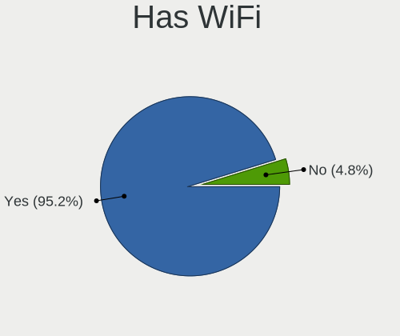
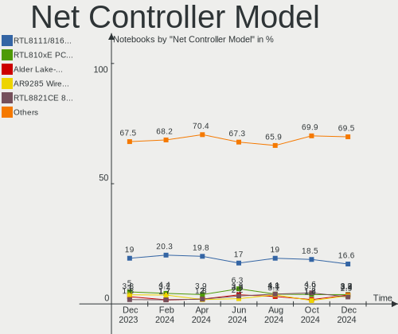
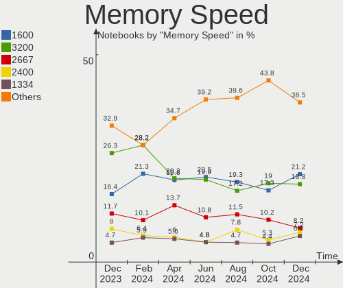
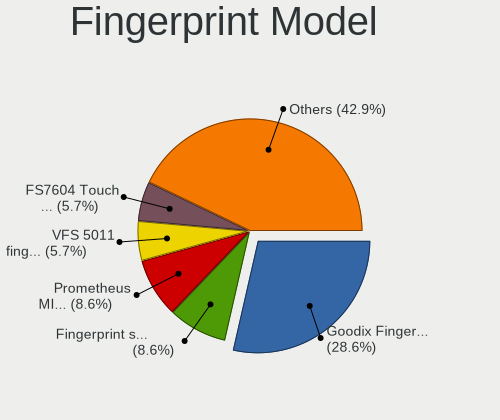

Linux in Russia - Hardware Trends (Notebooks)
---------------------------------------------

A project to identify most popular hardware characteristics and track their change
over time based on data collected by Linux users at https://Linux-Hardware.org.

Anyone can contribute to this report by the [hw-probe](https://github.com/linuxhw/hw-probe) tool:

    sudo -E hw-probe -all -upload

Period: Aug, 2022.

Contents
--------

* [ System ](#system)
  - [ OS                       ](#os)
  - [ OS Family                ](#os-family)
  - [ Kernel                   ](#kernel)
  - [ Kernel Family            ](#kernel-family)
  - [ Kernel Major Ver.        ](#kernel-major-ver)
  - [ Arch                     ](#arch)
  - [ DE                       ](#de)
  - [ Display Server           ](#display-server)
  - [ Display Manager          ](#display-manager)
  - [ OS Lang                  ](#os-lang)
  - [ Boot Mode                ](#boot-mode)
  - [ Filesystem               ](#filesystem)
  - [ Part. scheme             ](#part-scheme)
  - [ Dual Boot with Linux/BSD ](#dual-boot-with-linuxbsd)
  - [ Dual Boot (Win)          ](#dual-boot-win)

* [ Board ](#board)
  - [ Vendor                   ](#vendor)
  - [ Model                    ](#model)
  - [ Model Family             ](#model-family)
  - [ MFG Year                 ](#mfg-year)
  - [ Form Factor              ](#form-factor)
  - [ Secure Boot              ](#secure-boot)
  - [ Coreboot                 ](#coreboot)
  - [ RAM Size                 ](#ram-size)
  - [ RAM Used                 ](#ram-used)
  - [ Total Drives             ](#total-drives)
  - [ Has CD-ROM               ](#has-cd-rom)
  - [ Has Ethernet             ](#has-ethernet)
  - [ Has WiFi                 ](#has-wifi)
  - [ Has Bluetooth            ](#has-bluetooth)

* [ Location ](#location)
  - [ Country                  ](#country)
  - [ City                     ](#city)

* [ Drives ](#drives)
  - [ Drive Vendor             ](#drive-vendor)
  - [ Drive Model              ](#drive-model)
  - [ HDD Vendor               ](#hdd-vendor)
  - [ SSD Vendor               ](#ssd-vendor)
  - [ Drive Kind               ](#drive-kind)
  - [ Drive Connector          ](#drive-connector)
  - [ Drive Size               ](#drive-size)
  - [ Space Total              ](#space-total)
  - [ Space Used               ](#space-used)
  - [ Malfunc. Drives          ](#malfunc-drives)
  - [ Malfunc. Drive Vendor    ](#malfunc-drive-vendor)
  - [ Malfunc. HDD Vendor      ](#malfunc-hdd-vendor)
  - [ Malfunc. Drive Kind      ](#malfunc-drive-kind)
  - [ Failed Drives            ](#failed-drives)
  - [ Failed Drive Vendor      ](#failed-drive-vendor)
  - [ Drive Status             ](#drive-status)

* [ Storage controller ](#storage-controller)
  - [ Storage Vendor           ](#storage-vendor)
  - [ Storage Model            ](#storage-model)
  - [ Storage Kind             ](#storage-kind)

* [ Processor ](#processor)
  - [ CPU Vendor               ](#cpu-vendor)
  - [ CPU Model                ](#cpu-model)
  - [ CPU Model Family         ](#cpu-model-family)
  - [ CPU Cores                ](#cpu-cores)
  - [ CPU Sockets              ](#cpu-sockets)
  - [ CPU Threads              ](#cpu-threads)
  - [ CPU Op-Modes             ](#cpu-op-modes)
  - [ CPU Microcode            ](#cpu-microcode)
  - [ CPU Microarch            ](#cpu-microarch)

* [ Graphics ](#graphics)
  - [ GPU Vendor               ](#gpu-vendor)
  - [ GPU Model                ](#gpu-model)
  - [ GPU Combo                ](#gpu-combo)
  - [ GPU Driver               ](#gpu-driver)
  - [ GPU Memory               ](#gpu-memory)

* [ Monitor ](#monitor)
  - [ Monitor Vendor           ](#monitor-vendor)
  - [ Monitor Model            ](#monitor-model)
  - [ Monitor Resolution       ](#monitor-resolution)
  - [ Monitor Diagonal         ](#monitor-diagonal)
  - [ Monitor Width            ](#monitor-width)
  - [ Aspect Ratio             ](#aspect-ratio)
  - [ Monitor Area             ](#monitor-area)
  - [ Pixel Density            ](#pixel-density)
  - [ Multiple Monitors        ](#multiple-monitors)

* [ Network ](#network)
  - [ Net Controller Vendor    ](#net-controller-vendor)
  - [ Net Controller Model     ](#net-controller-model)
  - [ Wireless Vendor          ](#wireless-vendor)
  - [ Wireless Model           ](#wireless-model)
  - [ Ethernet Vendor          ](#ethernet-vendor)
  - [ Ethernet Model           ](#ethernet-model)
  - [ Net Controller Kind      ](#net-controller-kind)
  - [ Used Controller          ](#used-controller)
  - [ NICs                     ](#nics)
  - [ IPv6                     ](#ipv6)

* [ Bluetooth ](#bluetooth)
  - [ Bluetooth Vendor         ](#bluetooth-vendor)
  - [ Bluetooth Model          ](#bluetooth-model)

* [ Sound ](#sound)
  - [ Sound Vendor             ](#sound-vendor)
  - [ Sound Model              ](#sound-model)

* [ Memory ](#memory)
  - [ Memory Vendor            ](#memory-vendor)
  - [ Memory Model             ](#memory-model)
  - [ Memory Kind              ](#memory-kind)
  - [ Memory Form Factor       ](#memory-form-factor)
  - [ Memory Size              ](#memory-size)
  - [ Memory Speed             ](#memory-speed)

* [ Printers & scanners ](#printers--scanners)
  - [ Printer Vendor           ](#printer-vendor)
  - [ Printer Model            ](#printer-model)
  - [ Scanner Vendor           ](#scanner-vendor)
  - [ Scanner Model            ](#scanner-model)

* [ Camera ](#camera)
  - [ Camera Vendor            ](#camera-vendor)
  - [ Camera Model             ](#camera-model)

* [ Security ](#security)
  - [ Fingerprint Vendor       ](#fingerprint-vendor)
  - [ Fingerprint Model        ](#fingerprint-model)
  - [ Chipcard Vendor          ](#chipcard-vendor)
  - [ Chipcard Model           ](#chipcard-model)

* [ Unsupported ](#unsupported)
  - [ Unsupported Devices      ](#unsupported-devices)
  - [ Unsupported Device Types ](#unsupported-device-types)

System
------

OS
--

Installed operating systems

| Name                         | Notebooks | Percent |
|------------------------------|-----------|---------|
| ROSA 12.2                    | 93        | 38.75%  |
| Ubuntu 22.04                 | 16        | 6.67%   |
| Fedora 36                    | 14        | 5.83%   |
| ROSA R11.1                   | 11        | 4.58%   |
| Ubuntu 20.04                 | 10        | 4.17%   |
| Debian 11                    | 8         | 3.33%   |
| Arch                         | 6         | 2.5%    |
| OpenMandriva 4.3             | 4         | 1.67%   |
| Linux Mint 20.3              | 4         | 1.67%   |
| Kubuntu 22.04                | 4         | 1.67%   |
| KDE neon 20.04               | 4         | 1.67%   |
| Red OS 7.3.1                 | 3         | 1.25%   |
| Pop!_OS 22.04                | 3         | 1.25%   |
| openSUSE Tumbleweed-XXXXXXXX | 3         | 1.25%   |
| OpenMandriva 4.90            | 3         | 1.25%   |
| Fedora 35                    | 3         | 1.25%   |
| Elementary 6.1               | 3         | 1.25%   |
| Zorin 16                     | 2         | 0.83%   |
| NixOS 22.05                  | 2         | 0.83%   |
| MOS 10                       | 2         | 0.83%   |
| Manjaro 21.3.7               | 2         | 0.83%   |
| Manjaro 21.3.6               | 2         | 0.83%   |
| Manjaro                      | 2         | 0.83%   |
| Lubuntu 22.04                | 2         | 0.83%   |
| Linux Mint 21                | 2         | 0.83%   |
| Artix Rolling                | 2         | 0.83%   |
| Arch Rolling                 | 2         | 0.83%   |
| ALT Linux 10.1               | 2         | 0.83%   |
| ALT Linux 10.0.900           | 2         | 0.83%   |
| ALT Linux 10.0               | 2         | 0.83%   |
| Xubuntu 22.04                | 1         | 0.42%   |
| Xubuntu 20.04                | 1         | 0.42%   |
| Xubuntu 18.04                | 1         | 0.42%   |
| Xero Rolling                 | 1         | 0.42%   |
| Ubuntu MATE 18.04            | 1         | 0.42%   |
| Ubuntu 18.04                 | 1         | 0.42%   |
| TeArch Rolling               | 1         | 0.42%   |
| SteamOS 3.3                  | 1         | 0.42%   |
| ROSA R11                     | 1         | 0.42%   |
| ROSA 12                      | 1         | 0.42%   |
| LMDE 5                       | 1         | 0.42%   |
| Linux Mint 20.2              | 1         | 0.42%   |
| Linux Mint 20                | 1         | 0.42%   |
| Kali 2022.3                  | 1         | 0.42%   |
| Kali 2021.4                  | 1         | 0.42%   |
| Gentoo 2.8                   | 1         | 0.42%   |
| Endless 4.0.8                | 1         | 0.42%   |
| Debian Unstable              | 1         | 0.42%   |
| Debian 8                     | 1         | 0.42%   |
| Clear Linux 36860            | 1         | 0.42%   |
| Clear Linux 36750            | 1         | 0.42%   |
| ArcoLinux                    | 1         | 0.42%   |

OS Family
---------

OS without a version

| Name         | Notebooks | Percent |
|--------------|-----------|---------|
| ROSA         | 106       | 44.17%  |
| Ubuntu       | 27        | 11.25%  |
| Fedora       | 17        | 7.08%   |
| Debian       | 10        | 4.17%   |
| Linux Mint   | 8         | 3.33%   |
| Arch         | 8         | 3.33%   |
| ALT Linux    | 8         | 3.33%   |
| OpenMandriva | 7         | 2.92%   |
| Manjaro      | 6         | 2.5%    |
| Kubuntu      | 4         | 1.67%   |
| KDE neon     | 4         | 1.67%   |
| Xubuntu      | 3         | 1.25%   |
| Red OS       | 3         | 1.25%   |
| Pop!_OS      | 3         | 1.25%   |
| openSUSE     | 3         | 1.25%   |
| Elementary   | 3         | 1.25%   |
| Zorin        | 2         | 0.83%   |
| NixOS        | 2         | 0.83%   |
| Lubuntu      | 2         | 0.83%   |
| Kali         | 2         | 0.83%   |
| Clear Linux  | 2         | 0.83%   |
| Artix        | 2         | 0.83%   |
| Xero         | 1         | 0.42%   |
| Ubuntu MATE  | 1         | 0.42%   |
| TeArch       | 1         | 0.42%   |
| SteamOS      | 1         | 0.42%   |
| LMDE         | 1         | 0.42%   |
| Gentoo       | 1         | 0.42%   |
| Endless      | 1         | 0.42%   |
| ArcoLinux    | 1         | 0.42%   |

Kernel
------

Version of the Linux kernel

| Version                                | Notebooks | Percent |
|----------------------------------------|-----------|---------|
| 5.10.74-generic-2rosa2021.1-x86_64     | 46        | 19.17%  |
| 5.10.118-generic-2rosa2021.1-x86_64    | 26        | 10.83%  |
| 5.15.0-46-generic                      | 20        | 8.33%   |
| 5.15.0-43-generic                      | 17        | 7.08%   |
| 5.17.11-generic-2rosa2021.1-x86_64     | 5         | 2.08%   |
| 5.18.17-200.fc36.x86_64                | 4         | 1.67%   |
| 5.18.16-arch1-1                        | 4         | 1.67%   |
| 5.10.0-7-amd64                         | 4         | 1.67%   |
| 5.10.0-16-amd64                        | 4         | 1.67%   |
| 5.18.16-200.fc36.x86_64                | 3         | 1.25%   |
| 5.18.13-200.fc36.x86_64                | 3         | 1.25%   |
| 5.18.12-desktop-3omv4090               | 3         | 1.25%   |
| 5.15.43-generic-2rosa2021.1-x86_64     | 3         | 1.25%   |
| 5.15.0-41-generic                      | 3         | 1.25%   |
| 5.10.74-generic-2rosa2021.1-i586       | 3         | 1.25%   |
| 5.4.83-generic-2rosa-x86_64            | 2         | 0.83%   |
| 5.4.32-generic-2rosa-x86_64            | 2         | 0.83%   |
| 5.19.2-arch1-1                         | 2         | 0.83%   |
| 5.18.18.xm1-1-xanmod-rosa2021.1-x86_64 | 2         | 0.83%   |
| 5.18.14-1-MANJARO                      | 2         | 0.83%   |
| 5.17.1-desktop-2omv4050                | 2         | 0.83%   |
| 5.16.7-desktop-1omv4003                | 2         | 0.83%   |
| 5.15.60-1-MANJARO                      | 2         | 0.83%   |
| 5.15.35-4.el7.3.x86_64                 | 2         | 0.83%   |
| 5.11.0-43-generic                      | 2         | 0.83%   |
| 5.10.118-generic-2rosa2021.1-i586      | 2         | 0.83%   |
| 4.15.0-desktop-122.124.1rosa-i586      | 2         | 0.83%   |
| 5.4.83-generic-2rosa-i586              | 1         | 0.42%   |
| 5.4.32-generic-2rosa-i586              | 1         | 0.42%   |
| 5.4.0-26-generic                       | 1         | 0.42%   |
| 5.4.0-125-generic                      | 1         | 0.42%   |
| 5.4.0-124-generic                      | 1         | 0.42%   |
| 5.4.0-122-generic                      | 1         | 0.42%   |
| 5.4.0-113-generic                      | 1         | 0.42%   |
| 5.19.5-arch1-1                         | 1         | 0.42%   |
| 5.19.4-200.fc36.x86_64                 | 1         | 0.42%   |
| 5.19.3-zen1-1-zen                      | 1         | 0.42%   |
| 5.19.2-1-default                       | 1         | 0.42%   |
| 5.19.1-arch2-1                         | 1         | 0.42%   |
| 5.19.1-3-MANJARO                       | 1         | 0.42%   |
| 5.19.1-1176.native                     | 1         | 0.42%   |
| 5.19.0-76051900-generic                | 1         | 0.42%   |
| 5.19.0-051900-generic                  | 1         | 0.42%   |
| 5.19.0                                 | 1         | 0.42%   |
| 5.18.4-generic-2rosa2021.1-x86_64      | 1         | 0.42%   |
| 5.18.19-200.fc36.x86_64                | 1         | 0.42%   |
| 5.18.18-200.fc36.x86_64                | 1         | 0.42%   |
| 5.18.18-100.fc35.x86_64                | 1         | 0.42%   |
| 5.18.17-1-MANJARO                      | 1         | 0.42%   |
| 5.18.16.xm1-1-xanmod-rosa2021.1-x86_64 | 1         | 0.42%   |
| 5.18.16-lqx1-linux-lqx                 | 1         | 0.42%   |
| 5.18.16-artix1-1                       | 1         | 0.42%   |
| 5.18.16-1165.native                    | 1         | 0.42%   |
| 5.18.16-100.fc35.x86_64                | 1         | 0.42%   |
| 5.18.12-1-default                      | 1         | 0.42%   |
| 5.18.11-1-default                      | 1         | 0.42%   |
| 5.18.10-76051810-generic               | 1         | 0.42%   |
| 5.18.0-kali5-amd64                     | 1         | 0.42%   |
| 5.18.0-3-amd64                         | 1         | 0.42%   |
| 5.17.5-76051705-generic                | 1         | 0.42%   |

Kernel Family
-------------

Linux kernel without a distro release

| Version  | Notebooks | Percent |
|----------|-----------|---------|
| 5.10.74  | 49        | 20.42%  |
| 5.15.0   | 41        | 17.08%  |
| 5.10.118 | 28        | 11.67%  |
| 5.18.16  | 12        | 5%      |
| 5.10.0   | 9         | 3.75%   |
| 4.15.0   | 6         | 2.5%    |
| 5.4.0    | 5         | 2.08%   |
| 5.18.17  | 5         | 2.08%   |
| 5.17.11  | 5         | 2.08%   |
| 5.18.18  | 4         | 1.67%   |
| 5.18.12  | 4         | 1.67%   |
| 5.11.0   | 4         | 1.67%   |
| 5.4.83   | 3         | 1.25%   |
| 5.4.32   | 3         | 1.25%   |
| 5.19.2   | 3         | 1.25%   |
| 5.19.1   | 3         | 1.25%   |
| 5.19.0   | 3         | 1.25%   |
| 5.18.13  | 3         | 1.25%   |
| 5.15.60  | 3         | 1.25%   |
| 5.15.43  | 3         | 1.25%   |
| 5.18.14  | 2         | 0.83%   |
| 5.18.0   | 2         | 0.83%   |
| 5.17.5   | 2         | 0.83%   |
| 5.17.1   | 2         | 0.83%   |
| 5.16.7   | 2         | 0.83%   |
| 5.15.59  | 2         | 0.83%   |
| 5.15.53  | 2         | 0.83%   |
| 5.15.35  | 2         | 0.83%   |
| 5.14.0   | 2         | 0.83%   |
| 5.13.0   | 2         | 0.83%   |
| 5.19.5   | 1         | 0.42%   |
| 5.19.4   | 1         | 0.42%   |
| 5.19.3   | 1         | 0.42%   |
| 5.18.4   | 1         | 0.42%   |
| 5.18.19  | 1         | 0.42%   |
| 5.18.11  | 1         | 0.42%   |
| 5.18.10  | 1         | 0.42%   |
| 5.17.13  | 1         | 0.42%   |
| 5.16.20  | 1         | 0.42%   |
| 5.15.62  | 1         | 0.42%   |
| 5.15.58  | 1         | 0.42%   |
| 5.15.57  | 1         | 0.42%   |
| 5.15.55  | 1         | 0.42%   |
| 5.15.52  | 1         | 0.42%   |
| 5.15.32  | 1         | 0.42%   |
| 5.15.10  | 1         | 0.42%   |
| 5.13.9   | 1         | 0.42%   |
| 5.10.82  | 1         | 0.42%   |
| 5.10.71  | 1         | 0.42%   |
| 5.10.137 | 1         | 0.42%   |
| 5.10.133 | 1         | 0.42%   |
| 5.10.123 | 1         | 0.42%   |
| 4.9.155  | 1         | 0.42%   |
| 3.10.65  | 1         | 0.42%   |

Kernel Major Ver.
-----------------

Linux kernel major version

| Version | Notebooks | Percent |
|---------|-----------|---------|
| 5.10    | 91        | 37.92%  |
| 5.15    | 60        | 25%     |
| 5.18    | 36        | 15%     |
| 5.19    | 12        | 5%      |
| 5.4     | 11        | 4.58%   |
| 5.17    | 10        | 4.17%   |
| 4.15    | 6         | 2.5%    |
| 5.11    | 4         | 1.67%   |
| 5.16    | 3         | 1.25%   |
| 5.13    | 3         | 1.25%   |
| 5.14    | 2         | 0.83%   |
| 4.9     | 1         | 0.42%   |
| 3.10    | 1         | 0.42%   |

Arch
----

OS architecture (x86_64, i586, etc.)

| Name   | Notebooks | Percent |
|--------|-----------|---------|
| x86_64 | 230       | 95.83%  |
| i686   | 9         | 3.75%   |
| armv7l | 1         | 0.42%   |

DE
--

Desktop Environment

| Name               | Notebooks | Percent |
|--------------------|-----------|---------|
| GNOME              | 100       | 41.67%  |
| KDE5               | 70        | 29.17%  |
| LXQt               | 21        | 8.75%   |
| Unknown            | 12        | 5%      |
| KDE4               | 10        | 4.17%   |
| XFCE               | 8         | 3.33%   |
| X-Cinnamon         | 8         | 3.33%   |
| MATE               | 4         | 1.67%   |
| Pantheon           | 3         | 1.25%   |
| i3                 | 2         | 0.83%   |
| pantheon-non-gnome | 1         | 0.42%   |
| Cinnamon           | 1         | 0.42%   |

Display Server
--------------

X11 or Wayland

| Name    | Notebooks | Percent |
|---------|-----------|---------|
| X11     | 117       | 48.75%  |
| Wayland | 112       | 46.67%  |
| Unknown | 10        | 4.17%   |
| Tty     | 1         | 0.42%   |

Display Manager
---------------

SDDM, LightDM, etc.

| Name    | Notebooks | Percent |
|---------|-----------|---------|
| GDM     | 69        | 28.75%  |
| SDDM    | 64        | 26.67%  |
| Unknown | 42        | 17.5%   |
| LightDM | 28        | 11.67%  |
| GDM3    | 25        | 10.42%  |
| KDM     | 10        | 4.17%   |
| XDM     | 1         | 0.42%   |
| SLiM    | 1         | 0.42%   |

OS Lang
-------

Language

| Lang    | Notebooks | Percent |
|---------|-----------|---------|
| ru_RU   | 173       | 72.08%  |
| en_US   | 48        | 20%     |
| Unknown | 9         | 3.75%   |
| C       | 5         | 2.08%   |
| pt_BR   | 1         | 0.42%   |
| en_AU   | 1         | 0.42%   |
| en_AG   | 1         | 0.42%   |
| de_DE   | 1         | 0.42%   |
| ba_RU   | 1         | 0.42%   |

Boot Mode
---------

EFI or BIOS

| Mode | Notebooks | Percent |
|------|-----------|---------|
| EFI  | 158       | 65.83%  |
| BIOS | 82        | 34.17%  |

Filesystem
----------

Type of filesystem

| Type    | Notebooks | Percent |
|---------|-----------|---------|
| Ext4    | 194       | 80.83%  |
| Btrfs   | 32        | 13.33%  |
| Overlay | 12        | 5%      |
| Xfs     | 1         | 0.42%   |
| F2fs    | 1         | 0.42%   |

Part. scheme
------------

Scheme of partitioning

| Type    | Notebooks | Percent |
|---------|-----------|---------|
| GPT     | 146       | 60.83%  |
| Unknown | 49        | 20.42%  |
| MBR     | 45        | 18.75%  |

Dual Boot with Linux/BSD
------------------------

Hosting more than one Linux/BSD

| Dual boot | Notebooks | Percent |
|-----------|-----------|---------|
| No        | 207       | 86.25%  |
| Yes       | 33        | 13.75%  |

Dual Boot (Win)
---------------

Hosting Linux and Windows

| Dual boot | Notebooks | Percent |
|-----------|-----------|---------|
| No        | 152       | 63.33%  |
| Yes       | 88        | 36.67%  |

Board
-----

Vendor
------

Motherboard manufacturer

| Name                                      | Notebooks | Percent |
|-------------------------------------------|-----------|---------|
| Lenovo                                    | 53        | 22.08%  |
| Hewlett-Packard                           | 35        | 14.58%  |
| ASUSTek Computer                          | 35        | 14.58%  |
| Acer                                      | 30        | 12.5%   |
| HUAWEI                                    | 16        | 6.67%   |
| Dell                                      | 16        | 6.67%   |
| Samsung Electronics                       | 7         | 2.92%   |
| Unknown                                   | 7         | 2.92%   |
| MSI                                       | 5         | 2.08%   |
| eMachines                                 | 5         | 2.08%   |
| Timi                                      | 2         | 0.83%   |
| Sony                                      | 2         | 0.83%   |
| ICL                                       | 2         | 0.83%   |
| Google                                    | 2         | 0.83%   |
| Aquarius                                  | 2         | 0.83%   |
| Apple                                     | 2         | 0.83%   |
| 3Logic Group                              | 2         | 0.83%   |
| Valve                                     | 1         | 0.42%   |
| Toshiba                                   | 1         | 0.42%   |
| Shenzhen Baohuazhong Science & Technology | 1         | 0.42%   |
| Prestigio                                 | 1         | 0.42%   |
| Pegatron                                  | 1         | 0.42%   |
| Packard Bell                              | 1         | 0.42%   |
| IP3 Technology                            | 1         | 0.42%   |
| IP3 Tech                                  | 1         | 0.42%   |
| Intel                                     | 1         | 0.42%   |
| HONOR                                     | 1         | 0.42%   |
| Haier                                     | 1         | 0.42%   |
| Gigabyte Technology                       | 1         | 0.42%   |
| Fujitsu                                   | 1         | 0.42%   |
| Digma                                     | 1         | 0.42%   |
| DEPO Computers                            | 1         | 0.42%   |
| BBEN                                      | 1         | 0.42%   |
| Alienware                                 | 1         | 0.42%   |

Model
-----

Motherboard model

| Name                                                                                     | Notebooks | Percent |
|------------------------------------------------------------------------------------------|-----------|---------|
| Unknown                                                                                  | 9         | 3.75%   |
| Lenovo B570e HuronRiver Platform                                                         | 3         | 1.25%   |
| HP Pavilion g6                                                                           | 3         | 1.25%   |
| Sony VPCSB1V9R                                                                           | 2         | 0.83%   |
| Lenovo IdeaPad S340-14API 81NB                                                           | 2         | 0.83%   |
| Lenovo IdeaPad Gaming 3 15IMH05 81Y4                                                     | 2         | 0.83%   |
| Lenovo IdeaPad 330-15IKB 81DE                                                            | 2         | 0.83%   |
| HUAWEI NBD-WXX9                                                                          | 2         | 0.83%   |
| HUAWEI KLVD-WXX9                                                                         | 2         | 0.83%   |
| HUAWEI HVY-WXX9                                                                          | 2         | 0.83%   |
| HUAWEI CREM-WXX9                                                                         | 2         | 0.83%   |
| HUAWEI BOM-WXX9                                                                          | 2         | 0.83%   |
| HUAWEI BOHK-WAX9X                                                                        | 2         | 0.83%   |
| HP Victus by Laptop 16-e0xxx                                                             | 2         | 0.83%   |
| HP ProBook 440 G8 Notebook PC                                                            | 2         | 0.83%   |
| HP Pavilion dv6                                                                          | 2         | 0.83%   |
| HP Laptop 15s-fq2xxx                                                                     | 2         | 0.83%   |
| eMachines eME728                                                                         | 2         | 0.83%   |
| ASUS VivoBook_ASUS Laptop E510MA_R522MA                                                  | 2         | 0.83%   |
| ASUS F5N                                                                                 | 2         | 0.83%   |
| Apple MacBookAir7,2                                                                      | 2         | 0.83%   |
| Acer Nitro AN515-31                                                                      | 2         | 0.83%   |
| Valve Jupiter                                                                            | 1         | 0.42%   |
| Toshiba Satellite L300                                                                   | 1         | 0.42%   |
| Timi TM1701                                                                              | 1         | 0.42%   |
| Timi RedmiBook Pro 15S                                                                   | 1         | 0.42%   |
| Shenzhen Baohuazhong Science & XN1A                                                      | 1         | 0.42%   |
| Samsung RV411/RV511/E3511/S3511/RV711/E3411                                              | 1         | 0.42%   |
| Samsung R580/R590                                                                        | 1         | 0.42%   |
| Samsung R530/R730/R540                                                                   | 1         | 0.42%   |
| Samsung R528/R728                                                                        | 1         | 0.42%   |
| Samsung NC210/NC110                                                                      | 1         | 0.42%   |
| Samsung 355V4C/355V4X/355V5C/355V5X/356V4C/356V4X/356V5C/356V5X/3445VC/3445VX/3545VC/354 | 1         | 0.42%   |
| Samsung 300E4A/300E5A/300E7A                                                             | 1         | 0.42%   |
| Prestigio PSB141C01BFH                                                                   | 1         | 0.42%   |
| Pegatron A17                                                                             | 1         | 0.42%   |
| Packard Bell EasyNote LM85                                                               | 1         | 0.42%   |
| MSI Vector GP66 12UH                                                                     | 1         | 0.42%   |
| MSI GF75 Thin 10SCXR                                                                     | 1         | 0.42%   |
| MSI FX610                                                                                | 1         | 0.42%   |
| MSI Creator 15 A11UE                                                                     | 1         | 0.42%   |
| MSI Creator 15 A10SET                                                                    | 1         | 0.42%   |
| Lenovo Y520-15IKBN 80WK                                                                  | 1         | 0.42%   |
| Lenovo V14-ADA 82C6                                                                      | 1         | 0.42%   |
| Lenovo ThinkPad X240 20ALA0AHRT                                                          | 1         | 0.42%   |
| Lenovo ThinkPad X240 20AL00BNRT                                                          | 1         | 0.42%   |
| Lenovo ThinkPad X220 4291B66                                                             | 1         | 0.42%   |
| Lenovo ThinkPad X220 4290KJ6                                                             | 1         | 0.42%   |
| Lenovo ThinkPad X1 Carbon Gen 8 20UAS89500                                               | 1         | 0.42%   |
| Lenovo ThinkPad T61 6457VE6                                                              | 1         | 0.42%   |
| Lenovo ThinkPad T440p 20AWS0VB04                                                         | 1         | 0.42%   |
| Lenovo ThinkPad SL500 2746AA3                                                            | 1         | 0.42%   |
| Lenovo ThinkPad Edge E545 20B2A00ERT                                                     | 1         | 0.42%   |
| Lenovo ThinkPad E14 Gen 3 20Y7006URT                                                     | 1         | 0.42%   |
| Lenovo ThinkPad 13 2nd Gen 20J1S0EW00                                                    | 1         | 0.42%   |
| Lenovo ThinkBook 15 G3 ACL 21A4                                                          | 1         | 0.42%   |
| Lenovo ThinkBook 15 G2 ITL 20VE                                                          | 1         | 0.42%   |
| Lenovo ThinkBook 14 G3 ACL 21A2                                                          | 1         | 0.42%   |
| Lenovo ThinkBook 13s-IWL 20R9                                                            | 1         | 0.42%   |
| Lenovo Legion Y540-15IRH 81SX                                                            | 1         | 0.42%   |

Model Family
------------

Motherboard model prefix

| Name                                | Notebooks | Percent |
|-------------------------------------|-----------|---------|
| Lenovo IdeaPad                      | 20        | 8.33%   |
| Acer Aspire                         | 14        | 5.83%   |
| HP Pavilion                         | 12        | 5%      |
| Lenovo ThinkPad                     | 11        | 4.58%   |
| ASUS VivoBook                       | 9         | 3.75%   |
| Unknown                             | 9         | 3.75%   |
| HP Laptop                           | 7         | 2.92%   |
| HP ProBook                          | 6         | 2.5%    |
| Dell Latitude                       | 6         | 2.5%    |
| Lenovo ThinkBook                    | 4         | 1.67%   |
| Lenovo Legion                       | 4         | 1.67%   |
| Dell Inspiron                       | 4         | 1.67%   |
| Acer Nitro                          | 4         | 1.67%   |
| Acer Extensa                        | 4         | 1.67%   |
| Lenovo B570e                        | 3         | 1.25%   |
| ASUS ROG                            | 3         | 1.25%   |
| Sony VPCSB1V9R                      | 2         | 0.83%   |
| MSI Creator                         | 2         | 0.83%   |
| HUAWEI NBD-WXX9                     | 2         | 0.83%   |
| HUAWEI KLVD-WXX9                    | 2         | 0.83%   |
| HUAWEI HVY-WXX9                     | 2         | 0.83%   |
| HUAWEI CREM-WXX9                    | 2         | 0.83%   |
| HUAWEI BOM-WXX9                     | 2         | 0.83%   |
| HUAWEI BOHK-WAX9X                   | 2         | 0.83%   |
| HP Victus                           | 2         | 0.83%   |
| HP EliteBook                        | 2         | 0.83%   |
| HP 250                              | 2         | 0.83%   |
| eMachines eME728                    | 2         | 0.83%   |
| Dell Vostro                         | 2         | 0.83%   |
| ASUS Zenbook                        | 2         | 0.83%   |
| ASUS F5N                            | 2         | 0.83%   |
| Apple MacBookAir7                   | 2         | 0.83%   |
| Valve Jupiter                       | 1         | 0.42%   |
| Toshiba Satellite                   | 1         | 0.42%   |
| Timi TM1701                         | 1         | 0.42%   |
| Timi RedmiBook                      | 1         | 0.42%   |
| Shenzhen Baohuazhong Science & XN1A | 1         | 0.42%   |
| Samsung RV411                       | 1         | 0.42%   |
| Samsung R580                        | 1         | 0.42%   |
| Samsung R530                        | 1         | 0.42%   |
| Samsung R528                        | 1         | 0.42%   |
| Samsung NC210                       | 1         | 0.42%   |
| Samsung 355V4C                      | 1         | 0.42%   |
| Samsung 300E4A                      | 1         | 0.42%   |
| Prestigio PSB141C01BFH              | 1         | 0.42%   |
| Pegatron A17                        | 1         | 0.42%   |
| Packard Bell EasyNote               | 1         | 0.42%   |
| MSI Vector                          | 1         | 0.42%   |
| MSI GF75                            | 1         | 0.42%   |
| MSI FX610                           | 1         | 0.42%   |
| Lenovo Y520-15IKBN                  | 1         | 0.42%   |
| Lenovo V14-ADA                      | 1         | 0.42%   |
| Lenovo G710                         | 1         | 0.42%   |
| Lenovo G570                         | 1         | 0.42%   |
| Lenovo G505                         | 1         | 0.42%   |
| Lenovo G50-45                       | 1         | 0.42%   |
| Lenovo G460                         | 1         | 0.42%   |
| Lenovo B590                         | 1         | 0.42%   |
| Lenovo B560                         | 1         | 0.42%   |
| Lenovo B550                         | 1         | 0.42%   |

MFG Year
--------

Motherboard manufacture year

| Year    | Notebooks | Percent |
|---------|-----------|---------|
| 2021    | 48        | 20%     |
| 2020    | 35        | 14.58%  |
| 2011    | 20        | 8.33%   |
| 2010    | 17        | 7.08%   |
| 2018    | 15        | 6.25%   |
| 2012    | 15        | 6.25%   |
| 2019    | 14        | 5.83%   |
| 2017    | 14        | 5.83%   |
| 2013    | 14        | 5.83%   |
| 2022    | 10        | 4.17%   |
| 2015    | 7         | 2.92%   |
| 2008    | 7         | 2.92%   |
| 2016    | 6         | 2.5%    |
| 2014    | 6         | 2.5%    |
| 2009    | 5         | 2.08%   |
| 2007    | 4         | 1.67%   |
| Unknown | 2         | 0.83%   |
| 2006    | 1         | 0.42%   |

Form Factor
-----------

Physical design of the computer

| Name     | Notebooks | Percent |
|----------|-----------|---------|
| Notebook | 240       | 100%    |

Secure Boot
-----------

Enabled or disabled

| State    | Notebooks | Percent |
|----------|-----------|---------|
| Disabled | 218       | 90.83%  |
| Enabled  | 22        | 9.17%   |

Coreboot
--------

Have coreboot on board

| Used | Notebooks | Percent |
|------|-----------|---------|
| No   | 238       | 99.17%  |
| Yes  | 2         | 0.83%   |

RAM Size
--------

Total RAM memory

| Size in GB  | Notebooks | Percent |
|-------------|-----------|---------|
| 4.01-8.0    | 76        | 31.67%  |
| 8.01-16.0   | 56        | 23.33%  |
| 3.01-4.0    | 42        | 17.5%   |
| 16.01-24.0  | 31        | 12.92%  |
| 1.01-2.0    | 16        | 6.67%   |
| 32.01-64.0  | 8         | 3.33%   |
| 2.01-3.0    | 6         | 2.5%    |
| 0.51-1.0    | 3         | 1.25%   |
| 24.01-32.0  | 1         | 0.42%   |
| 64.01-256.0 | 1         | 0.42%   |

RAM Used
--------

Used RAM memory

| Used GB   | Notebooks | Percent |
|-----------|-----------|---------|
| 1.01-2.0  | 88        | 36.67%  |
| 2.01-3.0  | 54        | 22.5%   |
| 0.51-1.0  | 41        | 17.08%  |
| 4.01-8.0  | 25        | 10.42%  |
| 3.01-4.0  | 22        | 9.17%   |
| 8.01-16.0 | 8         | 3.33%   |
| 0.01-0.5  | 1         | 0.42%   |
| Unknown   | 1         | 0.42%   |

Total Drives
------------

Number of drives on board

| Drives | Notebooks | Percent |
|--------|-----------|---------|
| 1      | 179       | 74.58%  |
| 2      | 55        | 22.92%  |
| 3      | 6         | 2.5%    |

Has CD-ROM
----------

Has CD-ROM on board

| Presented | Notebooks | Percent |
|-----------|-----------|---------|
| No        | 178       | 74.17%  |
| Yes       | 62        | 25.83%  |

Has Ethernet
------------

Has Ethernet on board

| Presented | Notebooks | Percent |
|-----------|-----------|---------|
| Yes       | 183       | 76.25%  |
| No        | 57        | 23.75%  |

Has WiFi
--------

Has WiFi module

| Presented | Notebooks | Percent |
|-----------|-----------|---------|
| Yes       | 232       | 96.67%  |
| No        | 8         | 3.33%   |

Has Bluetooth
-------------

Has Bluetooth module

| Presented | Notebooks | Percent |
|-----------|-----------|---------|
| Yes       | 199       | 82.92%  |
| No        | 41        | 17.08%  |

Location
--------

Country
-------

Geographic location (country)

| Country | Notebooks | Percent |
|---------|-----------|---------|
| Russia  | 240       | 100%    |

City
----

Geographic location (city)

| City             | Notebooks | Percent |
|------------------|-----------|---------|
| Moscow           | 62        | 25.83%  |
| St Petersburg    | 24        | 10%     |
| Krasnodar        | 14        | 5.83%   |
| Yekaterinburg    | 8         | 3.33%   |
| Voronezh         | 8         | 3.33%   |
| Chelyabinsk      | 7         | 2.92%   |
| Saratov          | 6         | 2.5%    |
| Novosibirsk      | 6         | 2.5%    |
| Rostov-on-Don    | 4         | 1.67%   |
| Perm             | 4         | 1.67%   |
| Krasnoyarsk      | 4         | 1.67%   |
| Belgorod         | 4         | 1.67%   |
| Ufa              | 3         | 1.25%   |
| Kemerovo         | 3         | 1.25%   |
| Kazan’         | 3         | 1.25%   |
| Kaliningrad      | 3         | 1.25%   |
| Yaroslavl        | 2         | 0.83%   |
| Vladimir         | 2         | 0.83%   |
| Tver             | 2         | 0.83%   |
| Tomsk            | 2         | 0.83%   |
| Sochi            | 2         | 0.83%   |
| Samara           | 2         | 0.83%   |
| Ryazan           | 2         | 0.83%   |
| Petrozavodsk     | 2         | 0.83%   |
| Nizhniy Novgorod | 2         | 0.83%   |
| Kirov            | 2         | 0.83%   |
| Blagoveshchensk  | 2         | 0.83%   |
| Zheleznogorsk    | 1         | 0.42%   |
| Yoshkar-Ola      | 1         | 0.42%   |
| Yakutsk          | 1         | 0.42%   |
| Volzhskiy        | 1         | 0.42%   |
| Vologda          | 1         | 0.42%   |
| Volgograd        | 1         | 0.42%   |
| Vladivostok      | 1         | 0.42%   |
| Veliky Novgorod  | 1         | 0.42%   |
| Ulyanovsk        | 1         | 0.42%   |
| Ulan-Ude         | 1         | 0.42%   |
| Tolyatti         | 1         | 0.42%   |
| Stavropol        | 1         | 0.42%   |
| Stary Oskol      | 1         | 0.42%   |
| Smolensk         | 1         | 0.42%   |
| Severodvinsk     | 1         | 0.42%   |
| Serpukhov        | 1         | 0.42%   |
| Saransk          | 1         | 0.42%   |
| Ruzayevka        | 1         | 0.42%   |
| Pskov            | 1         | 0.42%   |
| Polevskoy        | 1         | 0.42%   |
| Podolsk          | 1         | 0.42%   |
| Ostrov           | 1         | 0.42%   |
| Orenburg         | 1         | 0.42%   |
| Omsk             | 1         | 0.42%   |
| Odintsovo        | 1         | 0.42%   |
| Obninsk          | 1         | 0.42%   |
| Nal'chik         | 1         | 0.42%   |
| Mytishchi        | 1         | 0.42%   |
| Murom            | 1         | 0.42%   |
| Minusinsk        | 1         | 0.42%   |
| Lyubertsy        | 1         | 0.42%   |
| Kuznechikha      | 1         | 0.42%   |
| Kursk            | 1         | 0.42%   |

Drives
------

Drive Vendor
------------

Hard drive vendors

| Vendor                  | Notebooks | Drives | Percent |
|-------------------------|-----------|--------|---------|
| WDC                     | 51        | 52     | 16.94%  |
| Samsung Electronics     | 44        | 46     | 14.62%  |
| Seagate                 | 29        | 29     | 9.63%   |
| Unknown                 | 16        | 17     | 5.32%   |
| SK hynix                | 15        | 17     | 4.98%   |
| SanDisk                 | 15        | 15     | 4.98%   |
| Hitachi                 | 15        | 15     | 4.98%   |
| Toshiba                 | 11        | 11     | 3.65%   |
| Kingston                | 11        | 11     | 3.65%   |
| China                   | 11        | 11     | 3.65%   |
| Micron Technology       | 9         | 9      | 2.99%   |
| Silicon Motion          | 5         | 5      | 1.66%   |
| Intel                   | 5         | 5      | 1.66%   |
| Apacer                  | 5         | 5      | 1.66%   |
| A-DATA Technology       | 5         | 5      | 1.66%   |
| Phison                  | 4         | 4      | 1.33%   |
| Netac                   | 4         | 4      | 1.33%   |
| KIOXIA                  | 4         | 4      | 1.33%   |
| Crucial                 | 4         | 4      | 1.33%   |
| UMIS                    | 3         | 3      | 1%      |
| SPCC                    | 3         | 3      | 1%      |
| HGST                    | 3         | 3      | 1%      |
| Unknown                 | 3         | 3      | 1%      |
| XPG                     | 2         | 2      | 0.66%   |
| Leqixiang               | 2         | 2      | 0.66%   |
| KingSpec                | 2         | 2      | 0.66%   |
| Gigabyte Technology     | 2         | 2      | 0.66%   |
| Union Memory (Shenzhen) | 1         | 1      | 0.33%   |
| Transcend               | 1         | 1      | 0.33%   |
| TO Exter                | 1         | 1      | 0.33%   |
| Smartbuy                | 1         | 1      | 0.33%   |
| ShanDianZhe             | 1         | 1      | 0.33%   |
| SemsoTai                | 1         | 1      | 0.33%   |
| Plextor                 | 1         | 1      | 0.33%   |
| Pioneer                 | 1         | 1      | 0.33%   |
| Patriot                 | 1         | 1      | 0.33%   |
| LuminouTek              | 1         | 1      | 0.33%   |
| LITEON                  | 1         | 1      | 0.33%   |
| Lexar                   | 1         | 1      | 0.33%   |
| KingFast                | 1         | 1      | 0.33%   |
| Kimtigo                 | 1         | 1      | 0.33%   |
| JMicron Technology      | 1         | 1      | 0.33%   |
| Foxline                 | 1         | 1      | 0.33%   |
| Apple                   | 1         | 1      | 0.33%   |
| AMD                     | 1         | 1      | 0.33%   |

Drive Model
-----------

Hard drive models

| Model                                | Notebooks | Percent |
|--------------------------------------|-----------|---------|
| Seagate ST1000LM024 HN-M101MBB 1TB   | 6         | 1.96%   |
| WDC PC SN730 SDBPNTY-512G-1027 512GB | 4         | 1.31%   |
| Seagate ST1000LM035-1RK172 1TB       | 4         | 1.31%   |
| Hitachi HTS545025B9A300 250GB        | 4         | 1.31%   |
| China SSD 256GB                      | 4         | 1.31%   |
| SanDisk NVMe SSD Drive 512GB         | 3         | 0.98%   |
| Samsung SSD 970 EVO Plus 1TB         | 3         | 0.98%   |
| Samsung SSD 860 EVO 250GB            | 3         | 0.98%   |
| Samsung NVMe SSD Drive 512GB         | 3         | 0.98%   |
| KIOXIA KBG40ZNV512G 512GB            | 3         | 0.98%   |
| Unknown                              | 3         | 0.98%   |
| WDC WDS240G2G0B-00EPW0 240GB SSD     | 2         | 0.65%   |
| WDC WDS240G2G0A-00JH30 240GB SSD     | 2         | 0.65%   |
| WDC WDS120G2G0B-00EPW0 120GB SSD     | 2         | 0.65%   |
| WDC WDS120G2G0A-00JH30 120GB SSD     | 2         | 0.65%   |
| WDC WD5000LPCX-24VHAT0 500GB         | 2         | 0.65%   |
| WDC WD5000LPCX-21VHAT0 500GB         | 2         | 0.65%   |
| WDC WD3200BPVT-24JJ5T0 320GB         | 2         | 0.65%   |
| WDC WD10SPZX-60Z10T0 1TB             | 2         | 0.65%   |
| WDC PC SN530 SDBPNPZ-256G-1002 256GB | 2         | 0.65%   |
| Unknown DA4128  128GB                | 2         | 0.65%   |
| UMIS RPFTJ128PDD2EWX 128GB           | 2         | 0.65%   |
| Toshiba MQ01ABF050 500GB             | 2         | 0.65%   |
| Toshiba KBG30ZMS128G 128GB NVMe SSD  | 2         | 0.65%   |
| SK hynix HFM512GD3JX013N 512GB       | 2         | 0.65%   |
| SK hynix BC711 HFM512GD3JX013N 512GB | 2         | 0.65%   |
| Seagate ST9320325AS 320GB            | 2         | 0.65%   |
| Seagate ST500LM021-1KJ152 500GB      | 2         | 0.65%   |
| SanDisk NVMe SSD Drive 256GB         | 2         | 0.65%   |
| Samsung SSD 860 EVO 500GB            | 2         | 0.65%   |
| Samsung MZALQ512HALU-000L2 512GB     | 2         | 0.65%   |
| Micron 1100_MTFDDAK256TBN 256GB SSD  | 2         | 0.65%   |
| Kingston SV300S37A120G 120GB SSD     | 2         | 0.65%   |
| Kingston SA400S37240G 240GB SSD      | 2         | 0.65%   |
| Hitachi HTS547550A9E384 500GB        | 2         | 0.65%   |
| Hitachi HTS545016B9A300 160GB        | 2         | 0.65%   |
| Crucial CT1000MX500SSD1 1TB          | 2         | 0.65%   |
| China SSD 120GB                      | 2         | 0.65%   |
| A-DATA SX6000LNP 128GB               | 2         | 0.65%   |
| XPG SPECTRIX S40G 256GB              | 1         | 0.33%   |
| XPG GAMMIX S11 Pro 1TB               | 1         | 0.33%   |
| WDC WDS500G2B0A-00SM50 500GB SSD     | 1         | 0.33%   |
| WDC WD5000LPVX-22V0TT0 500GB         | 1         | 0.33%   |
| WDC WD5000LPCX-60VHAT0 500GB         | 1         | 0.33%   |
| WDC WD5000BEVT-22A0RT0 500GB         | 1         | 0.33%   |
| WDC WD5000BEVT-00A0RT0 500GB         | 1         | 0.33%   |
| WDC WD3200LPLX-00ZNTT0 320GB         | 1         | 0.33%   |
| WDC WD3200BPVT-24ZEST0 320GB         | 1         | 0.33%   |
| WDC WD3200BPVT-22ZEST0 320GB         | 1         | 0.33%   |
| WDC WD3200BPVT-22JJ5T0 320GB         | 1         | 0.33%   |
| WDC WD3200BEVT-60ZCT1 320GB          | 1         | 0.33%   |
| WDC WD2500LPCX-24C6HT0 250GB         | 1         | 0.33%   |
| WDC WD2500BEVS-22UST0 250GB          | 1         | 0.33%   |
| WDC WD2500BEKT-60A25T1 250GB         | 1         | 0.33%   |
| WDC WD1600BEVT-22A23T0 160GB         | 1         | 0.33%   |
| WDC WD1200BEVT-75ZCT2 120GB          | 1         | 0.33%   |
| WDC WD10SPZX-75Z10T1 1TB             | 1         | 0.33%   |
| WDC WD10SPZX-21Z10T0 1TB             | 1         | 0.33%   |
| WDC WD10SPCX-24HWST1 1TB             | 1         | 0.33%   |
| WDC WD10JUCT-63CYNY0 1TB             | 1         | 0.33%   |

HDD Vendor
----------

Hard disk drive vendors

| Vendor  | Notebooks | Drives | Percent |
|---------|-----------|--------|---------|
| WDC     | 29        | 30     | 35.8%   |
| Seagate | 29        | 29     | 35.8%   |
| Hitachi | 15        | 15     | 18.52%  |
| Toshiba | 5         | 5      | 6.17%   |
| HGST    | 3         | 3      | 3.7%    |

SSD Vendor
----------

Solid state drive vendors

| Vendor              | Notebooks | Drives | Percent |
|---------------------|-----------|--------|---------|
| Samsung Electronics | 17        | 17     | 17.53%  |
| China               | 11        | 11     | 11.34%  |
| WDC                 | 9         | 9      | 9.28%   |
| Kingston            | 9         | 9      | 9.28%   |
| SanDisk             | 5         | 5      | 5.15%   |
| Micron Technology   | 5         | 5      | 5.15%   |
| Netac               | 4         | 4      | 4.12%   |
| Crucial             | 4         | 4      | 4.12%   |
| SPCC                | 3         | 3      | 3.09%   |
| SK hynix            | 3         | 3      | 3.09%   |
| Apacer              | 3         | 3      | 3.09%   |
| Unknown             | 3         | 3      | 3.09%   |
| Leqixiang           | 2         | 2      | 2.06%   |
| KingSpec            | 2         | 2      | 2.06%   |
| A-DATA Technology   | 2         | 2      | 2.06%   |
| Transcend           | 1         | 1      | 1.03%   |
| Toshiba             | 1         | 1      | 1.03%   |
| TO Exter            | 1         | 1      | 1.03%   |
| Smartbuy            | 1         | 1      | 1.03%   |
| ShanDianZhe         | 1         | 1      | 1.03%   |
| SemsoTai            | 1         | 1      | 1.03%   |
| Plextor             | 1         | 1      | 1.03%   |
| Pioneer             | 1         | 1      | 1.03%   |
| Patriot             | 1         | 1      | 1.03%   |
| LuminouTek          | 1         | 1      | 1.03%   |
| LITEON              | 1         | 1      | 1.03%   |
| Lexar               | 1         | 1      | 1.03%   |
| Gigabyte Technology | 1         | 1      | 1.03%   |
| Apple               | 1         | 1      | 1.03%   |
| AMD                 | 1         | 1      | 1.03%   |

Drive Kind
----------

HDD or SSD

| Kind    | Notebooks | Drives | Percent |
|---------|-----------|--------|---------|
| NVMe    | 99        | 107    | 34.14%  |
| SSD     | 91        | 97     | 31.38%  |
| HDD     | 80        | 82     | 27.59%  |
| MMC     | 18        | 19     | 6.21%   |
| Unknown | 2         | 2      | 0.69%   |

Drive Connector
---------------

SATA, SAS, NVMe, etc.

| Type | Notebooks | Drives | Percent |
|------|-----------|--------|---------|
| SATA | 149       | 178    | 55.39%  |
| NVMe | 99        | 107    | 36.8%   |
| MMC  | 18        | 19     | 6.69%   |
| SAS  | 3         | 3      | 1.12%   |

Drive Size
----------

Size of hard drive

| Size in TB | Notebooks | Drives | Percent |
|------------|-----------|--------|---------|
| 0.01-0.5   | 118       | 137    | 74.68%  |
| 0.51-1.0   | 37        | 39     | 23.42%  |
| 1.01-2.0   | 3         | 3      | 1.9%    |

Space Total
-----------

Amount of disk space available on the file system

| Size in GB     | Notebooks | Percent |
|----------------|-----------|---------|
| 101-250        | 78        | 32.5%   |
| 251-500        | 56        | 23.33%  |
| 501-1000       | 31        | 12.92%  |
| 1-20           | 27        | 11.25%  |
| 51-100         | 16        | 6.67%   |
| 1001-2000      | 14        | 5.83%   |
| 21-50          | 7         | 2.92%   |
| Unknown        | 7         | 2.92%   |
| More than 3000 | 2         | 0.83%   |
| 2001-3000      | 2         | 0.83%   |

Space Used
----------

Amount of used disk space

| Used GB        | Notebooks | Percent |
|----------------|-----------|---------|
| 1-20           | 125       | 52.08%  |
| 21-50          | 36        | 15%     |
| 51-100         | 21        | 8.75%   |
| 251-500        | 20        | 8.33%   |
| 101-250        | 18        | 7.5%    |
| 501-1000       | 7         | 2.92%   |
| Unknown        | 7         | 2.92%   |
| 1001-2000      | 5         | 2.08%   |
| More than 3000 | 1         | 0.42%   |

Malfunc. Drives
---------------

Drive models with a malfunction

| Model                                               | Notebooks | Drives | Percent |
|-----------------------------------------------------|-----------|--------|---------|
| Hitachi HTS545025B9A300 250GB                       | 3         | 3      | 8.33%   |
| Seagate ST1000LM024 HN-M101MBB 1TB                  | 2         | 2      | 5.56%   |
| WDC WD5000BEVT-22A0RT0 500GB                        | 1         | 1      | 2.78%   |
| WDC WD3200BEVT-60ZCT1 320GB                         | 1         | 1      | 2.78%   |
| WDC WD2500BEKT-60A25T1 250GB                        | 1         | 1      | 2.78%   |
| WDC WD1600BEVT-22A23T0 160GB                        | 1         | 1      | 2.78%   |
| WDC WD10 SPZX-08Z10 1TB                             | 1         | 1      | 2.78%   |
| Transcend TS32GMSA310 32GB SSD                      | 1         | 1      | 2.78%   |
| Toshiba MQ01ABF050 500GB                            | 1         | 1      | 2.78%   |
| Toshiba MK1237GSX 120GB                             | 1         | 1      | 2.78%   |
| SK hynix HFS256G39TND-N210A 256GB SSD               | 1         | 1      | 2.78%   |
| SK hynix BC711 HFM512GD3JX013N 512GB                | 1         | 1      | 2.78%   |
| SemsoTai S200 2280 256GB SSD                        | 1         | 1      | 2.78%   |
| Seagate ST9320328CS 320GB                           | 1         | 1      | 2.78%   |
| Seagate ST9320325AS 320GB                           | 1         | 1      | 2.78%   |
| Seagate ST500LT012-9WS142 500GB                     | 1         | 1      | 2.78%   |
| Seagate ST500LM000-SSHD-8GB                         | 1         | 1      | 2.78%   |
| Seagate ST1000LX015-1U7172 1TB                      | 1         | 1      | 2.78%   |
| Seagate ST1000LM035-1RK172 1TB                      | 1         | 1      | 2.78%   |
| Samsung Electronics MZNLH128HBHQ-000H1 128GB SSD    | 1         | 1      | 2.78%   |
| Netac SSD 720GB                                     | 1         | 1      | 2.78%   |
| Micron Technology MTFDDAK256TBN-1AR1ZABHA 256GB SSD | 1         | 1      | 2.78%   |
| Micron Technology 1100_MTFDDAK256TBN 256GB SSD      | 1         | 1      | 2.78%   |
| LEQIXIANG SSD 256GB                                 | 1         | 1      | 2.78%   |
| Kingston SV300S37A120G 120GB SSD                    | 1         | 1      | 2.78%   |
| Kingston SUV400S37240G 240GB SSD                    | 1         | 1      | 2.78%   |
| Hitachi HTS727550A9E364 500GB                       | 1         | 1      | 2.78%   |
| Hitachi HTS547575A9E384 752GB                       | 1         | 1      | 2.78%   |
| Hitachi HTS545050B9A300 500GB                       | 1         | 1      | 2.78%   |
| Hitachi HTS542516K9SA00 160GB                       | 1         | 1      | 2.78%   |
| Hitachi HTS541616J9SA00 160GB                       | 1         | 1      | 2.78%   |
| China SSD 256GB                                     | 1         | 1      | 2.78%   |
| Unknown                                             | 1         | 1      | 2.78%   |

Malfunc. Drive Vendor
---------------------

Vendors of faulty drives

| Vendor              | Notebooks | Drives | Percent |
|---------------------|-----------|--------|---------|
| Seagate             | 8         | 8      | 22.86%  |
| Hitachi             | 8         | 8      | 22.86%  |
| WDC                 | 4         | 5      | 11.43%  |
| Toshiba             | 2         | 2      | 5.71%   |
| SK hynix            | 2         | 2      | 5.71%   |
| Micron Technology   | 2         | 2      | 5.71%   |
| Kingston            | 2         | 2      | 5.71%   |
| Transcend           | 1         | 1      | 2.86%   |
| SemsoTai            | 1         | 1      | 2.86%   |
| Samsung Electronics | 1         | 1      | 2.86%   |
| Netac               | 1         | 1      | 2.86%   |
| LEQIXIANG           | 1         | 1      | 2.86%   |
| China               | 1         | 1      | 2.86%   |
| Unknown             | 1         | 1      | 2.86%   |

Malfunc. HDD Vendor
-------------------

Vendors of faulty HDD drives

| Vendor  | Notebooks | Drives | Percent |
|---------|-----------|--------|---------|
| Seagate | 8         | 8      | 36.36%  |
| Hitachi | 8         | 8      | 36.36%  |
| WDC     | 4         | 5      | 18.18%  |
| Toshiba | 2         | 2      | 9.09%   |

Malfunc. Drive Kind
-------------------

Kinds of faulty drives

| Kind | Notebooks | Drives | Percent |
|------|-----------|--------|---------|
| HDD  | 22        | 23     | 62.86%  |
| SSD  | 12        | 12     | 34.29%  |
| NVMe | 1         | 1      | 2.86%   |

Failed Drives
-------------

Failed drive models

Zero info for selected period =(

Failed Drive Vendor
-------------------

Failed drive vendors

Zero info for selected period =(

Drive Status
------------

Number of failed and malfunc. drives

| Status   | Notebooks | Drives | Percent |
|----------|-----------|--------|---------|
| Works    | 158       | 185    | 60.54%  |
| Detected | 68        | 86     | 26.05%  |
| Malfunc  | 35        | 36     | 13.41%  |

Storage controller
------------------

Storage Vendor
--------------

Storage controller vendors

| Vendor                       | Notebooks | Percent |
|------------------------------|-----------|---------|
| Intel                        | 148       | 50.51%  |
| AMD                          | 42        | 14.33%  |
| Samsung Electronics          | 29        | 9.9%    |
| SanDisk                      | 22        | 7.51%   |
| SK hynix                     | 12        | 4.1%    |
| Phison Electronics           | 7         | 2.39%   |
| Silicon Motion               | 6         | 2.05%   |
| Toshiba America Info Systems | 5         | 1.71%   |
| Union Memory (Shenzhen)      | 4         | 1.37%   |
| Micron Technology            | 4         | 1.37%   |
| KIOXIA                       | 4         | 1.37%   |
| Realtek Semiconductor        | 3         | 1.02%   |
| Nvidia                       | 2         | 0.68%   |
| Kingston Technology Company  | 2         | 0.68%   |
| ADATA Technology             | 2         | 0.68%   |
| MAXIO Technology (Hangzhou)  | 1         | 0.34%   |

Storage Model
-------------

Storage controller models

| Model                                                                            | Notebooks | Percent |
|----------------------------------------------------------------------------------|-----------|---------|
| AMD FCH SATA Controller [AHCI mode]                                              | 37        | 12.05%  |
| Intel Sunrise Point-LP SATA Controller [AHCI mode]                               | 15        | 4.89%   |
| Intel 7 Series Chipset Family 6-port SATA Controller [AHCI mode]                 | 13        | 4.23%   |
| Samsung NVMe SSD Controller 980                                                  | 12        | 3.91%   |
| Samsung NVMe SSD Controller SM981/PM981/PM983                                    | 11        | 3.58%   |
| Intel 6 Series/C200 Series Chipset Family 6 port Mobile SATA AHCI Controller     | 11        | 3.58%   |
| SanDisk WD Blue SN550 NVMe SSD                                                   | 10        | 3.26%   |
| Intel 82801 Mobile SATA Controller [RAID mode]                                   | 10        | 3.26%   |
| Intel Celeron/Pentium Silver Processor SATA Controller                           | 9         | 2.93%   |
| Intel 82801IBM/IEM (ICH9M/ICH9M-E) 4 port SATA Controller [AHCI mode]            | 9         | 2.93%   |
| SK hynix Gold P31 SSD                                                            | 8         | 2.61%   |
| SanDisk WD Black SN750 / PC SN730 NVMe SSD                                       | 8         | 2.61%   |
| Intel NM10/ICH7 Family SATA Controller [AHCI mode]                               | 8         | 2.61%   |
| Intel 8 Series SATA Controller 1 [AHCI mode]                                     | 8         | 2.61%   |
| Intel 5 Series/3400 Series Chipset 4 port SATA AHCI Controller                   | 8         | 2.61%   |
| Phison PS5013 E13 NVMe Controller                                                | 7         | 2.28%   |
| Intel Volume Management Device NVMe RAID Controller                              | 7         | 2.28%   |
| Intel 400 Series Chipset Family SATA AHCI Controller                             | 7         | 2.28%   |
| Union Memory (Shenzhen) Non-Volatile memory controller                           | 4         | 1.3%    |
| Micron Non-Volatile memory controller                                            | 4         | 1.3%    |
| KIOXIA NVMe SSD Controller BG4                                                   | 4         | 1.3%    |
| Intel Comet Lake SATA AHCI Controller                                            | 4         | 1.3%    |
| Intel Cannon Lake Mobile PCH SATA AHCI Controller                                | 4         | 1.3%    |
| SK hynix BC511                                                                   | 3         | 0.98%   |
| Silicon Motion Non-Volatile memory controller                                    | 3         | 0.98%   |
| SanDisk Non-Volatile memory controller                                           | 3         | 0.98%   |
| Samsung NVMe SSD Controller PM9A1/PM9A3/980PRO                                   | 3         | 0.98%   |
| Intel Tiger Lake-LP SATA Controller                                              | 3         | 0.98%   |
| Intel HM170/QM170 Chipset SATA Controller [AHCI Mode]                            | 3         | 0.98%   |
| Intel Celeron N3350/Pentium N4200/Atom E3900 Series SATA AHCI Controller         | 3         | 0.98%   |
| Intel Cannon Point-LP SATA Controller [AHCI Mode]                                | 3         | 0.98%   |
| Intel Atom Processor E3800 Series SATA AHCI Controller                           | 3         | 0.98%   |
| Intel 82801HM/HEM (ICH8M/ICH8M-E) SATA Controller [AHCI mode]                    | 3         | 0.98%   |
| Intel 82801HM/HEM (ICH8M/ICH8M-E) IDE Controller                                 | 3         | 0.98%   |
| AMD SB7x0/SB8x0/SB9x0 SATA Controller [AHCI mode]                                | 3         | 0.98%   |
| Toshiba America Info Systems XG6 NVMe SSD Controller                             | 2         | 0.65%   |
| Toshiba America Info Systems Toshiba America Info Non-Volatile memory controller | 2         | 0.65%   |
| Silicon Motion SM2263EN/SM2263XT SSD Controller                                  | 2         | 0.65%   |
| Samsung NVMe SSD Controller SM961/PM961/SM963                                    | 2         | 0.65%   |
| Realtek Realtek Non-Volatile memory controller                                   | 2         | 0.65%   |
| Nvidia MCP67 IDE Controller                                                      | 2         | 0.65%   |
| Nvidia MCP67 AHCI Controller                                                     | 2         | 0.65%   |
| Intel Wildcat Point-LP SATA Controller [AHCI Mode]                               | 2         | 0.65%   |
| Intel SSD 660P Series                                                            | 2         | 0.65%   |
| Intel Non-Volatile memory controller                                             | 2         | 0.65%   |
| Intel 8 Series/C220 Series Chipset Family 6-port SATA Controller 1 [AHCI mode]   | 2         | 0.65%   |
| Intel 500 Series Chipset Family SATA AHCI Controller                             | 2         | 0.65%   |
| AMD SB7x0/SB8x0/SB9x0 IDE Controller                                             | 2         | 0.65%   |
| ADATA XPG SX8200 Pro PCIe Gen3x4 M.2 2280 Solid State Drive                      | 2         | 0.65%   |
| Toshiba America Info Systems BG3 NVMe SSD Controller                             | 1         | 0.33%   |
| SK hynix Non-Volatile memory controller                                          | 1         | 0.33%   |
| Silicon Motion SM2262/SM2262EN SSD Controller                                    | 1         | 0.33%   |
| SanDisk PC SN530 NVMe SSD                                                        | 1         | 0.33%   |
| Samsung Electronics SATA controller                                              | 1         | 0.33%   |
| Realtek RTS5763DL NVMe SSD Controller                                            | 1         | 0.33%   |
| MAXIO (Hangzhou) NVMe SSD Controller MAP1202                                     | 1         | 0.33%   |
| Kingston Company Company Non-Volatile memory controller                          | 1         | 0.33%   |
| Kingston Company A2000 NVMe SSD                                                  | 1         | 0.33%   |
| Intel SSD 600P Series                                                            | 1         | 0.33%   |
| Intel Q170/Q150/B150/H170/H110/Z170/CM236 Chipset SATA Controller [AHCI Mode]    | 1         | 0.33%   |

Storage Kind
------------

Kind of storage controller (IDE, SATA, NVMe, SAS, ...)

| Kind | Notebooks | Percent |
|------|-----------|---------|
| SATA | 168       | 56.76%  |
| NVMe | 99        | 33.45%  |
| RAID | 17        | 5.74%   |
| IDE  | 12        | 4.05%   |

Processor
---------

CPU Vendor
----------

Processor vendors

| Vendor | Notebooks | Percent |
|--------|-----------|---------|
| Intel  | 169       | 70.42%  |
| AMD    | 70        | 29.17%  |
| ARM    | 1         | 0.42%   |

CPU Model
---------

Processor models

| Model                                         | Notebooks | Percent |
|-----------------------------------------------|-----------|---------|
| Intel 11th Gen Core i5-1135G7 @ 2.40GHz       | 8         | 3.33%   |
| AMD Ryzen 5 5500U with Radeon Graphics        | 7         | 2.92%   |
| AMD Ryzen 7 5800H with Radeon Graphics        | 6         | 2.5%    |
| Intel 11th Gen Core i7-1165G7 @ 2.80GHz       | 5         | 2.08%   |
| Intel Core i5-8250U CPU @ 1.60GHz             | 4         | 1.67%   |
| Intel Core i5-2410M CPU @ 2.30GHz             | 4         | 1.67%   |
| Intel Core i5-10300H CPU @ 2.50GHz            | 4         | 1.67%   |
| AMD Ryzen 5 4600H with Radeon Graphics        | 4         | 1.67%   |
| AMD A10-4600M APU with Radeon HD Graphics     | 4         | 1.67%   |
| Intel Core i5-7200U CPU @ 2.50GHz             | 3         | 1.25%   |
| Intel Core i5-10210U CPU @ 1.60GHz            | 3         | 1.25%   |
| Intel Core i3-7100U CPU @ 2.40GHz             | 3         | 1.25%   |
| Intel Celeron N4020 CPU @ 1.10GHz             | 3         | 1.25%   |
| Intel Atom CPU N450 @ 1.66GHz                 | 3         | 1.25%   |
| Intel 11th Gen Core i3-1115G4 @ 3.00GHz       | 3         | 1.25%   |
| Intel Pentium Silver N6000 @ 1.10GHz          | 2         | 0.83%   |
| Intel Pentium Silver N5000 CPU @ 1.10GHz      | 2         | 0.83%   |
| Intel Pentium Dual-Core CPU T4500 @ 2.30GHz   | 2         | 0.83%   |
| Intel Core i7-8750H CPU @ 2.20GHz             | 2         | 0.83%   |
| Intel Core i7-4500U CPU @ 1.80GHz             | 2         | 0.83%   |
| Intel Core i5-8279U CPU @ 2.40GHz             | 2         | 0.83%   |
| Intel Core i5-8265U CPU @ 1.60GHz             | 2         | 0.83%   |
| Intel Core i5-7300HQ CPU @ 2.50GHz            | 2         | 0.83%   |
| Intel Core i5-5350U CPU @ 1.80GHz             | 2         | 0.83%   |
| Intel Core i5-4210U CPU @ 1.70GHz             | 2         | 0.83%   |
| Intel Core i5-3317U CPU @ 1.70GHz             | 2         | 0.83%   |
| Intel Core i5-3230M CPU @ 2.60GHz             | 2         | 0.83%   |
| Intel Core i5-3210M CPU @ 2.50GHz             | 2         | 0.83%   |
| Intel Core i5-2540M CPU @ 2.60GHz             | 2         | 0.83%   |
| Intel Core i5-2430M CPU @ 2.40GHz             | 2         | 0.83%   |
| Intel Core i5 CPU M 460 @ 2.53GHz             | 2         | 0.83%   |
| Intel Core i3-7020U CPU @ 2.30GHz             | 2         | 0.83%   |
| Intel Core i3-5005U CPU @ 2.00GHz             | 2         | 0.83%   |
| Intel Core i3 CPU M 370 @ 2.40GHz             | 2         | 0.83%   |
| Intel Celeron J4125 CPU @ 2.00GHz             | 2         | 0.83%   |
| Intel Celeron CPU N3350 @ 1.10GHz             | 2         | 0.83%   |
| Intel Celeron CPU 3867U @ 1.80GHz             | 2         | 0.83%   |
| Intel Atom x5-Z8350 CPU @ 1.44GHz             | 2         | 0.83%   |
| Intel Atom CPU N570 @ 1.66GHz                 | 2         | 0.83%   |
| Intel Atom CPU N455 @ 1.66GHz                 | 2         | 0.83%   |
| Intel 11th Gen Core i5-11400H @ 2.70GHz       | 2         | 0.83%   |
| AMD Ryzen 9 5900HX with Radeon Graphics       | 2         | 0.83%   |
| AMD Ryzen 5 5600H with Radeon Graphics        | 2         | 0.83%   |
| AMD Ryzen 5 3550H with Radeon Vega Mobile Gfx | 2         | 0.83%   |
| AMD Ryzen 5 3500U with Radeon Vega Mobile Gfx | 2         | 0.83%   |
| AMD Ryzen 3 3200U with Radeon Vega Mobile Gfx | 2         | 0.83%   |
| AMD Phenom II N830 Triple-Core Processor      | 2         | 0.83%   |
| AMD Athlon Silver 3050U with Radeon Graphics  | 2         | 0.83%   |
| AMD Athlon Gold 3150U with Radeon Graphics    | 2         | 0.83%   |
| AMD A10-5750M APU with Radeon HD Graphics     | 2         | 0.83%   |
| Intel Pentium Gold 7505 @ 2.00GHz             | 1         | 0.42%   |
| Intel Pentium Dual-Core CPU T4400 @ 2.20GHz   | 1         | 0.42%   |
| Intel Pentium Dual-Core CPU T4300 @ 2.10GHz   | 1         | 0.42%   |
| Intel Pentium CPU P6200 @ 2.13GHz             | 1         | 0.42%   |
| Intel Pentium CPU P6100 @ 2.00GHz             | 1         | 0.42%   |
| Intel Pentium CPU N4200 @ 1.10GHz             | 1         | 0.42%   |
| Intel Pentium CPU N3540 @ 2.16GHz             | 1         | 0.42%   |
| Intel Pentium CPU N3530 @ 2.16GHz             | 1         | 0.42%   |
| Intel Pentium CPU B960 @ 2.20GHz              | 1         | 0.42%   |
| Intel Pentium CPU 2020M @ 2.40GHz             | 1         | 0.42%   |

CPU Model Family
----------------

Processor model prefix

| Model                          | Notebooks | Percent |
|--------------------------------|-----------|---------|
| Intel Core i5                  | 57        | 23.75%  |
| Other                          | 24        | 10%     |
| AMD Ryzen 5                    | 21        | 8.75%   |
| Intel Core i7                  | 20        | 8.33%   |
| Intel Core i3                  | 17        | 7.08%   |
| Intel Celeron                  | 17        | 7.08%   |
| AMD Ryzen 7                    | 12        | 5%      |
| Intel Atom                     | 11        | 4.58%   |
| Intel Pentium                  | 7         | 2.92%   |
| Intel Core 2 Duo               | 6         | 2.5%    |
| AMD A10                        | 6         | 2.5%    |
| AMD A6                         | 5         | 2.08%   |
| Intel Pentium Silver           | 4         | 1.67%   |
| Intel Pentium Dual-Core        | 4         | 1.67%   |
| AMD Ryzen 3                    | 4         | 1.67%   |
| AMD Athlon                     | 4         | 1.67%   |
| AMD Ryzen 9                    | 3         | 1.25%   |
| AMD Phenom II                  | 3         | 1.25%   |
| AMD A8                         | 3         | 1.25%   |
| AMD A4                         | 2         | 0.83%   |
| Intel Pentium Gold             | 1         | 0.42%   |
| Intel Core m3                  | 1         | 0.42%   |
| Intel Core 2                   | 1         | 0.42%   |
| Intel Celeron Dual-Core        | 1         | 0.42%   |
| ARM ARMv7                      | 1         | 0.42%   |
| AMD Turion X2 Dual-Core Mobile | 1         | 0.42%   |
| AMD Turion 64 X2 Mobile        | 1         | 0.42%   |
| AMD Ryzen 7 PRO                | 1         | 0.42%   |
| AMD E1                         | 1         | 0.42%   |
| AMD Athlon 64 X2               | 1         | 0.42%   |

CPU Cores
---------

Number of processor cores

| Number | Notebooks | Percent |
|--------|-----------|---------|
| 2      | 111       | 46.25%  |
| 4      | 77        | 32.08%  |
| 6      | 22        | 9.17%   |
| 8      | 17        | 7.08%   |
| 1      | 9         | 3.75%   |
| 3      | 3         | 1.25%   |
| 14     | 1         | 0.42%   |

CPU Sockets
-----------

Number of sockets

| Number | Notebooks | Percent |
|--------|-----------|---------|
| 1      | 240       | 100%    |

CPU Threads
-----------

Threads per core (Hyper-Threading)

| Number | Notebooks | Percent |
|--------|-----------|---------|
| 2      | 173       | 72.08%  |
| 1      | 67        | 27.92%  |

CPU Op-Modes
------------

CPU Operation Modes (32-bit, 64-bit)

| Op mode        | Notebooks | Percent |
|----------------|-----------|---------|
| 32-bit, 64-bit | 238       | 99.17%  |
| 32-bit         | 1         | 0.42%   |
| Unknown        | 1         | 0.42%   |

CPU Microcode
-------------

Microcode number

| Number     | Notebooks | Percent |
|------------|-----------|---------|
| Unknown    | 30        | 12.5%   |
| 0x806c1    | 18        | 7.5%    |
| 0x306a9    | 12        | 5%      |
| 0x806ea    | 11        | 4.58%   |
| 0x0a50000c | 11        | 4.58%   |
| 0x206a7    | 10        | 4.17%   |
| 0x08108109 | 9         | 3.75%   |
| 0x08608103 | 8         | 3.33%   |
| 0xa0652    | 7         | 2.92%   |
| 0x806e9    | 7         | 2.92%   |
| 0x106ca    | 7         | 2.92%   |
| 0x1067a    | 7         | 2.92%   |
| 0x806ec    | 6         | 2.5%    |
| 0x40651    | 6         | 2.5%    |
| 0x20655    | 6         | 2.5%    |
| 0x706a8    | 5         | 2.08%   |
| 0x306d4    | 5         | 2.08%   |
| 0x08600106 | 5         | 2.08%   |
| 0x06001119 | 5         | 2.08%   |
| 0x30678    | 4         | 1.67%   |
| 0x906ea    | 3         | 1.25%   |
| 0x706a1    | 3         | 1.25%   |
| 0x10676    | 3         | 1.25%   |
| 0x08108102 | 3         | 1.25%   |
| 0x07030105 | 3         | 1.25%   |
| 0x06006705 | 3         | 1.25%   |
| 0x010000c8 | 3         | 1.25%   |
| 0x906e9    | 2         | 0.83%   |
| 0x906c0    | 2         | 0.83%   |
| 0x806d1    | 2         | 0.83%   |
| 0x706e5    | 2         | 0.83%   |
| 0x506c9    | 2         | 0.83%   |
| 0x406e3    | 2         | 0.83%   |
| 0x406c4    | 2         | 0.83%   |
| 0x306c3    | 2         | 0.83%   |
| 0x08600104 | 2         | 0.83%   |
| 0x906ed    | 1         | 0.42%   |
| 0x906eb    | 1         | 0.42%   |
| 0x906a3    | 1         | 0.42%   |
| 0x806eb    | 1         | 0.42%   |
| 0x6fd      | 1         | 0.42%   |
| 0x6fb      | 1         | 0.42%   |
| 0x6f6      | 1         | 0.42%   |
| 0x506e3    | 1         | 0.42%   |
| 0x506ca    | 1         | 0.42%   |
| 0x30661    | 1         | 0.42%   |
| 0x20652    | 1         | 0.42%   |
| 0x106e5    | 1         | 0.42%   |
| 0x10661    | 1         | 0.42%   |
| 0x08608102 | 1         | 0.42%   |
| 0x0810100b | 1         | 0.42%   |
| 0x0700010f | 1         | 0.42%   |
| 0x06003106 | 1         | 0.42%   |
| 0x0600111f | 1         | 0.42%   |
| 0x0600110f | 1         | 0.42%   |
| 0x03000027 | 1         | 0.42%   |
| 0x02000057 | 1         | 0.42%   |
| 0x00000000 | 1         | 0.42%   |

CPU Microarch
-------------

Microarchitecture

| Name             | Notebooks | Percent |
|------------------|-----------|---------|
| KabyLake         | 37        | 15.42%  |
| TigerLake        | 19        | 7.92%   |
| Zen 3            | 14        | 5.83%   |
| IvyBridge        | 14        | 5.83%   |
| Zen+             | 12        | 5%      |
| SandyBridge      | 12        | 5%      |
| Unknown          | 12        | 5%      |
| Haswell          | 11        | 4.58%   |
| Penryn           | 10        | 4.17%   |
| Zen 2            | 9         | 3.75%   |
| Goldmont plus    | 9         | 3.75%   |
| Bonnell          | 9         | 3.75%   |
| Westmere         | 8         | 3.33%   |
| Piledriver       | 8         | 3.33%   |
| CometLake        | 8         | 3.33%   |
| Silvermont       | 7         | 2.92%   |
| Broadwell        | 5         | 2.08%   |
| Skylake          | 4         | 1.67%   |
| IceLake          | 4         | 1.67%   |
| Core             | 4         | 1.67%   |
| Puma             | 3         | 1.25%   |
| K10              | 3         | 1.25%   |
| Goldmont         | 3         | 1.25%   |
| Excavator        | 3         | 1.25%   |
| Zen              | 2         | 0.83%   |
| Tremont          | 2         | 0.83%   |
| K8 Hammer        | 2         | 0.83%   |
| Steamroller      | 1         | 0.42%   |
| Nehalem          | 1         | 0.42%   |
| K8 & K10 hybrid  | 1         | 0.42%   |
| K10 Llano        | 1         | 0.42%   |
| Jaguar           | 1         | 0.42%   |
| Alderlake Hybrid | 1         | 0.42%   |

Graphics
--------

GPU Vendor
----------

Vendors of graphics cards

| Vendor           | Notebooks | Percent |
|------------------|-----------|---------|
| Intel            | 156       | 51.15%  |
| AMD              | 80        | 26.23%  |
| Nvidia           | 68        | 22.3%   |
| ATI Technologies | 1         | 0.33%   |

GPU Model
---------

Graphics card models

| Model                                                                                    | Notebooks | Percent |
|------------------------------------------------------------------------------------------|-----------|---------|
| Intel TigerLake-LP GT2 [Iris Xe Graphics]                                                | 14        | 4.33%   |
| Intel 3rd Gen Core processor Graphics Controller                                         | 14        | 4.33%   |
| AMD Picasso/Raven 2 [Radeon Vega Series / Radeon Vega Mobile Series]                     | 13        | 4.02%   |
| AMD Cezanne                                                                              | 12        | 3.72%   |
| Intel 2nd Generation Core Processor Family Integrated Graphics Controller                | 11        | 3.41%   |
| Intel Haswell-ULT Integrated Graphics Controller                                         | 9         | 2.79%   |
| AMD Renoir                                                                               | 9         | 2.79%   |
| AMD Lucienne                                                                             | 9         | 2.79%   |
| Intel HD Graphics 620                                                                    | 8         | 2.48%   |
| Intel Atom Processor D4xx/D5xx/N4xx/N5xx Integrated Graphics Controller                  | 8         | 2.48%   |
| Intel UHD Graphics 620                                                                   | 7         | 2.17%   |
| Intel Mobile 4 Series Chipset Integrated Graphics Controller                             | 7         | 2.17%   |
| Intel GeminiLake [UHD Graphics 600]                                                      | 7         | 2.17%   |
| Intel CometLake-H GT2 [UHD Graphics]                                                     | 7         | 2.17%   |
| Intel CometLake-U GT2 [UHD Graphics]                                                     | 6         | 1.86%   |
| Nvidia GA107M [GeForce RTX 3050 Mobile]                                                  | 5         | 1.55%   |
| Intel Tiger Lake UHD Graphics                                                            | 5         | 1.55%   |
| AMD Thames [Radeon HD 7500M/7600M Series]                                                | 5         | 1.55%   |
| Nvidia TU117M                                                                            | 4         | 1.24%   |
| Nvidia GP108M [GeForce MX150]                                                            | 4         | 1.24%   |
| Nvidia GA107M [GeForce RTX 3050 Ti Mobile]                                               | 4         | 1.24%   |
| Nvidia GA106M [GeForce RTX 3060 Mobile / Max-Q]                                          | 4         | 1.24%   |
| Intel Atom Processor Z36xxx/Z37xxx Series Graphics & Display                             | 4         | 1.24%   |
| AMD Trinity [Radeon HD 7660G]                                                            | 4         | 1.24%   |
| AMD Seymour [Radeon HD 6400M/7400M Series]                                               | 4         | 1.24%   |
| AMD Park [Mobility Radeon HD 5430/5450/5470]                                             | 4         | 1.24%   |
| Nvidia TU106M [GeForce RTX 2060 Mobile]                                                  | 3         | 0.93%   |
| Nvidia GT218M [GeForce 310M]                                                             | 3         | 0.93%   |
| Nvidia GF117M [GeForce 610M/710M/810M/820M / GT 620M/625M/630M/720M]                     | 3         | 0.93%   |
| Intel TigerLake-H GT1 [UHD Graphics]                                                     | 3         | 0.93%   |
| Intel Skylake GT2 [HD Graphics 520]                                                      | 3         | 0.93%   |
| Intel HD Graphics 630                                                                    | 3         | 0.93%   |
| Intel HD Graphics 5500                                                                   | 3         | 0.93%   |
| Intel Core Processor Integrated Graphics Controller                                      | 3         | 0.93%   |
| Intel CoffeeLake-U GT3e [Iris Plus Graphics 655]                                         | 3         | 0.93%   |
| Intel CoffeeLake-H GT2 [UHD Graphics 630]                                                | 3         | 0.93%   |
| Intel Atom/Celeron/Pentium Processor x5-E8000/J3xxx/N3xxx Integrated Graphics Controller | 3         | 0.93%   |
| AMD Topaz XT [Radeon R7 M260/M265 / M340/M360 / M440/M445 / 530/535 / 620/625 Mobile]    | 3         | 0.93%   |
| AMD Stoney [Radeon R2/R3/R4/R5 Graphics]                                                 | 3         | 0.93%   |
| Nvidia GP107M [GeForce GTX 1050 Ti Mobile]                                               | 2         | 0.62%   |
| Nvidia GP107M [GeForce GTX 1050 Mobile]                                                  | 2         | 0.62%   |
| Nvidia GM108M [GeForce 840M]                                                             | 2         | 0.62%   |
| Nvidia GF119M [GeForce 410M]                                                             | 2         | 0.62%   |
| Nvidia GF108M [GeForce GT 620M/630M/635M/640M LE]                                        | 2         | 0.62%   |
| Nvidia C67 [GeForce 7000M / nForce 610M]                                                 | 2         | 0.62%   |
| Intel WhiskeyLake-U GT2 [UHD Graphics 620]                                               | 2         | 0.62%   |
| Intel Mobile GM965/GL960 Integrated Graphics Controller (secondary)                      | 2         | 0.62%   |
| Intel Mobile GM965/GL960 Integrated Graphics Controller (primary)                        | 2         | 0.62%   |
| Intel Kaby Lake-U GT1 Integrated Graphics Controller                                     | 2         | 0.62%   |
| Intel JasperLake [UHD Graphics]                                                          | 2         | 0.62%   |
| Intel HD Graphics 6000                                                                   | 2         | 0.62%   |
| Intel HD Graphics 500                                                                    | 2         | 0.62%   |
| Intel GeminiLake [UHD Graphics 605]                                                      | 2         | 0.62%   |
| Intel 4th Gen Core Processor Integrated Graphics Controller                              | 2         | 0.62%   |
| AMD Sun XT [Radeon HD 8670A/8670M/8690M / R5 M330 / M430 / Radeon 520 Mobile]            | 2         | 0.62%   |
| AMD RS880M [Mobility Radeon HD 4225/4250]                                                | 2         | 0.62%   |
| AMD Richland [Radeon HD 8650G]                                                           | 2         | 0.62%   |
| AMD Mullins [Radeon R4/R5 Graphics]                                                      | 2         | 0.62%   |
| AMD Madison [Mobility Radeon HD 5650/5750 / 6530M/6550M]                                 | 2         | 0.62%   |
| AMD Baffin [Radeon RX 460/560D / Pro 450/455/460/555/555X/560/560X]                      | 2         | 0.62%   |

GPU Combo
---------

Combinations of graphics cards

| Name           | Notebooks | Percent |
|----------------|-----------|---------|
| 1 x Intel      | 101       | 42.08%  |
| Intel + Nvidia | 44        | 18.33%  |
| 1 x AMD        | 44        | 18.33%  |
| 2 x AMD        | 16        | 6.67%   |
| 1 x Nvidia     | 13        | 5.42%   |
| AMD + Nvidia   | 11        | 4.58%   |
| Intel + AMD    | 10        | 4.17%   |
| Other          | 1         | 0.42%   |

GPU Driver
----------

Free vs proprietary

| Driver      | Notebooks | Percent |
|-------------|-----------|---------|
| Free        | 202       | 84.17%  |
| Proprietary | 27        | 11.25%  |
| Unknown     | 11        | 4.58%   |

GPU Memory
----------

Total video memory

| Size in GB | Notebooks | Percent |
|------------|-----------|---------|
| Unknown    | 137       | 57.08%  |
| 0.01-0.5   | 48        | 20%     |
| 1.01-2.0   | 26        | 10.83%  |
| 0.51-1.0   | 16        | 6.67%   |
| 5.01-6.0   | 6         | 2.5%    |
| 3.01-4.0   | 6         | 2.5%    |
| 7.01-8.0   | 1         | 0.42%   |

Monitor
-------

Monitor Vendor
--------------

Monitor vendors

| Vendor                  | Notebooks | Percent |
|-------------------------|-----------|---------|
| AU Optronics            | 46        | 18.4%   |
| BOE                     | 45        | 18%     |
| LG Display              | 39        | 15.6%   |
| Chimei Innolux          | 39        | 15.6%   |
| Samsung Electronics     | 24        | 9.6%    |
| Chi Mei Optoelectronics | 12        | 4.8%    |
| InfoVision              | 4         | 1.6%    |
| Acer                    | 4         | 1.6%    |
| Sharp                   | 3         | 1.2%    |
| PANDA                   | 3         | 1.2%    |
| Hewlett-Packard         | 3         | 1.2%    |
| Dell                    | 3         | 1.2%    |
| TMX                     | 2         | 0.8%    |
| HannStar                | 2         | 0.8%    |
| CSO                     | 2         | 0.8%    |
| Apple                   | 2         | 0.8%    |
| ViewSonic               | 1         | 0.4%    |
| VIE                     | 1         | 0.4%    |
| Unknown                 | 1         | 0.4%    |
| TR_                     | 1         | 0.4%    |
| Tianma XM               | 1         | 0.4%    |
| RTK                     | 1         | 0.4%    |
| Philips                 | 1         | 0.4%    |
| Mi                      | 1         | 0.4%    |
| Lenovo                  | 1         | 0.4%    |
| JDI                     | 1         | 0.4%    |
| IBM                     | 1         | 0.4%    |
| Goldstar                | 1         | 0.4%    |
| BenQ                    | 1         | 0.4%    |
| ASUSTek Computer        | 1         | 0.4%    |
| AOC                     | 1         | 0.4%    |
| ANX                     | 1         | 0.4%    |
| Ancor Communications    | 1         | 0.4%    |

Monitor Model
-------------

Monitor models

| Model                                                                    | Notebooks | Percent |
|--------------------------------------------------------------------------|-----------|---------|
| BOE LCD Monitor BOE0872 1920x1080 344x194mm 15.5-inch                    | 5         | 1.98%   |
| Chi Mei Optoelectronics LCD Monitor CMO15A7 1366x768 344x193mm 15.5-inch | 4         | 1.59%   |
| AU Optronics LCD Monitor AUO21ED 1920x1080 344x193mm 15.5-inch           | 4         | 1.59%   |
| Chimei Innolux LCD Monitor CMN15F5 1920x1080 344x193mm 15.5-inch         | 3         | 1.19%   |
| Chimei Innolux LCD Monitor CMN15DB 1366x768 344x193mm 15.5-inch          | 3         | 1.19%   |
| BOE LCD Monitor BOE0747 1920x1080 344x194mm 15.5-inch                    | 3         | 1.19%   |
| AU Optronics LCD Monitor AUO61D2 1024x600 222x125mm 10.0-inch            | 3         | 1.19%   |
| AU Optronics LCD Monitor AUO22EC 1366x768 344x193mm 15.5-inch            | 3         | 1.19%   |
| TMX TL156MDMP11-0 TMX1560 3200x2000 336x210mm 15.6-inch                  | 2         | 0.79%   |
| Samsung Electronics LCD Monitor SDC4161 1920x1080 344x194mm 15.5-inch    | 2         | 0.79%   |
| PANDA LCD Monitor NCP0040 1920x1080 344x194mm 15.5-inch                  | 2         | 0.79%   |
| LG Display LCD Monitor LGD05EC 1920x1080 309x174mm 14.0-inch             | 2         | 0.79%   |
| LG Display LCD Monitor LGD0590 1920x1080 344x194mm 15.5-inch             | 2         | 0.79%   |
| LG Display LCD Monitor LGD053F 1920x1080 344x194mm 15.5-inch             | 2         | 0.79%   |
| LG Display LCD Monitor LGD033A 1366x768 344x194mm 15.5-inch              | 2         | 0.79%   |
| LG Display LCD Monitor LGD02F2 1366x768 344x194mm 15.5-inch              | 2         | 0.79%   |
| LG Display LCD Monitor LGD02DC 1366x768 344x194mm 15.5-inch              | 2         | 0.79%   |
| Hewlett-Packard M24f FHD HPN3706 1920x1080 527x296mm 23.8-inch           | 2         | 0.79%   |
| Chimei Innolux LCD Monitor CMN1728 1600x900 382x215mm 17.3-inch          | 2         | 0.79%   |
| Chimei Innolux LCD Monitor CMN15E6 1366x768 344x193mm 15.5-inch          | 2         | 0.79%   |
| Chimei Innolux LCD Monitor CMN14D4 1920x1080 309x173mm 13.9-inch         | 2         | 0.79%   |
| Chi Mei Optoelectronics LCD Monitor CMO1554 1280x800 331x207mm 15.4-inch | 2         | 0.79%   |
| BOE LCD Monitor BOE09C5 1920x1080 341x192mm 15.4-inch                    | 2         | 0.79%   |
| BOE LCD Monitor BOE0936 1920x1080 344x194mm 15.5-inch                    | 2         | 0.79%   |
| BOE LCD Monitor BOE092F 2520x1680 338x226mm 16.0-inch                    | 2         | 0.79%   |
| BOE LCD Monitor BOE0893 2160x1440 296x197mm 14.0-inch                    | 2         | 0.79%   |
| BOE LCD Monitor BOE0877 1920x1080 309x173mm 13.9-inch                    | 2         | 0.79%   |
| BOE LCD Monitor BOE07F7 1920x1080 309x174mm 14.0-inch                    | 2         | 0.79%   |
| AU Optronics LCD Monitor AUO8174 1280x800 331x207mm 15.4-inch            | 2         | 0.79%   |
| AU Optronics LCD Monitor AUO38ED 1920x1080 344x193mm 15.5-inch           | 2         | 0.79%   |
| AU Optronics LCD Monitor AUO2E3C 1366x768 309x173mm 13.9-inch            | 2         | 0.79%   |
| AU Optronics LCD Monitor AUO229E 1600x900 382x214mm 17.2-inch            | 2         | 0.79%   |
| Apple Color LCD APPA01B 1440x900 286x179mm 13.3-inch                     | 2         | 0.79%   |
| ViewSonic LCD Monitor VX3276-QHD                                         | 1         | 0.4%    |
| ViewSonic LCD Monitor VX3211-2K                                          | 1         | 0.4%    |
| VIE LED MONITOR VIE2302 1920x1080 473x296mm 22.0-inch                    | 1         | 0.4%    |
| Unknown LCD Monitor FFFF 2288x1287 2550x2550mm 142.0-inch                | 1         | 0.4%    |
| TR_ LCD Monitor TR_5511 1366x768 518x333mm 24.2-inch                     | 1         | 0.4%    |
| Tianma XM LCD Monitor TLX1388 3000x2000 293x196mm 13.9-inch              | 1         | 0.4%    |
| Sharp LQ156M1JW03 SHP155D 1920x1080 344x194mm 15.5-inch                  | 1         | 0.4%    |
| Sharp LQ134N1JW52 SHP151E 1920x1200 290x180mm 13.4-inch                  | 1         | 0.4%    |
| Sharp LQ125T1JW02 SHP142F 2560x1440 277x155mm 12.5-inch                  | 1         | 0.4%    |
| Samsung Electronics SyncMaster SAM022B 1280x1024 340x270mm 17.1-inch     | 1         | 0.4%    |
| Samsung Electronics SyncMaster SAM01E1 1280x1024 376x301mm 19.0-inch     | 1         | 0.4%    |
| Samsung Electronics SyncMaster SAM011E 1280x1024 338x270mm 17.0-inch     | 1         | 0.4%    |
| Samsung Electronics SMB1930NW SAM0633 1440x900 408x255mm 18.9-inch       | 1         | 0.4%    |
| Samsung Electronics LCD Monitor SEC554E 1024x600 223x125mm 10.1-inch     | 1         | 0.4%    |
| Samsung Electronics LCD Monitor SEC5541 1366x768 344x193mm 15.5-inch     | 1         | 0.4%    |
| Samsung Electronics LCD Monitor SEC544B 1600x900 382x215mm 17.3-inch     | 1         | 0.4%    |
| Samsung Electronics LCD Monitor SEC5441 1366x768 344x194mm 15.5-inch     | 1         | 0.4%    |
| Samsung Electronics LCD Monitor SEC4845 1280x800 331x207mm 15.4-inch     | 1         | 0.4%    |
| Samsung Electronics LCD Monitor SEC3845 1280x800 331x207mm 15.4-inch     | 1         | 0.4%    |
| Samsung Electronics LCD Monitor SEC374E 1366x768 344x193mm 15.5-inch     | 1         | 0.4%    |
| Samsung Electronics LCD Monitor SEC354E 1366x768 344x193mm 15.5-inch     | 1         | 0.4%    |
| Samsung Electronics LCD Monitor SEC3245 1366x768 344x194mm 15.5-inch     | 1         | 0.4%    |
| Samsung Electronics LCD Monitor SEC315A 1366x768 344x194mm 15.5-inch     | 1         | 0.4%    |
| Samsung Electronics LCD Monitor SEC314C 1920x1080 344x194mm 15.5-inch    | 1         | 0.4%    |
| Samsung Electronics LCD Monitor SDC5441 1366x768 344x194mm 15.5-inch     | 1         | 0.4%    |
| Samsung Electronics LCD Monitor SDC4171 2880x1800 302x189mm 14.0-inch    | 1         | 0.4%    |
| Samsung Electronics LCD Monitor SDC415F 3840x2160 344x194mm 15.5-inch    | 1         | 0.4%    |

Monitor Resolution
------------------

Monitor screen resolution

| Resolution         | Notebooks | Percent |
|--------------------|-----------|---------|
| 1920x1080 (FHD)    | 117       | 48.55%  |
| 1366x768 (WXGA)    | 63        | 26.14%  |
| 1600x900 (HD+)     | 11        | 4.56%   |
| 1280x800 (WXGA)    | 8         | 3.32%   |
| 1024x600           | 7         | 2.9%    |
| 1440x900 (WXGA+)   | 4         | 1.66%   |
| 2880x1800          | 3         | 1.24%   |
| 2560x1440 (QHD)    | 3         | 1.24%   |
| 1920x1200 (WUXGA)  | 3         | 1.24%   |
| 1280x1024 (SXGA)   | 3         | 1.24%   |
| 3840x2160 (4K)     | 2         | 0.83%   |
| 3440x1440          | 2         | 0.83%   |
| 3200x2000          | 2         | 0.83%   |
| 3000x2000          | 2         | 0.83%   |
| 2520x1680          | 2         | 0.83%   |
| 2160x1440          | 2         | 0.83%   |
| 1680x1050 (WSXGA+) | 2         | 0.83%   |
| 800x1280           | 1         | 0.41%   |
| 7040x1440          | 1         | 0.41%   |
| 3840x2400          | 1         | 0.41%   |
| 2288x1287          | 1         | 0.41%   |
| Unknown            | 1         | 0.41%   |

Monitor Diagonal
----------------

Diagonal size in inches

| Inches  | Notebooks | Percent |
|---------|-----------|---------|
| 15      | 124       | 50%     |
| 14      | 25        | 10.08%  |
| 13      | 25        | 10.08%  |
| 17      | 23        | 9.27%   |
| 16      | 7         | 2.82%   |
| 12      | 7         | 2.82%   |
| 10      | 7         | 2.82%   |
| 21      | 5         | 2.02%   |
| 27      | 4         | 1.61%   |
| 24      | 3         | 1.21%   |
| 23      | 3         | 1.21%   |
| 19      | 3         | 1.21%   |
| 11      | 3         | 1.21%   |
| 34      | 2         | 0.81%   |
| 22      | 2         | 0.81%   |
| Unknown | 2         | 0.81%   |
| 142     | 1         | 0.4%    |
| 46      | 1         | 0.4%    |
| 32      | 1         | 0.4%    |

Monitor Width
-------------

Physical width

| Width in mm    | Notebooks | Percent |
|----------------|-----------|---------|
| 301-350        | 163       | 66.26%  |
| 201-300        | 29        | 11.79%  |
| 351-400        | 28        | 11.38%  |
| 501-600        | 10        | 4.07%   |
| 401-500        | 9         | 3.66%   |
| 701-800        | 3         | 1.22%   |
| Unknown        | 2         | 0.81%   |
| More than 2000 | 1         | 0.41%   |
| 1001-1500      | 1         | 0.41%   |

Aspect Ratio
------------

Proportional relationship between the width and the height

| Ratio   | Notebooks | Percent |
|---------|-----------|---------|
| 16/9    | 199       | 83.97%  |
| 16/10   | 24        | 10.13%  |
| 3/2     | 6         | 2.53%   |
| 5/4     | 3         | 1.27%   |
| 21/9    | 2         | 0.84%   |
| 1.00    | 1         | 0.42%   |
| 0.62    | 1         | 0.42%   |
| Unknown | 1         | 0.42%   |

Monitor Area
------------

Area in inch²

| Area in inch² | Notebooks | Percent |
|----------------|-----------|---------|
| 101-110        | 128       | 51.61%  |
| 81-90          | 44        | 17.74%  |
| 121-130        | 18        | 7.26%   |
| 201-250        | 11        | 4.44%   |
| 61-70          | 7         | 2.82%   |
| 41-50          | 7         | 2.82%   |
| 71-80          | 6         | 2.42%   |
| 301-350        | 4         | 1.61%   |
| 51-60          | 3         | 1.21%   |
| 351-500        | 3         | 1.21%   |
| 151-200        | 3         | 1.21%   |
| 131-140        | 3         | 1.21%   |
| 111-120        | 3         | 1.21%   |
| 251-300        | 2         | 0.81%   |
| 141-150        | 2         | 0.81%   |
| Unknown        | 2         | 0.81%   |
| More than 1000 | 1         | 0.4%    |
| 501-1000       | 1         | 0.4%    |

Pixel Density
-------------

Pixels per inch

| Density       | Notebooks | Percent |
|---------------|-----------|---------|
| 121-160       | 114       | 46.34%  |
| 101-120       | 71        | 28.86%  |
| 51-100        | 36        | 14.63%  |
| 161-240       | 12        | 4.88%   |
| More than 240 | 9         | 3.66%   |
| 1-50          | 2         | 0.81%   |
| Unknown       | 2         | 0.81%   |

Multiple Monitors
-----------------

Total monitors connected

| Total | Notebooks | Percent |
|-------|-----------|---------|
| 1     | 205       | 85.42%  |
| 2     | 23        | 9.58%   |
| 0     | 11        | 4.58%   |
| 3     | 1         | 0.42%   |

Network
-------

Net Controller Vendor
---------------------

Controller vendors

| Vendor                            | Notebooks | Percent |
|-----------------------------------|-----------|---------|
| Realtek Semiconductor             | 144       | 37.4%   |
| Intel                             | 92        | 23.9%   |
| Qualcomm Atheros                  | 72        | 18.7%   |
| Broadcom                          | 23        | 5.97%   |
| TP-Link                           | 7         | 1.82%   |
| MediaTek                          | 5         | 1.3%    |
| Xiaomi                            | 4         | 1.04%   |
| Ralink                            | 4         | 1.04%   |
| Marvell Technology Group          | 4         | 1.04%   |
| Broadcom Limited                  | 4         | 1.04%   |
| Qualcomm                          | 3         | 0.78%   |
| Realtek                           | 2         | 0.52%   |
| Nvidia                            | 2         | 0.52%   |
| Huawei Technologies               | 2         | 0.52%   |
| Attansic Technology               | 2         | 0.52%   |
| ASIX Electronics                  | 2         | 0.52%   |
| Sierra Wireless                   | 1         | 0.26%   |
| Shenzhen Goodix Technology        | 1         | 0.26%   |
| Samsung Electronics               | 1         | 0.26%   |
| Ralink Technology                 | 1         | 0.26%   |
| Qualcomm Atheros Communications   | 1         | 0.26%   |
| JMicron Technology                | 1         | 0.26%   |
| Hewlett-Packard                   | 1         | 0.26%   |
| Google                            | 1         | 0.26%   |
| Ericsson Business Mobile Networks | 1         | 0.26%   |
| Dell                              | 1         | 0.26%   |
| D-Link System                     | 1         | 0.26%   |
| D-Link                            | 1         | 0.26%   |
| ASUSTek Computer                  | 1         | 0.26%   |

Net Controller Model
--------------------

Controller models

| Model                                                                   | Notebooks | Percent |
|-------------------------------------------------------------------------|-----------|---------|
| Realtek RTL8111/8168/8411 PCI Express Gigabit Ethernet Controller       | 88        | 19.91%  |
| Qualcomm Atheros AR9285 Wireless Network Adapter (PCI-Express)          | 21        | 4.75%   |
| Realtek RTL8821CE 802.11ac PCIe Wireless Network Adapter                | 20        | 4.52%   |
| Realtek RTL810xE PCI Express Fast Ethernet controller                   | 17        | 3.85%   |
| Realtek RTL8822CE 802.11ac PCIe Wireless Network Adapter                | 15        | 3.39%   |
| Intel Wi-Fi 6 AX201                                                     | 14        | 3.17%   |
| Qualcomm Atheros QCA9377 802.11ac Wireless Network Adapter              | 12        | 2.71%   |
| Qualcomm Atheros QCA9565 / AR9565 Wireless Network Adapter              | 10        | 2.26%   |
| Intel Wi-Fi 6 AX200                                                     | 9         | 2.04%   |
| Broadcom BCM4313 802.11bgn Wireless Network Adapter                     | 9         | 2.04%   |
| Qualcomm Atheros QCA6174 802.11ac Wireless Network Adapter              | 8         | 1.81%   |
| Intel Comet Lake PCH CNVi WiFi                                          | 8         | 1.81%   |
| Intel Wireless 8265 / 8275                                              | 7         | 1.58%   |
| Intel Wireless 7265                                                     | 7         | 1.58%   |
| Intel Wireless 7260                                                     | 7         | 1.58%   |
| Qualcomm Atheros AR9485 Wireless Network Adapter                        | 6         | 1.36%   |
| Qualcomm Atheros AR8132 Fast Ethernet                                   | 5         | 1.13%   |
| Qualcomm Atheros AR9462 Wireless Network Adapter                        | 4         | 0.9%    |
| MediaTek MT7921 802.11ax PCI Express Wireless Network Adapter           | 4         | 0.9%    |
| Intel WiMAX Connection 2400m                                            | 4         | 0.9%    |
| Broadcom BCM43142 802.11b/g/n                                           | 4         | 0.9%    |
| TP-Link UE300 10/100/1000 LAN (ethernet mode) [Realtek RTL8153]         | 3         | 0.68%   |
| Realtek RTL8852AE 802.11ax PCIe Wireless Network Adapter                | 3         | 0.68%   |
| Realtek 802.11ac NIC                                                    | 3         | 0.68%   |
| Ralink RT3290 Wireless 802.11n 1T/1R PCIe                               | 3         | 0.68%   |
| Qualcomm Nokia X100                                                     | 3         | 0.68%   |
| Qualcomm Atheros AR8151 v2.0 Gigabit Ethernet                           | 3         | 0.68%   |
| Qualcomm Atheros AR8131 Gigabit Ethernet                                | 3         | 0.68%   |
| Intel Wireless 3165                                                     | 3         | 0.68%   |
| Intel Ethernet Connection I218-LM                                       | 3         | 0.68%   |
| Intel Ethernet Connection (6) I219-V                                    | 3         | 0.68%   |
| Intel Comet Lake PCH-LP CNVi WiFi                                       | 3         | 0.68%   |
| Intel Centrino Advanced-N + WiMAX 6250 [Kilmer Peak]                    | 3         | 0.68%   |
| Intel Cannon Lake PCH CNVi WiFi                                         | 3         | 0.68%   |
| Intel 82579LM Gigabit Network Connection (Lewisville)                   | 3         | 0.68%   |
| Xiaomi Mi/Redmi series (RNDIS)                                          | 2         | 0.45%   |
| Xiaomi Mi/Redmi series (RNDIS + ADB)                                    | 2         | 0.45%   |
| Realtek RTL8821AE 802.11ac PCIe Wireless Network Adapter                | 2         | 0.45%   |
| Realtek Killer E2600 Gigabit Ethernet Controller                        | 2         | 0.45%   |
| Realtek 802.11ac NIC                                                    | 2         | 0.45%   |
| Qualcomm Atheros QCA8172 Fast Ethernet                                  | 2         | 0.45%   |
| Qualcomm Atheros AR8161 Gigabit Ethernet                                | 2         | 0.45%   |
| Qualcomm Atheros AR242x / AR542x Wireless Network Adapter (PCI-Express) | 2         | 0.45%   |
| Nvidia MCP67 Ethernet                                                   | 2         | 0.45%   |
| Marvell Group 88E8040 PCI-E Fast Ethernet Controller                    | 2         | 0.45%   |
| Intel Wireless-AC 9260                                                  | 2         | 0.45%   |
| Intel Wi-Fi 6 AX201 160MHz                                              | 2         | 0.45%   |
| Intel Tiger Lake PCH CNVi WiFi                                          | 2         | 0.45%   |
| Intel Ethernet Controller I225-V                                        | 2         | 0.45%   |
| Intel Ethernet Connection (4) I219-LM                                   | 2         | 0.45%   |
| Intel Dual Band Wireless-AC 3168NGW [Stone Peak]                        | 2         | 0.45%   |
| Intel Centrino Wireless-N 2230                                          | 2         | 0.45%   |
| Intel Centrino Advanced-N 6235                                          | 2         | 0.45%   |
| Intel Cannon Point-LP CNVi [Wireless-AC]                                | 2         | 0.45%   |
| Broadcom NetLink BCM57780 Gigabit Ethernet PCIe                         | 2         | 0.45%   |
| Broadcom Limited BCM4360 802.11ac Wireless Network Adapter              | 2         | 0.45%   |
| Broadcom BCM4312 802.11b/g LP-PHY                                       | 2         | 0.45%   |
| Attansic AR8152 v2.0 Fast Ethernet                                      | 2         | 0.45%   |
| ASIX AX88179 Gigabit Ethernet                                           | 2         | 0.45%   |
| TP-Link USB 10/100 LAN                                                  | 1         | 0.23%   |

Wireless Vendor
---------------

Wireless vendors

| Vendor                          | Notebooks | Percent |
|---------------------------------|-----------|---------|
| Intel                           | 89        | 36.33%  |
| Qualcomm Atheros                | 64        | 26.12%  |
| Realtek Semiconductor           | 52        | 21.22%  |
| Broadcom                        | 17        | 6.94%   |
| MediaTek                        | 5         | 2.04%   |
| Ralink                          | 4         | 1.63%   |
| TP-Link                         | 3         | 1.22%   |
| Broadcom Limited                | 3         | 1.22%   |
| Realtek                         | 2         | 0.82%   |
| Sierra Wireless                 | 1         | 0.41%   |
| Ralink Technology               | 1         | 0.41%   |
| Qualcomm Atheros Communications | 1         | 0.41%   |
| Dell                            | 1         | 0.41%   |
| D-Link System                   | 1         | 0.41%   |
| ASUSTek Computer                | 1         | 0.41%   |

Wireless Model
--------------

Wireless models

| Model                                                                                 | Notebooks | Percent |
|---------------------------------------------------------------------------------------|-----------|---------|
| Qualcomm Atheros AR9285 Wireless Network Adapter (PCI-Express)                        | 21        | 8.57%   |
| Realtek RTL8821CE 802.11ac PCIe Wireless Network Adapter                              | 20        | 8.16%   |
| Realtek RTL8822CE 802.11ac PCIe Wireless Network Adapter                              | 15        | 6.12%   |
| Intel Wi-Fi 6 AX201                                                                   | 14        | 5.71%   |
| Qualcomm Atheros QCA9377 802.11ac Wireless Network Adapter                            | 12        | 4.9%    |
| Qualcomm Atheros QCA9565 / AR9565 Wireless Network Adapter                            | 10        | 4.08%   |
| Intel Wi-Fi 6 AX200                                                                   | 9         | 3.67%   |
| Broadcom BCM4313 802.11bgn Wireless Network Adapter                                   | 9         | 3.67%   |
| Qualcomm Atheros QCA6174 802.11ac Wireless Network Adapter                            | 8         | 3.27%   |
| Intel Comet Lake PCH CNVi WiFi                                                        | 8         | 3.27%   |
| Intel Wireless 8265 / 8275                                                            | 7         | 2.86%   |
| Intel Wireless 7265                                                                   | 7         | 2.86%   |
| Intel Wireless 7260                                                                   | 7         | 2.86%   |
| Qualcomm Atheros AR9485 Wireless Network Adapter                                      | 6         | 2.45%   |
| Qualcomm Atheros AR9462 Wireless Network Adapter                                      | 4         | 1.63%   |
| MediaTek MT7921 802.11ax PCI Express Wireless Network Adapter                         | 4         | 1.63%   |
| Broadcom BCM43142 802.11b/g/n                                                         | 4         | 1.63%   |
| Realtek RTL8852AE 802.11ax PCIe Wireless Network Adapter                              | 3         | 1.22%   |
| Realtek 802.11ac NIC                                                                  | 3         | 1.22%   |
| Ralink RT3290 Wireless 802.11n 1T/1R PCIe                                             | 3         | 1.22%   |
| Intel Wireless 3165                                                                   | 3         | 1.22%   |
| Intel Comet Lake PCH-LP CNVi WiFi                                                     | 3         | 1.22%   |
| Intel Centrino Advanced-N + WiMAX 6250 [Kilmer Peak]                                  | 3         | 1.22%   |
| Intel Cannon Lake PCH CNVi WiFi                                                       | 3         | 1.22%   |
| Realtek RTL8821AE 802.11ac PCIe Wireless Network Adapter                              | 2         | 0.82%   |
| Realtek 802.11ac NIC                                                                  | 2         | 0.82%   |
| Qualcomm Atheros AR242x / AR542x Wireless Network Adapter (PCI-Express)               | 2         | 0.82%   |
| Intel Wireless-AC 9260                                                                | 2         | 0.82%   |
| Intel Wi-Fi 6 AX201 160MHz                                                            | 2         | 0.82%   |
| Intel Tiger Lake PCH CNVi WiFi                                                        | 2         | 0.82%   |
| Intel Dual Band Wireless-AC 3168NGW [Stone Peak]                                      | 2         | 0.82%   |
| Intel Centrino Wireless-N 2230                                                        | 2         | 0.82%   |
| Intel Centrino Advanced-N 6235                                                        | 2         | 0.82%   |
| Intel Cannon Point-LP CNVi [Wireless-AC]                                              | 2         | 0.82%   |
| Broadcom Limited BCM4360 802.11ac Wireless Network Adapter                            | 2         | 0.82%   |
| Broadcom BCM4312 802.11b/g LP-PHY                                                     | 2         | 0.82%   |
| TP-Link TL-WN821N v5/v6 [RTL8192EU]                                                   | 1         | 0.41%   |
| TP-Link TL-WN722N v2                                                                  | 1         | 0.41%   |
| TP-Link AC600 wireless Realtek RTL8811AU [Archer T2U Nano]                            | 1         | 0.41%   |
| Sierra Wireless MC8305                                                                | 1         | 0.41%   |
| Realtek RTL8723DE Wireless Network Adapter                                            | 1         | 0.41%   |
| Realtek RTL8723BU 802.11b/g/n WLAN Adapter                                            | 1         | 0.41%   |
| Realtek RTL8723BE PCIe Wireless Network Adapter                                       | 1         | 0.41%   |
| Realtek RTL8188EUS 802.11n Wireless Network Adapter                                   | 1         | 0.41%   |
| Realtek RTL8188CUS 802.11n WLAN Adapter                                               | 1         | 0.41%   |
| Realtek RTL8188CE 802.11b/g/n WiFi Adapter                                            | 1         | 0.41%   |
| Realtek RTL8187B Wireless Adapter                                                     | 1         | 0.41%   |
| Realtek Realtek Network controller                                                    | 1         | 0.41%   |
| Realtek 802.11n WLAN Adapter                                                          | 1         | 0.41%   |
| Ralink MT7601U Wireless Adapter                                                       | 1         | 0.41%   |
| Ralink RT3090 Wireless 802.11n 1T/1R PCIe                                             | 1         | 0.41%   |
| Qualcomm Atheros TP-Link TL-WN821N v2 / TL-WN822N v1 802.11n [Atheros AR9170]         | 1         | 0.41%   |
| Qualcomm Atheros AR5418 Wireless Network Adapter [AR5008E 802.11(a)bgn] (PCI-Express) | 1         | 0.41%   |
| MediaTek WLAN controller                                                              | 1         | 0.41%   |
| Intel Wireless 8260                                                                   | 1         | 0.41%   |
| Intel WiMAX/WiFi Link 5150                                                            | 1         | 0.41%   |
| Intel Wi-Fi 6 AX210/AX211/AX411 160MHz                                                | 1         | 0.41%   |
| Intel PRO/Wireless 3945ABG [Golan] Network Connection                                 | 1         | 0.41%   |
| Intel Gemini Lake PCH CNVi WiFi                                                       | 1         | 0.41%   |
| Intel Dual Band Wireless-AC 3165 Plus Bluetooth                                       | 1         | 0.41%   |

Ethernet Vendor
---------------

Ethernet vendors

| Vendor                   | Notebooks | Percent |
|--------------------------|-----------|---------|
| Realtek Semiconductor    | 109       | 56.19%  |
| Intel                    | 28        | 14.43%  |
| Qualcomm Atheros         | 20        | 10.31%  |
| Broadcom                 | 8         | 4.12%   |
| Xiaomi                   | 4         | 2.06%   |
| TP-Link                  | 4         | 2.06%   |
| Marvell Technology Group | 4         | 2.06%   |
| Qualcomm                 | 3         | 1.55%   |
| Nvidia                   | 2         | 1.03%   |
| Huawei Technologies      | 2         | 1.03%   |
| Attansic Technology      | 2         | 1.03%   |
| ASIX Electronics         | 2         | 1.03%   |
| Samsung Electronics      | 1         | 0.52%   |
| JMicron Technology       | 1         | 0.52%   |
| Hewlett-Packard          | 1         | 0.52%   |
| Google                   | 1         | 0.52%   |
| D-Link                   | 1         | 0.52%   |
| Broadcom Limited         | 1         | 0.52%   |

Ethernet Model
--------------

Ethernet models

| Model                                                                          | Notebooks | Percent |
|--------------------------------------------------------------------------------|-----------|---------|
| Realtek RTL8111/8168/8411 PCI Express Gigabit Ethernet Controller              | 88        | 45.13%  |
| Realtek RTL810xE PCI Express Fast Ethernet controller                          | 17        | 8.72%   |
| Qualcomm Atheros AR8132 Fast Ethernet                                          | 5         | 2.56%   |
| Intel WiMAX Connection 2400m                                                   | 4         | 2.05%   |
| TP-Link UE300 10/100/1000 LAN (ethernet mode) [Realtek RTL8153]                | 3         | 1.54%   |
| Qualcomm Nokia X100                                                            | 3         | 1.54%   |
| Qualcomm Atheros AR8151 v2.0 Gigabit Ethernet                                  | 3         | 1.54%   |
| Qualcomm Atheros AR8131 Gigabit Ethernet                                       | 3         | 1.54%   |
| Intel Ethernet Connection I218-LM                                              | 3         | 1.54%   |
| Intel Ethernet Connection (6) I219-V                                           | 3         | 1.54%   |
| Intel 82579LM Gigabit Network Connection (Lewisville)                          | 3         | 1.54%   |
| Xiaomi Mi/Redmi series (RNDIS)                                                 | 2         | 1.03%   |
| Xiaomi Mi/Redmi series (RNDIS + ADB)                                           | 2         | 1.03%   |
| Realtek Killer E2600 Gigabit Ethernet Controller                               | 2         | 1.03%   |
| Qualcomm Atheros QCA8172 Fast Ethernet                                         | 2         | 1.03%   |
| Qualcomm Atheros AR8161 Gigabit Ethernet                                       | 2         | 1.03%   |
| Nvidia MCP67 Ethernet                                                          | 2         | 1.03%   |
| Marvell Group 88E8040 PCI-E Fast Ethernet Controller                           | 2         | 1.03%   |
| Intel Ethernet Controller I225-V                                               | 2         | 1.03%   |
| Intel Ethernet Connection (4) I219-LM                                          | 2         | 1.03%   |
| Broadcom NetLink BCM57780 Gigabit Ethernet PCIe                                | 2         | 1.03%   |
| Attansic AR8152 v2.0 Fast Ethernet                                             | 2         | 1.03%   |
| ASIX AX88179 Gigabit Ethernet                                                  | 2         | 1.03%   |
| TP-Link USB 10/100 LAN                                                         | 1         | 0.51%   |
| Samsung Galaxy series, misc. (tethering mode)                                  | 1         | 0.51%   |
| Realtek RTL8153 Gigabit Ethernet Adapter                                       | 1         | 0.51%   |
| Realtek RTL8125 2.5GbE Controller                                              | 1         | 0.51%   |
| Realtek Killer E3000 2.5GbE Controller                                         | 1         | 0.51%   |
| Qualcomm Atheros Killer E2500 Gigabit Ethernet Controller                      | 1         | 0.51%   |
| Qualcomm Atheros Killer E2400 Gigabit Ethernet Controller                      | 1         | 0.51%   |
| Qualcomm Atheros AR8152 v2.0 Fast Ethernet                                     | 1         | 0.51%   |
| Qualcomm Atheros AR8152 v1.1 Fast Ethernet                                     | 1         | 0.51%   |
| Qualcomm Atheros AR8151 v1.0 Gigabit Ethernet                                  | 1         | 0.51%   |
| Marvell Group Yukon Optima 88E8059 [PCIe Gigabit Ethernet Controller with AVB] | 1         | 0.51%   |
| Marvell Group 88E8071 PCI-E Gigabit Ethernet Controller                        | 1         | 0.51%   |
| JMicron JMC250 PCI Express Gigabit Ethernet Controller                         | 1         | 0.51%   |
| Intel Ethernet Connection I219-V                                               | 1         | 0.51%   |
| Intel Ethernet Connection I217-LM                                              | 1         | 0.51%   |
| Intel Ethernet Connection (4) I219-V                                           | 1         | 0.51%   |
| Intel Ethernet Connection (3) I218-LM                                          | 1         | 0.51%   |
| Intel Ethernet Connection (2) I219-V                                           | 1         | 0.51%   |
| Intel Ethernet Connection (14) I219-V                                          | 1         | 0.51%   |
| Intel Ethernet Connection (11) I219-LM                                         | 1         | 0.51%   |
| Intel Ethernet Connection (10) I219-V                                          | 1         | 0.51%   |
| Intel Ethernet Connection (10) I219-LM                                         | 1         | 0.51%   |
| Intel 82566MM Gigabit Network Connection                                       | 1         | 0.51%   |
| Intel 82562GT 10/100 Network Connection                                        | 1         | 0.51%   |
| Huawei JNY-LX1                                                                 | 1         | 0.51%   |
| Huawei E353/E3131                                                              | 1         | 0.51%   |
| HP lt4120 Snapdragon X5 LTE                                                    | 1         | 0.51%   |
| Google Pixel 6                                                                 | 1         | 0.51%   |
| D-Link DUB-1312                                                                | 1         | 0.51%   |
| Broadcom NetXtreme BCM57786 Gigabit Ethernet PCIe                              | 1         | 0.51%   |
| Broadcom NetXtreme BCM57762 Gigabit Ethernet PCIe                              | 1         | 0.51%   |
| Broadcom NetLink BCM5906M Fast Ethernet PCI Express                            | 1         | 0.51%   |
| Broadcom NetLink BCM5789 Gigabit Ethernet PCI Express                          | 1         | 0.51%   |
| Broadcom NetLink BCM5787M Gigabit Ethernet PCI Express                         | 1         | 0.51%   |
| Broadcom NetLink BCM57785 Gigabit Ethernet PCIe                                | 1         | 0.51%   |
| Broadcom Limited NetLink BCM57780 Gigabit Ethernet PCIe                        | 1         | 0.51%   |

Net Controller Kind
-------------------

Ethernet, WiFi or modem

| Kind     | Notebooks | Percent |
|----------|-----------|---------|
| WiFi     | 232       | 55.64%  |
| Ethernet | 183       | 43.88%  |
| Modem    | 1         | 0.24%   |
| Unknown  | 1         | 0.24%   |

Used Controller
---------------

Currently used network controller

| Kind     | Notebooks | Percent |
|----------|-----------|---------|
| WiFi     | 188       | 78.33%  |
| Ethernet | 52        | 21.67%  |

NICs
----

Total network controllers on board

| Total | Notebooks | Percent |
|-------|-----------|---------|
| 2     | 162       | 67.5%   |
| 1     | 73        | 30.42%  |
| 0     | 5         | 2.08%   |

IPv6
----

IPv6 vs IPv4

| Used | Notebooks | Percent |
|------|-----------|---------|
| No   | 231       | 96.25%  |
| Yes  | 9         | 3.75%   |

Bluetooth
---------

Bluetooth Vendor
----------------

Controller vendors

| Vendor                          | Notebooks | Percent |
|---------------------------------|-----------|---------|
| Intel                           | 80        | 40.2%   |
| Realtek Semiconductor           | 31        | 15.58%  |
| Qualcomm Atheros Communications | 19        | 9.55%   |
| IMC Networks                    | 16        | 8.04%   |
| Lite-On Technology              | 10        | 5.03%   |
| Foxconn / Hon Hai               | 9         | 4.52%   |
| Realtek                         | 8         | 4.02%   |
| Broadcom                        | 7         | 3.52%   |
| Foxconn International           | 4         | 2.01%   |
| Ralink                          | 3         | 1.51%   |
| Dell                            | 3         | 1.51%   |
| Cambridge Silicon Radio         | 2         | 1.01%   |
| Apple                           | 2         | 1.01%   |
| USI                             | 1         | 0.5%    |
| Toshiba                         | 1         | 0.5%    |
| Opticis                         | 1         | 0.5%    |
| Fujitsu                         | 1         | 0.5%    |
| ASUSTek Computer                | 1         | 0.5%    |

Bluetooth Model
---------------

Controller models

| Model                                                                               | Notebooks | Percent |
|-------------------------------------------------------------------------------------|-----------|---------|
| Intel Bluetooth wireless interface                                                  | 25        | 12.56%  |
| Realtek Bluetooth Radio                                                             | 23        | 11.56%  |
| Intel AX201 Bluetooth                                                               | 23        | 11.56%  |
| Intel Bluetooth 9460/9560 Jefferson Peak (JfP)                                      | 12        | 6.03%   |
| Intel AX200 Bluetooth                                                               | 9         | 4.52%   |
| Realtek Bluetooth Radio                                                             | 8         | 4.02%   |
| Qualcomm Atheros  Bluetooth Device                                                  | 8         | 4.02%   |
| IMC Networks Bluetooth Radio                                                        | 6         | 3.02%   |
| Realtek  Bluetooth 4.2 Adapter                                                      | 5         | 2.51%   |
| Qualcomm Atheros QCA61x4 Bluetooth 4.0                                              | 4         | 2.01%   |
| Lite-On Bluetooth Device                                                            | 4         | 2.01%   |
| Intel Centrino Bluetooth Wireless Transceiver                                       | 4         | 2.01%   |
| IMC Networks Bluetooth Device                                                       | 4         | 2.01%   |
| Foxconn International BCM43142A0 Bluetooth module                                   | 4         | 2.01%   |
| Foxconn / Hon Hai Bluetooth Device                                                  | 4         | 2.01%   |
| Ralink RT3290 Bluetooth                                                             | 3         | 1.51%   |
| Lite-On Atheros AR3012 Bluetooth                                                    | 3         | 1.51%   |
| IMC Networks Wireless_Device                                                        | 3         | 1.51%   |
| IMC Networks Atheros AR3012 Bluetooth 4.0 Adapter                                   | 3         | 1.51%   |
| Realtek RTL8821A Bluetooth                                                          | 2         | 1.01%   |
| Qualcomm Atheros AR3012 Bluetooth 4.0                                               | 2         | 1.01%   |
| Qualcomm Atheros AR3011 Bluetooth                                                   | 2         | 1.01%   |
| Lite-On Qualcomm Atheros QCA9377 Bluetooth                                          | 2         | 1.01%   |
| Intel Wireless-AC 9260 Bluetooth Adapter                                            | 2         | 1.01%   |
| Intel Wireless-AC 3168 Bluetooth                                                    | 2         | 1.01%   |
| Foxconn / Hon Hai Foxconn T77H114 BCM2070 [Single-Chip Bluetooth 2.1 + EDR Adapter] | 2         | 1.01%   |
| Cambridge Silicon Radio Bluetooth Dongle (HCI mode)                                 | 2         | 1.01%   |
| Broadcom BCM2070 Bluetooth 2.1 + EDR                                                | 2         | 1.01%   |
| Apple Bluetooth USB Host Controller                                                 | 2         | 1.01%   |
| USI Bluetooth Module BCM92070                                                       | 1         | 0.5%    |
| Toshiba Askey Bluetooth Module                                                      | 1         | 0.5%    |
| Realtek RTL8723B Bluetooth                                                          | 1         | 0.5%    |
| Qualcomm Atheros Bluetooth                                                          | 1         | 0.5%    |
| Qualcomm Atheros AR9462 Bluetooth                                                   | 1         | 0.5%    |
| Qualcomm Atheros AR3012 Bluetooth                                                   | 1         | 0.5%    |
| Opticis Bluetooth Radio                                                             | 1         | 0.5%    |
| Lite-On BCM20702A0                                                                  | 1         | 0.5%    |
| Intel Centrino Advanced-N 6230 Bluetooth adapter                                    | 1         | 0.5%    |
| Intel Bluetooth Device                                                              | 1         | 0.5%    |
| Intel AX210 Bluetooth                                                               | 1         | 0.5%    |
| Fujitsu Bluetooth Device                                                            | 1         | 0.5%    |
| Foxconn / Hon Hai Wireless_Device                                                   | 1         | 0.5%    |
| Foxconn / Hon Hai Broadcom Bluetooth 2.1 Device                                     | 1         | 0.5%    |
| Foxconn / Hon Hai Acer Module                                                       | 1         | 0.5%    |
| Dell Wireless 365 Bluetooth                                                         | 1         | 0.5%    |
| Dell Wireless 360 Bluetooth                                                         | 1         | 0.5%    |
| Dell DW375 Bluetooth Module                                                         | 1         | 0.5%    |
| Broadcom HP Portable Valentine                                                      | 1         | 0.5%    |
| Broadcom Bluetooth 2.1 Device                                                       | 1         | 0.5%    |
| Broadcom BCM2070 Bluetooth Device                                                   | 1         | 0.5%    |
| Broadcom BCM2045B (BDC-2.1)                                                         | 1         | 0.5%    |
| Broadcom BCM2045 Bluetooth                                                          | 1         | 0.5%    |
| ASUS BT-270 Bluetooth Adapter                                                       | 1         | 0.5%    |

Sound
-----

Sound Vendor
------------

Sound card vendors

| Vendor              | Notebooks | Percent |
|---------------------|-----------|---------|
| Intel               | 167       | 59.01%  |
| AMD                 | 73        | 25.8%   |
| Nvidia              | 35        | 12.37%  |
| C-Media Electronics | 3         | 1.06%   |
| JMTek               | 2         | 0.71%   |
| Satechi             | 1         | 0.35%   |
| Logitech            | 1         | 0.35%   |
| DigiTech            | 1         | 0.35%   |

Sound Model
-----------

Sound card models

| Model                                                                                             | Notebooks | Percent |
|---------------------------------------------------------------------------------------------------|-----------|---------|
| AMD Family 17h/19h HD Audio Controller                                                            | 43        | 11.94%  |
| AMD Renoir Radeon High Definition Audio Controller                                                | 29        | 8.06%   |
| Intel Sunrise Point-LP HD Audio                                                                   | 21        | 5.83%   |
| Intel Tiger Lake-LP Smart Sound Technology Audio Controller                                       | 19        | 5.28%   |
| Intel 7 Series/C216 Chipset Family High Definition Audio Controller                               | 14        | 3.89%   |
| AMD Raven/Raven2/Fenghuang HDMI/DP Audio Controller                                               | 14        | 3.89%   |
| AMD FCH Azalia Controller                                                                         | 14        | 3.89%   |
| Intel 6 Series/C200 Series Chipset Family High Definition Audio Controller                        | 12        | 3.33%   |
| Intel NM10/ICH7 Family High Definition Audio Controller                                           | 10        | 2.78%   |
| Intel Haswell-ULT HD Audio Controller                                                             | 9         | 2.5%    |
| Intel Celeron/Pentium Silver Processor High Definition Audio                                      | 9         | 2.5%    |
| Intel 82801I (ICH9 Family) HD Audio Controller                                                    | 9         | 2.5%    |
| Intel 8 Series HD Audio Controller                                                                | 9         | 2.5%    |
| Intel 5 Series/3400 Series Chipset High Definition Audio                                          | 9         | 2.5%    |
| Intel Comet Lake PCH cAVS                                                                         | 8         | 2.22%   |
| AMD Trinity HDMI Audio Controller                                                                 | 8         | 2.22%   |
| Intel Comet Lake PCH-LP cAVS                                                                      | 6         | 1.67%   |
| Nvidia High Definition Audio Controller                                                           | 5         | 1.39%   |
| Intel Wildcat Point-LP High Definition Audio Controller                                           | 5         | 1.39%   |
| Intel Cannon Point-LP High Definition Audio Controller                                            | 5         | 1.39%   |
| Intel Cannon Lake PCH cAVS                                                                        | 5         | 1.39%   |
| Intel Broadwell-U Audio Controller                                                                | 5         | 1.39%   |
| Nvidia TU107 GeForce GTX 1650 High Definition Audio Controller                                    | 4         | 1.11%   |
| Nvidia GF108 High Definition Audio Controller                                                     | 4         | 1.11%   |
| Nvidia GA106 High Definition Audio Controller                                                     | 4         | 1.11%   |
| Intel Atom Processor Z36xxx/Z37xxx Series High Definition Audio Controller                        | 4         | 1.11%   |
| Intel 82801H (ICH8 Family) HD Audio Controller                                                    | 4         | 1.11%   |
| AMD SBx00 Azalia (Intel HDA)                                                                      | 4         | 1.11%   |
| AMD Kabini HDMI/DP Audio                                                                          | 4         | 1.11%   |
| Nvidia TU106 High Definition Audio Controller                                                     | 3         | 0.83%   |
| Nvidia Audio device                                                                               | 3         | 0.83%   |
| Intel Tiger Lake-H HD Audio Controller                                                            | 3         | 0.83%   |
| Intel CM238 HD Audio Controller                                                                   | 3         | 0.83%   |
| Intel Celeron N3350/Pentium N4200/Atom E3900 Series Audio Cluster                                 | 3         | 0.83%   |
| AMD High Definition Audio Controller                                                              | 3         | 0.83%   |
| AMD Family 15h (Models 60h-6fh) Audio Controller                                                  | 3         | 0.83%   |
| AMD Cedar HDMI Audio [Radeon HD 5400/6300/7300 Series]                                            | 3         | 0.83%   |
| Nvidia TU116 High Definition Audio Controller                                                     | 2         | 0.56%   |
| Nvidia MCP67 High Definition Audio                                                                | 2         | 0.56%   |
| Nvidia GP107GL High Definition Audio Controller                                                   | 2         | 0.56%   |
| Nvidia GK208 HDMI/DP Audio Controller                                                             | 2         | 0.56%   |
| Intel Xeon E3-1200 v3/4th Gen Core Processor HD Audio Controller                                  | 2         | 0.56%   |
| Intel Jasper Lake HD Audio                                                                        | 2         | 0.56%   |
| Intel Ice Lake-LP Smart Sound Technology Audio Controller                                         | 2         | 0.56%   |
| Intel 8 Series/C220 Series Chipset High Definition Audio Controller                               | 2         | 0.56%   |
| AMD Redwood HDMI Audio [Radeon HD 5000 Series]                                                    | 2         | 0.56%   |
| Satechi Audio & PD Adapter                                                                        | 1         | 0.28%   |
| Nvidia GT216 HDMI Audio Controller                                                                | 1         | 0.28%   |
| Nvidia GP106 High Definition Audio Controller                                                     | 1         | 0.28%   |
| Nvidia GP104 High Definition Audio Controller                                                     | 1         | 0.28%   |
| Nvidia GA104 High Definition Audio Controller                                                     | 1         | 0.28%   |
| Logitech G432 Gaming Headset                                                                      | 1         | 0.28%   |
| JMTek USB PnP Audio Device                                                                        | 1         | 0.28%   |
| JMTek Lioncast_LX60_USB_Headset                                                                   | 1         | 0.28%   |
| Intel Atom/Celeron/Pentium Processor x5-E8000/J3xxx/N3xxx Series High Definition Audio Controller | 1         | 0.28%   |
| Intel Alder Lake PCH-P High Definition Audio Controller                                           | 1         | 0.28%   |
| Intel 100 Series/C230 Series Chipset Family HD Audio Controller                                   | 1         | 0.28%   |
| DigiTech Lexicon Omega                                                                            | 1         | 0.28%   |
| C-Media Electronics USB PnP Sound Device                                                          | 1         | 0.28%   |
| C-Media Electronics USB Audio Device                                                              | 1         | 0.28%   |

Memory
------

Memory Vendor
-------------

Memory module vendors

| Vendor              | Notebooks | Percent |
|---------------------|-----------|---------|
| Samsung Electronics | 58        | 25.22%  |
| SK hynix            | 34        | 14.78%  |
| Micron Technology   | 33        | 14.35%  |
| Kingston            | 29        | 12.61%  |
| Unknown             | 16        | 6.96%   |
| Ramaxel Technology  | 8         | 3.48%   |
| Crucial             | 8         | 3.48%   |
| AMD                 | 8         | 3.48%   |
| Nanya Technology    | 6         | 2.61%   |
| Unknown (ABCD)      | 4         | 1.74%   |
| A-DATA Technology   | 4         | 1.74%   |
| Corsair             | 3         | 1.3%    |
| Patriot             | 2         | 0.87%   |
| Foxline             | 2         | 0.87%   |
| Elpida              | 2         | 0.87%   |
| ChangXin Memory     | 2         | 0.87%   |
| Unknown             | 2         | 0.87%   |
| Transcend           | 1         | 0.43%   |
| Super Talent        | 1         | 0.43%   |
| Shenzhen Zhongteng  | 1         | 0.43%   |
| SHARETRONIC         | 1         | 0.43%   |
| SemsoTai            | 1         | 0.43%   |
| Kllisre             | 1         | 0.43%   |
| GOODRAM             | 1         | 0.43%   |
| Apacer              | 1         | 0.43%   |
| 48spaces            | 1         | 0.43%   |

Memory Model
------------

Memory module models

| Model                                                                         | Notebooks | Percent |
|-------------------------------------------------------------------------------|-----------|---------|
| Samsung RAM M471A1G44AB0-CWE 8GB SODIMM DDR4 3200MT/s                         | 5         | 2.06%   |
| Samsung RAM M471A5244CB0-CTD 4096MB SODIMM DDR4 3266MT/s                      | 4         | 1.65%   |
| Unknown RAM Module 2GB SODIMM DDR2 667MT/s                                    | 3         | 1.23%   |
| Unknown (ABCD) RAM 123456789012345678 2048MB SODIMM LPDDR4 2400MT/s           | 3         | 1.23%   |
| SK hynix RAM HMT325S6CFR8C-PB 2GB SODIMM DDR3 1600MT/s                        | 3         | 1.23%   |
| SK hynix RAM HMA81GS6DJR8N-XN 8GB SODIMM DDR4 3200MT/s                        | 3         | 1.23%   |
| Samsung RAM M471B5773DH0-CH9 2048MB SODIMM DDR3 1600MT/s                      | 3         | 1.23%   |
| Samsung RAM M471B5273DH0-CK0 4GB SODIMM DDR3 1600MT/s                         | 3         | 1.23%   |
| Samsung RAM M471B5173QH0-YK0 4GB SODIMM DDR3 1600MT/s                         | 3         | 1.23%   |
| Samsung RAM M471A5244CB0-CWE 4GB SODIMM DDR4 3200MT/s                         | 3         | 1.23%   |
| Samsung RAM M471A1K43EB1-CWE 8GB SODIMM DDR4 3200MT/s                         | 3         | 1.23%   |
| Samsung RAM M471A1K43DB1-CTD 8GB SODIMM DDR4 2667MT/s                         | 3         | 1.23%   |
| Ramaxel RAM RMSA3270ME86H9F-2666 4GB SODIMM DDR4 2667MT/s                     | 3         | 1.23%   |
| Micron RAM 4ATF51264HZ-3G2J1 4GB SODIMM DDR4 3200MT/s                         | 3         | 1.23%   |
| Micron RAM 4ATF51264HZ-2G6E1 4GB SODIMM DDR4 2667MT/s                         | 3         | 1.23%   |
| Micron RAM 4ATF51264HZ-2G3B1 4GB SODIMM DDR4 2400MT/s                         | 3         | 1.23%   |
| Micron RAM 4ATF1G64HZ-3G2E1 8GB Row Of Chips DDR4 3200MT/s                    | 3         | 1.23%   |
| Kingston RAM LV32D4S2S8HD-8 8GB SODIMM DDR4 3200MT/s                          | 3         | 1.23%   |
| Unknown RAM Module 2GB SODIMM DDR2                                            | 2         | 0.82%   |
| Unknown RAM Module 2GB SODIMM 800MT/s                                         | 2         | 0.82%   |
| Unknown RAM Module 1GB SODIMM DDR2 667MT/s                                    | 2         | 0.82%   |
| SK hynix RAM HMT451S6MFR8C-PB 4GB SODIMM DDR3 1600MT/s                        | 2         | 0.82%   |
| SK hynix RAM HMT425S6AFR6A-PB 2GB SODIMM DDR3 3200MT/s                        | 2         | 0.82%   |
| SK hynix RAM HMAA1GS6CJR6N-XN 8GB Row Of Chips DDR4 3200MT/s                  | 2         | 0.82%   |
| SK hynix RAM HMA851S6CJR6N-VK 4096MB Row Of Chips DDR4 2667MT/s               | 2         | 0.82%   |
| SK hynix RAM HMA425S6BJR6N-UH 2GB SODIMM DDR4 2667MT/s                        | 2         | 0.82%   |
| Samsung RAM Module 32GB SODIMM DDR4 3200MT/s                                  | 2         | 0.82%   |
| Samsung RAM M471B5674QH0-YK0 2GB SODIMM DDR3 1600MT/s                         | 2         | 0.82%   |
| Samsung RAM M471B5173EB0-YK0 4GB SODIMM DDR3 1600MT/s                         | 2         | 0.82%   |
| Samsung RAM M471A5244CB0-CTD 4096MB Row Of Chips DDR4 2667MT/s                | 2         | 0.82%   |
| Samsung RAM M471A1K43DB1-CWE 8GB SODIMM DDR4 3200MT/s                         | 2         | 0.82%   |
| Samsung RAM M471A1K43CB1-CRC 8GB SODIMM DDR4 2667MT/s                         | 2         | 0.82%   |
| Samsung RAM M471A1G44AB0-CWE 8GB Row Of Chips DDR4 3200MT/s                   | 2         | 0.82%   |
| Samsung RAM M471A1G44AB0-CTD 8GB Row Of Chips DDR4 2667MT/s                   | 2         | 0.82%   |
| Ramaxel RAM RMT3170ME68F9F1600 4096MB SODIMM DDR3 1600MT/s                    | 2         | 0.82%   |
| Nanya RAM NT2GC64B8HC0NS-CG 2GB SODIMM DDR3 1334MT/s                          | 2         | 0.82%   |
| Micron RAM MT53E1G32D2NP-046 8GB SODIMM LPDDR4 4266MT/s                       | 2         | 0.82%   |
| Micron RAM 4ATF1G64HZ-3G2E2 8GB SODIMM DDR4 3200MT/s                          | 2         | 0.82%   |
| Micron RAM 4ATF1264HZ-2G6E1 4GB SODIMM DDR4 2400MT/s                          | 2         | 0.82%   |
| Kingston RAM 99U5428-063.A00LF 8GB SODIMM DDR3 1600MT/s                       | 2         | 0.82%   |
| Elpida RAM Module 4GB SODIMM DDR3 1600MT/s                                    | 2         | 0.82%   |
| ChangXin Memory RAM DB4ABAM-MK 1GB Row Of Chips LPDDR4 3733MT/s               | 2         | 0.82%   |
| AMD RAM R948G3206S2S-U 8GB SODIMM DDR4 3200MT/s                               | 2         | 0.82%   |
| Unknown                                                                       | 2         | 0.82%   |
| Unknown RAM Module 8GB SODIMM DDR4 2400MT/s                                   | 1         | 0.41%   |
| Unknown RAM Module 512MB SODIMM DDR2                                          | 1         | 0.41%   |
| Unknown RAM Module 4GB SODIMM DDR3 1600MT/s                                   | 1         | 0.41%   |
| Unknown RAM Module 4GB SODIMM DDR3                                            | 1         | 0.41%   |
| Unknown RAM Module 2GB SODIMM DDR3 667MT/s                                    | 1         | 0.41%   |
| Unknown RAM Module 2GB SODIMM DDR2 333MT/s                                    | 1         | 0.41%   |
| Unknown RAM Module 2GB SODIMM 667MT/s                                         | 1         | 0.41%   |
| Unknown RAM Module 2048MB SODIMM DDR3 1333MT/s                                | 1         | 0.41%   |
| Unknown RAM Module 1GB SODIMM 800MT/s                                         | 1         | 0.41%   |
| Unknown RAM Module 1024MB SODIMM DDR3 800MT/s                                 | 1         | 0.41%   |
| Unknown (ABCD) RAM 123456789012345678 1GB DIMM DDR3 2400MT/s                  | 1         | 0.41%   |
| Transcend RAM A5A5A5A5A5A5A5A5A5A5A5A5A5A5A5A5A5A5 2048MB SODIMM DDR2 667MT/s | 1         | 0.41%   |
| Super Talent RAM F24SB16GV 02 16GB SODIMM DDR4 2400MT/s                       | 1         | 0.41%   |
| SK hynix RAM MT52L1G32D4PG-107 8GB Row Of Chips LPDDR3 1867MT/s               | 1         | 0.41%   |
| SK hynix RAM Module 8192MB SODIMM DDR4 2133MT/s                               | 1         | 0.41%   |
| SK hynix RAM Module 8192MB Row Of Chips LPDDR3 2133MT/s                       | 1         | 0.41%   |

Memory Kind
-----------

Memory module kinds

| Kind    | Notebooks | Percent |
|---------|-----------|---------|
| DDR4    | 97        | 48.99%  |
| DDR3    | 65        | 32.83%  |
| DDR2    | 15        | 7.58%   |
| LPDDR4  | 9         | 4.55%   |
| LPDDR3  | 5         | 2.53%   |
| Unknown | 5         | 2.53%   |
| SDRAM   | 2         | 1.01%   |

Memory Form Factor
------------------

Physical design of the memory module

| Name         | Notebooks | Percent |
|--------------|-----------|---------|
| SODIMM       | 170       | 86.73%  |
| Row Of Chips | 23        | 11.73%  |
| DIMM         | 2         | 1.02%   |
| Unknown      | 1         | 0.51%   |

Memory Size
-----------

Memory module size

| Size  | Notebooks | Percent |
|-------|-----------|---------|
| 8192  | 78        | 35.62%  |
| 4096  | 77        | 35.16%  |
| 2048  | 40        | 18.26%  |
| 16384 | 10        | 4.57%   |
| 1024  | 10        | 4.57%   |
| 32768 | 2         | 0.91%   |
| 1536  | 1         | 0.46%   |
| 512   | 1         | 0.46%   |

Memory Speed
------------

Memory module speed

| Speed   | Notebooks | Percent |
|---------|-----------|---------|
| 3200    | 50        | 22.94%  |
| 1600    | 46        | 21.1%   |
| 2667    | 36        | 16.51%  |
| 2400    | 20        | 9.17%   |
| 667     | 12        | 5.5%    |
| 1334    | 8         | 3.67%   |
| 800     | 7         | 3.21%   |
| 2133    | 6         | 2.75%   |
| 1333    | 6         | 2.75%   |
| 3266    | 4         | 1.83%   |
| 1867    | 3         | 1.38%   |
| 1067    | 3         | 1.38%   |
| Unknown | 3         | 1.38%   |
| 4266    | 2         | 0.92%   |
| 4199    | 2         | 0.92%   |
| 3733    | 2         | 0.92%   |
| 2933    | 2         | 0.92%   |
| 533     | 2         | 0.92%   |
| 8400    | 1         | 0.46%   |
| 4267    | 1         | 0.46%   |
| 1066    | 1         | 0.46%   |
| 333     | 1         | 0.46%   |

Printers & scanners
-------------------

Printer Vendor
--------------

Printer device vendors

| Vendor                 | Notebooks | Percent |
|------------------------|-----------|---------|
| Prolific Technology    | 1         | 50%     |
| Panasonic (Matsushita) | 1         | 50%     |

Printer Model
-------------

Printer device models

| Model                              | Notebooks | Percent |
|------------------------------------|-----------|---------|
| Prolific PL2305 Parallel Port      | 1         | 50%     |
| Panasonic (Matsushita) KX-MB1500UC | 1         | 50%     |

Scanner Vendor
--------------

Scanner device vendors

Zero info for selected period =(

Scanner Model
-------------

Scanner device models

Zero info for selected period =(

Camera
------

Camera Vendor
-------------

Camera device vendors

| Vendor                                 | Notebooks | Percent |
|----------------------------------------|-----------|---------|
| Chicony Electronics                    | 53        | 24.42%  |
| IMC Networks                           | 35        | 16.13%  |
| Acer                                   | 19        | 8.76%   |
| Quanta                                 | 15        | 6.91%   |
| Suyin                                  | 11        | 5.07%   |
| Sunplus Innovation Technology          | 11        | 5.07%   |
| Realtek Semiconductor                  | 11        | 5.07%   |
| Microdia                               | 10        | 4.61%   |
| Syntek                                 | 7         | 3.23%   |
| Luxvisions Innotech Limited            | 7         | 3.23%   |
| Cheng Uei Precision Industry (Foxlink) | 7         | 3.23%   |
| Silicon Motion                         | 4         | 1.84%   |
| ALi                                    | 4         | 1.84%   |
| Sonix Technology                       | 3         | 1.38%   |
| ShineTech                              | 2         | 0.92%   |
| Lite-On Technology                     | 2         | 0.92%   |
| icSpring                               | 2         | 0.92%   |
| DigiTech                               | 2         | 0.92%   |
| Alcor Micro                            | 2         | 0.92%   |
| Z-Star Microelectronics                | 1         | 0.46%   |
| Y Media                                | 1         | 0.46%   |
| USB Camera CS                          | 1         | 0.46%   |
| Ricoh                                  | 1         | 0.46%   |
| Nebraska Furniture Mart                | 1         | 0.46%   |
| Logitech                               | 1         | 0.46%   |
| Lenovo                                 | 1         | 0.46%   |
| Importek                               | 1         | 0.46%   |
| Apple                                  | 1         | 0.46%   |
| Unknown                                | 1         | 0.46%   |

Camera Model
------------

Camera device models

| Model                                                       | Notebooks | Percent |
|-------------------------------------------------------------|-----------|---------|
| Chicony Integrated Camera                                   | 11        | 5.07%   |
| IMC Networks USB2.0 HD UVC WebCam                           | 10        | 4.61%   |
| IMC Networks HD Camera                                      | 6         | 2.76%   |
| Chicony Lenovo EasyCamera                                   | 5         | 2.3%    |
| Acer Integrated Camera                                      | 5         | 2.3%    |
| Microdia Integrated_Webcam_HD                               | 4         | 1.84%   |
| IMC Networks USB2.0 VGA UVC WebCam                          | 4         | 1.84%   |
| IMC Networks Integrated Camera                              | 4         | 1.84%   |
| Chicony USB camera                                          | 4         | 1.84%   |
| Chicony HD User Facing                                      | 4         | 1.84%   |
| Syntek Integrated Camera                                    | 3         | 1.38%   |
| Suyin 1.3M WebCam (notebook emachines E730, Acer sub-brand) | 3         | 1.38%   |
| Sunplus Integrated_Webcam_HD                                | 3         | 1.38%   |
| Sonix USB2.0 HD UVC WebCam                                  | 3         | 1.38%   |
| Realtek USB Camera                                          | 3         | 1.38%   |
| Quanta ov9734_techfront_camera                              | 3         | 1.38%   |
| Quanta HP Wide Vision HD Camera                             | 3         | 1.38%   |
| Luxvisions Innotech Limited HP TrueVision HD Camera         | 3         | 1.38%   |
| Luxvisions Innotech Limited HP HD Camera                    | 3         | 1.38%   |
| IMC Networks UVC VGA Webcam                                 | 3         | 1.38%   |
| Chicony USB2.0 Camera                                       | 3         | 1.38%   |
| Chicony HP HD Camera                                        | 3         | 1.38%   |
| Chicony HD WebCam                                           | 3         | 1.38%   |
| Cheng Uei Precision Industry (Foxlink) HD Camera            | 3         | 1.38%   |
| ALi Gateway Webcam                                          | 3         | 1.38%   |
| Acer Lenovo EasyCamera                                      | 3         | 1.38%   |
| Acer EasyCamera                                             | 3         | 1.38%   |
| Syntek Lenovo EasyCamera                                    | 2         | 0.92%   |
| Suyin Laptop_Integrated_Webcam_HD                           | 2         | 0.92%   |
| Suyin HP TrueVision HD                                      | 2         | 0.92%   |
| Sunplus HD WebCam                                           | 2         | 0.92%   |
| ShineTech HD Camera                                         | 2         | 0.92%   |
| Realtek HD WebCam                                           | 2         | 0.92%   |
| Quanta VGA WebCam                                           | 2         | 0.92%   |
| Quanta HP Webcam                                            | 2         | 0.92%   |
| Quanta HP TrueVision HD Camera                              | 2         | 0.92%   |
| Microdia USB 2.0 Camera                                     | 2         | 0.92%   |
| Microdia Integrated Webcam                                  | 2         | 0.92%   |
| IMC Networks ov9734_azurewave_camera                        | 2         | 0.92%   |
| IMC Networks EasyCamera                                     | 2         | 0.92%   |
| icSpring camera                                             | 2         | 0.92%   |
| DigiTech USB 2.0 PC Camera                                  | 2         | 0.92%   |
| Chicony EasyCamera                                          | 2         | 0.92%   |
| Acer Lenovo Integrated Webcam                               | 2         | 0.92%   |
| Acer HD Camera                                              | 2         | 0.92%   |
| Z-Star WebCam SCB-1900N                                     | 1         | 0.46%   |
| Y Media USB Camera                                          | 1         | 0.46%   |
| USB Camera CS USB Camera CS                                 | 1         | 0.46%   |
| Syntek Web Cam - Asus A8J, F3S, F5R, VX2S, V1S              | 1         | 0.46%   |
| Syntek EasyCamera                                           | 1         | 0.46%   |
| Suyin Integrated_Webcam_2M                                  | 1         | 0.46%   |
| Suyin HP TrueVision HD Integrated Webcam                    | 1         | 0.46%   |
| Suyin Acer/HP Integrated Webcam [CN0314]                    | 1         | 0.46%   |
| Suyin 1.3M HD WebCam                                        | 1         | 0.46%   |
| Sunplus XiaoMi USB 2.0 Webcam                               | 1         | 0.46%   |
| Sunplus Laptop Integrated WebCam HD                         | 1         | 0.46%   |
| Sunplus Full HD webcam                                      | 1         | 0.46%   |
| Sunplus Dell Integrated Webcam                              | 1         | 0.46%   |
| Sunplus BKX Usb FHD Camera                                  | 1         | 0.46%   |
| Sunplus ASUS USB2.0 Webcam                                  | 1         | 0.46%   |

Security
--------

Fingerprint Vendor
------------------

Fingerprint sensor vendors

| Vendor                     | Notebooks | Percent |
|----------------------------|-----------|---------|
| Shenzhen Goodix Technology | 16        | 44.44%  |
| Validity Sensors           | 8         | 22.22%  |
| Synaptics                  | 3         | 8.33%   |
| Elan Microelectronics      | 3         | 8.33%   |
| LighTuning Technology      | 2         | 5.56%   |
| AuthenTec                  | 2         | 5.56%   |
| Upek                       | 1         | 2.78%   |
| STMicroelectronics         | 1         | 2.78%   |

Fingerprint Model
-----------------

Fingerprint sensor models

| Model                                                     | Notebooks | Percent |
|-----------------------------------------------------------|-----------|---------|
| Shenzhen Goodix  Fingerprint Device                       | 15        | 41.67%  |
| Validity Sensors VFS495 Fingerprint Reader                | 2         | 5.56%   |
| Validity Sensors VFS 5011 fingerprint sensor              | 2         | 5.56%   |
| Validity Sensors Fingerprint scanner                      | 2         | 5.56%   |
| Elan ELAN:ARM-M4                                          | 2         | 5.56%   |
| AuthenTec AES1660 Fingerprint Sensor                      | 2         | 5.56%   |
| Validity Sensors VFS5011 Fingerprint Reader               | 1         | 2.78%   |
| Validity Sensors VFS491                                   | 1         | 2.78%   |
| Upek Biometric Touchchip/Touchstrip Fingerprint Sensor    | 1         | 2.78%   |
| Synaptics  FS7604 Touch Fingerprint Sensor with PurePrint | 1         | 2.78%   |
| Synaptics Prometheus MIS Touch Fingerprint Reader         | 1         | 2.78%   |
| STMicroelectronics Fingerprint Reader                     | 1         | 2.78%   |
| Shenzhen Goodix Fingerprint Reader                        | 1         | 2.78%   |
| LighTuning Fingerprint Reader                             | 1         | 2.78%   |
| LighTuning ES603 Swipe Fingerprint Sensor                 | 1         | 2.78%   |
| Elan ELAN:Fingerprint                                     | 1         | 2.78%   |
| Unknown                                                   | 1         | 2.78%   |

Chipcard Vendor
---------------

Chipcard module vendors

| Vendor     | Notebooks | Percent |
|------------|-----------|---------|
| Broadcom   | 2         | 66.67%  |
| Yubico.com | 1         | 33.33%  |

Chipcard Model
--------------

Chipcard module models

| Model                                          | Notebooks | Percent |
|------------------------------------------------|-----------|---------|
| Yubico.com Yubikey 4 U2F+CCID                  | 1         | 33.33%  |
| Broadcom BCM5880 Secure Applications Processor | 1         | 33.33%  |
| Broadcom 5880                                  | 1         | 33.33%  |

Unsupported
-----------

Unsupported Devices
-------------------

Total unsupported devices on board

| Total | Notebooks | Percent |
|-------|-----------|---------|
| 0     | 151       | 62.92%  |
| 1     | 77        | 32.08%  |
| 2     | 11        | 4.58%   |
| 3     | 1         | 0.42%   |

Unsupported Device Types
------------------------

Types of unsupported devices

| Type                     | Notebooks | Percent |
|--------------------------|-----------|---------|
| Fingerprint reader       | 36        | 37.11%  |
| Graphics card            | 32        | 32.99%  |
| Net/wireless             | 8         | 8.25%   |
| Multimedia controller    | 7         | 7.22%   |
| Camera                   | 4         | 4.12%   |
| Bluetooth                | 4         | 4.12%   |
| Network                  | 2         | 2.06%   |
| Chipcard                 | 2         | 2.06%   |
| Flash memory             | 1         | 1.03%   |
| Communication controller | 1         | 1.03%   |

