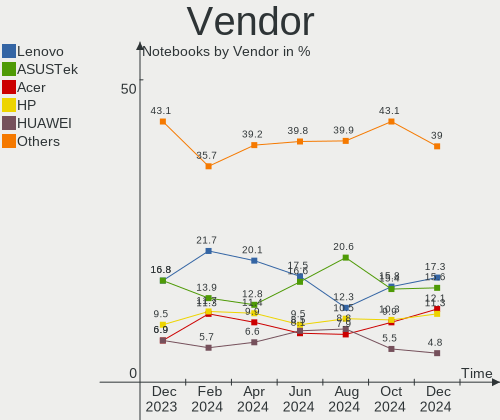
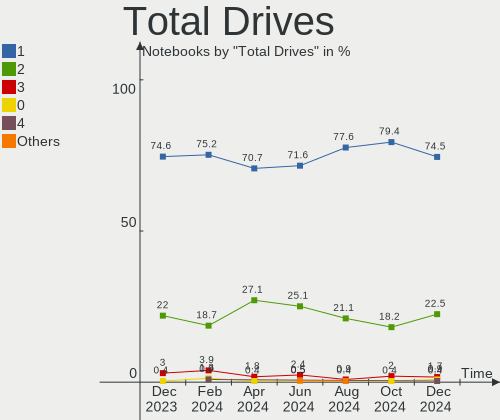
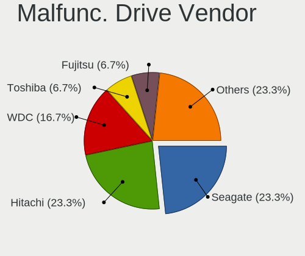
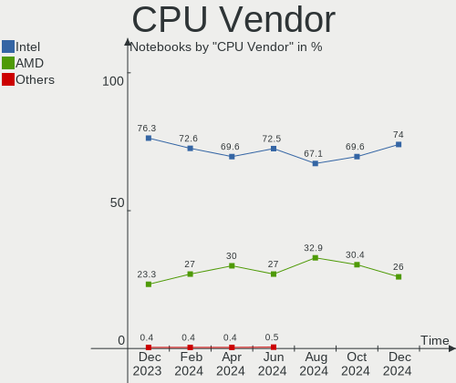
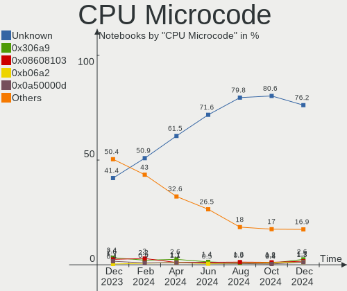
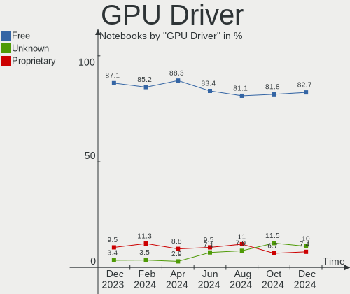
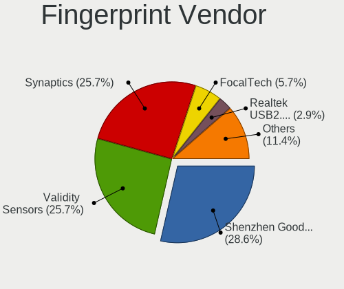
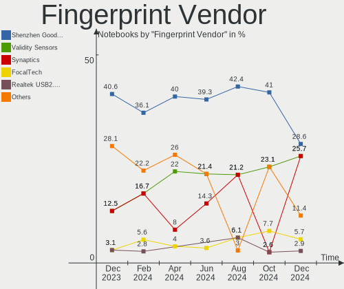

Linux in Russia - Hardware Trends (Notebooks)
---------------------------------------------

A project to identify most popular hardware characteristics and track their change
over time based on data collected by Linux users at https://Linux-Hardware.org.

Anyone can contribute to this report by the [hw-probe](https://github.com/linuxhw/hw-probe) tool:

    sudo -E hw-probe -all -upload

Contents
--------

* [ System ](#system)
  - [ OS                       ](#os)
  - [ OS Family                ](#os-family)
  - [ Kernel                   ](#kernel)
  - [ Kernel Family            ](#kernel-family)
  - [ Kernel Major Ver.        ](#kernel-major-ver)
  - [ Arch                     ](#arch)
  - [ DE                       ](#de)
  - [ Display Server           ](#display-server)
  - [ Display Manager          ](#display-manager)
  - [ OS Lang                  ](#os-lang)
  - [ Boot Mode                ](#boot-mode)
  - [ Filesystem               ](#filesystem)
  - [ Part. scheme             ](#part-scheme)
  - [ Dual Boot with Linux/BSD ](#dual-boot-with-linuxbsd)
  - [ Dual Boot (Win)          ](#dual-boot-win)

* [ Board ](#board)
  - [ Vendor                   ](#vendor)
  - [ Model                    ](#model)
  - [ Model Family             ](#model-family)
  - [ MFG Year                 ](#mfg-year)
  - [ Form Factor              ](#form-factor)
  - [ Secure Boot              ](#secure-boot)
  - [ Coreboot                 ](#coreboot)
  - [ RAM Size                 ](#ram-size)
  - [ RAM Used                 ](#ram-used)
  - [ Total Drives             ](#total-drives)
  - [ Has CD-ROM               ](#has-cd-rom)
  - [ Has Ethernet             ](#has-ethernet)
  - [ Has WiFi                 ](#has-wifi)
  - [ Has Bluetooth            ](#has-bluetooth)

* [ Location ](#location)
  - [ Country                  ](#country)
  - [ City                     ](#city)

* [ Drives ](#drives)
  - [ Drive Vendor             ](#drive-vendor)
  - [ Drive Model              ](#drive-model)
  - [ HDD Vendor               ](#hdd-vendor)
  - [ SSD Vendor               ](#ssd-vendor)
  - [ Drive Kind               ](#drive-kind)
  - [ Drive Connector          ](#drive-connector)
  - [ Drive Size               ](#drive-size)
  - [ Space Total              ](#space-total)
  - [ Space Used               ](#space-used)
  - [ Malfunc. Drives          ](#malfunc-drives)
  - [ Malfunc. Drive Vendor    ](#malfunc-drive-vendor)
  - [ Malfunc. HDD Vendor      ](#malfunc-hdd-vendor)
  - [ Malfunc. Drive Kind      ](#malfunc-drive-kind)
  - [ Failed Drives            ](#failed-drives)
  - [ Failed Drive Vendor      ](#failed-drive-vendor)
  - [ Drive Status             ](#drive-status)

* [ Storage controller ](#storage-controller)
  - [ Storage Vendor           ](#storage-vendor)
  - [ Storage Model            ](#storage-model)
  - [ Storage Kind             ](#storage-kind)

* [ Processor ](#processor)
  - [ CPU Vendor               ](#cpu-vendor)
  - [ CPU Model                ](#cpu-model)
  - [ CPU Model Family         ](#cpu-model-family)
  - [ CPU Cores                ](#cpu-cores)
  - [ CPU Sockets              ](#cpu-sockets)
  - [ CPU Threads              ](#cpu-threads)
  - [ CPU Op-Modes             ](#cpu-op-modes)
  - [ CPU Microcode            ](#cpu-microcode)
  - [ CPU Microarch            ](#cpu-microarch)

* [ Graphics ](#graphics)
  - [ GPU Vendor               ](#gpu-vendor)
  - [ GPU Model                ](#gpu-model)
  - [ GPU Combo                ](#gpu-combo)
  - [ GPU Driver               ](#gpu-driver)
  - [ GPU Memory               ](#gpu-memory)

* [ Monitor ](#monitor)
  - [ Monitor Vendor           ](#monitor-vendor)
  - [ Monitor Model            ](#monitor-model)
  - [ Monitor Resolution       ](#monitor-resolution)
  - [ Monitor Diagonal         ](#monitor-diagonal)
  - [ Monitor Width            ](#monitor-width)
  - [ Aspect Ratio             ](#aspect-ratio)
  - [ Monitor Area             ](#monitor-area)
  - [ Pixel Density            ](#pixel-density)
  - [ Multiple Monitors        ](#multiple-monitors)

* [ Network ](#network)
  - [ Net Controller Vendor    ](#net-controller-vendor)
  - [ Net Controller Model     ](#net-controller-model)
  - [ Wireless Vendor          ](#wireless-vendor)
  - [ Wireless Model           ](#wireless-model)
  - [ Ethernet Vendor          ](#ethernet-vendor)
  - [ Ethernet Model           ](#ethernet-model)
  - [ Net Controller Kind      ](#net-controller-kind)
  - [ Used Controller          ](#used-controller)
  - [ NICs                     ](#nics)
  - [ IPv6                     ](#ipv6)

* [ Bluetooth ](#bluetooth)
  - [ Bluetooth Vendor         ](#bluetooth-vendor)
  - [ Bluetooth Model          ](#bluetooth-model)

* [ Sound ](#sound)
  - [ Sound Vendor             ](#sound-vendor)
  - [ Sound Model              ](#sound-model)

* [ Memory ](#memory)
  - [ Memory Vendor            ](#memory-vendor)
  - [ Memory Model             ](#memory-model)
  - [ Memory Kind              ](#memory-kind)
  - [ Memory Form Factor       ](#memory-form-factor)
  - [ Memory Size              ](#memory-size)
  - [ Memory Speed             ](#memory-speed)

* [ Printers & scanners ](#printers--scanners)
  - [ Printer Vendor           ](#printer-vendor)
  - [ Printer Model            ](#printer-model)
  - [ Scanner Vendor           ](#scanner-vendor)
  - [ Scanner Model            ](#scanner-model)

* [ Camera ](#camera)
  - [ Camera Vendor            ](#camera-vendor)
  - [ Camera Model             ](#camera-model)

* [ Security ](#security)
  - [ Fingerprint Vendor       ](#fingerprint-vendor)
  - [ Fingerprint Model        ](#fingerprint-model)
  - [ Chipcard Vendor          ](#chipcard-vendor)
  - [ Chipcard Model           ](#chipcard-model)

* [ Unsupported ](#unsupported)
  - [ Unsupported Devices      ](#unsupported-devices)
  - [ Unsupported Device Types ](#unsupported-device-types)

System
------

OS
--

Installed operating systems

| Name                         | Notebooks | Percent |
|------------------------------|-----------|---------|
| ROSA 12.2                    | 100       | 37.59%  |
| Debian 11                    | 27        | 10.15%  |
| Ubuntu 22.04                 | 19        | 7.14%   |
| Fedora 36                    | 17        | 6.39%   |
| ROSA R11.1                   | 11        | 4.14%   |
| OpenMandriva 4.3             | 7         | 2.63%   |
| Manjaro 21.2.6               | 7         | 2.63%   |
| Manjaro                      | 6         | 2.26%   |
| Linux Mint 20.3              | 6         | 2.26%   |
| Fedora 35                    | 6         | 2.26%   |
| Ubuntu 20.04                 | 5         | 1.88%   |
| Kometa P10                   | 5         | 1.88%   |
| Arch                         | 4         | 1.5%    |
| ALT Linux 10.0               | 4         | 1.5%    |
| Pop!_OS 22.04                | 3         | 1.13%   |
| Arch Rolling                 | 3         | 1.13%   |
| ALT Linux 10.1               | 3         | 1.13%   |
| Zorin 16                     | 2         | 0.75%   |
| ROSA 12.1                    | 2         | 0.75%   |
| LMDE 5                       | 2         | 0.75%   |
| Kubuntu 22.04                | 2         | 0.75%   |
| KDE neon 20.04               | 2         | 0.75%   |
| Gentoo 2.7                   | 2         | 0.75%   |
| Xubuntu 20.04                | 1         | 0.38%   |
| Void Linux                   | 1         | 0.38%   |
| Ubuntu 21.10                 | 1         | 0.38%   |
| Ubuntu 21.04                 | 1         | 0.38%   |
| Red OS 7.3.1                 | 1         | 0.38%   |
| Q4OS 3                       | 1         | 0.38%   |
| openSUSE Tumbleweed-XXXXXXXX | 1         | 0.38%   |
| MX 21                        | 1         | 0.38%   |
| MOS 10                       | 1         | 0.38%   |
| Linux Mint 20.2              | 1         | 0.38%   |
| Kubuntu 20.04                | 1         | 0.38%   |
| Kali 2022.2                  | 1         | 0.38%   |
| Fedora 34                    | 1         | 0.38%   |
| Fedora 32                    | 1         | 0.38%   |
| Elementary 6.1               | 1         | 0.38%   |
| Debian Unstable              | 1         | 0.38%   |
| Debian 11-updates            | 1         | 0.38%   |
| Astra Linux 2.12.44          | 1         | 0.38%   |
| ALT Linux 9.2                | 1         | 0.38%   |
| ALT Linux 20201124           | 1         | 0.38%   |
| Alpine 3.16.0                | 1         | 0.38%   |

OS Family
---------

OS without a version

| Name         | Notebooks | Percent |
|--------------|-----------|---------|
| ROSA         | 113       | 42.48%  |
| Debian       | 29        | 10.9%   |
| Ubuntu       | 26        | 9.77%   |
| Fedora       | 25        | 9.4%    |
| ALT Linux    | 15        | 5.64%   |
| Manjaro      | 13        | 4.89%   |
| OpenMandriva | 7         | 2.63%   |
| Linux Mint   | 7         | 2.63%   |
| Arch         | 7         | 2.63%   |
| Pop!_OS      | 3         | 1.13%   |
| Kubuntu      | 3         | 1.13%   |
| Zorin        | 2         | 0.75%   |
| LMDE         | 2         | 0.75%   |
| KDE neon     | 2         | 0.75%   |
| Gentoo       | 2         | 0.75%   |
| Xubuntu      | 1         | 0.38%   |
| Void Linux   | 1         | 0.38%   |
| Red OS       | 1         | 0.38%   |
| Q4OS         | 1         | 0.38%   |
| openSUSE     | 1         | 0.38%   |
| MX           | 1         | 0.38%   |
| Kali         | 1         | 0.38%   |
| Elementary   | 1         | 0.38%   |
| Astra Linux  | 1         | 0.38%   |
| Alpine       | 1         | 0.38%   |

Kernel
------

Version of the Linux kernel

| Version                                   | Notebooks | Percent |
|-------------------------------------------|-----------|---------|
| 5.10.74-generic-2rosa2021.1-x86_64        | 91        | 34.21%  |
| 5.10.0-7-amd64                            | 24        | 9.02%   |
| 5.15.0-27-generic                         | 10        | 3.76%   |
| 5.16.7-desktop-1omv4003                   | 7         | 2.63%   |
| 5.15.0-33-generic                         | 7         | 2.63%   |
| 5.17.6-300.fc36.x86_64                    | 6         | 2.26%   |
| 5.10.0-14-amd64                           | 6         | 2.26%   |
| 5.15.38-1-MANJARO                         | 5         | 1.88%   |
| 5.15.32-generic-6rosa2021.1-x86_64        | 5         | 1.88%   |
| 5.13.0-40-generic                         | 5         | 1.88%   |
| 5.4.83-generic-2rosa-x86_64               | 4         | 1.5%    |
| 5.13.0-41-generic                         | 4         | 1.5%    |
| 5.10.74-generic-2rosa2021.1-i586          | 4         | 1.5%    |
| 5.4.0-110-generic                         | 3         | 1.13%   |
| 5.17.8-300.fc36.x86_64                    | 3         | 1.13%   |
| 5.17.7-300.fc36.x86_64                    | 3         | 1.13%   |
| 5.10.102-std-def-alt1                     | 3         | 1.13%   |
| 5.17.9-arch1-1                            | 2         | 0.75%   |
| 5.17.7-200.fc35.x86_64                    | 2         | 0.75%   |
| 5.17.6-1-MANJARO                          | 2         | 0.75%   |
| 5.17.5-arch1-1                            | 2         | 0.75%   |
| 5.17.5-76051705-generic                   | 2         | 0.75%   |
| 5.17.5-300.fc36.x86_64                    | 2         | 0.75%   |
| 5.17.5-200.fc35.x86_64                    | 2         | 0.75%   |
| 5.17.11-300.fc36.x86_64                   | 2         | 0.75%   |
| 5.15.34-un-def-alt1                       | 2         | 0.75%   |
| 5.15.32-gentoo-r1                         | 2         | 0.75%   |
| 5.15.32-1-MANJARO                         | 2         | 0.75%   |
| 5.15.0-30-generic                         | 2         | 0.75%   |
| 5.10.109-std-def-alt1                     | 2         | 0.75%   |
| 4.15.0-desktop-122.124.1rosa-x86_64       | 2         | 0.75%   |
| 5.4.83-generic-2rosa-i586                 | 1         | 0.38%   |
| 5.4.0-91-generic                          | 1         | 0.38%   |
| 5.4.0-113-generic                         | 1         | 0.38%   |
| 5.4.0-109-generic                         | 1         | 0.38%   |
| 5.18.0-051800-generic                     | 1         | 0.38%   |
| 5.17.9-1-MANJARO                          | 1         | 0.38%   |
| 5.17.9-0-edge                             | 1         | 0.38%   |
| 5.17.7.xm1-1.klp-xanmod-rosa2021.1-x86_64 | 1         | 0.38%   |
| 5.17.7-zen1-1-zen                         | 1         | 0.38%   |
| 5.17.7-arch1-2                            | 1         | 0.38%   |
| 5.17.6-051706-generic                     | 1         | 0.38%   |
| 5.17.4-zen1-1-zen                         | 1         | 0.38%   |
| 5.17.4-200.fc35.x86_64                    | 1         | 0.38%   |
| 5.17.4-1-default                          | 1         | 0.38%   |
| 5.17.0-7.1-liquorix-amd64                 | 1         | 0.38%   |
| 5.17.0-1-amd64                            | 1         | 0.38%   |
| 5.17.0-0.rc7.116.fc36.x86_64              | 1         | 0.38%   |
| 5.16.20_1                                 | 1         | 0.38%   |
| 5.16.20-2-MANJARO                         | 1         | 0.38%   |
| 5.16.19-76051619-generic                  | 1         | 0.38%   |
| 5.16.18-generic-2rosa2021.1-x86_64        | 1         | 0.38%   |
| 5.15.41-1-MANJARO                         | 1         | 0.38%   |
| 5.15.37-un-def-alt1                       | 1         | 0.38%   |
| 5.15.35-1.el7.3.x86_64                    | 1         | 0.38%   |
| 5.15.33-un-def-alt1                       | 1         | 0.38%   |
| 5.15.25-un-def-alt1                       | 1         | 0.38%   |
| 5.15.0-kali3-amd64                        | 1         | 0.38%   |
| 5.14.10-300.fc35.x86_64                   | 1         | 0.38%   |
| 5.14.0-1036-oem                           | 1         | 0.38%   |

Kernel Family
-------------

Linux kernel without a distro release

| Version  | Notebooks | Percent |
|----------|-----------|---------|
| 5.10.74  | 95        | 35.71%  |
| 5.10.0   | 31        | 11.65%  |
| 5.15.0   | 20        | 7.52%   |
| 5.13.0   | 12        | 4.51%   |
| 5.17.6   | 9         | 3.38%   |
| 5.15.32  | 9         | 3.38%   |
| 5.17.7   | 8         | 3.01%   |
| 5.17.5   | 8         | 3.01%   |
| 5.16.7   | 7         | 2.63%   |
| 5.4.0    | 6         | 2.26%   |
| 5.4.83   | 5         | 1.88%   |
| 5.15.38  | 5         | 1.88%   |
| 5.17.9   | 4         | 1.5%    |
| 5.17.8   | 3         | 1.13%   |
| 5.17.4   | 3         | 1.13%   |
| 5.17.0   | 3         | 1.13%   |
| 5.10.109 | 3         | 1.13%   |
| 5.10.102 | 3         | 1.13%   |
| 4.15.0   | 3         | 1.13%   |
| 5.17.11  | 2         | 0.75%   |
| 5.16.20  | 2         | 0.75%   |
| 5.15.34  | 2         | 0.75%   |
| 5.14.0   | 2         | 0.75%   |
| 5.18.0   | 1         | 0.38%   |
| 5.16.19  | 1         | 0.38%   |
| 5.16.18  | 1         | 0.38%   |
| 5.15.41  | 1         | 0.38%   |
| 5.15.37  | 1         | 0.38%   |
| 5.15.35  | 1         | 0.38%   |
| 5.15.33  | 1         | 0.38%   |
| 5.15.25  | 1         | 0.38%   |
| 5.14.10  | 1         | 0.38%   |
| 5.13.9   | 1         | 0.38%   |
| 5.11.20  | 1         | 0.38%   |
| 5.11.12  | 1         | 0.38%   |
| 5.10.61  | 1         | 0.38%   |
| 5.10.50  | 1         | 0.38%   |
| 5.10.15  | 1         | 0.38%   |
| 5.10.118 | 1         | 0.38%   |
| 5.10.117 | 1         | 0.38%   |
| 5.10.113 | 1         | 0.38%   |
| 5.10.111 | 1         | 0.38%   |
| 4.9.155  | 1         | 0.38%   |
| 4.19.0   | 1         | 0.38%   |

Kernel Major Ver.
-----------------

Linux kernel major version

| Version | Notebooks | Percent |
|---------|-----------|---------|
| 5.10    | 139       | 52.26%  |
| 5.15    | 41        | 15.41%  |
| 5.17    | 40        | 15.04%  |
| 5.13    | 13        | 4.89%   |
| 5.4     | 11        | 4.14%   |
| 5.16    | 11        | 4.14%   |
| 5.14    | 3         | 1.13%   |
| 4.15    | 3         | 1.13%   |
| 5.11    | 2         | 0.75%   |
| 5.18    | 1         | 0.38%   |
| 4.9     | 1         | 0.38%   |
| 4.19    | 1         | 0.38%   |

Arch
----

OS architecture (x86_64, i586, etc.)

| Name   | Notebooks | Percent |
|--------|-----------|---------|
| x86_64 | 259       | 97.37%  |
| i686   | 7         | 2.63%   |

DE
--

Desktop Environment

| Name       | Notebooks | Percent |
|------------|-----------|---------|
| GNOME      | 110       | 41.35%  |
| KDE5       | 79        | 29.7%   |
| Unknown    | 32        | 12.03%  |
| LXQt       | 14        | 5.26%   |
| XFCE       | 8         | 3.01%   |
| KDE4       | 7         | 2.63%   |
| MATE       | 5         | 1.88%   |
| X-Cinnamon | 4         | 1.5%    |
| i3         | 2         | 0.75%   |
| Cinnamon   | 2         | 0.75%   |
| Pantheon   | 1         | 0.38%   |
| LXDE       | 1         | 0.38%   |
| fly        | 1         | 0.38%   |

Display Server
--------------

X11 or Wayland

| Name    | Notebooks | Percent |
|---------|-----------|---------|
| Wayland | 127       | 47.74%  |
| X11     | 106       | 39.85%  |
| Unknown | 27        | 10.15%  |
| Tty     | 6         | 2.26%   |

Display Manager
---------------

SDDM, LightDM, etc.

| Name    | Notebooks | Percent |
|---------|-----------|---------|
| GDM     | 75        | 28.2%   |
| SDDM    | 71        | 26.69%  |
| Unknown | 60        | 22.56%  |
| GDM3    | 26        | 9.77%   |
| LightDM | 25        | 9.4%    |
| KDM     | 7         | 2.63%   |
| XDM     | 1         | 0.38%   |
| FLY-DM  | 1         | 0.38%   |

OS Lang
-------

Language

| Lang    | Notebooks | Percent |
|---------|-----------|---------|
| ru_RU   | 225       | 84.59%  |
| en_US   | 29        | 10.9%   |
| Unknown | 5         | 1.88%   |
| C       | 4         | 1.5%    |
| es_ES   | 1         | 0.38%   |
| en_GB   | 1         | 0.38%   |
| C.UTF8  | 1         | 0.38%   |

Boot Mode
---------

EFI or BIOS

| Mode | Notebooks | Percent |
|------|-----------|---------|
| EFI  | 169       | 63.53%  |
| BIOS | 97        | 36.47%  |

Filesystem
----------

Type of filesystem

| Type    | Notebooks | Percent |
|---------|-----------|---------|
| Ext4    | 201       | 75.56%  |
| Overlay | 33        | 12.41%  |
| Btrfs   | 30        | 11.28%  |
| Zfs     | 1         | 0.38%   |
| Aufs    | 1         | 0.38%   |

Part. scheme
------------

Scheme of partitioning

| Type    | Notebooks | Percent |
|---------|-----------|---------|
| GPT     | 159       | 59.77%  |
| MBR     | 62        | 23.31%  |
| Unknown | 45        | 16.92%  |

Dual Boot with Linux/BSD
------------------------

Hosting more than one Linux/BSD

| Dual boot | Notebooks | Percent |
|-----------|-----------|---------|
| No        | 232       | 87.22%  |
| Yes       | 34        | 12.78%  |

Dual Boot (Win)
---------------

Hosting Linux and Windows

| Dual boot | Notebooks | Percent |
|-----------|-----------|---------|
| No        | 157       | 59.02%  |
| Yes       | 109       | 40.98%  |

Board
-----

Vendor
------

Motherboard manufacturer

| Name                | Notebooks | Percent |
|---------------------|-----------|---------|
| Lenovo              | 51        | 19.17%  |
| ASUSTek Computer    | 46        | 17.29%  |
| Hewlett-Packard     | 35        | 13.16%  |
| Acer                | 33        | 12.41%  |
| Aquarius            | 22        | 8.27%   |
| Dell                | 14        | 5.26%   |
| HUAWEI              | 11        | 4.14%   |
| Samsung Electronics | 10        | 3.76%   |
| Apple               | 5         | 1.88%   |
| Sony                | 4         | 1.5%    |
| MSI                 | 4         | 1.5%    |
| Toshiba             | 3         | 1.13%   |
| ICL                 | 3         | 1.13%   |
| Panasonic           | 2         | 0.75%   |
| Packard Bell        | 2         | 0.75%   |
| Notebook            | 2         | 0.75%   |
| Intel               | 2         | 0.75%   |
| Unknown             | 2         | 0.75%   |
| Timi                | 1         | 0.38%   |
| Pegatron            | 1         | 0.38%   |
| ONDA                | 1         | 0.38%   |
| mtech               | 1         | 0.38%   |
| Maibenben           | 1         | 0.38%   |
| Kraftway            | 1         | 0.38%   |
| K-Systems           | 1         | 0.38%   |
| Irbis               | 1         | 0.38%   |
| IP3 Technology      | 1         | 0.38%   |
| HONOR               | 1         | 0.38%   |
| Google              | 1         | 0.38%   |
| Fujitsu             | 1         | 0.38%   |
| eMachines           | 1         | 0.38%   |
| Clevo               | 1         | 0.38%   |
| Chuwi               | 1         | 0.38%   |

Model
-----

Motherboard model

| Name                                       | Notebooks | Percent |
|--------------------------------------------|-----------|---------|
| Aquarius NS585                             | 22        | 8.27%   |
| Unknown                                    | 7         | 2.63%   |
| HP Pavilion g6                             | 4         | 1.5%    |
| HP ZBook 17 G5                             | 3         | 1.13%   |
| HP Notebook                                | 3         | 1.13%   |
| Lenovo IdeaPad 5 15ARE05 81YQ              | 2         | 0.75%   |
| Lenovo IdeaPad 330S-14IKB 81F4             | 2         | 0.75%   |
| Lenovo IdeaPad 330-15IKB 81DE              | 2         | 0.75%   |
| Lenovo B590 20206                          | 2         | 0.75%   |
| HUAWEI KLVL-WXXW                           | 2         | 0.75%   |
| HUAWEI CREM-WXX9                           | 2         | 0.75%   |
| HUAWEI BOHK-WAX9X                          | 2         | 0.75%   |
| HP Pavilion Gaming Laptop 17-cd2xxx        | 2         | 0.75%   |
| HP Pavilion dv6                            | 2         | 0.75%   |
| Dell Vostro 5468                           | 2         | 0.75%   |
| Dell Inspiron 3521                         | 2         | 0.75%   |
| ASUS 1001PX                                | 2         | 0.75%   |
| Apple MacBookPro8,1                        | 2         | 0.75%   |
| Acer Extensa 2519                          | 2         | 0.75%   |
| Acer Aspire A715-75G                       | 2         | 0.75%   |
| Toshiba Satellite U400                     | 1         | 0.38%   |
| Toshiba Satellite U300                     | 1         | 0.38%   |
| Toshiba Satellite C850-D1W                 | 1         | 0.38%   |
| Timi TM1607                                | 1         | 0.38%   |
| Sony VPCSB1V9R                             | 1         | 0.38%   |
| Sony VPCSA2Z9R                             | 1         | 0.38%   |
| Sony SVE1512H1RW                           | 1         | 0.38%   |
| Sony SVE1512H1RB                           | 1         | 0.38%   |
| Samsung SR70S/SR71S                        | 1         | 0.38%   |
| Samsung SQ45S70S                           | 1         | 0.38%   |
| Samsung RC530/RC730                        | 1         | 0.38%   |
| Samsung R59P/R60P/R61P                     | 1         | 0.38%   |
| Samsung R519/R719                          | 1         | 0.38%   |
| Samsung 530U3C/530U4C                      | 1         | 0.38%   |
| Samsung 355V4C/356V4C/3445VC/3545VC        | 1         | 0.38%   |
| Samsung 300V3A/300V4A/300V5A/200A4B/200A5B | 1         | 0.38%   |
| Samsung 300E4C/300E5C/300E7C               | 1         | 0.38%   |
| Samsung 300E4A/300E5A/300E7A/3430EA/3530EA | 1         | 0.38%   |
| Pegatron H36ST                             | 1         | 0.38%   |
| Panasonic CF-20-1                          | 1         | 0.38%   |
| Panasonic CF-19THRAXF9                     | 1         | 0.38%   |
| Packard Bell EasyNote TV44HC               | 1         | 0.38%   |
| Packard Bell EasyNote TS11HR               | 1         | 0.38%   |
| ONDA OBOOK 20 PLUS                         | 1         | 0.38%   |
| Notebook W65_67SF                          | 1         | 0.38%   |
| Notebook NLx0MU                            | 1         | 0.38%   |
| mtech MTL1578                              | 1         | 0.38%   |
| MSI Modern 14 B10MW                        | 1         | 0.38%   |
| MSI Katana GF66 11UE                       | 1         | 0.38%   |
| MSI GL62M 7REX                             | 1         | 0.38%   |
| MSI GF63 Thin 10SCSR                       | 1         | 0.38%   |
| Maibenben XiaoMai5                         | 1         | 0.38%   |
| Lenovo Z710 20250                          | 1         | 0.38%   |
| Lenovo Z50-75 80EC                         | 1         | 0.38%   |
| Lenovo Z50-70 20354                        | 1         | 0.38%   |
| Lenovo V145-15AST 81MT                     | 1         | 0.38%   |
| Lenovo V130-15IKB 81HN                     | 1         | 0.38%   |
| Lenovo ThinkPad X200 7455FPG               | 1         | 0.38%   |
| Lenovo ThinkPad X1 Carbon 5th 20HRS04C00   | 1         | 0.38%   |
| Lenovo ThinkPad T480 20L5000ART            | 1         | 0.38%   |

Model Family
------------

Motherboard model prefix

| Name                   | Notebooks | Percent |
|------------------------|-----------|---------|
| Aquarius NS585         | 22        | 8.27%   |
| Acer Aspire            | 19        | 7.14%   |
| Lenovo IdeaPad         | 17        | 6.39%   |
| HP Pavilion            | 11        | 4.14%   |
| ASUS VivoBook          | 11        | 4.14%   |
| Lenovo ThinkPad        | 7         | 2.63%   |
| Unknown                | 7         | 2.63%   |
| HP ProBook             | 6         | 2.26%   |
| Dell Inspiron          | 6         | 2.26%   |
| HP Laptop              | 5         | 1.88%   |
| Dell Vostro            | 5         | 1.88%   |
| Lenovo ThinkBook       | 4         | 1.5%    |
| Lenovo Legion          | 4         | 1.5%    |
| Toshiba Satellite      | 3         | 1.13%   |
| Lenovo B590            | 3         | 1.13%   |
| HP ZBook               | 3         | 1.13%   |
| HP Notebook            | 3         | 1.13%   |
| ASUS ASUS              | 3         | 1.13%   |
| Acer Nitro             | 3         | 1.13%   |
| Acer Extensa           | 3         | 1.13%   |
| Packard Bell EasyNote  | 2         | 0.75%   |
| HUAWEI KLVL-WXXW       | 2         | 0.75%   |
| HUAWEI CREM-WXX9       | 2         | 0.75%   |
| HUAWEI BOHK-WAX9X      | 2         | 0.75%   |
| HP ENVY                | 2         | 0.75%   |
| HP 250                 | 2         | 0.75%   |
| Dell Latitude          | 2         | 0.75%   |
| ASUS ROG               | 2         | 0.75%   |
| ASUS 1001PX            | 2         | 0.75%   |
| Apple MacBookPro8      | 2         | 0.75%   |
| Acer TravelMate        | 2         | 0.75%   |
| Acer Swift             | 2         | 0.75%   |
| Timi TM1607            | 1         | 0.38%   |
| Sony VPCSB1V9R         | 1         | 0.38%   |
| Sony VPCSA2Z9R         | 1         | 0.38%   |
| Sony SVE1512H1RW       | 1         | 0.38%   |
| Sony SVE1512H1RB       | 1         | 0.38%   |
| Samsung SR70S          | 1         | 0.38%   |
| Samsung SQ45S70S       | 1         | 0.38%   |
| Samsung RC530          | 1         | 0.38%   |
| Samsung R59P           | 1         | 0.38%   |
| Samsung R519           | 1         | 0.38%   |
| Samsung 530U3C         | 1         | 0.38%   |
| Samsung 355V4C         | 1         | 0.38%   |
| Samsung 300V3A         | 1         | 0.38%   |
| Samsung 300E4C         | 1         | 0.38%   |
| Samsung 300E4A         | 1         | 0.38%   |
| Pegatron H36ST         | 1         | 0.38%   |
| Panasonic CF-20-1      | 1         | 0.38%   |
| Panasonic CF-19THRAXF9 | 1         | 0.38%   |
| ONDA OBOOK             | 1         | 0.38%   |
| Notebook W65           | 1         | 0.38%   |
| Notebook NLx0MU        | 1         | 0.38%   |
| mtech MTL1578          | 1         | 0.38%   |
| MSI Modern             | 1         | 0.38%   |
| MSI Katana             | 1         | 0.38%   |
| MSI GL62M              | 1         | 0.38%   |
| MSI GF63               | 1         | 0.38%   |
| Maibenben XiaoMai5     | 1         | 0.38%   |
| Lenovo Z710            | 1         | 0.38%   |

MFG Year
--------

Motherboard manufacture year

| Year | Notebooks | Percent |
|------|-----------|---------|
| 2020 | 49        | 18.42%  |
| 2021 | 36        | 13.53%  |
| 2012 | 26        | 9.77%   |
| 2011 | 24        | 9.02%   |
| 2019 | 23        | 8.65%   |
| 2018 | 22        | 8.27%   |
| 2017 | 14        | 5.26%   |
| 2010 | 14        | 5.26%   |
| 2013 | 13        | 4.89%   |
| 2016 | 12        | 4.51%   |
| 2008 | 9         | 3.38%   |
| 2015 | 7         | 2.63%   |
| 2007 | 6         | 2.26%   |
| 2014 | 5         | 1.88%   |
| 2009 | 5         | 1.88%   |
| 2022 | 1         | 0.38%   |

Form Factor
-----------

Physical design of the computer

| Name     | Notebooks | Percent |
|----------|-----------|---------|
| Notebook | 266       | 100%    |

Secure Boot
-----------

Enabled or disabled

| State    | Notebooks | Percent |
|----------|-----------|---------|
| Disabled | 250       | 93.98%  |
| Enabled  | 16        | 6.02%   |

Coreboot
--------

Have coreboot on board

| Used | Notebooks | Percent |
|------|-----------|---------|
| No   | 265       | 99.62%  |
| Yes  | 1         | 0.38%   |

RAM Size
--------

Total RAM memory

| Size in GB | Notebooks | Percent |
|------------|-----------|---------|
| 4.01-8.0   | 116       | 43.61%  |
| 3.01-4.0   | 48        | 18.05%  |
| 16.01-24.0 | 36        | 13.53%  |
| 8.01-16.0  | 35        | 13.16%  |
| 1.01-2.0   | 15        | 5.64%   |
| 32.01-64.0 | 7         | 2.63%   |
| 2.01-3.0   | 5         | 1.88%   |
| 0.51-1.0   | 3         | 1.13%   |
| 24.01-32.0 | 1         | 0.38%   |

RAM Used
--------

Used RAM memory

| Used GB   | Notebooks | Percent |
|-----------|-----------|---------|
| 1.01-2.0  | 85        | 31.95%  |
| 0.51-1.0  | 71        | 26.69%  |
| 2.01-3.0  | 57        | 21.43%  |
| 4.01-8.0  | 27        | 10.15%  |
| 3.01-4.0  | 21        | 7.89%   |
| 8.01-16.0 | 5         | 1.88%   |

Total Drives
------------

Number of drives on board

| Drives | Notebooks | Percent |
|--------|-----------|---------|
| 1      | 202       | 75.94%  |
| 2      | 55        | 20.68%  |
| 3      | 7         | 2.63%   |
| 5      | 1         | 0.38%   |
| 4      | 1         | 0.38%   |

Has CD-ROM
----------

Has CD-ROM on board

| Presented | Notebooks | Percent |
|-----------|-----------|---------|
| No        | 190       | 71.43%  |
| Yes       | 76        | 28.57%  |

Has Ethernet
------------

Has Ethernet on board

| Presented | Notebooks | Percent |
|-----------|-----------|---------|
| Yes       | 217       | 81.58%  |
| No        | 49        | 18.42%  |

Has WiFi
--------

Has WiFi module

| Presented | Notebooks | Percent |
|-----------|-----------|---------|
| Yes       | 266       | 100%    |

Has Bluetooth
-------------

Has Bluetooth module

| Presented | Notebooks | Percent |
|-----------|-----------|---------|
| Yes       | 215       | 80.83%  |
| No        | 51        | 19.17%  |

Location
--------

Country
-------

Geographic location (country)

| Country | Notebooks | Percent |
|---------|-----------|---------|
| Russia  | 266       | 100%    |

City
----

Geographic location (city)

| City                | Notebooks | Percent |
|---------------------|-----------|---------|
| Moscow              | 77        | 28.95%  |
| St Petersburg       | 31        | 11.65%  |
| Voronezh            | 27        | 10.15%  |
| Chelyabinsk         | 9         | 3.38%   |
| Novosibirsk         | 6         | 2.26%   |
| Yekaterinburg       | 5         | 1.88%   |
| Samara              | 5         | 1.88%   |
| Yaroslavl           | 4         | 1.5%    |
| Perm                | 4         | 1.5%    |
| Nizhniy Novgorod    | 4         | 1.5%    |
| Krasnodar           | 4         | 1.5%    |
| Khabarovsk          | 4         | 1.5%    |
| Barnaul             | 4         | 1.5%    |
| Saratov             | 3         | 1.13%   |
| Rostov-on-Don       | 3         | 1.13%   |
| Kazan’            | 3         | 1.13%   |
| Yoshkar-Ola         | 2         | 0.75%   |
| Volgograd           | 2         | 0.75%   |
| Ryazan              | 2         | 0.75%   |
| Noyabrsk            | 2         | 0.75%   |
| Krasnoyarsk         | 2         | 0.75%   |
| Bryansk             | 2         | 0.75%   |
| Astrakhan           | 2         | 0.75%   |
| Arkhangelsk         | 2         | 0.75%   |
| Zarinsk             | 1         | 0.38%   |
| Yelizovo            | 1         | 0.38%   |
| Yelabuga            | 1         | 0.38%   |
| Yakutsk             | 1         | 0.38%   |
| Yablonovsky         | 1         | 0.38%   |
| Votkinsk            | 1         | 0.38%   |
| Voskresensk         | 1         | 0.38%   |
| Vologda             | 1         | 0.38%   |
| Volkhov             | 1         | 0.38%   |
| Vladimir            | 1         | 0.38%   |
| Val                 | 1         | 0.38%   |
| Uray                | 1         | 0.38%   |
| Ulyanovsk           | 1         | 0.38%   |
| Tver                | 1         | 0.38%   |
| Tula                | 1         | 0.38%   |
| Tsarskoye Selo      | 1         | 0.38%   |
| Troitsk             | 1         | 0.38%   |
| Timashëvsk         | 1         | 0.38%   |
| Taman'              | 1         | 0.38%   |
| Taganrog            | 1         | 0.38%   |
| Syktyvkar           | 1         | 0.38%   |
| Stupino             | 1         | 0.38%   |
| Stavropol           | 1         | 0.38%   |
| Sovetsk             | 1         | 0.38%   |
| Sochi               | 1         | 0.38%   |
| Smolensk            | 1         | 0.38%   |
| Seversk             | 1         | 0.38%   |
| Pskov               | 1         | 0.38%   |
| Petrozavodsk        | 1         | 0.38%   |
| Omsk                | 1         | 0.38%   |
| Novomichurinsk      | 1         | 0.38%   |
| Nizhny Tagil        | 1         | 0.38%   |
| Nazarovo            | 1         | 0.38%   |
| Naberezhnyye Chelny | 1         | 0.38%   |
| Murom               | 1         | 0.38%   |
| Mirny               | 1         | 0.38%   |

Drives
------

Drive Vendor
------------

Hard drive vendors

| Vendor                         | Notebooks | Drives | Percent |
|--------------------------------|-----------|--------|---------|
| WDC                            | 47        | 47     | 14.29%  |
| Samsung Electronics            | 40        | 46     | 12.16%  |
| Seagate                        | 38        | 38     | 11.55%  |
| A-DATA Technology              | 28        | 29     | 8.51%   |
| Kingston                       | 20        | 20     | 6.08%   |
| Toshiba                        | 15        | 16     | 4.56%   |
| Intel                          | 15        | 15     | 4.56%   |
| Unknown                        | 13        | 14     | 3.95%   |
| SK Hynix                       | 13        | 13     | 3.95%   |
| Hitachi                        | 13        | 13     | 3.95%   |
| HGST                           | 9         | 9      | 2.74%   |
| SanDisk                        | 7         | 7      | 2.13%   |
| Apacer                         | 6         | 6      | 1.82%   |
| Phison                         | 5         | 5      | 1.52%   |
| KingSpec                       | 5         | 5      | 1.52%   |
| UMIS                           | 4         | 4      | 1.22%   |
| Micron Technology              | 4         | 4      | 1.22%   |
| Crucial                        | 4         | 4      | 1.22%   |
| China                          | 4         | 4      | 1.22%   |
| PLEXTOR                        | 3         | 3      | 0.91%   |
| OCZ                            | 3         | 3      | 0.91%   |
| Patriot                        | 2         | 2      | 0.61%   |
| KIOXIA                         | 2         | 2      | 0.61%   |
| GOODRAM                        | 2         | 2      | 0.61%   |
| FOXLINE                        | 2         | 2      | 0.61%   |
| XrayDisk                       | 1         | 1      | 0.3%    |
| XPG                            | 1         | 1      | 0.3%    |
| Vaseky                         | 1         | 1      | 0.3%    |
| TO Exter                       | 1         | 1      | 0.3%    |
| Teclast                        | 1         | 1      | 0.3%    |
| SSSTC                          | 1         | 1      | 0.3%    |
| SPCC                           | 1         | 1      | 0.3%    |
| Solid State Storage Technology | 1         | 1      | 0.3%    |
| Smartbuy                       | 1         | 1      | 0.3%    |
| Silicon Motion                 | 1         | 1      | 0.3%    |
| OWC                            | 1         | 1      | 0.3%    |
| OCZ-VERTEX3                    | 1         | 1      | 0.3%    |
| Netac                          | 1         | 1      | 0.3%    |
| MyDigitalSSD                   | 1         | 1      | 0.3%    |
| LONDISK                        | 1         | 1      | 0.3%    |
| Lexar                          | 1         | 1      | 0.3%    |
| JMicron                        | 1         | 1      | 0.3%    |
| Hewlett-Packard                | 1         | 1      | 0.3%    |
| Fujitsu                        | 1         | 1      | 0.3%    |
| Dell                           | 1         | 1      | 0.3%    |
| BaseTech                       | 1         | 1      | 0.3%    |
| Apple                          | 1         | 1      | 0.3%    |
| AMD                            | 1         | 1      | 0.3%    |
| ADATA Technology               | 1         | 1      | 0.3%    |
| Unknown                        | 1         | 1      | 0.3%    |

Drive Model
-----------

Hard drive models

| Model                                   | Notebooks | Percent |
|-----------------------------------------|-----------|---------|
| A-DATA SU800 512GB SSD                  | 22        | 6.59%   |
| Toshiba MQ01ABF050 500GB                | 6         | 1.8%    |
| Seagate ST500LT012-1DG142 500GB         | 5         | 1.5%    |
| Seagate ST9320325AS 320GB               | 4         | 1.2%    |
| Seagate ST1000LM035-1RK172 1TB          | 4         | 1.2%    |
| Seagate ST1000LM024 HN-M101MBB 1TB      | 4         | 1.2%    |
| WDC WD5000LPCX-21VHAT0 500GB            | 3         | 0.9%    |
| WDC WD10SPZX-21Z10T0 1TB                | 3         | 0.9%    |
| Seagate ST500LT012-9WS142 500GB         | 3         | 0.9%    |
| Seagate ST1000LM049-2GH172 1TB          | 3         | 0.9%    |
| Samsung SSD 860 EVO M.2 250GB           | 3         | 0.9%    |
| Phison 311CD0512GB                      | 3         | 0.9%    |
| Intel SSDPEKNW512G8 512GB               | 3         | 0.9%    |
| Hitachi HTS547550A9E384 500GB           | 3         | 0.9%    |
| HGST HTS721010A9E630 1TB                | 3         | 0.9%    |
| WDC WDS500G2B0A-00SM50 500GB SSD        | 2         | 0.6%    |
| WDC WDS240G2G0A-00JH30 240GB SSD        | 2         | 0.6%    |
| WDC WDS120G2G0A-00JH30 120GB SSD        | 2         | 0.6%    |
| WDC WD10SPZX-60Z10T0 1TB                | 2         | 0.6%    |
| WDC WD10SPZX-24Z10 1TB                  | 2         | 0.6%    |
| WDC PC SN730 SDBPNTY-512G-1027 512GB    | 2         | 0.6%    |
| WDC PC SN730 SDBPNTY-512G               | 2         | 0.6%    |
| WDC PC SN520 SDAPNUW-512G-1014 512GB    | 2         | 0.6%    |
| Unknown ISOCOM  64GB                    | 2         | 0.6%    |
| UMIS RPFTJ256PDD2MWX 256GB              | 2         | 0.6%    |
| Toshiba KBG30ZMS128G 128GB NVMe SSD     | 2         | 0.6%    |
| SK Hynix SKHynix_HFS512GDE9X084N 512GB  | 2         | 0.6%    |
| SK Hynix HFM512GD3JX013N 512GB          | 2         | 0.6%    |
| SK Hynix BC511 HFM512GDJTNI-82A0A 512GB | 2         | 0.6%    |
| Seagate ST9500325AS 500GB               | 2         | 0.6%    |
| Seagate ST1000LM014-SSHD-8GB            | 2         | 0.6%    |
| Samsung SSD 860 EVO 250GB               | 2         | 0.6%    |
| Samsung NVMe SSD Drive 512GB            | 2         | 0.6%    |
| Samsung MZVLQ256HAJD-00000 256GB        | 2         | 0.6%    |
| Samsung MZ7LN128HAHQ-000L2 128GB SSD    | 2         | 0.6%    |
| Micron NVMe SSD Drive 512GB             | 2         | 0.6%    |
| Kingston SA400S37120G 120GB SSD         | 2         | 0.6%    |
| Kingston NVMe SSD Drive 256GB           | 2         | 0.6%    |
| Intel SSDSCKKF256G8H 256GB              | 2         | 0.6%    |
| Intel SSDPEMKF256G8H 256GB              | 2         | 0.6%    |
| Hitachi HTS542516K9SA00 160GB           | 2         | 0.6%    |
| HGST HTS725050A7E630 500GB              | 2         | 0.6%    |
| HGST HTS545050A7E380 500GB              | 2         | 0.6%    |
| FOXLINE FLSSD256M80E13TCX5 256GB        | 2         | 0.6%    |
| Apacer AS350 512GB SSD                  | 2         | 0.6%    |
| XrayDisk 240GB                          | 1         | 0.3%    |
| XPG GAMMIX S11 Pro 256GB                | 1         | 0.3%    |
| WDC WDS100T2B0B 1TB SSD                 | 1         | 0.3%    |
| WDC WDS100T2B0A-00SM50 1TB SSD          | 1         | 0.3%    |
| WDC WD7500BPVT-22HXZT3 752GB            | 1         | 0.3%    |
| WDC WD5000LPVX-80V0TT0 500GB            | 1         | 0.3%    |
| WDC WD5000LPVX-22V0TT0 500GB            | 1         | 0.3%    |
| WDC WD5000LPLX-00ZNTT0 500GB            | 1         | 0.3%    |
| WDC WD5000LPCX-60VHAT0 500GB            | 1         | 0.3%    |
| WDC WD5000LPCX-24VHAT0 500GB            | 1         | 0.3%    |
| WDC WD5000BPKX-00HPJT0 500GB            | 1         | 0.3%    |
| WDC WD4000LPCX-24C6HT0 400GB            | 1         | 0.3%    |
| WDC WD3200BPVT-24JJ5T0 320GB            | 1         | 0.3%    |
| WDC WD3200BPVT-22ZEST0 320GB            | 1         | 0.3%    |
| WDC WD2500BEVT-60ZCT1 250GB             | 1         | 0.3%    |

HDD Vendor
----------

Hard disk drive vendors

| Vendor              | Notebooks | Drives | Percent |
|---------------------|-----------|--------|---------|
| Seagate             | 38        | 38     | 36.89%  |
| WDC                 | 29        | 29     | 28.16%  |
| Hitachi             | 13        | 13     | 12.62%  |
| Toshiba             | 11        | 12     | 10.68%  |
| HGST                | 9         | 9      | 8.74%   |
| Unknown             | 1         | 1      | 0.97%   |
| Samsung Electronics | 1         | 1      | 0.97%   |
| Fujitsu             | 1         | 1      | 0.97%   |

SSD Vendor
----------

Solid state drive vendors

| Vendor              | Notebooks | Drives | Percent |
|---------------------|-----------|--------|---------|
| A-DATA Technology   | 27        | 28     | 21.6%   |
| Samsung Electronics | 17        | 20     | 13.6%   |
| Kingston            | 13        | 13     | 10.4%   |
| WDC                 | 8         | 8      | 6.4%    |
| SanDisk             | 6         | 6      | 4.8%    |
| KingSpec            | 5         | 5      | 4%      |
| Intel               | 5         | 5      | 4%      |
| Apacer              | 5         | 5      | 4%      |
| Crucial             | 4         | 4      | 3.2%    |
| China               | 4         | 4      | 3.2%    |
| SK Hynix            | 3         | 3      | 2.4%    |
| PLEXTOR             | 3         | 3      | 2.4%    |
| OCZ                 | 3         | 3      | 2.4%    |
| Patriot             | 2         | 2      | 1.6%    |
| GOODRAM             | 2         | 2      | 1.6%    |
| Vaseky              | 1         | 1      | 0.8%    |
| TO Exter            | 1         | 1      | 0.8%    |
| Teclast             | 1         | 1      | 0.8%    |
| SPCC                | 1         | 1      | 0.8%    |
| Smartbuy            | 1         | 1      | 0.8%    |
| OCZ-VERTEX3         | 1         | 1      | 0.8%    |
| Netac               | 1         | 1      | 0.8%    |
| MyDigitalSSD        | 1         | 1      | 0.8%    |
| Micron Technology   | 1         | 1      | 0.8%    |
| LONDISK             | 1         | 1      | 0.8%    |
| Lexar               | 1         | 1      | 0.8%    |
| JMicron             | 1         | 1      | 0.8%    |
| Hewlett-Packard     | 1         | 1      | 0.8%    |
| FOXLINE             | 1         | 1      | 0.8%    |
| Dell                | 1         | 1      | 0.8%    |
| BaseTech            | 1         | 1      | 0.8%    |
| AMD                 | 1         | 1      | 0.8%    |
| Unknown             | 1         | 1      | 0.8%    |

Drive Kind
----------

HDD or SSD

| Kind    | Notebooks | Drives | Percent |
|---------|-----------|--------|---------|
| SSD     | 118       | 129    | 37.11%  |
| HDD     | 99        | 104    | 31.13%  |
| NVMe    | 87        | 90     | 27.36%  |
| MMC     | 12        | 13     | 3.77%   |
| Unknown | 2         | 2      | 0.63%   |

Drive Connector
---------------

SATA, SAS, NVMe, etc.

| Type | Notebooks | Drives | Percent |
|------|-----------|--------|---------|
| SATA | 195       | 229    | 65.22%  |
| NVMe | 87        | 90     | 29.1%   |
| MMC  | 12        | 13     | 4.01%   |
| SAS  | 5         | 6      | 1.67%   |

Drive Size
----------

Size of hard drive

| Size in TB | Notebooks | Drives | Percent |
|------------|-----------|--------|---------|
| 0.01-0.5   | 139       | 162    | 66.51%  |
| 0.51-1.0   | 67        | 68     | 32.06%  |
| 1.01-2.0   | 2         | 2      | 0.96%   |
| 3.01-4.0   | 1         | 1      | 0.48%   |

Space Total
-----------

Amount of disk space available on the file system

| Size in GB     | Notebooks | Percent |
|----------------|-----------|---------|
| 101-250        | 76        | 28.57%  |
| 251-500        | 74        | 27.82%  |
| Unknown        | 30        | 11.28%  |
| 501-1000       | 25        | 9.4%    |
| 1-20           | 19        | 7.14%   |
| 51-100         | 16        | 6.02%   |
| 21-50          | 12        | 4.51%   |
| 1001-2000      | 11        | 4.14%   |
| 2001-3000      | 2         | 0.75%   |
| More than 3000 | 1         | 0.38%   |

Space Used
----------

Amount of used disk space

| Used GB   | Notebooks | Percent |
|-----------|-----------|---------|
| 1-20      | 130       | 48.87%  |
| 21-50     | 33        | 12.41%  |
| Unknown   | 30        | 11.28%  |
| 101-250   | 26        | 9.77%   |
| 251-500   | 22        | 8.27%   |
| 51-100    | 19        | 7.14%   |
| 501-1000  | 4         | 1.5%    |
| 1001-2000 | 2         | 0.75%   |

Malfunc. Drives
---------------

Drive models with a malfunction

| Model                                 | Notebooks | Drives | Percent |
|---------------------------------------|-----------|--------|---------|
| Seagate ST9320325AS 320GB             | 4         | 4      | 10%     |
| Seagate ST500LT012-9WS142 500GB       | 3         | 3      | 7.5%    |
| Seagate ST500LT012-1DG142 500GB       | 2         | 2      | 5%      |
| Hitachi HTS542516K9SA00 160GB         | 2         | 2      | 5%      |
| HGST HTS725050A7E630 500GB            | 2         | 2      | 5%      |
| HGST HTS545050A7E380 500GB            | 2         | 2      | 5%      |
| WDC WD2500BEVT-60ZCT1 250GB           | 1         | 1      | 2.5%    |
| WDC WD2500BEKT-60A25T1 250GB          | 1         | 1      | 2.5%    |
| WDC WD10JPVX-08JC3T2 1TB              | 1         | 1      | 2.5%    |
| Toshiba MQ01ABF050 500GB              | 1         | 1      | 2.5%    |
| Toshiba MK5055GSX 500GB               | 1         | 1      | 2.5%    |
| SK Hynix HFS256G32TNH-73A0A 256GB SSD | 1         | 1      | 2.5%    |
| Seagate ST9500325AS 500GB             | 1         | 1      | 2.5%    |
| Seagate ST500LM000-SSHD-8GB           | 1         | 1      | 2.5%    |
| Seagate ST320LT020-9YG142 320GB       | 1         | 1      | 2.5%    |
| Seagate ST320LT012-9WS14C 320GB       | 1         | 1      | 2.5%    |
| Seagate ST2000LM015-2E8174 2TB        | 1         | 1      | 2.5%    |
| Seagate ST1000LM014-SSHD-8GB          | 1         | 1      | 2.5%    |
| Samsung Electronics HN-M500MBB 500GB  | 1         | 1      | 2.5%    |
| OCZ-VERTEX3 MI 240GB SSD              | 1         | 1      | 2.5%    |
| Kingston SUV400S37120G 120GB SSD      | 1         | 1      | 2.5%    |
| Intel SSDSCKKF256G8H 256GB            | 1         | 1      | 2.5%    |
| Hitachi HTS547550A9E384 500GB         | 1         | 1      | 2.5%    |
| Hitachi HTS542525K9A300 250GB         | 1         | 1      | 2.5%    |
| Hitachi HTS542512K9SA00 120GB         | 1         | 1      | 2.5%    |
| Hitachi HTS542512K9A300 120GB         | 1         | 1      | 2.5%    |
| Hitachi HTS541612J9SA00 120GB         | 1         | 1      | 2.5%    |
| HGST HTS545050A7E680 500GB            | 1         | 1      | 2.5%    |
| Fujitsu MHW2160BH PL 160GB            | 1         | 1      | 2.5%    |
| Crucial CT128M550SSD1 128GB           | 1         | 1      | 2.5%    |
| AMD R5SL120G 120GB SSD                | 1         | 1      | 2.5%    |

Malfunc. Drive Vendor
---------------------

Vendors of faulty drives

| Vendor              | Notebooks | Drives | Percent |
|---------------------|-----------|--------|---------|
| Seagate             | 15        | 15     | 37.5%   |
| Hitachi             | 7         | 7      | 17.5%   |
| HGST                | 5         | 5      | 12.5%   |
| WDC                 | 3         | 3      | 7.5%    |
| Toshiba             | 2         | 2      | 5%      |
| SK Hynix            | 1         | 1      | 2.5%    |
| Samsung Electronics | 1         | 1      | 2.5%    |
| OCZ-VERTEX3         | 1         | 1      | 2.5%    |
| Kingston            | 1         | 1      | 2.5%    |
| Intel               | 1         | 1      | 2.5%    |
| Fujitsu             | 1         | 1      | 2.5%    |
| Crucial             | 1         | 1      | 2.5%    |
| AMD                 | 1         | 1      | 2.5%    |

Malfunc. HDD Vendor
-------------------

Vendors of faulty HDD drives

| Vendor              | Notebooks | Drives | Percent |
|---------------------|-----------|--------|---------|
| Seagate             | 15        | 15     | 44.12%  |
| Hitachi             | 7         | 7      | 20.59%  |
| HGST                | 5         | 5      | 14.71%  |
| WDC                 | 3         | 3      | 8.82%   |
| Toshiba             | 2         | 2      | 5.88%   |
| Samsung Electronics | 1         | 1      | 2.94%   |
| Fujitsu             | 1         | 1      | 2.94%   |

Malfunc. Drive Kind
-------------------

Kinds of faulty drives

| Kind | Notebooks | Drives | Percent |
|------|-----------|--------|---------|
| HDD  | 34        | 34     | 85%     |
| SSD  | 6         | 6      | 15%     |

Failed Drives
-------------

Failed drive models

Zero info for selected period =(

Failed Drive Vendor
-------------------

Failed drive vendors

Zero info for selected period =(

Drive Status
------------

Number of failed and malfunc. drives

| Status   | Notebooks | Drives | Percent |
|----------|-----------|--------|---------|
| Works    | 193       | 224    | 66.78%  |
| Detected | 57        | 74     | 19.72%  |
| Malfunc  | 39        | 40     | 13.49%  |

Storage controller
------------------

Storage Vendor
--------------

Storage controller vendors

| Vendor                         | Notebooks | Percent |
|--------------------------------|-----------|---------|
| Intel                          | 204       | 64.35%  |
| AMD                            | 33        | 10.41%  |
| Samsung Electronics            | 24        | 7.57%   |
| Sandisk                        | 11        | 3.47%   |
| SK Hynix                       | 10        | 3.15%   |
| Phison Electronics             | 7         | 2.21%   |
| Kingston Technology Company    | 7         | 2.21%   |
| Union Memory (Shenzhen)        | 4         | 1.26%   |
| Toshiba America Info Systems   | 4         | 1.26%   |
| Micron Technology              | 3         | 0.95%   |
| ADATA Technology               | 3         | 0.95%   |
| Solid State Storage Technology | 2         | 0.63%   |
| KIOXIA                         | 2         | 0.63%   |
| Silicon Motion                 | 1         | 0.32%   |
| Nvidia                         | 1         | 0.32%   |
| Apple                          | 1         | 0.32%   |

Storage Model
-------------

Storage controller models

| Model                                                                                  | Notebooks | Percent |
|----------------------------------------------------------------------------------------|-----------|---------|
| AMD FCH SATA Controller [AHCI mode]                                                    | 28        | 8.28%   |
| Intel 7 Series Chipset Family 6-port SATA Controller [AHCI mode]                       | 26        | 7.69%   |
| Intel Sunrise Point-LP SATA Controller [AHCI mode]                                     | 23        | 6.8%    |
| Intel Cannon Lake PCH SATA AHCI Controller                                             | 22        | 6.51%   |
| Intel 6 Series/C200 Series Chipset Family 6 port Mobile SATA AHCI Controller           | 19        | 5.62%   |
| Intel 82801 Mobile SATA Controller [RAID mode]                                         | 14        | 4.14%   |
| Samsung NVMe SSD Controller 980                                                        | 12        | 3.55%   |
| Samsung NVMe SSD Controller SM981/PM981/PM983                                          | 10        | 2.96%   |
| Intel Volume Management Device NVMe RAID Controller                                    | 9         | 2.66%   |
| Intel Tiger Lake-LP SATA Controller [AHCI mode]                                        | 9         | 2.66%   |
| Intel Cannon Lake Mobile PCH SATA AHCI Controller                                      | 8         | 2.37%   |
| Intel Cannon Point-LP SATA Controller [AHCI Mode]                                      | 7         | 2.07%   |
| Intel 8 Series SATA Controller 1 [AHCI mode]                                           | 7         | 2.07%   |
| SK Hynix Gold P31 SSD                                                                  | 5         | 1.48%   |
| Phison PS5013 E13 NVMe Controller                                                      | 5         | 1.48%   |
| Intel SSD 660P Series                                                                  | 5         | 1.48%   |
| Intel NM10/ICH7 Family SATA Controller [AHCI mode]                                     | 5         | 1.48%   |
| Intel Atom/Celeron/Pentium Processor x5-E8000/J3xxx/N3xxx Series SATA Controller       | 5         | 1.48%   |
| Intel 400 Series Chipset Family SATA AHCI Controller                                   | 5         | 1.48%   |
| Union Memory (Shenzhen) Non-Volatile memory controller                                 | 4         | 1.18%   |
| SK Hynix BC511                                                                         | 4         | 1.18%   |
| Sandisk WD Black SN750 / PC SN730 NVMe SSD                                             | 4         | 1.18%   |
| Intel SSD Pro 7600p/760p/E 6100p Series                                                | 4         | 1.18%   |
| Intel Comet Lake SATA AHCI Controller                                                  | 4         | 1.18%   |
| Intel Atom Processor E3800 Series SATA AHCI Controller                                 | 4         | 1.18%   |
| Intel 82801IBM/IEM (ICH9M/ICH9M-E) 2 port SATA Controller [IDE mode]                   | 4         | 1.18%   |
| Intel 82801HM/HEM (ICH8M/ICH8M-E) SATA Controller [IDE mode]                           | 4         | 1.18%   |
| Intel 82801HM/HEM (ICH8M/ICH8M-E) SATA Controller [AHCI mode]                          | 4         | 1.18%   |
| Intel 82801HM/HEM (ICH8M/ICH8M-E) IDE Controller                                       | 4         | 1.18%   |
| Intel 5 Series/3400 Series Chipset 4 port SATA AHCI Controller                         | 4         | 1.18%   |
| Sandisk WD Blue SN550 NVMe SSD                                                         | 3         | 0.89%   |
| Sandisk WD Blue SN500 / PC SN520 NVMe SSD                                              | 3         | 0.89%   |
| Micron Non-Volatile memory controller                                                  | 3         | 0.89%   |
| Kingston Company OM3PDP3 NVMe SSD                                                      | 3         | 0.89%   |
| Intel Celeron/Pentium Silver Processor SATA Controller                                 | 3         | 0.89%   |
| Intel 82801IBM/IEM (ICH9M/ICH9M-E) 4 port SATA Controller [AHCI mode]                  | 3         | 0.89%   |
| Intel 8 Series/C220 Series Chipset Family 6-port SATA Controller 1 [AHCI mode]         | 3         | 0.89%   |
| Intel 5 Series/3400 Series Chipset 6 port SATA AHCI Controller                         | 3         | 0.89%   |
| AMD SB7x0/SB8x0/SB9x0 SATA Controller [AHCI mode]                                      | 3         | 0.89%   |
| Toshiba America Info Systems XG6 NVMe SSD Controller                                   | 2         | 0.59%   |
| Solid State Storage Non-Volatile memory controller                                     | 2         | 0.59%   |
| Samsung NVMe SSD Controller SM961/PM961/SM963                                          | 2         | 0.59%   |
| KIOXIA Non-Volatile memory controller                                                  | 2         | 0.59%   |
| Kingston Company U-SNS8154P3 NVMe SSD                                                  | 2         | 0.59%   |
| Intel Ice Lake-LP SATA Controller [AHCI mode]                                          | 2         | 0.59%   |
| Intel HM170/QM170 Chipset SATA Controller [AHCI Mode]                                  | 2         | 0.59%   |
| Intel Celeron N3350/Pentium N4200/Atom E3900 Series SATA AHCI Controller               | 2         | 0.59%   |
| Intel 6 Series/C200 Series Chipset Family Mobile SATA Controller (IDE mode, ports 4-5) | 2         | 0.59%   |
| Intel 6 Series/C200 Series Chipset Family Mobile SATA Controller (IDE mode, ports 0-3) | 2         | 0.59%   |
| AMD SB600 Non-Raid-5 SATA                                                              | 2         | 0.59%   |
| AMD SB600 IDE                                                                          | 2         | 0.59%   |
| Toshiba America Info Systems Toshiba America Info Non-Volatile memory controller       | 1         | 0.3%    |
| Toshiba America Info Systems BG3 NVMe SSD Controller                                   | 1         | 0.3%    |
| SK Hynix BC501 NVMe Solid State Drive                                                  | 1         | 0.3%    |
| Silicon Motion SM2263EN/SM2263XT SSD Controller                                        | 1         | 0.3%    |
| Sandisk Non-Volatile memory controller                                                 | 1         | 0.3%    |
| Phison NVMe Storage Controller                                                         | 1         | 0.3%    |
| Phison E16 PCIe4 NVMe Controller                                                       | 1         | 0.3%    |
| Nvidia MCP89 SATA Controller                                                           | 1         | 0.3%    |
| Kingston Company Company Non-Volatile memory controller                                | 1         | 0.3%    |

Storage Kind
------------

Kind of storage controller (IDE, SATA, NVMe, SAS, ...)

| Kind | Notebooks | Percent |
|------|-----------|---------|
| SATA | 205       | 61.38%  |
| NVMe | 87        | 26.05%  |
| RAID | 23        | 6.89%   |
| IDE  | 19        | 5.69%   |

Processor
---------

CPU Vendor
----------

Processor vendors

| Vendor | Notebooks | Percent |
|--------|-----------|---------|
| Intel  | 220       | 82.71%  |
| AMD    | 46        | 17.29%  |

CPU Model
---------

Processor models

| Model                                         | Notebooks | Percent |
|-----------------------------------------------|-----------|---------|
| Intel Core i3-9100 CPU @ 3.60GHz              | 22        | 8.27%   |
| AMD Ryzen 5 5500U with Radeon Graphics        | 7         | 2.63%   |
| AMD Ryzen 5 3500U with Radeon Vega Mobile Gfx | 6         | 2.26%   |
| Intel Pentium CPU 2020M @ 2.40GHz             | 5         | 1.88%   |
| Intel Core i7-8750H CPU @ 2.20GHz             | 5         | 1.88%   |
| Intel Core i5-8250U CPU @ 1.60GHz             | 5         | 1.88%   |
| Intel Core i5-2410M CPU @ 2.30GHz             | 5         | 1.88%   |
| Intel Core i3-6006U CPU @ 2.00GHz             | 5         | 1.88%   |
| Intel 11th Gen Core i5-11300H @ 3.10GHz       | 5         | 1.88%   |
| AMD Ryzen 7 5800H with Radeon Graphics        | 5         | 1.88%   |
| Intel Core i5-7300HQ CPU @ 2.50GHz            | 4         | 1.5%    |
| Intel Core i5-7200U CPU @ 2.50GHz             | 4         | 1.5%    |
| Intel Atom CPU N450 @ 1.66GHz                 | 4         | 1.5%    |
| Intel Core i7-8550U CPU @ 1.80GHz             | 3         | 1.13%   |
| Intel Core i7-2640M CPU @ 2.80GHz             | 3         | 1.13%   |
| Intel Core i7-10750H CPU @ 2.60GHz            | 3         | 1.13%   |
| Intel Core i5-9300H CPU @ 2.40GHz             | 3         | 1.13%   |
| Intel Core i5-8279U CPU @ 2.40GHz             | 3         | 1.13%   |
| Intel Core i5-8265U CPU @ 1.60GHz             | 3         | 1.13%   |
| Intel Core i5-4210U CPU @ 1.70GHz             | 3         | 1.13%   |
| Intel Core i5-3230M CPU @ 2.60GHz             | 3         | 1.13%   |
| Intel Core i3-8145U CPU @ 2.10GHz             | 3         | 1.13%   |
| Intel Celeron CPU N3060 @ 1.60GHz             | 3         | 1.13%   |
| Intel 11th Gen Core i7-1165G7 @ 2.80GHz       | 3         | 1.13%   |
| Intel 11th Gen Core i5-1135G7 @ 2.40GHz       | 3         | 1.13%   |
| Intel Pentium Dual-Core CPU T4400 @ 2.20GHz   | 2         | 0.75%   |
| Intel Core i7-3612QM CPU @ 2.10GHz            | 2         | 0.75%   |
| Intel Core i7-10510U CPU @ 1.80GHz            | 2         | 0.75%   |
| Intel Core i5-8300H CPU @ 2.30GHz             | 2         | 0.75%   |
| Intel Core i5-4200U CPU @ 1.60GHz             | 2         | 0.75%   |
| Intel Core i5-3320M CPU @ 2.60GHz             | 2         | 0.75%   |
| Intel Core i5-3317U CPU @ 1.70GHz             | 2         | 0.75%   |
| Intel Core i5-2540M CPU @ 2.60GHz             | 2         | 0.75%   |
| Intel Core i5-2450M CPU @ 2.50GHz             | 2         | 0.75%   |
| Intel Core i5-2430M CPU @ 2.40GHz             | 2         | 0.75%   |
| Intel Core i5-10300H CPU @ 2.50GHz            | 2         | 0.75%   |
| Intel Core i5-10210U CPU @ 1.60GHz            | 2         | 0.75%   |
| Intel Core i3-8130U CPU @ 2.20GHz             | 2         | 0.75%   |
| Intel Core i3-7020U CPU @ 2.30GHz             | 2         | 0.75%   |
| Intel Core i3-3120M CPU @ 2.50GHz             | 2         | 0.75%   |
| Intel Core i3-3110M CPU @ 2.40GHz             | 2         | 0.75%   |
| Intel Core i3-2350M CPU @ 2.30GHz             | 2         | 0.75%   |
| Intel Core i3-2330M CPU @ 2.20GHz             | 2         | 0.75%   |
| Intel Core i3-2328M CPU @ 2.20GHz             | 2         | 0.75%   |
| Intel Core i3-10110U CPU @ 2.10GHz            | 2         | 0.75%   |
| Intel Core i3 CPU M 350 @ 2.27GHz             | 2         | 0.75%   |
| Intel Core 2 Duo CPU T5550 @ 1.83GHz          | 2         | 0.75%   |
| Intel Celeron N4120 CPU @ 1.10GHz             | 2         | 0.75%   |
| Intel Celeron CPU N3350 @ 1.10GHz             | 2         | 0.75%   |
| Intel Celeron CPU N2840 @ 2.16GHz             | 2         | 0.75%   |
| Intel Celeron CPU 1007U @ 1.50GHz             | 2         | 0.75%   |
| Intel Celeron 2955U @ 1.40GHz                 | 2         | 0.75%   |
| Intel Atom CPU N570 @ 1.66GHz                 | 2         | 0.75%   |
| AMD Ryzen 5 4600H with Radeon Graphics        | 2         | 0.75%   |
| Intel Pentium Gold 7505 @ 2.00GHz             | 1         | 0.38%   |
| Intel Pentium Dual-Core CPU T4500 @ 2.30GHz   | 1         | 0.38%   |
| Intel Pentium Dual-Core CPU T4300 @ 2.10GHz   | 1         | 0.38%   |
| Intel Pentium CPU P6100 @ 2.00GHz             | 1         | 0.38%   |
| Intel Pentium CPU N3710 @ 1.60GHz             | 1         | 0.38%   |
| Intel Pentium CPU 4415U @ 2.30GHz             | 1         | 0.38%   |

CPU Model Family
----------------

Processor model prefix

| Model                   | Notebooks | Percent |
|-------------------------|-----------|---------|
| Intel Core i5           | 61        | 22.93%  |
| Intel Core i3           | 54        | 20.3%   |
| Intel Core i7           | 30        | 11.28%  |
| Intel Celeron           | 23        | 8.65%   |
| AMD Ryzen 5             | 19        | 7.14%   |
| Other                   | 15        | 5.64%   |
| Intel Pentium           | 11        | 4.14%   |
| Intel Core 2 Duo        | 11        | 4.14%   |
| AMD Ryzen 7             | 9         | 3.38%   |
| Intel Atom              | 8         | 3.01%   |
| Intel Pentium Dual-Core | 4         | 1.5%    |
| AMD A10                 | 4         | 1.5%    |
| AMD Ryzen 3             | 3         | 1.13%   |
| AMD Phenom II           | 2         | 0.75%   |
| AMD E1                  | 2         | 0.75%   |
| Intel Pentium Gold      | 1         | 0.38%   |
| Intel Genuine           | 1         | 0.38%   |
| Intel Core m5           | 1         | 0.38%   |
| Intel Core m3           | 1         | 0.38%   |
| AMD Ryzen 9             | 1         | 0.38%   |
| AMD E                   | 1         | 0.38%   |
| AMD Athlon              | 1         | 0.38%   |
| AMD A8                  | 1         | 0.38%   |
| AMD A6                  | 1         | 0.38%   |
| AMD A4                  | 1         | 0.38%   |

CPU Cores
---------

Number of processor cores

| Number | Notebooks | Percent |
|--------|-----------|---------|
| 2      | 133       | 50%     |
| 4      | 93        | 34.96%  |
| 6      | 24        | 9.02%   |
| 8      | 8         | 3.01%   |
| 1      | 6         | 2.26%   |
| 3      | 2         | 0.75%   |

CPU Sockets
-----------

Number of sockets

| Number | Notebooks | Percent |
|--------|-----------|---------|
| 1      | 266       | 100%    |

CPU Threads
-----------

Threads per core (Hyper-Threading)

| Number | Notebooks | Percent |
|--------|-----------|---------|
| 2      | 179       | 67.29%  |
| 1      | 87        | 32.71%  |

CPU Op-Modes
------------

CPU Operation Modes (32-bit, 64-bit)

| Op mode        | Notebooks | Percent |
|----------------|-----------|---------|
| 32-bit, 64-bit | 265       | 99.62%  |
| Unknown        | 1         | 0.38%   |

CPU Microcode
-------------

Microcode number

| Number     | Notebooks | Percent |
|------------|-----------|---------|
| Unknown    | 27        | 10.15%  |
| 0x306a9    | 24        | 9.02%   |
| 0x206a7    | 24        | 9.02%   |
| 0x906eb    | 22        | 8.27%   |
| 0x806ea    | 14        | 5.26%   |
| 0x806c1    | 11        | 4.14%   |
| 0x906ea    | 10        | 3.76%   |
| 0x806ec    | 8         | 3.01%   |
| 0x6fd      | 7         | 2.63%   |
| 0x406e3    | 7         | 2.63%   |
| 0x806e9    | 6         | 2.26%   |
| 0x1067a    | 6         | 2.26%   |
| 0x0a50000c | 6         | 2.26%   |
| 0x08108109 | 6         | 2.26%   |
| 0xa0652    | 5         | 1.88%   |
| 0x40651    | 5         | 1.88%   |
| 0x106ca    | 5         | 1.88%   |
| 0x08600106 | 5         | 1.88%   |
| 0x906e9    | 4         | 1.5%    |
| 0x406c4    | 4         | 1.5%    |
| 0x30678    | 4         | 1.5%    |
| 0x806eb    | 3         | 1.13%   |
| 0x706e5    | 3         | 1.13%   |
| 0x706a8    | 3         | 1.13%   |
| 0x306c3    | 3         | 1.13%   |
| 0x08608103 | 3         | 1.13%   |
| 0x506c9    | 2         | 0.75%   |
| 0x406c3    | 2         | 0.75%   |
| 0x306d4    | 2         | 0.75%   |
| 0x20655    | 2         | 0.75%   |
| 0x20652    | 2         | 0.75%   |
| 0x106e5    | 2         | 0.75%   |
| 0x10661    | 2         | 0.75%   |
| 0x08608102 | 2         | 0.75%   |
| 0x08600104 | 2         | 0.75%   |
| 0x06006705 | 2         | 0.75%   |
| 0x06001119 | 2         | 0.75%   |
| 0x05000119 | 2         | 0.75%   |
| 0xa0660    | 1         | 0.38%   |
| 0x906ed    | 1         | 0.38%   |
| 0x806c2    | 1         | 0.38%   |
| 0x6fa      | 1         | 0.38%   |
| 0x30673    | 1         | 0.38%   |
| 0x10676    | 1         | 0.38%   |
| 0x0a50000b | 1         | 0.38%   |
| 0x08108102 | 1         | 0.38%   |
| 0x08101016 | 1         | 0.38%   |
| 0x0810100b | 1         | 0.38%   |
| 0x07000110 | 1         | 0.38%   |
| 0x06006704 | 1         | 0.38%   |
| 0x0600611a | 1         | 0.38%   |
| 0x06003106 | 1         | 0.38%   |
| 0x06001116 | 1         | 0.38%   |
| 0x010000c8 | 1         | 0.38%   |
| 0x010000b6 | 1         | 0.38%   |

CPU Microarch
-------------

Microarchitecture

| Name          | Notebooks | Percent |
|---------------|-----------|---------|
| KabyLake      | 74        | 27.82%  |
| SandyBridge   | 27        | 10.15%  |
| IvyBridge     | 25        | 9.4%    |
| TigerLake     | 14        | 5.26%   |
| Silvermont    | 11        | 4.14%   |
| Core          | 11        | 4.14%   |
| Haswell       | 10        | 3.76%   |
| Zen+          | 9         | 3.38%   |
| Skylake       | 9         | 3.38%   |
| Unknown       | 9         | 3.38%   |
| Zen 3         | 7         | 2.63%   |
| Zen 2         | 7         | 2.63%   |
| Penryn        | 7         | 2.63%   |
| CometLake     | 7         | 2.63%   |
| Bonnell       | 6         | 2.26%   |
| Westmere      | 5         | 1.88%   |
| IceLake       | 4         | 1.5%    |
| Excavator     | 4         | 1.5%    |
| Piledriver    | 3         | 1.13%   |
| Goldmont plus | 3         | 1.13%   |
| Zen           | 2         | 0.75%   |
| Nehalem       | 2         | 0.75%   |
| K10           | 2         | 0.75%   |
| Goldmont      | 2         | 0.75%   |
| Broadwell     | 2         | 0.75%   |
| Bobcat        | 2         | 0.75%   |
| Steamroller   | 1         | 0.38%   |
| Jaguar        | 1         | 0.38%   |

Graphics
--------

GPU Vendor
----------

Vendors of graphics cards

| Vendor | Notebooks | Percent |
|--------|-----------|---------|
| Intel  | 203       | 57.51%  |
| Nvidia | 79        | 22.38%  |
| AMD    | 71        | 20.11%  |

GPU Model
---------

Graphics card models

| Model                                                                                    | Notebooks | Percent |
|------------------------------------------------------------------------------------------|-----------|---------|
| Intel 3rd Gen Core processor Graphics Controller                                         | 25        | 6.83%   |
| Intel 2nd Generation Core Processor Family Integrated Graphics Controller                | 25        | 6.83%   |
| Intel CoffeeLake-S GT2 [UHD Graphics 630]                                                | 22        | 6.01%   |
| Intel TigerLake-LP GT2 [Iris Xe Graphics]                                                | 12        | 3.28%   |
| Intel UHD Graphics 620                                                                   | 10        | 2.73%   |
| Intel CoffeeLake-H GT2 [UHD Graphics 630]                                                | 10        | 2.73%   |
| AMD Picasso/Raven 2 [Radeon Vega Series / Radeon Vega Mobile Series]                     | 9         | 2.46%   |
| AMD Lucienne                                                                             | 8         | 2.19%   |
| Nvidia GF117M [GeForce 610M/710M/810M/820M / GT 620M/625M/630M/720M]                     | 7         | 1.91%   |
| Intel WhiskeyLake-U GT2 [UHD Graphics 620]                                               | 7         | 1.91%   |
| Intel Skylake GT2 [HD Graphics 520]                                                      | 7         | 1.91%   |
| Intel HD Graphics 620                                                                    | 7         | 1.91%   |
| Intel Haswell-ULT Integrated Graphics Controller                                         | 7         | 1.91%   |
| AMD Renoir                                                                               | 7         | 1.91%   |
| Nvidia TU117M [GeForce GTX 1650 Ti Mobile]                                               | 6         | 1.64%   |
| Intel Mobile GM965/GL960 Integrated Graphics Controller (secondary)                      | 6         | 1.64%   |
| Intel Mobile GM965/GL960 Integrated Graphics Controller (primary)                        | 6         | 1.64%   |
| Intel CometLake-H GT2 [UHD Graphics]                                                     | 6         | 1.64%   |
| Intel Atom/Celeron/Pentium Processor x5-E8000/J3xxx/N3xxx Integrated Graphics Controller | 6         | 1.64%   |
| Intel Atom Processor D4xx/D5xx/N4xx/N5xx Integrated Graphics Controller                  | 6         | 1.64%   |
| Nvidia GM108M [GeForce MX130]                                                            | 5         | 1.37%   |
| Nvidia GF108M [GeForce GT 620M/630M/635M/640M LE]                                        | 5         | 1.37%   |
| Intel CometLake-U GT2 [UHD Graphics]                                                     | 5         | 1.37%   |
| Intel Atom Processor Z36xxx/Z37xxx Series Graphics & Display                             | 5         | 1.37%   |
| AMD Cezanne                                                                              | 5         | 1.37%   |
| Nvidia TU117M [GeForce GTX 1650 Mobile / Max-Q]                                          | 4         | 1.09%   |
| Nvidia GP107M [GeForce GTX 1050 Mobile]                                                  | 4         | 1.09%   |
| Nvidia GF108M [GeForce GT 540M]                                                          | 4         | 1.09%   |
| Intel HD Graphics 630                                                                    | 4         | 1.09%   |
| Intel CoffeeLake-U GT3e [Iris Plus Graphics 655]                                         | 4         | 1.09%   |
| AMD Thames [Radeon HD 7500M/7600M Series]                                                | 4         | 1.09%   |
| AMD Seymour [Radeon HD 6400M/7400M Series]                                               | 4         | 1.09%   |
| Nvidia GP108M [GeForce MX250]                                                            | 3         | 0.82%   |
| Nvidia GP107GLM [Quadro P1000 Mobile]                                                    | 3         | 0.82%   |
| Nvidia GM108M [GeForce 940MX]                                                            | 3         | 0.82%   |
| Nvidia GM108M [GeForce 840M]                                                             | 3         | 0.82%   |
| Nvidia GA107M [GeForce RTX 3050 Mobile]                                                  | 3         | 0.82%   |
| Intel Mobile 4 Series Chipset Integrated Graphics Controller                             | 3         | 0.82%   |
| Intel GeminiLake [UHD Graphics 600]                                                      | 3         | 0.82%   |
| Intel Core Processor Integrated Graphics Controller                                      | 3         | 0.82%   |
| Intel 4th Gen Core Processor Integrated Graphics Controller                              | 3         | 0.82%   |
| AMD Topaz XT [Radeon R7 M260/M265 / M340/M360 / M440/M445 / 530/535 / 620/625 Mobile]    | 3         | 0.82%   |
| AMD Sun XT [Radeon HD 8670A/8670M/8690M / R5 M330 / M430 / Radeon 520 Mobile]            | 3         | 0.82%   |
| AMD Stoney [Radeon R2/R3/R4/R5 Graphics]                                                 | 3         | 0.82%   |
| AMD Robson CE [Radeon HD 6370M/7370M]                                                    | 3         | 0.82%   |
| Nvidia TU106M [GeForce RTX 2060 Mobile]                                                  | 2         | 0.55%   |
| Nvidia GP107M [GeForce GTX 1050 Ti Mobile]                                               | 2         | 0.55%   |
| Nvidia GF119M [GeForce GT 520MX]                                                         | 2         | 0.55%   |
| Nvidia GF108M [GeForce GT 635M]                                                          | 2         | 0.55%   |
| Nvidia GA107M [GeForce RTX 3050 Ti Mobile]                                               | 2         | 0.55%   |
| Nvidia GA106M [GeForce RTX 3060 Mobile / Max-Q]                                          | 2         | 0.55%   |
| Intel Tiger Lake UHD Graphics                                                            | 2         | 0.55%   |
| Intel Kaby Lake-U GT1 Integrated Graphics Controller                                     | 2         | 0.55%   |
| Intel Iris Plus Graphics G7                                                              | 2         | 0.55%   |
| Intel HD Graphics 500                                                                    | 2         | 0.55%   |
| AMD RV710/M92 [Mobility Radeon HD 4530/4570/545v]                                        | 2         | 0.55%   |
| AMD Raven Ridge [Radeon Vega Series / Radeon Vega Mobile Series]                         | 2         | 0.55%   |
| AMD Park [Mobility Radeon HD 5430/5450/5470]                                             | 2         | 0.55%   |
| Nvidia TU117M [GeForce MX450]                                                            | 1         | 0.27%   |
| Nvidia TU117M                                                                            | 1         | 0.27%   |

GPU Combo
---------

Combinations of graphics cards

| Name           | Notebooks | Percent |
|----------------|-----------|---------|
| 1 x Intel      | 121       | 45.49%  |
| Intel + Nvidia | 66        | 24.81%  |
| 1 x AMD        | 43        | 16.17%  |
| Intel + AMD    | 16        | 6.02%   |
| 1 x Nvidia     | 8         | 3.01%   |
| 2 x AMD        | 7         | 2.63%   |
| AMD + Nvidia   | 5         | 1.88%   |

GPU Driver
----------

Free vs proprietary

| Driver      | Notebooks | Percent |
|-------------|-----------|---------|
| Free        | 215       | 80.83%  |
| Proprietary | 27        | 10.15%  |
| Unknown     | 24        | 9.02%   |

GPU Memory
----------

Total video memory

| Size in GB | Notebooks | Percent |
|------------|-----------|---------|
| Unknown    | 161       | 60.53%  |
| 0.01-0.5   | 35        | 13.16%  |
| 1.01-2.0   | 31        | 11.65%  |
| 0.51-1.0   | 20        | 7.52%   |
| 3.01-4.0   | 15        | 5.64%   |
| 5.01-6.0   | 2         | 0.75%   |
| 7.01-8.0   | 1         | 0.38%   |
| 2.01-3.0   | 1         | 0.38%   |

Monitor
-------

Monitor Vendor
--------------

Monitor vendors

| Vendor                  | Notebooks | Percent |
|-------------------------|-----------|---------|
| BOE                     | 49        | 19.6%   |
| AU Optronics            | 44        | 17.6%   |
| LG Display              | 35        | 14%     |
| Chimei Innolux          | 34        | 13.6%   |
| Samsung Electronics     | 31        | 12.4%   |
| Chi Mei Optoelectronics | 11        | 4.4%    |
| Apple                   | 6         | 2.4%    |
| PANDA                   | 4         | 1.6%    |
| HannStar                | 4         | 1.6%    |
| Philips                 | 3         | 1.2%    |
| LG Philips              | 3         | 1.2%    |
| Goldstar                | 3         | 1.2%    |
| Lenovo                  | 2         | 0.8%    |
| InfoVision              | 2         | 0.8%    |
| Dell                    | 2         | 0.8%    |
| CPT                     | 2         | 0.8%    |
| Unknown                 | 1         | 0.4%    |
| TMX                     | 1         | 0.4%    |
| Panasonic               | 1         | 0.4%    |
| Packard Bell            | 1         | 0.4%    |
| MStar                   | 1         | 0.4%    |
| InnoLux Display         | 1         | 0.4%    |
| Iiyama                  | 1         | 0.4%    |
| HUAWEI                  | 1         | 0.4%    |
| Hewlett-Packard         | 1         | 0.4%    |
| CVT                     | 1         | 0.4%    |
| CSO                     | 1         | 0.4%    |
| BenQ                    | 1         | 0.4%    |
| AOC                     | 1         | 0.4%    |
| Ancor Communications    | 1         | 0.4%    |
| Acer                    | 1         | 0.4%    |

Monitor Model
-------------

Monitor models

| Model                                                                    | Notebooks | Percent |
|--------------------------------------------------------------------------|-----------|---------|
| Chimei Innolux LCD Monitor CMN14D4 1920x1080 309x173mm 13.9-inch         | 4         | 1.59%   |
| BOE LCD Monitor BOE0812 1920x1080 344x194mm 15.5-inch                    | 4         | 1.59%   |
| Samsung Electronics LCD Monitor SEC5441 1366x768 309x174mm 14.0-inch     | 3         | 1.2%    |
| Samsung Electronics LCD Monitor SDC4161 1920x1080 344x194mm 15.5-inch    | 3         | 1.2%    |
| LG Display LCD Monitor LGD033A 1366x768 344x194mm 15.5-inch              | 3         | 1.2%    |
| LG Display LCD Monitor LGD02AC 1366x768 344x194mm 15.5-inch              | 3         | 1.2%    |
| HannStar LCD Monitor HSD03E9 1024x600 220x129mm 10.0-inch                | 3         | 1.2%    |
| Chimei Innolux LCD Monitor CMN175A 1920x1080 381x214mm 17.2-inch         | 3         | 1.2%    |
| Chimei Innolux LCD Monitor CMN15DB 1366x768 344x193mm 15.5-inch          | 3         | 1.2%    |
| Chi Mei Optoelectronics LCD Monitor CMO15A7 1366x768 344x193mm 15.5-inch | 3         | 1.2%    |
| AU Optronics LCD Monitor AUO2792 1920x1080 382x215mm 17.3-inch           | 3         | 1.2%    |
| AU Optronics LCD Monitor AUO22EC 1366x768 344x193mm 15.5-inch            | 3         | 1.2%    |
| AU Optronics LCD Monitor AUO21ED 1920x1080 344x194mm 15.5-inch           | 3         | 1.2%    |
| Samsung Electronics LCD Monitor SEC3152 1366x768 344x194mm 15.5-inch     | 2         | 0.8%    |
| LG Display LCD Monitor LGD065A 1920x1080 344x194mm 15.5-inch             | 2         | 0.8%    |
| LG Display LCD Monitor LGD05D8 1920x1080 344x194mm 15.5-inch             | 2         | 0.8%    |
| LG Display LCD Monitor LGD039F 1366x768 345x194mm 15.6-inch              | 2         | 0.8%    |
| LG Display LCD Monitor LGD0250 1366x768 345x194mm 15.6-inch              | 2         | 0.8%    |
| Goldstar FULL HD GSM5B55 1920x1080 480x270mm 21.7-inch                   | 2         | 0.8%    |
| Chimei Innolux LCD Monitor CMN1604 1920x1080 355x199mm 16.0-inch         | 2         | 0.8%    |
| Chimei Innolux LCD Monitor CMN15F5 1920x1080 344x193mm 15.5-inch         | 2         | 0.8%    |
| Chimei Innolux LCD Monitor CMN15D6 1920x1080 344x193mm 15.5-inch         | 2         | 0.8%    |
| Chimei Innolux LCD Monitor CMN15C9 1366x768 344x193mm 15.5-inch          | 2         | 0.8%    |
| Chimei Innolux LCD Monitor CMN151E 1920x1080 344x193mm 15.5-inch         | 2         | 0.8%    |
| Chi Mei Optoelectronics LCD Monitor CMO15AB 1366x768 340x190mm 15.3-inch | 2         | 0.8%    |
| BOE LCD Monitor BOE09C5 1920x1080 345x195mm 15.6-inch                    | 2         | 0.8%    |
| BOE LCD Monitor BOE092F 2520x1680 338x226mm 16.0-inch                    | 2         | 0.8%    |
| BOE LCD Monitor BOE08D7 1920x1080 309x174mm 14.0-inch                    | 2         | 0.8%    |
| BOE LCD Monitor BOE0893 2160x1440 296x197mm 14.0-inch                    | 2         | 0.8%    |
| BOE LCD Monitor BOE0877 1920x1080 309x173mm 13.9-inch                    | 2         | 0.8%    |
| BOE LCD Monitor BOE0872 1920x1080 344x194mm 15.5-inch                    | 2         | 0.8%    |
| BOE LCD Monitor BOE07A3 1920x1080 344x193mm 15.5-inch                    | 2         | 0.8%    |
| BOE LCD Monitor BOE06F2 1920x1080 309x173mm 13.9-inch                    | 2         | 0.8%    |
| BOE LCD Monitor BOE0687 1920x1080 344x193mm 15.5-inch                    | 2         | 0.8%    |
| AU Optronics LCD Monitor AUOAF90 1920x1080 344x193mm 15.5-inch           | 2         | 0.8%    |
| AU Optronics LCD Monitor AUO8294 1920x1080 382x215mm 17.3-inch           | 2         | 0.8%    |
| AU Optronics LCD Monitor AUO47EC 1366x768 344x193mm 15.5-inch            | 2         | 0.8%    |
| AU Optronics LCD Monitor AUO403D 1920x1080 309x174mm 14.0-inch           | 2         | 0.8%    |
| AU Optronics LCD Monitor AUO38ED 1920x1080 344x193mm 15.5-inch           | 2         | 0.8%    |
| AU Optronics LCD Monitor AUO26EC 1366x768 344x193mm 15.5-inch            | 2         | 0.8%    |
| AU Optronics LCD Monitor AUO23EC 1366x768 344x193mm 15.5-inch            | 2         | 0.8%    |
| AU Optronics LCD Monitor AUO21EC 1366x768 344x193mm 15.5-inch            | 2         | 0.8%    |
| Unknown LCD Monitor FFFF 2288x1287 2550x2550mm 142.0-inch                | 1         | 0.4%    |
| TMX TL140BDXP01-0 TMX1400 2560x1440 310x174mm 14.0-inch                  | 1         | 0.4%    |
| Samsung Electronics SyncMaster SAM0481 1680x1050 474x296mm 22.0-inch     | 1         | 0.4%    |
| Samsung Electronics SyncMaster SAM01E1 1280x1024 376x301mm 19.0-inch     | 1         | 0.4%    |
| Samsung Electronics SyncMaster SAM010B 1280x1024 338x270mm 17.0-inch     | 1         | 0.4%    |
| Samsung Electronics SMS24A350H SAM07D6 1920x1080 531x299mm 24.0-inch     | 1         | 0.4%    |
| Samsung Electronics S24F350 SAM0D20 1920x1080 521x293mm 23.5-inch        | 1         | 0.4%    |
| Samsung Electronics S24D332 SAM0F5E 1920x1080 531x299mm 24.0-inch        | 1         | 0.4%    |
| Samsung Electronics LCD Monitor SEC544B 1600x900 310x174mm 14.0-inch     | 1         | 0.4%    |
| Samsung Electronics LCD Monitor SEC4542 1366x768 309x174mm 14.0-inch     | 1         | 0.4%    |
| Samsung Electronics LCD Monitor SEC4256 1600x900 382x215mm 17.3-inch     | 1         | 0.4%    |
| Samsung Electronics LCD Monitor SEC3945 1280x800 331x207mm 15.4-inch     | 1         | 0.4%    |
| Samsung Electronics LCD Monitor SEC3841 1280x800 286x179mm 13.3-inch     | 1         | 0.4%    |
| Samsung Electronics LCD Monitor SEC3741 1280x800 286x179mm 13.3-inch     | 1         | 0.4%    |
| Samsung Electronics LCD Monitor SEC364D 1600x900 382x214mm 17.2-inch     | 1         | 0.4%    |
| Samsung Electronics LCD Monitor SEC3646 1680x1050 331x207mm 15.4-inch    | 1         | 0.4%    |
| Samsung Electronics LCD Monitor SEC324A 1366x768 344x194mm 15.5-inch     | 1         | 0.4%    |
| Samsung Electronics LCD Monitor SEC3245 1280x800 331x207mm 15.4-inch     | 1         | 0.4%    |

Monitor Resolution
------------------

Monitor screen resolution

| Resolution         | Notebooks | Percent |
|--------------------|-----------|---------|
| 1920x1080 (FHD)    | 117       | 48.35%  |
| 1366x768 (WXGA)    | 79        | 32.64%  |
| 1280x800 (WXGA)    | 10        | 4.13%   |
| 1600x900 (HD+)     | 8         | 3.31%   |
| 3840x2160 (4K)     | 4         | 1.65%   |
| 1024x600           | 4         | 1.65%   |
| 1920x1200 (WUXGA)  | 3         | 1.24%   |
| 2560x1600          | 2         | 0.83%   |
| 2520x1680          | 2         | 0.83%   |
| 2160x1440          | 2         | 0.83%   |
| 1680x1050 (WSXGA+) | 2         | 0.83%   |
| 1440x900 (WXGA+)   | 2         | 0.83%   |
| 1280x1024 (SXGA)   | 2         | 0.83%   |
| 3440x1440          | 1         | 0.41%   |
| 2880x1800          | 1         | 0.41%   |
| 2560x1440 (QHD)    | 1         | 0.41%   |
| 2560x1080          | 1         | 0.41%   |
| 2288x1287          | 1         | 0.41%   |

Monitor Diagonal
----------------

Diagonal size in inches

| Inches | Notebooks | Percent |
|--------|-----------|---------|
| 15     | 135       | 53.78%  |
| 13     | 31        | 12.35%  |
| 17     | 22        | 8.76%   |
| 14     | 21        | 8.37%   |
| 24     | 7         | 2.79%   |
| 16     | 5         | 1.99%   |
| 10     | 5         | 1.99%   |
| 11     | 4         | 1.59%   |
| 23     | 3         | 1.2%    |
| 21     | 3         | 1.2%    |
| 18     | 3         | 1.2%    |
| 34     | 2         | 0.8%    |
| 27     | 2         | 0.8%    |
| 19     | 2         | 0.8%    |
| 12     | 2         | 0.8%    |
| 142    | 1         | 0.4%    |
| 52     | 1         | 0.4%    |
| 26     | 1         | 0.4%    |
| 22     | 1         | 0.4%    |

Monitor Width
-------------

Physical width

| Width in mm    | Notebooks | Percent |
|----------------|-----------|---------|
| 301-350        | 173       | 68.92%  |
| 351-400        | 27        | 10.76%  |
| 201-300        | 26        | 10.36%  |
| 501-600        | 13        | 5.18%   |
| 401-500        | 8         | 3.19%   |
| 701-800        | 2         | 0.8%    |
| More than 2000 | 1         | 0.4%    |
| 1001-1500      | 1         | 0.4%    |

Aspect Ratio
------------

Proportional relationship between the width and the height

| Ratio | Notebooks | Percent |
|-------|-----------|---------|
| 16/9  | 210       | 87.87%  |
| 16/10 | 19        | 7.95%   |
| 3/2   | 5         | 2.09%   |
| 5/4   | 2         | 0.84%   |
| 21/9  | 2         | 0.84%   |
| 1.00  | 1         | 0.42%   |

Monitor Area
------------

Area in inch²

| Area in inch² | Notebooks | Percent |
|----------------|-----------|---------|
| 101-110        | 137       | 54.58%  |
| 81-90          | 43        | 17.13%  |
| 121-130        | 19        | 7.57%   |
| 201-250        | 13        | 5.18%   |
| 71-80          | 10        | 3.98%   |
| 41-50          | 5         | 1.99%   |
| 51-60          | 4         | 1.59%   |
| 141-150        | 4         | 1.59%   |
| 111-120        | 3         | 1.2%    |
| More than 1000 | 2         | 0.8%    |
| 351-500        | 2         | 0.8%    |
| 301-350        | 2         | 0.8%    |
| 251-300        | 2         | 0.8%    |
| 151-200        | 2         | 0.8%    |
| 131-140        | 2         | 0.8%    |
| 61-70          | 1         | 0.4%    |

Pixel Density
-------------

Pixels per inch

| Density       | Notebooks | Percent |
|---------------|-----------|---------|
| 121-160       | 110       | 44%     |
| 101-120       | 83        | 33.2%   |
| 51-100        | 39        | 15.6%   |
| 161-240       | 15        | 6%      |
| 1-50          | 2         | 0.8%    |
| More than 240 | 1         | 0.4%    |

Multiple Monitors
-----------------

Total monitors connected

| Total | Notebooks | Percent |
|-------|-----------|---------|
| 1     | 219       | 82.33%  |
| 0     | 28        | 10.53%  |
| 2     | 19        | 7.14%   |

Network
-------

Net Controller Vendor
---------------------

Controller vendors

| Vendor                     | Notebooks | Percent |
|----------------------------|-----------|---------|
| Realtek Semiconductor      | 170       | 39.17%  |
| Intel                      | 118       | 27.19%  |
| Qualcomm Atheros           | 75        | 17.28%  |
| Broadcom                   | 29        | 6.68%   |
| MEDIATEK                   | 8         | 1.84%   |
| Broadcom Limited           | 7         | 1.61%   |
| Marvell Technology Group   | 6         | 1.38%   |
| Ralink                     | 5         | 1.15%   |
| Xiaomi                     | 2         | 0.46%   |
| TP-Link                    | 2         | 0.46%   |
| Sierra Wireless            | 2         | 0.46%   |
| Ralink Technology          | 2         | 0.46%   |
| Qualcomm                   | 2         | 0.46%   |
| Shenzhen Goodix Technology | 1         | 0.23%   |
| Samsung Electronics        | 1         | 0.23%   |
| OPPO Electronics           | 1         | 0.23%   |
| Nvidia                     | 1         | 0.23%   |
| D-Link                     | 1         | 0.23%   |
| ASIX Electronics           | 1         | 0.23%   |

Net Controller Model
--------------------

Controller models

| Model                                                                   | Notebooks | Percent |
|-------------------------------------------------------------------------|-----------|---------|
| Realtek RTL8111/8168/8411 PCI Express Gigabit Ethernet Controller       | 117       | 23.68%  |
| Intel Cannon Lake PCH CNVi WiFi                                         | 30        | 6.07%   |
| Realtek RTL810xE PCI Express Fast Ethernet controller                   | 24        | 4.86%   |
| Qualcomm Atheros AR9285 Wireless Network Adapter (PCI-Express)          | 15        | 3.04%   |
| Qualcomm Atheros AR9485 Wireless Network Adapter                        | 14        | 2.83%   |
| Realtek RTL8822CE 802.11ac PCIe Wireless Network Adapter                | 13        | 2.63%   |
| Qualcomm Atheros QCA9377 802.11ac Wireless Network Adapter              | 11        | 2.23%   |
| Intel Wi-Fi 6 AX201                                                     | 10        | 2.02%   |
| Realtek RTL8821CE 802.11ac PCIe Wireless Network Adapter                | 9         | 1.82%   |
| Qualcomm Atheros QCA9565 / AR9565 Wireless Network Adapter              | 9         | 1.82%   |
| Realtek RTL8723BE PCIe Wireless Network Adapter                         | 8         | 1.62%   |
| MEDIATEK MT7921 802.11ax PCI Express Wireless Network Adapter           | 8         | 1.62%   |
| Intel Wireless 8265 / 8275                                              | 8         | 1.62%   |
| Broadcom BCM4313 802.11bgn Wireless Network Adapter                     | 8         | 1.62%   |
| Intel Wi-Fi 6 AX200                                                     | 7         | 1.42%   |
| Intel Wireless 7265                                                     | 6         | 1.21%   |
| Broadcom BCM43142 802.11b/g/n                                           | 6         | 1.21%   |
| Ralink RT3290 Wireless 802.11n 1T/1R PCIe                               | 5         | 1.01%   |
| Qualcomm Atheros AR9462 Wireless Network Adapter                        | 5         | 1.01%   |
| Qualcomm Atheros AR8151 v2.0 Gigabit Ethernet                           | 5         | 1.01%   |
| Intel Comet Lake PCH-LP CNVi WiFi                                       | 5         | 1.01%   |
| Intel Comet Lake PCH CNVi WiFi                                          | 5         | 1.01%   |
| Intel Cannon Point-LP CNVi [Wireless-AC]                                | 5         | 1.01%   |
| Realtek RTL8723DE Wireless Network Adapter                              | 4         | 0.81%   |
| Qualcomm Atheros AR8152 v2.0 Fast Ethernet                              | 4         | 0.81%   |
| Intel Wireless 3165                                                     | 4         | 0.81%   |
| Intel PRO/Wireless 3945ABG [Golan] Network Connection                   | 4         | 0.81%   |
| Intel Ethernet Connection (4) I219-V                                    | 4         | 0.81%   |
| Broadcom NetLink BCM57785 Gigabit Ethernet PCIe                         | 4         | 0.81%   |
| Realtek RTL8822BE 802.11a/b/g/n/ac WiFi adapter                         | 3         | 0.61%   |
| Qualcomm Atheros QCA8171 Gigabit Ethernet                               | 3         | 0.61%   |
| Qualcomm Atheros AR8132 Fast Ethernet                                   | 3         | 0.61%   |
| Qualcomm Atheros AR8131 Gigabit Ethernet                                | 3         | 0.61%   |
| Qualcomm Atheros AR242x / AR542x Wireless Network Adapter (PCI-Express) | 3         | 0.61%   |
| Qualcomm Atheros AR2427 802.11bg Wireless Network Adapter (PCI-Express) | 3         | 0.61%   |
| Intel Wireless 8260                                                     | 3         | 0.61%   |
| Intel Wireless 7260                                                     | 3         | 0.61%   |
| Intel WiFi Link 5100                                                    | 3         | 0.61%   |
| Intel Ice Lake-LP PCH CNVi WiFi                                         | 3         | 0.61%   |
| Intel Ethernet Connection (7) I219-LM                                   | 3         | 0.61%   |
| Intel Ethernet Connection (6) I219-V                                    | 3         | 0.61%   |
| Intel Dual Band Wireless-AC 3168NGW [Stone Peak]                        | 3         | 0.61%   |
| Intel Centrino Wireless-N 130                                           | 3         | 0.61%   |
| Realtek RTL8723BU 802.11b/g/n WLAN Adapter                              | 2         | 0.4%    |
| Realtek RTL8723AE PCIe Wireless Network Adapter                         | 2         | 0.4%    |
| Realtek RTL8188EE Wireless Network Adapter                              | 2         | 0.4%    |
| Realtek RTL8188CE 802.11b/g/n WiFi Adapter                              | 2         | 0.4%    |
| Realtek RTL8153 Gigabit Ethernet Adapter                                | 2         | 0.4%    |
| Realtek Realtek Network controller                                      | 2         | 0.4%    |
| Qualcomm Atheros QCA8172 Fast Ethernet                                  | 2         | 0.4%    |
| Qualcomm Atheros QCA6174 802.11ac Wireless Network Adapter              | 2         | 0.4%    |
| Qualcomm Atheros AR9287 Wireless Network Adapter (PCI-Express)          | 2         | 0.4%    |
| Qualcomm Atheros AR8162 Fast Ethernet                                   | 2         | 0.4%    |
| Marvell Group 88E8055 PCI-E Gigabit Ethernet Controller                 | 2         | 0.4%    |
| Marvell Group 88E8039 PCI-E Fast Ethernet Controller                    | 2         | 0.4%    |
| Intel Ethernet Connection I219-LM                                       | 2         | 0.4%    |
| Intel Dual Band Wireless-AC 3165 Plus Bluetooth                         | 2         | 0.4%    |
| Intel Centrino Advanced-N 6235                                          | 2         | 0.4%    |
| Intel Centrino Advanced-N 6205 [Taylor Peak]                            | 2         | 0.4%    |
| Intel 82577LM Gigabit Network Connection                                | 2         | 0.4%    |

Wireless Vendor
---------------

Wireless vendors

| Vendor                | Notebooks | Percent |
|-----------------------|-----------|---------|
| Intel                 | 115       | 42.28%  |
| Qualcomm Atheros      | 65        | 23.9%   |
| Realtek Semiconductor | 49        | 18.01%  |
| Broadcom              | 21        | 7.72%   |
| MEDIATEK              | 8         | 2.94%   |
| Ralink                | 5         | 1.84%   |
| Broadcom Limited      | 4         | 1.47%   |
| Sierra Wireless       | 2         | 0.74%   |
| Ralink Technology     | 2         | 0.74%   |
| TP-Link               | 1         | 0.37%   |

Wireless Model
--------------

Wireless models

| Model                                                                   | Notebooks | Percent |
|-------------------------------------------------------------------------|-----------|---------|
| Intel Cannon Lake PCH CNVi WiFi                                         | 30        | 11.03%  |
| Qualcomm Atheros AR9285 Wireless Network Adapter (PCI-Express)          | 15        | 5.51%   |
| Qualcomm Atheros AR9485 Wireless Network Adapter                        | 14        | 5.15%   |
| Realtek RTL8822CE 802.11ac PCIe Wireless Network Adapter                | 13        | 4.78%   |
| Qualcomm Atheros QCA9377 802.11ac Wireless Network Adapter              | 11        | 4.04%   |
| Intel Wi-Fi 6 AX201                                                     | 10        | 3.68%   |
| Realtek RTL8821CE 802.11ac PCIe Wireless Network Adapter                | 9         | 3.31%   |
| Qualcomm Atheros QCA9565 / AR9565 Wireless Network Adapter              | 9         | 3.31%   |
| Realtek RTL8723BE PCIe Wireless Network Adapter                         | 8         | 2.94%   |
| MEDIATEK MT7921 802.11ax PCI Express Wireless Network Adapter           | 8         | 2.94%   |
| Intel Wireless 8265 / 8275                                              | 8         | 2.94%   |
| Broadcom BCM4313 802.11bgn Wireless Network Adapter                     | 8         | 2.94%   |
| Intel Wi-Fi 6 AX200                                                     | 7         | 2.57%   |
| Intel Wireless 7265                                                     | 6         | 2.21%   |
| Broadcom BCM43142 802.11b/g/n                                           | 6         | 2.21%   |
| Ralink RT3290 Wireless 802.11n 1T/1R PCIe                               | 5         | 1.84%   |
| Qualcomm Atheros AR9462 Wireless Network Adapter                        | 5         | 1.84%   |
| Intel Comet Lake PCH-LP CNVi WiFi                                       | 5         | 1.84%   |
| Intel Comet Lake PCH CNVi WiFi                                          | 5         | 1.84%   |
| Intel Cannon Point-LP CNVi [Wireless-AC]                                | 5         | 1.84%   |
| Realtek RTL8723DE Wireless Network Adapter                              | 4         | 1.47%   |
| Intel Wireless 3165                                                     | 4         | 1.47%   |
| Intel PRO/Wireless 3945ABG [Golan] Network Connection                   | 4         | 1.47%   |
| Realtek RTL8822BE 802.11a/b/g/n/ac WiFi adapter                         | 3         | 1.1%    |
| Qualcomm Atheros AR242x / AR542x Wireless Network Adapter (PCI-Express) | 3         | 1.1%    |
| Qualcomm Atheros AR2427 802.11bg Wireless Network Adapter (PCI-Express) | 3         | 1.1%    |
| Intel Wireless 8260                                                     | 3         | 1.1%    |
| Intel Wireless 7260                                                     | 3         | 1.1%    |
| Intel WiFi Link 5100                                                    | 3         | 1.1%    |
| Intel Ice Lake-LP PCH CNVi WiFi                                         | 3         | 1.1%    |
| Intel Dual Band Wireless-AC 3168NGW [Stone Peak]                        | 3         | 1.1%    |
| Intel Centrino Wireless-N 130                                           | 3         | 1.1%    |
| Realtek RTL8723BU 802.11b/g/n WLAN Adapter                              | 2         | 0.74%   |
| Realtek RTL8723AE PCIe Wireless Network Adapter                         | 2         | 0.74%   |
| Realtek RTL8188EE Wireless Network Adapter                              | 2         | 0.74%   |
| Realtek RTL8188CE 802.11b/g/n WiFi Adapter                              | 2         | 0.74%   |
| Realtek Realtek Network controller                                      | 2         | 0.74%   |
| Qualcomm Atheros QCA6174 802.11ac Wireless Network Adapter              | 2         | 0.74%   |
| Qualcomm Atheros AR9287 Wireless Network Adapter (PCI-Express)          | 2         | 0.74%   |
| Intel Dual Band Wireless-AC 3165 Plus Bluetooth                         | 2         | 0.74%   |
| Intel Centrino Advanced-N 6235                                          | 2         | 0.74%   |
| Intel Centrino Advanced-N 6205 [Taylor Peak]                            | 2         | 0.74%   |
| Broadcom BCM4331 802.11a/b/g/n                                          | 2         | 0.74%   |
| Broadcom BCM4312 802.11b/g LP-PHY                                       | 2         | 0.74%   |
| TP-Link Archer T4U ver.3                                                | 1         | 0.37%   |
| Sierra Wireless EM7455                                                  | 1         | 0.37%   |
| Sierra Wireless EM7305 Modem                                            | 1         | 0.37%   |
| Realtek RTL8188EUS 802.11n Wireless Network Adapter                     | 1         | 0.37%   |
| Realtek 802.11ac NIC                                                    | 1         | 0.37%   |
| Ralink RT5572 Wireless Adapter                                          | 1         | 0.37%   |
| Ralink MT7601U Wireless Adapter                                         | 1         | 0.37%   |
| Qualcomm Atheros AR928X Wireless Network Adapter (PCI-Express)          | 1         | 0.37%   |
| Intel Tiger Lake PCH CNVi WiFi                                          | 1         | 0.37%   |
| Intel PRODUCT_MODEM                                                     | 1         | 0.37%   |
| Intel PRO/Wireless 5100 AGN [Shiloh] Network Connection                 | 1         | 0.37%   |
| Intel Centrino Wireless-N 2230                                          | 1         | 0.37%   |
| Intel Centrino Wireless-N 100                                           | 1         | 0.37%   |
| Intel Centrino Advanced-N 6200                                          | 1         | 0.37%   |
| Intel Centrino Advanced-N + WiMAX 6250 [Kilmer Peak]                    | 1         | 0.37%   |
| Broadcom Limited BCM4360 802.11ac Wireless Network Adapter              | 1         | 0.37%   |

Ethernet Vendor
---------------

Ethernet vendors

| Vendor                   | Notebooks | Percent |
|--------------------------|-----------|---------|
| Realtek Semiconductor    | 146       | 66.06%  |
| Qualcomm Atheros         | 25        | 11.31%  |
| Intel                    | 21        | 9.5%    |
| Broadcom                 | 10        | 4.52%   |
| Marvell Technology Group | 6         | 2.71%   |
| Broadcom Limited         | 3         | 1.36%   |
| Xiaomi                   | 2         | 0.9%    |
| Qualcomm                 | 2         | 0.9%    |
| TP-Link                  | 1         | 0.45%   |
| Samsung Electronics      | 1         | 0.45%   |
| OPPO Electronics         | 1         | 0.45%   |
| Nvidia                   | 1         | 0.45%   |
| D-Link                   | 1         | 0.45%   |
| ASIX Electronics         | 1         | 0.45%   |

Ethernet Model
--------------

Ethernet models

| Model                                                             | Notebooks | Percent |
|-------------------------------------------------------------------|-----------|---------|
| Realtek RTL8111/8168/8411 PCI Express Gigabit Ethernet Controller | 117       | 52.94%  |
| Realtek RTL810xE PCI Express Fast Ethernet controller             | 24        | 10.86%  |
| Qualcomm Atheros AR8151 v2.0 Gigabit Ethernet                     | 5         | 2.26%   |
| Qualcomm Atheros AR8152 v2.0 Fast Ethernet                        | 4         | 1.81%   |
| Intel Ethernet Connection (4) I219-V                              | 4         | 1.81%   |
| Broadcom NetLink BCM57785 Gigabit Ethernet PCIe                   | 4         | 1.81%   |
| Qualcomm Atheros QCA8171 Gigabit Ethernet                         | 3         | 1.36%   |
| Qualcomm Atheros AR8132 Fast Ethernet                             | 3         | 1.36%   |
| Qualcomm Atheros AR8131 Gigabit Ethernet                          | 3         | 1.36%   |
| Intel Ethernet Connection (7) I219-LM                             | 3         | 1.36%   |
| Intel Ethernet Connection (6) I219-V                              | 3         | 1.36%   |
| Realtek RTL8153 Gigabit Ethernet Adapter                          | 2         | 0.9%    |
| Qualcomm Atheros QCA8172 Fast Ethernet                            | 2         | 0.9%    |
| Qualcomm Atheros AR8162 Fast Ethernet                             | 2         | 0.9%    |
| Marvell Group 88E8055 PCI-E Gigabit Ethernet Controller           | 2         | 0.9%    |
| Marvell Group 88E8039 PCI-E Fast Ethernet Controller              | 2         | 0.9%    |
| Intel Ethernet Connection I219-LM                                 | 2         | 0.9%    |
| Intel 82577LM Gigabit Network Connection                          | 2         | 0.9%    |
| Broadcom NetXtreme BCM57765 Gigabit Ethernet PCIe                 | 2         | 0.9%    |
| Broadcom NetXtreme BCM5764M Gigabit Ethernet PCIe                 | 2         | 0.9%    |
| Xiaomi Mi/Redmi series (RNDIS)                                    | 1         | 0.45%   |
| Xiaomi Mi/Redmi series (RNDIS + ADB)                              | 1         | 0.45%   |
| TP-Link USB 10/100 LAN                                            | 1         | 0.45%   |
| Samsung Galaxy series, misc. (tethering mode)                     | 1         | 0.45%   |
| Realtek RTL8152 Fast Ethernet Adapter                             | 1         | 0.45%   |
| Realtek RTL8125 2.5GbE Controller                                 | 1         | 0.45%   |
| Realtek Killer E2600 Gigabit Ethernet Controller                  | 1         | 0.45%   |
| Qualcomm Redmi Note 9S                                            | 1         | 0.45%   |
| Qualcomm M2012K11AG                                               | 1         | 0.45%   |
| Qualcomm Atheros Attansic L2 Fast Ethernet                        | 1         | 0.45%   |
| Qualcomm Atheros AR8161 Gigabit Ethernet                          | 1         | 0.45%   |
| Qualcomm Atheros AR8152 v1.1 Fast Ethernet                        | 1         | 0.45%   |
| OPPO realme X50 5G                                                | 1         | 0.45%   |
| Nvidia MCP89 Ethernet                                             | 1         | 0.45%   |
| Marvell Group 88E8072 PCI-E Gigabit Ethernet Controller           | 1         | 0.45%   |
| Marvell Group 88E8040T PCI-E Fast Ethernet Controller             | 1         | 0.45%   |
| Intel WiMAX Connection 2400m                                      | 1         | 0.45%   |
| Intel Ethernet Connection I219-V                                  | 1         | 0.45%   |
| Intel Ethernet Connection (13) I219-V                             | 1         | 0.45%   |
| Intel Ethernet Connection (10) I219-V                             | 1         | 0.45%   |
| Intel 82579V Gigabit Network Connection                           | 1         | 0.45%   |
| Intel 82579LM Gigabit Network Connection (Lewisville)             | 1         | 0.45%   |
| Intel 82567LF Gigabit Network Connection                          | 1         | 0.45%   |
| D-Link DUB-1312 Gigabit Ethernet Adapter                          | 1         | 0.45%   |
| Broadcom NetXtreme BCM57786 Gigabit Ethernet PCIe                 | 1         | 0.45%   |
| Broadcom NetLink BCM5906M Fast Ethernet PCI Express               | 1         | 0.45%   |
| Broadcom Limited NetLink BCM5906M Fast Ethernet PCI Express       | 1         | 0.45%   |
| Broadcom Limited NetLink BCM5784M Gigabit Ethernet PCIe           | 1         | 0.45%   |
| Broadcom Limited NetLink BCM57780 Gigabit Ethernet PCIe           | 1         | 0.45%   |
| ASIX AX88179 Gigabit Ethernet                                     | 1         | 0.45%   |

Net Controller Kind
-------------------

Ethernet, WiFi or modem

| Kind     | Notebooks | Percent |
|----------|-----------|---------|
| WiFi     | 266       | 55.19%  |
| Ethernet | 215       | 44.61%  |
| Unknown  | 1         | 0.21%   |

Used Controller
---------------

Currently used network controller

| Kind     | Notebooks | Percent |
|----------|-----------|---------|
| WiFi     | 201       | 76.43%  |
| Ethernet | 62        | 23.57%  |

NICs
----

Total network controllers on board

| Total | Notebooks | Percent |
|-------|-----------|---------|
| 2     | 208       | 78.2%   |
| 1     | 54        | 20.3%   |
| 0     | 4         | 1.5%    |

IPv6
----

IPv6 vs IPv4

| Used | Notebooks | Percent |
|------|-----------|---------|
| No   | 260       | 97.74%  |
| Yes  | 6         | 2.26%   |

Bluetooth
---------

Bluetooth Vendor
----------------

Controller vendors

| Vendor                          | Notebooks | Percent |
|---------------------------------|-----------|---------|
| Intel                           | 97        | 45.12%  |
| Realtek Semiconductor           | 24        | 11.16%  |
| Qualcomm Atheros Communications | 18        | 8.37%   |
| IMC Networks                    | 16        | 7.44%   |
| Lite-On Technology              | 13        | 6.05%   |
| Foxconn / Hon Hai               | 9         | 4.19%   |
| Realtek                         | 8         | 3.72%   |
| Broadcom                        | 8         | 3.72%   |
| Ralink                          | 5         | 2.33%   |
| Apple                           | 4         | 1.86%   |
| Toshiba                         | 2         | 0.93%   |
| Foxconn International           | 2         | 0.93%   |
| Dell                            | 2         | 0.93%   |
| Cambridge Silicon Radio         | 2         | 0.93%   |
| ASUSTek Computer                | 2         | 0.93%   |
| Hewlett-Packard                 | 1         | 0.47%   |
| Chicony Electronics             | 1         | 0.47%   |
| Alps Electric                   | 1         | 0.47%   |

Bluetooth Model
---------------

Controller models

| Model                                                                               | Notebooks | Percent |
|-------------------------------------------------------------------------------------|-----------|---------|
| Intel Bluetooth 9460/9560 Jefferson Peak (JfP)                                      | 41        | 19.07%  |
| Intel Bluetooth wireless interface                                                  | 23        | 10.7%   |
| Intel AX201 Bluetooth                                                               | 17        | 7.91%   |
| Realtek Bluetooth Radio                                                             | 16        | 7.44%   |
| Qualcomm Atheros  Bluetooth Device                                                  | 9         | 4.19%   |
| Realtek Bluetooth Radio                                                             | 8         | 3.72%   |
| Intel AX200 Bluetooth                                                               | 7         | 3.26%   |
| IMC Networks Atheros AR3012 Bluetooth 4.0 Adapter                                   | 6         | 2.79%   |
| Realtek  Bluetooth 4.2 Adapter                                                      | 5         | 2.33%   |
| Ralink RT3290 Bluetooth                                                             | 5         | 2.33%   |
| Qualcomm Atheros AR3012 Bluetooth 4.0                                               | 5         | 2.33%   |
| IMC Networks Wireless_Device                                                        | 4         | 1.86%   |
| IMC Networks Bluetooth Radio                                                        | 4         | 1.86%   |
| Lite-On Qualcomm Atheros QCA9377 Bluetooth                                          | 3         | 1.4%    |
| Lite-On Bluetooth Device                                                            | 3         | 1.4%    |
| Lite-On Atheros AR3012 Bluetooth                                                    | 3         | 1.4%    |
| Intel Wireless-AC 3168 Bluetooth                                                    | 3         | 1.4%    |
| Intel Centrino Bluetooth Wireless Transceiver                                       | 3         | 1.4%    |
| Intel Centrino Advanced-N 6230 Bluetooth adapter                                    | 3         | 1.4%    |
| Foxconn / Hon Hai Bluetooth Device                                                  | 3         | 1.4%    |
| Apple Bluetooth Host Controller                                                     | 3         | 1.4%    |
| Qualcomm Atheros AR3011 Bluetooth                                                   | 2         | 0.93%   |
| Lite-On Wireless_Device                                                             | 2         | 0.93%   |
| Lite-On Broadcom BCM43142A0 Bluetooth Device                                        | 2         | 0.93%   |
| Foxconn International BCM43142A0 Bluetooth module                                   | 2         | 0.93%   |
| Foxconn / Hon Hai Wireless_Device                                                   | 2         | 0.93%   |
| Foxconn / Hon Hai Bluetooth USB Host Controller                                     | 2         | 0.93%   |
| Cambridge Silicon Radio Bluetooth Dongle (HCI mode)                                 | 2         | 0.93%   |
| Broadcom BCM2070 Bluetooth 2.1 + EDR                                                | 2         | 0.93%   |
| Broadcom BCM2045 Bluetooth                                                          | 2         | 0.93%   |
| ASUS BT-270 Bluetooth Adapter                                                       | 2         | 0.93%   |
| Toshiba RT Bluetooth Radio                                                          | 1         | 0.47%   |
| Toshiba Integrated Bluetooth HCI                                                    | 1         | 0.47%   |
| Realtek RTL8822BE Bluetooth 4.2 Adapter                                             | 1         | 0.47%   |
| Realtek RTL8723B Bluetooth                                                          | 1         | 0.47%   |
| Realtek RTL8723A Bluetooth                                                          | 1         | 0.47%   |
| Qualcomm Atheros Bluetooth USB Host Controller                                      | 1         | 0.47%   |
| Qualcomm Atheros AR3012 Bluetooth                                                   | 1         | 0.47%   |
| IMC Networks Bluetooth Device                                                       | 1         | 0.47%   |
| IMC Networks Asus Integrated Bluetooth module [AR3011]                              | 1         | 0.47%   |
| HP Bluetooth 2.0 Interface [Broadcom BCM2045]                                       | 1         | 0.47%   |
| Foxconn / Hon Hai Foxconn T77H114 BCM2070 [Single-Chip Bluetooth 2.1 + EDR Adapter] | 1         | 0.47%   |
| Foxconn / Hon Hai Acer Bluetooth module                                             | 1         | 0.47%   |
| Dell Wireless 360 Bluetooth                                                         | 1         | 0.47%   |
| Dell BCM20702A0 Bluetooth Module                                                    | 1         | 0.47%   |
| Chicony Bluetooth Radio                                                             | 1         | 0.47%   |
| Broadcom BCM20702A0                                                                 | 1         | 0.47%   |
| Broadcom BCM2070 Bluetooth Device                                                   | 1         | 0.47%   |
| Broadcom BCM2045B (BDC-2.1) [Bluetooth Controller]                                  | 1         | 0.47%   |
| Broadcom BCM2045B (BDC-2.1)                                                         | 1         | 0.47%   |
| Apple Bluetooth USB Host Controller                                                 | 1         | 0.47%   |
| Alps Electric UGTZ4 Bluetooth                                                       | 1         | 0.47%   |

Sound
-----

Sound Vendor
------------

Sound card vendors

| Vendor              | Notebooks | Percent |
|---------------------|-----------|---------|
| Intel               | 215       | 67.61%  |
| AMD                 | 54        | 16.98%  |
| Nvidia              | 41        | 12.89%  |
| C-Media Electronics | 3         | 0.94%   |
| Razer USA           | 1         | 0.31%   |
| Kingston Technology | 1         | 0.31%   |
| KC Technology       | 1         | 0.31%   |
| DigiTech            | 1         | 0.31%   |
| Apple               | 1         | 0.31%   |

Sound Model
-----------

Sound card models

| Model                                                                                             | Notebooks | Percent |
|---------------------------------------------------------------------------------------------------|-----------|---------|
| Intel Cannon Lake PCH cAVS                                                                        | 34        | 9.19%   |
| Intel 7 Series/C216 Chipset Family High Definition Audio Controller                               | 30        | 8.11%   |
| AMD Family 17h/19h HD Audio Controller                                                            | 30        | 8.11%   |
| Intel Sunrise Point-LP HD Audio                                                                   | 29        | 7.84%   |
| Intel 6 Series/C200 Series Chipset Family High Definition Audio Controller                        | 22        | 5.95%   |
| AMD Renoir Radeon High Definition Audio Controller                                                | 20        | 5.41%   |
| Intel Tiger Lake-LP Smart Sound Technology Audio Controller                                       | 14        | 3.78%   |
| Nvidia GF108 High Definition Audio Controller                                                     | 12        | 3.24%   |
| Intel Cannon Point-LP High Definition Audio Controller                                            | 11        | 2.97%   |
| AMD Raven/Raven2/Fenghuang HDMI/DP Audio Controller                                               | 11        | 2.97%   |
| Nvidia TU107 GeForce GTX 1650 High Definition Audio Controller                                    | 9         | 2.43%   |
| Intel 82801H (ICH8 Family) HD Audio Controller                                                    | 8         | 2.16%   |
| Intel Haswell-ULT HD Audio Controller                                                             | 7         | 1.89%   |
| Intel 82801I (ICH9 Family) HD Audio Controller                                                    | 7         | 1.89%   |
| Intel 8 Series HD Audio Controller                                                                | 7         | 1.89%   |
| Intel 5 Series/3400 Series Chipset High Definition Audio                                          | 7         | 1.89%   |
| Nvidia GP107GL High Definition Audio Controller                                                   | 6         | 1.62%   |
| Intel NM10/ICH7 Family High Definition Audio Controller                                           | 6         | 1.62%   |
| Intel Comet Lake PCH-LP cAVS                                                                      | 6         | 1.62%   |
| Intel Comet Lake PCH cAVS                                                                         | 6         | 1.62%   |
| AMD FCH Azalia Controller                                                                         | 6         | 1.62%   |
| Intel Atom/Celeron/Pentium Processor x5-E8000/J3xxx/N3xxx Series High Definition Audio Controller | 5         | 1.35%   |
| AMD SBx00 Azalia (Intel HDA)                                                                      | 5         | 1.35%   |
| Nvidia Audio device                                                                               | 4         | 1.08%   |
| Intel CM238 HD Audio Controller                                                                   | 4         | 1.08%   |
| Intel Atom Processor Z36xxx/Z37xxx Series High Definition Audio Controller                        | 4         | 1.08%   |
| AMD Family 15h (Models 60h-6fh) Audio Controller                                                  | 4         | 1.08%   |
| Intel Xeon E3-1200 v3/4th Gen Core Processor HD Audio Controller                                  | 3         | 0.81%   |
| Intel Ice Lake-LP Smart Sound Technology Audio Controller                                         | 3         | 0.81%   |
| Intel Celeron/Pentium Silver Processor High Definition Audio                                      | 3         | 0.81%   |
| Intel 8 Series/C220 Series Chipset High Definition Audio Controller                               | 3         | 0.81%   |
| AMD Trinity HDMI Audio Controller                                                                 | 3         | 0.81%   |
| AMD High Definition Audio Controller                                                              | 3         | 0.81%   |
| Nvidia TU106 High Definition Audio Controller                                                     | 2         | 0.54%   |
| Nvidia GK107 HDMI Audio Controller                                                                | 2         | 0.54%   |
| Intel Wildcat Point-LP High Definition Audio Controller                                           | 2         | 0.54%   |
| Intel Celeron N3350/Pentium N4200/Atom E3900 Series Audio Cluster                                 | 2         | 0.54%   |
| Intel Broadwell-U Audio Controller                                                                | 2         | 0.54%   |
| AMD RV710/730 HDMI Audio [Radeon HD 4000 series]                                                  | 2         | 0.54%   |
| AMD Kabini HDMI/DP Audio                                                                          | 2         | 0.54%   |
| AMD Cedar HDMI Audio [Radeon HD 5400/6300/7300 Series]                                            | 2         | 0.54%   |
| Razer USA Kraken Tournament Edition                                                               | 1         | 0.27%   |
| Nvidia TU116 High Definition Audio Controller                                                     | 1         | 0.27%   |
| Nvidia MCP89 High Definition Audio                                                                | 1         | 0.27%   |
| Nvidia High Definition Audio Controller                                                           | 1         | 0.27%   |
| Nvidia GP106 High Definition Audio Controller                                                     | 1         | 0.27%   |
| Nvidia GK208 HDMI/DP Audio Controller                                                             | 1         | 0.27%   |
| Nvidia GA104 High Definition Audio Controller                                                     | 1         | 0.27%   |
| Kingston Technology HyperX 7.1 Audio                                                              | 1         | 0.27%   |
| KC Technology USB Audio Device                                                                    | 1         | 0.27%   |
| Intel Tiger Lake-H HD Audio Controller                                                            | 1         | 0.27%   |
| Intel Audio device                                                                                | 1         | 0.27%   |
| DigiTech Lexicon Alpha                                                                            | 1         | 0.27%   |
| C-Media Electronics USB Advanced Audio Device                                                     | 1         | 0.27%   |
| C-Media Electronics SADES Luna                                                                    | 1         | 0.27%   |
| C-Media Electronics Audio Adapter (Unitek Y-247A)                                                 | 1         | 0.27%   |
| Apple Audio Device                                                                                | 1         | 0.27%   |
| AMD Wrestler HDMI Audio                                                                           | 1         | 0.27%   |
| AMD Turks HDMI Audio [Radeon HD 6500/6600 / 6700M Series]                                         | 1         | 0.27%   |
| AMD RV620 HDMI Audio [Radeon HD 3450/3470/3550/3570]                                              | 1         | 0.27%   |

Memory
------

Memory Vendor
-------------

Memory module vendors

| Vendor              | Notebooks | Percent |
|---------------------|-----------|---------|
| Samsung Electronics | 74        | 27.31%  |
| SK Hynix            | 34        | 12.55%  |
| Crucial             | 31        | 11.44%  |
| Unknown             | 24        | 8.86%   |
| Kingston            | 24        | 8.86%   |
| Micron Technology   | 23        | 8.49%   |
| Elpida              | 10        | 3.69%   |
| A-DATA Technology   | 9         | 3.32%   |
| Ramaxel Technology  | 6         | 2.21%   |
| Unknown (ABCD)      | 4         | 1.48%   |
| Nanya Technology    | 4         | 1.48%   |
| Corsair             | 4         | 1.48%   |
| Apacer              | 4         | 1.48%   |
| Foxline             | 3         | 1.11%   |
| AMD                 | 3         | 1.11%   |
| Unknown             | 3         | 1.11%   |
| SHARETRONIC         | 2         | 0.74%   |
| Kllisre             | 2         | 0.74%   |
| ASint Technology    | 2         | 0.74%   |
| Unknown (8A02)      | 1         | 0.37%   |
| Unknown (0xC209)    | 1         | 0.37%   |
| Transcend           | 1         | 0.37%   |
| Patriot             | 1         | 0.37%   |
| Goldkey             | 1         | 0.37%   |

Memory Model
------------

Memory module models

| Model                                                          | Notebooks | Percent |
|----------------------------------------------------------------|-----------|---------|
| Crucial RAM CT8G4SFRA266.C8FD1 8GB SODIMM DDR4 2667MT/s        | 22        | 7.72%   |
| Unknown RAM Module 2GB SODIMM DDR2 667MT/s                     | 6         | 2.11%   |
| Samsung RAM M471A1G44AB0-CWE 8GB SODIMM DDR4 3200MT/s          | 6         | 2.11%   |
| Unknown RAM Module 4GB SODIMM DDR3                             | 4         | 1.4%    |
| Unknown (ABCD) RAM 123456789012345678 2GB SODIMM DDR4 2400MT/s | 4         | 1.4%    |
| SK Hynix RAM HMA851S6AFR6N-UH 4GB SODIMM DDR4 2667MT/s         | 4         | 1.4%    |
| SK Hynix RAM HMA81GS6DJR8N-XN 8GB SODIMM DDR4 3200MT/s         | 4         | 1.4%    |
| Samsung RAM Module 16GB SODIMM DDR4 2667MT/s                   | 4         | 1.4%    |
| Samsung RAM M471B5273CH0-CH9 4GB SODIMM DDR3 1334MT/s          | 4         | 1.4%    |
| Samsung RAM M471B5173EB0-YK0 4GB SODIMM DDR3 1600MT/s          | 4         | 1.4%    |
| Samsung RAM M471B5173DB0-YK0 4GB SODIMM DDR3 1600MT/s          | 4         | 1.4%    |
| Samsung RAM M471A5244CB0-CTD 4GB SODIMM DDR4 3266MT/s          | 4         | 1.4%    |
| Samsung RAM M471A1K43DB1-CTD 8GB SODIMM DDR4 2667MT/s          | 4         | 1.4%    |
| Micron RAM 4ATF51264HZ-3G2J1 4GB SODIMM DDR4 3200MT/s          | 4         | 1.4%    |
| SK Hynix RAM HMA81GS6AFR8N-UH 8GB SODIMM DDR4 2667MT/s         | 3         | 1.05%   |
| Samsung RAM M471B5673FH0-CH9 2GB SODIMM DDR3 1334MT/s          | 3         | 1.05%   |
| Samsung RAM M471B5273DH0-CH9 4GB SODIMM DDR3 1334MT/s          | 3         | 1.05%   |
| Samsung RAM M471B5173QH0-YK0 4GB SODIMM DDR3 1600MT/s          | 3         | 1.05%   |
| Samsung RAM M471A5244CB0-CRC 4GB SODIMM DDR4 2667MT/s          | 3         | 1.05%   |
| Samsung RAM M471A1K43CB1-CRC 8GB SODIMM DDR4 2667MT/s          | 3         | 1.05%   |
| Samsung RAM M471A1G44AB0-CWE 8GB Row Of Chips DDR4 3200MT/s    | 3         | 1.05%   |
| Micron RAM 4ATF51264HZ-2G3B1 4GB SODIMM DDR4 2400MT/s          | 3         | 1.05%   |
| Micron RAM 4ATF1G64HZ-3G2E1 8192MB Row Of Chips DDR4 3200MT/s  | 3         | 1.05%   |
| Unknown                                                        | 3         | 1.05%   |
| SK Hynix RAM HMAA1GS6CMR6N-XN 8GB Row Of Chips DDR4 3200MT/s   | 2         | 0.7%    |
| SK Hynix RAM HMA851S6CJR6N-VK 4GB SODIMM DDR4 2667MT/s         | 2         | 0.7%    |
| SK Hynix RAM HMA851S6CJR6N-VK 4GB Row Of Chips DDR4 2667MT/s   | 2         | 0.7%    |
| Samsung RAM M471B5773DH0-CH9 2GB SODIMM DDR3 1600MT/s          | 2         | 0.7%    |
| Samsung RAM M471B5773CHS-CH9 2GB SODIMM DDR3 4199MT/s          | 2         | 0.7%    |
| Samsung RAM M471B5273CH0-CK0 4GB SODIMM DDR3 1600MT/s          | 2         | 0.7%    |
| Samsung RAM M471B5173BH0-CH9 4GB SODIMM DDR3 1334MT/s          | 2         | 0.7%    |
| Ramaxel RAM RMT3170ME68F9F1600 4GB SODIMM DDR3 1600MT/s        | 2         | 0.7%    |
| Ramaxel RAM RMSA3270ME86H9F-2666 4GB SODIMM DDR4 2667MT/s      | 2         | 0.7%    |
| Micron RAM MT8KTF51264HZ-1G6 4GB SODIMM DDR3 1600MT/s          | 2         | 0.7%    |
| Micron RAM 4ATF51264HZ-2G6E1 4GB SODIMM DDR4 2667MT/s          | 2         | 0.7%    |
| Micron RAM 4ATF1G64HZ-3G2E2 8GB SODIMM DDR4 3200MT/s           | 2         | 0.7%    |
| Micron RAM 4ATF1G64HZ-3G2E1 8GB SODIMM DDR4 3200MT/s           | 2         | 0.7%    |
| Kingston RAM KHX1600C9S3L/8G 8192MB SODIMM DDR3 1600MT/s       | 2         | 0.7%    |
| Kingston RAM ACR512X64D3S16C11G 4096MB SODIMM DDR3 1600MT/s    | 2         | 0.7%    |
| Elpida RAM EBJ41UF8BCS0-DJ-F 4GB SODIMM DDR3 1334MT/s          | 2         | 0.7%    |
| Elpida RAM EBJ40UG8BBU0-GN-F 4GB SODIMM DDR3 1600MT/s          | 2         | 0.7%    |
| Corsair RAM CMSO4GX3M1A1333C9 4GB SODIMM DDR3 1334MT/s         | 2         | 0.7%    |
| Apacer RAM 76.A305G.D330B 2048MB SODIMM DDR4 2400MT/s          | 2         | 0.7%    |
| A-DATA RAM AM1U16BC4P2-B19H 4GB SODIMM DDR3 1600MT/s           | 2         | 0.7%    |
| Unknown RAM Module 8GB SODIMM DDR4 3200MT/s                    | 1         | 0.35%   |
| Unknown RAM Module 8GB SODIMM DDR3 1600MT/s                    | 1         | 0.35%   |
| Unknown RAM Module 8GB SODIMM DDR3                             | 1         | 0.35%   |
| Unknown RAM Module 4GB SODIMM DDR4 2133MT/s                    | 1         | 0.35%   |
| Unknown RAM Module 4GB SODIMM DDR3 1600MT/s                    | 1         | 0.35%   |
| Unknown RAM Module 4GB SODIMM DDR3 1066MT/s                    | 1         | 0.35%   |
| Unknown RAM Module 2GB SODIMM DDR2 800MT/s                     | 1         | 0.35%   |
| Unknown RAM Module 2GB SODIMM DDR2 533MT/s                     | 1         | 0.35%   |
| Unknown RAM Module 2GB SODIMM 800MT/s                          | 1         | 0.35%   |
| Unknown RAM Module 2GB SODIMM 667MT/s                          | 1         | 0.35%   |
| Unknown RAM Module 2048MB SODIMM DRAM                          | 1         | 0.35%   |
| Unknown RAM Module 2048MB SODIMM DDR2 667MT/s                  | 1         | 0.35%   |
| Unknown RAM Module 1GB SODIMM DDR2 667MT/s                     | 1         | 0.35%   |
| Unknown RAM Module 1GB SODIMM DDR2 533MT/s                     | 1         | 0.35%   |
| Unknown RAM Module 1GB SODIMM DDR                              | 1         | 0.35%   |
| Unknown RAM Module 1GB DIMM DDR3 1333MT/s                      | 1         | 0.35%   |

Memory Kind
-----------

Memory module kinds

| Kind    | Notebooks | Percent |
|---------|-----------|---------|
| DDR4    | 112       | 49.34%  |
| DDR3    | 81        | 35.68%  |
| DDR2    | 13        | 5.73%   |
| LPDDR4  | 10        | 4.41%   |
| SDRAM   | 4         | 1.76%   |
| Unknown | 3         | 1.32%   |
| LPDDR3  | 2         | 0.88%   |
| DRAM    | 1         | 0.44%   |
| DDR     | 1         | 0.44%   |

Memory Form Factor
------------------

Physical design of the memory module

| Name         | Notebooks | Percent |
|--------------|-----------|---------|
| SODIMM       | 203       | 91.44%  |
| Row Of Chips | 17        | 7.66%   |
| DIMM         | 2         | 0.9%    |

Memory Size
-----------

Memory module size

| Size  | Notebooks | Percent |
|-------|-----------|---------|
| 4096  | 93        | 37.35%  |
| 8192  | 86        | 34.54%  |
| 2048  | 45        | 18.07%  |
| 16384 | 12        | 4.82%   |
| 1024  | 12        | 4.82%   |
| 32768 | 1         | 0.4%    |

Memory Speed
------------

Memory module speed

| Speed   | Notebooks | Percent |
|---------|-----------|---------|
| 2667    | 64        | 26.12%  |
| 1600    | 48        | 19.59%  |
| 3200    | 33        | 13.47%  |
| 1334    | 20        | 8.16%   |
| 2400    | 19        | 7.76%   |
| 1333    | 14        | 5.71%   |
| 667     | 10        | 4.08%   |
| 2133    | 6         | 2.45%   |
| Unknown | 6         | 2.45%   |
| 3266    | 4         | 1.63%   |
| 1067    | 4         | 1.63%   |
| 4199    | 3         | 1.22%   |
| 1066    | 3         | 1.22%   |
| 800     | 3         | 1.22%   |
| 533     | 2         | 0.82%   |
| 4267    | 1         | 0.41%   |
| 3733    | 1         | 0.41%   |
| 2267    | 1         | 0.41%   |
| 2048    | 1         | 0.41%   |
| 1867    | 1         | 0.41%   |
| 1866    | 1         | 0.41%   |

Printers & scanners
-------------------

Printer Vendor
--------------

Printer device vendors

| Vendor | Notebooks | Percent |
|--------|-----------|---------|
| Canon  | 1         | 100%    |

Printer Model
-------------

Printer device models

| Model                            | Notebooks | Percent |
|----------------------------------|-----------|---------|
| Canon LaserShot LBP-1120 Printer | 1         | 100%    |

Scanner Vendor
--------------

Scanner device vendors

Zero info for selected period =(

Scanner Model
-------------

Scanner device models

Zero info for selected period =(

Camera
------

Camera Vendor
-------------

Camera device vendors

| Vendor                                 | Notebooks | Percent |
|----------------------------------------|-----------|---------|
| Chicony Electronics                    | 51        | 21.16%  |
| Acer                                   | 39        | 16.18%  |
| IMC Networks                           | 38        | 15.77%  |
| Realtek Semiconductor                  | 12        | 4.98%   |
| Quanta                                 | 12        | 4.98%   |
| Suyin                                  | 10        | 4.15%   |
| Microdia                               | 10        | 4.15%   |
| Cheng Uei Precision Industry (Foxlink) | 10        | 4.15%   |
| Syntek                                 | 9         | 3.73%   |
| Sunplus Innovation Technology          | 8         | 3.32%   |
| Lite-On Technology                     | 7         | 2.9%    |
| Silicon Motion                         | 6         | 2.49%   |
| Apple                                  | 4         | 1.66%   |
| Sonix Technology                       | 3         | 1.24%   |
| Ricoh                                  | 3         | 1.24%   |
| Luxvisions Innotech Limited            | 3         | 1.24%   |
| Z-Star Microelectronics                | 2         | 0.83%   |
| Nebraska Furniture Mart                | 2         | 0.83%   |
| Alcor Micro                            | 2         | 0.83%   |
| SunplusIT                              | 1         | 0.41%   |
| ShineTech                              | 1         | 0.41%   |
| Samsung Electronics                    | 1         | 0.41%   |
| Primax Electronics                     | 1         | 0.41%   |
| Lenovo                                 | 1         | 0.41%   |
| KYE Systems (Mouse Systems)            | 1         | 0.41%   |
| Goertek Electronics                    | 1         | 0.41%   |
| GEMBIRD                                | 1         | 0.41%   |
| DigiTech                               | 1         | 0.41%   |
| ALi                                    | 1         | 0.41%   |

Camera Model
------------

Camera device models

| Model                                          | Notebooks | Percent |
|------------------------------------------------|-----------|---------|
| Acer BisonCam, NB Pro                          | 22        | 9.09%   |
| IMC Networks USB2.0 HD UVC WebCam              | 10        | 4.13%   |
| Chicony Integrated Camera                      | 9         | 3.72%   |
| Chicony USB2.0 HD UVC WebCam                   | 7         | 2.89%   |
| Syntek Lenovo EasyCamera                       | 5         | 2.07%   |
| IMC Networks Integrated Camera                 | 5         | 2.07%   |
| Chicony Lenovo EasyCamera                      | 5         | 2.07%   |
| Chicony HD User Facing                         | 5         | 2.07%   |
| Sunplus HD WebCam                              | 4         | 1.65%   |
| Lite-On HP Wide Vision HD Camera               | 4         | 1.65%   |
| IMC Networks HD Camera                         | 4         | 1.65%   |
| Chicony HD WebCam                              | 4         | 1.65%   |
| Acer Lenovo Integrated Webcam                  | 4         | 1.65%   |
| Acer Integrated Camera                         | 4         | 1.65%   |
| Sonix USB2.0 HD UVC WebCam                     | 3         | 1.24%   |
| Silicon Motion WebCam SC-03FFL11939N           | 3         | 1.24%   |
| Ricoh USB2.0 Camera                            | 3         | 1.24%   |
| Realtek Integrated_Webcam_HD                   | 3         | 1.24%   |
| Realtek Integrated Webcam                      | 3         | 1.24%   |
| Microdia Integrated_Webcam_HD                  | 3         | 1.24%   |
| IMC Networks UVC VGA Webcam                    | 3         | 1.24%   |
| IMC Networks USB2.0 VGA UVC WebCam             | 3         | 1.24%   |
| IMC Networks ov9734_azurewave_camera           | 3         | 1.24%   |
| Chicony VGA WebCam                             | 3         | 1.24%   |
| Chicony USB 2.0 Camera                         | 3         | 1.24%   |
| Chicony HP TrueVision HD                       | 3         | 1.24%   |
| Cheng Uei Precision Industry (Foxlink) Webcam  | 3         | 1.24%   |
| Acer SunplusIT Integrated Camera               | 3         | 1.24%   |
| Z-Star Vega USB 2.0 Camera                     | 2         | 0.83%   |
| Suyin HD WebCam                                | 2         | 0.83%   |
| Suyin HD Video WebCam                          | 2         | 0.83%   |
| Suyin Acer/HP Integrated Webcam [CN0314]       | 2         | 0.83%   |
| Realtek HP Webcam                              | 2         | 0.83%   |
| Realtek Acer 640 x 480 laptop camera           | 2         | 0.83%   |
| Quanta HD Webcam                               | 2         | 0.83%   |
| Quanta HD User Facing                          | 2         | 0.83%   |
| Quanta HD Camera                               | 2         | 0.83%   |
| Nebraska Furniture Mart USB 2.0 PC cam         | 2         | 0.83%   |
| Microdia USB 2.0 Camera                        | 2         | 0.83%   |
| Microdia Dell Laptop Integrated Webcam HD      | 2         | 0.83%   |
| Lite-On Integrated Camera                      | 2         | 0.83%   |
| IMC Networks EasyCamera                        | 2         | 0.83%   |
| IMC Networks 2M Integrated Webcam              | 2         | 0.83%   |
| Chicony HP Webcam                              | 2         | 0.83%   |
| Chicony HP HD Camera                           | 2         | 0.83%   |
| Apple FaceTime HD Camera                       | 2         | 0.83%   |
| Alcor Micro Asus Integrated Webcam             | 2         | 0.83%   |
| Acer BisonCam,NB Pro                           | 2         | 0.83%   |
| Syntek Web Cam - Asus A8J, F3S, F5R, VX2S, V1S | 1         | 0.41%   |
| Syntek Integrated Camera                       | 1         | 0.41%   |
| Syntek HD WebCam                               | 1         | 0.41%   |
| Syntek EasyCamera                              | 1         | 0.41%   |
| Suyin HP TrueVision HD Integrated Webcam       | 1         | 0.41%   |
| Suyin HP TrueVision HD                         | 1         | 0.41%   |
| Suyin Acer/Lenovo Webcam [CN0316]              | 1         | 0.41%   |
| Suyin 1.3M HD WebCam                           | 1         | 0.41%   |
| SunplusIT USB Camera                           | 1         | 0.41%   |
| Sunplus HP HD Webcam [Fixed]                   | 1         | 0.41%   |
| Sunplus Canyon CNS-CWC5 Webcam                 | 1         | 0.41%   |
| Sunplus BKX Usb FHD Camera                     | 1         | 0.41%   |

Security
--------

Fingerprint Vendor
------------------

Fingerprint sensor vendors

| Vendor                     | Notebooks | Percent |
|----------------------------|-----------|---------|
| Shenzhen Goodix Technology | 12        | 42.86%  |
| Validity Sensors           | 6         | 21.43%  |
| Synaptics                  | 4         | 14.29%  |
| AuthenTec                  | 3         | 10.71%  |
| LighTuning Technology      | 2         | 7.14%   |
| Focal-systems.Corp         | 1         | 3.57%   |

Fingerprint Model
-----------------

Fingerprint sensor models

| Model                                                                      | Notebooks | Percent |
|----------------------------------------------------------------------------|-----------|---------|
| Shenzhen Goodix  Fingerprint Device                                        | 11        | 39.29%  |
| Validity Sensors Fingerprint scanner                                       | 2         | 7.14%   |
| Synaptics Metallica MIS Touch Fingerprint Reader                           | 2         | 7.14%   |
| AuthenTec AES1660 Fingerprint Sensor                                       | 2         | 7.14%   |
| Validity Sensors VFS5011 Fingerprint Reader                                | 1         | 3.57%   |
| Validity Sensors VFS495 Fingerprint Reader                                 | 1         | 3.57%   |
| Validity Sensors VFS491                                                    | 1         | 3.57%   |
| Validity Sensors Synaptics VFS7552 Touch Fingerprint Sensor with PurePrint | 1         | 3.57%   |
| Synaptics  WBDI                                                            | 1         | 3.57%   |
| Synaptics  FS7604 Touch Fingerprint Sensor with PurePrint                  | 1         | 3.57%   |
| Shenzhen Goodix Fingerprint Reader                                         | 1         | 3.57%   |
| LighTuning Fingerprint Reader                                              | 1         | 3.57%   |
| LighTuning EgisTec Touch Fingerprint Sensor                                | 1         | 3.57%   |
| Focal-systems.Corp FT9201Fingerprint.                                      | 1         | 3.57%   |
| AuthenTec AES2810                                                          | 1         | 3.57%   |

Chipcard Vendor
---------------

Chipcard module vendors

| Vendor                | Notebooks | Percent |
|-----------------------|-----------|---------|
| Alcor Micro           | 2         | 50%     |
| Gemalto (was Gemplus) | 1         | 25%     |
| Broadcom              | 1         | 25%     |

Chipcard Model
--------------

Chipcard module models

| Model                                                                        | Notebooks | Percent |
|------------------------------------------------------------------------------|-----------|---------|
| Alcor Micro AU9540 Smartcard Reader                                          | 2         | 50%     |
| Gemalto (was Gemplus) Compact Smart Card Reader Writer                       | 1         | 25%     |
| Broadcom BCM5880 Secure Applications Processor with fingerprint swipe sensor | 1         | 25%     |

Unsupported
-----------

Unsupported Devices
-------------------

Total unsupported devices on board

| Total | Notebooks | Percent |
|-------|-----------|---------|
| 0     | 177       | 66.54%  |
| 1     | 76        | 28.57%  |
| 2     | 13        | 4.89%   |

Unsupported Device Types
------------------------

Types of unsupported devices

| Type                     | Notebooks | Percent |
|--------------------------|-----------|---------|
| Graphics card            | 51        | 50%     |
| Fingerprint reader       | 28        | 27.45%  |
| Bluetooth                | 6         | 5.88%   |
| Multimedia controller    | 4         | 3.92%   |
| Chipcard                 | 3         | 2.94%   |
| Camera                   | 3         | 2.94%   |
| Storage                  | 2         | 1.96%   |
| Network                  | 2         | 1.96%   |
| Sound                    | 1         | 0.98%   |
| Net/wireless             | 1         | 0.98%   |
| Communication controller | 1         | 0.98%   |

