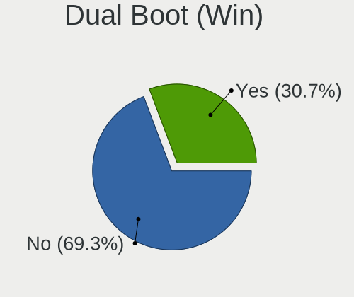
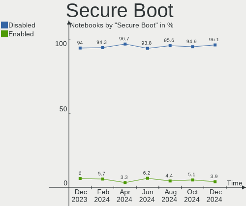
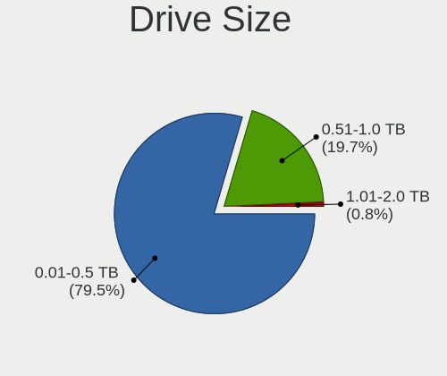
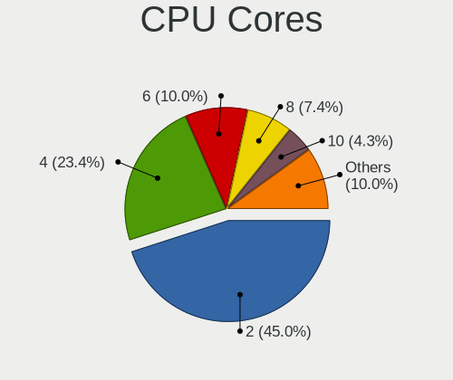
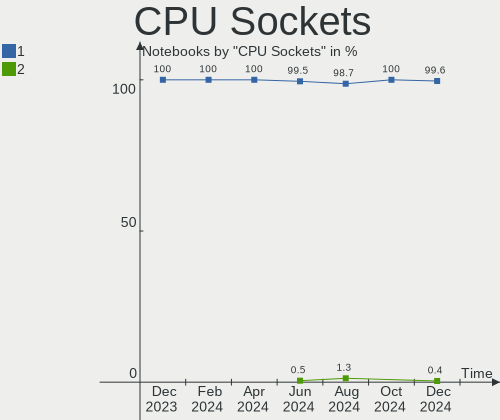
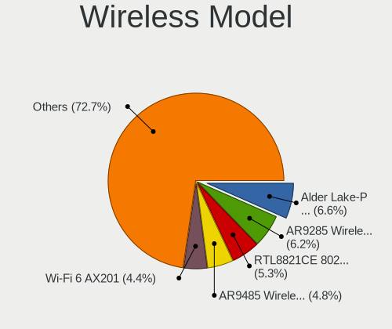
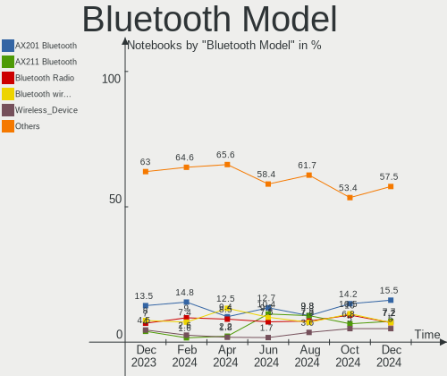

Linux in Russia - Hardware Trends (Notebooks)
---------------------------------------------

A project to identify most popular hardware characteristics and track their change
over time based on data collected by Linux users at https://Linux-Hardware.org.

Anyone can contribute to this report by the [hw-probe](https://github.com/linuxhw/hw-probe) tool:

    sudo -E hw-probe -all -upload

Period: Feb, 2023.

Contents
--------

* [ System ](#system)
  - [ OS                       ](#os)
  - [ OS Family                ](#os-family)
  - [ Kernel                   ](#kernel)
  - [ Kernel Family            ](#kernel-family)
  - [ Kernel Major Ver.        ](#kernel-major-ver)
  - [ Arch                     ](#arch)
  - [ DE                       ](#de)
  - [ Display Server           ](#display-server)
  - [ Display Manager          ](#display-manager)
  - [ OS Lang                  ](#os-lang)
  - [ Boot Mode                ](#boot-mode)
  - [ Filesystem               ](#filesystem)
  - [ Part. scheme             ](#part-scheme)
  - [ Dual Boot with Linux/BSD ](#dual-boot-with-linuxbsd)
  - [ Dual Boot (Win)          ](#dual-boot-win)

* [ Board ](#board)
  - [ Vendor                   ](#vendor)
  - [ Model                    ](#model)
  - [ Model Family             ](#model-family)
  - [ MFG Year                 ](#mfg-year)
  - [ Form Factor              ](#form-factor)
  - [ Secure Boot              ](#secure-boot)
  - [ Coreboot                 ](#coreboot)
  - [ RAM Size                 ](#ram-size)
  - [ RAM Used                 ](#ram-used)
  - [ Total Drives             ](#total-drives)
  - [ Has CD-ROM               ](#has-cd-rom)
  - [ Has Ethernet             ](#has-ethernet)
  - [ Has WiFi                 ](#has-wifi)
  - [ Has Bluetooth            ](#has-bluetooth)

* [ Location ](#location)
  - [ Country                  ](#country)
  - [ City                     ](#city)

* [ Drives ](#drives)
  - [ Drive Vendor             ](#drive-vendor)
  - [ Drive Model              ](#drive-model)
  - [ HDD Vendor               ](#hdd-vendor)
  - [ SSD Vendor               ](#ssd-vendor)
  - [ Drive Kind               ](#drive-kind)
  - [ Drive Connector          ](#drive-connector)
  - [ Drive Size               ](#drive-size)
  - [ Space Total              ](#space-total)
  - [ Space Used               ](#space-used)
  - [ Malfunc. Drives          ](#malfunc-drives)
  - [ Malfunc. Drive Vendor    ](#malfunc-drive-vendor)
  - [ Malfunc. HDD Vendor      ](#malfunc-hdd-vendor)
  - [ Malfunc. Drive Kind      ](#malfunc-drive-kind)
  - [ Failed Drives            ](#failed-drives)
  - [ Failed Drive Vendor      ](#failed-drive-vendor)
  - [ Drive Status             ](#drive-status)

* [ Storage controller ](#storage-controller)
  - [ Storage Vendor           ](#storage-vendor)
  - [ Storage Model            ](#storage-model)
  - [ Storage Kind             ](#storage-kind)

* [ Processor ](#processor)
  - [ CPU Vendor               ](#cpu-vendor)
  - [ CPU Model                ](#cpu-model)
  - [ CPU Model Family         ](#cpu-model-family)
  - [ CPU Cores                ](#cpu-cores)
  - [ CPU Sockets              ](#cpu-sockets)
  - [ CPU Threads              ](#cpu-threads)
  - [ CPU Op-Modes             ](#cpu-op-modes)
  - [ CPU Microcode            ](#cpu-microcode)
  - [ CPU Microarch            ](#cpu-microarch)

* [ Graphics ](#graphics)
  - [ GPU Vendor               ](#gpu-vendor)
  - [ GPU Model                ](#gpu-model)
  - [ GPU Combo                ](#gpu-combo)
  - [ GPU Driver               ](#gpu-driver)
  - [ GPU Memory               ](#gpu-memory)

* [ Monitor ](#monitor)
  - [ Monitor Vendor           ](#monitor-vendor)
  - [ Monitor Model            ](#monitor-model)
  - [ Monitor Resolution       ](#monitor-resolution)
  - [ Monitor Diagonal         ](#monitor-diagonal)
  - [ Monitor Width            ](#monitor-width)
  - [ Aspect Ratio             ](#aspect-ratio)
  - [ Monitor Area             ](#monitor-area)
  - [ Pixel Density            ](#pixel-density)
  - [ Multiple Monitors        ](#multiple-monitors)

* [ Network ](#network)
  - [ Net Controller Vendor    ](#net-controller-vendor)
  - [ Net Controller Model     ](#net-controller-model)
  - [ Wireless Vendor          ](#wireless-vendor)
  - [ Wireless Model           ](#wireless-model)
  - [ Ethernet Vendor          ](#ethernet-vendor)
  - [ Ethernet Model           ](#ethernet-model)
  - [ Net Controller Kind      ](#net-controller-kind)
  - [ Used Controller          ](#used-controller)
  - [ NICs                     ](#nics)
  - [ IPv6                     ](#ipv6)

* [ Bluetooth ](#bluetooth)
  - [ Bluetooth Vendor         ](#bluetooth-vendor)
  - [ Bluetooth Model          ](#bluetooth-model)

* [ Sound ](#sound)
  - [ Sound Vendor             ](#sound-vendor)
  - [ Sound Model              ](#sound-model)

* [ Memory ](#memory)
  - [ Memory Vendor            ](#memory-vendor)
  - [ Memory Model             ](#memory-model)
  - [ Memory Kind              ](#memory-kind)
  - [ Memory Form Factor       ](#memory-form-factor)
  - [ Memory Size              ](#memory-size)
  - [ Memory Speed             ](#memory-speed)

* [ Printers & scanners ](#printers--scanners)
  - [ Printer Vendor           ](#printer-vendor)
  - [ Printer Model            ](#printer-model)
  - [ Scanner Vendor           ](#scanner-vendor)
  - [ Scanner Model            ](#scanner-model)

* [ Camera ](#camera)
  - [ Camera Vendor            ](#camera-vendor)
  - [ Camera Model             ](#camera-model)

* [ Security ](#security)
  - [ Fingerprint Vendor       ](#fingerprint-vendor)
  - [ Fingerprint Model        ](#fingerprint-model)
  - [ Chipcard Vendor          ](#chipcard-vendor)
  - [ Chipcard Model           ](#chipcard-model)

* [ Unsupported ](#unsupported)
  - [ Unsupported Devices      ](#unsupported-devices)
  - [ Unsupported Device Types ](#unsupported-device-types)

System
------

OS
--

Installed operating systems

| Name               | Notebooks | Percent |
|--------------------|-----------|---------|
| ROSA 12.3          | 52        | 21.31%  |
| Fedora 37          | 23        | 9.43%   |
| Ubuntu 22.04       | 18        | 7.38%   |
| OpenMandriva 23.01 | 12        | 4.92%   |
| Debian 11          | 10        | 4.1%    |
| Arch Rolling       | 8         | 3.28%   |
| Red OS 7.3.2       | 7         | 2.87%   |
| Linux Mint 21.1    | 7         | 2.87%   |
| KDE neon 22.04     | 7         | 2.87%   |
| Ubuntu 22.10       | 6         | 2.46%   |
| MOS 10             | 6         | 2.46%   |
| Manjaro 22.0.4     | 5         | 2.05%   |
| SteamOS 3.4.4      | 4         | 1.64%   |
| ROSA R11.1         | 4         | 1.64%   |
| Kali 2022.4        | 4         | 1.64%   |
| Ubuntu 20.04       | 3         | 1.23%   |
| ROSA 12.2          | 3         | 1.23%   |
| Pop!_OS 22.04      | 3         | 1.23%   |
| Manjaro            | 3         | 1.23%   |
| Kubuntu 22.04      | 3         | 1.23%   |
| Gentoo 2.9         | 3         | 1.23%   |
| ROSA 12            | 2         | 0.82%   |
| OpenMandriva 4.3   | 2         | 0.82%   |
| OpenMandriva 4.2   | 2         | 0.82%   |
| MX 21              | 2         | 0.82%   |
| Manjaro 22.0.3     | 2         | 0.82%   |
| Manjaro 22.0.2     | 2         | 0.82%   |
| Manjaro 22.0.1     | 2         | 0.82%   |
| Lubuntu 22.04      | 2         | 0.82%   |
| LMDE 5             | 2         | 0.82%   |
| Linux Mint 20.3    | 2         | 0.82%   |
| Endless 5.0.0      | 2         | 0.82%   |
| Elementary 7       | 2         | 0.82%   |
| Debian             | 2         | 0.82%   |
| ALT Linux 10.1     | 2         | 0.82%   |
| Alpine 3.17.2      | 2         | 0.82%   |
| Zorin 16           | 1         | 0.41%   |
| Xubuntu 22.10      | 1         | 0.41%   |
| Xubuntu 22.04      | 1         | 0.41%   |
| Xubuntu 18.04      | 1         | 0.41%   |

OS Family
---------

OS without a version

| Name          | Notebooks | Percent |
|---------------|-----------|---------|
| ROSA          | 62        | 25.41%  |
| Ubuntu        | 28        | 11.48%  |
| Fedora        | 26        | 10.66%  |
| OpenMandriva  | 16        | 6.56%   |
| Manjaro       | 14        | 5.74%   |
| Debian        | 12        | 4.92%   |
| Linux Mint    | 11        | 4.51%   |
| ALT Linux     | 9         | 3.69%   |
| Red OS        | 8         | 3.28%   |
| Arch          | 8         | 3.28%   |
| KDE neon      | 7         | 2.87%   |
| SteamOS       | 5         | 2.05%   |
| Kali          | 4         | 1.64%   |
| Gentoo        | 4         | 1.64%   |
| Xubuntu       | 3         | 1.23%   |
| Pop!_OS       | 3         | 1.23%   |
| Kubuntu       | 3         | 1.23%   |
| Endless       | 3         | 1.23%   |
| MX            | 2         | 0.82%   |
| Lubuntu       | 2         | 0.82%   |
| LMDE          | 2         | 0.82%   |
| Elementary    | 2         | 0.82%   |
| Alpine        | 2         | 0.82%   |
| Zorin         | 1         | 0.41%   |
| Ubuntu Studio | 1         | 0.41%   |
| RELS          | 1         | 0.41%   |
| Gnoppix       | 1         | 0.41%   |
| EndeavourOS   | 1         | 0.41%   |
| Clear Linux   | 1         | 0.41%   |
| Artix         | 1         | 0.41%   |
| ArcoLinux     | 1         | 0.41%   |

Kernel
------

Version of the Linux kernel

| Version                                   | Notebooks | Percent |
|-------------------------------------------|-----------|---------|
| 5.15.79-generic-1rosa2021.1-x86_64        | 21        | 8.61%   |
| 5.15.0-58-generic                         | 16        | 6.56%   |
| 5.15.75-generic-1rosa2021.1-x86_64        | 14        | 5.74%   |
| 6.1.1-desktop-1omv2290                    | 11        | 4.51%   |
| 5.15.0-60-generic                         | 10        | 4.1%    |
| 5.19.0-32-generic                         | 8         | 3.28%   |
| 6.1.8-200.fc37.x86_64                     | 6         | 2.46%   |
| 6.1.11-1-MANJARO                          | 6         | 2.46%   |
| 5.19.0-31-generic                         | 6         | 2.46%   |
| 5.10.0-2-amd64                            | 6         | 2.46%   |
| 6.0.12.xm1-1.klp-xanmod-rosa2021.1-x86_64 | 5         | 2.05%   |
| 5.10.0-21-amd64                           | 5         | 2.05%   |
| 6.0.0-kali6-amd64                         | 4         | 1.64%   |
| 5.4.0-137-generic                         | 4         | 1.64%   |
| 5.15.75-generic-1rosa2021.1-i686          | 4         | 1.64%   |
| 5.15.72-1.el7.3.x86_64                    | 4         | 1.64%   |
| 5.13.0-valve36-1-neptune                  | 4         | 1.64%   |
| 6.1.13-200.fc37.x86_64                    | 3         | 1.23%   |
| 6.1.10-200.fc37.x86_64                    | 3         | 1.23%   |
| 6.0.7-301.fc37.x86_64                     | 3         | 1.23%   |
| 5.10.74-generic-2rosa2021.1-x86_64        | 3         | 1.23%   |
| 5.10.139-std-def-alt1                     | 3         | 1.23%   |
| 6.1.9-200.fc37.x86_64                     | 2         | 0.82%   |
| 6.1.9-1-MANJARO                           | 2         | 0.82%   |
| 6.1.12-1-MANJARO                          | 2         | 0.82%   |
| 6.1.12-060112-generic                     | 2         | 0.82%   |
| 6.0.12-76060006-generic                   | 2         | 0.82%   |
| 5.17.11-generic-2rosa2021.1-x86_64        | 2         | 0.82%   |
| 5.15.87-1.el7.3.x86_64                    | 2         | 0.82%   |
| 5.15.78-2.el7.3.x86_64                    | 2         | 0.82%   |
| 5.15.0-47-generic                         | 2         | 0.82%   |
| 5.15.0-43-generic                         | 2         | 0.82%   |
| 5.10.71-generic-1rosa2021.1-x86_64        | 2         | 0.82%   |
| 5.10.168-std-def-alt1                     | 2         | 0.82%   |
| 5.10.155-generic-1rosa2021.1-x86_64       | 2         | 0.82%   |
| 6.2.1-calculate                           | 1         | 0.41%   |
| 6.2.0-1-MANJARO                           | 1         | 0.41%   |
| 6.2.0-1-mainline                          | 1         | 0.41%   |
| 6.2.0-060200rc3daily20230115-generic      | 1         | 0.41%   |
| 6.1.9-generic-2rosa2021.1-x86_64          | 1         | 0.41%   |

Kernel Family
-------------

Linux kernel without a distro release

| Version  | Notebooks | Percent |
|----------|-----------|---------|
| 5.15.0   | 32        | 13.11%  |
| 5.15.79  | 21        | 8.61%   |
| 5.15.75  | 18        | 7.38%   |
| 5.19.0   | 17        | 6.97%   |
| 6.1.8    | 11        | 4.51%   |
| 6.1.1    | 11        | 4.51%   |
| 5.10.0   | 11        | 4.51%   |
| 6.1.12   | 9         | 3.69%   |
| 6.1.11   | 9         | 3.69%   |
| 6.1.9    | 8         | 3.28%   |
| 6.0.12   | 7         | 2.87%   |
| 6.0.0    | 7         | 2.87%   |
| 6.1.10   | 5         | 2.05%   |
| 5.13.0   | 5         | 2.05%   |
| 5.4.0    | 4         | 1.64%   |
| 5.15.72  | 4         | 1.64%   |
| 6.2.0    | 3         | 1.23%   |
| 6.1.13   | 3         | 1.23%   |
| 6.0.7    | 3         | 1.23%   |
| 5.10.74  | 3         | 1.23%   |
| 5.10.139 | 3         | 1.23%   |
| 6.1.6    | 2         | 0.82%   |
| 6.1.4    | 2         | 0.82%   |
| 6.1.0    | 2         | 0.82%   |
| 6.0.8    | 2         | 0.82%   |
| 5.17.11  | 2         | 0.82%   |
| 5.15.87  | 2         | 0.82%   |
| 5.15.78  | 2         | 0.82%   |
| 5.14.0   | 2         | 0.82%   |
| 5.10.71  | 2         | 0.82%   |
| 5.10.168 | 2         | 0.82%   |
| 5.10.155 | 2         | 0.82%   |
| 6.2.1    | 1         | 0.41%   |
| 6.1.7    | 1         | 0.41%   |
| 5.8.0    | 1         | 0.41%   |
| 5.4.83   | 1         | 0.41%   |
| 5.4.32   | 1         | 0.41%   |
| 5.18.0   | 1         | 0.41%   |
| 5.17.12  | 1         | 0.41%   |
| 5.17.0   | 1         | 0.41%   |

Kernel Major Ver.
-----------------

Linux kernel major version

| Version | Notebooks | Percent |
|---------|-----------|---------|
| 5.15    | 88        | 36.07%  |
| 6.1     | 63        | 25.82%  |
| 5.10    | 28        | 11.48%  |
| 6.0     | 19        | 7.79%   |
| 5.19    | 17        | 6.97%   |
| 5.4     | 6         | 2.46%   |
| 5.13    | 5         | 2.05%   |
| 6.2     | 4         | 1.64%   |
| 5.17    | 4         | 1.64%   |
| 5.16    | 2         | 0.82%   |
| 5.14    | 2         | 0.82%   |
| 5.8     | 1         | 0.41%   |
| 5.18    | 1         | 0.41%   |
| 5.11    | 1         | 0.41%   |
| 4.9     | 1         | 0.41%   |
| 4.15    | 1         | 0.41%   |
| 4.1     | 1         | 0.41%   |

Arch
----

OS architecture (x86_64, i586, etc.)

| Name   | Notebooks | Percent |
|--------|-----------|---------|
| x86_64 | 237       | 97.13%  |
| i686   | 7         | 2.87%   |

DE
--

Desktop Environment

| Name       | Notebooks | Percent |
|------------|-----------|---------|
| KDE5       | 100       | 40.98%  |
| GNOME      | 78        | 31.97%  |
| XFCE       | 14        | 5.74%   |
| Unknown    | 12        | 4.92%   |
| MATE       | 10        | 4.1%    |
| X-Cinnamon | 9         | 3.69%   |
| LXQt       | 8         | 3.28%   |
| KDE4       | 5         | 2.05%   |
| Pantheon   | 2         | 0.82%   |
| DWM        | 2         | 0.82%   |
| Trinity    | 1         | 0.41%   |
| sway       | 1         | 0.41%   |
| KDE        | 1         | 0.41%   |
| Cinnamon   | 1         | 0.41%   |

Display Server
--------------

X11 or Wayland

| Name    | Notebooks | Percent |
|---------|-----------|---------|
| X11     | 140       | 57.38%  |
| Wayland | 90        | 36.89%  |
| Unknown | 13        | 5.33%   |
| Tty     | 1         | 0.41%   |

Display Manager
---------------

SDDM, LightDM, etc.

| Name    | Notebooks | Percent |
|---------|-----------|---------|
| SDDM    | 81        | 33.2%   |
| Unknown | 58        | 23.77%  |
| GDM     | 44        | 18.03%  |
| LightDM | 29        | 11.89%  |
| GDM3    | 24        | 9.84%   |
| KDM     | 5         | 2.05%   |
| TDM     | 1         | 0.41%   |
| SLiM    | 1         | 0.41%   |
| GREETD  | 1         | 0.41%   |

OS Lang
-------

Language

| Lang    | Notebooks | Percent |
|---------|-----------|---------|
| ru_RU   | 178       | 72.95%  |
| en_US   | 53        | 21.72%  |
| Unknown | 6         | 2.46%   |
| C       | 2         | 0.82%   |
| fr_FR   | 1         | 0.41%   |
| en_GB   | 1         | 0.41%   |
| en_DK   | 1         | 0.41%   |
| en_AG   | 1         | 0.41%   |
| de_DE   | 1         | 0.41%   |

Boot Mode
---------

EFI or BIOS

| Mode | Notebooks | Percent |
|------|-----------|---------|
| EFI  | 146       | 59.84%  |
| BIOS | 98        | 40.16%  |

Filesystem
----------

Type of filesystem

| Type    | Notebooks | Percent |
|---------|-----------|---------|
| Ext4    | 186       | 76.23%  |
| Btrfs   | 40        | 16.39%  |
| Overlay | 17        | 6.97%   |
| Xfs     | 1         | 0.41%   |

Part. scheme
------------

Scheme of partitioning

| Type    | Notebooks | Percent |
|---------|-----------|---------|
| GPT     | 150       | 61.48%  |
| Unknown | 48        | 19.67%  |
| MBR     | 46        | 18.85%  |

Dual Boot with Linux/BSD
------------------------

Hosting more than one Linux/BSD

| Dual boot | Notebooks | Percent |
|-----------|-----------|---------|
| No        | 213       | 87.3%   |
| Yes       | 31        | 12.7%   |

Dual Boot (Win)
---------------

Hosting Linux and Windows

| Dual boot | Notebooks | Percent |
|-----------|-----------|---------|
| No        | 168       | 68.85%  |
| Yes       | 76        | 31.15%  |

Board
-----

Vendor
------

Motherboard manufacturer

| Name                | Notebooks | Percent |
|---------------------|-----------|---------|
| Lenovo              | 41        | 16.8%   |
| ASUSTek Computer    | 39        | 15.98%  |
| Acer                | 29        | 11.89%  |
| Hewlett-Packard     | 28        | 11.48%  |
| HUAWEI              | 13        | 5.33%   |
| Dell                | 13        | 5.33%   |
| MSI                 | 9         | 3.69%   |
| Unknown             | 7         | 2.87%   |
| Sony                | 6         | 2.46%   |
| Samsung Electronics | 6         | 2.46%   |
| Clevo               | 6         | 2.46%   |
| Valve               | 4         | 1.64%   |
| Toshiba             | 4         | 1.64%   |
| Timi                | 4         | 1.64%   |
| HONOR               | 3         | 1.23%   |
| Haier               | 3         | 1.23%   |
| Apple               | 3         | 1.23%   |
| Fujitsu             | 2         | 0.82%   |
| eMachines           | 2         | 0.82%   |
| Chuwi               | 2         | 0.82%   |
| Aquarius            | 2         | 0.82%   |
| THUNDEROBOT         | 1         | 0.41%   |
| TECNO               | 1         | 0.41%   |
| realme              | 1         | 0.41%   |
| Notebook            | 1         | 0.41%   |
| MACHENIKE           | 1         | 0.41%   |
| Machcreator         | 1         | 0.41%   |
| Kraftway            | 1         | 0.41%   |
| itel Mobile Limited | 1         | 0.41%   |
| Irbis               | 1         | 0.41%   |
| Infinix             | 1         | 0.41%   |
| ICL                 | 1         | 0.41%   |
| IBM                 | 1         | 0.41%   |
| Hampoo              | 1         | 0.41%   |
| GPD                 | 1         | 0.41%   |
| Gigabyte Technology | 1         | 0.41%   |
| DNS                 | 1         | 0.41%   |
| Alienware           | 1         | 0.41%   |
| 3Logic Group        | 1         | 0.41%   |

Model
-----

Motherboard model

| Name                                | Notebooks | Percent |
|-------------------------------------|-----------|---------|
| Unknown                             | 7         | 2.87%   |
| Clevo NL41MU2                       | 6         | 2.46%   |
| Valve Jupiter                       | 4         | 1.64%   |
| HUAWEI NBLB-WAX9N                   | 3         | 1.23%   |
| Samsung R519/R719                   | 2         | 0.82%   |
| MSI Modern 14 B11MOU                | 2         | 0.82%   |
| Lenovo ThinkBook 15 G3 ACL 21A4     | 2         | 0.82%   |
| Lenovo IdeaPad 5 Pro 14ACN6 82L7    | 2         | 0.82%   |
| Lenovo IdeaPad 5 15ARE05 81YQ       | 2         | 0.82%   |
| Lenovo IdeaPad 330-15IKB 81DC       | 2         | 0.82%   |
| Lenovo B590 20208                   | 2         | 0.82%   |
| HUAWEI MRGF-XX                      | 2         | 0.82%   |
| HUAWEI KLVD-WXX9                    | 2         | 0.82%   |
| HUAWEI BOM-WXX9                     | 2         | 0.82%   |
| HONOR BMH-WCX9                      | 2         | 0.82%   |
| HP ProBook 440 G7                   | 2         | 0.82%   |
| HP Pavilion Gaming Laptop 17-cd1xxx | 2         | 0.82%   |
| Haier A1410ED                       | 2         | 0.82%   |
| ASUS Zenbook UX535QE_UM535QE        | 2         | 0.82%   |
| ASUS X556UQ                         | 2         | 0.82%   |
| Aquarius NS585                      | 2         | 0.82%   |
| Acer Aspire V3-771                  | 2         | 0.82%   |
| Acer Aspire A715-42G                | 2         | 0.82%   |
| Acer Aspire A315-59                 | 2         | 0.82%   |
| Toshiba Satellite U300              | 1         | 0.41%   |
| Toshiba Satellite L450              | 1         | 0.41%   |
| Toshiba Satellite A300D             | 1         | 0.41%   |
| Toshiba Satellite A300              | 1         | 0.41%   |
| Timi Xiaomi Book Pro 14 2022        | 1         | 0.41%   |
| Timi RedmiBook Pro 15S              | 1         | 0.41%   |
| Timi RedmiBook Pro 14S              | 1         | 0.41%   |
| Timi A34S                           | 1         | 0.41%   |
| THUNDEROBOT 911 Plus                | 1         | 0.41%   |
| TECNO MEGABOOK T1                   | 1         | 0.41%   |
| Sony VPCZ21Z9R                      | 1         | 0.41%   |
| Sony VPCZ12V9R                      | 1         | 0.41%   |
| Sony VPCY11M1R                      | 1         | 0.41%   |
| Sony VPCX11Z6R                      | 1         | 0.41%   |
| Sony VPCSB2L1R                      | 1         | 0.41%   |
| Sony SVE14A2V1RWI                   | 1         | 0.41%   |

Model Family
------------

Motherboard model prefix

| Name              | Notebooks | Percent |
|-------------------|-----------|---------|
| Acer Aspire       | 22        | 9.02%   |
| Lenovo IdeaPad    | 16        | 6.56%   |
| Lenovo ThinkPad   | 10        | 4.1%    |
| HP Pavilion       | 8         | 3.28%   |
| ASUS VivoBook     | 7         | 2.87%   |
| Unknown           | 7         | 2.87%   |
| HP ProBook        | 6         | 2.46%   |
| Clevo NL41MU2     | 6         | 2.46%   |
| Lenovo ThinkBook  | 5         | 2.05%   |
| Dell Inspiron     | 5         | 2.05%   |
| Valve Jupiter     | 4         | 1.64%   |
| Toshiba Satellite | 4         | 1.64%   |
| HP Laptop         | 4         | 1.64%   |
| HP EliteBook      | 4         | 1.64%   |
| ASUS ZenBook      | 4         | 1.64%   |
| MSI Modern        | 3         | 1.23%   |
| Lenovo B590       | 3         | 1.23%   |
| HUAWEI NBLB-WAX9N | 3         | 1.23%   |
| Dell Latitude     | 3         | 1.23%   |
| ASUS ROG          | 3         | 1.23%   |
| Timi RedmiBook    | 2         | 0.82%   |
| Samsung R519      | 2         | 0.82%   |
| MSI Alpha         | 2         | 0.82%   |
| HUAWEI MRGF-XX    | 2         | 0.82%   |
| HUAWEI KLVD-WXX9  | 2         | 0.82%   |
| HUAWEI BOM-WXX9   | 2         | 0.82%   |
| HONOR BMH-WCX9    | 2         | 0.82%   |
| HP 255            | 2         | 0.82%   |
| Haier A1410ED     | 2         | 0.82%   |
| Fujitsu LIFEBOOK  | 2         | 0.82%   |
| Chuwi CoreBook    | 2         | 0.82%   |
| ASUS X556UQ       | 2         | 0.82%   |
| Aquarius NS585    | 2         | 0.82%   |
| Acer TravelMate   | 2         | 0.82%   |
| Acer Extensa      | 2         | 0.82%   |
| Timi Xiaomi       | 1         | 0.41%   |
| Timi A34S         | 1         | 0.41%   |
| THUNDEROBOT 911   | 1         | 0.41%   |
| TECNO MEGABOOK    | 1         | 0.41%   |
| Sony VPCZ21Z9R    | 1         | 0.41%   |

MFG Year
--------

Motherboard manufacture year

| Year | Notebooks | Percent |
|------|-----------|---------|
| 2022 | 39        | 15.98%  |
| 2021 | 37        | 15.16%  |
| 2020 | 25        | 10.25%  |
| 2019 | 22        | 9.02%   |
| 2018 | 17        | 6.97%   |
| 2011 | 17        | 6.97%   |
| 2013 | 16        | 6.56%   |
| 2012 | 14        | 5.74%   |
| 2016 | 11        | 4.51%   |
| 2014 | 9         | 3.69%   |
| 2017 | 8         | 3.28%   |
| 2010 | 8         | 3.28%   |
| 2009 | 8         | 3.28%   |
| 2015 | 4         | 1.64%   |
| 2008 | 4         | 1.64%   |
| 2007 | 3         | 1.23%   |
| 2006 | 1         | 0.41%   |
| 2004 | 1         | 0.41%   |

Form Factor
-----------

Physical design of the computer

| Name     | Notebooks | Percent |
|----------|-----------|---------|
| Notebook | 244       | 100%    |

Secure Boot
-----------

Enabled or disabled

| State    | Notebooks | Percent |
|----------|-----------|---------|
| Disabled | 226       | 92.62%  |
| Enabled  | 18        | 7.38%   |

Coreboot
--------

Have coreboot on board

| Used | Notebooks | Percent |
|------|-----------|---------|
| No   | 244       | 100%    |

RAM Size
--------

Total RAM memory

| Size in GB  | Notebooks | Percent |
|-------------|-----------|---------|
| 4.01-8.0    | 82        | 33.61%  |
| 8.01-16.0   | 48        | 19.67%  |
| 16.01-24.0  | 45        | 18.44%  |
| 3.01-4.0    | 40        | 16.39%  |
| 1.01-2.0    | 12        | 4.92%   |
| 32.01-64.0  | 8         | 3.28%   |
| 2.01-3.0    | 5         | 2.05%   |
| 24.01-32.0  | 3         | 1.23%   |
| 64.01-256.0 | 1         | 0.41%   |

RAM Used
--------

Used RAM memory

| Used GB    | Notebooks | Percent |
|------------|-----------|---------|
| 1.01-2.0   | 82        | 33.61%  |
| 2.01-3.0   | 61        | 25%     |
| 4.01-8.0   | 31        | 12.7%   |
| 3.01-4.0   | 27        | 11.07%  |
| 0.51-1.0   | 27        | 11.07%  |
| 8.01-16.0  | 11        | 4.51%   |
| 0.01-0.5   | 4         | 1.64%   |
| 16.01-24.0 | 1         | 0.41%   |

Total Drives
------------

Number of drives on board

| Drives | Notebooks | Percent |
|--------|-----------|---------|
| 1      | 175       | 71.72%  |
| 2      | 63        | 25.82%  |
| 3      | 4         | 1.64%   |
| 4      | 1         | 0.41%   |
| 0      | 1         | 0.41%   |

Has CD-ROM
----------

Has CD-ROM on board

| Presented | Notebooks | Percent |
|-----------|-----------|---------|
| No        | 195       | 79.92%  |
| Yes       | 49        | 20.08%  |

Has Ethernet
------------

Has Ethernet on board

| Presented | Notebooks | Percent |
|-----------|-----------|---------|
| Yes       | 175       | 71.72%  |
| No        | 69        | 28.28%  |

Has WiFi
--------

Has WiFi module

| Presented | Notebooks | Percent |
|-----------|-----------|---------|
| Yes       | 242       | 99.18%  |
| No        | 2         | 0.82%   |

Has Bluetooth
-------------

Has Bluetooth module

| Presented | Notebooks | Percent |
|-----------|-----------|---------|
| Yes       | 200       | 81.97%  |
| No        | 44        | 18.03%  |

Location
--------

Country
-------

Geographic location (country)

| Country | Notebooks | Percent |
|---------|-----------|---------|
| Russia  | 244       | 100%    |

City
----

Geographic location (city)

| City             | Notebooks | Percent |
|------------------|-----------|---------|
| Moscow           | 50        | 20.49%  |
| St Petersburg    | 33        | 13.52%  |
| Voronezh         | 8         | 3.28%   |
| Krasnodar        | 8         | 3.28%   |
| Nizhniy Novgorod | 7         | 2.87%   |
| Novosibirsk      | 6         | 2.46%   |
| Yekaterinburg    | 5         | 2.05%   |
| Ufa              | 5         | 2.05%   |
| Vladivostok      | 4         | 1.64%   |
| Samara           | 4         | 1.64%   |
| Lipetsk          | 4         | 1.64%   |
| Kaluga           | 4         | 1.64%   |
| Chelyabinsk      | 4         | 1.64%   |
| Tver             | 3         | 1.23%   |
| Ryazan           | 3         | 1.23%   |
| Perm             | 3         | 1.23%   |
| Kirov            | 3         | 1.23%   |
| Izhevsk          | 3         | 1.23%   |
| Bryansk          | 3         | 1.23%   |
| Astrakhan        | 3         | 1.23%   |
| Yoshkar-Ola      | 2         | 0.82%   |
| Oryol            | 2         | 0.82%   |
| Omsk             | 2         | 0.82%   |
| Kursk            | 2         | 0.82%   |
| Krasnoyarsk      | 2         | 0.82%   |
| Khimki           | 2         | 0.82%   |
| Belgorod         | 2         | 0.82%   |
| Barnaul          | 2         | 0.82%   |
| Zlatoust         | 1         | 0.41%   |
| Zelenodolsk      | 1         | 0.41%   |
| Yemanzhelinsk    | 1         | 0.41%   |
| Vyksa            | 1         | 0.41%   |
| Volgograd        | 1         | 0.41%   |
| Ulyanovsk        | 1         | 0.41%   |
| Ukhta            | 1         | 0.41%   |
| Tula             | 1         | 0.41%   |
| Tugutuy          | 1         | 0.41%   |
| Tuapse           | 1         | 0.41%   |
| Tsarskoye Selo   | 1         | 0.41%   |
| Tomsk            | 1         | 0.41%   |

Drives
------

Drive Vendor
------------

Hard drive vendors

| Vendor                      | Notebooks | Drives | Percent |
|-----------------------------|-----------|--------|---------|
| WDC                         | 43        | 44     | 14.14%  |
| Samsung Electronics         | 37        | 41     | 12.17%  |
| Kingston                    | 24        | 24     | 7.89%   |
| Seagate                     | 18        | 18     | 5.92%   |
| Toshiba                     | 15        | 15     | 4.93%   |
| SK hynix                    | 13        | 14     | 4.28%   |
| SanDisk                     | 13        | 13     | 4.28%   |
| Intel                       | 13        | 13     | 4.28%   |
| Unknown                     | 12        | 12     | 3.95%   |
| Micron Technology           | 8         | 8      | 2.63%   |
| Phison Electronics          | 7         | 7      | 2.3%    |
| Hitachi                     | 7         | 7      | 2.3%    |
| China                       | 7         | 8      | 2.3%    |
| KIOXIA                      | 6         | 6      | 1.97%   |
| BIWIN                       | 6         | 6      | 1.97%   |
| Crucial                     | 5         | 5      | 1.64%   |
| SPCC                        | 4         | 4      | 1.32%   |
| A-DATA Technology           | 4         | 4      | 1.32%   |
| Transcend                   | 3         | 3      | 0.99%   |
| ShiJi                       | 3         | 3      | 0.99%   |
| Patriot                     | 3         | 3      | 0.99%   |
| HGST                        | 3         | 3      | 0.99%   |
| Gigabyte Technology         | 3         | 3      | 0.99%   |
| Unknown                     | 3         | 3      | 0.99%   |
| TO Exter                    | 2         | 2      | 0.66%   |
| Team                        | 2         | 2      | 0.66%   |
| Solid State Storage         | 2         | 2      | 0.66%   |
| Smartbuy                    | 2         | 2      | 0.66%   |
| Phison                      | 2         | 2      | 0.66%   |
| O2 Micro                    | 2         | 2      | 0.66%   |
| Kingston Technology Company | 2         | 2      | 0.66%   |
| Hewlett-Packard             | 2         | 2      | 0.66%   |
| Apple                       | 2         | 3      | 0.66%   |
| Apacer                      | 2         | 2      | 0.66%   |
| AMD                         | 2         | 2      | 0.66%   |
| Yangtze Memory Technologies | 1         | 1      | 0.33%   |
| XrayDisk                    | 1         | 1      | 0.33%   |
| Union Memory (Shenzhen)     | 1         | 1      | 0.33%   |
| UMIS                        | 1         | 1      | 0.33%   |
| Teclast                     | 1         | 1      | 0.33%   |

Drive Model
-----------

Hard drive models

| Model                                               | Notebooks | Percent |
|-----------------------------------------------------|-----------|---------|
| Intel SSDPEKNU512GZ 512GB                           | 7         | 2.27%   |
| BIWIN CE480T5D101-256 256GB                         | 6         | 1.95%   |
| Toshiba MQ01ABF050 500GB                            | 5         | 1.62%   |
| Phison PS5013 E13 NVMe Controller 500GB             | 5         | 1.62%   |
| Toshiba MQ01ABD100 1TB                              | 4         | 1.3%    |
| Kingston SA400S37240G 240GB SSD                     | 4         | 1.3%    |
| Kingston SA400S37120G 120GB SSD                     | 4         | 1.3%    |
| Unknown MMC Card  4GB                               | 3         | 0.97%   |
| Seagate ST1000LM035-1RK172 1TB                      | 3         | 0.97%   |
| Sandisk WD Black SN750 / PC SN730 NVMe SSD 512GB    | 3         | 0.97%   |
| Samsung NVMe SSD Controller SM981/PM981/PM983 250GB | 3         | 0.97%   |
| KIOXIA KBG40ZNV512G 512GB                           | 3         | 0.97%   |
| Kingston SA400S37480G 480GB SSD                     | 3         | 0.97%   |
| A-DATA SU800 512GB SSD                              | 3         | 0.97%   |
| Unknown                                             | 3         | 0.97%   |
| WDC WDS240G2G0A-00JH30 240GB SSD                    | 2         | 0.65%   |
| WDC WD5000LPCX-21VHAT0 500GB                        | 2         | 0.65%   |
| WDC WD3200BPVT-22ZEST0 320GB                        | 2         | 0.65%   |
| WDC WD2500BEVT-35A23T0 250GB                        | 2         | 0.65%   |
| WDC WD10SPCX-08HWST0 1TB                            | 2         | 0.65%   |
| WDC PC SN730 SDBPNTY-256G                           | 2         | 0.65%   |
| Unknown SLD64G  64GB                                | 2         | 0.65%   |
| Unknown MMC Card  64GB                              | 2         | 0.65%   |
| Toshiba HDWL110 1TB                                 | 2         | 0.65%   |
| TO Exter nal USB 3.0 240GB                          | 2         | 0.65%   |
| Team T253120GB SSD                                  | 2         | 0.65%   |
| SPCC Solid State Disk 128GB                         | 2         | 0.65%   |
| SK hynix BC511 HFM512GDJTNI-82A0A 512GB             | 2         | 0.65%   |
| SK hynix BC501 NVMe Solid State Drive 512GB         | 2         | 0.65%   |
| Seagate ST9320325AS 320GB                           | 2         | 0.65%   |
| Seagate ST500LT012-1DG142 500GB                     | 2         | 0.65%   |
| Seagate ST1000LM024 HN-M101MBB 1TB                  | 2         | 0.65%   |
| Sandisk WD Blue SN550 NVMe SSD 1TB                  | 2         | 0.65%   |
| Samsung SSD 870 EVO 500GB                           | 2         | 0.65%   |
| Samsung SSD 860 EVO 500GB                           | 2         | 0.65%   |
| Samsung SSD 860 EVO 250GB                           | 2         | 0.65%   |
| Samsung MZVLQ512HBLU-00B00 512GB                    | 2         | 0.65%   |
| Samsung MZALQ512HALU-000L2 512GB                    | 2         | 0.65%   |
| Phison 311CD0512GB                                  | 2         | 0.65%   |
| O2 Micro E2M2 64GB                                  | 2         | 0.65%   |

HDD Vendor
----------

Hard disk drive vendors

| Vendor              | Notebooks | Drives | Percent |
|---------------------|-----------|--------|---------|
| WDC                 | 28        | 28     | 39.44%  |
| Seagate             | 18        | 18     | 25.35%  |
| Toshiba             | 12        | 12     | 16.9%   |
| Hitachi             | 7         | 7      | 9.86%   |
| HGST                | 3         | 3      | 4.23%   |
| Samsung Electronics | 1         | 1      | 1.41%   |
| HGST HTS            | 1         | 1      | 1.41%   |
| Fujitsu             | 1         | 1      | 1.41%   |

SSD Vendor
----------

Solid state drive vendors

| Vendor              | Notebooks | Drives | Percent |
|---------------------|-----------|--------|---------|
| Kingston            | 21        | 21     | 21%     |
| Samsung Electronics | 15        | 18     | 15%     |
| China               | 7         | 8      | 7%      |
| WDC                 | 5         | 5      | 5%      |
| SPCC                | 4         | 4      | 4%      |
| Crucial             | 4         | 4      | 4%      |
| A-DATA Technology   | 4         | 4      | 4%      |
| SanDisk             | 3         | 3      | 3%      |
| Patriot             | 3         | 3      | 3%      |
| Transcend           | 2         | 2      | 2%      |
| TO Exter            | 2         | 2      | 2%      |
| Team                | 2         | 2      | 2%      |
| Smartbuy            | 2         | 2      | 2%      |
| ShiJi               | 2         | 2      | 2%      |
| Micron Technology   | 2         | 2      | 2%      |
| Intel               | 2         | 2      | 2%      |
| Hewlett-Packard     | 2         | 2      | 2%      |
| Apacer              | 2         | 2      | 2%      |
| AMD                 | 2         | 2      | 2%      |
| XrayDisk            | 1         | 1      | 1%      |
| Teclast             | 1         | 1      | 1%      |
| SWORDBILL           | 1         | 1      | 1%      |
| SK hynix            | 1         | 1      | 1%      |
| Netac               | 1         | 1      | 1%      |
| Neo                 | 1         | 1      | 1%      |
| Lexar               | 1         | 1      | 1%      |
| GOODRAM             | 1         | 1      | 1%      |
| Gigabyte Technology | 1         | 1      | 1%      |
| FASTDISK            | 1         | 1      | 1%      |
| Corsair             | 1         | 1      | 1%      |
| Colorful            | 1         | 1      | 1%      |
| Apple               | 1         | 1      | 1%      |
| Unknown             | 1         | 1      | 1%      |

Drive Kind
----------

HDD or SSD

| Kind    | Notebooks | Drives | Percent |
|---------|-----------|--------|---------|
| NVMe    | 116       | 121    | 39.06%  |
| SSD     | 96        | 104    | 32.32%  |
| HDD     | 68        | 71     | 22.9%   |
| MMC     | 15        | 15     | 5.05%   |
| Unknown | 2         | 2      | 0.67%   |

Drive Connector
---------------

SATA, SAS, NVMe, etc.

| Type | Notebooks | Drives | Percent |
|------|-----------|--------|---------|
| SATA | 139       | 171    | 50.36%  |
| NVMe | 116       | 121    | 42.03%  |
| MMC  | 15        | 15     | 5.43%   |
| SAS  | 6         | 6      | 2.17%   |

Drive Size
----------

Size of hard drive

| Size in TB | Notebooks | Drives | Percent |
|------------|-----------|--------|---------|
| 0.01-0.5   | 110       | 124    | 70.06%  |
| 0.51-1.0   | 45        | 49     | 28.66%  |
| 1.01-2.0   | 2         | 2      | 1.27%   |

Space Total
-----------

Amount of disk space available on the file system

| Size in GB     | Notebooks | Percent |
|----------------|-----------|---------|
| 101-250        | 79        | 32.38%  |
| 251-500        | 51        | 20.9%   |
| 501-1000       | 26        | 10.66%  |
| 51-100         | 23        | 9.43%   |
| 1-20           | 21        | 8.61%   |
| 1001-2000      | 20        | 8.2%    |
| Unknown        | 11        | 4.51%   |
| 21-50          | 10        | 4.1%    |
| More than 3000 | 3         | 1.23%   |

Space Used
----------

Amount of used disk space

| Used GB        | Notebooks | Percent |
|----------------|-----------|---------|
| 1-20           | 117       | 47.95%  |
| 21-50          | 39        | 15.98%  |
| 101-250        | 25        | 10.25%  |
| 51-100         | 22        | 9.02%   |
| 251-500        | 14        | 5.74%   |
| Unknown        | 11        | 4.51%   |
| 501-1000       | 9         | 3.69%   |
| 1001-2000      | 5         | 2.05%   |
| More than 3000 | 1         | 0.41%   |
| 2001-3000      | 1         | 0.41%   |

Malfunc. Drives
---------------

Drive models with a malfunction

| Model                                                           | Notebooks | Drives | Percent |
|-----------------------------------------------------------------|-----------|--------|---------|
| WDC WD5000LPVX-22V0TT0 500GB                                    | 1         | 1      | 3.33%   |
| WDC WD5000LPCX-24VHAT0 500GB                                    | 1         | 1      | 3.33%   |
| WDC WD3200LPCX-24C6HT0 320GB                                    | 1         | 1      | 3.33%   |
| WDC WD3200BPVT-22ZEST0 320GB                                    | 1         | 1      | 3.33%   |
| WDC WD10JPVX-75JC3T0 1TB                                        | 1         | 1      | 3.33%   |
| WDC WD10 SPZX-08Z10 1TB                                         | 1         | 1      | 3.33%   |
| Transcend TS32GMSA310 32GB SSD                                  | 1         | 1      | 3.33%   |
| Seagate ST96812A 64GB                                           | 1         | 1      | 3.33%   |
| Seagate ST9500325AS 500GB                                       | 1         | 1      | 3.33%   |
| Seagate ST9320325AS 320GB                                       | 1         | 1      | 3.33%   |
| Seagate ST9250315AS 250GB                                       | 1         | 1      | 3.33%   |
| Seagate ST320LT020-9YG142 320GB                                 | 1         | 1      | 3.33%   |
| Seagate ST1000LM035-1RK172 1TB                                  | 1         | 1      | 3.33%   |
| Samsung Electronics SSD 980 1TB                                 | 1         | 1      | 3.33%   |
| Samsung Electronics SSD 870 EVO 500GB                           | 1         | 1      | 3.33%   |
| Samsung Electronics SSD 870 EVO 1TB                             | 1         | 1      | 3.33%   |
| Samsung Electronics NVMe SSD Controller SM981/PM981/PM983 250GB | 1         | 1      | 3.33%   |
| Samsung Electronics HM641JI 640GB                               | 1         | 1      | 3.33%   |
| Neo Forza NFS121SA324-6007000 240GB SSD                         | 1         | 1      | 3.33%   |
| Kingston SUV400S37120G 120GB SSD                                | 1         | 1      | 3.33%   |
| Intel SSDSC2BW480A4 480GB                                       | 1         | 1      | 3.33%   |
| Intel SSDMAEMC080G2L 80GB                                       | 1         | 1      | 3.33%   |
| Hitachi HTS545032B9A300 320GB                                   | 1         | 1      | 3.33%   |
| Hitachi HTS542580K9SA00 80GB                                    | 1         | 1      | 3.33%   |
| Hitachi HTS541612J9SA00 120GB                                   | 1         | 1      | 3.33%   |
| HGST HTS 545050A7E680 500GB                                     | 1         | 1      | 3.33%   |
| FASTDISK SSD 120GB                                              | 1         | 1      | 3.33%   |
| China SSD 240GB                                                 | 1         | 1      | 3.33%   |
| China G521N256GB SSD                                            | 1         | 1      | 3.33%   |
| Unknown                                                         | 1         | 1      | 3.33%   |

Malfunc. Drive Vendor
---------------------

Vendors of faulty drives

| Vendor              | Notebooks | Drives | Percent |
|---------------------|-----------|--------|---------|
| WDC                 | 6         | 6      | 20%     |
| Seagate             | 6         | 6      | 20%     |
| Samsung Electronics | 5         | 5      | 16.67%  |
| Hitachi             | 3         | 3      | 10%     |
| Intel               | 2         | 2      | 6.67%   |
| China               | 2         | 2      | 6.67%   |
| Transcend           | 1         | 1      | 3.33%   |
| Neo                 | 1         | 1      | 3.33%   |
| Kingston            | 1         | 1      | 3.33%   |
| HGST HTS            | 1         | 1      | 3.33%   |
| FASTDISK            | 1         | 1      | 3.33%   |
| Unknown             | 1         | 1      | 3.33%   |

Malfunc. HDD Vendor
-------------------

Vendors of faulty HDD drives

| Vendor              | Notebooks | Drives | Percent |
|---------------------|-----------|--------|---------|
| WDC                 | 6         | 6      | 35.29%  |
| Seagate             | 6         | 6      | 35.29%  |
| Hitachi             | 3         | 3      | 17.65%  |
| Samsung Electronics | 1         | 1      | 5.88%   |
| HGST HTS            | 1         | 1      | 5.88%   |

Malfunc. Drive Kind
-------------------

Kinds of faulty drives

| Kind | Notebooks | Drives | Percent |
|------|-----------|--------|---------|
| HDD  | 16        | 17     | 55.17%  |
| SSD  | 11        | 11     | 37.93%  |
| NVMe | 2         | 2      | 6.9%    |

Failed Drives
-------------

Failed drive models

| Model                        | Notebooks | Drives | Percent |
|------------------------------|-----------|--------|---------|
| WDC WD2500BEVT-35A23T0 250GB | 1         | 1      | 100%    |

Failed Drive Vendor
-------------------

Failed drive vendors

| Vendor | Notebooks | Drives | Percent |
|--------|-----------|--------|---------|
| WDC    | 1         | 1      | 100%    |

Drive Status
------------

Number of failed and malfunc. drives

| Status   | Notebooks | Drives | Percent |
|----------|-----------|--------|---------|
| Works    | 159       | 183    | 60%     |
| Detected | 76        | 99     | 28.68%  |
| Malfunc  | 29        | 30     | 10.94%  |
| Failed   | 1         | 1      | 0.38%   |

Storage controller
------------------

Storage Vendor
--------------

Storage controller vendors

| Vendor                         | Notebooks | Percent |
|--------------------------------|-----------|---------|
| Intel                          | 159       | 52.13%  |
| AMD                            | 36        | 11.8%   |
| Samsung Electronics            | 23        | 7.54%   |
| SanDisk                        | 21        | 6.89%   |
| SK hynix                       | 11        | 3.61%   |
| Phison Electronics             | 11        | 3.61%   |
| Micron Technology              | 6         | 1.97%   |
| Kingston Technology Company    | 6         | 1.97%   |
| INNOGRIT                       | 6         | 1.97%   |
| KIOXIA                         | 5         | 1.64%   |
| Toshiba America Info Systems   | 4         | 1.31%   |
| Solid State Storage Technology | 4         | 1.31%   |
| Union Memory (Shenzhen)        | 2         | 0.66%   |
| Silicon Motion                 | 2         | 0.66%   |
| O2 Micro                       | 2         | 0.66%   |
| Yangtze Memory Technologies    | 1         | 0.33%   |
| Transcend                      | 1         | 0.33%   |
| Shenzhen Longsys Electronics   | 1         | 0.33%   |
| Netac Technology               | 1         | 0.33%   |
| Micron/Crucial Technology      | 1         | 0.33%   |
| Apple                          | 1         | 0.33%   |
| ADATA Technology               | 1         | 0.33%   |

Storage Model
-------------

Storage controller models

| Model                                                                          | Notebooks | Percent |
|--------------------------------------------------------------------------------|-----------|---------|
| AMD FCH SATA Controller [AHCI mode]                                            | 33        | 10.28%  |
| Intel 7 Series Chipset Family 6-port SATA Controller [AHCI mode]               | 19        | 5.92%   |
| Samsung NVMe SSD Controller 980                                                | 13        | 4.05%   |
| Intel Sunrise Point-LP SATA Controller [AHCI mode]                             | 12        | 3.74%   |
| Intel Tiger Lake-LP SATA Controller                                            | 11        | 3.43%   |
| Intel 6 Series/C200 Series Chipset Family 6 port Mobile SATA AHCI Controller   | 11        | 3.43%   |
| SanDisk WD Black SN750 / PC SN730 NVMe SSD                                     | 10        | 3.12%   |
| Phison PS5013 E13 NVMe Controller                                              | 9         | 2.8%    |
| Intel 82801 Mobile SATA Controller [RAID mode]                                 | 9         | 2.8%    |
| Intel Non-Volatile memory controller                                           | 8         | 2.49%   |
| Intel Celeron/Pentium Silver Processor SATA Controller                         | 8         | 2.49%   |
| Intel 82801IBM/IEM (ICH9M/ICH9M-E) 4 port SATA Controller [AHCI mode]          | 8         | 2.49%   |
| Intel 8 Series SATA Controller 1 [AHCI mode]                                   | 8         | 2.49%   |
| Intel Volume Management Device NVMe RAID Controller                            | 7         | 2.18%   |
| Intel Comet Lake SATA AHCI Controller                                          | 7         | 2.18%   |
| Micron Non-Volatile memory controller                                          | 6         | 1.87%   |
| Intel Celeron N3350/Pentium N4200/Atom E3900 Series SATA AHCI Controller       | 6         | 1.87%   |
| INNOGRIT Non-Volatile memory controller                                        | 6         | 1.87%   |
| SK hynix BC511                                                                 | 5         | 1.56%   |
| Samsung NVMe SSD Controller SM981/PM981/PM983                                  | 5         | 1.56%   |
| Intel NM10/ICH7 Family SATA Controller [AHCI mode]                             | 5         | 1.56%   |
| Intel Cannon Point-LP SATA Controller [AHCI Mode]                              | 5         | 1.56%   |
| Solid State Storage Non-Volatile memory controller                             | 4         | 1.25%   |
| SK hynix Gold P31/PC711 NVMe Solid State Drive                                 | 4         | 1.25%   |
| SanDisk WD Blue SN550 NVMe SSD                                                 | 4         | 1.25%   |
| SanDisk Non-Volatile memory controller                                         | 4         | 1.25%   |
| KIOXIA NVMe SSD Controller BG4                                                 | 4         | 1.25%   |
| Kingston Company Company Non-Volatile memory controller                        | 4         | 1.25%   |
| Intel Wildcat Point-LP SATA Controller [AHCI Mode]                             | 4         | 1.25%   |
| Intel 82801HM/HEM (ICH8M/ICH8M-E) SATA Controller [AHCI mode]                  | 4         | 1.25%   |
| Intel 82801HM/HEM (ICH8M/ICH8M-E) IDE Controller                               | 4         | 1.25%   |
| Intel 8 Series/C220 Series Chipset Family 6-port SATA Controller 1 [AHCI mode] | 4         | 1.25%   |
| Intel 5 Series/3400 Series Chipset 4 port SATA AHCI Controller                 | 4         | 1.25%   |
| Intel Cannon Lake Mobile PCH SATA AHCI Controller                              | 3         | 0.93%   |
| Intel Alder Lake-P SATA AHCI Controller                                        | 3         | 0.93%   |
| Intel 400 Series Chipset Family SATA AHCI Controller                           | 3         | 0.93%   |
| AMD SB7x0/SB8x0/SB9x0 SATA Controller [AHCI mode]                              | 3         | 0.93%   |
| AMD SB7x0/SB8x0/SB9x0 IDE Controller                                           | 3         | 0.93%   |
| Union Memory (Shenzhen) Non-Volatile memory controller                         | 2         | 0.62%   |
| Toshiba America Info Systems XG6 NVMe SSD Controller                           | 2         | 0.62%   |

Storage Kind
------------

Kind of storage controller (IDE, SATA, NVMe, SAS, ...)

| Kind | Notebooks | Percent |
|------|-----------|---------|
| SATA | 172       | 54.26%  |
| NVMe | 116       | 36.59%  |
| RAID | 17        | 5.36%   |
| IDE  | 12        | 3.79%   |

Processor
---------

CPU Vendor
----------

Processor vendors

| Vendor | Notebooks | Percent |
|--------|-----------|---------|
| Intel  | 179       | 73.36%  |
| AMD    | 65        | 26.64%  |

CPU Model
---------

Processor models

| Model                                   | Notebooks | Percent |
|-----------------------------------------|-----------|---------|
| Intel 11th Gen Core i5-1135G7 @ 2.40GHz | 10        | 4.1%    |
| AMD Ryzen 5 5500U with Radeon Graphics  | 7         | 2.87%   |
| Intel Core i7-8565U CPU @ 1.80GHz       | 5         | 2.05%   |
| Intel Core i5-10210U CPU @ 1.60GHz      | 5         | 2.05%   |
| AMD Ryzen 9 5900HX with Radeon Graphics | 4         | 1.64%   |
| AMD Ryzen 7 5800H with Radeon Graphics  | 4         | 1.64%   |
| AMD Custom APU 0405                     | 4         | 1.64%   |
| Intel Core i5-8265U CPU @ 1.60GHz       | 3         | 1.23%   |
| Intel Core i5-5200U CPU @ 2.20GHz       | 3         | 1.23%   |
| Intel Core i5-4200U CPU @ 1.60GHz       | 3         | 1.23%   |
| Intel Core i5-3210M CPU @ 2.50GHz       | 3         | 1.23%   |
| Intel Core i5-1035G1 CPU @ 1.00GHz      | 3         | 1.23%   |
| Intel Core i3-10110U CPU @ 2.10GHz      | 3         | 1.23%   |
| Intel Celeron CPU N3350 @ 1.10GHz       | 3         | 1.23%   |
| Intel 11th Gen Core i5-1155G7 @ 2.50GHz | 3         | 1.23%   |
| AMD Ryzen 7 5700U with Radeon Graphics  | 3         | 1.23%   |
| AMD Ryzen 5 4500U with Radeon Graphics  | 3         | 1.23%   |
| Intel Pentium CPU N4200 @ 1.10GHz       | 2         | 0.82%   |
| Intel Core i7-2670QM CPU @ 2.20GHz      | 2         | 0.82%   |
| Intel Core i5-9300H CPU @ 2.40GHz       | 2         | 0.82%   |
| Intel Core i5-8300H CPU @ 2.30GHz       | 2         | 0.82%   |
| Intel Core i5-8259U CPU @ 2.30GHz       | 2         | 0.82%   |
| Intel Core i5-8250U CPU @ 1.60GHz       | 2         | 0.82%   |
| Intel Core i5-7200U CPU @ 2.50GHz       | 2         | 0.82%   |
| Intel Core i5-6200U CPU @ 2.30GHz       | 2         | 0.82%   |
| Intel Core i5-2410M CPU @ 2.30GHz       | 2         | 0.82%   |
| Intel Core i5-10300H CPU @ 2.50GHz      | 2         | 0.82%   |
| Intel Core i3-9100 CPU @ 3.60GHz        | 2         | 0.82%   |
| Intel Core i3-7100U CPU @ 2.40GHz       | 2         | 0.82%   |
| Intel Core i3-6100U CPU @ 2.30GHz       | 2         | 0.82%   |
| Intel Core i3-4030U CPU @ 1.90GHz       | 2         | 0.82%   |
| Intel Core i3-3120M CPU @ 2.50GHz       | 2         | 0.82%   |
| Intel Core i3-3110M CPU @ 2.40GHz       | 2         | 0.82%   |
| Intel Core i3-2310M CPU @ 2.10GHz       | 2         | 0.82%   |
| Intel Celeron N4120 CPU @ 1.10GHz       | 2         | 0.82%   |
| Intel Celeron N4000 CPU @ 1.10GHz       | 2         | 0.82%   |
| Intel Celeron CPU N3060 @ 1.60GHz       | 2         | 0.82%   |
| Intel Atom CPU N570 @ 1.66GHz           | 2         | 0.82%   |
| Intel 12th Gen Core i7-1260P            | 2         | 0.82%   |
| Intel 12th Gen Core i7-1255U            | 2         | 0.82%   |

CPU Model Family
----------------

Processor model prefix

| Model                          | Notebooks | Percent |
|--------------------------------|-----------|---------|
| Intel Core i5                  | 51        | 20.9%   |
| Other                          | 37        | 15.16%  |
| Intel Core i3                  | 27        | 11.07%  |
| Intel Core i7                  | 23        | 9.43%   |
| AMD Ryzen 5                    | 20        | 8.2%    |
| Intel Celeron                  | 19        | 7.79%   |
| AMD Ryzen 7                    | 13        | 5.33%   |
| AMD Ryzen 9                    | 8         | 3.28%   |
| Intel Atom                     | 7         | 2.87%   |
| Intel Pentium                  | 6         | 2.46%   |
| Intel Core 2 Duo               | 6         | 2.46%   |
| Intel Pentium Dual-Core        | 3         | 1.23%   |
| AMD A10                        | 3         | 1.23%   |
| Intel Genuine                  | 2         | 0.82%   |
| AMD Ryzen 7 PRO                | 2         | 0.82%   |
| AMD E1                         | 2         | 0.82%   |
| AMD A4                         | 2         | 0.82%   |
| Intel Pentium Silver           | 1         | 0.41%   |
| Intel Pentium M                | 1         | 0.41%   |
| Intel Celeron M                | 1         | 0.41%   |
| Intel Celeron Dual-Core        | 1         | 0.41%   |
| AMD Z                          | 1         | 0.41%   |
| AMD Turion X2 Dual-Core Mobile | 1         | 0.41%   |
| AMD Ryzen 5 PRO                | 1         | 0.41%   |
| AMD Ryzen 3                    | 1         | 0.41%   |
| AMD E2                         | 1         | 0.41%   |
| AMD C-50                       | 1         | 0.41%   |
| AMD Athlon                     | 1         | 0.41%   |
| AMD A8                         | 1         | 0.41%   |
| AMD A6                         | 1         | 0.41%   |

CPU Cores
---------

Number of processor cores

| Number | Notebooks | Percent |
|--------|-----------|---------|
| 2      | 101       | 41.39%  |
| 4      | 84        | 34.43%  |
| 8      | 24        | 9.84%   |
| 6      | 19        | 7.79%   |
| 1      | 7         | 2.87%   |
| 12     | 5         | 2.05%   |
| 14     | 2         | 0.82%   |
| 10     | 2         | 0.82%   |

CPU Sockets
-----------

Number of sockets

| Number | Notebooks | Percent |
|--------|-----------|---------|
| 1      | 244       | 100%    |

CPU Threads
-----------

Threads per core (Hyper-Threading)

| Number | Notebooks | Percent |
|--------|-----------|---------|
| 2      | 185       | 75.82%  |
| 1      | 59        | 24.18%  |

CPU Op-Modes
------------

CPU Operation Modes (32-bit, 64-bit)

| Op mode        | Notebooks | Percent |
|----------------|-----------|---------|
| 32-bit, 64-bit | 238       | 97.54%  |
| 32-bit         | 4         | 1.64%   |
| Unknown        | 2         | 0.82%   |

CPU Microcode
-------------

Microcode number

| Number     | Notebooks | Percent |
|------------|-----------|---------|
| Unknown    | 47        | 19.26%  |
| 0x306a9    | 14        | 5.74%   |
| 0x806c1    | 11        | 4.51%   |
| 0x0a50000c | 11        | 4.51%   |
| 0x806ec    | 10        | 4.1%    |
| 0x206a7    | 10        | 4.1%    |
| 0x1067a    | 9         | 3.69%   |
| 0x08608103 | 9         | 3.69%   |
| 0x806ea    | 7         | 2.87%   |
| 0x40651    | 6         | 2.46%   |
| 0x806e9    | 5         | 2.05%   |
| 0x706e5    | 5         | 2.05%   |
| 0x406e3    | 5         | 2.05%   |
| 0xa0652    | 4         | 1.64%   |
| 0x906ea    | 4         | 1.64%   |
| 0x906a3    | 4         | 1.64%   |
| 0x806eb    | 4         | 1.64%   |
| 0x706a8    | 4         | 1.64%   |
| 0x706a1    | 4         | 1.64%   |
| 0x20655    | 4         | 1.64%   |
| 0x106ca    | 4         | 1.64%   |
| 0x08600106 | 4         | 1.64%   |
| 0x906a4    | 3         | 1.23%   |
| 0x806c2    | 3         | 1.23%   |
| 0x506c9    | 3         | 1.23%   |
| 0x306d4    | 3         | 1.23%   |
| 0x08108109 | 3         | 1.23%   |
| 0x906eb    | 2         | 0.82%   |
| 0x806d1    | 2         | 0.82%   |
| 0x6fd      | 2         | 0.82%   |
| 0x406c4    | 2         | 0.82%   |
| 0x306c3    | 2         | 0.82%   |
| 0x0a50000d | 2         | 0.82%   |
| 0x0a404102 | 2         | 0.82%   |
| 0x08600104 | 2         | 0.82%   |
| 0x0810100b | 2         | 0.82%   |
| 0x07030106 | 2         | 0.82%   |
| 0x0700010b | 2         | 0.82%   |
| 0x906e9    | 1         | 0.41%   |
| 0x6fa      | 1         | 0.41%   |

CPU Microarch
-------------

Microarchitecture

| Name             | Notebooks | Percent |
|------------------|-----------|---------|
| KabyLake         | 37        | 15.16%  |
| Unknown          | 24        | 9.84%   |
| TigerLake        | 18        | 7.38%   |
| IvyBridge        | 17        | 6.97%   |
| Zen 3            | 16        | 6.56%   |
| SandyBridge      | 14        | 5.74%   |
| Haswell          | 12        | 4.92%   |
| Penryn           | 10        | 4.1%    |
| Goldmont plus    | 8         | 3.28%   |
| Zen 2            | 7         | 2.87%   |
| Skylake          | 7         | 2.87%   |
| Icelake          | 7         | 2.87%   |
| Alderlake Hybrid | 7         | 2.87%   |
| Zen+             | 6         | 2.46%   |
| Westmere         | 6         | 2.46%   |
| Goldmont         | 6         | 2.46%   |
| Bonnell          | 6         | 2.46%   |
| CometLake        | 5         | 2.05%   |
| Broadwell        | 5         | 2.05%   |
| Core             | 4         | 1.64%   |
| Zen              | 3         | 1.23%   |
| Silvermont       | 3         | 1.23%   |
| Puma             | 3         | 1.23%   |
| Piledriver       | 3         | 1.23%   |
| Excavator        | 3         | 1.23%   |
| P6               | 2         | 0.82%   |
| Jaguar           | 2         | 0.82%   |
| Bobcat           | 2         | 0.82%   |
| K8 & K10 hybrid  | 1         | 0.41%   |

Graphics
--------

GPU Vendor
----------

Vendors of graphics cards

| Vendor | Notebooks | Percent |
|--------|-----------|---------|
| Intel  | 172       | 53.09%  |
| AMD    | 80        | 24.69%  |
| Nvidia | 72        | 22.22%  |

GPU Model
---------

Graphics card models

| Model                                                                         | Notebooks | Percent |
|-------------------------------------------------------------------------------|-----------|---------|
| Intel 3rd Gen Core processor Graphics Controller                              | 17        | 5.06%   |
| Intel TigerLake-LP GT2 [Iris Xe Graphics]                                     | 16        | 4.76%   |
| AMD Cezanne [Radeon Vega Series / Radeon Vega Mobile Series]                  | 16        | 4.76%   |
| Intel 2nd Generation Core Processor Family Integrated Graphics Controller     | 14        | 4.17%   |
| AMD Lucienne                                                                  | 11        | 3.27%   |
| Intel CometLake-U GT2 [UHD Graphics]                                          | 9         | 2.68%   |
| Nvidia GF117M [GeForce 610M/710M/810M/820M / GT 620M/625M/630M/720M]          | 8         | 2.38%   |
| Intel WhiskeyLake-U GT2 [UHD Graphics 620]                                    | 8         | 2.38%   |
| Intel Haswell-ULT Integrated Graphics Controller                              | 8         | 2.38%   |
| Intel Mobile 4 Series Chipset Integrated Graphics Controller                  | 7         | 2.08%   |
| Intel GeminiLake [UHD Graphics 600]                                           | 7         | 2.08%   |
| Intel Alder Lake-P Integrated Graphics Controller                             | 7         | 2.08%   |
| AMD Renoir                                                                    | 7         | 2.08%   |
| AMD Picasso/Raven 2 [Radeon Vega Series / Radeon Vega Mobile Series]          | 7         | 2.08%   |
| Nvidia TU117M [GeForce GTX 1650 Mobile / Max-Q]                               | 6         | 1.79%   |
| Intel Skylake GT2 [HD Graphics 520]                                           | 6         | 1.79%   |
| Nvidia GA107M [GeForce RTX 3050 Ti Mobile]                                    | 5         | 1.49%   |
| Intel HD Graphics 620                                                         | 5         | 1.49%   |
| Intel Core Processor Integrated Graphics Controller                           | 5         | 1.49%   |
| Intel Iris Plus Graphics G1 (Ice Lake)                                        | 4         | 1.19%   |
| Intel HD Graphics 5500                                                        | 4         | 1.19%   |
| Intel HD Graphics 500                                                         | 4         | 1.19%   |
| Intel CometLake-H GT2 [UHD Graphics]                                          | 4         | 1.19%   |
| Intel CoffeeLake-H GT2 [UHD Graphics 630]                                     | 4         | 1.19%   |
| Intel Atom Processor D4xx/D5xx/N4xx/N5xx Integrated Graphics Controller       | 4         | 1.19%   |
| Intel 4th Gen Core Processor Integrated Graphics Controller                   | 4         | 1.19%   |
| AMD VanGogh [AMD Custom GPU 0405]                                             | 4         | 1.19%   |
| AMD Rembrandt [Radeon 680M]                                                   | 4         | 1.19%   |
| Nvidia GP108M [GeForce MX150]                                                 | 3         | 0.89%   |
| Nvidia GM108M [GeForce MX110]                                                 | 3         | 0.89%   |
| Nvidia GM108M [GeForce 940MX]                                                 | 3         | 0.89%   |
| Nvidia GF108M [GeForce GT 620M/630M/635M/640M LE]                             | 3         | 0.89%   |
| Intel UHD Graphics 620                                                        | 3         | 0.89%   |
| Intel TigerLake-H GT1 [UHD Graphics]                                          | 3         | 0.89%   |
| Intel CoffeeLake-U GT3e [Iris Plus Graphics 655]                              | 3         | 0.89%   |
| AMD Sun XT [Radeon HD 8670A/8670M/8690M / R5 M330 / M430 / Radeon 520 Mobile] | 3         | 0.89%   |
| Nvidia TU117M [GeForce GTX 1650 Ti Mobile]                                    | 2         | 0.6%    |
| Nvidia TU117M                                                                 | 2         | 0.6%    |
| Nvidia GP107M [GeForce GTX 1050 Ti Mobile]                                    | 2         | 0.6%    |
| Nvidia GM107M [GeForce GTX 850M]                                              | 2         | 0.6%    |

GPU Combo
---------

Combinations of graphics cards

| Name           | Notebooks | Percent |
|----------------|-----------|---------|
| 1 x Intel      | 105       | 43.03%  |
| Intel + Nvidia | 56        | 22.95%  |
| 1 x AMD        | 48        | 19.67%  |
| AMD + Nvidia   | 12        | 4.92%   |
| Intel + AMD    | 11        | 4.51%   |
| 2 x AMD        | 9         | 3.69%   |
| 1 x Nvidia     | 3         | 1.23%   |

GPU Driver
----------

Free vs proprietary

| Driver      | Notebooks | Percent |
|-------------|-----------|---------|
| Free        | 198       | 81.15%  |
| Proprietary | 33        | 13.52%  |
| Unknown     | 13        | 5.33%   |

GPU Memory
----------

Total video memory

| Size in GB | Notebooks | Percent |
|------------|-----------|---------|
| Unknown    | 159       | 65.16%  |
| 0.01-0.5   | 36        | 14.75%  |
| 1.01-2.0   | 26        | 10.66%  |
| 0.51-1.0   | 15        | 6.15%   |
| 3.01-4.0   | 6         | 2.46%   |
| 7.01-8.0   | 1         | 0.41%   |
| 5.01-6.0   | 1         | 0.41%   |

Monitor
-------

Monitor Vendor
--------------

Monitor vendors

| Vendor                  | Notebooks | Percent |
|-------------------------|-----------|---------|
| AU Optronics            | 45        | 17.65%  |
| BOE                     | 42        | 16.47%  |
| Chimei Innolux          | 38        | 14.9%   |
| LG Display              | 32        | 12.55%  |
| Samsung Electronics     | 16        | 6.27%   |
| Chi Mei Optoelectronics | 9         | 3.53%   |
| PANDA                   | 6         | 2.35%   |
| CSO                     | 5         | 1.96%   |
| Valve                   | 4         | 1.57%   |
| Hewlett-Packard         | 4         | 1.57%   |
| Apple                   | 4         | 1.57%   |
| TMX                     | 3         | 1.18%   |
| InfoVision              | 3         | 1.18%   |
| HannStar                | 3         | 1.18%   |
| Dell                    | 3         | 1.18%   |
| AOC                     | 3         | 1.18%   |
| Sony                    | 2         | 0.78%   |
| SLD                     | 2         | 0.78%   |
| Philips                 | 2         | 0.78%   |
| LG Philips              | 2         | 0.78%   |
| Lenovo                  | 2         | 0.78%   |
| JDI                     | 2         | 0.78%   |
| HKC                     | 2         | 0.78%   |
| BenQ                    | 2         | 0.78%   |
| ASUSTek Computer        | 2         | 0.78%   |
| Acer                    | 2         | 0.78%   |
| Sharp                   | 1         | 0.39%   |
| Seiko/Epson             | 1         | 0.39%   |
| RGT                     | 1         | 0.39%   |
| PRM                     | 1         | 0.39%   |
| Panasonic               | 1         | 0.39%   |
| Packard Bell            | 1         | 0.39%   |
| InnoLux Display         | 1         | 0.39%   |
| Iiyama                  | 1         | 0.39%   |
| HUAWEI                  | 1         | 0.39%   |
| Goldstar                | 1         | 0.39%   |
| FUN                     | 1         | 0.39%   |
| FME                     | 1         | 0.39%   |
| ELSA                    | 1         | 0.39%   |
| CPT                     | 1         | 0.39%   |

Monitor Model
-------------

Monitor models

| Model                                                                    | Notebooks | Percent |
|--------------------------------------------------------------------------|-----------|---------|
| Valve ANX7530 U VLV3001 800x1280 100x150mm 7.1-inch                      | 4         | 1.57%   |
| Chimei Innolux LCD Monitor CMN1404 1920x1080 309x173mm 13.9-inch         | 4         | 1.57%   |
| Samsung Electronics LCD Monitor SDC4161 1920x1080 344x194mm 15.5-inch    | 3         | 1.18%   |
| Chimei Innolux LCD Monitor CMN1728 1600x900 382x215mm 17.3-inch          | 3         | 1.18%   |
| Chimei Innolux LCD Monitor CMN15E7 1920x1080 344x193mm 15.5-inch         | 3         | 1.18%   |
| Chimei Innolux LCD Monitor CMN151E 1920x1080 344x193mm 15.5-inch         | 3         | 1.18%   |
| BOE LCD Monitor BOE09C5 1920x1080 345x194mm 15.6-inch                    | 3         | 1.18%   |
| BOE LCD Monitor BOE0893 2160x1440 296x197mm 14.0-inch                    | 3         | 1.18%   |
| AU Optronics LCD Monitor AUO38ED 1920x1080 344x193mm 15.5-inch           | 3         | 1.18%   |
| AU Optronics LCD Monitor AUO21ED 1920x1080 344x193mm 15.5-inch           | 3         | 1.18%   |
| SLD LCD Monitor SLD003C 1366x768 309x173mm 13.9-inch                     | 2         | 0.78%   |
| PANDA LCD Monitor NCP004A 1920x1080 309x174mm 14.0-inch                  | 2         | 0.78%   |
| LG Display LCD Monitor LGD05E5 1920x1080 344x194mm 15.5-inch             | 2         | 0.78%   |
| LG Display LCD Monitor LGD0468 1366x768 344x194mm 15.5-inch              | 2         | 0.78%   |
| LG Display LCD Monitor LGD02DC 1366x768 344x194mm 15.5-inch              | 2         | 0.78%   |
| CSO LCD Monitor CSO1402 2880x1800 302x188mm 14.0-inch                    | 2         | 0.78%   |
| Chimei Innolux LCD Monitor CMN15D5 1920x1080 344x193mm 15.5-inch         | 2         | 0.78%   |
| Chimei Innolux LCD Monitor CMN14D5 1920x1080 309x173mm 13.9-inch         | 2         | 0.78%   |
| Chimei Innolux LCD Monitor CMN14D4 1920x1080 309x173mm 13.9-inch         | 2         | 0.78%   |
| Chimei Innolux LCD Monitor CMN142B 1920x1080 309x173mm 13.9-inch         | 2         | 0.78%   |
| Chi Mei Optoelectronics LCD Monitor CMO1721 1600x900 382x215mm 17.3-inch | 2         | 0.78%   |
| Chi Mei Optoelectronics LCD Monitor CMO15A7 1366x768 344x193mm 15.5-inch | 2         | 0.78%   |
| BOE LCD Monitor BOE0A21 1366x768 309x173mm 13.9-inch                     | 2         | 0.78%   |
| BOE LCD Monitor BOE0936 1920x1080 344x194mm 15.5-inch                    | 2         | 0.78%   |
| BOE LCD Monitor BOE0872 1920x1080 344x194mm 15.5-inch                    | 2         | 0.78%   |
| BOE LCD Monitor BOE07A3 1920x1080 344x193mm 15.5-inch                    | 2         | 0.78%   |
| BOE LCD Monitor BOE0742 1920x1080 309x173mm 13.9-inch                    | 2         | 0.78%   |
| BOE LCD Monitor BOE069C 1920x1080 344x193mm 15.5-inch                    | 2         | 0.78%   |
| BOE LCD Monitor BOE0675 1366x768 344x194mm 15.5-inch                     | 2         | 0.78%   |
| AU Optronics LCD Monitor AUOD0ED 1920x1080 344x193mm 15.5-inch           | 2         | 0.78%   |
| AU Optronics LCD Monitor AUO80ED 1920x1080 344x194mm 15.5-inch           | 2         | 0.78%   |
| AU Optronics LCD Monitor AUO403D 1920x1080 309x173mm 13.9-inch           | 2         | 0.78%   |
| AU Optronics LCD Monitor AUO22EC 1366x768 344x193mm 15.5-inch            | 2         | 0.78%   |
| AU Optronics LCD Monitor AUO20EC 1366x768 344x193mm 15.5-inch            | 2         | 0.78%   |
| TMX TL156MDMP01-0 TMX1560 3200x2000 336x210mm 15.6-inch                  | 1         | 0.39%   |
| TMX LCD Monitor TMX1422 3120x2080 300x200mm 14.2-inch                    | 1         | 0.39%   |
| TMX LCD Monitor TMX1398 1920x1080 309x174mm 14.0-inch                    | 1         | 0.39%   |
| Sony LCD SNY06FA 1600x900 291x164mm 13.2-inch                            | 1         | 0.39%   |
| Sony LCD MS_0025 1920x1080 291x164mm 13.2-inch                           | 1         | 0.39%   |
| Sharp LQ173M1JW12 SHP1563 1920x1080 382x215mm 17.3-inch                  | 1         | 0.39%   |

Monitor Resolution
------------------

Monitor screen resolution

| Resolution        | Notebooks | Percent |
|-------------------|-----------|---------|
| 1920x1080 (FHD)   | 119       | 49.58%  |
| 1366x768 (WXGA)   | 55        | 22.92%  |
| 1600x900 (HD+)    | 12        | 5%      |
| 2560x1600         | 8         | 3.33%   |
| 3840x2160 (4K)    | 6         | 2.5%    |
| 1280x800 (WXGA)   | 6         | 2.5%    |
| 1920x1200 (WUXGA) | 5         | 2.08%   |
| 800x1280          | 4         | 1.67%   |
| 2880x1800         | 4         | 1.67%   |
| 2160x1440         | 4         | 1.67%   |
| 2560x1440 (QHD)   | 3         | 1.25%   |
| 1024x600          | 3         | 1.25%   |
| 3120x2080         | 2         | 0.83%   |
| 3440x1440         | 1         | 0.42%   |
| 3200x2000         | 1         | 0.42%   |
| 3000x2000         | 1         | 0.42%   |
| 2880x1620         | 1         | 0.42%   |
| 2520x1680         | 1         | 0.42%   |
| 2304x1440         | 1         | 0.42%   |
| 1440x900 (WXGA+)  | 1         | 0.42%   |
| 1280x1024 (SXGA)  | 1         | 0.42%   |
| 1024x576          | 1         | 0.42%   |

Monitor Diagonal
----------------

Diagonal size in inches

| Inches  | Notebooks | Percent |
|---------|-----------|---------|
| 15      | 113       | 44.49%  |
| 13      | 32        | 12.6%   |
| 14      | 30        | 11.81%  |
| 17      | 22        | 8.66%   |
| 24      | 8         | 3.15%   |
| 23      | 6         | 2.36%   |
| 16      | 6         | 2.36%   |
| 27      | 5         | 1.97%   |
| 11      | 5         | 1.97%   |
| 10      | 5         | 1.97%   |
| 21      | 4         | 1.57%   |
| 12      | 4         | 1.57%   |
| 7       | 4         | 1.57%   |
| Unknown | 2         | 0.79%   |
| 69      | 1         | 0.39%   |
| 46      | 1         | 0.39%   |
| 40      | 1         | 0.39%   |
| 34      | 1         | 0.39%   |
| 31      | 1         | 0.39%   |
| 25      | 1         | 0.39%   |
| 22      | 1         | 0.39%   |
| 18      | 1         | 0.39%   |

Monitor Width
-------------

Physical width

| Width in mm | Notebooks | Percent |
|-------------|-----------|---------|
| 301-350     | 164       | 64.82%  |
| 201-300     | 31        | 12.25%  |
| 351-400     | 22        | 8.7%    |
| 501-600     | 19        | 7.51%   |
| 401-500     | 6         | 2.37%   |
| 1-100       | 4         | 1.58%   |
| Unknown     | 2         | 0.79%   |
| 801-900     | 1         | 0.4%    |
| 701-800     | 1         | 0.4%    |
| 601-700     | 1         | 0.4%    |
| 1501-2000   | 1         | 0.4%    |
| 1001-1500   | 1         | 0.4%    |

Aspect Ratio
------------

Proportional relationship between the width and the height

| Ratio   | Notebooks | Percent |
|---------|-----------|---------|
| 16/9    | 191       | 82.68%  |
| 16/10   | 24        | 10.39%  |
| 3/2     | 8         | 3.46%   |
| 0.67    | 4         | 1.73%   |
| 5/4     | 1         | 0.43%   |
| 4/3     | 1         | 0.43%   |
| 21/9    | 1         | 0.43%   |
| Unknown | 1         | 0.43%   |

Monitor Area
------------

Area in inch

| Area in inch | Notebooks | Percent |
|----------------|-----------|---------|
| 101-110        | 114       | 44.88%  |
| 81-90          | 51        | 20.08%  |
| 121-130        | 18        | 7.09%   |
| 201-250        | 17        | 6.69%   |
| 71-80          | 10        | 3.94%   |
| 51-60          | 5         | 1.97%   |
| 41-50          | 5         | 1.97%   |
| 301-350        | 5         | 1.97%   |
| 111-120        | 5         | 1.97%   |
| 1-40           | 4         | 1.57%   |
| 61-70          | 3         | 1.18%   |
| 131-140        | 3         | 1.18%   |
| 351-500        | 2         | 0.79%   |
| 251-300        | 2         | 0.79%   |
| 141-150        | 2         | 0.79%   |
| 501-1000       | 2         | 0.79%   |
| 91-100         | 2         | 0.79%   |
| Unknown        | 2         | 0.79%   |
| More than 1000 | 1         | 0.39%   |
| 151-200        | 1         | 0.39%   |

Pixel Density
-------------

Pixels per inch

| Density       | Notebooks | Percent |
|---------------|-----------|---------|
| 121-160       | 113       | 45.02%  |
| 101-120       | 65        | 25.9%   |
| 51-100        | 32        | 12.75%  |
| 161-240       | 28        | 11.16%  |
| More than 240 | 10        | 3.98%   |
| Unknown       | 2         | 0.8%    |
| 1-50          | 1         | 0.4%    |

Multiple Monitors
-----------------

Total monitors connected

| Total | Notebooks | Percent |
|-------|-----------|---------|
| 1     | 199       | 81.56%  |
| 2     | 28        | 11.48%  |
| 0     | 16        | 6.56%   |
| 3     | 1         | 0.41%   |

Network
-------

Net Controller Vendor
---------------------

Controller vendors

| Vendor                          | Notebooks | Percent |
|---------------------------------|-----------|---------|
| Realtek Semiconductor           | 142       | 37.87%  |
| Intel                           | 102       | 27.2%   |
| Qualcomm Atheros                | 66        | 17.6%   |
| Broadcom                        | 18        | 4.8%    |
| MediaTek                        | 13        | 3.47%   |
| Broadcom Limited                | 6         | 1.6%    |
| TP-Link                         | 5         | 1.33%   |
| Ralink                          | 3         | 0.8%    |
| Xiaomi                          | 2         | 0.53%   |
| Samsung Electronics             | 2         | 0.53%   |
| Qualcomm                        | 2         | 0.53%   |
| Marvell Technology Group        | 2         | 0.53%   |
| ICS Advent                      | 2         | 0.53%   |
| Attansic Technology             | 2         | 0.53%   |
| ASIX Electronics                | 2         | 0.53%   |
| ZTE WCDMA Technologies MSM      | 1         | 0.27%   |
| Ralink Technology               | 1         | 0.27%   |
| Qualcomm Atheros Communications | 1         | 0.27%   |
| JMicron Technology              | 1         | 0.27%   |
| Huawei Technologies             | 1         | 0.27%   |
| Hewlett-Packard                 | 1         | 0.27%   |

Net Controller Model
--------------------

Controller models

| Model                                                             | Notebooks | Percent |
|-------------------------------------------------------------------|-----------|---------|
| Realtek RTL8111/8168/8411 PCI Express Gigabit Ethernet Controller | 82        | 18.89%  |
| Realtek RTL810xE PCI Express Fast Ethernet controller             | 22        | 5.07%   |
| Realtek RTL8822CE 802.11ac PCIe Wireless Network Adapter          | 18        | 4.15%   |
| Qualcomm Atheros AR9285 Wireless Network Adapter (PCI-Express)    | 17        | 3.92%   |
| Intel Wi-Fi 6 AX201                                               | 17        | 3.92%   |
| Qualcomm Atheros QCA9565 / AR9565 Wireless Network Adapter        | 14        | 3.23%   |
| Realtek RTL8821CE 802.11ac PCIe Wireless Network Adapter          | 12        | 2.76%   |
| Qualcomm Atheros QCA9377 802.11ac Wireless Network Adapter        | 9         | 2.07%   |
| MediaTek MT7921 802.11ax PCI Express Wireless Network Adapter     | 8         | 1.84%   |
| Intel Comet Lake PCH-LP CNVi WiFi                                 | 8         | 1.84%   |
| Intel Alder Lake-P PCH CNVi WiFi                                  | 8         | 1.84%   |
| Qualcomm Atheros AR9462 Wireless Network Adapter                  | 7         | 1.61%   |
| Qualcomm Atheros AR9485 Wireless Network Adapter                  | 6         | 1.38%   |
| Intel Wireless-AC 9260                                            | 6         | 1.38%   |
| Intel Ethernet Connection (13) I219-V                             | 6         | 1.38%   |
| Intel Cannon Lake PCH CNVi WiFi                                   | 6         | 1.38%   |
| Broadcom BCM43142 802.11b/g/n                                     | 6         | 1.38%   |
| Intel Wireless 8265 / 8275                                        | 5         | 1.15%   |
| Intel Wi-Fi 6 AX200                                               | 5         | 1.15%   |
| Intel Comet Lake PCH CNVi WiFi                                    | 5         | 1.15%   |
| Intel Cannon Point-LP CNVi [Wireless-AC]                          | 5         | 1.15%   |
| Realtek Realtek Network controller                                | 4         | 0.92%   |
| Realtek 802.11n WLAN Adapter                                      | 4         | 0.92%   |
| Intel Wireless 7265                                               | 4         | 0.92%   |
| Intel Wireless 7260                                               | 4         | 0.92%   |
| Intel Ethernet Connection (6) I219-V                              | 4         | 0.92%   |
| Realtek RTL8852AE 802.11ax PCIe Wireless Network Adapter          | 3         | 0.69%   |
| Realtek RTL8723BE PCIe Wireless Network Adapter                   | 3         | 0.69%   |
| Ralink RT3290 Wireless 802.11n 1T/1R PCIe                         | 3         | 0.69%   |
| Qualcomm Atheros QCA8172 Fast Ethernet                            | 3         | 0.69%   |
| Qualcomm Atheros QCA6174 802.11ac Wireless Network Adapter        | 3         | 0.69%   |
| Qualcomm Atheros AR8131 Gigabit Ethernet                          | 3         | 0.69%   |
| Intel WiFi Link 5100                                              | 3         | 0.69%   |
| Intel Centrino Advanced-N 6205 [Taylor Peak]                      | 3         | 0.69%   |
| Intel 82579LM Gigabit Network Connection (Lewisville)             | 3         | 0.69%   |
| Broadcom BCM4313 802.11bgn Wireless Network Adapter               | 3         | 0.69%   |
| Xiaomi Mi/Redmi series (RNDIS)                                    | 2         | 0.46%   |
| Samsung Galaxy series, misc. (tethering mode)                     | 2         | 0.46%   |
| Realtek RTL8153 Gigabit Ethernet Adapter                          | 2         | 0.46%   |
| Realtek RTL8152 Fast Ethernet Adapter                             | 2         | 0.46%   |

Wireless Vendor
---------------

Wireless vendors

| Vendor                          | Notebooks | Percent |
|---------------------------------|-----------|---------|
| Intel                           | 101       | 40.89%  |
| Qualcomm Atheros                | 59        | 23.89%  |
| Realtek Semiconductor           | 52        | 21.05%  |
| Broadcom                        | 12        | 4.86%   |
| MediaTek                        | 10        | 4.05%   |
| TP-Link                         | 3         | 1.21%   |
| Ralink                          | 3         | 1.21%   |
| Broadcom Limited                | 3         | 1.21%   |
| Qualcomm                        | 2         | 0.81%   |
| Ralink Technology               | 1         | 0.4%    |
| Qualcomm Atheros Communications | 1         | 0.4%    |

Wireless Model
--------------

Wireless models

| Model                                                                   | Notebooks | Percent |
|-------------------------------------------------------------------------|-----------|---------|
| Realtek RTL8822CE 802.11ac PCIe Wireless Network Adapter                | 18        | 7.23%   |
| Qualcomm Atheros AR9285 Wireless Network Adapter (PCI-Express)          | 17        | 6.83%   |
| Intel Wi-Fi 6 AX201                                                     | 17        | 6.83%   |
| Qualcomm Atheros QCA9565 / AR9565 Wireless Network Adapter              | 14        | 5.62%   |
| Realtek RTL8821CE 802.11ac PCIe Wireless Network Adapter                | 12        | 4.82%   |
| Qualcomm Atheros QCA9377 802.11ac Wireless Network Adapter              | 9         | 3.61%   |
| Intel Comet Lake PCH-LP CNVi WiFi                                       | 8         | 3.21%   |
| Intel Alder Lake-P PCH CNVi WiFi                                        | 8         | 3.21%   |
| Qualcomm Atheros AR9462 Wireless Network Adapter                        | 7         | 2.81%   |
| Qualcomm Atheros AR9485 Wireless Network Adapter                        | 6         | 2.41%   |
| MediaTek MT7921 802.11ax PCI Express Wireless Network Adapter           | 6         | 2.41%   |
| Intel Wireless-AC 9260                                                  | 6         | 2.41%   |
| Intel Cannon Lake PCH CNVi WiFi                                         | 6         | 2.41%   |
| Broadcom BCM43142 802.11b/g/n                                           | 6         | 2.41%   |
| Intel Wireless 8265 / 8275                                              | 5         | 2.01%   |
| Intel Wi-Fi 6 AX200                                                     | 5         | 2.01%   |
| Intel Comet Lake PCH CNVi WiFi                                          | 5         | 2.01%   |
| Intel Cannon Point-LP CNVi [Wireless-AC]                                | 5         | 2.01%   |
| Realtek Realtek Network controller                                      | 4         | 1.61%   |
| Realtek 802.11n WLAN Adapter                                            | 4         | 1.61%   |
| Intel Wireless 7265                                                     | 4         | 1.61%   |
| Intel Wireless 7260                                                     | 4         | 1.61%   |
| Realtek RTL8852AE 802.11ax PCIe Wireless Network Adapter                | 3         | 1.2%    |
| Realtek RTL8723BE PCIe Wireless Network Adapter                         | 3         | 1.2%    |
| Ralink RT3290 Wireless 802.11n 1T/1R PCIe                               | 3         | 1.2%    |
| Qualcomm Atheros QCA6174 802.11ac Wireless Network Adapter              | 3         | 1.2%    |
| Intel WiFi Link 5100                                                    | 3         | 1.2%    |
| Intel Centrino Advanced-N 6205 [Taylor Peak]                            | 3         | 1.2%    |
| Broadcom BCM4313 802.11bgn Wireless Network Adapter                     | 3         | 1.2%    |
| Qualcomm QCNFA765 Wireless Network Adapter                              | 2         | 0.8%    |
| Qualcomm Atheros AR242x / AR542x Wireless Network Adapter (PCI-Express) | 2         | 0.8%    |
| MediaTek MT7921K (RZ608) Wi-Fi 6E 80MHz                                 | 2         | 0.8%    |
| Intel Tiger Lake PCH CNVi WiFi                                          | 2         | 0.8%    |
| Intel PRO/Wireless 3945ABG [Golan] Network Connection                   | 2         | 0.8%    |
| Intel Ice Lake-LP PCH CNVi WiFi                                         | 2         | 0.8%    |
| Intel Centrino Wireless-N 2230                                          | 2         | 0.8%    |
| Intel Centrino Wireless-N 1000 [Condor Peak]                            | 2         | 0.8%    |
| TP-Link TL-WN722N v2/v3 [Realtek RTL8188EUS]                            | 1         | 0.4%    |
| TP-Link Archer T2U PLUS [RTL8821AU]                                     | 1         | 0.4%    |
| TP-Link AC600 wireless Realtek RTL8811AU [Archer T2U Nano]              | 1         | 0.4%    |

Ethernet Vendor
---------------

Ethernet vendors

| Vendor                     | Notebooks | Percent |
|----------------------------|-----------|---------|
| Realtek Semiconductor      | 112       | 61.88%  |
| Intel                      | 23        | 12.71%  |
| Qualcomm Atheros           | 16        | 8.84%   |
| Broadcom                   | 8         | 4.42%   |
| MediaTek                   | 3         | 1.66%   |
| Broadcom Limited           | 3         | 1.66%   |
| Xiaomi                     | 2         | 1.1%    |
| TP-Link                    | 2         | 1.1%    |
| Samsung Electronics        | 2         | 1.1%    |
| Marvell Technology Group   | 2         | 1.1%    |
| ICS Advent                 | 2         | 1.1%    |
| Attansic Technology        | 2         | 1.1%    |
| ASIX Electronics           | 2         | 1.1%    |
| ZTE WCDMA Technologies MSM | 1         | 0.55%   |
| JMicron Technology         | 1         | 0.55%   |

Ethernet Model
--------------

Ethernet models

| Model                                                             | Notebooks | Percent |
|-------------------------------------------------------------------|-----------|---------|
| Realtek RTL8111/8168/8411 PCI Express Gigabit Ethernet Controller | 82        | 45.05%  |
| Realtek RTL810xE PCI Express Fast Ethernet controller             | 22        | 12.09%  |
| Intel Ethernet Connection (13) I219-V                             | 6         | 3.3%    |
| Intel Ethernet Connection (6) I219-V                              | 4         | 2.2%    |
| Qualcomm Atheros QCA8172 Fast Ethernet                            | 3         | 1.65%   |
| Qualcomm Atheros AR8131 Gigabit Ethernet                          | 3         | 1.65%   |
| Intel 82579LM Gigabit Network Connection (Lewisville)             | 3         | 1.65%   |
| Xiaomi Mi/Redmi series (RNDIS)                                    | 2         | 1.1%    |
| Samsung Galaxy series, misc. (tethering mode)                     | 2         | 1.1%    |
| Realtek RTL8153 Gigabit Ethernet Adapter                          | 2         | 1.1%    |
| Realtek RTL8152 Fast Ethernet Adapter                             | 2         | 1.1%    |
| Realtek RTL8125 2.5GbE Controller                                 | 2         | 1.1%    |
| Qualcomm Atheros AR8161 Gigabit Ethernet                          | 2         | 1.1%    |
| Qualcomm Atheros AR8151 v2.0 Gigabit Ethernet                     | 2         | 1.1%    |
| MediaTek MT7921 802.11ax PCI Express Wireless Network Adapter     | 2         | 1.1%    |
| Intel WiMAX Connection 2400m                                      | 2         | 1.1%    |
| Intel Ethernet Connection (16) I219-V                             | 2         | 1.1%    |
| ICS Advent DM9601 Fast Ethernet Adapter                           | 2         | 1.1%    |
| Broadcom NetLink BCM57785 Gigabit Ethernet PCIe                   | 2         | 1.1%    |
| Attansic AR8152 v2.0 Fast Ethernet                                | 2         | 1.1%    |
| ASIX AX88179 Gigabit Ethernet                                     | 2         | 1.1%    |
| ZTE WCDMA MSM USB SCSI CD-ROM                                     | 1         | 0.55%   |
| TP-Link USB 10/100 LAN                                            | 1         | 0.55%   |
| TP-Link UE300 10/100/1000 LAN (ethernet mode) [Realtek RTL8153]   | 1         | 0.55%   |
| Realtek Realtek Ethernet controller                               | 1         | 0.55%   |
| Realtek Killer E2600 Gigabit Ethernet Controller                  | 1         | 0.55%   |
| Qualcomm Atheros QCA8171 Gigabit Ethernet                         | 1         | 0.55%   |
| Qualcomm Atheros Killer E2400 Gigabit Ethernet Controller         | 1         | 0.55%   |
| Qualcomm Atheros Killer E220x Gigabit Ethernet Controller         | 1         | 0.55%   |
| Qualcomm Atheros Attansic L1 Gigabit Ethernet                     | 1         | 0.55%   |
| Qualcomm Atheros AR8132 Fast Ethernet                             | 1         | 0.55%   |
| Qualcomm Atheros AR8121/AR8113/AR8114 Gigabit or Fast Ethernet    | 1         | 0.55%   |
| MediaTek moto e(6) plus                                           | 1         | 0.55%   |
| Marvell Group 88E8057 PCI-E Gigabit Ethernet Controller           | 1         | 0.55%   |
| Marvell Group 88E8040 PCI-E Fast Ethernet Controller              | 1         | 0.55%   |
| JMicron JMC250 PCI Express Gigabit Ethernet Controller            | 1         | 0.55%   |
| Intel Ethernet Connection I219-V                                  | 1         | 0.55%   |
| Intel Ethernet Connection I217-V                                  | 1         | 0.55%   |
| Intel Ethernet Connection (4) I219-LM                             | 1         | 0.55%   |
| Intel Ethernet Connection (11) I219-LM                            | 1         | 0.55%   |

Net Controller Kind
-------------------

Ethernet, WiFi or modem

| Kind     | Notebooks | Percent |
|----------|-----------|---------|
| WiFi     | 242       | 57.62%  |
| Ethernet | 175       | 41.67%  |
| Modem    | 2         | 0.48%   |
| Unknown  | 1         | 0.24%   |

Used Controller
---------------

Currently used network controller

| Kind     | Notebooks | Percent |
|----------|-----------|---------|
| WiFi     | 190       | 74.51%  |
| Ethernet | 65        | 25.49%  |

NICs
----

Total network controllers on board

| Total | Notebooks | Percent |
|-------|-----------|---------|
| 2     | 159       | 65.16%  |
| 1     | 78        | 31.97%  |
| 0     | 6         | 2.46%   |
| 3     | 1         | 0.41%   |

IPv6
----

IPv6 vs IPv4

| Used | Notebooks | Percent |
|------|-----------|---------|
| No   | 236       | 96.72%  |
| Yes  | 8         | 3.28%   |

Bluetooth
---------

Bluetooth Vendor
----------------

Controller vendors

| Vendor                          | Notebooks | Percent |
|---------------------------------|-----------|---------|
| Intel                           | 82        | 40.8%   |
| Realtek Semiconductor           | 26        | 12.94%  |
| Qualcomm Atheros Communications | 20        | 9.95%   |
| IMC Networks                    | 19        | 9.45%   |
| Lite-On Technology              | 16        | 7.96%   |
| Foxconn / Hon Hai               | 10        | 4.98%   |
| Broadcom                        | 6         | 2.99%   |
| Realtek                         | 4         | 1.99%   |
| Ralink                          | 3         | 1.49%   |
| Opticis                         | 3         | 1.49%   |
| Foxconn International           | 3         | 1.49%   |
| ASUSTek Computer                | 3         | 1.49%   |
| Toshiba                         | 2         | 1%      |
| Apple                           | 2         | 1%      |
| MediaTek                        | 1         | 0.5%    |
| Alps Electric                   | 1         | 0.5%    |

Bluetooth Model
---------------

Controller models

| Model                                             | Notebooks | Percent |
|---------------------------------------------------|-----------|---------|
| Intel AX201 Bluetooth                             | 29        | 14.43%  |
| Realtek Bluetooth Radio                           | 23        | 11.44%  |
| Intel Bluetooth 9460/9560 Jefferson Peak (JfP)    | 21        | 10.45%  |
| Intel Bluetooth wireless interface                | 15        | 7.46%   |
| Qualcomm Atheros  Bluetooth Device                | 9         | 4.48%   |
| IMC Networks Bluetooth Radio                      | 8         | 3.98%   |
| Lite-On Bluetooth Device                          | 5         | 2.49%   |
| Intel AX200 Bluetooth                             | 5         | 2.49%   |
| Foxconn / Hon Hai Bluetooth Device                | 5         | 2.49%   |
| Realtek 802.11ac WLAN Adapter                     | 4         | 1.99%   |
| Qualcomm Atheros AR3012 Bluetooth 4.0             | 4         | 1.99%   |
| Qualcomm Atheros AR3011 Bluetooth                 | 4         | 1.99%   |
| Intel Wireless-AC 9260 Bluetooth Adapter          | 4         | 1.99%   |
| IMC Networks Wireless_Device                      | 4         | 1.99%   |
| Ralink RT3290 Bluetooth                           | 3         | 1.49%   |
| Opticis Bluetooth Radio                           | 3         | 1.49%   |
| Lite-On Wireless_Device                           | 3         | 1.49%   |
| Lite-On Qualcomm Atheros QCA9377 Bluetooth        | 3         | 1.49%   |
| Lite-On Atheros AR3012 Bluetooth                  | 3         | 1.49%   |
| Intel Centrino Bluetooth Wireless Transceiver     | 3         | 1.49%   |
| IMC Networks Bluetooth Device                     | 3         | 1.49%   |
| Foxconn International BCM43142A0 Bluetooth module | 3         | 1.49%   |
| Foxconn / Hon Hai Wireless_Device                 | 3         | 1.49%   |
| Realtek  Bluetooth 4.2 Adapter                    | 2         | 1%      |
| Qualcomm Atheros QCA61x4 Bluetooth 4.0            | 2         | 1%      |
| Intel Bluetooth Device                            | 2         | 1%      |
| Broadcom BCM2045B (BDC-2.1)                       | 2         | 1%      |
| ASUS BT-183 Bluetooth 2.0+EDR adapter             | 2         | 1%      |
| Toshiba Integrated Bluetooth HCI                  | 1         | 0.5%    |
| Toshiba Integrated Bluetooth (Taiyo Yuden)        | 1         | 0.5%    |
| Realtek RTL8723B Bluetooth                        | 1         | 0.5%    |
| Qualcomm Atheros Bluetooth                        | 1         | 0.5%    |
| MediaTek Wireless_Device                          | 1         | 0.5%    |
| Lite-On Qualcomm Atheros Bluetooth                | 1         | 0.5%    |
| Lite-On Bluetooth Radio                           | 1         | 0.5%    |
| Intel Wireless-AC 3168 Bluetooth                  | 1         | 0.5%    |
| Intel Centrino Advanced-N 6230 Bluetooth adapter  | 1         | 0.5%    |
| Intel AX210 Bluetooth                             | 1         | 0.5%    |
| IMC Networks Bluetooth USB Host Controller        | 1         | 0.5%    |
| IMC Networks Bluetooth module                     | 1         | 0.5%    |

Sound
-----

Sound Vendor
------------

Sound card vendors

| Vendor                  | Notebooks | Percent |
|-------------------------|-----------|---------|
| Intel                   | 178       | 59.53%  |
| AMD                     | 70        | 23.41%  |
| Nvidia                  | 31        | 10.37%  |
| C-Media Electronics     | 7         | 2.34%   |
| Promethean Limited      | 2         | 0.67%   |
| Yamaha                  | 1         | 0.33%   |
| Realtek Semiconductor   | 1         | 0.33%   |
| Razer USA               | 1         | 0.33%   |
| Logitech                | 1         | 0.33%   |
| Google                  | 1         | 0.33%   |
| GN Netcom               | 1         | 0.33%   |
| Generalplus Technology  | 1         | 0.33%   |
| EGO SYStems             | 1         | 0.33%   |
| DCMT Technology         | 1         | 0.33%   |
| Creative Technology     | 1         | 0.33%   |
| BEHRINGER International | 1         | 0.33%   |

Sound Model
-----------

Sound card models

| Model                                                                      | Notebooks | Percent |
|----------------------------------------------------------------------------|-----------|---------|
| AMD Family 17h/19h HD Audio Controller                                     | 45        | 12.1%   |
| AMD Renoir Radeon High Definition Audio Controller                         | 32        | 8.6%    |
| Intel 7 Series/C216 Chipset Family High Definition Audio Controller        | 19        | 5.11%   |
| Intel Tiger Lake-LP Smart Sound Technology Audio Controller                | 18        | 4.84%   |
| Intel Sunrise Point-LP HD Audio                                            | 16        | 4.3%    |
| Intel 6 Series/C200 Series Chipset Family High Definition Audio Controller | 12        | 3.23%   |
| Intel Cannon Point-LP High Definition Audio Controller                     | 11        | 2.96%   |
| Intel Alder Lake PCH-P High Definition Audio Controller                    | 11        | 2.96%   |
| Intel 82801I (ICH9 Family) HD Audio Controller                             | 10        | 2.69%   |
| Intel Comet Lake PCH-LP cAVS                                               | 9         | 2.42%   |
| Intel Haswell-ULT HD Audio Controller                                      | 8         | 2.15%   |
| Intel Celeron/Pentium Silver Processor High Definition Audio               | 8         | 2.15%   |
| Intel 8 Series HD Audio Controller                                         | 8         | 2.15%   |
| AMD Rembrandt Radeon High Definition Audio Controller                      | 8         | 2.15%   |
| AMD FCH Azalia Controller                                                  | 8         | 2.15%   |
| Nvidia GF108 High Definition Audio Controller                              | 7         | 1.88%   |
| Intel NM10/ICH7 Family High Definition Audio Controller                    | 6         | 1.61%   |
| Intel Celeron N3350/Pentium N4200/Atom E3900 Series Audio Cluster          | 6         | 1.61%   |
| Intel Cannon Lake PCH cAVS                                                 | 6         | 1.61%   |
| Intel 5 Series/3400 Series Chipset High Definition Audio                   | 6         | 1.61%   |
| C-Media Electronics USB Advanced Audio Device                              | 6         | 1.61%   |
| AMD Raven/Raven2/Fenghuang HDMI/DP Audio Controller                        | 6         | 1.61%   |
| AMD Kabini HDMI/DP Audio                                                   | 6         | 1.61%   |
| Nvidia TU107 GeForce GTX 1650 High Definition Audio Controller             | 5         | 1.34%   |
| Intel Wildcat Point-LP High Definition Audio Controller                    | 5         | 1.34%   |
| Intel Ice Lake-LP Smart Sound Technology Audio Controller                  | 5         | 1.34%   |
| Intel Comet Lake PCH cAVS                                                  | 5         | 1.34%   |
| Intel Broadwell-U Audio Controller                                         | 5         | 1.34%   |
| Intel Xeon E3-1200 v3/4th Gen Core Processor HD Audio Controller           | 4         | 1.08%   |
| Intel 82801H (ICH8 Family) HD Audio Controller                             | 4         | 1.08%   |
| Intel 8 Series/C220 Series Chipset High Definition Audio Controller        | 4         | 1.08%   |
| Nvidia GA104 High Definition Audio Controller                              | 3         | 0.81%   |
| Nvidia Audio device                                                        | 3         | 0.81%   |
| Intel Tiger Lake-H HD Audio Controller                                     | 3         | 0.81%   |
| AMD Trinity HDMI Audio Controller                                          | 3         | 0.81%   |
| AMD SBx00 Azalia (Intel HDA)                                               | 3         | 0.81%   |
| AMD Family 15h (Models 60h-6fh) Audio Controller                           | 3         | 0.81%   |
| Promethean Limited Audio                                                   | 2         | 0.54%   |
| Nvidia High Definition Audio Controller                                    | 2         | 0.54%   |
| Nvidia GT216 HDMI Audio Controller                                         | 2         | 0.54%   |

Memory
------

Memory Vendor
-------------

Memory module vendors

| Vendor                                           | Notebooks | Percent |
|--------------------------------------------------|-----------|---------|
| Samsung Electronics                              | 56        | 25.81%  |
| SK hynix                                         | 39        | 17.97%  |
| Micron Technology                                | 25        | 11.52%  |
| Kingston                                         | 24        | 11.06%  |
| Unknown                                          | 17        | 7.83%   |
| Unknown (ABCD)                                   | 7         | 3.23%   |
| Elpida                                           | 6         | 2.76%   |
| Crucial                                          | 6         | 2.76%   |
| ACPI Digital                                     | 6         | 2.76%   |
| Ramaxel Technology                               | 4         | 1.84%   |
| Nanya Technology                                 | 3         | 1.38%   |
| ASint Technology                                 | 3         | 1.38%   |
| Unknown (8AD6)                                   | 2         | 0.92%   |
| Foxline                                          | 2         | 0.92%   |
| AMD                                              | 2         | 0.92%   |
| A-DATA Technology                                | 2         | 0.92%   |
| 48spaces                                         | 2         | 0.92%   |
| Unknown                                          | 2         | 0.92%   |
| Unknown (0x393955353239352D3032322E4130304C4620) | 1         | 0.46%   |
| Team                                             | 1         | 0.46%   |
| Silicon Power                                    | 1         | 0.46%   |
| SHARETRONIC                                      | 1         | 0.46%   |
| Patriot                                          | 1         | 0.46%   |
| Lexar Co Limited                                 | 1         | 0.46%   |
| Kimtigo Semiconductor (HK) Limited               | 1         | 0.46%   |
| Goldkey                                          | 1         | 0.46%   |
| Apacer                                           | 1         | 0.46%   |

Memory Model
------------

Memory module models

| Model                                                                     | Notebooks | Percent |
|---------------------------------------------------------------------------|-----------|---------|
| ACPI Digital RAM CMB6-DHDA1BAR08D00 16GB SODIMM DDR4 3200MT/s             | 6         | 2.63%   |
| Unknown (ABCD) RAM 123456789012345678 2GB SODIMM LPDDR4 2400MT/s          | 5         | 2.19%   |
| SK hynix RAM HMT451S6BFR8A-PB 4GB SODIMM DDR3 1600MT/s                    | 4         | 1.75%   |
| SK hynix RAM HMAA1GS6CJR6N-XN 8192MB SODIMM DDR4 3200MT/s                 | 4         | 1.75%   |
| Samsung RAM M471B5173QH0-YK0 4GB SODIMM DDR3 1600MT/s                     | 4         | 1.75%   |
| Samsung RAM M471B5173EB0-YK0 4GB SODIMM DDR3 1600MT/s                     | 4         | 1.75%   |
| Samsung RAM M471A5244CB0-CTD 4GB SODIMM DDR4 3266MT/s                     | 4         | 1.75%   |
| Samsung RAM M471A1K43DB1-CWE 8GB SODIMM DDR4 3200MT/s                     | 4         | 1.75%   |
| Unknown RAM Module 4GB SODIMM DDR3                                        | 3         | 1.32%   |
| Unknown RAM Module 2GB SODIMM DDR2 667MT/s                                | 3         | 1.32%   |
| SK hynix RAM HMA851S6DJR6N-XN 4GB SODIMM DDR4 3200MT/s                    | 3         | 1.32%   |
| SK hynix RAM HMA81GS6DJR8N-XN 8GB SODIMM DDR4 3200MT/s                    | 3         | 1.32%   |
| Samsung RAM M471A1K43DB1-CTD 8GB SODIMM DDR4 2667MT/s                     | 3         | 1.32%   |
| Micron RAM 4ATF1G64HZ-3G2E1 8GB SODIMM DDR4 3200MT/s                      | 3         | 1.32%   |
| Unknown RAM Module 2GB SODIMM DDR2 800MT/s                                | 2         | 0.88%   |
| Unknown RAM Module 1GB SODIMM DDR2 667MT/s                                | 2         | 0.88%   |
| Unknown (ABCD) RAM 123456789012345678 2GB DIMM LPDDR4 2400MT/s            | 2         | 0.88%   |
| SK hynix RAM HMA81GS6AFR8N-UH 8GB SODIMM DDR4 2667MT/s                    | 2         | 0.88%   |
| SK hynix RAM H9HCNNNCPMMLXR-NEE 8GB SODIMM LPDDR4 4266MT/s                | 2         | 0.88%   |
| SK hynix RAM H5AN8G6NCJR-VKC 4GB SODIMM DDR4 2667MT/s                     | 2         | 0.88%   |
| Samsung RAM Module 8GB SODIMM DDR4 3200MT/s                               | 2         | 0.88%   |
| Samsung RAM M471A5244CB0-CWE 4GB Row Of Chips DDR4 3200MT/s               | 2         | 0.88%   |
| Samsung RAM M471A1K43EB1-CWE 8GB SODIMM DDR4 3200MT/s                     | 2         | 0.88%   |
| Samsung RAM M471A1K43CB1-CTD 8GB SODIMM DDR4 2667MT/s                     | 2         | 0.88%   |
| Samsung RAM M471A1G44AB0-CWE 8GB Row Of Chips DDR4 3200MT/s               | 2         | 0.88%   |
| Samsung RAM M471A1G44AB0-CTD 8GB Row Of Chips DDR4 2667MT/s               | 2         | 0.88%   |
| Nanya RAM NT4GC64B8HG0NS-CG 4096MB SODIMM DDR3 1334MT/s                   | 2         | 0.88%   |
| Micron RAM MT52L512M32D2PF-09 4GB Row Of Chips LPDDR3 2133MT/s            | 2         | 0.88%   |
| Micron RAM 8ATF1G64HZ-2G3E1 8GB SODIMM DDR4 2400MT/s                      | 2         | 0.88%   |
| Micron RAM 4ATF51264HZ-3G2J1 4GB SODIMM DDR4 3200MT/s                     | 2         | 0.88%   |
| Micron RAM 4ATF1G64HZ-3G2E1 8GB Row Of Chips DDR4 3200MT/s                | 2         | 0.88%   |
| Elpida RAM FCJ41UG6BBU0-DJ-F 4GB SODIMM DDR3 1600MT/s                     | 2         | 0.88%   |
| Crucial RAM CT8G4SFRA266.C8FD1 8GB SODIMM DDR4 2667MT/s                   | 2         | 0.88%   |
| 48spaces RAM 012345678901234567890123456789012345 2GB SODIMM DDR2 667MT/s | 2         | 0.88%   |
| Unknown                                                                   | 2         | 0.88%   |
| Unknown RAM Module 8GB SODIMM DDR4 2400MT/s                               | 1         | 0.44%   |
| Unknown RAM Module 2GB SODIMM DDR3 1333MT/s                               | 1         | 0.44%   |
| Unknown RAM Module 2GB SODIMM 800MT/s                                     | 1         | 0.44%   |
| Unknown RAM Module 2GB SODIMM 667MT/s                                     | 1         | 0.44%   |
| Unknown RAM Module 2GB DIMM DDR2 533MT/s                                  | 1         | 0.44%   |

Memory Kind
-----------

Memory module kinds

| Kind    | Notebooks | Percent |
|---------|-----------|---------|
| DDR4    | 87        | 47.54%  |
| DDR3    | 57        | 31.15%  |
| LPDDR4  | 16        | 8.74%   |
| DDR2    | 9         | 4.92%   |
| LPDDR3  | 4         | 2.19%   |
| LPDDR5  | 3         | 1.64%   |
| DDR5    | 2         | 1.09%   |
| DDR     | 2         | 1.09%   |
| Unknown | 2         | 1.09%   |
| SDRAM   | 1         | 0.55%   |

Memory Form Factor
------------------

Physical design of the memory module

| Name         | Notebooks | Percent |
|--------------|-----------|---------|
| SODIMM       | 155       | 84.24%  |
| Row Of Chips | 25        | 13.59%  |
| DIMM         | 4         | 2.17%   |

Memory Size
-----------

Memory module size

| Size  | Notebooks | Percent |
|-------|-----------|---------|
| 8192  | 74        | 37.19%  |
| 4096  | 60        | 30.15%  |
| 2048  | 31        | 15.58%  |
| 16384 | 21        | 10.55%  |
| 1024  | 10        | 5.03%   |
| 32768 | 2         | 1.01%   |
| 1536  | 1         | 0.5%    |

Memory Speed
------------

Memory module speed

| Speed   | Notebooks | Percent |
|---------|-----------|---------|
| 3200    | 56        | 27.72%  |
| 1600    | 39        | 19.31%  |
| 2667    | 25        | 12.38%  |
| 2400    | 19        | 9.41%   |
| 1334    | 10        | 4.95%   |
| 1333    | 9         | 4.46%   |
| 667     | 7         | 3.47%   |
| 2133    | 5         | 2.48%   |
| 800     | 5         | 2.48%   |
| Unknown | 5         | 2.48%   |
| 3266    | 4         | 1.98%   |
| 6400    | 3         | 1.49%   |
| 4266    | 3         | 1.49%   |
| 1067    | 3         | 1.49%   |
| 4800    | 2         | 0.99%   |
| 3733    | 2         | 0.99%   |
| 4267    | 1         | 0.5%    |
| 4199    | 1         | 0.5%    |
| 2933    | 1         | 0.5%    |
| 1867    | 1         | 0.5%    |
| 533     | 1         | 0.5%    |

Printers & scanners
-------------------

Printer Vendor
--------------

Printer device vendors

| Vendor          | Notebooks | Percent |
|-----------------|-----------|---------|
| Canon           | 2         | 66.67%  |
| Hewlett-Packard | 1         | 33.33%  |

Printer Model
-------------

Printer device models

| Model             | Notebooks | Percent |
|-------------------|-----------|---------|
| HP LaserJet 1022  | 1         | 33.33%  |
| Canon PIXMA MP230 | 1         | 33.33%  |
| Canon PIXMA MP190 | 1         | 33.33%  |

Scanner Vendor
--------------

Scanner device vendors

| Vendor          | Notebooks | Percent |
|-----------------|-----------|---------|
| Hewlett-Packard | 1         | 100%    |

Scanner Model
-------------

Scanner device models

| Model          | Notebooks | Percent |
|----------------|-----------|---------|
| HP Scanjet 300 | 1         | 100%    |

Camera
------

Camera Vendor
-------------

Camera device vendors

| Vendor                                 | Notebooks | Percent |
|----------------------------------------|-----------|---------|
| Chicony Electronics                    | 40        | 18.43%  |
| IMC Networks                           | 35        | 16.13%  |
| Acer                                   | 27        | 12.44%  |
| Sunplus Innovation Technology          | 17        | 7.83%   |
| Quanta                                 | 15        | 6.91%   |
| Microdia                               | 13        | 5.99%   |
| Realtek Semiconductor                  | 11        | 5.07%   |
| Suyin                                  | 9         | 4.15%   |
| icSpring                               | 6         | 2.76%   |
| Cheng Uei Precision Industry (Foxlink) | 5         | 2.3%    |
| Syntek                                 | 4         | 1.84%   |
| Luxvisions Innotech Limited            | 4         | 1.84%   |
| Silicon Motion                         | 3         | 1.38%   |
| Ricoh                                  | 3         | 1.38%   |
| Alcor Micro                            | 3         | 1.38%   |
| SunplusIT                              | 2         | 0.92%   |
| Sonix Technology                       | 2         | 0.92%   |
| Logitech                               | 2         | 0.92%   |
| Lite-On Technology                     | 2         | 0.92%   |
| DLEQNA19IFK6G2                         | 2         | 0.92%   |
| Apple                                  | 2         | 0.92%   |
| Z-Star Microelectronics                | 1         | 0.46%   |
| USB Camera CS                          | 1         | 0.46%   |
| Unknown (3730304231443631474643)       | 1         | 0.46%   |
| Tripath Technology                     | 1         | 0.46%   |
| ShineTech                              | 1         | 0.46%   |
| Hewlett-Packard                        | 1         | 0.46%   |
| Goodong Industry                       | 1         | 0.46%   |
| Goodong                                | 1         | 0.46%   |
| AVerMedia Technologies                 | 1         | 0.46%   |
| ALi                                    | 1         | 0.46%   |

Camera Model
------------

Camera device models

| Model                                            | Notebooks | Percent |
|--------------------------------------------------|-----------|---------|
| IMC Networks USB2.0 HD UVC WebCam                | 11        | 5.07%   |
| Chicony Integrated Camera                        | 9         | 4.15%   |
| Acer BisonCam,NB Pro                             | 8         | 3.69%   |
| Microdia Integrated_Webcam_HD                    | 6         | 2.76%   |
| IMC Networks Integrated Camera                   | 6         | 2.76%   |
| icSpring camera                                  | 6         | 2.76%   |
| IMC Networks HD Camera                           | 5         | 2.3%    |
| Acer Integrated Camera                           | 5         | 2.3%    |
| Sunplus HD WebCam                                | 4         | 1.84%   |
| IMC Networks USB2.0 VGA UVC WebCam               | 4         | 1.84%   |
| Chicony HD WebCam                                | 4         | 1.84%   |
| Acer Lenovo Integrated Webcam                    | 4         | 1.84%   |
| Sunplus Integrated_Webcam_HD                     | 3         | 1.38%   |
| Ricoh Sony Visual Communication Camera           | 3         | 1.38%   |
| Quanta HP HD Camera                              | 3         | 1.38%   |
| Quanta HD Camera                                 | 3         | 1.38%   |
| Chicony USB2.0 HD UVC WebCam                     | 3         | 1.38%   |
| Acer HD Webcam                                   | 3         | 1.38%   |
| Sunplus XiaoMi USB 2.0 Webcam                    | 2         | 0.92%   |
| Sunplus Hy HD Camera                             | 2         | 0.92%   |
| Sunplus ASUS Webcam                              | 2         | 0.92%   |
| Realtek USB2.0 VGA UVC WebCam                    | 2         | 0.92%   |
| Realtek Acer 640 x 480 laptop camera             | 2         | 0.92%   |
| Quanta ov9734_techfront_camera                   | 2         | 0.92%   |
| Quanta HD User Facing                            | 2         | 0.92%   |
| Quanta ACER HD User Facing                       | 2         | 0.92%   |
| Microdia Lenovo EasyCamera                       | 2         | 0.92%   |
| Microdia CameraA                                 | 2         | 0.92%   |
| Logitech Webcam C270                             | 2         | 0.92%   |
| IMC Networks ov9734_azurewave_camera             | 2         | 0.92%   |
| DLEQNA19IFK6G2 HP TrueVision HD Camera           | 2         | 0.92%   |
| Chicony USB 2.0 Camera                           | 2         | 0.92%   |
| Chicony Lenovo Integrated Camera (0.3MP)         | 2         | 0.92%   |
| Chicony EasyCamera                               | 2         | 0.92%   |
| Cheng Uei Precision Industry (Foxlink) HP Webcam | 2         | 0.92%   |
| Alcor Micro USB Camera                           | 2         | 0.92%   |
| Acer SunplusIT Integrated Camera                 | 2         | 0.92%   |
| Acer Lenovo EasyCamera                           | 2         | 0.92%   |
| Acer BisonCam, NB Pro                            | 2         | 0.92%   |
| Z-Star Webcam                                    | 1         | 0.46%   |

Security
--------

Fingerprint Vendor
------------------

Fingerprint sensor vendors

| Vendor                             | Notebooks | Percent |
|------------------------------------|-----------|---------|
| Shenzhen Goodix Technology         | 9         | 28.13%  |
| Synaptics                          | 7         | 21.88%  |
| Validity Sensors                   | 4         | 12.5%   |
| LighTuning Technology              | 3         | 9.38%   |
| Elan Microelectronics              | 3         | 9.38%   |
| Upek                               | 2         | 6.25%   |
| AuthenTec                          | 2         | 6.25%   |
| Realtek USB2.0 Finger Print Bridge | 1         | 3.13%   |
| Focal-systems.Corp                 | 1         | 3.13%   |

Fingerprint Model
-----------------

Fingerprint sensor models

| Model                                                           | Notebooks | Percent |
|-----------------------------------------------------------------|-----------|---------|
| Shenzhen Goodix  Fingerprint Device                             | 9         | 28.13%  |
| Unknown                                                         | 3         | 9.38%   |
| Synaptics Prometheus MIS Touch Fingerprint Reader               | 2         | 6.25%   |
| Synaptics Metallica MOH Touch Fingerprint Reader                | 2         | 6.25%   |
| Validity Sensors VFS491                                         | 1         | 3.13%   |
| Validity Sensors VFS 5011 fingerprint sensor                    | 1         | 3.13%   |
| Validity Sensors Swipe Fingerprint Sensor                       | 1         | 3.13%   |
| Validity Sensors Fingerprint scanner                            | 1         | 3.13%   |
| Upek TCS5B Fingerprint sensor                                   | 1         | 3.13%   |
| Upek Biometric Touchchip/Touchstrip Fingerprint Sensor          | 1         | 3.13%   |
| Realtek USB2.0 Finger Print Bridge FocalTech Fingerprint Device | 1         | 3.13%   |
| LighTuning Fingerprint Reader                                   | 1         | 3.13%   |
| LighTuning ES603 Swipe Fingerprint Sensor                       | 1         | 3.13%   |
| LighTuning EgisTec Touch Fingerprint Sensor                     | 1         | 3.13%   |
| Focal-systems.Corp FT9201Fingerprint.                           | 1         | 3.13%   |
| Elan fingerprint sensor [FeinTech FPS00200]                     | 1         | 3.13%   |
| Elan ELAN:Fingerprint                                           | 1         | 3.13%   |
| Elan ELAN:ARM-M4                                                | 1         | 3.13%   |
| AuthenTec AES1660 Fingerprint Sensor                            | 1         | 3.13%   |
| AuthenTec AES1600                                               | 1         | 3.13%   |

Chipcard Vendor
---------------

Chipcard module vendors

| Vendor      | Notebooks | Percent |
|-------------|-----------|---------|
| Alcor Micro | 2         | 40%     |
| Upek        | 1         | 20%     |
| Lenovo      | 1         | 20%     |
| Broadcom    | 1         | 20%     |

Chipcard Model
--------------

Chipcard module models

| Model                                                      | Notebooks | Percent |
|------------------------------------------------------------|-----------|---------|
| Alcor Micro AU9540 Smartcard Reader                        | 2         | 40%     |
| Upek TouchChip Fingerprint Coprocessor (WBF advanced mode) | 1         | 20%     |
| Lenovo Integrated Smart Card Reader                        | 1         | 20%     |
| Broadcom 58200                                             | 1         | 20%     |

Unsupported
-----------

Unsupported Devices
-------------------

Total unsupported devices on board

| Total | Notebooks | Percent |
|-------|-----------|---------|
| 0     | 162       | 66.39%  |
| 1     | 59        | 24.18%  |
| 2     | 19        | 7.79%   |
| 3     | 2         | 0.82%   |
| 7     | 1         | 0.41%   |
| 4     | 1         | 0.41%   |

Unsupported Device Types
------------------------

Types of unsupported devices

| Type                     | Notebooks | Percent |
|--------------------------|-----------|---------|
| Graphics card            | 32        | 30.48%  |
| Fingerprint reader       | 32        | 30.48%  |
| Net/wireless             | 13        | 12.38%  |
| Multimedia controller    | 8         | 7.62%   |
| Bluetooth                | 6         | 5.71%   |
| Chipcard                 | 5         | 4.76%   |
| Camera                   | 4         | 3.81%   |
| Communication controller | 2         | 1.9%    |
| Storage                  | 1         | 0.95%   |
| Sound                    | 1         | 0.95%   |
| Flash memory             | 1         | 0.95%   |

