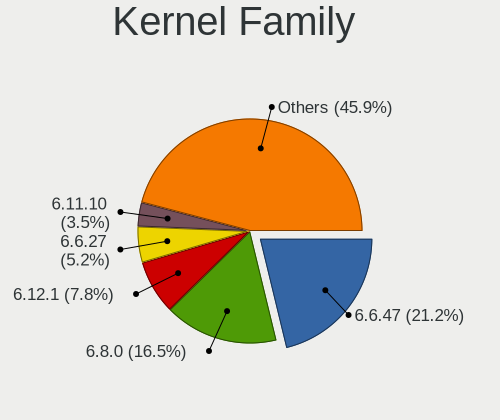
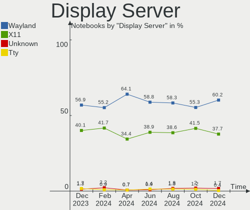
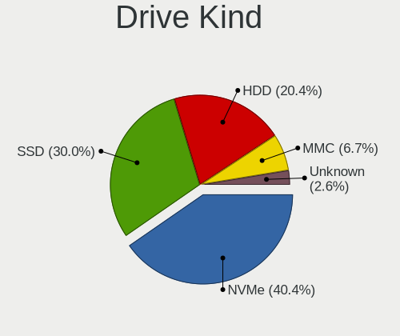
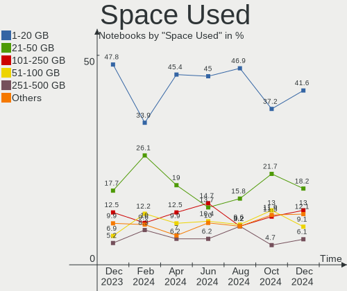
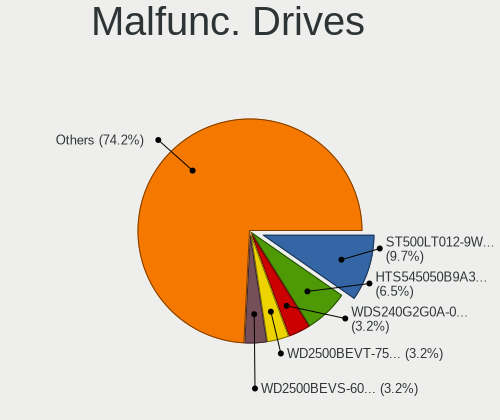
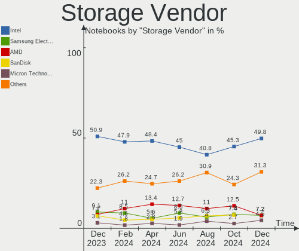
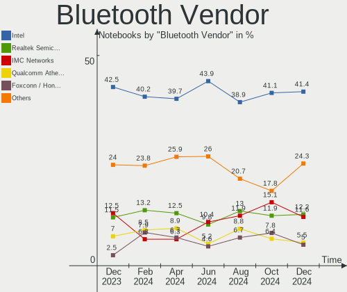
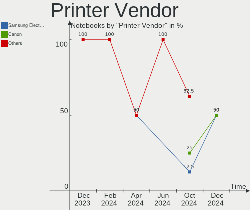

Linux in Russia - Hardware Trends (Notebooks)
---------------------------------------------

A project to identify most popular hardware characteristics and track their change
over time based on data collected by Linux users at https://Linux-Hardware.org.

Anyone can contribute to this report by the [hw-probe](https://github.com/linuxhw/hw-probe) tool:

    sudo -E hw-probe -all -upload

Period: Dec, 2023.

Contents
--------

* [ System ](#system)
  - [ OS                       ](#os)
  - [ OS Family                ](#os-family)
  - [ Kernel                   ](#kernel)
  - [ Kernel Family            ](#kernel-family)
  - [ Kernel Major Ver.        ](#kernel-major-ver)
  - [ Arch                     ](#arch)
  - [ DE                       ](#de)
  - [ Display Server           ](#display-server)
  - [ Display Manager          ](#display-manager)
  - [ OS Lang                  ](#os-lang)
  - [ Boot Mode                ](#boot-mode)
  - [ Filesystem               ](#filesystem)
  - [ Part. scheme             ](#part-scheme)
  - [ Dual Boot with Linux/BSD ](#dual-boot-with-linuxbsd)
  - [ Dual Boot (Win)          ](#dual-boot-win)

* [ Board ](#board)
  - [ Vendor                   ](#vendor)
  - [ Model                    ](#model)
  - [ Model Family             ](#model-family)
  - [ MFG Year                 ](#mfg-year)
  - [ Form Factor              ](#form-factor)
  - [ Secure Boot              ](#secure-boot)
  - [ Coreboot                 ](#coreboot)
  - [ RAM Size                 ](#ram-size)
  - [ RAM Used                 ](#ram-used)
  - [ Total Drives             ](#total-drives)
  - [ Has CD-ROM               ](#has-cd-rom)
  - [ Has Ethernet             ](#has-ethernet)
  - [ Has WiFi                 ](#has-wifi)
  - [ Has Bluetooth            ](#has-bluetooth)

* [ Location ](#location)
  - [ Country                  ](#country)
  - [ City                     ](#city)

* [ Drives ](#drives)
  - [ Drive Vendor             ](#drive-vendor)
  - [ Drive Model              ](#drive-model)
  - [ HDD Vendor               ](#hdd-vendor)
  - [ SSD Vendor               ](#ssd-vendor)
  - [ Drive Kind               ](#drive-kind)
  - [ Drive Connector          ](#drive-connector)
  - [ Drive Size               ](#drive-size)
  - [ Space Total              ](#space-total)
  - [ Space Used               ](#space-used)
  - [ Malfunc. Drives          ](#malfunc-drives)
  - [ Malfunc. Drive Vendor    ](#malfunc-drive-vendor)
  - [ Malfunc. HDD Vendor      ](#malfunc-hdd-vendor)
  - [ Malfunc. Drive Kind      ](#malfunc-drive-kind)
  - [ Failed Drives            ](#failed-drives)
  - [ Failed Drive Vendor      ](#failed-drive-vendor)
  - [ Drive Status             ](#drive-status)

* [ Storage controller ](#storage-controller)
  - [ Storage Vendor           ](#storage-vendor)
  - [ Storage Model            ](#storage-model)
  - [ Storage Kind             ](#storage-kind)

* [ Processor ](#processor)
  - [ CPU Vendor               ](#cpu-vendor)
  - [ CPU Model                ](#cpu-model)
  - [ CPU Model Family         ](#cpu-model-family)
  - [ CPU Cores                ](#cpu-cores)
  - [ CPU Sockets              ](#cpu-sockets)
  - [ CPU Threads              ](#cpu-threads)
  - [ CPU Op-Modes             ](#cpu-op-modes)
  - [ CPU Microcode            ](#cpu-microcode)
  - [ CPU Microarch            ](#cpu-microarch)

* [ Graphics ](#graphics)
  - [ GPU Vendor               ](#gpu-vendor)
  - [ GPU Model                ](#gpu-model)
  - [ GPU Combo                ](#gpu-combo)
  - [ GPU Driver               ](#gpu-driver)
  - [ GPU Memory               ](#gpu-memory)

* [ Monitor ](#monitor)
  - [ Monitor Vendor           ](#monitor-vendor)
  - [ Monitor Model            ](#monitor-model)
  - [ Monitor Resolution       ](#monitor-resolution)
  - [ Monitor Diagonal         ](#monitor-diagonal)
  - [ Monitor Width            ](#monitor-width)
  - [ Aspect Ratio             ](#aspect-ratio)
  - [ Monitor Area             ](#monitor-area)
  - [ Pixel Density            ](#pixel-density)
  - [ Multiple Monitors        ](#multiple-monitors)

* [ Network ](#network)
  - [ Net Controller Vendor    ](#net-controller-vendor)
  - [ Net Controller Model     ](#net-controller-model)
  - [ Wireless Vendor          ](#wireless-vendor)
  - [ Wireless Model           ](#wireless-model)
  - [ Ethernet Vendor          ](#ethernet-vendor)
  - [ Ethernet Model           ](#ethernet-model)
  - [ Net Controller Kind      ](#net-controller-kind)
  - [ Used Controller          ](#used-controller)
  - [ NICs                     ](#nics)
  - [ IPv6                     ](#ipv6)

* [ Bluetooth ](#bluetooth)
  - [ Bluetooth Vendor         ](#bluetooth-vendor)
  - [ Bluetooth Model          ](#bluetooth-model)

* [ Sound ](#sound)
  - [ Sound Vendor             ](#sound-vendor)
  - [ Sound Model              ](#sound-model)

* [ Memory ](#memory)
  - [ Memory Vendor            ](#memory-vendor)
  - [ Memory Model             ](#memory-model)
  - [ Memory Kind              ](#memory-kind)
  - [ Memory Form Factor       ](#memory-form-factor)
  - [ Memory Size              ](#memory-size)
  - [ Memory Speed             ](#memory-speed)

* [ Printers & scanners ](#printers--scanners)
  - [ Printer Vendor           ](#printer-vendor)
  - [ Printer Model            ](#printer-model)
  - [ Scanner Vendor           ](#scanner-vendor)
  - [ Scanner Model            ](#scanner-model)

* [ Camera ](#camera)
  - [ Camera Vendor            ](#camera-vendor)
  - [ Camera Model             ](#camera-model)

* [ Security ](#security)
  - [ Fingerprint Vendor       ](#fingerprint-vendor)
  - [ Fingerprint Model        ](#fingerprint-model)
  - [ Chipcard Vendor          ](#chipcard-vendor)
  - [ Chipcard Model           ](#chipcard-model)

* [ Unsupported ](#unsupported)
  - [ Unsupported Devices      ](#unsupported-devices)
  - [ Unsupported Device Types ](#unsupported-device-types)

System
------

OS
--

Installed operating systems

| Name                     | Notebooks | Percent |
|--------------------------|-----------|---------|
| ROSA 12.4                | 69        | 29.74%  |
| Ubuntu 22.04             | 15        | 6.47%   |
| Arch Rolling             | 13        | 5.6%    |
| Fedora 39                | 11        | 4.74%   |
| ROSA 12                  | 10        | 4.31%   |
| Debian 12                | 10        | 4.31%   |
| OpenMandriva 5.0         | 9         | 3.88%   |
| Ubuntu 23.10             | 8         | 3.45%   |
| Linux Mint 21.2          | 8         | 3.45%   |
| SteamOS 3.5.7            | 6         | 2.59%   |
| OpenMandriva 23.08       | 6         | 2.59%   |
| Red OS 7.3               | 5         | 2.16%   |
| Kubuntu 22.04            | 4         | 1.72%   |
| ROSA R11.1               | 3         | 1.29%   |
| Pop!_OS 22.04            | 3         | 1.29%   |
| ALT Linux 10.2           | 3         | 1.29%   |
| Xubuntu 20.04            | 2         | 0.86%   |
| ROSA 12.2                | 2         | 0.86%   |
| Manjaro 23.1.1           | 2         | 0.86%   |
| Manjaro                  | 2         | 0.86%   |
| Kubuntu 23.10            | 2         | 0.86%   |
| Fedora 38                | 2         | 0.86%   |
| EndeavourOS Rolling      | 2         | 0.86%   |
| ALT Linux 10.1           | 2         | 0.86%   |
| Zorin 17                 | 1         | 0.43%   |
| Zorin 16                 | 1         | 0.43%   |
| Xero Rolling             | 1         | 0.43%   |
| Void Linux Rolling       | 1         | 0.43%   |
| Ubuntu Unity 22.04       | 1         | 0.43%   |
| Ubuntu 24.04             | 1         | 0.43%   |
| SteamOS 3.4.8            | 1         | 0.43%   |
| SteamOS 3.4.11           | 1         | 0.43%   |
| SteamOS 1.051-prerelease | 1         | 0.43%   |
| Sparky 8                 | 1         | 0.43%   |
| ROSA R11                 | 1         | 0.43%   |
| ROSA 13.0                | 1         | 0.43%   |
| ROSA 12.3                | 1         | 0.43%   |
| ROSA 12.1                | 1         | 0.43%   |
| Rocky Linux 9.3          | 1         | 0.43%   |
| Q4OS 5                   | 1         | 0.43%   |

OS Family
---------

OS without a version

| Name         | Notebooks | Percent |
|--------------|-----------|---------|
| ROSA         | 88        | 37.93%  |
| Ubuntu       | 24        | 10.34%  |
| OpenMandriva | 16        | 6.9%    |
| Fedora       | 14        | 6.03%   |
| Arch         | 13        | 5.6%    |
| Debian       | 11        | 4.74%   |
| SteamOS      | 9         | 3.88%   |
| Linux Mint   | 9         | 3.88%   |
| Kubuntu      | 7         | 3.02%   |
| ALT Linux    | 6         | 2.59%   |
| Red OS       | 5         | 2.16%   |
| Manjaro      | 5         | 2.16%   |
| Pop!_OS      | 3         | 1.29%   |
| Zorin        | 2         | 0.86%   |
| Xubuntu      | 2         | 0.86%   |
| EndeavourOS  | 2         | 0.86%   |
| Xero         | 1         | 0.43%   |
| Void Linux   | 1         | 0.43%   |
| Ubuntu Unity | 1         | 0.43%   |
| Sparky       | 1         | 0.43%   |
| Rocky Linux  | 1         | 0.43%   |
| Q4OS         | 1         | 0.43%   |
| PostmarketOS | 1         | 0.43%   |
| openSUSE     | 1         | 0.43%   |
| Neptune OS   | 1         | 0.43%   |
| MX           | 1         | 0.43%   |
| LMDE         | 1         | 0.43%   |
| Kali         | 1         | 0.43%   |
| Elementary   | 1         | 0.43%   |
| Devuan       | 1         | 0.43%   |
| Astra Linux  | 1         | 0.43%   |
| ArcoLinux    | 1         | 0.43%   |

Kernel
------

Version of the Linux kernel

| Version                             | Notebooks | Percent |
|-------------------------------------|-----------|---------|
| 6.1.58-generic-1rosa2021.1-x86_64   | 51        | 21.98%  |
| 6.1.20-generic-2rosa2021.1-x86_64   | 16        | 6.9%    |
| 6.2.0-39-generic                    | 15        | 6.47%   |
| 6.6.2-desktop-1omv2390              | 9         | 3.88%   |
| 6.2.0-37-generic                    | 8         | 3.45%   |
| 6.5.0-14-generic                    | 7         | 3.02%   |
| 6.1.52-valve9-1-neptune-61          | 6         | 2.59%   |
| 6.4.11-desktop-1omv2390             | 5         | 2.16%   |
| 5.15.0-91-generic                   | 5         | 2.16%   |
| 6.6.7-arch1-1                       | 4         | 1.72%   |
| 5.15.127-generic-1rosa2021.1-x86_64 | 4         | 1.72%   |
| 5.10.184-generic-1rosa2021.1-x86_64 | 4         | 1.72%   |
| 6.6.8-2-MANJARO                     | 3         | 1.29%   |
| 6.6.6-200.fc39.x86_64               | 3         | 1.29%   |
| 6.6.4-200.fc39.x86_64               | 3         | 1.29%   |
| 6.5.0-13-generic                    | 3         | 1.29%   |
| 6.1.52-1.el7.3.x86_64               | 3         | 1.29%   |
| 6.1.0-16-amd64                      | 3         | 1.29%   |
| 6.1.0-13-amd64                      | 3         | 1.29%   |
| 6.6.6-76060606-generic              | 2         | 0.86%   |
| 6.1.0-4-amd64                       | 2         | 0.86%   |
| 6.1.0-15-amd64                      | 2         | 0.86%   |
| 5.15.0-89-generic                   | 2         | 0.86%   |
| 5.10.74-generic-2rosa2021.1-x86_64  | 2         | 0.86%   |
| 5.10.198-std-def-alt1               | 2         | 0.86%   |
| 6.7.0-rc4-1-git                     | 1         | 0.43%   |
| 6.6.8-zen1-1-zen                    | 1         | 0.43%   |
| 6.6.8-x64v1-xanmod1                 | 1         | 0.43%   |
| 6.6.8-arch1-1                       | 1         | 0.43%   |
| 6.6.8-200.fc39.x86_64               | 1         | 0.43%   |
| 6.6.8-060608-generic                | 1         | 0.43%   |
| 6.6.7-zen1-1-zen                    | 1         | 0.43%   |
| 6.6.7-200.fc39.x86_64               | 1         | 0.43%   |
| 6.6.5-zen1-1-zen                    | 1         | 0.43%   |
| 6.6.4-zen1-1-zen                    | 1         | 0.43%   |
| 6.6.4-arch1-1                       | 1         | 0.43%   |
| 6.6.3-zen1-1-zen                    | 1         | 0.43%   |
| 6.6.3-arch1-1                       | 1         | 0.43%   |
| 6.6.3-200.fc39.x86_64               | 1         | 0.43%   |
| 6.6.2-arch1-1                       | 1         | 0.43%   |

Kernel Family
-------------

Linux kernel without a distro release

| Version  | Notebooks | Percent |
|----------|-----------|---------|
| 6.1.58   | 53        | 22.84%  |
| 6.2.0    | 24        | 10.34%  |
| 6.1.20   | 16        | 6.9%    |
| 6.5.0    | 13        | 5.6%    |
| 6.1.0    | 13        | 5.6%    |
| 6.6.2    | 11        | 4.74%   |
| 5.15.0   | 10        | 4.31%   |
| 6.1.52   | 9         | 3.88%   |
| 6.6.8    | 8         | 3.45%   |
| 6.6.7    | 6         | 2.59%   |
| 6.4.11   | 6         | 2.59%   |
| 6.6.6    | 5         | 2.16%   |
| 6.6.4    | 5         | 2.16%   |
| 5.15.127 | 4         | 1.72%   |
| 5.10.184 | 4         | 1.72%   |
| 6.6.3    | 3         | 1.29%   |
| 4.15.0   | 3         | 1.29%   |
| 6.5.6    | 2         | 0.86%   |
| 6.1.69   | 2         | 0.86%   |
| 5.4.0    | 2         | 0.86%   |
| 5.13.0   | 2         | 0.86%   |
| 5.10.74  | 2         | 0.86%   |
| 5.10.198 | 2         | 0.86%   |
| 6.7.0    | 1         | 0.43%   |
| 6.6.5    | 1         | 0.43%   |
| 6.6.0    | 1         | 0.43%   |
| 6.5.3    | 1         | 0.43%   |
| 6.4.8    | 1         | 0.43%   |
| 6.4.15   | 1         | 0.43%   |
| 6.3.7    | 1         | 0.43%   |
| 6.3.12   | 1         | 0.43%   |
| 6.2.15   | 1         | 0.43%   |
| 6.2.12   | 1         | 0.43%   |
| 6.1.67   | 1         | 0.43%   |
| 6.1.65   | 1         | 0.43%   |
| 6.1.55   | 1         | 0.43%   |
| 6.1.46   | 1         | 0.43%   |
| 6.1.44   | 1         | 0.43%   |
| 6.1.42   | 1         | 0.43%   |
| 6.1.38   | 1         | 0.43%   |

Kernel Major Ver.
-----------------

Linux kernel major version

| Version | Notebooks | Percent |
|---------|-----------|---------|
| 6.1     | 100       | 43.1%   |
| 6.6     | 40        | 17.24%  |
| 6.2     | 26        | 11.21%  |
| 6.5     | 16        | 6.9%    |
| 5.15    | 16        | 6.9%    |
| 5.10    | 12        | 5.17%   |
| 6.4     | 8         | 3.45%   |
| 5.4     | 3         | 1.29%   |
| 4.15    | 3         | 1.29%   |
| 6.3     | 2         | 0.86%   |
| 5.14    | 2         | 0.86%   |
| 5.13    | 2         | 0.86%   |
| 6.7     | 1         | 0.43%   |
| 5.17    | 1         | 0.43%   |

Arch
----

OS architecture (x86_64, i586, etc.)

| Name   | Notebooks | Percent |
|--------|-----------|---------|
| x86_64 | 229       | 98.71%  |
| i686   | 2         | 0.86%   |
| armv7l | 1         | 0.43%   |

DE
--

Desktop Environment

| Name            | Notebooks | Percent |
|-----------------|-----------|---------|
| KDE5            | 103       | 44.4%   |
| GNOME           | 70        | 30.17%  |
| XFCE            | 13        | 5.6%    |
| LXQt            | 11        | 4.74%   |
| X-Cinnamon      | 7         | 3.02%   |
| MATE            | 7         | 3.02%   |
| i3              | 5         | 2.16%   |
| Unknown         | 4         | 1.72%   |
| KDE4            | 3         | 1.29%   |
| Cinnamon        | 3         | 1.29%   |
| Unity           | 1         | 0.43%   |
| Pantheon        | 1         | 0.43%   |
| Hyprland        | 1         | 0.43%   |
| GNOME Flashback | 1         | 0.43%   |
| GNOME Classic   | 1         | 0.43%   |
| fly             | 1         | 0.43%   |

Display Server
--------------

X11 or Wayland

| Name    | Notebooks | Percent |
|---------|-----------|---------|
| Wayland | 132       | 56.9%   |
| X11     | 93        | 40.09%  |
| Tty     | 4         | 1.72%   |
| Unknown | 3         | 1.29%   |

Display Manager
---------------

SDDM, LightDM, etc.

| Name    | Notebooks | Percent |
|---------|-----------|---------|
| SDDM    | 96        | 41.38%  |
| Unknown | 37        | 15.95%  |
| GDM     | 35        | 15.09%  |
| GDM3    | 32        | 13.79%  |
| LightDM | 26        | 11.21%  |
| KDM     | 3         | 1.29%   |
| SLiM    | 1         | 0.43%   |
| LY-DM   | 1         | 0.43%   |
| FLY-DM  | 1         | 0.43%   |

OS Lang
-------

Language

| Lang    | Notebooks | Percent |
|---------|-----------|---------|
| ru_RU   | 178       | 76.72%  |
| en_US   | 47        | 20.26%  |
| C       | 4         | 1.72%   |
| POSIX   | 1         | 0.43%   |
| en_GB   | 1         | 0.43%   |
| Unknown | 1         | 0.43%   |

Boot Mode
---------

EFI or BIOS

| Mode | Notebooks | Percent |
|------|-----------|---------|
| EFI  | 146       | 62.93%  |
| BIOS | 86        | 37.07%  |

Filesystem
----------

Type of filesystem

| Type     | Notebooks | Percent |
|----------|-----------|---------|
| Ext4     | 154       | 66.38%  |
| Btrfs    | 42        | 18.1%   |
| Overlay  | 17        | 7.33%   |
| Tmpfs    | 14        | 6.03%   |
| F2fs     | 2         | 0.86%   |
| Ext3     | 1         | 0.43%   |
| Bcachefs | 1         | 0.43%   |
| Unknown  | 1         | 0.43%   |

Part. scheme
------------

Scheme of partitioning

| Type    | Notebooks | Percent |
|---------|-----------|---------|
| GPT     | 143       | 61.64%  |
| MBR     | 56        | 24.14%  |
| Unknown | 33        | 14.22%  |

Dual Boot with Linux/BSD
------------------------

Hosting more than one Linux/BSD

| Dual boot | Notebooks | Percent |
|-----------|-----------|---------|
| No        | 188       | 81.03%  |
| Yes       | 44        | 18.97%  |

Dual Boot (Win)
---------------

Hosting Linux and Windows

| Dual boot | Notebooks | Percent |
|-----------|-----------|---------|
| No        | 149       | 64.22%  |
| Yes       | 83        | 35.78%  |

Board
-----

Vendor
------

Motherboard manufacturer

| Name                     | Notebooks | Percent |
|--------------------------|-----------|---------|
| Lenovo                   | 40        | 17.24%  |
| ASUSTek Computer         | 39        | 16.81%  |
| Hewlett-Packard          | 22        | 9.48%   |
| Dell                     | 17        | 7.33%   |
| HUAWEI                   | 16        | 6.9%    |
| Acer                     | 16        | 6.9%    |
| Valve                    | 8         | 3.45%   |
| MSI                      | 8         | 3.45%   |
| Toshiba                  | 5         | 2.16%   |
| Clevo                    | 5         | 2.16%   |
| Unknown                  | 5         | 2.16%   |
| Irbis                    | 4         | 1.72%   |
| Timi                     | 3         | 1.29%   |
| Sony                     | 3         | 1.29%   |
| Samsung Electronics      | 3         | 1.29%   |
| Apple                    | 3         | 1.29%   |
| Maibenben                | 2         | 0.86%   |
| iRU                      | 2         | 0.86%   |
| Gigabyte Technology      | 2         | 0.86%   |
| eMachines                | 2         | 0.86%   |
| DEXP                     | 2         | 0.86%   |
| ARDOR GAMING             | 2         | 0.86%   |
| XIAOMI                   | 1         | 0.43%   |
| THTF                     | 1         | 0.43%   |
| TECNO Mobile Limited     | 1         | 0.43%   |
| ROMBICA                  | 1         | 0.43%   |
| realme                   | 1         | 0.43%   |
| Packard Bell             | 1         | 0.43%   |
| Notebook                 | 1         | 0.43%   |
| MouseComputer            | 1         | 0.43%   |
| MECHREVO                 | 1         | 0.43%   |
| MACHENIKE                | 1         | 0.43%   |
| LTD Delovoy Office       | 1         | 0.43%   |
| LG Electronics           | 1         | 0.43%   |
| Intel                    | 1         | 0.43%   |
| Infinix                  | 1         | 0.43%   |
| HONOR                    | 1         | 0.43%   |
| HIPER Technology Limited | 1         | 0.43%   |
| Graviton                 | 1         | 0.43%   |
| Fujitsu                  | 1         | 0.43%   |

Model
-----

Motherboard model

| Name                                       | Notebooks | Percent |
|--------------------------------------------|-----------|---------|
| Valve Jupiter                              | 8         | 3.45%   |
| Unknown                                    | 6         | 2.59%   |
| Clevo NL41MU2                              | 5         | 2.16%   |
| HUAWEI BOD-WXX9                            | 3         | 1.29%   |
| Lenovo IdeaPad S145-15API 81UT             | 2         | 0.86%   |
| Lenovo IdeaPad L340-15API 81LW             | 2         | 0.86%   |
| HUAWEI NBD-WXX9                            | 2         | 0.86%   |
| HUAWEI KLVL-WXXW                           | 2         | 0.86%   |
| HUAWEI BoDE-WXX9                           | 2         | 0.86%   |
| HP 250 G8 Notebook PC                      | 2         | 0.86%   |
| ASUS X550CC                                | 2         | 0.86%   |
| ASUS VivoBook_ASUSLaptop M1603QA_M1603QA   | 2         | 0.86%   |
| XIAOMI Redmi Book Pro 15 2023              | 1         | 0.43%   |
| Toshiba T20                                | 1         | 0.43%   |
| Toshiba Satellite U300                     | 1         | 0.43%   |
| Toshiba Satellite Pro C660                 | 1         | 0.43%   |
| Toshiba Satellite C660                     | 1         | 0.43%   |
| Toshiba Satellite A200                     | 1         | 0.43%   |
| Timi TM1701                                | 1         | 0.43%   |
| Timi Mi Laptop Pro 15                      | 1         | 0.43%   |
| Timi A35R                                  | 1         | 0.43%   |
| THTF WUJIE 14                              | 1         | 0.43%   |
| TECNO Mobile Limited MEGABOOK T15DA        | 1         | 0.43%   |
| Sony VPCCA3X1R                             | 1         | 0.43%   |
| Sony VGN-FW11ER                            | 1         | 0.43%   |
| Sony VGC-LT1SR                             | 1         | 0.43%   |
| Samsung R528/R728                          | 1         | 0.43%   |
| Samsung 350V5C/351V5C/3540VC/3440VC        | 1         | 0.43%   |
| Samsung 300V3A/300V4A/300V5A/200A4B/200A5B | 1         | 0.43%   |
| ROMBICA myBook Discovery                   | 1         | 0.43%   |
| realme RMNBXXXX                            | 1         | 0.43%   |
| Packard Bell EasyNote TE11HC               | 1         | 0.43%   |
| Notebook W65_67SJ                          | 1         | 0.43%   |
| MSI Thin GF63 12HW                         | 1         | 0.43%   |
| MSI PS63 Modern 8M                         | 1         | 0.43%   |
| MSI Modern 15 B5M                          | 1         | 0.43%   |
| MSI Modern 14 B5M                          | 1         | 0.43%   |
| MSI Katana GF66 11SC                       | 1         | 0.43%   |
| MSI GF65 Thin 9SEXR                        | 1         | 0.43%   |
| MSI GF63 Thin 9RCX                         | 1         | 0.43%   |

Model Family
------------

Motherboard model prefix

| Name                          | Notebooks | Percent |
|-------------------------------|-----------|---------|
| Lenovo ThinkPad               | 12        | 5.17%   |
| Lenovo IdeaPad                | 12        | 5.17%   |
| Acer Aspire                   | 11        | 4.74%   |
| ASUS VivoBook                 | 10        | 4.31%   |
| Valve Jupiter                 | 8         | 3.45%   |
| Dell Inspiron                 | 8         | 3.45%   |
| HP Pavilion                   | 7         | 3.02%   |
| Unknown                       | 6         | 2.59%   |
| HP ProBook                    | 5         | 2.16%   |
| Clevo NL41MU2                 | 5         | 2.16%   |
| Toshiba Satellite             | 4         | 1.72%   |
| Lenovo V15                    | 4         | 1.72%   |
| HUAWEI BOD-WXX9               | 3         | 1.29%   |
| Dell Vostro                   | 3         | 1.29%   |
| Dell Latitude                 | 3         | 1.29%   |
| ASUS Zenbook                  | 3         | 1.29%   |
| ASUS ROG                      | 3         | 1.29%   |
| MSI Modern                    | 2         | 0.86%   |
| Maibenben MaiBook             | 2         | 0.86%   |
| Lenovo ThinkBook              | 2         | 0.86%   |
| Lenovo B590                   | 2         | 0.86%   |
| HUAWEI NBD-WXX9               | 2         | 0.86%   |
| HUAWEI KLVL-WXXW              | 2         | 0.86%   |
| HUAWEI BoDE-WXX9              | 2         | 0.86%   |
| HP Laptop                     | 2         | 0.86%   |
| HP 250                        | 2         | 0.86%   |
| Gigabyte AORUS                | 2         | 0.86%   |
| ASUS X550CC                   | 2         | 0.86%   |
| ASUS TUF                      | 2         | 0.86%   |
| ASUS ASUS                     | 2         | 0.86%   |
| ARDOR GAMING V15x             | 2         | 0.86%   |
| Acer Nitro                    | 2         | 0.86%   |
| XIAOMI Redmi                  | 1         | 0.43%   |
| Toshiba T20                   | 1         | 0.43%   |
| Timi TM1701                   | 1         | 0.43%   |
| Timi Mi                       | 1         | 0.43%   |
| Timi A35R                     | 1         | 0.43%   |
| THTF WUJIE                    | 1         | 0.43%   |
| TECNO Mobile Limited MEGABOOK | 1         | 0.43%   |
| Sony VPCCA3X1R                | 1         | 0.43%   |

MFG Year
--------

Motherboard manufacture year

| Year    | Notebooks | Percent |
|---------|-----------|---------|
| 2022    | 34        | 14.66%  |
| 2023    | 32        | 13.79%  |
| 2021    | 30        | 12.93%  |
| 2020    | 19        | 8.19%   |
| 2013    | 15        | 6.47%   |
| 2011    | 15        | 6.47%   |
| 2010    | 14        | 6.03%   |
| 2019    | 13        | 5.6%    |
| 2012    | 12        | 5.17%   |
| 2017    | 9         | 3.88%   |
| 2007    | 9         | 3.88%   |
| 2018    | 8         | 3.45%   |
| 2015    | 5         | 2.16%   |
| 2014    | 5         | 2.16%   |
| 2016    | 3         | 1.29%   |
| 2009    | 3         | 1.29%   |
| 2008    | 3         | 1.29%   |
| 2006    | 1         | 0.43%   |
| 2005    | 1         | 0.43%   |
| Unknown | 1         | 0.43%   |

Form Factor
-----------

Physical design of the computer

| Name     | Notebooks | Percent |
|----------|-----------|---------|
| Notebook | 232       | 100%    |

Secure Boot
-----------

Enabled or disabled

| State    | Notebooks | Percent |
|----------|-----------|---------|
| Disabled | 218       | 93.97%  |
| Enabled  | 14        | 6.03%   |

Coreboot
--------

Have coreboot on board

| Used | Notebooks | Percent |
|------|-----------|---------|
| No   | 232       | 100%    |

RAM Size
--------

Total RAM memory

| Size in GB | Notebooks | Percent |
|------------|-----------|---------|
| 4.01-8.0   | 71        | 30.6%   |
| 16.01-24.0 | 45        | 19.4%   |
| 8.01-16.0  | 44        | 18.97%  |
| 3.01-4.0   | 36        | 15.52%  |
| 32.01-64.0 | 13        | 5.6%    |
| 1.01-2.0   | 9         | 3.88%   |
| 2.01-3.0   | 7         | 3.02%   |
| 24.01-32.0 | 5         | 2.16%   |
| 0.51-1.0   | 1         | 0.43%   |
| 0.01-0.5   | 1         | 0.43%   |

RAM Used
--------

Used RAM memory

| Used GB    | Notebooks | Percent |
|------------|-----------|---------|
| 1.01-2.0   | 86        | 37.07%  |
| 2.01-3.0   | 57        | 24.57%  |
| 4.01-8.0   | 32        | 13.79%  |
| 3.01-4.0   | 25        | 10.78%  |
| 0.51-1.0   | 22        | 9.48%   |
| 8.01-16.0  | 7         | 3.02%   |
| 16.01-24.0 | 2         | 0.86%   |
| 0.01-0.5   | 1         | 0.43%   |

Total Drives
------------

Number of drives on board

| Drives | Notebooks | Percent |
|--------|-----------|---------|
| 1      | 173       | 74.57%  |
| 2      | 51        | 21.98%  |
| 3      | 7         | 3.02%   |
| 0      | 1         | 0.43%   |

Has CD-ROM
----------

Has CD-ROM on board

| Presented | Notebooks | Percent |
|-----------|-----------|---------|
| No        | 182       | 78.45%  |
| Yes       | 50        | 21.55%  |

Has Ethernet
------------

Has Ethernet on board

| Presented | Notebooks | Percent |
|-----------|-----------|---------|
| Yes       | 153       | 65.95%  |
| No        | 79        | 34.05%  |

Has WiFi
--------

Has WiFi module

| Presented | Notebooks | Percent |
|-----------|-----------|---------|
| Yes       | 227       | 97.84%  |
| No        | 5         | 2.16%   |

Has Bluetooth
-------------

Has Bluetooth module

| Presented | Notebooks | Percent |
|-----------|-----------|---------|
| Yes       | 199       | 85.78%  |
| No        | 33        | 14.22%  |

Location
--------

Country
-------

Geographic location (country)

| Country | Notebooks | Percent |
|---------|-----------|---------|
| Russia  | 232       | 100%    |

City
----

Geographic location (city)

| City              | Notebooks | Percent |
|-------------------|-----------|---------|
| Moscow            | 61        | 26.29%  |
| St Petersburg     | 19        | 8.19%   |
| Yekaterinburg     | 8         | 3.45%   |
| Surgut            | 6         | 2.59%   |
| Samara            | 5         | 2.16%   |
| Novosibirsk       | 5         | 2.16%   |
| Krasnodar         | 5         | 2.16%   |
| Vladivostok       | 4         | 1.72%   |
| Chelyabinsk       | 4         | 1.72%   |
| Voronezh          | 3         | 1.29%   |
| Volgograd         | 3         | 1.29%   |
| Perm              | 3         | 1.29%   |
| Nizhniy Novgorod  | 3         | 1.29%   |
| Kazan’          | 3         | 1.29%   |
| Kaliningrad       | 3         | 1.29%   |
| Balashikha        | 3         | 1.29%   |
| Yakutsk           | 2         | 0.86%   |
| Ufa               | 2         | 0.86%   |
| Tula              | 2         | 0.86%   |
| Sochi             | 2         | 0.86%   |
| Sergiyev Posad    | 2         | 0.86%   |
| Oryol             | 2         | 0.86%   |
| Orenburg          | 2         | 0.86%   |
| Novoshakhtinsk    | 2         | 0.86%   |
| Magnitogorsk      | 2         | 0.86%   |
| Lipetsk           | 2         | 0.86%   |
| Kirov             | 2         | 0.86%   |
| Kaluga            | 2         | 0.86%   |
| Barnaul           | 2         | 0.86%   |
| Angarsk           | 2         | 0.86%   |
| Yuzhno-Sakhalinsk | 1         | 0.43%   |
| Vologda           | 1         | 0.43%   |
| Verkhnyaya Pyshma | 1         | 0.43%   |
| Tyumen            | 1         | 0.43%   |
| Tver              | 1         | 0.43%   |
| Tomsk             | 1         | 0.43%   |
| Tolyatti          | 1         | 0.43%   |
| Taganrog          | 1         | 0.43%   |
| Stupino           | 1         | 0.43%   |
| Stary Oskol       | 1         | 0.43%   |

Drives
------

Drive Vendor
------------

Hard drive vendors

| Vendor                      | Notebooks | Drives | Percent |
|-----------------------------|-----------|--------|---------|
| Samsung Electronics         | 33        | 33     | 11.46%  |
| WDC                         | 24        | 25     | 8.33%   |
| SanDisk                     | 20        | 20     | 6.94%   |
| Unknown                     | 18        | 20     | 6.25%   |
| Toshiba                     | 16        | 17     | 5.56%   |
| Seagate                     | 14        | 14     | 4.86%   |
| Intel                       | 13        | 14     | 4.51%   |
| Micron Technology           | 12        | 12     | 4.17%   |
| Kingston                    | 12        | 12     | 4.17%   |
| SK hynix                    | 11        | 11     | 3.82%   |
| Silicon Motion              | 8         | 8      | 2.78%   |
| China                       | 8         | 8      | 2.78%   |
| Phison Electronics          | 6         | 6      | 2.08%   |
| HGST                        | 6         | 6      | 2.08%   |
| Crucial                     | 6         | 6      | 2.08%   |
| BIWIN                       | 6         | 6      | 2.08%   |
| Apacer                      | 5         | 5      | 1.74%   |
| A-DATA Technology           | 5         | 5      | 1.74%   |
| KingSpec                    | 4         | 4      | 1.39%   |
| Hitachi                     | 4         | 4      | 1.39%   |
| XrayDisk                    | 3         | 3      | 1.04%   |
| Phison                      | 3         | 3      | 1.04%   |
| Patriot                     | 3         | 3      | 1.04%   |
| MAXIO Technology (Hangzhou) | 3         | 3      | 1.04%   |
| KIOXIA                      | 3         | 3      | 1.04%   |
| Team                        | 2         | 2      | 0.69%   |
| SPCC                        | 2         | 2      | 0.69%   |
| Netac                       | 2         | 2      | 0.69%   |
| Fujitsu                     | 2         | 2      | 0.69%   |
| Apple                       | 2         | 2      | 0.69%   |
| AMD                         | 2         | 3      | 0.69%   |
| Unknown                     | 2         | 2      | 0.69%   |
| Yangtze Memory Technologies | 1         | 1      | 0.35%   |
| XPG                         | 1         | 1      | 0.35%   |
| WALRAM                      | 1         | 1      | 0.35%   |
| UMIS                        | 1         | 1      | 0.35%   |
| Transcend                   | 1         | 1      | 0.35%   |
| SSSTC                       | 1         | 1      | 0.35%   |
| Smartbuy                    | 1         | 1      | 0.35%   |
| ShiJi                       | 1         | 1      | 0.35%   |

Drive Model
-----------

Hard drive models

| Model                                              | Notebooks | Percent |
|----------------------------------------------------|-----------|---------|
| Toshiba MQ01ABF050 500GB                           | 5         | 1.7%    |
| Intel SSDPEKNU512GZ 512GB                          | 5         | 1.7%    |
| BIWIN CE480T5D101-256 256GB                        | 5         | 1.7%    |
| WDC WDS240G2G0A-00JH30 240GB SSD                   | 3         | 1.02%   |
| SK hynix HFM512GD3JX013N 512GB                     | 3         | 1.02%   |
| Silicon Motion PCIe-4 SSD 256GB                    | 3         | 1.02%   |
| Seagate ST9500325AS 500GB                          | 3         | 1.02%   |
| Seagate ST1000LM035-1RK172 1TB                     | 3         | 1.02%   |
| Sandisk WD Blue SN500 / PC SN520 NVMe SSD 128GB    | 3         | 1.02%   |
| Samsung MZVL4512HBLU-00BTW 512GB                   | 3         | 1.02%   |
| Phison E12 NVMe Controller 1TB                     | 3         | 1.02%   |
| Kingston SA400S37240G 240GB SSD                    | 3         | 1.02%   |
| HGST HTS721010A9E630 1TB                           | 3         | 1.02%   |
| Crucial CT240BX500SSD1 240GB                       | 3         | 1.02%   |
| China SSD 128GB                                    | 3         | 1.02%   |
| WDC WD10SPZX-21Z10T0 1TB                           | 2         | 0.68%   |
| WDC WD10SPZX-00Z10T0 1TB                           | 2         | 0.68%   |
| Unknown NVMe SSD Drive 512GB                       | 2         | 0.68%   |
| Unknown MMC Card  32GB                             | 2         | 0.68%   |
| Unknown MMC Card  128GB                            | 2         | 0.68%   |
| Toshiba MQ04ABF100 1TB                             | 2         | 0.68%   |
| Toshiba MQ01ABD032 320GB                           | 2         | 0.68%   |
| Seagate ST500LT012-1DG142 500GB                    | 2         | 0.68%   |
| Seagate ST1000LM024 HN-M101MBB 1TB                 | 2         | 0.68%   |
| Sandisk WD PC SN740 SDDPTQD-1T00 1024GB            | 2         | 0.68%   |
| Sandisk WD Blue SN550 NVMe SSD 1TB                 | 2         | 0.68%   |
| Sandisk WD Black SN750 / PC SN730 NVMe SSD 2TB     | 2         | 0.68%   |
| Samsung MZALQ512HALU-000L2 512GB                   | 2         | 0.68%   |
| Samsung MZALQ256HBJD-00BL2 256GB                   | 2         | 0.68%   |
| Samsung MZALQ128HBHQ-000L2 128GB                   | 2         | 0.68%   |
| Phison PS5013 E13 NVMe Controller 512GB            | 2         | 0.68%   |
| Phison 256GB EM280256GYTCTAS-E13T2MS               | 2         | 0.68%   |
| Micron 2400_MTFDKBA512QFM 512GB                    | 2         | 0.68%   |
| Micron 2200V_MTFDHBA512TCK 512GB                   | 2         | 0.68%   |
| MAXIO (Hangzhou) NVMe SSD Controller MAP1202 256GB | 2         | 0.68%   |
| KIOXIA KBG40ZNV256G 256GB                          | 2         | 0.68%   |
| Kingston SA400S37120G 120GB SSD                    | 2         | 0.68%   |
| KingSpec P3-128 128GB SSD                          | 2         | 0.68%   |
| Intel SSD 660P Series 1TB                          | 2         | 0.68%   |
| HGST HTS545050A7E680 500GB                         | 2         | 0.68%   |

HDD Vendor
----------

Hard disk drive vendors

| Vendor   | Notebooks | Drives | Percent |
|----------|-----------|--------|---------|
| WDC      | 17        | 17     | 28.33%  |
| Toshiba  | 16        | 17     | 26.67%  |
| Seagate  | 14        | 14     | 23.33%  |
| HGST     | 6         | 6      | 10%     |
| Hitachi  | 4         | 4      | 6.67%   |
| Fujitsu  | 2         | 2      | 3.33%   |
| External | 1         | 1      | 1.67%   |

SSD Vendor
----------

Solid state drive vendors

| Vendor              | Notebooks | Drives | Percent |
|---------------------|-----------|--------|---------|
| Kingston            | 9         | 9      | 11.25%  |
| China               | 8         | 8      | 10%     |
| Samsung Electronics | 7         | 7      | 8.75%   |
| Crucial             | 6         | 6      | 7.5%    |
| Apacer              | 5         | 5      | 6.25%   |
| WDC                 | 4         | 4      | 5%      |
| KingSpec            | 4         | 4      | 5%      |
| SanDisk             | 3         | 3      | 3.75%   |
| Micron Technology   | 3         | 3      | 3.75%   |
| A-DATA Technology   | 3         | 3      | 3.75%   |
| XrayDisk            | 2         | 2      | 2.5%    |
| Team                | 2         | 2      | 2.5%    |
| SPCC                | 2         | 2      | 2.5%    |
| Patriot             | 2         | 2      | 2.5%    |
| Intel               | 2         | 2      | 2.5%    |
| Apple               | 2         | 2      | 2.5%    |
| AMD                 | 2         | 3      | 2.5%    |
| WALRAM              | 1         | 1      | 1.25%   |
| Smartbuy            | 1         | 1      | 1.25%   |
| ShiJi               | 1         | 1      | 1.25%   |
| Neo                 | 1         | 1      | 1.25%   |
| MMY                 | 1         | 1      | 1.25%   |
| LS                  | 1         | 1      | 1.25%   |
| LITEON              | 1         | 1      | 1.25%   |
| KingFast            | 1         | 1      | 1.25%   |
| JMicron Technology  | 1         | 1      | 1.25%   |
| Hewlett-Packard     | 1         | 1      | 1.25%   |
| GS                  | 1         | 1      | 1.25%   |
| Fanxiang            | 1         | 1      | 1.25%   |
| Digma               | 1         | 1      | 1.25%   |
| Unknown             | 1         | 1      | 1.25%   |

Drive Kind
----------

HDD or SSD

| Kind    | Notebooks | Drives | Percent |
|---------|-----------|--------|---------|
| NVMe    | 122       | 129    | 44.04%  |
| SSD     | 76        | 81     | 27.44%  |
| HDD     | 58        | 61     | 20.94%  |
| MMC     | 18        | 20     | 6.5%    |
| Unknown | 3         | 3      | 1.08%   |

Drive Connector
---------------

SATA, SAS, NVMe, etc.

| Type | Notebooks | Drives | Percent |
|------|-----------|--------|---------|
| NVMe | 122       | 129    | 46.74%  |
| SATA | 118       | 142    | 45.21%  |
| MMC  | 18        | 20     | 6.9%    |
| SAS  | 3         | 3      | 1.15%   |

Drive Size
----------

Size of hard drive

| Size in TB | Notebooks | Drives | Percent |
|------------|-----------|--------|---------|
| 0.01-0.5   | 86        | 98     | 67.72%  |
| 0.51-1.0   | 37        | 40     | 29.13%  |
| 1.01-2.0   | 4         | 4      | 3.15%   |

Space Total
-----------

Amount of disk space available on the file system

| Size in GB     | Notebooks | Percent |
|----------------|-----------|---------|
| 101-250        | 76        | 32.76%  |
| 251-500        | 57        | 24.57%  |
| 501-1000       | 29        | 12.5%   |
| 1-20           | 18        | 7.76%   |
| 51-100         | 18        | 7.76%   |
| 1001-2000      | 13        | 5.6%    |
| 21-50          | 12        | 5.17%   |
| Unknown        | 5         | 2.16%   |
| 2001-3000      | 3         | 1.29%   |
| More than 3000 | 1         | 0.43%   |

Space Used
----------

Amount of used disk space

| Used GB   | Notebooks | Percent |
|-----------|-----------|---------|
| 1-20      | 111       | 47.84%  |
| 21-50     | 41        | 17.67%  |
| 101-250   | 29        | 12.5%   |
| 501-1000  | 16        | 6.9%    |
| 51-100    | 16        | 6.9%    |
| 251-500   | 12        | 5.17%   |
| Unknown   | 5         | 2.16%   |
| 1001-2000 | 1         | 0.43%   |
| 0         | 1         | 0.43%   |

Malfunc. Drives
---------------

Drive models with a malfunction

| Model                                               | Notebooks | Drives | Percent |
|-----------------------------------------------------|-----------|--------|---------|
| Toshiba MQ01ABF050 500GB                            | 3         | 3      | 10.71%  |
| Seagate ST9500325AS 500GB                           | 3         | 3      | 10.71%  |
| HGST HTS545050A7E680 500GB                          | 2         | 2      | 7.14%   |
| WDC WD3200BPVT-24ZEST0 320GB                        | 1         | 1      | 3.57%   |
| WDC WD2500BEVT-22A23T0 250GB                        | 1         | 1      | 3.57%   |
| WDC WD10JPVT-60A1YT0 1TB                            | 1         | 1      | 3.57%   |
| Toshiba MQ01ABD032 320GB                            | 1         | 1      | 3.57%   |
| Toshiba MK5075GSX 500GB                             | 1         | 1      | 3.57%   |
| Toshiba MK3276GSX 320GB                             | 1         | 1      | 3.57%   |
| Toshiba MK3265GSX 320GB                             | 1         | 1      | 3.57%   |
| Toshiba MK1237GSX 120GB                             | 1         | 1      | 3.57%   |
| Seagate ST1000LM024 HN-M101MBB 1TB                  | 1         | 1      | 3.57%   |
| SanDisk SDSSDX120GG25 120GB                         | 1         | 1      | 3.57%   |
| Samsung Electronics MZALQ256HBJD-00BL2 256GB        | 1         | 1      | 3.57%   |
| Neo Forza NFS121SA324-6007000 240GB SSD             | 1         | 1      | 3.57%   |
| Micron Technology MTFDDAK512MAY-1AE1ZABHA 512GB SSD | 1         | 1      | 3.57%   |
| Kimtigo SSD 512GB                                   | 1         | 1      | 3.57%   |
| Intel SSDSC2BW120A4 120GB                           | 1         | 1      | 3.57%   |
| Intel SSDSA2M080G2GC 80GB                           | 1         | 1      | 3.57%   |
| Hitachi HTS542512K9SA00 120GB                       | 1         | 1      | 3.57%   |
| Hitachi HCC543232A7A380 320GB                       | 1         | 1      | 3.57%   |
| HGST HTS721010A9E630 1TB                            | 1         | 1      | 3.57%   |
| Fujitsu MHW2120BH 120GB                             | 1         | 1      | 3.57%   |

Malfunc. Drive Vendor
---------------------

Vendors of faulty drives

| Vendor              | Notebooks | Drives | Percent |
|---------------------|-----------|--------|---------|
| Toshiba             | 7         | 8      | 25.93%  |
| Seagate             | 4         | 4      | 14.81%  |
| WDC                 | 3         | 3      | 11.11%  |
| HGST                | 3         | 3      | 11.11%  |
| Intel               | 2         | 2      | 7.41%   |
| Hitachi             | 2         | 2      | 7.41%   |
| SanDisk             | 1         | 1      | 3.7%    |
| Samsung Electronics | 1         | 1      | 3.7%    |
| Neo                 | 1         | 1      | 3.7%    |
| Micron Technology   | 1         | 1      | 3.7%    |
| Kimtigo             | 1         | 1      | 3.7%    |
| Fujitsu             | 1         | 1      | 3.7%    |

Malfunc. HDD Vendor
-------------------

Vendors of faulty HDD drives

| Vendor  | Notebooks | Drives | Percent |
|---------|-----------|--------|---------|
| Toshiba | 7         | 8      | 35%     |
| Seagate | 4         | 4      | 20%     |
| WDC     | 3         | 3      | 15%     |
| HGST    | 3         | 3      | 15%     |
| Hitachi | 2         | 2      | 10%     |
| Fujitsu | 1         | 1      | 5%      |

Malfunc. Drive Kind
-------------------

Kinds of faulty drives

| Kind | Notebooks | Drives | Percent |
|------|-----------|--------|---------|
| HDD  | 20        | 21     | 74.07%  |
| SSD  | 5         | 5      | 18.52%  |
| NVMe | 2         | 2      | 7.41%   |

Failed Drives
-------------

Failed drive models

Zero info for selected period =(

Failed Drive Vendor
-------------------

Failed drive vendors

Zero info for selected period =(

Drive Status
------------

Number of failed and malfunc. drives

| Status   | Notebooks | Drives | Percent |
|----------|-----------|--------|---------|
| Works    | 158       | 185    | 62.45%  |
| Detected | 68        | 81     | 26.88%  |
| Malfunc  | 27        | 28     | 10.67%  |

Storage controller
------------------

Storage Vendor
--------------

Storage controller vendors

| Vendor                                  | Notebooks | Percent |
|-----------------------------------------|-----------|---------|
| Intel                                   | 146       | 50.87%  |
| Samsung Electronics                     | 26        | 9.06%   |
| AMD                                     | 22        | 7.67%   |
| SanDisk                                 | 20        | 6.97%   |
| SK hynix                                | 10        | 3.48%   |
| Silicon Motion                          | 9         | 3.14%   |
| Phison Electronics                      | 9         | 3.14%   |
| Micron Technology                       | 9         | 3.14%   |
| MAXIO Technology (Hangzhou)             | 5         | 1.74%   |
| INNOGRIT                                | 5         | 1.74%   |
| Kingston Technology Company             | 4         | 1.39%   |
| KIOXIA                                  | 3         | 1.05%   |
| ADATA Technology                        | 3         | 1.05%   |
| Shenzhen Longsys Electronics            | 2         | 0.7%    |
| Netac Technology                        | 2         | 0.7%    |
| Hosin Global Electronics                | 2         | 0.7%    |
| Yangtze Memory Technologies             | 1         | 0.35%   |
| Transcend                               | 1         | 0.35%   |
| Solid State Storage Technology          | 1         | 0.35%   |
| Silicon Integrated Systems [SiS]        | 1         | 0.35%   |
| Shenzhen Unionmemory Information System | 1         | 0.35%   |
| Realtek Semiconductor                   | 1         | 0.35%   |
| O2 Micro                                | 1         | 0.35%   |
| Nvidia                                  | 1         | 0.35%   |
| Marvell Technology Group                | 1         | 0.35%   |
| Lenovo                                  | 1         | 0.35%   |

Storage Model
-------------

Storage controller models

| Model                                                                            | Notebooks | Percent |
|----------------------------------------------------------------------------------|-----------|---------|
| AMD FCH SATA Controller [AHCI mode]                                              | 19        | 6.21%   |
| Samsung NVMe SSD Controller 980 (DRAM-less)                                      | 16        | 5.23%   |
| Intel 6 Series/C200 Series Chipset Family 6 port Mobile SATA AHCI Controller     | 16        | 5.23%   |
| Intel 7 Series Chipset Family 6-port SATA Controller [AHCI mode]                 | 15        | 4.9%    |
| Intel Tiger Lake-LP SATA Controller                                              | 14        | 4.58%   |
| Intel Volume Management Device NVMe RAID Controller                              | 9         | 2.94%   |
| Intel 8 Series SATA Controller 1 [AHCI mode]                                     | 9         | 2.94%   |
| SK hynix Gold P31/BC711/PC711 NVMe Solid State Drive                             | 8         | 2.61%   |
| Intel SSD 670p Series [Keystone Harbor]                                          | 7         | 2.29%   |
| Intel Alder Lake-P SATA AHCI Controller                                          | 7         | 2.29%   |
| Intel 82801 Mobile SATA Controller [RAID mode]                                   | 7         | 2.29%   |
| Silicon Motion Non-Volatile memory controller                                    | 6         | 1.96%   |
| Intel Sunrise Point-LP SATA Controller [AHCI mode]                               | 6         | 1.96%   |
| Intel Celeron/Pentium Silver Processor SATA Controller                           | 6         | 1.96%   |
| Intel 82801HM/HEM (ICH8M/ICH8M-E) SATA Controller [AHCI mode]                    | 6         | 1.96%   |
| Intel 82801HM/HEM (ICH8M/ICH8M-E) IDE Controller                                 | 6         | 1.96%   |
| Intel 5 Series/3400 Series Chipset 4 port SATA AHCI Controller                   | 6         | 1.96%   |
| Phison PS5013-E13 PCIe3 NVMe Controller (DRAM-less)                              | 5         | 1.63%   |
| MAXIO (Hangzhou) NVMe SSD Controller MAP1202                                     | 5         | 1.63%   |
| Intel Cannon Lake Mobile PCH SATA AHCI Controller                                | 5         | 1.63%   |
| Intel 82801IBM/IEM (ICH9M/ICH9M-E) 4 port SATA Controller [AHCI mode]            | 5         | 1.63%   |
| INNOGRIT NVMe SSD Controller IG5216 (DRAM-less)                                  | 5         | 1.63%   |
| Samsung NVMe SSD Controller SM981/PM981/PM983                                    | 4         | 1.31%   |
| Samsung NVMe SSD Controller PM9B1 (DRAM-less)                                    | 4         | 1.31%   |
| Intel Celeron N3350/Pentium N4200/Atom E3900 Series SATA AHCI Controller         | 4         | 1.31%   |
| Intel Atom/Celeron/Pentium Processor x5-E8000/J3xxx/N3xxx Series SATA Controller | 4         | 1.31%   |
| SanDisk WD Blue SN500 / PC SN520 x2 M.2 2280 NVMe SSD                            | 3         | 0.98%   |
| SanDisk Ultra 3D / WD Blue SN550 NVMe SSD                                        | 3         | 0.98%   |
| Phison E12 NVMe Controller                                                       | 3         | 0.98%   |
| Micron 2400 NVMe SSD (DRAM-less)                                                 | 3         | 0.98%   |
| Micron 2200S NVMe SSD [Cassandra]                                                | 3         | 0.98%   |
| Intel SSD 660P Series                                                            | 3         | 0.98%   |
| Intel Ice Lake-LP SATA Controller [AHCI mode]                                    | 3         | 0.98%   |
| Intel Comet Lake SATA AHCI Controller                                            | 3         | 0.98%   |
| Silicon Motion SM2263EN/SM2263XT (DRAM-less) NVMe SSD Controllers                | 2         | 0.65%   |
| Shenzhen Longsys Lexar NM620 NVME SSD (DRAM-less)                                | 2         | 0.65%   |
| Sandisk WD PC SN740 NVMe SSD 512GB (DRAM-less)                                   | 2         | 0.65%   |
| SanDisk WD PC SN540 / Green SN350 NVMe SSD 1 TB (DRAM-less)                      | 2         | 0.65%   |
| SanDisk WD Black SN770 / PC SN740 256GB / PC SN560 (DRAM-less) NVMe SSD          | 2         | 0.65%   |
| Sandisk PC SN740 NVMe SSD (DRAM-less)                                            | 2         | 0.65%   |

Storage Kind
------------

Kind of storage controller (IDE, SATA, NVMe, SAS, ...)

| Kind | Notebooks | Percent |
|------|-----------|---------|
| SATA | 150       | 50%     |
| NVMe | 122       | 40.67%  |
| RAID | 17        | 5.67%   |
| IDE  | 11        | 3.67%   |

Processor
---------

CPU Vendor
----------

Processor vendors

| Vendor | Notebooks | Percent |
|--------|-----------|---------|
| Intel  | 177       | 76.29%  |
| AMD    | 54        | 23.28%  |
| ARM    | 1         | 0.43%   |

CPU Model
---------

Processor models

| Model                                         | Notebooks | Percent |
|-----------------------------------------------|-----------|---------|
| Intel 11th Gen Core i5-1135G7 @ 2.40GHz       | 12        | 5.17%   |
| Intel 11th Gen Core i3-1115G4 @ 3.00GHz       | 8         | 3.45%   |
| AMD Custom APU 0405                           | 8         | 3.45%   |
| Intel Celeron N4020 CPU @ 1.10GHz             | 4         | 1.72%   |
| AMD Ryzen 5 5500U with Radeon Graphics        | 4         | 1.72%   |
| Intel Pentium CPU B950 @ 2.10GHz              | 3         | 1.29%   |
| Intel Pentium CPU 2020M @ 2.40GHz             | 3         | 1.29%   |
| Intel Core i7-9750H CPU @ 2.60GHz             | 3         | 1.29%   |
| Intel Core i5-4200U CPU @ 1.60GHz             | 3         | 1.29%   |
| Intel Core i3-2350M CPU @ 2.30GHz             | 3         | 1.29%   |
| Intel Celeron CPU N3350 @ 1.10GHz             | 3         | 1.29%   |
| Intel 12th Gen Core i7-1255U                  | 3         | 1.29%   |
| Intel 12th Gen Core i5-12500H                 | 3         | 1.29%   |
| Intel 11th Gen Core i5-1155G7 @ 2.50GHz       | 3         | 1.29%   |
| AMD Ryzen 7 5800H with Radeon Graphics        | 3         | 1.29%   |
| AMD Ryzen 5 3500U with Radeon Vega Mobile Gfx | 3         | 1.29%   |
| Intel Pentium Silver N6000 @ 1.10GHz          | 2         | 0.86%   |
| Intel Pentium CPU N3710 @ 1.60GHz             | 2         | 0.86%   |
| Intel Pentium CPU N3700 @ 1.60GHz             | 2         | 0.86%   |
| Intel Pentium CPU B960 @ 2.20GHz              | 2         | 0.86%   |
| Intel Core i7-8550U CPU @ 1.80GHz             | 2         | 0.86%   |
| Intel Core i7-7700HQ CPU @ 2.80GHz            | 2         | 0.86%   |
| Intel Core i7-3632QM CPU @ 2.20GHz            | 2         | 0.86%   |
| Intel Core i7-1065G7 CPU @ 1.30GHz            | 2         | 0.86%   |
| Intel Core i7-10510U CPU @ 1.80GHz            | 2         | 0.86%   |
| Intel Core i5-9300H CPU @ 2.40GHz             | 2         | 0.86%   |
| Intel Core i5-7200U CPU @ 2.50GHz             | 2         | 0.86%   |
| Intel Core i5-4210U CPU @ 1.70GHz             | 2         | 0.86%   |
| Intel Core i5-4200M CPU @ 2.50GHz             | 2         | 0.86%   |
| Intel Core i5-3337U CPU @ 1.80GHz             | 2         | 0.86%   |
| Intel Core i5-3230M CPU @ 2.60GHz             | 2         | 0.86%   |
| Intel Core i5-3210M CPU @ 2.50GHz             | 2         | 0.86%   |
| Intel Core i5-2410M CPU @ 2.30GHz             | 2         | 0.86%   |
| Intel Core i5-10300H CPU @ 2.50GHz            | 2         | 0.86%   |
| Intel Core i3-6006U CPU @ 2.00GHz             | 2         | 0.86%   |
| Intel Core i3 CPU M 370 @ 2.40GHz             | 2         | 0.86%   |
| Intel Atom CPU Z3735F @ 1.33GHz               | 2         | 0.86%   |
| Intel 13th Gen Core i9-13900H                 | 2         | 0.86%   |
| Intel 12th Gen Core i5-12450H                 | 2         | 0.86%   |
| Intel 12th Gen Core i5-1235U                  | 2         | 0.86%   |

CPU Model Family
----------------

Processor model prefix

| Model                   | Notebooks | Percent |
|-------------------------|-----------|---------|
| Other                   | 62        | 26.72%  |
| Intel Core i5           | 39        | 16.81%  |
| Intel Core i7           | 21        | 9.05%   |
| Intel Core i3           | 16        | 6.9%    |
| Intel Celeron           | 16        | 6.9%    |
| Intel Pentium           | 15        | 6.47%   |
| AMD Ryzen 7             | 15        | 6.47%   |
| AMD Ryzen 5             | 14        | 6.03%   |
| Intel Core 2 Duo        | 6         | 2.59%   |
| AMD Ryzen 3             | 5         | 2.16%   |
| Intel Atom              | 3         | 1.29%   |
| Intel Pentium Silver    | 2         | 0.86%   |
| Intel Pentium Dual-Core | 2         | 0.86%   |
| Intel Core 2            | 2         | 0.86%   |
| Intel Celeron Dual-Core | 2         | 0.86%   |
| AMD Ryzen 9             | 2         | 0.86%   |
| Intel Pentium M         | 1         | 0.43%   |
| Intel Pentium Dual      | 1         | 0.43%   |
| AMD Turion 64 Mobile    | 1         | 0.43%   |
| AMD Ryzen 7 PRO         | 1         | 0.43%   |
| AMD E2                  | 1         | 0.43%   |
| AMD E1                  | 1         | 0.43%   |
| AMD Athlon II Neo       | 1         | 0.43%   |
| AMD Athlon II           | 1         | 0.43%   |
| AMD Athlon              | 1         | 0.43%   |
| AMD A4                  | 1         | 0.43%   |

CPU Cores
---------

Number of processor cores

| Number | Notebooks | Percent |
|--------|-----------|---------|
| 2      | 92        | 39.66%  |
| 4      | 79        | 34.05%  |
| 8      | 19        | 8.19%   |
| 6      | 18        | 7.76%   |
| 1      | 8         | 3.45%   |
| 10     | 7         | 3.02%   |
| 12     | 5         | 2.16%   |
| 14     | 4         | 1.72%   |

CPU Sockets
-----------

Number of sockets

| Number | Notebooks | Percent |
|--------|-----------|---------|
| 1      | 232       | 100%    |

CPU Threads
-----------

Threads per core (Hyper-Threading)

| Number | Notebooks | Percent |
|--------|-----------|---------|
| 2      | 167       | 71.98%  |
| 1      | 64        | 27.59%  |
| 4      | 1         | 0.43%   |

CPU Op-Modes
------------

CPU Operation Modes (32-bit, 64-bit)

| Op mode        | Notebooks | Percent |
|----------------|-----------|---------|
| 32-bit, 64-bit | 230       | 99.14%  |
| 32-bit         | 1         | 0.43%   |
| Unknown        | 1         | 0.43%   |

CPU Microcode
-------------

Microcode number

| Number     | Notebooks | Percent |
|------------|-----------|---------|
| Unknown    | 96        | 41.38%  |
| 0x806c1    | 14        | 6.03%   |
| 0x206a7    | 13        | 5.6%    |
| 0x306a9    | 8         | 3.45%   |
| 0x1067a    | 6         | 2.59%   |
| 0x08608103 | 6         | 2.59%   |
| 0x0a50000c | 5         | 2.16%   |
| 0x806ea    | 4         | 1.72%   |
| 0x6fd      | 4         | 1.72%   |
| 0x40651    | 4         | 1.72%   |
| 0x0a50000d | 4         | 1.72%   |
| 0x08108102 | 4         | 1.72%   |
| 0x906a4    | 3         | 1.29%   |
| 0x906a3    | 3         | 1.29%   |
| 0x806ec    | 3         | 1.29%   |
| 0x706e5    | 3         | 1.29%   |
| 0x20655    | 3         | 1.29%   |
| 0x906ea    | 2         | 0.86%   |
| 0x906c0    | 2         | 0.86%   |
| 0x706a8    | 2         | 0.86%   |
| 0x6f6      | 2         | 0.86%   |
| 0x506c9    | 2         | 0.86%   |
| 0x406c3    | 2         | 0.86%   |
| 0x30678    | 2         | 0.86%   |
| 0x20652    | 2         | 0.86%   |
| 0x08608102 | 2         | 0.86%   |
| 0x08600106 | 2         | 0.86%   |
| 0x08108109 | 2         | 0.86%   |
| 0x010000b6 | 2         | 0.86%   |
| 0xb06a2    | 1         | 0.43%   |
| 0x906ed    | 1         | 0.43%   |
| 0x906eb    | 1         | 0.43%   |
| 0x906e9    | 1         | 0.43%   |
| 0x806e9    | 1         | 0.43%   |
| 0x806d1    | 1         | 0.43%   |
| 0x806c2    | 1         | 0.43%   |
| 0x6fb      | 1         | 0.43%   |
| 0x6d8      | 1         | 0.43%   |
| 0x506ca    | 1         | 0.43%   |
| 0x406c4    | 1         | 0.43%   |

CPU Microarch
-------------

Microarchitecture

| Name             | Notebooks | Percent |
|------------------|-----------|---------|
| TigerLake        | 29        | 12.5%   |
| KabyLake         | 24        | 10.34%  |
| Unknown          | 24        | 10.34%  |
| Alderlake Hybrid | 18        | 7.76%   |
| SandyBridge      | 17        | 7.33%   |
| IvyBridge        | 16        | 6.9%    |
| Zen 3            | 13        | 5.6%    |
| Haswell          | 12        | 5.17%   |
| Core             | 9         | 3.88%   |
| Westmere         | 7         | 3.02%   |
| Silvermont       | 7         | 3.02%   |
| Penryn           | 7         | 3.02%   |
| Zen+             | 6         | 2.59%   |
| Zen 2            | 6         | 2.59%   |
| IceLake          | 6         | 2.59%   |
| Goldmont plus    | 6         | 2.59%   |
| Goldmont         | 4         | 1.72%   |
| Tremont          | 3         | 1.29%   |
| CometLake        | 3         | 1.29%   |
| Zen              | 2         | 0.86%   |
| Skylake          | 2         | 0.86%   |
| K10              | 2         | 0.86%   |
| Excavator        | 2         | 0.86%   |
| Broadwell        | 2         | 0.86%   |
| P6               | 1         | 0.43%   |
| K8 Hammer        | 1         | 0.43%   |
| K10 Llano        | 1         | 0.43%   |
| Jaguar           | 1         | 0.43%   |
| Bonnell          | 1         | 0.43%   |

Graphics
--------

GPU Vendor
----------

Vendors of graphics cards

| Vendor                           | Notebooks | Percent |
|----------------------------------|-----------|---------|
| Intel                            | 164       | 54.85%  |
| AMD                              | 69        | 23.08%  |
| Nvidia                           | 65        | 21.74%  |
| Silicon Integrated Systems [SiS] | 1         | 0.33%   |

GPU Model
---------

Graphics card models

| Model                                                                                    | Notebooks | Percent |
|------------------------------------------------------------------------------------------|-----------|---------|
| Intel TigerLake-LP GT2 [Iris Xe Graphics]                                                | 20        | 6.51%   |
| Intel 3rd Gen Core processor Graphics Controller                                         | 16        | 5.21%   |
| Intel 2nd Generation Core Processor Family Integrated Graphics Controller                | 14        | 4.56%   |
| Intel Haswell-ULT Integrated Graphics Controller                                         | 10        | 3.26%   |
| Intel Tiger Lake-LP GT2 [UHD Graphics G4]                                                | 9         | 2.93%   |
| AMD Cezanne [Radeon Vega Series / Radeon Vega Mobile Series]                             | 9         | 2.93%   |
| AMD VanGogh [AMD Custom GPU 0405]                                                        | 8         | 2.61%   |
| AMD Picasso/Raven 2 [Radeon Vega Series / Radeon Vega Mobile Series]                     | 8         | 2.61%   |
| AMD Lucienne                                                                             | 8         | 2.61%   |
| Nvidia TU117M [GeForce GTX 1650 Mobile / Max-Q]                                          | 7         | 2.28%   |
| Nvidia GF117M [GeForce 610M/710M/810M/820M / GT 620M/625M/630M/720M]                     | 7         | 2.28%   |
| Intel CoffeeLake-H GT2 [UHD Graphics 630]                                                | 7         | 2.28%   |
| Nvidia GA107M [GeForce RTX 3050 Mobile]                                                  | 6         | 1.95%   |
| Intel GeminiLake [UHD Graphics 600]                                                      | 6         | 1.95%   |
| AMD Renoir [Radeon RX Vega 6 (Ryzen 4000/5000 Mobile Series)]                            | 6         | 1.95%   |
| Intel UHD Graphics 620                                                                   | 5         | 1.63%   |
| Intel Core Processor Integrated Graphics Controller                                      | 5         | 1.63%   |
| Intel Alder Lake-P GT2 [Iris Xe Graphics]                                                | 5         | 1.63%   |
| Intel Raptor Lake-P [Iris Xe Graphics]                                                   | 4         | 1.3%    |
| Intel Mobile GM965/GL960 Integrated Graphics Controller (secondary)                      | 4         | 1.3%    |
| Intel Mobile GM965/GL960 Integrated Graphics Controller (primary)                        | 4         | 1.3%    |
| Intel CometLake-U GT2 [UHD Graphics]                                                     | 4         | 1.3%    |
| Intel Atom/Celeron/Pentium Processor x5-E8000/J3xxx/N3xxx Integrated Graphics Controller | 4         | 1.3%    |
| AMD Barcelo                                                                              | 4         | 1.3%    |
| Nvidia GP107M [GeForce GTX 1050 Ti Mobile]                                               | 3         | 0.98%   |
| Intel Mobile 4 Series Chipset Integrated Graphics Controller                             | 3         | 0.98%   |
| Intel JasperLake [UHD Graphics]                                                          | 3         | 0.98%   |
| Intel HD Graphics 500                                                                    | 3         | 0.98%   |
| Intel CometLake-H GT2 [UHD Graphics]                                                     | 3         | 0.98%   |
| Intel Atom Processor Z36xxx/Z37xxx Series Graphics & Display                             | 3         | 0.98%   |
| Intel Alder Lake-UP3 GT2 [UHD Graphics]                                                  | 3         | 0.98%   |
| Intel Alder Lake-P GT1 [UHD Graphics]                                                    | 3         | 0.98%   |
| AMD Thames [Radeon HD 7500M/7600M Series]                                                | 3         | 0.98%   |
| AMD Sun XT [Radeon HD 8670A/8670M/8690M / R5 M330 / M430 / Radeon 520 Mobile]            | 3         | 0.98%   |
| Nvidia TU106M [GeForce RTX 2060 Mobile]                                                  | 2         | 0.65%   |
| Nvidia GK208BM [GeForce 920M]                                                            | 2         | 0.65%   |
| Nvidia GF119M [GeForce GT 520MX]                                                         | 2         | 0.65%   |
| Nvidia GF108M [GeForce GT 525M]                                                          | 2         | 0.65%   |
| Nvidia GA106M [GeForce RTX 3060 Mobile / Max-Q]                                          | 2         | 0.65%   |
| Intel Skylake GT2 [HD Graphics 520]                                                      | 2         | 0.65%   |

GPU Combo
---------

Combinations of graphics cards

| Name           | Notebooks | Percent |
|----------------|-----------|---------|
| 1 x Intel      | 103       | 44.4%   |
| Intel + Nvidia | 49        | 21.12%  |
| 1 x AMD        | 49        | 21.12%  |
| AMD + Nvidia   | 10        | 4.31%   |
| Intel + AMD    | 9         | 3.88%   |
| 1 x Nvidia     | 6         | 2.59%   |
| 2 x Intel      | 3         | 1.29%   |
| Other          | 1         | 0.43%   |
| 2 x AMD        | 1         | 0.43%   |
| 1 x SiS        | 1         | 0.43%   |

GPU Driver
----------

Free vs proprietary

| Driver      | Notebooks | Percent |
|-------------|-----------|---------|
| Free        | 202       | 87.07%  |
| Proprietary | 22        | 9.48%   |
| Unknown     | 8         | 3.45%   |

GPU Memory
----------

Total video memory

| Size in GB | Notebooks | Percent |
|------------|-----------|---------|
| Unknown    | 141       | 60.78%  |
| 0.01-0.5   | 33        | 14.22%  |
| 1.01-2.0   | 27        | 11.64%  |
| 0.51-1.0   | 19        | 8.19%   |
| 3.01-4.0   | 8         | 3.45%   |
| 7.01-8.0   | 1         | 0.43%   |
| 5.01-6.0   | 1         | 0.43%   |
| 2.01-3.0   | 1         | 0.43%   |
| 8.01-16.0  | 1         | 0.43%   |

Monitor
-------

Monitor Vendor
--------------

Monitor vendors

| Vendor                  | Notebooks | Percent |
|-------------------------|-----------|---------|
| BOE                     | 56        | 22.4%   |
| AU Optronics            | 42        | 16.8%   |
| Chimei Innolux          | 30        | 12%     |
| Samsung Electronics     | 22        | 8.8%    |
| LG Display              | 20        | 8%      |
| Chi Mei Optoelectronics | 9         | 3.6%    |
| Valve                   | 8         | 3.2%    |
| PANDA                   | 8         | 3.2%    |
| Sharp                   | 6         | 2.4%    |
| Dell                    | 6         | 2.4%    |
| Goldstar                | 5         | 2%      |
| Philips                 | 4         | 1.6%    |
| Apple                   | 4         | 1.6%    |
| Lenovo                  | 3         | 1.2%    |
| CSO                     | 3         | 1.2%    |
| TMX                     | 2         | 0.8%    |
| RTK                     | 2         | 0.8%    |
| InfoVision              | 2         | 0.8%    |
| Iiyama                  | 2         | 0.8%    |
| AOC                     | 2         | 0.8%    |
| ViewSonic               | 1         | 0.4%    |
| SKG                     | 1         | 0.4%    |
| NEC Computers           | 1         | 0.4%    |
| Mi                      | 1         | 0.4%    |
| LG Philips              | 1         | 0.4%    |
| KDC                     | 1         | 0.4%    |
| IBM                     | 1         | 0.4%    |
| HKC                     | 1         | 0.4%    |
| Hitachi                 | 1         | 0.4%    |
| Denver                  | 1         | 0.4%    |
| CPT                     | 1         | 0.4%    |
| ASUSTek Computer        | 1         | 0.4%    |
| AGO                     | 1         | 0.4%    |
| Acer                    | 1         | 0.4%    |

Monitor Model
-------------

Monitor models

| Model                                                                    | Notebooks | Percent |
|--------------------------------------------------------------------------|-----------|---------|
| Valve ANX7530 U VLV3001 800x1280 100x150mm 7.1-inch                      | 8         | 3.15%   |
| BOE LCD Monitor BOE0872 1920x1080 344x194mm 15.5-inch                    | 7         | 2.76%   |
| BOE LCD Monitor BOE0877 1920x1080 309x173mm 13.9-inch                    | 6         | 2.36%   |
| Chimei Innolux LCD Monitor CMN14D4 1920x1080 309x173mm 13.9-inch         | 4         | 1.57%   |
| BOE LCD Monitor BOE0812 1920x1080 344x194mm 15.5-inch                    | 4         | 1.57%   |
| BOE LCD Monitor BOE0747 1920x1080 344x194mm 15.5-inch                    | 4         | 1.57%   |
| BOE LCD Monitor BOE0700 1920x1080 344x194mm 15.5-inch                    | 4         | 1.57%   |
| PANDA LCD Monitor NCP0061 2560x1600 302x189mm 14.0-inch                  | 3         | 1.18%   |
| LG Display LCD Monitor LGD02DC 1366x768 344x194mm 15.5-inch              | 3         | 1.18%   |
| Chimei Innolux LCD Monitor CMN15E7 1920x1080 344x193mm 15.5-inch         | 3         | 1.18%   |
| Chi Mei Optoelectronics LCD Monitor CMO15A3 1366x768 344x193mm 15.5-inch | 3         | 1.18%   |
| AU Optronics LCD Monitor AUO21ED 1920x1080 344x193mm 15.5-inch           | 3         | 1.18%   |
| AU Optronics LCD Monitor AUO21EC 1366x768 344x193mm 15.5-inch            | 3         | 1.18%   |
| Sharp LCD Monitor SHP1540 1920x1080 309x174mm 14.0-inch                  | 2         | 0.79%   |
| Samsung Electronics LCD Monitor SEC5441 1366x768 344x194mm 15.5-inch     | 2         | 0.79%   |
| Samsung Electronics LCD Monitor SEC3945 1280x800 331x207mm 15.4-inch     | 2         | 0.79%   |
| Samsung Electronics LCD Monitor SDC4161 1920x1080 344x194mm 15.5-inch    | 2         | 0.79%   |
| Lenovo LCD Monitor LEN40B2 1920x1080 344x193mm 15.5-inch                 | 2         | 0.79%   |
| InfoVision LCD Monitor IVO03F4 1920x1080 309x173mm 13.9-inch             | 2         | 0.79%   |
| Chimei Innolux LCD Monitor CMN15F5 1920x1080 344x193mm 15.5-inch         | 2         | 0.79%   |
| Chimei Innolux LCD Monitor CMN15E8 1920x1080 344x193mm 15.5-inch         | 2         | 0.79%   |
| Chimei Innolux LCD Monitor CMN1521 1920x1080 344x193mm 15.5-inch         | 2         | 0.79%   |
| Chimei Innolux LCD Monitor CMN14FF 1920x1080 309x173mm 13.9-inch         | 2         | 0.79%   |
| Chi Mei Optoelectronics LCD Monitor CMO15A7 1366x768 344x193mm 15.5-inch | 2         | 0.79%   |
| BOE LCD Monitor BOE08E2 1920x1080 344x194mm 15.5-inch                    | 2         | 0.79%   |
| BOE LCD Monitor BOE0893 2160x1440 296x197mm 14.0-inch                    | 2         | 0.79%   |
| AU Optronics LCD Monitor AUO71EC 1366x768 344x193mm 15.5-inch            | 2         | 0.79%   |
| AU Optronics LCD Monitor AUO47EC 1366x768 344x193mm 15.5-inch            | 2         | 0.79%   |
| AU Optronics LCD Monitor AUO459D 1920x1200 344x215mm 16.0-inch           | 2         | 0.79%   |
| AU Optronics LCD Monitor AUO22EC 1366x768 344x193mm 15.5-inch            | 2         | 0.79%   |
| Apple Color LCD APP9CF0 1440x900 290x180mm 13.4-inch                     | 2         | 0.79%   |
| ViewSonic VA2231 Series VSCBB25 1920x1080 477x268mm 21.5-inch            | 1         | 0.39%   |
| TMX TL156MDMP31-0 TMX2005 3200x2000 336x210mm 15.6-inch                  | 1         | 0.39%   |
| TMX TL140BDXP01-0 TMX1400 2560x1440 310x174mm 14.0-inch                  | 1         | 0.39%   |
| SKG AF24H1 SKG2409 1920x1080 530x300mm 24.0-inch                         | 1         | 0.39%   |
| Sharp LQ173M1JW12 SHP1563 1920x1080 380x210mm 17.1-inch                  | 1         | 0.39%   |
| Sharp LQ156M1JW25 SHP152C 1920x1080 344x194mm 15.5-inch                  | 1         | 0.39%   |
| Sharp LQ156M1JW01 SHP14C3 1920x1080 344x194mm 15.5-inch                  | 1         | 0.39%   |
| Sharp LCD Monitor SHP13F8 3200x1800 346x194mm 15.6-inch                  | 1         | 0.39%   |
| Samsung Electronics SyncMaster SAM047D 1360x768 410x230mm 18.5-inch      | 1         | 0.39%   |

Monitor Resolution
------------------

Monitor screen resolution

| Resolution         | Notebooks | Percent |
|--------------------|-----------|---------|
| 1920x1080 (FHD)    | 112       | 46.67%  |
| 1366x768 (WXGA)    | 52        | 21.67%  |
| 1600x900 (HD+)     | 12        | 5%      |
| 800x1280           | 8         | 3.33%   |
| 3840x2160 (4K)     | 8         | 3.33%   |
| 2560x1440 (QHD)    | 8         | 3.33%   |
| 1920x1200 (WUXGA)  | 7         | 2.92%   |
| 2560x1600          | 6         | 2.5%    |
| 1280x800 (WXGA)    | 5         | 2.08%   |
| 1440x900 (WXGA+)   | 4         | 1.67%   |
| 2160x1440          | 3         | 1.25%   |
| 1680x1050 (WSXGA+) | 2         | 0.83%   |
| 3456x2160          | 1         | 0.42%   |
| 3200x2000          | 1         | 0.42%   |
| 3200x1800 (QHD+)   | 1         | 0.42%   |
| 3120x2080          | 1         | 0.42%   |
| 3072x1920          | 1         | 0.42%   |
| 2560x1080          | 1         | 0.42%   |
| 2520x1680          | 1         | 0.42%   |
| 1360x768           | 1         | 0.42%   |
| 1280x768           | 1         | 0.42%   |
| 1280x720 (HD)      | 1         | 0.42%   |
| 1280x1024 (SXGA)   | 1         | 0.42%   |
| 1024x768 (XGA)     | 1         | 0.42%   |
| 1024x600           | 1         | 0.42%   |

Monitor Diagonal
----------------

Diagonal size in inches

| Inches  | Notebooks | Percent |
|---------|-----------|---------|
| 15      | 127       | 50.4%   |
| 13      | 28        | 11.11%  |
| 14      | 23        | 9.13%   |
| 17      | 15        | 5.95%   |
| 27      | 8         | 3.17%   |
| 16      | 8         | 3.17%   |
| 7       | 8         | 3.17%   |
| 24      | 6         | 2.38%   |
| 23      | 5         | 1.98%   |
| 21      | 4         | 1.59%   |
| 31      | 3         | 1.19%   |
| 12      | 3         | 1.19%   |
| 22      | 2         | 0.79%   |
| 11      | 2         | 0.79%   |
| 59      | 1         | 0.4%    |
| 57      | 1         | 0.4%    |
| 49      | 1         | 0.4%    |
| 34      | 1         | 0.4%    |
| 28      | 1         | 0.4%    |
| 20      | 1         | 0.4%    |
| 19      | 1         | 0.4%    |
| 18      | 1         | 0.4%    |
| 10      | 1         | 0.4%    |
| Unknown | 1         | 0.4%    |

Monitor Width
-------------

Physical width

| Width in mm | Notebooks | Percent |
|-------------|-----------|---------|
| 301-350     | 173       | 68.65%  |
| 351-400     | 18        | 7.14%   |
| 501-600     | 17        | 6.75%   |
| 201-300     | 16        | 6.35%   |
| 401-500     | 9         | 3.57%   |
| 1-100       | 8         | 3.17%   |
| 601-700     | 6         | 2.38%   |
| 701-800     | 2         | 0.79%   |
| 1001-1500   | 2         | 0.79%   |
| Unknown     | 1         | 0.4%    |

Aspect Ratio
------------

Proportional relationship between the width and the height

| Ratio | Notebooks | Percent |
|-------|-----------|---------|
| 16/9  | 182       | 80.53%  |
| 16/10 | 25        | 11.06%  |
| 0.67  | 8         | 3.54%   |
| 3/2   | 5         | 2.21%   |
| 4/3   | 3         | 1.33%   |
| 32/9  | 1         | 0.44%   |
| 21/9  | 1         | 0.44%   |
| 0.56  | 1         | 0.44%   |

Monitor Area
------------

Area in inch²

| Area in inch² | Notebooks | Percent |
|----------------|-----------|---------|
| 101-110        | 127       | 50.4%   |
| 81-90          | 47        | 18.65%  |
| 201-250        | 16        | 6.35%   |
| 121-130        | 12        | 4.76%   |
| 1-40           | 8         | 3.17%   |
| 301-350        | 8         | 3.17%   |
| 111-120        | 8         | 3.17%   |
| 351-500        | 5         | 1.98%   |
| 71-80          | 4         | 1.59%   |
| 131-140        | 3         | 1.19%   |
| More than 1000 | 2         | 0.79%   |
| 61-70          | 2         | 0.79%   |
| 51-60          | 2         | 0.79%   |
| 151-200        | 2         | 0.79%   |
| 41-50          | 1         | 0.4%    |
| 251-300        | 1         | 0.4%    |
| 141-150        | 1         | 0.4%    |
| 501-1000       | 1         | 0.4%    |
| 91-100         | 1         | 0.4%    |
| Unknown        | 1         | 0.4%    |

Pixel Density
-------------

Pixels per inch

| Density       | Notebooks | Percent |
|---------------|-----------|---------|
| 121-160       | 115       | 46.94%  |
| 101-120       | 62        | 25.31%  |
| 51-100        | 36        | 14.69%  |
| 161-240       | 26        | 10.61%  |
| More than 240 | 3         | 1.22%   |
| 1-50          | 2         | 0.82%   |
| Unknown       | 1         | 0.41%   |

Multiple Monitors
-----------------

Total monitors connected

| Total | Notebooks | Percent |
|-------|-----------|---------|
| 1     | 185       | 79.74%  |
| 2     | 32        | 13.79%  |
| 0     | 12        | 5.17%   |
| 3     | 3         | 1.29%   |

Network
-------

Net Controller Vendor
---------------------

Controller vendors

| Vendor                           | Notebooks | Percent |
|----------------------------------|-----------|---------|
| Realtek Semiconductor            | 140       | 39.44%  |
| Intel                            | 96        | 27.04%  |
| Qualcomm Atheros                 | 46        | 12.96%  |
| Broadcom                         | 18        | 5.07%   |
| MediaTek                         | 13        | 3.66%   |
| Broadcom Limited                 | 8         | 2.25%   |
| Ralink                           | 5         | 1.41%   |
| Ralink Technology                | 4         | 1.13%   |
| Marvell Technology Group         | 4         | 1.13%   |
| Xiaomi                           | 2         | 0.56%   |
| Samsung Electronics              | 2         | 0.56%   |
| Spreadtrum Communications        | 1         | 0.28%   |
| Silicon Integrated Systems [SiS] | 1         | 0.28%   |
| Qualcomm Atheros Communications  | 1         | 0.28%   |
| Qualcomm                         | 1         | 0.28%   |
| OPPO Electronics                 | 1         | 0.28%   |
| OpenMoko                         | 1         | 0.28%   |
| Micro Star International         | 1         | 0.28%   |
| Mercucys                         | 1         | 0.28%   |
| JMicron Technology               | 1         | 0.28%   |
| Huawei Technologies              | 1         | 0.28%   |
| Fibocom                          | 1         | 0.28%   |
| Espressif                        | 1         | 0.28%   |
| DisplayLink                      | 1         | 0.28%   |
| D-Link System                    | 1         | 0.28%   |
| Attansic Technology              | 1         | 0.28%   |
| ASUSTek Computer                 | 1         | 0.28%   |
| Unknown                          | 1         | 0.28%   |

Net Controller Model
--------------------

Controller models

| Model                                                             | Notebooks | Percent |
|-------------------------------------------------------------------|-----------|---------|
| Realtek RTL8111/8168/8411 PCI Express Gigabit Ethernet Controller | 76        | 19%     |
| Intel Wi-Fi 6 AX201                                               | 23        | 5.75%   |
| Realtek RTL8822CE 802.11ac PCIe Wireless Network Adapter          | 21        | 5.25%   |
| Realtek RTL810xE PCI Express Fast Ethernet controller             | 20        | 5%      |
| Qualcomm Atheros AR9285 Wireless Network Adapter (PCI-Express)    | 15        | 3.75%   |
| Intel Alder Lake-P PCH CNVi WiFi                                  | 12        | 3%      |
| Qualcomm Atheros QCA9565 / AR9565 Wireless Network Adapter        | 8         | 2%      |
| Intel Wireless 8265 / 8275                                        | 8         | 2%      |
| Broadcom BCM43142 802.11b/g/n                                     | 8         | 2%      |
| Realtek RTL8821CE 802.11ac PCIe Wireless Network Adapter          | 7         | 1.75%   |
| Qualcomm Atheros AR9485 Wireless Network Adapter                  | 6         | 1.5%    |
| MediaTek MT7921 802.11ax PCI Express Wireless Network Adapter     | 6         | 1.5%    |
| Intel Ethernet Connection (13) I219-V                             | 6         | 1.5%    |
| Intel Cannon Lake PCH CNVi WiFi                                   | 6         | 1.5%    |
| Realtek RTL8852BE PCIe 802.11ax Wireless Network Controller       | 5         | 1.25%   |
| Realtek RTL8153 Gigabit Ethernet Adapter                          | 5         | 1.25%   |
| Qualcomm Atheros QCA9377 802.11ac Wireless Network Adapter        | 5         | 1.25%   |
| Intel Wireless 7265                                               | 5         | 1.25%   |
| Ralink RT3290 Wireless 802.11n 1T/1R PCIe                         | 4         | 1%      |
| Intel Wi-Fi 6 AX210/AX211/AX411 160MHz                            | 4         | 1%      |
| Intel Wi-Fi 6 AX200                                               | 4         | 1%      |
| Intel Comet Lake PCH-LP CNVi WiFi                                 | 4         | 1%      |
| Intel 82579LM Gigabit Network Connection (Lewisville)             | 4         | 1%      |
| Realtek RTL8723BE PCIe Wireless Network Adapter                   | 3         | 0.75%   |
| Realtek RTL8125 2.5GbE Controller                                 | 3         | 0.75%   |
| Realtek 802.11n WLAN Adapter                                      | 3         | 0.75%   |
| Qualcomm Atheros AR9462 Wireless Network Adapter                  | 3         | 0.75%   |
| Qualcomm Atheros AR8131 Gigabit Ethernet                          | 3         | 0.75%   |
| MediaTek MT7921K (RZ608) Wi-Fi 6E 80MHz                           | 3         | 0.75%   |
| Intel Wireless 3165                                               | 3         | 0.75%   |
| Intel Raptor Lake PCH CNVi WiFi                                   | 3         | 0.75%   |
| Broadcom Limited BCM4312 802.11b/g LP-PHY                         | 3         | 0.75%   |
| Broadcom BCM4313 802.11bgn Wireless Network Adapter               | 3         | 0.75%   |
| Xiaomi Mi/Redmi series (RNDIS)                                    | 2         | 0.5%    |
| Samsung Galaxy series, misc. (tethering mode)                     | 2         | 0.5%    |
| Realtek RTL8852AE 802.11ax PCIe Wireless Network Adapter          | 2         | 0.5%    |
| Realtek RTL8723BU 802.11b/g/n WLAN Adapter                        | 2         | 0.5%    |
| Realtek RTL8188EUS 802.11n Wireless Network Adapter               | 2         | 0.5%    |
| Realtek RTL8152 Fast Ethernet Adapter                             | 2         | 0.5%    |
| Realtek Killer E2600 Gigabit Ethernet Controller                  | 2         | 0.5%    |

Wireless Vendor
---------------

Wireless vendors

| Vendor                          | Notebooks | Percent |
|---------------------------------|-----------|---------|
| Intel                           | 94        | 39.83%  |
| Realtek Semiconductor           | 51        | 21.61%  |
| Qualcomm Atheros                | 42        | 17.8%   |
| Broadcom                        | 14        | 5.93%   |
| MediaTek                        | 12        | 5.08%   |
| Broadcom Limited                | 6         | 2.54%   |
| Ralink                          | 5         | 2.12%   |
| Ralink Technology               | 4         | 1.69%   |
| Qualcomm Atheros Communications | 1         | 0.42%   |
| Qualcomm                        | 1         | 0.42%   |
| Micro Star International        | 1         | 0.42%   |
| Mercucys                        | 1         | 0.42%   |
| Fibocom                         | 1         | 0.42%   |
| D-Link System                   | 1         | 0.42%   |
| ASUSTek Computer                | 1         | 0.42%   |
| Unknown                         | 1         | 0.42%   |

Wireless Model
--------------

Wireless models

| Model                                                                | Notebooks | Percent |
|----------------------------------------------------------------------|-----------|---------|
| Intel Wi-Fi 6 AX201                                                  | 23        | 9.75%   |
| Realtek RTL8822CE 802.11ac PCIe Wireless Network Adapter             | 21        | 8.9%    |
| Qualcomm Atheros AR9285 Wireless Network Adapter (PCI-Express)       | 15        | 6.36%   |
| Intel Alder Lake-P PCH CNVi WiFi                                     | 12        | 5.08%   |
| Qualcomm Atheros QCA9565 / AR9565 Wireless Network Adapter           | 8         | 3.39%   |
| Intel Wireless 8265 / 8275                                           | 8         | 3.39%   |
| Broadcom BCM43142 802.11b/g/n                                        | 8         | 3.39%   |
| Realtek RTL8821CE 802.11ac PCIe Wireless Network Adapter             | 7         | 2.97%   |
| Qualcomm Atheros AR9485 Wireless Network Adapter                     | 6         | 2.54%   |
| MediaTek MT7921 802.11ax PCI Express Wireless Network Adapter        | 6         | 2.54%   |
| Intel Cannon Lake PCH CNVi WiFi                                      | 6         | 2.54%   |
| Realtek RTL8852BE PCIe 802.11ax Wireless Network Controller          | 5         | 2.12%   |
| Qualcomm Atheros QCA9377 802.11ac Wireless Network Adapter           | 5         | 2.12%   |
| Intel Wireless 7265                                                  | 5         | 2.12%   |
| Ralink RT3290 Wireless 802.11n 1T/1R PCIe                            | 4         | 1.69%   |
| Intel Wi-Fi 6 AX210/AX211/AX411 160MHz                               | 4         | 1.69%   |
| Intel Wi-Fi 6 AX200                                                  | 4         | 1.69%   |
| Intel Comet Lake PCH-LP CNVi WiFi                                    | 4         | 1.69%   |
| Realtek RTL8723BE PCIe Wireless Network Adapter                      | 3         | 1.27%   |
| Realtek 802.11n WLAN Adapter                                         | 3         | 1.27%   |
| Qualcomm Atheros AR9462 Wireless Network Adapter                     | 3         | 1.27%   |
| MediaTek MT7921K (RZ608) Wi-Fi 6E 80MHz                              | 3         | 1.27%   |
| Intel Wireless 3165                                                  | 3         | 1.27%   |
| Intel Raptor Lake PCH CNVi WiFi                                      | 3         | 1.27%   |
| Broadcom Limited BCM4312 802.11b/g LP-PHY                            | 3         | 1.27%   |
| Broadcom BCM4313 802.11bgn Wireless Network Adapter                  | 3         | 1.27%   |
| Realtek RTL8852AE 802.11ax PCIe Wireless Network Adapter             | 2         | 0.85%   |
| Realtek RTL8723BU 802.11b/g/n WLAN Adapter                           | 2         | 0.85%   |
| Realtek RTL8188EUS 802.11n Wireless Network Adapter                  | 2         | 0.85%   |
| Ralink RT5370 Wireless Adapter                                       | 2         | 0.85%   |
| MediaTek MT7922 802.11ax PCI Express Wireless Network Adapter        | 2         | 0.85%   |
| Intel Wireless-AC 9260                                               | 2         | 0.85%   |
| Intel PRO/Wireless 3945ABG [Golan] Network Connection                | 2         | 0.85%   |
| Intel Comet Lake PCH CNVi WiFi                                       | 2         | 0.85%   |
| Intel Centrino Wireless-N 1030 [Rainbow Peak]                        | 2         | 0.85%   |
| Intel Cannon Point-LP CNVi [Wireless-AC]                             | 2         | 0.85%   |
| Broadcom Limited BCM4360 802.11ac Dual Band Wireless Network Adapter | 2         | 0.85%   |
| Realtek RTL8822BE 802.11a/b/g/n/ac WiFi adapter                      | 1         | 0.42%   |
| Realtek RTL8821AE 802.11ac PCIe Wireless Network Adapter             | 1         | 0.42%   |
| Realtek RTL8188CE 802.11b/g/n WiFi Adapter                           | 1         | 0.42%   |

Ethernet Vendor
---------------

Ethernet vendors

| Vendor                           | Notebooks | Percent |
|----------------------------------|-----------|---------|
| Realtek Semiconductor            | 108       | 67.08%  |
| Intel                            | 21        | 13.04%  |
| Qualcomm Atheros                 | 9         | 5.59%   |
| Broadcom                         | 5         | 3.11%   |
| Marvell Technology Group         | 4         | 2.48%   |
| Xiaomi                           | 2         | 1.24%   |
| Samsung Electronics              | 2         | 1.24%   |
| Broadcom Limited                 | 2         | 1.24%   |
| Spreadtrum Communications        | 1         | 0.62%   |
| Silicon Integrated Systems [SiS] | 1         | 0.62%   |
| OPPO Electronics                 | 1         | 0.62%   |
| MediaTek                         | 1         | 0.62%   |
| JMicron Technology               | 1         | 0.62%   |
| Huawei Technologies              | 1         | 0.62%   |
| DisplayLink                      | 1         | 0.62%   |
| Attansic Technology              | 1         | 0.62%   |

Ethernet Model
--------------

Ethernet models

| Model                                                             | Notebooks | Percent |
|-------------------------------------------------------------------|-----------|---------|
| Realtek RTL8111/8168/8411 PCI Express Gigabit Ethernet Controller | 76        | 46.91%  |
| Realtek RTL810xE PCI Express Fast Ethernet controller             | 20        | 12.35%  |
| Intel Ethernet Connection (13) I219-V                             | 6         | 3.7%    |
| Realtek RTL8153 Gigabit Ethernet Adapter                          | 5         | 3.09%   |
| Intel 82579LM Gigabit Network Connection (Lewisville)             | 4         | 2.47%   |
| Realtek RTL8125 2.5GbE Controller                                 | 3         | 1.85%   |
| Qualcomm Atheros AR8131 Gigabit Ethernet                          | 3         | 1.85%   |
| Xiaomi Mi/Redmi series (RNDIS)                                    | 2         | 1.23%   |
| Samsung Galaxy series, misc. (tethering mode)                     | 2         | 1.23%   |
| Realtek RTL8152 Fast Ethernet Adapter                             | 2         | 1.23%   |
| Realtek Killer E2600 Gigabit Ethernet Controller                  | 2         | 1.23%   |
| Qualcomm Atheros QCA8172 Fast Ethernet                            | 2         | 1.23%   |
| Marvell Group 88E8055 PCI-E Gigabit Ethernet Controller           | 2         | 1.23%   |
| Marvell Group 88E8040 PCI-E Fast Ethernet Controller              | 2         | 1.23%   |
| Intel Ethernet Connection (4) I219-V                              | 2         | 1.23%   |
| Intel Ethernet Connection (4) I219-LM                             | 2         | 1.23%   |
| Intel Ethernet Connection (23) I219-V                             | 2         | 1.23%   |
| Intel Ethernet Connection (16) I219-V                             | 2         | 1.23%   |
| Broadcom NetLink BCM5787M Gigabit Ethernet PCI Express            | 2         | 1.23%   |
| Spreadtrum Unisoc Phone                                           | 1         | 0.62%   |
| Silicon Integrated Systems [SiS] 191 Gigabit Ethernet Adapter     | 1         | 0.62%   |
| Realtek RTL-8100/8101L/8139 PCI Fast Ethernet Adapter             | 1         | 0.62%   |
| Qualcomm Atheros QCA8171 Gigabit Ethernet                         | 1         | 0.62%   |
| Qualcomm Atheros AR8161 Gigabit Ethernet                          | 1         | 0.62%   |
| Qualcomm Atheros AR8152 v1.1 Fast Ethernet                        | 1         | 0.62%   |
| Qualcomm Atheros AR8151 v2.0 Gigabit Ethernet                     | 1         | 0.62%   |
| OPPO SM8350-IDP _SN:27BAACC8                                      | 1         | 0.62%   |
| MediaTek M40Air_EEA                                               | 1         | 0.62%   |
| JMicron JMC250 PCI Express Gigabit Ethernet Controller            | 1         | 0.62%   |
| Intel Ethernet Connection (13) I219-LM                            | 1         | 0.62%   |
| Intel 82579V Gigabit Network Connection                           | 1         | 0.62%   |
| Intel 82577LM Gigabit Network Connection                          | 1         | 0.62%   |
| Huawei MAR-LX1M                                                   | 1         | 0.62%   |
| DisplayLink USB 3.0 Dual Video Dock                               | 1         | 0.62%   |
| Broadcom NetXtreme BCM57786 Gigabit Ethernet PCIe                 | 1         | 0.62%   |
| Broadcom NetLink BCM5784M Gigabit Ethernet PCIe                   | 1         | 0.62%   |
| Broadcom NetLink BCM57785 Gigabit Ethernet PCIe                   | 1         | 0.62%   |
| Broadcom Limited NetXtreme BCM5752M Gigabit Ethernet PCI Express  | 1         | 0.62%   |
| Broadcom Limited NetLink BCM57780 Gigabit Ethernet PCIe           | 1         | 0.62%   |
| Attansic AR8152 v2.0 Fast Ethernet                                | 1         | 0.62%   |

Net Controller Kind
-------------------

Ethernet, WiFi or modem

| Kind     | Notebooks | Percent |
|----------|-----------|---------|
| WiFi     | 227       | 59.74%  |
| Ethernet | 152       | 40%     |
| Modem    | 1         | 0.26%   |

Used Controller
---------------

Currently used network controller

| Kind     | Notebooks | Percent |
|----------|-----------|---------|
| WiFi     | 191       | 81.62%  |
| Ethernet | 43        | 18.38%  |

NICs
----

Total network controllers on board

| Total | Notebooks | Percent |
|-------|-----------|---------|
| 2     | 139       | 59.91%  |
| 1     | 82        | 35.34%  |
| 0     | 10        | 4.31%   |
| 3     | 1         | 0.43%   |

IPv6
----

IPv6 vs IPv4

| Used | Notebooks | Percent |
|------|-----------|---------|
| No   | 222       | 95.69%  |
| Yes  | 10        | 4.31%   |

Bluetooth
---------

Bluetooth Vendor
----------------

Controller vendors

| Vendor                          | Notebooks | Percent |
|---------------------------------|-----------|---------|
| Intel                           | 85        | 42.5%   |
| IMC Networks                    | 25        | 12.5%   |
| Realtek Semiconductor           | 23        | 11.5%   |
| Qualcomm Atheros Communications | 14        | 7%      |
| Lite-On Technology              | 8         | 4%      |
| Broadcom                        | 7         | 3.5%    |
| Foxconn / Hon Hai               | 5         | 2.5%    |
| Realtek                         | 4         | 2%      |
| Ralink                          | 4         | 2%      |
| MediaTek                        | 4         | 2%      |
| Foxconn International           | 4         | 2%      |
| Dell                            | 3         | 1.5%    |
| Cambridge Silicon Radio         | 3         | 1.5%    |
| Apple                           | 3         | 1.5%    |
| Toshiba                         | 2         | 1%      |
| Hewlett-Packard                 | 2         | 1%      |
| Ralink Technology               | 1         | 0.5%    |
| Micro Star International        | 1         | 0.5%    |
| ASUSTek Computer                | 1         | 0.5%    |
| Alps Electric                   | 1         | 0.5%    |

Bluetooth Model
---------------

Controller models

| Model                                               | Notebooks | Percent |
|-----------------------------------------------------|-----------|---------|
| Intel Bluetooth Device                              | 35        | 17.5%   |
| Realtek Bluetooth Radio                             | 19        | 9.5%    |
| Intel Bluetooth 9460/9560 Jefferson Peak (JfP)      | 19        | 9.5%    |
| Intel Bluetooth wireless interface                  | 16        | 8%      |
| IMC Networks Wireless_Device                        | 9         | 4.5%    |
| IMC Networks 802.11ac WLAN Adapter                  | 8         | 4%      |
| Qualcomm Atheros  Bluetooth Device                  | 6         | 3%      |
| Qualcomm Atheros AR3011 Bluetooth                   | 5         | 2.5%    |
| IMC Networks Bluetooth Radio                        | 5         | 2.5%    |
| Realtek Bluetooth Radio                             | 4         | 2%      |
| Ralink RT3290 Bluetooth                             | 4         | 2%      |
| MediaTek Wireless_Device                            | 4         | 2%      |
| Intel AX210 Bluetooth                               | 4         | 2%      |
| Intel AX200 Bluetooth                               | 4         | 2%      |
| Foxconn International BCM43142A0 Bluetooth module   | 4         | 2%      |
| Lite-On Atheros AR3012 Bluetooth                    | 3         | 1.5%    |
| Intel Centrino Advanced-N 6230 Bluetooth adapter    | 3         | 1.5%    |
| Foxconn / Hon Hai Bluetooth Device                  | 3         | 1.5%    |
| Cambridge Silicon Radio Bluetooth Dongle (HCI mode) | 3         | 1.5%    |
| Apple Bluetooth USB Host Controller                 | 3         | 1.5%    |
| Realtek  Bluetooth 4.2 Adapter                      | 2         | 1%      |
| Qualcomm Atheros AR3012 Bluetooth 4.0               | 2         | 1%      |
| Lite-On Qualcomm Atheros QCA9377 Bluetooth          | 2         | 1%      |
| Lite-On Bluetooth Device                            | 2         | 1%      |
| Intel Wireless-AC 9260 Bluetooth Adapter            | 2         | 1%      |
| Intel Centrino Bluetooth Wireless Transceiver       | 2         | 1%      |
| IMC Networks Atheros AR3012 Bluetooth 4.0 Adapter   | 2         | 1%      |
| HP Broadcom 2070 Bluetooth Combo                    | 2         | 1%      |
| Broadcom BCM43142 Bluetooth 4.0                     | 2         | 1%      |
| Broadcom BCM20702 Bluetooth 4.0 [ThinkPad]          | 2         | 1%      |
| Toshiba Integrated Bluetooth HCI                    | 1         | 0.5%    |
| Toshiba Bluetooth Device                            | 1         | 0.5%    |
| Realtek RTL8821A Bluetooth                          | 1         | 0.5%    |
| Realtek RTL8723B Bluetooth                          | 1         | 0.5%    |
| Ralink Motorola BC4 Bluetooth 3.0+HS Adapter        | 1         | 0.5%    |
| Qualcomm Atheros Bluetooth                          | 1         | 0.5%    |
| Micro Star International Bluetooth Device           | 1         | 0.5%    |
| Lite-On Broadcom BCM43142A0 Bluetooth Device        | 1         | 0.5%    |
| IMC Networks Bluetooth Device                       | 1         | 0.5%    |
| Foxconn / Hon Hai Broadcom Bluetooth 2.1 Device     | 1         | 0.5%    |

Sound
-----

Sound Vendor
------------

Sound card vendors

| Vendor                           | Notebooks | Percent |
|----------------------------------|-----------|---------|
| Intel                            | 173       | 61.79%  |
| AMD                              | 59        | 21.07%  |
| Nvidia                           | 35        | 12.5%   |
| C-Media Electronics              | 6         | 2.14%   |
| Lenovo                           | 2         | 0.71%   |
| Silicon Integrated Systems [SiS] | 1         | 0.36%   |
| Realtek Semiconductor            | 1         | 0.36%   |
| Nordic Semiconductor ASA         | 1         | 0.36%   |
| Focusrite-Novation               | 1         | 0.36%   |
| BR23                             | 1         | 0.36%   |

Sound Model
-----------

Sound card models

| Model                                                                                             | Notebooks | Percent |
|---------------------------------------------------------------------------------------------------|-----------|---------|
| AMD Family 17h/19h HD Audio Controller                                                            | 36        | 10.81%  |
| Intel Tiger Lake-LP Smart Sound Technology Audio Controller                                       | 29        | 8.71%   |
| AMD Renoir Radeon High Definition Audio Controller                                                | 27        | 8.11%   |
| Intel 7 Series/C216 Chipset Family High Definition Audio Controller                               | 17        | 5.11%   |
| Intel 6 Series/C200 Series Chipset Family High Definition Audio Controller                        | 16        | 4.8%    |
| Intel Alder Lake PCH-P High Definition Audio Controller                                           | 15        | 4.5%    |
| AMD Rembrandt Radeon High Definition Audio Controller                                             | 11        | 3.3%    |
| Intel Sunrise Point-LP HD Audio                                                                   | 10        | 3%      |
| Intel Haswell-ULT HD Audio Controller                                                             | 10        | 3%      |
| Intel 8 Series HD Audio Controller                                                                | 10        | 3%      |
| Intel Cannon Lake PCH cAVS                                                                        | 8         | 2.4%    |
| Nvidia TU107 GeForce GTX 1650 High Definition Audio Controller                                    | 7         | 2.1%    |
| Intel 82801H (ICH8 Family) HD Audio Controller                                                    | 7         | 2.1%    |
| Intel 5 Series/3400 Series Chipset High Definition Audio                                          | 7         | 2.1%    |
| Intel Celeron/Pentium Silver Processor High Definition Audio                                      | 6         | 1.8%    |
| AMD Raven/Raven2/Fenghuang HDMI/DP Audio Controller                                               | 6         | 1.8%    |
| Nvidia GF108 High Definition Audio Controller                                                     | 5         | 1.5%    |
| Intel Raptor Lake-P/U/H cAVS                                                                      | 5         | 1.5%    |
| Intel Ice Lake-LP Smart Sound Technology Audio Controller                                         | 5         | 1.5%    |
| Intel 82801I (ICH9 Family) HD Audio Controller                                                    | 5         | 1.5%    |
| C-Media Electronics USB Advanced Audio Device                                                     | 5         | 1.5%    |
| Nvidia Audio device                                                                               | 4         | 1.2%    |
| Intel Comet Lake PCH-LP cAVS                                                                      | 4         | 1.2%    |
| Intel Celeron N3350/Pentium N4200/Atom E3900 Series Audio Cluster                                 | 4         | 1.2%    |
| Intel Atom/Celeron/Pentium Processor x5-E8000/J3xxx/N3xxx Series High Definition Audio Controller | 4         | 1.2%    |
| Nvidia High Definition Audio Controller                                                           | 3         | 0.9%    |
| Nvidia GK208 HDMI/DP Audio Controller                                                             | 3         | 0.9%    |
| Intel NM10/ICH7 Family High Definition Audio Controller                                           | 3         | 0.9%    |
| Intel Jasper Lake HD Audio                                                                        | 3         | 0.9%    |
| Intel Comet Lake PCH cAVS                                                                         | 3         | 0.9%    |
| AMD SBx00 Azalia (Intel HDA)                                                                      | 3         | 0.9%    |
| Nvidia TU106 High Definition Audio Controller                                                     | 2         | 0.6%    |
| Nvidia GP107GL High Definition Audio Controller                                                   | 2         | 0.6%    |
| Nvidia GK107 HDMI Audio Controller                                                                | 2         | 0.6%    |
| Nvidia GA106 High Definition Audio Controller                                                     | 2         | 0.6%    |
| Lenovo ThinkPad USB-C Dock Audio                                                                  | 2         | 0.6%    |
| Intel Xeon E3-1200 v3/4th Gen Core Processor HD Audio Controller                                  | 2         | 0.6%    |
| Intel Wildcat Point-LP High Definition Audio Controller                                           | 2         | 0.6%    |
| Intel CM238 HD Audio Controller                                                                   | 2         | 0.6%    |
| Intel Cannon Point-LP High Definition Audio Controller                                            | 2         | 0.6%    |

Memory
------

Memory Vendor
-------------

Memory module vendors

| Vendor                                  | Notebooks | Percent |
|-----------------------------------------|-----------|---------|
| Samsung Electronics                     | 63        | 26.92%  |
| SK hynix                                | 29        | 12.39%  |
| Micron Technology                       | 26        | 11.11%  |
| Unknown                                 | 21        | 8.97%   |
| Kingston                                | 21        | 8.97%   |
| Elpida                                  | 7         | 2.99%   |
| Crucial                                 | 7         | 2.99%   |
| A-DATA Technology                       | 7         | 2.99%   |
| Unknown (ABCD)                          | 6         | 2.56%   |
| Ramaxel Technology                      | 6         | 2.56%   |
| Nanya Technology                        | 5         | 2.14%   |
| ACPI Digital                            | 5         | 2.14%   |
| AMD                                     | 4         | 1.71%   |
| Unknown                                 | 4         | 1.71%   |
| Kllisre                                 | 3         | 1.28%   |
| ChangXin Memory                         | 3         | 1.28%   |
| Apacer                                  | 2         | 0.85%   |
| Unknown (8AF1)                          | 1         | 0.43%   |
| Unknown (0x7FFF)                        | 1         | 0.43%   |
| Unknown (0x0CAB)                        | 1         | 0.43%   |
| Unknown (0x0BEC)                        | 1         | 0.43%   |
| Transcend                               | 1         | 0.43%   |
| tigo                                    | 1         | 0.43%   |
| Silicon Power Computer & Communications | 1         | 0.43%   |
| Silicon Power                           | 1         | 0.43%   |
| SHARETRONIC                             | 1         | 0.43%   |
| Qimonda                                 | 1         | 0.43%   |
| PKI                                     | 1         | 0.43%   |
| GOODRAM                                 | 1         | 0.43%   |
| Corsair                                 | 1         | 0.43%   |
| Axiom                                   | 1         | 0.43%   |
| Atermiter                               | 1         | 0.43%   |

Memory Model
------------

Memory module models

| Model                                                            | Notebooks | Percent |
|------------------------------------------------------------------|-----------|---------|
| Samsung RAM M471A1K43EB1-CWE 8GB SODIMM DDR4 3200MT/s            | 5         | 1.98%   |
| ACPI Digital RAM CMB6-DHDA1BAR08D00 16GB SODIMM DDR4 3200MT/s    | 5         | 1.98%   |
| Unknown (ABCD) RAM 123456789012345678 2GB SODIMM LPDDR4 2400MT/s | 4         | 1.58%   |
| Samsung RAM U6E3S4AA-MGCR 1GB Row Of Chips LPDDR4 4267MT/s       | 4         | 1.58%   |
| Samsung RAM M471A5244CB0-CWE 4GB SODIMM DDR4 3200MT/s            | 4         | 1.58%   |
| Samsung RAM M471A5244CB0-CTD 4GB SODIMM DDR4 3266MT/s            | 4         | 1.58%   |
| Unknown                                                          | 4         | 1.58%   |
| Unknown RAM Module 2GB SODIMM DDR2                               | 3         | 1.19%   |
| Unknown RAM Module 1GB SODIMM DDR2 533MT/s                       | 3         | 1.19%   |
| Samsung RAM M471A5244CB0-CWE 4GB Row Of Chips DDR4 3200MT/s      | 3         | 1.19%   |
| Samsung RAM M471A5244CB0-CTD 4GB Row Of Chips DDR4 2667MT/s      | 3         | 1.19%   |
| Micron RAM 8ATF1G64HZ-3G2R1 8GB SODIMM DDR4 3200MT/s             | 3         | 1.19%   |
| Micron RAM 4ATF1G64HZ-3G2E2 8GB SODIMM DDR4 3200MT/s             | 3         | 1.19%   |
| ChangXin Memory RAM DB4ABAM-MK 1GB Row Of Chips LPDDR4 3733MT/s  | 3         | 1.19%   |
| Unknown RAM Module 2GB SODIMM DDR3 1333MT/s                      | 2         | 0.79%   |
| Unknown RAM Module 1GB SODIMM DDR2                               | 2         | 0.79%   |
| Unknown (ABCD) RAM 123456789012345678 2GB DIMM LPDDR4 2400MT/s   | 2         | 0.79%   |
| SK hynix RAM Module 4GB SODIMM DDR3 1600MT/s                     | 2         | 0.79%   |
| SK hynix RAM HMT351S6CFR8C-PB 4GB SODIMM DDR3 1600MT/s           | 2         | 0.79%   |
| Samsung RAM M471B5273DH0-CK0 4GB SODIMM DDR3 1600MT/s            | 2         | 0.79%   |
| Samsung RAM M471B5173QH0-YK0 4GB SODIMM DDR3 1600MT/s            | 2         | 0.79%   |
| Samsung RAM M471B5173EB0-YK0 4GB SODIMM DDR3 1600MT/s            | 2         | 0.79%   |
| Samsung RAM M471A2K43EB1-CWE 16GB SODIMM DDR4 3200MT/s           | 2         | 0.79%   |
| Samsung RAM M471A2G43AB2-CWE 16GB SODIMM DDR4 3200MT/s           | 2         | 0.79%   |
| Samsung RAM M471A1K43DB1-CTD 8GB SODIMM DDR4 2667MT/s            | 2         | 0.79%   |
| Samsung RAM M471A1K43CB1-CTD 8192MB SODIMM DDR4 2667MT/s         | 2         | 0.79%   |
| Samsung RAM M471A1K43CB1-CRC 8GB SODIMM DDR4 2667MT/s            | 2         | 0.79%   |
| Samsung RAM M471A1K43BB1-CRC 8GB SODIMM DDR4 2667MT/s            | 2         | 0.79%   |
| Samsung RAM M471A1G44BB0-CWE 8GB SODIMM DDR4 3200MT/s            | 2         | 0.79%   |
| Samsung RAM M471A1G44AB0-CWE 8GB SODIMM DDR4 3200MT/s            | 2         | 0.79%   |
| Ramaxel RAM RMSA3270ME86H9F-2666 4GB SODIMM DDR4 2667MT/s        | 2         | 0.79%   |
| Ramaxel RAM RMSA3260ME78HAF-2666 8GB SODIMM DDR4 2667MT/s        | 2         | 0.79%   |
| Micron RAM 4ATF51264HZ-3G2J1 4GB SODIMM DDR4 3200MT/s            | 2         | 0.79%   |
| Micron RAM 4ATF51264HZ-2G6E! 4GB SODIMM DDR4 2400MT/s            | 2         | 0.79%   |
| Micron RAM 4ATF1G64HZ-3G2E1 8GB SODIMM DDR4 3200MT/s             | 2         | 0.79%   |
| Kllisre RAM KRE-D3S1333M/4G 4GB SODIMM DDR3 1333MT/s             | 2         | 0.79%   |
| Kingston RAM KF3200C20S4/16G 16GB SODIMM DDR4 3200MT/s           | 2         | 0.79%   |
| Kingston RAM ACR16D3LS1NGG/4G 4096MB SODIMM DDR3 1600MT/s        | 2         | 0.79%   |
| Kingston RAM 99U5469-041.A00LF 4GB SODIMM DDR3 1600MT/s          | 2         | 0.79%   |
| Kingston RAM 99P5428-029.A00LF 8GB SODIMM DDR3 1600MT/s          | 2         | 0.79%   |

Memory Kind
-----------

Memory module kinds

| Kind    | Notebooks | Percent |
|---------|-----------|---------|
| DDR4    | 87        | 44.62%  |
| DDR3    | 58        | 29.74%  |
| LPDDR4  | 20        | 10.26%  |
| DDR2    | 14        | 7.18%   |
| LPDDR5  | 6         | 3.08%   |
| SDRAM   | 4         | 2.05%   |
| DDR5    | 3         | 1.54%   |
| Unknown | 2         | 1.03%   |
| DDR     | 1         | 0.51%   |

Memory Form Factor
------------------

Physical design of the memory module

| Name         | Notebooks | Percent |
|--------------|-----------|---------|
| SODIMM       | 165       | 84.18%  |
| Row Of Chips | 28        | 14.29%  |
| DIMM         | 3         | 1.53%   |

Memory Size
-----------

Memory module size

| Size  | Notebooks | Percent |
|-------|-----------|---------|
| 8192  | 72        | 33.18%  |
| 4096  | 62        | 28.57%  |
| 16384 | 36        | 16.59%  |
| 2048  | 31        | 14.29%  |
| 1024  | 13        | 5.99%   |
| 512   | 2         | 0.92%   |
| 1536  | 1         | 0.46%   |

Memory Speed
------------

Memory module speed

| Speed   | Notebooks | Percent |
|---------|-----------|---------|
| 3200    | 56        | 26.54%  |
| 1600    | 36        | 17.06%  |
| 2667    | 24        | 11.37%  |
| 2400    | 15        | 7.11%   |
| 1333    | 14        | 6.64%   |
| 1334    | 10        | 4.74%   |
| 4267    | 7         | 3.32%   |
| Unknown | 7         | 3.32%   |
| 6400    | 6         | 2.84%   |
| 2133    | 5         | 2.37%   |
| 3266    | 4         | 1.9%    |
| 667     | 4         | 1.9%    |
| 3733    | 3         | 1.42%   |
| 1067    | 3         | 1.42%   |
| 800     | 3         | 1.42%   |
| 533     | 3         | 1.42%   |
| 4800    | 2         | 0.95%   |
| 4266    | 2         | 0.95%   |
| 2048    | 2         | 0.95%   |
| 975     | 2         | 0.95%   |
| 5600    | 1         | 0.47%   |
| 1066    | 1         | 0.47%   |
| 400     | 1         | 0.47%   |

Printers & scanners
-------------------

Printer Vendor
--------------

Printer device vendors

| Vendor                 | Notebooks | Percent |
|------------------------|-----------|---------|
| Pantum                 | 1         | 25%     |
| Panasonic (Matsushita) | 1         | 25%     |
| Oki Data               | 1         | 25%     |
| Lexmark International  | 1         | 25%     |

Printer Model
-------------

Printer device models

| Model                                                        | Notebooks | Percent |
|--------------------------------------------------------------|-----------|---------|
| Pantum M6500W-series                                         | 1         | 25%     |
| Panasonic (Matsushita) KX-MB2030 Multifunction Laser Printer | 1         | 25%     |
| Oki Data USB Device                                          | 1         | 25%     |
| Lexmark International MS421dn                                | 1         | 25%     |

Scanner Vendor
--------------

Scanner device vendors

| Vendor         | Notebooks | Percent |
|----------------|-----------|---------|
| Mustek Systems | 1         | 100%    |

Scanner Model
-------------

Scanner device models

| Model                               | Notebooks | Percent |
|-------------------------------------|-----------|---------|
| Mustek Systems BearPaw 1200 CU Plus | 1         | 100%    |

Camera
------

Camera Vendor
-------------

Camera device vendors

| Vendor                                 | Notebooks | Percent |
|----------------------------------------|-----------|---------|
| Chicony Electronics                    | 38        | 19.39%  |
| IMC Networks                           | 26        | 13.27%  |
| Quanta                                 | 22        | 11.22%  |
| Bison Electronics                      | 17        | 8.67%   |
| Realtek Semiconductor                  | 12        | 6.12%   |
| Microdia                               | 11        | 5.61%   |
| Syntek                                 | 9         | 4.59%   |
| Suyin                                  | 6         | 3.06%   |
| Cheng Uei Precision Industry (Foxlink) | 6         | 3.06%   |
| Sonix Technology                       | 5         | 2.55%   |
| icSpring                               | 5         | 2.55%   |
| SunplusIT                              | 4         | 2.04%   |
| Luxvisions Innotech Limited            | 4         | 2.04%   |
| Sunplus Innovation Technology          | 3         | 1.53%   |
| Silicon Motion                         | 3         | 1.53%   |
| Ricoh                                  | 3         | 1.53%   |
| Alcor Micro                            | 3         | 1.53%   |
| Acer                                   | 3         | 1.53%   |
| USB Camera CS                          | 2         | 1.02%   |
| Goodong                                | 2         | 1.02%   |
| Z-Star Microelectronics                | 1         | 0.51%   |
| Shine-optics                           | 1         | 0.51%   |
| Samsung Electronics                    | 1         | 0.51%   |
| OPPO Electronics                       | 1         | 0.51%   |
| Logitech                               | 1         | 0.51%   |
| Lite-On Technology                     | 1         | 0.51%   |
| Image Processor                        | 1         | 0.51%   |
| Hy-UXGA(B5M2)-Camera                   | 1         | 0.51%   |
| DigiTech                               | 1         | 0.51%   |
| BRS 2Mp Camera                         | 1         | 0.51%   |
| Apple                                  | 1         | 0.51%   |
| 8SSC21D67422V1SR28902JL                | 1         | 0.51%   |

Camera Model
------------

Camera device models

| Model                                    | Notebooks | Percent |
|------------------------------------------|-----------|---------|
| Quanta ov9734_techfront_camera           | 11        | 5.61%   |
| IMC Networks USB2.0 HD UVC WebCam        | 11        | 5.61%   |
| Syntek Integrated Camera                 | 7         | 3.57%   |
| Chicony Integrated Camera                | 6         | 3.06%   |
| icSpring camera                          | 5         | 2.55%   |
| Bison BisonCam,NB Pro                    | 5         | 2.55%   |
| Realtek USB Camera                       | 4         | 2.04%   |
| Quanta HP TrueVision HD Camera           | 4         | 2.04%   |
| Microdia Integrated_Webcam_HD            | 4         | 2.04%   |
| Bison Lenovo Integrated Webcam           | 4         | 2.04%   |
| Realtek USB2.0 HD UVC WebCam             | 3         | 1.53%   |
| IMC Networks Integrated Camera           | 3         | 1.53%   |
| Chicony USB2.0 Camera                    | 3         | 1.53%   |
| Chicony USB 2.0 Camera                   | 3         | 1.53%   |
| Chicony HD WebCam                        | 3         | 1.53%   |
| Chicony HD User Facing                   | 3         | 1.53%   |
| Bison Integrated Camera                  | 3         | 1.53%   |
| USB Camera CS USB Camera CS              | 2         | 1.02%   |
| Syntek EasyCamera                        | 2         | 1.02%   |
| Suyin Integrated_Webcam_HD               | 2         | 1.02%   |
| Sunplus Integrated_Webcam_HD             | 2         | 1.02%   |
| Sonix USB2.0 HD UVC WebCam               | 2         | 1.02%   |
| Sonix USB2.0 FHD UVC WebCam              | 2         | 1.02%   |
| Realtek USB2.0 VGA UVC WebCam            | 2         | 1.02%   |
| Microdia USB Camera                      | 2         | 1.02%   |
| IMC Networks USB2.0 VGA UVC WebCam       | 2         | 1.02%   |
| IMC Networks 2M Integrated Webcam        | 2         | 1.02%   |
| Goodong USB Camera                       | 2         | 1.02%   |
| Chicony VGA Webcam                       | 2         | 1.02%   |
| Chicony Lenovo EasyCamera                | 2         | 1.02%   |
| Chicony Integrated Camera [ThinkPad]     | 2         | 1.02%   |
| Bison HD Webcam                          | 2         | 1.02%   |
| Alcor Micro USB 2.0 Camera               | 2         | 1.02%   |
| Acer BisonCam,NB Pro                     | 2         | 1.02%   |
| Z-Star Venus USB2.0 Camera               | 1         | 0.51%   |
| Suyin HP TrueVision HD                   | 1         | 0.51%   |
| Suyin HD WebCam                          | 1         | 0.51%   |
| Suyin Acer/HP Integrated Webcam [CN0314] | 1         | 0.51%   |
| Suyin 1.3M HD WebCam                     | 1         | 0.51%   |
| SunplusIT XiaoMi USB 2.0 Webcam          | 1         | 0.51%   |

Security
--------

Fingerprint Vendor
------------------

Fingerprint sensor vendors

| Vendor                             | Notebooks | Percent |
|------------------------------------|-----------|---------|
| Shenzhen Goodix Technology         | 13        | 40.63%  |
| Elan Microelectronics              | 6         | 18.75%  |
| Validity Sensors                   | 4         | 12.5%   |
| Synaptics                          | 4         | 12.5%   |
| Upek                               | 1         | 3.13%   |
| STMicroelectronics                 | 1         | 3.13%   |
| Realtek USB2.0 Finger Print Bridge | 1         | 3.13%   |
| LighTuning Technology              | 1         | 3.13%   |
| HOLTEK                             | 1         | 3.13%   |

Fingerprint Model
-----------------

Fingerprint sensor models

| Model                                                           | Notebooks | Percent |
|-----------------------------------------------------------------|-----------|---------|
| Shenzhen Goodix  Fingerprint Device                             | 13        | 40.63%  |
| Elan ELAN:Fingerprint                                           | 4         | 12.5%   |
| Validity Sensors VFS495 Fingerprint Reader                      | 2         | 6.25%   |
| Synaptics Metallica MIS Touch Fingerprint Reader                | 2         | 6.25%   |
| Elan ELAN:ARM-M4                                                | 2         | 6.25%   |
| Validity Sensors VFS5011 Fingerprint Reader                     | 1         | 3.13%   |
| Validity Sensors VFS301 Fingerprint Reader                      | 1         | 3.13%   |
| Upek Biometric Touchchip/Touchstrip Fingerprint Sensor          | 1         | 3.13%   |
| Synaptics WBDI Fingerprint Reader USB 086                       | 1         | 3.13%   |
| Synaptics  FS7604 Touch Fingerprint Sensor with PurePrint       | 1         | 3.13%   |
| STMicroelectronics Fingerprint Reader                           | 1         | 3.13%   |
| Realtek USB2.0 Finger Print Bridge FocalTech Fingerprint Device | 1         | 3.13%   |
| LighTuning Fingerprint Reader                                   | 1         | 3.13%   |
| HOLTEK FocalTech Fingerprint Device                             | 1         | 3.13%   |

Chipcard Vendor
---------------

Chipcard module vendors

| Vendor                | Notebooks | Percent |
|-----------------------|-----------|---------|
| Upek                  | 2         | 33.33%  |
| Lenovo                | 1         | 16.67%  |
| Gemalto (was Gemplus) | 1         | 16.67%  |
| Broadcom              | 1         | 16.67%  |
| Alcor Micro           | 1         | 16.67%  |

Chipcard Model
--------------

Chipcard module models

| Model                                                      | Notebooks | Percent |
|------------------------------------------------------------|-----------|---------|
| Upek TouchChip Fingerprint Coprocessor (WBF advanced mode) | 2         | 33.33%  |
| Lenovo Integrated Smart Card Reader                        | 1         | 16.67%  |
| Gemalto (was Gemplus) Compact Smart Card Reader Writer     | 1         | 16.67%  |
| Broadcom BCM5880 Secure Applications Processor             | 1         | 16.67%  |
| Alcor Micro AU9540 Smartcard Reader                        | 1         | 16.67%  |

Unsupported
-----------

Unsupported Devices
-------------------

Total unsupported devices on board

| Total | Notebooks | Percent |
|-------|-----------|---------|
| 0     | 158       | 68.1%   |
| 1     | 65        | 28.02%  |
| 2     | 8         | 3.45%   |
| 3     | 1         | 0.43%   |

Unsupported Device Types
------------------------

Types of unsupported devices

| Type                     | Notebooks | Percent |
|--------------------------|-----------|---------|
| Fingerprint reader       | 32        | 40%     |
| Graphics card            | 20        | 25%     |
| Bluetooth                | 7         | 8.75%   |
| Net/wireless             | 6         | 7.5%    |
| Multimedia controller    | 4         | 5%      |
| Chipcard                 | 4         | 5%      |
| Camera                   | 4         | 5%      |
| Modem                    | 1         | 1.25%   |
| Communication controller | 1         | 1.25%   |
| Card reader              | 1         | 1.25%   |

