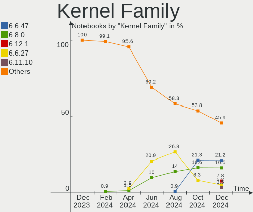
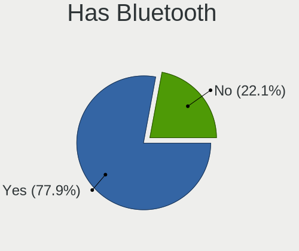
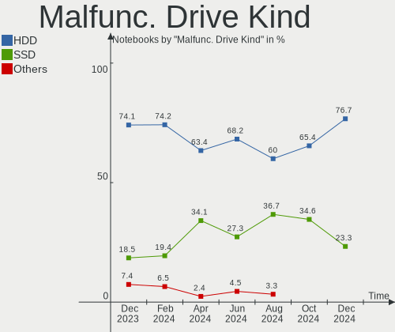
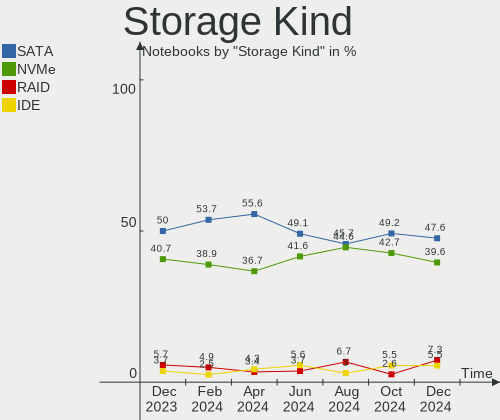
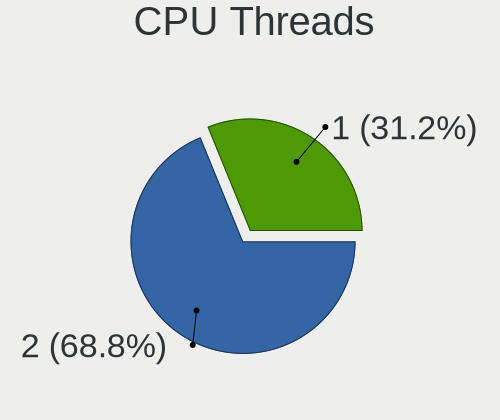
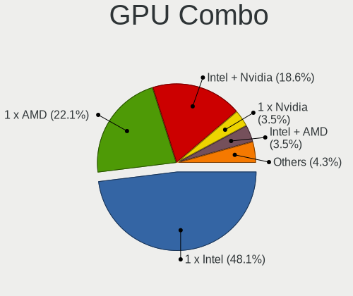
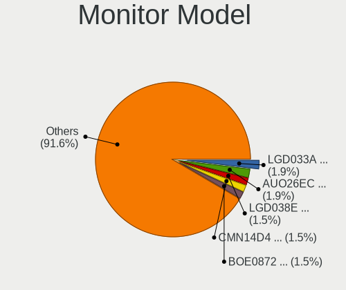
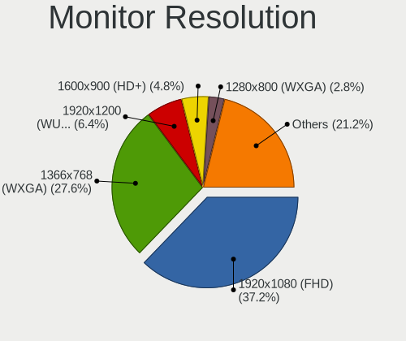
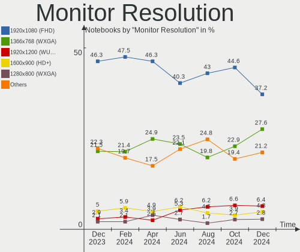
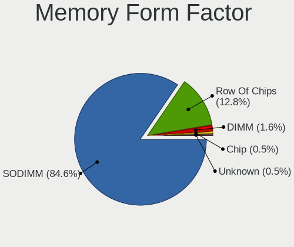

Linux in Russia - Hardware Trends (Notebooks)
---------------------------------------------

A project to identify most popular hardware characteristics and track their change
over time based on data collected by Linux users at https://Linux-Hardware.org.

Anyone can contribute to this report by the [hw-probe](https://github.com/linuxhw/hw-probe) tool:

    sudo -E hw-probe -all -upload

Period: Aug, 2023.

Contents
--------

* [ System ](#system)
  - [ OS                       ](#os)
  - [ OS Family                ](#os-family)
  - [ Kernel                   ](#kernel)
  - [ Kernel Family            ](#kernel-family)
  - [ Kernel Major Ver.        ](#kernel-major-ver)
  - [ Arch                     ](#arch)
  - [ DE                       ](#de)
  - [ Display Server           ](#display-server)
  - [ Display Manager          ](#display-manager)
  - [ OS Lang                  ](#os-lang)
  - [ Boot Mode                ](#boot-mode)
  - [ Filesystem               ](#filesystem)
  - [ Part. scheme             ](#part-scheme)
  - [ Dual Boot with Linux/BSD ](#dual-boot-with-linuxbsd)
  - [ Dual Boot (Win)          ](#dual-boot-win)

* [ Board ](#board)
  - [ Vendor                   ](#vendor)
  - [ Model                    ](#model)
  - [ Model Family             ](#model-family)
  - [ MFG Year                 ](#mfg-year)
  - [ Form Factor              ](#form-factor)
  - [ Secure Boot              ](#secure-boot)
  - [ Coreboot                 ](#coreboot)
  - [ RAM Size                 ](#ram-size)
  - [ RAM Used                 ](#ram-used)
  - [ Total Drives             ](#total-drives)
  - [ Has CD-ROM               ](#has-cd-rom)
  - [ Has Ethernet             ](#has-ethernet)
  - [ Has WiFi                 ](#has-wifi)
  - [ Has Bluetooth            ](#has-bluetooth)

* [ Location ](#location)
  - [ Country                  ](#country)
  - [ City                     ](#city)

* [ Drives ](#drives)
  - [ Drive Vendor             ](#drive-vendor)
  - [ Drive Model              ](#drive-model)
  - [ HDD Vendor               ](#hdd-vendor)
  - [ SSD Vendor               ](#ssd-vendor)
  - [ Drive Kind               ](#drive-kind)
  - [ Drive Connector          ](#drive-connector)
  - [ Drive Size               ](#drive-size)
  - [ Space Total              ](#space-total)
  - [ Space Used               ](#space-used)
  - [ Malfunc. Drives          ](#malfunc-drives)
  - [ Malfunc. Drive Vendor    ](#malfunc-drive-vendor)
  - [ Malfunc. HDD Vendor      ](#malfunc-hdd-vendor)
  - [ Malfunc. Drive Kind      ](#malfunc-drive-kind)
  - [ Failed Drives            ](#failed-drives)
  - [ Failed Drive Vendor      ](#failed-drive-vendor)
  - [ Drive Status             ](#drive-status)

* [ Storage controller ](#storage-controller)
  - [ Storage Vendor           ](#storage-vendor)
  - [ Storage Model            ](#storage-model)
  - [ Storage Kind             ](#storage-kind)

* [ Processor ](#processor)
  - [ CPU Vendor               ](#cpu-vendor)
  - [ CPU Model                ](#cpu-model)
  - [ CPU Model Family         ](#cpu-model-family)
  - [ CPU Cores                ](#cpu-cores)
  - [ CPU Sockets              ](#cpu-sockets)
  - [ CPU Threads              ](#cpu-threads)
  - [ CPU Op-Modes             ](#cpu-op-modes)
  - [ CPU Microcode            ](#cpu-microcode)
  - [ CPU Microarch            ](#cpu-microarch)

* [ Graphics ](#graphics)
  - [ GPU Vendor               ](#gpu-vendor)
  - [ GPU Model                ](#gpu-model)
  - [ GPU Combo                ](#gpu-combo)
  - [ GPU Driver               ](#gpu-driver)
  - [ GPU Memory               ](#gpu-memory)

* [ Monitor ](#monitor)
  - [ Monitor Vendor           ](#monitor-vendor)
  - [ Monitor Model            ](#monitor-model)
  - [ Monitor Resolution       ](#monitor-resolution)
  - [ Monitor Diagonal         ](#monitor-diagonal)
  - [ Monitor Width            ](#monitor-width)
  - [ Aspect Ratio             ](#aspect-ratio)
  - [ Monitor Area             ](#monitor-area)
  - [ Pixel Density            ](#pixel-density)
  - [ Multiple Monitors        ](#multiple-monitors)

* [ Network ](#network)
  - [ Net Controller Vendor    ](#net-controller-vendor)
  - [ Net Controller Model     ](#net-controller-model)
  - [ Wireless Vendor          ](#wireless-vendor)
  - [ Wireless Model           ](#wireless-model)
  - [ Ethernet Vendor          ](#ethernet-vendor)
  - [ Ethernet Model           ](#ethernet-model)
  - [ Net Controller Kind      ](#net-controller-kind)
  - [ Used Controller          ](#used-controller)
  - [ NICs                     ](#nics)
  - [ IPv6                     ](#ipv6)

* [ Bluetooth ](#bluetooth)
  - [ Bluetooth Vendor         ](#bluetooth-vendor)
  - [ Bluetooth Model          ](#bluetooth-model)

* [ Sound ](#sound)
  - [ Sound Vendor             ](#sound-vendor)
  - [ Sound Model              ](#sound-model)

* [ Memory ](#memory)
  - [ Memory Vendor            ](#memory-vendor)
  - [ Memory Model             ](#memory-model)
  - [ Memory Kind              ](#memory-kind)
  - [ Memory Form Factor       ](#memory-form-factor)
  - [ Memory Size              ](#memory-size)
  - [ Memory Speed             ](#memory-speed)

* [ Printers & scanners ](#printers--scanners)
  - [ Printer Vendor           ](#printer-vendor)
  - [ Printer Model            ](#printer-model)
  - [ Scanner Vendor           ](#scanner-vendor)
  - [ Scanner Model            ](#scanner-model)

* [ Camera ](#camera)
  - [ Camera Vendor            ](#camera-vendor)
  - [ Camera Model             ](#camera-model)

* [ Security ](#security)
  - [ Fingerprint Vendor       ](#fingerprint-vendor)
  - [ Fingerprint Model        ](#fingerprint-model)
  - [ Chipcard Vendor          ](#chipcard-vendor)
  - [ Chipcard Model           ](#chipcard-model)

* [ Unsupported ](#unsupported)
  - [ Unsupported Devices      ](#unsupported-devices)
  - [ Unsupported Device Types ](#unsupported-device-types)

System
------

OS
--

Installed operating systems

| Name                         | Notebooks | Percent |
|------------------------------|-----------|---------|
| ROSA 12.4                    | 52        | 24.3%   |
| Fedora 38                    | 22        | 10.28%  |
| Ubuntu 22.04                 | 20        | 9.35%   |
| OpenMandriva 23.08           | 11        | 5.14%   |
| Debian 12                    | 10        | 4.67%   |
| Linux Mint 21.2              | 9         | 4.21%   |
| Arch Rolling                 | 8         | 3.74%   |
| Ubuntu 23.04                 | 6         | 2.8%    |
| Red OS 7.3.2                 | 4         | 1.87%   |
| Pop!_OS 22.04                | 4         | 1.87%   |
| Kali 2023.3                  | 4         | 1.87%   |
| ROSA R11.1                   | 3         | 1.4%    |
| ROSA 12.3                    | 3         | 1.4%    |
| ROSA 12                      | 3         | 1.4%    |
| Red OS 7.3                   | 3         | 1.4%    |
| OpenMandriva 23.03           | 3         | 1.4%    |
| Elementary 7                 | 3         | 1.4%    |
| Xero Rolling                 | 2         | 0.93%   |
| ROSA 12.2                    | 2         | 0.93%   |
| openSUSE Tumbleweed-XXXXXXXX | 2         | 0.93%   |
| Manjaro 23.0.0               | 2         | 0.93%   |
| Manjaro                      | 2         | 0.93%   |
| KDE neon 22.04               | 2         | 0.93%   |
| Fedora 37                    | 2         | 0.93%   |
| Xubuntu 20.04                | 1         | 0.47%   |
| Void Linux Rolling           | 1         | 0.47%   |
| Uncom OS 2.0                 | 1         | 0.47%   |
| Ubuntu Unity 16.04           | 1         | 0.47%   |
| Ubuntu 20.04                 | 1         | 0.47%   |
| SteamOS 3.5                  | 1         | 0.47%   |
| SteamOS 3.4.8                | 1         | 0.47%   |
| Solus 4.4                    | 1         | 0.47%   |
| ROSA 13.0                    | 1         | 0.47%   |
| ROSA 12.1                    | 1         | 0.47%   |
| RELD 7.9                     | 1         | 0.47%   |
| OpenMandriva 4.2             | 1         | 0.47%   |
| OpenMandriva 23.07           | 1         | 0.47%   |
| Linux Mint 21.1              | 1         | 0.47%   |
| Linux Mint 21                | 1         | 0.47%   |
| Linux Mint 20                | 1         | 0.47%   |

OS Family
---------

OS without a version

| Name         | Notebooks | Percent |
|--------------|-----------|---------|
| ROSA         | 65        | 30.37%  |
| Ubuntu       | 27        | 12.62%  |
| Fedora       | 25        | 11.68%  |
| OpenMandriva | 16        | 7.48%   |
| Linux Mint   | 13        | 6.07%   |
| Debian       | 11        | 5.14%   |
| Arch         | 8         | 3.74%   |
| Red OS       | 7         | 3.27%   |
| Pop!_OS      | 4         | 1.87%   |
| Manjaro      | 4         | 1.87%   |
| Kali         | 4         | 1.87%   |
| Elementary   | 4         | 1.87%   |
| Kubuntu      | 3         | 1.4%    |
| Xero         | 2         | 0.93%   |
| SteamOS      | 2         | 0.93%   |
| openSUSE     | 2         | 0.93%   |
| KDE neon     | 2         | 0.93%   |
| Gentoo       | 2         | 0.93%   |
| Devuan       | 2         | 0.93%   |
| ALT Linux    | 2         | 0.93%   |
| Xubuntu      | 1         | 0.47%   |
| Void Linux   | 1         | 0.47%   |
| Uncom OS     | 1         | 0.47%   |
| Ubuntu Unity | 1         | 0.47%   |
| Solus        | 1         | 0.47%   |
| RELD         | 1         | 0.47%   |
| Endless      | 1         | 0.47%   |
| EndeavourOS  | 1         | 0.47%   |
| ArcoLinux    | 1         | 0.47%   |

Kernel
------

Version of the Linux kernel

| Version                                  | Notebooks | Percent |
|------------------------------------------|-----------|---------|
| 6.1.38-generic-1rosa2021.1-x86_64        | 31        | 14.49%  |
| 6.2.0-26-generic                         | 18        | 8.41%   |
| 6.1.20-generic-2rosa2021.1-x86_64        | 16        | 7.48%   |
| 6.4.11-desktop-1omv2390                  | 7         | 3.27%   |
| 6.2.9-300.fc38.x86_64                    | 6         | 2.8%    |
| 5.15.0-79-generic                        | 6         | 2.8%    |
| 6.4.10-200.fc38.x86_64                   | 5         | 2.34%   |
| 6.1.0-10-amd64                           | 5         | 2.34%   |
| 5.19.0-50-generic                        | 5         | 2.34%   |
| 6.4.8-desktop-2omv2390                   | 4         | 1.87%   |
| 6.4.11-200.fc38.x86_64                   | 4         | 1.87%   |
| 6.4.9-200.fc38.x86_64                    | 3         | 1.4%    |
| 6.3.0-kali1-amd64                        | 3         | 1.4%    |
| 6.2.6-desktop-1omv2390                   | 3         | 1.4%    |
| 6.2.0-27-generic                         | 3         | 1.4%    |
| 6.1.0-11-amd64                           | 3         | 1.4%    |
| 5.15.0-78-generic                        | 3         | 1.4%    |
| 5.10.74-generic-2rosa2021.1-x86_64       | 3         | 1.4%    |
| 6.4.9-arch1-1                            | 2         | 0.93%   |
| 6.4.6-76060406-generic                   | 2         | 0.93%   |
| 6.4.12-200.fc38.x86_64                   | 2         | 0.93%   |
| 6.4.11-arch2-1                           | 2         | 0.93%   |
| 6.4.10-zen2-1-zen                        | 2         | 0.93%   |
| 6.2.6-76060206-generic                   | 2         | 0.93%   |
| 6.1.41-1-MANJARO                         | 2         | 0.93%   |
| 6.1.38-2.el7.3.x86_64                    | 2         | 0.93%   |
| 6.1.20-2.el7.3.x86_64                    | 2         | 0.93%   |
| 5.15.87-1.el7.3.x86_64                   | 2         | 0.93%   |
| 5.15.117-generic-1rosa2021.1-x86_64      | 2         | 0.93%   |
| 5.10.155-generic-1rosa2021.1-x86_64      | 2         | 0.93%   |
| 6.4.9-zen1-1-zen                         | 1         | 0.47%   |
| 6.4.9-calculate                          | 1         | 0.47%   |
| 6.4.8-1-liquorix-amd64                   | 1         | 0.47%   |
| 6.4.7.xm1-1.klp-xanmod-rosa2021.1-x86_64 | 1         | 0.47%   |
| 6.4.7-zen1-1-zen                         | 1         | 0.47%   |
| 6.4.7-arch1-1                            | 1         | 0.47%   |
| 6.4.7-200.fc38.x86_64                    | 1         | 0.47%   |
| 6.4.7-100.fc37.x86_64                    | 1         | 0.47%   |
| 6.4.6-200.fc38.x86_64                    | 1         | 0.47%   |
| 6.4.6-1-default                          | 1         | 0.47%   |

Kernel Family
-------------

Linux kernel without a distro release

| Version  | Notebooks | Percent |
|----------|-----------|---------|
| 6.1.38   | 33        | 15.42%  |
| 6.2.0    | 24        | 11.21%  |
| 6.1.20   | 18        | 8.41%   |
| 6.4.11   | 16        | 7.48%   |
| 5.15.0   | 15        | 7.01%   |
| 6.1.0    | 10        | 4.67%   |
| 6.4.10   | 8         | 3.74%   |
| 5.19.0   | 8         | 3.74%   |
| 6.4.9    | 7         | 3.27%   |
| 6.2.9    | 6         | 2.8%    |
| 6.4.8    | 5         | 2.34%   |
| 6.4.7    | 5         | 2.34%   |
| 6.4.6    | 5         | 2.34%   |
| 6.2.6    | 5         | 2.34%   |
| 6.3.0    | 3         | 1.4%    |
| 5.15.117 | 3         | 1.4%    |
| 5.10.74  | 3         | 1.4%    |
| 4.15.0   | 3         | 1.4%    |
| 6.4.3    | 2         | 0.93%   |
| 6.4.12   | 2         | 0.93%   |
| 6.1.41   | 2         | 0.93%   |
| 6.1.31   | 2         | 0.93%   |
| 6.0.12   | 2         | 0.93%   |
| 5.15.87  | 2         | 0.93%   |
| 5.10.155 | 2         | 0.93%   |
| 6.4.1    | 1         | 0.47%   |
| 6.3.8    | 1         | 0.47%   |
| 6.3.7    | 1         | 0.47%   |
| 6.3.5    | 1         | 0.47%   |
| 6.3.13   | 1         | 0.47%   |
| 6.2.16   | 1         | 0.47%   |
| 6.1.45   | 1         | 0.47%   |
| 6.1.43   | 1         | 0.47%   |
| 6.1.42   | 1         | 0.47%   |
| 6.0.7    | 1         | 0.47%   |
| 6.0.0    | 1         | 0.47%   |
| 5.4.83   | 1         | 0.47%   |
| 5.4.0    | 1         | 0.47%   |
| 5.15.77  | 1         | 0.47%   |
| 5.15.75  | 1         | 0.47%   |

Kernel Major Ver.
-----------------

Linux kernel major version

| Version | Notebooks | Percent |
|---------|-----------|---------|
| 6.1     | 68        | 31.78%  |
| 6.4     | 51        | 23.83%  |
| 6.2     | 36        | 16.82%  |
| 5.15    | 24        | 11.21%  |
| 5.19    | 8         | 3.74%   |
| 5.10    | 8         | 3.74%   |
| 6.3     | 7         | 3.27%   |
| 6.0     | 4         | 1.87%   |
| 4.15    | 3         | 1.4%    |
| 5.4     | 2         | 0.93%   |
| 5.13    | 2         | 0.93%   |
| 5.14    | 1         | 0.47%   |

Arch
----

OS architecture (x86_64, i586, etc.)

| Name   | Notebooks | Percent |
|--------|-----------|---------|
| x86_64 | 209       | 97.66%  |
| i686   | 4         | 1.87%   |
| armv7l | 1         | 0.47%   |

DE
--

Desktop Environment

| Name       | Notebooks | Percent |
|------------|-----------|---------|
| KDE5       | 78        | 36.45%  |
| GNOME      | 70        | 32.71%  |
| XFCE       | 15        | 7.01%   |
| X-Cinnamon | 12        | 5.61%   |
| MATE       | 9         | 4.21%   |
| LXQt       | 8         | 3.74%   |
| Unknown    | 6         | 2.8%    |
| Pantheon   | 4         | 1.87%   |
| KDE4       | 3         | 1.4%    |
| LXDE       | 2         | 0.93%   |
| i3         | 2         | 0.93%   |
| Unity      | 1         | 0.47%   |
| sway       | 1         | 0.47%   |
| fluxbox    | 1         | 0.47%   |
| Budgie     | 1         | 0.47%   |
| awesome    | 1         | 0.47%   |

Display Server
--------------

X11 or Wayland

| Name    | Notebooks | Percent |
|---------|-----------|---------|
| Wayland | 107       | 50%     |
| X11     | 101       | 47.2%   |
| Tty     | 5         | 2.34%   |
| Unknown | 1         | 0.47%   |

Display Manager
---------------

SDDM, LightDM, etc.

| Name    | Notebooks | Percent |
|---------|-----------|---------|
| SDDM    | 68        | 31.78%  |
| Unknown | 40        | 18.69%  |
| LightDM | 37        | 17.29%  |
| GDM     | 37        | 17.29%  |
| GDM3    | 28        | 13.08%  |
| KDM     | 2         | 0.93%   |
| SLiM    | 1         | 0.47%   |
| LXDM    | 1         | 0.47%   |

OS Lang
-------

Language

| Lang    | Notebooks | Percent |
|---------|-----------|---------|
| ru_RU   | 156       | 72.9%   |
| en_US   | 49        | 22.9%   |
| C       | 4         | 1.87%   |
| Unknown | 2         | 0.93%   |
| pt_BR   | 1         | 0.47%   |
| en_GB   | 1         | 0.47%   |
| en_DK   | 1         | 0.47%   |

Boot Mode
---------

EFI or BIOS

| Mode | Notebooks | Percent |
|------|-----------|---------|
| EFI  | 141       | 65.89%  |
| BIOS | 73        | 34.11%  |

Filesystem
----------

Type of filesystem

| Type    | Notebooks | Percent |
|---------|-----------|---------|
| Ext4    | 148       | 69.16%  |
| Btrfs   | 33        | 15.42%  |
| Overlay | 19        | 8.88%   |
| Tmpfs   | 13        | 6.07%   |
| Aufs    | 1         | 0.47%   |

Part. scheme
------------

Scheme of partitioning

| Type    | Notebooks | Percent |
|---------|-----------|---------|
| GPT     | 148       | 69.16%  |
| Unknown | 35        | 16.36%  |
| MBR     | 31        | 14.49%  |

Dual Boot with Linux/BSD
------------------------

Hosting more than one Linux/BSD

| Dual boot | Notebooks | Percent |
|-----------|-----------|---------|
| No        | 170       | 79.44%  |
| Yes       | 44        | 20.56%  |

Dual Boot (Win)
---------------

Hosting Linux and Windows

| Dual boot | Notebooks | Percent |
|-----------|-----------|---------|
| No        | 141       | 65.89%  |
| Yes       | 73        | 34.11%  |

Board
-----

Vendor
------

Motherboard manufacturer

| Name                 | Notebooks | Percent |
|----------------------|-----------|---------|
| ASUSTek Computer     | 41        | 19.16%  |
| Lenovo               | 34        | 15.89%  |
| Hewlett-Packard      | 26        | 12.15%  |
| Acer                 | 23        | 10.75%  |
| HUAWEI               | 14        | 6.54%   |
| Dell                 | 12        | 5.61%   |
| MSI                  | 9         | 4.21%   |
| Timi                 | 6         | 2.8%    |
| Sony                 | 3         | 1.4%    |
| Samsung Electronics  | 3         | 1.4%    |
| Packard Bell         | 3         | 1.4%    |
| HONOR                | 3         | 1.4%    |
| Chuwi                | 3         | 1.4%    |
| Apple                | 3         | 1.4%    |
| Valve                | 2         | 0.93%   |
| Notebook             | 2         | 0.93%   |
| Irbis                | 2         | 0.93%   |
| Infinix              | 2         | 0.93%   |
| Fujitsu Siemens      | 2         | 0.93%   |
| Digma                | 2         | 0.93%   |
| Unknown              | 2         | 0.93%   |
| Yadro Client Systems | 1         | 0.47%   |
| Toshiba              | 1         | 0.47%   |
| TECNO                | 1         | 0.47%   |
| Teclast              | 1         | 0.47%   |
| ROMBICA              | 1         | 0.47%   |
| Positivo             | 1         | 0.47%   |
| Panasonic            | 1         | 0.47%   |
| Maibenben            | 1         | 0.47%   |
| Jumper               | 1         | 0.47%   |
| Infomash             | 1         | 0.47%   |
| ICL                  | 1         | 0.47%   |
| Echips Import        | 1         | 0.47%   |
| COLORFUL             | 1         | 0.47%   |
| Clevo                | 1         | 0.47%   |
| ARDOR GAMING         | 1         | 0.47%   |
| ANCOMP               | 1         | 0.47%   |
| A-DATA Technology    | 1         | 0.47%   |

Model
-----

Motherboard model

| Name                                     | Notebooks | Percent |
|------------------------------------------|-----------|---------|
| HUAWEI BOM-WXX9                          | 6         | 2.8%    |
| ASUS VivoBook_ASUSLaptop M1402IA_M1402IA | 3         | 1.4%    |
| Valve Jupiter                            | 2         | 0.93%   |
| Timi Redmi Book Pro 14 2022              | 2         | 0.93%   |
| MSI Modern 14 C12M                       | 2         | 0.93%   |
| HUAWEI BOD-WXX9                          | 2         | 0.93%   |
| HP Pavilion 15                           | 2         | 0.93%   |
| ASUS X550CC                              | 2         | 0.93%   |
| ASUS VivoBook_ASUSLaptop M6500QC_M6500QC | 2         | 0.93%   |
| ASUS VivoBook_ASUSLaptop M1403QA_M1403QA | 2         | 0.93%   |
| Acer Nitro AN515-52                      | 2         | 0.93%   |
| Acer Aspire V3-571G                      | 2         | 0.93%   |
| Acer Aspire E5-573G                      | 2         | 0.93%   |
| Unknown                                  | 2         | 0.93%   |
| Yadro Client Systems KVADRA LE15T        | 1         | 0.47%   |
| Toshiba Satellite C660                   | 1         | 0.47%   |
| Timi Xiaomi Book Pro 16 2022             | 1         | 0.47%   |
| Timi TM1701                              | 1         | 0.47%   |
| Timi A35S                                | 1         | 0.47%   |
| Timi A34S                                | 1         | 0.47%   |
| TECNO MEGABOOK T1                        | 1         | 0.47%   |
| Teclast Tbolt 10 DG                      | 1         | 0.47%   |
| Sony VPCSB1V9R                           | 1         | 0.47%   |
| Sony VPCEH2J9R                           | 1         | 0.47%   |
| Sony VGN-NW2SRF_S                        | 1         | 0.47%   |
| Samsung R528/R728                        | 1         | 0.47%   |
| Samsung 350V5C/351V5C/3540VC/3440VC      | 1         | 0.47%   |
| Samsung 305U1A                           | 1         | 0.47%   |
| ROMBICA myBook Eclipse                   | 1         | 0.47%   |
| Positivo N6440                           | 1         | 0.47%   |
| Panasonic CF-31WBLAXLM                   | 1         | 0.47%   |
| Packard Bell EasyNote TS11HR             | 1         | 0.47%   |
| Packard Bell EasyNote TE11HC             | 1         | 0.47%   |
| Packard Bell EasyNote ENTF71BM           | 1         | 0.47%   |
| Notebook WA50SRQ                         | 1         | 0.47%   |
| Notebook W54_W94_W955TU,-T,-C            | 1         | 0.47%   |
| MSI X460/X460DX                          | 1         | 0.47%   |
| MSI Sword 17 A11UD                       | 1         | 0.47%   |
| MSI Prestige 14Evo A12M                  | 1         | 0.47%   |
| MSI MS-1057                              | 1         | 0.47%   |

Model Family
------------

Motherboard model prefix

| Name                        | Notebooks | Percent |
|-----------------------------|-----------|---------|
| Acer Aspire                 | 16        | 7.48%   |
| ASUS VivoBook               | 14        | 6.54%   |
| Lenovo ThinkPad             | 13        | 6.07%   |
| Lenovo IdeaPad              | 10        | 4.67%   |
| HUAWEI BOM-WXX9             | 6         | 2.8%    |
| HP Pavilion                 | 6         | 2.8%    |
| HP ProBook                  | 5         | 2.34%   |
| HP Laptop                   | 5         | 2.34%   |
| Dell Inspiron               | 5         | 2.34%   |
| Lenovo ThinkBook            | 4         | 1.87%   |
| ASUS ZenBook                | 4         | 1.87%   |
| Packard Bell EasyNote       | 3         | 1.4%    |
| Acer Extensa                | 3         | 1.4%    |
| Valve Jupiter               | 2         | 0.93%   |
| Timi Redmi                  | 2         | 0.93%   |
| MSI Modern                  | 2         | 0.93%   |
| Infinix INBOOK              | 2         | 0.93%   |
| HUAWEI BOD-WXX9             | 2         | 0.93%   |
| HP EliteBook                | 2         | 0.93%   |
| Fujitsu Siemens AMILO       | 2         | 0.93%   |
| Dell Vostro                 | 2         | 0.93%   |
| Dell Latitude               | 2         | 0.93%   |
| Chuwi CoreBook              | 2         | 0.93%   |
| ASUS X550CC                 | 2         | 0.93%   |
| ASUS TUF                    | 2         | 0.93%   |
| ASUS ASUS                   | 2         | 0.93%   |
| Acer Nitro                  | 2         | 0.93%   |
| Unknown                     | 2         | 0.93%   |
| Yadro Client Systems KVADRA | 1         | 0.47%   |
| Toshiba Satellite           | 1         | 0.47%   |
| Timi Xiaomi                 | 1         | 0.47%   |
| Timi TM1701                 | 1         | 0.47%   |
| Timi A35S                   | 1         | 0.47%   |
| Timi A34S                   | 1         | 0.47%   |
| TECNO MEGABOOK              | 1         | 0.47%   |
| Teclast Tbolt               | 1         | 0.47%   |
| Sony VPCSB1V9R              | 1         | 0.47%   |
| Sony VPCEH2J9R              | 1         | 0.47%   |
| Sony VGN-NW2SRF             | 1         | 0.47%   |
| Samsung R528                | 1         | 0.47%   |

MFG Year
--------

Motherboard manufacture year

| Year | Notebooks | Percent |
|------|-----------|---------|
| 2022 | 40        | 18.69%  |
| 2021 | 40        | 18.69%  |
| 2011 | 15        | 7.01%   |
| 2012 | 14        | 6.54%   |
| 2019 | 13        | 6.07%   |
| 2020 | 12        | 5.61%   |
| 2014 | 11        | 5.14%   |
| 2013 | 11        | 5.14%   |
| 2017 | 10        | 4.67%   |
| 2023 | 9         | 4.21%   |
| 2018 | 9         | 4.21%   |
| 2015 | 8         | 3.74%   |
| 2010 | 7         | 3.27%   |
| 2009 | 4         | 1.87%   |
| 2008 | 4         | 1.87%   |
| 2007 | 4         | 1.87%   |
| 2016 | 3         | 1.4%    |

Form Factor
-----------

Physical design of the computer

| Name     | Notebooks | Percent |
|----------|-----------|---------|
| Notebook | 214       | 100%    |

Secure Boot
-----------

Enabled or disabled

| State    | Notebooks | Percent |
|----------|-----------|---------|
| Disabled | 196       | 91.59%  |
| Enabled  | 18        | 8.41%   |

Coreboot
--------

Have coreboot on board

| Used | Notebooks | Percent |
|------|-----------|---------|
| No   | 213       | 99.53%  |
| Yes  | 1         | 0.47%   |

RAM Size
--------

Total RAM memory

| Size in GB  | Notebooks | Percent |
|-------------|-----------|---------|
| 4.01-8.0    | 75        | 35.05%  |
| 8.01-16.0   | 46        | 21.5%   |
| 16.01-24.0  | 36        | 16.82%  |
| 3.01-4.0    | 30        | 14.02%  |
| 32.01-64.0  | 9         | 4.21%   |
| 1.01-2.0    | 9         | 4.21%   |
| 24.01-32.0  | 3         | 1.4%    |
| 2.01-3.0    | 3         | 1.4%    |
| 64.01-256.0 | 1         | 0.47%   |
| 0.51-1.0    | 1         | 0.47%   |
| 0.01-0.5    | 1         | 0.47%   |

RAM Used
--------

Used RAM memory

| Used GB    | Notebooks | Percent |
|------------|-----------|---------|
| 1.01-2.0   | 70        | 32.71%  |
| 2.01-3.0   | 65        | 30.37%  |
| 3.01-4.0   | 28        | 13.08%  |
| 4.01-8.0   | 22        | 10.28%  |
| 8.01-16.0  | 12        | 5.61%   |
| 0.51-1.0   | 12        | 5.61%   |
| 0.01-0.5   | 3         | 1.4%    |
| 24.01-32.0 | 1         | 0.47%   |
| 16.01-24.0 | 1         | 0.47%   |

Total Drives
------------

Number of drives on board

| Drives | Notebooks | Percent |
|--------|-----------|---------|
| 1      | 152       | 71.03%  |
| 2      | 55        | 25.7%   |
| 3      | 5         | 2.34%   |
| 0      | 2         | 0.93%   |

Has CD-ROM
----------

Has CD-ROM on board

| Presented | Notebooks | Percent |
|-----------|-----------|---------|
| No        | 168       | 78.5%   |
| Yes       | 46        | 21.5%   |

Has Ethernet
------------

Has Ethernet on board

| Presented | Notebooks | Percent |
|-----------|-----------|---------|
| Yes       | 153       | 71.5%   |
| No        | 61        | 28.5%   |

Has WiFi
--------

Has WiFi module

| Presented | Notebooks | Percent |
|-----------|-----------|---------|
| Yes       | 212       | 99.07%  |
| No        | 2         | 0.93%   |

Has Bluetooth
-------------

Has Bluetooth module

| Presented | Notebooks | Percent |
|-----------|-----------|---------|
| Yes       | 179       | 83.64%  |
| No        | 35        | 16.36%  |

Location
--------

Country
-------

Geographic location (country)

| Country | Notebooks | Percent |
|---------|-----------|---------|
| Russia  | 214       | 100%    |

City
----

Geographic location (city)

| City             | Notebooks | Percent |
|------------------|-----------|---------|
| Moscow           | 57        | 26.64%  |
| St Petersburg    | 16        | 7.48%   |
| Yekaterinburg    | 8         | 3.74%   |
| Novosibirsk      | 8         | 3.74%   |
| Krasnodar        | 7         | 3.27%   |
| Voronezh         | 4         | 1.87%   |
| Volgograd        | 4         | 1.87%   |
| Vladivostok      | 4         | 1.87%   |
| Tomsk            | 4         | 1.87%   |
| Yakutsk          | 3         | 1.4%    |
| Tyumen           | 3         | 1.4%    |
| Tolyatti         | 3         | 1.4%    |
| Samara           | 3         | 1.4%    |
| Perm             | 3         | 1.4%    |
| Chita            | 3         | 1.4%    |
| Yoshkar-Ola      | 2         | 0.93%   |
| Ufa              | 2         | 0.93%   |
| Tula             | 2         | 0.93%   |
| Taganrog         | 2         | 0.93%   |
| Syktyvkar        | 2         | 0.93%   |
| Sochi            | 2         | 0.93%   |
| Shchelkovo       | 2         | 0.93%   |
| Ryazan           | 2         | 0.93%   |
| Odintsovo        | 2         | 0.93%   |
| Obninsk          | 2         | 0.93%   |
| Nizhniy Novgorod | 2         | 0.93%   |
| Mytishchi        | 2         | 0.93%   |
| Khabarovsk       | 2         | 0.93%   |
| Kazan’         | 2         | 0.93%   |
| Irkutsk          | 2         | 0.93%   |
| Chelyabinsk      | 2         | 0.93%   |
| Belgorod         | 2         | 0.93%   |
| Barnaul          | 2         | 0.93%   |
| Yelizovo         | 1         | 0.47%   |
| Vol'ginskiy      | 1         | 0.47%   |
| Vladimir         | 1         | 0.47%   |
| Veliky Novgorod  | 1         | 0.47%   |
| Ulan-Ude         | 1         | 0.47%   |
| Tver             | 1         | 0.47%   |
| Tsarskoye Selo   | 1         | 0.47%   |

Drives
------

Drive Vendor
------------

Hard drive vendors

| Vendor                       | Notebooks | Drives | Percent |
|------------------------------|-----------|--------|---------|
| WDC                          | 34        | 36     | 12.45%  |
| Samsung Electronics          | 34        | 37     | 12.45%  |
| Toshiba                      | 19        | 20     | 6.96%   |
| Intel                        | 18        | 18     | 6.59%   |
| SK hynix                     | 15        | 15     | 5.49%   |
| Seagate                      | 13        | 14     | 4.76%   |
| Micron Technology            | 12        | 12     | 4.4%    |
| Sandisk                      | 11        | 11     | 4.03%   |
| Apacer                       | 9         | 9      | 3.3%    |
| A-DATA Technology            | 9         | 9      | 3.3%    |
| China                        | 8         | 8      | 2.93%   |
| Unknown                      | 7         | 10     | 2.56%   |
| Silicon Motion               | 7         | 7      | 2.56%   |
| KIOXIA                       | 7         | 7      | 2.56%   |
| Kingston                     | 6         | 6      | 2.2%    |
| Phison                       | 5         | 5      | 1.83%   |
| Netac                        | 5         | 5      | 1.83%   |
| XrayDisk                     | 4         | 4      | 1.47%   |
| SPCC                         | 4         | 4      | 1.47%   |
| JMicron Technology           | 4         | 4      | 1.47%   |
| FORESEE                      | 3         | 3      | 1.1%    |
| Team                         | 2         | 2      | 0.73%   |
| Smartbuy                     | 2         | 2      | 0.73%   |
| LITEON                       | 2         | 2      | 0.73%   |
| HGST                         | 2         | 2      | 0.73%   |
| Fujitsu                      | 2         | 2      | 0.73%   |
| Crucial                      | 2         | 2      | 0.73%   |
| ADATA Technology             | 2         | 2      | 0.73%   |
| Unknown                      | 2         | 2      | 0.73%   |
| XPG                          | 1         | 1      | 0.37%   |
| USB3.0                       | 1         | 1      | 0.37%   |
| SUNTRSI                      | 1         | 1      | 0.37%   |
| ShiJi                        | 1         | 1      | 0.37%   |
| Shenzhen Longsys Electronics | 1         | 1      | 0.37%   |
| SCY                          | 1         | 1      | 0.37%   |
| Phison Electronics           | 1         | 1      | 0.37%   |
| Patriot                      | 1         | 1      | 0.37%   |
| Kingston Technology Company  | 1         | 1      | 0.37%   |
| KingFast                     | 1         | 1      | 0.37%   |
| Kingchuxing                  | 1         | 1      | 0.37%   |

Drive Model
-----------

Hard drive models

| Model                                                 | Notebooks | Percent |
|-------------------------------------------------------|-----------|---------|
| Intel SSDPEKNU512GZ 512GB                             | 10        | 3.55%   |
| Toshiba MQ04ABF100 1TB                                | 5         | 1.77%   |
| WDC WDS240G2G0A-00JH30 240GB SSD                      | 3         | 1.06%   |
| Toshiba MQ01ABF050 500GB                              | 3         | 1.06%   |
| Toshiba MQ01ABD100 1TB                                | 3         | 1.06%   |
| SK hynix HFM512GD3JX013N 512GB                        | 3         | 1.06%   |
| Silicon Motion PCIe-8 SSD 512GB                       | 3         | 1.06%   |
| Sandisk WD Black SN750 / PC SN730 NVMe SSD 1024GB     | 3         | 1.06%   |
| Samsung SSD 870 EVO 500GB                             | 3         | 1.06%   |
| Samsung NVMe SSD Controller SM981/PM981/PM983 500GB   | 3         | 1.06%   |
| Samsung NVMe SSD Controller PM9A1/PM9A3/980PRO 1024GB | 3         | 1.06%   |
| KIOXIA KBG40ZNV512G 512GB                             | 3         | 1.06%   |
| Kingston SA400S37120G 120GB SSD                       | 3         | 1.06%   |
| JMicron Generic 1TB                                   | 3         | 1.06%   |
| WDC WD5000LPVX-08V0TT5 500GB                          | 2         | 0.71%   |
| Unknown MMC Card  32GB                                | 2         | 0.71%   |
| SK hynix HFS128G39TND-N210A 128GB SSD                 | 2         | 0.71%   |
| Silicon Motion SM2263EN/SM2263XT SSD Controller 256GB | 2         | 0.71%   |
| Seagate ST500LT012-1DG142 500GB                       | 2         | 0.71%   |
| Seagate ST1000LM035-1RK172 1TB                        | 2         | 0.71%   |
| Seagate ST1000LM024 HN-M101MBB 1TB                    | 2         | 0.71%   |
| Sandisk WD PC SN740 SDDPTQD-1T00 1024GB               | 2         | 0.71%   |
| Samsung SSD 980 1TB                                   | 2         | 0.71%   |
| Samsung NVMe SSD Controller SM961/PM961/SM963 1024GB  | 2         | 0.71%   |
| Samsung MZVLQ512HBLU-00B00 512GB                      | 2         | 0.71%   |
| Samsung MZVLQ512HALU-00000 512GB                      | 2         | 0.71%   |
| Samsung MZVL4512HBLU-00BTW 512GB                      | 2         | 0.71%   |
| Samsung MZALQ256HBJD-00BL2 256GB                      | 2         | 0.71%   |
| Phison CFESR512GMTCT-E9C-2 512GB                      | 2         | 0.71%   |
| Phison 311CD0512GB                                    | 2         | 0.71%   |
| Netac NS512GSSD340 512GB                              | 2         | 0.71%   |
| Micron 2450_MTFDKBA512TFK 512GB                       | 2         | 0.71%   |
| Micron 2400_MTFDKBA512QFM 512GB                       | 2         | 0.71%   |
| Micron 2210_MTFDHBA512QFD 512GB                       | 2         | 0.71%   |
| LITEON CV8-8E128-HP 128GB SSD                         | 2         | 0.71%   |
| KIOXIA KBG50ZNV512G 512GB                             | 2         | 0.71%   |
| Intel SSD 660P Series 512GB                           | 2         | 0.71%   |
| China SSD 1TB                                         | 2         | 0.71%   |
| A-DATA SX6000PNP 256GB                                | 2         | 0.71%   |
| A-DATA SU650 120GB SSD                                | 2         | 0.71%   |

HDD Vendor
----------

Hard disk drive vendors

| Vendor              | Notebooks | Drives | Percent |
|---------------------|-----------|--------|---------|
| WDC                 | 21        | 21     | 36.21%  |
| Toshiba             | 16        | 17     | 27.59%  |
| Seagate             | 13        | 14     | 22.41%  |
| HGST                | 2         | 2      | 3.45%   |
| Fujitsu             | 2         | 2      | 3.45%   |
| USB3.0              | 1         | 1      | 1.72%   |
| Samsung Electronics | 1         | 1      | 1.72%   |
| Hitachi             | 1         | 1      | 1.72%   |
| ACASIS              | 1         | 1      | 1.72%   |

SSD Vendor
----------

Solid state drive vendors

| Vendor              | Notebooks | Drives | Percent |
|---------------------|-----------|--------|---------|
| Samsung Electronics | 12        | 12     | 14.12%  |
| WDC                 | 8         | 9      | 9.41%   |
| China               | 8         | 8      | 9.41%   |
| Apacer              | 8         | 8      | 9.41%   |
| Kingston            | 5         | 5      | 5.88%   |
| A-DATA Technology   | 5         | 5      | 5.88%   |
| Netac               | 4         | 4      | 4.71%   |
| SPCC                | 3         | 3      | 3.53%   |
| JMicron Technology  | 3         | 3      | 3.53%   |
| Intel               | 3         | 3      | 3.53%   |
| Team                | 2         | 2      | 2.35%   |
| Smartbuy            | 2         | 2      | 2.35%   |
| SK hynix            | 2         | 2      | 2.35%   |
| SanDisk             | 2         | 2      | 2.35%   |
| LITEON              | 2         | 2      | 2.35%   |
| XrayDisk            | 1         | 1      | 1.18%   |
| Toshiba             | 1         | 1      | 1.18%   |
| SUNTRSI             | 1         | 1      | 1.18%   |
| Patriot             | 1         | 1      | 1.18%   |
| Micron Technology   | 1         | 1      | 1.18%   |
| KingFast            | 1         | 1      | 1.18%   |
| Kingchuxing         | 1         | 1      | 1.18%   |
| Kimtigo             | 1         | 1      | 1.18%   |
| HS-SSD-E100         | 1         | 1      | 1.18%   |
| Hewlett-Packard     | 1         | 1      | 1.18%   |
| GOODRAM             | 1         | 1      | 1.18%   |
| Gigabyte Technology | 1         | 1      | 1.18%   |
| Digma               | 1         | 1      | 1.18%   |
| Colorful            | 1         | 1      | 1.18%   |
| Apple               | 1         | 1      | 1.18%   |
| AMD                 | 1         | 1      | 1.18%   |

Drive Kind
----------

HDD or SSD

| Kind    | Notebooks | Drives | Percent |
|---------|-----------|--------|---------|
| NVMe    | 110       | 121    | 42.64%  |
| SSD     | 80        | 86     | 31.01%  |
| HDD     | 56        | 60     | 21.71%  |
| MMC     | 6         | 10     | 2.33%   |
| Unknown | 6         | 6      | 2.33%   |

Drive Connector
---------------

SATA, SAS, NVMe, etc.

| Type | Notebooks | Drives | Percent |
|------|-----------|--------|---------|
| SATA | 115       | 142    | 47.92%  |
| NVMe | 110       | 121    | 45.83%  |
| SAS  | 9         | 10     | 3.75%   |
| MMC  | 6         | 10     | 2.5%    |

Drive Size
----------

Size of hard drive

| Size in TB | Notebooks | Drives | Percent |
|------------|-----------|--------|---------|
| 0.01-0.5   | 87        | 97     | 66.41%  |
| 0.51-1.0   | 42        | 47     | 32.06%  |
| 1.01-2.0   | 2         | 2      | 1.53%   |

Space Total
-----------

Amount of disk space available on the file system

| Size in GB     | Notebooks | Percent |
|----------------|-----------|---------|
| 251-500        | 60        | 28.04%  |
| 101-250        | 55        | 25.7%   |
| 501-1000       | 33        | 15.42%  |
| 1-20           | 29        | 13.55%  |
| 51-100         | 16        | 7.48%   |
| 1001-2000      | 11        | 5.14%   |
| Unknown        | 5         | 2.34%   |
| 21-50          | 4         | 1.87%   |
| More than 3000 | 1         | 0.47%   |

Space Used
----------

Amount of used disk space

| Used GB   | Notebooks | Percent |
|-----------|-----------|---------|
| 1-20      | 113       | 52.8%   |
| 21-50     | 34        | 15.89%  |
| 101-250   | 20        | 9.35%   |
| 51-100    | 18        | 8.41%   |
| 251-500   | 15        | 7.01%   |
| 501-1000  | 6         | 2.8%    |
| Unknown   | 5         | 2.34%   |
| 1001-2000 | 2         | 0.93%   |
| 2001-3000 | 1         | 0.47%   |

Malfunc. Drives
---------------

Drive models with a malfunction

| Model                                 | Notebooks | Drives | Percent |
|---------------------------------------|-----------|--------|---------|
| LITEON CV8-8E128-HP 128GB SSD         | 2         | 2      | 7.41%   |
| WDC WDS240G2G0B-00EPW0 240GB SSD      | 1         | 1      | 3.7%    |
| WDC WD5000LPVX-08V0TT5 500GB          | 1         | 1      | 3.7%    |
| WDC WD3200BPVT-80ZEST0 320GB          | 1         | 1      | 3.7%    |
| WDC WD2500BEVT-80A23T0 250GB          | 1         | 1      | 3.7%    |
| WDC WD1200BEVS-08RST2 120GB           | 1         | 1      | 3.7%    |
| Toshiba MQ01ABF050 500GB              | 1         | 1      | 3.7%    |
| Toshiba MQ01ABF032 320GB              | 1         | 1      | 3.7%    |
| Toshiba MQ01ABD032 320GB              | 1         | 1      | 3.7%    |
| Toshiba MK5075GSX 500GB               | 1         | 1      | 3.7%    |
| Toshiba MK3276GSX 320GB               | 1         | 1      | 3.7%    |
| Team T253X1120G 120GB SSD             | 1         | 1      | 3.7%    |
| SK hynix HFS128G39TND-N210A 128GB SSD | 1         | 1      | 3.7%    |
| SK hynix BC711 HFM512GD3JX013N 512GB  | 1         | 1      | 3.7%    |
| Seagate ST9500423AS 500GB             | 1         | 1      | 3.7%    |
| Seagate ST9250827AS 250GB             | 1         | 1      | 3.7%    |
| Seagate ST500LT012-1DG142 500GB       | 1         | 1      | 3.7%    |
| Seagate ST320LT020-9YG142 320GB       | 1         | 1      | 3.7%    |
| Seagate ST1000LM048-2E7172 1TB        | 1         | 1      | 3.7%    |
| Seagate ST1000LM035-1RK172 1TB        | 1         | 1      | 3.7%    |
| Seagate ST1000LM024 HN-M101MBB 1TB    | 1         | 1      | 3.7%    |
| Netac SSD 256GB                       | 1         | 1      | 3.7%    |
| Intel SSDPEKNU512GZ 512GB             | 1         | 1      | 3.7%    |
| HGST HTS545050A7E380 500GB            | 1         | 1      | 3.7%    |
| Fujitsu MHW2120BH 120GB               | 1         | 1      | 3.7%    |
| China SSD 256GB                       | 1         | 1      | 3.7%    |

Malfunc. Drive Vendor
---------------------

Vendors of faulty drives

| Vendor   | Notebooks | Drives | Percent |
|----------|-----------|--------|---------|
| Seagate  | 6         | 7      | 24%     |
| WDC      | 5         | 5      | 20%     |
| Toshiba  | 4         | 5      | 16%     |
| SK hynix | 2         | 2      | 8%      |
| LITEON   | 2         | 2      | 8%      |
| Team     | 1         | 1      | 4%      |
| Netac    | 1         | 1      | 4%      |
| Intel    | 1         | 1      | 4%      |
| HGST     | 1         | 1      | 4%      |
| Fujitsu  | 1         | 1      | 4%      |
| China    | 1         | 1      | 4%      |

Malfunc. HDD Vendor
-------------------

Vendors of faulty HDD drives

| Vendor  | Notebooks | Drives | Percent |
|---------|-----------|--------|---------|
| Seagate | 6         | 7      | 37.5%   |
| WDC     | 4         | 4      | 25%     |
| Toshiba | 4         | 5      | 25%     |
| HGST    | 1         | 1      | 6.25%   |
| Fujitsu | 1         | 1      | 6.25%   |

Malfunc. Drive Kind
-------------------

Kinds of faulty drives

| Kind | Notebooks | Drives | Percent |
|------|-----------|--------|---------|
| HDD  | 16        | 18     | 64%     |
| SSD  | 7         | 7      | 28%     |
| NVMe | 2         | 2      | 8%      |

Failed Drives
-------------

Failed drive models

Zero info for selected period =(

Failed Drive Vendor
-------------------

Failed drive vendors

Zero info for selected period =(

Drive Status
------------

Number of failed and malfunc. drives

| Status   | Notebooks | Drives | Percent |
|----------|-----------|--------|---------|
| Works    | 142       | 170    | 60.94%  |
| Detected | 66        | 86     | 28.33%  |
| Malfunc  | 25        | 27     | 10.73%  |

Storage controller
------------------

Storage Vendor
--------------

Storage controller vendors

| Vendor                           | Notebooks | Percent |
|----------------------------------|-----------|---------|
| Intel                            | 132       | 48.53%  |
| AMD                              | 35        | 12.87%  |
| Samsung Electronics              | 24        | 8.82%   |
| SanDisk                          | 15        | 5.51%   |
| SK hynix                         | 12        | 4.41%   |
| Micron Technology                | 11        | 4.04%   |
| Silicon Motion                   | 8         | 2.94%   |
| Phison Electronics               | 8         | 2.94%   |
| KIOXIA                           | 8         | 2.94%   |
| ADATA Technology                 | 5         | 1.84%   |
| Shenzhen Longsys Electronics     | 3         | 1.1%    |
| Micron/Crucial Technology        | 2         | 0.74%   |
| Kingston Technology Company      | 2         | 0.74%   |
| INNOGRIT                         | 2         | 0.74%   |
| Toshiba America Info Systems     | 1         | 0.37%   |
| Shenzhen Shichuangyi Electronics | 1         | 0.37%   |
| Realtek Semiconductor            | 1         | 0.37%   |
| Nvidia                           | 1         | 0.37%   |
| Jiangsu Huacun Elec.             | 1         | 0.37%   |

Storage Model
-------------

Storage controller models

| Model                                                                        | Notebooks | Percent |
|------------------------------------------------------------------------------|-----------|---------|
| AMD FCH SATA Controller [AHCI mode]                                          | 28        | 9.82%   |
| Intel 7 Series Chipset Family 6-port SATA Controller [AHCI mode]             | 17        | 5.96%   |
| Samsung NVMe SSD Controller 980                                              | 12        | 4.21%   |
| Intel 6 Series/C200 Series Chipset Family 6 port Mobile SATA AHCI Controller | 12        | 4.21%   |
| Intel SSD 670p Series [Keystone Harbor]                                      | 11        | 3.86%   |
| Intel Sunrise Point-LP SATA Controller [AHCI mode]                           | 9         | 3.16%   |
| Intel Comet Lake SATA AHCI Controller                                        | 9         | 3.16%   |
| SK hynix Gold P31/BC711/PC711 NVMe Solid State Drive                         | 7         | 2.46%   |
| Intel 82801 Mobile SATA Controller [RAID mode]                               | 7         | 2.46%   |
| KIOXIA NVMe SSD Controller BG4 (DRAM-less)                                   | 6         | 2.11%   |
| Intel Wildcat Point-LP SATA Controller [AHCI Mode]                           | 6         | 2.11%   |
| Intel Alder Lake-P SATA AHCI Controller                                      | 6         | 2.11%   |
| AMD SB7x0/SB8x0/SB9x0 SATA Controller [AHCI mode]                            | 6         | 2.11%   |
| Silicon Motion Non-Volatile memory controller                                | 5         | 1.75%   |
| Intel Tiger Lake-LP SATA Controller                                          | 5         | 1.75%   |
| Intel Celeron/Pentium Silver Processor SATA Controller                       | 5         | 1.75%   |
| Intel 82801IBM/IEM (ICH9M/ICH9M-E) 4 port SATA Controller [AHCI mode]        | 5         | 1.75%   |
| Intel 8 Series SATA Controller 1 [AHCI mode]                                 | 5         | 1.75%   |
| SanDisk WD Blue SN550 NVMe SSD                                               | 4         | 1.4%    |
| SanDisk WD Black SN750 / PC SN730 NVMe SSD                                   | 4         | 1.4%    |
| Samsung NVMe SSD Controller SM981/PM981/PM983                                | 4         | 1.4%    |
| Samsung NVMe SSD Controller PM9A1/PM9A3/980PRO                               | 4         | 1.4%    |
| Phison PS5013 E13 NVMe Controller                                            | 4         | 1.4%    |
| Intel Volume Management Device NVMe RAID Controller                          | 4         | 1.4%    |
| Intel Celeron N3350/Pentium N4200/Atom E3900 Series SATA AHCI Controller     | 4         | 1.4%    |
| Intel Cannon Lake Mobile PCH SATA AHCI Controller                            | 4         | 1.4%    |
| Intel Atom Processor E3800 Series SATA AHCI Controller                       | 4         | 1.4%    |
| Intel 82801HM/HEM (ICH8M/ICH8M-E) SATA Controller [AHCI mode]                | 4         | 1.4%    |
| SK hynix BC501 NVMe Solid State Drive                                        | 3         | 1.05%   |
| Silicon Motion SM2263EN/SM2263XT (DRAM-less) NVMe SSD Controllers            | 3         | 1.05%   |
| SanDisk WD Blue SN500 / PC SN520 NVMe SSD                                    | 3         | 1.05%   |
| Micron 2450 NVMe SSD [HendrixV] (DRAM-less)                                  | 3         | 1.05%   |
| Micron 2400 NVMe SSD (DRAM-less)                                             | 3         | 1.05%   |
| Intel 82801HM/HEM (ICH8M/ICH8M-E) IDE Controller                             | 3         | 1.05%   |
| Intel 400 Series Chipset Family SATA AHCI Controller                         | 3         | 1.05%   |
| SK hynix BC511 NVMe SSD                                                      | 2         | 0.7%    |
| Sandisk PC SN740 NVMe SSD (DRAM-less)                                        | 2         | 0.7%    |
| Samsung NVMe SSD Controller SM961/PM961/SM963                                | 2         | 0.7%    |
| Samsung NVMe SSD Controller PM9B1                                            | 2         | 0.7%    |
| Phison PS5019-E19 PCIe4 NVMe Controller (DRAM-less)                          | 2         | 0.7%    |

Storage Kind
------------

Kind of storage controller (IDE, SATA, NVMe, SAS, ...)

| Kind | Notebooks | Percent |
|------|-----------|---------|
| SATA | 147       | 53.45%  |
| NVMe | 110       | 40%     |
| RAID | 11        | 4%      |
| IDE  | 7         | 2.55%   |

Processor
---------

CPU Vendor
----------

Processor vendors

| Vendor | Notebooks | Percent |
|--------|-----------|---------|
| Intel  | 150       | 70.09%  |
| AMD    | 63        | 29.44%  |
| ARM    | 1         | 0.47%   |

CPU Model
---------

Processor models

| Model                                         | Notebooks | Percent |
|-----------------------------------------------|-----------|---------|
| AMD Ryzen 7 5700U with Radeon Graphics        | 7         | 3.27%   |
| AMD Ryzen 5 5500U with Radeon Graphics        | 7         | 3.27%   |
| Intel 12th Gen Core i5-1235U                  | 6         | 2.8%    |
| AMD Ryzen 5 5600H with Radeon Graphics        | 6         | 2.8%    |
| Intel Core i3-5005U CPU @ 2.00GHz             | 5         | 2.34%   |
| Intel 11th Gen Core i5-1135G7 @ 2.40GHz       | 5         | 2.34%   |
| AMD Ryzen 7 5800H with Radeon Graphics        | 5         | 2.34%   |
| Intel Core i5-8300H CPU @ 2.30GHz             | 4         | 1.87%   |
| Intel Core i5-10210U CPU @ 1.60GHz            | 4         | 1.87%   |
| Intel 11th Gen Core i3-1115G4 @ 3.00GHz       | 4         | 1.87%   |
| AMD Ryzen 7 4800HS with Radeon Graphics       | 4         | 1.87%   |
| AMD Ryzen 5 3500U with Radeon Vega Mobile Gfx | 4         | 1.87%   |
| Intel Pentium CPU N3540 @ 2.16GHz             | 3         | 1.4%    |
| Intel Core i5-7200U CPU @ 2.50GHz             | 3         | 1.4%    |
| Intel Core i5-2450M CPU @ 2.50GHz             | 3         | 1.4%    |
| Intel Core i5-1035G1 CPU @ 1.00GHz            | 3         | 1.4%    |
| Intel Core i3-10110U CPU @ 2.10GHz            | 3         | 1.4%    |
| Intel Celeron N4020 CPU @ 1.10GHz             | 3         | 1.4%    |
| Intel 12th Gen Core i7-1260P                  | 3         | 1.4%    |
| Intel 12th Gen Core i7-1255U                  | 3         | 1.4%    |
| Intel Pentium CPU B970 @ 2.30GHz              | 2         | 0.93%   |
| Intel Pentium CPU B960 @ 2.20GHz              | 2         | 0.93%   |
| Intel Core i7-8550U CPU @ 1.80GHz             | 2         | 0.93%   |
| Intel Core i7-3610QM CPU @ 2.30GHz            | 2         | 0.93%   |
| Intel Core i7-10750H CPU @ 2.60GHz            | 2         | 0.93%   |
| Intel Core i5-8265U CPU @ 1.60GHz             | 2         | 0.93%   |
| Intel Core i5-3210M CPU @ 2.50GHz             | 2         | 0.93%   |
| Intel Core i3-3217U CPU @ 1.80GHz             | 2         | 0.93%   |
| Intel Core i3-2350M CPU @ 2.30GHz             | 2         | 0.93%   |
| Intel Core i3-2310M CPU @ 2.10GHz             | 2         | 0.93%   |
| Intel Core 2 Duo CPU T5800 @ 2.00GHz          | 2         | 0.93%   |
| Intel Celeron CPU N3350 @ 1.10GHz             | 2         | 0.93%   |
| Intel Celeron CPU N3050 @ 1.60GHz             | 2         | 0.93%   |
| Intel 12th Gen Core i5-12500H                 | 2         | 0.93%   |
| Intel 12th Gen Core i5-1240P                  | 2         | 0.93%   |
| Intel 11th Gen Core i7-1165G7 @ 2.80GHz       | 2         | 0.93%   |
| AMD Ryzen 7 6800H with Radeon Graphics        | 2         | 0.93%   |
| AMD Ryzen 5 5600U with Radeon Graphics        | 2         | 0.93%   |
| AMD E-450 APU with Radeon HD Graphics         | 2         | 0.93%   |
| AMD Custom APU 0405                           | 2         | 0.93%   |

CPU Model Family
----------------

Processor model prefix

| Model                   | Notebooks | Percent |
|-------------------------|-----------|---------|
| Intel Core i5           | 37        | 17.29%  |
| Other                   | 36        | 16.82%  |
| Intel Core i3           | 22        | 10.28%  |
| AMD Ryzen 7             | 21        | 9.81%   |
| AMD Ryzen 5             | 21        | 9.81%   |
| Intel Core i7           | 17        | 7.94%   |
| Intel Celeron           | 15        | 7.01%   |
| Intel Pentium           | 12        | 5.61%   |
| Intel Core 2 Duo        | 7         | 3.27%   |
| AMD E                   | 3         | 1.4%    |
| Intel Core 2            | 2         | 0.93%   |
| Intel Atom              | 2         | 0.93%   |
| AMD Ryzen 9             | 2         | 0.93%   |
| AMD Ryzen 3             | 2         | 0.93%   |
| AMD Athlon              | 2         | 0.93%   |
| AMD A8                  | 2         | 0.93%   |
| Intel Pentium Silver    | 1         | 0.47%   |
| Intel Pentium Dual-Core | 1         | 0.47%   |
| Intel Celeron Dual-Core | 1         | 0.47%   |
| AMD Ryzen 7 PRO         | 1         | 0.47%   |
| AMD Phenom II           | 1         | 0.47%   |
| AMD E2                  | 1         | 0.47%   |
| AMD C-50                | 1         | 0.47%   |
| AMD Athlon II           | 1         | 0.47%   |
| AMD A6                  | 1         | 0.47%   |
| AMD A4                  | 1         | 0.47%   |
| AMD A10                 | 1         | 0.47%   |

CPU Cores
---------

Number of processor cores

| Number | Notebooks | Percent |
|--------|-----------|---------|
| 2      | 88        | 41.12%  |
| 4      | 59        | 27.57%  |
| 8      | 26        | 12.15%  |
| 6      | 20        | 9.35%   |
| 12     | 9         | 4.21%   |
| 10     | 9         | 4.21%   |
| 1      | 2         | 0.93%   |
| 14     | 1         | 0.47%   |

CPU Sockets
-----------

Number of sockets

| Number | Notebooks | Percent |
|--------|-----------|---------|
| 1      | 214       | 100%    |

CPU Threads
-----------

Threads per core (Hyper-Threading)

| Number | Notebooks | Percent |
|--------|-----------|---------|
| 2      | 162       | 75.7%   |
| 1      | 52        | 24.3%   |

CPU Op-Modes
------------

CPU Operation Modes (32-bit, 64-bit)

| Op mode        | Notebooks | Percent |
|----------------|-----------|---------|
| 32-bit, 64-bit | 213       | 99.53%  |
| Unknown        | 1         | 0.47%   |

CPU Microcode
-------------

Microcode number

| Number     | Notebooks | Percent |
|------------|-----------|---------|
| Unknown    | 77        | 35.98%  |
| 0x0a50000c | 13        | 6.07%   |
| 0x08608103 | 11        | 5.14%   |
| 0x306a9    | 9         | 4.21%   |
| 0x206a7    | 9         | 4.21%   |
| 0x906a4    | 7         | 3.27%   |
| 0x806ec    | 6         | 2.8%    |
| 0x306d4    | 6         | 2.8%    |
| 0x0a50000d | 5         | 2.34%   |
| 0x806c1    | 4         | 1.87%   |
| 0x08108109 | 4         | 1.87%   |
| 0x08108102 | 4         | 1.87%   |
| 0x906ea    | 3         | 1.4%    |
| 0x706a8    | 3         | 1.4%    |
| 0x30678    | 3         | 1.4%    |
| 0x1067a    | 3         | 1.4%    |
| 0x08608102 | 3         | 1.4%    |
| 0xa0660    | 2         | 0.93%   |
| 0x906a3    | 2         | 0.93%   |
| 0x806ea    | 2         | 0.93%   |
| 0x806e9    | 2         | 0.93%   |
| 0x706e5    | 2         | 0.93%   |
| 0x6fd      | 2         | 0.93%   |
| 0x406c3    | 2         | 0.93%   |
| 0x08600106 | 2         | 0.93%   |
| 0x05000101 | 2         | 0.93%   |
| 0x05000029 | 2         | 0.93%   |
| 0x010000c8 | 2         | 0.93%   |
| 0xa0652    | 1         | 0.47%   |
| 0x906c0    | 1         | 0.47%   |
| 0x806d1    | 1         | 0.47%   |
| 0x806c2    | 1         | 0.47%   |
| 0x706a1    | 1         | 0.47%   |
| 0x6fa      | 1         | 0.47%   |
| 0x6f6      | 1         | 0.47%   |
| 0x506e3    | 1         | 0.47%   |
| 0x506ca    | 1         | 0.47%   |
| 0x506c9    | 1         | 0.47%   |
| 0x406e3    | 1         | 0.47%   |
| 0x40661    | 1         | 0.47%   |

CPU Microarch
-------------

Microarchitecture

| Name             | Notebooks | Percent |
|------------------|-----------|---------|
| KabyLake         | 24        | 11.21%  |
| Unknown          | 24        | 11.21%  |
| Zen 3            | 19        | 8.88%   |
| Alderlake Hybrid | 17        | 7.94%   |
| SandyBridge      | 16        | 7.48%   |
| IvyBridge        | 16        | 7.48%   |
| TigerLake        | 11        | 5.14%   |
| Zen+             | 8         | 3.74%   |
| Silvermont       | 7         | 3.27%   |
| IceLake          | 7         | 3.27%   |
| Haswell          | 7         | 3.27%   |
| Core             | 7         | 3.27%   |
| Broadwell        | 7         | 3.27%   |
| CometLake        | 6         | 2.8%    |
| Penryn           | 5         | 2.34%   |
| Goldmont plus    | 5         | 2.34%   |
| Bobcat           | 5         | 2.34%   |
| Zen 2            | 4         | 1.87%   |
| Skylake          | 4         | 1.87%   |
| Goldmont         | 4         | 1.87%   |
| Piledriver       | 2         | 0.93%   |
| K10              | 2         | 0.93%   |
| Westmere         | 1         | 0.47%   |
| Tremont          | 1         | 0.47%   |
| Puma             | 1         | 0.47%   |
| Nehalem          | 1         | 0.47%   |
| K10 Llano        | 1         | 0.47%   |
| Excavator        | 1         | 0.47%   |
| Bonnell          | 1         | 0.47%   |

Graphics
--------

GPU Vendor
----------

Vendors of graphics cards

| Vendor           | Notebooks | Percent |
|------------------|-----------|---------|
| Intel            | 141       | 52.42%  |
| AMD              | 71        | 26.39%  |
| Nvidia           | 56        | 20.82%  |
| ATI Technologies | 1         | 0.37%   |

GPU Model
---------

Graphics card models

| Model                                                                         | Notebooks | Percent |
|-------------------------------------------------------------------------------|-----------|---------|
| Intel 3rd Gen Core processor Graphics Controller                              | 16        | 5.63%   |
| Intel 2nd Generation Core Processor Family Integrated Graphics Controller     | 15        | 5.28%   |
| AMD Lucienne                                                                  | 15        | 5.28%   |
| AMD Cezanne [Radeon Vega Series / Radeon Vega Mobile Series]                  | 15        | 5.28%   |
| AMD Picasso/Raven 2 [Radeon Vega Series / Radeon Vega Mobile Series]          | 9         | 3.17%   |
| Intel Alder Lake-P Integrated Graphics Controller                             | 8         | 2.82%   |
| Nvidia GP107M [GeForce GTX 1050 Mobile]                                       | 7         | 2.46%   |
| Intel TigerLake-LP GT2 [Iris Xe Graphics]                                     | 7         | 2.46%   |
| Intel CometLake-U GT2 [UHD Graphics]                                          | 7         | 2.46%   |
| Intel CoffeeLake-H GT2 [UHD Graphics 630]                                     | 6         | 2.11%   |
| Intel Alder Lake-UP3 GT2 [Iris Xe Graphics]                                   | 6         | 2.11%   |
| Intel Iris Plus Graphics G1 (Ice Lake)                                        | 5         | 1.76%   |
| Intel HD Graphics 620                                                         | 5         | 1.76%   |
| Intel HD Graphics 5500                                                        | 5         | 1.76%   |
| Intel Haswell-ULT Integrated Graphics Controller                              | 5         | 1.76%   |
| Intel Atom Processor Z36xxx/Z37xxx Series Graphics & Display                  | 5         | 1.76%   |
| Nvidia GF108M [GeForce GT 620M/630M/635M/640M LE]                             | 4         | 1.41%   |
| Intel Tiger Lake-LP GT2 [UHD Graphics G4]                                     | 4         | 1.41%   |
| Intel GeminiLake [UHD Graphics 600]                                           | 4         | 1.41%   |
| Intel CometLake-H GT2 [UHD Graphics]                                          | 4         | 1.41%   |
| AMD Sun XT [Radeon HD 8670A/8670M/8690M / R5 M330 / M430 / Radeon 520 Mobile] | 4         | 1.41%   |
| AMD Renoir                                                                    | 4         | 1.41%   |
| Nvidia TU117M [GeForce GTX 1650 Ti Mobile]                                    | 3         | 1.06%   |
| Nvidia GK208BM [GeForce 920M]                                                 | 3         | 1.06%   |
| Nvidia GA107M [GeForce RTX 3050 Ti Mobile]                                    | 3         | 1.06%   |
| Nvidia GA107M [GeForce RTX 3050 Mobile]                                       | 3         | 1.06%   |
| Nvidia GA106M [GeForce RTX 3060 Mobile / Max-Q]                               | 3         | 1.06%   |
| Intel UHD Graphics 620                                                        | 3         | 1.06%   |
| Intel Skylake GT2 [HD Graphics 520]                                           | 3         | 1.06%   |
| Intel Mobile 4 Series Chipset Integrated Graphics Controller                  | 3         | 1.06%   |
| Intel HD Graphics 500                                                         | 3         | 1.06%   |
| Intel Alder Lake-UP3 GT2 [UHD Graphics]                                       | 3         | 1.06%   |
| AMD Seymour [Radeon HD 6400M/7400M Series]                                    | 3         | 1.06%   |
| AMD Rembrandt [Radeon 680M]                                                   | 3         | 1.06%   |
| AMD Barcelo                                                                   | 3         | 1.06%   |
| Nvidia GF117M [GeForce 610M/710M/810M/820M / GT 620M/625M/630M/720M]          | 2         | 0.7%    |
| Intel WhiskeyLake-U GT2 [UHD Graphics 620]                                    | 2         | 0.7%    |
| Intel TigerLake-H GT1 [UHD Graphics]                                          | 2         | 0.7%    |
| Intel Raptor Lake-P [Iris Xe Graphics]                                        | 2         | 0.7%    |
| Intel Mobile GM965/GL960 Integrated Graphics Controller (secondary)           | 2         | 0.7%    |

GPU Combo
---------

Combinations of graphics cards

| Name           | Notebooks | Percent |
|----------------|-----------|---------|
| 1 x Intel      | 90        | 42.06%  |
| 1 x AMD        | 50        | 23.36%  |
| Intel + Nvidia | 43        | 20.09%  |
| 2 x AMD        | 9         | 4.21%   |
| AMD + Nvidia   | 7         | 3.27%   |
| 1 x Nvidia     | 6         | 2.8%    |
| Intel + AMD    | 6         | 2.8%    |
| 2 x Intel      | 2         | 0.93%   |
| Other          | 1         | 0.47%   |

GPU Driver
----------

Free vs proprietary

| Driver      | Notebooks | Percent |
|-------------|-----------|---------|
| Free        | 190       | 88.79%  |
| Proprietary | 17        | 7.94%   |
| Unknown     | 7         | 3.27%   |

GPU Memory
----------

Total video memory

| Size in GB | Notebooks | Percent |
|------------|-----------|---------|
| Unknown    | 125       | 58.41%  |
| 0.01-0.5   | 41        | 19.16%  |
| 1.01-2.0   | 30        | 14.02%  |
| 3.01-4.0   | 9         | 4.21%   |
| 0.51-1.0   | 8         | 3.74%   |
| 8.01-16.0  | 1         | 0.47%   |

Monitor
-------

Monitor Vendor
--------------

Monitor vendors

| Vendor                  | Notebooks | Percent |
|-------------------------|-----------|---------|
| BOE                     | 57        | 25.68%  |
| Chimei Innolux          | 35        | 15.77%  |
| AU Optronics            | 32        | 14.41%  |
| Samsung Electronics     | 22        | 9.91%   |
| LG Display              | 18        | 8.11%   |
| Chi Mei Optoelectronics | 10        | 4.5%    |
| PANDA                   | 5         | 2.25%   |
| InfoVision              | 4         | 1.8%    |
| Acer                    | 4         | 1.8%    |
| Lenovo                  | 3         | 1.35%   |
| Dell                    | 3         | 1.35%   |
| CSO                     | 3         | 1.35%   |
| Apple                   | 3         | 1.35%   |
| Valve                   | 2         | 0.9%    |
| Sharp                   | 2         | 0.9%    |
| HUAWEI                  | 2         | 0.9%    |
| AOC                     | 2         | 0.9%    |
| XCX                     | 1         | 0.45%   |
| Toshiba                 | 1         | 0.45%   |
| TMX                     | 1         | 0.45%   |
| RGT                     | 1         | 0.45%   |
| Quanta Display          | 1         | 0.45%   |
| Philips                 | 1         | 0.45%   |
| Mi                      | 1         | 0.45%   |
| LG Philips              | 1         | 0.45%   |
| Iiyama                  | 1         | 0.45%   |
| HKC                     | 1         | 0.45%   |
| HJC                     | 1         | 0.45%   |
| Hewlett-Packard         | 1         | 0.45%   |
| HannStar                | 1         | 0.45%   |
| Goldstar                | 1         | 0.45%   |
| CPT                     | 1         | 0.45%   |

Monitor Model
-------------

Monitor models

| Model                                                                    | Notebooks | Percent |
|--------------------------------------------------------------------------|-----------|---------|
| BOE LCD Monitor BOE0872 1920x1080 344x194mm 15.5-inch                    | 10        | 4.44%   |
| PANDA LCD Monitor NCP0035 1920x1080 344x194mm 15.5-inch                  | 4         | 1.78%   |
| Chimei Innolux LCD Monitor CMN1521 1920x1080 344x193mm 15.5-inch         | 4         | 1.78%   |
| BOE LCD Monitor BOE0747 1920x1080 344x194mm 15.5-inch                    | 4         | 1.78%   |
| AU Optronics LCD Monitor AUO22EC 1366x768 344x193mm 15.5-inch            | 4         | 1.78%   |
| Chi Mei Optoelectronics LCD Monitor CMO15A7 1366x768 344x193mm 15.5-inch | 3         | 1.33%   |
| BOE LCD Monitor BOE0893 2160x1440 296x197mm 14.0-inch                    | 3         | 1.33%   |
| BOE LCD Monitor BOE0877 1920x1080 309x173mm 13.9-inch                    | 3         | 1.33%   |
| AU Optronics LCD Monitor AUO21ED 1920x1080 344x193mm 15.5-inch           | 3         | 1.33%   |
| Valve ANX7530 U VLV3001 800x1280 100x150mm 7.1-inch                      | 2         | 0.89%   |
| Samsung Electronics LCD Monitor SDC4161 1920x1080 344x194mm 15.5-inch    | 2         | 0.89%   |
| LG Display LCD Monitor LGD05D8 1920x1080 344x194mm 15.5-inch             | 2         | 0.89%   |
| Lenovo LCD Monitor LEN40B0 1366x768 345x194mm 15.6-inch                  | 2         | 0.89%   |
| InfoVision LCD Monitor IVO03F4 1920x1200 263x164mm 12.2-inch             | 2         | 0.89%   |
| Chimei Innolux LCD Monitor CMN15F5 1920x1080 344x193mm 15.5-inch         | 2         | 0.89%   |
| Chimei Innolux LCD Monitor CMN15E7 1920x1080 344x193mm 15.5-inch         | 2         | 0.89%   |
| Chimei Innolux LCD Monitor CMN14D4 1920x1080 309x173mm 13.9-inch         | 2         | 0.89%   |
| Chimei Innolux LCD Monitor CMN1441 1920x1200 301x188mm 14.0-inch         | 2         | 0.89%   |
| Chi Mei Optoelectronics LCD Monitor CMO1592 1366x768 344x193mm 15.5-inch | 2         | 0.89%   |
| BOE LCD Monitor BOE0A92 2560x1600 302x189mm 14.0-inch                    | 2         | 0.89%   |
| BOE LCD Monitor BOE094C 1920x1200 302x188mm 14.0-inch                    | 2         | 0.89%   |
| BOE LCD Monitor BOE092E 1920x1080 310x173mm 14.0-inch                    | 2         | 0.89%   |
| BOE LCD Monitor BOE07CB 1920x1080 344x193mm 15.5-inch                    | 2         | 0.89%   |
| BOE LCD Monitor BOE0615 1366x768 309x173mm 13.9-inch                     | 2         | 0.89%   |
| AU Optronics LCD Monitor AUO61ED 1920x1080 344x194mm 15.5-inch           | 2         | 0.89%   |
| AU Optronics LCD Monitor AUO41EC 1366x768 344x193mm 15.5-inch            | 2         | 0.89%   |
| AU Optronics LCD Monitor AUO26EC 1366x768 344x193mm 15.5-inch            | 2         | 0.89%   |
| XCX LCD Monitor XCX0844 1366x768 256x144mm 11.6-inch                     | 1         | 0.44%   |
| Toshiba PI-KVM Video TSB8888 1920x1080                                   | 1         | 0.44%   |
| TMX TL140VDXP04-0 TMX1398 1920x1080 309x174mm 14.0-inch                  | 1         | 0.44%   |
| Sharp LQ156M1JW01 SHP14C3 1920x1080 344x194mm 15.5-inch                  | 1         | 0.44%   |
| Sharp LCD Monitor SHP14D0 3840x2400 336x210mm 15.6-inch                  | 1         | 0.44%   |
| Samsung Electronics SyncMaster SAM02AD 1440x900 410x257mm 19.1-inch      | 1         | 0.44%   |
| Samsung Electronics S24D300 SAM0B43 1920x1080 531x299mm 24.0-inch        | 1         | 0.44%   |
| Samsung Electronics LCD Monitor SEC5442 1440x900 303x190mm 14.1-inch     | 1         | 0.44%   |
| Samsung Electronics LCD Monitor SEC454C 1366x768 309x174mm 14.0-inch     | 1         | 0.44%   |
| Samsung Electronics LCD Monitor SEC4545 1280x800 331x207mm 15.4-inch     | 1         | 0.44%   |
| Samsung Electronics LCD Monitor SEC4251 1366x768 344x194mm 15.5-inch     | 1         | 0.44%   |
| Samsung Electronics LCD Monitor SEC354E 1024x600 220x130mm 10.1-inch     | 1         | 0.44%   |
| Samsung Electronics LCD Monitor SEC3245 1280x800 331x207mm 15.4-inch     | 1         | 0.44%   |

Monitor Resolution
------------------

Monitor screen resolution

| Resolution         | Notebooks | Percent |
|--------------------|-----------|---------|
| 1920x1080 (FHD)    | 103       | 47.25%  |
| 1366x768 (WXGA)    | 59        | 27.06%  |
| 1920x1200 (WUXGA)  | 10        | 4.59%   |
| 1600x900 (HD+)     | 8         | 3.67%   |
| 2560x1600          | 7         | 3.21%   |
| 1280x800 (WXGA)    | 6         | 2.75%   |
| 2160x1440          | 4         | 1.83%   |
| 1440x900 (WXGA+)   | 4         | 1.83%   |
| 2560x1440 (QHD)    | 3         | 1.38%   |
| 800x1280           | 2         | 0.92%   |
| 3840x2400          | 2         | 0.92%   |
| 3840x2160 (4K)     | 2         | 0.92%   |
| 3440x1440          | 2         | 0.92%   |
| 3456x2160          | 1         | 0.46%   |
| 2880x1800          | 1         | 0.46%   |
| 1920x800           | 1         | 0.46%   |
| 1680x1050 (WSXGA+) | 1         | 0.46%   |
| 1280x720 (HD)      | 1         | 0.46%   |
| 1024x768 (XGA)     | 1         | 0.46%   |

Monitor Diagonal
----------------

Diagonal size in inches

| Inches | Notebooks | Percent |
|--------|-----------|---------|
| 15     | 117       | 52.47%  |
| 14     | 27        | 12.11%  |
| 13     | 26        | 11.66%  |
| 17     | 13        | 5.83%   |
| 16     | 7         | 3.14%   |
| 11     | 6         | 2.69%   |
| 24     | 5         | 2.24%   |
| 27     | 4         | 1.79%   |
| 23     | 3         | 1.35%   |
| 19     | 3         | 1.35%   |
| 34     | 2         | 0.9%    |
| 12     | 2         | 0.9%    |
| 7      | 2         | 0.9%    |
| 54     | 1         | 0.45%   |
| 43     | 1         | 0.45%   |
| 40     | 1         | 0.45%   |
| 31     | 1         | 0.45%   |
| 26     | 1         | 0.45%   |
| 21     | 1         | 0.45%   |

Monitor Width
-------------

Physical width

| Width in mm | Notebooks | Percent |
|-------------|-----------|---------|
| 301-350     | 159       | 71.3%   |
| 201-300     | 25        | 11.21%  |
| 351-400     | 14        | 6.28%   |
| 501-600     | 12        | 5.38%   |
| 401-500     | 5         | 2.24%   |
| 701-800     | 2         | 0.9%    |
| 1-100       | 2         | 0.9%    |
| 801-900     | 1         | 0.45%   |
| 601-700     | 1         | 0.45%   |
| 1001-1500   | 1         | 0.45%   |
| 901-1000    | 1         | 0.45%   |

Aspect Ratio
------------

Proportional relationship between the width and the height

| Ratio | Notebooks | Percent |
|-------|-----------|---------|
| 16/9  | 174       | 81.31%  |
| 16/10 | 28        | 13.08%  |
| 3/2   | 6         | 2.8%    |
| 4/3   | 2         | 0.93%   |
| 21/9  | 2         | 0.93%   |
| 0.67  | 2         | 0.93%   |

Monitor Area
------------

Area in inch²

| Area in inch² | Notebooks | Percent |
|----------------|-----------|---------|
| 101-110        | 118       | 52.91%  |
| 81-90          | 43        | 19.28%  |
| 121-130        | 12        | 5.38%   |
| 71-80          | 10        | 4.48%   |
| 201-250        | 9         | 4.04%   |
| 51-60          | 6         | 2.69%   |
| 111-120        | 6         | 2.69%   |
| 301-350        | 5         | 2.24%   |
| 351-500        | 3         | 1.35%   |
| 151-200        | 3         | 1.35%   |
| 61-70          | 2         | 0.9%    |
| 1-40           | 2         | 0.9%    |
| 501-1000       | 2         | 0.9%    |
| More than 1000 | 1         | 0.45%   |
| 131-140        | 1         | 0.45%   |

Pixel Density
-------------

Pixels per inch

| Density       | Notebooks | Percent |
|---------------|-----------|---------|
| 121-160       | 104       | 46.85%  |
| 101-120       | 54        | 24.32%  |
| 51-100        | 30        | 13.51%  |
| 161-240       | 26        | 11.71%  |
| More than 240 | 5         | 2.25%   |
| 1-50          | 3         | 1.35%   |

Multiple Monitors
-----------------

Total monitors connected

| Total | Notebooks | Percent |
|-------|-----------|---------|
| 1     | 188       | 87.85%  |
| 2     | 16        | 7.48%   |
| 0     | 7         | 3.27%   |
| 3     | 3         | 1.4%    |

Network
-------

Net Controller Vendor
---------------------

Controller vendors

| Vendor                     | Notebooks | Percent |
|----------------------------|-----------|---------|
| Realtek Semiconductor      | 136       | 39.77%  |
| Intel                      | 86        | 25.15%  |
| Qualcomm Atheros           | 44        | 12.87%  |
| Broadcom                   | 18        | 5.26%   |
| MediaTek                   | 14        | 4.09%   |
| Broadcom Limited           | 6         | 1.75%   |
| Xiaomi                     | 4         | 1.17%   |
| Ralink                     | 4         | 1.17%   |
| Qualcomm                   | 3         | 0.88%   |
| Marvell Technology Group   | 3         | 0.88%   |
| ASIX Electronics           | 3         | 0.88%   |
| ZTE WCDMA Technologies MSM | 2         | 0.58%   |
| TP-Link                    | 2         | 0.58%   |
| OPPO Electronics           | 2         | 0.58%   |
| Lenovo                     | 2         | 0.58%   |
| JMicron Technology         | 2         | 0.58%   |
| Huawei Technologies        | 2         | 0.58%   |
| Attansic Technology        | 2         | 0.58%   |
| vivo                       | 1         | 0.29%   |
| Sierra Wireless            | 1         | 0.29%   |
| Samsung Electronics        | 1         | 0.29%   |
| Ralink Technology          | 1         | 0.29%   |
| Nvidia                     | 1         | 0.29%   |
| Micro Star International   | 1         | 0.29%   |
| Dell                       | 1         | 0.29%   |

Net Controller Model
--------------------

Controller models

| Model                                                             | Notebooks | Percent |
|-------------------------------------------------------------------|-----------|---------|
| Realtek RTL8111/8168/8411 PCI Express Gigabit Ethernet Controller | 79        | 20.52%  |
| Realtek RTL810xE PCI Express Fast Ethernet controller             | 20        | 5.19%   |
| Intel Alder Lake-P PCH CNVi WiFi                                  | 16        | 4.16%   |
| Realtek RTL8822CE 802.11ac PCIe Wireless Network Adapter          | 13        | 3.38%   |
| MediaTek MT7921 802.11ax PCI Express Wireless Network Adapter     | 12        | 3.12%   |
| Qualcomm Atheros QCA9377 802.11ac Wireless Network Adapter        | 10        | 2.6%    |
| Qualcomm Atheros AR9285 Wireless Network Adapter (PCI-Express)    | 9         | 2.34%   |
| Intel Wi-Fi 6 AX201                                               | 9         | 2.34%   |
| Realtek RTL8821CE 802.11ac PCIe Wireless Network Adapter          | 8         | 2.08%   |
| Qualcomm Atheros QCA9565 / AR9565 Wireless Network Adapter        | 8         | 2.08%   |
| Intel Comet Lake PCH-LP CNVi WiFi                                 | 8         | 2.08%   |
| Realtek RTL8852BE PCIe 802.11ax Wireless Network Controller       | 7         | 1.82%   |
| Intel Wireless 8265 / 8275                                        | 6         | 1.56%   |
| Realtek RTL8723BE PCIe Wireless Network Adapter                   | 5         | 1.3%    |
| Qualcomm Atheros AR9485 Wireless Network Adapter                  | 5         | 1.3%    |
| Intel Cannon Lake PCH CNVi WiFi                                   | 5         | 1.3%    |
| Broadcom NetLink BCM57785 Gigabit Ethernet PCIe                   | 5         | 1.3%    |
| Broadcom BCM4313 802.11bgn Wireless Network Adapter               | 5         | 1.3%    |
| Realtek RTL8852AE 802.11ax PCIe Wireless Network Adapter          | 4         | 1.04%   |
| Realtek RTL8153 Gigabit Ethernet Adapter                          | 4         | 1.04%   |
| Intel Wireless 7265                                               | 4         | 1.04%   |
| Realtek RTL8723DE Wireless Network Adapter                        | 3         | 0.78%   |
| Realtek RTL8152 Fast Ethernet Adapter                             | 3         | 0.78%   |
| Realtek 802.11n WLAN Adapter                                      | 3         | 0.78%   |
| Ralink RT3290 Wireless 802.11n 1T/1R PCIe                         | 3         | 0.78%   |
| Intel Wi-Fi 6 AX210/AX211/AX411 160MHz                            | 3         | 0.78%   |
| Intel PRO/Wireless 3945ABG [Golan] Network Connection             | 3         | 0.78%   |
| Intel Ice Lake-LP PCH CNVi WiFi                                   | 3         | 0.78%   |
| Intel Ethernet Connection (16) I219-V                             | 3         | 0.78%   |
| Intel Comet Lake PCH CNVi WiFi                                    | 3         | 0.78%   |
| Intel 82579LM Gigabit Network Connection (Lewisville)             | 3         | 0.78%   |
| Broadcom BCM43142 802.11b/g/n                                     | 3         | 0.78%   |
| ASIX AX88179 Gigabit Ethernet                                     | 3         | 0.78%   |
| Xiaomi Mi/Redmi series (RNDIS)                                    | 2         | 0.52%   |
| Xiaomi Mi/Redmi series (RNDIS + ADB)                              | 2         | 0.52%   |
| Realtek RTL8188EUS 802.11n Wireless Network Adapter               | 2         | 0.52%   |
| Realtek RTL8188CE 802.11b/g/n WiFi Adapter                        | 2         | 0.52%   |
| Realtek 802.11ac NIC                                              | 2         | 0.52%   |
| Qualcomm QCNFA765 Wireless Network Adapter                        | 2         | 0.52%   |
| Qualcomm Atheros QCA6174 802.11ac Wireless Network Adapter        | 2         | 0.52%   |

Wireless Vendor
---------------

Wireless vendors

| Vendor                   | Notebooks | Percent |
|--------------------------|-----------|---------|
| Intel                    | 85        | 38.64%  |
| Realtek Semiconductor    | 53        | 24.09%  |
| Qualcomm Atheros         | 39        | 17.73%  |
| MediaTek                 | 14        | 6.36%   |
| Broadcom                 | 12        | 5.45%   |
| Broadcom Limited         | 5         | 2.27%   |
| Ralink                   | 4         | 1.82%   |
| Qualcomm                 | 3         | 1.36%   |
| TP-Link                  | 2         | 0.91%   |
| Sierra Wireless          | 1         | 0.45%   |
| Ralink Technology        | 1         | 0.45%   |
| Micro Star International | 1         | 0.45%   |

Wireless Model
--------------

Wireless models

| Model                                                                   | Notebooks | Percent |
|-------------------------------------------------------------------------|-----------|---------|
| Intel Alder Lake-P PCH CNVi WiFi                                        | 16        | 7.21%   |
| Realtek RTL8822CE 802.11ac PCIe Wireless Network Adapter                | 13        | 5.86%   |
| MediaTek MT7921 802.11ax PCI Express Wireless Network Adapter           | 12        | 5.41%   |
| Qualcomm Atheros QCA9377 802.11ac Wireless Network Adapter              | 10        | 4.5%    |
| Qualcomm Atheros AR9285 Wireless Network Adapter (PCI-Express)          | 9         | 4.05%   |
| Intel Wi-Fi 6 AX201                                                     | 9         | 4.05%   |
| Realtek RTL8821CE 802.11ac PCIe Wireless Network Adapter                | 8         | 3.6%    |
| Qualcomm Atheros QCA9565 / AR9565 Wireless Network Adapter              | 8         | 3.6%    |
| Intel Comet Lake PCH-LP CNVi WiFi                                       | 8         | 3.6%    |
| Realtek RTL8852BE PCIe 802.11ax Wireless Network Controller             | 7         | 3.15%   |
| Intel Wireless 8265 / 8275                                              | 6         | 2.7%    |
| Realtek RTL8723BE PCIe Wireless Network Adapter                         | 5         | 2.25%   |
| Qualcomm Atheros AR9485 Wireless Network Adapter                        | 5         | 2.25%   |
| Intel Cannon Lake PCH CNVi WiFi                                         | 5         | 2.25%   |
| Broadcom BCM4313 802.11bgn Wireless Network Adapter                     | 5         | 2.25%   |
| Realtek RTL8852AE 802.11ax PCIe Wireless Network Adapter                | 4         | 1.8%    |
| Intel Wireless 7265                                                     | 4         | 1.8%    |
| Realtek RTL8723DE Wireless Network Adapter                              | 3         | 1.35%   |
| Realtek 802.11n WLAN Adapter                                            | 3         | 1.35%   |
| Ralink RT3290 Wireless 802.11n 1T/1R PCIe                               | 3         | 1.35%   |
| Intel Wi-Fi 6 AX210/AX211/AX411 160MHz                                  | 3         | 1.35%   |
| Intel PRO/Wireless 3945ABG [Golan] Network Connection                   | 3         | 1.35%   |
| Intel Ice Lake-LP PCH CNVi WiFi                                         | 3         | 1.35%   |
| Intel Comet Lake PCH CNVi WiFi                                          | 3         | 1.35%   |
| Broadcom BCM43142 802.11b/g/n                                           | 3         | 1.35%   |
| Realtek RTL8188EUS 802.11n Wireless Network Adapter                     | 2         | 0.9%    |
| Realtek RTL8188CE 802.11b/g/n WiFi Adapter                              | 2         | 0.9%    |
| Realtek 802.11ac NIC                                                    | 2         | 0.9%    |
| Qualcomm QCNFA765 Wireless Network Adapter                              | 2         | 0.9%    |
| Qualcomm Atheros QCA6174 802.11ac Wireless Network Adapter              | 2         | 0.9%    |
| Qualcomm Atheros AR9462 Wireless Network Adapter                        | 2         | 0.9%    |
| Qualcomm Atheros AR242x / AR542x Wireless Network Adapter (PCI-Express) | 2         | 0.9%    |
| Intel Wireless-AC 9260                                                  | 2         | 0.9%    |
| Intel Wireless 7260                                                     | 2         | 0.9%    |
| Intel WiFi Link 5100                                                    | 2         | 0.9%    |
| Intel Wi-Fi 6 AX200                                                     | 2         | 0.9%    |
| Intel Centrino Wireless-N 1000 [Condor Peak]                            | 2         | 0.9%    |
| Intel Centrino Advanced-N 6235                                          | 2         | 0.9%    |
| Broadcom Limited BCM4313 802.11bgn Wireless Network Adapter             | 2         | 0.9%    |
| TP-Link TL-WN823N v2/v3 [Realtek RTL8192EU]                             | 1         | 0.45%   |

Ethernet Vendor
---------------

Ethernet vendors

| Vendor                     | Notebooks | Percent |
|----------------------------|-----------|---------|
| Realtek Semiconductor      | 108       | 67.08%  |
| Intel                      | 15        | 9.32%   |
| Broadcom                   | 8         | 4.97%   |
| Qualcomm Atheros           | 5         | 3.11%   |
| Xiaomi                     | 4         | 2.48%   |
| Marvell Technology Group   | 3         | 1.86%   |
| ASIX Electronics           | 3         | 1.86%   |
| ZTE WCDMA Technologies MSM | 2         | 1.24%   |
| OPPO Electronics           | 2         | 1.24%   |
| Lenovo                     | 2         | 1.24%   |
| JMicron Technology         | 2         | 1.24%   |
| Huawei Technologies        | 2         | 1.24%   |
| Attansic Technology        | 2         | 1.24%   |
| Samsung Electronics        | 1         | 0.62%   |
| Nvidia                     | 1         | 0.62%   |
| Broadcom Limited           | 1         | 0.62%   |

Ethernet Model
--------------

Ethernet models

| Model                                                             | Notebooks | Percent |
|-------------------------------------------------------------------|-----------|---------|
| Realtek RTL8111/8168/8411 PCI Express Gigabit Ethernet Controller | 79        | 49.07%  |
| Realtek RTL810xE PCI Express Fast Ethernet controller             | 20        | 12.42%  |
| Broadcom NetLink BCM57785 Gigabit Ethernet PCIe                   | 5         | 3.11%   |
| Realtek RTL8153 Gigabit Ethernet Adapter                          | 4         | 2.48%   |
| Realtek RTL8152 Fast Ethernet Adapter                             | 3         | 1.86%   |
| Intel Ethernet Connection (16) I219-V                             | 3         | 1.86%   |
| Intel 82579LM Gigabit Network Connection (Lewisville)             | 3         | 1.86%   |
| ASIX AX88179 Gigabit Ethernet                                     | 3         | 1.86%   |
| Xiaomi Mi/Redmi series (RNDIS)                                    | 2         | 1.24%   |
| Xiaomi Mi/Redmi series (RNDIS + ADB)                              | 2         | 1.24%   |
| Qualcomm Atheros AR8151 v2.0 Gigabit Ethernet                     | 2         | 1.24%   |
| OPPO OnePlus Nord                                                 | 2         | 1.24%   |
| JMicron JMC250 PCI Express Gigabit Ethernet Controller            | 2         | 1.24%   |
| Huawei MLA-L11                                                    | 2         | 1.24%   |
| Attansic AR8152 v2.0 Fast Ethernet                                | 2         | 1.24%   |
| ZTE WCDMA MSM Unisoc Phone                                        | 1         | 0.62%   |
| ZTE WCDMA MSM SCSI CD-ROM 2.31                                    | 1         | 0.62%   |
| Samsung Galaxy series, misc. (tethering mode)                     | 1         | 0.62%   |
| Realtek RTL8125 2.5GbE Controller                                 | 1         | 0.62%   |
| Realtek RTL-8100/8101L/8139 PCI Fast Ethernet Adapter             | 1         | 0.62%   |
| Qualcomm Atheros QCA8172 Fast Ethernet                            | 1         | 0.62%   |
| Qualcomm Atheros QCA8171 Gigabit Ethernet                         | 1         | 0.62%   |
| Qualcomm Atheros AR8162 Fast Ethernet                             | 1         | 0.62%   |
| Nvidia MCP89 Ethernet                                             | 1         | 0.62%   |
| Marvell Group 88E8057 PCI-E Gigabit Ethernet Controller           | 1         | 0.62%   |
| Marvell Group 88E8055 PCI-E Gigabit Ethernet Controller           | 1         | 0.62%   |
| Marvell Group 88E8040 PCI-E Fast Ethernet Controller              | 1         | 0.62%   |
| Lenovo ThinkPad TBT 3 Dock                                        | 1         | 0.62%   |
| Lenovo Powered Hub                                                | 1         | 0.62%   |
| Intel WiMAX Connection 2400m                                      | 1         | 0.62%   |
| Intel Ethernet Connection I218-LM                                 | 1         | 0.62%   |
| Intel Ethernet Connection (6) I219-V                              | 1         | 0.62%   |
| Intel Ethernet Connection (4) I219-V                              | 1         | 0.62%   |
| Intel Ethernet Connection (4) I219-LM                             | 1         | 0.62%   |
| Intel Ethernet Connection (16) I219-LM                            | 1         | 0.62%   |
| Intel Ethernet Connection (13) I219-V                             | 1         | 0.62%   |
| Intel Ethernet Connection (11) I219-LM                            | 1         | 0.62%   |
| Intel 82577LM Gigabit Network Connection                          | 1         | 0.62%   |
| Broadcom NetXtreme BCM5764M Gigabit Ethernet PCIe                 | 1         | 0.62%   |
| Broadcom NetLink BCM5906M Fast Ethernet PCI Express               | 1         | 0.62%   |

Net Controller Kind
-------------------

Ethernet, WiFi or modem

| Kind     | Notebooks | Percent |
|----------|-----------|---------|
| WiFi     | 212       | 58.08%  |
| Ethernet | 151       | 41.37%  |
| Modem    | 1         | 0.27%   |
| Unknown  | 1         | 0.27%   |

Used Controller
---------------

Currently used network controller

| Kind     | Notebooks | Percent |
|----------|-----------|---------|
| WiFi     | 175       | 81.02%  |
| Ethernet | 41        | 18.98%  |

NICs
----

Total network controllers on board

| Total | Notebooks | Percent |
|-------|-----------|---------|
| 2     | 133       | 62.15%  |
| 1     | 75        | 35.05%  |
| 0     | 5         | 2.34%   |
| 3     | 1         | 0.47%   |

IPv6
----

IPv6 vs IPv4

| Used | Notebooks | Percent |
|------|-----------|---------|
| No   | 203       | 94.86%  |
| Yes  | 11        | 5.14%   |

Bluetooth
---------

Bluetooth Vendor
----------------

Controller vendors

| Vendor                          | Notebooks | Percent |
|---------------------------------|-----------|---------|
| Intel                           | 70        | 38.89%  |
| IMC Networks                    | 27        | 15%     |
| Realtek Semiconductor           | 22        | 12.22%  |
| Lite-On Technology              | 14        | 7.78%   |
| Qualcomm Atheros Communications | 11        | 6.11%   |
| Realtek                         | 8         | 4.44%   |
| Foxconn / Hon Hai               | 8         | 4.44%   |
| Broadcom                        | 5         | 2.78%   |
| Ralink                          | 3         | 1.67%   |
| ASUSTek Computer                | 3         | 1.67%   |
| Apple                           | 3         | 1.67%   |
| Opticis                         | 2         | 1.11%   |
| Micro Star International        | 1         | 0.56%   |
| MediaTek                        | 1         | 0.56%   |
| Foxconn International           | 1         | 0.56%   |
| Cambridge Silicon Radio         | 1         | 0.56%   |

Bluetooth Model
---------------

Controller models

| Model                                                                               | Notebooks | Percent |
|-------------------------------------------------------------------------------------|-----------|---------|
| Intel AX201 Bluetooth                                                               | 25        | 13.89%  |
| Realtek Bluetooth Radio                                                             | 17        | 9.44%   |
| Intel Bluetooth 9460/9560 Jefferson Peak (JfP)                                      | 15        | 8.33%   |
| Intel Bluetooth wireless interface                                                  | 14        | 7.78%   |
| IMC Networks Bluetooth Radio                                                        | 11        | 6.11%   |
| Intel Bluetooth Device                                                              | 9         | 5%      |
| IMC Networks Wireless_Device                                                        | 9         | 5%      |
| Realtek 802.11ac WLAN Adapter                                                       | 8         | 4.44%   |
| Lite-On Qualcomm Atheros QCA9377 Bluetooth                                          | 5         | 2.78%   |
| Realtek  Bluetooth 4.2 Adapter                                                      | 4         | 2.22%   |
| Qualcomm Atheros  Bluetooth Device                                                  | 4         | 2.22%   |
| Foxconn / Hon Hai Bluetooth Device                                                  | 4         | 2.22%   |
| Ralink RT3290 Bluetooth                                                             | 3         | 1.67%   |
| Qualcomm Atheros AR3011 Bluetooth                                                   | 3         | 1.67%   |
| Lite-On Wireless_Device                                                             | 3         | 1.67%   |
| Lite-On Atheros AR3012 Bluetooth                                                    | 3         | 1.67%   |
| IMC Networks Bluetooth Device                                                       | 3         | 1.67%   |
| IMC Networks Atheros AR3012 Bluetooth 4.0 Adapter                                   | 3         | 1.67%   |
| Opticis Bluetooth Radio                                                             | 2         | 1.11%   |
| Lite-On Broadcom BCM43142A0 Bluetooth Device                                        | 2         | 1.11%   |
| Intel Wireless-AC 9260 Bluetooth Adapter                                            | 2         | 1.11%   |
| Intel Centrino Bluetooth Wireless Transceiver                                       | 2         | 1.11%   |
| Intel AX200 Bluetooth                                                               | 2         | 1.11%   |
| Broadcom BCM2070 Bluetooth 2.1 + EDR                                                | 2         | 1.11%   |
| Apple Bluetooth Host Controller                                                     | 2         | 1.11%   |
| Realtek RTL8821A Bluetooth                                                          | 1         | 0.56%   |
| Qualcomm Atheros Bluetooth                                                          | 1         | 0.56%   |
| Qualcomm Atheros AR9462 Bluetooth                                                   | 1         | 0.56%   |
| Qualcomm Atheros AR3012 Bluetooth 4.0                                               | 1         | 0.56%   |
| Qualcomm Atheros AR3012 Bluetooth                                                   | 1         | 0.56%   |
| Micro Star International Bluetooth Device                                           | 1         | 0.56%   |
| MediaTek Wireless_Device                                                            | 1         | 0.56%   |
| Lite-On Bluetooth Device                                                            | 1         | 0.56%   |
| Intel AX210 Bluetooth                                                               | 1         | 0.56%   |
| IMC Networks Bluetooth module                                                       | 1         | 0.56%   |
| Foxconn International BCM43142A0 Bluetooth module                                   | 1         | 0.56%   |
| Foxconn / Hon Hai MediaTek Bluetooth Adapter                                        | 1         | 0.56%   |
| Foxconn / Hon Hai Foxconn T77H114 BCM2070 [Single-Chip Bluetooth 2.1 + EDR Adapter] | 1         | 0.56%   |
| Foxconn / Hon Hai Broadcom Bluetooth 2.1 Device                                     | 1         | 0.56%   |
| Foxconn / Hon Hai Broadcom BCM20702 Bluetooth                                       | 1         | 0.56%   |

Sound
-----

Sound Vendor
------------

Sound card vendors

| Vendor                    | Notebooks | Percent |
|---------------------------|-----------|---------|
| Intel                     | 148       | 57.59%  |
| AMD                       | 67        | 26.07%  |
| Nvidia                    | 28        | 10.89%  |
| C-Media Electronics       | 3         | 1.17%   |
| Realtek Semiconductor     | 2         | 0.78%   |
| Logitech                  | 2         | 0.78%   |
| Generalplus Technology    | 2         | 0.78%   |
| shw                       | 1         | 0.39%   |
| Sennheiser Communications | 1         | 0.39%   |
| Nordic Semiconductor ASA  | 1         | 0.39%   |
| Lenovo                    | 1         | 0.39%   |
| Creative Technology       | 1         | 0.39%   |

Sound Model
-----------

Sound card models

| Model                                                                                             | Notebooks | Percent |
|---------------------------------------------------------------------------------------------------|-----------|---------|
| AMD Family 17h/19h HD Audio Controller                                                            | 42        | 13%     |
| AMD Renoir Radeon High Definition Audio Controller                                                | 35        | 10.84%  |
| Intel 7 Series/C216 Chipset Family High Definition Audio Controller                               | 20        | 6.19%   |
| Intel Alder Lake PCH-P High Definition Audio Controller                                           | 18        | 5.57%   |
| Intel 6 Series/C200 Series Chipset Family High Definition Audio Controller                        | 12        | 3.72%   |
| Intel Tiger Lake-LP Smart Sound Technology Audio Controller                                       | 11        | 3.41%   |
| Intel Sunrise Point-LP HD Audio                                                                   | 11        | 3.41%   |
| Intel Comet Lake PCH-LP cAVS                                                                      | 9         | 2.79%   |
| AMD Raven/Raven2/Fenghuang HDMI/DP Audio Controller                                               | 8         | 2.48%   |
| Intel Wildcat Point-LP High Definition Audio Controller                                           | 7         | 2.17%   |
| Intel Broadwell-U Audio Controller                                                                | 7         | 2.17%   |
| Nvidia GF108 High Definition Audio Controller                                                     | 6         | 1.86%   |
| Intel Cannon Lake PCH cAVS                                                                        | 6         | 1.86%   |
| AMD SBx00 Azalia (Intel HDA)                                                                      | 6         | 1.86%   |
| Nvidia GP107GL High Definition Audio Controller                                                   | 5         | 1.55%   |
| Intel Ice Lake-LP Smart Sound Technology Audio Controller                                         | 5         | 1.55%   |
| Intel Haswell-ULT HD Audio Controller                                                             | 5         | 1.55%   |
| Intel Celeron/Pentium Silver Processor High Definition Audio                                      | 5         | 1.55%   |
| Intel 82801I (ICH9 Family) HD Audio Controller                                                    | 5         | 1.55%   |
| Intel 8 Series HD Audio Controller                                                                | 5         | 1.55%   |
| AMD Wrestler HDMI Audio                                                                           | 5         | 1.55%   |
| AMD Rembrandt Radeon High Definition Audio Controller                                             | 5         | 1.55%   |
| AMD FCH Azalia Controller                                                                         | 5         | 1.55%   |
| Nvidia TU107 GeForce GTX 1650 High Definition Audio Controller                                    | 4         | 1.24%   |
| Nvidia GK208 HDMI/DP Audio Controller                                                             | 4         | 1.24%   |
| Intel Comet Lake PCH cAVS                                                                         | 4         | 1.24%   |
| Intel Celeron N3350/Pentium N4200/Atom E3900 Series Audio Cluster                                 | 4         | 1.24%   |
| Intel Atom Processor Z36xxx/Z37xxx Series High Definition Audio Controller                        | 4         | 1.24%   |
| Intel 82801H (ICH8 Family) HD Audio Controller                                                    | 4         | 1.24%   |
| Nvidia GA106 High Definition Audio Controller                                                     | 3         | 0.93%   |
| Intel NM10/ICH7 Family High Definition Audio Controller                                           | 3         | 0.93%   |
| Nvidia High Definition Audio Controller                                                           | 2         | 0.62%   |
| Nvidia GM107 High Definition Audio Controller [GeForce 940MX]                                     | 2         | 0.62%   |
| Intel Tiger Lake-H HD Audio Controller                                                            | 2         | 0.62%   |
| Intel Raptor Lake-P/U/H cAVS                                                                      | 2         | 0.62%   |
| Intel Cannon Point-LP High Definition Audio Controller                                            | 2         | 0.62%   |
| Intel Atom/Celeron/Pentium Processor x5-E8000/J3xxx/N3xxx Series High Definition Audio Controller | 2         | 0.62%   |
| Intel 8 Series/C220 Series Chipset High Definition Audio Controller                               | 2         | 0.62%   |
| Intel 5 Series/3400 Series Chipset High Definition Audio                                          | 2         | 0.62%   |
| Generalplus Technology USB Audio Device                                                           | 2         | 0.62%   |

Memory
------

Memory Vendor
-------------

Memory module vendors

| Vendor              | Notebooks | Percent |
|---------------------|-----------|---------|
| Samsung Electronics | 54        | 26.6%   |
| SK hynix            | 39        | 19.21%  |
| Micron Technology   | 28        | 13.79%  |
| Kingston            | 20        | 9.85%   |
| Unknown             | 13        | 6.4%    |
| AMD                 | 10        | 4.93%   |
| A-DATA Technology   | 6         | 2.96%   |
| Elpida              | 5         | 2.46%   |
| Unknown (ABCD)      | 4         | 1.97%   |
| Ramaxel Technology  | 4         | 1.97%   |
| Nanya Technology    | 3         | 1.48%   |
| ASint Technology    | 3         | 1.48%   |
| Crucial             | 2         | 0.99%   |
| ChangXin Memory     | 2         | 0.99%   |
| Unknown (8AD6)      | 1         | 0.49%   |
| Unknown (7A89)      | 1         | 0.49%   |
| Unknown (0x0BEC)    | 1         | 0.49%   |
| Qumo                | 1         | 0.49%   |
| Kllisre             | 1         | 0.49%   |
| Goldkey             | 1         | 0.49%   |
| GeIL                | 1         | 0.49%   |
| ad8a                | 1         | 0.49%   |
| ACPI Digital        | 1         | 0.49%   |
| Unknown             | 1         | 0.49%   |

Memory Model
------------

Memory module models

| Model                                                            | Notebooks | Percent |
|------------------------------------------------------------------|-----------|---------|
| Samsung RAM M471A1K43EB1-CWE 8GB SODIMM DDR4 3200MT/s            | 8         | 3.79%   |
| SK hynix RAM HMA851S6CJR6N-VK 4GB SODIMM DDR4 2667MT/s           | 6         | 2.84%   |
| Samsung RAM M471A5244CB0-CTD 4GB SODIMM DDR4 3266MT/s            | 6         | 2.84%   |
| Samsung RAM M471A1G44BB0-CWE 8GB SODIMM DDR4 3200MT/s            | 5         | 2.37%   |
| Unknown (ABCD) RAM 123456789012345678 4GB SODIMM LPDDR4 2400MT/s | 4         | 1.9%    |
| Samsung RAM M471A1G44AB0-CWE 8GB Row Of Chips DDR4 3200MT/s      | 4         | 1.9%    |
| Micron RAM 4ATF1G64HZ-3G2F1 8GB SODIMM DDR4 3200MT/s             | 4         | 1.9%    |
| AMD RAM R534G1601S1S 4GB SODIMM DDR3 1600MT/s                    | 4         | 1.9%    |
| Unknown RAM Module 2GB SODIMM DDR2 667MT/s                       | 3         | 1.42%   |
| SK hynix RAM H9JCNNNCP3MLYR-N6E 2GB Row Of Chips LPDDR5 6400MT/s | 3         | 1.42%   |
| AMD RAM R538G1601S2SL 8GB SODIMM DDR3 1600MT/s                   | 3         | 1.42%   |
| Unknown RAM Module 4GB SODIMM DDR3 1600MT/s                      | 2         | 0.95%   |
| SK hynix RAM HMT451S6BFR8A-PB 4GB SODIMM DDR3 1600MT/s           | 2         | 0.95%   |
| SK hynix RAM HMAA1GS6CJR6N-XN 8GB SODIMM DDR4 3200MT/s           | 2         | 0.95%   |
| SK hynix RAM HMA851S6JJR6N-VK 4GB SODIMM DDR4 2667MT/s           | 2         | 0.95%   |
| SK hynix RAM HMA851S6DJR6N-XN 4GB SODIMM DDR4 3200MT/s           | 2         | 0.95%   |
| SK hynix RAM HMA81GS6AFR8N-UH 8GB SODIMM DDR4 2667MT/s           | 2         | 0.95%   |
| Samsung RAM M471B5273DH0-CK0 4GB SODIMM DDR3 1600MT/s            | 2         | 0.95%   |
| Samsung RAM M471B1G73DB0-YK0 8GB SODIMM DDR3 1600MT/s            | 2         | 0.95%   |
| Samsung RAM M471A5244CB0-CWE 4GB SODIMM DDR4 3200MT/s            | 2         | 0.95%   |
| Samsung RAM M471A2K43EB1-CWE 16GB SODIMM DDR4 3200MT/s           | 2         | 0.95%   |
| Samsung RAM M471A1G44AB0-CTD 8GB Row Of Chips DDR4 2667MT/s      | 2         | 0.95%   |
| Samsung RAM K4A8G165WC-BCTD 4096MB SODIMM DDR4 2667MT/s          | 2         | 0.95%   |
| Nanya RAM M2S4G64CB8HG5N-CG 4GB SODIMM DDR3 1334MT/s             | 2         | 0.95%   |
| Micron RAM 8ATF1G64HZ-3G2R1 8GB SODIMM DDR4 3200MT/s             | 2         | 0.95%   |
| Micron RAM 53E1G32D4NQ-046WTE 1GB Row Of Chips LPDDR4 3200MT/s   | 2         | 0.95%   |
| Micron RAM 4ATF51264HZ-3G2J1 4GB SODIMM DDR4 3200MT/s            | 2         | 0.95%   |
| Micron RAM 4ATF1G64HZ-3G2E1 8GB Row Of Chips DDR4 3200MT/s       | 2         | 0.95%   |
| Kingston RAM KNWMX1-ETB 4GB SODIMM DDR3 1600MT/s                 | 2         | 0.95%   |
| Kingston RAM 99U5469-070.A00LF 4GB SODIMM DDR3 1600MT/s          | 2         | 0.95%   |
| Elpida RAM EBJ21UE8BFU0-DJ-F 2GB SODIMM DDR3 1334MT/s            | 2         | 0.95%   |
| ChangXin Memory RAM DB4ABAM-MK 1GB Row Of Chips LPDDR4 3733MT/s  | 2         | 0.95%   |
| A-DATA RAM Module 16GB SODIMM DDR4 3200MT/s                      | 2         | 0.95%   |
| Unknown RAM Module 512MB SODIMM DDR2 667MT/s                     | 1         | 0.47%   |
| Unknown RAM Module 4GB SODIMM DDR3                               | 1         | 0.47%   |
| Unknown RAM Module 2GB SODIMM DDR2 800MT/s                       | 1         | 0.47%   |
| Unknown RAM Module 2GB SODIMM DDR2 533MT/s                       | 1         | 0.47%   |
| Unknown RAM Module 2GB SODIMM DDR2                               | 1         | 0.47%   |
| Unknown RAM Module 2GB Row Of Chips LPDDR4 4267MT/s              | 1         | 0.47%   |
| Unknown RAM Module 2048MB SODIMM DDR2 667MT/s                    | 1         | 0.47%   |

Memory Kind
-----------

Memory module kinds

| Kind   | Notebooks | Percent |
|--------|-----------|---------|
| DDR4   | 82        | 48.52%  |
| DDR3   | 55        | 32.54%  |
| LPDDR4 | 15        | 8.88%   |
| DDR2   | 9         | 5.33%   |
| LPDDR5 | 6         | 3.55%   |
| SDRAM  | 2         | 1.18%   |

Memory Form Factor
------------------

Physical design of the memory module

| Name         | Notebooks | Percent |
|--------------|-----------|---------|
| SODIMM       | 141       | 81.98%  |
| Row Of Chips | 30        | 17.44%  |
| Chip         | 1         | 0.58%   |

Memory Size
-----------

Memory module size

| Size  | Notebooks | Percent |
|-------|-----------|---------|
| 8192  | 83        | 44.15%  |
| 4096  | 62        | 32.98%  |
| 2048  | 17        | 9.04%   |
| 16384 | 15        | 7.98%   |
| 1024  | 8         | 4.26%   |
| 32768 | 1         | 0.53%   |
| 12288 | 1         | 0.53%   |
| 512   | 1         | 0.53%   |

Memory Speed
------------

Memory module speed

| Speed   | Notebooks | Percent |
|---------|-----------|---------|
| 3200    | 52        | 28.11%  |
| 1600    | 39        | 21.08%  |
| 2667    | 26        | 14.05%  |
| 2400    | 13        | 7.03%   |
| 1334    | 8         | 4.32%   |
| 1333    | 7         | 3.78%   |
| 6400    | 6         | 3.24%   |
| 3266    | 6         | 3.24%   |
| 667     | 5         | 2.7%    |
| 1067    | 4         | 2.16%   |
| 4267    | 3         | 1.62%   |
| 3733    | 3         | 1.62%   |
| Unknown | 3         | 1.62%   |
| 4266    | 2         | 1.08%   |
| 4199    | 2         | 1.08%   |
| 2133    | 2         | 1.08%   |
| 1066    | 1         | 0.54%   |
| 800     | 1         | 0.54%   |
| 666     | 1         | 0.54%   |
| 533     | 1         | 0.54%   |

Printers & scanners
-------------------

Printer Vendor
--------------

Printer device vendors

| Vendor          | Notebooks | Percent |
|-----------------|-----------|---------|
| Ricoh           | 1         | 50%     |
| Hewlett-Packard | 1         | 50%     |

Printer Model
-------------

Printer device models

| Model             | Notebooks | Percent |
|-------------------|-----------|---------|
| Ricoh SP 311DN    | 1         | 50%     |
| HP LaserJet P1102 | 1         | 50%     |

Scanner Vendor
--------------

Scanner device vendors

Zero info for selected period =(

Scanner Model
-------------

Scanner device models

Zero info for selected period =(

Camera
------

Camera Vendor
-------------

Camera device vendors

| Vendor                                 | Notebooks | Percent |
|----------------------------------------|-----------|---------|
| Chicony Electronics                    | 37        | 18.97%  |
| IMC Networks                           | 28        | 14.36%  |
| Quanta                                 | 21        | 10.77%  |
| Bison Electronics                      | 12        | 6.15%   |
| Sunplus Innovation Technology          | 11        | 5.64%   |
| Microdia                               | 10        | 5.13%   |
| Realtek Semiconductor                  | 9         | 4.62%   |
| Cheng Uei Precision Industry (Foxlink) | 8         | 4.1%    |
| Luxvisions Innotech Limited            | 7         | 3.59%   |
| Suyin                                  | 6         | 3.08%   |
| Sonix Technology                       | 5         | 2.56%   |
| Shine-optics                           | 4         | 2.05%   |
| Lite-On Technology                     | 4         | 2.05%   |
| Apple                                  | 4         | 2.05%   |
| Acer                                   | 4         | 2.05%   |
| Syntek                                 | 3         | 1.54%   |
| Silicon Motion                         | 3         | 1.54%   |
| USB Camera CS                          | 2         | 1.03%   |
| SunplusIT                              | 2         | 1.03%   |
| Samsung Electronics                    | 2         | 1.03%   |
| Ricoh                                  | 2         | 1.03%   |
| icSpring                               | 2         | 1.03%   |
| Alcor Micro                            | 2         | 1.03%   |
| Y Media                                | 1         | 0.51%   |
| Logitech                               | 1         | 0.51%   |
| Lenovo                                 | 1         | 0.51%   |
| kingcome                               | 1         | 0.51%   |
| Genesys Logic                          | 1         | 0.51%   |
| DigiTech                               | 1         | 0.51%   |
| Unknown                                | 1         | 0.51%   |

Camera Model
------------

Camera device models

| Model                                             | Notebooks | Percent |
|---------------------------------------------------|-----------|---------|
| Quanta ov9734_techfront_camera                    | 10        | 5.1%    |
| IMC Networks USB2.0 HD UVC WebCam                 | 10        | 5.1%    |
| Chicony HD WebCam                                 | 6         | 3.06%   |
| IMC Networks USB2.0 VGA UVC WebCam                | 5         | 2.55%   |
| Shine-optics USB2.0 HD UVC WebCam                 | 4         | 2.04%   |
| Microdia Integrated_Webcam_HD                     | 4         | 2.04%   |
| Chicony VGA Webcam                                | 4         | 2.04%   |
| Bison Integrated Camera                           | 4         | 2.04%   |
| Syntek Integrated Camera                          | 3         | 1.53%   |
| Suyin HP Truevision HD                            | 3         | 1.53%   |
| Sonix USB2.0 FHD UVC WebCam                       | 3         | 1.53%   |
| Luxvisions Innotech Limited Integrated Camera     | 3         | 1.53%   |
| IMC Networks HD Camera                            | 3         | 1.53%   |
| Chicony Integrated Camera                         | 3         | 1.53%   |
| Bison HD Webcam                                   | 3         | 1.53%   |
| Apple iPhone 5/5C/5S/6/SE/7/8/X                   | 3         | 1.53%   |
| USB Camera CS USB Camera CS                       | 2         | 1.02%   |
| Sunplus XiaoMi USB 2.0 Webcam                     | 2         | 1.02%   |
| Sunplus PC Camera                                 | 2         | 1.02%   |
| Sunplus Integrated_Webcam_HD                      | 2         | 1.02%   |
| Sunplus HD WebCam                                 | 2         | 1.02%   |
| Sonix USB2.0 HD UVC WebCam                        | 2         | 1.02%   |
| Samsung Galaxy series, misc. (MTP mode)           | 2         | 1.02%   |
| Realtek Integrated_Webcam_HD                      | 2         | 1.02%   |
| Realtek HD WebCam                                 | 2         | 1.02%   |
| Quanta VGA WebCam                                 | 2         | 1.02%   |
| Quanta HD Webcam                                  | 2         | 1.02%   |
| Quanta HD User Facing                             | 2         | 1.02%   |
| Quanta HD Camera                                  | 2         | 1.02%   |
| Microdia GC02M2                                   | 2         | 1.02%   |
| Luxvisions Innotech Limited Integrated RGB Camera | 2         | 1.02%   |
| Lite-On Integrated Camera                         | 2         | 1.02%   |
| Lite-On HP Webcam                                 | 2         | 1.02%   |
| IMC Networks UVC VGA Webcam                       | 2         | 1.02%   |
| IMC Networks ov9734_azurewave_camera              | 2         | 1.02%   |
| IMC Networks Integrated Camera                    | 2         | 1.02%   |
| icSpring camera                                   | 2         | 1.02%   |
| Chicony HP Webcam                                 | 2         | 1.02%   |
| Chicony HP HD Webcam                              | 2         | 1.02%   |
| Chicony HP HD Camera                              | 2         | 1.02%   |

Security
--------

Fingerprint Vendor
------------------

Fingerprint sensor vendors

| Vendor                             | Notebooks | Percent |
|------------------------------------|-----------|---------|
| Shenzhen Goodix Technology         | 16        | 42.11%  |
| Validity Sensors                   | 7         | 18.42%  |
| Elan Microelectronics              | 6         | 15.79%  |
| Synaptics                          | 5         | 13.16%  |
| Realtek USB2.0 Finger Print Bridge | 2         | 5.26%   |
| Focal-systems.Corp                 | 1         | 2.63%   |
| AuthenTec                          | 1         | 2.63%   |

Fingerprint Model
-----------------

Fingerprint sensor models

| Model                                                                      | Notebooks | Percent |
|----------------------------------------------------------------------------|-----------|---------|
| Shenzhen Goodix  Fingerprint Device                                        | 15        | 39.47%  |
| Elan ELAN:Fingerprint                                                      | 4         | 10.53%  |
| Validity Sensors VFS495 Fingerprint Reader                                 | 3         | 7.89%   |
| Synaptics Prometheus MIS Touch Fingerprint Reader                          | 2         | 5.26%   |
| Realtek USB2.0 Finger Print Bridge FocalTech Fingerprint Device            | 2         | 5.26%   |
| Elan WBF Fingerprint Sensor                                                | 2         | 5.26%   |
| Validity Sensors VFS 5011 fingerprint sensor                               | 1         | 2.63%   |
| Validity Sensors Synaptics WBDI                                            | 1         | 2.63%   |
| Validity Sensors Synaptics VFS7552 Touch Fingerprint Sensor with PurePrint | 1         | 2.63%   |
| Validity Sensors Fingerprint scanner                                       | 1         | 2.63%   |
| Synaptics WBDI Fingerprint Reader USB 086                                  | 1         | 2.63%   |
| Synaptics UWP WBDI Device                                                  | 1         | 2.63%   |
| Synaptics FS7604 Touch Fingerprint Sensor with PurePrint                   | 1         | 2.63%   |
| Shenzhen Goodix FingerPrint                                                | 1         | 2.63%   |
| Focal-systems.Corp FT9201Fingerprint.                                      | 1         | 2.63%   |
| AuthenTec AES1660 Fingerprint Sensor                                       | 1         | 2.63%   |

Chipcard Vendor
---------------

Chipcard module vendors

| Vendor   | Notebooks | Percent |
|----------|-----------|---------|
| Broadcom | 1         | 100%    |

Chipcard Model
--------------

Chipcard module models

| Model                                                                        | Notebooks | Percent |
|------------------------------------------------------------------------------|-----------|---------|
| Broadcom BCM5880 Secure Applications Processor with fingerprint swipe sensor | 1         | 100%    |

Unsupported
-----------

Unsupported Devices
-------------------

Total unsupported devices on board

| Total | Notebooks | Percent |
|-------|-----------|---------|
| 0     | 150       | 70.09%  |
| 1     | 54        | 25.23%  |
| 2     | 8         | 3.74%   |
| 4     | 1         | 0.47%   |
| 3     | 1         | 0.47%   |

Unsupported Device Types
------------------------

Types of unsupported devices

| Type                  | Notebooks | Percent |
|-----------------------|-----------|---------|
| Fingerprint reader    | 36        | 48%     |
| Graphics card         | 16        | 21.33%  |
| Multimedia controller | 7         | 9.33%   |
| Net/wireless          | 6         | 8%      |
| Camera                | 4         | 5.33%   |
| Bluetooth             | 3         | 4%      |
| Storage               | 2         | 2.67%   |
| Network               | 1         | 1.33%   |

