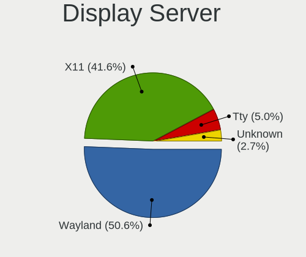
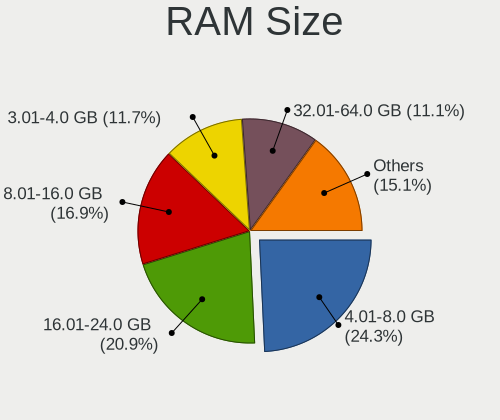
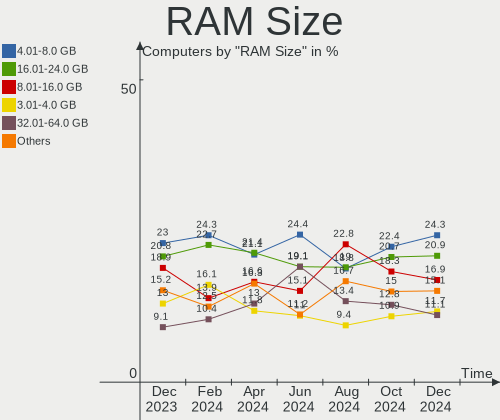
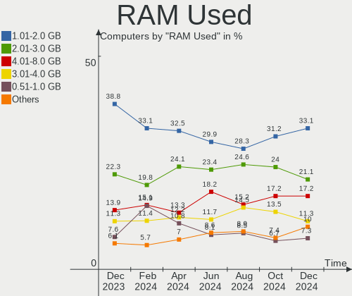
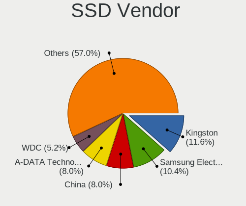
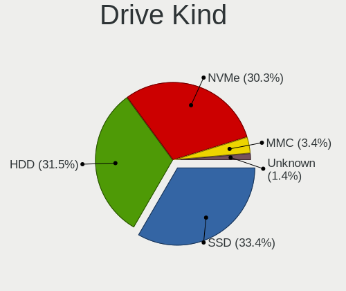
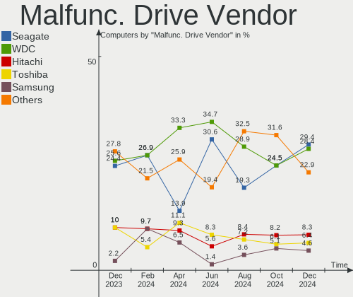
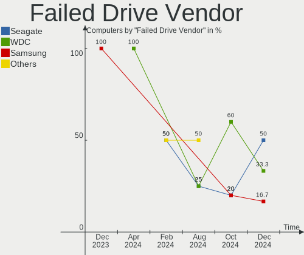
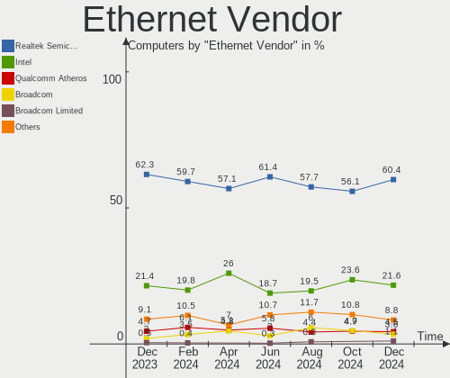
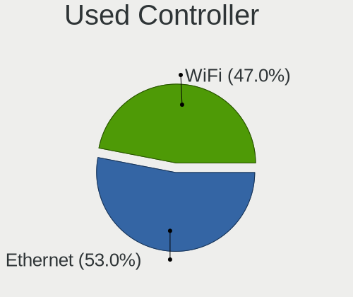

Linux in Russia - Hardware Trends
---------------------------------

A project to identify most popular hardware characteristics and track their change
over time based on data collected by Linux users at https://Linux-Hardware.org.

Anyone can contribute to this report by the [hw-probe](https://github.com/linuxhw/hw-probe) tool:

    sudo -E hw-probe -all -upload

This is a report for all computer types. See also reports for [desktops](/Location/Russia/Desktop/README.md) and [notebooks](/Location/Russia/Notebook/README.md).

Period: Dec, 2024.

Contents
--------

* [ System ](#system)
  - [ OS                       ](#os)
  - [ OS Family                ](#os-family)
  - [ Kernel                   ](#kernel)
  - [ Kernel Family            ](#kernel-family)
  - [ Kernel Major Ver.        ](#kernel-major-ver)
  - [ Arch                     ](#arch)
  - [ DE                       ](#de)
  - [ Display Server           ](#display-server)
  - [ Display Manager          ](#display-manager)
  - [ OS Lang                  ](#os-lang)
  - [ Boot Mode                ](#boot-mode)
  - [ Filesystem               ](#filesystem)
  - [ Part. scheme             ](#part-scheme)
  - [ Dual Boot with Linux/BSD ](#dual-boot-with-linuxbsd)
  - [ Dual Boot (Win)          ](#dual-boot-win)

* [ Board ](#board)
  - [ Vendor                   ](#vendor)
  - [ Model                    ](#model)
  - [ Model Family             ](#model-family)
  - [ MFG Year                 ](#mfg-year)
  - [ Form Factor              ](#form-factor)
  - [ Secure Boot              ](#secure-boot)
  - [ Coreboot                 ](#coreboot)
  - [ RAM Size                 ](#ram-size)
  - [ RAM Used                 ](#ram-used)
  - [ Total Drives             ](#total-drives)
  - [ Has CD-ROM               ](#has-cd-rom)
  - [ Has Ethernet             ](#has-ethernet)
  - [ Has WiFi                 ](#has-wifi)
  - [ Has Bluetooth            ](#has-bluetooth)

* [ Location ](#location)
  - [ Country                  ](#country)
  - [ City                     ](#city)

* [ Drives ](#drives)
  - [ Drive Vendor             ](#drive-vendor)
  - [ Drive Model              ](#drive-model)
  - [ HDD Vendor               ](#hdd-vendor)
  - [ SSD Vendor               ](#ssd-vendor)
  - [ Drive Kind               ](#drive-kind)
  - [ Drive Connector          ](#drive-connector)
  - [ Drive Size               ](#drive-size)
  - [ Space Total              ](#space-total)
  - [ Space Used               ](#space-used)
  - [ Malfunc. Drives          ](#malfunc-drives)
  - [ Malfunc. Drive Vendor    ](#malfunc-drive-vendor)
  - [ Malfunc. HDD Vendor      ](#malfunc-hdd-vendor)
  - [ Malfunc. Drive Kind      ](#malfunc-drive-kind)
  - [ Failed Drives            ](#failed-drives)
  - [ Failed Drive Vendor      ](#failed-drive-vendor)
  - [ Drive Status             ](#drive-status)

* [ Storage controller ](#storage-controller)
  - [ Storage Vendor           ](#storage-vendor)
  - [ Storage Model            ](#storage-model)
  - [ Storage Kind             ](#storage-kind)

* [ Processor ](#processor)
  - [ CPU Vendor               ](#cpu-vendor)
  - [ CPU Model                ](#cpu-model)
  - [ CPU Model Family         ](#cpu-model-family)
  - [ CPU Cores                ](#cpu-cores)
  - [ CPU Sockets              ](#cpu-sockets)
  - [ CPU Threads              ](#cpu-threads)
  - [ CPU Op-Modes             ](#cpu-op-modes)
  - [ CPU Microcode            ](#cpu-microcode)
  - [ CPU Microarch            ](#cpu-microarch)

* [ Graphics ](#graphics)
  - [ GPU Vendor               ](#gpu-vendor)
  - [ GPU Model                ](#gpu-model)
  - [ GPU Combo                ](#gpu-combo)
  - [ GPU Driver               ](#gpu-driver)
  - [ GPU Memory               ](#gpu-memory)

* [ Monitor ](#monitor)
  - [ Monitor Vendor           ](#monitor-vendor)
  - [ Monitor Model            ](#monitor-model)
  - [ Monitor Resolution       ](#monitor-resolution)
  - [ Monitor Diagonal         ](#monitor-diagonal)
  - [ Monitor Width            ](#monitor-width)
  - [ Aspect Ratio             ](#aspect-ratio)
  - [ Monitor Area             ](#monitor-area)
  - [ Pixel Density            ](#pixel-density)
  - [ Multiple Monitors        ](#multiple-monitors)

* [ Network ](#network)
  - [ Net Controller Vendor    ](#net-controller-vendor)
  - [ Net Controller Model     ](#net-controller-model)
  - [ Wireless Vendor          ](#wireless-vendor)
  - [ Wireless Model           ](#wireless-model)
  - [ Ethernet Vendor          ](#ethernet-vendor)
  - [ Ethernet Model           ](#ethernet-model)
  - [ Net Controller Kind      ](#net-controller-kind)
  - [ Used Controller          ](#used-controller)
  - [ NICs                     ](#nics)
  - [ IPv6                     ](#ipv6)

* [ Bluetooth ](#bluetooth)
  - [ Bluetooth Vendor         ](#bluetooth-vendor)
  - [ Bluetooth Model          ](#bluetooth-model)

* [ Sound ](#sound)
  - [ Sound Vendor             ](#sound-vendor)
  - [ Sound Model              ](#sound-model)

* [ Memory ](#memory)
  - [ Memory Vendor            ](#memory-vendor)
  - [ Memory Model             ](#memory-model)
  - [ Memory Kind              ](#memory-kind)
  - [ Memory Form Factor       ](#memory-form-factor)
  - [ Memory Size              ](#memory-size)
  - [ Memory Speed             ](#memory-speed)

* [ Printers & scanners ](#printers--scanners)
  - [ Printer Vendor           ](#printer-vendor)
  - [ Printer Model            ](#printer-model)
  - [ Scanner Vendor           ](#scanner-vendor)
  - [ Scanner Model            ](#scanner-model)

* [ Camera ](#camera)
  - [ Camera Vendor            ](#camera-vendor)
  - [ Camera Model             ](#camera-model)

* [ Security ](#security)
  - [ Fingerprint Vendor       ](#fingerprint-vendor)
  - [ Fingerprint Model        ](#fingerprint-model)
  - [ Chipcard Vendor          ](#chipcard-vendor)
  - [ Chipcard Model           ](#chipcard-model)

* [ Unsupported ](#unsupported)
  - [ Unsupported Devices      ](#unsupported-devices)
  - [ Unsupported Device Types ](#unsupported-device-types)

System
------

OS
--

Installed operating systems

| Name                         | Computers | Percent |
|------------------------------|-----------|---------|
| ROSA 12.5.1                  | 113       | 23.64%  |
| OpenMandriva 24.12           | 39        | 8.16%   |
| Debian 12                    | 26        | 5.44%   |
| Ubuntu 24.04                 | 24        | 5.02%   |
| Fedora 41                    | 18        | 3.77%   |
| Ubuntu 22.04                 | 17        | 3.56%   |
| Arch Rolling                 | 16        | 3.35%   |
| Red OS 7.3                   | 15        | 3.14%   |
| Linux Mint 22                | 14        | 2.93%   |
| ROSA 12                      | 13        | 2.72%   |
| Red OS 8.0                   | 12        | 2.51%   |
| ROSA 12.6                    | 10        | 2.09%   |
| OpenMandriva 5.0             | 8         | 1.67%   |
| ALT Linux 10.4               | 8         | 1.67%   |
| ROSA R11.1                   | 7         | 1.46%   |
| Fedora 40                    | 7         | 1.46%   |
| Debian 11                    | 7         | 1.46%   |
| Ubuntu 24.10                 | 5         | 1.05%   |
| ROSA 12.4                    | 4         | 0.84%   |
| ROSA 12.3                    | 4         | 0.84%   |
| openSUSE Leap-15.6           | 4         | 0.84%   |
| OpenMandriva 24.07           | 4         | 0.84%   |
| Elementary 8                 | 4         | 0.84%   |
| Ubuntu 20.04                 | 3         | 0.63%   |
| SteamOS 3.6.20               | 3         | 0.63%   |
| ROSA 12.5                    | 3         | 0.63%   |
| openSUSE Tumbleweed-XXXXXXXX | 3         | 0.63%   |
| OpenMandriva 23.08           | 3         | 0.63%   |
| Manjaro                      | 3         | 0.63%   |
| Kubuntu 24.04                | 3         | 0.63%   |
| KDE neon 24.04               | 3         | 0.63%   |
| Gentoo 2.17                  | 3         | 0.63%   |
| Debian                       | 3         | 0.63%   |
| ALT Linux 20240122           | 3         | 0.63%   |
| Xubuntu 20.04                | 2         | 0.42%   |
| SteamOS 3.6.21               | 2         | 0.42%   |
| ROSA R11                     | 2         | 0.42%   |
| ROSA 12.2                    | 2         | 0.42%   |
| OpenMandriva 4.3             | 2         | 0.42%   |
| OpenMandriva 4.2             | 2         | 0.42%   |

OS Family
---------

OS without a version

| Name         | Computers | Percent |
|--------------|-----------|---------|
| ROSA         | 161       | 33.68%  |
| OpenMandriva | 58        | 12.13%  |
| Ubuntu       | 50        | 10.46%  |
| Debian       | 36        | 7.53%   |
| Red OS       | 28        | 5.86%   |
| Fedora       | 27        | 5.65%   |
| Linux Mint   | 18        | 3.77%   |
| ALT Linux    | 17        | 3.56%   |
| Arch         | 16        | 3.35%   |
| openSUSE     | 7         | 1.46%   |
| SteamOS      | 6         | 1.26%   |
| Manjaro      | 6         | 1.26%   |
| KDE neon     | 5         | 1.05%   |
| Elementary   | 5         | 1.05%   |
| Kubuntu      | 4         | 0.84%   |
| Astra Linux  | 4         | 0.84%   |
| NixOS        | 3         | 0.63%   |
| Gentoo       | 3         | 0.63%   |
| Xubuntu      | 2         | 0.42%   |
| Nobara       | 2         | 0.42%   |
| LMDE         | 2         | 0.42%   |
| Devuan       | 2         | 0.42%   |
| ArcoLinux    | 2         | 0.42%   |
| Zorin        | 1         | 0.21%   |
| Void Linux   | 1         | 0.21%   |
| Ubuntu MATE  | 1         | 0.21%   |
| Rocky Linux  | 1         | 0.21%   |
| Pop!_OS      | 1         | 0.21%   |
| Peppermint   | 1         | 0.21%   |
| MX           | 1         | 0.21%   |
| Garuda Linux | 1         | 0.21%   |
| Endless      | 1         | 0.21%   |
| Deepin       | 1         | 0.21%   |
| blendOS      | 1         | 0.21%   |
| Artix        | 1         | 0.21%   |
| antiX        | 1         | 0.21%   |
| AlmaLinux    | 1         | 0.21%   |

Kernel
------

Version of the Linux kernel

| Version                                  | Computers | Percent |
|------------------------------------------|-----------|---------|
| 6.6.47-generic-1rosa2021.1-x86_64        | 84        | 17.57%  |
| 6.12.1-desktop-1omv2490                  | 39        | 8.16%   |
| 6.8.0-49-generic                         | 31        | 6.49%   |
| 6.6.27-generic-3rosa2021.1-x86_64        | 23        | 4.81%   |
| 6.8.0-51-generic                         | 14        | 2.93%   |
| 6.8.0-50-generic                         | 13        | 2.72%   |
| 6.1.89-generic-2rosa2021.1-x86_64        | 11        | 2.3%    |
| 6.1.0-28-amd64                           | 10        | 2.09%   |
| 6.6.51-1.red80.x86_64                    | 9         | 1.88%   |
| 6.8.12-4-pve                             | 8         | 1.67%   |
| 6.6.2-desktop-1omv2390                   | 8         | 1.67%   |
| 6.1.110-1.el7.3.x86_64                   | 7         | 1.46%   |
| 6.11.10-300.fc41.x86_64                  | 6         | 1.26%   |
| 6.10.0-desktop-1omv2490                  | 4         | 0.84%   |
| 6.1.0-27-amd64                           | 4         | 0.84%   |
| 5.15.167-1.el7.3.x86_64                  | 4         | 0.84%   |
| 5.15.0-117-generic                       | 4         | 0.84%   |
| 5.10.74-generic-2rosa2021.1-x86_64       | 4         | 0.84%   |
| 6.8.12-5-pve                             | 3         | 0.63%   |
| 6.6.21-generic-8rosa2021.1-x86_64        | 3         | 0.63%   |
| 6.5.0-valve23-1-neptune-65-g385b5e207ae2 | 3         | 0.63%   |
| 6.4.8-desktop-2omv2390                   | 3         | 0.63%   |
| 6.4.0-150600.23.25-default               | 3         | 0.63%   |
| 6.2.16-20-bpo11-pve                      | 3         | 0.63%   |
| 6.12.5-200.fc41.x86_64                   | 3         | 0.63%   |
| 6.12.4-arch1-1                           | 3         | 0.63%   |
| 6.12.1-zen1-1-zen                        | 3         | 0.63%   |
| 6.12.1-arch1-1                           | 3         | 0.63%   |
| 6.11.10-200.fc40.x86_64                  | 3         | 0.63%   |
| 6.11.10-2-MANJARO                        | 3         | 0.63%   |
| 6.11.0-9-generic                         | 3         | 0.63%   |
| 6.1.119-un-def-alt1                      | 3         | 0.63%   |
| 5.15.170-generic-1rosa2021.1-i686        | 3         | 0.63%   |
| 5.15.158-2-pve                           | 3         | 0.63%   |
| 6.8.10-300.fc40.x86_64                   | 2         | 0.42%   |
| 6.8.0-47-generic                         | 2         | 0.42%   |
| 6.8.0-40-generic                         | 2         | 0.42%   |
| 6.6.65-1-MANJARO                         | 2         | 0.42%   |
| 6.6.63-6.6-alt1                          | 2         | 0.42%   |
| 6.6.6-1.red80.x86_64                     | 2         | 0.42%   |

Kernel Family
-------------

Linux kernel without a distro release

| Version  | Computers | Percent |
|----------|-----------|---------|
| 6.6.47   | 84        | 17.57%  |
| 6.8.0    | 64        | 13.39%  |
| 6.12.1   | 47        | 9.83%   |
| 6.6.27   | 23        | 4.81%   |
| 6.1.0    | 20        | 4.18%   |
| 6.11.10  | 15        | 3.14%   |
| 6.1.89   | 12        | 2.51%   |
| 6.8.12   | 11        | 2.3%    |
| 6.6.51   | 9         | 1.88%   |
| 6.12.6   | 9         | 1.88%   |
| 5.15.0   | 9         | 1.88%   |
| 6.6.2    | 8         | 1.67%   |
| 6.12.4   | 8         | 1.67%   |
| 6.5.0    | 7         | 1.46%   |
| 6.1.110  | 7         | 1.46%   |
| 6.11.0   | 5         | 1.05%   |
| 5.15.170 | 5         | 1.05%   |
| 6.6.63   | 4         | 0.84%   |
| 6.4.0    | 4         | 0.84%   |
| 6.12.5   | 4         | 0.84%   |
| 6.11.8   | 4         | 0.84%   |
| 6.10.0   | 4         | 0.84%   |
| 5.4.0    | 4         | 0.84%   |
| 5.15.167 | 4         | 0.84%   |
| 5.10.74  | 4         | 0.84%   |
| 4.15.0   | 4         | 0.84%   |
| 6.6.21   | 3         | 0.63%   |
| 6.4.8    | 3         | 0.63%   |
| 6.2.16   | 3         | 0.63%   |
| 6.12.3   | 3         | 0.63%   |
| 6.11.9   | 3         | 0.63%   |
| 6.1.52   | 3         | 0.63%   |
| 6.1.119  | 3         | 0.63%   |
| 5.17.11  | 3         | 0.63%   |
| 5.15.158 | 3         | 0.63%   |
| 5.15.103 | 3         | 0.63%   |
| 6.8.10   | 2         | 0.42%   |
| 6.6.65   | 2         | 0.42%   |
| 6.6.64   | 2         | 0.42%   |
| 6.6.62   | 2         | 0.42%   |

Kernel Major Ver.
-----------------

Linux kernel major version

| Version | Computers | Percent |
|---------|-----------|---------|
| 6.6     | 142       | 29.71%  |
| 6.8     | 79        | 16.53%  |
| 6.12    | 75        | 15.69%  |
| 6.1     | 54        | 11.3%   |
| 6.11    | 33        | 6.9%    |
| 5.15    | 28        | 5.86%   |
| 5.10    | 15        | 3.14%   |
| 6.5     | 8         | 1.67%   |
| 5.4     | 8         | 1.67%   |
| 6.4     | 7         | 1.46%   |
| 6.10    | 7         | 1.46%   |
| 6.2     | 5         | 1.05%   |
| 4.15    | 4         | 0.84%   |
| 5.17    | 3         | 0.63%   |
| 5.16    | 2         | 0.42%   |
| 4.9     | 2         | 0.42%   |
| 6.9     | 1         | 0.21%   |
| 6.13    | 1         | 0.21%   |
| 6.0     | 1         | 0.21%   |
| 5.8     | 1         | 0.21%   |
| 5.14    | 1         | 0.21%   |
| 4.18    | 1         | 0.21%   |

Arch
----

OS architecture (x86_64, i586, etc.)

| Name    | Computers | Percent |
|---------|-----------|---------|
| x86_64  | 461       | 96.44%  |
| i686    | 13        | 2.72%   |
| aarch64 | 4         | 0.84%   |

DE
--

Desktop Environment

| Name             | Computers | Percent |
|------------------|-----------|---------|
| KDE5             | 151       | 31.59%  |
| GNOME            | 119       | 24.9%   |
| Unknown          | 73        | 15.27%  |
| MATE             | 27        | 5.65%   |
| LXQt             | 22        | 4.6%    |
| KDE6             | 22        | 4.6%    |
| X-Cinnamon       | 17        | 3.56%   |
| XFCE             | 15        | 3.14%   |
| Pantheon         | 5         | 1.05%   |
| KDE4             | 5         | 1.05%   |
| Hyprland         | 5         | 1.05%   |
| KDE              | 3         | 0.63%   |
| i3               | 2         | 0.42%   |
| GNOME Classic    | 2         | 0.42%   |
| fly              | 2         | 0.42%   |
| sway             | 1         | 0.21%   |
| lightdm-xsession | 1         | 0.21%   |
| icewm            | 1         | 0.21%   |
| GNOME Flashback  | 1         | 0.21%   |
| Endless:GNOME    | 1         | 0.21%   |
| DDE              | 1         | 0.21%   |
| Cinnamon         | 1         | 0.21%   |
| Budgie           | 1         | 0.21%   |

Display Server
--------------

X11 or Wayland

| Name    | Computers | Percent |
|---------|-----------|---------|
| Wayland | 242       | 50.63%  |
| X11     | 199       | 41.63%  |
| Tty     | 24        | 5.02%   |
| Unknown | 13        | 2.72%   |

Display Manager
---------------

SDDM, LightDM, etc.

| Name    | Computers | Percent |
|---------|-----------|---------|
| SDDM    | 196       | 41%     |
| GDM     | 93        | 19.46%  |
| Unknown | 88        | 18.41%  |
| LightDM | 46        | 9.62%   |
| GDM3    | 43        | 9%      |
| KDM     | 5         | 1.05%   |
| FLY-DM  | 3         | 0.63%   |
| GREETD  | 2         | 0.42%   |
| SLIMSKI | 1         | 0.21%   |
| LY-DM   | 1         | 0.21%   |

OS Lang
-------

Language

| Lang    | Computers | Percent |
|---------|-----------|---------|
| ru_RU   | 346       | 72.38%  |
| en_US   | 108       | 22.59%  |
| C       | 12        | 2.51%   |
| Unknown | 8         | 1.67%   |
| en_GB   | 2         | 0.42%   |
| ru_UA   | 1         | 0.21%   |
| POSIX   | 1         | 0.21%   |

Boot Mode
---------

EFI or BIOS

| Mode | Computers | Percent |
|------|-----------|---------|
| EFI  | 275       | 57.53%  |
| BIOS | 203       | 42.47%  |

Filesystem
----------

Type of filesystem

| Type    | Computers | Percent |
|---------|-----------|---------|
| Ext4    | 323       | 67.57%  |
| Btrfs   | 70        | 14.64%  |
| Overlay | 49        | 10.25%  |
| Tmpfs   | 21        | 4.39%   |
| Zfs     | 6         | 1.26%   |
| Xfs     | 5         | 1.05%   |
| Ext3    | 3         | 0.63%   |
| Unknown | 1         | 0.21%   |

Part. scheme
------------

Scheme of partitioning

| Type    | Computers | Percent |
|---------|-----------|---------|
| GPT     | 318       | 66.53%  |
| MBR     | 96        | 20.08%  |
| Unknown | 64        | 13.39%  |

Dual Boot with Linux/BSD
------------------------

Hosting more than one Linux/BSD

| Dual boot | Computers | Percent |
|-----------|-----------|---------|
| No        | 379       | 79.29%  |
| Yes       | 99        | 20.71%  |

Dual Boot (Win)
---------------

Hosting Linux and Windows

| Dual boot | Computers | Percent |
|-----------|-----------|---------|
| No        | 305       | 63.81%  |
| Yes       | 173       | 36.19%  |

Board
-----

Vendor
------

Motherboard manufacturer

| Name                 | Computers | Percent |
|----------------------|-----------|---------|
| ASUSTek Computer     | 89        | 18.62%  |
| Lenovo               | 46        | 9.62%   |
| Gigabyte Technology  | 42        | 8.79%   |
| MSI                  | 35        | 7.32%   |
| Hewlett-Packard      | 33        | 6.9%    |
| Acer                 | 32        | 6.69%   |
| Intel                | 16        | 3.35%   |
| Dell                 | 16        | 3.35%   |
| ASRock               | 16        | 3.35%   |
| Unknown              | 15        | 3.14%   |
| HUAWEI               | 13        | 2.72%   |
| Supermicro           | 7         | 1.46%   |
| Valve                | 6         | 1.26%   |
| Maibenben            | 6         | 1.26%   |
| ICL                  | 6         | 1.26%   |
| Apple                | 6         | 1.26%   |
| HONOR                | 5         | 1.05%   |
| AZW                  | 5         | 1.05%   |
| Samsung Electronics  | 4         | 0.84%   |
| Infinix              | 4         | 0.84%   |
| Biostar              | 4         | 0.84%   |
| XIAOMI               | 3         | 0.63%   |
| LTD Delovoy Office   | 3         | 0.63%   |
| Graviton             | 3         | 0.63%   |
| Foxconn              | 3         | 0.63%   |
| DEPO Computers       | 3         | 0.63%   |
| Clevo                | 3         | 0.63%   |
| Aquarius             | 3         | 0.63%   |
| TECNO Mobile Limited | 2         | 0.42%   |
| Sony                 | 2         | 0.42%   |
| Notebook             | 2         | 0.42%   |
| MACHINIST            | 2         | 0.42%   |
| KVADRA               | 2         | 0.42%   |
| Insyde               | 2         | 0.42%   |
| IBM                  | 2         | 0.42%   |
| Huanan               | 2         | 0.42%   |
| Haier                | 2         | 0.42%   |
| Fujitsu Siemens      | 2         | 0.42%   |
| eMachines            | 2         | 0.42%   |
| Chuwi                | 2         | 0.42%   |

Model
-----

Motherboard model

| Name                                     | Computers | Percent |
|------------------------------------------|-----------|---------|
| Unknown                                  | 18        | 3.77%   |
| ASUS All Series                          | 5         | 1.05%   |
| Lenovo G500 20236                        | 4         | 0.84%   |
| ASUS P8Z77-V LX                          | 4         | 0.84%   |
| XIAOMI Redmi Book Pro 15 2023            | 3         | 0.63%   |
| Valve Jupiter                            | 3         | 0.63%   |
| Valve Galileo                            | 3         | 0.63%   |
| Supermicro X8DTU                         | 3         | 0.63%   |
| Maibenben Perfectum Series               | 3         | 0.63%   |
| Intel X99                                | 3         | 0.63%   |
| Gigabyte H410M H V3                      | 3         | 0.63%   |
| Dell PowerEdge R730XD                    | 3         | 0.63%   |
| AZW MINI S                               | 3         | 0.63%   |
| ASUS VivoBook_ASUSLaptop X1605VA_X1605VA | 3         | 0.63%   |
| Acer Extensa 215-23                      | 3         | 0.63%   |
| Supermicro SYS-6018U-TR4+                | 2         | 0.42%   |
| Supermicro Super Server                  | 2         | 0.42%   |
| MSI MS-7B89                              | 2         | 0.42%   |
| Lenovo G700 20251                        | 2         | 0.42%   |
| Lenovo B590 20208                        | 2         | 0.42%   |
| KVADRA NAU LE14U                         | 2         | 0.42%   |
| Intel B75                                | 2         | 0.42%   |
| Insyde Purley                            | 2         | 0.42%   |
| ICL RAY Si105.Mi                         | 2         | 0.42%   |
| ICL H510SB-TM                            | 2         | 0.42%   |
| HUAWEI VGHH-XX                           | 2         | 0.42%   |
| HUAWEI BOM-WXX9                          | 2         | 0.42%   |
| HUAWEI BoDE-WXX9                         | 2         | 0.42%   |
| HP Pavilion dv6                          | 2         | 0.42%   |
| Gigabyte GA-MA770-DS3                    | 2         | 0.42%   |
| Gigabyte AB350M-DS3H V2                  | 2         | 0.42%   |
| Gigabyte 970A-DS3P                       | 2         | 0.42%   |
| Dell Inspiron 3521                       | 2         | 0.42%   |
| AZW SER                                  | 2         | 0.42%   |
| ASUS X751MD                              | 2         | 0.42%   |
| ASUS VivoBook 15_ASUS Laptop X540BA      | 2         | 0.42%   |
| ASUS TUF Z390M-PRO GAMING                | 2         | 0.42%   |
| ASUS ROG STRIX B650E-E GAMING WIFI       | 2         | 0.42%   |
| ASUS PRIME B760-PLUS D4                  | 2         | 0.42%   |
| ASUS PRIME B360M-C                       | 2         | 0.42%   |

Model Family
------------

Motherboard model prefix

| Name                          | Computers | Percent |
|-------------------------------|-----------|---------|
| Acer Aspire                   | 21        | 4.39%   |
| Unknown                       | 18        | 3.77%   |
| Lenovo ThinkPad               | 13        | 2.72%   |
| ASUS PRIME                    | 13        | 2.72%   |
| ASUS VivoBook                 | 10        | 2.09%   |
| HP Pavilion                   | 7         | 1.46%   |
| ASUS TUF                      | 7         | 1.46%   |
| Lenovo IdeaPad                | 6         | 1.26%   |
| ASUS ROG                      | 6         | 1.26%   |
| Lenovo ThinkBook              | 5         | 1.05%   |
| HP ProBook                    | 5         | 1.05%   |
| HP Laptop                     | 5         | 1.05%   |
| Dell Inspiron                 | 5         | 1.05%   |
| ASUS P8Z77-V                  | 5         | 1.05%   |
| ASUS All                      | 5         | 1.05%   |
| Lenovo G500                   | 4         | 0.84%   |
| HP EliteBook                  | 4         | 0.84%   |
| Dell PowerEdge                | 4         | 0.84%   |
| XIAOMI Redmi                  | 3         | 0.63%   |
| Valve Jupiter                 | 3         | 0.63%   |
| Valve Galileo                 | 3         | 0.63%   |
| Supermicro X8DTU              | 3         | 0.63%   |
| MSI Modern                    | 3         | 0.63%   |
| MSI Katana                    | 3         | 0.63%   |
| Maibenben Perfectum           | 3         | 0.63%   |
| Lenovo ThinkCentre            | 3         | 0.63%   |
| Lenovo B590                   | 3         | 0.63%   |
| Intel X99                     | 3         | 0.63%   |
| Gigabyte H410M                | 3         | 0.63%   |
| Gigabyte B550M                | 3         | 0.63%   |
| Gigabyte AB350M-DS3H          | 3         | 0.63%   |
| AZW MINI                      | 3         | 0.63%   |
| ASUS ASUS                     | 3         | 0.63%   |
| Acer Nitro                    | 3         | 0.63%   |
| Acer Extensa                  | 3         | 0.63%   |
| TECNO Mobile Limited MEGABOOK | 2         | 0.42%   |
| Supermicro SYS-6018U-TR4+     | 2         | 0.42%   |
| Supermicro Super              | 2         | 0.42%   |
| MSI MS-7B89                   | 2         | 0.42%   |
| Lenovo G700                   | 2         | 0.42%   |

MFG Year
--------

Motherboard manufacture year

| Year    | Computers | Percent |
|---------|-----------|---------|
| 2022    | 66        | 13.81%  |
| 2023    | 55        | 11.51%  |
| 2012    | 43        | 9%      |
| 2024    | 35        | 7.32%   |
| 2018    | 34        | 7.11%   |
| 2021    | 30        | 6.28%   |
| 2020    | 26        | 5.44%   |
| 2019    | 26        | 5.44%   |
| 2011    | 26        | 5.44%   |
| 2013    | 20        | 4.18%   |
| 2014    | 18        | 3.77%   |
| 2010    | 16        | 3.35%   |
| 2015    | 15        | 3.14%   |
| 2009    | 15        | 3.14%   |
| 2017    | 13        | 2.72%   |
| 2008    | 12        | 2.51%   |
| 2007    | 11        | 2.3%    |
| 2016    | 10        | 2.09%   |
| 2006    | 2         | 0.42%   |
| 2005    | 2         | 0.42%   |
| Unknown | 2         | 0.42%   |
| 2003    | 1         | 0.21%   |

Form Factor
-----------

Physical design of the computer

| Name           | Computers | Percent |
|----------------|-----------|---------|
| Notebook       | 231       | 48.33%  |
| Desktop        | 199       | 41.63%  |
| Server         | 25        | 5.23%   |
| All in one     | 10        | 2.09%   |
| Mini pc        | 8         | 1.67%   |
| System on chip | 3         | 0.63%   |
| Tablet         | 2         | 0.42%   |

Secure Boot
-----------

Enabled or disabled

| State    | Computers | Percent |
|----------|-----------|---------|
| Disabled | 467       | 97.7%   |
| Enabled  | 11        | 2.3%    |

Coreboot
--------

Have coreboot on board

| Used | Computers | Percent |
|------|-----------|---------|
| No   | 477       | 99.79%  |
| Yes  | 1         | 0.21%   |

RAM Size
--------

Total RAM memory

| Size in GB      | Computers | Percent |
|-----------------|-----------|---------|
| 4.01-8.0        | 116       | 24.27%  |
| 16.01-24.0      | 100       | 20.92%  |
| 8.01-16.0       | 81        | 16.95%  |
| 3.01-4.0        | 56        | 11.72%  |
| 32.01-64.0      | 53        | 11.09%  |
| 64.01-256.0     | 29        | 6.07%   |
| 24.01-32.0      | 16        | 3.35%   |
| 1.01-2.0        | 15        | 3.14%   |
| 2.01-3.0        | 6         | 1.26%   |
| More than 256.0 | 5         | 1.05%   |
| 0.51-1.0        | 1         | 0.21%   |

RAM Used
--------

Used RAM memory

| Used GB     | Computers | Percent |
|-------------|-----------|---------|
| 1.01-2.0    | 158       | 33.05%  |
| 2.01-3.0    | 101       | 21.13%  |
| 4.01-8.0    | 82        | 17.15%  |
| 3.01-4.0    | 54        | 11.3%   |
| 0.51-1.0    | 35        | 7.32%   |
| 8.01-16.0   | 30        | 6.28%   |
| 16.01-24.0  | 5         | 1.05%   |
| 0.01-0.5    | 5         | 1.05%   |
| 64.01-256.0 | 4         | 0.84%   |
| 24.01-32.0  | 3         | 0.63%   |
| 32.01-64.0  | 1         | 0.21%   |

Total Drives
------------

Number of drives on board

| Drives | Computers | Percent |
|--------|-----------|---------|
| 1      | 246       | 51.46%  |
| 2      | 133       | 27.82%  |
| 3      | 43        | 9%      |
| 4      | 24        | 5.02%   |
| 0      | 8         | 1.67%   |
| 5      | 7         | 1.46%   |
| 6      | 5         | 1.05%   |
| 14     | 2         | 0.42%   |
| 10     | 2         | 0.42%   |
| 8      | 2         | 0.42%   |
| 44     | 1         | 0.21%   |
| 39     | 1         | 0.21%   |
| 20     | 1         | 0.21%   |
| 15     | 1         | 0.21%   |
| 13     | 1         | 0.21%   |
| 11     | 1         | 0.21%   |

Has CD-ROM
----------

Has CD-ROM on board

| Presented | Computers | Percent |
|-----------|-----------|---------|
| No        | 365       | 76.36%  |
| Yes       | 113       | 23.64%  |

Has Ethernet
------------

Has Ethernet on board

| Presented | Computers | Percent |
|-----------|-----------|---------|
| Yes       | 412       | 86.19%  |
| No        | 66        | 13.81%  |

Has WiFi
--------

Has WiFi module

| Presented | Computers | Percent |
|-----------|-----------|---------|
| Yes       | 306       | 64.02%  |
| No        | 172       | 35.98%  |

Has Bluetooth
-------------

Has Bluetooth module

| Presented | Computers | Percent |
|-----------|-----------|---------|
| Yes       | 265       | 55.44%  |
| No        | 213       | 44.56%  |

Location
--------

Country
-------

Geographic location (country)

| Country | Computers | Percent |
|---------|-----------|---------|
| Russia  | 478       | 100%    |

City
----

Geographic location (city)

| City              | Computers | Percent |
|-------------------|-----------|---------|
| Moscow            | 113       | 23.64%  |
| St Petersburg     | 54        | 11.3%   |
| Novosibirsk       | 15        | 3.14%   |
| Chelyabinsk       | 14        | 2.93%   |
| Rostov-on-Don     | 11        | 2.3%    |
| Yekaterinburg     | 10        | 2.09%   |
| Voronezh          | 8         | 1.67%   |
| Krasnoyarsk       | 8         | 1.67%   |
| Samara            | 7         | 1.46%   |
| Kazan’          | 7         | 1.46%   |
| Tula              | 6         | 1.26%   |
| Perm              | 6         | 1.26%   |
| Yoshkar-Ola       | 5         | 1.05%   |
| Ulyanovsk         | 5         | 1.05%   |
| Kaliningrad       | 5         | 1.05%   |
| Barnaul           | 5         | 1.05%   |
| Yaroslavl         | 4         | 0.84%   |
| Smolensk          | 4         | 0.84%   |
| Omsk              | 4         | 0.84%   |
| Nizhny Tagil      | 4         | 0.84%   |
| Murmansk          | 4         | 0.84%   |
| Lipetsk           | 4         | 0.84%   |
| Irkutsk           | 4         | 0.84%   |
| Cheboksary        | 4         | 0.84%   |
| Vladivostok       | 3         | 0.63%   |
| Vladimir          | 3         | 0.63%   |
| Ufa               | 3         | 0.63%   |
| Tambov            | 3         | 0.63%   |
| Taganrog          | 3         | 0.63%   |
| Saratov           | 3         | 0.63%   |
| Novy Urengoy      | 3         | 0.63%   |
| Kursk             | 3         | 0.63%   |
| Kaluga            | 3         | 0.63%   |
| Izhevsk           | 3         | 0.63%   |
| Balashikha        | 3         | 0.63%   |
| Zheleznodorozhnyy | 2         | 0.42%   |
| Yakutsk           | 2         | 0.42%   |
| Volzhsky          | 2         | 0.42%   |
| Volgograd         | 2         | 0.42%   |
| Shelekhov         | 2         | 0.42%   |

Drives
------

Drive Vendor
------------

Hard drive vendors

| Vendor                      | Computers | Drives | Percent |
|-----------------------------|-----------|--------|---------|
| WDC                         | 96        | 172    | 12.82%  |
| Seagate                     | 83        | 131    | 11.08%  |
| Samsung Electronics         | 70        | 107    | 9.35%   |
| Toshiba                     | 45        | 71     | 6.01%   |
| Kingston                    | 37        | 47     | 4.94%   |
| Unknown                     | 29        | 29     | 3.87%   |
| Sandisk                     | 28        | 28     | 3.74%   |
| A-DATA Technology           | 26        | 26     | 3.47%   |
| Hitachi                     | 20        | 22     | 2.67%   |
| China                       | 20        | 21     | 2.67%   |
| Intel                       | 19        | 33     | 2.54%   |
| Silicon Motion              | 17        | 17     | 2.27%   |
| Micron Technology           | 15        | 15     | 2%      |
| SK hynix                    | 14        | 14     | 1.87%   |
| Patriot                     | 13        | 13     | 1.74%   |
| Netac                       | 13        | 13     | 1.74%   |
| Apacer                      | 13        | 13     | 1.74%   |
| Unknown                     | 13        | 13     | 1.74%   |
| HGST                        | 12        | 29     | 1.6%    |
| Phison Electronics          | 10        | 12     | 1.34%   |
| KingSpec                    | 8         | 8      | 1.07%   |
| KIOXIA                      | 7         | 7      | 0.93%   |
| Kingston Technology Company | 7         | 8      | 0.93%   |
| SPCC                        | 6         | 6      | 0.8%    |
| Plextor                     | 6         | 6      | 0.8%    |
| Crucial                     | 6         | 6      | 0.8%    |
| Phison                      | 5         | 5      | 0.67%   |
| Hewlett-Packard             | 5         | 5      | 0.67%   |
| Transcend                   | 4         | 4      | 0.53%   |
| MAXIO Technology (Hangzhou) | 4         | 4      | 0.53%   |
| JMicron Technology          | 4         | 4      | 0.53%   |
| GOODRAM                     | 4         | 4      | 0.53%   |
| Apple                       | 4         | 5      | 0.53%   |
| AMD                         | 4         | 4      | 0.53%   |
| XPG                         | 3         | 3      | 0.4%    |
| Smartbuy                    | 3         | 3      | 0.4%    |
| Realtek Semiconductor       | 3         | 3      | 0.4%    |
| DEXP                        | 3         | 3      | 0.4%    |
| Colorful                    | 3         | 3      | 0.4%    |
| AGI                         | 3         | 5      | 0.4%    |

Drive Model
-----------

Hard drive models

| Model                                                 | Computers | Percent |
|-------------------------------------------------------|-----------|---------|
| Unknown                                               | 13        | 1.57%   |
| Kingston SA400S37480G 480GB SSD                       | 11        | 1.33%   |
| Toshiba HDWD110 1TB                                   | 9         | 1.09%   |
| Seagate ST1000DM010-2EP102 1TB                        | 8         | 0.97%   |
| Silicon Motion SM2263EN/SM2263XT SSD Controller 256GB | 7         | 0.85%   |
| Samsung NVMe SSD Controller PM9A1/PM9A3/980PRO 512GB  | 7         | 0.85%   |
| WDC WDS240G2G0A-00JH30 240GB SSD                      | 6         | 0.72%   |
| Seagate ST3600057SS 600GB                             | 6         | 0.72%   |
| Samsung NVMe SSD Controller SM981/PM981/PM983 512GB   | 6         | 0.72%   |
| Micron 2400_MTFDKBA512QFM 512GB                       | 6         | 0.72%   |
| Silicon Motion PCIe-8 SSD 512GB                       | 5         | 0.6%    |
| Kingston SA400S37240G 240GB SSD                       | 5         | 0.6%    |
| A-DATA SU650 240GB SSD                                | 5         | 0.6%    |
| WDC WD10EARS-00Y5B1 1TB                               | 4         | 0.48%   |
| Unknown NVMe SSD Drive 512GB                          | 4         | 0.48%   |
| Toshiba MQ04ABF100 1TB                                | 4         | 0.48%   |
| Toshiba MQ01ABF050 500GB                              | 4         | 0.48%   |
| Toshiba DT01ACA100 1TB                                | 4         | 0.48%   |
| Seagate ST500LT012-9WS142 500GB                       | 4         | 0.48%   |
| Seagate ST500DM002-1BD142 500GB                       | 4         | 0.48%   |
| Seagate ST3500418AS 500GB                             | 4         | 0.48%   |
| Samsung SSD 870 EVO 500GB                             | 4         | 0.48%   |
| Samsung SSD 870 EVO 1TB                               | 4         | 0.48%   |
| Patriot P210 512GB SSD                                | 4         | 0.48%   |
| Netac SSD 128GB                                       | 4         | 0.48%   |
| Kingston SA400S37120G 120GB SSD                       | 4         | 0.48%   |
| JMicron Generic 500GB                                 | 4         | 0.48%   |
| HGST HUS726T6TALE6L4 6TB                              | 4         | 0.48%   |
| WDC WD3200AVVS-56L2B0 320GB                           | 3         | 0.36%   |
| WDC WD2502ABYS-23B7A0 39M4511 42C0463IBM 250GB        | 3         | 0.36%   |
| WDC WD2502ABYS-23B7A0 39M4511 250GB                   | 3         | 0.36%   |
| WDC WD2002FYPS-02W3B0 2TB                             | 3         | 0.36%   |
| WDC WD10EZEX-08WN4A0 1TB                              | 3         | 0.36%   |
| WDC WD10EZEX-00BBHA0 1TB                              | 3         | 0.36%   |
| Unknown SD/MMC/MS PRO 128GB                           | 3         | 0.36%   |
| Toshiba DT01ACA050 500GB                              | 3         | 0.36%   |
| Seagate ST9250315AS 250GB                             | 3         | 0.36%   |
| Seagate ST1000LM024 HN-M101MBB 1TB                    | 3         | 0.36%   |
| Sandisk WD Black SN850 2TB                            | 3         | 0.36%   |
| Samsung SSD 970 EVO Plus 250GB                        | 3         | 0.36%   |

HDD Vendor
----------

Hard disk drive vendors

| Vendor              | Computers | Drives | Percent |
|---------------------|-----------|--------|---------|
| WDC                 | 87        | 159    | 32.95%  |
| Seagate             | 83        | 131    | 31.44%  |
| Toshiba             | 42        | 68     | 15.91%  |
| Hitachi             | 19        | 21     | 7.2%    |
| HGST                | 12        | 29     | 4.55%   |
| Samsung Electronics | 5         | 8      | 1.89%   |
| JMicron Technology  | 4         | 4      | 1.52%   |
| Unknown             | 3         | 3      | 1.14%   |
| HGST HTS            | 2         | 2      | 0.76%   |
| Fujitsu             | 2         | 2      | 0.76%   |
| Maxtor              | 1         | 1      | 0.38%   |
| Hewlett-Packard     | 1         | 1      | 0.38%   |
| External            | 1         | 1      | 0.38%   |
| ASMT                | 1         | 1      | 0.38%   |
| 256MB               | 1         | 1      | 0.38%   |

SSD Vendor
----------

Solid state drive vendors

| Vendor              | Computers | Drives | Percent |
|---------------------|-----------|--------|---------|
| Kingston            | 29        | 39     | 11.55%  |
| Samsung Electronics | 26        | 39     | 10.36%  |
| China               | 20        | 21     | 7.97%   |
| A-DATA Technology   | 20        | 20     | 7.97%   |
| WDC                 | 13        | 13     | 5.18%   |
| Patriot             | 12        | 12     | 4.78%   |
| Intel               | 12        | 23     | 4.78%   |
| Netac               | 10        | 10     | 3.98%   |
| Unknown             | 10        | 10     | 3.98%   |
| Apacer              | 9         | 9      | 3.59%   |
| KingSpec            | 8         | 8      | 3.19%   |
| SPCC                | 6         | 6      | 2.39%   |
| Plextor             | 6         | 6      | 2.39%   |
| SanDisk             | 5         | 5      | 1.99%   |
| Crucial             | 5         | 5      | 1.99%   |
| Transcend           | 4         | 4      | 1.59%   |
| GOODRAM             | 4         | 4      | 1.59%   |
| AMD                 | 4         | 4      | 1.59%   |
| Smartbuy            | 3         | 3      | 1.2%    |
| SK hynix            | 3         | 3      | 1.2%    |
| Hewlett-Packard     | 3         | 3      | 1.2%    |
| DEXP                | 3         | 3      | 1.2%    |
| Colorful            | 3         | 3      | 1.2%    |
| XrayDisk            | 2         | 2      | 0.8%    |
| KingDian            | 2         | 3      | 0.8%    |
| HS-SSD-E100         | 2         | 2      | 0.8%    |
| Apple               | 2         | 2      | 0.8%    |
| ADATA SU            | 2         | 2      | 0.8%    |
| USB3.0              | 1         | 1      | 0.4%    |
| Unknown             | 1         | 1      | 0.4%    |
| Toshiba             | 1         | 1      | 0.4%    |
| Q600S               | 1         | 1      | 0.4%    |
| PNY                 | 1         | 1      | 0.4%    |
| OSCOO               | 1         | 1      | 0.4%    |
| OCZ-AGIL            | 1         | 1      | 0.4%    |
| OCZ                 | 1         | 1      | 0.4%    |
| Micron_5            | 1         | 1      | 0.4%    |
| Micron Technology   | 1         | 1      | 0.4%    |
| Kston               | 1         | 1      | 0.4%    |
| JASTER              | 1         | 1      | 0.4%    |

Drive Kind
----------

HDD or SSD

| Kind    | Computers | Drives | Percent |
|---------|-----------|--------|---------|
| SSD     | 216       | 288    | 33.38%  |
| HDD     | 204       | 432    | 31.53%  |
| NVMe    | 196       | 238    | 30.29%  |
| MMC     | 22        | 22     | 3.4%    |
| Unknown | 9         | 9      | 1.39%   |

Drive Connector
---------------

SATA, SAS, NVMe, etc.

| Type | Computers | Drives | Percent |
|------|-----------|--------|---------|
| SATA | 321       | 696    | 56.41%  |
| NVMe | 196       | 238    | 34.45%  |
| SAS  | 30        | 33     | 5.27%   |
| MMC  | 22        | 22     | 3.87%   |

Drive Size
----------

Size of hard drive

| Size in TB | Computers | Drives | Percent |
|------------|-----------|--------|---------|
| 0.01-0.5   | 259       | 380    | 58.47%  |
| 0.51-1.0   | 113       | 170    | 25.51%  |
| 1.01-2.0   | 37        | 85     | 8.35%   |
| 3.01-4.0   | 17        | 26     | 3.84%   |
| 4.01-10.0  | 10        | 46     | 2.26%   |
| 2.01-3.0   | 5         | 8      | 1.13%   |
| 10.01-20.0 | 2         | 5      | 0.45%   |

Space Total
-----------

Amount of disk space available on the file system

| Size in GB     | Computers | Percent |
|----------------|-----------|---------|
| 251-500        | 105       | 21.97%  |
| 101-250        | 105       | 21.97%  |
| 501-1000       | 62        | 12.97%  |
| 1-20           | 57        | 11.92%  |
| 1001-2000      | 44        | 9.21%   |
| 51-100         | 31        | 6.49%   |
| 21-50          | 21        | 4.39%   |
| More than 3000 | 20        | 4.18%   |
| Unknown        | 18        | 3.77%   |
| 2001-3000      | 15        | 3.14%   |

Space Used
----------

Amount of used disk space

| Used GB        | Computers | Percent |
|----------------|-----------|---------|
| 1-20           | 198       | 41.42%  |
| 21-50          | 73        | 15.27%  |
| 101-250        | 56        | 11.72%  |
| 51-100         | 41        | 8.58%   |
| 251-500        | 35        | 7.32%   |
| 501-1000       | 30        | 6.28%   |
| Unknown        | 18        | 3.77%   |
| 1001-2000      | 15        | 3.14%   |
| More than 3000 | 6         | 1.26%   |
| 2001-3000      | 6         | 1.26%   |

Malfunc. Drives
---------------

Drive models with a malfunction

| Model                               | Computers | Drives | Percent |
|-------------------------------------|-----------|--------|---------|
| Seagate ST500LT012-9WS142 500GB     | 4         | 4      | 3.45%   |
| Seagate ST500DM002-1BD142 500GB     | 3         | 3      | 2.59%   |
| WDC WDS240G2G0A-00JH30 240GB SSD    | 2         | 2      | 1.72%   |
| WDC WD5000AAKX-00ERMA0 500GB        | 2         | 2      | 1.72%   |
| WDC WD10EARS-00Y5B1 1TB             | 2         | 2      | 1.72%   |
| Toshiba HDWD110 1TB                 | 2         | 2      | 1.72%   |
| Toshiba DT01ACA050 500GB            | 2         | 2      | 1.72%   |
| Seagate ST9500325AS 500GB           | 2         | 2      | 1.72%   |
| Seagate ST9250315AS 250GB           | 2         | 2      | 1.72%   |
| Seagate ST3500418AS 500GB           | 2         | 2      | 1.72%   |
| Seagate ST1000DM010-2EP102 1TB      | 2         | 3      | 1.72%   |
| Kingston SA400S37480G 480GB SSD     | 2         | 3      | 1.72%   |
| Hitachi HTS545050B9A300 500GB       | 2         | 2      | 1.72%   |
| XPG SPECTRIX S40G 1TB               | 1         | 1      | 0.86%   |
| XPG GAMMIX S5 256GB                 | 1         | 1      | 0.86%   |
| WDC WD7500AADS-00M2B0 752GB         | 1         | 1      | 0.86%   |
| WDC WD60PURZ-85ZUFY1 6TB            | 1         | 1      | 0.86%   |
| WDC WD5000LPVX-80V0TT0 500GB        | 1         | 1      | 0.86%   |
| WDC WD5000AAKX-60U6AA0 500GB        | 1         | 1      | 0.86%   |
| WDC WD5000AAKS-08V0A0 500GB         | 1         | 1      | 0.86%   |
| WDC WD5000AAKS-00UU3A0 500GB        | 1         | 1      | 0.86%   |
| WDC WD4000FYYZ-01UL1B2 4TB          | 1         | 1      | 0.86%   |
| WDC WD3200BEKT-22A25T1 320GB        | 1         | 1      | 0.86%   |
| WDC WD3200AVVS-56L2B0 320GB         | 1         | 1      | 0.86%   |
| WDC WD3200AAKX-001CA0 320GB         | 1         | 1      | 0.86%   |
| WDC WD3200AAKS-00L9A0 320GB         | 1         | 1      | 0.86%   |
| WDC WD3200AAJS-56B4A0 320GB         | 1         | 1      | 0.86%   |
| WDC WD3200AAJS-00L7A0 320GB         | 1         | 1      | 0.86%   |
| WDC WD30EFRX-68EUZN0 3TB            | 1         | 2      | 0.86%   |
| WDC WD2502ABYS-23B7A0 39M4511 250GB | 1         | 2      | 0.86%   |
| WDC WD2500BEVT-75ZCT2 250GB         | 1         | 1      | 0.86%   |
| WDC WD2500BEVS-60UST0 250GB         | 1         | 1      | 0.86%   |
| WDC WD2500AAJS-00L7A0 250GB         | 1         | 1      | 0.86%   |
| WDC WD22PURZ-85B4ZY0 2TB            | 1         | 1      | 0.86%   |
| WDC WD20PURX-64P6ZY0 2TB            | 1         | 1      | 0.86%   |
| WDC WD20EFRX-68AX9N0 2TB            | 1         | 1      | 0.86%   |
| WDC WD2002FYPS-02W3B0 2TB           | 1         | 1      | 0.86%   |
| WDC WD2000FYYZ-01UL1B2 2TB          | 1         | 8      | 0.86%   |
| WDC WD1600BEVS-60RST0 160GB         | 1         | 1      | 0.86%   |
| WDC WD15EARS-00Z5B1 1TB             | 1         | 1      | 0.86%   |

Malfunc. Drive Vendor
---------------------

Vendors of faulty drives

| Vendor              | Computers | Drives | Percent |
|---------------------|-----------|--------|---------|
| Seagate             | 32        | 37     | 29.36%  |
| WDC                 | 31        | 44     | 28.44%  |
| Hitachi             | 9         | 9      | 8.26%   |
| Toshiba             | 7         | 8      | 6.42%   |
| Samsung Electronics | 5         | 8      | 4.59%   |
| Kingston            | 4         | 8      | 3.67%   |
| XPG                 | 2         | 2      | 1.83%   |
| Intel               | 2         | 3      | 1.83%   |
| HGST                | 2         | 4      | 1.83%   |
| Fujitsu             | 2         | 2      | 1.83%   |
| Transcend           | 1         | 1      | 0.92%   |
| SPCC                | 1         | 1      | 0.92%   |
| SK hynix            | 1         | 1      | 0.92%   |
| Silicon Motion      | 1         | 1      | 0.92%   |
| Maxtor              | 1         | 1      | 0.92%   |
| LITEON              | 1         | 1      | 0.92%   |
| Hewlett-Packard     | 1         | 1      | 0.92%   |
| GS                  | 1         | 1      | 0.92%   |
| Espada              | 1         | 1      | 0.92%   |
| China               | 1         | 1      | 0.92%   |
| Apacer              | 1         | 1      | 0.92%   |
| AMD                 | 1         | 1      | 0.92%   |
| A-DATA Technology   | 1         | 1      | 0.92%   |

Malfunc. HDD Vendor
-------------------

Vendors of faulty HDD drives

| Vendor              | Computers | Drives | Percent |
|---------------------|-----------|--------|---------|
| Seagate             | 32        | 37     | 37.65%  |
| WDC                 | 29        | 42     | 34.12%  |
| Hitachi             | 9         | 9      | 10.59%  |
| Toshiba             | 7         | 8      | 8.24%   |
| Samsung Electronics | 3         | 3      | 3.53%   |
| HGST                | 2         | 4      | 2.35%   |
| Fujitsu             | 2         | 2      | 2.35%   |
| Maxtor              | 1         | 1      | 1.18%   |

Malfunc. Drive Kind
-------------------

Kinds of faulty drives

| Kind | Computers | Drives | Percent |
|------|-----------|--------|---------|
| HDD  | 80        | 106    | 76.92%  |
| SSD  | 18        | 26     | 17.31%  |
| NVMe | 6         | 6      | 5.77%   |

Failed Drives
-------------

Failed drive models

| Model                             | Computers | Drives | Percent |
|-----------------------------------|-----------|--------|---------|
| Seagate ST31000528AS 1TB          | 2         | 5      | 33.33%  |
| WDC WD2500BEVT-35A23T0 250GB      | 1         | 1      | 16.67%  |
| WDC WD2000F9YZ-09N20L0 2TB        | 1         | 8      | 16.67%  |
| Seagate ST9250315AS 250GB         | 1         | 1      | 16.67%  |
| Samsung Electronics HM321HI 320GB | 1         | 4      | 16.67%  |

Failed Drive Vendor
-------------------

Failed drive vendors

| Vendor              | Computers | Drives | Percent |
|---------------------|-----------|--------|---------|
| Seagate             | 3         | 6      | 50%     |
| WDC                 | 2         | 9      | 33.33%  |
| Samsung Electronics | 1         | 4      | 16.67%  |

Drive Status
------------

Number of failed and malfunc. drives

| Status   | Computers | Drives | Percent |
|----------|-----------|--------|---------|
| Works    | 327       | 633    | 58.71%  |
| Detected | 129       | 199    | 23.16%  |
| Malfunc  | 96        | 138    | 17.24%  |
| Failed   | 5         | 19     | 0.9%    |

Storage controller
------------------

Storage Vendor
--------------

Storage controller vendors

| Vendor                           | Computers | Percent |
|----------------------------------|-----------|---------|
| Intel                            | 302       | 47.78%  |
| AMD                              | 81        | 12.82%  |
| Samsung Electronics              | 43        | 6.8%    |
| SanDisk                          | 23        | 3.64%   |
| Phison Electronics               | 21        | 3.32%   |
| Silicon Motion                   | 20        | 3.16%   |
| Micron Technology                | 14        | 2.22%   |
| Kingston Technology Company      | 14        | 2.22%   |
| Broadcom / LSI                   | 12        | 1.9%    |
| ADATA Technology                 | 12        | 1.9%    |
| SK hynix                         | 10        | 1.58%   |
| Realtek Semiconductor            | 9         | 1.42%   |
| MAXIO Technology (Hangzhou)      | 9         | 1.42%   |
| ASMedia Technology               | 9         | 1.42%   |
| KIOXIA                           | 7         | 1.11%   |
| Nvidia                           | 5         | 0.79%   |
| LSI Logic / Symbios Logic        | 5         | 0.79%   |
| Shenzhen Longsys Electronics     | 4         | 0.63%   |
| Adaptec                          | 4         | 0.63%   |
| Marvell Technology Group         | 3         | 0.47%   |
| INNOGRIT                         | 3         | 0.47%   |
| Yangtze Memory Technologies      | 2         | 0.32%   |
| Toshiba America Info Systems     | 2         | 0.32%   |
| Shenzhen Shichuangyi Electronics | 2         | 0.32%   |
| Netac Technology                 | 2         | 0.32%   |
| Micron/Crucial Technology        | 2         | 0.32%   |
| Lite-On Technology               | 2         | 0.32%   |
| JMicron Technology               | 2         | 0.32%   |
| Hewlett-Packard                  | 2         | 0.32%   |
| Apple                            | 2         | 0.32%   |
| VIA Technologies                 | 1         | 0.16%   |
| Solid State Storage Technology   | 1         | 0.16%   |
| Huawei Technologies              | 1         | 0.16%   |
| Unknown                          | 1         | 0.16%   |

Storage Model
-------------

Storage controller models

| Model                                                                          | Computers | Percent |
|--------------------------------------------------------------------------------|-----------|---------|
| AMD FCH SATA Controller [AHCI mode]                                            | 33        | 4.55%   |
| Intel 7 Series Chipset Family 6-port SATA Controller [AHCI mode]               | 29        | 3.99%   |
| Intel 500 Series Chipset Family SATA AHCI Controller                           | 17        | 2.34%   |
| Samsung NVMe SSD Controller 980 (DRAM-less)                                    | 13        | 1.79%   |
| Intel Cannon Lake PCH SATA AHCI Controller                                     | 13        | 1.79%   |
| Intel C610/X99 series chipset 6-Port SATA Controller [AHCI mode]               | 13        | 1.79%   |
| AMD SB7x0/SB8x0/SB9x0 SATA Controller [AHCI mode]                              | 13        | 1.79%   |
| AMD 600 Series Chipset SATA Controller                                         | 13        | 1.79%   |
| Silicon Motion SM2263EN/SM2263XT (DRAM-less) NVMe SSD Controllers              | 12        | 1.65%   |
| Samsung NVMe SSD Controller SM981/PM981/PM983                                  | 12        | 1.65%   |
| Samsung NVMe SSD Controller PM9A1/PM9A3/980PRO                                 | 12        | 1.65%   |
| Intel 7 Series/C210 Series Chipset Family 6-port SATA Controller [AHCI mode]   | 12        | 1.65%   |
| Intel Sunrise Point-LP SATA Controller [AHCI mode]                             | 11        | 1.52%   |
| Intel NM10/ICH7 Family SATA Controller [IDE mode]                              | 11        | 1.52%   |
| Intel 82801 Mobile SATA Controller [RAID mode]                                 | 11        | 1.52%   |
| AMD SB7x0/SB8x0/SB9x0 IDE Controller                                           | 10        | 1.38%   |
| AMD 400 Series Chipset SATA Controller                                         | 10        | 1.38%   |
| SanDisk WD Black SN770 / PC SN740 256GB / PC SN560 (DRAM-less) NVMe SSD        | 9         | 1.24%   |
| MAXIO (Hangzhou) NVMe SSD Controller MAP1202 (DRAM-less)                       | 9         | 1.24%   |
| Intel Volume Management Device NVMe RAID Controller                            | 9         | 1.24%   |
| Intel Tiger Lake-LP SATA Controller                                            | 9         | 1.24%   |
| Intel 82801G (ICH7 Family) IDE Controller                                      | 9         | 1.24%   |
| AMD 500 Series Chipset SATA Controller                                         | 9         | 1.24%   |
| Micron 2400 NVMe SSD (DRAM-less)                                               | 8         | 1.1%    |
| Intel Celeron/Pentium Silver Processor SATA Controller                         | 8         | 1.1%    |
| Intel C610/X99 series chipset sSATA Controller [AHCI mode]                     | 8         | 1.1%    |
| Intel Alder Lake-P SATA AHCI Controller                                        | 8         | 1.1%    |
| Intel 8 Series/C220 Series Chipset Family 6-port SATA Controller 1 [AHCI mode] | 8         | 1.1%    |
| Intel 6 Series/C200 Series Chipset Family 6 port Desktop SATA AHCI Controller  | 8         | 1.1%    |
| Intel 5 Series/3400 Series Chipset 4 port SATA AHCI Controller                 | 8         | 1.1%    |
| Silicon Motion Non-Volatile memory controller                                  | 7         | 0.96%   |
| Phison PS5013-E13 PCIe3 NVMe Controller (DRAM-less)                            | 7         | 0.96%   |
| Intel Q170/Q150/B150/H170/H110/Z170/CM236 Chipset SATA Controller [AHCI Mode]  | 7         | 0.96%   |
| Intel Alder Lake-S PCH SATA Controller [AHCI Mode]                             | 7         | 0.96%   |
| Intel 200 Series PCH SATA controller [AHCI mode]                               | 7         | 0.96%   |
| ASMedia ASM1061/ASM1062 Serial ATA Controller                                  | 7         | 0.96%   |
| Intel Raptor Lake SATA AHCI Controller                                         | 6         | 0.83%   |
| Intel 6 Series/C200 Series Chipset Family 6 port Mobile SATA AHCI Controller   | 6         | 0.83%   |
| ADATA XPG SX8200 Pro PCIe Gen3x4 M.2 2280 Solid State Drive                    | 6         | 0.83%   |
| Realtek RTS5765DL NVMe SSD Controller (DRAM-less)                              | 5         | 0.69%   |

Storage Kind
------------

Kind of storage controller (IDE, SATA, NVMe, SAS, ...)

| Kind | Computers | Percent |
|------|-----------|---------|
| SATA | 336       | 52.66%  |
| NVMe | 197       | 30.88%  |
| IDE  | 56        | 8.78%   |
| RAID | 40        | 6.27%   |
| SAS  | 7         | 1.1%    |
| SCSI | 2         | 0.31%   |

Processor
---------

CPU Vendor
----------

Processor vendors

| Vendor    | Computers | Percent |
|-----------|-----------|---------|
| Intel     | 343       | 71.76%  |
| AMD       | 131       | 27.41%  |
| ARM       | 3         | 0.63%   |
| Hisilicon | 1         | 0.21%   |

CPU Model
---------

Processor models

| Model                                      | Computers | Percent |
|--------------------------------------------|-----------|---------|
| Intel Core i5-10400 CPU @ 2.90GHz          | 10        | 2.09%   |
| Intel Core i5-3230M CPU @ 2.60GHz          | 6         | 1.26%   |
| Intel N100                                 | 5         | 1.05%   |
| AMD Ryzen 5 7520U with Radeon Graphics     | 5         | 1.05%   |
| Intel Xeon CPU E5-2660 v3 @ 2.60GHz        | 4         | 0.84%   |
| Intel Pentium CPU 2020M @ 2.40GHz          | 4         | 0.84%   |
| Intel Core Ultra 7 155H                    | 4         | 0.84%   |
| Intel Core i5-2400 CPU @ 3.10GHz           | 4         | 0.84%   |
| Intel Celeron N5095 @ 2.00GHz              | 4         | 0.84%   |
| Intel 12th Gen Core i5-12400F              | 4         | 0.84%   |
| Intel 12th Gen Core i5-1235U               | 4         | 0.84%   |
| Intel 12th Gen Core i3-12100               | 4         | 0.84%   |
| Intel 11th Gen Core i3-1115G4 @ 3.00GHz    | 4         | 0.84%   |
| AMD Ryzen 7 9700X 8-Core Processor         | 4         | 0.84%   |
| AMD Ryzen 7 7840HS w/ Radeon 780M Graphics | 4         | 0.84%   |
| AMD Ryzen 5 5600G with Radeon Graphics     | 4         | 0.84%   |
| AMD Ryzen 5 5500U with Radeon Graphics     | 4         | 0.84%   |
| AMD Ryzen 5 3600 6-Core Processor          | 4         | 0.84%   |
| Intel Core i5-8400 CPU @ 2.80GHz           | 3         | 0.63%   |
| Intel Core i5-8300H CPU @ 2.30GHz          | 3         | 0.63%   |
| Intel Core i5-6200U CPU @ 2.30GHz          | 3         | 0.63%   |
| Intel Core i5-3210M CPU @ 2.50GHz          | 3         | 0.63%   |
| Intel Core i3 CPU M 380 @ 2.53GHz          | 3         | 0.63%   |
| Intel Celeron CPU N3350 @ 1.10GHz          | 3         | 0.63%   |
| Intel Celeron CPU 1005M @ 1.90GHz          | 3         | 0.63%   |
| Intel 13th Gen Core i7-13700H              | 3         | 0.63%   |
| Intel 12th Gen Core i7-12700H              | 3         | 0.63%   |
| Intel 12th Gen Core i7-12700F              | 3         | 0.63%   |
| Intel 12th Gen Core i7-1255U               | 3         | 0.63%   |
| Intel 11th Gen Core i5-1135G7 @ 2.40GHz    | 3         | 0.63%   |
| ARM Processor                              | 3         | 0.63%   |
| AMD Ryzen 7 7700 8-Core Processor          | 3         | 0.63%   |
| AMD Ryzen 7 5800H with Radeon Graphics     | 3         | 0.63%   |
| AMD Custom APU 0932                        | 3         | 0.63%   |
| AMD Custom APU 0405                        | 3         | 0.63%   |
| AMD Athlon II X2 250 Processor             | 3         | 0.63%   |
| Intel Xeon Gold 5118 CPU @ 2.30GHz         | 2         | 0.42%   |
| Intel Xeon CPU X3470 @ 2.93GHz             | 2         | 0.42%   |
| Intel Xeon CPU E5-2683 v4 @ 2.10GHz        | 2         | 0.42%   |
| Intel Xeon CPU E5-2680 v4 @ 2.40GHz        | 2         | 0.42%   |

CPU Model Family
----------------

Processor model prefix

| Model                   | Computers | Percent |
|-------------------------|-----------|---------|
| Other                   | 77        | 16.11%  |
| Intel Core i5           | 74        | 15.48%  |
| AMD Ryzen 5             | 39        | 8.16%   |
| Intel Xeon              | 38        | 7.95%   |
| Intel Core i7           | 38        | 7.95%   |
| Intel Core i3           | 31        | 6.49%   |
| Intel Celeron           | 30        | 6.28%   |
| AMD Ryzen 7             | 27        | 5.65%   |
| Intel Pentium           | 22        | 4.6%    |
| Intel Core              | 7         | 1.46%   |
| Intel Atom              | 7         | 1.46%   |
| AMD Ryzen 9             | 7         | 1.46%   |
| Intel Core 2 Duo        | 6         | 1.26%   |
| AMD Ryzen 3             | 6         | 1.26%   |
| AMD FX                  | 6         | 1.26%   |
| AMD A6                  | 6         | 1.26%   |
| Intel Xeon Gold         | 5         | 1.05%   |
| AMD Athlon 64 X2        | 5         | 1.05%   |
| Intel Pentium Dual-Core | 4         | 0.84%   |
| AMD Athlon II X2        | 4         | 0.84%   |
| Intel Pentium Gold      | 3         | 0.63%   |
| Intel Core 2 Quad       | 3         | 0.63%   |
| Intel Pentium Silver    | 2         | 0.42%   |
| Intel Genuine           | 2         | 0.42%   |
| AMD Ryzen 5 PRO         | 2         | 0.42%   |
| AMD Athlon              | 2         | 0.42%   |
| AMD A8                  | 2         | 0.42%   |
| Intel Pentium M         | 1         | 0.21%   |
| Intel Pentium D         | 1         | 0.21%   |
| Intel Pentium 4         | 1         | 0.21%   |
| Intel Core 2            | 1         | 0.21%   |
| Intel Celeron Dual-Core | 1         | 0.21%   |
| AMD Turion II           | 1         | 0.21%   |
| AMD Turion 64 X2 Mobile | 1         | 0.21%   |
| AMD Ryzen 3 PRO         | 1         | 0.21%   |
| AMD PRO A8              | 1         | 0.21%   |
| AMD Phenom II X6        | 1         | 0.21%   |
| AMD Phenom              | 1         | 0.21%   |
| AMD Mobile Sempron      | 1         | 0.21%   |
| AMD EPYC                | 1         | 0.21%   |

CPU Cores
---------

Number of processor cores

| Number  | Computers | Percent |
|---------|-----------|---------|
| 2       | 151       | 31.59%  |
| 4       | 133       | 27.82%  |
| 6       | 72        | 15.06%  |
| 8       | 43        | 9%      |
| 12      | 19        | 3.97%   |
| 10      | 16        | 3.35%   |
| 16      | 13        | 2.72%   |
| 14      | 9         | 1.88%   |
| 1       | 6         | 1.26%   |
| 32      | 3         | 0.63%   |
| 24      | 2         | 0.42%   |
| 20      | 2         | 0.42%   |
| 128     | 1         | 0.21%   |
| 96      | 1         | 0.21%   |
| 56      | 1         | 0.21%   |
| 48      | 1         | 0.21%   |
| 40      | 1         | 0.21%   |
| 28      | 1         | 0.21%   |
| 22      | 1         | 0.21%   |
| 18      | 1         | 0.21%   |
| Unknown | 1         | 0.21%   |

CPU Sockets
-----------

Number of sockets

| Number  | Computers | Percent |
|---------|-----------|---------|
| 1       | 455       | 95.19%  |
| 2       | 21        | 4.39%   |
| 3       | 1         | 0.21%   |
| Unknown | 1         | 0.21%   |

CPU Threads
-----------

Threads per core (Hyper-Threading)

| Number  | Computers | Percent |
|---------|-----------|---------|
| 2       | 307       | 64.23%  |
| 1       | 170       | 35.56%  |
| Unknown | 1         | 0.21%   |

CPU Op-Modes
------------

CPU Operation Modes (32-bit, 64-bit)

| Op mode        | Computers | Percent |
|----------------|-----------|---------|
| 32-bit, 64-bit | 473       | 98.95%  |
| 32-bit         | 4         | 0.84%   |
| 64-bit         | 1         | 0.21%   |

CPU Microcode
-------------

Microcode number

| Number     | Computers | Percent |
|------------|-----------|---------|
| Unknown    | 346       | 72.38%  |
| 0x306a9    | 11        | 2.3%    |
| 0xa0653    | 7         | 1.46%   |
| 0x406f1    | 6         | 1.26%   |
| 0x1067a    | 5         | 1.05%   |
| 0xb06a2    | 4         | 0.84%   |
| 0x90675    | 4         | 0.84%   |
| 0x0a50000d | 4         | 0.84%   |
| 0x08608103 | 4         | 0.84%   |
| 0x906e9    | 3         | 0.63%   |
| 0x206a7    | 3         | 0.63%   |
| 0x0a500011 | 3         | 0.63%   |
| 0x08108109 | 3         | 0.63%   |
| 0x906eb    | 2         | 0.42%   |
| 0x906ea    | 2         | 0.42%   |
| 0x806c2    | 2         | 0.42%   |
| 0x806c1    | 2         | 0.42%   |
| 0x306f2    | 2         | 0.42%   |
| 0x206c2    | 2         | 0.42%   |
| 0x20655    | 2         | 0.42%   |
| 0x20652    | 2         | 0.42%   |
| 0x106ca    | 2         | 0.42%   |
| 0x0a50000f | 2         | 0.42%   |
| 0x0a50000c | 2         | 0.42%   |
| 0x08a00006 | 2         | 0.42%   |
| 0x08108102 | 2         | 0.42%   |
| 0x06003106 | 2         | 0.42%   |
| 0x03000014 | 2         | 0.42%   |
| 0x010000c8 | 2         | 0.42%   |
| 0x010000b7 | 2         | 0.42%   |
| 0x010000b6 | 2         | 0.42%   |
| 0xf27      | 1         | 0.21%   |
| 0xb06e0    | 1         | 0.21%   |
| 0xa06a4    | 1         | 0.21%   |
| 0xa0652    | 1         | 0.21%   |
| 0x90672    | 1         | 0.21%   |
| 0x806ea    | 1         | 0.21%   |
| 0x706a8    | 1         | 0.21%   |
| 0x6fd      | 1         | 0.21%   |
| 0x6e8      | 1         | 0.21%   |

CPU Microarch
-------------

Microarchitecture

| Name              | Computers | Percent |
|-------------------|-----------|---------|
| Unknown           | 65        | 13.6%   |
| KabyLake          | 48        | 10.04%  |
| IvyBridge         | 45        | 9.41%   |
| Alderlake Hybrid  | 27        | 5.65%   |
| Zen 3             | 26        | 5.44%   |
| SandyBridge       | 25        | 5.23%   |
| CometLake         | 23        | 4.81%   |
| Haswell           | 20        | 4.18%   |
| Westmere          | 16        | 3.35%   |
| TigerLake         | 15        | 3.14%   |
| Broadwell         | 15        | 3.14%   |
| Skylake           | 12        | 2.51%   |
| Penryn            | 12        | 2.51%   |
| Silvermont        | 11        | 2.3%    |
| Zen+              | 10        | 2.09%   |
| K10               | 10        | 2.09%   |
| Zen 2             | 9         | 1.88%   |
| Icelake           | 9         | 1.88%   |
| Goldmont plus     | 9         | 1.88%   |
| Piledriver        | 7         | 1.46%   |
| K8 Hammer         | 7         | 1.46%   |
| Core              | 7         | 1.46%   |
| Nehalem           | 5         | 1.05%   |
| Excavator         | 5         | 1.05%   |
| Bonnell           | 5         | 1.05%   |
| Zen               | 4         | 0.84%   |
| Tremont           | 4         | 0.84%   |
| Meteorlake Hybrid | 4         | 0.84%   |
| Gracemont         | 4         | 0.84%   |
| K10 Llano         | 3         | 0.63%   |
| Goldmont          | 3         | 0.63%   |
| Bobcat            | 3         | 0.63%   |
| Steamroller       | 2         | 0.42%   |
| P6                | 2         | 0.42%   |
| NetBurst          | 2         | 0.42%   |
| Bulldozer         | 2         | 0.42%   |
| Puma              | 1         | 0.21%   |
| Crestmont         | 1         | 0.21%   |

Graphics
--------

GPU Vendor
----------

Vendors of graphics cards

| Vendor                     | Computers | Percent |
|----------------------------|-----------|---------|
| Intel                      | 236       | 42.6%   |
| Nvidia                     | 149       | 26.9%   |
| AMD                        | 141       | 25.45%  |
| ASPEED Technology          | 13        | 2.35%   |
| Matrox Electronics Systems | 12        | 2.17%   |
| Huawei Technologies        | 2         | 0.36%   |
| Red Hat                    | 1         | 0.18%   |

GPU Model
---------

Graphics card models

| Model                                                                                    | Computers | Percent |
|------------------------------------------------------------------------------------------|-----------|---------|
| Intel 3rd Gen Core processor Graphics Controller                                         | 25        | 4.35%   |
| Intel 2nd Generation Core Processor Family Integrated Graphics Controller                | 19        | 3.3%    |
| ASPEED Technology ASPEED Graphics Family                                                 | 13        | 2.26%   |
| AMD Ellesmere [Radeon RX 470/480/570/570X/580/580X/590]                                  | 12        | 2.09%   |
| Intel CometLake-S GT2 [UHD Graphics 630]                                                 | 11        | 1.91%   |
| Intel Core Processor Integrated Graphics Controller                                      | 10        | 1.74%   |
| Intel CoffeeLake-S GT2 [UHD Graphics 630]                                                | 10        | 1.74%   |
| Intel TigerLake-LP GT2 [Iris Xe Graphics]                                                | 9         | 1.57%   |
| AMD Cezanne [Radeon Vega Series / Radeon Vega Mobile Series]                             | 9         | 1.57%   |
| AMD Raphael                                                                              | 8         | 1.39%   |
| Nvidia GF117M [GeForce 610M/710M/810M/820M / GT 620M/625M/630M/720M]                     | 7         | 1.22%   |
| Intel Xeon E3-1200 v2/3rd Gen Core processor Graphics Controller                         | 7         | 1.22%   |
| Intel GeminiLake [UHD Graphics 600]                                                      | 7         | 1.22%   |
| Intel Atom Processor Z36xxx/Z37xxx Series Graphics & Display                             | 7         | 1.22%   |
| AMD Picasso/Raven 2 [Radeon Vega Series / Radeon Vega Mobile Series]                     | 7         | 1.22%   |
| AMD Barcelo                                                                              | 7         | 1.22%   |
| Intel Tiger Lake-LP GT2 [UHD Graphics G4]                                                | 6         | 1.04%   |
| Intel Meteor Lake-P [Intel Arc Graphics]                                                 | 6         | 1.04%   |
| Intel HD Graphics 620                                                                    | 6         | 1.04%   |
| Intel CoffeeLake-H GT2 [UHD Graphics 630]                                                | 6         | 1.04%   |
| Intel Alder Lake-P GT2 [Iris Xe Graphics]                                                | 6         | 1.04%   |
| AMD Phoenix1                                                                             | 6         | 1.04%   |
| AMD Mendocino                                                                            | 6         | 1.04%   |
| Nvidia GT218 [GeForce 210]                                                               | 5         | 0.87%   |
| Nvidia GP107 [GeForce GTX 1050 Ti]                                                       | 5         | 0.87%   |
| Intel Skylake GT2 [HD Graphics 520]                                                      | 5         | 0.87%   |
| Intel Raptor Lake-P [UHD Graphics]                                                       | 5         | 0.87%   |
| Intel Alder Lake-S GT1 [UHD Graphics 730]                                                | 5         | 0.87%   |
| Intel Alder Lake-N [UHD Graphics]                                                        | 5         | 0.87%   |
| AMD Lucienne                                                                             | 5         | 0.87%   |
| Nvidia GF119 [GeForce GT 610]                                                            | 4         | 0.7%    |
| Nvidia GA106 [GeForce RTX 3060 Lite Hash Rate]                                           | 4         | 0.7%    |
| Nvidia AD107 [GeForce RTX 4060]                                                          | 4         | 0.7%    |
| Intel Raptor Lake-P [Iris Xe Graphics]                                                   | 4         | 0.7%    |
| Intel JasperLake [UHD Graphics]                                                          | 4         | 0.7%    |
| Intel Atom/Celeron/Pentium Processor x5-E8000/J3xxx/N3xxx Integrated Graphics Controller | 4         | 0.7%    |
| Intel Alder Lake-UP3 GT2 [UHD Graphics]                                                  | 4         | 0.7%    |
| Intel Alder Lake-P GT1 [UHD Graphics]                                                    | 4         | 0.7%    |
| AMD Rembrandt [Radeon 680M]                                                              | 4         | 0.7%    |
| AMD Navi 31 [Radeon RX 7900 XT/7900 XTX/7900 GRE/7900M]                                  | 4         | 0.7%    |

GPU Combo
---------

Combinations of graphics cards

| Name                    | Computers | Percent |
|-------------------------|-----------|---------|
| 1 x Intel               | 172       | 35.98%  |
| 1 x AMD                 | 107       | 22.38%  |
| 1 x Nvidia              | 86        | 17.99%  |
| Intel + Nvidia          | 48        | 10.04%  |
| 2 x AMD                 | 13        | 2.72%   |
| 1 x Matrox              | 12        | 2.51%   |
| AMD + Nvidia            | 11        | 2.3%    |
| 1 x ASPEED              | 9         | 1.88%   |
| Intel + AMD             | 8         | 1.67%   |
| Other                   | 2         | 0.42%   |
| Nvidia + ASPEED         | 2         | 0.42%   |
| 1 x Huawei Technologies | 2         | 0.42%   |
| AMD + ASPEED            | 2         | 0.42%   |
| 2 x Nvidia              | 1         | 0.21%   |
| 2 x Intel               | 1         | 0.21%   |
| 1 x Red Hat             | 1         | 0.21%   |
| Intel + 2 x Nvidia      | 1         | 0.21%   |

GPU Driver
----------

Free vs proprietary

| Driver      | Computers | Percent |
|-------------|-----------|---------|
| Free        | 372       | 77.82%  |
| Proprietary | 56        | 11.72%  |
| Unknown     | 50        | 10.46%  |

GPU Memory
----------

Total video memory

| Size in GB | Computers | Percent |
|------------|-----------|---------|
| Unknown    | 297       | 62.13%  |
| 0.01-0.5   | 63        | 13.18%  |
| 0.51-1.0   | 29        | 6.07%   |
| 1.01-2.0   | 25        | 5.23%   |
| 7.01-8.0   | 23        | 4.81%   |
| 3.01-4.0   | 21        | 4.39%   |
| 8.01-16.0  | 11        | 2.3%    |
| 2.01-3.0   | 4         | 0.84%   |
| 5.01-6.0   | 3         | 0.63%   |
| 16.01-24.0 | 2         | 0.42%   |

Monitor
-------

Monitor Vendor
--------------

Monitor vendors

| Vendor                  | Computers | Percent |
|-------------------------|-----------|---------|
| Samsung Electronics     | 59        | 12.09%  |
| AU Optronics            | 42        | 8.61%   |
| BOE                     | 41        | 8.4%    |
| LG Display              | 38        | 7.79%   |
| Chimei Innolux          | 28        | 5.74%   |
| Goldstar                | 27        | 5.53%   |
| AOC                     | 19        | 3.89%   |
| Acer                    | 18        | 3.69%   |
| Philips                 | 17        | 3.48%   |
| Dell                    | 14        | 2.87%   |
| BenQ                    | 14        | 2.87%   |
| Hewlett-Packard         | 13        | 2.66%   |
| ViewSonic               | 12        | 2.46%   |
| Ancor Communications    | 11        | 2.25%   |
| SKG                     | 10        | 2.05%   |
| CSO                     | 8         | 1.64%   |
| Chi Mei Optoelectronics | 8         | 1.64%   |
| MSI                     | 7         | 1.43%   |
| Mi                      | 7         | 1.43%   |
| Apple                   | 7         | 1.43%   |
| Valve                   | 6         | 1.23%   |
| TMX                     | 5         | 1.02%   |
| RTK                     | 4         | 0.82%   |
| Lenovo                  | 4         | 0.82%   |
| InfoVision              | 4         | 0.82%   |
| CHR                     | 4         | 0.82%   |
| Unknown                 | 3         | 0.61%   |
| Sharp                   | 3         | 0.61%   |
| NEC Computers           | 3         | 0.61%   |
| HUAWEI                  | 3         | 0.61%   |
| CS_                     | 3         | 0.61%   |
| CHD                     | 3         | 0.61%   |
| ASUSTek Computer        | 3         | 0.61%   |
| VXN                     | 2         | 0.41%   |
| Sony                    | 2         | 0.41%   |
| SAC                     | 2         | 0.41%   |
| Plain Tree Systems      | 2         | 0.41%   |
| MStar                   | 2         | 0.41%   |
| MDT                     | 2         | 0.41%   |
| LG Philips              | 2         | 0.41%   |

Monitor Model
-------------

Monitor models

| Model                                                                    | Computers | Percent |
|--------------------------------------------------------------------------|-----------|---------|
| LG Display LCD Monitor LGD033A 1366x768 340x190mm 15.3-inch              | 5         | 1%      |
| AU Optronics LCD Monitor AUO26EC 1366x768 344x193mm 15.5-inch            | 5         | 1%      |
| SKG DEXP DF24N2 SKG2413 1920x1080 597x336mm 27.0-inch                    | 4         | 0.8%    |
| Philips PHL 243V7 PHLC155 1920x1080 527x296mm 23.8-inch                  | 4         | 0.8%    |
| LG Display LCD Monitor LGD038E 1366x768 344x194mm 15.5-inch              | 4         | 0.8%    |
| CHR CH7511B CHR7511 1920x1080 519x324mm 24.1-inch                        | 4         | 0.8%    |
| Chimei Innolux LCD Monitor CMN14D4 1920x1080 309x173mm 13.9-inch         | 4         | 0.8%    |
| BOE LCD Monitor BOE0872 1920x1080 344x194mm 15.5-inch                    | 4         | 0.8%    |
| Valve ANX7530 U VLV3003 800x1280 100x160mm 7.4-inch                      | 3         | 0.6%    |
| Valve ANX7530 U VLV3001 800x1280 100x150mm 7.1-inch                      | 3         | 0.6%    |
| Unknown LCD Monitor FFFF 2288x1287 2550x2550mm 142.0-inch                | 3         | 0.6%    |
| TMX TL156MDMP31-0 TMX2005 3200x2000 336x210mm 15.6-inch                  | 3         | 0.6%    |
| CS_ LCD Monitor CS_5211 1920x1080 519x324mm 24.1-inch                    | 3         | 0.6%    |
| Chimei Innolux LCD Monitor CMN1618 1920x1200 344x215mm 16.0-inch         | 3         | 0.6%    |
| AU Optronics LCD Monitor AUO22EC 1366x768 344x193mm 15.5-inch            | 3         | 0.6%    |
| AOC 24G2W1G5 AOC2402 1920x1080 527x296mm 23.8-inch                       | 3         | 0.6%    |
| Acer V193 ACR00F7 1280x1024 376x301mm 19.0-inch                          | 3         | 0.6%    |
| VXN VisN236HUZ15 VXN1421                                                 | 2         | 0.4%    |
| SKG AQ27H1M SKG2720 2560x1440 530x280mm 23.6-inch                        | 2         | 0.4%    |
| Samsung Electronics SyncMaster SAM022B 1280x1024 338x270mm 17.0-inch     | 2         | 0.4%    |
| Samsung Electronics LCD Monitor SEC3245 1366x768 344x194mm 15.5-inch     | 2         | 0.4%    |
| Samsung Electronics C32F391 SAM0D34 1920x1080 698x393mm 31.5-inch        | 2         | 0.4%    |
| Samsung Electronics C27F390 SAM0D32 1920x1080 600x340mm 27.2-inch        | 2         | 0.4%    |
| Plain Tree Systems Monitor PTS06A5 1280x1024 337x270mm 17.0-inch         | 2         | 0.4%    |
| Philips PHL 273V7 PHLC156 1920x1080 598x336mm 27.0-inch                  | 2         | 0.4%    |
| MStar Demo MST0030 1920x1080 708x398mm 32.0-inch                         | 2         | 0.4%    |
| MSI MP273A MSI40B4 1920x1080 600x330mm 27.0-inch                         | 2         | 0.4%    |
| Mi monitor XMI2001 3440x1440 810x350mm 34.7-inch                         | 2         | 0.4%    |
| MDT Internal Display MDT1F41 1920x1080 344x194mm 15.5-inch               | 2         | 0.4%    |
| LG Display LCD Monitor LGD03AB 1366x768 344x194mm 15.5-inch              | 2         | 0.4%    |
| InfoVision LCD Monitor IVO0489 1366x768 256x144mm 11.6-inch              | 2         | 0.4%    |
| HUAWEI SSN-24 HWV6E4E 1920x1080 527x296mm 23.8-inch                      | 2         | 0.4%    |
| Goldstar ULTRAWIDE GSM59F1 2560x1080 677x290mm 29.0-inch                 | 2         | 0.4%    |
| Goldstar L1730S GSM438D 1280x1024 338x270mm 17.0-inch                    | 2         | 0.4%    |
| Denver PrimetekH3CQC LHCFFFF 3840x1080 1197x337mm 49.0-inch              | 2         | 0.4%    |
| CTV TELEFUNKEN CTV0030 1920x1080 708x398mm 32.0-inch                     | 2         | 0.4%    |
| Chimei Innolux LCD Monitor CMN1728 1600x900 382x215mm 17.3-inch          | 2         | 0.4%    |
| Chimei Innolux LCD Monitor CMN15F5 1920x1080 344x193mm 15.5-inch         | 2         | 0.4%    |
| Chimei Innolux LCD Monitor CMN15DB 1366x768 344x193mm 15.5-inch          | 2         | 0.4%    |
| Chi Mei Optoelectronics LCD Monitor CMO15A7 1366x768 344x193mm 15.5-inch | 2         | 0.4%    |

Monitor Resolution
------------------

Monitor screen resolution

| Resolution         | Computers | Percent |
|--------------------|-----------|---------|
| 1920x1080 (FHD)    | 203       | 42.74%  |
| 1366x768 (WXGA)    | 79        | 16.63%  |
| 2560x1440 (QHD)    | 30        | 6.32%   |
| 3840x2160 (4K)     | 29        | 6.11%   |
| 1920x1200 (WUXGA)  | 22        | 4.63%   |
| 1280x1024 (SXGA)   | 22        | 4.63%   |
| 1600x900 (HD+)     | 18        | 3.79%   |
| 1680x1050 (WSXGA+) | 8         | 1.68%   |
| 1280x800 (WXGA)    | 7         | 1.47%   |
| 800x1280           | 6         | 1.26%   |
| 3440x1440          | 6         | 1.26%   |
| 2560x1600          | 6         | 1.26%   |
| Unknown            | 5         | 1.05%   |
| 3200x2000          | 4         | 0.84%   |
| 2880x1800          | 4         | 0.84%   |
| 2560x1080          | 4         | 0.84%   |
| 1440x900 (WXGA+)   | 4         | 0.84%   |
| 2288x1287          | 3         | 0.63%   |
| 2520x1680          | 2         | 0.42%   |
| 1600x1200          | 2         | 0.42%   |
| 1360x768           | 2         | 0.42%   |
| 1280x720 (HD)      | 2         | 0.42%   |
| 3840x2560          | 1         | 0.21%   |
| 3840x1600          | 1         | 0.21%   |
| 3000x2000          | 1         | 0.21%   |
| 2160x1440          | 1         | 0.21%   |
| 2048x1152          | 1         | 0.21%   |
| 1280x960           | 1         | 0.21%   |
| 1024x600           | 1         | 0.21%   |

Monitor Diagonal
----------------

Diagonal size in inches

| Inches  | Computers | Percent |
|---------|-----------|---------|
| 15      | 107       | 21.66%  |
| 24      | 50        | 10.12%  |
| 27      | 46        | 9.31%   |
| 23      | 36        | 7.29%   |
| 17      | 32        | 6.48%   |
| 13      | 31        | 6.28%   |
| 21      | 28        | 5.67%   |
| 14      | 28        | 5.67%   |
| 19      | 16        | 3.24%   |
| 31      | 14        | 2.83%   |
| 16      | 13        | 2.63%   |
| 34      | 10        | 2.02%   |
| 20      | 10        | 2.02%   |
| 18      | 9         | 1.82%   |
| 11      | 8         | 1.62%   |
| Unknown | 8         | 1.62%   |
| 22      | 6         | 1.21%   |
| 7       | 6         | 1.21%   |
| 54      | 4         | 0.81%   |
| 40      | 4         | 0.81%   |
| 28      | 4         | 0.81%   |
| 142     | 3         | 0.61%   |
| 84      | 3         | 0.61%   |
| 52      | 3         | 0.61%   |
| 12      | 3         | 0.61%   |
| 49      | 2         | 0.4%    |
| 42      | 2         | 0.4%    |
| 32      | 2         | 0.4%    |
| 10      | 2         | 0.4%    |
| 55      | 1         | 0.2%    |
| 46      | 1         | 0.2%    |
| 37      | 1         | 0.2%    |
| 25      | 1         | 0.2%    |

Monitor Width
-------------

Physical width

| Width in mm    | Computers | Percent |
|----------------|-----------|---------|
| 301-350        | 176       | 36.21%  |
| 501-600        | 122       | 25.1%   |
| 401-500        | 59        | 12.14%  |
| 351-400        | 33        | 6.79%   |
| 201-300        | 26        | 5.35%   |
| 601-700        | 20        | 4.12%   |
| 1001-1500      | 11        | 2.26%   |
| 701-800        | 10        | 2.06%   |
| Unknown        | 8         | 1.65%   |
| 801-900        | 7         | 1.44%   |
| 1-100          | 6         | 1.23%   |
| More than 2000 | 3         | 0.62%   |
| 1501-2000      | 3         | 0.62%   |
| 901-1000       | 2         | 0.41%   |

Aspect Ratio
------------

Proportional relationship between the width and the height

| Ratio   | Computers | Percent |
|---------|-----------|---------|
| 16/9    | 327       | 72.19%  |
| 16/10   | 63        | 13.91%  |
| 5/4     | 22        | 4.86%   |
| 21/9    | 11        | 2.43%   |
| 3/2     | 7         | 1.55%   |
| Unknown | 7         | 1.55%   |
| 6/5     | 3         | 0.66%   |
| 1.00    | 3         | 0.66%   |
| 0.67    | 3         | 0.66%   |
| 0.62    | 3         | 0.66%   |
| 4/3     | 2         | 0.44%   |
| 32/9    | 2         | 0.44%   |

Monitor Area
------------

Area in inch²

| Area in inch² | Computers | Percent |
|----------------|-----------|---------|
| 101-110        | 107       | 21.93%  |
| 201-250        | 83        | 17.01%  |
| 81-90          | 50        | 10.25%  |
| 301-350        | 47        | 9.63%   |
| 151-200        | 36        | 7.38%   |
| 351-500        | 30        | 6.15%   |
| 251-300        | 23        | 4.71%   |
| 141-150        | 22        | 4.51%   |
| 121-130        | 17        | 3.48%   |
| More than 1000 | 14        | 2.87%   |
| 111-120        | 11        | 2.25%   |
| 501-1000       | 9         | 1.84%   |
| 51-60          | 8         | 1.64%   |
| Unknown        | 8         | 1.64%   |
| 71-80          | 7         | 1.43%   |
| 1-40           | 6         | 1.23%   |
| 61-70          | 3         | 0.61%   |
| 91-100         | 3         | 0.61%   |
| 41-50          | 2         | 0.41%   |
| 131-140        | 2         | 0.41%   |

Pixel Density
-------------

Pixels per inch

| Density       | Computers | Percent |
|---------------|-----------|---------|
| 51-100        | 191       | 39.87%  |
| 101-120       | 116       | 24.22%  |
| 121-160       | 111       | 23.17%  |
| 161-240       | 31        | 6.47%   |
| 1-50          | 13        | 2.71%   |
| More than 240 | 9         | 1.88%   |
| Unknown       | 8         | 1.67%   |

Multiple Monitors
-----------------

Total monitors connected

| Total | Computers | Percent |
|-------|-----------|---------|
| 1     | 370       | 77.41%  |
| 2     | 65        | 13.6%   |
| 0     | 36        | 7.53%   |
| 3     | 7         | 1.46%   |

Network
-------

Net Controller Vendor
---------------------

Controller vendors

| Vendor                                 | Computers | Percent |
|----------------------------------------|-----------|---------|
| Realtek Semiconductor                  | 294       | 43.36%  |
| Intel                                  | 178       | 26.25%  |
| Qualcomm Atheros                       | 57        | 8.41%   |
| Broadcom                               | 43        | 6.34%   |
| MediaTek                               | 29        | 4.28%   |
| Ralink Technology                      | 8         | 1.18%   |
| Broadcom Limited                       | 8         | 1.18%   |
| Qualcomm                               | 7         | 1.03%   |
| TP-Link                                | 4         | 0.59%   |
| QinHeng Electronics                    | 4         | 0.59%   |
| Nvidia                                 | 4         | 0.59%   |
| JMicron Technology                     | 4         | 0.59%   |
| Huawei Technologies                    | 4         | 0.59%   |
| Xiaomi                                 | 3         | 0.44%   |
| Marvell Technology Group               | 3         | 0.44%   |
| ASIX Electronics                       | 3         | 0.44%   |
| Unknown                                | 3         | 0.44%   |
| Ralink                                 | 2         | 0.29%   |
| OPPO Electronics                       | 2         | 0.29%   |
| IBM                                    | 2         | 0.29%   |
| ASUSTek Computer                       | 2         | 0.29%   |
| American Megatrends                    | 2         | 0.29%   |
| ZTE WCDMA Technologies MSM             | 1         | 0.15%   |
| Xilinx                                 | 1         | 0.15%   |
| VIA Technologies                       | 1         | 0.15%   |
| Sony Ericsson Mobile Communications AB | 1         | 0.15%   |
| Sierra Wireless                        | 1         | 0.15%   |
| Samsung Electronics                    | 1         | 0.15%   |
| Qualcomm Atheros Communications        | 1         | 0.15%   |
| NetGear                                | 1         | 0.15%   |
| Mellanox Technologies                  | 1         | 0.15%   |
| Ericsson Business Mobile Networks      | 1         | 0.15%   |
| D-Link System                          | 1         | 0.15%   |
| Aquantia                               | 1         | 0.15%   |

Net Controller Model
--------------------

Controller models

| Model                                                                  | Computers | Percent |
|------------------------------------------------------------------------|-----------|---------|
| Realtek RTL8111/8168/8211/8411 PCI Express Gigabit Ethernet Controller | 203       | 25.63%  |
| Realtek RTL8125 2.5GbE Controller                                      | 26        | 3.28%   |
| Realtek RTL810xE PCI Express Fast Ethernet controller                  | 21        | 2.65%   |
| Realtek RTL8821CE 802.11ac PCIe Wireless Network Adapter               | 16        | 2.02%   |
| Qualcomm Atheros AR9285 Wireless Network Adapter (PCI-Express)         | 15        | 1.89%   |
| Intel Alder Lake-P PCH CNVi WiFi                                       | 15        | 1.89%   |
| Qualcomm Atheros AR9485 Wireless Network Adapter                       | 11        | 1.39%   |
| Intel Wi-Fi 6 AX201                                                    | 11        | 1.39%   |
| Intel Wi-Fi 6 AX200                                                    | 11        | 1.39%   |
| MediaTek MT7922 802.11ax PCI Express Wireless Network Adapter          | 9         | 1.14%   |
| Realtek RTL8822CE 802.11ac PCIe Wireless Network Adapter               | 8         | 1.01%   |
| Qualcomm Atheros QCA9565 / AR9565 Wireless Network Adapter             | 8         | 1.01%   |
| Broadcom BCM43142 802.11b/g/n                                          | 8         | 1.01%   |
| Broadcom BCM4313 802.11bgn Wireless Network Adapter                    | 8         | 1.01%   |
| Realtek RTL8153 Gigabit Ethernet Adapter                               | 7         | 0.88%   |
| Realtek 802.11ac NIC                                                   | 7         | 0.88%   |
| Ralink MT7601U Wireless Adapter                                        | 7         | 0.88%   |
| MediaTek Wi-Fi 6E MT7902 Wireless Network Adapter                      | 7         | 0.88%   |
| Intel Wireless 7265                                                    | 7         | 0.88%   |
| Intel Meteor Lake PCH CNVi WiFi                                        | 7         | 0.88%   |
| Intel I211 Gigabit Network Connection                                  | 7         | 0.88%   |
| Intel Ethernet Connection (7) I219-V                                   | 7         | 0.88%   |
| Realtek RTL8852BE PCIe 802.11ax Wireless Network Controller            | 6         | 0.76%   |
| Qualcomm QCNFA765 Wireless Network Adapter                             | 6         | 0.76%   |
| MediaTek MT7921 802.11ax PCI Express Wireless Network Adapter          | 6         | 0.76%   |
| Intel I350 Gigabit Network Connection                                  | 6         | 0.76%   |
| Intel 82579LM Gigabit Network Connection (Lewisville)                  | 6         | 0.76%   |
| Realtek RTL8723BE PCIe Wireless Network Adapter                        | 5         | 0.63%   |
| Qualcomm Atheros QCA8172 Fast Ethernet                                 | 5         | 0.63%   |
| Qualcomm Atheros AR8161 Gigabit Ethernet                               | 5         | 0.63%   |
| Intel Wi-Fi 6E(802.11ax) AX210/AX1675* 2x2 [Typhoon Peak]              | 5         | 0.63%   |
| Intel Raptor Lake PCH CNVi WiFi                                        | 5         | 0.63%   |
| Intel Ethernet Controller I225-V                                       | 5         | 0.63%   |
| Intel Ethernet Connection (2) I219-V                                   | 5         | 0.63%   |
| Intel Ethernet Connection (14) I219-V                                  | 5         | 0.63%   |
| Intel Cannon Lake PCH CNVi WiFi                                        | 5         | 0.63%   |
| Intel 82599ES 10-Gigabit SFI/SFP+ Network Connection                   | 5         | 0.63%   |
| Broadcom Limited NetLink BCM57780 Gigabit Ethernet PCIe                | 5         | 0.63%   |
| Realtek RTL8723AE PCIe Wireless Network Adapter                        | 4         | 0.51%   |
| Realtek RTL8188EUS 802.11n Wireless Network Adapter                    | 4         | 0.51%   |

Wireless Vendor
---------------

Wireless vendors

| Vendor                          | Computers | Percent |
|---------------------------------|-----------|---------|
| Intel                           | 113       | 35.99%  |
| Realtek Semiconductor           | 72        | 22.93%  |
| Qualcomm Atheros                | 45        | 14.33%  |
| Broadcom                        | 29        | 9.24%   |
| MediaTek                        | 26        | 8.28%   |
| Ralink Technology               | 8         | 2.55%   |
| Qualcomm                        | 6         | 1.91%   |
| TP-Link                         | 4         | 1.27%   |
| Broadcom Limited                | 3         | 0.96%   |
| Ralink                          | 2         | 0.64%   |
| ASUSTek Computer                | 2         | 0.64%   |
| Sierra Wireless                 | 1         | 0.32%   |
| Qualcomm Atheros Communications | 1         | 0.32%   |
| NetGear                         | 1         | 0.32%   |
| D-Link System                   | 1         | 0.32%   |

Wireless Model
--------------

Wireless models

| Model                                                                   | Computers | Percent |
|-------------------------------------------------------------------------|-----------|---------|
| Realtek RTL8821CE 802.11ac PCIe Wireless Network Adapter                | 16        | 5.06%   |
| Qualcomm Atheros AR9285 Wireless Network Adapter (PCI-Express)          | 15        | 4.75%   |
| Intel Alder Lake-P PCH CNVi WiFi                                        | 15        | 4.75%   |
| Qualcomm Atheros AR9485 Wireless Network Adapter                        | 11        | 3.48%   |
| Intel Wi-Fi 6 AX201                                                     | 11        | 3.48%   |
| Intel Wi-Fi 6 AX200                                                     | 11        | 3.48%   |
| Realtek RTL8822CE 802.11ac PCIe Wireless Network Adapter                | 8         | 2.53%   |
| Qualcomm Atheros QCA9565 / AR9565 Wireless Network Adapter              | 8         | 2.53%   |
| Broadcom BCM43142 802.11b/g/n                                           | 8         | 2.53%   |
| Broadcom BCM4313 802.11bgn Wireless Network Adapter                     | 8         | 2.53%   |
| Realtek 802.11ac NIC                                                    | 7         | 2.22%   |
| Ralink MT7601U Wireless Adapter                                         | 7         | 2.22%   |
| MediaTek Wi-Fi 6E MT7902 Wireless Network Adapter                       | 7         | 2.22%   |
| MediaTek MT7922 802.11ax PCI Express Wireless Network Adapter           | 7         | 2.22%   |
| Intel Wireless 7265                                                     | 7         | 2.22%   |
| Intel Meteor Lake PCH CNVi WiFi                                         | 7         | 2.22%   |
| Realtek RTL8852BE PCIe 802.11ax Wireless Network Controller             | 6         | 1.9%    |
| Qualcomm QCNFA765 Wireless Network Adapter                              | 6         | 1.9%    |
| MediaTek MT7921 802.11ax PCI Express Wireless Network Adapter           | 6         | 1.9%    |
| Realtek RTL8723BE PCIe Wireless Network Adapter                         | 5         | 1.58%   |
| Intel Wi-Fi 6E(802.11ax) AX210/AX1675* 2x2 [Typhoon Peak]               | 5         | 1.58%   |
| Intel Cannon Lake PCH CNVi WiFi                                         | 5         | 1.58%   |
| Realtek RTL8723AE PCIe Wireless Network Adapter                         | 4         | 1.27%   |
| Realtek RTL8188EUS 802.11n Wireless Network Adapter                     | 4         | 1.27%   |
| Qualcomm Atheros QCA9377 802.11ac Wireless Network Adapter              | 4         | 1.27%   |
| MediaTek MT7921K (RZ608) Wi-Fi 6E 80MHz                                 | 4         | 1.27%   |
| Intel Wireless 8265 / 8275                                              | 4         | 1.27%   |
| Intel Wireless 3165                                                     | 4         | 1.27%   |
| Intel Raptor Lake PCH CNVi WiFi                                         | 4         | 1.27%   |
| Intel Centrino Wireless-N 2230                                          | 4         | 1.27%   |
| Realtek RTL8723BU 802.11b/g/n WLAN Adapter                              | 3         | 0.95%   |
| Realtek RTL8192EU 802.11b/g/n WLAN Adapter                              | 3         | 0.95%   |
| Realtek RTL8192CU 802.11n WLAN Adapter                                  | 3         | 0.95%   |
| Qualcomm Atheros AR242x / AR542x Wireless Network Adapter (PCI-Express) | 3         | 0.95%   |
| Intel Tiger Lake PCH CNVi WiFi                                          | 3         | 0.95%   |
| Intel PRO/Wireless 3945ABG [Golan] Network Connection                   | 3         | 0.95%   |
| Intel Dual Band Wireless-AC 3168NGW [Stone Peak]                        | 3         | 0.95%   |
| Intel Comet Lake PCH CNVi WiFi                                          | 3         | 0.95%   |
| TP-Link TL-WN722N v2/v3 [Realtek RTL8188EUS]                            | 2         | 0.63%   |
| Realtek RTL8822BE 802.11a/b/g/n/ac WiFi adapter                         | 2         | 0.63%   |

Ethernet Vendor
---------------

Ethernet vendors

| Vendor                                 | Computers | Percent |
|----------------------------------------|-----------|---------|
| Realtek Semiconductor                  | 268       | 60.36%  |
| Intel                                  | 96        | 21.62%  |
| Qualcomm Atheros                       | 20        | 4.5%    |
| Broadcom                               | 16        | 3.6%    |
| Broadcom Limited                       | 5         | 1.13%   |
| Nvidia                                 | 4         | 0.9%    |
| JMicron Technology                     | 4         | 0.9%    |
| Huawei Technologies                    | 4         | 0.9%    |
| Xiaomi                                 | 3         | 0.68%   |
| MediaTek                               | 3         | 0.68%   |
| Marvell Technology Group               | 3         | 0.68%   |
| ASIX Electronics                       | 3         | 0.68%   |
| Unknown                                | 3         | 0.68%   |
| OPPO Electronics                       | 2         | 0.45%   |
| IBM                                    | 2         | 0.45%   |
| American Megatrends                    | 2         | 0.45%   |
| VIA Technologies                       | 1         | 0.23%   |
| Sony Ericsson Mobile Communications AB | 1         | 0.23%   |
| Samsung Electronics                    | 1         | 0.23%   |
| Qualcomm                               | 1         | 0.23%   |
| Mellanox Technologies                  | 1         | 0.23%   |
| Aquantia                               | 1         | 0.23%   |

Ethernet Model
--------------

Ethernet models

| Model                                                                  | Computers | Percent |
|------------------------------------------------------------------------|-----------|---------|
| Realtek RTL8111/8168/8211/8411 PCI Express Gigabit Ethernet Controller | 203       | 43.28%  |
| Realtek RTL8125 2.5GbE Controller                                      | 26        | 5.54%   |
| Realtek RTL810xE PCI Express Fast Ethernet controller                  | 21        | 4.48%   |
| Realtek RTL8153 Gigabit Ethernet Adapter                               | 7         | 1.49%   |
| Intel I211 Gigabit Network Connection                                  | 7         | 1.49%   |
| Intel Ethernet Connection (7) I219-V                                   | 7         | 1.49%   |
| Intel I350 Gigabit Network Connection                                  | 6         | 1.28%   |
| Intel 82579LM Gigabit Network Connection (Lewisville)                  | 6         | 1.28%   |
| Qualcomm Atheros QCA8172 Fast Ethernet                                 | 5         | 1.07%   |
| Qualcomm Atheros AR8161 Gigabit Ethernet                               | 5         | 1.07%   |
| Intel Ethernet Controller I225-V                                       | 5         | 1.07%   |
| Intel Ethernet Connection (2) I219-V                                   | 5         | 1.07%   |
| Intel Ethernet Connection (14) I219-V                                  | 5         | 1.07%   |
| Intel 82599ES 10-Gigabit SFI/SFP+ Network Connection                   | 5         | 1.07%   |
| Broadcom Limited NetLink BCM57780 Gigabit Ethernet PCIe                | 5         | 1.07%   |
| Realtek RTL8152 Fast Ethernet Adapter                                  | 4         | 0.85%   |
| Realtek RTL-8100/8101L/8139 PCI Fast Ethernet Adapter                  | 4         | 0.85%   |
| Intel I210 Gigabit Network Connection                                  | 4         | 0.85%   |
| Intel Ethernet Controller X710 for 10GbE SFP+                          | 4         | 0.85%   |
| Intel Ethernet Connection (13) I219-V                                  | 4         | 0.85%   |
| Intel CNVi: Wi-Fi                                                      | 4         | 0.85%   |
| Intel 82576 Gigabit Network Connection                                 | 4         | 0.85%   |
| Xiaomi Mi/Redmi series (RNDIS)                                         | 3         | 0.64%   |
| Realtek RTL8111/8168/8411 PCI Express Gigabit Ethernet Controller      | 3         | 0.64%   |
| JMicron JMC250 PCI Express Gigabit Ethernet Controller                 | 3         | 0.64%   |
| Intel Ethernet Controller 10-Gigabit X540-AT2                          | 3         | 0.64%   |
| Intel Ethernet Connection (11) I219-V                                  | 3         | 0.64%   |
| Intel 82574L Gigabit Network Connection                                | 3         | 0.64%   |
| Broadcom NetLink BCM57785 Gigabit Ethernet PCIe                        | 3         | 0.64%   |
| Unknown                                                                | 3         | 0.64%   |
| Realtek Killer E3000 2.5GbE Controller                                 | 2         | 0.43%   |
| Qualcomm Atheros AR8162 Fast Ethernet                                  | 2         | 0.43%   |
| Qualcomm Atheros AR8152 v1.1 Fast Ethernet                             | 2         | 0.43%   |
| OPPO OnePlus Nord 4                                                    | 2         | 0.43%   |
| Nvidia MCP61 Ethernet                                                  | 2         | 0.43%   |
| MediaTek MT7922 802.11ax PCI Express Wireless Network Adapter          | 2         | 0.43%   |
| Intel Ethernet Controller I226-V                                       | 2         | 0.43%   |
| Intel Ethernet Connection I219-V                                       | 2         | 0.43%   |
| Intel Ethernet Connection (4) I219-V                                   | 2         | 0.43%   |
| Intel Ethernet Connection (3) I219-LM                                  | 2         | 0.43%   |

Net Controller Kind
-------------------

Ethernet, WiFi or modem

| Kind     | Computers | Percent |
|----------|-----------|---------|
| Ethernet | 410       | 56.71%  |
| WiFi     | 306       | 42.32%  |
| Modem    | 6         | 0.83%   |
| Unknown  | 1         | 0.14%   |

Used Controller
---------------

Currently used network controller

| Kind     | Computers | Percent |
|----------|-----------|---------|
| Ethernet | 245       | 53.03%  |
| WiFi     | 217       | 46.97%  |

NICs
----

Total network controllers on board

| Total | Computers | Percent |
|-------|-----------|---------|
| 1     | 219       | 45.82%  |
| 2     | 216       | 45.19%  |
| 3     | 13        | 2.72%   |
| 0     | 11        | 2.3%    |
| 4     | 8         | 1.67%   |
| 8     | 5         | 1.05%   |
| 6     | 4         | 0.84%   |
| 9     | 1         | 0.21%   |
| 5     | 1         | 0.21%   |

IPv6
----

IPv6 vs IPv4

| Used | Computers | Percent |
|------|-----------|---------|
| No   | 449       | 93.93%  |
| Yes  | 29        | 6.07%   |

Bluetooth
---------

Bluetooth Vendor
----------------

Controller vendors

| Vendor                          | Computers | Percent |
|---------------------------------|-----------|---------|
| Intel                           | 107       | 39.93%  |
| Realtek Semiconductor           | 32        | 11.94%  |
| IMC Networks                    | 24        | 8.96%   |
| Cambridge Silicon Radio         | 23        | 8.58%   |
| MediaTek                        | 13        | 4.85%   |
| Foxconn / Hon Hai               | 11        | 4.1%    |
| Qualcomm Atheros Communications | 10        | 3.73%   |
| Foxconn International           | 7         | 2.61%   |
| Broadcom                        | 7         | 2.61%   |
| Lite-On Technology              | 5         | 1.87%   |
| ASUSTek Computer                | 5         | 1.87%   |
| Apple                           | 5         | 1.87%   |
| TP-Link                         | 3         | 1.12%   |
| Realtek                         | 3         | 1.12%   |
| Dell                            | 3         | 1.12%   |
| Actions                         | 3         | 1.12%   |
| Hewlett-Packard                 | 2         | 0.75%   |
| Ralink                          | 1         | 0.37%   |
| Fujitsu                         | 1         | 0.37%   |
| Chicony Electronics             | 1         | 0.37%   |
| Alps Electric                   | 1         | 0.37%   |
| Unknown                         | 1         | 0.37%   |

Bluetooth Model
---------------

Controller models

| Model                                               | Computers | Percent |
|-----------------------------------------------------|-----------|---------|
| Intel AX201 Bluetooth                               | 33        | 12.31%  |
| Cambridge Silicon Radio Bluetooth Dongle (HCI mode) | 23        | 8.58%   |
| Realtek Bluetooth Radio                             | 22        | 8.21%   |
| Intel Bluetooth wireless interface                  | 20        | 7.46%   |
| Intel AX211 Bluetooth                               | 16        | 5.97%   |
| MediaTek Wireless_Device                            | 13        | 4.85%   |
| Intel Bluetooth 9460/9560 Jefferson Peak (JfP)      | 12        | 4.48%   |
| Intel AX200 Bluetooth                               | 11        | 4.1%    |
| IMC Networks Wireless_Device                        | 11        | 4.1%    |
| IMC Networks Bluetooth Radio                        | 8         | 2.99%   |
| Realtek  Bluetooth 4.2 Adapter                      | 7         | 2.61%   |
| Foxconn International BCM43142A0 Bluetooth module   | 7         | 2.61%   |
| Intel Centrino Bluetooth Wireless Transceiver       | 6         | 2.24%   |
| Intel AX210 Bluetooth                               | 5         | 1.87%   |
| Apple Bluetooth Host Controller                     | 4         | 1.49%   |
| TP-Link TP-Link Bluetooth USB Adapter               | 3         | 1.12%   |
| Realtek RTL8723A Bluetooth                          | 3         | 1.12%   |
| Realtek Bluetooth Radio                             | 3         | 1.12%   |
| Intel Wireless-AC 3168 Bluetooth                    | 3         | 1.12%   |
| Foxconn / Hon Hai Wireless_Device                   | 3         | 1.12%   |
| Foxconn / Hon Hai Bluetooth Device                  | 3         | 1.12%   |
| Actions general adapter                             | 3         | 1.12%   |
| Qualcomm Atheros  Bluetooth Device                  | 2         | 0.75%   |
| Qualcomm Atheros Bluetooth USB Host Controller      | 2         | 0.75%   |
| Qualcomm Atheros AR3012 Bluetooth 4.0               | 2         | 0.75%   |
| Qualcomm Atheros AR3012 Bluetooth                   | 2         | 0.75%   |
| Qualcomm Atheros AR3011 Bluetooth                   | 2         | 0.75%   |
| Lite-On Qualcomm Atheros QCA9377 Bluetooth          | 2         | 0.75%   |
| Lite-On Atheros AR3012 Bluetooth                    | 2         | 0.75%   |
| IMC Networks Bluetooth Device                       | 2         | 0.75%   |
| IMC Networks Atheros AR3012 Bluetooth 4.0 Adapter   | 2         | 0.75%   |
| Foxconn / Hon Hai MediaTek Bluetooth Adapter        | 2         | 0.75%   |
| Broadcom HP Portable Valentine                      | 2         | 0.75%   |
| Broadcom BCM2045 Bluetooth                          | 2         | 0.75%   |
| ASUS Broadcom BCM20702A0 Bluetooth                  | 2         | 0.75%   |
| Ralink RT3290 Bluetooth                             | 1         | 0.37%   |
| Lite-On Wireless_Device                             | 1         | 0.37%   |
| Intel Bluetooth Device                              | 1         | 0.37%   |
| IMC Networks Bluetooth module                       | 1         | 0.37%   |
| HP Broadcom 2070 Bluetooth Combo                    | 1         | 0.37%   |

Sound
-----

Sound Vendor
------------

Sound card vendors

| Vendor                                          | Computers | Percent |
|-------------------------------------------------|-----------|---------|
| Intel                                           | 311       | 48.37%  |
| AMD                                             | 150       | 23.33%  |
| Nvidia                                          | 116       | 18.04%  |
| C-Media Electronics                             | 11        | 1.71%   |
| Generalplus Technology                          | 5         | 0.78%   |
| Creative Labs                                   | 5         | 0.78%   |
| Texas Instruments                               | 4         | 0.62%   |
| Creative Technology                             | 4         | 0.62%   |
| ASUSTek Computer                                | 4         | 0.62%   |
| Zoran Co. Personal Media Division (Nogatech)    | 3         | 0.47%   |
| Sony                                            | 3         | 0.47%   |
| JMTek                                           | 3         | 0.47%   |
| Razer USA                                       | 2         | 0.31%   |
| Micro Star International                        | 2         | 0.31%   |
| Logitech                                        | 2         | 0.31%   |
| Unknown                                         | 2         | 0.31%   |
| Yamaha                                          | 1         | 0.16%   |
| VIA Technologies                                | 1         | 0.16%   |
| Thesycon Systemsoftware & Consulting            | 1         | 0.16%   |
| Telink                                          | 1         | 0.16%   |
| ROCCAT                                          | 1         | 0.16%   |
| Realtek Semiconductor                           | 1         | 0.16%   |
| Nordic Semiconductor ASA                        | 1         | 0.16%   |
| Licensed by Sony Computer Entertainment America | 1         | 0.16%   |
| KTMicro                                         | 1         | 0.16%   |
| Jieli Technology                                | 1         | 0.16%   |
| Focusrite-Novation                              | 1         | 0.16%   |
| fifine Microphones                              | 1         | 0.16%   |
| BEHRINGER International                         | 1         | 0.16%   |
| Apple                                           | 1         | 0.16%   |
| Anker                                           | 1         | 0.16%   |
| AKAI Professional M.I.                          | 1         | 0.16%   |

Sound Model
-----------

Sound card models

| Model                                                                      | Computers | Percent |
|----------------------------------------------------------------------------|-----------|---------|
| AMD Family 17h/19h/1ah HD Audio Controller                                 | 59        | 7.81%   |
| Intel 7 Series/C216 Chipset Family High Definition Audio Controller        | 50        | 6.62%   |
| AMD Rembrandt Radeon High Definition Audio Controller                      | 35        | 4.64%   |
| AMD Renoir Radeon High Definition Audio Controller                         | 26        | 3.44%   |
| AMD SBx00 Azalia (Intel HDA)                                               | 20        | 2.65%   |
| Intel Cannon Lake PCH cAVS                                                 | 18        | 2.38%   |
| Intel Alder Lake PCH-P High Definition Audio Controller                    | 18        | 2.38%   |
| Intel Sunrise Point-LP HD Audio                                            | 16        | 2.12%   |
| Intel Smart Sound Technology (SST) Audio Controller                        | 16        | 2.12%   |
| Intel Tiger Lake-LP Smart Sound Technology Audio Controller                | 15        | 1.99%   |
| Intel 6 Series/C200 Series Chipset Family High Definition Audio Controller | 15        | 1.99%   |
| Intel 5 Series/3400 Series Chipset High Definition Audio                   | 14        | 1.85%   |
| AMD Ellesmere HDMI Audio [Radeon RX 470/480 / 570/580/590]                 | 14        | 1.85%   |
| Intel NM10/ICH7 Family High Definition Audio Controller                    | 13        | 1.72%   |
| AMD Starship/Matisse HD Audio Controller                                   | 12        | 1.59%   |
| Nvidia GP107GL High Definition Audio Controller                            | 10        | 1.32%   |
| Nvidia GF108 High Definition Audio Controller                              | 10        | 1.32%   |
| Intel 8 Series/C220 Series Chipset High Definition Audio Controller        | 10        | 1.32%   |
| Nvidia High Definition Audio Controller                                    | 9         | 1.19%   |
| Intel Raptor Lake-P/U/H cAVS                                               | 9         | 1.19%   |
| AMD FCH Azalia Controller                                                  | 9         | 1.19%   |
| Nvidia GA106 High Definition Audio Controller                              | 8         | 1.06%   |
| Intel Celeron/Pentium Silver Processor High Definition Audio               | 8         | 1.06%   |
| Intel Raptor Lake High Definition Audio Controller                         | 7         | 0.93%   |
| Intel Meteor Lake-P HD Audio Controller                                    | 7         | 0.93%   |
| Intel Alder Lake-S HD Audio Controller                                     | 7         | 0.93%   |
| Intel 200 Series PCH HD Audio                                              | 7         | 0.93%   |
| Intel 100 Series/C230 Series Chipset Family HD Audio Controller            | 7         | 0.93%   |
| AMD Raven/Raven2/Fenghuang HDMI/DP Audio Controller                        | 7         | 0.93%   |
| AMD Navi 21/23 HDMI/DP Audio Controller                                    | 7         | 0.93%   |
| Nvidia GA107 High Definition Audio Controller                              | 6         | 0.79%   |
| Nvidia GA104 High Definition Audio Controller                              | 6         | 0.79%   |
| Intel C610/X99 series chipset HD Audio Controller                          | 6         | 0.79%   |
| Intel 82801I (ICH9 Family) HD Audio Controller                             | 6         | 0.79%   |
| AMD Navi 31 HDMI/DP Audio                                                  | 6         | 0.79%   |
| Nvidia TU106 High Definition Audio Controller                              | 5         | 0.66%   |
| Intel Comet Lake PCH cAVS                                                  | 5         | 0.66%   |
| Intel Atom Processor Z36xxx/Z37xxx Series High Definition Audio Controller | 5         | 0.66%   |
| Intel Alder Lake-N PCH High Definition Audio Controller                    | 5         | 0.66%   |
| Generalplus Technology USB Audio Device                                    | 5         | 0.66%   |

Memory
------

Memory Vendor
-------------

Memory module vendors

| Vendor                                  | Computers | Percent |
|-----------------------------------------|-----------|---------|
| Samsung Electronics                     | 104       | 22.76%  |
| Kingston                                | 63        | 13.79%  |
| Unknown                                 | 51        | 11.16%  |
| SK hynix                                | 44        | 9.63%   |
| Micron Technology                       | 29        | 6.35%   |
| Crucial                                 | 23        | 5.03%   |
| Unknown                                 | 20        | 4.38%   |
| AMD                                     | 15        | 3.28%   |
| A-DATA Technology                       | 13        | 2.84%   |
| Patriot                                 | 8         | 1.75%   |
| Elpida                                  | 8         | 1.75%   |
| Ramaxel Technology                      | 7         | 1.53%   |
| Corsair                                 | 7         | 1.53%   |
| Apacer                                  | 7         | 1.53%   |
| Unknown (ABCD)                          | 6         | 1.31%   |
| Nanya Technology                        | 5         | 1.09%   |
| G.Skill                                 | 4         | 0.88%   |
| Atermiter                               | 4         | 0.88%   |
| Kllisre                                 | 3         | 0.66%   |
| KingSpec                                | 3         | 0.66%   |
| GOODRAM                                 | 3         | 0.66%   |
| Transcend                               | 2         | 0.44%   |
| Team                                    | 2         | 0.44%   |
| Qumo                                    | 2         | 0.44%   |
| Foxline                                 | 2         | 0.44%   |
| ASint Technology                        | 2         | 0.44%   |
| Wilk                                    | 1         | 0.22%   |
| Unknown (0x7FFF)                        | 1         | 0.22%   |
| Unknown (0x0E9D)                        | 1         | 0.22%   |
| Unknown (0x0BF7)                        | 1         | 0.22%   |
| Unknown (0x0080)                        | 1         | 0.22%   |
| Unknown (0B85)                          | 1         | 0.22%   |
| Silicon Power Computer & Communications | 1         | 0.22%   |
| Patriot Memory (PDP Systems)            | 1         | 0.22%   |
| Patriot Memory                          | 1         | 0.22%   |
| Netac                                   | 1         | 0.22%   |
| Neo Forza                               | 1         | 0.22%   |
| Kingmax                                 | 1         | 0.22%   |
| Kimtigo Semiconductor (HK) Limited      | 1         | 0.22%   |
| Innodisk                                | 1         | 0.22%   |

Memory Model
------------

Memory module models

| Model                                                            | Computers | Percent |
|------------------------------------------------------------------|-----------|---------|
| Unknown                                                          | 20        | 4.1%    |
| Unknown (ABCD) RAM 123456789012345678 2GB SODIMM LPDDR3 2400MT/s | 5         | 1.02%   |
| Samsung RAM M471A5244CB0-CTD 4GB SODIMM DDR4 3266MT/s            | 5         | 1.02%   |
| Samsung RAM M471B5773CHS-CH9 2GB SODIMM DDR3 4199MT/s            | 4         | 0.82%   |
| Samsung RAM M471A2G44BM0-CWE 16GB SODIMM DDR4 3200MT/s           | 4         | 0.82%   |
| Samsung RAM M393A2G40DB0-CPB 16GB DIMM DDR4 2133MT/s             | 4         | 0.82%   |
| Kingston RAM KF3200C16D4/8GX 8GB DIMM DDR4 3600MT/s              | 4         | 0.82%   |
| Unknown RAM Module 2GB DIMM SDRAM                                | 3         | 0.61%   |
| Unknown RAM Module 2GB DIMM 800MT/s                              | 3         | 0.61%   |
| Samsung RAM Module 2GB Row Of Chips LPDDR4 4267MT/s              | 3         | 0.61%   |
| Samsung RAM M471B5173QH0-YK0 4GB SODIMM DDR3 1600MT/s            | 3         | 0.61%   |
| Samsung RAM M471A1K43EB1-CWE 8GB SODIMM DDR4 3200MT/s            | 3         | 0.61%   |
| Samsung RAM M471A1G44BB0-CWE 8GB SODIMM DDR4 3200MT/s            | 3         | 0.61%   |
| Nanya RAM NT2GC64B88B0NS-CG 2GB SODIMM DDR3 1334MT/s             | 3         | 0.61%   |
| Micron RAM MTC4C10163S1SC48BA1 8GB SODIMM DDR5 4800MT/s          | 3         | 0.61%   |
| Micron RAM 8ATF1G64HZ-3G2R1 8GB SODIMM DDR4 3200MT/s             | 3         | 0.61%   |
| Kingston RAM KF556C40-32 32GB DIMM DDR5 5808MT/s                 | 3         | 0.61%   |
| Kingston RAM ACR26D4S9S1ME-4 4GB SODIMM DDR4 2667MT/s            | 3         | 0.61%   |
| Crucial RAM CT8G4SFS832A.M8FR 8GB SODIMM DDR4 3200MT/s           | 3         | 0.61%   |
| Crucial RAM CT8G4DFS8266.M8FD 8192MB DIMM DDR4 3600MT/s          | 3         | 0.61%   |
| A-DATA RAM Module 16GB SODIMM DDR4 3200MT/s                      | 3         | 0.61%   |
| Unknown RAM Module 4GB DIMM 1333MT/s                             | 2         | 0.41%   |
| Unknown RAM Module 2GB SODIMM DDR3 1333MT/s                      | 2         | 0.41%   |
| Unknown RAM Module 2GB SODIMM DDR2 667MT/s                       | 2         | 0.41%   |
| Unknown RAM Module 2GB DIMM DDR2 800MT/s                         | 2         | 0.41%   |
| Unknown RAM Module 1GB DIMM DDR2 333MT/s                         | 2         | 0.41%   |
| SK hynix RAM HMT425S6AFR6A-PB 2GB SODIMM DDR3 1600MT/s           | 2         | 0.41%   |
| SK hynix RAM HMT351S6CFR8C-PB 4GB SODIMM DDR3 1600MT/s           | 2         | 0.41%   |
| SK hynix RAM HMAA1GS6CJR6N-XN 8GB Row Of Chips DDR4 3200MT/s     | 2         | 0.41%   |
| SK hynix RAM HMA851S6AFR6N-UH 4GB SODIMM DDR4 2400MT/s           | 2         | 0.41%   |
| SK hynix RAM HMA81GS6DJR8N-XN 8GB SODIMM DDR4 3200MT/s           | 2         | 0.41%   |
| Samsung RAM M471B5673FH0-CH9 2GB SODIMM DDR3 1334MT/s            | 2         | 0.41%   |
| Samsung RAM M471B5273DH0-CH9 4GB SODIMM DDR3 1334MT/s            | 2         | 0.41%   |
| Samsung RAM M471B5173EB0-YK0 4GB SODIMM DDR3 1600MT/s            | 2         | 0.41%   |
| Samsung RAM M471B5173BH0-CK0 4GB SODIMM DDR3 1600MT/s            | 2         | 0.41%   |
| Samsung RAM M471A2K43EB1-CWE 16GB SODIMM DDR4 3200MT/s           | 2         | 0.41%   |
| Samsung RAM M471A1K43DB1-CWE 8GB SODIMM DDR4 3200MT/s            | 2         | 0.41%   |
| Samsung RAM M471A1K43DB1-CTD 8GB SODIMM DDR4 2667MT/s            | 2         | 0.41%   |
| Samsung RAM M471A1K43CB1-CRC 8GB SODIMM DDR4 2667MT/s            | 2         | 0.41%   |
| Samsung RAM M425R2GA3BB0-CQKOL 16GB SODIMM DDR5 4800MT/s         | 2         | 0.41%   |

Memory Kind
-----------

Memory module kinds

| Kind    | Computers | Percent |
|---------|-----------|---------|
| DDR4    | 179       | 43.34%  |
| DDR3    | 111       | 26.88%  |
| DDR5    | 28        | 6.78%   |
| DDR2    | 20        | 4.84%   |
| LPDDR4  | 19        | 4.6%    |
| LPDDR5  | 16        | 3.87%   |
| SDRAM   | 15        | 3.63%   |
| Unknown | 15        | 3.63%   |
| DRAM    | 6         | 1.45%   |
| LPDDR3  | 2         | 0.48%   |
| RAM     | 1         | 0.24%   |
| DDR     | 1         | 0.24%   |

Memory Form Factor
------------------

Physical design of the memory module

| Name         | Computers | Percent |
|--------------|-----------|---------|
| SODIMM       | 192       | 47.52%  |
| DIMM         | 183       | 45.3%   |
| Row Of Chips | 25        | 6.19%   |
| RIMM         | 1         | 0.25%   |
| FB-DIMM      | 1         | 0.25%   |
| Chip         | 1         | 0.25%   |
| Unknown      | 1         | 0.25%   |

Memory Size
-----------

Memory module size

| Size  | Computers | Percent |
|-------|-----------|---------|
| 8192  | 166       | 37.14%  |
| 4096  | 97        | 21.7%   |
| 16384 | 73        | 16.33%  |
| 2048  | 65        | 14.54%  |
| 32768 | 24        | 5.37%   |
| 1024  | 17        | 3.8%    |
| 65536 | 2         | 0.45%   |
| 49152 | 1         | 0.22%   |
| 3072  | 1         | 0.22%   |
| 512   | 1         | 0.22%   |

Memory Speed
------------

Memory module speed

| Speed   | Computers | Percent |
|---------|-----------|---------|
| 3200    | 72        | 16.44%  |
| 1600    | 66        | 15.07%  |
| 2400    | 39        | 8.9%    |
| 2667    | 36        | 8.22%   |
| 1333    | 36        | 8.22%   |
| 4800    | 16        | 3.65%   |
| 1334    | 14        | 3.2%    |
| 800     | 14        | 3.2%    |
| 2133    | 13        | 2.97%   |
| 3600    | 12        | 2.74%   |
| 667     | 10        | 2.28%   |
| 6400    | 9         | 2.05%   |
| 4267    | 9         | 2.05%   |
| Unknown | 9         | 2.05%   |
| 2933    | 7         | 1.6%    |
| 3266    | 6         | 1.37%   |
| 5600    | 5         | 1.14%   |
| 4199    | 5         | 1.14%   |
| 2666    | 5         | 1.14%   |
| 1066    | 5         | 1.14%   |
| 3733    | 4         | 0.91%   |
| 3400    | 4         | 0.91%   |
| 533     | 4         | 0.91%   |
| 7500    | 3         | 0.68%   |
| 6000    | 3         | 0.68%   |
| 5808    | 3         | 0.68%   |
| 3000    | 3         | 0.68%   |
| 1867    | 3         | 0.68%   |
| 333     | 3         | 0.68%   |
| 8533    | 2         | 0.46%   |
| 4000    | 2         | 0.46%   |
| 3133    | 2         | 0.46%   |
| 1866    | 2         | 0.46%   |
| 12800   | 1         | 0.23%   |
| 7467    | 1         | 0.23%   |
| 5500    | 1         | 0.23%   |
| 3800    | 1         | 0.23%   |
| 3151    | 1         | 0.23%   |
| 3100    | 1         | 0.23%   |
| 3066    | 1         | 0.23%   |

Printers & scanners
-------------------

Printer Vendor
--------------

Printer device vendors

| Vendor                | Computers | Percent |
|-----------------------|-----------|---------|
| Hewlett-Packard       | 6         | 27.27%  |
| Canon                 | 6         | 27.27%  |
| Pantum                | 3         | 13.64%  |
| Zebra                 | 2         | 9.09%   |
| Xerox                 | 1         | 4.55%   |
| Seiko Epson           | 1         | 4.55%   |
| Samsung Electronics   | 1         | 4.55%   |
| Lexmark International | 1         | 4.55%   |
| Kyocera               | 1         | 4.55%   |

Printer Model
-------------

Printer device models

| Model                            | Computers | Percent |
|----------------------------------|-----------|---------|
| Pantum P2200 series              | 2         | 9.09%   |
| Zebra ZTC ZM400-200dpi ZPL       | 1         | 4.55%   |
| Zebra GK420t Label Printer       | 1         | 4.55%   |
| Xerox Phaser 3140 and 3155       | 1         | 4.55%   |
| Seiko Epson L386 Series          | 1         | 4.55%   |
| Samsung ML-1660 Series           | 1         | 4.55%   |
| Pantum P3010DW series            | 1         | 4.55%   |
| Lexmark International MB2546adwe | 1         | 4.55%   |
| Kyocera FS-1116MFP               | 1         | 4.55%   |
| HP Smart Tank 580-590 series     | 1         | 4.55%   |
| HP LaserJet P1005                | 1         | 4.55%   |
| HP LaserJet 1320                 | 1         | 4.55%   |
| HP HP LaserJet Pro M428-M429     | 1         | 4.55%   |
| HP HP LaserJet Pro M404-M405     | 1         | 4.55%   |
| HP Deskjet 3520 series           | 1         | 4.55%   |
| Canon PIXMA MG3600 Series        | 1         | 4.55%   |
| Canon MF4010 series              | 1         | 4.55%   |
| Canon LBP6030/6030B/6018L        | 1         | 4.55%   |
| Canon LBP6000                    | 1         | 4.55%   |
| Canon iP2700 series              | 1         | 4.55%   |
| Canon CanoScan LiDE 300          | 1         | 4.55%   |

Scanner Vendor
--------------

Scanner device vendors

| Vendor          | Computers | Percent |
|-----------------|-----------|---------|
| Hewlett-Packard | 2         | 50%     |
| Canon           | 2         | 50%     |

Scanner Model
-------------

Scanner device models

| Model                              | Computers | Percent |
|------------------------------------|-----------|---------|
| HP Scanjet G2710                   | 2         | 50%     |
| Canon CanoScan N670U/N676U/LiDE 20 | 1         | 25%     |
| Canon CanoScan LIDE 25             | 1         | 25%     |

Camera
------

Camera Vendor
-------------

Camera device vendors

| Vendor                                 | Computers | Percent |
|----------------------------------------|-----------|---------|
| Chicony Electronics                    | 38        | 14.84%  |
| IMC Networks                           | 23        | 8.98%   |
| Bison Electronics                      | 21        | 8.2%    |
| Realtek Semiconductor                  | 19        | 7.42%   |
| Quanta                                 | 14        | 5.47%   |
| Logitech                               | 14        | 5.47%   |
| Sunplus Innovation Technology          | 13        | 5.08%   |
| Microdia                               | 12        | 4.69%   |
| Suyin                                  | 8         | 3.13%   |
| Cheng Uei Precision Industry (Foxlink) | 8         | 3.13%   |
| Sonix Technology                       | 6         | 2.34%   |
| Z-Star Microelectronics                | 5         | 1.95%   |
| SunplusIT                              | 5         | 1.95%   |
| Luxvisions Innotech Limited            | 5         | 1.95%   |
| Lite-On Technology                     | 5         | 1.95%   |
| Syntek                                 | 4         | 1.56%   |
| Silicon Motion                         | 4         | 1.56%   |
| ShineTech                              | 4         | 1.56%   |
| ShineOptics                            | 4         | 1.56%   |
| Apple                                  | 4         | 1.56%   |
| Alcor Micro                            | 4         | 1.56%   |
| ALi                                    | 3         | 1.17%   |
| GEMBIRD                                | 2         | 0.78%   |
| Creative Technology                    | 2         | 0.78%   |
| BillionPixels                          | 2         | 0.78%   |
| Y Media                                | 1         | 0.39%   |
| WaveRider Communications               | 1         | 0.39%   |
| TXD                                    | 1         | 0.39%   |
| SiGma Micro                            | 1         | 0.39%   |
| Samsung Electronics                    | 1         | 0.39%   |
| Ricoh                                  | 1         | 0.39%   |
| Razer USA                              | 1         | 0.39%   |
| QuickShot                              | 1         | 0.39%   |
| Qtech                                  | 1         | 0.39%   |
| MTD                                    | 1         | 0.39%   |
| Microsoft                              | 1         | 0.39%   |
| Lenovo                                 | 1         | 0.39%   |
| KYE Systems (Mouse Systems)            | 1         | 0.39%   |
| kingcome                               | 1         | 0.39%   |
| Jieli Technology                       | 1         | 0.39%   |

Camera Model
------------

Camera device models

| Model                              | Computers | Percent |
|------------------------------------|-----------|---------|
| Logitech Webcam C270               | 8         | 3.13%   |
| Realtek USB Camera                 | 7         | 2.73%   |
| IMC Networks USB2.0 HD UVC WebCam  | 6         | 2.34%   |
| IMC Networks Integrated Camera     | 5         | 1.95%   |
| Chicony HP HD Camera               | 5         | 1.95%   |
| Bison Lenovo Integrated Webcam     | 5         | 1.95%   |
| Bison HD Webcam                    | 5         | 1.95%   |
| Sunplus DICOTA 4K                  | 4         | 1.56%   |
| ShineOptics HD Camera              | 4         | 1.56%   |
| Chicony HD WebCam                  | 4         | 1.56%   |
| Chicony ACER HD User Facing        | 4         | 1.56%   |
| SunplusIT XiaoMi USB 2.0 Webcam    | 3         | 1.17%   |
| Shinetech USB2.0 FHD UVC WebCam    | 3         | 1.17%   |
| Realtek Lenovo EasyCamera          | 3         | 1.17%   |
| Quanta ov9734_techfront_camera     | 3         | 1.17%   |
| Quanta HD User Facing              | 3         | 1.17%   |
| Microdia USB 2.0 Camera            | 3         | 1.17%   |
| Microdia Camera                    | 3         | 1.17%   |
| Lite-On Integrated Camera          | 3         | 1.17%   |
| IMC Networks UVC VGA Webcam        | 3         | 1.17%   |
| IMC Networks USB2.0 VGA UVC WebCam | 3         | 1.17%   |
| IMC Networks HD Camera             | 3         | 1.17%   |
| Chicony USB 2.0 Camera             | 3         | 1.17%   |
| Chicony Integrated Camera          | 3         | 1.17%   |
| Bison Integrated Camera            | 3         | 1.17%   |
| ALi Gateway Webcam                 | 3         | 1.17%   |
| Alcor Micro USB 2.0 Camera         | 3         | 1.17%   |
| Z-Star Venus USB2.0 Camera         | 2         | 0.78%   |
| Syntek Lenovo EasyCamera           | 2         | 0.78%   |
| Syntek Integrated Camera           | 2         | 0.78%   |
| Suyin Acer CrystalEye Webcam       | 2         | 0.78%   |
| Sunplus HD WebCam                  | 2         | 0.78%   |
| Sunplus Asus Webcam                | 2         | 0.78%   |
| Sonix USB2.0 FHD UVC WebCam        | 2         | 0.78%   |
| Sonix Integrated Webcam_FHD        | 2         | 0.78%   |
| Realtek USB2.0 camera              | 2         | 0.78%   |
| Realtek Integrated Webcam HD       | 2         | 0.78%   |
| Realtek HP Truevision HD           | 2         | 0.78%   |
| Quanta VGA WebCam                  | 2         | 0.78%   |
| Quanta HP TrueVision HD Camera     | 2         | 0.78%   |

Security
--------

Fingerprint Vendor
------------------

Fingerprint sensor vendors

| Vendor                             | Computers | Percent |
|------------------------------------|-----------|---------|
| Shenzhen Goodix Technology         | 10        | 28.57%  |
| Validity Sensors                   | 9         | 25.71%  |
| Synaptics                          | 9         | 25.71%  |
| FocalTech                          | 2         | 5.71%   |
| Realtek USB2.0 Finger Print Bridge | 1         | 2.86%   |
| LighTuning Technology              | 1         | 2.86%   |
| Focal-systems.Corp                 | 1         | 2.86%   |
| Elan Microelectronics              | 1         | 2.86%   |
| AuthenTec                          | 1         | 2.86%   |

Fingerprint Model
-----------------

Fingerprint sensor models

| Model                                                                      | Computers | Percent |
|----------------------------------------------------------------------------|-----------|---------|
| Shenzhen Goodix  Fingerprint Device                                        | 10        | 28.57%  |
| Validity Sensors Fingerprint scanner                                       | 3         | 8.57%   |
| Synaptics Prometheus MIS Touch Fingerprint Reader                          | 3         | 8.57%   |
| Validity Sensors VFS 5011 fingerprint sensor                               | 2         | 5.71%   |
| Synaptics FS7604 Touch Fingerprint Sensor with PurePrint                   | 2         | 5.71%   |
| FocalTech FocalTech Fingerprint Device                                     | 2         | 5.71%   |
| Validity Sensors VFS7500 Touch Fingerprint Sensor                          | 1         | 2.86%   |
| Validity Sensors VFS5011 Fingerprint Reader                                | 1         | 2.86%   |
| Validity Sensors VFS491                                                    | 1         | 2.86%   |
| Validity Sensors Synaptics VFS7552 Touch Fingerprint Sensor with PurePrint | 1         | 2.86%   |
| Synaptics WBDI Fingerprint Reader USB 086                                  | 1         | 2.86%   |
| Synaptics  FS7604 Touch Fingerprint Sensor with PurePrint                  | 1         | 2.86%   |
| Synaptics Metallica MIS Touch Fingerprint Reader                           | 1         | 2.86%   |
| Synaptics Fingerprint reader [HP G6]                                       | 1         | 2.86%   |
| Realtek USB2.0 Finger Print Bridge FocalTech Fingerprint Device            | 1         | 2.86%   |
| LighTuning EgisTec Touch Fingerprint Sensor                                | 1         | 2.86%   |
| Focal-systems.Corp FT9201Fingerprint.̚                                  | 1         | 2.86%   |
| Elan ELAN:Fingerprint                                                      | 1         | 2.86%   |
| AuthenTec AES2501 Fingerprint Sensor                                       | 1         | 2.86%   |

Chipcard Vendor
---------------

Chipcard module vendors

| Vendor                | Computers | Percent |
|-----------------------|-----------|---------|
| Aktiv                 | 3         | 50%     |
| Gemalto (was Gemplus) | 1         | 16.67%  |
| Alcor Micro           | 1         | 16.67%  |
| Aladdin R.D.          | 1         | 16.67%  |

Chipcard Model
--------------

Chipcard module models

| Model                               | Computers | Percent |
|-------------------------------------|-----------|---------|
| Aktiv Rutoken lite                  | 3         | 50%     |
| Gemalto (was Gemplus) GemPC433-Swap | 1         | 16.67%  |
| Alcor Micro AU9540 Smartcard Reader | 1         | 16.67%  |
| Aladdin R.D. JaCarta                | 1         | 16.67%  |

Unsupported
-----------

Unsupported Devices
-------------------

Total unsupported devices on board

| Total | Computers | Percent |
|-------|-----------|---------|
| 0     | 347       | 72.59%  |
| 1     | 107       | 22.38%  |
| 2     | 12        | 2.51%   |
| 3     | 5         | 1.05%   |
| 4     | 4         | 0.84%   |
| 6     | 2         | 0.42%   |
| 8     | 1         | 0.21%   |

Unsupported Device Types
------------------------

Types of unsupported devices

| Type                     | Computers | Percent |
|--------------------------|-----------|---------|
| Graphics card            | 42        | 25.61%  |
| Fingerprint reader       | 35        | 21.34%  |
| Unassigned class         | 21        | 12.8%   |
| Communication controller | 19        | 11.59%  |
| Net/wireless             | 17        | 10.37%  |
| Multimedia controller    | 9         | 5.49%   |
| Bluetooth                | 7         | 4.27%   |
| Sound                    | 5         | 3.05%   |
| Chipcard                 | 3         | 1.83%   |
| Net/ethernet             | 2         | 1.22%   |
| Camera                   | 2         | 1.22%   |
| Storage                  | 1         | 0.61%   |
| Network                  | 1         | 0.61%   |

