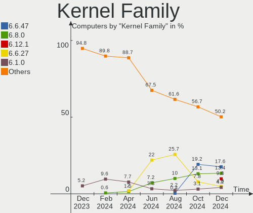
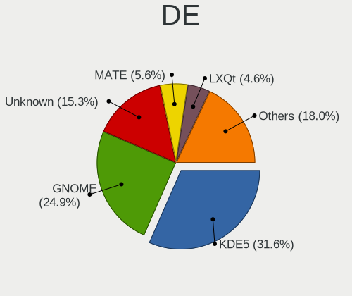
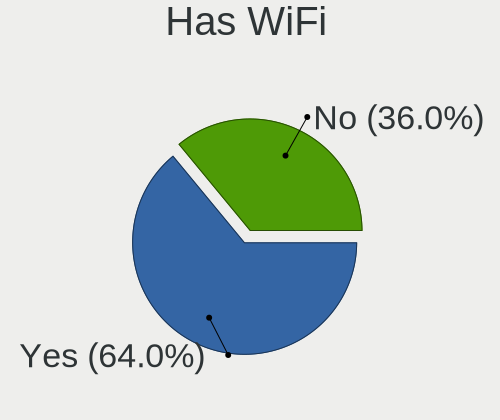
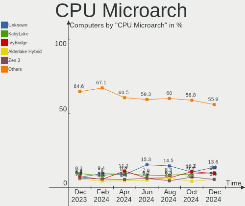
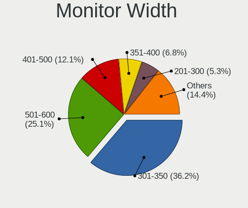
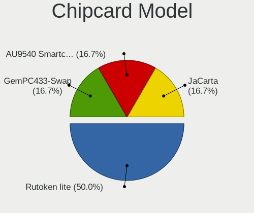

Linux in Russia - Hardware Trends
---------------------------------

A project to identify most popular hardware characteristics and track their change
over time based on data collected by Linux users at https://Linux-Hardware.org.

Anyone can contribute to this report by the [hw-probe](https://github.com/linuxhw/hw-probe) tool:

    sudo -E hw-probe -all -upload

This is a report for all computer types. See also reports for [desktops](/Location/Russia/Desktop/README.md) and [notebooks](/Location/Russia/Notebook/README.md).

Period: Aug, 2022.

Contents
--------

* [ System ](#system)
  - [ OS                       ](#os)
  - [ OS Family                ](#os-family)
  - [ Kernel                   ](#kernel)
  - [ Kernel Family            ](#kernel-family)
  - [ Kernel Major Ver.        ](#kernel-major-ver)
  - [ Arch                     ](#arch)
  - [ DE                       ](#de)
  - [ Display Server           ](#display-server)
  - [ Display Manager          ](#display-manager)
  - [ OS Lang                  ](#os-lang)
  - [ Boot Mode                ](#boot-mode)
  - [ Filesystem               ](#filesystem)
  - [ Part. scheme             ](#part-scheme)
  - [ Dual Boot with Linux/BSD ](#dual-boot-with-linuxbsd)
  - [ Dual Boot (Win)          ](#dual-boot-win)

* [ Board ](#board)
  - [ Vendor                   ](#vendor)
  - [ Model                    ](#model)
  - [ Model Family             ](#model-family)
  - [ MFG Year                 ](#mfg-year)
  - [ Form Factor              ](#form-factor)
  - [ Secure Boot              ](#secure-boot)
  - [ Coreboot                 ](#coreboot)
  - [ RAM Size                 ](#ram-size)
  - [ RAM Used                 ](#ram-used)
  - [ Total Drives             ](#total-drives)
  - [ Has CD-ROM               ](#has-cd-rom)
  - [ Has Ethernet             ](#has-ethernet)
  - [ Has WiFi                 ](#has-wifi)
  - [ Has Bluetooth            ](#has-bluetooth)

* [ Location ](#location)
  - [ Country                  ](#country)
  - [ City                     ](#city)

* [ Drives ](#drives)
  - [ Drive Vendor             ](#drive-vendor)
  - [ Drive Model              ](#drive-model)
  - [ HDD Vendor               ](#hdd-vendor)
  - [ SSD Vendor               ](#ssd-vendor)
  - [ Drive Kind               ](#drive-kind)
  - [ Drive Connector          ](#drive-connector)
  - [ Drive Size               ](#drive-size)
  - [ Space Total              ](#space-total)
  - [ Space Used               ](#space-used)
  - [ Malfunc. Drives          ](#malfunc-drives)
  - [ Malfunc. Drive Vendor    ](#malfunc-drive-vendor)
  - [ Malfunc. HDD Vendor      ](#malfunc-hdd-vendor)
  - [ Malfunc. Drive Kind      ](#malfunc-drive-kind)
  - [ Failed Drives            ](#failed-drives)
  - [ Failed Drive Vendor      ](#failed-drive-vendor)
  - [ Drive Status             ](#drive-status)

* [ Storage controller ](#storage-controller)
  - [ Storage Vendor           ](#storage-vendor)
  - [ Storage Model            ](#storage-model)
  - [ Storage Kind             ](#storage-kind)

* [ Processor ](#processor)
  - [ CPU Vendor               ](#cpu-vendor)
  - [ CPU Model                ](#cpu-model)
  - [ CPU Model Family         ](#cpu-model-family)
  - [ CPU Cores                ](#cpu-cores)
  - [ CPU Sockets              ](#cpu-sockets)
  - [ CPU Threads              ](#cpu-threads)
  - [ CPU Op-Modes             ](#cpu-op-modes)
  - [ CPU Microcode            ](#cpu-microcode)
  - [ CPU Microarch            ](#cpu-microarch)

* [ Graphics ](#graphics)
  - [ GPU Vendor               ](#gpu-vendor)
  - [ GPU Model                ](#gpu-model)
  - [ GPU Combo                ](#gpu-combo)
  - [ GPU Driver               ](#gpu-driver)
  - [ GPU Memory               ](#gpu-memory)

* [ Monitor ](#monitor)
  - [ Monitor Vendor           ](#monitor-vendor)
  - [ Monitor Model            ](#monitor-model)
  - [ Monitor Resolution       ](#monitor-resolution)
  - [ Monitor Diagonal         ](#monitor-diagonal)
  - [ Monitor Width            ](#monitor-width)
  - [ Aspect Ratio             ](#aspect-ratio)
  - [ Monitor Area             ](#monitor-area)
  - [ Pixel Density            ](#pixel-density)
  - [ Multiple Monitors        ](#multiple-monitors)

* [ Network ](#network)
  - [ Net Controller Vendor    ](#net-controller-vendor)
  - [ Net Controller Model     ](#net-controller-model)
  - [ Wireless Vendor          ](#wireless-vendor)
  - [ Wireless Model           ](#wireless-model)
  - [ Ethernet Vendor          ](#ethernet-vendor)
  - [ Ethernet Model           ](#ethernet-model)
  - [ Net Controller Kind      ](#net-controller-kind)
  - [ Used Controller          ](#used-controller)
  - [ NICs                     ](#nics)
  - [ IPv6                     ](#ipv6)

* [ Bluetooth ](#bluetooth)
  - [ Bluetooth Vendor         ](#bluetooth-vendor)
  - [ Bluetooth Model          ](#bluetooth-model)

* [ Sound ](#sound)
  - [ Sound Vendor             ](#sound-vendor)
  - [ Sound Model              ](#sound-model)

* [ Memory ](#memory)
  - [ Memory Vendor            ](#memory-vendor)
  - [ Memory Model             ](#memory-model)
  - [ Memory Kind              ](#memory-kind)
  - [ Memory Form Factor       ](#memory-form-factor)
  - [ Memory Size              ](#memory-size)
  - [ Memory Speed             ](#memory-speed)

* [ Printers & scanners ](#printers--scanners)
  - [ Printer Vendor           ](#printer-vendor)
  - [ Printer Model            ](#printer-model)
  - [ Scanner Vendor           ](#scanner-vendor)
  - [ Scanner Model            ](#scanner-model)

* [ Camera ](#camera)
  - [ Camera Vendor            ](#camera-vendor)
  - [ Camera Model             ](#camera-model)

* [ Security ](#security)
  - [ Fingerprint Vendor       ](#fingerprint-vendor)
  - [ Fingerprint Model        ](#fingerprint-model)
  - [ Chipcard Vendor          ](#chipcard-vendor)
  - [ Chipcard Model           ](#chipcard-model)

* [ Unsupported ](#unsupported)
  - [ Unsupported Devices      ](#unsupported-devices)
  - [ Unsupported Device Types ](#unsupported-device-types)

System
------

OS
--

Installed operating systems

| Name                         | Computers | Percent |
|------------------------------|-----------|---------|
| ROSA 12.2                    | 187       | 39.53%  |
| Debian 11                    | 42        | 8.88%   |
| Ubuntu 22.04                 | 25        | 5.29%   |
| Fedora 36                    | 24        | 5.07%   |
| ROSA R11.1                   | 21        | 4.44%   |
| OpenMandriva 4.3             | 16        | 3.38%   |
| Ubuntu 20.04                 | 14        | 2.96%   |
| KDE neon 20.04               | 8         | 1.69%   |
| Arch                         | 7         | 1.48%   |
| Linux Mint 21                | 6         | 1.27%   |
| Linux Mint 20.3              | 6         | 1.27%   |
| Red OS 7.3.1                 | 5         | 1.06%   |
| OpenMandriva 4.90            | 4         | 0.85%   |
| Manjaro                      | 4         | 0.85%   |
| Kubuntu 22.04                | 4         | 0.85%   |
| Cyber Infra 5.0.1            | 4         | 0.85%   |
| Arch Rolling                 | 4         | 0.85%   |
| ALT Linux 10.0.900           | 4         | 0.85%   |
| ROSA 12.1                    | 3         | 0.63%   |
| Pop!_OS 22.04                | 3         | 0.63%   |
| openSUSE Tumbleweed-XXXXXXXX | 3         | 0.63%   |
| Manjaro 21.3.7               | 3         | 0.63%   |
| Manjaro 21.3.6               | 3         | 0.63%   |
| Gentoo 2.8                   | 3         | 0.63%   |
| Fedora 35                    | 3         | 0.63%   |
| Elementary 6.1               | 3         | 0.63%   |
| CentOS 7                     | 3         | 0.63%   |
| Zorin 16                     | 2         | 0.42%   |
| Xubuntu 22.04                | 2         | 0.42%   |
| Xero Rolling                 | 2         | 0.42%   |
| Ubuntu 22.10                 | 2         | 0.42%   |
| ROSA R11                     | 2         | 0.42%   |
| ROSA 12                      | 2         | 0.42%   |
| Red OS 7.3                   | 2         | 0.42%   |
| Nobara 36                    | 2         | 0.42%   |
| NixOS 22.05                  | 2         | 0.42%   |
| MOS 10                       | 2         | 0.42%   |
| Lubuntu 22.04                | 2         | 0.42%   |
| LMDE 5                       | 2         | 0.42%   |
| Linux Mint 20                | 2         | 0.42%   |
| Kali 2022.3                  | 2         | 0.42%   |
| Debian Unstable              | 2         | 0.42%   |
| Artix Rolling                | 2         | 0.42%   |
| ALT Linux 10.1               | 2         | 0.42%   |
| ALT Linux 10.0               | 2         | 0.42%   |
| Xubuntu 20.04                | 1         | 0.21%   |
| Xubuntu 18.04                | 1         | 0.21%   |
| Ubuntu MATE 20.04            | 1         | 0.21%   |
| Ubuntu MATE 18.04            | 1         | 0.21%   |
| Ubuntu 19.10                 | 1         | 0.21%   |
| Ubuntu 18.04                 | 1         | 0.21%   |
| TeArch Rolling               | 1         | 0.21%   |
| SteamOS 3.3                  | 1         | 0.21%   |
| ROSA R12                     | 1         | 0.21%   |
| Raspbian 11                  | 1         | 0.21%   |
| org.kde.Platform 5.15-21.08  | 1         | 0.21%   |
| Manjaro 22.0.0               | 1         | 0.21%   |
| Linux Mint 20.2              | 1         | 0.21%   |
| Kometa 1                     | 1         | 0.21%   |
| Kali 2021.4                  | 1         | 0.21%   |

OS Family
---------

OS without a version

| Name             | Computers | Percent |
|------------------|-----------|---------|
| ROSA             | 216       | 45.67%  |
| Debian           | 45        | 9.51%   |
| Ubuntu           | 43        | 9.09%   |
| Fedora           | 28        | 5.92%   |
| OpenMandriva     | 20        | 4.23%   |
| Linux Mint       | 15        | 3.17%   |
| ALT Linux        | 12        | 2.54%   |
| Manjaro          | 11        | 2.33%   |
| Arch             | 11        | 2.33%   |
| KDE neon         | 8         | 1.69%   |
| Red OS           | 7         | 1.48%   |
| Cyber Infra      | 5         | 1.06%   |
| Xubuntu          | 4         | 0.85%   |
| Kubuntu          | 4         | 0.85%   |
| Pop!_OS          | 3         | 0.63%   |
| openSUSE         | 3         | 0.63%   |
| Kali             | 3         | 0.63%   |
| Gentoo           | 3         | 0.63%   |
| Elementary       | 3         | 0.63%   |
| CentOS           | 3         | 0.63%   |
| Zorin            | 2         | 0.42%   |
| Xero             | 2         | 0.42%   |
| Ubuntu MATE      | 2         | 0.42%   |
| Nobara           | 2         | 0.42%   |
| NixOS            | 2         | 0.42%   |
| Lubuntu          | 2         | 0.42%   |
| LMDE             | 2         | 0.42%   |
| Clear Linux      | 2         | 0.42%   |
| Artix            | 2         | 0.42%   |
| ArcoLinux        | 2         | 0.42%   |
| TeArch           | 1         | 0.21%   |
| SteamOS          | 1         | 0.21%   |
| Raspbian         | 1         | 0.21%   |
| org.kde.Platform | 1         | 0.21%   |
| Endless          | 1         | 0.21%   |
| EndeavourOS      | 1         | 0.21%   |

Kernel
------

Version of the Linux kernel

| Version                                        | Computers | Percent |
|------------------------------------------------|-----------|---------|
| 5.10.74-generic-2rosa2021.1-x86_64             | 88        | 18.6%   |
| 5.10.118-generic-2rosa2021.1-x86_64            | 62        | 13.11%  |
| 5.15.0-46-generic                              | 33        | 6.98%   |
| 5.10.0-7-amd64                                 | 29        | 6.13%   |
| 5.15.0-43-generic                              | 25        | 5.29%   |
| 5.16.7-desktop-1omv4003                        | 14        | 2.96%   |
| 5.15.43-generic-2rosa2021.1-x86_64             | 10        | 2.11%   |
| 5.10.0-16-amd64                                | 9         | 1.9%    |
| 5.17.11-generic-2rosa2021.1-x86_64             | 8         | 1.69%   |
| 5.18.16-200.fc36.x86_64                        | 6         | 1.27%   |
| 4.15.0-desktop-122.124.1rosa-x86_64            | 6         | 1.27%   |
| 5.18.17-200.fc36.x86_64                        | 5         | 1.06%   |
| 5.18.16-arch1-1                                | 5         | 1.06%   |
| 5.18.13-200.fc36.x86_64                        | 5         | 1.06%   |
| 5.15.35-4.el7.3.x86_64                         | 5         | 1.06%   |
| 5.10.74-generic-2rosa2021.1-i586               | 5         | 1.06%   |
| 5.15.53.xm1-1.klp-xanmod-lts-rosa2021.1-x86_64 | 4         | 0.85%   |
| 5.15.0-41-generic                              | 4         | 0.85%   |
| 3.10.0-1160.41.1.vz7.183.5                     | 4         | 0.85%   |
| 5.4.83-generic-2rosa-x86_64                    | 3         | 0.63%   |
| 5.4.32-generic-2rosa-x86_64                    | 3         | 0.63%   |
| 5.18.18.xm1-1-xanmod-rosa2021.1-x86_64         | 3         | 0.63%   |
| 5.18.14-1-MANJARO                              | 3         | 0.63%   |
| 5.18.12-desktop-3omv4090                       | 3         | 0.63%   |
| 5.10.118-generic-2rosa2021.1-i586              | 3         | 0.63%   |
| 5.4.83-generic-2rosa-i586                      | 2         | 0.42%   |
| 5.4.32-generic-2rosa-i586                      | 2         | 0.42%   |
| 5.4.0-26-generic                               | 2         | 0.42%   |
| 5.4.0-125-generic                              | 2         | 0.42%   |
| 5.19.2-arch1-1                                 | 2         | 0.42%   |
| 5.19.1-3-MANJARO                               | 2         | 0.42%   |
| 5.19.0-15-generic                              | 2         | 0.42%   |
| 5.18.19-200.fc36.x86_64                        | 2         | 0.42%   |
| 5.18.18-200.fc36.x86_64                        | 2         | 0.42%   |
| 5.18.15-200.fc36.x86_64                        | 2         | 0.42%   |
| 5.18.0-kali5-amd64                             | 2         | 0.42%   |
| 5.17.1-desktop-2omv4050                        | 2         | 0.42%   |
| 5.15.60-1-MANJARO                              | 2         | 0.42%   |
| 5.15.59                                        | 2         | 0.42%   |
| 5.11.0-43-generic                              | 2         | 0.42%   |
| 5.10.71-generic-1rosa2021.1-x86_64             | 2         | 0.42%   |
| 5.10.133-std-def-alt1                          | 2         | 0.42%   |
| 5.10.0-17-amd64                                | 2         | 0.42%   |
| 4.9.155-nrj-desktop-1rosa-x86_64               | 2         | 0.42%   |
| 4.15.0-desktop-45.1rosa-x86_64                 | 2         | 0.42%   |
| 4.15.0-desktop-122.124.1rosa-i586              | 2         | 0.42%   |
| 3.18.19+                                       | 2         | 0.42%   |
| 3.10.0-1160.36.2.el7.x86_64                    | 2         | 0.42%   |
| 6.0.0-1-MANJARO                                | 1         | 0.21%   |
| 5.4.182-generic-1rosa2021.1-e2kv4              | 1         | 0.21%   |
| 5.4.0-124-generic                              | 1         | 0.21%   |
| 5.4.0-122-generic                              | 1         | 0.21%   |
| 5.4.0-113-generic                              | 1         | 0.21%   |
| 5.3.0-18-generic                               | 1         | 0.21%   |
| 5.19.5-arch1-1                                 | 1         | 0.21%   |
| 5.19.4-arch1-1                                 | 1         | 0.21%   |
| 5.19.4-200.fc36.x86_64                         | 1         | 0.21%   |
| 5.19.3-zen1-1-zen                              | 1         | 0.21%   |
| 5.19.3-arch1-1                                 | 1         | 0.21%   |
| 5.19.2-1-default                               | 1         | 0.21%   |

Kernel Family
-------------

Linux kernel without a distro release

| Version  | Computers | Percent |
|----------|-----------|---------|
| 5.10.74  | 93        | 19.66%  |
| 5.15.0   | 65        | 13.74%  |
| 5.10.118 | 65        | 13.74%  |
| 5.10.0   | 41        | 8.67%   |
| 5.18.16  | 17        | 3.59%   |
| 5.16.7   | 14        | 2.96%   |
| 4.15.0   | 12        | 2.54%   |
| 5.15.43  | 10        | 2.11%   |
| 5.17.11  | 8         | 1.69%   |
| 5.4.0    | 7         | 1.48%   |
| 3.10.0   | 7         | 1.48%   |
| 5.19.0   | 6         | 1.27%   |
| 5.18.18  | 6         | 1.27%   |
| 5.18.17  | 6         | 1.27%   |
| 5.18.13  | 6         | 1.27%   |
| 5.15.35  | 6         | 1.27%   |
| 5.4.83   | 5         | 1.06%   |
| 5.4.32   | 5         | 1.06%   |
| 5.19.1   | 5         | 1.06%   |
| 5.15.59  | 5         | 1.06%   |
| 5.15.53  | 5         | 1.06%   |
| 5.18.15  | 4         | 0.85%   |
| 5.18.12  | 4         | 0.85%   |
| 5.18.0   | 4         | 0.85%   |
| 5.11.0   | 4         | 0.85%   |
| 5.19.2   | 3         | 0.63%   |
| 5.18.19  | 3         | 0.63%   |
| 5.18.14  | 3         | 0.63%   |
| 5.15.60  | 3         | 0.63%   |
| 5.19.4   | 2         | 0.42%   |
| 5.19.3   | 2         | 0.42%   |
| 5.18.9   | 2         | 0.42%   |
| 5.17.5   | 2         | 0.42%   |
| 5.17.1   | 2         | 0.42%   |
| 5.15.52  | 2         | 0.42%   |
| 5.14.0   | 2         | 0.42%   |
| 5.13.0   | 2         | 0.42%   |
| 5.10.71  | 2         | 0.42%   |
| 5.10.133 | 2         | 0.42%   |
| 4.9.155  | 2         | 0.42%   |
| 3.18.19  | 2         | 0.42%   |
| 6.0.0    | 1         | 0.21%   |
| 5.4.182  | 1         | 0.21%   |
| 5.3.0    | 1         | 0.21%   |
| 5.19.5   | 1         | 0.21%   |
| 5.18.4   | 1         | 0.21%   |
| 5.18.11  | 1         | 0.21%   |
| 5.18.10  | 1         | 0.21%   |
| 5.17.13  | 1         | 0.21%   |
| 5.17.12  | 1         | 0.21%   |
| 5.16.20  | 1         | 0.21%   |
| 5.15.62  | 1         | 0.21%   |
| 5.15.58  | 1         | 0.21%   |
| 5.15.57  | 1         | 0.21%   |
| 5.15.55  | 1         | 0.21%   |
| 5.15.39  | 1         | 0.21%   |
| 5.15.32  | 1         | 0.21%   |
| 5.15.10  | 1         | 0.21%   |
| 5.13.9   | 1         | 0.21%   |
| 5.10.82  | 1         | 0.21%   |

Kernel Major Ver.
-----------------

Linux kernel major version

| Version | Computers | Percent |
|---------|-----------|---------|
| 5.10    | 209       | 44.19%  |
| 5.15    | 103       | 21.78%  |
| 5.18    | 58        | 12.26%  |
| 5.19    | 19        | 4.02%   |
| 5.4     | 18        | 3.81%   |
| 5.16    | 15        | 3.17%   |
| 5.17    | 14        | 2.96%   |
| 4.15    | 12        | 2.54%   |
| 3.10    | 8         | 1.69%   |
| 5.11    | 4         | 0.85%   |
| 5.13    | 3         | 0.63%   |
| 5.14    | 2         | 0.42%   |
| 4.9     | 2         | 0.42%   |
| 3.18    | 2         | 0.42%   |
| 6.0     | 1         | 0.21%   |
| 5.3     | 1         | 0.21%   |
| 4.19    | 1         | 0.21%   |
| 4.14    | 1         | 0.21%   |

Arch
----

OS architecture (x86_64, i586, etc.)

| Name    | Computers | Percent |
|---------|-----------|---------|
| x86_64  | 454       | 95.98%  |
| i686    | 14        | 2.96%   |
| armv7l  | 2         | 0.42%   |
| aarch64 | 2         | 0.42%   |
| e2k     | 1         | 0.21%   |

DE
--

Desktop Environment

| Name               | Computers | Percent |
|--------------------|-----------|---------|
| GNOME              | 186       | 39.32%  |
| KDE5               | 138       | 29.18%  |
| Unknown            | 53        | 11.21%  |
| LXQt               | 31        | 6.55%   |
| KDE4               | 17        | 3.59%   |
| X-Cinnamon         | 15        | 3.17%   |
| XFCE               | 13        | 2.75%   |
| MATE               | 10        | 2.11%   |
| Pantheon           | 3         | 0.63%   |
| Cinnamon           | 3         | 0.63%   |
| i3                 | 2         | 0.42%   |
| pantheon-non-gnome | 1         | 0.21%   |
| awesome            | 1         | 0.21%   |

Display Server
--------------

X11 or Wayland

| Name    | Computers | Percent |
|---------|-----------|---------|
| X11     | 219       | 46.3%   |
| Wayland | 210       | 44.4%   |
| Unknown | 38        | 8.03%   |
| Tty     | 6         | 1.27%   |

Display Manager
---------------

SDDM, LightDM, etc.

| Name    | Computers | Percent |
|---------|-----------|---------|
| GDM     | 145       | 30.66%  |
| SDDM    | 127       | 26.85%  |
| Unknown | 100       | 21.14%  |
| LightDM | 45        | 9.51%   |
| GDM3    | 37        | 7.82%   |
| KDM     | 17        | 3.59%   |
| XDM     | 1         | 0.21%   |
| SLiM    | 1         | 0.21%   |

OS Lang
-------

Language

| Lang    | Computers | Percent |
|---------|-----------|---------|
| ru_RU   | 367       | 77.59%  |
| en_US   | 78        | 16.49%  |
| Unknown | 15        | 3.17%   |
| C       | 6         | 1.27%   |
| ba_RU   | 2         | 0.42%   |
| pt_BR   | 1         | 0.21%   |
| en_GB   | 1         | 0.21%   |
| en_AU   | 1         | 0.21%   |
| en_AG   | 1         | 0.21%   |
| de_DE   | 1         | 0.21%   |

Boot Mode
---------

EFI or BIOS

| Mode | Computers | Percent |
|------|-----------|---------|
| EFI  | 260       | 54.97%  |
| BIOS | 213       | 45.03%  |

Filesystem
----------

Type of filesystem

| Type    | Computers | Percent |
|---------|-----------|---------|
| Ext4    | 361       | 76.32%  |
| Overlay | 53        | 11.21%  |
| Btrfs   | 51        | 10.78%  |
| Xfs     | 4         | 0.85%   |
| F2fs    | 2         | 0.42%   |
| Zfs     | 1         | 0.21%   |
| Ext2    | 1         | 0.21%   |

Part. scheme
------------

Scheme of partitioning

| Type    | Computers | Percent |
|---------|-----------|---------|
| GPT     | 278       | 58.77%  |
| MBR     | 121       | 25.58%  |
| Unknown | 74        | 15.64%  |

Dual Boot with Linux/BSD
------------------------

Hosting more than one Linux/BSD

| Dual boot | Computers | Percent |
|-----------|-----------|---------|
| No        | 384       | 81.18%  |
| Yes       | 89        | 18.82%  |

Dual Boot (Win)
---------------

Hosting Linux and Windows

| Dual boot | Computers | Percent |
|-----------|-----------|---------|
| No        | 267       | 56.45%  |
| Yes       | 206       | 43.55%  |

Board
-----

Vendor
------

Motherboard manufacturer

| Name                                      | Computers | Percent |
|-------------------------------------------|-----------|---------|
| ASUSTek Computer                          | 100       | 21.14%  |
| Lenovo                                    | 59        | 12.47%  |
| Gigabyte Technology                       | 49        | 10.36%  |
| Hewlett-Packard                           | 41        | 8.67%   |
| MSI                                       | 35        | 7.4%    |
| Acer                                      | 31        | 6.55%   |
| ASRock                                    | 29        | 6.13%   |
| Dell                                      | 22        | 4.65%   |
| HUAWEI                                    | 16        | 3.38%   |
| Unknown                                   | 11        | 2.33%   |
| Supermicro                                | 9         | 1.9%    |
| Samsung Electronics                       | 7         | 1.48%   |
| Intel                                     | 5         | 1.06%   |
| eMachines                                 | 5         | 1.06%   |
| ECS                                       | 5         | 1.06%   |
| Huanan                                    | 4         | 0.85%   |
| Aquarius                                  | 3         | 0.63%   |
| Timi                                      | 2         | 0.42%   |
| Sony                                      | 2         | 0.42%   |
| Pegatron                                  | 2         | 0.42%   |
| MACHINIST                                 | 2         | 0.42%   |
| ICL                                       | 2         | 0.42%   |
| Google                                    | 2         | 0.42%   |
| Foxconn                                   | 2         | 0.42%   |
| Apple                                     | 2         | 0.42%   |
| 3Logic Group                              | 2         | 0.42%   |
| win element                               | 1         | 0.21%   |
| Valve                                     | 1         | 0.21%   |
| Toshiba                                   | 1         | 0.21%   |
| Soyo                                      | 1         | 0.21%   |
| Shenzhen Baohuazhong Science & Technology | 1         | 0.21%   |
| Raspberry Pi Foundation                   | 1         | 0.21%   |
| Prestigio                                 | 1         | 0.21%   |
| Packard Bell                              | 1         | 0.21%   |
| KupiDeshego Edition                       | 1         | 0.21%   |
| Koloe                                     | 1         | 0.21%   |
| iRU                                       | 1         | 0.21%   |
| Irbis                                     | 1         | 0.21%   |
| IP3 Technology                            | 1         | 0.21%   |
| IP3 Tech                                  | 1         | 0.21%   |
| HONOR                                     | 1         | 0.21%   |
| Haier                                     | 1         | 0.21%   |
| Fujitsu                                   | 1         | 0.21%   |
| Digma                                     | 1         | 0.21%   |
| DEPO Computers                            | 1         | 0.21%   |
| Chuwi                                     | 1         | 0.21%   |
| Biostar                                   | 1         | 0.21%   |
| BBEN                                      | 1         | 0.21%   |
| AZW                                       | 1         | 0.21%   |
| Alienware                                 | 1         | 0.21%   |

Model
-----

Motherboard model

| Name                                                                                     | Computers | Percent |
|------------------------------------------------------------------------------------------|-----------|---------|
| Unknown                                                                                  | 13        | 2.75%   |
| Supermicro Super Server                                                                  | 8         | 1.69%   |
| ASUS All Series                                                                          | 5         | 1.06%   |
| MSI MS-7996                                                                              | 3         | 0.63%   |
| Lenovo B570e HuronRiver Platform                                                         | 3         | 0.63%   |
| HP Pavilion g6                                                                           | 3         | 0.63%   |
| ECS G31T-M9                                                                              | 3         | 0.63%   |
| Sony VPCSB1V9R                                                                           | 2         | 0.42%   |
| MSI MS-7D22                                                                              | 2         | 0.42%   |
| MSI MS-7C94                                                                              | 2         | 0.42%   |
| MSI MS-7817                                                                              | 2         | 0.42%   |
| Lenovo ThinkSystem SR650 -[7X06CTO1WW]-                                                  | 2         | 0.42%   |
| Lenovo IdeaPad S340-14API 81NB                                                           | 2         | 0.42%   |
| Lenovo IdeaPad Gaming 3 15IMH05 81Y4                                                     | 2         | 0.42%   |
| Lenovo IdeaPad 330-15IKB 81DE                                                            | 2         | 0.42%   |
| Intel X99                                                                                | 2         | 0.42%   |
| HUAWEI NBD-WXX9                                                                          | 2         | 0.42%   |
| HUAWEI KLVD-WXX9                                                                         | 2         | 0.42%   |
| HUAWEI HVY-WXX9                                                                          | 2         | 0.42%   |
| HUAWEI CREM-WXX9                                                                         | 2         | 0.42%   |
| HUAWEI BOM-WXX9                                                                          | 2         | 0.42%   |
| HUAWEI BOHK-WAX9X                                                                        | 2         | 0.42%   |
| HP Victus by Laptop 16-e0xxx                                                             | 2         | 0.42%   |
| HP ProBook 440 G8 Notebook PC                                                            | 2         | 0.42%   |
| HP Pavilion dv6                                                                          | 2         | 0.42%   |
| HP Laptop 15s-fq2xxx                                                                     | 2         | 0.42%   |
| Gigabyte H110M-S2V                                                                       | 2         | 0.42%   |
| Gigabyte B550M S2H                                                                       | 2         | 0.42%   |
| Gigabyte B450 GAMING X                                                                   | 2         | 0.42%   |
| Gigabyte B360M-HD3                                                                       | 2         | 0.42%   |
| eMachines eME728                                                                         | 2         | 0.42%   |
| ASUS VivoBook_ASUS Laptop E510MA_R522MA                                                  | 2         | 0.42%   |
| ASUS SABERTOOTH 990FX R2.0                                                               | 2         | 0.42%   |
| ASUS PRIME Z370-P                                                                        | 2         | 0.42%   |
| ASUS P8H67-M LE                                                                          | 2         | 0.42%   |
| ASUS P8H61-M LX3                                                                         | 2         | 0.42%   |
| ASUS F5N                                                                                 | 2         | 0.42%   |
| ASRock H110M-DGS R3.0                                                                    | 2         | 0.42%   |
| ASRock 970 Pro3 R2.0                                                                     | 2         | 0.42%   |
| Apple MacBookAir7,2                                                                      | 2         | 0.42%   |
| Acer Nitro AN515-31                                                                      | 2         | 0.42%   |
| win element M1K                                                                          | 1         | 0.21%   |
| Valve Jupiter                                                                            | 1         | 0.21%   |
| Toshiba Satellite L300                                                                   | 1         | 0.21%   |
| Timi TM1701                                                                              | 1         | 0.21%   |
| Timi RedmiBook Pro 15S                                                                   | 1         | 0.21%   |
| Supermicro X8DTL                                                                         | 1         | 0.21%   |
| Soyo SY-Classic B660M                                                                    | 1         | 0.21%   |
| Shenzhen Baohuazhong Science & XN1A                                                      | 1         | 0.21%   |
| Samsung RV411/RV511/E3511/S3511/RV711/E3411                                              | 1         | 0.21%   |
| Samsung R580/R590                                                                        | 1         | 0.21%   |
| Samsung R530/R730/R540                                                                   | 1         | 0.21%   |
| Samsung R528/R728                                                                        | 1         | 0.21%   |
| Samsung NC210/NC110                                                                      | 1         | 0.21%   |
| Samsung 355V4C/355V4X/355V5C/355V5X/356V4C/356V4X/356V5C/356V5X/3445VC/3445VX/3545VC/354 | 1         | 0.21%   |
| Samsung 300E4A/300E5A/300E7A                                                             | 1         | 0.21%   |
| RPi Raspberry Pi Compute Module 4 Rev 1.0                                                | 1         | 0.21%   |
| Prestigio PSB141C01BFH                                                                   | 1         | 0.21%   |
| Pegatron IPX41-D3                                                                        | 1         | 0.21%   |
| Pegatron A17                                                                             | 1         | 0.21%   |

Model Family
------------

Motherboard model prefix

| Name               | Computers | Percent |
|--------------------|-----------|---------|
| Lenovo IdeaPad     | 20        | 4.23%   |
| Acer Aspire        | 15        | 3.17%   |
| Unknown            | 13        | 2.75%   |
| Lenovo ThinkPad    | 12        | 2.54%   |
| HP Pavilion        | 12        | 2.54%   |
| ASUS VivoBook      | 9         | 1.9%    |
| ASUS PRIME         | 9         | 1.9%    |
| Supermicro Super   | 8         | 1.69%   |
| HP Laptop          | 7         | 1.48%   |
| Dell Latitude      | 7         | 1.48%   |
| HP ProBook         | 6         | 1.27%   |
| ASUS TUF           | 6         | 1.27%   |
| ASUS ROG           | 6         | 1.27%   |
| Dell Inspiron      | 5         | 1.06%   |
| ASUS All           | 5         | 1.06%   |
| Lenovo ThinkBook   | 4         | 0.85%   |
| Lenovo Legion      | 4         | 0.85%   |
| Gigabyte B550M     | 4         | 0.85%   |
| Gigabyte B450      | 4         | 0.85%   |
| Acer Nitro         | 4         | 0.85%   |
| Acer Extensa       | 4         | 0.85%   |
| MSI MS-7996        | 3         | 0.63%   |
| Lenovo B570e       | 3         | 0.63%   |
| ECS G31T-M9        | 3         | 0.63%   |
| Dell Vostro        | 3         | 0.63%   |
| ASUS P8H61-M       | 3         | 0.63%   |
| Sony VPCSB1V9R     | 2         | 0.42%   |
| MSI MS-7D22        | 2         | 0.42%   |
| MSI MS-7C94        | 2         | 0.42%   |
| MSI MS-7817        | 2         | 0.42%   |
| MSI Creator        | 2         | 0.42%   |
| Lenovo ThinkSystem | 2         | 0.42%   |
| Lenovo ThinkCentre | 2         | 0.42%   |
| Intel X99          | 2         | 0.42%   |
| HUAWEI NBD-WXX9    | 2         | 0.42%   |
| HUAWEI KLVD-WXX9   | 2         | 0.42%   |
| HUAWEI HVY-WXX9    | 2         | 0.42%   |
| HUAWEI CREM-WXX9   | 2         | 0.42%   |
| HUAWEI BOM-WXX9    | 2         | 0.42%   |
| HUAWEI BOHK-WAX9X  | 2         | 0.42%   |
| Huanan X79         | 2         | 0.42%   |
| HP Victus          | 2         | 0.42%   |
| HP EliteBook       | 2         | 0.42%   |
| HP 250             | 2         | 0.42%   |
| Gigabyte H110M-S2V | 2         | 0.42%   |
| Gigabyte B360M-HD3 | 2         | 0.42%   |
| eMachines eME728   | 2         | 0.42%   |
| Dell Precision     | 2         | 0.42%   |
| Dell OptiPlex      | 2         | 0.42%   |
| ASUS Zenbook       | 2         | 0.42%   |
| ASUS SABERTOOTH    | 2         | 0.42%   |
| ASUS P8Z77-V       | 2         | 0.42%   |
| ASUS P8H77-V       | 2         | 0.42%   |
| ASUS P8H67-M       | 2         | 0.42%   |
| ASUS P8H61-MX      | 2         | 0.42%   |
| ASUS F5N           | 2         | 0.42%   |
| ASRock H110M-DGS   | 2         | 0.42%   |
| ASRock 970         | 2         | 0.42%   |
| Apple MacBookAir7  | 2         | 0.42%   |
| win element M1K    | 1         | 0.21%   |

MFG Year
--------

Motherboard manufacture year

| Year    | Computers | Percent |
|---------|-----------|---------|
| 2021    | 70        | 14.8%   |
| 2020    | 53        | 11.21%  |
| 2018    | 41        | 8.67%   |
| 2012    | 37        | 7.82%   |
| 2013    | 35        | 7.4%    |
| 2019    | 32        | 6.77%   |
| 2011    | 32        | 6.77%   |
| 2010    | 30        | 6.34%   |
| 2017    | 23        | 4.86%   |
| 2009    | 23        | 4.86%   |
| 2015    | 22        | 4.65%   |
| 2016    | 21        | 4.44%   |
| 2022    | 16        | 3.38%   |
| 2014    | 11        | 2.33%   |
| 2008    | 10        | 2.11%   |
| 2007    | 10        | 2.11%   |
| Unknown | 6         | 1.27%   |
| 2006    | 1         | 0.21%   |

Form Factor
-----------

Physical design of the computer

| Name           | Computers | Percent |
|----------------|-----------|---------|
| Notebook       | 240       | 50.74%  |
| Desktop        | 205       | 43.34%  |
| Server         | 12        | 2.54%   |
| All in one     | 6         | 1.27%   |
| Tablet         | 4         | 0.85%   |
| System on chip | 3         | 0.63%   |
| Mini pc        | 2         | 0.42%   |
| Convertible    | 1         | 0.21%   |

Secure Boot
-----------

Enabled or disabled

| State    | Computers | Percent |
|----------|-----------|---------|
| Disabled | 449       | 94.93%  |
| Enabled  | 24        | 5.07%   |

Coreboot
--------

Have coreboot on board

| Used | Computers | Percent |
|------|-----------|---------|
| No   | 471       | 99.58%  |
| Yes  | 2         | 0.42%   |

RAM Size
--------

Total RAM memory

| Size in GB  | Computers | Percent |
|-------------|-----------|---------|
| 4.01-8.0    | 107       | 22.62%  |
| 8.01-16.0   | 105       | 22.2%   |
| 3.01-4.0    | 83        | 17.55%  |
| 16.01-24.0  | 80        | 16.91%  |
| 32.01-64.0  | 38        | 8.03%   |
| 1.01-2.0    | 29        | 6.13%   |
| 64.01-256.0 | 12        | 2.54%   |
| 2.01-3.0    | 9         | 1.9%    |
| 24.01-32.0  | 7         | 1.48%   |
| 0.51-1.0    | 3         | 0.63%   |

RAM Used
--------

Used RAM memory

| Used GB     | Computers | Percent |
|-------------|-----------|---------|
| 1.01-2.0    | 194       | 41.01%  |
| 0.51-1.0    | 92        | 19.45%  |
| 2.01-3.0    | 80        | 16.91%  |
| 4.01-8.0    | 50        | 10.57%  |
| 3.01-4.0    | 39        | 8.25%   |
| 8.01-16.0   | 11        | 2.33%   |
| 0.01-0.5    | 4         | 0.85%   |
| 64.01-256.0 | 1         | 0.21%   |
| 16.01-24.0  | 1         | 0.21%   |
| Unknown     | 1         | 0.21%   |

Total Drives
------------

Number of drives on board

| Drives | Computers | Percent |
|--------|-----------|---------|
| 1      | 274       | 57.93%  |
| 2      | 117       | 24.74%  |
| 3      | 42        | 8.88%   |
| 4      | 19        | 4.02%   |
| 5      | 12        | 2.54%   |
| 6      | 5         | 1.06%   |
| 11     | 1         | 0.21%   |
| 10     | 1         | 0.21%   |
| 8      | 1         | 0.21%   |
| 7      | 1         | 0.21%   |

Has CD-ROM
----------

Has CD-ROM on board

| Presented | Computers | Percent |
|-----------|-----------|---------|
| No        | 356       | 75.26%  |
| Yes       | 117       | 24.74%  |

Has Ethernet
------------

Has Ethernet on board

| Presented | Computers | Percent |
|-----------|-----------|---------|
| Yes       | 408       | 86.26%  |
| No        | 65        | 13.74%  |

Has WiFi
--------

Has WiFi module

| Presented | Computers | Percent |
|-----------|-----------|---------|
| Yes       | 299       | 63.21%  |
| No        | 174       | 36.79%  |

Has Bluetooth
-------------

Has Bluetooth module

| Presented | Computers | Percent |
|-----------|-----------|---------|
| Yes       | 270       | 57.08%  |
| No        | 203       | 42.92%  |

Location
--------

Country
-------

Geographic location (country)

| Country | Computers | Percent |
|---------|-----------|---------|
| Russia  | 473       | 100%    |

City
----

Geographic location (city)

| City                | Computers | Percent |
|---------------------|-----------|---------|
| Moscow              | 115       | 24.31%  |
| St Petersburg       | 34        | 7.19%   |
| Voronezh            | 33        | 6.98%   |
| Krasnodar           | 20        | 4.23%   |
| Yekaterinburg       | 14        | 2.96%   |
| Novosibirsk         | 12        | 2.54%   |
| Rostov-on-Don       | 11        | 2.33%   |
| Chelyabinsk         | 10        | 2.11%   |
| Ufa                 | 9         | 1.9%    |
| Saratov             | 8         | 1.69%   |
| Samara              | 8         | 1.69%   |
| Perm                | 8         | 1.69%   |
| Krasnoyarsk         | 7         | 1.48%   |
| Nizhniy Novgorod    | 6         | 1.27%   |
| Stavropol           | 5         | 1.06%   |
| Omsk                | 5         | 1.06%   |
| Yoshkar-Ola         | 4         | 0.85%   |
| Vladimir            | 4         | 0.85%   |
| Ulyanovsk           | 4         | 0.85%   |
| Serpukhov           | 4         | 0.85%   |
| Ryazan              | 4         | 0.85%   |
| Kemerovo            | 4         | 0.85%   |
| Belgorod            | 4         | 0.85%   |
| Yaroslavl           | 3         | 0.63%   |
| Volgograd           | 3         | 0.63%   |
| Tomsk               | 3         | 0.63%   |
| Salekhard           | 3         | 0.63%   |
| Petrozavodsk        | 3         | 0.63%   |
| Orenburg            | 3         | 0.63%   |
| Kazan’            | 3         | 0.63%   |
| Kaliningrad         | 3         | 0.63%   |
| Astrakhan           | 3         | 0.63%   |
| Zheleznogorsk       | 2         | 0.42%   |
| Vologda             | 2         | 0.42%   |
| Vladivostok         | 2         | 0.42%   |
| Tver                | 2         | 0.42%   |
| Sochi               | 2         | 0.42%   |
| Smolensk            | 2         | 0.42%   |
| Saransk             | 2         | 0.42%   |
| Odintsovo           | 2         | 0.42%   |
| Obninsk             | 2         | 0.42%   |
| Novokuznetsk        | 2         | 0.42%   |
| Noril'sk            | 2         | 0.42%   |
| Naberezhnyye Chelny | 2         | 0.42%   |
| Murom               | 2         | 0.42%   |
| Murmansk            | 2         | 0.42%   |
| Kursk               | 2         | 0.42%   |
| Kurgan              | 2         | 0.42%   |
| Korolyov            | 2         | 0.42%   |
| Kirov               | 2         | 0.42%   |
| Khabarovsk          | 2         | 0.42%   |
| Kamensk-Shakhtinsky | 2         | 0.42%   |
| Kamenetskiy         | 2         | 0.42%   |
| Blagoveshchensk     | 2         | 0.42%   |
| Barnaul             | 2         | 0.42%   |
| Zlatoust            | 1         | 0.21%   |
| Zhukovskiy          | 1         | 0.21%   |
| Zhirnovsk           | 1         | 0.21%   |
| Yelets              | 1         | 0.21%   |
| Yakutsk             | 1         | 0.21%   |

Drives
------

Drive Vendor
------------

Hard drive vendors

| Vendor                      | Computers | Drives | Percent |
|-----------------------------|-----------|--------|---------|
| WDC                         | 134       | 166    | 18.64%  |
| Seagate                     | 101       | 123    | 14.05%  |
| Samsung Electronics         | 84        | 92     | 11.68%  |
| Toshiba                     | 43        | 62     | 5.98%   |
| Kingston                    | 31        | 34     | 4.31%   |
| Hitachi                     | 31        | 32     | 4.31%   |
| Unknown                     | 25        | 29     | 3.48%   |
| China                       | 22        | 24     | 3.06%   |
| SanDisk                     | 17        | 17     | 2.36%   |
| SK hynix                    | 16        | 18     | 2.23%   |
| Apacer                      | 15        | 15     | 2.09%   |
| A-DATA Technology           | 15        | 18     | 2.09%   |
| SPCC                        | 14        | 14     | 1.95%   |
| Micron Technology           | 13        | 13     | 1.81%   |
| Intel                       | 13        | 15     | 1.81%   |
| Crucial                     | 12        | 14     | 1.67%   |
| Silicon Motion              | 9         | 9      | 1.25%   |
| Netac                       | 9         | 9      | 1.25%   |
| Unknown                     | 9         | 9      | 1.25%   |
| HGST                        | 8         | 12     | 1.11%   |
| Plextor                     | 6         | 6      | 0.83%   |
| Gigabyte Technology         | 6         | 6      | 0.83%   |
| XPG                         | 5         | 5      | 0.7%    |
| Patriot                     | 5         | 5      | 0.7%    |
| KIOXIA                      | 5         | 5      | 0.7%    |
| AMD                         | 5         | 5      | 0.7%    |
| Transcend                   | 4         | 4      | 0.56%   |
| Smartbuy                    | 4         | 4      | 0.56%   |
| Phison                      | 4         | 4      | 0.56%   |
| KingSpec                    | 4         | 4      | 0.56%   |
| UMIS                        | 3         | 3      | 0.42%   |
| OCZ                         | 3         | 3      | 0.42%   |
| GOODRAM                     | 3         | 3      | 0.42%   |
| WALRAM                      | 2         | 2      | 0.28%   |
| SCST_BIO                    | 2         | 6      | 0.28%   |
| Maxtor                      | 2         | 2      | 0.28%   |
| MAXIO Technology (Hangzhou) | 2         | 2      | 0.28%   |
| LEQIXIANG                   | 2         | 2      | 0.28%   |
| Hewlett-Packard             | 2         | 2      | 0.28%   |
| Apple                       | 2         | 2      | 0.28%   |
| XrayDisk                    | 1         | 1      | 0.14%   |
| Union Memory (Shenzhen)     | 1         | 1      | 0.14%   |
| UNIC2                       | 1         | 1      | 0.14%   |
| TO Exter                    | 1         | 1      | 0.14%   |
| Teclast                     | 1         | 1      | 0.14%   |
| Team                        | 1         | 1      | 0.14%   |
| ShanDianZhe                 | 1         | 1      | 0.14%   |
| SemsoTai                    | 1         | 1      | 0.14%   |
| Pioneer                     | 1         | 1      | 0.14%   |
| Phison Electronics          | 1         | 2      | 0.14%   |
| Palit                       | 1         | 1      | 0.14%   |
| NVMe                        | 1         | 2      | 0.14%   |
| NGFF                        | 1         | 1      | 0.14%   |
| LuminouTek                  | 1         | 1      | 0.14%   |
| LITEON                      | 1         | 1      | 0.14%   |
| Lexar                       | 1         | 1      | 0.14%   |
| Kllisre                     | 1         | 1      | 0.14%   |
| KIOXIA-EXCERIA              | 1         | 1      | 0.14%   |
| Kingston Technology Company | 1         | 1      | 0.14%   |
| KingFast                    | 1         | 1      | 0.14%   |

Drive Model
-----------

Hard drive models

| Model                                | Computers | Percent |
|--------------------------------------|-----------|---------|
| Seagate ST1000LM024 HN-M101MBB 1TB   | 9         | 1.16%   |
| Unknown                              | 9         | 1.16%   |
| WDC WDS240G2G0A-00JH30 240GB SSD     | 8         | 1.03%   |
| WDC WDS500G2B0A-00SM50 500GB SSD     | 7         | 0.9%    |
| Toshiba DT01ACA050 500GB             | 7         | 0.9%    |
| Apacer AS350 128GB SSD               | 7         | 0.9%    |
| SPCC Solid State Disk 128GB          | 6         | 0.77%   |
| Seagate ST500DM002-1BD142 500GB      | 6         | 0.77%   |
| Samsung SSD 860 EVO 250GB            | 6         | 0.77%   |
| Kingston SV300S37A120G 120GB SSD     | 6         | 0.77%   |
| WDC WD10EZEX-08WN4A0 1TB             | 5         | 0.64%   |
| Toshiba HDWD105 500GB                | 5         | 0.64%   |
| SPCC Solid State Disk 120GB          | 5         | 0.64%   |
| Seagate ST250DM000-1BD141 250GB      | 5         | 0.64%   |
| Kingston SA400S37240G 240GB SSD      | 5         | 0.64%   |
| China SSD 256GB                      | 5         | 0.64%   |
| WDC WDS120G2G0A-00JH30 120GB SSD     | 4         | 0.51%   |
| WDC WD20EARS-00MVWB0 2TB             | 4         | 0.51%   |
| WDC PC SN730 SDBPNTY-512G-1027 512GB | 4         | 0.51%   |
| Toshiba HDWD130 3TB                  | 4         | 0.51%   |
| Toshiba HDWD110 1TB                  | 4         | 0.51%   |
| Seagate ST3250318AS 250GB            | 4         | 0.51%   |
| Seagate ST1000LM035-1RK172 1TB       | 4         | 0.51%   |
| Seagate ST1000DM010-2EP102 1TB       | 4         | 0.51%   |
| Seagate ST1000DM003-1CH162 1TB       | 4         | 0.51%   |
| Samsung SSD 970 EVO Plus 1TB         | 4         | 0.51%   |
| Samsung SSD 860 EVO 500GB            | 4         | 0.51%   |
| Micron 1100_MTFDDAK512TBN 512GB SSD  | 4         | 0.51%   |
| Kingston SA400S37120G 120GB SSD      | 4         | 0.51%   |
| Hitachi HTS545025B9A300 250GB        | 4         | 0.51%   |
| China 120GB SSD                      | 4         | 0.51%   |
| WDC WDS120G2G0B-00EPW0 120GB SSD     | 3         | 0.39%   |
| WDC WD5000AAKX-001CA0 500GB          | 3         | 0.39%   |
| WDC WD20EFRX-68EUZN0 2TB             | 3         | 0.39%   |
| WDC WD10EZRZ-00HTKB0 1TB             | 3         | 0.39%   |
| Unknown SD/MMC/MS PRO 128GB          | 3         | 0.39%   |
| Unknown MMC Card  8GB                | 3         | 0.39%   |
| Toshiba MQ01ABF050 500GB             | 3         | 0.39%   |
| Toshiba MG04ACA400E 4TB              | 3         | 0.39%   |
| Toshiba DT01ACA100 1TB               | 3         | 0.39%   |
| Seagate ST3160815AS 160GB            | 3         | 0.39%   |
| Seagate Expansion 500GB              | 3         | 0.39%   |
| SanDisk NVMe SSD Drive 512GB         | 3         | 0.39%   |
| Samsung SSD 850 PRO 256GB            | 3         | 0.39%   |
| Samsung NVMe SSD Drive 512GB         | 3         | 0.39%   |
| Samsung NVMe SSD Drive 250GB         | 3         | 0.39%   |
| Samsung NVMe SSD Drive 1TB           | 3         | 0.39%   |
| Netac SSD 240GB                      | 3         | 0.39%   |
| KIOXIA KBG40ZNV512G 512GB            | 3         | 0.39%   |
| Kingston SA400S37480G 480GB SSD      | 3         | 0.39%   |
| Hitachi HDS721050CLA362 500GB        | 3         | 0.39%   |
| Crucial CT1000MX500SSD1 1TB          | 3         | 0.39%   |
| China SSD 120GB                      | 3         | 0.39%   |
| China SATA SSD 240GB                 | 3         | 0.39%   |
| XPG NVMe SSD Drive 256GB             | 2         | 0.26%   |
| WDC WDS240G2G0B-00EPW0 240GB SSD     | 2         | 0.26%   |
| WDC WD5000LPCX-24VHAT0 500GB         | 2         | 0.26%   |
| WDC WD5000LPCX-21VHAT0 500GB         | 2         | 0.26%   |
| WDC WD5000AADS-00S9B0 500GB          | 2         | 0.26%   |
| WDC WD3200BPVT-24JJ5T0 320GB         | 2         | 0.26%   |

HDD Vendor
----------

Hard disk drive vendors

| Vendor              | Computers | Drives | Percent |
|---------------------|-----------|--------|---------|
| Seagate             | 101       | 123    | 34.83%  |
| WDC                 | 100       | 120    | 34.48%  |
| Toshiba             | 35        | 52     | 12.07%  |
| Hitachi             | 31        | 32     | 10.69%  |
| HGST                | 8         | 12     | 2.76%   |
| Samsung Electronics | 7         | 7      | 2.41%   |
| Unknown             | 3         | 3      | 1.03%   |
| SCST_BIO            | 2         | 6      | 0.69%   |
| Maxtor              | 2         | 2      | 0.69%   |
| Unknown             | 1         | 1      | 0.34%   |

SSD Vendor
----------

Solid state drive vendors

| Vendor              | Computers | Drives | Percent |
|---------------------|-----------|--------|---------|
| Samsung Electronics | 36        | 38     | 13.64%  |
| WDC                 | 28        | 30     | 10.61%  |
| Kingston            | 28        | 30     | 10.61%  |
| China               | 22        | 24     | 8.33%   |
| SPCC                | 13        | 13     | 4.92%   |
| Crucial             | 12        | 14     | 4.55%   |
| Apacer              | 12        | 12     | 4.55%   |
| A-DATA Technology   | 11        | 12     | 4.17%   |
| Netac               | 9         | 9      | 3.41%   |
| Micron Technology   | 9         | 9      | 3.41%   |
| SanDisk             | 7         | 7      | 2.65%   |
| Intel               | 6         | 8      | 2.27%   |
| Unknown             | 6         | 6      | 2.27%   |
| Plextor             | 5         | 5      | 1.89%   |
| Patriot             | 5         | 5      | 1.89%   |
| Transcend           | 4         | 4      | 1.52%   |
| Toshiba             | 4         | 4      | 1.52%   |
| Smartbuy            | 4         | 4      | 1.52%   |
| SK hynix            | 4         | 4      | 1.52%   |
| KingSpec            | 4         | 4      | 1.52%   |
| Gigabyte Technology | 4         | 4      | 1.52%   |
| AMD                 | 4         | 4      | 1.52%   |
| OCZ                 | 3         | 3      | 1.14%   |
| GOODRAM             | 3         | 3      | 1.14%   |
| Leqixiang           | 2         | 2      | 0.76%   |
| Apple               | 2         | 2      | 0.76%   |
| XrayDisk            | 1         | 1      | 0.38%   |
| WALRAM              | 1         | 1      | 0.38%   |
| UNIC2               | 1         | 1      | 0.38%   |
| TO Exter            | 1         | 1      | 0.38%   |
| ShanDianZhe         | 1         | 1      | 0.38%   |
| SemsoTai            | 1         | 1      | 0.38%   |
| Pioneer             | 1         | 1      | 0.38%   |
| Palit               | 1         | 1      | 0.38%   |
| NVMe                | 1         | 2      | 0.38%   |
| NGFF                | 1         | 1      | 0.38%   |
| LuminouTek          | 1         | 1      | 0.38%   |
| LITEON              | 1         | 1      | 0.38%   |
| Lexar               | 1         | 1      | 0.38%   |
| KIOXIA-EXCERIA      | 1         | 1      | 0.38%   |
| Hewlett-Packard     | 1         | 1      | 0.38%   |
| Colorful            | 1         | 1      | 0.38%   |
| AirDisk             | 1         | 1      | 0.38%   |

Drive Kind
----------

HDD or SSD

| Kind    | Computers | Drives | Percent |
|---------|-----------|--------|---------|
| HDD     | 252       | 358    | 38.41%  |
| SSD     | 231       | 278    | 35.21%  |
| NVMe    | 144       | 159    | 21.95%  |
| MMC     | 24        | 28     | 3.66%   |
| Unknown | 5         | 6      | 0.76%   |

Drive Connector
---------------

SATA, SAS, NVMe, etc.

| Type | Computers | Drives | Percent |
|------|-----------|--------|---------|
| SATA | 366       | 623    | 66.91%  |
| NVMe | 143       | 158    | 26.14%  |
| MMC  | 24        | 28     | 4.39%   |
| SAS  | 14        | 20     | 2.56%   |

Drive Size
----------

Size of hard drive

| Size in TB      | Computers | Drives | Percent |
|-----------------|-----------|--------|---------|
| 0.01-0.5        | 296       | 396    | 62.85%  |
| 0.51-1.0        | 128       | 167    | 27.18%  |
| 1.01-2.0        | 21        | 23     | 4.46%   |
| 3.01-4.0        | 10        | 21     | 2.12%   |
| 2.01-3.0        | 9         | 14     | 1.91%   |
| 4.01-10.0       | 6         | 14     | 1.27%   |
| More than 100.0 | 1         | 1      | 0.21%   |

Space Total
-----------

Amount of disk space available on the file system

| Size in GB     | Computers | Percent |
|----------------|-----------|---------|
| 101-250        | 130       | 27.48%  |
| 251-500        | 95        | 20.08%  |
| 501-1000       | 68        | 14.38%  |
| 1-20           | 47        | 9.94%   |
| Unknown        | 37        | 7.82%   |
| 1001-2000      | 32        | 6.77%   |
| 51-100         | 31        | 6.55%   |
| 2001-3000      | 12        | 2.54%   |
| 21-50          | 11        | 2.33%   |
| More than 3000 | 10        | 2.11%   |

Space Used
----------

Amount of used disk space

| Used GB        | Computers | Percent |
|----------------|-----------|---------|
| 1-20           | 235       | 49.68%  |
| 21-50          | 57        | 12.05%  |
| 251-500        | 40        | 8.46%   |
| Unknown        | 37        | 7.82%   |
| 51-100         | 34        | 7.19%   |
| 101-250        | 30        | 6.34%   |
| 501-1000       | 25        | 5.29%   |
| 1001-2000      | 10        | 2.11%   |
| More than 3000 | 3         | 0.63%   |
| 2001-3000      | 2         | 0.42%   |

Malfunc. Drives
---------------

Drive models with a malfunction

| Model                                          | Computers | Drives | Percent |
|------------------------------------------------|-----------|--------|---------|
| WDC WDS240G2G0A-00JH30 240GB SSD               | 3         | 4      | 2.56%   |
| WDC WD20EARS-00MVWB0 2TB                       | 3         | 3      | 2.56%   |
| Micron Technology 1100_MTFDDAK512TBN 512GB SSD | 3         | 3      | 2.56%   |
| Hitachi HTS545025B9A300 250GB                  | 3         | 3      | 2.56%   |
| WDC WD5000AAKX-001CA0 500GB                    | 2         | 2      | 1.71%   |
| WDC WD5000AADS-00S9B0 500GB                    | 2         | 2      | 1.71%   |
| Seagate ST31000524AS 1TB                       | 2         | 2      | 1.71%   |
| Seagate ST1000LM024 HN-M101MBB 1TB             | 2         | 2      | 1.71%   |
| Seagate ST1000DM003-9YN162 1TB                 | 2         | 2      | 1.71%   |
| Kingston SV300S37A120G 120GB SSD               | 2         | 2      | 1.71%   |
| WDC WDS120G2G0A-00JH30 120GB SSD               | 1         | 1      | 0.85%   |
| WDC WD800JD-60LSA5 80GB                        | 1         | 1      | 0.85%   |
| WDC WD8000AARS-00Y5B1 800GB                    | 1         | 1      | 0.85%   |
| WDC WD5000LPLX-00ZNTT0 500GB                   | 1         | 1      | 0.85%   |
| WDC WD5000BEVT-22A0RT0 500GB                   | 1         | 1      | 0.85%   |
| WDC WD5000AAKX-08U6AA0 500GB                   | 1         | 1      | 0.85%   |
| WDC WD5000AAKS-00UU3A0 500GB                   | 1         | 1      | 0.85%   |
| WDC WD4500HLHX-01JJPV0 450GB                   | 1         | 1      | 0.85%   |
| WDC WD4000AAKS-00YGA0 400GB                    | 1         | 1      | 0.85%   |
| WDC WD3200BEVT-60ZCT1 320GB                    | 1         | 1      | 0.85%   |
| WDC WD3200AAKS-00B3A0 320GB                    | 1         | 1      | 0.85%   |
| WDC WD30EFRX-68EUZN0 3TB                       | 1         | 1      | 0.85%   |
| WDC WD2500BEKT-60A25T1 250GB                   | 1         | 1      | 0.85%   |
| WDC WD2500AAKX-001CA0 250GB                    | 1         | 1      | 0.85%   |
| WDC WD1600BEVT-22A23T0 160GB                   | 1         | 1      | 0.85%   |
| WDC WD15EARS-00Z5B1 1TB                        | 1         | 2      | 0.85%   |
| WDC WD10EZEX-75M2NA0 1TB                       | 1         | 1      | 0.85%   |
| WDC WD10EZEX-08M2NA0 1TB                       | 1         | 1      | 0.85%   |
| WDC WD10EZEX-07WN4A0 1TB                       | 1         | 1      | 0.85%   |
| WDC WD10EARS-00Z5B1 1TB                        | 1         | 1      | 0.85%   |
| WDC WD10EARS-00MVWB0 1TB                       | 1         | 1      | 0.85%   |
| WDC WD10EADS-65L5B1 1TB                        | 1         | 1      | 0.85%   |
| WDC WD10 SPZX-08Z10 1TB                        | 1         | 1      | 0.85%   |
| Transcend TS32GMSA310 32GB SSD                 | 1         | 1      | 0.85%   |
| Toshiba MQ01ABF050 500GB                       | 1         | 1      | 0.85%   |
| Toshiba MK1237GSX 120GB                        | 1         | 1      | 0.85%   |
| Toshiba HDWD110 1TB                            | 1         | 1      | 0.85%   |
| Toshiba HDWD105 500GB                          | 1         | 1      | 0.85%   |
| Toshiba DT01ACA050 500GB                       | 1         | 2      | 0.85%   |
| SK hynix HFS256G39TND-N210A 256GB SSD          | 1         | 1      | 0.85%   |
| SK hynix BC711 HFM512GD3JX013N 512GB           | 1         | 1      | 0.85%   |
| SemsoTai S200 2280 256GB SSD                   | 1         | 1      | 0.85%   |
| Seagate ST9500325AS 500GB                      | 1         | 1      | 0.85%   |
| Seagate ST9320328CS 320GB                      | 1         | 1      | 0.85%   |
| Seagate ST9320325AS 320GB                      | 1         | 1      | 0.85%   |
| Seagate ST9160821AS 160GB                      | 1         | 1      | 0.85%   |
| Seagate ST500LT012-9WS142 500GB                | 1         | 1      | 0.85%   |
| Seagate ST500LM000-SSHD-8GB                    | 1         | 1      | 0.85%   |
| Seagate ST500DM002-1BD142 500GB                | 1         | 1      | 0.85%   |
| Seagate ST3500413AS 500GB                      | 1         | 1      | 0.85%   |
| Seagate ST3400620A 400GB                       | 1         | 1      | 0.85%   |
| Seagate ST3300831AS 304GB                      | 1         | 1      | 0.85%   |
| Seagate ST3250318AS 250GB                      | 1         | 1      | 0.85%   |
| Seagate ST3250312AS 250GB                      | 1         | 2      | 0.85%   |
| Seagate ST3250310AS 250GB                      | 1         | 1      | 0.85%   |
| Seagate ST320LT022-1AE142 320GB                | 1         | 1      | 0.85%   |
| Seagate ST3170315A! ! ! 563TB                  | 1         | 1      | 0.85%   |
| Seagate ST3160815AS 160GB                      | 1         | 1      | 0.85%   |
| Seagate ST3160215AS 160GB                      | 1         | 1      | 0.85%   |
| Seagate ST3120813AS 120GB                      | 1         | 1      | 0.85%   |

Malfunc. Drive Vendor
---------------------

Vendors of faulty drives

| Vendor              | Computers | Drives | Percent |
|---------------------|-----------|--------|---------|
| WDC                 | 30        | 35     | 27.03%  |
| Seagate             | 30        | 36     | 27.03%  |
| Hitachi             | 15        | 15     | 13.51%  |
| Samsung Electronics | 7         | 7      | 6.31%   |
| Toshiba             | 5         | 6      | 4.5%    |
| Micron Technology   | 5         | 5      | 4.5%    |
| Kingston            | 3         | 3      | 2.7%    |
| SK hynix            | 2         | 2      | 1.8%    |
| OCZ                 | 2         | 2      | 1.8%    |
| Netac               | 2         | 2      | 1.8%    |
| China               | 2         | 2      | 1.8%    |
| Transcend           | 1         | 1      | 0.9%    |
| SemsoTai            | 1         | 1      | 0.9%    |
| Maxtor              | 1         | 1      | 0.9%    |
| LEQIXIANG           | 1         | 1      | 0.9%    |
| KingSpec            | 1         | 1      | 0.9%    |
| Intel               | 1         | 1      | 0.9%    |
| HGST                | 1         | 2      | 0.9%    |
| Unknown             | 1         | 1      | 0.9%    |

Malfunc. HDD Vendor
-------------------

Vendors of faulty HDD drives

| Vendor              | Computers | Drives | Percent |
|---------------------|-----------|--------|---------|
| Seagate             | 30        | 36     | 37.04%  |
| WDC                 | 27        | 30     | 33.33%  |
| Hitachi             | 15        | 15     | 18.52%  |
| Toshiba             | 5         | 6      | 6.17%   |
| Samsung Electronics | 2         | 2      | 2.47%   |
| Maxtor              | 1         | 1      | 1.23%   |
| HGST                | 1         | 2      | 1.23%   |

Malfunc. Drive Kind
-------------------

Kinds of faulty drives

| Kind | Computers | Drives | Percent |
|------|-----------|--------|---------|
| HDD  | 76        | 92     | 71.7%   |
| SSD  | 28        | 30     | 26.42%  |
| NVMe | 2         | 2      | 1.89%   |

Failed Drives
-------------

Failed drive models

| Model                           | Computers | Drives | Percent |
|---------------------------------|-----------|--------|---------|
| WDC WD20EARS-00MVWB0 2TB        | 1         | 1      | 50%     |
| Seagate ST500DM002-1BD142 500GB | 1         | 1      | 50%     |

Failed Drive Vendor
-------------------

Failed drive vendors

| Vendor  | Computers | Drives | Percent |
|---------|-----------|--------|---------|
| WDC     | 1         | 1      | 50%     |
| Seagate | 1         | 1      | 50%     |

Drive Status
------------

Number of failed and malfunc. drives

| Status   | Computers | Drives | Percent |
|----------|-----------|--------|---------|
| Works    | 337       | 543    | 61.5%   |
| Detected | 107       | 160    | 19.53%  |
| Malfunc  | 102       | 124    | 18.61%  |
| Failed   | 2         | 2      | 0.36%   |

Storage controller
------------------

Storage Vendor
--------------

Storage controller vendors

| Vendor                       | Computers | Percent |
|------------------------------|-----------|---------|
| Intel                        | 303       | 51.01%  |
| AMD                          | 111       | 18.69%  |
| Samsung Electronics          | 46        | 7.74%   |
| SanDisk                      | 25        | 4.21%   |
| Silicon Motion               | 16        | 2.69%   |
| SK hynix                     | 12        | 2.02%   |
| Phison Electronics           | 10        | 1.68%   |
| ASMedia Technology           | 9         | 1.52%   |
| JMicron Technology           | 8         | 1.35%   |
| Toshiba America Info Systems | 6         | 1.01%   |
| Nvidia                       | 6         | 1.01%   |
| ADATA Technology             | 6         | 1.01%   |
| KIOXIA                       | 5         | 0.84%   |
| Kingston Technology Company  | 5         | 0.84%   |
| Union Memory (Shenzhen)      | 4         | 0.67%   |
| Micron Technology            | 4         | 0.67%   |
| Realtek Semiconductor        | 3         | 0.51%   |
| MAXIO Technology (Hangzhou)  | 3         | 0.51%   |
| LSI Logic / Symbios Logic    | 3         | 0.51%   |
| Broadcom / LSI               | 3         | 0.51%   |
| Marvell Technology Group     | 2         | 0.34%   |
| VIA Technologies             | 1         | 0.17%   |
| Shenzhen Longsys Electronics | 1         | 0.17%   |
| MCST                         | 1         | 0.17%   |
| Lite-On Technology           | 1         | 0.17%   |

Storage Model
-------------

Storage controller models

| Model                                                                                   | Computers | Percent |
|-----------------------------------------------------------------------------------------|-----------|---------|
| AMD FCH SATA Controller [AHCI mode]                                                     | 66        | 9.62%   |
| Intel Q170/Q150/B150/H170/H110/Z170/CM236 Chipset SATA Controller [AHCI Mode]           | 22        | 3.21%   |
| Intel Sunrise Point-LP SATA Controller [AHCI mode]                                      | 20        | 2.92%   |
| Samsung NVMe SSD Controller SM981/PM981/PM983                                           | 19        | 2.77%   |
| Intel NM10/ICH7 Family SATA Controller [IDE mode]                                       | 19        | 2.77%   |
| Intel 8 Series/C220 Series Chipset Family 6-port SATA Controller 1 [AHCI mode]          | 19        | 2.77%   |
| AMD SB7x0/SB8x0/SB9x0 IDE Controller                                                    | 17        | 2.48%   |
| AMD SB7x0/SB8x0/SB9x0 SATA Controller [AHCI mode]                                       | 16        | 2.33%   |
| Samsung NVMe SSD Controller 980                                                         | 14        | 2.04%   |
| Intel 82801G (ICH7 Family) IDE Controller                                               | 14        | 2.04%   |
| Intel Celeron/Pentium Silver Processor SATA Controller                                  | 13        | 1.9%    |
| Intel 7 Series Chipset Family 6-port SATA Controller [AHCI mode]                        | 13        | 1.9%    |
| Intel 200 Series PCH SATA controller [AHCI mode]                                        | 13        | 1.9%    |
| AMD 400 Series Chipset SATA Controller                                                  | 13        | 1.9%    |
| AMD 500 Series Chipset SATA Controller                                                  | 12        | 1.75%   |
| SanDisk WD Blue SN550 NVMe SSD                                                          | 11        | 1.6%    |
| Intel 6 Series/C200 Series Chipset Family 6 port Mobile SATA AHCI Controller            | 11        | 1.6%    |
| Silicon Motion SM2263EN/SM2263XT SSD Controller                                         | 10        | 1.46%   |
| Phison PS5013 E13 NVMe Controller                                                       | 10        | 1.46%   |
| Intel 82801 Mobile SATA Controller [RAID mode]                                          | 10        | 1.46%   |
| Intel 500 Series Chipset Family SATA AHCI Controller                                    | 10        | 1.46%   |
| Intel Volume Management Device NVMe RAID Controller                                     | 9         | 1.31%   |
| Intel 82801IBM/IEM (ICH9M/ICH9M-E) 4 port SATA Controller [AHCI mode]                   | 9         | 1.31%   |
| Intel 7 Series/C210 Series Chipset Family 6-port SATA Controller [AHCI mode]            | 9         | 1.31%   |
| ASMedia ASM1062 Serial ATA Controller                                                   | 9         | 1.31%   |
| AMD SB7x0/SB8x0/SB9x0 SATA Controller [IDE mode]                                        | 9         | 1.31%   |
| SK hynix Gold P31 SSD                                                                   | 8         | 1.17%   |
| SanDisk WD Black SN750 / PC SN730 NVMe SSD                                              | 8         | 1.17%   |
| Intel NM10/ICH7 Family SATA Controller [AHCI mode]                                      | 8         | 1.17%   |
| Intel 8 Series SATA Controller 1 [AHCI mode]                                            | 8         | 1.17%   |
| Intel 5 Series/3400 Series Chipset 4 port SATA AHCI Controller                          | 8         | 1.17%   |
| Intel 400 Series Chipset Family SATA AHCI Controller                                    | 7         | 1.02%   |
| Samsung NVMe SSD Controller PM9A1/PM9A3/980PRO                                          | 6         | 0.87%   |
| JMicron JMB363 SATA/IDE Controller                                                      | 6         | 0.87%   |
| Intel Cannon Lake PCH SATA AHCI Controller                                              | 6         | 0.87%   |
| Intel C610/X99 series chipset 6-Port SATA Controller [AHCI mode]                        | 6         | 0.87%   |
| Intel 6 Series/C200 Series Chipset Family Desktop SATA Controller (IDE mode, ports 4-5) | 6         | 0.87%   |
| Intel 6 Series/C200 Series Chipset Family Desktop SATA Controller (IDE mode, ports 0-3) | 6         | 0.87%   |
| Intel 6 Series/C200 Series Chipset Family 6 port Desktop SATA AHCI Controller           | 6         | 0.87%   |
| ADATA XPG SX8200 Pro PCIe Gen3x4 M.2 2280 Solid State Drive                             | 6         | 0.87%   |
| Samsung NVMe SSD Controller SM961/PM961/SM963                                           | 5         | 0.73%   |
| KIOXIA NVMe SSD Controller BG4                                                          | 5         | 0.73%   |
| Intel SATA Controller [RAID mode]                                                       | 5         | 0.73%   |
| Intel Comet Lake SATA AHCI Controller                                                   | 5         | 0.73%   |
| Intel C610/X99 series chipset sSATA Controller [AHCI mode]                              | 5         | 0.73%   |
| AMD FCH SATA Controller D                                                               | 5         | 0.73%   |
| Union Memory (Shenzhen) Non-Volatile memory controller                                  | 4         | 0.58%   |
| Silicon Motion Non-Volatile memory controller                                           | 4         | 0.58%   |
| Micron Non-Volatile memory controller                                                   | 4         | 0.58%   |
| Intel Celeron N3350/Pentium N4200/Atom E3900 Series SATA AHCI Controller                | 4         | 0.58%   |
| Intel Cannon Lake Mobile PCH SATA AHCI Controller                                       | 4         | 0.58%   |
| Intel Atom Processor E3800 Series SATA AHCI Controller                                  | 4         | 0.58%   |
| Intel Alder Lake-S PCH SATA Controller [AHCI Mode]                                      | 4         | 0.58%   |
| Intel 82801JI (ICH10 Family) 4 port SATA IDE Controller #1                              | 4         | 0.58%   |
| Intel 82801JI (ICH10 Family) 2 port SATA IDE Controller #2                              | 4         | 0.58%   |
| AMD 300 Series Chipset SATA Controller                                                  | 4         | 0.58%   |
| SK hynix BC511                                                                          | 3         | 0.44%   |
| SanDisk Non-Volatile memory controller                                                  | 3         | 0.44%   |
| Nvidia MCP61 SATA Controller                                                            | 3         | 0.44%   |
| LSI Logic / Symbios Logic MegaRAID SAS-3 3008 [Fury]                                    | 3         | 0.44%   |

Storage Kind
------------

Kind of storage controller (IDE, SATA, NVMe, SAS, ...)

| Kind | Computers | Percent |
|------|-----------|---------|
| SATA | 354       | 59%     |
| NVMe | 143       | 23.83%  |
| IDE  | 71        | 11.83%  |
| RAID | 31        | 5.17%   |
| SAS  | 1         | 0.17%   |

Processor
---------

CPU Vendor
----------

Processor vendors

| Vendor   | Computers | Percent |
|----------|-----------|---------|
| Intel    | 326       | 68.92%  |
| AMD      | 142       | 30.02%  |
| ARM      | 4         | 0.85%   |
| MBE8C-PC | 1         | 0.21%   |

CPU Model
---------

Processor models

| Model                                       | Computers | Percent |
|---------------------------------------------|-----------|---------|
| Intel 11th Gen Core i5-1135G7 @ 2.40GHz     | 8         | 1.69%   |
| AMD Ryzen 5 5500U with Radeon Graphics      | 7         | 1.48%   |
| AMD Ryzen 7 5800H with Radeon Graphics      | 6         | 1.27%   |
| Intel 11th Gen Core i7-1165G7 @ 2.80GHz     | 5         | 1.06%   |
| Intel Xeon CPU E3-1230 v6 @ 3.50GHz         | 4         | 0.85%   |
| Intel Core i5-8250U CPU @ 1.60GHz           | 4         | 0.85%   |
| Intel Core i5-7200U CPU @ 2.50GHz           | 4         | 0.85%   |
| Intel Core i5-2410M CPU @ 2.30GHz           | 4         | 0.85%   |
| Intel Core i5-10300H CPU @ 2.50GHz          | 4         | 0.85%   |
| AMD Ryzen 5 4600H with Radeon Graphics      | 4         | 0.85%   |
| AMD FX-8350 Eight-Core Processor            | 4         | 0.85%   |
| AMD A10-4600M APU with Radeon HD Graphics   | 4         | 0.85%   |
| Intel Pentium Dual-Core CPU E5700 @ 3.00GHz | 3         | 0.63%   |
| Intel Pentium CPU G630 @ 2.70GHz            | 3         | 0.63%   |
| Intel Pentium CPU G620 @ 2.60GHz            | 3         | 0.63%   |
| Intel Pentium CPU G4600 @ 3.60GHz           | 3         | 0.63%   |
| Intel Pentium CPU G4400 @ 3.30GHz           | 3         | 0.63%   |
| Intel Core i7-3770 CPU @ 3.40GHz            | 3         | 0.63%   |
| Intel Core i5-9400 CPU @ 2.90GHz            | 3         | 0.63%   |
| Intel Core i5-4440 CPU @ 3.10GHz            | 3         | 0.63%   |
| Intel Core i5-10210U CPU @ 1.60GHz          | 3         | 0.63%   |
| Intel Core i3-8100 CPU @ 3.60GHz            | 3         | 0.63%   |
| Intel Core i3-7100U CPU @ 2.40GHz           | 3         | 0.63%   |
| Intel Celeron N4020 CPU @ 1.10GHz           | 3         | 0.63%   |
| Intel Celeron J4125 CPU @ 2.00GHz           | 3         | 0.63%   |
| Intel Atom x5-Z8350 CPU @ 1.44GHz           | 3         | 0.63%   |
| Intel Atom CPU N450 @ 1.66GHz               | 3         | 0.63%   |
| Intel 11th Gen Core i3-1115G4 @ 3.00GHz     | 3         | 0.63%   |
| AMD Ryzen 5 PRO 4650G with Radeon Graphics  | 3         | 0.63%   |
| AMD Ryzen 5 5600X 6-Core Processor          | 3         | 0.63%   |
| AMD Ryzen 5 5600G with Radeon Graphics      | 3         | 0.63%   |
| AMD Ryzen 5 2600 Six-Core Processor         | 3         | 0.63%   |
| AMD FX-6300 Six-Core Processor              | 3         | 0.63%   |
| Intel Xeon Silver 4214 CPU @ 2.20GHz        | 2         | 0.42%   |
| Intel Xeon CPU E5-2666 v3 @ 2.90GHz         | 2         | 0.42%   |
| Intel Xeon CPU E5-2640 v4 @ 2.40GHz         | 2         | 0.42%   |
| Intel Xeon CPU E3-1230 v5 @ 3.40GHz         | 2         | 0.42%   |
| Intel Pentium Silver N6000 @ 1.10GHz        | 2         | 0.42%   |
| Intel Pentium Silver N5000 CPU @ 1.10GHz    | 2         | 0.42%   |
| Intel Pentium Gold G5400 CPU @ 3.70GHz      | 2         | 0.42%   |
| Intel Pentium Dual-Core CPU T4500 @ 2.30GHz | 2         | 0.42%   |
| Intel Pentium Dual-Core CPU E6500 @ 2.93GHz | 2         | 0.42%   |
| Intel Pentium Dual-Core CPU E5200 @ 2.50GHz | 2         | 0.42%   |
| Intel Pentium CPU G850 @ 2.90GHz            | 2         | 0.42%   |
| Intel Pentium CPU G3430 @ 3.30GHz           | 2         | 0.42%   |
| Intel Pentium CPU G3220 @ 3.00GHz           | 2         | 0.42%   |
| Intel Genuine CPU 0000 @ 2.40GHz            | 2         | 0.42%   |
| Intel Core i7-8750H CPU @ 2.20GHz           | 2         | 0.42%   |
| Intel Core i7-7700K CPU @ 4.20GHz           | 2         | 0.42%   |
| Intel Core i7-4500U CPU @ 1.80GHz           | 2         | 0.42%   |
| Intel Core i7 CPU 860 @ 2.80GHz             | 2         | 0.42%   |
| Intel Core i5-8600 CPU @ 3.10GHz            | 2         | 0.42%   |
| Intel Core i5-8279U CPU @ 2.40GHz           | 2         | 0.42%   |
| Intel Core i5-8265U CPU @ 1.60GHz           | 2         | 0.42%   |
| Intel Core i5-7300HQ CPU @ 2.50GHz          | 2         | 0.42%   |
| Intel Core i5-5350U CPU @ 1.80GHz           | 2         | 0.42%   |
| Intel Core i5-4460 CPU @ 3.20GHz            | 2         | 0.42%   |
| Intel Core i5-4210U CPU @ 1.70GHz           | 2         | 0.42%   |
| Intel Core i5-3317U CPU @ 1.70GHz           | 2         | 0.42%   |
| Intel Core i5-3230M CPU @ 2.60GHz           | 2         | 0.42%   |

CPU Model Family
----------------

Processor model prefix

| Model                          | Computers | Percent |
|--------------------------------|-----------|---------|
| Intel Core i5                  | 84        | 17.76%  |
| AMD Ryzen 5                    | 41        | 8.67%   |
| Intel Core i7                  | 37        | 7.82%   |
| Other                          | 33        | 6.98%   |
| Intel Core i3                  | 33        | 6.98%   |
| Intel Pentium                  | 28        | 5.92%   |
| Intel Celeron                  | 27        | 5.71%   |
| Intel Xeon                     | 24        | 5.07%   |
| AMD Ryzen 7                    | 19        | 4.02%   |
| AMD FX                         | 15        | 3.17%   |
| Intel Core 2 Duo               | 14        | 2.96%   |
| Intel Atom                     | 14        | 2.96%   |
| Intel Pentium Dual-Core        | 11        | 2.33%   |
| AMD Ryzen 3                    | 11        | 2.33%   |
| AMD A10                        | 8         | 1.69%   |
| AMD A6                         | 6         | 1.27%   |
| Intel Pentium Silver           | 5         | 1.06%   |
| AMD Ryzen 5 PRO                | 5         | 1.06%   |
| Intel Pentium Gold             | 4         | 0.85%   |
| AMD Athlon                     | 4         | 0.85%   |
| Intel Core i9                  | 3         | 0.63%   |
| Intel Core 2 Quad              | 3         | 0.63%   |
| AMD Ryzen 9                    | 3         | 0.63%   |
| AMD Phenom II X4               | 3         | 0.63%   |
| AMD Phenom II                  | 3         | 0.63%   |
| AMD Athlon II X2               | 3         | 0.63%   |
| AMD A8                         | 3         | 0.63%   |
| Intel Xeon Silver              | 2         | 0.42%   |
| Intel Genuine                  | 2         | 0.42%   |
| Intel Core m3                  | 2         | 0.42%   |
| ARM AArch64                    | 2         | 0.42%   |
| AMD Ryzen 7 PRO                | 2         | 0.42%   |
| AMD E1                         | 2         | 0.42%   |
| AMD Athlon X4                  | 2         | 0.42%   |
| AMD Athlon II X3               | 2         | 0.42%   |
| AMD Athlon 64 X2               | 2         | 0.42%   |
| AMD A4                         | 2         | 0.42%   |
| Intel Pentium D                | 1         | 0.21%   |
| Intel Core M                   | 1         | 0.21%   |
| Intel Core 2                   | 1         | 0.21%   |
| Intel Celeron Dual-Core        | 1         | 0.21%   |
| ARM BCM                        | 1         | 0.21%   |
| ARM ARMv7                      | 1         | 0.21%   |
| AMD Turion X2 Dual-Core Mobile | 1         | 0.21%   |
| AMD Turion 64 X2 Mobile        | 1         | 0.21%   |
| AMD Phenom II X6               | 1         | 0.21%   |

CPU Cores
---------

Number of processor cores

| Number | Computers | Percent |
|--------|-----------|---------|
| 2      | 187       | 39.53%  |
| 4      | 158       | 33.4%   |
| 6      | 65        | 13.74%  |
| 8      | 33        | 6.98%   |
| 1      | 10        | 2.11%   |
| 3      | 8         | 1.69%   |
| 24     | 3         | 0.63%   |
| 10     | 3         | 0.63%   |
| 20     | 2         | 0.42%   |
| 32     | 1         | 0.21%   |
| 18     | 1         | 0.21%   |
| 14     | 1         | 0.21%   |
| 12     | 1         | 0.21%   |

CPU Sockets
-----------

Number of sockets

| Number | Computers | Percent |
|--------|-----------|---------|
| 1      | 466       | 98.52%  |
| 2      | 7         | 1.48%   |

CPU Threads
-----------

Threads per core (Hyper-Threading)

| Number | Computers | Percent |
|--------|-----------|---------|
| 2      | 306       | 64.69%  |
| 1      | 167       | 35.31%  |

CPU Op-Modes
------------

CPU Operation Modes (32-bit, 64-bit)

| Op mode        | Computers | Percent |
|----------------|-----------|---------|
| 32-bit, 64-bit | 469       | 99.15%  |
| Unknown        | 3         | 0.63%   |
| 32-bit         | 1         | 0.21%   |

CPU Microcode
-------------

Microcode number

| Number     | Computers | Percent |
|------------|-----------|---------|
| Unknown    | 45        | 9.51%   |
| 0x206a7    | 22        | 4.65%   |
| 0x306a9    | 20        | 4.23%   |
| 0x1067a    | 20        | 4.23%   |
| 0x806c1    | 18        | 3.81%   |
| 0x306c3    | 18        | 3.81%   |
| 0x506e3    | 15        | 3.17%   |
| 0x906ea    | 14        | 2.96%   |
| 0x906e9    | 13        | 2.75%   |
| 0x0a50000c | 13        | 2.75%   |
| 0x806ea    | 12        | 2.54%   |
| 0x08108109 | 12        | 2.54%   |
| 0x06000852 | 11        | 2.33%   |
| 0x806e9    | 9         | 1.9%    |
| 0x706a8    | 8         | 1.69%   |
| 0x106ca    | 8         | 1.69%   |
| 0x08608103 | 8         | 1.69%   |
| 0x08600106 | 8         | 1.69%   |
| 0xa0652    | 7         | 1.48%   |
| 0x10676    | 7         | 1.48%   |
| 0x06001119 | 7         | 1.48%   |
| 0x010000c8 | 7         | 1.48%   |
| 0x806ec    | 6         | 1.27%   |
| 0x40651    | 6         | 1.27%   |
| 0x306d4    | 6         | 1.27%   |
| 0x20655    | 6         | 1.27%   |
| 0x08701021 | 6         | 1.27%   |
| 0x30678    | 5         | 1.06%   |
| 0xa0671    | 4         | 0.85%   |
| 0xa0653    | 4         | 0.85%   |
| 0x906ed    | 4         | 0.85%   |
| 0x706a1    | 4         | 0.85%   |
| 0x6fd      | 4         | 0.85%   |
| 0x406f1    | 4         | 0.85%   |
| 0x406e3    | 4         | 0.85%   |
| 0x306f2    | 4         | 0.85%   |
| 0x106e5    | 4         | 0.85%   |
| 0x06006705 | 4         | 0.85%   |
| 0x06003106 | 4         | 0.85%   |
| 0x906eb    | 3         | 0.63%   |
| 0x90672    | 3         | 0.63%   |
| 0x406c4    | 3         | 0.63%   |
| 0x206d7    | 3         | 0.63%   |
| 0x206c2    | 3         | 0.63%   |
| 0x08108102 | 3         | 0.63%   |
| 0x08101016 | 3         | 0.63%   |
| 0x0800820d | 3         | 0.63%   |
| 0x08001138 | 3         | 0.63%   |
| 0x07030105 | 3         | 0.63%   |
| 0xa0655    | 2         | 0.42%   |
| 0x906c0    | 2         | 0.42%   |
| 0x806d1    | 2         | 0.42%   |
| 0x706e5    | 2         | 0.42%   |
| 0x6fb      | 2         | 0.42%   |
| 0x506ca    | 2         | 0.42%   |
| 0x506c9    | 2         | 0.42%   |
| 0x50657    | 2         | 0.42%   |
| 0x20652    | 2         | 0.42%   |
| 0x0a50000d | 2         | 0.42%   |
| 0x0a201016 | 2         | 0.42%   |

CPU Microarch
-------------

Microarchitecture

| Name             | Computers | Percent |
|------------------|-----------|---------|
| KabyLake         | 67        | 14.16%  |
| Haswell          | 32        | 6.77%   |
| SandyBridge      | 28        | 5.92%   |
| Penryn           | 27        | 5.71%   |
| Skylake          | 24        | 5.07%   |
| Piledriver       | 24        | 5.07%   |
| IvyBridge        | 24        | 5.07%   |
| Zen 3            | 23        | 4.86%   |
| Zen 2            | 22        | 4.65%   |
| Zen+             | 20        | 4.23%   |
| TigerLake        | 19        | 4.02%   |
| Unknown          | 19        | 4.02%   |
| CometLake        | 14        | 2.96%   |
| Goldmont plus    | 13        | 2.75%   |
| Zen              | 12        | 2.54%   |
| Westmere         | 12        | 2.54%   |
| K10              | 12        | 2.54%   |
| Bonnell          | 11        | 2.33%   |
| Broadwell        | 10        | 2.11%   |
| Silvermont       | 9         | 1.9%    |
| Core             | 9         | 1.9%    |
| IceLake          | 7         | 1.48%   |
| Nehalem          | 5         | 1.06%   |
| Steamroller      | 4         | 0.85%   |
| Puma             | 4         | 0.85%   |
| Goldmont         | 4         | 0.85%   |
| Excavator        | 4         | 0.85%   |
| Alderlake Hybrid | 4         | 0.85%   |
| K8 Hammer        | 3         | 0.63%   |
| Tremont          | 2         | 0.42%   |
| NetBurst         | 1         | 0.21%   |
| K8 & K10 hybrid  | 1         | 0.21%   |
| K10 Llano        | 1         | 0.21%   |
| Jaguar           | 1         | 0.21%   |
| Bulldozer        | 1         | 0.21%   |

Graphics
--------

GPU Vendor
----------

Vendors of graphics cards

| Vendor                     | Computers | Percent |
|----------------------------|-----------|---------|
| Intel                      | 218       | 40.22%  |
| Nvidia                     | 173       | 31.92%  |
| AMD                        | 139       | 25.65%  |
| ASPEED Technology          | 9         | 1.66%   |
| Matrox Electronics Systems | 2         | 0.37%   |
| ATI Technologies           | 1         | 0.18%   |

GPU Model
---------

Graphics card models

| Model                                                                                    | Computers | Percent |
|------------------------------------------------------------------------------------------|-----------|---------|
| Intel 2nd Generation Core Processor Family Integrated Graphics Controller                | 17        | 3.02%   |
| AMD Cezanne                                                                              | 17        | 3.02%   |
| AMD Picasso/Raven 2 [Radeon Vega Series / Radeon Vega Mobile Series]                     | 15        | 2.67%   |
| Intel TigerLake-LP GT2 [Iris Xe Graphics]                                                | 14        | 2.49%   |
| Intel 3rd Gen Core processor Graphics Controller                                         | 14        | 2.49%   |
| AMD Renoir                                                                               | 12        | 2.14%   |
| Intel GeminiLake [UHD Graphics 600]                                                      | 10        | 1.78%   |
| Intel HD Graphics 620                                                                    | 9         | 1.6%    |
| Intel Haswell-ULT Integrated Graphics Controller                                         | 9         | 1.6%    |
| Intel Atom Processor D4xx/D5xx/N4xx/N5xx Integrated Graphics Controller                  | 9         | 1.6%    |
| ASPEED Technology ASPEED Graphics Family                                                 | 9         | 1.6%    |
| AMD Lucienne                                                                             | 9         | 1.6%    |
| Intel UHD Graphics 620                                                                   | 8         | 1.42%   |
| Intel Xeon E3-1200 v3/4th Gen Core Processor Integrated Graphics Controller              | 7         | 1.25%   |
| Intel Mobile 4 Series Chipset Integrated Graphics Controller                             | 7         | 1.25%   |
| Intel CometLake-H GT2 [UHD Graphics]                                                     | 7         | 1.25%   |
| Intel 4 Series Chipset Integrated Graphics Controller                                    | 7         | 1.25%   |
| AMD Ellesmere [Radeon RX 470/480/570/570X/580/580X/590]                                  | 7         | 1.25%   |
| Nvidia GP108 [GeForce GT 1030]                                                           | 6         | 1.07%   |
| Nvidia GP107 [GeForce GTX 1050 Ti]                                                       | 6         | 1.07%   |
| Nvidia GP106 [GeForce GTX 1060 6GB]                                                      | 6         | 1.07%   |
| Nvidia GK208B [GeForce GT 710]                                                           | 6         | 1.07%   |
| Intel HD Graphics 630                                                                    | 6         | 1.07%   |
| Intel CometLake-U GT2 [UHD Graphics]                                                     | 6         | 1.07%   |
| Intel CoffeeLake-S GT2 [UHD Graphics 630]                                                | 6         | 1.07%   |
| Nvidia GP107 [GeForce GTX 1050]                                                          | 5         | 0.89%   |
| Nvidia GP106 [GeForce GTX 1060 3GB]                                                      | 5         | 0.89%   |
| Nvidia GA107M [GeForce RTX 3050 Mobile]                                                  | 5         | 0.89%   |
| Intel Tiger Lake UHD Graphics                                                            | 5         | 0.89%   |
| Intel HD Graphics 530                                                                    | 5         | 0.89%   |
| Intel Atom Processor Z36xxx/Z37xxx Series Graphics & Display                             | 5         | 0.89%   |
| AMD Thames [Radeon HD 7500M/7600M Series]                                                | 5         | 0.89%   |
| AMD Raven Ridge [Radeon Vega Series / Radeon Vega Mobile Series]                         | 5         | 0.89%   |
| AMD Baffin [Radeon RX 550 640SP / RX 560/560X]                                           | 5         | 0.89%   |
| Nvidia TU117M                                                                            | 4         | 0.71%   |
| Nvidia TU106 [GeForce RTX 2060 Rev. A]                                                   | 4         | 0.71%   |
| Nvidia GP108M [GeForce MX150]                                                            | 4         | 0.71%   |
| Nvidia GF119 [GeForce GT 610]                                                            | 4         | 0.71%   |
| Nvidia GA107M [GeForce RTX 3050 Ti Mobile]                                               | 4         | 0.71%   |
| Nvidia GA106M [GeForce RTX 3060 Mobile / Max-Q]                                          | 4         | 0.71%   |
| Intel Skylake GT2 [HD Graphics 520]                                                      | 4         | 0.71%   |
| Intel Core Processor Integrated Graphics Controller                                      | 4         | 0.71%   |
| Intel Atom/Celeron/Pentium Processor x5-E8000/J3xxx/N3xxx Integrated Graphics Controller | 4         | 0.71%   |
| Intel 82G33/G31 Express Integrated Graphics Controller                                   | 4         | 0.71%   |
| AMD Trinity [Radeon HD 7660G]                                                            | 4         | 0.71%   |
| AMD Stoney [Radeon R2/R3/R4/R5 Graphics]                                                 | 4         | 0.71%   |
| AMD Seymour [Radeon HD 6400M/7400M Series]                                               | 4         | 0.71%   |
| AMD Park [Mobility Radeon HD 5430/5450/5470]                                             | 4         | 0.71%   |
| AMD Navi 23 [Radeon RX 6600/6600 XT/6600M]                                               | 4         | 0.71%   |
| Nvidia TU106M [GeForce RTX 2060 Mobile]                                                  | 3         | 0.53%   |
| Nvidia GT218M [GeForce 310M]                                                             | 3         | 0.53%   |
| Nvidia GT218 [GeForce 210]                                                               | 3         | 0.53%   |
| Nvidia GP104 [GeForce GTX 1070]                                                          | 3         | 0.53%   |
| Nvidia GM204 [GeForce GTX 970]                                                           | 3         | 0.53%   |
| Nvidia GK107 [GeForce GTX 650]                                                           | 3         | 0.53%   |
| Nvidia GK106 [GeForce GTX 660]                                                           | 3         | 0.53%   |
| Nvidia GF117M [GeForce 610M/710M/810M/820M / GT 620M/625M/630M/720M]                     | 3         | 0.53%   |
| Intel TigerLake-H GT1 [UHD Graphics]                                                     | 3         | 0.53%   |
| Intel Kaby Lake-U GT1 Integrated Graphics Controller                                     | 3         | 0.53%   |
| Intel JasperLake [UHD Graphics]                                                          | 3         | 0.53%   |

GPU Combo
---------

Combinations of graphics cards

| Name           | Computers | Percent |
|----------------|-----------|---------|
| 1 x Intel      | 159       | 33.62%  |
| 1 x Nvidia     | 115       | 24.31%  |
| 1 x AMD        | 99        | 20.93%  |
| Intel + Nvidia | 46        | 9.73%   |
| 2 x AMD        | 17        | 3.59%   |
| AMD + Nvidia   | 12        | 2.54%   |
| Intel + AMD    | 10        | 2.11%   |
| 1 x ASPEED     | 9         | 1.9%    |
| Other          | 4         | 0.85%   |
| 1 x Matrox     | 2         | 0.42%   |

GPU Driver
----------

Free vs proprietary

| Driver      | Computers | Percent |
|-------------|-----------|---------|
| Free        | 362       | 76.53%  |
| Proprietary | 60        | 12.68%  |
| Unknown     | 51        | 10.78%  |

GPU Memory
----------

Total video memory

| Size in GB | Computers | Percent |
|------------|-----------|---------|
| Unknown    | 241       | 50.95%  |
| 0.01-0.5   | 67        | 14.16%  |
| 1.01-2.0   | 57        | 12.05%  |
| 0.51-1.0   | 43        | 9.09%   |
| 3.01-4.0   | 23        | 4.86%   |
| 7.01-8.0   | 18        | 3.81%   |
| 5.01-6.0   | 16        | 3.38%   |
| 2.01-3.0   | 4         | 0.85%   |
| 8.01-16.0  | 3         | 0.63%   |
| 4.01-5.0   | 1         | 0.21%   |

Monitor
-------

Monitor Vendor
--------------

Monitor vendors

| Vendor                  | Computers | Percent |
|-------------------------|-----------|---------|
| Samsung Electronics     | 67        | 15.37%  |
| BOE                     | 47        | 10.78%  |
| AU Optronics            | 46        | 10.55%  |
| LG Display              | 40        | 9.17%   |
| Chimei Innolux          | 39        | 8.94%   |
| Goldstar                | 24        | 5.5%    |
| Acer                    | 21        | 4.82%   |
| Philips                 | 18        | 4.13%   |
| Dell                    | 15        | 3.44%   |
| BenQ                    | 15        | 3.44%   |
| AOC                     | 15        | 3.44%   |
| Chi Mei Optoelectronics | 12        | 2.75%   |
| Hewlett-Packard         | 9         | 2.06%   |
| Iiyama                  | 7         | 1.61%   |
| Ancor Communications    | 5         | 1.15%   |
| ViewSonic               | 4         | 0.92%   |
| Lenovo                  | 4         | 0.92%   |
| InfoVision              | 4         | 0.92%   |
| Sharp                   | 3         | 0.69%   |
| PANDA                   | 3         | 0.69%   |
| NEC Computers           | 3         | 0.69%   |
| VIE                     | 2         | 0.46%   |
| Unknown                 | 2         | 0.46%   |
| TMX                     | 2         | 0.46%   |
| RTK                     | 2         | 0.46%   |
| Packard Bell            | 2         | 0.46%   |
| Mi                      | 2         | 0.46%   |
| HannStar                | 2         | 0.46%   |
| CSO                     | 2         | 0.46%   |
| Apple                   | 2         | 0.46%   |
| ZFO                     | 1         | 0.23%   |
| Xiaomi                  | 1         | 0.23%   |
| TR_                     | 1         | 0.23%   |
| Tianma XM               | 1         | 0.23%   |
| Sony                    | 1         | 0.23%   |
| Panasonic               | 1         | 0.23%   |
| NCS                     | 1         | 0.23%   |
| MSI                     | 1         | 0.23%   |
| KTC                     | 1         | 0.23%   |
| JDI                     | 1         | 0.23%   |
| INX                     | 1         | 0.23%   |
| IBM                     | 1         | 0.23%   |
| HUAWEI                  | 1         | 0.23%   |
| Haier                   | 1         | 0.23%   |
| BBK                     | 1         | 0.23%   |
| ASUSTek Computer        | 1         | 0.23%   |
| ANX                     | 1         | 0.23%   |

Monitor Model
-------------

Monitor models

| Model                                                                    | Computers | Percent |
|--------------------------------------------------------------------------|-----------|---------|
| BOE LCD Monitor BOE0872 1920x1080 344x194mm 15.5-inch                    | 5         | 1.13%   |
| Chi Mei Optoelectronics LCD Monitor CMO15A7 1366x768 344x193mm 15.5-inch | 4         | 0.91%   |
| AU Optronics LCD Monitor AUO21ED 1920x1080 344x193mm 15.5-inch           | 4         | 0.91%   |
| Goldstar FULL HD GSM5B55 1920x1080 480x270mm 21.7-inch                   | 3         | 0.68%   |
| Chimei Innolux LCD Monitor CMN15F5 1920x1080 344x193mm 15.5-inch         | 3         | 0.68%   |
| Chimei Innolux LCD Monitor CMN15DB 1366x768 344x193mm 15.5-inch          | 3         | 0.68%   |
| BOE LCD Monitor BOE0747 1920x1080 344x194mm 15.5-inch                    | 3         | 0.68%   |
| AU Optronics LCD Monitor AUO61D2 1024x600 222x125mm 10.0-inch            | 3         | 0.68%   |
| AU Optronics LCD Monitor AUO22EC 1366x768 344x193mm 15.5-inch            | 3         | 0.68%   |
| VIE LED MONITOR VIE2302 1920x1080 473x296mm 22.0-inch                    | 2         | 0.45%   |
| Unknown LCD Monitor FFFF 2288x1287 2550x2550mm 142.0-inch                | 2         | 0.45%   |
| TMX TL156MDMP11-0 TMX1560 3200x2000 336x210mm 15.6-inch                  | 2         | 0.45%   |
| Samsung Electronics SyncMaster SAM01E1 1280x1024 376x301mm 19.0-inch     | 2         | 0.45%   |
| Samsung Electronics SyncMaster SAM011E 1280x1024 338x270mm 17.0-inch     | 2         | 0.45%   |
| Samsung Electronics SME1920NR SAM06A4 1280x1024 376x301mm 19.0-inch      | 2         | 0.45%   |
| Samsung Electronics S24F350 SAM0D20 1920x1080 521x293mm 23.5-inch        | 2         | 0.45%   |
| Samsung Electronics S24D300 SAM0B43 1920x1080 531x299mm 24.0-inch        | 2         | 0.45%   |
| Samsung Electronics LCD Monitor SDC4161 1920x1080 344x194mm 15.5-inch    | 2         | 0.45%   |
| PANDA LCD Monitor NCP0040 1920x1080 344x194mm 15.5-inch                  | 2         | 0.45%   |
| Mi Monitor XMI3444 3440x1440 797x334mm 34.0-inch                         | 2         | 0.45%   |
| LG Display LCD Monitor LGD05EC 1920x1080 309x174mm 14.0-inch             | 2         | 0.45%   |
| LG Display LCD Monitor LGD0590 1920x1080 344x194mm 15.5-inch             | 2         | 0.45%   |
| LG Display LCD Monitor LGD053F 1920x1080 344x194mm 15.5-inch             | 2         | 0.45%   |
| LG Display LCD Monitor LGD033A 1366x768 344x194mm 15.5-inch              | 2         | 0.45%   |
| LG Display LCD Monitor LGD02F2 1366x768 344x194mm 15.5-inch              | 2         | 0.45%   |
| LG Display LCD Monitor LGD02DC 1366x768 344x194mm 15.5-inch              | 2         | 0.45%   |
| Iiyama PL2492H IVM612F 1920x1080 527x296mm 23.8-inch                     | 2         | 0.45%   |
| Hewlett-Packard M24f FHD HPN3706 1920x1080 527x296mm 23.8-inch           | 2         | 0.45%   |
| Goldstar MP59G GSM5B34 1920x1080 480x270mm 21.7-inch                     | 2         | 0.45%   |
| Dell E2216H DELF068 1920x1080 480x270mm 21.7-inch                        | 2         | 0.45%   |
| Chimei Innolux LCD Monitor CMN1728 1600x900 382x215mm 17.3-inch          | 2         | 0.45%   |
| Chimei Innolux LCD Monitor CMN15E6 1366x768 344x193mm 15.5-inch          | 2         | 0.45%   |
| Chimei Innolux LCD Monitor CMN14D4 1920x1080 309x173mm 13.9-inch         | 2         | 0.45%   |
| Chi Mei Optoelectronics LCD Monitor CMO1554 1280x800 331x207mm 15.4-inch | 2         | 0.45%   |
| BOE LCD Monitor BOE09C5 1920x1080 341x192mm 15.4-inch                    | 2         | 0.45%   |
| BOE LCD Monitor BOE0936 1920x1080 344x194mm 15.5-inch                    | 2         | 0.45%   |
| BOE LCD Monitor BOE092F 2520x1680 338x226mm 16.0-inch                    | 2         | 0.45%   |
| BOE LCD Monitor BOE0893 2160x1440 296x197mm 14.0-inch                    | 2         | 0.45%   |
| BOE LCD Monitor BOE0877 1920x1080 309x173mm 13.9-inch                    | 2         | 0.45%   |
| BOE LCD Monitor BOE07F7 1920x1080 309x174mm 14.0-inch                    | 2         | 0.45%   |
| BenQ GW2270 BNQ78DB 1920x1080 476x268mm 21.5-inch                        | 2         | 0.45%   |
| AU Optronics LCD Monitor AUO8174 1280x800 331x207mm 15.4-inch            | 2         | 0.45%   |
| AU Optronics LCD Monitor AUO38ED 1920x1080 344x193mm 15.5-inch           | 2         | 0.45%   |
| AU Optronics LCD Monitor AUO2E3C 1366x768 309x173mm 13.9-inch            | 2         | 0.45%   |
| AU Optronics LCD Monitor AUO229E 1600x900 382x214mm 17.2-inch            | 2         | 0.45%   |
| Apple Color LCD APPA01B 1440x900 286x179mm 13.3-inch                     | 2         | 0.45%   |
| AOC 27G2G4 AOC2702 1920x1080 598x336mm 27.0-inch                         | 2         | 0.45%   |
| AOC 24G2W1G4 AOC2402 1920x1080 527x296mm 23.8-inch                       | 2         | 0.45%   |
| Acer AL1916 ACRAD49 1280x1024 376x301mm 19.0-inch                        | 2         | 0.45%   |
| ZFO ZIFRO ZFO2380 1920x1080 527x296mm 23.8-inch                          | 1         | 0.23%   |
| Xiaomi Mi TV XMD00E2 1920x1080 708x398mm 32.0-inch                       | 1         | 0.23%   |
| ViewSonic VA2216w-2 VSC2920 1680x1050 495x291mm 22.6-inch                | 1         | 0.23%   |
| ViewSonic VA1916w-6 VSCF91F 1440x900 410x256mm 19.0-inch                 | 1         | 0.23%   |
| ViewSonic VA1903a VSC8A31 1366x768 410x230mm 18.5-inch                   | 1         | 0.23%   |
| ViewSonic LCD Monitor VX3276-QHD                                         | 1         | 0.23%   |
| ViewSonic LCD Monitor VX3211-2K                                          | 1         | 0.23%   |
| TR_ LCD Monitor TR_5511 1366x768 518x333mm 24.2-inch                     | 1         | 0.23%   |
| Tianma XM LCD Monitor TLX1388 3000x2000 293x196mm 13.9-inch              | 1         | 0.23%   |
| Sony SDM-HS95P SNY2600 1280x1024 376x301mm 19.0-inch                     | 1         | 0.23%   |
| Sharp LQ156M1JW03 SHP155D 1920x1080 344x194mm 15.5-inch                  | 1         | 0.23%   |

Monitor Resolution
------------------

Monitor screen resolution

| Resolution         | Computers | Percent |
|--------------------|-----------|---------|
| 1920x1080 (FHD)    | 211       | 49.88%  |
| 1366x768 (WXGA)    | 72        | 17.02%  |
| 1280x1024 (SXGA)   | 26        | 6.15%   |
| 3840x2160 (4K)     | 21        | 4.96%   |
| 2560x1440 (QHD)    | 16        | 3.78%   |
| 1600x900 (HD+)     | 13        | 3.07%   |
| 1680x1050 (WSXGA+) | 9         | 2.13%   |
| 1280x800 (WXGA)    | 8         | 1.89%   |
| 1440x900 (WXGA+)   | 7         | 1.65%   |
| 1024x600           | 7         | 1.65%   |
| 3440x1440          | 5         | 1.18%   |
| 1920x1200 (WUXGA)  | 5         | 1.18%   |
| 2880x1800          | 3         | 0.71%   |
| 2160x1440          | 3         | 0.71%   |
| 3200x2000          | 2         | 0.47%   |
| 3000x2000          | 2         | 0.47%   |
| 2520x1680          | 2         | 0.47%   |
| 2288x1287          | 2         | 0.47%   |
| 800x1280           | 1         | 0.24%   |
| 7040x1440          | 1         | 0.24%   |
| 3840x2400          | 1         | 0.24%   |
| 3840x1080          | 1         | 0.24%   |
| 2560x1080          | 1         | 0.24%   |
| 1920x540           | 1         | 0.24%   |
| 1600x1200          | 1         | 0.24%   |
| 1360x768           | 1         | 0.24%   |
| Unknown            | 1         | 0.24%   |

Monitor Diagonal
----------------

Diagonal size in inches

| Inches  | Computers | Percent |
|---------|-----------|---------|
| 15      | 127       | 29.26%  |
| 21      | 39        | 8.99%   |
| 23      | 38        | 8.76%   |
| 17      | 32        | 7.37%   |
| 14      | 25        | 5.76%   |
| 13      | 25        | 5.76%   |
| 27      | 24        | 5.53%   |
| 24      | 23        | 5.3%    |
| 19      | 18        | 4.15%   |
| 18      | 10        | 2.3%    |
| 31      | 9         | 2.07%   |
| 12      | 9         | 2.07%   |
| 22      | 8         | 1.84%   |
| 16      | 7         | 1.61%   |
| 10      | 7         | 1.61%   |
| 34      | 5         | 1.15%   |
| 84      | 4         | 0.92%   |
| 11      | 4         | 0.92%   |
| Unknown | 4         | 0.92%   |
| 142     | 2         | 0.46%   |
| 43      | 2         | 0.46%   |
| 32      | 2         | 0.46%   |
| 26      | 2         | 0.46%   |
| 20      | 2         | 0.46%   |
| 52      | 1         | 0.23%   |
| 48      | 1         | 0.23%   |
| 46      | 1         | 0.23%   |
| 41      | 1         | 0.23%   |
| 40      | 1         | 0.23%   |
| 36      | 1         | 0.23%   |

Monitor Width
-------------

Physical width

| Width in mm    | Computers | Percent |
|----------------|-----------|---------|
| 301-350        | 175       | 40.7%   |
| 501-600        | 84        | 19.53%  |
| 401-500        | 64        | 14.88%  |
| 351-400        | 40        | 9.3%    |
| 201-300        | 32        | 7.44%   |
| 601-700        | 10        | 2.33%   |
| 701-800        | 8         | 1.86%   |
| 1501-2000      | 4         | 0.93%   |
| Unknown        | 4         | 0.93%   |
| 1001-1500      | 3         | 0.7%    |
| 901-1000       | 3         | 0.7%    |
| More than 2000 | 2         | 0.47%   |
| 801-900        | 1         | 0.23%   |

Aspect Ratio
------------

Proportional relationship between the width and the height

| Ratio   | Computers | Percent |
|---------|-----------|---------|
| 16/9    | 336       | 80.58%  |
| 16/10   | 36        | 8.63%   |
| 5/4     | 24        | 5.76%   |
| 3/2     | 7         | 1.68%   |
| 21/9    | 5         | 1.2%    |
| Unknown | 3         | 0.72%   |
| 4/3     | 2         | 0.48%   |
| 1.00    | 2         | 0.48%   |
| 32/9    | 1         | 0.24%   |
| 0.62    | 1         | 0.24%   |

Monitor Area
------------

Area in inch²

| Area in inch² | Computers | Percent |
|----------------|-----------|---------|
| 101-110        | 130       | 30.09%  |
| 201-250        | 97        | 22.45%  |
| 81-90          | 44        | 10.19%  |
| 301-350        | 26        | 6.02%   |
| 151-200        | 26        | 6.02%   |
| 141-150        | 20        | 4.63%   |
| 121-130        | 18        | 4.17%   |
| 351-500        | 16        | 3.7%    |
| 61-70          | 8         | 1.85%   |
| More than 1000 | 7         | 1.62%   |
| 71-80          | 7         | 1.62%   |
| 41-50          | 7         | 1.62%   |
| 501-1000       | 7         | 1.62%   |
| 51-60          | 4         | 0.93%   |
| 251-300        | 4         | 0.93%   |
| 111-120        | 4         | 0.93%   |
| Unknown        | 4         | 0.93%   |
| 131-140        | 3         | 0.69%   |

Pixel Density
-------------

Pixels per inch

| Density       | Computers | Percent |
|---------------|-----------|---------|
| 51-100        | 150       | 35.21%  |
| 121-160       | 120       | 28.17%  |
| 101-120       | 120       | 28.17%  |
| 161-240       | 17        | 3.99%   |
| More than 240 | 9         | 2.11%   |
| 1-50          | 6         | 1.41%   |
| Unknown       | 4         | 0.94%   |

Multiple Monitors
-----------------

Total monitors connected

| Total | Computers | Percent |
|-------|-----------|---------|
| 1     | 376       | 79.49%  |
| 0     | 56        | 11.84%  |
| 2     | 40        | 8.46%   |
| 3     | 1         | 0.21%   |

Network
-------

Net Controller Vendor
---------------------

Controller vendors

| Vendor                            | Computers | Percent |
|-----------------------------------|-----------|---------|
| Realtek Semiconductor             | 310       | 44.99%  |
| Intel                             | 159       | 23.08%  |
| Qualcomm Atheros                  | 93        | 13.5%   |
| Broadcom                          | 25        | 3.63%   |
| TP-Link                           | 12        | 1.74%   |
| Xiaomi                            | 6         | 0.87%   |
| MediaTek                          | 6         | 0.87%   |
| Ralink                            | 5         | 0.73%   |
| Marvell Technology Group          | 5         | 0.73%   |
| D-Link System                     | 5         | 0.73%   |
| Broadcom Limited                  | 5         | 0.73%   |
| Nvidia                            | 4         | 0.58%   |
| Huawei Technologies               | 4         | 0.58%   |
| Sundance Technology Inc / IC Plus | 3         | 0.44%   |
| Realtek                           | 3         | 0.44%   |
| Ralink Technology                 | 3         | 0.44%   |
| Qualcomm                          | 3         | 0.44%   |
| ASUSTek Computer                  | 3         | 0.44%   |
| Sierra Wireless                   | 2         | 0.29%   |
| NetGear                           | 2         | 0.29%   |
| Mellanox Technologies             | 2         | 0.29%   |
| IBM                               | 2         | 0.29%   |
| Emulex                            | 2         | 0.29%   |
| Dell                              | 2         | 0.29%   |
| D-Link                            | 2         | 0.29%   |
| Attansic Technology               | 2         | 0.29%   |
| ASIX Electronics                  | 2         | 0.29%   |
| ZTE WCDMA Technologies MSM        | 1         | 0.15%   |
| VIA Technologies                  | 1         | 0.15%   |
| U-Blox                            | 1         | 0.15%   |
| T & A Mobile Phones               | 1         | 0.15%   |
| Spreadtrum Communications         | 1         | 0.15%   |
| Shenzhen Goodix Technology        | 1         | 0.15%   |
| Samsung Electronics               | 1         | 0.15%   |
| Qualcomm Atheros Communications   | 1         | 0.15%   |
| OPPO Electronics                  | 1         | 0.15%   |
| Microsoft                         | 1         | 0.15%   |
| MCST                              | 1         | 0.15%   |
| JMicron Technology                | 1         | 0.15%   |
| Hewlett-Packard                   | 1         | 0.15%   |
| Google                            | 1         | 0.15%   |
| Ericsson Business Mobile Networks | 1         | 0.15%   |
| Aquantia                          | 1         | 0.15%   |
| American Megatrends               | 1         | 0.15%   |

Net Controller Model
--------------------

Controller models

| Model                                                                      | Computers | Percent |
|----------------------------------------------------------------------------|-----------|---------|
| Realtek RTL8111/8168/8411 PCI Express Gigabit Ethernet Controller          | 230       | 29.79%  |
| Realtek RTL810xE PCI Express Fast Ethernet controller                      | 29        | 3.76%   |
| Realtek RTL8821CE 802.11ac PCIe Wireless Network Adapter                   | 27        | 3.5%    |
| Qualcomm Atheros AR9285 Wireless Network Adapter (PCI-Express)             | 22        | 2.85%   |
| Intel Wi-Fi 6 AX200                                                        | 16        | 2.07%   |
| Realtek RTL8822CE 802.11ac PCIe Wireless Network Adapter                   | 15        | 1.94%   |
| Intel Wi-Fi 6 AX201                                                        | 14        | 1.81%   |
| Qualcomm Atheros QCA9377 802.11ac Wireless Network Adapter                 | 12        | 1.55%   |
| Intel Wireless 7265                                                        | 12        | 1.55%   |
| Qualcomm Atheros QCA9565 / AR9565 Wireless Network Adapter                 | 11        | 1.42%   |
| Intel I210 Gigabit Network Connection                                      | 9         | 1.17%   |
| Intel Ethernet Connection (2) I219-V                                       | 9         | 1.17%   |
| Broadcom BCM4313 802.11bgn Wireless Network Adapter                        | 9         | 1.17%   |
| Realtek RTL8125 2.5GbE Controller                                          | 8         | 1.04%   |
| Qualcomm Atheros QCA6174 802.11ac Wireless Network Adapter                 | 8         | 1.04%   |
| Qualcomm Atheros AR9485 Wireless Network Adapter                           | 8         | 1.04%   |
| Intel Wireless 8265 / 8275                                                 | 8         | 1.04%   |
| Intel Comet Lake PCH CNVi WiFi                                             | 8         | 1.04%   |
| Qualcomm Atheros AR8131 Gigabit Ethernet                                   | 7         | 0.91%   |
| Intel Wireless 7260                                                        | 7         | 0.91%   |
| Intel I211 Gigabit Network Connection                                      | 6         | 0.78%   |
| Realtek 802.11ac NIC                                                       | 5         | 0.65%   |
| Qualcomm Atheros AR8132 Fast Ethernet                                      | 5         | 0.65%   |
| Intel Ethernet Controller I225-V                                           | 5         | 0.65%   |
| Xiaomi Mi/Redmi series (RNDIS)                                             | 4         | 0.52%   |
| TP-Link UE300 10/100/1000 LAN (ethernet mode) [Realtek RTL8153]            | 4         | 0.52%   |
| Realtek RTL8188EUS 802.11n Wireless Network Adapter                        | 4         | 0.52%   |
| Qualcomm Atheros AR9462 Wireless Network Adapter                           | 4         | 0.52%   |
| Qualcomm Atheros AR8161 Gigabit Ethernet                                   | 4         | 0.52%   |
| Qualcomm Atheros AR8151 v2.0 Gigabit Ethernet                              | 4         | 0.52%   |
| MediaTek MT7921 802.11ax PCI Express Wireless Network Adapter              | 4         | 0.52%   |
| Intel Wireless-AC 9260                                                     | 4         | 0.52%   |
| Intel Wireless 3165                                                        | 4         | 0.52%   |
| Intel WiMAX Connection 2400m                                               | 4         | 0.52%   |
| Intel Dual Band Wireless-AC 3168NGW [Stone Peak]                           | 4         | 0.52%   |
| Intel Cannon Lake PCH CNVi WiFi                                            | 4         | 0.52%   |
| Intel 82574L Gigabit Network Connection                                    | 4         | 0.52%   |
| Broadcom BCM43142 802.11b/g/n                                              | 4         | 0.52%   |
| Sundance Inc / IC Plus IC Plus IP100A Integrated 10/100 Ethernet MAC + PHY | 3         | 0.39%   |
| Realtek RTL8852AE 802.11ax PCIe Wireless Network Adapter                   | 3         | 0.39%   |
| Realtek RTL8812AE 802.11ac PCIe Wireless Network Adapter                   | 3         | 0.39%   |
| Realtek 802.11ac NIC                                                       | 3         | 0.39%   |
| Ralink MT7601U Wireless Adapter                                            | 3         | 0.39%   |
| Ralink RT3290 Wireless 802.11n 1T/1R PCIe                                  | 3         | 0.39%   |
| Qualcomm Nokia X100                                                        | 3         | 0.39%   |
| Intel Wireless 8260                                                        | 3         | 0.39%   |
| Intel Wi-Fi 6 AX210/AX211/AX411 160MHz                                     | 3         | 0.39%   |
| Intel Tiger Lake PCH CNVi WiFi                                             | 3         | 0.39%   |
| Intel Ethernet Connection I218-LM                                          | 3         | 0.39%   |
| Intel Ethernet Connection (6) I219-V                                       | 3         | 0.39%   |
| Intel Ethernet Connection (10) I219-V                                      | 3         | 0.39%   |
| Intel Comet Lake PCH-LP CNVi WiFi                                          | 3         | 0.39%   |
| Intel Centrino Wireless-N 2230                                             | 3         | 0.39%   |
| Intel Centrino Advanced-N + WiMAX 6250 [Kilmer Peak]                       | 3         | 0.39%   |
| Intel 82579LM Gigabit Network Connection (Lewisville)                      | 3         | 0.39%   |
| Huawei JNY-LX1                                                             | 3         | 0.39%   |
| Xiaomi Mi/Redmi series (RNDIS + ADB)                                       | 2         | 0.26%   |
| TP-Link TL-WN821N v5/v6 [RTL8192EU]                                        | 2         | 0.26%   |
| Realtek RTL8821AE 802.11ac PCIe Wireless Network Adapter                   | 2         | 0.26%   |
| Realtek RTL8723BE PCIe Wireless Network Adapter                            | 2         | 0.26%   |

Wireless Vendor
---------------

Wireless vendors

| Vendor                          | Computers | Percent |
|---------------------------------|-----------|---------|
| Intel                           | 116       | 36.48%  |
| Qualcomm Atheros                | 73        | 22.96%  |
| Realtek Semiconductor           | 71        | 22.33%  |
| Broadcom                        | 18        | 5.66%   |
| TP-Link                         | 7         | 2.2%    |
| Ralink                          | 5         | 1.57%   |
| MediaTek                        | 5         | 1.57%   |
| Broadcom Limited                | 4         | 1.26%   |
| Realtek                         | 3         | 0.94%   |
| Ralink Technology               | 3         | 0.94%   |
| ASUSTek Computer                | 3         | 0.94%   |
| NetGear                         | 2         | 0.63%   |
| Dell                            | 2         | 0.63%   |
| D-Link System                   | 2         | 0.63%   |
| Sierra Wireless                 | 1         | 0.31%   |
| Qualcomm Atheros Communications | 1         | 0.31%   |
| Microsoft                       | 1         | 0.31%   |
| D-Link                          | 1         | 0.31%   |

Wireless Model
--------------

Wireless models

| Model                                                                   | Computers | Percent |
|-------------------------------------------------------------------------|-----------|---------|
| Realtek RTL8821CE 802.11ac PCIe Wireless Network Adapter                | 27        | 8.46%   |
| Qualcomm Atheros AR9285 Wireless Network Adapter (PCI-Express)          | 22        | 6.9%    |
| Intel Wi-Fi 6 AX200                                                     | 16        | 5.02%   |
| Realtek RTL8822CE 802.11ac PCIe Wireless Network Adapter                | 15        | 4.7%    |
| Intel Wi-Fi 6 AX201                                                     | 14        | 4.39%   |
| Qualcomm Atheros QCA9377 802.11ac Wireless Network Adapter              | 12        | 3.76%   |
| Intel Wireless 7265                                                     | 12        | 3.76%   |
| Qualcomm Atheros QCA9565 / AR9565 Wireless Network Adapter              | 11        | 3.45%   |
| Broadcom BCM4313 802.11bgn Wireless Network Adapter                     | 9         | 2.82%   |
| Qualcomm Atheros QCA6174 802.11ac Wireless Network Adapter              | 8         | 2.51%   |
| Qualcomm Atheros AR9485 Wireless Network Adapter                        | 8         | 2.51%   |
| Intel Wireless 8265 / 8275                                              | 8         | 2.51%   |
| Intel Comet Lake PCH CNVi WiFi                                          | 8         | 2.51%   |
| Intel Wireless 7260                                                     | 7         | 2.19%   |
| Realtek 802.11ac NIC                                                    | 5         | 1.57%   |
| Realtek RTL8188EUS 802.11n Wireless Network Adapter                     | 4         | 1.25%   |
| Qualcomm Atheros AR9462 Wireless Network Adapter                        | 4         | 1.25%   |
| MediaTek MT7921 802.11ax PCI Express Wireless Network Adapter           | 4         | 1.25%   |
| Intel Wireless-AC 9260                                                  | 4         | 1.25%   |
| Intel Wireless 3165                                                     | 4         | 1.25%   |
| Intel Dual Band Wireless-AC 3168NGW [Stone Peak]                        | 4         | 1.25%   |
| Intel Cannon Lake PCH CNVi WiFi                                         | 4         | 1.25%   |
| Broadcom BCM43142 802.11b/g/n                                           | 4         | 1.25%   |
| Realtek RTL8852AE 802.11ax PCIe Wireless Network Adapter                | 3         | 0.94%   |
| Realtek RTL8812AE 802.11ac PCIe Wireless Network Adapter                | 3         | 0.94%   |
| Realtek 802.11ac NIC                                                    | 3         | 0.94%   |
| Ralink MT7601U Wireless Adapter                                         | 3         | 0.94%   |
| Ralink RT3290 Wireless 802.11n 1T/1R PCIe                               | 3         | 0.94%   |
| Intel Wireless 8260                                                     | 3         | 0.94%   |
| Intel Wi-Fi 6 AX210/AX211/AX411 160MHz                                  | 3         | 0.94%   |
| Intel Tiger Lake PCH CNVi WiFi                                          | 3         | 0.94%   |
| Intel Comet Lake PCH-LP CNVi WiFi                                       | 3         | 0.94%   |
| Intel Centrino Wireless-N 2230                                          | 3         | 0.94%   |
| Intel Centrino Advanced-N + WiMAX 6250 [Kilmer Peak]                    | 3         | 0.94%   |
| TP-Link TL-WN821N v5/v6 [RTL8192EU]                                     | 2         | 0.63%   |
| Realtek RTL8821AE 802.11ac PCIe Wireless Network Adapter                | 2         | 0.63%   |
| Realtek RTL8723BE PCIe Wireless Network Adapter                         | 2         | 0.63%   |
| Qualcomm Atheros AR93xx Wireless Network Adapter                        | 2         | 0.63%   |
| Qualcomm Atheros AR242x / AR542x Wireless Network Adapter (PCI-Express) | 2         | 0.63%   |
| Intel Wi-Fi 6 AX201 160MHz                                              | 2         | 0.63%   |
| Intel Centrino Advanced-N 6235                                          | 2         | 0.63%   |
| Intel Cannon Point-LP CNVi [Wireless-AC]                                | 2         | 0.63%   |
| Broadcom Limited BCM4360 802.11ac Wireless Network Adapter              | 2         | 0.63%   |
| Broadcom BCM4312 802.11b/g LP-PHY                                       | 2         | 0.63%   |
| TP-Link TL-WN722N v2                                                    | 1         | 0.31%   |
| TP-Link Archer T4U ver.3                                                | 1         | 0.31%   |
| TP-Link Archer T3U [Realtek RTL8812BU]                                  | 1         | 0.31%   |
| TP-Link AC600 wireless Realtek RTL8811AU [Archer T2U Nano]              | 1         | 0.31%   |
| TP-Link 802.11n NIC                                                     | 1         | 0.31%   |
| Sierra Wireless MC8305                                                  | 1         | 0.31%   |
| Realtek RTL88x2bu [AC1200 Techkey]                                      | 1         | 0.31%   |
| Realtek RTL8812AU 802.11a/b/g/n/ac 2T2R DB WLAN Adapter                 | 1         | 0.31%   |
| Realtek RTL8723DE Wireless Network Adapter                              | 1         | 0.31%   |
| Realtek RTL8723BU 802.11b/g/n WLAN Adapter                              | 1         | 0.31%   |
| Realtek RTL8192EU 802.11b/g/n WLAN Adapter                              | 1         | 0.31%   |
| Realtek RTL8192EE PCIe Wireless Network Adapter                         | 1         | 0.31%   |
| Realtek RTL8188CUS 802.11n WLAN Adapter                                 | 1         | 0.31%   |
| Realtek RTL8188CE 802.11b/g/n WiFi Adapter                              | 1         | 0.31%   |
| Realtek RTL8187B Wireless Adapter                                       | 1         | 0.31%   |
| Realtek Realtek Network controller                                      | 1         | 0.31%   |

Ethernet Vendor
---------------

Ethernet vendors

| Vendor                            | Computers | Percent |
|-----------------------------------|-----------|---------|
| Realtek Semiconductor             | 270       | 61.09%  |
| Intel                             | 74        | 16.74%  |
| Qualcomm Atheros                  | 33        | 7.47%   |
| Broadcom                          | 9         | 2.04%   |
| Xiaomi                            | 6         | 1.36%   |
| TP-Link                           | 5         | 1.13%   |
| Marvell Technology Group          | 5         | 1.13%   |
| Nvidia                            | 4         | 0.9%    |
| Huawei Technologies               | 4         | 0.9%    |
| Sundance Technology Inc / IC Plus | 3         | 0.68%   |
| Qualcomm                          | 3         | 0.68%   |
| D-Link System                     | 3         | 0.68%   |
| IBM                               | 2         | 0.45%   |
| Emulex                            | 2         | 0.45%   |
| Attansic Technology               | 2         | 0.45%   |
| ASIX Electronics                  | 2         | 0.45%   |
| VIA Technologies                  | 1         | 0.23%   |
| T & A Mobile Phones               | 1         | 0.23%   |
| Spreadtrum Communications         | 1         | 0.23%   |
| Sierra Wireless                   | 1         | 0.23%   |
| Samsung Electronics               | 1         | 0.23%   |
| OPPO Electronics                  | 1         | 0.23%   |
| MediaTek                          | 1         | 0.23%   |
| MCST                              | 1         | 0.23%   |
| JMicron Technology                | 1         | 0.23%   |
| Hewlett-Packard                   | 1         | 0.23%   |
| Google                            | 1         | 0.23%   |
| D-Link                            | 1         | 0.23%   |
| Broadcom Limited                  | 1         | 0.23%   |
| Aquantia                          | 1         | 0.23%   |
| American Megatrends               | 1         | 0.23%   |

Ethernet Model
--------------

Ethernet models

| Model                                                                      | Computers | Percent |
|----------------------------------------------------------------------------|-----------|---------|
| Realtek RTL8111/8168/8411 PCI Express Gigabit Ethernet Controller          | 230       | 51.45%  |
| Realtek RTL810xE PCI Express Fast Ethernet controller                      | 29        | 6.49%   |
| Intel I210 Gigabit Network Connection                                      | 9         | 2.01%   |
| Intel Ethernet Connection (2) I219-V                                       | 9         | 2.01%   |
| Realtek RTL8125 2.5GbE Controller                                          | 8         | 1.79%   |
| Qualcomm Atheros AR8131 Gigabit Ethernet                                   | 7         | 1.57%   |
| Intel I211 Gigabit Network Connection                                      | 6         | 1.34%   |
| Qualcomm Atheros AR8132 Fast Ethernet                                      | 5         | 1.12%   |
| Intel Ethernet Controller I225-V                                           | 5         | 1.12%   |
| Xiaomi Mi/Redmi series (RNDIS)                                             | 4         | 0.89%   |
| TP-Link UE300 10/100/1000 LAN (ethernet mode) [Realtek RTL8153]            | 4         | 0.89%   |
| Qualcomm Atheros AR8161 Gigabit Ethernet                                   | 4         | 0.89%   |
| Qualcomm Atheros AR8151 v2.0 Gigabit Ethernet                              | 4         | 0.89%   |
| Intel WiMAX Connection 2400m                                               | 4         | 0.89%   |
| Intel 82574L Gigabit Network Connection                                    | 4         | 0.89%   |
| Sundance Inc / IC Plus IC Plus IP100A Integrated 10/100 Ethernet MAC + PHY | 3         | 0.67%   |
| Qualcomm Nokia X100                                                        | 3         | 0.67%   |
| Intel Ethernet Connection I218-LM                                          | 3         | 0.67%   |
| Intel Ethernet Connection (6) I219-V                                       | 3         | 0.67%   |
| Intel Ethernet Connection (10) I219-V                                      | 3         | 0.67%   |
| Intel 82579LM Gigabit Network Connection (Lewisville)                      | 3         | 0.67%   |
| Huawei JNY-LX1                                                             | 3         | 0.67%   |
| Xiaomi Mi/Redmi series (RNDIS + ADB)                                       | 2         | 0.45%   |
| Realtek Killer E2600 Gigabit Ethernet Controller                           | 2         | 0.45%   |
| Qualcomm Atheros QCA8172 Fast Ethernet                                     | 2         | 0.45%   |
| Qualcomm Atheros Killer E2500 Gigabit Ethernet Controller                  | 2         | 0.45%   |
| Qualcomm Atheros Killer E2400 Gigabit Ethernet Controller                  | 2         | 0.45%   |
| Qualcomm Atheros AR8152 v2.0 Fast Ethernet                                 | 2         | 0.45%   |
| Qualcomm Atheros AR8151 v1.0 Gigabit Ethernet                              | 2         | 0.45%   |
| Nvidia MCP67 Ethernet                                                      | 2         | 0.45%   |
| Nvidia MCP61 Ethernet                                                      | 2         | 0.45%   |
| Marvell Group 88E8040 PCI-E Fast Ethernet Controller                       | 2         | 0.45%   |
| Intel Ethernet Connection X722 for 10GbE SFP+                              | 2         | 0.45%   |
| Intel Ethernet Connection I217-V                                           | 2         | 0.45%   |
| Intel Ethernet Connection I217-LM                                          | 2         | 0.45%   |
| Intel Ethernet Connection (4) I219-LM                                      | 2         | 0.45%   |
| Intel Ethernet Connection (14) I219-V                                      | 2         | 0.45%   |
| Intel Ethernet Connection (11) I219-LM                                     | 2         | 0.45%   |
| IBM RNDIS/CDC ETHER                                                        | 2         | 0.45%   |
| Emulex OneConnect NIC (Skyhawk)                                            | 2         | 0.45%   |
| D-Link System DGE-528T Gigabit Ethernet Adapter                            | 2         | 0.45%   |
| Broadcom NetLink BCM57780 Gigabit Ethernet PCIe                            | 2         | 0.45%   |
| Attansic AR8152 v2.0 Fast Ethernet                                         | 2         | 0.45%   |
| ASIX AX88179 Gigabit Ethernet                                              | 2         | 0.45%   |
| VIA VT6105/VT6106S [Rhine-III]                                             | 1         | 0.22%   |
| TP-Link USB 10/100 LAN                                                     | 1         | 0.22%   |
| T & A Mobile Phones ALCATEL ONETOUCH PIXI 3 (4)                            | 1         | 0.22%   |
| Spreadtrum Note 6                                                          | 1         | 0.22%   |
| Sierra Wireless EM7345 4G LTE                                              | 1         | 0.22%   |
| Samsung Galaxy series, misc. (tethering mode)                              | 1         | 0.22%   |
| Realtek RTL8169 PCI Gigabit Ethernet Controller                            | 1         | 0.22%   |
| Realtek RTL8153 Gigabit Ethernet Adapter                                   | 1         | 0.22%   |
| Realtek RTL-8100/8101L/8139 PCI Fast Ethernet Adapter                      | 1         | 0.22%   |
| Realtek Killer E3000 2.5GbE Controller                                     | 1         | 0.22%   |
| Qualcomm Atheros QCA8171 Gigabit Ethernet                                  | 1         | 0.22%   |
| Qualcomm Atheros AR8152 v1.1 Fast Ethernet                                 | 1         | 0.22%   |
| Qualcomm Atheros AR8121/AR8113/AR8114 Gigabit or Fast Ethernet             | 1         | 0.22%   |
| OPPO 9R                                                                    | 1         | 0.22%   |
| MediaTek moto e6s                                                          | 1         | 0.22%   |
| MCST Gigabit Ethernet Controller                                           | 1         | 0.22%   |

Net Controller Kind
-------------------

Ethernet, WiFi or modem

| Kind     | Computers | Percent |
|----------|-----------|---------|
| Ethernet | 408       | 57.22%  |
| WiFi     | 299       | 41.94%  |
| Modem    | 3         | 0.42%   |
| Unknown  | 3         | 0.42%   |

Used Controller
---------------

Currently used network controller

| Kind     | Computers | Percent |
|----------|-----------|---------|
| Ethernet | 249       | 52.75%  |
| WiFi     | 223       | 47.25%  |

NICs
----

Total network controllers on board

| Total | Computers | Percent |
|-------|-----------|---------|
| 1     | 230       | 48.63%  |
| 2     | 226       | 47.78%  |
| 0     | 10        | 2.11%   |
| 3     | 4         | 0.85%   |
| 6     | 2         | 0.42%   |
| 4     | 1         | 0.21%   |

IPv6
----

IPv6 vs IPv4

| Used | Computers | Percent |
|------|-----------|---------|
| No   | 458       | 96.83%  |
| Yes  | 15        | 3.17%   |

Bluetooth
---------

Bluetooth Vendor
----------------

Controller vendors

| Vendor                          | Computers | Percent |
|---------------------------------|-----------|---------|
| Intel                           | 105       | 38.89%  |
| Realtek Semiconductor           | 44        | 16.3%   |
| Cambridge Silicon Radio         | 22        | 8.15%   |
| Qualcomm Atheros Communications | 21        | 7.78%   |
| IMC Networks                    | 16        | 5.93%   |
| Broadcom                        | 13        | 4.81%   |
| Lite-On Technology              | 10        | 3.7%    |
| Foxconn / Hon Hai               | 9         | 3.33%   |
| Realtek                         | 8         | 2.96%   |
| Foxconn International           | 4         | 1.48%   |
| ASUSTek Computer                | 4         | 1.48%   |
| Ralink                          | 3         | 1.11%   |
| Dell                            | 3         | 1.11%   |
| TP-Link                         | 2         | 0.74%   |
| Apple                           | 2         | 0.74%   |
| USI                             | 1         | 0.37%   |
| Toshiba                         | 1         | 0.37%   |
| Opticis                         | 1         | 0.37%   |
| Fujitsu                         | 1         | 0.37%   |

Bluetooth Model
---------------

Controller models

| Model                                                                               | Computers | Percent |
|-------------------------------------------------------------------------------------|-----------|---------|
| Realtek Bluetooth Radio                                                             | 35        | 12.96%  |
| Intel Bluetooth wireless interface                                                  | 34        | 12.59%  |
| Intel AX201 Bluetooth                                                               | 24        | 8.89%   |
| Cambridge Silicon Radio Bluetooth Dongle (HCI mode)                                 | 22        | 8.15%   |
| Intel AX200 Bluetooth                                                               | 17        | 6.3%    |
| Intel Bluetooth 9460/9560 Jefferson Peak (JfP)                                      | 14        | 5.19%   |
| Realtek Bluetooth Radio                                                             | 8         | 2.96%   |
| Qualcomm Atheros  Bluetooth Device                                                  | 8         | 2.96%   |
| Realtek  Bluetooth 4.2 Adapter                                                      | 6         | 2.22%   |
| IMC Networks Bluetooth Radio                                                        | 6         | 2.22%   |
| Intel Centrino Bluetooth Wireless Transceiver                                       | 5         | 1.85%   |
| Qualcomm Atheros QCA61x4 Bluetooth 4.0                                              | 4         | 1.48%   |
| Lite-On Bluetooth Device                                                            | 4         | 1.48%   |
| Intel Wireless-AC 9260 Bluetooth Adapter                                            | 4         | 1.48%   |
| IMC Networks Bluetooth Device                                                       | 4         | 1.48%   |
| Foxconn International BCM43142A0 Bluetooth module                                   | 4         | 1.48%   |
| Foxconn / Hon Hai Bluetooth Device                                                  | 4         | 1.48%   |
| Broadcom BCM2045 Bluetooth                                                          | 4         | 1.48%   |
| Ralink RT3290 Bluetooth                                                             | 3         | 1.11%   |
| Qualcomm Atheros AR3012 Bluetooth 4.0                                               | 3         | 1.11%   |
| Qualcomm Atheros AR3011 Bluetooth                                                   | 3         | 1.11%   |
| Lite-On Atheros AR3012 Bluetooth                                                    | 3         | 1.11%   |
| Intel Wireless-AC 3168 Bluetooth                                                    | 3         | 1.11%   |
| IMC Networks Wireless_Device                                                        | 3         | 1.11%   |
| IMC Networks Atheros AR3012 Bluetooth 4.0 Adapter                                   | 3         | 1.11%   |
| TP-Link UB500 Adapter                                                               | 2         | 0.74%   |
| Realtek RTL8821A Bluetooth                                                          | 2         | 0.74%   |
| Lite-On Qualcomm Atheros QCA9377 Bluetooth                                          | 2         | 0.74%   |
| Intel AX210 Bluetooth                                                               | 2         | 0.74%   |
| Foxconn / Hon Hai Foxconn T77H114 BCM2070 [Single-Chip Bluetooth 2.1 + EDR Adapter] | 2         | 0.74%   |
| Broadcom BCM2070 Bluetooth 2.1 + EDR                                                | 2         | 0.74%   |
| ASUS Broadcom BCM20702A0 Bluetooth                                                  | 2         | 0.74%   |
| Apple Bluetooth USB Host Controller                                                 | 2         | 0.74%   |
| USI Bluetooth Module BCM92070                                                       | 1         | 0.37%   |
| Toshiba Askey Bluetooth Module                                                      | 1         | 0.37%   |
| Realtek RTL8723B Bluetooth                                                          | 1         | 0.37%   |
| Qualcomm Atheros Bluetooth                                                          | 1         | 0.37%   |
| Qualcomm Atheros AR9462 Bluetooth                                                   | 1         | 0.37%   |
| Qualcomm Atheros AR3012 Bluetooth                                                   | 1         | 0.37%   |
| Opticis Bluetooth Radio                                                             | 1         | 0.37%   |
| Lite-On BCM20702A0                                                                  | 1         | 0.37%   |
| Intel Centrino Advanced-N 6230 Bluetooth adapter                                    | 1         | 0.37%   |
| Intel Bluetooth Device                                                              | 1         | 0.37%   |
| Fujitsu Bluetooth Device                                                            | 1         | 0.37%   |
| Foxconn / Hon Hai Wireless_Device                                                   | 1         | 0.37%   |
| Foxconn / Hon Hai Broadcom Bluetooth 2.1 Device                                     | 1         | 0.37%   |
| Foxconn / Hon Hai Acer Module                                                       | 1         | 0.37%   |
| Dell Wireless 365 Bluetooth                                                         | 1         | 0.37%   |
| Dell Wireless 360 Bluetooth                                                         | 1         | 0.37%   |
| Dell DW375 Bluetooth Module                                                         | 1         | 0.37%   |
| Broadcom HP Portable Valentine                                                      | 1         | 0.37%   |
| Broadcom Bluetooth 3.0 Dongle                                                       | 1         | 0.37%   |
| Broadcom Bluetooth 2.1 Device                                                       | 1         | 0.37%   |
| Broadcom Bluetooth 2.0+eDR dongle                                                   | 1         | 0.37%   |
| Broadcom BCM92045B3 ROM                                                             | 1         | 0.37%   |
| Broadcom BCM2070 Bluetooth Device                                                   | 1         | 0.37%   |
| Broadcom BCM2045B (BDC-2.1)                                                         | 1         | 0.37%   |
| ASUS BT-270 Bluetooth Adapter                                                       | 1         | 0.37%   |
| ASUS ASUS USB-BT500                                                                 | 1         | 0.37%   |

Sound
-----

Sound Vendor
------------

Sound card vendors

| Vendor                 | Computers | Percent |
|------------------------|-----------|---------|
| Intel                  | 308       | 47.09%  |
| AMD                    | 160       | 24.46%  |
| Nvidia                 | 135       | 20.64%  |
| C-Media Electronics    | 10        | 1.53%   |
| Creative Labs          | 7         | 1.07%   |
| JMTek                  | 6         | 0.92%   |
| Logitech               | 5         | 0.76%   |
| Texas Instruments      | 2         | 0.31%   |
| Realtek Semiconductor  | 2         | 0.31%   |
| Creative Technology    | 2         | 0.31%   |
| XMOS                   | 1         | 0.15%   |
| Syntek                 | 1         | 0.15%   |
| SteelSeries ApS        | 1         | 0.15%   |
| SAVITECH               | 1         | 0.15%   |
| Satechi                | 1         | 0.15%   |
| Razer USA              | 1         | 0.15%   |
| MCST                   | 1         | 0.15%   |
| KTMicro                | 1         | 0.15%   |
| GN Netcom              | 1         | 0.15%   |
| Generalplus Technology | 1         | 0.15%   |
| Focusrite-Novation     | 1         | 0.15%   |
| ESI Audiotechnik       | 1         | 0.15%   |
| Elite Silicon          | 1         | 0.15%   |
| EGO SYStems            | 1         | 0.15%   |
| DigiTech               | 1         | 0.15%   |
| ASUSTek Computer       | 1         | 0.15%   |
| AlfaPlus Semiconductor | 1         | 0.15%   |

Sound Model
-----------

Sound card models

| Model                                                                      | Computers | Percent |
|----------------------------------------------------------------------------|-----------|---------|
| AMD Family 17h/19h HD Audio Controller                                     | 60        | 7.77%   |
| AMD Renoir Radeon High Definition Audio Controller                         | 38        | 4.92%   |
| Intel NM10/ICH7 Family High Definition Audio Controller                    | 28        | 3.63%   |
| Intel Sunrise Point-LP HD Audio                                            | 26        | 3.37%   |
| Intel 7 Series/C216 Chipset Family High Definition Audio Controller        | 24        | 3.11%   |
| Intel 6 Series/C200 Series Chipset Family High Definition Audio Controller | 24        | 3.11%   |
| AMD SBx00 Azalia (Intel HDA)                                               | 24        | 3.11%   |
| AMD Raven/Raven2/Fenghuang HDMI/DP Audio Controller                        | 20        | 2.59%   |
| AMD FCH Azalia Controller                                                  | 20        | 2.59%   |
| Intel Tiger Lake-LP Smart Sound Technology Audio Controller                | 19        | 2.46%   |
| Intel 8 Series/C220 Series Chipset High Definition Audio Controller        | 19        | 2.46%   |
| Intel 100 Series/C230 Series Chipset Family HD Audio Controller            | 17        | 2.2%    |
| Intel 200 Series PCH HD Audio                                              | 15        | 1.94%   |
| Nvidia GP106 High Definition Audio Controller                              | 13        | 1.68%   |
| Intel Celeron/Pentium Silver Processor High Definition Audio               | 13        | 1.68%   |
| Intel 82801I (ICH9 Family) HD Audio Controller                             | 13        | 1.68%   |
| Intel 5 Series/3400 Series Chipset High Definition Audio                   | 13        | 1.68%   |
| AMD Starship/Matisse HD Audio Controller                                   | 13        | 1.68%   |
| Nvidia GP107GL High Definition Audio Controller                            | 12        | 1.55%   |
| Nvidia GK208 HDMI/DP Audio Controller                                      | 10        | 1.3%    |
| Nvidia GF108 High Definition Audio Controller                              | 10        | 1.3%    |
| Intel Comet Lake PCH cAVS                                                  | 10        | 1.3%    |
| AMD Family 17h (Models 00h-0fh) HD Audio Controller                        | 10        | 1.3%    |
| Nvidia TU106 High Definition Audio Controller                              | 9         | 1.17%   |
| Nvidia High Definition Audio Controller                                    | 9         | 1.17%   |
| Intel Haswell-ULT HD Audio Controller                                      | 9         | 1.17%   |
| Intel Cannon Lake PCH cAVS                                                 | 9         | 1.17%   |
| Intel 8 Series HD Audio Controller                                         | 9         | 1.17%   |
| AMD Trinity HDMI Audio Controller                                          | 9         | 1.17%   |
| Intel Xeon E3-1200 v3/4th Gen Core Processor HD Audio Controller           | 7         | 0.91%   |
| AMD Oland/Hainan/Cape Verde/Pitcairn HDMI Audio [Radeon HD 7000 Series]    | 7         | 0.91%   |
| AMD Ellesmere HDMI Audio [Radeon RX 470/480 / 570/580/590]                 | 7         | 0.91%   |
| Nvidia GP108 High Definition Audio Controller                              | 6         | 0.78%   |
| Nvidia GP104 High Definition Audio Controller                              | 6         | 0.78%   |
| Nvidia GF119 HDMI Audio Controller                                         | 6         | 0.78%   |
| Nvidia GA106 High Definition Audio Controller                              | 6         | 0.78%   |
| Nvidia GA104 High Definition Audio Controller                              | 6         | 0.78%   |
| Intel Tiger Lake-H HD Audio Controller                                     | 6         | 0.78%   |
| Intel Comet Lake PCH-LP cAVS                                               | 6         | 0.78%   |
| Intel C610/X99 series chipset HD Audio Controller                          | 6         | 0.78%   |
| Intel Broadwell-U Audio Controller                                         | 6         | 0.78%   |
| AMD Navi 21/23 HDMI/DP Audio Controller                                    | 6         | 0.78%   |
| AMD Baffin HDMI/DP Audio [Radeon RX 550 640SP / RX 560/560X]               | 6         | 0.78%   |
| Nvidia TU107 GeForce GTX 1650 High Definition Audio Controller             | 5         | 0.65%   |
| JMTek USB PnP Audio Device                                                 | 5         | 0.65%   |
| Intel Wildcat Point-LP High Definition Audio Controller                    | 5         | 0.65%   |
| Intel Cannon Point-LP High Definition Audio Controller                     | 5         | 0.65%   |
| Intel Atom Processor Z36xxx/Z37xxx Series High Definition Audio Controller | 5         | 0.65%   |
| Intel 82801H (ICH8 Family) HD Audio Controller                             | 5         | 0.65%   |
| Nvidia TU116 High Definition Audio Controller                              | 4         | 0.52%   |
| Nvidia GK107 HDMI Audio Controller                                         | 4         | 0.52%   |
| Nvidia GK106 HDMI Audio Controller                                         | 4         | 0.52%   |
| Intel Celeron N3350/Pentium N4200/Atom E3900 Series Audio Cluster          | 4         | 0.52%   |
| Intel Audio device                                                         | 4         | 0.52%   |
| Intel Alder Lake-S HD Audio Controller                                     | 4         | 0.52%   |
| AMD Navi 10 HDMI Audio                                                     | 4         | 0.52%   |
| AMD Kabini HDMI/DP Audio                                                   | 4         | 0.52%   |
| AMD High Definition Audio Controller                                       | 4         | 0.52%   |
| AMD Family 15h (Models 60h-6fh) Audio Controller                           | 4         | 0.52%   |
| Nvidia MCP61 High Definition Audio                                         | 3         | 0.39%   |

Memory
------

Memory Vendor
-------------

Memory module vendors

| Vendor              | Computers | Percent |
|---------------------|-----------|---------|
| Kingston            | 81        | 17.49%  |
| Samsung Electronics | 76        | 16.41%  |
| Unknown             | 64        | 13.82%  |
| Micron Technology   | 46        | 9.94%   |
| SK hynix            | 42        | 9.07%   |
| Crucial             | 34        | 7.34%   |
| AMD                 | 17        | 3.67%   |
| Corsair             | 15        | 3.24%   |
| Patriot             | 13        | 2.81%   |
| Ramaxel Technology  | 8         | 1.73%   |
| A-DATA Technology   | 8         | 1.73%   |
| Unknown (ABCD)      | 7         | 1.51%   |
| Nanya Technology    | 7         | 1.51%   |
| GOODRAM             | 4         | 0.86%   |
| Elpida              | 4         | 0.86%   |
| Unknown             | 4         | 0.86%   |
| Atermiter           | 3         | 0.65%   |
| Apacer              | 3         | 0.65%   |
| Kllisre             | 2         | 0.43%   |
| Foxline             | 2         | 0.43%   |
| ChangXin Memory     | 2         | 0.43%   |
| Unknown (0x5846)    | 1         | 0.22%   |
| Transcend           | 1         | 0.22%   |
| Toshiba             | 1         | 0.22%   |
| Team                | 1         | 0.22%   |
| TakeMS              | 1         | 0.22%   |
| Super Talent        | 1         | 0.22%   |
| Silicon Power       | 1         | 0.22%   |
| Shenzhen Zhongteng  | 1         | 0.22%   |
| SHARETRONIC         | 1         | 0.22%   |
| SemsoTai            | 1         | 0.22%   |
| Qumo                | 1         | 0.22%   |
| Qimonda             | 1         | 0.22%   |
| Patriot Memory      | 1         | 0.22%   |
| Neo Forza           | 1         | 0.22%   |
| MLLSE               | 1         | 0.22%   |
| Kingmax             | 1         | 0.22%   |
| KETECH              | 1         | 0.22%   |
| Hikvision           | 1         | 0.22%   |
| GeIL                | 1         | 0.22%   |
| G.Skill             | 1         | 0.22%   |
| 48spaces            | 1         | 0.22%   |

Memory Model
------------

Memory module models

| Model                                                               | Computers | Percent |
|---------------------------------------------------------------------|-----------|---------|
| Unknown RAM Module 2GB DIMM SDRAM                                   | 7         | 1.4%    |
| Samsung RAM M471A5244CB0-CTD 4096MB SODIMM DDR4 3266MT/s            | 5         | 1%      |
| Samsung RAM M471A1G44AB0-CWE 8GB SODIMM DDR4 3200MT/s               | 5         | 1%      |
| Kingston RAM KHX2666C16/8G 8GB DIMM DDR4 3466MT/s                   | 5         | 1%      |
| Unknown RAM Module 2GB DIMM DDR2 800MT/s                            | 4         | 0.8%    |
| Unknown (ABCD) RAM 123456789012345678 2048MB SODIMM LPDDR4 2400MT/s | 4         | 0.8%    |
| Micron RAM 4ATF51264HZ-2G3B1 4GB SODIMM DDR4 2400MT/s               | 4         | 0.8%    |
| Unknown                                                             | 4         | 0.8%    |
| Unknown RAM Module 2GB SODIMM DDR2 667MT/s                          | 3         | 0.6%    |
| Unknown RAM Module 2GB DIMM 1333MT/s                                | 3         | 0.6%    |
| Unknown RAM Module 1GB DIMM 800MT/s                                 | 3         | 0.6%    |
| Unknown (ABCD) RAM 123456789012345678 1GB DIMM DDR3 2400MT/s        | 3         | 0.6%    |
| SK hynix RAM HMT325S6CFR8C-PB 2GB SODIMM DDR3 1600MT/s              | 3         | 0.6%    |
| SK hynix RAM HMA81GS6DJR8N-XN 8GB SODIMM DDR4 3200MT/s              | 3         | 0.6%    |
| Samsung RAM M471B5773DH0-CH9 2048MB SODIMM DDR3 1600MT/s            | 3         | 0.6%    |
| Samsung RAM M471B5273DH0-CK0 4GB SODIMM DDR3 1600MT/s               | 3         | 0.6%    |
| Samsung RAM M471B5173QH0-YK0 4GB SODIMM DDR3 1600MT/s               | 3         | 0.6%    |
| Samsung RAM M471A5244CB0-CWE 4GB SODIMM DDR4 3200MT/s               | 3         | 0.6%    |
| Samsung RAM M471A1K43EB1-CWE 8GB SODIMM DDR4 3200MT/s               | 3         | 0.6%    |
| Samsung RAM M471A1K43DB1-CTD 8GB SODIMM DDR4 2667MT/s               | 3         | 0.6%    |
| Ramaxel RAM RMSA3270ME86H9F-2666 4GB SODIMM DDR4 2667MT/s           | 3         | 0.6%    |
| Patriot RAM 3200 C16 Series 8GB DIMM DDR4 3200MT/s                  | 3         | 0.6%    |
| Micron RAM 4ATF51264HZ-3G2J1 4GB SODIMM DDR4 3200MT/s               | 3         | 0.6%    |
| Micron RAM 4ATF51264HZ-2G6E1 4GB SODIMM DDR4 2667MT/s               | 3         | 0.6%    |
| Micron RAM 4ATF1G64HZ-3G2E1 8GB Row Of Chips DDR4 3200MT/s          | 3         | 0.6%    |
| Micron RAM 18ASF2G72AZ-2G3B1 16GB DIMM DDR4 2400MT/s                | 3         | 0.6%    |
| Kingston RAM LV32D4S2S8HD-8 8GB SODIMM DDR4 3200MT/s                | 3         | 0.6%    |
| Corsair RAM CMZ8GX3M2A1600C9 4096MB DIMM DDR3 1600MT/s              | 3         | 0.6%    |
| Unknown RAM Module 4GB DIMM DDR3 1333MT/s                           | 2         | 0.4%    |
| Unknown RAM Module 4GB DIMM DDR 1333MT/s                            | 2         | 0.4%    |
| Unknown RAM Module 4GB DIMM 400MT/s                                 | 2         | 0.4%    |
| Unknown RAM Module 4GB DIMM 1333MT/s                                | 2         | 0.4%    |
| Unknown RAM Module 2GB SODIMM DDR2                                  | 2         | 0.4%    |
| Unknown RAM Module 2GB SODIMM 800MT/s                               | 2         | 0.4%    |
| Unknown RAM Module 2GB DIMM DDR3 800MT/s                            | 2         | 0.4%    |
| Unknown RAM Module 1GB SODIMM DDR2 667MT/s                          | 2         | 0.4%    |
| Unknown RAM Module 1GB DIMM SDRAM                                   | 2         | 0.4%    |
| SK hynix RAM HMT451S6MFR8C-PB 4GB SODIMM DDR3 1600MT/s              | 2         | 0.4%    |
| SK hynix RAM HMT425S6AFR6A-PB 2GB SODIMM DDR3 3200MT/s              | 2         | 0.4%    |
| SK hynix RAM HMAA1GS6CJR6N-XN 8GB Row Of Chips DDR4 3200MT/s        | 2         | 0.4%    |
| SK hynix RAM HMA851S6CJR6N-VK 4096MB Row Of Chips DDR4 2667MT/s     | 2         | 0.4%    |
| SK hynix RAM HMA425S6BJR6N-UH 2GB SODIMM DDR4 2667MT/s              | 2         | 0.4%    |
| Samsung RAM Module 32GB SODIMM DDR4 3200MT/s                        | 2         | 0.4%    |
| Samsung RAM M471B5674QH0-YK0 2GB SODIMM DDR3 1600MT/s               | 2         | 0.4%    |
| Samsung RAM M471B5173EB0-YK0 4GB SODIMM DDR3 1600MT/s               | 2         | 0.4%    |
| Samsung RAM M471A5244CB0-CTD 4096MB Row Of Chips DDR4 2667MT/s      | 2         | 0.4%    |
| Samsung RAM M471A1K43DB1-CWE 8GB SODIMM DDR4 3200MT/s               | 2         | 0.4%    |
| Samsung RAM M471A1K43CB1-CRC 8GB SODIMM DDR4 2667MT/s               | 2         | 0.4%    |
| Samsung RAM M471A1G44AB0-CWE 8GB Row Of Chips DDR4 3200MT/s         | 2         | 0.4%    |
| Samsung RAM M471A1G44AB0-CTD 8GB Row Of Chips DDR4 2667MT/s         | 2         | 0.4%    |
| Samsung RAM M393A8G40MB2-CVF 64GB DIMM DDR4 2933MT/s                | 2         | 0.4%    |
| Samsung RAM M393A4K40CB1-CRC 32GB DIMM DDR4 2400MT/s                | 2         | 0.4%    |
| Ramaxel RAM RMT3170ME68F9F1600 4096MB SODIMM DDR3 1600MT/s          | 2         | 0.4%    |
| Patriot RAM PSD48G266681 8GB DIMM DDR4 2934MT/s                     | 2         | 0.4%    |
| Nanya RAM NT2GC64B8HC0NS-CG 2GB SODIMM DDR3 1334MT/s                | 2         | 0.4%    |
| Micron RAM MT53E1G32D2NP-046 8GB SODIMM LPDDR4 4266MT/s             | 2         | 0.4%    |
| Micron RAM 4ATF1G64HZ-3G2E2 8GB SODIMM DDR4 3200MT/s                | 2         | 0.4%    |
| Micron RAM 4ATF1264HZ-2G6E1 4GB SODIMM DDR4 2400MT/s                | 2         | 0.4%    |
| Micron RAM 18ASF2G72AZ-2G6D1 16GB DIMM DDR4 2667MT/s                | 2         | 0.4%    |
| Kingston RAM KHX3200C16D4/8GX 8GB DIMM DDR4 3600MT/s                | 2         | 0.4%    |

Memory Kind
-----------

Memory module kinds

| Kind    | Computers | Percent |
|---------|-----------|---------|
| DDR4    | 196       | 49%     |
| DDR3    | 122       | 30.5%   |
| Unknown | 26        | 6.5%    |
| DDR2    | 23        | 5.75%   |
| LPDDR4  | 13        | 3.25%   |
| SDRAM   | 11        | 2.75%   |
| LPDDR3  | 7         | 1.75%   |
| DDR     | 2         | 0.5%    |

Memory Form Factor
------------------

Physical design of the memory module

| Name         | Computers | Percent |
|--------------|-----------|---------|
| SODIMM       | 186       | 46.85%  |
| DIMM         | 186       | 46.85%  |
| Row Of Chips | 23        | 5.79%   |
| Chip         | 1         | 0.25%   |
| Unknown      | 1         | 0.25%   |

Memory Size
-----------

Memory module size

| Size  | Computers | Percent |
|-------|-----------|---------|
| 8192  | 151       | 34.32%  |
| 4096  | 139       | 31.59%  |
| 2048  | 78        | 17.73%  |
| 16384 | 37        | 8.41%   |
| 1024  | 18        | 4.09%   |
| 32768 | 12        | 2.73%   |
| 65536 | 2         | 0.45%   |
| 512   | 2         | 0.45%   |
| 1536  | 1         | 0.23%   |

Memory Speed
------------

Memory module speed

| Speed   | Computers | Percent |
|---------|-----------|---------|
| 1600    | 84        | 18.88%  |
| 3200    | 67        | 15.06%  |
| 2667    | 55        | 12.36%  |
| 2400    | 50        | 11.24%  |
| 1333    | 32        | 7.19%   |
| 800     | 23        | 5.17%   |
| 2133    | 17        | 3.82%   |
| 667     | 14        | 3.15%   |
| 3600    | 13        | 2.92%   |
| Unknown | 11        | 2.47%   |
| 1334    | 9         | 2.02%   |
| 1067    | 6         | 1.35%   |
| 1066    | 6         | 1.35%   |
| 3733    | 5         | 1.12%   |
| 3466    | 5         | 1.12%   |
| 3266    | 5         | 1.12%   |
| 2933    | 5         | 1.12%   |
| 1867    | 4         | 0.9%    |
| 533     | 3         | 0.67%   |
| 400     | 3         | 0.67%   |
| 4266    | 2         | 0.45%   |
| 4199    | 2         | 0.45%   |
| 3000    | 2         | 0.45%   |
| 2934    | 2         | 0.45%   |
| 2866    | 2         | 0.45%   |
| 2666    | 2         | 0.45%   |
| 2134    | 2         | 0.45%   |
| 1866    | 2         | 0.45%   |
| 50410   | 1         | 0.22%   |
| 8400    | 1         | 0.22%   |
| 5200    | 1         | 0.22%   |
| 4267    | 1         | 0.22%   |
| 4133    | 1         | 0.22%   |
| 3800    | 1         | 0.22%   |
| 3400    | 1         | 0.22%   |
| 3100    | 1         | 0.22%   |
| 3066    | 1         | 0.22%   |
| 2733    | 1         | 0.22%   |
| 1800    | 1         | 0.22%   |
| 333     | 1         | 0.22%   |

Printers & scanners
-------------------

Printer Vendor
--------------

Printer device vendors

| Vendor                 | Computers | Percent |
|------------------------|-----------|---------|
| Canon                  | 4         | 33.33%  |
| Hewlett-Packard        | 2         | 16.67%  |
| Brother Industries     | 2         | 16.67%  |
| Samsung Electronics    | 1         | 8.33%   |
| QinHeng Electronics    | 1         | 8.33%   |
| Prolific Technology    | 1         | 8.33%   |
| Panasonic (Matsushita) | 1         | 8.33%   |

Printer Model
-------------

Printer device models

| Model                                 | Computers | Percent |
|---------------------------------------|-----------|---------|
| Samsung ML-191x/ML-252x Laser Printer | 1         | 8.33%   |
| QinHeng CH340S                        | 1         | 8.33%   |
| Prolific PL2305 Parallel Port         | 1         | 8.33%   |
| Panasonic (Matsushita) KX-MB1500UC    | 1         | 8.33%   |
| HP PhotoSmart 7350                    | 1         | 8.33%   |
| HP LaserJet P1102                     | 1         | 8.33%   |
| Canon PIXMA MG3600 Series             | 1         | 8.33%   |
| Canon MF4410                          | 1         | 8.33%   |
| Canon LBP2900                         | 1         | 8.33%   |
| Canon CanoScan LiDE 300               | 1         | 8.33%   |
| Brother HL-2240D series               | 1         | 8.33%   |
| Brother DCP-7057 scanner/printer      | 1         | 8.33%   |

Scanner Vendor
--------------

Scanner device vendors

| Vendor      | Computers | Percent |
|-------------|-----------|---------|
| Seiko Epson | 1         | 50%     |
| Canon       | 1         | 50%     |

Scanner Model
-------------

Scanner device models

| Model                      | Computers | Percent |
|----------------------------|-----------|---------|
| Seiko Epson Perfection 660 | 1         | 50%     |
| Canon CanoScan LiDE 100    | 1         | 50%     |

Camera
------

Camera Vendor
-------------

Camera device vendors

| Vendor                                 | Computers | Percent |
|----------------------------------------|-----------|---------|
| Chicony Electronics                    | 55        | 22%     |
| IMC Networks                           | 36        | 14.4%   |
| Acer                                   | 19        | 7.6%    |
| Quanta                                 | 16        | 6.4%    |
| Sunplus Innovation Technology          | 13        | 5.2%    |
| Realtek Semiconductor                  | 12        | 4.8%    |
| Microdia                               | 12        | 4.8%    |
| Suyin                                  | 11        | 4.4%    |
| Cheng Uei Precision Industry (Foxlink) | 9         | 3.6%    |
| Syntek                                 | 8         | 3.2%    |
| Luxvisions Innotech Limited            | 7         | 2.8%    |
| Logitech                               | 6         | 2.4%    |
| Microsoft                              | 5         | 2%      |
| Silicon Motion                         | 4         | 1.6%    |
| ALi                                    | 4         | 1.6%    |
| Z-Star Microelectronics                | 3         | 1.2%    |
| Sonix Technology                       | 3         | 1.2%    |
| Lite-On Technology                     | 3         | 1.2%    |
| Alcor Micro                            | 3         | 1.2%    |
| ShineTech                              | 2         | 0.8%    |
| KYE Systems (Mouse Systems)            | 2         | 0.8%    |
| icSpring                               | 2         | 0.8%    |
| DigiTech                               | 2         | 0.8%    |
| Y Media                                | 1         | 0.4%    |
| USB Camera CS                          | 1         | 0.4%    |
| Unknown                                | 1         | 0.4%    |
| Ricoh                                  | 1         | 0.4%    |
| Nebraska Furniture Mart                | 1         | 0.4%    |
| Lenovo                                 | 1         | 0.4%    |
| Importek                               | 1         | 0.4%    |
| Hewlett-Packard                        | 1         | 0.4%    |
| GEMBIRD                                | 1         | 0.4%    |
| AVerMedia Technologies                 | 1         | 0.4%    |
| Apple                                  | 1         | 0.4%    |
| A4Tech                                 | 1         | 0.4%    |
| Unknown                                | 1         | 0.4%    |

Camera Model
------------

Camera device models

| Model                                                       | Computers | Percent |
|-------------------------------------------------------------|-----------|---------|
| Chicony Integrated Camera                                   | 12        | 4.78%   |
| IMC Networks USB2.0 HD UVC WebCam                           | 11        | 4.38%   |
| IMC Networks HD Camera                                      | 6         | 2.39%   |
| Chicony Lenovo EasyCamera                                   | 5         | 1.99%   |
| Acer Integrated Camera                                      | 5         | 1.99%   |
| Microdia Integrated_Webcam_HD                               | 4         | 1.59%   |
| IMC Networks USB2.0 VGA UVC WebCam                          | 4         | 1.59%   |
| IMC Networks Integrated Camera                              | 4         | 1.59%   |
| Chicony USB2.0 Camera                                       | 4         | 1.59%   |
| Chicony USB camera                                          | 4         | 1.59%   |
| Chicony HD User Facing                                      | 4         | 1.59%   |
| Syntek Integrated Camera                                    | 3         | 1.2%    |
| Suyin 1.3M WebCam (notebook emachines E730, Acer sub-brand) | 3         | 1.2%    |
| Sunplus Integrated_Webcam_HD                                | 3         | 1.2%    |
| Sonix USB2.0 HD UVC WebCam                                  | 3         | 1.2%    |
| Realtek USB Camera                                          | 3         | 1.2%    |
| Quanta ov9734_techfront_camera                              | 3         | 1.2%    |
| Quanta HP Wide Vision HD Camera                             | 3         | 1.2%    |
| Quanta HP TrueVision HD Camera                              | 3         | 1.2%    |
| Luxvisions Innotech Limited HP TrueVision HD Camera         | 3         | 1.2%    |
| Luxvisions Innotech Limited HP HD Camera                    | 3         | 1.2%    |
| IMC Networks UVC VGA Webcam                                 | 3         | 1.2%    |
| Chicony HP HD Camera                                        | 3         | 1.2%    |
| Chicony HD WebCam                                           | 3         | 1.2%    |
| Cheng Uei Precision Industry (Foxlink) HD Camera            | 3         | 1.2%    |
| ALi Gateway Webcam                                          | 3         | 1.2%    |
| Acer Lenovo EasyCamera                                      | 3         | 1.2%    |
| Acer EasyCamera                                             | 3         | 1.2%    |
| Z-Star A4 TECH USB2.0 PC Camera E                           | 2         | 0.8%    |
| Syntek Lenovo EasyCamera                                    | 2         | 0.8%    |
| Suyin Laptop_Integrated_Webcam_HD                           | 2         | 0.8%    |
| Suyin HP TrueVision HD                                      | 2         | 0.8%    |
| Sunplus HD WebCam                                           | 2         | 0.8%    |
| Sunplus Full HD webcam                                      | 2         | 0.8%    |
| ShineTech HD Camera                                         | 2         | 0.8%    |
| Realtek HD WebCam                                           | 2         | 0.8%    |
| Quanta VGA WebCam                                           | 2         | 0.8%    |
| Quanta HP Webcam                                            | 2         | 0.8%    |
| Microdia USB 2.0 Camera                                     | 2         | 0.8%    |
| Microdia Integrated Webcam                                  | 2         | 0.8%    |
| IMC Networks ov9734_azurewave_camera                        | 2         | 0.8%    |
| IMC Networks EasyCamera                                     | 2         | 0.8%    |
| icSpring camera                                             | 2         | 0.8%    |
| DigiTech USB 2.0 PC Camera                                  | 2         | 0.8%    |
| Chicony EasyCamera                                          | 2         | 0.8%    |
| Acer Lenovo Integrated Webcam                               | 2         | 0.8%    |
| Acer HD Camera                                              | 2         | 0.8%    |
| Z-Star WebCam SCB-1900N                                     | 1         | 0.4%    |
| Y Media USB Camera                                          | 1         | 0.4%    |
| USB Camera CS USB Camera CS                                 | 1         | 0.4%    |
| Unknown HD camera                                           | 1         | 0.4%    |
| Syntek Web Cam - Asus A8J, F3S, F5R, VX2S, V1S              | 1         | 0.4%    |
| Syntek LENOVO LBG 720P CAM                                  | 1         | 0.4%    |
| Syntek EasyCamera                                           | 1         | 0.4%    |
| Suyin Integrated_Webcam_2M                                  | 1         | 0.4%    |
| Suyin HP TrueVision HD Integrated Webcam                    | 1         | 0.4%    |
| Suyin Acer/HP Integrated Webcam [CN0314]                    | 1         | 0.4%    |
| Suyin 1.3M HD WebCam                                        | 1         | 0.4%    |
| Sunplus XiaoMi USB 2.0 Webcam                               | 1         | 0.4%    |
| Sunplus Laptop Integrated WebCam HD                         | 1         | 0.4%    |

Security
--------

Fingerprint Vendor
------------------

Fingerprint sensor vendors

| Vendor                     | Computers | Percent |
|----------------------------|-----------|---------|
| Shenzhen Goodix Technology | 16        | 43.24%  |
| Validity Sensors           | 8         | 21.62%  |
| Elan Microelectronics      | 4         | 10.81%  |
| Synaptics                  | 3         | 8.11%   |
| LighTuning Technology      | 2         | 5.41%   |
| AuthenTec                  | 2         | 5.41%   |
| Upek                       | 1         | 2.7%    |
| STMicroelectronics         | 1         | 2.7%    |

Fingerprint Model
-----------------

Fingerprint sensor models

| Model                                                     | Computers | Percent |
|-----------------------------------------------------------|-----------|---------|
| Shenzhen Goodix  Fingerprint Device                       | 15        | 40.54%  |
| Validity Sensors VFS495 Fingerprint Reader                | 2         | 5.41%   |
| Validity Sensors VFS 5011 fingerprint sensor              | 2         | 5.41%   |
| Validity Sensors Fingerprint scanner                      | 2         | 5.41%   |
| Elan ELAN:Fingerprint                                     | 2         | 5.41%   |
| Elan ELAN:ARM-M4                                          | 2         | 5.41%   |
| AuthenTec AES1660 Fingerprint Sensor                      | 2         | 5.41%   |
| Validity Sensors VFS5011 Fingerprint Reader               | 1         | 2.7%    |
| Validity Sensors VFS491                                   | 1         | 2.7%    |
| Upek Biometric Touchchip/Touchstrip Fingerprint Sensor    | 1         | 2.7%    |
| Synaptics  FS7604 Touch Fingerprint Sensor with PurePrint | 1         | 2.7%    |
| Synaptics Prometheus MIS Touch Fingerprint Reader         | 1         | 2.7%    |
| STMicroelectronics Fingerprint Reader                     | 1         | 2.7%    |
| Shenzhen Goodix Fingerprint Reader                        | 1         | 2.7%    |
| LighTuning Fingerprint Reader                             | 1         | 2.7%    |
| LighTuning ES603 Swipe Fingerprint Sensor                 | 1         | 2.7%    |
| Unknown                                                   | 1         | 2.7%    |

Chipcard Vendor
---------------

Chipcard module vendors

| Vendor     | Computers | Percent |
|------------|-----------|---------|
| Yubico.com | 2         | 40%     |
| Broadcom   | 2         | 40%     |
| Aktiv      | 1         | 20%     |

Chipcard Model
--------------

Chipcard module models

| Model                                          | Computers | Percent |
|------------------------------------------------|-----------|---------|
| Yubico.com Yubikey 4 U2F+CCID                  | 2         | 40%     |
| Broadcom BCM5880 Secure Applications Processor | 1         | 20%     |
| Broadcom 5880                                  | 1         | 20%     |
| Aktiv Rutoken lite                             | 1         | 20%     |

Unsupported
-----------

Unsupported Devices
-------------------

Total unsupported devices on board

| Total | Computers | Percent |
|-------|-----------|---------|
| 0     | 330       | 69.77%  |
| 1     | 119       | 25.16%  |
| 2     | 19        | 4.02%   |
| 3     | 4         | 0.85%   |
| 4     | 1         | 0.21%   |

Unsupported Device Types
------------------------

Types of unsupported devices

| Type                     | Computers | Percent |
|--------------------------|-----------|---------|
| Graphics card            | 69        | 42.59%  |
| Fingerprint reader       | 37        | 22.84%  |
| Communication controller | 12        | 7.41%   |
| Unassigned class         | 10        | 6.17%   |
| Net/wireless             | 10        | 6.17%   |
| Multimedia controller    | 7         | 4.32%   |
| Bluetooth                | 5         | 3.09%   |
| Camera                   | 4         | 2.47%   |
| Network                  | 3         | 1.85%   |
| Chipcard                 | 3         | 1.85%   |
| Net/ethernet             | 1         | 0.62%   |
| Flash memory             | 1         | 0.62%   |

