Linux in Russia - Hardware Trends
---------------------------------

A project to identify most popular hardware characteristics and track their change
over time based on data collected by Linux users at https://Linux-Hardware.org.

Anyone can contribute to this report by the [hw-probe](https://github.com/linuxhw/hw-probe) tool:

    sudo -E hw-probe -all -upload

This is a report for all computer types. See also reports for [desktops](/Location/Russia/Desktop/README.md) and [notebooks](/Location/Russia/Notebook/README.md).

Contents
--------

* [ System ](#system)
  - [ OS                       ](#os)
  - [ OS Family                ](#os-family)
  - [ Kernel                   ](#kernel)
  - [ Kernel Family            ](#kernel-family)
  - [ Kernel Major Ver.        ](#kernel-major-ver)
  - [ Arch                     ](#arch)
  - [ DE                       ](#de)
  - [ Display Server           ](#display-server)
  - [ Display Manager          ](#display-manager)
  - [ OS Lang                  ](#os-lang)
  - [ Boot Mode                ](#boot-mode)
  - [ Filesystem               ](#filesystem)
  - [ Part. scheme             ](#part-scheme)
  - [ Dual Boot with Linux/BSD ](#dual-boot-with-linuxbsd)
  - [ Dual Boot (Win)          ](#dual-boot-win)

* [ Board ](#board)
  - [ Vendor                   ](#vendor)
  - [ Model                    ](#model)
  - [ Model Family             ](#model-family)
  - [ MFG Year                 ](#mfg-year)
  - [ Form Factor              ](#form-factor)
  - [ Secure Boot              ](#secure-boot)
  - [ Coreboot                 ](#coreboot)
  - [ RAM Size                 ](#ram-size)
  - [ RAM Used                 ](#ram-used)
  - [ Total Drives             ](#total-drives)
  - [ Has CD-ROM               ](#has-cd-rom)
  - [ Has Ethernet             ](#has-ethernet)
  - [ Has WiFi                 ](#has-wifi)
  - [ Has Bluetooth            ](#has-bluetooth)

* [ Location ](#location)
  - [ Country                  ](#country)
  - [ City                     ](#city)

* [ Drives ](#drives)
  - [ Drive Vendor             ](#drive-vendor)
  - [ Drive Model              ](#drive-model)
  - [ HDD Vendor               ](#hdd-vendor)
  - [ SSD Vendor               ](#ssd-vendor)
  - [ Drive Kind               ](#drive-kind)
  - [ Drive Connector          ](#drive-connector)
  - [ Drive Size               ](#drive-size)
  - [ Space Total              ](#space-total)
  - [ Space Used               ](#space-used)
  - [ Malfunc. Drives          ](#malfunc-drives)
  - [ Malfunc. Drive Vendor    ](#malfunc-drive-vendor)
  - [ Malfunc. HDD Vendor      ](#malfunc-hdd-vendor)
  - [ Malfunc. Drive Kind      ](#malfunc-drive-kind)
  - [ Failed Drives            ](#failed-drives)
  - [ Failed Drive Vendor      ](#failed-drive-vendor)
  - [ Drive Status             ](#drive-status)

* [ Storage controller ](#storage-controller)
  - [ Storage Vendor           ](#storage-vendor)
  - [ Storage Model            ](#storage-model)
  - [ Storage Kind             ](#storage-kind)

* [ Processor ](#processor)
  - [ CPU Vendor               ](#cpu-vendor)
  - [ CPU Model                ](#cpu-model)
  - [ CPU Model Family         ](#cpu-model-family)
  - [ CPU Cores                ](#cpu-cores)
  - [ CPU Sockets              ](#cpu-sockets)
  - [ CPU Threads              ](#cpu-threads)
  - [ CPU Op-Modes             ](#cpu-op-modes)
  - [ CPU Microcode            ](#cpu-microcode)
  - [ CPU Microarch            ](#cpu-microarch)

* [ Graphics ](#graphics)
  - [ GPU Vendor               ](#gpu-vendor)
  - [ GPU Model                ](#gpu-model)
  - [ GPU Combo                ](#gpu-combo)
  - [ GPU Driver               ](#gpu-driver)
  - [ GPU Memory               ](#gpu-memory)

* [ Monitor ](#monitor)
  - [ Monitor Vendor           ](#monitor-vendor)
  - [ Monitor Model            ](#monitor-model)
  - [ Monitor Resolution       ](#monitor-resolution)
  - [ Monitor Diagonal         ](#monitor-diagonal)
  - [ Monitor Width            ](#monitor-width)
  - [ Aspect Ratio             ](#aspect-ratio)
  - [ Monitor Area             ](#monitor-area)
  - [ Pixel Density            ](#pixel-density)
  - [ Multiple Monitors        ](#multiple-monitors)

* [ Network ](#network)
  - [ Net Controller Vendor    ](#net-controller-vendor)
  - [ Net Controller Model     ](#net-controller-model)
  - [ Wireless Vendor          ](#wireless-vendor)
  - [ Wireless Model           ](#wireless-model)
  - [ Ethernet Vendor          ](#ethernet-vendor)
  - [ Ethernet Model           ](#ethernet-model)
  - [ Net Controller Kind      ](#net-controller-kind)
  - [ Used Controller          ](#used-controller)
  - [ NICs                     ](#nics)
  - [ IPv6                     ](#ipv6)

* [ Bluetooth ](#bluetooth)
  - [ Bluetooth Vendor         ](#bluetooth-vendor)
  - [ Bluetooth Model          ](#bluetooth-model)

* [ Sound ](#sound)
  - [ Sound Vendor             ](#sound-vendor)
  - [ Sound Model              ](#sound-model)

* [ Memory ](#memory)
  - [ Memory Vendor            ](#memory-vendor)
  - [ Memory Model             ](#memory-model)
  - [ Memory Kind              ](#memory-kind)
  - [ Memory Form Factor       ](#memory-form-factor)
  - [ Memory Size              ](#memory-size)
  - [ Memory Speed             ](#memory-speed)

* [ Printers & scanners ](#printers--scanners)
  - [ Printer Vendor           ](#printer-vendor)
  - [ Printer Model            ](#printer-model)
  - [ Scanner Vendor           ](#scanner-vendor)
  - [ Scanner Model            ](#scanner-model)

* [ Camera ](#camera)
  - [ Camera Vendor            ](#camera-vendor)
  - [ Camera Model             ](#camera-model)

* [ Security ](#security)
  - [ Fingerprint Vendor       ](#fingerprint-vendor)
  - [ Fingerprint Model        ](#fingerprint-model)
  - [ Chipcard Vendor          ](#chipcard-vendor)
  - [ Chipcard Model           ](#chipcard-model)

* [ Unsupported ](#unsupported)
  - [ Unsupported Devices      ](#unsupported-devices)
  - [ Unsupported Device Types ](#unsupported-device-types)

System
------

OS
--

Installed operating systems

| Name                  | Computers | Percent |
|-----------------------|-----------|---------|
| ROSA 12.2             | 347       | 42.11%  |
| Kometa P10            | 156       | 18.93%  |
| Debian 11             | 49        | 5.95%   |
| ROSA R11.1            | 38        | 4.61%   |
| Ubuntu 20.04          | 33        | 4%      |
| OpenMandriva 4.3      | 23        | 2.79%   |
| Linux Mint 20.3       | 19        | 2.31%   |
| Fedora 35             | 15        | 1.82%   |
| KDE neon 20.04        | 10        | 1.21%   |
| Ubuntu 22.04          | 9         | 1.09%   |
| Ubuntu 21.10          | 8         | 0.97%   |
| Manjaro               | 8         | 0.97%   |
| ROSA 12.1             | 6         | 0.73%   |
| Arch Rolling          | 6         | 0.73%   |
| Zorin 16              | 5         | 0.61%   |
| ROSA R11              | 5         | 0.61%   |
| Red OS 7.3.1          | 5         | 0.61%   |
| Fedora 36             | 5         | 0.61%   |
| Pop!_OS 21.10         | 4         | 0.49%   |
| Manjaro 21.2.5        | 4         | 0.49%   |
| Kubuntu 20.04         | 4         | 0.49%   |
| Debian Testing        | 4         | 0.49%   |
| ALT Linux 10.0        | 4         | 0.49%   |
| ROSA 12               | 3         | 0.36%   |
| Kubuntu 22.04         | 3         | 0.36%   |
| Xubuntu 22.04         | 2         | 0.24%   |
| Xubuntu 20.04         | 2         | 0.24%   |
| Ubuntu 18.04          | 2         | 0.24%   |
| ROSA 2019.05          | 2         | 0.24%   |
| RELS 7.9              | 2         | 0.24%   |
| Red OS 7.3            | 2         | 0.24%   |
| LMDE 5                | 2         | 0.24%   |
| Linux Mint 19.3       | 2         | 0.24%   |
| Kali 2022.1           | 2         | 0.24%   |
| Gentoo 2.6            | 2         | 0.24%   |
| Elementary 6.1        | 2         | 0.24%   |
| Arch                  | 2         | 0.24%   |
| Xubuntu 18.04         | 1         | 0.12%   |
| Ubuntu MATE 18.04     | 1         | 0.12%   |
| Ubuntu 16.04          | 1         | 0.12%   |
| Solus 4.3             | 1         | 0.12%   |
| Rocky Linux 8.5       | 1         | 0.12%   |
| RELD 7.9              | 1         | 0.12%   |
| Raspbian 11           | 1         | 0.12%   |
| PureOS 10             | 1         | 0.12%   |
| org.kde.Platform 5.15 | 1         | 0.12%   |
| openSUSE Leap-15.3    | 1         | 0.12%   |
| openSUSE 20220407     | 1         | 0.12%   |
| OpenMandriva 4.2      | 1         | 0.12%   |
| MOS 10                | 1         | 0.12%   |
| Manjaro 21.2.6        | 1         | 0.12%   |
| Manjaro 21.2.2        | 1         | 0.12%   |
| LMDE 4                | 1         | 0.12%   |
| Linux Mint 20         | 1         | 0.12%   |
| Linux Mint 18.3       | 1         | 0.12%   |
| Deepin 20.5           | 1         | 0.12%   |
| Debian 8              | 1         | 0.12%   |
| Debian 10             | 1         | 0.12%   |
| CentOS 7              | 1         | 0.12%   |
| Calculate 22.0.1      | 1         | 0.12%   |

OS Family
---------

OS without a version

| Name             | Computers | Percent |
|------------------|-----------|---------|
| ROSA             | 401       | 48.67%  |
| ALT Linux        | 165       | 20.02%  |
| Debian           | 55        | 6.67%   |
| Ubuntu           | 53        | 6.43%   |
| OpenMandriva     | 24        | 2.91%   |
| Linux Mint       | 23        | 2.79%   |
| Fedora           | 20        | 2.43%   |
| Manjaro          | 14        | 1.7%    |
| KDE neon         | 10        | 1.21%   |
| Arch             | 8         | 0.97%   |
| Red OS           | 7         | 0.85%   |
| Kubuntu          | 7         | 0.85%   |
| Zorin            | 5         | 0.61%   |
| Xubuntu          | 5         | 0.61%   |
| Pop!_OS          | 4         | 0.49%   |
| LMDE             | 3         | 0.36%   |
| RELS             | 2         | 0.24%   |
| openSUSE         | 2         | 0.24%   |
| Kali             | 2         | 0.24%   |
| Gentoo           | 2         | 0.24%   |
| Elementary       | 2         | 0.24%   |
| Ubuntu MATE      | 1         | 0.12%   |
| Solus            | 1         | 0.12%   |
| Rocky Linux      | 1         | 0.12%   |
| RELD             | 1         | 0.12%   |
| Raspbian         | 1         | 0.12%   |
| PureOS           | 1         | 0.12%   |
| org.kde.Platform | 1         | 0.12%   |
| Deepin           | 1         | 0.12%   |
| CentOS           | 1         | 0.12%   |
| Calculate        | 1         | 0.12%   |

Kernel
------

Version of the Linux kernel

| Version                                    | Computers | Percent |
|--------------------------------------------|-----------|---------|
| 5.10.74-generic-2rosa2021.1-x86_64         | 299       | 36.29%  |
| 5.10.109-std-def-alt1                      | 81        | 9.83%   |
| 5.10.102-std-def-alt1                      | 70        | 8.5%    |
| 5.10.0-7-amd64                             | 37        | 4.49%   |
| 5.13.0-39-generic                          | 34        | 4.13%   |
| 5.16.7-desktop-1omv4003                    | 23        | 2.79%   |
| 5.15.32-generic-5rosa2021.1-x86_64         | 22        | 2.67%   |
| 5.13.0-40-generic                          | 15        | 1.82%   |
| 5.4.0-107-generic                          | 11        | 1.33%   |
| 4.15.0-desktop-122.124.1rosa-x86_64        | 10        | 1.21%   |
| 5.4.83-generic-2rosa-x86_64                | 9         | 1.09%   |
| 5.4.32-generic-2rosa-x86_64                | 9         | 1.09%   |
| 5.10.0-13-amd64                            | 9         | 1.09%   |
| 5.4.0-109-generic                          | 8         | 0.97%   |
| 5.10.74-generic-2rosa2021.1-i586           | 8         | 0.97%   |
| 5.4.83-generic-2rosa-i586                  | 7         | 0.85%   |
| 5.15.32-generic-6rosa2021.1-x86_64         | 7         | 0.85%   |
| 5.15.0-25-generic                          | 7         | 0.85%   |
| 5.15.32-un-def-alt1                        | 6         | 0.73%   |
| 5.16.18-200.fc35.x86_64                    | 5         | 0.61%   |
| 5.15.28-1-MANJARO                          | 5         | 0.61%   |
| 5.15.0-27-generic                          | 5         | 0.61%   |
| 5.16.18-generic-1rosa2021.1-x86_64         | 4         | 0.49%   |
| 5.16.0-6-amd64                             | 4         | 0.49%   |
| 5.15.32-1-MANJARO                          | 4         | 0.49%   |
| 5.4.0-105-generic                          | 3         | 0.36%   |
| 5.16.19-200.fc35.x86_64                    | 3         | 0.36%   |
| 5.16.16.xm1-1.klp-xanmod-rosa2021.1-x86_64 | 3         | 0.36%   |
| 5.15.33-1.res7.x86_64                      | 3         | 0.36%   |
| 5.15.10-3.el7.x86_64                       | 3         | 0.36%   |
| 5.10.71-generic-1rosa2021.1-x86_64         | 3         | 0.36%   |
| 4.15.0-desktop-45.1rosa-i586               | 3         | 0.36%   |
| 5.4.32-generic-2rosa-i586                  | 2         | 0.24%   |
| 5.4.139-nickel-4rosa2019.05-x86_64         | 2         | 0.24%   |
| 5.4.0-42-generic                           | 2         | 0.24%   |
| 5.17.4-200.fc35.x86_64                     | 2         | 0.24%   |
| 5.17.3-arch1-1                             | 2         | 0.24%   |
| 5.17.3-302.fc36.x86_64                     | 2         | 0.24%   |
| 5.17.2-300.fc36.x86_64                     | 2         | 0.24%   |
| 5.17.1-zen1-1-zen                          | 2         | 0.24%   |
| 5.17.1-arch1-1                             | 2         | 0.24%   |
| 5.16.20-generic-1rosa2021.1-x86_64         | 2         | 0.24%   |
| 5.16.20-200.fc35.x86_64                    | 2         | 0.24%   |
| 5.16.15-76051615-generic                   | 2         | 0.24%   |
| 5.15.10-4.el7.x86_64                       | 2         | 0.24%   |
| 5.13.0-27-generic                          | 2         | 0.24%   |
| 5.10.83-std-def-alt0.c9f.2                 | 2         | 0.24%   |
| 5.10.101-amd64-desktop                     | 2         | 0.24%   |
| 5.10.0-13-686                              | 2         | 0.24%   |
| 4.15.0-desktop-45.1rosa-x86_64             | 2         | 0.24%   |
| 5.6.19-050619-generic                      | 1         | 0.12%   |
| 5.4.91-generic-1rosa2021.1-e2kv4           | 1         | 0.12%   |
| 5.4.124-1-pve                              | 1         | 0.12%   |
| 5.4.0-91-generic                           | 1         | 0.12%   |
| 5.4.0-81-generic                           | 1         | 0.12%   |
| 5.4.0-26-generic                           | 1         | 0.12%   |
| 5.4.0-108-generic                          | 1         | 0.12%   |
| 5.4.0-104-generic                          | 1         | 0.12%   |
| 5.17.5-zen1-1-zen                          | 1         | 0.12%   |
| 5.17.2-xanmod1-1                           | 1         | 0.12%   |

Kernel Family
-------------

Linux kernel without a distro release

| Version  | Computers | Percent |
|----------|-----------|---------|
| 5.10.74  | 307       | 37.26%  |
| 5.10.109 | 81        | 9.83%   |
| 5.10.102 | 70        | 8.5%    |
| 5.13.0   | 52        | 6.31%   |
| 5.10.0   | 52        | 6.31%   |
| 5.15.32  | 44        | 5.34%   |
| 5.4.0    | 29        | 3.52%   |
| 5.16.7   | 23        | 2.79%   |
| 4.15.0   | 18        | 2.18%   |
| 5.4.83   | 16        | 1.94%   |
| 5.15.0   | 12        | 1.46%   |
| 5.4.32   | 11        | 1.33%   |
| 5.16.18  | 11        | 1.33%   |
| 5.16.0   | 7         | 0.85%   |
| 5.15.28  | 7         | 0.85%   |
| 5.15.10  | 6         | 0.73%   |
| 5.17.1   | 5         | 0.61%   |
| 5.16.16  | 5         | 0.61%   |
| 5.17.3   | 4         | 0.49%   |
| 5.17.2   | 4         | 0.49%   |
| 5.16.20  | 4         | 0.49%   |
| 5.16.19  | 4         | 0.49%   |
| 5.15.33  | 4         | 0.49%   |
| 5.10.71  | 3         | 0.36%   |
| 5.10.101 | 3         | 0.36%   |
| 5.4.139  | 2         | 0.24%   |
| 5.17.4   | 2         | 0.24%   |
| 5.17.0   | 2         | 0.24%   |
| 5.16.15  | 2         | 0.24%   |
| 5.15.26  | 2         | 0.24%   |
| 5.14.0   | 2         | 0.24%   |
| 5.10.83  | 2         | 0.24%   |
| 5.6.19   | 1         | 0.12%   |
| 5.4.91   | 1         | 0.12%   |
| 5.4.124  | 1         | 0.12%   |
| 5.17.5   | 1         | 0.12%   |
| 5.16.2   | 1         | 0.12%   |
| 5.16.11  | 1         | 0.12%   |
| 5.15.34  | 1         | 0.12%   |
| 5.15.29  | 1         | 0.12%   |
| 5.15.16  | 1         | 0.12%   |
| 5.14.10  | 1         | 0.12%   |
| 5.13.19  | 1         | 0.12%   |
| 5.13.1   | 1         | 0.12%   |
| 5.10.92  | 1         | 0.12%   |
| 5.10.82  | 1         | 0.12%   |
| 5.10.61  | 1         | 0.12%   |
| 5.10.29  | 1         | 0.12%   |
| 5.10.14  | 1         | 0.12%   |
| 5.10.111 | 1         | 0.12%   |
| 5.10.110 | 1         | 0.12%   |
| 5.10.105 | 1         | 0.12%   |
| 4.8.0    | 1         | 0.12%   |
| 4.7.10   | 1         | 0.12%   |
| 4.4.0    | 1         | 0.12%   |
| 4.19.72  | 1         | 0.12%   |
| 4.19.0   | 1         | 0.12%   |
| 4.18.0   | 1         | 0.12%   |
| 3.10.0   | 1         | 0.12%   |
| 3.0.21   | 1         | 0.12%   |

Kernel Major Ver.
-----------------

Linux kernel major version

| Version | Computers | Percent |
|---------|-----------|---------|
| 5.10    | 526       | 63.83%  |
| 5.15    | 78        | 9.47%   |
| 5.4     | 60        | 7.28%   |
| 5.16    | 58        | 7.04%   |
| 5.13    | 54        | 6.55%   |
| 5.17    | 18        | 2.18%   |
| 4.15    | 18        | 2.18%   |
| 5.14    | 3         | 0.36%   |
| 4.19    | 2         | 0.24%   |
| 5.6     | 1         | 0.12%   |
| 4.8     | 1         | 0.12%   |
| 4.7     | 1         | 0.12%   |
| 4.4     | 1         | 0.12%   |
| 4.18    | 1         | 0.12%   |
| 3.10    | 1         | 0.12%   |
| 3.0     | 1         | 0.12%   |

Arch
----

OS architecture (x86_64, i586, etc.)

| Name   | Computers | Percent |
|--------|-----------|---------|
| x86_64 | 797       | 96.72%  |
| i686   | 24        | 2.91%   |
| e2k    | 1         | 0.12%   |
| armv7l | 1         | 0.12%   |
| armv6l | 1         | 0.12%   |

DE
--

Desktop Environment

| Name          | Computers | Percent |
|---------------|-----------|---------|
| KDE5          | 392       | 47.57%  |
| GNOME         | 225       | 27.31%  |
| LXQt          | 62        | 7.52%   |
| Unknown       | 48        | 5.83%   |
| KDE4          | 33        | 4%      |
| X-Cinnamon    | 18        | 2.18%   |
| XFCE          | 16        | 1.94%   |
| MATE          | 12        | 1.46%   |
| Cinnamon      | 9         | 1.09%   |
| Pantheon      | 2         | 0.24%   |
| i3            | 2         | 0.24%   |
| Deepin        | 2         | 0.24%   |
| xmonad        | 1         | 0.12%   |
| GNOME Classic | 1         | 0.12%   |
| Budgie        | 1         | 0.12%   |

Display Server
--------------

X11 or Wayland

| Name    | Computers | Percent |
|---------|-----------|---------|
| X11     | 442       | 53.64%  |
| Wayland | 332       | 40.29%  |
| Unknown | 41        | 4.98%   |
| Tty     | 9         | 1.09%   |

Display Manager
---------------

SDDM, LightDM, etc.

| Name    | Computers | Percent |
|---------|-----------|---------|
| SDDM    | 370       | 44.9%   |
| GDM     | 230       | 27.91%  |
| Unknown | 101       | 12.26%  |
| LightDM | 52        | 6.31%   |
| GDM3    | 36        | 4.37%   |
| KDM     | 33        | 4%      |
| XDM     | 1         | 0.12%   |
| LXDM    | 1         | 0.12%   |

OS Lang
-------

Language

| Lang    | Computers | Percent |
|---------|-----------|---------|
| ru_RU   | 714       | 86.65%  |
| en_US   | 82        | 9.95%   |
| Unknown | 16        | 1.94%   |
| en_GB   | 4         | 0.49%   |
| C.UTF8  | 2         | 0.24%   |
| C       | 2         | 0.24%   |
| zh_CN   | 1         | 0.12%   |
| POSIX   | 1         | 0.12%   |
| en_CA   | 1         | 0.12%   |
| ba_RU   | 1         | 0.12%   |

Boot Mode
---------

EFI or BIOS

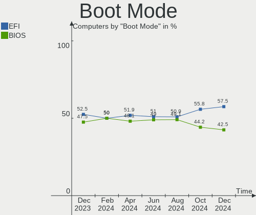

| Mode | Computers | Percent |
|------|-----------|---------|
| EFI  | 479       | 58.13%  |
| BIOS | 345       | 41.87%  |

Filesystem
----------

Type of filesystem

| Type    | Computers | Percent |
|---------|-----------|---------|
| Ext4    | 711       | 86.29%  |
| Overlay | 68        | 8.25%   |
| Btrfs   | 36        | 4.37%   |
| Xfs     | 7         | 0.85%   |
| XXXXXXX | 1         | 0.12%   |
| Aufs    | 1         | 0.12%   |

Part. scheme
------------

Scheme of partitioning

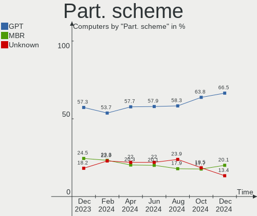

| Type    | Computers | Percent |
|---------|-----------|---------|
| GPT     | 515       | 62.5%   |
| MBR     | 218       | 26.46%  |
| Unknown | 91        | 11.04%  |

Dual Boot with Linux/BSD
------------------------

Hosting more than one Linux/BSD

| Dual boot | Computers | Percent |
|-----------|-----------|---------|
| No        | 673       | 81.67%  |
| Yes       | 151       | 18.33%  |

Dual Boot (Win)
---------------

Hosting Linux and Windows

| Dual boot | Computers | Percent |
|-----------|-----------|---------|
| No        | 432       | 52.43%  |
| Yes       | 392       | 47.57%  |

Board
-----

Vendor
------

Motherboard manufacturer

| Name                    | Computers | Percent |
|-------------------------|-----------|---------|
| ASUSTek Computer        | 178       | 21.6%   |
| Gigabyte Technology     | 105       | 12.74%  |
| Hewlett-Packard         | 88        | 10.68%  |
| Acer                    | 72        | 8.74%   |
| Lenovo                  | 65        | 7.89%   |
| MSI                     | 52        | 6.31%   |
| Intel                   | 49        | 5.95%   |
| ASRock                  | 36        | 4.37%   |
| Dell                    | 34        | 4.13%   |
| 3Logic Group            | 17        | 2.06%   |
| Samsung Electronics     | 15        | 1.82%   |
| Unknown                 | 15        | 1.82%   |
| ICL                     | 8         | 0.97%   |
| ECS                     | 7         | 0.85%   |
| Sony                    | 6         | 0.73%   |
| HUAWEI                  | 6         | 0.73%   |
| Biostar                 | 6         | 0.73%   |
| Apple                   | 6         | 0.73%   |
| Toshiba                 | 5         | 0.61%   |
| Packard Bell            | 5         | 0.61%   |
| eMachines               | 5         | 0.61%   |
| Supermicro              | 3         | 0.36%   |
| Digma                   | 3         | 0.36%   |
| Timi                    | 2         | 0.24%   |
| ONDA                    | 2         | 0.24%   |
| Maibenben               | 2         | 0.24%   |
| KLLISRE                 | 2         | 0.24%   |
| Huanan                  | 2         | 0.24%   |
| HONOR                   | 2         | 0.24%   |
| Haier                   | 2         | 0.24%   |
| Fujitsu                 | 2         | 0.24%   |
| DNS                     | 2         | 0.24%   |
| ZoomSmart               | 1         | 0.12%   |
| SYWZ                    | 1         | 0.12%   |
| SLIMBOOK                | 1         | 0.12%   |
| Raspberry Pi Foundation | 1         | 0.12%   |
| Pegatron                | 1         | 0.12%   |
| Notebook                | 1         | 0.12%   |
| MACHINIST               | 1         | 0.12%   |
| Lite-On                 | 1         | 0.12%   |
| KREZ                    | 1         | 0.12%   |
| Jumper                  | 1         | 0.12%   |
| iRU                     | 1         | 0.12%   |
| Irbis                   | 1         | 0.12%   |
| Insignia                | 1         | 0.12%   |
| IBM                     | 1         | 0.12%   |
| HPE                     | 1         | 0.12%   |
| Foxconn                 | 1         | 0.12%   |
| EPoX Computer           | 1         | 0.12%   |
| Colorful Technology     | 1         | 0.12%   |
| Clevo                   | 1         | 0.12%   |
| AMI                     | 1         | 0.12%   |

Model
-----

Motherboard model

| Name                                     | Computers | Percent |
|------------------------------------------|-----------|---------|
| Intel SKYBAY                             | 42        | 5.1%    |
| Unknown                                  | 17        | 2.06%   |
| 3Logic Group Graviton                    | 16        | 1.94%   |
| Gigabyte H410M S2H                       | 15        | 1.82%   |
| ASUS All Series                          | 13        | 1.58%   |
| HP 250 G7 Notebook PC                    | 12        | 1.46%   |
| ASUS PRIME B450-PLUS                     | 12        | 1.46%   |
| Lenovo V540-24IWL AIO 10YS0031RU         | 10        | 1.21%   |
| Acer Veriton X2640G                      | 10        | 1.21%   |
| HP ProBook 440 G5                        | 8         | 0.97%   |
| ICL RAYbook Si1512                       | 6         | 0.73%   |
| HP ZBook 17 G5                           | 6         | 0.73%   |
| HP 250 G6 Notebook PC                    | 5         | 0.61%   |
| MSI MS-7D22                              | 4         | 0.49%   |
| HP Notebook                              | 4         | 0.49%   |
| HP Laptop 15-bw0xx                       | 4         | 0.49%   |
| HP EliteBook 840 G4                      | 4         | 0.49%   |
| Dell Latitude 3420                       | 4         | 0.49%   |
| ASUS M5A78L-M LX3                        | 4         | 0.49%   |
| MSI MS-7592                              | 3         | 0.36%   |
| Gigabyte H110M-S2H                       | 3         | 0.36%   |
| Gigabyte B450 AORUS ELITE                | 3         | 0.36%   |
| Timi TM1701                              | 2         | 0.24%   |
| Samsung R425D/R525D                      | 2         | 0.24%   |
| ONDA OBOOK 20 PLUS                       | 2         | 0.24%   |
| MSI MS-7817                              | 2         | 0.24%   |
| MSI MS-7529                              | 2         | 0.24%   |
| MSI GEG                                  | 2         | 0.24%   |
| Lenovo V570c HuronRiver Platform         | 2         | 0.24%   |
| Lenovo IdeaPad Z570 HuronRiver Platform  | 2         | 0.24%   |
| Lenovo G570 20079                        | 2         | 0.24%   |
| Lenovo B590 20206                        | 2         | 0.24%   |
| KLLISRE X99-B5 V1.1                      | 2         | 0.24%   |
| ICL RAY S122.Mi                          | 2         | 0.24%   |
| HUAWEI KLVL-WXXW                         | 2         | 0.24%   |
| HP ProBook 440 G7                        | 2         | 0.24%   |
| HP Pavilion 15                           | 2         | 0.24%   |
| HP Laptop 15s-fq2xxx                     | 2         | 0.24%   |
| HP Laptop 15s-eq1xxx                     | 2         | 0.24%   |
| HP Laptop 15-db1xxx                      | 2         | 0.24%   |
| HP Laptop 14s-fq0xxx                     | 2         | 0.24%   |
| Gigabyte X470 AORUS GAMING 7 WIFI        | 2         | 0.24%   |
| Gigabyte M61PME-S2P                      | 2         | 0.24%   |
| Gigabyte H61M-S2PV                       | 2         | 0.24%   |
| Gigabyte H61M-S1                         | 2         | 0.24%   |
| Gigabyte B75M-D2V                        | 2         | 0.24%   |
| Gigabyte B550M DS3H                      | 2         | 0.24%   |
| Gigabyte B450M DS3H V2                   | 2         | 0.24%   |
| Gigabyte A320M-S2H V2                    | 2         | 0.24%   |
| Gigabyte A320M-S2H                       | 2         | 0.24%   |
| Gigabyte A320M-H                         | 2         | 0.24%   |
| Gigabyte 970A-DS3P                       | 2         | 0.24%   |
| Gigabyte 945GCM-S2L                      | 2         | 0.24%   |
| ECS H61H2-M13                            | 2         | 0.24%   |
| Digma CITI 10 C402T CS1044EW             | 2         | 0.24%   |
| Dell Inspiron N5050                      | 2         | 0.24%   |
| ASUS ZenBook UX425EA_UX425EA             | 2         | 0.24%   |
| ASUS X553MA                              | 2         | 0.24%   |
| ASUS VivoBook_ASUSLaptop M3500QA_M3500QA | 2         | 0.24%   |
| ASUS TUF B450-PRO GAMING                 | 2         | 0.24%   |

Model Family
------------

Motherboard model prefix

| Name                  | Computers | Percent |
|-----------------------|-----------|---------|
| Intel SKYBAY          | 42        | 5.1%    |
| Acer Aspire           | 41        | 4.98%   |
| ASUS PRIME            | 33        | 4%      |
| HP ProBook            | 20        | 2.43%   |
| Lenovo IdeaPad        | 19        | 2.31%   |
| HP 250                | 17        | 2.06%   |
| 3Logic Group Graviton | 17        | 2.06%   |
| Unknown               | 17        | 2.06%   |
| HP Laptop             | 16        | 1.94%   |
| Gigabyte H410M        | 16        | 1.94%   |
| ASUS All              | 13        | 1.58%   |
| Acer Veriton          | 12        | 1.46%   |
| HP Pavilion           | 11        | 1.33%   |
| Dell Latitude         | 11        | 1.33%   |
| Lenovo V540-24IWL     | 10        | 1.21%   |
| Lenovo ThinkPad       | 10        | 1.21%   |
| Dell Inspiron         | 7         | 0.85%   |
| ASUS TUF              | 7         | 0.85%   |
| ASUS M5A78L-M         | 7         | 0.85%   |
| ICL RAYbook           | 6         | 0.73%   |
| HP ZBook              | 6         | 0.73%   |
| HP EliteBook          | 6         | 0.73%   |
| ASUS ZenBook          | 6         | 0.73%   |
| ASUS VivoBook         | 6         | 0.73%   |
| ASUS ASUS             | 6         | 0.73%   |
| Acer TravelMate       | 6         | 0.73%   |
| Packard Bell EasyNote | 5         | 0.61%   |
| Gigabyte B450M        | 5         | 0.61%   |
| Gigabyte B450         | 5         | 0.61%   |
| Dell Vostro           | 5         | 0.61%   |
| Toshiba Satellite     | 4         | 0.49%   |
| MSI MS-7D22           | 4         | 0.49%   |
| HP Notebook           | 4         | 0.49%   |
| Gigabyte B550M        | 4         | 0.49%   |
| Gigabyte A320M-S2H    | 4         | 0.49%   |
| ASUS ROG              | 4         | 0.49%   |
| ASUS P8H61-M          | 4         | 0.49%   |
| MSI MS-7592           | 3         | 0.36%   |
| Lenovo ThinkCentre    | 3         | 0.36%   |
| Lenovo ThinkBook      | 3         | 0.36%   |
| HP ENVY               | 3         | 0.36%   |
| Gigabyte H110M-S2H    | 3         | 0.36%   |
| Dell XPS              | 3         | 0.36%   |
| Dell Precision        | 3         | 0.36%   |
| Dell OptiPlex         | 3         | 0.36%   |
| ASUS P8Z77-V          | 3         | 0.36%   |
| ASUS P8B75-M          | 3         | 0.36%   |
| ASUS P5KPL-AM         | 3         | 0.36%   |
| ASRock B560           | 3         | 0.36%   |
| Acer Swift            | 3         | 0.36%   |
| Acer Nitro            | 3         | 0.36%   |
| Timi TM1701           | 2         | 0.24%   |
| Samsung R425D         | 2         | 0.24%   |
| Samsung 300V3A        | 2         | 0.24%   |
| ONDA OBOOK            | 2         | 0.24%   |
| MSI MS-7817           | 2         | 0.24%   |
| MSI MS-7529           | 2         | 0.24%   |
| MSI GEG               | 2         | 0.24%   |
| Lenovo V570c          | 2         | 0.24%   |
| Lenovo Legion         | 2         | 0.24%   |

MFG Year
--------

Motherboard manufacture year

| Year    | Computers | Percent |
|---------|-----------|---------|
| 2018    | 115       | 13.96%  |
| 2020    | 86        | 10.44%  |
| 2021    | 77        | 9.34%   |
| 2017    | 76        | 9.22%   |
| 2012    | 68        | 8.25%   |
| 2019    | 59        | 7.16%   |
| 2011    | 59        | 7.16%   |
| 2013    | 49        | 5.95%   |
| 2010    | 46        | 5.58%   |
| 2016    | 44        | 5.34%   |
| 2009    | 32        | 3.88%   |
| 2008    | 31        | 3.76%   |
| 2015    | 26        | 3.16%   |
| 2014    | 20        | 2.43%   |
| 2007    | 17        | 2.06%   |
| 2006    | 11        | 1.33%   |
| 2022    | 4         | 0.49%   |
| Unknown | 3         | 0.36%   |
| 2005    | 1         | 0.12%   |

Form Factor
-----------

Physical design of the computer

| Name           | Computers | Percent |
|----------------|-----------|---------|
| Desktop        | 411       | 49.88%  |
| Notebook       | 362       | 43.93%  |
| All in one     | 36        | 4.37%   |
| Server         | 5         | 0.61%   |
| Tablet         | 4         | 0.49%   |
| Convertible    | 3         | 0.36%   |
| Mini pc        | 2         | 0.24%   |
| System on chip | 1         | 0.12%   |

Secure Boot
-----------

Enabled or disabled

| State    | Computers | Percent |
|----------|-----------|---------|
| Disabled | 784       | 95.15%  |
| Enabled  | 40        | 4.85%   |

Coreboot
--------

Have coreboot on board

| Used | Computers | Percent |
|------|-----------|---------|
| No   | 823       | 99.88%  |
| Yes  | 1         | 0.12%   |

RAM Size
--------

Total RAM memory

| Size in GB  | Computers | Percent |
|-------------|-----------|---------|
| 4.01-8.0    | 201       | 24.39%  |
| 8.01-16.0   | 181       | 21.97%  |
| 16.01-24.0  | 163       | 19.78%  |
| 3.01-4.0    | 153       | 18.57%  |
| 1.01-2.0    | 41        | 4.98%   |
| 32.01-64.0  | 39        | 4.73%   |
| 2.01-3.0    | 19        | 2.31%   |
| 64.01-256.0 | 12        | 1.46%   |
| 24.01-32.0  | 10        | 1.21%   |
| 0.51-1.0    | 3         | 0.36%   |
| 0.01-0.5    | 2         | 0.24%   |

RAM Used
--------

Used RAM memory

| Used GB    | Computers | Percent |
|------------|-----------|---------|
| 1.01-2.0   | 400       | 48.54%  |
| 0.51-1.0   | 179       | 21.72%  |
| 2.01-3.0   | 119       | 14.44%  |
| 4.01-8.0   | 52        | 6.31%   |
| 3.01-4.0   | 47        | 5.7%    |
| 8.01-16.0  | 15        | 1.82%   |
| 0.01-0.5   | 9         | 1.09%   |
| 16.01-24.0 | 2         | 0.24%   |
| Unknown    | 1         | 0.12%   |

Total Drives
------------

Number of drives on board

| Drives | Computers | Percent |
|--------|-----------|---------|
| 1      | 513       | 62.26%  |
| 2      | 202       | 24.51%  |
| 3      | 65        | 7.89%   |
| 4      | 25        | 3.03%   |
| 5      | 12        | 1.46%   |
| 6      | 4         | 0.49%   |
| 8      | 2         | 0.24%   |
| 7      | 1         | 0.12%   |

Has CD-ROM
----------

Has CD-ROM on board

| Presented | Computers | Percent |
|-----------|-----------|---------|
| No        | 538       | 65.29%  |
| Yes       | 286       | 34.71%  |

Has Ethernet
------------

Has Ethernet on board

| Presented | Computers | Percent |
|-----------|-----------|---------|
| Yes       | 769       | 93.33%  |
| No        | 55        | 6.67%   |

Has WiFi
--------

Has WiFi module

| Presented | Computers | Percent |
|-----------|-----------|---------|
| Yes       | 485       | 58.86%  |
| No        | 339       | 41.14%  |

Has Bluetooth
-------------

Has Bluetooth module

| Presented | Computers | Percent |
|-----------|-----------|---------|
| No        | 442       | 53.64%  |
| Yes       | 382       | 46.36%  |

Location
--------

Country
-------

Geographic location (country)

| Country | Computers | Percent |
|---------|-----------|---------|
| Russia  | 824       | 100%    |

City
----

Geographic location (city)

| City             | Computers | Percent |
|------------------|-----------|---------|
| Moscow           | 286       | 34.71%  |
| St Petersburg    | 65        | 7.89%   |
| Voronezh         | 46        | 5.58%   |
| Samara           | 19        | 2.31%   |
| Yekaterinburg    | 17        | 2.06%   |
| Rostov-on-Don    | 16        | 1.94%   |
| Krasnodar        | 16        | 1.94%   |
| Novosibirsk      | 15        | 1.82%   |
| Perm             | 14        | 1.7%    |
| Chelyabinsk      | 13        | 1.58%   |
| Volgograd        | 12        | 1.46%   |
| Nizhniy Novgorod | 12        | 1.46%   |
| Krasnoyarsk      | 11        | 1.33%   |
| Ufa              | 9         | 1.09%   |
| Vladivostok      | 7         | 0.85%   |
| Lipetsk          | 7         | 0.85%   |
| Irkutsk          | 7         | 0.85%   |
| Barnaul          | 7         | 0.85%   |
| Petrozavodsk     | 6         | 0.73%   |
| Yaroslavl        | 5         | 0.61%   |
| Tyumen           | 5         | 0.61%   |
| Severodvinsk     | 5         | 0.61%   |
| Pskov            | 5         | 0.61%   |
| Murmansk         | 5         | 0.61%   |
| Izhevsk          | 5         | 0.61%   |
| Belgorod         | 5         | 0.61%   |
| Surgut           | 4         | 0.49%   |
| Saratov          | 4         | 0.49%   |
| Orenburg         | 4         | 0.49%   |
| Nizhny Tagil     | 4         | 0.49%   |
| Murom            | 4         | 0.49%   |
| Mirny            | 4         | 0.49%   |
| Kirov            | 4         | 0.49%   |
| Khabarovsk       | 4         | 0.49%   |
| Kazan’         | 4         | 0.49%   |
| Kaliningrad      | 4         | 0.49%   |
| Zhukovskiy       | 3         | 0.36%   |
| Tver             | 3         | 0.36%   |
| Tula             | 3         | 0.36%   |
| Tomsk            | 3         | 0.36%   |
| Tambov           | 3         | 0.36%   |
| Stavropol        | 3         | 0.36%   |
| Noril'sk         | 3         | 0.36%   |
| Kemerovo         | 3         | 0.36%   |
| Gatchina         | 3         | 0.36%   |
| Bryansk          | 3         | 0.36%   |
| Zlatoust         | 2         | 0.24%   |
| Zelenodolsk      | 2         | 0.24%   |
| Yakutsk          | 2         | 0.24%   |
| Veliky Novgorod  | 2         | 0.24%   |
| Ulyanovsk        | 2         | 0.24%   |
| Ulan-Ude         | 2         | 0.24%   |
| Tolyatti         | 2         | 0.24%   |
| Syktyvkar        | 2         | 0.24%   |
| Smolensk         | 2         | 0.24%   |
| Omsk             | 2         | 0.24%   |
| Nyagan           | 2         | 0.24%   |
| Novorossiysk     | 2         | 0.24%   |
| Novocherkassk    | 2         | 0.24%   |
| Nizhnevartovsk   | 2         | 0.24%   |

Drives
------

Drive Vendor
------------

Hard drive vendors

| Vendor                         | Computers | Drives | Percent |
|--------------------------------|-----------|--------|---------|
| WDC                            | 220       | 277    | 18.93%  |
| Seagate                        | 178       | 210    | 15.32%  |
| Samsung Electronics            | 124       | 142    | 10.67%  |
| Toshiba                        | 89        | 104    | 7.66%   |
| Kingston                       | 73        | 77     | 6.28%   |
| SK Hynix                       | 39        | 39     | 3.36%   |
| Intel                          | 34        | 35     | 2.93%   |
| Hitachi                        | 32        | 34     | 2.75%   |
| Apacer                         | 28        | 28     | 2.41%   |
| SanDisk                        | 26        | 26     | 2.24%   |
| China                          | 26        | 26     | 2.24%   |
| AXIOMTEK                       | 25        | 25     | 2.15%   |
| Unknown                        | 20        | 22     | 1.72%   |
| SPCC                           | 20        | 23     | 1.72%   |
| Crucial                        | 20        | 21     | 1.72%   |
| A-DATA Technology              | 19        | 20     | 1.64%   |
| HGST                           | 15        | 23     | 1.29%   |
| GOODRAM                        | 11        | 12     | 0.95%   |
| Micron Technology              | 10        | 11     | 0.86%   |
| AMD                            | 9         | 9      | 0.77%   |
| Smartbuy                       | 8         | 8      | 0.69%   |
| KingSpec                       | 8         | 8      | 0.69%   |
| Transcend                      | 7         | 7      | 0.6%    |
| Patriot                        | 7         | 7      | 0.6%    |
| OCZ                            | 7         | 7      | 0.6%    |
| XPG                            | 6         | 6      | 0.52%   |
| SSSTC                          | 6         | 6      | 0.52%   |
| PLEXTOR                        | 6         | 7      | 0.52%   |
| MAXTOR                         | 6         | 7      | 0.52%   |
| FOXLINE                        | 6         | 6      | 0.52%   |
| Netac                          | 5         | 5      | 0.43%   |
| KIOXIA                         | 5         | 5      | 0.43%   |
| Corsair                        | 5         | 5      | 0.43%   |
| Phison                         | 4         | 4      | 0.34%   |
| Gigabyte Technology            | 4         | 4      | 0.34%   |
| XrayDisk                       | 3         | 4      | 0.26%   |
| QUMO                           | 3         | 3      | 0.26%   |
| LONDISK                        | 3         | 4      | 0.26%   |
| KingDian                       | 3         | 3      | 0.26%   |
| Fujitsu                        | 3         | 3      | 0.26%   |
| Apple                          | 3         | 3      | 0.26%   |
| Unknown                        | 3         | 3      | 0.26%   |
| UMIS                           | 2         | 2      | 0.17%   |
| Silicon Motion                 | 2         | 2      | 0.17%   |
| JMicron                        | 2         | 2      | 0.17%   |
| Hewlett-Packard                | 2         | 2      | 0.17%   |
| ZTE                            | 1         | 1      | 0.09%   |
| Wdstars                        | 1         | 1      | 0.09%   |
| USB3.0                         | 1         | 1      | 0.09%   |
| USB                            | 1         | 1      | 0.09%   |
| TXRUI                          | 1         | 1      | 0.09%   |
| TMI                            | 1         | 1      | 0.09%   |
| SUNTRSI                        | 1         | 1      | 0.09%   |
| SP                             | 1         | 1      | 0.09%   |
| Solid State Storage Technology | 1         | 1      | 0.09%   |
| SNR                            | 1         | 1      | 0.09%   |
| sage                           | 1         | 1      | 0.09%   |
| PNY                            | 1         | 1      | 0.09%   |
| PALIT                          | 1         | 1      | 0.09%   |
| LITEONIT                       | 1         | 1      | 0.09%   |

Drive Model
-----------

Hard drive models

| Model                                     | Computers | Percent |
|-------------------------------------------|-----------|---------|
| Kingston SA400S37240G 240GB SSD           | 31        | 2.44%   |
| AXIOMTEK Corp.-FSA128GMC2T 128GB SSD      | 25        | 1.97%   |
| Seagate ST1000DM010-2EP102 1TB            | 20        | 1.58%   |
| Samsung MZVLW128HEGR-00000 128GB          | 17        | 1.34%   |
| WDC WDS240G2G0A-00JH30 240GB SSD          | 15        | 1.18%   |
| Apacer AS2280P4 256GB                     | 15        | 1.18%   |
| Toshiba HDWD120 2TB                       | 14        | 1.1%    |
| SK Hynix BC501 HFM256GDJTNG-8310A 256GB   | 12        | 0.95%   |
| Seagate ST500DM002-1BD142 500GB           | 12        | 0.95%   |
| WDC WD5000AZLX-21K2TA0 500GB              | 10        | 0.79%   |
| WDC WD10EZEX-08WN4A0 1TB                  | 10        | 0.79%   |
| WDC WDS120G2G0A-00JH30 120GB SSD          | 9         | 0.71%   |
| SK Hynix SKHynix_HFS256GD9TNG-L5B0B 256GB | 9         | 0.71%   |
| Samsung SSD 860 EVO 250GB                 | 9         | 0.71%   |
| Toshiba MQ01ABF050 500GB                  | 8         | 0.63%   |
| Toshiba HDWD110 1TB                       | 8         | 0.63%   |
| Toshiba DT01ACA100 1TB                    | 8         | 0.63%   |
| Toshiba DT01ACA050 500GB                  | 8         | 0.63%   |
| Seagate ST3500418AS 500GB                 | 8         | 0.63%   |
| Seagate ST1000LM024 HN-M101MBB 1TB        | 8         | 0.63%   |
| Intel SSDPEKKF256G7H 256GB                | 8         | 0.63%   |
| WDC WD5000AAKX-001CA0 500GB               | 7         | 0.55%   |
| Samsung SSD 860 EVO 500GB                 | 7         | 0.55%   |
| Crucial CT240BX500SSD1 240GB              | 7         | 0.55%   |
| WDC WDS500G2B0A-00SM50 500GB SSD          | 6         | 0.47%   |
| WDC WDS240G2G0B-00EPW0 240GB SSD          | 6         | 0.47%   |
| Toshiba MQ04ABF100 1TB                    | 6         | 0.47%   |
| SPCC Solid State Disk 128GB               | 6         | 0.47%   |
| Seagate ST1000LM035-1RK172 1TB            | 6         | 0.47%   |
| Samsung SSD 980 1TB                       | 6         | 0.47%   |
| Samsung SSD 970 EVO Plus 500GB            | 6         | 0.47%   |
| Samsung SSD 850 EVO 250GB                 | 6         | 0.47%   |
| Intel SSDPEMKF256G8H 256GB                | 6         | 0.47%   |
| FOXLINE FLSSD256M80E13TCX5 256GB          | 6         | 0.47%   |
| WDC WD5000LPCX-21VHAT0 500GB              | 5         | 0.39%   |
| Seagate ST500LT012-9WS142 500GB           | 5         | 0.39%   |
| Seagate ST500LT012-1DG142 500GB           | 5         | 0.39%   |
| Seagate ST3250410AS 250GB                 | 5         | 0.39%   |
| Seagate ST31000528AS 1TB                  | 5         | 0.39%   |
| Seagate ST1000LM049-2GH172 1TB            | 5         | 0.39%   |
| Kingston SNVS500G 500GB                   | 5         | 0.39%   |
| Kingston SA400S37120G 120GB SSD           | 5         | 0.39%   |
| Crucial CT250MX500SSD1 250GB              | 5         | 0.39%   |
| China SSD 128GB                           | 5         | 0.39%   |
| WDC WDS120G2G0B-00EPW0 120GB SSD          | 4         | 0.32%   |
| WDC WD5000LPVX-22V0TT0 500GB              | 4         | 0.32%   |
| Toshiba MK3259GSXP 320GB                  | 4         | 0.32%   |
| SPCC Solid State Disk 256GB               | 4         | 0.32%   |
| SPCC Solid State Disk 120GB               | 4         | 0.32%   |
| Smartbuy SSD 120GB                        | 4         | 0.32%   |
| Seagate ST380815AS 80GB                   | 4         | 0.32%   |
| Seagate ST3500413AS 500GB                 | 4         | 0.32%   |
| Seagate ST3250318AS 250GB                 | 4         | 0.32%   |
| Seagate ST1000DM003-1CH162 1TB            | 4         | 0.32%   |
| Samsung SSD 970 EVO 1TB                   | 4         | 0.32%   |
| Micron 2210_MTFDHBA512QFD 512GB           | 4         | 0.32%   |
| Kingston SV300S37A120G 120GB SSD          | 4         | 0.32%   |
| Kingston RBUSC180S37256GJ 256GB SSD       | 4         | 0.32%   |
| Apacer AS350 128GB SSD                    | 4         | 0.32%   |
| A-DATA SX6000PNP 512GB                    | 4         | 0.32%   |

HDD Vendor
----------

Hard disk drive vendors

| Vendor              | Computers | Drives | Percent |
|---------------------|-----------|--------|---------|
| WDC                 | 184       | 211    | 35.32%  |
| Seagate             | 177       | 209    | 33.97%  |
| Toshiba             | 81        | 94     | 15.55%  |
| Hitachi             | 32        | 34     | 6.14%   |
| Samsung Electronics | 18        | 23     | 3.45%   |
| HGST                | 15        | 23     | 2.88%   |
| MAXTOR              | 6         | 7      | 1.15%   |
| Unknown             | 3         | 3      | 0.58%   |
| Fujitsu             | 3         | 3      | 0.58%   |
| USB                 | 1         | 1      | 0.19%   |
| sage                | 1         | 1      | 0.19%   |

SSD Vendor
----------

Solid state drive vendors

| Vendor              | Computers | Drives | Percent |
|---------------------|-----------|--------|---------|
| Kingston            | 57        | 60     | 14%     |
| WDC                 | 48        | 53     | 11.79%  |
| Samsung Electronics | 43        | 47     | 10.57%  |
| China               | 26        | 26     | 6.39%   |
| AXIOMTEK            | 25        | 25     | 6.14%   |
| SanDisk             | 21        | 21     | 5.16%   |
| SPCC                | 19        | 21     | 4.67%   |
| Crucial             | 19        | 19     | 4.67%   |
| Apacer              | 12        | 12     | 2.95%   |
| GOODRAM             | 11        | 12     | 2.7%    |
| A-DATA Technology   | 11        | 11     | 2.7%    |
| KingSpec            | 8         | 8      | 1.97%   |
| Intel               | 8         | 8      | 1.97%   |
| Transcend           | 7         | 7      | 1.72%   |
| Smartbuy            | 7         | 7      | 1.72%   |
| OCZ                 | 7         | 7      | 1.72%   |
| PLEXTOR             | 6         | 6      | 1.47%   |
| Patriot             | 6         | 6      | 1.47%   |
| Toshiba             | 5         | 6      | 1.23%   |
| Corsair             | 5         | 5      | 1.23%   |
| SK Hynix            | 4         | 4      | 0.98%   |
| Netac               | 4         | 4      | 0.98%   |
| AMD                 | 4         | 4      | 0.98%   |
| XrayDisk            | 3         | 3      | 0.74%   |
| QUMO                | 3         | 3      | 0.74%   |
| Micron Technology   | 3         | 3      | 0.74%   |
| LONDISK             | 3         | 4      | 0.74%   |
| KingDian            | 3         | 3      | 0.74%   |
| Apple               | 3         | 3      | 0.74%   |
| JMicron             | 2         | 2      | 0.49%   |
| Hewlett-Packard     | 2         | 2      | 0.49%   |
| Wdstars             | 1         | 1      | 0.25%   |
| USB3.0              | 1         | 1      | 0.25%   |
| TXRUI               | 1         | 1      | 0.25%   |
| TMI                 | 1         | 1      | 0.25%   |
| SUNTRSI             | 1         | 1      | 0.25%   |
| SSSTC               | 1         | 1      | 0.25%   |
| SP                  | 1         | 1      | 0.25%   |
| Seagate             | 1         | 1      | 0.25%   |
| PNY                 | 1         | 1      | 0.25%   |
| PALIT               | 1         | 1      | 0.25%   |
| LITEONIT            | 1         | 1      | 0.25%   |
| LITEON              | 1         | 1      | 0.25%   |
| Kingmax             | 1         | 1      | 0.25%   |
| KINGBANK            | 1         | 1      | 0.25%   |
| HS-SSD-C100         | 1         | 1      | 0.25%   |
| Hikvision           | 1         | 1      | 0.25%   |
| GS                  | 1         | 2      | 0.25%   |
| GLOWAY              | 1         | 1      | 0.25%   |
| Gigabyte Technology | 1         | 1      | 0.25%   |
| E535N               | 1         | 1      | 0.25%   |
| BR                  | 1         | 1      | 0.25%   |
| AFOX                | 1         | 1      | 0.25%   |

Drive Kind
----------

HDD or SSD

| Kind    | Computers | Drives | Percent |
|---------|-----------|--------|---------|
| HDD     | 442       | 609    | 41.62%  |
| SSD     | 359       | 425    | 33.8%   |
| NVMe    | 236       | 252    | 22.22%  |
| MMC     | 22        | 24     | 2.07%   |
| Unknown | 3         | 3      | 0.28%   |

Drive Connector
---------------

SATA, SAS, NVMe, etc.

| Type | Computers | Drives | Percent |
|------|-----------|--------|---------|
| SATA | 653       | 1021   | 70.44%  |
| NVMe | 236       | 252    | 25.46%  |
| MMC  | 22        | 24     | 2.37%   |
| SAS  | 16        | 16     | 1.73%   |

Drive Size
----------

Size of hard drive

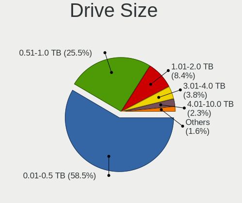

| Size in TB | Computers | Drives | Percent |
|------------|-----------|--------|---------|
| 0.01-0.5   | 540       | 708    | 67.75%  |
| 0.51-1.0   | 193       | 242    | 24.22%  |
| 1.01-2.0   | 46        | 64     | 5.77%   |
| 3.01-4.0   | 9         | 11     | 1.13%   |
| 2.01-3.0   | 8         | 8      | 1%      |
| 4.01-10.0  | 1         | 1      | 0.13%   |

Space Total
-----------

Amount of disk space available on the file system

| Size in GB     | Computers | Percent |
|----------------|-----------|---------|
| 101-250        | 293       | 35.56%  |
| 251-500        | 159       | 19.3%   |
| 1-20           | 80        | 9.71%   |
| 501-1000       | 75        | 9.1%    |
| 51-100         | 59        | 7.16%   |
| 1001-2000      | 57        | 6.92%   |
| Unknown        | 44        | 5.34%   |
| 21-50          | 29        | 3.52%   |
| 2001-3000      | 15        | 1.82%   |
| More than 3000 | 13        | 1.58%   |

Space Used
----------

Amount of used disk space

| Used GB        | Computers | Percent |
|----------------|-----------|---------|
| 1-20           | 498       | 60.44%  |
| 21-50          | 96        | 11.65%  |
| 101-250        | 56        | 6.8%    |
| Unknown        | 44        | 5.34%   |
| 51-100         | 41        | 4.98%   |
| 251-500        | 38        | 4.61%   |
| 501-1000       | 28        | 3.4%    |
| 1001-2000      | 17        | 2.06%   |
| More than 3000 | 5         | 0.61%   |
| 2001-3000      | 1         | 0.12%   |

Malfunc. Drives
---------------

Drive models with a malfunction

| Model                               | Computers | Drives | Percent |
|-------------------------------------|-----------|--------|---------|
| Seagate ST3500418AS 500GB           | 5         | 6      | 2.78%   |
| Seagate ST500LT012-9WS142 500GB     | 3         | 3      | 1.67%   |
| Seagate ST3250410AS 250GB           | 3         | 3      | 1.67%   |
| Seagate ST3250318AS 250GB           | 3         | 3      | 1.67%   |
| WDC WDS240G2G0A-00JH30 240GB SSD    | 2         | 3      | 1.11%   |
| WDC WD5000LPVX-22V0TT0 500GB        | 2         | 2      | 1.11%   |
| WDC WD5000AAKX-001CA0 500GB         | 2         | 2      | 1.11%   |
| WDC WD20EARX-00PASB0 2TB            | 2         | 2      | 1.11%   |
| WDC WD20EARS-00S8B1 2TB             | 2         | 2      | 1.11%   |
| WDC WD1600AAJS-00L7A0 160GB         | 2         | 2      | 1.11%   |
| WDC WD10EZEX-22MFCA0 1TB            | 2         | 2      | 1.11%   |
| Toshiba MK2565GSX 250GB             | 2         | 2      | 1.11%   |
| Toshiba DT01ACA100 1TB              | 2         | 2      | 1.11%   |
| Seagate ST9500325AS 500GB           | 2         | 2      | 1.11%   |
| Seagate ST9320325AS 320GB           | 2         | 2      | 1.11%   |
| Seagate ST9250315AS 250GB           | 2         | 2      | 1.11%   |
| Seagate ST500LT012-1DG142 500GB     | 2         | 2      | 1.11%   |
| Seagate ST500DM002-1BD142 500GB     | 2         | 2      | 1.11%   |
| Seagate ST3320418AS 320GB           | 2         | 2      | 1.11%   |
| Seagate ST3250312AS 250GB           | 2         | 2      | 1.11%   |
| Seagate ST3160812AS 160GB           | 2         | 2      | 1.11%   |
| Seagate ST1000LM024 HN-M101MBB 1TB  | 2         | 3      | 1.11%   |
| SanDisk SD9SN8W-128G-1006 128GB SSD | 2         | 2      | 1.11%   |
| Samsung Electronics HM321HI 320GB   | 2         | 2      | 1.11%   |
| Samsung Electronics HD160JJ 160GB   | 2         | 2      | 1.11%   |
| Hitachi HTS547575A9E384 752GB       | 2         | 2      | 1.11%   |
| HGST HTS545050A7E680 500GB          | 2         | 2      | 1.11%   |
| WDC WDS480G2G0A-00JH30 480GB SSD    | 1         | 1      | 0.56%   |
| WDC WDS240G2G0B-00EPW0 240GB SSD    | 1         | 1      | 0.56%   |
| WDC WDS120G2G0B-00EPW0 120GB SSD    | 1         | 1      | 0.56%   |
| WDC WD6402AAEX-00Y9A0 640GB         | 1         | 1      | 0.56%   |
| WDC WD5003ABYX-18WERA0 500GB        | 1         | 1      | 0.56%   |
| WDC WD5000LPVX-00V0TT0 500GB        | 1         | 1      | 0.56%   |
| WDC WD5000LPLX-60ZNTT2 500GB        | 1         | 1      | 0.56%   |
| WDC WD5000LPLX-00ZNTT0 500GB        | 1         | 1      | 0.56%   |
| WDC WD5000BEVT-26A0RT0 500GB        | 1         | 1      | 0.56%   |
| WDC WD5000AAKX-22ERMA0 500GB        | 1         | 1      | 0.56%   |
| WDC WD5000AAKX-08U6AA0 500GB        | 1         | 1      | 0.56%   |
| WDC WD5000AAKX-00ERMA0 500GB        | 1         | 1      | 0.56%   |
| WDC WD5000AAKS-00UU3A0 500GB        | 1         | 1      | 0.56%   |
| WDC WD5000AAKS-00A7B2 500GB         | 1         | 1      | 0.56%   |
| WDC WD3200BPVT-22ZEST0 320GB        | 1         | 1      | 0.56%   |
| WDC WD3200BEVT-60A23T0 320GB        | 1         | 1      | 0.56%   |
| WDC WD3200BEVT-24A23T0 320GB        | 1         | 1      | 0.56%   |
| WDC WD3200AAKS-00V1A0 320GB         | 1         | 1      | 0.56%   |
| WDC WD2500KS-00MJB0 250GB           | 1         | 1      | 0.56%   |
| WDC WD2500BEVT-60ZCT1 250GB         | 1         | 1      | 0.56%   |
| WDC WD2500BEVT-22ZCT0 250GB         | 1         | 1      | 0.56%   |
| WDC WD2500BEVT-22A23T0 250GB        | 1         | 1      | 0.56%   |
| WDC WD2500BEKT-60A25T1 250GB        | 1         | 1      | 0.56%   |
| WDC WD2500AAKX-753CA1 250GB         | 1         | 1      | 0.56%   |
| WDC WD1600BEVT-80A23T0 160GB        | 1         | 1      | 0.56%   |
| WDC WD1600BEVT-60ZCT1 160GB         | 1         | 1      | 0.56%   |
| WDC WD1600AAJS-22L7A0 160GB         | 1         | 1      | 0.56%   |
| WDC WD1200UE-22KVT0 120GB           | 1         | 1      | 0.56%   |
| WDC WD10EZEX-60WN4A0 1TB            | 1         | 1      | 0.56%   |
| WDC WD10EARS-00Z5B1 1TB             | 1         | 1      | 0.56%   |
| WDC WD10EADS-65M2B0 1TB             | 1         | 1      | 0.56%   |
| WDC WD1003FBYX-01Y7B1 1TB           | 1         | 1      | 0.56%   |
| WDC WD1002FAEX-00Z3A0 1TB           | 1         | 1      | 0.56%   |

Malfunc. Drive Vendor
---------------------

Vendors of faulty drives

| Vendor              | Computers | Drives | Percent |
|---------------------|-----------|--------|---------|
| Seagate             | 54        | 63     | 31.76%  |
| WDC                 | 45        | 48     | 26.47%  |
| Hitachi             | 14        | 14     | 8.24%   |
| Toshiba             | 11        | 11     | 6.47%   |
| Samsung Electronics | 9         | 12     | 5.29%   |
| SanDisk             | 5         | 5      | 2.94%   |
| HGST                | 5         | 6      | 2.94%   |
| SK Hynix            | 4         | 4      | 2.35%   |
| MAXTOR              | 2         | 2      | 1.18%   |
| KingSpec            | 2         | 2      | 1.18%   |
| Fujitsu             | 2         | 2      | 1.18%   |
| Corsair             | 2         | 2      | 1.18%   |
| SSSTC               | 1         | 1      | 0.59%   |
| SPCC                | 1         | 1      | 0.59%   |
| Silicon Motion      | 1         | 1      | 0.59%   |
| QUMO                | 1         | 1      | 0.59%   |
| PLEXTOR             | 1         | 1      | 0.59%   |
| OCZ                 | 1         | 1      | 0.59%   |
| LITEONIT            | 1         | 1      | 0.59%   |
| LITEON              | 1         | 1      | 0.59%   |
| Kingston            | 1         | 1      | 0.59%   |
| Kingmax             | 1         | 1      | 0.59%   |
| Intel               | 1         | 1      | 0.59%   |
| GLOWAY              | 1         | 1      | 0.59%   |
| China               | 1         | 1      | 0.59%   |
| Apple               | 1         | 1      | 0.59%   |
| AMD                 | 1         | 1      | 0.59%   |

Malfunc. HDD Vendor
-------------------

Vendors of faulty HDD drives

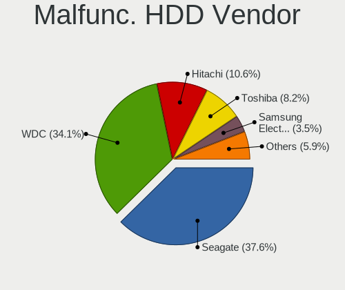

| Vendor              | Computers | Drives | Percent |
|---------------------|-----------|--------|---------|
| Seagate             | 54        | 63     | 39.42%  |
| WDC                 | 41        | 42     | 29.93%  |
| Hitachi             | 14        | 14     | 10.22%  |
| Toshiba             | 11        | 11     | 8.03%   |
| Samsung Electronics | 8         | 11     | 5.84%   |
| HGST                | 5         | 6      | 3.65%   |
| MAXTOR              | 2         | 2      | 1.46%   |
| Fujitsu             | 2         | 2      | 1.46%   |

Malfunc. Drive Kind
-------------------

Kinds of faulty drives

| Kind | Computers | Drives | Percent |
|------|-----------|--------|---------|
| HDD  | 129       | 151    | 79.14%  |
| SSD  | 31        | 32     | 19.02%  |
| NVMe | 3         | 3      | 1.84%   |

Failed Drives
-------------

Failed drive models

| Model                         | Computers | Drives | Percent |
|-------------------------------|-----------|--------|---------|
| WDC WD3200BPVT-22JJ5T0 320GB  | 1         | 1      | 25%     |
| Seagate ST31000524AS 1TB      | 1         | 1      | 25%     |
| Hitachi HTS545050A7E380 500GB | 1         | 1      | 25%     |
| Hitachi HDP725050GLA360 500GB | 1         | 1      | 25%     |

Failed Drive Vendor
-------------------

Failed drive vendors

| Vendor  | Computers | Drives | Percent |
|---------|-----------|--------|---------|
| Hitachi | 2         | 2      | 50%     |
| WDC     | 1         | 1      | 25%     |
| Seagate | 1         | 1      | 25%     |

Drive Status
------------

Number of failed and malfunc. drives

| Status   | Computers | Drives | Percent |
|----------|-----------|--------|---------|
| Works    | 639       | 918    | 68.56%  |
| Malfunc  | 159       | 186    | 17.06%  |
| Detected | 130       | 205    | 13.95%  |
| Failed   | 4         | 4      | 0.43%   |

Storage controller
------------------

Storage Vendor
--------------

Storage controller vendors

| Vendor                           | Computers | Percent |
|----------------------------------|-----------|---------|
| Intel                            | 574       | 55.25%  |
| AMD                              | 191       | 18.38%  |
| Samsung Electronics              | 69        | 6.64%   |
| SK Hynix                         | 34        | 3.27%   |
| Phison Electronics               | 30        | 2.89%   |
| Nvidia                           | 20        | 1.92%   |
| Kingston Technology Company      | 17        | 1.64%   |
| JMicron Technology               | 16        | 1.54%   |
| Sandisk                          | 15        | 1.44%   |
| Silicon Motion                   | 11        | 1.06%   |
| ADATA Technology                 | 9         | 0.87%   |
| Micron Technology                | 7         | 0.67%   |
| ASMedia Technology               | 7         | 0.67%   |
| Toshiba America Info Systems     | 6         | 0.58%   |
| Solid State Storage Technology   | 6         | 0.58%   |
| Realtek Semiconductor            | 5         | 0.48%   |
| Marvell Technology Group         | 5         | 0.48%   |
| KIOXIA                           | 5         | 0.48%   |
| VIA Technologies                 | 3         | 0.29%   |
| Union Memory (Shenzhen)          | 2         | 0.19%   |
| Micron/Crucial Technology        | 2         | 0.19%   |
| Silicon Integrated Systems [SiS] | 1         | 0.1%    |
| Shenzhen Longsys Electronics     | 1         | 0.1%    |
| MCST                             | 1         | 0.1%    |
| LSI Logic / Symbios Logic        | 1         | 0.1%    |
| Lite-On Technology               | 1         | 0.1%    |

Storage Model
-------------

Storage controller models

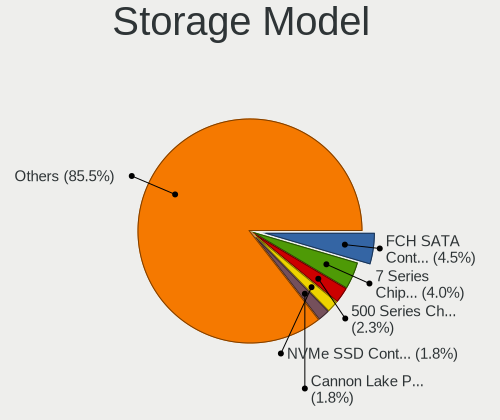

| Model                                                                                   | Computers | Percent |
|-----------------------------------------------------------------------------------------|-----------|---------|
| AMD FCH SATA Controller [AHCI mode]                                                     | 122       | 9.81%   |
| Intel Q170/Q150/B150/H170/H110/Z170/CM236 Chipset SATA Controller [AHCI Mode]           | 69        | 5.55%   |
| Intel Sunrise Point-LP SATA Controller [AHCI mode]                                      | 47        | 3.78%   |
| AMD 400 Series Chipset SATA Controller                                                  | 43        | 3.46%   |
| Intel 8 Series/C220 Series Chipset Family 6-port SATA Controller 1 [AHCI mode]          | 35        | 2.82%   |
| Intel 200 Series PCH SATA controller [AHCI mode]                                        | 33        | 2.65%   |
| Intel NM10/ICH7 Family SATA Controller [IDE mode]                                       | 31        | 2.49%   |
| Phison PS5013 E13 NVMe Controller                                                       | 27        | 2.17%   |
| Intel 7 Series Chipset Family 6-port SATA Controller [AHCI mode]                        | 27        | 2.17%   |
| Samsung NVMe SSD Controller SM981/PM981/PM983                                           | 26        | 2.09%   |
| AMD SB7x0/SB8x0/SB9x0 IDE Controller                                                    | 26        | 2.09%   |
| Intel 82801G (ICH7 Family) IDE Controller                                               | 25        | 2.01%   |
| Intel 500 Series Chipset Family SATA AHCI Controller                                    | 24        | 1.93%   |
| Intel 82801 Mobile SATA Controller [RAID mode]                                          | 22        | 1.77%   |
| Intel 6 Series/C200 Series Chipset Family 6 port Mobile SATA AHCI Controller            | 22        | 1.77%   |
| Intel 400 Series Chipset Family SATA AHCI Controller                                    | 21        | 1.69%   |
| AMD SB7x0/SB8x0/SB9x0 SATA Controller [AHCI mode]                                       | 20        | 1.61%   |
| Samsung NVMe SSD Controller SM961/PM961/SM963                                           | 19        | 1.53%   |
| AMD SB7x0/SB8x0/SB9x0 SATA Controller [IDE mode]                                        | 19        | 1.53%   |
| Samsung NVMe SSD Controller 980                                                         | 18        | 1.45%   |
| Intel 6 Series/C200 Series Chipset Family 6 port Desktop SATA AHCI Controller           | 17        | 1.37%   |
| SK Hynix BC501 NVMe Solid State Drive                                                   | 16        | 1.29%   |
| Intel NM10/ICH7 Family SATA Controller [AHCI mode]                                      | 15        | 1.21%   |
| Intel 7 Series/C210 Series Chipset Family 6-port SATA Controller [AHCI mode]            | 15        | 1.21%   |
| Intel Volume Management Device NVMe RAID Controller                                     | 12        | 0.97%   |
| Intel Comet Lake SATA AHCI Controller                                                   | 12        | 0.97%   |
| Intel 82801IBM/IEM (ICH9M/ICH9M-E) 4 port SATA Controller [AHCI mode]                   | 12        | 0.97%   |
| AMD 500 Series Chipset SATA Controller                                                  | 12        | 0.97%   |
| Silicon Motion SM2263EN/SM2263XT SSD Controller                                         | 11        | 0.88%   |
| Intel Cannon Point-LP SATA Controller [AHCI Mode]                                       | 11        | 0.88%   |
| Intel Cannon Lake Mobile PCH SATA AHCI Controller                                       | 11        | 0.88%   |
| Intel 82801HM/HEM (ICH8M/ICH8M-E) IDE Controller                                        | 11        | 0.88%   |
| Intel 6 Series/C200 Series Chipset Family Desktop SATA Controller (IDE mode, ports 4-5) | 11        | 0.88%   |
| Intel 6 Series/C200 Series Chipset Family Desktop SATA Controller (IDE mode, ports 0-3) | 11        | 0.88%   |
| Intel 5 Series/3400 Series Chipset 4 port SATA AHCI Controller                          | 11        | 0.88%   |
| SK Hynix Non-Volatile memory controller                                                 | 10        | 0.8%    |
| JMicron JMB363 SATA/IDE Controller                                                      | 10        | 0.8%    |
| Intel Tiger Lake-LP SATA Controller [AHCI mode]                                         | 10        | 0.8%    |
| Intel Cannon Lake PCH SATA AHCI Controller                                              | 10        | 0.8%    |
| Intel SSD 600P Series                                                                   | 9         | 0.72%   |
| Intel 82801HM/HEM (ICH8M/ICH8M-E) SATA Controller [AHCI mode]                           | 9         | 0.72%   |
| Intel 8 Series SATA Controller 1 [AHCI mode]                                            | 9         | 0.72%   |
| Intel SSD Pro 7600p/760p/E 6100p Series                                                 | 8         | 0.64%   |
| AMD FCH SATA Controller D                                                               | 8         | 0.64%   |
| Nvidia MCP61 SATA Controller                                                            | 7         | 0.56%   |
| Nvidia MCP61 IDE                                                                        | 7         | 0.56%   |
| Intel Celeron N3350/Pentium N4200/Atom E3900 Series SATA AHCI Controller                | 7         | 0.56%   |
| AMD SB600 Non-Raid-5 SATA                                                               | 7         | 0.56%   |
| AMD SB600 IDE                                                                           | 7         | 0.56%   |
| Solid State Storage Non-Volatile memory controller                                      | 6         | 0.48%   |
| Sandisk WD Blue SN550 NVMe SSD                                                          | 6         | 0.48%   |
| Micron Non-Volatile memory controller                                                   | 6         | 0.48%   |
| Kingston Company U-SNS8154P3 NVMe SSD                                                   | 6         | 0.48%   |
| Intel SSD 660P Series                                                                   | 6         | 0.48%   |
| SK Hynix Gold P31 SSD                                                                   | 5         | 0.4%    |
| Sandisk WD Black SN750 / PC SN730 NVMe SSD                                              | 5         | 0.4%    |
| KIOXIA Non-Volatile memory controller                                                   | 5         | 0.4%    |
| Kingston Company OM3PDP3 NVMe SSD                                                       | 5         | 0.4%    |
| Intel Atom Processor E3800 Series SATA AHCI Controller                                  | 5         | 0.4%    |
| Intel 7 Series/C210 Series Chipset Family 4-port SATA Controller [IDE mode]             | 5         | 0.4%    |

Storage Kind
------------

Kind of storage controller (IDE, SATA, NVMe, SAS, ...)

| Kind | Computers | Percent |
|------|-----------|---------|
| SATA | 663       | 61.22%  |
| NVMe | 236       | 21.79%  |
| IDE  | 145       | 13.39%  |
| RAID | 37        | 3.42%   |
| SAS  | 1         | 0.09%   |
| SCSI | 1         | 0.09%   |

Processor
---------

CPU Vendor
----------

Processor vendors

| Vendor   | Computers | Percent |
|----------|-----------|---------|
| Intel    | 600       | 72.82%  |
| AMD      | 221       | 26.82%  |
| ARM      | 2         | 0.24%   |
| MBE8C-PC | 1         | 0.12%   |

CPU Model
---------

Processor models

| Model                                         | Computers | Percent |
|-----------------------------------------------|-----------|---------|
| Intel Core i3-6100TE CPU @ 2.70GHz            | 42        | 5.1%    |
| Intel Core i5-8265U CPU @ 1.60GHz             | 24        | 2.91%   |
| Intel Core i5-9400 CPU @ 2.90GHz              | 18        | 2.18%   |
| Intel Core i3-10100 CPU @ 3.60GHz             | 17        | 2.06%   |
| AMD Ryzen 5 1600 Six-Core Processor           | 16        | 1.94%   |
| Intel Core i5-7200U CPU @ 2.50GHz             | 11        | 1.33%   |
| Intel Pentium CPU G4560 @ 3.50GHz             | 10        | 1.21%   |
| Intel Core i5-10210U CPU @ 1.60GHz            | 10        | 1.21%   |
| Intel 11th Gen Core i5-1135G7 @ 2.40GHz       | 10        | 1.21%   |
| Intel Core i3-7100U CPU @ 2.40GHz             | 8         | 0.97%   |
| Intel Core i3-7020U CPU @ 2.30GHz             | 7         | 0.85%   |
| Intel Core i7-8750H CPU @ 2.20GHz             | 6         | 0.73%   |
| Intel Core i5-3470 CPU @ 3.20GHz              | 6         | 0.73%   |
| AMD Ryzen 7 4800H with Radeon Graphics        | 6         | 0.73%   |
| AMD Ryzen 5 3600 6-Core Processor             | 6         | 0.73%   |
| AMD Ryzen 3 3200U with Radeon Vega Mobile Gfx | 6         | 0.73%   |
| Intel Pentium CPU B960 @ 2.20GHz              | 5         | 0.61%   |
| Intel Core i3-3220 CPU @ 3.30GHz              | 5         | 0.61%   |
| Intel Pentium Dual-Core CPU E6500 @ 2.93GHz   | 4         | 0.49%   |
| Intel Core i5-8400 CPU @ 2.80GHz              | 4         | 0.49%   |
| Intel Core i5-4200U CPU @ 1.60GHz             | 4         | 0.49%   |
| Intel Core i3-6006U CPU @ 2.00GHz             | 4         | 0.49%   |
| Intel Core i3-3240 CPU @ 3.40GHz              | 4         | 0.49%   |
| Intel Atom CPU N450 @ 1.66GHz                 | 4         | 0.49%   |
| Intel 11th Gen Core i5-11400F @ 2.60GHz       | 4         | 0.49%   |
| Intel 11th Gen Core i5-11400 @ 2.60GHz        | 4         | 0.49%   |
| AMD Ryzen 7 2700X Eight-Core Processor        | 4         | 0.49%   |
| AMD Ryzen 7 2700 Eight-Core Processor         | 4         | 0.49%   |
| AMD Ryzen 5 3400G with Radeon Vega Graphics   | 4         | 0.49%   |
| AMD Ryzen 3 3200G with Radeon Vega Graphics   | 4         | 0.49%   |
| AMD FX-8320E Eight-Core Processor             | 4         | 0.49%   |
| Intel Pentium Dual-Core CPU E5700 @ 3.00GHz   | 3         | 0.36%   |
| Intel Pentium Dual-Core CPU E5400 @ 2.70GHz   | 3         | 0.36%   |
| Intel Pentium CPU G3220 @ 3.00GHz             | 3         | 0.36%   |
| Intel Core i7-8550U CPU @ 1.80GHz             | 3         | 0.36%   |
| Intel Core i7-3630QM CPU @ 2.40GHz            | 3         | 0.36%   |
| Intel Core i5-8250U CPU @ 1.60GHz             | 3         | 0.36%   |
| Intel Core i5-7600 CPU @ 3.50GHz              | 3         | 0.36%   |
| Intel Core i5-4210U CPU @ 1.70GHz             | 3         | 0.36%   |
| Intel Core i5-3210M CPU @ 2.50GHz             | 3         | 0.36%   |
| Intel Core i5-10400 CPU @ 2.90GHz             | 3         | 0.36%   |
| Intel Core i5-10300H CPU @ 2.50GHz            | 3         | 0.36%   |
| Intel Core i3-4000M CPU @ 2.40GHz             | 3         | 0.36%   |
| Intel Core i3-3110M CPU @ 2.40GHz             | 3         | 0.36%   |
| Intel Core i3-2370M CPU @ 2.40GHz             | 3         | 0.36%   |
| Intel Core i3-2350M CPU @ 2.30GHz             | 3         | 0.36%   |
| Intel Core 2 Duo CPU T8300 @ 2.40GHz          | 3         | 0.36%   |
| Intel Core 2 Duo CPU E8400 @ 3.00GHz          | 3         | 0.36%   |
| Intel Core 2 Duo CPU E7500 @ 2.93GHz          | 3         | 0.36%   |
| Intel Core 2 Duo CPU E7400 @ 2.80GHz          | 3         | 0.36%   |
| Intel Celeron CPU N3450 @ 1.10GHz             | 3         | 0.36%   |
| Intel Celeron CPU N3350 @ 1.10GHz             | 3         | 0.36%   |
| Intel Celeron CPU N3050 @ 1.60GHz             | 3         | 0.36%   |
| Intel Celeron CPU G3900 @ 2.80GHz             | 3         | 0.36%   |
| Intel Celeron CPU 900 @ 2.20GHz               | 3         | 0.36%   |
| Intel Atom CPU N570 @ 1.66GHz                 | 3         | 0.36%   |
| Intel Atom CPU N2600 @ 1.60GHz                | 3         | 0.36%   |
| Intel 11th Gen Core i7-1165G7 @ 2.80GHz       | 3         | 0.36%   |
| Intel 11th Gen Core i5-11400H @ 2.70GHz       | 3         | 0.36%   |
| Intel 11th Gen Core i3-1115G4 @ 3.00GHz       | 3         | 0.36%   |

CPU Model Family
----------------

Processor model prefix

| Model                   | Computers | Percent |
|-------------------------|-----------|---------|
| Intel Core i5           | 160       | 19.42%  |
| Intel Core i3           | 144       | 17.48%  |
| Intel Core i7           | 63        | 7.65%   |
| AMD Ryzen 5             | 54        | 6.55%   |
| Other                   | 47        | 5.7%    |
| Intel Pentium           | 44        | 5.34%   |
| Intel Core 2 Duo        | 33        | 4%      |
| Intel Celeron           | 32        | 3.88%   |
| AMD Ryzen 7             | 28        | 3.4%    |
| Intel Atom              | 20        | 2.43%   |
| Intel Pentium Dual-Core | 19        | 2.31%   |
| AMD Ryzen 3             | 17        | 2.06%   |
| Intel Xeon              | 16        | 1.94%   |
| AMD FX                  | 15        | 1.82%   |
| AMD A10                 | 9         | 1.09%   |
| Intel Core 2 Quad       | 8         | 0.97%   |
| AMD Athlon 64 X2        | 7         | 0.85%   |
| Intel Pentium Dual      | 6         | 0.73%   |
| AMD E1                  | 6         | 0.73%   |
| AMD Athlon              | 6         | 0.73%   |
| AMD Ryzen 9             | 5         | 0.61%   |
| AMD Phenom II X4        | 5         | 0.61%   |
| AMD Athlon II X2        | 5         | 0.61%   |
| AMD A6                  | 5         | 0.61%   |
| AMD Turion 64 X2 Mobile | 4         | 0.49%   |
| AMD Phenom              | 4         | 0.49%   |
| AMD Athlon II X4        | 4         | 0.49%   |
| AMD A8                  | 4         | 0.49%   |
| AMD A4                  | 4         | 0.49%   |
| AMD Ryzen 7 PRO         | 3         | 0.36%   |
| AMD Ryzen 3 PRO         | 3         | 0.36%   |
| AMD E2                  | 3         | 0.36%   |
| AMD Athlon X4           | 3         | 0.36%   |
| AMD Athlon II           | 3         | 0.36%   |
| Intel Pentium Silver    | 2         | 0.24%   |
| Intel Pentium Gold      | 2         | 0.24%   |
| Intel Genuine           | 2         | 0.24%   |
| Intel Core m5           | 2         | 0.24%   |
| Intel Core i9           | 2         | 0.24%   |
| Intel Core 2            | 2         | 0.24%   |
| AMD Phenom II X6        | 2         | 0.24%   |
| AMD Athlon II X3        | 2         | 0.24%   |
| Intel Xeon Silver       | 1         | 0.12%   |
| Intel Pentium D         | 1         | 0.12%   |
| Intel Core Duo          | 1         | 0.12%   |
| Intel Celeron M         | 1         | 0.12%   |
| ARM BCM                 | 1         | 0.12%   |
| ARM ARMv7               | 1         | 0.12%   |
| AMD Z                   | 1         | 0.12%   |
| AMD V140                | 1         | 0.12%   |
| AMD Turion II Dual-Core | 1         | 0.12%   |
| AMD Turion II           | 1         | 0.12%   |
| AMD Sempron             | 1         | 0.12%   |
| AMD Ryzen 5 PRO         | 1         | 0.12%   |
| AMD Phenom II X3        | 1         | 0.12%   |
| AMD Opteron             | 1         | 0.12%   |
| AMD EPYC                | 1         | 0.12%   |
| AMD C-60                | 1         | 0.12%   |
| AMD C-50                | 1         | 0.12%   |
| AMD Athlon II Dual-Core | 1         | 0.12%   |

CPU Cores
---------

Number of processor cores

| Number | Computers | Percent |
|--------|-----------|---------|
| 2      | 383       | 46.48%  |
| 4      | 254       | 30.83%  |
| 6      | 106       | 12.86%  |
| 8      | 42        | 5.1%    |
| 1      | 23        | 2.79%   |
| 12     | 5         | 0.61%   |
| 3      | 5         | 0.61%   |
| 10     | 4         | 0.49%   |
| 20     | 1         | 0.12%   |
| 16     | 1         | 0.12%   |

CPU Sockets
-----------

Number of sockets

| Number | Computers | Percent |
|--------|-----------|---------|
| 1      | 823       | 99.88%  |
| 2      | 1         | 0.12%   |

CPU Threads
-----------

Threads per core (Hyper-Threading)

| Number | Computers | Percent |
|--------|-----------|---------|
| 2      | 511       | 62.01%  |
| 1      | 313       | 37.99%  |

CPU Op-Modes
------------

CPU Operation Modes (32-bit, 64-bit)

| Op mode        | Computers | Percent |
|----------------|-----------|---------|
| 32-bit, 64-bit | 814       | 98.79%  |
| 32-bit         | 7         | 0.85%   |
| Unknown        | 3         | 0.36%   |

CPU Microcode
-------------

Microcode number

| Number     | Computers | Percent |
|------------|-----------|---------|
| Unknown    | 80        | 9.71%   |
| 0x506e3    | 51        | 6.19%   |
| 0x206a7    | 49        | 5.95%   |
| 0x1067a    | 45        | 5.46%   |
| 0x306a9    | 43        | 5.22%   |
| 0x906ea    | 38        | 4.61%   |
| 0x306c3    | 32        | 3.88%   |
| 0xa0653    | 27        | 3.28%   |
| 0x906e9    | 22        | 2.67%   |
| 0x806e9    | 22        | 2.67%   |
| 0x806ec    | 20        | 2.43%   |
| 0x08001138 | 19        | 2.31%   |
| 0x806c1    | 18        | 2.18%   |
| 0x010000c8 | 15        | 1.82%   |
| 0xa0671    | 13        | 1.58%   |
| 0x6fd      | 13        | 1.58%   |
| 0x406e3    | 13        | 1.58%   |
| 0x806ea    | 12        | 1.46%   |
| 0x10676    | 12        | 1.46%   |
| 0x806eb    | 11        | 1.33%   |
| 0x0a50000c | 11        | 1.33%   |
| 0x08701021 | 11        | 1.33%   |
| 0x08108109 | 11        | 1.33%   |
| 0x0800820d | 11        | 1.33%   |
| 0x06000852 | 11        | 1.33%   |
| 0x40651    | 10        | 1.21%   |
| 0x106ca    | 9         | 1.09%   |
| 0x08108102 | 9         | 1.09%   |
| 0x20655    | 8         | 0.97%   |
| 0x506c9    | 7         | 0.85%   |
| 0x06006705 | 7         | 0.85%   |
| 0xa0660    | 6         | 0.73%   |
| 0x806d1    | 6         | 0.73%   |
| 0x106e5    | 6         | 0.73%   |
| 0x08600106 | 6         | 0.73%   |
| 0x08101016 | 6         | 0.73%   |
| 0x0700010f | 6         | 0.73%   |
| 0x06001119 | 6         | 0.73%   |
| 0x906ed    | 5         | 0.61%   |
| 0x406c3    | 5         | 0.61%   |
| 0x30678    | 5         | 0.61%   |
| 0x30661    | 5         | 0.61%   |
| 0x0a201016 | 5         | 0.61%   |
| 0x0810100b | 5         | 0.61%   |
| 0x0600611a | 5         | 0.61%   |
| 0xa0652    | 4         | 0.49%   |
| 0x08608102 | 4         | 0.49%   |
| 0x08600104 | 4         | 0.49%   |
| 0x06003106 | 4         | 0.49%   |
| 0x0600063e | 4         | 0.49%   |
| 0x01000083 | 4         | 0.49%   |
| 0x706a8    | 3         | 0.36%   |
| 0x306f2    | 3         | 0.36%   |
| 0x20652    | 3         | 0.36%   |
| 0x08200103 | 3         | 0.36%   |
| 0x03000027 | 3         | 0.36%   |
| 0xa0655    | 2         | 0.24%   |
| 0x6f6      | 2         | 0.24%   |
| 0x6e8      | 2         | 0.24%   |
| 0x406c4    | 2         | 0.24%   |

CPU Microarch
-------------

Microarchitecture

| Name          | Computers | Percent |
|---------------|-----------|---------|
| KabyLake      | 147       | 17.84%  |
| Skylake       | 71        | 8.62%   |
| Penryn        | 61        | 7.4%    |
| SandyBridge   | 54        | 6.55%   |
| IvyBridge     | 51        | 6.19%   |
| Haswell       | 51        | 6.19%   |
| CometLake     | 42        | 5.1%    |
| Zen+          | 35        | 4.25%   |
| Zen           | 34        | 4.13%   |
| K10           | 30        | 3.64%   |
| Zen 2         | 27        | 3.28%   |
| TigerLake     | 19        | 2.31%   |
| Zen 3         | 18        | 2.18%   |
| Piledriver    | 18        | 2.18%   |
| Core          | 18        | 2.18%   |
| Unknown       | 18        | 2.18%   |
| Bonnell       | 16        | 1.94%   |
| Excavator     | 15        | 1.82%   |
| Silvermont    | 13        | 1.58%   |
| Westmere      | 12        | 1.46%   |
| K8 Hammer     | 12        | 1.46%   |
| IceLake       | 12        | 1.46%   |
| Nehalem       | 7         | 0.85%   |
| Jaguar        | 7         | 0.85%   |
| Goldmont      | 7         | 0.85%   |
| Steamroller   | 5         | 0.61%   |
| K10 Llano     | 4         | 0.49%   |
| Goldmont plus | 4         | 0.49%   |
| Bulldozer     | 4         | 0.49%   |
| Puma          | 3         | 0.36%   |
| P6            | 3         | 0.36%   |
| Bobcat        | 3         | 0.36%   |
| NetBurst      | 2         | 0.24%   |
| Broadwell     | 1         | 0.12%   |

Graphics
--------

GPU Vendor
----------

Vendors of graphics cards

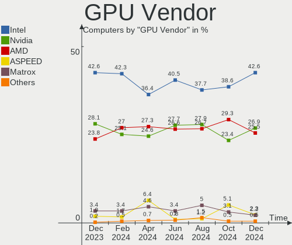

| Vendor                     | Computers | Percent |
|----------------------------|-----------|---------|
| Intel                      | 434       | 46.12%  |
| Nvidia                     | 297       | 31.56%  |
| AMD                        | 205       | 21.79%  |
| Matrox Electronics Systems | 2         | 0.21%   |
| ASPEED Technology          | 2         | 0.21%   |
| ATI Technologies           | 1         | 0.11%   |

GPU Model
---------

Graphics card models

| Model                                                                                    | Computers | Percent |
|------------------------------------------------------------------------------------------|-----------|---------|
| Intel HD Graphics 530                                                                    | 46        | 4.75%   |
| Intel 2nd Generation Core Processor Family Integrated Graphics Controller                | 37        | 3.82%   |
| Nvidia GP107 [GeForce GTX 1050 Ti]                                                       | 29        | 2.99%   |
| Intel HD Graphics 620                                                                    | 29        | 2.99%   |
| Intel WhiskeyLake-U GT2 [UHD Graphics 620]                                               | 26        | 2.68%   |
| Intel CoffeeLake-S GT2 [UHD Graphics 630]                                                | 23        | 2.37%   |
| Intel CometLake-S GT2 [UHD Graphics 630]                                                 | 22        | 2.27%   |
| AMD Picasso/Raven 2 [Radeon Vega Series / Radeon Vega Mobile Series]                     | 22        | 2.27%   |
| Intel 3rd Gen Core processor Graphics Controller                                         | 19        | 1.96%   |
| Intel TigerLake-LP GT2 [Iris Xe Graphics]                                                | 15        | 1.55%   |
| AMD Renoir                                                                               | 14        | 1.44%   |
| AMD Cezanne                                                                              | 13        | 1.34%   |
| Intel Xeon E3-1200 v3/4th Gen Core Processor Integrated Graphics Controller              | 12        | 1.24%   |
| Intel Skylake GT2 [HD Graphics 520]                                                      | 12        | 1.24%   |
| Intel CoffeeLake-H GT2 [UHD Graphics 630]                                                | 11        | 1.14%   |
| AMD Ellesmere [Radeon RX 470/480/570/570X/580/580X/590]                                  | 11        | 1.14%   |
| Intel HD Graphics 610                                                                    | 10        | 1.03%   |
| Intel Haswell-ULT Integrated Graphics Controller                                         | 10        | 1.03%   |
| Intel 4th Gen Core Processor Integrated Graphics Controller                              | 10        | 1.03%   |
| Nvidia GK208B [GeForce GT 710]                                                           | 9         | 0.93%   |
| Intel Xeon E3-1200 v2/3rd Gen Core processor Graphics Controller                         | 9         | 0.93%   |
| Intel HD Graphics 630                                                                    | 9         | 0.93%   |
| Intel Atom Processor D4xx/D5xx/N4xx/N5xx Integrated Graphics Controller                  | 9         | 0.93%   |
| AMD Stoney [Radeon R2/R3/R4/R5 Graphics]                                                 | 9         | 0.93%   |
| AMD Raven Ridge [Radeon Vega Series / Radeon Vega Mobile Series]                         | 9         | 0.93%   |
| Nvidia GP108 [GeForce GT 1030]                                                           | 8         | 0.83%   |
| Intel UHD Graphics 620                                                                   | 8         | 0.83%   |
| Intel CometLake-U GT2 [UHD Graphics]                                                     | 8         | 0.83%   |
| Intel 4 Series Chipset Integrated Graphics Controller                                    | 8         | 0.83%   |
| AMD Park [Mobility Radeon HD 5430/5450/5470]                                             | 8         | 0.83%   |
| Nvidia GP106 [GeForce GTX 1060 3GB]                                                      | 7         | 0.72%   |
| Nvidia G94 [GeForce 9600 GT]                                                             | 7         | 0.72%   |
| Intel Comet Lake UHD Graphics                                                            | 7         | 0.72%   |
| Intel Atom/Celeron/Pentium Processor x5-E8000/J3xxx/N3xxx Integrated Graphics Controller | 7         | 0.72%   |
| Nvidia TU117 [GeForce GTX 1650]                                                          | 6         | 0.62%   |
| Nvidia GP107GLM [Quadro P1000 Mobile]                                                    | 6         | 0.62%   |
| Nvidia GF106 [GeForce GTS 450]                                                           | 6         | 0.62%   |
| Intel TigerLake-H GT1 [UHD Graphics]                                                     | 6         | 0.62%   |
| Intel Mobile 4 Series Chipset Integrated Graphics Controller                             | 6         | 0.62%   |
| Intel HD Graphics 500                                                                    | 6         | 0.62%   |
| Intel Core Processor Integrated Graphics Controller                                      | 6         | 0.62%   |
| Intel CometLake-H GT2 [UHD Graphics]                                                     | 6         | 0.62%   |
| Intel Atom Processor Z36xxx/Z37xxx Series Graphics & Display                             | 6         | 0.62%   |
| AMD Wani [Radeon R5/R6/R7 Graphics]                                                      | 6         | 0.62%   |
| AMD Topaz XT [Radeon R7 M260/M265 / M340/M360 / M440/M445 / 530/535 / 620/625 Mobile]    | 6         | 0.62%   |
| Nvidia GT215 [GeForce GT 240]                                                            | 5         | 0.52%   |
| Nvidia GP106 [GeForce GTX 1060 6GB]                                                      | 5         | 0.52%   |
| Nvidia GM108M [GeForce 840M]                                                             | 5         | 0.52%   |
| Nvidia GK107 [GeForce GTX 650]                                                           | 5         | 0.52%   |
| Nvidia GF116 [GeForce GTX 550 Ti]                                                        | 5         | 0.52%   |
| Nvidia GA106 [Geforce RTX 3050]                                                          | 5         | 0.52%   |
| Intel Mobile GM965/GL960 Integrated Graphics Controller (secondary)                      | 5         | 0.52%   |
| Intel Mobile GM965/GL960 Integrated Graphics Controller (primary)                        | 5         | 0.52%   |
| Intel Atom Processor D2xxx/N2xxx Integrated Graphics Controller                          | 5         | 0.52%   |
| AMD Lucienne                                                                             | 5         | 0.52%   |
| AMD Lexa PRO [Radeon 540/540X/550/550X / RX 540X/550/550X]                               | 5         | 0.52%   |
| Nvidia TU117M [GeForce GTX 1650 Mobile / Max-Q]                                          | 4         | 0.41%   |
| Nvidia TU117M                                                                            | 4         | 0.41%   |
| Nvidia GT218 [GeForce 210]                                                               | 4         | 0.41%   |
| Nvidia GP107 [GeForce GTX 1050]                                                          | 4         | 0.41%   |

GPU Combo
---------

Combinations of graphics cards

| Name           | Computers | Percent |
|----------------|-----------|---------|
| 1 x Intel      | 324       | 39.32%  |
| 1 x Nvidia     | 208       | 25.24%  |
| 1 x AMD        | 159       | 19.3%   |
| Intel + Nvidia | 80        | 9.71%   |
| 2 x AMD        | 21        | 2.55%   |
| Intel + AMD    | 18        | 2.18%   |
| AMD + Nvidia   | 8         | 0.97%   |
| Other          | 2         | 0.24%   |
| 1 x Matrox     | 2         | 0.24%   |
| 1 x ASPEED     | 2         | 0.24%   |

GPU Driver
----------

Free vs proprietary

| Driver      | Computers | Percent |
|-------------|-----------|---------|
| Free        | 669       | 81.19%  |
| Proprietary | 97        | 11.77%  |
| Unknown     | 58        | 7.04%   |

GPU Memory
----------

Total video memory

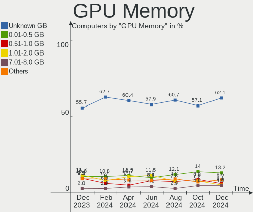

| Size in GB | Computers | Percent |
|------------|-----------|---------|
| Unknown    | 405       | 49.15%  |
| 0.01-0.5   | 111       | 13.47%  |
| 1.01-2.0   | 97        | 11.77%  |
| 0.51-1.0   | 86        | 10.44%  |
| 3.01-4.0   | 78        | 9.47%   |
| 7.01-8.0   | 17        | 2.06%   |
| 5.01-6.0   | 15        | 1.82%   |
| 2.01-3.0   | 11        | 1.33%   |
| 8.01-16.0  | 3         | 0.36%   |
| 16.01-24.0 | 1         | 0.12%   |

Monitor
-------

Monitor Vendor
--------------

Monitor vendors

| Vendor                  | Computers | Percent |
|-------------------------|-----------|---------|
| Samsung Electronics     | 90        | 11.1%   |
| AU Optronics            | 87        | 10.73%  |
| Goldstar                | 64        | 7.89%   |
| BOE                     | 59        | 7.27%   |
| Chimei Innolux          | 55        | 6.78%   |
| HHT                     | 42        | 5.18%   |
| Acer                    | 41        | 5.06%   |
| BenQ                    | 39        | 4.81%   |
| LG Display              | 36        | 4.44%   |
| AOC                     | 35        | 4.32%   |
| Dell                    | 27        | 3.33%   |
| Philips                 | 26        | 3.21%   |
| ECS                     | 18        | 2.22%   |
| Lenovo                  | 17        | 2.1%    |
| Hewlett-Packard         | 17        | 2.1%    |
| Chi Mei Optoelectronics | 14        | 1.73%   |
| ViewSonic               | 13        | 1.6%    |
| Sharp                   | 11        | 1.36%   |
| Ancor Communications    | 11        | 1.36%   |
| PANDA                   | 9         | 1.11%   |
| NEC Computers           | 9         | 1.11%   |
| Apple                   | 8         | 0.99%   |
| Iiyama                  | 7         | 0.86%   |
| LG Philips              | 6         | 0.74%   |
| InfoVision              | 5         | 0.62%   |
| HannStar                | 5         | 0.62%   |
| PRW                     | 4         | 0.49%   |
| Plain Tree Systems      | 4         | 0.49%   |
| ASUSTek Computer        | 4         | 0.49%   |
| WBT                     | 3         | 0.37%   |
| Toshiba                 | 3         | 0.37%   |
| Sony                    | 3         | 0.37%   |
| Unknown                 | 2         | 0.25%   |
| STD                     | 2         | 0.25%   |
| Mi                      | 2         | 0.25%   |
| LG Electronics          | 2         | 0.25%   |
| HUAWEI                  | 2         | 0.25%   |
| Fujitsu Siemens         | 2         | 0.25%   |
| Envision Peripherals    | 2         | 0.25%   |
| Xiaomi                  | 1         | 0.12%   |
| Unknown (DEF)           | 1         | 0.12%   |
| TR_                     | 1         | 0.12%   |
| TIANMA XM               | 1         | 0.12%   |
| SKG                     | 1         | 0.12%   |
| S2-Tek                  | 1         | 0.12%   |
| Quanta Display          | 1         | 0.12%   |
| PRM                     | 1         | 0.12%   |
| Panasonic               | 1         | 0.12%   |
| NFREN                   | 1         | 0.12%   |
| MSI                     | 1         | 0.12%   |
| Microstep               | 1         | 0.12%   |
| KTC                     | 1         | 0.12%   |
| InnoLux Display         | 1         | 0.12%   |
| HKC                     | 1         | 0.12%   |
| Hitachi                 | 1         | 0.12%   |
| DZW                     | 1         | 0.12%   |
| CTV                     | 1         | 0.12%   |
| CS_                     | 1         | 0.12%   |
| CSO                     | 1         | 0.12%   |
| CPT                     | 1         | 0.12%   |

Monitor Model
-------------

Monitor models

| Model                                                                 | Computers | Percent |
|-----------------------------------------------------------------------|-----------|---------|
| HHT ActviPanel V5 HHT0030 3840x2160 944x398mm 40.3-inch               | 42        | 5.1%    |
| ECS AIO PC ECS2486 1920x1080 520x300mm 23.6-inch                      | 18        | 2.18%   |
| BOE LCD Monitor BOE0687 1920x1080 344x193mm 15.5-inch                 | 13        | 1.58%   |
| AOC LCD Monitor 2778X 2560x1440                                       | 11        | 1.33%   |
| Lenovo LEN-V5S5W-B-A LENE288 1920x1080 527x296mm 23.8-inch            | 10        | 1.21%   |
| AU Optronics LCD Monitor AUO38ED 1920x1080 344x193mm 15.5-inch        | 10        | 1.21%   |
| Acer V246HL ACR0336 1920x1080 531x299mm 24.0-inch                     | 10        | 1.21%   |
| Chimei Innolux LCD Monitor CMN175A 1920x1080 381x214mm 17.2-inch      | 6         | 0.73%   |
| BOE LCD Monitor BOE09EF 1920x1080 344x194mm 15.5-inch                 | 6         | 0.73%   |
| Goldstar FULL HD GSM5B55 1920x1080 480x270mm 21.7-inch                | 5         | 0.61%   |
| Chimei Innolux LCD Monitor CMN15DB 1366x768 344x193mm 15.5-inch       | 5         | 0.61%   |
| BenQ GW2270 BNQ78DB 1920x1080 480x270mm 21.7-inch                     | 5         | 0.61%   |
| AU Optronics LCD Monitor AUO213D 1920x1080 309x173mm 13.9-inch        | 5         | 0.61%   |
| Samsung Electronics LCD Monitor SDC4161 1920x1080 344x194mm 15.5-inch | 4         | 0.49%   |
| PRW AP7_Titanium PRW4200 3840x2160                                    | 4         | 0.49%   |
| Philips PHL 273V7 PHLC156 1920x1080 598x336mm 27.0-inch               | 4         | 0.49%   |
| Philips PHL 243V7 PHLC155 1920x1080 527x296mm 23.8-inch               | 4         | 0.49%   |
| Goldstar IPS FULLHD GSM5AB8 1920x1080 480x270mm 21.7-inch             | 4         | 0.49%   |
| Chimei Innolux LCD Monitor CMN15C9 1366x768 344x193mm 15.5-inch       | 4         | 0.49%   |
| AU Optronics LCD Monitor AUO26EC 1366x768 344x193mm 15.5-inch         | 4         | 0.49%   |
| AU Optronics LCD Monitor AUO21ED 1920x1080 344x193mm 15.5-inch        | 4         | 0.49%   |
| WBT AIO215 WBTF017 1920x1200 580x360mm 26.9-inch                      | 3         | 0.36%   |
| Sharp LCD Monitor SHP1542 1920x1080 309x174mm 14.0-inch               | 3         | 0.36%   |
| LG Display LCD Monitor LGD04B2 1920x1080 309x175mm 14.0-inch          | 3         | 0.36%   |
| LG Display LCD Monitor LGD02DC 1366x768 344x194mm 15.5-inch           | 3         | 0.36%   |
| Chimei Innolux LCD Monitor CMN15E3 1920x1080 344x193mm 15.5-inch      | 3         | 0.36%   |
| Chimei Innolux LCD Monitor CMN15C4 1920x1080 344x193mm 15.5-inch      | 3         | 0.36%   |
| BOE LCD Monitor BOE0900 1920x1080 344x194mm 15.5-inch                 | 3         | 0.36%   |
| BOE LCD Monitor BOE0812 1920x1080 344x194mm 15.5-inch                 | 3         | 0.36%   |
| AU Optronics LCD Monitor AUO23EC 1366x768 344x193mm 15.5-inch         | 3         | 0.36%   |
| AU Optronics LCD Monitor AUO22EC 1366x768 344x193mm 15.5-inch         | 3         | 0.36%   |
| AU Optronics LCD Monitor AUO20EC 1366x768 344x193mm 15.5-inch         | 3         | 0.36%   |
| AOC 27G2G8 AOC2702 1920x1080 598x336mm 27.0-inch                      | 3         | 0.36%   |
| Unknown LCD Monitor FFFF 2288x1287 2550x2550mm 142.0-inch             | 2         | 0.24%   |
| Toshiba ScreenXpert TSB8888 1080x2160                                 | 2         | 0.24%   |
| STD Monitor STD0001 1920x1080                                         | 2         | 0.24%   |
| Samsung Electronics SyncMaster SAM01E1 1280x1024 376x301mm 19.0-inch  | 2         | 0.24%   |
| Samsung Electronics S24R35x SAM100E 1920x1080 527x296mm 23.8-inch     | 2         | 0.24%   |
| Samsung Electronics S24F350 SAM0D20 1920x1080 520x290mm 23.4-inch     | 2         | 0.24%   |
| Samsung Electronics S24D332 SAM0F5E 1920x1080 531x299mm 24.0-inch     | 2         | 0.24%   |
| Samsung Electronics S24D300 SAM0B43 1920x1080 531x299mm 24.0-inch     | 2         | 0.24%   |
| Samsung Electronics LCD Monitor SDC4E51 1366x768 344x194mm 15.5-inch  | 2         | 0.24%   |
| Samsung Electronics LCD Monitor SDC354A 1366x768 344x194mm 15.5-inch  | 2         | 0.24%   |
| Samsung Electronics LC27G5xT SAM707A 2560x1440 597x336mm 27.0-inch    | 2         | 0.24%   |
| Samsung Electronics C27F390 SAM0D32 1920x1080 600x340mm 27.2-inch     | 2         | 0.24%   |
| Plain Tree Systems Monitor PTS06A5 1280x1024 337x270mm 17.0-inch      | 2         | 0.24%   |
| Philips PHL 223V5 PHLC0CF 1920x1080 477x268mm 21.5-inch               | 2         | 0.24%   |
| NEC Computers LCD175VXM+ NEC66C0 1280x1024 338x270mm 17.0-inch        | 2         | 0.24%   |
| Mi Monitor XMI3444 3440x1440 797x334mm 34.0-inch                      | 2         | 0.24%   |
| LG Philips LCD Monitor LPLE300 1280x800 331x207mm 15.4-inch           | 2         | 0.24%   |
| LG Display LCD Monitor LGD060F 1920x1080 309x174mm 14.0-inch          | 2         | 0.24%   |
| LG Display LCD Monitor LGD01E8 1366x768 344x194mm 15.5-inch           | 2         | 0.24%   |
| Lenovo LCD Monitor LEN40B0 1366x768 345x194mm 15.6-inch               | 2         | 0.24%   |
| Lenovo LCD Monitor LEN40A0 1366x768 309x174mm 14.0-inch               | 2         | 0.24%   |
| Iiyama X2483/2481 IVM6128 1920x1080 527x296mm 23.8-inch               | 2         | 0.24%   |
| Iiyama PL2493H IVM6148 1920x1080 527x296mm 23.8-inch                  | 2         | 0.24%   |
| HannStar HSD100IFW4A HSD03EE 1024x600 220x129mm 10.0-inch             | 2         | 0.24%   |
| Goldstar W2242 GSM4B6F 1680x1050 474x296mm 22.0-inch                  | 2         | 0.24%   |
| Goldstar W2042 GSM4E7E 1680x1050 434x270mm 20.1-inch                  | 2         | 0.24%   |
| Goldstar ULTRAWIDE GSM76FA 2560x1080 798x334mm 34.1-inch              | 2         | 0.24%   |

Monitor Resolution
------------------

Monitor screen resolution

| Resolution         | Computers | Percent |
|--------------------|-----------|---------|
| 1920x1080 (FHD)    | 374       | 47.83%  |
| 1366x768 (WXGA)    | 112       | 14.32%  |
| 3840x2160 (4K)     | 78        | 9.97%   |
| 1280x1024 (SXGA)   | 53        | 6.78%   |
| 2560x1440 (QHD)    | 29        | 3.71%   |
| 1600x900 (HD+)     | 23        | 2.94%   |
| 1680x1050 (WSXGA+) | 16        | 2.05%   |
| 1280x800 (WXGA)    | 16        | 2.05%   |
| 1440x900 (WXGA+)   | 15        | 1.92%   |
| 1024x600           | 12        | 1.53%   |
| 1920x1200 (WUXGA)  | 9         | 1.15%   |
| 2560x1080          | 7         | 0.9%    |
| 3440x1440          | 6         | 0.77%   |
| 1600x1200          | 5         | 0.64%   |
| 1360x768           | 3         | 0.38%   |
| Unknown            | 3         | 0.38%   |
| 2880x1800          | 2         | 0.26%   |
| 2288x1287          | 2         | 0.26%   |
| 2160x1440          | 2         | 0.26%   |
| 1280x720 (HD)      | 2         | 0.26%   |
| 1024x768 (XGA)     | 2         | 0.26%   |
| 4480x1440          | 1         | 0.13%   |
| 3840x2560          | 1         | 0.13%   |
| 3840x2400          | 1         | 0.13%   |
| 3200x1080          | 1         | 0.13%   |
| 3000x2000          | 1         | 0.13%   |
| 2560x1600          | 1         | 0.13%   |
| 2520x1680          | 1         | 0.13%   |
| 2240x1400          | 1         | 0.13%   |
| 2048x1152          | 1         | 0.13%   |
| 1400x1050          | 1         | 0.13%   |
| 1280x960           | 1         | 0.13%   |

Monitor Diagonal
----------------

Diagonal size in inches

| Inches  | Computers | Percent |
|---------|-----------|---------|
| 15      | 199       | 24.48%  |
| 23      | 74        | 9.1%    |
| 24      | 67        | 8.24%   |
| 17      | 66        | 8.12%   |
| 21      | 61        | 7.5%    |
| 27      | 47        | 5.78%   |
| 40      | 44        | 5.41%   |
| 13      | 42        | 5.17%   |
| 19      | 35        | 4.31%   |
| 14      | 33        | 4.06%   |
| Unknown | 26        | 3.2%    |
| 20      | 15        | 1.85%   |
| 18      | 14        | 1.72%   |
| 10      | 12        | 1.48%   |
| 31      | 11        | 1.35%   |
| 34      | 10        | 1.23%   |
| 22      | 9         | 1.11%   |
| 26      | 8         | 0.98%   |
| 11      | 7         | 0.86%   |
| 32      | 5         | 0.62%   |
| 72      | 3         | 0.37%   |
| 54      | 3         | 0.37%   |
| 16      | 3         | 0.37%   |
| 12      | 3         | 0.37%   |
| 142     | 2         | 0.25%   |
| 43      | 2         | 0.25%   |
| 25      | 2         | 0.25%   |
| 74      | 1         | 0.12%   |
| 65      | 1         | 0.12%   |
| 60      | 1         | 0.12%   |
| 59      | 1         | 0.12%   |
| 50      | 1         | 0.12%   |
| 42      | 1         | 0.12%   |
| 41      | 1         | 0.12%   |
| 29      | 1         | 0.12%   |
| 28      | 1         | 0.12%   |
| 8       | 1         | 0.12%   |

Monitor Width
-------------

Physical width

| Width in mm    | Computers | Percent |
|----------------|-----------|---------|
| 301-350        | 276       | 34.63%  |
| 501-600        | 185       | 23.21%  |
| 401-500        | 110       | 13.8%   |
| 351-400        | 64        | 8.03%   |
| 901-1000       | 46        | 5.77%   |
| 201-300        | 45        | 5.65%   |
| Unknown        | 26        | 3.26%   |
| 701-800        | 15        | 1.88%   |
| 601-700        | 14        | 1.76%   |
| 1001-1500      | 7         | 0.88%   |
| 1501-2000      | 4         | 0.5%    |
| More than 2000 | 2         | 0.25%   |
| 801-900        | 2         | 0.25%   |
| 101-200        | 1         | 0.13%   |

Aspect Ratio
------------

Proportional relationship between the width and the height

| Ratio   | Computers | Percent |
|---------|-----------|---------|
| 16/9    | 557       | 72.62%  |
| 16/10   | 65        | 8.47%   |
| 21/9    | 53        | 6.91%   |
| 5/4     | 50        | 6.52%   |
| Unknown | 17        | 2.22%   |
| 4/3     | 14        | 1.83%   |
| 3/2     | 9         | 1.17%   |
| 1.00    | 2         | 0.26%   |

Monitor Area
------------

Area in inch²

| Area in inch² | Computers | Percent |
|----------------|-----------|---------|
| 101-110        | 196       | 24.32%  |
| 201-250        | 182       | 22.58%  |
| 151-200        | 65        | 8.06%   |
| 81-90          | 60        | 7.44%   |
| 301-350        | 56        | 6.95%   |
| 501-1000       | 48        | 5.96%   |
| 141-150        | 38        | 4.71%   |
| 121-130        | 35        | 4.34%   |
| 351-500        | 27        | 3.35%   |
| Unknown        | 26        | 3.23%   |
| 71-80          | 16        | 1.99%   |
| More than 1000 | 13        | 1.61%   |
| 251-300        | 13        | 1.61%   |
| 41-50          | 12        | 1.49%   |
| 51-60          | 7         | 0.87%   |
| 111-120        | 5         | 0.62%   |
| 131-140        | 4         | 0.5%    |
| 61-70          | 2         | 0.25%   |
| 1-40           | 1         | 0.12%   |

Pixel Density
-------------

Pixels per inch

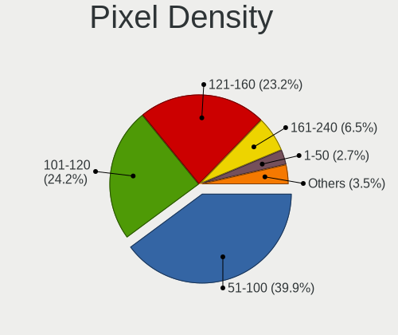

| Density       | Computers | Percent |
|---------------|-----------|---------|
| 51-100        | 307       | 38.96%  |
| 101-120       | 232       | 29.44%  |
| 121-160       | 173       | 21.95%  |
| 161-240       | 27        | 3.43%   |
| Unknown       | 26        | 3.3%    |
| 1-50          | 16        | 2.03%   |
| More than 240 | 7         | 0.89%   |

Multiple Monitors
-----------------

Total monitors connected

| Total | Computers | Percent |
|-------|-----------|---------|
| 1     | 679       | 82.4%   |
| 2     | 77        | 9.34%   |
| 0     | 67        | 8.13%   |
| 3     | 1         | 0.12%   |

Network
-------

Net Controller Vendor
---------------------

Controller vendors

| Vendor                           | Computers | Percent |
|----------------------------------|-----------|---------|
| Realtek Semiconductor            | 583       | 48.1%   |
| Intel                            | 292       | 24.09%  |
| Qualcomm Atheros                 | 149       | 12.29%  |
| Broadcom                         | 42        | 3.47%   |
| TP-Link                          | 15        | 1.24%   |
| Nvidia                           | 15        | 1.24%   |
| Broadcom Limited                 | 13        | 1.07%   |
| MEDIATEK                         | 12        | 0.99%   |
| Ralink Technology                | 11        | 0.91%   |
| Marvell Technology Group         | 11        | 0.91%   |
| Ralink                           | 10        | 0.83%   |
| Xiaomi                           | 6         | 0.5%    |
| Huawei Technologies              | 6         | 0.5%    |
| Microchip Technology             | 4         | 0.33%   |
| Attansic Technology              | 4         | 0.33%   |
| ASUSTek Computer                 | 4         | 0.33%   |
| JMicron Technology               | 3         | 0.25%   |
| Dell                             | 3         | 0.25%   |
| D-Link System                    | 3         | 0.25%   |
| ZTE WCDMA Technologies MSM       | 2         | 0.17%   |
| VIA Technologies                 | 2         | 0.17%   |
| Tenda                            | 2         | 0.17%   |
| Samsung Electronics              | 2         | 0.17%   |
| Qualcomm                         | 2         | 0.17%   |
| U-Blox                           | 1         | 0.08%   |
| Silicon Integrated Systems [SiS] | 1         | 0.08%   |
| Sierra Wireless                  | 1         | 0.08%   |
| Qualcomm Atheros Communications  | 1         | 0.08%   |
| OPPO Electronics                 | 1         | 0.08%   |
| Motorola                         | 1         | 0.08%   |
| Mellanox Technologies            | 1         | 0.08%   |
| MCST                             | 1         | 0.08%   |
| Insyde Software                  | 1         | 0.08%   |
| IBM                              | 1         | 0.08%   |
| Google                           | 1         | 0.08%   |
| Gemtek                           | 1         | 0.08%   |
| Edimax Technology                | 1         | 0.08%   |
| DisplayLink                      | 1         | 0.08%   |
| D-Link                           | 1         | 0.08%   |
| ASIX Electronics                 | 1         | 0.08%   |

Net Controller Model
--------------------

Controller models

| Model                                                                   | Computers | Percent |
|-------------------------------------------------------------------------|-----------|---------|
| Realtek RTL8111/8168/8411 PCI Express Gigabit Ethernet Controller       | 424       | 30.88%  |
| Realtek RTL810xE PCI Express Fast Ethernet controller                   | 50        | 3.64%   |
| Realtek RTL8152 Fast Ethernet Adapter                                   | 44        | 3.2%    |
| Qualcomm Atheros AR9285 Wireless Network Adapter (PCI-Express)          | 38        | 2.77%   |
| Intel Ethernet Connection I219-LM                                       | 32        | 2.33%   |
| Intel Wi-Fi 6 AX200                                                     | 30        | 2.18%   |
| Intel Wireless 8265 / 8275                                              | 23        | 1.68%   |
| Intel Ethernet Connection (2) I219-LM                                   | 17        | 1.24%   |
| Realtek RTL8821CE 802.11ac PCIe Wireless Network Adapter                | 16        | 1.17%   |
| Qualcomm Atheros AR9485 Wireless Network Adapter                        | 16        | 1.17%   |
| Intel Wi-Fi 6 AX201                                                     | 16        | 1.17%   |
| Realtek RTL8153 Gigabit Ethernet Adapter                                | 15        | 1.09%   |
| Qualcomm Atheros QCA9377 802.11ac Wireless Network Adapter              | 15        | 1.09%   |
| Realtek RTL8822BE 802.11a/b/g/n/ac WiFi adapter                         | 13        | 0.95%   |
| Intel Comet Lake PCH-LP CNVi WiFi                                       | 13        | 0.95%   |
| Intel Cannon Point-LP CNVi [Wireless-AC]                                | 13        | 0.95%   |
| Realtek RTL8822CE 802.11ac PCIe Wireless Network Adapter                | 12        | 0.87%   |
| Intel Dual Band Wireless-AC 3168NGW [Stone Peak]                        | 12        | 0.87%   |
| Broadcom BCM4313 802.11bgn Wireless Network Adapter                     | 12        | 0.87%   |
| Qualcomm Atheros QCA9565 / AR9565 Wireless Network Adapter              | 11        | 0.8%    |
| Intel Wireless 3165                                                     | 11        | 0.8%    |
| Intel Ethernet Connection (14) I219-V                                   | 11        | 0.8%    |
| Intel Ethernet Connection (10) I219-V                                   | 11        | 0.8%    |
| MEDIATEK MT7921 802.11ax PCI Express Wireless Network Adapter           | 10        | 0.73%   |
| Intel Cannon Lake PCH CNVi WiFi                                         | 10        | 0.73%   |
| Realtek RTL8723BU 802.11b/g/n WLAN Adapter                              | 9         | 0.66%   |
| Qualcomm Atheros AR8131 Gigabit Ethernet                                | 9         | 0.66%   |
| Intel Wireless 7260                                                     | 9         | 0.66%   |
| Intel Ethernet Connection (2) I219-V                                    | 9         | 0.66%   |
| Realtek RTL8723BE PCIe Wireless Network Adapter                         | 8         | 0.58%   |
| Realtek RTL8125 2.5GbE Controller                                       | 8         | 0.58%   |
| Realtek RTL-8100/8101L/8139 PCI Fast Ethernet Adapter                   | 8         | 0.58%   |
| Qualcomm Atheros AR8151 v2.0 Gigabit Ethernet                           | 8         | 0.58%   |
| Qualcomm Atheros AR8132 Fast Ethernet                                   | 8         | 0.58%   |
| Qualcomm Atheros AR242x / AR542x Wireless Network Adapter (PCI-Express) | 8         | 0.58%   |
| Intel Wireless 7265                                                     | 8         | 0.58%   |
| Intel I211 Gigabit Network Connection                                   | 8         | 0.58%   |
| Realtek RTL8723DE Wireless Network Adapter                              | 7         | 0.51%   |
| Realtek RTL8188EE Wireless Network Adapter                              | 7         | 0.51%   |
| Nvidia MCP61 Ethernet                                                   | 7         | 0.51%   |
| Intel Ethernet Connection (7) I219-LM                                   | 7         | 0.51%   |
| Ralink MT7601U Wireless Adapter                                         | 6         | 0.44%   |
| Qualcomm Atheros AR8161 Gigabit Ethernet                                | 6         | 0.44%   |
| Intel 82579LM Gigabit Network Connection (Lewisville)                   | 6         | 0.44%   |
| Realtek 802.11ac NIC                                                    | 5         | 0.36%   |
| Ralink RT3290 Wireless 802.11n 1T/1R PCIe                               | 5         | 0.36%   |
| Qualcomm Atheros QCA8171 Gigabit Ethernet                               | 5         | 0.36%   |
| Qualcomm Atheros QCA6174 802.11ac Wireless Network Adapter              | 5         | 0.36%   |
| Qualcomm Atheros AR9462 Wireless Network Adapter                        | 5         | 0.36%   |
| Qualcomm Atheros AR9287 Wireless Network Adapter (PCI-Express)          | 5         | 0.36%   |
| Qualcomm Atheros AR8152 v2.0 Fast Ethernet                              | 5         | 0.36%   |
| Qualcomm Atheros AR8151 v1.0 Gigabit Ethernet                           | 5         | 0.36%   |
| Qualcomm Atheros AR8121/AR8113/AR8114 Gigabit or Fast Ethernet          | 5         | 0.36%   |
| Marvell Group 88E8040 PCI-E Fast Ethernet Controller                    | 5         | 0.36%   |
| Intel Wi-Fi 6 AX210/AX211/AX411 160MHz                                  | 5         | 0.36%   |
| Intel Ethernet Connection (4) I219-V                                    | 5         | 0.36%   |
| Intel Comet Lake PCH CNVi WiFi                                          | 5         | 0.36%   |
| Huawei JNY-LX1                                                          | 5         | 0.36%   |
| Xiaomi Mi/Redmi series (RNDIS)                                          | 4         | 0.29%   |
| TP-Link 802.11ac WLAN Adapter                                           | 4         | 0.29%   |

Wireless Vendor
---------------

Wireless vendors

| Vendor                          | Computers | Percent |
|---------------------------------|-----------|---------|
| Intel                           | 196       | 39.36%  |
| Qualcomm Atheros                | 109       | 21.89%  |
| Realtek Semiconductor           | 100       | 20.08%  |
| Broadcom                        | 25        | 5.02%   |
| TP-Link                         | 13        | 2.61%   |
| Ralink Technology               | 11        | 2.21%   |
| Ralink                          | 10        | 2.01%   |
| MEDIATEK                        | 10        | 2.01%   |
| Broadcom Limited                | 10        | 2.01%   |
| ASUSTek Computer                | 4         | 0.8%    |
| Tenda                           | 2         | 0.4%    |
| Dell                            | 2         | 0.4%    |
| D-Link System                   | 2         | 0.4%    |
| Sierra Wireless                 | 1         | 0.2%    |
| Qualcomm Atheros Communications | 1         | 0.2%    |
| Edimax Technology               | 1         | 0.2%    |
| D-Link                          | 1         | 0.2%    |

Wireless Model
--------------

Wireless models

| Model                                                                                         | Computers | Percent |
|-----------------------------------------------------------------------------------------------|-----------|---------|
| Qualcomm Atheros AR9285 Wireless Network Adapter (PCI-Express)                                | 38        | 7.55%   |
| Intel Wi-Fi 6 AX200                                                                           | 30        | 5.96%   |
| Intel Wireless 8265 / 8275                                                                    | 23        | 4.57%   |
| Realtek RTL8821CE 802.11ac PCIe Wireless Network Adapter                                      | 16        | 3.18%   |
| Qualcomm Atheros AR9485 Wireless Network Adapter                                              | 16        | 3.18%   |
| Intel Wi-Fi 6 AX201                                                                           | 16        | 3.18%   |
| Qualcomm Atheros QCA9377 802.11ac Wireless Network Adapter                                    | 15        | 2.98%   |
| Realtek RTL8822BE 802.11a/b/g/n/ac WiFi adapter                                               | 13        | 2.58%   |
| Intel Comet Lake PCH-LP CNVi WiFi                                                             | 13        | 2.58%   |
| Intel Cannon Point-LP CNVi [Wireless-AC]                                                      | 13        | 2.58%   |
| Realtek RTL8822CE 802.11ac PCIe Wireless Network Adapter                                      | 12        | 2.39%   |
| Intel Dual Band Wireless-AC 3168NGW [Stone Peak]                                              | 12        | 2.39%   |
| Broadcom BCM4313 802.11bgn Wireless Network Adapter                                           | 12        | 2.39%   |
| Qualcomm Atheros QCA9565 / AR9565 Wireless Network Adapter                                    | 11        | 2.19%   |
| Intel Wireless 3165                                                                           | 11        | 2.19%   |
| MEDIATEK MT7921 802.11ax PCI Express Wireless Network Adapter                                 | 10        | 1.99%   |
| Intel Cannon Lake PCH CNVi WiFi                                                               | 10        | 1.99%   |
| Realtek RTL8723BU 802.11b/g/n WLAN Adapter                                                    | 9         | 1.79%   |
| Intel Wireless 7260                                                                           | 9         | 1.79%   |
| Realtek RTL8723BE PCIe Wireless Network Adapter                                               | 8         | 1.59%   |
| Qualcomm Atheros AR242x / AR542x Wireless Network Adapter (PCI-Express)                       | 8         | 1.59%   |
| Intel Wireless 7265                                                                           | 8         | 1.59%   |
| Realtek RTL8723DE Wireless Network Adapter                                                    | 7         | 1.39%   |
| Realtek RTL8188EE Wireless Network Adapter                                                    | 7         | 1.39%   |
| Ralink MT7601U Wireless Adapter                                                               | 6         | 1.19%   |
| Realtek 802.11ac NIC                                                                          | 5         | 0.99%   |
| Ralink RT3290 Wireless 802.11n 1T/1R PCIe                                                     | 5         | 0.99%   |
| Qualcomm Atheros QCA6174 802.11ac Wireless Network Adapter                                    | 5         | 0.99%   |
| Qualcomm Atheros AR9462 Wireless Network Adapter                                              | 5         | 0.99%   |
| Qualcomm Atheros AR9287 Wireless Network Adapter (PCI-Express)                                | 5         | 0.99%   |
| Intel Wi-Fi 6 AX210/AX211/AX411 160MHz                                                        | 5         | 0.99%   |
| Intel Comet Lake PCH CNVi WiFi                                                                | 5         | 0.99%   |
| TP-Link 802.11ac WLAN Adapter                                                                 | 4         | 0.8%    |
| Realtek RTL8812AE 802.11ac PCIe Wireless Network Adapter                                      | 4         | 0.8%    |
| Realtek RTL8811AU 802.11a/b/g/n/ac WLAN Adapter                                               | 4         | 0.8%    |
| Intel Wireless-AC 9260                                                                        | 4         | 0.8%    |
| Intel WiFi Link 5100                                                                          | 4         | 0.8%    |
| Intel PRO/Wireless 3945ABG [Golan] Network Connection                                         | 4         | 0.8%    |
| Intel Centrino Wireless-N 130                                                                 | 4         | 0.8%    |
| Broadcom BCM43142 802.11b/g/n                                                                 | 4         | 0.8%    |
| TP-Link TL-WN722N v2/v3 [Realtek RTL8188EUS]                                                  | 3         | 0.6%    |
| Realtek RTL8188CE 802.11b/g/n WiFi Adapter                                                    | 3         | 0.6%    |
| Ralink RT5370 Wireless Adapter                                                                | 3         | 0.6%    |
| Intel Wireless 8260                                                                           | 3         | 0.6%    |
| Intel Tiger Lake PCH CNVi WiFi                                                                | 3         | 0.6%    |
| Intel Dual Band Wireless-AC 3165 Plus Bluetooth                                               | 3         | 0.6%    |
| Broadcom BCM4312 802.11b/g LP-PHY                                                             | 3         | 0.6%    |
| TP-Link Archer T3U [Realtek RTL8812BU]                                                        | 2         | 0.4%    |
| TP-Link 802.11ac NIC                                                                          | 2         | 0.4%    |
| Tenda U12                                                                                     | 2         | 0.4%    |
| Realtek RTL8192EE PCIe Wireless Network Adapter                                               | 2         | 0.4%    |
| Realtek RTL8188EUS 802.11n Wireless Network Adapter                                           | 2         | 0.4%    |
| Realtek Realtek 8812AU/8821AU 802.11ac WLAN Adapter [USB Wireless Dual-Band Adapter 2.4/5Ghz] | 2         | 0.4%    |
| Ralink RT3090 Wireless 802.11n 1T/1R PCIe                                                     | 2         | 0.4%    |
| Intel WiMAX/WiFi Link 5150                                                                    | 2         | 0.4%    |
| Intel PRO/Wireless 4965 AG or AGN [Kedron] Network Connection                                 | 2         | 0.4%    |
| Intel Centrino Wireless-N 2230                                                                | 2         | 0.4%    |
| Intel Centrino Advanced-N 6235                                                                | 2         | 0.4%    |
| Intel Centrino Advanced-N 6230 [Rainbow Peak]                                                 | 2         | 0.4%    |
| Intel Centrino Advanced-N 6205 [Taylor Peak]                                                  | 2         | 0.4%    |

Ethernet Vendor
---------------

Ethernet vendors

| Vendor                           | Computers | Percent |
|----------------------------------|-----------|---------|
| Realtek Semiconductor            | 556       | 64.95%  |
| Intel                            | 146       | 17.06%  |
| Qualcomm Atheros                 | 65        | 7.59%   |
| Broadcom                         | 18        | 2.1%    |
| Nvidia                           | 15        | 1.75%   |
| Marvell Technology Group         | 11        | 1.29%   |
| Xiaomi                           | 6         | 0.7%    |
| Huawei Technologies              | 6         | 0.7%    |
| Attansic Technology              | 4         | 0.47%   |
| JMicron Technology               | 3         | 0.35%   |
| Broadcom Limited                 | 3         | 0.35%   |
| ZTE WCDMA Technologies MSM       | 2         | 0.23%   |
| VIA Technologies                 | 2         | 0.23%   |
| TP-Link                          | 2         | 0.23%   |
| Samsung Electronics              | 2         | 0.23%   |
| Qualcomm                         | 2         | 0.23%   |
| MediaTek                         | 2         | 0.23%   |
| Silicon Integrated Systems [SiS] | 1         | 0.12%   |
| OPPO Electronics                 | 1         | 0.12%   |
| Microchip Technology             | 1         | 0.12%   |
| MCST                             | 1         | 0.12%   |
| Insyde Software                  | 1         | 0.12%   |
| IBM                              | 1         | 0.12%   |
| Google                           | 1         | 0.12%   |
| Gemtek                           | 1         | 0.12%   |
| DisplayLink                      | 1         | 0.12%   |
| D-Link System                    | 1         | 0.12%   |
| ASIX Electronics                 | 1         | 0.12%   |

Ethernet Model
--------------

Ethernet models

| Model                                                             | Computers | Percent |
|-------------------------------------------------------------------|-----------|---------|
| Realtek RTL8111/8168/8411 PCI Express Gigabit Ethernet Controller | 424       | 49.13%  |
| Realtek RTL810xE PCI Express Fast Ethernet controller             | 50        | 5.79%   |
| Realtek RTL8152 Fast Ethernet Adapter                             | 44        | 5.1%    |
| Intel Ethernet Connection I219-LM                                 | 32        | 3.71%   |
| Intel Ethernet Connection (2) I219-LM                             | 17        | 1.97%   |
| Realtek RTL8153 Gigabit Ethernet Adapter                          | 15        | 1.74%   |
| Intel Ethernet Connection (14) I219-V                             | 11        | 1.27%   |
| Intel Ethernet Connection (10) I219-V                             | 11        | 1.27%   |
| Qualcomm Atheros AR8131 Gigabit Ethernet                          | 9         | 1.04%   |
| Intel Ethernet Connection (2) I219-V                              | 9         | 1.04%   |
| Realtek RTL8125 2.5GbE Controller                                 | 8         | 0.93%   |
| Realtek RTL-8100/8101L/8139 PCI Fast Ethernet Adapter             | 8         | 0.93%   |
| Qualcomm Atheros AR8151 v2.0 Gigabit Ethernet                     | 8         | 0.93%   |
| Qualcomm Atheros AR8132 Fast Ethernet                             | 8         | 0.93%   |
| Intel I211 Gigabit Network Connection                             | 8         | 0.93%   |
| Nvidia MCP61 Ethernet                                             | 7         | 0.81%   |
| Intel Ethernet Connection (7) I219-LM                             | 7         | 0.81%   |
| Qualcomm Atheros AR8161 Gigabit Ethernet                          | 6         | 0.7%    |
| Intel 82579LM Gigabit Network Connection (Lewisville)             | 6         | 0.7%    |
| Qualcomm Atheros QCA8171 Gigabit Ethernet                         | 5         | 0.58%   |
| Qualcomm Atheros AR8152 v2.0 Fast Ethernet                        | 5         | 0.58%   |
| Qualcomm Atheros AR8151 v1.0 Gigabit Ethernet                     | 5         | 0.58%   |
| Qualcomm Atheros AR8121/AR8113/AR8114 Gigabit or Fast Ethernet    | 5         | 0.58%   |
| Marvell Group 88E8040 PCI-E Fast Ethernet Controller              | 5         | 0.58%   |
| Intel Ethernet Connection (4) I219-V                              | 5         | 0.58%   |
| Huawei JNY-LX1                                                    | 5         | 0.58%   |
| Xiaomi Mi/Redmi series (RNDIS)                                    | 4         | 0.46%   |
| Qualcomm Atheros Killer E220x Gigabit Ethernet Controller         | 4         | 0.46%   |
| Nvidia MCP51 Ethernet Controller                                  | 4         | 0.46%   |
| Intel Ethernet Controller I225-V                                  | 4         | 0.46%   |
| Intel Ethernet Connection I217-LM                                 | 4         | 0.46%   |
| Intel 82574L Gigabit Network Connection                           | 4         | 0.46%   |
| Broadcom NetLink BCM57785 Gigabit Ethernet PCIe                   | 4         | 0.46%   |
| Attansic AR8152 v2.0 Fast Ethernet                                | 4         | 0.46%   |
| Realtek RTL-8110SC/8169SC Gigabit Ethernet                        | 3         | 0.35%   |
| Qualcomm Atheros AR8162 Fast Ethernet                             | 3         | 0.35%   |
| Marvell Group 88E8056 PCI-E Gigabit Ethernet Controller           | 3         | 0.35%   |
| Intel Ethernet Connection (7) I219-V                              | 3         | 0.35%   |
| Intel Ethernet Connection (13) I219-V                             | 3         | 0.35%   |
| Broadcom NetLink BCM5784M Gigabit Ethernet PCIe                   | 3         | 0.35%   |
| Broadcom NetLink BCM57780 Gigabit Ethernet PCIe                   | 3         | 0.35%   |
| ZTE WCDMA MSM ZTE MSM                                             | 2         | 0.23%   |
| Xiaomi Mi/Redmi series (RNDIS + ADB)                              | 2         | 0.23%   |
| VIA VT6105/VT6106S [Rhine-III]                                    | 2         | 0.23%   |
| TP-Link USB 10/100 LAN                                            | 2         | 0.23%   |
| Realtek Killer E2600 Gigabit Ethernet Controller                  | 2         | 0.23%   |
| Qualcomm Redmi 9T                                                 | 2         | 0.23%   |
| Qualcomm Atheros Attansic L2 Fast Ethernet                        | 2         | 0.23%   |
| Qualcomm Atheros AR8152 v1.1 Fast Ethernet                        | 2         | 0.23%   |
| JMicron JMC250 PCI Express Gigabit Ethernet Controller            | 2         | 0.23%   |
| Intel WiMAX Connection 2400m                                      | 2         | 0.23%   |
| Intel Ethernet Connection (4) I219-LM                             | 2         | 0.23%   |
| Intel 82567V-2 Gigabit Network Connection                         | 2         | 0.23%   |
| Broadcom NetXtreme BCM5720 Gigabit Ethernet PCIe                  | 2         | 0.23%   |
| Broadcom NetLink BCM5787M Gigabit Ethernet PCI Express            | 2         | 0.23%   |
| Silicon Integrated Systems [SiS] 191 Gigabit Ethernet Adapter     | 1         | 0.12%   |
| Samsung GT-I9070 (network tethering, USB debugging enabled)       | 1         | 0.12%   |
| Samsung Galaxy series, misc. (tethering mode)                     | 1         | 0.12%   |
| Realtek USB 10/100/1G/2.5G LAN                                    | 1         | 0.12%   |
| Realtek RTL8169 PCI Gigabit Ethernet Controller                   | 1         | 0.12%   |

Net Controller Kind
-------------------

Ethernet, WiFi or modem

| Kind     | Computers | Percent |
|----------|-----------|---------|
| Ethernet | 769       | 60.98%  |
| WiFi     | 485       | 38.46%  |
| Modem    | 6         | 0.48%   |
| Unknown  | 1         | 0.08%   |

Used Controller
---------------

Currently used network controller

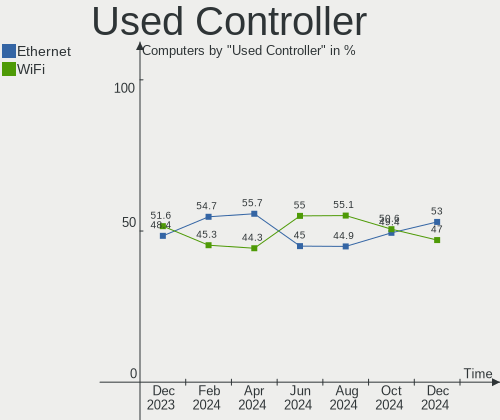

| Kind     | Computers | Percent |
|----------|-----------|---------|
| Ethernet | 448       | 54.3%   |
| WiFi     | 377       | 45.7%   |

NICs
----

Total network controllers on board

| Total | Computers | Percent |
|-------|-----------|---------|
| 1     | 403       | 48.91%  |
| 2     | 396       | 48.06%  |
| 0     | 17        | 2.06%   |
| 3     | 6         | 0.73%   |
| 14    | 1         | 0.12%   |
| 4     | 1         | 0.12%   |

IPv6
----

IPv6 vs IPv4

| Used | Computers | Percent |
|------|-----------|---------|
| No   | 797       | 96.72%  |
| Yes  | 27        | 3.28%   |

Bluetooth
---------

Bluetooth Vendor
----------------

Controller vendors

| Vendor                          | Computers | Percent |
|---------------------------------|-----------|---------|
| Intel                           | 175       | 45.57%  |
| Realtek Semiconductor           | 41        | 10.68%  |
| Cambridge Silicon Radio         | 37        | 9.64%   |
| Qualcomm Atheros Communications | 23        | 5.99%   |
| Lite-On Technology              | 21        | 5.47%   |
| IMC Networks                    | 17        | 4.43%   |
| Foxconn / Hon Hai               | 15        | 3.91%   |
| Broadcom                        | 13        | 3.39%   |
| Apple                           | 7         | 1.82%   |
| Dell                            | 6         | 1.56%   |
| ASUSTek Computer                | 6         | 1.56%   |
| Ralink                          | 5         | 1.3%    |
| Realtek                         | 4         | 1.04%   |
| Toshiba                         | 3         | 0.78%   |
| Hewlett-Packard                 | 3         | 0.78%   |
| Foxconn International           | 2         | 0.52%   |
| Alps Electric                   | 2         | 0.52%   |
| Ralink Technology               | 1         | 0.26%   |
| Logitech                        | 1         | 0.26%   |
| Integrated System Solution      | 1         | 0.26%   |
| Chicony Electronics             | 1         | 0.26%   |

Bluetooth Model
---------------

Controller models

| Model                                               | Computers | Percent |
|-----------------------------------------------------|-----------|---------|
| Intel Bluetooth wireless interface                  | 55        | 14.32%  |
| Cambridge Silicon Radio Bluetooth Dongle (HCI mode) | 37        | 9.64%   |
| Intel Bluetooth 9460/9560 Jefferson Peak (JfP)      | 33        | 8.59%   |
| Intel AX200 Bluetooth                               | 30        | 7.81%   |
| Intel AX201 Bluetooth                               | 27        | 7.03%   |
| Realtek Bluetooth Radio                             | 25        | 6.51%   |
| Intel Wireless-AC 3168 Bluetooth                    | 12        | 3.13%   |
| Lite-On Qualcomm Atheros QCA9377 Bluetooth          | 9         | 2.34%   |
| Qualcomm Atheros  Bluetooth Device                  | 8         | 2.08%   |
| Realtek 802.11n WLAN Adapter                        | 7         | 1.82%   |
| IMC Networks Wireless_Device                        | 7         | 1.82%   |
| Qualcomm Atheros AR3011 Bluetooth                   | 6         | 1.56%   |
| Foxconn / Hon Hai Bluetooth Device                  | 6         | 1.56%   |
| Realtek  Bluetooth 4.2 Adapter                      | 5         | 1.3%    |
| Ralink RT3290 Bluetooth                             | 5         | 1.3%    |
| Qualcomm Atheros AR3012 Bluetooth 4.0               | 5         | 1.3%    |
| Intel Bluetooth Device                              | 5         | 1.3%    |
| Intel AX210 Bluetooth                               | 5         | 1.3%    |
| Realtek Bluetooth Radio                             | 4         | 1.04%   |
| Lite-On Bluetooth Device                            | 4         | 1.04%   |
| Intel Wireless-AC 9260 Bluetooth Adapter            | 4         | 1.04%   |
| Intel Centrino Bluetooth Wireless Transceiver       | 4         | 1.04%   |
| Realtek RTL8723B Bluetooth                          | 3         | 0.78%   |
| Lite-On Atheros AR3012 Bluetooth                    | 3         | 0.78%   |
| IMC Networks Bluetooth Radio                        | 3         | 0.78%   |
| IMC Networks Atheros AR3012 Bluetooth 4.0 Adapter   | 3         | 0.78%   |
| Foxconn / Hon Hai Bluetooth USB Host Controller     | 3         | 0.78%   |
| Apple Bluetooth USB Host Controller                 | 3         | 0.78%   |
| Toshiba Integrated Bluetooth HCI                    | 2         | 0.52%   |
| Qualcomm Atheros QCA61x4 Bluetooth 4.0              | 2         | 0.52%   |
| Lite-On Wireless_Device                             | 2         | 0.52%   |
| IMC Networks Bluetooth USB Host Controller          | 2         | 0.52%   |
| HP Bluetooth 2.0 Interface [Broadcom BCM2045]       | 2         | 0.52%   |
| Foxconn International BCM43142A0 Bluetooth module   | 2         | 0.52%   |
| Foxconn / Hon Hai Broadcom Bluetooth 2.1 Device     | 2         | 0.52%   |
| Foxconn / Hon Hai Acer Bluetooth module             | 2         | 0.52%   |
| Dell Wireless 360 Bluetooth                         | 2         | 0.52%   |
| Dell Wireless 355 Bluetooth                         | 2         | 0.52%   |
| Broadcom BCM2070 Bluetooth Device                   | 2         | 0.52%   |
| Broadcom BCM2045 Bluetooth                          | 2         | 0.52%   |
| ASUS Broadcom BCM20702A0 Bluetooth                  | 2         | 0.52%   |
| ASUS ASUS USB-BT500                                 | 2         | 0.52%   |
| Apple Bluetooth Host Controller                     | 2         | 0.52%   |
| Alps Electric BCM2046 Bluetooth Device              | 2         | 0.52%   |
| Toshiba Askey Bluetooth Module                      | 1         | 0.26%   |
| Realtek RTL8821A Bluetooth                          | 1         | 0.26%   |
| Ralink Motorola BC4 Bluetooth 3.0+HS Adapter        | 1         | 0.26%   |
| Qualcomm Atheros Bluetooth (AR3011)                 | 1         | 0.26%   |
| Qualcomm Atheros AR3012 Bluetooth                   | 1         | 0.26%   |
| Logitech BT Mini-Receiver (HCI mode)                | 1         | 0.26%   |
| Lite-On Qualcomm Atheros Bluetooth                  | 1         | 0.26%   |
| Lite-On Broadcom BCM43142A0 Bluetooth Device        | 1         | 0.26%   |
| Lite-On Bluetooth Radio                             | 1         | 0.26%   |
| Integrated System Solution Bluetooth Device         | 1         | 0.26%   |
| IMC Networks Bluetooth Device                       | 1         | 0.26%   |
| IMC Networks Bluetooth                              | 1         | 0.26%   |
| HP Broadcom 2070 Bluetooth Combo                    | 1         | 0.26%   |
| Foxconn / Hon Hai Wireless_Device                   | 1         | 0.26%   |
| Foxconn / Hon Hai Acer Module                       | 1         | 0.26%   |
| Dell Broadcom BCM20702A0 Bluetooth                  | 1         | 0.26%   |

Sound
-----

Sound Vendor
------------

Sound card vendors

| Vendor                           | Computers | Percent |
|----------------------------------|-----------|---------|
| Intel                            | 579       | 51.19%  |
| AMD                              | 252       | 22.28%  |
| Nvidia                           | 236       | 20.87%  |
| C-Media Electronics              | 11        | 0.97%   |
| Creative Labs                    | 10        | 0.88%   |
| Logitech                         | 5         | 0.44%   |
| Plantronics                      | 4         | 0.35%   |
| Generalplus Technology           | 3         | 0.27%   |
| VIA Technologies                 | 2         | 0.18%   |
| Texas Instruments                | 2         | 0.18%   |
| ASUSTek Computer                 | 2         | 0.18%   |
| ZOOM                             | 1         | 0.09%   |
| Yamaha                           | 1         | 0.09%   |
| XMOS                             | 1         | 0.09%   |
| Turtle Beach                     | 1         | 0.09%   |
| SteelSeries ApS                  | 1         | 0.09%   |
| Silicon Integrated Systems [SiS] | 1         | 0.09%   |
| Shure                            | 1         | 0.09%   |
| Samson Technologies              | 1         | 0.09%   |
| Razer USA                        | 1         | 0.09%   |
| Microsoft                        | 1         | 0.09%   |
| Micro Star International         | 1         | 0.09%   |
| MCST                             | 1         | 0.09%   |
| Kingston Technology              | 1         | 0.09%   |
| JMTek                            | 1         | 0.09%   |
| Hewlett-Packard                  | 1         | 0.09%   |
| Goldvish                         | 1         | 0.09%   |
| GN Netcom                        | 1         | 0.09%   |
| Focusrite-Novation               | 1         | 0.09%   |
| ELMCU                            | 1         | 0.09%   |
| EasyPass Industrial              | 1         | 0.09%   |
| DigiTech                         | 1         | 0.09%   |
| Creative Technology              | 1         | 0.09%   |
| Conexant Systems                 | 1         | 0.09%   |
| Apple                            | 1         | 0.09%   |
| A4Tech                           | 1         | 0.09%   |

Sound Model
-----------

Sound card models

| Model                                                                      | Computers | Percent |
|----------------------------------------------------------------------------|-----------|---------|
| Intel 100 Series/C230 Series Chipset Family HD Audio Controller            | 70        | 5.39%   |
| AMD Family 17h/19h HD Audio Controller                                     | 64        | 4.93%   |
| Intel Sunrise Point-LP HD Audio                                            | 54        | 4.16%   |
| Intel 6 Series/C200 Series Chipset Family High Definition Audio Controller | 52        | 4%      |
| Intel 7 Series/C216 Chipset Family High Definition Audio Controller        | 49        | 3.77%   |
| Intel NM10/ICH7 Family High Definition Audio Controller                    | 48        | 3.7%    |
| AMD SBx00 Azalia (Intel HDA)                                               | 46        | 3.54%   |
| Nvidia GP107GL High Definition Audio Controller                            | 44        | 3.39%   |
| Intel 8 Series/C220 Series Chipset High Definition Audio Controller        | 35        | 2.69%   |
| Intel 200 Series PCH HD Audio                                              | 34        | 2.62%   |
| AMD Family 17h (Models 00h-0fh) HD Audio Controller                        | 34        | 2.62%   |
| AMD Raven/Raven2/Fenghuang HDMI/DP Audio Controller                        | 30        | 2.31%   |
| AMD Renoir Radeon High Definition Audio Controller                         | 29        | 2.23%   |
| AMD FCH Azalia Controller                                                  | 27        | 2.08%   |
| Intel Cannon Point-LP High Definition Audio Controller                     | 26        | 2%      |
| Intel Xeon E3-1200 v3/4th Gen Core Processor HD Audio Controller           | 24        | 1.85%   |
| Intel Cannon Lake PCH cAVS                                                 | 20        | 1.54%   |
| Intel Tiger Lake-LP Smart Sound Technology Audio Controller                | 19        | 1.46%   |
| Intel Tiger Lake-H HD Audio Controller                                     | 19        | 1.46%   |
| Intel Comet Lake PCH-V cAVS                                                | 18        | 1.39%   |
| Intel 5 Series/3400 Series Chipset High Definition Audio                   | 18        | 1.39%   |
| Nvidia GF108 High Definition Audio Controller                              | 17        | 1.31%   |
| Intel 82801I (ICH9 Family) HD Audio Controller                             | 17        | 1.31%   |
| Nvidia High Definition Audio Controller                                    | 16        | 1.23%   |
| AMD Starship/Matisse HD Audio Controller                                   | 16        | 1.23%   |
| Intel Comet Lake PCH-LP cAVS                                               | 15        | 1.15%   |
| AMD Kabini HDMI/DP Audio                                                   | 15        | 1.15%   |
| Nvidia TU107 GeForce GTX 1650 High Definition Audio Controller             | 14        | 1.08%   |
| Nvidia GK208 HDMI/DP Audio Controller                                      | 14        | 1.08%   |
| Intel 82801H (ICH8 Family) HD Audio Controller                             | 14        | 1.08%   |
| AMD Family 15h (Models 60h-6fh) Audio Controller                           | 14        | 1.08%   |
| Nvidia GP106 High Definition Audio Controller                              | 12        | 0.92%   |
| Nvidia Audio device                                                        | 12        | 0.92%   |
| Nvidia GK107 HDMI Audio Controller                                         | 11        | 0.85%   |
| AMD Ellesmere HDMI Audio [Radeon RX 470/480 / 570/580/590]                 | 11        | 0.85%   |
| Nvidia TU116 High Definition Audio Controller                              | 10        | 0.77%   |
| Intel Haswell-ULT HD Audio Controller                                      | 10        | 0.77%   |
| Intel 8 Series HD Audio Controller                                         | 10        | 0.77%   |
| Intel Comet Lake PCH cAVS                                                  | 9         | 0.69%   |
| Intel Audio device                                                         | 9         | 0.69%   |
| AMD High Definition Audio Controller                                       | 9         | 0.69%   |
| Nvidia TU106 High Definition Audio Controller                              | 8         | 0.62%   |
| Nvidia GP108 High Definition Audio Controller                              | 8         | 0.62%   |
| AMD Oland/Hainan/Cape Verde/Pitcairn HDMI Audio [Radeon HD 7000 Series]    | 8         | 0.62%   |
| AMD Cedar HDMI Audio [Radeon HD 5400/6300/7300 Series]                     | 8         | 0.62%   |
| AMD Baffin HDMI/DP Audio [Radeon RX 550 640SP / RX 560/560X]               | 8         | 0.62%   |
| Nvidia MCP61 High Definition Audio                                         | 7         | 0.54%   |
| Nvidia GM107 High Definition Audio Controller [GeForce 940MX]              | 7         | 0.54%   |
| Nvidia GF106 High Definition Audio Controller                              | 7         | 0.54%   |
| Intel Celeron N3350/Pentium N4200/Atom E3900 Series Audio Cluster          | 7         | 0.54%   |
| Intel 82801JI (ICH10 Family) HD Audio Controller                           | 7         | 0.54%   |
| AMD Turks HDMI Audio [Radeon HD 6500/6600 / 6700M Series]                  | 7         | 0.54%   |
| AMD Trinity HDMI Audio Controller                                          | 6         | 0.46%   |
| Nvidia GM204 High Definition Audio Controller                              | 5         | 0.38%   |
| Nvidia GK104 HDMI Audio Controller                                         | 5         | 0.38%   |
| Nvidia GF119 HDMI Audio Controller                                         | 5         | 0.38%   |
| Nvidia GF116 High Definition Audio Controller                              | 5         | 0.38%   |
| Intel Atom Processor Z36xxx/Z37xxx Series High Definition Audio Controller | 5         | 0.38%   |
| AMD RS880 HDMI Audio [Radeon HD 4200 Series]                               | 5         | 0.38%   |
| Nvidia MCP79 High Definition Audio                                         | 4         | 0.31%   |

Memory
------

Memory Vendor
-------------

Memory module vendors

| Vendor                       | Computers | Percent |
|------------------------------|-----------|---------|
| Unknown                      | 125       | 15.94%  |
| Kingston                     | 123       | 15.69%  |
| SK Hynix                     | 119       | 15.18%  |
| Samsung Electronics          | 110       | 14.03%  |
| Crucial                      | 69        | 8.8%    |
| Micron Technology            | 46        | 5.87%   |
| AMD                          | 28        | 3.57%   |
| Patriot                      | 19        | 2.42%   |
| A-DATA Technology            | 17        | 2.17%   |
| Ramaxel Technology           | 16        | 2.04%   |
| Corsair                      | 13        | 1.66%   |
| Elpida                       | 11        | 1.4%    |
| Unknown (ABCD)               | 7         | 0.89%   |
| Nanya Technology             | 7         | 0.89%   |
| GOODRAM                      | 6         | 0.77%   |
| G.Skill                      | 6         | 0.77%   |
| Apacer                       | 6         | 0.77%   |
| Unknown                      | 6         | 0.77%   |
| Kingmax                      | 5         | 0.64%   |
| Kllisre                      | 4         | 0.51%   |
| Foxline                      | 4         | 0.51%   |
| ASint Technology             | 4         | 0.51%   |
| 48spaces                     | 4         | 0.51%   |
| Transcend                    | 3         | 0.38%   |
| Qumo                         | 3         | 0.38%   |
| Unifosa                      | 2         | 0.26%   |
| SHARETRONIC                  | 2         | 0.26%   |
| Goldkey                      | 2         | 0.26%   |
| Wilk Elektronik              | 1         | 0.13%   |
| Unknown (8AFD)               | 1         | 0.13%   |
| Unknown (8A02)               | 1         | 0.13%   |
| Unknown (89F8)               | 1         | 0.13%   |
| Unknown (0x7F7F7F7F7F7F7F07) | 1         | 0.13%   |
| Txrui                        | 1         | 0.13%   |
| TIGO                         | 1         | 0.13%   |
| Team                         | 1         | 0.13%   |
| Silicon Power                | 1         | 0.13%   |
| Qimonda                      | 1         | 0.13%   |
| Patriot Memory (PDP Systems) | 1         | 0.13%   |
| Patriot Memory               | 1         | 0.13%   |
| Hikvision                    | 1         | 0.13%   |
| HEXON                        | 1         | 0.13%   |
| Golden Empire                | 1         | 0.13%   |
| Gloway                       | 1         | 0.13%   |
| atermiter                    | 1         | 0.13%   |

Memory Model
------------

Memory module models

| Model                                                                        | Computers | Percent |
|------------------------------------------------------------------------------|-----------|---------|
| Crucial RAM CT8G4SFRA266.M8FRS 8GB SODIMM DDR4 2667MT/s                      | 17        | 1.99%   |
| SK Hynix RAM HMA82GU6JJR8N-VK 16GB DIMM DDR4 2667MT/s                        | 15        | 1.76%   |
| Samsung RAM M471A5244CB0-CTD 4GB SODIMM DDR4 3266MT/s                        | 14        | 1.64%   |
| SK Hynix RAM HMA81GS6JJR8N-VK 8GB SODIMM DDR4 2667MT/s                       | 13        | 1.52%   |
| Crucial RAM CT4G4DFS824A.M8FF 4GB DIMM DDR4 2400MT/s                         | 13        | 1.52%   |
| Ramaxel RAM RMSA3260ME78HAF-2666 8GB SODIMM DDR4 2667MT/s                    | 10        | 1.17%   |
| Micron RAM Module 4GB DIMM DDR4 2400MT/s                                     | 10        | 1.17%   |
| Unknown RAM Module 2GB DIMM SDRAM                                            | 9         | 1.06%   |
| Unknown RAM Module 2GB DIMM DDR2 800MT/s                                     | 7         | 0.82%   |
| Unknown (ABCD) RAM 123456789012345678 2048MB SODIMM LPDDR4 2400MT/s          | 7         | 0.82%   |
| Unknown RAM Module 2GB DIMM 800MT/s                                          | 6         | 0.7%    |
| SK Hynix RAM HMA851S6AFR6N-UH 4GB SODIMM DDR4 2667MT/s                       | 6         | 0.7%    |
| Samsung RAM Module 16GB SODIMM DDR4 2667MT/s                                 | 6         | 0.7%    |
| Samsung RAM M471B5273DH0-CH9 4GB SODIMM DDR3 1334MT/s                        | 6         | 0.7%    |
| Samsung RAM M471B5173QH0-YK0 4GB SODIMM DDR3 1600MT/s                        | 6         | 0.7%    |
| Samsung RAM M471A1G44AB0-CWE 8GB SODIMM DDR4 3200MT/s                        | 6         | 0.7%    |
| Kingston RAM KHX2666C16/8G 8GB DIMM DDR4 3466MT/s                            | 6         | 0.7%    |
| Unknown                                                                      | 6         | 0.7%    |
| SK Hynix RAM Module 8GB SODIMM DDR4 2133MT/s                                 | 5         | 0.59%   |
| SK Hynix RAM HMT325S6CFR8C-PB 2GB SODIMM DDR3 1600MT/s                       | 5         | 0.59%   |
| SK Hynix RAM HMAA1GS6CJR6N-XN 8GB SODIMM DDR4 3200MT/s                       | 5         | 0.59%   |
| SK Hynix RAM HMA851S6CJR6N-VK 4GB SODIMM DDR4 2667MT/s                       | 5         | 0.59%   |
| Samsung RAM Module 8GB SODIMM DDR4 2133MT/s                                  | 5         | 0.59%   |
| Kingston RAM KHX1600C9D3/4GX 4GB DIMM DDR3 2400MT/s                          | 5         | 0.59%   |
| AMD RAM R748G2606U2S 8GB DIMM DDR4 3200MT/s                                  | 5         | 0.59%   |
| Unknown RAM Module 4GB DIMM DDR3 1333MT/s                                    | 4         | 0.47%   |
| Unknown RAM Module 4GB DIMM 1333MT/s                                         | 4         | 0.47%   |
| Unknown RAM Module 2GB SODIMM DDR2 667MT/s                                   | 4         | 0.47%   |
| Unknown RAM Module 2GB DIMM 1333MT/s                                         | 4         | 0.47%   |
| Unknown RAM Module 2048MB DIMM 800MT/s                                       | 4         | 0.47%   |
| SK Hynix RAM HMT451S6BFR8A-PB 4GB SODIMM DDR3 1600MT/s                       | 4         | 0.47%   |
| SK Hynix RAM HMT351S6CFR8C-PB 4GB SODIMM DDR3 1600MT/s                       | 4         | 0.47%   |
| Micron RAM 4ATF1G64HZ-3G2E1 8GB SODIMM DDR4 3200MT/s                         | 4         | 0.47%   |
| Kingston RAM KHX1600C10D3/8G 8GB DIMM DDR3 1600MT/s                          | 4         | 0.47%   |
| Kingston RAM CBD24D4S7S8K1A-8 8GB SODIMM DDR4 2400MT/s                       | 4         | 0.47%   |
| Elpida RAM EBJ41UF8BCS0-DJ-F 4096MB SODIMM DDR3 1334MT/s                     | 4         | 0.47%   |
| Crucial RAM CT8G4SFRA266.C4FE 8GB SODIMM DDR4 2667MT/s                       | 4         | 0.47%   |
| A-DATA RAM DDR4 3000 16GB DIMM DDR4 3600MT/s                                 | 4         | 0.47%   |
| 48spaces RAM 012345678901234567890123456789012345 2048MB SODIMM DDR2 667MT/s | 4         | 0.47%   |
| Unknown RAM Module 4GB DIMM 1600MT/s                                         | 3         | 0.35%   |
| Unknown RAM Module 2GB SODIMM 800MT/s                                        | 3         | 0.35%   |
| Unknown RAM Module 2GB DIMM DDR2 667MT/s                                     | 3         | 0.35%   |
| Unknown RAM Module 2GB DIMM 667MT/s                                          | 3         | 0.35%   |
| Unknown RAM Module 2048MB DIMM DDR2 800MT/s                                  | 3         | 0.35%   |
| Unknown RAM Module 1GB SODIMM DDR2                                           | 3         | 0.35%   |
| Unknown RAM Module 1GB DIMM DDR2 800MT/s                                     | 3         | 0.35%   |
| Unknown RAM Module 1GB DIMM DDR2 667MT/s                                     | 3         | 0.35%   |
| Samsung RAM M471A2G43AB2-CWE 16GB SODIMM DDR4 3200MT/s                       | 3         | 0.35%   |
| Samsung RAM M471A1K43CB1-CTD 8GB SODIMM DDR4 2667MT/s                        | 3         | 0.35%   |
| Nanya RAM NT2GC64B8HC0NS-CG 2GB SODIMM DDR3 1334MT/s                         | 3         | 0.35%   |
| Micron RAM 4ATF1G64HZ-3G2E2 8GB SODIMM DDR4 3200MT/s                         | 3         | 0.35%   |
| Kingston RAM KHX3000C15D4/8GX 8GB DIMM DDR4 3400MT/s                         | 3         | 0.35%   |
| Kingston RAM 99U5584-003.A00LF 4GB DIMM DDR3 1600MT/s                        | 3         | 0.35%   |
| Kingston RAM 99U5428-063.A00LF 8GB SODIMM DDR3 1600MT/s                      | 3         | 0.35%   |
| Kingston RAM 9905471-011.A00LF 4096MB DIMM DDR3 1600MT/s                     | 3         | 0.35%   |
| Foxline RAM FL3200D4U22-16G 16384MB DIMM DDR4 3200MT/s                       | 3         | 0.35%   |
| Crucial RAM CT8G4DFS8213.C8FDR1 8GB DIMM DDR4 2133MT/s                       | 3         | 0.35%   |
| Crucial RAM CT51264BA160BJ.C8 4GB DIMM DDR3 1600MT/s                         | 3         | 0.35%   |
| Unknown RAM Module 8GB DIMM DDR4 2667MT/s                                    | 2         | 0.23%   |
| Unknown RAM Module 8GB DIMM DDR3 1600MT/s                                    | 2         | 0.23%   |

Memory Kind
-----------

Memory module kinds

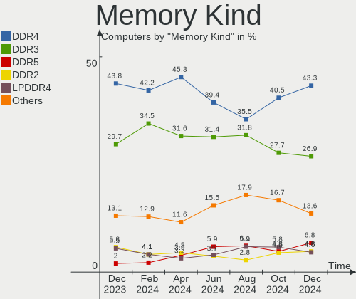

| Kind    | Computers | Percent |
|---------|-----------|---------|
| DDR4    | 341       | 48.58%  |
| DDR3    | 207       | 29.49%  |
| DDR2    | 48        | 6.84%   |
| Unknown | 45        | 6.41%   |
| SDRAM   | 30        | 4.27%   |
| LPDDR4  | 17        | 2.42%   |
| DDR     | 7         | 1%      |
| LPDDR3  | 6         | 0.85%   |
| DRAM    | 1         | 0.14%   |

Memory Form Factor
------------------

Physical design of the memory module

| Name         | Computers | Percent |
|--------------|-----------|---------|
| SODIMM       | 351       | 50.8%   |
| DIMM         | 326       | 47.18%  |
| Row Of Chips | 13        | 1.88%   |
| Chip         | 1         | 0.14%   |

Memory Size
-----------

Memory module size

| Size  | Computers | Percent |
|-------|-----------|---------|
| 8192  | 271       | 35.38%  |
| 4096  | 236       | 30.81%  |
| 2048  | 134       | 17.49%  |
| 16384 | 67        | 8.75%   |
| 1024  | 43        | 5.61%   |
| 32768 | 12        | 1.57%   |
| 512   | 3         | 0.39%   |

Memory Speed
------------

Memory module speed

| Speed   | Computers | Percent |
|---------|-----------|---------|
| 2667    | 127       | 16.73%  |
| 1600    | 122       | 16.07%  |
| 3200    | 79        | 10.41%  |
| 2400    | 74        | 9.75%   |
| 1333    | 63        | 8.3%    |
| 667     | 41        | 5.4%    |
| 2133    | 37        | 4.87%   |
| 800     | 33        | 4.35%   |
| 1334    | 27        | 3.56%   |
| Unknown | 27        | 3.56%   |
| 3266    | 14        | 1.84%   |
| 3600    | 12        | 1.58%   |
| 3466    | 10        | 1.32%   |
| 2933    | 9         | 1.19%   |
| 1867    | 9         | 1.19%   |
| 1066    | 8         | 1.05%   |
| 4199    | 6         | 0.79%   |
| 2666    | 6         | 0.79%   |
| 1067    | 5         | 0.66%   |
| 3400    | 4         | 0.53%   |
| 2048    | 4         | 0.53%   |
| 4266    | 3         | 0.4%    |
| 3000    | 3         | 0.4%    |
| 2866    | 3         | 0.4%    |
| 1866    | 3         | 0.4%    |
| 400     | 3         | 0.4%    |
| 333     | 3         | 0.4%    |
| 4400    | 2         | 0.26%   |
| 3800    | 2         | 0.26%   |
| 3533    | 2         | 0.26%   |
| 3500    | 2         | 0.26%   |
| 1800    | 2         | 0.26%   |
| 533     | 2         | 0.26%   |
| 4267    | 1         | 0.13%   |
| 3534    | 1         | 0.13%   |
| 3334    | 1         | 0.13%   |
| 3066    | 1         | 0.13%   |
| 2934    | 1         | 0.13%   |
| 2800    | 1         | 0.13%   |
| 2448    | 1         | 0.13%   |
| 1904    | 1         | 0.13%   |
| 1648    | 1         | 0.13%   |
| 1088    | 1         | 0.13%   |
| 975     | 1         | 0.13%   |
| 266     | 1         | 0.13%   |

Printers & scanners
-------------------

Printer Vendor
--------------

Printer device vendors

| Vendor                 | Computers | Percent |
|------------------------|-----------|---------|
| Hewlett-Packard        | 6         | 22.22%  |
| Canon                  | 5         | 18.52%  |
| Seiko Epson            | 4         | 14.81%  |
| Samsung Electronics    | 4         | 14.81%  |
| Brother Industries     | 3         | 11.11%  |
| Pantum                 | 2         | 7.41%   |
| Panasonic (Matsushita) | 2         | 7.41%   |
| Konica Minolta         | 1         | 3.7%    |

Printer Model
-------------

Printer device models

| Model                                                        | Computers | Percent |
|--------------------------------------------------------------|-----------|---------|
| Panasonic (Matsushita) KX-MB2030 Multifunction Laser Printer | 2         | 7.41%   |
| Seiko Epson L4150 Series                                     | 1         | 3.7%    |
| Seiko Epson L312 Series                                      | 1         | 3.7%    |
| Seiko Epson L210 Series                                      | 1         | 3.7%    |
| Seiko Epson L110 Series                                      | 1         | 3.7%    |
| Samsung ML-1210 Printer                                      | 1         | 3.7%    |
| Samsung M332x 382x 402x Series                               | 1         | 3.7%    |
| Samsung Laser Printer                                        | 1         | 3.7%    |
| Samsung CLX-3180 Series                                      | 1         | 3.7%    |
| Pantum P2500 series                                          | 1         | 3.7%    |
| Pantum P2200 series                                          | 1         | 3.7%    |
| Konica Minolta 185                                           | 1         | 3.7%    |
| HP LaserJet P2055 series                                     | 1         | 3.7%    |
| HP LaserJet P1102                                            | 1         | 3.7%    |
| HP LaserJet M402dn                                           | 1         | 3.7%    |
| HP LaserJet 1020                                             | 1         | 3.7%    |
| HP DeskJet 2130 series                                       | 1         | 3.7%    |
| HP Deskjet 1510                                              | 1         | 3.7%    |
| Canon MF4410                                                 | 1         | 3.7%    |
| Canon MF4010 series                                          | 1         | 3.7%    |
| Canon LBP6020                                                | 1         | 3.7%    |
| Canon G2010 series                                           | 1         | 3.7%    |
| Canon CanoScan LiDE 300                                      | 1         | 3.7%    |
| Brother HL-L2300D series                                     | 1         | 3.7%    |
| Brother HL-1110 series                                       | 1         | 3.7%    |
| Brother DCP-L2540DN                                          | 1         | 3.7%    |

Scanner Vendor
--------------

Scanner device vendors

| Vendor                      | Computers | Percent |
|-----------------------------|-----------|---------|
| Canon                       | 5         | 62.5%   |
| Hewlett-Packard             | 2         | 25%     |
| KYE Systems (Mouse Systems) | 1         | 12.5%   |

Scanner Model
-------------

Scanner device models

| Model                                                | Computers | Percent |
|------------------------------------------------------|-----------|---------|
| Canon CanoScan LiDE 110                              | 2         | 25%     |
| KYE Systems (Mouse Systems) ColorPage-HR6 V2 Scanner | 1         | 12.5%   |
| HP ScanJet 3970c                                     | 1         | 12.5%   |
| HP ScanJet 2400c                                     | 1         | 12.5%   |
| Canon CanoScan LIDE 25                               | 1         | 12.5%   |
| Canon CanoScan LiDE 220                              | 1         | 12.5%   |
| Canon CanoScan LiDE 120                              | 1         | 12.5%   |

Camera
------

Camera Vendor
-------------

Camera device vendors

| Vendor                                 | Computers | Percent |
|----------------------------------------|-----------|---------|
| Chicony Electronics                    | 100       | 22.99%  |
| Cheng Uei Precision Industry (Foxlink) | 35        | 8.05%   |
| IMC Networks                           | 34        | 7.82%   |
| Logitech                               | 28        | 6.44%   |
| Alcor Micro                            | 25        | 5.75%   |
| Acer                                   | 22        | 5.06%   |
| Quanta                                 | 21        | 4.83%   |
| Microdia                               | 21        | 4.83%   |
| Suyin                                  | 18        | 4.14%   |
| Sunplus Innovation Technology          | 18        | 4.14%   |
| Realtek Semiconductor                  | 18        | 4.14%   |
| Z-Star Microelectronics                | 13        | 2.99%   |
| Syntek                                 | 11        | 2.53%   |
| Silicon Motion                         | 11        | 2.53%   |
| Apple                                  | 7         | 1.61%   |
| Sonix Technology                       | 6         | 1.38%   |
| Ricoh                                  | 4         | 0.92%   |
| Luxvisions Innotech Limited            | 4         | 0.92%   |
| OmniVision Technologies                | 3         | 0.69%   |
| Lite-On Technology                     | 3         | 0.69%   |
| ALi                                    | 3         | 0.69%   |
| SiGma Micro                            | 2         | 0.46%   |
| Pixart Imaging                         | 2         | 0.46%   |
| Microsoft                              | 2         | 0.46%   |
| lihappe8                               | 2         | 0.46%   |
| DJJHFA1BIF5CB0                         | 2         | 0.46%   |
| Creative Technology                    | 2         | 0.46%   |
| Y Media                                | 1         | 0.23%   |
| Unknown                                | 1         | 0.23%   |
| ShineTech                              | 1         | 0.23%   |
| Samsung Electronics                    | 1         | 0.23%   |
| Primax Electronics                     | 1         | 0.23%   |
| KYE Systems (Mouse Systems)            | 1         | 0.23%   |
| Importek                               | 1         | 0.23%   |
| Hewlett-Packard                        | 1         | 0.23%   |
| Guillemot                              | 1         | 0.23%   |
| Genesys Logic                          | 1         | 0.23%   |
| Generalplus Technology                 | 1         | 0.23%   |
| DigiTech                               | 1         | 0.23%   |
| Denron                                 | 1         | 0.23%   |
| CQG-5693-201019                        | 1         | 0.23%   |
| AVerMedia Technologies                 | 1         | 0.23%   |
| Aveo Technology                        | 1         | 0.23%   |
| Arkmicro Technologies                  | 1         | 0.23%   |
| A4Tech                                 | 1         | 0.23%   |

Camera Model
------------

Camera device models

| Model                                                          | Computers | Percent |
|----------------------------------------------------------------|-----------|---------|
| Alcor Micro USB 2.0 PC Camera                                  | 19        | 4.37%   |
| Cheng Uei Precision Industry (Foxlink) HP TrueVision HD Camera | 16        | 3.68%   |
| Chicony Integrated Camera                                      | 15        | 3.45%   |
| Logitech Webcam C270                                           | 14        | 3.22%   |
| IMC Networks USB2.0 HD UVC WebCam                              | 13        | 2.99%   |
| Chicony HP HD Camera                                           | 12        | 2.76%   |
| Cheng Uei Precision Industry (Foxlink) Webcam                  | 10        | 2.3%    |
| Z-Star Venus USB2.0 Camera                                     | 9         | 2.07%   |
| Sunplus Integrated_Webcam_HD                                   | 8         | 1.84%   |
| Chicony Lenovo EasyCamera                                      | 7         | 1.61%   |
| Chicony HD Webcam                                              | 7         | 1.61%   |
| Realtek Integrated_Webcam_HD                                   | 6         | 1.38%   |
| Chicony USB2.0 Camera                                          | 6         | 1.38%   |
| Chicony HD User Facing                                         | 6         | 1.38%   |
| Acer Integrated Camera                                         | 6         | 1.38%   |
| Syntek EasyCamera                                              | 5         | 1.15%   |
| Sonix USB2.0 HD UVC WebCam                                     | 5         | 1.15%   |
| Quanta VGA WebCam                                              | 5         | 1.15%   |
| Quanta HP TrueVision HD Camera                                 | 5         | 1.15%   |
| Chicony HP Webcam                                              | 5         | 1.15%   |
| Suyin Acer/HP Integrated Webcam [CN0314]                       | 4         | 0.92%   |
| Microdia Camera                                                | 4         | 0.92%   |
| IMC Networks UVC VGA Webcam                                    | 4         | 0.92%   |
| Chicony VGA WebCam                                             | 4         | 0.92%   |
| Chicony USB 2.0 Camera                                         | 4         | 0.92%   |
| Alcor Micro USB 2.0 Camera                                     | 4         | 0.92%   |
| Acer Lenovo Integrated Webcam                                  | 4         | 0.92%   |
| Syntek Lenovo EasyCamera                                       | 3         | 0.69%   |
| Sunplus HD Webcam                                              | 3         | 0.69%   |
| Realtek Integrated Webcam                                      | 3         | 0.69%   |
| Quanta HP Webcam                                               | 3         | 0.69%   |
| Microdia Sonix USB 2.0 Camera                                  | 3         | 0.69%   |
| Microdia Integrated_Webcam_HD                                  | 3         | 0.69%   |
| Logitech Webcam C310                                           | 3         | 0.69%   |
| Logitech Webcam C170                                           | 3         | 0.69%   |
| Logitech HD Webcam C525                                        | 3         | 0.69%   |
| IMC Networks Integrated Webcam                                 | 3         | 0.69%   |
| IMC Networks Integrated Camera                                 | 3         | 0.69%   |
| IMC Networks HD Camera                                         | 3         | 0.69%   |
| Chicony USB2.0 HD UVC WebCam                                   | 3         | 0.69%   |
| Chicony Acer CrystalEye Webcam                                 | 3         | 0.69%   |
| ALi Gateway Webcam                                             | 3         | 0.69%   |
| Acer HD Webcam                                                 | 3         | 0.69%   |
| Z-Star Webcam                                                  | 2         | 0.46%   |
| Suyin WebCam                                                   | 2         | 0.46%   |
| Suyin HP TrueVision HD                                         | 2         | 0.46%   |
| Suyin 1.3M HD WebCam                                           | 2         | 0.46%   |
| Sunplus ASUS USB2.0 Webcam                                     | 2         | 0.46%   |
| Silicon Motion WebCam SCB-1100N                                | 2         | 0.46%   |
| Silicon Motion WebCam SCB-0355N                                | 2         | 0.46%   |
| Silicon Motion WebCam SC-13HDL11939N                           | 2         | 0.46%   |
| Silicon Motion WebCam SC-0311139N                              | 2         | 0.46%   |
| SiGma Micro WebCam SiGma Micro                                 | 2         | 0.46%   |
| Ricoh USB2.0 Camera                                            | 2         | 0.46%   |
| Realtek HP Webcam                                              | 2         | 0.46%   |
| Realtek HD Webcam - Realtek                                    | 2         | 0.46%   |
| Quanta USB HD Webcam                                           | 2         | 0.46%   |
| Quanta HD Webcam                                               | 2         | 0.46%   |
| Quanta HD User Facing                                          | 2         | 0.46%   |
| Pixart Imaging GE 1.3 MP MiniCam Pro                           | 2         | 0.46%   |

Security
--------

Fingerprint Vendor
------------------

Fingerprint sensor vendors

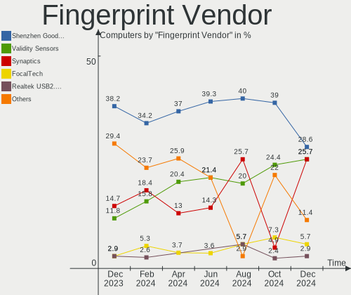

| Vendor                     | Computers | Percent |
|----------------------------|-----------|---------|
| Validity Sensors           | 14        | 40%     |
| Shenzhen Goodix Technology | 7         | 20%     |
| Elan Microelectronics      | 5         | 14.29%  |
| LighTuning Technology      | 3         | 8.57%   |
| Synaptics                  | 2         | 5.71%   |
| STMicroelectronics         | 2         | 5.71%   |
| AuthenTec                  | 2         | 5.71%   |

Fingerprint Model
-----------------

Fingerprint sensor models

| Model                                                     | Computers | Percent |
|-----------------------------------------------------------|-----------|---------|
| Shenzhen Goodix  Fingerprint Device                       | 7         | 20%     |
| Elan ELAN:Fingerprint                                     | 4         | 11.43%  |
| Validity Sensors VFS5011 Fingerprint Reader               | 3         | 8.57%   |
| Validity Sensors VFS495 Fingerprint Reader                | 3         | 8.57%   |
| Validity Sensors VFS 5011 fingerprint sensor              | 2         | 5.71%   |
| Validity Sensors Fingerprint scanner                      | 2         | 5.71%   |
| STMicroelectronics Fingerprint Reader                     | 2         | 5.71%   |
| LighTuning ES603 Swipe Fingerprint Sensor                 | 2         | 5.71%   |
| Validity Sensors VFS7500 Touch Fingerprint Sensor         | 1         | 2.86%   |
| Validity Sensors VFS471 Fingerprint Reader                | 1         | 2.86%   |
| Validity Sensors Synaptics WBDI                           | 1         | 2.86%   |
| Validity Sensors Swipe Fingerprint Sensor                 | 1         | 2.86%   |
| Synaptics  FS7604 Touch Fingerprint Sensor with PurePrint | 1         | 2.86%   |
| LighTuning Fingerprint Reader                             | 1         | 2.86%   |
| Elan fingerprint sensor [FeinTech FPS00200]               | 1         | 2.86%   |
| AuthenTec Fingerprint Sensor                              | 1         | 2.86%   |
| AuthenTec AES2501 Fingerprint Sensor                      | 1         | 2.86%   |
| Unknown                                                   | 1         | 2.86%   |

Chipcard Vendor
---------------

Chipcard module vendors

| Vendor                | Computers | Percent |
|-----------------------|-----------|---------|
| Broadcom              | 5         | 50%     |
| O2 Micro              | 1         | 10%     |
| Gemalto (was Gemplus) | 1         | 10%     |
| ARDS                  | 1         | 10%     |
| Alcor Micro           | 1         | 10%     |
| Aktiv                 | 1         | 10%     |

Chipcard Model
--------------

Chipcard module models

| Model                                                                        | Computers | Percent |
|------------------------------------------------------------------------------|-----------|---------|
| Broadcom 5880                                                                | 2         | 20%     |
| O2 Micro OZ776 CCID Smartcard Reader                                         | 1         | 10%     |
| Gemalto (was Gemplus) GemPC Key SmartCard Reader                             | 1         | 10%     |
| Broadcom BCM5880 Secure Applications Processor with fingerprint swipe sensor | 1         | 10%     |
| Broadcom BCM5880 Secure Applications Processor                               | 1         | 10%     |
| Broadcom 58200                                                               | 1         | 10%     |
| ARDS JaCarta                                                                 | 1         | 10%     |
| Alcor Micro AU9540 Smartcard Reader                                          | 1         | 10%     |
| Aktiv Rutoken lite                                                           | 1         | 10%     |

Unsupported
-----------

Unsupported Devices
-------------------

Total unsupported devices on board

| Total | Computers | Percent |
|-------|-----------|---------|
| 0     | 657       | 79.73%  |
| 1     | 136       | 16.5%   |
| 2     | 24        | 2.91%   |
| 3     | 5         | 0.61%   |
| 6     | 1         | 0.12%   |
| 4     | 1         | 0.12%   |

Unsupported Device Types
------------------------

Types of unsupported devices

| Type                     | Computers | Percent |
|--------------------------|-----------|---------|
| Graphics card            | 90        | 45%     |
| Fingerprint reader       | 35        | 17.5%   |
| Net/wireless             | 17        | 8.5%    |
| Multimedia controller    | 13        | 6.5%    |
| Communication controller | 11        | 5.5%    |
| Chipcard                 | 8         | 4%      |
| Bluetooth                | 8         | 4%      |
| Camera                   | 7         | 3.5%    |
| Unassigned class         | 3         | 1.5%    |
| Sound                    | 3         | 1.5%    |
| Net/ethernet             | 2         | 1%      |
| Network                  | 1         | 0.5%    |
| Modem                    | 1         | 0.5%    |
| Dvb card                 | 1         | 0.5%    |

