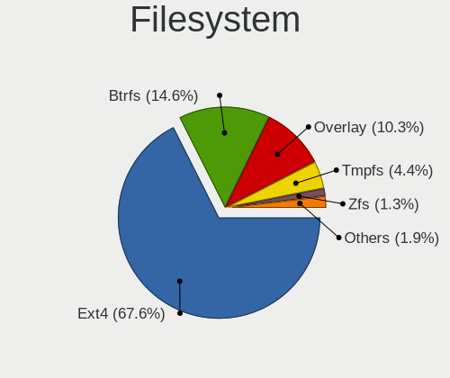
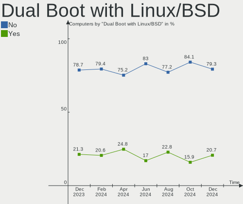
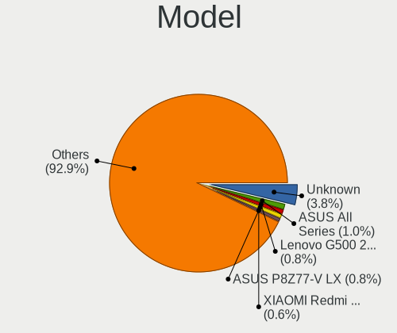
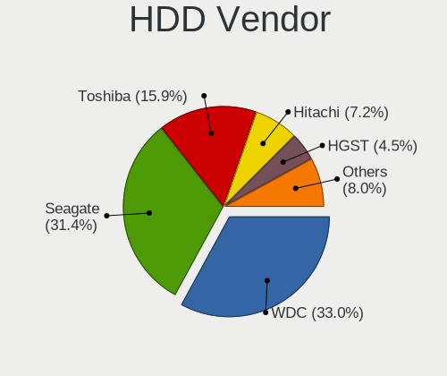
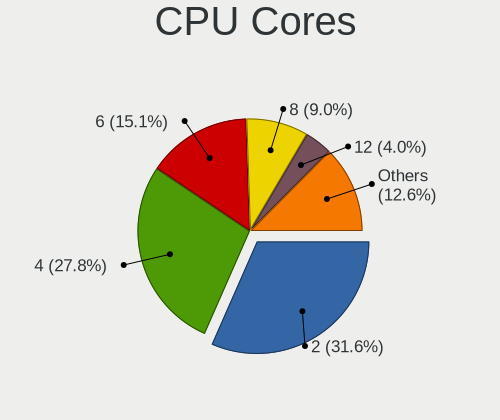

Linux in Russia - Hardware Trends
---------------------------------

A project to identify most popular hardware characteristics and track their change
over time based on data collected by Linux users at https://Linux-Hardware.org.

Anyone can contribute to this report by the [hw-probe](https://github.com/linuxhw/hw-probe) tool:

    sudo -E hw-probe -all -upload

This is a report for all computer types. See also reports for [desktops](/Location/Russia/Desktop/README.md) and [notebooks](/Location/Russia/Notebook/README.md).

Period: Oct, 2022.

Contents
--------

* [ System ](#system)
  - [ OS                       ](#os)
  - [ OS Family                ](#os-family)
  - [ Kernel                   ](#kernel)
  - [ Kernel Family            ](#kernel-family)
  - [ Kernel Major Ver.        ](#kernel-major-ver)
  - [ Arch                     ](#arch)
  - [ DE                       ](#de)
  - [ Display Server           ](#display-server)
  - [ Display Manager          ](#display-manager)
  - [ OS Lang                  ](#os-lang)
  - [ Boot Mode                ](#boot-mode)
  - [ Filesystem               ](#filesystem)
  - [ Part. scheme             ](#part-scheme)
  - [ Dual Boot with Linux/BSD ](#dual-boot-with-linuxbsd)
  - [ Dual Boot (Win)          ](#dual-boot-win)

* [ Board ](#board)
  - [ Vendor                   ](#vendor)
  - [ Model                    ](#model)
  - [ Model Family             ](#model-family)
  - [ MFG Year                 ](#mfg-year)
  - [ Form Factor              ](#form-factor)
  - [ Secure Boot              ](#secure-boot)
  - [ Coreboot                 ](#coreboot)
  - [ RAM Size                 ](#ram-size)
  - [ RAM Used                 ](#ram-used)
  - [ Total Drives             ](#total-drives)
  - [ Has CD-ROM               ](#has-cd-rom)
  - [ Has Ethernet             ](#has-ethernet)
  - [ Has WiFi                 ](#has-wifi)
  - [ Has Bluetooth            ](#has-bluetooth)

* [ Location ](#location)
  - [ Country                  ](#country)
  - [ City                     ](#city)

* [ Drives ](#drives)
  - [ Drive Vendor             ](#drive-vendor)
  - [ Drive Model              ](#drive-model)
  - [ HDD Vendor               ](#hdd-vendor)
  - [ SSD Vendor               ](#ssd-vendor)
  - [ Drive Kind               ](#drive-kind)
  - [ Drive Connector          ](#drive-connector)
  - [ Drive Size               ](#drive-size)
  - [ Space Total              ](#space-total)
  - [ Space Used               ](#space-used)
  - [ Malfunc. Drives          ](#malfunc-drives)
  - [ Malfunc. Drive Vendor    ](#malfunc-drive-vendor)
  - [ Malfunc. HDD Vendor      ](#malfunc-hdd-vendor)
  - [ Malfunc. Drive Kind      ](#malfunc-drive-kind)
  - [ Failed Drives            ](#failed-drives)
  - [ Failed Drive Vendor      ](#failed-drive-vendor)
  - [ Drive Status             ](#drive-status)

* [ Storage controller ](#storage-controller)
  - [ Storage Vendor           ](#storage-vendor)
  - [ Storage Model            ](#storage-model)
  - [ Storage Kind             ](#storage-kind)

* [ Processor ](#processor)
  - [ CPU Vendor               ](#cpu-vendor)
  - [ CPU Model                ](#cpu-model)
  - [ CPU Model Family         ](#cpu-model-family)
  - [ CPU Cores                ](#cpu-cores)
  - [ CPU Sockets              ](#cpu-sockets)
  - [ CPU Threads              ](#cpu-threads)
  - [ CPU Op-Modes             ](#cpu-op-modes)
  - [ CPU Microcode            ](#cpu-microcode)
  - [ CPU Microarch            ](#cpu-microarch)

* [ Graphics ](#graphics)
  - [ GPU Vendor               ](#gpu-vendor)
  - [ GPU Model                ](#gpu-model)
  - [ GPU Combo                ](#gpu-combo)
  - [ GPU Driver               ](#gpu-driver)
  - [ GPU Memory               ](#gpu-memory)

* [ Monitor ](#monitor)
  - [ Monitor Vendor           ](#monitor-vendor)
  - [ Monitor Model            ](#monitor-model)
  - [ Monitor Resolution       ](#monitor-resolution)
  - [ Monitor Diagonal         ](#monitor-diagonal)
  - [ Monitor Width            ](#monitor-width)
  - [ Aspect Ratio             ](#aspect-ratio)
  - [ Monitor Area             ](#monitor-area)
  - [ Pixel Density            ](#pixel-density)
  - [ Multiple Monitors        ](#multiple-monitors)

* [ Network ](#network)
  - [ Net Controller Vendor    ](#net-controller-vendor)
  - [ Net Controller Model     ](#net-controller-model)
  - [ Wireless Vendor          ](#wireless-vendor)
  - [ Wireless Model           ](#wireless-model)
  - [ Ethernet Vendor          ](#ethernet-vendor)
  - [ Ethernet Model           ](#ethernet-model)
  - [ Net Controller Kind      ](#net-controller-kind)
  - [ Used Controller          ](#used-controller)
  - [ NICs                     ](#nics)
  - [ IPv6                     ](#ipv6)

* [ Bluetooth ](#bluetooth)
  - [ Bluetooth Vendor         ](#bluetooth-vendor)
  - [ Bluetooth Model          ](#bluetooth-model)

* [ Sound ](#sound)
  - [ Sound Vendor             ](#sound-vendor)
  - [ Sound Model              ](#sound-model)

* [ Memory ](#memory)
  - [ Memory Vendor            ](#memory-vendor)
  - [ Memory Model             ](#memory-model)
  - [ Memory Kind              ](#memory-kind)
  - [ Memory Form Factor       ](#memory-form-factor)
  - [ Memory Size              ](#memory-size)
  - [ Memory Speed             ](#memory-speed)

* [ Printers & scanners ](#printers--scanners)
  - [ Printer Vendor           ](#printer-vendor)
  - [ Printer Model            ](#printer-model)
  - [ Scanner Vendor           ](#scanner-vendor)
  - [ Scanner Model            ](#scanner-model)

* [ Camera ](#camera)
  - [ Camera Vendor            ](#camera-vendor)
  - [ Camera Model             ](#camera-model)

* [ Security ](#security)
  - [ Fingerprint Vendor       ](#fingerprint-vendor)
  - [ Fingerprint Model        ](#fingerprint-model)
  - [ Chipcard Vendor          ](#chipcard-vendor)
  - [ Chipcard Model           ](#chipcard-model)

* [ Unsupported ](#unsupported)
  - [ Unsupported Devices      ](#unsupported-devices)
  - [ Unsupported Device Types ](#unsupported-device-types)

System
------

OS
--

Installed operating systems

| Name              | Computers | Percent |
|-------------------|-----------|---------|
| ROSA 12.2         | 208       | 40.7%   |
| Ubuntu 22.04      | 31        | 6.07%   |
| Debian 11         | 28        | 5.48%   |
| Red OS 7.3.1      | 22        | 4.31%   |
| ROSA R11.1        | 21        | 4.11%   |
| OpenMandriva 4.3  | 17        | 3.33%   |
| Linux Mint 21     | 17        | 3.33%   |
| Fedora 36         | 16        | 3.13%   |
| ALT Linux 10.1    | 15        | 2.94%   |
| Ubuntu 20.04      | 9         | 1.76%   |
| Ubuntu 22.10      | 8         | 1.57%   |
| Manjaro 22.0.0    | 7         | 1.37%   |
| ROSA 12.3         | 6         | 1.17%   |
| LMDE 5            | 6         | 1.17%   |
| Fedora 37         | 6         | 1.17%   |
| Arch Rolling      | 6         | 1.17%   |
| Linux Mint 20.3   | 4         | 0.78%   |
| KDE neon 20.04    | 4         | 0.78%   |
| Kali 2022.3       | 4         | 0.78%   |
| Gentoo 2.8        | 4         | 0.78%   |
| Elementary 6.1    | 4         | 0.78%   |
| ROSA 12.1         | 3         | 0.59%   |
| Red OS 7.3.2      | 3         | 0.59%   |
| Red OS 7.3        | 3         | 0.59%   |
| OpenMandriva 4.2  | 3         | 0.59%   |
| Manjaro           | 3         | 0.59%   |
| KDE neon 22.04    | 3         | 0.59%   |
| Cyber Infra 5.0.1 | 3         | 0.59%   |
| Ubuntu MATE 22.04 | 2         | 0.39%   |
| Pop!_OS 22.04     | 2         | 0.39%   |
| OpenMandriva 4.90 | 2         | 0.39%   |
| Kubuntu 22.04     | 2         | 0.39%   |
| Debian Testing    | 2         | 0.39%   |
| Debian            | 2         | 0.39%   |
| CentOS 7          | 2         | 0.39%   |
| Zorin 16          | 1         | 0.2%    |
| Xubuntu 20.04     | 1         | 0.2%    |
| Xubuntu 18.04     | 1         | 0.2%    |
| Xubuntu 16.04     | 1         | 0.2%    |
| Xero Rolling      | 1         | 0.2%    |

OS Family
---------

OS without a version

| Name          | Computers | Percent |
|---------------|-----------|---------|
| ROSA          | 239       | 46.77%  |
| Ubuntu        | 48        | 9.39%   |
| Debian        | 33        | 6.46%   |
| Red OS        | 28        | 5.48%   |
| Linux Mint    | 25        | 4.89%   |
| OpenMandriva  | 23        | 4.5%    |
| Fedora        | 22        | 4.31%   |
| ALT Linux     | 19        | 3.72%   |
| Manjaro       | 12        | 2.35%   |
| KDE neon      | 7         | 1.37%   |
| LMDE          | 6         | 1.17%   |
| Arch          | 6         | 1.17%   |
| Gentoo        | 5         | 0.98%   |
| Kali          | 4         | 0.78%   |
| Elementary    | 4         | 0.78%   |
| Xubuntu       | 3         | 0.59%   |
| Kubuntu       | 3         | 0.59%   |
| Cyber Infra   | 3         | 0.59%   |
| CentOS        | 3         | 0.59%   |
| Ubuntu MATE   | 2         | 0.39%   |
| SteamOS       | 2         | 0.39%   |
| Pop!_OS       | 2         | 0.39%   |
| openSUSE      | 2         | 0.39%   |
| Zorin         | 1         | 0.2%    |
| Xero          | 1         | 0.2%    |
| Void Linux    | 1         | 0.2%    |
| Ubuntu Budgie | 1         | 0.2%    |
| Rocky Linux   | 1         | 0.2%    |
| Parrot        | 1         | 0.2%    |
| EuroLinux     | 1         | 0.2%    |
| EndeavourOS   | 1         | 0.2%    |
| ChimeraOS     | 1         | 0.2%    |
| ArcoLinux     | 1         | 0.2%    |

Kernel
------

Version of the Linux kernel

| Version                                  | Computers | Percent |
|------------------------------------------|-----------|---------|
| 5.10.74-generic-2rosa2021.1-x86_64       | 88        | 17.22%  |
| 5.10.118-generic-2rosa2021.1-x86_64      | 73        | 14.29%  |
| 5.15.0-52-generic                        | 24        | 4.7%    |
| 5.15.0-48-generic                        | 21        | 4.11%   |
| 5.16.7-desktop-1omv4003                  | 17        | 3.33%   |
| 5.10.0-7-amd64                           | 16        | 3.13%   |
| 5.15.10-1.el7.x86_64                     | 13        | 2.54%   |
| 5.17.11-generic-2rosa2021.1-x86_64       | 12        | 2.35%   |
| 5.15.35-5.el7.3.x86_64                   | 12        | 2.35%   |
| 5.15.0-50-generic                        | 11        | 2.15%   |
| 5.10.150-generic-1rosa2021.1-x86_64      | 8         | 1.57%   |
| 5.18.18.xm1-1-xanmod-rosa2021.1-x86_64   | 7         | 1.37%   |
| 5.10.0-18-amd64                          | 6         | 1.17%   |
| 5.4.83-generic-2rosa-i586                | 5         | 0.98%   |
| 5.4.32-generic-2rosa-x86_64              | 5         | 0.98%   |
| 5.19.16-200.fc36.x86_64                  | 5         | 0.98%   |
| 5.19.0-21-generic                        | 5         | 0.98%   |
| 5.15.43-generic-2rosa2021.1-x86_64       | 5         | 0.98%   |
| 5.15.0-41-generic                        | 5         | 0.98%   |
| 5.10.0-19-amd64                          | 5         | 0.98%   |
| 5.19.15-201.fc36.x86_64                  | 4         | 0.78%   |
| 5.19.0-23-generic                        | 4         | 0.78%   |
| 5.15.74-generic-1rosa2021.1-x86_64       | 4         | 0.78%   |
| 5.4.83-generic-2rosa-x86_64              | 3         | 0.59%   |
| 5.4.0-128-generic                        | 3         | 0.59%   |
| 5.19.14-300.fc37.x86_64                  | 3         | 0.59%   |
| 5.15.75-generic-1rosa2021.1-x86_64       | 3         | 0.59%   |
| 5.15.74-un-def-alt1                      | 3         | 0.59%   |
| 5.15.70-un-def-alt1                      | 3         | 0.59%   |
| 5.15.34-un-def-alt1                      | 3         | 0.59%   |
| 5.10.74-generic-2rosa2021.1-i586         | 3         | 0.59%   |
| 5.10.145-std-def-alt1                    | 3         | 0.59%   |
| 5.10.14-desktop-1omv4002                 | 3         | 0.59%   |
| 5.10.118-generic-2rosa2021.1-i586        | 3         | 0.59%   |
| 3.10.0-1160.41.1.vz7.183.5               | 3         | 0.59%   |
| 6.0.6.xm1-1.klp-xanmod-rosa2021.1-x86_64 | 2         | 0.39%   |
| 6.0.5-060005-generic                     | 2         | 0.39%   |
| 6.0.2.xm1-1.klp-xanmod-rosa2021.1-x86_64 | 2         | 0.39%   |
| 6.0.2-arch1-1                            | 2         | 0.39%   |
| 6.0.2-2-MANJARO                          | 2         | 0.39%   |

Kernel Family
-------------

Linux kernel without a distro release

| Version  | Computers | Percent |
|----------|-----------|---------|
| 5.10.74  | 91        | 17.81%  |
| 5.10.118 | 76        | 14.87%  |
| 5.15.0   | 65        | 12.72%  |
| 5.10.0   | 30        | 5.87%   |
| 5.19.0   | 18        | 3.52%   |
| 5.16.7   | 17        | 3.33%   |
| 5.15.35  | 14        | 2.74%   |
| 5.15.10  | 13        | 2.54%   |
| 5.17.11  | 12        | 2.35%   |
| 5.15.74  | 9         | 1.76%   |
| 6.0.0    | 8         | 1.57%   |
| 5.4.83   | 8         | 1.57%   |
| 5.10.150 | 8         | 1.57%   |
| 5.4.32   | 7         | 1.37%   |
| 5.18.18  | 7         | 1.37%   |
| 6.0.2    | 6         | 1.17%   |
| 5.4.0    | 6         | 1.17%   |
| 5.19.16  | 6         | 1.17%   |
| 5.19.13  | 6         | 1.17%   |
| 6.0.5    | 5         | 0.98%   |
| 5.15.43  | 5         | 0.98%   |
| 3.10.0   | 5         | 0.98%   |
| 5.19.15  | 4         | 0.78%   |
| 5.19.14  | 4         | 0.78%   |
| 5.19.12  | 4         | 0.78%   |
| 5.18.0   | 4         | 0.78%   |
| 4.9.155  | 4         | 0.78%   |
| 5.18.12  | 3         | 0.59%   |
| 5.15.75  | 3         | 0.59%   |
| 5.15.71  | 3         | 0.59%   |
| 5.15.70  | 3         | 0.59%   |
| 5.15.34  | 3         | 0.59%   |
| 5.14.0   | 3         | 0.59%   |
| 5.13.0   | 3         | 0.59%   |
| 5.10.145 | 3         | 0.59%   |
| 5.10.14  | 3         | 0.59%   |
| 4.15.0   | 3         | 0.59%   |
| 6.0.6    | 2         | 0.39%   |
| 5.17.5   | 2         | 0.39%   |
| 5.15.72  | 2         | 0.39%   |

Kernel Major Ver.
-----------------

Linux kernel major version

| Version | Computers | Percent |
|---------|-----------|---------|
| 5.10    | 217       | 42.47%  |
| 5.15    | 131       | 25.64%  |
| 5.19    | 47        | 9.2%    |
| 6.0     | 22        | 4.31%   |
| 5.4     | 22        | 4.31%   |
| 5.16    | 18        | 3.52%   |
| 5.18    | 15        | 2.94%   |
| 5.17    | 15        | 2.94%   |
| 3.10    | 5         | 0.98%   |
| 5.14    | 4         | 0.78%   |
| 4.9     | 4         | 0.78%   |
| 5.13    | 3         | 0.59%   |
| 4.15    | 3         | 0.59%   |
| 5.11    | 2         | 0.39%   |
| 6.1     | 1         | 0.2%    |
| 5.8     | 1         | 0.2%    |
| 4.4     | 1         | 0.2%    |

Arch
----

OS architecture (x86_64, i586, etc.)

| Name    | Computers | Percent |
|---------|-----------|---------|
| x86_64  | 490       | 95.89%  |
| i686    | 20        | 3.91%   |
| aarch64 | 1         | 0.2%    |

DE
--

Desktop Environment

| Name       | Computers | Percent |
|------------|-----------|---------|
| KDE5       | 184       | 36.01%  |
| GNOME      | 164       | 32.09%  |
| Unknown    | 31        | 6.07%   |
| MATE       | 30        | 5.87%   |
| LXQt       | 27        | 5.28%   |
| XFCE       | 26        | 5.09%   |
| X-Cinnamon | 21        | 4.11%   |
| KDE4       | 12        | 2.35%   |
| Cinnamon   | 7         | 1.37%   |
| Pantheon   | 4         | 0.78%   |
| LXDE       | 1         | 0.2%    |
| fluxbox    | 1         | 0.2%    |
| DWM        | 1         | 0.2%    |
| Budgie     | 1         | 0.2%    |
| bspwm      | 1         | 0.2%    |

Display Server
--------------

X11 or Wayland

| Name    | Computers | Percent |
|---------|-----------|---------|
| X11     | 253       | 49.51%  |
| Wayland | 231       | 45.21%  |
| Unknown | 20        | 3.91%   |
| Tty     | 7         | 1.37%   |

Display Manager
---------------

SDDM, LightDM, etc.

| Name    | Computers | Percent |
|---------|-----------|---------|
| SDDM    | 168       | 32.88%  |
| GDM     | 156       | 30.53%  |
| Unknown | 91        | 17.81%  |
| LightDM | 45        | 8.81%   |
| GDM3    | 38        | 7.44%   |
| KDM     | 12        | 2.35%   |
| LXDM    | 1         | 0.2%    |

OS Lang
-------

Language

| Lang    | Computers | Percent |
|---------|-----------|---------|
| ru_RU   | 396       | 77.5%   |
| en_US   | 77        | 15.07%  |
| Unknown | 30        | 5.87%   |
| C       | 3         | 0.59%   |
| C.UTF8  | 2         | 0.39%   |
| POSIX   | 1         | 0.2%    |
| en_GB   | 1         | 0.2%    |
| en_AG   | 1         | 0.2%    |

Boot Mode
---------

EFI or BIOS

| Mode | Computers | Percent |
|------|-----------|---------|
| EFI  | 270       | 52.84%  |
| BIOS | 241       | 47.16%  |

Filesystem
----------

Type of filesystem

| Type    | Computers | Percent |
|---------|-----------|---------|
| Ext4    | 410       | 80.23%  |
| Btrfs   | 46        | 9%      |
| Overlay | 42        | 8.22%   |
| Xfs     | 8         | 1.57%   |
| F2fs    | 2         | 0.39%   |
| Ext3    | 2         | 0.39%   |
| XXXXXXX | 1         | 0.2%    |

Part. scheme
------------

Scheme of partitioning

| Type    | Computers | Percent |
|---------|-----------|---------|
| GPT     | 307       | 60.08%  |
| MBR     | 141       | 27.59%  |
| Unknown | 63        | 12.33%  |

Dual Boot with Linux/BSD
------------------------

Hosting more than one Linux/BSD

| Dual boot | Computers | Percent |
|-----------|-----------|---------|
| No        | 411       | 80.43%  |
| Yes       | 100       | 19.57%  |

Dual Boot (Win)
---------------

Hosting Linux and Windows

| Dual boot | Computers | Percent |
|-----------|-----------|---------|
| No        | 316       | 61.84%  |
| Yes       | 195       | 38.16%  |

Board
-----

Vendor
------

Motherboard manufacturer

| Name                | Computers | Percent |
|---------------------|-----------|---------|
| ASUSTek Computer    | 103       | 20.16%  |
| Gigabyte Technology | 64        | 12.52%  |
| Lenovo              | 52        | 10.18%  |
| Hewlett-Packard     | 47        | 9.2%    |
| MSI                 | 35        | 6.85%   |
| ASRock              | 29        | 5.68%   |
| Acer                | 29        | 5.68%   |
| HUAWEI              | 18        | 3.52%   |
| Dell                | 16        | 3.13%   |
| Samsung Electronics | 9         | 1.76%   |
| Sony                | 8         | 1.57%   |
| Biostar             | 7         | 1.37%   |
| Supermicro          | 6         | 1.17%   |
| Intel               | 6         | 1.17%   |
| ECS                 | 5         | 0.98%   |
| Aquarius            | 5         | 0.98%   |
| Fujitsu             | 4         | 0.78%   |
| Unknown             | 4         | 0.78%   |
| Toshiba             | 3         | 0.59%   |
| Pegatron            | 3         | 0.59%   |
| Apple               | 3         | 0.59%   |
| Valve               | 2         | 0.39%   |
| RuggedPC            | 2         | 0.39%   |
| Quanta              | 2         | 0.39%   |
| Prestigio           | 2         | 0.39%   |
| Maibenben           | 2         | 0.39%   |
| Huanan              | 2         | 0.39%   |
| HONOR               | 2         | 0.39%   |
| eMachines           | 2         | 0.39%   |
| Clevo               | 2         | 0.39%   |
| Chuwi               | 2         | 0.39%   |
| AZW                 | 2         | 0.39%   |
| Zvezda              | 1         | 0.2%    |
| ZOTAC               | 1         | 0.2%    |
| YADRO               | 1         | 0.2%    |
| WeiBu               | 1         | 0.2%    |
| THUNDEROBOT         | 1         | 0.2%    |
| Thomson             | 1         | 0.2%    |
| Teclast             | 1         | 0.2%    |
| Techvision          | 1         | 0.2%    |

Model
-----

Motherboard model

| Name                                  | Computers | Percent |
|---------------------------------------|-----------|---------|
| ASUS All Series                       | 8         | 1.57%   |
| Supermicro Super Server               | 5         | 0.98%   |
| Unknown                               | 5         | 0.98%   |
| MSI MS-7817                           | 3         | 0.59%   |
| HUAWEI NBLK-WAX9X                     | 3         | 0.59%   |
| HP Pavilion g6                        | 3         | 0.59%   |
| HP Pavilion dv7                       | 3         | 0.59%   |
| Gigabyte B450M DS3H                   | 3         | 0.59%   |
| ASUS K43SJ                            | 3         | 0.59%   |
| Aquarius NS585                        | 3         | 0.59%   |
| Valve Jupiter                         | 2         | 0.39%   |
| MSI MS-7C52                           | 2         | 0.39%   |
| MSI MS-7996                           | 2         | 0.39%   |
| Lenovo ThinkBook 15 G3 ACL 21A4       | 2         | 0.39%   |
| Lenovo IdeaPad 5 Pro 14ACN6 82L7      | 2         | 0.39%   |
| Lenovo IdeaPad 5 15ARE05 81YQ         | 2         | 0.39%   |
| Lenovo IdeaPad 110-15ACL 80TJ         | 2         | 0.39%   |
| Lenovo B560                           | 2         | 0.39%   |
| HUAWEI NBLB-WAX9N                     | 2         | 0.39%   |
| HUAWEI NBD-WXX9                       | 2         | 0.39%   |
| HUAWEI HVY-WXX9                       | 2         | 0.39%   |
| HUAWEI HLY-WX9XX                      | 2         | 0.39%   |
| HUAWEI BOM-WXX9                       | 2         | 0.39%   |
| HP Pavilion Notebook                  | 2         | 0.39%   |
| HP Notebook                           | 2         | 0.39%   |
| HP Laptop 15s-eq2xxx                  | 2         | 0.39%   |
| HP EliteBook 855 G8 Notebook PC       | 2         | 0.39%   |
| Gigabyte Z97-HD3                      | 2         | 0.39%   |
| Gigabyte H61M-S2PV                    | 2         | 0.39%   |
| Gigabyte H110M-S2                     | 2         | 0.39%   |
| Gigabyte GA-880GM-D2H                 | 2         | 0.39%   |
| Gigabyte EP41-UD3L                    | 2         | 0.39%   |
| Gigabyte A320M-S2H                    | 2         | 0.39%   |
| ASUS ROG Zephyrus M16 GU603HE_GU603HE | 2         | 0.39%   |
| ASUS P8H77-V                          | 2         | 0.39%   |
| ASUS P8B75-V                          | 2         | 0.39%   |
| ASUS P7H55-M/USB3                     | 2         | 0.39%   |
| ASUS M5A87                            | 2         | 0.39%   |
| ASUS GU609AA-ACB a6230.ru             | 2         | 0.39%   |
| ASRock A320M-HDV R4.0                 | 2         | 0.39%   |

Model Family
------------

Motherboard model prefix

| Name               | Computers | Percent |
|--------------------|-----------|---------|
| Acer Aspire        | 22        | 4.31%   |
| Lenovo IdeaPad     | 18        | 3.52%   |
| HP Pavilion        | 14        | 2.74%   |
| ASUS PRIME         | 13        | 2.54%   |
| HP Laptop          | 9         | 1.76%   |
| ASUS All           | 8         | 1.57%   |
| ASUS VivoBook      | 7         | 1.37%   |
| ASUS ASUS          | 6         | 1.17%   |
| Supermicro Super   | 5         | 0.98%   |
| Lenovo ThinkPad    | 5         | 0.98%   |
| HP EliteBook       | 5         | 0.98%   |
| Gigabyte B450M     | 5         | 0.98%   |
| Dell Inspiron      | 5         | 0.98%   |
| ASUS ROG           | 5         | 0.98%   |
| Acer Nitro         | 5         | 0.98%   |
| Unknown            | 5         | 0.98%   |
| Lenovo Legion      | 4         | 0.78%   |
| Fujitsu ESPRIMO    | 4         | 0.78%   |
| Toshiba Satellite  | 3         | 0.59%   |
| MSI MS-7817        | 3         | 0.59%   |
| Lenovo ThinkCentre | 3         | 0.59%   |
| Lenovo ThinkBook   | 3         | 0.59%   |
| HUAWEI NBLK-WAX9X  | 3         | 0.59%   |
| HP ProBook         | 3         | 0.59%   |
| HP ENVY            | 3         | 0.59%   |
| HP Compaq          | 3         | 0.59%   |
| Gigabyte Z690      | 3         | 0.59%   |
| Dell Vostro        | 3         | 0.59%   |
| Dell Precision     | 3         | 0.59%   |
| ASUS P8H61-M       | 3         | 0.59%   |
| ASUS P7H55-M       | 3         | 0.59%   |
| ASUS K43SJ         | 3         | 0.59%   |
| Aquarius NS585     | 3         | 0.59%   |
| Valve Jupiter      | 2         | 0.39%   |
| Samsung 300V3A     | 2         | 0.39%   |
| MSI MS-7C52        | 2         | 0.39%   |
| MSI MS-7996        | 2         | 0.39%   |
| Lenovo ThinkSystem | 2         | 0.39%   |
| Lenovo B560        | 2         | 0.39%   |
| HUAWEI NBLB-WAX9N  | 2         | 0.39%   |

MFG Year
--------

Motherboard manufacture year

| Year    | Computers | Percent |
|---------|-----------|---------|
| 2021    | 74        | 14.48%  |
| 2020    | 51        | 9.98%   |
| 2012    | 48        | 9.39%   |
| 2011    | 47        | 9.2%    |
| 2019    | 45        | 8.81%   |
| 2018    | 37        | 7.24%   |
| 2022    | 28        | 5.48%   |
| 2017    | 27        | 5.28%   |
| 2013    | 24        | 4.7%    |
| 2010    | 23        | 4.5%    |
| 2016    | 21        | 4.11%   |
| 2009    | 19        | 3.72%   |
| 2014    | 18        | 3.52%   |
| 2007    | 18        | 3.52%   |
| 2008    | 15        | 2.94%   |
| 2015    | 12        | 2.35%   |
| 2006    | 1         | 0.2%    |
| 2005    | 1         | 0.2%    |
| 2000    | 1         | 0.2%    |
| Unknown | 1         | 0.2%    |

Form Factor
-----------

Physical design of the computer

| Name           | Computers | Percent |
|----------------|-----------|---------|
| Desktop        | 239       | 46.77%  |
| Notebook       | 234       | 45.79%  |
| Server         | 13        | 2.54%   |
| Mini pc        | 9         | 1.76%   |
| All in one     | 7         | 1.37%   |
| Tablet         | 5         | 0.98%   |
| Convertible    | 3         | 0.59%   |
| System on chip | 1         | 0.2%    |

Secure Boot
-----------

Enabled or disabled

| State    | Computers | Percent |
|----------|-----------|---------|
| Disabled | 493       | 96.48%  |
| Enabled  | 18        | 3.52%   |

Coreboot
--------

Have coreboot on board

| Used | Computers | Percent |
|------|-----------|---------|
| No   | 510       | 99.8%   |
| Yes  | 1         | 0.2%    |

RAM Size
--------

Total RAM memory

| Size in GB      | Computers | Percent |
|-----------------|-----------|---------|
| 4.01-8.0        | 137       | 26.81%  |
| 8.01-16.0       | 94        | 18.4%   |
| 16.01-24.0      | 93        | 18.2%   |
| 3.01-4.0        | 82        | 16.05%  |
| 32.01-64.0      | 46        | 9%      |
| 1.01-2.0        | 23        | 4.5%    |
| 2.01-3.0        | 13        | 2.54%   |
| 64.01-256.0     | 9         | 1.76%   |
| 24.01-32.0      | 7         | 1.37%   |
| More than 256.0 | 4         | 0.78%   |
| 0.51-1.0        | 2         | 0.39%   |
| 0.01-0.5        | 1         | 0.2%    |

RAM Used
--------

Used RAM memory

| Used GB    | Computers | Percent |
|------------|-----------|---------|
| 1.01-2.0   | 205       | 40.12%  |
| 2.01-3.0   | 96        | 18.79%  |
| 0.51-1.0   | 94        | 18.4%   |
| 4.01-8.0   | 58        | 11.35%  |
| 3.01-4.0   | 40        | 7.83%   |
| 8.01-16.0  | 11        | 2.15%   |
| 0.01-0.5   | 5         | 0.98%   |
| 32.01-64.0 | 1         | 0.2%    |
| 24.01-32.0 | 1         | 0.2%    |

Total Drives
------------

Number of drives on board

| Drives | Computers | Percent |
|--------|-----------|---------|
| 1      | 297       | 58.12%  |
| 2      | 128       | 25.05%  |
| 3      | 56        | 10.96%  |
| 4      | 10        | 1.96%   |
| 5      | 5         | 0.98%   |
| 6      | 4         | 0.78%   |
| 0      | 4         | 0.78%   |
| 8      | 2         | 0.39%   |
| 7      | 2         | 0.39%   |
| 27     | 1         | 0.2%    |
| 12     | 1         | 0.2%    |
| 10     | 1         | 0.2%    |

Has CD-ROM
----------

Has CD-ROM on board

| Presented | Computers | Percent |
|-----------|-----------|---------|
| No        | 352       | 68.88%  |
| Yes       | 159       | 31.12%  |

Has Ethernet
------------

Has Ethernet on board

| Presented | Computers | Percent |
|-----------|-----------|---------|
| Yes       | 443       | 86.69%  |
| No        | 68        | 13.31%  |

Has WiFi
--------

Has WiFi module

| Presented | Computers | Percent |
|-----------|-----------|---------|
| Yes       | 337       | 65.95%  |
| No        | 174       | 34.05%  |

Has Bluetooth
-------------

Has Bluetooth module

| Presented | Computers | Percent |
|-----------|-----------|---------|
| Yes       | 268       | 52.45%  |
| No        | 243       | 47.55%  |

Location
--------

Country
-------

Geographic location (country)

| Country | Computers | Percent |
|---------|-----------|---------|
| Russia  | 511       | 100%    |

City
----

Geographic location (city)

| City              | Computers | Percent |
|-------------------|-----------|---------|
| Moscow            | 117       | 22.9%   |
| St Petersburg     | 41        | 8.02%   |
| Voronezh          | 24        | 4.7%    |
| Yekaterinburg     | 17        | 3.33%   |
| Krasnodar         | 14        | 2.74%   |
| Novosibirsk       | 12        | 2.35%   |
| Nizhniy Novgorod  | 11        | 2.15%   |
| Rostov-on-Don     | 10        | 1.96%   |
| Murom             | 9         | 1.76%   |
| Vladivostok       | 7         | 1.37%   |
| Ufa               | 7         | 1.37%   |
| Saratov           | 7         | 1.37%   |
| Samara            | 7         | 1.37%   |
| Tula              | 6         | 1.17%   |
| Perm              | 6         | 1.17%   |
| Novokuznetsk      | 6         | 1.17%   |
| Kazan’          | 6         | 1.17%   |
| Chelyabinsk       | 6         | 1.17%   |
| Ulyanovsk         | 5         | 0.98%   |
| Tver              | 5         | 0.98%   |
| Stavropol         | 5         | 0.98%   |
| Kaliningrad       | 5         | 0.98%   |
| Tyumen            | 4         | 0.78%   |
| Krasnoyarsk       | 4         | 0.78%   |
| Khimki            | 4         | 0.78%   |
| Yaroslavl         | 3         | 0.59%   |
| Sochi             | 3         | 0.59%   |
| Severodvinsk      | 3         | 0.59%   |
| Pskov             | 3         | 0.59%   |
| Orenburg          | 3         | 0.59%   |
| Murmansk          | 3         | 0.59%   |
| Khabarovsk        | 3         | 0.59%   |
| Kemerovo          | 3         | 0.59%   |
| Kaluga            | 3         | 0.59%   |
| Irkutsk           | 3         | 0.59%   |
| Yuzhno-Sakhalinsk | 2         | 0.39%   |
| Yoshkar-Ola       | 2         | 0.39%   |
| Vologda           | 2         | 0.39%   |
| Volgograd         | 2         | 0.39%   |
| Vladimir          | 2         | 0.39%   |

Drives
------

Drive Vendor
------------

Hard drive vendors

| Vendor                      | Computers | Drives | Percent |
|-----------------------------|-----------|--------|---------|
| WDC                         | 131       | 158    | 17.31%  |
| Seagate                     | 116       | 142    | 15.32%  |
| Samsung Electronics         | 71        | 84     | 9.38%   |
| Toshiba                     | 49        | 58     | 6.47%   |
| Kingston                    | 42        | 43     | 5.55%   |
| Hitachi                     | 34        | 35     | 4.49%   |
| Unknown                     | 25        | 27     | 3.3%    |
| Sandisk                     | 21        | 21     | 2.77%   |
| A-DATA Technology           | 21        | 22     | 2.77%   |
| SK hynix                    | 19        | 19     | 2.51%   |
| China                       | 17        | 18     | 2.25%   |
| Intel                       | 16        | 24     | 2.11%   |
| SPCC                        | 14        | 14     | 1.85%   |
| HGST                        | 12        | 30     | 1.59%   |
| Apacer                      | 12        | 12     | 1.59%   |
| AMD                         | 11        | 11     | 1.45%   |
| KIOXIA                      | 10        | 10     | 1.32%   |
| Crucial                     | 9         | 11     | 1.19%   |
| Patriot                     | 8         | 8      | 1.06%   |
| Transcend                   | 7         | 7      | 0.92%   |
| Micron Technology           | 7         | 9      | 0.92%   |
| Plextor                     | 6         | 6      | 0.79%   |
| KingSpec                    | 6         | 6      | 0.79%   |
| Smartbuy                    | 5         | 5      | 0.66%   |
| Netac                       | 5         | 5      | 0.66%   |
| Unknown                     | 5         | 5      | 0.66%   |
| Phison Electronics          | 4         | 4      | 0.53%   |
| Phison                      | 4         | 4      | 0.53%   |
| Maxtor                      | 4         | 4      | 0.53%   |
| GOODRAM                     | 4         | 4      | 0.53%   |
| Silicon Motion              | 3         | 3      | 0.4%    |
| Zheino                      | 2         | 2      | 0.26%   |
| XPG                         | 2         | 4      | 0.26%   |
| SSSTC                       | 2         | 2      | 0.26%   |
| OCZ-VERTEX3                 | 2         | 2      | 0.26%   |
| Neo                         | 2         | 2      | 0.26%   |
| Kingston Technology Company | 2         | 2      | 0.26%   |
| KingDian                    | 2         | 2      | 0.26%   |
| JMicron Technology          | 2         | 2      | 0.26%   |
| Foxline                     | 2         | 2      | 0.26%   |

Drive Model
-----------

Hard drive models

| Model                                               | Computers | Percent |
|-----------------------------------------------------|-----------|---------|
| WDC WDS240G2G0A-00JH30 240GB SSD                    | 11        | 1.34%   |
| Seagate ST1000DM010-2EP102 1TB                      | 11        | 1.34%   |
| Toshiba HDWD110 1TB                                 | 7         | 0.86%   |
| Samsung NVMe SSD Controller SM981/PM981/PM983 500GB | 7         | 0.86%   |
| Unknown MMC Card  64GB                              | 6         | 0.73%   |
| Seagate ST1000LM024 HN-M101MBB 1TB                  | 6         | 0.73%   |
| Samsung SSD 860 EVO 250GB                           | 6         | 0.73%   |
| WDC WDS120G2G0A-00JH30 120GB SSD                    | 5         | 0.61%   |
| WDC WD10EZEX-08WN4A0 1TB                            | 5         | 0.61%   |
| Toshiba MQ04ABF100 1TB                              | 5         | 0.61%   |
| Toshiba MQ01ABF050 500GB                            | 5         | 0.61%   |
| SPCC Solid State Disk 120GB                         | 5         | 0.61%   |
| Seagate ST500LT012-1DG142 500GB                     | 5         | 0.61%   |
| Seagate ST1000DM003-1CH162 1TB                      | 5         | 0.61%   |
| Apacer AS350 256GB SSD                              | 5         | 0.61%   |
| Unknown                                             | 5         | 0.61%   |
| WDC WDS500G2B0A-00SM50 500GB SSD                    | 4         | 0.49%   |
| WDC WD5000AAKX-60U6AA0 500GB                        | 4         | 0.49%   |
| Unknown MMC Card  128GB                             | 4         | 0.49%   |
| Toshiba DT01ACA100 1TB                              | 4         | 0.49%   |
| SK hynix BC711 HFM512GD3JX013N 512GB                | 4         | 0.49%   |
| Seagate ST9320325AS 320GB                           | 4         | 0.49%   |
| Seagate ST3250310AS 250GB                           | 4         | 0.49%   |
| Seagate ST1000LM035-1RK172 1TB                      | 4         | 0.49%   |
| Samsung SSD 860 EVO 500GB                           | 4         | 0.49%   |
| Phison PS5013 E13 NVMe Controller 256GB             | 4         | 0.49%   |
| Kingston SNVS500G 500GB                             | 4         | 0.49%   |
| Kingston SA400S37480G 480GB SSD                     | 4         | 0.49%   |
| Kingston SA400S37240G 240GB SSD                     | 4         | 0.49%   |
| Crucial CT480BX500SSD1 480GB                        | 4         | 0.49%   |
| Apacer AS350 128GB SSD                              | 4         | 0.49%   |
| WDC WD5000LPCX-24VHAT0 500GB                        | 3         | 0.37%   |
| Toshiba HDWD120 2TB                                 | 3         | 0.37%   |
| Toshiba DT01ACA050 500GB                            | 3         | 0.37%   |
| SPCC Solid State Disk 256GB                         | 3         | 0.37%   |
| SK hynix HFM256GDJTNG-8310A 256GB                   | 3         | 0.37%   |
| Seagate ST500DM002-1BD142 500GB                     | 3         | 0.37%   |
| Seagate ST380815AS 80GB                             | 3         | 0.37%   |
| Seagate ST31000528AS 1TB                            | 3         | 0.37%   |
| Seagate ST2000DM008-2FR102 2TB                      | 3         | 0.37%   |

HDD Vendor
----------

Hard disk drive vendors

| Vendor              | Computers | Drives | Percent |
|---------------------|-----------|--------|---------|
| Seagate             | 116       | 142    | 36.02%  |
| WDC                 | 97        | 116    | 30.12%  |
| Toshiba             | 43        | 52     | 13.35%  |
| Hitachi             | 34        | 35     | 10.56%  |
| HGST                | 12        | 30     | 3.73%   |
| Samsung Electronics | 10        | 10     | 3.11%   |
| Maxtor              | 4         | 4      | 1.24%   |
| Unknown             | 2         | 2      | 0.62%   |
| LIO-ORG             | 1         | 1      | 0.31%   |
| Lenovo              | 1         | 8      | 0.31%   |
| ASMT                | 1         | 2      | 0.31%   |
| Unknown             | 1         | 1      | 0.31%   |

SSD Vendor
----------

Solid state drive vendors

| Vendor              | Computers | Drives | Percent |
|---------------------|-----------|--------|---------|
| Samsung Electronics | 31        | 36     | 12.25%  |
| Kingston            | 28        | 28     | 11.07%  |
| WDC                 | 27        | 28     | 10.67%  |
| China               | 17        | 18     | 6.72%   |
| A-DATA Technology   | 15        | 16     | 5.93%   |
| SPCC                | 14        | 14     | 5.53%   |
| Apacer              | 11        | 11     | 4.35%   |
| AMD                 | 10        | 10     | 3.95%   |
| SanDisk             | 9         | 9      | 3.56%   |
| Patriot             | 8         | 8      | 3.16%   |
| Crucial             | 8         | 10     | 3.16%   |
| Plextor             | 6         | 6      | 2.37%   |
| KingSpec            | 6         | 6      | 2.37%   |
| Transcend           | 5         | 5      | 1.98%   |
| Intel               | 5         | 11     | 1.98%   |
| Toshiba             | 4         | 4      | 1.58%   |
| Smartbuy            | 4         | 4      | 1.58%   |
| Netac               | 4         | 4      | 1.58%   |
| GOODRAM             | 4         | 4      | 1.58%   |
| Zheino              | 2         | 2      | 0.79%   |
| OCZ-VERTEX3         | 2         | 2      | 0.79%   |
| Neo                 | 2         | 2      | 0.79%   |
| Micron Technology   | 2         | 4      | 0.79%   |
| KingDian            | 2         | 2      | 0.79%   |
| Corsair             | 2         | 2      | 0.79%   |
| 1TB                 | 2         | 2      | 0.79%   |
| Unknown             | 2         | 2      | 0.79%   |
| WALRAM              | 1         | 1      | 0.4%    |
| Unknown             | 1         | 1      | 0.4%    |
| Teclast             | 1         | 1      | 0.4%    |
| Team                | 1         | 1      | 0.4%    |
| T-FORCE             | 1         | 1      | 0.4%    |
| Supermicro          | 1         | 1      | 0.4%    |
| StoreJet            | 1         | 1      | 0.4%    |
| PNY                 | 1         | 1      | 0.4%    |
| OCZ                 | 1         | 1      | 0.4%    |
| LITEONIT            | 1         | 1      | 0.4%    |
| HS-SSD-E100         | 1         | 1      | 0.4%    |
| Hikvision           | 1         | 1      | 0.4%    |
| Hewlett-Packard     | 1         | 1      | 0.4%    |

Drive Kind
----------

HDD or SSD

| Kind    | Computers | Drives | Percent |
|---------|-----------|--------|---------|
| HDD     | 279       | 403    | 40.67%  |
| SSD     | 219       | 272    | 31.92%  |
| NVMe    | 158       | 170    | 23.03%  |
| MMC     | 24        | 28     | 3.5%    |
| Unknown | 6         | 6      | 0.87%   |

Drive Connector
---------------

SATA, SAS, NVMe, etc.

| Type | Computers | Drives | Percent |
|------|-----------|--------|---------|
| SATA | 392       | 662    | 66.22%  |
| NVMe | 154       | 166    | 26.01%  |
| MMC  | 24        | 28     | 4.05%   |
| SAS  | 22        | 23     | 3.72%   |

Drive Size
----------

Size of hard drive

| Size in TB | Computers | Drives | Percent |
|------------|-----------|--------|---------|
| 0.01-0.5   | 311       | 402    | 61.46%  |
| 0.51-1.0   | 141       | 164    | 27.87%  |
| 1.01-2.0   | 31        | 49     | 6.13%   |
| 4.01-10.0  | 9         | 35     | 1.78%   |
| 3.01-4.0   | 7         | 16     | 1.38%   |
| 2.01-3.0   | 6         | 8      | 1.19%   |
| 10.01-20.0 | 1         | 1      | 0.2%    |

Space Total
-----------

Amount of disk space available on the file system

| Size in GB     | Computers | Percent |
|----------------|-----------|---------|
| 101-250        | 159       | 31.12%  |
| 251-500        | 104       | 20.35%  |
| 501-1000       | 67        | 13.11%  |
| 1-20           | 41        | 8.02%   |
| 1001-2000      | 37        | 7.24%   |
| 51-100         | 34        | 6.65%   |
| 21-50          | 23        | 4.5%    |
| Unknown        | 19        | 3.72%   |
| 2001-3000      | 14        | 2.74%   |
| More than 3000 | 13        | 2.54%   |

Space Used
----------

Amount of used disk space

| Used GB        | Computers | Percent |
|----------------|-----------|---------|
| 1-20           | 269       | 52.64%  |
| 21-50          | 70        | 13.7%   |
| 101-250        | 39        | 7.63%   |
| 51-100         | 35        | 6.85%   |
| 251-500        | 34        | 6.65%   |
| 501-1000       | 30        | 5.87%   |
| Unknown        | 19        | 3.72%   |
| 1001-2000      | 10        | 1.96%   |
| More than 3000 | 4         | 0.78%   |
| 2001-3000      | 1         | 0.2%    |

Malfunc. Drives
---------------

Drive models with a malfunction

| Model                                   | Computers | Drives | Percent |
|-----------------------------------------|-----------|--------|---------|
| WDC WD5000AAKX-60U6AA0 500GB            | 4         | 4      | 3.13%   |
| Seagate ST500LT012-1DG142 500GB         | 4         | 4      | 3.13%   |
| WDC WDS240G2G0A-00JH30 240GB SSD        | 3         | 3      | 2.34%   |
| Seagate ST3250310AS 250GB               | 3         | 3      | 2.34%   |
| WDC WD3200AAJS-00L7A0 320GB             | 2         | 2      | 1.56%   |
| WDC WD20EARS-00S8B1 2TB                 | 2         | 2      | 1.56%   |
| Toshiba MQ01ABF050 500GB                | 2         | 2      | 1.56%   |
| SK hynix BC711 HFM512GD3JX013N 512GB    | 2         | 2      | 1.56%   |
| Seagate ST31000528AS 1TB                | 2         | 2      | 1.56%   |
| Seagate ST1000DM010-2EP102 1TB          | 2         | 2      | 1.56%   |
| OCZ-VERTEX3 MI 120GB SSD                | 2         | 2      | 1.56%   |
| Neo Forza NFS121SA312-6007000 120GB SSD | 2         | 2      | 1.56%   |
| Hitachi HTS547550A9E384 500GB           | 2         | 2      | 1.56%   |
| Hitachi HTS542516K9SA00 160GB           | 2         | 2      | 1.56%   |
| WDC WD7500BPVT-22A1YT0 752GB            | 1         | 1      | 0.78%   |
| WDC WD7500AAKS-00RBA0 752GB             | 1         | 1      | 0.78%   |
| WDC WD6400AAKS-22A7B2 640GB             | 1         | 1      | 0.78%   |
| WDC WD5000LPLX-22ZNTT0 500GB            | 1         | 1      | 0.78%   |
| WDC WD5000BPVT-00HXZT1 500GB            | 1         | 1      | 0.78%   |
| WDC WD5000AAKX-00ERMA0 500GB            | 1         | 1      | 0.78%   |
| WDC WD5000AAKX-001CA0 500GB             | 1         | 1      | 0.78%   |
| WDC WD3200BPVT-24ZEST0 320GB            | 1         | 1      | 0.78%   |
| WDC WD3200BPVT-24JJ5T0 320GB            | 1         | 1      | 0.78%   |
| WDC WD3200BPVT-22JJ5T0 320GB            | 1         | 1      | 0.78%   |
| WDC WD3200AAJS-65B4A0 320GB             | 1         | 1      | 0.78%   |
| WDC WD2500BEVT-22A23T0 250GB            | 1         | 1      | 0.78%   |
| WDC WD20EZRZ-00Z5HB0 2TB                | 1         | 1      | 0.78%   |
| WDC WD20EARX-00PASB0 2TB                | 1         | 1      | 0.78%   |
| WDC WD10EZRX-00L4HB0 1TB                | 1         | 1      | 0.78%   |
| WDC WD10EZEX-75WN4A0 1TB                | 1         | 1      | 0.78%   |
| WDC WD10EZEX-22MFCA0 1TB                | 1         | 1      | 0.78%   |
| WDC WD10EARX-00N0YB0 1TB                | 1         | 1      | 0.78%   |
| WDC WD10EARS-00Y5B1 1TB                 | 1         | 1      | 0.78%   |
| WDC WD1003FZEX-00MK2A0 1TB              | 1         | 1      | 0.78%   |
| WDC WD1003FBYX-01Y7B0 1TB               | 1         | 1      | 0.78%   |
| WDC WD1002FAEX-00Z3A0 1TB               | 1         | 1      | 0.78%   |
| Toshiba MQ04ABF100 1TB                  | 1         | 1      | 0.78%   |
| Toshiba MQ01ABD050 500GB                | 1         | 1      | 0.78%   |
| Toshiba MQ01ABD032 320GB                | 1         | 1      | 0.78%   |
| Toshiba MK5065GSXN 500GB                | 1         | 1      | 0.78%   |

Malfunc. Drive Vendor
---------------------

Vendors of faulty drives

| Vendor              | Computers | Drives | Percent |
|---------------------|-----------|--------|---------|
| Seagate             | 38        | 40     | 30.4%   |
| WDC                 | 32        | 33     | 25.6%   |
| Hitachi             | 19        | 19     | 15.2%   |
| Toshiba             | 8         | 8      | 6.4%    |
| Maxtor              | 4         | 4      | 3.2%    |
| Samsung Electronics | 3         | 3      | 2.4%    |
| SPCC                | 2         | 2      | 1.6%    |
| SK hynix            | 2         | 2      | 1.6%    |
| OCZ-VERTEX3         | 2         | 2      | 1.6%    |
| Neo                 | 2         | 2      | 1.6%    |
| Kingston            | 2         | 2      | 1.6%    |
| KingSpec            | 2         | 2      | 1.6%    |
| Corsair             | 2         | 2      | 1.6%    |
| Teclast             | 1         | 1      | 0.8%    |
| Netac               | 1         | 1      | 0.8%    |
| Micron Technology   | 1         | 1      | 0.8%    |
| HGST                | 1         | 1      | 0.8%    |
| Crucial             | 1         | 1      | 0.8%    |
| China               | 1         | 2      | 0.8%    |
| Unknown             | 1         | 1      | 0.8%    |

Malfunc. HDD Vendor
-------------------

Vendors of faulty HDD drives

| Vendor              | Computers | Drives | Percent |
|---------------------|-----------|--------|---------|
| Seagate             | 38        | 40     | 38%     |
| WDC                 | 29        | 30     | 29%     |
| Hitachi             | 19        | 19     | 19%     |
| Toshiba             | 8         | 8      | 8%      |
| Maxtor              | 4         | 4      | 4%      |
| Samsung Electronics | 1         | 1      | 1%      |
| HGST                | 1         | 1      | 1%      |

Malfunc. Drive Kind
-------------------

Kinds of faulty drives

| Kind | Computers | Drives | Percent |
|------|-----------|--------|---------|
| HDD  | 93        | 103    | 78.81%  |
| SSD  | 22        | 23     | 18.64%  |
| NVMe | 3         | 3      | 2.54%   |

Failed Drives
-------------

Failed drive models

| Model                    | Computers | Drives | Percent |
|--------------------------|-----------|--------|---------|
| Seagate ST3500630A 500GB | 1         | 1      | 100%    |

Failed Drive Vendor
-------------------

Failed drive vendors

| Vendor  | Computers | Drives | Percent |
|---------|-----------|--------|---------|
| Seagate | 1         | 1      | 100%    |

Drive Status
------------

Number of failed and malfunc. drives

| Status   | Computers | Drives | Percent |
|----------|-----------|--------|---------|
| Works    | 349       | 566    | 59.76%  |
| Detected | 119       | 183    | 20.38%  |
| Malfunc  | 115       | 129    | 19.69%  |
| Failed   | 1         | 1      | 0.17%   |

Storage controller
------------------

Storage Vendor
--------------

Storage controller vendors

| Vendor                           | Computers | Percent |
|----------------------------------|-----------|---------|
| Intel                            | 345       | 52.91%  |
| AMD                              | 105       | 16.1%   |
| Samsung Electronics              | 37        | 5.67%   |
| SanDisk                          | 23        | 3.53%   |
| SK hynix                         | 19        | 2.91%   |
| Kingston Technology Company      | 17        | 2.61%   |
| JMicron Technology               | 14        | 2.15%   |
| Phison Electronics               | 12        | 1.84%   |
| Marvell Technology Group         | 12        | 1.84%   |
| KIOXIA                           | 11        | 1.69%   |
| Nvidia                           | 7         | 1.07%   |
| Silicon Motion                   | 6         | 0.92%   |
| ASMedia Technology               | 6         | 0.92%   |
| ADATA Technology                 | 6         | 0.92%   |
| Micron Technology                | 5         | 0.77%   |
| Solid State Storage Technology   | 3         | 0.46%   |
| Realtek Semiconductor            | 3         | 0.46%   |
| LSI Logic / Symbios Logic        | 3         | 0.46%   |
| Silicon Integrated Systems [SiS] | 2         | 0.31%   |
| Silicon Image                    | 2         | 0.31%   |
| Micron/Crucial Technology        | 2         | 0.31%   |
| Broadcom / LSI                   | 2         | 0.31%   |
| Unknown                          | 2         | 0.31%   |
| Zhaoxin                          | 1         | 0.15%   |
| VIA Technologies                 | 1         | 0.15%   |
| Union Memory (Shenzhen)          | 1         | 0.15%   |
| Transcend                        | 1         | 0.15%   |
| Toshiba America Info Systems     | 1         | 0.15%   |
| MAXIO Technology (Hangzhou)      | 1         | 0.15%   |
| Hewlett-Packard                  | 1         | 0.15%   |
| Adaptec                          | 1         | 0.15%   |

Storage Model
-------------

Storage controller models

| Model                                                                                   | Computers | Percent |
|-----------------------------------------------------------------------------------------|-----------|---------|
| AMD FCH SATA Controller [AHCI mode]                                                     | 61        | 7.81%   |
| Samsung NVMe SSD Controller SM981/PM981/PM983                                           | 20        | 2.56%   |
| Intel 6 Series/C200 Series Chipset Family 6 port Mobile SATA AHCI Controller            | 19        | 2.43%   |
| Intel 7 Series Chipset Family 6-port SATA Controller [AHCI mode]                        | 17        | 2.18%   |
| Intel NM10/ICH7 Family SATA Controller [IDE mode]                                       | 16        | 2.05%   |
| Intel Comet Lake SATA AHCI Controller                                                   | 16        | 2.05%   |
| AMD SB7x0/SB8x0/SB9x0 IDE Controller                                                    | 16        | 2.05%   |
| AMD 400 Series Chipset SATA Controller                                                  | 16        | 2.05%   |
| Intel 500 Series Chipset Family SATA AHCI Controller                                    | 15        | 1.92%   |
| Intel 8 Series/C220 Series Chipset Family 6-port SATA Controller 1 [AHCI mode]          | 14        | 1.79%   |
| Intel 6 Series/C200 Series Chipset Family 6 port Desktop SATA AHCI Controller           | 14        | 1.79%   |
| Intel Volume Management Device NVMe RAID Controller                                     | 13        | 1.66%   |
| Intel Q170/Q150/B150/H170/H110/Z170/CM236 Chipset SATA Controller [AHCI Mode]           | 13        | 1.66%   |
| Intel 200 Series PCH SATA controller [AHCI mode]                                        | 13        | 1.66%   |
| AMD 500 Series Chipset SATA Controller                                                  | 13        | 1.66%   |
| Kingston Company Company Non-Volatile memory controller                                 | 12        | 1.54%   |
| Intel 5 Series/3400 Series Chipset 4 port SATA AHCI Controller                          | 12        | 1.54%   |
| AMD SB7x0/SB8x0/SB9x0 SATA Controller [AHCI mode]                                       | 12        | 1.54%   |
| Samsung NVMe SSD Controller 980                                                         | 11        | 1.41%   |
| Intel 82801G (ICH7 Family) IDE Controller                                               | 11        | 1.41%   |
| Intel 82801 Mobile SATA Controller [RAID mode]                                          | 11        | 1.41%   |
| KIOXIA NVMe SSD Controller BG4                                                          | 10        | 1.28%   |
| Intel Cannon Lake PCH SATA AHCI Controller                                              | 10        | 1.28%   |
| Intel Alder Lake-S PCH SATA Controller [AHCI Mode]                                      | 10        | 1.28%   |
| AMD SB7x0/SB8x0/SB9x0 SATA Controller [IDE mode]                                        | 10        | 1.28%   |
| Phison PS5013 E13 NVMe Controller                                                       | 9         | 1.15%   |
| SK hynix Gold P31 SSD                                                                   | 8         | 1.02%   |
| Intel Sunrise Point-LP SATA Controller [AHCI mode]                                      | 8         | 1.02%   |
| Intel Celeron/Pentium Silver Processor SATA Controller                                  | 8         | 1.02%   |
| Intel 6 Series/C200 Series Chipset Family Desktop SATA Controller (IDE mode, ports 4-5) | 8         | 1.02%   |
| Intel 6 Series/C200 Series Chipset Family Desktop SATA Controller (IDE mode, ports 0-3) | 8         | 1.02%   |
| SK hynix BC501 NVMe Solid State Drive                                                   | 7         | 0.9%    |
| SanDisk WD Blue SN550 NVMe SSD                                                          | 7         | 0.9%    |
| SanDisk WD Black SN750 / PC SN730 NVMe SSD                                              | 7         | 0.9%    |
| JMicron JMB363 SATA/IDE Controller                                                      | 7         | 0.9%    |
| Intel Cannon Lake Mobile PCH SATA AHCI Controller                                       | 7         | 0.9%    |
| Intel 82801IBM/IEM (ICH9M/ICH9M-E) 4 port SATA Controller [AHCI mode]                   | 7         | 0.9%    |
| Intel 7 Series/C210 Series Chipset Family 6-port SATA Controller [AHCI mode]            | 7         | 0.9%    |
| Intel 7 Series/C210 Series Chipset Family 4-port SATA Controller [IDE mode]             | 7         | 0.9%    |
| Intel 7 Series/C210 Series Chipset Family 2-port SATA Controller [IDE mode]             | 7         | 0.9%    |

Storage Kind
------------

Kind of storage controller (IDE, SATA, NVMe, SAS, ...)

| Kind | Computers | Percent |
|------|-----------|---------|
| SATA | 378       | 56.84%  |
| NVMe | 154       | 23.16%  |
| IDE  | 92        | 13.83%  |
| RAID | 38        | 5.71%   |
| SAS  | 3         | 0.45%   |

Processor
---------

CPU Vendor
----------

Processor vendors

| Vendor       | Computers | Percent |
|--------------|-----------|---------|
| Intel        | 367       | 71.82%  |
| AMD          | 142       | 27.79%  |
| CentaurHauls | 1         | 0.2%    |
| ARM          | 1         | 0.2%    |

CPU Model
---------

Processor models

| Model                                         | Computers | Percent |
|-----------------------------------------------|-----------|---------|
| AMD Ryzen 5 3500U with Radeon Vega Mobile Gfx | 10        | 1.96%   |
| Intel Core i5-8300H CPU @ 2.30GHz             | 7         | 1.37%   |
| Intel Core i5-3470 CPU @ 3.20GHz              | 7         | 1.37%   |
| Intel Core i5-10210U CPU @ 1.60GHz            | 7         | 1.37%   |
| AMD Ryzen 5 5500U with Radeon Graphics        | 7         | 1.37%   |
| Intel Core i5-8265U CPU @ 1.60GHz             | 6         | 1.17%   |
| Intel Core i3-10100 CPU @ 3.60GHz             | 6         | 1.17%   |
| Intel Core i5-8400 CPU @ 2.80GHz              | 5         | 0.98%   |
| Intel Core i5-2410M CPU @ 2.30GHz             | 5         | 0.98%   |
| Intel Core i3-10100F CPU @ 3.60GHz            | 5         | 0.98%   |
| AMD Ryzen 5 5600X 6-Core Processor            | 5         | 0.98%   |
| Intel Xeon CPU E5450 @ 3.00GHz                | 4         | 0.78%   |
| Intel Pentium CPU B960 @ 2.20GHz              | 4         | 0.78%   |
| Intel Core i7-2670QM CPU @ 2.20GHz            | 4         | 0.78%   |
| Intel Core 2 Duo CPU E7400 @ 2.80GHz          | 4         | 0.78%   |
| Intel Atom x5-Z8350 CPU @ 1.44GHz             | 4         | 0.78%   |
| AMD Ryzen 5 3600 6-Core Processor             | 4         | 0.78%   |
| Intel Pentium CPU G3420 @ 3.20GHz             | 3         | 0.59%   |
| Intel Core i7-9750H CPU @ 2.60GHz             | 3         | 0.59%   |
| Intel Core i5-7200U CPU @ 2.50GHz             | 3         | 0.59%   |
| Intel Core i5-2430M CPU @ 2.40GHz             | 3         | 0.59%   |
| Intel Core i3-9100F CPU @ 3.60GHz             | 3         | 0.59%   |
| Intel Core i3-9100 CPU @ 3.60GHz              | 3         | 0.59%   |
| Intel Core i3-6100 CPU @ 3.70GHz              | 3         | 0.59%   |
| Intel Core i3-3110M CPU @ 2.40GHz             | 3         | 0.59%   |
| Intel Core i3-10110U CPU @ 2.10GHz            | 3         | 0.59%   |
| Intel Core i3 CPU M 380 @ 2.53GHz             | 3         | 0.59%   |
| Intel Celeron J4125 CPU @ 2.00GHz             | 3         | 0.59%   |
| Intel Celeron CPU N3350 @ 1.10GHz             | 3         | 0.59%   |
| Intel 12th Gen Core i5-12400                  | 3         | 0.59%   |
| Intel 11th Gen Core i7-11800H @ 2.30GHz       | 3         | 0.59%   |
| Intel 11th Gen Core i5-11400H @ 2.70GHz       | 3         | 0.59%   |
| Intel 11th Gen Core i5-1135G7 @ 2.40GHz       | 3         | 0.59%   |
| Intel 11th Gen Core i3-1115G4 @ 3.00GHz       | 3         | 0.59%   |
| AMD Ryzen 7 4800H with Radeon Graphics        | 3         | 0.59%   |
| AMD Ryzen 5 4600H with Radeon Graphics        | 3         | 0.59%   |
| AMD Ryzen 5 3550H with Radeon Vega Mobile Gfx | 3         | 0.59%   |
| AMD Ryzen 5 2600 Six-Core Processor           | 3         | 0.59%   |
| AMD Ryzen 5 1600 Six-Core Processor           | 3         | 0.59%   |
| AMD Phenom II X4 965 Processor                | 3         | 0.59%   |

CPU Model Family
----------------

Processor model prefix

| Model                   | Computers | Percent |
|-------------------------|-----------|---------|
| Intel Core i5           | 98        | 19.18%  |
| Intel Core i3           | 61        | 11.94%  |
| AMD Ryzen 5             | 49        | 9.59%   |
| Other                   | 42        | 8.22%   |
| Intel Core i7           | 38        | 7.44%   |
| Intel Pentium           | 26        | 5.09%   |
| Intel Celeron           | 25        | 4.89%   |
| Intel Xeon              | 21        | 4.11%   |
| Intel Core 2 Duo        | 19        | 3.72%   |
| AMD Ryzen 7             | 17        | 3.33%   |
| Intel Atom              | 11        | 2.15%   |
| AMD Ryzen 3             | 10        | 1.96%   |
| AMD FX                  | 10        | 1.96%   |
| AMD A10                 | 7         | 1.37%   |
| Intel Pentium Dual-Core | 6         | 1.17%   |
| Intel Core 2 Quad       | 6         | 1.17%   |
| AMD Phenom II X4        | 6         | 1.17%   |
| AMD A8                  | 6         | 1.17%   |
| Intel Xeon Silver       | 4         | 0.78%   |
| AMD Athlon              | 4         | 0.78%   |
| Intel Pentium Silver    | 3         | 0.59%   |
| Intel Genuine           | 3         | 0.59%   |
| AMD Ryzen 3 PRO         | 3         | 0.59%   |
| AMD E2                  | 3         | 0.59%   |
| AMD E                   | 3         | 0.59%   |
| Intel Xeon Gold         | 2         | 0.39%   |
| Intel Pentium 4         | 2         | 0.39%   |
| Intel Core 2            | 2         | 0.39%   |
| AMD Turion 64 X2 Mobile | 2         | 0.39%   |
| AMD Ryzen 7 PRO         | 2         | 0.39%   |
| AMD Ryzen 5 PRO         | 2         | 0.39%   |
| AMD Phenom II X6        | 2         | 0.39%   |
| AMD Athlon II X3        | 2         | 0.39%   |
| AMD Athlon 64 X2        | 2         | 0.39%   |
| Intel Pentium Gold      | 1         | 0.2%    |
| Intel Core i9           | 1         | 0.2%    |
| Intel Core Duo          | 1         | 0.2%    |
| Intel Celeron D         | 1         | 0.2%    |
| AMD Ryzen 9             | 1         | 0.2%    |
| AMD Phenom II           | 1         | 0.2%    |

CPU Cores
---------

Number of processor cores

| Number | Computers | Percent |
|--------|-----------|---------|
| 4      | 201       | 39.33%  |
| 2      | 177       | 34.64%  |
| 6      | 69        | 13.5%   |
| 8      | 31        | 6.07%   |
| 1      | 11        | 2.15%   |
| 10     | 5         | 0.98%   |
| 12     | 4         | 0.78%   |
| 3      | 4         | 0.78%   |
| 24     | 3         | 0.59%   |
| 32     | 2         | 0.39%   |
| 36     | 1         | 0.2%    |
| 20     | 1         | 0.2%    |
| 16     | 1         | 0.2%    |
| 14     | 1         | 0.2%    |

CPU Sockets
-----------

Number of sockets

| Number | Computers | Percent |
|--------|-----------|---------|
| 1      | 502       | 98.24%  |
| 2      | 9         | 1.76%   |

CPU Threads
-----------

Threads per core (Hyper-Threading)

| Number | Computers | Percent |
|--------|-----------|---------|
| 2      | 318       | 62.23%  |
| 1      | 193       | 37.77%  |

CPU Op-Modes
------------

CPU Operation Modes (32-bit, 64-bit)

| Op mode        | Computers | Percent |
|----------------|-----------|---------|
| 32-bit, 64-bit | 506       | 99.02%  |
| 32-bit         | 5         | 0.98%   |

CPU Microcode
-------------

Microcode number

| Number     | Computers | Percent |
|------------|-----------|---------|
| Unknown    | 63        | 12.33%  |
| 0x206a7    | 42        | 8.22%   |
| 0x306a9    | 27        | 5.28%   |
| 0x906ea    | 24        | 4.7%    |
| 0x1067a    | 22        | 4.31%   |
| 0x306c3    | 21        | 4.11%   |
| 0x08108109 | 16        | 3.13%   |
| 0xa0653    | 15        | 2.94%   |
| 0x806ec    | 15        | 2.94%   |
| 0x010000c8 | 11        | 2.15%   |
| 0x20655    | 10        | 1.96%   |
| 0x08608103 | 10        | 1.96%   |
| 0x506e3    | 9         | 1.76%   |
| 0x806c1    | 8         | 1.57%   |
| 0x0a50000c | 8         | 1.57%   |
| 0x08600106 | 8         | 1.57%   |
| 0x806d1    | 7         | 1.37%   |
| 0x906eb    | 6         | 1.17%   |
| 0x906e9    | 6         | 1.17%   |
| 0x406c4    | 6         | 1.17%   |
| 0x08701021 | 6         | 1.17%   |
| 0x08001138 | 6         | 1.17%   |
| 0xa0671    | 5         | 0.98%   |
| 0x506c9    | 5         | 0.98%   |
| 0x40651    | 5         | 0.98%   |
| 0x30678    | 5         | 0.98%   |
| 0x08108102 | 5         | 0.98%   |
| 0x06001119 | 5         | 0.98%   |
| 0x906c0    | 4         | 0.78%   |
| 0x90672    | 4         | 0.78%   |
| 0x806ea    | 4         | 0.78%   |
| 0x806e9    | 4         | 0.78%   |
| 0x706a8    | 4         | 0.78%   |
| 0x50657    | 4         | 0.78%   |
| 0x20652    | 4         | 0.78%   |
| 0x10661    | 4         | 0.78%   |
| 0xa0652    | 3         | 0.59%   |
| 0x6fd      | 3         | 0.59%   |
| 0x306e4    | 3         | 0.59%   |
| 0x306d4    | 3         | 0.59%   |

CPU Microarch
-------------

Microarchitecture

| Name             | Computers | Percent |
|------------------|-----------|---------|
| KabyLake         | 69        | 13.5%   |
| SandyBridge      | 44        | 8.61%   |
| IvyBridge        | 35        | 6.85%   |
| Haswell          | 30        | 5.87%   |
| Penryn           | 29        | 5.68%   |
| Zen+             | 27        | 5.28%   |
| Unknown          | 24        | 4.7%    |
| Zen 2            | 21        | 4.11%   |
| CometLake        | 21        | 4.11%   |
| Skylake          | 20        | 3.91%   |
| Zen 3            | 19        | 3.72%   |
| Westmere         | 15        | 2.94%   |
| Piledriver       | 15        | 2.94%   |
| Icelake          | 14        | 2.74%   |
| Silvermont       | 13        | 2.54%   |
| K10              | 13        | 2.54%   |
| Core             | 13        | 2.54%   |
| Zen              | 12        | 2.35%   |
| TigerLake        | 12        | 2.35%   |
| Goldmont plus    | 8         | 1.57%   |
| Alderlake Hybrid | 6         | 1.17%   |
| Nehalem          | 5         | 0.98%   |
| K8 Hammer        | 5         | 0.98%   |
| Goldmont         | 5         | 0.98%   |
| Excavator        | 5         | 0.98%   |
| Bonnell          | 5         | 0.98%   |
| Tremont          | 4         | 0.78%   |
| Puma             | 4         | 0.78%   |
| Broadwell        | 4         | 0.78%   |
| NetBurst         | 3         | 0.59%   |
| Bobcat           | 3         | 0.59%   |
| Steamroller      | 2         | 0.39%   |
| P6               | 2         | 0.39%   |
| K10 Llano        | 2         | 0.39%   |
| Bulldozer        | 2         | 0.39%   |

Graphics
--------

GPU Vendor
----------

Vendors of graphics cards

| Vendor                           | Computers | Percent |
|----------------------------------|-----------|---------|
| Intel                            | 237       | 38.92%  |
| Nvidia                           | 200       | 32.84%  |
| AMD                              | 156       | 25.62%  |
| ASPEED Technology                | 9         | 1.48%   |
| Matrox Electronics Systems       | 3         | 0.49%   |
| Zhaoxin                          | 1         | 0.16%   |
| Silicon Integrated Systems [SiS] | 1         | 0.16%   |
| Huawei Technologies              | 1         | 0.16%   |
| ATI Technologies                 | 1         | 0.16%   |

GPU Model
---------

Graphics card models

| Model                                                                                    | Computers | Percent |
|------------------------------------------------------------------------------------------|-----------|---------|
| Intel 2nd Generation Core Processor Family Integrated Graphics Controller                | 28        | 4.47%   |
| AMD Picasso/Raven 2 [Radeon Vega Series / Radeon Vega Mobile Series]                     | 23        | 3.67%   |
| Intel 3rd Gen Core processor Graphics Controller                                         | 14        | 2.23%   |
| AMD Renoir                                                                               | 13        | 2.07%   |
| Nvidia GP107 [GeForce GTX 1050 Ti]                                                       | 12        | 1.91%   |
| Intel CoffeeLake-H GT2 [UHD Graphics 630]                                                | 12        | 1.91%   |
| AMD Cezanne                                                                              | 11        | 1.75%   |
| Intel CometLake-U GT2 [UHD Graphics]                                                     | 10        | 1.59%   |
| AMD Lucienne                                                                             | 10        | 1.59%   |
| Intel Xeon E3-1200 v2/3rd Gen Core processor Graphics Controller                         | 9         | 1.44%   |
| Intel WhiskeyLake-U GT2 [UHD Graphics 620]                                               | 9         | 1.44%   |
| Intel Core Processor Integrated Graphics Controller                                      | 9         | 1.44%   |
| Intel CometLake-S GT2 [UHD Graphics 630]                                                 | 9         | 1.44%   |
| Intel CoffeeLake-S GT2 [UHD Graphics 630]                                                | 9         | 1.44%   |
| ASPEED Technology ASPEED Graphics Family                                                 | 9         | 1.44%   |
| Nvidia GP107M [GeForce GTX 1050 Mobile]                                                  | 8         | 1.28%   |
| Nvidia GK208B [GeForce GT 710]                                                           | 7         | 1.12%   |
| Intel Xeon E3-1200 v3/4th Gen Core Processor Integrated Graphics Controller              | 7         | 1.12%   |
| Intel TigerLake-LP GT2 [Iris Xe Graphics]                                                | 7         | 1.12%   |
| Intel TigerLake-H GT1 [UHD Graphics]                                                     | 7         | 1.12%   |
| Intel HD Graphics 530                                                                    | 7         | 1.12%   |
| Intel Atom/Celeron/Pentium Processor x5-E8000/J3xxx/N3xxx Integrated Graphics Controller | 7         | 1.12%   |
| Nvidia GP106 [GeForce GTX 1060 3GB]                                                      | 6         | 0.96%   |
| Nvidia GK208B [GeForce GT 730]                                                           | 6         | 0.96%   |
| Intel Haswell-ULT Integrated Graphics Controller                                         | 6         | 0.96%   |
| Intel GeminiLake [UHD Graphics 600]                                                      | 6         | 0.96%   |
| Intel Tiger Lake UHD Graphics                                                            | 5         | 0.8%    |
| Intel Atom Processor Z36xxx/Z37xxx Series Graphics & Display                             | 5         | 0.8%    |
| AMD Sun XT [Radeon HD 8670A/8670M/8690M / R5 M330 / M430 / Radeon 520 Mobile]            | 5         | 0.8%    |
| AMD Lexa PRO [Radeon 540/540X/550/550X / RX 540X/550/550X]                               | 5         | 0.8%    |
| AMD Ellesmere [Radeon RX 470/480/570/570X/580/580X/590]                                  | 5         | 0.8%    |
| Nvidia TU117M [GeForce GTX 1650 Mobile / Max-Q]                                          | 4         | 0.64%   |
| Nvidia GP108 [GeForce GT 1030]                                                           | 4         | 0.64%   |
| Nvidia GM107 [GeForce GTX 750 Ti]                                                        | 4         | 0.64%   |
| Nvidia GF119M [GeForce GT 520M]                                                          | 4         | 0.64%   |
| Nvidia GF117M [GeForce 610M/710M/810M/820M / GT 620M/625M/630M/720M]                     | 4         | 0.64%   |
| Nvidia GF116 [GeForce GTX 550 Ti]                                                        | 4         | 0.64%   |
| Nvidia GF108M [GeForce GT 540M]                                                          | 4         | 0.64%   |
| Nvidia GF108 [GeForce GT 430]                                                            | 4         | 0.64%   |
| Nvidia G96C [GeForce 9500 GT]                                                            | 4         | 0.64%   |

GPU Combo
---------

Combinations of graphics cards

| Name                    | Computers | Percent |
|-------------------------|-----------|---------|
| 1 x Intel               | 147       | 28.77%  |
| 1 x Nvidia              | 125       | 24.46%  |
| 1 x AMD                 | 119       | 23.29%  |
| Intel + Nvidia          | 67        | 13.11%  |
| Intel + AMD             | 17        | 3.33%   |
| 2 x AMD                 | 13        | 2.54%   |
| 1 x ASPEED              | 8         | 1.57%   |
| AMD + Nvidia            | 7         | 1.37%   |
| 1 x Matrox              | 2         | 0.39%   |
| Other                   | 1         | 0.2%    |
| 1 x Zhaoxin             | 1         | 0.2%    |
| 1 x SiS                 | 1         | 0.2%    |
| Nvidia + Matrox         | 1         | 0.2%    |
| 1 x Huawei Technologies | 1         | 0.2%    |
| AMD + ASPEED            | 1         | 0.2%    |

GPU Driver
----------

Free vs proprietary

| Driver      | Computers | Percent |
|-------------|-----------|---------|
| Free        | 400       | 78.28%  |
| Proprietary | 69        | 13.5%   |
| Unknown     | 42        | 8.22%   |

GPU Memory
----------

Total video memory

| Size in GB | Computers | Percent |
|------------|-----------|---------|
| Unknown    | 240       | 46.97%  |
| 1.01-2.0   | 73        | 14.29%  |
| 0.01-0.5   | 69        | 13.5%   |
| 0.51-1.0   | 58        | 11.35%  |
| 3.01-4.0   | 38        | 7.44%   |
| 7.01-8.0   | 16        | 3.13%   |
| 2.01-3.0   | 7         | 1.37%   |
| 8.01-16.0  | 6         | 1.17%   |
| 5.01-6.0   | 4         | 0.78%   |

Monitor
-------

Monitor Vendor
--------------

Monitor vendors

| Vendor                  | Computers | Percent |
|-------------------------|-----------|---------|
| Samsung Electronics     | 73        | 15.24%  |
| BOE                     | 46        | 9.6%    |
| AU Optronics            | 41        | 8.56%   |
| Chimei Innolux          | 35        | 7.31%   |
| Goldstar                | 34        | 7.1%    |
| LG Display              | 33        | 6.89%   |
| Acer                    | 25        | 5.22%   |
| BenQ                    | 23        | 4.8%    |
| Philips                 | 20        | 4.18%   |
| ViewSonic               | 18        | 3.76%   |
| Dell                    | 17        | 3.55%   |
| AOC                     | 11        | 2.3%    |
| Hewlett-Packard         | 10        | 2.09%   |
| NEC Computers           | 8         | 1.67%   |
| Chi Mei Optoelectronics | 8         | 1.67%   |
| PANDA                   | 6         | 1.25%   |
| Lenovo                  | 6         | 1.25%   |
| Ancor Communications    | 6         | 1.25%   |
| Iiyama                  | 5         | 1.04%   |
| Apple                   | 5         | 1.04%   |
| HUAWEI                  | 4         | 0.84%   |
| Panasonic               | 3         | 0.63%   |
| LG Electronics          | 3         | 0.63%   |
| VIE                     | 2         | 0.42%   |
| Sony                    | 2         | 0.42%   |
| Sharp                   | 2         | 0.42%   |
| LG Philips              | 2         | 0.42%   |
| InfoVision              | 2         | 0.42%   |
| Gigabyte Technology     | 2         | 0.42%   |
| CSO                     | 2         | 0.42%   |
| CHD                     | 2         | 0.42%   |
| Analogix                | 2         | 0.42%   |
| WYT                     | 1         | 0.21%   |
| TR_                     | 1         | 0.21%   |
| Toshiba                 | 1         | 0.21%   |
| TCL                     | 1         | 0.21%   |
| STA                     | 1         | 0.21%   |
| SLD                     | 1         | 0.21%   |
| RGT                     | 1         | 0.21%   |
| Plain Tree Systems      | 1         | 0.21%   |

Monitor Model
-------------

Monitor models

| Model                                                                    | Computers | Percent |
|--------------------------------------------------------------------------|-----------|---------|
| BOE LCD Monitor BOE0877 1920x1080 309x173mm 13.9-inch                    | 6         | 1.23%   |
| AU Optronics LCD Monitor AUO21ED 1920x1080 344x193mm 15.5-inch           | 6         | 1.23%   |
| Chimei Innolux LCD Monitor CMN151E 1920x1080 344x193mm 15.5-inch         | 5         | 1.02%   |
| Philips PHL 243V7 PHLC155 1920x1080 530x300mm 24.0-inch                  | 4         | 0.82%   |
| Samsung Electronics SyncMaster SAM0580 1280x1024 376x301mm 19.0-inch     | 3         | 0.61%   |
| Samsung Electronics SME1920N SAM06A3 1366x768 410x230mm 18.5-inch        | 3         | 0.61%   |
| Samsung Electronics LCD Monitor SEC4542 1366x768 309x174mm 14.0-inch     | 3         | 0.61%   |
| Samsung Electronics LCD Monitor SEC3245 1366x768 344x194mm 15.5-inch     | 3         | 0.61%   |
| PANDA LCD Monitor NCP004D 1920x1080 344x194mm 15.5-inch                  | 3         | 0.61%   |
| LG Display LCD Monitor LGD065A 1920x1080 344x194mm 15.5-inch             | 3         | 0.61%   |
| LG Display LCD Monitor LGD02DC 1366x768 344x194mm 15.5-inch              | 3         | 0.61%   |
| Goldstar FULL HD GSM5B55 1920x1080 480x270mm 21.7-inch                   | 3         | 0.61%   |
| Chimei Innolux LCD Monitor CMN1404 1920x1080 309x173mm 13.9-inch         | 3         | 0.61%   |
| Chi Mei Optoelectronics LCD Monitor CMO15A2 1366x768 344x193mm 15.5-inch | 3         | 0.61%   |
| BOE LCD Monitor BOE0872 1920x1080 344x194mm 15.5-inch                    | 3         | 0.61%   |
| BOE LCD Monitor BOE0700 1920x1080 344x194mm 15.5-inch                    | 3         | 0.61%   |
| BenQ GW2270 BNQ78DB 1920x1080 480x270mm 21.7-inch                        | 3         | 0.61%   |
| AU Optronics LCD Monitor AUO26EC 1366x768 344x193mm 15.5-inch            | 3         | 0.61%   |
| AU Optronics LCD Monitor AUO22EC 1366x768 344x193mm 15.5-inch            | 3         | 0.61%   |
| ViewSonic VA2465 SERIES VSCB730 1920x1080 521x293mm 23.5-inch            | 2         | 0.41%   |
| ViewSonic VA2419 Series VSC7B32 1920x1080 527x296mm 23.8-inch            | 2         | 0.41%   |
| Samsung Electronics SyncMaster SAM03D0 1440x900 410x257mm 19.1-inch      | 2         | 0.41%   |
| Samsung Electronics SyncMaster SAM011E 1280x1024 338x270mm 17.0-inch     | 2         | 0.41%   |
| Samsung Electronics SA300/SA350 SAM0795 1920x1080 521x293mm 23.5-inch    | 2         | 0.41%   |
| Samsung Electronics LCD Monitor SEC324A 1366x768 344x194mm 15.5-inch     | 2         | 0.41%   |
| Samsung Electronics LCD Monitor SDC324C 1920x1080 344x194mm 15.5-inch    | 2         | 0.41%   |
| Panasonic TV MEIA07D 1920x1080 698x392mm 31.5-inch                       | 2         | 0.41%   |
| LG Display LP156WH2-TLAA LGD0230 1366x768 344x194mm 15.5-inch            | 2         | 0.41%   |
| LG Display LCD Monitor LGD05D8 1920x1080 344x194mm 15.5-inch             | 2         | 0.41%   |
| LG Display LCD Monitor LGD02F2 1366x768 344x194mm 15.5-inch              | 2         | 0.41%   |
| HUAWEI ZQE-CBA HWV6A25 3440x1440 797x334mm 34.0-inch                     | 2         | 0.41%   |
| Goldstar IPS FULLHD GSM5AB8 1920x1080 480x270mm 21.7-inch                | 2         | 0.41%   |
| Goldstar 24GM79G GSM5B39 1920x1080 531x298mm 24.0-inch                   | 2         | 0.41%   |
| Dell U2412M DELA07A 1920x1200 518x324mm 24.1-inch                        | 2         | 0.41%   |
| Chimei Innolux LCD Monitor CMN1604 1920x1080 355x199mm 16.0-inch         | 2         | 0.41%   |
| Chimei Innolux LCD Monitor CMN15F5 1920x1080 344x193mm 15.5-inch         | 2         | 0.41%   |
| Chimei Innolux LCD Monitor CMN15E7 1920x1080 344x193mm 15.5-inch         | 2         | 0.41%   |
| Chimei Innolux LCD Monitor CMN15DB 1366x768 344x193mm 15.5-inch          | 2         | 0.41%   |
| Chimei Innolux LCD Monitor CMN15D5 1920x1080 344x193mm 15.5-inch         | 2         | 0.41%   |
| Chimei Innolux LCD Monitor CMN15C4 1920x1080 344x193mm 15.5-inch         | 2         | 0.41%   |

Monitor Resolution
------------------

Monitor screen resolution

| Resolution         | Computers | Percent |
|--------------------|-----------|---------|
| 1920x1080 (FHD)    | 223       | 48.06%  |
| 1366x768 (WXGA)    | 76        | 16.38%  |
| 1280x1024 (SXGA)   | 38        | 8.19%   |
| 3840x2160 (4K)     | 17        | 3.66%   |
| 2560x1440 (QHD)    | 17        | 3.66%   |
| 1600x900 (HD+)     | 17        | 3.66%   |
| 1440x900 (WXGA+)   | 13        | 2.8%    |
| 1680x1050 (WSXGA+) | 9         | 1.94%   |
| 1920x1200 (WUXGA)  | 8         | 1.72%   |
| 1280x800 (WXGA)    | 8         | 1.72%   |
| 3440x1440          | 7         | 1.51%   |
| 2560x1080          | 4         | 0.86%   |
| 1600x1200          | 4         | 0.86%   |
| 1360x768           | 4         | 0.86%   |
| 800x1280           | 3         | 0.65%   |
| 2560x1600          | 3         | 0.65%   |
| 2880x1800          | 2         | 0.43%   |
| 2160x1440          | 2         | 0.43%   |
| 1024x600           | 2         | 0.43%   |
| 3840x2560          | 1         | 0.22%   |
| 3840x1600          | 1         | 0.22%   |
| 3840x1080          | 1         | 0.22%   |
| 3000x2000          | 1         | 0.22%   |
| 2520x1680          | 1         | 0.22%   |
| 2240x1400          | 1         | 0.22%   |
| 1280x720 (HD)      | 1         | 0.22%   |

Monitor Diagonal
----------------

Diagonal size in inches

| Inches  | Computers | Percent |
|---------|-----------|---------|
| 15      | 133       | 27.54%  |
| 23      | 46        | 9.52%   |
| 24      | 38        | 7.87%   |
| 21      | 38        | 7.87%   |
| 17      | 34        | 7.04%   |
| 13      | 32        | 6.63%   |
| 19      | 28        | 5.8%    |
| 27      | 21        | 4.35%   |
| 14      | 20        | 4.14%   |
| 18      | 16        | 3.31%   |
| Unknown | 14        | 2.9%    |
| 34      | 10        | 2.07%   |
| 16      | 9         | 1.86%   |
| 31      | 8         | 1.66%   |
| 22      | 8         | 1.66%   |
| 20      | 8         | 1.66%   |
| 26      | 3         | 0.62%   |
| 54      | 2         | 0.41%   |
| 48      | 2         | 0.41%   |
| 33      | 2         | 0.41%   |
| 12      | 2         | 0.41%   |
| 84      | 1         | 0.21%   |
| 41      | 1         | 0.21%   |
| 37      | 1         | 0.21%   |
| 32      | 1         | 0.21%   |
| 28      | 1         | 0.21%   |
| 25      | 1         | 0.21%   |
| 11      | 1         | 0.21%   |
| 10      | 1         | 0.21%   |
| 8       | 1         | 0.21%   |

Monitor Width
-------------

Physical width

| Width in mm | Computers | Percent |
|-------------|-----------|---------|
| 301-350     | 191       | 40.13%  |
| 501-600     | 100       | 21.01%  |
| 401-500     | 83        | 17.44%  |
| 351-400     | 39        | 8.19%   |
| 201-300     | 18        | 3.78%   |
| Unknown     | 14        | 2.94%   |
| 701-800     | 13        | 2.73%   |
| 601-700     | 10        | 2.1%    |
| 1001-1500   | 4         | 0.84%   |
| 801-900     | 1         | 0.21%   |
| 1501-2000   | 1         | 0.21%   |
| 101-200     | 1         | 0.21%   |
| 901-1000    | 1         | 0.21%   |

Aspect Ratio
------------

Proportional relationship between the width and the height

| Ratio   | Computers | Percent |
|---------|-----------|---------|
| 16/9    | 340       | 74.56%  |
| 16/10   | 48        | 10.53%  |
| 5/4     | 35        | 7.68%   |
| 21/9    | 11        | 2.41%   |
| 3/2     | 7         | 1.54%   |
| Unknown | 7         | 1.54%   |
| 4/3     | 3         | 0.66%   |
| 0.62    | 3         | 0.66%   |
| 6/5     | 1         | 0.22%   |
| 32/9    | 1         | 0.22%   |

Monitor Area
------------

Area in inch²

| Area in inch² | Computers | Percent |
|----------------|-----------|---------|
| 101-110        | 136       | 28.45%  |
| 201-250        | 111       | 23.22%  |
| 151-200        | 49        | 10.25%  |
| 81-90          | 42        | 8.79%   |
| 141-150        | 29        | 6.07%   |
| 301-350        | 24        | 5.02%   |
| 351-500        | 22        | 4.6%    |
| 121-130        | 14        | 2.93%   |
| Unknown        | 14        | 2.93%   |
| 71-80          | 10        | 2.09%   |
| 251-300        | 7         | 1.46%   |
| More than 1000 | 4         | 0.84%   |
| 111-120        | 4         | 0.84%   |
| 131-140        | 3         | 0.63%   |
| 501-1000       | 3         | 0.63%   |
| 61-70          | 2         | 0.42%   |
| 51-60          | 1         | 0.21%   |
| 41-50          | 1         | 0.21%   |
| 1-40           | 1         | 0.21%   |
| 91-100         | 1         | 0.21%   |

Pixel Density
-------------

Pixels per inch

| Density       | Computers | Percent |
|---------------|-----------|---------|
| 51-100        | 189       | 40.21%  |
| 101-120       | 127       | 27.02%  |
| 121-160       | 111       | 23.62%  |
| 161-240       | 20        | 4.26%   |
| Unknown       | 14        | 2.98%   |
| More than 240 | 5         | 1.06%   |
| 1-50          | 4         | 0.85%   |

Multiple Monitors
-----------------

Total monitors connected

| Total | Computers | Percent |
|-------|-----------|---------|
| 1     | 411       | 80.43%  |
| 0     | 59        | 11.55%  |
| 2     | 41        | 8.02%   |

Network
-------

Net Controller Vendor
---------------------

Controller vendors

| Vendor                          | Computers | Percent |
|---------------------------------|-----------|---------|
| Realtek Semiconductor           | 339       | 45.02%  |
| Intel                           | 151       | 20.05%  |
| Qualcomm Atheros                | 108       | 14.34%  |
| Broadcom                        | 28        | 3.72%   |
| MediaTek                        | 18        | 2.39%   |
| TP-Link                         | 13        | 1.73%   |
| Ralink                          | 12        | 1.59%   |
| Marvell Technology Group        | 10        | 1.33%   |
| Ralink Technology               | 9         | 1.2%    |
| Xiaomi                          | 5         | 0.66%   |
| Samsung Electronics             | 5         | 0.66%   |
| Nvidia                          | 5         | 0.66%   |
| Mellanox Technologies           | 5         | 0.66%   |
| Huawei Technologies             | 5         | 0.66%   |
| Broadcom Limited                | 5         | 0.66%   |
| VIA Technologies                | 3         | 0.4%    |
| Qualcomm Atheros Communications | 3         | 0.4%    |
| Qualcomm                        | 3         | 0.4%    |
| ASUSTek Computer                | 3         | 0.4%    |
| ASIX Electronics                | 3         | 0.4%    |
| U-Blox                          | 2         | 0.27%   |
| Microsoft                       | 2         | 0.27%   |
| JMicron Technology              | 2         | 0.27%   |
| IBM                             | 2         | 0.27%   |
| ZyXEL Communications            | 1         | 0.13%   |
| ZTE WCDMA Technologies MSM      | 1         | 0.13%   |
| Vimtron Electronics             | 1         | 0.13%   |
| Texas Instruments               | 1         | 0.13%   |
| OPPO Electronics                | 1         | 0.13%   |
| Micro Star International        | 1         | 0.13%   |
| DisplayLink                     | 1         | 0.13%   |
| D-Link System                   | 1         | 0.13%   |
| D-Link                          | 1         | 0.13%   |
| Attansic Technology             | 1         | 0.13%   |
| Arduino SA                      | 1         | 0.13%   |
| Aquantia                        | 1         | 0.13%   |

Net Controller Model
--------------------

Controller models

| Model                                                                   | Computers | Percent |
|-------------------------------------------------------------------------|-----------|---------|
| Realtek RTL8111/8168/8411 PCI Express Gigabit Ethernet Controller       | 240       | 28.5%   |
| Realtek RTL810xE PCI Express Fast Ethernet controller                   | 25        | 2.97%   |
| Realtek RTL8822CE 802.11ac PCIe Wireless Network Adapter                | 24        | 2.85%   |
| Qualcomm Atheros AR9285 Wireless Network Adapter (PCI-Express)          | 18        | 2.14%   |
| Qualcomm Atheros AR9485 Wireless Network Adapter                        | 16        | 1.9%    |
| Realtek RTL8125 2.5GbE Controller                                       | 14        | 1.66%   |
| Qualcomm Atheros QCA9377 802.11ac Wireless Network Adapter              | 14        | 1.66%   |
| Realtek RTL8821CE 802.11ac PCIe Wireless Network Adapter                | 11        | 1.31%   |
| Realtek RTL8188EUS 802.11n Wireless Network Adapter                     | 11        | 1.31%   |
| Qualcomm Atheros AR8151 v2.0 Gigabit Ethernet                           | 11        | 1.31%   |
| MediaTek MT7921 802.11ax PCI Express Wireless Network Adapter           | 11        | 1.31%   |
| Intel Wi-Fi 6 AX200                                                     | 11        | 1.31%   |
| Intel Wireless 7265                                                     | 10        | 1.19%   |
| Broadcom BCM4313 802.11bgn Wireless Network Adapter                     | 10        | 1.19%   |
| Qualcomm Atheros QCA9565 / AR9565 Wireless Network Adapter              | 9         | 1.07%   |
| Intel Comet Lake PCH-LP CNVi WiFi                                       | 8         | 0.95%   |
| Intel Cannon Point-LP CNVi [Wireless-AC]                                | 8         | 0.95%   |
| Intel Cannon Lake PCH CNVi WiFi                                         | 8         | 0.95%   |
| Intel Wireless 8265 / 8275                                              | 7         | 0.83%   |
| Intel Wi-Fi 6 AX210/AX211/AX411 160MHz                                  | 7         | 0.83%   |
| Intel I210 Gigabit Network Connection                                   | 7         | 0.83%   |
| Intel Ethernet Connection (2) I219-V                                    | 7         | 0.83%   |
| Realtek RTL8723BE PCIe Wireless Network Adapter                         | 6         | 0.71%   |
| Ralink MT7601U Wireless Adapter                                         | 6         | 0.71%   |
| Qualcomm Atheros AR8161 Gigabit Ethernet                                | 6         | 0.71%   |
| Intel 82579LM Gigabit Network Connection (Lewisville)                   | 6         | 0.71%   |
| TP-Link TL-WN821N v5/v6 [RTL8192EU]                                     | 5         | 0.59%   |
| Realtek RTL8723BU 802.11b/g/n WLAN Adapter                              | 5         | 0.59%   |
| Realtek RTL8188CE 802.11b/g/n WiFi Adapter                              | 5         | 0.59%   |
| Realtek RTL-8100/8101L/8139 PCI Fast Ethernet Adapter                   | 5         | 0.59%   |
| Ralink RT3290 Wireless 802.11n 1T/1R PCIe                               | 5         | 0.59%   |
| Qualcomm Atheros QCA6174 802.11ac Wireless Network Adapter              | 5         | 0.59%   |
| Qualcomm Atheros AR8152 v2.0 Fast Ethernet                              | 5         | 0.59%   |
| Qualcomm Atheros AR242x / AR542x Wireless Network Adapter (PCI-Express) | 5         | 0.59%   |
| Intel Ethernet Connection (14) I219-V                                   | 5         | 0.59%   |
| Xiaomi Mi/Redmi series (RNDIS)                                          | 4         | 0.48%   |
| Samsung Galaxy series, misc. (tethering mode)                           | 4         | 0.48%   |
| Qualcomm Atheros AR8121/AR8113/AR8114 Gigabit or Fast Ethernet          | 4         | 0.48%   |
| Intel Wireless 3165                                                     | 4         | 0.48%   |
| Intel Wi-Fi 6 AX201                                                     | 4         | 0.48%   |

Wireless Vendor
---------------

Wireless vendors

| Vendor                          | Computers | Percent |
|---------------------------------|-----------|---------|
| Intel                           | 105       | 30.26%  |
| Realtek Semiconductor           | 85        | 24.5%   |
| Qualcomm Atheros                | 76        | 21.9%   |
| Broadcom                        | 18        | 5.19%   |
| MediaTek                        | 16        | 4.61%   |
| TP-Link                         | 13        | 3.75%   |
| Ralink                          | 12        | 3.46%   |
| Ralink Technology               | 9         | 2.59%   |
| Qualcomm Atheros Communications | 3         | 0.86%   |
| ASUSTek Computer                | 3         | 0.86%   |
| Microsoft                       | 2         | 0.58%   |
| Broadcom Limited                | 2         | 0.58%   |
| ZyXEL Communications            | 1         | 0.29%   |
| Micro Star International        | 1         | 0.29%   |
| D-Link System                   | 1         | 0.29%   |

Wireless Model
--------------

Wireless models

| Model                                                                   | Computers | Percent |
|-------------------------------------------------------------------------|-----------|---------|
| Realtek RTL8822CE 802.11ac PCIe Wireless Network Adapter                | 24        | 6.88%   |
| Qualcomm Atheros AR9285 Wireless Network Adapter (PCI-Express)          | 18        | 5.16%   |
| Qualcomm Atheros AR9485 Wireless Network Adapter                        | 16        | 4.58%   |
| Qualcomm Atheros QCA9377 802.11ac Wireless Network Adapter              | 14        | 4.01%   |
| Realtek RTL8821CE 802.11ac PCIe Wireless Network Adapter                | 11        | 3.15%   |
| Realtek RTL8188EUS 802.11n Wireless Network Adapter                     | 11        | 3.15%   |
| MediaTek MT7921 802.11ax PCI Express Wireless Network Adapter           | 11        | 3.15%   |
| Intel Wi-Fi 6 AX200                                                     | 11        | 3.15%   |
| Intel Wireless 7265                                                     | 10        | 2.87%   |
| Broadcom BCM4313 802.11bgn Wireless Network Adapter                     | 10        | 2.87%   |
| Qualcomm Atheros QCA9565 / AR9565 Wireless Network Adapter              | 9         | 2.58%   |
| Intel Comet Lake PCH-LP CNVi WiFi                                       | 8         | 2.29%   |
| Intel Cannon Point-LP CNVi [Wireless-AC]                                | 8         | 2.29%   |
| Intel Cannon Lake PCH CNVi WiFi                                         | 8         | 2.29%   |
| Intel Wireless 8265 / 8275                                              | 7         | 2.01%   |
| Intel Wi-Fi 6 AX210/AX211/AX411 160MHz                                  | 7         | 2.01%   |
| Realtek RTL8723BE PCIe Wireless Network Adapter                         | 6         | 1.72%   |
| Ralink MT7601U Wireless Adapter                                         | 6         | 1.72%   |
| TP-Link TL-WN821N v5/v6 [RTL8192EU]                                     | 5         | 1.43%   |
| Realtek RTL8723BU 802.11b/g/n WLAN Adapter                              | 5         | 1.43%   |
| Realtek RTL8188CE 802.11b/g/n WiFi Adapter                              | 5         | 1.43%   |
| Ralink RT3290 Wireless 802.11n 1T/1R PCIe                               | 5         | 1.43%   |
| Qualcomm Atheros QCA6174 802.11ac Wireless Network Adapter              | 5         | 1.43%   |
| Qualcomm Atheros AR242x / AR542x Wireless Network Adapter (PCI-Express) | 5         | 1.43%   |
| Intel Wireless 3165                                                     | 4         | 1.15%   |
| Intel Wi-Fi 6 AX201                                                     | 4         | 1.15%   |
| Intel Centrino Wireless-N 130                                           | 4         | 1.15%   |
| Intel Alder Lake-S PCH CNVi WiFi                                        | 4         | 1.15%   |
| Realtek RTL8852AE 802.11ax PCIe Wireless Network Adapter                | 3         | 0.86%   |
| Realtek RTL8822BE 802.11a/b/g/n/ac WiFi adapter                         | 3         | 0.86%   |
| Qualcomm Atheros AR9271 802.11n                                         | 3         | 0.86%   |
| Qualcomm Atheros AR93xx Wireless Network Adapter                        | 3         | 0.86%   |
| MediaTek MT7921K (RZ608) Wi-Fi 6E 80MHz                                 | 3         | 0.86%   |
| Intel Wireless 7260                                                     | 3         | 0.86%   |
| Intel WiFi Link 5100                                                    | 3         | 0.86%   |
| Intel Tiger Lake PCH CNVi WiFi                                          | 3         | 0.86%   |
| Intel PRO/Wireless 3945ABG [Golan] Network Connection                   | 3         | 0.86%   |
| Intel Dual Band Wireless-AC 3168NGW [Stone Peak]                        | 3         | 0.86%   |
| Intel Comet Lake PCH CNVi WiFi                                          | 3         | 0.86%   |
| Intel Centrino Wireless-N 2230                                          | 3         | 0.86%   |

Ethernet Vendor
---------------

Ethernet vendors

| Vendor                     | Computers | Percent |
|----------------------------|-----------|---------|
| Realtek Semiconductor      | 292       | 61.47%  |
| Intel                      | 69        | 14.53%  |
| Qualcomm Atheros           | 41        | 8.63%   |
| Broadcom                   | 12        | 2.53%   |
| Marvell Technology Group   | 10        | 2.11%   |
| Xiaomi                     | 5         | 1.05%   |
| Samsung Electronics        | 5         | 1.05%   |
| Nvidia                     | 5         | 1.05%   |
| Mellanox Technologies      | 5         | 1.05%   |
| Huawei Technologies        | 5         | 1.05%   |
| VIA Technologies           | 3         | 0.63%   |
| Qualcomm                   | 3         | 0.63%   |
| Broadcom Limited           | 3         | 0.63%   |
| ASIX Electronics           | 3         | 0.63%   |
| MediaTek                   | 2         | 0.42%   |
| JMicron Technology         | 2         | 0.42%   |
| IBM                        | 2         | 0.42%   |
| ZTE WCDMA Technologies MSM | 1         | 0.21%   |
| Vimtron Electronics        | 1         | 0.21%   |
| TP-Link                    | 1         | 0.21%   |
| OPPO Electronics           | 1         | 0.21%   |
| DisplayLink                | 1         | 0.21%   |
| D-Link                     | 1         | 0.21%   |
| Attansic Technology        | 1         | 0.21%   |
| Aquantia                   | 1         | 0.21%   |

Ethernet Model
--------------

Ethernet models

| Model                                                             | Computers | Percent |
|-------------------------------------------------------------------|-----------|---------|
| Realtek RTL8111/8168/8411 PCI Express Gigabit Ethernet Controller | 240       | 49.08%  |
| Realtek RTL810xE PCI Express Fast Ethernet controller             | 25        | 5.11%   |
| Realtek RTL8125 2.5GbE Controller                                 | 14        | 2.86%   |
| Qualcomm Atheros AR8151 v2.0 Gigabit Ethernet                     | 11        | 2.25%   |
| Intel I210 Gigabit Network Connection                             | 7         | 1.43%   |
| Intel Ethernet Connection (2) I219-V                              | 7         | 1.43%   |
| Qualcomm Atheros AR8161 Gigabit Ethernet                          | 6         | 1.23%   |
| Intel 82579LM Gigabit Network Connection (Lewisville)             | 6         | 1.23%   |
| Realtek RTL-8100/8101L/8139 PCI Fast Ethernet Adapter             | 5         | 1.02%   |
| Qualcomm Atheros AR8152 v2.0 Fast Ethernet                        | 5         | 1.02%   |
| Intel Ethernet Connection (14) I219-V                             | 5         | 1.02%   |
| Xiaomi Mi/Redmi series (RNDIS)                                    | 4         | 0.82%   |
| Samsung Galaxy series, misc. (tethering mode)                     | 4         | 0.82%   |
| Qualcomm Atheros AR8121/AR8113/AR8114 Gigabit or Fast Ethernet    | 4         | 0.82%   |
| Intel Ethernet Controller I225-V                                  | 4         | 0.82%   |
| Intel Ethernet Connection (6) I219-V                              | 4         | 0.82%   |
| VIA VT6105/VT6106S [Rhine-III]                                    | 3         | 0.61%   |
| Realtek RTL8153 Gigabit Ethernet Adapter                          | 3         | 0.61%   |
| Realtek RTL-8110SC/8169SC Gigabit Ethernet                        | 3         | 0.61%   |
| Realtek Realtek Ethernet controller                               | 3         | 0.61%   |
| Qualcomm Mobile Router                                            | 3         | 0.61%   |
| Qualcomm Atheros Killer E220x Gigabit Ethernet Controller         | 3         | 0.61%   |
| Mellanox MT27700 Family [ConnectX-4]                              | 3         | 0.61%   |
| Marvell Group 88E8040 PCI-E Fast Ethernet Controller              | 3         | 0.61%   |
| Intel NM10/ICH7 Family LAN Controller                             | 3         | 0.61%   |
| Intel Ethernet Connection X722 for 10GbE SFP+                     | 3         | 0.61%   |
| Huawei E353/E3131                                                 | 3         | 0.61%   |
| Broadcom NetLink BCM57785 Gigabit Ethernet PCIe                   | 3         | 0.61%   |
| ASIX AX88179 Gigabit Ethernet                                     | 3         | 0.61%   |
| Realtek Killer E3000 2.5GbE Controller                            | 2         | 0.41%   |
| Qualcomm Atheros QCA8171 Gigabit Ethernet                         | 2         | 0.41%   |
| Qualcomm Atheros Attansic L1 Gigabit Ethernet                     | 2         | 0.41%   |
| Qualcomm Atheros AR8131 Gigabit Ethernet                          | 2         | 0.41%   |
| Nvidia MCP77 Ethernet                                             | 2         | 0.41%   |
| Mellanox MT27800 Family [ConnectX-5]                              | 2         | 0.41%   |
| MediaTek TECNO Pouvoir 3 Air                                      | 2         | 0.41%   |
| Marvell Group 88E8057 PCI-E Gigabit Ethernet Controller           | 2         | 0.41%   |
| Marvell Group 88E8055 PCI-E Gigabit Ethernet Controller           | 2         | 0.41%   |
| Intel Ethernet Connection X722 for 1GbE                           | 2         | 0.41%   |
| Intel Ethernet Connection I217-V                                  | 2         | 0.41%   |

Net Controller Kind
-------------------

Ethernet, WiFi or modem

| Kind     | Computers | Percent |
|----------|-----------|---------|
| Ethernet | 442       | 56.45%  |
| WiFi     | 337       | 43.04%  |
| Modem    | 4         | 0.51%   |

Used Controller
---------------

Currently used network controller

| Kind     | Computers | Percent |
|----------|-----------|---------|
| Ethernet | 267       | 52.46%  |
| WiFi     | 242       | 47.54%  |

NICs
----

Total network controllers on board

| Total | Computers | Percent |
|-------|-----------|---------|
| 1     | 245       | 47.95%  |
| 2     | 234       | 45.79%  |
| 0     | 15        | 2.94%   |
| 4     | 9         | 1.76%   |
| 3     | 6         | 1.17%   |
| 7     | 2         | 0.39%   |

IPv6
----

IPv6 vs IPv4

| Used | Computers | Percent |
|------|-----------|---------|
| No   | 489       | 95.69%  |
| Yes  | 22        | 4.31%   |

Bluetooth
---------

Bluetooth Vendor
----------------

Controller vendors

| Vendor                          | Computers | Percent |
|---------------------------------|-----------|---------|
| Intel                           | 91        | 33.96%  |
| Realtek Semiconductor           | 38        | 14.18%  |
| Qualcomm Atheros Communications | 30        | 11.19%  |
| Cambridge Silicon Radio         | 23        | 8.58%   |
| IMC Networks                    | 17        | 6.34%   |
| Realtek                         | 11        | 4.1%    |
| Lite-On Technology              | 11        | 4.1%    |
| Foxconn / Hon Hai               | 11        | 4.1%    |
| Broadcom                        | 8         | 2.99%   |
| Ralink                          | 5         | 1.87%   |
| MediaTek                        | 4         | 1.49%   |
| ASUSTek Computer                | 4         | 1.49%   |
| TP-Link                         | 3         | 1.12%   |
| Hewlett-Packard                 | 3         | 1.12%   |
| Apple                           | 3         | 1.12%   |
| Toshiba                         | 2         | 0.75%   |
| USI                             | 1         | 0.37%   |
| Integrated System Solution      | 1         | 0.37%   |
| Dell                            | 1         | 0.37%   |
| Alps Electric                   | 1         | 0.37%   |

Bluetooth Model
---------------

Controller models

| Model                                               | Computers | Percent |
|-----------------------------------------------------|-----------|---------|
| Realtek Bluetooth Radio                             | 30        | 11.19%  |
| Intel Bluetooth 9460/9560 Jefferson Peak (JfP)      | 25        | 9.33%   |
| Intel Bluetooth wireless interface                  | 24        | 8.96%   |
| Cambridge Silicon Radio Bluetooth Dongle (HCI mode) | 23        | 8.58%   |
| Realtek Bluetooth Radio                             | 11        | 4.1%    |
| Intel AX201 Bluetooth                               | 11        | 4.1%    |
| Intel AX200 Bluetooth                               | 11        | 4.1%    |
| Qualcomm Atheros AR3011 Bluetooth                   | 10        | 3.73%   |
| Qualcomm Atheros  Bluetooth Device                  | 7         | 2.61%   |
| Intel AX210 Bluetooth                               | 7         | 2.61%   |
| IMC Networks Wireless_Device                        | 7         | 2.61%   |
| IMC Networks Bluetooth Radio                        | 6         | 2.24%   |
| Ralink RT3290 Bluetooth                             | 5         | 1.87%   |
| Realtek  Bluetooth 4.2 Adapter                      | 4         | 1.49%   |
| Qualcomm Atheros AR3012 Bluetooth 4.0               | 4         | 1.49%   |
| MediaTek Wireless_Device                            | 4         | 1.49%   |
| Lite-On Qualcomm Atheros QCA9377 Bluetooth          | 4         | 1.49%   |
| Lite-On Bluetooth Device                            | 4         | 1.49%   |
| Intel Centrino Advanced-N 6230 Bluetooth adapter    | 4         | 1.49%   |
| TP-Link TPuLink UB500 Adapter                       | 3         | 1.12%   |
| Qualcomm Atheros Bluetooth                          | 3         | 1.12%   |
| Intel Wireless-AC 3168 Bluetooth                    | 3         | 1.12%   |
| Intel Centrino Bluetooth Wireless Transceiver       | 3         | 1.12%   |
| Intel Bluetooth Device                              | 3         | 1.12%   |
| IMC Networks Bluetooth Device                       | 3         | 1.12%   |
| Foxconn / Hon Hai Broadcom Bluetooth 2.1 Device     | 3         | 1.12%   |
| Broadcom BCM2070 Bluetooth Device                   | 3         | 1.12%   |
| Realtek RTL8821A Bluetooth                          | 2         | 0.75%   |
| Qualcomm Atheros QCA61x4 Bluetooth 4.0              | 2         | 0.75%   |
| Qualcomm Atheros AR9462 Bluetooth                   | 2         | 0.75%   |
| HP Bluetooth 2.0 Interface [Broadcom BCM2045]       | 2         | 0.75%   |
| Foxconn / Hon Hai Wireless_Device                   | 2         | 0.75%   |
| Foxconn / Hon Hai BT                                | 2         | 0.75%   |
| Foxconn / Hon Hai Bluetooth USB Host Controller     | 2         | 0.75%   |
| Broadcom HP Portable Valentine                      | 2         | 0.75%   |
| Apple Bluetooth Host Controller                     | 2         | 0.75%   |
| USI Bluetooth Module BCM92070                       | 1         | 0.37%   |
| Toshiba Bluetooth Device                            | 1         | 0.37%   |
| Toshiba Askey Bluetooth Module                      | 1         | 0.37%   |
| Realtek RTL8822BE Bluetooth 4.2 Adapter             | 1         | 0.37%   |

Sound
-----

Sound Vendor
------------

Sound card vendors

| Vendor                                          | Computers | Percent |
|-------------------------------------------------|-----------|---------|
| Intel                                           | 342       | 47.7%   |
| AMD                                             | 170       | 23.71%  |
| Nvidia                                          | 156       | 21.76%  |
| C-Media Electronics                             | 7         | 0.98%   |
| JMTek                                           | 5         | 0.7%    |
| Texas Instruments                               | 3         | 0.42%   |
| Kingston Technology                             | 3         | 0.42%   |
| Generalplus Technology                          | 3         | 0.42%   |
| Creative Technology                             | 3         | 0.42%   |
| Silicon Integrated Systems [SiS]                | 2         | 0.28%   |
| Microsoft                                       | 2         | 0.28%   |
| Logitech                                        | 2         | 0.28%   |
| Creative Labs                                   | 2         | 0.28%   |
| Zhaoxin                                         | 1         | 0.14%   |
| Yamaha                                          | 1         | 0.14%   |
| Vitana                                          | 1         | 0.14%   |
| Thesycon Systemsoftware & Consulting            | 1         | 0.14%   |
| Tenx Technology                                 | 1         | 0.14%   |
| Sony                                            | 1         | 0.14%   |
| Sennheiser Communications                       | 1         | 0.14%   |
| Nordic Semiconductor ASA                        | 1         | 0.14%   |
| Line6                                           | 1         | 0.14%   |
| Licensed by Sony Computer Entertainment America | 1         | 0.14%   |
| Huawei Technologies                             | 1         | 0.14%   |
| Giga-Byte Technology                            | 1         | 0.14%   |
| Ensoniq                                         | 1         | 0.14%   |
| Emotiva                                         | 1         | 0.14%   |
| Corsair                                         | 1         | 0.14%   |
| Cirrus Logic                                    | 1         | 0.14%   |
| ASUSTek Computer                                | 1         | 0.14%   |

Sound Model
-----------

Sound card models

| Model                                                                      | Computers | Percent |
|----------------------------------------------------------------------------|-----------|---------|
| AMD Family 17h/19h HD Audio Controller                                     | 57        | 6.86%   |
| Intel 6 Series/C200 Series Chipset Family High Definition Audio Controller | 42        | 5.05%   |
| AMD Renoir Radeon High Definition Audio Controller                         | 35        | 4.21%   |
| Intel 7 Series/C216 Chipset Family High Definition Audio Controller        | 34        | 4.09%   |
| Nvidia GP107GL High Definition Audio Controller                            | 25        | 3.01%   |
| AMD SBx00 Azalia (Intel HDA)                                               | 25        | 3.01%   |
| AMD Raven/Raven2/Fenghuang HDMI/DP Audio Controller                        | 24        | 2.89%   |
| Intel NM10/ICH7 Family High Definition Audio Controller                    | 21        | 2.53%   |
| Intel Cannon Lake PCH cAVS                                                 | 21        | 2.53%   |
| Intel 8 Series/C220 Series Chipset High Definition Audio Controller        | 18        | 2.17%   |
| Intel 5 Series/3400 Series Chipset High Definition Audio                   | 17        | 2.05%   |
| AMD FCH Azalia Controller                                                  | 15        | 1.81%   |
| Nvidia GF108 High Definition Audio Controller                              | 14        | 1.68%   |
| Intel Tiger Lake-H HD Audio Controller                                     | 14        | 1.68%   |
| Nvidia GK208 HDMI/DP Audio Controller                                      | 13        | 1.56%   |
| Intel 82801I (ICH9 Family) HD Audio Controller                             | 13        | 1.56%   |
| AMD Starship/Matisse HD Audio Controller                                   | 13        | 1.56%   |
| Intel Tiger Lake-LP Smart Sound Technology Audio Controller                | 12        | 1.44%   |
| Intel Cannon Point-LP High Definition Audio Controller                     | 12        | 1.44%   |
| Intel 200 Series PCH HD Audio                                              | 12        | 1.44%   |
| Intel 100 Series/C230 Series Chipset Family HD Audio Controller            | 12        | 1.44%   |
| AMD Family 17h (Models 00h-0fh) HD Audio Controller                        | 12        | 1.44%   |
| Intel Sunrise Point-LP HD Audio                                            | 10        | 1.2%    |
| Intel Comet Lake PCH-LP cAVS                                               | 10        | 1.2%    |
| Intel Alder Lake-S HD Audio Controller                                     | 10        | 1.2%    |
| AMD Navi 21/23 HDMI/DP Audio Controller                                    | 10        | 1.2%    |
| Intel Comet Lake PCH cAVS                                                  | 9         | 1.08%   |
| Nvidia TU107 GeForce GTX 1650 High Definition Audio Controller             | 8         | 0.96%   |
| Nvidia GP106 High Definition Audio Controller                              | 8         | 0.96%   |
| Intel Celeron/Pentium Silver Processor High Definition Audio               | 8         | 0.96%   |
| Intel 82801H (ICH8 Family) HD Audio Controller                             | 8         | 0.96%   |
| Nvidia GK107 HDMI Audio Controller                                         | 7         | 0.84%   |
| Intel Audio device                                                         | 7         | 0.84%   |
| AMD Trinity HDMI Audio Controller                                          | 7         | 0.84%   |
| Nvidia GP104 High Definition Audio Controller                              | 6         | 0.72%   |
| Nvidia GM206 High Definition Audio Controller                              | 6         | 0.72%   |
| Nvidia GM107 High Definition Audio Controller [GeForce 940MX]              | 6         | 0.72%   |
| Nvidia GA104 High Definition Audio Controller                              | 6         | 0.72%   |
| Intel Xeon E3-1200 v3/4th Gen Core Processor HD Audio Controller           | 6         | 0.72%   |
| Intel Haswell-ULT HD Audio Controller                                      | 6         | 0.72%   |

Memory
------

Memory Vendor
-------------

Memory module vendors

| Vendor                                  | Computers | Percent |
|-----------------------------------------|-----------|---------|
| Samsung Electronics                     | 93        | 18.71%  |
| Kingston                                | 86        | 17.3%   |
| Unknown                                 | 66        | 13.28%  |
| SK hynix                                | 49        | 9.86%   |
| Micron Technology                       | 32        | 6.44%   |
| AMD                                     | 28        | 5.63%   |
| Crucial                                 | 25        | 5.03%   |
| Ramaxel Technology                      | 14        | 2.82%   |
| Patriot                                 | 14        | 2.82%   |
| Elpida                                  | 12        | 2.41%   |
| A-DATA Technology                       | 10        | 2.01%   |
| Corsair                                 | 8         | 1.61%   |
| Qumo                                    | 6         | 1.21%   |
| Nanya Technology                        | 6         | 1.21%   |
| Unknown (ABCD)                          | 5         | 1.01%   |
| GOODRAM                                 | 5         | 1.01%   |
| Unknown                                 | 5         | 1.01%   |
| Apacer                                  | 4         | 0.8%    |
| Foxline                                 | 3         | 0.6%    |
| Unifosa                                 | 2         | 0.4%    |
| Patriot Memory (PDP Systems)            | 2         | 0.4%    |
| G.Skill                                 | 2         | 0.4%    |
| Unknown (BA8A)                          | 1         | 0.2%    |
| Unknown (0x8001440000000000)            | 1         | 0.2%    |
| Transcend                               | 1         | 0.2%    |
| Toshiba                                 | 1         | 0.2%    |
| Teclast                                 | 1         | 0.2%    |
| Silicon Power Computer & Communications | 1         | 0.2%    |
| Shenzhen Micro Innovation Industry      | 1         | 0.2%    |
| PKI/Kingston                            | 1         | 0.2%    |
| Kllisre                                 | 1         | 0.2%    |
| Kingmax                                 | 1         | 0.2%    |
| King Tiger                              | 1         | 0.2%    |
| KETECH                                  | 1         | 0.2%    |
| Good Wealth                             | 1         | 0.2%    |
| Goldkey                                 | 1         | 0.2%    |
| Golden Empire                           | 1         | 0.2%    |
| GeIL                                    | 1         | 0.2%    |
| ChangXin Memory                         | 1         | 0.2%    |
| Atermiter                               | 1         | 0.2%    |

Memory Model
------------

Memory module models

| Model                                                            | Computers | Percent |
|------------------------------------------------------------------|-----------|---------|
| Unknown RAM Module 4GB DIMM 1333MT/s                             | 7         | 1.29%   |
| Samsung RAM M471A5244CB0-CTD 4GB SODIMM DDR4 3266MT/s            | 7         | 1.29%   |
| Unknown RAM Module 2GB DIMM SDRAM                                | 5         | 0.92%   |
| Unknown RAM Module 2GB DIMM 1333MT/s                             | 5         | 0.92%   |
| Unknown RAM Module 1GB DIMM SDRAM                                | 5         | 0.92%   |
| AMD RAM R534G1601U1S 4GB DIMM DDR3 1600MT/s                      | 5         | 0.92%   |
| Unknown                                                          | 5         | 0.92%   |
| Unknown (ABCD) RAM 123456789012345678 2GB SODIMM LPDDR4 2400MT/s | 4         | 0.74%   |
| Samsung RAM M471B5273DH0-CK0 4GB SODIMM DDR3 1600MT/s            | 4         | 0.74%   |
| Samsung RAM M471B5273CH0-CH9 4GB SODIMM DDR3 1334MT/s            | 4         | 0.74%   |
| Samsung RAM M471A1G44AB0-CWE 8GB SODIMM DDR4 3200MT/s            | 4         | 0.74%   |
| Micron RAM 4ATF1G64HZ-3G2E1 8GB SODIMM DDR4 3200MT/s             | 4         | 0.74%   |
| Micron RAM 4ATF1G64HZ-3G2E1 8GB Row Of Chips DDR4 3200MT/s       | 4         | 0.74%   |
| Unknown RAM Module 4GB SODIMM DDR3                               | 3         | 0.55%   |
| Unknown RAM Module 2GB DIMM 800MT/s                              | 3         | 0.55%   |
| Unknown RAM Module 2GB DIMM 400MT/s                              | 3         | 0.55%   |
| Unknown RAM Module 1GB DIMM DDR2 667MT/s                         | 3         | 0.55%   |
| SK hynix RAM HMT351S6CFR8C-PB 4GB SODIMM DDR3 1600MT/s           | 3         | 0.55%   |
| SK hynix RAM HMT351S6BFR8C-H9 4GB SODIMM DDR3 1333MT/s           | 3         | 0.55%   |
| SK hynix RAM HMA851S6CJR6N-VK 4GB Row Of Chips DDR4 2667MT/s     | 3         | 0.55%   |
| SK hynix RAM HMA81GU6CJR8N-XN 8GB DIMM DDR4 3200MT/s             | 3         | 0.55%   |
| Samsung RAM M471B5773CHS-CH9 2GB SODIMM DDR3 4199MT/s            | 3         | 0.55%   |
| Samsung RAM M471A5244CB0-CWE 4GB SODIMM DDR4 3200MT/s            | 3         | 0.55%   |
| Samsung RAM M471A1K43DB1-CTD 8GB SODIMM DDR4 2667MT/s            | 3         | 0.55%   |
| Kingston RAM KHX2666C16/8G 8GB DIMM DDR4 3466MT/s                | 3         | 0.55%   |
| Kingston RAM KF3200C20S4/16GX 16GB SODIMM DDR4 3200MT/s          | 3         | 0.55%   |
| Elpida RAM EBJ40UG8BBU0-GN-F 4GB SODIMM DDR3 1600MT/s            | 3         | 0.55%   |
| Crucial RAM CT8G4SFRA266.C8FD1 8GB SODIMM DDR4 2667MT/s          | 3         | 0.55%   |
| Unknown RAM Module 512MB DIMM                                    | 2         | 0.37%   |
| Unknown RAM Module 4GB DIMM DDR3 1333MT/s                        | 2         | 0.37%   |
| Unknown RAM Module 4GB DIMM 800MT/s                              | 2         | 0.37%   |
| Unknown RAM Module 2GB SODIMM DDR3                               | 2         | 0.37%   |
| Unknown RAM Module 2GB DIMM DDR2 800MT/s                         | 2         | 0.37%   |
| Unknown RAM Module 2GB DIMM DDR 1333MT/s                         | 2         | 0.37%   |
| Unknown RAM Module 1GB SODIMM DDR2 533MT/s                       | 2         | 0.37%   |
| Unknown RAM Module 1GB DIMM 800MT/s                              | 2         | 0.37%   |
| SK hynix RAM HMT451S6BFR8A-PB 4GB SODIMM DDR3 1600MT/s           | 2         | 0.37%   |
| SK hynix RAM HMT41GS6BFR8A-PB 8GB SODIMM DDR3 1600MT/s           | 2         | 0.37%   |
| SK hynix RAM HMAA1GS6CMR6N-XN 8GB Row Of Chips DDR4 3200MT/s     | 2         | 0.37%   |
| SK hynix RAM HMA851S6DJR6N-XN 4GB Row Of Chips DDR4 3200MT/s     | 2         | 0.37%   |

Memory Kind
-----------

Memory module kinds

| Kind    | Computers | Percent |
|---------|-----------|---------|
| DDR4    | 202       | 47.53%  |
| DDR3    | 137       | 32.24%  |
| Unknown | 28        | 6.59%   |
| DDR2    | 23        | 5.41%   |
| SDRAM   | 16        | 3.76%   |
| LPDDR4  | 9         | 2.12%   |
| DDR     | 5         | 1.18%   |
| DDR5    | 3         | 0.71%   |
| LPDDR3  | 2         | 0.47%   |

Memory Form Factor
------------------

Physical design of the memory module

| Name         | Computers | Percent |
|--------------|-----------|---------|
| DIMM         | 205       | 48.46%  |
| SODIMM       | 194       | 45.86%  |
| Row Of Chips | 23        | 5.44%   |
| Chip         | 1         | 0.24%   |

Memory Size
-----------

Memory module size

| Size  | Computers | Percent |
|-------|-----------|---------|
| 8192  | 169       | 35.58%  |
| 4096  | 147       | 30.95%  |
| 2048  | 66        | 13.89%  |
| 16384 | 38        | 8%      |
| 1024  | 31        | 6.53%   |
| 32768 | 16        | 3.37%   |
| 512   | 5         | 1.05%   |
| 65536 | 2         | 0.42%   |
| 1536  | 1         | 0.21%   |

Memory Speed
------------

Memory module speed

| Speed   | Computers | Percent |
|---------|-----------|---------|
| 1600    | 80        | 17.02%  |
| 2667    | 70        | 14.89%  |
| 3200    | 64        | 13.62%  |
| 1333    | 41        | 8.72%   |
| 2400    | 35        | 7.45%   |
| 1334    | 17        | 3.62%   |
| 800     | 17        | 3.62%   |
| Unknown | 17        | 3.62%   |
| 2133    | 15        | 3.19%   |
| 667     | 10        | 2.13%   |
| 3400    | 9         | 1.91%   |
| 2933    | 9         | 1.91%   |
| 3266    | 7         | 1.49%   |
| 1067    | 7         | 1.49%   |
| 2666    | 6         | 1.28%   |
| 1866    | 6         | 1.28%   |
| 4199    | 5         | 1.06%   |
| 3600    | 5         | 1.06%   |
| 1066    | 5         | 1.06%   |
| 3466    | 4         | 0.85%   |
| 533     | 4         | 0.85%   |
| 400     | 4         | 0.85%   |
| 3000    | 3         | 0.64%   |
| 2048    | 3         | 0.64%   |
| 1867    | 3         | 0.64%   |
| 333     | 3         | 0.64%   |
| 5200    | 2         | 0.43%   |
| 4800    | 2         | 0.43%   |
| 2866    | 2         | 0.43%   |
| 2000    | 2         | 0.43%   |
| 8400    | 1         | 0.21%   |
| 4267    | 1         | 0.21%   |
| 3866    | 1         | 0.21%   |
| 3800    | 1         | 0.21%   |
| 3733    | 1         | 0.21%   |
| 3467    | 1         | 0.21%   |
| 3333    | 1         | 0.21%   |
| 3066    | 1         | 0.21%   |
| 2800    | 1         | 0.21%   |
| 2176    | 1         | 0.21%   |

Printers & scanners
-------------------

Printer Vendor
--------------

Printer device vendors

| Vendor              | Computers | Percent |
|---------------------|-----------|---------|
| Hewlett-Packard     | 8         | 47.06%  |
| Samsung Electronics | 2         | 11.76%  |
| Pantum              | 2         | 11.76%  |
| Canon               | 2         | 11.76%  |
| Xerox               | 1         | 5.88%   |
| Seiko Epson         | 1         | 5.88%   |
| Brother Industries  | 1         | 5.88%   |

Printer Model
-------------

Printer device models

| Model                            | Computers | Percent |
|----------------------------------|-----------|---------|
| HP LaserJet P1005                | 2         | 11.76%  |
| Xerox WorkCentre 6015B           | 1         | 5.88%   |
| Seiko Epson L312 Series          | 1         | 5.88%   |
| Samsung Xerox Phaser 3116        | 1         | 5.88%   |
| Samsung SCX-3200 Series          | 1         | 5.88%   |
| Pantum M6500W-series             | 1         | 5.88%   |
| Pantum M6500-series              | 1         | 5.88%   |
| HP Photosmart B010 series        | 1         | 5.88%   |
| HP LaserJet P3010 Series         | 1         | 5.88%   |
| HP LaserJet 1320                 | 1         | 5.88%   |
| HP LaserJet 1020                 | 1         | 5.88%   |
| HP LaserJet 1018                 | 1         | 5.88%   |
| HP Deskjet 3520 series           | 1         | 5.88%   |
| Canon PIXMA MP230                | 1         | 5.88%   |
| Canon PIXMA MG2500 Series        | 1         | 5.88%   |
| Brother DCP-7057 scanner/printer | 1         | 5.88%   |

Scanner Vendor
--------------

Scanner device vendors

| Vendor | Computers | Percent |
|--------|-----------|---------|
| Canon  | 1         | 100%    |

Scanner Model
-------------

Scanner device models

| Model                   | Computers | Percent |
|-------------------------|-----------|---------|
| Canon CanoScan LiDE 120 | 1         | 100%    |

Camera
------

Camera Vendor
-------------

Camera device vendors

| Vendor                                 | Computers | Percent |
|----------------------------------------|-----------|---------|
| Chicony Electronics                    | 40        | 15.44%  |
| IMC Networks                           | 34        | 13.13%  |
| Acer                                   | 27        | 10.42%  |
| Quanta                                 | 25        | 9.65%   |
| Logitech                               | 20        | 7.72%   |
| Realtek Semiconductor                  | 12        | 4.63%   |
| Microdia                               | 12        | 4.63%   |
| Cheng Uei Precision Industry (Foxlink) | 9         | 3.47%   |
| Suyin                                  | 8         | 3.09%   |
| Alcor Micro                            | 8         | 3.09%   |
| Syntek                                 | 6         | 2.32%   |
| Sunplus Innovation Technology          | 6         | 2.32%   |
| Silicon Motion                         | 6         | 2.32%   |
| Z-Star Microelectronics                | 5         | 1.93%   |
| Ricoh                                  | 4         | 1.54%   |
| Luxvisions Innotech Limited            | 4         | 1.54%   |
| KYE Systems (Mouse Systems)            | 4         | 1.54%   |
| Sonix Technology                       | 3         | 1.16%   |
| Lite-On Technology                     | 3         | 1.16%   |
| Microsoft                              | 2         | 0.77%   |
| icSpring                               | 2         | 0.77%   |
| Y Media                                | 1         | 0.39%   |
| USB Camera CS                          | 1         | 0.39%   |
| Trust                                  | 1         | 0.39%   |
| SiGma Micro                            | 1         | 0.39%   |
| ShineTech                              | 1         | 0.39%   |
| Samsung Electronics                    | 1         | 0.39%   |
| Importek                               | 1         | 0.39%   |
| Hewlett-Packard                        | 1         | 0.39%   |
| Google                                 | 1         | 0.39%   |
| Generalplus Technology                 | 1         | 0.39%   |
| GEMBIRD                                | 1         | 0.39%   |
| DigiTech                               | 1         | 0.39%   |
| Creative Technology                    | 1         | 0.39%   |
| AVerMedia Technologies                 | 1         | 0.39%   |
| Arkmicro Technologies                  | 1         | 0.39%   |
| Apple                                  | 1         | 0.39%   |
| ANYKA                                  | 1         | 0.39%   |
| A4Tech                                 | 1         | 0.39%   |
| Unknown                                | 1         | 0.39%   |

Camera Model
------------

Camera device models

| Model                                               | Computers | Percent |
|-----------------------------------------------------|-----------|---------|
| Logitech Webcam C270                                | 10        | 3.86%   |
| IMC Networks USB2.0 HD UVC WebCam                   | 10        | 3.86%   |
| Chicony Integrated Camera                           | 7         | 2.7%    |
| IMC Networks HD Camera                              | 6         | 2.32%   |
| Quanta ov9734_techfront_camera                      | 5         | 1.93%   |
| Quanta HD User Facing                               | 5         | 1.93%   |
| IMC Networks Integrated Camera                      | 5         | 1.93%   |
| Chicony HD WebCam                                   | 5         | 1.93%   |
| Acer Integrated Camera                              | 5         | 1.93%   |
| Acer BisonCam, NB Pro                               | 5         | 1.93%   |
| Quanta HD Camera                                    | 4         | 1.54%   |
| Luxvisions Innotech Limited HP TrueVision HD Camera | 4         | 1.54%   |
| Acer EasyCamera                                     | 4         | 1.54%   |
| Suyin 1.3M HD WebCam                                | 3         | 1.16%   |
| Sonix USB2.0 HD UVC WebCam                          | 3         | 1.16%   |
| Realtek Integrated_Webcam_HD                        | 3         | 1.16%   |
| Quanta HP TrueVision HD Camera                      | 3         | 1.16%   |
| IMC Networks USB2.0 VGA UVC WebCam                  | 3         | 1.16%   |
| IMC Networks ov9734_azurewave_camera                | 3         | 1.16%   |
| Chicony HP TrueVision HD                            | 3         | 1.16%   |
| Alcor Micro Asus Integrated Webcam                  | 3         | 1.16%   |
| Syntek Integrated Camera                            | 2         | 0.77%   |
| Syntek EasyCamera                                   | 2         | 0.77%   |
| Sunplus Full HD webcam                              | 2         | 0.77%   |
| Silicon Motion WebCam SC-0311139N                   | 2         | 0.77%   |
| Ricoh USB2.0 Camera                                 | 2         | 0.77%   |
| Realtek MTD Camera                                  | 2         | 0.77%   |
| Realtek HD WebCam                                   | 2         | 0.77%   |
| Quanta HD Webcam                                    | 2         | 0.77%   |
| Microsoft LifeCam VX-800                            | 2         | 0.77%   |
| Microdia Webcam Vitade AF                           | 2         | 0.77%   |
| Microdia Lenovo EasyCamera                          | 2         | 0.77%   |
| Microdia Camera                                     | 2         | 0.77%   |
| Logitech Webcam C210                                | 2         | 0.77%   |
| Logitech Webcam C170                                | 2         | 0.77%   |
| Lite-On HP Wide Vision HD Camera                    | 2         | 0.77%   |
| IMC Networks EasyCamera                             | 2         | 0.77%   |
| icSpring camera                                     | 2         | 0.77%   |
| Chicony USB2.0 VGA UVC WebCam                       | 2         | 0.77%   |
| Chicony USB2.0 HD UVC WebCam                        | 2         | 0.77%   |

Security
--------

Fingerprint Vendor
------------------

Fingerprint sensor vendors

| Vendor                     | Computers | Percent |
|----------------------------|-----------|---------|
| Shenzhen Goodix Technology | 18        | 40.91%  |
| Synaptics                  | 7         | 15.91%  |
| Validity Sensors           | 6         | 13.64%  |
| Elan Microelectronics      | 5         | 11.36%  |
| LighTuning Technology      | 3         | 6.82%   |
| AuthenTec                  | 3         | 6.82%   |
| Upek                       | 2         | 4.55%   |

Fingerprint Model
-----------------

Fingerprint sensor models

| Model                                                      | Computers | Percent |
|------------------------------------------------------------|-----------|---------|
| Shenzhen Goodix  Fingerprint Device                        | 15        | 34.09%  |
| Synaptics Prometheus MIS Touch Fingerprint Reader          | 3         | 6.82%   |
| Shenzhen Goodix Fingerprint Reader                         | 3         | 6.82%   |
| Elan ELAN:ARM-M4                                           | 3         | 6.82%   |
| Validity Sensors VFS301 Fingerprint Reader                 | 2         | 4.55%   |
| Validity Sensors Fingerprint scanner                       | 2         | 4.55%   |
| LighTuning Fingerprint Reader                              | 2         | 4.55%   |
| Elan ELAN:Fingerprint                                      | 2         | 4.55%   |
| AuthenTec AES2810                                          | 2         | 4.55%   |
| Unknown                                                    | 2         | 4.55%   |
| Validity Sensors VFS5011 Fingerprint Reader                | 1         | 2.27%   |
| Validity Sensors VFS471 Fingerprint Reader                 | 1         | 2.27%   |
| Upek TCS5B Fingerprint sensor                              | 1         | 2.27%   |
| Upek Biometric Touchchip/Touchstrip Fingerprint Sensor     | 1         | 2.27%   |
| Synaptics  VFS7552 Touch Fingerprint Sensor with PurePrint | 1         | 2.27%   |
| Synaptics  FS7604 Touch Fingerprint Sensor with PurePrint  | 1         | 2.27%   |
| LighTuning EgisTec_ES603                                   | 1         | 2.27%   |
| AuthenTec AES1660 Fingerprint Sensor                       | 1         | 2.27%   |

Chipcard Vendor
---------------

Chipcard module vendors

| Vendor      | Computers | Percent |
|-------------|-----------|---------|
| Broadcom    | 2         | 40%     |
| Lenovo      | 1         | 20%     |
| Alcor Micro | 1         | 20%     |
| Aktiv       | 1         | 20%     |

Chipcard Model
--------------

Chipcard module models

| Model                               | Computers | Percent |
|-------------------------------------|-----------|---------|
| Broadcom 58200                      | 2         | 40%     |
| Lenovo Integrated Smart Card Reader | 1         | 20%     |
| Alcor Micro AU9540 Smartcard Reader | 1         | 20%     |
| Aktiv Rutoken lite                  | 1         | 20%     |

Unsupported
-----------

Unsupported Devices
-------------------

Total unsupported devices on board

| Total | Computers | Percent |
|-------|-----------|---------|
| 0     | 366       | 71.62%  |
| 1     | 118       | 23.09%  |
| 2     | 15        | 2.94%   |
| 3     | 6         | 1.17%   |
| 5     | 3         | 0.59%   |
| 4     | 3         | 0.59%   |

Unsupported Device Types
------------------------

Types of unsupported devices

| Type                     | Computers | Percent |
|--------------------------|-----------|---------|
| Graphics card            | 61        | 34.46%  |
| Fingerprint reader       | 44        | 24.86%  |
| Net/wireless             | 19        | 10.73%  |
| Communication controller | 12        | 6.78%   |
| Unassigned class         | 10        | 5.65%   |
| Bluetooth                | 9         | 5.08%   |
| Camera                   | 8         | 4.52%   |
| Multimedia controller    | 7         | 3.95%   |
| Sound                    | 3         | 1.69%   |
| Chipcard                 | 3         | 1.69%   |
| Storage                  | 1         | 0.56%   |

