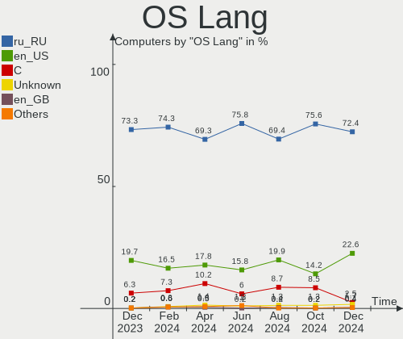
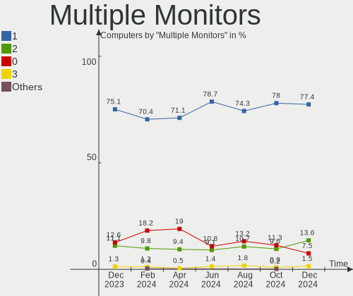

Linux in Russia - Hardware Trends
---------------------------------

A project to identify most popular hardware characteristics and track their change
over time based on data collected by Linux users at https://Linux-Hardware.org.

Anyone can contribute to this report by the [hw-probe](https://github.com/linuxhw/hw-probe) tool:

    sudo -E hw-probe -all -upload

This is a report for all computer types. See also reports for [desktops](/Location/Russia/Desktop/README.md) and [notebooks](/Location/Russia/Notebook/README.md).

Period: Jul, 2022.

Contents
--------

* [ System ](#system)
  - [ OS                       ](#os)
  - [ OS Family                ](#os-family)
  - [ Kernel                   ](#kernel)
  - [ Kernel Family            ](#kernel-family)
  - [ Kernel Major Ver.        ](#kernel-major-ver)
  - [ Arch                     ](#arch)
  - [ DE                       ](#de)
  - [ Display Server           ](#display-server)
  - [ Display Manager          ](#display-manager)
  - [ OS Lang                  ](#os-lang)
  - [ Boot Mode                ](#boot-mode)
  - [ Filesystem               ](#filesystem)
  - [ Part. scheme             ](#part-scheme)
  - [ Dual Boot with Linux/BSD ](#dual-boot-with-linuxbsd)
  - [ Dual Boot (Win)          ](#dual-boot-win)

* [ Board ](#board)
  - [ Vendor                   ](#vendor)
  - [ Model                    ](#model)
  - [ Model Family             ](#model-family)
  - [ MFG Year                 ](#mfg-year)
  - [ Form Factor              ](#form-factor)
  - [ Secure Boot              ](#secure-boot)
  - [ Coreboot                 ](#coreboot)
  - [ RAM Size                 ](#ram-size)
  - [ RAM Used                 ](#ram-used)
  - [ Total Drives             ](#total-drives)
  - [ Has CD-ROM               ](#has-cd-rom)
  - [ Has Ethernet             ](#has-ethernet)
  - [ Has WiFi                 ](#has-wifi)
  - [ Has Bluetooth            ](#has-bluetooth)

* [ Location ](#location)
  - [ Country                  ](#country)
  - [ City                     ](#city)

* [ Drives ](#drives)
  - [ Drive Vendor             ](#drive-vendor)
  - [ Drive Model              ](#drive-model)
  - [ HDD Vendor               ](#hdd-vendor)
  - [ SSD Vendor               ](#ssd-vendor)
  - [ Drive Kind               ](#drive-kind)
  - [ Drive Connector          ](#drive-connector)
  - [ Drive Size               ](#drive-size)
  - [ Space Total              ](#space-total)
  - [ Space Used               ](#space-used)
  - [ Malfunc. Drives          ](#malfunc-drives)
  - [ Malfunc. Drive Vendor    ](#malfunc-drive-vendor)
  - [ Malfunc. HDD Vendor      ](#malfunc-hdd-vendor)
  - [ Malfunc. Drive Kind      ](#malfunc-drive-kind)
  - [ Failed Drives            ](#failed-drives)
  - [ Failed Drive Vendor      ](#failed-drive-vendor)
  - [ Drive Status             ](#drive-status)

* [ Storage controller ](#storage-controller)
  - [ Storage Vendor           ](#storage-vendor)
  - [ Storage Model            ](#storage-model)
  - [ Storage Kind             ](#storage-kind)

* [ Processor ](#processor)
  - [ CPU Vendor               ](#cpu-vendor)
  - [ CPU Model                ](#cpu-model)
  - [ CPU Model Family         ](#cpu-model-family)
  - [ CPU Cores                ](#cpu-cores)
  - [ CPU Sockets              ](#cpu-sockets)
  - [ CPU Threads              ](#cpu-threads)
  - [ CPU Op-Modes             ](#cpu-op-modes)
  - [ CPU Microcode            ](#cpu-microcode)
  - [ CPU Microarch            ](#cpu-microarch)

* [ Graphics ](#graphics)
  - [ GPU Vendor               ](#gpu-vendor)
  - [ GPU Model                ](#gpu-model)
  - [ GPU Combo                ](#gpu-combo)
  - [ GPU Driver               ](#gpu-driver)
  - [ GPU Memory               ](#gpu-memory)

* [ Monitor ](#monitor)
  - [ Monitor Vendor           ](#monitor-vendor)
  - [ Monitor Model            ](#monitor-model)
  - [ Monitor Resolution       ](#monitor-resolution)
  - [ Monitor Diagonal         ](#monitor-diagonal)
  - [ Monitor Width            ](#monitor-width)
  - [ Aspect Ratio             ](#aspect-ratio)
  - [ Monitor Area             ](#monitor-area)
  - [ Pixel Density            ](#pixel-density)
  - [ Multiple Monitors        ](#multiple-monitors)

* [ Network ](#network)
  - [ Net Controller Vendor    ](#net-controller-vendor)
  - [ Net Controller Model     ](#net-controller-model)
  - [ Wireless Vendor          ](#wireless-vendor)
  - [ Wireless Model           ](#wireless-model)
  - [ Ethernet Vendor          ](#ethernet-vendor)
  - [ Ethernet Model           ](#ethernet-model)
  - [ Net Controller Kind      ](#net-controller-kind)
  - [ Used Controller          ](#used-controller)
  - [ NICs                     ](#nics)
  - [ IPv6                     ](#ipv6)

* [ Bluetooth ](#bluetooth)
  - [ Bluetooth Vendor         ](#bluetooth-vendor)
  - [ Bluetooth Model          ](#bluetooth-model)

* [ Sound ](#sound)
  - [ Sound Vendor             ](#sound-vendor)
  - [ Sound Model              ](#sound-model)

* [ Memory ](#memory)
  - [ Memory Vendor            ](#memory-vendor)
  - [ Memory Model             ](#memory-model)
  - [ Memory Kind              ](#memory-kind)
  - [ Memory Form Factor       ](#memory-form-factor)
  - [ Memory Size              ](#memory-size)
  - [ Memory Speed             ](#memory-speed)

* [ Printers & scanners ](#printers--scanners)
  - [ Printer Vendor           ](#printer-vendor)
  - [ Printer Model            ](#printer-model)
  - [ Scanner Vendor           ](#scanner-vendor)
  - [ Scanner Model            ](#scanner-model)

* [ Camera ](#camera)
  - [ Camera Vendor            ](#camera-vendor)
  - [ Camera Model             ](#camera-model)

* [ Security ](#security)
  - [ Fingerprint Vendor       ](#fingerprint-vendor)
  - [ Fingerprint Model        ](#fingerprint-model)
  - [ Chipcard Vendor          ](#chipcard-vendor)
  - [ Chipcard Model           ](#chipcard-model)

* [ Unsupported ](#unsupported)
  - [ Unsupported Devices      ](#unsupported-devices)
  - [ Unsupported Device Types ](#unsupported-device-types)

System
------

OS
--

Installed operating systems

| Name                         | Computers | Percent |
|------------------------------|-----------|---------|
| ROSA 12.2                    | 277       | 44.75%  |
| Debian 11                    | 60        | 9.69%   |
| Fedora 36                    | 27        | 4.36%   |
| Linux Mint 20.3              | 26        | 4.2%    |
| Red OS 7.3.1                 | 24        | 3.88%   |
| ROSA R11.1                   | 22        | 3.55%   |
| OpenMandriva 4.3             | 20        | 3.23%   |
| Ubuntu 22.04                 | 18        | 2.91%   |
| Ubuntu 20.04                 | 14        | 2.26%   |
| OpenMandriva 4.90            | 12        | 1.94%   |
| KDE neon 20.04               | 9         | 1.45%   |
| Red OS 7.3                   | 7         | 1.13%   |
| ALT Linux 10.0               | 7         | 1.13%   |
| Manjaro 21.3.2               | 6         | 0.97%   |
| Arch Rolling                 | 6         | 0.97%   |
| Arch                         | 6         | 0.97%   |
| Pop!_OS 22.04                | 4         | 0.65%   |
| Kubuntu 22.04                | 4         | 0.65%   |
| ROSA R11                     | 3         | 0.48%   |
| ROSA 12.1                    | 3         | 0.48%   |
| OpenMandriva 4.2             | 3         | 0.48%   |
| Manjaro                      | 3         | 0.48%   |
| Kali 2022.2                  | 3         | 0.48%   |
| Elementary 6.1               | 3         | 0.48%   |
| Debian 10                    | 3         | 0.48%   |
| Astra Linux 2.12.44          | 3         | 0.48%   |
| ArcoLinux Rolling            | 3         | 0.48%   |
| Xubuntu 18.04                | 2         | 0.32%   |
| Manjaro 21.3.5               | 2         | 0.32%   |
| Manjaro 21.3.3               | 2         | 0.32%   |
| LMDE 5                       | 2         | 0.32%   |
| Linux Mint 19.3              | 2         | 0.32%   |
| Gentoo 2.8                   | 2         | 0.32%   |
| ALT Linux 10.1               | 2         | 0.32%   |
| Xubuntu 22.04                | 1         | 0.16%   |
| Void Linux                   | 1         | 0.16%   |
| Ubuntu 22.10                 | 1         | 0.16%   |
| Ubuntu 21.04                 | 1         | 0.16%   |
| Ubuntu 18.04                 | 1         | 0.16%   |
| Ubuntu 16.04                 | 1         | 0.16%   |
| Rocky Linux 9.0              | 1         | 0.16%   |
| Pop!_OS 21.04                | 1         | 0.16%   |
| Parrot 5.0                   | 1         | 0.16%   |
| Parrot 4.11                  | 1         | 0.16%   |
| openSUSE Tumbleweed-XXXXXXXX | 1         | 0.16%   |
| MX 21                        | 1         | 0.16%   |
| MOS 10                       | 1         | 0.16%   |
| Manjaro-ARM                  | 1         | 0.16%   |
| Manjaro 21.3.1               | 1         | 0.16%   |
| Lubuntu 12.04                | 1         | 0.16%   |
| Linux Mint 19.1              | 1         | 0.16%   |
| Kubuntu 20.04                | 1         | 0.16%   |
| Endless 3.8.7                | 1         | 0.16%   |
| EndeavourOS Rolling          | 1         | 0.16%   |
| EndeavourOS                  | 1         | 0.16%   |
| Debian Testing               | 1         | 0.16%   |
| Debian 8                     | 1         | 0.16%   |
| BlackPanther 18.1            | 1         | 0.16%   |
| Artix Rolling                | 1         | 0.16%   |
| ALT Linux P10                | 1         | 0.16%   |

OS Family
---------

OS without a version

| Name         | Computers | Percent |
|--------------|-----------|---------|
| ROSA         | 305       | 49.27%  |
| Debian       | 65        | 10.5%   |
| Ubuntu       | 36        | 5.82%   |
| OpenMandriva | 35        | 5.65%   |
| Red OS       | 31        | 5.01%   |
| Linux Mint   | 29        | 4.68%   |
| Fedora       | 27        | 4.36%   |
| Manjaro      | 14        | 2.26%   |
| Arch         | 12        | 1.94%   |
| ALT Linux    | 12        | 1.94%   |
| KDE neon     | 9         | 1.45%   |
| Pop!_OS      | 5         | 0.81%   |
| Kubuntu      | 5         | 0.81%   |
| Xubuntu      | 3         | 0.48%   |
| Kali         | 3         | 0.48%   |
| Elementary   | 3         | 0.48%   |
| Astra Linux  | 3         | 0.48%   |
| ArcoLinux    | 3         | 0.48%   |
| Parrot       | 2         | 0.32%   |
| LMDE         | 2         | 0.32%   |
| Gentoo       | 2         | 0.32%   |
| EndeavourOS  | 2         | 0.32%   |
| Void Linux   | 1         | 0.16%   |
| Rocky Linux  | 1         | 0.16%   |
| openSUSE     | 1         | 0.16%   |
| MX           | 1         | 0.16%   |
| Manjaro-ARM  | 1         | 0.16%   |
| Lubuntu      | 1         | 0.16%   |
| Endless      | 1         | 0.16%   |
| BlackPanther | 1         | 0.16%   |
| Artix        | 1         | 0.16%   |
| AlmaLinux    | 1         | 0.16%   |
| ACI          | 1         | 0.16%   |

Kernel
------

Version of the Linux kernel

| Version                                    | Computers | Percent |
|--------------------------------------------|-----------|---------|
| 5.10.74-generic-2rosa2021.1-x86_64         | 118       | 19.06%  |
| 5.10.118-generic-2rosa2021.1-x86_64        | 96        | 15.51%  |
| 5.10.0-7-amd64                             | 47        | 7.59%   |
| 5.15.0-41-generic                          | 27        | 4.36%   |
| 5.16.7-desktop-1omv4003                    | 18        | 2.91%   |
| 5.15.43-generic-2rosa2021.1-x86_64         | 16        | 2.58%   |
| 5.18.8.xm1-1.klp-xanmod-rosa2021.1-x86_64  | 15        | 2.42%   |
| 5.15.10-1.el7.x86_64                       | 15        | 2.42%   |
| 5.18.12-desktop-3omv4090                   | 12        | 1.94%   |
| 5.18.13-200.fc36.x86_64                    | 11        | 1.78%   |
| 5.17.11-generic-2rosa2021.1-x86_64         | 11        | 1.78%   |
| 5.4.0-122-generic                          | 10        | 1.62%   |
| 5.15.35-4.el7.3.x86_64                     | 7         | 1.13%   |
| 5.4.83-generic-2rosa-i586                  | 6         | 0.97%   |
| 5.18.9-200.fc36.x86_64                     | 6         | 0.97%   |
| 5.15.0-40-generic                          | 6         | 0.97%   |
| 5.10.0-16-amd64                            | 6         | 0.97%   |
| 5.4.83-generic-2rosa-x86_64                | 5         | 0.81%   |
| 5.4.32-generic-2rosa-i586                  | 5         | 0.81%   |
| 5.4.0-121-generic                          | 5         | 0.81%   |
| 5.18.11-200.fc36.x86_64                    | 5         | 0.81%   |
| 5.15.50-1-MANJARO                          | 5         | 0.81%   |
| 5.15.35-1.el7.3.x86_64                     | 5         | 0.81%   |
| 5.13.0-51-generic                          | 5         | 0.81%   |
| 5.10.0-15-amd64                            | 5         | 0.81%   |
| 5.18.7-200.fc36.x86_64                     | 4         | 0.65%   |
| 5.13.0-52-generic                          | 4         | 0.65%   |
| 5.4.0-91-generic                           | 3         | 0.48%   |
| 5.18.6-arch1-1                             | 3         | 0.48%   |
| 5.18.14-arch1-1                            | 3         | 0.48%   |
| 5.17.15-76051715-generic                   | 3         | 0.48%   |
| 5.10.74-generic-2rosa2021.1-i586           | 3         | 0.48%   |
| 5.10.29-1.el7.x86_64                       | 3         | 0.48%   |
| 5.10.0-1038.40-generic                     | 3         | 0.48%   |
| 4.15.0-desktop-122.124.1rosa-x86_64        | 3         | 0.48%   |
| 5.4.32-generic-2rosa-x86_64                | 2         | 0.32%   |
| 5.4.150-generic-1rosa2021.1-x86_64         | 2         | 0.32%   |
| 5.18.9-arch1-1                             | 2         | 0.32%   |
| 5.18.12-arch1-1                            | 2         | 0.32%   |
| 5.18.10.xm1-1.klp-xanmod-rosa2021.1-x86_64 | 2         | 0.32%   |
| 5.18.10-1-MANJARO                          | 2         | 0.32%   |
| 5.18.1.xm1-3.klp-xanmod-rosa2021.1-x86_64  | 2         | 0.32%   |
| 5.18.0-kali5-amd64                         | 2         | 0.32%   |
| 5.17.6-arch1-1                             | 2         | 0.32%   |
| 5.16.19-generic-2rosa2021.1-x86_64         | 2         | 0.32%   |
| 5.16.13-desktop-1omv4003                   | 2         | 0.32%   |
| 5.15.55-1-MANJARO                          | 2         | 0.32%   |
| 5.15.53-1-MANJARO                          | 2         | 0.32%   |
| 5.15.52-un-def-alt1                        | 2         | 0.32%   |
| 5.15.34-un-def-alt1                        | 2         | 0.32%   |
| 5.15.32-generic-6rosa2021.1-x86_64         | 2         | 0.32%   |
| 5.15.0-33-generic                          | 2         | 0.32%   |
| 5.14.0-1044-oem                            | 2         | 0.32%   |
| 5.10.71-generic-1rosa2021.1-x86_64         | 2         | 0.32%   |
| 5.10.14-desktop-1omv4002                   | 2         | 0.32%   |
| 4.15.0-desktop-45.1rosa-i586               | 2         | 0.32%   |
| 4.15.0-189-generic                         | 2         | 0.32%   |
| 5.6.14-desktop-2bP                         | 1         | 0.16%   |
| 5.4.189-0504189-generic                    | 1         | 0.16%   |
| 5.4.166-1-pve                              | 1         | 0.16%   |

Kernel Family
-------------

Linux kernel without a distro release

| Version  | Computers | Percent |
|----------|-----------|---------|
| 5.10.74  | 121       | 19.55%  |
| 5.10.118 | 97        | 15.67%  |
| 5.10.0   | 62        | 10.02%  |
| 5.15.0   | 39        | 6.3%    |
| 5.4.0    | 24        | 3.88%   |
| 5.18.12  | 18        | 2.91%   |
| 5.16.7   | 18        | 2.91%   |
| 5.15.43  | 17        | 2.75%   |
| 5.18.8   | 15        | 2.42%   |
| 5.15.10  | 15        | 2.42%   |
| 5.18.13  | 12        | 1.94%   |
| 5.15.35  | 12        | 1.94%   |
| 5.13.0   | 12        | 1.94%   |
| 5.4.83   | 11        | 1.78%   |
| 5.18.9   | 11        | 1.78%   |
| 5.17.11  | 11        | 1.78%   |
| 4.15.0   | 10        | 1.62%   |
| 5.4.32   | 7         | 1.13%   |
| 5.18.11  | 7         | 1.13%   |
| 5.18.10  | 7         | 1.13%   |
| 5.18.0   | 7         | 1.13%   |
| 5.15.50  | 5         | 0.81%   |
| 5.18.7   | 4         | 0.65%   |
| 5.18.6   | 4         | 0.65%   |
| 5.18.14  | 4         | 0.65%   |
| 5.14.0   | 4         | 0.65%   |
| 5.10.29  | 4         | 0.65%   |
| 5.19.0   | 3         | 0.48%   |
| 5.18.3   | 3         | 0.48%   |
| 5.17.15  | 3         | 0.48%   |
| 5.15.53  | 3         | 0.48%   |
| 5.15.52  | 3         | 0.48%   |
| 5.4.150  | 2         | 0.32%   |
| 5.18.1   | 2         | 0.32%   |
| 5.17.6   | 2         | 0.32%   |
| 5.16.19  | 2         | 0.32%   |
| 5.16.13  | 2         | 0.32%   |
| 5.16.0   | 2         | 0.32%   |
| 5.15.55  | 2         | 0.32%   |
| 5.15.34  | 2         | 0.32%   |
| 5.15.32  | 2         | 0.32%   |
| 5.10.71  | 2         | 0.32%   |
| 5.10.14  | 2         | 0.32%   |
| 5.6.14   | 1         | 0.16%   |
| 5.4.189  | 1         | 0.16%   |
| 5.4.166  | 1         | 0.16%   |
| 5.18.5   | 1         | 0.16%   |
| 5.18.2   | 1         | 0.16%   |
| 5.18.15  | 1         | 0.16%   |
| 5.15.58  | 1         | 0.16%   |
| 5.15.54  | 1         | 0.16%   |
| 5.15.51  | 1         | 0.16%   |
| 5.15.39  | 1         | 0.16%   |
| 5.15.30  | 1         | 0.16%   |
| 5.11.22  | 1         | 0.16%   |
| 5.11.20  | 1         | 0.16%   |
| 5.11.12  | 1         | 0.16%   |
| 5.11.0   | 1         | 0.16%   |
| 5.10.128 | 1         | 0.16%   |
| 5.10.126 | 1         | 0.16%   |

Kernel Major Ver.
-----------------

Linux kernel major version

| Version | Computers | Percent |
|---------|-----------|---------|
| 5.10    | 292       | 47.17%  |
| 5.15    | 105       | 16.96%  |
| 5.18    | 97        | 15.67%  |
| 5.4     | 46        | 7.43%   |
| 5.16    | 24        | 3.88%   |
| 5.17    | 16        | 2.58%   |
| 5.13    | 12        | 1.94%   |
| 4.15    | 10        | 1.62%   |
| 5.14    | 4         | 0.65%   |
| 5.11    | 4         | 0.65%   |
| 5.19    | 3         | 0.48%   |
| 5.6     | 1         | 0.16%   |
| 4.19    | 1         | 0.16%   |
| 4.18    | 1         | 0.16%   |
| 3.13    | 1         | 0.16%   |
| 3.10    | 1         | 0.16%   |
| 3.0     | 1         | 0.16%   |

Arch
----

OS architecture (x86_64, i586, etc.)

| Name    | Computers | Percent |
|---------|-----------|---------|
| x86_64  | 597       | 96.45%  |
| i686    | 20        | 3.23%   |
| armv7l  | 1         | 0.16%   |
| aarch64 | 1         | 0.16%   |

DE
--

Desktop Environment

| Name       | Computers | Percent |
|------------|-----------|---------|
| KDE5       | 215       | 34.73%  |
| GNOME      | 205       | 33.12%  |
| Unknown    | 60        | 9.69%   |
| MATE       | 30        | 4.85%   |
| LXQt       | 28        | 4.52%   |
| XFCE       | 20        | 3.23%   |
| X-Cinnamon | 18        | 2.91%   |
| KDE4       | 17        | 2.75%   |
| Cinnamon   | 12        | 1.94%   |
| Pantheon   | 3         | 0.48%   |
| fly        | 3         | 0.48%   |
| Unity      | 2         | 0.32%   |
| sway       | 1         | 0.16%   |
| openbox    | 1         | 0.16%   |
| LXDE       | 1         | 0.16%   |
| i3         | 1         | 0.16%   |
| Budgie     | 1         | 0.16%   |
| bspwm      | 1         | 0.16%   |

Display Server
--------------

X11 or Wayland

| Name    | Computers | Percent |
|---------|-----------|---------|
| X11     | 282       | 45.56%  |
| Wayland | 281       | 45.4%   |
| Unknown | 48        | 7.75%   |
| Tty     | 8         | 1.29%   |

Display Manager
---------------

SDDM, LightDM, etc.

| Name    | Computers | Percent |
|---------|-----------|---------|
| GDM     | 204       | 32.96%  |
| SDDM    | 199       | 32.15%  |
| Unknown | 116       | 18.74%  |
| LightDM | 52        | 8.4%    |
| GDM3    | 26        | 4.2%    |
| KDM     | 17        | 2.75%   |
| FLY-DM  | 2         | 0.32%   |
| XDM     | 1         | 0.16%   |
| SLiM    | 1         | 0.16%   |
| GREETD  | 1         | 0.16%   |

OS Lang
-------

Language

| Lang    | Computers | Percent |
|---------|-----------|---------|
| ru_RU   | 512       | 82.71%  |
| en_US   | 61        | 9.85%   |
| Unknown | 37        | 5.98%   |
| C       | 4         | 0.65%   |
| en_GB   | 2         | 0.32%   |
| ru_UA   | 1         | 0.16%   |
| en_AG   | 1         | 0.16%   |
| C.UTF8  | 1         | 0.16%   |

Boot Mode
---------

EFI or BIOS

| Mode | Computers | Percent |
|------|-----------|---------|
| EFI  | 336       | 54.28%  |
| BIOS | 283       | 45.72%  |

Filesystem
----------

Type of filesystem

| Type    | Computers | Percent |
|---------|-----------|---------|
| Ext4    | 474       | 76.58%  |
| Overlay | 87        | 14.05%  |
| Btrfs   | 50        | 8.08%   |
| Xfs     | 3         | 0.48%   |
| F2fs    | 3         | 0.48%   |
| Zfs     | 2         | 0.32%   |

Part. scheme
------------

Scheme of partitioning

| Type    | Computers | Percent |
|---------|-----------|---------|
| GPT     | 359       | 58%     |
| MBR     | 178       | 28.76%  |
| Unknown | 82        | 13.25%  |

Dual Boot with Linux/BSD
------------------------

Hosting more than one Linux/BSD

| Dual boot | Computers | Percent |
|-----------|-----------|---------|
| No        | 489       | 79%     |
| Yes       | 130       | 21%     |

Dual Boot (Win)
---------------

Hosting Linux and Windows

| Dual boot | Computers | Percent |
|-----------|-----------|---------|
| No        | 342       | 55.25%  |
| Yes       | 277       | 44.75%  |

Board
-----

Vendor
------

Motherboard manufacturer

| Name                | Computers | Percent |
|---------------------|-----------|---------|
| ASUSTek Computer    | 140       | 22.62%  |
| Gigabyte Technology | 88        | 14.22%  |
| Lenovo              | 78        | 12.6%   |
| MSI                 | 43        | 6.95%   |
| Acer                | 42        | 6.79%   |
| ASRock              | 41        | 6.62%   |
| Hewlett-Packard     | 36        | 5.82%   |
| Dell                | 21        | 3.39%   |
| Intel               | 18        | 2.91%   |
| HUAWEI              | 13        | 2.1%    |
| Sony                | 7         | 1.13%   |
| Samsung Electronics | 7         | 1.13%   |
| ECS                 | 7         | 1.13%   |
| Toshiba             | 5         | 0.81%   |
| Timi                | 5         | 0.81%   |
| Supermicro          | 5         | 0.81%   |
| DEPO Computers      | 5         | 0.81%   |
| Biostar             | 5         | 0.81%   |
| Aquarius            | 5         | 0.81%   |
| Huanan              | 4         | 0.65%   |
| Unknown             | 4         | 0.65%   |
| Packard Bell        | 3         | 0.48%   |
| Digma               | 3         | 0.48%   |
| ZOTAC               | 2         | 0.32%   |
| Pegatron            | 2         | 0.32%   |
| Irbis               | 2         | 0.32%   |
| Insyde              | 2         | 0.32%   |
| HONOR               | 2         | 0.32%   |
| Chuwi               | 2         | 0.32%   |
| AZW                 | 2         | 0.32%   |
| 3Logic Group        | 2         | 0.32%   |
| Ugoos               | 1         | 0.16%   |
| THD                 | 1         | 0.16%   |
| OEM                 | 1         | 0.16%   |
| Notebook            | 1         | 0.16%   |
| MB                  | 1         | 0.16%   |
| Maibenben           | 1         | 0.16%   |
| Machinist/Runing    | 1         | 0.16%   |
| MACHINIST           | 1         | 0.16%   |
| Kraftway            | 1         | 0.16%   |
| ICL                 | 1         | 0.16%   |
| Fujitsu Siemens     | 1         | 0.16%   |
| Fujitsu             | 1         | 0.16%   |
| Foxconn             | 1         | 0.16%   |
| eMachines           | 1         | 0.16%   |
| AMI                 | 1         | 0.16%   |
| American Megatrends | 1         | 0.16%   |
| Alienware           | 1         | 0.16%   |
| ABIT                | 1         | 0.16%   |

Model
-----

Motherboard model

| Name                                 | Computers | Percent |
|--------------------------------------|-----------|---------|
| Lenovo V15-IWL 81YE                  | 17        | 2.75%   |
| MSI MS-7996                          | 12        | 1.94%   |
| ASUS All Series                      | 10        | 1.62%   |
| ASRock H470M-HVS                     | 10        | 1.62%   |
| Unknown                              | 5         | 0.81%   |
| Intel X99                            | 4         | 0.65%   |
| HUAWEI KLVL-WXXW                     | 4         | 0.65%   |
| HP Pavilion g6                       | 4         | 0.65%   |
| ECS G31T-M9                          | 4         | 0.65%   |
| DEPO Computers DPH310T               | 4         | 0.65%   |
| MSI MS-7529                          | 3         | 0.48%   |
| Lenovo IdeaPad Gaming 3 15ARH05 82EY | 3         | 0.48%   |
| HP Notebook                          | 3         | 0.48%   |
| HP Laptop 15-bw0xx                   | 3         | 0.48%   |
| Gigabyte A320M-S2H V2                | 3         | 0.48%   |
| ASUS PRIME X470-PRO                  | 3         | 0.48%   |
| ASUS PRIME B450M-K                   | 3         | 0.48%   |
| ASUS P8H61-M LX3 R2.0                | 3         | 0.48%   |
| ASUS M5A78L-M LX3                    | 3         | 0.48%   |
| ASUS H110M-R                         | 3         | 0.48%   |
| Aquarius NS685U R11                  | 3         | 0.48%   |
| Acer Aspire E5-573G                  | 3         | 0.48%   |
| Acer Aspire A315-51                  | 3         | 0.48%   |
| ZOTAC ZBOX-ECM73070C/53060C          | 2         | 0.32%   |
| Toshiba Satellite A300               | 2         | 0.32%   |
| Timi TM1701                          | 2         | 0.32%   |
| Samsung 350V5C/351V5C/3540VC/3440VC  | 2         | 0.32%   |
| MSI MS-7B86                          | 2         | 0.32%   |
| MSI MS-7A71                          | 2         | 0.32%   |
| MSI MS-7895                          | 2         | 0.32%   |
| Lenovo IdeaPad L340-15API 81LW       | 2         | 0.32%   |
| Lenovo G580 20157                    | 2         | 0.32%   |
| Lenovo G570 20079                    | 2         | 0.32%   |
| Intel Pro, Std, Elt Series           | 2         | 0.32%   |
| Insyde CherryTrail                   | 2         | 0.32%   |
| HUAWEI HVY-WXX9                      | 2         | 0.32%   |
| HUAWEI HLYL-WXX9                     | 2         | 0.32%   |
| HUAWEI CREM-WXX9                     | 2         | 0.32%   |
| HP OMEN by Laptop 16-c0xxx           | 2         | 0.32%   |
| HP Laptop 15-db1xxx                  | 2         | 0.32%   |
| HP EliteBook 855 G8 Notebook PC      | 2         | 0.32%   |
| Gigabyte X470 AORUS GAMING 7 WIFI    | 2         | 0.32%   |
| Gigabyte H61M-S1                     | 2         | 0.32%   |
| Gigabyte B450M S2H                   | 2         | 0.32%   |
| Gigabyte AB350M-DS3H V2              | 2         | 0.32%   |
| Gigabyte A320M-H                     | 2         | 0.32%   |
| ECS GF8100VM-M5                      | 2         | 0.32%   |
| Dell OptiPlex 755                    | 2         | 0.32%   |
| ASUS X541UVK                         | 2         | 0.32%   |
| ASUS TUF B450M-PRO GAMING            | 2         | 0.32%   |
| ASUS PRIME B550-PLUS                 | 2         | 0.32%   |
| ASUS PRIME A320M-K                   | 2         | 0.32%   |
| ASUS P8H67-M LE                      | 2         | 0.32%   |
| ASUS P5KPL-AM                        | 2         | 0.32%   |
| ASUS P5K                             | 2         | 0.32%   |
| ASUS M5A97 R2.0                      | 2         | 0.32%   |
| ASUS M4A77TD                         | 2         | 0.32%   |
| ASRock B550M Pro4                    | 2         | 0.32%   |
| ASRock A320M-DVS R4.0                | 2         | 0.32%   |
| Acer Swift SF114-34                  | 2         | 0.32%   |

Model Family
------------

Motherboard model prefix

| Name                   | Computers | Percent |
|------------------------|-----------|---------|
| Acer Aspire            | 32        | 5.17%   |
| Lenovo IdeaPad         | 20        | 3.23%   |
| ASUS PRIME             | 19        | 3.07%   |
| Lenovo V15-IWL         | 17        | 2.75%   |
| MSI MS-7996            | 12        | 1.94%   |
| ASUS All               | 10        | 1.62%   |
| ASRock H470M-HVS       | 10        | 1.62%   |
| Lenovo ThinkPad        | 9         | 1.45%   |
| HP Pavilion            | 9         | 1.45%   |
| HP ProBook             | 7         | 1.13%   |
| HP Laptop              | 7         | 1.13%   |
| ASUS VivoBook          | 7         | 1.13%   |
| ASUS P8H61-M           | 7         | 1.13%   |
| Gigabyte B450M         | 6         | 0.97%   |
| ASUS ROG               | 6         | 0.97%   |
| ASUS M5A78L-M          | 6         | 0.97%   |
| Lenovo ThinkBook       | 5         | 0.81%   |
| Dell OptiPlex          | 5         | 0.81%   |
| Dell Latitude          | 5         | 0.81%   |
| ASUS TUF               | 5         | 0.81%   |
| Unknown                | 5         | 0.81%   |
| Toshiba Satellite      | 4         | 0.65%   |
| Intel X99              | 4         | 0.65%   |
| HUAWEI KLVL-WXXW       | 4         | 0.65%   |
| Gigabyte B550M         | 4         | 0.65%   |
| Gigabyte A320M-S2H     | 4         | 0.65%   |
| ECS G31T-M9            | 4         | 0.65%   |
| DEPO Computers DPH310T | 4         | 0.65%   |
| Packard Bell EasyNote  | 3         | 0.48%   |
| MSI MS-7529            | 3         | 0.48%   |
| Lenovo ThinkCentre     | 3         | 0.48%   |
| HP Notebook            | 3         | 0.48%   |
| Gigabyte X470          | 3         | 0.48%   |
| Gigabyte AB350M-DS3H   | 3         | 0.48%   |
| Digma EVE              | 3         | 0.48%   |
| Dell Vostro            | 3         | 0.48%   |
| ASUS P5K               | 3         | 0.48%   |
| ASUS H110M-R           | 3         | 0.48%   |
| ASUS ASUS              | 3         | 0.48%   |
| Aquarius NS685U        | 3         | 0.48%   |
| Acer Swift             | 3         | 0.48%   |
| ZOTAC ZBOX-ECM73070C   | 2         | 0.32%   |
| Timi TM1701            | 2         | 0.32%   |
| Samsung 350V5C         | 2         | 0.32%   |
| MSI MS-7B86            | 2         | 0.32%   |
| MSI MS-7A71            | 2         | 0.32%   |
| MSI MS-7895            | 2         | 0.32%   |
| Lenovo Legion          | 2         | 0.32%   |
| Lenovo IdeaCentre      | 2         | 0.32%   |
| Lenovo G580            | 2         | 0.32%   |
| Lenovo G570            | 2         | 0.32%   |
| Lenovo B590            | 2         | 0.32%   |
| Intel X79              | 2         | 0.32%   |
| Intel Pro              | 2         | 0.32%   |
| Insyde CherryTrail     | 2         | 0.32%   |
| HUAWEI HVY-WXX9        | 2         | 0.32%   |
| HUAWEI HLYL-WXX9       | 2         | 0.32%   |
| HUAWEI CREM-WXX9       | 2         | 0.32%   |
| HP OMEN                | 2         | 0.32%   |
| HP EliteBook           | 2         | 0.32%   |

MFG Year
--------

Motherboard manufacture year

| Year    | Computers | Percent |
|---------|-----------|---------|
| 2021    | 79        | 12.76%  |
| 2019    | 61        | 9.85%   |
| 2020    | 57        | 9.21%   |
| 2018    | 53        | 8.56%   |
| 2012    | 50        | 8.08%   |
| 2017    | 38        | 6.14%   |
| 2016    | 34        | 5.49%   |
| 2011    | 33        | 5.33%   |
| 2010    | 33        | 5.33%   |
| 2009    | 33        | 5.33%   |
| 2013    | 29        | 4.68%   |
| 2015    | 24        | 3.88%   |
| 2008    | 24        | 3.88%   |
| 2022    | 22        | 3.55%   |
| 2014    | 21        | 3.39%   |
| 2007    | 15        | 2.42%   |
| 2006    | 7         | 1.13%   |
| 2005    | 3         | 0.48%   |
| Unknown | 2         | 0.32%   |
| 2001    | 1         | 0.16%   |

Form Factor
-----------

Physical design of the computer

| Name           | Computers | Percent |
|----------------|-----------|---------|
| Desktop        | 324       | 52.34%  |
| Notebook       | 276       | 44.59%  |
| Mini pc        | 7         | 1.13%   |
| Server         | 5         | 0.81%   |
| All in one     | 4         | 0.65%   |
| System on chip | 1         | 0.16%   |
| Tablet         | 1         | 0.16%   |
| Convertible    | 1         | 0.16%   |

Secure Boot
-----------

Enabled or disabled

| State    | Computers | Percent |
|----------|-----------|---------|
| Disabled | 600       | 96.93%  |
| Enabled  | 19        | 3.07%   |

Coreboot
--------

Have coreboot on board

| Used | Computers | Percent |
|------|-----------|---------|
| No   | 619       | 100%    |

RAM Size
--------

Total RAM memory

| Size in GB      | Computers | Percent |
|-----------------|-----------|---------|
| 4.01-8.0        | 161       | 26.01%  |
| 8.01-16.0       | 124       | 20.03%  |
| 16.01-24.0      | 110       | 17.77%  |
| 3.01-4.0        | 106       | 17.12%  |
| 32.01-64.0      | 54        | 8.72%   |
| 1.01-2.0        | 37        | 5.98%   |
| 64.01-256.0     | 12        | 1.94%   |
| 2.01-3.0        | 5         | 0.81%   |
| 0.51-1.0        | 4         | 0.65%   |
| 24.01-32.0      | 3         | 0.48%   |
| 0.01-0.5        | 2         | 0.32%   |
| More than 256.0 | 1         | 0.16%   |

RAM Used
--------

Used RAM memory

| Used GB     | Computers | Percent |
|-------------|-----------|---------|
| 1.01-2.0    | 283       | 45.72%  |
| 0.51-1.0    | 135       | 21.81%  |
| 2.01-3.0    | 89        | 14.38%  |
| 3.01-4.0    | 48        | 7.75%   |
| 4.01-8.0    | 41        | 6.62%   |
| 8.01-16.0   | 12        | 1.94%   |
| 0.01-0.5    | 5         | 0.81%   |
| 16.01-24.0  | 2         | 0.32%   |
| Unknown     | 2         | 0.32%   |
| 24.01-32.0  | 1         | 0.16%   |
| 64.01-256.0 | 1         | 0.16%   |

Total Drives
------------

Number of drives on board

| Drives | Computers | Percent |
|--------|-----------|---------|
| 1      | 347       | 56.06%  |
| 2      | 145       | 23.42%  |
| 3      | 71        | 11.47%  |
| 4      | 35        | 5.65%   |
| 5      | 12        | 1.94%   |
| 6      | 5         | 0.81%   |
| 8      | 3         | 0.48%   |
| 7      | 1         | 0.16%   |

Has CD-ROM
----------

Has CD-ROM on board

| Presented | Computers | Percent |
|-----------|-----------|---------|
| No        | 445       | 71.89%  |
| Yes       | 174       | 28.11%  |

Has Ethernet
------------

Has Ethernet on board

| Presented | Computers | Percent |
|-----------|-----------|---------|
| Yes       | 534       | 86.27%  |
| No        | 85        | 13.73%  |

Has WiFi
--------

Has WiFi module

| Presented | Computers | Percent |
|-----------|-----------|---------|
| Yes       | 361       | 58.32%  |
| No        | 258       | 41.68%  |

Has Bluetooth
-------------

Has Bluetooth module

| Presented | Computers | Percent |
|-----------|-----------|---------|
| No        | 318       | 51.37%  |
| Yes       | 301       | 48.63%  |

Location
--------

Country
-------

Geographic location (country)

| Country | Computers | Percent |
|---------|-----------|---------|
| Russia  | 619       | 100%    |

City
----

Geographic location (city)

| City                     | Computers | Percent |
|--------------------------|-----------|---------|
| Moscow                   | 112       | 18.09%  |
| Voronezh                 | 55        | 8.89%   |
| St Petersburg            | 40        | 6.46%   |
| Salekhard                | 22        | 3.55%   |
| Novosibirsk              | 21        | 3.39%   |
| Perm                     | 18        | 2.91%   |
| Yekaterinburg            | 15        | 2.42%   |
| Chelyabinsk              | 14        | 2.26%   |
| Krasnodar                | 12        | 1.94%   |
| Ufa                      | 11        | 1.78%   |
| Nizhniy Novgorod         | 11        | 1.78%   |
| Rostov-on-Don            | 8         | 1.29%   |
| Kazan’                 | 8         | 1.29%   |
| Yaroslavl                | 7         | 1.13%   |
| Volgograd                | 7         | 1.13%   |
| Vladivostok              | 7         | 1.13%   |
| Surgut                   | 7         | 1.13%   |
| Samara                   | 7         | 1.13%   |
| Tyumen                   | 6         | 0.97%   |
| Tomsk                    | 6         | 0.97%   |
| Saratov                  | 6         | 0.97%   |
| Izhevsk                  | 6         | 0.97%   |
| Irkutsk                  | 6         | 0.97%   |
| Barnaul                  | 6         | 0.97%   |
| Krasnoyarsk              | 5         | 0.81%   |
| Khabarovsk               | 5         | 0.81%   |
| Belgorod                 | 5         | 0.81%   |
| Tula                     | 4         | 0.65%   |
| Stavropol                | 4         | 0.65%   |
| Smolensk                 | 4         | 0.65%   |
| Penza                    | 4         | 0.65%   |
| Omsk                     | 4         | 0.65%   |
| Mytishchi                | 4         | 0.65%   |
| Cheboksary               | 4         | 0.65%   |
| Vladimir                 | 3         | 0.48%   |
| Ulyanovsk                | 3         | 0.48%   |
| Podolsk                  | 3         | 0.48%   |
| Orenburg                 | 3         | 0.48%   |
| Novokuznetsk             | 3         | 0.48%   |
| Korolyov                 | 3         | 0.48%   |
| Kaluga                   | 3         | 0.48%   |
| Kaliningrad              | 3         | 0.48%   |
| Blagoveshchensk          | 3         | 0.48%   |
| Zvenigorod               | 2         | 0.32%   |
| Veliky Novgorod          | 2         | 0.32%   |
| Ulan-Ude                 | 2         | 0.32%   |
| Tver                     | 2         | 0.32%   |
| Severodvinsk             | 2         | 0.32%   |
| Serpukhov                | 2         | 0.32%   |
| Sergiyev Posad           | 2         | 0.32%   |
| Saransk                  | 2         | 0.32%   |
| Ryazan                   | 2         | 0.32%   |
| Petropavlovsk-Kamchatsky | 2         | 0.32%   |
| Ozersk                   | 2         | 0.32%   |
| Odintsovo                | 2         | 0.32%   |
| Novy Urengoy             | 2         | 0.32%   |
| Murom                    | 2         | 0.32%   |
| Murmansk                 | 2         | 0.32%   |
| Moscow Oblast            | 2         | 0.32%   |
| Lipetsk                  | 2         | 0.32%   |

Drives
------

Drive Vendor
------------

Hard drive vendors

| Vendor                      | Computers | Drives | Percent |
|-----------------------------|-----------|--------|---------|
| WDC                         | 178       | 216    | 17.76%  |
| Seagate                     | 157       | 188    | 15.67%  |
| Samsung Electronics         | 118       | 139    | 11.78%  |
| Toshiba                     | 72        | 78     | 7.19%   |
| Kingston                    | 54        | 55     | 5.39%   |
| Hitachi                     | 41        | 44     | 4.09%   |
| A-DATA Technology           | 30        | 34     | 2.99%   |
| SanDisk                     | 28        | 28     | 2.79%   |
| SPCC                        | 27        | 27     | 2.69%   |
| China                       | 25        | 27     | 2.5%    |
| Netac                       | 19        | 19     | 1.9%    |
| Unknown                     | 18        | 20     | 1.8%    |
| Intel                       | 18        | 23     | 1.8%    |
| Apacer                      | 17        | 18     | 1.7%    |
| SK hynix                    | 16        | 17     | 1.6%    |
| HGST                        | 16        | 18     | 1.6%    |
| Smartbuy                    | 11        | 12     | 1.1%    |
| Crucial                     | 11        | 11     | 1.1%    |
| Phison                      | 10        | 10     | 1%      |
| GOODRAM                     | 10        | 10     | 1%      |
| Gigabyte Technology         | 9         | 9      | 0.9%    |
| Plextor                     | 8         | 8      | 0.8%    |
| Patriot                     | 7         | 7      | 0.7%    |
| AMD                         | 7         | 7      | 0.7%    |
| OCZ                         | 6         | 6      | 0.6%    |
| UMIS                        | 5         | 5      | 0.5%    |
| Silicon Motion              | 5         | 5      | 0.5%    |
| Maxtor                      | 5         | 5      | 0.5%    |
| Transcend                   | 4         | 4      | 0.4%    |
| Micron Technology           | 4         | 4      | 0.4%    |
| KingSpec                    | 4         | 4      | 0.4%    |
| Corsair                     | 4         | 5      | 0.4%    |
| XrayDisk                    | 3         | 3      | 0.3%    |
| XPG                         | 3         | 3      | 0.3%    |
| Fujitsu                     | 3         | 3      | 0.3%    |
| walram                      | 2         | 2      | 0.2%    |
| Realtek                     | 2         | 2      | 0.2%    |
| Qumo                        | 2         | 2      | 0.2%    |
| NGFF                        | 2         | 2      | 0.2%    |
| Kllisre                     | 2         | 2      | 0.2%    |
| KIOXIA                      | 2         | 2      | 0.2%    |
| BR                          | 2         | 2      | 0.2%    |
| ASMT                        | 2         | 4      | 0.2%    |
| Unknown                     | 2         | 2      | 0.2%    |
| ZTE                         | 1         | 1      | 0.1%    |
| Yangtze Memory Technologies | 1         | 1      | 0.1%    |
| Western Digital             | 1         | 1      | 0.1%    |
| WDC WDS1                    | 1         | 1      | 0.1%    |
| Union Memory (Shenzhen)     | 1         | 1      | 0.1%    |
| Team                        | 1         | 1      | 0.1%    |
| T-FORCE                     | 1         | 1      | 0.1%    |
| SSSTC                       | 1         | 1      | 0.1%    |
| ShiJi                       | 1         | 1      | 0.1%    |
| SATAFIRM                    | 1         | 1      | 0.1%    |
| s60                         | 1         | 1      | 0.1%    |
| Reeinno                     | 1         | 1      | 0.1%    |
| PHD 3.0                     | 1         | 1      | 0.1%    |
| ORICO                       | 1         | 1      | 0.1%    |
| OCZ-VERTEX3                 | 1         | 1      | 0.1%    |
| Netac SS                    | 1         | 1      | 0.1%    |

Drive Model
-----------

Hard drive models

| Model                               | Computers | Percent |
|-------------------------------------|-----------|---------|
| Samsung MZALQ256HAJD-000L2 256GB    | 17        | 1.57%   |
| Toshiba HDWD110 1TB                 | 15        | 1.38%   |
| Seagate ST500DM002-1BD142 500GB     | 13        | 1.2%    |
| Seagate ST1000DM010-2EP102 1TB      | 12        | 1.1%    |
| WDC WDS240G2G0A-00JH30 240GB SSD    | 11        | 1.01%   |
| SPCC Solid State Disk 120GB         | 11        | 1.01%   |
| Netac SSD 240GB                     | 11        | 1.01%   |
| Kingston SA400S37240G 240GB SSD     | 10        | 0.92%   |
| Seagate ST1000LM024 HN-M101MBB 1TB  | 9         | 0.83%   |
| Seagate ST1000DM003-1CH162 1TB      | 9         | 0.83%   |
| Samsung SSD 860 EVO 250GB           | 8         | 0.74%   |
| WDC WD10EZEX-08WN4A0 1TB            | 7         | 0.64%   |
| Toshiba DT01ACA100 1TB              | 7         | 0.64%   |
| Toshiba DT01ACA050 500GB            | 7         | 0.64%   |
| SPCC Solid State Disk 128GB         | 6         | 0.55%   |
| Seagate ST3500418AS 500GB           | 6         | 0.55%   |
| Seagate ST2000DM008-2FR102 2TB      | 6         | 0.55%   |
| Kingston SA400S37480G 480GB SSD     | 6         | 0.55%   |
| WDC WDS240G2G0B-00EPW0 240GB SSD    | 5         | 0.46%   |
| Seagate ST320LT020-9YG142 320GB     | 5         | 0.46%   |
| Samsung SSD 980 1TB                 | 5         | 0.46%   |
| Kingston SA400S37120G 120GB SSD     | 5         | 0.46%   |
| Hitachi HDS721050CLA362 500GB       | 5         | 0.46%   |
| Hitachi HDS721010CLA332 1TB         | 5         | 0.46%   |
| Gigabyte GP-GSM2NE3256GNTD 256GB    | 5         | 0.46%   |
| Crucial CT240BX500SSD1 240GB        | 5         | 0.46%   |
| China SSD 120GB                     | 5         | 0.46%   |
| Apacer AS2280P4 256GB               | 5         | 0.46%   |
| WDC WD5000LPCX-21VHAT0 500GB        | 4         | 0.37%   |
| WDC WD10SPZX-24Z10 1TB              | 4         | 0.37%   |
| Toshiba MQ01ABF050 500GB            | 4         | 0.37%   |
| Seagate ST3500413AS 500GB           | 4         | 0.37%   |
| Seagate ST1000LM049-2GH172 1TB      | 4         | 0.37%   |
| Samsung SSD 860 EVO 500GB           | 4         | 0.37%   |
| Samsung SSD 850 EVO 120GB           | 4         | 0.37%   |
| Samsung MZALQ512HALU-000L2 512GB    | 4         | 0.37%   |
| Kingston SV300S37A120G 120GB SSD    | 4         | 0.37%   |
| WDC WDS500G2B0A-00SM50 500GB SSD    | 3         | 0.28%   |
| WDC WDS240G1G0A-00SS50 240GB SSD    | 3         | 0.28%   |
| WDC WDS120G2G0A-00JH30 120GB SSD    | 3         | 0.28%   |
| WDC WD5000AAKX-08U6AA0 500GB        | 3         | 0.28%   |
| WDC WD5000AADS-00S9B0 500GB         | 3         | 0.28%   |
| WDC WD30EFRX-68EUZN0 3TB            | 3         | 0.28%   |
| Toshiba MQ04ABF100 1TB              | 3         | 0.28%   |
| Toshiba HDWE140 4TB                 | 3         | 0.28%   |
| SPCC Solid State Disk 256GB         | 3         | 0.28%   |
| Smartbuy SSD 240GB                  | 3         | 0.28%   |
| Smartbuy SSD 120GB                  | 3         | 0.28%   |
| Seagate ST500LT012-1DG142 500GB     | 3         | 0.28%   |
| Seagate ST380815AS 80GB             | 3         | 0.28%   |
| Seagate ST3320620AS 320GB           | 3         | 0.28%   |
| Seagate ST3250410AS 250GB           | 3         | 0.28%   |
| Seagate ST3250318AS 250GB           | 3         | 0.28%   |
| Seagate ST31000524AS 1TB            | 3         | 0.28%   |
| Seagate ST250DM000-1BD141 250GB     | 3         | 0.28%   |
| Seagate ST2000DM006-2DM164 2TB      | 3         | 0.28%   |
| Seagate ST2000DM001-1ER164 2TB      | 3         | 0.28%   |
| Seagate ST1000LM048-2E7172 1TB      | 3         | 0.28%   |
| SanDisk SSD PLUS 240GB              | 3         | 0.28%   |
| SanDisk SD8SN8U-128G-1006 128GB SSD | 3         | 0.28%   |

HDD Vendor
----------

Hard disk drive vendors

| Vendor              | Computers | Drives | Percent |
|---------------------|-----------|--------|---------|
| Seagate             | 154       | 185    | 34.61%  |
| WDC                 | 137       | 164    | 30.79%  |
| Toshiba             | 66        | 72     | 14.83%  |
| Hitachi             | 41        | 44     | 9.21%   |
| HGST                | 16        | 18     | 3.6%    |
| Samsung Electronics | 15        | 15     | 3.37%   |
| Maxtor              | 5         | 5      | 1.12%   |
| Fujitsu             | 3         | 3      | 0.67%   |
| Unknown             | 2         | 2      | 0.45%   |
| ASMT                | 2         | 4      | 0.45%   |
| SATAFIRM            | 1         | 1      | 0.22%   |
| PHD 3.0             | 1         | 1      | 0.22%   |
| ASMT106x            | 1         | 1      | 0.22%   |
| Apple               | 1         | 1      | 0.22%   |

SSD Vendor
----------

Solid state drive vendors

| Vendor              | Computers | Drives | Percent |
|---------------------|-----------|--------|---------|
| Samsung Electronics | 47        | 51     | 13.66%  |
| Kingston            | 36        | 36     | 10.47%  |
| WDC                 | 33        | 34     | 9.59%   |
| SPCC                | 25        | 25     | 7.27%   |
| China               | 25        | 27     | 7.27%   |
| A-DATA Technology   | 20        | 21     | 5.81%   |
| SanDisk             | 18        | 18     | 5.23%   |
| Netac               | 18        | 18     | 5.23%   |
| Smartbuy            | 11        | 12     | 3.2%    |
| Intel               | 11        | 14     | 3.2%    |
| Crucial             | 11        | 11     | 3.2%    |
| Apacer              | 10        | 11     | 2.91%   |
| GOODRAM             | 9         | 9      | 2.62%   |
| Plextor             | 8         | 8      | 2.33%   |
| Patriot             | 7         | 7      | 2.03%   |
| OCZ                 | 6         | 6      | 1.74%   |
| AMD                 | 6         | 6      | 1.74%   |
| Transcend           | 4         | 4      | 1.16%   |
| KingSpec            | 4         | 4      | 1.16%   |
| Gigabyte Technology | 3         | 3      | 0.87%   |
| Corsair             | 3         | 3      | 0.87%   |
| XrayDisk            | 2         | 2      | 0.58%   |
| walram              | 2         | 2      | 0.58%   |
| Qumo                | 2         | 2      | 0.58%   |
| NGFF                | 2         | 2      | 0.58%   |
| BR                  | 2         | 2      | 0.58%   |
| Unknown             | 2         | 2      | 0.58%   |
| Toshiba             | 1         | 1      | 0.29%   |
| Team                | 1         | 1      | 0.29%   |
| T-FORCE             | 1         | 1      | 0.29%   |
| SK hynix            | 1         | 1      | 0.29%   |
| ShiJi               | 1         | 1      | 0.29%   |
| Seagate             | 1         | 1      | 0.29%   |
| s60                 | 1         | 1      | 0.29%   |
| OCZ-VERTEX3         | 1         | 1      | 0.29%   |
| Neo                 | 1         | 1      | 0.29%   |
| Micron Technology   | 1         | 1      | 0.29%   |
| Londisk             | 1         | 1      | 0.29%   |
| Kingmax             | 1         | 1      | 0.29%   |
| Intenso             | 1         | 1      | 0.29%   |
| Hewlett-Packard     | 1         | 1      | 0.29%   |
| GALAX               | 1         | 1      | 0.29%   |
| EAGET               | 1         | 1      | 0.29%   |
| DeTech              | 1         | 1      | 0.29%   |

Drive Kind
----------

HDD or SSD

| Kind    | Computers | Drives | Percent |
|---------|-----------|--------|---------|
| HDD     | 373       | 516    | 42.43%  |
| SSD     | 285       | 357    | 32.42%  |
| NVMe    | 196       | 223    | 22.3%   |
| MMC     | 17        | 19     | 1.93%   |
| Unknown | 8         | 8      | 0.91%   |

Drive Connector
---------------

SATA, SAS, NVMe, etc.

| Type | Computers | Drives | Percent |
|------|-----------|--------|---------|
| SATA | 494       | 853    | 67.95%  |
| NVMe | 193       | 219    | 26.55%  |
| SAS  | 23        | 32     | 3.16%   |
| MMC  | 17        | 19     | 2.34%   |

Drive Size
----------

Size of hard drive

| Size in TB | Computers | Drives | Percent |
|------------|-----------|--------|---------|
| 0.01-0.5   | 404       | 544    | 59.94%  |
| 0.51-1.0   | 205       | 248    | 30.42%  |
| 1.01-2.0   | 43        | 52     | 6.38%   |
| 2.01-3.0   | 9         | 11     | 1.34%   |
| 3.01-4.0   | 7         | 8      | 1.04%   |
| 4.01-10.0  | 6         | 10     | 0.89%   |

Space Total
-----------

Amount of disk space available on the file system

| Size in GB     | Computers | Percent |
|----------------|-----------|---------|
| 101-250        | 187       | 30.21%  |
| 251-500        | 100       | 16.16%  |
| 501-1000       | 76        | 12.28%  |
| 1-20           | 62        | 10.02%  |
| Unknown        | 58        | 9.37%   |
| 1001-2000      | 43        | 6.95%   |
| 51-100         | 32        | 5.17%   |
| 21-50          | 29        | 4.68%   |
| 2001-3000      | 19        | 3.07%   |
| More than 3000 | 13        | 2.1%    |

Space Used
----------

Amount of used disk space

| Used GB        | Computers | Percent |
|----------------|-----------|---------|
| 1-20           | 333       | 53.8%   |
| 21-50          | 60        | 9.69%   |
| Unknown        | 58        | 9.37%   |
| 101-250        | 51        | 8.24%   |
| 51-100         | 38        | 6.14%   |
| 251-500        | 28        | 4.52%   |
| 1001-2000      | 22        | 3.55%   |
| 501-1000       | 21        | 3.39%   |
| More than 3000 | 5         | 0.81%   |
| 2001-3000      | 3         | 0.48%   |

Malfunc. Drives
---------------

Drive models with a malfunction

| Model                              | Computers | Drives | Percent |
|------------------------------------|-----------|--------|---------|
| Seagate ST500DM002-1BD142 500GB    | 6         | 6      | 3.87%   |
| Seagate ST3500418AS 500GB          | 4         | 5      | 2.58%   |
| Seagate ST1000DM003-1CH162 1TB     | 4         | 6      | 2.58%   |
| WDC WD5000AAKX-08U6AA0 500GB       | 3         | 4      | 1.94%   |
| Seagate ST3500413AS 500GB          | 3         | 3      | 1.94%   |
| WDC WD5000AADS-00S9B0 500GB        | 2         | 2      | 1.29%   |
| Seagate ST9320325AS 320GB          | 2         | 2      | 1.29%   |
| Seagate ST500LT012-1DG142 500GB    | 2         | 2      | 1.29%   |
| Seagate ST320LT020-9YG142 320GB    | 2         | 2      | 1.29%   |
| Seagate ST250DM000-1BD141 250GB    | 2         | 2      | 1.29%   |
| Seagate ST1000LM024 HN-M101MBB 1TB | 2         | 2      | 1.29%   |
| Hitachi HTS545032B9A300 320GB      | 2         | 2      | 1.29%   |
| Hitachi HDS721010CLA332 1TB        | 2         | 2      | 1.29%   |
| HGST HTS545050A7E680 500GB         | 2         | 2      | 1.29%   |
| WDC WDS240G2G0A-00JH30 240GB SSD   | 1         | 1      | 0.65%   |
| WDC WDS120G2G0A-00JH30 120GB SSD   | 1         | 1      | 0.65%   |
| WDC WD8000AARS-00Y5B1 800GB        | 1         | 1      | 0.65%   |
| WDC WD7500BPVT-60HXZT3 752GB       | 1         | 1      | 0.65%   |
| WDC WD7500AADS-00L5B1 752GB        | 1         | 1      | 0.65%   |
| WDC WD6401AALS-00J7B1 640GB        | 1         | 1      | 0.65%   |
| WDC WD5001AALS-00E3A0 500GB        | 1         | 1      | 0.65%   |
| WDC WD5000LPCX-60VHAT0 500GB       | 1         | 1      | 0.65%   |
| WDC WD5000BPVT-22HXZT1 500GB       | 1         | 1      | 0.65%   |
| WDC WD5000BEVT-22A0RT0 500GB       | 1         | 1      | 0.65%   |
| WDC WD5000AAKX-60U6AA0 500GB       | 1         | 1      | 0.65%   |
| WDC WD5000AAKS-22A7B2 500GB        | 1         | 1      | 0.65%   |
| WDC WD5000AAKS-007AA0 500GB        | 1         | 1      | 0.65%   |
| WDC WD400BB-23DEA0 40GB            | 1         | 1      | 0.65%   |
| WDC WD3200AAKX-00ERMA0 320GB       | 1         | 1      | 0.65%   |
| WDC WD3200AAKX-001CA0 320GB        | 1         | 1      | 0.65%   |
| WDC WD3200AAKS-00B3A0 320GB        | 1         | 1      | 0.65%   |
| WDC WD2500BEVT-22A23T0 250GB       | 1         | 1      | 0.65%   |
| WDC WD2500BEKT-60A25T1 250GB       | 1         | 1      | 0.65%   |
| WDC WD2500AAJS-00L7A0 250GB        | 1         | 1      | 0.65%   |
| WDC WD2500AAJB-00J3A0 250GB        | 1         | 1      | 0.65%   |
| WDC WD20EZRX-00D8PB0 2TB           | 1         | 1      | 0.65%   |
| WDC WD20EARX-00PASB0 2TB           | 1         | 1      | 0.65%   |
| WDC WD20EARS-00S8B1 2TB            | 1         | 1      | 0.65%   |
| WDC WD20EARS-00MVWB0 2TB           | 1         | 1      | 0.65%   |
| WDC WD1600AAJS-00L7A0 160GB        | 1         | 1      | 0.65%   |
| WDC WD15EARS-00MVWB0 1TB           | 1         | 1      | 0.65%   |
| WDC WD10SPZX-24Z10 1TB             | 1         | 1      | 0.65%   |
| WDC WD10JPVT-60A1YT0 1TB           | 1         | 2      | 0.65%   |
| WDC WD10EZEX-60M2NA0 1TB           | 1         | 1      | 0.65%   |
| WDC WD10EZEX-22MFCA0 1TB           | 1         | 1      | 0.65%   |
| WDC WD10EALS-002BA0 1TB            | 1         | 1      | 0.65%   |
| WDC WD10EADS-00M2B0 1TB            | 1         | 1      | 0.65%   |
| walram SSD 120G                    | 1         | 1      | 0.65%   |
| Toshiba MQ04ABF100 1TB             | 1         | 1      | 0.65%   |
| Toshiba MQ01ABF050 500GB           | 1         | 1      | 0.65%   |
| Toshiba MK8025GAS 80GB             | 1         | 1      | 0.65%   |
| Toshiba MK6465GSX 640GB            | 1         | 1      | 0.65%   |
| Toshiba MK3259GSXP 320GB           | 1         | 1      | 0.65%   |
| Toshiba HDWD120 2TB                | 1         | 1      | 0.65%   |
| Toshiba HDWD105 500GB              | 1         | 1      | 0.65%   |
| SPCC SSD162 120GB                  | 1         | 1      | 0.65%   |
| SPCC Solid State Disk 120GB        | 1         | 1      | 0.65%   |
| SPCC M.2 SSD 128GB                 | 1         | 1      | 0.65%   |
| Smartbuy SSD 240GB                 | 1         | 1      | 0.65%   |
| Seagate ST96812AS 64GB             | 1         | 1      | 0.65%   |

Malfunc. Drive Vendor
---------------------

Vendors of faulty drives

| Vendor              | Computers | Drives | Percent |
|---------------------|-----------|--------|---------|
| Seagate             | 50        | 55     | 33.11%  |
| WDC                 | 35        | 40     | 23.18%  |
| Hitachi             | 15        | 15     | 9.93%   |
| Samsung Electronics | 9         | 9      | 5.96%   |
| Toshiba             | 7         | 7      | 4.64%   |
| A-DATA Technology   | 4         | 4      | 2.65%   |
| SPCC                | 3         | 3      | 1.99%   |
| HGST                | 3         | 3      | 1.99%   |
| China               | 3         | 3      | 1.99%   |
| SanDisk             | 2         | 2      | 1.32%   |
| Kingston            | 2         | 2      | 1.32%   |
| Intel               | 2         | 2      | 1.32%   |
| Fujitsu             | 2         | 2      | 1.32%   |
| walram              | 1         | 1      | 0.66%   |
| Smartbuy            | 1         | 1      | 0.66%   |
| s60                 | 1         | 1      | 0.66%   |
| Qumo                | 1         | 1      | 0.66%   |
| Plextor             | 1         | 1      | 0.66%   |
| OCZ-VERTEX3         | 1         | 1      | 0.66%   |
| OCZ                 | 1         | 1      | 0.66%   |
| Netac               | 1         | 1      | 0.66%   |
| Neo                 | 1         | 1      | 0.66%   |
| Maxtor              | 1         | 1      | 0.66%   |
| Intenso             | 1         | 1      | 0.66%   |
| Corsair             | 1         | 1      | 0.66%   |
| ASMT                | 1         | 2      | 0.66%   |
| Unknown             | 1         | 1      | 0.66%   |

Malfunc. HDD Vendor
-------------------

Vendors of faulty HDD drives

| Vendor              | Computers | Drives | Percent |
|---------------------|-----------|--------|---------|
| Seagate             | 50        | 55     | 41.32%  |
| WDC                 | 35        | 38     | 28.93%  |
| Hitachi             | 15        | 15     | 12.4%   |
| Toshiba             | 7         | 7      | 5.79%   |
| Samsung Electronics | 7         | 7      | 5.79%   |
| HGST                | 3         | 3      | 2.48%   |
| Fujitsu             | 2         | 2      | 1.65%   |
| Maxtor              | 1         | 1      | 0.83%   |
| ASMT                | 1         | 2      | 0.83%   |

Malfunc. Drive Kind
-------------------

Kinds of faulty drives

| Kind | Computers | Drives | Percent |
|------|-----------|--------|---------|
| HDD  | 112       | 130    | 78.87%  |
| SSD  | 28        | 30     | 19.72%  |
| NVMe | 2         | 2      | 1.41%   |

Failed Drives
-------------

Failed drive models

| Model                             | Computers | Drives | Percent |
|-----------------------------------|-----------|--------|---------|
| WDC WD5000LPCX-24VHAT0 500GB      | 1         | 1      | 20%     |
| WDC WD10EZEX-60WN4A0 1TB          | 1         | 1      | 20%     |
| Toshiba MQ01ABD032 320GB          | 1         | 1      | 20%     |
| Samsung Electronics HM320HJ 320GB | 1         | 1      | 20%     |
| Hitachi HDS721010CLA332 1TB       | 1         | 1      | 20%     |

Failed Drive Vendor
-------------------

Failed drive vendors

| Vendor              | Computers | Drives | Percent |
|---------------------|-----------|--------|---------|
| WDC                 | 2         | 2      | 40%     |
| Toshiba             | 1         | 1      | 20%     |
| Samsung Electronics | 1         | 1      | 20%     |
| Hitachi             | 1         | 1      | 20%     |

Drive Status
------------

Number of failed and malfunc. drives

| Status   | Computers | Drives | Percent |
|----------|-----------|--------|---------|
| Works    | 469       | 775    | 64.96%  |
| Malfunc  | 135       | 162    | 18.7%   |
| Detected | 114       | 181    | 15.79%  |
| Failed   | 4         | 5      | 0.55%   |

Storage controller
------------------

Storage Vendor
--------------

Storage controller vendors

| Vendor                           | Computers | Percent |
|----------------------------------|-----------|---------|
| Intel                            | 415       | 51.68%  |
| AMD                              | 140       | 17.43%  |
| Samsung Electronics              | 66        | 8.22%   |
| SanDisk                          | 27        | 3.36%   |
| Phison Electronics               | 26        | 3.24%   |
| Kingston Technology Company      | 18        | 2.24%   |
| SK hynix                         | 14        | 1.74%   |
| JMicron Technology               | 13        | 1.62%   |
| Silicon Motion                   | 12        | 1.49%   |
| Nvidia                           | 12        | 1.49%   |
| Marvell Technology Group         | 9         | 1.12%   |
| ASMedia Technology               | 8         | 1%      |
| ADATA Technology                 | 8         | 1%      |
| Realtek Semiconductor            | 7         | 0.87%   |
| Union Memory (Shenzhen)          | 6         | 0.75%   |
| Toshiba America Info Systems     | 4         | 0.5%    |
| VIA Technologies                 | 3         | 0.37%   |
| Micron Technology                | 3         | 0.37%   |
| KIOXIA                           | 3         | 0.37%   |
| Broadcom / LSI                   | 3         | 0.37%   |
| Zhaoxin                          | 1         | 0.12%   |
| Yangtze Memory Technologies      | 1         | 0.12%   |
| Western Digital                  | 1         | 0.12%   |
| Unknown                          | 1         | 0.12%   |
| Solid State Storage Technology   | 1         | 0.12%   |
| Silicon Integrated Systems [SiS] | 1         | 0.12%   |

Storage Model
-------------

Storage controller models

| Model                                                                                   | Computers | Percent |
|-----------------------------------------------------------------------------------------|-----------|---------|
| AMD FCH SATA Controller [AHCI mode]                                                     | 77        | 8.08%   |
| Samsung NVMe SSD Controller 980                                                         | 36        | 3.78%   |
| Intel 7 Series Chipset Family 6-port SATA Controller [AHCI mode]                        | 28        | 2.94%   |
| Intel Q170/Q150/B150/H170/H110/Z170/CM236 Chipset SATA Controller [AHCI Mode]           | 24        | 2.52%   |
| Intel NM10/ICH7 Family SATA Controller [IDE mode]                                       | 24        | 2.52%   |
| Intel Comet Lake SATA AHCI Controller                                                   | 24        | 2.52%   |
| Samsung NVMe SSD Controller SM981/PM981/PM983                                           | 23        | 2.41%   |
| Intel 200 Series PCH SATA controller [AHCI mode]                                        | 23        | 2.41%   |
| AMD SB7x0/SB8x0/SB9x0 IDE Controller                                                    | 23        | 2.41%   |
| AMD 400 Series Chipset SATA Controller                                                  | 23        | 2.41%   |
| Intel Cannon Point-LP SATA Controller [AHCI Mode]                                       | 22        | 2.31%   |
| Intel Sunrise Point-LP SATA Controller [AHCI mode]                                      | 21        | 2.2%    |
| Intel 6 Series/C200 Series Chipset Family 6 port Desktop SATA AHCI Controller           | 20        | 2.1%    |
| AMD SB7x0/SB8x0/SB9x0 SATA Controller [AHCI mode]                                       | 20        | 2.1%    |
| Intel 8 Series/C220 Series Chipset Family 6-port SATA Controller 1 [AHCI mode]          | 19        | 1.99%   |
| Phison PS5013 E13 NVMe Controller                                                       | 17        | 1.78%   |
| Intel 82801G (ICH7 Family) IDE Controller                                               | 16        | 1.68%   |
| AMD SB7x0/SB8x0/SB9x0 SATA Controller [IDE mode]                                        | 15        | 1.57%   |
| AMD 500 Series Chipset SATA Controller                                                  | 13        | 1.36%   |
| Intel 6 Series/C200 Series Chipset Family Desktop SATA Controller (IDE mode, ports 4-5) | 11        | 1.15%   |
| Intel 6 Series/C200 Series Chipset Family Desktop SATA Controller (IDE mode, ports 0-3) | 11        | 1.15%   |
| AMD FCH SATA Controller D                                                               | 11        | 1.15%   |
| Silicon Motion SM2263EN/SM2263XT SSD Controller                                         | 10        | 1.05%   |
| Intel 6 Series/C200 Series Chipset Family 6 port Mobile SATA AHCI Controller            | 10        | 1.05%   |
| Intel 500 Series Chipset Family SATA AHCI Controller                                    | 10        | 1.05%   |
| Intel 5 Series/3400 Series Chipset 4 port SATA AHCI Controller                          | 10        | 1.05%   |
| SanDisk WD Blue SN550 NVMe SSD                                                          | 9         | 0.94%   |
| SanDisk WD Black SN750 / PC SN730 NVMe SSD                                              | 9         | 0.94%   |
| Intel Celeron/Pentium Silver Processor SATA Controller                                  | 9         | 0.94%   |
| Intel Volume Management Device NVMe RAID Controller                                     | 8         | 0.84%   |
| Intel Tiger Lake-LP SATA Controller                                                     | 8         | 0.84%   |
| Intel C610/X99 series chipset 6-Port SATA Controller [AHCI mode]                        | 8         | 0.84%   |
| Intel 82801IBM/IEM (ICH9M/ICH9M-E) 4 port SATA Controller [AHCI mode]                   | 8         | 0.84%   |
| Intel 7 Series/C210 Series Chipset Family 6-port SATA Controller [AHCI mode]            | 8         | 0.84%   |
| Intel 400 Series Chipset Family SATA AHCI Controller                                    | 8         | 0.84%   |
| ADATA XPG SX8200 Pro PCIe Gen3x4 M.2 2280 Solid State Drive                             | 8         | 0.84%   |
| Intel Cannon Lake Mobile PCH SATA AHCI Controller                                       | 7         | 0.73%   |
| Intel Alder Lake-S PCH SATA Controller [AHCI Mode]                                      | 7         | 0.73%   |
| Intel 8 Series SATA Controller 1 [AHCI mode]                                            | 7         | 0.73%   |
| ASMedia ASM1062 Serial ATA Controller                                                   | 7         | 0.73%   |
| AMD 300 Series Chipset SATA Controller                                                  | 7         | 0.73%   |
| Union Memory (Shenzhen) Non-Volatile memory controller                                  | 6         | 0.63%   |
| Realtek Realtek Non-Volatile memory controller                                          | 6         | 0.63%   |
| JMicron JMB368 IDE controller                                                           | 6         | 0.63%   |
| JMicron JMB363 SATA/IDE Controller                                                      | 6         | 0.63%   |
| Intel SATA Controller [RAID mode]                                                       | 6         | 0.63%   |
| Intel NM10/ICH7 Family SATA Controller [AHCI mode]                                      | 6         | 0.63%   |
| Intel 82801IR/IO/IH (ICH9R/DO/DH) 6 port SATA Controller [AHCI mode]                    | 6         | 0.63%   |
| Intel 82801I (ICH9 Family) 2 port SATA Controller [IDE mode]                            | 6         | 0.63%   |
| SanDisk Non-Volatile memory controller                                                  | 5         | 0.52%   |
| Samsung NVMe SSD Controller SM961/PM961/SM963                                           | 5         | 0.52%   |
| Kingston Company A2000 NVMe SSD                                                         | 5         | 0.52%   |
| Intel Ice Lake-LP SATA Controller [AHCI mode]                                           | 5         | 0.52%   |
| Intel Cannon Lake PCH SATA AHCI Controller                                              | 5         | 0.52%   |
| Intel Atom/Celeron/Pentium Processor x5-E8000/J3xxx/N3xxx Series SATA Controller        | 5         | 0.52%   |
| Intel 82801HM/HEM (ICH8M/ICH8M-E) IDE Controller                                        | 5         | 0.52%   |
| AMD FCH SATA Controller [IDE mode]                                                      | 5         | 0.52%   |
| SK hynix Gold P31 SSD                                                                   | 4         | 0.42%   |
| Samsung NVMe SSD Controller PM9A1/PM9A3/980PRO                                          | 4         | 0.42%   |
| Phison E12 NVMe Controller                                                              | 4         | 0.42%   |

Storage Kind
------------

Kind of storage controller (IDE, SATA, NVMe, SAS, ...)

| Kind | Computers | Percent |
|------|-----------|---------|
| SATA | 484       | 59.39%  |
| NVMe | 193       | 23.68%  |
| IDE  | 115       | 14.11%  |
| RAID | 20        | 2.45%   |
| SAS  | 3         | 0.37%   |

Processor
---------

CPU Vendor
----------

Processor vendors

| Vendor       | Computers | Percent |
|--------------|-----------|---------|
| Intel        | 440       | 71.08%  |
| AMD          | 176       | 28.43%  |
| ARM          | 2         | 0.32%   |
| CentaurHauls | 1         | 0.16%   |

CPU Model
---------

Processor models

| Model                                         | Computers | Percent |
|-----------------------------------------------|-----------|---------|
| Intel Core i5-8265U CPU @ 1.60GHz             | 20        | 3.23%   |
| Intel Core i7-10700 CPU @ 2.90GHz             | 11        | 1.78%   |
| Intel Core i5-10210U CPU @ 1.60GHz            | 7         | 1.13%   |
| Intel Core i3-6100 CPU @ 3.70GHz              | 7         | 1.13%   |
| AMD Ryzen 5 3600 6-Core Processor             | 7         | 1.13%   |
| Intel Core i5-9400 CPU @ 2.90GHz              | 6         | 0.97%   |
| Intel Core i5-10400 CPU @ 2.90GHz             | 6         | 0.97%   |
| Intel 11th Gen Core i5-1135G7 @ 2.40GHz       | 6         | 0.97%   |
| AMD Ryzen 5 4600H with Radeon Graphics        | 6         | 0.97%   |
| Intel Core i7-7700K CPU @ 4.20GHz             | 5         | 0.81%   |
| Intel Core i3-2100 CPU @ 3.10GHz              | 5         | 0.81%   |
| Intel Core i3-10110U CPU @ 2.10GHz            | 5         | 0.81%   |
| Intel 11th Gen Core i7-11800H @ 2.30GHz       | 5         | 0.81%   |
| AMD Ryzen 5 5500U with Radeon Graphics        | 5         | 0.81%   |
| Intel Pentium Dual-Core CPU E6500 @ 2.93GHz   | 4         | 0.65%   |
| Intel Pentium CPU G4600 @ 3.60GHz             | 4         | 0.65%   |
| Intel Core i7-3630QM CPU @ 2.40GHz            | 4         | 0.65%   |
| Intel Core i5-9400F CPU @ 2.90GHz             | 4         | 0.65%   |
| Intel Core i5-8300H CPU @ 2.30GHz             | 4         | 0.65%   |
| Intel Core i5-8250U CPU @ 1.60GHz             | 4         | 0.65%   |
| Intel Core i5-7200U CPU @ 2.50GHz             | 4         | 0.65%   |
| Intel Core i5-4210U CPU @ 1.70GHz             | 4         | 0.65%   |
| Intel Core i3-6006U CPU @ 2.00GHz             | 4         | 0.65%   |
| AMD Ryzen 7 2700X Eight-Core Processor        | 4         | 0.65%   |
| AMD Ryzen 5 PRO 4650G with Radeon Graphics    | 4         | 0.65%   |
| AMD Ryzen 5 5600X 6-Core Processor            | 4         | 0.65%   |
| AMD Ryzen 5 3500U with Radeon Vega Mobile Gfx | 4         | 0.65%   |
| AMD Ryzen 5 2600 Six-Core Processor           | 4         | 0.65%   |
| AMD Ryzen 5 1600 Six-Core Processor           | 4         | 0.65%   |
| AMD A8-9600 RADEON R7, 10 COMPUTE CORES 4C+6G | 4         | 0.65%   |
| Intel Pentium CPU G4560 @ 3.50GHz             | 3         | 0.48%   |
| Intel Pentium CPU G4400 @ 3.30GHz             | 3         | 0.48%   |
| Intel Core i7-8550U CPU @ 1.80GHz             | 3         | 0.48%   |
| Intel Core i7-7500U CPU @ 2.70GHz             | 3         | 0.48%   |
| Intel Core i7-2600K CPU @ 3.40GHz             | 3         | 0.48%   |
| Intel Core i5-8600K CPU @ 3.60GHz             | 3         | 0.48%   |
| Intel Core i5-8259U CPU @ 2.30GHz             | 3         | 0.48%   |
| Intel Core i5-7400 CPU @ 3.00GHz              | 3         | 0.48%   |
| Intel Core i5-5200U CPU @ 2.20GHz             | 3         | 0.48%   |
| Intel Core i5-3570 CPU @ 3.40GHz              | 3         | 0.48%   |
| Intel Core i5-2410M CPU @ 2.30GHz             | 3         | 0.48%   |
| Intel Core i5-1035G1 CPU @ 1.00GHz            | 3         | 0.48%   |
| Intel Core i3 CPU M 370 @ 2.40GHz             | 3         | 0.48%   |
| Intel Celeron J4125 CPU @ 2.00GHz             | 3         | 0.48%   |
| AMD Ryzen 7 5800H with Radeon Graphics        | 3         | 0.48%   |
| AMD Ryzen 7 4800H with Radeon Graphics        | 3         | 0.48%   |
| AMD Ryzen 7 2700 Eight-Core Processor         | 3         | 0.48%   |
| AMD Ryzen 5 4500U with Radeon Graphics        | 3         | 0.48%   |
| AMD Ryzen 3 3200G with Radeon Vega Graphics   | 3         | 0.48%   |
| AMD Ryzen 3 2200G with Radeon Vega Graphics   | 3         | 0.48%   |
| AMD Phenom II X6 1055T Processor              | 3         | 0.48%   |
| AMD Athlon II X2 250 Processor                | 3         | 0.48%   |
| AMD A8-3500M APU with Radeon HD Graphics      | 3         | 0.48%   |
| AMD A4-6300 APU with Radeon HD Graphics       | 3         | 0.48%   |
| Intel Xeon Gold 6226R CPU @ 2.90GHz           | 2         | 0.32%   |
| Intel Xeon CPU L5420 @ 2.50GHz                | 2         | 0.32%   |
| Intel Xeon CPU E5-2678 v3 @ 2.50GHz           | 2         | 0.32%   |
| Intel Xeon CPU E5-2666 v3 @ 2.90GHz           | 2         | 0.32%   |
| Intel Xeon CPU E5-1650 0 @ 3.20GHz            | 2         | 0.32%   |
| Intel Pentium Dual-Core CPU E6300 @ 2.80GHz   | 2         | 0.32%   |

CPU Model Family
----------------

Processor model prefix

| Model                   | Computers | Percent |
|-------------------------|-----------|---------|
| Intel Core i5           | 128       | 20.68%  |
| Intel Core i7           | 60        | 9.69%   |
| Intel Core i3           | 58        | 9.37%   |
| AMD Ryzen 5             | 46        | 7.43%   |
| Other                   | 35        | 5.65%   |
| Intel Pentium           | 35        | 5.65%   |
| Intel Celeron           | 28        | 4.52%   |
| Intel Xeon              | 26        | 4.2%    |
| AMD Ryzen 7             | 23        | 3.72%   |
| Intel Core 2 Duo        | 18        | 2.91%   |
| Intel Atom              | 14        | 2.26%   |
| AMD Ryzen 3             | 14        | 2.26%   |
| AMD FX                  | 11        | 1.78%   |
| Intel Core 2 Quad       | 10        | 1.62%   |
| Intel Pentium Dual-Core | 9         | 1.45%   |
| AMD A8                  | 9         | 1.45%   |
| AMD Ryzen 5 PRO         | 7         | 1.13%   |
| AMD Phenom II X4        | 7         | 1.13%   |
| Intel Pentium Dual      | 6         | 0.97%   |
| AMD Athlon II X2        | 6         | 0.97%   |
| AMD A6                  | 6         | 0.97%   |
| AMD Athlon 64 X2        | 5         | 0.81%   |
| Intel Core 2            | 4         | 0.65%   |
| AMD Phenom II X6        | 4         | 0.65%   |
| AMD A4                  | 4         | 0.65%   |
| AMD A10                 | 4         | 0.65%   |
| Intel Pentium Silver    | 3         | 0.48%   |
| Intel Pentium Gold      | 3         | 0.48%   |
| AMD Ryzen 9             | 3         | 0.48%   |
| AMD Phenom              | 3         | 0.48%   |
| AMD Athlon              | 3         | 0.48%   |
| Intel Xeon Gold         | 2         | 0.32%   |
| Intel Pentium M         | 2         | 0.32%   |
| Intel Genuine           | 2         | 0.32%   |
| AMD Ryzen 7 PRO         | 2         | 0.32%   |
| AMD Ryzen 3 PRO         | 2         | 0.32%   |
| AMD Phenom II           | 2         | 0.32%   |
| AMD Athlon II X4        | 2         | 0.32%   |
| Intel Pentium 4         | 1         | 0.16%   |
| Intel Core m3           | 1         | 0.16%   |
| Intel Celeron M         | 1         | 0.16%   |
| ARM ARMv7               | 1         | 0.16%   |
| AMD Turion II Dual-Core | 1         | 0.16%   |
| AMD Turion 64 X2 Mobile | 1         | 0.16%   |
| AMD Phenom II X3        | 1         | 0.16%   |
| AMD E2                  | 1         | 0.16%   |
| AMD E                   | 1         | 0.16%   |
| AMD Athlon X2           | 1         | 0.16%   |
| AMD Athlon II X3        | 1         | 0.16%   |
| AMD Athlon 64           | 1         | 0.16%   |
| AMD A12                 | 1         | 0.16%   |

CPU Cores
---------

Number of processor cores

| Number | Computers | Percent |
|--------|-----------|---------|
| 2      | 232       | 37.48%  |
| 4      | 208       | 33.6%   |
| 6      | 88        | 14.22%  |
| 8      | 43        | 6.95%   |
| 1      | 19        | 3.07%   |
| 12     | 8         | 1.29%   |
| 3      | 7         | 1.13%   |
| 16     | 5         | 0.81%   |
| 10     | 4         | 0.65%   |
| 32     | 2         | 0.32%   |
| 24     | 2         | 0.32%   |
| 22     | 1         | 0.16%   |

CPU Sockets
-----------

Number of sockets

| Number | Computers | Percent |
|--------|-----------|---------|
| 1      | 613       | 99.03%  |
| 2      | 6         | 0.97%   |

CPU Threads
-----------

Threads per core (Hyper-Threading)

| Number | Computers | Percent |
|--------|-----------|---------|
| 2      | 385       | 62.2%   |
| 1      | 233       | 37.64%  |
| 6      | 1         | 0.16%   |

CPU Op-Modes
------------

CPU Operation Modes (32-bit, 64-bit)

| Op mode        | Computers | Percent |
|----------------|-----------|---------|
| 32-bit, 64-bit | 612       | 98.87%  |
| 32-bit         | 5         | 0.81%   |
| 64-bit         | 1         | 0.16%   |
| Unknown        | 1         | 0.16%   |

CPU Microcode
-------------

Microcode number

| Number     | Computers | Percent |
|------------|-----------|---------|
| Unknown    | 55        | 8.89%   |
| 0x306a9    | 37        | 5.98%   |
| 0x206a7    | 37        | 5.98%   |
| 0x806ec    | 31        | 5.01%   |
| 0x1067a    | 27        | 4.36%   |
| 0x906ea    | 19        | 3.07%   |
| 0x506e3    | 19        | 3.07%   |
| 0x306c3    | 19        | 3.07%   |
| 0x906e9    | 16        | 2.58%   |
| 0x6fd      | 14        | 2.26%   |
| 0xa0655    | 13        | 2.1%    |
| 0x08701021 | 13        | 2.1%    |
| 0x0800820d | 13        | 2.1%    |
| 0x08600106 | 12        | 1.94%   |
| 0x010000c8 | 12        | 1.94%   |
| 0xa0653    | 11        | 1.78%   |
| 0x806c1    | 11        | 1.78%   |
| 0x806e9    | 10        | 1.62%   |
| 0x806ea    | 9         | 1.45%   |
| 0x20655    | 9         | 1.45%   |
| 0x08108109 | 9         | 1.45%   |
| 0x0a50000c | 8         | 1.29%   |
| 0x306f2    | 7         | 1.13%   |
| 0x08600104 | 7         | 1.13%   |
| 0x906c0    | 6         | 0.97%   |
| 0x90672    | 6         | 0.97%   |
| 0x706a8    | 6         | 0.97%   |
| 0x406e3    | 6         | 0.97%   |
| 0x106ca    | 6         | 0.97%   |
| 0x08108102 | 6         | 0.97%   |
| 0x06001119 | 6         | 0.97%   |
| 0x06000852 | 6         | 0.97%   |
| 0x906ed    | 5         | 0.81%   |
| 0x406c4    | 5         | 0.81%   |
| 0x40651    | 5         | 0.81%   |
| 0x30678    | 5         | 0.81%   |
| 0x08608102 | 5         | 0.81%   |
| 0x08101016 | 5         | 0.81%   |
| 0x806d1    | 4         | 0.65%   |
| 0x6fb      | 4         | 0.65%   |
| 0x406c3    | 4         | 0.65%   |
| 0x306d4    | 4         | 0.65%   |
| 0x206d7    | 4         | 0.65%   |
| 0x20652    | 4         | 0.65%   |
| 0x0a201016 | 4         | 0.65%   |
| 0x06006705 | 4         | 0.65%   |
| 0x010000dc | 4         | 0.65%   |
| 0x010000db | 4         | 0.65%   |
| 0xa0652    | 3         | 0.48%   |
| 0x706e5    | 3         | 0.48%   |
| 0x706a1    | 3         | 0.48%   |
| 0x6f6      | 3         | 0.48%   |
| 0x6d8      | 3         | 0.48%   |
| 0x08608103 | 3         | 0.48%   |
| 0x08001138 | 3         | 0.48%   |
| 0x07030105 | 3         | 0.48%   |
| 0x06003106 | 3         | 0.48%   |
| 0xa0671    | 2         | 0.32%   |
| 0x906eb    | 2         | 0.32%   |
| 0x506ca    | 2         | 0.32%   |

CPU Microarch
-------------

Microarchitecture

| Name             | Computers | Percent |
|------------------|-----------|---------|
| KabyLake         | 101       | 16.32%  |
| SandyBridge      | 45        | 7.27%   |
| IvyBridge        | 41        | 6.62%   |
| Zen 2            | 36        | 5.82%   |
| Haswell          | 36        | 5.82%   |
| Penryn           | 32        | 5.17%   |
| Skylake          | 29        | 4.68%   |
| K10              | 29        | 4.68%   |
| Zen+             | 28        | 4.52%   |
| CometLake        | 28        | 4.52%   |
| Core             | 25        | 4.04%   |
| Unknown          | 22        | 3.55%   |
| Piledriver       | 17        | 2.75%   |
| Zen 3            | 16        | 2.58%   |
| Silvermont       | 14        | 2.26%   |
| Westmere         | 13        | 2.1%    |
| TigerLake        | 13        | 2.1%    |
| Zen              | 12        | 1.94%   |
| Excavator        | 10        | 1.62%   |
| Icelake          | 9         | 1.45%   |
| Goldmont plus    | 9         | 1.45%   |
| Bonnell          | 9         | 1.45%   |
| K8 Hammer        | 7         | 1.13%   |
| Broadwell        | 7         | 1.13%   |
| Tremont          | 5         | 0.81%   |
| Steamroller      | 4         | 0.65%   |
| Nehalem          | 4         | 0.65%   |
| Alderlake Hybrid | 4         | 0.65%   |
| Puma             | 3         | 0.48%   |
| P6               | 3         | 0.48%   |
| K10 Llano        | 3         | 0.48%   |
| Goldmont         | 2         | 0.32%   |
| NetBurst         | 1         | 0.16%   |
| K8 & K10 hybrid  | 1         | 0.16%   |
| Bobcat           | 1         | 0.16%   |

Graphics
--------

GPU Vendor
----------

Vendors of graphics cards

| Vendor                           | Computers | Percent |
|----------------------------------|-----------|---------|
| Intel                            | 266       | 37.95%  |
| Nvidia                           | 257       | 36.66%  |
| AMD                              | 169       | 24.11%  |
| ASPEED Technology                | 4         | 0.57%   |
| Matrox Electronics Systems       | 3         | 0.43%   |
| Zhaoxin                          | 1         | 0.14%   |
| Silicon Integrated Systems [SiS] | 1         | 0.14%   |

GPU Model
---------

Graphics card models

| Model                                                                                    | Computers | Percent |
|------------------------------------------------------------------------------------------|-----------|---------|
| Intel 3rd Gen Core processor Graphics Controller                                         | 22        | 3.04%   |
| Intel 2nd Generation Core Processor Family Integrated Graphics Controller                | 22        | 3.04%   |
| Intel WhiskeyLake-U GT2 [UHD Graphics 620]                                               | 20        | 2.76%   |
| AMD Renoir                                                                               | 20        | 2.76%   |
| Nvidia GP107 [GeForce GTX 1050 Ti]                                                       | 16        | 2.21%   |
| AMD Picasso/Raven 2 [Radeon Vega Series / Radeon Vega Mobile Series]                     | 16        | 2.21%   |
| Nvidia TU106 [GeForce RTX 2060 Rev. A]                                                   | 14        | 1.93%   |
| AMD Ellesmere [Radeon RX 470/480/570/570X/580/580X/590]                                  | 14        | 1.93%   |
| Intel CometLake-U GT2 [UHD Graphics]                                                     | 13        | 1.8%    |
| Intel CoffeeLake-S GT2 [UHD Graphics 630]                                                | 12        | 1.66%   |
| Nvidia GK208B [GeForce GT 710]                                                           | 10        | 1.38%   |
| Intel TigerLake-LP GT2 [Iris Xe Graphics]                                                | 10        | 1.38%   |
| Nvidia GT218 [GeForce 210]                                                               | 9         | 1.24%   |
| Intel HD Graphics 620                                                                    | 9         | 1.24%   |
| Intel Atom/Celeron/Pentium Processor x5-E8000/J3xxx/N3xxx Integrated Graphics Controller | 9         | 1.24%   |
| AMD Cezanne                                                                              | 9         | 1.24%   |
| Intel Xeon E3-1200 v3/4th Gen Core Processor Integrated Graphics Controller              | 8         | 1.1%    |
| Intel UHD Graphics 620                                                                   | 8         | 1.1%    |
| AMD Lucienne                                                                             | 8         | 1.1%    |
| Nvidia GF116 [GeForce GTX 550 Ti]                                                        | 7         | 0.97%   |
| Intel TigerLake-H GT1 [UHD Graphics]                                                     | 7         | 0.97%   |
| Intel Skylake GT2 [HD Graphics 520]                                                      | 7         | 0.97%   |
| Intel Haswell-ULT Integrated Graphics Controller                                         | 7         | 0.97%   |
| Intel GeminiLake [UHD Graphics 600]                                                      | 7         | 0.97%   |
| Intel Core Processor Integrated Graphics Controller                                      | 7         | 0.97%   |
| AMD Lexa PRO [Radeon 540/540X/550/550X / RX 540X/550/550X]                               | 7         | 0.97%   |
| Nvidia GK208B [GeForce GT 730]                                                           | 6         | 0.83%   |
| Intel JasperLake [UHD Graphics]                                                          | 6         | 0.83%   |
| Intel CometLake-S GT2 [UHD Graphics 630]                                                 | 6         | 0.83%   |
| Intel CoffeeLake-H GT2 [UHD Graphics 630]                                                | 6         | 0.83%   |
| Nvidia GP106 [GeForce GTX 1060 6GB]                                                      | 5         | 0.69%   |
| Nvidia GP106 [GeForce GTX 1060 3GB]                                                      | 5         | 0.69%   |
| Nvidia GF117M [GeForce 610M/710M/810M/820M / GT 620M/625M/630M/720M]                     | 5         | 0.69%   |
| Nvidia GF108 [GeForce GT 630]                                                            | 5         | 0.69%   |
| Intel Mobile GM965/GL960 Integrated Graphics Controller (secondary)                      | 5         | 0.69%   |
| Intel Mobile GM965/GL960 Integrated Graphics Controller (primary)                        | 5         | 0.69%   |
| Intel Iris Plus Graphics G1 (Ice Lake)                                                   | 5         | 0.69%   |
| Intel HD Graphics 530                                                                    | 5         | 0.69%   |
| Intel Atom Processor Z36xxx/Z37xxx Series Graphics & Display                             | 5         | 0.69%   |
| Intel Atom Processor D4xx/D5xx/N4xx/N5xx Integrated Graphics Controller                  | 5         | 0.69%   |
| Intel 82G33/G31 Express Integrated Graphics Controller                                   | 5         | 0.69%   |
| Intel 4th Gen Core Processor Integrated Graphics Controller                              | 5         | 0.69%   |
| AMD Stoney [Radeon R2/R3/R4/R5 Graphics]                                                 | 5         | 0.69%   |
| AMD Navi 10 [Radeon RX 5600 OEM/5600 XT / 5700/5700 XT]                                  | 5         | 0.69%   |
| Nvidia TU117M [GeForce GTX 1650 Ti Mobile]                                               | 4         | 0.55%   |
| Nvidia GT215 [GeForce GT 240]                                                            | 4         | 0.55%   |
| Nvidia GP107 [GeForce GTX 1050]                                                          | 4         | 0.55%   |
| Nvidia GP104 [GeForce GTX 1070]                                                          | 4         | 0.55%   |
| Nvidia GM108M [GeForce 840M]                                                             | 4         | 0.55%   |
| Nvidia GM107 [GeForce GTX 750 Ti]                                                        | 4         | 0.55%   |
| Nvidia GK107 [GeForce GTX 650]                                                           | 4         | 0.55%   |
| Nvidia GK104 [GeForce GTX 760]                                                           | 4         | 0.55%   |
| Nvidia G86 [GeForce 8500 GT]                                                             | 4         | 0.55%   |
| Intel Xeon E3-1200 v2/3rd Gen Core processor Graphics Controller                         | 4         | 0.55%   |
| Intel HD Graphics 630                                                                    | 4         | 0.55%   |
| Intel HD Graphics 5500                                                                   | 4         | 0.55%   |
| ASPEED Technology ASPEED Graphics Family                                                 | 4         | 0.55%   |
| AMD Turks XT [Radeon HD 6670/7670]                                                       | 4         | 0.55%   |
| AMD Thames [Radeon HD 7500M/7600M Series]                                                | 4         | 0.55%   |
| AMD Sun XT [Radeon HD 8670A/8670M/8690M / R5 M330 / M430 / Radeon 520 Mobile]            | 4         | 0.55%   |

GPU Combo
---------

Combinations of graphics cards

| Name             | Computers | Percent |
|------------------|-----------|---------|
| 1 x Intel        | 192       | 31.02%  |
| 1 x Nvidia       | 185       | 29.89%  |
| 1 x AMD          | 133       | 21.49%  |
| Intel + Nvidia   | 61        | 9.85%   |
| 2 x AMD          | 15        | 2.42%   |
| Intel + AMD      | 12        | 1.94%   |
| AMD + Nvidia     | 8         | 1.29%   |
| 1 x Matrox       | 3         | 0.48%   |
| 1 x ASPEED       | 3         | 0.48%   |
| Other            | 2         | 0.32%   |
| 2 x Nvidia       | 2         | 0.32%   |
| 1 x SiS          | 1         | 0.16%   |
| Nvidia + Zhaoxin | 1         | 0.16%   |
| AMD + ASPEED     | 1         | 0.16%   |

GPU Driver
----------

Free vs proprietary

| Driver      | Computers | Percent |
|-------------|-----------|---------|
| Free        | 485       | 78.35%  |
| Proprietary | 68        | 10.99%  |
| Unknown     | 66        | 10.66%  |

GPU Memory
----------

Total video memory

| Size in GB | Computers | Percent |
|------------|-----------|---------|
| Unknown    | 292       | 47.17%  |
| 0.01-0.5   | 86        | 13.89%  |
| 0.51-1.0   | 77        | 12.44%  |
| 1.01-2.0   | 70        | 11.31%  |
| 3.01-4.0   | 49        | 7.92%   |
| 7.01-8.0   | 27        | 4.36%   |
| 5.01-6.0   | 10        | 1.62%   |
| 2.01-3.0   | 5         | 0.81%   |
| 8.01-16.0  | 3         | 0.48%   |

Monitor
-------

Monitor Vendor
--------------

Monitor vendors

| Vendor                  | Computers | Percent |
|-------------------------|-----------|---------|
| Samsung Electronics     | 90        | 15.63%  |
| BOE                     | 78        | 13.54%  |
| AU Optronics            | 66        | 11.46%  |
| Goldstar                | 51        | 8.85%   |
| LG Display              | 30        | 5.21%   |
| BenQ                    | 28        | 4.86%   |
| Chimei Innolux          | 27        | 4.69%   |
| Acer                    | 24        | 4.17%   |
| AOC                     | 22        | 3.82%   |
| ViewSonic               | 19        | 3.3%    |
| Philips                 | 19        | 3.3%    |
| Dell                    | 16        | 2.78%   |
| Iiyama                  | 10        | 1.74%   |
| Chi Mei Optoelectronics | 10        | 1.74%   |
| Hewlett-Packard         | 8         | 1.39%   |
| ASUSTek Computer        | 8         | 1.39%   |
| PANDA                   | 6         | 1.04%   |
| LG Philips              | 6         | 1.04%   |
| Sony                    | 5         | 0.87%   |
| Ancor Communications    | 5         | 0.87%   |
| Sharp                   | 4         | 0.69%   |
| NEC Computers           | 4         | 0.69%   |
| Lenovo                  | 4         | 0.69%   |
| AGO                     | 3         | 0.52%   |
| Plain Tree Systems      | 2         | 0.35%   |
| InfoVision              | 2         | 0.35%   |
| Idek Iiyama             | 2         | 0.35%   |
| HUAWEI                  | 2         | 0.35%   |
| HannStar                | 2         | 0.35%   |
| CPT                     | 2         | 0.35%   |
| AOpen                   | 2         | 0.35%   |
| Toshiba                 | 1         | 0.17%   |
| TMX                     | 1         | 0.17%   |
| RTK                     | 1         | 0.17%   |
| Panasonic               | 1         | 0.17%   |
| Packard Bell            | 1         | 0.17%   |
| OUT                     | 1         | 0.17%   |
| Mi                      | 1         | 0.17%   |
| LOS                     | 1         | 0.17%   |
| LG Electronics          | 1         | 0.17%   |
| KTC                     | 1         | 0.17%   |
| ITE                     | 1         | 0.17%   |
| Haier                   | 1         | 0.17%   |
| Gigabyte Technology     | 1         | 0.17%   |
| Fujitsu Siemens         | 1         | 0.17%   |
| Envision Peripherals    | 1         | 0.17%   |
| Daewoo                  | 1         | 0.17%   |
| CS_                     | 1         | 0.17%   |
| cPATH                   | 1         | 0.17%   |
| CHR                     | 1         | 0.17%   |

Monitor Model
-------------

Monitor models

| Model                                                                    | Computers | Percent |
|--------------------------------------------------------------------------|-----------|---------|
| BOE LCD Monitor BOE0812 1920x1080 344x194mm 15.5-inch                    | 18        | 3.09%   |
| BOE LCD Monitor BOE09C5 1920x1080 341x192mm 15.4-inch                    | 6         | 1.03%   |
| AU Optronics LCD Monitor AUO22EC 1366x768 344x193mm 15.5-inch            | 6         | 1.03%   |
| Samsung Electronics S24D300 SAM0B43 1920x1080 531x299mm 24.0-inch        | 5         | 0.86%   |
| BOE LCD Monitor BOE0893 2160x1440 296x197mm 14.0-inch                    | 5         | 0.86%   |
| AOC 27G2G4 AOC2702 1920x1080 598x336mm 27.0-inch                         | 5         | 0.86%   |
| ViewSonic VA2719-2K VSC6B34 2560x1440 597x336mm 27.0-inch                | 4         | 0.69%   |
| Samsung Electronics S24F350 SAM0D20 1920x1080 521x293mm 23.5-inch        | 4         | 0.69%   |
| Chimei Innolux LCD Monitor CMN1521 1920x1080 344x193mm 15.5-inch         | 4         | 0.69%   |
| Samsung Electronics SyncMaster SAM01E1 1280x1024 376x301mm 19.0-inch     | 3         | 0.52%   |
| Philips PHL 243V7 PHLC155 1920x1080 527x296mm 23.8-inch                  | 3         | 0.52%   |
| LG Display LCD Monitor LGD033B 1366x768 344x194mm 15.5-inch              | 3         | 0.52%   |
| LG Display LCD Monitor LGD02DC 1366x768 344x194mm 15.5-inch              | 3         | 0.52%   |
| Goldstar ULTRAWIDE GSM59F1 2560x1080 673x284mm 28.8-inch                 | 3         | 0.52%   |
| Goldstar FULL HD GSM5B55 1920x1080 480x270mm 21.7-inch                   | 3         | 0.52%   |
| BOE LCD Monitor BOE0878 1920x1080 355x200mm 16.0-inch                    | 3         | 0.52%   |
| BenQ GW2480 BNQ78E7 1920x1080 527x296mm 23.8-inch                        | 3         | 0.52%   |
| AU Optronics LCD Monitor AUO61ED 1920x1080 344x193mm 15.5-inch           | 3         | 0.52%   |
| AU Optronics LCD Monitor AUO45EC 1366x768 344x193mm 15.5-inch            | 3         | 0.52%   |
| AU Optronics LCD Monitor AUO21ED 1920x1080 344x194mm 15.5-inch           | 3         | 0.52%   |
| AU Optronics LCD Monitor AUO21EC 1366x768 344x193mm 15.5-inch            | 3         | 0.52%   |
| AOC 24G2W1G4 AOC2402 1920x1080 527x296mm 23.8-inch                       | 3         | 0.52%   |
| AGO LCD Monitor AGO0001 1920x1080 256x192mm 12.6-inch                    | 3         | 0.52%   |
| ViewSonic VA2261 Series VSC0F30 1920x1080 477x268mm 21.5-inch            | 2         | 0.34%   |
| Samsung Electronics SyncMaster SAM036E 1280x1024 376x301mm 19.0-inch     | 2         | 0.34%   |
| Samsung Electronics SyncMaster SAM022B 1280x1024 340x270mm 17.1-inch     | 2         | 0.34%   |
| Samsung Electronics SyncMaster SAM011E 1280x1024 338x270mm 17.0-inch     | 2         | 0.34%   |
| Samsung Electronics S24E390 SAM0C1A 1920x1080 521x293mm 23.5-inch        | 2         | 0.34%   |
| Samsung Electronics LCD Monitor SEC4252 1366x768 344x194mm 15.5-inch     | 2         | 0.34%   |
| Samsung Electronics LCD Monitor SEC3253 1366x768 344x194mm 15.5-inch     | 2         | 0.34%   |
| Samsung Electronics LCD Monitor SEC314C 1920x1080 344x194mm 15.5-inch    | 2         | 0.34%   |
| Philips PHL 272V8 PHLC21A 1920x1080 600x340mm 27.2-inch                  | 2         | 0.34%   |
| PANDA LCD Monitor NCP004D 1920x1080 344x194mm 15.5-inch                  | 2         | 0.34%   |
| LG Philips LCD Monitor LPLE800 1280x800 304x190mm 14.1-inch              | 2         | 0.34%   |
| LG Display LCD Monitor LGD03DE 1600x900 382x215mm 17.3-inch              | 2         | 0.34%   |
| Goldstar W2042 GSM4E7E 1680x1050 434x270mm 20.1-inch                     | 2         | 0.34%   |
| Goldstar W1942 GSM4B6F 1440x900 408x255mm 18.9-inch                      | 2         | 0.34%   |
| Goldstar ULTRAWIDE GSM76F9 2560x1080 531x298mm 24.0-inch                 | 2         | 0.34%   |
| Goldstar L1952S GSM4AE0 1280x1024 376x301mm 19.0-inch                    | 2         | 0.34%   |
| Goldstar L1718S GSM443C 1280x1024 338x270mm 17.0-inch                    | 2         | 0.34%   |
| Goldstar HDR 4K GSM7707 3840x2160 600x340mm 27.2-inch                    | 2         | 0.34%   |
| Goldstar HDR 4K GSM7706 3840x2160 600x340mm 27.2-inch                    | 2         | 0.34%   |
| CPT LCD Monitor CPT1401 1280x800 331x207mm 15.4-inch                     | 2         | 0.34%   |
| Chimei Innolux LCD Monitor CMN1604 1920x1080 355x199mm 16.0-inch         | 2         | 0.34%   |
| Chimei Innolux LCD Monitor CMN15F5 1920x1080 344x193mm 15.5-inch         | 2         | 0.34%   |
| Chimei Innolux LCD Monitor CMN15DB 1366x768 344x193mm 15.5-inch          | 2         | 0.34%   |
| Chimei Innolux LCD Monitor CMN15D5 1920x1080 344x193mm 15.5-inch         | 2         | 0.34%   |
| Chimei Innolux LCD Monitor CMN15C9 1366x768 344x193mm 15.5-inch          | 2         | 0.34%   |
| Chimei Innolux LCD Monitor CMN14D4 1920x1080 309x173mm 13.9-inch         | 2         | 0.34%   |
| Chi Mei Optoelectronics LCD Monitor CMO1592 1366x768 344x193mm 15.5-inch | 2         | 0.34%   |
| BOE LCD Monitor BOE092F 2520x1680 338x226mm 16.0-inch                    | 2         | 0.34%   |
| BOE LCD Monitor BOE08E8 1920x1080 344x194mm 15.5-inch                    | 2         | 0.34%   |
| BOE LCD Monitor BOE0877 1920x1080 309x173mm 13.9-inch                    | 2         | 0.34%   |
| BOE LCD Monitor BOE07F7 1920x1080 309x174mm 14.0-inch                    | 2         | 0.34%   |
| BOE LCD Monitor BOE0757 1366x768 344x194mm 15.5-inch                     | 2         | 0.34%   |
| BOE LCD Monitor BOE0747 1920x1080 344x194mm 15.5-inch                    | 2         | 0.34%   |
| BOE LCD Monitor BOE069C 1920x1080 344x193mm 15.5-inch                    | 2         | 0.34%   |
| BOE LCD Monitor BOE0675 1366x768 344x194mm 15.5-inch                     | 2         | 0.34%   |
| BenQ ML2441 BNQ7588 1920x1080 521x293mm 23.5-inch                        | 2         | 0.34%   |
| AU Optronics LCD Monitor AUOE48D 1920x1080 344x194mm 15.5-inch           | 2         | 0.34%   |

Monitor Resolution
------------------

Monitor screen resolution

| Resolution         | Computers | Percent |
|--------------------|-----------|---------|
| 1920x1080 (FHD)    | 268       | 48.38%  |
| 1366x768 (WXGA)    | 93        | 16.79%  |
| 1280x1024 (SXGA)   | 33        | 5.96%   |
| 2560x1440 (QHD)    | 30        | 5.42%   |
| 3840x2160 (4K)     | 27        | 4.87%   |
| 1600x900 (HD+)     | 17        | 3.07%   |
| 1680x1050 (WSXGA+) | 14        | 2.53%   |
| 1280x800 (WXGA)    | 11        | 1.99%   |
| 1440x900 (WXGA+)   | 9         | 1.62%   |
| 2560x1080          | 7         | 1.26%   |
| 2160x1440          | 5         | 0.9%    |
| 1920x1200 (WUXGA)  | 4         | 0.72%   |
| 1360x768           | 4         | 0.72%   |
| 1280x720 (HD)      | 4         | 0.72%   |
| 3440x1440          | 3         | 0.54%   |
| 2560x1600          | 3         | 0.54%   |
| 1600x1200          | 3         | 0.54%   |
| 2520x1680          | 2         | 0.36%   |
| 2288x1287          | 2         | 0.36%   |
| 1024x768 (XGA)     | 2         | 0.36%   |
| Unknown            | 2         | 0.36%   |
| 4480x1440          | 1         | 0.18%   |
| 3840x2400          | 1         | 0.18%   |
| 3200x2000          | 1         | 0.18%   |
| 3200x1800 (QHD+)   | 1         | 0.18%   |
| 3200x1080          | 1         | 0.18%   |
| 2880x1920          | 1         | 0.18%   |
| 2240x1400          | 1         | 0.18%   |
| 2048x1152          | 1         | 0.18%   |
| 1920x540           | 1         | 0.18%   |
| 1152x864           | 1         | 0.18%   |
| 1024x600           | 1         | 0.18%   |

Monitor Diagonal
----------------

Diagonal size in inches

| Inches  | Computers | Percent |
|---------|-----------|---------|
| 15      | 177       | 30.68%  |
| 23      | 48        | 8.32%   |
| 27      | 46        | 7.97%   |
| 21      | 43        | 7.45%   |
| 24      | 42        | 7.28%   |
| 17      | 33        | 5.72%   |
| 14      | 27        | 4.68%   |
| 19      | 24        | 4.16%   |
| 18      | 18        | 3.12%   |
| 13      | 18        | 3.12%   |
| 20      | 12        | 2.08%   |
| 16      | 12        | 2.08%   |
| Unknown | 12        | 2.08%   |
| 31      | 11        | 1.91%   |
| 22      | 11        | 1.91%   |
| 34      | 10        | 1.73%   |
| 12      | 6         | 1.04%   |
| 84      | 5         | 0.87%   |
| 72      | 3         | 0.52%   |
| 26      | 3         | 0.52%   |
| 11      | 3         | 0.52%   |
| 54      | 2         | 0.35%   |
| 46      | 2         | 0.35%   |
| 33      | 2         | 0.35%   |
| 32      | 2         | 0.35%   |
| 52      | 1         | 0.17%   |
| 42      | 1         | 0.17%   |
| 29      | 1         | 0.17%   |
| 25      | 1         | 0.17%   |
| 10      | 1         | 0.17%   |

Monitor Width
-------------

Physical width

| Width in mm | Computers | Percent |
|-------------|-----------|---------|
| 301-350     | 227       | 40.04%  |
| 501-600     | 130       | 22.93%  |
| 401-500     | 92        | 16.23%  |
| 351-400     | 41        | 7.23%   |
| 201-300     | 24        | 4.23%   |
| 701-800     | 14        | 2.47%   |
| 601-700     | 13        | 2.29%   |
| Unknown     | 12        | 2.12%   |
| 1501-2000   | 8         | 1.41%   |
| 1001-1500   | 5         | 0.88%   |
| 901-1000    | 1         | 0.18%   |

Aspect Ratio
------------

Proportional relationship between the width and the height

| Ratio   | Computers | Percent |
|---------|-----------|---------|
| 16/9    | 423       | 77.9%   |
| 16/10   | 49        | 9.02%   |
| 5/4     | 34        | 6.26%   |
| 3/2     | 10        | 1.84%   |
| 21/9    | 10        | 1.84%   |
| 4/3     | 9         | 1.66%   |
| Unknown | 8         | 1.47%   |

Monitor Area
------------

Area in inch²

| Area in inch² | Computers | Percent |
|----------------|-----------|---------|
| 101-110        | 183       | 32.11%  |
| 201-250        | 114       | 20%     |
| 151-200        | 54        | 9.47%   |
| 301-350        | 49        | 8.6%    |
| 81-90          | 36        | 6.32%   |
| 141-150        | 32        | 5.61%   |
| 351-500        | 26        | 4.56%   |
| 71-80          | 13        | 2.28%   |
| 121-130        | 13        | 2.28%   |
| Unknown        | 12        | 2.11%   |
| More than 1000 | 11        | 1.93%   |
| 251-300        | 10        | 1.75%   |
| 111-120        | 6         | 1.05%   |
| 51-60          | 3         | 0.53%   |
| 501-1000       | 3         | 0.53%   |
| 61-70          | 2         | 0.35%   |
| 131-140        | 2         | 0.35%   |
| 41-50          | 1         | 0.18%   |

Pixel Density
-------------

Pixels per inch

| Density       | Computers | Percent |
|---------------|-----------|---------|
| 51-100        | 228       | 40.71%  |
| 101-120       | 144       | 25.71%  |
| 121-160       | 136       | 24.29%  |
| 161-240       | 25        | 4.46%   |
| Unknown       | 12        | 2.14%   |
| 1-50          | 9         | 1.61%   |
| More than 240 | 6         | 1.07%   |

Multiple Monitors
-----------------

Total monitors connected

| Total | Computers | Percent |
|-------|-----------|---------|
| 1     | 488       | 78.84%  |
| 0     | 75        | 12.12%  |
| 2     | 54        | 8.72%   |
| 3     | 2         | 0.32%   |

Network
-------

Net Controller Vendor
---------------------

Controller vendors

| Vendor                            | Computers | Percent |
|-----------------------------------|-----------|---------|
| Realtek Semiconductor             | 432       | 51.06%  |
| Intel                             | 158       | 18.68%  |
| Qualcomm Atheros                  | 103       | 12.17%  |
| Broadcom                          | 33        | 3.9%    |
| Ralink Technology                 | 16        | 1.89%   |
| Ralink                            | 12        | 1.42%   |
| Nvidia                            | 11        | 1.3%    |
| MediaTek                          | 11        | 1.3%    |
| TP-Link                           | 10        | 1.18%   |
| Marvell Technology Group          | 10        | 1.18%   |
| Broadcom Limited                  | 10        | 1.18%   |
| Xiaomi                            | 6         | 0.71%   |
| ZTE WCDMA Technologies MSM        | 3         | 0.35%   |
| VIA Technologies                  | 3         | 0.35%   |
| Sundance Technology Inc / IC Plus | 2         | 0.24%   |
| Qualcomm Atheros Communications   | 2         | 0.24%   |
| Mellanox Technologies             | 2         | 0.24%   |
| ICS Advent                        | 2         | 0.24%   |
| D-Link System                     | 2         | 0.24%   |
| D-Link                            | 2         | 0.24%   |
| Vimtron Electronics               | 1         | 0.12%   |
| Spreadtrum Communications         | 1         | 0.12%   |
| Silicon Integrated Systems [SiS]  | 1         | 0.12%   |
| Samsung Electronics               | 1         | 0.12%   |
| Motorola PCS                      | 1         | 0.12%   |
| Lenovo                            | 1         | 0.12%   |
| IMC Networks                      | 1         | 0.12%   |
| Huawei Technologies               | 1         | 0.12%   |
| DisplayLink                       | 1         | 0.12%   |
| Davicom Semiconductor             | 1         | 0.12%   |
| Attansic Technology               | 1         | 0.12%   |
| ASUSTek Computer                  | 1         | 0.12%   |
| Aquantia                          | 1         | 0.12%   |
| Apple                             | 1         | 0.12%   |
| American Megatrends               | 1         | 0.12%   |
| 3Com                              | 1         | 0.12%   |

Net Controller Model
--------------------

Controller models

| Model                                                                   | Computers | Percent |
|-------------------------------------------------------------------------|-----------|---------|
| Realtek RTL8111/8168/8411 PCI Express Gigabit Ethernet Controller       | 314       | 32.81%  |
| Realtek RTL810xE PCI Express Fast Ethernet controller                   | 29        | 3.03%   |
| Realtek RTL8822CE 802.11ac PCIe Wireless Network Adapter                | 28        | 2.93%   |
| Realtek RTL8821CE 802.11ac PCIe Wireless Network Adapter                | 26        | 2.72%   |
| Qualcomm Atheros AR9285 Wireless Network Adapter (PCI-Express)          | 23        | 2.4%    |
| Qualcomm Atheros AR9485 Wireless Network Adapter                        | 17        | 1.78%   |
| Qualcomm Atheros QCA9377 802.11ac Wireless Network Adapter              | 15        | 1.57%   |
| Intel Wi-Fi 6 AX200                                                     | 14        | 1.46%   |
| Realtek RTL8125 2.5GbE Controller                                       | 13        | 1.36%   |
| Ralink MT7601U Wireless Adapter                                         | 10        | 1.04%   |
| Intel Wi-Fi 6 AX201                                                     | 10        | 1.04%   |
| Intel Wireless 7265                                                     | 9         | 0.94%   |
| Intel Ethernet Connection (2) I219-V                                    | 9         | 0.94%   |
| Realtek RTL8723BE PCIe Wireless Network Adapter                         | 8         | 0.84%   |
| Qualcomm Atheros AR8161 Gigabit Ethernet                                | 8         | 0.84%   |
| Intel Wireless 3165                                                     | 8         | 0.84%   |
| Intel I211 Gigabit Network Connection                                   | 8         | 0.84%   |
| Realtek RTL-8100/8101L/8139 PCI Fast Ethernet Adapter                   | 7         | 0.73%   |
| Qualcomm Atheros QCA9565 / AR9565 Wireless Network Adapter              | 7         | 0.73%   |
| Intel Comet Lake PCH-LP CNVi WiFi                                       | 7         | 0.73%   |
| Intel Cannon Lake PCH CNVi WiFi                                         | 7         | 0.73%   |
| Broadcom BCM4313 802.11bgn Wireless Network Adapter                     | 7         | 0.73%   |
| Realtek RTL8852AE 802.11ax PCIe Wireless Network Adapter                | 6         | 0.63%   |
| Intel Wireless 8265 / 8275                                              | 6         | 0.63%   |
| Intel Wi-Fi 6 AX210/AX211/AX411 160MHz                                  | 6         | 0.63%   |
| Intel 82579V Gigabit Network Connection                                 | 6         | 0.63%   |
| Intel 82574L Gigabit Network Connection                                 | 6         | 0.63%   |
| Broadcom BCM43142 802.11b/g/n                                           | 6         | 0.63%   |
| Xiaomi Mi/Redmi series (RNDIS)                                          | 5         | 0.52%   |
| Realtek RTL8723DE Wireless Network Adapter                              | 5         | 0.52%   |
| Realtek 802.11ac NIC                                                    | 5         | 0.52%   |
| Qualcomm Atheros AR8151 v2.0 Gigabit Ethernet                           | 5         | 0.52%   |
| Qualcomm Atheros AR242x / AR542x Wireless Network Adapter (PCI-Express) | 5         | 0.52%   |
| Intel Wireless-AC 9260                                                  | 5         | 0.52%   |
| Intel Ethernet Controller I225-V                                        | 5         | 0.52%   |
| Intel 82579LM Gigabit Network Connection (Lewisville)                   | 5         | 0.52%   |
| Intel 82566DM-2 Gigabit Network Connection                              | 5         | 0.52%   |
| Ralink RT3290 Wireless 802.11n 1T/1R PCIe                               | 4         | 0.42%   |
| Qualcomm Atheros QCA6174 802.11ac Wireless Network Adapter              | 4         | 0.42%   |
| Qualcomm Atheros Attansic L1 Gigabit Ethernet                           | 4         | 0.42%   |
| Qualcomm Atheros AR9462 Wireless Network Adapter                        | 4         | 0.42%   |
| Qualcomm Atheros AR8152 v2.0 Fast Ethernet                              | 4         | 0.42%   |
| Qualcomm Atheros AR8131 Gigabit Ethernet                                | 4         | 0.42%   |
| Nvidia MCP77 Ethernet                                                   | 4         | 0.42%   |
| MediaTek MT7921 802.11ax PCI Express Wireless Network Adapter           | 4         | 0.42%   |
| MediaTek moto e(6) plus                                                 | 4         | 0.42%   |
| Intel Wireless 8260                                                     | 4         | 0.42%   |
| Intel Tiger Lake PCH CNVi WiFi                                          | 4         | 0.42%   |
| Intel Ethernet Connection (7) I219-V                                    | 4         | 0.42%   |
| Intel Ethernet Connection (13) I219-V                                   | 4         | 0.42%   |
| TP-Link TL-WN722N v2/v3 [Realtek RTL8188EUS]                            | 3         | 0.31%   |
| Realtek RTL8822BE 802.11a/b/g/n/ac WiFi adapter                         | 3         | 0.31%   |
| Realtek RTL8723BU 802.11b/g/n WLAN Adapter                              | 3         | 0.31%   |
| Realtek RTL8192EU 802.11b/g/n WLAN Adapter                              | 3         | 0.31%   |
| Realtek RTL8188EUS 802.11n Wireless Network Adapter                     | 3         | 0.31%   |
| Realtek RTL8188CE 802.11b/g/n WiFi Adapter                              | 3         | 0.31%   |
| Realtek RTL-8110SC/8169SC Gigabit Ethernet                              | 3         | 0.31%   |
| Realtek Killer E3000 2.5GbE Controller                                  | 3         | 0.31%   |
| Ralink RT2870/RT3070 Wireless Adapter                                   | 3         | 0.31%   |
| Qualcomm Atheros QCA8171 Gigabit Ethernet                               | 3         | 0.31%   |

Wireless Vendor
---------------

Wireless vendors

| Vendor                          | Computers | Percent |
|---------------------------------|-----------|---------|
| Intel                           | 111       | 29.68%  |
| Realtek Semiconductor           | 108       | 28.88%  |
| Qualcomm Atheros                | 77        | 20.59%  |
| Broadcom                        | 23        | 6.15%   |
| Ralink Technology               | 16        | 4.28%   |
| Ralink                          | 12        | 3.21%   |
| TP-Link                         | 10        | 2.67%   |
| MediaTek                        | 6         | 1.6%    |
| Broadcom Limited                | 6         | 1.6%    |
| Qualcomm Atheros Communications | 2         | 0.53%   |
| IMC Networks                    | 1         | 0.27%   |
| D-Link                          | 1         | 0.27%   |
| ASUSTek Computer                | 1         | 0.27%   |

Wireless Model
--------------

Wireless models

| Model                                                                   | Computers | Percent |
|-------------------------------------------------------------------------|-----------|---------|
| Realtek RTL8822CE 802.11ac PCIe Wireless Network Adapter                | 28        | 7.47%   |
| Realtek RTL8821CE 802.11ac PCIe Wireless Network Adapter                | 26        | 6.93%   |
| Qualcomm Atheros AR9285 Wireless Network Adapter (PCI-Express)          | 23        | 6.13%   |
| Qualcomm Atheros AR9485 Wireless Network Adapter                        | 17        | 4.53%   |
| Qualcomm Atheros QCA9377 802.11ac Wireless Network Adapter              | 15        | 4%      |
| Intel Wi-Fi 6 AX200                                                     | 14        | 3.73%   |
| Ralink MT7601U Wireless Adapter                                         | 10        | 2.67%   |
| Intel Wi-Fi 6 AX201                                                     | 10        | 2.67%   |
| Intel Wireless 7265                                                     | 9         | 2.4%    |
| Realtek RTL8723BE PCIe Wireless Network Adapter                         | 8         | 2.13%   |
| Intel Wireless 3165                                                     | 8         | 2.13%   |
| Qualcomm Atheros QCA9565 / AR9565 Wireless Network Adapter              | 7         | 1.87%   |
| Intel Comet Lake PCH-LP CNVi WiFi                                       | 7         | 1.87%   |
| Intel Cannon Lake PCH CNVi WiFi                                         | 7         | 1.87%   |
| Broadcom BCM4313 802.11bgn Wireless Network Adapter                     | 7         | 1.87%   |
| Realtek RTL8852AE 802.11ax PCIe Wireless Network Adapter                | 6         | 1.6%    |
| Intel Wireless 8265 / 8275                                              | 6         | 1.6%    |
| Intel Wi-Fi 6 AX210/AX211/AX411 160MHz                                  | 6         | 1.6%    |
| Broadcom BCM43142 802.11b/g/n                                           | 6         | 1.6%    |
| Realtek RTL8723DE Wireless Network Adapter                              | 5         | 1.33%   |
| Realtek 802.11ac NIC                                                    | 5         | 1.33%   |
| Qualcomm Atheros AR242x / AR542x Wireless Network Adapter (PCI-Express) | 5         | 1.33%   |
| Intel Wireless-AC 9260                                                  | 5         | 1.33%   |
| Ralink RT3290 Wireless 802.11n 1T/1R PCIe                               | 4         | 1.07%   |
| Qualcomm Atheros QCA6174 802.11ac Wireless Network Adapter              | 4         | 1.07%   |
| Qualcomm Atheros AR9462 Wireless Network Adapter                        | 4         | 1.07%   |
| MediaTek MT7921 802.11ax PCI Express Wireless Network Adapter           | 4         | 1.07%   |
| Intel Wireless 8260                                                     | 4         | 1.07%   |
| Intel Tiger Lake PCH CNVi WiFi                                          | 4         | 1.07%   |
| TP-Link TL-WN722N v2/v3 [Realtek RTL8188EUS]                            | 3         | 0.8%    |
| Realtek RTL8822BE 802.11a/b/g/n/ac WiFi adapter                         | 3         | 0.8%    |
| Realtek RTL8723BU 802.11b/g/n WLAN Adapter                              | 3         | 0.8%    |
| Realtek RTL8192EU 802.11b/g/n WLAN Adapter                              | 3         | 0.8%    |
| Realtek RTL8188EUS 802.11n Wireless Network Adapter                     | 3         | 0.8%    |
| Realtek RTL8188CE 802.11b/g/n WiFi Adapter                              | 3         | 0.8%    |
| Ralink RT2870/RT3070 Wireless Adapter                                   | 3         | 0.8%    |
| Intel Wi-Fi 6 AX201 160MHz                                              | 3         | 0.8%    |
| Intel PRO/Wireless 3945ABG [Golan] Network Connection                   | 3         | 0.8%    |
| Intel Ice Lake-LP PCH CNVi WiFi                                         | 3         | 0.8%    |
| Intel Dual Band Wireless-AC 3168NGW [Stone Peak]                        | 3         | 0.8%    |
| Intel Comet Lake PCH CNVi WiFi                                          | 3         | 0.8%    |
| Intel Cannon Point-LP CNVi [Wireless-AC]                                | 3         | 0.8%    |
| TP-Link 802.11n NIC                                                     | 2         | 0.53%   |
| Ralink RT5370 Wireless Adapter                                          | 2         | 0.53%   |
| Ralink RT5390 Wireless 802.11n 1T/1R PCIe                               | 2         | 0.53%   |
| Ralink RT3090 Wireless 802.11n 1T/1R PCIe                               | 2         | 0.53%   |
| MediaTek MT7630e 802.11bgn Wireless Network Adapter                     | 2         | 0.53%   |
| Intel WiFi Link 5100                                                    | 2         | 0.53%   |
| Intel Dual Band Wireless-AC 3165 Plus Bluetooth                         | 2         | 0.53%   |
| Intel Alder Lake-S PCH CNVi WiFi                                        | 2         | 0.53%   |
| Broadcom BCM4360 802.11ac Wireless Network Adapter                      | 2         | 0.53%   |
| Broadcom BCM43228 802.11a/b/g/n                                         | 2         | 0.53%   |
| Broadcom BCM4312 802.11b/g LP-PHY                                       | 2         | 0.53%   |
| TP-Link TL-WN821N v5/v6 [RTL8192EU]                                     | 1         | 0.27%   |
| TP-Link Archer T2U PLUS [RTL8821AU]                                     | 1         | 0.27%   |
| TP-Link Archer T1U 802.11a/n/ac Wireless Adapter [MediaTek MT7610U]     | 1         | 0.27%   |
| TP-Link AC600 wireless Realtek RTL8811AU [Archer T2U Nano]              | 1         | 0.27%   |
| TP-Link 802.11ac WLAN Adapter                                           | 1         | 0.27%   |
| Realtek RTL88x2bu [AC1200 Techkey]                                      | 1         | 0.27%   |
| Realtek RTL8821AE 802.11ac PCIe Wireless Network Adapter                | 1         | 0.27%   |

Ethernet Vendor
---------------

Ethernet vendors

| Vendor                            | Computers | Percent |
|-----------------------------------|-----------|---------|
| Realtek Semiconductor             | 371       | 65.78%  |
| Intel                             | 79        | 14.01%  |
| Qualcomm Atheros                  | 40        | 7.09%   |
| Nvidia                            | 11        | 1.95%   |
| Broadcom                          | 11        | 1.95%   |
| Marvell Technology Group          | 10        | 1.77%   |
| Xiaomi                            | 6         | 1.06%   |
| MediaTek                          | 4         | 0.71%   |
| Broadcom Limited                  | 4         | 0.71%   |
| VIA Technologies                  | 3         | 0.53%   |
| ZTE WCDMA Technologies MSM        | 2         | 0.35%   |
| Sundance Technology Inc / IC Plus | 2         | 0.35%   |
| Mellanox Technologies             | 2         | 0.35%   |
| ICS Advent                        | 2         | 0.35%   |
| D-Link System                     | 2         | 0.35%   |
| Vimtron Electronics               | 1         | 0.18%   |
| Spreadtrum Communications         | 1         | 0.18%   |
| Silicon Integrated Systems [SiS]  | 1         | 0.18%   |
| Samsung Electronics               | 1         | 0.18%   |
| Motorola PCS                      | 1         | 0.18%   |
| Lenovo                            | 1         | 0.18%   |
| Huawei Technologies               | 1         | 0.18%   |
| DisplayLink                       | 1         | 0.18%   |
| Davicom Semiconductor             | 1         | 0.18%   |
| D-Link                            | 1         | 0.18%   |
| Attansic Technology               | 1         | 0.18%   |
| Aquantia                          | 1         | 0.18%   |
| Apple                             | 1         | 0.18%   |
| American Megatrends               | 1         | 0.18%   |
| 3Com                              | 1         | 0.18%   |

Ethernet Model
--------------

Ethernet models

| Model                                                                          | Computers | Percent |
|--------------------------------------------------------------------------------|-----------|---------|
| Realtek RTL8111/8168/8411 PCI Express Gigabit Ethernet Controller              | 314       | 54.33%  |
| Realtek RTL810xE PCI Express Fast Ethernet controller                          | 29        | 5.02%   |
| Realtek RTL8125 2.5GbE Controller                                              | 13        | 2.25%   |
| Intel Ethernet Connection (2) I219-V                                           | 9         | 1.56%   |
| Qualcomm Atheros AR8161 Gigabit Ethernet                                       | 8         | 1.38%   |
| Intel I211 Gigabit Network Connection                                          | 8         | 1.38%   |
| Realtek RTL-8100/8101L/8139 PCI Fast Ethernet Adapter                          | 7         | 1.21%   |
| Intel 82579V Gigabit Network Connection                                        | 6         | 1.04%   |
| Intel 82574L Gigabit Network Connection                                        | 6         | 1.04%   |
| Xiaomi Mi/Redmi series (RNDIS)                                                 | 5         | 0.87%   |
| Qualcomm Atheros AR8151 v2.0 Gigabit Ethernet                                  | 5         | 0.87%   |
| Intel Ethernet Controller I225-V                                               | 5         | 0.87%   |
| Intel 82579LM Gigabit Network Connection (Lewisville)                          | 5         | 0.87%   |
| Intel 82566DM-2 Gigabit Network Connection                                     | 5         | 0.87%   |
| Qualcomm Atheros Attansic L1 Gigabit Ethernet                                  | 4         | 0.69%   |
| Qualcomm Atheros AR8152 v2.0 Fast Ethernet                                     | 4         | 0.69%   |
| Qualcomm Atheros AR8131 Gigabit Ethernet                                       | 4         | 0.69%   |
| Nvidia MCP77 Ethernet                                                          | 4         | 0.69%   |
| MediaTek moto e(6) plus                                                        | 4         | 0.69%   |
| Intel Ethernet Connection (7) I219-V                                           | 4         | 0.69%   |
| Intel Ethernet Connection (13) I219-V                                          | 4         | 0.69%   |
| Realtek RTL-8110SC/8169SC Gigabit Ethernet                                     | 3         | 0.52%   |
| Realtek Killer E3000 2.5GbE Controller                                         | 3         | 0.52%   |
| Qualcomm Atheros QCA8171 Gigabit Ethernet                                      | 3         | 0.52%   |
| Qualcomm Atheros AR8132 Fast Ethernet                                          | 3         | 0.52%   |
| Qualcomm Atheros AR8121/AR8113/AR8114 Gigabit or Fast Ethernet                 | 3         | 0.52%   |
| Nvidia MCP61 Ethernet                                                          | 3         | 0.52%   |
| Marvell Group 88E8040 PCI-E Fast Ethernet Controller                           | 3         | 0.52%   |
| Intel Ethernet Connection I219-LM                                              | 3         | 0.52%   |
| Intel Ethernet Connection I217-LM                                              | 3         | 0.52%   |
| Intel Ethernet Connection (14) I219-V                                          | 3         | 0.52%   |
| Broadcom NetLink BCM5906M Fast Ethernet PCI Express                            | 3         | 0.52%   |
| Broadcom NetLink BCM57780 Gigabit Ethernet PCIe                                | 3         | 0.52%   |
| Broadcom Limited NetLink BCM57780 Gigabit Ethernet PCIe                        | 3         | 0.52%   |
| ZTE WCDMA MSM ZTE MSM                                                          | 2         | 0.35%   |
| VIA VT6105/VT6106S [Rhine-III]                                                 | 2         | 0.35%   |
| Sundance Inc / IC Plus IC Plus IP100A Integrated 10/100 Ethernet MAC + PHY     | 2         | 0.35%   |
| Realtek RTL8169 PCI Gigabit Ethernet Controller                                | 2         | 0.35%   |
| Realtek RTL8152 Fast Ethernet Adapter                                          | 2         | 0.35%   |
| Qualcomm Atheros Killer E220x Gigabit Ethernet Controller                      | 2         | 0.35%   |
| Qualcomm Atheros AR8162 Fast Ethernet                                          | 2         | 0.35%   |
| Mellanox MT27710 Family [ConnectX-4 Lx]                                        | 2         | 0.35%   |
| Marvell Group Yukon Optima 88E8059 [PCIe Gigabit Ethernet Controller with AVB] | 2         | 0.35%   |
| Marvell Group 88E8056 PCI-E Gigabit Ethernet Controller                        | 2         | 0.35%   |
| Intel I350 Gigabit Network Connection                                          | 2         | 0.35%   |
| Intel I210 Gigabit Network Connection                                          | 2         | 0.35%   |
| Intel Ethernet Connection (6) I219-V                                           | 2         | 0.35%   |
| Intel Ethernet Connection (4) I219-LM                                          | 2         | 0.35%   |
| Intel Ethernet Connection (10) I219-V                                          | 2         | 0.35%   |
| D-Link System DGE-528T Gigabit Ethernet Adapter                                | 2         | 0.35%   |
| Broadcom NetLink BCM5784M Gigabit Ethernet PCIe                                | 2         | 0.35%   |
| Broadcom NetLink BCM57785 Gigabit Ethernet PCIe                                | 2         | 0.35%   |
| Xiaomi Mi/Redmi series (RNDIS + ADB)                                           | 1         | 0.17%   |
| Vimtron Mobile Composite Device Bus                                            | 1         | 0.17%   |
| VIA VT6102/VT6103 [Rhine-II]                                                   | 1         | 0.17%   |
| Spreadtrum Spreadtrum Phone                                                    | 1         | 0.17%   |
| Silicon Integrated Systems [SiS] SiS900 PCI Fast Ethernet                      | 1         | 0.17%   |
| Samsung Galaxy series, misc. (tethering mode)                                  | 1         | 0.17%   |
| Realtek RTL8153 Gigabit Ethernet Adapter                                       | 1         | 0.17%   |
| Realtek Realtek Ethernet controller                                            | 1         | 0.17%   |

Net Controller Kind
-------------------

Ethernet, WiFi or modem

| Kind     | Computers | Percent |
|----------|-----------|---------|
| Ethernet | 533       | 59.35%  |
| WiFi     | 361       | 40.2%   |
| Modem    | 3         | 0.33%   |
| Unknown  | 1         | 0.11%   |

Used Controller
---------------

Currently used network controller

| Kind     | Computers | Percent |
|----------|-----------|---------|
| Ethernet | 335       | 54.03%  |
| WiFi     | 285       | 45.97%  |

NICs
----

Total network controllers on board

| Total | Computers | Percent |
|-------|-----------|---------|
| 1     | 329       | 53.15%  |
| 2     | 267       | 43.13%  |
| 0     | 16        | 2.58%   |
| 3     | 4         | 0.65%   |
| 4     | 2         | 0.32%   |
| 8     | 1         | 0.16%   |

IPv6
----

IPv6 vs IPv4

| Used | Computers | Percent |
|------|-----------|---------|
| No   | 594       | 95.96%  |
| Yes  | 25        | 4.04%   |

Bluetooth
---------

Bluetooth Vendor
----------------

Controller vendors

| Vendor                          | Computers | Percent |
|---------------------------------|-----------|---------|
| Intel                           | 97        | 31.8%   |
| Realtek Semiconductor           | 59        | 19.34%  |
| Cambridge Silicon Radio         | 44        | 14.43%  |
| Qualcomm Atheros Communications | 22        | 7.21%   |
| IMC Networks                    | 14        | 4.59%   |
| Broadcom                        | 14        | 4.59%   |
| Realtek                         | 12        | 3.93%   |
| Lite-On Technology              | 12        | 3.93%   |
| Foxconn / Hon Hai               | 12        | 3.93%   |
| Toshiba                         | 4         | 1.31%   |
| Ralink                          | 4         | 1.31%   |
| Integrated System Solution      | 2         | 0.66%   |
| Dell                            | 2         | 0.66%   |
| Opticis                         | 1         | 0.33%   |
| Hewlett-Packard                 | 1         | 0.33%   |
| Fujitsu                         | 1         | 0.33%   |
| Foxconn International           | 1         | 0.33%   |
| Chicony Electronics             | 1         | 0.33%   |
| Apple                           | 1         | 0.33%   |
| Alps Electric                   | 1         | 0.33%   |

Bluetooth Model
---------------

Controller models

| Model                                                 | Computers | Percent |
|-------------------------------------------------------|-----------|---------|
| Realtek Bluetooth Radio                               | 47        | 15.41%  |
| Cambridge Silicon Radio Bluetooth Dongle (HCI mode)   | 44        | 14.43%  |
| Intel Bluetooth wireless interface                    | 30        | 9.84%   |
| Intel Bluetooth 9460/9560 Jefferson Peak (JfP)        | 22        | 7.21%   |
| Intel AX201 Bluetooth                                 | 19        | 6.23%   |
| Intel AX200 Bluetooth                                 | 14        | 4.59%   |
| Realtek Bluetooth Radio                               | 12        | 3.93%   |
| Qualcomm Atheros  Bluetooth Device                    | 11        | 3.61%   |
| Realtek  Bluetooth 4.2 Adapter                        | 6         | 1.97%   |
| Lite-On Qualcomm Atheros QCA9377 Bluetooth            | 5         | 1.64%   |
| Intel AX210 Bluetooth                                 | 5         | 1.64%   |
| Ralink RT3290 Bluetooth                               | 4         | 1.31%   |
| Qualcomm Atheros AR3012 Bluetooth 4.0                 | 4         | 1.31%   |
| Intel Bluetooth Device                                | 4         | 1.31%   |
| IMC Networks Bluetooth Radio                          | 4         | 1.31%   |
| Toshiba Integrated Bluetooth HCI                      | 3         | 0.98%   |
| Qualcomm Atheros Bluetooth                            | 3         | 0.98%   |
| Qualcomm Atheros AR3011 Bluetooth                     | 3         | 0.98%   |
| Intel Wireless-AC 3168 Bluetooth                      | 3         | 0.98%   |
| IMC Networks Wireless_Device                          | 3         | 0.98%   |
| IMC Networks Atheros AR3012 Bluetooth 4.0 Adapter     | 3         | 0.98%   |
| Foxconn / Hon Hai Bluetooth USB Host Controller       | 3         | 0.98%   |
| Foxconn / Hon Hai Bluetooth Device                    | 3         | 0.98%   |
| Realtek RTL8822BE Bluetooth 4.2 Adapter               | 2         | 0.66%   |
| Realtek RTL8723B Bluetooth                            | 2         | 0.66%   |
| Lite-On Broadcom BCM43142A0 Bluetooth Device          | 2         | 0.66%   |
| Lite-On Bluetooth Radio                               | 2         | 0.66%   |
| Lite-On Atheros AR3012 Bluetooth                      | 2         | 0.66%   |
| IMC Networks Bluetooth Device                         | 2         | 0.66%   |
| Foxconn / Hon Hai BT                                  | 2         | 0.66%   |
| Foxconn / Hon Hai Broadcom Bluetooth 2.1 Device       | 2         | 0.66%   |
| Broadcom BCM43142A0 Bluetooth 4.0                     | 2         | 0.66%   |
| Broadcom BCM2070 Bluetooth Device                     | 2         | 0.66%   |
| Broadcom BCM2070 Bluetooth 2.1 + EDR                  | 2         | 0.66%   |
| Toshiba Integrated Bluetooth (Taiyo Yuden)            | 1         | 0.33%   |
| Realtek RTL8821A Bluetooth                            | 1         | 0.33%   |
| Realtek Bluetooth 5.1 Radio                           | 1         | 0.33%   |
| Qualcomm Atheros AR3012 Bluetooth                     | 1         | 0.33%   |
| Opticis Bluetooth Radio                               | 1         | 0.33%   |
| Lite-On BCM43142A0                                    | 1         | 0.33%   |
| Integrated System Solution KY-BT100 Bluetooth Adapter | 1         | 0.33%   |
| Integrated System Solution Bluetooth Device           | 1         | 0.33%   |
| IMC Networks Bluetooth USB Host Controller            | 1         | 0.33%   |
| IMC Networks BCM20702A0                               | 1         | 0.33%   |
| HP Broadcom 2070 Bluetooth Combo                      | 1         | 0.33%   |
| Fujitsu Bluetooth Device                              | 1         | 0.33%   |
| Foxconn International BCM43142A0 Bluetooth module     | 1         | 0.33%   |
| Foxconn / Hon Hai Wireless_Device                     | 1         | 0.33%   |
| Foxconn / Hon Hai Acer Bluetooth module               | 1         | 0.33%   |
| Dell Wireless 355 Bluetooth                           | 1         | 0.33%   |
| Dell Broadcom BCM20702A0 Bluetooth                    | 1         | 0.33%   |
| Chicony Bluetooth (RTL8723BE)                         | 1         | 0.33%   |
| Broadcom HP Portable Valentine                        | 1         | 0.33%   |
| Broadcom HP Portable SoftSailing                      | 1         | 0.33%   |
| Broadcom Bluetooth 3.0 USB Dongle                     | 1         | 0.33%   |
| Broadcom Bluetooth 2.1 Device                         | 1         | 0.33%   |
| Broadcom Bluetooth 2.0+eDR dongle                     | 1         | 0.33%   |
| Broadcom BCM20703A1 Bluetooth 4.1 + LE                | 1         | 0.33%   |
| Broadcom BCM20702A0 Bluetooth 4.0                     | 1         | 0.33%   |
| Broadcom BCM2045 Bluetooth                            | 1         | 0.33%   |

Sound
-----

Sound Vendor
------------

Sound card vendors

| Vendor                                       | Computers | Percent |
|----------------------------------------------|-----------|---------|
| Intel                                        | 420       | 46%     |
| Nvidia                                       | 204       | 22.34%  |
| AMD                                          | 203       | 22.23%  |
| C-Media Electronics                          | 22        | 2.41%   |
| Creative Technology                          | 7         | 0.77%   |
| SteelSeries ApS                              | 4         | 0.44%   |
| Logitech                                     | 4         | 0.44%   |
| Creative Labs                                | 4         | 0.44%   |
| Razer USA                                    | 3         | 0.33%   |
| JMTek                                        | 3         | 0.33%   |
| ASUSTek Computer                             | 3         | 0.33%   |
| Yamaha                                       | 2         | 0.22%   |
| VIA Technologies                             | 2         | 0.22%   |
| Texas Instruments                            | 2         | 0.22%   |
| KTMicro                                      | 2         | 0.22%   |
| Kingston Technology                          | 2         | 0.22%   |
| GN Netcom                                    | 2         | 0.22%   |
| Zoran Co. Personal Media Division (Nogatech) | 1         | 0.11%   |
| Zhaoxin                                      | 1         | 0.11%   |
| XMOS                                         | 1         | 0.11%   |
| Xiaomi                                       | 1         | 0.11%   |
| Unknown                                      | 1         | 0.11%   |
| Sony Ericsson Mobile Communications AB       | 1         | 0.11%   |
| Silicon Integrated Systems [SiS]             | 1         | 0.11%   |
| Shenzhen Riitek Technology                   | 1         | 0.11%   |
| PreSonus Audio Electronics                   | 1         | 0.11%   |
| Native Instruments                           | 1         | 0.11%   |
| MosArt Semiconductor                         | 1         | 0.11%   |
| Microdia                                     | 1         | 0.11%   |
| LG Electronics                               | 1         | 0.11%   |
| Huawei Technologies                          | 1         | 0.11%   |
| Emotiva                                      | 1         | 0.11%   |
| EGO SYStems                                  | 1         | 0.11%   |
| DigiTech                                     | 1         | 0.11%   |
| DCMT Technology                              | 1         | 0.11%   |
| BY EDIFIER                                   | 1         | 0.11%   |
| Biforst Technology                           | 1         | 0.11%   |
| BEHRINGER International                      | 1         | 0.11%   |
| Audient                                      | 1         | 0.11%   |
| A4Tech                                       | 1         | 0.11%   |
| Unknown                                      | 1         | 0.11%   |

Sound Model
-----------

Sound card models

| Model                                                                                             | Computers | Percent |
|---------------------------------------------------------------------------------------------------|-----------|---------|
| AMD Family 17h/19h HD Audio Controller                                                            | 54        | 5.15%   |
| Intel 7 Series/C216 Chipset Family High Definition Audio Controller                               | 40        | 3.81%   |
| Intel 6 Series/C200 Series Chipset Family High Definition Audio Controller                        | 39        | 3.72%   |
| AMD SBx00 Azalia (Intel HDA)                                                                      | 37        | 3.53%   |
| AMD Renoir Radeon High Definition Audio Controller                                                | 34        | 3.24%   |
| Intel NM10/ICH7 Family High Definition Audio Controller                                           | 32        | 3.05%   |
| Intel Sunrise Point-LP HD Audio                                                                   | 27        | 2.57%   |
| Intel 100 Series/C230 Series Chipset Family HD Audio Controller                                   | 24        | 2.29%   |
| Intel Cannon Point-LP High Definition Audio Controller                                            | 23        | 2.19%   |
| Intel 200 Series PCH HD Audio                                                                     | 23        | 2.19%   |
| Nvidia TU106 High Definition Audio Controller                                                     | 22        | 2.1%    |
| Nvidia GP107GL High Definition Audio Controller                                                   | 22        | 2.1%    |
| AMD Starship/Matisse HD Audio Controller                                                          | 21        | 2%      |
| Nvidia GK208 HDMI/DP Audio Controller                                                             | 19        | 1.81%   |
| Intel 8 Series/C220 Series Chipset High Definition Audio Controller                               | 19        | 1.81%   |
| Intel 82801I (ICH9 Family) HD Audio Controller                                                    | 18        | 1.72%   |
| AMD Raven/Raven2/Fenghuang HDMI/DP Audio Controller                                               | 18        | 1.72%   |
| AMD FCH Azalia Controller                                                                         | 17        | 1.62%   |
| AMD Family 17h (Models 00h-0fh) HD Audio Controller                                               | 17        | 1.62%   |
| Nvidia High Definition Audio Controller                                                           | 16        | 1.53%   |
| Nvidia GF108 High Definition Audio Controller                                                     | 16        | 1.53%   |
| Intel Comet Lake PCH cAVS                                                                         | 16        | 1.53%   |
| Intel Cannon Lake PCH cAVS                                                                        | 15        | 1.43%   |
| Intel 5 Series/3400 Series Chipset High Definition Audio                                          | 15        | 1.43%   |
| AMD Ellesmere HDMI Audio [Radeon RX 470/480 / 570/580/590]                                        | 14        | 1.33%   |
| Intel Tiger Lake-LP Smart Sound Technology Audio Controller                                       | 13        | 1.24%   |
| Intel Comet Lake PCH-LP cAVS                                                                      | 13        | 1.24%   |
| Intel Xeon E3-1200 v3/4th Gen Core Processor HD Audio Controller                                  | 12        | 1.14%   |
| AMD Baffin HDMI/DP Audio [Radeon RX 550 640SP / RX 560/560X]                                      | 11        | 1.05%   |
| Nvidia GP106 High Definition Audio Controller                                                     | 10        | 0.95%   |
| C-Media Electronics USB Audio Device                                                              | 10        | 0.95%   |
| AMD Family 15h (Models 60h-6fh) Audio Controller                                                  | 10        | 0.95%   |
| Nvidia GK107 HDMI Audio Controller                                                                | 9         | 0.86%   |
| Intel Tiger Lake-H HD Audio Controller                                                            | 9         | 0.86%   |
| Intel Celeron/Pentium Silver Processor High Definition Audio                                      | 9         | 0.86%   |
| Intel C610/X99 series chipset HD Audio Controller                                                 | 9         | 0.86%   |
| Nvidia TU107 GeForce GTX 1650 High Definition Audio Controller                                    | 8         | 0.76%   |
| Nvidia GF116 High Definition Audio Controller                                                     | 8         | 0.76%   |
| Intel Alder Lake-S HD Audio Controller                                                            | 8         | 0.76%   |
| AMD Navi 10 HDMI Audio                                                                            | 8         | 0.76%   |
| Nvidia TU116 High Definition Audio Controller                                                     | 7         | 0.67%   |
| Nvidia GM107 High Definition Audio Controller [GeForce 940MX]                                     | 7         | 0.67%   |
| Nvidia GA104 High Definition Audio Controller                                                     | 7         | 0.67%   |
| Intel Haswell-ULT HD Audio Controller                                                             | 7         | 0.67%   |
| Intel 82801JI (ICH10 Family) HD Audio Controller                                                  | 7         | 0.67%   |
| Intel 8 Series HD Audio Controller                                                                | 7         | 0.67%   |
| Nvidia GP104 High Definition Audio Controller                                                     | 6         | 0.57%   |
| Nvidia GK104 HDMI Audio Controller                                                                | 6         | 0.57%   |
| Intel Comet Lake PCH-V cAVS                                                                       | 6         | 0.57%   |
| Intel Audio device                                                                                | 6         | 0.57%   |
| Intel Atom/Celeron/Pentium Processor x5-E8000/J3xxx/N3xxx Series High Definition Audio Controller | 6         | 0.57%   |
| Intel 82801H (ICH8 Family) HD Audio Controller                                                    | 6         | 0.57%   |
| AMD Trinity HDMI Audio Controller                                                                 | 6         | 0.57%   |
| AMD Kabini HDMI/DP Audio                                                                          | 6         | 0.57%   |
| Nvidia GT216 HDMI Audio Controller                                                                | 5         | 0.48%   |
| Nvidia GM206 High Definition Audio Controller                                                     | 5         | 0.48%   |
| Nvidia GM204 High Definition Audio Controller                                                     | 5         | 0.48%   |
| Nvidia GK106 HDMI Audio Controller                                                                | 5         | 0.48%   |
| Intel Jasper Lake HD Audio                                                                        | 5         | 0.48%   |
| Intel Ice Lake-LP Smart Sound Technology Audio Controller                                         | 5         | 0.48%   |

Memory
------

Memory Vendor
-------------

Memory module vendors

| Vendor                       | Computers | Percent |
|------------------------------|-----------|---------|
| Unknown                      | 113       | 18.17%  |
| Kingston                     | 106       | 17.04%  |
| Samsung Electronics          | 104       | 16.72%  |
| SK hynix                     | 51        | 8.2%    |
| Micron Technology            | 40        | 6.43%   |
| Crucial                      | 38        | 6.11%   |
| AMD                          | 24        | 3.86%   |
| Patriot                      | 15        | 2.41%   |
| Corsair                      | 15        | 2.41%   |
| A-DATA Technology            | 15        | 2.41%   |
| Hikvision                    | 10        | 1.61%   |
| Foxline                      | 10        | 1.61%   |
| Unknown                      | 9         | 1.45%   |
| Elpida                       | 8         | 1.29%   |
| Ramaxel Technology           | 7         | 1.13%   |
| Nanya Technology             | 7         | 1.13%   |
| GOODRAM                      | 7         | 1.13%   |
| Unknown (ABCD)               | 4         | 0.64%   |
| Goldkey                      | 4         | 0.64%   |
| Transcend                    | 3         | 0.48%   |
| Silicon Power                | 3         | 0.48%   |
| Atermiter                    | 3         | 0.48%   |
| Apacer                       | 3         | 0.48%   |
| Qumo                         | 2         | 0.32%   |
| Kingmax                      | 2         | 0.32%   |
| G.Skill                      | 2         | 0.32%   |
| ASint Technology             | 2         | 0.32%   |
| Unknown (8AFD)               | 1         | 0.16%   |
| Unknown (0x5846)             | 1         | 0.16%   |
| Super Talent                 | 1         | 0.16%   |
| SHARETRONIC                  | 1         | 0.16%   |
| Patriot Memory (PDP Systems) | 1         | 0.16%   |
| OCZ                          | 1         | 0.16%   |
| Lexar Co Limited             | 1         | 0.16%   |
| Kllisre                      | 1         | 0.16%   |
| KingSpec                     | 1         | 0.16%   |
| KETECH                       | 1         | 0.16%   |
| Hewlett-Packard              | 1         | 0.16%   |
| Gigabyte Technology          | 1         | 0.16%   |
| Ankowall                     | 1         | 0.16%   |
| ACPI Digital                 | 1         | 0.16%   |
| 48spaces                     | 1         | 0.16%   |

Memory Model
------------

Memory module models

| Model                                                            | Computers | Percent |
|------------------------------------------------------------------|-----------|---------|
| Samsung RAM M471A1K43DB1-CTD 8192MB SODIMM DDR4 2667MT/s         | 18        | 2.64%   |
| Unknown RAM Module 4GB DIMM 1333MT/s                             | 13        | 1.9%    |
| Hikvision RAM HKED4161DAA1D0MA1 16GB DIMM DDR4 2667MT/s          | 10        | 1.46%   |
| Unknown RAM Module 2GB DIMM 1333MT/s                             | 9         | 1.32%   |
| Unknown                                                          | 9         | 1.32%   |
| Foxline RAM FL2666D4S19-8G 8GB SODIMM DDR4 2667MT/s              | 8         | 1.17%   |
| Samsung RAM M471A1K43EB1-CWE 8192MB SODIMM DDR4 3200MT/s         | 7         | 1.02%   |
| Crucial RAM CT8G4DFD8213.C16FAR2 8GB DIMM DDR4 2133MT/s          | 7         | 1.02%   |
| Unknown RAM Module 2GB DIMM SDRAM                                | 6         | 0.88%   |
| Samsung RAM M471A5244CB0-CTD 4096MB SODIMM DDR4 3266MT/s         | 6         | 0.88%   |
| Micron RAM 4ATF1G64HZ-3G2E1 8GB Row Of Chips DDR4 3200MT/s       | 6         | 0.88%   |
| Kingston RAM KHX3200C16D4/8GX 8GB DIMM DDR4 3600MT/s             | 6         | 0.88%   |
| Unknown RAM Module 2GB SODIMM DDR2 667MT/s                       | 5         | 0.73%   |
| Unknown RAM Module 2GB DIMM DDR2 800MT/s                         | 5         | 0.73%   |
| Unknown RAM Module 2GB DIMM 800MT/s                              | 5         | 0.73%   |
| Samsung RAM M471B5173EB0-YK0 4GB SODIMM DDR3 1600MT/s            | 5         | 0.73%   |
| Unknown RAM Module 2GB DIMM DDR3 1333MT/s                        | 4         | 0.59%   |
| Unknown (ABCD) RAM 123456789012345678 4GB SODIMM LPDDR4 2400MT/s | 4         | 0.59%   |
| Micron RAM 4ATF51264HZ-2G6E1 4GB SODIMM DDR4 2667MT/s            | 4         | 0.59%   |
| Micron RAM 4ATF1G64HZ-3G2E1 8GB SODIMM DDR4 3200MT/s             | 4         | 0.59%   |
| Kingston RAM ACR256X64D3S1333C9 2048MB SODIMM DDR3 1334MT/s      | 4         | 0.59%   |
| Unknown RAM Module 8GB DIMM DDR3 1333MT/s                        | 3         | 0.44%   |
| Unknown RAM Module 4GB SODIMM DDR4 2133MT/s                      | 3         | 0.44%   |
| Unknown RAM Module 4GB SODIMM DDR3                               | 3         | 0.44%   |
| Unknown RAM Module 2GB SODIMM DDR3 1066MT/s                      | 3         | 0.44%   |
| Unknown RAM Module 2048MB DIMM DDR2 800MT/s                      | 3         | 0.44%   |
| Unknown RAM Module 1GB DIMM 667MT/s                              | 3         | 0.44%   |
| SK hynix RAM HMA851S6DJR6N-XN 4GB SODIMM DDR4 3200MT/s           | 3         | 0.44%   |
| Samsung RAM M471B5273DH0-CH9 4GB SODIMM DDR3 1334MT/s            | 3         | 0.44%   |
| Samsung RAM M471B5173QH0-YK0 4GB SODIMM DDR3 1600MT/s            | 3         | 0.44%   |
| Patriot RAM 3200 C16 Series 8GB DIMM DDR4 3200MT/s               | 3         | 0.44%   |
| Micron RAM 4ATF51264HZ-3G2J1 4GB SODIMM DDR4 3200MT/s            | 3         | 0.44%   |
| Micron RAM 4ATF51264HZ-2G3B1 4GB SODIMM DDR4 2400MT/s            | 3         | 0.44%   |
| Kingston RAM LV32D4S2S8HD-8 8GB SODIMM DDR4 3200MT/s             | 3         | 0.44%   |
| Kingston RAM ACR16D3LFS1KBG/2G 2GB SODIMM DDR3 1600MT/s          | 3         | 0.44%   |
| Crucial RAM CT4G4DFS8213.C8FAR2 4GB DIMM DDR4 2133MT/s           | 3         | 0.44%   |
| Corsair RAM CMK16GX4M2D2666C16 8GB DIMM DDR4 2667MT/s            | 3         | 0.44%   |
| Unknown RAM Module 8192MB DIMM DDR3 1600MT/s                     | 2         | 0.29%   |
| Unknown RAM Module 512MB DIMM SDRAM                              | 2         | 0.29%   |
| Unknown RAM Module 4GB DIMM DDR3 1333MT/s                        | 2         | 0.29%   |
| Unknown RAM Module 4GB DIMM 1066MT/s                             | 2         | 0.29%   |
| Unknown RAM Module 2GB SODIMM DDR2                               | 2         | 0.29%   |
| Unknown RAM Module 2GB DIMM DDR3 1066MT/s                        | 2         | 0.29%   |
| Unknown RAM Module 2GB DIMM DDR2 667MT/s                         | 2         | 0.29%   |
| Unknown RAM Module 2GB DIMM 667MT/s                              | 2         | 0.29%   |
| Unknown RAM Module 2048MB DIMM SDRAM                             | 2         | 0.29%   |
| Unknown RAM Module 1GB SODIMM DDR                                | 2         | 0.29%   |
| Unknown RAM Module 1024MB SODIMM DDR2 667MT/s                    | 2         | 0.29%   |
| Unknown RAM Module 1024MB DIMM DDR2 800MT/s                      | 2         | 0.29%   |
| SK hynix RAM HYMP125S64CP8-S6 2GB SODIMM DDR 800MT/s             | 2         | 0.29%   |
| SK hynix RAM HMT451S6BFR8A-PB 4GB SODIMM DDR3 1600MT/s           | 2         | 0.29%   |
| SK hynix RAM HMAA1GS6CJR6N-XN 8GB SODIMM DDR4 3200MT/s           | 2         | 0.29%   |
| SK hynix RAM HMAA1GS6CJR6N-XN 8GB Row Of Chips DDR4 3200MT/s     | 2         | 0.29%   |
| SK hynix RAM HMA851S6DJR6N-XN 4GB Row Of Chips DDR4 3200MT/s     | 2         | 0.29%   |
| SK hynix RAM HMA851S6CJR6N-VK 4GB SODIMM DDR4 2667MT/s           | 2         | 0.29%   |
| SK hynix RAM HMA81GS6CJR8N-VK 8GB SODIMM DDR4 2667MT/s           | 2         | 0.29%   |
| Samsung RAM M471B5273DH0-CK0 4GB SODIMM DDR3 1600MT/s            | 2         | 0.29%   |
| Samsung RAM M471B5273CH0-CH9 4GB SODIMM DDR3 1334MT/s            | 2         | 0.29%   |
| Samsung RAM M471B5173DB0-YK0 4GB SODIMM DDR3 1600MT/s            | 2         | 0.29%   |
| Samsung RAM M471A5244CB0-CWE 4096MB Row Of Chips DDR4 3200MT/s   | 2         | 0.29%   |

Memory Kind
-----------

Memory module kinds

| Kind    | Computers | Percent |
|---------|-----------|---------|
| DDR4    | 273       | 50.09%  |
| DDR3    | 153       | 28.07%  |
| Unknown | 41        | 7.52%   |
| DDR2    | 38        | 6.97%   |
| SDRAM   | 22        | 4.04%   |
| LPDDR4  | 8         | 1.47%   |
| DDR     | 6         | 1.1%    |
| LPDDR3  | 2         | 0.37%   |
| LPDDR5  | 1         | 0.18%   |
| DDR5    | 1         | 0.18%   |

Memory Form Factor
------------------

Physical design of the memory module

| Name         | Computers | Percent |
|--------------|-----------|---------|
| DIMM         | 291       | 53.39%  |
| SODIMM       | 230       | 42.2%   |
| Row Of Chips | 24        | 4.4%    |

Memory Size
-----------

Memory module size

| Size  | Computers | Percent |
|-------|-----------|---------|
| 8192  | 213       | 35.8%   |
| 4096  | 173       | 29.08%  |
| 2048  | 109       | 18.32%  |
| 16384 | 48        | 8.07%   |
| 1024  | 34        | 5.71%   |
| 32768 | 11        | 1.85%   |
| 512   | 6         | 1.01%   |
| 65536 | 1         | 0.17%   |

Memory Speed
------------

Memory module speed

| Speed   | Computers | Percent |
|---------|-----------|---------|
| 2667    | 100       | 16.86%  |
| 1600    | 89        | 15.01%  |
| 3200    | 72        | 12.14%  |
| 1333    | 57        | 9.61%   |
| 2400    | 45        | 7.59%   |
| 2133    | 33        | 5.56%   |
| 800     | 28        | 4.72%   |
| Unknown | 24        | 4.05%   |
| 667     | 20        | 3.37%   |
| 1334    | 15        | 2.53%   |
| 3600    | 14        | 2.36%   |
| 2933    | 10        | 1.69%   |
| 1066    | 8         | 1.35%   |
| 1867    | 7         | 1.18%   |
| 3266    | 6         | 1.01%   |
| 2666    | 6         | 1.01%   |
| 3400    | 5         | 0.84%   |
| 533     | 5         | 0.84%   |
| 400     | 5         | 0.84%   |
| 2866    | 4         | 0.67%   |
| 1866    | 4         | 0.67%   |
| 4800    | 3         | 0.51%   |
| 4199    | 3         | 0.51%   |
| 3466    | 3         | 0.51%   |
| 1067    | 3         | 0.51%   |
| 4267    | 2         | 0.34%   |
| 3733    | 2         | 0.34%   |
| 3334    | 2         | 0.34%   |
| 3066    | 2         | 0.34%   |
| 1400    | 2         | 0.34%   |
| 975     | 2         | 0.34%   |
| 65535   | 1         | 0.17%   |
| 57535   | 1         | 0.17%   |
| 6400    | 1         | 0.17%   |
| 5200    | 1         | 0.17%   |
| 3467    | 1         | 0.17%   |
| 3333    | 1         | 0.17%   |
| 3000    | 1         | 0.17%   |
| 2733    | 1         | 0.17%   |
| 2134    | 1         | 0.17%   |
| 1800    | 1         | 0.17%   |
| 1639    | 1         | 0.17%   |
| 333     | 1         | 0.17%   |

Printers & scanners
-------------------

Printer Vendor
--------------

Printer device vendors

| Vendor                 | Computers | Percent |
|------------------------|-----------|---------|
| Hewlett-Packard        | 6         | 26.09%  |
| Canon                  | 5         | 21.74%  |
| Samsung Electronics    | 4         | 17.39%  |
| Brother Industries     | 3         | 13.04%  |
| Xiaomi                 | 1         | 4.35%   |
| Xerox                  | 1         | 4.35%   |
| Pantum                 | 1         | 4.35%   |
| Panasonic (Matsushita) | 1         | 4.35%   |
| NXP Semiconductors     | 1         | 4.35%   |

Printer Model
-------------

Printer device models

| Model                                | Computers | Percent |
|--------------------------------------|-----------|---------|
| Xiaomi MiMouse 2                     | 1         | 4.35%   |
| Xerox Phaser 3140 and 3155           | 1         | 4.35%   |
| Samsung SCX-4500 Laser Printer       | 1         | 4.35%   |
| Samsung SCX-4216F Scanner            | 1         | 4.35%   |
| Samsung ML-216x Series Laser Printer | 1         | 4.35%   |
| Samsung CLX-3180 Series              | 1         | 4.35%   |
| Pantum P2200 series                  | 1         | 4.35%   |
| Panasonic (Matsushita) KX-MB1500RU   | 1         | 4.35%   |
| NXP Semiconductors Printer-80        | 1         | 4.35%   |
| HP LaserJet P2055 series             | 1         | 4.35%   |
| HP LaserJet P1005                    | 1         | 4.35%   |
| HP LaserJet 1020                     | 1         | 4.35%   |
| HP LaserJet 1010                     | 1         | 4.35%   |
| HP DeskJet 5810 series               | 1         | 4.35%   |
| HP DeskJet 2700 series               | 1         | 4.35%   |
| Canon PIXMA MG2500 Series            | 1         | 4.35%   |
| Canon LBP3010/LBP3018/LBP3050        | 1         | 4.35%   |
| Canon G2010 series                   | 1         | 4.35%   |
| Canon G2000 series                   | 1         | 4.35%   |
| Canon G1010 series                   | 1         | 4.35%   |
| Brother HL-1110 series               | 1         | 4.35%   |
| Brother DCP-7057 scanner/printer     | 1         | 4.35%   |
| Brother DCP-7010                     | 1         | 4.35%   |

Scanner Vendor
--------------

Scanner device vendors

| Vendor      | Computers | Percent |
|-------------|-----------|---------|
| Canon       | 4         | 80%     |
| Seiko Epson | 1         | 20%     |

Scanner Model
-------------

Scanner device models

| Model                                                   | Computers | Percent |
|---------------------------------------------------------|-----------|---------|
| Canon CanoScan LiDE 100                                 | 2         | 40%     |
| Seiko Epson GT-F720 [GT-S620/Perfection V30/V300 Photo] | 1         | 20%     |
| Canon CanoScan N670U/N676U/LiDE 20                      | 1         | 20%     |
| Canon CanoScan LIDE 25                                  | 1         | 20%     |

Camera
------

Camera Vendor
-------------

Camera device vendors

| Vendor                                 | Computers | Percent |
|----------------------------------------|-----------|---------|
| Chicony Electronics                    | 60        | 19.42%  |
| IMC Networks                           | 35        | 11.33%  |
| Logitech                               | 25        | 8.09%   |
| Acer                                   | 25        | 8.09%   |
| Syntek                                 | 24        | 7.77%   |
| Microdia                               | 14        | 4.53%   |
| Quanta                                 | 13        | 4.21%   |
| Realtek Semiconductor                  | 12        | 3.88%   |
| Cheng Uei Precision Industry (Foxlink) | 12        | 3.88%   |
| Sunplus Innovation Technology          | 11        | 3.56%   |
| Z-Star Microelectronics                | 9         | 2.91%   |
| Suyin                                  | 8         | 2.59%   |
| Microsoft                              | 6         | 1.94%   |
| Silicon Motion                         | 5         | 1.62%   |
| Luxvisions Innotech Limited            | 4         | 1.29%   |
| KYE Systems (Mouse Systems)            | 4         | 1.29%   |
| ALi                                    | 4         | 1.29%   |
| Alcor Micro                            | 4         | 1.29%   |
| Ricoh                                  | 3         | 0.97%   |
| Lite-On Technology                     | 3         | 0.97%   |
| Unknown                                | 3         | 0.97%   |
| USB Camera CS                          | 2         | 0.65%   |
| SunplusIT                              | 2         | 0.65%   |
| Sonix Technology                       | 2         | 0.65%   |
| Hewlett-Packard                        | 2         | 0.65%   |
| DigiTech                               | 2         | 0.65%   |
| Aveo Technology                        | 2         | 0.65%   |
| Unknown                                | 1         | 0.32%   |
| ShineTech                              | 1         | 0.32%   |
| Samsung Electronics                    | 1         | 0.32%   |
| Primax Electronics                     | 1         | 0.32%   |
| LG Electronics                         | 1         | 0.32%   |
| Jieli Technology                       | 1         | 0.32%   |
| icSpring                               | 1         | 0.32%   |
| Google                                 | 1         | 0.32%   |
| Fushicai                               | 1         | 0.32%   |
| Cubeternet                             | 1         | 0.32%   |
| Creative Technology                    | 1         | 0.32%   |
| BRS 2Mp Camera                         | 1         | 0.32%   |
| 8SSC20F27142V1GZ17M2049                | 1         | 0.32%   |

Camera Model
------------

Camera device models

| Model                                                | Computers | Percent |
|------------------------------------------------------|-----------|---------|
| Syntek Integrated Camera                             | 24        | 7.77%   |
| Logitech Webcam C270                                 | 14        | 4.53%   |
| Chicony Integrated Camera                            | 12        | 3.88%   |
| Acer Integrated Camera                               | 10        | 3.24%   |
| IMC Networks USB2.0 HD UVC WebCam                    | 9         | 2.91%   |
| Chicony HD WebCam                                    | 9         | 2.91%   |
| Microdia Integrated_Webcam_HD                        | 6         | 1.94%   |
| IMC Networks USB2.0 VGA UVC WebCam                   | 6         | 1.94%   |
| IMC Networks Integrated Camera                       | 6         | 1.94%   |
| IMC Networks HD Camera                               | 6         | 1.94%   |
| Z-Star Venus USB2.0 Camera                           | 5         | 1.62%   |
| Quanta VGA WebCam                                    | 4         | 1.29%   |
| Chicony USB 2.0 Camera                               | 4         | 1.29%   |
| Chicony Lenovo EasyCamera                            | 4         | 1.29%   |
| Chicony HP Webcam                                    | 4         | 1.29%   |
| ALi Gateway Webcam                                   | 4         | 1.29%   |
| Acer Lenovo Integrated Webcam                        | 4         | 1.29%   |
| Acer Lenovo EasyCamera                               | 4         | 1.29%   |
| Sunplus Integrated_Webcam_HD                         | 3         | 0.97%   |
| Sunplus ASUS USB2.0 Webcam                           | 3         | 0.97%   |
| Realtek USB Camera                                   | 3         | 0.97%   |
| Quanta HD User Facing                                | 3         | 0.97%   |
| IMC Networks ov9734_azurewave_camera                 | 3         | 0.97%   |
| Chicony VGA Webcam                                   | 3         | 0.97%   |
| Cheng Uei Precision Industry (Foxlink) HD Camera     | 3         | 0.97%   |
| Unknown                                              | 3         | 0.97%   |
| Z-Star Vimicro USB Camera (Altair)                   | 2         | 0.65%   |
| USB Camera CS USB Camera CS                          | 2         | 0.65%   |
| Suyin Acer/HP Integrated Webcam [CN0314]             | 2         | 0.65%   |
| Sunplus Laptop Integrated WebCam HD                  | 2         | 0.65%   |
| Silicon Motion WebCam SC-13HDL11939N                 | 2         | 0.65%   |
| Ricoh USB2.0 Camera                                  | 2         | 0.65%   |
| Realtek Integrated_Webcam_HD                         | 2         | 0.65%   |
| Quanta HP Wide Vision HD Camera                      | 2         | 0.65%   |
| Microsoft LifeCam VX-800                             | 2         | 0.65%   |
| Microdia Amcrest AWC2198 USB Webcam                  | 2         | 0.65%   |
| Luxvisions Innotech Limited HP HD Camera             | 2         | 0.65%   |
| Logitech Webcam C310                                 | 2         | 0.65%   |
| Logitech HD Pro Webcam C920                          | 2         | 0.65%   |
| Logitech C922 Pro Stream Webcam                      | 2         | 0.65%   |
| Lite-On Integrated Camera                            | 2         | 0.65%   |
| KYE Systems (Mouse Systems) FaceCam 1000X            | 2         | 0.65%   |
| HP Webcam HD 4310                                    | 2         | 0.65%   |
| DigiTech USB 2.0 PC Camera                           | 2         | 0.65%   |
| Chicony XiaoMi USB 2.0 Webcam                        | 2         | 0.65%   |
| Chicony UVC 1.00 device HD UVC WebCam                | 2         | 0.65%   |
| Chicony USB2.0 HD UVC WebCam                         | 2         | 0.65%   |
| Chicony USB camera                                   | 2         | 0.65%   |
| Chicony Integrated Camera (1280x720@30)              | 2         | 0.65%   |
| Chicony HP Truevision HD                             | 2         | 0.65%   |
| Chicony HD WebCam (Asus N-series)                    | 2         | 0.65%   |
| Cheng Uei Precision Industry (Foxlink) HP Webcam-101 | 2         | 0.65%   |
| Alcor Micro Asus Integrated Webcam                   | 2         | 0.65%   |
| Z-Star Webcam                                        | 1         | 0.32%   |
| Z-Star A4 TECH USB2.0 PC Camera J                    | 1         | 0.32%   |
| Unknown HD camera                                    | 1         | 0.32%   |
| Suyin UVC 1.3MPixel WebCam                           | 1         | 0.32%   |
| Suyin Sony Visual Communication Camera               | 1         | 0.32%   |
| Suyin HP TrueVision HD Integrated Webcam             | 1         | 0.32%   |
| Suyin HP Truevision HD                               | 1         | 0.32%   |

Security
--------

Fingerprint Vendor
------------------

Fingerprint sensor vendors

| Vendor                     | Computers | Percent |
|----------------------------|-----------|---------|
| Shenzhen Goodix Technology | 12        | 26.09%  |
| Validity Sensors           | 11        | 23.91%  |
| Synaptics                  | 10        | 21.74%  |
| Elan Microelectronics      | 6         | 13.04%  |
| LighTuning Technology      | 4         | 8.7%    |
| Upek                       | 1         | 2.17%   |
| STMicroelectronics         | 1         | 2.17%   |
| AuthenTec                  | 1         | 2.17%   |

Fingerprint Model
-----------------

Fingerprint sensor models

| Model                                             | Computers | Percent |
|---------------------------------------------------|-----------|---------|
| Shenzhen Goodix  FingerPrint Device               | 10        | 21.74%  |
| Elan ELAN:Fingerprint                             | 4         | 8.7%    |
| Unknown                                           | 4         | 8.7%    |
| Validity Sensors VFS495 Fingerprint Reader        | 3         | 6.52%   |
| Synaptics Prometheus MIS Touch Fingerprint Reader | 3         | 6.52%   |
| Validity Sensors VFS5011 Fingerprint Reader       | 2         | 4.35%   |
| Validity Sensors VFS491                           | 2         | 4.35%   |
| Validity Sensors Synaptics WBDI                   | 2         | 4.35%   |
| Validity Sensors Fingerprint scanner              | 2         | 4.35%   |
| Synaptics Metallica MOH Touch Fingerprint Reader  | 2         | 4.35%   |
| Shenzhen Goodix Fingerprint Reader                | 2         | 4.35%   |
| LighTuning ES603 Swipe Fingerprint Sensor         | 2         | 4.35%   |
| Elan ELAN:ARM-M4                                  | 2         | 4.35%   |
| Upek TCS5B Fingerprint sensor                     | 1         | 2.17%   |
| Synaptics  WBDI                                   | 1         | 2.17%   |
| STMicroelectronics Fingerprint Reader             | 1         | 2.17%   |
| LighTuning Fingerprint Reader                     | 1         | 2.17%   |
| LighTuning EgisTec Touch Fingerprint Sensor       | 1         | 2.17%   |
| AuthenTec Fingerprint Sensor                      | 1         | 2.17%   |

Chipcard Vendor
---------------

Chipcard module vendors

| Vendor      | Computers | Percent |
|-------------|-----------|---------|
| Alcor Micro | 4         | 50%     |
| Broadcom    | 3         | 37.5%   |
| Aktiv       | 1         | 12.5%   |

Chipcard Model
--------------

Chipcard module models

| Model                                          | Computers | Percent |
|------------------------------------------------|-----------|---------|
| Alcor Micro AU9540 Smartcard Reader            | 4         | 50%     |
| Broadcom 58200                                 | 2         | 25%     |
| Broadcom BCM5880 Secure Applications Processor | 1         | 12.5%   |
| Aktiv Rutoken lite                             | 1         | 12.5%   |

Unsupported
-----------

Unsupported Devices
-------------------

Total unsupported devices on board

| Total | Computers | Percent |
|-------|-----------|---------|
| 0     | 444       | 71.73%  |
| 1     | 149       | 24.07%  |
| 2     | 19        | 3.07%   |
| 3     | 6         | 0.97%   |
| 6     | 1         | 0.16%   |

Unsupported Device Types
------------------------

Types of unsupported devices

| Type                     | Computers | Percent |
|--------------------------|-----------|---------|
| Graphics card            | 88        | 44%     |
| Fingerprint reader       | 46        | 23%     |
| Unassigned class         | 13        | 6.5%    |
| Net/wireless             | 13        | 6.5%    |
| Chipcard                 | 8         | 4%      |
| Bluetooth                | 8         | 4%      |
| Communication controller | 7         | 3.5%    |
| Multimedia controller    | 4         | 2%      |
| Camera                   | 4         | 2%      |
| Sound                    | 3         | 1.5%    |
| Net/ethernet             | 2         | 1%      |
| Storage/ide              | 1         | 0.5%    |
| Storage                  | 1         | 0.5%    |
| Modem                    | 1         | 0.5%    |
| Flash memory             | 1         | 0.5%    |

