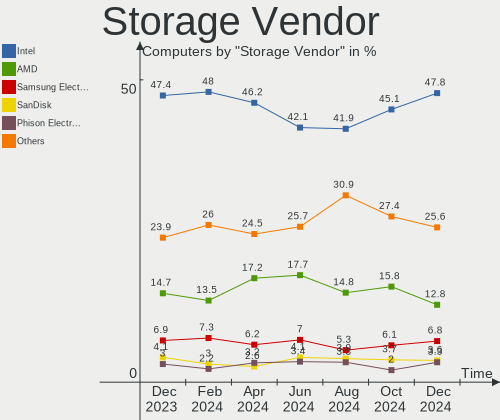
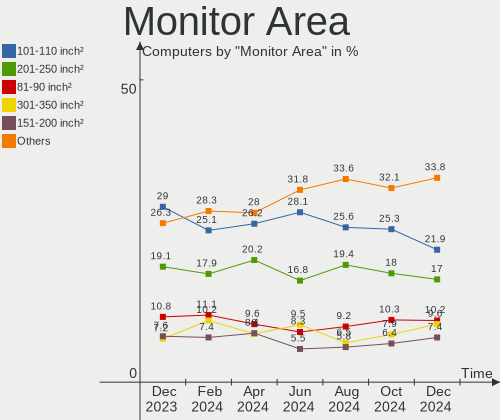
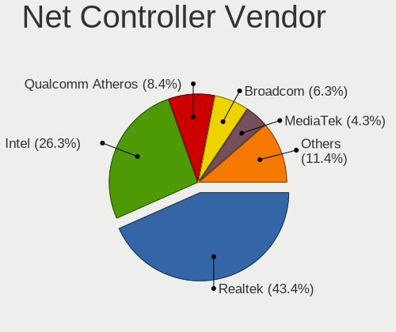
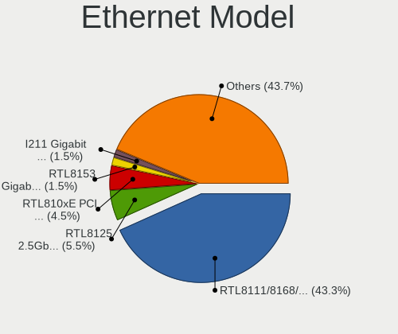
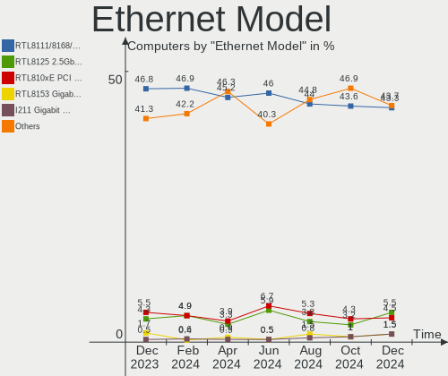
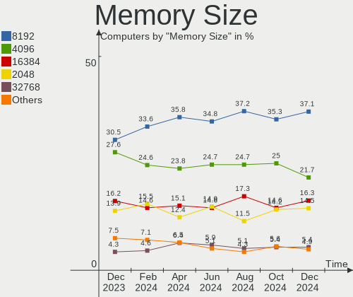
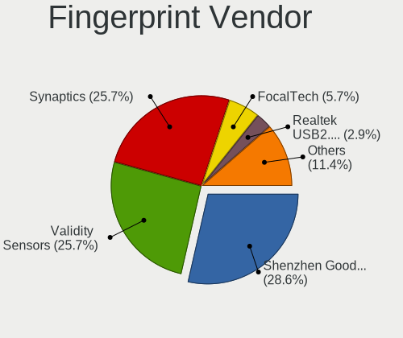
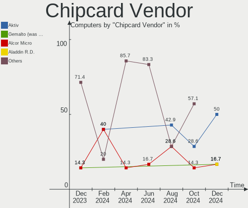
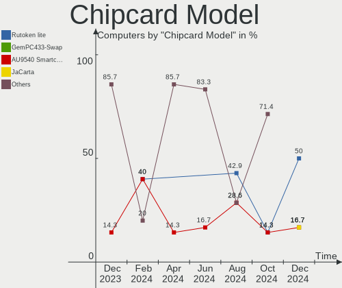
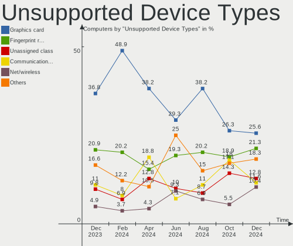

Linux in Russia - Hardware Trends
---------------------------------

A project to identify most popular hardware characteristics and track their change
over time based on data collected by Linux users at https://Linux-Hardware.org.

Anyone can contribute to this report by the [hw-probe](https://github.com/linuxhw/hw-probe) tool:

    sudo -E hw-probe -all -upload

This is a report for all computer types. See also reports for [desktops](/Location/Russia/Desktop/README.md) and [notebooks](/Location/Russia/Notebook/README.md).

Period: Jan, 2024.

Contents
--------

* [ System ](#system)
  - [ OS                       ](#os)
  - [ OS Family                ](#os-family)
  - [ Kernel                   ](#kernel)
  - [ Kernel Family            ](#kernel-family)
  - [ Kernel Major Ver.        ](#kernel-major-ver)
  - [ Arch                     ](#arch)
  - [ DE                       ](#de)
  - [ Display Server           ](#display-server)
  - [ Display Manager          ](#display-manager)
  - [ OS Lang                  ](#os-lang)
  - [ Boot Mode                ](#boot-mode)
  - [ Filesystem               ](#filesystem)
  - [ Part. scheme             ](#part-scheme)
  - [ Dual Boot with Linux/BSD ](#dual-boot-with-linuxbsd)
  - [ Dual Boot (Win)          ](#dual-boot-win)

* [ Board ](#board)
  - [ Vendor                   ](#vendor)
  - [ Model                    ](#model)
  - [ Model Family             ](#model-family)
  - [ MFG Year                 ](#mfg-year)
  - [ Form Factor              ](#form-factor)
  - [ Secure Boot              ](#secure-boot)
  - [ Coreboot                 ](#coreboot)
  - [ RAM Size                 ](#ram-size)
  - [ RAM Used                 ](#ram-used)
  - [ Total Drives             ](#total-drives)
  - [ Has CD-ROM               ](#has-cd-rom)
  - [ Has Ethernet             ](#has-ethernet)
  - [ Has WiFi                 ](#has-wifi)
  - [ Has Bluetooth            ](#has-bluetooth)

* [ Location ](#location)
  - [ Country                  ](#country)
  - [ City                     ](#city)

* [ Drives ](#drives)
  - [ Drive Vendor             ](#drive-vendor)
  - [ Drive Model              ](#drive-model)
  - [ HDD Vendor               ](#hdd-vendor)
  - [ SSD Vendor               ](#ssd-vendor)
  - [ Drive Kind               ](#drive-kind)
  - [ Drive Connector          ](#drive-connector)
  - [ Drive Size               ](#drive-size)
  - [ Space Total              ](#space-total)
  - [ Space Used               ](#space-used)
  - [ Malfunc. Drives          ](#malfunc-drives)
  - [ Malfunc. Drive Vendor    ](#malfunc-drive-vendor)
  - [ Malfunc. HDD Vendor      ](#malfunc-hdd-vendor)
  - [ Malfunc. Drive Kind      ](#malfunc-drive-kind)
  - [ Failed Drives            ](#failed-drives)
  - [ Failed Drive Vendor      ](#failed-drive-vendor)
  - [ Drive Status             ](#drive-status)

* [ Storage controller ](#storage-controller)
  - [ Storage Vendor           ](#storage-vendor)
  - [ Storage Model            ](#storage-model)
  - [ Storage Kind             ](#storage-kind)

* [ Processor ](#processor)
  - [ CPU Vendor               ](#cpu-vendor)
  - [ CPU Model                ](#cpu-model)
  - [ CPU Model Family         ](#cpu-model-family)
  - [ CPU Cores                ](#cpu-cores)
  - [ CPU Sockets              ](#cpu-sockets)
  - [ CPU Threads              ](#cpu-threads)
  - [ CPU Op-Modes             ](#cpu-op-modes)
  - [ CPU Microcode            ](#cpu-microcode)
  - [ CPU Microarch            ](#cpu-microarch)

* [ Graphics ](#graphics)
  - [ GPU Vendor               ](#gpu-vendor)
  - [ GPU Model                ](#gpu-model)
  - [ GPU Combo                ](#gpu-combo)
  - [ GPU Driver               ](#gpu-driver)
  - [ GPU Memory               ](#gpu-memory)

* [ Monitor ](#monitor)
  - [ Monitor Vendor           ](#monitor-vendor)
  - [ Monitor Model            ](#monitor-model)
  - [ Monitor Resolution       ](#monitor-resolution)
  - [ Monitor Diagonal         ](#monitor-diagonal)
  - [ Monitor Width            ](#monitor-width)
  - [ Aspect Ratio             ](#aspect-ratio)
  - [ Monitor Area             ](#monitor-area)
  - [ Pixel Density            ](#pixel-density)
  - [ Multiple Monitors        ](#multiple-monitors)

* [ Network ](#network)
  - [ Net Controller Vendor    ](#net-controller-vendor)
  - [ Net Controller Model     ](#net-controller-model)
  - [ Wireless Vendor          ](#wireless-vendor)
  - [ Wireless Model           ](#wireless-model)
  - [ Ethernet Vendor          ](#ethernet-vendor)
  - [ Ethernet Model           ](#ethernet-model)
  - [ Net Controller Kind      ](#net-controller-kind)
  - [ Used Controller          ](#used-controller)
  - [ NICs                     ](#nics)
  - [ IPv6                     ](#ipv6)

* [ Bluetooth ](#bluetooth)
  - [ Bluetooth Vendor         ](#bluetooth-vendor)
  - [ Bluetooth Model          ](#bluetooth-model)

* [ Sound ](#sound)
  - [ Sound Vendor             ](#sound-vendor)
  - [ Sound Model              ](#sound-model)

* [ Memory ](#memory)
  - [ Memory Vendor            ](#memory-vendor)
  - [ Memory Model             ](#memory-model)
  - [ Memory Kind              ](#memory-kind)
  - [ Memory Form Factor       ](#memory-form-factor)
  - [ Memory Size              ](#memory-size)
  - [ Memory Speed             ](#memory-speed)

* [ Printers & scanners ](#printers--scanners)
  - [ Printer Vendor           ](#printer-vendor)
  - [ Printer Model            ](#printer-model)
  - [ Scanner Vendor           ](#scanner-vendor)
  - [ Scanner Model            ](#scanner-model)

* [ Camera ](#camera)
  - [ Camera Vendor            ](#camera-vendor)
  - [ Camera Model             ](#camera-model)

* [ Security ](#security)
  - [ Fingerprint Vendor       ](#fingerprint-vendor)
  - [ Fingerprint Model        ](#fingerprint-model)
  - [ Chipcard Vendor          ](#chipcard-vendor)
  - [ Chipcard Model           ](#chipcard-model)

* [ Unsupported ](#unsupported)
  - [ Unsupported Devices      ](#unsupported-devices)
  - [ Unsupported Device Types ](#unsupported-device-types)

System
------

OS
--

Installed operating systems

| Name                         | Computers | Percent |
|------------------------------|-----------|---------|
| ROSA 12.4                    | 143       | 24.57%  |
| Debian 12                    | 78        | 13.4%   |
| Ubuntu 22.04                 | 52        | 8.93%   |
| Fedora 39                    | 39        | 6.7%    |
| OpenMandriva 5.0             | 20        | 3.44%   |
| Red OS 7.3                   | 18        | 3.09%   |
| Ubuntu 23.10                 | 15        | 2.58%   |
| ROSA 12                      | 15        | 2.58%   |
| Arch Rolling                 | 11        | 1.89%   |
| Manjaro                      | 10        | 1.72%   |
| Linux Mint 21.3              | 10        | 1.72%   |
| Linux Mint 21.2              | 8         | 1.37%   |
| ArcoLinux Rolling            | 8         | 1.37%   |
| Debian 11                    | 7         | 1.2%    |
| ALT Linux 10.2               | 7         | 1.2%    |
| ROSA R11.1                   | 6         | 1.03%   |
| Nobara 39                    | 6         | 1.03%   |
| Ubuntu 20.04                 | 4         | 0.69%   |
| Pop!_OS 22.04                | 4         | 0.69%   |
| openSUSE Tumbleweed-XXXXXXXX | 4         | 0.69%   |
| OpenMandriva 23.08           | 4         | 0.69%   |
| Manjaro 23.1.3               | 4         | 0.69%   |
| KDE neon 22.04               | 4         | 0.69%   |
| Fedora 38                    | 4         | 0.69%   |
| Debian                       | 4         | 0.69%   |
| Zorin 17                     | 3         | 0.52%   |
| Xubuntu 22.04                | 3         | 0.52%   |
| ROSA 13.0                    | 3         | 0.52%   |
| ROSA 12.2                    | 3         | 0.52%   |
| Kubuntu 23.10                | 3         | 0.52%   |
| Kubuntu 22.04                | 3         | 0.52%   |
| Elementary 7.1               | 3         | 0.52%   |
| Xubuntu 20.04                | 2         | 0.34%   |
| Xero Rolling                 | 2         | 0.34%   |
| Ubuntu 23.04                 | 2         | 0.34%   |
| ROSA 2021.1                  | 2         | 0.34%   |
| ROSA 12.3                    | 2         | 0.34%   |
| ROSA 12.1                    | 2         | 0.34%   |
| Red OS 8.0                   | 2         | 0.34%   |
| Red OS 7.2                   | 2         | 0.34%   |

OS Family
---------

OS without a version

| Name             | Computers | Percent |
|------------------|-----------|---------|
| ROSA             | 176       | 30.24%  |
| Debian           | 89        | 15.29%  |
| Ubuntu           | 75        | 12.89%  |
| Fedora           | 45        | 7.73%   |
| OpenMandriva     | 29        | 4.98%   |
| Red OS           | 24        | 4.12%   |
| Linux Mint       | 24        | 4.12%   |
| Manjaro          | 16        | 2.75%   |
| ALT Linux        | 12        | 2.06%   |
| Arch             | 11        | 1.89%   |
| Kubuntu          | 9         | 1.55%   |
| ArcoLinux        | 9         | 1.55%   |
| Xubuntu          | 7         | 1.2%    |
| Nobara           | 7         | 1.2%    |
| openSUSE         | 6         | 1.03%   |
| Pop!_OS          | 4         | 0.69%   |
| KDE neon         | 4         | 0.69%   |
| Zorin            | 3         | 0.52%   |
| NixOS            | 3         | 0.52%   |
| Kali             | 3         | 0.52%   |
| Elementary       | 3         | 0.52%   |
| Xero             | 2         | 0.34%   |
| SteamOS          | 2         | 0.34%   |
| org.kde.Platform | 2         | 0.34%   |
| MX               | 2         | 0.34%   |
| Lubuntu          | 2         | 0.34%   |
| Gentoo           | 2         | 0.34%   |
| Ubuntu MATE      | 1         | 0.17%   |
| RHEL             | 1         | 0.17%   |
| RED              | 1         | 0.17%   |
| PureOS           | 1         | 0.17%   |
| PostmarketOS     | 1         | 0.17%   |
| Pear OS          | 1         | 0.17%   |
| Neptune OS       | 1         | 0.17%   |
| Endless          | 1         | 0.17%   |
| Clear Linux      | 1         | 0.17%   |
| CentOS           | 1         | 0.17%   |
| Astra Linux      | 1         | 0.17%   |

Kernel
------

Version of the Linux kernel

| Version                                | Computers | Percent |
|----------------------------------------|-----------|---------|
| 6.1.58-generic-1rosa2021.1-x86_64      | 87        | 14.95%  |
| 6.1.0-4-amd64                          | 49        | 8.42%   |
| 6.1.20-generic-2rosa2021.1-x86_64      | 42        | 7.22%   |
| 6.5.0-14-generic                       | 30        | 5.15%   |
| 5.19.0-38-generic                      | 29        | 4.98%   |
| 6.6.2-desktop-1omv2390                 | 21        | 3.61%   |
| 6.1.52-1.el7.3.x86_64                  | 14        | 2.41%   |
| 6.6.9-200.fc39.x86_64                  | 13        | 2.23%   |
| 6.2.0-39-generic                       | 13        | 2.23%   |
| 6.1.0-17-amd64                         | 13        | 2.23%   |
| 5.15.0-91-generic                      | 12        | 2.06%   |
| 6.6.13-200.fc39.x86_64                 | 11        | 1.89%   |
| 6.5.6-300.fc39.x86_64                  | 8         | 1.37%   |
| 6.5.0-15-generic                       | 8         | 1.37%   |
| 6.6.10-1-MANJARO                       | 6         | 1.03%   |
| 5.15.103-generic-1rosa2021.1-i686      | 6         | 1.03%   |
| 6.7.0-204.fsync.fc39.x86_64            | 5         | 0.86%   |
| 6.1.0-15-amd64                         | 5         | 0.86%   |
| 5.4.83-generic-2rosa-x86_64            | 5         | 0.86%   |
| 5.10.184-generic-1rosa2021.1-x86_64    | 5         | 0.86%   |
| 6.7.0-arch3-1                          | 4         | 0.69%   |
| 6.5.0-9-generic                        | 4         | 0.69%   |
| 5.15.0-92-generic                      | 4         | 0.69%   |
| 5.10.74-generic-2rosa2021.1-x86_64     | 4         | 0.69%   |
| 6.7.1-arch1-1                          | 3         | 0.52%   |
| 6.7.0-0-MANJARO                        | 3         | 0.52%   |
| 6.6.9-arch1-1                          | 3         | 0.52%   |
| 6.6.1-arch1-1                          | 3         | 0.52%   |
| 6.2.16-19-pve                          | 3         | 0.52%   |
| 6.1.46-generic-2rosa2021.1-x86_64      | 3         | 0.52%   |
| 5.15.75-generic-1rosa2021.1-x86_64     | 3         | 0.52%   |
| 5.15.127-generic-1rosa2021.1-x86_64    | 3         | 0.52%   |
| 6.7.0-zen3-1-zen                       | 2         | 0.34%   |
| 6.6.8.xm1-1.k-xanmod-rosa2021.1-x86_64 | 2         | 0.34%   |
| 6.6.8-200.fc39.x86_64                  | 2         | 0.34%   |
| 6.6.8-100.fc38.x86_64                  | 2         | 0.34%   |
| 6.6.7-1-default                        | 2         | 0.34%   |
| 6.6.6-76060606-generic                 | 2         | 0.34%   |
| 6.6.6-1.red80.x86_64                   | 2         | 0.34%   |
| 6.6.11-200.fc39.x86_64                 | 2         | 0.34%   |

Kernel Family
-------------

Linux kernel without a distro release

| Version  | Computers | Percent |
|----------|-----------|---------|
| 6.1.58   | 89        | 15.29%  |
| 6.1.0    | 70        | 12.03%  |
| 6.5.0    | 47        | 8.08%   |
| 6.1.20   | 42        | 7.22%   |
| 5.19.0   | 31        | 5.33%   |
| 5.15.0   | 25        | 4.3%    |
| 6.6.9    | 22        | 3.78%   |
| 6.6.2    | 22        | 3.78%   |
| 6.7.0    | 18        | 3.09%   |
| 6.2.0    | 18        | 3.09%   |
| 6.1.52   | 15        | 2.58%   |
| 6.6.10   | 13        | 2.23%   |
| 6.6.13   | 11        | 1.89%   |
| 6.6.8    | 9         | 1.55%   |
| 6.5.6    | 8         | 1.37%   |
| 6.6.11   | 7         | 1.2%    |
| 5.15.103 | 7         | 1.2%    |
| 6.2.16   | 6         | 1.03%   |
| 5.4.0    | 6         | 1.03%   |
| 5.4.83   | 5         | 0.86%   |
| 5.10.74  | 5         | 0.86%   |
| 5.10.184 | 5         | 0.86%   |
| 6.6.6    | 4         | 0.69%   |
| 6.6.1    | 4         | 0.69%   |
| 6.5.11   | 4         | 0.69%   |
| 5.15.127 | 4         | 0.69%   |
| 6.7.1    | 3         | 0.52%   |
| 6.4.0    | 3         | 0.52%   |
| 6.1.46   | 3         | 0.52%   |
| 5.15.75  | 3         | 0.52%   |
| 4.15.0   | 3         | 0.52%   |
| 6.6.7    | 2         | 0.34%   |
| 6.6.5    | 2         | 0.34%   |
| 6.5.13   | 2         | 0.34%   |
| 6.4.8    | 2         | 0.34%   |
| 6.4.11   | 2         | 0.34%   |
| 6.1.71   | 2         | 0.34%   |
| 6.1.69   | 2         | 0.34%   |
| 5.4.150  | 2         | 0.34%   |
| 5.16.7   | 2         | 0.34%   |

Kernel Major Ver.
-----------------

Linux kernel major version

| Version | Computers | Percent |
|---------|-----------|---------|
| 6.1     | 229       | 39.35%  |
| 6.6     | 98        | 16.84%  |
| 6.5     | 65        | 11.17%  |
| 5.15    | 47        | 8.08%   |
| 5.19    | 31        | 5.33%   |
| 6.2     | 27        | 4.64%   |
| 5.10    | 22        | 3.78%   |
| 6.7     | 21        | 3.61%   |
| 5.4     | 15        | 2.58%   |
| 6.4     | 9         | 1.55%   |
| 4.15    | 4         | 0.69%   |
| 6.3     | 3         | 0.52%   |
| 5.16    | 3         | 0.52%   |
| 5.14    | 2         | 0.34%   |
| 4.19    | 2         | 0.34%   |
| 6       | 1         | 0.17%   |
| 5.8     | 1         | 0.17%   |
| 5.18    | 1         | 0.17%   |
| 4.18    | 1         | 0.17%   |

Arch
----

OS architecture (x86_64, i586, etc.)

| Name    | Computers | Percent |
|---------|-----------|---------|
| x86_64  | 565       | 97.08%  |
| i686    | 12        | 2.06%   |
| aarch64 | 4         | 0.69%   |
| armv7l  | 1         | 0.17%   |

DE
--

Desktop Environment

| Name             | Computers | Percent |
|------------------|-----------|---------|
| KDE5             | 194       | 33.33%  |
| GNOME            | 152       | 26.12%  |
| Unknown          | 105       | 18.04%  |
| MATE             | 30        | 5.15%   |
| XFCE             | 29        | 4.98%   |
| LXQt             | 24        | 4.12%   |
| X-Cinnamon       | 23        | 3.95%   |
| KDE4             | 6         | 1.03%   |
| Cinnamon         | 4         | 0.69%   |
| sway             | 3         | 0.52%   |
| Pantheon         | 3         | 0.52%   |
| i3               | 2         | 0.34%   |
| fly              | 2         | 0.34%   |
| ubuntu           | 1         | 0.17%   |
| lightdm-xsession | 1         | 0.17%   |
| Hyprland         | 1         | 0.17%   |
| GNOME Classic    | 1         | 0.17%   |
| dwm              | 1         | 0.17%   |

Display Server
--------------

X11 or Wayland

| Name    | Computers | Percent |
|---------|-----------|---------|
| Wayland | 234       | 40.21%  |
| X11     | 230       | 39.52%  |
| Unknown | 87        | 14.95%  |
| Tty     | 31        | 5.33%   |

Display Manager
---------------

SDDM, LightDM, etc.

| Name    | Computers | Percent |
|---------|-----------|---------|
| Unknown | 207       | 35.57%  |
| SDDM    | 171       | 29.38%  |
| GDM     | 91        | 15.64%  |
| LightDM | 58        | 9.97%   |
| GDM3    | 49        | 8.42%   |
| KDM     | 6         | 1.03%   |

OS Lang
-------

Language

| Lang    | Computers | Percent |
|---------|-----------|---------|
| ru_RU   | 440       | 75.6%   |
| en_US   | 97        | 16.67%  |
| C       | 37        | 6.36%   |
| Unknown | 4         | 0.69%   |
| ru      | 2         | 0.34%   |
| zh_CN   | 1         | 0.17%   |
| ru_UA   | 1         | 0.17%   |

Boot Mode
---------

EFI or BIOS

| Mode | Computers | Percent |
|------|-----------|---------|
| EFI  | 295       | 50.69%  |
| BIOS | 287       | 49.31%  |

Filesystem
----------

Type of filesystem

| Type     | Computers | Percent |
|----------|-----------|---------|
| Ext4     | 344       | 59.11%  |
| Overlay  | 99        | 17.01%  |
| Btrfs    | 91        | 15.64%  |
| Tmpfs    | 30        | 5.15%   |
| Zfs      | 7         | 1.2%    |
| Xfs      | 5         | 0.86%   |
| Unknown  | 3         | 0.52%   |
| Reiserfs | 1         | 0.17%   |
| F2fs     | 1         | 0.17%   |
| Ext2     | 1         | 0.17%   |

Part. scheme
------------

Scheme of partitioning

| Type    | Computers | Percent |
|---------|-----------|---------|
| GPT     | 298       | 51.2%   |
| MBR     | 155       | 26.63%  |
| Unknown | 129       | 22.16%  |

Dual Boot with Linux/BSD
------------------------

Hosting more than one Linux/BSD

| Dual boot | Computers | Percent |
|-----------|-----------|---------|
| No        | 472       | 81.1%   |
| Yes       | 110       | 18.9%   |

Dual Boot (Win)
---------------

Hosting Linux and Windows

| Dual boot | Computers | Percent |
|-----------|-----------|---------|
| No        | 375       | 64.43%  |
| Yes       | 207       | 35.57%  |

Board
-----

Vendor
------

Motherboard manufacturer

| Name                | Computers | Percent |
|---------------------|-----------|---------|
| ASUSTek Computer    | 133       | 22.85%  |
| Lenovo              | 52        | 8.93%   |
| Gigabyte Technology | 50        | 8.59%   |
| MSI                 | 37        | 6.36%   |
| Hewlett-Packard     | 33        | 5.67%   |
| Acer                | 30        | 5.15%   |
| ASRock              | 29        | 4.98%   |
| Supermicro          | 24        | 4.12%   |
| Intel               | 21        | 3.61%   |
| HUAWEI              | 21        | 3.61%   |
| Unknown             | 18        | 3.09%   |
| Dell                | 11        | 1.89%   |
| Aquarius            | 10        | 1.72%   |
| ETegro Technologies | 8         | 1.37%   |
| Samsung Electronics | 6         | 1.03%   |
| Huanan              | 5         | 0.86%   |
| ECS                 | 5         | 0.86%   |
| Apple               | 5         | 0.86%   |
| Packard Bell        | 4         | 0.69%   |
| Clevo               | 4         | 0.69%   |
| Timi                | 3         | 0.52%   |
| Sony                | 3         | 0.52%   |
| Pegatron            | 3         | 0.52%   |
| OEM                 | 3         | 0.52%   |
| HONOR               | 3         | 0.52%   |
| Foxconn             | 3         | 0.52%   |
| eMachines           | 3         | 0.52%   |
| Chuwi               | 3         | 0.52%   |
| Biostar             | 3         | 0.52%   |
| SZMZ                | 2         | 0.34%   |
| Rockchip            | 2         | 0.34%   |
| newplatforms        | 2         | 0.34%   |
| Maibenben           | 2         | 0.34%   |
| MACHINIST           | 2         | 0.34%   |
| MACHENIKE           | 2         | 0.34%   |
| LTD Delovoy Office  | 2         | 0.34%   |
| IBM                 | 2         | 0.34%   |
| Fujitsu             | 2         | 0.34%   |
| AZW                 | 2         | 0.34%   |
| Valve               | 1         | 0.17%   |

Model
-----

Motherboard model

| Name                                     | Computers | Percent |
|------------------------------------------|-----------|---------|
| Unknown                                  | 20        | 3.44%   |
| ASUS P5QL-CM                             | 13        | 2.23%   |
| ASUS All Series                          | 9         | 1.55%   |
| Aquarius NS585                           | 9         | 1.55%   |
| ETegro Hyperion RS125 G4                 | 8         | 1.37%   |
| Supermicro X8DTU                         | 5         | 0.86%   |
| Intel SKYBAY                             | 5         | 0.86%   |
| Supermicro SYS-1028R-TDW                 | 4         | 0.69%   |
| HUAWEI BOM-WXX9                          | 4         | 0.69%   |
| Supermicro X9DRW                         | 3         | 0.52%   |
| MSI MS-7C56                              | 3         | 0.52%   |
| MSI MS-7996                              | 3         | 0.52%   |
| Lenovo IdeaPad L340-15API 81LW           | 3         | 0.52%   |
| HP Pavilion 15                           | 3         | 0.52%   |
| Gigabyte H81M-S1                         | 3         | 0.52%   |
| ASUS VivoBook_ASUSLaptop M6500QC_M6500QC | 3         | 0.52%   |
| ASRock B365M-ITX/ac                      | 3         | 0.52%   |
| Supermicro X8DTT                         | 2         | 0.34%   |
| Supermicro SYS-6018R-MTR                 | 2         | 0.34%   |
| Rockchip RK3318 BOX                      | 2         | 0.34%   |
| LTD Delovoy Office EVE 1470D ES1278EW    | 2         | 0.34%   |
| Lenovo G50-30 80G0                       | 2         | 0.34%   |
| Intel X99                                | 2         | 0.34%   |
| HP ProBook 445 G7                        | 2         | 0.34%   |
| HP Laptop 15s-eq2xxx                     | 2         | 0.34%   |
| Gigabyte H470M K                         | 2         | 0.34%   |
| Gigabyte H410M H V3                      | 2         | 0.34%   |
| Foxconn G33M03                           | 2         | 0.34%   |
| ECS G31T-M9                              | 2         | 0.34%   |
| Clevo NL41MU2                            | 2         | 0.34%   |
| ASUS Vivobook Go E1504FA_E1504FA         | 2         | 0.34%   |
| ASUS TUF B450M-PLUS GAMING               | 2         | 0.34%   |
| ASUS PRIME B450M-A II                    | 2         | 0.34%   |
| ASUS P5GC-MX/1333                        | 2         | 0.34%   |
| ASUS H110M-R                             | 2         | 0.34%   |
| ASUS A88X-PLUS/USB                       | 2         | 0.34%   |
| ASRock G31M-GS                           | 2         | 0.34%   |
| ASRock B550 Phantom Gaming 4             | 2         | 0.34%   |
| Acer Aspire ES1-531                      | 2         | 0.34%   |
| Acer Aspire A315-24P                     | 2         | 0.34%   |

Model Family
------------

Motherboard model prefix

| Name                     | Computers | Percent |
|--------------------------|-----------|---------|
| Acer Aspire              | 22        | 3.78%   |
| Unknown                  | 20        | 3.44%   |
| ASUS VivoBook            | 18        | 3.09%   |
| Lenovo ThinkPad          | 13        | 2.23%   |
| ASUS P5QL-CM             | 13        | 2.23%   |
| Lenovo IdeaPad           | 12        | 2.06%   |
| ASUS PRIME               | 12        | 2.06%   |
| ASUS All                 | 9         | 1.55%   |
| Aquarius NS585           | 9         | 1.55%   |
| HP ProBook               | 8         | 1.37%   |
| ETegro Hyperion          | 8         | 1.37%   |
| HP Pavilion              | 7         | 1.2%    |
| Dell Inspiron            | 6         | 1.03%   |
| ASUS TUF                 | 6         | 1.03%   |
| Supermicro X8DTU         | 5         | 0.86%   |
| Intel SKYBAY             | 5         | 0.86%   |
| ASUS ROG                 | 5         | 0.86%   |
| Supermicro SYS-1028R-TDW | 4         | 0.69%   |
| Packard Bell EasyNote    | 4         | 0.69%   |
| Lenovo Legion            | 4         | 0.69%   |
| HUAWEI BOM-WXX9          | 4         | 0.69%   |
| HP Laptop                | 4         | 0.69%   |
| HP EliteBook             | 4         | 0.69%   |
| HP Compaq                | 4         | 0.69%   |
| Supermicro X9DRW         | 3         | 0.52%   |
| MSI MS-7C56              | 3         | 0.52%   |
| MSI MS-7996              | 3         | 0.52%   |
| MSI Katana               | 3         | 0.52%   |
| Intel X99                | 3         | 0.52%   |
| Gigabyte H81M-S1         | 3         | 0.52%   |
| Gigabyte B550M           | 3         | 0.52%   |
| Gigabyte B450M           | 3         | 0.52%   |
| ASUS P7H55-M             | 3         | 0.52%   |
| ASUS ASUS                | 3         | 0.52%   |
| ASRock B365M-ITX         | 3         | 0.52%   |
| Supermicro X8DTT         | 2         | 0.34%   |
| Supermicro SYS-6018R-MTR | 2         | 0.34%   |
| Rockchip RK3318          | 2         | 0.34%   |
| MSI PRO                  | 2         | 0.34%   |
| LTD Delovoy Office EVE   | 2         | 0.34%   |

MFG Year
--------

Motherboard manufacture year

| Year    | Computers | Percent |
|---------|-----------|---------|
| 2022    | 71        | 12.2%   |
| 2021    | 60        | 10.31%  |
| 2019    | 43        | 7.39%   |
| 2020    | 41        | 7.04%   |
| 2013    | 41        | 7.04%   |
| 2012    | 41        | 7.04%   |
| 2023    | 39        | 6.7%    |
| 2018    | 36        | 6.19%   |
| 2010    | 33        | 5.67%   |
| 2011    | 30        | 5.15%   |
| 2008    | 28        | 4.81%   |
| 2009    | 26        | 4.47%   |
| 2015    | 19        | 3.26%   |
| 2014    | 18        | 3.09%   |
| 2016    | 17        | 2.92%   |
| 2017    | 13        | 2.23%   |
| 2007    | 12        | 2.06%   |
| 2006    | 6         | 1.03%   |
| Unknown | 5         | 0.86%   |
| 2005    | 1         | 0.17%   |
| 2004    | 1         | 0.17%   |
| 2003    | 1         | 0.17%   |

Form Factor
-----------

Physical design of the computer

| Name           | Computers | Percent |
|----------------|-----------|---------|
| Desktop        | 261       | 44.85%  |
| Notebook       | 258       | 44.33%  |
| Server         | 32        | 5.5%    |
| All in one     | 10        | 1.72%   |
| Mini pc        | 8         | 1.37%   |
| Convertible    | 5         | 0.86%   |
| System on chip | 4         | 0.69%   |
| Tablet         | 4         | 0.69%   |

Secure Boot
-----------

Enabled or disabled

| State    | Computers | Percent |
|----------|-----------|---------|
| Disabled | 560       | 96.22%  |
| Enabled  | 22        | 3.78%   |

Coreboot
--------

Have coreboot on board

| Used | Computers | Percent |
|------|-----------|---------|
| No   | 579       | 99.48%  |
| Yes  | 3         | 0.52%   |

RAM Size
--------

Total RAM memory

| Size in GB      | Computers | Percent |
|-----------------|-----------|---------|
| 4.01-8.0        | 137       | 23.54%  |
| 16.01-24.0      | 106       | 18.21%  |
| 8.01-16.0       | 100       | 17.18%  |
| 3.01-4.0        | 92        | 15.81%  |
| 32.01-64.0      | 61        | 10.48%  |
| 1.01-2.0        | 34        | 5.84%   |
| 64.01-256.0     | 26        | 4.47%   |
| 2.01-3.0        | 8         | 1.37%   |
| 24.01-32.0      | 7         | 1.2%    |
| More than 256.0 | 6         | 1.03%   |
| 0.51-1.0        | 4         | 0.69%   |
| 0.01-0.5        | 1         | 0.17%   |

RAM Used
--------

Used RAM memory

| Used GB     | Computers | Percent |
|-------------|-----------|---------|
| 1.01-2.0    | 201       | 34.54%  |
| 2.01-3.0    | 107       | 18.38%  |
| 0.51-1.0    | 89        | 15.29%  |
| 4.01-8.0    | 82        | 14.09%  |
| 3.01-4.0    | 67        | 11.51%  |
| 8.01-16.0   | 21        | 3.61%   |
| 0.01-0.5    | 8         | 1.37%   |
| 16.01-24.0  | 3         | 0.52%   |
| 64.01-256.0 | 2         | 0.34%   |
| 32.01-64.0  | 1         | 0.17%   |
| 24.01-32.0  | 1         | 0.17%   |

Total Drives
------------

Number of drives on board

| Drives | Computers | Percent |
|--------|-----------|---------|
| 1      | 367       | 63.06%  |
| 2      | 126       | 21.65%  |
| 3      | 48        | 8.25%   |
| 4      | 16        | 2.75%   |
| 6      | 7         | 1.2%    |
| 5      | 7         | 1.2%    |
| 7      | 4         | 0.69%   |
| 0      | 3         | 0.52%   |
| 8      | 2         | 0.34%   |
| 70     | 1         | 0.17%   |
| 19     | 1         | 0.17%   |

Has CD-ROM
----------

Has CD-ROM on board

| Presented | Computers | Percent |
|-----------|-----------|---------|
| No        | 439       | 75.43%  |
| Yes       | 143       | 24.57%  |

Has Ethernet
------------

Has Ethernet on board

| Presented | Computers | Percent |
|-----------|-----------|---------|
| Yes       | 493       | 84.71%  |
| No        | 89        | 15.29%  |

Has WiFi
--------

Has WiFi module

| Presented | Computers | Percent |
|-----------|-----------|---------|
| Yes       | 361       | 62.03%  |
| No        | 221       | 37.97%  |

Has Bluetooth
-------------

Has Bluetooth module

| Presented | Computers | Percent |
|-----------|-----------|---------|
| Yes       | 292       | 50.17%  |
| No        | 290       | 49.83%  |

Location
--------

Country
-------

Geographic location (country)

| Country | Computers | Percent |
|---------|-----------|---------|
| Russia  | 582       | 100%    |

City
----

Geographic location (city)

| City             | Computers | Percent |
|------------------|-----------|---------|
| Moscow           | 135       | 23.2%   |
| Voronezh         | 55        | 9.45%   |
| St Petersburg    | 47        | 8.08%   |
| Novosibirsk      | 14        | 2.41%   |
| Yekaterinburg    | 13        | 2.23%   |
| Perm             | 11        | 1.89%   |
| Krasnodar        | 11        | 1.89%   |
| Chelyabinsk      | 11        | 1.89%   |
| Krasnoyarsk      | 9         | 1.55%   |
| Ufa              | 8         | 1.37%   |
| Volgograd        | 7         | 1.2%    |
| Samara           | 7         | 1.2%    |
| Kazan’         | 7         | 1.2%    |
| Tver             | 6         | 1.03%   |
| Surgut           | 6         | 1.03%   |
| Saratov          | 6         | 1.03%   |
| Rostov-on-Don    | 6         | 1.03%   |
| Khabarovsk       | 6         | 1.03%   |
| Tambov           | 5         | 0.86%   |
| Nizhniy Novgorod | 5         | 0.86%   |
| Kemerovo         | 5         | 0.86%   |
| Barnaul          | 5         | 0.86%   |
| Vladivostok      | 4         | 0.69%   |
| Ulyanovsk        | 4         | 0.69%   |
| Saransk          | 4         | 0.69%   |
| Orenburg         | 4         | 0.69%   |
| Novy Urengoy     | 4         | 0.69%   |
| Irkutsk          | 4         | 0.69%   |
| Bryansk          | 4         | 0.69%   |
| Yaroslavl        | 3         | 0.52%   |
| Vladimir         | 3         | 0.52%   |
| Vidnoye          | 3         | 0.52%   |
| Tolyatti         | 3         | 0.52%   |
| Ramenskoye       | 3         | 0.52%   |
| Penza            | 3         | 0.52%   |
| Omsk             | 3         | 0.52%   |
| Murom            | 3         | 0.52%   |
| Lipetsk          | 3         | 0.52%   |
| Kirov            | 3         | 0.52%   |
| Dolgoprudnyy     | 3         | 0.52%   |

Drives
------

Drive Vendor
------------

Hard drive vendors

| Vendor                      | Computers | Drives | Percent |
|-----------------------------|-----------|--------|---------|
| WDC                         | 142       | 168    | 17.05%  |
| Samsung Electronics         | 89        | 110    | 10.68%  |
| Seagate                     | 79        | 110    | 9.48%   |
| Toshiba                     | 48        | 105    | 5.76%   |
| Kingston                    | 47        | 52     | 5.64%   |
| A-DATA Technology           | 31        | 31     | 3.72%   |
| Hitachi                     | 29        | 36     | 3.48%   |
| Unknown                     | 26        | 27     | 3.12%   |
| Sandisk                     | 21        | 22     | 2.52%   |
| Intel                       | 20        | 27     | 2.4%    |
| SK hynix                    | 19        | 19     | 2.28%   |
| China                       | 19        | 19     | 2.28%   |
| Silicon Motion              | 16        | 16     | 1.92%   |
| Fujitsu                     | 13        | 14     | 1.56%   |
| HGST                        | 12        | 12     | 1.44%   |
| Apacer                      | 12        | 12     | 1.44%   |
| Micron Technology           | 11        | 11     | 1.32%   |
| Unknown                     | 11        | 11     | 1.32%   |
| Crucial                     | 10        | 14     | 1.2%    |
| Phison Electronics          | 9         | 10     | 1.08%   |
| Netac                       | 8         | 8      | 0.96%   |
| MAXIO Technology (Hangzhou) | 8         | 8      | 0.96%   |
| JMicron Technology          | 8         | 8      | 0.96%   |
| XrayDisk                    | 7         | 7      | 0.84%   |
| Patriot                     | 7         | 7      | 0.84%   |
| KIOXIA                      | 7         | 7      | 0.84%   |
| Phison                      | 6         | 6      | 0.72%   |
| Smartbuy                    | 5         | 5      | 0.6%    |
| Kingston Technology Company | 5         | 5      | 0.6%    |
| AMD                         | 5         | 5      | 0.6%    |
| SPCC                        | 4         | 4      | 0.48%   |
| Plextor                     | 4         | 4      | 0.48%   |
| Lenovo                      | 4         | 18     | 0.48%   |
| KingSpec                    | 4         | 4      | 0.48%   |
| Hewlett-Packard             | 4         | 7      | 0.48%   |
| DEXP                        | 4         | 4      | 0.48%   |
| Union Memory                | 3         | 3      | 0.36%   |
| Team                        | 3         | 3      | 0.36%   |
| SSSTC                       | 3         | 3      | 0.36%   |
| Qumo                        | 3         | 4      | 0.36%   |

Drive Model
-----------

Hard drive models

| Model                                                 | Computers | Percent |
|-------------------------------------------------------|-----------|---------|
| WDC WD3200AAJS-00L7A0 320GB                           | 14        | 1.57%   |
| Samsung NVMe SSD Controller SM981/PM981/PM983 1TB     | 12        | 1.34%   |
| Kingston SA400S37480G 480GB SSD                       | 12        | 1.34%   |
| Unknown                                               | 11        | 1.23%   |
| A-DATA SU800 512GB SSD                                | 10        | 1.12%   |
| Seagate ST1000DM010-2EP102 1TB                        | 8         | 0.89%   |
| JMicron Generic 8GB                                   | 8         | 0.89%   |
| WDC WDS500G2B0A-00SM50 500GB SSD                      | 7         | 0.78%   |
| WDC WD10EZEX-00BBHA0 1TB                              | 7         | 0.78%   |
| Toshiba HDWD110 1TB                                   | 7         | 0.78%   |
| Samsung NVMe SSD Controller PM9A1/PM9A3/980PRO 2TB    | 7         | 0.78%   |
| Kingston SA400S37240G 240GB SSD                       | 7         | 0.78%   |
| Toshiba DT01ACA050 500GB                              | 6         | 0.67%   |
| Samsung SSD 860 EVO 250GB                             | 6         | 0.67%   |
| Fujitsu MBE2147RC 147GB                               | 6         | 0.67%   |
| Silicon Motion SM2263EN/SM2263XT SSD Controller 128GB | 5         | 0.56%   |
| Silicon Motion PCIe-8 SSD 512GB                       | 5         | 0.56%   |
| MAXIO (Hangzhou) NVMe SSD Controller MAP1202 512GB    | 5         | 0.56%   |
| Intel SSDPEKNU512GZ 512GB                             | 5         | 0.56%   |
| Unknown MMC Card  64GB                                | 4         | 0.45%   |
| Unknown MMC Card  128GB                               | 4         | 0.45%   |
| Toshiba MQ04ABF100 1TB                                | 4         | 0.45%   |
| Toshiba MQ01ABF050 500GB                              | 4         | 0.45%   |
| SK hynix HFM512GD3JX013N 512GB                        | 4         | 0.45%   |
| SK hynix HFM001TD3JX013N 1024GB                       | 4         | 0.45%   |
| Seagate ST500LT012-1DG142 500GB                       | 4         | 0.45%   |
| Seagate ST500DM002-1BD142 500GB                       | 4         | 0.45%   |
| SanDisk NVMe SSD Drive 512GB                          | 4         | 0.45%   |
| Samsung SSD 980 PRO 1TB                               | 4         | 0.45%   |
| Samsung SSD 870 EVO 500GB                             | 4         | 0.45%   |
| Samsung MZVLW128HEGR-00000 128GB                      | 4         | 0.45%   |
| HGST HTE721010A9E630 1TB                              | 4         | 0.45%   |
| China SSD 512GB                                       | 4         | 0.45%   |
| China SSD 128GB                                       | 4         | 0.45%   |
| Apacer AS350 512GB SSD                                | 4         | 0.45%   |
| Apacer AS350 128GB SSD                                | 4         | 0.45%   |
| WDC WDS240G2G0A-00JH30 240GB SSD                      | 3         | 0.34%   |
| Unknown SD/MMC/MS PRO 256GB                           | 3         | 0.34%   |
| Toshiba HDWL110 1TB                                   | 3         | 0.34%   |
| Seagate ST3500418AS 500GB                             | 3         | 0.34%   |

HDD Vendor
----------

Hard disk drive vendors

| Vendor              | Computers | Drives | Percent |
|---------------------|-----------|--------|---------|
| WDC                 | 118       | 140    | 37.22%  |
| Seagate             | 78        | 108    | 24.61%  |
| Toshiba             | 44        | 100    | 13.88%  |
| Hitachi             | 29        | 36     | 9.15%   |
| Fujitsu             | 13        | 14     | 4.1%    |
| HGST                | 12        | 12     | 3.79%   |
| JMicron Technology  | 8         | 8      | 2.52%   |
| Samsung Electronics | 5         | 5      | 1.58%   |
| Unknown             | 3         | 3      | 0.95%   |
| Maxtor              | 2         | 2      | 0.63%   |
| Lenovo              | 2         | 16     | 0.63%   |
| TO Exter            | 1         | 1      | 0.32%   |
| Hewlett-Packard     | 1         | 4      | 0.32%   |
| FC-1307             | 1         | 1      | 0.32%   |

SSD Vendor
----------

Solid state drive vendors

| Vendor              | Computers | Drives | Percent |
|---------------------|-----------|--------|---------|
| Kingston            | 38        | 41     | 13.82%  |
| Samsung Electronics | 33        | 38     | 12%     |
| A-DATA Technology   | 26        | 26     | 9.45%   |
| WDC                 | 21        | 22     | 7.64%   |
| China               | 19        | 19     | 6.91%   |
| Apacer              | 12        | 12     | 4.36%   |
| Intel               | 9         | 12     | 3.27%   |
| Crucial             | 7         | 11     | 2.55%   |
| Unknown             | 7         | 7      | 2.55%   |
| XrayDisk            | 6         | 6      | 2.18%   |
| SanDisk             | 6         | 6      | 2.18%   |
| Patriot             | 6         | 6      | 2.18%   |
| Netac               | 5         | 5      | 1.82%   |
| AMD                 | 5         | 5      | 1.82%   |
| SPCC                | 4         | 4      | 1.45%   |
| Smartbuy            | 4         | 4      | 1.45%   |
| Plextor             | 4         | 4      | 1.45%   |
| KingSpec            | 4         | 4      | 1.45%   |
| DEXP                | 4         | 4      | 1.45%   |
| Team                | 3         | 3      | 1.09%   |
| Qumo                | 3         | 4      | 1.09%   |
| Micron Technology   | 3         | 3      | 1.09%   |
| Innodisk            | 3         | 3      | 1.09%   |
| Hewlett-Packard     | 3         | 3      | 1.09%   |
| Digma               | 3         | 3      | 1.09%   |
| SK hynix            | 2         | 2      | 0.73%   |
| Lenovo              | 2         | 2      | 0.73%   |
| HS-SSD-E100         | 2         | 2      | 0.73%   |
| GS                  | 2         | 2      | 0.73%   |
| Gigabyte Technology | 2         | 2      | 0.73%   |
| Vaseky              | 1         | 1      | 0.36%   |
| Union Memory        | 1         | 1      | 0.36%   |
| TXRUI               | 1         | 1      | 0.36%   |
| Toshiba             | 1         | 1      | 0.36%   |
| T-FORCE             | 1         | 1      | 0.36%   |
| SCCTS-602-128G      | 1         | 1      | 0.36%   |
| Pioneer             | 1         | 1      | 0.36%   |
| OCZ                 | 1         | 1      | 0.36%   |
| NT-2TB              | 1         | 1      | 0.36%   |
| MSI                 | 1         | 1      | 0.36%   |

Drive Kind
----------

HDD or SSD

| Kind    | Computers | Drives | Percent |
|---------|-----------|--------|---------|
| HDD     | 276       | 450    | 37.05%  |
| SSD     | 242       | 293    | 32.48%  |
| NVMe    | 198       | 240    | 26.58%  |
| MMC     | 22        | 24     | 2.95%   |
| Unknown | 7         | 7      | 0.94%   |

Drive Connector
---------------

SATA, SAS, NVMe, etc.

| Type | Computers | Drives | Percent |
|------|-----------|--------|---------|
| SATA | 413       | 704    | 61.37%  |
| NVMe | 198       | 237    | 29.42%  |
| SAS  | 40        | 49     | 5.94%   |
| MMC  | 22        | 24     | 3.27%   |

Drive Size
----------

Size of hard drive

| Size in TB | Computers | Drives | Percent |
|------------|-----------|--------|---------|
| 0.01-0.5   | 322       | 474    | 62.52%  |
| 0.51-1.0   | 146       | 190    | 28.35%  |
| 1.01-2.0   | 21        | 25     | 4.08%   |
| 3.01-4.0   | 11        | 21     | 2.14%   |
| 2.01-3.0   | 7         | 21     | 1.36%   |
| 4.01-10.0  | 6         | 10     | 1.17%   |
| 10.01-20.0 | 2         | 2      | 0.39%   |

Space Total
-----------

Amount of disk space available on the file system

| Size in GB     | Computers | Percent |
|----------------|-----------|---------|
| 101-250        | 135       | 23.2%   |
| 251-500        | 130       | 22.34%  |
| Unknown        | 92        | 15.81%  |
| 501-1000       | 80        | 13.75%  |
| 1001-2000      | 40        | 6.87%   |
| 1-20           | 33        | 5.67%   |
| 51-100         | 33        | 5.67%   |
| More than 3000 | 19        | 3.26%   |
| 21-50          | 12        | 2.06%   |
| 2001-3000      | 8         | 1.37%   |

Space Used
----------

Amount of used disk space

| Used GB        | Computers | Percent |
|----------------|-----------|---------|
| 1-20           | 212       | 36.43%  |
| Unknown        | 92        | 15.81%  |
| 21-50          | 89        | 15.29%  |
| 101-250        | 63        | 10.82%  |
| 251-500        | 45        | 7.73%   |
| 51-100         | 40        | 6.87%   |
| 501-1000       | 24        | 4.12%   |
| More than 3000 | 8         | 1.37%   |
| 1001-2000      | 8         | 1.37%   |
| 2001-3000      | 1         | 0.17%   |

Malfunc. Drives
---------------

Drive models with a malfunction

| Model                                          | Computers | Drives | Percent |
|------------------------------------------------|-----------|--------|---------|
| WDC WD3200AAJS-00L7A0 320GB                    | 9         | 9      | 9.68%   |
| Seagate ST320LT020-9YG142 320GB                | 3         | 3      | 3.23%   |
| WDC WD2500AAJS-00L7A0 250GB                    | 2         | 2      | 2.15%   |
| WDC WD1602ABYS-23B7A0 39M4507 42C0462IBM 160GB | 2         | 2      | 2.15%   |
| Toshiba MQ01ABF050 500GB                       | 2         | 2      | 2.15%   |
| Samsung Electronics SSD 870 EVO 500GB          | 2         | 2      | 2.15%   |
| Hitachi HDS721050CLA362 500GB                  | 2         | 2      | 2.15%   |
| WDC WDS240G3G0A-00BJG0 240GB SSD               | 1         | 1      | 1.08%   |
| WDC WDS240G2G0A-00JH30 240GB SSD               | 1         | 1      | 1.08%   |
| WDC WDS240G1G0B-00RC30 240GB SSD               | 1         | 1      | 1.08%   |
| WDC WD7500BPVT-08HXZT3 752GB                   | 1         | 1      | 1.08%   |
| WDC WD7500AARS-00Y5B1 752GB                    | 1         | 1      | 1.08%   |
| WDC WD6400AARS-00Y5B1 640GB                    | 1         | 1      | 1.08%   |
| WDC WD5002AALX-00J37A0 500GB                   | 1         | 1      | 1.08%   |
| WDC WD5000LPVX-22V0TT0 500GB                   | 1         | 1      | 1.08%   |
| WDC WD5000BPVT-00HXZT1 500GB                   | 1         | 1      | 1.08%   |
| WDC WD5000AAKX-60U6AA0 500GB                   | 1         | 1      | 1.08%   |
| WDC WD5000AAKX-08U6AA0 500GB                   | 1         | 1      | 1.08%   |
| WDC WD5000AAKX-001CA0 500GB                    | 1         | 1      | 1.08%   |
| WDC WD5000AAKS-75A7B2 500GB                    | 1         | 1      | 1.08%   |
| WDC WD5000AADS-00S9B0 500GB                    | 1         | 1      | 1.08%   |
| WDC WD3200BPVT-22JJ5T0 320GB                   | 1         | 1      | 1.08%   |
| WDC WD3200BEKT-22A25T1 320GB                   | 1         | 1      | 1.08%   |
| WDC WD3200AAKS-22B3A0 320GB                    | 1         | 1      | 1.08%   |
| WDC WD2502ABYS-23B7A0 39M4511 42C0463IBM 250GB | 1         | 2      | 1.08%   |
| WDC WD1600BEKT-00F3T0 160GB                    | 1         | 1      | 1.08%   |
| WDC WD1600AAJS-60PSA0 160GB                    | 1         | 1      | 1.08%   |
| WDC WD10JPVT-60A1YT0 1TB                       | 1         | 1      | 1.08%   |
| WDC WD10EZEX-60ZF5A0 1TB                       | 1         | 1      | 1.08%   |
| WDC WD10EZEX-21WN4A0 1TB                       | 1         | 1      | 1.08%   |
| WDC WD10EURX-63FH1Y0 1TB                       | 1         | 1      | 1.08%   |
| WDC WD10EARS-00MVWB0 1TB                       | 1         | 1      | 1.08%   |
| WDC WD10EALX-009BA0 1TB                        | 1         | 1      | 1.08%   |
| WDC WD1003FBYX-01Y7B0 1TB                      | 1         | 1      | 1.08%   |
| WDC WD Blue SA510 2.5 500GB                    | 1         | 1      | 1.08%   |
| Toshiba MQ04ABF100 1TB                         | 1         | 1      | 1.08%   |
| Toshiba MK6475GSX 640GB                        | 1         | 1      | 1.08%   |
| Toshiba MK5075GSX 500GB                        | 1         | 1      | 1.08%   |
| Toshiba MK1234GSX 120GB                        | 1         | 1      | 1.08%   |
| Toshiba MG04ACA100N 1TB                        | 1         | 1      | 1.08%   |

Malfunc. Drive Vendor
---------------------

Vendors of faulty drives

| Vendor              | Computers | Drives | Percent |
|---------------------|-----------|--------|---------|
| WDC                 | 39        | 42     | 43.33%  |
| Seagate             | 15        | 15     | 16.67%  |
| Hitachi             | 10        | 10     | 11.11%  |
| Toshiba             | 6         | 7      | 6.67%   |
| Samsung Electronics | 4         | 4      | 4.44%   |
| HGST                | 3         | 3      | 3.33%   |
| Kingston            | 2         | 2      | 2.22%   |
| Intel               | 2         | 2      | 2.22%   |
| China               | 2         | 2      | 2.22%   |
| A-DATA Technology   | 2         | 2      | 2.22%   |
| Silicon Motion      | 1         | 1      | 1.11%   |
| GS                  | 1         | 1      | 1.11%   |
| Fujitsu             | 1         | 1      | 1.11%   |
| AMD                 | 1         | 1      | 1.11%   |
| Unknown             | 1         | 1      | 1.11%   |

Malfunc. HDD Vendor
-------------------

Vendors of faulty HDD drives

| Vendor              | Computers | Drives | Percent |
|---------------------|-----------|--------|---------|
| WDC                 | 35        | 38     | 49.3%   |
| Seagate             | 15        | 15     | 21.13%  |
| Hitachi             | 10        | 10     | 14.08%  |
| Toshiba             | 6         | 7      | 8.45%   |
| HGST                | 3         | 3      | 4.23%   |
| Samsung Electronics | 1         | 1      | 1.41%   |
| Fujitsu             | 1         | 1      | 1.41%   |

Malfunc. Drive Kind
-------------------

Kinds of faulty drives

| Kind | Computers | Drives | Percent |
|------|-----------|--------|---------|
| HDD  | 69        | 75     | 78.41%  |
| SSD  | 18        | 18     | 20.45%  |
| NVMe | 1         | 1      | 1.14%   |

Failed Drives
-------------

Failed drive models

| Model                     | Computers | Drives | Percent |
|---------------------------|-----------|--------|---------|
| Seagate ST3250310AS 250GB | 1         | 1      | 100%    |

Failed Drive Vendor
-------------------

Failed drive vendors

| Vendor  | Computers | Drives | Percent |
|---------|-----------|--------|---------|
| Seagate | 1         | 1      | 100%    |

Drive Status
------------

Number of failed and malfunc. drives

| Status   | Computers | Drives | Percent |
|----------|-----------|--------|---------|
| Works    | 360       | 626    | 56.96%  |
| Detected | 184       | 293    | 29.11%  |
| Malfunc  | 87        | 94     | 13.77%  |
| Failed   | 1         | 1      | 0.16%   |

Storage controller
------------------

Storage Vendor
--------------

Storage controller vendors

| Vendor                                  | Computers | Percent |
|-----------------------------------------|-----------|---------|
| Intel                                   | 377       | 48.83%  |
| AMD                                     | 110       | 14.25%  |
| Samsung Electronics                     | 56        | 7.25%   |
| JMicron Technology                      | 24        | 3.11%   |
| Silicon Motion                          | 22        | 2.85%   |
| SanDisk                                 | 19        | 2.46%   |
| Phison Electronics                      | 19        | 2.46%   |
| LSI Logic / Symbios Logic               | 17        | 2.2%    |
| SK hynix                                | 16        | 2.07%   |
| Kingston Technology Company             | 15        | 1.94%   |
| Nvidia                                  | 14        | 1.81%   |
| MAXIO Technology (Hangzhou)             | 11        | 1.42%   |
| Micron Technology                       | 8         | 1.04%   |
| ASMedia Technology                      | 8         | 1.04%   |
| KIOXIA                                  | 7         | 0.91%   |
| Broadcom / LSI                          | 5         | 0.65%   |
| ADATA Technology                        | 5         | 0.65%   |
| Toshiba America Info Systems            | 4         | 0.52%   |
| Solid State Storage Technology          | 4         | 0.52%   |
| Micron/Crucial Technology               | 4         | 0.52%   |
| Adaptec                                 | 4         | 0.52%   |
| VIA Technologies                        | 3         | 0.39%   |
| Union Memory (Shenzhen)                 | 3         | 0.39%   |
| Realtek Semiconductor                   | 3         | 0.39%   |
| Netac Technology                        | 3         | 0.39%   |
| INNOGRIT                                | 3         | 0.39%   |
| Marvell Technology Group                | 2         | 0.26%   |
| Yangtze Memory Technologies             | 1         | 0.13%   |
| Shenzhen Unionmemory Information System | 1         | 0.13%   |
| ShenZhen TIGO Semiconductor             | 1         | 0.13%   |
| Shenzhen Longsys Electronics            | 1         | 0.13%   |
| Jiangsu Xinsheng Intelligent Technology | 1         | 0.13%   |
| Hewlett-Packard                         | 1         | 0.13%   |

Storage Model
-------------

Storage controller models

| Model                                                                                   | Computers | Percent |
|-----------------------------------------------------------------------------------------|-----------|---------|
| AMD FCH SATA Controller [AHCI mode]                                                     | 70        | 7.78%   |
| Intel 8 Series/C220 Series Chipset Family 6-port SATA Controller 1 [AHCI mode]          | 27        | 3%      |
| JMicron JMB368 IDE controller                                                           | 19        | 2.11%   |
| Samsung NVMe SSD Controller SM981/PM981/PM983                                           | 18        | 2%      |
| Intel Q170/Q150/B150/H170/H110/Z170/CM236 Chipset SATA Controller [AHCI Mode]           | 18        | 2%      |
| Intel 82801JI (ICH10 Family) 4 port SATA IDE Controller #1                              | 17        | 1.89%   |
| Intel 82801JI (ICH10 Family) 2 port SATA IDE Controller #2                              | 17        | 1.89%   |
| Samsung NVMe SSD Controller PM9A1/PM9A3/980PRO                                          | 16        | 1.78%   |
| AMD 500 Series Chipset SATA Controller                                                  | 16        | 1.78%   |
| Intel Cannon Lake PCH SATA AHCI Controller                                              | 15        | 1.67%   |
| Intel NM10/ICH7 Family SATA Controller [IDE mode]                                       | 14        | 1.56%   |
| Intel 7 Series Chipset Family 6-port SATA Controller [AHCI mode]                        | 14        | 1.56%   |
| Intel 5 Series/3400 Series Chipset 4 port SATA AHCI Controller                          | 14        | 1.56%   |
| Silicon Motion SM2263EN/SM2263XT (DRAM-less) NVMe SSD Controllers                       | 13        | 1.44%   |
| Intel Celeron/Pentium Silver Processor SATA Controller                                  | 13        | 1.44%   |
| Intel C610/X99 series chipset 6-Port SATA Controller [AHCI mode]                        | 13        | 1.44%   |
| Intel 6 Series/C200 Series Chipset Family 6 port Desktop SATA AHCI Controller           | 12        | 1.33%   |
| AMD 400 Series Chipset SATA Controller                                                  | 12        | 1.33%   |
| SK hynix Gold P31/BC711/PC711 NVMe Solid State Drive                                    | 11        | 1.22%   |
| Samsung NVMe SSD Controller 980 (DRAM-less)                                             | 11        | 1.22%   |
| AMD SB7x0/SB8x0/SB9x0 IDE Controller                                                    | 11        | 1.22%   |
| Intel Tiger Lake-LP SATA Controller                                                     | 10        | 1.11%   |
| Intel Sunrise Point-LP SATA Controller [AHCI mode]                                      | 10        | 1.11%   |
| Intel C610/X99 series chipset sSATA Controller [AHCI mode]                              | 10        | 1.11%   |
| Intel C602 chipset 4-Port SATA Storage Control Unit                                     | 10        | 1.11%   |
| Intel Alder Lake-S PCH SATA Controller [AHCI Mode]                                      | 10        | 1.11%   |
| Intel 82801G (ICH7 Family) IDE Controller                                               | 10        | 1.11%   |
| Intel 7 Series/C210 Series Chipset Family 6-port SATA Controller [AHCI mode]            | 10        | 1.11%   |
| Intel 6 Series/C200 Series Chipset Family 6 port Mobile SATA AHCI Controller            | 10        | 1.11%   |
| Intel 500 Series Chipset Family SATA AHCI Controller                                    | 10        | 1.11%   |
| AMD SB7x0/SB8x0/SB9x0 SATA Controller [AHCI mode]                                       | 10        | 1.11%   |
| Phison PS5013-E13 PCIe3 NVMe Controller (DRAM-less)                                     | 9         | 1%      |
| MAXIO (Hangzhou) NVMe SSD Controller MAP1202 (DRAM-less)                                | 9         | 1%      |
| LSI Logic / Symbios Logic SAS2004 PCI-Express Fusion-MPT SAS-2 [Spitfire]               | 9         | 1%      |
| Intel Volume Management Device NVMe RAID Controller                                     | 9         | 1%      |
| Intel 200 Series PCH SATA controller [AHCI mode]                                        | 9         | 1%      |
| Intel 6 Series/C200 Series Chipset Family Desktop SATA Controller (IDE mode, ports 4-5) | 8         | 0.89%   |
| Intel 8 Series SATA Controller 1 [AHCI mode]                                            | 7         | 0.78%   |
| Intel 6 Series/C200 Series Chipset Family Desktop SATA Controller (IDE mode, ports 0-3) | 7         | 0.78%   |
| Intel 5 Series/3400 Series Chipset 6 port SATA AHCI Controller                          | 7         | 0.78%   |

Storage Kind
------------

Kind of storage controller (IDE, SATA, NVMe, SAS, ...)

| Kind | Computers | Percent |
|------|-----------|---------|
| SATA | 406       | 54.13%  |
| NVMe | 198       | 26.4%   |
| IDE  | 93        | 12.4%   |
| RAID | 35        | 4.67%   |
| SAS  | 13        | 1.73%   |
| SCSI | 5         | 0.67%   |

Processor
---------

CPU Vendor
----------

Processor vendors

| Vendor | Computers | Percent |
|--------|-----------|---------|
| Intel  | 416       | 71.48%  |
| AMD    | 161       | 27.66%  |
| ARM    | 5         | 0.86%   |

CPU Model
---------

Processor models

| Model                                         | Computers | Percent |
|-----------------------------------------------|-----------|---------|
| Intel Core 2 Duo CPU E7400 @ 2.80GHz          | 13        | 2.23%   |
| Intel Core i3-9100 CPU @ 3.60GHz              | 11        | 1.89%   |
| Intel Xeon CPU E5-2620 v2 @ 2.10GHz           | 8         | 1.37%   |
| Intel 11th Gen Core i5-1135G7 @ 2.40GHz       | 7         | 1.2%    |
| AMD Ryzen 7 5800H with Radeon Graphics        | 7         | 1.2%    |
| Intel 11th Gen Core i7-1165G7 @ 2.80GHz       | 6         | 1.03%   |
| AMD Ryzen 7 5700U with Radeon Graphics        | 6         | 1.03%   |
| AMD Ryzen 5 5600H with Radeon Graphics        | 6         | 1.03%   |
| AMD Ryzen 5 5500U with Radeon Graphics        | 6         | 1.03%   |
| AMD Ryzen 5 3500U with Radeon Vega Mobile Gfx | 6         | 1.03%   |
| Intel Xeon CPU X5670 @ 2.93GHz                | 5         | 0.86%   |
| Intel Xeon CPU E5-2680 v4 @ 2.40GHz           | 5         | 0.86%   |
| Intel Core i5-9400 CPU @ 2.90GHz              | 5         | 0.86%   |
| Intel Celeron N4000 CPU @ 1.10GHz             | 5         | 0.86%   |
| AMD Ryzen 5 5600X 6-Core Processor            | 5         | 0.86%   |
| Intel Xeon CPU E5-2650 v4 @ 2.20GHz           | 4         | 0.69%   |
| Intel Core i5-4200M CPU @ 2.50GHz             | 4         | 0.69%   |
| Intel Core i3-6100TE CPU @ 2.70GHz            | 4         | 0.69%   |
| Intel Celeron N4020 CPU @ 1.10GHz             | 4         | 0.69%   |
| ARM Processor                                 | 4         | 0.69%   |
| AMD Ryzen 5 7520U with Radeon Graphics        | 4         | 0.69%   |
| AMD Ryzen 5 5600G with Radeon Graphics        | 4         | 0.69%   |
| Intel Xeon CPU E5-2670 v3 @ 2.30GHz           | 3         | 0.52%   |
| Intel Xeon CPU E3-1245 V2 @ 3.40GHz           | 3         | 0.52%   |
| Intel Core i7-3770 CPU @ 3.40GHz              | 3         | 0.52%   |
| Intel Core i5-10400 CPU @ 2.90GHz             | 3         | 0.52%   |
| Intel Core i5-1035G1 CPU @ 1.00GHz            | 3         | 0.52%   |
| Intel Core i3-6006U CPU @ 2.00GHz             | 3         | 0.52%   |
| Intel Core i3-3240 CPU @ 3.40GHz              | 3         | 0.52%   |
| Intel Core i3-10100F CPU @ 3.60GHz            | 3         | 0.52%   |
| Intel Core i3 CPU 540 @ 3.07GHz               | 3         | 0.52%   |
| Intel Celeron CPU N3050 @ 1.60GHz             | 3         | 0.52%   |
| Intel Atom CPU N450 @ 1.66GHz                 | 3         | 0.52%   |
| Intel 12th Gen Core i5-12500H                 | 3         | 0.52%   |
| Intel 12th Gen Core i5-12450H                 | 3         | 0.52%   |
| AMD Ryzen 7 5700G with Radeon Graphics        | 3         | 0.52%   |
| AMD Ryzen 5 PRO 4650G with Radeon Graphics    | 3         | 0.52%   |
| AMD Ryzen 5 3550H with Radeon Vega Mobile Gfx | 3         | 0.52%   |
| Intel Xeon CPU X5560 @ 2.80GHz                | 2         | 0.34%   |
| Intel Xeon CPU X3470 @ 2.93GHz                | 2         | 0.34%   |

CPU Model Family
----------------

Processor model prefix

| Model                   | Computers | Percent |
|-------------------------|-----------|---------|
| Other                   | 72        | 12.37%  |
| Intel Core i5           | 70        | 12.03%  |
| Intel Core i3           | 64        | 11%     |
| Intel Xeon              | 60        | 10.31%  |
| AMD Ryzen 5             | 44        | 7.56%   |
| AMD Ryzen 7             | 40        | 6.87%   |
| Intel Celeron           | 33        | 5.67%   |
| Intel Core 2 Duo        | 31        | 5.33%   |
| Intel Core i7           | 26        | 4.47%   |
| Intel Pentium           | 25        | 4.3%    |
| Intel Atom              | 14        | 2.41%   |
| AMD Ryzen 3             | 10        | 1.72%   |
| Intel Pentium Dual-Core | 7         | 1.2%    |
| AMD Ryzen 9             | 7         | 1.2%    |
| Intel Core i9           | 5         | 0.86%   |
| AMD FX                  | 5         | 0.86%   |
| AMD A8                  | 5         | 0.86%   |
| AMD A6                  | 5         | 0.86%   |
| AMD A10                 | 5         | 0.86%   |
| AMD E                   | 4         | 0.69%   |
| AMD Athlon 64 X2        | 4         | 0.69%   |
| Intel Pentium Silver    | 3         | 0.52%   |
| Intel Pentium Gold      | 3         | 0.52%   |
| AMD Ryzen 5 PRO         | 3         | 0.52%   |
| AMD Phenom II X4        | 3         | 0.52%   |
| AMD Athlon II X2        | 3         | 0.52%   |
| AMD Athlon              | 3         | 0.52%   |
| Intel Xeon Silver       | 2         | 0.34%   |
| Intel Xeon Gold         | 2         | 0.34%   |
| Intel Pentium 4         | 2         | 0.34%   |
| Intel Core 2 Quad       | 2         | 0.34%   |
| AMD Turion 64 X2 Mobile | 2         | 0.34%   |
| AMD Ryzen 7 PRO         | 2         | 0.34%   |
| Intel Genuine           | 1         | 0.17%   |
| Intel Core 2            | 1         | 0.17%   |
| Intel Celeron Dual-Core | 1         | 0.17%   |
| Intel Celeron D         | 1         | 0.17%   |
| AMD Turion Dual-Core    | 1         | 0.17%   |
| AMD Ryzen Threadripper  | 1         | 0.17%   |
| AMD Ryzen 3 PRO         | 1         | 0.17%   |

CPU Cores
---------

Number of processor cores

| Number  | Computers | Percent |
|---------|-----------|---------|
| 2       | 219       | 37.63%  |
| 4       | 159       | 27.32%  |
| 8       | 59        | 10.14%  |
| 6       | 55        | 9.45%   |
| 12      | 29        | 4.98%   |
| 10      | 12        | 2.06%   |
| 1       | 12        | 2.06%   |
| 16      | 9         | 1.55%   |
| 24      | 8         | 1.37%   |
| 28      | 7         | 1.2%    |
| 14      | 5         | 0.86%   |
| 3       | 3         | 0.52%   |
| Unknown | 2         | 0.34%   |
| 56      | 1         | 0.17%   |
| 20      | 1         | 0.17%   |
| 18      | 1         | 0.17%   |

CPU Sockets
-----------

Number of sockets

| Number  | Computers | Percent |
|---------|-----------|---------|
| 1       | 544       | 93.47%  |
| 2       | 36        | 6.19%   |
| Unknown | 2         | 0.34%   |

CPU Threads
-----------

Threads per core (Hyper-Threading)

| Number  | Computers | Percent |
|---------|-----------|---------|
| 2       | 375       | 64.43%  |
| 1       | 205       | 35.22%  |
| Unknown | 2         | 0.34%   |

CPU Op-Modes
------------

CPU Operation Modes (32-bit, 64-bit)

| Op mode        | Computers | Percent |
|----------------|-----------|---------|
| 32-bit, 64-bit | 577       | 99.14%  |
| 32-bit         | 4         | 0.69%   |
| Unknown        | 1         | 0.17%   |

CPU Microcode
-------------

Microcode number

| Number     | Computers | Percent |
|------------|-----------|---------|
| Unknown    | 198       | 34.02%  |
| 0x1067a    | 26        | 4.47%   |
| 0x206a7    | 17        | 2.92%   |
| 0x306a9    | 16        | 2.75%   |
| 0x906eb    | 13        | 2.23%   |
| 0x306e4    | 12        | 2.06%   |
| 0x306c3    | 12        | 2.06%   |
| 0x506e3    | 11        | 1.89%   |
| 0x406f1    | 11        | 1.89%   |
| 0x20655    | 11        | 1.89%   |
| 0x0a50000d | 9         | 1.55%   |
| 0x0a50000c | 8         | 1.37%   |
| 0x08608103 | 8         | 1.37%   |
| 0x08108102 | 8         | 1.37%   |
| 0x806c1    | 7         | 1.2%    |
| 0x08108109 | 7         | 1.2%    |
| 0x906ea    | 6         | 1.03%   |
| 0x306f2    | 6         | 1.03%   |
| 0x206c2    | 6         | 1.03%   |
| 0x906e9    | 5         | 0.86%   |
| 0x406c3    | 5         | 0.86%   |
| 0x106ca    | 5         | 0.86%   |
| 0x10676    | 5         | 0.86%   |
| 0x0a20120a | 5         | 0.86%   |
| 0x08600106 | 5         | 0.86%   |
| 0x0800820d | 5         | 0.86%   |
| 0xa0653    | 4         | 0.69%   |
| 0x806ec    | 4         | 0.69%   |
| 0x706a8    | 4         | 0.69%   |
| 0x706a1    | 4         | 0.69%   |
| 0x6fd      | 4         | 0.69%   |
| 0x40651    | 4         | 0.69%   |
| 0x20652    | 4         | 0.69%   |
| 0x0a404102 | 4         | 0.69%   |
| 0x0600611a | 4         | 0.69%   |
| 0x010000c8 | 4         | 0.69%   |
| 0x90675    | 3         | 0.52%   |
| 0x706e5    | 3         | 0.52%   |
| 0x306d4    | 3         | 0.52%   |
| 0x106a5    | 3         | 0.52%   |

CPU Microarch
-------------

Microarchitecture

| Name             | Computers | Percent |
|------------------|-----------|---------|
| KabyLake         | 50        | 8.59%   |
| IvyBridge        | 46        | 7.9%    |
| Unknown          | 45        | 7.73%   |
| Haswell          | 43        | 7.39%   |
| Zen 3            | 37        | 6.36%   |
| Penryn           | 36        | 6.19%   |
| Alderlake Hybrid | 30        | 5.15%   |
| Westmere         | 29        | 4.98%   |
| TigerLake        | 24        | 4.12%   |
| SandyBridge      | 24        | 4.12%   |
| Zen+             | 19        | 3.26%   |
| Skylake          | 18        | 3.09%   |
| Broadwell        | 16        | 2.75%   |
| Zen 2            | 15        | 2.58%   |
| CometLake        | 14        | 2.41%   |
| Goldmont plus    | 13        | 2.23%   |
| Silvermont       | 12        | 2.06%   |
| K10              | 12        | 2.06%   |
| Icelake          | 11        | 1.89%   |
| Core             | 10        | 1.72%   |
| Zen              | 9         | 1.55%   |
| Piledriver       | 9         | 1.55%   |
| Nehalem          | 9         | 1.55%   |
| Bonnell          | 9         | 1.55%   |
| K8 Hammer        | 7         | 1.2%    |
| Excavator        | 7         | 1.2%    |
| Goldmont         | 5         | 0.86%   |
| K10 Llano        | 4         | 0.69%   |
| Bobcat           | 4         | 0.69%   |
| Tremont          | 3         | 0.52%   |
| NetBurst         | 3         | 0.52%   |
| Steamroller      | 2         | 0.34%   |
| Puma             | 2         | 0.34%   |
| Sapphire Rapids  | 1         | 0.17%   |
| P6               | 1         | 0.17%   |
| K8 & K10 hybrid  | 1         | 0.17%   |
| Gracemont        | 1         | 0.17%   |
| Bulldozer        | 1         | 0.17%   |

Graphics
--------

GPU Vendor
----------

Vendors of graphics cards

| Vendor                     | Computers | Percent |
|----------------------------|-----------|---------|
| Intel                      | 265       | 40.33%  |
| AMD                        | 179       | 27.25%  |
| Nvidia                     | 171       | 26.03%  |
| ASPEED Technology          | 24        | 3.65%   |
| Matrox Electronics Systems | 16        | 2.44%   |
| Huawei Technologies        | 2         | 0.3%    |

GPU Model
---------

Graphics card models

| Model                                                                                    | Computers | Percent |
|------------------------------------------------------------------------------------------|-----------|---------|
| ASPEED Technology ASPEED Graphics Family                                                 | 24        | 3.57%   |
| Intel TigerLake-LP GT2 [Iris Xe Graphics]                                                | 21        | 3.12%   |
| Intel CoffeeLake-S GT2 [UHD Graphics 630]                                                | 20        | 2.97%   |
| AMD Cezanne [Radeon Vega Series / Radeon Vega Mobile Series]                             | 20        | 2.97%   |
| Intel 2nd Generation Core Processor Family Integrated Graphics Controller                | 16        | 2.38%   |
| AMD Picasso/Raven 2 [Radeon Vega Series / Radeon Vega Mobile Series]                     | 15        | 2.23%   |
| Intel 3rd Gen Core processor Graphics Controller                                         | 14        | 2.08%   |
| AMD RV730 XT [Radeon HD 4670]                                                            | 14        | 2.08%   |
| AMD Lucienne                                                                             | 14        | 2.08%   |
| Intel Core Processor Integrated Graphics Controller                                      | 13        | 1.93%   |
| Nvidia GA107M [GeForce RTX 3050 Mobile]                                                  | 11        | 1.63%   |
| Intel GeminiLake [UHD Graphics 600]                                                      | 11        | 1.63%   |
| Matrox Electronics Systems MGA G200eW WPCM450                                            | 10        | 1.49%   |
| Intel Xeon E3-1200 v2/3rd Gen Core processor Graphics Controller                         | 10        | 1.49%   |
| AMD Renoir [Radeon RX Vega 6 (Ryzen 4000/5000 Mobile Series)]                            | 10        | 1.49%   |
| Nvidia GK208B [GeForce GT 710]                                                           | 8         | 1.19%   |
| Intel Xeon E3-1200 v3/4th Gen Core Processor Integrated Graphics Controller              | 8         | 1.19%   |
| Intel HD Graphics 530                                                                    | 8         | 1.19%   |
| Intel Haswell-ULT Integrated Graphics Controller                                         | 8         | 1.19%   |
| Intel Alder Lake-P GT2 [Iris Xe Graphics]                                                | 8         | 1.19%   |
| Intel Atom/Celeron/Pentium Processor x5-E8000/J3xxx/N3xxx Integrated Graphics Controller | 7         | 1.04%   |
| Intel 4th Gen Core Processor Integrated Graphics Controller                              | 7         | 1.04%   |
| Nvidia GM107 [GeForce GTX 750 Ti]                                                        | 6         | 0.89%   |
| Nvidia GA106M [GeForce RTX 3060 Mobile / Max-Q]                                          | 6         | 0.89%   |
| Intel HD Graphics 630                                                                    | 6         | 0.89%   |
| Intel Atom Processor D4xx/D5xx/N4xx/N5xx Integrated Graphics Controller                  | 6         | 0.89%   |
| Intel 82G33/G31 Express Integrated Graphics Controller                                   | 6         | 0.89%   |
| AMD Rembrandt [Radeon 680M]                                                              | 6         | 0.89%   |
| AMD Raven Ridge [Radeon Vega Series / Radeon Vega Mobile Series]                         | 6         | 0.89%   |
| AMD Ellesmere [Radeon RX 470/480/570/570X/580/580X/590]                                  | 6         | 0.89%   |
| Intel Raptor Lake-P [Iris Xe Graphics]                                                   | 5         | 0.74%   |
| Intel JasperLake [UHD Graphics]                                                          | 5         | 0.74%   |
| Intel Atom Processor Z36xxx/Z37xxx Series Graphics & Display                             | 5         | 0.74%   |
| Nvidia GP108 [GeForce GT 1030]                                                           | 4         | 0.59%   |
| Nvidia GP107 [GeForce GTX 1050 Ti]                                                       | 4         | 0.59%   |
| Nvidia GF117M [GeForce 610M/710M/810M/820M / GT 620M/625M/630M/720M]                     | 4         | 0.59%   |
| Nvidia GF116 [GeForce GTS 450 Rev. 2]                                                    | 4         | 0.59%   |
| Intel WhiskeyLake-U GT2 [UHD Graphics 620]                                               | 4         | 0.59%   |
| Intel Skylake GT2 [HD Graphics 520]                                                      | 4         | 0.59%   |
| Intel Iris Plus Graphics G1 (Ice Lake)                                                   | 4         | 0.59%   |

GPU Combo
---------

Combinations of graphics cards

| Name                    | Computers | Percent |
|-------------------------|-----------|---------|
| 1 x Intel               | 201       | 34.54%  |
| 1 x AMD                 | 141       | 24.23%  |
| 1 x Nvidia              | 105       | 18.04%  |
| Intel + Nvidia          | 48        | 8.25%   |
| 1 x ASPEED              | 23        | 3.95%   |
| AMD + Nvidia            | 17        | 2.92%   |
| 1 x Matrox              | 16        | 2.75%   |
| 2 x AMD                 | 11        | 1.89%   |
| Intel + AMD             | 9         | 1.55%   |
| Other                   | 7         | 1.2%    |
| 1 x Huawei Technologies | 2         | 0.34%   |
| 2 x Intel               | 1         | 0.17%   |
| Nvidia + ASPEED         | 1         | 0.17%   |

GPU Driver
----------

Free vs proprietary

| Driver      | Computers | Percent |
|-------------|-----------|---------|
| Free        | 415       | 71.31%  |
| Unknown     | 95        | 16.32%  |
| Proprietary | 72        | 12.37%  |

GPU Memory
----------

Total video memory

| Size in GB | Computers | Percent |
|------------|-----------|---------|
| Unknown    | 337       | 57.9%   |
| 0.01-0.5   | 78        | 13.4%   |
| 1.01-2.0   | 63        | 10.82%  |
| 0.51-1.0   | 38        | 6.53%   |
| 3.01-4.0   | 23        | 3.95%   |
| 7.01-8.0   | 22        | 3.78%   |
| 5.01-6.0   | 8         | 1.37%   |
| 8.01-16.0  | 8         | 1.37%   |
| 16.01-24.0 | 3         | 0.52%   |
| 2.01-3.0   | 2         | 0.34%   |

Monitor
-------

Monitor Vendor
--------------

Monitor vendors

| Vendor                  | Computers | Percent |
|-------------------------|-----------|---------|
| Samsung Electronics     | 80        | 16.26%  |
| BOE                     | 54        | 10.98%  |
| Chimei Innolux          | 43        | 8.74%   |
| AU Optronics            | 41        | 8.33%   |
| LG Display              | 25        | 5.08%   |
| Philips                 | 20        | 4.07%   |
| Acer                    | 20        | 4.07%   |
| AOC                     | 19        | 3.86%   |
| Goldstar                | 18        | 3.66%   |
| BenQ                    | 15        | 3.05%   |
| Chi Mei Optoelectronics | 11        | 2.24%   |
| Hewlett-Packard         | 10        | 2.03%   |
| ViewSonic               | 9         | 1.83%   |
| Dell                    | 9         | 1.83%   |
| Mi                      | 7         | 1.42%   |
| Lenovo                  | 6         | 1.22%   |
| SGT                     | 5         | 1.02%   |
| Iiyama                  | 5         | 1.02%   |
| Apple                   | 5         | 1.02%   |
| SKG                     | 4         | 0.81%   |
| PANDA                   | 4         | 0.81%   |
| NEC Computers           | 4         | 0.81%   |
| InfoVision              | 4         | 0.81%   |
| HKC                     | 4         | 0.81%   |
| HHT                     | 4         | 0.81%   |
| CSO                     | 4         | 0.81%   |
| ASUSTek Computer        | 4         | 0.81%   |
| Ancor Communications    | 4         | 0.81%   |
| TMX                     | 3         | 0.61%   |
| MSI                     | 3         | 0.61%   |
| LG Electronics          | 3         | 0.61%   |
| Unknown                 | 2         | 0.41%   |
| Sharp                   | 2         | 0.41%   |
| SAC                     | 2         | 0.41%   |
| LG Philips              | 2         | 0.41%   |
| InnoLux Display         | 2         | 0.41%   |
| HUAWEI                  | 2         | 0.41%   |
| Unknown                 | 2         | 0.41%   |
| ZLX                     | 1         | 0.2%    |
| Valve                   | 1         | 0.2%    |

Monitor Model
-------------

Monitor models

| Model                                                                    | Computers | Percent |
|--------------------------------------------------------------------------|-----------|---------|
| BOE LCD Monitor BOE0872 1920x1080 344x194mm 15.5-inch                    | 7         | 1.4%    |
| Chimei Innolux LCD Monitor CMN1521 1920x1080 344x193mm 15.5-inch         | 5         | 1%      |
| AOC 27G2G8 AOC2702 1920x1080 598x336mm 27.0-inch                         | 5         | 1%      |
| SGT XY238 SGT2386 1920x1080 530x290mm 23.8-inch                          | 4         | 0.8%    |
| HHT ActivPanel V6 HHT0030 3840x2160 944x398mm 40.3-inch                  | 4         | 0.8%    |
| Chimei Innolux LCD Monitor CMN15F5 1920x1080 344x193mm 15.5-inch         | 4         | 0.8%    |
| Chimei Innolux LCD Monitor CMN15E7 1920x1080 344x193mm 15.5-inch         | 4         | 0.8%    |
| BOE LCD Monitor BOE0893 2160x1440 296x197mm 14.0-inch                    | 4         | 0.8%    |
| AU Optronics LCD Monitor AUO22EC 1366x768 344x193mm 15.5-inch            | 4         | 0.8%    |
| ViewSonic VA2231 Series VSCBB25 1920x1080 477x268mm 21.5-inch            | 3         | 0.6%    |
| Samsung Electronics LCD Monitor SDC4161 1920x1080 344x194mm 15.5-inch    | 3         | 0.6%    |
| Chimei Innolux LCD Monitor CMN15C9 1366x768 344x193mm 15.5-inch          | 3         | 0.6%    |
| Chimei Innolux LCD Monitor CMN1515 1920x1080 344x193mm 15.5-inch         | 3         | 0.6%    |
| Chimei Innolux LCD Monitor CMN14D4 1920x1080 309x173mm 13.9-inch         | 3         | 0.6%    |
| Chi Mei Optoelectronics LCD Monitor CMO15A7 1366x768 344x193mm 15.5-inch | 3         | 0.6%    |
| BOE LCD Monitor BOE0812 1920x1080 344x194mm 15.5-inch                    | 3         | 0.6%    |
| AU Optronics LCD Monitor AUO26EC 1366x768 344x193mm 15.5-inch            | 3         | 0.6%    |
| Acer AL1917 ACRAD73 1280x1024 376x301mm 19.0-inch                        | 3         | 0.6%    |
| Unknown LCD Monitor FFFF 2288x1287 2550x2550mm 142.0-inch                | 2         | 0.4%    |
| TMX TL156MDMP01-0 TMX1560 3200x2000 336x210mm 15.6-inch                  | 2         | 0.4%    |
| Samsung Electronics SyncMaster SAM036F 1440x900 428x255mm 19.6-inch      | 2         | 0.4%    |
| Samsung Electronics SyncMaster SAM01F9 1280x1024 376x301mm 19.0-inch     | 2         | 0.4%    |
| Samsung Electronics SyncMaster SAM01B7 1280x1024 338x270mm 17.0-inch     | 2         | 0.4%    |
| Samsung Electronics SyncMaster SAM011E 1280x1024 338x270mm 17.0-inch     | 2         | 0.4%    |
| Samsung Electronics SMB1920NW SAM06A5 1440x900 408x255mm 18.9-inch       | 2         | 0.4%    |
| Samsung Electronics LF27T450F SAM7097 1920x1080 597x336mm 27.0-inch      | 2         | 0.4%    |
| Samsung Electronics LCD Monitor SEC3245 1366x768 344x194mm 15.5-inch     | 2         | 0.4%    |
| Samsung Electronics LCD Monitor SEC3030 1024x600 223x125mm 10.1-inch     | 2         | 0.4%    |
| Samsung Electronics LCD Monitor SAM0D3B 3840x2160 1020x570mm 46.0-inch   | 2         | 0.4%    |
| Samsung Electronics LCD Monitor SAM0B32 1366x768 607x345mm 27.5-inch     | 2         | 0.4%    |
| Samsung Electronics LCD Monitor SAM07C0 1920x1080 700x390mm 31.5-inch    | 2         | 0.4%    |
| SAC LED MONITOR SAC952D 1920x1080 480x270mm 21.7-inch                    | 2         | 0.4%    |
| Philips PHL 243V7 PHLC155 1920x1080 527x296mm 23.8-inch                  | 2         | 0.4%    |
| Philips PHL 223V5 PHLC0CF 1920x1080 477x268mm 21.5-inch                  | 2         | 0.4%    |
| PANDA LCD Monitor NCP004D 1920x1080 344x194mm 15.5-inch                  | 2         | 0.4%    |
| Mi Monitor XMI3444 3440x1440 797x334mm 34.0-inch                         | 2         | 0.4%    |
| HUAWEI ZQE-CBA HWV6A25 3440x1440 797x334mm 34.0-inch                     | 2         | 0.4%    |
| Chimei Innolux LCD Monitor CMN1728 1600x900 382x215mm 17.3-inch          | 2         | 0.4%    |
| Chimei Innolux LCD Monitor CMN1404 1920x1080 309x173mm 13.9-inch         | 2         | 0.4%    |
| Chi Mei Optoelectronics LCD Monitor CMO15A3 1366x768 344x193mm 15.5-inch | 2         | 0.4%    |

Monitor Resolution
------------------

Monitor screen resolution

| Resolution         | Computers | Percent |
|--------------------|-----------|---------|
| 1920x1080 (FHD)    | 232       | 48.43%  |
| 1366x768 (WXGA)    | 69        | 14.41%  |
| 3840x2160 (4K)     | 30        | 6.26%   |
| 1280x1024 (SXGA)   | 28        | 5.85%   |
| 2560x1440 (QHD)    | 19        | 3.97%   |
| 1600x900 (HD+)     | 14        | 2.92%   |
| 1920x1200 (WUXGA)  | 13        | 2.71%   |
| 1440x900 (WXGA+)   | 9         | 1.88%   |
| 1280x800 (WXGA)    | 8         | 1.67%   |
| 3440x1440          | 7         | 1.46%   |
| 2160x1440          | 7         | 1.46%   |
| 1680x1050 (WSXGA+) | 7         | 1.46%   |
| 2560x1600          | 4         | 0.84%   |
| 3200x2000          | 3         | 0.63%   |
| 2880x1800          | 2         | 0.42%   |
| 2560x1080          | 2         | 0.42%   |
| 2288x1287          | 2         | 0.42%   |
| 2240x1400          | 2         | 0.42%   |
| 1920x540           | 2         | 0.42%   |
| 1600x1200          | 2         | 0.42%   |
| 1024x768 (XGA)     | 2         | 0.42%   |
| 800x1280           | 1         | 0.21%   |
| 3840x2400          | 1         | 0.21%   |
| 3840x1080          | 1         | 0.21%   |
| 3360x1080          | 1         | 0.21%   |
| 3120x2080          | 1         | 0.21%   |
| 3000x2000          | 1         | 0.21%   |
| 2944x1840          | 1         | 0.21%   |
| 2880x1620          | 1         | 0.21%   |
| 2520x1680          | 1         | 0.21%   |
| 1920x1280          | 1         | 0.21%   |
| 1680x945           | 1         | 0.21%   |
| 1360x768           | 1         | 0.21%   |
| 1280x720 (HD)      | 1         | 0.21%   |
| 1024x600           | 1         | 0.21%   |
| Unknown            | 1         | 0.21%   |

Monitor Diagonal
----------------

Diagonal size in inches

| Inches  | Computers | Percent |
|---------|-----------|---------|
| 15      | 139       | 28.43%  |
| 23      | 36        | 7.36%   |
| 21      | 36        | 7.36%   |
| 27      | 34        | 6.95%   |
| 14      | 34        | 6.95%   |
| 17      | 32        | 6.54%   |
| 24      | 29        | 5.93%   |
| 19      | 25        | 5.11%   |
| 13      | 24        | 4.91%   |
| Unknown | 15        | 3.07%   |
| 34      | 9         | 1.84%   |
| 31      | 9         | 1.84%   |
| 16      | 9         | 1.84%   |
| 20      | 8         | 1.64%   |
| 40      | 7         | 1.43%   |
| 18      | 6         | 1.23%   |
| 12      | 6         | 1.23%   |
| 32      | 5         | 1.02%   |
| 22      | 4         | 0.82%   |
| 11      | 3         | 0.61%   |
| 142     | 2         | 0.41%   |
| 84      | 2         | 0.41%   |
| 52      | 2         | 0.41%   |
| 46      | 2         | 0.41%   |
| 10      | 2         | 0.41%   |
| 75      | 1         | 0.2%    |
| 65      | 1         | 0.2%    |
| 63      | 1         | 0.2%    |
| 49      | 1         | 0.2%    |
| 48      | 1         | 0.2%    |
| 42      | 1         | 0.2%    |
| 39      | 1         | 0.2%    |
| 28      | 1         | 0.2%    |
| 7       | 1         | 0.2%    |

Monitor Width
-------------

Physical width

| Width in mm    | Computers | Percent |
|----------------|-----------|---------|
| 301-350        | 195       | 40.12%  |
| 501-600        | 94        | 19.34%  |
| 401-500        | 63        | 12.96%  |
| 351-400        | 42        | 8.64%   |
| 201-300        | 29        | 5.97%   |
| Unknown        | 15        | 3.09%   |
| 701-800        | 14        | 2.88%   |
| 601-700        | 11        | 2.26%   |
| 1001-1500      | 8         | 1.65%   |
| 901-1000       | 5         | 1.03%   |
| 801-900        | 4         | 0.82%   |
| 1501-2000      | 3         | 0.62%   |
| More than 2000 | 2         | 0.41%   |
| 1-100          | 1         | 0.21%   |

Aspect Ratio
------------

Proportional relationship between the width and the height

| Ratio   | Computers | Percent |
|---------|-----------|---------|
| 16/9    | 342       | 73.55%  |
| 16/10   | 51        | 10.97%  |
| 5/4     | 27        | 5.81%   |
| 21/9    | 13        | 2.8%    |
| 3/2     | 12        | 2.58%   |
| Unknown | 10        | 2.15%   |
| 4/3     | 6         | 1.29%   |
| 1.00    | 2         | 0.43%   |
| 32/9    | 1         | 0.22%   |
| 0.62    | 1         | 0.22%   |

Monitor Area
------------

Area in inch²

| Area in inch² | Computers | Percent |
|----------------|-----------|---------|
| 101-110        | 140       | 28.63%  |
| 201-250        | 85        | 17.38%  |
| 81-90          | 47        | 9.61%   |
| 151-200        | 41        | 8.38%   |
| 301-350        | 34        | 6.95%   |
| 351-500        | 24        | 4.91%   |
| 121-130        | 19        | 3.89%   |
| 141-150        | 15        | 3.07%   |
| Unknown        | 15        | 3.07%   |
| 501-1000       | 12        | 2.45%   |
| 251-300        | 11        | 2.25%   |
| More than 1000 | 10        | 2.04%   |
| 71-80          | 9         | 1.84%   |
| 111-120        | 8         | 1.64%   |
| 61-70          | 5         | 1.02%   |
| 131-140        | 4         | 0.82%   |
| 91-100         | 4         | 0.82%   |
| 51-60          | 3         | 0.61%   |
| 41-50          | 2         | 0.41%   |
| 1-40           | 1         | 0.2%    |

Pixel Density
-------------

Pixels per inch

| Density       | Computers | Percent |
|---------------|-----------|---------|
| 51-100        | 171       | 35.85%  |
| 121-160       | 122       | 25.58%  |
| 101-120       | 116       | 24.32%  |
| 161-240       | 35        | 7.34%   |
| Unknown       | 15        | 3.14%   |
| 1-50          | 10        | 2.1%    |
| More than 240 | 8         | 1.68%   |

Multiple Monitors
-----------------

Total monitors connected

| Total | Computers | Percent |
|-------|-----------|---------|
| 1     | 424       | 72.85%  |
| 0     | 111       | 19.07%  |
| 2     | 44        | 7.56%   |
| 3     | 3         | 0.52%   |

Network
-------

Net Controller Vendor
---------------------

Controller vendors

| Vendor                            | Computers | Percent |
|-----------------------------------|-----------|---------|
| Realtek Semiconductor             | 365       | 43.76%  |
| Intel                             | 216       | 25.9%   |
| Qualcomm Atheros                  | 81        | 9.71%   |
| MediaTek                          | 35        | 4.2%    |
| Broadcom                          | 26        | 3.12%   |
| Ralink                            | 12        | 1.44%   |
| Nvidia                            | 10        | 1.2%    |
| Ralink Technology                 | 9         | 1.08%   |
| Broadcom Limited                  | 9         | 1.08%   |
| Marvell Technology Group          | 8         | 0.96%   |
| Qualcomm                          | 7         | 0.84%   |
| TP-Link                           | 6         | 0.72%   |
| JMicron Technology                | 6         | 0.72%   |
| Xiaomi                            | 5         | 0.6%    |
| Huawei Technologies               | 4         | 0.48%   |
| Hewlett-Packard                   | 4         | 0.48%   |
| Microsoft                         | 3         | 0.36%   |
| QinHeng Electronics               | 2         | 0.24%   |
| Mellanox Technologies             | 2         | 0.24%   |
| ICS Advent                        | 2         | 0.24%   |
| IBM                               | 2         | 0.24%   |
| CUAV                              | 2         | 0.24%   |
| VIA Technologies                  | 1         | 0.12%   |
| T & A Mobile Phones               | 1         | 0.12%   |
| Sundance Technology Inc / IC Plus | 1         | 0.12%   |
| Samsung Electronics               | 1         | 0.12%   |
| Quectel Wireless Solutions        | 1         | 0.12%   |
| Qualcomm Atheros Communications   | 1         | 0.12%   |
| OpenMoko                          | 1         | 0.12%   |
| Micro Star International          | 1         | 0.12%   |
| Mercucys                          | 1         | 0.12%   |
| Insyde Software                   | 1         | 0.12%   |
| Google                            | 1         | 0.12%   |
| Davicom Semiconductor             | 1         | 0.12%   |
| D-Link System                     | 1         | 0.12%   |
| D-Link                            | 1         | 0.12%   |
| ASIX Electronics                  | 1         | 0.12%   |
| Apple                             | 1         | 0.12%   |
| American Megatrends               | 1         | 0.12%   |
| 3Com                              | 1         | 0.12%   |

Net Controller Model
--------------------

Controller models

| Model                                                                   | Computers | Percent |
|-------------------------------------------------------------------------|-----------|---------|
| Realtek RTL8111/8168/8211/8411 PCI Express Gigabit Ethernet Controller  | 254       | 27.31%  |
| Realtek RTL8125 2.5GbE Controller                                       | 25        | 2.69%   |
| Realtek RTL810xE PCI Express Fast Ethernet controller                   | 24        | 2.58%   |
| Realtek RTL8822CE 802.11ac PCIe Wireless Network Adapter                | 20        | 2.15%   |
| Realtek RTL8821CE 802.11ac PCIe Wireless Network Adapter                | 19        | 2.04%   |
| Intel I350 Gigabit Network Connection                                   | 19        | 2.04%   |
| Qualcomm Atheros AR9285 Wireless Network Adapter (PCI-Express)          | 17        | 1.83%   |
| Intel Wi-Fi 6 AX201                                                     | 14        | 1.51%   |
| MediaTek MT7921 802.11ax PCI Express Wireless Network Adapter           | 13        | 1.4%    |
| Intel Alder Lake-P PCH CNVi WiFi                                        | 13        | 1.4%    |
| Intel Dual Band Wireless-AC 3168NGW [Stone Peak]                        | 12        | 1.29%   |
| Intel Wireless 7265                                                     | 11        | 1.18%   |
| Intel Cannon Lake PCH CNVi WiFi                                         | 11        | 1.18%   |
| Qualcomm Atheros QCA9565 / AR9565 Wireless Network Adapter              | 10        | 1.08%   |
| Qualcomm Atheros QCA9377 802.11ac Wireless Network Adapter              | 10        | 1.08%   |
| MediaTek MT7922 802.11ax PCI Express Wireless Network Adapter           | 9         | 0.97%   |
| Intel 82576 Gigabit Network Connection                                  | 9         | 0.97%   |
| Qualcomm Atheros AR9485 Wireless Network Adapter                        | 8         | 0.86%   |
| MediaTek MT7921K (RZ608) Wi-Fi 6E 80MHz                                 | 8         | 0.86%   |
| Ralink MT7601U Wireless Adapter                                         | 7         | 0.75%   |
| Qualcomm Atheros AR9462 Wireless Network Adapter                        | 7         | 0.75%   |
| Intel Wireless 8265 / 8275                                              | 7         | 0.75%   |
| Intel Wi-Fi 6E(802.11ax) AX210/AX1675* 2x2 [Typhoon Peak]               | 7         | 0.75%   |
| Intel 82579LM Gigabit Network Connection (Lewisville)                   | 7         | 0.75%   |
| Realtek RTL8152 Fast Ethernet Adapter                                   | 6         | 0.65%   |
| Realtek 802.11ac NIC                                                    | 6         | 0.65%   |
| Qualcomm Atheros AR242x / AR542x Wireless Network Adapter (PCI-Express) | 6         | 0.65%   |
| Intel Wireless 3165                                                     | 6         | 0.65%   |
| Intel I211 Gigabit Network Connection                                   | 6         | 0.65%   |
| Intel Ethernet Connection (2) I219-V                                    | 6         | 0.65%   |
| Xiaomi Mi/Redmi series (RNDIS)                                          | 5         | 0.54%   |
| Realtek RTL8852BE PCIe 802.11ax Wireless Network Controller             | 5         | 0.54%   |
| Realtek RTL8723BE PCIe Wireless Network Adapter                         | 5         | 0.54%   |
| Realtek RTL8188EUS 802.11n Wireless Network Adapter                     | 5         | 0.54%   |
| Realtek RTL-8100/8101L/8139 PCI Fast Ethernet Adapter                   | 5         | 0.54%   |
| Qualcomm Atheros AR8152 v2.0 Fast Ethernet                              | 5         | 0.54%   |
| Intel Wi-Fi 6 AX200                                                     | 5         | 0.54%   |
| Intel Raptor Lake PCH CNVi WiFi                                         | 5         | 0.54%   |
| Intel I210 Gigabit Network Connection                                   | 5         | 0.54%   |
| Intel Ethernet Connection (2) I219-LM                                   | 5         | 0.54%   |

Wireless Vendor
---------------

Wireless vendors

| Vendor                          | Computers | Percent |
|---------------------------------|-----------|---------|
| Intel                           | 135       | 36%     |
| Realtek Semiconductor           | 86        | 22.93%  |
| Qualcomm Atheros                | 60        | 16%     |
| MediaTek                        | 34        | 9.07%   |
| Broadcom                        | 16        | 4.27%   |
| Ralink                          | 12        | 3.2%    |
| Ralink Technology               | 9         | 2.4%    |
| TP-Link                         | 5         | 1.33%   |
| Broadcom Limited                | 5         | 1.33%   |
| Qualcomm                        | 4         | 1.07%   |
| Microsoft                       | 3         | 0.8%    |
| Quectel Wireless Solutions      | 1         | 0.27%   |
| Qualcomm Atheros Communications | 1         | 0.27%   |
| Micro Star International        | 1         | 0.27%   |
| Mercucys                        | 1         | 0.27%   |
| Hewlett-Packard                 | 1         | 0.27%   |
| D-Link                          | 1         | 0.27%   |

Wireless Model
--------------

Wireless models

| Model                                                                   | Computers | Percent |
|-------------------------------------------------------------------------|-----------|---------|
| Realtek RTL8822CE 802.11ac PCIe Wireless Network Adapter                | 20        | 5.32%   |
| Realtek RTL8821CE 802.11ac PCIe Wireless Network Adapter                | 19        | 5.05%   |
| Qualcomm Atheros AR9285 Wireless Network Adapter (PCI-Express)          | 17        | 4.52%   |
| Intel Wi-Fi 6 AX201                                                     | 14        | 3.72%   |
| MediaTek MT7921 802.11ax PCI Express Wireless Network Adapter           | 13        | 3.46%   |
| Intel Alder Lake-P PCH CNVi WiFi                                        | 13        | 3.46%   |
| Intel Dual Band Wireless-AC 3168NGW [Stone Peak]                        | 12        | 3.19%   |
| Intel Wireless 7265                                                     | 11        | 2.93%   |
| Intel Cannon Lake PCH CNVi WiFi                                         | 11        | 2.93%   |
| Qualcomm Atheros QCA9565 / AR9565 Wireless Network Adapter              | 10        | 2.66%   |
| Qualcomm Atheros QCA9377 802.11ac Wireless Network Adapter              | 10        | 2.66%   |
| MediaTek MT7922 802.11ax PCI Express Wireless Network Adapter           | 9         | 2.39%   |
| Qualcomm Atheros AR9485 Wireless Network Adapter                        | 8         | 2.13%   |
| MediaTek MT7921K (RZ608) Wi-Fi 6E 80MHz                                 | 8         | 2.13%   |
| Ralink MT7601U Wireless Adapter                                         | 7         | 1.86%   |
| Qualcomm Atheros AR9462 Wireless Network Adapter                        | 7         | 1.86%   |
| Intel Wireless 8265 / 8275                                              | 7         | 1.86%   |
| Intel Wi-Fi 6E(802.11ax) AX210/AX1675* 2x2 [Typhoon Peak]               | 7         | 1.86%   |
| Realtek 802.11ac NIC                                                    | 6         | 1.6%    |
| Qualcomm Atheros AR242x / AR542x Wireless Network Adapter (PCI-Express) | 6         | 1.6%    |
| Intel Wireless 3165                                                     | 6         | 1.6%    |
| Realtek RTL8852BE PCIe 802.11ax Wireless Network Controller             | 5         | 1.33%   |
| Realtek RTL8723BE PCIe Wireless Network Adapter                         | 5         | 1.33%   |
| Realtek RTL8188EUS 802.11n Wireless Network Adapter                     | 5         | 1.33%   |
| Intel Wi-Fi 6 AX200                                                     | 5         | 1.33%   |
| Intel Raptor Lake PCH CNVi WiFi                                         | 5         | 1.33%   |
| Broadcom BCM4313 802.11bgn Wireless Network Adapter                     | 5         | 1.33%   |
| Realtek RTL8188CE 802.11b/g/n WiFi Adapter                              | 4         | 1.06%   |
| Ralink RT3060 Wireless 802.11n 1T/1R                                    | 4         | 1.06%   |
| Intel Cannon Point-LP CNVi [Wireless-AC]                                | 4         | 1.06%   |
| Intel Alder Lake-S PCH CNVi WiFi                                        | 4         | 1.06%   |
| TP-Link TL-WN722N v2/v3 [Realtek RTL8188EUS]                            | 3         | 0.8%    |
| Realtek 802.11n WLAN Adapter                                            | 3         | 0.8%    |
| Ralink RT3290 Wireless 802.11n 1T/1R PCIe                               | 3         | 0.8%    |
| Microsoft Xbox Wireless Adapter for Windows                             | 3         | 0.8%    |
| Intel Wireless 7260                                                     | 3         | 0.8%    |
| Intel Tiger Lake PCH CNVi WiFi                                          | 3         | 0.8%    |
| Intel Raptor Lake-S PCH CNVi WiFi                                       | 3         | 0.8%    |
| Intel PRO/Wireless 3945ABG [Golan] Network Connection                   | 3         | 0.8%    |
| Intel Centrino Wireless-N 2230                                          | 3         | 0.8%    |

Ethernet Vendor
---------------

Ethernet vendors

| Vendor                            | Computers | Percent |
|-----------------------------------|-----------|---------|
| Realtek Semiconductor             | 318       | 60.46%  |
| Intel                             | 108       | 20.53%  |
| Qualcomm Atheros                  | 28        | 5.32%   |
| Broadcom                          | 13        | 2.47%   |
| Nvidia                            | 10        | 1.9%    |
| Marvell Technology Group          | 8         | 1.52%   |
| JMicron Technology                | 6         | 1.14%   |
| Xiaomi                            | 5         | 0.95%   |
| Huawei Technologies               | 4         | 0.76%   |
| Broadcom Limited                  | 4         | 0.76%   |
| Qualcomm                          | 3         | 0.57%   |
| ICS Advent                        | 2         | 0.38%   |
| IBM                               | 2         | 0.38%   |
| Hewlett-Packard                   | 2         | 0.38%   |
| VIA Technologies                  | 1         | 0.19%   |
| TP-Link                           | 1         | 0.19%   |
| Sundance Technology Inc / IC Plus | 1         | 0.19%   |
| Samsung Electronics               | 1         | 0.19%   |
| MediaTek                          | 1         | 0.19%   |
| Insyde Software                   | 1         | 0.19%   |
| Google                            | 1         | 0.19%   |
| Davicom Semiconductor             | 1         | 0.19%   |
| D-Link System                     | 1         | 0.19%   |
| ASIX Electronics                  | 1         | 0.19%   |
| Apple                             | 1         | 0.19%   |
| American Megatrends               | 1         | 0.19%   |
| 3Com                              | 1         | 0.19%   |

Ethernet Model
--------------

Ethernet models

| Model                                                                          | Computers | Percent |
|--------------------------------------------------------------------------------|-----------|---------|
| Realtek RTL8111/8168/8211/8411 PCI Express Gigabit Ethernet Controller         | 254       | 46.61%  |
| Realtek RTL8125 2.5GbE Controller                                              | 25        | 4.59%   |
| Realtek RTL810xE PCI Express Fast Ethernet controller                          | 24        | 4.4%    |
| Intel I350 Gigabit Network Connection                                          | 19        | 3.49%   |
| Intel 82576 Gigabit Network Connection                                         | 9         | 1.65%   |
| Intel 82579LM Gigabit Network Connection (Lewisville)                          | 7         | 1.28%   |
| Realtek RTL8152 Fast Ethernet Adapter                                          | 6         | 1.1%    |
| Intel I211 Gigabit Network Connection                                          | 6         | 1.1%    |
| Intel Ethernet Connection (2) I219-V                                           | 6         | 1.1%    |
| Xiaomi Mi/Redmi series (RNDIS)                                                 | 5         | 0.92%   |
| Realtek RTL-8100/8101L/8139 PCI Fast Ethernet Adapter                          | 5         | 0.92%   |
| Qualcomm Atheros AR8152 v2.0 Fast Ethernet                                     | 5         | 0.92%   |
| Intel I210 Gigabit Network Connection                                          | 5         | 0.92%   |
| Intel Ethernet Connection (2) I219-LM                                          | 5         | 0.92%   |
| Intel Ethernet Connection (13) I219-V                                          | 5         | 0.92%   |
| Intel 82579V Gigabit Network Connection                                        | 5         | 0.92%   |
| Intel 82574L Gigabit Network Connection                                        | 5         | 0.92%   |
| Qualcomm Atheros AR8131 Gigabit Ethernet                                       | 4         | 0.73%   |
| JMicron JMC250 PCI Express Gigabit Ethernet Controller                         | 4         | 0.73%   |
| Intel 82599ES 10-Gigabit SFI/SFP+ Network Connection                           | 4         | 0.73%   |
| Realtek RTL8153 Gigabit Ethernet Adapter                                       | 3         | 0.55%   |
| Qualcomm Atheros Killer E220x Gigabit Ethernet Controller                      | 3         | 0.55%   |
| Qualcomm Atheros AR8151 v2.0 Gigabit Ethernet                                  | 3         | 0.55%   |
| Nvidia MCP61 Ethernet                                                          | 3         | 0.55%   |
| Intel Ethernet Controller I225-V                                               | 3         | 0.55%   |
| Intel Ethernet Connection I217-LM                                              | 3         | 0.55%   |
| Huawei STG-LX1                                                                 | 3         | 0.55%   |
| Realtek RTL-8110SC/8169SC Gigabit Ethernet                                     | 2         | 0.37%   |
| Realtek Killer E3000 2.5GbE Controller                                         | 2         | 0.37%   |
| Qualcomm Atheros QCA8172 Fast Ethernet                                         | 2         | 0.37%   |
| Qualcomm Atheros QCA8171 Gigabit Ethernet                                      | 2         | 0.37%   |
| Qualcomm Atheros Attansic L2 Fast Ethernet                                     | 2         | 0.37%   |
| Qualcomm Atheros Attansic L1 Gigabit Ethernet                                  | 2         | 0.37%   |
| Qualcomm Android                                                               | 2         | 0.37%   |
| Nvidia MCP67 Ethernet                                                          | 2         | 0.37%   |
| Nvidia MCP51 Ethernet Controller                                               | 2         | 0.37%   |
| Marvell Group Yukon Optima 88E8059 [PCIe Gigabit Ethernet Controller with AVB] | 2         | 0.37%   |
| Marvell Group 88E8055 PCI-E Gigabit Ethernet Controller                        | 2         | 0.37%   |
| JMicron JMC260 PCI Express Fast Ethernet Controller                            | 2         | 0.37%   |
| Intel WiMAX Connection 2400m                                                   | 2         | 0.37%   |

Net Controller Kind
-------------------

Ethernet, WiFi or modem

| Kind     | Computers | Percent |
|----------|-----------|---------|
| Ethernet | 493       | 57.13%  |
| WiFi     | 361       | 41.83%  |
| Modem    | 7         | 0.81%   |
| Unknown  | 2         | 0.23%   |

Used Controller
---------------

Currently used network controller

| Kind     | Computers | Percent |
|----------|-----------|---------|
| Ethernet | 294       | 51.94%  |
| WiFi     | 272       | 48.06%  |

NICs
----

Total network controllers on board

| Total | Computers | Percent |
|-------|-----------|---------|
| 2     | 274       | 47.08%  |
| 1     | 274       | 47.08%  |
| 0     | 14        | 2.41%   |
| 3     | 10        | 1.72%   |
| 4     | 5         | 0.86%   |
| 8     | 3         | 0.52%   |
| 6     | 2         | 0.34%   |

IPv6
----

IPv6 vs IPv4

| Used | Computers | Percent |
|------|-----------|---------|
| No   | 567       | 97.42%  |
| Yes  | 15        | 2.58%   |

Bluetooth
---------

Bluetooth Vendor
----------------

Controller vendors

| Vendor                          | Computers | Percent |
|---------------------------------|-----------|---------|
| Intel                           | 121       | 40.74%  |
| Realtek Semiconductor           | 34        | 11.45%  |
| IMC Networks                    | 23        | 7.74%   |
| Foxconn / Hon Hai               | 18        | 6.06%   |
| Cambridge Silicon Radio         | 17        | 5.72%   |
| Qualcomm Atheros Communications | 15        | 5.05%   |
| Lite-On Technology              | 14        | 4.71%   |
| MediaTek                        | 11        | 3.7%    |
| Broadcom                        | 9         | 3.03%   |
| Realtek                         | 8         | 2.69%   |
| TP-Link                         | 5         | 1.68%   |
| ASUSTek Computer                | 5         | 1.68%   |
| Apple                           | 5         | 1.68%   |
| Ralink                          | 3         | 1.01%   |
| Hewlett-Packard                 | 3         | 1.01%   |
| Opticis                         | 2         | 0.67%   |
| Foxconn International           | 2         | 0.67%   |
| Micro Star International        | 1         | 0.34%   |
| Integrated System Solution      | 1         | 0.34%   |

Bluetooth Model
---------------

Controller models

| Model                                               | Computers | Percent |
|-----------------------------------------------------|-----------|---------|
| Intel AX201 Bluetooth                               | 32        | 10.77%  |
| Realtek Bluetooth Radio                             | 27        | 9.09%   |
| Intel Bluetooth wireless interface                  | 27        | 9.09%   |
| Intel Bluetooth 9460/9560 Jefferson Peak (JfP)      | 22        | 7.41%   |
| Cambridge Silicon Radio Bluetooth Dongle (HCI mode) | 17        | 5.72%   |
| IMC Networks Wireless_Device                        | 13        | 4.38%   |
| Intel Bluetooth Device                              | 12        | 4.04%   |
| MediaTek Wireless_Device                            | 10        | 3.37%   |
| Intel Wireless-AC 3168 Bluetooth                    | 10        | 3.37%   |
| Realtek Bluetooth Radio                             | 8         | 2.69%   |
| Intel AX210 Bluetooth                               | 7         | 2.36%   |
| Foxconn / Hon Hai Wireless_Device                   | 7         | 2.36%   |
| Qualcomm Atheros AR3011 Bluetooth                   | 6         | 2.02%   |
| TP-Link UB500 Adapter                               | 5         | 1.68%   |
| Qualcomm Atheros  Bluetooth Device                  | 5         | 1.68%   |
| Intel Centrino Bluetooth Wireless Transceiver       | 5         | 1.68%   |
| Intel AX200 Bluetooth                               | 5         | 1.68%   |
| IMC Networks Bluetooth Device                       | 5         | 1.68%   |
| Foxconn / Hon Hai Bluetooth Device                  | 5         | 1.68%   |
| Lite-On Bluetooth Device                            | 4         | 1.35%   |
| IMC Networks Bluetooth Radio                        | 4         | 1.35%   |
| Realtek RTL8723B Bluetooth                          | 3         | 1.01%   |
| Realtek  Bluetooth 4.2 Adapter                      | 3         | 1.01%   |
| Ralink RT3290 Bluetooth                             | 3         | 1.01%   |
| Lite-On Qualcomm Atheros QCA9377 Bluetooth          | 3         | 1.01%   |
| Lite-On Bluetooth Radio                             | 3         | 1.01%   |
| Lite-On Atheros AR3012 Bluetooth                    | 3         | 1.01%   |
| HP Broadcom 2070 Bluetooth Combo                    | 3         | 1.01%   |
| Broadcom BCM20702 Bluetooth 4.0 [ThinkPad]          | 3         | 1.01%   |
| Apple Bluetooth USB Host Controller                 | 3         | 1.01%   |
| Qualcomm Atheros AR3012 Bluetooth 4.0               | 2         | 0.67%   |
| Opticis Bluetooth Radio                             | 2         | 0.67%   |
| Foxconn International BCM43142A0 Bluetooth module   | 2         | 0.67%   |
| Foxconn / Hon Hai Broadcom Bluetooth 2.1 Device     | 2         | 0.67%   |
| Foxconn / Hon Hai Acer Bluetooth module             | 2         | 0.67%   |
| Broadcom HP Portable Bumble Bee                     | 2         | 0.67%   |
| ASUS BT-183 Bluetooth 2.0+EDR adapter               | 2         | 0.67%   |
| Realtek 802.11ac WLAN Adapter                       | 1         | 0.34%   |
| Qualcomm Atheros Bluetooth                          | 1         | 0.34%   |
| Qualcomm Atheros AR3012 Bluetooth                   | 1         | 0.34%   |

Sound
-----

Sound Vendor
------------

Sound card vendors

| Vendor                                       | Computers | Percent |
|----------------------------------------------|-----------|---------|
| Intel                                        | 359       | 48.19%  |
| AMD                                          | 191       | 25.64%  |
| Nvidia                                       | 129       | 17.32%  |
| C-Media Electronics                          | 14        | 1.88%   |
| Generalplus Technology                       | 8         | 1.07%   |
| Logitech                                     | 4         | 0.54%   |
| JMTek                                        | 4         | 0.54%   |
| Creative Technology                          | 3         | 0.4%    |
| Creative Labs                                | 3         | 0.4%    |
| ASUSTek Computer                             | 3         | 0.4%    |
| Zoran Co. Personal Media Division (Nogatech) | 2         | 0.27%   |
| Yamaha                                       | 2         | 0.27%   |
| Razer USA                                    | 2         | 0.27%   |
| Nordic Semiconductor ASA                     | 2         | 0.27%   |
| Hewlett-Packard                              | 2         | 0.27%   |
| Weltrend Semiconductor                       | 1         | 0.13%   |
| VIA Technologies                             | 1         | 0.13%   |
| Telink                                       | 1         | 0.13%   |
| STMicroelectronics                           | 1         | 0.13%   |
| RODE Microphones                             | 1         | 0.13%   |
| Realtek Semiconductor                        | 1         | 0.13%   |
| miniDSP                                      | 1         | 0.13%   |
| Micro Star International                     | 1         | 0.13%   |
| Medeli Electronics                           | 1         | 0.13%   |
| Lenovo                                       | 1         | 0.13%   |
| KTMicro                                      | 1         | 0.13%   |
| Kingston Technology                          | 1         | 0.13%   |
| Focusrite-Novation                           | 1         | 0.13%   |
| FiiO Electronics Technology                  | 1         | 0.13%   |
| DEXP U700 microphone                         | 1         | 0.13%   |
| BR23                                         | 1         | 0.13%   |
| Anlya.cn                                     | 1         | 0.13%   |

Sound Model
-----------

Sound card models

| Model                                                                      | Computers | Percent |
|----------------------------------------------------------------------------|-----------|---------|
| AMD Family 17h/19h HD Audio Controller                                     | 81        | 9.14%   |
| AMD Renoir Radeon High Definition Audio Controller                         | 46        | 5.19%   |
| Intel 8 Series/C220 Series Chipset High Definition Audio Controller        | 29        | 3.27%   |
| Intel 7 Series/C216 Chipset Family High Definition Audio Controller        | 27        | 3.05%   |
| Intel 6 Series/C200 Series Chipset Family High Definition Audio Controller | 27        | 3.05%   |
| Intel Tiger Lake-LP Smart Sound Technology Audio Controller                | 24        | 2.71%   |
| Intel 5 Series/3400 Series Chipset High Definition Audio                   | 23        | 2.6%    |
| Intel NM10/ICH7 Family High Definition Audio Controller                    | 22        | 2.48%   |
| Intel 82801JI (ICH10 Family) HD Audio Controller                           | 20        | 2.26%   |
| AMD Raven/Raven2/Fenghuang HDMI/DP Audio Controller                        | 19        | 2.14%   |
| AMD SBx00 Azalia (Intel HDA)                                               | 18        | 2.03%   |
| AMD RV710/730 HDMI Audio [Radeon HD 4000 series]                           | 18        | 2.03%   |
| Intel Cannon Lake PCH cAVS                                                 | 17        | 1.92%   |
| Intel 100 Series/C230 Series Chipset Family HD Audio Controller            | 17        | 1.92%   |
| Intel Xeon E3-1200 v3/4th Gen Core Processor HD Audio Controller           | 16        | 1.81%   |
| AMD Starship/Matisse HD Audio Controller                                   | 15        | 1.69%   |
| Intel Celeron/Pentium Silver Processor High Definition Audio               | 14        | 1.58%   |
| Intel Alder Lake PCH-P High Definition Audio Controller                    | 14        | 1.58%   |
| AMD FCH Azalia Controller                                                  | 14        | 1.58%   |
| AMD Rembrandt Radeon High Definition Audio Controller                      | 13        | 1.47%   |
| Nvidia High Definition Audio Controller                                    | 12        | 1.35%   |
| Nvidia Audio device                                                        | 12        | 1.35%   |
| Nvidia GF108 High Definition Audio Controller                              | 10        | 1.13%   |
| Intel Sunrise Point-LP HD Audio                                            | 10        | 1.13%   |
| Intel Alder Lake-S HD Audio Controller                                     | 10        | 1.13%   |
| AMD Ellesmere HDMI Audio [Radeon RX 470/480 / 570/580/590]                 | 10        | 1.13%   |
| Nvidia GK208 HDMI/DP Audio Controller                                      | 9         | 1.02%   |
| AMD Navi 21/23 HDMI/DP Audio Controller                                    | 9         | 1.02%   |
| Nvidia TU116 High Definition Audio Controller                              | 8         | 0.9%    |
| Nvidia GA106 High Definition Audio Controller                              | 8         | 0.9%    |
| Intel Haswell-ULT HD Audio Controller                                      | 8         | 0.9%    |
| Intel 82801I (ICH9 Family) HD Audio Controller                             | 8         | 0.9%    |
| Intel 8 Series HD Audio Controller                                         | 8         | 0.9%    |
| Intel 200 Series PCH HD Audio                                              | 8         | 0.9%    |
| Generalplus Technology USB Audio Device                                    | 8         | 0.9%    |
| Nvidia GP107GL High Definition Audio Controller                            | 7         | 0.79%   |
| Nvidia GA104 High Definition Audio Controller                              | 7         | 0.79%   |
| Intel Smart Sound Technology (SST) Audio Controller                        | 7         | 0.79%   |
| Intel 82801H (ICH8 Family) HD Audio Controller                             | 7         | 0.79%   |
| AMD Family 17h (Models 00h-0fh) HD Audio Controller                        | 7         | 0.79%   |

Memory
------

Memory Vendor
-------------

Memory module vendors

| Vendor                                  | Computers | Percent |
|-----------------------------------------|-----------|---------|
| Samsung Electronics                     | 92        | 17.76%  |
| Kingston                                | 88        | 16.99%  |
| Unknown                                 | 81        | 15.64%  |
| SK hynix                                | 72        | 13.9%   |
| Micron Technology                       | 41        | 7.92%   |
| Crucial                                 | 34        | 6.56%   |
| A-DATA Technology                       | 14        | 2.7%    |
| Patriot                                 | 13        | 2.51%   |
| Unknown                                 | 10        | 1.93%   |
| G.Skill                                 | 6         | 1.16%   |
| Elpida                                  | 6         | 1.16%   |
| AMD                                     | 5         | 0.97%   |
| Apacer                                  | 4         | 0.77%   |
| Unknown (ABCD)                          | 3         | 0.58%   |
| Ramaxel Technology                      | 3         | 0.58%   |
| Nanya Technology                        | 3         | 0.58%   |
| Corsair                                 | 3         | 0.58%   |
| ChangXin Memory                         | 3         | 0.58%   |
| Atermiter                               | 3         | 0.58%   |
| Unknown (0x1636)                        | 2         | 0.39%   |
| Transcend                               | 2         | 0.39%   |
| Silicon Power Computer & Communications | 2         | 0.39%   |
| Patriot Memory (PDP Systems)            | 2         | 0.39%   |
| Kingmax                                 | 2         | 0.39%   |
| GOODRAM                                 | 2         | 0.39%   |
| f186                                    | 2         | 0.39%   |
| ASint Technology                        | 2         | 0.39%   |
| Wilk                                    | 1         | 0.19%   |
| Unknown (0x0098000000000000)            | 1         | 0.19%   |
| Unknown (0x0080)                        | 1         | 0.19%   |
| TXRUI                                   | 1         | 0.19%   |
| Shenzhen Longsys                        | 1         | 0.19%   |
| Qumo                                    | 1         | 0.19%   |
| MLLSE                                   | 1         | 0.19%   |
| KingSpec                                | 1         | 0.19%   |
| KingFast                                | 1         | 0.19%   |
| Kimtigo Semiconductor (HK) Limited      | 1         | 0.19%   |
| Innodisk                                | 1         | 0.19%   |
| Hikvision                               | 1         | 0.19%   |
| Gowe                                    | 1         | 0.19%   |

Memory Model
------------

Memory module models

| Model                                                               | Computers | Percent |
|---------------------------------------------------------------------|-----------|---------|
| Unknown RAM Module 2GB DIMM DDR2 800MT/s                            | 16        | 2.82%   |
| Unknown                                                             | 10        | 1.76%   |
| Crucial RAM CT8G4SFRA266.C8FD1 8GB SODIMM DDR4 2667MT/s             | 9         | 1.58%   |
| Samsung RAM M471A5244CB0-CTD 4096MB SODIMM DDR4 3266MT/s            | 8         | 1.41%   |
| Unknown RAM Module 2GB DIMM SDRAM                                   | 5         | 0.88%   |
| Unknown RAM Module 1GB DIMM SDRAM                                   | 5         | 0.88%   |
| SK hynix RAM HMA81GS6DJR8N-XN 8GB SODIMM DDR4 3200MT/s              | 5         | 0.88%   |
| Samsung RAM M471B5773DH0-CH9 2GB SODIMM DDR3 1600MT/s               | 5         | 0.88%   |
| Samsung RAM M471A1K43EB1-CWE 8GB SODIMM DDR4 3200MT/s               | 5         | 0.88%   |
| SK hynix RAM HMT151R7BFR4C-H9 4GB DIMM DDR3 1333MT/s                | 4         | 0.7%    |
| Micron RAM 4ATF1G64HZ-3G2F1 8GB SODIMM DDR4 3200MT/s                | 4         | 0.7%    |
| Micron RAM 36ASF2G72PZ-2G3B1 16GB DIMM DDR4 2400MT/s                | 4         | 0.7%    |
| Kingston RAM 9965442-025.B00LF 8GB DIMM DDR3 1333MT/s               | 4         | 0.7%    |
| Kingston RAM 9965442-018.B00LF 8GB DIMM DDR3 1333MT/s               | 4         | 0.7%    |
| Unknown RAM Module 8GB DIMM DDR3 1600MT/s                           | 3         | 0.53%   |
| Unknown RAM Module 4GB DIMM DDR3 1600MT/s                           | 3         | 0.53%   |
| Unknown RAM Module 4GB DIMM 1333MT/s                                | 3         | 0.53%   |
| Unknown RAM Module 2GB DIMM DDR2 667MT/s                            | 3         | 0.53%   |
| Unknown RAM Module 2GB DIMM DDR 1333MT/s                            | 3         | 0.53%   |
| Unknown (ABCD) RAM 123456789012345678 2048MB SODIMM LPDDR4 2400MT/s | 3         | 0.53%   |
| SK hynix RAM HMT451S6BFR8A-PB 4GB SODIMM DDR3 1600MT/s              | 3         | 0.53%   |
| SK hynix RAM HMA851S6AFR6N-UH 4GB SODIMM DDR4 2667MT/s              | 3         | 0.53%   |
| Samsung RAM M471B5173DB0-YK0 4GB SODIMM DDR3 1600MT/s               | 3         | 0.53%   |
| Patriot RAM PSD44G266681 4GB DIMM DDR4 2667MT/s                     | 3         | 0.53%   |
| Patriot RAM PSD34G13332S 4096MB SODIMM DDR3 1334MT/s                | 3         | 0.53%   |
| Micron RAM Module 4GB SODIMM DDR3 1600MT/s                          | 3         | 0.53%   |
| Kingston RAM KHX3000C15D4/8GX 8GB DIMM DDR4 3400MT/s                | 3         | 0.53%   |
| Unknown RAM Module 512MB DIMM SDRAM                                 | 2         | 0.35%   |
| Unknown RAM Module 4GB SODIMM DDR3                                  | 2         | 0.35%   |
| Unknown RAM Module 4GB DIMM DDR3 800MT/s                            | 2         | 0.35%   |
| Unknown RAM Module 2GB SODIMM DDR2 667MT/s                          | 2         | 0.35%   |
| Unknown RAM Module 2GB Row Of Chips LPDDR4 4267MT/s                 | 2         | 0.35%   |
| Unknown RAM Module 2GB DIMM DDR2 333MT/s                            | 2         | 0.35%   |
| Unknown RAM Module 2GB DIMM 1333MT/s                                | 2         | 0.35%   |
| Unknown RAM Module 1GB DIMM 667MT/s                                 | 2         | 0.35%   |
| Unknown (0x1636) RAM 6.6.6 16GB DIMM DDR4 2667MT/s                  | 2         | 0.35%   |
| SK hynix RAM HMT425S6AFR6A-PB 2GB SODIMM DDR3 3200MT/s              | 2         | 0.35%   |
| SK hynix RAM HMT41GS6BFR8A-PB 8GB SODIMM DDR3 1600MT/s              | 2         | 0.35%   |
| SK hynix RAM HMT351S6CFR8C-PB 4GB SODIMM DDR3 1600MT/s              | 2         | 0.35%   |
| SK hynix RAM HMT325S6CFR8C-PB 2GB SODIMM DDR3 1600MT/s              | 2         | 0.35%   |

Memory Kind
-----------

Memory module kinds

| Kind    | Computers | Percent |
|---------|-----------|---------|
| DDR4    | 188       | 41.14%  |
| DDR3    | 135       | 29.54%  |
| DDR2    | 33        | 7.22%   |
| Unknown | 25        | 5.47%   |
| LPDDR4  | 21        | 4.6%    |
| SDRAM   | 18        | 3.94%   |
| LPDDR5  | 11        | 2.41%   |
| DDR5    | 10        | 2.19%   |
| DRAM    | 9         | 1.97%   |
| DDR     | 4         | 0.88%   |
| EPROM   | 2         | 0.44%   |
| LPDDR3  | 1         | 0.22%   |

Memory Form Factor
------------------

Physical design of the memory module

| Name         | Computers | Percent |
|--------------|-----------|---------|
| DIMM         | 219       | 48.56%  |
| SODIMM       | 198       | 43.9%   |
| Row Of Chips | 32        | 7.1%    |
| Unknown      | 2         | 0.44%   |

Memory Size
-----------

Memory module size

| Size  | Computers | Percent |
|-------|-----------|---------|
| 8192  | 172       | 34.26%  |
| 4096  | 132       | 26.29%  |
| 2048  | 89        | 17.73%  |
| 16384 | 65        | 12.95%  |
| 1024  | 22        | 4.38%   |
| 32768 | 16        | 3.19%   |
| 512   | 5         | 1%      |
| 65536 | 1         | 0.2%    |

Memory Speed
------------

Memory module speed

| Speed   | Computers | Percent |
|---------|-----------|---------|
| 1600    | 76        | 15.45%  |
| 3200    | 73        | 14.84%  |
| 2667    | 55        | 11.18%  |
| 1333    | 53        | 10.77%  |
| 2400    | 31        | 6.3%    |
| 800     | 26        | 5.28%   |
| 2133    | 18        | 3.66%   |
| Unknown | 18        | 3.66%   |
| 1334    | 15        | 3.05%   |
| 667     | 14        | 2.85%   |
| 3600    | 10        | 2.03%   |
| 6400    | 9         | 1.83%   |
| 4800    | 9         | 1.83%   |
| 3266    | 9         | 1.83%   |
| 2666    | 8         | 1.63%   |
| 4267    | 7         | 1.42%   |
| 3733    | 6         | 1.22%   |
| 1066    | 5         | 1.02%   |
| 1867    | 4         | 0.81%   |
| 3866    | 3         | 0.61%   |
| 3400    | 3         | 0.61%   |
| 2933    | 3         | 0.61%   |
| 1866    | 3         | 0.61%   |
| 333     | 3         | 0.61%   |
| 4266    | 2         | 0.41%   |
| 4000    | 2         | 0.41%   |
| 3800    | 2         | 0.41%   |
| 3066    | 2         | 0.41%   |
| 1639    | 2         | 0.41%   |
| 1400    | 2         | 0.41%   |
| 533     | 2         | 0.41%   |
| 7467    | 1         | 0.2%    |
| 7400    | 1         | 0.2%    |
| 5600    | 1         | 0.2%    |
| 4199    | 1         | 0.2%    |
| 3466    | 1         | 0.2%    |
| 3334    | 1         | 0.2%    |
| 3151    | 1         | 0.2%    |
| 3000    | 1         | 0.2%    |
| 2800    | 1         | 0.2%    |

Printers & scanners
-------------------

Printer Vendor
--------------

Printer device vendors

| Vendor              | Computers | Percent |
|---------------------|-----------|---------|
| Canon               | 4         | 28.57%  |
| Hewlett-Packard     | 3         | 21.43%  |
| Xiaomi              | 2         | 14.29%  |
| Samsung Electronics | 2         | 14.29%  |
| QinHeng Electronics | 1         | 7.14%   |
| Pantum              | 1         | 7.14%   |
| Brother Industries  | 1         | 7.14%   |

Printer Model
-------------

Printer device models

| Model                         | Computers | Percent |
|-------------------------------|-----------|---------|
| Xiaomi MiMouse 2              | 2         | 14.29%  |
| Samsung SCX-3400 Series       | 1         | 7.14%   |
| Samsung Phaser 3120           | 1         | 7.14%   |
| QinHeng CH340S                | 1         | 7.14%   |
| Pantum P2200 series           | 1         | 7.14%   |
| HP LaserJet M203-M206         | 1         | 7.14%   |
| HP LaserJet 1020              | 1         | 7.14%   |
| HP Designjet T1200 PostScript | 1         | 7.14%   |
| Canon PIXMA MG2500 Series     | 1         | 7.14%   |
| Canon PIXMA iP3600 Printer    | 1         | 7.14%   |
| Canon MF440 Series            | 1         | 7.14%   |
| Canon LBP810                  | 1         | 7.14%   |
| Brother DCP-7030              | 1         | 7.14%   |

Scanner Vendor
--------------

Scanner device vendors

| Vendor         | Computers | Percent |
|----------------|-----------|---------|
| Canon          | 2         | 50%     |
| Seiko Epson    | 1         | 25%     |
| Mustek Systems | 1         | 25%     |

Scanner Model
-------------

Scanner device models

| Model                                             | Computers | Percent |
|---------------------------------------------------|-----------|---------|
| Seiko Epson GT-F650 [GT-S600/Perfection V10/V100] | 1         | 25%     |
| Mustek Systems SNAPSCAN e22                       | 1         | 25%     |
| Canon CanoScan LIDE 25                            | 1         | 25%     |
| Canon CanoScan LiDE 110                           | 1         | 25%     |

Camera
------

Camera Vendor
-------------

Camera device vendors

| Vendor                                 | Computers | Percent |
|----------------------------------------|-----------|---------|
| Chicony Electronics                    | 55        | 18.58%  |
| IMC Networks                           | 26        | 8.78%   |
| Bison Electronics                      | 21        | 7.09%   |
| Quanta                                 | 19        | 6.42%   |
| Realtek Semiconductor                  | 15        | 5.07%   |
| Sunplus Innovation Technology          | 13        | 4.39%   |
| Acer                                   | 13        | 4.39%   |
| Sonix Technology                       | 11        | 3.72%   |
| Microdia                               | 11        | 3.72%   |
| Logitech                               | 11        | 3.72%   |
| Suyin                                  | 8         | 2.7%    |
| Luxvisions Innotech Limited            | 8         | 2.7%    |
| USB Camera                             | 6         | 2.03%   |
| SunplusIT                              | 6         | 2.03%   |
| Cheng Uei Precision Industry (Foxlink) | 5         | 1.69%   |
| Apple                                  | 5         | 1.69%   |
| Alcor Micro                            | 5         | 1.69%   |
| Z-Star Microelectronics                | 4         | 1.35%   |
| USB Camera CS                          | 4         | 1.35%   |
| Silicon Motion                         | 4         | 1.35%   |
| Samsung Electronics                    | 4         | 1.35%   |
| Lite-On Technology                     | 4         | 1.35%   |
| ShineTech                              | 3         | 1.01%   |
| KYE Systems (Mouse Systems)            | 3         | 1.01%   |
| Syntek                                 | 2         | 0.68%   |
| Microsoft                              | 2         | 0.68%   |
| Creative Technology                    | 2         | 0.68%   |
| Arkmicro Technologies                  | 2         | 0.68%   |
| Y Media                                | 1         | 0.34%   |
| Unknown (3730304233333731323245)       | 1         | 0.34%   |
| Spreadtrum Communications              | 1         | 0.34%   |
| SJ-180517-N                            | 1         | 0.34%   |
| ShineOptics                            | 1         | 0.34%   |
| Razer USA                              | 1         | 0.34%   |
| Primax Electronics                     | 1         | 0.34%   |
| Pixart Imaging                         | 1         | 0.34%   |
| OmniVision Technologies                | 1         | 0.34%   |
| Novatek Microelectronics               | 1         | 0.34%   |
| lihappe8                               | 1         | 0.34%   |
| KYE Systems                            | 1         | 0.34%   |

Camera Model
------------

Camera device models

| Model                                         | Computers | Percent |
|-----------------------------------------------|-----------|---------|
| IMC Networks Integrated Camera                | 9         | 3.03%   |
| Acer BisonCam, NB Pro                         | 9         | 3.03%   |
| IMC Networks USB2.0 HD UVC WebCam             | 8         | 2.69%   |
| Quanta ov9734_techfront_camera                | 7         | 2.36%   |
| Bison Integrated Camera                       | 7         | 2.36%   |
| USB Camera USB Camera                         | 6         | 2.02%   |
| Logitech Webcam C270                          | 6         | 2.02%   |
| Realtek USB Camera                            | 5         | 1.68%   |
| Chicony VGA WebCam                            | 5         | 1.68%   |
| Chicony USB2.0 HD UVC WebCam                  | 5         | 1.68%   |
| Chicony Integrated Camera                     | 5         | 1.68%   |
| Chicony HD WebCam                             | 5         | 1.68%   |
| USB Camera CS USB Camera CS                   | 4         | 1.35%   |
| SunplusIT USB Camera                          | 4         | 1.35%   |
| Sonix USB2.0 HD UVC WebCam                    | 4         | 1.35%   |
| Sonix USB2.0 FHD UVC WebCam                   | 4         | 1.35%   |
| Samsung Galaxy series, misc. (MTP mode)       | 4         | 1.35%   |
| Bison BisonCam,NB Pro                         | 4         | 1.35%   |
| ShineTech USB2.0 HD UVC WebCam                | 3         | 1.01%   |
| Quanta VGA WebCam                             | 3         | 1.01%   |
| Microdia USB 2.0 Camera                       | 3         | 1.01%   |
| Microdia Lenovo EasyCamera                    | 3         | 1.01%   |
| Luxvisions Innotech Limited Integrated Camera | 3         | 1.01%   |
| Chicony USB2.0 VGA UVC WebCam                 | 3         | 1.01%   |
| Chicony USB2.0 Camera                         | 3         | 1.01%   |
| Chicony Lenovo EasyCamera                     | 3         | 1.01%   |
| Chicony HD User Facing                        | 3         | 1.01%   |
| Chicony 2.0M UVC Webcam / CNF7129             | 3         | 1.01%   |
| Bison Lenovo Integrated Webcam                | 3         | 1.01%   |
| Bison HD Webcam                               | 3         | 1.01%   |
| Z-Star Venus USB2.0 Camera                    | 2         | 0.67%   |
| Syntek Integrated Camera                      | 2         | 0.67%   |
| Sunplus Full HD webcam                        | 2         | 0.67%   |
| Sonix GENERAL WEBCAM                          | 2         | 0.67%   |
| Silicon Motion WebCam SCB-1100N               | 2         | 0.67%   |
| Realtek Lenovo EasyCamera                     | 2         | 0.67%   |
| Realtek Integrated_Webcam_HD                  | 2         | 0.67%   |
| Quanta USB2.0 HD UVC WebCam                   | 2         | 0.67%   |
| Quanta HP TrueVision HD Camera                | 2         | 0.67%   |
| Quanta HD Camera                              | 2         | 0.67%   |

Security
--------

Fingerprint Vendor
------------------

Fingerprint sensor vendors

| Vendor                             | Computers | Percent |
|------------------------------------|-----------|---------|
| Shenzhen Goodix Technology         | 13        | 28.89%  |
| Validity Sensors                   | 7         | 15.56%  |
| Synaptics                          | 5         | 11.11%  |
| Realtek USB2.0 Finger Print Bridge | 5         | 11.11%  |
| LighTuning Technology              | 4         | 8.89%   |
| Focal-systems.Corp                 | 3         | 6.67%   |
| FocalTech                          | 2         | 4.44%   |
| Elan Microelectronics              | 2         | 4.44%   |
| AuthenTec                          | 2         | 4.44%   |
| Upek                               | 1         | 2.22%   |
| GDMicroelectronics                 | 1         | 2.22%   |

Fingerprint Model
-----------------

Fingerprint sensor models

| Model                                                           | Computers | Percent |
|-----------------------------------------------------------------|-----------|---------|
| Shenzhen Goodix  Fingerprint Device                             | 11        | 24.44%  |
| Realtek USB2.0 Finger Print Bridge FocalTech Fingerprint Device | 5         | 11.11%  |
| Synaptics Prometheus MIS Touch Fingerprint Reader               | 3         | 6.67%   |
| Focal-systems.Corp FT9201Fingerprint.̚                       | 3         | 6.67%   |
| Validity Sensors VFS495 Fingerprint Reader                      | 2         | 4.44%   |
| Shenzhen Goodix Fingerprint Reader                              | 2         | 4.44%   |
| LighTuning Fingerprint Reader                                   | 2         | 4.44%   |
| FocalTech Fingerprint Device                                    | 2         | 4.44%   |
| Elan ELAN:Fingerprint                                           | 2         | 4.44%   |
| Validity Sensors VFS5011 Fingerprint Reader                     | 1         | 2.22%   |
| Validity Sensors VFS471 Fingerprint Reader                      | 1         | 2.22%   |
| Validity Sensors VFS451 Fingerprint Reader                      | 1         | 2.22%   |
| Validity Sensors VFS Fingerprint sensor                         | 1         | 2.22%   |
| Validity Sensors Fingerprint scanner                            | 1         | 2.22%   |
| Upek Biometric Touchchip/Touchstrip Fingerprint Sensor          | 1         | 2.22%   |
| Synaptics WBDI                                                  | 1         | 2.22%   |
| Synaptics FS7604 Touch Fingerprint Sensor with PurePrint        | 1         | 2.22%   |
| LighTuning Fingerprint Sensor                                   | 1         | 2.22%   |
| LighTuning ES603 Swipe Fingerprint Sensor                       | 1         | 2.22%   |
| GDMicroelectronics Touch Fingerprint Sensor                     | 1         | 2.22%   |
| AuthenTec Fingerprint Sensor                                    | 1         | 2.22%   |
| AuthenTec AES1600                                               | 1         | 2.22%   |

Chipcard Vendor
---------------

Chipcard module vendors

| Vendor      | Computers | Percent |
|-------------|-----------|---------|
| Upek        | 3         | 33.33%  |
| Aktiv       | 3         | 33.33%  |
| Alcor Micro | 2         | 22.22%  |
| Broadcom    | 1         | 11.11%  |

Chipcard Model
--------------

Chipcard module models

| Model                                                      | Computers | Percent |
|------------------------------------------------------------|-----------|---------|
| Upek TouchChip Fingerprint Coprocessor (WBF advanced mode) | 3         | 33.33%  |
| Aktiv Rutoken lite                                         | 3         | 33.33%  |
| Alcor Micro AU9540 Smartcard Reader                        | 2         | 22.22%  |
| Broadcom BCM5880 Secure Applications Processor             | 1         | 11.11%  |

Unsupported
-----------

Unsupported Devices
-------------------

Total unsupported devices on board

| Total | Computers | Percent |
|-------|-----------|---------|
| 0     | 384       | 65.98%  |
| 1     | 159       | 27.32%  |
| 2     | 17        | 2.92%   |
| 3     | 11        | 1.89%   |
| 4     | 10        | 1.72%   |
| 5     | 1         | 0.17%   |

Unsupported Device Types
------------------------

Types of unsupported devices

| Type                     | Computers | Percent |
|--------------------------|-----------|---------|
| Graphics card            | 101       | 41.56%  |
| Fingerprint reader       | 45        | 18.52%  |
| Communication controller | 30        | 12.35%  |
| Unassigned class         | 20        | 8.23%   |
| Net/wireless             | 12        | 4.94%   |
| Multimedia controller    | 11        | 4.53%   |
| Camera                   | 6         | 2.47%   |
| Bluetooth                | 6         | 2.47%   |
| Chipcard                 | 5         | 2.06%   |
| Net/ethernet             | 3         | 1.23%   |
| Network                  | 2         | 0.82%   |
| Sound                    | 1         | 0.41%   |
| Dvb card                 | 1         | 0.41%   |

