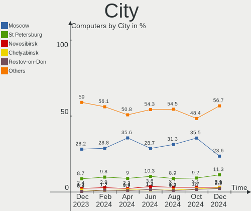
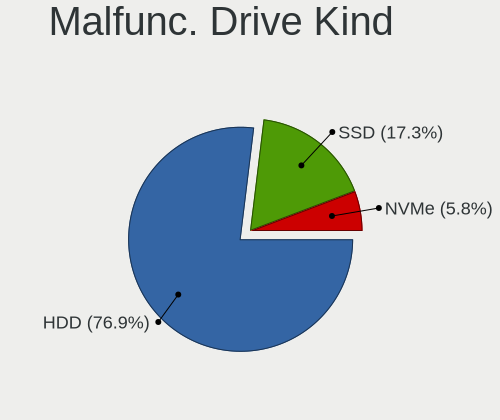
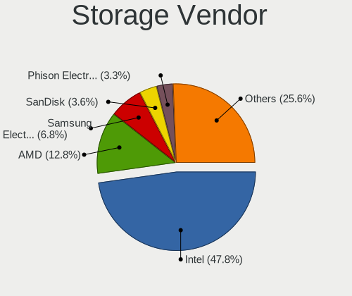
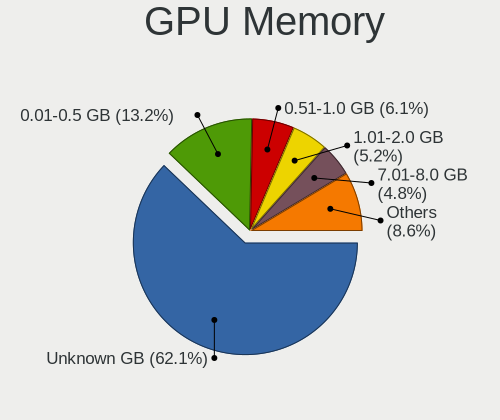
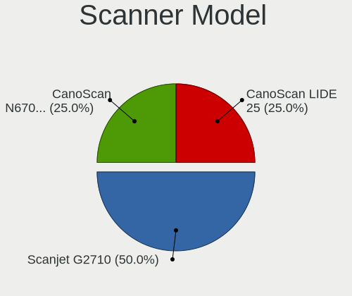

Linux in Russia - Hardware Trends
---------------------------------

A project to identify most popular hardware characteristics and track their change
over time based on data collected by Linux users at https://Linux-Hardware.org.

Anyone can contribute to this report by the [hw-probe](https://github.com/linuxhw/hw-probe) tool:

    sudo -E hw-probe -all -upload

This is a report for all computer types. See also reports for [desktops](/Location/Russia/Desktop/README.md) and [notebooks](/Location/Russia/Notebook/README.md).

Contents
--------

* [ System ](#system)
  - [ OS                       ](#os)
  - [ OS Family                ](#os-family)
  - [ Kernel                   ](#kernel)
  - [ Kernel Family            ](#kernel-family)
  - [ Kernel Major Ver.        ](#kernel-major-ver)
  - [ Arch                     ](#arch)
  - [ DE                       ](#de)
  - [ Display Server           ](#display-server)
  - [ Display Manager          ](#display-manager)
  - [ OS Lang                  ](#os-lang)
  - [ Boot Mode                ](#boot-mode)
  - [ Filesystem               ](#filesystem)
  - [ Part. scheme             ](#part-scheme)
  - [ Dual Boot with Linux/BSD ](#dual-boot-with-linuxbsd)
  - [ Dual Boot (Win)          ](#dual-boot-win)

* [ Board ](#board)
  - [ Vendor                   ](#vendor)
  - [ Model                    ](#model)
  - [ Model Family             ](#model-family)
  - [ MFG Year                 ](#mfg-year)
  - [ Form Factor              ](#form-factor)
  - [ Secure Boot              ](#secure-boot)
  - [ Coreboot                 ](#coreboot)
  - [ RAM Size                 ](#ram-size)
  - [ RAM Used                 ](#ram-used)
  - [ Total Drives             ](#total-drives)
  - [ Has CD-ROM               ](#has-cd-rom)
  - [ Has Ethernet             ](#has-ethernet)
  - [ Has WiFi                 ](#has-wifi)
  - [ Has Bluetooth            ](#has-bluetooth)

* [ Location ](#location)
  - [ Country                  ](#country)
  - [ City                     ](#city)

* [ Drives ](#drives)
  - [ Drive Vendor             ](#drive-vendor)
  - [ Drive Model              ](#drive-model)
  - [ HDD Vendor               ](#hdd-vendor)
  - [ SSD Vendor               ](#ssd-vendor)
  - [ Drive Kind               ](#drive-kind)
  - [ Drive Connector          ](#drive-connector)
  - [ Drive Size               ](#drive-size)
  - [ Space Total              ](#space-total)
  - [ Space Used               ](#space-used)
  - [ Malfunc. Drives          ](#malfunc-drives)
  - [ Malfunc. Drive Vendor    ](#malfunc-drive-vendor)
  - [ Malfunc. HDD Vendor      ](#malfunc-hdd-vendor)
  - [ Malfunc. Drive Kind      ](#malfunc-drive-kind)
  - [ Failed Drives            ](#failed-drives)
  - [ Failed Drive Vendor      ](#failed-drive-vendor)
  - [ Drive Status             ](#drive-status)

* [ Storage controller ](#storage-controller)
  - [ Storage Vendor           ](#storage-vendor)
  - [ Storage Model            ](#storage-model)
  - [ Storage Kind             ](#storage-kind)

* [ Processor ](#processor)
  - [ CPU Vendor               ](#cpu-vendor)
  - [ CPU Model                ](#cpu-model)
  - [ CPU Model Family         ](#cpu-model-family)
  - [ CPU Cores                ](#cpu-cores)
  - [ CPU Sockets              ](#cpu-sockets)
  - [ CPU Threads              ](#cpu-threads)
  - [ CPU Op-Modes             ](#cpu-op-modes)
  - [ CPU Microcode            ](#cpu-microcode)
  - [ CPU Microarch            ](#cpu-microarch)

* [ Graphics ](#graphics)
  - [ GPU Vendor               ](#gpu-vendor)
  - [ GPU Model                ](#gpu-model)
  - [ GPU Combo                ](#gpu-combo)
  - [ GPU Driver               ](#gpu-driver)
  - [ GPU Memory               ](#gpu-memory)

* [ Monitor ](#monitor)
  - [ Monitor Vendor           ](#monitor-vendor)
  - [ Monitor Model            ](#monitor-model)
  - [ Monitor Resolution       ](#monitor-resolution)
  - [ Monitor Diagonal         ](#monitor-diagonal)
  - [ Monitor Width            ](#monitor-width)
  - [ Aspect Ratio             ](#aspect-ratio)
  - [ Monitor Area             ](#monitor-area)
  - [ Pixel Density            ](#pixel-density)
  - [ Multiple Monitors        ](#multiple-monitors)

* [ Network ](#network)
  - [ Net Controller Vendor    ](#net-controller-vendor)
  - [ Net Controller Model     ](#net-controller-model)
  - [ Wireless Vendor          ](#wireless-vendor)
  - [ Wireless Model           ](#wireless-model)
  - [ Ethernet Vendor          ](#ethernet-vendor)
  - [ Ethernet Model           ](#ethernet-model)
  - [ Net Controller Kind      ](#net-controller-kind)
  - [ Used Controller          ](#used-controller)
  - [ NICs                     ](#nics)
  - [ IPv6                     ](#ipv6)

* [ Bluetooth ](#bluetooth)
  - [ Bluetooth Vendor         ](#bluetooth-vendor)
  - [ Bluetooth Model          ](#bluetooth-model)

* [ Sound ](#sound)
  - [ Sound Vendor             ](#sound-vendor)
  - [ Sound Model              ](#sound-model)

* [ Memory ](#memory)
  - [ Memory Vendor            ](#memory-vendor)
  - [ Memory Model             ](#memory-model)
  - [ Memory Kind              ](#memory-kind)
  - [ Memory Form Factor       ](#memory-form-factor)
  - [ Memory Size              ](#memory-size)
  - [ Memory Speed             ](#memory-speed)

* [ Printers & scanners ](#printers--scanners)
  - [ Printer Vendor           ](#printer-vendor)
  - [ Printer Model            ](#printer-model)
  - [ Scanner Vendor           ](#scanner-vendor)
  - [ Scanner Model            ](#scanner-model)

* [ Camera ](#camera)
  - [ Camera Vendor            ](#camera-vendor)
  - [ Camera Model             ](#camera-model)

* [ Security ](#security)
  - [ Fingerprint Vendor       ](#fingerprint-vendor)
  - [ Fingerprint Model        ](#fingerprint-model)
  - [ Chipcard Vendor          ](#chipcard-vendor)
  - [ Chipcard Model           ](#chipcard-model)

* [ Unsupported ](#unsupported)
  - [ Unsupported Devices      ](#unsupported-devices)
  - [ Unsupported Device Types ](#unsupported-device-types)

System
------

OS
--

Installed operating systems

| Name                         | Computers | Percent |
|------------------------------|-----------|---------|
| ROSA 12.2                    | 224       | 38.82%  |
| Debian 11                    | 80        | 13.86%  |
| ROSA R11.1                   | 25        | 4.33%   |
| Fedora 36                    | 24        | 4.16%   |
| Ubuntu 22.04                 | 23        | 3.99%   |
| OpenMandriva 4.3             | 16        | 2.77%   |
| Linux Mint 20.3              | 15        | 2.6%    |
| Ubuntu 20.04                 | 13        | 2.25%   |
| Manjaro 21.2.6               | 12        | 2.08%   |
| Cyber Infra 5.0.1            | 10        | 1.73%   |
| Red OS 7.3.1                 | 9         | 1.56%   |
| Kometa P10                   | 9         | 1.56%   |
| Fedora 35                    | 9         | 1.56%   |
| Manjaro                      | 8         | 1.39%   |
| ROSA 12.1                    | 6         | 1.04%   |
| ALT Linux 10.0               | 6         | 1.04%   |
| Pop!_OS 22.04                | 5         | 0.87%   |
| KDE neon 20.04               | 5         | 0.87%   |
| Arch Rolling                 | 5         | 0.87%   |
| Arch                         | 5         | 0.87%   |
| ALT Linux 10.1               | 5         | 0.87%   |
| Zorin 16                     | 4         | 0.69%   |
| LMDE 5                       | 3         | 0.52%   |
| Kubuntu 22.04                | 3         | 0.52%   |
| Kubuntu 20.04                | 3         | 0.52%   |
| Gentoo 2.7                   | 3         | 0.52%   |
| Ubuntu 21.10                 | 2         | 0.35%   |
| MOS 10                       | 2         | 0.35%   |
| Kali 2022.2                  | 2         | 0.35%   |
| Astra Linux 2.12.44          | 2         | 0.35%   |
| ALT Linux 8.4                | 2         | 0.35%   |
| Alpine 3.16.0                | 2         | 0.35%   |
| Xubuntu 22.04                | 1         | 0.17%   |
| Xubuntu 20.04                | 1         | 0.17%   |
| Void Linux Rolling           | 1         | 0.17%   |
| Void Linux                   | 1         | 0.17%   |
| Ubuntu 21.04                 | 1         | 0.17%   |
| Slackware 15.0               | 1         | 0.17%   |
| ROSA 12                      | 1         | 0.17%   |
| RHEL 9                       | 1         | 0.17%   |
| RELS 7.9                     | 1         | 0.17%   |
| Red OS 7.3                   | 1         | 0.17%   |
| Q4OS 3                       | 1         | 0.17%   |
| PostmarketOS Edge            | 1         | 0.17%   |
| Parabola                     | 1         | 0.17%   |
| openSUSE Tumbleweed-XXXXXXXX | 1         | 0.17%   |
| openSUSE Leap-15.3           | 1         | 0.17%   |
| OpenMandriva 4.90            | 1         | 0.17%   |
| OpenMandriva 4.2             | 1         | 0.17%   |
| MX 21                        | 1         | 0.17%   |
| Linux Mint 20.2              | 1         | 0.17%   |
| Gentoo 2.8                   | 1         | 0.17%   |
| Fedora 34                    | 1         | 0.17%   |
| Fedora 32                    | 1         | 0.17%   |
| Elementary 6.1               | 1         | 0.17%   |
| Debian Unstable              | 1         | 0.17%   |
| Debian Testing               | 1         | 0.17%   |
| Debian 11-updates            | 1         | 0.17%   |
| Clear Linux 35540            | 1         | 0.17%   |
| CentOS Stream                | 1         | 0.17%   |

OS Family
---------

OS without a version

| Name         | Computers | Percent |
|--------------|-----------|---------|
| ROSA         | 256       | 44.37%  |
| Debian       | 83        | 14.38%  |
| Ubuntu       | 39        | 6.76%   |
| Fedora       | 35        | 6.07%   |
| ALT Linux    | 27        | 4.68%   |
| Manjaro      | 20        | 3.47%   |
| OpenMandriva | 18        | 3.12%   |
| Linux Mint   | 16        | 2.77%   |
| Red OS       | 10        | 1.73%   |
| Cyber Infra  | 10        | 1.73%   |
| Arch         | 10        | 1.73%   |
| Kubuntu      | 6         | 1.04%   |
| Pop!_OS      | 5         | 0.87%   |
| KDE neon     | 5         | 0.87%   |
| Zorin        | 4         | 0.69%   |
| Gentoo       | 4         | 0.69%   |
| LMDE         | 3         | 0.52%   |
| Alpine       | 3         | 0.52%   |
| Xubuntu      | 2         | 0.35%   |
| Void Linux   | 2         | 0.35%   |
| openSUSE     | 2         | 0.35%   |
| Kali         | 2         | 0.35%   |
| CentOS       | 2         | 0.35%   |
| Astra Linux  | 2         | 0.35%   |
| Slackware    | 1         | 0.17%   |
| RHEL         | 1         | 0.17%   |
| RELS         | 1         | 0.17%   |
| Q4OS         | 1         | 0.17%   |
| PostmarketOS | 1         | 0.17%   |
| Parabola     | 1         | 0.17%   |
| MX           | 1         | 0.17%   |
| Elementary   | 1         | 0.17%   |
| Clear Linux  | 1         | 0.17%   |
| ArcoLinux    | 1         | 0.17%   |
| ACI          | 1         | 0.17%   |

Kernel
------

Version of the Linux kernel

| Version                             | Computers | Percent |
|-------------------------------------|-----------|---------|
| 5.10.74-generic-2rosa2021.1-x86_64  | 200       | 34.66%  |
| 5.10.0-7-amd64                      | 69        | 11.96%  |
| 5.15.32-generic-6rosa2021.1-x86_64  | 16        | 2.77%   |
| 5.16.7-desktop-1omv4003             | 15        | 2.6%    |
| 5.4.83-generic-2rosa-x86_64         | 11        | 1.91%   |
| 5.15.0-27-generic                   | 11        | 1.91%   |
| 3.10.0-1160.41.1.vz7.183.5          | 11        | 1.91%   |
| 5.13.0-40-generic                   | 10        | 1.73%   |
| 5.4.0-110-generic                   | 9         | 1.56%   |
| 5.15.0-33-generic                   | 9         | 1.56%   |
| 5.13.0-41-generic                   | 9         | 1.56%   |
| 5.10.0-14-amd64                     | 9         | 1.56%   |
| 5.15.38-1-MANJARO                   | 7         | 1.21%   |
| 5.15.35-1.el7.3.x86_64              | 7         | 1.21%   |
| 5.4.0-109-generic                   | 6         | 1.04%   |
| 5.17.6-300.fc36.x86_64              | 6         | 1.04%   |
| 5.17.5-300.fc36.x86_64              | 6         | 1.04%   |
| 5.10.74-generic-2rosa2021.1-i586    | 6         | 1.04%   |
| 5.10.102-std-def-alt1               | 6         | 1.04%   |
| 4.15.0-desktop-122.124.1rosa-x86_64 | 5         | 0.87%   |
| 5.4.0-113-generic                   | 4         | 0.69%   |
| 5.17.8-300.fc36.x86_64              | 4         | 0.69%   |
| 5.17.5-200.fc35.x86_64              | 4         | 0.69%   |
| 5.17.9-arch1-1                      | 3         | 0.52%   |
| 5.17.7-300.fc36.x86_64              | 3         | 0.52%   |
| 5.17.5-76051705-generic             | 3         | 0.52%   |
| 5.17.11-300.fc36.x86_64             | 3         | 0.52%   |
| 5.15.41-1-MANJARO                   | 3         | 0.52%   |
| 5.15.34-un-def-alt1                 | 3         | 0.52%   |
| 5.15.32-gentoo-r1                   | 3         | 0.52%   |
| 5.15.0-30-generic                   | 3         | 0.52%   |
| 5.10.109-std-def-alt1               | 3         | 0.52%   |
| 5.10.0-13-amd64                     | 3         | 0.52%   |
| 5.4.0-91-generic                    | 2         | 0.35%   |
| 5.17.9-0-edge                       | 2         | 0.35%   |
| 5.17.7-200.fc35.x86_64              | 2         | 0.35%   |
| 5.17.6-1-MANJARO                    | 2         | 0.35%   |
| 5.17.6-051706-generic               | 2         | 0.35%   |
| 5.17.5-arch1-1                      | 2         | 0.35%   |
| 5.17.4-200.fc35.x86_64              | 2         | 0.35%   |
| 5.17.11-generic-1rosa2021.1-x86_64  | 2         | 0.35%   |
| 5.17.0-1-amd64                      | 2         | 0.35%   |
| 5.16.20_1                           | 2         | 0.35%   |
| 5.16.18-1-MANJARO                   | 2         | 0.35%   |
| 5.15.37-un-def-alt1                 | 2         | 0.35%   |
| 5.15.32-1-MANJARO                   | 2         | 0.35%   |
| 5.10.82-std-def-alt1                | 2         | 0.35%   |
| 5.10.111-std-def-alt1               | 2         | 0.35%   |
| 4.15.0-desktop-122.124.1rosa-i586   | 2         | 0.35%   |
| 5.4.83-generic-2rosa-i586           | 1         | 0.17%   |
| 5.4.32-generic-2rosa-x86_64         | 1         | 0.17%   |
| 5.4.32-generic-2rosa-i586           | 1         | 0.17%   |
| 5.3.18-150300.59.63-default         | 1         | 0.17%   |
| 5.18.0-zen1-1-zen                   | 1         | 0.17%   |
| 5.18.0-gentoo                       | 1         | 0.17%   |
| 5.18.0-051800-generic               | 1         | 0.17%   |
| 5.17.9-zen1-1-zen                   | 1         | 0.17%   |
| 5.17.9-301.fsync.fc36.x86_64        | 1         | 0.17%   |
| 5.17.9-1-MANJARO                    | 1         | 0.17%   |
| 5.17.9-051709-generic               | 1         | 0.17%   |

Kernel Family
-------------

Linux kernel without a distro release

| Version  | Computers | Percent |
|----------|-----------|---------|
| 5.10.74  | 206       | 35.7%   |
| 5.10.0   | 84        | 14.56%  |
| 5.15.0   | 25        | 4.33%   |
| 5.15.32  | 22        | 3.81%   |
| 5.13.0   | 22        | 3.81%   |
| 5.4.0    | 21        | 3.64%   |
| 5.17.5   | 16        | 2.77%   |
| 5.16.7   | 15        | 2.6%    |
| 5.4.83   | 12        | 2.08%   |
| 3.10.0   | 11        | 1.91%   |
| 5.17.6   | 10        | 1.73%   |
| 5.17.9   | 9         | 1.56%   |
| 5.17.7   | 9         | 1.56%   |
| 5.15.38  | 8         | 1.39%   |
| 5.15.35  | 8         | 1.39%   |
| 4.15.0   | 7         | 1.21%   |
| 5.10.102 | 6         | 1.04%   |
| 5.17.11  | 5         | 0.87%   |
| 5.17.0   | 5         | 0.87%   |
| 5.17.8   | 4         | 0.69%   |
| 5.17.4   | 4         | 0.69%   |
| 5.16.20  | 4         | 0.69%   |
| 5.16.18  | 4         | 0.69%   |
| 5.10.109 | 4         | 0.69%   |
| 5.18.0   | 3         | 0.52%   |
| 5.15.41  | 3         | 0.52%   |
| 5.15.34  | 3         | 0.52%   |
| 5.14.0   | 3         | 0.52%   |
| 5.4.32   | 2         | 0.35%   |
| 5.16.0   | 2         | 0.35%   |
| 5.15.37  | 2         | 0.35%   |
| 5.10.82  | 2         | 0.35%   |
| 5.10.111 | 2         | 0.35%   |
| 4.9.155  | 2         | 0.35%   |
| 4.18.0   | 2         | 0.35%   |
| 5.3.18   | 1         | 0.17%   |
| 5.17.3   | 1         | 0.17%   |
| 5.17.1   | 1         | 0.17%   |
| 5.16.19  | 1         | 0.17%   |
| 5.16.17  | 1         | 0.17%   |
| 5.16.11  | 1         | 0.17%   |
| 5.15.33  | 1         | 0.17%   |
| 5.15.30  | 1         | 0.17%   |
| 5.15.25  | 1         | 0.17%   |
| 5.15.12  | 1         | 0.17%   |
| 5.15.10  | 1         | 0.17%   |
| 5.14.14  | 1         | 0.17%   |
| 5.14.10  | 1         | 0.17%   |
| 5.13.9   | 1         | 0.17%   |
| 5.11.20  | 1         | 0.17%   |
| 5.11.12  | 1         | 0.17%   |
| 5.10.88  | 1         | 0.17%   |
| 5.10.83  | 1         | 0.17%   |
| 5.10.69  | 1         | 0.17%   |
| 5.10.61  | 1         | 0.17%   |
| 5.10.50  | 1         | 0.17%   |
| 5.10.29  | 1         | 0.17%   |
| 5.10.15  | 1         | 0.17%   |
| 5.10.14  | 1         | 0.17%   |
| 5.10.118 | 1         | 0.17%   |

Kernel Major Ver.
-----------------

Linux kernel major version

| Version | Computers | Percent |
|---------|-----------|---------|
| 5.10    | 317       | 54.94%  |
| 5.15    | 76        | 13.17%  |
| 5.17    | 64        | 11.09%  |
| 5.4     | 35        | 6.07%   |
| 5.16    | 28        | 4.85%   |
| 5.13    | 23        | 3.99%   |
| 3.10    | 11        | 1.91%   |
| 4.15    | 7         | 1.21%   |
| 5.14    | 5         | 0.87%   |
| 5.18    | 3         | 0.52%   |
| 5.11    | 2         | 0.35%   |
| 4.9     | 2         | 0.35%   |
| 4.18    | 2         | 0.35%   |
| 5.3     | 1         | 0.17%   |
| 4.19    | 1         | 0.17%   |

Arch
----

OS architecture (x86_64, i586, etc.)

| Name    | Computers | Percent |
|---------|-----------|---------|
| x86_64  | 564       | 97.75%  |
| i686    | 11        | 1.91%   |
| aarch64 | 2         | 0.35%   |

DE
--

Desktop Environment

| Name       | Computers | Percent |
|------------|-----------|---------|
| GNOME      | 195       | 33.8%   |
| KDE5       | 183       | 31.72%  |
| Unknown    | 103       | 17.85%  |
| LXQt       | 25        | 4.33%   |
| MATE       | 16        | 2.77%   |
| KDE4       | 14        | 2.43%   |
| XFCE       | 13        | 2.25%   |
| X-Cinnamon | 11        | 1.91%   |
| Cinnamon   | 8         | 1.39%   |
| i3         | 2         | 0.35%   |
| fly        | 2         | 0.35%   |
| Unity      | 1         | 0.17%   |
| Pantheon   | 1         | 0.17%   |
| LXDE       | 1         | 0.17%   |
| KDE        | 1         | 0.17%   |
| Budgie     | 1         | 0.17%   |

Display Server
--------------

X11 or Wayland

| Name    | Computers | Percent |
|---------|-----------|---------|
| Wayland | 245       | 42.46%  |
| X11     | 238       | 41.25%  |
| Unknown | 81        | 14.04%  |
| Tty     | 13        | 2.25%   |

Display Manager
---------------

SDDM, LightDM, etc.

| Name    | Computers | Percent |
|---------|-----------|---------|
| SDDM    | 167       | 28.94%  |
| GDM     | 162       | 28.08%  |
| Unknown | 158       | 27.38%  |
| LightDM | 43        | 7.45%   |
| GDM3    | 30        | 5.2%    |
| KDM     | 14        | 2.43%   |
| FLY-DM  | 2         | 0.35%   |
| XDM     | 1         | 0.17%   |

OS Lang
-------

Language

| Lang    | Computers | Percent |
|---------|-----------|---------|
| ru_RU   | 481       | 83.36%  |
| en_US   | 65        | 11.27%  |
| Unknown | 23        | 3.99%   |
| C       | 4         | 0.69%   |
| ru_UA   | 1         | 0.17%   |
| es_ES   | 1         | 0.17%   |
| en_GB   | 1         | 0.17%   |
| C.UTF8  | 1         | 0.17%   |

Boot Mode
---------

EFI or BIOS

| Mode | Computers | Percent |
|------|-----------|---------|
| EFI  | 314       | 54.42%  |
| BIOS | 263       | 45.58%  |

Filesystem
----------

Type of filesystem

| Type    | Computers | Percent |
|---------|-----------|---------|
| Ext4    | 424       | 73.48%  |
| Overlay | 91        | 15.77%  |
| Btrfs   | 54        | 9.36%   |
| Xfs     | 4         | 0.69%   |
| F2fs    | 2         | 0.35%   |
| Zfs     | 1         | 0.17%   |
| Aufs    | 1         | 0.17%   |

Part. scheme
------------

Scheme of partitioning

| Type    | Computers | Percent |
|---------|-----------|---------|
| GPT     | 324       | 56.15%  |
| MBR     | 173       | 29.98%  |
| Unknown | 80        | 13.86%  |

Dual Boot with Linux/BSD
------------------------

Hosting more than one Linux/BSD

| Dual boot | Computers | Percent |
|-----------|-----------|---------|
| No        | 478       | 82.84%  |
| Yes       | 99        | 17.16%  |

Dual Boot (Win)
---------------

Hosting Linux and Windows

| Dual boot | Computers | Percent |
|-----------|-----------|---------|
| No        | 308       | 53.38%  |
| Yes       | 269       | 46.62%  |

Board
-----

Vendor
------

Motherboard manufacturer

| Name                | Computers | Percent |
|---------------------|-----------|---------|
| ASUSTek Computer    | 120       | 20.8%   |
| Gigabyte Technology | 70        | 12.13%  |
| Lenovo              | 60        | 10.4%   |
| Hewlett-Packard     | 44        | 7.63%   |
| ASRock              | 44        | 7.63%   |
| MSI                 | 38        | 6.59%   |
| Acer                | 38        | 6.59%   |
| Aquarius            | 22        | 3.81%   |
| Dell                | 15        | 2.6%    |
| Supermicro          | 13        | 2.25%   |
| Intel               | 11        | 1.91%   |
| HUAWEI              | 11        | 1.91%   |
| Samsung Electronics | 10        | 1.73%   |
| Apple               | 8         | 1.39%   |
| Unknown             | 7         | 1.21%   |
| ICL                 | 5         | 0.87%   |
| Huanan              | 5         | 0.87%   |
| ECS                 | 5         | 0.87%   |
| Sony                | 4         | 0.69%   |
| Foxconn             | 4         | 0.69%   |
| Toshiba             | 3         | 0.52%   |
| Pegatron            | 2         | 0.35%   |
| Panasonic           | 2         | 0.35%   |
| Packard Bell        | 2         | 0.35%   |
| Notebook            | 2         | 0.35%   |
| KLLISRE             | 2         | 0.35%   |
| iRU                 | 2         | 0.35%   |
| Chuwi               | 2         | 0.35%   |
| 3Logic Group        | 2         | 0.35%   |
| ZoomSmart           | 1         | 0.17%   |
| Timi                | 1         | 0.17%   |
| T-Platforms         | 1         | 0.17%   |
| OrangePi            | 1         | 0.17%   |
| ONDA                | 1         | 0.17%   |
| mtech               | 1         | 0.17%   |
| MAINBRD             | 1         | 0.17%   |
| Maibenben           | 1         | 0.17%   |
| MACHINIST           | 1         | 0.17%   |
| Kraftway            | 1         | 0.17%   |
| K-Systems           | 1         | 0.17%   |
| Irbis               | 1         | 0.17%   |
| IP3 Technology      | 1         | 0.17%   |
| HPE                 | 1         | 0.17%   |
| HONOR               | 1         | 0.17%   |
| Google              | 1         | 0.17%   |
| Fujitsu             | 1         | 0.17%   |
| EPoX Computer       | 1         | 0.17%   |
| eMachines           | 1         | 0.17%   |
| Digma               | 1         | 0.17%   |
| Clevo               | 1         | 0.17%   |
| Chatreey            | 1         | 0.17%   |
| AMI                 | 1         | 0.17%   |
| ABIT                | 1         | 0.17%   |

Model
-----

Motherboard model

| Name                                | Computers | Percent |
|-------------------------------------|-----------|---------|
| Aquarius NS585                      | 22        | 3.81%   |
| ASRock H470M-HVS                    | 12        | 2.08%   |
| Unknown                             | 12        | 2.08%   |
| Supermicro SBI-6119P-T3N            | 10        | 1.73%   |
| ASUS All Series                     | 9         | 1.56%   |
| ASUS S20 K29                        | 6         | 1.04%   |
| MSI MS-7996                         | 4         | 0.69%   |
| HP Pavilion g6                      | 4         | 0.69%   |
| HP ZBook 17 G5                      | 3         | 0.52%   |
| HP Notebook                         | 3         | 0.52%   |
| ASUS M5A78L-M LE/USB3               | 3         | 0.52%   |
| ASRock N68-S3 UCC                   | 3         | 0.52%   |
| MSI MS-7D14                         | 2         | 0.35%   |
| MSI MS-7B86                         | 2         | 0.35%   |
| MSI MS-7A38                         | 2         | 0.35%   |
| MSI MS-7693                         | 2         | 0.35%   |
| Lenovo IdeaPad 5 15ARE05 81YQ       | 2         | 0.35%   |
| Lenovo IdeaPad 330S-14IKB 81F4      | 2         | 0.35%   |
| Lenovo IdeaPad 330-15IKB 81DE       | 2         | 0.35%   |
| Lenovo B590 20206                   | 2         | 0.35%   |
| ICL RAY S122.Mi                     | 2         | 0.35%   |
| HUAWEI KLVL-WXXW                    | 2         | 0.35%   |
| HUAWEI CREM-WXX9                    | 2         | 0.35%   |
| HUAWEI BOHK-WAX9X                   | 2         | 0.35%   |
| HP Pavilion Gaming Laptop 17-cd2xxx | 2         | 0.35%   |
| HP Pavilion dv6                     | 2         | 0.35%   |
| Gigabyte P61A-D3                    | 2         | 0.35%   |
| Gigabyte H81M-S2V                   | 2         | 0.35%   |
| Gigabyte H77-DS3H                   | 2         | 0.35%   |
| Gigabyte H61M-S2PV                  | 2         | 0.35%   |
| Gigabyte H61M-DS2                   | 2         | 0.35%   |
| Gigabyte GA-MA770-UD3               | 2         | 0.35%   |
| ECS H61H2-M13                       | 2         | 0.35%   |
| Dell Vostro 5468                    | 2         | 0.35%   |
| Dell Inspiron 3521                  | 2         | 0.35%   |
| ASUS P8H67-M PRO                    | 2         | 0.35%   |
| ASUS P8H61-M LX3 R2.0               | 2         | 0.35%   |
| ASUS H110M-R                        | 2         | 0.35%   |
| ASUS A68HM-K                        | 2         | 0.35%   |
| ASUS 1001PX                         | 2         | 0.35%   |
| ASRock B450 Gaming K4               | 2         | 0.35%   |
| Apple MacBookPro8,1                 | 2         | 0.35%   |
| Acer Extensa 2519                   | 2         | 0.35%   |
| Acer Aspire A715-75G                | 2         | 0.35%   |
| 3Logic Group Graviton               | 2         | 0.35%   |
| ZoomSmart A8006                     | 1         | 0.17%   |
| Toshiba Satellite U400              | 1         | 0.17%   |
| Toshiba Satellite U300              | 1         | 0.17%   |
| Toshiba Satellite C850-D1W          | 1         | 0.17%   |
| Timi TM1607                         | 1         | 0.17%   |
| T-Platforms TF307-MB-S-C            | 1         | 0.17%   |
| Supermicro X8DTU                    | 1         | 0.17%   |
| Supermicro SYS-5039MS-H12TRF        | 1         | 0.17%   |
| Supermicro Super Server             | 1         | 0.17%   |
| Sony VPCSB1V9R                      | 1         | 0.17%   |
| Sony VPCSA2Z9R                      | 1         | 0.17%   |
| Sony SVE1512H1RW                    | 1         | 0.17%   |
| Sony SVE1512H1RB                    | 1         | 0.17%   |
| Samsung SR70S/SR71S                 | 1         | 0.17%   |
| Samsung SQ45S70S                    | 1         | 0.17%   |

Model Family
------------

Motherboard model prefix

| Name                     | Computers | Percent |
|--------------------------|-----------|---------|
| Acer Aspire              | 23        | 3.99%   |
| Aquarius NS585           | 22        | 3.81%   |
| Lenovo IdeaPad           | 18        | 3.12%   |
| ASRock H470M-HVS         | 12        | 2.08%   |
| Unknown                  | 12        | 2.08%   |
| HP Pavilion              | 11        | 1.91%   |
| ASUS VivoBook            | 11        | 1.91%   |
| Supermicro SBI-6119P-T3N | 10        | 1.73%   |
| ASUS All                 | 9         | 1.56%   |
| Lenovo ThinkPad          | 7         | 1.21%   |
| HP ProBook               | 6         | 1.04%   |
| Dell Inspiron            | 6         | 1.04%   |
| ASUS S20                 | 6         | 1.04%   |
| ASUS PRIME               | 6         | 1.04%   |
| HP Laptop                | 5         | 0.87%   |
| Dell Vostro              | 5         | 0.87%   |
| MSI MS-7996              | 4         | 0.69%   |
| Lenovo ThinkBook         | 4         | 0.69%   |
| Lenovo Legion            | 4         | 0.69%   |
| ASUS TUF                 | 4         | 0.69%   |
| Toshiba Satellite        | 3         | 0.52%   |
| Lenovo ThinkCentre       | 3         | 0.52%   |
| Lenovo B590              | 3         | 0.52%   |
| HP ZBook                 | 3         | 0.52%   |
| HP Notebook              | 3         | 0.52%   |
| Gigabyte B550M           | 3         | 0.52%   |
| ASUS ROG                 | 3         | 0.52%   |
| ASUS P8H67-M             | 3         | 0.52%   |
| ASUS M5A97               | 3         | 0.52%   |
| ASUS M5A78L-M            | 3         | 0.52%   |
| ASUS ASUS                | 3         | 0.52%   |
| ASRock N68-S3            | 3         | 0.52%   |
| Acer Nitro               | 3         | 0.52%   |
| Acer Extensa             | 3         | 0.52%   |
| Packard Bell EasyNote    | 2         | 0.35%   |
| MSI MS-7D14              | 2         | 0.35%   |
| MSI MS-7B86              | 2         | 0.35%   |
| MSI MS-7A38              | 2         | 0.35%   |
| MSI MS-7693              | 2         | 0.35%   |
| Lenovo Yoga              | 2         | 0.35%   |
| Intel X79                | 2         | 0.35%   |
| ICL RAY                  | 2         | 0.35%   |
| HUAWEI KLVL-WXXW         | 2         | 0.35%   |
| HUAWEI CREM-WXX9         | 2         | 0.35%   |
| HUAWEI BOHK-WAX9X        | 2         | 0.35%   |
| HP ProLiant              | 2         | 0.35%   |
| HP ENVY                  | 2         | 0.35%   |
| HP EliteBook             | 2         | 0.35%   |
| HP Compaq                | 2         | 0.35%   |
| HP 250                   | 2         | 0.35%   |
| Gigabyte X570            | 2         | 0.35%   |
| Gigabyte P61A-D3         | 2         | 0.35%   |
| Gigabyte H81M-S2V        | 2         | 0.35%   |
| Gigabyte H77-DS3H        | 2         | 0.35%   |
| Gigabyte H61M-S2PV       | 2         | 0.35%   |
| Gigabyte H61M-DS2        | 2         | 0.35%   |
| Gigabyte GA-MA770-UD3    | 2         | 0.35%   |
| Gigabyte B560M           | 2         | 0.35%   |
| Gigabyte B450M           | 2         | 0.35%   |
| Gigabyte B450            | 2         | 0.35%   |

MFG Year
--------

Motherboard manufacture year

| Year    | Computers | Percent |
|---------|-----------|---------|
| 2020    | 89        | 15.42%  |
| 2021    | 74        | 12.82%  |
| 2012    | 56        | 9.71%   |
| 2018    | 54        | 9.36%   |
| 2011    | 48        | 8.32%   |
| 2019    | 46        | 7.97%   |
| 2013    | 32        | 5.55%   |
| 2010    | 31        | 5.37%   |
| 2017    | 26        | 4.51%   |
| 2016    | 22        | 3.81%   |
| 2008    | 22        | 3.81%   |
| 2015    | 20        | 3.47%   |
| 2014    | 18        | 3.12%   |
| 2007    | 16        | 2.77%   |
| 2009    | 14        | 2.43%   |
| 2022    | 5         | 0.87%   |
| 2006    | 2         | 0.35%   |
| 2005    | 1         | 0.17%   |
| Unknown | 1         | 0.17%   |

Form Factor
-----------

Physical design of the computer

| Name           | Computers | Percent |
|----------------|-----------|---------|
| Desktop        | 272       | 47.14%  |
| Notebook       | 266       | 46.1%   |
| Server         | 14        | 2.43%   |
| Mini pc        | 8         | 1.39%   |
| All in one     | 6         | 1.04%   |
| Tablet         | 4         | 0.69%   |
| Convertible    | 4         | 0.69%   |
| System on chip | 2         | 0.35%   |
| Stick pc       | 1         | 0.17%   |

Secure Boot
-----------

Enabled or disabled

| State    | Computers | Percent |
|----------|-----------|---------|
| Disabled | 556       | 96.36%  |
| Enabled  | 21        | 3.64%   |

Coreboot
--------

Have coreboot on board

| Used | Computers | Percent |
|------|-----------|---------|
| No   | 576       | 99.83%  |
| Yes  | 1         | 0.17%   |

RAM Size
--------

Total RAM memory

| Size in GB  | Computers | Percent |
|-------------|-----------|---------|
| 4.01-8.0    | 170       | 29.46%  |
| 8.01-16.0   | 105       | 18.2%   |
| 3.01-4.0    | 101       | 17.5%   |
| 16.01-24.0  | 94        | 16.29%  |
| 32.01-64.0  | 40        | 6.93%   |
| 1.01-2.0    | 33        | 5.72%   |
| 64.01-256.0 | 19        | 3.29%   |
| 24.01-32.0  | 6         | 1.04%   |
| 2.01-3.0    | 6         | 1.04%   |
| 0.51-1.0    | 3         | 0.52%   |

RAM Used
--------

Used RAM memory

| Used GB    | Computers | Percent |
|------------|-----------|---------|
| 1.01-2.0   | 193       | 33.45%  |
| 0.51-1.0   | 166       | 28.77%  |
| 2.01-3.0   | 100       | 17.33%  |
| 4.01-8.0   | 60        | 10.4%   |
| 3.01-4.0   | 41        | 7.11%   |
| 8.01-16.0  | 13        | 2.25%   |
| 0.01-0.5   | 3         | 0.52%   |
| 32.01-64.0 | 1         | 0.17%   |

Total Drives
------------

Number of drives on board

| Drives | Computers | Percent |
|--------|-----------|---------|
| 1      | 343       | 59.45%  |
| 2      | 139       | 24.09%  |
| 3      | 60        | 10.4%   |
| 4      | 20        | 3.47%   |
| 5      | 9         | 1.56%   |
| 6      | 3         | 0.52%   |
| 0      | 2         | 0.35%   |
| 7      | 1         | 0.17%   |

Has CD-ROM
----------

Has CD-ROM on board

| Presented | Computers | Percent |
|-----------|-----------|---------|
| No        | 410       | 71.06%  |
| Yes       | 167       | 28.94%  |

Has Ethernet
------------

Has Ethernet on board

| Presented | Computers | Percent |
|-----------|-----------|---------|
| Yes       | 518       | 89.77%  |
| No        | 59        | 10.23%  |

Has WiFi
--------

Has WiFi module

| Presented | Computers | Percent |
|-----------|-----------|---------|
| Yes       | 341       | 59.1%   |
| No        | 236       | 40.9%   |

Has Bluetooth
-------------

Has Bluetooth module

| Presented | Computers | Percent |
|-----------|-----------|---------|
| Yes       | 292       | 50.61%  |
| No        | 285       | 49.39%  |

Location
--------

Country
-------

Geographic location (country)

| Country | Computers | Percent |
|---------|-----------|---------|
| Russia  | 577       | 100%    |

City
----

Geographic location (city)

| City             | Computers | Percent |
|------------------|-----------|---------|
| Moscow           | 143       | 24.78%  |
| Voronezh         | 74        | 12.82%  |
| St Petersburg    | 58        | 10.05%  |
| Yekaterinburg    | 14        | 2.43%   |
| Perm             | 13        | 2.25%   |
| Chelyabinsk      | 13        | 2.25%   |
| Novosibirsk      | 11        | 1.91%   |
| Krasnodar        | 10        | 1.73%   |
| Samara           | 8         | 1.39%   |
| Nizhniy Novgorod | 7         | 1.21%   |
| Rostov-on-Don    | 6         | 1.04%   |
| Khabarovsk       | 6         | 1.04%   |
| Murom            | 5         | 0.87%   |
| Yoshkar-Ola      | 4         | 0.69%   |
| Yaroslavl        | 4         | 0.69%   |
| Vladivostok      | 4         | 0.69%   |
| Stavropol        | 4         | 0.69%   |
| Saratov          | 4         | 0.69%   |
| Pyatigorsk       | 4         | 0.69%   |
| Kazan’         | 4         | 0.69%   |
| Barnaul          | 4         | 0.69%   |
| Volgograd        | 3         | 0.52%   |
| Ufa              | 3         | 0.52%   |
| Tver             | 3         | 0.52%   |
| Tula             | 3         | 0.52%   |
| Taganrog         | 3         | 0.52%   |
| Salekhard        | 3         | 0.52%   |
| Omsk             | 3         | 0.52%   |
| Lytkarino        | 3         | 0.52%   |
| Cheboksary       | 3         | 0.52%   |
| Belgorod         | 3         | 0.52%   |
| Astrakhan        | 3         | 0.52%   |
| Yakutsk          | 2         | 0.35%   |
| Volkhov          | 2         | 0.35%   |
| Tyumen           | 2         | 0.35%   |
| Tomsk            | 2         | 0.35%   |
| Tolyatti         | 2         | 0.35%   |
| Syktyvkar        | 2         | 0.35%   |
| Surgut           | 2         | 0.35%   |
| Sochi            | 2         | 0.35%   |
| Ryazan           | 2         | 0.35%   |
| Pskov            | 2         | 0.35%   |
| Petrozavodsk     | 2         | 0.35%   |
| Penza            | 2         | 0.35%   |
| Oryol            | 2         | 0.35%   |
| Orenburg         | 2         | 0.35%   |
| Noyabrsk         | 2         | 0.35%   |
| Noril'sk         | 2         | 0.35%   |
| Murmansk         | 2         | 0.35%   |
| Mirny            | 2         | 0.35%   |
| Lyubertsy        | 2         | 0.35%   |
| Kursk            | 2         | 0.35%   |
| Krasnoyarsk      | 2         | 0.35%   |
| Kostroma         | 2         | 0.35%   |
| Kirov            | 2         | 0.35%   |
| Kaluga           | 2         | 0.35%   |
| Kaliningrad      | 2         | 0.35%   |
| Izhevsk          | 2         | 0.35%   |
| Irkutsk          | 2         | 0.35%   |
| Dubna            | 2         | 0.35%   |

Drives
------

Drive Vendor
------------

Hard drive vendors

| Vendor                         | Computers | Drives | Percent |
|--------------------------------|-----------|--------|---------|
| WDC                            | 143       | 165    | 16.88%  |
| Seagate                        | 134       | 159    | 15.82%  |
| Samsung Electronics            | 82        | 93     | 9.68%   |
| Toshiba                        | 61        | 69     | 7.2%    |
| Kingston                       | 44        | 45     | 5.19%   |
| A-DATA Technology              | 42        | 44     | 4.96%   |
| Hitachi                        | 32        | 32     | 3.78%   |
| Intel                          | 29        | 49     | 3.42%   |
| Crucial                        | 28        | 31     | 3.31%   |
| Unknown                        | 20        | 21     | 2.36%   |
| HGST                           | 16        | 17     | 1.89%   |
| SK Hynix                       | 15        | 15     | 1.77%   |
| Netac                          | 15        | 15     | 1.77%   |
| Apacer                         | 15        | 16     | 1.77%   |
| China                          | 13        | 13     | 1.53%   |
| SanDisk                        | 11        | 11     | 1.3%    |
| Phison                         | 11        | 11     | 1.3%    |
| Micron Technology              | 8         | 9      | 0.94%   |
| KingSpec                       | 8         | 8      | 0.94%   |
| Smartbuy                       | 7         | 8      | 0.83%   |
| Silicon Motion                 | 7         | 9      | 0.83%   |
| OCZ                            | 7         | 7      | 0.83%   |
| XPG                            | 6         | 6      | 0.71%   |
| PLEXTOR                        | 6         | 6      | 0.71%   |
| GOODRAM                        | 6         | 6      | 0.71%   |
| XrayDisk                       | 5         | 7      | 0.59%   |
| Patriot                        | 5         | 5      | 0.59%   |
| UMIS                           | 4         | 4      | 0.47%   |
| SPCC                           | 4         | 4      | 0.47%   |
| Gigabyte Technology            | 4         | 4      | 0.47%   |
| Unknown                        | 4         | 4      | 0.47%   |
| Transcend                      | 3         | 3      | 0.35%   |
| MAXTOR                         | 3         | 3      | 0.35%   |
| KIOXIA-EXCERIA                 | 3         | 3      | 0.35%   |
| Hewlett-Packard                | 3         | 3      | 0.35%   |
| FOXLINE                        | 3         | 3      | 0.35%   |
| AMD                            | 3         | 3      | 0.35%   |
| Teclast                        | 2         | 2      | 0.24%   |
| Realtek Semiconductor          | 2         | 2      | 0.24%   |
| Pioneer                        | 2         | 2      | 0.24%   |
| KIOXIA                         | 2         | 2      | 0.24%   |
| JMicron                        | 2         | 2      | 0.24%   |
| Zheino                         | 1         | 1      | 0.12%   |
| Vaseky                         | 1         | 1      | 0.12%   |
| TO Exter                       | 1         | 1      | 0.12%   |
| TMI                            | 1         | 1      | 0.12%   |
| THU                            | 1         | 1      | 0.12%   |
| SSSTC                          | 1         | 1      | 0.12%   |
| Solid State Storage Technology | 1         | 1      | 0.12%   |
| ROG                            | 1         | 1      | 0.12%   |
| QUMO                           | 1         | 1      | 0.12%   |
| OWC                            | 1         | 1      | 0.12%   |
| OCZ-VERTEX3                    | 1         | 1      | 0.12%   |
| NE-512                         | 1         | 1      | 0.12%   |
| MyDigitalSSD                   | 1         | 1      | 0.12%   |
| LuminouTek                     | 1         | 1      | 0.12%   |
| LONDISK                        | 1         | 1      | 0.12%   |
| Lexar                          | 1         | 1      | 0.12%   |
| Kingmax                        | 1         | 1      | 0.12%   |
| Intenso                        | 1         | 1      | 0.12%   |

Drive Model
-----------

Hard drive models

| Model                              | Computers | Percent |
|------------------------------------|-----------|---------|
| A-DATA SU800 512GB SSD             | 22        | 2.41%   |
| Toshiba HDWD110 1TB                | 20        | 2.19%   |
| Seagate ST500DM002-1BD142 500GB    | 13        | 1.43%   |
| Seagate ST1000DM010-2EP102 1TB     | 12        | 1.32%   |
| Netac SSD 240GB                    | 12        | 1.32%   |
| Crucial CT480BX500SSD1 480GB       | 12        | 1.32%   |
| Intel SSDSC2KG240G8 240GB          | 10        | 1.1%    |
| Intel SSDSC2KB960G8 960GB          | 10        | 1.1%    |
| Seagate ST1000DM003-1CH162 1TB     | 8         | 0.88%   |
| Toshiba MQ01ABF050 500GB           | 7         | 0.77%   |
| Seagate ST500LT012-1DG142 500GB    | 6         | 0.66%   |
| Samsung SSD 860 EVO 250GB          | 6         | 0.66%   |
| Kingston SUV400S37120G 120GB SSD   | 6         | 0.66%   |
| Kingston SA400S37120G 120GB SSD    | 6         | 0.66%   |
| WDC WDS240G2G0B-00EPW0 240GB SSD   | 5         | 0.55%   |
| Toshiba DT01ACA050 500GB           | 5         | 0.55%   |
| Seagate ST9320325AS 320GB          | 5         | 0.55%   |
| Seagate ST1000LM049-2GH172 1TB     | 5         | 0.55%   |
| Seagate ST1000LM024 HN-M101MBB 1TB | 5         | 0.55%   |
| Kingston SA400S37240G 240GB SSD    | 5         | 0.55%   |
| Crucial CT240BX500SSD1 240GB       | 5         | 0.55%   |
| Apacer AS350 512GB SSD             | 5         | 0.55%   |
| Apacer AS350 256GB SSD             | 5         | 0.55%   |
| WDC WDS500G2B0A-00SM50 500GB SSD   | 4         | 0.44%   |
| WDC WDS240G2G0A-00JH30 240GB SSD   | 4         | 0.44%   |
| WDC WDS120G2G0A-00JH30 120GB SSD   | 4         | 0.44%   |
| WDC WD20EZRZ-00Z5HB0 2TB           | 4         | 0.44%   |
| WDC WD10EZEX-08WN4A0 1TB           | 4         | 0.44%   |
| Seagate ST500LT012-9WS142 500GB    | 4         | 0.44%   |
| Seagate ST3500418AS 500GB          | 4         | 0.44%   |
| Seagate ST3500413AS 500GB          | 4         | 0.44%   |
| Seagate ST1000LM035-1RK172 1TB     | 4         | 0.44%   |
| Kingston SV300S37A120G 120GB SSD   | 4         | 0.44%   |
| Hitachi HDS721050CLA362 500GB      | 4         | 0.44%   |
| HGST HTS545050A7E380 500GB         | 4         | 0.44%   |
| Unknown                            | 4         | 0.44%   |
| XPG GAMMIX S11 Pro 256GB           | 3         | 0.33%   |
| WDC WD5000LPVX-22V0TT0 500GB       | 3         | 0.33%   |
| WDC WD5000LPCX-21VHAT0 500GB       | 3         | 0.33%   |
| WDC WD20EZBX-00AYRA0 2TB           | 3         | 0.33%   |
| WDC WD10SPZX-21Z10T0 1TB           | 3         | 0.33%   |
| WDC WD10EZEX-22MFCA0 1TB           | 3         | 0.33%   |
| Smartbuy SSD 240GB                 | 3         | 0.33%   |
| Seagate ST500DM002-1BC142 500GB    | 3         | 0.33%   |
| Seagate ST3400620AS 400GB          | 3         | 0.33%   |
| Seagate ST31000528AS 1TB           | 3         | 0.33%   |
| Seagate ST1000DM003-9YN162 1TB     | 3         | 0.33%   |
| Samsung SSD 980 500GB              | 3         | 0.33%   |
| Samsung SSD 970 EVO Plus 250GB     | 3         | 0.33%   |
| Samsung SSD 860 EVO M.2 250GB      | 3         | 0.33%   |
| Samsung SSD 850 EVO 250GB          | 3         | 0.33%   |
| Samsung NVMe SSD Drive 250GB       | 3         | 0.33%   |
| Samsung MZVLQ512HALU-000H1 512GB   | 3         | 0.33%   |
| Phison 311CD0512GB                 | 3         | 0.33%   |
| Intel SSDPEKNW512G8 512GB          | 3         | 0.33%   |
| Hitachi HTS547550A9E384 500GB      | 3         | 0.33%   |
| HGST HTS721010A9E630 1TB           | 3         | 0.33%   |
| Crucial CT120BX500SSD1 120GB       | 3         | 0.33%   |
| Apacer AS350 128GB SSD             | 3         | 0.33%   |
| A-DATA SU650 240GB SSD             | 3         | 0.33%   |

HDD Vendor
----------

Hard disk drive vendors

| Vendor              | Computers | Drives | Percent |
|---------------------|-----------|--------|---------|
| Seagate             | 134       | 158    | 36.12%  |
| WDC                 | 115       | 131    | 31%     |
| Toshiba             | 56        | 62     | 15.09%  |
| Hitachi             | 32        | 32     | 8.63%   |
| HGST                | 16        | 17     | 4.31%   |
| Samsung Electronics | 10        | 10     | 2.7%    |
| MAXTOR              | 3         | 3      | 0.81%   |
| Unknown             | 2         | 2      | 0.54%   |
| HPE                 | 1         | 1      | 0.27%   |
| Hewlett-Packard     | 1         | 1      | 0.27%   |
| Fujitsu             | 1         | 1      | 0.27%   |

SSD Vendor
----------

Solid state drive vendors

| Vendor              | Computers | Drives | Percent |
|---------------------|-----------|--------|---------|
| Samsung Electronics | 37        | 41     | 11.71%  |
| A-DATA Technology   | 37        | 38     | 11.71%  |
| Kingston            | 34        | 35     | 10.76%  |
| Crucial             | 27        | 29     | 8.54%   |
| WDC                 | 21        | 21     | 6.65%   |
| Intel               | 19        | 39     | 6.01%   |
| Netac               | 14        | 14     | 4.43%   |
| Apacer              | 14        | 15     | 4.43%   |
| China               | 13        | 13     | 4.11%   |
| SanDisk             | 8         | 8      | 2.53%   |
| KingSpec            | 8         | 8      | 2.53%   |
| Smartbuy            | 7         | 8      | 2.22%   |
| OCZ                 | 7         | 7      | 2.22%   |
| PLEXTOR             | 5         | 5      | 1.58%   |
| GOODRAM             | 5         | 5      | 1.58%   |
| SPCC                | 4         | 4      | 1.27%   |
| Patriot             | 4         | 4      | 1.27%   |
| Micron Technology   | 4         | 5      | 1.27%   |
| XrayDisk            | 3         | 5      | 0.95%   |
| Toshiba             | 3         | 3      | 0.95%   |
| SK Hynix            | 3         | 3      | 0.95%   |
| KIOXIA-EXCERIA      | 3         | 3      | 0.95%   |
| AMD                 | 3         | 3      | 0.95%   |
| Transcend           | 2         | 2      | 0.63%   |
| Pioneer             | 2         | 2      | 0.63%   |
| Hewlett-Packard     | 2         | 2      | 0.63%   |
| Gigabyte Technology | 2         | 2      | 0.63%   |
| FOXLINE             | 2         | 2      | 0.63%   |
| Unknown             | 2         | 2      | 0.63%   |
| Zheino              | 1         | 1      | 0.32%   |
| Vaseky              | 1         | 1      | 0.32%   |
| TO Exter            | 1         | 1      | 0.32%   |
| TMI                 | 1         | 1      | 0.32%   |
| THU                 | 1         | 1      | 0.32%   |
| Teclast             | 1         | 1      | 0.32%   |
| Seagate             | 1         | 1      | 0.32%   |
| QUMO                | 1         | 1      | 0.32%   |
| Phison              | 1         | 1      | 0.32%   |
| OCZ-VERTEX3         | 1         | 1      | 0.32%   |
| MyDigitalSSD        | 1         | 1      | 0.32%   |
| LuminouTek          | 1         | 1      | 0.32%   |
| LONDISK             | 1         | 1      | 0.32%   |
| Lexar               | 1         | 1      | 0.32%   |
| Kingmax             | 1         | 1      | 0.32%   |
| JMicron             | 1         | 1      | 0.32%   |
| Intenso             | 1         | 1      | 0.32%   |
| e2e4                | 1         | 1      | 0.32%   |
| Dell                | 1         | 1      | 0.32%   |
| BaseTech            | 1         | 1      | 0.32%   |
| AXIOMTEK            | 1         | 1      | 0.32%   |

Drive Kind
----------

HDD or SSD

| Kind    | Computers | Drives | Percent |
|---------|-----------|--------|---------|
| HDD     | 313       | 418    | 41.02%  |
| SSD     | 285       | 349    | 37.35%  |
| NVMe    | 140       | 155    | 18.35%  |
| MMC     | 20        | 21     | 2.62%   |
| Unknown | 5         | 5      | 0.66%   |

Drive Connector
---------------

SATA, SAS, NVMe, etc.

| Type | Computers | Drives | Percent |
|------|-----------|--------|---------|
| SATA | 481       | 757    | 73.44%  |
| NVMe | 140       | 154    | 21.37%  |
| MMC  | 20        | 21     | 3.05%   |
| SAS  | 14        | 16     | 2.14%   |

Drive Size
----------

Size of hard drive

| Size in TB | Computers | Drives | Percent |
|------------|-----------|--------|---------|
| 0.01-0.5   | 390       | 492    | 62.2%   |
| 0.51-1.0   | 192       | 222    | 30.62%  |
| 1.01-2.0   | 31        | 34     | 4.94%   |
| 2.01-3.0   | 5         | 6      | 0.8%    |
| 3.01-4.0   | 4         | 4      | 0.64%   |
| 4.01-10.0  | 4         | 4      | 0.64%   |
| 10.01-20.0 | 1         | 5      | 0.16%   |

Space Total
-----------

Amount of disk space available on the file system

| Size in GB     | Computers | Percent |
|----------------|-----------|---------|
| 101-250        | 143       | 24.78%  |
| 251-500        | 126       | 21.84%  |
| Unknown        | 80        | 13.86%  |
| 501-1000       | 61        | 10.57%  |
| 1001-2000      | 51        | 8.84%   |
| 1-20           | 40        | 6.93%   |
| 21-50          | 30        | 5.2%    |
| 51-100         | 30        | 5.2%    |
| 2001-3000      | 10        | 1.73%   |
| More than 3000 | 6         | 1.04%   |

Space Used
----------

Amount of used disk space

| Used GB        | Computers | Percent |
|----------------|-----------|---------|
| 1-20           | 270       | 46.79%  |
| Unknown        | 80        | 13.86%  |
| 21-50          | 67        | 11.61%  |
| 101-250        | 46        | 7.97%   |
| 251-500        | 39        | 6.76%   |
| 51-100         | 39        | 6.76%   |
| 501-1000       | 23        | 3.99%   |
| 1001-2000      | 8         | 1.39%   |
| 2001-3000      | 3         | 0.52%   |
| More than 3000 | 2         | 0.35%   |

Malfunc. Drives
---------------

Drive models with a malfunction

| Model                                 | Computers | Drives | Percent |
|---------------------------------------|-----------|--------|---------|
| Seagate ST9320325AS 320GB             | 5         | 5      | 3.7%    |
| Seagate ST500DM002-1BD142 500GB       | 5         | 5      | 3.7%    |
| Seagate ST1000DM003-1CH162 1TB        | 4         | 4      | 2.96%   |
| Seagate ST500LT012-9WS142 500GB       | 3         | 3      | 2.22%   |
| HGST HTS545050A7E380 500GB            | 3         | 4      | 2.22%   |
| WDC WD2500BEVT-60ZCT1 250GB           | 2         | 2      | 1.48%   |
| Seagate ST500LT012-1DG142 500GB       | 2         | 2      | 1.48%   |
| Seagate ST3500413AS 500GB             | 2         | 2      | 1.48%   |
| Seagate ST3160815AS 160GB             | 2         | 2      | 1.48%   |
| Seagate ST3160811AS 160GB             | 2         | 2      | 1.48%   |
| Seagate ST31000528AS 1TB              | 2         | 2      | 1.48%   |
| Seagate ST2000DM001-9YN164 2TB        | 2         | 2      | 1.48%   |
| Kingston SV300S37A120G 120GB SSD      | 2         | 2      | 1.48%   |
| Kingston SUV400S37120G 120GB SSD      | 2         | 2      | 1.48%   |
| Hitachi HTS542516K9SA00 160GB         | 2         | 2      | 1.48%   |
| HGST HTS725050A7E630 500GB            | 2         | 2      | 1.48%   |
| XPG GAMMIX S5 512GB                   | 1         | 1      | 0.74%   |
| WDC WDS240G2G0A-00JH30 240GB SSD      | 1         | 1      | 0.74%   |
| WDC WD7500AARS-003BB1 752GB           | 1         | 1      | 0.74%   |
| WDC WD6400AARS-00Y5B1 640GB           | 1         | 1      | 0.74%   |
| WDC WD5003ABYX-01WERA1 500GB          | 1         | 2      | 0.74%   |
| WDC WD5000LPVX-22V0TT0 500GB          | 1         | 1      | 0.74%   |
| WDC WD5000AZRZ-00HTKB0 500GB          | 1         | 1      | 0.74%   |
| WDC WD5000AAKX-22ERMA0 500GB          | 1         | 1      | 0.74%   |
| WDC WD5000AAKX-00ERMA0 500GB          | 1         | 1      | 0.74%   |
| WDC WD5000AAKX-001CA0 500GB           | 1         | 1      | 0.74%   |
| WDC WD5000AAKS-00UU3A0 500GB          | 1         | 1      | 0.74%   |
| WDC WD3200BPVT-75ZEST0 320GB          | 1         | 1      | 0.74%   |
| WDC WD30EFRX-68EUZN0 3TB              | 1         | 1      | 0.74%   |
| WDC WD2500BEKT-60A25T1 250GB          | 1         | 1      | 0.74%   |
| WDC WD2500AAKX-00ERMA0 250GB          | 1         | 1      | 0.74%   |
| WDC WD2500AAJS-07B4A0 250GB           | 1         | 1      | 0.74%   |
| WDC WD2500AAJS-00YZCA0 250GB          | 1         | 1      | 0.74%   |
| WDC WD20EARS-00MVWB0 2TB              | 1         | 1      | 0.74%   |
| WDC WD20EADS-00R6B0 2TB               | 1         | 1      | 0.74%   |
| WDC WD1600AAJS-00L7A0 160GB           | 1         | 1      | 0.74%   |
| WDC WD15EARX-00ZUDB0 1TB              | 1         | 1      | 0.74%   |
| WDC WD15EARS-00MVWB0 1TB              | 1         | 1      | 0.74%   |
| WDC WD1200JD-00HBB0 120GB             | 1         | 1      | 0.74%   |
| WDC WD10JPVX-08JC3T2 1TB              | 1         | 1      | 0.74%   |
| WDC WD10EZRZ-00HTKB0 1TB              | 1         | 1      | 0.74%   |
| WDC WD10EZEX-60WN4A1 1TB              | 1         | 1      | 0.74%   |
| WDC WD10EZEX-22MFCA0 1TB              | 1         | 1      | 0.74%   |
| WDC WD10EZEX-00RKKA0 1TB              | 1         | 1      | 0.74%   |
| WDC WD10EFRX-68JCSN0 1TB              | 1         | 1      | 0.74%   |
| WDC WD1001FALS-00Y6A0 1TB             | 1         | 1      | 0.74%   |
| Toshiba MQ01ABF050 500GB              | 1         | 1      | 0.74%   |
| Toshiba MQ01ABD050 500GB              | 1         | 1      | 0.74%   |
| Toshiba MK5055GSX 500GB               | 1         | 1      | 0.74%   |
| Toshiba MK1246GSX 120GB               | 1         | 1      | 0.74%   |
| Toshiba MK1059GSMP 1TB                | 1         | 1      | 0.74%   |
| Smartbuy SSD 240GB                    | 1         | 1      | 0.74%   |
| SK Hynix HFS256G32TNH-73A0A 256GB SSD | 1         | 1      | 0.74%   |
| Seagate ST9500325AS 500GB             | 1         | 1      | 0.74%   |
| Seagate ST500LM000-SSHD-8GB           | 1         | 1      | 0.74%   |
| Seagate ST500DM002-1BC142 500GB       | 1         | 1      | 0.74%   |
| Seagate ST3750330AS 752GB             | 1         | 1      | 0.74%   |
| Seagate ST3500418AS 500GB             | 1         | 1      | 0.74%   |
| Seagate ST3300831AS 304GB             | 1         | 1      | 0.74%   |
| Seagate ST3250824AS 250GB             | 1         | 1      | 0.74%   |

Malfunc. Drive Vendor
---------------------

Vendors of faulty drives

| Vendor              | Computers | Drives | Percent |
|---------------------|-----------|--------|---------|
| Seagate             | 43        | 47     | 33.33%  |
| WDC                 | 29        | 32     | 22.48%  |
| Hitachi             | 16        | 16     | 12.4%   |
| Samsung Electronics | 9         | 9      | 6.98%   |
| HGST                | 7         | 8      | 5.43%   |
| Toshiba             | 5         | 5      | 3.88%   |
| Kingston            | 4         | 4      | 3.1%    |
| MAXTOR              | 2         | 2      | 1.55%   |
| AMD                 | 2         | 2      | 1.55%   |
| XPG                 | 1         | 1      | 0.78%   |
| Smartbuy            | 1         | 1      | 0.78%   |
| SK Hynix            | 1         | 1      | 0.78%   |
| OCZ-VERTEX3         | 1         | 1      | 0.78%   |
| OCZ                 | 1         | 1      | 0.78%   |
| Kingmax             | 1         | 1      | 0.78%   |
| Intenso             | 1         | 1      | 0.78%   |
| Intel               | 1         | 1      | 0.78%   |
| Fujitsu             | 1         | 1      | 0.78%   |
| Crucial             | 1         | 1      | 0.78%   |
| Apacer              | 1         | 1      | 0.78%   |
| Unknown             | 1         | 1      | 0.78%   |

Malfunc. HDD Vendor
-------------------

Vendors of faulty HDD drives

| Vendor              | Computers | Drives | Percent |
|---------------------|-----------|--------|---------|
| Seagate             | 43        | 47     | 39.45%  |
| WDC                 | 28        | 31     | 25.69%  |
| Hitachi             | 16        | 16     | 14.68%  |
| Samsung Electronics | 7         | 7      | 6.42%   |
| HGST                | 7         | 8      | 6.42%   |
| Toshiba             | 5         | 5      | 4.59%   |
| MAXTOR              | 2         | 2      | 1.83%   |
| Fujitsu             | 1         | 1      | 0.92%   |

Malfunc. Drive Kind
-------------------

Kinds of faulty drives

| Kind | Computers | Drives | Percent |
|------|-----------|--------|---------|
| HDD  | 102       | 117    | 83.61%  |
| SSD  | 18        | 18     | 14.75%  |
| NVMe | 2         | 2      | 1.64%   |

Failed Drives
-------------

Failed drive models

| Model                    | Computers | Drives | Percent |
|--------------------------|-----------|--------|---------|
| WDC WD20EARX-00PASB0 2TB | 1         | 1      | 33.33%  |
| Toshiba MQ01ABD075 752GB | 1         | 1      | 33.33%  |
| Seagate ST31000520AS 1TB | 1         | 2      | 33.33%  |

Failed Drive Vendor
-------------------

Failed drive vendors

| Vendor  | Computers | Drives | Percent |
|---------|-----------|--------|---------|
| WDC     | 1         | 1      | 33.33%  |
| Toshiba | 1         | 1      | 33.33%  |
| Seagate | 1         | 2      | 33.33%  |

Drive Status
------------

Number of failed and malfunc. drives

| Status   | Computers | Drives | Percent |
|----------|-----------|--------|---------|
| Works    | 431       | 646    | 65.5%   |
| Malfunc  | 120       | 137    | 18.24%  |
| Detected | 104       | 161    | 15.81%  |
| Failed   | 3         | 4      | 0.46%   |

Storage controller
------------------

Storage Vendor
--------------

Storage controller vendors

| Vendor                         | Computers | Percent |
|--------------------------------|-----------|---------|
| Intel                          | 415       | 58.12%  |
| AMD                            | 114       | 15.97%  |
| Samsung Electronics            | 41        | 5.74%   |
| Sandisk                        | 16        | 2.24%   |
| Silicon Motion                 | 13        | 1.82%   |
| Phison Electronics             | 13        | 1.82%   |
| JMicron Technology             | 13        | 1.82%   |
| SK Hynix                       | 12        | 1.68%   |
| Nvidia                         | 11        | 1.54%   |
| Kingston Technology Company    | 10        | 1.4%    |
| ASMedia Technology             | 9         | 1.26%   |
| ADATA Technology               | 8         | 1.12%   |
| Marvell Technology Group       | 6         | 0.84%   |
| Realtek Semiconductor          | 5         | 0.7%    |
| Union Memory (Shenzhen)        | 4         | 0.56%   |
| Toshiba America Info Systems   | 4         | 0.56%   |
| Micron Technology              | 4         | 0.56%   |
| VIA Technologies               | 3         | 0.42%   |
| Solid State Storage Technology | 2         | 0.28%   |
| Micron/Crucial Technology      | 2         | 0.28%   |
| KIOXIA                         | 2         | 0.28%   |
| Adaptec                        | 2         | 0.28%   |
| Lite-On Technology             | 1         | 0.14%   |
| Lite-On IT Corp. / Plextor     | 1         | 0.14%   |
| Integrated Technology Express  | 1         | 0.14%   |
| Broadcom / LSI                 | 1         | 0.14%   |
| Apple                          | 1         | 0.14%   |

Storage Model
-------------

Storage controller models

| Model                                                                                   | Computers | Percent |
|-----------------------------------------------------------------------------------------|-----------|---------|
| AMD FCH SATA Controller [AHCI mode]                                                     | 62        | 7.44%   |
| Intel 7 Series Chipset Family 6-port SATA Controller [AHCI mode]                        | 27        | 3.24%   |
| Intel Cannon Lake PCH SATA AHCI Controller                                              | 26        | 3.12%   |
| Intel Sunrise Point-LP SATA Controller [AHCI mode]                                      | 25        | 3%      |
| Intel 200 Series PCH SATA controller [AHCI mode]                                        | 25        | 3%      |
| Intel 6 Series/C200 Series Chipset Family 6 port Desktop SATA AHCI Controller           | 23        | 2.76%   |
| Intel 8 Series/C220 Series Chipset Family 6-port SATA Controller 1 [AHCI mode]          | 21        | 2.52%   |
| Intel 6 Series/C200 Series Chipset Family 6 port Mobile SATA AHCI Controller            | 20        | 2.4%    |
| AMD SB7x0/SB8x0/SB9x0 SATA Controller [AHCI mode]                                       | 20        | 2.4%    |
| Samsung NVMe SSD Controller SM981/PM981/PM983                                           | 19        | 2.28%   |
| Intel Comet Lake SATA AHCI Controller                                                   | 18        | 2.16%   |
| Intel NM10/ICH7 Family SATA Controller [IDE mode]                                       | 17        | 2.04%   |
| AMD SB7x0/SB8x0/SB9x0 IDE Controller                                                    | 17        | 2.04%   |
| Samsung NVMe SSD Controller 980                                                         | 16        | 1.92%   |
| AMD 400 Series Chipset SATA Controller                                                  | 16        | 1.92%   |
| Intel Q170/Q150/B150/H170/H110/Z170/CM236 Chipset SATA Controller [AHCI Mode]           | 14        | 1.68%   |
| Intel 82801 Mobile SATA Controller [RAID mode]                                          | 14        | 1.68%   |
| Silicon Motion SM2263EN/SM2263XT SSD Controller                                         | 12        | 1.44%   |
| AMD 500 Series Chipset SATA Controller                                                  | 12        | 1.44%   |
| Intel Volume Management Device NVMe RAID Controller                                     | 11        | 1.32%   |
| Intel Tiger Lake-LP SATA Controller [AHCI mode]                                         | 11        | 1.32%   |
| Intel 7 Series/C210 Series Chipset Family 6-port SATA Controller [AHCI mode]            | 11        | 1.32%   |
| Intel C620 Series Chipset Family SSATA Controller [AHCI mode]                           | 10        | 1.2%    |
| Intel 500 Series Chipset Family SATA AHCI Controller                                    | 10        | 1.2%    |
| AMD SB7x0/SB8x0/SB9x0 SATA Controller [IDE mode]                                        | 10        | 1.2%    |
| Intel C600/X79 series chipset SATA RAID Controller                                      | 9         | 1.08%   |
| Intel 400 Series Chipset Family SATA AHCI Controller                                    | 9         | 1.08%   |
| ASMedia ASM1062 Serial ATA Controller                                                   | 9         | 1.08%   |
| Phison PS5013 E13 NVMe Controller                                                       | 8         | 0.96%   |
| Intel NM10/ICH7 Family SATA Controller [AHCI mode]                                      | 8         | 0.96%   |
| Intel Celeron/Pentium Silver Processor SATA Controller                                  | 8         | 0.96%   |
| Intel Cannon Lake Mobile PCH SATA AHCI Controller                                       | 8         | 0.96%   |
| Intel Cannon Point-LP SATA Controller [AHCI Mode]                                       | 7         | 0.84%   |
| Intel Atom/Celeron/Pentium Processor x5-E8000/J3xxx/N3xxx Series SATA Controller        | 7         | 0.84%   |
| Intel 82801G (ICH7 Family) IDE Controller                                               | 7         | 0.84%   |
| Intel 8 Series SATA Controller 1 [AHCI mode]                                            | 7         | 0.84%   |
| Intel 6 Series/C200 Series Chipset Family Desktop SATA Controller (IDE mode, ports 4-5) | 7         | 0.84%   |
| Intel 6 Series/C200 Series Chipset Family Desktop SATA Controller (IDE mode, ports 0-3) | 7         | 0.84%   |
| Nvidia MCP61 SATA Controller                                                            | 6         | 0.72%   |
| Nvidia MCP61 IDE                                                                        | 6         | 0.72%   |
| JMicron JMB368 IDE controller                                                           | 6         | 0.72%   |
| Intel 5 Series/3400 Series Chipset 6 port SATA AHCI Controller                          | 6         | 0.72%   |
| SK Hynix Gold P31 SSD                                                                   | 5         | 0.6%    |
| Sandisk WD Black SN750 / PC SN730 NVMe SSD                                              | 5         | 0.6%    |
| Realtek Realtek Non-Volatile memory controller                                          | 5         | 0.6%    |
| Intel SSD 660P Series                                                                   | 5         | 0.6%    |
| Intel Atom Processor E3800 Series SATA AHCI Controller                                  | 5         | 0.6%    |
| AMD SB600 Non-Raid-5 SATA                                                               | 5         | 0.6%    |
| AMD SB600 IDE                                                                           | 5         | 0.6%    |
| ADATA XPG SX8200 Pro PCIe Gen3x4 M.2 2280 Solid State Drive                             | 5         | 0.6%    |
| Union Memory (Shenzhen) Non-Volatile memory controller                                  | 4         | 0.48%   |
| SK Hynix BC511                                                                          | 4         | 0.48%   |
| Sandisk WD Blue SN550 NVMe SSD                                                          | 4         | 0.48%   |
| Samsung NVMe SSD Controller SM961/PM961/SM963                                           | 4         | 0.48%   |
| Micron Non-Volatile memory controller                                                   | 4         | 0.48%   |
| Intel SSD Pro 7600p/760p/E 6100p Series                                                 | 4         | 0.48%   |
| Intel Celeron N3350/Pentium N4200/Atom E3900 Series SATA AHCI Controller                | 4         | 0.48%   |
| Intel C610/X99 series chipset 6-Port SATA Controller [AHCI mode]                        | 4         | 0.48%   |
| Intel 82801JI (ICH10 Family) 4 port SATA IDE Controller #1                              | 4         | 0.48%   |
| Intel 82801JI (ICH10 Family) 2 port SATA IDE Controller #2                              | 4         | 0.48%   |

Storage Kind
------------

Kind of storage controller (IDE, SATA, NVMe, SAS, ...)

| Kind | Computers | Percent |
|------|-----------|---------|
| SATA | 460       | 62.5%   |
| NVMe | 140       | 19.02%  |
| IDE  | 96        | 13.04%  |
| RAID | 38        | 5.16%   |
| SAS  | 2         | 0.27%   |

Processor
---------

CPU Vendor
----------

Processor vendors

| Vendor | Computers | Percent |
|--------|-----------|---------|
| Intel  | 439       | 76.08%  |
| AMD    | 136       | 23.57%  |
| ARM    | 2         | 0.35%   |

CPU Model
---------

Processor models

| Model                                         | Computers | Percent |
|-----------------------------------------------|-----------|---------|
| Intel Core i3-9100 CPU @ 3.60GHz              | 22        | 3.81%   |
| Intel Core i7-10700 CPU @ 2.90GHz             | 12        | 2.08%   |
| Intel Xeon Silver 4208 CPU @ 2.10GHz          | 10        | 1.73%   |
| Intel Core i5-9400 CPU @ 2.90GHz              | 10        | 1.73%   |
| AMD Ryzen 5 5500U with Radeon Graphics        | 7         | 1.21%   |
| Intel Pentium CPU G4400 @ 3.30GHz             | 6         | 1.04%   |
| Intel Core i5-8250U CPU @ 1.60GHz             | 6         | 1.04%   |
| Intel Core i3-6006U CPU @ 2.00GHz             | 6         | 1.04%   |
| AMD Ryzen 5 3500U with Radeon Vega Mobile Gfx | 6         | 1.04%   |
| AMD Ryzen 5 1600 Six-Core Processor           | 6         | 1.04%   |
| Intel Pentium CPU 2020M @ 2.40GHz             | 5         | 0.87%   |
| Intel Core i7-8750H CPU @ 2.20GHz             | 5         | 0.87%   |
| Intel Core i5-2410M CPU @ 2.30GHz             | 5         | 0.87%   |
| Intel Core i5-2400 CPU @ 3.10GHz              | 5         | 0.87%   |
| Intel 11th Gen Core i7-1165G7 @ 2.80GHz       | 5         | 0.87%   |
| Intel 11th Gen Core i5-11300H @ 3.10GHz       | 5         | 0.87%   |
| AMD Ryzen 7 5800H with Radeon Graphics        | 5         | 0.87%   |
| Intel Xeon CPU E5-2678 v3 @ 2.50GHz           | 4         | 0.69%   |
| Intel Core i5-7300HQ CPU @ 2.50GHz            | 4         | 0.69%   |
| Intel Core i5-7200U CPU @ 2.50GHz             | 4         | 0.69%   |
| Intel Atom CPU N450 @ 1.66GHz                 | 4         | 0.69%   |
| Intel 11th Gen Core i5-1135G7 @ 2.40GHz       | 4         | 0.69%   |
| Intel Pentium CPU G620 @ 2.60GHz              | 3         | 0.52%   |
| Intel Core i7-8550U CPU @ 1.80GHz             | 3         | 0.52%   |
| Intel Core i7-2640M CPU @ 2.80GHz             | 3         | 0.52%   |
| Intel Core i7-10750H CPU @ 2.60GHz            | 3         | 0.52%   |
| Intel Core i5-9300H CPU @ 2.40GHz             | 3         | 0.52%   |
| Intel Core i5-8279U CPU @ 2.40GHz             | 3         | 0.52%   |
| Intel Core i5-8265U CPU @ 1.60GHz             | 3         | 0.52%   |
| Intel Core i5-4210U CPU @ 1.70GHz             | 3         | 0.52%   |
| Intel Core i5-3230M CPU @ 2.60GHz             | 3         | 0.52%   |
| Intel Core i5-10210U CPU @ 1.60GHz            | 3         | 0.52%   |
| Intel Core i3-9100F CPU @ 3.60GHz             | 3         | 0.52%   |
| Intel Core i3-8145U CPU @ 2.10GHz             | 3         | 0.52%   |
| Intel Core i3-8130U CPU @ 2.20GHz             | 3         | 0.52%   |
| Intel Core i3-10110U CPU @ 2.10GHz            | 3         | 0.52%   |
| Intel Core 2 Quad CPU Q8200 @ 2.33GHz         | 3         | 0.52%   |
| Intel Celeron N4120 CPU @ 1.10GHz             | 3         | 0.52%   |
| Intel Celeron CPU N3350 @ 1.10GHz             | 3         | 0.52%   |
| Intel Celeron CPU N3060 @ 1.60GHz             | 3         | 0.52%   |
| AMD Ryzen 5 2400G with Radeon Vega Graphics   | 3         | 0.52%   |
| AMD FX-6300 Six-Core Processor                | 3         | 0.52%   |
| Intel Xeon CPU E5-2650 v2 @ 2.60GHz           | 2         | 0.35%   |
| Intel Xeon CPU E5-2620 0 @ 2.00GHz            | 2         | 0.35%   |
| Intel Pentium Gold G5420 CPU @ 3.80GHz        | 2         | 0.35%   |
| Intel Pentium Dual-Core CPU T4400 @ 2.20GHz   | 2         | 0.35%   |
| Intel Pentium Dual-Core CPU E6500 @ 2.93GHz   | 2         | 0.35%   |
| Intel Pentium CPU G860 @ 3.00GHz              | 2         | 0.35%   |
| Intel Pentium CPU G3260 @ 3.30GHz             | 2         | 0.35%   |
| Intel Core i7-9700K CPU @ 3.60GHz             | 2         | 0.35%   |
| Intel Core i7-4770 CPU @ 3.40GHz              | 2         | 0.35%   |
| Intel Core i7-3612QM CPU @ 2.10GHz            | 2         | 0.35%   |
| Intel Core i7-10510U CPU @ 1.80GHz            | 2         | 0.35%   |
| Intel Core i5-8300H CPU @ 2.30GHz             | 2         | 0.35%   |
| Intel Core i5-4460 CPU @ 3.20GHz              | 2         | 0.35%   |
| Intel Core i5-4200U CPU @ 1.60GHz             | 2         | 0.35%   |
| Intel Core i5-3470 CPU @ 3.20GHz              | 2         | 0.35%   |
| Intel Core i5-3330 CPU @ 3.00GHz              | 2         | 0.35%   |
| Intel Core i5-3320M CPU @ 2.60GHz             | 2         | 0.35%   |
| Intel Core i5-3317U CPU @ 1.70GHz             | 2         | 0.35%   |

CPU Model Family
----------------

Processor model prefix

| Model                   | Computers | Percent |
|-------------------------|-----------|---------|
| Intel Core i5           | 106       | 18.37%  |
| Intel Core i3           | 86        | 14.9%   |
| Intel Core i7           | 56        | 9.71%   |
| AMD Ryzen 5             | 42        | 7.28%   |
| Intel Celeron           | 38        | 6.59%   |
| Intel Pentium           | 32        | 5.55%   |
| Other                   | 29        | 5.03%   |
| Intel Xeon              | 27        | 4.68%   |
| Intel Core 2 Duo        | 17        | 2.95%   |
| AMD Ryzen 7             | 16        | 2.77%   |
| Intel Atom              | 13        | 2.25%   |
| AMD FX                  | 12        | 2.08%   |
| Intel Xeon Silver       | 11        | 1.91%   |
| AMD Ryzen 3             | 10        | 1.73%   |
| Intel Pentium Dual-Core | 8         | 1.39%   |
| Intel Core 2 Quad       | 8         | 1.39%   |
| AMD Athlon 64 X2        | 7         | 1.21%   |
| AMD Phenom II X4        | 6         | 1.04%   |
| AMD A10                 | 5         | 0.87%   |
| Intel Pentium Gold      | 4         | 0.69%   |
| AMD Athlon II X2        | 4         | 0.69%   |
| AMD Ryzen 9             | 3         | 0.52%   |
| AMD A6                  | 3         | 0.52%   |
| AMD A4                  | 3         | 0.52%   |
| Intel Genuine           | 2         | 0.35%   |
| AMD Ryzen 7 PRO         | 2         | 0.35%   |
| AMD Ryzen 5 PRO         | 2         | 0.35%   |
| AMD Phenom II           | 2         | 0.35%   |
| AMD E1                  | 2         | 0.35%   |
| AMD E                   | 2         | 0.35%   |
| AMD Athlon X4           | 2         | 0.35%   |
| AMD Athlon II X4        | 2         | 0.35%   |
| Intel Pentium Silver    | 1         | 0.17%   |
| Intel Pentium Dual      | 1         | 0.17%   |
| Intel Pentium 4         | 1         | 0.17%   |
| Intel Core m5           | 1         | 0.17%   |
| Intel Core m3           | 1         | 0.17%   |
| Intel Core 2            | 1         | 0.17%   |
| AMD Turion II Neo       | 1         | 0.17%   |
| AMD Sempron             | 1         | 0.17%   |
| AMD Ryzen Embedded      | 1         | 0.17%   |
| AMD Phenom II X6        | 1         | 0.17%   |
| AMD Phenom II X3        | 1         | 0.17%   |
| AMD Phenom              | 1         | 0.17%   |
| AMD C-60                | 1         | 0.17%   |
| AMD Athlon              | 1         | 0.17%   |
| AMD A8                  | 1         | 0.17%   |

CPU Cores
---------

Number of processor cores

| Number  | Computers | Percent |
|---------|-----------|---------|
| 2       | 220       | 38.13%  |
| 4       | 204       | 35.36%  |
| 6       | 69        | 11.96%  |
| 8       | 48        | 8.32%   |
| 1       | 14        | 2.43%   |
| 12      | 8         | 1.39%   |
| 3       | 8         | 1.39%   |
| 16      | 2         | 0.35%   |
| 10      | 2         | 0.35%   |
| 24      | 1         | 0.17%   |
| Unknown | 1         | 0.17%   |

CPU Sockets
-----------

Number of sockets

| Number  | Computers | Percent |
|---------|-----------|---------|
| 1       | 570       | 98.79%  |
| 2       | 6         | 1.04%   |
| Unknown | 1         | 0.17%   |

CPU Threads
-----------

Threads per core (Hyper-Threading)

| Number  | Computers | Percent |
|---------|-----------|---------|
| 2       | 340       | 58.93%  |
| 1       | 236       | 40.9%   |
| Unknown | 1         | 0.17%   |

CPU Op-Modes
------------

CPU Operation Modes (32-bit, 64-bit)

| Op mode        | Computers | Percent |
|----------------|-----------|---------|
| 32-bit, 64-bit | 573       | 99.31%  |
| Unknown        | 4         | 0.69%   |

CPU Microcode
-------------

Microcode number

| Number     | Computers | Percent |
|------------|-----------|---------|
| Unknown    | 55        | 9.53%   |
| 0x206a7    | 49        | 8.49%   |
| 0x306a9    | 40        | 6.93%   |
| 0x906eb    | 27        | 4.68%   |
| 0x906ea    | 27        | 4.68%   |
| 0x306c3    | 20        | 3.47%   |
| 0x1067a    | 18        | 3.12%   |
| 0x806ea    | 16        | 2.77%   |
| 0x806c1    | 14        | 2.43%   |
| 0xa0655    | 13        | 2.25%   |
| 0x010000c8 | 12        | 2.08%   |
| 0x806ec    | 11        | 1.91%   |
| 0x906e9    | 10        | 1.73%   |
| 0x50657    | 10        | 1.73%   |
| 0x08600106 | 10        | 1.73%   |
| 0x6fd      | 9         | 1.56%   |
| 0x506e3    | 9         | 1.56%   |
| 0x406e3    | 8         | 1.39%   |
| 0x406c4    | 8         | 1.39%   |
| 0x0a50000c | 8         | 1.39%   |
| 0x08701021 | 8         | 1.39%   |
| 0x08108109 | 8         | 1.39%   |
| 0x306f2    | 7         | 1.21%   |
| 0x106ca    | 7         | 1.21%   |
| 0xa0671    | 6         | 1.04%   |
| 0x906ed    | 6         | 1.04%   |
| 0x806e9    | 6         | 1.04%   |
| 0x706a8    | 6         | 1.04%   |
| 0x0800820d | 6         | 1.04%   |
| 0xa0652    | 5         | 0.87%   |
| 0x40651    | 5         | 0.87%   |
| 0x106e5    | 5         | 0.87%   |
| 0x08001138 | 5         | 0.87%   |
| 0x06001119 | 5         | 0.87%   |
| 0x06000852 | 5         | 0.87%   |
| 0xa0653    | 4         | 0.69%   |
| 0x506c9    | 4         | 0.69%   |
| 0x30678    | 4         | 0.69%   |
| 0x20655    | 4         | 0.69%   |
| 0x05000119 | 4         | 0.69%   |
| 0x806eb    | 3         | 0.52%   |
| 0x706e5    | 3         | 0.52%   |
| 0x6fb      | 3         | 0.52%   |
| 0x206d7    | 3         | 0.52%   |
| 0x10677    | 3         | 0.52%   |
| 0x10676    | 3         | 0.52%   |
| 0x10661    | 3         | 0.52%   |
| 0x08608103 | 3         | 0.52%   |
| 0x08600104 | 3         | 0.52%   |
| 0x08108102 | 3         | 0.52%   |
| 0x0810100b | 3         | 0.52%   |
| 0x06003106 | 3         | 0.52%   |
| 0x90672    | 2         | 0.35%   |
| 0x706a1    | 2         | 0.35%   |
| 0x406c3    | 2         | 0.35%   |
| 0x306e4    | 2         | 0.35%   |
| 0x306d4    | 2         | 0.35%   |
| 0x206c2    | 2         | 0.35%   |
| 0x20652    | 2         | 0.35%   |
| 0x0a50000b | 2         | 0.35%   |

CPU Microarch
-------------

Microarchitecture

| Name             | Computers | Percent |
|------------------|-----------|---------|
| KabyLake         | 115       | 19.93%  |
| SandyBridge      | 56        | 9.71%   |
| IvyBridge        | 45        | 7.8%    |
| Haswell          | 35        | 6.07%   |
| Skylake          | 30        | 5.2%    |
| CometLake        | 26        | 4.51%   |
| Penryn           | 25        | 4.33%   |
| Zen 2            | 23        | 3.99%   |
| Zen+             | 19        | 3.29%   |
| Core             | 19        | 3.29%   |
| K10              | 18        | 3.12%   |
| TigerLake        | 17        | 2.95%   |
| Unknown          | 17        | 2.95%   |
| Silvermont       | 16        | 2.77%   |
| Piledriver       | 15        | 2.6%    |
| Zen              | 14        | 2.43%   |
| Zen 3            | 13        | 2.25%   |
| Westmere         | 10        | 1.73%   |
| Bonnell          | 9         | 1.56%   |
| K8 Hammer        | 8         | 1.39%   |
| Goldmont plus    | 8         | 1.39%   |
| Nehalem          | 7         | 1.21%   |
| IceLake          | 5         | 0.87%   |
| Excavator        | 5         | 0.87%   |
| Goldmont         | 4         | 0.69%   |
| Bobcat           | 4         | 0.69%   |
| Steamroller      | 3         | 0.52%   |
| Bulldozer        | 3         | 0.52%   |
| Jaguar           | 2         | 0.35%   |
| Broadwell        | 2         | 0.35%   |
| Alderlake Hybrid | 2         | 0.35%   |
| NetBurst         | 1         | 0.17%   |
| K10 Llano        | 1         | 0.17%   |

Graphics
--------

GPU Vendor
----------

Vendors of graphics cards

| Vendor                     | Computers | Percent |
|----------------------------|-----------|---------|
| Intel                      | 303       | 44.96%  |
| Nvidia                     | 199       | 29.53%  |
| AMD                        | 155       | 23%     |
| ASPEED Technology          | 13        | 1.93%   |
| Matrox Electronics Systems | 3         | 0.45%   |
| ATI Technologies           | 1         | 0.15%   |

GPU Model
---------

Graphics card models

| Model                                                                                    | Computers | Percent |
|------------------------------------------------------------------------------------------|-----------|---------|
| Intel 2nd Generation Core Processor Family Integrated Graphics Controller                | 37        | 5.36%   |
| Intel CoffeeLake-S GT2 [UHD Graphics 630]                                                | 36        | 5.22%   |
| Intel 3rd Gen Core processor Graphics Controller                                         | 26        | 3.77%   |
| Intel TigerLake-LP GT2 [Iris Xe Graphics]                                                | 15        | 2.17%   |
| ASPEED Technology ASPEED Graphics Family                                                 | 13        | 1.88%   |
| AMD Renoir                                                                               | 13        | 1.88%   |
| Nvidia TU106 [GeForce RTX 2060 Rev. A]                                                   | 12        | 1.74%   |
| Nvidia GP107 [GeForce GTX 1050 Ti]                                                       | 12        | 1.74%   |
| Intel UHD Graphics 620                                                                   | 12        | 1.74%   |
| AMD Picasso/Raven 2 [Radeon Vega Series / Radeon Vega Mobile Series]                     | 11        | 1.59%   |
| Intel CoffeeLake-H GT2 [UHD Graphics 630]                                                | 10        | 1.45%   |
| Intel Atom/Celeron/Pentium Processor x5-E8000/J3xxx/N3xxx Integrated Graphics Controller | 10        | 1.45%   |
| AMD Ellesmere [Radeon RX 470/480/570/570X/580/580X/590]                                  | 10        | 1.45%   |
| AMD Cezanne                                                                              | 9         | 1.3%    |
| Intel WhiskeyLake-U GT2 [UHD Graphics 620]                                               | 8         | 1.16%   |
| Intel Skylake GT2 [HD Graphics 520]                                                      | 8         | 1.16%   |
| Intel HD Graphics 630                                                                    | 8         | 1.16%   |
| Intel GeminiLake [UHD Graphics 600]                                                      | 8         | 1.16%   |
| AMD Lucienne                                                                             | 8         | 1.16%   |
| Nvidia GF117M [GeForce 610M/710M/810M/820M / GT 620M/625M/630M/720M]                     | 7         | 1.01%   |
| Intel HD Graphics 620                                                                    | 7         | 1.01%   |
| Intel Haswell-ULT Integrated Graphics Controller                                         | 7         | 1.01%   |
| Intel CometLake-U GT2 [UHD Graphics]                                                     | 7         | 1.01%   |
| Intel Atom Processor D4xx/D5xx/N4xx/N5xx Integrated Graphics Controller                  | 7         | 1.01%   |
| AMD Raven Ridge [Radeon Vega Series / Radeon Vega Mobile Series]                         | 7         | 1.01%   |
| Nvidia TU117M [GeForce GTX 1650 Ti Mobile]                                               | 6         | 0.87%   |
| Nvidia GF116 [GeForce GTX 550 Ti]                                                        | 6         | 0.87%   |
| Intel Xeon E3-1200 v3/4th Gen Core Processor Integrated Graphics Controller              | 6         | 0.87%   |
| Intel Xeon E3-1200 v2/3rd Gen Core processor Graphics Controller                         | 6         | 0.87%   |
| Intel Mobile GM965/GL960 Integrated Graphics Controller (secondary)                      | 6         | 0.87%   |
| Intel Mobile GM965/GL960 Integrated Graphics Controller (primary)                        | 6         | 0.87%   |
| Intel HD Graphics 510                                                                    | 6         | 0.87%   |
| Intel CometLake-H GT2 [UHD Graphics]                                                     | 6         | 0.87%   |
| Intel Atom Processor Z36xxx/Z37xxx Series Graphics & Display                             | 6         | 0.87%   |
| Nvidia GM108M [GeForce MX130]                                                            | 5         | 0.72%   |
| Nvidia GM107 [GeForce GTX 750 Ti]                                                        | 5         | 0.72%   |
| Nvidia GF108M [GeForce GT 620M/630M/635M/640M LE]                                        | 5         | 0.72%   |
| Intel Core Processor Integrated Graphics Controller                                      | 5         | 0.72%   |
| Intel 82G33/G31 Express Integrated Graphics Controller                                   | 5         | 0.72%   |
| Nvidia TU117M [GeForce GTX 1650 Mobile / Max-Q]                                          | 4         | 0.58%   |
| Nvidia GP107M [GeForce GTX 1050 Mobile]                                                  | 4         | 0.58%   |
| Nvidia GK208B [GeForce GT 710]                                                           | 4         | 0.58%   |
| Nvidia GF108M [GeForce GT 540M]                                                          | 4         | 0.58%   |
| Intel HD Graphics 500                                                                    | 4         | 0.58%   |
| Intel CometLake-S GT2 [UHD Graphics 630]                                                 | 4         | 0.58%   |
| Intel CoffeeLake-U GT3e [Iris Plus Graphics 655]                                         | 4         | 0.58%   |
| AMD Thames [Radeon HD 7500M/7600M Series]                                                | 4         | 0.58%   |
| AMD Seymour [Radeon HD 6400M/7400M Series]                                               | 4         | 0.58%   |
| AMD Lexa PRO [Radeon 540/540X/550/550X / RX 540X/550/550X]                               | 4         | 0.58%   |
| Nvidia GP108M [GeForce MX250]                                                            | 3         | 0.43%   |
| Nvidia GP108 [GeForce GT 1030]                                                           | 3         | 0.43%   |
| Nvidia GP107GLM [Quadro P1000 Mobile]                                                    | 3         | 0.43%   |
| Nvidia GP107 [GeForce GTX 1050]                                                          | 3         | 0.43%   |
| Nvidia GM108M [GeForce 940MX]                                                            | 3         | 0.43%   |
| Nvidia GM108M [GeForce 840M]                                                             | 3         | 0.43%   |
| Nvidia GK106 [GeForce GTX 650 Ti]                                                        | 3         | 0.43%   |
| Nvidia GF108 [GeForce GT 730]                                                            | 3         | 0.43%   |
| Nvidia GF108 [GeForce GT 630]                                                            | 3         | 0.43%   |
| Nvidia GA107M [GeForce RTX 3050 Mobile]                                                  | 3         | 0.43%   |
| Nvidia G94 [GeForce 9600 GT]                                                             | 3         | 0.43%   |

GPU Combo
---------

Combinations of graphics cards

| Name            | Computers | Percent |
|-----------------|-----------|---------|
| 1 x Intel       | 212       | 36.74%  |
| 1 x AMD         | 125       | 21.66%  |
| 1 x Nvidia      | 123       | 21.32%  |
| Intel + Nvidia  | 67        | 11.61%  |
| Intel + AMD     | 16        | 2.77%   |
| 1 x ASPEED      | 13        | 2.25%   |
| 2 x AMD         | 9         | 1.56%   |
| AMD + Nvidia    | 6         | 1.04%   |
| Other           | 2         | 0.35%   |
| 1 x Matrox      | 2         | 0.35%   |
| 2 x Nvidia      | 1         | 0.17%   |
| Nvidia + Matrox | 1         | 0.17%   |

GPU Driver
----------

Free vs proprietary

| Driver      | Computers | Percent |
|-------------|-----------|---------|
| Free        | 434       | 75.22%  |
| Unknown     | 81        | 14.04%  |
| Proprietary | 62        | 10.75%  |

GPU Memory
----------

Total video memory

| Size in GB | Computers | Percent |
|------------|-----------|---------|
| Unknown    | 307       | 53.21%  |
| 1.01-2.0   | 72        | 12.48%  |
| 0.01-0.5   | 63        | 10.92%  |
| 0.51-1.0   | 58        | 10.05%  |
| 3.01-4.0   | 47        | 8.15%   |
| 7.01-8.0   | 15        | 2.6%    |
| 5.01-6.0   | 8         | 1.39%   |
| 8.01-16.0  | 4         | 0.69%   |
| 2.01-3.0   | 3         | 0.52%   |

Monitor
-------

Monitor Vendor
--------------

Monitor vendors

| Vendor                  | Computers | Percent |
|-------------------------|-----------|---------|
| Samsung Electronics     | 76        | 15.73%  |
| BOE                     | 52        | 10.77%  |
| AU Optronics            | 45        | 9.32%   |
| Goldstar                | 40        | 8.28%   |
| LG Display              | 35        | 7.25%   |
| Chimei Innolux          | 35        | 7.25%   |
| BenQ                    | 22        | 4.55%   |
| Philips                 | 21        | 4.35%   |
| Acer                    | 20        | 4.14%   |
| AOC                     | 14        | 2.9%    |
| Dell                    | 13        | 2.69%   |
| Hewlett-Packard         | 12        | 2.48%   |
| Chi Mei Optoelectronics | 11        | 2.28%   |
| ViewSonic               | 7         | 1.45%   |
| Apple                   | 7         | 1.45%   |
| Iiyama                  | 6         | 1.24%   |
| Ancor Communications    | 6         | 1.24%   |
| ASUSTek Computer        | 5         | 1.04%   |
| PANDA                   | 4         | 0.83%   |
| NEC Computers           | 4         | 0.83%   |
| HannStar                | 4         | 0.83%   |
| SGT                     | 3         | 0.62%   |
| Panasonic               | 3         | 0.62%   |
| LG Philips              | 3         | 0.62%   |
| Lenovo                  | 3         | 0.62%   |
| InfoVision              | 3         | 0.62%   |
| Unknown (XXX)           | 2         | 0.41%   |
| Plain Tree Systems      | 2         | 0.41%   |
| Packard Bell            | 2         | 0.41%   |
| Mi                      | 2         | 0.41%   |
| ECS                     | 2         | 0.41%   |
| CPT                     | 2         | 0.41%   |
| VIE                     | 1         | 0.21%   |
| Unknown                 | 1         | 0.21%   |
| TMX                     | 1         | 0.21%   |
| TFK                     | 1         | 0.21%   |
| Sony                    | 1         | 0.21%   |
| MStar                   | 1         | 0.21%   |
| InnoLux Display         | 1         | 0.21%   |
| HYO                     | 1         | 0.21%   |
| HUAWEI                  | 1         | 0.21%   |
| HHT                     | 1         | 0.21%   |
| Haier                   | 1         | 0.21%   |
| DOY                     | 1         | 0.21%   |
| CVT                     | 1         | 0.21%   |
| CTV                     | 1         | 0.21%   |
| CSO                     | 1         | 0.21%   |
| AOpen                   | 1         | 0.21%   |
| Unknown                 | 1         | 0.21%   |

Monitor Model
-------------

Monitor models

| Model                                                                    | Computers | Percent |
|--------------------------------------------------------------------------|-----------|---------|
| Goldstar FULL HD GSM5B55 1920x1080 480x270mm 21.7-inch                   | 6         | 1.22%   |
| Philips PHL 243V7 PHLC155 1920x1080 527x296mm 23.8-inch                  | 5         | 1.02%   |
| Chimei Innolux LCD Monitor CMN14D4 1920x1080 309x173mm 13.9-inch         | 4         | 0.81%   |
| BOE LCD Monitor BOE0812 1920x1080 344x194mm 15.5-inch                    | 4         | 0.81%   |
| SGT XY238 SGT2386 1920x1080 530x290mm 23.8-inch                          | 3         | 0.61%   |
| Samsung Electronics S24F350 SAM0D20 1920x1080 521x293mm 23.5-inch        | 3         | 0.61%   |
| Samsung Electronics LCD Monitor SEC5441 1366x768 309x174mm 14.0-inch     | 3         | 0.61%   |
| Samsung Electronics LCD Monitor SDC4161 1920x1080 344x194mm 15.5-inch    | 3         | 0.61%   |
| LG Display LCD Monitor LGD033A 1366x768 344x194mm 15.5-inch              | 3         | 0.61%   |
| LG Display LCD Monitor LGD02AC 1366x768 344x194mm 15.5-inch              | 3         | 0.61%   |
| HannStar LCD Monitor HSD03E9 1024x600 220x129mm 10.0-inch                | 3         | 0.61%   |
| Goldstar MP59G GSM5B34 1920x1080 480x270mm 21.7-inch                     | 3         | 0.61%   |
| Chimei Innolux LCD Monitor CMN175A 1920x1080 381x214mm 17.2-inch         | 3         | 0.61%   |
| Chimei Innolux LCD Monitor CMN15DB 1366x768 344x193mm 15.5-inch          | 3         | 0.61%   |
| Chi Mei Optoelectronics LCD Monitor CMO15A7 1366x768 344x193mm 15.5-inch | 3         | 0.61%   |
| BOE LCD Monitor BOE06F2 1920x1080 309x173mm 13.9-inch                    | 3         | 0.61%   |
| BenQ GW2270 BNQ78DB 1920x1080 476x268mm 21.5-inch                        | 3         | 0.61%   |
| AU Optronics LCD Monitor AUO2792 1920x1080 382x215mm 17.3-inch           | 3         | 0.61%   |
| AU Optronics LCD Monitor AUO22EC 1366x768 344x193mm 15.5-inch            | 3         | 0.61%   |
| AU Optronics LCD Monitor AUO21ED 1920x1080 344x194mm 15.5-inch           | 3         | 0.61%   |
| ViewSonic VA2407 Series VSC8C31 1920x1080 521x293mm 23.5-inch            | 2         | 0.41%   |
| Unknown (XXX) Union TV XXX2841 1920x1080 1209x680mm 54.6-inch            | 2         | 0.41%   |
| Samsung Electronics SyncMaster SAM0370 1680x1050 459x296mm 21.5-inch     | 2         | 0.41%   |
| Samsung Electronics SyncMaster SAM01E1 1280x1024 376x301mm 19.0-inch     | 2         | 0.41%   |
| Samsung Electronics S24D332 SAM0F5E 1920x1080 531x299mm 24.0-inch        | 2         | 0.41%   |
| Samsung Electronics LCD Monitor SEC3152 1366x768 344x194mm 15.5-inch     | 2         | 0.41%   |
| Samsung Electronics C27F390 SAM0D32 1920x1080 598x336mm 27.0-inch        | 2         | 0.41%   |
| LG Display LCD Monitor LGD065A 1920x1080 344x194mm 15.5-inch             | 2         | 0.41%   |
| LG Display LCD Monitor LGD05D8 1920x1080 344x194mm 15.5-inch             | 2         | 0.41%   |
| LG Display LCD Monitor LGD039F 1366x768 345x194mm 15.6-inch              | 2         | 0.41%   |
| LG Display LCD Monitor LGD0250 1366x768 345x194mm 15.6-inch              | 2         | 0.41%   |
| Iiyama X2483/2481 IVM6128 1920x1080 527x296mm 23.8-inch                  | 2         | 0.41%   |
| Goldstar W1942 GSM4B6F 1440x900 408x255mm 18.9-inch                      | 2         | 0.41%   |
| Goldstar ULTRAWIDE GSM59F1 2560x1080 673x284mm 28.8-inch                 | 2         | 0.41%   |
| Goldstar L1942 GSM4B85 1280x1024 376x301mm 19.0-inch                     | 2         | 0.41%   |
| Goldstar 19M35 GSM4C24 1366x768 410x230mm 18.5-inch                      | 2         | 0.41%   |
| ECS AIO PC ECS2486 1920x1080 520x300mm 23.6-inch                         | 2         | 0.41%   |
| Dell U2410 DELF016 1920x1200 518x324mm 24.1-inch                         | 2         | 0.41%   |
| Chimei Innolux LCD Monitor CMN1604 1920x1080 355x199mm 16.0-inch         | 2         | 0.41%   |
| Chimei Innolux LCD Monitor CMN15F5 1920x1080 344x193mm 15.5-inch         | 2         | 0.41%   |
| Chimei Innolux LCD Monitor CMN15D6 1920x1080 344x193mm 15.5-inch         | 2         | 0.41%   |
| Chimei Innolux LCD Monitor CMN15C9 1366x768 344x193mm 15.5-inch          | 2         | 0.41%   |
| Chimei Innolux LCD Monitor CMN151E 1920x1080 344x193mm 15.5-inch         | 2         | 0.41%   |
| Chi Mei Optoelectronics LCD Monitor CMO15AB 1366x768 340x190mm 15.3-inch | 2         | 0.41%   |
| BOE LCD Monitor BOE09C5 1920x1080 345x195mm 15.6-inch                    | 2         | 0.41%   |
| BOE LCD Monitor BOE092F 2520x1680 338x226mm 16.0-inch                    | 2         | 0.41%   |
| BOE LCD Monitor BOE08D7 1920x1080 309x174mm 14.0-inch                    | 2         | 0.41%   |
| BOE LCD Monitor BOE0893 2160x1440 296x197mm 14.0-inch                    | 2         | 0.41%   |
| BOE LCD Monitor BOE0877 1920x1080 309x173mm 13.9-inch                    | 2         | 0.41%   |
| BOE LCD Monitor BOE0872 1920x1080 344x194mm 15.5-inch                    | 2         | 0.41%   |
| BOE LCD Monitor BOE07A3 1920x1080 344x193mm 15.5-inch                    | 2         | 0.41%   |
| BOE LCD Monitor BOE0687 1920x1080 344x193mm 15.5-inch                    | 2         | 0.41%   |
| BenQ T2200HD BNQ7726 1920x1080 477x268mm 21.5-inch                       | 2         | 0.41%   |
| AU Optronics LCD Monitor AUOAF90 1920x1080 344x193mm 15.5-inch           | 2         | 0.41%   |
| AU Optronics LCD Monitor AUO8294 1920x1080 382x215mm 17.3-inch           | 2         | 0.41%   |
| AU Optronics LCD Monitor AUO47EC 1366x768 344x193mm 15.5-inch            | 2         | 0.41%   |
| AU Optronics LCD Monitor AUO403D 1920x1080 309x174mm 14.0-inch           | 2         | 0.41%   |
| AU Optronics LCD Monitor AUO38ED 1920x1080 344x193mm 15.5-inch           | 2         | 0.41%   |
| AU Optronics LCD Monitor AUO26EC 1366x768 344x193mm 15.5-inch            | 2         | 0.41%   |
| AU Optronics LCD Monitor AUO23EC 1366x768 344x193mm 15.5-inch            | 2         | 0.41%   |

Monitor Resolution
------------------

Monitor screen resolution

| Resolution         | Computers | Percent |
|--------------------|-----------|---------|
| 1920x1080 (FHD)    | 255       | 53.57%  |
| 1366x768 (WXGA)    | 87        | 18.28%  |
| 1280x1024 (SXGA)   | 22        | 4.62%   |
| 3840x2160 (4K)     | 17        | 3.57%   |
| 2560x1440 (QHD)    | 15        | 3.15%   |
| 1680x1050 (WSXGA+) | 15        | 3.15%   |
| 1600x900 (HD+)     | 13        | 2.73%   |
| 1280x800 (WXGA)    | 11        | 2.31%   |
| 1920x1200 (WUXGA)  | 7         | 1.47%   |
| 1440x900 (WXGA+)   | 6         | 1.26%   |
| 2560x1080          | 5         | 1.05%   |
| 3440x1440          | 4         | 0.84%   |
| 1024x600           | 4         | 0.84%   |
| 2560x1600          | 2         | 0.42%   |
| 2520x1680          | 2         | 0.42%   |
| 2160x1440          | 2         | 0.42%   |
| 1024x768 (XGA)     | 2         | 0.42%   |
| 3840x1080          | 1         | 0.21%   |
| 2880x1800          | 1         | 0.21%   |
| 2288x1287          | 1         | 0.21%   |
| 1600x1200          | 1         | 0.21%   |
| 1400x1050          | 1         | 0.21%   |
| 1360x768           | 1         | 0.21%   |
| Unknown            | 1         | 0.21%   |

Monitor Diagonal
----------------

Diagonal size in inches

| Inches  | Computers | Percent |
|---------|-----------|---------|
| 15      | 138       | 28.16%  |
| 21      | 55        | 11.22%  |
| 23      | 50        | 10.2%   |
| 24      | 37        | 7.55%   |
| 13      | 34        | 6.94%   |
| 17      | 31        | 6.33%   |
| 27      | 23        | 4.69%   |
| 14      | 22        | 4.49%   |
| 19      | 18        | 3.67%   |
| 18      | 12        | 2.45%   |
| 34      | 9         | 1.84%   |
| 22      | 8         | 1.63%   |
| 20      | 8         | 1.63%   |
| 31      | 6         | 1.22%   |
| 10      | 6         | 1.22%   |
| 54      | 5         | 1.02%   |
| 16      | 5         | 1.02%   |
| 11      | 4         | 0.82%   |
| Unknown | 4         | 0.82%   |
| 32      | 3         | 0.61%   |
| 26      | 3         | 0.61%   |
| 84      | 2         | 0.41%   |
| 52      | 2         | 0.41%   |
| 12      | 2         | 0.41%   |
| 142     | 1         | 0.2%    |
| 64      | 1         | 0.2%    |
| 40      | 1         | 0.2%    |

Monitor Width
-------------

Physical width

| Width in mm    | Computers | Percent |
|----------------|-----------|---------|
| 301-350        | 188       | 39%     |
| 501-600        | 105       | 21.78%  |
| 401-500        | 88        | 18.26%  |
| 351-400        | 38        | 7.88%   |
| 201-300        | 28        | 5.81%   |
| 701-800        | 12        | 2.49%   |
| 1001-1500      | 8         | 1.66%   |
| 601-700        | 7         | 1.45%   |
| Unknown        | 4         | 0.83%   |
| 1501-2000      | 2         | 0.41%   |
| More than 2000 | 1         | 0.21%   |
| 901-1000       | 1         | 0.21%   |

Aspect Ratio
------------

Proportional relationship between the width and the height

| Ratio   | Computers | Percent |
|---------|-----------|---------|
| 16/9    | 381       | 81.58%  |
| 16/10   | 38        | 8.14%   |
| 5/4     | 22        | 4.71%   |
| 21/9    | 10        | 2.14%   |
| 3/2     | 7         | 1.5%    |
| 4/3     | 4         | 0.86%   |
| Unknown | 4         | 0.86%   |
| 1.00    | 1         | 0.21%   |

Monitor Area
------------

Area in inch²

| Area in inch² | Computers | Percent |
|----------------|-----------|---------|
| 101-110        | 138       | 28.45%  |
| 201-250        | 130       | 26.8%   |
| 81-90          | 46        | 9.48%   |
| 151-200        | 37        | 7.63%   |
| 301-350        | 24        | 4.95%   |
| 141-150        | 21        | 4.33%   |
| 121-130        | 19        | 3.92%   |
| 351-500        | 18        | 3.71%   |
| More than 1000 | 11        | 2.27%   |
| 71-80          | 11        | 2.27%   |
| 251-300        | 7         | 1.44%   |
| 41-50          | 6         | 1.24%   |
| 111-120        | 5         | 1.03%   |
| 51-60          | 4         | 0.82%   |
| Unknown        | 4         | 0.82%   |
| 131-140        | 2         | 0.41%   |
| 61-70          | 1         | 0.21%   |
| 501-1000       | 1         | 0.21%   |

Pixel Density
-------------

Pixels per inch

| Density       | Computers | Percent |
|---------------|-----------|---------|
| 51-100        | 190       | 39.92%  |
| 101-120       | 139       | 29.2%   |
| 121-160       | 117       | 24.58%  |
| 161-240       | 17        | 3.57%   |
| 1-50          | 8         | 1.68%   |
| Unknown       | 4         | 0.84%   |
| More than 240 | 1         | 0.21%   |

Multiple Monitors
-----------------

Total monitors connected

| Total | Computers | Percent |
|-------|-----------|---------|
| 1     | 431       | 74.7%   |
| 0     | 110       | 19.06%  |
| 2     | 33        | 5.72%   |
| 3     | 3         | 0.52%   |

Network
-------

Net Controller Vendor
---------------------

Controller vendors

| Vendor                            | Computers | Percent |
|-----------------------------------|-----------|---------|
| Realtek Semiconductor             | 387       | 48.13%  |
| Intel                             | 196       | 24.38%  |
| Qualcomm Atheros                  | 94        | 11.69%  |
| Broadcom                          | 36        | 4.48%   |
| Nvidia                            | 10        | 1.24%   |
| MEDIATEK                          | 9         | 1.12%   |
| Broadcom Limited                  | 9         | 1.12%   |
| Marvell Technology Group          | 8         | 1%      |
| TP-Link                           | 7         | 0.87%   |
| Ralink                            | 7         | 0.87%   |
| Ralink Technology                 | 5         | 0.62%   |
| Huawei Technologies               | 4         | 0.5%    |
| Sierra Wireless                   | 3         | 0.37%   |
| Qualcomm                          | 3         | 0.37%   |
| Microsoft                         | 3         | 0.37%   |
| Xiaomi                            | 2         | 0.25%   |
| Sundance Technology Inc / IC Plus | 2         | 0.25%   |
| Samsung Electronics               | 2         | 0.25%   |
| Qualcomm Atheros Communications   | 2         | 0.25%   |
| VIA Technologies                  | 1         | 0.12%   |
| U-Blox                            | 1         | 0.12%   |
| Tenda                             | 1         | 0.12%   |
| Shenzhen Goodix Technology        | 1         | 0.12%   |
| OPPO Electronics                  | 1         | 0.12%   |
| NetXen Incorporated               | 1         | 0.12%   |
| Mercucys                          | 1         | 0.12%   |
| Mellanox Technologies             | 1         | 0.12%   |
| IMC Networks                      | 1         | 0.12%   |
| Hewlett-Packard                   | 1         | 0.12%   |
| D-Link System                     | 1         | 0.12%   |
| D-Link                            | 1         | 0.12%   |
| ASUSTek Computer                  | 1         | 0.12%   |
| ASIX Electronics                  | 1         | 0.12%   |
| Aquantia                          | 1         | 0.12%   |

Net Controller Model
--------------------

Controller models

| Model                                                                   | Computers | Percent |
|-------------------------------------------------------------------------|-----------|---------|
| Realtek RTL8111/8168/8411 PCI Express Gigabit Ethernet Controller       | 307       | 33.92%  |
| Realtek RTL810xE PCI Express Fast Ethernet controller                   | 35        | 3.87%   |
| Intel Cannon Lake PCH CNVi WiFi                                         | 31        | 3.43%   |
| Qualcomm Atheros AR9285 Wireless Network Adapter (PCI-Express)          | 15        | 1.66%   |
| Intel Wi-Fi 6 AX200                                                     | 15        | 1.66%   |
| Qualcomm Atheros AR9485 Wireless Network Adapter                        | 14        | 1.55%   |
| Realtek RTL8822CE 802.11ac PCIe Wireless Network Adapter                | 13        | 1.44%   |
| Qualcomm Atheros AR8151 v2.0 Gigabit Ethernet                           | 13        | 1.44%   |
| Realtek RTL8821CE 802.11ac PCIe Wireless Network Adapter                | 12        | 1.33%   |
| Qualcomm Atheros QCA9377 802.11ac Wireless Network Adapter              | 12        | 1.33%   |
| Intel Wi-Fi 6 AX201                                                     | 12        | 1.33%   |
| Intel Ethernet Connection X722 for 10GbE backplane                      | 10        | 1.1%    |
| Intel Dual Band Wireless-AC 3168NGW [Stone Peak]                        | 10        | 1.1%    |
| Qualcomm Atheros QCA9565 / AR9565 Wireless Network Adapter              | 9         | 0.99%   |
| Intel Wireless 8265 / 8275                                              | 9         | 0.99%   |
| Realtek RTL8723BE PCIe Wireless Network Adapter                         | 8         | 0.88%   |
| MEDIATEK MT7921 802.11ax PCI Express Wireless Network Adapter           | 8         | 0.88%   |
| Intel Wireless 7265                                                     | 8         | 0.88%   |
| Intel Wireless 3165                                                     | 8         | 0.88%   |
| Intel Ethernet Connection (2) I219-V                                    | 8         | 0.88%   |
| Broadcom BCM4313 802.11bgn Wireless Network Adapter                     | 8         | 0.88%   |
| Realtek RTL8125 2.5GbE Controller                                       | 6         | 0.66%   |
| Intel I211 Gigabit Network Connection                                   | 6         | 0.66%   |
| Intel Comet Lake PCH-LP CNVi WiFi                                       | 6         | 0.66%   |
| Broadcom BCM43142 802.11b/g/n                                           | 6         | 0.66%   |
| Realtek RTL8188EUS 802.11n Wireless Network Adapter                     | 5         | 0.55%   |
| Realtek RTL-8100/8101L/8139 PCI Fast Ethernet Adapter                   | 5         | 0.55%   |
| Ralink RT3290 Wireless 802.11n 1T/1R PCIe                               | 5         | 0.55%   |
| Qualcomm Atheros AR9462 Wireless Network Adapter                        | 5         | 0.55%   |
| Nvidia MCP61 Ethernet                                                   | 5         | 0.55%   |
| Intel Ethernet Controller I225-V                                        | 5         | 0.55%   |
| Intel Comet Lake PCH CNVi WiFi                                          | 5         | 0.55%   |
| Intel Cannon Point-LP CNVi [Wireless-AC]                                | 5         | 0.55%   |
| Intel 82579V Gigabit Network Connection                                 | 5         | 0.55%   |
| Realtek RTL8723DE Wireless Network Adapter                              | 4         | 0.44%   |
| Qualcomm Atheros AR8152 v2.0 Fast Ethernet                              | 4         | 0.44%   |
| Qualcomm Atheros AR8132 Fast Ethernet                                   | 4         | 0.44%   |
| Qualcomm Atheros AR8131 Gigabit Ethernet                                | 4         | 0.44%   |
| Intel Wireless 8260                                                     | 4         | 0.44%   |
| Intel Wireless 7260                                                     | 4         | 0.44%   |
| Intel PRO/Wireless 3945ABG [Golan] Network Connection                   | 4         | 0.44%   |
| Intel Ethernet Connection I219-LM                                       | 4         | 0.44%   |
| Intel Ethernet Connection (6) I219-V                                    | 4         | 0.44%   |
| Intel Ethernet Connection (4) I219-V                                    | 4         | 0.44%   |
| Intel Ethernet Connection (14) I219-V                                   | 4         | 0.44%   |
| Broadcom NetLink BCM57785 Gigabit Ethernet PCIe                         | 4         | 0.44%   |
| Realtek RTL8822BE 802.11a/b/g/n/ac WiFi adapter                         | 3         | 0.33%   |
| Realtek RTL8723BU 802.11b/g/n WLAN Adapter                              | 3         | 0.33%   |
| Realtek RTL8152 Fast Ethernet Adapter                                   | 3         | 0.33%   |
| Realtek 802.11ac NIC                                                    | 3         | 0.33%   |
| Ralink MT7601U Wireless Adapter                                         | 3         | 0.33%   |
| Qualcomm Atheros QCA8171 Gigabit Ethernet                               | 3         | 0.33%   |
| Qualcomm Atheros AR8161 Gigabit Ethernet                                | 3         | 0.33%   |
| Qualcomm Atheros AR242x / AR542x Wireless Network Adapter (PCI-Express) | 3         | 0.33%   |
| Qualcomm Atheros AR2427 802.11bg Wireless Network Adapter (PCI-Express) | 3         | 0.33%   |
| Intel Wireless-AC 9260                                                  | 3         | 0.33%   |
| Intel WiFi Link 5100                                                    | 3         | 0.33%   |
| Intel Ice Lake-LP PCH CNVi WiFi                                         | 3         | 0.33%   |
| Intel Ethernet Connection (7) I219-LM                                   | 3         | 0.33%   |
| Intel Dual Band Wireless-AC 3165 Plus Bluetooth                         | 3         | 0.33%   |

Wireless Vendor
---------------

Wireless vendors

| Vendor                          | Computers | Percent |
|---------------------------------|-----------|---------|
| Intel                           | 153       | 43.71%  |
| Qualcomm Atheros                | 66        | 18.86%  |
| Realtek Semiconductor           | 64        | 18.29%  |
| Broadcom                        | 22        | 6.29%   |
| MEDIATEK                        | 8         | 2.29%   |
| Ralink                          | 7         | 2%      |
| TP-Link                         | 6         | 1.71%   |
| Broadcom Limited                | 6         | 1.71%   |
| Ralink Technology               | 5         | 1.43%   |
| Sierra Wireless                 | 3         | 0.86%   |
| Microsoft                       | 3         | 0.86%   |
| Qualcomm Atheros Communications | 2         | 0.57%   |
| Tenda                           | 1         | 0.29%   |
| Mercucys                        | 1         | 0.29%   |
| IMC Networks                    | 1         | 0.29%   |
| D-Link System                   | 1         | 0.29%   |
| ASUSTek Computer                | 1         | 0.29%   |

Wireless Model
--------------

Wireless models

| Model                                                                   | Computers | Percent |
|-------------------------------------------------------------------------|-----------|---------|
| Intel Cannon Lake PCH CNVi WiFi                                         | 31        | 8.86%   |
| Qualcomm Atheros AR9285 Wireless Network Adapter (PCI-Express)          | 15        | 4.29%   |
| Intel Wi-Fi 6 AX200                                                     | 15        | 4.29%   |
| Qualcomm Atheros AR9485 Wireless Network Adapter                        | 14        | 4%      |
| Realtek RTL8822CE 802.11ac PCIe Wireless Network Adapter                | 13        | 3.71%   |
| Realtek RTL8821CE 802.11ac PCIe Wireless Network Adapter                | 12        | 3.43%   |
| Qualcomm Atheros QCA9377 802.11ac Wireless Network Adapter              | 12        | 3.43%   |
| Intel Wi-Fi 6 AX201                                                     | 12        | 3.43%   |
| Intel Dual Band Wireless-AC 3168NGW [Stone Peak]                        | 10        | 2.86%   |
| Qualcomm Atheros QCA9565 / AR9565 Wireless Network Adapter              | 9         | 2.57%   |
| Intel Wireless 8265 / 8275                                              | 9         | 2.57%   |
| Realtek RTL8723BE PCIe Wireless Network Adapter                         | 8         | 2.29%   |
| MEDIATEK MT7921 802.11ax PCI Express Wireless Network Adapter           | 8         | 2.29%   |
| Intel Wireless 7265                                                     | 8         | 2.29%   |
| Intel Wireless 3165                                                     | 8         | 2.29%   |
| Broadcom BCM4313 802.11bgn Wireless Network Adapter                     | 8         | 2.29%   |
| Intel Comet Lake PCH-LP CNVi WiFi                                       | 6         | 1.71%   |
| Broadcom BCM43142 802.11b/g/n                                           | 6         | 1.71%   |
| Realtek RTL8188EUS 802.11n Wireless Network Adapter                     | 5         | 1.43%   |
| Ralink RT3290 Wireless 802.11n 1T/1R PCIe                               | 5         | 1.43%   |
| Qualcomm Atheros AR9462 Wireless Network Adapter                        | 5         | 1.43%   |
| Intel Comet Lake PCH CNVi WiFi                                          | 5         | 1.43%   |
| Intel Cannon Point-LP CNVi [Wireless-AC]                                | 5         | 1.43%   |
| Realtek RTL8723DE Wireless Network Adapter                              | 4         | 1.14%   |
| Intel Wireless 8260                                                     | 4         | 1.14%   |
| Intel Wireless 7260                                                     | 4         | 1.14%   |
| Intel PRO/Wireless 3945ABG [Golan] Network Connection                   | 4         | 1.14%   |
| Realtek RTL8822BE 802.11a/b/g/n/ac WiFi adapter                         | 3         | 0.86%   |
| Realtek RTL8723BU 802.11b/g/n WLAN Adapter                              | 3         | 0.86%   |
| Realtek 802.11ac NIC                                                    | 3         | 0.86%   |
| Ralink MT7601U Wireless Adapter                                         | 3         | 0.86%   |
| Qualcomm Atheros AR242x / AR542x Wireless Network Adapter (PCI-Express) | 3         | 0.86%   |
| Qualcomm Atheros AR2427 802.11bg Wireless Network Adapter (PCI-Express) | 3         | 0.86%   |
| Intel Wireless-AC 9260                                                  | 3         | 0.86%   |
| Intel WiFi Link 5100                                                    | 3         | 0.86%   |
| Intel Ice Lake-LP PCH CNVi WiFi                                         | 3         | 0.86%   |
| Intel Dual Band Wireless-AC 3165 Plus Bluetooth                         | 3         | 0.86%   |
| Intel Centrino Wireless-N 130                                           | 3         | 0.86%   |
| TP-Link TL-WN722N v2/v3 [Realtek RTL8188EUS]                            | 2         | 0.57%   |
| Realtek RTL8723AE PCIe Wireless Network Adapter                         | 2         | 0.57%   |
| Realtek RTL8188EE Wireless Network Adapter                              | 2         | 0.57%   |
| Realtek RTL8188CE 802.11b/g/n WiFi Adapter                              | 2         | 0.57%   |
| Realtek Realtek Network controller                                      | 2         | 0.57%   |
| Qualcomm Atheros QCA6174 802.11ac Wireless Network Adapter              | 2         | 0.57%   |
| Qualcomm Atheros AR9271 802.11n                                         | 2         | 0.57%   |
| Qualcomm Atheros AR9287 Wireless Network Adapter (PCI-Express)          | 2         | 0.57%   |
| Microsoft Xbox 360 Wireless Adapter                                     | 2         | 0.57%   |
| Intel Wi-Fi 6 AX210/AX211/AX411 160MHz                                  | 2         | 0.57%   |
| Intel Centrino Wireless-N 2230                                          | 2         | 0.57%   |
| Intel Centrino Advanced-N 6235                                          | 2         | 0.57%   |
| Intel Centrino Advanced-N 6205 [Taylor Peak]                            | 2         | 0.57%   |
| Intel Alder Lake-S PCH CNVi WiFi                                        | 2         | 0.57%   |
| Broadcom BCM4331 802.11a/b/g/n                                          | 2         | 0.57%   |
| Broadcom BCM4312 802.11b/g LP-PHY                                       | 2         | 0.57%   |
| TP-Link Archer T4U ver.3                                                | 1         | 0.29%   |
| TP-Link Archer T3U [Realtek RTL8812BU]                                  | 1         | 0.29%   |
| TP-Link 802.11n NIC                                                     | 1         | 0.29%   |
| TP-Link 802.11ac NIC                                                    | 1         | 0.29%   |
| Tenda U12                                                               | 1         | 0.29%   |
| Sierra Wireless EM7455                                                  | 1         | 0.29%   |

Ethernet Vendor
---------------

Ethernet vendors

| Vendor                            | Computers | Percent |
|-----------------------------------|-----------|---------|
| Realtek Semiconductor             | 357       | 66.11%  |
| Intel                             | 82        | 15.19%  |
| Qualcomm Atheros                  | 43        | 7.96%   |
| Broadcom                          | 16        | 2.96%   |
| Nvidia                            | 10        | 1.85%   |
| Marvell Technology Group          | 8         | 1.48%   |
| Qualcomm                          | 3         | 0.56%   |
| Huawei Technologies               | 3         | 0.56%   |
| Broadcom Limited                  | 3         | 0.56%   |
| Xiaomi                            | 2         | 0.37%   |
| Sundance Technology Inc / IC Plus | 2         | 0.37%   |
| Samsung Electronics               | 2         | 0.37%   |
| VIA Technologies                  | 1         | 0.19%   |
| TP-Link                           | 1         | 0.19%   |
| OPPO Electronics                  | 1         | 0.19%   |
| NetXen Incorporated               | 1         | 0.19%   |
| Mellanox Technologies             | 1         | 0.19%   |
| MediaTek                          | 1         | 0.19%   |
| D-Link                            | 1         | 0.19%   |
| ASIX Electronics                  | 1         | 0.19%   |
| Aquantia                          | 1         | 0.19%   |

Ethernet Model
--------------

Ethernet models

| Model                                                                      | Computers | Percent |
|----------------------------------------------------------------------------|-----------|---------|
| Realtek RTL8111/8168/8411 PCI Express Gigabit Ethernet Controller          | 307       | 55.72%  |
| Realtek RTL810xE PCI Express Fast Ethernet controller                      | 35        | 6.35%   |
| Qualcomm Atheros AR8151 v2.0 Gigabit Ethernet                              | 13        | 2.36%   |
| Intel Ethernet Connection X722 for 10GbE backplane                         | 10        | 1.81%   |
| Intel Ethernet Connection (2) I219-V                                       | 8         | 1.45%   |
| Realtek RTL8125 2.5GbE Controller                                          | 6         | 1.09%   |
| Intel I211 Gigabit Network Connection                                      | 6         | 1.09%   |
| Realtek RTL-8100/8101L/8139 PCI Fast Ethernet Adapter                      | 5         | 0.91%   |
| Nvidia MCP61 Ethernet                                                      | 5         | 0.91%   |
| Intel Ethernet Controller I225-V                                           | 5         | 0.91%   |
| Intel 82579V Gigabit Network Connection                                    | 5         | 0.91%   |
| Qualcomm Atheros AR8152 v2.0 Fast Ethernet                                 | 4         | 0.73%   |
| Qualcomm Atheros AR8132 Fast Ethernet                                      | 4         | 0.73%   |
| Qualcomm Atheros AR8131 Gigabit Ethernet                                   | 4         | 0.73%   |
| Intel Ethernet Connection I219-LM                                          | 4         | 0.73%   |
| Intel Ethernet Connection (6) I219-V                                       | 4         | 0.73%   |
| Intel Ethernet Connection (4) I219-V                                       | 4         | 0.73%   |
| Intel Ethernet Connection (14) I219-V                                      | 4         | 0.73%   |
| Broadcom NetLink BCM57785 Gigabit Ethernet PCIe                            | 4         | 0.73%   |
| Realtek RTL8152 Fast Ethernet Adapter                                      | 3         | 0.54%   |
| Qualcomm Atheros QCA8171 Gigabit Ethernet                                  | 3         | 0.54%   |
| Qualcomm Atheros AR8161 Gigabit Ethernet                                   | 3         | 0.54%   |
| Intel Ethernet Connection (7) I219-LM                                      | 3         | 0.54%   |
| Broadcom NetXtreme BCM57765 Gigabit Ethernet PCIe                          | 3         | 0.54%   |
| Broadcom NetXtreme BCM5764M Gigabit Ethernet PCIe                          | 3         | 0.54%   |
| Sundance Inc / IC Plus IC Plus IP100A Integrated 10/100 Ethernet MAC + PHY | 2         | 0.36%   |
| Realtek RTL8169 PCI Gigabit Ethernet Controller                            | 2         | 0.36%   |
| Realtek RTL8153 Gigabit Ethernet Adapter                                   | 2         | 0.36%   |
| Realtek RTL-8110SC/8169SC Gigabit Ethernet                                 | 2         | 0.36%   |
| Qualcomm M2012K11AG                                                        | 2         | 0.36%   |
| Qualcomm Atheros QCA8172 Fast Ethernet                                     | 2         | 0.36%   |
| Qualcomm Atheros AR8162 Fast Ethernet                                      | 2         | 0.36%   |
| Qualcomm Atheros AR8151 v1.0 Gigabit Ethernet                              | 2         | 0.36%   |
| Qualcomm Atheros AR8121/AR8113/AR8114 Gigabit or Fast Ethernet             | 2         | 0.36%   |
| Marvell Group 88E8056 PCI-E Gigabit Ethernet Controller                    | 2         | 0.36%   |
| Marvell Group 88E8055 PCI-E Gigabit Ethernet Controller                    | 2         | 0.36%   |
| Marvell Group 88E8039 PCI-E Fast Ethernet Controller                       | 2         | 0.36%   |
| Intel I350 Gigabit Network Connection                                      | 2         | 0.36%   |
| Intel Ethernet Connection (7) I219-V                                       | 2         | 0.36%   |
| Intel Ethernet Connection (13) I219-V                                      | 2         | 0.36%   |
| Intel 82579LM Gigabit Network Connection (Lewisville)                      | 2         | 0.36%   |
| Intel 82577LM Gigabit Network Connection                                   | 2         | 0.36%   |
| Intel 80003ES2LAN Gigabit Ethernet Controller (Copper)                     | 2         | 0.36%   |
| Huawei E353/E3131                                                          | 2         | 0.36%   |
| Xiaomi Mi/Redmi series (RNDIS)                                             | 1         | 0.18%   |
| Xiaomi Mi/Redmi series (RNDIS + ADB)                                       | 1         | 0.18%   |
| VIA VT6105/VT6106S [Rhine-III]                                             | 1         | 0.18%   |
| TP-Link USB 10/100 LAN                                                     | 1         | 0.18%   |
| Samsung GT-I9070 (network tethering, USB debugging enabled)                | 1         | 0.18%   |
| Samsung Galaxy series, misc. (tethering mode)                              | 1         | 0.18%   |
| Realtek Killer E2600 Gigabit Ethernet Controller                           | 1         | 0.18%   |
| Qualcomm Redmi Note 9S                                                     | 1         | 0.18%   |
| Qualcomm Atheros Killer E220x Gigabit Ethernet Controller                  | 1         | 0.18%   |
| Qualcomm Atheros Attansic L2 Fast Ethernet                                 | 1         | 0.18%   |
| Qualcomm Atheros Attansic L1 Gigabit Ethernet                              | 1         | 0.18%   |
| Qualcomm Atheros AR8152 v1.1 Fast Ethernet                                 | 1         | 0.18%   |
| OPPO realme X50 5G                                                         | 1         | 0.18%   |
| Nvidia MCP89 Ethernet                                                      | 1         | 0.18%   |
| Nvidia MCP79 Ethernet                                                      | 1         | 0.18%   |
| Nvidia MCP67 Ethernet                                                      | 1         | 0.18%   |

Net Controller Kind
-------------------

Ethernet, WiFi or modem

| Kind     | Computers | Percent |
|----------|-----------|---------|
| Ethernet | 516       | 59.93%  |
| WiFi     | 341       | 39.61%  |
| Modem    | 2         | 0.23%   |
| Unknown  | 2         | 0.23%   |

Used Controller
---------------

Currently used network controller

| Kind     | Computers | Percent |
|----------|-----------|---------|
| Ethernet | 329       | 57.72%  |
| WiFi     | 241       | 42.28%  |

NICs
----

Total network controllers on board

| Total | Computers | Percent |
|-------|-----------|---------|
| 1     | 286       | 49.57%  |
| 2     | 272       | 47.14%  |
| 0     | 8         | 1.39%   |
| 3     | 5         | 0.87%   |
| 4     | 4         | 0.69%   |
| 6     | 1         | 0.17%   |
| 5     | 1         | 0.17%   |

IPv6
----

IPv6 vs IPv4

| Used | Computers | Percent |
|------|-----------|---------|
| No   | 558       | 96.71%  |
| Yes  | 19        | 3.29%   |

Bluetooth
---------

Bluetooth Vendor
----------------

Controller vendors

| Vendor                          | Computers | Percent |
|---------------------------------|-----------|---------|
| Intel                           | 134       | 45.73%  |
| Realtek Semiconductor           | 32        | 10.92%  |
| Cambridge Silicon Radio         | 24        | 8.19%   |
| Qualcomm Atheros Communications | 19        | 6.48%   |
| IMC Networks                    | 17        | 5.8%    |
| Lite-On Technology              | 13        | 4.44%   |
| Broadcom                        | 10        | 3.41%   |
| Foxconn / Hon Hai               | 9         | 3.07%   |
| Realtek                         | 8         | 2.73%   |
| Apple                           | 6         | 2.05%   |
| Ralink                          | 5         | 1.71%   |
| ASUSTek Computer                | 5         | 1.71%   |
| Toshiba                         | 2         | 0.68%   |
| Integrated System Solution      | 2         | 0.68%   |
| Foxconn International           | 2         | 0.68%   |
| Dell                            | 2         | 0.68%   |
| Hewlett-Packard                 | 1         | 0.34%   |
| Chicony Electronics             | 1         | 0.34%   |
| Alps Electric                   | 1         | 0.34%   |

Bluetooth Model
---------------

Controller models

| Model                                                                               | Computers | Percent |
|-------------------------------------------------------------------------------------|-----------|---------|
| Intel Bluetooth 9460/9560 Jefferson Peak (JfP)                                      | 44        | 15.02%  |
| Intel Bluetooth wireless interface                                                  | 33        | 11.26%  |
| Cambridge Silicon Radio Bluetooth Dongle (HCI mode)                                 | 24        | 8.19%   |
| Realtek Bluetooth Radio                                                             | 23        | 7.85%   |
| Intel AX201 Bluetooth                                                               | 21        | 7.17%   |
| Intel AX200 Bluetooth                                                               | 15        | 5.12%   |
| Intel Wireless-AC 3168 Bluetooth                                                    | 10        | 3.41%   |
| Qualcomm Atheros  Bluetooth Device                                                  | 9         | 3.07%   |
| Realtek Bluetooth Radio                                                             | 8         | 2.73%   |
| Realtek  Bluetooth 4.2 Adapter                                                      | 6         | 2.05%   |
| IMC Networks Atheros AR3012 Bluetooth 4.0 Adapter                                   | 6         | 2.05%   |
| Ralink RT3290 Bluetooth                                                             | 5         | 1.71%   |
| Qualcomm Atheros AR3012 Bluetooth 4.0                                               | 5         | 1.71%   |
| Intel Centrino Bluetooth Wireless Transceiver                                       | 4         | 1.37%   |
| IMC Networks Wireless_Device                                                        | 4         | 1.37%   |
| IMC Networks Bluetooth Radio                                                        | 4         | 1.37%   |
| Apple Bluetooth Host Controller                                                     | 4         | 1.37%   |
| Qualcomm Atheros AR3011 Bluetooth                                                   | 3         | 1.02%   |
| Lite-On Qualcomm Atheros QCA9377 Bluetooth                                          | 3         | 1.02%   |
| Lite-On Bluetooth Device                                                            | 3         | 1.02%   |
| Lite-On Atheros AR3012 Bluetooth                                                    | 3         | 1.02%   |
| Intel Wireless-AC 9260 Bluetooth Adapter                                            | 3         | 1.02%   |
| Intel Centrino Advanced-N 6230 Bluetooth adapter                                    | 3         | 1.02%   |
| Foxconn / Hon Hai Bluetooth Device                                                  | 3         | 1.02%   |
| Lite-On Wireless_Device                                                             | 2         | 0.68%   |
| Lite-On Broadcom BCM43142A0 Bluetooth Device                                        | 2         | 0.68%   |
| Integrated System Solution Bluetooth Device                                         | 2         | 0.68%   |
| IMC Networks Bluetooth Device                                                       | 2         | 0.68%   |
| Foxconn International BCM43142A0 Bluetooth module                                   | 2         | 0.68%   |
| Foxconn / Hon Hai Wireless_Device                                                   | 2         | 0.68%   |
| Foxconn / Hon Hai Bluetooth USB Host Controller                                     | 2         | 0.68%   |
| Broadcom BCM2070 Bluetooth 2.1 + EDR                                                | 2         | 0.68%   |
| Broadcom BCM2045 Bluetooth                                                          | 2         | 0.68%   |
| ASUS BT-270 Bluetooth Adapter                                                       | 2         | 0.68%   |
| Apple Bluetooth USB Host Controller                                                 | 2         | 0.68%   |
| Toshiba RT Bluetooth Radio                                                          | 1         | 0.34%   |
| Toshiba Integrated Bluetooth HCI                                                    | 1         | 0.34%   |
| Realtek RTL8822BE Bluetooth 4.2 Adapter                                             | 1         | 0.34%   |
| Realtek RTL8723B Bluetooth                                                          | 1         | 0.34%   |
| Realtek RTL8723A Bluetooth                                                          | 1         | 0.34%   |
| Qualcomm Atheros Bluetooth USB Host Controller                                      | 1         | 0.34%   |
| Qualcomm Atheros AR3012 Bluetooth                                                   | 1         | 0.34%   |
| Intel AX210 Bluetooth                                                               | 1         | 0.34%   |
| IMC Networks Asus Integrated Bluetooth module [AR3011]                              | 1         | 0.34%   |
| HP Bluetooth 2.0 Interface [Broadcom BCM2045]                                       | 1         | 0.34%   |
| Foxconn / Hon Hai Foxconn T77H114 BCM2070 [Single-Chip Bluetooth 2.1 + EDR Adapter] | 1         | 0.34%   |
| Foxconn / Hon Hai Acer Bluetooth module                                             | 1         | 0.34%   |
| Dell Wireless 360 Bluetooth                                                         | 1         | 0.34%   |
| Dell BCM20702A0 Bluetooth Module                                                    | 1         | 0.34%   |
| Chicony Bluetooth Radio                                                             | 1         | 0.34%   |
| Broadcom Bluetooth 2.0+eDR dongle                                                   | 1         | 0.34%   |
| Broadcom BCM92046DG-CL1ROM Bluetooth 2.1 Adapter                                    | 1         | 0.34%   |
| Broadcom BCM20702A0                                                                 | 1         | 0.34%   |
| Broadcom BCM2070 Bluetooth Device                                                   | 1         | 0.34%   |
| Broadcom BCM2045B (BDC-2.1) [Bluetooth Controller]                                  | 1         | 0.34%   |
| Broadcom BCM2045B (BDC-2.1)                                                         | 1         | 0.34%   |
| ASUS Broadcom BCM20702A0 Bluetooth                                                  | 1         | 0.34%   |
| ASUS Bluetooth Radio                                                                | 1         | 0.34%   |
| ASUS Bluetooth Adapter                                                              | 1         | 0.34%   |
| Alps Electric UGTZ4 Bluetooth                                                       | 1         | 0.34%   |

Sound
-----

Sound Vendor
------------

Sound card vendors

| Vendor                               | Computers | Percent |
|--------------------------------------|-----------|---------|
| Intel                                | 409       | 52.98%  |
| AMD                                  | 163       | 21.11%  |
| Nvidia                               | 152       | 19.69%  |
| C-Media Electronics                  | 11        | 1.42%   |
| Kingston Technology                  | 5         | 0.65%   |
| JMTek                                | 5         | 0.65%   |
| Creative Labs                        | 5         | 0.65%   |
| Logitech                             | 3         | 0.39%   |
| Creative Technology                  | 3         | 0.39%   |
| Yamaha                               | 1         | 0.13%   |
| Thesycon Systemsoftware & Consulting | 1         | 0.13%   |
| Texas Instruments                    | 1         | 0.13%   |
| Razer USA                            | 1         | 0.13%   |
| Nordic Semiconductor ASA             | 1         | 0.13%   |
| Microsoft                            | 1         | 0.13%   |
| Micro Star International             | 1         | 0.13%   |
| KC Technology                        | 1         | 0.13%   |
| Goldvish                             | 1         | 0.13%   |
| Giga-Byte Technology                 | 1         | 0.13%   |
| DigiTech                             | 1         | 0.13%   |
| Compal Electronics                   | 1         | 0.13%   |
| Cambridge Silicon Radio              | 1         | 0.13%   |
| BEHRINGER International              | 1         | 0.13%   |
| ATI Technologies                     | 1         | 0.13%   |
| Apple                                | 1         | 0.13%   |

Sound Model
-----------

Sound card models

| Model                                                                                             | Computers | Percent |
|---------------------------------------------------------------------------------------------------|-----------|---------|
| Intel 6 Series/C200 Series Chipset Family High Definition Audio Controller                        | 52        | 5.92%   |
| AMD Family 17h/19h HD Audio Controller                                                            | 49        | 5.57%   |
| Intel 7 Series/C216 Chipset Family High Definition Audio Controller                               | 45        | 5.12%   |
| Intel Cannon Lake PCH cAVS                                                                        | 37        | 4.21%   |
| Intel Sunrise Point-LP HD Audio                                                                   | 32        | 3.64%   |
| AMD SBx00 Azalia (Intel HDA)                                                                      | 31        | 3.53%   |
| AMD Renoir Radeon High Definition Audio Controller                                                | 30        | 3.41%   |
| Intel 200 Series PCH HD Audio                                                                     | 26        | 2.96%   |
| Intel NM10/ICH7 Family High Definition Audio Controller                                           | 24        | 2.73%   |
| Nvidia GP107GL High Definition Audio Controller                                                   | 21        | 2.39%   |
| Nvidia GF108 High Definition Audio Controller                                                     | 20        | 2.28%   |
| Intel 8 Series/C220 Series Chipset High Definition Audio Controller                               | 20        | 2.28%   |
| Intel Comet Lake PCH cAVS                                                                         | 18        | 2.05%   |
| AMD Raven/Raven2/Fenghuang HDMI/DP Audio Controller                                               | 18        | 2.05%   |
| Intel Tiger Lake-LP Smart Sound Technology Audio Controller                                       | 17        | 1.93%   |
| Nvidia TU106 High Definition Audio Controller                                                     | 15        | 1.71%   |
| Intel 5 Series/3400 Series Chipset High Definition Audio                                          | 13        | 1.48%   |
| Intel 100 Series/C230 Series Chipset Family HD Audio Controller                                   | 13        | 1.48%   |
| AMD FCH Azalia Controller                                                                         | 13        | 1.48%   |
| AMD Family 17h (Models 00h-0fh) HD Audio Controller                                               | 13        | 1.48%   |
| Intel Cannon Point-LP High Definition Audio Controller                                            | 12        | 1.37%   |
| AMD Starship/Matisse HD Audio Controller                                                          | 12        | 1.37%   |
| Nvidia TU107 GeForce GTX 1650 High Definition Audio Controller                                    | 11        | 1.25%   |
| Intel 82801H (ICH8 Family) HD Audio Controller                                                    | 10        | 1.14%   |
| AMD Ellesmere HDMI Audio [Radeon RX 470/480 / 570/580/590]                                        | 10        | 1.14%   |
| Intel Xeon E3-1200 v3/4th Gen Core Processor HD Audio Controller                                  | 9         | 1.02%   |
| Intel Comet Lake PCH-LP cAVS                                                                      | 8         | 0.91%   |
| Intel Celeron/Pentium Silver Processor High Definition Audio                                      | 8         | 0.91%   |
| Intel 82801I (ICH9 Family) HD Audio Controller                                                    | 8         | 0.91%   |
| AMD Oland/Hainan/Cape Verde/Pitcairn HDMI Audio [Radeon HD 7000 Series]                           | 8         | 0.91%   |
| Nvidia TU116 High Definition Audio Controller                                                     | 7         | 0.8%    |
| Nvidia GM107 High Definition Audio Controller [GeForce 940MX]                                     | 7         | 0.8%    |
| Nvidia GK208 HDMI/DP Audio Controller                                                             | 7         | 0.8%    |
| Nvidia Audio device                                                                               | 7         | 0.8%    |
| Intel Tiger Lake-H HD Audio Controller                                                            | 7         | 0.8%    |
| Intel Haswell-ULT HD Audio Controller                                                             | 7         | 0.8%    |
| Intel Atom/Celeron/Pentium Processor x5-E8000/J3xxx/N3xxx Series High Definition Audio Controller | 7         | 0.8%    |
| Intel 8 Series HD Audio Controller                                                                | 7         | 0.8%    |
| Nvidia GK107 HDMI Audio Controller                                                                | 6         | 0.68%   |
| Nvidia GF116 High Definition Audio Controller                                                     | 6         | 0.68%   |
| Intel 82801JI (ICH10 Family) HD Audio Controller                                                  | 6         | 0.68%   |
| AMD Juniper HDMI Audio [Radeon HD 5700 Series]                                                    | 6         | 0.68%   |
| AMD Baffin HDMI/DP Audio [Radeon RX 550 640SP / RX 560/560X]                                      | 6         | 0.68%   |
| Nvidia GP106 High Definition Audio Controller                                                     | 5         | 0.57%   |
| JMTek USB PnP Audio Device                                                                        | 5         | 0.57%   |
| Intel CM238 HD Audio Controller                                                                   | 5         | 0.57%   |
| Intel Atom Processor Z36xxx/Z37xxx Series High Definition Audio Controller                        | 5         | 0.57%   |
| AMD Turks HDMI Audio [Radeon HD 6500/6600 / 6700M Series]                                         | 5         | 0.57%   |
| AMD Navi 21/23 HDMI/DP Audio Controller                                                           | 5         | 0.57%   |
| AMD Family 15h (Models 60h-6fh) Audio Controller                                                  | 5         | 0.57%   |
| Nvidia MCP61 High Definition Audio                                                                | 4         | 0.46%   |
| Nvidia High Definition Audio Controller                                                           | 4         | 0.46%   |
| Nvidia GK106 HDMI Audio Controller                                                                | 4         | 0.46%   |
| Intel Comet Lake PCH-V cAVS                                                                       | 4         | 0.46%   |
| Intel Celeron N3350/Pentium N4200/Atom E3900 Series Audio Cluster                                 | 4         | 0.46%   |
| Intel C610/X99 series chipset HD Audio Controller                                                 | 4         | 0.46%   |
| Intel Audio device                                                                                | 4         | 0.46%   |
| AMD Trinity HDMI Audio Controller                                                                 | 4         | 0.46%   |
| AMD Cedar HDMI Audio [Radeon HD 5400/6300/7300 Series]                                            | 4         | 0.46%   |
| Nvidia TU104 HD Audio Controller                                                                  | 3         | 0.34%   |

Memory
------

Memory Vendor
-------------

Memory module vendors

| Vendor              | Computers | Percent |
|---------------------|-----------|---------|
| Samsung Electronics | 105       | 18.1%   |
| Unknown             | 87        | 15%     |
| Kingston            | 80        | 13.79%  |
| Crucial             | 57        | 9.83%   |
| SK Hynix            | 51        | 8.79%   |
| Micron Technology   | 40        | 6.9%    |
| Patriot             | 17        | 2.93%   |
| AMD                 | 17        | 2.93%   |
| A-DATA Technology   | 16        | 2.76%   |
| Corsair             | 12        | 2.07%   |
| Elpida              | 11        | 1.9%    |
| Hikvision           | 10        | 1.72%   |
| Unknown (ABCD)      | 9         | 1.55%   |
| GOODRAM             | 9         | 1.55%   |
| Unknown             | 8         | 1.38%   |
| Apacer              | 7         | 1.21%   |
| Ramaxel Technology  | 6         | 1.03%   |
| Nanya Technology    | 5         | 0.86%   |
| Kingmax             | 4         | 0.69%   |
| G.Skill             | 4         | 0.69%   |
| Foxline             | 4         | 0.69%   |
| SHARETRONIC         | 3         | 0.52%   |
| Kllisre             | 3         | 0.52%   |
| ASint Technology    | 2         | 0.34%   |
| Unknown (8A02)      | 1         | 0.17%   |
| Unknown (0xC209)    | 1         | 0.17%   |
| Unknown (0x0B7A)    | 1         | 0.17%   |
| Unknown (094A)      | 1         | 0.17%   |
| Transcend           | 1         | 0.17%   |
| Ramos Technology    | 1         | 0.17%   |
| Qumo                | 1         | 0.17%   |
| PDPSystems          | 1         | 0.17%   |
| Neo Forza           | 1         | 0.17%   |
| HPE                 | 1         | 0.17%   |
| Goldkey             | 1         | 0.17%   |
| GeIL                | 1         | 0.17%   |
| e2e4                | 1         | 0.17%   |

Memory Model
------------

Memory module models

| Model                                                          | Computers | Percent |
|----------------------------------------------------------------|-----------|---------|
| Crucial RAM CT8G4SFRA266.C8FD1 8GB SODIMM DDR4 2667MT/s        | 22        | 3.48%   |
| Micron RAM 36ASF4G72PZ-2G9E2 32GB DIMM DDR4 2933MT/s           | 10        | 1.58%   |
| Hikvision RAM HKED4161DAA1D0MA1 16GB DIMM DDR4 2667MT/s        | 10        | 1.58%   |
| Unknown                                                        | 8         | 1.26%   |
| Unknown RAM Module 2GB DIMM 800MT/s                            | 7         | 1.11%   |
| Unknown (ABCD) RAM 123456789012345678 2GB SODIMM DDR4 2400MT/s | 7         | 1.11%   |
| Unknown RAM Module 2GB SODIMM DDR2 667MT/s                     | 6         | 0.95%   |
| Samsung RAM M471A5244CB0-CTD 4GB SODIMM DDR4 3266MT/s          | 6         | 0.95%   |
| Samsung RAM M471A1G44AB0-CWE 8GB SODIMM DDR4 3200MT/s          | 6         | 0.95%   |
| Micron RAM 4ATF51264HZ-3G2J1 4GB SODIMM DDR4 3200MT/s          | 5         | 0.79%   |
| Unknown RAM Module 4GB SODIMM DDR3                             | 4         | 0.63%   |
| Unknown RAM Module 2GB DIMM DDR2 800MT/s                       | 4         | 0.63%   |
| Unknown RAM Module 2GB DIMM 1333MT/s                           | 4         | 0.63%   |
| SK Hynix RAM HMT351U6CFR8C-H9 4GB DIMM DDR3 1600MT/s           | 4         | 0.63%   |
| SK Hynix RAM HMA851S6AFR6N-UH 4GB SODIMM DDR4 2667MT/s         | 4         | 0.63%   |
| SK Hynix RAM HMA81GS6DJR8N-XN 8GB SODIMM DDR4 3200MT/s         | 4         | 0.63%   |
| Samsung RAM Module 16GB SODIMM DDR4 2667MT/s                   | 4         | 0.63%   |
| Samsung RAM M471B5273CH0-CH9 4GB SODIMM DDR3 1334MT/s          | 4         | 0.63%   |
| Samsung RAM M471B5173EB0-YK0 4GB SODIMM DDR3 1600MT/s          | 4         | 0.63%   |
| Samsung RAM M471B5173DB0-YK0 4GB SODIMM DDR3 1600MT/s          | 4         | 0.63%   |
| Samsung RAM M471A5244CB0-CRC 4GB SODIMM DDR4 2667MT/s          | 4         | 0.63%   |
| Samsung RAM M471A1K43DB1-CTD 8GB SODIMM DDR4 2667MT/s          | 4         | 0.63%   |
| Samsung RAM M471A1G44AB0-CWE 8GB Row Of Chips DDR4 3200MT/s    | 4         | 0.63%   |
| Crucial RAM CT4G4DFS8213.C8FAR2 4GB DIMM DDR4 2133MT/s         | 4         | 0.63%   |
| AMD RAM R534G1601U1S 4GB DIMM DDR3 1600MT/s                    | 4         | 0.63%   |
| Unknown RAM Module 8GB DIMM DDR4 2667MT/s                      | 3         | 0.47%   |
| Unknown RAM Module 4GB DIMM DDR3 1600MT/s                      | 3         | 0.47%   |
| Unknown RAM Module 4GB DIMM 1333MT/s                           | 3         | 0.47%   |
| Unknown RAM Module 2GB DIMM SDRAM                              | 3         | 0.47%   |
| Unknown RAM Module 2GB DIMM 400MT/s                            | 3         | 0.47%   |
| Unknown RAM Module 1GB DIMM SDRAM                              | 3         | 0.47%   |
| SK Hynix RAM HMA851S6CJR6N-VK 4GB SODIMM DDR4 2667MT/s         | 3         | 0.47%   |
| SK Hynix RAM HMA81GS6AFR8N-UH 8GB SODIMM DDR4 2667MT/s         | 3         | 0.47%   |
| Samsung RAM M471B5673FH0-CH9 2GB SODIMM DDR3 1334MT/s          | 3         | 0.47%   |
| Samsung RAM M471B5273DH0-CH9 4GB SODIMM DDR3 1334MT/s          | 3         | 0.47%   |
| Samsung RAM M471B5173QH0-YK0 4GB SODIMM DDR3 1600MT/s          | 3         | 0.47%   |
| Samsung RAM M471A1K43EB1-CWE 8GB SODIMM DDR4 3200MT/s          | 3         | 0.47%   |
| Samsung RAM M471A1K43CB1-CRC 8GB SODIMM DDR4 2667MT/s          | 3         | 0.47%   |
| Samsung RAM M378A5244CB0-CRC 4GB DIMM DDR4 3066MT/s            | 3         | 0.47%   |
| Micron RAM 4ATF51264HZ-2G3B1 4GB SODIMM DDR4 2400MT/s          | 3         | 0.47%   |
| Micron RAM 4ATF1G64HZ-3G2E1 8192MB Row Of Chips DDR4 3200MT/s  | 3         | 0.47%   |
| Kingston RAM KHX3200C16D4/8GX 8192MB DIMM DDR4 3533MT/s        | 3         | 0.47%   |
| Kingston RAM KHX2666C16/8G 8GB DIMM DDR4 3466MT/s              | 3         | 0.47%   |
| Kingston RAM KHX1866C9D3/8GX 8GB DIMM DDR3 1866MT/s            | 3         | 0.47%   |
| GOODRAM RAM IRX2666D464L16S/8G 8192MB DIMM DDR4 3200MT/s       | 3         | 0.47%   |
| Crucial RAM CT8G4DFRA266.M16FG 8GB DIMM DDR4 2666MT/s          | 3         | 0.47%   |
| Crucial RAM CT8G4DFRA266.C8FN 8GB DIMM DDR4 2667MT/s           | 3         | 0.47%   |
| AMD RAM R748G2606U2S 8GB DIMM DDR4 3200MT/s                    | 3         | 0.47%   |
| Unknown RAM Module 4GB DIMM DDR3 1333MT/s                      | 2         | 0.32%   |
| Unknown RAM Module 4GB DIMM 1600MT/s                           | 2         | 0.32%   |
| Unknown RAM Module 2GB DIMM DDR3 1333MT/s                      | 2         | 0.32%   |
| Unknown RAM Module 2GB DIMM 667MT/s                            | 2         | 0.32%   |
| Unknown RAM Module 2048MB DIMM 1333MT/s                        | 2         | 0.32%   |
| Unknown RAM Module 1GB DIMM DDR2 800MT/s                       | 2         | 0.32%   |
| Unknown RAM Module 1GB DIMM 800MT/s                            | 2         | 0.32%   |
| Unknown (ABCD) RAM 123456789012345678 2GB DIMM LPDDR4 2400MT/s | 2         | 0.32%   |
| SK Hynix RAM HMT325U6CFR8C-H9 2GB DIMM DDR3 1600MT/s           | 2         | 0.32%   |
| SK Hynix RAM HMAA1GS6CMR6N-XN 8GB Row Of Chips DDR4 3200MT/s   | 2         | 0.32%   |
| SK Hynix RAM HMA851S6CJR6N-VK 4GB Row Of Chips DDR4 2667MT/s   | 2         | 0.32%   |
| SK Hynix RAM HMA82GU6JJR8N-VK 16GB DIMM DDR4 2667MT/s          | 2         | 0.32%   |

Memory Kind
-----------

Memory module kinds

| Kind    | Computers | Percent |
|---------|-----------|---------|
| DDR4    | 242       | 47.92%  |
| DDR3    | 173       | 34.26%  |
| Unknown | 35        | 6.93%   |
| DDR2    | 25        | 4.95%   |
| LPDDR4  | 15        | 2.97%   |
| SDRAM   | 10        | 1.98%   |
| LPDDR3  | 2         | 0.4%    |
| DDR     | 2         | 0.4%    |
| DRAM    | 1         | 0.2%    |

Memory Form Factor
------------------

Physical design of the memory module

| Name         | Computers | Percent |
|--------------|-----------|---------|
| DIMM         | 252       | 50.4%   |
| SODIMM       | 228       | 45.6%   |
| Row Of Chips | 18        | 3.6%    |
| FB-DIMM      | 2         | 0.4%    |

Memory Size
-----------

Memory module size

| Size  | Computers | Percent |
|-------|-----------|---------|
| 4096  | 186       | 33.21%  |
| 8192  | 176       | 31.43%  |
| 2048  | 104       | 18.57%  |
| 16384 | 45        | 8.04%   |
| 1024  | 28        | 5%      |
| 32768 | 20        | 3.57%   |
| 512   | 1         | 0.18%   |

Memory Speed
------------

Memory module speed

| Speed   | Computers | Percent |
|---------|-----------|---------|
| 2667    | 104       | 18.87%  |
| 1600    | 104       | 18.87%  |
| 3200    | 62        | 11.25%  |
| 1333    | 50        | 9.07%   |
| 2400    | 39        | 7.08%   |
| 2133    | 23        | 4.17%   |
| 800     | 23        | 4.17%   |
| 1334    | 20        | 3.63%   |
| 667     | 18        | 3.27%   |
| Unknown | 16        | 2.9%    |
| 2933    | 12        | 2.18%   |
| 1866    | 9         | 1.63%   |
| 3266    | 6         | 1.09%   |
| 2666    | 6         | 1.09%   |
| 1067    | 6         | 1.09%   |
| 3466    | 5         | 0.91%   |
| 1066    | 5         | 0.91%   |
| 400     | 5         | 0.91%   |
| 1867    | 4         | 0.73%   |
| 4199    | 3         | 0.54%   |
| 3533    | 3         | 0.54%   |
| 3066    | 3         | 0.54%   |
| 3000    | 3         | 0.54%   |
| 3800    | 2         | 0.36%   |
| 3733    | 2         | 0.36%   |
| 3600    | 2         | 0.36%   |
| 3400    | 2         | 0.36%   |
| 2800    | 2         | 0.36%   |
| 533     | 2         | 0.36%   |
| 65535   | 1         | 0.18%   |
| 57535   | 1         | 0.18%   |
| 5354    | 1         | 0.18%   |
| 4333    | 1         | 0.18%   |
| 4267    | 1         | 0.18%   |
| 3467    | 1         | 0.18%   |
| 3334    | 1         | 0.18%   |
| 2267    | 1         | 0.18%   |
| 2048    | 1         | 0.18%   |
| 2000    | 1         | 0.18%   |

Printers & scanners
-------------------

Printer Vendor
--------------

Printer device vendors

| Vendor              | Computers | Percent |
|---------------------|-----------|---------|
| Hewlett-Packard     | 5         | 31.25%  |
| Canon               | 5         | 31.25%  |
| Samsung Electronics | 3         | 18.75%  |
| Seiko Epson         | 1         | 6.25%   |
| Pantum              | 1         | 6.25%   |
| Apple               | 1         | 6.25%   |

Printer Model
-------------

Printer device models

| Model                               | Computers | Percent |
|-------------------------------------|-----------|---------|
| Seiko Epson L222 Series             | 1         | 6.25%   |
| Samsung SCX-3400 Series             | 1         | 6.25%   |
| Samsung SCX-3200 Series             | 1         | 6.25%   |
| Samsung ML-2010P Mono Laser Printer | 1         | 6.25%   |
| Pantum M6500 series                 | 1         | 6.25%   |
| HP Smart Tank 500 series            | 1         | 6.25%   |
| HP LaserJet P1102                   | 1         | 6.25%   |
| HP LaserJet P1006                   | 1         | 6.25%   |
| HP LaserJet 1018                    | 1         | 6.25%   |
| HP LaserJet 1000                    | 1         | 6.25%   |
| Canon PIXMA MP190                   | 1         | 6.25%   |
| Canon MF4600 series                 | 1         | 6.25%   |
| Canon LBP2900                       | 1         | 6.25%   |
| Canon LaserShot LBP-1120 Printer    | 1         | 6.25%   |
| Canon iR1024                        | 1         | 6.25%   |
| Apple Gamesir-T1s 2.0b              | 1         | 6.25%   |

Scanner Vendor
--------------

Scanner device vendors

| Vendor                      | Computers | Percent |
|-----------------------------|-----------|---------|
| Hewlett-Packard             | 2         | 50%     |
| Canon                       | 1         | 25%     |
| Acer Peripherals (now BenQ) | 1         | 25%     |

Scanner Model
-------------

Scanner device models

| Model                                 | Computers | Percent |
|---------------------------------------|-----------|---------|
| HP ScanJet 3970c                      | 1         | 25%     |
| HP ScanJet 2300c                      | 1         | 25%     |
| Canon CanoScan LiDE 60                | 1         | 25%     |
| Acer Peripherals (now BenQ) Benq 5000 | 1         | 25%     |

Camera
------

Camera Vendor
-------------

Camera device vendors

| Vendor                                 | Computers | Percent |
|----------------------------------------|-----------|---------|
| Chicony Electronics                    | 53        | 17.32%  |
| Acer                                   | 41        | 13.4%   |
| IMC Networks                           | 40        | 13.07%  |
| Logitech                               | 17        | 5.56%   |
| Realtek Semiconductor                  | 15        | 4.9%    |
| Microdia                               | 15        | 4.9%    |
| Quanta                                 | 12        | 3.92%   |
| Cheng Uei Precision Industry (Foxlink) | 11        | 3.59%   |
| Suyin                                  | 10        | 3.27%   |
| Sunplus Innovation Technology          | 10        | 3.27%   |
| Syntek                                 | 9         | 2.94%   |
| Lite-On Technology                     | 7         | 2.29%   |
| Silicon Motion                         | 6         | 1.96%   |
| Apple                                  | 5         | 1.63%   |
| Z-Star Microelectronics                | 4         | 1.31%   |
| SunplusIT                              | 4         | 1.31%   |
| Microsoft                              | 4         | 1.31%   |
| Alcor Micro                            | 4         | 1.31%   |
| Sonix Technology                       | 3         | 0.98%   |
| Samsung Electronics                    | 3         | 0.98%   |
| Ricoh                                  | 3         | 0.98%   |
| Luxvisions Innotech Limited            | 3         | 0.98%   |
| Unknown                                | 2         | 0.65%   |
| Nebraska Furniture Mart                | 2         | 0.65%   |
| lihappe8                               | 2         | 0.65%   |
| Hewlett-Packard                        | 2         | 0.65%   |
| GEMBIRD                                | 2         | 0.65%   |
| Creative Technology                    | 2         | 0.65%   |
| ShineTech                              | 1         | 0.33%   |
| Primax Electronics                     | 1         | 0.33%   |
| Pixart Imaging                         | 1         | 0.33%   |
| Philips (or NXP)                       | 1         | 0.33%   |
| Mimaki Engineering                     | 1         | 0.33%   |
| Lenovo                                 | 1         | 0.33%   |
| KYE Systems (Mouse Systems)            | 1         | 0.33%   |
| Goertek Electronics                    | 1         | 0.33%   |
| Genesys Logic                          | 1         | 0.33%   |
| Generalplus Technology                 | 1         | 0.33%   |
| DMEDCA1TSFFNU3                         | 1         | 0.33%   |
| DigiTech                               | 1         | 0.33%   |
| Aveo Technology                        | 1         | 0.33%   |
| Arkmicro Technologies                  | 1         | 0.33%   |
| ALi                                    | 1         | 0.33%   |

Camera Model
------------

Camera device models

| Model                                         | Computers | Percent |
|-----------------------------------------------|-----------|---------|
| Acer BisonCam, NB Pro                         | 22        | 7.17%   |
| IMC Networks USB2.0 HD UVC WebCam             | 11        | 3.58%   |
| Chicony Integrated Camera                     | 10        | 3.26%   |
| Logitech Webcam C270                          | 9         | 2.93%   |
| Chicony USB2.0 HD UVC WebCam                  | 7         | 2.28%   |
| Acer Integrated Camera                        | 6         | 1.95%   |
| Syntek Lenovo EasyCamera                      | 5         | 1.63%   |
| IMC Networks Integrated Camera                | 5         | 1.63%   |
| Chicony Lenovo EasyCamera                     | 5         | 1.63%   |
| Chicony HD User Facing                        | 5         | 1.63%   |
| SunplusIT USB Camera                          | 4         | 1.3%    |
| Sunplus HD WebCam                             | 4         | 1.3%    |
| Lite-On HP Wide Vision HD Camera              | 4         | 1.3%    |
| IMC Networks HD Camera                        | 4         | 1.3%    |
| Chicony HD WebCam                             | 4         | 1.3%    |
| Acer Lenovo Integrated Webcam                 | 4         | 1.3%    |
| Sunplus Canyon CNS-CWC5 Webcam                | 3         | 0.98%   |
| Sonix USB2.0 HD UVC WebCam                    | 3         | 0.98%   |
| Silicon Motion WebCam SC-03FFL11939N          | 3         | 0.98%   |
| Samsung Galaxy A5 (MTP)                       | 3         | 0.98%   |
| Ricoh USB2.0 Camera                           | 3         | 0.98%   |
| Realtek Integrated_Webcam_HD                  | 3         | 0.98%   |
| Realtek Integrated Webcam                     | 3         | 0.98%   |
| Microdia USB 2.0 Camera                       | 3         | 0.98%   |
| Microdia Integrated_Webcam_HD                 | 3         | 0.98%   |
| IMC Networks UVC VGA Webcam                   | 3         | 0.98%   |
| IMC Networks USB2.0 VGA UVC WebCam            | 3         | 0.98%   |
| IMC Networks ov9734_azurewave_camera          | 3         | 0.98%   |
| Chicony VGA WebCam                            | 3         | 0.98%   |
| Chicony USB 2.0 Camera                        | 3         | 0.98%   |
| Chicony HP TrueVision HD                      | 3         | 0.98%   |
| Chicony HP HD Camera                          | 3         | 0.98%   |
| Cheng Uei Precision Industry (Foxlink) Webcam | 3         | 0.98%   |
| Acer SunplusIT Integrated Camera              | 3         | 0.98%   |
| Z-Star Vega USB 2.0 Camera                    | 2         | 0.65%   |
| Z-Star A4 TECH USB2.0 PC Camera J             | 2         | 0.65%   |
| Suyin HD WebCam                               | 2         | 0.65%   |
| Suyin HD Video WebCam                         | 2         | 0.65%   |
| Suyin Acer/HP Integrated Webcam [CN0314]      | 2         | 0.65%   |
| Realtek USB Camera                            | 2         | 0.65%   |
| Realtek MTD Camera                            | 2         | 0.65%   |
| Realtek HP Webcam                             | 2         | 0.65%   |
| Realtek Acer 640 x 480 laptop camera          | 2         | 0.65%   |
| Quanta HD Webcam                              | 2         | 0.65%   |
| Quanta HD User Facing                         | 2         | 0.65%   |
| Quanta HD Camera                              | 2         | 0.65%   |
| Nebraska Furniture Mart USB 2.0 PC cam        | 2         | 0.65%   |
| Microdia Dell Laptop Integrated Webcam HD     | 2         | 0.65%   |
| Microdia Camera                               | 2         | 0.65%   |
| Logitech Webcam C310                          | 2         | 0.65%   |
| Logitech Webcam C110                          | 2         | 0.65%   |
| Lite-On Integrated Camera                     | 2         | 0.65%   |
| lihappe8 USB 2.0 Camera                       | 2         | 0.65%   |
| IMC Networks EasyCamera                       | 2         | 0.65%   |
| IMC Networks 2M Integrated Webcam             | 2         | 0.65%   |
| Chicony HP Webcam                             | 2         | 0.65%   |
| Apple iPhone 5/5C/5S/6/SE                     | 2         | 0.65%   |
| Apple FaceTime HD Camera                      | 2         | 0.65%   |
| Alcor Micro USB 2.0 PC Camera                 | 2         | 0.65%   |
| Alcor Micro Asus Integrated Webcam            | 2         | 0.65%   |

Security
--------

Fingerprint Vendor
------------------

Fingerprint sensor vendors

| Vendor                     | Computers | Percent |
|----------------------------|-----------|---------|
| Shenzhen Goodix Technology | 14        | 42.42%  |
| Validity Sensors           | 6         | 18.18%  |
| Synaptics                  | 6         | 18.18%  |
| AuthenTec                  | 3         | 9.09%   |
| LighTuning Technology      | 2         | 6.06%   |
| Focal-systems.Corp         | 2         | 6.06%   |

Fingerprint Model
-----------------

Fingerprint sensor models

| Model                                                                      | Computers | Percent |
|----------------------------------------------------------------------------|-----------|---------|
| Shenzhen Goodix  Fingerprint Device                                        | 11        | 33.33%  |
| Shenzhen Goodix Fingerprint Reader                                         | 3         | 9.09%   |
| Validity Sensors Fingerprint scanner                                       | 2         | 6.06%   |
| Synaptics  WBDI                                                            | 2         | 6.06%   |
| Synaptics Metallica MIS Touch Fingerprint Reader                           | 2         | 6.06%   |
| Focal-systems.Corp FT9201Fingerprint.                                      | 2         | 6.06%   |
| AuthenTec AES1660 Fingerprint Sensor                                       | 2         | 6.06%   |
| Validity Sensors VFS5011 Fingerprint Reader                                | 1         | 3.03%   |
| Validity Sensors VFS495 Fingerprint Reader                                 | 1         | 3.03%   |
| Validity Sensors VFS491                                                    | 1         | 3.03%   |
| Validity Sensors Synaptics VFS7552 Touch Fingerprint Sensor with PurePrint | 1         | 3.03%   |
| Synaptics  VFS7552 Touch Fingerprint Sensor with PurePrint                 | 1         | 3.03%   |
| Synaptics  FS7604 Touch Fingerprint Sensor with PurePrint                  | 1         | 3.03%   |
| LighTuning Fingerprint Reader                                              | 1         | 3.03%   |
| LighTuning EgisTec Touch Fingerprint Sensor                                | 1         | 3.03%   |
| AuthenTec AES2810                                                          | 1         | 3.03%   |

Chipcard Vendor
---------------

Chipcard module vendors

| Vendor                | Computers | Percent |
|-----------------------|-----------|---------|
| Alcor Micro           | 2         | 33.33%  |
| Gemalto (was Gemplus) | 1         | 16.67%  |
| Broadcom              | 1         | 16.67%  |
| Aktiv                 | 1         | 16.67%  |
| Advanced Card Systems | 1         | 16.67%  |

Chipcard Model
--------------

Chipcard module models

| Model                                                                        | Computers | Percent |
|------------------------------------------------------------------------------|-----------|---------|
| Alcor Micro AU9540 Smartcard Reader                                          | 2         | 33.33%  |
| Gemalto (was Gemplus) Compact Smart Card Reader Writer                       | 1         | 16.67%  |
| Broadcom BCM5880 Secure Applications Processor with fingerprint swipe sensor | 1         | 16.67%  |
| Aktiv Rutoken lite                                                           | 1         | 16.67%  |
| Advanced Card Systems ACR1281 1S Dual Reader                                 | 1         | 16.67%  |

Unsupported
-----------

Unsupported Devices
-------------------

Total unsupported devices on board

| Total | Computers | Percent |
|-------|-----------|---------|
| 0     | 400       | 69.32%  |
| 1     | 148       | 25.65%  |
| 2     | 18        | 3.12%   |
| 4     | 10        | 1.73%   |
| 3     | 1         | 0.17%   |

Unsupported Device Types
------------------------

Types of unsupported devices

| Type                     | Computers | Percent |
|--------------------------|-----------|---------|
| Graphics card            | 108       | 52.43%  |
| Fingerprint reader       | 33        | 16.02%  |
| Unassigned class         | 16        | 7.77%   |
| Communication controller | 14        | 6.8%    |
| Bluetooth                | 8         | 3.88%   |
| Multimedia controller    | 7         | 3.4%    |
| Net/wireless             | 4         | 1.94%   |
| Chipcard                 | 4         | 1.94%   |
| Sound                    | 3         | 1.46%   |
| Camera                   | 3         | 1.46%   |
| Storage                  | 2         | 0.97%   |
| Network                  | 2         | 0.97%   |
| Storage/raid             | 1         | 0.49%   |
| Net/ethernet             | 1         | 0.49%   |

