Linux in Russia - Hardware Trends
---------------------------------

A project to identify most popular hardware characteristics and track their change
over time based on data collected by Linux users at https://Linux-Hardware.org.

Anyone can contribute to this report by the [hw-probe](https://github.com/linuxhw/hw-probe) tool:

    sudo -E hw-probe -all -upload

This is a report for all computer types. See also reports for [desktops](/Location/Russia/Desktop/README.md) and [notebooks](/Location/Russia/Notebook/README.md).

Period: Apr, 2023.

Contents
--------

* [ System ](#system)
  - [ OS                       ](#os)
  - [ OS Family                ](#os-family)
  - [ Kernel                   ](#kernel)
  - [ Kernel Family            ](#kernel-family)
  - [ Kernel Major Ver.        ](#kernel-major-ver)
  - [ Arch                     ](#arch)
  - [ DE                       ](#de)
  - [ Display Server           ](#display-server)
  - [ Display Manager          ](#display-manager)
  - [ OS Lang                  ](#os-lang)
  - [ Boot Mode                ](#boot-mode)
  - [ Filesystem               ](#filesystem)
  - [ Part. scheme             ](#part-scheme)
  - [ Dual Boot with Linux/BSD ](#dual-boot-with-linuxbsd)
  - [ Dual Boot (Win)          ](#dual-boot-win)

* [ Board ](#board)
  - [ Vendor                   ](#vendor)
  - [ Model                    ](#model)
  - [ Model Family             ](#model-family)
  - [ MFG Year                 ](#mfg-year)
  - [ Form Factor              ](#form-factor)
  - [ Secure Boot              ](#secure-boot)
  - [ Coreboot                 ](#coreboot)
  - [ RAM Size                 ](#ram-size)
  - [ RAM Used                 ](#ram-used)
  - [ Total Drives             ](#total-drives)
  - [ Has CD-ROM               ](#has-cd-rom)
  - [ Has Ethernet             ](#has-ethernet)
  - [ Has WiFi                 ](#has-wifi)
  - [ Has Bluetooth            ](#has-bluetooth)

* [ Location ](#location)
  - [ Country                  ](#country)
  - [ City                     ](#city)

* [ Drives ](#drives)
  - [ Drive Vendor             ](#drive-vendor)
  - [ Drive Model              ](#drive-model)
  - [ HDD Vendor               ](#hdd-vendor)
  - [ SSD Vendor               ](#ssd-vendor)
  - [ Drive Kind               ](#drive-kind)
  - [ Drive Connector          ](#drive-connector)
  - [ Drive Size               ](#drive-size)
  - [ Space Total              ](#space-total)
  - [ Space Used               ](#space-used)
  - [ Malfunc. Drives          ](#malfunc-drives)
  - [ Malfunc. Drive Vendor    ](#malfunc-drive-vendor)
  - [ Malfunc. HDD Vendor      ](#malfunc-hdd-vendor)
  - [ Malfunc. Drive Kind      ](#malfunc-drive-kind)
  - [ Failed Drives            ](#failed-drives)
  - [ Failed Drive Vendor      ](#failed-drive-vendor)
  - [ Drive Status             ](#drive-status)

* [ Storage controller ](#storage-controller)
  - [ Storage Vendor           ](#storage-vendor)
  - [ Storage Model            ](#storage-model)
  - [ Storage Kind             ](#storage-kind)

* [ Processor ](#processor)
  - [ CPU Vendor               ](#cpu-vendor)
  - [ CPU Model                ](#cpu-model)
  - [ CPU Model Family         ](#cpu-model-family)
  - [ CPU Cores                ](#cpu-cores)
  - [ CPU Sockets              ](#cpu-sockets)
  - [ CPU Threads              ](#cpu-threads)
  - [ CPU Op-Modes             ](#cpu-op-modes)
  - [ CPU Microcode            ](#cpu-microcode)
  - [ CPU Microarch            ](#cpu-microarch)

* [ Graphics ](#graphics)
  - [ GPU Vendor               ](#gpu-vendor)
  - [ GPU Model                ](#gpu-model)
  - [ GPU Combo                ](#gpu-combo)
  - [ GPU Driver               ](#gpu-driver)
  - [ GPU Memory               ](#gpu-memory)

* [ Monitor ](#monitor)
  - [ Monitor Vendor           ](#monitor-vendor)
  - [ Monitor Model            ](#monitor-model)
  - [ Monitor Resolution       ](#monitor-resolution)
  - [ Monitor Diagonal         ](#monitor-diagonal)
  - [ Monitor Width            ](#monitor-width)
  - [ Aspect Ratio             ](#aspect-ratio)
  - [ Monitor Area             ](#monitor-area)
  - [ Pixel Density            ](#pixel-density)
  - [ Multiple Monitors        ](#multiple-monitors)

* [ Network ](#network)
  - [ Net Controller Vendor    ](#net-controller-vendor)
  - [ Net Controller Model     ](#net-controller-model)
  - [ Wireless Vendor          ](#wireless-vendor)
  - [ Wireless Model           ](#wireless-model)
  - [ Ethernet Vendor          ](#ethernet-vendor)
  - [ Ethernet Model           ](#ethernet-model)
  - [ Net Controller Kind      ](#net-controller-kind)
  - [ Used Controller          ](#used-controller)
  - [ NICs                     ](#nics)
  - [ IPv6                     ](#ipv6)

* [ Bluetooth ](#bluetooth)
  - [ Bluetooth Vendor         ](#bluetooth-vendor)
  - [ Bluetooth Model          ](#bluetooth-model)

* [ Sound ](#sound)
  - [ Sound Vendor             ](#sound-vendor)
  - [ Sound Model              ](#sound-model)

* [ Memory ](#memory)
  - [ Memory Vendor            ](#memory-vendor)
  - [ Memory Model             ](#memory-model)
  - [ Memory Kind              ](#memory-kind)
  - [ Memory Form Factor       ](#memory-form-factor)
  - [ Memory Size              ](#memory-size)
  - [ Memory Speed             ](#memory-speed)

* [ Printers & scanners ](#printers--scanners)
  - [ Printer Vendor           ](#printer-vendor)
  - [ Printer Model            ](#printer-model)
  - [ Scanner Vendor           ](#scanner-vendor)
  - [ Scanner Model            ](#scanner-model)

* [ Camera ](#camera)
  - [ Camera Vendor            ](#camera-vendor)
  - [ Camera Model             ](#camera-model)

* [ Security ](#security)
  - [ Fingerprint Vendor       ](#fingerprint-vendor)
  - [ Fingerprint Model        ](#fingerprint-model)
  - [ Chipcard Vendor          ](#chipcard-vendor)
  - [ Chipcard Model           ](#chipcard-model)

* [ Unsupported ](#unsupported)
  - [ Unsupported Devices      ](#unsupported-devices)
  - [ Unsupported Device Types ](#unsupported-device-types)

System
------

OS
--

Installed operating systems

| Name                | Computers | Percent |
|---------------------|-----------|---------|
| ROSA 12.4           | 150       | 28.79%  |
| OpenMandriva 23.03  | 48        | 9.21%   |
| Debian 12           | 38        | 7.29%   |
| Ubuntu 22.04        | 31        | 5.95%   |
| Debian 11           | 19        | 3.65%   |
| ROSA 12.3           | 17        | 3.26%   |
| Arch Rolling        | 16        | 3.07%   |
| Linux Mint 21.1     | 15        | 2.88%   |
| Fedora 38           | 14        | 2.69%   |
| Fedora 37           | 12        | 2.3%    |
| Red OS 7.3.2        | 11        | 2.11%   |
| ROSA 12.2           | 10        | 1.92%   |
| ROSA R11.1          | 8         | 1.54%   |
| Red OS 7.3          | 8         | 1.54%   |
| OpenMandriva 4.3    | 8         | 1.54%   |
| Ubuntu 23.04        | 7         | 1.34%   |
| Ubuntu 20.04        | 7         | 1.34%   |
| Kali 2023.1         | 7         | 1.34%   |
| Cyber Infra 5.0.1   | 7         | 1.34%   |
| MOS 10              | 6         | 1.15%   |
| Ubuntu 22.10        | 5         | 0.96%   |
| ALT Linux 10.1      | 5         | 0.96%   |
| ROSA 12.1           | 4         | 0.77%   |
| Manjaro 22.1.0      | 4         | 0.77%   |
| Manjaro             | 4         | 0.77%   |
| Zorin 16            | 3         | 0.58%   |
| OpenMandriva 23.01  | 3         | 0.58%   |
| LMDE 5              | 3         | 0.58%   |
| Linux Mint 20.3     | 3         | 0.58%   |
| Kubuntu 22.04       | 3         | 0.58%   |
| KDE neon 22.04      | 3         | 0.58%   |
| Gentoo 2.13         | 3         | 0.58%   |
| SteamOS 3.4.6       | 2         | 0.38%   |
| ROSA 12             | 2         | 0.38%   |
| OpenMandriva 4.2    | 2         | 0.38%   |
| MX 21               | 2         | 0.38%   |
| Linux Mint 21       | 2         | 0.38%   |
| EndeavourOS Rolling | 2         | 0.38%   |
| Elementary 7        | 2         | 0.38%   |
| Xubuntu 21.04       | 1         | 0.19%   |

OS Family
---------

OS without a version

| Name          | Computers | Percent |
|---------------|-----------|---------|
| ROSA          | 191       | 36.66%  |
| OpenMandriva  | 61        | 11.71%  |
| Debian        | 58        | 11.13%  |
| Ubuntu        | 50        | 9.6%    |
| Fedora        | 28        | 5.37%   |
| Linux Mint    | 21        | 4.03%   |
| Red OS        | 20        | 3.84%   |
| Arch          | 16        | 3.07%   |
| ALT Linux     | 14        | 2.69%   |
| Manjaro       | 8         | 1.54%   |
| Kali          | 8         | 1.54%   |
| Cyber Infra   | 7         | 1.34%   |
| Kubuntu       | 5         | 0.96%   |
| Zorin         | 3         | 0.58%   |
| SteamOS       | 3         | 0.58%   |
| LMDE          | 3         | 0.58%   |
| KDE neon      | 3         | 0.58%   |
| Gentoo        | 3         | 0.58%   |
| openSUSE      | 2         | 0.38%   |
| MX            | 2         | 0.38%   |
| EndeavourOS   | 2         | 0.38%   |
| Elementary    | 2         | 0.38%   |
| Xubuntu       | 1         | 0.19%   |
| Ubuntu Unity  | 1         | 0.19%   |
| Ubuntu Studio | 1         | 0.19%   |
| Ubuntu MATE   | 1         | 0.19%   |
| Ubuntu Budgie | 1         | 0.19%   |
| RELD          | 1         | 0.19%   |
| Raspbian      | 1         | 0.19%   |
| Parrot        | 1         | 0.19%   |
| Lilidog       | 1         | 0.19%   |
| Astra Linux   | 1         | 0.19%   |
| antiX         | 1         | 0.19%   |

Kernel
------

Version of the Linux kernel

| Version                                   | Computers | Percent |
|-------------------------------------------|-----------|---------|
| 6.1.20-generic-2rosa2021.1-x86_64         | 107       | 20.54%  |
| 6.2.6-desktop-1omv2390                    | 48        | 9.21%   |
| 6.1.0-4-amd64                             | 34        | 6.53%   |
| 5.19.0-38-generic                         | 24        | 4.61%   |
| 5.15.103-generic-1rosa2021.1-x86_64       | 20        | 3.84%   |
| 5.15.0-69-generic                         | 17        | 3.26%   |
| 5.10.0-21-amd64                           | 14        | 2.69%   |
| 5.10.74-generic-2rosa2021.1-x86_64        | 12        | 2.3%    |
| 5.19.0-40-generic                         | 11        | 2.11%   |
| 5.15.87-1.el7.3.x86_64                    | 9         | 1.73%   |
| 6.2.9-200.fc37.x86_64                     | 8         | 1.54%   |
| 6.2.11-300.fc38.x86_64                    | 8         | 1.54%   |
| 5.15.75-generic-1rosa2021.1-x86_64        | 8         | 1.54%   |
| 3.10.0-1160.41.1.vz7.183.5                | 7         | 1.34%   |
| 6.2.0-20-generic                          | 5         | 0.96%   |
| 5.16.7-desktop-1omv4003                   | 5         | 0.96%   |
| 5.10.176-generic-1rosa2021.1-x86_64       | 5         | 0.96%   |
| 5.10.0-20-amd64                           | 5         | 0.96%   |
| 6.2.10-arch1-1                            | 4         | 0.77%   |
| 6.1.0-kali5-amd64                         | 4         | 0.77%   |
| 6.0.12.xm1-1.klp-xanmod-rosa2021.1-x86_64 | 4         | 0.77%   |
| 5.15.79-generic-1rosa2021.1-x86_64        | 4         | 0.77%   |
| 5.15.0-70-generic                         | 4         | 0.77%   |
| 5.15.0-67-generic                         | 4         | 0.77%   |
| 5.10.74-generic-2rosa2021.1-i586          | 4         | 0.77%   |
| 5.10.155-generic-1rosa2021.1-x86_64       | 4         | 0.77%   |
| 6.2.12-300.fc38.x86_64                    | 3         | 0.58%   |
| 6.2.11-arch1-1                            | 3         | 0.58%   |
| 6.2.0-18-generic                          | 3         | 0.58%   |
| 6.1.23-1-MANJARO                          | 3         | 0.58%   |
| 6.1.1-desktop-1omv2290                    | 3         | 0.58%   |
| 6.1.0-kali7-amd64                         | 3         | 0.58%   |
| 6.1.0-7-amd64                             | 3         | 0.58%   |
| 5.19.0-32-generic                         | 3         | 0.58%   |
| 5.16.13-desktop-1omv4003                  | 3         | 0.58%   |
| 5.15.72-1.el7.3.x86_64                    | 3         | 0.58%   |
| 5.15.103-generic-1rosa2021.1-i686         | 3         | 0.58%   |
| 5.10.29-1.el7.x86_64                      | 3         | 0.58%   |
| 6.2.8-200.fc37.x86_64                     | 2         | 0.38%   |
| 6.2.12-zen1-1-zen                         | 2         | 0.38%   |

Kernel Family
-------------

Linux kernel without a distro release

| Version  | Computers | Percent |
|----------|-----------|---------|
| 6.1.20   | 110       | 21.11%  |
| 6.2.6    | 49        | 9.4%    |
| 6.1.0    | 45        | 8.64%   |
| 5.19.0   | 41        | 7.87%   |
| 5.15.0   | 31        | 5.95%   |
| 5.15.103 | 23        | 4.41%   |
| 5.10.0   | 21        | 4.03%   |
| 5.10.74  | 17        | 3.26%   |
| 6.2.11   | 13        | 2.5%    |
| 6.2.9    | 12        | 2.3%    |
| 6.2.0    | 9         | 1.73%   |
| 5.15.87  | 9         | 1.73%   |
| 6.2.12   | 8         | 1.54%   |
| 5.15.75  | 8         | 1.54%   |
| 3.10.0   | 7         | 1.34%   |
| 6.2.8    | 6         | 1.15%   |
| 5.10.176 | 6         | 1.15%   |
| 6.2.10   | 5         | 0.96%   |
| 6.0.12   | 5         | 0.96%   |
| 5.16.7   | 5         | 0.96%   |
| 5.4.0    | 4         | 0.77%   |
| 5.15.79  | 4         | 0.77%   |
| 5.15.72  | 4         | 0.77%   |
| 5.10.155 | 4         | 0.77%   |
| 6.2.13   | 3         | 0.58%   |
| 6.1.23   | 3         | 0.58%   |
| 6.1.21   | 3         | 0.58%   |
| 6.1.19   | 3         | 0.58%   |
| 6.1.1    | 3         | 0.58%   |
| 6.0.0    | 3         | 0.58%   |
| 5.16.13  | 3         | 0.58%   |
| 5.15.104 | 3         | 0.58%   |
| 5.10.29  | 3         | 0.58%   |
| 4.15.0   | 3         | 0.58%   |
| 6.3.0    | 2         | 0.38%   |
| 5.4.83   | 2         | 0.38%   |
| 5.4.32   | 2         | 0.38%   |
| 5.4.150  | 2         | 0.38%   |
| 5.17.11  | 2         | 0.38%   |
| 5.15.106 | 2         | 0.38%   |

Kernel Major Ver.
-----------------

Linux kernel major version

| Version | Computers | Percent |
|---------|-----------|---------|
| 6.1     | 171       | 32.82%  |
| 6.2     | 107       | 20.54%  |
| 5.15    | 90        | 17.27%  |
| 5.10    | 62        | 11.9%   |
| 5.19    | 41        | 7.87%   |
| 5.4     | 10        | 1.92%   |
| 6.0     | 8         | 1.54%   |
| 5.16    | 8         | 1.54%   |
| 3.10    | 7         | 1.34%   |
| 5.14    | 3         | 0.58%   |
| 4.15    | 3         | 0.58%   |
| 6.3     | 2         | 0.38%   |
| 5.17    | 2         | 0.38%   |
| 5.13    | 2         | 0.38%   |
| 5.11    | 2         | 0.38%   |
| 4.9     | 1         | 0.19%   |
| 4.4     | 1         | 0.19%   |
| 4.19    | 1         | 0.19%   |

Arch
----

OS architecture (x86_64, i586, etc.)

| Name    | Computers | Percent |
|---------|-----------|---------|
| x86_64  | 508       | 97.5%   |
| i686    | 10        | 1.92%   |
| aarch64 | 2         | 0.38%   |
| armv6l  | 1         | 0.19%   |

DE
--

Desktop Environment

| Name             | Computers | Percent |
|------------------|-----------|---------|
| KDE5             | 206       | 39.54%  |
| GNOME            | 145       | 27.83%  |
| Unknown          | 54        | 10.36%  |
| LXQt             | 28        | 5.37%   |
| MATE             | 27        | 5.18%   |
| X-Cinnamon       | 22        | 4.22%   |
| XFCE             | 21        | 4.03%   |
| Cinnamon         | 4         | 0.77%   |
| KDE4             | 3         | 0.58%   |
| Pantheon         | 2         | 0.38%   |
| bspwm            | 2         | 0.38%   |
| Unity            | 1         | 0.19%   |
| Trinity          | 1         | 0.19%   |
| lightdm-xsession | 1         | 0.19%   |
| icewm            | 1         | 0.19%   |
| i3               | 1         | 0.19%   |
| fly              | 1         | 0.19%   |
| Budgie           | 1         | 0.19%   |

Display Server
--------------

X11 or Wayland

| Name    | Computers | Percent |
|---------|-----------|---------|
| X11     | 250       | 47.98%  |
| Wayland | 215       | 41.27%  |
| Unknown | 39        | 7.49%   |
| Tty     | 17        | 3.26%   |

Display Manager
---------------

SDDM, LightDM, etc.

| Name    | Computers | Percent |
|---------|-----------|---------|
| SDDM    | 189       | 36.28%  |
| GDM     | 126       | 24.18%  |
| Unknown | 103       | 19.77%  |
| LightDM | 55        | 10.56%  |
| GDM3    | 43        | 8.25%   |
| KDM     | 3         | 0.58%   |
| TDM     | 1         | 0.19%   |
| FLY-DM  | 1         | 0.19%   |

OS Lang
-------

Language

| Lang    | Computers | Percent |
|---------|-----------|---------|
| ru_RU   | 417       | 80.04%  |
| en_US   | 93        | 17.85%  |
| C       | 4         | 0.77%   |
| en_GB   | 2         | 0.38%   |
| en_IL   | 1         | 0.19%   |
| en_DK   | 1         | 0.19%   |
| C.UTF8  | 1         | 0.19%   |
| ba_RU   | 1         | 0.19%   |
| Unknown | 1         | 0.19%   |

Boot Mode
---------

EFI or BIOS

| Mode | Computers | Percent |
|------|-----------|---------|
| EFI  | 303       | 58.16%  |
| BIOS | 218       | 41.84%  |

Filesystem
----------

Type of filesystem

| Type    | Computers | Percent |
|---------|-----------|---------|
| Ext4    | 377       | 72.36%  |
| Overlay | 73        | 14.01%  |
| Btrfs   | 54        | 10.36%  |
| Tmpfs   | 9         | 1.73%   |
| F2fs    | 3         | 0.58%   |
| Zfs     | 2         | 0.38%   |
| Xfs     | 2         | 0.38%   |
| Ext3    | 1         | 0.19%   |

Part. scheme
------------

Scheme of partitioning

| Type    | Computers | Percent |
|---------|-----------|---------|
| GPT     | 331       | 63.53%  |
| MBR     | 140       | 26.87%  |
| Unknown | 50        | 9.6%    |

Dual Boot with Linux/BSD
------------------------

Hosting more than one Linux/BSD

| Dual boot | Computers | Percent |
|-----------|-----------|---------|
| No        | 433       | 83.11%  |
| Yes       | 88        | 16.89%  |

Dual Boot (Win)
---------------

Hosting Linux and Windows

| Dual boot | Computers | Percent |
|-----------|-----------|---------|
| No        | 293       | 56.24%  |
| Yes       | 228       | 43.76%  |

Board
-----

Vendor
------

Motherboard manufacturer

| Name                | Computers | Percent |
|---------------------|-----------|---------|
| ASUSTek Computer    | 97        | 18.62%  |
| Gigabyte Technology | 50        | 9.6%    |
| Lenovo              | 49        | 9.4%    |
| Hewlett-Packard     | 37        | 7.1%    |
| MSI                 | 36        | 6.91%   |
| Acer                | 32        | 6.14%   |
| ASRock              | 29        | 5.57%   |
| Aquarius            | 27        | 5.18%   |
| HUAWEI              | 20        | 3.84%   |
| Dell                | 17        | 3.26%   |
| Unknown             | 11        | 2.11%   |
| Intel               | 10        | 1.92%   |
| Clevo               | 7         | 1.34%   |
| Sony                | 6         | 1.15%   |
| Biostar             | 6         | 1.15%   |
| Timi                | 5         | 0.96%   |
| Toshiba             | 4         | 0.77%   |
| Supermicro          | 4         | 0.77%   |
| ICL                 | 4         | 0.77%   |
| Huanan              | 4         | 0.77%   |
| ECS                 | 4         | 0.77%   |
| Delta Computers     | 4         | 0.77%   |
| Valve               | 3         | 0.58%   |
| Samsung Electronics | 3         | 0.58%   |
| Notebook            | 3         | 0.58%   |
| HONOR               | 3         | 0.58%   |
| AZW                 | 3         | 0.58%   |
| Apple               | 3         | 0.58%   |
| 3Logic Group        | 3         | 0.58%   |
| MACHINIST           | 2         | 0.38%   |
| Haier               | 2         | 0.38%   |
| Graviton            | 2         | 0.38%   |
| Foxconn             | 2         | 0.38%   |
| F-Plus Mobile       | 2         | 0.38%   |
| Digma               | 2         | 0.38%   |
| ZOTAC               | 1         | 0.19%   |
| X79P motherboard    | 1         | 0.19%   |
| Unchartevice        | 1         | 0.19%   |
| TPS                 | 1         | 0.19%   |
| Thomson             | 1         | 0.19%   |

Model
-----

Motherboard model

| Name                               | Computers | Percent |
|------------------------------------|-----------|---------|
| Aquarius NS585                     | 25        | 4.8%    |
| Unknown                            | 14        | 2.69%   |
| HUAWEI HVY-WXX9                    | 4         | 0.77%   |
| HUAWEI BOM-WXX9                    | 4         | 0.77%   |
| Delta Computers DSS-C621LTG        | 4         | 0.77%   |
| Clevo NL41MU2                      | 4         | 0.77%   |
| ASUS All Series                    | 4         | 0.77%   |
| Valve Jupiter                      | 3         | 0.58%   |
| ICL RAYbook Si1512                 | 3         | 0.58%   |
| Gigabyte A320M-S2H                 | 3         | 0.58%   |
| Gigabyte A320M-H                   | 3         | 0.58%   |
| Dell Inspiron N5110                | 3         | 0.58%   |
| Timi Redmi Book Pro 15 2022        | 2         | 0.38%   |
| Supermicro Super Server            | 2         | 0.38%   |
| MSI MS-7C95                        | 2         | 0.38%   |
| MSI MS-7B89                        | 2         | 0.38%   |
| MSI MS-7592                        | 2         | 0.38%   |
| MSI Katana GF66 12UE               | 2         | 0.38%   |
| Lenovo B590 20206                  | 2         | 0.38%   |
| HUAWEI NBD-WXX9                    | 2         | 0.38%   |
| HUAWEI HN-WX9X                     | 2         | 0.38%   |
| HUAWEI CREM-WXX9                   | 2         | 0.38%   |
| HONOR HYM-WXX                      | 2         | 0.38%   |
| Gigabyte H410M H V3                | 2         | 0.38%   |
| Gigabyte A320M-S2H V2              | 2         | 0.38%   |
| F-Plus Mobile FLAPTOP r            | 2         | 0.38%   |
| Digma EVE 11 C422 ES1068EW         | 2         | 0.38%   |
| ASUS X551CAP                       | 2         | 0.38%   |
| ASUS UX303UB                       | 2         | 0.38%   |
| ASUS PRIME A320M-K                 | 2         | 0.38%   |
| ASUS P5KPL-AM                      | 2         | 0.38%   |
| ASUS P5K                           | 2         | 0.38%   |
| ASUS M5A78L LE                     | 2         | 0.38%   |
| ASUS K50IJ                         | 2         | 0.38%   |
| ASRock A320M-DVS R4.0              | 2         | 0.38%   |
| ASRock 970 Pro3 R2.0               | 2         | 0.38%   |
| Acer Extensa 2519                  | 2         | 0.38%   |
| ZOTAC ZBOX-ECM73070C/7307LH/53060C | 1         | 0.19%   |
| X79P motherboard Socket LGA-2011   | 1         | 0.19%   |
| Unchartevice 6540                  | 1         | 0.19%   |

Model Family
------------

Motherboard model prefix

| Name                        | Computers | Percent |
|-----------------------------|-----------|---------|
| Aquarius NS585              | 25        | 4.8%    |
| Acer Aspire                 | 21        | 4.03%   |
| Lenovo ThinkPad             | 14        | 2.69%   |
| Unknown                     | 14        | 2.69%   |
| Lenovo IdeaPad              | 13        | 2.5%    |
| HP ProBook                  | 10        | 1.92%   |
| ASUS PRIME                  | 10        | 1.92%   |
| HP Pavilion                 | 8         | 1.54%   |
| Dell Inspiron               | 7         | 1.34%   |
| ASUS ROG                    | 7         | 1.34%   |
| ASUS VivoBook               | 6         | 1.15%   |
| Gigabyte A320M-S2H          | 5         | 0.96%   |
| Toshiba Satellite           | 4         | 0.77%   |
| HUAWEI HVY-WXX9             | 4         | 0.77%   |
| HUAWEI BOM-WXX9             | 4         | 0.77%   |
| Gigabyte B550               | 4         | 0.77%   |
| Delta Computers DSS-C621LTG | 4         | 0.77%   |
| Dell Latitude               | 4         | 0.77%   |
| Clevo NL41MU2               | 4         | 0.77%   |
| ASUS P5KPL-AM               | 4         | 0.77%   |
| ASUS All                    | 4         | 0.77%   |
| Acer Extensa                | 4         | 0.77%   |
| Valve Jupiter               | 3         | 0.58%   |
| Timi Redmi                  | 3         | 0.58%   |
| MSI Katana                  | 3         | 0.58%   |
| Lenovo IdeaCentre           | 3         | 0.58%   |
| Lenovo B590                 | 3         | 0.58%   |
| ICL RAYbook                 | 3         | 0.58%   |
| HP Compaq                   | 3         | 0.58%   |
| Gigabyte H310M              | 3         | 0.58%   |
| Gigabyte A320M-H            | 3         | 0.58%   |
| Dell Vostro                 | 3         | 0.58%   |
| ASUS Zenbook                | 3         | 0.58%   |
| ASUS P5K                    | 3         | 0.58%   |
| ASUS ASUS                   | 3         | 0.58%   |
| Acer Swift                  | 3         | 0.58%   |
| Supermicro Super            | 2         | 0.38%   |
| MSI MS-7C95                 | 2         | 0.38%   |
| MSI MS-7B89                 | 2         | 0.38%   |
| MSI MS-7592                 | 2         | 0.38%   |

MFG Year
--------

Motherboard manufacture year

| Year    | Computers | Percent |
|---------|-----------|---------|
| 2022    | 72        | 13.82%  |
| 2019    | 57        | 10.94%  |
| 2021    | 50        | 9.6%    |
| 2020    | 49        | 9.4%    |
| 2018    | 38        | 7.29%   |
| 2012    | 38        | 7.29%   |
| 2011    | 32        | 6.14%   |
| 2013    | 28        | 5.37%   |
| 2010    | 26        | 4.99%   |
| 2015    | 23        | 4.41%   |
| 2017    | 17        | 3.26%   |
| 2014    | 17        | 3.26%   |
| 2008    | 16        | 3.07%   |
| 2007    | 16        | 3.07%   |
| 2009    | 15        | 2.88%   |
| 2016    | 14        | 2.69%   |
| 2006    | 5         | 0.96%   |
| 2005    | 4         | 0.77%   |
| 2023    | 2         | 0.38%   |
| Unknown | 2         | 0.38%   |

Form Factor
-----------

Physical design of the computer

| Name           | Computers | Percent |
|----------------|-----------|---------|
| Notebook       | 266       | 51.06%  |
| Desktop        | 218       | 41.84%  |
| All in one     | 13        | 2.5%    |
| Server         | 11        | 2.11%   |
| Convertible    | 5         | 0.96%   |
| Mini pc        | 4         | 0.77%   |
| System on chip | 3         | 0.58%   |
| Tablet         | 1         | 0.19%   |

Secure Boot
-----------

Enabled or disabled

| State    | Computers | Percent |
|----------|-----------|---------|
| Disabled | 495       | 95.01%  |
| Enabled  | 26        | 4.99%   |

Coreboot
--------

Have coreboot on board

| Used | Computers | Percent |
|------|-----------|---------|
| No   | 521       | 100%    |

RAM Size
--------

Total RAM memory

| Size in GB      | Computers | Percent |
|-----------------|-----------|---------|
| 4.01-8.0        | 143       | 27.45%  |
| 8.01-16.0       | 98        | 18.81%  |
| 16.01-24.0      | 95        | 18.23%  |
| 3.01-4.0        | 83        | 15.93%  |
| 32.01-64.0      | 40        | 7.68%   |
| 1.01-2.0        | 18        | 3.45%   |
| 2.01-3.0        | 15        | 2.88%   |
| 24.01-32.0      | 10        | 1.92%   |
| 64.01-256.0     | 10        | 1.92%   |
| More than 256.0 | 6         | 1.15%   |
| 0.51-1.0        | 2         | 0.38%   |
| 0.01-0.5        | 1         | 0.19%   |

RAM Used
--------

Used RAM memory

| Used GB    | Computers | Percent |
|------------|-----------|---------|
| 1.01-2.0   | 181       | 34.74%  |
| 2.01-3.0   | 124       | 23.8%   |
| 0.51-1.0   | 87        | 16.7%   |
| 3.01-4.0   | 59        | 11.32%  |
| 4.01-8.0   | 43        | 8.25%   |
| 8.01-16.0  | 17        | 3.26%   |
| 0.01-0.5   | 7         | 1.34%   |
| 24.01-32.0 | 2         | 0.38%   |
| 16.01-24.0 | 1         | 0.19%   |

Total Drives
------------

Number of drives on board

| Drives | Computers | Percent |
|--------|-----------|---------|
| 1      | 315       | 60.46%  |
| 2      | 124       | 23.8%   |
| 3      | 46        | 8.83%   |
| 4      | 18        | 3.45%   |
| 5      | 6         | 1.15%   |
| 9      | 3         | 0.58%   |
| 8      | 3         | 0.58%   |
| 0      | 3         | 0.58%   |
| 6      | 2         | 0.38%   |
| 7      | 1         | 0.19%   |

Has CD-ROM
----------

Has CD-ROM on board

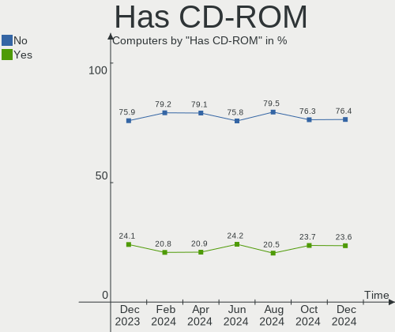

| Presented | Computers | Percent |
|-----------|-----------|---------|
| No        | 398       | 76.39%  |
| Yes       | 123       | 23.61%  |

Has Ethernet
------------

Has Ethernet on board

| Presented | Computers | Percent |
|-----------|-----------|---------|
| Yes       | 450       | 86.37%  |
| No        | 71        | 13.63%  |

Has WiFi
--------

Has WiFi module

| Presented | Computers | Percent |
|-----------|-----------|---------|
| Yes       | 357       | 68.52%  |
| No        | 164       | 31.48%  |

Has Bluetooth
-------------

Has Bluetooth module

| Presented | Computers | Percent |
|-----------|-----------|---------|
| Yes       | 298       | 57.2%   |
| No        | 223       | 42.8%   |

Location
--------

Country
-------

Geographic location (country)

| Country | Computers | Percent |
|---------|-----------|---------|
| Russia  | 521       | 100%    |

City
----

Geographic location (city)

| City             | Computers | Percent |
|------------------|-----------|---------|
| Moscow           | 112       | 21.5%   |
| St Petersburg    | 53        | 10.17%  |
| Voronezh         | 41        | 7.87%   |
| Yekaterinburg    | 18        | 3.45%   |
| Novosibirsk      | 14        | 2.69%   |
| Krasnodar        | 12        | 2.3%    |
| Samara           | 9         | 1.73%   |
| Nizhniy Novgorod | 9         | 1.73%   |
| Ufa              | 8         | 1.54%   |
| Rostov-on-Don    | 8         | 1.54%   |
| Perm             | 7         | 1.34%   |
| Kazan’         | 6         | 1.15%   |
| Chelyabinsk      | 6         | 1.15%   |
| Orenburg         | 5         | 0.96%   |
| Omsk             | 5         | 0.96%   |
| Krasnoyarsk      | 5         | 0.96%   |
| Yaroslavl        | 4         | 0.77%   |
| Vladivostok      | 4         | 0.77%   |
| Tomsk            | 4         | 0.77%   |
| Murmansk         | 4         | 0.77%   |
| Belgorod         | 4         | 0.77%   |
| Balashikha       | 4         | 0.77%   |
| Yoshkar-Ola      | 3         | 0.58%   |
| Yakutsk          | 3         | 0.58%   |
| Vologda          | 3         | 0.58%   |
| Ulyanovsk        | 3         | 0.58%   |
| Tambov           | 3         | 0.58%   |
| Taganrog         | 3         | 0.58%   |
| Saratov          | 3         | 0.58%   |
| Novy Urengoy     | 3         | 0.58%   |
| Murom            | 3         | 0.58%   |
| Kumertau         | 3         | 0.58%   |
| Khabarovsk       | 3         | 0.58%   |
| Ivanovo          | 3         | 0.58%   |
| Irkutsk          | 3         | 0.58%   |
| Cheboksary       | 3         | 0.58%   |
| Arkhangelsk      | 3         | 0.58%   |
| Volgograd        | 2         | 0.38%   |
| Vladimir         | 2         | 0.38%   |
| Tsarskoye Selo   | 2         | 0.38%   |

Drives
------

Drive Vendor
------------

Hard drive vendors

| Vendor              | Computers | Drives | Percent |
|---------------------|-----------|--------|---------|
| WDC                 | 114       | 152    | 15.14%  |
| Seagate             | 95        | 116    | 12.62%  |
| Samsung Electronics | 85        | 102    | 11.29%  |
| A-DATA Technology   | 46        | 47     | 6.11%   |
| Kingston            | 39        | 45     | 5.18%   |
| Toshiba             | 38        | 38     | 5.05%   |
| Unknown             | 29        | 32     | 3.85%   |
| Hitachi             | 25        | 27     | 3.32%   |
| China               | 24        | 24     | 3.19%   |
| SanDisk             | 20        | 20     | 2.66%   |
| Intel               | 16        | 17     | 2.12%   |
| SK hynix            | 15        | 15     | 1.99%   |
| Crucial             | 15        | 15     | 1.99%   |
| HGST                | 14        | 14     | 1.86%   |
| Micron Technology   | 13        | 37     | 1.73%   |
| Silicon Motion      | 12        | 14     | 1.59%   |
| Apacer              | 11        | 11     | 1.46%   |
| Smartbuy            | 8         | 8      | 1.06%   |
| Netac               | 7         | 8      | 0.93%   |
| KingSpec            | 7         | 7      | 0.93%   |
| Transcend           | 6         | 6      | 0.8%    |
| Phison              | 6         | 6      | 0.8%    |
| SPCC                | 5         | 5      | 0.66%   |
| KIOXIA              | 5         | 5      | 0.66%   |
| Phison Electronics  | 4         | 4      | 0.53%   |
| Patriot             | 4         | 4      | 0.53%   |
| JMicron Technology  | 4         | 4      | 0.53%   |
| Gigabyte Technology | 4         | 4      | 0.53%   |
| BIWIN               | 4         | 4      | 0.53%   |
| AMD                 | 4         | 4      | 0.53%   |
| Unknown             | 4         | 4      | 0.53%   |
| XrayDisk            | 3         | 3      | 0.4%    |
| XPG                 | 3         | 3      | 0.4%    |
| Plextor             | 3         | 3      | 0.4%    |
| Fujitsu             | 3         | 3      | 0.4%    |
| Digma               | 3         | 3      | 0.4%    |
| Apple               | 3         | 3      | 0.4%    |
| UMIS                | 2         | 2      | 0.27%   |
| TAMMUZ              | 2         | 3      | 0.27%   |
| OCZ                 | 2         | 2      | 0.27%   |

Drive Model
-----------

Hard drive models

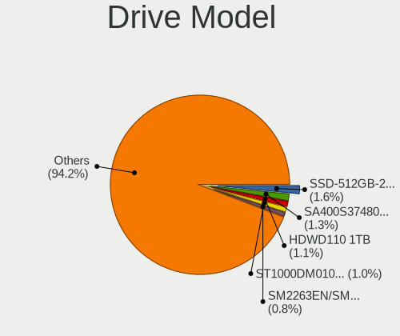

| Model                                                  | Computers | Percent |
|--------------------------------------------------------|-----------|---------|
| A-DATA SU800 512GB SSD                                 | 25        | 3.03%   |
| Kingston SA400S37240G 240GB SSD                        | 10        | 1.21%   |
| WDC WD10EZEX-08WN4A0 1TB                               | 8         | 0.97%   |
| Seagate ST1000DM010-2EP102 1TB                         | 8         | 0.97%   |
| Samsung NVMe SSD Controller SM981/PM981/PM983 1TB      | 8         | 0.97%   |
| Kingston SA400S37480G 480GB SSD                        | 8         | 0.97%   |
| WDC WDS240G2G0A-00JH30 240GB SSD                       | 5         | 0.61%   |
| WDC WDS120G2G0A-00JH30 120GB SSD                       | 5         | 0.61%   |
| Unknown SD/MMC/MS PRO 249GB                            | 5         | 0.61%   |
| Unknown MMC Card  64GB                                 | 5         | 0.61%   |
| Toshiba DT01ACA050 500GB                               | 5         | 0.61%   |
| Seagate ST9500325AS 500GB                              | 5         | 0.61%   |
| Toshiba MQ01ABF050 500GB                               | 4         | 0.48%   |
| Toshiba MQ01ABD100 1TB                                 | 4         | 0.48%   |
| Silicon Motion SM2263EN/SM2263XT SSD Controller 1024GB | 4         | 0.48%   |
| Seagate ST3500418AS 500GB                              | 4         | 0.48%   |
| Seagate ST1000LM035-1RK172 970GB                       | 4         | 0.48%   |
| Samsung SSD 980 PRO 1TB                                | 4         | 0.48%   |
| Samsung SSD 860 EVO 500GB                              | 4         | 0.48%   |
| Micron 7300_MTFDHBE3T8TDF 4TB                          | 4         | 0.48%   |
| Crucial CT240BX500SSD1 240GB                           | 4         | 0.48%   |
| China 120GB SSD                                        | 4         | 0.48%   |
| BIWIN CE480T5D101-256 256GB                            | 4         | 0.48%   |
| Apacer AS350 128GB SSD                                 | 4         | 0.48%   |
| Unknown                                                | 4         | 0.48%   |
| WDC WDS500G2B0A-00SM50 500GB SSD                       | 3         | 0.36%   |
| WDC WD2500AAKX-00ERMA0 250GB                           | 3         | 0.36%   |
| WDC WD20EZBX-00AYRA0 2TB                               | 3         | 0.36%   |
| WDC WD10EZEX-00BBHA0 1TB                               | 3         | 0.36%   |
| Unknown MMC Card  128GB                                | 3         | 0.36%   |
| Toshiba HDWD110 1TB                                    | 3         | 0.36%   |
| Toshiba DT01ACA200 2TB                                 | 3         | 0.36%   |
| Smartbuy SSD 120GB                                     | 3         | 0.36%   |
| Seagate ST500LT012-1DG142 500GB                        | 3         | 0.36%   |
| Seagate ST4000NM0035-1V4107 4TB                        | 3         | 0.36%   |
| Seagate ST3250824AS 250GB                              | 3         | 0.36%   |
| Seagate ST3250310AS 250GB                              | 3         | 0.36%   |
| Seagate ST3160811AS 160GB                              | 3         | 0.36%   |
| Samsung SSD 980 PRO 250GB                              | 3         | 0.36%   |
| Samsung SSD 980 1TB                                    | 3         | 0.36%   |

HDD Vendor
----------

Hard disk drive vendors

| Vendor              | Computers | Drives | Percent |
|---------------------|-----------|--------|---------|
| Seagate             | 95        | 116    | 33.57%  |
| WDC                 | 88        | 117    | 31.1%   |
| Toshiba             | 35        | 35     | 12.37%  |
| Hitachi             | 25        | 27     | 8.83%   |
| HGST                | 14        | 14     | 4.95%   |
| Samsung Electronics | 11        | 13     | 3.89%   |
| Unknown             | 5         | 5      | 1.77%   |
| JMicron Technology  | 3         | 3      | 1.06%   |
| Fujitsu             | 3         | 3      | 1.06%   |
| StoreJet            | 1         | 1      | 0.35%   |
| Maxtor              | 1         | 1      | 0.35%   |
| ASMT                | 1         | 2      | 0.35%   |
| Apple               | 1         | 1      | 0.35%   |

SSD Vendor
----------

Solid state drive vendors

| Vendor              | Computers | Drives | Percent |
|---------------------|-----------|--------|---------|
| A-DATA Technology   | 42        | 42     | 15.73%  |
| Kingston            | 29        | 33     | 10.86%  |
| Samsung Electronics | 23        | 23     | 8.61%   |
| China               | 23        | 23     | 8.61%   |
| WDC                 | 21        | 22     | 7.87%   |
| Crucial             | 15        | 15     | 5.62%   |
| SanDisk             | 11        | 11     | 4.12%   |
| Smartbuy            | 8         | 8      | 3%      |
| Apacer              | 8         | 8      | 3%      |
| KingSpec            | 7         | 7      | 2.62%   |
| Intel               | 7         | 7      | 2.62%   |
| Micron Technology   | 6         | 10     | 2.25%   |
| Transcend           | 5         | 5      | 1.87%   |
| SPCC                | 5         | 5      | 1.87%   |
| Patriot             | 4         | 4      | 1.5%    |
| Netac               | 4         | 4      | 1.5%    |
| Gigabyte Technology | 4         | 4      | 1.5%    |
| XrayDisk            | 3         | 3      | 1.12%   |
| Plextor             | 3         | 3      | 1.12%   |
| Digma               | 3         | 3      | 1.12%   |
| AMD                 | 3         | 3      | 1.12%   |
| Toshiba             | 2         | 2      | 0.75%   |
| TAMMUZ              | 2         | 3      | 0.75%   |
| OCZ                 | 2         | 2      | 0.75%   |
| Neo                 | 2         | 2      | 0.75%   |
| KingDian            | 2         | 2      | 0.75%   |
| GOODRAM             | 2         | 2      | 0.75%   |
| Azerty              | 2         | 2      | 0.75%   |
| Wicgtyp             | 1         | 1      | 0.37%   |
| TO Exter            | 1         | 1      | 0.37%   |
| Team                | 1         | 2      | 0.37%   |
| SK hynix            | 1         | 1      | 0.37%   |
| PNY                 | 1         | 1      | 0.37%   |
| Pioneer             | 1         | 1      | 0.37%   |
| Palit               | 1         | 1      | 0.37%   |
| NGFF                | 1         | 1      | 0.37%   |
| Lenovo              | 1         | 1      | 0.37%   |
| KODAK               | 1         | 1      | 0.37%   |
| KingFast            | 1         | 1      | 0.37%   |
| Kingchuxing         | 1         | 1      | 0.37%   |

Drive Kind
----------

HDD or SSD

| Kind    | Computers | Drives | Percent |
|---------|-----------|--------|---------|
| HDD     | 241       | 338    | 34.93%  |
| SSD     | 239       | 278    | 34.64%  |
| NVMe    | 181       | 227    | 26.23%  |
| MMC     | 24        | 26     | 3.48%   |
| Unknown | 5         | 5      | 0.72%   |

Drive Connector
---------------

SATA, SAS, NVMe, etc.

| Type | Computers | Drives | Percent |
|------|-----------|--------|---------|
| SATA | 374       | 602    | 62.65%  |
| NVMe | 181       | 227    | 30.32%  |
| MMC  | 24        | 26     | 4.02%   |
| SAS  | 18        | 19     | 3.02%   |

Drive Size
----------

Size of hard drive

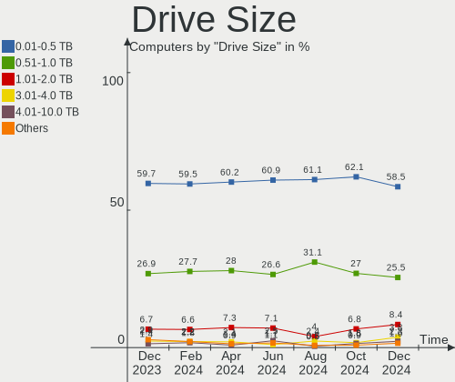

| Size in TB | Computers | Drives | Percent |
|------------|-----------|--------|---------|
| 0.01-0.5   | 290       | 383    | 60.67%  |
| 0.51-1.0   | 142       | 178    | 29.71%  |
| 1.01-2.0   | 28        | 29     | 5.86%   |
| 3.01-4.0   | 9         | 13     | 1.88%   |
| 2.01-3.0   | 6         | 8      | 1.26%   |
| 4.01-10.0  | 2         | 4      | 0.42%   |
| 10.01-20.0 | 1         | 1      | 0.21%   |

Space Total
-----------

Amount of disk space available on the file system

| Size in GB     | Computers | Percent |
|----------------|-----------|---------|
| 101-250        | 148       | 28.41%  |
| 251-500        | 100       | 19.19%  |
| 501-1000       | 75        | 14.4%   |
| Unknown        | 45        | 8.64%   |
| 1-20           | 44        | 8.45%   |
| 1001-2000      | 33        | 6.33%   |
| 51-100         | 30        | 5.76%   |
| 21-50          | 24        | 4.61%   |
| More than 3000 | 11        | 2.11%   |
| 2001-3000      | 11        | 2.11%   |

Space Used
----------

Amount of used disk space

| Used GB   | Computers | Percent |
|-----------|-----------|---------|
| 1-20      | 238       | 45.68%  |
| 21-50     | 77        | 14.78%  |
| 51-100    | 51        | 9.79%   |
| 101-250   | 49        | 9.4%    |
| Unknown   | 45        | 8.64%   |
| 251-500   | 29        | 5.57%   |
| 501-1000  | 16        | 3.07%   |
| 1001-2000 | 11        | 2.11%   |
| 2001-3000 | 5         | 0.96%   |

Malfunc. Drives
---------------

Drive models with a malfunction

| Model                                   | Computers | Drives | Percent |
|-----------------------------------------|-----------|--------|---------|
| Seagate ST9500325AS 500GB               | 4         | 4      | 3.45%   |
| Toshiba DT01ACA200 2TB                  | 3         | 3      | 2.59%   |
| Seagate ST3500418AS 500GB               | 3         | 3      | 2.59%   |
| Seagate ST3250824AS 250GB               | 3         | 3      | 2.59%   |
| Seagate ST3250310AS 250GB               | 3         | 3      | 2.59%   |
| WDC WD10EZEX-22MFCA0 1TB                | 2         | 2      | 1.72%   |
| Seagate ST3250318AS 250GB               | 2         | 2      | 1.72%   |
| Seagate ST3160811AS 160GB               | 2         | 2      | 1.72%   |
| Samsung Electronics HM321HI 320GB       | 2         | 2      | 1.72%   |
| Neo Forza NFS121SA312-6007000 120GB SSD | 2         | 2      | 1.72%   |
| HGST HTS545050A7E680 500GB              | 2         | 2      | 1.72%   |
| WDC WD7500BPVT-00HXZT3 752GB            | 1         | 1      | 0.86%   |
| WDC WD6401AALS-00L3B2 640GB             | 1         | 1      | 0.86%   |
| WDC WD5000LPVX-22V0TT0 500GB            | 1         | 1      | 0.86%   |
| WDC WD5000LPVT-00FMCT0 500GB            | 1         | 1      | 0.86%   |
| WDC WD5000BPVT-24HXZT3 500GB            | 1         | 1      | 0.86%   |
| WDC WD5000AAKX-60U6AA0 500GB            | 1         | 1      | 0.86%   |
| WDC WD5000AAKX-083CA1 500GB             | 1         | 1      | 0.86%   |
| WDC WD5000AAKX-001CA0 500GB             | 1         | 1      | 0.86%   |
| WDC WD5000AAKS-007AA0 500GB             | 1         | 1      | 0.86%   |
| WDC WD5000AADS-00S9B0 500GB             | 1         | 1      | 0.86%   |
| WDC WD3200BEVT-00A0RT0 320GB            | 1         | 1      | 0.86%   |
| WDC WD3200AAKX-001CA0 320GB             | 1         | 1      | 0.86%   |
| WDC WD2500JS-00NCB1 250GB               | 1         | 1      | 0.86%   |
| WDC WD2500BEVT-60ZCT1 250GB             | 1         | 1      | 0.86%   |
| WDC WD20EZRX-00DC0B0 2TB                | 1         | 1      | 0.86%   |
| WDC WD20EARX-00PASB0 2TB                | 1         | 1      | 0.86%   |
| WDC WD20EARS-00S8B1 2TB                 | 1         | 1      | 0.86%   |
| WDC WD1600AAJS-00L7A0 160GB             | 1         | 1      | 0.86%   |
| WDC WD15EARS-22MVWB0 1TB                | 1         | 1      | 0.86%   |
| WDC WD10JPVX-08JC3T5 1TB                | 1         | 1      | 0.86%   |
| WDC WD10EZEX-00MFCA0 1TB                | 1         | 1      | 0.86%   |
| WDC WD10EFRX-68JCSN0 1TB                | 1         | 2      | 0.86%   |
| WDC WD10EARS-00Y5B1 1TB                 | 1         | 1      | 0.86%   |
| WDC WD1002FAEX-00Z3A0 1TB               | 1         | 1      | 0.86%   |
| WDC WD1001FALS-00J7B0 1TB               | 1         | 1      | 0.86%   |
| Toshiba MQ04ABF100 1TB                  | 1         | 1      | 0.86%   |
| Toshiba MQ01ABD100 1TB                  | 1         | 1      | 0.86%   |
| Toshiba MK2046GSX 200GB                 | 1         | 1      | 0.86%   |
| Toshiba HDWD105 500GB                   | 1         | 1      | 0.86%   |

Malfunc. Drive Vendor
---------------------

Vendors of faulty drives

| Vendor              | Computers | Drives | Percent |
|---------------------|-----------|--------|---------|
| Seagate             | 37        | 37     | 32.17%  |
| WDC                 | 26        | 28     | 22.61%  |
| Hitachi             | 12        | 12     | 10.43%  |
| Toshiba             | 7         | 7      | 6.09%   |
| Samsung Electronics | 7         | 7      | 6.09%   |
| HGST                | 5         | 5      | 4.35%   |
| KingSpec            | 3         | 3      | 2.61%   |
| SanDisk             | 2         | 2      | 1.74%   |
| Neo                 | 2         | 2      | 1.74%   |
| Intel               | 2         | 2      | 1.74%   |
| Apacer              | 2         | 2      | 1.74%   |
| Silicon Motion      | 1         | 1      | 0.87%   |
| PNY                 | 1         | 1      | 0.87%   |
| Plextor             | 1         | 1      | 0.87%   |
| Netac               | 1         | 1      | 0.87%   |
| Kingston            | 1         | 1      | 0.87%   |
| KingDian            | 1         | 1      | 0.87%   |
| Fujitsu             | 1         | 1      | 0.87%   |
| China               | 1         | 1      | 0.87%   |
| Azerty              | 1         | 1      | 0.87%   |
| AMD                 | 1         | 1      | 0.87%   |

Malfunc. HDD Vendor
-------------------

Vendors of faulty HDD drives

| Vendor              | Computers | Drives | Percent |
|---------------------|-----------|--------|---------|
| Seagate             | 37        | 37     | 39.78%  |
| WDC                 | 26        | 28     | 27.96%  |
| Hitachi             | 12        | 12     | 12.9%   |
| Toshiba             | 7         | 7      | 7.53%   |
| Samsung Electronics | 5         | 5      | 5.38%   |
| HGST                | 5         | 5      | 5.38%   |
| Fujitsu             | 1         | 1      | 1.08%   |

Malfunc. Drive Kind
-------------------

Kinds of faulty drives

| Kind | Computers | Drives | Percent |
|------|-----------|--------|---------|
| HDD  | 85        | 95     | 80.19%  |
| SSD  | 17        | 18     | 16.04%  |
| NVMe | 4         | 4      | 3.77%   |

Failed Drives
-------------

Failed drive models

Zero info for selected period =(

Failed Drive Vendor
-------------------

Failed drive vendors

Zero info for selected period =(

Drive Status
------------

Number of failed and malfunc. drives

| Status   | Computers | Drives | Percent |
|----------|-----------|--------|---------|
| Works    | 385       | 601    | 64.92%  |
| Detected | 107       | 156    | 18.04%  |
| Malfunc  | 101       | 117    | 17.03%  |

Storage controller
------------------

Storage Vendor
--------------

Storage controller vendors

| Vendor                       | Computers | Percent |
|------------------------------|-----------|---------|
| Intel                        | 333       | 49.26%  |
| AMD                          | 112       | 16.57%  |
| Samsung Electronics          | 59        | 8.73%   |
| SanDisk                      | 21        | 3.11%   |
| Silicon Motion               | 17        | 2.51%   |
| Phison Electronics           | 15        | 2.22%   |
| SK hynix                     | 14        | 2.07%   |
| ASMedia Technology           | 14        | 2.07%   |
| Kingston Technology Company  | 12        | 1.78%   |
| Micron Technology            | 11        | 1.63%   |
| Nvidia                       | 10        | 1.48%   |
| Marvell Technology Group     | 8         | 1.18%   |
| JMicron Technology           | 8         | 1.18%   |
| ADATA Technology             | 7         | 1.04%   |
| Netac Technology             | 5         | 0.74%   |
| MAXIO Technology (Hangzhou)  | 5         | 0.74%   |
| KIOXIA                       | 5         | 0.74%   |
| INNOGRIT                     | 4         | 0.59%   |
| Shenzhen Longsys Electronics | 3         | 0.44%   |
| Union Memory (Shenzhen)      | 2         | 0.3%    |
| Realtek Semiconductor        | 2         | 0.3%    |
| Broadcom / LSI               | 2         | 0.3%    |
| Unknown                      | 2         | 0.3%    |
| Yangtze Memory Technologies  | 1         | 0.15%   |
| VIA Technologies             | 1         | 0.15%   |
| Toshiba America Info Systems | 1         | 0.15%   |
| Micron/Crucial Technology    | 1         | 0.15%   |
| LSI Logic / Symbios Logic    | 1         | 0.15%   |

Storage Model
-------------

Storage controller models

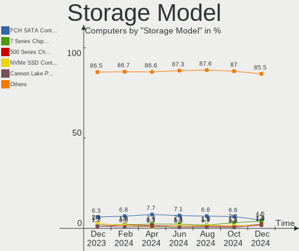

| Model                                                                                   | Computers | Percent |
|-----------------------------------------------------------------------------------------|-----------|---------|
| AMD FCH SATA Controller [AHCI mode]                                                     | 65        | 8.23%   |
| Intel Cannon Lake PCH SATA AHCI Controller                                              | 37        | 4.68%   |
| Samsung NVMe SSD Controller SM981/PM981/PM983                                           | 25        | 3.16%   |
| Intel 7 Series Chipset Family 6-port SATA Controller [AHCI mode]                        | 23        | 2.91%   |
| Intel 6 Series/C200 Series Chipset Family 6 port Desktop SATA AHCI Controller           | 19        | 2.41%   |
| Intel 8 Series/C220 Series Chipset Family 6-port SATA Controller 1 [AHCI mode]          | 18        | 2.28%   |
| AMD 500 Series Chipset SATA Controller                                                  | 18        | 2.28%   |
| Samsung NVMe SSD Controller PM9A1/PM9A3/980PRO                                          | 17        | 2.15%   |
| Silicon Motion SM2263EN/SM2263XT SSD Controller                                         | 14        | 1.77%   |
| Samsung NVMe SSD Controller 980                                                         | 14        | 1.77%   |
| AMD SB7x0/SB8x0/SB9x0 IDE Controller                                                    | 14        | 1.77%   |
| Intel NM10/ICH7 Family SATA Controller [IDE mode]                                       | 12        | 1.52%   |
| AMD FCH SATA Controller D                                                               | 12        | 1.52%   |
| AMD 400 Series Chipset SATA Controller                                                  | 11        | 1.39%   |
| Intel Q170/Q150/B150/H170/H110/Z170/CM236 Chipset SATA Controller [AHCI Mode]           | 10        | 1.27%   |
| Intel Celeron/Pentium Silver Processor SATA Controller                                  | 10        | 1.27%   |
| Intel 6 Series/C200 Series Chipset Family 6 port Mobile SATA AHCI Controller            | 10        | 1.27%   |
| ASMedia ASM1062 Serial ATA Controller                                                   | 10        | 1.27%   |
| AMD SB7x0/SB8x0/SB9x0 SATA Controller [AHCI mode]                                       | 10        | 1.27%   |
| Intel 82801G (ICH7 Family) IDE Controller                                               | 9         | 1.14%   |
| Intel Sunrise Point-LP SATA Controller [AHCI mode]                                      | 8         | 1.01%   |
| Intel Cannon Point-LP SATA Controller [AHCI Mode]                                       | 8         | 1.01%   |
| Intel 82801IBM/IEM (ICH9M/ICH9M-E) 4 port SATA Controller [AHCI mode]                   | 8         | 1.01%   |
| Intel 6 Series/C200 Series Chipset Family Desktop SATA Controller (IDE mode, ports 4-5) | 8         | 1.01%   |
| Intel 6 Series/C200 Series Chipset Family Desktop SATA Controller (IDE mode, ports 0-3) | 8         | 1.01%   |
| Intel 500 Series Chipset Family SATA AHCI Controller                                    | 8         | 1.01%   |
| Intel 5 Series/3400 Series Chipset 6 port SATA AHCI Controller                          | 8         | 1.01%   |
| Phison E12 NVMe Controller                                                              | 7         | 0.89%   |
| Intel SATA Controller [RAID mode]                                                       | 7         | 0.89%   |
| Intel 8 Series SATA Controller 1 [AHCI mode]                                            | 7         | 0.89%   |
| Intel 200 Series PCH SATA controller [AHCI mode]                                        | 7         | 0.89%   |
| AMD SB7x0/SB8x0/SB9x0 SATA Controller [IDE mode]                                        | 7         | 0.89%   |
| SanDisk WD Black SN750 / PC SN730 NVMe SSD                                              | 6         | 0.76%   |
| Intel Volume Management Device NVMe RAID Controller                                     | 6         | 0.76%   |
| Intel Alder Lake-P SATA AHCI Controller                                                 | 6         | 0.76%   |
| Intel 82801HM/HEM (ICH8M/ICH8M-E) IDE Controller                                        | 6         | 0.76%   |
| Intel 82801 Mobile SATA Controller [RAID mode]                                          | 6         | 0.76%   |
| SK hynix BC501 NVMe Solid State Drive                                                   | 5         | 0.63%   |
| SanDisk WD Blue SN550 NVMe SSD                                                          | 5         | 0.63%   |
| Netac Non-Volatile memory controller                                                    | 5         | 0.63%   |

Storage Kind
------------

Kind of storage controller (IDE, SATA, NVMe, SAS, ...)

| Kind | Computers | Percent |
|------|-----------|---------|
| SATA | 380       | 56.55%  |
| NVMe | 181       | 26.93%  |
| IDE  | 84        | 12.5%   |
| RAID | 25        | 3.72%   |
| SAS  | 2         | 0.3%    |

Processor
---------

CPU Vendor
----------

Processor vendors

| Vendor | Computers | Percent |
|--------|-----------|---------|
| Intel  | 358       | 68.71%  |
| AMD    | 160       | 30.71%  |
| ARM    | 3         | 0.58%   |

CPU Model
---------

Processor models

| Model                                         | Computers | Percent |
|-----------------------------------------------|-----------|---------|
| Intel Core i3-9100 CPU @ 3.60GHz              | 26        | 4.99%   |
| AMD Ryzen 5 4600H with Radeon Graphics        | 7         | 1.34%   |
| Intel 12th Gen Core i7-12700H                 | 6         | 1.15%   |
| Intel 11th Gen Core i5-1135G7 @ 2.40GHz       | 6         | 1.15%   |
| AMD Ryzen 5 5600X 6-Core Processor            | 6         | 1.15%   |
| AMD Ryzen 5 5500U with Radeon Graphics        | 6         | 1.15%   |
| AMD Ryzen 7 6800H with Radeon Graphics        | 5         | 0.96%   |
| AMD Ryzen 5 5600H with Radeon Graphics        | 5         | 0.96%   |
| AMD Ryzen 5 3600 6-Core Processor             | 5         | 0.96%   |
| Intel Core i5-8265U CPU @ 1.60GHz             | 4         | 0.77%   |
| Intel Core i5-6200U CPU @ 2.30GHz             | 4         | 0.77%   |
| Intel Core i5-2400 CPU @ 3.10GHz              | 4         | 0.77%   |
| Intel Core i5-10210U CPU @ 1.60GHz            | 4         | 0.77%   |
| AMD Ryzen 7 7700X 8-Core Processor            | 4         | 0.77%   |
| AMD Ryzen 7 5800H with Radeon Graphics        | 4         | 0.77%   |
| AMD Ryzen 7 5700G with Radeon Graphics        | 4         | 0.77%   |
| AMD Ryzen 5 5600U with Radeon Graphics        | 4         | 0.77%   |
| AMD Ryzen 5 5600G with Radeon Graphics        | 4         | 0.77%   |
| AMD Ryzen 5 3500U with Radeon Vega Mobile Gfx | 4         | 0.77%   |
| Intel Pentium CPU G4400 @ 3.30GHz             | 3         | 0.58%   |
| Intel Core i7-10750H CPU @ 2.60GHz            | 3         | 0.58%   |
| Intel Core i5-8279U CPU @ 2.40GHz             | 3         | 0.58%   |
| Intel Core i5-10400F CPU @ 2.90GHz            | 3         | 0.58%   |
| Intel Core i3-6100U CPU @ 2.30GHz             | 3         | 0.58%   |
| Intel Core i3-3120M CPU @ 2.50GHz             | 3         | 0.58%   |
| Intel Core i3-2350M CPU @ 2.30GHz             | 3         | 0.58%   |
| Intel Core 2 Duo CPU E4500 @ 2.20GHz          | 3         | 0.58%   |
| Intel Celeron N4020 CPU @ 1.10GHz             | 3         | 0.58%   |
| Intel Celeron CPU N3350 @ 1.10GHz             | 3         | 0.58%   |
| AMD Ryzen 3 5300U with Radeon Graphics        | 3         | 0.58%   |
| AMD Ryzen 3 3200G with Radeon Vega Graphics   | 3         | 0.58%   |
| AMD Custom APU 0405                           | 3         | 0.58%   |
| Intel Xeon CPU E5-2690 0 @ 2.90GHz            | 2         | 0.38%   |
| Intel Xeon CPU E5-2640 0 @ 2.50GHz            | 2         | 0.38%   |
| Intel Pentium Silver N6000 @ 1.10GHz          | 2         | 0.38%   |
| Intel Pentium Gold G5400 CPU @ 3.70GHz        | 2         | 0.38%   |
| Intel Pentium Dual-Core CPU T4500 @ 2.30GHz   | 2         | 0.38%   |
| Intel Core i7-8565U CPU @ 1.80GHz             | 2         | 0.38%   |
| Intel Core i7-4700HQ CPU @ 2.40GHz            | 2         | 0.38%   |
| Intel Core i7-4500U CPU @ 1.80GHz             | 2         | 0.38%   |

CPU Model Family
----------------

Processor model prefix

| Model                   | Computers | Percent |
|-------------------------|-----------|---------|
| Intel Core i5           | 80        | 15.36%  |
| Intel Core i3           | 74        | 14.2%   |
| AMD Ryzen 5             | 53        | 10.17%  |
| Other                   | 39        | 7.49%   |
| Intel Core i7           | 34        | 6.53%   |
| Intel Celeron           | 34        | 6.53%   |
| AMD Ryzen 7             | 32        | 6.14%   |
| Intel Core 2 Duo        | 24        | 4.61%   |
| Intel Xeon              | 22        | 4.22%   |
| Intel Pentium           | 19        | 3.65%   |
| AMD Ryzen 3             | 15        | 2.88%   |
| AMD FX                  | 10        | 1.92%   |
| Intel Atom              | 6         | 1.15%   |
| Intel Pentium Dual-Core | 5         | 0.96%   |
| Intel Core 2 Quad       | 5         | 0.96%   |
| AMD Ryzen 9             | 5         | 0.96%   |
| AMD A8                  | 5         | 0.96%   |
| Intel Pentium Silver    | 4         | 0.77%   |
| AMD Phenom II X4        | 4         | 0.77%   |
| Intel Xeon Silver       | 3         | 0.58%   |
| Intel Core 2            | 3         | 0.58%   |
| AMD Athlon II X2        | 3         | 0.58%   |
| AMD Athlon 64 X2        | 3         | 0.58%   |
| AMD A4                  | 3         | 0.58%   |
| AMD A10                 | 3         | 0.58%   |
| Intel Xeon Gold         | 2         | 0.38%   |
| Intel Pentium M         | 2         | 0.38%   |
| Intel Pentium Gold      | 2         | 0.38%   |
| Intel Celeron Dual-Core | 2         | 0.38%   |
| AMD Ryzen 5 PRO         | 2         | 0.38%   |
| AMD A6                  | 2         | 0.38%   |
| Intel Xeon Bronze       | 1         | 0.19%   |
| Intel Pentium Dual      | 1         | 0.19%   |
| Intel Pentium 4         | 1         | 0.19%   |
| ARM BCM                 | 1         | 0.19%   |
| AMD Turion 64 X2 Mobile | 1         | 0.19%   |
| AMD Sempron             | 1         | 0.19%   |
| AMD Ryzen 7 PRO         | 1         | 0.19%   |
| AMD Ryzen 3 PRO         | 1         | 0.19%   |
| AMD Phenom II           | 1         | 0.19%   |

CPU Cores
---------

Number of processor cores

| Number | Computers | Percent |
|--------|-----------|---------|
| 2      | 185       | 35.51%  |
| 4      | 175       | 33.59%  |
| 6      | 72        | 13.82%  |
| 8      | 41        | 7.87%   |
| 1      | 14        | 2.69%   |
| 12     | 8         | 1.54%   |
| 14     | 7         | 1.34%   |
| 16     | 4         | 0.77%   |
| 10     | 4         | 0.77%   |
| 3      | 4         | 0.77%   |
| 20     | 2         | 0.38%   |
| 48     | 1         | 0.19%   |
| 40     | 1         | 0.19%   |
| 36     | 1         | 0.19%   |
| 32     | 1         | 0.19%   |
| 24     | 1         | 0.19%   |

CPU Sockets
-----------

Number of sockets

| Number | Computers | Percent |
|--------|-----------|---------|
| 1      | 508       | 97.5%   |
| 2      | 13        | 2.5%    |

CPU Threads
-----------

Threads per core (Hyper-Threading)

| Number | Computers | Percent |
|--------|-----------|---------|
| 2      | 301       | 57.77%  |
| 1      | 220       | 42.23%  |

CPU Op-Modes
------------

CPU Operation Modes (32-bit, 64-bit)

| Op mode        | Computers | Percent |
|----------------|-----------|---------|
| 32-bit, 64-bit | 518       | 99.42%  |
| 32-bit         | 2         | 0.38%   |
| Unknown        | 1         | 0.19%   |

CPU Microcode
-------------

Microcode number

| Number     | Computers | Percent |
|------------|-----------|---------|
| Unknown    | 122       | 23.42%  |
| 0x906eb    | 29        | 5.57%   |
| 0x306a9    | 25        | 4.8%    |
| 0x206a7    | 21        | 4.03%   |
| 0x1067a    | 16        | 3.07%   |
| 0x0a50000c | 16        | 3.07%   |
| 0x306c3    | 13        | 2.5%    |
| 0x906ea    | 9         | 1.73%   |
| 0x806c1    | 9         | 1.73%   |
| 0x08600106 | 9         | 1.73%   |
| 0x08108109 | 8         | 1.54%   |
| 0x906e9    | 7         | 1.34%   |
| 0x506e3    | 7         | 1.34%   |
| 0x406e3    | 7         | 1.34%   |
| 0x0800820d | 7         | 1.34%   |
| 0xa0653    | 6         | 1.15%   |
| 0xa0652    | 6         | 1.15%   |
| 0x906a3    | 6         | 1.15%   |
| 0x6fd      | 6         | 1.15%   |
| 0x20655    | 6         | 1.15%   |
| 0x0a601203 | 6         | 1.15%   |
| 0x0a50000d | 6         | 1.15%   |
| 0x08608103 | 6         | 1.15%   |
| 0x06001119 | 6         | 1.15%   |
| 0x010000c8 | 6         | 1.15%   |
| 0x806ec    | 5         | 0.96%   |
| 0x6fb      | 5         | 0.96%   |
| 0x50657    | 5         | 0.96%   |
| 0x40651    | 5         | 0.96%   |
| 0x20652    | 5         | 0.96%   |
| 0x906c0    | 4         | 0.77%   |
| 0x206d7    | 4         | 0.77%   |
| 0x10676    | 4         | 0.77%   |
| 0x08701021 | 4         | 0.77%   |
| 0x08600104 | 4         | 0.77%   |
| 0x906ed    | 3         | 0.58%   |
| 0x806ea    | 3         | 0.58%   |
| 0x706a8    | 3         | 0.58%   |
| 0x706a1    | 3         | 0.58%   |
| 0x406c4    | 3         | 0.58%   |

CPU Microarch
-------------

Microarchitecture

| Name             | Computers | Percent |
|------------------|-----------|---------|
| KabyLake         | 73        | 14.01%  |
| Zen 3            | 38        | 7.29%   |
| SandyBridge      | 37        | 7.1%    |
| IvyBridge        | 32        | 6.14%   |
| Unknown          | 32        | 6.14%   |
| Haswell          | 30        | 5.76%   |
| Skylake          | 26        | 4.99%   |
| Penryn           | 26        | 4.99%   |
| Zen 2            | 23        | 4.41%   |
| Zen+             | 21        | 4.03%   |
| Core             | 19        | 3.65%   |
| Westmere         | 17        | 3.26%   |
| CometLake        | 17        | 3.26%   |
| TigerLake        | 14        | 2.69%   |
| Piledriver       | 13        | 2.5%    |
| Alderlake Hybrid | 13        | 2.5%    |
| K10              | 12        | 2.3%    |
| Goldmont plus    | 11        | 2.11%   |
| Zen              | 7         | 1.34%   |
| Silvermont       | 7         | 1.34%   |
| IceLake          | 7         | 1.34%   |
| Tremont          | 6         | 1.15%   |
| K8 Hammer        | 6         | 1.15%   |
| Broadwell        | 6         | 1.15%   |
| K10 Llano        | 5         | 0.96%   |
| Goldmont         | 4         | 0.77%   |
| Bonnell          | 4         | 0.77%   |
| Bulldozer        | 3         | 0.58%   |
| Steamroller      | 2         | 0.38%   |
| P6               | 2         | 0.38%   |
| NetBurst         | 2         | 0.38%   |
| Jaguar           | 2         | 0.38%   |
| Excavator        | 2         | 0.38%   |
| Puma             | 1         | 0.19%   |
| Bobcat           | 1         | 0.19%   |

Graphics
--------

GPU Vendor
----------

Vendors of graphics cards

| Vendor                     | Computers | Percent |
|----------------------------|-----------|---------|
| Intel                      | 247       | 40.69%  |
| Nvidia                     | 175       | 28.83%  |
| AMD                        | 173       | 28.5%   |
| ASPEED Technology          | 8         | 1.32%   |
| Matrox Electronics Systems | 4         | 0.66%   |

GPU Model
---------

Graphics card models

| Model                                                                                    | Computers | Percent |
|------------------------------------------------------------------------------------------|-----------|---------|
| Intel CoffeeLake-S GT2 [UHD Graphics 630]                                                | 33        | 5.33%   |
| AMD Cezanne [Radeon Vega Series / Radeon Vega Mobile Series]                             | 24        | 3.88%   |
| Intel 2nd Generation Core Processor Family Integrated Graphics Controller                | 20        | 3.23%   |
| Intel 3rd Gen Core processor Graphics Controller                                         | 16        | 2.58%   |
| AMD Renoir                                                                               | 15        | 2.42%   |
| AMD Picasso/Raven 2 [Radeon Vega Series / Radeon Vega Mobile Series]                     | 13        | 2.1%    |
| Intel TigerLake-LP GT2 [Iris Xe Graphics]                                                | 11        | 1.78%   |
| Intel Skylake GT2 [HD Graphics 520]                                                      | 10        | 1.62%   |
| Intel GeminiLake [UHD Graphics 600]                                                      | 9         | 1.45%   |
| Intel Core Processor Integrated Graphics Controller                                      | 9         | 1.45%   |
| Intel Alder Lake-P Integrated Graphics Controller                                        | 9         | 1.45%   |
| AMD Lucienne                                                                             | 9         | 1.45%   |
| AMD Ellesmere [Radeon RX 470/480/570/570X/580/580X/590]                                  | 9         | 1.45%   |
| Nvidia GP107 [GeForce GTX 1050 Ti]                                                       | 8         | 1.29%   |
| Nvidia GA106M [GeForce RTX 3060 Mobile / Max-Q]                                          | 8         | 1.29%   |
| ASPEED Technology ASPEED Graphics Family                                                 | 8         | 1.29%   |
| Intel Xeon E3-1200 v2/3rd Gen Core processor Graphics Controller                         | 7         | 1.13%   |
| Intel Mobile 4 Series Chipset Integrated Graphics Controller                             | 7         | 1.13%   |
| Intel Haswell-ULT Integrated Graphics Controller                                         | 7         | 1.13%   |
| Intel CometLake-H GT2 [UHD Graphics]                                                     | 7         | 1.13%   |
| Nvidia GK208M [GeForce GT 740M]                                                          | 6         | 0.97%   |
| Nvidia GK208B [GeForce GT 710]                                                           | 6         | 0.97%   |
| Intel WhiskeyLake-U GT2 [UHD Graphics 620]                                               | 6         | 0.97%   |
| Intel JasperLake [UHD Graphics]                                                          | 6         | 0.97%   |
| Intel CometLake-U GT2 [UHD Graphics]                                                     | 6         | 0.97%   |
| AMD Rembrandt [Radeon 680M]                                                              | 6         | 0.97%   |
| Nvidia GP108 [GeForce GT 1030]                                                           | 5         | 0.81%   |
| Nvidia GF117M [GeForce 610M/710M/810M/820M / GT 620M/625M/630M/720M]                     | 5         | 0.81%   |
| Intel HD Graphics 530                                                                    | 5         | 0.81%   |
| AMD Navi 23 [Radeon RX 6600/6600 XT/6600M]                                               | 5         | 0.81%   |
| Nvidia TU117 [GeForce GTX 1650]                                                          | 4         | 0.65%   |
| Nvidia GM107 [GeForce GTX 750 Ti]                                                        | 4         | 0.65%   |
| Nvidia GK208B [GeForce GT 730]                                                           | 4         | 0.65%   |
| Nvidia GA106 [GeForce RTX 3060 Lite Hash Rate]                                           | 4         | 0.65%   |
| Intel Xeon E3-1200 v3/4th Gen Core Processor Integrated Graphics Controller              | 4         | 0.65%   |
| Intel Iris Plus Graphics G1 (Ice Lake)                                                   | 4         | 0.65%   |
| Intel HD Graphics 500                                                                    | 4         | 0.65%   |
| Intel CometLake-S GT2 [UHD Graphics 630]                                                 | 4         | 0.65%   |
| Intel CoffeeLake-U GT3e [Iris Plus Graphics 655]                                         | 4         | 0.65%   |
| Intel Atom/Celeron/Pentium Processor x5-E8000/J3xxx/N3xxx Integrated Graphics Controller | 4         | 0.65%   |

GPU Combo
---------

Combinations of graphics cards

| Name            | Computers | Percent |
|-----------------|-----------|---------|
| 1 x Intel       | 167       | 32.05%  |
| 1 x AMD         | 138       | 26.49%  |
| 1 x Nvidia      | 106       | 20.35%  |
| Intel + Nvidia  | 57        | 10.94%  |
| Intel + AMD     | 14        | 2.69%   |
| AMD + Nvidia    | 12        | 2.3%    |
| 2 x AMD         | 8         | 1.54%   |
| 1 x ASPEED      | 8         | 1.54%   |
| 1 x Matrox      | 4         | 0.77%   |
| Other           | 3         | 0.58%   |
| 2 x Intel       | 3         | 0.58%   |
| Intel + 2 x AMD | 1         | 0.19%   |

GPU Driver
----------

Free vs proprietary

| Driver      | Computers | Percent |
|-------------|-----------|---------|
| Free        | 411       | 78.89%  |
| Proprietary | 58        | 11.13%  |
| Unknown     | 52        | 9.98%   |

GPU Memory
----------

Total video memory

| Size in GB | Computers | Percent |
|------------|-----------|---------|
| Unknown    | 260       | 49.9%   |
| 0.01-0.5   | 87        | 16.7%   |
| 1.01-2.0   | 63        | 12.09%  |
| 0.51-1.0   | 48        | 9.21%   |
| 3.01-4.0   | 33        | 6.33%   |
| 7.01-8.0   | 16        | 3.07%   |
| 5.01-6.0   | 9         | 1.73%   |
| 8.01-16.0  | 4         | 0.77%   |
| 16.01-24.0 | 1         | 0.19%   |

Monitor
-------

Monitor Vendor
--------------

Monitor vendors

| Vendor                  | Computers | Percent |
|-------------------------|-----------|---------|
| Samsung Electronics     | 71        | 14.67%  |
| BOE                     | 55        | 11.36%  |
| AU Optronics            | 39        | 8.06%   |
| Chimei Innolux          | 34        | 7.02%   |
| LG Display              | 32        | 6.61%   |
| Acer                    | 32        | 6.61%   |
| Goldstar                | 25        | 5.17%   |
| Philips                 | 21        | 4.34%   |
| Hewlett-Packard         | 13        | 2.69%   |
| AOC                     | 13        | 2.69%   |
| Chi Mei Optoelectronics | 12        | 2.48%   |
| ASUSTek Computer        | 10        | 2.07%   |
| BenQ                    | 9         | 1.86%   |
| ViewSonic               | 8         | 1.65%   |
| Lenovo                  | 8         | 1.65%   |
| Dell                    | 6         | 1.24%   |
| Ancor Communications    | 6         | 1.24%   |
| TMX                     | 5         | 1.03%   |
| NEC Computers           | 5         | 1.03%   |
| Mi                      | 5         | 1.03%   |
| Sony                    | 4         | 0.83%   |
| Iiyama                  | 4         | 0.83%   |
| HannStar                | 4         | 0.83%   |
| Valve                   | 3         | 0.62%   |
| PANDA                   | 3         | 0.62%   |
| MSI                     | 3         | 0.62%   |
| LG Electronics          | 3         | 0.62%   |
| CSO                     | 3         | 0.62%   |
| Apple                   | 3         | 0.62%   |
| Unknown                 | 3         | 0.62%   |
| Unknown                 | 2         | 0.41%   |
| Toshiba                 | 2         | 0.41%   |
| Sharp                   | 2         | 0.41%   |
| SGT                     | 2         | 0.41%   |
| Panasonic               | 2         | 0.41%   |
| LG Philips              | 2         | 0.41%   |
| JRY                     | 2         | 0.41%   |
| JDZ                     | 2         | 0.41%   |
| HKC                     | 2         | 0.41%   |
| Xiaomi                  | 1         | 0.21%   |

Monitor Model
-------------

Monitor models

| Model                                                                    | Computers | Percent |
|--------------------------------------------------------------------------|-----------|---------|
| BOE LCD Monitor BOE0878 1920x1080 355x200mm 16.0-inch                    | 6         | 1.23%   |
| Chimei Innolux LCD Monitor CMN14D4 1920x1080 309x173mm 13.9-inch         | 5         | 1.03%   |
| BOE LCD Monitor BOE0872 1920x1080 344x194mm 15.5-inch                    | 5         | 1.03%   |
| LG Display LCD Monitor LGD033A 1366x768 344x194mm 15.5-inch              | 4         | 0.82%   |
| Valve ANX7530 U VLV3001 800x1280 100x150mm 7.1-inch                      | 3         | 0.62%   |
| TMX TL156MDMP11-0 TMX1560 3200x2000 336x210mm 15.6-inch                  | 3         | 0.62%   |
| Lenovo LCD Monitor LEN40A0 1366x768 309x174mm 14.0-inch                  | 3         | 0.62%   |
| Chi Mei Optoelectronics LCD Monitor CMO15A7 1366x768 344x193mm 15.5-inch | 3         | 0.62%   |
| BOE LCD Monitor BOE0877 1920x1080 309x173mm 13.9-inch                    | 3         | 0.62%   |
| AU Optronics LCD Monitor AUOAF90 1920x1080 344x193mm 15.5-inch           | 3         | 0.62%   |
| AU Optronics LCD Monitor AUO22EC 1366x768 344x193mm 15.5-inch            | 3         | 0.62%   |
| Unknown                                                                  | 3         | 0.62%   |
| SGT XY238 SGT2386 1920x1080 530x290mm 23.8-inch                          | 2         | 0.41%   |
| Samsung Electronics SyncMaster SAM01E1 1280x1024 376x301mm 19.0-inch     | 2         | 0.41%   |
| Samsung Electronics S24D300 SAM0B43 1920x1080 531x299mm 24.0-inch        | 2         | 0.41%   |
| Samsung Electronics S24D300 SAM0B42 1920x1080 531x299mm 24.0-inch        | 2         | 0.41%   |
| Samsung Electronics S22C200 SAM09AF 1920x1080 477x268mm 21.5-inch        | 2         | 0.41%   |
| Samsung Electronics LCD Monitor SDC4161 1920x1080 344x194mm 15.5-inch    | 2         | 0.41%   |
| Samsung Electronics C32F391 SAM0D34 1920x1080 698x393mm 31.5-inch        | 2         | 0.41%   |
| Samsung Electronics C27F390 SAM0D32 1920x1080 598x336mm 27.0-inch        | 2         | 0.41%   |
| Philips PHL 243V7 PHLC155 1920x1080 527x296mm 23.8-inch                  | 2         | 0.41%   |
| Philips PHL 240V5A PHLC10C 1920x1080 527x296mm 23.8-inch                 | 2         | 0.41%   |
| PANDA LCD Monitor NCP004D 1920x1080 344x194mm 15.5-inch                  | 2         | 0.41%   |
| Mi Monitor XMI2701 2560x1440 597x336mm 27.0-inch                         | 2         | 0.41%   |
| LG Display LCD Monitor LGD05FA 1920x1080 309x174mm 14.0-inch             | 2         | 0.41%   |
| LG Display LCD Monitor LGD02AC 1366x768 344x194mm 15.5-inch              | 2         | 0.41%   |
| Lenovo LEN-24ICB-B LEN1201 1920x1080 527x296mm 23.8-inch                 | 2         | 0.41%   |
| JDZ LCD Monitor JDZE03D 1920x1080 309x174mm 14.0-inch                    | 2         | 0.41%   |
| HKC LCD Monitor HKC3D05 1920x1080 344x194mm 15.5-inch                    | 2         | 0.41%   |
| Hewlett-Packard 27er HWP3325 1920x1080 598x336mm 27.0-inch               | 2         | 0.41%   |
| HannStar JM01-22 HSP0016 1680x1050 480x270mm 21.7-inch                   | 2         | 0.41%   |
| Goldstar W1943 GSM4BAD 1360x768 406x229mm 18.4-inch                      | 2         | 0.41%   |
| Goldstar ULTRAWIDE GSM59F1 2560x1080 673x284mm 28.8-inch                 | 2         | 0.41%   |
| Chimei Innolux P130ZFA-BA1 CMN8201 2160x1440 275x183mm 13.0-inch         | 2         | 0.41%   |
| Chimei Innolux LCD Monitor CMN1604 1920x1080 355x199mm 16.0-inch         | 2         | 0.41%   |
| Chimei Innolux LCD Monitor CMN15F5 1920x1080 344x193mm 15.5-inch         | 2         | 0.41%   |
| Chimei Innolux LCD Monitor CMN1515 1920x1080 344x193mm 15.5-inch         | 2         | 0.41%   |
| Chimei Innolux LCD Monitor CMN1361 1920x1080 293x165mm 13.2-inch         | 2         | 0.41%   |
| Chi Mei Optoelectronics LCD Monitor CMO15A3 1366x768 344x193mm 15.5-inch | 2         | 0.41%   |
| BOE LCD Monitor BOE0A56 1920x1080 344x194mm 15.5-inch                    | 2         | 0.41%   |

Monitor Resolution
------------------

Monitor screen resolution

| Resolution         | Computers | Percent |
|--------------------|-----------|---------|
| 1920x1080 (FHD)    | 219       | 46.9%   |
| 1366x768 (WXGA)    | 69        | 14.78%  |
| 1280x1024 (SXGA)   | 29        | 6.21%   |
| 2560x1440 (QHD)    | 25        | 5.35%   |
| 3840x2160 (4K)     | 17        | 3.64%   |
| 1600x900 (HD+)     | 15        | 3.21%   |
| 1920x1200 (WUXGA)  | 14        | 3%      |
| 1680x1050 (WSXGA+) | 13        | 2.78%   |
| 1440x900 (WXGA+)   | 11        | 2.36%   |
| 1280x800 (WXGA)    | 11        | 2.36%   |
| 2560x1600          | 5         | 1.07%   |
| 1360x768           | 4         | 0.86%   |
| 800x1280           | 3         | 0.64%   |
| 3840x1080          | 3         | 0.64%   |
| 3200x2000          | 3         | 0.64%   |
| 2880x1800          | 3         | 0.64%   |
| 2560x1080          | 3         | 0.64%   |
| 2520x1680          | 3         | 0.64%   |
| 2160x1440          | 3         | 0.64%   |
| 1024x768 (XGA)     | 3         | 0.64%   |
| 1024x600           | 3         | 0.64%   |
| 1280x720 (HD)      | 2         | 0.43%   |
| Unknown            | 2         | 0.43%   |
| 2288x1287          | 1         | 0.21%   |
| 1920x540           | 1         | 0.21%   |
| 1920x515           | 1         | 0.21%   |
| 1400x1050          | 1         | 0.21%   |

Monitor Diagonal
----------------

Diagonal size in inches

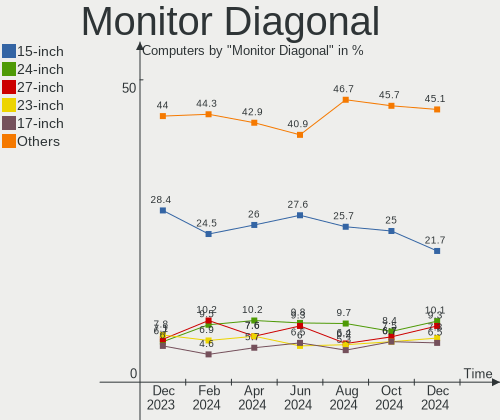

| Inches  | Computers | Percent |
|---------|-----------|---------|
| 15      | 115       | 23.96%  |
| 24      | 44        | 9.17%   |
| 14      | 35        | 7.29%   |
| 27      | 34        | 7.08%   |
| 23      | 34        | 7.08%   |
| 21      | 32        | 6.67%   |
| 13      | 31        | 6.46%   |
| 17      | 23        | 4.79%   |
| 19      | 21        | 4.38%   |
| 16      | 15        | 3.13%   |
| Unknown | 15        | 3.13%   |
| 18      | 14        | 2.92%   |
| 31      | 9         | 1.88%   |
| 20      | 9         | 1.88%   |
| 22      | 6         | 1.25%   |
| 11      | 6         | 1.25%   |
| 12      | 5         | 1.04%   |
| 40      | 4         | 0.83%   |
| 32      | 4         | 0.83%   |
| 34      | 3         | 0.63%   |
| 26      | 3         | 0.63%   |
| 10      | 3         | 0.63%   |
| 7       | 3         | 0.63%   |
| 72      | 2         | 0.42%   |
| 54      | 2         | 0.42%   |
| 25      | 2         | 0.42%   |
| 142     | 1         | 0.21%   |
| 99      | 1         | 0.21%   |
| 63      | 1         | 0.21%   |
| 52      | 1         | 0.21%   |
| 43      | 1         | 0.21%   |
| 28      | 1         | 0.21%   |

Monitor Width
-------------

Physical width

| Width in mm    | Computers | Percent |
|----------------|-----------|---------|
| 301-350        | 183       | 38.36%  |
| 501-600        | 112       | 23.48%  |
| 401-500        | 66        | 13.84%  |
| 351-400        | 37        | 7.76%   |
| 201-300        | 29        | 6.08%   |
| Unknown        | 15        | 3.14%   |
| 601-700        | 12        | 2.52%   |
| 701-800        | 7         | 1.47%   |
| 1001-1500      | 4         | 0.84%   |
| 801-900        | 3         | 0.63%   |
| 1-100          | 3         | 0.63%   |
| More than 2000 | 2         | 0.42%   |
| 1501-2000      | 2         | 0.42%   |
| 901-1000       | 2         | 0.42%   |

Aspect Ratio
------------

Proportional relationship between the width and the height

| Ratio   | Computers | Percent |
|---------|-----------|---------|
| 16/9    | 324       | 72.32%  |
| 16/10   | 61        | 13.62%  |
| 5/4     | 27        | 6.03%   |
| Unknown | 13        | 2.9%    |
| 4/3     | 7         | 1.56%   |
| 3/2     | 7         | 1.56%   |
| 21/9    | 4         | 0.89%   |
| 0.67    | 3         | 0.67%   |
| 3.73    | 1         | 0.22%   |
| 1.00    | 1         | 0.22%   |

Monitor Area
------------

Area in inch²

| Area in inch² | Computers | Percent |
|----------------|-----------|---------|
| 101-110        | 123       | 25.68%  |
| 201-250        | 88        | 18.37%  |
| 81-90          | 52        | 10.86%  |
| 151-200        | 43        | 8.98%   |
| 301-350        | 35        | 7.31%   |
| 141-150        | 22        | 4.59%   |
| 251-300        | 20        | 4.18%   |
| 351-500        | 17        | 3.55%   |
| 71-80          | 15        | 3.13%   |
| Unknown        | 15        | 3.13%   |
| 121-130        | 11        | 2.3%    |
| More than 1000 | 8         | 1.67%   |
| 51-60          | 6         | 1.25%   |
| 111-120        | 6         | 1.25%   |
| 501-1000       | 5         | 1.04%   |
| 61-70          | 3         | 0.63%   |
| 41-50          | 3         | 0.63%   |
| 1-40           | 3         | 0.63%   |
| 131-140        | 3         | 0.63%   |
| 91-100         | 1         | 0.21%   |

Pixel Density
-------------

Pixels per inch

| Density       | Computers | Percent |
|---------------|-----------|---------|
| 51-100        | 189       | 40.38%  |
| 121-160       | 112       | 23.93%  |
| 101-120       | 103       | 22.01%  |
| 161-240       | 35        | 7.48%   |
| Unknown       | 15        | 3.21%   |
| 1-50          | 8         | 1.71%   |
| More than 240 | 6         | 1.28%   |

Multiple Monitors
-----------------

Total monitors connected

| Total | Computers | Percent |
|-------|-----------|---------|
| 1     | 401       | 76.97%  |
| 0     | 69        | 13.24%  |
| 2     | 49        | 9.4%    |
| 3     | 2         | 0.38%   |

Network
-------

Net Controller Vendor
---------------------

Controller vendors

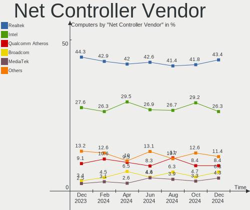

| Vendor                          | Computers | Percent |
|---------------------------------|-----------|---------|
| Realtek Semiconductor           | 353       | 46.39%  |
| Intel                           | 195       | 25.62%  |
| Qualcomm Atheros                | 74        | 9.72%   |
| Broadcom                        | 26        | 3.42%   |
| MediaTek                        | 16        | 2.1%    |
| Ralink                          | 11        | 1.45%   |
| Nvidia                          | 9         | 1.18%   |
| TP-Link                         | 7         | 0.92%   |
| Ralink Technology               | 7         | 0.92%   |
| Mellanox Technologies           | 7         | 0.92%   |
| Marvell Technology Group        | 6         | 0.79%   |
| Broadcom Limited                | 6         | 0.79%   |
| ASIX Electronics                | 5         | 0.66%   |
| Xiaomi                          | 4         | 0.53%   |
| Qualcomm                        | 4         | 0.53%   |
| Qualcomm Atheros Communications | 3         | 0.39%   |
| JMicron Technology              | 3         | 0.39%   |
| D-Link System                   | 3         | 0.39%   |
| Vimtron Electronics             | 2         | 0.26%   |
| VIA Technologies                | 2         | 0.26%   |
| Sierra Wireless                 | 2         | 0.26%   |
| Lenovo                          | 2         | 0.26%   |
| ASUSTek Computer                | 2         | 0.26%   |
| ZyXEL Communications            | 1         | 0.13%   |
| Tenda                           | 1         | 0.13%   |
| Samsung Electronics             | 1         | 0.13%   |
| OPPO Electronics                | 1         | 0.13%   |
| MYRICOM                         | 1         | 0.13%   |
| Microchip Technology            | 1         | 0.13%   |
| Mercucys                        | 1         | 0.13%   |
| LG Electronics                  | 1         | 0.13%   |
| IBM                             | 1         | 0.13%   |
| Huawei Technologies             | 1         | 0.13%   |
| Google                          | 1         | 0.13%   |
| American Megatrends             | 1         | 0.13%   |

Net Controller Model
--------------------

Controller models

| Model                                                                   | Computers | Percent |
|-------------------------------------------------------------------------|-----------|---------|
| Realtek RTL8111/8168/8411 PCI Express Gigabit Ethernet Controller       | 255       | 29.82%  |
| Intel Cannon Lake PCH CNVi WiFi                                         | 25        | 2.92%   |
| Realtek RTL8822CE 802.11ac PCIe Wireless Network Adapter                | 24        | 2.81%   |
| Realtek RTL810xE PCI Express Fast Ethernet controller                   | 24        | 2.81%   |
| Intel Wi-Fi 6 AX200                                                     | 21        | 2.46%   |
| Realtek RTL8125 2.5GbE Controller                                       | 18        | 2.11%   |
| Qualcomm Atheros AR9285 Wireless Network Adapter (PCI-Express)          | 18        | 2.11%   |
| Intel Wireless 7265                                                     | 14        | 1.64%   |
| Intel Wi-Fi 6 AX201                                                     | 13        | 1.52%   |
| Qualcomm Atheros QCA9565 / AR9565 Wireless Network Adapter              | 10        | 1.17%   |
| Realtek RTL8821CE 802.11ac PCIe Wireless Network Adapter                | 9         | 1.05%   |
| MediaTek MT7921 802.11ax PCI Express Wireless Network Adapter           | 9         | 1.05%   |
| Intel Alder Lake-P PCH CNVi WiFi                                        | 9         | 1.05%   |
| Qualcomm Atheros AR9485 Wireless Network Adapter                        | 8         | 0.94%   |
| Intel Dual Band Wireless-AC 3168NGW [Stone Peak]                        | 8         | 0.94%   |
| Realtek RTL8852BE PCIe 802.11ax Wireless Network Controller             | 7         | 0.82%   |
| Ralink RT3290 Wireless 802.11n 1T/1R PCIe                               | 7         | 0.82%   |
| Qualcomm Atheros QCA9377 802.11ac Wireless Network Adapter              | 7         | 0.82%   |
| Mellanox MT27710 Family [ConnectX-4 Lx]                                 | 7         | 0.82%   |
| Intel I210 Gigabit Network Connection                                   | 7         | 0.82%   |
| Ralink MT7601U Wireless Adapter                                         | 6         | 0.7%    |
| Intel Wireless 8265 / 8275                                              | 6         | 0.7%    |
| Intel Ethernet Controller I225-V                                        | 6         | 0.7%    |
| Realtek RTL8153 Gigabit Ethernet Adapter                                | 5         | 0.58%   |
| Realtek RTL8152 Fast Ethernet Adapter                                   | 5         | 0.58%   |
| Realtek 802.11n WLAN Adapter                                            | 5         | 0.58%   |
| Realtek 802.11ac NIC                                                    | 5         | 0.58%   |
| Qualcomm Atheros AR242x / AR542x Wireless Network Adapter (PCI-Express) | 5         | 0.58%   |
| Intel Wireless 8260                                                     | 5         | 0.58%   |
| Intel Comet Lake PCH-LP CNVi WiFi                                       | 5         | 0.58%   |
| Intel Comet Lake PCH CNVi WiFi                                          | 5         | 0.58%   |
| Intel Cannon Point-LP CNVi [Wireless-AC]                                | 5         | 0.58%   |
| ASIX AX88179 Gigabit Ethernet                                           | 5         | 0.58%   |
| Xiaomi Mi/Redmi series (RNDIS)                                          | 4         | 0.47%   |
| Realtek RTL8188EUS 802.11n Wireless Network Adapter                     | 4         | 0.47%   |
| Qualcomm Atheros Attansic L1 Gigabit Ethernet                           | 4         | 0.47%   |
| Qualcomm Atheros AR9462 Wireless Network Adapter                        | 4         | 0.47%   |
| Qualcomm Atheros AR8161 Gigabit Ethernet                                | 4         | 0.47%   |
| Intel Wireless 3165                                                     | 4         | 0.47%   |
| Intel WiFi Link 5100                                                    | 4         | 0.47%   |

Wireless Vendor
---------------

Wireless vendors

| Vendor                          | Computers | Percent |
|---------------------------------|-----------|---------|
| Intel                           | 155       | 41.78%  |
| Realtek Semiconductor           | 81        | 21.83%  |
| Qualcomm Atheros                | 58        | 15.63%  |
| Broadcom                        | 17        | 4.58%   |
| MediaTek                        | 16        | 4.31%   |
| Ralink                          | 11        | 2.96%   |
| TP-Link                         | 7         | 1.89%   |
| Ralink Technology               | 7         | 1.89%   |
| Qualcomm Atheros Communications | 3         | 0.81%   |
| Qualcomm                        | 3         | 0.81%   |
| Broadcom Limited                | 3         | 0.81%   |
| Sierra Wireless                 | 2         | 0.54%   |
| D-Link System                   | 2         | 0.54%   |
| ASUSTek Computer                | 2         | 0.54%   |
| ZyXEL Communications            | 1         | 0.27%   |
| VIA Technologies                | 1         | 0.27%   |
| Tenda                           | 1         | 0.27%   |
| Mercucys                        | 1         | 0.27%   |

Wireless Model
--------------

Wireless models

| Model                                                                   | Computers | Percent |
|-------------------------------------------------------------------------|-----------|---------|
| Intel Cannon Lake PCH CNVi WiFi                                         | 25        | 6.72%   |
| Realtek RTL8822CE 802.11ac PCIe Wireless Network Adapter                | 24        | 6.45%   |
| Intel Wi-Fi 6 AX200                                                     | 21        | 5.65%   |
| Qualcomm Atheros AR9285 Wireless Network Adapter (PCI-Express)          | 18        | 4.84%   |
| Intel Wireless 7265                                                     | 14        | 3.76%   |
| Intel Wi-Fi 6 AX201                                                     | 13        | 3.49%   |
| Qualcomm Atheros QCA9565 / AR9565 Wireless Network Adapter              | 10        | 2.69%   |
| Realtek RTL8821CE 802.11ac PCIe Wireless Network Adapter                | 9         | 2.42%   |
| MediaTek MT7921 802.11ax PCI Express Wireless Network Adapter           | 9         | 2.42%   |
| Intel Alder Lake-P PCH CNVi WiFi                                        | 9         | 2.42%   |
| Qualcomm Atheros AR9485 Wireless Network Adapter                        | 8         | 2.15%   |
| Intel Dual Band Wireless-AC 3168NGW [Stone Peak]                        | 8         | 2.15%   |
| Realtek RTL8852BE PCIe 802.11ax Wireless Network Controller             | 7         | 1.88%   |
| Ralink RT3290 Wireless 802.11n 1T/1R PCIe                               | 7         | 1.88%   |
| Qualcomm Atheros QCA9377 802.11ac Wireless Network Adapter              | 7         | 1.88%   |
| Ralink MT7601U Wireless Adapter                                         | 6         | 1.61%   |
| Intel Wireless 8265 / 8275                                              | 6         | 1.61%   |
| Realtek 802.11n WLAN Adapter                                            | 5         | 1.34%   |
| Realtek 802.11ac NIC                                                    | 5         | 1.34%   |
| Qualcomm Atheros AR242x / AR542x Wireless Network Adapter (PCI-Express) | 5         | 1.34%   |
| Intel Wireless 8260                                                     | 5         | 1.34%   |
| Intel Comet Lake PCH-LP CNVi WiFi                                       | 5         | 1.34%   |
| Intel Comet Lake PCH CNVi WiFi                                          | 5         | 1.34%   |
| Intel Cannon Point-LP CNVi [Wireless-AC]                                | 5         | 1.34%   |
| Realtek RTL8188EUS 802.11n Wireless Network Adapter                     | 4         | 1.08%   |
| Qualcomm Atheros AR9462 Wireless Network Adapter                        | 4         | 1.08%   |
| Intel Wireless 3165                                                     | 4         | 1.08%   |
| Intel WiFi Link 5100                                                    | 4         | 1.08%   |
| Intel Wi-Fi 6 AX210/AX211/AX411 160MHz                                  | 4         | 1.08%   |
| Intel PRO/Wireless 3945ABG [Golan] Network Connection                   | 4         | 1.08%   |
| Broadcom BCM43142 802.11b/g/n                                           | 4         | 1.08%   |
| Broadcom BCM4313 802.11bgn Wireless Network Adapter                     | 4         | 1.08%   |
| TP-Link TL-WN821N v5/v6 [RTL8192EU]                                     | 3         | 0.81%   |
| Realtek RTL8821AE 802.11ac PCIe Wireless Network Adapter                | 3         | 0.81%   |
| Realtek RTL8723BU 802.11b/g/n WLAN Adapter                              | 3         | 0.81%   |
| Realtek RTL8723BE PCIe Wireless Network Adapter                         | 3         | 0.81%   |
| Realtek RTL8192CU 802.11n WLAN Adapter                                  | 3         | 0.81%   |
| Realtek RTL8188EE Wireless Network Adapter                              | 3         | 0.81%   |
| Qualcomm QCNFA765 Wireless Network Adapter                              | 3         | 0.81%   |
| Qualcomm Atheros AR9271 802.11n                                         | 3         | 0.81%   |

Ethernet Vendor
---------------

Ethernet vendors

| Vendor                   | Computers | Percent |
|--------------------------|-----------|---------|
| Realtek Semiconductor    | 308       | 64.84%  |
| Intel                    | 76        | 16%     |
| Qualcomm Atheros         | 25        | 5.26%   |
| Broadcom                 | 12        | 2.53%   |
| Nvidia                   | 9         | 1.89%   |
| Mellanox Technologies    | 7         | 1.47%   |
| Marvell Technology Group | 6         | 1.26%   |
| ASIX Electronics         | 5         | 1.05%   |
| Xiaomi                   | 4         | 0.84%   |
| Broadcom Limited         | 4         | 0.84%   |
| JMicron Technology       | 3         | 0.63%   |
| Vimtron Electronics      | 2         | 0.42%   |
| Lenovo                   | 2         | 0.42%   |
| VIA Technologies         | 1         | 0.21%   |
| Samsung Electronics      | 1         | 0.21%   |
| Qualcomm                 | 1         | 0.21%   |
| OPPO Electronics         | 1         | 0.21%   |
| MYRICOM                  | 1         | 0.21%   |
| Microchip Technology     | 1         | 0.21%   |
| LG Electronics           | 1         | 0.21%   |
| IBM                      | 1         | 0.21%   |
| Huawei Technologies      | 1         | 0.21%   |
| Google                   | 1         | 0.21%   |
| D-Link System            | 1         | 0.21%   |
| American Megatrends      | 1         | 0.21%   |

Ethernet Model
--------------

Ethernet models

| Model                                                             | Computers | Percent |
|-------------------------------------------------------------------|-----------|---------|
| Realtek RTL8111/8168/8411 PCI Express Gigabit Ethernet Controller | 255       | 52.8%   |
| Realtek RTL810xE PCI Express Fast Ethernet controller             | 24        | 4.97%   |
| Realtek RTL8125 2.5GbE Controller                                 | 18        | 3.73%   |
| Mellanox MT27710 Family [ConnectX-4 Lx]                           | 7         | 1.45%   |
| Intel I210 Gigabit Network Connection                             | 7         | 1.45%   |
| Intel Ethernet Controller I225-V                                  | 6         | 1.24%   |
| Realtek RTL8153 Gigabit Ethernet Adapter                          | 5         | 1.04%   |
| Realtek RTL8152 Fast Ethernet Adapter                             | 5         | 1.04%   |
| ASIX AX88179 Gigabit Ethernet                                     | 5         | 1.04%   |
| Xiaomi Mi/Redmi series (RNDIS)                                    | 4         | 0.83%   |
| Qualcomm Atheros Attansic L1 Gigabit Ethernet                     | 4         | 0.83%   |
| Qualcomm Atheros AR8161 Gigabit Ethernet                          | 4         | 0.83%   |
| Intel I211 Gigabit Network Connection                             | 4         | 0.83%   |
| Intel Ethernet Connection (6) I219-V                              | 4         | 0.83%   |
| Intel Ethernet Connection (2) I219-V                              | 4         | 0.83%   |
| Intel Ethernet Connection (13) I219-V                             | 4         | 0.83%   |
| Qualcomm Atheros AR8151 v2.0 Gigabit Ethernet                     | 3         | 0.62%   |
| Qualcomm Atheros AR8121/AR8113/AR8114 Gigabit or Fast Ethernet    | 3         | 0.62%   |
| Nvidia MCP61 Ethernet                                             | 3         | 0.62%   |
| Intel I350 Gigabit Network Connection                             | 3         | 0.62%   |
| Intel Ethernet Connection (10) I219-V                             | 3         | 0.62%   |
| Intel 82577LM Gigabit Network Connection                          | 3         | 0.62%   |
| Vimtron Mobile Composite Device Bus                               | 2         | 0.41%   |
| Realtek RTL-8100/8101L/8139 PCI Fast Ethernet Adapter             | 2         | 0.41%   |
| Qualcomm Atheros QCA8171 Gigabit Ethernet                         | 2         | 0.41%   |
| Qualcomm Atheros AR8162 Fast Ethernet                             | 2         | 0.41%   |
| Qualcomm Atheros AR8152 v2.0 Fast Ethernet                        | 2         | 0.41%   |
| Qualcomm Atheros AR8151 v1.0 Gigabit Ethernet                     | 2         | 0.41%   |
| JMicron JMC260 PCI Express Fast Ethernet Controller               | 2         | 0.41%   |
| Intel Ethernet Connection I219-LM                                 | 2         | 0.41%   |
| Intel Ethernet Connection (7) I219-V                              | 2         | 0.41%   |
| Intel Ethernet Connection (2) I219-LM                             | 2         | 0.41%   |
| Intel Ethernet Connection (16) I219-V                             | 2         | 0.41%   |
| Intel Ethernet Connection (14) I219-V                             | 2         | 0.41%   |
| Intel 82579V Gigabit Network Connection                           | 2         | 0.41%   |
| Intel 82579LM Gigabit Network Connection (Lewisville)             | 2         | 0.41%   |
| Intel 82578DM Gigabit Network Connection                          | 2         | 0.41%   |
| Intel 82574L Gigabit Network Connection                           | 2         | 0.41%   |
| Broadcom NetXtreme BCM57766 Gigabit Ethernet PCIe                 | 2         | 0.41%   |
| Broadcom NetXtreme BCM5764M Gigabit Ethernet PCIe                 | 2         | 0.41%   |

Net Controller Kind
-------------------

Ethernet, WiFi or modem

| Kind     | Computers | Percent |
|----------|-----------|---------|
| Ethernet | 450       | 55.76%  |
| WiFi     | 357       | 44.24%  |

Used Controller
---------------

Currently used network controller

| Kind     | Computers | Percent |
|----------|-----------|---------|
| Ethernet | 286       | 54.89%  |
| WiFi     | 235       | 45.11%  |

NICs
----

Total network controllers on board

| Total | Computers | Percent |
|-------|-----------|---------|
| 2     | 251       | 48.18%  |
| 1     | 241       | 46.26%  |
| 0     | 14        | 2.69%   |
| 3     | 8         | 1.54%   |
| 4     | 5         | 0.96%   |
| 11    | 1         | 0.19%   |
| 6     | 1         | 0.19%   |

IPv6
----

IPv6 vs IPv4

| Used | Computers | Percent |
|------|-----------|---------|
| No   | 498       | 95.59%  |
| Yes  | 23        | 4.41%   |

Bluetooth
---------

Bluetooth Vendor
----------------

Controller vendors

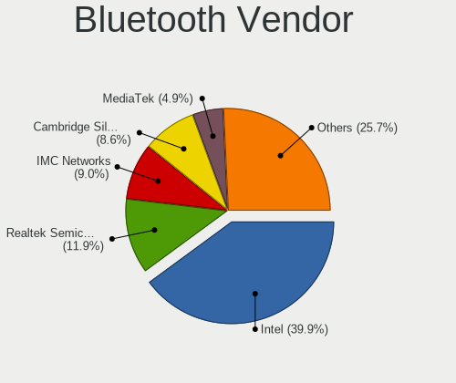

| Vendor                          | Computers | Percent |
|---------------------------------|-----------|---------|
| Intel                           | 133       | 44.19%  |
| Realtek Semiconductor           | 30        | 9.97%   |
| IMC Networks                    | 20        | 6.64%   |
| Cambridge Silicon Radio         | 19        | 6.31%   |
| Lite-On Technology              | 16        | 5.32%   |
| Realtek                         | 13        | 4.32%   |
| Qualcomm Atheros Communications | 13        | 4.32%   |
| Foxconn / Hon Hai               | 12        | 3.99%   |
| Broadcom                        | 10        | 3.32%   |
| Ralink                          | 7         | 2.33%   |
| ASUSTek Computer                | 5         | 1.66%   |
| Opticis                         | 4         | 1.33%   |
| MediaTek                        | 4         | 1.33%   |
| Toshiba                         | 3         | 1%      |
| Hewlett-Packard                 | 2         | 0.66%   |
| Foxconn International           | 2         | 0.66%   |
| Dell                            | 2         | 0.66%   |
| Apple                           | 2         | 0.66%   |
| Alps Electric                   | 2         | 0.66%   |
| USI                             | 1         | 0.33%   |
| Actions                         | 1         | 0.33%   |

Bluetooth Model
---------------

Controller models

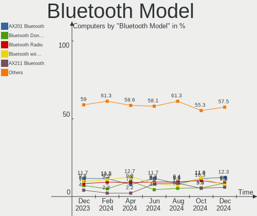

| Model                                               | Computers | Percent |
|-----------------------------------------------------|-----------|---------|
| Intel Bluetooth 9460/9560 Jefferson Peak (JfP)      | 37        | 12.29%  |
| Intel Bluetooth wireless interface                  | 27        | 8.97%   |
| Intel AX201 Bluetooth                               | 26        | 8.64%   |
| Realtek Bluetooth Radio                             | 25        | 8.31%   |
| Intel AX200 Bluetooth                               | 21        | 6.98%   |
| Cambridge Silicon Radio Bluetooth Dongle (HCI mode) | 19        | 6.31%   |
| Realtek 802.11ac WLAN Adapter                       | 13        | 4.32%   |
| Intel Wireless-AC 3168 Bluetooth                    | 8         | 2.66%   |
| Ralink RT3290 Bluetooth                             | 7         | 2.33%   |
| Qualcomm Atheros AR3011 Bluetooth                   | 7         | 2.33%   |
| Intel Bluetooth Device                              | 7         | 2.33%   |
| IMC Networks Bluetooth Radio                        | 6         | 1.99%   |
| Foxconn / Hon Hai Bluetooth Device                  | 6         | 1.99%   |
| Qualcomm Atheros AR3012 Bluetooth 4.0               | 5         | 1.66%   |
| IMC Networks Wireless_Device                        | 5         | 1.66%   |
| Opticis Bluetooth Radio                             | 4         | 1.33%   |
| MediaTek Wireless_Device                            | 4         | 1.33%   |
| Lite-On Qualcomm Atheros QCA9377 Bluetooth          | 4         | 1.33%   |
| Lite-On Atheros AR3012 Bluetooth                    | 4         | 1.33%   |
| Intel AX210 Bluetooth                               | 4         | 1.33%   |
| IMC Networks Bluetooth Device                       | 4         | 1.33%   |
| IMC Networks Atheros AR3012 Bluetooth 4.0 Adapter   | 4         | 1.33%   |
| Lite-On Wireless_Device                             | 3         | 1%      |
| Lite-On Bluetooth Device                            | 3         | 1%      |
| Toshiba Integrated Bluetooth HCI                    | 2         | 0.66%   |
| Realtek RTL8821A Bluetooth                          | 2         | 0.66%   |
| Realtek  Bluetooth 4.2 Adapter                      | 2         | 0.66%   |
| HP Broadcom 2070 Bluetooth Combo                    | 2         | 0.66%   |
| Foxconn International BCM43142A0 Bluetooth module   | 2         | 0.66%   |
| Foxconn / Hon Hai Wireless_Device                   | 2         | 0.66%   |
| Broadcom HP Portable SoftSailing                    | 2         | 0.66%   |
| ASUS BT-183 Bluetooth 2.0+EDR adapter               | 2         | 0.66%   |
| USI Bluetooth Module BCM92070                       | 1         | 0.33%   |
| Toshiba Bluetooth Device                            | 1         | 0.33%   |
| Realtek RTL8822BE Bluetooth 4.2 Adapter             | 1         | 0.33%   |
| Qualcomm Atheros  Bluetooth Device                  | 1         | 0.33%   |
| Lite-On Broadcom BCM43142A0 Bluetooth Device        | 1         | 0.33%   |
| Lite-On Bluetooth Radio                             | 1         | 0.33%   |
| Intel Wireless-AC 9260 Bluetooth Adapter            | 1         | 0.33%   |
| Intel Centrino Bluetooth Wireless Transceiver       | 1         | 0.33%   |

Sound
-----

Sound Vendor
------------

Sound card vendors

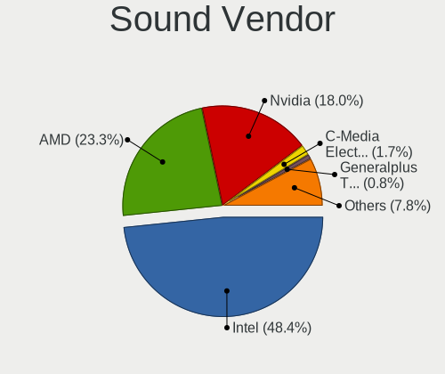

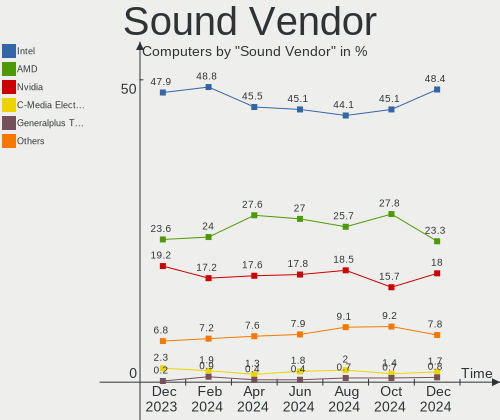

| Vendor                   | Computers | Percent |
|--------------------------|-----------|---------|
| Intel                    | 338       | 48.29%  |
| AMD                      | 181       | 25.86%  |
| Nvidia                   | 132       | 18.86%  |
| C-Media Electronics      | 10        | 1.43%   |
| Generalplus Technology   | 5         | 0.71%   |
| Logitech                 | 4         | 0.57%   |
| Creative Labs            | 4         | 0.57%   |
| JMTek                    | 3         | 0.43%   |
| Micro Star International | 2         | 0.29%   |
| KTMicro                  | 2         | 0.29%   |
| Creative Technology      | 2         | 0.29%   |
| ASUSTek Computer         | 2         | 0.29%   |
| TTGK Technology          | 1         | 0.14%   |
| Texas Instruments        | 1         | 0.14%   |
| Samsung Electronics      | 1         | 0.14%   |
| Realtek Semiconductor    | 1         | 0.14%   |
| Razer USA                | 1         | 0.14%   |
| Nordic Semiconductor ASA | 1         | 0.14%   |
| Lenovo                   | 1         | 0.14%   |
| Kingston Technology      | 1         | 0.14%   |
| iCreate Technologies     | 1         | 0.14%   |
| Hewlett-Packard          | 1         | 0.14%   |
| GN Netcom                | 1         | 0.14%   |
| Giga-Byte Technology     | 1         | 0.14%   |
| Barco Display Systems    | 1         | 0.14%   |
| Asahi Kasei Microsystems | 1         | 0.14%   |
| Unknown                  | 1         | 0.14%   |

Sound Model
-----------

Sound card models

| Model                                                                      | Computers | Percent |
|----------------------------------------------------------------------------|-----------|---------|
| AMD Family 17h/19h HD Audio Controller                                     | 74        | 8.84%   |
| AMD Renoir Radeon High Definition Audio Controller                         | 50        | 5.97%   |
| Intel Cannon Lake PCH cAVS                                                 | 39        | 4.66%   |
| Intel 6 Series/C200 Series Chipset Family High Definition Audio Controller | 37        | 4.42%   |
| Intel 7 Series/C216 Chipset Family High Definition Audio Controller        | 29        | 3.46%   |
| AMD SBx00 Azalia (Intel HDA)                                               | 21        | 2.51%   |
| Intel NM10/ICH7 Family High Definition Audio Controller                    | 19        | 2.27%   |
| Intel 8 Series/C220 Series Chipset High Definition Audio Controller        | 17        | 2.03%   |
| AMD Starship/Matisse HD Audio Controller                                   | 17        | 2.03%   |
| AMD Raven/Raven2/Fenghuang HDMI/DP Audio Controller                        | 17        | 2.03%   |
| AMD FCH Azalia Controller                                                  | 17        | 2.03%   |
| Nvidia GF108 High Definition Audio Controller                              | 16        | 1.91%   |
| Intel 5 Series/3400 Series Chipset High Definition Audio                   | 16        | 1.91%   |
| Intel Tiger Lake-LP Smart Sound Technology Audio Controller                | 14        | 1.67%   |
| Intel Sunrise Point-LP HD Audio                                            | 14        | 1.67%   |
| Intel 82801I (ICH9 Family) HD Audio Controller                             | 14        | 1.67%   |
| Nvidia GP107GL High Definition Audio Controller                            | 12        | 1.43%   |
| Nvidia GA106 High Definition Audio Controller                              | 12        | 1.43%   |
| Intel Alder Lake PCH-P High Definition Audio Controller                    | 12        | 1.43%   |
| Intel 200 Series PCH HD Audio                                              | 12        | 1.43%   |
| AMD Rembrandt Radeon High Definition Audio Controller                      | 12        | 1.43%   |
| AMD Navi 21/23 HDMI/DP Audio Controller                                    | 12        | 1.43%   |
| Nvidia GK208 HDMI/DP Audio Controller                                      | 11        | 1.31%   |
| Intel Celeron/Pentium Silver Processor High Definition Audio               | 11        | 1.31%   |
| Intel 100 Series/C230 Series Chipset Family HD Audio Controller            | 11        | 1.31%   |
| Nvidia TU107 GeForce GTX 1650 High Definition Audio Controller             | 10        | 1.19%   |
| Nvidia GM107 High Definition Audio Controller [GeForce 940MX]              | 10        | 1.19%   |
| Intel Xeon E3-1200 v3/4th Gen Core Processor HD Audio Controller           | 10        | 1.19%   |
| Intel Cannon Point-LP High Definition Audio Controller                     | 10        | 1.19%   |
| AMD Family 17h (Models 00h-0fh) HD Audio Controller                        | 9         | 1.08%   |
| AMD Ellesmere HDMI Audio [Radeon RX 470/480 / 570/580/590]                 | 9         | 1.08%   |
| Intel 82801H (ICH8 Family) HD Audio Controller                             | 8         | 0.96%   |
| Intel Smart Sound Technology (SST) Audio Controller                        | 7         | 0.84%   |
| Intel Haswell-ULT HD Audio Controller                                      | 7         | 0.84%   |
| Intel 8 Series HD Audio Controller                                         | 7         | 0.84%   |
| Nvidia TU116 High Definition Audio Controller                              | 6         | 0.72%   |
| Intel Jasper Lake HD Audio                                                 | 6         | 0.72%   |
| Intel Comet Lake PCH-LP cAVS                                               | 6         | 0.72%   |
| Intel Comet Lake PCH cAVS                                                  | 6         | 0.72%   |
| Intel 82801JI (ICH10 Family) HD Audio Controller                           | 6         | 0.72%   |

Memory
------

Memory Vendor
-------------

Memory module vendors

| Vendor                             | Computers | Percent |
|------------------------------------|-----------|---------|
| Samsung Electronics                | 82        | 16.08%  |
| Unknown                            | 77        | 15.1%   |
| Kingston                           | 67        | 13.14%  |
| Micron Technology                  | 50        | 9.8%    |
| SK hynix                           | 49        | 9.61%   |
| Crucial                            | 47        | 9.22%   |
| AMD                                | 21        | 4.12%   |
| A-DATA Technology                  | 19        | 3.73%   |
| Patriot                            | 12        | 2.35%   |
| Nanya Technology                   | 8         | 1.57%   |
| Elpida                             | 8         | 1.57%   |
| Unknown                            | 8         | 1.57%   |
| Unknown (ABCD)                     | 7         | 1.37%   |
| Ramaxel Technology                 | 7         | 1.37%   |
| GOODRAM                            | 7         | 1.37%   |
| Corsair                            | 7         | 1.37%   |
| Apacer                             | 6         | 1.18%   |
| Foxline                            | 5         | 0.98%   |
| ACPI Digital                       | 4         | 0.78%   |
| Silicon Power                      | 2         | 0.39%   |
| Qumo                               | 2         | 0.39%   |
| Kllisre                            | 2         | 0.39%   |
| Kimtigo Semiconductor (HK) Limited | 2         | 0.39%   |
| Goldkey                            | 2         | 0.39%   |
| G.Skill                            | 2         | 0.39%   |
| Toshiba                            | 1         | 0.2%    |
| TOP MEDIA                          | 1         | 0.2%    |
| Qimonda                            | 1         | 0.2%    |
| Kingmax Semiconductor              | 1         | 0.2%    |
| Kingmax                            | 1         | 0.2%    |
| KETECH                             | 1         | 0.2%    |
| ASint Technology                   | 1         | 0.2%    |

Memory Model
------------

Memory module models

| Model                                                            | Computers | Percent |
|------------------------------------------------------------------|-----------|---------|
| Crucial RAM CT8G4SFRA266.C8FD1 8GB SODIMM DDR4 2667MT/s          | 25        | 4.49%   |
| Unknown                                                          | 8         | 1.44%   |
| Unknown RAM Module 2GB SODIMM DDR2 667MT/s                       | 7         | 1.26%   |
| Unknown RAM Module 2GB DIMM DDR2 800MT/s                         | 7         | 1.26%   |
| Unknown (ABCD) RAM 123456789012345678 3GB SODIMM LPDDR4 2400MT/s | 7         | 1.26%   |
| Micron RAM 4ATF1G64HZ-3G2E1 8GB Row Of Chips DDR4 3200MT/s       | 6         | 1.08%   |
| Unknown RAM Module 4GB DIMM 1333MT/s                             | 5         | 0.9%    |
| Micron RAM 8ATF1G64HZ-3G2R1 8GB SODIMM DDR4 3200MT/s             | 5         | 0.9%    |
| Unknown RAM Module 2GB DIMM SDRAM                                | 4         | 0.72%   |
| Unknown RAM Module 2GB DIMM 800MT/s                              | 4         | 0.72%   |
| SK hynix RAM HMA81GS6CJR8N-VK 8GB SODIMM DDR4 2667MT/s           | 4         | 0.72%   |
| Samsung RAM M471B5173DB0-YK0 4GB SODIMM DDR3 1600MT/s            | 4         | 0.72%   |
| Samsung RAM M471A1G44AB0-CWE 8GB Row Of Chips DDR4 3200MT/s      | 4         | 0.72%   |
| Nanya RAM NT32GA72D4NBX3P-IX 32GB DIMM DDR4 2933MT/s             | 4         | 0.72%   |
| Kingston RAM KF3200C16D4/16GX 16GB DIMM DDR4 3200MT/s            | 4         | 0.72%   |
| ACPI Digital RAM CMB6-DHDA1BAR08D00 16GB SODIMM DDR4 3200MT/s    | 4         | 0.72%   |
| Unknown RAM Module 2GB DIMM 1333MT/s                             | 3         | 0.54%   |
| Unknown RAM Module 1GB SODIMM DDR2 667MT/s                       | 3         | 0.54%   |
| SK hynix RAM HMT351S6BFR8C-H9 4GB SODIMM DDR3 1333MT/s           | 3         | 0.54%   |
| SK hynix RAM HMA81GS6DJR8N-XN 8GB SODIMM DDR4 3200MT/s           | 3         | 0.54%   |
| Samsung RAM M471B5173BH0-CK0 4GB SODIMM DDR3 1600MT/s            | 3         | 0.54%   |
| Samsung RAM M471A5244CB0-CWE 4GB Row Of Chips DDR4 3200MT/s      | 3         | 0.54%   |
| Samsung RAM M471A1K43EB1-CWE 8GB SODIMM DDR4 3200MT/s            | 3         | 0.54%   |
| AMD RAM R744G2606U1S 4GB DIMM DDR4 3200MT/s                      | 3         | 0.54%   |
| A-DATA RAM DDR4 3200 8GB DIMM DDR4 3600MT/s                      | 3         | 0.54%   |
| Unknown RAM Module 4GB SODIMM DDR3                               | 2         | 0.36%   |
| Unknown RAM Module 4GB DIMM 1600MT/s                             | 2         | 0.36%   |
| Unknown RAM Module 4GB DIMM 1066MT/s                             | 2         | 0.36%   |
| Unknown RAM Module 2GB SODIMM DDR2                               | 2         | 0.36%   |
| Unknown RAM Module 2GB DIMM DDR3 1333MT/s                        | 2         | 0.36%   |
| Unknown RAM Module 2GB DIMM 1600MT/s                             | 2         | 0.36%   |
| Unknown RAM Module 2048MB DIMM DDR2 800MT/s                      | 2         | 0.36%   |
| Unknown RAM Module 1GB DIMM DDR2 800MT/s                         | 2         | 0.36%   |
| Unknown RAM DDR4 NB 8G 2666 8GB SODIMM DDR4 2667MT/s             | 2         | 0.36%   |
| SK hynix RAM HMT351S6EFR8A-PB 4GB SODIMM DDR3 1600MT/s           | 2         | 0.36%   |
| SK hynix RAM HMAA1GS6CMR6N-VK 8GB SODIMM DDR4 2667MT/s           | 2         | 0.36%   |
| SK hynix RAM HMA81GS6AFR8N-UH 8GB SODIMM DDR4 2667MT/s           | 2         | 0.36%   |
| SK hynix RAM H9JCNNNCP3MLYR-N6E 4GB Row Of Chips LPDDR5 6400MT/s | 2         | 0.36%   |
| Samsung RAM M471B5773DH0-CH9 2GB SODIMM DDR3 1600MT/s            | 2         | 0.36%   |
| Samsung RAM M471B5273DH0-CH9 4GB SODIMM DDR3 1334MT/s            | 2         | 0.36%   |

Memory Kind
-----------

Memory module kinds

| Kind    | Computers | Percent |
|---------|-----------|---------|
| DDR4    | 218       | 48.23%  |
| DDR3    | 119       | 26.33%  |
| DDR2    | 33        | 7.3%    |
| Unknown | 28        | 6.19%   |
| LPDDR4  | 18        | 3.98%   |
| SDRAM   | 10        | 2.21%   |
| DDR5    | 10        | 2.21%   |
| DDR     | 8         | 1.77%   |
| LPDDR3  | 4         | 0.88%   |
| LPDDR5  | 3         | 0.66%   |
| DRAM    | 1         | 0.22%   |

Memory Form Factor
------------------

Physical design of the memory module

| Name         | Computers | Percent |
|--------------|-----------|---------|
| SODIMM       | 223       | 49.23%  |
| DIMM         | 196       | 43.27%  |
| Row Of Chips | 32        | 7.06%   |
| Chip         | 2         | 0.44%   |

Memory Size
-----------

Memory module size

| Size  | Computers | Percent |
|-------|-----------|---------|
| 8192  | 200       | 39.84%  |
| 4096  | 131       | 26.1%   |
| 2048  | 77        | 15.34%  |
| 16384 | 48        | 9.56%   |
| 1024  | 22        | 4.38%   |
| 32768 | 19        | 3.78%   |
| 512   | 5         | 1%      |

Memory Speed
------------

Memory module speed

| Speed   | Computers | Percent |
|---------|-----------|---------|
| 3200    | 84        | 16.77%  |
| 1600    | 83        | 16.57%  |
| 2667    | 79        | 15.77%  |
| 1333    | 35        | 6.99%   |
| 2400    | 27        | 5.39%   |
| 800     | 21        | 4.19%   |
| 2133    | 18        | 3.59%   |
| 667     | 17        | 3.39%   |
| Unknown | 15        | 2.99%   |
| 2933    | 11        | 2.2%    |
| 1334    | 11        | 2.2%    |
| 3600    | 8         | 1.6%    |
| 1866    | 8         | 1.6%    |
| 4800    | 7         | 1.4%    |
| 2666    | 7         | 1.4%    |
| 1066    | 7         | 1.4%    |
| 1867    | 6         | 1.2%    |
| 1067    | 6         | 1.2%    |
| 4267    | 5         | 1%      |
| 6400    | 4         | 0.8%    |
| 3266    | 4         | 0.8%    |
| 4266    | 3         | 0.6%    |
| 3400    | 3         | 0.6%    |
| 533     | 3         | 0.6%    |
| 400     | 3         | 0.6%    |
| 333     | 3         | 0.6%    |
| 6000    | 2         | 0.4%    |
| 3733    | 2         | 0.4%    |
| 3466    | 2         | 0.4%    |
| 3000    | 2         | 0.4%    |
| 2866    | 2         | 0.4%    |
| 5200    | 1         | 0.2%    |
| 4802    | 1         | 0.2%    |
| 4000    | 1         | 0.2%    |
| 3933    | 1         | 0.2%    |
| 3800    | 1         | 0.2%    |
| 3334    | 1         | 0.2%    |
| 3333    | 1         | 0.2%    |
| 2448    | 1         | 0.2%    |
| 2200    | 1         | 0.2%    |

Printers & scanners
-------------------

Printer Vendor
--------------

Printer device vendors

| Vendor              | Computers | Percent |
|---------------------|-----------|---------|
| Hewlett-Packard     | 5         | 21.74%  |
| Seiko Epson         | 4         | 17.39%  |
| Canon               | 4         | 17.39%  |
| Xerox               | 2         | 8.7%    |
| Ricoh               | 2         | 8.7%    |
| Xiaomi              | 1         | 4.35%   |
| Samsung Electronics | 1         | 4.35%   |
| QinHeng Electronics | 1         | 4.35%   |
| Pantum              | 1         | 4.35%   |
| Oki Data            | 1         | 4.35%   |
| Brother Industries  | 1         | 4.35%   |

Printer Model
-------------

Printer device models

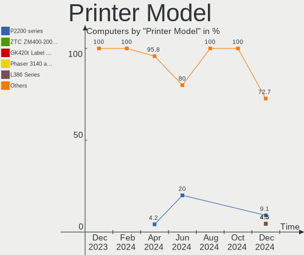

| Model                    | Computers | Percent |
|--------------------------|-----------|---------|
| HP LaserJet M402dn       | 3         | 13.04%  |
| Seiko Epson L120 Series  | 2         | 8.7%    |
| Canon LBP6020            | 2         | 8.7%    |
| Xiaomi MiMouse 2         | 1         | 4.35%   |
| Xerox WorkCentre 5222    | 1         | 4.35%   |
| Xerox VersaLink B405     | 1         | 4.35%   |
| Seiko Epson M2140 Series | 1         | 4.35%   |
| Seiko Epson L222 Series  | 1         | 4.35%   |
| Samsung M2070 Series     | 1         | 4.35%   |
| Ricoh SP 210SU           | 1         | 4.35%   |
| Ricoh Aficio SP C240DN   | 1         | 4.35%   |
| QinHeng CH340S           | 1         | 4.35%   |
| Pantum P2200 series      | 1         | 4.35%   |
| Oki Data USB Device      | 1         | 4.35%   |
| HP LaserJet P1005        | 1         | 4.35%   |
| HP LaserJet 1200         | 1         | 4.35%   |
| Canon PIXMA MP280        | 1         | 4.35%   |
| Canon LBP6030w/6018w     | 1         | 4.35%   |
| Brother HL-1110 series   | 1         | 4.35%   |

Scanner Vendor
--------------

Scanner device vendors

| Vendor          | Computers | Percent |
|-----------------|-----------|---------|
| Seiko Epson     | 1         | 33.33%  |
| Hewlett-Packard | 1         | 33.33%  |
| Canon           | 1         | 33.33%  |

Scanner Model
-------------

Scanner device models

| Model                                             | Computers | Percent |
|---------------------------------------------------|-----------|---------|
| Seiko Epson GT-F650 [GT-S600/Perfection V10/V100] | 1         | 33.33%  |
| HP ScanJet 3400cse                                | 1         | 33.33%  |
| Canon CanoScan LiDE 110                           | 1         | 33.33%  |

Camera
------

Camera Vendor
-------------

Camera device vendors

| Vendor                                 | Computers | Percent |
|----------------------------------------|-----------|---------|
| Chicony Electronics                    | 49        | 17.82%  |
| Acer                                   | 40        | 14.55%  |
| IMC Networks                           | 30        | 10.91%  |
| Quanta                                 | 22        | 8%      |
| Microdia                               | 18        | 6.55%   |
| Realtek Semiconductor                  | 13        | 4.73%   |
| Sunplus Innovation Technology          | 10        | 3.64%   |
| Logitech                               | 8         | 2.91%   |
| Cheng Uei Precision Industry (Foxlink) | 8         | 2.91%   |
| Bison Electronics                      | 7         | 2.55%   |
| Y Media                                | 6         | 2.18%   |
| Syntek                                 | 6         | 2.18%   |
| Suyin                                  | 6         | 2.18%   |
| SunplusIT                              | 6         | 2.18%   |
| Z-Star Microelectronics                | 5         | 1.82%   |
| Luxvisions Innotech Limited            | 4         | 1.45%   |
| Microsoft                              | 3         | 1.09%   |
| icSpring                               | 3         | 1.09%   |
| Cubeternet                             | 3         | 1.09%   |
| Alcor Micro                            | 3         | 1.09%   |
| Silicon Motion                         | 2         | 0.73%   |
| ShineTech                              | 2         | 0.73%   |
| Ricoh                                  | 2         | 0.73%   |
| Lite-On Technology                     | 2         | 0.73%   |
| Lenovo                                 | 2         | 0.73%   |
| GEMBIRD                                | 2         | 0.73%   |
| Apple                                  | 2         | 0.73%   |
| vivo                                   | 1         | 0.36%   |
| Sonix Technology                       | 1         | 0.36%   |
| Samsung Electronics                    | 1         | 0.36%   |
| Primax Electronics                     | 1         | 0.36%   |
| Pixart Imaging                         | 1         | 0.36%   |
| KYE Systems (Mouse Systems)            | 1         | 0.36%   |
| Jieli Technology                       | 1         | 0.36%   |
| HYGD-220628-A                          | 1         | 0.36%   |
| ANYKA                                  | 1         | 0.36%   |
| ALi                                    | 1         | 0.36%   |
| A4Tech                                 | 1         | 0.36%   |

Camera Model
------------

Camera device models

| Model                                            | Computers | Percent |
|--------------------------------------------------|-----------|---------|
| Acer BisonCam, NB Pro                            | 26        | 9.45%   |
| Quanta ov9734_techfront_camera                   | 9         | 3.27%   |
| IMC Networks USB2.0 HD UVC WebCam                | 8         | 2.91%   |
| Chicony Integrated Camera                        | 8         | 2.91%   |
| Y Media USB Camera                               | 6         | 2.18%   |
| IMC Networks Integrated Camera                   | 5         | 1.82%   |
| Acer Integrated Camera                           | 5         | 1.82%   |
| Acer BisonCam,NB Pro                             | 5         | 1.82%   |
| Microdia Integrated_Webcam_HD                    | 4         | 1.45%   |
| Chicony USB2.0 HD UVC WebCam                     | 4         | 1.45%   |
| Chicony HD Webcam                                | 4         | 1.45%   |
| Cheng Uei Precision Industry (Foxlink) HD Camera | 4         | 1.45%   |
| Syntek Integrated Camera                         | 3         | 1.09%   |
| Quanta VGA WebCam                                | 3         | 1.09%   |
| Microdia USB Camera                              | 3         | 1.09%   |
| Logitech Webcam C270                             | 3         | 1.09%   |
| IMC Networks USB2.0 VGA UVC WebCam               | 3         | 1.09%   |
| IMC Networks HD Camera                           | 3         | 1.09%   |
| icSpring camera                                  | 3         | 1.09%   |
| Chicony VGA WebCam                               | 3         | 1.09%   |
| Chicony USB2.0 Camera                            | 3         | 1.09%   |
| Chicony USB camera                               | 3         | 1.09%   |
| Chicony Lenovo EasyCamera                        | 3         | 1.09%   |
| Z-Star Venus USB2.0 Camera                       | 2         | 0.73%   |
| Suyin HD Video WebCam                            | 2         | 0.73%   |
| SunplusIT XiaoMi USB 2.0 Webcam                  | 2         | 0.73%   |
| SunplusIT USB Camera                             | 2         | 0.73%   |
| SunplusIT HD Camera                              | 2         | 0.73%   |
| Sunplus Integrated_Webcam_HD                     | 2         | 0.73%   |
| Sunplus Canyon CNS-CWC5 Webcam                   | 2         | 0.73%   |
| ShineTech HD Camera                              | 2         | 0.73%   |
| Realtek USB Camera                               | 2         | 0.73%   |
| Realtek Lenovo EasyCamera                        | 2         | 0.73%   |
| Realtek Integrated_Webcam_HD                     | 2         | 0.73%   |
| Quanta HP TrueVision HD Camera                   | 2         | 0.73%   |
| Quanta HP HD Camera                              | 2         | 0.73%   |
| Quanta HD User Facing                            | 2         | 0.73%   |
| Quanta ACER HD User Facing                       | 2         | 0.73%   |
| Microdia USB 2.0 Camera                          | 2         | 0.73%   |
| Microdia Lenovo EasyCamera                       | 2         | 0.73%   |

Security
--------

Fingerprint Vendor
------------------

Fingerprint sensor vendors

| Vendor                     | Computers | Percent |
|----------------------------|-----------|---------|
| Shenzhen Goodix Technology | 25        | 47.17%  |
| Validity Sensors           | 10        | 18.87%  |
| Synaptics                  | 7         | 13.21%  |
| AuthenTec                  | 3         | 5.66%   |
| STMicroelectronics         | 2         | 3.77%   |
| LighTuning Technology      | 2         | 3.77%   |
| Focal-systems.Corp         | 2         | 3.77%   |
| Upek                       | 1         | 1.89%   |
| Elan Microelectronics      | 1         | 1.89%   |

Fingerprint Model
-----------------

Fingerprint sensor models

| Model                                                                      | Computers | Percent |
|----------------------------------------------------------------------------|-----------|---------|
| Shenzhen Goodix  Fingerprint Device                                        | 19        | 35.85%  |
| Shenzhen Goodix Fingerprint Reader                                         | 5         | 9.43%   |
| Synaptics Prometheus MIS Touch Fingerprint Reader                          | 4         | 7.55%   |
| Validity Sensors VFS7500 Touch Fingerprint Sensor                          | 2         | 3.77%   |
| Validity Sensors VFS451 Fingerprint Reader                                 | 2         | 3.77%   |
| Validity Sensors Synaptics WBDI                                            | 2         | 3.77%   |
| STMicroelectronics Fingerprint Reader                                      | 2         | 3.77%   |
| Focal-systems.Corp FT9201Fingerprint.                                      | 2         | 3.77%   |
| Validity Sensors VFS5011 Fingerprint Reader                                | 1         | 1.89%   |
| Validity Sensors VFS491                                                    | 1         | 1.89%   |
| Validity Sensors Synaptics VFS7552 Touch Fingerprint Sensor with PurePrint | 1         | 1.89%   |
| Validity Sensors Fingerprint scanner                                       | 1         | 1.89%   |
| Upek Biometric Touchchip/Touchstrip Fingerprint Sensor                     | 1         | 1.89%   |
| Synaptics UWP WBDI Device                                                  | 1         | 1.89%   |
| Synaptics UWP WBDI                                                         | 1         | 1.89%   |
| Synaptics  VFS7552 Touch Fingerprint Sensor with PurePrint                 | 1         | 1.89%   |
| Shenzhen Goodix FingerPrint                                                | 1         | 1.89%   |
| LighTuning Fingerprint Reader                                              | 1         | 1.89%   |
| LighTuning ES603 Swipe Fingerprint Sensor                                  | 1         | 1.89%   |
| Elan ELAN:Fingerprint                                                      | 1         | 1.89%   |
| AuthenTec AES2810                                                          | 1         | 1.89%   |
| AuthenTec AES1660 Fingerprint Sensor                                       | 1         | 1.89%   |
| AuthenTec AES1600                                                          | 1         | 1.89%   |

Chipcard Vendor
---------------

Chipcard module vendors

| Vendor                | Computers | Percent |
|-----------------------|-----------|---------|
| Alcor Micro           | 3         | 60%     |
| Broadcom              | 1         | 20%     |
| Advanced Card Systems | 1         | 20%     |

Chipcard Model
--------------

Chipcard module models

| Model                                          | Computers | Percent |
|------------------------------------------------|-----------|---------|
| Alcor Micro AU9540 Smartcard Reader            | 3         | 60%     |
| Broadcom BCM5880 Secure Applications Processor | 1         | 20%     |
| Advanced Card Systems ACR1281 1S Dual Reader   | 1         | 20%     |

Unsupported
-----------

Unsupported Devices
-------------------

Total unsupported devices on board

| Total | Computers | Percent |
|-------|-----------|---------|
| 0     | 365       | 70.06%  |
| 1     | 127       | 24.38%  |
| 2     | 21        | 4.03%   |
| 4     | 3         | 0.58%   |
| 3     | 3         | 0.58%   |
| 5     | 2         | 0.38%   |

Unsupported Device Types
------------------------

Types of unsupported devices

| Type                     | Computers | Percent |
|--------------------------|-----------|---------|
| Graphics card            | 70        | 38.25%  |
| Fingerprint reader       | 53        | 28.96%  |
| Net/wireless             | 14        | 7.65%   |
| Unassigned class         | 13        | 7.1%    |
| Communication controller | 11        | 6.01%   |
| Bluetooth                | 8         | 4.37%   |
| Multimedia controller    | 5         | 2.73%   |
| Chipcard                 | 4         | 2.19%   |
| Camera                   | 2         | 1.09%   |
| Tv card                  | 1         | 0.55%   |
| Network                  | 1         | 0.55%   |
| Dvb card                 | 1         | 0.55%   |

