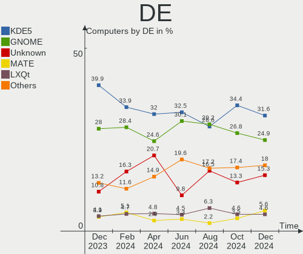
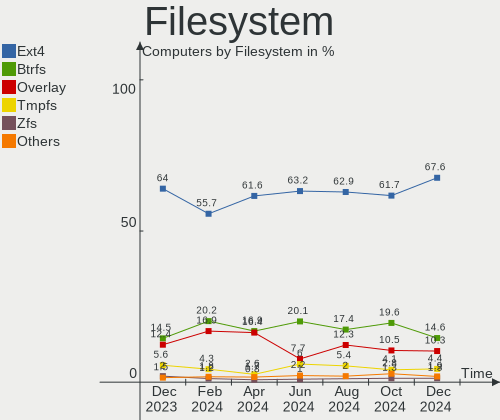
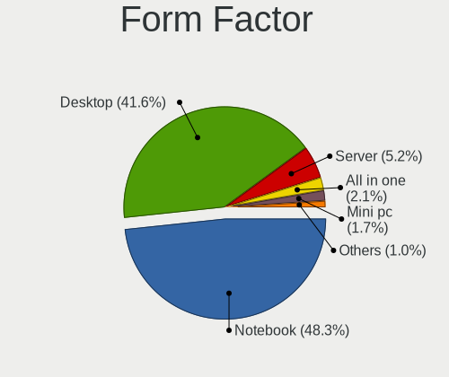
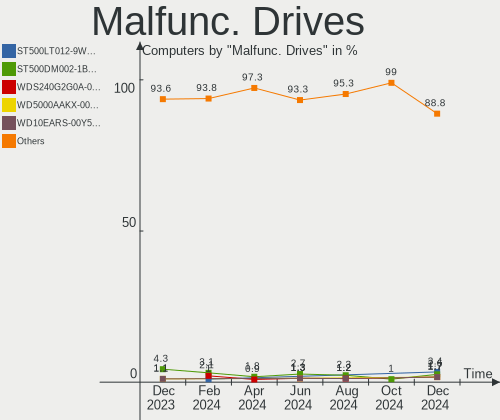
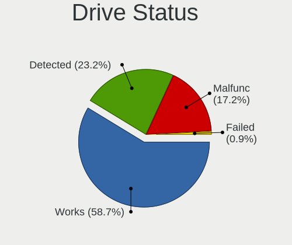
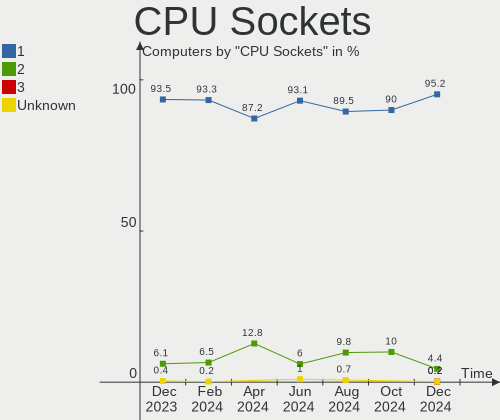
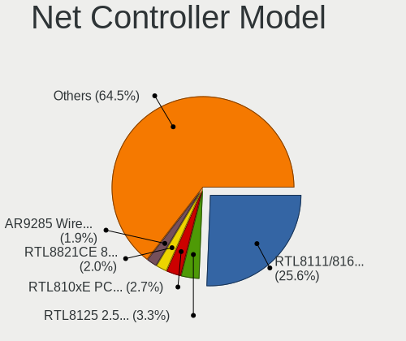
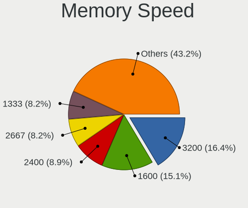

Linux in Russia - Hardware Trends
---------------------------------

A project to identify most popular hardware characteristics and track their change
over time based on data collected by Linux users at https://Linux-Hardware.org.

Anyone can contribute to this report by the [hw-probe](https://github.com/linuxhw/hw-probe) tool:

    sudo -E hw-probe -all -upload

This is a report for all computer types. See also reports for [desktops](/Location/Russia/Desktop/README.md) and [notebooks](/Location/Russia/Notebook/README.md).

Period: Mar, 2023.

Contents
--------

* [ System ](#system)
  - [ OS                       ](#os)
  - [ OS Family                ](#os-family)
  - [ Kernel                   ](#kernel)
  - [ Kernel Family            ](#kernel-family)
  - [ Kernel Major Ver.        ](#kernel-major-ver)
  - [ Arch                     ](#arch)
  - [ DE                       ](#de)
  - [ Display Server           ](#display-server)
  - [ Display Manager          ](#display-manager)
  - [ OS Lang                  ](#os-lang)
  - [ Boot Mode                ](#boot-mode)
  - [ Filesystem               ](#filesystem)
  - [ Part. scheme             ](#part-scheme)
  - [ Dual Boot with Linux/BSD ](#dual-boot-with-linuxbsd)
  - [ Dual Boot (Win)          ](#dual-boot-win)

* [ Board ](#board)
  - [ Vendor                   ](#vendor)
  - [ Model                    ](#model)
  - [ Model Family             ](#model-family)
  - [ MFG Year                 ](#mfg-year)
  - [ Form Factor              ](#form-factor)
  - [ Secure Boot              ](#secure-boot)
  - [ Coreboot                 ](#coreboot)
  - [ RAM Size                 ](#ram-size)
  - [ RAM Used                 ](#ram-used)
  - [ Total Drives             ](#total-drives)
  - [ Has CD-ROM               ](#has-cd-rom)
  - [ Has Ethernet             ](#has-ethernet)
  - [ Has WiFi                 ](#has-wifi)
  - [ Has Bluetooth            ](#has-bluetooth)

* [ Location ](#location)
  - [ Country                  ](#country)
  - [ City                     ](#city)

* [ Drives ](#drives)
  - [ Drive Vendor             ](#drive-vendor)
  - [ Drive Model              ](#drive-model)
  - [ HDD Vendor               ](#hdd-vendor)
  - [ SSD Vendor               ](#ssd-vendor)
  - [ Drive Kind               ](#drive-kind)
  - [ Drive Connector          ](#drive-connector)
  - [ Drive Size               ](#drive-size)
  - [ Space Total              ](#space-total)
  - [ Space Used               ](#space-used)
  - [ Malfunc. Drives          ](#malfunc-drives)
  - [ Malfunc. Drive Vendor    ](#malfunc-drive-vendor)
  - [ Malfunc. HDD Vendor      ](#malfunc-hdd-vendor)
  - [ Malfunc. Drive Kind      ](#malfunc-drive-kind)
  - [ Failed Drives            ](#failed-drives)
  - [ Failed Drive Vendor      ](#failed-drive-vendor)
  - [ Drive Status             ](#drive-status)

* [ Storage controller ](#storage-controller)
  - [ Storage Vendor           ](#storage-vendor)
  - [ Storage Model            ](#storage-model)
  - [ Storage Kind             ](#storage-kind)

* [ Processor ](#processor)
  - [ CPU Vendor               ](#cpu-vendor)
  - [ CPU Model                ](#cpu-model)
  - [ CPU Model Family         ](#cpu-model-family)
  - [ CPU Cores                ](#cpu-cores)
  - [ CPU Sockets              ](#cpu-sockets)
  - [ CPU Threads              ](#cpu-threads)
  - [ CPU Op-Modes             ](#cpu-op-modes)
  - [ CPU Microcode            ](#cpu-microcode)
  - [ CPU Microarch            ](#cpu-microarch)

* [ Graphics ](#graphics)
  - [ GPU Vendor               ](#gpu-vendor)
  - [ GPU Model                ](#gpu-model)
  - [ GPU Combo                ](#gpu-combo)
  - [ GPU Driver               ](#gpu-driver)
  - [ GPU Memory               ](#gpu-memory)

* [ Monitor ](#monitor)
  - [ Monitor Vendor           ](#monitor-vendor)
  - [ Monitor Model            ](#monitor-model)
  - [ Monitor Resolution       ](#monitor-resolution)
  - [ Monitor Diagonal         ](#monitor-diagonal)
  - [ Monitor Width            ](#monitor-width)
  - [ Aspect Ratio             ](#aspect-ratio)
  - [ Monitor Area             ](#monitor-area)
  - [ Pixel Density            ](#pixel-density)
  - [ Multiple Monitors        ](#multiple-monitors)

* [ Network ](#network)
  - [ Net Controller Vendor    ](#net-controller-vendor)
  - [ Net Controller Model     ](#net-controller-model)
  - [ Wireless Vendor          ](#wireless-vendor)
  - [ Wireless Model           ](#wireless-model)
  - [ Ethernet Vendor          ](#ethernet-vendor)
  - [ Ethernet Model           ](#ethernet-model)
  - [ Net Controller Kind      ](#net-controller-kind)
  - [ Used Controller          ](#used-controller)
  - [ NICs                     ](#nics)
  - [ IPv6                     ](#ipv6)

* [ Bluetooth ](#bluetooth)
  - [ Bluetooth Vendor         ](#bluetooth-vendor)
  - [ Bluetooth Model          ](#bluetooth-model)

* [ Sound ](#sound)
  - [ Sound Vendor             ](#sound-vendor)
  - [ Sound Model              ](#sound-model)

* [ Memory ](#memory)
  - [ Memory Vendor            ](#memory-vendor)
  - [ Memory Model             ](#memory-model)
  - [ Memory Kind              ](#memory-kind)
  - [ Memory Form Factor       ](#memory-form-factor)
  - [ Memory Size              ](#memory-size)
  - [ Memory Speed             ](#memory-speed)

* [ Printers & scanners ](#printers--scanners)
  - [ Printer Vendor           ](#printer-vendor)
  - [ Printer Model            ](#printer-model)
  - [ Scanner Vendor           ](#scanner-vendor)
  - [ Scanner Model            ](#scanner-model)

* [ Camera ](#camera)
  - [ Camera Vendor            ](#camera-vendor)
  - [ Camera Model             ](#camera-model)

* [ Security ](#security)
  - [ Fingerprint Vendor       ](#fingerprint-vendor)
  - [ Fingerprint Model        ](#fingerprint-model)
  - [ Chipcard Vendor          ](#chipcard-vendor)
  - [ Chipcard Model           ](#chipcard-model)

* [ Unsupported ](#unsupported)
  - [ Unsupported Devices      ](#unsupported-devices)
  - [ Unsupported Device Types ](#unsupported-device-types)

System
------

OS
--

Installed operating systems

| Name               | Computers | Percent |
|--------------------|-----------|---------|
| ROSA 12.3          | 185       | 30.48%  |
| OpenMandriva 23.03 | 33        | 5.44%   |
| ROSA 12.4          | 30        | 4.94%   |
| Debian 11          | 30        | 4.94%   |
| Ubuntu 22.04       | 28        | 4.61%   |
| Fedora 37          | 25        | 4.12%   |
| OpenMandriva 23.01 | 17        | 2.8%    |
| Linux Mint 21.1    | 17        | 2.8%    |
| ALT Linux 10.1     | 16        | 2.64%   |
| Arch Rolling       | 15        | 2.47%   |
| Red OS 7.3.2       | 14        | 2.31%   |
| Debian             | 13        | 2.14%   |
| Ubuntu 22.10       | 11        | 1.81%   |
| Red OS 7.3         | 11        | 1.81%   |
| ROSA R11.1         | 10        | 1.65%   |
| OpenMandriva 4.3   | 9         | 1.48%   |
| Manjaro            | 7         | 1.15%   |
| Cyber Infra 5.0.1  | 7         | 1.15%   |
| ROSA 12.2          | 6         | 0.99%   |
| Kali 2023.1        | 6         | 0.99%   |
| Ubuntu 20.04       | 5         | 0.82%   |
| Pop!_OS 22.04      | 5         | 0.82%   |
| Nobara 37          | 5         | 0.82%   |
| MOS 10             | 5         | 0.82%   |
| Red OS 7.3.1       | 4         | 0.66%   |
| OpenMandriva 4.2   | 4         | 0.66%   |
| KDE neon 22.04     | 4         | 0.66%   |
| Debian 10          | 4         | 0.66%   |
| Zorin 16           | 3         | 0.49%   |
| Xubuntu 20.04      | 3         | 0.49%   |
| Kubuntu 22.10      | 3         | 0.49%   |
| Fedora 38          | 3         | 0.49%   |
| Xubuntu 18.04      | 2         | 0.33%   |
| Ubuntu 23.04       | 2         | 0.33%   |
| SteamOS 3.4.6      | 2         | 0.33%   |
| ROSA 12            | 2         | 0.33%   |
| RELD 7.9           | 2         | 0.33%   |
| MX 21              | 2         | 0.33%   |
| Manjaro 22.0.5     | 2         | 0.33%   |
| Manjaro 22.0.4     | 2         | 0.33%   |

OS Family
---------

OS without a version

| Name             | Computers | Percent |
|------------------|-----------|---------|
| ROSA             | 234       | 38.55%  |
| OpenMandriva     | 65        | 10.71%  |
| Ubuntu           | 47        | 7.74%   |
| Debian           | 47        | 7.74%   |
| Fedora           | 31        | 5.11%   |
| Red OS           | 29        | 4.78%   |
| ALT Linux        | 24        | 3.95%   |
| Linux Mint       | 23        | 3.79%   |
| Arch             | 15        | 2.47%   |
| Manjaro          | 12        | 1.98%   |
| Kali             | 8         | 1.32%   |
| Cyber Infra      | 7         | 1.15%   |
| Xubuntu          | 6         | 0.99%   |
| Pop!_OS          | 5         | 0.82%   |
| Nobara           | 5         | 0.82%   |
| Kubuntu          | 5         | 0.82%   |
| KDE neon         | 4         | 0.66%   |
| Elementary       | 4         | 0.66%   |
| Zorin            | 3         | 0.49%   |
| SteamOS          | 3         | 0.49%   |
| Lubuntu          | 3         | 0.49%   |
| RELD             | 2         | 0.33%   |
| MX               | 2         | 0.33%   |
| LMDE             | 2         | 0.33%   |
| Gentoo           | 2         | 0.33%   |
| Endless          | 2         | 0.33%   |
| EndeavourOS      | 2         | 0.33%   |
| CentOS           | 2         | 0.33%   |
| Xero             | 1         | 0.16%   |
| Void Linux       | 1         | 0.16%   |
| Ubuntu Unity     | 1         | 0.16%   |
| Rocky Linux      | 1         | 0.16%   |
| org.kde.Platform | 1         | 0.16%   |
| openSUSE         | 1         | 0.16%   |
| Mageia           | 1         | 0.16%   |
| Clear Linux      | 1         | 0.16%   |
| CachyOS          | 1         | 0.16%   |
| Astra Linux      | 1         | 0.16%   |
| Artix            | 1         | 0.16%   |
| ArcoLinux        | 1         | 0.16%   |

Kernel
------

Version of the Linux kernel

| Version                                   | Computers | Percent |
|-------------------------------------------|-----------|---------|
| 5.15.75-generic-1rosa2021.1-x86_64        | 66        | 10.87%  |
| 5.15.79-generic-1rosa2021.1-x86_64        | 56        | 9.23%   |
| 5.19.0-35-generic                         | 34        | 5.6%    |
| 6.2.6-desktop-1omv2390                    | 27        | 4.45%   |
| 5.10.155-generic-1rosa2021.1-x86_64       | 18        | 2.97%   |
| 6.1.20-generic-2rosa2021.1-x86_64         | 17        | 2.8%    |
| 5.15.0-67-generic                         | 17        | 2.8%    |
| 6.1.1-desktop-1omv2290                    | 16        | 2.64%   |
| 5.10.0-21-amd64                           | 14        | 2.31%   |
| 5.15.87-1.el7.3.x86_64                    | 13        | 2.14%   |
| 5.10.0-2-amd64                            | 12        | 1.98%   |
| 5.15.75-generic-1rosa2021.1-i686          | 11        | 1.81%   |
| 6.0.12.xm1-1.klp-xanmod-rosa2021.1-x86_64 | 10        | 1.65%   |
| 6.1.0-4-amd64                             | 9         | 1.48%   |
| 5.19.0-38-generic                         | 8         | 1.32%   |
| 6.1.20-generic-1rosa2021.1-x86_64         | 7         | 1.15%   |
| 6.1.15-200.fc37.x86_64                    | 7         | 1.15%   |
| 3.10.0-1160.41.1.vz7.183.5                | 7         | 1.15%   |
| 5.16.7-desktop-1omv4003                   | 6         | 0.99%   |
| 5.15.103-generic-1rosa2021.1-x86_64       | 6         | 0.99%   |
| 6.1.18-200.fc37.x86_64                    | 5         | 0.82%   |
| 6.1.0-kali5-amd64                         | 5         | 0.82%   |
| 5.4.0-144-generic                         | 5         | 0.82%   |
| 5.17.11-generic-2rosa2021.1-x86_64        | 5         | 0.82%   |
| 5.15.77-generic-1rosa2021.1-x86_64        | 5         | 0.82%   |
| 5.14.9-1.el7.x86_64                       | 5         | 0.82%   |
| 5.10.74-generic-2rosa2021.1-x86_64        | 5         | 0.82%   |
| 6.2.7-zen1-1-zen                          | 4         | 0.66%   |
| 6.2.2-desktop-1omv2390                    | 4         | 0.66%   |
| 6.1.14-200.fc37.x86_64                    | 4         | 0.66%   |
| 6.1.12-1-MANJARO                          | 4         | 0.66%   |
| 5.19.0-32-generic                         | 4         | 0.66%   |
| 5.15.10-1.el7.x86_64                      | 4         | 0.66%   |
| 5.10.14-desktop-1omv4002                  | 4         | 0.66%   |
| 6.2.8-arch1-1                             | 3         | 0.49%   |
| 6.2.7-200.fc37.x86_64                     | 3         | 0.49%   |
| 6.2.6-arch1-1                             | 3         | 0.49%   |
| 6.2.2-zen1-1-zen                          | 3         | 0.49%   |
| 6.1.14-201.fsync.fc37.x86_64              | 3         | 0.49%   |
| 5.16.13-desktop-1omv4003                  | 3         | 0.49%   |

Kernel Family
-------------

Linux kernel without a distro release

| Version  | Computers | Percent |
|----------|-----------|---------|
| 5.15.75  | 77        | 12.69%  |
| 5.15.79  | 56        | 9.23%   |
| 5.19.0   | 47        | 7.74%   |
| 6.2.6    | 37        | 6.1%    |
| 5.15.0   | 31        | 5.11%   |
| 5.10.0   | 29        | 4.78%   |
| 6.1.20   | 25        | 4.12%   |
| 6.1.0    | 18        | 2.97%   |
| 5.10.155 | 18        | 2.97%   |
| 6.1.1    | 16        | 2.64%   |
| 5.15.87  | 14        | 2.31%   |
| 6.2.2    | 12        | 1.98%   |
| 6.0.12   | 11        | 1.81%   |
| 6.2.7    | 10        | 1.65%   |
| 6.2.8    | 9         | 1.48%   |
| 6.1.14   | 9         | 1.48%   |
| 5.4.0    | 9         | 1.48%   |
| 6.1.18   | 8         | 1.32%   |
| 6.1.15   | 8         | 1.32%   |
| 3.10.0   | 8         | 1.32%   |
| 6.1.12   | 7         | 1.15%   |
| 5.10.74  | 7         | 1.15%   |
| 5.17.11  | 6         | 0.99%   |
| 5.16.7   | 6         | 0.99%   |
| 5.15.103 | 6         | 0.99%   |
| 4.15.0   | 6         | 0.99%   |
| 6.1.19   | 5         | 0.82%   |
| 6.0.0    | 5         | 0.82%   |
| 5.15.77  | 5         | 0.82%   |
| 5.15.72  | 5         | 0.82%   |
| 5.14.9   | 5         | 0.82%   |
| 6.2.0    | 4         | 0.66%   |
| 6.1.11   | 4         | 0.66%   |
| 5.15.80  | 4         | 0.66%   |
| 5.15.10  | 4         | 0.66%   |
| 5.10.14  | 4         | 0.66%   |
| 5.4.32   | 3         | 0.49%   |
| 5.16.13  | 3         | 0.49%   |
| 5.15.102 | 3         | 0.49%   |
| 5.13.0   | 3         | 0.49%   |

Kernel Major Ver.
-----------------

Linux kernel major version

| Version | Computers | Percent |
|---------|-----------|---------|
| 5.15    | 214       | 35.26%  |
| 6.1     | 108       | 17.79%  |
| 5.10    | 75        | 12.36%  |
| 6.2     | 74        | 12.19%  |
| 5.19    | 50        | 8.24%   |
| 6.0     | 21        | 3.46%   |
| 5.4     | 14        | 2.31%   |
| 5.16    | 9         | 1.48%   |
| 3.10    | 8         | 1.32%   |
| 5.14    | 7         | 1.15%   |
| 5.17    | 6         | 0.99%   |
| 4.15    | 6         | 0.99%   |
| 5.18    | 3         | 0.49%   |
| 5.13    | 3         | 0.49%   |
| 4.19    | 3         | 0.49%   |
| 5.11    | 2         | 0.33%   |
| 6.3     | 1         | 0.16%   |
| 5.8     | 1         | 0.16%   |
| 4.9     | 1         | 0.16%   |
| 4.18    | 1         | 0.16%   |

Arch
----

OS architecture (x86_64, i586, etc.)

| Name    | Computers | Percent |
|---------|-----------|---------|
| x86_64  | 587       | 96.71%  |
| i686    | 18        | 2.97%   |
| aarch64 | 2         | 0.33%   |

DE
--

Desktop Environment

| Name       | Computers | Percent |
|------------|-----------|---------|
| KDE5       | 233       | 38.39%  |
| GNOME      | 190       | 31.3%   |
| Unknown    | 51        | 8.4%    |
| LXQt       | 33        | 5.44%   |
| MATE       | 29        | 4.78%   |
| XFCE       | 20        | 3.29%   |
| X-Cinnamon | 20        | 3.29%   |
| Cinnamon   | 10        | 1.65%   |
| KDE4       | 8         | 1.32%   |
| Pantheon   | 4         | 0.66%   |
| i3         | 2         | 0.33%   |
| Unity      | 1         | 0.16%   |
| Trinity    | 1         | 0.16%   |
| sway       | 1         | 0.16%   |
| LXDE       | 1         | 0.16%   |
| Hyprland   | 1         | 0.16%   |
| fluxbox    | 1         | 0.16%   |
| Budgie     | 1         | 0.16%   |

Display Server
--------------

X11 or Wayland

| Name    | Computers | Percent |
|---------|-----------|---------|
| X11     | 304       | 50.08%  |
| Wayland | 263       | 43.33%  |
| Unknown | 29        | 4.78%   |
| Tty     | 11        | 1.81%   |

Display Manager
---------------

SDDM, LightDM, etc.

| Name    | Computers | Percent |
|---------|-----------|---------|
| SDDM    | 216       | 35.58%  |
| GDM     | 148       | 24.38%  |
| Unknown | 126       | 20.76%  |
| LightDM | 62        | 10.21%  |
| GDM3    | 44        | 7.25%   |
| KDM     | 8         | 1.32%   |
| TDM     | 1         | 0.16%   |
| NODM    | 1         | 0.16%   |
| GREETD  | 1         | 0.16%   |

OS Lang
-------

Language

| Lang    | Computers | Percent |
|---------|-----------|---------|
| ru_RU   | 490       | 80.72%  |
| en_US   | 104       | 17.13%  |
| C       | 5         | 0.82%   |
| Unknown | 5         | 0.82%   |
| en_GB   | 3         | 0.49%   |

Boot Mode
---------

EFI or BIOS

| Mode | Computers | Percent |
|------|-----------|---------|
| EFI  | 345       | 56.84%  |
| BIOS | 262       | 43.16%  |

Filesystem
----------

Type of filesystem

| Type    | Computers | Percent |
|---------|-----------|---------|
| Ext4    | 455       | 74.96%  |
| Btrfs   | 73        | 12.03%  |
| Overlay | 63        | 10.38%  |
| Xfs     | 8         | 1.32%   |
| Zfs     | 3         | 0.49%   |
| F2fs    | 2         | 0.33%   |
| Ext3    | 2         | 0.33%   |
| Aufs    | 1         | 0.16%   |

Part. scheme
------------

Scheme of partitioning

| Type    | Computers | Percent |
|---------|-----------|---------|
| GPT     | 369       | 60.79%  |
| MBR     | 158       | 26.03%  |
| Unknown | 80        | 13.18%  |

Dual Boot with Linux/BSD
------------------------

Hosting more than one Linux/BSD

| Dual boot | Computers | Percent |
|-----------|-----------|---------|
| No        | 480       | 79.08%  |
| Yes       | 127       | 20.92%  |

Dual Boot (Win)
---------------

Hosting Linux and Windows

| Dual boot | Computers | Percent |
|-----------|-----------|---------|
| No        | 379       | 62.44%  |
| Yes       | 228       | 37.56%  |

Board
-----

Vendor
------

Motherboard manufacturer

| Name                | Computers | Percent |
|---------------------|-----------|---------|
| ASUSTek Computer    | 129       | 21.25%  |
| Gigabyte Technology | 89        | 14.66%  |
| Lenovo              | 50        | 8.24%   |
| Hewlett-Packard     | 38        | 6.26%   |
| MSI                 | 35        | 5.77%   |
| Acer                | 35        | 5.77%   |
| ASRock              | 31        | 5.11%   |
| Dell                | 23        | 3.79%   |
| Intel               | 15        | 2.47%   |
| HUAWEI              | 12        | 1.98%   |
| HONOR               | 12        | 1.98%   |
| Unknown             | 11        | 1.81%   |
| Supermicro          | 10        | 1.65%   |
| Samsung Electronics | 7         | 1.15%   |
| Toshiba             | 6         | 0.99%   |
| Sony                | 5         | 0.82%   |
| Huanan              | 5         | 0.82%   |
| Clevo               | 5         | 0.82%   |
| Biostar             | 5         | 0.82%   |
| Timi                | 4         | 0.66%   |
| Fujitsu             | 4         | 0.66%   |
| Foxconn             | 4         | 0.66%   |
| ECS                 | 4         | 0.66%   |
| Valve               | 3         | 0.49%   |
| Pegatron            | 3         | 0.49%   |
| EPoX Computer       | 3         | 0.49%   |
| DEPO Computers      | 3         | 0.49%   |
| AZW                 | 3         | 0.49%   |
| Aquarius            | 3         | 0.49%   |
| Apple               | 3         | 0.49%   |
| Prestigio           | 2         | 0.33%   |
| Packard Bell        | 2         | 0.33%   |
| Maibenben           | 2         | 0.33%   |
| MACHINIST           | 2         | 0.33%   |
| Infinix             | 2         | 0.33%   |
| ICL                 | 2         | 0.33%   |
| HIPER               | 2         | 0.33%   |
| Haier               | 2         | 0.33%   |
| Fujitsu Siemens     | 2         | 0.33%   |
| eMachines           | 2         | 0.33%   |

Model
-----

Motherboard model

| Name                                       | Computers | Percent |
|--------------------------------------------|-----------|---------|
| Unknown                                    | 11        | 1.81%   |
| Supermicro AS -1014S-WTRT                  | 7         | 1.15%   |
| Gigabyte H410M H V3                        | 5         | 0.82%   |
| ASUS All Series                            | 5         | 0.82%   |
| HONOR HYM-WXX                              | 4         | 0.66%   |
| Clevo NL41MU2                              | 4         | 0.66%   |
| Valve Jupiter                              | 3         | 0.49%   |
| HONOR NBR-WAX9                             | 3         | 0.49%   |
| HONOR BMH-WCX9                             | 3         | 0.49%   |
| Gigabyte X470 AORUS ULTRA GAMING           | 3         | 0.49%   |
| Gigabyte A320M-S2H V2                      | 3         | 0.49%   |
| ASUS PRIME B450M-A                         | 3         | 0.49%   |
| ASRock H61M-DGS                            | 3         | 0.49%   |
| Timi Redmi Book Pro 15 2022                | 2         | 0.33%   |
| Samsung 300V3A/300V4A/300V5A/200A4B/200A5B | 2         | 0.33%   |
| MSI MS-7788                                | 2         | 0.33%   |
| Lenovo ThinkPad P1 Gen 4i 20Y3001LUK       | 2         | 0.33%   |
| Lenovo B570e HuronRiver Platform           | 2         | 0.33%   |
| Intel X79                                  | 2         | 0.33%   |
| Intel S1200BTL                             | 2         | 0.33%   |
| Intel D945GNT AAC96315-405                 | 2         | 0.33%   |
| Infinix INBOOK X2 GEN11                    | 2         | 0.33%   |
| HUAWEI KLVL-WXXW                           | 2         | 0.33%   |
| HUAWEI HN-WX9X                             | 2         | 0.33%   |
| Huanan X99-QD4 V1.0                        | 2         | 0.33%   |
| HIPER WORKBOOK                             | 2         | 0.33%   |
| HP Pavilion Notebook                       | 2         | 0.33%   |
| HP Pavilion dv6                            | 2         | 0.33%   |
| HP Laptop 15s-eq2xxx                       | 2         | 0.33%   |
| Gigabyte GA-A55M-S2V                       | 2         | 0.33%   |
| Gigabyte B550 AORUS ELITE V2               | 2         | 0.33%   |
| Gigabyte B550 AORUS ELITE AX V2            | 2         | 0.33%   |
| Gigabyte B450M S2H                         | 2         | 0.33%   |
| Gigabyte B450 AORUS M                      | 2         | 0.33%   |
| ECS G31T-M9                                | 2         | 0.33%   |
| Dell Vostro 3400                           | 2         | 0.33%   |
| Dell Latitude 5521                         | 2         | 0.33%   |
| Biostar A320MH                             | 2         | 0.33%   |
| ASUS Zenbook UX535QE_UM535QE               | 2         | 0.33%   |
| ASUS VivoBook_ASUSLaptop M6500QC_M6500QC   | 2         | 0.33%   |

Model Family
------------

Motherboard model prefix

| Name                  | Computers | Percent |
|-----------------------|-----------|---------|
| Acer Aspire           | 26        | 4.28%   |
| ASUS PRIME            | 22        | 3.62%   |
| Lenovo IdeaPad        | 18        | 2.97%   |
| Lenovo ThinkPad       | 15        | 2.47%   |
| ASUS VivoBook         | 13        | 2.14%   |
| Unknown               | 11        | 1.81%   |
| HP Laptop             | 9         | 1.48%   |
| HP Pavilion           | 8         | 1.32%   |
| Supermicro AS         | 7         | 1.15%   |
| Gigabyte H410M        | 7         | 1.15%   |
| Gigabyte B550         | 6         | 0.99%   |
| Dell Vostro           | 6         | 0.99%   |
| Toshiba Satellite     | 5         | 0.82%   |
| Dell Latitude         | 5         | 0.82%   |
| Dell Inspiron         | 5         | 0.82%   |
| ASUS All              | 5         | 0.82%   |
| HONOR HYM-WXX         | 4         | 0.66%   |
| HP ProBook            | 4         | 0.66%   |
| Clevo NL41MU2         | 4         | 0.66%   |
| ASUS Zenbook          | 4         | 0.66%   |
| ASUS TUF              | 4         | 0.66%   |
| ASUS ROG              | 4         | 0.66%   |
| Valve Jupiter         | 3         | 0.49%   |
| Timi Redmi            | 3         | 0.49%   |
| MSI Modern            | 3         | 0.49%   |
| Lenovo ThinkBook      | 3         | 0.49%   |
| HONOR NBR-WAX9        | 3         | 0.49%   |
| HONOR BMH-WCX9        | 3         | 0.49%   |
| HP EliteBook          | 3         | 0.49%   |
| HP Compaq             | 3         | 0.49%   |
| Gigabyte X470         | 3         | 0.49%   |
| Gigabyte B550M        | 3         | 0.49%   |
| Gigabyte B450M        | 3         | 0.49%   |
| Gigabyte A320M-S2H    | 3         | 0.49%   |
| ASRock H61M-DGS       | 3         | 0.49%   |
| Acer Swift            | 3         | 0.49%   |
| Samsung 300V3A        | 2         | 0.33%   |
| Packard Bell EasyNote | 2         | 0.33%   |
| MSI MS-7788           | 2         | 0.33%   |
| Lenovo Legion         | 2         | 0.33%   |

MFG Year
--------

Motherboard manufacture year

| Year    | Computers | Percent |
|---------|-----------|---------|
| 2021    | 79        | 13.01%  |
| 2022    | 73        | 12.03%  |
| 2020    | 50        | 8.24%   |
| 2012    | 49        | 8.07%   |
| 2018    | 46        | 7.58%   |
| 2011    | 42        | 6.92%   |
| 2019    | 41        | 6.75%   |
| 2017    | 34        | 5.6%    |
| 2010    | 34        | 5.6%    |
| 2013    | 29        | 4.78%   |
| 2014    | 22        | 3.62%   |
| 2009    | 22        | 3.62%   |
| 2016    | 21        | 3.46%   |
| 2007    | 17        | 2.8%    |
| 2006    | 16        | 2.64%   |
| 2008    | 15        | 2.47%   |
| 2015    | 11        | 1.81%   |
| 2023    | 2         | 0.33%   |
| 2005    | 1         | 0.16%   |
| 2004    | 1         | 0.16%   |
| 2002    | 1         | 0.16%   |
| Unknown | 1         | 0.16%   |

Form Factor
-----------

Physical design of the computer

| Name           | Computers | Percent |
|----------------|-----------|---------|
| Notebook       | 285       | 46.95%  |
| Desktop        | 278       | 45.8%   |
| Server         | 15        | 2.47%   |
| All in one     | 13        | 2.14%   |
| Mini pc        | 8         | 1.32%   |
| Convertible    | 5         | 0.82%   |
| Tablet         | 2         | 0.33%   |
| System on chip | 1         | 0.16%   |

Secure Boot
-----------

Enabled or disabled

| State    | Computers | Percent |
|----------|-----------|---------|
| Disabled | 580       | 95.55%  |
| Enabled  | 27        | 4.45%   |

Coreboot
--------

Have coreboot on board

| Used | Computers | Percent |
|------|-----------|---------|
| No   | 607       | 100%    |

RAM Size
--------

Total RAM memory

| Size in GB      | Computers | Percent |
|-----------------|-----------|---------|
| 4.01-8.0        | 139       | 22.9%   |
| 16.01-24.0      | 121       | 19.93%  |
| 8.01-16.0       | 115       | 18.95%  |
| 3.01-4.0        | 106       | 17.46%  |
| 32.01-64.0      | 52        | 8.57%   |
| 1.01-2.0        | 29        | 4.78%   |
| 2.01-3.0        | 14        | 2.31%   |
| 64.01-256.0     | 11        | 1.81%   |
| More than 256.0 | 8         | 1.32%   |
| 24.01-32.0      | 8         | 1.32%   |
| 0.51-1.0        | 4         | 0.66%   |

RAM Used
--------

Used RAM memory

| Used GB     | Computers | Percent |
|-------------|-----------|---------|
| 1.01-2.0    | 258       | 42.5%   |
| 2.01-3.0    | 118       | 19.44%  |
| 0.51-1.0    | 86        | 14.17%  |
| 4.01-8.0    | 57        | 9.39%   |
| 3.01-4.0    | 47        | 7.74%   |
| 8.01-16.0   | 28        | 4.61%   |
| 0.01-0.5    | 8         | 1.32%   |
| 32.01-64.0  | 2         | 0.33%   |
| 24.01-32.0  | 1         | 0.16%   |
| 64.01-256.0 | 1         | 0.16%   |
| 16.01-24.0  | 1         | 0.16%   |

Total Drives
------------

Number of drives on board

| Drives | Computers | Percent |
|--------|-----------|---------|
| 1      | 367       | 60.46%  |
| 2      | 133       | 21.91%  |
| 3      | 51        | 8.4%    |
| 4      | 25        | 4.12%   |
| 5      | 18        | 2.97%   |
| 0      | 6         | 0.99%   |
| 6      | 3         | 0.49%   |
| 24     | 1         | 0.16%   |
| 16     | 1         | 0.16%   |
| 8      | 1         | 0.16%   |
| 7      | 1         | 0.16%   |

Has CD-ROM
----------

Has CD-ROM on board

| Presented | Computers | Percent |
|-----------|-----------|---------|
| No        | 437       | 71.99%  |
| Yes       | 170       | 28.01%  |

Has Ethernet
------------

Has Ethernet on board

| Presented | Computers | Percent |
|-----------|-----------|---------|
| Yes       | 521       | 85.83%  |
| No        | 86        | 14.17%  |

Has WiFi
--------

Has WiFi module

| Presented | Computers | Percent |
|-----------|-----------|---------|
| Yes       | 414       | 68.2%   |
| No        | 193       | 31.8%   |

Has Bluetooth
-------------

Has Bluetooth module

| Presented | Computers | Percent |
|-----------|-----------|---------|
| Yes       | 332       | 54.7%   |
| No        | 275       | 45.3%   |

Location
--------

Country
-------

Geographic location (country)

| Country | Computers | Percent |
|---------|-----------|---------|
| Russia  | 607       | 100%    |

City
----

Geographic location (city)

| City             | Computers | Percent |
|------------------|-----------|---------|
| Moscow           | 150       | 24.71%  |
| St Petersburg    | 58        | 9.56%   |
| Voronezh         | 29        | 4.78%   |
| Krasnodar        | 23        | 3.79%   |
| Samara           | 19        | 3.13%   |
| Chelyabinsk      | 16        | 2.64%   |
| Novosibirsk      | 15        | 2.47%   |
| Nizhniy Novgorod | 14        | 2.31%   |
| Yekaterinburg    | 13        | 2.14%   |
| Ufa              | 12        | 1.98%   |
| Perm             | 11        | 1.81%   |
| Volgograd        | 7         | 1.15%   |
| Kazan’         | 7         | 1.15%   |
| Saratov          | 6         | 0.99%   |
| Omsk             | 6         | 0.99%   |
| Krasnoyarsk      | 6         | 0.99%   |
| Khabarovsk       | 6         | 0.99%   |
| Yakutsk          | 5         | 0.82%   |
| Vladimir         | 5         | 0.82%   |
| Ulyanovsk        | 5         | 0.82%   |
| Rostov-on-Don    | 5         | 0.82%   |
| Novokuznetsk     | 5         | 0.82%   |
| Lipetsk          | 5         | 0.82%   |
| Yaroslavl        | 4         | 0.66%   |
| Vladivostok      | 4         | 0.66%   |
| Surgut           | 4         | 0.66%   |
| Stavropol        | 4         | 0.66%   |
| Salekhard        | 4         | 0.66%   |
| Orenburg         | 4         | 0.66%   |
| Vologda          | 3         | 0.49%   |
| Veliky Novgorod  | 3         | 0.49%   |
| Tula             | 3         | 0.49%   |
| Taganrog         | 3         | 0.49%   |
| Kirishi          | 3         | 0.49%   |
| Izhevsk          | 3         | 0.49%   |
| Cheremkhovo      | 3         | 0.49%   |
| Bryansk          | 3         | 0.49%   |
| Blagoveshchensk  | 3         | 0.49%   |
| Yoshkar-Ola      | 2         | 0.33%   |
| Vsevolozhsk      | 2         | 0.33%   |

Drives
------

Drive Vendor
------------

Hard drive vendors

| Vendor                      | Computers | Drives | Percent |
|-----------------------------|-----------|--------|---------|
| WDC                         | 152       | 189    | 16.91%  |
| Seagate                     | 136       | 159    | 15.13%  |
| Samsung Electronics         | 87        | 117    | 9.68%   |
| Toshiba                     | 59        | 67     | 6.56%   |
| Kingston                    | 48        | 56     | 5.34%   |
| Hitachi                     | 31        | 32     | 3.45%   |
| Sandisk                     | 29        | 31     | 3.23%   |
| China                       | 23        | 24     | 2.56%   |
| A-DATA Technology           | 21        | 21     | 2.34%   |
| SK hynix                    | 20        | 20     | 2.22%   |
| Apacer                      | 19        | 19     | 2.11%   |
| SPCC                        | 17        | 18     | 1.89%   |
| Intel                       | 17        | 18     | 1.89%   |
| Unknown                     | 16        | 18     | 1.78%   |
| Netac                       | 12        | 13     | 1.33%   |
| Crucial                     | 12        | 14     | 1.33%   |
| XrayDisk                    | 8         | 8      | 0.89%   |
| Micron Technology           | 8         | 9      | 0.89%   |
| KIOXIA                      | 8         | 8      | 0.89%   |
| KingSpec                    | 7         | 7      | 0.78%   |
| Silicon Motion              | 6         | 6      | 0.67%   |
| Patriot                     | 6         | 6      | 0.67%   |
| HGST                        | 6         | 6      | 0.67%   |
| Smartbuy                    | 5         | 6      | 0.56%   |
| Realtek Semiconductor       | 5         | 5      | 0.56%   |
| Plextor                     | 5         | 5      | 0.56%   |
| Phison Electronics          | 5         | 5      | 0.56%   |
| MAXIO Technology (Hangzhou) | 5         | 5      | 0.56%   |
| Gigabyte Technology         | 5         | 5      | 0.56%   |
| AMD                         | 5         | 5      | 0.56%   |
| Transcend                   | 4         | 4      | 0.44%   |
| SSSTC                       | 4         | 4      | 0.44%   |
| Phison                      | 4         | 4      | 0.44%   |
| OCZ                         | 4         | 4      | 0.44%   |
| Fujitsu                     | 4         | 4      | 0.44%   |
| BIWIN                       | 4         | 4      | 0.44%   |
| ADATA Technology            | 4         | 5      | 0.44%   |
| Unknown                     | 4         | 4      | 0.44%   |
| XPG                         | 3         | 3      | 0.33%   |
| Qumo                        | 3         | 3      | 0.33%   |

Drive Model
-----------

Hard drive models

| Model                                               | Computers | Percent |
|-----------------------------------------------------|-----------|---------|
| Kingston SA400S37240G 240GB SSD                     | 11        | 1.14%   |
| Seagate ST500DM002-1BD142 500GB                     | 10        | 1.03%   |
| Samsung SSD 860 EVO 250GB                           | 10        | 1.03%   |
| Samsung NVMe SSD Controller PM9A1/PM9A3/980PRO 1TB  | 9         | 0.93%   |
| WDC WD10EZEX-08WN4A0 1TB                            | 8         | 0.83%   |
| WDC WDS240G2G0A-00JH30 240GB SSD                    | 7         | 0.72%   |
| Toshiba MQ01ABF050 500GB                            | 7         | 0.72%   |
| Toshiba DT01ACA050 500GB                            | 7         | 0.72%   |
| SPCC Solid State Disk 128GB                         | 7         | 0.72%   |
| Seagate ST4000NM000A-2HZ100 4TB                     | 7         | 0.72%   |
| Seagate ST1000DM010-2EP102 1TB                      | 7         | 0.72%   |
| Samsung MZ7L3480HBLT-00A07 480GB SSD                | 7         | 0.72%   |
| Kingston SA400S37480G 480GB SSD                     | 7         | 0.72%   |
| WDC WD10EZEX-00BBHA0 1TB                            | 6         | 0.62%   |
| Seagate ST9320325AS 320GB                           | 6         | 0.62%   |
| Seagate ST3500418AS 500GB                           | 6         | 0.62%   |
| Seagate ST1000DM003-1CH162 1TB                      | 6         | 0.62%   |
| Samsung NVMe SSD Controller SM981/PM981/PM983 250GB | 6         | 0.62%   |
| WDC WDS120G2G0A-00JH30 120GB SSD                    | 5         | 0.52%   |
| WDC WD10EZEX-22MFCA0 1TB                            | 5         | 0.52%   |
| Toshiba HDWD110 1TB                                 | 5         | 0.52%   |
| Seagate ST500LT012-1DG142 500GB                     | 5         | 0.52%   |
| Kingston SNVS500G 500GB                             | 5         | 0.52%   |
| AMD R5SL120G 120GB SSD                              | 5         | 0.52%   |
| Toshiba MQ04ABF100 1TB                              | 4         | 0.41%   |
| SK hynix HFM512GD3JX013N 512GB                      | 4         | 0.41%   |
| Seagate ST3500413AS 500GB                           | 4         | 0.41%   |
| Seagate ST3250410AS 250GB                           | 4         | 0.41%   |
| Seagate ST1000LM035-1RK172 1TB                      | 4         | 0.41%   |
| Seagate ST1000LM024 HN-M101MBB 1TB                  | 4         | 0.41%   |
| Samsung SSD 860 EVO 500GB                           | 4         | 0.41%   |
| Phison PS5013 E13 NVMe Controller 256GB             | 4         | 0.41%   |
| MAXIO (Hangzhou) NVMe SSD Controller MAP1202 256GB  | 4         | 0.41%   |
| Kingston SA400S37120G 120GB SSD                     | 4         | 0.41%   |
| Hitachi HDS721050CLA360 500GB                       | 4         | 0.41%   |
| Crucial CT480BX500SSD1 480GB                        | 4         | 0.41%   |
| China SSD 256GB                                     | 4         | 0.41%   |
| BIWIN CE480T5D101-256 256GB                         | 4         | 0.41%   |
| Apacer AS350 128GB SSD                              | 4         | 0.41%   |
| A-DATA SU650 240GB SSD                              | 4         | 0.41%   |

HDD Vendor
----------

Hard disk drive vendors

| Vendor              | Computers | Drives | Percent |
|---------------------|-----------|--------|---------|
| Seagate             | 136       | 159    | 37.78%  |
| WDC                 | 115       | 147    | 31.94%  |
| Toshiba             | 52        | 59     | 14.44%  |
| Hitachi             | 31        | 32     | 8.61%   |
| Samsung Electronics | 10        | 10     | 2.78%   |
| HGST                | 6         | 6      | 1.67%   |
| Fujitsu             | 4         | 4      | 1.11%   |
| Maxtor              | 3         | 3      | 0.83%   |
| USB                 | 1         | 1      | 0.28%   |
| Unknown             | 1         | 1      | 0.28%   |
| Hewlett-Packard     | 1         | 10     | 0.28%   |

SSD Vendor
----------

Solid state drive vendors

| Vendor              | Computers | Drives | Percent |
|---------------------|-----------|--------|---------|
| Samsung Electronics | 35        | 47     | 11.67%  |
| Kingston            | 33        | 37     | 11%     |
| WDC                 | 22        | 24     | 7.33%   |
| China               | 22        | 23     | 7.33%   |
| Apacer              | 17        | 17     | 5.67%   |
| SPCC                | 15        | 15     | 5%      |
| A-DATA Technology   | 15        | 15     | 5%      |
| SanDisk             | 11        | 12     | 3.67%   |
| Crucial             | 11        | 13     | 3.67%   |
| Netac               | 9         | 10     | 3%      |
| KingSpec            | 7         | 7      | 2.33%   |
| Intel               | 7         | 7      | 2.33%   |
| XrayDisk            | 6         | 6      | 2%      |
| Patriot             | 5         | 5      | 1.67%   |
| AMD                 | 5         | 5      | 1.67%   |
| Smartbuy            | 4         | 5      | 1.33%   |
| SK hynix            | 4         | 4      | 1.33%   |
| Plextor             | 4         | 4      | 1.33%   |
| OCZ                 | 4         | 4      | 1.33%   |
| Transcend           | 3         | 3      | 1%      |
| Toshiba             | 3         | 4      | 1%      |
| Qumo                | 3         | 3      | 1%      |
| Kimtigo             | 3         | 3      | 1%      |
| HS-SSD-C100         | 3         | 3      | 1%      |
| Xinhaike            | 2         | 2      | 0.67%   |
| TO Exter            | 2         | 2      | 0.67%   |
| ShiJi               | 2         | 2      | 0.67%   |
| KingFast            | 2         | 2      | 0.67%   |
| JMicron Technology  | 2         | 2      | 0.67%   |
| HS-SSD-E100         | 2         | 2      | 0.67%   |
| Gigabyte Technology | 2         | 2      | 0.67%   |
| Foxline             | 2         | 2      | 0.67%   |
| Fanxiang            | 2         | 2      | 0.67%   |
| Unknown             | 2         | 2      | 0.67%   |
| Zheino              | 1         | 1      | 0.33%   |
| TMI                 | 1         | 1      | 0.33%   |
| Teclast             | 1         | 1      | 0.33%   |
| Team                | 1         | 1      | 0.33%   |
| TAMMUZ              | 1         | 2      | 0.33%   |
| SWORDBILL           | 1         | 1      | 0.33%   |

Drive Kind
----------

HDD or SSD

| Kind    | Computers | Drives | Percent |
|---------|-----------|--------|---------|
| HDD     | 307       | 432    | 37.9%   |
| SSD     | 269       | 327    | 33.21%  |
| NVMe    | 215       | 249    | 26.54%  |
| MMC     | 14        | 15     | 1.73%   |
| Unknown | 5         | 6      | 0.62%   |

Drive Connector
---------------

SATA, SAS, NVMe, etc.

| Type | Computers | Drives | Percent |
|------|-----------|--------|---------|
| SATA | 448       | 756    | 65.4%   |
| NVMe | 213       | 246    | 31.09%  |
| MMC  | 14        | 15     | 2.04%   |
| SAS  | 10        | 12     | 1.46%   |

Drive Size
----------

Size of hard drive

| Size in TB | Computers | Drives | Percent |
|------------|-----------|--------|---------|
| 0.01-0.5   | 371       | 528    | 65.43%  |
| 0.51-1.0   | 145       | 169    | 25.57%  |
| 1.01-2.0   | 26        | 32     | 4.59%   |
| 3.01-4.0   | 13        | 15     | 2.29%   |
| 2.01-3.0   | 6         | 6      | 1.06%   |
| 4.01-10.0  | 4         | 7      | 0.71%   |
| 10.01-20.0 | 2         | 2      | 0.35%   |

Space Total
-----------

Amount of disk space available on the file system

| Size in GB     | Computers | Percent |
|----------------|-----------|---------|
| 101-250        | 158       | 26.03%  |
| 251-500        | 135       | 22.24%  |
| 501-1000       | 78        | 12.85%  |
| 51-100         | 55        | 9.06%   |
| 1-20           | 54        | 8.9%    |
| 1001-2000      | 42        | 6.92%   |
| Unknown        | 35        | 5.77%   |
| 2001-3000      | 22        | 3.62%   |
| 21-50          | 19        | 3.13%   |
| More than 3000 | 9         | 1.48%   |

Space Used
----------

Amount of used disk space

| Used GB        | Computers | Percent |
|----------------|-----------|---------|
| 1-20           | 279       | 45.96%  |
| 21-50          | 95        | 15.65%  |
| 101-250        | 60        | 9.88%   |
| 51-100         | 50        | 8.24%   |
| 251-500        | 40        | 6.59%   |
| Unknown        | 35        | 5.77%   |
| 501-1000       | 25        | 4.12%   |
| 1001-2000      | 13        | 2.14%   |
| More than 3000 | 5         | 0.82%   |
| 2001-3000      | 5         | 0.82%   |

Malfunc. Drives
---------------

Drive models with a malfunction

| Model                            | Computers | Drives | Percent |
|----------------------------------|-----------|--------|---------|
| Seagate ST500DM002-1BD142 500GB  | 8         | 9      | 5.44%   |
| Seagate ST3500418AS 500GB        | 4         | 4      | 2.72%   |
| WDC WD10EZEX-22MFCA0 1TB         | 3         | 3      | 2.04%   |
| Toshiba MQ01ABF050 500GB         | 3         | 3      | 2.04%   |
| Seagate ST3250410AS 250GB        | 3         | 3      | 2.04%   |
| Seagate ST1000DM003-1CH162 1TB   | 3         | 3      | 2.04%   |
| Netac SSD 240GB                  | 3         | 3      | 2.04%   |
| WDC WDS120G2G0A-00JH30 120GB SSD | 2         | 2      | 1.36%   |
| WDC WD3200BPVT-22JJ5T0 320GB     | 2         | 2      | 1.36%   |
| Toshiba MQ01ABD050 500GB         | 2         | 2      | 1.36%   |
| Seagate ST9500325AS 500GB        | 2         | 2      | 1.36%   |
| Seagate ST9320325AS 320GB        | 2         | 2      | 1.36%   |
| Seagate ST500LT012-1DG142 500GB  | 2         | 2      | 1.36%   |
| Seagate ST3750640AS 752GB        | 2         | 2      | 1.36%   |
| Seagate ST3500413AS 500GB        | 2         | 2      | 1.36%   |
| Seagate ST340014A 40GB           | 2         | 2      | 1.36%   |
| Seagate ST3250318AS 250GB        | 2         | 2      | 1.36%   |
| Hitachi HTS541680J9SA00 80GB     | 2         | 2      | 1.36%   |
| Hitachi HTS541612J9SA00 120GB    | 2         | 2      | 1.36%   |
| Hitachi HDS721050CLA360 500GB    | 2         | 2      | 1.36%   |
| XPG GAMMIX S11 Pro 256GB         | 1         | 1      | 0.68%   |
| WDC WDS240G2G0B-00EPW0 240GB SSD | 1         | 1      | 0.68%   |
| WDC WDS240G2G0A-00JH30 240GB SSD | 1         | 1      | 0.68%   |
| WDC WD800JD-22LSA0 80GB          | 1         | 1      | 0.68%   |
| WDC WD7500BPVX-00FA7T0 752GB     | 1         | 1      | 0.68%   |
| WDC WD5000LPVX-22V0TT0 500GB     | 1         | 1      | 0.68%   |
| WDC WD5000BPVT-80HXZT1 500GB     | 1         | 1      | 0.68%   |
| WDC WD5000AZLX-22JKKA0 464GB     | 1         | 1      | 0.68%   |
| WDC WD5000AAKX-75U6AA0 500GB     | 1         | 1      | 0.68%   |
| WDC WD5000AAKX-60U6AA0 500GB     | 1         | 1      | 0.68%   |
| WDC WD5000AAKX-00ERMA0 500GB     | 1         | 1      | 0.68%   |
| WDC WD3200BPVT-80ZEST0 320GB     | 1         | 1      | 0.68%   |
| WDC WD3200BPVT-22ZEST0 320GB     | 1         | 1      | 0.68%   |
| WDC WD3200AAJS-08L7A0 320GB      | 1         | 1      | 0.68%   |
| WDC WD3200AAJS-00L7A0 320GB      | 1         | 1      | 0.68%   |
| WDC WD30EFRX-68EUZN0 3TB         | 1         | 1      | 0.68%   |
| WDC WD2500AAJS-00B4A0 250GB      | 1         | 1      | 0.68%   |
| WDC WD20EARS-00S8B1 2TB          | 1         | 1      | 0.68%   |
| WDC WD20EARS-00MVWB0 2TB         | 1         | 1      | 0.68%   |
| WDC WD1600BEVT-22ZCT0 160GB      | 1         | 1      | 0.68%   |

Malfunc. Drive Vendor
---------------------

Vendors of faulty drives

| Vendor              | Computers | Drives | Percent |
|---------------------|-----------|--------|---------|
| Seagate             | 48        | 56     | 34.29%  |
| WDC                 | 32        | 32     | 22.86%  |
| Toshiba             | 15        | 16     | 10.71%  |
| Hitachi             | 13        | 13     | 9.29%   |
| Kingston            | 5         | 5      | 3.57%   |
| Samsung Electronics | 3         | 3      | 2.14%   |
| Netac               | 3         | 3      | 2.14%   |
| KingSpec            | 3         | 3      | 2.14%   |
| A-DATA Technology   | 3         | 3      | 2.14%   |
| SK hynix            | 2         | 2      | 1.43%   |
| OCZ                 | 2         | 2      | 1.43%   |
| HGST                | 2         | 2      | 1.43%   |
| XPG                 | 1         | 1      | 0.71%   |
| Teclast             | 1         | 1      | 0.71%   |
| Qumo                | 1         | 1      | 0.71%   |
| Plextor             | 1         | 1      | 0.71%   |
| Neo                 | 1         | 1      | 0.71%   |
| Maxtor              | 1         | 1      | 0.71%   |
| Intel               | 1         | 1      | 0.71%   |
| Corsair             | 1         | 1      | 0.71%   |
| ACOS                | 1         | 1      | 0.71%   |

Malfunc. HDD Vendor
-------------------

Vendors of faulty HDD drives

| Vendor              | Computers | Drives | Percent |
|---------------------|-----------|--------|---------|
| Seagate             | 48        | 56     | 44.44%  |
| WDC                 | 27        | 27     | 25%     |
| Toshiba             | 14        | 15     | 12.96%  |
| Hitachi             | 13        | 13     | 12.04%  |
| Samsung Electronics | 3         | 3      | 2.78%   |
| HGST                | 2         | 2      | 1.85%   |
| Maxtor              | 1         | 1      | 0.93%   |

Malfunc. Drive Kind
-------------------

Kinds of faulty drives

| Kind | Computers | Drives | Percent |
|------|-----------|--------|---------|
| HDD  | 102       | 117    | 76.12%  |
| SSD  | 30        | 30     | 22.39%  |
| NVMe | 2         | 2      | 1.49%   |

Failed Drives
-------------

Failed drive models

Zero info for selected period =(

Failed Drive Vendor
-------------------

Failed drive vendors

Zero info for selected period =(

Drive Status
------------

Number of failed and malfunc. drives

| Status   | Computers | Drives | Percent |
|----------|-----------|--------|---------|
| Works    | 421       | 678    | 62.84%  |
| Malfunc  | 126       | 149    | 18.81%  |
| Detected | 123       | 202    | 18.36%  |

Storage controller
------------------

Storage Vendor
--------------

Storage controller vendors

| Vendor                           | Computers | Percent |
|----------------------------------|-----------|---------|
| Intel                            | 380       | 47.15%  |
| AMD                              | 147       | 18.24%  |
| Samsung Electronics              | 51        | 6.33%   |
| SanDisk                          | 36        | 4.47%   |
| Kingston Technology Company      | 19        | 2.36%   |
| Silicon Motion                   | 18        | 2.23%   |
| SK hynix                         | 16        | 1.99%   |
| Phison Electronics               | 15        | 1.86%   |
| JMicron Technology               | 15        | 1.86%   |
| ASMedia Technology               | 15        | 1.86%   |
| Nvidia                           | 12        | 1.49%   |
| Realtek Semiconductor            | 11        | 1.36%   |
| ADATA Technology                 | 9         | 1.12%   |
| MAXIO Technology (Hangzhou)      | 8         | 0.99%   |
| KIOXIA                           | 8         | 0.99%   |
| Micron Technology                | 7         | 0.87%   |
| Solid State Storage Technology   | 6         | 0.74%   |
| Toshiba America Info Systems     | 4         | 0.5%    |
| Shenzhen Longsys Electronics     | 4         | 0.5%    |
| Marvell Technology Group         | 4         | 0.5%    |
| INNOGRIT                         | 4         | 0.5%    |
| VIA Technologies                 | 3         | 0.37%   |
| Netac Technology                 | 2         | 0.25%   |
| LSI Logic / Symbios Logic        | 2         | 0.25%   |
| Hewlett-Packard                  | 2         | 0.25%   |
| Yangtze Memory Technologies      | 1         | 0.12%   |
| Silicon Integrated Systems [SiS] | 1         | 0.12%   |
| Shenzhen Shichuangyi Electronics | 1         | 0.12%   |
| Micron/Crucial Technology        | 1         | 0.12%   |
| Lite-On Technology               | 1         | 0.12%   |
| Integrated Technology Express    | 1         | 0.12%   |
| Broadcom / LSI                   | 1         | 0.12%   |
| Adaptec                          | 1         | 0.12%   |

Storage Model
-------------

Storage controller models

| Model                                                                          | Computers | Percent |
|--------------------------------------------------------------------------------|-----------|---------|
| AMD FCH SATA Controller [AHCI mode]                                            | 91        | 9.68%   |
| Intel NM10/ICH7 Family SATA Controller [IDE mode]                              | 24        | 2.55%   |
| Intel 7 Series Chipset Family 6-port SATA Controller [AHCI mode]               | 23        | 2.45%   |
| Intel 82801G (ICH7 Family) IDE Controller                                      | 22        | 2.34%   |
| AMD 500 Series Chipset SATA Controller                                         | 21        | 2.23%   |
| AMD 400 Series Chipset SATA Controller                                         | 20        | 2.13%   |
| Samsung NVMe SSD Controller PM9A1/PM9A3/980PRO                                 | 18        | 1.91%   |
| Intel 500 Series Chipset Family SATA AHCI Controller                           | 18        | 1.91%   |
| Intel 200 Series PCH SATA controller [AHCI mode]                               | 18        | 1.91%   |
| Samsung NVMe SSD Controller SM981/PM981/PM983                                  | 17        | 1.81%   |
| Intel Sunrise Point-LP SATA Controller [AHCI mode]                             | 17        | 1.81%   |
| Intel 8 Series/C220 Series Chipset Family 6-port SATA Controller 1 [AHCI mode] | 17        | 1.81%   |
| AMD SB7x0/SB8x0/SB9x0 SATA Controller [AHCI mode]                              | 17        | 1.81%   |
| Silicon Motion SM2263EN/SM2263XT SSD Controller                                | 15        | 1.6%    |
| Samsung NVMe SSD Controller 980                                                | 15        | 1.6%    |
| Intel 6 Series/C200 Series Chipset Family 6 port Desktop SATA AHCI Controller  | 15        | 1.6%    |
| ASMedia ASM1062 Serial ATA Controller                                          | 15        | 1.6%    |
| SK hynix Gold P31/PC711 NVMe Solid State Drive                                 | 14        | 1.49%   |
| Intel Tiger Lake-LP SATA Controller                                            | 14        | 1.49%   |
| Intel Celeron/Pentium Silver Processor SATA Controller                         | 14        | 1.49%   |
| Intel 6 Series/C200 Series Chipset Family 6 port Mobile SATA AHCI Controller   | 14        | 1.49%   |
| Intel Comet Lake SATA AHCI Controller                                          | 13        | 1.38%   |
| AMD SB7x0/SB8x0/SB9x0 IDE Controller                                           | 13        | 1.38%   |
| Phison PS5013 E13 NVMe Controller                                              | 10        | 1.06%   |
| Intel 82801 Mobile SATA Controller [RAID mode]                                 | 10        | 1.06%   |
| Realtek NVMe Controller                                                        | 9         | 0.96%   |
| Intel Volume Management Device NVMe RAID Controller                            | 9         | 0.96%   |
| Intel Q170/Q150/B150/H170/H110/Z170/CM236 Chipset SATA Controller [AHCI Mode]  | 9         | 0.96%   |
| Intel NM10/ICH7 Family SATA Controller [AHCI mode]                             | 9         | 0.96%   |
| Intel 82801HM/HEM (ICH8M/ICH8M-E) SATA Controller [AHCI mode]                  | 9         | 0.96%   |
| Intel 82801HM/HEM (ICH8M/ICH8M-E) IDE Controller                               | 9         | 0.96%   |
| Intel 7 Series/C210 Series Chipset Family 6-port SATA Controller [AHCI mode]   | 9         | 0.96%   |
| Intel 5 Series/3400 Series Chipset 4 port SATA AHCI Controller                 | 9         | 0.96%   |
| MAXIO (Hangzhou) NVMe SSD Controller MAP1202                                   | 8         | 0.85%   |
| JMicron JMB363 SATA/IDE Controller                                             | 8         | 0.85%   |
| Intel Cannon Lake PCH SATA AHCI Controller                                     | 8         | 0.85%   |
| AMD 300 Series Chipset SATA Controller                                         | 8         | 0.85%   |
| SanDisk WD Black SN750 / PC SN730 NVMe SSD                                     | 7         | 0.74%   |
| SanDisk Non-Volatile memory controller                                         | 7         | 0.74%   |
| KIOXIA NVMe SSD Controller BG4                                                 | 7         | 0.74%   |

Storage Kind
------------

Kind of storage controller (IDE, SATA, NVMe, SAS, ...)

| Kind | Computers | Percent |
|------|-----------|---------|
| SATA | 442       | 55.67%  |
| NVMe | 213       | 26.83%  |
| IDE  | 110       | 13.85%  |
| RAID | 27        | 3.4%    |
| SAS  | 2         | 0.25%   |

Processor
---------

CPU Vendor
----------

Processor vendors

| Vendor | Computers | Percent |
|--------|-----------|---------|
| Intel  | 409       | 67.38%  |
| AMD    | 196       | 32.29%  |
| ARM    | 2         | 0.33%   |

CPU Model
---------

Processor models

| Model                                         | Computers | Percent |
|-----------------------------------------------|-----------|---------|
| Intel 11th Gen Core i5-1135G7 @ 2.40GHz       | 11        | 1.81%   |
| AMD Ryzen 5 5600G with Radeon Graphics        | 8         | 1.32%   |
| Intel Core i5-10210U CPU @ 1.60GHz            | 7         | 1.15%   |
| Intel 11th Gen Core i3-1115G4 @ 3.00GHz       | 7         | 1.15%   |
| AMD Ryzen 7 5800H with Radeon Graphics        | 7         | 1.15%   |
| AMD Ryzen 5 5600H with Radeon Graphics        | 7         | 1.15%   |
| AMD Ryzen 3 5300U with Radeon Graphics        | 7         | 1.15%   |
| AMD EPYC 7352 24-Core Processor               | 7         | 1.15%   |
| Intel Core i5-8265U CPU @ 1.60GHz             | 6         | 0.99%   |
| Intel Core i3-10110U CPU @ 2.10GHz            | 6         | 0.99%   |
| AMD Ryzen 5 5500U with Radeon Graphics        | 6         | 0.99%   |
| Intel Core i3-9100 CPU @ 3.60GHz              | 5         | 0.82%   |
| Intel Core i3-10100F CPU @ 3.60GHz            | 5         | 0.82%   |
| Intel Core 2 Quad CPU Q6600 @ 2.40GHz         | 5         | 0.82%   |
| AMD Ryzen 5 5600X 6-Core Processor            | 5         | 0.82%   |
| AMD Ryzen 5 3500U with Radeon Vega Mobile Gfx | 5         | 0.82%   |
| Intel Core i5-8250U CPU @ 1.60GHz             | 4         | 0.66%   |
| Intel Core i5-3230M CPU @ 2.60GHz             | 4         | 0.66%   |
| Intel Core i3-10105 CPU @ 3.70GHz             | 4         | 0.66%   |
| Intel Core i3-10100 CPU @ 3.60GHz             | 4         | 0.66%   |
| Intel Core 2 Duo CPU E8400 @ 3.00GHz          | 4         | 0.66%   |
| Intel Celeron CPU G1620 @ 2.70GHz             | 4         | 0.66%   |
| Intel 11th Gen Core i7-11850H @ 2.50GHz       | 4         | 0.66%   |
| AMD Ryzen 5 3600 6-Core Processor             | 4         | 0.66%   |
| AMD Ryzen 5 2600 Six-Core Processor           | 4         | 0.66%   |
| AMD FX-4300 Quad-Core Processor               | 4         | 0.66%   |
| Intel Xeon CPU E5-2640 0 @ 2.50GHz            | 3         | 0.49%   |
| Intel Pentium Silver N5030 CPU @ 1.10GHz      | 3         | 0.49%   |
| Intel Pentium Dual-Core CPU E6500 @ 2.93GHz   | 3         | 0.49%   |
| Intel Pentium CPU N4200 @ 1.10GHz             | 3         | 0.49%   |
| Intel Genuine CPU 0000 @ 2.40GHz              | 3         | 0.49%   |
| Intel Core i7-2600 CPU @ 3.40GHz              | 3         | 0.49%   |
| Intel Core i5-8259U CPU @ 2.30GHz             | 3         | 0.49%   |
| Intel Core i5-7300HQ CPU @ 2.50GHz            | 3         | 0.49%   |
| Intel Core i5-7200U CPU @ 2.50GHz             | 3         | 0.49%   |
| Intel Core i5-4200M CPU @ 2.50GHz             | 3         | 0.49%   |
| Intel Core i5-3210M CPU @ 2.50GHz             | 3         | 0.49%   |
| Intel Core i5-2400 CPU @ 3.10GHz              | 3         | 0.49%   |
| Intel Core i5-10400 CPU @ 2.90GHz             | 3         | 0.49%   |
| Intel Core i5-1035G1 CPU @ 1.00GHz            | 3         | 0.49%   |

CPU Model Family
----------------

Processor model prefix

| Model                          | Computers | Percent |
|--------------------------------|-----------|---------|
| Intel Core i5                  | 97        | 15.98%  |
| Intel Core i3                  | 68        | 11.2%   |
| Other                          | 60        | 9.88%   |
| AMD Ryzen 5                    | 57        | 9.39%   |
| Intel Core i7                  | 34        | 5.6%    |
| AMD Ryzen 7                    | 29        | 4.78%   |
| Intel Xeon                     | 28        | 4.61%   |
| Intel Celeron                  | 27        | 4.45%   |
| Intel Pentium                  | 24        | 3.95%   |
| Intel Core 2 Duo               | 21        | 3.46%   |
| AMD Ryzen 3                    | 20        | 3.29%   |
| Intel Atom                     | 14        | 2.31%   |
| AMD FX                         | 10        | 1.65%   |
| AMD Ryzen 9                    | 9         | 1.48%   |
| AMD Athlon 64 X2               | 8         | 1.32%   |
| Intel Pentium Silver           | 7         | 1.15%   |
| Intel Core 2 Quad              | 7         | 1.15%   |
| AMD EPYC                       | 7         | 1.15%   |
| AMD A4                         | 7         | 1.15%   |
| Intel Pentium Dual-Core        | 6         | 0.99%   |
| AMD A6                         | 6         | 0.99%   |
| Intel Pentium Dual             | 5         | 0.82%   |
| Intel Genuine                  | 5         | 0.82%   |
| AMD Phenom II X6               | 5         | 0.82%   |
| AMD E2                         | 4         | 0.66%   |
| AMD A10                        | 4         | 0.66%   |
| Intel Pentium 4                | 3         | 0.49%   |
| Intel Core 2                   | 3         | 0.49%   |
| Intel Celeron M                | 3         | 0.49%   |
| Intel Celeron Dual-Core        | 3         | 0.49%   |
| AMD E1                         | 3         | 0.49%   |
| AMD A8                         | 3         | 0.49%   |
| AMD Ryzen 7 PRO                | 2         | 0.33%   |
| AMD Phenom II X4               | 2         | 0.33%   |
| AMD E                          | 2         | 0.33%   |
| AMD Athlon II X4               | 2         | 0.33%   |
| AMD Athlon II X2               | 2         | 0.33%   |
| Intel Core Duo                 | 1         | 0.16%   |
| AMD Turion X2 Dual-Core Mobile | 1         | 0.16%   |
| AMD Sempron                    | 1         | 0.16%   |

CPU Cores
---------

Number of processor cores

| Number  | Computers | Percent |
|---------|-----------|---------|
| 2       | 219       | 36.08%  |
| 4       | 201       | 33.11%  |
| 6       | 83        | 13.67%  |
| 8       | 45        | 7.41%   |
| 1       | 22        | 3.62%   |
| 12      | 14        | 2.31%   |
| 24      | 8         | 1.32%   |
| 10      | 7         | 1.15%   |
| 16      | 2         | 0.33%   |
| 3       | 2         | 0.33%   |
| 80      | 1         | 0.16%   |
| 28      | 1         | 0.16%   |
| 14      | 1         | 0.16%   |
| Unknown | 1         | 0.16%   |

CPU Sockets
-----------

Number of sockets

| Number  | Computers | Percent |
|---------|-----------|---------|
| 1       | 601       | 99.01%  |
| 2       | 5         | 0.82%   |
| Unknown | 1         | 0.16%   |

CPU Threads
-----------

Threads per core (Hyper-Threading)

| Number  | Computers | Percent |
|---------|-----------|---------|
| 2       | 393       | 64.74%  |
| 1       | 211       | 34.76%  |
| 8       | 2         | 0.33%   |
| Unknown | 1         | 0.16%   |

CPU Op-Modes
------------

CPU Operation Modes (32-bit, 64-bit)

| Op mode        | Computers | Percent |
|----------------|-----------|---------|
| 32-bit, 64-bit | 598       | 98.52%  |
| 32-bit         | 8         | 1.32%   |
| 64-bit         | 1         | 0.16%   |

CPU Microcode
-------------

Microcode number

| Number     | Computers | Percent |
|------------|-----------|---------|
| Unknown    | 121       | 19.93%  |
| 0x306a9    | 29        | 4.78%   |
| 0x206a7    | 26        | 4.28%   |
| 0x0a50000c | 20        | 3.29%   |
| 0x806c1    | 19        | 3.13%   |
| 0x306c3    | 19        | 3.13%   |
| 0x1067a    | 16        | 2.64%   |
| 0x806ec    | 13        | 2.14%   |
| 0xa0653    | 12        | 1.98%   |
| 0x906ea    | 11        | 1.81%   |
| 0x0a50000d | 11        | 1.81%   |
| 0x906a3    | 9         | 1.48%   |
| 0x6fd      | 9         | 1.48%   |
| 0x08701021 | 9         | 1.48%   |
| 0x08608103 | 9         | 1.48%   |
| 0x806ea    | 8         | 1.32%   |
| 0x706a8    | 8         | 1.32%   |
| 0x20655    | 8         | 1.32%   |
| 0x0800820d | 8         | 1.32%   |
| 0x906eb    | 7         | 1.15%   |
| 0x506e3    | 7         | 1.15%   |
| 0x08301055 | 7         | 1.15%   |
| 0x906e9    | 6         | 0.99%   |
| 0x10676    | 6         | 0.99%   |
| 0x08108109 | 6         | 0.99%   |
| 0x08108102 | 6         | 0.99%   |
| 0x906a4    | 5         | 0.82%   |
| 0x806e9    | 5         | 0.82%   |
| 0x706a1    | 5         | 0.82%   |
| 0x306f2    | 5         | 0.82%   |
| 0x206d7    | 5         | 0.82%   |
| 0x106e5    | 5         | 0.82%   |
| 0x106ca    | 5         | 0.82%   |
| 0x0a601203 | 5         | 0.82%   |
| 0x08600106 | 5         | 0.82%   |
| 0x06006705 | 5         | 0.82%   |
| 0x06000822 | 5         | 0.82%   |
| 0x906c0    | 4         | 0.66%   |
| 0x6fb      | 4         | 0.66%   |
| 0x406e3    | 4         | 0.66%   |

CPU Microarch
-------------

Microarchitecture

| Name             | Computers | Percent |
|------------------|-----------|---------|
| KabyLake         | 71        | 11.7%   |
| Zen 3            | 47        | 7.74%   |
| SandyBridge      | 41        | 6.75%   |
| IvyBridge        | 40        | 6.59%   |
| Haswell          | 32        | 5.27%   |
| Unknown          | 29        | 4.78%   |
| Penryn           | 28        | 4.61%   |
| Zen 2            | 26        | 4.28%   |
| TigerLake        | 25        | 4.12%   |
| Zen+             | 23        | 3.79%   |
| Core             | 22        | 3.62%   |
| CometLake        | 21        | 3.46%   |
| Alderlake Hybrid | 20        | 3.29%   |
| Westmere         | 18        | 2.97%   |
| Piledriver       | 17        | 2.8%    |
| Skylake          | 16        | 2.64%   |
| Goldmont plus    | 14        | 2.31%   |
| K10              | 13        | 2.14%   |
| Bonnell          | 12        | 1.98%   |
| Excavator        | 11        | 1.81%   |
| K8 Hammer        | 10        | 1.65%   |
| Zen              | 9         | 1.48%   |
| Icelake          | 9         | 1.48%   |
| Nehalem          | 7         | 1.15%   |
| Broadwell        | 7         | 1.15%   |
| K10 Llano        | 6         | 0.99%   |
| Tremont          | 5         | 0.82%   |
| Silvermont       | 5         | 0.82%   |
| Goldmont         | 5         | 0.82%   |
| P6               | 4         | 0.66%   |
| NetBurst         | 4         | 0.66%   |
| Puma             | 3         | 0.49%   |
| Jaguar           | 3         | 0.49%   |
| Bobcat           | 3         | 0.49%   |
| K8 & K10 hybrid  | 1         | 0.16%   |

Graphics
--------

GPU Vendor
----------

Vendors of graphics cards

| Vendor                     | Computers | Percent |
|----------------------------|-----------|---------|
| Intel                      | 280       | 39.89%  |
| Nvidia                     | 206       | 29.34%  |
| AMD                        | 202       | 28.77%  |
| ASPEED Technology          | 9         | 1.28%   |
| Matrox Electronics Systems | 5         | 0.71%   |

GPU Model
---------

Graphics card models

| Model                                                                         | Computers | Percent |
|-------------------------------------------------------------------------------|-----------|---------|
| AMD Cezanne [Radeon Vega Series / Radeon Vega Mobile Series]                  | 30        | 4.1%    |
| Intel 2nd Generation Core Processor Family Integrated Graphics Controller     | 25        | 3.42%   |
| Intel 3rd Gen Core processor Graphics Controller                              | 19        | 2.6%    |
| Intel TigerLake-LP GT2 [Iris Xe Graphics]                                     | 18        | 2.46%   |
| Intel CometLake-U GT2 [UHD Graphics]                                          | 14        | 1.92%   |
| AMD Lucienne                                                                  | 13        | 1.78%   |
| AMD Ellesmere [Radeon RX 470/480/570/570X/580/580X/590]                       | 13        | 1.78%   |
| AMD Picasso/Raven 2 [Radeon Vega Series / Radeon Vega Mobile Series]          | 12        | 1.64%   |
| Intel Core Processor Integrated Graphics Controller                           | 11        | 1.5%    |
| Nvidia GP106 [GeForce GTX 1060 6GB]                                           | 9         | 1.23%   |
| Intel CoffeeLake-S GT2 [UHD Graphics 630]                                     | 9         | 1.23%   |
| ASPEED Technology ASPEED Graphics Family                                      | 9         | 1.23%   |
| Nvidia GA106 [GeForce RTX 3060 Lite Hash Rate]                                | 8         | 1.09%   |
| Intel GeminiLake [UHD Graphics 600]                                           | 8         | 1.09%   |
| Intel CometLake-S GT2 [UHD Graphics 630]                                      | 8         | 1.09%   |
| AMD Stoney [Radeon R2/R3/R4/R5 Graphics]                                      | 8         | 1.09%   |
| Intel WhiskeyLake-U GT2 [UHD Graphics 620]                                    | 7         | 0.96%   |
| Intel Tiger Lake-LP GT2 [UHD Graphics G4]                                     | 7         | 0.96%   |
| Intel Atom Processor D4xx/D5xx/N4xx/N5xx Integrated Graphics Controller       | 7         | 0.96%   |
| Intel Alder Lake-P Integrated Graphics Controller                             | 7         | 0.96%   |
| Nvidia GT218 [GeForce 210]                                                    | 6         | 0.82%   |
| Nvidia GK208B [GeForce GT 710]                                                | 6         | 0.82%   |
| Nvidia GF117M [GeForce 610M/710M/810M/820M / GT 620M/625M/630M/720M]          | 6         | 0.82%   |
| Nvidia GF108 [GeForce GT 430]                                                 | 6         | 0.82%   |
| Intel Xeon E3-1200 v2/3rd Gen Core processor Graphics Controller              | 6         | 0.82%   |
| Intel TigerLake-H GT1 [UHD Graphics]                                          | 6         | 0.82%   |
| Intel Mobile 945GM/GMS/GME, 943/940GML Express Integrated Graphics Controller | 6         | 0.82%   |
| Intel HD Graphics 620                                                         | 6         | 0.82%   |
| Intel GeminiLake [UHD Graphics 605]                                           | 6         | 0.82%   |
| Intel 4th Gen Core Processor Integrated Graphics Controller                   | 6         | 0.82%   |
| AMD Renoir                                                                    | 6         | 0.82%   |
| AMD Navi 24 [Radeon RX 6400/6500 XT/6500M]                                    | 6         | 0.82%   |
| Nvidia GP108 [GeForce GT 1030]                                                | 5         | 0.68%   |
| Nvidia GK107 [GeForce GTX 650]                                                | 5         | 0.68%   |
| Nvidia GF108 [GeForce GT 730]                                                 | 5         | 0.68%   |
| Intel Xeon E3-1200 v3/4th Gen Core Processor Integrated Graphics Controller   | 5         | 0.68%   |
| Intel UHD Graphics 620                                                        | 5         | 0.68%   |
| Intel Skylake GT2 [HD Graphics 520]                                           | 5         | 0.68%   |
| Intel Mobile GM965/GL960 Integrated Graphics Controller (secondary)           | 5         | 0.68%   |
| Intel Mobile GM965/GL960 Integrated Graphics Controller (primary)             | 5         | 0.68%   |

GPU Combo
---------

Combinations of graphics cards

| Name            | Computers | Percent |
|-----------------|-----------|---------|
| 1 x Intel       | 200       | 32.95%  |
| 1 x AMD         | 161       | 26.52%  |
| 1 x Nvidia      | 127       | 20.92%  |
| Intel + Nvidia  | 61        | 10.05%  |
| 2 x AMD         | 14        | 2.31%   |
| Intel + AMD     | 13        | 2.14%   |
| AMD + Nvidia    | 12        | 1.98%   |
| 1 x ASPEED      | 8         | 1.32%   |
| 1 x Matrox      | 4         | 0.66%   |
| 2 x Nvidia      | 2         | 0.33%   |
| Other           | 1         | 0.16%   |
| 3 x AMD         | 1         | 0.16%   |
| 2 x Intel       | 1         | 0.16%   |
| Nvidia + Matrox | 1         | 0.16%   |
| Nvidia + ASPEED | 1         | 0.16%   |

GPU Driver
----------

Free vs proprietary

| Driver      | Computers | Percent |
|-------------|-----------|---------|
| Free        | 493       | 81.22%  |
| Proprietary | 72        | 11.86%  |
| Unknown     | 42        | 6.92%   |

GPU Memory
----------

Total video memory

| Size in GB | Computers | Percent |
|------------|-----------|---------|
| Unknown    | 307       | 50.58%  |
| 0.01-0.5   | 93        | 15.32%  |
| 1.01-2.0   | 65        | 10.71%  |
| 0.51-1.0   | 61        | 10.05%  |
| 3.01-4.0   | 31        | 5.11%   |
| 7.01-8.0   | 21        | 3.46%   |
| 5.01-6.0   | 14        | 2.31%   |
| 8.01-16.0  | 9         | 1.48%   |
| 2.01-3.0   | 6         | 0.99%   |

Monitor
-------

Monitor Vendor
--------------

Monitor vendors

| Vendor                  | Computers | Percent |
|-------------------------|-----------|---------|
| Samsung Electronics     | 81        | 13.94%  |
| BOE                     | 63        | 10.84%  |
| Chimei Innolux          | 49        | 8.43%   |
| AU Optronics            | 49        | 8.43%   |
| Goldstar                | 36        | 6.2%    |
| BenQ                    | 33        | 5.68%   |
| LG Display              | 28        | 4.82%   |
| Acer                    | 28        | 4.82%   |
| Philips                 | 25        | 4.3%    |
| Dell                    | 17        | 2.93%   |
| AOC                     | 13        | 2.24%   |
| Chi Mei Optoelectronics | 12        | 2.07%   |
| ViewSonic               | 10        | 1.72%   |
| Lenovo                  | 9         | 1.55%   |
| Sony                    | 8         | 1.38%   |
| HUAWEI                  | 7         | 1.2%    |
| Hewlett-Packard         | 7         | 1.2%    |
| Ancor Communications    | 6         | 1.03%   |
| LG Philips              | 5         | 0.86%   |
| Sharp                   | 4         | 0.69%   |
| PANDA                   | 4         | 0.69%   |
| NEC Computers           | 4         | 0.69%   |
| Iiyama                  | 4         | 0.69%   |
| ASUSTek Computer        | 4         | 0.69%   |
| Valve                   | 3         | 0.52%   |
| Toshiba                 | 3         | 0.52%   |
| TMX                     | 3         | 0.52%   |
| MSI                     | 3         | 0.52%   |
| HKC                     | 3         | 0.52%   |
| HannStar                | 3         | 0.52%   |
| CTV                     | 3         | 0.52%   |
| CSO                     | 3         | 0.52%   |
| Apple                   | 3         | 0.52%   |
| Unknown                 | 2         | 0.34%   |
| SGT                     | 2         | 0.34%   |
| Mi                      | 2         | 0.34%   |
| KTC                     | 2         | 0.34%   |
| JRY                     | 2         | 0.34%   |
| Gigabyte Technology     | 2         | 0.34%   |
| ELSA                    | 2         | 0.34%   |

Monitor Model
-------------

Monitor models

| Model                                                                    | Computers | Percent |
|--------------------------------------------------------------------------|-----------|---------|
| Chi Mei Optoelectronics LCD Monitor CMO15A7 1366x768 344x193mm 15.5-inch | 8         | 1.36%   |
| Chimei Innolux LCD Monitor CMN15E7 1920x1080 344x193mm 15.5-inch         | 5         | 0.85%   |
| BOE LCD Monitor BOE0878 1920x1080 355x200mm 16.0-inch                    | 5         | 0.85%   |
| BOE LCD Monitor BOE0877 1920x1080 309x173mm 13.9-inch                    | 5         | 0.85%   |
| Samsung Electronics LCD Monitor SEC324A 1366x768 344x194mm 15.5-inch     | 4         | 0.68%   |
| Samsung Electronics C24F390 SAM0D2C 1920x1080 521x293mm 23.5-inch        | 4         | 0.68%   |
| BOE LCD Monitor BOE06A5 1366x768 344x194mm 15.5-inch                     | 4         | 0.68%   |
| AOC 27B2G5 AOC2702 1920x1080 598x336mm 27.0-inch                         | 4         | 0.68%   |
| Valve ANX7530 U VLV3001 800x1280 100x150mm 7.1-inch                      | 3         | 0.51%   |
| Samsung Electronics LCD Monitor SDC4161 1920x1080 344x194mm 15.5-inch    | 3         | 0.51%   |
| Philips PHL 243V7 PHLC155 1920x1080 527x296mm 23.8-inch                  | 3         | 0.51%   |
| Lenovo LCD Monitor LEN40B0 1366x768 344x194mm 15.5-inch                  | 3         | 0.51%   |
| HUAWEI ZQE-CBA HWV6A25 3440x1440 797x334mm 34.0-inch                     | 3         | 0.51%   |
| HUAWEI AD80HW HWV2402 1920x1080 527x296mm 23.8-inch                      | 3         | 0.51%   |
| HKC LCD Monitor HKC3CFB 1920x1080 344x194mm 15.5-inch                    | 3         | 0.51%   |
| Goldstar FULL HD GSM5B55 1920x1080 480x270mm 21.7-inch                   | 3         | 0.51%   |
| Goldstar E2042 GSM4ED7 1600x900 443x249mm 20.0-inch                      | 3         | 0.51%   |
| Dell U2412M DELA07A 1920x1200 518x324mm 24.1-inch                        | 3         | 0.51%   |
| CTV CTV CTV0030 1920x1080 708x398mm 32.0-inch                            | 3         | 0.51%   |
| Chimei Innolux LCD Monitor CMN153C 1920x1080 344x193mm 15.5-inch         | 3         | 0.51%   |
| BOE LCD Monitor BOE0936 1920x1080 344x194mm 15.5-inch                    | 3         | 0.51%   |
| BOE LCD Monitor BOE08E2 1920x1080 344x194mm 15.5-inch                    | 3         | 0.51%   |
| BOE LCD Monitor BOE0893 2160x1440 296x197mm 14.0-inch                    | 3         | 0.51%   |
| BenQ GW2270 BNQ78DB 1920x1080 476x268mm 21.5-inch                        | 3         | 0.51%   |
| AU Optronics LCD Monitor AUO61ED 1920x1080 344x194mm 15.5-inch           | 3         | 0.51%   |
| AU Optronics LCD Monitor AUO46EC 1366x768 344x193mm 15.5-inch            | 3         | 0.51%   |
| AU Optronics LCD Monitor AUO38ED 1920x1080 344x193mm 15.5-inch           | 3         | 0.51%   |
| AU Optronics LCD Monitor AUO22EC 1366x768 344x193mm 15.5-inch            | 3         | 0.51%   |
| ViewSonic VA2232 Series VSC8224 1680x1050 474x296mm 22.0-inch            | 2         | 0.34%   |
| Unknown LCD Monitor FFFF 2288x1287 2550x2550mm 142.0-inch                | 2         | 0.34%   |
| TMX TL140VDXP03-2 TMX1398 1920x1080 309x174mm 14.0-inch                  | 2         | 0.34%   |
| Sony TV SNY0902 1360x768                                                 | 2         | 0.34%   |
| Sony Nvidia Defaul t Flat Panel SNY06FA 1600x900 360x200mm 16.2-inch     | 2         | 0.34%   |
| SGT XY238 SGT2386 1920x1080 530x290mm 23.8-inch                          | 2         | 0.34%   |
| Samsung Electronics SyncMaster SAM036E 1280x1024 376x301mm 19.0-inch     | 2         | 0.34%   |
| Samsung Electronics SyncMaster SAM01B7 1280x1024 338x270mm 17.0-inch     | 2         | 0.34%   |
| Samsung Electronics LCD Monitor SEC3641 1366x768 353x198mm 15.9-inch     | 2         | 0.34%   |
| Samsung Electronics LCD Monitor SEC3245 1366x768 344x194mm 15.5-inch     | 2         | 0.34%   |
| Samsung Electronics LCD Monitor SDC416E 2880x1620 344x194mm 15.5-inch    | 2         | 0.34%   |
| Samsung Electronics LCD Monitor SAM0F39 1920x1080 1210x680mm 54.6-inch   | 2         | 0.34%   |

Monitor Resolution
------------------

Monitor screen resolution

| Resolution         | Computers | Percent |
|--------------------|-----------|---------|
| 1920x1080 (FHD)    | 282       | 49.74%  |
| 1366x768 (WXGA)    | 86        | 15.17%  |
| 3840x2160 (4K)     | 33        | 5.82%   |
| 1280x1024 (SXGA)   | 30        | 5.29%   |
| 2560x1440 (QHD)    | 22        | 3.88%   |
| 1600x900 (HD+)     | 21        | 3.7%    |
| 1680x1050 (WSXGA+) | 14        | 2.47%   |
| 1920x1200 (WUXGA)  | 12        | 2.12%   |
| 1440x900 (WXGA+)   | 11        | 1.94%   |
| 1280x800 (WXGA)    | 9         | 1.59%   |
| 3440x1440          | 7         | 1.23%   |
| 1024x600           | 7         | 1.23%   |
| 2160x1440          | 6         | 1.06%   |
| 2560x1600          | 5         | 0.88%   |
| 800x1280           | 3         | 0.53%   |
| 2288x1287          | 3         | 0.53%   |
| Unknown            | 3         | 0.53%   |
| 2880x1620          | 2         | 0.35%   |
| 5760x2160          | 1         | 0.18%   |
| 3840x2400          | 1         | 0.18%   |
| 3360x1080          | 1         | 0.18%   |
| 3200x2000          | 1         | 0.18%   |
| 2880x1800          | 1         | 0.18%   |
| 2560x1080          | 1         | 0.18%   |
| 2520x1680          | 1         | 0.18%   |
| 1920x540           | 1         | 0.18%   |
| 1400x1050          | 1         | 0.18%   |
| 1360x768           | 1         | 0.18%   |
| 1280x960           | 1         | 0.18%   |

Monitor Diagonal
----------------

Diagonal size in inches

| Inches  | Computers | Percent |
|---------|-----------|---------|
| 15      | 152       | 26.07%  |
| 24      | 57        | 9.78%   |
| 23      | 48        | 8.23%   |
| 21      | 43        | 7.38%   |
| 27      | 40        | 6.86%   |
| 17      | 33        | 5.66%   |
| 13      | 32        | 5.49%   |
| 14      | 31        | 5.32%   |
| 19      | 20        | 3.43%   |
| 18      | 12        | 2.06%   |
| Unknown | 12        | 2.06%   |
| 16      | 11        | 1.89%   |
| 22      | 10        | 1.72%   |
| 20      | 10        | 1.72%   |
| 32      | 9         | 1.54%   |
| 31      | 9         | 1.54%   |
| 10      | 8         | 1.37%   |
| 34      | 6         | 1.03%   |
| 11      | 6         | 1.03%   |
| 72      | 4         | 0.69%   |
| 40      | 3         | 0.51%   |
| 12      | 3         | 0.51%   |
| 7       | 3         | 0.51%   |
| 142     | 2         | 0.34%   |
| 84      | 2         | 0.34%   |
| 54      | 2         | 0.34%   |
| 52      | 2         | 0.34%   |
| 35      | 2         | 0.34%   |
| 26      | 2         | 0.34%   |
| 25      | 2         | 0.34%   |
| 65      | 1         | 0.17%   |
| 58      | 1         | 0.17%   |
| 50      | 1         | 0.17%   |
| 46      | 1         | 0.17%   |
| 43      | 1         | 0.17%   |
| 42      | 1         | 0.17%   |
| 33      | 1         | 0.17%   |

Monitor Width
-------------

Physical width

| Width in mm    | Computers | Percent |
|----------------|-----------|---------|
| 301-350        | 212       | 36.74%  |
| 501-600        | 137       | 23.74%  |
| 401-500        | 81        | 14.04%  |
| 351-400        | 46        | 7.97%   |
| 201-300        | 33        | 5.72%   |
| 701-800        | 16        | 2.77%   |
| 601-700        | 14        | 2.43%   |
| Unknown        | 12        | 2.08%   |
| 1001-1500      | 8         | 1.39%   |
| 1501-2000      | 6         | 1.04%   |
| 801-900        | 4         | 0.69%   |
| 901-1000       | 3         | 0.52%   |
| 1-100          | 3         | 0.52%   |
| More than 2000 | 2         | 0.35%   |

Aspect Ratio
------------

Proportional relationship between the width and the height

| Ratio   | Computers | Percent |
|---------|-----------|---------|
| 16/9    | 422       | 77.29%  |
| 16/10   | 60        | 10.99%  |
| 5/4     | 28        | 5.13%   |
| Unknown | 10        | 1.83%   |
| 21/9    | 9         | 1.65%   |
| 3/2     | 7         | 1.28%   |
| 4/3     | 5         | 0.92%   |
| 0.67    | 3         | 0.55%   |
| 1.00    | 2         | 0.37%   |

Monitor Area
------------

Area in inch²

| Area in inch² | Computers | Percent |
|----------------|-----------|---------|
| 101-110        | 157       | 27.07%  |
| 201-250        | 124       | 21.38%  |
| 81-90          | 52        | 8.97%   |
| 151-200        | 45        | 7.76%   |
| 301-350        | 42        | 7.24%   |
| 351-500        | 27        | 4.66%   |
| 251-300        | 21        | 3.62%   |
| 141-150        | 21        | 3.62%   |
| 121-130        | 16        | 2.76%   |
| More than 1000 | 15        | 2.59%   |
| Unknown        | 12        | 2.07%   |
| 71-80          | 11        | 1.9%    |
| 41-50          | 8         | 1.38%   |
| 51-60          | 6         | 1.03%   |
| 131-140        | 6         | 1.03%   |
| 501-1000       | 6         | 1.03%   |
| 111-120        | 5         | 0.86%   |
| 61-70          | 3         | 0.52%   |
| 1-40           | 3         | 0.52%   |

Pixel Density
-------------

Pixels per inch

| Density       | Computers | Percent |
|---------------|-----------|---------|
| 51-100        | 233       | 41.02%  |
| 121-160       | 146       | 25.7%   |
| 101-120       | 131       | 23.06%  |
| 161-240       | 27        | 4.75%   |
| 1-50          | 15        | 2.64%   |
| Unknown       | 12        | 2.11%   |
| More than 240 | 4         | 0.7%    |

Multiple Monitors
-----------------

Total monitors connected

| Total | Computers | Percent |
|-------|-----------|---------|
| 1     | 483       | 79.57%  |
| 0     | 61        | 10.05%  |
| 2     | 58        | 9.56%   |
| 3     | 5         | 0.82%   |

Network
-------

Net Controller Vendor
---------------------

Controller vendors

| Vendor                           | Computers | Percent |
|----------------------------------|-----------|---------|
| Realtek Semiconductor            | 398       | 44.77%  |
| Intel                            | 206       | 23.17%  |
| Qualcomm Atheros                 | 100       | 11.25%  |
| Broadcom                         | 39        | 4.39%   |
| TP-Link                          | 20        | 2.25%   |
| MediaTek                         | 19        | 2.14%   |
| Marvell Technology Group         | 10        | 1.12%   |
| Broadcom Limited                 | 10        | 1.12%   |
| Ralink Technology                | 9         | 1.01%   |
| Nvidia                           | 8         | 0.9%    |
| Xiaomi                           | 7         | 0.79%   |
| Qualcomm                         | 7         | 0.79%   |
| Mellanox Technologies            | 7         | 0.79%   |
| ASIX Electronics                 | 5         | 0.56%   |
| Samsung Electronics              | 4         | 0.45%   |
| OPPO Electronics                 | 3         | 0.34%   |
| JMicron Technology               | 3         | 0.34%   |
| Huawei Technologies              | 3         | 0.34%   |
| D-Link System                    | 3         | 0.34%   |
| ASUSTek Computer                 | 3         | 0.34%   |
| VIA Technologies                 | 2         | 0.22%   |
| Tenda                            | 2         | 0.22%   |
| Ralink                           | 2         | 0.22%   |
| Lenovo                           | 2         | 0.22%   |
| D-Link                           | 2         | 0.22%   |
| Attansic Technology              | 2         | 0.22%   |
| Aquantia                         | 2         | 0.22%   |
| Xilinx                           | 1         | 0.11%   |
| Wacom                            | 1         | 0.11%   |
| Vimtron Electronics              | 1         | 0.11%   |
| Texas Instruments                | 1         | 0.11%   |
| SysKonnect                       | 1         | 0.11%   |
| Silicon Integrated Systems [SiS] | 1         | 0.11%   |
| Sierra Wireless                  | 1         | 0.11%   |
| NetGear                          | 1         | 0.11%   |
| LSI                              | 1         | 0.11%   |
| ICS Advent                       | 1         | 0.11%   |
| Dell                             | 1         | 0.11%   |

Net Controller Model
--------------------

Controller models

| Model                                                                 | Computers | Percent |
|-----------------------------------------------------------------------|-----------|---------|
| Realtek RTL8111/8168/8411 PCI Express Gigabit Ethernet Controller     | 288       | 28.51%  |
| Realtek RTL810xE PCI Express Fast Ethernet controller                 | 30        | 2.97%   |
| Intel Wi-Fi 6 AX201                                                   | 23        | 2.28%   |
| Qualcomm Atheros AR9285 Wireless Network Adapter (PCI-Express)        | 22        | 2.18%   |
| Realtek RTL8125 2.5GbE Controller                                     | 18        | 1.78%   |
| Realtek RTL8822CE 802.11ac PCIe Wireless Network Adapter              | 16        | 1.58%   |
| Realtek RTL8821CE 802.11ac PCIe Wireless Network Adapter              | 14        | 1.39%   |
| Qualcomm Atheros AR9485 Wireless Network Adapter                      | 14        | 1.39%   |
| MediaTek MT7921 802.11ax PCI Express Wireless Network Adapter         | 13        | 1.29%   |
| Intel Wi-Fi 6 AX200                                                   | 13        | 1.29%   |
| Qualcomm Atheros QCA9377 802.11ac Wireless Network Adapter            | 12        | 1.19%   |
| Qualcomm Atheros AR8151 v2.0 Gigabit Ethernet                         | 12        | 1.19%   |
| Intel Alder Lake-P PCH CNVi WiFi                                      | 12        | 1.19%   |
| Intel Wireless 3165                                                   | 11        | 1.09%   |
| Intel Dual Band Wireless-AC 3168NGW [Stone Peak]                      | 10        | 0.99%   |
| Intel Wi-Fi 6 AX210/AX211/AX411 160MHz                                | 9         | 0.89%   |
| Realtek RTL8153 Gigabit Ethernet Adapter                              | 8         | 0.79%   |
| Realtek 802.11ac NIC                                                  | 8         | 0.79%   |
| Qualcomm Atheros QCA9565 / AR9565 Wireless Network Adapter            | 8         | 0.79%   |
| Intel Ethernet Controller I225-V                                      | 8         | 0.79%   |
| Intel Comet Lake PCH-LP CNVi WiFi                                     | 8         | 0.79%   |
| Realtek RTL8192EU 802.11b/g/n WLAN Adapter                            | 7         | 0.69%   |
| Realtek RTL8188EUS 802.11n Wireless Network Adapter                   | 7         | 0.69%   |
| Realtek RTL-8100/8101L/8139 PCI Fast Ethernet Adapter                 | 7         | 0.69%   |
| Qualcomm Atheros AR8161 Gigabit Ethernet                              | 7         | 0.69%   |
| Intel Ethernet Controller E810-XXV for SFP                            | 7         | 0.69%   |
| Broadcom BCM57416 NetXtreme-E Dual-Media 10G RDMA Ethernet Controller | 7         | 0.69%   |
| Qualcomm QCNFA765 Wireless Network Adapter                            | 6         | 0.59%   |
| Intel Wireless 8265 / 8275                                            | 6         | 0.59%   |
| Intel Wireless 7265                                                   | 6         | 0.59%   |
| Intel I211 Gigabit Network Connection                                 | 6         | 0.59%   |
| Intel Gemini Lake PCH CNVi WiFi                                       | 6         | 0.59%   |
| Intel Cannon Point-LP CNVi [Wireless-AC]                              | 6         | 0.59%   |
| Xiaomi Mi/Redmi series (RNDIS)                                        | 5         | 0.5%    |
| Realtek RTL8852BE PCIe 802.11ax Wireless Network Controller           | 5         | 0.5%    |
| Realtek RTL8723DE Wireless Network Adapter                            | 5         | 0.5%    |
| Realtek RTL8723AE PCIe Wireless Network Adapter                       | 5         | 0.5%    |
| Ralink MT7601U Wireless Adapter                                       | 5         | 0.5%    |
| Qualcomm Atheros AR9287 Wireless Network Adapter (PCI-Express)        | 5         | 0.5%    |
| Nvidia MCP61 Ethernet                                                 | 5         | 0.5%    |

Wireless Vendor
---------------

Wireless vendors

| Vendor                | Computers | Percent |
|-----------------------|-----------|---------|
| Intel                 | 160       | 37.56%  |
| Realtek Semiconductor | 102       | 23.94%  |
| Qualcomm Atheros      | 77        | 18.08%  |
| MediaTek              | 18        | 4.23%   |
| TP-Link               | 17        | 3.99%   |
| Broadcom              | 17        | 3.99%   |
| Ralink Technology     | 9         | 2.11%   |
| Qualcomm              | 7         | 1.64%   |
| Broadcom Limited      | 7         | 1.64%   |
| ASUSTek Computer      | 3         | 0.7%    |
| Tenda                 | 2         | 0.47%   |
| Ralink                | 2         | 0.47%   |
| Wacom                 | 1         | 0.23%   |
| Sierra Wireless       | 1         | 0.23%   |
| NetGear               | 1         | 0.23%   |
| D-Link System         | 1         | 0.23%   |
| D-Link                | 1         | 0.23%   |

Wireless Model
--------------

Wireless models

| Model                                                          | Computers | Percent |
|----------------------------------------------------------------|-----------|---------|
| Intel Wi-Fi 6 AX201                                            | 23        | 5.36%   |
| Qualcomm Atheros AR9285 Wireless Network Adapter (PCI-Express) | 22        | 5.13%   |
| Realtek RTL8822CE 802.11ac PCIe Wireless Network Adapter       | 16        | 3.73%   |
| Realtek RTL8821CE 802.11ac PCIe Wireless Network Adapter       | 14        | 3.26%   |
| Qualcomm Atheros AR9485 Wireless Network Adapter               | 14        | 3.26%   |
| MediaTek MT7921 802.11ax PCI Express Wireless Network Adapter  | 13        | 3.03%   |
| Intel Wi-Fi 6 AX200                                            | 13        | 3.03%   |
| Qualcomm Atheros QCA9377 802.11ac Wireless Network Adapter     | 12        | 2.8%    |
| Intel Alder Lake-P PCH CNVi WiFi                               | 12        | 2.8%    |
| Intel Wireless 3165                                            | 11        | 2.56%   |
| Intel Dual Band Wireless-AC 3168NGW [Stone Peak]               | 10        | 2.33%   |
| Intel Wi-Fi 6 AX210/AX211/AX411 160MHz                         | 9         | 2.1%    |
| Realtek 802.11ac NIC                                           | 8         | 1.86%   |
| Qualcomm Atheros QCA9565 / AR9565 Wireless Network Adapter     | 8         | 1.86%   |
| Intel Comet Lake PCH-LP CNVi WiFi                              | 8         | 1.86%   |
| Realtek RTL8192EU 802.11b/g/n WLAN Adapter                     | 7         | 1.63%   |
| Realtek RTL8188EUS 802.11n Wireless Network Adapter            | 7         | 1.63%   |
| Qualcomm QCNFA765 Wireless Network Adapter                     | 6         | 1.4%    |
| Intel Wireless 8265 / 8275                                     | 6         | 1.4%    |
| Intel Wireless 7265                                            | 6         | 1.4%    |
| Intel Gemini Lake PCH CNVi WiFi                                | 6         | 1.4%    |
| Intel Cannon Point-LP CNVi [Wireless-AC]                       | 6         | 1.4%    |
| Realtek RTL8852BE PCIe 802.11ax Wireless Network Controller    | 5         | 1.17%   |
| Realtek RTL8723DE Wireless Network Adapter                     | 5         | 1.17%   |
| Realtek RTL8723AE PCIe Wireless Network Adapter                | 5         | 1.17%   |
| Ralink MT7601U Wireless Adapter                                | 5         | 1.17%   |
| Qualcomm Atheros AR9287 Wireless Network Adapter (PCI-Express) | 5         | 1.17%   |
| TP-Link TL-WN722N v2/v3 [Realtek RTL8188EUS]                   | 4         | 0.93%   |
| TP-Link 802.11n NIC                                            | 4         | 0.93%   |
| TP-Link 802.11ac NIC                                           | 4         | 0.93%   |
| Realtek RTL8188CE 802.11b/g/n WiFi Adapter                     | 4         | 0.93%   |
| Realtek 802.11n WLAN Adapter                                   | 4         | 0.93%   |
| Qualcomm Atheros QCA6174 802.11ac Wireless Network Adapter     | 4         | 0.93%   |
| Intel Wireless 7260                                            | 4         | 0.93%   |
| Intel Dual Band Wireless-AC 3165 Plus Bluetooth                | 4         | 0.93%   |
| Intel Cannon Lake PCH CNVi WiFi                                | 4         | 0.93%   |
| Broadcom BCM4313 802.11bgn Wireless Network Adapter            | 4         | 0.93%   |
| Realtek RTL8192CU 802.11n WLAN Adapter                         | 3         | 0.7%    |
| Ralink RT5370 Wireless Adapter                                 | 3         | 0.7%    |
| Qualcomm Atheros AR9462 Wireless Network Adapter               | 3         | 0.7%    |

Ethernet Vendor
---------------

Ethernet vendors

| Vendor                           | Computers | Percent |
|----------------------------------|-----------|---------|
| Realtek Semiconductor            | 353       | 62.7%   |
| Intel                            | 80        | 14.21%  |
| Qualcomm Atheros                 | 38        | 6.75%   |
| Broadcom                         | 23        | 4.09%   |
| Marvell Technology Group         | 10        | 1.78%   |
| Nvidia                           | 8         | 1.42%   |
| Xiaomi                           | 7         | 1.24%   |
| ASIX Electronics                 | 5         | 0.89%   |
| Samsung Electronics              | 4         | 0.71%   |
| Mellanox Technologies            | 4         | 0.71%   |
| TP-Link                          | 3         | 0.53%   |
| OPPO Electronics                 | 3         | 0.53%   |
| JMicron Technology               | 3         | 0.53%   |
| Huawei Technologies              | 3         | 0.53%   |
| Broadcom Limited                 | 3         | 0.53%   |
| VIA Technologies                 | 2         | 0.36%   |
| Lenovo                           | 2         | 0.36%   |
| D-Link System                    | 2         | 0.36%   |
| Attansic Technology              | 2         | 0.36%   |
| Aquantia                         | 2         | 0.36%   |
| Vimtron Electronics              | 1         | 0.18%   |
| SysKonnect                       | 1         | 0.18%   |
| Silicon Integrated Systems [SiS] | 1         | 0.18%   |
| MediaTek                         | 1         | 0.18%   |
| ICS Advent                       | 1         | 0.18%   |
| D-Link                           | 1         | 0.18%   |

Ethernet Model
--------------

Ethernet models

| Model                                                                 | Computers | Percent |
|-----------------------------------------------------------------------|-----------|---------|
| Realtek RTL8111/8168/8411 PCI Express Gigabit Ethernet Controller     | 288       | 50.17%  |
| Realtek RTL810xE PCI Express Fast Ethernet controller                 | 30        | 5.23%   |
| Realtek RTL8125 2.5GbE Controller                                     | 18        | 3.14%   |
| Qualcomm Atheros AR8151 v2.0 Gigabit Ethernet                         | 12        | 2.09%   |
| Realtek RTL8153 Gigabit Ethernet Adapter                              | 8         | 1.39%   |
| Intel Ethernet Controller I225-V                                      | 8         | 1.39%   |
| Realtek RTL-8100/8101L/8139 PCI Fast Ethernet Adapter                 | 7         | 1.22%   |
| Qualcomm Atheros AR8161 Gigabit Ethernet                              | 7         | 1.22%   |
| Intel Ethernet Controller E810-XXV for SFP                            | 7         | 1.22%   |
| Broadcom BCM57416 NetXtreme-E Dual-Media 10G RDMA Ethernet Controller | 7         | 1.22%   |
| Intel I211 Gigabit Network Connection                                 | 6         | 1.05%   |
| Xiaomi Mi/Redmi series (RNDIS)                                        | 5         | 0.87%   |
| Nvidia MCP61 Ethernet                                                 | 5         | 0.87%   |
| Intel Ethernet Connection (2) I219-V                                  | 5         | 0.87%   |
| Intel Ethernet Connection (13) I219-V                                 | 5         | 0.87%   |
| Intel 82579LM Gigabit Network Connection (Lewisville)                 | 5         | 0.87%   |
| ASIX AX88179 Gigabit Ethernet                                         | 5         | 0.87%   |
| Realtek RTL8152 Fast Ethernet Adapter                                 | 4         | 0.7%    |
| Qualcomm Atheros QCA8171 Gigabit Ethernet                             | 4         | 0.7%    |
| Intel 82574L Gigabit Network Connection                               | 4         | 0.7%    |
| TP-Link UE300 10/100/1000 LAN (ethernet mode) [Realtek RTL8153]       | 3         | 0.52%   |
| Samsung Galaxy series, misc. (tethering mode)                         | 3         | 0.52%   |
| OPPO RMX3263                                                          | 3         | 0.52%   |
| Marvell Group 88E8040 PCI-E Fast Ethernet Controller                  | 3         | 0.52%   |
| Intel I350 Gigabit Network Connection                                 | 3         | 0.52%   |
| Intel Ethernet Connection I219-LM                                     | 3         | 0.52%   |
| Intel Ethernet Connection (16) I219-V                                 | 3         | 0.52%   |
| Intel Ethernet Connection (14) I219-V                                 | 3         | 0.52%   |
| Intel Ethernet Connection (10) I219-V                                 | 3         | 0.52%   |
| Intel 82577LC Gigabit Network Connection                              | 3         | 0.52%   |
| Broadcom NetLink BCM57785 Gigabit Ethernet PCIe                       | 3         | 0.52%   |
| Xiaomi Mi/Redmi series (RNDIS + ADB)                                  | 2         | 0.35%   |
| Qualcomm Atheros Killer E2400 Gigabit Ethernet Controller             | 2         | 0.35%   |
| Qualcomm Atheros AR8162 Fast Ethernet                                 | 2         | 0.35%   |
| Qualcomm Atheros AR8152 v2.0 Fast Ethernet                            | 2         | 0.35%   |
| Qualcomm Atheros AR8132 Fast Ethernet                                 | 2         | 0.35%   |
| Qualcomm Atheros AR8131 Gigabit Ethernet                              | 2         | 0.35%   |
| Mellanox MT27700 Family [ConnectX-4]                                  | 2         | 0.35%   |
| Mellanox MT27500 Family [ConnectX-3]                                  | 2         | 0.35%   |
| Marvell Group 88E8058 PCI-E Gigabit Ethernet Controller               | 2         | 0.35%   |

Net Controller Kind
-------------------

Ethernet, WiFi or modem

| Kind     | Computers | Percent |
|----------|-----------|---------|
| Ethernet | 521       | 55.31%  |
| WiFi     | 414       | 43.95%  |
| Unknown  | 4         | 0.42%   |
| Modem    | 3         | 0.32%   |

Used Controller
---------------

Currently used network controller

| Kind     | Computers | Percent |
|----------|-----------|---------|
| Ethernet | 306       | 50.58%  |
| WiFi     | 298       | 49.26%  |
| Unknown  | 1         | 0.17%   |

NICs
----

Total network controllers on board

| Total | Computers | Percent |
|-------|-----------|---------|
| 1     | 309       | 50.91%  |
| 2     | 272       | 44.81%  |
| 0     | 9         | 1.48%   |
| 3     | 8         | 1.32%   |
| 6     | 6         | 0.99%   |
| 4     | 2         | 0.33%   |
| 5     | 1         | 0.16%   |

IPv6
----

IPv6 vs IPv4

| Used | Computers | Percent |
|------|-----------|---------|
| No   | 569       | 93.74%  |
| Yes  | 38        | 6.26%   |

Bluetooth
---------

Bluetooth Vendor
----------------

Controller vendors

| Vendor                          | Computers | Percent |
|---------------------------------|-----------|---------|
| Intel                           | 142       | 42.14%  |
| Realtek Semiconductor           | 35        | 10.39%  |
| IMC Networks                    | 31        | 9.2%    |
| Cambridge Silicon Radio         | 29        | 8.61%   |
| Qualcomm Atheros Communications | 20        | 5.93%   |
| Foxconn / Hon Hai               | 20        | 5.93%   |
| Broadcom                        | 13        | 3.86%   |
| Lite-On Technology              | 9         | 2.67%   |
| Realtek                         | 7         | 2.08%   |
| MediaTek                        | 5         | 1.48%   |
| ASUSTek Computer                | 5         | 1.48%   |
| Toshiba                         | 4         | 1.19%   |
| Opticis                         | 3         | 0.89%   |
| Hewlett-Packard                 | 3         | 0.89%   |
| Apple                           | 3         | 0.89%   |
| TP-Link                         | 2         | 0.59%   |
| Foxconn International           | 2         | 0.59%   |
| Taiyo Yuden                     | 1         | 0.3%    |
| Ralink                          | 1         | 0.3%    |
| Dell                            | 1         | 0.3%    |
| D-Link System                   | 1         | 0.3%    |

Bluetooth Model
---------------

Controller models

| Model                                               | Computers | Percent |
|-----------------------------------------------------|-----------|---------|
| Intel Bluetooth wireless interface                  | 34        | 10.09%  |
| Intel Bluetooth 9460/9560 Jefferson Peak (JfP)      | 31        | 9.2%    |
| Intel AX201 Bluetooth                               | 31        | 9.2%    |
| Cambridge Silicon Radio Bluetooth Dongle (HCI mode) | 29        | 8.61%   |
| Realtek Bluetooth Radio                             | 24        | 7.12%   |
| Intel AX200 Bluetooth                               | 13        | 3.86%   |
| Qualcomm Atheros  Bluetooth Device                  | 12        | 3.56%   |
| IMC Networks Bluetooth Radio                        | 12        | 3.56%   |
| Intel Wireless-AC 3168 Bluetooth                    | 10        | 2.97%   |
| Intel AX210 Bluetooth                               | 10        | 2.97%   |
| Foxconn / Hon Hai Bluetooth Device                  | 9         | 2.67%   |
| IMC Networks Wireless_Device                        | 8         | 2.37%   |
| Realtek  Bluetooth 4.2 Adapter                      | 7         | 2.08%   |
| Realtek Bluetooth Radio                             | 7         | 2.08%   |
| Foxconn / Hon Hai Wireless_Device                   | 6         | 1.78%   |
| MediaTek Wireless_Device                            | 5         | 1.48%   |
| Qualcomm Atheros AR3011 Bluetooth                   | 4         | 1.19%   |
| Intel Centrino Advanced-N 6230 Bluetooth adapter    | 4         | 1.19%   |
| Intel Bluetooth Device                              | 4         | 1.19%   |
| IMC Networks Atheros AR3012 Bluetooth 4.0 Adapter   | 4         | 1.19%   |
| Toshiba Integrated Bluetooth HCI                    | 3         | 0.89%   |
| Opticis Bluetooth Radio                             | 3         | 0.89%   |
| Intel Wireless-AC 9260 Bluetooth Adapter            | 3         | 0.89%   |
| IMC Networks Bluetooth                              | 3         | 0.89%   |
| Broadcom BCM2045B (BDC-2.1)                         | 3         | 0.89%   |
| Broadcom BCM2045 Bluetooth                          | 3         | 0.89%   |
| TP-Link UB500 Adapter                               | 2         | 0.59%   |
| Realtek RTL8821A Bluetooth                          | 2         | 0.59%   |
| Qualcomm Atheros AR3012 Bluetooth 4.0               | 2         | 0.59%   |
| Lite-On Qualcomm Atheros QCA9377 Bluetooth          | 2         | 0.59%   |
| Lite-On Bluetooth Device                            | 2         | 0.59%   |
| Lite-On Atheros AR3012 Bluetooth                    | 2         | 0.59%   |
| Intel Centrino Bluetooth Wireless Transceiver       | 2         | 0.59%   |
| IMC Networks Bluetooth Module                       | 2         | 0.59%   |
| IMC Networks Bluetooth Device                       | 2         | 0.59%   |
| HP Bluetooth 2.0 Interface [Broadcom BCM2045]       | 2         | 0.59%   |
| Foxconn International BCM43142A0 Bluetooth module   | 2         | 0.59%   |
| Toshiba RT Bluetooth Radio                          | 1         | 0.3%    |
| Taiyo Yuden Bluetooth Device (V2.0+EDR)             | 1         | 0.3%    |
| Realtek RTL8723A Bluetooth                          | 1         | 0.3%    |

Sound
-----

Sound Vendor
------------

Sound card vendors

| Vendor                                       | Computers | Percent |
|----------------------------------------------|-----------|---------|
| Intel                                        | 394       | 46.96%  |
| AMD                                          | 224       | 26.7%   |
| Nvidia                                       | 154       | 18.36%  |
| C-Media Electronics                          | 20        | 2.38%   |
| Creative Labs                                | 8         | 0.95%   |
| Logitech                                     | 4         | 0.48%   |
| Lenovo                                       | 3         | 0.36%   |
| Creative Technology                          | 3         | 0.36%   |
| Zoran Co. Personal Media Division (Nogatech) | 2         | 0.24%   |
| Texas Instruments                            | 2         | 0.24%   |
| Sony                                         | 2         | 0.24%   |
| Generalplus Technology                       | 2         | 0.24%   |
| ASUSTek Computer                             | 2         | 0.24%   |
| XMOS                                         | 1         | 0.12%   |
| VIA Technologies                             | 1         | 0.12%   |
| Silicon Integrated Systems [SiS]             | 1         | 0.12%   |
| Sennheiser Communications                    | 1         | 0.12%   |
| Samson Technologies                          | 1         | 0.12%   |
| Realtek Semiconductor                        | 1         | 0.12%   |
| Razer USA                                    | 1         | 0.12%   |
| M-Audio                                      | 1         | 0.12%   |
| KTMicro                                      | 1         | 0.12%   |
| Kingston Technology                          | 1         | 0.12%   |
| JMTek                                        | 1         | 0.12%   |
| GYROCOM C&C                                  | 1         | 0.12%   |
| GN Netcom                                    | 1         | 0.12%   |
| Giga-Byte Technology                         | 1         | 0.12%   |
| Focusrite-Novation                           | 1         | 0.12%   |
| fifine Microphones                           | 1         | 0.12%   |
| Audio-Technica                               | 1         | 0.12%   |
| Audient                                      | 1         | 0.12%   |
| Areson Technology                            | 1         | 0.12%   |

Sound Model
-----------

Sound card models

| Model                                                                      | Computers | Percent |
|----------------------------------------------------------------------------|-----------|---------|
| AMD Family 17h/19h HD Audio Controller                                     | 75        | 7.55%   |
| AMD Renoir Radeon High Definition Audio Controller                         | 51        | 5.13%   |
| Intel NM10/ICH7 Family High Definition Audio Controller                    | 40        | 4.02%   |
| Intel 7 Series/C216 Chipset Family High Definition Audio Controller        | 38        | 3.82%   |
| Intel 6 Series/C200 Series Chipset Family High Definition Audio Controller | 35        | 3.52%   |
| Intel Tiger Lake-LP Smart Sound Technology Audio Controller                | 25        | 2.52%   |
| AMD SBx00 Azalia (Intel HDA)                                               | 25        | 2.52%   |
| AMD Starship/Matisse HD Audio Controller                                   | 24        | 2.41%   |
| Nvidia GF108 High Definition Audio Controller                              | 23        | 2.31%   |
| Intel 5 Series/3400 Series Chipset High Definition Audio                   | 22        | 2.21%   |
| Intel 8 Series/C220 Series Chipset High Definition Audio Controller        | 20        | 2.01%   |
| Intel Sunrise Point-LP HD Audio                                            | 19        | 1.91%   |
| Intel 200 Series PCH HD Audio                                              | 19        | 1.91%   |
| AMD FCH Azalia Controller                                                  | 18        | 1.81%   |
| AMD Raven/Raven2/Fenghuang HDMI/DP Audio Controller                        | 16        | 1.61%   |
| AMD Navi 21/23 HDMI/DP Audio Controller                                    | 16        | 1.61%   |
| AMD Ellesmere HDMI Audio [Radeon RX 470/480 / 570/580/590]                 | 16        | 1.61%   |
| Intel Comet Lake PCH-LP cAVS                                               | 14        | 1.41%   |
| Intel Celeron/Pentium Silver Processor High Definition Audio               | 14        | 1.41%   |
| Intel Alder Lake PCH-P High Definition Audio Controller                    | 14        | 1.41%   |
| Nvidia GP106 High Definition Audio Controller                              | 13        | 1.31%   |
| Nvidia GA106 High Definition Audio Controller                              | 13        | 1.31%   |
| Intel Xeon E3-1200 v3/4th Gen Core Processor HD Audio Controller           | 13        | 1.31%   |
| Intel Smart Sound Technology (SST) Audio Controller                        | 13        | 1.31%   |
| AMD Family 17h (Models 00h-0fh) HD Audio Controller                        | 13        | 1.31%   |
| Nvidia GP107GL High Definition Audio Controller                            | 11        | 1.11%   |
| Intel Cannon Point-LP High Definition Audio Controller                     | 11        | 1.11%   |
| Intel 82801H (ICH8 Family) HD Audio Controller                             | 11        | 1.11%   |
| Intel 100 Series/C230 Series Chipset Family HD Audio Controller            | 11        | 1.11%   |
| AMD Oland/Hainan/Cape Verde/Pitcairn HDMI Audio [Radeon HD 7000 Series]    | 11        | 1.11%   |
| AMD Family 15h (Models 60h-6fh) Audio Controller                           | 11        | 1.11%   |
| Nvidia TU107 GeForce GTX 1650 High Definition Audio Controller             | 10        | 1.01%   |
| Nvidia High Definition Audio Controller                                    | 10        | 1.01%   |
| Intel Cannon Lake PCH cAVS                                                 | 10        | 1.01%   |
| Nvidia GK208 HDMI/DP Audio Controller                                      | 9         | 0.91%   |
| AMD Kabini HDMI/DP Audio                                                   | 9         | 0.91%   |
| Intel Tiger Lake-H HD Audio Controller                                     | 8         | 0.8%    |
| Intel 82801I (ICH9 Family) HD Audio Controller                             | 8         | 0.8%    |
| C-Media Electronics USB Audio Device                                       | 8         | 0.8%    |
| AMD Rembrandt Radeon High Definition Audio Controller                      | 8         | 0.8%    |

Memory
------

Memory Vendor
-------------

Memory module vendors

| Vendor                                  | Computers | Percent |
|-----------------------------------------|-----------|---------|
| Kingston                                | 94        | 15.82%  |
| Unknown                                 | 89        | 14.98%  |
| Samsung Electronics                     | 89        | 14.98%  |
| SK hynix                                | 70        | 11.78%  |
| Micron Technology                       | 44        | 7.41%   |
| Crucial                                 | 34        | 5.72%   |
| AMD                                     | 26        | 4.38%   |
| A-DATA Technology                       | 17        | 2.86%   |
| Patriot                                 | 15        | 2.53%   |
| Ramaxel Technology                      | 12        | 2.02%   |
| Elpida                                  | 9         | 1.52%   |
| Corsair                                 | 9         | 1.52%   |
| Unknown (ABCD)                          | 7         | 1.18%   |
| Apacer                                  | 7         | 1.18%   |
| Unknown                                 | 7         | 1.18%   |
| Nanya Technology                        | 6         | 1.01%   |
| GOODRAM                                 | 6         | 1.01%   |
| G.Skill                                 | 6         | 1.01%   |
| Foxline                                 | 5         | 0.84%   |
| ACPI Digital                            | 4         | 0.67%   |
| Qumo                                    | 3         | 0.51%   |
| Qimonda                                 | 3         | 0.51%   |
| Goldkey                                 | 3         | 0.51%   |
| Atermiter                               | 3         | 0.51%   |
| Transcend                               | 2         | 0.34%   |
| SHARETRONIC                             | 2         | 0.34%   |
| Neo Forza                               | 2         | 0.34%   |
| Kimtigo Semiconductor (HK) Limited      | 2         | 0.34%   |
| Juhor                                   | 2         | 0.34%   |
| Unknown (8AD6)                          | 1         | 0.17%   |
| Unknown (0x0DD5)                        | 1         | 0.17%   |
| Unknown (0x0080)                        | 1         | 0.17%   |
| Unknown (081A)                          | 1         | 0.17%   |
| Silicon Power Computer & Communications | 1         | 0.17%   |
| Silicon Power                           | 1         | 0.17%   |
| Ramos Technology                        | 1         | 0.17%   |
| Patriot Memory (PDP Systems)            | 1         | 0.17%   |
| Kingmax                                 | 1         | 0.17%   |
| Kembona                                 | 1         | 0.17%   |
| Huanan                                  | 1         | 0.17%   |

Memory Model
------------

Memory module models

| Model                                                            | Computers | Percent |
|------------------------------------------------------------------|-----------|---------|
| Samsung RAM M471A5244CB0-CTD 4GB SODIMM DDR4 3266MT/s            | 7         | 1.09%   |
| Samsung RAM M393A8G40BB4-CWE 64GB DIMM DDR4 3200MT/s             | 7         | 1.09%   |
| Unknown                                                          | 7         | 1.09%   |
| Unknown RAM Module 4GB DIMM 1333MT/s                             | 6         | 0.94%   |
| Unknown RAM Module 2GB DIMM DDR2 800MT/s                         | 6         | 0.94%   |
| Samsung RAM M471A1K43EB1-CWE 8GB SODIMM DDR4 3200MT/s            | 6         | 0.94%   |
| Samsung RAM M471A1G44AB0-CWE 8GB Row Of Chips DDR4 3200MT/s      | 6         | 0.94%   |
| A-DATA RAM DDR4 3200 8GB DIMM DDR4 3400MT/s                      | 6         | 0.94%   |
| Unknown RAM Module 2GB DIMM SDRAM                                | 5         | 0.78%   |
| Unknown (ABCD) RAM 123456789012345678 2GB SODIMM LPDDR4 2400MT/s | 4         | 0.62%   |
| SK hynix RAM HMAA1GS6CJR6N-XN 8GB SODIMM DDR4 3200MT/s           | 4         | 0.62%   |
| Samsung RAM M471A1G44BB0-CWE 8GB SODIMM DDR4 3200MT/s            | 4         | 0.62%   |
| Samsung RAM M471A1G44AB0-CWE 8GB SODIMM DDR4 3200MT/s            | 4         | 0.62%   |
| Micron RAM 4ATF1G64HZ-3G2E1 8GB Row Of Chips DDR4 3200MT/s       | 4         | 0.62%   |
| Kingston RAM KF3200C16D4/8GX 8GB DIMM DDR4 3600MT/s              | 4         | 0.62%   |
| Elpida RAM EBJ41UF8BCS0-DJ-F 4GB SODIMM DDR3 1334MT/s            | 4         | 0.62%   |
| ACPI Digital RAM CMB6-DHDA1BAR08D00 16GB SODIMM DDR4 3200MT/s    | 4         | 0.62%   |
| Unknown RAM Module 2GB DIMM 1333MT/s                             | 3         | 0.47%   |
| Unknown RAM Module 1GB SODIMM DDR2                               | 3         | 0.47%   |
| Unknown RAM Module 1GB DIMM SDRAM                                | 3         | 0.47%   |
| Unknown RAM Module 1GB DIMM DDR2 800MT/s                         | 3         | 0.47%   |
| Unknown (ABCD) RAM 123456789012345678 1GB DIMM DDR3 2400MT/s     | 3         | 0.47%   |
| SK hynix RAM HMT451S6AFR8A-PB 4GB SODIMM DDR3 1600MT/s           | 3         | 0.47%   |
| SK hynix RAM HMAA1GS6CMR6N-VK 8GB SODIMM DDR4 2667MT/s           | 3         | 0.47%   |
| SK hynix RAM HMA81GS6DJR8N-XN 8GB SODIMM DDR4 3200MT/s           | 3         | 0.47%   |
| Samsung RAM M471B5273DH0-CH9 4GB SODIMM DDR3 1334MT/s            | 3         | 0.47%   |
| Samsung RAM M471A5244CB0-CRC 4GB SODIMM DDR4 2667MT/s            | 3         | 0.47%   |
| Ramaxel RAM RMSA3270ME86H9F-2666 4GB SODIMM DDR4 2667MT/s        | 3         | 0.47%   |
| Micron RAM 8ATF1G64HZ-3G2R1 8GB SODIMM DDR4 3200MT/s             | 3         | 0.47%   |
| Micron RAM 4ATF51264HZ-3G2J1 4GB SODIMM DDR4 3200MT/s            | 3         | 0.47%   |
| Kingston RAM KHX3200C16D4/16GX 16GB DIMM DDR4 3600MT/s           | 3         | 0.47%   |
| Kingston RAM KF2666C15S4/8G 8GB SODIMM DDR4 2667MT/s             | 3         | 0.47%   |
| Kingston RAM ACR16D3LS1KFG/4G 4GB SODIMM DDR3 1600MT/s           | 3         | 0.47%   |
| Kingston RAM 99U5584-005.A00LF 4GB DIMM DDR3 1600MT/s            | 3         | 0.47%   |
| Apacer RAM D12.2324CC.001 8GB DIMM DDR4 2667MT/s                 | 3         | 0.47%   |
| Unknown RAM Module 512MB DIMM 667MT/s                            | 2         | 0.31%   |
| Unknown RAM Module 4GB SODIMM DDR3 1600MT/s                      | 2         | 0.31%   |
| Unknown RAM Module 4GB DIMM 1600MT/s                             | 2         | 0.31%   |
| Unknown RAM Module 2GB SODIMM DDR3 667MT/s                       | 2         | 0.31%   |
| Unknown RAM Module 2GB SODIMM DDR2 667MT/s                       | 2         | 0.31%   |

Memory Kind
-----------

Memory module kinds

| Kind    | Computers | Percent |
|---------|-----------|---------|
| DDR4    | 244       | 47.2%   |
| DDR3    | 149       | 28.82%  |
| DDR2    | 38        | 7.35%   |
| Unknown | 32        | 6.19%   |
| LPDDR4  | 22        | 4.26%   |
| SDRAM   | 17        | 3.29%   |
| DDR5    | 7         | 1.35%   |
| LPDDR5  | 3         | 0.58%   |
| DDR     | 3         | 0.58%   |
| LPDDR3  | 1         | 0.19%   |
| DRAM    | 1         | 0.19%   |

Memory Form Factor
------------------

Physical design of the memory module

| Name         | Computers | Percent |
|--------------|-----------|---------|
| SODIMM       | 241       | 46.8%   |
| DIMM         | 240       | 46.6%   |
| Row Of Chips | 33        | 6.41%   |
| FB-DIMM      | 1         | 0.19%   |

Memory Size
-----------

Memory module size

| Size  | Computers | Percent |
|-------|-----------|---------|
| 8192  | 196       | 33.79%  |
| 4096  | 157       | 27.07%  |
| 2048  | 106       | 18.28%  |
| 16384 | 54        | 9.31%   |
| 1024  | 36        | 6.21%   |
| 32768 | 18        | 3.1%    |
| 65536 | 7         | 1.21%   |
| 512   | 6         | 1.03%   |

Memory Speed
------------

Memory module speed

| Speed   | Computers | Percent |
|---------|-----------|---------|
| 3200    | 94        | 16.79%  |
| 1600    | 89        | 15.89%  |
| 2667    | 63        | 11.25%  |
| 1333    | 46        | 8.21%   |
| 2400    | 45        | 8.04%   |
| Unknown | 23        | 4.11%   |
| 800     | 22        | 3.93%   |
| 667     | 20        | 3.57%   |
| 1334    | 17        | 3.04%   |
| 2133    | 15        | 2.68%   |
| 3400    | 13        | 2.32%   |
| 3600    | 12        | 2.14%   |
| 3266    | 9         | 1.61%   |
| 2666    | 8         | 1.43%   |
| 2933    | 6         | 1.07%   |
| 1067    | 6         | 1.07%   |
| 533     | 6         | 1.07%   |
| 1866    | 5         | 0.89%   |
| 1066    | 5         | 0.89%   |
| 6400    | 4         | 0.71%   |
| 3733    | 4         | 0.71%   |
| 1867    | 4         | 0.71%   |
| 400     | 4         | 0.71%   |
| 333     | 4         | 0.71%   |
| 4267    | 3         | 0.54%   |
| 3333    | 3         | 0.54%   |
| 3000    | 3         | 0.54%   |
| 2048    | 3         | 0.54%   |
| 6000    | 2         | 0.36%   |
| 4800    | 2         | 0.36%   |
| 4266    | 2         | 0.36%   |
| 4199    | 2         | 0.36%   |
| 3466    | 2         | 0.36%   |
| 3066    | 2         | 0.36%   |
| 2866    | 2         | 0.36%   |
| 5600    | 1         | 0.18%   |
| 4802    | 1         | 0.18%   |
| 4000    | 1         | 0.18%   |
| 3800    | 1         | 0.18%   |
| 3500    | 1         | 0.18%   |

Printers & scanners
-------------------

Printer Vendor
--------------

Printer device vendors

| Vendor              | Computers | Percent |
|---------------------|-----------|---------|
| Hewlett-Packard     | 7         | 30.43%  |
| Canon               | 6         | 26.09%  |
| Samsung Electronics | 4         | 17.39%  |
| Xerox               | 2         | 8.7%    |
| Brother Industries  | 2         | 8.7%    |
| Seiko Epson         | 1         | 4.35%   |
| Apple               | 1         | 4.35%   |

Printer Model
-------------

Printer device models

| Model                              | Computers | Percent |
|------------------------------------|-----------|---------|
| HP LaserJet 1018                   | 3         | 13.04%  |
| Samsung SCX-3400 Series            | 2         | 8.7%    |
| Xerox WorkCentre 6025              | 1         | 4.35%   |
| Xerox Printing Support             | 1         | 4.35%   |
| Seiko Epson L210 Series            | 1         | 4.35%   |
| Samsung ML-1610 Mono Laser Printer | 1         | 4.35%   |
| Samsung Composite Device           | 1         | 4.35%   |
| HP LaserJet 1150                   | 1         | 4.35%   |
| HP Ink Tank Wireless 410 series    | 1         | 4.35%   |
| HP DeskJet 3630 series             | 1         | 4.35%   |
| HP DeskJet 2700 series             | 1         | 4.35%   |
| Canon PIXMA MP280                  | 1         | 4.35%   |
| Canon MF4410                       | 1         | 4.35%   |
| Canon MF4010 series                | 1         | 4.35%   |
| Canon MF230 Series UFRII LT        | 1         | 4.35%   |
| Canon LaserShot LBP-1120 Printer   | 1         | 4.35%   |
| Canon I-SENSYS MF4550d             | 1         | 4.35%   |
| Brother HL-2030 Laser Printer      | 1         | 4.35%   |
| Brother DCP-7057 scanner/printer   | 1         | 4.35%   |
| Apple Gamesir-T1s 2.0b             | 1         | 4.35%   |

Scanner Vendor
--------------

Scanner device vendors

| Vendor          | Computers | Percent |
|-----------------|-----------|---------|
| Seiko Epson     | 1         | 50%     |
| Hewlett-Packard | 1         | 50%     |

Scanner Model
-------------

Scanner device models

| Model                                                    | Computers | Percent |
|----------------------------------------------------------|-----------|---------|
| Seiko Epson GT-F500/GT-F550 [Perfection 2480/2580 PHOTO] | 1         | 50%     |
| HP ScanJet 4300c                                         | 1         | 50%     |

Camera
------

Camera Vendor
-------------

Camera device vendors

| Vendor                                 | Computers | Percent |
|----------------------------------------|-----------|---------|
| Chicony Electronics                    | 54        | 17.03%  |
| IMC Networks                           | 53        | 16.72%  |
| Sunplus Innovation Technology          | 22        | 6.94%   |
| Logitech                               | 19        | 5.99%   |
| Acer                                   | 19        | 5.99%   |
| Quanta                                 | 18        | 5.68%   |
| Microdia                               | 18        | 5.68%   |
| Realtek Semiconductor                  | 15        | 4.73%   |
| SunplusIT                              | 12        | 3.79%   |
| Suyin                                  | 9         | 2.84%   |
| Alcor Micro                            | 8         | 2.52%   |
| Syntek                                 | 7         | 2.21%   |
| Cheng Uei Precision Industry (Foxlink) | 7         | 2.21%   |
| Sonix Technology                       | 6         | 1.89%   |
| Silicon Motion                         | 6         | 1.89%   |
| Ricoh                                  | 4         | 1.26%   |
| Luxvisions Innotech Limited            | 4         | 1.26%   |
| Z-Star Microelectronics                | 3         | 0.95%   |
| USB Camera                             | 3         | 0.95%   |
| Cubeternet                             | 3         | 0.95%   |
| Lite-On Technology                     | 2         | 0.63%   |
| lihappe8                               | 2         | 0.63%   |
| Hewlett-Packard                        | 2         | 0.63%   |
| GEMBIRD                                | 2         | 0.63%   |
| BRS 2Mp Camera                         | 2         | 0.63%   |
| Apple                                  | 2         | 0.63%   |
| Xiaomi                                 | 1         | 0.32%   |
| USB Camera CS                          | 1         | 0.32%   |
| Trust                                  | 1         | 0.32%   |
| Samsung Electronics                    | 1         | 0.32%   |
| Microsoft                              | 1         | 0.32%   |
| Lenovo                                 | 1         | 0.32%   |
| HYGD-220628-A                          | 1         | 0.32%   |
| Generalplus Technology                 | 1         | 0.32%   |
| DigiTech                               | 1         | 0.32%   |
| Bison Electronics                      | 1         | 0.32%   |
| Aveo Technology                        | 1         | 0.32%   |
| ANYKA                                  | 1         | 0.32%   |
| ALi                                    | 1         | 0.32%   |
| A4Tech                                 | 1         | 0.32%   |

Camera Model
------------

Camera device models

| Model                                  | Computers | Percent |
|----------------------------------------|-----------|---------|
| IMC Networks HD Camera                 | 9         | 2.82%   |
| Chicony Integrated Camera              | 9         | 2.82%   |
| IMC Networks USB2.0 HD UVC WebCam      | 8         | 2.51%   |
| Chicony USB2.0 HD UVC WebCam           | 8         | 2.51%   |
| Logitech Webcam C270                   | 7         | 2.19%   |
| IMC Networks Integrated Camera         | 6         | 1.88%   |
| Chicony HD WebCam                      | 6         | 1.88%   |
| Syntek Integrated Camera               | 5         | 1.57%   |
| Sunplus Integrated_Webcam_HD           | 5         | 1.57%   |
| Microdia Integrated_Webcam_HD          | 5         | 1.57%   |
| Acer Lenovo Integrated Webcam          | 5         | 1.57%   |
| SunplusIT USB camera                   | 4         | 1.25%   |
| Sunplus HD WebCam                      | 4         | 1.25%   |
| Sonix USB2.0 FHD UVC WebCam            | 4         | 1.25%   |
| Quanta VGA WebCam                      | 4         | 1.25%   |
| IMC Networks UVC VGA Webcam            | 4         | 1.25%   |
| IMC Networks USB2.0 VGA UVC WebCam     | 4         | 1.25%   |
| IMC Networks ov9734_azurewave_camera   | 4         | 1.25%   |
| Chicony USB2.0 Camera                  | 4         | 1.25%   |
| Acer BisonCam,NB Pro                   | 4         | 1.25%   |
| USB Camera USB Camera                  | 3         | 0.94%   |
| SunplusIT XiaoMi USB 2.0 Webcam        | 3         | 0.94%   |
| SunplusIT HD Camera                    | 3         | 0.94%   |
| Ricoh Sony Visual Communication Camera | 3         | 0.94%   |
| Realtek USB2.0 camera                  | 3         | 0.94%   |
| Quanta HP TrueVision HD Camera         | 3         | 0.94%   |
| Quanta HD Camera                       | 3         | 0.94%   |
| Microdia Camera                        | 3         | 0.94%   |
| Cubeternet GL-UPC822 UVC WebCam        | 3         | 0.94%   |
| Chicony Lenovo EasyCamera              | 3         | 0.94%   |
| Acer HD Webcam                         | 3         | 0.94%   |
| Sunplus NexiGo N930AF FHD Webcam       | 2         | 0.63%   |
| Sunplus Laptop Integrated WebCam HD    | 2         | 0.63%   |
| Sunplus Hy HD Camera                   | 2         | 0.63%   |
| Silicon Motion WebCam SCB-1100N        | 2         | 0.63%   |
| Realtek USB2.0 HD UVC WebCam           | 2         | 0.63%   |
| Realtek USB Camera                     | 2         | 0.63%   |
| Realtek Lenovo EasyCamera              | 2         | 0.63%   |
| Quanta HP HD Camera                    | 2         | 0.63%   |
| Quanta HD User Facing                  | 2         | 0.63%   |

Security
--------

Fingerprint Vendor
------------------

Fingerprint sensor vendors

| Vendor                             | Computers | Percent |
|------------------------------------|-----------|---------|
| Shenzhen Goodix Technology         | 20        | 50%     |
| Synaptics                          | 5         | 12.5%   |
| Realtek USB2.0 Finger Print Bridge | 4         | 10%     |
| Validity Sensors                   | 3         | 7.5%    |
| Upek                               | 2         | 5%      |
| LighTuning Technology              | 2         | 5%      |
| Elan Microelectronics              | 2         | 5%      |
| Focal-systems.Corp                 | 1         | 2.5%    |
| AuthenTec                          | 1         | 2.5%    |

Fingerprint Model
-----------------

Fingerprint sensor models

| Model                                                                      | Computers | Percent |
|----------------------------------------------------------------------------|-----------|---------|
| Shenzhen Goodix  Fingerprint Device                                        | 16        | 40%     |
| Synaptics UWP WBDI Device                                                  | 4         | 10%     |
| Realtek USB2.0 Finger Print Bridge FocalTech Fingerprint Device            | 4         | 10%     |
| Shenzhen Goodix Fingerprint Reader                                         | 3         | 7.5%    |
| LighTuning EgisTec Touch Fingerprint Sensor                                | 2         | 5%      |
| Elan ELAN:Fingerprint                                                      | 2         | 5%      |
| Validity Sensors VFS5011 Fingerprint Reader                                | 1         | 2.5%    |
| Validity Sensors VFS451 Fingerprint Reader                                 | 1         | 2.5%    |
| Validity Sensors Synaptics VFS7552 Touch Fingerprint Sensor with PurePrint | 1         | 2.5%    |
| Upek TCS5B Fingerprint sensor                                              | 1         | 2.5%    |
| Upek Biometric Touchchip/Touchstrip Fingerprint Sensor                     | 1         | 2.5%    |
| Synaptics FS7604 Touch Fingerprint Sensor with PurePrint                   | 1         | 2.5%    |
| Shenzhen Goodix FingerPrint                                                | 1         | 2.5%    |
| Focal-systems.Corp FT9201Fingerprint.                                      | 1         | 2.5%    |
| AuthenTec AES2501 Fingerprint Sensor                                       | 1         | 2.5%    |

Chipcard Vendor
---------------

Chipcard module vendors

| Vendor                    | Computers | Percent |
|---------------------------|-----------|---------|
| Broadcom                  | 3         | 33.33%  |
| Upek                      | 2         | 22.22%  |
| Yubico.com                | 1         | 11.11%  |
| NXP Semiconductors        | 1         | 11.11%  |
| Aladdin R.D.              | 1         | 11.11%  |
| Aladdin Knowledge Systems | 1         | 11.11%  |

Chipcard Model
--------------

Chipcard module models

| Model                                                                        | Computers | Percent |
|------------------------------------------------------------------------------|-----------|---------|
| Upek TouchChip Fingerprint Coprocessor (WBF advanced mode)                   | 2         | 22.22%  |
| Broadcom 58200                                                               | 2         | 22.22%  |
| Yubico.com Yubikey 4/5 U2F+CCID                                              | 1         | 11.11%  |
| NXP Semiconductors PN7462au CCID                                             | 1         | 11.11%  |
| Broadcom BCM5880 Secure Applications Processor with fingerprint swipe sensor | 1         | 11.11%  |
| Aladdin R.D. JaCarta                                                         | 1         | 11.11%  |
| Aladdin Knowledge Systems Token JC                                           | 1         | 11.11%  |

Unsupported
-----------

Unsupported Devices
-------------------

Total unsupported devices on board

| Total | Computers | Percent |
|-------|-----------|---------|
| 0     | 469       | 77.27%  |
| 1     | 114       | 18.78%  |
| 2     | 20        | 3.29%   |
| 3     | 4         | 0.66%   |

Unsupported Device Types
------------------------

Types of unsupported devices

| Type                     | Computers | Percent |
|--------------------------|-----------|---------|
| Graphics card            | 60        | 39.22%  |
| Fingerprint reader       | 40        | 26.14%  |
| Net/wireless             | 11        | 7.19%   |
| Communication controller | 7         | 4.58%   |
| Camera                   | 7         | 4.58%   |
| Unassigned class         | 6         | 3.92%   |
| Chipcard                 | 6         | 3.92%   |
| Sound                    | 4         | 2.61%   |
| Multimedia controller    | 3         | 1.96%   |
| Flash memory             | 3         | 1.96%   |
| Storage                  | 2         | 1.31%   |
| Bluetooth                | 2         | 1.31%   |
| Storage/raid             | 1         | 0.65%   |
| Modem                    | 1         | 0.65%   |

