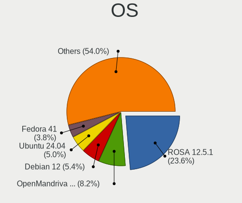
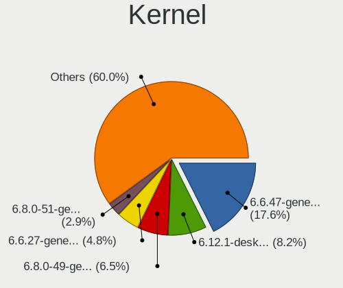
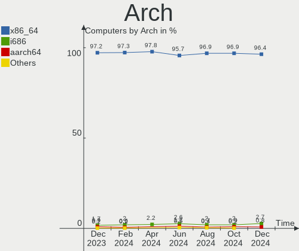
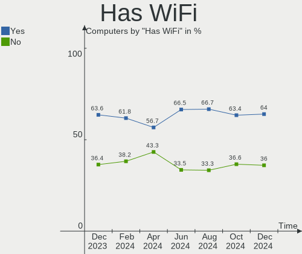
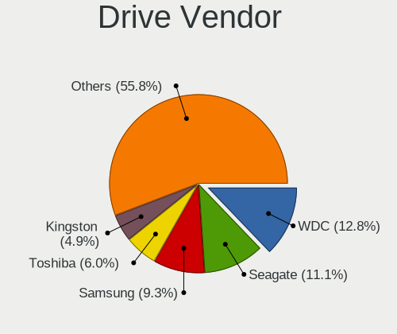
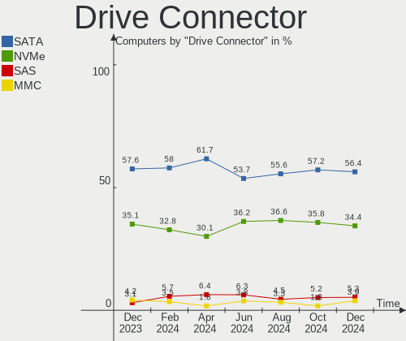
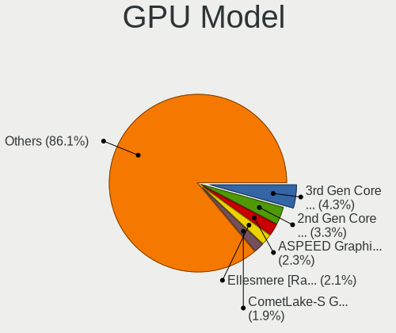
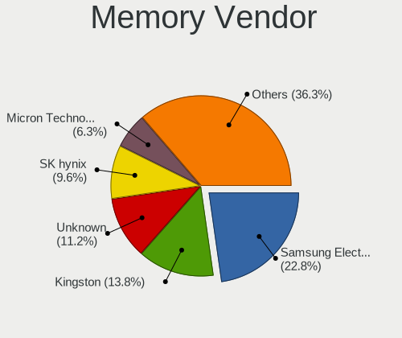
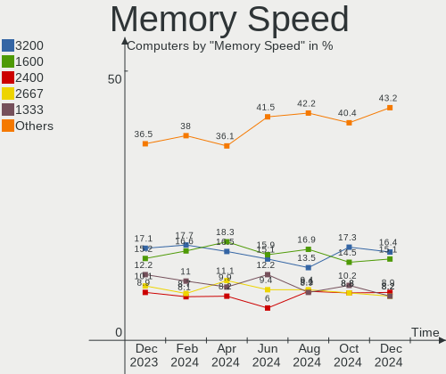

Linux in Russia - Hardware Trends
---------------------------------

A project to identify most popular hardware characteristics and track their change
over time based on data collected by Linux users at https://Linux-Hardware.org.

Anyone can contribute to this report by the [hw-probe](https://github.com/linuxhw/hw-probe) tool:

    sudo -E hw-probe -all -upload

This is a report for all computer types. See also reports for [desktops](/Location/Russia/Desktop/README.md) and [notebooks](/Location/Russia/Notebook/README.md).

Period: Sep, 2022.

Contents
--------

* [ System ](#system)
  - [ OS                       ](#os)
  - [ OS Family                ](#os-family)
  - [ Kernel                   ](#kernel)
  - [ Kernel Family            ](#kernel-family)
  - [ Kernel Major Ver.        ](#kernel-major-ver)
  - [ Arch                     ](#arch)
  - [ DE                       ](#de)
  - [ Display Server           ](#display-server)
  - [ Display Manager          ](#display-manager)
  - [ OS Lang                  ](#os-lang)
  - [ Boot Mode                ](#boot-mode)
  - [ Filesystem               ](#filesystem)
  - [ Part. scheme             ](#part-scheme)
  - [ Dual Boot with Linux/BSD ](#dual-boot-with-linuxbsd)
  - [ Dual Boot (Win)          ](#dual-boot-win)

* [ Board ](#board)
  - [ Vendor                   ](#vendor)
  - [ Model                    ](#model)
  - [ Model Family             ](#model-family)
  - [ MFG Year                 ](#mfg-year)
  - [ Form Factor              ](#form-factor)
  - [ Secure Boot              ](#secure-boot)
  - [ Coreboot                 ](#coreboot)
  - [ RAM Size                 ](#ram-size)
  - [ RAM Used                 ](#ram-used)
  - [ Total Drives             ](#total-drives)
  - [ Has CD-ROM               ](#has-cd-rom)
  - [ Has Ethernet             ](#has-ethernet)
  - [ Has WiFi                 ](#has-wifi)
  - [ Has Bluetooth            ](#has-bluetooth)

* [ Location ](#location)
  - [ Country                  ](#country)
  - [ City                     ](#city)

* [ Drives ](#drives)
  - [ Drive Vendor             ](#drive-vendor)
  - [ Drive Model              ](#drive-model)
  - [ HDD Vendor               ](#hdd-vendor)
  - [ SSD Vendor               ](#ssd-vendor)
  - [ Drive Kind               ](#drive-kind)
  - [ Drive Connector          ](#drive-connector)
  - [ Drive Size               ](#drive-size)
  - [ Space Total              ](#space-total)
  - [ Space Used               ](#space-used)
  - [ Malfunc. Drives          ](#malfunc-drives)
  - [ Malfunc. Drive Vendor    ](#malfunc-drive-vendor)
  - [ Malfunc. HDD Vendor      ](#malfunc-hdd-vendor)
  - [ Malfunc. Drive Kind      ](#malfunc-drive-kind)
  - [ Failed Drives            ](#failed-drives)
  - [ Failed Drive Vendor      ](#failed-drive-vendor)
  - [ Drive Status             ](#drive-status)

* [ Storage controller ](#storage-controller)
  - [ Storage Vendor           ](#storage-vendor)
  - [ Storage Model            ](#storage-model)
  - [ Storage Kind             ](#storage-kind)

* [ Processor ](#processor)
  - [ CPU Vendor               ](#cpu-vendor)
  - [ CPU Model                ](#cpu-model)
  - [ CPU Model Family         ](#cpu-model-family)
  - [ CPU Cores                ](#cpu-cores)
  - [ CPU Sockets              ](#cpu-sockets)
  - [ CPU Threads              ](#cpu-threads)
  - [ CPU Op-Modes             ](#cpu-op-modes)
  - [ CPU Microcode            ](#cpu-microcode)
  - [ CPU Microarch            ](#cpu-microarch)

* [ Graphics ](#graphics)
  - [ GPU Vendor               ](#gpu-vendor)
  - [ GPU Model                ](#gpu-model)
  - [ GPU Combo                ](#gpu-combo)
  - [ GPU Driver               ](#gpu-driver)
  - [ GPU Memory               ](#gpu-memory)

* [ Monitor ](#monitor)
  - [ Monitor Vendor           ](#monitor-vendor)
  - [ Monitor Model            ](#monitor-model)
  - [ Monitor Resolution       ](#monitor-resolution)
  - [ Monitor Diagonal         ](#monitor-diagonal)
  - [ Monitor Width            ](#monitor-width)
  - [ Aspect Ratio             ](#aspect-ratio)
  - [ Monitor Area             ](#monitor-area)
  - [ Pixel Density            ](#pixel-density)
  - [ Multiple Monitors        ](#multiple-monitors)

* [ Network ](#network)
  - [ Net Controller Vendor    ](#net-controller-vendor)
  - [ Net Controller Model     ](#net-controller-model)
  - [ Wireless Vendor          ](#wireless-vendor)
  - [ Wireless Model           ](#wireless-model)
  - [ Ethernet Vendor          ](#ethernet-vendor)
  - [ Ethernet Model           ](#ethernet-model)
  - [ Net Controller Kind      ](#net-controller-kind)
  - [ Used Controller          ](#used-controller)
  - [ NICs                     ](#nics)
  - [ IPv6                     ](#ipv6)

* [ Bluetooth ](#bluetooth)
  - [ Bluetooth Vendor         ](#bluetooth-vendor)
  - [ Bluetooth Model          ](#bluetooth-model)

* [ Sound ](#sound)
  - [ Sound Vendor             ](#sound-vendor)
  - [ Sound Model              ](#sound-model)

* [ Memory ](#memory)
  - [ Memory Vendor            ](#memory-vendor)
  - [ Memory Model             ](#memory-model)
  - [ Memory Kind              ](#memory-kind)
  - [ Memory Form Factor       ](#memory-form-factor)
  - [ Memory Size              ](#memory-size)
  - [ Memory Speed             ](#memory-speed)

* [ Printers & scanners ](#printers--scanners)
  - [ Printer Vendor           ](#printer-vendor)
  - [ Printer Model            ](#printer-model)
  - [ Scanner Vendor           ](#scanner-vendor)
  - [ Scanner Model            ](#scanner-model)

* [ Camera ](#camera)
  - [ Camera Vendor            ](#camera-vendor)
  - [ Camera Model             ](#camera-model)

* [ Security ](#security)
  - [ Fingerprint Vendor       ](#fingerprint-vendor)
  - [ Fingerprint Model        ](#fingerprint-model)
  - [ Chipcard Vendor          ](#chipcard-vendor)
  - [ Chipcard Model           ](#chipcard-model)

* [ Unsupported ](#unsupported)
  - [ Unsupported Devices      ](#unsupported-devices)
  - [ Unsupported Device Types ](#unsupported-device-types)

System
------

OS
--

Installed operating systems

| Name                         | Computers | Percent |
|------------------------------|-----------|---------|
| ROSA 12.2                    | 193       | 33.39%  |
| Debian 11                    | 95        | 16.44%  |
| Fedora 36                    | 29        | 5.02%   |
| Xubuntu 20.04                | 25        | 4.33%   |
| OpenMandriva 4.3             | 24        | 4.15%   |
| Ubuntu 22.04                 | 23        | 3.98%   |
| ROSA R11.1                   | 20        | 3.46%   |
| Linux Mint 21                | 19        | 3.29%   |
| Red OS 7.3.1                 | 14        | 2.42%   |
| Ubuntu 20.04                 | 11        | 1.9%    |
| ROSA 12.1                    | 7         | 1.21%   |
| Linux Mint 20.3              | 7         | 1.21%   |
| Arch                         | 7         | 1.21%   |
| Manjaro 22.0.0               | 6         | 1.04%   |
| Pop!_OS 22.04                | 5         | 0.87%   |
| OpenMandriva 4.50            | 5         | 0.87%   |
| Manjaro                      | 5         | 0.87%   |
| Kubuntu 22.04                | 5         | 0.87%   |
| Elementary 6.1               | 4         | 0.69%   |
| Ubuntu 22.10                 | 3         | 0.52%   |
| openSUSE Tumbleweed-XXXXXXXX | 3         | 0.52%   |
| openSUSE Leap-15.4           | 3         | 0.52%   |
| MOS 10                       | 3         | 0.52%   |
| LMDE 5                       | 3         | 0.52%   |
| KDE neon 20.04               | 3         | 0.52%   |
| ALT Linux 10.1               | 3         | 0.52%   |
| ALT Linux 10.0               | 3         | 0.52%   |
| Zorin 16                     | 2         | 0.35%   |
| Trisquel 10.0.1              | 2         | 0.35%   |
| ROSA 12                      | 2         | 0.35%   |
| RED X4                       | 2         | 0.35%   |
| Nobara 36                    | 2         | 0.35%   |
| Fedora 35                    | 2         | 0.35%   |
| EndeavourOS Rolling          | 2         | 0.35%   |
| Debian Testing               | 2         | 0.35%   |
| Astra Linux 1.7_x86-64       | 2         | 0.35%   |
| Xubuntu 16.04                | 1         | 0.17%   |
| Void Linux                   | 1         | 0.17%   |
| Ubuntu MATE 18.04            | 1         | 0.17%   |
| Ubuntu 21.10                 | 1         | 0.17%   |

OS Family
---------

OS without a version

| Name         | Computers | Percent |
|--------------|-----------|---------|
| ROSA         | 223       | 38.58%  |
| Debian       | 100       | 17.3%   |
| Ubuntu       | 39        | 6.75%   |
| Fedora       | 33        | 5.71%   |
| OpenMandriva | 30        | 5.19%   |
| Linux Mint   | 27        | 4.67%   |
| Xubuntu      | 26        | 4.5%    |
| Red OS       | 16        | 2.77%   |
| Manjaro      | 13        | 2.25%   |
| ALT Linux    | 9         | 1.56%   |
| Arch         | 8         | 1.38%   |
| Pop!_OS      | 6         | 1.04%   |
| openSUSE     | 6         | 1.04%   |
| Kubuntu      | 6         | 1.04%   |
| Elementary   | 4         | 0.69%   |
| LMDE         | 3         | 0.52%   |
| KDE neon     | 3         | 0.52%   |
| EndeavourOS  | 3         | 0.52%   |
| Zorin        | 2         | 0.35%   |
| Trisquel     | 2         | 0.35%   |
| RED          | 2         | 0.35%   |
| Nobara       | 2         | 0.35%   |
| Astra Linux  | 2         | 0.35%   |
| Void Linux   | 1         | 0.17%   |
| Ubuntu MATE  | 1         | 0.17%   |
| RELS         | 1         | 0.17%   |
| Raspbian     | 1         | 0.17%   |
| Parrot       | 1         | 0.17%   |
| Manjaro-ARM  | 1         | 0.17%   |
| Mageia       | 1         | 0.17%   |
| Gentoo       | 1         | 0.17%   |
| Endless      | 1         | 0.17%   |
| Clear Linux  | 1         | 0.17%   |
| ArcoLinux    | 1         | 0.17%   |
| Arch ARM     | 1         | 0.17%   |
| antiX        | 1         | 0.17%   |

Kernel
------

Version of the Linux kernel

| Version                                | Computers | Percent |
|----------------------------------------|-----------|---------|
| 5.10.74-generic-2rosa2021.1-x86_64     | 89        | 15.4%   |
| 5.10.0-7-amd64                         | 79        | 13.67%  |
| 5.10.118-generic-2rosa2021.1-x86_64    | 66        | 11.42%  |
| 5.15.0-47-generic                      | 29        | 5.02%   |
| 5.16.7-desktop-1omv4003                | 23        | 3.98%   |
| 5.4.0-126-generic                      | 19        | 3.29%   |
| 5.15.0-48-generic                      | 18        | 3.11%   |
| 5.15.0-46-generic                      | 15        | 2.6%    |
| 5.4.0-125-generic                      | 12        | 2.08%   |
| 5.17.11-generic-2rosa2021.1-x86_64     | 12        | 2.08%   |
| 5.15.43-generic-2rosa2021.1-x86_64     | 10        | 1.73%   |
| 5.18.18.xm1-1-xanmod-rosa2021.1-x86_64 | 9         | 1.56%   |
| 5.10.0-18-amd64                        | 7         | 1.21%   |
| 5.4.83-generic-2rosa-x86_64            | 6         | 1.04%   |
| 5.19.9-200.fc36.x86_64                 | 6         | 1.04%   |
| 5.19.8-200.fc36.x86_64                 | 6         | 1.04%   |
| 5.15.10-1.el7.x86_64                   | 6         | 1.04%   |
| 5.19.5-desktop-1omv4090                | 5         | 0.87%   |
| 5.19.4-200.fc36.x86_64                 | 5         | 0.87%   |
| 5.15.35-5.el7.3.x86_64                 | 5         | 0.87%   |
| 5.15.35-4.el7.3.x86_64                 | 5         | 0.87%   |
| 4.15.0-desktop-122.124.1rosa-x86_64    | 5         | 0.87%   |
| 5.4.83-generic-2rosa-i586              | 4         | 0.69%   |
| 5.19.0-76051900-generic                | 4         | 0.69%   |
| 5.17.5-300.fc36.x86_64                 | 4         | 0.69%   |
| 5.15.67-generic-1rosa2021.1-x86_64     | 4         | 0.69%   |
| 5.15.34-un-def-alt1                    | 4         | 0.69%   |
| 5.10.74-generic-2rosa2021.1-i586       | 4         | 0.69%   |
| 5.10.0-17-amd64                        | 4         | 0.69%   |
| 5.19.6-200.fc36.x86_64                 | 3         | 0.52%   |
| 5.19.11-arch1-1                        | 3         | 0.52%   |
| 5.19.11-200.fc36.x86_64                | 3         | 0.52%   |
| 5.19.10-arch1-1                        | 3         | 0.52%   |
| 5.19.0-1-amd64                         | 3         | 0.52%   |
| 5.15.65-generic-1rosa2021.1-x86_64     | 3         | 0.52%   |
| 5.15.65-1-MANJARO                      | 3         | 0.52%   |
| 5.10.139-std-def-alt1                  | 3         | 0.52%   |
| 6.0.0-1-MANJARO                        | 2         | 0.35%   |
| 5.4.32-generic-2rosa-i586              | 2         | 0.35%   |
| 5.19.9-arch1-1                         | 2         | 0.35%   |

Kernel Family
-------------

Linux kernel without a distro release

| Version  | Computers | Percent |
|----------|-----------|---------|
| 5.10.0   | 94        | 16.26%  |
| 5.10.74  | 93        | 16.09%  |
| 5.10.118 | 67        | 11.59%  |
| 5.15.0   | 66        | 11.42%  |
| 5.4.0    | 33        | 5.71%   |
| 5.16.7   | 23        | 3.98%   |
| 5.17.11  | 12        | 2.08%   |
| 5.19.0   | 11        | 1.9%    |
| 5.4.83   | 10        | 1.73%   |
| 5.18.18  | 10        | 1.73%   |
| 5.15.43  | 10        | 1.73%   |
| 5.15.35  | 10        | 1.73%   |
| 5.19.9   | 8         | 1.38%   |
| 5.19.8   | 8         | 1.38%   |
| 5.19.11  | 7         | 1.21%   |
| 4.15.0   | 7         | 1.21%   |
| 5.19.6   | 6         | 1.04%   |
| 5.15.67  | 6         | 1.04%   |
| 5.15.65  | 6         | 1.04%   |
| 5.15.10  | 6         | 1.04%   |
| 5.19.5   | 5         | 0.87%   |
| 5.19.4   | 5         | 0.87%   |
| 5.13.0   | 5         | 0.87%   |
| 6.0.0    | 4         | 0.69%   |
| 5.19.7   | 4         | 0.69%   |
| 5.19.10  | 4         | 0.69%   |
| 5.17.5   | 4         | 0.69%   |
| 5.15.34  | 4         | 0.69%   |
| 5.4.32   | 3         | 0.52%   |
| 5.18.0   | 3         | 0.52%   |
| 5.14.21  | 3         | 0.52%   |
| 5.10.139 | 3         | 0.52%   |
| 5.8.0    | 2         | 0.35%   |
| 5.19.2   | 2         | 0.35%   |
| 5.18.17  | 2         | 0.35%   |
| 5.16.13  | 2         | 0.35%   |
| 5.10.71  | 2         | 0.35%   |
| 4.9.155  | 2         | 0.35%   |
| 5.5.9    | 1         | 0.17%   |
| 5.5.19   | 1         | 0.17%   |

Kernel Major Ver.
-----------------

Linux kernel major version

| Version | Computers | Percent |
|---------|-----------|---------|
| 5.10    | 262       | 45.33%  |
| 5.15    | 116       | 20.07%  |
| 5.19    | 61        | 10.55%  |
| 5.4     | 47        | 8.13%   |
| 5.16    | 26        | 4.5%    |
| 5.18    | 17        | 2.94%   |
| 5.17    | 17        | 2.94%   |
| 4.15    | 7         | 1.21%   |
| 5.13    | 6         | 1.04%   |
| 6.0     | 4         | 0.69%   |
| 5.14    | 4         | 0.69%   |
| 4.9     | 3         | 0.52%   |
| 5.8     | 2         | 0.35%   |
| 5.5     | 2         | 0.35%   |
| 5.11    | 1         | 0.17%   |
| 5.0     | 1         | 0.17%   |
| 4.4     | 1         | 0.17%   |
| 3.0     | 1         | 0.17%   |

Arch
----

OS architecture (x86_64, i586, etc.)

| Name    | Computers | Percent |
|---------|-----------|---------|
| x86_64  | 559       | 96.71%  |
| i686    | 14        | 2.42%   |
| aarch64 | 3         | 0.52%   |
| armv7l  | 1         | 0.17%   |
| armv6l  | 1         | 0.17%   |

DE
--

Desktop Environment

| Name            | Computers | Percent |
|-----------------|-----------|---------|
| KDE5            | 177       | 30.62%  |
| GNOME           | 174       | 30.1%   |
| Unknown         | 92        | 15.92%  |
| XFCE            | 42        | 7.27%   |
| MATE            | 22        | 3.81%   |
| LXQt            | 22        | 3.81%   |
| X-Cinnamon      | 21        | 3.63%   |
| KDE4            | 13        | 2.25%   |
| Pantheon        | 4         | 0.69%   |
| Cinnamon        | 4         | 0.69%   |
| i3              | 2         | 0.35%   |
| GNOME Flashback | 2         | 0.35%   |
| KDE             | 1         | 0.17%   |
| GNOME Classic   | 1         | 0.17%   |
| fluxbox         | 1         | 0.17%   |

Display Server
--------------

X11 or Wayland

| Name    | Computers | Percent |
|---------|-----------|---------|
| X11     | 247       | 42.73%  |
| Wayland | 239       | 41.35%  |
| Unknown | 82        | 14.19%  |
| Tty     | 10        | 1.73%   |

Display Manager
---------------

SDDM, LightDM, etc.

| Name    | Computers | Percent |
|---------|-----------|---------|
| Unknown | 176       | 30.45%  |
| SDDM    | 155       | 26.82%  |
| GDM     | 147       | 25.43%  |
| LightDM | 54        | 9.34%   |
| GDM3    | 32        | 5.54%   |
| KDM     | 13        | 2.25%   |
| FLY-DM  | 1         | 0.17%   |

OS Lang
-------

Language

| Lang    | Computers | Percent |
|---------|-----------|---------|
| ru_RU   | 481       | 83.22%  |
| en_US   | 69        | 11.94%  |
| Unknown | 17        | 2.94%   |
| C       | 6         | 1.04%   |
| en_GB   | 3         | 0.52%   |
| en_AG   | 1         | 0.17%   |
| ba_RU   | 1         | 0.17%   |

Boot Mode
---------

EFI or BIOS

| Mode | Computers | Percent |
|------|-----------|---------|
| BIOS | 291       | 50.35%  |
| EFI  | 287       | 49.65%  |

Filesystem
----------

Type of filesystem

| Type    | Computers | Percent |
|---------|-----------|---------|
| Ext4    | 402       | 69.55%  |
| Overlay | 107       | 18.51%  |
| Btrfs   | 60        | 10.38%  |
| Zfs     | 4         | 0.69%   |
| Xfs     | 4         | 0.69%   |
| Ext3    | 1         | 0.17%   |

Part. scheme
------------

Scheme of partitioning

| Type    | Computers | Percent |
|---------|-----------|---------|
| GPT     | 300       | 51.9%   |
| MBR     | 166       | 28.72%  |
| Unknown | 112       | 19.38%  |

Dual Boot with Linux/BSD
------------------------

Hosting more than one Linux/BSD

| Dual boot | Computers | Percent |
|-----------|-----------|---------|
| No        | 487       | 84.26%  |
| Yes       | 91        | 15.74%  |

Dual Boot (Win)
---------------

Hosting Linux and Windows

| Dual boot | Computers | Percent |
|-----------|-----------|---------|
| No        | 332       | 57.44%  |
| Yes       | 246       | 42.56%  |

Board
-----

Vendor
------

Motherboard manufacturer

| Name                           | Computers | Percent |
|--------------------------------|-----------|---------|
| ASUSTek Computer               | 117       | 20.24%  |
| Gigabyte Technology            | 84        | 14.53%  |
| Lenovo                         | 68        | 11.76%  |
| ASRock                         | 49        | 8.48%   |
| Hewlett-Packard                | 44        | 7.61%   |
| Aquarius                       | 36        | 6.23%   |
| Acer                           | 28        | 4.84%   |
| MSI                            | 24        | 4.15%   |
| ECS                            | 15        | 2.6%    |
| Dell                           | 14        | 2.42%   |
| HUAWEI                         | 12        | 2.08%   |
| Unknown                        | 10        | 1.73%   |
| Samsung Electronics            | 9         | 1.56%   |
| Huanan                         | 8         | 1.38%   |
| Intel                          | 5         | 0.87%   |
| Chuwi                          | 4         | 0.69%   |
| Toshiba                        | 3         | 0.52%   |
| MACHINIST                      | 3         | 0.52%   |
| Irbis                          | 3         | 0.52%   |
| Biostar                        | 3         | 0.52%   |
| Timi                           | 2         | 0.35%   |
| Raspberry Pi Foundation        | 2         | 0.35%   |
| ICL                            | 2         | 0.35%   |
| HONOR                          | 2         | 0.35%   |
| Foxconn                        | 2         | 0.35%   |
| Digma                          | 2         | 0.35%   |
| Apple                          | 2         | 0.35%   |
| THUNDEROBOT                    | 1         | 0.17%   |
| Thecus                         | 1         | 0.17%   |
| Supermicro                     | 1         | 0.17%   |
| Sony                           | 1         | 0.17%   |
| RuggedPC                       | 1         | 0.17%   |
| RDW                            | 1         | 0.17%   |
| Pegatron                       | 1         | 0.17%   |
| Packard Bell                   | 1         | 0.17%   |
| Notebook                       | 1         | 0.17%   |
| Microsoft                      | 1         | 0.17%   |
| MECHREVO                       | 1         | 0.17%   |
| Matsushita Electric Industrial | 1         | 0.17%   |
| JGINYUE                        | 1         | 0.17%   |

Model
-----

Motherboard model

| Name                                | Computers | Percent |
|-------------------------------------|-----------|---------|
| Aquarius NS585                      | 30        | 5.19%   |
| ASRock H470M-HVS                    | 17        | 2.94%   |
| Gigabyte H410M S2H                  | 15        | 2.6%    |
| ECS G31T-M9                         | 13        | 2.25%   |
| ASUS All Series                     | 12        | 2.08%   |
| Unknown                             | 11        | 1.9%    |
| HP Pavilion g6                      | 6         | 1.04%   |
| Aquarius NS685U R11                 | 5         | 0.87%   |
| MSI MS-7A38                         | 3         | 0.52%   |
| MSI MS-7680                         | 3         | 0.52%   |
| MACHINIST B75 PRO V1.0              | 3         | 0.52%   |
| HUAWEI KLVL-WXXW                    | 3         | 0.52%   |
| HP Compaq Pro 6300 MT               | 3         | 0.52%   |
| Gigabyte M56S-S3                    | 3         | 0.52%   |
| Gigabyte 970A-DS3P                  | 3         | 0.52%   |
| ASUS S20 K29                        | 3         | 0.52%   |
| ASUS K50IJ                          | 3         | 0.52%   |
| Samsung 350V5C/351V5C/3540VC/3440VC | 2         | 0.35%   |
| MSI MS-7996                         | 2         | 0.35%   |
| MSI MS-7599                         | 2         | 0.35%   |
| Lenovo ThinkBook 16p Gen 2 20YM     | 2         | 0.35%   |
| Lenovo IdeaPad 5 15ARE05 81YQ       | 2         | 0.35%   |
| Lenovo IdeaPad 330-15AST 81D6       | 2         | 0.35%   |
| Lenovo IdeaPad 320-15IKB 80XL       | 2         | 0.35%   |
| HUAWEI NBLB-WAX9N                   | 2         | 0.35%   |
| HUAWEI KLVD-WXX9                    | 2         | 0.35%   |
| HP Notebook                         | 2         | 0.35%   |
| HP Laptop 15s-eq1xxx                | 2         | 0.35%   |
| HP Laptop 15-bw0xx                  | 2         | 0.35%   |
| Gigabyte H81M-S2V                   | 2         | 0.35%   |
| Gigabyte H61M-S2PV                  | 2         | 0.35%   |
| Gigabyte H110M-S2                   | 2         | 0.35%   |
| Gigabyte B550 AORUS ELITE V2        | 2         | 0.35%   |
| Gigabyte A320M-H                    | 2         | 0.35%   |
| Chuwi HeroBook Air                  | 2         | 0.35%   |
| ASUS ZenBook UX325EA_UX325EA        | 2         | 0.35%   |
| ASUS TUF Gaming Z590-PLUS WIFI      | 2         | 0.35%   |
| ASUS PRIME B360-PLUS                | 2         | 0.35%   |
| ASUS P8H61-MX R2.0                  | 2         | 0.35%   |
| ASUS P8H61-M LE                     | 2         | 0.35%   |

Model Family
------------

Motherboard model prefix

| Name               | Computers | Percent |
|--------------------|-----------|---------|
| Aquarius NS585     | 30        | 5.19%   |
| Lenovo IdeaPad     | 23        | 3.98%   |
| ASRock H470M-HVS   | 17        | 2.94%   |
| Lenovo ThinkPad    | 16        | 2.77%   |
| Acer Aspire        | 16        | 2.77%   |
| Gigabyte H410M     | 15        | 2.6%    |
| ASUS PRIME         | 14        | 2.42%   |
| ECS G31T-M9        | 13        | 2.25%   |
| ASUS All           | 12        | 2.08%   |
| Unknown            | 11        | 1.9%    |
| HP Pavilion        | 9         | 1.56%   |
| Dell Inspiron      | 9         | 1.56%   |
| HP Laptop          | 8         | 1.38%   |
| HP ProBook         | 7         | 1.21%   |
| ASUS VivoBook      | 7         | 1.21%   |
| ASUS TUF           | 7         | 1.21%   |
| Lenovo ThinkBook   | 5         | 0.87%   |
| Lenovo Legion      | 5         | 0.87%   |
| Aquarius NS685U    | 5         | 0.87%   |
| Lenovo ThinkCentre | 4         | 0.69%   |
| HP Compaq          | 4         | 0.69%   |
| ASUS ZenBook       | 4         | 0.69%   |
| ASUS P8H61-M       | 4         | 0.69%   |
| Acer Nitro         | 4         | 0.69%   |
| Toshiba Satellite  | 3         | 0.52%   |
| MSI MS-7A38        | 3         | 0.52%   |
| MSI MS-7680        | 3         | 0.52%   |
| MACHINIST B75      | 3         | 0.52%   |
| HUAWEI KLVL-WXXW   | 3         | 0.52%   |
| HP ProDesk         | 3         | 0.52%   |
| Gigabyte M56S-S3   | 3         | 0.52%   |
| Gigabyte B550      | 3         | 0.52%   |
| Gigabyte 970A-DS3P | 3         | 0.52%   |
| Chuwi HeroBook     | 3         | 0.52%   |
| ASUS S20           | 3         | 0.52%   |
| ASUS ROG           | 3         | 0.52%   |
| ASUS K50IJ         | 3         | 0.52%   |
| Acer Extensa       | 3         | 0.52%   |
| Samsung R530       | 2         | 0.35%   |
| Samsung 350V5C     | 2         | 0.35%   |

MFG Year
--------

Motherboard manufacture year

| Year    | Computers | Percent |
|---------|-----------|---------|
| 2021    | 80        | 13.84%  |
| 2020    | 66        | 11.42%  |
| 2019    | 64        | 11.07%  |
| 2012    | 47        | 8.13%   |
| 2018    | 40        | 6.92%   |
| 2011    | 40        | 6.92%   |
| 2013    | 38        | 6.57%   |
| 2022    | 29        | 5.02%   |
| 2009    | 29        | 5.02%   |
| 2010    | 27        | 4.67%   |
| 2016    | 25        | 4.33%   |
| 2017    | 21        | 3.63%   |
| 2008    | 19        | 3.29%   |
| 2015    | 16        | 2.77%   |
| 2014    | 16        | 2.77%   |
| 2007    | 12        | 2.08%   |
| Unknown | 5         | 0.87%   |
| 2006    | 3         | 0.52%   |
| 2004    | 1         | 0.17%   |

Form Factor
-----------

Physical design of the computer

| Name           | Computers | Percent |
|----------------|-----------|---------|
| Desktop        | 281       | 48.62%  |
| Notebook       | 277       | 47.92%  |
| Tablet         | 4         | 0.69%   |
| Convertible    | 4         | 0.69%   |
| Mini pc        | 4         | 0.69%   |
| Server         | 4         | 0.69%   |
| System on chip | 3         | 0.52%   |
| All in one     | 1         | 0.17%   |

Secure Boot
-----------

Enabled or disabled

| State    | Computers | Percent |
|----------|-----------|---------|
| Disabled | 562       | 97.23%  |
| Enabled  | 16        | 2.77%   |

Coreboot
--------

Have coreboot on board

| Used | Computers | Percent |
|------|-----------|---------|
| No   | 578       | 100%    |

RAM Size
--------

Total RAM memory

| Size in GB  | Computers | Percent |
|-------------|-----------|---------|
| 4.01-8.0    | 176       | 30.45%  |
| 3.01-4.0    | 103       | 17.82%  |
| 16.01-24.0  | 102       | 17.65%  |
| 8.01-16.0   | 76        | 13.15%  |
| 32.01-64.0  | 55        | 9.52%   |
| 1.01-2.0    | 31        | 5.36%   |
| 2.01-3.0    | 11        | 1.9%    |
| 64.01-256.0 | 9         | 1.56%   |
| 0.51-1.0    | 7         | 1.21%   |
| 24.01-32.0  | 6         | 1.04%   |
| 0.01-0.5    | 2         | 0.35%   |

RAM Used
--------

Used RAM memory

| Used GB    | Computers | Percent |
|------------|-----------|---------|
| 1.01-2.0   | 217       | 37.54%  |
| 0.51-1.0   | 159       | 27.51%  |
| 2.01-3.0   | 86        | 14.88%  |
| 3.01-4.0   | 49        | 8.48%   |
| 4.01-8.0   | 46        | 7.96%   |
| 8.01-16.0  | 11        | 1.9%    |
| 0.01-0.5   | 7         | 1.21%   |
| 24.01-32.0 | 1         | 0.17%   |
| 16.01-24.0 | 1         | 0.17%   |
| Unknown    | 1         | 0.17%   |

Total Drives
------------

Number of drives on board

| Drives | Computers | Percent |
|--------|-----------|---------|
| 1      | 358       | 61.94%  |
| 2      | 145       | 25.09%  |
| 3      | 46        | 7.96%   |
| 4      | 16        | 2.77%   |
| 6      | 5         | 0.87%   |
| 5      | 5         | 0.87%   |
| 0      | 3         | 0.52%   |

Has CD-ROM
----------

Has CD-ROM on board

| Presented | Computers | Percent |
|-----------|-----------|---------|
| No        | 444       | 76.82%  |
| Yes       | 134       | 23.18%  |

Has Ethernet
------------

Has Ethernet on board

| Presented | Computers | Percent |
|-----------|-----------|---------|
| Yes       | 520       | 89.97%  |
| No        | 58        | 10.03%  |

Has WiFi
--------

Has WiFi module

| Presented | Computers | Percent |
|-----------|-----------|---------|
| Yes       | 349       | 60.38%  |
| No        | 229       | 39.62%  |

Has Bluetooth
-------------

Has Bluetooth module

| Presented | Computers | Percent |
|-----------|-----------|---------|
| No        | 299       | 51.73%  |
| Yes       | 279       | 48.27%  |

Location
--------

Country
-------

Geographic location (country)

| Country | Computers | Percent |
|---------|-----------|---------|
| Russia  | 578       | 100%    |

City
----

Geographic location (city)

| City             | Computers | Percent |
|------------------|-----------|---------|
| Moscow           | 115       | 19.9%   |
| Voronezh         | 108       | 18.69%  |
| St Petersburg    | 45        | 7.79%   |
| Nizhniy Novgorod | 16        | 2.77%   |
| Krasnodar        | 16        | 2.77%   |
| Yekaterinburg    | 14        | 2.42%   |
| Novosibirsk      | 12        | 2.08%   |
| Chelyabinsk      | 11        | 1.9%    |
| Saratov          | 9         | 1.56%   |
| Rostov-on-Don    | 9         | 1.56%   |
| Perm             | 9         | 1.56%   |
| Krasnoyarsk      | 8         | 1.38%   |
| Vladivostok      | 7         | 1.21%   |
| Samara           | 7         | 1.21%   |
| Ufa              | 6         | 1.04%   |
| Yaroslavl        | 5         | 0.87%   |
| Tomsk            | 5         | 0.87%   |
| Tver             | 4         | 0.69%   |
| Penza            | 4         | 0.69%   |
| Murmansk         | 4         | 0.69%   |
| Kirov            | 4         | 0.69%   |
| Khabarovsk       | 4         | 0.69%   |
| Irkutsk          | 4         | 0.69%   |
| Blagoveshchensk  | 4         | 0.69%   |
| Volgograd        | 3         | 0.52%   |
| Tyumen           | 3         | 0.52%   |
| Tolyatti         | 3         | 0.52%   |
| Sochi            | 3         | 0.52%   |
| Smolensk         | 3         | 0.52%   |
| Murom            | 3         | 0.52%   |
| Chita            | 3         | 0.52%   |
| Barnaul          | 3         | 0.52%   |
| Unknown          | 3         | 0.52%   |
| Zanevka          | 2         | 0.35%   |
| Ulyanovsk        | 2         | 0.35%   |
| Tula             | 2         | 0.35%   |
| Syktyvkar        | 2         | 0.35%   |
| Stavropol        | 2         | 0.35%   |
| Shchelkovo       | 2         | 0.35%   |
| Serpukhov        | 2         | 0.35%   |

Drives
------

Drive Vendor
------------

Hard drive vendors

| Vendor                       | Computers | Drives | Percent |
|------------------------------|-----------|--------|---------|
| WDC                          | 131       | 154    | 15.69%  |
| Seagate                      | 101       | 122    | 12.1%   |
| Samsung Electronics          | 78        | 90     | 9.34%   |
| Toshiba                      | 77        | 77     | 9.22%   |
| Kingston                     | 57        | 60     | 6.83%   |
| A-DATA Technology            | 57        | 58     | 6.83%   |
| Hitachi                      | 35        | 36     | 4.19%   |
| Netac                        | 26        | 26     | 3.11%   |
| Unknown                      | 20        | 24     | 2.4%    |
| SanDisk                      | 20        | 21     | 2.4%    |
| SK hynix                     | 18        | 18     | 2.16%   |
| China                        | 15        | 15     | 1.8%    |
| Intel                        | 14        | 14     | 1.68%   |
| SPCC                         | 12        | 13     | 1.44%   |
| Crucial                      | 12        | 14     | 1.44%   |
| HGST                         | 10        | 11     | 1.2%    |
| Apacer                       | 9         | 10     | 1.08%   |
| Transcend                    | 8         | 8      | 0.96%   |
| AMD                          | 8         | 8      | 0.96%   |
| Phison                       | 7         | 7      | 0.84%   |
| Micron Technology            | 6         | 6      | 0.72%   |
| Silicon Motion               | 5         | 5      | 0.6%    |
| Patriot                      | 5         | 6      | 0.6%    |
| KIOXIA                       | 5         | 5      | 0.6%    |
| KingSpec                     | 5         | 5      | 0.6%    |
| JMicron Technology           | 5         | 5      | 0.6%    |
| Unknown                      | 5         | 5      | 0.6%    |
| Plextor                      | 4         | 4      | 0.48%   |
| Gigabyte Technology          | 4         | 4      | 0.48%   |
| External                     | 4         | 4      | 0.48%   |
| WALRAM                       | 3         | 3      | 0.36%   |
| Solid State Storage          | 3         | 3      | 0.36%   |
| Smartbuy                     | 3         | 4      | 0.36%   |
| Hewlett-Packard              | 3         | 3      | 0.36%   |
| BIWIN                        | 3         | 3      | 0.36%   |
| XrayDisk                     | 2         | 2      | 0.24%   |
| Shenzhen Longsys Electronics | 2         | 2      | 0.24%   |
| Qumo                         | 2         | 2      | 0.24%   |
| Palit                        | 2         | 2      | 0.24%   |
| OCZ                          | 2         | 2      | 0.24%   |

Drive Model
-----------

Hard drive models

| Model                                 | Computers | Percent |
|---------------------------------------|-----------|---------|
| A-DATA SU800 512GB SSD                | 30        | 3.36%   |
| Toshiba HDWD110 1TB                   | 24        | 2.68%   |
| Kingston SA400S37240G 240GB SSD       | 24        | 2.68%   |
| Netac SSD 240GB                       | 18        | 2.01%   |
| Toshiba DT01ACA050 500GB              | 11        | 1.23%   |
| Seagate ST500DM002-1BD142 500GB       | 9         | 1.01%   |
| Seagate ST1000DM010-2EP102 1TB        | 9         | 1.01%   |
| Hitachi HDS721050CLA362 500GB         | 9         | 1.01%   |
| WDC WDS500G2B0A-00SM50 500GB SSD      | 8         | 0.89%   |
| WDC WDS240G2G0A-00JH30 240GB SSD      | 7         | 0.78%   |
| Kingston SA400S37480G 480GB SSD       | 7         | 0.78%   |
| SPCC Solid State Disk 128GB           | 6         | 0.67%   |
| Seagate ST3500418AS 500GB             | 6         | 0.67%   |
| Seagate ST1000LM024 HN-M101MBB 1TB    | 6         | 0.67%   |
| Samsung SSD 860 EVO 250GB             | 6         | 0.67%   |
| Crucial CT480BX500SSD1 480GB          | 6         | 0.67%   |
| A-DATA SU800NS38 256GB SSD            | 6         | 0.67%   |
| WDC WDS240G2G0B-00EPW0 240GB SSD      | 5         | 0.56%   |
| Toshiba MQ01ABF050 500GB              | 5         | 0.56%   |
| Seagate ST500LT012-1DG142 500GB       | 5         | 0.56%   |
| Samsung SSD 860 EVO 500GB             | 5         | 0.56%   |
| Unknown                               | 5         | 0.56%   |
| Toshiba MQ04ABF100 1TB                | 4         | 0.45%   |
| SanDisk SDSSDA120G 120GB              | 4         | 0.45%   |
| Samsung SSD 970 EVO Plus 250GB        | 4         | 0.45%   |
| Netac SSD 256GB                       | 4         | 0.45%   |
| External USB3.0 1TB                   | 4         | 0.45%   |
| WDC WDS120G2G0B-00EPW0 120GB SSD      | 3         | 0.34%   |
| WDC WD5000AAKX-60U6AA0 500GB          | 3         | 0.34%   |
| WDC WD10EZEX-00BN5A0 1TB              | 3         | 0.34%   |
| Unknown MMC Card  64GB                | 3         | 0.34%   |
| Unknown MMC Card  32GB                | 3         | 0.34%   |
| Toshiba XG6 NVMe SSD Controller 512GB | 3         | 0.34%   |
| Toshiba HDWD120 2TB                   | 3         | 0.34%   |
| Toshiba HDWD105 500GB                 | 3         | 0.34%   |
| SPCC Solid State Disk 64GB            | 3         | 0.34%   |
| SK hynix NVMe SSD Drive 512GB         | 3         | 0.34%   |
| Seagate ST9500420AS 500GB             | 3         | 0.34%   |
| Seagate ST9320325AS 320GB             | 3         | 0.34%   |
| Seagate ST3320613AS 320GB             | 3         | 0.34%   |

HDD Vendor
----------

Hard disk drive vendors

| Vendor              | Computers | Drives | Percent |
|---------------------|-----------|--------|---------|
| Seagate             | 101       | 121    | 30.51%  |
| WDC                 | 98        | 111    | 29.61%  |
| Toshiba             | 71        | 71     | 21.45%  |
| Hitachi             | 35        | 36     | 10.57%  |
| Samsung Electronics | 12        | 12     | 3.63%   |
| HGST                | 10        | 11     | 3.02%   |
| Fujitsu             | 2         | 2      | 0.6%    |
| Maxtor              | 1         | 1      | 0.3%    |
| HGST HTS            | 1         | 1      | 0.3%    |

SSD Vendor
----------

Solid state drive vendors

| Vendor              | Computers | Drives | Percent |
|---------------------|-----------|--------|---------|
| A-DATA Technology   | 51        | 52     | 15.99%  |
| Kingston            | 44        | 45     | 13.79%  |
| WDC                 | 31        | 34     | 9.72%   |
| Samsung Electronics | 29        | 31     | 9.09%   |
| Netac               | 24        | 24     | 7.52%   |
| China               | 15        | 15     | 4.7%    |
| Crucial             | 12        | 14     | 3.76%   |
| SPCC                | 11        | 12     | 3.45%   |
| SanDisk             | 10        | 10     | 3.13%   |
| Transcend           | 8         | 8      | 2.51%   |
| Apacer              | 8         | 9      | 2.51%   |
| AMD                 | 7         | 7      | 2.19%   |
| Patriot             | 5         | 6      | 1.57%   |
| KingSpec            | 5         | 5      | 1.57%   |
| Intel               | 5         | 5      | 1.57%   |
| SK hynix            | 4         | 4      | 1.25%   |
| Plextor             | 4         | 4      | 1.25%   |
| Smartbuy            | 3         | 4      | 0.94%   |
| Gigabyte Technology | 3         | 3      | 0.94%   |
| XrayDisk            | 2         | 2      | 0.63%   |
| WALRAM              | 2         | 2      | 0.63%   |
| Qumo                | 2         | 2      | 0.63%   |
| Palit               | 2         | 2      | 0.63%   |
| OCZ                 | 2         | 2      | 0.63%   |
| Kingmax             | 2         | 2      | 0.63%   |
| KingDian            | 2         | 2      | 0.63%   |
| Hewlett-Packard     | 2         | 2      | 0.63%   |
| GOODRAM             | 2         | 2      | 0.63%   |
| Corsair             | 2         | 2      | 0.63%   |
| Unknown             | 2         | 2      | 0.63%   |
| Yunhaitian          | 1         | 1      | 0.31%   |
| Vaseky              | 1         | 1      | 0.31%   |
| Toshiba             | 1         | 1      | 0.31%   |
| RUN                 | 1         | 1      | 0.31%   |
| Reeioon             | 1         | 1      | 0.31%   |
| OCZ-VERTEX3         | 1         | 1      | 0.31%   |
| OCZ-VERTEX          | 1         | 1      | 0.31%   |
| NGFF                | 1         | 1      | 0.31%   |
| Neo                 | 1         | 1      | 0.31%   |
| Micron Technology   | 1         | 1      | 0.31%   |

Drive Kind
----------

HDD or SSD

| Kind    | Computers | Drives | Percent |
|---------|-----------|--------|---------|
| SSD     | 291       | 333    | 38.34%  |
| HDD     | 289       | 366    | 38.08%  |
| NVMe    | 148       | 177    | 19.5%   |
| MMC     | 22        | 26     | 2.9%    |
| Unknown | 9         | 9      | 1.19%   |

Drive Connector
---------------

SATA, SAS, NVMe, etc.

| Type | Computers | Drives | Percent |
|------|-----------|--------|---------|
| SATA | 470       | 697    | 72.09%  |
| NVMe | 143       | 170    | 21.93%  |
| MMC  | 22        | 26     | 3.37%   |
| SAS  | 17        | 18     | 2.61%   |

Drive Size
----------

Size of hard drive

| Size in TB | Computers | Drives | Percent |
|------------|-----------|--------|---------|
| 0.01-0.5   | 380       | 478    | 65.97%  |
| 0.51-1.0   | 154       | 173    | 26.74%  |
| 1.01-2.0   | 23        | 27     | 3.99%   |
| 3.01-4.0   | 9         | 10     | 1.56%   |
| 2.01-3.0   | 7         | 8      | 1.22%   |
| 10.01-20.0 | 2         | 2      | 0.35%   |
| 4.01-10.0  | 1         | 1      | 0.17%   |

Space Total
-----------

Amount of disk space available on the file system

| Size in GB     | Computers | Percent |
|----------------|-----------|---------|
| 101-250        | 154       | 26.64%  |
| 251-500        | 114       | 19.72%  |
| Unknown        | 92        | 15.92%  |
| 501-1000       | 68        | 11.76%  |
| 1-20           | 53        | 9.17%   |
| 51-100         | 39        | 6.75%   |
| 1001-2000      | 24        | 4.15%   |
| 21-50          | 17        | 2.94%   |
| 2001-3000      | 10        | 1.73%   |
| More than 3000 | 7         | 1.21%   |

Space Used
----------

Amount of used disk space

| Used GB   | Computers | Percent |
|-----------|-----------|---------|
| 1-20      | 256       | 44.29%  |
| Unknown   | 92        | 15.92%  |
| 51-100    | 64        | 11.07%  |
| 21-50     | 62        | 10.73%  |
| 101-250   | 46        | 7.96%   |
| 251-500   | 24        | 4.15%   |
| 501-1000  | 23        | 3.98%   |
| 1001-2000 | 8         | 1.38%   |
| 2001-3000 | 3         | 0.52%   |

Malfunc. Drives
---------------

Drive models with a malfunction

| Model                                          | Computers | Drives | Percent |
|------------------------------------------------|-----------|--------|---------|
| Seagate ST500DM002-1BD142 500GB                | 5         | 5      | 3.68%   |
| Seagate ST3500418AS 500GB                      | 5         | 6      | 3.68%   |
| Hitachi HDS721050CLA362 500GB                  | 4         | 4      | 2.94%   |
| Seagate ST9500420AS 500GB                      | 3         | 3      | 2.21%   |
| Seagate ST3250310AS 250GB                      | 3         | 3      | 2.21%   |
| WDC WDS240G2G0A-00JH30 240GB SSD               | 2         | 3      | 1.47%   |
| Toshiba MQ01ABF050 500GB                       | 2         | 2      | 1.47%   |
| Toshiba HDWD110 1TB                            | 2         | 2      | 1.47%   |
| Toshiba DT01ACA050 500GB                       | 2         | 2      | 1.47%   |
| Seagate ST9500325AS 500GB                      | 2         | 2      | 1.47%   |
| Seagate ST3320613AS 320GB                      | 2         | 2      | 1.47%   |
| Seagate ST3250410AS 250GB                      | 2         | 2      | 1.47%   |
| Hitachi HTS545025B9A300 250GB                  | 2         | 2      | 1.47%   |
| Hitachi HTS542580K9SA00 80GB                   | 2         | 2      | 1.47%   |
| WDC WDS120G2G0B-00EPW0 120GB SSD               | 1         | 1      | 0.74%   |
| WDC WDS120G2G0A-00JH30 120GB SSD               | 1         | 1      | 0.74%   |
| WDC WD800JD-60LSA5 80GB                        | 1         | 1      | 0.74%   |
| WDC WD800BB-56JKC0 80GB                        | 1         | 1      | 0.74%   |
| WDC WD6400AARS-00Y5B1 640GB                    | 1         | 1      | 0.74%   |
| WDC WD5000LPCX-60VHAT0 500GB                   | 1         | 1      | 0.74%   |
| WDC WD5000AAKX-60U6AA0 500GB                   | 1         | 1      | 0.74%   |
| WDC WD5000AAKX-083CA1 500GB                    | 1         | 1      | 0.74%   |
| WDC WD5000AAKX-00ERMA0 500GB                   | 1         | 1      | 0.74%   |
| WDC WD5000AADS-00S9B0 500GB                    | 1         | 1      | 0.74%   |
| WDC WD3200BPVT-22ZEST0 320GB                   | 1         | 1      | 0.74%   |
| WDC WD3200BEVT-80A0RT0 320GB                   | 1         | 1      | 0.74%   |
| WDC WD3200AAKS-75L9A0 320GB                    | 1         | 1      | 0.74%   |
| WDC WD3200AAKS-00L9A0 320GB                    | 1         | 1      | 0.74%   |
| WDC WD3200AAJS-00L7A0 320GB                    | 1         | 1      | 0.74%   |
| WDC WD3200AAJB-00J3A0 320GB                    | 1         | 1      | 0.74%   |
| WDC WD2502ABYS-23B7A0 39M4511 42C0463IBM 250GB | 1         | 2      | 0.74%   |
| WDC WD2500LPCX-24C6HT0 250GB                   | 1         | 1      | 0.74%   |
| WDC WD2500BEVT-35A23T0 250GB                   | 1         | 1      | 0.74%   |
| WDC WD2500BEKT-60A25T1 250GB                   | 1         | 1      | 0.74%   |
| WDC WD2500AAKS-00VSA0 250GB                    | 1         | 1      | 0.74%   |
| WDC WD2500AAKS-00B3A0 250GB                    | 1         | 1      | 0.74%   |
| WDC WD2500AAJS-00L7A0 250GB                    | 1         | 1      | 0.74%   |
| WDC WD20EARS-00S8B1 2TB                        | 1         | 1      | 0.74%   |
| WDC WD20EADS-00R6B0 2TB                        | 1         | 1      | 0.74%   |
| WDC WD2003FYYS-02W0B1 2TB                      | 1         | 1      | 0.74%   |

Malfunc. Drive Vendor
---------------------

Vendors of faulty drives

| Vendor              | Computers | Drives | Percent |
|---------------------|-----------|--------|---------|
| Seagate             | 39        | 49     | 30.95%  |
| WDC                 | 34        | 37     | 26.98%  |
| Hitachi             | 17        | 17     | 13.49%  |
| Toshiba             | 12        | 12     | 9.52%   |
| Samsung Electronics | 9         | 9      | 7.14%   |
| A-DATA Technology   | 3         | 3      | 2.38%   |
| SK hynix            | 2         | 2      | 1.59%   |
| Transcend           | 1         | 1      | 0.79%   |
| Reeioon             | 1         | 1      | 0.79%   |
| Plextor             | 1         | 1      | 0.79%   |
| OCZ-VERTEX3         | 1         | 1      | 0.79%   |
| Neo                 | 1         | 1      | 0.79%   |
| LITEON              | 1         | 1      | 0.79%   |
| KingSpec            | 1         | 1      | 0.79%   |
| Fujitsu             | 1         | 1      | 0.79%   |
| Crucial             | 1         | 1      | 0.79%   |
| AMD                 | 1         | 1      | 0.79%   |

Malfunc. HDD Vendor
-------------------

Vendors of faulty HDD drives

| Vendor              | Computers | Drives | Percent |
|---------------------|-----------|--------|---------|
| Seagate             | 39        | 49     | 36.79%  |
| WDC                 | 30        | 32     | 28.3%   |
| Hitachi             | 17        | 17     | 16.04%  |
| Toshiba             | 12        | 12     | 11.32%  |
| Samsung Electronics | 7         | 7      | 6.6%    |
| Fujitsu             | 1         | 1      | 0.94%   |

Malfunc. Drive Kind
-------------------

Kinds of faulty drives

| Kind | Computers | Drives | Percent |
|------|-----------|--------|---------|
| HDD  | 100       | 118    | 83.33%  |
| SSD  | 16        | 17     | 13.33%  |
| NVMe | 4         | 4      | 3.33%   |

Failed Drives
-------------

Failed drive models

| Model                   | Computers | Drives | Percent |
|-------------------------|-----------|--------|---------|
| WDC WD800BB-22JHA0 80GB | 1         | 1      | 100%    |

Failed Drive Vendor
-------------------

Failed drive vendors

| Vendor | Computers | Drives | Percent |
|--------|-----------|--------|---------|
| WDC    | 1         | 1      | 100%    |

Drive Status
------------

Number of failed and malfunc. drives

| Status   | Computers | Drives | Percent |
|----------|-----------|--------|---------|
| Works    | 388       | 557    | 60.34%  |
| Detected | 137       | 214    | 21.31%  |
| Malfunc  | 117       | 139    | 18.2%   |
| Failed   | 1         | 1      | 0.16%   |

Storage controller
------------------

Storage Vendor
--------------

Storage controller vendors

| Vendor                         | Computers | Percent |
|--------------------------------|-----------|---------|
| Intel                          | 405       | 57.61%  |
| AMD                            | 113       | 16.07%  |
| Samsung Electronics            | 40        | 5.69%   |
| SanDisk                        | 17        | 2.42%   |
| Nvidia                         | 16        | 2.28%   |
| Kingston Technology Company    | 15        | 2.13%   |
| SK hynix                       | 14        | 1.99%   |
| Phison Electronics             | 11        | 1.56%   |
| Silicon Motion                 | 10        | 1.42%   |
| JMicron Technology             | 7         | 1%      |
| ASMedia Technology             | 6         | 0.85%   |
| ADATA Technology               | 6         | 0.85%   |
| Toshiba America Info Systems   | 5         | 0.71%   |
| Micron Technology              | 5         | 0.71%   |
| KIOXIA                         | 5         | 0.71%   |
| Marvell Technology Group       | 4         | 0.57%   |
| VIA Technologies               | 3         | 0.43%   |
| Solid State Storage Technology | 3         | 0.43%   |
| Realtek Semiconductor          | 3         | 0.43%   |
| Unknown                        | 2         | 0.28%   |
| Union Memory (Shenzhen)        | 2         | 0.28%   |
| Shenzhen Longsys Electronics   | 2         | 0.28%   |
| Netac Technology               | 2         | 0.28%   |
| MAXIO Technology (Hangzhou)    | 2         | 0.28%   |
| Silicon Image                  | 1         | 0.14%   |
| Seagate Technology             | 1         | 0.14%   |
| Hewlett-Packard                | 1         | 0.14%   |
| Adaptec                        | 1         | 0.14%   |
| Unknown                        | 1         | 0.14%   |

Storage Model
-------------

Storage controller models

| Model                                                                                   | Computers | Percent |
|-----------------------------------------------------------------------------------------|-----------|---------|
| AMD FCH SATA Controller [AHCI mode]                                                     | 72        | 8.66%   |
| Intel Cannon Lake PCH SATA AHCI Controller                                              | 39        | 4.69%   |
| Intel Comet Lake SATA AHCI Controller                                                   | 33        | 3.97%   |
| Intel NM10/ICH7 Family SATA Controller [IDE mode]                                       | 25        | 3.01%   |
| Intel 8 Series/C220 Series Chipset Family 6-port SATA Controller 1 [AHCI mode]          | 23        | 2.77%   |
| Samsung NVMe SSD Controller SM981/PM981/PM983                                           | 22        | 2.65%   |
| Intel 82801G (ICH7 Family) IDE Controller                                               | 22        | 2.65%   |
| Intel 7 Series Chipset Family 6-port SATA Controller [AHCI mode]                        | 21        | 2.53%   |
| Intel 7 Series/C210 Series Chipset Family 6-port SATA Controller [AHCI mode]            | 18        | 2.17%   |
| AMD SB7x0/SB8x0/SB9x0 IDE Controller                                                    | 18        | 2.17%   |
| Intel 400 Series Chipset Family SATA AHCI Controller                                    | 17        | 2.05%   |
| Intel 6 Series/C200 Series Chipset Family 6 port Mobile SATA AHCI Controller            | 16        | 1.93%   |
| AMD SB7x0/SB8x0/SB9x0 SATA Controller [AHCI mode]                                       | 16        | 1.93%   |
| AMD 400 Series Chipset SATA Controller                                                  | 16        | 1.93%   |
| Intel Sunrise Point-LP SATA Controller [AHCI mode]                                      | 15        | 1.81%   |
| Intel 500 Series Chipset Family SATA AHCI Controller                                    | 14        | 1.68%   |
| Intel 200 Series PCH SATA controller [AHCI mode]                                        | 14        | 1.68%   |
| Samsung NVMe SSD Controller 980                                                         | 13        | 1.56%   |
| Intel Q170/Q150/B150/H170/H110/Z170/CM236 Chipset SATA Controller [AHCI Mode]           | 12        | 1.44%   |
| Intel Celeron/Pentium Silver Processor SATA Controller                                  | 12        | 1.44%   |
| Intel 6 Series/C200 Series Chipset Family Desktop SATA Controller (IDE mode, ports 4-5) | 12        | 1.44%   |
| Intel 6 Series/C200 Series Chipset Family Desktop SATA Controller (IDE mode, ports 0-3) | 12        | 1.44%   |
| AMD 500 Series Chipset SATA Controller                                                  | 12        | 1.44%   |
| Intel Volume Management Device NVMe RAID Controller                                     | 11        | 1.32%   |
| SK hynix Gold P31 SSD                                                                   | 10        | 1.2%    |
| Intel 6 Series/C200 Series Chipset Family 6 port Desktop SATA AHCI Controller           | 10        | 1.2%    |
| Intel 5 Series/3400 Series Chipset 4 port SATA AHCI Controller                          | 10        | 1.2%    |
| Phison PS5013 E13 NVMe Controller                                                       | 9         | 1.08%   |
| Intel Cannon Lake Mobile PCH SATA AHCI Controller                                       | 8         | 0.96%   |
| AMD SB7x0/SB8x0/SB9x0 SATA Controller [IDE mode]                                        | 8         | 0.96%   |
| Silicon Motion SM2263EN/SM2263XT SSD Controller                                         | 7         | 0.84%   |
| Intel NM10/ICH7 Family SATA Controller [AHCI mode]                                      | 7         | 0.84%   |
| Intel 82801IBM/IEM (ICH9M/ICH9M-E) 4 port SATA Controller [AHCI mode]                   | 7         | 0.84%   |
| Intel 8 Series SATA Controller 1 [AHCI mode]                                            | 7         | 0.84%   |
| Nvidia MCP61 SATA Controller                                                            | 6         | 0.72%   |
| Nvidia MCP61 IDE                                                                        | 6         | 0.72%   |
| Intel C610/X99 series chipset 6-Port SATA Controller [AHCI mode]                        | 6         | 0.72%   |
| ASMedia ASM1062 Serial ATA Controller                                                   | 6         | 0.72%   |
| SanDisk WD Blue SN550 NVMe SSD                                                          | 5         | 0.6%    |
| SanDisk WD Black SN750 / PC SN730 NVMe SSD                                              | 5         | 0.6%    |

Storage Kind
------------

Kind of storage controller (IDE, SATA, NVMe, SAS, ...)

| Kind | Computers | Percent |
|------|-----------|---------|
| SATA | 460       | 63.89%  |
| NVMe | 143       | 19.86%  |
| IDE  | 96        | 13.33%  |
| RAID | 20        | 2.78%   |
| SAS  | 1         | 0.14%   |

Processor
---------

CPU Vendor
----------

Processor vendors

| Vendor  | Computers | Percent |
|---------|-----------|---------|
| Intel   | 426       | 73.7%   |
| AMD     | 147       | 25.43%  |
| ARM     | 4         | 0.69%   |
| Unknown | 1         | 0.17%   |

CPU Model
---------

Processor models

| Model                                         | Computers | Percent |
|-----------------------------------------------|-----------|---------|
| Intel Core i3-9100 CPU @ 3.60GHz              | 32        | 5.54%   |
| Intel Core i7-10700 CPU @ 2.90GHz             | 18        | 3.11%   |
| Intel Core i3-10100 CPU @ 3.60GHz             | 15        | 2.6%    |
| Intel 11th Gen Core i5-1135G7 @ 2.40GHz       | 12        | 2.08%   |
| Intel Pentium Dual-Core CPU E6500 @ 2.93GHz   | 9         | 1.56%   |
| Intel Core i5-10210U CPU @ 1.60GHz            | 9         | 1.56%   |
| Intel Core i5-9400 CPU @ 2.90GHz              | 5         | 0.87%   |
| Intel Core i5-8250U CPU @ 1.60GHz             | 5         | 0.87%   |
| Intel Core i5-2410M CPU @ 2.30GHz             | 5         | 0.87%   |
| Intel Celeron N4020 CPU @ 1.10GHz             | 5         | 0.87%   |
| AMD Ryzen 7 5800H with Radeon Graphics        | 5         | 0.87%   |
| AMD Ryzen 5 5600H with Radeon Graphics        | 5         | 0.87%   |
| AMD Ryzen 5 5500U with Radeon Graphics        | 5         | 0.87%   |
| Intel Pentium CPU G4400 @ 3.30GHz             | 4         | 0.69%   |
| Intel Core i5-7200U CPU @ 2.50GHz             | 4         | 0.69%   |
| Intel Core i5-3210M CPU @ 2.50GHz             | 4         | 0.69%   |
| Intel Core 2 Duo CPU E8400 @ 3.00GHz          | 4         | 0.69%   |
| AMD Ryzen 5 5600X 6-Core Processor            | 4         | 0.69%   |
| Intel Xeon CPU E5-2678 v3 @ 2.50GHz           | 3         | 0.52%   |
| Intel Pentium CPU G840 @ 2.80GHz              | 3         | 0.52%   |
| Intel Pentium CPU G3420 @ 3.20GHz             | 3         | 0.52%   |
| Intel Core i7-8750H CPU @ 2.20GHz             | 3         | 0.52%   |
| Intel Core i7-4770 CPU @ 3.40GHz              | 3         | 0.52%   |
| Intel Core i7-3770K CPU @ 3.50GHz             | 3         | 0.52%   |
| Intel Core i5-8300H CPU @ 2.30GHz             | 3         | 0.52%   |
| Intel Core i5-4200U CPU @ 1.60GHz             | 3         | 0.52%   |
| Intel Core i5-3570K CPU @ 3.40GHz             | 3         | 0.52%   |
| Intel Core i5-2520M CPU @ 2.50GHz             | 3         | 0.52%   |
| Intel Core i5-10400F CPU @ 2.90GHz            | 3         | 0.52%   |
| Intel Core i3-7100U CPU @ 2.40GHz             | 3         | 0.52%   |
| Intel Core i3 CPU M 370 @ 2.40GHz             | 3         | 0.52%   |
| Intel Core 2 Duo CPU E7500 @ 2.93GHz          | 3         | 0.52%   |
| Intel Celeron CPU E3300 @ 2.50GHz             | 3         | 0.52%   |
| AMD Ryzen 7 5700G with Radeon Graphics        | 3         | 0.52%   |
| AMD Ryzen 7 4700U with Radeon Graphics        | 3         | 0.52%   |
| AMD Ryzen 5 3500X 6-Core Processor            | 3         | 0.52%   |
| AMD Ryzen 5 3500U with Radeon Vega Mobile Gfx | 3         | 0.52%   |
| AMD Ryzen 5 2600 Six-Core Processor           | 3         | 0.52%   |
| AMD Ryzen 3 5300U with Radeon Graphics        | 3         | 0.52%   |
| AMD FX-8350 Eight-Core Processor              | 3         | 0.52%   |

CPU Model Family
----------------

Processor model prefix

| Model                   | Computers | Percent |
|-------------------------|-----------|---------|
| Intel Core i3           | 99        | 17.13%  |
| Intel Core i5           | 88        | 15.22%  |
| Intel Core i7           | 52        | 9%      |
| Other                   | 42        | 7.27%   |
| AMD Ryzen 5             | 39        | 6.75%   |
| Intel Pentium           | 34        | 5.88%   |
| Intel Celeron           | 30        | 5.19%   |
| Intel Xeon              | 23        | 3.98%   |
| AMD Ryzen 7             | 18        | 3.11%   |
| Intel Pentium Dual-Core | 15        | 2.6%    |
| Intel Core 2 Duo        | 15        | 2.6%    |
| Intel Atom              | 12        | 2.08%   |
| AMD Ryzen 3             | 11        | 1.9%    |
| AMD FX                  | 11        | 1.9%    |
| AMD Athlon 64 X2        | 10        | 1.73%   |
| AMD A10                 | 6         | 1.04%   |
| Intel Pentium Gold      | 5         | 0.87%   |
| AMD Athlon II X4        | 4         | 0.69%   |
| AMD A8                  | 4         | 0.69%   |
| Intel Pentium Silver    | 3         | 0.52%   |
| Intel Core 2 Quad       | 3         | 0.52%   |
| Intel Core 2            | 3         | 0.52%   |
| Intel Celeron Dual-Core | 3         | 0.52%   |
| AMD E1                  | 3         | 0.52%   |
| AMD E                   | 3         | 0.52%   |
| AMD Athlon              | 3         | 0.52%   |
| AMD A6                  | 3         | 0.52%   |
| AMD A4                  | 3         | 0.52%   |
| Intel Pentium Dual      | 2         | 0.35%   |
| AMD Ryzen 9             | 2         | 0.35%   |
| AMD Ryzen 5 PRO         | 2         | 0.35%   |
| AMD Ryzen 3 PRO         | 2         | 0.35%   |
| AMD Phenom II X4        | 2         | 0.35%   |
| AMD Athlon X4           | 2         | 0.35%   |
| AMD Athlon II X2        | 2         | 0.35%   |
| Intel Pentium M         | 1         | 0.17%   |
| Intel Genuine           | 1         | 0.17%   |
| Intel Core m3           | 1         | 0.17%   |
| Intel Core i9           | 1         | 0.17%   |
| Intel Celeron M         | 1         | 0.17%   |

CPU Cores
---------

Number of processor cores

| Number  | Computers | Percent |
|---------|-----------|---------|
| 2       | 231       | 39.97%  |
| 4       | 204       | 35.29%  |
| 6       | 61        | 10.55%  |
| 8       | 48        | 8.3%    |
| 1       | 13        | 2.25%   |
| 12      | 6         | 1.04%   |
| 3       | 4         | 0.69%   |
| 10      | 3         | 0.52%   |
| 24      | 2         | 0.35%   |
| 16      | 2         | 0.35%   |
| 48      | 1         | 0.17%   |
| 20      | 1         | 0.17%   |
| 14      | 1         | 0.17%   |
| Unknown | 1         | 0.17%   |

CPU Sockets
-----------

Number of sockets

| Number  | Computers | Percent |
|---------|-----------|---------|
| 1       | 572       | 98.96%  |
| 2       | 4         | 0.69%   |
| 4       | 1         | 0.17%   |
| Unknown | 1         | 0.17%   |

CPU Threads
-----------

Threads per core (Hyper-Threading)

| Number  | Computers | Percent |
|---------|-----------|---------|
| 2       | 330       | 57.09%  |
| 1       | 247       | 42.73%  |
| Unknown | 1         | 0.17%   |

CPU Op-Modes
------------

CPU Operation Modes (32-bit, 64-bit)

| Op mode        | Computers | Percent |
|----------------|-----------|---------|
| 32-bit, 64-bit | 568       | 98.27%  |
| 32-bit         | 5         | 0.87%   |
| 64-bit         | 3         | 0.52%   |
| Unknown        | 2         | 0.35%   |

CPU Microcode
-------------

Microcode number

| Number     | Computers | Percent |
|------------|-----------|---------|
| Unknown    | 76        | 13.15%  |
| 0x306a9    | 36        | 6.23%   |
| 0x906eb    | 34        | 5.88%   |
| 0x206a7    | 33        | 5.71%   |
| 0x1067a    | 33        | 5.71%   |
| 0x306c3    | 24        | 4.15%   |
| 0xa0653    | 22        | 3.81%   |
| 0xa0655    | 21        | 3.63%   |
| 0x906ea    | 20        | 3.46%   |
| 0x806c1    | 14        | 2.42%   |
| 0x0a50000c | 11        | 1.9%    |
| 0x806ec    | 10        | 1.73%   |
| 0x806ea    | 9         | 1.56%   |
| 0x20655    | 9         | 1.56%   |
| 0x906e9    | 8         | 1.38%   |
| 0x706a8    | 8         | 1.38%   |
| 0x506e3    | 8         | 1.38%   |
| 0x0800820d | 8         | 1.38%   |
| 0x306f2    | 7         | 1.21%   |
| 0x06001119 | 7         | 1.21%   |
| 0x010000c8 | 7         | 1.21%   |
| 0x806e9    | 6         | 1.04%   |
| 0x08701021 | 6         | 1.04%   |
| 0x06000852 | 6         | 1.04%   |
| 0xa0671    | 5         | 0.87%   |
| 0x6fd      | 5         | 0.87%   |
| 0x40651    | 5         | 0.87%   |
| 0x08608103 | 5         | 0.87%   |
| 0x506c9    | 4         | 0.69%   |
| 0x406c4    | 4         | 0.69%   |
| 0x306d4    | 4         | 0.69%   |
| 0x30678    | 4         | 0.69%   |
| 0x20652    | 4         | 0.69%   |
| 0x106ca    | 4         | 0.69%   |
| 0x0a201016 | 4         | 0.69%   |
| 0x08600106 | 4         | 0.69%   |
| 0x08108109 | 4         | 0.69%   |
| 0x08001138 | 4         | 0.69%   |
| 0x07030105 | 4         | 0.69%   |
| 0x06006705 | 4         | 0.69%   |

CPU Microarch
-------------

Microarchitecture

| Name             | Computers | Percent |
|------------------|-----------|---------|
| KabyLake         | 97        | 16.78%  |
| CometLake        | 46        | 7.96%   |
| IvyBridge        | 43        | 7.44%   |
| SandyBridge      | 41        | 7.09%   |
| Haswell          | 41        | 7.09%   |
| Penryn           | 37        | 6.4%    |
| Zen 3            | 24        | 4.15%   |
| Unknown          | 23        | 3.98%   |
| TigerLake        | 19        | 3.29%   |
| Zen+             | 16        | 2.77%   |
| Zen 2            | 16        | 2.77%   |
| Piledriver       | 16        | 2.77%   |
| Westmere         | 14        | 2.42%   |
| K10              | 14        | 2.42%   |
| Zen              | 13        | 2.25%   |
| Skylake          | 12        | 2.08%   |
| K8 Hammer        | 12        | 2.08%   |
| Goldmont plus    | 12        | 2.08%   |
| Silvermont       | 10        | 1.73%   |
| Core             | 10        | 1.73%   |
| IceLake          | 9         | 1.56%   |
| Bonnell          | 9         | 1.56%   |
| Excavator        | 8         | 1.38%   |
| Puma             | 5         | 0.87%   |
| Goldmont         | 5         | 0.87%   |
| Broadwell        | 4         | 0.69%   |
| Bobcat           | 4         | 0.69%   |
| K10 Llano        | 3         | 0.52%   |
| Alderlake Hybrid | 3         | 0.52%   |
| Tremont          | 2         | 0.35%   |
| Steamroller      | 2         | 0.35%   |
| P6               | 2         | 0.35%   |
| Nehalem          | 2         | 0.35%   |
| Jaguar           | 2         | 0.35%   |
| K8 & K10 hybrid  | 1         | 0.17%   |
| Bulldozer        | 1         | 0.17%   |

Graphics
--------

GPU Vendor
----------

Vendors of graphics cards

| Vendor                     | Computers | Percent |
|----------------------------|-----------|---------|
| Intel                      | 302       | 46.04%  |
| Nvidia                     | 195       | 29.73%  |
| AMD                        | 156       | 23.78%  |
| Matrox Electronics Systems | 3         | 0.46%   |

GPU Model
---------

Graphics card models

| Model                                                                                 | Computers | Percent |
|---------------------------------------------------------------------------------------|-----------|---------|
| Intel CoffeeLake-S GT2 [UHD Graphics 630]                                             | 39        | 5.7%    |
| Intel 2nd Generation Core Processor Family Integrated Graphics Controller             | 27        | 3.95%   |
| Nvidia TU106 [GeForce RTX 2060 Rev. A]                                                | 19        | 2.78%   |
| Intel CometLake-S GT2 [UHD Graphics 630]                                              | 19        | 2.78%   |
| AMD Cezanne                                                                           | 18        | 2.63%   |
| Intel 3rd Gen Core processor Graphics Controller                                      | 17        | 2.49%   |
| Intel TigerLake-LP GT2 [Iris Xe Graphics]                                             | 15        | 2.19%   |
| Intel CometLake-U GT2 [UHD Graphics]                                                  | 12        | 1.75%   |
| Intel Xeon E3-1200 v3/4th Gen Core Processor Integrated Graphics Controller           | 10        | 1.46%   |
| Intel GeminiLake [UHD Graphics 600]                                                   | 10        | 1.46%   |
| AMD Lucienne                                                                          | 10        | 1.46%   |
| AMD Ellesmere [Radeon RX 470/480/570/570X/580/580X/590]                               | 10        | 1.46%   |
| Intel HD Graphics 620                                                                 | 9         | 1.32%   |
| AMD Renoir                                                                            | 9         | 1.32%   |
| AMD Picasso/Raven 2 [Radeon Vega Series / Radeon Vega Mobile Series]                  | 9         | 1.32%   |
| Intel CoffeeLake-H GT2 [UHD Graphics 630]                                             | 8         | 1.17%   |
| Intel 82G33/G31 Express Integrated Graphics Controller                                | 8         | 1.17%   |
| Nvidia GP107 [GeForce GTX 1050 Ti]                                                    | 7         | 1.02%   |
| Nvidia GK208B [GeForce GT 710]                                                        | 7         | 1.02%   |
| Nvidia GF108 [GeForce GT 730]                                                         | 7         | 1.02%   |
| Nvidia GA106M [GeForce RTX 3060 Mobile / Max-Q]                                       | 7         | 1.02%   |
| Intel Xeon E3-1200 v2/3rd Gen Core processor Graphics Controller                      | 7         | 1.02%   |
| Intel UHD Graphics 620                                                                | 7         | 1.02%   |
| Intel Mobile 4 Series Chipset Integrated Graphics Controller                          | 7         | 1.02%   |
| Intel Haswell-ULT Integrated Graphics Controller                                      | 7         | 1.02%   |
| Intel Core Processor Integrated Graphics Controller                                   | 7         | 1.02%   |
| AMD Thames [Radeon HD 7500M/7600M Series]                                             | 7         | 1.02%   |
| Nvidia GK208B [GeForce GT 730]                                                        | 6         | 0.88%   |
| Intel Atom Processor Z36xxx/Z37xxx Series Graphics & Display                          | 6         | 0.88%   |
| AMD Park [Mobility Radeon HD 5430/5450/5470]                                          | 6         | 0.88%   |
| Nvidia GP106 [GeForce GTX 1060 3GB]                                                   | 5         | 0.73%   |
| Intel HD Graphics 630                                                                 | 5         | 0.73%   |
| Intel HD Graphics 510                                                                 | 5         | 0.73%   |
| Intel 4 Series Chipset Integrated Graphics Controller                                 | 5         | 0.73%   |
| AMD Topaz XT [Radeon R7 M260/M265 / M340/M360 / M440/M445 / 530/535 / 620/625 Mobile] | 5         | 0.73%   |
| AMD Stoney [Radeon R2/R3/R4/R5 Graphics]                                              | 5         | 0.73%   |
| AMD Raven Ridge [Radeon Vega Series / Radeon Vega Mobile Series]                      | 5         | 0.73%   |
| Nvidia TU117 [GeForce GTX 1650]                                                       | 4         | 0.58%   |
| Nvidia GP107M [GeForce GTX 1050 Ti Mobile]                                            | 4         | 0.58%   |
| Nvidia GM108M [GeForce 940MX]                                                         | 4         | 0.58%   |

GPU Combo
---------

Combinations of graphics cards

| Name            | Computers | Percent |
|-----------------|-----------|---------|
| 1 x Intel       | 231       | 39.97%  |
| 1 x Nvidia      | 127       | 21.97%  |
| 1 x AMD         | 112       | 19.38%  |
| Intel + Nvidia  | 54        | 9.34%   |
| 2 x AMD         | 19        | 3.29%   |
| Intel + AMD     | 13        | 2.25%   |
| AMD + Nvidia    | 11        | 1.9%    |
| Other           | 5         | 0.87%   |
| 2 x Nvidia      | 2         | 0.35%   |
| 1 x Matrox      | 2         | 0.35%   |
| 2 x Intel       | 1         | 0.17%   |
| Nvidia + Matrox | 1         | 0.17%   |

GPU Driver
----------

Free vs proprietary

| Driver      | Computers | Percent |
|-------------|-----------|---------|
| Free        | 433       | 74.91%  |
| Unknown     | 96        | 16.61%  |
| Proprietary | 49        | 8.48%   |

GPU Memory
----------

Total video memory

| Size in GB | Computers | Percent |
|------------|-----------|---------|
| Unknown    | 326       | 56.4%   |
| 0.51-1.0   | 62        | 10.73%  |
| 0.01-0.5   | 61        | 10.55%  |
| 1.01-2.0   | 58        | 10.03%  |
| 3.01-4.0   | 36        | 6.23%   |
| 7.01-8.0   | 16        | 2.77%   |
| 2.01-3.0   | 8         | 1.38%   |
| 5.01-6.0   | 7         | 1.21%   |
| 8.01-16.0  | 4         | 0.69%   |

Monitor
-------

Monitor Vendor
--------------

Monitor vendors

| Vendor                  | Computers | Percent |
|-------------------------|-----------|---------|
| Samsung Electronics     | 74        | 14.65%  |
| AU Optronics            | 57        | 11.29%  |
| BOE                     | 49        | 9.7%    |
| AOC                     | 40        | 7.92%   |
| Chimei Innolux          | 36        | 7.13%   |
| LG Display              | 34        | 6.73%   |
| Goldstar                | 34        | 6.73%   |
| Philips                 | 26        | 5.15%   |
| Acer                    | 19        | 3.76%   |
| BenQ                    | 18        | 3.56%   |
| Dell                    | 12        | 2.38%   |
| Hewlett-Packard         | 11        | 2.18%   |
| Lenovo                  | 8         | 1.58%   |
| Ancor Communications    | 8         | 1.58%   |
| ViewSonic               | 7         | 1.39%   |
| PANDA                   | 7         | 1.39%   |
| Iiyama                  | 7         | 1.39%   |
| Chi Mei Optoelectronics | 5         | 0.99%   |
| Sony                    | 4         | 0.79%   |
| Envision Peripherals    | 4         | 0.79%   |
| CSO                     | 4         | 0.79%   |
| LG Electronics          | 3         | 0.59%   |
| InfoVision              | 3         | 0.59%   |
| HUAWEI                  | 3         | 0.59%   |
| ASUSTek Computer        | 3         | 0.59%   |
| TMX                     | 2         | 0.4%    |
| Sharp                   | 2         | 0.4%    |
| Panasonic               | 2         | 0.4%    |
| MSI                     | 2         | 0.4%    |
| Apple                   | 2         | 0.4%    |
| ___                     | 1         | 0.2%    |
| Wacom Tech              | 1         | 0.2%    |
| Unknown (XXX)           | 1         | 0.2%    |
| Unknown                 | 1         | 0.2%    |
| SKY                     | 1         | 0.2%    |
| RoverScan               | 1         | 0.2%    |
| Plain Tree Systems      | 1         | 0.2%    |
| Packard Bell            | 1         | 0.2%    |
| Mi                      | 1         | 0.2%    |
| LG Philips              | 1         | 0.2%    |

Monitor Model
-------------

Monitor models

| Model                                                                    | Computers | Percent |
|--------------------------------------------------------------------------|-----------|---------|
| AOC 24B2W1G5 AOC2402 1920x1080 527x296mm 23.8-inch                       | 17        | 3.33%   |
| BOE LCD Monitor BOE09C5 1920x1080 341x192mm 15.4-inch                    | 7         | 1.37%   |
| Philips PHL 243V7 PHLC155 1920x1080 527x296mm 23.8-inch                  | 6         | 1.17%   |
| Goldstar W1943 GSM4BAD 1360x768 406x229mm 18.4-inch                      | 6         | 1.17%   |
| Samsung Electronics LCD Monitor SEC3245 1366x768 344x194mm 15.5-inch     | 5         | 0.98%   |
| Chimei Innolux LCD Monitor CMN15F5 1920x1080 344x193mm 15.5-inch         | 5         | 0.98%   |
| BOE LCD Monitor BOE0893 2160x1440 296x197mm 14.0-inch                    | 5         | 0.98%   |
| Samsung Electronics SyncMaster SAM036E 1280x1024 380x300mm 19.1-inch     | 4         | 0.78%   |
| AU Optronics LCD Monitor AUO21ED 1920x1080 344x193mm 15.5-inch           | 4         | 0.78%   |
| AU Optronics LCD Monitor AUO21EC 1366x768 344x193mm 15.5-inch            | 4         | 0.78%   |
| Chimei Innolux LCD Monitor CMN15DB 1366x768 344x193mm 15.5-inch          | 3         | 0.59%   |
| Chimei Innolux LCD Monitor CMN1521 1920x1080 344x193mm 15.5-inch         | 3         | 0.59%   |
| Chimei Innolux LCD Monitor CMN151E 1920x1080 344x193mm 15.5-inch         | 3         | 0.59%   |
| AU Optronics LCD Monitor AUO26EC 1366x768 344x193mm 15.5-inch            | 3         | 0.59%   |
| AU Optronics LCD Monitor AUO22EC 1366x768 344x193mm 15.5-inch            | 3         | 0.59%   |
| Samsung Electronics SyncMaster SAM01E1 1280x1024 376x301mm 19.0-inch     | 2         | 0.39%   |
| Samsung Electronics SMB2230N SAM0635 1920x1080 477x268mm 21.5-inch       | 2         | 0.39%   |
| Samsung Electronics S24F350 SAM0D20 1920x1080 521x293mm 23.5-inch        | 2         | 0.39%   |
| Samsung Electronics S22C200 SAM09B7 1920x1080 477x268mm 21.5-inch        | 2         | 0.39%   |
| Samsung Electronics LCD Monitor SEC315A 1366x768 344x194mm 15.5-inch     | 2         | 0.39%   |
| Samsung Electronics LCD Monitor SDC4161 1920x1080 344x194mm 15.5-inch    | 2         | 0.39%   |
| Samsung Electronics LCD Monitor SDC4158 1920x1080 294x165mm 13.3-inch    | 2         | 0.39%   |
| Panasonic TV MEIA07D 1920x1080 698x392mm 31.5-inch                       | 2         | 0.39%   |
| LG Display LCD Monitor LGD0590 1920x1080 344x194mm 15.5-inch             | 2         | 0.39%   |
| LG Display LCD Monitor LGD0563 1920x1080 344x194mm 15.5-inch             | 2         | 0.39%   |
| Lenovo LEN LT2452pwC LEN1144 1920x1200 518x324mm 24.1-inch               | 2         | 0.39%   |
| Hewlett-Packard M24f FHD HPN3706 1920x1080 527x296mm 23.8-inch           | 2         | 0.39%   |
| Goldstar QHD GSM7729 2560x1440 697x392mm 31.5-inch                       | 2         | 0.39%   |
| Goldstar L1751SQ GSM43F1 1280x1024 338x270mm 17.0-inch                   | 2         | 0.39%   |
| Goldstar FULL HD GSM5B55 1920x1080 480x270mm 21.7-inch                   | 2         | 0.39%   |
| Goldstar 23MP65 GSM5A45 1920x1080 510x290mm 23.1-inch                    | 2         | 0.39%   |
| Goldstar 22MP55 GSM5A24 1920x1080 477x268mm 21.5-inch                    | 2         | 0.39%   |
| Envision Peripherals LED 2471h ENV2471 1920x1080 531x299mm 24.0-inch     | 2         | 0.39%   |
| Dell U2415 DELA0B8 1920x1200 518x324mm 24.1-inch                         | 2         | 0.39%   |
| CSO LCD Monitor CSO1603 2560x1600 344x215mm 16.0-inch                    | 2         | 0.39%   |
| Chimei Innolux LCD Monitor CMN15D5 1920x1080 344x193mm 15.5-inch         | 2         | 0.39%   |
| Chimei Innolux LCD Monitor CMN15C5 1366x768 344x193mm 15.5-inch          | 2         | 0.39%   |
| Chimei Innolux LCD Monitor CMN1404 1920x1080 309x173mm 13.9-inch         | 2         | 0.39%   |
| Chi Mei Optoelectronics LCD Monitor CMO15A7 1366x768 344x193mm 15.5-inch | 2         | 0.39%   |
| BOE LCD Monitor BOE0965 1366x768 256x144mm 11.6-inch                     | 2         | 0.39%   |

Monitor Resolution
------------------

Monitor screen resolution

| Resolution         | Computers | Percent |
|--------------------|-----------|---------|
| 1920x1080 (FHD)    | 243       | 50.31%  |
| 1366x768 (WXGA)    | 80        | 16.56%  |
| 1600x900 (HD+)     | 24        | 4.97%   |
| 1280x1024 (SXGA)   | 24        | 4.97%   |
| 2560x1440 (QHD)    | 16        | 3.31%   |
| 3840x2160 (4K)     | 12        | 2.48%   |
| 1680x1050 (WSXGA+) | 12        | 2.48%   |
| 1440x900 (WXGA+)   | 11        | 2.28%   |
| 1920x1200 (WUXGA)  | 9         | 1.86%   |
| 1360x768           | 7         | 1.45%   |
| 1280x800 (WXGA)    | 7         | 1.45%   |
| 3440x1440          | 5         | 1.04%   |
| 2560x1600          | 5         | 1.04%   |
| 2160x1440          | 5         | 1.04%   |
| 2560x1080          | 4         | 0.83%   |
| 1024x600           | 4         | 0.83%   |
| 1024x768 (XGA)     | 3         | 0.62%   |
| 2520x1680          | 2         | 0.41%   |
| Unknown            | 2         | 0.41%   |
| 5120x1440          | 1         | 0.21%   |
| 3840x1080          | 1         | 0.21%   |
| 3200x2000          | 1         | 0.21%   |
| 2240x1400          | 1         | 0.21%   |
| 2160x1350          | 1         | 0.21%   |
| 1920x540           | 1         | 0.21%   |
| 1920x515           | 1         | 0.21%   |
| 1152x864           | 1         | 0.21%   |

Monitor Diagonal
----------------

Diagonal size in inches

| Inches  | Computers | Percent |
|---------|-----------|---------|
| 15      | 137       | 27.18%  |
| 23      | 56        | 11.11%  |
| 21      | 39        | 7.74%   |
| 24      | 38        | 7.54%   |
| 13      | 30        | 5.95%   |
| 14      | 28        | 5.56%   |
| 27      | 27        | 5.36%   |
| 19      | 24        | 4.76%   |
| 17      | 24        | 4.76%   |
| 18      | 14        | 2.78%   |
| Unknown | 11        | 2.18%   |
| 31      | 10        | 1.98%   |
| 20      | 10        | 1.98%   |
| 11      | 9         | 1.79%   |
| 22      | 7         | 1.39%   |
| 34      | 6         | 1.19%   |
| 16      | 6         | 1.19%   |
| 54      | 4         | 0.79%   |
| 32      | 4         | 0.79%   |
| 12      | 4         | 0.79%   |
| 10      | 4         | 0.79%   |
| 72      | 2         | 0.4%    |
| 28      | 2         | 0.4%    |
| 25      | 2         | 0.4%    |
| 75      | 1         | 0.2%    |
| 60      | 1         | 0.2%    |
| 48      | 1         | 0.2%    |
| 40      | 1         | 0.2%    |
| 33      | 1         | 0.2%    |
| 29      | 1         | 0.2%    |

Monitor Width
-------------

Physical width

| Width in mm | Computers | Percent |
|-------------|-----------|---------|
| 301-350     | 187       | 37.63%  |
| 501-600     | 115       | 23.14%  |
| 401-500     | 76        | 15.29%  |
| 201-300     | 37        | 7.44%   |
| 351-400     | 36        | 7.24%   |
| 601-700     | 14        | 2.82%   |
| 701-800     | 11        | 2.21%   |
| Unknown     | 11        | 2.21%   |
| 1001-1500   | 6         | 1.21%   |
| 1501-2000   | 3         | 0.6%    |
| 801-900     | 1         | 0.2%    |

Aspect Ratio
------------

Proportional relationship between the width and the height

| Ratio   | Computers | Percent |
|---------|-----------|---------|
| 16/9    | 365       | 77.33%  |
| 16/10   | 50        | 10.59%  |
| 5/4     | 23        | 4.87%   |
| 3/2     | 9         | 1.91%   |
| Unknown | 9         | 1.91%   |
| 21/9    | 8         | 1.69%   |
| 4/3     | 5         | 1.06%   |
| 6/5     | 2         | 0.42%   |
| 3.73    | 1         | 0.21%   |

Monitor Area
------------

Area in inch

| Area in inch | Computers | Percent |
|----------------|-----------|---------|
| 101-110        | 136       | 27.2%   |
| 201-250        | 113       | 22.6%   |
| 81-90          | 45        | 9%      |
| 151-200        | 44        | 8.8%    |
| 301-350        | 28        | 5.6%    |
| 351-500        | 22        | 4.4%    |
| 141-150        | 20        | 4%      |
| 251-300        | 18        | 3.6%    |
| 71-80          | 14        | 2.8%    |
| 121-130        | 13        | 2.6%    |
| Unknown        | 11        | 2.2%    |
| More than 1000 | 9         | 1.8%    |
| 51-60          | 9         | 1.8%    |
| 111-120        | 7         | 1.4%    |
| 41-50          | 4         | 0.8%    |
| 131-140        | 3         | 0.6%    |
| 61-70          | 2         | 0.4%    |
| 501-1000       | 1         | 0.2%    |
| 91-100         | 1         | 0.2%    |

Pixel Density
-------------

Pixels per inch

| Density       | Computers | Percent |
|---------------|-----------|---------|
| 51-100        | 199       | 40.53%  |
| 101-120       | 130       | 26.48%  |
| 121-160       | 113       | 23.01%  |
| 161-240       | 29        | 5.91%   |
| Unknown       | 11        | 2.24%   |
| 1-50          | 8         | 1.63%   |
| More than 240 | 1         | 0.2%    |

Multiple Monitors
-----------------

Total monitors connected

| Total | Computers | Percent |
|-------|-----------|---------|
| 1     | 422       | 73.01%  |
| 0     | 103       | 17.82%  |
| 2     | 49        | 8.48%   |
| 3     | 4         | 0.69%   |

Network
-------

Net Controller Vendor
---------------------

Controller vendors

| Vendor                            | Computers | Percent |
|-----------------------------------|-----------|---------|
| Realtek Semiconductor             | 397       | 48.83%  |
| Intel                             | 173       | 21.28%  |
| Qualcomm Atheros                  | 96        | 11.81%  |
| Broadcom                          | 27        | 3.32%   |
| Ralink Technology                 | 14        | 1.72%   |
| TP-Link                           | 12        | 1.48%   |
| Nvidia                            | 12        | 1.48%   |
| MediaTek                          | 11        | 1.35%   |
| Ralink                            | 10        | 1.23%   |
| Marvell Technology Group          | 10        | 1.23%   |
| Broadcom Limited                  | 7         | 0.86%   |
| Xiaomi                            | 4         | 0.49%   |
| Huawei Technologies               | 4         | 0.49%   |
| VIA Technologies                  | 3         | 0.37%   |
| Samsung Electronics               | 3         | 0.37%   |
| U-Blox                            | 2         | 0.25%   |
| Qualcomm Atheros Communications   | 2         | 0.25%   |
| OPPO Electronics                  | 2         | 0.25%   |
| ASIX Electronics                  | 2         | 0.25%   |
| Aquantia                          | 2         | 0.25%   |
| ZyXEL Communications              | 1         | 0.12%   |
| Standard Microsystems             | 1         | 0.12%   |
| Sierra Wireless                   | 1         | 0.12%   |
| Quectel Wireless Solutions        | 1         | 0.12%   |
| Qualcomm                          | 1         | 0.12%   |
| NetXen Incorporated               | 1         | 0.12%   |
| NetGear                           | 1         | 0.12%   |
| Microsoft                         | 1         | 0.12%   |
| Microchip Technology              | 1         | 0.12%   |
| Micro Star International          | 1         | 0.12%   |
| LG Electronics                    | 1         | 0.12%   |
| Lenovo                            | 1         | 0.12%   |
| IBM                               | 1         | 0.12%   |
| Gemtek                            | 1         | 0.12%   |
| Ericsson Business Mobile Networks | 1         | 0.12%   |
| DisplayLink                       | 1         | 0.12%   |
| Dell                              | 1         | 0.12%   |
| D-Link System                     | 1         | 0.12%   |
| D-Link                            | 1         | 0.12%   |
| Attansic Technology               | 1         | 0.12%   |

Net Controller Model
--------------------

Controller models

| Model                                                             | Computers | Percent |
|-------------------------------------------------------------------|-----------|---------|
| Realtek RTL8111/8168/8411 PCI Express Gigabit Ethernet Controller | 296       | 32.49%  |
| Realtek RTL810xE PCI Express Fast Ethernet controller             | 48        | 5.27%   |
| Intel Cannon Lake PCH CNVi WiFi                                   | 34        | 3.73%   |
| Qualcomm Atheros AR9285 Wireless Network Adapter (PCI-Express)    | 20        | 2.2%    |
| Realtek RTL8822CE 802.11ac PCIe Wireless Network Adapter          | 14        | 1.54%   |
| Qualcomm Atheros QCA9377 802.11ac Wireless Network Adapter        | 14        | 1.54%   |
| Intel Wi-Fi 6 AX201                                               | 14        | 1.54%   |
| Qualcomm Atheros AR9485 Wireless Network Adapter                  | 13        | 1.43%   |
| Realtek RTL8821CE 802.11ac PCIe Wireless Network Adapter          | 12        | 1.32%   |
| Realtek RTL8125 2.5GbE Controller                                 | 11        | 1.21%   |
| Ralink MT7601U Wireless Adapter                                   | 11        | 1.21%   |
| Qualcomm Atheros QCA9565 / AR9565 Wireless Network Adapter        | 11        | 1.21%   |
| Intel 82579LM Gigabit Network Connection (Lewisville)             | 11        | 1.21%   |
| Qualcomm Atheros AR8151 v2.0 Gigabit Ethernet                     | 10        | 1.1%    |
| Intel Wireless 7265                                               | 9         | 0.99%   |
| Intel Wireless 8265 / 8275                                        | 8         | 0.88%   |
| Intel Wi-Fi 6 AX210/AX211/AX411 160MHz                            | 8         | 0.88%   |
| Realtek RTL8852AE 802.11ax PCIe Wireless Network Adapter          | 7         | 0.77%   |
| Broadcom BCM4313 802.11bgn Wireless Network Adapter               | 7         | 0.77%   |
| Realtek RTL8723BE PCIe Wireless Network Adapter                   | 6         | 0.66%   |
| Qualcomm Atheros QCA6174 802.11ac Wireless Network Adapter        | 6         | 0.66%   |
| Qualcomm Atheros AR8121/AR8113/AR8114 Gigabit or Fast Ethernet    | 6         | 0.66%   |
| MediaTek MT7921 802.11ax PCI Express Wireless Network Adapter     | 6         | 0.66%   |
| Intel Wi-Fi 6 AX200                                               | 6         | 0.66%   |
| Intel Ethernet Controller I225-V                                  | 6         | 0.66%   |
| Nvidia MCP61 Ethernet                                             | 5         | 0.55%   |
| Marvell Group 88E8040 PCI-E Fast Ethernet Controller              | 5         | 0.55%   |
| Intel Tiger Lake PCH CNVi WiFi                                    | 5         | 0.55%   |
| Intel I211 Gigabit Network Connection                             | 5         | 0.55%   |
| Intel Ethernet Connection (2) I219-V                              | 5         | 0.55%   |
| Intel Dual Band Wireless-AC 3168NGW [Stone Peak]                  | 5         | 0.55%   |
| Intel Comet Lake PCH-LP CNVi WiFi                                 | 5         | 0.55%   |
| Intel Centrino Advanced-N 6205 [Taylor Peak]                      | 5         | 0.55%   |
| Intel 82579V Gigabit Network Connection                           | 5         | 0.55%   |
| Realtek RTL8822BE 802.11a/b/g/n/ac WiFi adapter                   | 4         | 0.44%   |
| Realtek RTL8723DE Wireless Network Adapter                        | 4         | 0.44%   |
| Realtek RTL8188EUS 802.11n Wireless Network Adapter               | 4         | 0.44%   |
| Realtek RTL8188CE 802.11b/g/n WiFi Adapter                        | 4         | 0.44%   |
| Realtek 802.11ac NIC                                              | 4         | 0.44%   |
| Ralink RT3290 Wireless 802.11n 1T/1R PCIe                         | 4         | 0.44%   |

Wireless Vendor
---------------

Wireless vendors

| Vendor                          | Computers | Percent |
|---------------------------------|-----------|---------|
| Intel                           | 132       | 36.97%  |
| Realtek Semiconductor           | 78        | 21.85%  |
| Qualcomm Atheros                | 69        | 19.33%  |
| Broadcom                        | 21        | 5.88%   |
| Ralink Technology               | 14        | 3.92%   |
| TP-Link                         | 10        | 2.8%    |
| Ralink                          | 10        | 2.8%    |
| MediaTek                        | 9         | 2.52%   |
| Broadcom Limited                | 4         | 1.12%   |
| Qualcomm Atheros Communications | 2         | 0.56%   |
| ZyXEL Communications            | 1         | 0.28%   |
| Sierra Wireless                 | 1         | 0.28%   |
| Quectel Wireless Solutions      | 1         | 0.28%   |
| NetGear                         | 1         | 0.28%   |
| Microsoft                       | 1         | 0.28%   |
| Micro Star International        | 1         | 0.28%   |
| Gemtek                          | 1         | 0.28%   |
| D-Link                          | 1         | 0.28%   |

Wireless Model
--------------

Wireless models

| Model                                                          | Computers | Percent |
|----------------------------------------------------------------|-----------|---------|
| Intel Cannon Lake PCH CNVi WiFi                                | 34        | 9.5%    |
| Qualcomm Atheros AR9285 Wireless Network Adapter (PCI-Express) | 20        | 5.59%   |
| Realtek RTL8822CE 802.11ac PCIe Wireless Network Adapter       | 14        | 3.91%   |
| Qualcomm Atheros QCA9377 802.11ac Wireless Network Adapter     | 14        | 3.91%   |
| Intel Wi-Fi 6 AX201                                            | 14        | 3.91%   |
| Qualcomm Atheros AR9485 Wireless Network Adapter               | 13        | 3.63%   |
| Realtek RTL8821CE 802.11ac PCIe Wireless Network Adapter       | 12        | 3.35%   |
| Ralink MT7601U Wireless Adapter                                | 11        | 3.07%   |
| Qualcomm Atheros QCA9565 / AR9565 Wireless Network Adapter     | 11        | 3.07%   |
| Intel Wireless 7265                                            | 9         | 2.51%   |
| Intel Wireless 8265 / 8275                                     | 8         | 2.23%   |
| Intel Wi-Fi 6 AX210/AX211/AX411 160MHz                         | 8         | 2.23%   |
| Realtek RTL8852AE 802.11ax PCIe Wireless Network Adapter       | 7         | 1.96%   |
| Broadcom BCM4313 802.11bgn Wireless Network Adapter            | 7         | 1.96%   |
| Realtek RTL8723BE PCIe Wireless Network Adapter                | 6         | 1.68%   |
| Qualcomm Atheros QCA6174 802.11ac Wireless Network Adapter     | 6         | 1.68%   |
| MediaTek MT7921 802.11ax PCI Express Wireless Network Adapter  | 6         | 1.68%   |
| Intel Wi-Fi 6 AX200                                            | 6         | 1.68%   |
| Intel Tiger Lake PCH CNVi WiFi                                 | 5         | 1.4%    |
| Intel Dual Band Wireless-AC 3168NGW [Stone Peak]               | 5         | 1.4%    |
| Intel Comet Lake PCH-LP CNVi WiFi                              | 5         | 1.4%    |
| Intel Centrino Advanced-N 6205 [Taylor Peak]                   | 5         | 1.4%    |
| Realtek RTL8822BE 802.11a/b/g/n/ac WiFi adapter                | 4         | 1.12%   |
| Realtek RTL8723DE Wireless Network Adapter                     | 4         | 1.12%   |
| Realtek RTL8188EUS 802.11n Wireless Network Adapter            | 4         | 1.12%   |
| Realtek RTL8188CE 802.11b/g/n WiFi Adapter                     | 4         | 1.12%   |
| Realtek 802.11ac NIC                                           | 4         | 1.12%   |
| Ralink RT3290 Wireless 802.11n 1T/1R PCIe                      | 4         | 1.12%   |
| Intel Comet Lake PCH CNVi WiFi                                 | 4         | 1.12%   |
| Broadcom BCM43142 802.11b/g/n                                  | 4         | 1.12%   |
| TP-Link TL-WN722N v2/v3 [Realtek RTL8188EUS]                   | 3         | 0.84%   |
| Realtek RTL8821AE 802.11ac PCIe Wireless Network Adapter       | 3         | 0.84%   |
| Realtek RTL8723BU 802.11b/g/n WLAN Adapter                     | 3         | 0.84%   |
| Realtek RTL8192EE PCIe Wireless Network Adapter                | 3         | 0.84%   |
| Realtek RTL8192CU 802.11n WLAN Adapter                         | 3         | 0.84%   |
| Realtek 802.11n WLAN Adapter                                   | 3         | 0.84%   |
| Ralink RT2870/RT3070 Wireless Adapter                          | 3         | 0.84%   |
| Intel Wireless-AC 9260                                         | 3         | 0.84%   |
| Intel Wireless 7260                                            | 3         | 0.84%   |
| Intel Alder Lake-P PCH CNVi WiFi                               | 3         | 0.84%   |

Ethernet Vendor
---------------

Ethernet vendors

| Vendor                   | Computers | Percent |
|--------------------------|-----------|---------|
| Realtek Semiconductor    | 360       | 66.67%  |
| Intel                    | 75        | 13.89%  |
| Qualcomm Atheros         | 37        | 6.85%   |
| Nvidia                   | 12        | 2.22%   |
| Broadcom                 | 11        | 2.04%   |
| Marvell Technology Group | 10        | 1.85%   |
| Xiaomi                   | 4         | 0.74%   |
| VIA Technologies         | 3         | 0.56%   |
| Samsung Electronics      | 3         | 0.56%   |
| Huawei Technologies      | 3         | 0.56%   |
| Broadcom Limited         | 3         | 0.56%   |
| TP-Link                  | 2         | 0.37%   |
| OPPO Electronics         | 2         | 0.37%   |
| ASIX Electronics         | 2         | 0.37%   |
| Aquantia                 | 2         | 0.37%   |
| Standard Microsystems    | 1         | 0.19%   |
| Qualcomm                 | 1         | 0.19%   |
| NetXen Incorporated      | 1         | 0.19%   |
| Microchip Technology     | 1         | 0.19%   |
| MediaTek                 | 1         | 0.19%   |
| LG Electronics           | 1         | 0.19%   |
| Lenovo                   | 1         | 0.19%   |
| IBM                      | 1         | 0.19%   |
| DisplayLink              | 1         | 0.19%   |
| D-Link System            | 1         | 0.19%   |
| Attansic Technology      | 1         | 0.19%   |

Ethernet Model
--------------

Ethernet models

| Model                                                             | Computers | Percent |
|-------------------------------------------------------------------|-----------|---------|
| Realtek RTL8111/8168/8411 PCI Express Gigabit Ethernet Controller | 296       | 54.41%  |
| Realtek RTL810xE PCI Express Fast Ethernet controller             | 48        | 8.82%   |
| Realtek RTL8125 2.5GbE Controller                                 | 11        | 2.02%   |
| Intel 82579LM Gigabit Network Connection (Lewisville)             | 11        | 2.02%   |
| Qualcomm Atheros AR8151 v2.0 Gigabit Ethernet                     | 10        | 1.84%   |
| Qualcomm Atheros AR8121/AR8113/AR8114 Gigabit or Fast Ethernet    | 6         | 1.1%    |
| Intel Ethernet Controller I225-V                                  | 6         | 1.1%    |
| Nvidia MCP61 Ethernet                                             | 5         | 0.92%   |
| Marvell Group 88E8040 PCI-E Fast Ethernet Controller              | 5         | 0.92%   |
| Intel I211 Gigabit Network Connection                             | 5         | 0.92%   |
| Intel Ethernet Connection (2) I219-V                              | 5         | 0.92%   |
| Intel 82579V Gigabit Network Connection                           | 5         | 0.92%   |
| Qualcomm Atheros AR8161 Gigabit Ethernet                          | 4         | 0.74%   |
| Intel Ethernet Connection (14) I219-V                             | 4         | 0.74%   |
| Intel Ethernet Connection (13) I219-V                             | 4         | 0.74%   |
| Xiaomi Mi/Redmi series (RNDIS)                                    | 3         | 0.55%   |
| Samsung Galaxy series, misc. (tethering mode)                     | 3         | 0.55%   |
| Qualcomm Atheros AR8152 v2.0 Fast Ethernet                        | 3         | 0.55%   |
| Qualcomm Atheros AR8131 Gigabit Ethernet                          | 3         | 0.55%   |
| Nvidia MCP65 Ethernet                                             | 3         | 0.55%   |
| Intel Ethernet Connection (7) I219-V                              | 3         | 0.55%   |
| Intel Ethernet Connection (4) I219-V                              | 3         | 0.55%   |
| Intel 82574L Gigabit Network Connection                           | 3         | 0.55%   |
| Broadcom NetLink BCM57780 Gigabit Ethernet PCIe                   | 3         | 0.55%   |
| VIA VT6105/VT6106S [Rhine-III]                                    | 2         | 0.37%   |
| Realtek RTL8152 Fast Ethernet Adapter                             | 2         | 0.37%   |
| Realtek RTL-8100/8101L/8139 PCI Fast Ethernet Adapter             | 2         | 0.37%   |
| Qualcomm Atheros QCA8172 Fast Ethernet                            | 2         | 0.37%   |
| Qualcomm Atheros QCA8171 Gigabit Ethernet                         | 2         | 0.37%   |
| Qualcomm Atheros AR8162 Fast Ethernet                             | 2         | 0.37%   |
| Qualcomm Atheros AR8132 Fast Ethernet                             | 2         | 0.37%   |
| OPPO RMX2117                                                      | 2         | 0.37%   |
| Nvidia MCP77 Ethernet                                             | 2         | 0.37%   |
| Marvell Group 88E8056 PCI-E Gigabit Ethernet Controller           | 2         | 0.37%   |
| Intel Ethernet Connection (6) I219-V                              | 2         | 0.37%   |
| Intel Ethernet Connection (4) I219-LM                             | 2         | 0.37%   |
| Intel Ethernet Connection (11) I219-V                             | 2         | 0.37%   |
| Intel 82577LM Gigabit Network Connection                          | 2         | 0.37%   |
| Intel 82557/8/9/0/1 Ethernet Pro 100                              | 2         | 0.37%   |
| Broadcom Limited NetLink BCM5906M Fast Ethernet PCI Express       | 2         | 0.37%   |

Net Controller Kind
-------------------

Ethernet, WiFi or modem

| Kind     | Computers | Percent |
|----------|-----------|---------|
| Ethernet | 516       | 59.04%  |
| WiFi     | 349       | 39.93%  |
| Modem    | 7         | 0.8%    |
| Unknown  | 2         | 0.23%   |

Used Controller
---------------

Currently used network controller

| Kind     | Computers | Percent |
|----------|-----------|---------|
| Ethernet | 328       | 58.05%  |
| WiFi     | 237       | 41.95%  |

NICs
----

Total network controllers on board

| Total | Computers | Percent |
|-------|-----------|---------|
| 1     | 293       | 50.69%  |
| 2     | 262       | 45.33%  |
| 0     | 16        | 2.77%   |
| 3     | 5         | 0.87%   |
| 4     | 2         | 0.35%   |

IPv6
----

IPv6 vs IPv4

| Used | Computers | Percent |
|------|-----------|---------|
| No   | 550       | 95.16%  |
| Yes  | 28        | 4.84%   |

Bluetooth
---------

Bluetooth Vendor
----------------

Controller vendors

| Vendor                          | Computers | Percent |
|---------------------------------|-----------|---------|
| Intel                           | 119       | 42.5%   |
| Realtek Semiconductor           | 40        | 14.29%  |
| Qualcomm Atheros Communications | 30        | 10.71%  |
| Cambridge Silicon Radio         | 20        | 7.14%   |
| Lite-On Technology              | 16        | 5.71%   |
| IMC Networks                    | 11        | 3.93%   |
| Broadcom                        | 11        | 3.93%   |
| Realtek                         | 6         | 2.14%   |
| Foxconn / Hon Hai               | 5         | 1.79%   |
| Ralink                          | 4         | 1.43%   |
| Foxconn International           | 3         | 1.07%   |
| ASUSTek Computer                | 3         | 1.07%   |
| Toshiba                         | 2         | 0.71%   |
| Ralink Technology               | 2         | 0.71%   |
| MediaTek                        | 2         | 0.71%   |
| Hewlett-Packard                 | 2         | 0.71%   |
| Apple                           | 2         | 0.71%   |
| Marvell Semiconductor           | 1         | 0.36%   |
| Chicony Electronics             | 1         | 0.36%   |

Bluetooth Model
---------------

Controller models

| Model                                               | Computers | Percent |
|-----------------------------------------------------|-----------|---------|
| Intel Bluetooth 9460/9560 Jefferson Peak (JfP)      | 42        | 15%     |
| Realtek Bluetooth Radio                             | 31        | 11.07%  |
| Intel Bluetooth wireless interface                  | 26        | 9.29%   |
| Intel AX201 Bluetooth                               | 26        | 9.29%   |
| Cambridge Silicon Radio Bluetooth Dongle (HCI mode) | 20        | 7.14%   |
| Qualcomm Atheros  Bluetooth Device                  | 11        | 3.93%   |
| Qualcomm Atheros AR3011 Bluetooth                   | 9         | 3.21%   |
| Realtek  Bluetooth 4.2 Adapter                      | 8         | 2.86%   |
| Intel AX210 Bluetooth                               | 8         | 2.86%   |
| Realtek Bluetooth Radio                             | 6         | 2.14%   |
| Intel AX200 Bluetooth                               | 6         | 2.14%   |
| Qualcomm Atheros AR3012 Bluetooth 4.0               | 5         | 1.79%   |
| Lite-On Bluetooth Device                            | 5         | 1.79%   |
| Intel Wireless-AC 3168 Bluetooth                    | 5         | 1.79%   |
| IMC Networks Bluetooth Device                       | 5         | 1.79%   |
| Ralink RT3290 Bluetooth                             | 4         | 1.43%   |
| Lite-On Qualcomm Atheros QCA9377 Bluetooth          | 4         | 1.43%   |
| Lite-On Wireless_Device                             | 3         | 1.07%   |
| IMC Networks Bluetooth Radio                        | 3         | 1.07%   |
| Foxconn International BCM43142A0 Bluetooth module   | 3         | 1.07%   |
| MediaTek Wireless_Device                            | 2         | 0.71%   |
| Intel Wireless-AC 9260 Bluetooth Adapter            | 2         | 0.71%   |
| Intel Centrino Bluetooth Wireless Transceiver       | 2         | 0.71%   |
| Intel Bluetooth Device                              | 2         | 0.71%   |
| HP Broadcom 2070 Bluetooth Combo                    | 2         | 0.71%   |
| Foxconn / Hon Hai Wireless_Device                   | 2         | 0.71%   |
| Broadcom BCM2070 Bluetooth Device                   | 2         | 0.71%   |
| Broadcom BCM2070 Bluetooth 2.1 + EDR                | 2         | 0.71%   |
| Broadcom BCM2045B (BDC-2.1)                         | 2         | 0.71%   |
| ASUS Broadcom BCM20702A0 Bluetooth                  | 2         | 0.71%   |
| Toshiba Integrated Bluetooth HCI                    | 1         | 0.36%   |
| Toshiba Askey Bluetooth Module                      | 1         | 0.36%   |
| Realtek RTL8723B Bluetooth                          | 1         | 0.36%   |
| Ralink Motorola BC4 Bluetooth 3.0+HS Adapter        | 1         | 0.36%   |
| Ralink CSR BS8510                                   | 1         | 0.36%   |
| Qualcomm Atheros QCA61x4 Bluetooth 4.0              | 1         | 0.36%   |
| Qualcomm Atheros Bluetooth USB Host Controller      | 1         | 0.36%   |
| Qualcomm Atheros Bluetooth                          | 1         | 0.36%   |
| Qualcomm Atheros AR9462 Bluetooth                   | 1         | 0.36%   |
| Qualcomm Atheros AR3012 Bluetooth                   | 1         | 0.36%   |

Sound
-----

Sound Vendor
------------

Sound card vendors

| Vendor                 | Computers | Percent |
|------------------------|-----------|---------|
| Intel                  | 415       | 51.88%  |
| AMD                    | 168       | 21%     |
| Nvidia                 | 163       | 20.38%  |
| C-Media Electronics    | 11        | 1.38%   |
| JMTek                  | 5         | 0.63%   |
| Creative Labs          | 5         | 0.63%   |
| Logitech               | 4         | 0.5%    |
| Creative Technology    | 4         | 0.5%    |
| Texas Instruments      | 3         | 0.38%   |
| VIA Technologies       | 2         | 0.25%   |
| Sony                   | 2         | 0.25%   |
| Razer USA              | 2         | 0.25%   |
| Lenovo                 | 2         | 0.25%   |
| XMOS                   | 1         | 0.13%   |
| Turtle Beach           | 1         | 0.13%   |
| ShareWave              | 1         | 0.13%   |
| RME                    | 1         | 0.13%   |
| Plantronics            | 1         | 0.13%   |
| Pixart Imaging         | 1         | 0.13%   |
| Medeli Electronics     | 1         | 0.13%   |
| GN Netcom              | 1         | 0.13%   |
| Generalplus Technology | 1         | 0.13%   |
| Ensoniq                | 1         | 0.13%   |
| DSEA A/S               | 1         | 0.13%   |
| DigiTech               | 1         | 0.13%   |
| ASUSTek Computer       | 1         | 0.13%   |
| (LCS) USB Audio Device | 1         | 0.13%   |

Sound Model
-----------

Sound card models

| Model                                                                      | Computers | Percent |
|----------------------------------------------------------------------------|-----------|---------|
| AMD Family 17h/19h HD Audio Controller                                     | 49        | 5.36%   |
| Intel Cannon Lake PCH cAVS                                                 | 48        | 5.25%   |
| Intel 7 Series/C216 Chipset Family High Definition Audio Controller        | 40        | 4.38%   |
| Intel 6 Series/C200 Series Chipset Family High Definition Audio Controller | 40        | 4.38%   |
| Intel NM10/ICH7 Family High Definition Audio Controller                    | 34        | 3.72%   |
| AMD Renoir Radeon High Definition Audio Controller                         | 31        | 3.39%   |
| Intel Comet Lake PCH cAVS                                                  | 27        | 2.95%   |
| Nvidia TU106 High Definition Audio Controller                              | 24        | 2.63%   |
| Intel 8 Series/C220 Series Chipset High Definition Audio Controller        | 24        | 2.63%   |
| AMD SBx00 Azalia (Intel HDA)                                               | 23        | 2.52%   |
| Nvidia GF108 High Definition Audio Controller                              | 19        | 2.08%   |
| Intel Tiger Lake-LP Smart Sound Technology Audio Controller                | 19        | 2.08%   |
| Intel Sunrise Point-LP HD Audio                                            | 19        | 2.08%   |
| AMD FCH Azalia Controller                                                  | 19        | 2.08%   |
| Intel Xeon E3-1200 v3/4th Gen Core Processor HD Audio Controller           | 15        | 1.64%   |
| Intel Comet Lake PCH-V cAVS                                                | 15        | 1.64%   |
| Intel 5 Series/3400 Series Chipset High Definition Audio                   | 15        | 1.64%   |
| Nvidia GK208 HDMI/DP Audio Controller                                      | 14        | 1.53%   |
| Intel 200 Series PCH HD Audio                                              | 14        | 1.53%   |
| AMD Raven/Raven2/Fenghuang HDMI/DP Audio Controller                        | 14        | 1.53%   |
| AMD Starship/Matisse HD Audio Controller                                   | 13        | 1.42%   |
| AMD Family 17h (Models 00h-0fh) HD Audio Controller                        | 13        | 1.42%   |
| Nvidia GP107GL High Definition Audio Controller                            | 12        | 1.31%   |
| Intel Comet Lake PCH-LP cAVS                                               | 12        | 1.31%   |
| Intel Celeron/Pentium Silver Processor High Definition Audio               | 12        | 1.31%   |
| Intel 100 Series/C230 Series Chipset Family HD Audio Controller            | 12        | 1.31%   |
| Intel 82801I (ICH9 Family) HD Audio Controller                             | 10        | 1.09%   |
| AMD Ellesmere HDMI Audio [Radeon RX 470/480 / 570/580/590]                 | 10        | 1.09%   |
| Nvidia TU107 GeForce GTX 1650 High Definition Audio Controller             | 9         | 0.98%   |
| Intel Tiger Lake-H HD Audio Controller                                     | 9         | 0.98%   |
| AMD Navi 21/23 HDMI/DP Audio Controller                                    | 9         | 0.98%   |
| AMD Kabini HDMI/DP Audio                                                   | 9         | 0.98%   |
| Nvidia GA106 High Definition Audio Controller                              | 8         | 0.88%   |
| AMD Oland/Hainan/Cape Verde/Pitcairn HDMI Audio [Radeon HD 7000 Series]    | 8         | 0.88%   |
| AMD Family 15h (Models 60h-6fh) Audio Controller                           | 8         | 0.88%   |
| Nvidia GP106 High Definition Audio Controller                              | 7         | 0.77%   |
| Intel Haswell-ULT HD Audio Controller                                      | 7         | 0.77%   |
| Intel 8 Series HD Audio Controller                                         | 7         | 0.77%   |
| AMD Cedar HDMI Audio [Radeon HD 5400/6300/7300 Series]                     | 7         | 0.77%   |
| Nvidia TU116 High Definition Audio Controller                              | 6         | 0.66%   |

Memory
------

Memory Vendor
-------------

Memory module vendors

| Vendor                       | Computers | Percent |
|------------------------------|-----------|---------|
| Unknown                      | 83        | 15.46%  |
| Kingston                     | 77        | 14.34%  |
| SK hynix                     | 70        | 13.04%  |
| Samsung Electronics          | 63        | 11.73%  |
| Crucial                      | 62        | 11.55%  |
| Micron Technology            | 30        | 5.59%   |
| AMD                          | 20        | 3.72%   |
| Hikvision                    | 17        | 3.17%   |
| Patriot                      | 14        | 2.61%   |
| Ramaxel Technology           | 13        | 2.42%   |
| Corsair                      | 11        | 2.05%   |
| A-DATA Technology            | 10        | 1.86%   |
| Foxline                      | 9         | 1.68%   |
| Elpida                       | 9         | 1.68%   |
| Unknown (ABCD)               | 8         | 1.49%   |
| GOODRAM                      | 5         | 0.93%   |
| Nanya Technology             | 3         | 0.56%   |
| G.Skill                      | 3         | 0.56%   |
| Wilk Elektronik              | 2         | 0.37%   |
| Kingmax                      | 2         | 0.37%   |
| Atermiter                    | 2         | 0.37%   |
| ACPI Digital                 | 2         | 0.37%   |
| Unknown                      | 2         | 0.37%   |
| Wilk                         | 1         | 0.19%   |
| Unknown (8AFD)               | 1         | 0.19%   |
| Unknown (89F7)               | 1         | 0.19%   |
| Unknown (0x0205)             | 1         | 0.19%   |
| Transcend                    | 1         | 0.19%   |
| Silicon Power                | 1         | 0.19%   |
| Ramos Technology             | 1         | 0.19%   |
| Qumo                         | 1         | 0.19%   |
| Patriot Memory (PDP Systems) | 1         | 0.19%   |
| Patriot Memory               | 1         | 0.19%   |
| MLLSE                        | 1         | 0.19%   |
| Kllisre                      | 1         | 0.19%   |
| King Tiger                   | 1         | 0.19%   |
| KETECH                       | 1         | 0.19%   |
| Hexon                        | 1         | 0.19%   |
| Golden Empire                | 1         | 0.19%   |
| ChangXin Memory              | 1         | 0.19%   |

Memory Model
------------

Memory module models

| Model                                                            | Computers | Percent |
|------------------------------------------------------------------|-----------|---------|
| Crucial RAM CT8G4SFRA266.C8FD1 8GB SODIMM DDR4 2667MT/s          | 30        | 5.25%   |
| Hikvision RAM HKED4161DAA1D0MA1 16GB DIMM DDR4 2667MT/s          | 17        | 2.98%   |
| Unknown RAM Module 2GB DIMM SDRAM                                | 15        | 2.63%   |
| SK hynix RAM HMA82GU6JJR8N-VK 16GB DIMM DDR4 2667MT/s            | 15        | 2.63%   |
| Samsung RAM M471A5244CB0-CTD 4GB SODIMM DDR4 3266MT/s            | 7         | 1.23%   |
| Foxline RAM FL2666D4S19-8G 8GB SODIMM DDR4 2667MT/s              | 7         | 1.23%   |
| Unknown (ABCD) RAM 123456789012345678 1GB SODIMM LPDDR4 2400MT/s | 6         | 1.05%   |
| Unknown RAM Module 1GB DIMM 800MT/s                              | 5         | 0.88%   |
| SK hynix RAM HMT351S6CFR8C-PB 4GB SODIMM DDR3 1600MT/s           | 5         | 0.88%   |
| Unknown RAM Module 4GB DIMM DDR3 1333MT/s                        | 4         | 0.7%    |
| Unknown RAM Module 4GB DIMM 1333MT/s                             | 4         | 0.7%    |
| Unknown RAM Module 2GB DIMM 800MT/s                              | 4         | 0.7%    |
| Unknown RAM Module 1GB SODIMM DDR2 667MT/s                       | 4         | 0.7%    |
| Samsung RAM M471A1K43DB1-CWE 8192MB SODIMM DDR4 3200MT/s         | 4         | 0.7%    |
| Micron RAM 4ATF1G64HZ-3G2E2 8GB SODIMM DDR4 3200MT/s             | 4         | 0.7%    |
| AMD RAM R9S48G3206U2S 8GB DIMM DDR4 3200MT/s                     | 4         | 0.7%    |
| Unknown RAM Module 4GB DIMM SDRAM                                | 3         | 0.53%   |
| Unknown RAM Module 4096MB DIMM DDR3 1333MT/s                     | 3         | 0.53%   |
| Unknown RAM Module 2GB SODIMM DDR2 667MT/s                       | 3         | 0.53%   |
| Samsung RAM M471A5244CB0-CWE 4GB SODIMM DDR4 3200MT/s            | 3         | 0.53%   |
| Samsung RAM M471A1G44AB0-CWE 8GB Row Of Chips DDR4 3200MT/s      | 3         | 0.53%   |
| Ramaxel RAM RMT3170ME68F9F1600 4GB SODIMM DDR3 1600MT/s          | 3         | 0.53%   |
| Micron RAM 4ATF1G64HZ-3G2E1 8GB Row Of Chips DDR4 3200MT/s       | 3         | 0.53%   |
| Kingston RAM 99U5428-063.A00LF 8GB SODIMM DDR3 1600MT/s          | 3         | 0.53%   |
| Crucial RAM CT4G4DFS8213.C8FAR2 4GB DIMM DDR4 2133MT/s           | 3         | 0.53%   |
| AMD RAM R534G1601U1S 4GB DIMM DDR3 1600MT/s                      | 3         | 0.53%   |
| Unknown RAM Module 8GB DIMM DDR4 2667MT/s                        | 2         | 0.35%   |
| Unknown RAM Module 4GB DIMM 667MT/s                              | 2         | 0.35%   |
| Unknown RAM Module 2GB SODIMM DDR2                               | 2         | 0.35%   |
| Unknown RAM Module 2GB DIMM 667MT/s                              | 2         | 0.35%   |
| Unknown RAM Module 2GB DIMM 400MT/s                              | 2         | 0.35%   |
| Unknown RAM Module 2048MB DIMM 667MT/s                           | 2         | 0.35%   |
| Unknown RAM Module 1GB SODIMM DDR2 533MT/s                       | 2         | 0.35%   |
| Unknown RAM Module 1GB DIMM SDRAM                                | 2         | 0.35%   |
| Unknown RAM Module 1GB DIMM DDR2 800MT/s                         | 2         | 0.35%   |
| Unknown RAM Module 1GB DIMM                                      | 2         | 0.35%   |
| Unknown (ABCD) RAM 123456789012345678 2048MB DIMM DDR3 2133MT/s  | 2         | 0.35%   |
| SK hynix RAM HMT425S6AFR6A-PB 2GB SODIMM DDR3 3200MT/s           | 2         | 0.35%   |
| SK hynix RAM HMT351S6BFR8C-H9 4GB SODIMM DDR3 1334MT/s           | 2         | 0.35%   |
| SK hynix RAM HMT325S6CFR8C-PB 2GB SODIMM DDR3 1600MT/s           | 2         | 0.35%   |

Memory Kind
-----------

Memory module kinds

| Kind    | Computers | Percent |
|---------|-----------|---------|
| DDR4    | 229       | 48.52%  |
| DDR3    | 144       | 30.51%  |
| Unknown | 32        | 6.78%   |
| SDRAM   | 24        | 5.08%   |
| DDR2    | 24        | 5.08%   |
| LPDDR4  | 15        | 3.18%   |
| LPDDR3  | 2         | 0.42%   |
| LPDDR5  | 1         | 0.21%   |
| DRAM    | 1         | 0.21%   |

Memory Form Factor
------------------

Physical design of the memory module

| Name         | Computers | Percent |
|--------------|-----------|---------|
| DIMM         | 240       | 50.74%  |
| SODIMM       | 212       | 44.82%  |
| Row Of Chips | 18        | 3.81%   |
| Chip         | 2         | 0.42%   |
| RIMM         | 1         | 0.21%   |

Memory Size
-----------

Memory module size

| Size  | Computers | Percent |
|-------|-----------|---------|
| 8192  | 174       | 34.18%  |
| 4096  | 154       | 30.26%  |
| 2048  | 78        | 15.32%  |
| 16384 | 66        | 12.97%  |
| 1024  | 29        | 5.7%    |
| 32768 | 4         | 0.79%   |
| 512   | 3         | 0.59%   |
| 256   | 1         | 0.2%    |

Memory Speed
------------

Memory module speed

| Speed   | Computers | Percent |
|---------|-----------|---------|
| 2667    | 113       | 22.11%  |
| 1600    | 95        | 18.59%  |
| 3200    | 56        | 10.96%  |
| 1333    | 39        | 7.63%   |
| Unknown | 28        | 5.48%   |
| 2400    | 26        | 5.09%   |
| 800     | 21        | 4.11%   |
| 2133    | 20        | 3.91%   |
| 667     | 17        | 3.33%   |
| 1334    | 12        | 2.35%   |
| 3266    | 7         | 1.37%   |
| 1066    | 6         | 1.17%   |
| 3600    | 5         | 0.98%   |
| 3400    | 5         | 0.98%   |
| 2933    | 5         | 0.98%   |
| 2666    | 5         | 0.98%   |
| 1067    | 5         | 0.98%   |
| 3000    | 4         | 0.78%   |
| 1867    | 4         | 0.78%   |
| 1866    | 4         | 0.78%   |
| 2866    | 3         | 0.59%   |
| 533     | 3         | 0.59%   |
| 4267    | 2         | 0.39%   |
| 4199    | 2         | 0.39%   |
| 3500    | 2         | 0.39%   |
| 3334    | 2         | 0.39%   |
| 400     | 2         | 0.39%   |
| 333     | 2         | 0.39%   |
| 6400    | 1         | 0.2%    |
| 5600    | 1         | 0.2%    |
| 4333    | 1         | 0.2%    |
| 4266    | 1         | 0.2%    |
| 3800    | 1         | 0.2%    |
| 3733    | 1         | 0.2%    |
| 3333    | 1         | 0.2%    |
| 3100    | 1         | 0.2%    |
| 2934    | 1         | 0.2%    |
| 2800    | 1         | 0.2%    |
| 2733    | 1         | 0.2%    |
| 2134    | 1         | 0.2%    |

Printers & scanners
-------------------

Printer Vendor
--------------

Printer device vendors

| Vendor                 | Computers | Percent |
|------------------------|-----------|---------|
| Hewlett-Packard        | 6         | 31.58%  |
| Seiko Epson            | 3         | 15.79%  |
| Samsung Electronics    | 3         | 15.79%  |
| Canon                  | 3         | 15.79%  |
| Xerox                  | 1         | 5.26%   |
| Panasonic (Matsushita) | 1         | 5.26%   |
| NXP Semiconductors     | 1         | 5.26%   |
| Brother Industries     | 1         | 5.26%   |

Printer Model
-------------

Printer device models

| Model                              | Computers | Percent |
|------------------------------------|-----------|---------|
| HP LaserJet 1020                   | 2         | 10.53%  |
| Canon LBP2900                      | 2         | 10.53%  |
| Xerox WorkCentre 3119 Series       | 1         | 5.26%   |
| Seiko Epson L222 Series            | 1         | 5.26%   |
| Seiko Epson L132 Series            | 1         | 5.26%   |
| Seiko Epson L120 Series            | 1         | 5.26%   |
| Samsung SCX-4200 series            | 1         | 5.26%   |
| Samsung M2070 Series               | 1         | 5.26%   |
| Samsung M2020 Series               | 1         | 5.26%   |
| Panasonic (Matsushita) KX-MB1500RU | 1         | 5.26%   |
| NXP Semiconductors Printer-80      | 1         | 5.26%   |
| HP LaserJet P1102                  | 1         | 5.26%   |
| HP LaserJet 1150                   | 1         | 5.26%   |
| HP DeskJet 5810 series             | 1         | 5.26%   |
| HP DeskJet 2300 series             | 1         | 5.26%   |
| Canon LaserShot LBP-1120 Printer   | 1         | 5.26%   |
| Brother DCP-T220                   | 1         | 5.26%   |

Scanner Vendor
--------------

Scanner device vendors

| Vendor                      | Computers | Percent |
|-----------------------------|-----------|---------|
| Acer Peripherals (now BenQ) | 2         | 50%     |
| Seiko Epson                 | 1         | 25%     |
| Hewlett-Packard             | 1         | 25%     |

Scanner Model
-------------

Scanner device models

| Model                                             | Computers | Percent |
|---------------------------------------------------|-----------|---------|
| Seiko Epson GT-F650 [GT-S600/Perfection V10/V100] | 1         | 25%     |
| HP ScanJet 2200c                                  | 1         | 25%     |
| Acer Peripherals (now BenQ) S2W 3300U/4300U       | 1         | 25%     |
| Acer Peripherals (now BenQ) Benq 5000             | 1         | 25%     |

Camera
------

Camera Vendor
-------------

Camera device vendors

| Vendor                                 | Computers | Percent |
|----------------------------------------|-----------|---------|
| Chicony Electronics                    | 64        | 20.65%  |
| Acer                                   | 53        | 17.1%   |
| IMC Networks                           | 28        | 9.03%   |
| Quanta                                 | 17        | 5.48%   |
| Realtek Semiconductor                  | 13        | 4.19%   |
| Microdia                               | 13        | 4.19%   |
| Logitech                               | 12        | 3.87%   |
| Suyin                                  | 10        | 3.23%   |
| Cheng Uei Precision Industry (Foxlink) | 9         | 2.9%    |
| Syntek                                 | 8         | 2.58%   |
| Luxvisions Innotech Limited            | 8         | 2.58%   |
| Alcor Micro                            | 7         | 2.26%   |
| Unknown                                | 6         | 1.94%   |
| Lite-On Technology                     | 5         | 1.61%   |
| Apple                                  | 5         | 1.61%   |
| Sunplus Innovation Technology          | 4         | 1.29%   |
| Silicon Motion                         | 4         | 1.29%   |
| Microsoft                              | 4         | 1.29%   |
| DigiTech                               | 3         | 0.97%   |
| A4Tech                                 | 3         | 0.97%   |
| Z-Star Microelectronics                | 2         | 0.65%   |
| USB Camera CS                          | 2         | 0.65%   |
| SunplusIT                              | 2         | 0.65%   |
| Pixart Imaging                         | 2         | 0.65%   |
| KYE Systems (Mouse Systems)            | 2         | 0.65%   |
| icSpring                               | 2         | 0.65%   |
| Generalplus Technology                 | 2         | 0.65%   |
| Anchor Chips                           | 2         | 0.65%   |
| ALi                                    | 2         | 0.65%   |
| Y Media                                | 1         | 0.32%   |
| WCM_USB                                | 1         | 0.32%   |
| Unknown                                | 1         | 0.32%   |
| Sonix Technology                       | 1         | 0.32%   |
| ShineTech                              | 1         | 0.32%   |
| Ricoh                                  | 1         | 0.32%   |
| Razer USA                              | 1         | 0.32%   |
| Lenovo                                 | 1         | 0.32%   |
| Image Processor                        | 1         | 0.32%   |
| Hewlett-Packard                        | 1         | 0.32%   |
| Goodong                                | 1         | 0.32%   |

Camera Model
------------

Camera device models

| Model                                               | Computers | Percent |
|-----------------------------------------------------|-----------|---------|
| Acer BisonCam, NB Pro                               | 30        | 9.62%   |
| Chicony Integrated Camera                           | 14        | 4.49%   |
| Acer Integrated Camera                              | 9         | 2.88%   |
| IMC Networks USB2.0 HD UVC WebCam                   | 7         | 2.24%   |
| Chicony USB2.0 HD UVC WebCam                        | 6         | 1.92%   |
| Unknown                                             | 6         | 1.92%   |
| Quanta VGA WebCam                                   | 5         | 1.6%    |
| IMC Networks USB2.0 VGA UVC WebCam                  | 5         | 1.6%    |
| Realtek HD WebCam                                   | 4         | 1.28%   |
| IMC Networks HD Camera                              | 4         | 1.28%   |
| Chicony USB 2.0 Camera                              | 4         | 1.28%   |
| Chicony HD User Facing                              | 4         | 1.28%   |
| Chicony EasyCamera                                  | 4         | 1.28%   |
| Alcor Micro SHUNCCM2MP                              | 4         | 1.28%   |
| Syntek Lenovo EasyCamera                            | 3         | 0.96%   |
| Realtek USB Camera                                  | 3         | 0.96%   |
| Quanta USB2.0 HD UVC WebCam                         | 3         | 0.96%   |
| Microdia Integrated_Webcam_HD                       | 3         | 0.96%   |
| Luxvisions Innotech Limited Integrated Camera       | 3         | 0.96%   |
| Luxvisions Innotech Limited HP TrueVision HD Camera | 3         | 0.96%   |
| Logitech Webcam C270                                | 3         | 0.96%   |
| DigiTech USB 2.0 PC Camera                          | 3         | 0.96%   |
| Chicony USB camera                                  | 3         | 0.96%   |
| Chicony Lenovo EasyCamera                           | 3         | 0.96%   |
| Apple iPhone5/5C/5S/6                               | 3         | 0.96%   |
| Acer SunplusIT Integrated Camera                    | 3         | 0.96%   |
| Z-Star Webcam                                       | 2         | 0.64%   |
| USB Camera CS USB Camera CS                         | 2         | 0.64%   |
| Syntek Integrated Camera                            | 2         | 0.64%   |
| Syntek EasyCamera                                   | 2         | 0.64%   |
| Suyin Integrated_Webcam_HD                          | 2         | 0.64%   |
| Silicon Motion WebCam SC-13HDL11939N                | 2         | 0.64%   |
| Realtek Lenovo EasyCamera                           | 2         | 0.64%   |
| Quanta ov9734_techfront_camera                      | 2         | 0.64%   |
| Quanta HD Camera                                    | 2         | 0.64%   |
| Pixart Imaging GE 1.3 MP MiniCam Pro                | 2         | 0.64%   |
| Microsoft LifeCam VX-2000                           | 2         | 0.64%   |
| Microdia USB 2.0 Camera                             | 2         | 0.64%   |
| Microdia HP Webcam                                  | 2         | 0.64%   |
| Logitech Logitech Webcam C100                       | 2         | 0.64%   |

Security
--------

Fingerprint Vendor
------------------

Fingerprint sensor vendors

| Vendor                     | Computers | Percent |
|----------------------------|-----------|---------|
| Shenzhen Goodix Technology | 13        | 33.33%  |
| Validity Sensors           | 11        | 28.21%  |
| Synaptics                  | 8         | 20.51%  |
| AuthenTec                  | 3         | 7.69%   |
| Elan Microelectronics      | 2         | 5.13%   |
| Upek                       | 1         | 2.56%   |
| LighTuning Technology      | 1         | 2.56%   |

Fingerprint Model
-----------------

Fingerprint sensor models

| Model                                                  | Computers | Percent |
|--------------------------------------------------------|-----------|---------|
| Shenzhen Goodix  Fingerprint Device                    | 12        | 30.77%  |
| Validity Sensors VFS495 Fingerprint Reader             | 3         | 7.69%   |
| Synaptics Metallica MIS Touch Fingerprint Reader       | 3         | 7.69%   |
| Validity Sensors Fingerprint scanner                   | 2         | 5.13%   |
| Synaptics Prometheus MIS Touch Fingerprint Reader      | 2         | 5.13%   |
| Elan ELAN:Fingerprint                                  | 2         | 5.13%   |
| Unknown                                                | 2         | 5.13%   |
| Validity Sensors VFS5011 Fingerprint Reader            | 1         | 2.56%   |
| Validity Sensors VFS471 Fingerprint Reader             | 1         | 2.56%   |
| Validity Sensors VFS451 Fingerprint Reader             | 1         | 2.56%   |
| Validity Sensors VFS Fingerprint sensor                | 1         | 2.56%   |
| Validity Sensors VFS 5011 fingerprint sensor           | 1         | 2.56%   |
| Validity Sensors Synaptics WBDI                        | 1         | 2.56%   |
| Upek Biometric Touchchip/Touchstrip Fingerprint Sensor | 1         | 2.56%   |
| Synaptics Metallica MOH Touch Fingerprint Reader       | 1         | 2.56%   |
| Shenzhen Goodix Fingerprint Reader                     | 1         | 2.56%   |
| LighTuning EgisTec Touch Fingerprint Sensor            | 1         | 2.56%   |
| AuthenTec Fingerprint Sensor                           | 1         | 2.56%   |
| AuthenTec AES2810                                      | 1         | 2.56%   |
| AuthenTec AES2550 Fingerprint Sensor                   | 1         | 2.56%   |

Chipcard Vendor
---------------

Chipcard module vendors

| Vendor      | Computers | Percent |
|-------------|-----------|---------|
| Alcor Micro | 8         | 61.54%  |
| Lenovo      | 2         | 15.38%  |
| Upek        | 1         | 7.69%   |
| Broadcom    | 1         | 7.69%   |
| Aktiv       | 1         | 7.69%   |

Chipcard Model
--------------

Chipcard module models

| Model                                                                        | Computers | Percent |
|------------------------------------------------------------------------------|-----------|---------|
| Alcor Micro AU9540 Smartcard Reader                                          | 7         | 53.85%  |
| Lenovo Integrated Smart Card Reader                                          | 2         | 15.38%  |
| Upek TouchChip Fingerprint Coprocessor (WBF advanced mode)                   | 1         | 7.69%   |
| Broadcom BCM5880 Secure Applications Processor with fingerprint swipe sensor | 1         | 7.69%   |
| Alcor Micro EMV Smartcard Reader                                             | 1         | 7.69%   |
| Aktiv Rutoken lite                                                           | 1         | 7.69%   |

Unsupported
-----------

Unsupported Devices
-------------------

Total unsupported devices on board

| Total | Computers | Percent |
|-------|-----------|---------|
| 0     | 374       | 64.71%  |
| 1     | 185       | 32.01%  |
| 2     | 15        | 2.6%    |
| 3     | 4         | 0.69%   |

Unsupported Device Types
------------------------

Types of unsupported devices

| Type                     | Computers | Percent |
|--------------------------|-----------|---------|
| Graphics card            | 135       | 59.47%  |
| Fingerprint reader       | 39        | 17.18%  |
| Unassigned class         | 9         | 3.96%   |
| Multimedia controller    | 9         | 3.96%   |
| Chipcard                 | 8         | 3.52%   |
| Net/wireless             | 7         | 3.08%   |
| Bluetooth                | 6         | 2.64%   |
| Communication controller | 5         | 2.2%    |
| Camera                   | 5         | 2.2%    |
| Storage                  | 2         | 0.88%   |
| Storage/ide              | 1         | 0.44%   |
| Network                  | 1         | 0.44%   |

