Linux in Russia - Hardware Trends
---------------------------------

A project to identify most popular hardware characteristics and track their change
over time based on data collected by Linux users at https://Linux-Hardware.org.

Anyone can contribute to this report by the [hw-probe](https://github.com/linuxhw/hw-probe) tool:

    sudo -E hw-probe -all -upload

This is a report for all computer types. See also reports for [desktops](/Location/Russia/Desktop/README.md) and [notebooks](/Location/Russia/Notebook/README.md).

Period: Jul, 2023.

Contents
--------

* [ System ](#system)
  - [ OS                       ](#os)
  - [ OS Family                ](#os-family)
  - [ Kernel                   ](#kernel)
  - [ Kernel Family            ](#kernel-family)
  - [ Kernel Major Ver.        ](#kernel-major-ver)
  - [ Arch                     ](#arch)
  - [ DE                       ](#de)
  - [ Display Server           ](#display-server)
  - [ Display Manager          ](#display-manager)
  - [ OS Lang                  ](#os-lang)
  - [ Boot Mode                ](#boot-mode)
  - [ Filesystem               ](#filesystem)
  - [ Part. scheme             ](#part-scheme)
  - [ Dual Boot with Linux/BSD ](#dual-boot-with-linuxbsd)
  - [ Dual Boot (Win)          ](#dual-boot-win)

* [ Board ](#board)
  - [ Vendor                   ](#vendor)
  - [ Model                    ](#model)
  - [ Model Family             ](#model-family)
  - [ MFG Year                 ](#mfg-year)
  - [ Form Factor              ](#form-factor)
  - [ Secure Boot              ](#secure-boot)
  - [ Coreboot                 ](#coreboot)
  - [ RAM Size                 ](#ram-size)
  - [ RAM Used                 ](#ram-used)
  - [ Total Drives             ](#total-drives)
  - [ Has CD-ROM               ](#has-cd-rom)
  - [ Has Ethernet             ](#has-ethernet)
  - [ Has WiFi                 ](#has-wifi)
  - [ Has Bluetooth            ](#has-bluetooth)

* [ Location ](#location)
  - [ Country                  ](#country)
  - [ City                     ](#city)

* [ Drives ](#drives)
  - [ Drive Vendor             ](#drive-vendor)
  - [ Drive Model              ](#drive-model)
  - [ HDD Vendor               ](#hdd-vendor)
  - [ SSD Vendor               ](#ssd-vendor)
  - [ Drive Kind               ](#drive-kind)
  - [ Drive Connector          ](#drive-connector)
  - [ Drive Size               ](#drive-size)
  - [ Space Total              ](#space-total)
  - [ Space Used               ](#space-used)
  - [ Malfunc. Drives          ](#malfunc-drives)
  - [ Malfunc. Drive Vendor    ](#malfunc-drive-vendor)
  - [ Malfunc. HDD Vendor      ](#malfunc-hdd-vendor)
  - [ Malfunc. Drive Kind      ](#malfunc-drive-kind)
  - [ Failed Drives            ](#failed-drives)
  - [ Failed Drive Vendor      ](#failed-drive-vendor)
  - [ Drive Status             ](#drive-status)

* [ Storage controller ](#storage-controller)
  - [ Storage Vendor           ](#storage-vendor)
  - [ Storage Model            ](#storage-model)
  - [ Storage Kind             ](#storage-kind)

* [ Processor ](#processor)
  - [ CPU Vendor               ](#cpu-vendor)
  - [ CPU Model                ](#cpu-model)
  - [ CPU Model Family         ](#cpu-model-family)
  - [ CPU Cores                ](#cpu-cores)
  - [ CPU Sockets              ](#cpu-sockets)
  - [ CPU Threads              ](#cpu-threads)
  - [ CPU Op-Modes             ](#cpu-op-modes)
  - [ CPU Microcode            ](#cpu-microcode)
  - [ CPU Microarch            ](#cpu-microarch)

* [ Graphics ](#graphics)
  - [ GPU Vendor               ](#gpu-vendor)
  - [ GPU Model                ](#gpu-model)
  - [ GPU Combo                ](#gpu-combo)
  - [ GPU Driver               ](#gpu-driver)
  - [ GPU Memory               ](#gpu-memory)

* [ Monitor ](#monitor)
  - [ Monitor Vendor           ](#monitor-vendor)
  - [ Monitor Model            ](#monitor-model)
  - [ Monitor Resolution       ](#monitor-resolution)
  - [ Monitor Diagonal         ](#monitor-diagonal)
  - [ Monitor Width            ](#monitor-width)
  - [ Aspect Ratio             ](#aspect-ratio)
  - [ Monitor Area             ](#monitor-area)
  - [ Pixel Density            ](#pixel-density)
  - [ Multiple Monitors        ](#multiple-monitors)

* [ Network ](#network)
  - [ Net Controller Vendor    ](#net-controller-vendor)
  - [ Net Controller Model     ](#net-controller-model)
  - [ Wireless Vendor          ](#wireless-vendor)
  - [ Wireless Model           ](#wireless-model)
  - [ Ethernet Vendor          ](#ethernet-vendor)
  - [ Ethernet Model           ](#ethernet-model)
  - [ Net Controller Kind      ](#net-controller-kind)
  - [ Used Controller          ](#used-controller)
  - [ NICs                     ](#nics)
  - [ IPv6                     ](#ipv6)

* [ Bluetooth ](#bluetooth)
  - [ Bluetooth Vendor         ](#bluetooth-vendor)
  - [ Bluetooth Model          ](#bluetooth-model)

* [ Sound ](#sound)
  - [ Sound Vendor             ](#sound-vendor)
  - [ Sound Model              ](#sound-model)

* [ Memory ](#memory)
  - [ Memory Vendor            ](#memory-vendor)
  - [ Memory Model             ](#memory-model)
  - [ Memory Kind              ](#memory-kind)
  - [ Memory Form Factor       ](#memory-form-factor)
  - [ Memory Size              ](#memory-size)
  - [ Memory Speed             ](#memory-speed)

* [ Printers & scanners ](#printers--scanners)
  - [ Printer Vendor           ](#printer-vendor)
  - [ Printer Model            ](#printer-model)
  - [ Scanner Vendor           ](#scanner-vendor)
  - [ Scanner Model            ](#scanner-model)

* [ Camera ](#camera)
  - [ Camera Vendor            ](#camera-vendor)
  - [ Camera Model             ](#camera-model)

* [ Security ](#security)
  - [ Fingerprint Vendor       ](#fingerprint-vendor)
  - [ Fingerprint Model        ](#fingerprint-model)
  - [ Chipcard Vendor          ](#chipcard-vendor)
  - [ Chipcard Model           ](#chipcard-model)

* [ Unsupported ](#unsupported)
  - [ Unsupported Devices      ](#unsupported-devices)
  - [ Unsupported Device Types ](#unsupported-device-types)

System
------

OS
--

Installed operating systems

| Name                         | Computers | Percent |
|------------------------------|-----------|---------|
| ROSA 12.4                    | 136       | 30.63%  |
| Debian 12                    | 64        | 14.41%  |
| Fedora 38                    | 26        | 5.86%   |
| Arch Rolling                 | 26        | 5.86%   |
| Ubuntu 22.04                 | 24        | 5.41%   |
| Ubuntu 23.04                 | 14        | 3.15%   |
| Xubuntu 20.04                | 9         | 2.03%   |
| Red OS 7.3.2                 | 8         | 1.8%    |
| Linux Mint 21.1              | 8         | 1.8%    |
| Debian 11                    | 7         | 1.58%   |
| ROSA R11.1                   | 6         | 1.35%   |
| OpenMandriva 23.03           | 6         | 1.35%   |
| Cyber Infra 5.0.1            | 6         | 1.35%   |
| ALT Linux 10.1               | 6         | 1.35%   |
| Ubuntu 20.04                 | 4         | 0.9%    |
| Manjaro                      | 4         | 0.9%    |
| Linux Mint 21.2              | 4         | 0.9%    |
| Astra Linux 1.7_x86-64       | 4         | 0.9%    |
| ROSA 13.0                    | 3         | 0.68%   |
| ROSA 12.3                    | 3         | 0.68%   |
| OpenMandriva 23.07           | 3         | 0.68%   |
| Kubuntu 23.04                | 3         | 0.68%   |
| Kali 2023.2                  | 3         | 0.68%   |
| SteamOS 3.4.8                | 2         | 0.45%   |
| ROSA 12                      | 2         | 0.45%   |
| Pop!_OS 22.04                | 2         | 0.45%   |
| openSUSE Tumbleweed-XXXXXXXX | 2         | 0.45%   |
| openSUSE Leap-15.5           | 2         | 0.45%   |
| OpenMandriva 4.2             | 2         | 0.45%   |
| Manjaro 23.0.0               | 2         | 0.45%   |
| Linux Mint 21.2.0            | 2         | 0.45%   |
| Kubuntu 22.04                | 2         | 0.45%   |
| KDE neon 22.04               | 2         | 0.45%   |
| Gentoo 2.13                  | 2         | 0.45%   |
| Fedora 37                    | 2         | 0.45%   |
| Elementary 7                 | 2         | 0.45%   |
| Debian                       | 2         | 0.45%   |
| ArcoLinux Rolling            | 2         | 0.45%   |
| ALT Linux 10.1.900           | 2         | 0.45%   |
| Zorin 16                     | 1         | 0.23%   |

OS Family
---------

OS without a version

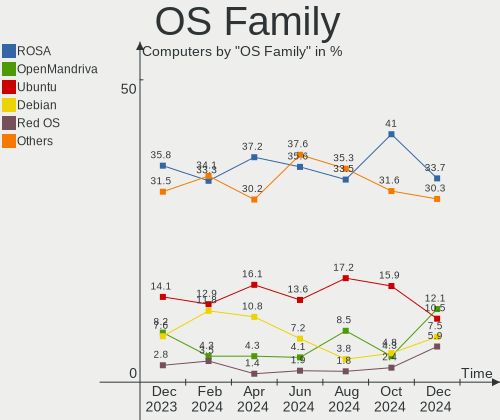

| Name          | Computers | Percent |
|---------------|-----------|---------|
| ROSA          | 152       | 34.23%  |
| Debian        | 73        | 16.44%  |
| Ubuntu        | 44        | 9.91%   |
| Fedora        | 28        | 6.31%   |
| Arch          | 26        | 5.86%   |
| Linux Mint    | 16        | 3.6%    |
| OpenMandriva  | 13        | 2.93%   |
| ALT Linux     | 10        | 2.25%   |
| Xubuntu       | 9         | 2.03%   |
| Red OS        | 8         | 1.8%    |
| Manjaro       | 7         | 1.58%   |
| Cyber Infra   | 6         | 1.35%   |
| Kubuntu       | 5         | 1.13%   |
| Astra Linux   | 5         | 1.13%   |
| openSUSE      | 4         | 0.9%    |
| Lubuntu       | 3         | 0.68%   |
| Kali          | 3         | 0.68%   |
| Ubuntu MATE   | 2         | 0.45%   |
| SteamOS       | 2         | 0.45%   |
| Pop!_OS       | 2         | 0.45%   |
| KDE neon      | 2         | 0.45%   |
| Gentoo        | 2         | 0.45%   |
| Elementary    | 2         | 0.45%   |
| CentOS        | 2         | 0.45%   |
| ArcoLinux     | 2         | 0.45%   |
| Zorin         | 1         | 0.23%   |
| Xero          | 1         | 0.23%   |
| Void Linux    | 1         | 0.23%   |
| Ubuntu Unity  | 1         | 0.23%   |
| Ubuntu Studio | 1         | 0.23%   |
| Trisquel      | 1         | 0.23%   |
| RELD          | 1         | 0.23%   |
| Raspbian      | 1         | 0.23%   |
| Nobara        | 1         | 0.23%   |
| NixOS         | 1         | 0.23%   |
| Manjaro-ARM   | 1         | 0.23%   |
| Garuda Linux  | 1         | 0.23%   |
| Endless       | 1         | 0.23%   |
| EndeavourOS   | 1         | 0.23%   |
| Devuan        | 1         | 0.23%   |

Kernel
------

Version of the Linux kernel

| Version                             | Computers | Percent |
|-------------------------------------|-----------|---------|
| 6.1.38-generic-1rosa2021.1-x86_64   | 57        | 12.84%  |
| 6.1.20-generic-2rosa2021.1-x86_64   | 52        | 11.71%  |
| 6.1.0-4-amd64                       | 42        | 9.46%   |
| 5.19.0-46-generic                   | 15        | 3.38%   |
| 6.1.0-10-amd64                      | 10        | 2.25%   |
| 6.4.4-arch1-1                       | 9         | 2.03%   |
| 6.1.0-9-amd64                       | 9         | 2.03%   |
| 5.4.0-156-generic                   | 9         | 2.03%   |
| 5.15.0-76-generic                   | 9         | 2.03%   |
| 6.3.8-200.fc38.x86_64               | 8         | 1.8%    |
| 6.2.6-desktop-1omv2390              | 7         | 1.58%   |
| 6.2.0-25-generic                    | 6         | 1.35%   |
| 6.2.0-24-generic                    | 6         | 1.35%   |
| 5.19.0-50-generic                   | 6         | 1.35%   |
| 5.15.117-generic-1rosa2021.1-x86_64 | 6         | 1.35%   |
| 3.10.0-1160.41.1.vz7.183.5          | 6         | 1.35%   |
| 6.4.4-200.fc38.x86_64               | 5         | 1.13%   |
| 6.3.12-200.fc38.x86_64              | 5         | 1.13%   |
| 5.15.0-70-generic                   | 5         | 1.13%   |
| 5.15.0-69-generic                   | 5         | 1.13%   |
| 5.10.0-23-amd64                     | 5         | 1.13%   |
| 6.2.0-26-generic                    | 4         | 0.9%    |
| 5.15.103-generic-1rosa2021.1-i686   | 4         | 0.9%    |
| 6.4.6-200.fc38.x86_64               | 3         | 0.68%   |
| 6.1.38-un-def-alt1                  | 3         | 0.68%   |
| 6.1.20-2.el7.3.x86_64               | 3         | 0.68%   |
| 5.15.0-78-generic                   | 3         | 0.68%   |
| 5.10.74-generic-2rosa2021.1-x86_64  | 3         | 0.68%   |
| 5.10.184-generic-1rosa2021.1-x86_64 | 3         | 0.68%   |
| 6.4.7-arch1-1                       | 2         | 0.45%   |
| 6.4.1-arch2-1                       | 2         | 0.45%   |
| 6.4.1-arch1-1                       | 2         | 0.45%   |
| 6.4.0-060400-generic                | 2         | 0.45%   |
| 6.3.8-100.fc37.x86_64               | 2         | 0.45%   |
| 6.3.5-desktop-3omv2390              | 2         | 0.45%   |
| 6.2.9-300.fc38.x86_64               | 2         | 0.45%   |
| 6.2.6-76060206-generic              | 2         | 0.45%   |
| 6.2.16-3-pve                        | 2         | 0.45%   |
| 6.2.0-20-generic                    | 2         | 0.45%   |
| 6.1.38-1-MANJARO                    | 2         | 0.45%   |

Kernel Family
-------------

Linux kernel without a distro release

| Version  | Computers | Percent |
|----------|-----------|---------|
| 6.1.38   | 65        | 14.64%  |
| 6.1.0    | 65        | 14.64%  |
| 6.1.20   | 56        | 12.61%  |
| 5.15.0   | 32        | 7.21%   |
| 5.19.0   | 21        | 4.73%   |
| 6.2.0    | 18        | 4.05%   |
| 6.4.4    | 15        | 3.38%   |
| 5.4.0    | 12        | 2.7%    |
| 6.3.8    | 11        | 2.48%   |
| 6.2.6    | 9         | 2.03%   |
| 6.4.3    | 8         | 1.8%    |
| 5.15.117 | 8         | 1.8%    |
| 6.4.1    | 7         | 1.58%   |
| 6.3.12   | 7         | 1.58%   |
| 3.10.0   | 7         | 1.58%   |
| 5.15.103 | 6         | 1.35%   |
| 5.10.0   | 6         | 1.35%   |
| 6.4.6    | 5         | 1.13%   |
| 5.10.74  | 4         | 0.9%    |
| 6.4.7    | 3         | 0.68%   |
| 6.4.0    | 3         | 0.68%   |
| 6.1.31   | 3         | 0.68%   |
| 5.10.184 | 3         | 0.68%   |
| 6.4.5    | 2         | 0.45%   |
| 6.3.5    | 2         | 0.45%   |
| 6.3.0    | 2         | 0.45%   |
| 6.2.9    | 2         | 0.45%   |
| 6.2.16   | 2         | 0.45%   |
| 6.1.30   | 2         | 0.45%   |
| 6.1.22   | 2         | 0.45%   |
| 5.15.87  | 2         | 0.45%   |
| 5.15.75  | 2         | 0.45%   |
| 5.14.21  | 2         | 0.45%   |
| 5.13.0   | 2         | 0.45%   |
| 5.10.186 | 2         | 0.45%   |
| 5.10.185 | 2         | 0.45%   |
| 5.10.176 | 2         | 0.45%   |
| 5.10.14  | 2         | 0.45%   |
| 4.9.155  | 2         | 0.45%   |
| 6.4.2    | 1         | 0.23%   |

Kernel Major Ver.
-----------------

Linux kernel major version

| Version | Computers | Percent |
|---------|-----------|---------|
| 6.1     | 200       | 45.05%  |
| 5.15    | 55        | 12.39%  |
| 6.4     | 44        | 9.91%   |
| 6.2     | 33        | 7.43%   |
| 6.3     | 30        | 6.76%   |
| 5.10    | 25        | 5.63%   |
| 5.19    | 21        | 4.73%   |
| 5.4     | 14        | 3.15%   |
| 3.10    | 7         | 1.58%   |
| 5.14    | 3         | 0.68%   |
| 5.13    | 3         | 0.68%   |
| 4.9     | 2         | 0.45%   |
| 5.9     | 1         | 0.23%   |
| 5.17    | 1         | 0.23%   |
| 5.16    | 1         | 0.23%   |
| 5.11    | 1         | 0.23%   |
| 4.15    | 1         | 0.23%   |
| 3.1     | 1         | 0.23%   |
| 2.6     | 1         | 0.23%   |

Arch
----

OS architecture (x86_64, i586, etc.)

| Name    | Computers | Percent |
|---------|-----------|---------|
| x86_64  | 430       | 96.85%  |
| i686    | 8         | 1.8%    |
| aarch64 | 3         | 0.68%   |
| armv7l  | 2         | 0.45%   |
| armv6l  | 1         | 0.23%   |

DE
--

Desktop Environment

| Name       | Computers | Percent |
|------------|-----------|---------|
| KDE5       | 140       | 31.53%  |
| GNOME      | 133       | 29.95%  |
| Unknown    | 73        | 16.44%  |
| XFCE       | 29        | 6.53%   |
| MATE       | 20        | 4.5%    |
| LXQt       | 15        | 3.38%   |
| X-Cinnamon | 14        | 3.15%   |
| i3         | 4         | 0.9%    |
| KDE4       | 3         | 0.68%   |
| Cinnamon   | 3         | 0.68%   |
| Pantheon   | 2         | 0.45%   |
| Unity      | 1         | 0.23%   |
| Trinity    | 1         | 0.23%   |
| sway       | 1         | 0.23%   |
| LXDE       | 1         | 0.23%   |
| Hyprland   | 1         | 0.23%   |
| fly        | 1         | 0.23%   |
| Budgie     | 1         | 0.23%   |
| bspwm      | 1         | 0.23%   |

Display Server
--------------

X11 or Wayland

| Name        | Computers | Percent |
|-------------|-----------|---------|
| Wayland     | 191       | 43.02%  |
| X11         | 188       | 42.34%  |
| Unknown     | 54        | 12.16%  |
| Tty         | 10        | 2.25%   |
| Unspecified | 1         | 0.23%   |

Display Manager
---------------

SDDM, LightDM, etc.

| Name    | Computers | Percent |
|---------|-----------|---------|
| SDDM    | 131       | 29.5%   |
| Unknown | 113       | 25.45%  |
| GDM     | 85        | 19.14%  |
| LightDM | 64        | 14.41%  |
| GDM3    | 45        | 10.14%  |
| FLY-DM  | 3         | 0.68%   |
| KDM     | 2         | 0.45%   |
| GREETD  | 1         | 0.23%   |

OS Lang
-------

Language

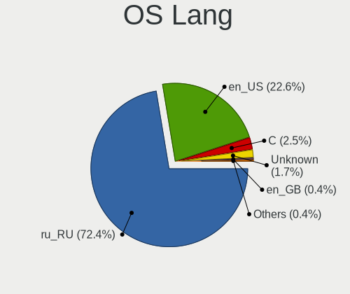

| Lang        | Computers | Percent |
|-------------|-----------|---------|
| ru_RU       | 347       | 78.15%  |
| en_US       | 75        | 16.89%  |
| C           | 10        | 2.25%   |
| Unknown     | 6         | 1.35%   |
| en_GB       | 4         | 0.9%    |
| ru_RU.UTF8  | 1         | 0.23%   |
| ru_RU.utf-8 | 1         | 0.23%   |

Boot Mode
---------

EFI or BIOS

| Mode | Computers | Percent |
|------|-----------|---------|
| EFI  | 255       | 57.43%  |
| BIOS | 189       | 42.57%  |

Filesystem
----------

Type of filesystem

| Type    | Computers | Percent |
|---------|-----------|---------|
| Ext4    | 301       | 67.79%  |
| Overlay | 62        | 13.96%  |
| Btrfs   | 51        | 11.49%  |
| Tmpfs   | 20        | 4.5%    |
| Xfs     | 6         | 1.35%   |
| F2fs    | 3         | 0.68%   |
| Aufs    | 1         | 0.23%   |

Part. scheme
------------

Scheme of partitioning

| Type    | Computers | Percent |
|---------|-----------|---------|
| GPT     | 277       | 62.39%  |
| MBR     | 116       | 26.13%  |
| Unknown | 51        | 11.49%  |

Dual Boot with Linux/BSD
------------------------

Hosting more than one Linux/BSD

| Dual boot | Computers | Percent |
|-----------|-----------|---------|
| No        | 372       | 83.78%  |
| Yes       | 72        | 16.22%  |

Dual Boot (Win)
---------------

Hosting Linux and Windows

| Dual boot | Computers | Percent |
|-----------|-----------|---------|
| No        | 251       | 56.53%  |
| Yes       | 193       | 43.47%  |

Board
-----

Vendor
------

Motherboard manufacturer

| Name                                 | Computers | Percent |
|--------------------------------------|-----------|---------|
| ASUSTek Computer                     | 76        | 17.12%  |
| Gigabyte Technology                  | 54        | 12.16%  |
| Lenovo                               | 48        | 10.81%  |
| ASRock                               | 39        | 8.78%   |
| Hewlett-Packard                      | 36        | 8.11%   |
| MSI                                  | 28        | 6.31%   |
| Acer                                 | 25        | 5.63%   |
| Unknown                              | 17        | 3.83%   |
| Dell                                 | 15        | 3.38%   |
| HUAWEI                               | 11        | 2.48%   |
| Supermicro                           | 10        | 2.25%   |
| Samsung Electronics                  | 5         | 1.13%   |
| Intel                                | 5         | 1.13%   |
| HONOR                                | 5         | 1.13%   |
| Biostar                              | 4         | 0.9%    |
| Valve                                | 3         | 0.68%   |
| Toshiba                              | 3         | 0.68%   |
| Timi                                 | 3         | 0.68%   |
| AZW                                  | 3         | 0.68%   |
| Apple                                | 3         | 0.68%   |
| TECNO                                | 2         | 0.45%   |
| Sony                                 | 2         | 0.45%   |
| RuggedPC                             | 2         | 0.45%   |
| Maibenben                            | 2         | 0.45%   |
| Infinix                              | 2         | 0.45%   |
| Huanan                               | 2         | 0.45%   |
| Graviton                             | 2         | 0.45%   |
| ECS                                  | 2         | 0.45%   |
| Chuwi                                | 2         | 0.45%   |
| Aquarius                             | 2         | 0.45%   |
| ZOTAC                                | 1         | 0.23%   |
| ZoomSmart                            | 1         | 0.23%   |
| Teclast                              | 1         | 0.23%   |
| SiS Technology                       | 1         | 0.23%   |
| Shenzhen Meigao Electronic Equipment | 1         | 0.23%   |
| rombica                              | 1         | 0.23%   |
| RDW                                  | 1         | 0.23%   |
| Raspberry Pi Foundation              | 1         | 0.23%   |
| Quanta                               | 1         | 0.23%   |
| Prestigio                            | 1         | 0.23%   |

Model
-----

Motherboard model

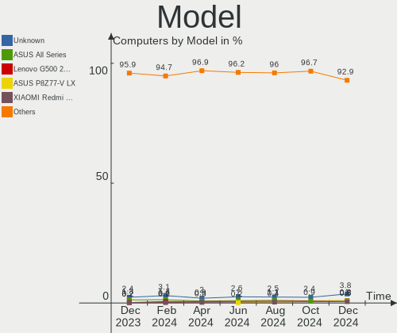

| Name                                     | Computers | Percent |
|------------------------------------------|-----------|---------|
| ASRock H470M-HVS                         | 20        | 4.5%    |
| Unknown                                  | 18        | 4.05%   |
| ASUS All Series                          | 10        | 2.25%   |
| Gigabyte H81M-S2V                        | 9         | 2.03%   |
| Gigabyte A320M-S2H V2                    | 7         | 1.58%   |
| HUAWEI BOD-WXX9                          | 4         | 0.9%    |
| Valve Jupiter                            | 3         | 0.68%   |
| Supermicro Super Server                  | 3         | 0.68%   |
| MSI MS-7996                              | 3         | 0.68%   |
| TECNO MEGABOOK T1                        | 2         | 0.45%   |
| Supermicro X8ST3                         | 2         | 0.45%   |
| Supermicro AS -1014S-WTRT                | 2         | 0.45%   |
| MSI MS-7A38                              | 2         | 0.45%   |
| Maibenben MaiBook M                      | 2         | 0.45%   |
| Lenovo V14-IIL 82C4                      | 2         | 0.45%   |
| Lenovo B590 20208                        | 2         | 0.45%   |
| Infinix INBOOK X2 GEN11                  | 2         | 0.45%   |
| HUAWEI NBLB-WAX9N                        | 2         | 0.45%   |
| HUAWEI BOM-WXX9                          | 2         | 0.45%   |
| HP Notebook                              | 2         | 0.45%   |
| HP EliteBook 830 G5                      | 2         | 0.45%   |
| Gigabyte Z77-DS3H                        | 2         | 0.45%   |
| Gigabyte Z490 UD                         | 2         | 0.45%   |
| AZW MINI S                               | 2         | 0.45%   |
| ASUS VivoBook_ASUSLaptop M6500QC_M6500QC | 2         | 0.45%   |
| ASUS PRIME H510M-K                       | 2         | 0.45%   |
| Acer Nitro AN515-46                      | 2         | 0.45%   |
| ZOTAC ZBOX-ID88/ID89/ID90                | 1         | 0.23%   |
| ZoomSmart A8006                          | 1         | 0.23%   |
| Toshiba Satellite P200D                  | 1         | 0.23%   |
| Toshiba Satellite C870-D7K               | 1         | 0.23%   |
| Toshiba QOSMIO G30                       | 1         | 0.23%   |
| Timi Redmi G 2022                        | 1         | 0.23%   |
| Timi Redmi Book Pro 15 2022              | 1         | 0.23%   |
| Timi Redmi Book Pro 14 2022              | 1         | 0.23%   |
| Teclast X6 plus                          | 1         | 0.23%   |
| Supermicro X8DAH                         | 1         | 0.23%   |
| Supermicro X7DWE                         | 1         | 0.23%   |
| Supermicro SSG-2028R-E1CR24L             | 1         | 0.23%   |
| Sony VPCSB1V9R                           | 1         | 0.23%   |

Model Family
------------

Motherboard model prefix

| Name               | Computers | Percent |
|--------------------|-----------|---------|
| ASRock H470M-HVS   | 20        | 4.5%    |
| Unknown            | 18        | 4.05%   |
| Lenovo ThinkPad    | 14        | 3.15%   |
| Acer Aspire        | 13        | 2.93%   |
| ASUS VivoBook      | 12        | 2.7%    |
| ASUS PRIME         | 12        | 2.7%    |
| Lenovo IdeaPad     | 11        | 2.48%   |
| ASUS All           | 10        | 2.25%   |
| Gigabyte H81M-S2V  | 9         | 2.03%   |
| Gigabyte A320M-S2H | 7         | 1.58%   |
| HP EliteBook       | 6         | 1.35%   |
| HP Pavilion        | 5         | 1.13%   |
| HP Laptop          | 5         | 1.13%   |
| Dell Inspiron      | 5         | 1.13%   |
| HUAWEI BOD-WXX9    | 4         | 0.9%    |
| ASUS ROG           | 4         | 0.9%    |
| Acer Extensa       | 4         | 0.9%    |
| Valve Jupiter      | 3         | 0.68%   |
| Timi Redmi         | 3         | 0.68%   |
| Supermicro Super   | 3         | 0.68%   |
| MSI MS-7996        | 3         | 0.68%   |
| Lenovo ThinkCentre | 3         | 0.68%   |
| Lenovo ThinkBook   | 3         | 0.68%   |
| Lenovo Legion      | 3         | 0.68%   |
| Lenovo B590        | 3         | 0.68%   |
| HP ProBook         | 3         | 0.68%   |
| HP Compaq          | 3         | 0.68%   |
| Gigabyte Z490      | 3         | 0.68%   |
| ASUS TUF           | 3         | 0.68%   |
| ASUS ASUS          | 3         | 0.68%   |
| Acer Nitro         | 3         | 0.68%   |
| Toshiba Satellite  | 2         | 0.45%   |
| TECNO MEGABOOK     | 2         | 0.45%   |
| Supermicro X8ST3   | 2         | 0.45%   |
| Supermicro AS      | 2         | 0.45%   |
| MSI MS-7A38        | 2         | 0.45%   |
| MSI Modern         | 2         | 0.45%   |
| Maibenben MaiBook  | 2         | 0.45%   |
| Lenovo V14-IIL     | 2         | 0.45%   |
| Infinix INBOOK     | 2         | 0.45%   |

MFG Year
--------

Motherboard manufacture year

| Year    | Computers | Percent |
|---------|-----------|---------|
| 2021    | 77        | 17.34%  |
| 2022    | 60        | 13.51%  |
| 2020    | 36        | 8.11%   |
| 2018    | 32        | 7.21%   |
| 2012    | 29        | 6.53%   |
| 2019    | 28        | 6.31%   |
| 2014    | 27        | 6.08%   |
| 2013    | 26        | 5.86%   |
| 2011    | 18        | 4.05%   |
| 2010    | 18        | 4.05%   |
| 2015    | 17        | 3.83%   |
| 2023    | 14        | 3.15%   |
| 2017    | 13        | 2.93%   |
| 2009    | 12        | 2.7%    |
| 2016    | 10        | 2.25%   |
| 2007    | 9         | 2.03%   |
| 2008    | 8         | 1.8%    |
| 2006    | 5         | 1.13%   |
| Unknown | 4         | 0.9%    |
| 2004    | 1         | 0.23%   |

Form Factor
-----------

Physical design of the computer

| Name           | Computers | Percent |
|----------------|-----------|---------|
| Notebook       | 211       | 47.52%  |
| Desktop        | 195       | 43.92%  |
| Server         | 16        | 3.6%    |
| All in one     | 8         | 1.8%    |
| Tablet         | 6         | 1.35%   |
| Convertible    | 4         | 0.9%    |
| System on chip | 3         | 0.68%   |
| Mini pc        | 1         | 0.23%   |

Secure Boot
-----------

Enabled or disabled

| State    | Computers | Percent |
|----------|-----------|---------|
| Disabled | 421       | 94.82%  |
| Enabled  | 23        | 5.18%   |

Coreboot
--------

Have coreboot on board

| Used | Computers | Percent |
|------|-----------|---------|
| No   | 443       | 99.77%  |
| Yes  | 1         | 0.23%   |

RAM Size
--------

Total RAM memory

| Size in GB      | Computers | Percent |
|-----------------|-----------|---------|
| 4.01-8.0        | 120       | 27.03%  |
| 8.01-16.0       | 85        | 19.14%  |
| 16.01-24.0      | 68        | 15.32%  |
| 3.01-4.0        | 58        | 13.06%  |
| 32.01-64.0      | 56        | 12.61%  |
| 64.01-256.0     | 17        | 3.83%   |
| 24.01-32.0      | 13        | 2.93%   |
| 2.01-3.0        | 10        | 2.25%   |
| 1.01-2.0        | 8         | 1.8%    |
| More than 256.0 | 5         | 1.13%   |
| 0.01-0.5        | 3         | 0.68%   |
| 0.51-1.0        | 1         | 0.23%   |

RAM Used
--------

Used RAM memory

| Used GB    | Computers | Percent |
|------------|-----------|---------|
| 1.01-2.0   | 149       | 33.56%  |
| 2.01-3.0   | 80        | 18.02%  |
| 4.01-8.0   | 73        | 16.44%  |
| 0.51-1.0   | 62        | 13.96%  |
| 3.01-4.0   | 45        | 10.14%  |
| 8.01-16.0  | 23        | 5.18%   |
| 0.01-0.5   | 8         | 1.8%    |
| Unknown    | 2         | 0.45%   |
| 24.01-32.0 | 1         | 0.23%   |
| 16.01-24.0 | 1         | 0.23%   |

Total Drives
------------

Number of drives on board

| Drives | Computers | Percent |
|--------|-----------|---------|
| 1      | 252       | 56.76%  |
| 2      | 121       | 27.25%  |
| 3      | 31        | 6.98%   |
| 4      | 17        | 3.83%   |
| 5      | 11        | 2.48%   |
| 6      | 4         | 0.9%    |
| 0      | 3         | 0.68%   |
| 7      | 2         | 0.45%   |
| 26     | 1         | 0.23%   |
| 11     | 1         | 0.23%   |
| 9      | 1         | 0.23%   |

Has CD-ROM
----------

Has CD-ROM on board

| Presented | Computers | Percent |
|-----------|-----------|---------|
| No        | 343       | 77.25%  |
| Yes       | 101       | 22.75%  |

Has Ethernet
------------

Has Ethernet on board

| Presented | Computers | Percent |
|-----------|-----------|---------|
| Yes       | 365       | 82.21%  |
| No        | 79        | 17.79%  |

Has WiFi
--------

Has WiFi module

| Presented | Computers | Percent |
|-----------|-----------|---------|
| Yes       | 283       | 63.74%  |
| No        | 161       | 36.26%  |

Has Bluetooth
-------------

Has Bluetooth module

| Presented | Computers | Percent |
|-----------|-----------|---------|
| Yes       | 243       | 54.73%  |
| No        | 201       | 45.27%  |

Location
--------

Country
-------

Geographic location (country)

| Country | Computers | Percent |
|---------|-----------|---------|
| Russia  | 444       | 100%    |

City
----

Geographic location (city)

| City                | Computers | Percent |
|---------------------|-----------|---------|
| Moscow              | 105       | 23.65%  |
| Voronezh            | 58        | 13.06%  |
| St Petersburg       | 46        | 10.36%  |
| Samara              | 13        | 2.93%   |
| Krasnodar           | 13        | 2.93%   |
| Saratov             | 9         | 2.03%   |
| Perm                | 9         | 2.03%   |
| Ufa                 | 8         | 1.8%    |
| Kazan’            | 8         | 1.8%    |
| Rostov-on-Don       | 7         | 1.58%   |
| Nizhniy Novgorod    | 7         | 1.58%   |
| Vladivostok         | 6         | 1.35%   |
| Tomsk               | 6         | 1.35%   |
| Novosibirsk         | 6         | 1.35%   |
| Yoshkar-Ola         | 5         | 1.13%   |
| Volgograd           | 5         | 1.13%   |
| Tyumen              | 5         | 1.13%   |
| Lipetsk             | 4         | 0.9%    |
| Chelyabinsk         | 4         | 0.9%    |
| Smolensk            | 3         | 0.68%   |
| Novocherkassk       | 3         | 0.68%   |
| Murom               | 3         | 0.68%   |
| Lyubertsy           | 3         | 0.68%   |
| Khabarovsk          | 3         | 0.68%   |
| Irkutsk             | 3         | 0.68%   |
| Cheboksary          | 3         | 0.68%   |
| Blagoveshchensk     | 3         | 0.68%   |
| Belgorod            | 3         | 0.68%   |
| Barnaul             | 3         | 0.68%   |
| Yaroslavl           | 2         | 0.45%   |
| Ulyanovsk           | 2         | 0.45%   |
| Tolyatti            | 2         | 0.45%   |
| Shchelkovo          | 2         | 0.45%   |
| Saransk             | 2         | 0.45%   |
| Ryazan              | 2         | 0.45%   |
| Podolsk             | 2         | 0.45%   |
| Naberezhnyye Chelny | 2         | 0.45%   |
| Kurgan              | 2         | 0.45%   |
| Kirov               | 2         | 0.45%   |
| Kemerovo            | 2         | 0.45%   |

Drives
------

Drive Vendor
------------

Hard drive vendors

| Vendor                       | Computers | Drives | Percent |
|------------------------------|-----------|--------|---------|
| WDC                          | 89        | 114    | 13.24%  |
| Samsung Electronics          | 89        | 111    | 13.24%  |
| Seagate                      | 72        | 90     | 10.71%  |
| Kingston                     | 43        | 49     | 6.4%    |
| Toshiba                      | 42        | 46     | 6.25%   |
| Netac                        | 27        | 27     | 4.02%   |
| Crucial                      | 21        | 21     | 3.13%   |
| Intel                        | 20        | 34     | 2.98%   |
| SK hynix                     | 19        | 19     | 2.83%   |
| Sandisk                      | 19        | 19     | 2.83%   |
| Unknown                      | 18        | 19     | 2.68%   |
| A-DATA Technology            | 18        | 21     | 2.68%   |
| Hitachi                      | 15        | 38     | 2.23%   |
| China                        | 13        | 13     | 1.93%   |
| Silicon Motion               | 11        | 11     | 1.64%   |
| Micron Technology            | 10        | 10     | 1.49%   |
| SPCC                         | 8         | 8      | 1.19%   |
| Plextor                      | 7         | 7      | 1.04%   |
| JMicron Technology           | 7         | 7      | 1.04%   |
| HGST                         | 7         | 8      | 1.04%   |
| Apacer                       | 7         | 7      | 1.04%   |
| AMD                          | 7         | 7      | 1.04%   |
| Unknown                      | 6         | 6      | 0.89%   |
| XrayDisk                     | 5         | 5      | 0.74%   |
| KingSpec                     | 5         | 5      | 0.74%   |
| Smartbuy                     | 4         | 4      | 0.6%    |
| Phison Electronics           | 4         | 4      | 0.6%    |
| Transcend                    | 3         | 3      | 0.45%   |
| Realtek Semiconductor        | 3         | 3      | 0.45%   |
| Patriot                      | 3         | 3      | 0.45%   |
| KIOXIA                       | 3         | 3      | 0.45%   |
| Kingston Technology Company  | 3         | 3      | 0.45%   |
| FORESEE                      | 3         | 3      | 0.45%   |
| ADATA Technology             | 3         | 3      | 0.45%   |
| Team                         | 2         | 2      | 0.3%    |
| Shenzhen Longsys Electronics | 2         | 2      | 0.3%    |
| Qumo                         | 2         | 2      | 0.3%    |
| OCZ                          | 2         | 2      | 0.3%    |
| NGFF                         | 2         | 2      | 0.3%    |
| MSI                          | 2         | 2      | 0.3%    |

Drive Model
-----------

Hard drive models

| Model                                                        | Computers | Percent |
|--------------------------------------------------------------|-----------|---------|
| Netac SSD 240GB                                              | 20        | 2.75%   |
| Toshiba HDWD110 1TB                                          | 18        | 2.48%   |
| Seagate ST1000DM003-1ER162 1TB                               | 12        | 1.65%   |
| Kingston SA400S37240G 240GB SSD                              | 11        | 1.52%   |
| Crucial CT240BX500SSD1 240GB                                 | 10        | 1.38%   |
| Samsung SSD 870 EVO 500GB                                    | 9         | 1.24%   |
| Samsung NVMe SSD Controller PM9A1/PM9A3/980PRO 1TB           | 9         | 1.24%   |
| Samsung NVMe SSD Controller SM981/PM981/PM983 500GB          | 8         | 1.1%    |
| WDC WDS240G2G0A-00JH30 240GB SSD                             | 6         | 0.83%   |
| Kingston SA400S37480G 480GB SSD                              | 6         | 0.83%   |
| Intel SSDPEKNU512GZ 512GB                                    | 6         | 0.83%   |
| Unknown                                                      | 6         | 0.83%   |
| WDC WDS120G2G0A-00JH30 120GB SSD                             | 5         | 0.69%   |
| WDC WD10EZEX-08WN4A0 1TB                                     | 5         | 0.69%   |
| Kingston SA400S37120G 120GB SSD                              | 5         | 0.69%   |
| Unknown DA4064  64GB                                         | 4         | 0.55%   |
| SPCC Solid State Disk 128GB                                  | 4         | 0.55%   |
| SK hynix HFM512GD3JX013N 512GB                               | 4         | 0.55%   |
| Seagate ST2000DM008-2FR102 2TB                               | 4         | 0.55%   |
| Seagate ST1000LM024 HN-M101MBB 1TB                           | 4         | 0.55%   |
| Seagate ST1000DM010-2EP102 1TB                               | 4         | 0.55%   |
| Sandisk WD Black SN750 / PC SN730 NVMe SSD 1024GB            | 4         | 0.55%   |
| Samsung MZ7L31T9HBLT-00A07 2TB SSD                           | 4         | 0.55%   |
| Kingston SV300S37A120G 120GB SSD                             | 4         | 0.55%   |
| Kingston SHFS37A120G 120GB SSD                               | 4         | 0.55%   |
| JMicron Generic 512GB                                        | 4         | 0.55%   |
| Intel NVMe Datacenter SSD [3DNAND, Beta Rock Controller] 2TB | 4         | 0.55%   |
| Unknown MMC Card  32GB                                       | 3         | 0.41%   |
| Toshiba MQ04ABF100 1TB                                       | 3         | 0.41%   |
| SPCC Solid State Disk 256GB                                  | 3         | 0.41%   |
| Silicon Motion PCIe-4 SSD 256GB                              | 3         | 0.41%   |
| Seagate ST4000NM0035-1V4107 4TB                              | 3         | 0.41%   |
| Seagate ST1000LM049-2GH172 1TB                               | 3         | 0.41%   |
| Seagate ST1000DM003-1SB102 1TB                               | 3         | 0.41%   |
| Samsung SSD 860 EVO 500GB                                    | 3         | 0.41%   |
| Samsung SSD 860 EVO 250GB                                    | 3         | 0.41%   |
| HGST HTS545050A7E380 500GB                                   | 3         | 0.41%   |
| Crucial CT120BX500SSD1 120GB                                 | 3         | 0.41%   |
| A-DATA SU650 240GB SSD                                       | 3         | 0.41%   |
| WDC WDS120G2G0B-00EPW0 120GB SSD                             | 2         | 0.28%   |

HDD Vendor
----------

Hard disk drive vendors

| Vendor              | Computers | Drives | Percent |
|---------------------|-----------|--------|---------|
| Seagate             | 71        | 89     | 32.72%  |
| WDC                 | 65        | 85     | 29.95%  |
| Toshiba             | 37        | 40     | 17.05%  |
| Hitachi             | 15        | 38     | 6.91%   |
| Samsung Electronics | 8         | 9      | 3.69%   |
| HGST                | 7         | 8      | 3.23%   |
| JMicron Technology  | 6         | 6      | 2.76%   |
| Unknown             | 2         | 2      | 0.92%   |
| Maxtor              | 2         | 2      | 0.92%   |
| Fujitsu             | 2         | 5      | 0.92%   |
| QNAP                | 1         | 4      | 0.46%   |
| Apple               | 1         | 1      | 0.46%   |

SSD Vendor
----------

Solid state drive vendors

| Vendor              | Computers | Drives | Percent |
|---------------------|-----------|--------|---------|
| Samsung Electronics | 50        | 58     | 18.8%   |
| Kingston            | 34        | 37     | 12.78%  |
| Netac               | 23        | 23     | 8.65%   |
| WDC                 | 20        | 20     | 7.52%   |
| Crucial             | 20        | 20     | 7.52%   |
| A-DATA Technology   | 14        | 15     | 5.26%   |
| China               | 13        | 13     | 4.89%   |
| SPCC                | 8         | 8      | 3.01%   |
| AMD                 | 7         | 7      | 2.63%   |
| SanDisk             | 6         | 6      | 2.26%   |
| Plextor             | 6         | 6      | 2.26%   |
| KingSpec            | 5         | 5      | 1.88%   |
| Apacer              | 5         | 5      | 1.88%   |
| XrayDisk            | 4         | 4      | 1.5%    |
| Transcend           | 3         | 3      | 1.13%   |
| Smartbuy            | 3         | 3      | 1.13%   |
| Patriot             | 3         | 3      | 1.13%   |
| Team                | 2         | 2      | 0.75%   |
| SK hynix            | 2         | 2      | 0.75%   |
| OCZ                 | 2         | 2      | 0.75%   |
| NGFF                | 2         | 2      | 0.75%   |
| Intel               | 2         | 3      | 0.75%   |
| Hewlett-Packard     | 2         | 4      | 0.75%   |
| Unknown             | 2         | 2      | 0.75%   |
| Wdxsky              | 1         | 1      | 0.38%   |
| WDC WDS             | 1         | 1      | 0.38%   |
| WALRAM              | 1         | 1      | 0.38%   |
| Verbatim            | 1         | 1      | 0.38%   |
| USB                 | 1         | 1      | 0.38%   |
| Teclast             | 1         | 1      | 0.38%   |
| SSSTC               | 1         | 1      | 0.38%   |
| ShiJi               | 1         | 1      | 0.38%   |
| Seagate             | 1         | 1      | 0.38%   |
| Qumo                | 1         | 1      | 0.38%   |
| Palit               | 1         | 1      | 0.38%   |
| OCZ-VERT            | 1         | 1      | 0.38%   |
| Neo                 | 1         | 1      | 0.38%   |
| Mstore              | 1         | 1      | 0.38%   |
| MSI                 | 1         | 1      | 0.38%   |
| MII                 | 1         | 1      | 0.38%   |

Drive Kind
----------

HDD or SSD

| Kind    | Computers | Drives | Percent |
|---------|-----------|--------|---------|
| SSD     | 227       | 281    | 37.65%  |
| HDD     | 191       | 289    | 31.67%  |
| NVMe    | 159       | 200    | 26.37%  |
| MMC     | 20        | 21     | 3.32%   |
| Unknown | 6         | 5      | 1%      |

Drive Connector
---------------

SATA, SAS, NVMe, etc.

| Type | Computers | Drives | Percent |
|------|-----------|--------|---------|
| SATA | 317       | 527    | 60.73%  |
| NVMe | 159       | 199    | 30.46%  |
| SAS  | 26        | 49     | 4.98%   |
| MMC  | 20        | 21     | 3.83%   |

Drive Size
----------

Size of hard drive

| Size in TB | Computers | Drives | Percent |
|------------|-----------|--------|---------|
| 0.01-0.5   | 245       | 326    | 57.24%  |
| 0.51-1.0   | 129       | 150    | 30.14%  |
| 1.01-2.0   | 26        | 59     | 6.07%   |
| 3.01-4.0   | 14        | 20     | 3.27%   |
| 4.01-10.0  | 9         | 10     | 2.1%    |
| 2.01-3.0   | 4         | 4      | 0.93%   |
| 10.01-20.0 | 1         | 1      | 0.23%   |

Space Total
-----------

Amount of disk space available on the file system

| Size in GB     | Computers | Percent |
|----------------|-----------|---------|
| 101-250        | 116       | 26.13%  |
| 251-500        | 75        | 16.89%  |
| 501-1000       | 54        | 12.16%  |
| Unknown        | 54        | 12.16%  |
| 1001-2000      | 34        | 7.66%   |
| 1-20           | 29        | 6.53%   |
| 51-100         | 27        | 6.08%   |
| More than 3000 | 24        | 5.41%   |
| 21-50          | 19        | 4.28%   |
| 2001-3000      | 12        | 2.7%    |

Space Used
----------

Amount of used disk space

| Used GB        | Computers | Percent |
|----------------|-----------|---------|
| 1-20           | 174       | 39.19%  |
| 21-50          | 60        | 13.51%  |
| Unknown        | 54        | 12.16%  |
| 101-250        | 51        | 11.49%  |
| 51-100         | 37        | 8.33%   |
| 501-1000       | 24        | 5.41%   |
| 251-500        | 16        | 3.6%    |
| 1001-2000      | 13        | 2.93%   |
| More than 3000 | 8         | 1.8%    |
| 2001-3000      | 7         | 1.58%   |

Malfunc. Drives
---------------

Drive models with a malfunction

| Model                              | Computers | Drives | Percent |
|------------------------------------|-----------|--------|---------|
| WDC WDS240G2G0A-00JH30 240GB SSD   | 2         | 2      | 2.78%   |
| Toshiba DT01ACA100 1TB             | 2         | 3      | 2.78%   |
| Seagate ST4000NM0035-1V4107 4TB    | 2         | 2      | 2.78%   |
| Seagate ST320LT020-9YG142 320GB    | 2         | 2      | 2.78%   |
| Seagate ST1000LM024 HN-M101MBB 1TB | 2         | 3      | 2.78%   |
| HGST HTS545050A7E380 500GB         | 2         | 2      | 2.78%   |
| WDC WDS120G2G0A-00JH30 120GB SSD   | 1         | 1      | 1.39%   |
| WDC WD800AAJB-00J3A0 80GB          | 1         | 1      | 1.39%   |
| WDC WD7500BPKX-80HPJT0 752GB       | 1         | 1      | 1.39%   |
| WDC WD7500AADS-00M2B0 752GB        | 1         | 1      | 1.39%   |
| WDC WD5001AALS-00L3B2 500GB        | 1         | 1      | 1.39%   |
| WDC WD5000LPVX-22V0TT0 500GB       | 1         | 1      | 1.39%   |
| WDC WD5000AZLX-22JKKA0 500GB       | 1         | 1      | 1.39%   |
| WDC WD5000AAKX-22ERMA0 500GB       | 1         | 1      | 1.39%   |
| WDC WD5000AAKX-08U6AA0 500GB       | 1         | 1      | 1.39%   |
| WDC WD3200AAJS-00L7A0 320GB        | 1         | 1      | 1.39%   |
| WDC WD2500AAKX-001CA0 250GB        | 1         | 1      | 1.39%   |
| WDC WD20EFRX-68EUZN0 2TB           | 1         | 1      | 1.39%   |
| WDC WD20EARS-00S8B1 2TB            | 1         | 1      | 1.39%   |
| WDC WD10EZRZ-00HTKB0 1TB           | 1         | 1      | 1.39%   |
| WDC WD10EZEX-60WN4A1 1TB           | 1         | 1      | 1.39%   |
| WDC WD10EZEX-08WN4A0 1TB           | 1         | 1      | 1.39%   |
| WDC WD10EZEX-00RKKA0 1TB           | 1         | 1      | 1.39%   |
| WDC WD10EFRX-68JCSN0 1TB           | 1         | 1      | 1.39%   |
| WDC WD10EARS-00Y5B1 1TB            | 1         | 1      | 1.39%   |
| Toshiba MQ01ABF050 500GB           | 1         | 1      | 1.39%   |
| Toshiba MQ01ABF032 320GB           | 1         | 1      | 1.39%   |
| Toshiba MK6465GSXN 640GB           | 1         | 1      | 1.39%   |
| Toshiba MK1637GSX 160GB            | 1         | 2      | 1.39%   |
| SSSTC CV8-8E128-HP 128GB SSD       | 1         | 1      | 1.39%   |
| Seagate ST9500420AS 500GB          | 1         | 1      | 1.39%   |
| Seagate ST9500325AS 500GB          | 1         | 1      | 1.39%   |
| Seagate ST500LT012-9WS142 500GB    | 1         | 1      | 1.39%   |
| Seagate ST500DM002-1BD142 500GB    | 1         | 1      | 1.39%   |
| Seagate ST3500418AS 500GB          | 1         | 1      | 1.39%   |
| Seagate ST3500410AS 500GB          | 1         | 1      | 1.39%   |
| Seagate ST3250820A 250GB           | 1         | 1      | 1.39%   |
| Seagate ST3120827AS 120GB          | 1         | 1      | 1.39%   |
| Seagate ST2000DL003-9VT166 2TB     | 1         | 1      | 1.39%   |
| Seagate ST1500DL003-9VT16L 1TB     | 1         | 1      | 1.39%   |

Malfunc. Drive Vendor
---------------------

Vendors of faulty drives

| Vendor              | Computers | Drives | Percent |
|---------------------|-----------|--------|---------|
| WDC                 | 20        | 21     | 28.17%  |
| Seagate             | 18        | 19     | 25.35%  |
| Toshiba             | 6         | 8      | 8.45%   |
| Samsung Electronics | 6         | 7      | 8.45%   |
| Hitachi             | 4         | 4      | 5.63%   |
| Kingston            | 3         | 3      | 4.23%   |
| HGST                | 3         | 3      | 4.23%   |
| Maxtor              | 2         | 2      | 2.82%   |
| SSSTC               | 1         | 1      | 1.41%   |
| SanDisk             | 1         | 1      | 1.41%   |
| Plextor             | 1         | 1      | 1.41%   |
| OCZ                 | 1         | 1      | 1.41%   |
| KingSpec            | 1         | 1      | 1.41%   |
| ExeGate             | 1         | 1      | 1.41%   |
| China               | 1         | 1      | 1.41%   |
| ACOS                | 1         | 1      | 1.41%   |
| A-DATA Technology   | 1         | 1      | 1.41%   |

Malfunc. HDD Vendor
-------------------

Vendors of faulty HDD drives

| Vendor              | Computers | Drives | Percent |
|---------------------|-----------|--------|---------|
| Seagate             | 18        | 19     | 33.96%  |
| WDC                 | 17        | 18     | 32.08%  |
| Toshiba             | 6         | 8      | 11.32%  |
| Hitachi             | 4         | 4      | 7.55%   |
| Samsung Electronics | 3         | 4      | 5.66%   |
| HGST                | 3         | 3      | 5.66%   |
| Maxtor              | 2         | 2      | 3.77%   |

Malfunc. Drive Kind
-------------------

Kinds of faulty drives

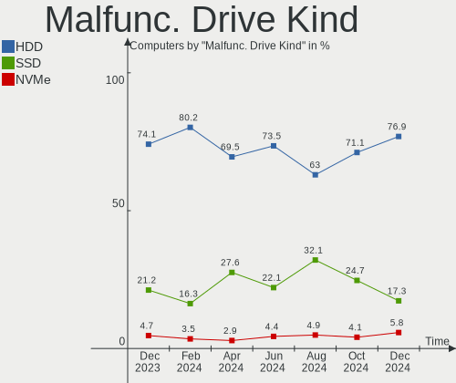

| Kind | Computers | Drives | Percent |
|------|-----------|--------|---------|
| HDD  | 48        | 58     | 73.85%  |
| SSD  | 15        | 16     | 23.08%  |
| NVMe | 2         | 2      | 3.08%   |

Failed Drives
-------------

Failed drive models

Zero info for selected period =(

Failed Drive Vendor
-------------------

Failed drive vendors

Zero info for selected period =(

Drive Status
------------

Number of failed and malfunc. drives

| Status   | Computers | Drives | Percent |
|----------|-----------|--------|---------|
| Works    | 331       | 555    | 66.6%   |
| Detected | 104       | 165    | 20.93%  |
| Malfunc  | 62        | 76     | 12.47%  |

Storage controller
------------------

Storage Vendor
--------------

Storage controller vendors

| Vendor                           | Computers | Percent |
|----------------------------------|-----------|---------|
| Intel                            | 301       | 52.71%  |
| AMD                              | 72        | 12.61%  |
| Samsung Electronics              | 37        | 6.48%   |
| SanDisk                          | 21        | 3.68%   |
| SK hynix                         | 17        | 2.98%   |
| ASMedia Technology               | 16        | 2.8%    |
| Silicon Motion                   | 12        | 2.1%    |
| Kingston Technology Company      | 12        | 2.1%    |
| Phison Electronics               | 11        | 1.93%   |
| JMicron Technology               | 11        | 1.93%   |
| Micron Technology                | 9         | 1.58%   |
| Realtek Semiconductor            | 6         | 1.05%   |
| ADATA Technology                 | 6         | 1.05%   |
| Toshiba America Info Systems     | 5         | 0.88%   |
| Shenzhen Longsys Electronics     | 5         | 0.88%   |
| Nvidia                           | 5         | 0.88%   |
| Adaptec                          | 4         | 0.7%    |
| KIOXIA                           | 3         | 0.53%   |
| Netac Technology                 | 2         | 0.35%   |
| Micron/Crucial Technology        | 2         | 0.35%   |
| VIA Technologies                 | 1         | 0.18%   |
| Union Memory (Shenzhen)          | 1         | 0.18%   |
| Toshiba                          | 1         | 0.18%   |
| Solid State Storage Technology   | 1         | 0.18%   |
| Silicon Integrated Systems [SiS] | 1         | 0.18%   |
| Shenzhen Shichuangyi Electronics | 1         | 0.18%   |
| O2 Micro                         | 1         | 0.18%   |
| MAXIO Technology (Hangzhou)      | 1         | 0.18%   |
| Marvell Technology Group         | 1         | 0.18%   |
| Lite-On Technology               | 1         | 0.18%   |
| Jiangsu Huacun Elec.             | 1         | 0.18%   |
| INNOGRIT                         | 1         | 0.18%   |
| Hewlett-Packard                  | 1         | 0.18%   |
| Broadcom / LSI                   | 1         | 0.18%   |

Storage Model
-------------

Storage controller models

| Model                                                                          | Computers | Percent |
|--------------------------------------------------------------------------------|-----------|---------|
| AMD FCH SATA Controller [AHCI mode]                                            | 48        | 7.41%   |
| Intel Comet Lake SATA AHCI Controller                                          | 31        | 4.78%   |
| Intel 8 Series/C220 Series Chipset Family 6-port SATA Controller 1 [AHCI mode] | 27        | 4.17%   |
| Intel 7 Series Chipset Family 6-port SATA Controller [AHCI mode]               | 17        | 2.62%   |
| Samsung NVMe SSD Controller PM9A1/PM9A3/980PRO                                 | 16        | 2.47%   |
| ASMedia ASM1062 Serial ATA Controller                                          | 14        | 2.16%   |
| Samsung NVMe SSD Controller SM981/PM981/PM983                                  | 13        | 2.01%   |
| Intel Volume Management Device NVMe RAID Controller                            | 10        | 1.54%   |
| Intel Sunrise Point-LP SATA Controller [AHCI mode]                             | 10        | 1.54%   |
| Intel 6 Series/C200 Series Chipset Family 6 port Mobile SATA AHCI Controller   | 10        | 1.54%   |
| SK hynix Gold P31/BC711/PC711 NVMe Solid State Drive                           | 9         | 1.39%   |
| Intel Q170/Q150/B150/H170/H110/Z170/CM236 Chipset SATA Controller [AHCI Mode]  | 9         | 1.39%   |
| Intel Cannon Lake PCH SATA AHCI Controller                                     | 9         | 1.39%   |
| Intel 6 Series/C200 Series Chipset Family 6 port Desktop SATA AHCI Controller  | 9         | 1.39%   |
| AMD 400 Series Chipset SATA Controller                                         | 9         | 1.39%   |
| SanDisk WD Black SN750 / PC SN730 NVMe SSD                                     | 8         | 1.23%   |
| Intel Tiger Lake-LP SATA Controller                                            | 8         | 1.23%   |
| Intel 82801G (ICH7 Family) IDE Controller                                      | 8         | 1.23%   |
| Intel 8 Series SATA Controller 1 [AHCI mode]                                   | 8         | 1.23%   |
| Intel 500 Series Chipset Family SATA AHCI Controller                           | 8         | 1.23%   |
| Intel 5 Series/3400 Series Chipset 4 port SATA AHCI Controller                 | 8         | 1.23%   |
| Intel SSD 670p Series [Keystone Harbor]                                        | 7         | 1.08%   |
| Intel NM10/ICH7 Family SATA Controller [IDE mode]                              | 7         | 1.08%   |
| Intel 82801 Mobile SATA Controller [RAID mode]                                 | 7         | 1.08%   |
| Intel 7 Series/C210 Series Chipset Family 6-port SATA Controller [AHCI mode]   | 7         | 1.08%   |
| AMD 300 Series Chipset SATA Controller                                         | 7         | 1.08%   |
| Silicon Motion SM2263EN/SM2263XT (DRAM-less) NVMe SSD Controllers              | 6         | 0.93%   |
| Phison PS5013 E13 NVMe Controller                                              | 6         | 0.93%   |
| JMicron JMB363 SATA/IDE Controller                                             | 6         | 0.93%   |
| Intel Jasper Lake SATA AHCI Controller                                         | 6         | 0.93%   |
| Intel Celeron/Pentium Silver Processor SATA Controller                         | 6         | 0.93%   |
| Silicon Motion Non-Volatile memory controller                                  | 5         | 0.77%   |
| Intel Ice Lake-LP SATA Controller [AHCI mode]                                  | 5         | 0.77%   |
| Intel Celeron N3350/Pentium N4200/Atom E3900 Series SATA AHCI Controller       | 5         | 0.77%   |
| Intel C620 Series Chipset Family SSATA Controller [AHCI mode]                  | 5         | 0.77%   |
| Intel C620 Series Chipset Family SATA Controller [AHCI mode]                   | 5         | 0.77%   |
| Intel C610/X99 series chipset 6-Port SATA Controller [AHCI mode]               | 5         | 0.77%   |
| Intel 82801JI (ICH10 Family) 2 port SATA IDE Controller #2                     | 5         | 0.77%   |
| Intel 5 Series/3400 Series Chipset 6 port SATA AHCI Controller                 | 5         | 0.77%   |
| Intel 200 Series PCH SATA controller [AHCI mode]                               | 5         | 0.77%   |

Storage Kind
------------

Kind of storage controller (IDE, SATA, NVMe, SAS, ...)

| Kind | Computers | Percent |
|------|-----------|---------|
| SATA | 326       | 58.21%  |
| NVMe | 159       | 28.39%  |
| IDE  | 49        | 8.75%   |
| RAID | 24        | 4.29%   |
| SAS  | 2         | 0.36%   |

Processor
---------

CPU Vendor
----------

Processor vendors

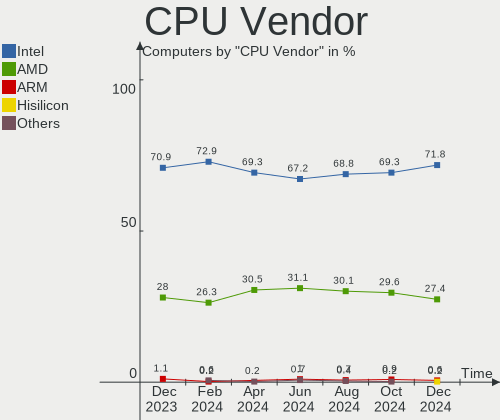

| Vendor  | Computers | Percent |
|---------|-----------|---------|
| Intel   | 326       | 73.42%  |
| AMD     | 112       | 25.23%  |
| ARM     | 5         | 1.13%   |
| Unknown | 1         | 0.23%   |

CPU Model
---------

Processor models

| Model                                         | Computers | Percent |
|-----------------------------------------------|-----------|---------|
| Intel Core i7-10700 CPU @ 2.90GHz             | 21        | 4.73%   |
| Intel Core i3-4130 CPU @ 3.40GHz              | 11        | 2.48%   |
| AMD Ryzen 3 2200G with Radeon Vega Graphics   | 10        | 2.25%   |
| Intel 11th Gen Core i5-1135G7 @ 2.40GHz       | 8         | 1.8%    |
| AMD Ryzen 5 5600H with Radeon Graphics        | 6         | 1.35%   |
| Intel Core i5-10210U CPU @ 1.60GHz            | 5         | 1.13%   |
| AMD Ryzen 7 6800H with Radeon Graphics        | 5         | 1.13%   |
| AMD Ryzen 7 5800H with Radeon Graphics        | 5         | 1.13%   |
| Intel Xeon Silver 4310 CPU @ 2.10GHz          | 4         | 0.9%    |
| Intel Xeon CPU E5-2680 v4 @ 2.40GHz           | 4         | 0.9%    |
| Intel Core i5-7200U CPU @ 2.50GHz             | 4         | 0.9%    |
| Intel Core i5-1035G1 CPU @ 1.00GHz            | 4         | 0.9%    |
| Intel Core i3-10110U CPU @ 2.10GHz            | 4         | 0.9%    |
| Intel 11th Gen Core i7-1165G7 @ 2.80GHz       | 4         | 0.9%    |
| Intel 11th Gen Core i3-1115G4 @ 3.00GHz       | 4         | 0.9%    |
| Intel Pentium CPU G4560 @ 3.50GHz             | 3         | 0.68%   |
| Intel Pentium CPU G4400 @ 3.30GHz             | 3         | 0.68%   |
| Intel Core i7-4790K CPU @ 4.00GHz             | 3         | 0.68%   |
| Intel Core i5 CPU 650 @ 3.20GHz               | 3         | 0.68%   |
| Intel Core i3-8100 CPU @ 3.60GHz              | 3         | 0.68%   |
| Intel Core i3-1005G1 CPU @ 1.20GHz            | 3         | 0.68%   |
| Intel Celeron N5100 @ 1.10GHz                 | 3         | 0.68%   |
| Intel 12th Gen Core i7-1260P                  | 3         | 0.68%   |
| Intel 12th Gen Core i5-12500H                 | 3         | 0.68%   |
| Intel 11th Gen Core i7-11800H @ 2.30GHz       | 3         | 0.68%   |
| ARM Processor                                 | 3         | 0.68%   |
| AMD Ryzen 7 5700U with Radeon Graphics        | 3         | 0.68%   |
| AMD Ryzen 5 5500U with Radeon Graphics        | 3         | 0.68%   |
| AMD Ryzen 5 3500U with Radeon Vega Mobile Gfx | 3         | 0.68%   |
| AMD Custom APU 0405                           | 3         | 0.68%   |
| Intel Xeon CPU E5520 @ 2.27GHz                | 2         | 0.45%   |
| Intel Xeon CPU E5-2670 v2 @ 2.50GHz           | 2         | 0.45%   |
| Intel Xeon CPU E5-2420 0 @ 1.90GHz            | 2         | 0.45%   |
| Intel Xeon CPU E3-1240 V2 @ 3.40GHz           | 2         | 0.45%   |
| Intel Pentium Silver N6000 @ 1.10GHz          | 2         | 0.45%   |
| Intel Pentium CPU 2127U @ 1.90GHz             | 2         | 0.45%   |
| Intel Core i7-9750H CPU @ 2.60GHz             | 2         | 0.45%   |
| Intel Core i7-9700 CPU @ 3.00GHz              | 2         | 0.45%   |
| Intel Core i7-8565U CPU @ 1.80GHz             | 2         | 0.45%   |
| Intel Core i7-7700HQ CPU @ 2.80GHz            | 2         | 0.45%   |

CPU Model Family
----------------

Processor model prefix

| Model                   | Computers | Percent |
|-------------------------|-----------|---------|
| Intel Core i5           | 63        | 14.19%  |
| Other                   | 54        | 12.16%  |
| Intel Core i7           | 54        | 12.16%  |
| Intel Core i3           | 52        | 11.71%  |
| Intel Celeron           | 27        | 6.08%   |
| AMD Ryzen 7             | 27        | 6.08%   |
| Intel Xeon              | 26        | 5.86%   |
| AMD Ryzen 5             | 25        | 5.63%   |
| Intel Pentium           | 19        | 4.28%   |
| AMD Ryzen 3             | 13        | 2.93%   |
| Intel Core 2 Duo        | 11        | 2.48%   |
| AMD Ryzen 9             | 7         | 1.58%   |
| Intel Core 2 Quad       | 5         | 1.13%   |
| Intel Xeon Silver       | 4         | 0.9%    |
| Intel Atom              | 4         | 0.9%    |
| AMD Athlon              | 4         | 0.9%    |
| Intel Pentium Dual-Core | 3         | 0.68%   |
| Intel Core 2            | 3         | 0.68%   |
| AMD Phenom II X6        | 3         | 0.68%   |
| Intel Pentium Silver    | 2         | 0.45%   |
| Intel Pentium Gold      | 2         | 0.45%   |
| Intel Genuine           | 2         | 0.45%   |
| Intel Core i9           | 2         | 0.45%   |
| AMD Ryzen 7 PRO         | 2         | 0.45%   |
| AMD Ryzen 5 PRO         | 2         | 0.45%   |
| AMD FX                  | 2         | 0.45%   |
| AMD EPYC                | 2         | 0.45%   |
| AMD Athlon 64 X2        | 2         | 0.45%   |
| AMD Athlon 64           | 2         | 0.45%   |
| AMD A8                  | 2         | 0.45%   |
| AMD A6                  | 2         | 0.45%   |
| AMD A4                  | 2         | 0.45%   |
| AMD A10                 | 2         | 0.45%   |
| Intel Xeon Gold         | 1         | 0.23%   |
| Intel Pentium D         | 1         | 0.23%   |
| ARM BCM                 | 1         | 0.23%   |
| AMD Turion 64 X2 Mobile | 1         | 0.23%   |
| AMD Phenom              | 1         | 0.23%   |
| AMD E1                  | 1         | 0.23%   |
| AMD E                   | 1         | 0.23%   |

CPU Cores
---------

Number of processor cores

| Number | Computers | Percent |
|--------|-----------|---------|
| 2      | 150       | 33.78%  |
| 4      | 142       | 31.98%  |
| 8      | 63        | 14.19%  |
| 6      | 46        | 10.36%  |
| 12     | 17        | 3.83%   |
| 1      | 8         | 1.8%    |
| 10     | 5         | 1.13%   |
| 28     | 4         | 0.9%    |
| 24     | 3         | 0.68%   |
| 14     | 3         | 0.68%   |
| 64     | 1         | 0.23%   |
| 48     | 1         | 0.23%   |
| 16     | 1         | 0.23%   |

CPU Sockets
-----------

Number of sockets

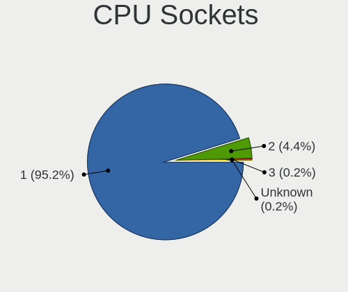

| Number | Computers | Percent |
|--------|-----------|---------|
| 1      | 436       | 98.2%   |
| 2      | 8         | 1.8%    |

CPU Threads
-----------

Threads per core (Hyper-Threading)

| Number | Computers | Percent |
|--------|-----------|---------|
| 2      | 301       | 67.79%  |
| 1      | 143       | 32.21%  |

CPU Op-Modes
------------

CPU Operation Modes (32-bit, 64-bit)

| Op mode        | Computers | Percent |
|----------------|-----------|---------|
| 32-bit, 64-bit | 438       | 98.65%  |
| Unknown        | 3         | 0.68%   |
| 32-bit         | 2         | 0.45%   |
| 64-bit         | 1         | 0.23%   |

CPU Microcode
-------------

Microcode number

| Number     | Computers | Percent |
|------------|-----------|---------|
| Unknown    | 117       | 26.35%  |
| 0x306c3    | 26        | 5.86%   |
| 0xa0655    | 22        | 4.95%   |
| 0x306a9    | 21        | 4.73%   |
| 0x206a7    | 16        | 3.6%    |
| 0x806c1    | 14        | 3.15%   |
| 0x1067a    | 9         | 2.03%   |
| 0x0a50000c | 9         | 2.03%   |
| 0x706e5    | 8         | 1.8%    |
| 0x20655    | 8         | 1.8%    |
| 0x08101016 | 8         | 1.8%    |
| 0x906c0    | 6         | 1.35%   |
| 0x0a50000d | 6         | 1.35%   |
| 0x08608103 | 6         | 1.35%   |
| 0x08108109 | 6         | 1.35%   |
| 0x906ea    | 5         | 1.13%   |
| 0x506e3    | 5         | 1.13%   |
| 0x40651    | 5         | 1.13%   |
| 0x0a404102 | 5         | 1.13%   |
| 0x906eb    | 4         | 0.9%    |
| 0x806ea    | 4         | 0.9%    |
| 0x806e9    | 4         | 0.9%    |
| 0x6fb      | 4         | 0.9%    |
| 0x606a6    | 4         | 0.9%    |
| 0x406f1    | 4         | 0.9%    |
| 0x406c4    | 4         | 0.9%    |
| 0x206d7    | 4         | 0.9%    |
| 0x0810100b | 4         | 0.9%    |
| 0x0800820d | 4         | 0.9%    |
| 0x06001119 | 4         | 0.9%    |
| 0xa0653    | 3         | 0.68%   |
| 0x906ed    | 3         | 0.68%   |
| 0x906e9    | 3         | 0.68%   |
| 0x806ec    | 3         | 0.68%   |
| 0x706a1    | 3         | 0.68%   |
| 0x6fd      | 3         | 0.68%   |
| 0x106e5    | 3         | 0.68%   |
| 0x0a601203 | 3         | 0.68%   |
| 0x0a404101 | 3         | 0.68%   |
| 0x08600106 | 3         | 0.68%   |

CPU Microarch
-------------

Microarchitecture

| Name             | Computers | Percent |
|------------------|-----------|---------|
| KabyLake         | 46        | 10.36%  |
| Haswell          | 43        | 9.68%   |
| Unknown          | 33        | 7.43%   |
| CometLake        | 32        | 7.21%   |
| IvyBridge        | 30        | 6.76%   |
| Zen 3            | 25        | 5.63%   |
| SandyBridge      | 25        | 5.63%   |
| TigerLake        | 22        | 4.95%   |
| Icelake          | 16        | 3.6%    |
| Alderlake Hybrid | 14        | 3.15%   |
| Zen+             | 13        | 2.93%   |
| Zen 2            | 13        | 2.93%   |
| Penryn           | 13        | 2.93%   |
| Zen              | 12        | 2.7%    |
| Westmere         | 11        | 2.48%   |
| Core             | 11        | 2.48%   |
| Tremont          | 10        | 2.25%   |
| Skylake          | 10        | 2.25%   |
| Silvermont       | 8         | 1.8%    |
| Piledriver       | 7         | 1.58%   |
| Nehalem          | 7         | 1.58%   |
| Broadwell        | 7         | 1.58%   |
| K10              | 6         | 1.35%   |
| Goldmont plus    | 6         | 1.35%   |
| K8 Hammer        | 5         | 1.13%   |
| Goldmont         | 5         | 1.13%   |
| Excavator        | 4         | 0.9%    |
| Bonnell          | 2         | 0.45%   |
| Bobcat           | 2         | 0.45%   |
| Steamroller      | 1         | 0.23%   |
| Puma             | 1         | 0.23%   |
| P6               | 1         | 0.23%   |
| NetBurst         | 1         | 0.23%   |
| Jaguar           | 1         | 0.23%   |
| Gracemont        | 1         | 0.23%   |

Graphics
--------

GPU Vendor
----------

Vendors of graphics cards

| Vendor                                       | Computers | Percent |
|----------------------------------------------|-----------|---------|
| Intel                                        | 219       | 41.71%  |
| Nvidia                                       | 160       | 30.48%  |
| AMD                                          | 127       | 24.19%  |
| ASPEED Technology                            | 13        | 2.48%   |
| Matrox Electronics Systems                   | 5         | 0.95%   |
| XGI Technology (eXtreme Graphics Innovation) | 1         | 0.19%   |

GPU Model
---------

Graphics card models

| Model                                                                                    | Computers | Percent |
|------------------------------------------------------------------------------------------|-----------|---------|
| Nvidia TU106 [GeForce RTX 2060 Rev. A]                                                   | 21        | 3.9%    |
| Intel TigerLake-LP GT2 [Iris Xe Graphics]                                                | 17        | 3.16%   |
| Intel 3rd Gen Core processor Graphics Controller                                         | 17        | 3.16%   |
| AMD Cezanne [Radeon Vega Series / Radeon Vega Mobile Series]                             | 17        | 3.16%   |
| Intel 2nd Generation Core Processor Family Integrated Graphics Controller                | 16        | 2.97%   |
| ASPEED Technology ASPEED Graphics Family                                                 | 13        | 2.42%   |
| Nvidia GF108 [GeForce GT 730]                                                            | 12        | 2.23%   |
| Intel 4th Generation Core Processor Family Integrated Graphics Controller                | 12        | 2.23%   |
| AMD Raven Ridge [Radeon Vega Series / Radeon Vega Mobile Series]                         | 12        | 2.23%   |
| Intel Xeon E3-1200 v3/4th Gen Core Processor Integrated Graphics Controller              | 9         | 1.67%   |
| Intel Haswell-ULT Integrated Graphics Controller                                         | 9         | 1.67%   |
| Intel Core Processor Integrated Graphics Controller                                      | 9         | 1.67%   |
| Intel CometLake-U GT2 [UHD Graphics]                                                     | 9         | 1.67%   |
| AMD Rembrandt [Radeon 680M]                                                              | 9         | 1.67%   |
| AMD Ellesmere [Radeon RX 470/480/570/570X/580/580X/590]                                  | 9         | 1.67%   |
| Intel JasperLake [UHD Graphics]                                                          | 8         | 1.49%   |
| AMD Picasso/Raven 2 [Radeon Vega Series / Radeon Vega Mobile Series]                     | 8         | 1.49%   |
| Nvidia GA107M [GeForce RTX 3050 Mobile]                                                  | 7         | 1.3%    |
| Intel Iris Plus Graphics G1 (Ice Lake)                                                   | 7         | 1.3%    |
| Intel Alder Lake-P Integrated Graphics Controller                                        | 7         | 1.3%    |
| AMD Renoir                                                                               | 7         | 1.3%    |
| Nvidia GF117M [GeForce 610M/710M/810M/820M / GT 620M/625M/630M/720M]                     | 6         | 1.12%   |
| Nvidia GA107M [GeForce RTX 3050 Ti Mobile]                                               | 6         | 1.12%   |
| Intel GeminiLake [UHD Graphics 600]                                                      | 6         | 1.12%   |
| Intel CoffeeLake-S GT2 [UHD Graphics 630]                                                | 6         | 1.12%   |
| AMD Lucienne                                                                             | 6         | 1.12%   |
| Nvidia GP107 [GeForce GTX 1050 Ti]                                                       | 5         | 0.93%   |
| Intel UHD Graphics 620                                                                   | 5         | 0.93%   |
| Intel Tiger Lake-LP GT2 [UHD Graphics G4]                                                | 5         | 0.93%   |
| Intel HD Graphics 620                                                                    | 5         | 0.93%   |
| Intel HD Graphics 500                                                                    | 5         | 0.93%   |
| Intel CoffeeLake-H GT2 [UHD Graphics 630]                                                | 5         | 0.93%   |
| Intel Atom/Celeron/Pentium Processor x5-E8000/J3xxx/N3xxx Integrated Graphics Controller | 5         | 0.93%   |
| AMD Topaz XT [Radeon R7 M260/M265 / M340/M360 / M440/M445 / 530/535 / 620/625 Mobile]    | 5         | 0.93%   |
| Nvidia TU117M [GeForce GTX 1650 Mobile / Max-Q]                                          | 4         | 0.74%   |
| Intel TigerLake-H GT1 [UHD Graphics]                                                     | 4         | 0.74%   |
| AMD Lexa PRO [Radeon 540/540X/550/550X / RX 540X/550/550X]                               | 4         | 0.74%   |
| Nvidia GP107 [GeForce GTX 1050]                                                          | 3         | 0.56%   |
| Nvidia GM204 [GeForce GTX 980]                                                           | 3         | 0.56%   |
| Nvidia GF108M [GeForce GT 620M/630M/635M/640M LE]                                        | 3         | 0.56%   |

GPU Combo
---------

Combinations of graphics cards

| Name            | Computers | Percent |
|-----------------|-----------|---------|
| 1 x Intel       | 149       | 33.56%  |
| 1 x AMD         | 95        | 21.4%   |
| 1 x Nvidia      | 87        | 19.59%  |
| Intel + Nvidia  | 58        | 13.06%  |
| AMD + Nvidia    | 12        | 2.7%    |
| Intel + AMD     | 10        | 2.25%   |
| 1 x ASPEED      | 10        | 2.25%   |
| 2 x AMD         | 9         | 2.03%   |
| Other           | 5         | 1.13%   |
| 1 x Matrox      | 4         | 0.9%    |
| Nvidia + ASPEED | 2         | 0.45%   |
| 1 x XGI         | 1         | 0.23%   |
| Nvidia + Matrox | 1         | 0.23%   |
| AMD + ASPEED    | 1         | 0.23%   |

GPU Driver
----------

Free vs proprietary

| Driver      | Computers | Percent |
|-------------|-----------|---------|
| Free        | 316       | 71.17%  |
| Proprietary | 71        | 15.99%  |
| Unknown     | 57        | 12.84%  |

GPU Memory
----------

Total video memory

| Size in GB | Computers | Percent |
|------------|-----------|---------|
| Unknown    | 259       | 58.33%  |
| 0.01-0.5   | 56        | 12.61%  |
| 1.01-2.0   | 48        | 10.81%  |
| 0.51-1.0   | 29        | 6.53%   |
| 3.01-4.0   | 22        | 4.95%   |
| 7.01-8.0   | 13        | 2.93%   |
| 8.01-16.0  | 9         | 2.03%   |
| 5.01-6.0   | 6         | 1.35%   |
| 2.01-3.0   | 1         | 0.23%   |
| 16.01-24.0 | 1         | 0.23%   |

Monitor
-------

Monitor Vendor
--------------

Monitor vendors

| Vendor                  | Computers | Percent |
|-------------------------|-----------|---------|
| Samsung Electronics     | 52        | 12.32%  |
| AU Optronics            | 46        | 10.9%   |
| BOE                     | 44        | 10.43%  |
| Chimei Innolux          | 36        | 8.53%   |
| LG Display              | 27        | 6.4%    |
| Goldstar                | 23        | 5.45%   |
| Acer                    | 18        | 4.27%   |
| BenQ                    | 14        | 3.32%   |
| AOC                     | 14        | 3.32%   |
| Philips                 | 13        | 3.08%   |
| Dell                    | 13        | 3.08%   |
| Packard Bell            | 11        | 2.61%   |
| PKB                     | 9         | 2.13%   |
| Chi Mei Optoelectronics | 9         | 2.13%   |
| ViewSonic               | 8         | 1.9%    |
| PANDA                   | 7         | 1.66%   |
| Hewlett-Packard         | 7         | 1.66%   |
| Ancor Communications    | 7         | 1.66%   |
| ASUSTek Computer        | 5         | 1.18%   |
| TMX                     | 4         | 0.95%   |
| CSO                     | 4         | 0.95%   |
| Valve                   | 3         | 0.71%   |
| NEC Computers           | 3         | 0.71%   |
| Mi                      | 3         | 0.71%   |
| Lenovo                  | 3         | 0.71%   |
| HUAWEI                  | 3         | 0.71%   |
| Apple                   | 3         | 0.71%   |
| Unknown                 | 2         | 0.47%   |
| Sharp                   | 2         | 0.47%   |
| Panasonic               | 2         | 0.47%   |
| MSI                     | 2         | 0.47%   |
| Iiyama                  | 2         | 0.47%   |
| CHR                     | 2         | 0.47%   |
| VSD                     | 1         | 0.24%   |
| Sony                    | 1         | 0.24%   |
| RGT                     | 1         | 0.24%   |
| PNP                     | 1         | 0.24%   |
| Plain Tree Systems      | 1         | 0.24%   |
| MStar                   | 1         | 0.24%   |
| LG Philips              | 1         | 0.24%   |

Monitor Model
-------------

Monitor models

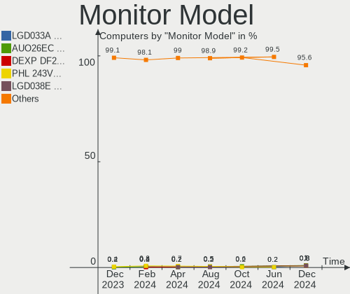

| Model                                                                    | Computers | Percent |
|--------------------------------------------------------------------------|-----------|---------|
| PKB LCD Monitor Viseo223DX 1920x1080                                     | 9         | 2.09%   |
| Packard Bell Viseo223DX PKB0385 1920x1080 477x268mm 21.5-inch            | 9         | 2.09%   |
| BOE LCD Monitor BOE0872 1920x1080 344x194mm 15.5-inch                    | 8         | 1.86%   |
| Chimei Innolux LCD Monitor CMN1521 1920x1080 344x193mm 15.5-inch         | 4         | 0.93%   |
| AU Optronics LCD Monitor AUO21EC 1366x768 344x193mm 15.5-inch            | 4         | 0.93%   |
| Valve ANX7530 U VLV3001 800x1280 100x150mm 7.1-inch                      | 3         | 0.7%    |
| Samsung Electronics LCD Monitor SDC4161 1920x1080 344x194mm 15.5-inch    | 3         | 0.7%    |
| Chimei Innolux LCD Monitor CMN15E8 1920x1080 344x193mm 15.5-inch         | 3         | 0.7%    |
| Chimei Innolux LCD Monitor CMN14D4 1920x1080 309x173mm 13.9-inch         | 3         | 0.7%    |
| BOE LCD Monitor BOE0877 1920x1080 309x173mm 13.9-inch                    | 3         | 0.7%    |
| BOE LCD Monitor BOE0700 1920x1080 344x194mm 15.5-inch                    | 3         | 0.7%    |
| BenQ GW2270 BNQ78DB 1920x1080 476x268mm 21.5-inch                        | 3         | 0.7%    |
| AU Optronics LCD Monitor AUO61ED 1920x1080 344x193mm 15.5-inch           | 3         | 0.7%    |
| TMX TL140VDXP04-0 TMX1398 1920x1080 309x174mm 14.0-inch                  | 2         | 0.46%   |
| Samsung Electronics SyncMaster SAM011E 1280x1024 338x270mm 17.0-inch     | 2         | 0.46%   |
| Samsung Electronics S24R35x SAM100E 1920x1080 527x296mm 23.8-inch        | 2         | 0.46%   |
| Samsung Electronics LCD Monitor SEC3245 1366x768 344x194mm 15.5-inch     | 2         | 0.46%   |
| Philips PHL 243V7 PHLC155 1920x1080 530x300mm 24.0-inch                  | 2         | 0.46%   |
| Philips PHL 237E7 PHLC101 1920x1080 510x290mm 23.1-inch                  | 2         | 0.46%   |
| PANDA LCD Monitor NCP0040 1920x1080 344x194mm 15.5-inch                  | 2         | 0.46%   |
| PANDA LCD Monitor NCP002D 1920x1080 344x194mm 15.5-inch                  | 2         | 0.46%   |
| Packard Bell Viseo243D PKB0386 1920x1080 531x299mm 24.0-inch             | 2         | 0.46%   |
| LG Display LCD Monitor LGD05E5 1920x1080 344x194mm 15.5-inch             | 2         | 0.46%   |
| LG Display LCD Monitor LGD027A 1600x900 382x215mm 17.3-inch              | 2         | 0.46%   |
| HUAWEI AD80HW HWV2402 1920x1080 530x300mm 24.0-inch                      | 2         | 0.46%   |
| Goldstar FULL HD GSM5B55 1920x1080 480x270mm 21.7-inch                   | 2         | 0.46%   |
| CHR CH7511B CHR7511 1024x768 430x290mm 20.4-inch                         | 2         | 0.46%   |
| Chimei Innolux LCD Monitor CMN15E7 1920x1080 344x193mm 15.5-inch         | 2         | 0.46%   |
| Chimei Innolux LCD Monitor CMN1132 1366x768 256x144mm 11.6-inch          | 2         | 0.46%   |
| Chi Mei Optoelectronics LCD Monitor CMO15A3 1366x768 344x193mm 15.5-inch | 2         | 0.46%   |
| BOE LCD Monitor BOE0AC9 2240x1400 302x189mm 14.0-inch                    | 2         | 0.46%   |
| BOE LCD Monitor BOE0878 1920x1080 355x200mm 16.0-inch                    | 2         | 0.46%   |
| AU Optronics LCD Monitor AUOAF90 1920x1080 344x193mm 15.5-inch           | 2         | 0.46%   |
| AU Optronics LCD Monitor AUO38ED 1920x1080 344x193mm 15.5-inch           | 2         | 0.46%   |
| AU Optronics LCD Monitor AUO22EC 1366x768 344x193mm 15.5-inch            | 2         | 0.46%   |
| AU Optronics LCD Monitor AUO203D 1920x1080 309x174mm 14.0-inch           | 2         | 0.46%   |
| AU Optronics LCD Monitor AUO123D 1920x1080 309x173mm 13.9-inch           | 2         | 0.46%   |
| ASUSTek Computer VG289 AUS28BA 3840x2160 620x340mm 27.8-inch             | 2         | 0.46%   |
| AOC 24P1W1 AOC2401 1920x1080 527x296mm 23.8-inch                         | 2         | 0.46%   |
| AOC 22B2WG5 AOC2202 1920x1080 477x268mm 21.5-inch                        | 2         | 0.46%   |

Monitor Resolution
------------------

Monitor screen resolution

| Resolution         | Computers | Percent |
|--------------------|-----------|---------|
| 1920x1080 (FHD)    | 206       | 52.02%  |
| 1366x768 (WXGA)    | 45        | 11.36%  |
| 2560x1440 (QHD)    | 24        | 6.06%   |
| 3840x2160 (4K)     | 20        | 5.05%   |
| 1600x900 (HD+)     | 16        | 4.04%   |
| 1280x1024 (SXGA)   | 14        | 3.54%   |
| 1920x1200 (WUXGA)  | 11        | 2.78%   |
| 1440x900 (WXGA+)   | 9         | 2.27%   |
| 2560x1600          | 8         | 2.02%   |
| 2560x1080          | 6         | 1.52%   |
| 1280x800 (WXGA)    | 5         | 1.26%   |
| 1680x1050 (WSXGA+) | 4         | 1.01%   |
| 800x1280           | 3         | 0.76%   |
| 2880x1800          | 3         | 0.76%   |
| 1024x600           | 3         | 0.76%   |
| 3440x1440          | 2         | 0.51%   |
| 2240x1400          | 2         | 0.51%   |
| 1600x1200          | 2         | 0.51%   |
| Unknown            | 2         | 0.51%   |
| 4480x1440          | 1         | 0.25%   |
| 3840x1600          | 1         | 0.25%   |
| 3840x1080          | 1         | 0.25%   |
| 3200x2000          | 1         | 0.25%   |
| 2880x1920          | 1         | 0.25%   |
| 2880x1620          | 1         | 0.25%   |
| 2520x1680          | 1         | 0.25%   |
| 2288x1287          | 1         | 0.25%   |
| 1920x540           | 1         | 0.25%   |
| 1152x864           | 1         | 0.25%   |
| 1024x768 (XGA)     | 1         | 0.25%   |

Monitor Diagonal
----------------

Diagonal size in inches

| Inches  | Computers | Percent |
|---------|-----------|---------|
| 15      | 107       | 25.42%  |
| 21      | 44        | 10.45%  |
| 24      | 37        | 8.79%   |
| 17      | 33        | 7.84%   |
| 13      | 31        | 7.36%   |
| 27      | 27        | 6.41%   |
| 14      | 26        | 6.18%   |
| 23      | 25        | 5.94%   |
| Unknown | 15        | 3.56%   |
| 19      | 9         | 2.14%   |
| 16      | 9         | 2.14%   |
| 31      | 7         | 1.66%   |
| 34      | 6         | 1.43%   |
| 20      | 5         | 1.19%   |
| 18      | 5         | 1.19%   |
| 11      | 5         | 1.19%   |
| 22      | 4         | 0.95%   |
| 26      | 3         | 0.71%   |
| 10      | 3         | 0.71%   |
| 7       | 3         | 0.71%   |
| 54      | 2         | 0.48%   |
| 28      | 2         | 0.48%   |
| 12      | 2         | 0.48%   |
| 142     | 1         | 0.24%   |
| 84      | 1         | 0.24%   |
| 72      | 1         | 0.24%   |
| 49      | 1         | 0.24%   |
| 43      | 1         | 0.24%   |
| 40      | 1         | 0.24%   |
| 36      | 1         | 0.24%   |
| 35      | 1         | 0.24%   |
| 33      | 1         | 0.24%   |
| 32      | 1         | 0.24%   |
| 29      | 1         | 0.24%   |

Monitor Width
-------------

Physical width

| Width in mm    | Computers | Percent |
|----------------|-----------|---------|
| 301-350        | 163       | 39.47%  |
| 501-600        | 81        | 19.61%  |
| 401-500        | 63        | 15.25%  |
| 351-400        | 32        | 7.75%   |
| 201-300        | 23        | 5.57%   |
| 601-700        | 15        | 3.63%   |
| Unknown        | 15        | 3.63%   |
| 701-800        | 9         | 2.18%   |
| 1001-1500      | 3         | 0.73%   |
| 1-100          | 3         | 0.73%   |
| 801-900        | 2         | 0.48%   |
| 1501-2000      | 2         | 0.48%   |
| More than 2000 | 1         | 0.24%   |
| 901-1000       | 1         | 0.24%   |

Aspect Ratio
------------

Proportional relationship between the width and the height

| Ratio   | Computers | Percent |
|---------|-----------|---------|
| 16/9    | 289       | 75.06%  |
| 16/10   | 47        | 12.21%  |
| Unknown | 15        | 3.9%    |
| 5/4     | 13        | 3.38%   |
| 21/9    | 8         | 2.08%   |
| 4/3     | 5         | 1.3%    |
| 3/2     | 3         | 0.78%   |
| 0.67    | 3         | 0.78%   |
| 32/9    | 1         | 0.26%   |
| 1.00    | 1         | 0.26%   |

Monitor Area
------------

Area in inch²

| Area in inch² | Computers | Percent |
|----------------|-----------|---------|
| 101-110        | 107       | 25.66%  |
| 201-250        | 80        | 19.18%  |
| 81-90          | 45        | 10.79%  |
| 151-200        | 33        | 7.91%   |
| 301-350        | 29        | 6.95%   |
| 121-130        | 21        | 5.04%   |
| 351-500        | 18        | 4.32%   |
| Unknown        | 15        | 3.6%    |
| 71-80          | 13        | 3.12%   |
| 141-150        | 12        | 2.88%   |
| 251-300        | 11        | 2.64%   |
| 111-120        | 9         | 2.16%   |
| More than 1000 | 5         | 1.2%    |
| 51-60          | 5         | 1.2%    |
| 501-1000       | 4         | 0.96%   |
| 41-50          | 3         | 0.72%   |
| 1-40           | 3         | 0.72%   |
| 131-140        | 3         | 0.72%   |
| 61-70          | 1         | 0.24%   |

Pixel Density
-------------

Pixels per inch

| Density       | Computers | Percent |
|---------------|-----------|---------|
| 121-160       | 121       | 29.51%  |
| 51-100        | 120       | 29.27%  |
| 101-120       | 110       | 26.83%  |
| 161-240       | 32        | 7.8%    |
| Unknown       | 15        | 3.66%   |
| More than 240 | 6         | 1.46%   |
| 1-50          | 6         | 1.46%   |

Multiple Monitors
-----------------

Total monitors connected

| Total | Computers | Percent |
|-------|-----------|---------|
| 1     | 316       | 71.17%  |
| 0     | 73        | 16.44%  |
| 2     | 49        | 11.04%  |
| 3     | 6         | 1.35%   |

Network
-------

Net Controller Vendor
---------------------

Controller vendors

| Vendor                           | Computers | Percent |
|----------------------------------|-----------|---------|
| Realtek Semiconductor            | 287       | 45.99%  |
| Intel                            | 170       | 27.24%  |
| Qualcomm Atheros                 | 58        | 9.29%   |
| MediaTek                         | 19        | 3.04%   |
| Broadcom                         | 19        | 3.04%   |
| Xiaomi                           | 7         | 1.12%   |
| Ralink                           | 7         | 1.12%   |
| Mellanox Technologies            | 7         | 1.12%   |
| TP-Link                          | 6         | 0.96%   |
| Ralink Technology                | 6         | 0.96%   |
| Qualcomm                         | 4         | 0.64%   |
| Broadcom Limited                 | 4         | 0.64%   |
| Marvell Technology Group         | 3         | 0.48%   |
| ASIX Electronics                 | 3         | 0.48%   |
| Qualcomm Atheros Communications  | 2         | 0.32%   |
| Nvidia                           | 2         | 0.32%   |
| Huawei Technologies              | 2         | 0.32%   |
| ASUSTek Computer                 | 2         | 0.32%   |
| ZTE WCDMA Technologies MSM       | 1         | 0.16%   |
| VIA Technologies                 | 1         | 0.16%   |
| U-Blox                           | 1         | 0.16%   |
| Tenda                            | 1         | 0.16%   |
| Tehuti Networks                  | 1         | 0.16%   |
| STMicroelectronics               | 1         | 0.16%   |
| Silicon Integrated Systems [SiS] | 1         | 0.16%   |
| Sierra Wireless                  | 1         | 0.16%   |
| Microsoft                        | 1         | 0.16%   |
| Microchip Technology             | 1         | 0.16%   |
| Micro Star International         | 1         | 0.16%   |
| DisplayLink                      | 1         | 0.16%   |
| Dell                             | 1         | 0.16%   |
| D-Link                           | 1         | 0.16%   |
| Attansic Technology              | 1         | 0.16%   |
| American Megatrends              | 1         | 0.16%   |

Net Controller Model
--------------------

Controller models

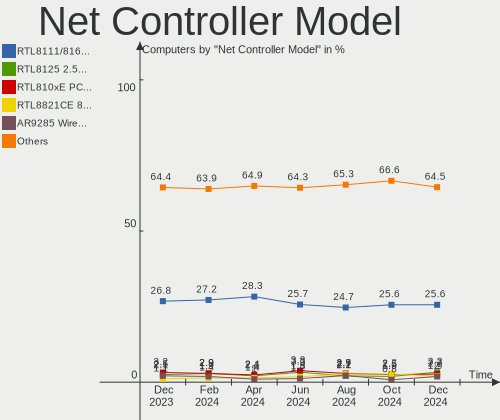

| Model                                                             | Computers | Percent |
|-------------------------------------------------------------------|-----------|---------|
| Realtek RTL8111/8168/8411 PCI Express Gigabit Ethernet Controller | 212       | 30.29%  |
| Intel Wi-Fi 6 AX201                                               | 18        | 2.57%   |
| Realtek RTL8822CE 802.11ac PCIe Wireless Network Adapter          | 16        | 2.29%   |
| Realtek RTL810xE PCI Express Fast Ethernet controller             | 16        | 2.29%   |
| Realtek RTL8821CE 802.11ac PCIe Wireless Network Adapter          | 13        | 1.86%   |
| Realtek RTL8125 2.5GbE Controller                                 | 12        | 1.71%   |
| Qualcomm Atheros AR9285 Wireless Network Adapter (PCI-Express)    | 12        | 1.71%   |
| Qualcomm Atheros AR9485 Wireless Network Adapter                  | 9         | 1.29%   |
| MediaTek MT7921 802.11ax PCI Express Wireless Network Adapter     | 9         | 1.29%   |
| Intel Wi-Fi 6 AX200                                               | 8         | 1.14%   |
| Intel Alder Lake-P PCH CNVi WiFi                                  | 8         | 1.14%   |
| Qualcomm Atheros QCA9377 802.11ac Wireless Network Adapter        | 7         | 1%      |
| Intel Comet Lake PCH-LP CNVi WiFi                                 | 7         | 1%      |
| Xiaomi Mi/Redmi series (RNDIS)                                    | 6         | 0.86%   |
| Qualcomm Atheros QCA9565 / AR9565 Wireless Network Adapter        | 6         | 0.86%   |
| MediaTek MT7922 802.11ax PCI Express Wireless Network Adapter     | 6         | 0.86%   |
| Intel Wireless 7265                                               | 6         | 0.86%   |
| Intel Wireless 3165                                               | 6         | 0.86%   |
| Intel I211 Gigabit Network Connection                             | 6         | 0.86%   |
| Intel Ethernet Controller I225-V                                  | 6         | 0.86%   |
| Intel 82579LM Gigabit Network Connection (Lewisville)             | 6         | 0.86%   |
| Realtek RTL8153 Gigabit Ethernet Adapter                          | 5         | 0.71%   |
| Ralink MT7601U Wireless Adapter                                   | 5         | 0.71%   |
| Intel Wireless-AC 9260                                            | 5         | 0.71%   |
| Intel Wireless 8265 / 8275                                        | 5         | 0.71%   |
| Intel Wireless 7260                                               | 5         | 0.71%   |
| Intel Wi-Fi 6 AX210/AX211/AX411 160MHz                            | 5         | 0.71%   |
| Intel Tiger Lake PCH CNVi WiFi                                    | 5         | 0.71%   |
| Intel I350 Gigabit Network Connection                             | 5         | 0.71%   |
| Broadcom BCM43142 802.11b/g/n                                     | 5         | 0.71%   |
| Realtek RTL8852BE PCIe 802.11ax Wireless Network Controller       | 4         | 0.57%   |
| Realtek RTL-8100/8101L/8139 PCI Fast Ethernet Adapter             | 4         | 0.57%   |
| Qualcomm Atheros AR8151 v2.0 Gigabit Ethernet                     | 4         | 0.57%   |
| Mellanox MT27800 Family [ConnectX-5]                              | 4         | 0.57%   |
| Intel Wi-Fi 6 AX201 160MHz                                        | 4         | 0.57%   |
| Intel PRO/Wireless 3945ABG [Golan] Network Connection             | 4         | 0.57%   |
| Intel Ice Lake-LP PCH CNVi WiFi                                   | 4         | 0.57%   |
| Intel Ethernet Controller 10-Gigabit X540-AT2                     | 4         | 0.57%   |
| Intel Dual Band Wireless-AC 3168NGW [Stone Peak]                  | 4         | 0.57%   |
| Intel Cannon Lake PCH CNVi WiFi                                   | 4         | 0.57%   |

Wireless Vendor
---------------

Wireless vendors

| Vendor                          | Computers | Percent |
|---------------------------------|-----------|---------|
| Intel                           | 124       | 42.03%  |
| Realtek Semiconductor           | 65        | 22.03%  |
| Qualcomm Atheros                | 43        | 14.58%  |
| MediaTek                        | 19        | 6.44%   |
| Broadcom                        | 12        | 4.07%   |
| Ralink                          | 7         | 2.37%   |
| Ralink Technology               | 6         | 2.03%   |
| TP-Link                         | 4         | 1.36%   |
| Qualcomm                        | 3         | 1.02%   |
| Broadcom Limited                | 3         | 1.02%   |
| Qualcomm Atheros Communications | 2         | 0.68%   |
| ASUSTek Computer                | 2         | 0.68%   |
| Xiaomi                          | 1         | 0.34%   |
| Sierra Wireless                 | 1         | 0.34%   |
| Microsoft                       | 1         | 0.34%   |
| Micro Star International        | 1         | 0.34%   |
| D-Link                          | 1         | 0.34%   |

Wireless Model
--------------

Wireless models

| Model                                                                   | Computers | Percent |
|-------------------------------------------------------------------------|-----------|---------|
| Intel Wi-Fi 6 AX201                                                     | 18        | 6.1%    |
| Realtek RTL8822CE 802.11ac PCIe Wireless Network Adapter                | 16        | 5.42%   |
| Realtek RTL8821CE 802.11ac PCIe Wireless Network Adapter                | 13        | 4.41%   |
| Qualcomm Atheros AR9285 Wireless Network Adapter (PCI-Express)          | 12        | 4.07%   |
| Qualcomm Atheros AR9485 Wireless Network Adapter                        | 9         | 3.05%   |
| MediaTek MT7921 802.11ax PCI Express Wireless Network Adapter           | 9         | 3.05%   |
| Intel Wi-Fi 6 AX200                                                     | 8         | 2.71%   |
| Intel Alder Lake-P PCH CNVi WiFi                                        | 8         | 2.71%   |
| Qualcomm Atheros QCA9377 802.11ac Wireless Network Adapter              | 7         | 2.37%   |
| Intel Comet Lake PCH-LP CNVi WiFi                                       | 7         | 2.37%   |
| Qualcomm Atheros QCA9565 / AR9565 Wireless Network Adapter              | 6         | 2.03%   |
| MediaTek MT7922 802.11ax PCI Express Wireless Network Adapter           | 6         | 2.03%   |
| Intel Wireless 7265                                                     | 6         | 2.03%   |
| Intel Wireless 3165                                                     | 6         | 2.03%   |
| Ralink MT7601U Wireless Adapter                                         | 5         | 1.69%   |
| Intel Wireless-AC 9260                                                  | 5         | 1.69%   |
| Intel Wireless 8265 / 8275                                              | 5         | 1.69%   |
| Intel Wireless 7260                                                     | 5         | 1.69%   |
| Intel Wi-Fi 6 AX210/AX211/AX411 160MHz                                  | 5         | 1.69%   |
| Intel Tiger Lake PCH CNVi WiFi                                          | 5         | 1.69%   |
| Broadcom BCM43142 802.11b/g/n                                           | 5         | 1.69%   |
| Realtek RTL8852BE PCIe 802.11ax Wireless Network Controller             | 4         | 1.36%   |
| Intel Wi-Fi 6 AX201 160MHz                                              | 4         | 1.36%   |
| Intel PRO/Wireless 3945ABG [Golan] Network Connection                   | 4         | 1.36%   |
| Intel Ice Lake-LP PCH CNVi WiFi                                         | 4         | 1.36%   |
| Intel Dual Band Wireless-AC 3168NGW [Stone Peak]                        | 4         | 1.36%   |
| Intel Cannon Lake PCH CNVi WiFi                                         | 4         | 1.36%   |
| Realtek RTL8852AE 802.11ax PCIe Wireless Network Adapter                | 3         | 1.02%   |
| Realtek RTL8822BE 802.11a/b/g/n/ac WiFi adapter                         | 3         | 1.02%   |
| Realtek RTL8188EE Wireless Network Adapter                              | 3         | 1.02%   |
| Realtek RTL8188CE 802.11b/g/n WiFi Adapter                              | 3         | 1.02%   |
| Realtek 802.11ac NIC                                                    | 3         | 1.02%   |
| Qualcomm Atheros AR9462 Wireless Network Adapter                        | 3         | 1.02%   |
| Qualcomm Atheros AR242x / AR542x Wireless Network Adapter (PCI-Express) | 3         | 1.02%   |
| MediaTek MT7921K (RZ608) Wi-Fi 6E 80MHz                                 | 3         | 1.02%   |
| Intel Dual Band Wireless-AC 3165 Plus Bluetooth                         | 3         | 1.02%   |
| Intel Centrino Wireless-N 2230                                          | 3         | 1.02%   |
| Intel Centrino Advanced-N 6205 [Taylor Peak]                            | 3         | 1.02%   |
| Broadcom BCM4313 802.11bgn Wireless Network Adapter                     | 3         | 1.02%   |
| Realtek RTL8723DE Wireless Network Adapter                              | 2         | 0.68%   |

Ethernet Vendor
---------------

Ethernet vendors

| Vendor                           | Computers | Percent |
|----------------------------------|-----------|---------|
| Realtek Semiconductor            | 253       | 64.71%  |
| Intel                            | 74        | 18.93%  |
| Qualcomm Atheros                 | 23        | 5.88%   |
| Broadcom                         | 9         | 2.3%    |
| Xiaomi                           | 6         | 1.53%   |
| Mellanox Technologies            | 5         | 1.28%   |
| Marvell Technology Group         | 3         | 0.77%   |
| ASIX Electronics                 | 3         | 0.77%   |
| TP-Link                          | 2         | 0.51%   |
| Nvidia                           | 2         | 0.51%   |
| ZTE WCDMA Technologies MSM       | 1         | 0.26%   |
| VIA Technologies                 | 1         | 0.26%   |
| Tenda                            | 1         | 0.26%   |
| Tehuti Networks                  | 1         | 0.26%   |
| Silicon Integrated Systems [SiS] | 1         | 0.26%   |
| Qualcomm                         | 1         | 0.26%   |
| Microchip Technology             | 1         | 0.26%   |
| DisplayLink                      | 1         | 0.26%   |
| Broadcom Limited                 | 1         | 0.26%   |
| Attansic Technology              | 1         | 0.26%   |
| American Megatrends              | 1         | 0.26%   |

Ethernet Model
--------------

Ethernet models

| Model                                                                 | Computers | Percent |
|-----------------------------------------------------------------------|-----------|---------|
| Realtek RTL8111/8168/8411 PCI Express Gigabit Ethernet Controller     | 212       | 53.27%  |
| Realtek RTL810xE PCI Express Fast Ethernet controller                 | 16        | 4.02%   |
| Realtek RTL8125 2.5GbE Controller                                     | 12        | 3.02%   |
| Xiaomi Mi/Redmi series (RNDIS)                                        | 6         | 1.51%   |
| Intel I211 Gigabit Network Connection                                 | 6         | 1.51%   |
| Intel Ethernet Controller I225-V                                      | 6         | 1.51%   |
| Intel 82579LM Gigabit Network Connection (Lewisville)                 | 6         | 1.51%   |
| Realtek RTL8153 Gigabit Ethernet Adapter                              | 5         | 1.26%   |
| Intel I350 Gigabit Network Connection                                 | 5         | 1.26%   |
| Realtek RTL-8100/8101L/8139 PCI Fast Ethernet Adapter                 | 4         | 1.01%   |
| Qualcomm Atheros AR8151 v2.0 Gigabit Ethernet                         | 4         | 1.01%   |
| Mellanox MT27800 Family [ConnectX-5]                                  | 4         | 1.01%   |
| Intel Ethernet Controller 10-Gigabit X540-AT2                         | 4         | 1.01%   |
| Realtek RTL8152 Fast Ethernet Adapter                                 | 3         | 0.75%   |
| Qualcomm Atheros AR8161 Gigabit Ethernet                              | 3         | 0.75%   |
| Intel I210 Gigabit Network Connection                                 | 3         | 0.75%   |
| Intel Ethernet Connection I217-LM                                     | 3         | 0.75%   |
| Intel Ethernet Connection (7) I219-V                                  | 3         | 0.75%   |
| Intel Ethernet Connection (4) I219-V                                  | 3         | 0.75%   |
| Intel Ethernet Connection (2) I218-V                                  | 3         | 0.75%   |
| Intel Ethernet Connection (14) I219-V                                 | 3         | 0.75%   |
| Broadcom BCM4401-B0 100Base-TX                                        | 3         | 0.75%   |
| ASIX AX88179 Gigabit Ethernet                                         | 3         | 0.75%   |
| Realtek Killer E2600 Gigabit Ethernet Controller                      | 2         | 0.5%    |
| Qualcomm Atheros QCA8171 Gigabit Ethernet                             | 2         | 0.5%    |
| Qualcomm Atheros Killer E220x Gigabit Ethernet Controller             | 2         | 0.5%    |
| Qualcomm Atheros Attansic L1 Gigabit Ethernet                         | 2         | 0.5%    |
| Qualcomm Atheros AR8152 v2.0 Fast Ethernet                            | 2         | 0.5%    |
| Qualcomm Atheros AR8132 Fast Ethernet                                 | 2         | 0.5%    |
| Intel WiMAX Connection 2400m                                          | 2         | 0.5%    |
| Intel Ethernet Controller E810-XXV for SFP                            | 2         | 0.5%    |
| Intel Ethernet Connection I217-V                                      | 2         | 0.5%    |
| Intel Ethernet Connection (6) I219-V                                  | 2         | 0.5%    |
| Intel Ethernet Connection (2) I219-V                                  | 2         | 0.5%    |
| Intel Ethernet Connection (16) I219-V                                 | 2         | 0.5%    |
| Intel Ethernet Connection (13) I219-V                                 | 2         | 0.5%    |
| Intel 82574L Gigabit Network Connection                               | 2         | 0.5%    |
| Broadcom BCM57416 NetXtreme-E Dual-Media 10G RDMA Ethernet Controller | 2         | 0.5%    |
| ZTE WCDMA MSM USB SCSI CD-ROM                                         | 1         | 0.25%   |
| VIA VT6105/VT6106S [Rhine-III]                                        | 1         | 0.25%   |

Net Controller Kind
-------------------

Ethernet, WiFi or modem

| Kind     | Computers | Percent |
|----------|-----------|---------|
| Ethernet | 364       | 55.74%  |
| WiFi     | 282       | 43.19%  |
| Modem    | 5         | 0.77%   |
| Unknown  | 2         | 0.31%   |

Used Controller
---------------

Currently used network controller

| Kind     | Computers | Percent |
|----------|-----------|---------|
| Ethernet | 219       | 50.23%  |
| WiFi     | 217       | 49.77%  |

NICs
----

Total network controllers on board

| Total | Computers | Percent |
|-------|-----------|---------|
| 1     | 222       | 50%     |
| 2     | 194       | 43.69%  |
| 0     | 11        | 2.48%   |
| 4     | 8         | 1.8%    |
| 3     | 6         | 1.35%   |
| 6     | 2         | 0.45%   |
| 10    | 1         | 0.23%   |

IPv6
----

IPv6 vs IPv4

| Used | Computers | Percent |
|------|-----------|---------|
| No   | 429       | 96.62%  |
| Yes  | 15        | 3.38%   |

Bluetooth
---------

Bluetooth Vendor
----------------

Controller vendors

| Vendor                          | Computers | Percent |
|---------------------------------|-----------|---------|
| Intel                           | 104       | 42.28%  |
| Realtek Semiconductor           | 34        | 13.82%  |
| IMC Networks                    | 21        | 8.54%   |
| Qualcomm Atheros Communications | 17        | 6.91%   |
| Cambridge Silicon Radio         | 14        | 5.69%   |
| Foxconn / Hon Hai               | 9         | 3.66%   |
| Realtek                         | 6         | 2.44%   |
| Broadcom                        | 5         | 2.03%   |
| ASUSTek Computer                | 5         | 2.03%   |
| MediaTek                        | 4         | 1.63%   |
| Lite-On Technology              | 4         | 1.63%   |
| Foxconn International           | 4         | 1.63%   |
| Apple                           | 4         | 1.63%   |
| Toshiba                         | 3         | 1.22%   |
| Opticis                         | 2         | 0.81%   |
| Micro Star International        | 2         | 0.81%   |
| Hewlett-Packard                 | 2         | 0.81%   |
| Dell                            | 2         | 0.81%   |
| USI                             | 1         | 0.41%   |
| TP-Link                         | 1         | 0.41%   |
| Ralink                          | 1         | 0.41%   |
| Actions                         | 1         | 0.41%   |

Bluetooth Model
---------------

Controller models

| Model                                               | Computers | Percent |
|-----------------------------------------------------|-----------|---------|
| Intel AX201 Bluetooth                               | 27        | 10.98%  |
| Intel Bluetooth wireless interface                  | 25        | 10.16%  |
| Realtek Bluetooth Radio                             | 23        | 9.35%   |
| Intel Bluetooth 9460/9560 Jefferson Peak (JfP)      | 22        | 8.94%   |
| Cambridge Silicon Radio Bluetooth Dongle (HCI mode) | 14        | 5.69%   |
| IMC Networks Wireless_Device                        | 9         | 3.66%   |
| Realtek  Bluetooth 4.2 Adapter                      | 8         | 3.25%   |
| Intel AX200 Bluetooth                               | 8         | 3.25%   |
| IMC Networks Bluetooth Radio                        | 7         | 2.85%   |
| Realtek 802.11ac WLAN Adapter                       | 6         | 2.44%   |
| Qualcomm Atheros  Bluetooth Device                  | 6         | 2.44%   |
| Intel Bluetooth Device                              | 6         | 2.44%   |
| Qualcomm Atheros AR3011 Bluetooth                   | 5         | 2.03%   |
| Intel AX210 Bluetooth                               | 5         | 2.03%   |
| MediaTek Wireless_Device                            | 4         | 1.63%   |
| Intel Wireless-AC 9260 Bluetooth Adapter            | 4         | 1.63%   |
| Foxconn International BCM43142A0 Bluetooth module   | 4         | 1.63%   |
| Foxconn / Hon Hai Wireless_Device                   | 4         | 1.63%   |
| Intel Wireless-AC 3168 Bluetooth                    | 3         | 1.22%   |
| Intel Centrino Bluetooth Wireless Transceiver       | 3         | 1.22%   |
| IMC Networks Bluetooth Device                       | 3         | 1.22%   |
| Foxconn / Hon Hai Bluetooth Device                  | 3         | 1.22%   |
| Apple Bluetooth USB Host Controller                 | 3         | 1.22%   |
| Toshiba Integrated Bluetooth HCI                    | 2         | 0.81%   |
| Opticis Bluetooth Radio                             | 2         | 0.81%   |
| IMC Networks Atheros AR3012 Bluetooth 4.0 Adapter   | 2         | 0.81%   |
| ASUS BCM20702A0                                     | 2         | 0.81%   |
| USI Bluetooth Device                                | 1         | 0.41%   |
| TP-Link UB500 Adapter                               | 1         | 0.41%   |
| Toshiba RT Bluetooth Radio                          | 1         | 0.41%   |
| Realtek RTL8723B Bluetooth                          | 1         | 0.41%   |
| Realtek RTL8723A Bluetooth                          | 1         | 0.41%   |
| Realtek Bluetooth 5.1 Radio                         | 1         | 0.41%   |
| Ralink RT3290 Bluetooth                             | 1         | 0.41%   |
| Qualcomm Atheros QCA61x4 Bluetooth 4.0              | 1         | 0.41%   |
| Qualcomm Atheros Bluetooth USB Host Controller      | 1         | 0.41%   |
| Qualcomm Atheros Bluetooth (AR3011)                 | 1         | 0.41%   |
| Qualcomm Atheros AR9462 Bluetooth                   | 1         | 0.41%   |
| Qualcomm Atheros AR3012 Bluetooth 4.0               | 1         | 0.41%   |
| Qualcomm Atheros AR3012 Bluetooth                   | 1         | 0.41%   |

Sound
-----

Sound Vendor
------------

Sound card vendors

| Vendor                                       | Computers | Percent |
|----------------------------------------------|-----------|---------|
| Intel                                        | 298       | 48.46%  |
| Nvidia                                       | 129       | 20.98%  |
| AMD                                          | 129       | 20.98%  |
| C-Media Electronics                          | 13        | 2.11%   |
| Texas Instruments                            | 5         | 0.81%   |
| JMTek                                        | 4         | 0.65%   |
| Logitech                                     | 3         | 0.49%   |
| Creative Technology                          | 3         | 0.49%   |
| ASUSTek Computer                             | 3         | 0.49%   |
| VIA Technologies                             | 2         | 0.33%   |
| Razer USA                                    | 2         | 0.33%   |
| Micro Star International                     | 2         | 0.33%   |
| KTMicro                                      | 2         | 0.33%   |
| GN Netcom                                    | 2         | 0.33%   |
| Generalplus Technology                       | 2         | 0.33%   |
| Elgato Systems                               | 2         | 0.33%   |
| Zoran Co. Personal Media Division (Nogatech) | 1         | 0.16%   |
| XMOS                                         | 1         | 0.16%   |
| Thesycon Systemsoftware & Consulting         | 1         | 0.16%   |
| SteelSeries ApS                              | 1         | 0.16%   |
| Silicon Integrated Systems [SiS]             | 1         | 0.16%   |
| RODE Microphones                             | 1         | 0.16%   |
| Realtek Semiconductor                        | 1         | 0.16%   |
| MediaTek                                     | 1         | 0.16%   |
| Kingston Technology                          | 1         | 0.16%   |
| HiBy                                         | 1         | 0.16%   |
| Harman International                         | 1         | 0.16%   |
| FiiO Electronics Technology                  | 1         | 0.16%   |
| fifine Microphones                           | 1         | 0.16%   |
| Emotiva                                      | 1         | 0.16%   |

Sound Model
-----------

Sound card models

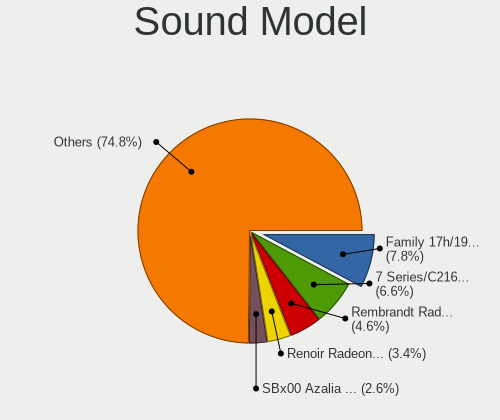

| Model                                                                      | Computers | Percent |
|----------------------------------------------------------------------------|-----------|---------|
| AMD Family 17h/19h HD Audio Controller                                     | 61        | 8.45%   |
| Intel 7 Series/C216 Chipset Family High Definition Audio Controller        | 30        | 4.16%   |
| AMD Renoir Radeon High Definition Audio Controller                         | 30        | 4.16%   |
| Intel 8 Series/C220 Series Chipset High Definition Audio Controller        | 26        | 3.6%    |
| Intel Comet Lake PCH cAVS                                                  | 25        | 3.46%   |
| Nvidia TU106 High Definition Audio Controller                              | 24        | 3.32%   |
| Nvidia GF108 High Definition Audio Controller                              | 24        | 3.32%   |
| Intel Tiger Lake-LP Smart Sound Technology Audio Controller                | 22        | 3.05%   |
| Intel Xeon E3-1200 v3/4th Gen Core Processor HD Audio Controller           | 20        | 2.77%   |
| Intel 6 Series/C200 Series Chipset Family High Definition Audio Controller | 20        | 2.77%   |
| AMD Raven/Raven2/Fenghuang HDMI/DP Audio Controller                        | 19        | 2.63%   |
| Intel 5 Series/3400 Series Chipset High Definition Audio                   | 14        | 1.94%   |
| Intel Sunrise Point-LP HD Audio                                            | 13        | 1.8%    |
| Intel Cannon Lake PCH cAVS                                                 | 13        | 1.8%    |
| AMD Rembrandt Radeon High Definition Audio Controller                      | 13        | 1.8%    |
| Intel NM10/ICH7 Family High Definition Audio Controller                    | 10        | 1.39%   |
| Intel Alder Lake PCH-P High Definition Audio Controller                    | 10        | 1.39%   |
| Nvidia GP107GL High Definition Audio Controller                            | 9         | 1.25%   |
| Nvidia Audio device                                                        | 9         | 1.25%   |
| Intel Comet Lake PCH-LP cAVS                                               | 9         | 1.25%   |
| Intel 8 Series HD Audio Controller                                         | 9         | 1.25%   |
| Intel 100 Series/C230 Series Chipset Family HD Audio Controller            | 9         | 1.25%   |
| AMD Starship/Matisse HD Audio Controller                                   | 9         | 1.25%   |
| AMD SBx00 Azalia (Intel HDA)                                               | 9         | 1.25%   |
| AMD Ellesmere HDMI Audio [Radeon RX 470/480 / 570/580/590]                 | 9         | 1.25%   |
| Intel Jasper Lake HD Audio                                                 | 8         | 1.11%   |
| Intel Ice Lake-LP Smart Sound Technology Audio Controller                  | 8         | 1.11%   |
| Intel Haswell-ULT HD Audio Controller                                      | 8         | 1.11%   |
| AMD Navi 21/23 HDMI/DP Audio Controller                                    | 8         | 1.11%   |
| AMD FCH Azalia Controller                                                  | 8         | 1.11%   |
| Intel Tiger Lake-H HD Audio Controller                                     | 7         | 0.97%   |
| Nvidia High Definition Audio Controller                                    | 6         | 0.83%   |
| Intel Celeron/Pentium Silver Processor High Definition Audio               | 6         | 0.83%   |
| Intel Smart Sound Technology (SST) Audio Controller                        | 5         | 0.69%   |
| Intel Celeron N3350/Pentium N4200/Atom E3900 Series Audio Cluster          | 5         | 0.69%   |
| Intel 82801I (ICH9 Family) HD Audio Controller                             | 5         | 0.69%   |
| Intel 82801H (ICH8 Family) HD Audio Controller                             | 5         | 0.69%   |
| C-Media Electronics USB Audio Device                                       | 5         | 0.69%   |
| Texas Instruments PCM2902 Audio Codec                                      | 4         | 0.55%   |
| Nvidia TU107 GeForce GTX 1650 High Definition Audio Controller             | 4         | 0.55%   |

Memory
------

Memory Vendor
-------------

Memory module vendors

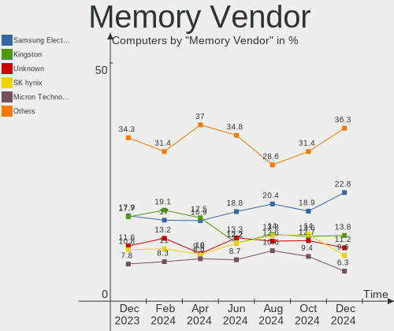

| Vendor                                  | Computers | Percent |
|-----------------------------------------|-----------|---------|
| Samsung Electronics                     | 92        | 21.55%  |
| Kingston                                | 61        | 14.29%  |
| SK hynix                                | 56        | 13.11%  |
| Micron Technology                       | 46        | 10.77%  |
| Unknown                                 | 39        | 9.13%   |
| Crucial                                 | 19        | 4.45%   |
| Hikvision                               | 18        | 4.22%   |
| Patriot                                 | 17        | 3.98%   |
| AMD                                     | 15        | 3.51%   |
| Unknown (ABCD)                          | 7         | 1.64%   |
| A-DATA Technology                       | 7         | 1.64%   |
| Unknown                                 | 7         | 1.64%   |
| Corsair                                 | 6         | 1.41%   |
| Elpida                                  | 5         | 1.17%   |
| Apacer                                  | 4         | 0.94%   |
| Qumo                                    | 3         | 0.7%    |
| GOODRAM                                 | 3         | 0.7%    |
| Ramaxel Technology                      | 2         | 0.47%   |
| Kingmax                                 | 2         | 0.47%   |
| G.Skill                                 | 2         | 0.47%   |
| Wilk                                    | 1         | 0.23%   |
| Unknown (0x5846)                        | 1         | 0.23%   |
| Unknown (0x0B7A)                        | 1         | 0.23%   |
| Unknown (0x0100)                        | 1         | 0.23%   |
| SK_Hynix                                | 1         | 0.23%   |
| Silicon Power Computer & Communications | 1         | 0.23%   |
| Patriot Memory (PDP Systems)            | 1         | 0.23%   |
| Netac                                   | 1         | 0.23%   |
| KingFast                                | 1         | 0.23%   |
| Kimtigo                                 | 1         | 0.23%   |
| Juhor                                   | 1         | 0.23%   |
| Hewlett-Packard                         | 1         | 0.23%   |
| Foxline                                 | 1         | 0.23%   |
| ChangXin Memory                         | 1         | 0.23%   |
| Atermiter                               | 1         | 0.23%   |
| Ankowall                                | 1         | 0.23%   |

Memory Model
------------

Memory module models

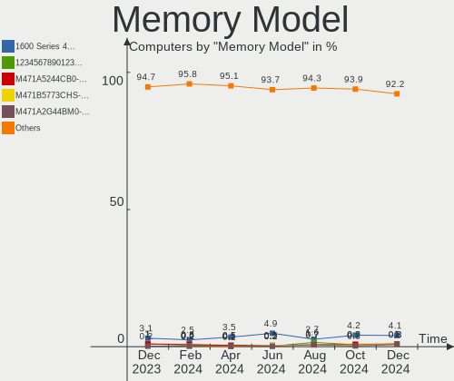

| Model                                                             | Computers | Percent |
|-------------------------------------------------------------------|-----------|---------|
| Hikvision RAM HKED4161DAA1D0MA1 16GB DIMM DDR4 2667MT/s           | 18        | 3.9%    |
| Unknown                                                           | 7         | 1.52%   |
| Unknown (ABCD) RAM 123456789012345678 2GB SODIMM LPDDR4 2400MT/s  | 5         | 1.08%   |
| Samsung RAM M471B5273DH0-CH9 4GB SODIMM DDR3 1334MT/s             | 5         | 1.08%   |
| Samsung RAM M471A1K43EB1-CWE 8GB SODIMM DDR4 3200MT/s             | 5         | 1.08%   |
| Unknown RAM Module 1GB DIMM SDRAM                                 | 4         | 0.87%   |
| Samsung RAM M471B5273DH0-CK0 4GB SODIMM DDR3 1600MT/s             | 4         | 0.87%   |
| Samsung RAM M471A5244CB0-CTD 4GB SODIMM DDR4 3266MT/s             | 4         | 0.87%   |
| Samsung RAM M393A2K40DB3-CWE 16GB DIMM DDR4 3200MT/s              | 4         | 0.87%   |
| Patriot RAM PSD38G13332 8GB DIMM DDR3 1333MT/s                    | 4         | 0.87%   |
| Micron RAM 4ATF51264HZ-3G2J1 4GB SODIMM DDR4 3200MT/s             | 4         | 0.87%   |
| Kingston RAM KHX1600C9D3/4GX 4GB DIMM DDR3 1600MT/s               | 4         | 0.87%   |
| Kingston RAM 99U5584-010.A00LF 4GB DIMM 1866MT/s                  | 4         | 0.87%   |
| Unknown RAM Module 4GB DIMM SDRAM                                 | 3         | 0.65%   |
| Unknown RAM Module 2GB DIMM 800MT/s                               | 3         | 0.65%   |
| SK hynix RAM HMA82GU6JJR8N-VK 16GB DIMM DDR4 2667MT/s             | 3         | 0.65%   |
| Samsung RAM M471A1G44AB0-CWE 8GB SODIMM DDR4 3200MT/s             | 3         | 0.65%   |
| Micron RAM 53E1G32D4NQ-046WTE 4GB Row Of Chips LPDDR4 3200MT/s    | 3         | 0.65%   |
| Micron RAM 4ATF51264HZ-3G2J1 4GB Row Of Chips DDR4 3200MT/s       | 3         | 0.65%   |
| Micron RAM 4ATF1G64HZ-3G2F1 8GB SODIMM DDR4 3200MT/s              | 3         | 0.65%   |
| Micron RAM 4ATF1G64HZ-3G2E1 8GB Row Of Chips DDR4 3200MT/s        | 3         | 0.65%   |
| Kingston RAM KHX1600C10D3/8G 8GB DIMM DDR3 1600MT/s               | 3         | 0.65%   |
| Kingston RAM 9905702-120.A00G 8GB DIMM DDR4 2667MT/s              | 3         | 0.65%   |
| Crucial RAM CT4G4DFS8213.C8FAR2 4GB DIMM DDR4 2133MT/s            | 3         | 0.65%   |
| Unknown RAM Module 8GB DIMM 1333MT/s                              | 2         | 0.43%   |
| Unknown RAM Module 4GB SODIMM DDR3                                | 2         | 0.43%   |
| Unknown RAM Module 4GB DIMM 1333MT/s                              | 2         | 0.43%   |
| Unknown RAM Module 2GB DIMM SDRAM                                 | 2         | 0.43%   |
| Unknown RAM Module 2GB DIMM DDR3 1333MT/s                         | 2         | 0.43%   |
| Unknown (ABCD) RAM 123456789012345678 1536MB DIMM LPDDR4 2400MT/s | 2         | 0.43%   |
| SK hynix RAM HMT41GS6BFR8A-PB 8GB SODIMM DDR3 1600MT/s            | 2         | 0.43%   |
| SK hynix RAM HMT41GS6AFR8A-PB 8192MB SODIMM DDR3 1600MT/s         | 2         | 0.43%   |
| SK hynix RAM HMAA1GS6CJR6N-XN 8GB SODIMM DDR4 3200MT/s            | 2         | 0.43%   |
| SK hynix RAM HMA851S6DJR6N-XN 4GB SODIMM DDR4 3200MT/s            | 2         | 0.43%   |
| SK hynix RAM H9JCNNNCP3MLYR-N6E 2GB Row Of Chips 6400MT/s         | 2         | 0.43%   |
| Samsung RAM U6E3S4AA-MGCR 1GB Row Of Chips LPDDR4 4267MT/s        | 2         | 0.43%   |
| Samsung RAM M471B5773DH0-CK0 2GB SODIMM DDR3 1600MT/s             | 2         | 0.43%   |
| Samsung RAM M471B5673FH0-CH9 2GB SODIMM DDR3 1334MT/s             | 2         | 0.43%   |
| Samsung RAM M471B5273CH0-CH9 4GB SODIMM DDR3 1334MT/s             | 2         | 0.43%   |
| Samsung RAM M471B5173QH0-YK0 4096MB SODIMM DDR3 1600MT/s          | 2         | 0.43%   |

Memory Kind
-----------

Memory module kinds

| Kind         | Computers | Percent |
|--------------|-----------|---------|
| DDR4         | 180       | 47.37%  |
| DDR3         | 107       | 28.16%  |
| LPDDR4       | 26        | 6.84%   |
| DDR2         | 17        | 4.47%   |
| Unknown      | 16        | 4.21%   |
| SDRAM        | 14        | 3.68%   |
| DDR5         | 9         | 2.37%   |
| LPDDR5       | 8         | 2.11%   |
| DDR          | 2         | 0.53%   |
| DDR2 FB-DIMM | 1         | 0.26%   |

Memory Form Factor
------------------

Physical design of the memory module

| Name         | Computers | Percent |
|--------------|-----------|---------|
| DIMM         | 184       | 48.42%  |
| SODIMM       | 162       | 42.63%  |
| Row Of Chips | 34        | 8.95%   |

Memory Size
-----------

Memory module size

| Size  | Computers | Percent |
|-------|-----------|---------|
| 8192  | 156       | 36.71%  |
| 4096  | 117       | 27.53%  |
| 16384 | 64        | 15.06%  |
| 2048  | 48        | 11.29%  |
| 1024  | 21        | 4.94%   |
| 32768 | 11        | 2.59%   |
| 65536 | 3         | 0.71%   |
| 512   | 3         | 0.71%   |
| 12288 | 2         | 0.47%   |

Memory Speed
------------

Memory module speed

| Speed   | Computers | Percent |
|---------|-----------|---------|
| 3200    | 82        | 19.9%   |
| 2667    | 61        | 14.81%  |
| 1600    | 57        | 13.83%  |
| 2400    | 32        | 7.77%   |
| 1333    | 28        | 6.8%    |
| 1334    | 14        | 3.4%    |
| Unknown | 14        | 3.4%    |
| 2133    | 11        | 2.67%   |
| 1866    | 10        | 2.43%   |
| 800     | 10        | 2.43%   |
| 4800    | 9         | 2.18%   |
| 3266    | 9         | 2.18%   |
| 6400    | 8         | 1.94%   |
| 667     | 7         | 1.7%    |
| 4267    | 5         | 1.21%   |
| 1066    | 5         | 1.21%   |
| 3733    | 4         | 0.97%   |
| 2933    | 4         | 0.97%   |
| 1867    | 4         | 0.97%   |
| 3600    | 3         | 0.73%   |
| 3400    | 3         | 0.73%   |
| 2048    | 3         | 0.73%   |
| 1067    | 3         | 0.73%   |
| 4266    | 2         | 0.49%   |
| 4199    | 2         | 0.49%   |
| 2800    | 2         | 0.49%   |
| 2666    | 2         | 0.49%   |
| 1648    | 2         | 0.49%   |
| 533     | 2         | 0.49%   |
| 6800    | 1         | 0.24%   |
| 6000    | 1         | 0.24%   |
| 3800    | 1         | 0.24%   |
| 3666    | 1         | 0.24%   |
| 3333    | 1         | 0.24%   |
| 3100    | 1         | 0.24%   |
| 2866    | 1         | 0.24%   |
| 2200    | 1         | 0.24%   |
| 2134    | 1         | 0.24%   |
| 1800    | 1         | 0.24%   |
| 1639    | 1         | 0.24%   |

Printers & scanners
-------------------

Printer Vendor
--------------

Printer device vendors

| Vendor              | Computers | Percent |
|---------------------|-----------|---------|
| Hewlett-Packard     | 2         | 40%     |
| Canon               | 2         | 40%     |
| Samsung Electronics | 1         | 20%     |

Printer Model
-------------

Printer device models

| Model                  | Computers | Percent |
|------------------------|-----------|---------|
| Samsung M2020 Series   | 1         | 20%     |
| HP LaserJet P1005      | 1         | 20%     |
| HP DeskJet 2130 series | 1         | 20%     |
| Canon MF4410           | 1         | 20%     |
| Canon MF3010           | 1         | 20%     |

Scanner Vendor
--------------

Scanner device vendors

| Vendor          | Computers | Percent |
|-----------------|-----------|---------|
| Hewlett-Packard | 1         | 100%    |

Scanner Model
-------------

Scanner device models

| Model            | Computers | Percent |
|------------------|-----------|---------|
| HP ScanJet 2400c | 1         | 100%    |

Camera
------

Camera Vendor
-------------

Camera device vendors

| Vendor                                 | Computers | Percent |
|----------------------------------------|-----------|---------|
| Chicony Electronics                    | 47        | 20.61%  |
| IMC Networks                           | 31        | 13.6%   |
| Quanta                                 | 20        | 8.77%   |
| Microdia                               | 17        | 7.46%   |
| Sunplus Innovation Technology          | 16        | 7.02%   |
| Syntek                                 | 12        | 5.26%   |
| Logitech                               | 8         | 3.51%   |
| Bison Electronics                      | 8         | 3.51%   |
| Realtek Semiconductor                  | 7         | 3.07%   |
| SunplusIT                              | 6         | 2.63%   |
| Acer                                   | 6         | 2.63%   |
| Sonix Technology                       | 5         | 2.19%   |
| Apple                                  | 5         | 2.19%   |
| Suyin                                  | 4         | 1.75%   |
| Luxvisions Innotech Limited            | 4         | 1.75%   |
| Silicon Motion                         | 3         | 1.32%   |
| icSpring                               | 3         | 1.32%   |
| Cheng Uei Precision Industry (Foxlink) | 3         | 1.32%   |
| Microsoft                              | 2         | 0.88%   |
| DigiTech                               | 2         | 0.88%   |
| Alcor Micro                            | 2         | 0.88%   |
| Z-Star Microelectronics                | 1         | 0.44%   |
| USB Camera CS                          | 1         | 0.44%   |
| ShineTech                              | 1         | 0.44%   |
| Shine-optics                           | 1         | 0.44%   |
| Ricoh                                  | 1         | 0.44%   |
| Primax Electronics                     | 1         | 0.44%   |
| Hopewin Electronic Material            | 1         | 0.44%   |
| Hewlett-Packard                        | 1         | 0.44%   |
| GEMBIRD                                | 1         | 0.44%   |
| Galtronics                             | 1         | 0.44%   |
| DX-220914-A                            | 1         | 0.44%   |
| Denron                                 | 1         | 0.44%   |
| AVerMedia Technologies                 | 1         | 0.44%   |
| Aveo Technology                        | 1         | 0.44%   |
| Arkmicro Technologies                  | 1         | 0.44%   |
| ALi                                    | 1         | 0.44%   |
| AlcorMicroCorp                         | 1         | 0.44%   |

Camera Model
------------

Camera device models

| Model                                                   | Computers | Percent |
|---------------------------------------------------------|-----------|---------|
| IMC Networks USB2.0 HD UVC WebCam                       | 11        | 4.76%   |
| Syntek Integrated Camera                                | 8         | 3.46%   |
| IMC Networks Integrated Camera                          | 6         | 2.6%    |
| Chicony Integrated Camera                               | 6         | 2.6%    |
| Quanta HD Camera                                        | 5         | 2.16%   |
| Microdia USB 2.0 Camera                                 | 5         | 2.16%   |
| Logitech Webcam C270                                    | 5         | 2.16%   |
| Sunplus HD WebCam                                       | 4         | 1.73%   |
| Sonix USB2.0 FHD UVC WebCam                             | 4         | 1.73%   |
| Quanta ov9734_techfront_camera                          | 4         | 1.73%   |
| Microdia Integrated_Webcam_HD                           | 4         | 1.73%   |
| Chicony VGA WebCam                                      | 4         | 1.73%   |
| Chicony USB2.0 Camera                                   | 4         | 1.73%   |
| Chicony HP HD Camera                                    | 4         | 1.73%   |
| Realtek USB Camera                                      | 3         | 1.3%    |
| IMC Networks UVC VGA Webcam                             | 3         | 1.3%    |
| IMC Networks HD Camera                                  | 3         | 1.3%    |
| icSpring camera                                         | 3         | 1.3%    |
| Chicony Lenovo EasyCamera                               | 3         | 1.3%    |
| Apple iPhone 5/5C/5S/6/SE/7/8/X                         | 3         | 1.3%    |
| Acer Integrated Camera                                  | 3         | 1.3%    |
| Syntek Lenovo EasyCamera                                | 2         | 0.87%   |
| Sunplus Integrated_Webcam_HD                            | 2         | 0.87%   |
| Sunplus FULL HD webcam                                  | 2         | 0.87%   |
| Quanta HP Webcam                                        | 2         | 0.87%   |
| Quanta HP HD Camera                                     | 2         | 0.87%   |
| Quanta HD User Facing                                   | 2         | 0.87%   |
| Microdia Rear camera                                    | 2         | 0.87%   |
| Microdia Integrated Webcam                              | 2         | 0.87%   |
| Microdia Front camera                                   | 2         | 0.87%   |
| Luxvisions Innotech Limited HP TrueVision HD Camera     | 2         | 0.87%   |
| IMC Networks ov9734_azurewave_camera                    | 2         | 0.87%   |
| DigiTech USB 2.0 PC Camera                              | 2         | 0.87%   |
| Chicony USB 2.0 Camera                                  | 2         | 0.87%   |
| Chicony Integrated HP HD Webcam                         | 2         | 0.87%   |
| Chicony HP TrueVision HD Camera                         | 2         | 0.87%   |
| Chicony HD WebCam                                       | 2         | 0.87%   |
| Chicony HD User Facing                                  | 2         | 0.87%   |
| Chicony ACER HD User Facing                             | 2         | 0.87%   |
| Cheng Uei Precision Industry (Foxlink) HP Truevision HD | 2         | 0.87%   |

Security
--------

Fingerprint Vendor
------------------

Fingerprint sensor vendors

| Vendor                             | Computers | Percent |
|------------------------------------|-----------|---------|
| Validity Sensors                   | 11        | 26.83%  |
| Shenzhen Goodix Technology         | 11        | 26.83%  |
| Synaptics                          | 6         | 14.63%  |
| Realtek USB2.0 Finger Print Bridge | 4         | 9.76%   |
| Elan Microelectronics              | 4         | 9.76%   |
| AuthenTec                          | 3         | 7.32%   |
| GDMicroelectronics                 | 1         | 2.44%   |
| Focal-systems.Corp                 | 1         | 2.44%   |

Fingerprint Model
-----------------

Fingerprint sensor models

| Model                                                                      | Computers | Percent |
|----------------------------------------------------------------------------|-----------|---------|
| Shenzhen Goodix  Fingerprint Device                                        | 10        | 24.39%  |
| Realtek USB2.0 Finger Print Bridge FocalTech Fingerprint Device            | 4         | 9.76%   |
| Synaptics Prometheus MIS Touch Fingerprint Reader                          | 3         | 7.32%   |
| Elan ELAN:Fingerprint                                                      | 3         | 7.32%   |
| Validity Sensors Fingerprint scanner                                       | 2         | 4.88%   |
| AuthenTec AES1660 Fingerprint Sensor                                       | 2         | 4.88%   |
| Validity Sensors VFS7500 Touch Fingerprint Sensor                          | 1         | 2.44%   |
| Validity Sensors VFS5011 Fingerprint Reader                                | 1         | 2.44%   |
| Validity Sensors VFS495 Fingerprint Reader                                 | 1         | 2.44%   |
| Validity Sensors VFS491                                                    | 1         | 2.44%   |
| Validity Sensors VFS471 Fingerprint Reader                                 | 1         | 2.44%   |
| Validity Sensors VFS301 Fingerprint Reader                                 | 1         | 2.44%   |
| Validity Sensors VFS 5011 fingerprint sensor                               | 1         | 2.44%   |
| Validity Sensors Synaptics WBDI                                            | 1         | 2.44%   |
| Validity Sensors Synaptics VFS7552 Touch Fingerprint Sensor with PurePrint | 1         | 2.44%   |
| Synaptics UWP WBDI                                                         | 1         | 2.44%   |
| Synaptics Metallica MOH Touch Fingerprint Reader                           | 1         | 2.44%   |
| Synaptics FS7604 Touch Fingerprint Sensor with PurePrint                   | 1         | 2.44%   |
| Shenzhen Goodix Fingerprint Reader                                         | 1         | 2.44%   |
| GDMicroelectronics Touch Fingerprint Sensor                                | 1         | 2.44%   |
| Focal-systems.Corp FT9201Fingerprint.                                      | 1         | 2.44%   |
| Elan ELAN:ARM-M4                                                           | 1         | 2.44%   |
| AuthenTec AES2501 Fingerprint Sensor                                       | 1         | 2.44%   |

Chipcard Vendor
---------------

Chipcard module vendors

| Vendor       | Computers | Percent |
|--------------|-----------|---------|
| Broadcom     | 2         | 33.33%  |
| Alcor Micro  | 2         | 33.33%  |
| Yubico.com   | 1         | 16.67%  |
| Aladdin R.D. | 1         | 16.67%  |

Chipcard Model
--------------

Chipcard module models

| Model                                                                        | Computers | Percent |
|------------------------------------------------------------------------------|-----------|---------|
| Alcor Micro AU9540 Smartcard Reader                                          | 2         | 33.33%  |
| Yubico.com Yubikey 4/5 U2F+CCID                                              | 1         | 16.67%  |
| Broadcom BCM5880 Secure Applications Processor with fingerprint swipe sensor | 1         | 16.67%  |
| Broadcom 5880                                                                | 1         | 16.67%  |
| Aladdin R.D. JaCarta                                                         | 1         | 16.67%  |

Unsupported
-----------

Unsupported Devices
-------------------

Total unsupported devices on board

| Total | Computers | Percent |
|-------|-----------|---------|
| 0     | 300       | 67.57%  |
| 1     | 120       | 27.03%  |
| 2     | 13        | 2.93%   |
| 3     | 7         | 1.58%   |
| 4     | 3         | 0.68%   |
| 5     | 1         | 0.23%   |

Unsupported Device Types
------------------------

Types of unsupported devices

| Type                     | Computers | Percent |
|--------------------------|-----------|---------|
| Graphics card            | 69        | 40.35%  |
| Fingerprint reader       | 41        | 23.98%  |
| Communication controller | 14        | 8.19%   |
| Unassigned class         | 12        | 7.02%   |
| Net/wireless             | 11        | 6.43%   |
| Multimedia controller    | 8         | 4.68%   |
| Sound                    | 4         | 2.34%   |
| Camera                   | 4         | 2.34%   |
| Chipcard                 | 3         | 1.75%   |
| Bluetooth                | 2         | 1.17%   |
| Storage                  | 1         | 0.58%   |
| Net/ethernet             | 1         | 0.58%   |
| Flash memory             | 1         | 0.58%   |

