Linux in Spain - Hardware Trends
--------------------------------

A project to identify most popular hardware characteristics and track their change
over time based on data collected by Linux users at https://Linux-Hardware.org.

Anyone can contribute to this report by the [hw-probe](https://github.com/linuxhw/hw-probe) tool:

    sudo -E hw-probe -all -upload

This is a report for all computer types. See also reports for [desktops](/Location/Spain/Desktop/README.md) and [notebooks](/Location/Spain/Notebook/README.md).

Period: Sep, 2022.

Contents
--------

* [ System ](#system)
  - [ OS                       ](#os)
  - [ OS Family                ](#os-family)
  - [ Kernel                   ](#kernel)
  - [ Kernel Family            ](#kernel-family)
  - [ Kernel Major Ver.        ](#kernel-major-ver)
  - [ Arch                     ](#arch)
  - [ DE                       ](#de)
  - [ Display Server           ](#display-server)
  - [ Display Manager          ](#display-manager)
  - [ OS Lang                  ](#os-lang)
  - [ Boot Mode                ](#boot-mode)
  - [ Filesystem               ](#filesystem)
  - [ Part. scheme             ](#part-scheme)
  - [ Dual Boot with Linux/BSD ](#dual-boot-with-linuxbsd)
  - [ Dual Boot (Win)          ](#dual-boot-win)

* [ Board ](#board)
  - [ Vendor                   ](#vendor)
  - [ Model                    ](#model)
  - [ Model Family             ](#model-family)
  - [ MFG Year                 ](#mfg-year)
  - [ Form Factor              ](#form-factor)
  - [ Secure Boot              ](#secure-boot)
  - [ Coreboot                 ](#coreboot)
  - [ RAM Size                 ](#ram-size)
  - [ RAM Used                 ](#ram-used)
  - [ Total Drives             ](#total-drives)
  - [ Has CD-ROM               ](#has-cd-rom)
  - [ Has Ethernet             ](#has-ethernet)
  - [ Has WiFi                 ](#has-wifi)
  - [ Has Bluetooth            ](#has-bluetooth)

* [ Location ](#location)
  - [ Country                  ](#country)
  - [ City                     ](#city)

* [ Drives ](#drives)
  - [ Drive Vendor             ](#drive-vendor)
  - [ Drive Model              ](#drive-model)
  - [ HDD Vendor               ](#hdd-vendor)
  - [ SSD Vendor               ](#ssd-vendor)
  - [ Drive Kind               ](#drive-kind)
  - [ Drive Connector          ](#drive-connector)
  - [ Drive Size               ](#drive-size)
  - [ Space Total              ](#space-total)
  - [ Space Used               ](#space-used)
  - [ Malfunc. Drives          ](#malfunc-drives)
  - [ Malfunc. Drive Vendor    ](#malfunc-drive-vendor)
  - [ Malfunc. HDD Vendor      ](#malfunc-hdd-vendor)
  - [ Malfunc. Drive Kind      ](#malfunc-drive-kind)
  - [ Failed Drives            ](#failed-drives)
  - [ Failed Drive Vendor      ](#failed-drive-vendor)
  - [ Drive Status             ](#drive-status)

* [ Storage controller ](#storage-controller)
  - [ Storage Vendor           ](#storage-vendor)
  - [ Storage Model            ](#storage-model)
  - [ Storage Kind             ](#storage-kind)

* [ Processor ](#processor)
  - [ CPU Vendor               ](#cpu-vendor)
  - [ CPU Model                ](#cpu-model)
  - [ CPU Model Family         ](#cpu-model-family)
  - [ CPU Cores                ](#cpu-cores)
  - [ CPU Sockets              ](#cpu-sockets)
  - [ CPU Threads              ](#cpu-threads)
  - [ CPU Op-Modes             ](#cpu-op-modes)
  - [ CPU Microcode            ](#cpu-microcode)
  - [ CPU Microarch            ](#cpu-microarch)

* [ Graphics ](#graphics)
  - [ GPU Vendor               ](#gpu-vendor)
  - [ GPU Model                ](#gpu-model)
  - [ GPU Combo                ](#gpu-combo)
  - [ GPU Driver               ](#gpu-driver)
  - [ GPU Memory               ](#gpu-memory)

* [ Monitor ](#monitor)
  - [ Monitor Vendor           ](#monitor-vendor)
  - [ Monitor Model            ](#monitor-model)
  - [ Monitor Resolution       ](#monitor-resolution)
  - [ Monitor Diagonal         ](#monitor-diagonal)
  - [ Monitor Width            ](#monitor-width)
  - [ Aspect Ratio             ](#aspect-ratio)
  - [ Monitor Area             ](#monitor-area)
  - [ Pixel Density            ](#pixel-density)
  - [ Multiple Monitors        ](#multiple-monitors)

* [ Network ](#network)
  - [ Net Controller Vendor    ](#net-controller-vendor)
  - [ Net Controller Model     ](#net-controller-model)
  - [ Wireless Vendor          ](#wireless-vendor)
  - [ Wireless Model           ](#wireless-model)
  - [ Ethernet Vendor          ](#ethernet-vendor)
  - [ Ethernet Model           ](#ethernet-model)
  - [ Net Controller Kind      ](#net-controller-kind)
  - [ Used Controller          ](#used-controller)
  - [ NICs                     ](#nics)
  - [ IPv6                     ](#ipv6)

* [ Bluetooth ](#bluetooth)
  - [ Bluetooth Vendor         ](#bluetooth-vendor)
  - [ Bluetooth Model          ](#bluetooth-model)

* [ Sound ](#sound)
  - [ Sound Vendor             ](#sound-vendor)
  - [ Sound Model              ](#sound-model)

* [ Memory ](#memory)
  - [ Memory Vendor            ](#memory-vendor)
  - [ Memory Model             ](#memory-model)
  - [ Memory Kind              ](#memory-kind)
  - [ Memory Form Factor       ](#memory-form-factor)
  - [ Memory Size              ](#memory-size)
  - [ Memory Speed             ](#memory-speed)

* [ Printers & scanners ](#printers--scanners)
  - [ Printer Vendor           ](#printer-vendor)
  - [ Printer Model            ](#printer-model)
  - [ Scanner Vendor           ](#scanner-vendor)
  - [ Scanner Model            ](#scanner-model)

* [ Camera ](#camera)
  - [ Camera Vendor            ](#camera-vendor)
  - [ Camera Model             ](#camera-model)

* [ Security ](#security)
  - [ Fingerprint Vendor       ](#fingerprint-vendor)
  - [ Fingerprint Model        ](#fingerprint-model)
  - [ Chipcard Vendor          ](#chipcard-vendor)
  - [ Chipcard Model           ](#chipcard-model)

* [ Unsupported ](#unsupported)
  - [ Unsupported Devices      ](#unsupported-devices)
  - [ Unsupported Device Types ](#unsupported-device-types)

System
------

OS
--

Installed operating systems

| Name                         | Computers | Percent |
|------------------------------|-----------|---------|
| Debian 11                    | 35        | 21.6%   |
| Ubuntu 22.04                 | 29        | 17.9%   |
| OpenMandriva 4.3             | 13        | 8.02%   |
| Fedora 36                    | 13        | 8.02%   |
| Ubuntu 20.04                 | 7         | 4.32%   |
| Linux Mint 20.3              | 6         | 3.7%    |
| Arch                         | 5         | 3.09%   |
| Pop!_OS 22.04                | 4         | 2.47%   |
| Zorin 16                     | 3         | 1.85%   |
| OpenMandriva 4.90            | 3         | 1.85%   |
| Manjaro 22.0.0               | 3         | 1.85%   |
| Manjaro                      | 3         | 1.85%   |
| KDE neon 20.04               | 3         | 1.85%   |
| SteamOS 3.3.1                | 2         | 1.23%   |
| Nobara 36                    | 2         | 1.23%   |
| Linux Mint 21                | 2         | 1.23%   |
| Kubuntu 20.04                | 2         | 1.23%   |
| Fedora 37                    | 2         | 1.23%   |
| Debian Testing               | 2         | 1.23%   |
| Zorin 15                     | 1         | 0.62%   |
| Ubuntu MATE 22.04            | 1         | 0.62%   |
| Ubuntu MATE 20.04            | 1         | 0.62%   |
| SteamOS 3.4                  | 1         | 0.62%   |
| ROSA R11.1                   | 1         | 0.62%   |
| Raspbian 11                  | 1         | 0.62%   |
| openSUSE Tumbleweed-XXXXXXXX | 1         | 0.62%   |
| Lubuntu 20.04                | 1         | 0.62%   |
| LMDE 5                       | 1         | 0.62%   |
| Linux Mint 20.2              | 1         | 0.62%   |
| Linux Mint 19.2              | 1         | 0.62%   |
| Kubuntu 22.04                | 1         | 0.62%   |
| Kali 2022.3                  | 1         | 0.62%   |
| Gentoo 2.8                   | 1         | 0.62%   |
| Garuda Linux                 | 1         | 0.62%   |
| Endless 4.0.9                | 1         | 0.62%   |
| Endless 4.0.8                | 1         | 0.62%   |
| EndeavourOS Rolling          | 1         | 0.62%   |
| Debian Unstable              | 1         | 0.62%   |
| Debian 10                    | 1         | 0.62%   |
| Artix Rolling                | 1         | 0.62%   |

OS Family
---------

OS without a version

| Name         | Computers | Percent |
|--------------|-----------|---------|
| Debian       | 39        | 24.07%  |
| Ubuntu       | 36        | 22.22%  |
| OpenMandriva | 16        | 9.88%   |
| Fedora       | 15        | 9.26%   |
| Linux Mint   | 10        | 6.17%   |
| Manjaro      | 6         | 3.7%    |
| Arch         | 6         | 3.7%    |
| Zorin        | 4         | 2.47%   |
| Pop!_OS      | 4         | 2.47%   |
| SteamOS      | 3         | 1.85%   |
| Kubuntu      | 3         | 1.85%   |
| KDE neon     | 3         | 1.85%   |
| Ubuntu MATE  | 2         | 1.23%   |
| Nobara       | 2         | 1.23%   |
| Endless      | 2         | 1.23%   |
| ROSA         | 1         | 0.62%   |
| Raspbian     | 1         | 0.62%   |
| openSUSE     | 1         | 0.62%   |
| Lubuntu      | 1         | 0.62%   |
| LMDE         | 1         | 0.62%   |
| Kali         | 1         | 0.62%   |
| Gentoo       | 1         | 0.62%   |
| Garuda Linux | 1         | 0.62%   |
| EndeavourOS  | 1         | 0.62%   |
| Artix        | 1         | 0.62%   |
| ArcoLinux    | 1         | 0.62%   |

Kernel
------

Version of the Linux kernel

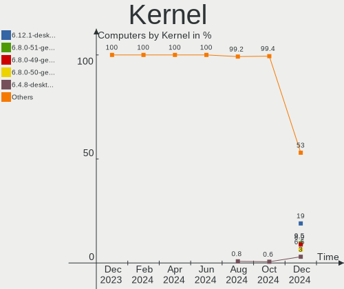

| Version                                            | Computers | Percent |
|----------------------------------------------------|-----------|---------|
| 5.10.0-18-amd64                                    | 22        | 13.58%  |
| 5.15.0-47-generic                                  | 20        | 12.35%  |
| 5.16.7-desktop-1omv4003                            | 13        | 8.02%   |
| 5.15.0-48-generic                                  | 13        | 8.02%   |
| 5.15.0-46-generic                                  | 10        | 6.17%   |
| 5.4.0-125-generic                                  | 5         | 3.09%   |
| 5.19.0-76051900-generic                            | 4         | 2.47%   |
| 5.10.0-17-amd64                                    | 4         | 2.47%   |
| 5.19.9-200.fc36.x86_64                             | 3         | 1.85%   |
| 5.19.6-200.fc36.x86_64                             | 3         | 1.85%   |
| 5.19.0-1-amd64                                     | 3         | 1.85%   |
| 5.18.0-4-amd64                                     | 3         | 1.85%   |
| 5.19.9-arch1-1                                     | 2         | 1.23%   |
| 5.19.8-200.fc36.x86_64                             | 2         | 1.23%   |
| 5.19.4-200.fc36.x86_64                             | 2         | 1.23%   |
| 5.18.12-desktop-3omv4090                           | 2         | 1.23%   |
| 5.15.65-1-MANJARO                                  | 2         | 1.23%   |
| 5.13.0-valve21.1-1-neptune-02211-gc54cda5a36f3     | 2         | 1.23%   |
| 5.11.0-35-generic                                  | 2         | 1.23%   |
| 6.0.0-1-MANJARO                                    | 1         | 0.62%   |
| 6.0.0-0.rc6.20220922gitdc164f4fb00a.43.fc38.x86_64 | 1         | 0.62%   |
| 5.4.32-generic-2rosa-x86_64                        | 1         | 0.62%   |
| 5.4.0-54-generic                                   | 1         | 0.62%   |
| 5.4.0-126-generic                                  | 1         | 0.62%   |
| 5.4.0-124-generic                                  | 1         | 0.62%   |
| 5.4.0-121-generic                                  | 1         | 0.62%   |
| 5.19.9-zen1-1-zen                                  | 1         | 0.62%   |
| 5.19.9-xanmod1                                     | 1         | 0.62%   |
| 5.19.9-201.fsync.fc36.x86_64                       | 1         | 0.62%   |
| 5.19.8-zen1-1-zen                                  | 1         | 0.62%   |
| 5.19.8-300.fc37.x86_64                             | 1         | 0.62%   |
| 5.19.8-1-default                                   | 1         | 0.62%   |
| 5.19.7-arch1-1                                     | 1         | 0.62%   |
| 5.19.7-204.fsync.fc36.x86_64                       | 1         | 0.62%   |
| 5.19.7-200.fc36.x86_64                             | 1         | 0.62%   |
| 5.19.7-1-MANJARO                                   | 1         | 0.62%   |
| 5.19.7-1-clear                                     | 1         | 0.62%   |
| 5.19.6-arch1-1                                     | 1         | 0.62%   |
| 5.19.2-artix1-2                                    | 1         | 0.62%   |
| 5.19.11-renacuajo                                  | 1         | 0.62%   |

Kernel Family
-------------

Linux kernel without a distro release

| Version | Computers | Percent |
|---------|-----------|---------|
| 5.15.0  | 46        | 28.4%   |
| 5.10.0  | 31        | 19.14%  |
| 5.16.7  | 13        | 8.02%   |
| 5.4.0   | 9         | 5.56%   |
| 5.19.9  | 8         | 4.94%   |
| 5.19.0  | 8         | 4.94%   |
| 5.19.8  | 5         | 3.09%   |
| 5.19.7  | 5         | 3.09%   |
| 5.19.6  | 4         | 2.47%   |
| 5.18.0  | 4         | 2.47%   |
| 5.13.0  | 4         | 2.47%   |
| 5.19.11 | 3         | 1.85%   |
| 6.0.0   | 2         | 1.23%   |
| 5.19.4  | 2         | 1.23%   |
| 5.19.10 | 2         | 1.23%   |
| 5.18.12 | 2         | 1.23%   |
| 5.15.65 | 2         | 1.23%   |
| 5.11.0  | 2         | 1.23%   |
| 5.4.32  | 1         | 0.62%   |
| 5.19.2  | 1         | 0.62%   |
| 5.18.9  | 1         | 0.62%   |
| 5.15.67 | 1         | 0.62%   |
| 5.15.61 | 1         | 0.62%   |
| 5.15.60 | 1         | 0.62%   |
| 5.15.39 | 1         | 0.62%   |
| 5.14.0  | 1         | 0.62%   |
| 4.19.0  | 1         | 0.62%   |
| 4.15.0  | 1         | 0.62%   |

Kernel Major Ver.
-----------------

Linux kernel major version

| Version | Computers | Percent |
|---------|-----------|---------|
| 5.15    | 52        | 32.1%   |
| 5.19    | 38        | 23.46%  |
| 5.10    | 31        | 19.14%  |
| 5.16    | 13        | 8.02%   |
| 5.4     | 10        | 6.17%   |
| 5.18    | 7         | 4.32%   |
| 5.13    | 4         | 2.47%   |
| 6.0     | 2         | 1.23%   |
| 5.11    | 2         | 1.23%   |
| 5.14    | 1         | 0.62%   |
| 4.19    | 1         | 0.62%   |
| 4.15    | 1         | 0.62%   |

Arch
----

OS architecture (x86_64, i586, etc.)

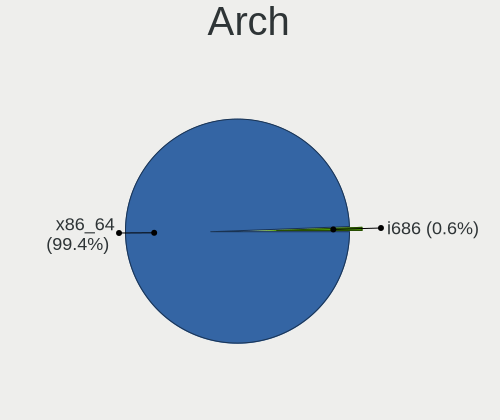

| Name    | Computers | Percent |
|---------|-----------|---------|
| x86_64  | 158       | 97.53%  |
| i686    | 2         | 1.23%   |
| armv7l  | 1         | 0.62%   |
| aarch64 | 1         | 0.62%   |

DE
--

Desktop Environment

| Name            | Computers | Percent |
|-----------------|-----------|---------|
| GNOME           | 79        | 48.77%  |
| KDE5            | 43        | 26.54%  |
| X-Cinnamon      | 10        | 6.17%   |
| XFCE            | 7         | 4.32%   |
| Unknown         | 7         | 4.32%   |
| openbox         | 3         | 1.85%   |
| MATE            | 3         | 1.85%   |
| LXQt            | 3         | 1.85%   |
| i3              | 3         | 1.85%   |
| Cinnamon        | 2         | 1.23%   |
| LXDE            | 1         | 0.62%   |
| GNOME Flashback | 1         | 0.62%   |

Display Server
--------------

X11 or Wayland

| Name    | Computers | Percent |
|---------|-----------|---------|
| X11     | 106       | 65.43%  |
| Wayland | 49        | 30.25%  |
| Tty     | 4         | 2.47%   |
| Unknown | 3         | 1.85%   |

Display Manager
---------------

SDDM, LightDM, etc.

| Name    | Computers | Percent |
|---------|-----------|---------|
| Unknown | 51        | 31.48%  |
| SDDM    | 36        | 22.22%  |
| GDM3    | 27        | 16.67%  |
| GDM     | 26        | 16.05%  |
| LightDM | 19        | 11.73%  |
| Ly      | 2         | 1.23%   |
| LXDM    | 1         | 0.62%   |

OS Lang
-------

Language

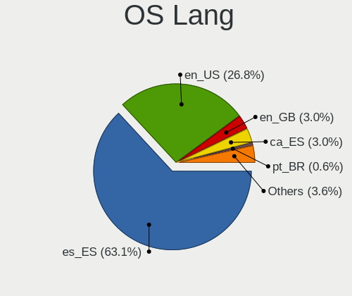

| Lang           | Computers | Percent |
|----------------|-----------|---------|
| es_ES          | 109       | 67.28%  |
| en_US          | 30        | 18.52%  |
| ca_ES          | 9         | 5.56%   |
| en_GB          | 6         | 3.7%    |
| it_IT          | 2         | 1.23%   |
| fr_FR          | 1         | 0.62%   |
| es_AR          | 1         | 0.62%   |
| ca_ES@valencia | 1         | 0.62%   |
| C              | 1         | 0.62%   |
| an_ES          | 1         | 0.62%   |
| Unknown        | 1         | 0.62%   |

Boot Mode
---------

EFI or BIOS

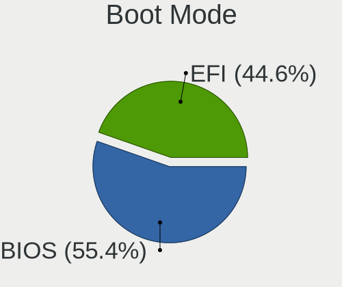

| Mode | Computers | Percent |
|------|-----------|---------|
| EFI  | 91        | 56.17%  |
| BIOS | 71        | 43.83%  |

Filesystem
----------

Type of filesystem

| Type    | Computers | Percent |
|---------|-----------|---------|
| Ext4    | 113       | 69.75%  |
| Btrfs   | 22        | 13.58%  |
| Overlay | 15        | 9.26%   |
| Xfs     | 12        | 7.41%   |

Part. scheme
------------

Scheme of partitioning

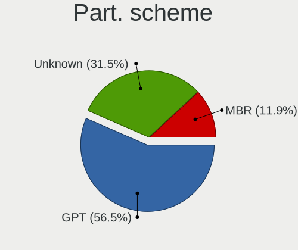

| Type    | Computers | Percent |
|---------|-----------|---------|
| GPT     | 73        | 45.06%  |
| Unknown | 72        | 44.44%  |
| MBR     | 17        | 10.49%  |

Dual Boot with Linux/BSD
------------------------

Hosting more than one Linux/BSD

| Dual boot | Computers | Percent |
|-----------|-----------|---------|
| No        | 138       | 85.19%  |
| Yes       | 24        | 14.81%  |

Dual Boot (Win)
---------------

Hosting Linux and Windows

| Dual boot | Computers | Percent |
|-----------|-----------|---------|
| No        | 116       | 71.6%   |
| Yes       | 46        | 28.4%   |

Board
-----

Vendor
------

Motherboard manufacturer

| Name                    | Computers | Percent |
|-------------------------|-----------|---------|
| ASUSTek Computer        | 34        | 20.99%  |
| Lenovo                  | 26        | 16.05%  |
| Hewlett-Packard         | 19        | 11.73%  |
| MSI                     | 15        | 9.26%   |
| Dell                    | 8         | 4.94%   |
| Acer                    | 7         | 4.32%   |
| Gigabyte Technology     | 6         | 3.7%    |
| ASRock                  | 6         | 3.7%    |
| Apple                   | 5         | 3.09%   |
| Chuwi                   | 4         | 2.47%   |
| Valve                   | 3         | 1.85%   |
| Toshiba                 | 3         | 1.85%   |
| HUAWEI                  | 3         | 1.85%   |
| Sony                    | 2         | 1.23%   |
| Raspberry Pi Foundation | 2         | 1.23%   |
| Medion                  | 2         | 1.23%   |
| LG Electronics          | 2         | 1.23%   |
| Unknown                 | 2         | 1.23%   |
| Shuttle                 | 1         | 0.62%   |
| Samsung Electronics     | 1         | 0.62%   |
| Notebook                | 1         | 0.62%   |
| Minix                   | 1         | 0.62%   |
| IP3 Tech                | 1         | 0.62%   |
| Intel                   | 1         | 0.62%   |
| INFINITY                | 1         | 0.62%   |
| HONOR                   | 1         | 0.62%   |
| Fujitsu                 | 1         | 0.62%   |
| ECS                     | 1         | 0.62%   |
| BESSTAR Tech            | 1         | 0.62%   |
| AZW                     | 1         | 0.62%   |
| AXDIA International     | 1         | 0.62%   |

Model
-----

Motherboard model

| Name                                       | Computers | Percent |
|--------------------------------------------|-----------|---------|
| Valve Jupiter                              | 3         | 1.85%   |
| HUAWEI HN-WX9X                             | 3         | 1.85%   |
| ASUS All Series                            | 3         | 1.85%   |
| Unknown                                    | 3         | 1.85%   |
| MSI MS-7693                                | 2         | 1.23%   |
| HP Stream Notebook PC 13                   | 2         | 1.23%   |
| Dell Latitude E7240                        | 2         | 1.23%   |
| Chuwi HeroBook Air                         | 2         | 1.23%   |
| ASUS VivoBook 15_ASUS Laptop X540MA_R540MA | 2         | 1.23%   |
| ASUS ROG Strix G513QM_G513QM               | 2         | 1.23%   |
| ASRock X399 Phantom Gaming 6               | 2         | 1.23%   |
| Toshiba Satellite P50-B-11L                | 1         | 0.62%   |
| Toshiba Satellite L50D-B                   | 1         | 0.62%   |
| Toshiba Satellite A500                     | 1         | 0.62%   |
| Sony VPCEH2D0E                             | 1         | 0.62%   |
| Sony VPCEB1Z1E                             | 1         | 0.62%   |
| Shuttle DH470                              | 1         | 0.62%   |
| Samsung 305V4A/305V5A                      | 1         | 0.62%   |
| RPi Raspberry Pi 4 Model B Rev 1.1         | 1         | 0.62%   |
| RPi Raspberry Pi                           | 1         | 0.62%   |
| Notebook N141CU                            | 1         | 0.62%   |
| MSI Prestige 15 A10SC                      | 1         | 0.62%   |
| MSI Prestige 14 A11SCX                     | 1         | 0.62%   |
| MSI PPPPP-CCC#MMMMMMMM                     | 1         | 0.62%   |
| MSI MS-7D20                                | 1         | 0.62%   |
| MSI MS-7C91                                | 1         | 0.62%   |
| MSI MS-7C00                                | 1         | 0.62%   |
| MSI MS-7B49                                | 1         | 0.62%   |
| MSI Modern 14 C12M                         | 1         | 0.62%   |
| MSI Katana GF66 12UC                       | 1         | 0.62%   |
| MSI GF75 Thin 10SC                         | 1         | 0.62%   |
| MSI GF63 8RD                               | 1         | 0.62%   |
| MSI Bravo 15 B5DD                          | 1         | 0.62%   |
| MSI Alpha 15 A4DEK                         | 1         | 0.62%   |
| Minix NEO G41V-4 Max                       | 1         | 0.62%   |
| Medion H61H2-LM3                           | 1         | 0.62%   |
| Medion E4251 MD61227                       | 1         | 0.62%   |
| LG P530-K.AE23B                            | 1         | 0.62%   |
| LG 14Z990-V.AP72B                          | 1         | 0.62%   |
| Lenovo Yoga 510-14ISK 80S7                 | 1         | 0.62%   |

Model Family
------------

Motherboard model prefix

| Name                   | Computers | Percent |
|------------------------|-----------|---------|
| Lenovo ThinkPad        | 8         | 4.94%   |
| ASUS ROG               | 8         | 4.94%   |
| Lenovo IdeaPad         | 7         | 4.32%   |
| Dell Latitude          | 5         | 3.09%   |
| ASUS VivoBook          | 4         | 2.47%   |
| Acer Aspire            | 4         | 2.47%   |
| Valve Jupiter          | 3         | 1.85%   |
| Toshiba Satellite      | 3         | 1.85%   |
| HUAWEI HN-WX9X         | 3         | 1.85%   |
| HP Compaq              | 3         | 1.85%   |
| ASUS PRIME             | 3         | 1.85%   |
| ASUS All               | 3         | 1.85%   |
| Unknown                | 3         | 1.85%   |
| RPi Raspberry          | 2         | 1.23%   |
| MSI Prestige           | 2         | 1.23%   |
| MSI MS-7693            | 2         | 1.23%   |
| Lenovo ThinkCentre     | 2         | 1.23%   |
| Lenovo Legion          | 2         | 1.23%   |
| HP Stream              | 2         | 1.23%   |
| HP Pavilion            | 2         | 1.23%   |
| HP Laptop              | 2         | 1.23%   |
| HP 250                 | 2         | 1.23%   |
| Chuwi HeroBook         | 2         | 1.23%   |
| ASUS ZenBook           | 2         | 1.23%   |
| ASUS TUF               | 2         | 1.23%   |
| ASUS M5A97             | 2         | 1.23%   |
| ASRock X399            | 2         | 1.23%   |
| Acer TravelMate        | 2         | 1.23%   |
| Sony VPCEH2D0E         | 1         | 0.62%   |
| Sony VPCEB1Z1E         | 1         | 0.62%   |
| Shuttle DH470          | 1         | 0.62%   |
| Samsung 305V4A         | 1         | 0.62%   |
| Notebook N141CU        | 1         | 0.62%   |
| MSI PPPPP-CCC#MMMMMMMM | 1         | 0.62%   |
| MSI MS-7D20            | 1         | 0.62%   |
| MSI MS-7C91            | 1         | 0.62%   |
| MSI MS-7C00            | 1         | 0.62%   |
| MSI MS-7B49            | 1         | 0.62%   |
| MSI Modern             | 1         | 0.62%   |
| MSI Katana             | 1         | 0.62%   |

MFG Year
--------

Motherboard manufacture year

| Year    | Computers | Percent |
|---------|-----------|---------|
| 2021    | 29        | 17.9%   |
| 2020    | 19        | 11.73%  |
| 2019    | 19        | 11.73%  |
| 2018    | 19        | 11.73%  |
| 2014    | 10        | 6.17%   |
| 2015    | 9         | 5.56%   |
| 2013    | 9         | 5.56%   |
| 2011    | 9         | 5.56%   |
| 2022    | 8         | 4.94%   |
| 2010    | 8         | 4.94%   |
| 2007    | 5         | 3.09%   |
| 2017    | 4         | 2.47%   |
| 2008    | 4         | 2.47%   |
| 2016    | 3         | 1.85%   |
| 2012    | 2         | 1.23%   |
| Unknown | 2         | 1.23%   |
| 2009    | 1         | 0.62%   |
| 2006    | 1         | 0.62%   |
| 2004    | 1         | 0.62%   |

Form Factor
-----------

Physical design of the computer

| Name           | Computers | Percent |
|----------------|-----------|---------|
| Notebook       | 105       | 64.81%  |
| Desktop        | 48        | 29.63%  |
| Mini pc        | 3         | 1.85%   |
| System on chip | 2         | 1.23%   |
| Server         | 2         | 1.23%   |
| Convertible    | 1         | 0.62%   |
| All in one     | 1         | 0.62%   |

Secure Boot
-----------

Enabled or disabled

| State    | Computers | Percent |
|----------|-----------|---------|
| Disabled | 152       | 93.83%  |
| Enabled  | 10        | 6.17%   |

Coreboot
--------

Have coreboot on board

| Used | Computers | Percent |
|------|-----------|---------|
| No   | 162       | 100%    |

RAM Size
--------

Total RAM memory

| Size in GB      | Computers | Percent |
|-----------------|-----------|---------|
| 4.01-8.0        | 40        | 24.69%  |
| 8.01-16.0       | 36        | 22.22%  |
| 16.01-24.0      | 27        | 16.67%  |
| 3.01-4.0        | 26        | 16.05%  |
| 32.01-64.0      | 23        | 14.2%   |
| 1.01-2.0        | 5         | 3.09%   |
| 24.01-32.0      | 2         | 1.23%   |
| More than 256.0 | 1         | 0.62%   |
| 2.01-3.0        | 1         | 0.62%   |
| 0.51-1.0        | 1         | 0.62%   |

RAM Used
--------

Used RAM memory

| Used GB   | Computers | Percent |
|-----------|-----------|---------|
| 1.01-2.0  | 54        | 33.33%  |
| 2.01-3.0  | 49        | 30.25%  |
| 4.01-8.0  | 26        | 16.05%  |
| 3.01-4.0  | 21        | 12.96%  |
| 8.01-16.0 | 6         | 3.7%    |
| 0.51-1.0  | 4         | 2.47%   |
| 0.01-0.5  | 2         | 1.23%   |

Total Drives
------------

Number of drives on board

| Drives | Computers | Percent |
|--------|-----------|---------|
| 1      | 102       | 62.96%  |
| 2      | 39        | 24.07%  |
| 3      | 11        | 6.79%   |
| 4      | 6         | 3.7%    |
| 7      | 2         | 1.23%   |
| 9      | 1         | 0.62%   |
| 5      | 1         | 0.62%   |

Has CD-ROM
----------

Has CD-ROM on board

| Presented | Computers | Percent |
|-----------|-----------|---------|
| No        | 127       | 78.4%   |
| Yes       | 35        | 21.6%   |

Has Ethernet
------------

Has Ethernet on board

| Presented | Computers | Percent |
|-----------|-----------|---------|
| Yes       | 137       | 84.57%  |
| No        | 25        | 15.43%  |

Has WiFi
--------

Has WiFi module

| Presented | Computers | Percent |
|-----------|-----------|---------|
| Yes       | 131       | 80.86%  |
| No        | 31        | 19.14%  |

Has Bluetooth
-------------

Has Bluetooth module

| Presented | Computers | Percent |
|-----------|-----------|---------|
| Yes       | 100       | 61.73%  |
| No        | 62        | 38.27%  |

Location
--------

Country
-------

Geographic location (country)

| Country | Computers | Percent |
|---------|-----------|---------|
| Spain   | 162       | 100%    |

City
----

Geographic location (city)

| City                       | Computers | Percent |
|----------------------------|-----------|---------|
| Madrid                     | 25        | 15.43%  |
| Seville                    | 23        | 14.2%   |
| Barcelona                  | 17        | 10.49%  |
| Valencia                   | 6         | 3.7%    |
| Las Palmas de Gran Canaria | 6         | 3.7%    |
| Palma                      | 4         | 2.47%   |
| Santiago de Compostela     | 3         | 1.85%   |
| León                      | 3         | 1.85%   |
| Almería                   | 3         | 1.85%   |
| Tomares                    | 2         | 1.23%   |
| Sanlúcar de Barrameda     | 2         | 1.23%   |
| Rubí                      | 2         | 1.23%   |
| Pozuelo de Alarcón        | 2         | 1.23%   |
| Málaga                    | 2         | 1.23%   |
| Jerez de la Frontera       | 2         | 1.23%   |
| Donostia / San Sebastian   | 2         | 1.23%   |
| Zuera                      | 1         | 0.62%   |
| Zamora                     | 1         | 0.62%   |
| Vitoria-Gasteiz            | 1         | 0.62%   |
| Villena                    | 1         | 0.62%   |
| Villanueva del Pardillo    | 1         | 0.62%   |
| Vigo                       | 1         | 0.62%   |
| Vallirana                  | 1         | 0.62%   |
| Valdemoro                  | 1         | 0.62%   |
| Touro                      | 1         | 0.62%   |
| Torrevieja                 | 1         | 0.62%   |
| Terrassa                   | 1         | 0.62%   |
| Tarazona                   | 1         | 0.62%   |
| Sueca                      | 1         | 0.62%   |
| Solares                    | 1         | 0.62%   |
| Sesena                     | 1         | 0.62%   |
| Sanxenxo                   | 1         | 0.62%   |
| Santa Pola                 | 1         | 0.62%   |
| Sant Ferran de ses Roques  | 1         | 0.62%   |
| San Fernando               | 1         | 0.62%   |
| San Bartolomé de Tirajana | 1         | 0.62%   |
| Sabadell                   | 1         | 0.62%   |
| Riells del Fai             | 1         | 0.62%   |
| Petrel                     | 1         | 0.62%   |
| Pamplona                   | 1         | 0.62%   |

Drives
------

Drive Vendor
------------

Hard drive vendors

| Vendor                    | Computers | Drives | Percent |
|---------------------------|-----------|--------|---------|
| Samsung Electronics       | 36        | 41     | 15.32%  |
| WDC                       | 26        | 34     | 11.06%  |
| Seagate                   | 26        | 31     | 11.06%  |
| Kingston                  | 24        | 24     | 10.21%  |
| Unknown                   | 15        | 18     | 6.38%   |
| Sandisk                   | 15        | 15     | 6.38%   |
| Toshiba                   | 14        | 18     | 5.96%   |
| SK hynix                  | 10        | 11     | 4.26%   |
| Crucial                   | 9         | 11     | 3.83%   |
| Micron Technology         | 8         | 8      | 3.4%    |
| Intel                     | 8         | 8      | 3.4%    |
| Netac                     | 4         | 4      | 1.7%    |
| Hitachi                   | 4         | 4      | 1.7%    |
| Phison                    | 3         | 3      | 1.28%   |
| Micron/Crucial Technology | 3         | 3      | 1.28%   |
| KIOXIA-EXCERIA            | 3         | 4      | 1.28%   |
| KIOXIA                    | 2         | 2      | 0.85%   |
| KingSpec                  | 2         | 2      | 0.85%   |
| JMicron Technology        | 2         | 2      | 0.85%   |
| Emtec                     | 2         | 2      | 0.85%   |
| China                     | 2         | 2      | 0.85%   |
| Unknown                   | 2         | 2      | 0.85%   |
| USB30                     | 1         | 1      | 0.43%   |
| USB3.0                    | 1         | 1      | 0.43%   |
| Transcend                 | 1         | 1      | 0.43%   |
| Phison Electronics        | 1         | 1      | 0.43%   |
| Patriot                   | 1         | 1      | 0.43%   |
| Maxtor                    | 1         | 1      | 0.43%   |
| Kston                     | 1         | 1      | 0.43%   |
| KLONER                    | 1         | 1      | 0.43%   |
| KingDian                  | 1         | 1      | 0.43%   |
| Kimtigo                   | 1         | 1      | 0.43%   |
| Intenso                   | 1         | 1      | 0.43%   |
| HGST                      | 1         | 1      | 0.43%   |
| faspeed                   | 1         | 1      | 0.43%   |
| ASMedia                   | 1         | 1      | 0.43%   |
| Apple                     | 1         | 1      | 0.43%   |

Drive Model
-----------

Hard drive models

| Model                                               | Computers | Percent |
|-----------------------------------------------------|-----------|---------|
| Kingston SA400S37240G 240GB SSD                     | 6         | 2.34%   |
| Samsung NVMe SSD Controller SM981/PM981/PM983 256GB | 4         | 1.56%   |
| Unknown SD/MMC/MS PRO 2GB                           | 3         | 1.17%   |
| Unknown MMC Card  32GB                              | 3         | 1.17%   |
| Seagate ST1000DM010-2EP102 1TB                      | 3         | 1.17%   |
| Sandisk WD Blue SN550 NVMe SSD 1024GB               | 3         | 1.17%   |
| Samsung MZVLB256HAHQ-00000 256GB                    | 3         | 1.17%   |
| WDC WDS500G2B0A-00SM50 500GB SSD                    | 2         | 0.78%   |
| WDC WD20EZRX-00D8PB0 2TB                            | 2         | 0.78%   |
| Toshiba TR200 480GB SSD                             | 2         | 0.78%   |
| Toshiba HDWD110 1TB                                 | 2         | 0.78%   |
| SK hynix HFM001TD3JX013N 1024GB                     | 2         | 0.78%   |
| Seagate ST500DM002-1BD142 500GB                     | 2         | 0.78%   |
| Seagate ST2000DM008-2FR102 2TB                      | 2         | 0.78%   |
| Seagate ST1000LM024 HN-M101MBB 1TB                  | 2         | 0.78%   |
| Sandisk WD Black SN750 / PC SN730 NVMe SSD 1024GB   | 2         | 0.78%   |
| Samsung SSD 980 PRO 1TB                             | 2         | 0.78%   |
| Samsung SSD 970 EVO Plus 500GB                      | 2         | 0.78%   |
| Samsung SSD 860 EVO 500GB                           | 2         | 0.78%   |
| Samsung SSD 840 EVO 120GB                           | 2         | 0.78%   |
| Netac SSD 256GB                                     | 2         | 0.78%   |
| Netac SSD 128GB                                     | 2         | 0.78%   |
| Micron/Crucial P1 NVMe PCIe SSD 1TB                 | 2         | 0.78%   |
| Kingston SV300S37A240G 240GB SSD                    | 2         | 0.78%   |
| Kingston SV300S37A120G 120GB SSD                    | 2         | 0.78%   |
| Kingston SUV500240G 240GB SSD                       | 2         | 0.78%   |
| Kingston SA400S37480G 480GB SSD                     | 2         | 0.78%   |
| Kingston RBUSC180DS37256GJ 256GB SSD                | 2         | 0.78%   |
| JMicron Generic 120GB                               | 2         | 0.78%   |
| Intel SSDPEKNW512G8 512GB                           | 2         | 0.78%   |
| Hitachi HTS545050B9A300 500GB                       | 2         | 0.78%   |
| Crucial CT500P2SSD8 500GB                           | 2         | 0.78%   |
| Crucial CT480BX500SSD1 480GB                        | 2         | 0.78%   |
| Unknown                                             | 2         | 0.78%   |
| WDC WDS500G3XHC-00SJG0 500GB                        | 1         | 0.39%   |
| WDC WDS500G2B0B-00YS70 500GB SSD                    | 1         | 0.39%   |
| WDC WDS100T3X0C-00SJG0 1TB                          | 1         | 0.39%   |
| WDC WDS100T2B0A-00SM50 1TB SSD                      | 1         | 0.39%   |
| WDC WDBNCE0010PNC 1TB SSD                           | 1         | 0.39%   |
| WDC WD6401AALS-00L3B2 640GB                         | 1         | 0.39%   |

HDD Vendor
----------

Hard disk drive vendors

| Vendor  | Computers | Drives | Percent |
|---------|-----------|--------|---------|
| Seagate | 26        | 31     | 39.39%  |
| WDC     | 20        | 24     | 30.3%   |
| Toshiba | 10        | 12     | 15.15%  |
| Hitachi | 4         | 4      | 6.06%   |
| Unknown | 3         | 3      | 4.55%   |
| USB3.0  | 1         | 1      | 1.52%   |
| HGST    | 1         | 1      | 1.52%   |
| ASMedia | 1         | 1      | 1.52%   |

SSD Vendor
----------

Solid state drive vendors

| Vendor              | Computers | Drives | Percent |
|---------------------|-----------|--------|---------|
| Kingston            | 17        | 17     | 21.79%  |
| Samsung Electronics | 12        | 13     | 15.38%  |
| Crucial             | 7         | 7      | 8.97%   |
| SanDisk             | 6         | 6      | 7.69%   |
| WDC                 | 5         | 5      | 6.41%   |
| Toshiba             | 4         | 6      | 5.13%   |
| SK hynix            | 4         | 5      | 5.13%   |
| Netac               | 4         | 4      | 5.13%   |
| KIOXIA-EXCERIA      | 2         | 2      | 2.56%   |
| KingSpec            | 2         | 2      | 2.56%   |
| Emtec               | 2         | 2      | 2.56%   |
| China               | 2         | 2      | 2.56%   |
| USB30               | 1         | 1      | 1.28%   |
| Transcend           | 1         | 1      | 1.28%   |
| Patriot             | 1         | 1      | 1.28%   |
| Maxtor              | 1         | 1      | 1.28%   |
| Kston               | 1         | 1      | 1.28%   |
| KLONER              | 1         | 1      | 1.28%   |
| KingDian            | 1         | 1      | 1.28%   |
| Kimtigo             | 1         | 1      | 1.28%   |
| Intel               | 1         | 1      | 1.28%   |
| Apple               | 1         | 1      | 1.28%   |
| Unknown             | 1         | 1      | 1.28%   |

Drive Kind
----------

HDD or SSD

| Kind    | Computers | Drives | Percent |
|---------|-----------|--------|---------|
| NVMe    | 74        | 84     | 35.24%  |
| SSD     | 63        | 82     | 30%     |
| HDD     | 58        | 77     | 27.62%  |
| MMC     | 13        | 18     | 6.19%   |
| Unknown | 2         | 3      | 0.95%   |

Drive Connector
---------------

SATA, SAS, NVMe, etc.

| Type | Computers | Drives | Percent |
|------|-----------|--------|---------|
| SATA | 99        | 156    | 51.56%  |
| NVMe | 72        | 82     | 37.5%   |
| MMC  | 13        | 18     | 6.77%   |
| SAS  | 8         | 8      | 4.17%   |

Drive Size
----------

Size of hard drive

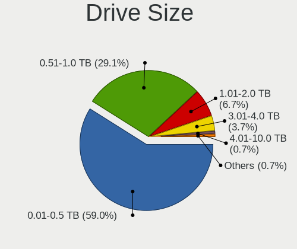

| Size in TB | Computers | Drives | Percent |
|------------|-----------|--------|---------|
| 0.01-0.5   | 79        | 97     | 59.4%   |
| 0.51-1.0   | 36        | 39     | 27.07%  |
| 1.01-2.0   | 10        | 13     | 7.52%   |
| 3.01-4.0   | 3         | 4      | 2.26%   |
| 2.01-3.0   | 3         | 4      | 2.26%   |
| 4.01-10.0  | 2         | 2      | 1.5%    |

Space Total
-----------

Amount of disk space available on the file system

| Size in GB     | Computers | Percent |
|----------------|-----------|---------|
| 101-250        | 50        | 30.86%  |
| 251-500        | 29        | 17.9%   |
| 501-1000       | 27        | 16.67%  |
| 1-20           | 17        | 10.49%  |
| 1001-2000      | 12        | 7.41%   |
| 21-50          | 7         | 4.32%   |
| 2001-3000      | 7         | 4.32%   |
| 51-100         | 7         | 4.32%   |
| More than 3000 | 5         | 3.09%   |
| Unknown        | 1         | 0.62%   |

Space Used
----------

Amount of used disk space

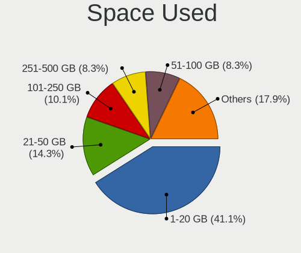

| Used GB        | Computers | Percent |
|----------------|-----------|---------|
| 1-20           | 62        | 38.27%  |
| 21-50          | 30        | 18.52%  |
| 101-250        | 20        | 12.35%  |
| 251-500        | 15        | 9.26%   |
| 51-100         | 14        | 8.64%   |
| 501-1000       | 12        | 7.41%   |
| 1001-2000      | 4         | 2.47%   |
| More than 3000 | 3         | 1.85%   |
| 0              | 1         | 0.62%   |
| Unknown        | 1         | 0.62%   |

Malfunc. Drives
---------------

Drive models with a malfunction

| Model                              | Computers | Drives | Percent |
|------------------------------------|-----------|--------|---------|
| WDC WD1600JS-22MHB0 160GB          | 1         | 1      | 12.5%   |
| Transcend TS1TSSD230S 1TB          | 1         | 1      | 12.5%   |
| Seagate ST3500820AS 500GB          | 1         | 1      | 12.5%   |
| Seagate ST3160023AS 160GB          | 1         | 1      | 12.5%   |
| Seagate ST3000DM001-9YN166 3TB     | 1         | 1      | 12.5%   |
| Seagate ST1000LM024 HN-M101MBB 1TB | 1         | 1      | 12.5%   |
| SanDisk SSD PLUS 480GB             | 1         | 1      | 12.5%   |
| Hitachi HTS545050B9A300 500GB      | 1         | 1      | 12.5%   |

Malfunc. Drive Vendor
---------------------

Vendors of faulty drives

| Vendor    | Computers | Drives | Percent |
|-----------|-----------|--------|---------|
| Seagate   | 4         | 4      | 50%     |
| WDC       | 1         | 1      | 12.5%   |
| Transcend | 1         | 1      | 12.5%   |
| SanDisk   | 1         | 1      | 12.5%   |
| Hitachi   | 1         | 1      | 12.5%   |

Malfunc. HDD Vendor
-------------------

Vendors of faulty HDD drives

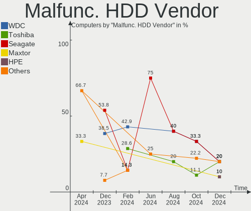

| Vendor  | Computers | Drives | Percent |
|---------|-----------|--------|---------|
| Seagate | 4         | 4      | 66.67%  |
| WDC     | 1         | 1      | 16.67%  |
| Hitachi | 1         | 1      | 16.67%  |

Malfunc. Drive Kind
-------------------

Kinds of faulty drives

| Kind | Computers | Drives | Percent |
|------|-----------|--------|---------|
| HDD  | 6         | 6      | 75%     |
| SSD  | 2         | 2      | 25%     |

Failed Drives
-------------

Failed drive models

Zero info for selected period =(

Failed Drive Vendor
-------------------

Failed drive vendors

Zero info for selected period =(

Drive Status
------------

Number of failed and malfunc. drives

| Status   | Computers | Drives | Percent |
|----------|-----------|--------|---------|
| Detected | 86        | 126    | 50.29%  |
| Works    | 77        | 130    | 45.03%  |
| Malfunc  | 8         | 8      | 4.68%   |

Storage controller
------------------

Storage Vendor
--------------

Storage controller vendors

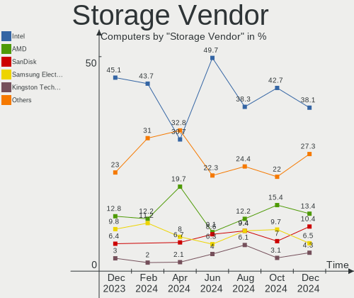

| Vendor                       | Computers | Percent |
|------------------------------|-----------|---------|
| Intel                        | 95        | 47.03%  |
| AMD                          | 28        | 13.86%  |
| Samsung Electronics          | 26        | 12.87%  |
| SanDisk                      | 13        | 6.44%   |
| Micron Technology            | 8         | 3.96%   |
| Kingston Technology Company  | 7         | 3.47%   |
| Micron/Crucial Technology    | 6         | 2.97%   |
| SK hynix                     | 4         | 1.98%   |
| Phison Electronics           | 4         | 1.98%   |
| Nvidia                       | 3         | 1.49%   |
| KIOXIA                       | 2         | 0.99%   |
| JMicron Technology           | 2         | 0.99%   |
| Toshiba America Info Systems | 1         | 0.5%    |
| Marvell Technology Group     | 1         | 0.5%    |
| LSI Logic / Symbios Logic    | 1         | 0.5%    |
| ASMedia Technology           | 1         | 0.5%    |

Storage Model
-------------

Storage controller models

| Model                                                                          | Computers | Percent |
|--------------------------------------------------------------------------------|-----------|---------|
| AMD FCH SATA Controller [AHCI mode]                                            | 19        | 8.56%   |
| Samsung NVMe SSD Controller SM981/PM981/PM983                                  | 13        | 5.86%   |
| Micron Non-Volatile memory controller                                          | 8         | 3.6%    |
| Intel Celeron/Pentium Silver Processor SATA Controller                         | 8         | 3.6%    |
| Intel 8 Series SATA Controller 1 [AHCI mode]                                   | 8         | 3.6%    |
| Samsung NVMe SSD Controller 980                                                | 7         | 3.15%   |
| Intel 8 Series/C220 Series Chipset Family 6-port SATA Controller 1 [AHCI mode] | 6         | 2.7%    |
| Intel Sunrise Point-LP SATA Controller [AHCI mode]                             | 5         | 2.25%   |
| Intel SSD 660P Series                                                          | 5         | 2.25%   |
| Intel 5 Series/3400 Series Chipset 4 port SATA AHCI Controller                 | 5         | 2.25%   |
| AMD SB7x0/SB8x0/SB9x0 SATA Controller [AHCI mode]                              | 5         | 2.25%   |
| Samsung NVMe SSD Controller PM9A1/PM9A3/980PRO                                 | 4         | 1.8%    |
| Intel Volume Management Device NVMe RAID Controller                            | 4         | 1.8%    |
| Intel Q170/Q150/B150/H170/H110/Z170/CM236 Chipset SATA Controller [AHCI Mode]  | 4         | 1.8%    |
| Intel Cannon Point-LP SATA Controller [AHCI Mode]                              | 4         | 1.8%    |
| Intel Cannon Lake Mobile PCH SATA AHCI Controller                              | 4         | 1.8%    |
| Intel 82801 Mobile SATA Controller [RAID mode]                                 | 4         | 1.8%    |
| Intel 500 Series Chipset Family SATA AHCI Controller                           | 4         | 1.8%    |
| SK hynix Gold P31 SSD                                                          | 3         | 1.35%   |
| SanDisk WD Blue SN550 NVMe SSD                                                 | 3         | 1.35%   |
| SanDisk WD Black SN750 / PC SN730 NVMe SSD                                     | 3         | 1.35%   |
| Micron/Crucial P2 NVMe PCIe SSD                                                | 3         | 1.35%   |
| Kingston Company U-SNS8154P3 NVMe SSD                                          | 3         | 1.35%   |
| Kingston Company Company Non-Volatile memory controller                        | 3         | 1.35%   |
| Intel 82801HM/HEM (ICH8M/ICH8M-E) IDE Controller                               | 3         | 1.35%   |
| Intel 6 Series/C200 Series Chipset Family 6 port Mobile SATA AHCI Controller   | 3         | 1.35%   |
| Intel 6 Series/C200 Series Chipset Family 6 port Desktop SATA AHCI Controller  | 3         | 1.35%   |
| Intel 200 Series PCH SATA controller [AHCI mode]                               | 3         | 1.35%   |
| SanDisk WD Blue SN500 / PC SN520 NVMe SSD                                      | 2         | 0.9%    |
| SanDisk WD Black 2018/SN750 / PC SN720 NVMe SSD                                | 2         | 0.9%    |
| SanDisk PC SN520 NVMe SSD                                                      | 2         | 0.9%    |
| Phison PS5013 E13 NVMe Controller                                              | 2         | 0.9%    |
| Phison E12 NVMe Controller                                                     | 2         | 0.9%    |
| Nvidia MCP78S [GeForce 8200] IDE                                               | 2         | 0.9%    |
| Nvidia MCP78S [GeForce 8200] AHCI Controller                                   | 2         | 0.9%    |
| Micron/Crucial P1 NVMe PCIe SSD                                                | 2         | 0.9%    |
| Intel Tiger Lake-LP SATA Controller                                            | 2         | 0.9%    |
| Intel SATA Controller [RAID mode]                                              | 2         | 0.9%    |
| Intel NM10/ICH7 Family SATA Controller [IDE mode]                              | 2         | 0.9%    |
| Intel Comet Lake SATA AHCI Controller                                          | 2         | 0.9%    |

Storage Kind
------------

Kind of storage controller (IDE, SATA, NVMe, SAS, ...)

| Kind | Computers | Percent |
|------|-----------|---------|
| SATA | 107       | 52.2%   |
| NVMe | 72        | 35.12%  |
| IDE  | 14        | 6.83%   |
| RAID | 12        | 5.85%   |

Processor
---------

CPU Vendor
----------

Processor vendors

| Vendor | Computers | Percent |
|--------|-----------|---------|
| Intel  | 111       | 68.52%  |
| AMD    | 49        | 30.25%  |
| ARM    | 2         | 1.23%   |

CPU Model
---------

Processor models

| Model                                          | Computers | Percent |
|------------------------------------------------|-----------|---------|
| AMD Ryzen 7 5800H with Radeon Graphics         | 5         | 3.09%   |
| Intel Core i7-8750H CPU @ 2.20GHz              | 4         | 2.47%   |
| Intel 11th Gen Core i5-1135G7 @ 2.40GHz        | 4         | 2.47%   |
| Intel Core i7-8565U CPU @ 1.80GHz              | 3         | 1.85%   |
| Intel Core i7-8550U CPU @ 1.80GHz              | 3         | 1.85%   |
| Intel Celeron N4000 CPU @ 1.10GHz              | 3         | 1.85%   |
| AMD Ryzen 9 5900HX with Radeon Graphics        | 3         | 1.85%   |
| AMD Ryzen 5 3500U with Radeon Vega Mobile Gfx  | 3         | 1.85%   |
| AMD Custom APU 0405                            | 3         | 1.85%   |
| AMD A6-9225 RADEON R4, 5 COMPUTE CORES 2C+3G   | 3         | 1.85%   |
| Intel Core i7-9700 CPU @ 3.00GHz               | 2         | 1.23%   |
| Intel Core i7-10750H CPU @ 2.60GHz             | 2         | 1.23%   |
| Intel Core i7-10510U CPU @ 1.80GHz             | 2         | 1.23%   |
| Intel Core i5-6600K CPU @ 3.50GHz              | 2         | 1.23%   |
| Intel Core i5-4310U CPU @ 2.00GHz              | 2         | 1.23%   |
| Intel Core i5-10210U CPU @ 1.60GHz             | 2         | 1.23%   |
| Intel Celeron N4120 CPU @ 1.10GHz              | 2         | 1.23%   |
| Intel Celeron N4020 CPU @ 1.10GHz              | 2         | 1.23%   |
| Intel Celeron CPU N2840 @ 2.16GHz              | 2         | 1.23%   |
| Intel 11th Gen Core i7-1185G7 @ 3.00GHz        | 2         | 1.23%   |
| AMD Ryzen Threadripper 1920X 12-Core Processor | 2         | 1.23%   |
| AMD Ryzen 7 4800H with Radeon Graphics         | 2         | 1.23%   |
| AMD FX-8350 Eight-Core Processor               | 2         | 1.23%   |
| Intel Xeon CPU E3-1270 v3 @ 3.50GHz            | 1         | 0.62%   |
| Intel Pentium Gold G6405 CPU @ 4.10GHz         | 1         | 0.62%   |
| Intel Pentium Dual CPU T3200 @ 2.00GHz         | 1         | 0.62%   |
| Intel Pentium CPU P6200 @ 2.13GHz              | 1         | 0.62%   |
| Intel Pentium CPU G3250 @ 3.20GHz              | 1         | 0.62%   |
| Intel Pentium CPU G3220 @ 3.00GHz              | 1         | 0.62%   |
| Intel Pentium CPU B950 @ 2.10GHz               | 1         | 0.62%   |
| Intel Mobile Pentium 4 CPU 3.06GHz             | 1         | 0.62%   |
| Intel Core i9-9900KF CPU @ 3.60GHz             | 1         | 0.62%   |
| Intel Core i7-6700HQ CPU @ 2.60GHz             | 1         | 0.62%   |
| Intel Core i7-4790 CPU @ 3.60GHz               | 1         | 0.62%   |
| Intel Core i7-4720HQ CPU @ 2.60GHz             | 1         | 0.62%   |
| Intel Core i7-4650U CPU @ 1.70GHz              | 1         | 0.62%   |
| Intel Core i7-4600U CPU @ 2.10GHz              | 1         | 0.62%   |
| Intel Core i7-4510U CPU @ 2.00GHz              | 1         | 0.62%   |
| Intel Core i7-4500U CPU @ 1.80GHz              | 1         | 0.62%   |
| Intel Core i7-3615QM CPU @ 2.30GHz             | 1         | 0.62%   |

CPU Model Family
----------------

Processor model prefix

| Model                  | Computers | Percent |
|------------------------|-----------|---------|
| Intel Core i7          | 27        | 16.67%  |
| Intel Core i5          | 26        | 16.05%  |
| Other                  | 20        | 12.35%  |
| Intel Celeron          | 16        | 9.88%   |
| AMD Ryzen 7            | 11        | 6.79%   |
| AMD Ryzen 5            | 10        | 6.17%   |
| Intel Core i3          | 6         | 3.7%    |
| Intel Core 2 Duo       | 6         | 3.7%    |
| AMD Ryzen 9            | 5         | 3.09%   |
| Intel Pentium          | 4         | 2.47%   |
| AMD FX                 | 4         | 2.47%   |
| AMD A6                 | 4         | 2.47%   |
| Intel Atom             | 3         | 1.85%   |
| AMD Ryzen Threadripper | 2         | 1.23%   |
| AMD A8                 | 2         | 1.23%   |
| AMD A4                 | 2         | 1.23%   |
| Intel Xeon             | 1         | 0.62%   |
| Intel Pentium Gold     | 1         | 0.62%   |
| Intel Pentium Dual     | 1         | 0.62%   |
| Intel Mobile Pentium 4 | 1         | 0.62%   |
| Intel Core i9          | 1         | 0.62%   |
| Intel Core 2 Quad      | 1         | 0.62%   |
| Intel Core 2           | 1         | 0.62%   |
| Intel Celeron M        | 1         | 0.62%   |
| ARM BCM                | 1         | 0.62%   |
| AMD Ryzen 7 PRO        | 1         | 0.62%   |
| AMD Phenom II X6       | 1         | 0.62%   |
| AMD Opteron            | 1         | 0.62%   |
| AMD EPYC               | 1         | 0.62%   |
| AMD Athlon II X4       | 1         | 0.62%   |

CPU Cores
---------

Number of processor cores

| Number | Computers | Percent |
|--------|-----------|---------|
| 4      | 59        | 36.42%  |
| 2      | 54        | 33.33%  |
| 8      | 22        | 13.58%  |
| 6      | 17        | 10.49%  |
| 12     | 4         | 2.47%   |
| 1      | 2         | 1.23%   |
| 64     | 1         | 0.62%   |
| 16     | 1         | 0.62%   |
| 14     | 1         | 0.62%   |
| 10     | 1         | 0.62%   |

CPU Sockets
-----------

Number of sockets

| Number | Computers | Percent |
|--------|-----------|---------|
| 1      | 161       | 99.38%  |
| 2      | 1         | 0.62%   |

CPU Threads
-----------

Threads per core (Hyper-Threading)

| Number | Computers | Percent |
|--------|-----------|---------|
| 2      | 102       | 62.96%  |
| 1      | 60        | 37.04%  |

CPU Op-Modes
------------

CPU Operation Modes (32-bit, 64-bit)

| Op mode        | Computers | Percent |
|----------------|-----------|---------|
| 32-bit, 64-bit | 159       | 98.15%  |
| Unknown        | 2         | 1.23%   |
| 32-bit         | 1         | 0.62%   |

CPU Microcode
-------------

Microcode number

| Number     | Computers | Percent |
|------------|-----------|---------|
| Unknown    | 47        | 29.01%  |
| 0x806c1    | 7         | 4.32%   |
| 0x40651    | 6         | 3.7%    |
| 0x0a50000c | 6         | 3.7%    |
| 0x806ea    | 5         | 3.09%   |
| 0x306c3    | 5         | 3.09%   |
| 0x706a8    | 4         | 2.47%   |
| 0x506e3    | 4         | 2.47%   |
| 0xa0671    | 3         | 1.85%   |
| 0x906ea    | 3         | 1.85%   |
| 0x806ec    | 3         | 1.85%   |
| 0x706a1    | 3         | 1.85%   |
| 0x6fd      | 3         | 1.85%   |
| 0x206a7    | 3         | 1.85%   |
| 0x20655    | 3         | 1.85%   |
| 0x0a50000b | 3         | 1.85%   |
| 0x08600104 | 3         | 1.85%   |
| 0x08108109 | 3         | 1.85%   |
| 0xa0653    | 2         | 1.23%   |
| 0x906eb    | 2         | 1.23%   |
| 0x506c9    | 2         | 1.23%   |
| 0x306d4    | 2         | 1.23%   |
| 0x20652    | 2         | 1.23%   |
| 0x1067a    | 2         | 1.23%   |
| 0x08600106 | 2         | 1.23%   |
| 0x08001137 | 2         | 1.23%   |
| 0x06006705 | 2         | 1.23%   |
| 0x06000822 | 2         | 1.23%   |
| 0x03000027 | 2         | 1.23%   |
| 0xf29      | 1         | 0.62%   |
| 0xa0660    | 1         | 0.62%   |
| 0xa0655    | 1         | 0.62%   |
| 0xa0652    | 1         | 0.62%   |
| 0x906ec    | 1         | 0.62%   |
| 0x906e9    | 1         | 0.62%   |
| 0x906c0    | 1         | 0.62%   |
| 0x906a4    | 1         | 0.62%   |
| 0x906a3    | 1         | 0.62%   |
| 0x806eb    | 1         | 0.62%   |
| 0x806d1    | 1         | 0.62%   |

CPU Microarch
-------------

Microarchitecture

| Name             | Computers | Percent |
|------------------|-----------|---------|
| KabyLake         | 24        | 14.81%  |
| Haswell          | 16        | 9.88%   |
| Zen 3            | 12        | 7.41%   |
| Unknown          | 10        | 6.17%   |
| Zen 2            | 8         | 4.94%   |
| TigerLake        | 8         | 4.94%   |
| Goldmont plus    | 8         | 4.94%   |
| Core             | 7         | 4.32%   |
| Westmere         | 6         | 3.7%    |
| Skylake          | 6         | 3.7%    |
| SandyBridge      | 6         | 3.7%    |
| CometLake        | 6         | 3.7%    |
| Zen+             | 5         | 3.09%   |
| Silvermont       | 5         | 3.09%   |
| Icelake          | 5         | 3.09%   |
| Excavator        | 4         | 2.47%   |
| Zen              | 3         | 1.85%   |
| Piledriver       | 3         | 1.85%   |
| Penryn           | 3         | 1.85%   |
| K10              | 3         | 1.85%   |
| K10 Llano        | 2         | 1.23%   |
| Goldmont         | 2         | 1.23%   |
| Broadwell        | 2         | 1.23%   |
| Tremont          | 1         | 0.62%   |
| Steamroller      | 1         | 0.62%   |
| Puma             | 1         | 0.62%   |
| NetBurst         | 1         | 0.62%   |
| IvyBridge        | 1         | 0.62%   |
| Bulldozer        | 1         | 0.62%   |
| Bonnell          | 1         | 0.62%   |
| Alderlake Hybrid | 1         | 0.62%   |

Graphics
--------

GPU Vendor
----------

Vendors of graphics cards

| Vendor                     | Computers | Percent |
|----------------------------|-----------|---------|
| Intel                      | 89        | 45.18%  |
| Nvidia                     | 61        | 30.96%  |
| AMD                        | 45        | 22.84%  |
| Matrox Electronics Systems | 2         | 1.02%   |

GPU Model
---------

Graphics card models

| Model                                                                                    | Computers | Percent |
|------------------------------------------------------------------------------------------|-----------|---------|
| AMD Cezanne                                                                              | 11        | 5.42%   |
| Intel Haswell-ULT Integrated Graphics Controller                                         | 9         | 4.43%   |
| Intel GeminiLake [UHD Graphics 600]                                                      | 8         | 3.94%   |
| Nvidia GA106M [GeForce RTX 3060 Mobile / Max-Q]                                          | 7         | 3.45%   |
| Intel TigerLake-LP GT2 [Iris Xe Graphics]                                                | 7         | 3.45%   |
| Intel 2nd Generation Core Processor Family Integrated Graphics Controller                | 6         | 2.96%   |
| Intel CoffeeLake-H GT2 [UHD Graphics 630]                                                | 5         | 2.46%   |
| AMD Renoir                                                                               | 5         | 2.46%   |
| AMD Picasso/Raven 2 [Radeon Vega Series / Radeon Vega Mobile Series]                     | 5         | 2.46%   |
| Nvidia GP107M [GeForce GTX 1050 Mobile]                                                  | 4         | 1.97%   |
| Nvidia GP107 [GeForce GTX 1050 Ti]                                                       | 4         | 1.97%   |
| Intel WhiskeyLake-U GT2 [UHD Graphics 620]                                               | 4         | 1.97%   |
| Intel UHD Graphics 620                                                                   | 4         | 1.97%   |
| Intel CometLake-U GT2 [UHD Graphics]                                                     | 4         | 1.97%   |
| Intel CoffeeLake-S GT2 [UHD Graphics 630]                                                | 4         | 1.97%   |
| AMD Stoney [Radeon R2/R3/R4/R5 Graphics]                                                 | 4         | 1.97%   |
| Nvidia TU117M                                                                            | 3         | 1.48%   |
| Nvidia GA107M [GeForce RTX 3050 Mobile]                                                  | 3         | 1.48%   |
| Intel HD Graphics 530                                                                    | 3         | 1.48%   |
| Intel Core Processor Integrated Graphics Controller                                      | 3         | 1.48%   |
| Intel Atom Processor Z36xxx/Z37xxx Series Graphics & Display                             | 3         | 1.48%   |
| AMD VanGogh [AMD Custom GPU 0405]                                                        | 3         | 1.48%   |
| Nvidia TU117M [GeForce GTX 1650 Mobile / Max-Q]                                          | 2         | 0.99%   |
| Nvidia GP108 [GeForce GT 1030]                                                           | 2         | 0.99%   |
| Nvidia GK208B [GeForce GT 730]                                                           | 2         | 0.99%   |
| Nvidia GK208B [GeForce GT 710]                                                           | 2         | 0.99%   |
| Intel Xeon E3-1200 v3/4th Gen Core Processor Integrated Graphics Controller              | 2         | 0.99%   |
| Intel HD Graphics 500                                                                    | 2         | 0.99%   |
| Intel CometLake-S GT2 [UHD Graphics 630]                                                 | 2         | 0.99%   |
| Intel CometLake-H GT2 [UHD Graphics]                                                     | 2         | 0.99%   |
| Intel Atom/Celeron/Pentium Processor x5-E8000/J3xxx/N3xxx Integrated Graphics Controller | 2         | 0.99%   |
| AMD Rembrandt [Radeon 680M]                                                              | 2         | 0.99%   |
| AMD Ellesmere [Radeon RX 470/480/570/570X/580/580X/590]                                  | 2         | 0.99%   |
| Nvidia TU117 [GeForce GTX 1650]                                                          | 1         | 0.49%   |
| Nvidia TU116M [GeForce GTX 1650 Ti Mobile]                                               | 1         | 0.49%   |
| Nvidia TU116 [GeForce GTX 1660]                                                          | 1         | 0.49%   |
| Nvidia TU116 [GeForce GTX 1650 SUPER]                                                    | 1         | 0.49%   |
| Nvidia TU106M [GeForce RTX 2060 Mobile]                                                  | 1         | 0.49%   |
| Nvidia TU104GL [Tesla T4]                                                                | 1         | 0.49%   |
| Nvidia TU104 [GeForce RTX 2080 Rev. A]                                                   | 1         | 0.49%   |

GPU Combo
---------

Combinations of graphics cards

| Name            | Computers | Percent |
|-----------------|-----------|---------|
| 1 x Intel       | 64        | 39.51%  |
| 1 x Nvidia      | 30        | 18.52%  |
| 1 x AMD         | 27        | 16.67%  |
| Intel + Nvidia  | 19        | 11.73%  |
| AMD + Nvidia    | 11        | 6.79%   |
| 2 x AMD         | 5         | 3.09%   |
| Other           | 2         | 1.23%   |
| Intel + AMD     | 2         | 1.23%   |
| Nvidia + Matrox | 1         | 0.62%   |
| 1 x Matrox      | 1         | 0.62%   |

GPU Driver
----------

Free vs proprietary

| Driver      | Computers | Percent |
|-------------|-----------|---------|
| Free        | 118       | 72.84%  |
| Proprietary | 34        | 20.99%  |
| Unknown     | 10        | 6.17%   |

GPU Memory
----------

Total video memory

| Size in GB | Computers | Percent |
|------------|-----------|---------|
| Unknown    | 105       | 64.81%  |
| 0.01-0.5   | 15        | 9.26%   |
| 3.01-4.0   | 14        | 8.64%   |
| 1.01-2.0   | 12        | 7.41%   |
| 0.51-1.0   | 9         | 5.56%   |
| 5.01-6.0   | 4         | 2.47%   |
| 8.01-16.0  | 2         | 1.23%   |
| 7.01-8.0   | 1         | 0.62%   |

Monitor
-------

Monitor Vendor
--------------

Monitor vendors

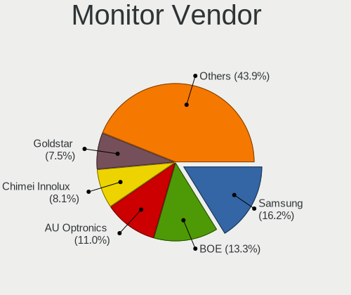

| Vendor                  | Computers | Percent |
|-------------------------|-----------|---------|
| Samsung Electronics     | 23        | 12.37%  |
| Chimei Innolux          | 20        | 10.75%  |
| AU Optronics            | 20        | 10.75%  |
| BOE                     | 15        | 8.06%   |
| LG Display              | 12        | 6.45%   |
| Goldstar                | 11        | 5.91%   |
| Philips                 | 7         | 3.76%   |
| Hewlett-Packard         | 7         | 3.76%   |
| Dell                    | 7         | 3.76%   |
| BenQ                    | 7         | 3.76%   |
| AOC                     | 7         | 3.76%   |
| Apple                   | 5         | 2.69%   |
| Ancor Communications    | 5         | 2.69%   |
| Sharp                   | 4         | 2.15%   |
| Lenovo                  | 4         | 2.15%   |
| Sony                    | 3         | 1.61%   |
| AGO                     | 3         | 1.61%   |
| ViewSonic               | 2         | 1.08%   |
| CSO                     | 2         | 1.08%   |
| ASUSTek Computer        | 2         | 1.08%   |
| Analogix                | 2         | 1.08%   |
| Acer                    | 2         | 1.08%   |
| Xiaomi                  | 1         | 0.54%   |
| Videoseven              | 1         | 0.54%   |
| Valve                   | 1         | 0.54%   |
| TMX                     | 1         | 0.54%   |
| Sunplus                 | 1         | 0.54%   |
| PANDA                   | 1         | 0.54%   |
| Optoma                  | 1         | 0.54%   |
| NEC Computers           | 1         | 0.54%   |
| MSI                     | 1         | 0.54%   |
| LG Philips              | 1         | 0.54%   |
| LG Electronics          | 1         | 0.54%   |
| InfoVision              | 1         | 0.54%   |
| HannStar Display        | 1         | 0.54%   |
| Gateway                 | 1         | 0.54%   |
| Eizo                    | 1         | 0.54%   |
| Chi Mei Optoelectronics | 1         | 0.54%   |

Monitor Model
-------------

Monitor models

| Model                                                                | Computers | Percent |
|----------------------------------------------------------------------|-----------|---------|
| Chimei Innolux LCD Monitor CMN15DB 1366x768 344x193mm 15.5-inch      | 5         | 2.63%   |
| Samsung Electronics S24D330 SAM0D92 1920x1080 531x299mm 24.0-inch    | 3         | 1.58%   |
| Lenovo LCD Monitor LEN40BA 1920x1080 344x194mm 15.5-inch             | 3         | 1.58%   |
| Samsung Electronics T24B301 SAM098E 1920x1080 521x293mm 23.5-inch    | 2         | 1.05%   |
| Philips PHL 243V5 PHLC0D1 1920x1080 521x293mm 23.5-inch              | 2         | 1.05%   |
| Chimei Innolux LCD Monitor CMN15F4 1920x1080 344x193mm 15.5-inch     | 2         | 1.05%   |
| Chimei Innolux LCD Monitor CMN1482 1600x900 309x174mm 14.0-inch      | 2         | 1.05%   |
| BOE LCD Monitor BOE09AD 1366x768 256x144mm 11.6-inch                 | 2         | 1.05%   |
| BenQ GL2580 BNQ78E5 1920x1080 544x303mm 24.5-inch                    | 2         | 1.05%   |
| AU Optronics LCD Monitor AUOAF90 1920x1080 344x193mm 15.5-inch       | 2         | 1.05%   |
| AU Optronics LCD Monitor AUO61ED 1920x1080 344x194mm 15.5-inch       | 2         | 1.05%   |
| AU Optronics LCD Monitor AUO312C 1366x768 293x164mm 13.2-inch        | 2         | 1.05%   |
| Apple Color LCD APP9CDF 1440x900 286x179mm 13.3-inch                 | 2         | 1.05%   |
| AOC 2218 AOC2218 1680x1050 526x296mm 23.8-inch                       | 2         | 1.05%   |
| Analogix ANX7530 U ANX7539 800x1280                                  | 2         | 1.05%   |
| AGO LCD Monitor AGO6201 1920x1080 256x192mm 12.6-inch                | 2         | 1.05%   |
| Xiaomi Mi TV XMD009A 3440x1440 480x270mm 21.7-inch                   | 1         | 0.53%   |
| ViewSonic VX2757 VSCF931 1920x1080 598x336mm 27.0-inch               | 1         | 0.53%   |
| ViewSonic VA2465 SERIES VSCB730 1920x1080 521x293mm 23.5-inch        | 1         | 0.53%   |
| Videoseven L215DS IGM2200 1920x1080 480x270mm 21.7-inch              | 1         | 0.53%   |
| Valve ANX7530 U VLV3001 800x1280 100x150mm 7.1-inch                  | 1         | 0.53%   |
| TMX TL156MDMP01-0 TMX1560 3200x2000 336x210mm 15.6-inch              | 1         | 0.53%   |
| Sunplus Monitor TV SPVFFFF 1920x1080 376x301mm 19.0-inch             | 1         | 0.53%   |
| Sony TV SNYB800 1280x768 690x390mm 31.2-inch                         | 1         | 0.53%   |
| Sony SDM-HS74 SNY2F70 1280x1024 338x270mm 17.0-inch                  | 1         | 0.53%   |
| Sony LCD Monitor MS_0025 1920x1080 340x190mm 15.3-inch               | 1         | 0.53%   |
| Sharp LQ173M1JW04 SHP14E1 1920x1080 382x215mm 17.3-inch              | 1         | 0.53%   |
| Sharp LQ156M1JW25 SHP152C 1920x1080 344x194mm 15.5-inch              | 1         | 0.53%   |
| Sharp LCD Monitor SHP14AE 1920x1080 294x165mm 13.3-inch              | 1         | 0.53%   |
| Sharp LCD Monitor SHP14A1 3840x2160 344x194mm 15.5-inch              | 1         | 0.53%   |
| Samsung Electronics U28E590 SAM0C4E 3840x2160 610x350mm 27.7-inch    | 1         | 0.53%   |
| Samsung Electronics SyncMaster SAM0485 1920x1080 520x320mm 24.0-inch | 1         | 0.53%   |
| Samsung Electronics SyncMaster SAM027F 1680x1050 474x296mm 22.0-inch | 1         | 0.53%   |
| Samsung Electronics SMB2230N SAM0635 1920x1080 477x268mm 21.5-inch   | 1         | 0.53%   |
| Samsung Electronics S22D300 SAM0B3F 1920x1080 477x268mm 21.5-inch    | 1         | 0.53%   |
| Samsung Electronics LF24T35 SAM707D 1920x1080 528x297mm 23.9-inch    | 1         | 0.53%   |
| Samsung Electronics LCD Monitor SEC4E45 1280x800 331x207mm 15.4-inch | 1         | 0.53%   |
| Samsung Electronics LCD Monitor SEC3641 1366x768 353x198mm 15.9-inch | 1         | 0.53%   |
| Samsung Electronics LCD Monitor SEC324A 1366x768 344x194mm 15.5-inch | 1         | 0.53%   |
| Samsung Electronics LCD Monitor SEC3157 1280x800 303x190mm 14.1-inch | 1         | 0.53%   |

Monitor Resolution
------------------

Monitor screen resolution

| Resolution         | Computers | Percent |
|--------------------|-----------|---------|
| 1920x1080 (FHD)    | 88        | 50.87%  |
| 1366x768 (WXGA)    | 30        | 17.34%  |
| 3840x2160 (4K)     | 9         | 5.2%    |
| 2560x1440 (QHD)    | 6         | 3.47%   |
| 1680x1050 (WSXGA+) | 6         | 3.47%   |
| 1440x900 (WXGA+)   | 6         | 3.47%   |
| 1280x1024 (SXGA)   | 5         | 2.89%   |
| 1920x1200 (WUXGA)  | 4         | 2.31%   |
| 800x1280           | 3         | 1.73%   |
| 1600x900 (HD+)     | 3         | 1.73%   |
| 1280x800 (WXGA)    | 3         | 1.73%   |
| 2560x1600          | 2         | 1.16%   |
| 2160x1440          | 2         | 1.16%   |
| 3840x2400          | 1         | 0.58%   |
| 3440x1440          | 1         | 0.58%   |
| 3200x2000          | 1         | 0.58%   |
| 2560x1080          | 1         | 0.58%   |
| 1280x768           | 1         | 0.58%   |
| 1024x768 (XGA)     | 1         | 0.58%   |

Monitor Diagonal
----------------

Diagonal size in inches

| Inches  | Computers | Percent |
|---------|-----------|---------|
| 15      | 49        | 26.06%  |
| 24      | 17        | 9.04%   |
| 14      | 15        | 7.98%   |
| 13      | 15        | 7.98%   |
| 27      | 14        | 7.45%   |
| 23      | 13        | 6.91%   |
| 21      | 13        | 6.91%   |
| 31      | 7         | 3.72%   |
| 17      | 6         | 3.19%   |
| 22      | 5         | 2.66%   |
| Unknown | 5         | 2.66%   |
| 19      | 4         | 2.13%   |
| 18      | 4         | 2.13%   |
| 16      | 4         | 2.13%   |
| 12      | 4         | 2.13%   |
| 11      | 3         | 1.6%    |
| 54      | 1         | 0.53%   |
| 47      | 1         | 0.53%   |
| 43      | 1         | 0.53%   |
| 40      | 1         | 0.53%   |
| 34      | 1         | 0.53%   |
| 32      | 1         | 0.53%   |
| 26      | 1         | 0.53%   |
| 25      | 1         | 0.53%   |
| 20      | 1         | 0.53%   |
| 7       | 1         | 0.53%   |

Monitor Width
-------------

Physical width

| Width in mm | Computers | Percent |
|-------------|-----------|---------|
| 301-350     | 74        | 40%     |
| 501-600     | 42        | 22.7%   |
| 401-500     | 24        | 12.97%  |
| 201-300     | 17        | 9.19%   |
| 601-700     | 9         | 4.86%   |
| 351-400     | 7         | 3.78%   |
| Unknown     | 5         | 2.7%    |
| 701-800     | 2         | 1.08%   |
| 1001-1500   | 2         | 1.08%   |
| 801-900     | 1         | 0.54%   |
| 901-1000    | 1         | 0.54%   |
| 1-100       | 1         | 0.54%   |

Aspect Ratio
------------

Proportional relationship between the width and the height

| Ratio   | Computers | Percent |
|---------|-----------|---------|
| 16/9    | 125       | 73.96%  |
| 16/10   | 26        | 15.38%  |
| 5/4     | 6         | 3.55%   |
| 4/3     | 4         | 2.37%   |
| 3/2     | 2         | 1.18%   |
| 0.62    | 2         | 1.18%   |
| Unknown | 2         | 1.18%   |
| 21/9    | 1         | 0.59%   |
| 0.67    | 1         | 0.59%   |

Monitor Area
------------

Area in inch²

| Area in inch² | Computers | Percent |
|----------------|-----------|---------|
| 101-110        | 49        | 26.34%  |
| 201-250        | 38        | 20.43%  |
| 81-90          | 21        | 11.29%  |
| 301-350        | 14        | 7.53%   |
| 71-80          | 10        | 5.38%   |
| 251-300        | 10        | 5.38%   |
| 351-500        | 9         | 4.84%   |
| 141-150        | 7         | 3.76%   |
| 151-200        | 6         | 3.23%   |
| Unknown        | 5         | 2.69%   |
| 51-60          | 3         | 1.61%   |
| 121-130        | 3         | 1.61%   |
| 111-120        | 3         | 1.61%   |
| 501-1000       | 3         | 1.61%   |
| 61-70          | 2         | 1.08%   |
| More than 1000 | 1         | 0.54%   |
| 1-40           | 1         | 0.54%   |
| 91-100         | 1         | 0.54%   |

Pixel Density
-------------

Pixels per inch

| Density       | Computers | Percent |
|---------------|-----------|---------|
| 51-100        | 66        | 36.07%  |
| 121-160       | 58        | 31.69%  |
| 101-120       | 35        | 19.13%  |
| 161-240       | 12        | 6.56%   |
| Unknown       | 5         | 2.73%   |
| More than 240 | 4         | 2.19%   |
| 1-50          | 3         | 1.64%   |

Multiple Monitors
-----------------

Total monitors connected

| Total | Computers | Percent |
|-------|-----------|---------|
| 1     | 113       | 69.75%  |
| 2     | 36        | 22.22%  |
| 0     | 9         | 5.56%   |
| 3     | 4         | 2.47%   |

Network
-------

Net Controller Vendor
---------------------

Controller vendors

| Vendor                            | Computers | Percent |
|-----------------------------------|-----------|---------|
| Realtek Semiconductor             | 107       | 42.97%  |
| Intel                             | 75        | 30.12%  |
| Qualcomm Atheros                  | 17        | 6.83%   |
| Broadcom                          | 11        | 4.42%   |
| TP-Link                           | 7         | 2.81%   |
| Qualcomm                          | 4         | 1.61%   |
| MediaTek                          | 4         | 1.61%   |
| Samsung Electronics               | 3         | 1.2%    |
| Qualcomm Atheros Communications   | 3         | 1.2%    |
| Marvell Technology Group          | 3         | 1.2%    |
| Ralink Technology                 | 2         | 0.8%    |
| Broadcom Limited                  | 2         | 0.8%    |
| Ralink                            | 1         | 0.4%    |
| OnePlus Technology (Shenzhen)     | 1         | 0.4%    |
| Nvidia                            | 1         | 0.4%    |
| NetGear                           | 1         | 0.4%    |
| Lenovo                            | 1         | 0.4%    |
| Google                            | 1         | 0.4%    |
| Ericsson Business Mobile Networks | 1         | 0.4%    |
| Edimax Technology                 | 1         | 0.4%    |
| Dell                              | 1         | 0.4%    |
| D-Link System                     | 1         | 0.4%    |
| AMD                               | 1         | 0.4%    |

Net Controller Model
--------------------

Controller models

| Model                                                             | Computers | Percent |
|-------------------------------------------------------------------|-----------|---------|
| Realtek RTL8111/8168/8411 PCI Express Gigabit Ethernet Controller | 67        | 22.95%  |
| Intel Wi-Fi 6 AX200                                               | 15        | 5.14%   |
| Realtek RTL8822CE 802.11ac PCIe Wireless Network Adapter          | 9         | 3.08%   |
| Realtek RTL8153 Gigabit Ethernet Adapter                          | 9         | 3.08%   |
| Realtek RTL8821CE 802.11ac PCIe Wireless Network Adapter          | 8         | 2.74%   |
| Realtek RTL8125 2.5GbE Controller                                 | 7         | 2.4%    |
| Intel Wireless 7265                                               | 7         | 2.4%    |
| Intel Wi-Fi 6 AX201                                               | 7         | 2.4%    |
| Realtek RTL810xE PCI Express Fast Ethernet controller             | 5         | 1.71%   |
| Qualcomm Atheros QCA9377 802.11ac Wireless Network Adapter        | 5         | 1.71%   |
| Intel I211 Gigabit Network Connection                             | 5         | 1.71%   |
| Intel Wireless 3165                                               | 4         | 1.37%   |
| Intel Ethernet Controller I225-V                                  | 4         | 1.37%   |
| Intel Ethernet Connection I218-LM                                 | 4         | 1.37%   |
| TP-Link UE300 10/100/1000 LAN (ethernet mode) [Realtek RTL8153]   | 3         | 1.03%   |
| Samsung Galaxy series, misc. (tethering mode)                     | 3         | 1.03%   |
| Qualcomm Mobile Router                                            | 3         | 1.03%   |
| Qualcomm Atheros AR9271 802.11n                                   | 3         | 1.03%   |
| Qualcomm Atheros AR9285 Wireless Network Adapter (PCI-Express)    | 3         | 1.03%   |
| Intel Wireless 7260                                               | 3         | 1.03%   |
| Intel Ethernet Connection (2) I219-V                              | 3         | 1.03%   |
| Intel Comet Lake PCH CNVi WiFi                                    | 3         | 1.03%   |
| Intel Cannon Lake PCH CNVi WiFi                                   | 3         | 1.03%   |
| Broadcom BCM43142 802.11b/g/n                                     | 3         | 1.03%   |
| TP-Link TL-WN823N v2/v3 [Realtek RTL8192EU]                       | 2         | 0.68%   |
| TP-Link TL-WN821N v5/v6 [RTL8192EU]                               | 2         | 0.68%   |
| Realtek RTL8852AE 802.11ax PCIe Wireless Network Adapter          | 2         | 0.68%   |
| Realtek RTL8723BU 802.11b/g/n WLAN Adapter                        | 2         | 0.68%   |
| Realtek RTL8192EE PCIe Wireless Network Adapter                   | 2         | 0.68%   |
| Realtek RTL8192CU 802.11n WLAN Adapter                            | 2         | 0.68%   |
| Realtek RTL8188EUS 802.11n Wireless Network Adapter               | 2         | 0.68%   |
| Realtek RTL8152 Fast Ethernet Adapter                             | 2         | 0.68%   |
| Realtek RTL-8100/8101L/8139 PCI Fast Ethernet Adapter             | 2         | 0.68%   |
| Realtek 802.11ac NIC                                              | 2         | 0.68%   |
| Qualcomm Atheros Killer E220x Gigabit Ethernet Controller         | 2         | 0.68%   |
| Qualcomm Atheros AR9485 Wireless Network Adapter                  | 2         | 0.68%   |
| MediaTek MT7921 802.11ax PCI Express Wireless Network Adapter     | 2         | 0.68%   |
| Intel Wireless 8265 / 8275                                        | 2         | 0.68%   |
| Intel Wireless 3160                                               | 2         | 0.68%   |
| Intel Wi-Fi 6 AX210/AX211/AX411 160MHz                            | 2         | 0.68%   |

Wireless Vendor
---------------

Wireless vendors

| Vendor                            | Computers | Percent |
|-----------------------------------|-----------|---------|
| Intel                             | 58        | 41.73%  |
| Realtek Semiconductor             | 37        | 26.62%  |
| Qualcomm Atheros                  | 13        | 9.35%   |
| Broadcom                          | 9         | 6.47%   |
| TP-Link                           | 4         | 2.88%   |
| MediaTek                          | 4         | 2.88%   |
| Qualcomm Atheros Communications   | 3         | 2.16%   |
| Ralink Technology                 | 2         | 1.44%   |
| Broadcom Limited                  | 2         | 1.44%   |
| Ralink                            | 1         | 0.72%   |
| Qualcomm                          | 1         | 0.72%   |
| NetGear                           | 1         | 0.72%   |
| Ericsson Business Mobile Networks | 1         | 0.72%   |
| Edimax Technology                 | 1         | 0.72%   |
| Dell                              | 1         | 0.72%   |
| D-Link System                     | 1         | 0.72%   |

Wireless Model
--------------

Wireless models

| Model                                                                                         | Computers | Percent |
|-----------------------------------------------------------------------------------------------|-----------|---------|
| Intel Wi-Fi 6 AX200                                                                           | 15        | 10.64%  |
| Realtek RTL8822CE 802.11ac PCIe Wireless Network Adapter                                      | 9         | 6.38%   |
| Realtek RTL8821CE 802.11ac PCIe Wireless Network Adapter                                      | 8         | 5.67%   |
| Intel Wireless 7265                                                                           | 7         | 4.96%   |
| Intel Wi-Fi 6 AX201                                                                           | 7         | 4.96%   |
| Qualcomm Atheros QCA9377 802.11ac Wireless Network Adapter                                    | 5         | 3.55%   |
| Intel Wireless 3165                                                                           | 4         | 2.84%   |
| Qualcomm Atheros AR9271 802.11n                                                               | 3         | 2.13%   |
| Qualcomm Atheros AR9285 Wireless Network Adapter (PCI-Express)                                | 3         | 2.13%   |
| Intel Wireless 7260                                                                           | 3         | 2.13%   |
| Intel Comet Lake PCH CNVi WiFi                                                                | 3         | 2.13%   |
| Intel Cannon Lake PCH CNVi WiFi                                                               | 3         | 2.13%   |
| Broadcom BCM43142 802.11b/g/n                                                                 | 3         | 2.13%   |
| TP-Link TL-WN823N v2/v3 [Realtek RTL8192EU]                                                   | 2         | 1.42%   |
| TP-Link TL-WN821N v5/v6 [RTL8192EU]                                                           | 2         | 1.42%   |
| Realtek RTL8852AE 802.11ax PCIe Wireless Network Adapter                                      | 2         | 1.42%   |
| Realtek RTL8723BU 802.11b/g/n WLAN Adapter                                                    | 2         | 1.42%   |
| Realtek RTL8192EE PCIe Wireless Network Adapter                                               | 2         | 1.42%   |
| Realtek RTL8192CU 802.11n WLAN Adapter                                                        | 2         | 1.42%   |
| Realtek RTL8188EUS 802.11n Wireless Network Adapter                                           | 2         | 1.42%   |
| Realtek 802.11ac NIC                                                                          | 2         | 1.42%   |
| Qualcomm Atheros AR9485 Wireless Network Adapter                                              | 2         | 1.42%   |
| MediaTek MT7921 802.11ax PCI Express Wireless Network Adapter                                 | 2         | 1.42%   |
| Intel Wireless 8265 / 8275                                                                    | 2         | 1.42%   |
| Intel Wireless 3160                                                                           | 2         | 1.42%   |
| Intel Wi-Fi 6 AX210/AX211/AX411 160MHz                                                        | 2         | 1.42%   |
| Intel Cannon Point-LP CNVi [Wireless-AC]                                                      | 2         | 1.42%   |
| Intel Alder Lake-P PCH CNVi WiFi                                                              | 2         | 1.42%   |
| Broadcom Limited BCM4360 802.11ac Wireless Network Adapter                                    | 2         | 1.42%   |
| Broadcom BCM4311 802.11b/g WLAN                                                               | 2         | 1.42%   |
| Realtek RTL8822BE 802.11a/b/g/n/ac WiFi adapter                                               | 1         | 0.71%   |
| Realtek RTL8723DE Wireless Network Adapter                                                    | 1         | 0.71%   |
| Realtek RTL8723BE PCIe Wireless Network Adapter                                               | 1         | 0.71%   |
| Realtek RTL8191SU 802.11n WLAN Adapter                                                        | 1         | 0.71%   |
| Realtek RTL8191SEvB Wireless LAN Controller                                                   | 1         | 0.71%   |
| Realtek RTL8191SEvA Wireless LAN Controller                                                   | 1         | 0.71%   |
| Realtek RTL8188CE 802.11b/g/n WiFi Adapter                                                    | 1         | 0.71%   |
| Realtek RTL8187 Wireless Adapter                                                              | 1         | 0.71%   |
| Realtek Realtek Network controller                                                            | 1         | 0.71%   |
| Realtek Realtek 8812AU/8821AU 802.11ac WLAN Adapter [USB Wireless Dual-Band Adapter 2.4/5Ghz] | 1         | 0.71%   |

Ethernet Vendor
---------------

Ethernet vendors

| Vendor                        | Computers | Percent |
|-------------------------------|-----------|---------|
| Realtek Semiconductor         | 89        | 61.81%  |
| Intel                         | 29        | 20.14%  |
| Broadcom                      | 6         | 4.17%   |
| Qualcomm Atheros              | 4         | 2.78%   |
| TP-Link                       | 3         | 2.08%   |
| Samsung Electronics           | 3         | 2.08%   |
| Qualcomm                      | 3         | 2.08%   |
| Marvell Technology Group      | 3         | 2.08%   |
| OnePlus Technology (Shenzhen) | 1         | 0.69%   |
| Nvidia                        | 1         | 0.69%   |
| Lenovo                        | 1         | 0.69%   |
| Google                        | 1         | 0.69%   |

Ethernet Model
--------------

Ethernet models

| Model                                                                          | Computers | Percent |
|--------------------------------------------------------------------------------|-----------|---------|
| Realtek RTL8111/8168/8411 PCI Express Gigabit Ethernet Controller              | 67        | 44.67%  |
| Realtek RTL8153 Gigabit Ethernet Adapter                                       | 9         | 6%      |
| Realtek RTL8125 2.5GbE Controller                                              | 7         | 4.67%   |
| Realtek RTL810xE PCI Express Fast Ethernet controller                          | 5         | 3.33%   |
| Intel I211 Gigabit Network Connection                                          | 5         | 3.33%   |
| Intel Ethernet Controller I225-V                                               | 4         | 2.67%   |
| Intel Ethernet Connection I218-LM                                              | 4         | 2.67%   |
| TP-Link UE300 10/100/1000 LAN (ethernet mode) [Realtek RTL8153]                | 3         | 2%      |
| Samsung Galaxy series, misc. (tethering mode)                                  | 3         | 2%      |
| Qualcomm Mobile Router                                                         | 3         | 2%      |
| Intel Ethernet Connection (2) I219-V                                           | 3         | 2%      |
| Realtek RTL8152 Fast Ethernet Adapter                                          | 2         | 1.33%   |
| Realtek RTL-8100/8101L/8139 PCI Fast Ethernet Adapter                          | 2         | 1.33%   |
| Qualcomm Atheros Killer E220x Gigabit Ethernet Controller                      | 2         | 1.33%   |
| Intel Ethernet Connection (10) I219-V                                          | 2         | 1.33%   |
| Qualcomm Atheros QCA8171 Gigabit Ethernet                                      | 1         | 0.67%   |
| Qualcomm Atheros AR8132 Fast Ethernet                                          | 1         | 0.67%   |
| OnePlus (Shenzhen) OnePlus                                                     | 1         | 0.67%   |
| Nvidia MCP77 Ethernet                                                          | 1         | 0.67%   |
| Marvell Group Yukon Optima 88E8059 [PCIe Gigabit Ethernet Controller with AVB] | 1         | 0.67%   |
| Marvell Group 88E8056 PCI-E Gigabit Ethernet Controller                        | 1         | 0.67%   |
| Marvell Group 88E8042 PCI-E Fast Ethernet Controller                           | 1         | 0.67%   |
| Marvell Group 88E8001 Gigabit Ethernet Controller                              | 1         | 0.67%   |
| Lenovo USB-C Dock Ethernet                                                     | 1         | 0.67%   |
| Intel Ethernet Connection (7) I219-V                                           | 1         | 0.67%   |
| Intel Ethernet Connection (7) I219-LM                                          | 1         | 0.67%   |
| Intel Ethernet Connection (4) I219-LM                                          | 1         | 0.67%   |
| Intel Ethernet Connection (3) I218-V                                           | 1         | 0.67%   |
| Intel Ethernet Connection (2) I219-LM                                          | 1         | 0.67%   |
| Intel Ethernet Connection (2) I218-V                                           | 1         | 0.67%   |
| Intel Ethernet Connection (14) I219-V                                          | 1         | 0.67%   |
| Intel 82599ES 10-Gigabit SFI/SFP+ Network Connection                           | 1         | 0.67%   |
| Intel 82579V Gigabit Network Connection                                        | 1         | 0.67%   |
| Intel 82576 Gigabit Network Connection                                         | 1         | 0.67%   |
| Intel 82566MM Gigabit Network Connection                                       | 1         | 0.67%   |
| Intel 82562GT 10/100 Network Connection                                        | 1         | 0.67%   |
| Google Pixel 6                                                                 | 1         | 0.67%   |
| Broadcom NetXtreme BCM57766 Gigabit Ethernet PCIe                              | 1         | 0.67%   |
| Broadcom NetXtreme BCM57765 Gigabit Ethernet PCIe                              | 1         | 0.67%   |
| Broadcom NetXtreme BCM5764M Gigabit Ethernet PCIe                              | 1         | 0.67%   |

Net Controller Kind
-------------------

Ethernet, WiFi or modem

| Kind     | Computers | Percent |
|----------|-----------|---------|
| Ethernet | 137       | 50.93%  |
| WiFi     | 131       | 48.7%   |
| Modem    | 1         | 0.37%   |

Used Controller
---------------

Currently used network controller

| Kind     | Computers | Percent |
|----------|-----------|---------|
| Ethernet | 86        | 50.29%  |
| WiFi     | 85        | 49.71%  |

NICs
----

Total network controllers on board

| Total | Computers | Percent |
|-------|-----------|---------|
| 2     | 85        | 52.47%  |
| 1     | 66        | 40.74%  |
| 0     | 6         | 3.7%    |
| 3     | 3         | 1.85%   |
| 4     | 2         | 1.23%   |

IPv6
----

IPv6 vs IPv4

| Used | Computers | Percent |
|------|-----------|---------|
| No   | 145       | 89.51%  |
| Yes  | 17        | 10.49%  |

Bluetooth
---------

Bluetooth Vendor
----------------

Controller vendors

| Vendor                          | Computers | Percent |
|---------------------------------|-----------|---------|
| Intel                           | 49        | 48.04%  |
| Realtek Semiconductor           | 15        | 14.71%  |
| IMC Networks                    | 10        | 9.8%    |
| Qualcomm Atheros Communications | 7         | 6.86%   |
| Apple                           | 5         | 4.9%    |
| Realtek                         | 3         | 2.94%   |
| Cambridge Silicon Radio         | 3         | 2.94%   |
| Foxconn / Hon Hai               | 2         | 1.96%   |
| Broadcom                        | 2         | 1.96%   |
| TP-Link                         | 1         | 0.98%   |
| Toshiba                         | 1         | 0.98%   |
| Ralink                          | 1         | 0.98%   |
| MediaTek                        | 1         | 0.98%   |
| Hewlett-Packard                 | 1         | 0.98%   |
| ASUSTek Computer                | 1         | 0.98%   |

Bluetooth Model
---------------

Controller models

| Model                                               | Computers | Percent |
|-----------------------------------------------------|-----------|---------|
| Intel AX200 Bluetooth                               | 15        | 14.71%  |
| Intel Bluetooth wireless interface                  | 13        | 12.75%  |
| Realtek Bluetooth Radio                             | 12        | 11.76%  |
| Intel AX201 Bluetooth                               | 12        | 11.76%  |
| Intel Bluetooth 9460/9560 Jefferson Peak (JfP)      | 6         | 5.88%   |
| Qualcomm Atheros  Bluetooth Device                  | 4         | 3.92%   |
| IMC Networks Bluetooth Radio                        | 4         | 3.92%   |
| Realtek Bluetooth Radio                             | 3         | 2.94%   |
| IMC Networks 802.11ac WLAN Adapter                  | 3         | 2.94%   |
| Cambridge Silicon Radio Bluetooth Dongle (HCI mode) | 3         | 2.94%   |
| Apple Bluetooth USB Host Controller                 | 3         | 2.94%   |
| Intel AX210 Bluetooth                               | 2         | 1.96%   |
| IMC Networks Bluetooth Device                       | 2         | 1.96%   |
| Foxconn / Hon Hai Wireless_Device                   | 2         | 1.96%   |
| Broadcom BCM43142A0 Bluetooth Device                | 2         | 1.96%   |
| TP-Link UB500 Adapter                               | 1         | 0.98%   |
| Toshiba BCM43142A0                                  | 1         | 0.98%   |
| Realtek RTL8822BE Bluetooth 4.2 Adapter             | 1         | 0.98%   |
| Realtek RTL8723B Bluetooth                          | 1         | 0.98%   |
| Realtek  Bluetooth 4.2 Adapter                      | 1         | 0.98%   |
| Ralink RT3290 Bluetooth                             | 1         | 0.98%   |
| Qualcomm Atheros QCA61x4 Bluetooth 4.0              | 1         | 0.98%   |
| Qualcomm Atheros AR3012 Bluetooth 4.0               | 1         | 0.98%   |
| Qualcomm Atheros AR3011 Bluetooth                   | 1         | 0.98%   |
| MediaTek Wireless_Device                            | 1         | 0.98%   |
| Intel Wireless-AC 3168 Bluetooth                    | 1         | 0.98%   |
| IMC Networks Wireless_Device                        | 1         | 0.98%   |
| HP Bluetooth 2.0 Interface [Broadcom BCM2045]       | 1         | 0.98%   |
| ASUS BT-270 Bluetooth Adapter                       | 1         | 0.98%   |
| Apple Built-in Bluetooth 2.0+EDR HCI                | 1         | 0.98%   |
| Apple Bluetooth Host Controller                     | 1         | 0.98%   |

Sound
-----

Sound Vendor
------------

Sound card vendors

| Vendor                               | Computers | Percent |
|--------------------------------------|-----------|---------|
| Intel                                | 105       | 47.3%   |
| AMD                                  | 49        | 22.07%  |
| Nvidia                               | 41        | 18.47%  |
| C-Media Electronics                  | 5         | 2.25%   |
| BEHRINGER International              | 3         | 1.35%   |
| Lenovo                               | 2         | 0.9%    |
| Corsair                              | 2         | 0.9%    |
| ASUSTek Computer                     | 2         | 0.9%    |
| ZOOM                                 | 1         | 0.45%   |
| VIA Technologies                     | 1         | 0.45%   |
| Thesycon Systemsoftware & Consulting | 1         | 0.45%   |
| Texas Instruments                    | 1         | 0.45%   |
| Realtek Semiconductor                | 1         | 0.45%   |
| QinHeng Electronics                  | 1         | 0.45%   |
| Plantronics                          | 1         | 0.45%   |
| Philips (or NXP)                     | 1         | 0.45%   |
| Nektar                               | 1         | 0.45%   |
| Mark of the Unicorn                  | 1         | 0.45%   |
| Mackie Designs                       | 1         | 0.45%   |
| Logitech                             | 1         | 0.45%   |
| Kingston Technology                  | 1         | 0.45%   |

Sound Model
-----------

Sound card models

| Model                                                                      | Computers | Percent |
|----------------------------------------------------------------------------|-----------|---------|
| AMD Family 17h/19h HD Audio Controller                                     | 25        | 9.23%   |
| AMD Renoir Radeon High Definition Audio Controller                         | 13        | 4.8%    |
| Intel Haswell-ULT HD Audio Controller                                      | 10        | 3.69%   |
| Intel 8 Series HD Audio Controller                                         | 10        | 3.69%   |
| Nvidia GA106 High Definition Audio Controller                              | 8         | 2.95%   |
| Intel Tiger Lake-LP Smart Sound Technology Audio Controller                | 8         | 2.95%   |
| Intel Celeron/Pentium Silver Processor High Definition Audio               | 8         | 2.95%   |
| Nvidia GP107GL High Definition Audio Controller                            | 7         | 2.58%   |
| Intel Cannon Lake PCH cAVS                                                 | 7         | 2.58%   |
| Intel 8 Series/C220 Series Chipset High Definition Audio Controller        | 6         | 2.21%   |
| Intel 6 Series/C200 Series Chipset Family High Definition Audio Controller | 6         | 2.21%   |
| Intel 5 Series/3400 Series Chipset High Definition Audio                   | 6         | 2.21%   |
| Intel Tiger Lake-H HD Audio Controller                                     | 5         | 1.85%   |
| Intel Sunrise Point-LP HD Audio                                            | 5         | 1.85%   |
| Intel Comet Lake PCH-LP cAVS                                               | 5         | 1.85%   |
| Intel Cannon Point-LP High Definition Audio Controller                     | 5         | 1.85%   |
| AMD Raven/Raven2/Fenghuang HDMI/DP Audio Controller                        | 5         | 1.85%   |
| Nvidia GK208 HDMI/DP Audio Controller                                      | 4         | 1.48%   |
| Intel Comet Lake PCH cAVS                                                  | 4         | 1.48%   |
| Intel 82801H (ICH8 Family) HD Audio Controller                             | 4         | 1.48%   |
| AMD SBx00 Azalia (Intel HDA)                                               | 4         | 1.48%   |
| AMD Rembrandt Radeon High Definition Audio Controller                      | 4         | 1.48%   |
| AMD High Definition Audio Controller                                       | 4         | 1.48%   |
| AMD FCH Azalia Controller                                                  | 4         | 1.48%   |
| AMD Family 15h (Models 60h-6fh) Audio Controller                           | 4         | 1.48%   |
| Nvidia TU116 High Definition Audio Controller                              | 3         | 1.11%   |
| Nvidia TU107 GeForce GTX 1650 High Definition Audio Controller             | 3         | 1.11%   |
| Nvidia GM107 High Definition Audio Controller [GeForce 940MX]              | 3         | 1.11%   |
| Intel Xeon E3-1200 v3/4th Gen Core Processor HD Audio Controller           | 3         | 1.11%   |
| Intel 82801I (ICH9 Family) HD Audio Controller                             | 3         | 1.11%   |
| Intel 200 Series PCH HD Audio                                              | 3         | 1.11%   |
| Intel 100 Series/C230 Series Chipset Family HD Audio Controller            | 3         | 1.11%   |
| Nvidia MCP72XE/MCP72P/MCP78U/MCP78S High Definition Audio                  | 2         | 0.74%   |
| Nvidia High Definition Audio Controller                                    | 2         | 0.74%   |
| Nvidia GT216 HDMI Audio Controller                                         | 2         | 0.74%   |
| Nvidia GP108 High Definition Audio Controller                              | 2         | 0.74%   |
| Intel Wildcat Point-LP High Definition Audio Controller                    | 2         | 0.74%   |
| Intel NM10/ICH7 Family High Definition Audio Controller                    | 2         | 0.74%   |
| Intel Celeron N3350/Pentium N4200/Atom E3900 Series Audio Cluster          | 2         | 0.74%   |
| Intel Broadwell-U Audio Controller                                         | 2         | 0.74%   |

Memory
------

Memory Vendor
-------------

Memory module vendors

| Vendor              | Computers | Percent |
|---------------------|-----------|---------|
| Samsung Electronics | 28        | 26.42%  |
| SK hynix            | 24        | 22.64%  |
| Kingston            | 11        | 10.38%  |
| Crucial             | 8         | 7.55%   |
| Micron Technology   | 7         | 6.6%    |
| Corsair             | 6         | 5.66%   |
| Unknown             | 5         | 4.72%   |
| Unknown (ABCD)      | 4         | 3.77%   |
| Elpida              | 3         | 2.83%   |
| Ramaxel Technology  | 2         | 1.89%   |
| Team                | 1         | 0.94%   |
| Silicon Power       | 1         | 0.94%   |
| GOODRAM             | 1         | 0.94%   |
| GeIL                | 1         | 0.94%   |
| G.Skill             | 1         | 0.94%   |
| Apacer              | 1         | 0.94%   |
| A-DATA Technology   | 1         | 0.94%   |
| Unknown             | 1         | 0.94%   |

Memory Model
------------

Memory module models

| Model                                                                     | Computers | Percent |
|---------------------------------------------------------------------------|-----------|---------|
| SK hynix RAM HMA851S6CJR6N-VK 4GB SODIMM DDR4 2667MT/s                    | 4         | 3.64%   |
| Samsung RAM M471A1K43DB1-CWE 8192MB SODIMM DDR4 3200MT/s                  | 3         | 2.73%   |
| Unknown (ABCD) RAM 123456789012345678 2048MB DIMM DDR3 2133MT/s           | 2         | 1.82%   |
| Unknown (ABCD) RAM 123456789012345678 1GB SODIMM LPDDR4 2400MT/s          | 2         | 1.82%   |
| SK hynix RAM HMT451S6BFR8A-PB 4GB SODIMM DDR3 1600MT/s                    | 2         | 1.82%   |
| SK hynix RAM HMT451S6BFR8A-PB 4096MB SODIMM DDR3 1600MT/s                 | 2         | 1.82%   |
| SK hynix RAM HCNNNCPMMLXR-NEE 2GB Row Of Chips LPDDR4 4267MT/s            | 2         | 1.82%   |
| Samsung RAM M471B5173QH0-YK0 4GB SODIMM DDR3 1600MT/s                     | 2         | 1.82%   |
| Samsung RAM M471A5244CB0-CTD 4GB SODIMM DDR4 3266MT/s                     | 2         | 1.82%   |
| Samsung RAM M471A2K43CB1-CTD 16384MB SODIMM DDR4 8400MT/s                 | 2         | 1.82%   |
| Samsung RAM M471A1K43EB1-CWE 8GB SODIMM DDR4 3200MT/s                     | 2         | 1.82%   |
| Samsung RAM M471A1G44AB0-CWE 8GB SODIMM DDR4 3200MT/s                     | 2         | 1.82%   |
| Corsair RAM CMK16GX4M2B3000C15 8GB DIMM DDR4 3200MT/s                     | 2         | 1.82%   |
| Unknown RAM Module 8GB SODIMM DDR4 2667MT/s                               | 1         | 0.91%   |
| Unknown RAM Module 4GB SODIMM DDR3                                        | 1         | 0.91%   |
| Unknown RAM Module 2GB SODIMM DDR3 1333MT/s                               | 1         | 0.91%   |
| Unknown RAM Module 2GB SODIMM DDR3                                        | 1         | 0.91%   |
| Unknown RAM Module 2GB DIMM DDR2 667MT/s                                  | 1         | 0.91%   |
| Unknown RAM Module 2GB DIMM 667MT/s                                       | 1         | 0.91%   |
| Team RAM TEAMGROUP-UD4-3600 32GB DIMM DDR4 3600MT/s                       | 1         | 0.91%   |
| SK hynix RAM Module 4GB SODIMM DDR3 1600MT/s                              | 1         | 0.91%   |
| SK hynix RAM Module 4GB DIMM DDR3 1066MT/s                                | 1         | 0.91%   |
| SK hynix RAM HMT425S6CFR6A-PB 2GB SODIMM DDR3 1600MT/s                    | 1         | 0.91%   |
| SK hynix RAM HMP351S6AFR8C-S6 4096MB SODIMM DDR2 975MT/s                  | 1         | 0.91%   |
| SK hynix RAM HMAB2GS6CMR6N-XN 16GB SODIMM DDR4 3200MT/s                   | 1         | 0.91%   |
| SK hynix RAM HMAA1GS6CJR6N-XN 8GB SODIMM DDR4 3200MT/s                    | 1         | 0.91%   |
| SK hynix RAM HMA851S6JJR6N-VK 4GB SODIMM DDR4 2667MT/s                    | 1         | 0.91%   |
| SK hynix RAM HMA81GS6JJR8N-VK 8GB SODIMM DDR4 2667MT/s                    | 1         | 0.91%   |
| SK hynix RAM HMA81GS6DJR8N-XN 8GB SODIMM DDR4 3200MT/s                    | 1         | 0.91%   |
| SK hynix RAM HMA81GS6CJR8N-VK 8GB SODIMM DDR4 2400MT/s                    | 1         | 0.91%   |
| SK hynix RAM HMA81GS6CJR8N-VK 8192MB SODIMM DDR4 2667MT/s                 | 1         | 0.91%   |
| SK hynix RAM HMA81GS6AFR8N-UH 8GB SODIMM DDR4 2400MT/s                    | 1         | 0.91%   |
| SK hynix RAM H9CCNNNCLGALAR-NVD 8GB Row Of Chips LPDDR3 2133MT/s          | 1         | 0.91%   |
| SK hynix RAM 858585858585858585858585858585858585 2GB SODIMM DDR2 800MT/s | 1         | 0.91%   |
| Silicon Power RAM SP016GBSFU266B02 16GB SODIMM DDR4 2667MT/s              | 1         | 0.91%   |
| Samsung RAM UBE3D4AA-MGCR 2GB Row Of Chips LPDDR4 4267MT/s                | 1         | 0.91%   |
| Samsung RAM Module 2GB DIMM DDR3 1333MT/s                                 | 1         | 0.91%   |
| Samsung RAM M471B5773CHS-CH9 2GB SODIMM DDR3 4199MT/s                     | 1         | 0.91%   |
| Samsung RAM M471B5273CH0-CH9 4GB SODIMM DDR3 1334MT/s                     | 1         | 0.91%   |
| Samsung RAM M471B1G73QH0-YK0 8192MB SODIMM DDR3 1600MT/s                  | 1         | 0.91%   |

Memory Kind
-----------

Memory module kinds

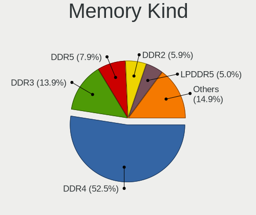

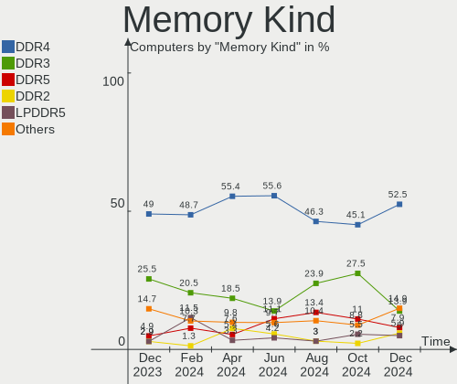

| Kind    | Computers | Percent |
|---------|-----------|---------|
| DDR4    | 51        | 55.43%  |
| DDR3    | 21        | 22.83%  |
| LPDDR4  | 9         | 9.78%   |
| DDR2    | 4         | 4.35%   |
| SDRAM   | 3         | 3.26%   |
| LPDDR3  | 2         | 2.17%   |
| DDR     | 1         | 1.09%   |
| Unknown | 1         | 1.09%   |

Memory Form Factor
------------------

Physical design of the memory module

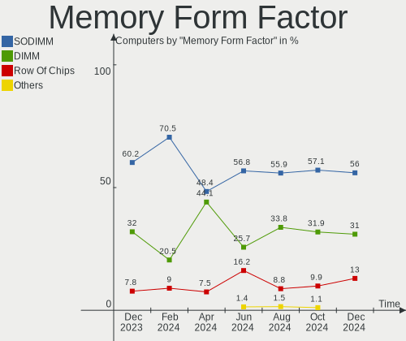

| Name         | Computers | Percent |
|--------------|-----------|---------|
| SODIMM       | 56        | 60.22%  |
| DIMM         | 29        | 31.18%  |
| Row Of Chips | 7         | 7.53%   |
| Chip         | 1         | 1.08%   |

Memory Size
-----------

Memory module size

| Size  | Computers | Percent |
|-------|-----------|---------|
| 8192  | 39        | 38.61%  |
| 4096  | 26        | 25.74%  |
| 16384 | 17        | 16.83%  |
| 2048  | 12        | 11.88%  |
| 32768 | 4         | 3.96%   |
| 1024  | 2         | 1.98%   |
| 3072  | 1         | 0.99%   |

Memory Speed
------------

Memory module speed

| Speed   | Computers | Percent |
|---------|-----------|---------|
| 3200    | 23        | 23.23%  |
| 2667    | 16        | 16.16%  |
| 1600    | 12        | 12.12%  |
| 2400    | 8         | 8.08%   |
| 1333    | 5         | 5.05%   |
| 4267    | 3         | 3.03%   |
| 3600    | 3         | 3.03%   |
| 1867    | 3         | 3.03%   |
| 667     | 3         | 3.03%   |
| 8400    | 2         | 2.02%   |
| 3466    | 2         | 2.02%   |
| 3266    | 2         | 2.02%   |
| 2133    | 2         | 2.02%   |
| 4266    | 1         | 1.01%   |
| 4199    | 1         | 1.01%   |
| 3500    | 1         | 1.01%   |
| 3000    | 1         | 1.01%   |
| 2933    | 1         | 1.01%   |
| 2733    | 1         | 1.01%   |
| 2048    | 1         | 1.01%   |
| 1334    | 1         | 1.01%   |
| 1067    | 1         | 1.01%   |
| 1066    | 1         | 1.01%   |
| 975     | 1         | 1.01%   |
| 800     | 1         | 1.01%   |
| 400     | 1         | 1.01%   |
| 333     | 1         | 1.01%   |
| Unknown | 1         | 1.01%   |

Printers & scanners
-------------------

Printer Vendor
--------------

Printer device vendors

Zero info for selected period =(

Printer Model
-------------

Printer device models

Zero info for selected period =(

Scanner Vendor
--------------

Scanner device vendors

| Vendor | Computers | Percent |
|--------|-----------|---------|
| Canon  | 2         | 100%    |

Scanner Model
-------------

Scanner device models

| Model                              | Computers | Percent |
|------------------------------------|-----------|---------|
| Canon CanoScan N670U/N676U/LiDE 20 | 1         | 50%     |
| Canon CanoScan N650U/N656U         | 1         | 50%     |

Camera
------

Camera Vendor
-------------

Camera device vendors

| Vendor                                 | Computers | Percent |
|----------------------------------------|-----------|---------|
| Chicony Electronics                    | 19        | 19.79%  |
| IMC Networks                           | 16        | 16.67%  |
| Microdia                               | 8         | 8.33%   |
| Acer                                   | 8         | 8.33%   |
| Sunplus Innovation Technology          | 7         | 7.29%   |
| Quanta                                 | 5         | 5.21%   |
| Suyin                                  | 4         | 4.17%   |
| Realtek Semiconductor                  | 3         | 3.13%   |
| Cheng Uei Precision Industry (Foxlink) | 3         | 3.13%   |
| Syntek                                 | 2         | 2.08%   |
| Samsung Electronics                    | 2         | 2.08%   |
| Luxvisions Innotech Limited            | 2         | 2.08%   |
| Logitech                               | 2         | 2.08%   |
| Lite-On Technology                     | 2         | 2.08%   |
| icSpring                               | 2         | 2.08%   |
| Apple                                  | 2         | 2.08%   |
| Xiaomi                                 | 1         | 1.04%   |
| Trust                                  | 1         | 1.04%   |
| Silicon Motion                         | 1         | 1.04%   |
| KYE Systems (Mouse Systems)            | 1         | 1.04%   |
| Jieli Technology                       | 1         | 1.04%   |
| GRANDSTREAM GUV3100                    | 1         | 1.04%   |
| ARC International                      | 1         | 1.04%   |
| ALi                                    | 1         | 1.04%   |
| Alcor Micro                            | 1         | 1.04%   |

Camera Model
------------

Camera device models

| Model                                               | Computers | Percent |
|-----------------------------------------------------|-----------|---------|
| Chicony Integrated Camera                           | 8         | 8.25%   |
| IMC Networks USB2.0 HD UVC WebCam                   | 6         | 6.19%   |
| IMC Networks HD Camera                              | 4         | 4.12%   |
| IMC Networks USB2.0 VGA UVC WebCam                  | 3         | 3.09%   |
| Suyin HP Truevision HD                              | 2         | 2.06%   |
| Samsung Galaxy A5 (MTP)                             | 2         | 2.06%   |
| Quanta HP Wide Vision HD Camera                     | 2         | 2.06%   |
| Quanta HP TrueVision HD Camera                      | 2         | 2.06%   |
| Microdia Webcam Vitade AF                           | 2         | 2.06%   |
| Microdia Integrated_Webcam_HD                       | 2         | 2.06%   |
| Microdia Integrated Webcam                          | 2         | 2.06%   |
| IMC Networks Integrated Camera                      | 2         | 2.06%   |
| icSpring camera                                     | 2         | 2.06%   |
| Chicony HD WebCam                                   | 2         | 2.06%   |
| Acer Integrated Camera                              | 2         | 2.06%   |
| Acer HD Webcam                                      | 2         | 2.06%   |
| Acer EasyCamera                                     | 2         | 2.06%   |
| Xiaomi POCO X3 Pro                                  | 1         | 1.03%   |
| Trust Full HD Webcam                                | 1         | 1.03%   |
| Syntek Integrated Camera                            | 1         | 1.03%   |
| Syntek EasyCamera                                   | 1         | 1.03%   |
| Suyin USB 2.0 HD Camera                             | 1         | 1.03%   |
| Suyin Sony Visual Communication Camera              | 1         | 1.03%   |
| Sunplus Integrated_Webcam_HD                        | 1         | 1.03%   |
| Sunplus Integrated_Webcam_FHD                       | 1         | 1.03%   |
| Sunplus HD WebCam                                   | 1         | 1.03%   |
| Sunplus ezcap U3 capture-04                         | 1         | 1.03%   |
| Sunplus AUSDOM FHD Camera                           | 1         | 1.03%   |
| Sunplus Aukey-PC-LM1E Camera                        | 1         | 1.03%   |
| Sunplus 1.3M HD WebCam                              | 1         | 1.03%   |
| Silicon Motion WebCam SCB-1100N                     | 1         | 1.03%   |
| Realtek MTD Camera                                  | 1         | 1.03%   |
| Realtek Lenovo EasyCamrea                           | 1         | 1.03%   |
| Realtek Front Camera                                | 1         | 1.03%   |
| Realtek Back Camera                                 | 1         | 1.03%   |
| Quanta FHD User Facing                              | 1         | 1.03%   |
| Microdia Webcam                                     | 1         | 1.03%   |
| Microdia CyberTrack H6                              | 1         | 1.03%   |
| Luxvisions Innotech Limited Integrated Camera       | 1         | 1.03%   |
| Luxvisions Innotech Limited HP TrueVision HD Camera | 1         | 1.03%   |

Security
--------

Fingerprint Vendor
------------------

Fingerprint sensor vendors

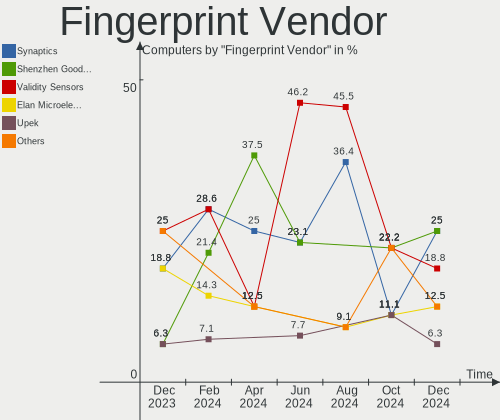

| Vendor                     | Computers | Percent |
|----------------------------|-----------|---------|
| Shenzhen Goodix Technology | 5         | 33.33%  |
| Synaptics                  | 4         | 26.67%  |
| Validity Sensors           | 2         | 13.33%  |
| Elan Microelectronics      | 2         | 13.33%  |
| LighTuning Technology      | 1         | 6.67%   |
| AuthenTec                  | 1         | 6.67%   |

Fingerprint Model
-----------------

Fingerprint sensor models

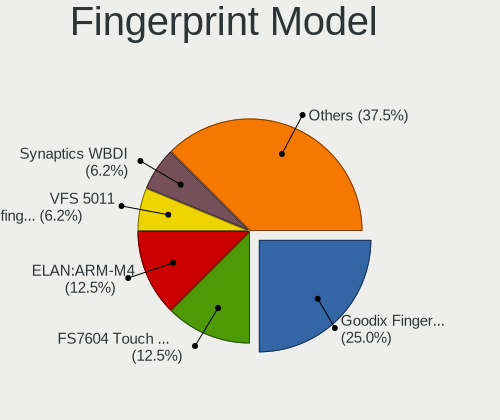

| Model                                                                      | Computers | Percent |
|----------------------------------------------------------------------------|-----------|---------|
| Shenzhen Goodix Fingerprint Reader                                         | 3         | 20%     |
| Unknown                                                                    | 3         | 20%     |
| Shenzhen Goodix  Fingerprint Device                                        | 2         | 13.33%  |
| Elan ELAN:Fingerprint                                                      | 2         | 13.33%  |
| Validity Sensors VFS 5011 fingerprint sensor                               | 1         | 6.67%   |
| Validity Sensors Synaptics VFS7552 Touch Fingerprint Sensor with PurePrint | 1         | 6.67%   |
| Synaptics Prometheus MIS Touch Fingerprint Reader                          | 1         | 6.67%   |
| LighTuning Fingerprint Sensor                                              | 1         | 6.67%   |
| AuthenTec AES2501 Fingerprint Sensor                                       | 1         | 6.67%   |

Chipcard Vendor
---------------

Chipcard module vendors

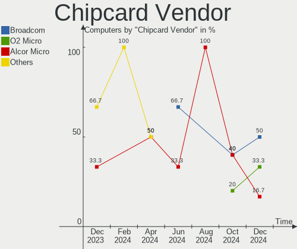

| Vendor      | Computers | Percent |
|-------------|-----------|---------|
| Alcor Micro | 6         | 54.55%  |
| Broadcom    | 3         | 27.27%  |
| O2 Micro    | 1         | 9.09%   |
| C3PO        | 1         | 9.09%   |

Chipcard Model
--------------

Chipcard module models

| Model                                                                        | Computers | Percent |
|------------------------------------------------------------------------------|-----------|---------|
| Alcor Micro AU9540 Smartcard Reader                                          | 6         | 54.55%  |
| O2 Micro OZ776 CCID Smartcard Reader                                         | 1         | 9.09%   |
| C3PO LTC31v2                                                                 | 1         | 9.09%   |
| Broadcom BCM5880 Secure Applications Processor with fingerprint swipe sensor | 1         | 9.09%   |
| Broadcom BCM5880 Secure Applications Processor                               | 1         | 9.09%   |
| Broadcom 58200                                                               | 1         | 9.09%   |

Unsupported
-----------

Unsupported Devices
-------------------

Total unsupported devices on board

| Total | Computers | Percent |
|-------|-----------|---------|
| 0     | 115       | 70.99%  |
| 1     | 34        | 20.99%  |
| 2     | 11        | 6.79%   |
| 4     | 1         | 0.62%   |
| 3     | 1         | 0.62%   |

Unsupported Device Types
------------------------

Types of unsupported devices

| Type                     | Computers | Percent |
|--------------------------|-----------|---------|
| Fingerprint reader       | 15        | 25%     |
| Graphics card            | 13        | 21.67%  |
| Net/wireless             | 10        | 16.67%  |
| Chipcard                 | 10        | 16.67%  |
| Multimedia controller    | 5         | 8.33%   |
| Sound                    | 2         | 3.33%   |
| Bluetooth                | 2         | 3.33%   |
| Net/ethernet             | 1         | 1.67%   |
| Communication controller | 1         | 1.67%   |
| Card reader              | 1         | 1.67%   |

