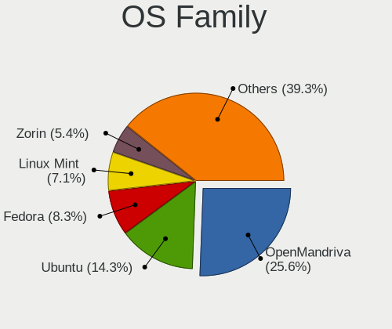
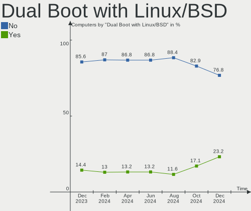
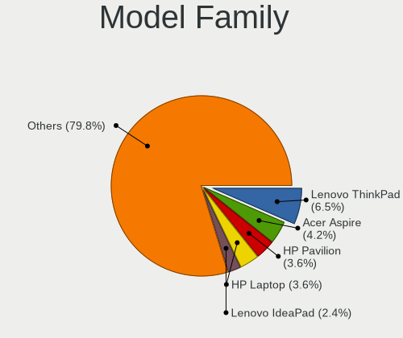
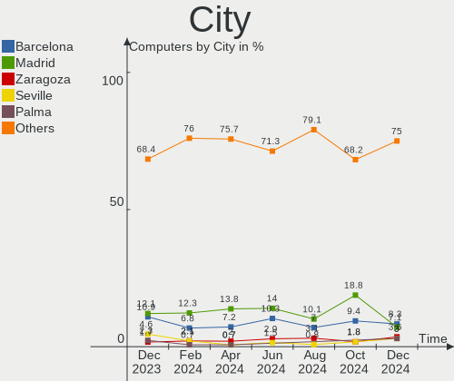
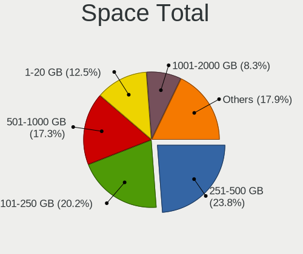
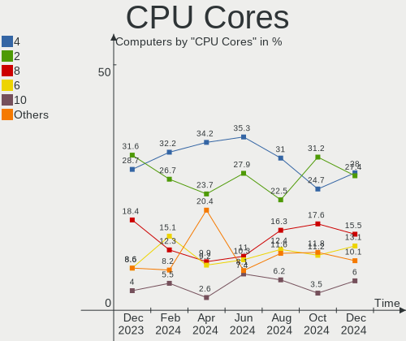
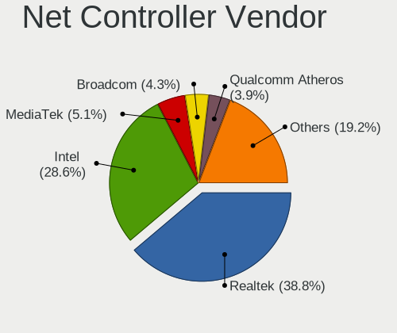
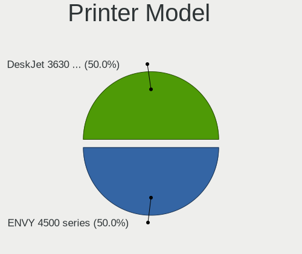
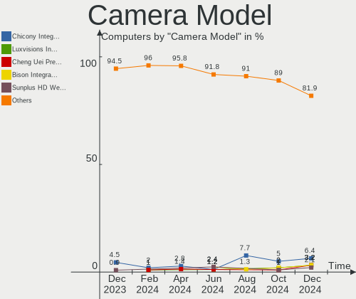

Linux in Spain - Hardware Trends
--------------------------------

A project to identify most popular hardware characteristics and track their change
over time based on data collected by Linux users at https://Linux-Hardware.org.

Anyone can contribute to this report by the [hw-probe](https://github.com/linuxhw/hw-probe) tool:

    sudo -E hw-probe -all -upload

This is a report for all computer types. See also reports for [desktops](/Location/Spain/Desktop/README.md) and [notebooks](/Location/Spain/Notebook/README.md).

Period: Mar, 2023.

Contents
--------

* [ System ](#system)
  - [ OS                       ](#os)
  - [ OS Family                ](#os-family)
  - [ Kernel                   ](#kernel)
  - [ Kernel Family            ](#kernel-family)
  - [ Kernel Major Ver.        ](#kernel-major-ver)
  - [ Arch                     ](#arch)
  - [ DE                       ](#de)
  - [ Display Server           ](#display-server)
  - [ Display Manager          ](#display-manager)
  - [ OS Lang                  ](#os-lang)
  - [ Boot Mode                ](#boot-mode)
  - [ Filesystem               ](#filesystem)
  - [ Part. scheme             ](#part-scheme)
  - [ Dual Boot with Linux/BSD ](#dual-boot-with-linuxbsd)
  - [ Dual Boot (Win)          ](#dual-boot-win)

* [ Board ](#board)
  - [ Vendor                   ](#vendor)
  - [ Model                    ](#model)
  - [ Model Family             ](#model-family)
  - [ MFG Year                 ](#mfg-year)
  - [ Form Factor              ](#form-factor)
  - [ Secure Boot              ](#secure-boot)
  - [ Coreboot                 ](#coreboot)
  - [ RAM Size                 ](#ram-size)
  - [ RAM Used                 ](#ram-used)
  - [ Total Drives             ](#total-drives)
  - [ Has CD-ROM               ](#has-cd-rom)
  - [ Has Ethernet             ](#has-ethernet)
  - [ Has WiFi                 ](#has-wifi)
  - [ Has Bluetooth            ](#has-bluetooth)

* [ Location ](#location)
  - [ Country                  ](#country)
  - [ City                     ](#city)

* [ Drives ](#drives)
  - [ Drive Vendor             ](#drive-vendor)
  - [ Drive Model              ](#drive-model)
  - [ HDD Vendor               ](#hdd-vendor)
  - [ SSD Vendor               ](#ssd-vendor)
  - [ Drive Kind               ](#drive-kind)
  - [ Drive Connector          ](#drive-connector)
  - [ Drive Size               ](#drive-size)
  - [ Space Total              ](#space-total)
  - [ Space Used               ](#space-used)
  - [ Malfunc. Drives          ](#malfunc-drives)
  - [ Malfunc. Drive Vendor    ](#malfunc-drive-vendor)
  - [ Malfunc. HDD Vendor      ](#malfunc-hdd-vendor)
  - [ Malfunc. Drive Kind      ](#malfunc-drive-kind)
  - [ Failed Drives            ](#failed-drives)
  - [ Failed Drive Vendor      ](#failed-drive-vendor)
  - [ Drive Status             ](#drive-status)

* [ Storage controller ](#storage-controller)
  - [ Storage Vendor           ](#storage-vendor)
  - [ Storage Model            ](#storage-model)
  - [ Storage Kind             ](#storage-kind)

* [ Processor ](#processor)
  - [ CPU Vendor               ](#cpu-vendor)
  - [ CPU Model                ](#cpu-model)
  - [ CPU Model Family         ](#cpu-model-family)
  - [ CPU Cores                ](#cpu-cores)
  - [ CPU Sockets              ](#cpu-sockets)
  - [ CPU Threads              ](#cpu-threads)
  - [ CPU Op-Modes             ](#cpu-op-modes)
  - [ CPU Microcode            ](#cpu-microcode)
  - [ CPU Microarch            ](#cpu-microarch)

* [ Graphics ](#graphics)
  - [ GPU Vendor               ](#gpu-vendor)
  - [ GPU Model                ](#gpu-model)
  - [ GPU Combo                ](#gpu-combo)
  - [ GPU Driver               ](#gpu-driver)
  - [ GPU Memory               ](#gpu-memory)

* [ Monitor ](#monitor)
  - [ Monitor Vendor           ](#monitor-vendor)
  - [ Monitor Model            ](#monitor-model)
  - [ Monitor Resolution       ](#monitor-resolution)
  - [ Monitor Diagonal         ](#monitor-diagonal)
  - [ Monitor Width            ](#monitor-width)
  - [ Aspect Ratio             ](#aspect-ratio)
  - [ Monitor Area             ](#monitor-area)
  - [ Pixel Density            ](#pixel-density)
  - [ Multiple Monitors        ](#multiple-monitors)

* [ Network ](#network)
  - [ Net Controller Vendor    ](#net-controller-vendor)
  - [ Net Controller Model     ](#net-controller-model)
  - [ Wireless Vendor          ](#wireless-vendor)
  - [ Wireless Model           ](#wireless-model)
  - [ Ethernet Vendor          ](#ethernet-vendor)
  - [ Ethernet Model           ](#ethernet-model)
  - [ Net Controller Kind      ](#net-controller-kind)
  - [ Used Controller          ](#used-controller)
  - [ NICs                     ](#nics)
  - [ IPv6                     ](#ipv6)

* [ Bluetooth ](#bluetooth)
  - [ Bluetooth Vendor         ](#bluetooth-vendor)
  - [ Bluetooth Model          ](#bluetooth-model)

* [ Sound ](#sound)
  - [ Sound Vendor             ](#sound-vendor)
  - [ Sound Model              ](#sound-model)

* [ Memory ](#memory)
  - [ Memory Vendor            ](#memory-vendor)
  - [ Memory Model             ](#memory-model)
  - [ Memory Kind              ](#memory-kind)
  - [ Memory Form Factor       ](#memory-form-factor)
  - [ Memory Size              ](#memory-size)
  - [ Memory Speed             ](#memory-speed)

* [ Printers & scanners ](#printers--scanners)
  - [ Printer Vendor           ](#printer-vendor)
  - [ Printer Model            ](#printer-model)
  - [ Scanner Vendor           ](#scanner-vendor)
  - [ Scanner Model            ](#scanner-model)

* [ Camera ](#camera)
  - [ Camera Vendor            ](#camera-vendor)
  - [ Camera Model             ](#camera-model)

* [ Security ](#security)
  - [ Fingerprint Vendor       ](#fingerprint-vendor)
  - [ Fingerprint Model        ](#fingerprint-model)
  - [ Chipcard Vendor          ](#chipcard-vendor)
  - [ Chipcard Model           ](#chipcard-model)

* [ Unsupported ](#unsupported)
  - [ Unsupported Devices      ](#unsupported-devices)
  - [ Unsupported Device Types ](#unsupported-device-types)

System
------

OS
--

Installed operating systems

| Name               | Computers | Percent |
|--------------------|-----------|---------|
| Ubuntu 22.04       | 29        | 16.02%  |
| Linux Mint 21.1    | 15        | 8.29%   |
| Fedora 37          | 15        | 8.29%   |
| Debian 11          | 15        | 8.29%   |
| OpenMandriva 23.03 | 11        | 6.08%   |
| OpenMandriva 23.01 | 10        | 5.52%   |
| Ubuntu 22.10       | 9         | 4.97%   |
| Zorin 16           | 7         | 3.87%   |
| Kali 2023.1        | 6         | 3.31%   |
| Ubuntu 20.04       | 5         | 2.76%   |
| Nobara 37          | 4         | 2.21%   |
| KDE neon 22.04     | 4         | 2.21%   |
| Debian 12          | 4         | 2.21%   |
| Manjaro            | 3         | 1.66%   |
| LMDE 5             | 3         | 1.66%   |
| Linux Mint 20.3    | 3         | 1.66%   |
| Xubuntu 22.04      | 2         | 1.1%    |
| SteamOS 3.4.4      | 2         | 1.1%    |
| Pop!_OS 22.04      | 2         | 1.1%    |
| openSUSE Leap-15.4 | 2         | 1.1%    |
| OpenMandriva 4.3   | 2         | 1.1%    |
| Kubuntu 22.10      | 2         | 1.1%    |
| Gentoo 2.13        | 2         | 1.1%    |
| Elementary 7       | 2         | 1.1%    |
| ArcoLinux Rolling  | 2         | 1.1%    |
| Arch Rolling       | 2         | 1.1%    |
| Ubuntu 18.04       | 1         | 0.55%   |
| SteamOS 3.5        | 1         | 0.55%   |
| ROSA 12.3          | 1         | 0.55%   |
| Puppy 9            | 1         | 0.55%   |
| Parrot 5.2         | 1         | 0.55%   |
| OpenMandriva 4.50  | 1         | 0.55%   |
| OpenMandriva 4.2   | 1         | 0.55%   |
| Manjaro 22.0.5     | 1         | 0.55%   |
| Lubuntu 22.10      | 1         | 0.55%   |
| Lubuntu 22.04      | 1         | 0.55%   |
| Loc OS 22          | 1         | 0.55%   |
| Linux Mint 21      | 1         | 0.55%   |
| Linux Mint 20.1    | 1         | 0.55%   |
| Linux Mint 19.3    | 1         | 0.55%   |

OS Family
---------

OS without a version

| Name         | Computers | Percent |
|--------------|-----------|---------|
| Ubuntu       | 44        | 24.31%  |
| OpenMandriva | 25        | 13.81%  |
| Linux Mint   | 21        | 11.6%   |
| Debian       | 21        | 11.6%   |
| Fedora       | 15        | 8.29%   |
| Zorin        | 7         | 3.87%   |
| Kali         | 6         | 3.31%   |
| Nobara       | 4         | 2.21%   |
| Manjaro      | 4         | 2.21%   |
| KDE neon     | 4         | 2.21%   |
| SteamOS      | 3         | 1.66%   |
| LMDE         | 3         | 1.66%   |
| Kubuntu      | 3         | 1.66%   |
| Xubuntu      | 2         | 1.1%    |
| Pop!_OS      | 2         | 1.1%    |
| openSUSE     | 2         | 1.1%    |
| Lubuntu      | 2         | 1.1%    |
| Gentoo       | 2         | 1.1%    |
| Elementary   | 2         | 1.1%    |
| ArcoLinux    | 2         | 1.1%    |
| Arch         | 2         | 1.1%    |
| ROSA         | 1         | 0.55%   |
| Puppy        | 1         | 0.55%   |
| Parrot       | 1         | 0.55%   |
| Loc OS       | 1         | 0.55%   |
| antiX        | 1         | 0.55%   |

Kernel
------

Version of the Linux kernel

| Version                      | Computers | Percent |
|------------------------------|-----------|---------|
| 5.19.0-35-generic            | 31        | 17.13%  |
| 5.15.0-67-generic            | 17        | 9.39%   |
| 6.1.1-desktop-1omv2290       | 11        | 6.08%   |
| 6.2.6-desktop-1omv2390       | 9         | 4.97%   |
| 5.10.0-21-amd64              | 9         | 4.97%   |
| 5.19.0-38-generic            | 8         | 4.42%   |
| 5.4.0-144-generic            | 5         | 2.76%   |
| 6.1.0-kali5-amd64            | 4         | 2.21%   |
| 5.19.0-32-generic            | 4         | 2.21%   |
| 5.15.0-60-generic            | 4         | 2.21%   |
| 6.1.18-200.fc37.x86_64       | 3         | 1.66%   |
| 6.1.14-200.fc37.x86_64       | 3         | 1.66%   |
| 5.15.0-69-generic            | 3         | 1.66%   |
| 6.2.7-200.fc37.x86_64        | 2         | 1.1%    |
| 6.2.6-201.fsync.fc37.x86_64  | 2         | 1.1%    |
| 6.1.13-200.fc37.x86_64       | 2         | 1.1%    |
| 6.1.12-1-MANJARO             | 2         | 1.1%    |
| 6.1.0-6-amd64                | 2         | 1.1%    |
| 6.1.0-5-amd64                | 2         | 1.1%    |
| 5.16.13-desktop-1omv4003     | 2         | 1.1%    |
| 5.15.0-56-generic            | 2         | 1.1%    |
| 5.14.21-150400.24.46-default | 2         | 1.1%    |
| 5.13.0-valve36-1-neptune     | 2         | 1.1%    |
| 5.10.0-21-686-pae            | 2         | 1.1%    |
| 5.10.0-20-amd64              | 2         | 1.1%    |
| 6.2.8-arch1-1                | 1         | 0.55%   |
| 6.2.8-060208-generic         | 1         | 0.55%   |
| 6.2.7-custom                 | 1         | 0.55%   |
| 6.2.6-060206-generic         | 1         | 0.55%   |
| 6.2.2-zen2-1-zen             | 1         | 0.55%   |
| 6.2.2-gentoo-x86_64          | 1         | 0.55%   |
| 6.2.2-arch1-1                | 1         | 0.55%   |
| 6.2.1-desktop-1omv2390       | 1         | 0.55%   |
| 6.1.4-203.fsync.fc37.x86_64  | 1         | 0.55%   |
| 6.1.19-renacuajo             | 1         | 0.55%   |
| 6.1.19-1-MANJARO             | 1         | 0.55%   |
| 6.1.19-1-lts                 | 1         | 0.55%   |
| 6.1.15-200.fc37.x86_64       | 1         | 0.55%   |
| 6.1.15-1-pve                 | 1         | 0.55%   |
| 6.1.14-603.inttf.fc37.x86_64 | 1         | 0.55%   |

Kernel Family
-------------

Linux kernel without a distro release

| Version  | Computers | Percent |
|----------|-----------|---------|
| 5.19.0   | 46        | 25.41%  |
| 5.15.0   | 27        | 14.92%  |
| 5.10.0   | 17        | 9.39%   |
| 6.2.6    | 12        | 6.63%   |
| 6.1.1    | 11        | 6.08%   |
| 6.1.0    | 10        | 5.52%   |
| 5.4.0    | 7         | 3.87%   |
| 6.1.14   | 4         | 2.21%   |
| 5.13.0   | 4         | 2.21%   |
| 6.2.7    | 3         | 1.66%   |
| 6.2.2    | 3         | 1.66%   |
| 6.1.19   | 3         | 1.66%   |
| 6.1.18   | 3         | 1.66%   |
| 6.1.12   | 3         | 1.66%   |
| 6.1.11   | 3         | 1.66%   |
| 6.2.8    | 2         | 1.1%    |
| 6.1.15   | 2         | 1.1%    |
| 6.1.13   | 2         | 1.1%    |
| 5.16.13  | 2         | 1.1%    |
| 5.14.21  | 2         | 1.1%    |
| 6.2.1    | 1         | 0.55%   |
| 6.1.4    | 1         | 0.55%   |
| 6.1.10   | 1         | 0.55%   |
| 6.0.16   | 1         | 0.55%   |
| 6.0.12   | 1         | 0.55%   |
| 6.0.0    | 1         | 0.55%   |
| 5.4.53   | 1         | 0.55%   |
| 5.19.12  | 1         | 0.55%   |
| 5.15.79  | 1         | 0.55%   |
| 5.15.102 | 1         | 0.55%   |
| 5.14.0   | 1         | 0.55%   |
| 5.10.14  | 1         | 0.55%   |
| 5.10.109 | 1         | 0.55%   |
| 4.9.0    | 1         | 0.55%   |
| 4.19.0   | 1         | 0.55%   |

Kernel Major Ver.
-----------------

Linux kernel major version

| Version | Computers | Percent |
|---------|-----------|---------|
| 5.19    | 47        | 25.97%  |
| 6.1     | 43        | 23.76%  |
| 5.15    | 29        | 16.02%  |
| 6.2     | 21        | 11.6%   |
| 5.10    | 19        | 10.5%   |
| 5.4     | 8         | 4.42%   |
| 5.13    | 4         | 2.21%   |
| 6.0     | 3         | 1.66%   |
| 5.14    | 3         | 1.66%   |
| 5.16    | 2         | 1.1%    |
| 4.9     | 1         | 0.55%   |
| 4.19    | 1         | 0.55%   |

Arch
----

OS architecture (x86_64, i586, etc.)

| Name    | Computers | Percent |
|---------|-----------|---------|
| x86_64  | 176       | 97.24%  |
| i686    | 4         | 2.21%   |
| aarch64 | 1         | 0.55%   |

DE
--

Desktop Environment

| Name          | Computers | Percent |
|---------------|-----------|---------|
| GNOME         | 76        | 41.99%  |
| KDE5          | 46        | 25.41%  |
| X-Cinnamon    | 19        | 10.5%   |
| XFCE          | 14        | 7.73%   |
| Unknown       | 10        | 5.52%   |
| LXQt          | 3         | 1.66%   |
| Cinnamon      | 3         | 1.66%   |
| Pantheon      | 2         | 1.1%    |
| Openbox       | 1         | 0.55%   |
| MATE          | 1         | 0.55%   |
| LXDE          | 1         | 0.55%   |
| icewm         | 1         | 0.55%   |
| i3            | 1         | 0.55%   |
| GNOME Classic | 1         | 0.55%   |
| DWM           | 1         | 0.55%   |
| Budgie        | 1         | 0.55%   |

Display Server
--------------

X11 or Wayland

| Name    | Computers | Percent |
|---------|-----------|---------|
| X11     | 130       | 71.82%  |
| Wayland | 43        | 23.76%  |
| Tty     | 5         | 2.76%   |
| Unknown | 3         | 1.66%   |

Display Manager
---------------

SDDM, LightDM, etc.

| Name    | Computers | Percent |
|---------|-----------|---------|
| Unknown | 66        | 36.46%  |
| GDM3    | 44        | 24.31%  |
| SDDM    | 35        | 19.34%  |
| LightDM | 18        | 9.94%   |
| GDM     | 16        | 8.84%   |
| SLiM    | 1         | 0.55%   |
| LXDM    | 1         | 0.55%   |

OS Lang
-------

Language

| Lang    | Computers | Percent |
|---------|-----------|---------|
| es_ES   | 122       | 67.4%   |
| en_US   | 37        | 20.44%  |
| ca_ES   | 7         | 3.87%   |
| en_GB   | 5         | 2.76%   |
| de_DE   | 3         | 1.66%   |
| Unknown | 3         | 1.66%   |
| ru_RU   | 1         | 0.55%   |
| gl_ES   | 1         | 0.55%   |
| ca_FR   | 1         | 0.55%   |
| an_ES   | 1         | 0.55%   |

Boot Mode
---------

EFI or BIOS

| Mode | Computers | Percent |
|------|-----------|---------|
| EFI  | 104       | 57.46%  |
| BIOS | 77        | 42.54%  |

Filesystem
----------

Type of filesystem

| Type    | Computers | Percent |
|---------|-----------|---------|
| Ext4    | 136       | 75.14%  |
| Btrfs   | 22        | 12.15%  |
| Overlay | 16        | 8.84%   |
| Xfs     | 3         | 1.66%   |
| Ext3    | 2         | 1.1%    |
| Zfs     | 1         | 0.55%   |
| Aufs    | 1         | 0.55%   |

Part. scheme
------------

Scheme of partitioning

| Type    | Computers | Percent |
|---------|-----------|---------|
| GPT     | 105       | 58.01%  |
| Unknown | 54        | 29.83%  |
| MBR     | 22        | 12.15%  |

Dual Boot with Linux/BSD
------------------------

Hosting more than one Linux/BSD

| Dual boot | Computers | Percent |
|-----------|-----------|---------|
| No        | 142       | 78.45%  |
| Yes       | 39        | 21.55%  |

Dual Boot (Win)
---------------

Hosting Linux and Windows

| Dual boot | Computers | Percent |
|-----------|-----------|---------|
| No        | 118       | 65.19%  |
| Yes       | 63        | 34.81%  |

Board
-----

Vendor
------

Motherboard manufacturer

| Name                | Computers | Percent |
|---------------------|-----------|---------|
| ASUSTek Computer    | 35        | 19.34%  |
| Lenovo              | 24        | 13.26%  |
| Hewlett-Packard     | 20        | 11.05%  |
| MSI                 | 19        | 10.5%   |
| Acer                | 13        | 7.18%   |
| Gigabyte Technology | 12        | 6.63%   |
| Intel               | 8         | 4.42%   |
| Dell                | 8         | 4.42%   |
| Chuwi               | 8         | 4.42%   |
| HUAWEI              | 4         | 2.21%   |
| Apple               | 4         | 2.21%   |
| Valve               | 3         | 1.66%   |
| Notebook            | 3         | 1.66%   |
| Dynabook            | 3         | 1.66%   |
| Toshiba             | 2         | 1.1%    |
| ASRock              | 2         | 1.1%    |
| ZOTAC               | 1         | 0.55%   |
| TEKNOSERVICE        | 1         | 0.55%   |
| Supermicro          | 1         | 0.55%   |
| Sony                | 1         | 0.55%   |
| Samsung Electronics | 1         | 0.55%   |
| Razer               | 1         | 0.55%   |
| Primux Tech         | 1         | 0.55%   |
| Packard Bell        | 1         | 0.55%   |
| IP3 Tech            | 1         | 0.55%   |
| HPE                 | 1         | 0.55%   |
| Fujitsu Siemens     | 1         | 0.55%   |
| FriendlyElec        | 1         | 0.55%   |
| AZW                 | 1         | 0.55%   |

Model
-----

Motherboard model

| Name                                       | Computers | Percent |
|--------------------------------------------|-----------|---------|
| Chuwi GemiBook Pro                         | 4         | 2.21%   |
| Valve Jupiter                              | 3         | 1.66%   |
| Lenovo IdeaPad 3 15ITL6 82H8               | 2         | 1.1%    |
| Intel powered classmate PC                 | 2         | 1.1%    |
| HP OMEN by Laptop 16-c0xxx                 | 2         | 1.1%    |
| Chuwi HeroBook Air                         | 2         | 1.1%    |
| ZOTAC ZBOX-ID41                            | 1         | 0.55%   |
| Toshiba Satellite Pro L300                 | 1         | 0.55%   |
| Toshiba Satellite A100                     | 1         | 0.55%   |
| TEKNOSERVICE NJ5x_NJ7xLU                   | 1         | 0.55%   |
| Supermicro Super Server                    | 1         | 0.55%   |
| Sony SVF1521B1EW                           | 1         | 0.55%   |
| Samsung N150P/N210P/N220P                  | 1         | 0.55%   |
| Razer Blade 14 (2022) - RZ09-0427          | 1         | 0.55%   |
| Primux Tech PrimuxIoxAIO                   | 1         | 0.55%   |
| Packard Bell EasyNote LJ75                 | 1         | 0.55%   |
| Notebook NL40_50CU                         | 1         | 0.55%   |
| Notebook N2x0WU                            | 1         | 0.55%   |
| Notebook L140CU                            | 1         | 0.55%   |
| MSI Stealth GS77 12UHS                     | 1         | 0.55%   |
| MSI Pulse GL66 12UEK                       | 1         | 0.55%   |
| MSI PE62 7RD                               | 1         | 0.55%   |
| MSI P65 Creator 8RD                        | 1         | 0.55%   |
| MSI MS-AA8B                                | 1         | 0.55%   |
| MSI MS-7E06                                | 1         | 0.55%   |
| MSI MS-7D67                                | 1         | 0.55%   |
| MSI MS-7C84                                | 1         | 0.55%   |
| MSI MS-7C35                                | 1         | 0.55%   |
| MSI MS-7C02                                | 1         | 0.55%   |
| MSI MS-7A69                                | 1         | 0.55%   |
| MSI MS-7A38                                | 1         | 0.55%   |
| MSI MS-7592                                | 1         | 0.55%   |
| MSI Modern 15 A5M                          | 1         | 0.55%   |
| MSI Katana GF66 12UC                       | 1         | 0.55%   |
| MSI GL75 Leopard 10SEK                     | 1         | 0.55%   |
| MSI GF63 Thin 9SC                          | 1         | 0.55%   |
| MSI CX61 2PC                               | 1         | 0.55%   |
| MSI CML-U PRO Cubi 5 (MS-B183)             | 1         | 0.55%   |
| Lenovo Y520-15IKBN 80WK                    | 1         | 0.55%   |
| Lenovo ThinkPad X1 Carbon Gen 9 20XW005GSP | 1         | 0.55%   |

Model Family
------------

Motherboard model prefix

| Name                     | Computers | Percent |
|--------------------------|-----------|---------|
| Lenovo ThinkPad          | 9         | 4.97%   |
| Acer Aspire              | 9         | 4.97%   |
| Lenovo IdeaPad           | 8         | 4.42%   |
| ASUS ROG                 | 5         | 2.76%   |
| ASUS PRIME               | 5         | 2.76%   |
| Chuwi GemiBook           | 4         | 2.21%   |
| Valve Jupiter            | 3         | 1.66%   |
| HP Pavilion              | 3         | 1.66%   |
| HP Compaq                | 3         | 1.66%   |
| Chuwi HeroBook           | 3         | 1.66%   |
| Toshiba Satellite        | 2         | 1.1%    |
| Intel powered            | 2         | 1.1%    |
| HP OMEN                  | 2         | 1.1%    |
| HP 250                   | 2         | 1.1%    |
| Gigabyte B760M           | 2         | 1.1%    |
| Dynabook Satellite       | 2         | 1.1%    |
| Dell Precision           | 2         | 1.1%    |
| Dell Latitude            | 2         | 1.1%    |
| ASUS ZenBook             | 2         | 1.1%    |
| ASUS ASUS                | 2         | 1.1%    |
| Acer TravelMate          | 2         | 1.1%    |
| ZOTAC ZBOX-ID41          | 1         | 0.55%   |
| TEKNOSERVICE NJ5x        | 1         | 0.55%   |
| Supermicro Super         | 1         | 0.55%   |
| Sony SVF1521B1EW         | 1         | 0.55%   |
| Samsung N150P            | 1         | 0.55%   |
| Razer Blade              | 1         | 0.55%   |
| Primux Tech PrimuxIoxAIO | 1         | 0.55%   |
| Packard Bell EasyNote    | 1         | 0.55%   |
| Notebook NL40            | 1         | 0.55%   |
| Notebook N2x0WU          | 1         | 0.55%   |
| Notebook L140CU          | 1         | 0.55%   |
| MSI Stealth              | 1         | 0.55%   |
| MSI Pulse                | 1         | 0.55%   |
| MSI PE62                 | 1         | 0.55%   |
| MSI P65                  | 1         | 0.55%   |
| MSI MS-AA8B              | 1         | 0.55%   |
| MSI MS-7E06              | 1         | 0.55%   |
| MSI MS-7D67              | 1         | 0.55%   |
| MSI MS-7C84              | 1         | 0.55%   |

MFG Year
--------

Motherboard manufacture year

| Year    | Computers | Percent |
|---------|-----------|---------|
| 2021    | 29        | 16.02%  |
| 2022    | 22        | 12.15%  |
| 2018    | 17        | 9.39%   |
| 2019    | 16        | 8.84%   |
| 2015    | 12        | 6.63%   |
| 2020    | 11        | 6.08%   |
| 2011    | 10        | 5.52%   |
| 2013    | 9         | 4.97%   |
| 2012    | 9         | 4.97%   |
| 2017    | 8         | 4.42%   |
| 2010    | 8         | 4.42%   |
| 2016    | 7         | 3.87%   |
| 2014    | 7         | 3.87%   |
| 2009    | 6         | 3.31%   |
| 2007    | 4         | 2.21%   |
| 2008    | 3         | 1.66%   |
| 2023    | 1         | 0.55%   |
| 2006    | 1         | 0.55%   |
| Unknown | 1         | 0.55%   |

Form Factor
-----------

Physical design of the computer

| Name           | Computers | Percent |
|----------------|-----------|---------|
| Notebook       | 107       | 59.12%  |
| Desktop        | 60        | 33.15%  |
| All in one     | 5         | 2.76%   |
| Mini pc        | 4         | 2.21%   |
| Tablet         | 2         | 1.1%    |
| Server         | 2         | 1.1%    |
| System on chip | 1         | 0.55%   |

Secure Boot
-----------

Enabled or disabled

| State    | Computers | Percent |
|----------|-----------|---------|
| Disabled | 171       | 94.48%  |
| Enabled  | 10        | 5.52%   |

Coreboot
--------

Have coreboot on board

| Used | Computers | Percent |
|------|-----------|---------|
| No   | 181       | 100%    |

RAM Size
--------

Total RAM memory

| Size in GB      | Computers | Percent |
|-----------------|-----------|---------|
| 16.01-24.0      | 39        | 21.55%  |
| 4.01-8.0        | 36        | 19.89%  |
| 8.01-16.0       | 36        | 19.89%  |
| 3.01-4.0        | 33        | 18.23%  |
| 32.01-64.0      | 21        | 11.6%   |
| 24.01-32.0      | 5         | 2.76%   |
| 64.01-256.0     | 3         | 1.66%   |
| 0.51-1.0        | 3         | 1.66%   |
| 2.01-3.0        | 2         | 1.1%    |
| 1.01-2.0        | 2         | 1.1%    |
| More than 256.0 | 1         | 0.55%   |

RAM Used
--------

Used RAM memory

| Used GB    | Computers | Percent |
|------------|-----------|---------|
| 1.01-2.0   | 53        | 29.28%  |
| 2.01-3.0   | 46        | 25.41%  |
| 4.01-8.0   | 32        | 17.68%  |
| 3.01-4.0   | 24        | 13.26%  |
| 0.51-1.0   | 13        | 7.18%   |
| 8.01-16.0  | 9         | 4.97%   |
| 0.01-0.5   | 2         | 1.1%    |
| 32.01-64.0 | 1         | 0.55%   |
| 16.01-24.0 | 1         | 0.55%   |

Total Drives
------------

Number of drives on board

| Drives | Computers | Percent |
|--------|-----------|---------|
| 1      | 101       | 55.8%   |
| 2      | 53        | 29.28%  |
| 3      | 14        | 7.73%   |
| 5      | 5         | 2.76%   |
| 4      | 3         | 1.66%   |
| 6      | 2         | 1.1%    |
| 10     | 1         | 0.55%   |
| 8      | 1         | 0.55%   |
| 0      | 1         | 0.55%   |

Has CD-ROM
----------

Has CD-ROM on board

| Presented | Computers | Percent |
|-----------|-----------|---------|
| No        | 127       | 70.17%  |
| Yes       | 54        | 29.83%  |

Has Ethernet
------------

Has Ethernet on board

| Presented | Computers | Percent |
|-----------|-----------|---------|
| Yes       | 151       | 83.43%  |
| No        | 30        | 16.57%  |

Has WiFi
--------

Has WiFi module

| Presented | Computers | Percent |
|-----------|-----------|---------|
| Yes       | 142       | 78.45%  |
| No        | 39        | 21.55%  |

Has Bluetooth
-------------

Has Bluetooth module

| Presented | Computers | Percent |
|-----------|-----------|---------|
| Yes       | 117       | 64.64%  |
| No        | 64        | 35.36%  |

Location
--------

Country
-------

Geographic location (country)

| Country | Computers | Percent |
|---------|-----------|---------|
| Spain   | 181       | 100%    |

City
----

Geographic location (city)

| City                        | Computers | Percent |
|-----------------------------|-----------|---------|
| Madrid                      | 34        | 18.78%  |
| Barcelona                   | 18        | 9.94%   |
| Vigo                        | 7         | 3.87%   |
| Seville                     | 6         | 3.31%   |
| Málaga                     | 5         | 2.76%   |
| Granada                     | 5         | 2.76%   |
| Valencia                    | 4         | 2.21%   |
| Bilbao                      | 4         | 2.21%   |
| Zaragoza                    | 3         | 1.66%   |
| Las Palmas de Gran Canaria  | 3         | 1.66%   |
| Terrassa                    | 2         | 1.1%    |
| Rincon de la Victoria       | 2         | 1.1%    |
| Oviedo                      | 2         | 1.1%    |
| Marbella                    | 2         | 1.1%    |
| León                       | 2         | 1.1%    |
| Elche                       | 2         | 1.1%    |
| Burgos                      | 2         | 1.1%    |
| Almería                    | 2         | 1.1%    |
| A Coruña                   | 2         | 1.1%    |
| Villanueva de la Torre      | 1         | 0.55%   |
| Villanueva de la Canada     | 1         | 0.55%   |
| Villafranca de los Barros   | 1         | 0.55%   |
| Villacarrillo               | 1         | 0.55%   |
| Vilanova i la Geltrú       | 1         | 0.55%   |
| Vila-seca                   | 1         | 0.55%   |
| Vera                        | 1         | 0.55%   |
| Valladolid                  | 1         | 0.55%   |
| Usurbil                     | 1         | 0.55%   |
| Tres Cantos                 | 1         | 0.55%   |
| Torrejón de Ardoz          | 1         | 0.55%   |
| Tinajo                      | 1         | 0.55%   |
| Tarragona                   | 1         | 0.55%   |
| Santa Coloma de Cervelló   | 1         | 0.55%   |
| Sant Vicenç dels Horts     | 1         | 0.55%   |
| Sant Cugat del Vallès      | 1         | 0.55%   |
| San Sebastián de los Reyes | 1         | 0.55%   |
| San Martin de Montalban     | 1         | 0.55%   |
| San Cristóbal de La Laguna | 1         | 0.55%   |
| Salamanca                   | 1         | 0.55%   |
| Sabadell                    | 1         | 0.55%   |

Drives
------

Drive Vendor
------------

Hard drive vendors

| Vendor                      | Computers | Drives | Percent |
|-----------------------------|-----------|--------|---------|
| Seagate                     | 44        | 53     | 15.66%  |
| Samsung Electronics         | 40        | 46     | 14.23%  |
| WDC                         | 38        | 46     | 13.52%  |
| Kingston                    | 30        | 30     | 10.68%  |
| Toshiba                     | 16        | 24     | 5.69%   |
| Crucial                     | 11        | 14     | 3.91%   |
| Unknown                     | 10        | 11     | 3.56%   |
| Sandisk                     | 10        | 11     | 3.56%   |
| Intel                       | 8         | 8      | 2.85%   |
| Micron Technology           | 6         | 6      | 2.14%   |
| Kingston Technology Company | 6         | 6      | 2.14%   |
| Hitachi                     | 6         | 6      | 2.14%   |
| Phison Electronics          | 5         | 5      | 1.78%   |
| China                       | 5         | 5      | 1.78%   |
| SK hynix                    | 3         | 3      | 1.07%   |
| KIOXIA-EXCERIA              | 3         | 3      | 1.07%   |
| KIOXIA                      | 3         | 3      | 1.07%   |
| Intenso                     | 3         | 3      | 1.07%   |
| A-DATA Technology           | 3         | 4      | 1.07%   |
| Transcend                   | 2         | 2      | 0.71%   |
| OCZ                         | 2         | 4      | 0.71%   |
| Netac                       | 2         | 2      | 0.71%   |
| Maxtor                      | 2         | 2      | 0.71%   |
| HGST                        | 2         | 2      | 0.71%   |
| FORESEE                     | 2         | 2      | 0.71%   |
| Apple                       | 2         | 2      | 0.71%   |
| XrayDisk                    | 1         | 1      | 0.36%   |
| Verbatim                    | 1         | 1      | 0.36%   |
| ValueTech                   | 1         | 1      | 0.36%   |
| USB30                       | 1         | 1      | 0.36%   |
| UMIS                        | 1         | 1      | 0.36%   |
| SABRENT                     | 1         | 1      | 0.36%   |
| Realtek                     | 1         | 1      | 0.36%   |
| PNY                         | 1         | 1      | 0.36%   |
| Phison                      | 1         | 1      | 0.36%   |
| Micron/Crucial Technology   | 1         | 1      | 0.36%   |
| KingSpec                    | 1         | 1      | 0.36%   |
| KingDian                    | 1         | 1      | 0.36%   |
| Kimtigo                     | 1         | 1      | 0.36%   |
| Fujitsu                     | 1         | 1      | 0.36%   |

Drive Model
-----------

Hard drive models

| Model                                               | Computers | Percent |
|-----------------------------------------------------|-----------|---------|
| Kingston SA400S37240G 240GB SSD                     | 8         | 2.65%   |
| Samsung NVMe SSD Controller SM981/PM981/PM983 250GB | 6         | 1.99%   |
| Kingston SA400S37480G 480GB SSD                     | 5         | 1.66%   |
| Seagate ST2000DM008-2FR102 2TB                      | 4         | 1.32%   |
| Seagate ST1000DM010-2EP102 1TB                      | 4         | 1.32%   |
| Phison PS5013 E13 NVMe Controller 256GB             | 4         | 1.32%   |
| Unknown MMC Card  128GB                             | 3         | 0.99%   |
| Toshiba DT01ACA100 1TB                              | 3         | 0.99%   |
| Seagate ST500DM002-1BD142 500GB                     | 3         | 0.99%   |
| Seagate ST1000LM035-1RK172 1TB                      | 3         | 0.99%   |
| Samsung SSD 980 PRO 1TB                             | 3         | 0.99%   |
| Kingston SV300S37A120G 120GB SSD                    | 3         | 0.99%   |
| Kingston SA400S37120G 120GB SSD                     | 3         | 0.99%   |
| China G521N256GB SSD                                | 3         | 0.99%   |
| WDC WDS240G2G0A-00JH30 240GB SSD                    | 2         | 0.66%   |
| WDC WD40EFRX-68N32N0 4TB                            | 2         | 0.66%   |
| WDC WD20EARX-00PASB0 2TB                            | 2         | 0.66%   |
| WDC WD10JPVX-22JC3T0 1TB                            | 2         | 0.66%   |
| WDC WD10EZEX-08WN4A0 1TB                            | 2         | 0.66%   |
| Toshiba MQ01ABD100 1TB                              | 2         | 0.66%   |
| Toshiba MQ01ABD050 500GB                            | 2         | 0.66%   |
| Toshiba DT01ACA300 3TB                              | 2         | 0.66%   |
| Seagate ST4000DM004-2U9104 4TB                      | 2         | 0.66%   |
| Seagate ST1000LM048-2E7172 1TB                      | 2         | 0.66%   |
| Sandisk WD Black SN750 / PC SN730 NVMe SSD 1TB      | 2         | 0.66%   |
| SanDisk NVMe SSD Drive 500GB                        | 2         | 0.66%   |
| Samsung SSD 980 500GB                               | 2         | 0.66%   |
| Samsung SSD 860 EVO 500GB                           | 2         | 0.66%   |
| Samsung SSD 860 EVO 250GB                           | 2         | 0.66%   |
| OCZ TRION100 240GB SSD                              | 2         | 0.66%   |
| KIOXIA-EXCERIA PRO SSD 1TB                          | 2         | 0.66%   |
| Kingston Company U-SNS8154P3 NVMe SSD 256GB         | 2         | 0.66%   |
| Kingston Company OM3PDP3 NVMe SSD 256GB             | 2         | 0.66%   |
| Kingston SUV400S37240G 240GB SSD                    | 2         | 0.66%   |
| Hitachi HTS545050B9A300 500GB                       | 2         | 0.66%   |
| Hitachi HTS545016B9A300 160GB                       | 2         | 0.66%   |
| Crucial CT750MX300SSD1 752GB                        | 2         | 0.66%   |
| Crucial CT500MX500SSD1 500GB                        | 2         | 0.66%   |
| Crucial CT480BX500SSD1 480GB                        | 2         | 0.66%   |
| A-DATA SP550 120GB SSD                              | 2         | 0.66%   |

HDD Vendor
----------

Hard disk drive vendors

| Vendor              | Computers | Drives | Percent |
|---------------------|-----------|--------|---------|
| Seagate             | 44        | 53     | 45.83%  |
| WDC                 | 25        | 32     | 26.04%  |
| Toshiba             | 12        | 18     | 12.5%   |
| Hitachi             | 6         | 6      | 6.25%   |
| Samsung Electronics | 4         | 4      | 4.17%   |
| HGST                | 2         | 2      | 2.08%   |
| Maxtor              | 1         | 1      | 1.04%   |
| Fujitsu             | 1         | 1      | 1.04%   |
| Apple               | 1         | 1      | 1.04%   |

SSD Vendor
----------

Solid state drive vendors

| Vendor              | Computers | Drives | Percent |
|---------------------|-----------|--------|---------|
| Kingston            | 26        | 26     | 27.96%  |
| Samsung Electronics | 14        | 15     | 15.05%  |
| Crucial             | 10        | 12     | 10.75%  |
| WDC                 | 7         | 7      | 7.53%   |
| China               | 5         | 5      | 5.38%   |
| Intenso             | 3         | 3      | 3.23%   |
| Intel               | 3         | 3      | 3.23%   |
| A-DATA Technology   | 3         | 4      | 3.23%   |
| Transcend           | 2         | 2      | 2.15%   |
| Toshiba             | 2         | 4      | 2.15%   |
| OCZ                 | 2         | 4      | 2.15%   |
| Netac               | 2         | 2      | 2.15%   |
| FORESEE             | 2         | 2      | 2.15%   |
| XrayDisk            | 1         | 1      | 1.08%   |
| Verbatim            | 1         | 1      | 1.08%   |
| ValueTech           | 1         | 1      | 1.08%   |
| USB30               | 1         | 1      | 1.08%   |
| SanDisk             | 1         | 1      | 1.08%   |
| SABRENT             | 1         | 1      | 1.08%   |
| PNY                 | 1         | 1      | 1.08%   |
| Maxtor              | 1         | 1      | 1.08%   |
| KingSpec            | 1         | 1      | 1.08%   |
| KingDian            | 1         | 1      | 1.08%   |
| Kimtigo             | 1         | 1      | 1.08%   |
| BIWIN               | 1         | 1      | 1.08%   |

Drive Kind
----------

HDD or SSD

| Kind | Computers | Drives | Percent |
|------|-----------|--------|---------|
| HDD  | 82        | 118    | 33.33%  |
| NVMe | 77        | 89     | 31.3%   |
| SSD  | 77        | 101    | 31.3%   |
| MMC  | 10        | 12     | 4.07%   |

Drive Connector
---------------

SATA, SAS, NVMe, etc.

| Type | Computers | Drives | Percent |
|------|-----------|--------|---------|
| SATA | 122       | 215    | 57.01%  |
| NVMe | 77        | 88     | 35.98%  |
| MMC  | 10        | 12     | 4.67%   |
| SAS  | 5         | 5      | 2.34%   |

Drive Size
----------

Size of hard drive

| Size in TB | Computers | Drives | Percent |
|------------|-----------|--------|---------|
| 0.01-0.5   | 91        | 118    | 52.6%   |
| 0.51-1.0   | 52        | 55     | 30.06%  |
| 1.01-2.0   | 18        | 30     | 10.4%   |
| 3.01-4.0   | 7         | 10     | 4.05%   |
| 2.01-3.0   | 4         | 5      | 2.31%   |
| 4.01-10.0  | 1         | 1      | 0.58%   |

Space Total
-----------

Amount of disk space available on the file system

| Size in GB     | Computers | Percent |
|----------------|-----------|---------|
| 101-250        | 61        | 33.7%   |
| 251-500        | 46        | 25.41%  |
| 501-1000       | 20        | 11.05%  |
| 1-20           | 15        | 8.29%   |
| More than 3000 | 11        | 6.08%   |
| 1001-2000      | 9         | 4.97%   |
| 51-100         | 7         | 3.87%   |
| 21-50          | 6         | 3.31%   |
| 2001-3000      | 3         | 1.66%   |
| Unknown        | 3         | 1.66%   |

Space Used
----------

Amount of used disk space

| Used GB        | Computers | Percent |
|----------------|-----------|---------|
| 1-20           | 72        | 39.78%  |
| 101-250        | 30        | 16.57%  |
| 21-50          | 25        | 13.81%  |
| 51-100         | 20        | 11.05%  |
| 251-500        | 13        | 7.18%   |
| 501-1000       | 8         | 4.42%   |
| More than 3000 | 4         | 2.21%   |
| 1001-2000      | 4         | 2.21%   |
| Unknown        | 3         | 1.66%   |
| 2001-3000      | 2         | 1.1%    |

Malfunc. Drives
---------------

Drive models with a malfunction

| Model                            | Computers | Drives | Percent |
|----------------------------------|-----------|--------|---------|
| China G521N256GB SSD             | 3         | 3      | 11.54%  |
| Toshiba DT01ACA100 1TB           | 2         | 2      | 7.69%   |
| Seagate ST1000DM010-2EP102 1TB   | 2         | 2      | 7.69%   |
| Kingston SV300S37A120G 120GB SSD | 2         | 2      | 7.69%   |
| Crucial CT750MX300SSD1 752GB     | 2         | 2      | 7.69%   |
| WDC WD5000BEVT-22A0RT0 500GB     | 1         | 1      | 3.85%   |
| WDC WD40EFRX-68N32N0 4TB         | 1         | 1      | 3.85%   |
| WDC WD20EARX-00PASB0 2TB         | 1         | 1      | 3.85%   |
| Transcend TS1TSSD230S 1TB        | 1         | 1      | 3.85%   |
| SK hynix PC611 NVMe 512GB        | 1         | 1      | 3.85%   |
| Seagate ST9250320AS 250GB        | 1         | 1      | 3.85%   |
| Seagate ST500DM002-1BD142 500GB  | 1         | 1      | 3.85%   |
| Seagate ST3250824AS 250GB        | 1         | 1      | 3.85%   |
| Seagate ST3000DM001-9YN166 3TB   | 1         | 1      | 3.85%   |
| Samsung Electronics HD153WI 1TB  | 1         | 1      | 3.85%   |
| Netac SSD 256GB                  | 1         | 1      | 3.85%   |
| Kingston SUV400S37240G 240GB SSD | 1         | 1      | 3.85%   |
| Hitachi HTS545050B9A300 500GB    | 1         | 1      | 3.85%   |
| Fujitsu MHY2120BH 120GB          | 1         | 1      | 3.85%   |
| Corsair MP400 8TB                | 1         | 1      | 3.85%   |

Malfunc. Drive Vendor
---------------------

Vendors of faulty drives

| Vendor              | Computers | Drives | Percent |
|---------------------|-----------|--------|---------|
| Seagate             | 6         | 6      | 23.08%  |
| WDC                 | 3         | 3      | 11.54%  |
| Kingston            | 3         | 3      | 11.54%  |
| China               | 3         | 3      | 11.54%  |
| Toshiba             | 2         | 2      | 7.69%   |
| Crucial             | 2         | 2      | 7.69%   |
| Transcend           | 1         | 1      | 3.85%   |
| SK hynix            | 1         | 1      | 3.85%   |
| Samsung Electronics | 1         | 1      | 3.85%   |
| Netac               | 1         | 1      | 3.85%   |
| Hitachi             | 1         | 1      | 3.85%   |
| Fujitsu             | 1         | 1      | 3.85%   |
| Corsair             | 1         | 1      | 3.85%   |

Malfunc. HDD Vendor
-------------------

Vendors of faulty HDD drives

| Vendor              | Computers | Drives | Percent |
|---------------------|-----------|--------|---------|
| Seagate             | 6         | 6      | 42.86%  |
| WDC                 | 3         | 3      | 21.43%  |
| Toshiba             | 2         | 2      | 14.29%  |
| Samsung Electronics | 1         | 1      | 7.14%   |
| Hitachi             | 1         | 1      | 7.14%   |
| Fujitsu             | 1         | 1      | 7.14%   |

Malfunc. Drive Kind
-------------------

Kinds of faulty drives

| Kind | Computers | Drives | Percent |
|------|-----------|--------|---------|
| HDD  | 14        | 14     | 53.85%  |
| SSD  | 10        | 10     | 38.46%  |
| NVMe | 2         | 2      | 7.69%   |

Failed Drives
-------------

Failed drive models

Zero info for selected period =(

Failed Drive Vendor
-------------------

Failed drive vendors

Zero info for selected period =(

Drive Status
------------

Number of failed and malfunc. drives

| Status   | Computers | Drives | Percent |
|----------|-----------|--------|---------|
| Works    | 93        | 160    | 45.59%  |
| Detected | 86        | 134    | 42.16%  |
| Malfunc  | 25        | 26     | 12.25%  |

Storage controller
------------------

Storage Vendor
--------------

Storage controller vendors

| Vendor                       | Computers | Percent |
|------------------------------|-----------|---------|
| Intel                        | 124       | 51.88%  |
| AMD                          | 26        | 10.88%  |
| Samsung Electronics          | 24        | 10.04%  |
| SanDisk                      | 14        | 5.86%   |
| Kingston Technology Company  | 10        | 4.18%   |
| Phison Electronics           | 7         | 2.93%   |
| Micron Technology            | 6         | 2.51%   |
| JMicron Technology           | 5         | 2.09%   |
| Marvell Technology Group     | 4         | 1.67%   |
| KIOXIA                       | 4         | 1.67%   |
| ASMedia Technology           | 4         | 1.67%   |
| Toshiba America Info Systems | 3         | 1.26%   |
| SK hynix                     | 3         | 1.26%   |
| Micron/Crucial Technology    | 3         | 1.26%   |
| Union Memory (Shenzhen)      | 1         | 0.42%   |
| Apple                        | 1         | 0.42%   |

Storage Model
-------------

Storage controller models

| Model                                                                          | Computers | Percent |
|--------------------------------------------------------------------------------|-----------|---------|
| AMD FCH SATA Controller [AHCI mode]                                            | 20        | 7.35%   |
| Samsung NVMe SSD Controller SM981/PM981/PM983                                  | 11        | 4.04%   |
| Intel 8 Series/C220 Series Chipset Family 6-port SATA Controller 1 [AHCI mode] | 8         | 2.94%   |
| Samsung NVMe SSD Controller PM9A1/PM9A3/980PRO                                 | 7         | 2.57%   |
| Intel 7 Series Chipset Family 6-port SATA Controller [AHCI mode]               | 7         | 2.57%   |
| Intel Volume Management Device NVMe RAID Controller                            | 6         | 2.21%   |
| Intel 82801 Mobile SATA Controller [RAID mode]                                 | 6         | 2.21%   |
| Intel 200 Series PCH SATA controller [AHCI mode]                               | 6         | 2.21%   |
| Samsung NVMe SSD Controller 980                                                | 5         | 1.84%   |
| Phison PS5013 E13 NVMe Controller                                              | 5         | 1.84%   |
| Micron NVMe Storage Controller                                                 | 5         | 1.84%   |
| Intel Jasper Lake SATA AHCI Controller                                         | 5         | 1.84%   |
| Intel 6 Series/C200 Series Chipset Family 6 port Mobile SATA AHCI Controller   | 5         | 1.84%   |
| SanDisk WD Black SN750 / PC SN730 NVMe SSD                                     | 4         | 1.47%   |
| Kingston Company OM3PDP3 NVMe SSD                                              | 4         | 1.47%   |
| Intel Sunrise Point-LP SATA Controller [AHCI mode]                             | 4         | 1.47%   |
| Intel NM10/ICH7 Family SATA Controller [AHCI mode]                             | 4         | 1.47%   |
| Intel Comet Lake SATA AHCI Controller                                          | 4         | 1.47%   |
| Intel Celeron/Pentium Silver Processor SATA Controller                         | 4         | 1.47%   |
| Intel Cannon Lake Mobile PCH SATA AHCI Controller                              | 4         | 1.47%   |
| Intel Atom Processor E3800 Series SATA AHCI Controller                         | 4         | 1.47%   |
| Intel 8 Series SATA Controller 1 [AHCI mode]                                   | 4         | 1.47%   |
| ASMedia ASM1062 Serial ATA Controller                                          | 4         | 1.47%   |
| SanDisk WD Blue SN570 NVMe SSD 1TB                                             | 3         | 1.1%    |
| Micron/Crucial P2 NVMe PCIe SSD                                                | 3         | 1.1%    |
| Intel Tiger Lake-LP SATA Controller                                            | 3         | 1.1%    |
| Intel NM10/ICH7 Family SATA Controller [IDE mode]                              | 3         | 1.1%    |
| Intel Alder Lake-P SATA AHCI Controller                                        | 3         | 1.1%    |
| Intel 700 Series Chipset Family SATA AHCI Controller                           | 3         | 1.1%    |
| Intel 500 Series Chipset Family SATA AHCI Controller                           | 3         | 1.1%    |
| Intel 5 Series/3400 Series Chipset 4 port SATA IDE Controller                  | 3         | 1.1%    |
| Intel 5 Series/3400 Series Chipset 4 port SATA AHCI Controller                 | 3         | 1.1%    |
| Intel 5 Series/3400 Series Chipset 2 port SATA IDE Controller                  | 3         | 1.1%    |
| AMD 400 Series Chipset SATA Controller                                         | 3         | 1.1%    |
| Toshiba America Info Systems BG3 NVMe SSD Controller                           | 2         | 0.74%   |
| SanDisk WD Blue SN550 NVMe SSD                                                 | 2         | 0.74%   |
| SanDisk WD Blue SN500 / PC SN520 NVMe SSD                                      | 2         | 0.74%   |
| Samsung NVMe SSD Controller SM961/PM961/SM963                                  | 2         | 0.74%   |
| KIOXIA NVMe SSD Controller BG4                                                 | 2         | 0.74%   |
| Kingston Company U-SNS8154P3 NVMe SSD                                          | 2         | 0.74%   |

Storage Kind
------------

Kind of storage controller (IDE, SATA, NVMe, SAS, ...)

| Kind | Computers | Percent |
|------|-----------|---------|
| SATA | 125       | 52.3%   |
| NVMe | 77        | 32.22%  |
| IDE  | 20        | 8.37%   |
| RAID | 16        | 6.69%   |
| SAS  | 1         | 0.42%   |

Processor
---------

CPU Vendor
----------

Processor vendors

| Vendor | Computers | Percent |
|--------|-----------|---------|
| Intel  | 142       | 78.45%  |
| AMD    | 38        | 20.99%  |
| ARM    | 1         | 0.55%   |

CPU Model
---------

Processor models

| Model                                         | Computers | Percent |
|-----------------------------------------------|-----------|---------|
| Intel Core i7-8750H CPU @ 2.20GHz             | 5         | 2.76%   |
| Intel 11th Gen Core i5-1135G7 @ 2.40GHz       | 5         | 2.76%   |
| Intel Celeron N5100 @ 1.10GHz                 | 4         | 2.21%   |
| Intel Core i5-10210U CPU @ 1.60GHz            | 3         | 1.66%   |
| Intel Atom CPU N450 @ 1.66GHz                 | 3         | 1.66%   |
| AMD Custom APU 0405                           | 3         | 1.66%   |
| Intel Core i7-9850H CPU @ 2.60GHz             | 2         | 1.1%    |
| Intel Core i7-3520M CPU @ 2.90GHz             | 2         | 1.1%    |
| Intel Core i7-10750H CPU @ 2.60GHz            | 2         | 1.1%    |
| Intel Core i7-10510U CPU @ 1.80GHz            | 2         | 1.1%    |
| Intel Core i5-8265U CPU @ 1.60GHz             | 2         | 1.1%    |
| Intel Core i5-7400 CPU @ 3.00GHz              | 2         | 1.1%    |
| Intel Core i5 CPU M 430 @ 2.27GHz             | 2         | 1.1%    |
| Intel Core i5 CPU 650 @ 3.20GHz               | 2         | 1.1%    |
| Intel Core i3-1005G1 CPU @ 1.20GHz            | 2         | 1.1%    |
| Intel Core 2 Quad CPU Q6600 @ 2.40GHz         | 2         | 1.1%    |
| Intel Celeron N4020 CPU @ 1.10GHz             | 2         | 1.1%    |
| Intel 12th Gen Core i9-12900H                 | 2         | 1.1%    |
| Intel 12th Gen Core i7-12700H                 | 2         | 1.1%    |
| Intel 11th Gen Core i7-1165G7 @ 2.80GHz       | 2         | 1.1%    |
| AMD Ryzen 7 5800H with Radeon Graphics        | 2         | 1.1%    |
| AMD Ryzen 7 3700X 8-Core Processor            | 2         | 1.1%    |
| AMD Ryzen 5 5500U with Radeon Graphics        | 2         | 1.1%    |
| AMD Ryzen 5 3600 6-Core Processor             | 2         | 1.1%    |
| AMD Ryzen 5 3500U with Radeon Vega Mobile Gfx | 2         | 1.1%    |
| AMD Ryzen 5 2500U with Radeon Vega Mobile Gfx | 2         | 1.1%    |
| Intel Xeon CPU X3470 @ 2.93GHz                | 1         | 0.55%   |
| Intel Xeon CPU E5-2690 v3 @ 2.60GHz           | 1         | 0.55%   |
| Intel Xeon CPU E5-2630 v2 @ 2.60GHz           | 1         | 0.55%   |
| Intel Xeon CPU E5-2609 0 @ 2.40GHz            | 1         | 0.55%   |
| Intel Xeon CPU E5-2603 v3 @ 1.60GHz           | 1         | 0.55%   |
| Intel Xeon CPU E3-1240 V2 @ 3.40GHz           | 1         | 0.55%   |
| Intel Pentium Dual-Core CPU T4200 @ 2.00GHz   | 1         | 0.55%   |
| Intel Pentium CPU N3540 @ 2.16GHz             | 1         | 0.55%   |
| Intel Pentium CPU G840 @ 2.80GHz              | 1         | 0.55%   |
| Intel Pentium CPU G3220 @ 3.00GHz             | 1         | 0.55%   |
| Intel Pentium CPU 987 @ 1.50GHz               | 1         | 0.55%   |
| Intel Pentium CPU 6405U @ 2.40GHz             | 1         | 0.55%   |
| Intel CPU Version                             | 1         | 0.55%   |
| Intel Core M-5Y31 CPU @ 0.90GHz               | 1         | 0.55%   |

CPU Model Family
----------------

Processor model prefix

| Model                   | Computers | Percent |
|-------------------------|-----------|---------|
| Intel Core i7           | 29        | 16.02%  |
| Other                   | 28        | 15.47%  |
| Intel Core i5           | 27        | 14.92%  |
| Intel Celeron           | 17        | 9.39%   |
| Intel Core i3           | 16        | 8.84%   |
| AMD Ryzen 5             | 12        | 6.63%   |
| AMD Ryzen 7             | 8         | 4.42%   |
| Intel Atom              | 7         | 3.87%   |
| Intel Xeon              | 6         | 3.31%   |
| Intel Core 2 Duo        | 6         | 3.31%   |
| Intel Pentium           | 5         | 2.76%   |
| AMD Ryzen 9             | 3         | 1.66%   |
| Intel Core 2 Quad       | 2         | 1.1%    |
| AMD A4                  | 2         | 1.1%    |
| Intel Pentium Dual-Core | 1         | 0.55%   |
| Intel Core M            | 1         | 0.55%   |
| Intel Core 2            | 1         | 0.55%   |
| AMD Ryzen Threadripper  | 1         | 0.55%   |
| AMD Ryzen 3             | 1         | 0.55%   |
| AMD Phenom II X4        | 1         | 0.55%   |
| AMD Opteron             | 1         | 0.55%   |
| AMD FX                  | 1         | 0.55%   |
| AMD E2                  | 1         | 0.55%   |
| AMD E1                  | 1         | 0.55%   |
| AMD Athlon II X2        | 1         | 0.55%   |
| AMD Athlon              | 1         | 0.55%   |
| AMD A10                 | 1         | 0.55%   |

CPU Cores
---------

Number of processor cores

| Number | Computers | Percent |
|--------|-----------|---------|
| 4      | 72        | 39.78%  |
| 2      | 54        | 29.83%  |
| 6      | 22        | 12.15%  |
| 8      | 13        | 7.18%   |
| 14     | 5         | 2.76%   |
| 1      | 5         | 2.76%   |
| 12     | 4         | 2.21%   |
| 16     | 3         | 1.66%   |
| 64     | 1         | 0.55%   |
| 10     | 1         | 0.55%   |
| 3      | 1         | 0.55%   |

CPU Sockets
-----------

Number of sockets

| Number | Computers | Percent |
|--------|-----------|---------|
| 1      | 179       | 98.9%   |
| 2      | 2         | 1.1%    |

CPU Threads
-----------

Threads per core (Hyper-Threading)

| Number | Computers | Percent |
|--------|-----------|---------|
| 2      | 121       | 66.85%  |
| 1      | 60        | 33.15%  |

CPU Op-Modes
------------

CPU Operation Modes (32-bit, 64-bit)

| Op mode        | Computers | Percent |
|----------------|-----------|---------|
| 32-bit, 64-bit | 181       | 100%    |

CPU Microcode
-------------

Microcode number

| Number     | Computers | Percent |
|------------|-----------|---------|
| Unknown    | 53        | 29.28%  |
| 0x806c1    | 6         | 3.31%   |
| 0x206a7    | 6         | 3.31%   |
| 0x106ca    | 5         | 2.76%   |
| 0x906ea    | 4         | 2.21%   |
| 0x906e9    | 4         | 2.21%   |
| 0x806ec    | 4         | 2.21%   |
| 0x806ea    | 4         | 2.21%   |
| 0x30678    | 4         | 2.21%   |
| 0x20652    | 4         | 2.21%   |
| 0x0a50000d | 4         | 2.21%   |
| 0xa0652    | 3         | 1.66%   |
| 0x906c0    | 3         | 1.66%   |
| 0x906a3    | 3         | 1.66%   |
| 0x506e3    | 3         | 1.66%   |
| 0x406c4    | 3         | 1.66%   |
| 0x306c3    | 3         | 1.66%   |
| 0x306a9    | 3         | 1.66%   |
| 0x1067a    | 3         | 1.66%   |
| 0x0a50000c | 3         | 1.66%   |
| 0x08701021 | 3         | 1.66%   |
| 0xb0671    | 2         | 1.1%    |
| 0x906ed    | 2         | 1.1%    |
| 0x906eb    | 2         | 1.1%    |
| 0x806eb    | 2         | 1.1%    |
| 0x706a8    | 2         | 1.1%    |
| 0x6fb      | 2         | 1.1%    |
| 0x40651    | 2         | 1.1%    |
| 0x306f2    | 2         | 1.1%    |
| 0x106e5    | 2         | 1.1%    |
| 0x08108109 | 2         | 1.1%    |
| 0xa0671    | 1         | 0.55%   |
| 0xa0653    | 1         | 0.55%   |
| 0x906a4    | 1         | 0.55%   |
| 0x90672    | 1         | 0.55%   |
| 0x806e9    | 1         | 0.55%   |
| 0x806d1    | 1         | 0.55%   |
| 0x806c2    | 1         | 0.55%   |
| 0x706e5    | 1         | 0.55%   |
| 0x6fa      | 1         | 0.55%   |

CPU Microarch
-------------

Microarchitecture

| Name             | Computers | Percent |
|------------------|-----------|---------|
| KabyLake         | 31        | 17.13%  |
| Haswell          | 15        | 8.29%   |
| Unknown          | 13        | 7.18%   |
| SandyBridge      | 10        | 5.52%   |
| TigerLake        | 9         | 4.97%   |
| IvyBridge        | 9         | 4.97%   |
| Silvermont       | 8         | 4.42%   |
| Zen 3            | 7         | 3.87%   |
| Alderlake Hybrid | 7         | 3.87%   |
| Zen 2            | 6         | 3.31%   |
| Core             | 6         | 3.31%   |
| Westmere         | 5         | 2.76%   |
| Tremont          | 5         | 2.76%   |
| Skylake          | 5         | 2.76%   |
| IceLake          | 5         | 2.76%   |
| Bonnell          | 5         | 2.76%   |
| Zen+             | 4         | 2.21%   |
| Zen              | 4         | 2.21%   |
| Penryn           | 4         | 2.21%   |
| Goldmont plus    | 4         | 2.21%   |
| CometLake        | 4         | 2.21%   |
| Nehalem          | 3         | 1.66%   |
| K10              | 2         | 1.1%    |
| Excavator        | 2         | 1.1%    |
| Broadwell        | 2         | 1.1%    |
| Steamroller      | 1         | 0.55%   |
| Piledriver       | 1         | 0.55%   |
| K10 Llano        | 1         | 0.55%   |
| Jaguar           | 1         | 0.55%   |
| Goldmont         | 1         | 0.55%   |
| Bobcat           | 1         | 0.55%   |

Graphics
--------

GPU Vendor
----------

Vendors of graphics cards

| Vendor                     | Computers | Percent |
|----------------------------|-----------|---------|
| Intel                      | 107       | 47.77%  |
| Nvidia                     | 72        | 32.14%  |
| AMD                        | 43        | 19.2%   |
| Matrox Electronics Systems | 1         | 0.45%   |
| ASPEED Technology          | 1         | 0.45%   |

GPU Model
---------

Graphics card models

| Model                                                                                    | Computers | Percent |
|------------------------------------------------------------------------------------------|-----------|---------|
| Intel TigerLake-LP GT2 [Iris Xe Graphics]                                                | 9         | 3.95%   |
| Intel CoffeeLake-H GT2 [UHD Graphics 630]                                                | 8         | 3.51%   |
| Intel 2nd Generation Core Processor Family Integrated Graphics Controller                | 7         | 3.07%   |
| Intel Alder Lake-P Integrated Graphics Controller                                        | 6         | 2.63%   |
| AMD Cezanne [Radeon Vega Series / Radeon Vega Mobile Series]                             | 6         | 2.63%   |
| Intel JasperLake [UHD Graphics]                                                          | 5         | 2.19%   |
| Intel CometLake-U GT2 [UHD Graphics]                                                     | 5         | 2.19%   |
| Intel 3rd Gen Core processor Graphics Controller                                         | 5         | 2.19%   |
| Nvidia GA106M [GeForce RTX 3060 Mobile / Max-Q]                                          | 4         | 1.75%   |
| Intel Haswell-ULT Integrated Graphics Controller                                         | 4         | 1.75%   |
| Intel GeminiLake [UHD Graphics 600]                                                      | 4         | 1.75%   |
| Intel Atom/Celeron/Pentium Processor x5-E8000/J3xxx/N3xxx Integrated Graphics Controller | 4         | 1.75%   |
| Intel Atom Processor Z36xxx/Z37xxx Series Graphics & Display                             | 4         | 1.75%   |
| Intel Atom Processor D4xx/D5xx/N4xx/N5xx Integrated Graphics Controller                  | 4         | 1.75%   |
| Nvidia GP107M [GeForce GTX 1050 Mobile]                                                  | 3         | 1.32%   |
| Nvidia GP107 [GeForce GTX 1050 Ti]                                                       | 3         | 1.32%   |
| Nvidia GK208B [GeForce GT 710]                                                           | 3         | 1.32%   |
| Intel UHD Graphics 620                                                                   | 3         | 1.32%   |
| Intel HD Graphics 630                                                                    | 3         | 1.32%   |
| Intel HD Graphics 620                                                                    | 3         | 1.32%   |
| Intel HD Graphics 530                                                                    | 3         | 1.32%   |
| Intel CometLake-H GT2 [UHD Graphics]                                                     | 3         | 1.32%   |
| Intel 4th Gen Core Processor Integrated Graphics Controller                              | 3         | 1.32%   |
| AMD VanGogh [AMD Custom GPU 0405]                                                        | 3         | 1.32%   |
| AMD Raven Ridge [Radeon Vega Series / Radeon Vega Mobile Series]                         | 3         | 1.32%   |
| AMD Picasso/Raven 2 [Radeon Vega Series / Radeon Vega Mobile Series]                     | 3         | 1.32%   |
| Nvidia TU117M                                                                            | 2         | 0.88%   |
| Nvidia GT218 [GeForce 210]                                                               | 2         | 0.88%   |
| Nvidia GM107 [GeForce GTX 750 Ti]                                                        | 2         | 0.88%   |
| Nvidia GF117M [GeForce 610M/710M/810M/820M / GT 620M/625M/630M/720M]                     | 2         | 0.88%   |
| Nvidia GA107M [GeForce RTX 3050 Mobile]                                                  | 2         | 0.88%   |
| Nvidia GA104M [GeForce RTX 3070 Mobile / Max-Q]                                          | 2         | 0.88%   |
| Nvidia GA102 [GeForce RTX 3090]                                                          | 2         | 0.88%   |
| Intel Xeon E3-1200 v3/4th Gen Core Processor Integrated Graphics Controller              | 2         | 0.88%   |
| Intel WhiskeyLake-U GT2 [UHD Graphics 620]                                               | 2         | 0.88%   |
| Intel Raptor Lake-S GT1 [UHD Graphics 770]                                               | 2         | 0.88%   |
| Intel Mobile 4 Series Chipset Integrated Graphics Controller                             | 2         | 0.88%   |
| Intel Iris Plus Graphics G1 (Ice Lake)                                                   | 2         | 0.88%   |
| Intel CoffeeLake-S GT2 [UHD Graphics 630]                                                | 2         | 0.88%   |
| Intel 4th Generation Core Processor Family Integrated Graphics Controller                | 2         | 0.88%   |

GPU Combo
---------

Combinations of graphics cards

| Name            | Computers | Percent |
|-----------------|-----------|---------|
| 1 x Intel       | 70        | 38.67%  |
| Intel + Nvidia  | 35        | 19.34%  |
| 1 x AMD         | 33        | 18.23%  |
| 1 x Nvidia      | 30        | 16.57%  |
| AMD + Nvidia    | 6         | 3.31%   |
| 2 x AMD         | 3         | 1.66%   |
| Other           | 1         | 0.55%   |
| Nvidia + ASPEED | 1         | 0.55%   |
| 1 x Matrox      | 1         | 0.55%   |
| Intel + AMD     | 1         | 0.55%   |

GPU Driver
----------

Free vs proprietary

| Driver      | Computers | Percent |
|-------------|-----------|---------|
| Free        | 142       | 78.45%  |
| Proprietary | 34        | 18.78%  |
| Unknown     | 5         | 2.76%   |

GPU Memory
----------

Total video memory

| Size in GB | Computers | Percent |
|------------|-----------|---------|
| Unknown    | 112       | 61.88%  |
| 0.01-0.5   | 21        | 11.6%   |
| 0.51-1.0   | 14        | 7.73%   |
| 3.01-4.0   | 9         | 4.97%   |
| 1.01-2.0   | 9         | 4.97%   |
| 5.01-6.0   | 7         | 3.87%   |
| 7.01-8.0   | 4         | 2.21%   |
| 16.01-24.0 | 2         | 1.1%    |
| 8.01-16.0  | 2         | 1.1%    |
| 2.01-3.0   | 1         | 0.55%   |

Monitor
-------

Monitor Vendor
--------------

Monitor vendors

| Vendor                  | Computers | Percent |
|-------------------------|-----------|---------|
| Chimei Innolux          | 23        | 12.37%  |
| BOE                     | 23        | 12.37%  |
| AU Optronics            | 20        | 10.75%  |
| Goldstar                | 12        | 6.45%   |
| Samsung Electronics     | 11        | 5.91%   |
| LG Display              | 11        | 5.91%   |
| Hewlett-Packard         | 11        | 5.91%   |
| Dell                    | 10        | 5.38%   |
| Philips                 | 9         | 4.84%   |
| BenQ                    | 9         | 4.84%   |
| Acer                    | 7         | 3.76%   |
| AOC                     | 5         | 2.69%   |
| Valve                   | 3         | 1.61%   |
| Sharp                   | 3         | 1.61%   |
| PANDA                   | 3         | 1.61%   |
| Lenovo                  | 3         | 1.61%   |
| Apple                   | 3         | 1.61%   |
| LG Philips              | 2         | 1.08%   |
| Fujitsu Siemens         | 2         | 1.08%   |
| CSO                     | 2         | 1.08%   |
| CPT                     | 2         | 1.08%   |
| Chi Mei Optoelectronics | 2         | 1.08%   |
| SAC                     | 1         | 0.54%   |
| RTK                     | 1         | 0.54%   |
| NSL                     | 1         | 0.54%   |
| NEC Computers           | 1         | 0.54%   |
| Microstep               | 1         | 0.54%   |
| Mi                      | 1         | 0.54%   |
| Lenovo Group Limited    | 1         | 0.54%   |
| Jean                    | 1         | 0.54%   |
| Beko                    | 1         | 0.54%   |
| Ancor Communications    | 1         | 0.54%   |

Monitor Model
-------------

Monitor models

| Model                                                                  | Computers | Percent |
|------------------------------------------------------------------------|-----------|---------|
| BOE LCD Monitor BOE0893 2160x1440 296x197mm 14.0-inch                  | 4         | 2.05%   |
| Valve ANX7530 U VLV3001 800x1280 100x150mm 7.1-inch                    | 3         | 1.54%   |
| Goldstar HDR 4K GSM7706 3840x2160 600x340mm 27.2-inch                  | 3         | 1.54%   |
| Chimei Innolux LCD Monitor CMN1521 1920x1080 344x193mm 15.5-inch       | 3         | 1.54%   |
| LG Display LCD Monitor LGD033A 1366x768 344x194mm 15.5-inch            | 2         | 1.03%   |
| Hewlett-Packard E201 HWP305F 1600x900 443x249mm 20.0-inch              | 2         | 1.03%   |
| Hewlett-Packard E201 HWP305C 1600x900 443x249mm 20.0-inch              | 2         | 1.03%   |
| Dell P2419H DELD0DA 1920x1080 527x296mm 23.8-inch                      | 2         | 1.03%   |
| CPT LCD Monitor CPT1C85 1366x768 222x125mm 10.0-inch                   | 2         | 1.03%   |
| Chimei Innolux LCD Monitor CMN15F5 1920x1080 344x193mm 15.5-inch       | 2         | 1.03%   |
| Chimei Innolux LCD Monitor CMN15E8 1920x1080 344x193mm 15.5-inch       | 2         | 1.03%   |
| Chimei Innolux LCD Monitor CMN15E7 1920x1080 344x193mm 15.5-inch       | 2         | 1.03%   |
| Chimei Innolux LCD Monitor CMN15D5 1920x1080 344x193mm 15.5-inch       | 2         | 1.03%   |
| Chimei Innolux LCD Monitor CMN15BE 1366x768 344x194mm 15.5-inch        | 2         | 1.03%   |
| BOE LCD Monitor BOE06A5 1366x768 344x194mm 15.5-inch                   | 2         | 1.03%   |
| Sharp LQ140M1JW49 SHP1523 1920x1080 309x174mm 14.0-inch                | 1         | 0.51%   |
| Sharp LCD Monitor SHP1542 1920x1080 309x174mm 14.0-inch                | 1         | 0.51%   |
| Sharp LCD Monitor SHP14BA 1920x1080 344x194mm 15.5-inch                | 1         | 0.51%   |
| Samsung Electronics SyncMaster SAM010C 1280x1024 338x270mm 17.0-inch   | 1         | 0.51%   |
| Samsung Electronics SMS27A350H SAM07CE 1920x1080 598x336mm 27.0-inch   | 1         | 0.51%   |
| Samsung Electronics SA300/SA350 SAM07D2 1920x1080 477x268mm 21.5-inch  | 1         | 0.51%   |
| Samsung Electronics S24D390 SAM0B65 1920x1080 521x293mm 23.5-inch      | 1         | 0.51%   |
| Samsung Electronics S22F350 SAM0D1A 1920x1080 477x268mm 21.5-inch      | 1         | 0.51%   |
| Samsung Electronics S22D300 SAM0B3F 1920x1080 477x268mm 21.5-inch      | 1         | 0.51%   |
| Samsung Electronics Odyssey G50A SAM7180 2560x1440 597x336mm 27.0-inch | 1         | 0.51%   |
| Samsung Electronics LCD Monitor SEC4251 1366x768 344x194mm 15.5-inch   | 1         | 0.51%   |
| Samsung Electronics LCD Monitor SDC4143 3840x2160 344x194mm 15.5-inch  | 1         | 0.51%   |
| Samsung Electronics LCD Monitor SDC324C 1920x1080 344x194mm 15.5-inch  | 1         | 0.51%   |
| Samsung Electronics LCD Monitor SAM0659 1920x1080                      | 1         | 0.51%   |
| Samsung Electronics C32JG5x SAM0FE0 2560x1440 697x392mm 31.5-inch      | 1         | 0.51%   |
| SAC LED MONITOR SAC952D 1920x1080 443x249mm 20.0-inch                  | 1         | 0.51%   |
| RTK AIO PC RTK2136 1600x900 432x239mm 19.4-inch                        | 1         | 0.51%   |
| Philips PHL 328E9Q PHLC180 1920x1080 698x393mm 31.5-inch               | 1         | 0.51%   |
| Philips PHL 278E8Q PHLC161 1920x1080 598x336mm 27.0-inch               | 1         | 0.51%   |
| Philips PHL 276E8V PHLC18F 3840x2160 597x336mm 27.0-inch               | 1         | 0.51%   |
| Philips PHL 243V5 PHLC0D1 1920x1080 521x293mm 23.5-inch                | 1         | 0.51%   |
| Philips PHL 221V8 PHLC211 1920x1080 477x268mm 21.5-inch                | 1         | 0.51%   |
| Philips LCD Monitor PHL 273V7 1920x1080                                | 1         | 0.51%   |
| Philips 220X PHLC030 1680x1050 474x296mm 22.0-inch                     | 1         | 0.51%   |
| Philips 200WS PHL0850 1680x1050 434x270mm 20.1-inch                    | 1         | 0.51%   |

Monitor Resolution
------------------

Monitor screen resolution

| Resolution         | Computers | Percent |
|--------------------|-----------|---------|
| 1920x1080 (FHD)    | 89        | 50%     |
| 1366x768 (WXGA)    | 26        | 14.61%  |
| 3840x2160 (4K)     | 9         | 5.06%   |
| 1280x1024 (SXGA)   | 9         | 5.06%   |
| 2560x1440 (QHD)    | 8         | 4.49%   |
| 1600x900 (HD+)     | 6         | 3.37%   |
| 2160x1440          | 5         | 2.81%   |
| 1680x1050 (WSXGA+) | 5         | 2.81%   |
| 1280x800 (WXGA)    | 4         | 2.25%   |
| 800x1280           | 3         | 1.69%   |
| 1920x1200 (WUXGA)  | 3         | 1.69%   |
| 1440x900 (WXGA+)   | 2         | 1.12%   |
| 1024x600           | 2         | 1.12%   |
| 3440x1440          | 1         | 0.56%   |
| 2560x1600          | 1         | 0.56%   |
| 2560x1080          | 1         | 0.56%   |
| 2304x1440          | 1         | 0.56%   |
| 1360x768           | 1         | 0.56%   |
| 1024x768 (XGA)     | 1         | 0.56%   |
| Unknown            | 1         | 0.56%   |

Monitor Diagonal
----------------

Diagonal size in inches

| Inches  | Computers | Percent |
|---------|-----------|---------|
| 15      | 62        | 32.8%   |
| 27      | 16        | 8.47%   |
| 23      | 14        | 7.41%   |
| 24      | 13        | 6.88%   |
| 14      | 12        | 6.35%   |
| 21      | 11        | 5.82%   |
| 13      | 11        | 5.82%   |
| 17      | 9         | 4.76%   |
| Unknown | 8         | 4.23%   |
| 19      | 7         | 3.7%    |
| 22      | 4         | 2.12%   |
| 10      | 4         | 2.12%   |
| 20      | 3         | 1.59%   |
| 7       | 3         | 1.59%   |
| 31      | 2         | 1.06%   |
| 18      | 2         | 1.06%   |
| 16      | 2         | 1.06%   |
| 11      | 2         | 1.06%   |
| 34      | 1         | 0.53%   |
| 32      | 1         | 0.53%   |
| 28      | 1         | 0.53%   |
| 12      | 1         | 0.53%   |

Monitor Width
-------------

Physical width

| Width in mm | Computers | Percent |
|-------------|-----------|---------|
| 301-350     | 79        | 42.7%   |
| 501-600     | 42        | 22.7%   |
| 401-500     | 21        | 11.35%  |
| 201-300     | 16        | 8.65%   |
| 351-400     | 11        | 5.95%   |
| Unknown     | 8         | 4.32%   |
| 601-700     | 3         | 1.62%   |
| 1-100       | 3         | 1.62%   |
| 701-800     | 2         | 1.08%   |

Aspect Ratio
------------

Proportional relationship between the width and the height

| Ratio   | Computers | Percent |
|---------|-----------|---------|
| 16/9    | 128       | 74.85%  |
| 16/10   | 16        | 9.36%   |
| 5/4     | 9         | 5.26%   |
| Unknown | 7         | 4.09%   |
| 3/2     | 5         | 2.92%   |
| 0.67    | 3         | 1.75%   |
| 21/9    | 2         | 1.17%   |
| 4/3     | 1         | 0.58%   |

Monitor Area
------------

Area in inch²

| Area in inch² | Computers | Percent |
|----------------|-----------|---------|
| 101-110        | 64        | 34.41%  |
| 201-250        | 34        | 18.28%  |
| 81-90          | 20        | 10.75%  |
| 301-350        | 16        | 8.6%    |
| 151-200        | 15        | 8.06%   |
| Unknown        | 8         | 4.3%    |
| 141-150        | 5         | 2.69%   |
| 351-500        | 4         | 2.15%   |
| 41-50          | 4         | 2.15%   |
| 121-130        | 4         | 2.15%   |
| 71-80          | 3         | 1.61%   |
| 1-40           | 3         | 1.61%   |
| 251-300        | 3         | 1.61%   |
| 51-60          | 2         | 1.08%   |
| 61-70          | 1         | 0.54%   |

Pixel Density
-------------

Pixels per inch

| Density       | Computers | Percent |
|---------------|-----------|---------|
| 51-100        | 56        | 30.77%  |
| 121-160       | 54        | 29.67%  |
| 101-120       | 41        | 22.53%  |
| 161-240       | 19        | 10.44%  |
| Unknown       | 8         | 4.4%    |
| More than 240 | 4         | 2.2%    |

Multiple Monitors
-----------------

Total monitors connected

| Total | Computers | Percent |
|-------|-----------|---------|
| 1     | 141       | 77.9%   |
| 2     | 27        | 14.92%  |
| 0     | 9         | 4.97%   |
| 3     | 4         | 2.21%   |

Network
-------

Net Controller Vendor
---------------------

Controller vendors

| Vendor                   | Computers | Percent |
|--------------------------|-----------|---------|
| Realtek Semiconductor    | 107       | 39.63%  |
| Intel                    | 85        | 31.48%  |
| Qualcomm Atheros         | 28        | 10.37%  |
| Broadcom                 | 15        | 5.56%   |
| MediaTek                 | 6         | 2.22%   |
| Ralink Technology        | 5         | 1.85%   |
| Broadcom Limited         | 4         | 1.48%   |
| Xiaomi                   | 3         | 1.11%   |
| JMicron Technology       | 3         | 1.11%   |
| TP-Link                  | 2         | 0.74%   |
| Ralink                   | 2         | 0.74%   |
| Marvell Technology Group | 2         | 0.74%   |
| ASIX Electronics         | 2         | 0.74%   |
| T & A Mobile Phones      | 1         | 0.37%   |
| Edimax Technology        | 1         | 0.37%   |
| Dell                     | 1         | 0.37%   |
| D-Link System            | 1         | 0.37%   |
| Arduino SA               | 1         | 0.37%   |
| Accton Technology        | 1         | 0.37%   |

Net Controller Model
--------------------

Controller models

| Model                                                             | Computers | Percent |
|-------------------------------------------------------------------|-----------|---------|
| Realtek RTL8111/8168/8411 PCI Express Gigabit Ethernet Controller | 70        | 22.22%  |
| Realtek RTL8125 2.5GbE Controller                                 | 8         | 2.54%   |
| Intel Wi-Fi 6 AX201                                               | 8         | 2.54%   |
| Intel Wi-Fi 6 AX200                                               | 8         | 2.54%   |
| Realtek RTL810xE PCI Express Fast Ethernet controller             | 6         | 1.9%    |
| Intel Wireless 3165                                               | 6         | 1.9%    |
| Intel Ethernet Controller I225-V                                  | 6         | 1.9%    |
| Intel Comet Lake PCH-LP CNVi WiFi                                 | 6         | 1.9%    |
| Intel Cannon Lake PCH CNVi WiFi                                   | 6         | 1.9%    |
| Intel Alder Lake-P PCH CNVi WiFi                                  | 6         | 1.9%    |
| Realtek RTL8822CE 802.11ac PCIe Wireless Network Adapter          | 5         | 1.59%   |
| Realtek RTL8821CE 802.11ac PCIe Wireless Network Adapter          | 5         | 1.59%   |
| Qualcomm Atheros QCA9377 802.11ac Wireless Network Adapter        | 5         | 1.59%   |
| Realtek RTL8852AE 802.11ax PCIe Wireless Network Adapter          | 4         | 1.27%   |
| Realtek RTL8153 Gigabit Ethernet Adapter                          | 4         | 1.27%   |
| Intel Ethernet Connection (2) I219-V                              | 4         | 1.27%   |
| Intel 82579LM Gigabit Network Connection (Lewisville)             | 4         | 1.27%   |
| Broadcom BCM4313 802.11bgn Wireless Network Adapter               | 4         | 1.27%   |
| Realtek RTL8821AE 802.11ac PCIe Wireless Network Adapter          | 3         | 0.95%   |
| Realtek RTL8188EUS 802.11n Wireless Network Adapter               | 3         | 0.95%   |
| Ralink RT2870/RT3070 Wireless Adapter                             | 3         | 0.95%   |
| Qualcomm Atheros QCA9565 / AR9565 Wireless Network Adapter        | 3         | 0.95%   |
| Qualcomm Atheros AR9285 Wireless Network Adapter (PCI-Express)    | 3         | 0.95%   |
| Qualcomm Atheros AR8151 v2.0 Gigabit Ethernet                     | 3         | 0.95%   |
| Intel Wireless-AC 9260                                            | 3         | 0.95%   |
| Intel Wi-Fi 6 AX201 160MHz                                        | 3         | 0.95%   |
| Xiaomi Mi/Redmi series (RNDIS)                                    | 2         | 0.63%   |
| Realtek RTL8822BE 802.11a/b/g/n/ac WiFi adapter                   | 2         | 0.63%   |
| Realtek RTL8812AU 802.11a/b/g/n/ac 2T2R DB WLAN Adapter           | 2         | 0.63%   |
| Realtek RTL8723BU 802.11b/g/n WLAN Adapter                        | 2         | 0.63%   |
| Realtek RTL8191SEvB Wireless LAN Controller                       | 2         | 0.63%   |
| Qualcomm Atheros QCA6174 802.11ac Wireless Network Adapter        | 2         | 0.63%   |
| Qualcomm Atheros AR9485 Wireless Network Adapter                  | 2         | 0.63%   |
| Qualcomm Atheros AR928X Wireless Network Adapter (PCI-Express)    | 2         | 0.63%   |
| MediaTek MT7922 802.11ax PCI Express Wireless Network Adapter     | 2         | 0.63%   |
| MediaTek MT7921 802.11ax PCI Express Wireless Network Adapter     | 2         | 0.63%   |
| JMicron JMC260 PCI Express Fast Ethernet Controller               | 2         | 0.63%   |
| Intel Wireless 8265 / 8275                                        | 2         | 0.63%   |
| Intel PRO/Wireless 3945ABG [Golan] Network Connection             | 2         | 0.63%   |
| Intel Ethernet Connection I217-V                                  | 2         | 0.63%   |

Wireless Vendor
---------------

Wireless vendors

| Vendor                | Computers | Percent |
|-----------------------|-----------|---------|
| Intel                 | 64        | 42.11%  |
| Realtek Semiconductor | 37        | 24.34%  |
| Qualcomm Atheros      | 20        | 13.16%  |
| Broadcom              | 11        | 7.24%   |
| MediaTek              | 6         | 3.95%   |
| Ralink Technology     | 5         | 3.29%   |
| TP-Link               | 2         | 1.32%   |
| Ralink                | 2         | 1.32%   |
| Edimax Technology     | 1         | 0.66%   |
| Dell                  | 1         | 0.66%   |
| D-Link System         | 1         | 0.66%   |
| Broadcom Limited      | 1         | 0.66%   |
| Accton Technology     | 1         | 0.66%   |

Wireless Model
--------------

Wireless models

| Model                                                          | Computers | Percent |
|----------------------------------------------------------------|-----------|---------|
| Intel Wi-Fi 6 AX201                                            | 8         | 5.26%   |
| Intel Wi-Fi 6 AX200                                            | 8         | 5.26%   |
| Intel Wireless 3165                                            | 6         | 3.95%   |
| Intel Comet Lake PCH-LP CNVi WiFi                              | 6         | 3.95%   |
| Intel Cannon Lake PCH CNVi WiFi                                | 6         | 3.95%   |
| Intel Alder Lake-P PCH CNVi WiFi                               | 6         | 3.95%   |
| Realtek RTL8822CE 802.11ac PCIe Wireless Network Adapter       | 5         | 3.29%   |
| Realtek RTL8821CE 802.11ac PCIe Wireless Network Adapter       | 5         | 3.29%   |
| Qualcomm Atheros QCA9377 802.11ac Wireless Network Adapter     | 5         | 3.29%   |
| Realtek RTL8852AE 802.11ax PCIe Wireless Network Adapter       | 4         | 2.63%   |
| Broadcom BCM4313 802.11bgn Wireless Network Adapter            | 4         | 2.63%   |
| Realtek RTL8821AE 802.11ac PCIe Wireless Network Adapter       | 3         | 1.97%   |
| Realtek RTL8188EUS 802.11n Wireless Network Adapter            | 3         | 1.97%   |
| Ralink RT2870/RT3070 Wireless Adapter                          | 3         | 1.97%   |
| Qualcomm Atheros QCA9565 / AR9565 Wireless Network Adapter     | 3         | 1.97%   |
| Qualcomm Atheros AR9285 Wireless Network Adapter (PCI-Express) | 3         | 1.97%   |
| Intel Wireless-AC 9260                                         | 3         | 1.97%   |
| Intel Wi-Fi 6 AX201 160MHz                                     | 3         | 1.97%   |
| Realtek RTL8822BE 802.11a/b/g/n/ac WiFi adapter                | 2         | 1.32%   |
| Realtek RTL8812AU 802.11a/b/g/n/ac 2T2R DB WLAN Adapter        | 2         | 1.32%   |
| Realtek RTL8723BU 802.11b/g/n WLAN Adapter                     | 2         | 1.32%   |
| Realtek RTL8191SEvB Wireless LAN Controller                    | 2         | 1.32%   |
| Qualcomm Atheros QCA6174 802.11ac Wireless Network Adapter     | 2         | 1.32%   |
| Qualcomm Atheros AR9485 Wireless Network Adapter               | 2         | 1.32%   |
| Qualcomm Atheros AR928X Wireless Network Adapter (PCI-Express) | 2         | 1.32%   |
| MediaTek MT7922 802.11ax PCI Express Wireless Network Adapter  | 2         | 1.32%   |
| MediaTek MT7921 802.11ax PCI Express Wireless Network Adapter  | 2         | 1.32%   |
| Intel Wireless 8265 / 8275                                     | 2         | 1.32%   |
| Intel PRO/Wireless 3945ABG [Golan] Network Connection          | 2         | 1.32%   |
| Intel Comet Lake PCH CNVi WiFi                                 | 2         | 1.32%   |
| Intel 700 Series Chipset Family Wi-Fi                          | 2         | 1.32%   |
| Broadcom BCM4331 802.11a/b/g/n                                 | 2         | 1.32%   |
| Broadcom BCM43142 802.11b/g/n                                  | 2         | 1.32%   |
| TP-Link AC600 wireless Realtek RTL8811AU [Archer T2U Nano]     | 1         | 0.66%   |
| TP-Link 802.11ac NIC                                           | 1         | 0.66%   |
| Realtek RTL88x2bu [AC1200 Techkey]                             | 1         | 0.66%   |
| Realtek RTL8852BE PCIe 802.11ax Wireless Network Controller    | 1         | 0.66%   |
| Realtek RTL8723AE PCIe Wireless Network Adapter                | 1         | 0.66%   |
| Realtek RTL8192CU 802.11n WLAN Adapter                         | 1         | 0.66%   |
| Realtek RTL8192CE PCIe Wireless Network Adapter                | 1         | 0.66%   |

Ethernet Vendor
---------------

Ethernet vendors

| Vendor                   | Computers | Percent |
|--------------------------|-----------|---------|
| Realtek Semiconductor    | 90        | 56.6%   |
| Intel                    | 39        | 24.53%  |
| Qualcomm Atheros         | 9         | 5.66%   |
| Broadcom                 | 8         | 5.03%   |
| Xiaomi                   | 3         | 1.89%   |
| JMicron Technology       | 3         | 1.89%   |
| Broadcom Limited         | 3         | 1.89%   |
| Marvell Technology Group | 2         | 1.26%   |
| ASIX Electronics         | 2         | 1.26%   |

Ethernet Model
--------------

Ethernet models

| Model                                                             | Computers | Percent |
|-------------------------------------------------------------------|-----------|---------|
| Realtek RTL8111/8168/8411 PCI Express Gigabit Ethernet Controller | 70        | 43.48%  |
| Realtek RTL8125 2.5GbE Controller                                 | 8         | 4.97%   |
| Realtek RTL810xE PCI Express Fast Ethernet controller             | 6         | 3.73%   |
| Intel Ethernet Controller I225-V                                  | 6         | 3.73%   |
| Realtek RTL8153 Gigabit Ethernet Adapter                          | 4         | 2.48%   |
| Intel Ethernet Connection (2) I219-V                              | 4         | 2.48%   |
| Intel 82579LM Gigabit Network Connection (Lewisville)             | 4         | 2.48%   |
| Qualcomm Atheros AR8151 v2.0 Gigabit Ethernet                     | 3         | 1.86%   |
| Xiaomi Mi/Redmi series (RNDIS)                                    | 2         | 1.24%   |
| JMicron JMC260 PCI Express Fast Ethernet Controller               | 2         | 1.24%   |
| Intel Ethernet Connection I217-V                                  | 2         | 1.24%   |
| Intel Ethernet Connection I217-LM                                 | 2         | 1.24%   |
| Intel Ethernet Connection (4) I219-LM                             | 2         | 1.24%   |
| Intel Ethernet Connection (16) I219-V                             | 2         | 1.24%   |
| Intel 82566DM-2 Gigabit Network Connection                        | 2         | 1.24%   |
| Broadcom NetLink BCM57785 Gigabit Ethernet PCIe                   | 2         | 1.24%   |
| Broadcom Limited NetLink BCM57780 Gigabit Ethernet PCIe           | 2         | 1.24%   |
| ASIX AX88179 Gigabit Ethernet                                     | 2         | 1.24%   |
| Xiaomi Mi/Redmi series (RNDIS + ADB)                              | 1         | 0.62%   |
| Realtek RTL8152 Fast Ethernet Adapter                             | 1         | 0.62%   |
| Realtek RTL-8110SC/8169SC Gigabit Ethernet                        | 1         | 0.62%   |
| Realtek Killer E3000 2.5GbE Controller                            | 1         | 0.62%   |
| Qualcomm Atheros QCA8172 Fast Ethernet                            | 1         | 0.62%   |
| Qualcomm Atheros QCA8171 Gigabit Ethernet                         | 1         | 0.62%   |
| Qualcomm Atheros AR8162 Fast Ethernet                             | 1         | 0.62%   |
| Qualcomm Atheros AR8161 Gigabit Ethernet                          | 1         | 0.62%   |
| Qualcomm Atheros AR8131 Gigabit Ethernet                          | 1         | 0.62%   |
| Qualcomm Atheros AR8121/AR8113/AR8114 Gigabit or Fast Ethernet    | 1         | 0.62%   |
| Marvell Group 88E8058 PCI-E Gigabit Ethernet Controller           | 1         | 0.62%   |
| Marvell Group 88E8040 PCI-E Fast Ethernet Controller              | 1         | 0.62%   |
| JMicron JMC250 PCI Express Gigabit Ethernet Controller            | 1         | 0.62%   |
| Intel PRO/100 VE Network Connection                               | 1         | 0.62%   |
| Intel I350 Gigabit Network Connection                             | 1         | 0.62%   |
| Intel I211 Gigabit Network Connection                             | 1         | 0.62%   |
| Intel I210 Gigabit Network Connection                             | 1         | 0.62%   |
| Intel Ethernet Controller X550                                    | 1         | 0.62%   |
| Intel Ethernet Connection (7) I219-V                              | 1         | 0.62%   |
| Intel Ethernet Connection (7) I219-LM                             | 1         | 0.62%   |
| Intel Ethernet Connection (6) I219-V                              | 1         | 0.62%   |
| Intel Ethernet Connection (2) I219-LM                             | 1         | 0.62%   |

Net Controller Kind
-------------------

Ethernet, WiFi or modem

| Kind     | Computers | Percent |
|----------|-----------|---------|
| Ethernet | 151       | 51.19%  |
| WiFi     | 142       | 48.14%  |
| Modem    | 1         | 0.34%   |
| Unknown  | 1         | 0.34%   |

Used Controller
---------------

Currently used network controller

| Kind     | Computers | Percent |
|----------|-----------|---------|
| WiFi     | 103       | 57.87%  |
| Ethernet | 75        | 42.13%  |

NICs
----

Total network controllers on board

| Total | Computers | Percent |
|-------|-----------|---------|
| 2     | 106       | 58.56%  |
| 1     | 66        | 36.46%  |
| 0     | 7         | 3.87%   |
| 3     | 2         | 1.1%    |

IPv6
----

IPv6 vs IPv4

| Used | Computers | Percent |
|------|-----------|---------|
| No   | 171       | 94.48%  |
| Yes  | 10        | 5.52%   |

Bluetooth
---------

Bluetooth Vendor
----------------

Controller vendors

| Vendor                          | Computers | Percent |
|---------------------------------|-----------|---------|
| Intel                           | 56        | 47.86%  |
| Realtek Semiconductor           | 15        | 12.82%  |
| IMC Networks                    | 9         | 7.69%   |
| Cambridge Silicon Radio         | 7         | 5.98%   |
| Qualcomm Atheros Communications | 6         | 5.13%   |
| Lite-On Technology              | 5         | 4.27%   |
| Foxconn / Hon Hai               | 5         | 4.27%   |
| ASUSTek Computer                | 3         | 2.56%   |
| Apple                           | 3         | 2.56%   |
| Realtek                         | 2         | 1.71%   |
| MediaTek                        | 2         | 1.71%   |
| Toshiba                         | 1         | 0.85%   |
| Taiyo Yuden                     | 1         | 0.85%   |
| Integrated System Solution      | 1         | 0.85%   |
| Dell                            | 1         | 0.85%   |

Bluetooth Model
---------------

Controller models

| Model                                               | Computers | Percent |
|-----------------------------------------------------|-----------|---------|
| Intel AX201 Bluetooth                               | 16        | 13.68%  |
| Intel Bluetooth 9460/9560 Jefferson Peak (JfP)      | 13        | 11.11%  |
| Realtek Bluetooth Radio                             | 10        | 8.55%   |
| Intel Bluetooth wireless interface                  | 10        | 8.55%   |
| Cambridge Silicon Radio Bluetooth Dongle (HCI mode) | 7         | 5.98%   |
| Intel AX200 Bluetooth                               | 6         | 5.13%   |
| Intel Bluetooth Device                              | 5         | 4.27%   |
| IMC Networks Bluetooth Radio                        | 4         | 3.42%   |
| Realtek  Bluetooth 4.2 Adapter                      | 3         | 2.56%   |
| Intel Wireless-AC 9260 Bluetooth Adapter            | 3         | 2.56%   |
| Realtek RTL8821A Bluetooth                          | 2         | 1.71%   |
| Realtek Bluetooth Radio                             | 2         | 1.71%   |
| Qualcomm Atheros  Bluetooth Device                  | 2         | 1.71%   |
| Qualcomm Atheros QCA61x4 Bluetooth 4.0              | 2         | 1.71%   |
| Qualcomm Atheros AR3011 Bluetooth                   | 2         | 1.71%   |
| MediaTek Wireless_Device                            | 2         | 1.71%   |
| Lite-On Atheros AR3012 Bluetooth                    | 2         | 1.71%   |
| IMC Networks Bluetooth Device                       | 2         | 1.71%   |
| Foxconn / Hon Hai Wireless_Device                   | 2         | 1.71%   |
| Apple Bluetooth USB Host Controller                 | 2         | 1.71%   |
| Toshiba Integrated Bluetooth HCI                    | 1         | 0.85%   |
| Taiyo Yuden Bluetooth Device                        | 1         | 0.85%   |
| Lite-On Wireless_Device                             | 1         | 0.85%   |
| Lite-On Qualcomm Atheros QCA9377 Bluetooth          | 1         | 0.85%   |
| Lite-On BCM43142A0                                  | 1         | 0.85%   |
| Intel Wireless-AC 3168 Bluetooth                    | 1         | 0.85%   |
| Intel Centrino Bluetooth Wireless Transceiver       | 1         | 0.85%   |
| Intel AX210 Bluetooth                               | 1         | 0.85%   |
| Integrated System Solution Bluetooth Device         | 1         | 0.85%   |
| IMC Networks Wireless_Device                        | 1         | 0.85%   |
| IMC Networks Bluetooth                              | 1         | 0.85%   |
| IMC Networks Atheros AR3012 Bluetooth               | 1         | 0.85%   |
| Foxconn / Hon Hai Broadcom BCM20702 Bluetooth       | 1         | 0.85%   |
| Foxconn / Hon Hai Bluetooth Device                  | 1         | 0.85%   |
| Foxconn / Hon Hai BCM43142A0                        | 1         | 0.85%   |
| Dell DW375 Bluetooth Module                         | 1         | 0.85%   |
| ASUS Broadcom BCM20702A0 Bluetooth                  | 1         | 0.85%   |
| ASUS Bluetooth Radio                                | 1         | 0.85%   |
| ASUS Bluetooth Adapter                              | 1         | 0.85%   |
| Apple Bluetooth HCI                                 | 1         | 0.85%   |

Sound
-----

Sound Vendor
------------

Sound card vendors

| Vendor                   | Computers | Percent |
|--------------------------|-----------|---------|
| Intel                    | 137       | 53.94%  |
| Nvidia                   | 52        | 20.47%  |
| AMD                      | 44        | 17.32%  |
| Texas Instruments        | 3         | 1.18%   |
| Plantronics              | 2         | 0.79%   |
| Logitech                 | 2         | 0.79%   |
| Lenovo                   | 2         | 0.79%   |
| Corsair                  | 2         | 0.79%   |
| SteelSeries ApS          | 1         | 0.39%   |
| Samsung Electronics      | 1         | 0.39%   |
| Micro Star International | 1         | 0.39%   |
| M-Audio                  | 1         | 0.39%   |
| JMTek                    | 1         | 0.39%   |
| Dell                     | 1         | 0.39%   |
| Conexant Systems         | 1         | 0.39%   |
| C-Media Electronics      | 1         | 0.39%   |
| ASUSTek Computer         | 1         | 0.39%   |
| Apple                    | 1         | 0.39%   |

Sound Model
-----------

Sound card models

| Model                                                                      | Computers | Percent |
|----------------------------------------------------------------------------|-----------|---------|
| AMD Family 17h/19h HD Audio Controller                                     | 19        | 6.44%   |
| Intel Tiger Lake-LP Smart Sound Technology Audio Controller                | 9         | 3.05%   |
| Intel Cannon Lake PCH cAVS                                                 | 9         | 3.05%   |
| Intel 8 Series/C220 Series Chipset High Definition Audio Controller        | 9         | 3.05%   |
| Intel 7 Series/C216 Chipset Family High Definition Audio Controller        | 9         | 3.05%   |
| Intel NM10/ICH7 Family High Definition Audio Controller                    | 8         | 2.71%   |
| Intel 6 Series/C200 Series Chipset Family High Definition Audio Controller | 8         | 2.71%   |
| AMD Renoir Radeon High Definition Audio Controller                         | 8         | 2.71%   |
| Intel Xeon E3-1200 v3/4th Gen Core Processor HD Audio Controller           | 7         | 2.37%   |
| Intel Alder Lake PCH-P High Definition Audio Controller                    | 7         | 2.37%   |
| Intel 5 Series/3400 Series Chipset High Definition Audio                   | 7         | 2.37%   |
| Intel 200 Series PCH HD Audio                                              | 7         | 2.37%   |
| Nvidia GK208 HDMI/DP Audio Controller                                      | 6         | 2.03%   |
| Intel Sunrise Point-LP HD Audio                                            | 6         | 2.03%   |
| Intel Comet Lake PCH-LP cAVS                                               | 6         | 2.03%   |
| AMD Raven/Raven2/Fenghuang HDMI/DP Audio Controller                        | 6         | 2.03%   |
| Nvidia GP107GL High Definition Audio Controller                            | 5         | 1.69%   |
| Intel Jasper Lake HD Audio                                                 | 5         | 1.69%   |
| AMD Starship/Matisse HD Audio Controller                                   | 5         | 1.69%   |
| AMD Rembrandt Radeon High Definition Audio Controller                      | 5         | 1.69%   |
| Nvidia GP106 High Definition Audio Controller                              | 4         | 1.36%   |
| Nvidia GA106 High Definition Audio Controller                              | 4         | 1.36%   |
| Nvidia GA104 High Definition Audio Controller                              | 4         | 1.36%   |
| Intel Haswell-ULT HD Audio Controller                                      | 4         | 1.36%   |
| Intel Celeron/Pentium Silver Processor High Definition Audio               | 4         | 1.36%   |
| Intel Atom Processor Z36xxx/Z37xxx Series High Definition Audio Controller | 4         | 1.36%   |
| Intel 82801I (ICH9 Family) HD Audio Controller                             | 4         | 1.36%   |
| Intel 8 Series HD Audio Controller                                         | 4         | 1.36%   |
| Intel 100 Series/C230 Series Chipset Family HD Audio Controller            | 4         | 1.36%   |
| AMD FCH Azalia Controller                                                  | 4         | 1.36%   |
| Nvidia TU107 GeForce GTX 1650 High Definition Audio Controller             | 3         | 1.02%   |
| Nvidia High Definition Audio Controller                                    | 3         | 1.02%   |
| Nvidia Audio device                                                        | 3         | 1.02%   |
| Intel Comet Lake PCH cAVS                                                  | 3         | 1.02%   |
| Intel 700 Series Chipset Family Precise Touch and Stylus Port #1           | 3         | 1.02%   |
| AMD SBx00 Azalia (Intel HDA)                                               | 3         | 1.02%   |
| AMD Cedar HDMI Audio [Radeon HD 5400/6300/7300 Series]                     | 3         | 1.02%   |
| Plantronics BT600                                                          | 2         | 0.68%   |
| Nvidia TU116 High Definition Audio Controller                              | 2         | 0.68%   |
| Nvidia TU106 High Definition Audio Controller                              | 2         | 0.68%   |

Memory
------

Memory Vendor
-------------

Memory module vendors

| Vendor              | Computers | Percent |
|---------------------|-----------|---------|
| Samsung Electronics | 26        | 22.22%  |
| Micron Technology   | 15        | 12.82%  |
| Unknown             | 14        | 11.97%  |
| SK hynix            | 13        | 11.11%  |
| Kingston            | 11        | 9.4%    |
| Corsair             | 11        | 9.4%    |
| Crucial             | 10        | 8.55%   |
| Unknown (ABCD)      | 3         | 2.56%   |
| Ramaxel Technology  | 3         | 2.56%   |
| G.Skill             | 2         | 1.71%   |
| Elpida              | 2         | 1.71%   |
| A-DATA Technology   | 2         | 1.71%   |
| Unknown (0x0B45)    | 1         | 0.85%   |
| Unifosa             | 1         | 0.85%   |
| Neo Forza           | 1         | 0.85%   |
| Nanya Technology    | 1         | 0.85%   |
| Unknown             | 1         | 0.85%   |

Memory Model
------------

Memory module models

| Model                                                            | Computers | Percent |
|------------------------------------------------------------------|-----------|---------|
| Micron RAM 53E1G32D4NQ-046WTE 4GB Row Of Chips LPDDR4 3200MT/s   | 4         | 3.25%   |
| Unknown RAM Module 1GB SODIMM DDR2 667MT/s                       | 2         | 1.63%   |
| Unknown RAM Module 1024MB SODIMM DDR2 667MT/s                    | 2         | 1.63%   |
| Unknown (ABCD) RAM 123456789012345678 2GB SODIMM LPDDR4 2400MT/s | 2         | 1.63%   |
| SK hynix RAM HMAA1GS6CJR6N-XN 8GB SODIMM DDR4 3200MT/s           | 2         | 1.63%   |
| Samsung RAM M471A1K43EB1-CWE 8GB SODIMM DDR4 3200MT/s            | 2         | 1.63%   |
| Samsung RAM M471A1K43DB1-CTD 8GB SODIMM DDR4 2667MT/s            | 2         | 1.63%   |
| Samsung RAM M471A1K43CB1-CRC 8GB SODIMM DDR4 2667MT/s            | 2         | 1.63%   |
| Ramaxel RAM RMSA3300ME78HBF-2666 16GB SODIMM DDR4 2667MT/s       | 2         | 1.63%   |
| Micron RAM 8ATF1G64HZ-3G2R1 8GB SODIMM DDR4 3200MT/s             | 2         | 1.63%   |
| Crucial RAM CT8G4DFS824A.M8FD 8GB DIMM DDR4 3400MT/s             | 2         | 1.63%   |
| Corsair RAM CMK16GX4M2B3000C15 8GB DIMM DDR4 3200MT/s            | 2         | 1.63%   |
| Unknown RAM Module 8GB SODIMM DDR3 1333MT/s                      | 1         | 0.81%   |
| Unknown RAM Module 8GB DIMM SDRAM                                | 1         | 0.81%   |
| Unknown RAM Module 8GB DIMM DDR3 1600MT/s                        | 1         | 0.81%   |
| Unknown RAM Module 8GB DIMM DDR3 1333MT/s                        | 1         | 0.81%   |
| Unknown RAM Module 8GB DIMM 400MT/s                              | 1         | 0.81%   |
| Unknown RAM Module 4GB SODIMM DDR3 1600MT/s                      | 1         | 0.81%   |
| Unknown RAM Module 4GB SODIMM DDR3                               | 1         | 0.81%   |
| Unknown RAM Module 4GB DIMM DDR3 1600MT/s                        | 1         | 0.81%   |
| Unknown RAM Module 2GB SODIMM DDR3 1600MT/s                      | 1         | 0.81%   |
| Unknown RAM Module 2GB SODIMM DDR3 1066MT/s                      | 1         | 0.81%   |
| Unknown RAM Module 2GB SODIMM DDR2 800MT/s                       | 1         | 0.81%   |
| Unknown (ABCD) RAM 123456789012345678 1GB DIMM DDR3 2400MT/s     | 1         | 0.81%   |
| Unknown (0x0B45) RAM WPBH26D416SXA-16G 16GB SODIMM DDR4 2667MT/s | 1         | 0.81%   |
| Unifosa RAM GU512303EP0202 2GB DIMM DDR3 1333MT/s                | 1         | 0.81%   |
| SK hynix RAM HMT451U6BFR8C-PB 4GB DIMM DDR3 1600MT/s             | 1         | 0.81%   |
| SK hynix RAM HMT451U6BFR8A-PB 4GB DIMM DDR3 1600MT/s             | 1         | 0.81%   |
| SK hynix RAM HMT451S6BFR8A-PB 4GB SODIMM DDR3 1600MT/s           | 1         | 0.81%   |
| SK hynix RAM HMT451S6AFR8A-PB 4GB SODIMM DDR3 1600MT/s           | 1         | 0.81%   |
| SK hynix RAM HMT41GU6BFR8C-PB 8GB DIMM DDR3 1600MT/s             | 1         | 0.81%   |
| SK hynix RAM HMT351S6EFR8A-PB 4GB SODIMM DDR3 1600MT/s           | 1         | 0.81%   |
| SK hynix RAM HMAA4GS6AJR8N-XN 32GB SODIMM DDR4 3200MT/s          | 1         | 0.81%   |
| SK hynix RAM HMA851S6CJR6N-VK 4GB Row Of Chips DDR4 2667MT/s     | 1         | 0.81%   |
| SK hynix RAM HMA82GS6CJR8N-VK 16GB SODIMM DDR4 2667MT/s          | 1         | 0.81%   |
| SK hynix RAM HMA82GS6AFR8N-UH 16GB SODIMM DDR4 2667MT/s          | 1         | 0.81%   |
| SK hynix RAM HMA81GU7AFR8N-UH 8GB DIMM DDR4 2400MT/s             | 1         | 0.81%   |
| SK hynix RAM HCNNNFAMMLXR-NEE 4GB Row Of Chips LPDDR4 4267MT/s   | 1         | 0.81%   |
| Samsung RAM UBE3D4AA-MGCR 2GB Row Of Chips LPDDR4 4267MT/s       | 1         | 0.81%   |
| Samsung RAM Module 8GB SODIMM DDR4 2666MT/s                      | 1         | 0.81%   |

Memory Kind
-----------

Memory module kinds

| Kind    | Computers | Percent |
|---------|-----------|---------|
| DDR4    | 52        | 48.6%   |
| DDR3    | 24        | 22.43%  |
| LPDDR4  | 9         | 8.41%   |
| DDR5    | 8         | 7.48%   |
| DDR2    | 6         | 5.61%   |
| SDRAM   | 3         | 2.8%    |
| LPDDR3  | 3         | 2.8%    |
| DRAM    | 1         | 0.93%   |
| Unknown | 1         | 0.93%   |

Memory Form Factor
------------------

Physical design of the memory module

| Name         | Computers | Percent |
|--------------|-----------|---------|
| SODIMM       | 59        | 55.14%  |
| DIMM         | 36        | 33.64%  |
| Row Of Chips | 12        | 11.21%  |

Memory Size
-----------

Memory module size

| Size  | Computers | Percent |
|-------|-----------|---------|
| 8192  | 45        | 40.54%  |
| 4096  | 29        | 26.13%  |
| 16384 | 19        | 17.12%  |
| 2048  | 8         | 7.21%   |
| 32768 | 5         | 4.5%    |
| 1024  | 4         | 3.6%    |
| 65536 | 1         | 0.9%    |

Memory Speed
------------

Memory module speed

| Speed   | Computers | Percent |
|---------|-----------|---------|
| 2667    | 21        | 18.26%  |
| 3200    | 20        | 17.39%  |
| 1600    | 12        | 10.43%  |
| 2400    | 8         | 6.96%   |
| 2133    | 6         | 5.22%   |
| 4800    | 5         | 4.35%   |
| 1333    | 5         | 4.35%   |
| 667     | 4         | 3.48%   |
| 3400    | 3         | 2.61%   |
| 3000    | 3         | 2.61%   |
| 4267    | 2         | 1.74%   |
| 3466    | 2         | 1.74%   |
| 2933    | 2         | 1.74%   |
| 1867    | 2         | 1.74%   |
| 1334    | 2         | 1.74%   |
| 800     | 2         | 1.74%   |
| Unknown | 2         | 1.74%   |
| 6400    | 1         | 0.87%   |
| 5600    | 1         | 0.87%   |
| 5200    | 1         | 0.87%   |
| 4199    | 1         | 0.87%   |
| 3600    | 1         | 0.87%   |
| 3534    | 1         | 0.87%   |
| 3266    | 1         | 0.87%   |
| 2800    | 1         | 0.87%   |
| 2666    | 1         | 0.87%   |
| 2048    | 1         | 0.87%   |
| 1866    | 1         | 0.87%   |
| 1067    | 1         | 0.87%   |
| 1066    | 1         | 0.87%   |
| 400     | 1         | 0.87%   |

Printers & scanners
-------------------

Printer Vendor
--------------

Printer device vendors

| Vendor              | Computers | Percent |
|---------------------|-----------|---------|
| Prolific Technology | 1         | 33.33%  |
| Konica Minolta      | 1         | 33.33%  |
| Hewlett-Packard     | 1         | 33.33%  |

Printer Model
-------------

Printer device models

| Model                         | Computers | Percent |
|-------------------------------|-----------|---------|
| Prolific PL2305 Parallel Port | 1         | 33.33%  |
| Konica Minolta PagePro 1380MF | 1         | 33.33%  |
| HP DeskJet 2600 series        | 1         | 33.33%  |

Scanner Vendor
--------------

Scanner device vendors

| Vendor                      | Computers | Percent |
|-----------------------------|-----------|---------|
| Acer Peripherals (now BenQ) | 1         | 100%    |

Scanner Model
-------------

Scanner device models

| Model                                       | Computers | Percent |
|---------------------------------------------|-----------|---------|
| Acer Peripherals (now BenQ) S2W 3300U/4300U | 1         | 100%    |

Camera
------

Camera Vendor
-------------

Camera device vendors

| Vendor                                 | Computers | Percent |
|----------------------------------------|-----------|---------|
| Chicony Electronics                    | 21        | 19.44%  |
| IMC Networks                           | 12        | 11.11%  |
| Acer                                   | 12        | 11.11%  |
| Microdia                               | 10        | 9.26%   |
| Sunplus Innovation Technology          | 8         | 7.41%   |
| Realtek Semiconductor                  | 7         | 6.48%   |
| Syntek                                 | 5         | 4.63%   |
| Quanta                                 | 5         | 4.63%   |
| Alcor Micro                            | 5         | 4.63%   |
| Logitech                               | 4         | 3.7%    |
| Luxvisions Innotech Limited            | 3         | 2.78%   |
| USB Camera                             | 2         | 1.85%   |
| Suyin                                  | 2         | 1.85%   |
| Apple                                  | 2         | 1.85%   |
| Z-Star Microelectronics                | 1         | 0.93%   |
| Trust                                  | 1         | 0.93%   |
| Sonix Technology                       | 1         | 0.93%   |
| Silicon Motion                         | 1         | 0.93%   |
| Microsoft                              | 1         | 0.93%   |
| Lite-On Technology                     | 1         | 0.93%   |
| Huawei Technologies                    | 1         | 0.93%   |
| Generalplus Technology                 | 1         | 0.93%   |
| Cheng Uei Precision Industry (Foxlink) | 1         | 0.93%   |
| Aveo Technology                        | 1         | 0.93%   |

Camera Model
------------

Camera device models

| Model                                    | Computers | Percent |
|------------------------------------------|-----------|---------|
| Chicony Integrated Camera                | 4         | 3.67%   |
| Chicony HD WebCam                        | 4         | 3.67%   |
| Acer HD Webcam                           | 4         | 3.67%   |
| Sunplus Hy HD Camera                     | 3         | 2.75%   |
| Microdia Webcam Vitade AF                | 3         | 2.75%   |
| IMC Networks USB2.0 HD UVC WebCam        | 3         | 2.75%   |
| IMC Networks Integrated Camera           | 3         | 2.75%   |
| Chicony USB2.0 Camera                    | 3         | 2.75%   |
| Alcor Micro Asus Integrated Webcam       | 3         | 2.75%   |
| USB Camera USB Camera                    | 2         | 1.83%   |
| Syntek Integrated Camera                 | 2         | 1.83%   |
| Syntek EasyCamera                        | 2         | 1.83%   |
| Realtek USB Camera                       | 2         | 1.83%   |
| Realtek F117                             | 2         | 1.83%   |
| Quanta HP Wide Vision HD Camera          | 2         | 1.83%   |
| Microdia Integrated_Webcam_HD            | 2         | 1.83%   |
| IMC Networks ov9734_azurewave_camera     | 2         | 1.83%   |
| Chicony Acer CrystalEye Webcam           | 2         | 1.83%   |
| Acer Integrated Camera                   | 2         | 1.83%   |
| Acer EasyCamera                          | 2         | 1.83%   |
| Z-Star Webcam                            | 1         | 0.92%   |
| Trust USB Camera                         | 1         | 0.92%   |
| Syntek Lenovo EasyCamera                 | 1         | 0.92%   |
| Suyin HP TrueVision HD Integrated Webcam | 1         | 0.92%   |
| Suyin Acer CrystalEye Webcam             | 1         | 0.92%   |
| Sunplus USB Camera                       | 1         | 0.92%   |
| Sunplus NexiGo N930AF FHD Webcam         | 1         | 0.92%   |
| Sunplus Integrated_Webcam_HD             | 1         | 0.92%   |
| Sunplus HD WebCam                        | 1         | 0.92%   |
| Sunplus 1.3M HD WebCam                   | 1         | 0.92%   |
| Sonix USB2.0 HD UVC WebCam               | 1         | 0.92%   |
| Silicon Motion HP Webcam-50              | 1         | 0.92%   |
| Realtek Lenovo EasyCamera                | 1         | 0.92%   |
| Realtek FULL HD 1080P Webcam             | 1         | 0.92%   |
| Realtek Dell_Monitor_IR_Webcam           | 1         | 0.92%   |
| Quanta HP TrueVision HD Camera           | 1         | 0.92%   |
| Quanta HD User Facing                    | 1         | 0.92%   |
| Quanta HD Camera                         | 1         | 0.92%   |
| Microsoft LifeCam HD-3000                | 1         | 0.92%   |
| Microdia Sonix USB 2.0 Camera            | 1         | 0.92%   |

Security
--------

Fingerprint Vendor
------------------

Fingerprint sensor vendors

| Vendor                     | Computers | Percent |
|----------------------------|-----------|---------|
| Synaptics                  | 6         | 42.86%  |
| Shenzhen Goodix Technology | 4         | 28.57%  |
| Elan Microelectronics      | 2         | 14.29%  |
| Validity Sensors           | 1         | 7.14%   |
| AuthenTec                  | 1         | 7.14%   |

Fingerprint Model
-----------------

Fingerprint sensor models

| Model                                             | Computers | Percent |
|---------------------------------------------------|-----------|---------|
| Shenzhen Goodix  Fingerprint Device               | 4         | 28.57%  |
| Synaptics UWP WBDI Device                         | 2         | 14.29%  |
| Synaptics Prometheus MIS Touch Fingerprint Reader | 2         | 14.29%  |
| Validity Sensors Synaptics WBDI                   | 1         | 7.14%   |
| Synaptics Metallica MOH Touch Fingerprint Reader  | 1         | 7.14%   |
| Synaptics Metallica MIS Touch Fingerprint Reader  | 1         | 7.14%   |
| Elan ELAN:Fingerprint                             | 1         | 7.14%   |
| Elan ELAN:ARM-M4                                  | 1         | 7.14%   |
| AuthenTec AES2550 Fingerprint Sensor              | 1         | 7.14%   |

Chipcard Vendor
---------------

Chipcard module vendors

| Vendor      | Computers | Percent |
|-------------|-----------|---------|
| Alcor Micro | 3         | 60%     |
| Broadcom    | 1         | 20%     |
| Bit4id      | 1         | 20%     |

Chipcard Model
--------------

Chipcard module models

| Model                                                                        | Computers | Percent |
|------------------------------------------------------------------------------|-----------|---------|
| Alcor Micro AU9540 Smartcard Reader                                          | 3         | 60%     |
| Broadcom BCM5880 Secure Applications Processor with fingerprint touch sensor | 1         | 20%     |
| Bit4id miniLector-s                                                          | 1         | 20%     |

Unsupported
-----------

Unsupported Devices
-------------------

Total unsupported devices on board

| Total | Computers | Percent |
|-------|-----------|---------|
| 0     | 137       | 75.69%  |
| 1     | 27        | 14.92%  |
| 2     | 14        | 7.73%   |
| 3     | 3         | 1.66%   |

Unsupported Device Types
------------------------

Types of unsupported devices

| Type                     | Computers | Percent |
|--------------------------|-----------|---------|
| Graphics card            | 15        | 25.42%  |
| Fingerprint reader       | 13        | 22.03%  |
| Net/wireless             | 9         | 15.25%  |
| Camera                   | 5         | 8.47%   |
| Sound                    | 3         | 5.08%   |
| Multimedia controller    | 3         | 5.08%   |
| Communication controller | 3         | 5.08%   |
| Chipcard                 | 3         | 5.08%   |
| Unassigned class         | 2         | 3.39%   |
| Storage                  | 2         | 3.39%   |
| Network                  | 1         | 1.69%   |

