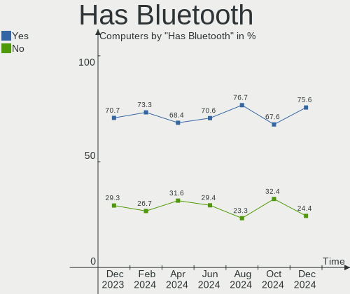
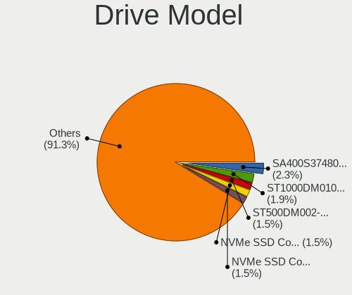
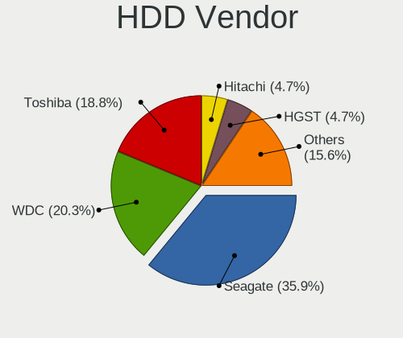
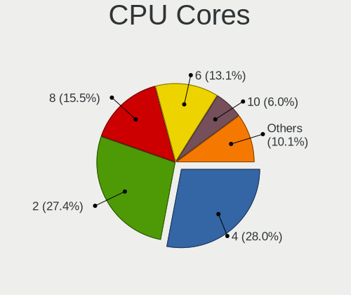
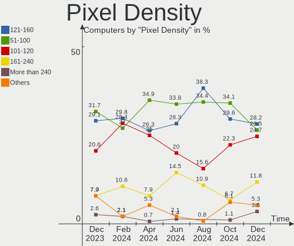
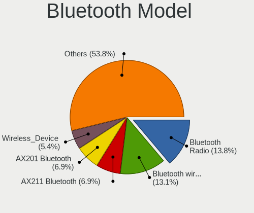
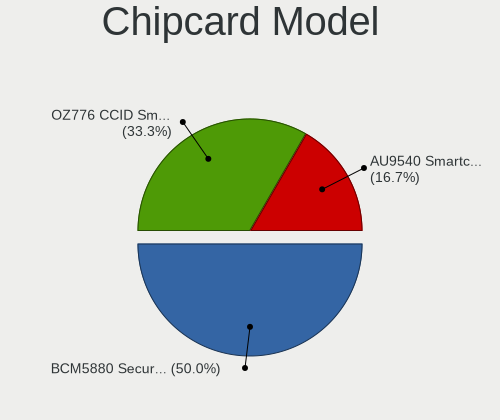

Linux in Spain - Hardware Trends
--------------------------------

A project to identify most popular hardware characteristics and track their change
over time based on data collected by Linux users at https://Linux-Hardware.org.

Anyone can contribute to this report by the [hw-probe](https://github.com/linuxhw/hw-probe) tool:

    sudo -E hw-probe -all -upload

This is a report for all computer types. See also reports for [desktops](/Location/Spain/Desktop/README.md) and [notebooks](/Location/Spain/Notebook/README.md).

Period: Apr, 2024.

Contents
--------

* [ System ](#system)
  - [ OS                       ](#os)
  - [ OS Family                ](#os-family)
  - [ Kernel                   ](#kernel)
  - [ Kernel Family            ](#kernel-family)
  - [ Kernel Major Ver.        ](#kernel-major-ver)
  - [ Arch                     ](#arch)
  - [ DE                       ](#de)
  - [ Display Server           ](#display-server)
  - [ Display Manager          ](#display-manager)
  - [ OS Lang                  ](#os-lang)
  - [ Boot Mode                ](#boot-mode)
  - [ Filesystem               ](#filesystem)
  - [ Part. scheme             ](#part-scheme)
  - [ Dual Boot with Linux/BSD ](#dual-boot-with-linuxbsd)
  - [ Dual Boot (Win)          ](#dual-boot-win)

* [ Board ](#board)
  - [ Vendor                   ](#vendor)
  - [ Model                    ](#model)
  - [ Model Family             ](#model-family)
  - [ MFG Year                 ](#mfg-year)
  - [ Form Factor              ](#form-factor)
  - [ Secure Boot              ](#secure-boot)
  - [ Coreboot                 ](#coreboot)
  - [ RAM Size                 ](#ram-size)
  - [ RAM Used                 ](#ram-used)
  - [ Total Drives             ](#total-drives)
  - [ Has CD-ROM               ](#has-cd-rom)
  - [ Has Ethernet             ](#has-ethernet)
  - [ Has WiFi                 ](#has-wifi)
  - [ Has Bluetooth            ](#has-bluetooth)

* [ Location ](#location)
  - [ Country                  ](#country)
  - [ City                     ](#city)

* [ Drives ](#drives)
  - [ Drive Vendor             ](#drive-vendor)
  - [ Drive Model              ](#drive-model)
  - [ HDD Vendor               ](#hdd-vendor)
  - [ SSD Vendor               ](#ssd-vendor)
  - [ Drive Kind               ](#drive-kind)
  - [ Drive Connector          ](#drive-connector)
  - [ Drive Size               ](#drive-size)
  - [ Space Total              ](#space-total)
  - [ Space Used               ](#space-used)
  - [ Malfunc. Drives          ](#malfunc-drives)
  - [ Malfunc. Drive Vendor    ](#malfunc-drive-vendor)
  - [ Malfunc. HDD Vendor      ](#malfunc-hdd-vendor)
  - [ Malfunc. Drive Kind      ](#malfunc-drive-kind)
  - [ Failed Drives            ](#failed-drives)
  - [ Failed Drive Vendor      ](#failed-drive-vendor)
  - [ Drive Status             ](#drive-status)

* [ Storage controller ](#storage-controller)
  - [ Storage Vendor           ](#storage-vendor)
  - [ Storage Model            ](#storage-model)
  - [ Storage Kind             ](#storage-kind)

* [ Processor ](#processor)
  - [ CPU Vendor               ](#cpu-vendor)
  - [ CPU Model                ](#cpu-model)
  - [ CPU Model Family         ](#cpu-model-family)
  - [ CPU Cores                ](#cpu-cores)
  - [ CPU Sockets              ](#cpu-sockets)
  - [ CPU Threads              ](#cpu-threads)
  - [ CPU Op-Modes             ](#cpu-op-modes)
  - [ CPU Microcode            ](#cpu-microcode)
  - [ CPU Microarch            ](#cpu-microarch)

* [ Graphics ](#graphics)
  - [ GPU Vendor               ](#gpu-vendor)
  - [ GPU Model                ](#gpu-model)
  - [ GPU Combo                ](#gpu-combo)
  - [ GPU Driver               ](#gpu-driver)
  - [ GPU Memory               ](#gpu-memory)

* [ Monitor ](#monitor)
  - [ Monitor Vendor           ](#monitor-vendor)
  - [ Monitor Model            ](#monitor-model)
  - [ Monitor Resolution       ](#monitor-resolution)
  - [ Monitor Diagonal         ](#monitor-diagonal)
  - [ Monitor Width            ](#monitor-width)
  - [ Aspect Ratio             ](#aspect-ratio)
  - [ Monitor Area             ](#monitor-area)
  - [ Pixel Density            ](#pixel-density)
  - [ Multiple Monitors        ](#multiple-monitors)

* [ Network ](#network)
  - [ Net Controller Vendor    ](#net-controller-vendor)
  - [ Net Controller Model     ](#net-controller-model)
  - [ Wireless Vendor          ](#wireless-vendor)
  - [ Wireless Model           ](#wireless-model)
  - [ Ethernet Vendor          ](#ethernet-vendor)
  - [ Ethernet Model           ](#ethernet-model)
  - [ Net Controller Kind      ](#net-controller-kind)
  - [ Used Controller          ](#used-controller)
  - [ NICs                     ](#nics)
  - [ IPv6                     ](#ipv6)

* [ Bluetooth ](#bluetooth)
  - [ Bluetooth Vendor         ](#bluetooth-vendor)
  - [ Bluetooth Model          ](#bluetooth-model)

* [ Sound ](#sound)
  - [ Sound Vendor             ](#sound-vendor)
  - [ Sound Model              ](#sound-model)

* [ Memory ](#memory)
  - [ Memory Vendor            ](#memory-vendor)
  - [ Memory Model             ](#memory-model)
  - [ Memory Kind              ](#memory-kind)
  - [ Memory Form Factor       ](#memory-form-factor)
  - [ Memory Size              ](#memory-size)
  - [ Memory Speed             ](#memory-speed)

* [ Printers & scanners ](#printers--scanners)
  - [ Printer Vendor           ](#printer-vendor)
  - [ Printer Model            ](#printer-model)
  - [ Scanner Vendor           ](#scanner-vendor)
  - [ Scanner Model            ](#scanner-model)

* [ Camera ](#camera)
  - [ Camera Vendor            ](#camera-vendor)
  - [ Camera Model             ](#camera-model)

* [ Security ](#security)
  - [ Fingerprint Vendor       ](#fingerprint-vendor)
  - [ Fingerprint Model        ](#fingerprint-model)
  - [ Chipcard Vendor          ](#chipcard-vendor)
  - [ Chipcard Model           ](#chipcard-model)

* [ Unsupported ](#unsupported)
  - [ Unsupported Devices      ](#unsupported-devices)
  - [ Unsupported Device Types ](#unsupported-device-types)

System
------

OS
--

Installed operating systems

| Name                         | Computers | Percent |
|------------------------------|-----------|---------|
| Ubuntu 22.04                 | 34        | 22.37%  |
| Debian 12                    | 17        | 11.18%  |
| Fedora 39                    | 9         | 5.92%   |
| Ubuntu 23.10                 | 8         | 5.26%   |
| Zorin 17                     | 5         | 3.29%   |
| Linux Mint 21.3              | 5         | 3.29%   |
| ArcoLinux Rolling            | 5         | 3.29%   |
| Arch Rolling                 | 5         | 3.29%   |
| Ubuntu 20.04                 | 4         | 2.63%   |
| Fedora 40                    | 4         | 2.63%   |
| Xubuntu 22.04                | 3         | 1.97%   |
| Ubuntu 24.04                 | 3         | 1.97%   |
| Pop!_OS 22.04                | 3         | 1.97%   |
| OpenMandriva 23.08           | 3         | 1.97%   |
| LMDE 6                       | 3         | 1.97%   |
| KDE neon 22.04               | 3         | 1.97%   |
| EndeavourOS Rolling          | 3         | 1.97%   |
| Ubuntu MATE 22.04            | 2         | 1.32%   |
| Manjaro 23.1.4               | 2         | 1.32%   |
| Manjaro                      | 2         | 1.32%   |
| Kali 2024.1                  | 2         | 1.32%   |
| Garuda Linux Soaring         | 2         | 1.32%   |
| Elementary 7.1               | 2         | 1.32%   |
| Zorin 15                     | 1         | 0.66%   |
| Xubuntu 18.04                | 1         | 0.66%   |
| Ubuntu Studio 22.04          | 1         | 0.66%   |
| ROSA 12.5                    | 1         | 0.66%   |
| Raspbian 11                  | 1         | 0.66%   |
| Puppy 9                      | 1         | 0.66%   |
| openSUSE Tumbleweed-XXXXXXXX | 1         | 0.66%   |
| openSUSE Microos-XXXXXXXX    | 1         | 0.66%   |
| openSUSE Leap-15.5           | 1         | 0.66%   |
| OpenMandriva 5.0             | 1         | 0.66%   |
| OpenMandriva 4.2             | 1         | 0.66%   |
| OpenMandriva 24.01           | 1         | 0.66%   |
| OpenMandriva 23.11           | 1         | 0.66%   |
| Nobara 39                    | 1         | 0.66%   |
| MX 21                        | 1         | 0.66%   |
| Lubuntu 23.10                | 1         | 0.66%   |
| Linux Mint 21.2              | 1         | 0.66%   |

OS Family
---------

OS without a version

| Name          | Computers | Percent |
|---------------|-----------|---------|
| Ubuntu        | 49        | 32.24%  |
| Debian        | 18        | 11.84%  |
| Fedora        | 13        | 8.55%   |
| OpenMandriva  | 7         | 4.61%   |
| Linux Mint    | 7         | 4.61%   |
| Zorin         | 6         | 3.95%   |
| ArcoLinux     | 5         | 3.29%   |
| Arch          | 5         | 3.29%   |
| Xubuntu       | 4         | 2.63%   |
| Manjaro       | 4         | 2.63%   |
| Pop!_OS       | 3         | 1.97%   |
| openSUSE      | 3         | 1.97%   |
| LMDE          | 3         | 1.97%   |
| Kubuntu       | 3         | 1.97%   |
| KDE neon      | 3         | 1.97%   |
| EndeavourOS   | 3         | 1.97%   |
| Ubuntu MATE   | 2         | 1.32%   |
| Kali          | 2         | 1.32%   |
| Garuda Linux  | 2         | 1.32%   |
| Elementary    | 2         | 1.32%   |
| Ubuntu Studio | 1         | 0.66%   |
| ROSA          | 1         | 0.66%   |
| Raspbian      | 1         | 0.66%   |
| Puppy         | 1         | 0.66%   |
| Nobara        | 1         | 0.66%   |
| MX            | 1         | 0.66%   |
| Lubuntu       | 1         | 0.66%   |
| Gentoo        | 1         | 0.66%   |

Kernel
------

Version of the Linux kernel

| Version                             | Computers | Percent |
|-------------------------------------|-----------|---------|
| 6.5.0-26-generic                    | 17        | 11.18%  |
| 6.5.0-27-generic                    | 12        | 7.89%   |
| 6.5.0-28-generic                    | 9         | 5.92%   |
| 6.1.0-18-amd64                      | 9         | 5.92%   |
| 6.1.0-20-amd64                      | 7         | 4.61%   |
| 6.5.0-17-generic                    | 6         | 3.95%   |
| 6.8.7-300.fc40.x86_64               | 4         | 2.63%   |
| 6.8.6-200.fc39.x86_64               | 4         | 2.63%   |
| 5.15.0-102-generic                  | 4         | 2.63%   |
| 6.8.2-arch2-1                       | 3         | 1.97%   |
| 6.8.0-76060800daily20240311-generic | 3         | 1.97%   |
| 6.6.2-desktop-1omv2390              | 3         | 1.97%   |
| 6.5.0-15-generic                    | 3         | 1.97%   |
| 6.4.11-desktop-1omv2390             | 3         | 1.97%   |
| 5.15.0-94-generic                   | 3         | 1.97%   |
| 5.15.0-101-generic                  | 3         | 1.97%   |
| 6.8.7-200.fc39.x86_64               | 2         | 1.32%   |
| 6.8.0-31-generic                    | 2         | 1.32%   |
| 6.6.25-1-lts                        | 2         | 1.32%   |
| 6.5.13-3-pve                        | 2         | 1.32%   |
| 6.5.0-34-generic                    | 2         | 1.32%   |
| 6.2.0-39-generic                    | 2         | 1.32%   |
| 5.4.0-150-generic                   | 2         | 1.32%   |
| 6.8.7-zen1-2-zen                    | 1         | 0.66%   |
| 6.8.5-arch1-1                       | 1         | 0.66%   |
| 6.8.5-201.fc39.x86_64               | 1         | 0.66%   |
| 6.8.5-1-MANJARO                     | 1         | 0.66%   |
| 6.8.5-1-default                     | 1         | 0.66%   |
| 6.8.4-zen1-1-zen                    | 1         | 0.66%   |
| 6.8.4-arch1-1                       | 1         | 0.66%   |
| 6.8.4-200.fc39.x86_64               | 1         | 0.66%   |
| 6.8.4-200.fc39.aarch64              | 1         | 0.66%   |
| 6.8.2-zen2-1-zen                    | 1         | 0.66%   |
| 6.8.2-arch1-1                       | 1         | 0.66%   |
| 6.8.2-1-default                     | 1         | 0.66%   |
| 6.8.1-gentoo                        | 1         | 0.66%   |
| 6.8.0-22-generic                    | 1         | 0.66%   |
| 6.7.6-201.fsync.fc39.x86_64         | 1         | 0.66%   |
| 6.7.6-060706-generic                | 1         | 0.66%   |
| 6.7.2-arch1-2                       | 1         | 0.66%   |

Kernel Family
-------------

Linux kernel without a distro release

| Version  | Computers | Percent |
|----------|-----------|---------|
| 6.5.0    | 53        | 34.87%  |
| 6.1.0    | 17        | 11.18%  |
| 5.15.0   | 14        | 9.21%   |
| 6.8.7    | 7         | 4.61%   |
| 6.8.2    | 6         | 3.95%   |
| 6.8.0    | 6         | 3.95%   |
| 5.4.0    | 5         | 3.29%   |
| 6.8.6    | 4         | 2.63%   |
| 6.8.5    | 4         | 2.63%   |
| 6.8.4    | 4         | 2.63%   |
| 6.6.25   | 3         | 1.97%   |
| 6.6.2    | 3         | 1.97%   |
| 6.5.13   | 3         | 1.97%   |
| 6.4.11   | 3         | 1.97%   |
| 6.7.6    | 2         | 1.32%   |
| 6.7.2    | 2         | 1.32%   |
| 6.2.0    | 2         | 1.32%   |
| 6.8.1    | 1         | 0.66%   |
| 6.7.12   | 1         | 0.66%   |
| 6.6.9    | 1         | 0.66%   |
| 6.6.26   | 1         | 0.66%   |
| 6.6.24   | 1         | 0.66%   |
| 6.6.23   | 1         | 0.66%   |
| 6.6.20   | 1         | 0.66%   |
| 6.1.84   | 1         | 0.66%   |
| 6.1.21   | 1         | 0.66%   |
| 5.4.53   | 1         | 0.66%   |
| 5.15.127 | 1         | 0.66%   |
| 5.14.21  | 1         | 0.66%   |
| 5.10.160 | 1         | 0.66%   |
| 5.10.14  | 1         | 0.66%   |

Kernel Major Ver.
-----------------

Linux kernel major version

| Version | Computers | Percent |
|---------|-----------|---------|
| 6.5     | 56        | 36.84%  |
| 6.8     | 32        | 21.05%  |
| 6.1     | 19        | 12.5%   |
| 5.15    | 15        | 9.87%   |
| 6.6     | 11        | 7.24%   |
| 5.4     | 6         | 3.95%   |
| 6.7     | 5         | 3.29%   |
| 6.4     | 3         | 1.97%   |
| 6.2     | 2         | 1.32%   |
| 5.10    | 2         | 1.32%   |
| 5.14    | 1         | 0.66%   |

Arch
----

OS architecture (x86_64, i586, etc.)

| Name    | Computers | Percent |
|---------|-----------|---------|
| x86_64  | 144       | 94.74%  |
| aarch64 | 4         | 2.63%   |
| i686    | 3         | 1.97%   |
| armv7l  | 1         | 0.66%   |

DE
--

Desktop Environment

| Name            | Computers | Percent |
|-----------------|-----------|---------|
| GNOME           | 65        | 42.76%  |
| Unknown         | 24        | 15.79%  |
| KDE5            | 20        | 13.16%  |
| XFCE            | 9         | 5.92%   |
| X-Cinnamon      | 8         | 5.26%   |
| MATE            | 7         | 4.61%   |
| KDE6            | 7         | 4.61%   |
| LXQt            | 4         | 2.63%   |
| Pantheon        | 2         | 1.32%   |
| KDE             | 2         | 1.32%   |
| i3              | 2         | 1.32%   |
| Hyprland        | 1         | 0.66%   |
| GNOME Flashback | 1         | 0.66%   |

Display Server
--------------

X11 or Wayland

| Name    | Computers | Percent |
|---------|-----------|---------|
| X11     | 71        | 46.71%  |
| Wayland | 60        | 39.47%  |
| Tty     | 15        | 9.87%   |
| Unknown | 6         | 3.95%   |

Display Manager
---------------

SDDM, LightDM, etc.

| Name    | Computers | Percent |
|---------|-----------|---------|
| Unknown | 63        | 41.45%  |
| GDM3    | 37        | 24.34%  |
| SDDM    | 24        | 15.79%  |
| LightDM | 24        | 15.79%  |
| GDM     | 4         | 2.63%   |

OS Lang
-------

Language

| Lang           | Computers | Percent |
|----------------|-----------|---------|
| es_ES          | 98        | 64.47%  |
| en_US          | 33        | 21.71%  |
| en_GB          | 6         | 3.95%   |
| ca_ES          | 6         | 3.95%   |
| Unknown        | 3         | 1.97%   |
| ru_UA          | 1         | 0.66%   |
| ru_RU          | 1         | 0.66%   |
| es_EC          | 1         | 0.66%   |
| en_IE          | 1         | 0.66%   |
| ca_ES@valencia | 1         | 0.66%   |
| C              | 1         | 0.66%   |

Boot Mode
---------

EFI or BIOS

| Mode | Computers | Percent |
|------|-----------|---------|
| EFI  | 80        | 52.63%  |
| BIOS | 72        | 47.37%  |

Filesystem
----------

Type of filesystem

| Type    | Computers | Percent |
|---------|-----------|---------|
| Ext4    | 95        | 62.5%   |
| Tmpfs   | 25        | 16.45%  |
| Btrfs   | 23        | 15.13%  |
| Overlay | 4         | 2.63%   |
| Zfs     | 3         | 1.97%   |
| Xfs     | 1         | 0.66%   |
| Aufs    | 1         | 0.66%   |

Part. scheme
------------

Scheme of partitioning

| Type    | Computers | Percent |
|---------|-----------|---------|
| GPT     | 97        | 63.82%  |
| Unknown | 44        | 28.95%  |
| MBR     | 11        | 7.24%   |

Dual Boot with Linux/BSD
------------------------

Hosting more than one Linux/BSD

| Dual boot | Computers | Percent |
|-----------|-----------|---------|
| No        | 132       | 86.84%  |
| Yes       | 20        | 13.16%  |

Dual Boot (Win)
---------------

Hosting Linux and Windows

| Dual boot | Computers | Percent |
|-----------|-----------|---------|
| No        | 111       | 73.03%  |
| Yes       | 41        | 26.97%  |

Board
-----

Vendor
------

Motherboard manufacturer

| Name                                 | Computers | Percent |
|--------------------------------------|-----------|---------|
| ASUSTek Computer                     | 27        | 17.76%  |
| Hewlett-Packard                      | 23        | 15.13%  |
| MSI                                  | 18        | 11.84%  |
| Acer                                 | 13        | 8.55%   |
| Lenovo                               | 12        | 7.89%   |
| Gigabyte Technology                  | 12        | 7.89%   |
| ASRock                               | 9         | 5.92%   |
| Apple                                | 7         | 4.61%   |
| Raspberry Pi Foundation              | 3         | 1.97%   |
| Packard Bell                         | 3         | 1.97%   |
| Intel                                | 3         | 1.97%   |
| HUAWEI                               | 3         | 1.97%   |
| Dell                                 | 2         | 1.32%   |
| Chuwi                                | 2         | 1.32%   |
| AMI                                  | 2         | 1.32%   |
| Unknown                              | 2         | 1.32%   |
| Toshiba                              | 1         | 0.66%   |
| Sony                                 | 1         | 0.66%   |
| Shenzhen Meigao Electronic Equipment | 1         | 0.66%   |
| raspberrypi,4-model-b                | 1         | 0.66%   |
| Pegatron                             | 1         | 0.66%   |
| Medion                               | 1         | 0.66%   |
| MACHINIST                            | 1         | 0.66%   |
| IP3 Tech                             | 1         | 0.66%   |
| Fujitsu                              | 1         | 0.66%   |
| DERE                                 | 1         | 0.66%   |
| AZW                                  | 1         | 0.66%   |

Model
-----

Motherboard model

| Name                                                 | Computers | Percent |
|------------------------------------------------------|-----------|---------|
| Gigabyte TRX40 AORUS MASTER                          | 6         | 3.95%   |
| ASRock TRX40 Creator                                 | 6         | 3.95%   |
| Unknown                                              | 4         | 2.63%   |
| RPi Raspberry Pi 5 Model B Rev 1.0                   | 2         | 1.32%   |
| MSI MS-7E26                                          | 2         | 1.32%   |
| MSI MS-7E16                                          | 2         | 1.32%   |
| MSI MS-7817                                          | 2         | 1.32%   |
| MSI GE72 2QD                                         | 2         | 1.32%   |
| ASUS ROG Zephyrus G14 GA401II_GA401II                | 2         | 1.32%   |
| ASUS ROG ZENITH II EXTREME                           | 2         | 1.32%   |
| ASUS All Series                                      | 2         | 1.32%   |
| Toshiba NB520                                        | 1         | 0.66%   |
| Sony VPCCB4Q1E                                       | 1         | 0.66%   |
| Shenzhen Meigao Electronic Equipment UM690           | 1         | 0.66%   |
| raspberrypi,4-model-b Raspberry Pi 4 Model B Rev 1.5 | 1         | 0.66%   |
| RPi Raspberry Pi                                     | 1         | 0.66%   |
| Pegatron H81-M1                                      | 1         | 0.66%   |
| Packard Bell ISTART 2025                             | 1         | 0.66%   |
| Packard Bell EasyNote TM86                           | 1         | 0.66%   |
| Packard Bell EasyNote LJ65                           | 1         | 0.66%   |
| MSI Summit E13FlipEvo A11MT                          | 1         | 0.66%   |
| MSI Stealth 15M B12UE                                | 1         | 0.66%   |
| MSI MS-7C52                                          | 1         | 0.66%   |
| MSI MS-7C37                                          | 1         | 0.66%   |
| MSI MS-7B86                                          | 1         | 0.66%   |
| MSI MS-7B79                                          | 1         | 0.66%   |
| MSI MS-7A38                                          | 1         | 0.66%   |
| MSI MS-7816                                          | 1         | 0.66%   |
| MSI Katana 15 B13VGK                                 | 1         | 0.66%   |
| MSI GE66 Raider 10UG                                 | 1         | 0.66%   |
| Medion E1210                                         | 1         | 0.66%   |
| MACHINIST X99-MR9A PRO MAX V1.2                      | 1         | 0.66%   |
| Lenovo ThinkPad L13 Gen 2 20VJS22W00                 | 1         | 0.66%   |
| Lenovo ThinkPad E16 Gen 1 21JTCTO1WW                 | 1         | 0.66%   |
| Lenovo ThinkCentre M910q 10MUS0U12E                  | 1         | 0.66%   |
| Lenovo Legion Y530-15ICH 81FV                        | 1         | 0.66%   |
| Lenovo IdeaPadFlex 5 14IRU8 82Y0                     | 1         | 0.66%   |
| Lenovo IdeaPad S145-15AST 81N3                       | 1         | 0.66%   |
| Lenovo IdeaPad 330-15ICH 81FK                        | 1         | 0.66%   |
| Lenovo IdeaPad 320-15IKB 80XL                        | 1         | 0.66%   |

Model Family
------------

Motherboard model prefix

| Name                                       | Computers | Percent |
|--------------------------------------------|-----------|---------|
| Acer Aspire                                | 9         | 5.92%   |
| Gigabyte TRX40                             | 6         | 3.95%   |
| ASRock TRX40                               | 6         | 3.95%   |
| Lenovo IdeaPad                             | 5         | 3.29%   |
| ASUS ROG                                   | 5         | 3.29%   |
| ASUS VivoBook                              | 4         | 2.63%   |
| Unknown                                    | 4         | 2.63%   |
| RPi Raspberry                              | 3         | 1.97%   |
| HP ProBook                                 | 3         | 1.97%   |
| HP Pavilion                                | 3         | 1.97%   |
| HP Laptop                                  | 3         | 1.97%   |
| HP Compaq                                  | 3         | 1.97%   |
| ASUS TUF                                   | 3         | 1.97%   |
| Packard Bell EasyNote                      | 2         | 1.32%   |
| MSI MS-7E26                                | 2         | 1.32%   |
| MSI MS-7E16                                | 2         | 1.32%   |
| MSI MS-7817                                | 2         | 1.32%   |
| MSI GE72                                   | 2         | 1.32%   |
| Lenovo ThinkPad                            | 2         | 1.32%   |
| HP ZBook                                   | 2         | 1.32%   |
| HP ProLiant                                | 2         | 1.32%   |
| Dell XPS                                   | 2         | 1.32%   |
| ASUS PRIME                                 | 2         | 1.32%   |
| ASUS All                                   | 2         | 1.32%   |
| Acer Nitro                                 | 2         | 1.32%   |
| Toshiba NB520                              | 1         | 0.66%   |
| Sony VPCCB4Q1E                             | 1         | 0.66%   |
| Shenzhen Meigao Electronic Equipment UM690 | 1         | 0.66%   |
| raspberrypi,4-model-b Raspberry            | 1         | 0.66%   |
| Pegatron H81-M1                            | 1         | 0.66%   |
| Packard Bell ISTART                        | 1         | 0.66%   |
| MSI Summit                                 | 1         | 0.66%   |
| MSI Stealth                                | 1         | 0.66%   |
| MSI MS-7C52                                | 1         | 0.66%   |
| MSI MS-7C37                                | 1         | 0.66%   |
| MSI MS-7B86                                | 1         | 0.66%   |
| MSI MS-7B79                                | 1         | 0.66%   |
| MSI MS-7A38                                | 1         | 0.66%   |
| MSI MS-7816                                | 1         | 0.66%   |
| MSI Katana                                 | 1         | 0.66%   |

MFG Year
--------

Motherboard manufacture year

| Year    | Computers | Percent |
|---------|-----------|---------|
| 2019    | 17        | 11.18%  |
| 2023    | 16        | 10.53%  |
| 2020    | 16        | 10.53%  |
| 2018    | 16        | 10.53%  |
| 2022    | 12        | 7.89%   |
| 2013    | 11        | 7.24%   |
| 2021    | 8         | 5.26%   |
| 2009    | 8         | 5.26%   |
| 2008    | 7         | 4.61%   |
| 2017    | 6         | 3.95%   |
| 2016    | 6         | 3.95%   |
| 2014    | 5         | 3.29%   |
| 2011    | 4         | 2.63%   |
| 2007    | 4         | 2.63%   |
| Unknown | 4         | 2.63%   |
| 2024    | 3         | 1.97%   |
| 2015    | 3         | 1.97%   |
| 2012    | 3         | 1.97%   |
| 2006    | 2         | 1.32%   |
| 2010    | 1         | 0.66%   |

Form Factor
-----------

Physical design of the computer

| Name           | Computers | Percent |
|----------------|-----------|---------|
| Notebook       | 72        | 47.37%  |
| Desktop        | 64        | 42.11%  |
| Mini pc        | 6         | 3.95%   |
| System on chip | 5         | 3.29%   |
| Tablet         | 2         | 1.32%   |
| Server         | 2         | 1.32%   |
| Convertible    | 1         | 0.66%   |

Secure Boot
-----------

Enabled or disabled

| State    | Computers | Percent |
|----------|-----------|---------|
| Disabled | 138       | 90.79%  |
| Enabled  | 14        | 9.21%   |

Coreboot
--------

Have coreboot on board

| Used | Computers | Percent |
|------|-----------|---------|
| No   | 152       | 100%    |

RAM Size
--------

Total RAM memory

| Size in GB      | Computers | Percent |
|-----------------|-----------|---------|
| 16.01-24.0      | 34        | 22.37%  |
| 4.01-8.0        | 25        | 16.45%  |
| 8.01-16.0       | 25        | 16.45%  |
| 32.01-64.0      | 17        | 11.18%  |
| 3.01-4.0        | 17        | 11.18%  |
| More than 256.0 | 13        | 8.55%   |
| 24.01-32.0      | 7         | 4.61%   |
| 64.01-256.0     | 7         | 4.61%   |
| 1.01-2.0        | 5         | 3.29%   |
| 2.01-3.0        | 1         | 0.66%   |
| 0.51-1.0        | 1         | 0.66%   |

RAM Used
--------

Used RAM memory

| Used GB     | Computers | Percent |
|-------------|-----------|---------|
| 4.01-8.0    | 35        | 23.03%  |
| 2.01-3.0    | 32        | 21.05%  |
| 1.01-2.0    | 31        | 20.39%  |
| 3.01-4.0    | 22        | 14.47%  |
| 64.01-256.0 | 12        | 7.89%   |
| 8.01-16.0   | 5         | 3.29%   |
| 16.01-24.0  | 4         | 2.63%   |
| 24.01-32.0  | 3         | 1.97%   |
| 0.51-1.0    | 3         | 1.97%   |
| 0.01-0.5    | 3         | 1.97%   |
| 32.01-64.0  | 2         | 1.32%   |

Total Drives
------------

Number of drives on board

| Drives | Computers | Percent |
|--------|-----------|---------|
| 1      | 77        | 50.66%  |
| 2      | 40        | 26.32%  |
| 3      | 9         | 5.92%   |
| 13     | 6         | 3.95%   |
| 4      | 6         | 3.95%   |
| 6      | 4         | 2.63%   |
| 5      | 4         | 2.63%   |
| 9      | 3         | 1.97%   |
| 21     | 1         | 0.66%   |
| 12     | 1         | 0.66%   |
| 11     | 1         | 0.66%   |

Has CD-ROM
----------

Has CD-ROM on board

| Presented | Computers | Percent |
|-----------|-----------|---------|
| No        | 110       | 72.37%  |
| Yes       | 42        | 27.63%  |

Has Ethernet
------------

Has Ethernet on board

| Presented | Computers | Percent |
|-----------|-----------|---------|
| Yes       | 130       | 85.53%  |
| No        | 22        | 14.47%  |

Has WiFi
--------

Has WiFi module

| Presented | Computers | Percent |
|-----------|-----------|---------|
| Yes       | 117       | 76.97%  |
| No        | 35        | 23.03%  |

Has Bluetooth
-------------

Has Bluetooth module

| Presented | Computers | Percent |
|-----------|-----------|---------|
| Yes       | 104       | 68.42%  |
| No        | 48        | 31.58%  |

Location
--------

Country
-------

Geographic location (country)

| Country | Computers | Percent |
|---------|-----------|---------|
| Spain   | 152       | 100%    |

City
----

Geographic location (city)

| City                        | Computers | Percent |
|-----------------------------|-----------|---------|
| Madrid                      | 21        | 13.82%  |
| Terrassa                    | 15        | 9.87%   |
| Barcelona                   | 11        | 7.24%   |
| Valencia                    | 6         | 3.95%   |
| Alicante                    | 4         | 2.63%   |
| Zaragoza                    | 3         | 1.97%   |
| Valladolid                  | 3         | 1.97%   |
| León                       | 3         | 1.97%   |
| Leganés                    | 3         | 1.97%   |
| Granada                     | 3         | 1.97%   |
| A Coruña                   | 3         | 1.97%   |
| Xinzo de Limia              | 2         | 1.32%   |
| Vitoria-Gasteiz             | 2         | 1.32%   |
| Paracuellos de Jarama       | 2         | 1.32%   |
| Murcia                      | 2         | 1.32%   |
| Málaga                     | 2         | 1.32%   |
| Guadalajara                 | 2         | 1.32%   |
| Córdoba                    | 2         | 1.32%   |
| Bilbao                      | 2         | 1.32%   |
| Benicarló                  | 2         | 1.32%   |
| Badalona                    | 2         | 1.32%   |
| Arona                       | 2         | 1.32%   |
| Zubia                       | 1         | 0.66%   |
| Zafra                       | 1         | 0.66%   |
| Xàtiva                     | 1         | 0.66%   |
| Villanueva de la Canada     | 1         | 0.66%   |
| Vilanova i la Geltrú       | 1         | 0.66%   |
| Vigo                        | 1         | 0.66%   |
| Teguise                     | 1         | 0.66%   |
| Sierra de Yeguas            | 1         | 0.66%   |
| Seville                     | 1         | 0.66%   |
| Santiago de Compostela      | 1         | 0.66%   |
| Santanyí                   | 1         | 0.66%   |
| Sant Joan d'Alacant         | 1         | 0.66%   |
| Sant Andreu de la Barca     | 1         | 0.66%   |
| San Cristóbal de La Laguna | 1         | 0.66%   |
| Salamanca                   | 1         | 0.66%   |
| Sabadell                    | 1         | 0.66%   |
| Rabade                      | 1         | 0.66%   |
| Pontevedra                  | 1         | 0.66%   |

Drives
------

Drive Vendor
------------

Hard drive vendors

| Vendor                      | Computers | Drives | Percent |
|-----------------------------|-----------|--------|---------|
| Samsung Electronics         | 29        | 31     | 11.6%   |
| WDC                         | 25        | 34     | 10%     |
| Seagate                     | 20        | 47     | 8%      |
| Kingston                    | 18        | 20     | 7.2%    |
| Sandisk                     | 15        | 16     | 6%      |
| PNY                         | 13        | 16     | 5.2%    |
| Toshiba                     | 12        | 22     | 4.8%    |
| Phison                      | 12        | 54     | 4.8%    |
| Crucial                     | 12        | 57     | 4.8%    |
| Unknown                     | 8         | 9      | 3.2%    |
| Phison Electronics          | 8         | 9      | 3.2%    |
| Micron Technology           | 7         | 7      | 2.8%    |
| Intel                       | 7         | 8      | 2.8%    |
| Hitachi                     | 7         | 7      | 2.8%    |
| SK hynix                    | 5         | 5      | 2%      |
| China                       | 5         | 5      | 2%      |
| HGST                        | 4         | 4      | 1.6%    |
| Apple                       | 4         | 4      | 1.6%    |
| Unknown                     | 4         | 4      | 1.6%    |
| Silicon Motion              | 3         | 4      | 1.2%    |
| Maxtor                      | 3         | 3      | 1.2%    |
| KIOXIA                      | 3         | 3      | 1.2%    |
| Kingston Technology Company | 3         | 3      | 1.2%    |
| Hewlett-Packard             | 3         | 3      | 1.2%    |
| Lexar                       | 2         | 2      | 0.8%    |
| SSSTC                       | 1         | 1      | 0.4%    |
| SSK                         | 1         | 1      | 0.4%    |
| SCCTS-603-001T              | 1         | 1      | 0.4%    |
| OCZ                         | 1         | 1      | 0.4%    |
| Mushkin                     | 1         | 2      | 0.4%    |
| LITEON                      | 1         | 1      | 0.4%    |
| KODAK                       | 1         | 1      | 0.4%    |
| KIOXIA-EXCERIA              | 1         | 1      | 0.4%    |
| KingDian                    | 1         | 1      | 0.4%    |
| JMicron Technology          | 1         | 1      | 0.4%    |
| Intenso                     | 1         | 1      | 0.4%    |
| HUAWEI                      | 1         | 1      | 0.4%    |
| Gigabyte Technology         | 1         | 1      | 0.4%    |
| Emtec                       | 1         | 1      | 0.4%    |
| Corsair                     | 1         | 1      | 0.4%    |

Drive Model
-----------

Hard drive models

| Model                                                 | Computers | Percent |
|-------------------------------------------------------|-----------|---------|
| PNY CS3030 250GB SSD                                  | 12        | 4.44%   |
| Phison Sabrent Rocket Q 8TB                           | 10        | 3.7%    |
| Crucial CT4000P3SSD8 4TB                              | 6         | 2.22%   |
| Kingston SA400S37480G 480GB SSD                       | 5         | 1.85%   |
| Kingston SA400S37240G 240GB SSD                       | 5         | 1.85%   |
| Samsung NVMe SSD Controller SM981/PM981/PM983 1TB     | 4         | 1.48%   |
| Unknown                                               | 4         | 1.48%   |
| Unknown MMC Card  64GB                                | 3         | 1.11%   |
| Silicon Motion SM2263EN/SM2263XT SSD Controller 256GB | 3         | 1.11%   |
| Samsung SSD 850 EVO 250GB                             | 3         | 1.11%   |
| HGST HTS721010A9E630 1TB                              | 3         | 1.11%   |
| WDC WD40EFAX-68JH4N1 4TB                              | 2         | 0.74%   |
| WDC WD20EZRZ-00Z5HB0 2TB                              | 2         | 0.74%   |
| Unknown MMC Card  32GB                                | 2         | 0.74%   |
| Toshiba TR200 240GB SSD                               | 2         | 0.74%   |
| Toshiba MQ01ABD050 500GB                              | 2         | 0.74%   |
| Seagate ST4000DM004-2CV104 4TB                        | 2         | 0.74%   |
| Seagate ST1000DM010-2EP102 1TB                        | 2         | 0.74%   |
| Seagate ST1000DM003-1ER162 1TB                        | 2         | 0.74%   |
| Sandisk WD Blue SN550 NVMe SSD 2TB                    | 2         | 0.74%   |
| Samsung SSD 860 EVO 1TB                               | 2         | 0.74%   |
| Samsung NVMe SSD Controller PM9A1/PM9A3/980PRO 1TB    | 2         | 0.74%   |
| Phison PS5013 E13 NVMe Controller 512GB               | 2         | 0.74%   |
| Phison E12 NVMe Controller 2TB                        | 2         | 0.74%   |
| Micron MTFDKCD512QFM-1BD1AABLA 512GB                  | 2         | 0.74%   |
| Maxtor Z1 SSD 480GB                                   | 2         | 0.74%   |
| Lexar SSD NM790 2TB                                   | 2         | 0.74%   |
| HP LOGICAL VOLUME 160GB                               | 2         | 0.74%   |
| Crucial CT2000MX500SSD1 2TB                           | 2         | 0.74%   |
| Apple SSD SM0256F 256GB                               | 2         | 0.74%   |
| WDC WDS250G2B0A-00SM50 250GB SSD                      | 1         | 0.37%   |
| WDC WDS240G2G0B-00EPW0 240GB SSD                      | 1         | 0.37%   |
| WDC WDS100T3X0C-00SJG0 1TB                            | 1         | 0.37%   |
| WDC WDS100T2B0B-00YS70 1TB SSD                        | 1         | 0.37%   |
| WDC WD80EMAZ-00WJTA0 8TB                              | 1         | 0.37%   |
| WDC WD800JD-08MSA1 80GB                               | 1         | 0.37%   |
| WDC WD5000LPVX-60V0TT0 500GB                          | 1         | 0.37%   |
| WDC WD5000LPCX-22VHAT1 500GB                          | 1         | 0.37%   |
| WDC WD4005FZBX-00K5WB0 4TB                            | 1         | 0.37%   |
| WDC WD30EZRZ-00GXCB0 3TB                              | 1         | 0.37%   |

HDD Vendor
----------

Hard disk drive vendors

| Vendor              | Computers | Drives | Percent |
|---------------------|-----------|--------|---------|
| Seagate             | 20        | 47     | 30.3%   |
| WDC                 | 18        | 26     | 27.27%  |
| Toshiba             | 10        | 20     | 15.15%  |
| Hitachi             | 7         | 7      | 10.61%  |
| HGST                | 4         | 4      | 6.06%   |
| Hewlett-Packard     | 2         | 2      | 3.03%   |
| Unknown             | 1         | 1      | 1.52%   |
| Samsung Electronics | 1         | 1      | 1.52%   |
| Maxtor              | 1         | 1      | 1.52%   |
| JMicron Technology  | 1         | 1      | 1.52%   |
| ASMT                | 1         | 1      | 1.52%   |

SSD Vendor
----------

Solid state drive vendors

| Vendor              | Computers | Drives | Percent |
|---------------------|-----------|--------|---------|
| Kingston            | 16        | 18     | 23.19%  |
| Samsung Electronics | 12        | 14     | 17.39%  |
| Crucial             | 5         | 8      | 7.25%   |
| China               | 5         | 5      | 7.25%   |
| WDC                 | 4         | 4      | 5.8%    |
| SanDisk             | 4         | 4      | 5.8%    |
| Apple               | 4         | 4      | 5.8%    |
| Toshiba             | 2         | 2      | 2.9%    |
| SK hynix            | 2         | 2      | 2.9%    |
| Maxtor              | 2         | 2      | 2.9%    |
| SSK                 | 1         | 1      | 1.45%   |
| SCCTS-603-001T      | 1         | 1      | 1.45%   |
| OCZ                 | 1         | 1      | 1.45%   |
| Mushkin             | 1         | 2      | 1.45%   |
| Micron Technology   | 1         | 1      | 1.45%   |
| LITEON              | 1         | 1      | 1.45%   |
| KODAK               | 1         | 1      | 1.45%   |
| KingDian            | 1         | 1      | 1.45%   |
| Intenso             | 1         | 1      | 1.45%   |
| Hewlett-Packard     | 1         | 1      | 1.45%   |
| Gigabyte Technology | 1         | 1      | 1.45%   |
| Emtec               | 1         | 1      | 1.45%   |
| A-DATA Technology   | 1         | 1      | 1.45%   |

Drive Kind
----------

HDD or SSD

| Kind    | Computers | Drives | Percent |
|---------|-----------|--------|---------|
| NVMe    | 83        | 196    | 39.71%  |
| SSD     | 59        | 77     | 28.23%  |
| HDD     | 56        | 111    | 26.79%  |
| MMC     | 10        | 11     | 4.78%   |
| Unknown | 1         | 1      | 0.48%   |

Drive Connector
---------------

SATA, SAS, NVMe, etc.

| Type | Computers | Drives | Percent |
|------|-----------|--------|---------|
| SATA | 93        | 180    | 47.69%  |
| NVMe | 83        | 196    | 42.56%  |
| MMC  | 10        | 11     | 5.13%   |
| SAS  | 9         | 9      | 4.62%   |

Drive Size
----------

Size of hard drive

| Size in TB | Computers | Drives | Percent |
|------------|-----------|--------|---------|
| 0.01-0.5   | 68        | 89     | 54.84%  |
| 0.51-1.0   | 24        | 26     | 19.35%  |
| 1.01-2.0   | 15        | 27     | 12.1%   |
| 4.01-10.0  | 6         | 33     | 4.84%   |
| 2.01-3.0   | 5         | 6      | 4.03%   |
| 3.01-4.0   | 4         | 5      | 3.23%   |
| 10.01-20.0 | 2         | 2      | 1.61%   |

Space Total
-----------

Amount of disk space available on the file system

| Size in GB     | Computers | Percent |
|----------------|-----------|---------|
| 101-250        | 49        | 32.24%  |
| 251-500        | 27        | 17.76%  |
| 501-1000       | 22        | 14.47%  |
| 1001-2000      | 19        | 12.5%   |
| More than 3000 | 13        | 8.55%   |
| 1-20           | 7         | 4.61%   |
| 51-100         | 7         | 4.61%   |
| Unknown        | 4         | 2.63%   |
| 21-50          | 3         | 1.97%   |
| 2001-3000      | 1         | 0.66%   |

Space Used
----------

Amount of used disk space

| Used GB        | Computers | Percent |
|----------------|-----------|---------|
| 1-20           | 36        | 23.68%  |
| 21-50          | 32        | 21.05%  |
| 101-250        | 23        | 15.13%  |
| 51-100         | 23        | 15.13%  |
| 251-500        | 12        | 7.89%   |
| More than 3000 | 9         | 5.92%   |
| 501-1000       | 9         | 5.92%   |
| Unknown        | 4         | 2.63%   |
| 2001-3000      | 3         | 1.97%   |
| 1001-2000      | 1         | 0.66%   |

Malfunc. Drives
---------------

Drive models with a malfunction

| Model                               | Computers | Drives | Percent |
|-------------------------------------|-----------|--------|---------|
| WDC WD Green M.2 2280 480GB SSD     | 1         | 1      | 12.5%   |
| Samsung Electronics SSD 980 PRO 2TB | 1         | 1      | 12.5%   |
| Maxtor STM3250310AS 250GB           | 1         | 1      | 12.5%   |
| Hitachi HTS723232L9A360 320GB       | 1         | 1      | 12.5%   |
| Hitachi HTS542512K9SA00 120GB       | 1         | 1      | 12.5%   |
| China SSD 1TB                       | 1         | 1      | 12.5%   |
| Apple SSD SD0128F 121GB             | 1         | 1      | 12.5%   |
| A-DATA Technology SP900 256GB SSD   | 1         | 1      | 12.5%   |

Malfunc. Drive Vendor
---------------------

Vendors of faulty drives

| Vendor              | Computers | Drives | Percent |
|---------------------|-----------|--------|---------|
| Hitachi             | 2         | 2      | 25%     |
| WDC                 | 1         | 1      | 12.5%   |
| Samsung Electronics | 1         | 1      | 12.5%   |
| Maxtor              | 1         | 1      | 12.5%   |
| China               | 1         | 1      | 12.5%   |
| Apple               | 1         | 1      | 12.5%   |
| A-DATA Technology   | 1         | 1      | 12.5%   |

Malfunc. HDD Vendor
-------------------

Vendors of faulty HDD drives

| Vendor  | Computers | Drives | Percent |
|---------|-----------|--------|---------|
| Hitachi | 2         | 2      | 66.67%  |
| Maxtor  | 1         | 1      | 33.33%  |

Malfunc. Drive Kind
-------------------

Kinds of faulty drives

| Kind | Computers | Drives | Percent |
|------|-----------|--------|---------|
| SSD  | 4         | 4      | 50%     |
| HDD  | 3         | 3      | 37.5%   |
| NVMe | 1         | 1      | 12.5%   |

Failed Drives
-------------

Failed drive models

Zero info for selected period =(

Failed Drive Vendor
-------------------

Failed drive vendors

Zero info for selected period =(

Drive Status
------------

Number of failed and malfunc. drives

| Status   | Computers | Drives | Percent |
|----------|-----------|--------|---------|
| Detected | 81        | 147    | 50%     |
| Works    | 73        | 241    | 45.06%  |
| Malfunc  | 8         | 8      | 4.94%   |

Storage controller
------------------

Storage Vendor
--------------

Storage controller vendors

| Vendor                         | Computers | Percent |
|--------------------------------|-----------|---------|
| Intel                          | 73        | 30.67%  |
| AMD                            | 47        | 19.75%  |
| Phison Electronics             | 26        | 10.92%  |
| Samsung Electronics            | 19        | 7.98%   |
| SanDisk                        | 16        | 6.72%   |
| Micron/Crucial Technology      | 7         | 2.94%   |
| Nvidia                         | 6         | 2.52%   |
| Micron Technology              | 6         | 2.52%   |
| HighPoint Technologies         | 6         | 2.52%   |
| Kingston Technology Company    | 5         | 2.1%    |
| Marvell Technology Group       | 4         | 1.68%   |
| KIOXIA                         | 4         | 1.68%   |
| ASMedia Technology             | 4         | 1.68%   |
| SK hynix                       | 3         | 1.26%   |
| Silicon Motion                 | 3         | 1.26%   |
| Shenzhen Longsys Electronics   | 2         | 0.84%   |
| JMicron Technology             | 2         | 0.84%   |
| Hewlett-Packard                | 2         | 0.84%   |
| Solid State Storage Technology | 1         | 0.42%   |
| LSI Logic / Symbios Logic      | 1         | 0.42%   |
| Unknown                        | 1         | 0.42%   |

Storage Model
-------------

Storage controller models

| Model                                                                          | Computers | Percent |
|--------------------------------------------------------------------------------|-----------|---------|
| AMD FCH SATA Controller [AHCI mode]                                            | 36        | 13.43%  |
| Phison E12 NVMe Controller                                                     | 19        | 7.09%   |
| AMD 400 Series Chipset SATA Controller                                         | 8         | 2.99%   |
| Samsung NVMe SSD Controller SM981/PM981/PM983                                  | 7         | 2.61%   |
| Micron/Crucial P2 [Nick P2] / P3 / P3 Plus NVMe PCIe SSD (DRAM-less)           | 7         | 2.61%   |
| Intel Volume Management Device NVMe RAID Controller                            | 7         | 2.61%   |
| Intel 82801 Mobile SATA Controller [RAID mode]                                 | 6         | 2.24%   |
| HighPoint SSD7540 PCIe Gen4 x16 8-Port M.2 NVMe RAID Controller                | 6         | 2.24%   |
| Intel 8 Series/C220 Series Chipset Family 6-port SATA Controller 1 [AHCI mode] | 5         | 1.87%   |
| AMD 600 Series Chipset SATA Controller                                         | 5         | 1.87%   |
| SanDisk Ultra 3D / WD Blue SN550 NVMe SSD                                      | 4         | 1.49%   |
| Intel Cannon Lake Mobile PCH SATA AHCI Controller                              | 4         | 1.49%   |
| Intel 82801IBM/IEM (ICH9M/ICH9M-E) 4 port SATA Controller [AHCI mode]          | 4         | 1.49%   |
| Intel 82801HM/HEM (ICH8M/ICH8M-E) IDE Controller                               | 4         | 1.49%   |
| Silicon Motion SM2263EN/SM2263XT (DRAM-less) NVMe SSD Controllers              | 3         | 1.12%   |
| SanDisk WD Black SN770 / PC SN740 256GB / PC SN560 (DRAM-less) NVMe SSD        | 3         | 1.12%   |
| Samsung NVMe SSD Controller PM9A1/PM9A3/980PRO                                 | 3         | 1.12%   |
| Phison PS5013-E13 PCIe3 NVMe Controller (DRAM-less)                            | 3         | 1.12%   |
| KIOXIA NVMe SSD Controller BG4 (DRAM-less)                                     | 3         | 1.12%   |
| Intel Tiger Lake-LP SATA Controller                                            | 3         | 1.12%   |
| Intel Sunrise Point-LP SATA Controller [AHCI mode]                             | 3         | 1.12%   |
| Intel SSD 670p Series [Keystone Harbor]                                        | 3         | 1.12%   |
| Intel SATA controller                                                          | 3         | 1.12%   |
| Intel Cannon Lake PCH SATA AHCI Controller                                     | 3         | 1.12%   |
| Intel 82801HM/HEM (ICH8M/ICH8M-E) SATA Controller [AHCI mode]                  | 3         | 1.12%   |
| Intel 8 Series SATA Controller 1 [AHCI mode]                                   | 3         | 1.12%   |
| ASMedia ASM1061/ASM1062 Serial ATA Controller                                  | 3         | 1.12%   |
| Shenzhen Longsys Lexar NM790 NVME SSD (DRAM-less)                              | 2         | 0.75%   |
| Sandisk WD Black SN850X NVMe SSD                                               | 2         | 0.75%   |
| SanDisk Extreme Pro / WD Black SN750 / PC SN730 / Red SN700 NVMe SSD           | 2         | 0.75%   |
| Samsung S4LN053X01 AHCI SSD Controller(Apple slot)                             | 2         | 0.75%   |
| Samsung NVMe SSD Controller 980 (DRAM-less)                                    | 2         | 0.75%   |
| Phison E18 PCIe4 NVMe Controller                                               | 2         | 0.75%   |
| Nvidia MCP79 AHCI Controller                                                   | 2         | 0.75%   |
| Nvidia MCP61 SATA Controller                                                   | 2         | 0.75%   |
| Nvidia MCP61 IDE                                                               | 2         | 0.75%   |
| Micron 2450 NVMe SSD [HendrixV] (DRAM-less)                                    | 2         | 0.75%   |
| Micron 2400 NVMe SSD (DRAM-less)                                               | 2         | 0.75%   |
| Micron 2210 NVMe SSD [Cobain]                                                  | 2         | 0.75%   |
| JMicron JMB363 SATA/IDE Controller                                             | 2         | 0.75%   |

Storage Kind
------------

Kind of storage controller (IDE, SATA, NVMe, SAS, ...)

| Kind | Computers | Percent |
|------|-----------|---------|
| SATA | 109       | 47.19%  |
| NVMe | 83        | 35.93%  |
| RAID | 23        | 9.96%   |
| IDE  | 15        | 6.49%   |
| SAS  | 1         | 0.43%   |

Processor
---------

CPU Vendor
----------

Processor vendors

| Vendor | Computers | Percent |
|--------|-----------|---------|
| Intel  | 89        | 58.55%  |
| AMD    | 58        | 38.16%  |
| ARM    | 5         | 3.29%   |

CPU Model
---------

Processor models

| Model                                          | Computers | Percent |
|------------------------------------------------|-----------|---------|
| AMD Ryzen Threadripper 3990X 64-Core Processor | 13        | 8.55%   |
| ARM Processor                                  | 4         | 2.63%   |
| AMD Ryzen 5 7520U with Radeon Graphics         | 4         | 2.63%   |
| Intel 11th Gen Core i7-1165G7 @ 2.80GHz        | 3         | 1.97%   |
| AMD Ryzen 5 3600 6-Core Processor              | 3         | 1.97%   |
| Intel N100                                     | 2         | 1.32%   |
| Intel Core i7-8750H CPU @ 2.20GHz              | 2         | 1.32%   |
| Intel Core i7-8700 CPU @ 3.20GHz               | 2         | 1.32%   |
| Intel Core i7-8550U CPU @ 1.80GHz              | 2         | 1.32%   |
| Intel Core i7-6700HQ CPU @ 2.60GHz             | 2         | 1.32%   |
| Intel Core i7-5700HQ CPU @ 2.70GHz             | 2         | 1.32%   |
| Intel Core i5-4460 CPU @ 3.20GHz               | 2         | 1.32%   |
| Intel Core 2 Duo CPU P8600 @ 2.40GHz           | 2         | 1.32%   |
| Intel 12th Gen Core i9-12900K                  | 2         | 1.32%   |
| Intel 12th Gen Core i7-1280P                   | 2         | 1.32%   |
| Intel 12th Gen Core i5-1235U                   | 2         | 1.32%   |
| Intel 11th Gen Core i5-1155G7 @ 2.50GHz        | 2         | 1.32%   |
| Intel 11th Gen Core i5-1135G7 @ 2.40GHz        | 2         | 1.32%   |
| AMD Ryzen 9 6900HX with Radeon Graphics        | 2         | 1.32%   |
| AMD Ryzen 7 4800HS with Radeon Graphics        | 2         | 1.32%   |
| AMD Ryzen 5 7600X 6-Core Processor             | 2         | 1.32%   |
| AMD Ryzen 5 5600G with Radeon Graphics         | 2         | 1.32%   |
| Intel Xeon CPU E5-2680 v4 @ 2.40GHz            | 1         | 0.66%   |
| Intel Xeon CPU E5-2403 0 @ 1.80GHz             | 1         | 0.66%   |
| Intel Pentium Dual-Core CPU T4200 @ 2.00GHz    | 1         | 0.66%   |
| Intel Pentium Dual-Core CPU E5200 @ 2.50GHz    | 1         | 0.66%   |
| Intel Pentium Dual CPU T2390 @ 1.86GHz         | 1         | 0.66%   |
| Intel N95                                      | 1         | 0.66%   |
| Intel Genuine CPU 585 @ 2.16GHz                | 1         | 0.66%   |
| Intel Core i9-9900K CPU @ 3.60GHz              | 1         | 0.66%   |
| Intel Core i7-8850H CPU @ 2.60GHz              | 1         | 0.66%   |
| Intel Core i7-8565U CPU @ 1.80GHz              | 1         | 0.66%   |
| Intel Core i7-7700 CPU @ 3.60GHz               | 1         | 0.66%   |
| Intel Core i7-7500U CPU @ 2.70GHz              | 1         | 0.66%   |
| Intel Core i7-6500U CPU @ 2.50GHz              | 1         | 0.66%   |
| Intel Core i7-4770 CPU @ 3.40GHz               | 1         | 0.66%   |
| Intel Core i7-4650U CPU @ 1.70GHz              | 1         | 0.66%   |
| Intel Core i7-4578U CPU @ 3.00GHz              | 1         | 0.66%   |
| Intel Core i7-4510U CPU @ 2.00GHz              | 1         | 0.66%   |
| Intel Core i7-3770 CPU @ 3.40GHz               | 1         | 0.66%   |

CPU Model Family
----------------

Processor model prefix

| Model                   | Computers | Percent |
|-------------------------|-----------|---------|
| Other                   | 27        | 17.76%  |
| Intel Core i7           | 23        | 15.13%  |
| AMD Ryzen Threadripper  | 16        | 10.53%  |
| Intel Core i5           | 15        | 9.87%   |
| AMD Ryzen 5             | 15        | 9.87%   |
| AMD Ryzen 7             | 10        | 6.58%   |
| Intel Core 2 Duo        | 7         | 4.61%   |
| Intel Core i3           | 5         | 3.29%   |
| Intel Celeron           | 4         | 2.63%   |
| Intel Atom              | 4         | 2.63%   |
| AMD Ryzen 9             | 4         | 2.63%   |
| Intel Xeon              | 2         | 1.32%   |
| Intel Pentium Dual-Core | 2         | 1.32%   |
| AMD A10                 | 2         | 1.32%   |
| Intel Pentium Dual      | 1         | 0.66%   |
| Intel Genuine           | 1         | 0.66%   |
| Intel Core i9           | 1         | 0.66%   |
| Intel Core 2 Quad       | 1         | 0.66%   |
| Intel Core 2            | 1         | 0.66%   |
| ARM BCM                 | 1         | 0.66%   |
| AMD Sempron             | 1         | 0.66%   |
| AMD Ryzen 5 PRO         | 1         | 0.66%   |
| AMD Ryzen 3             | 1         | 0.66%   |
| AMD Phenom II X6        | 1         | 0.66%   |
| AMD Phenom II X4        | 1         | 0.66%   |
| AMD Opteron             | 1         | 0.66%   |
| AMD E2                  | 1         | 0.66%   |
| AMD E1                  | 1         | 0.66%   |
| AMD Athlon II X2        | 1         | 0.66%   |
| AMD A6                  | 1         | 0.66%   |

CPU Cores
---------

Number of processor cores

| Number  | Computers | Percent |
|---------|-----------|---------|
| 4       | 52        | 34.21%  |
| 2       | 36        | 23.68%  |
| 8       | 15        | 9.87%   |
| 6       | 14        | 9.21%   |
| 64      | 13        | 8.55%   |
| 14      | 4         | 2.63%   |
| 10      | 4         | 2.63%   |
| 1       | 4         | 2.63%   |
| 16      | 3         | 1.97%   |
| 12      | 3         | 1.97%   |
| Unknown | 3         | 1.97%   |
| 32      | 1         | 0.66%   |

CPU Sockets
-----------

Number of sockets

| Number  | Computers | Percent |
|---------|-----------|---------|
| 1       | 148       | 97.37%  |
| Unknown | 3         | 1.97%   |
| 2       | 1         | 0.66%   |

CPU Threads
-----------

Threads per core (Hyper-Threading)

| Number  | Computers | Percent |
|---------|-----------|---------|
| 2       | 107       | 70.39%  |
| 1       | 42        | 27.63%  |
| Unknown | 3         | 1.97%   |

CPU Op-Modes
------------

CPU Operation Modes (32-bit, 64-bit)

| Op mode        | Computers | Percent |
|----------------|-----------|---------|
| 32-bit, 64-bit | 148       | 97.37%  |
| 32-bit         | 2         | 1.32%   |
| 64-bit         | 1         | 0.66%   |
| Unknown        | 1         | 0.66%   |

CPU Microcode
-------------

Microcode number

| Number     | Computers | Percent |
|------------|-----------|---------|
| Unknown    | 100       | 65.79%  |
| 0x0830107a | 12        | 7.89%   |
| 0x1067a    | 3         | 1.97%   |
| 0xb06e0    | 2         | 1.32%   |
| 0x806ea    | 2         | 1.32%   |
| 0x806c1    | 2         | 1.32%   |
| 0x6fd      | 2         | 1.32%   |
| 0x0a601206 | 2         | 1.32%   |
| 0x0a50000c | 2         | 1.32%   |
| 0x08701030 | 2         | 1.32%   |
| 0x08301025 | 2         | 1.32%   |
| 0x906ea    | 1         | 0.66%   |
| 0x806c2    | 1         | 0.66%   |
| 0x706a1    | 1         | 0.66%   |
| 0x506c9    | 1         | 0.66%   |
| 0x306d4    | 1         | 0.66%   |
| 0x306c3    | 1         | 0.66%   |
| 0x30661    | 1         | 0.66%   |
| 0x106c2    | 1         | 0.66%   |
| 0x10676    | 1         | 0.66%   |
| 0x0a50000f | 1         | 0.66%   |
| 0x0a201204 | 1         | 0.66%   |
| 0x08a00008 | 1         | 0.66%   |
| 0x08701021 | 1         | 0.66%   |
| 0x08600104 | 1         | 0.66%   |
| 0x08108109 | 1         | 0.66%   |
| 0x0800820d | 1         | 0.66%   |
| 0x0700010f | 1         | 0.66%   |
| 0x06003106 | 1         | 0.66%   |
| 0x06000832 | 1         | 0.66%   |
| 0x05000119 | 1         | 0.66%   |
| 0x010000c8 | 1         | 0.66%   |

CPU Microarch
-------------

Microarchitecture

| Name             | Computers | Percent |
|------------------|-----------|---------|
| Zen 2            | 21        | 13.82%  |
| Unknown          | 21        | 13.82%  |
| KabyLake         | 14        | 9.21%   |
| Haswell          | 12        | 7.89%   |
| TigerLake        | 9         | 5.92%   |
| Penryn           | 7         | 4.61%   |
| Core             | 7         | 4.61%   |
| Zen+             | 6         | 3.95%   |
| Zen 3            | 6         | 3.95%   |
| Skylake          | 5         | 3.29%   |
| Alderlake Hybrid | 5         | 3.29%   |
| SandyBridge      | 4         | 2.63%   |
| Broadwell        | 4         | 2.63%   |
| Zen              | 3         | 1.97%   |
| K10              | 3         | 1.97%   |
| IceLake          | 3         | 1.97%   |
| Steamroller      | 2         | 1.32%   |
| Silvermont       | 2         | 1.32%   |
| IvyBridge        | 2         | 1.32%   |
| Gracemont        | 2         | 1.32%   |
| Excavator        | 2         | 1.32%   |
| Bonnell          | 2         | 1.32%   |
| Westmere         | 1         | 0.66%   |
| Tremont          | 1         | 0.66%   |
| Piledriver       | 1         | 0.66%   |
| Nehalem          | 1         | 0.66%   |
| K8 Hammer        | 1         | 0.66%   |
| Jaguar           | 1         | 0.66%   |
| Goldmont plus    | 1         | 0.66%   |
| Goldmont         | 1         | 0.66%   |
| CometLake        | 1         | 0.66%   |
| Bobcat           | 1         | 0.66%   |

Graphics
--------

GPU Vendor
----------

Vendors of graphics cards

| Vendor                     | Computers | Percent |
|----------------------------|-----------|---------|
| Intel                      | 73        | 41.71%  |
| Nvidia                     | 61        | 34.86%  |
| AMD                        | 39        | 22.29%  |
| Matrox Electronics Systems | 2         | 1.14%   |

GPU Model
---------

Graphics card models

| Model                                                                                    | Computers | Percent |
|------------------------------------------------------------------------------------------|-----------|---------|
| Nvidia GK208B [GeForce GT 710]                                                           | 16        | 8.7%    |
| Intel TigerLake-LP GT2 [Iris Xe Graphics]                                                | 9         | 4.89%   |
| Intel Haswell-ULT Integrated Graphics Controller                                         | 6         | 3.26%   |
| Nvidia GP107M [GeForce GTX 1050 Mobile]                                                  | 4         | 2.17%   |
| Intel Mobile GM965/GL960 Integrated Graphics Controller (secondary)                      | 4         | 2.17%   |
| Intel Mobile GM965/GL960 Integrated Graphics Controller (primary)                        | 4         | 2.17%   |
| Intel Mobile 4 Series Chipset Integrated Graphics Controller                             | 4         | 2.17%   |
| Intel CoffeeLake-H GT2 [UHD Graphics 630]                                                | 4         | 2.17%   |
| AMD Raphael                                                                              | 4         | 2.17%   |
| AMD Mendocino                                                                            | 4         | 2.17%   |
| Nvidia GF117M [GeForce 610M/710M/810M/820M / GT 620M/625M/630M/720M]                     | 3         | 1.63%   |
| Intel Raptor Lake-P [Iris Xe Graphics]                                                   | 3         | 1.63%   |
| Intel HD Graphics 530                                                                    | 3         | 1.63%   |
| Intel Alder Lake-N [UHD Graphics]                                                        | 3         | 1.63%   |
| Intel 2nd Generation Core Processor Family Integrated Graphics Controller                | 3         | 1.63%   |
| AMD Renoir [Radeon RX Vega 6 (Ryzen 4000/5000 Mobile Series)]                            | 3         | 1.63%   |
| AMD Lexa PRO [Radeon 540/540X/550/550X / RX 540X/550/550X]                               | 3         | 1.63%   |
| Nvidia TU117 [GeForce GTX 1650]                                                          | 2         | 1.09%   |
| Nvidia TU116M [GeForce GTX 1650 Ti Mobile]                                               | 2         | 1.09%   |
| Nvidia GP107 [GeForce GTX 1050 Ti]                                                       | 2         | 1.09%   |
| Nvidia GM108M [GeForce 940MX]                                                            | 2         | 1.09%   |
| Nvidia GM107M [GeForce GTX 960M]                                                         | 2         | 1.09%   |
| Nvidia GA102 [GeForce RTX 3090]                                                          | 2         | 1.09%   |
| Nvidia C79 [GeForce 9400M]                                                               | 2         | 1.09%   |
| Matrox Electronics Systems MGA G200EH                                                    | 2         | 1.09%   |
| Intel UHD Graphics 620                                                                   | 2         | 1.09%   |
| Intel Skylake GT2 [HD Graphics 520]                                                      | 2         | 1.09%   |
| Intel HD Graphics 5600                                                                   | 2         | 1.09%   |
| Intel CoffeeLake-S GT2 [UHD Graphics 630]                                                | 2         | 1.09%   |
| Intel Atom/Celeron/Pentium Processor x5-E8000/J3xxx/N3xxx Integrated Graphics Controller | 2         | 1.09%   |
| Intel Alder Lake-UP3 GT2 [Iris Xe Graphics]                                              | 2         | 1.09%   |
| Intel Alder Lake-P GT2 [Iris Xe Graphics]                                                | 2         | 1.09%   |
| AMD Stoney [Radeon R2/R3/R4/R5 Graphics]                                                 | 2         | 1.09%   |
| AMD Rembrandt [Radeon 680M]                                                              | 2         | 1.09%   |
| AMD Raven Ridge [Radeon Vega Series / Radeon Vega Mobile Series]                         | 2         | 1.09%   |
| AMD Picasso/Raven 2 [Radeon Vega Series / Radeon Vega Mobile Series]                     | 2         | 1.09%   |
| AMD Navi 23 [Radeon RX 6600/6600 XT/6600M]                                               | 2         | 1.09%   |
| AMD Navi 22 [Radeon RX 6700/6700 XT/6750 XT / 6800M/6850M XT]                            | 2         | 1.09%   |
| AMD Cezanne [Radeon Vega Series / Radeon Vega Mobile Series]                             | 2         | 1.09%   |
| AMD Barcelo                                                                              | 2         | 1.09%   |

GPU Combo
---------

Combinations of graphics cards

| Name           | Computers | Percent |
|----------------|-----------|---------|
| 1 x Intel      | 48        | 31.58%  |
| 1 x Nvidia     | 37        | 24.34%  |
| 1 x AMD        | 27        | 17.76%  |
| Intel + Nvidia | 19        | 12.5%   |
| Other          | 5         | 3.29%   |
| AMD + Nvidia   | 5         | 3.29%   |
| 2 x AMD        | 3         | 1.97%   |
| Intel + AMD    | 3         | 1.97%   |
| 2 x Intel      | 2         | 1.32%   |
| 1 x Matrox     | 2         | 1.32%   |
| 3 x AMD        | 1         | 0.66%   |

GPU Driver
----------

Free vs proprietary

| Driver      | Computers | Percent |
|-------------|-----------|---------|
| Free        | 106       | 69.74%  |
| Proprietary | 26        | 17.11%  |
| Unknown     | 20        | 13.16%  |

GPU Memory
----------

Total video memory

| Size in GB | Computers | Percent |
|------------|-----------|---------|
| Unknown    | 103       | 67.76%  |
| 0.51-1.0   | 20        | 13.16%  |
| 0.01-0.5   | 9         | 5.92%   |
| 1.01-2.0   | 7         | 4.61%   |
| 3.01-4.0   | 6         | 3.95%   |
| 7.01-8.0   | 3         | 1.97%   |
| 8.01-16.0  | 3         | 1.97%   |
| 5.01-6.0   | 1         | 0.66%   |

Monitor
-------

Monitor Vendor
--------------

Monitor vendors

| Vendor                  | Computers | Percent |
|-------------------------|-----------|---------|
| Samsung Electronics     | 17        | 10.83%  |
| BOE                     | 15        | 9.55%   |
| AU Optronics            | 14        | 8.92%   |
| Chimei Innolux          | 12        | 7.64%   |
| Hewlett-Packard         | 9         | 5.73%   |
| BenQ                    | 9         | 5.73%   |
| LG Display              | 8         | 5.1%    |
| Goldstar                | 7         | 4.46%   |
| AOC                     | 7         | 4.46%   |
| Philips                 | 6         | 3.82%   |
| Dell                    | 6         | 3.82%   |
| Apple                   | 6         | 3.82%   |
| Acer                    | 5         | 3.18%   |
| MSI                     | 3         | 1.91%   |
| Unknown                 | 2         | 1.27%   |
| Sharp                   | 2         | 1.27%   |
| PANDA                   | 2         | 1.27%   |
| LG Philips              | 2         | 1.27%   |
| GVV                     | 2         | 1.27%   |
| ASUSTek Computer        | 2         | 1.27%   |
| Yuraku                  | 1         | 0.64%   |
| Toshiba                 | 1         | 0.64%   |
| Sony                    | 1         | 0.64%   |
| PCC                     | 1         | 0.64%   |
| Onkyo                   | 1         | 0.64%   |
| OEM                     | 1         | 0.64%   |
| NEC Computers           | 1         | 0.64%   |
| MiTAC                   | 1         | 0.64%   |
| Mi                      | 1         | 0.64%   |
| LG Electronics          | 1         | 0.64%   |
| InfoVision              | 1         | 0.64%   |
| Hitachi                 | 1         | 0.64%   |
| GreenWood               | 1         | 0.64%   |
| Gigabyte Technology     | 1         | 0.64%   |
| FUN                     | 1         | 0.64%   |
| Eizo                    | 1         | 0.64%   |
| EDI                     | 1         | 0.64%   |
| CPT                     | 1         | 0.64%   |
| Chi Mei Optoelectronics | 1         | 0.64%   |
| Aosiman                 | 1         | 0.64%   |

Monitor Model
-------------

Monitor models

| Model                                                                   | Computers | Percent |
|-------------------------------------------------------------------------|-----------|---------|
| Chimei Innolux LCD Monitor CMN15F5 1920x1080 344x193mm 15.5-inch        | 3         | 1.89%   |
| PANDA LCD Monitor NCP0050 1920x1080 309x174mm 14.0-inch                 | 2         | 1.26%   |
| GVV VGA G56x GVV0707 1680x1050 470x352mm 23.1-inch                      | 2         | 1.26%   |
| Chimei Innolux LCD Monitor CMN1735 1920x1080 382x215mm 17.3-inch        | 2         | 1.26%   |
| BenQ GW2475H BNQ78EE 1920x1080 527x296mm 23.8-inch                      | 2         | 1.26%   |
| Yuraku YM22RPA FAC01C6 1680x1050 474x296mm 22.0-inch                    | 1         | 0.63%   |
| Unknown LCD Monitor SAMSUNG 1920x1080                                   | 1         | 0.63%   |
| Unknown LCD Monitor FFFF 2288x1287 2550x2550mm 142.0-inch               | 1         | 0.63%   |
| Toshiba TV TSB0108 1360x768 698x393mm 31.5-inch                         | 1         | 0.63%   |
| Sony SDMU27M90*30 SNY075E 3840x2160 600x340mm 27.2-inch                 | 1         | 0.63%   |
| Sony SDMU27M90*30 SNY0758 3840x2160 600x340mm 27.2-inch                 | 1         | 0.63%   |
| Sharp LQ134N1JW53 SHP1521 1920x1200 288x180mm 13.4-inch                 | 1         | 0.63%   |
| Sharp LCD Monitor SHP1484 1920x1080 294x165mm 13.3-inch                 | 1         | 0.63%   |
| Samsung Electronics SyncMaster SAM0484 1920x1080 520x320mm 24.0-inch    | 1         | 0.63%   |
| Samsung Electronics SMT22A300 SAM087B 1920x1080 477x268mm 21.5-inch     | 1         | 0.63%   |
| Samsung Electronics SMBX2235 SAM0700 1920x1080 477x268mm 21.5-inch      | 1         | 0.63%   |
| Samsung Electronics S24F350 SAM0D20 1920x1080 521x293mm 23.5-inch       | 1         | 0.63%   |
| Samsung Electronics S24A31x SAM7115 1920x1080 527x296mm 23.8-inch       | 1         | 0.63%   |
| Samsung Electronics S22C200 SAM09B6 1920x1080 477x268mm 21.5-inch       | 1         | 0.63%   |
| Samsung Electronics LCD Monitor SEC3945 1280x800 331x207mm 15.4-inch    | 1         | 0.63%   |
| Samsung Electronics LCD Monitor SEC364E 1024x600 223x125mm 10.1-inch    | 1         | 0.63%   |
| Samsung Electronics LCD Monitor SEC3051 1600x900 390x230mm 17.8-inch    | 1         | 0.63%   |
| Samsung Electronics LCD Monitor SDC4163 3456x2160 288x180mm 13.4-inch   | 1         | 0.63%   |
| Samsung Electronics LCD Monitor SDC4158 1920x1080 294x165mm 13.3-inch   | 1         | 0.63%   |
| Samsung Electronics LCD Monitor SAM71FF 3840x2160 1872x1053mm 84.6-inch | 1         | 0.63%   |
| Samsung Electronics LCD Monitor SAM0FA1 3840x2160 1872x1053mm 84.6-inch | 1         | 0.63%   |
| Samsung Electronics LCD Monitor SAM0659 1920x1080                       | 1         | 0.63%   |
| Samsung Electronics LCD Monitor SAM03D4 1360x768                        | 1         | 0.63%   |
| Samsung Electronics LC34G55T SAM711A 3440x1440 798x334mm 34.1-inch      | 1         | 0.63%   |
| Samsung Electronics LC24RG50 SAM0F91 1920x1080 532x304mm 24.1-inch      | 1         | 0.63%   |
| Philips PHL 243V7 PHLC155 1920x1080 527x296mm 23.8-inch                 | 1         | 0.63%   |
| Philips PHL 243V5 PHLC0D1 1920x1080 521x293mm 23.5-inch                 | 1         | 0.63%   |
| Philips 247E4 PHLC0C0 1920x1080 521x293mm 23.5-inch                     | 1         | 0.63%   |
| Philips 236V4 PHLC0B3 1920x1080 510x287mm 23.0-inch                     | 1         | 0.63%   |
| Philips 196VL PHLC07F 1366x768 409x230mm 18.5-inch                      | 1         | 0.63%   |
| Philips 192E PHLC04D 1366x768 410x230mm 18.5-inch                       | 1         | 0.63%   |
| PCC ALU-24-100-H PCC1610 1920x1080 527x296mm 23.8-inch                  | 1         | 0.63%   |
| Onkyo AV Receiver ONK1060 3840x2160                                     | 1         | 0.63%   |
| OEM 26W_LCD_TV OEM3700 1920x540                                         | 1         | 0.63%   |
| NEC Computers EA241WM NEC674E 1920x1200 480x300mm 22.3-inch             | 1         | 0.63%   |

Monitor Resolution
------------------

Monitor screen resolution

| Resolution         | Computers | Percent |
|--------------------|-----------|---------|
| 1920x1080 (FHD)    | 75        | 50.34%  |
| 1366x768 (WXGA)    | 19        | 12.75%  |
| 3840x2160 (4K)     | 11        | 7.38%   |
| 2560x1440 (QHD)    | 9         | 6.04%   |
| 1280x800 (WXGA)    | 9         | 6.04%   |
| 1920x1200 (WUXGA)  | 4         | 2.68%   |
| 3440x1440          | 3         | 2.01%   |
| 1440x900 (WXGA+)   | 3         | 2.01%   |
| 2160x1440          | 2         | 1.34%   |
| 1920x540           | 2         | 1.34%   |
| 1680x1050 (WSXGA+) | 2         | 1.34%   |
| 1600x1200          | 2         | 1.34%   |
| 1024x600           | 2         | 1.34%   |
| 3840x1080          | 1         | 0.67%   |
| 3456x2160          | 1         | 0.67%   |
| 2560x1600          | 1         | 0.67%   |
| 2288x1287          | 1         | 0.67%   |
| 1600x900 (HD+)     | 1         | 0.67%   |
| 1360x768           | 1         | 0.67%   |

Monitor Diagonal
----------------

Diagonal size in inches

| Inches  | Computers | Percent |
|---------|-----------|---------|
| 15      | 38        | 24.2%   |
| 24      | 18        | 11.46%  |
| 21      | 17        | 10.83%  |
| 13      | 16        | 10.19%  |
| 27      | 11        | 7.01%   |
| 23      | 9         | 5.73%   |
| 18      | 7         | 4.46%   |
| 17      | 6         | 3.82%   |
| Unknown | 6         | 3.82%   |
| 14      | 5         | 3.18%   |
| 84      | 3         | 1.91%   |
| 72      | 2         | 1.27%   |
| 34      | 2         | 1.27%   |
| 32      | 2         | 1.27%   |
| 31      | 2         | 1.27%   |
| 22      | 2         | 1.27%   |
| 20      | 2         | 1.27%   |
| 10      | 2         | 1.27%   |
| 142     | 1         | 0.64%   |
| 48      | 1         | 0.64%   |
| 42      | 1         | 0.64%   |
| 35      | 1         | 0.64%   |
| 26      | 1         | 0.64%   |
| 16      | 1         | 0.64%   |
| 12      | 1         | 0.64%   |

Monitor Width
-------------

Physical width

| Width in mm    | Computers | Percent |
|----------------|-----------|---------|
| 301-350        | 45        | 29.61%  |
| 501-600        | 34        | 22.37%  |
| 401-500        | 27        | 17.76%  |
| 201-300        | 18        | 11.84%  |
| 351-400        | 7         | 4.61%   |
| Unknown        | 6         | 3.95%   |
| 1501-2000      | 5         | 3.29%   |
| 701-800        | 4         | 2.63%   |
| 601-700        | 2         | 1.32%   |
| More than 2000 | 1         | 0.66%   |
| 801-900        | 1         | 0.66%   |
| 1001-1500      | 1         | 0.66%   |
| 901-1000       | 1         | 0.66%   |

Aspect Ratio
------------

Proportional relationship between the width and the height

| Ratio   | Computers | Percent |
|---------|-----------|---------|
| 16/9    | 102       | 73.38%  |
| 16/10   | 24        | 17.27%  |
| Unknown | 4         | 2.88%   |
| 21/9    | 3         | 2.16%   |
| 4/3     | 2         | 1.44%   |
| 3/2     | 2         | 1.44%   |
| 32/9    | 1         | 0.72%   |
| 1.00    | 1         | 0.72%   |

Monitor Area
------------

Area in inch²

| Area in inch² | Computers | Percent |
|----------------|-----------|---------|
| 101-110        | 38        | 24.2%   |
| 201-250        | 34        | 21.66%  |
| 301-350        | 12        | 7.64%   |
| 71-80          | 11        | 7.01%   |
| 81-90          | 10        | 6.37%   |
| 251-300        | 8         | 5.1%    |
| 351-500        | 7         | 4.46%   |
| 141-150        | 7         | 4.46%   |
| More than 1000 | 6         | 3.82%   |
| 151-200        | 6         | 3.82%   |
| 121-130        | 6         | 3.82%   |
| Unknown        | 6         | 3.82%   |
| 41-50          | 2         | 1.27%   |
| 501-1000       | 2         | 1.27%   |
| 61-70          | 1         | 0.64%   |
| 111-120        | 1         | 0.64%   |

Pixel Density
-------------

Pixels per inch

| Density       | Computers | Percent |
|---------------|-----------|---------|
| 51-100        | 53        | 34.87%  |
| 121-160       | 40        | 26.32%  |
| 101-120       | 38        | 25%     |
| 161-240       | 12        | 7.89%   |
| Unknown       | 6         | 3.95%   |
| 1-50          | 2         | 1.32%   |
| More than 240 | 1         | 0.66%   |

Multiple Monitors
-----------------

Total monitors connected

| Total | Computers | Percent |
|-------|-----------|---------|
| 1     | 112       | 73.68%  |
| 2     | 23        | 15.13%  |
| 0     | 15        | 9.87%   |
| 3     | 2         | 1.32%   |

Network
-------

Net Controller Vendor
---------------------

Controller vendors

| Vendor                   | Computers | Percent |
|--------------------------|-----------|---------|
| Realtek Semiconductor    | 88        | 34.78%  |
| Intel                    | 66        | 26.09%  |
| Qualcomm Atheros         | 18        | 7.11%   |
| Broadcom                 | 14        | 5.53%   |
| Aquantia                 | 14        | 5.53%   |
| MediaTek                 | 13        | 5.14%   |
| Broadcom Limited         | 7         | 2.77%   |
| Nvidia                   | 6         | 2.37%   |
| Ralink                   | 4         | 1.58%   |
| Ralink Technology        | 3         | 1.19%   |
| Marvell Technology Group | 3         | 1.19%   |
| ASIX Electronics         | 3         | 1.19%   |
| Xiaomi                   | 2         | 0.79%   |
| Raspberry Pi             | 2         | 0.79%   |
| Microsoft                | 2         | 0.79%   |
| Huawei Technologies      | 2         | 0.79%   |
| ZyDAS                    | 1         | 0.4%    |
| TP-Link                  | 1         | 0.4%    |
| Texas Instruments        | 1         | 0.4%    |
| Samsung Electronics      | 1         | 0.4%    |
| Microchip Technology     | 1         | 0.4%    |
| D-Link                   | 1         | 0.4%    |

Net Controller Model
--------------------

Controller models

| Model                                                                          | Computers | Percent |
|--------------------------------------------------------------------------------|-----------|---------|
| Realtek RTL8111/8168/8211/8411 PCI Express Gigabit Ethernet Controller         | 46        | 15.49%  |
| Realtek RTL8125 2.5GbE Controller                                              | 16        | 5.39%   |
| Intel Wi-Fi 6 AX200                                                            | 15        | 5.05%   |
| Aquantia AQtion AQC107 NBase-T/IEEE 802.3an Ethernet Controller [Atlantic 10G] | 14        | 4.71%   |
| Realtek RTL8153 Gigabit Ethernet Adapter                                       | 12        | 4.04%   |
| Intel I211 Gigabit Network Connection                                          | 11        | 3.7%    |
| Aquantia AQC111 NBase-T/IEEE 802.3bz Ethernet Controller [AQtion]              | 6         | 2.02%   |
| MediaTek MT7922 802.11ax PCI Express Wireless Network Adapter                  | 5         | 1.68%   |
| Intel Wi-Fi 6 AX201                                                            | 5         | 1.68%   |
| Realtek RTL8852BE PCIe 802.11ax Wireless Network Controller                    | 4         | 1.35%   |
| Realtek RTL8822CE 802.11ac PCIe Wireless Network Adapter                       | 4         | 1.35%   |
| Realtek RTL8821CE 802.11ac PCIe Wireless Network Adapter                       | 4         | 1.35%   |
| MediaTek MT7921 802.11ax PCI Express Wireless Network Adapter                  | 4         | 1.35%   |
| Intel Wireless 7265                                                            | 4         | 1.35%   |
| Intel Wi-Fi 6E(802.11ax) AX210/AX1675* 2x2 [Typhoon Peak]                      | 4         | 1.35%   |
| Broadcom Limited BCM4360 802.11ac Dual Band Wireless Network Adapter           | 4         | 1.35%   |
| Realtek RTL88x2bu [AC1200 Techkey]                                             | 3         | 1.01%   |
| Realtek RTL8188EUS 802.11n Wireless Network Adapter                            | 3         | 1.01%   |
| Realtek RTL810xE PCI Express Fast Ethernet controller                          | 3         | 1.01%   |
| Qualcomm Atheros QCA9377 802.11ac Wireless Network Adapter                     | 3         | 1.01%   |
| Intel Cannon Lake PCH CNVi WiFi                                                | 3         | 1.01%   |
| ASIX AX88179 Gigabit Ethernet                                                  | 3         | 1.01%   |
| Realtek Killer E3000 2.5GbE Controller                                         | 2         | 0.67%   |
| Raspberry Pi RP1 PCIe 2.0 South Bridge                                         | 2         | 0.67%   |
| Ralink RT2870/RT3070 Wireless Adapter                                          | 2         | 0.67%   |
| Ralink RT3290 Wireless 802.11n 1T/1R PCIe                                      | 2         | 0.67%   |
| Ralink RT2790 Wireless 802.11n 1T/2R PCIe                                      | 2         | 0.67%   |
| Qualcomm Atheros Killer E220x Gigabit Ethernet Controller                      | 2         | 0.67%   |
| Qualcomm Atheros AR928X Wireless Network Adapter (PCI-Express)                 | 2         | 0.67%   |
| Qualcomm Atheros AR242x / AR542x Wireless Network Adapter (PCI-Express)        | 2         | 0.67%   |
| Nvidia MCP79 Ethernet                                                          | 2         | 0.67%   |
| Nvidia MCP61 Ethernet                                                          | 2         | 0.67%   |
| Microsoft XBOX ACC                                                             | 2         | 0.67%   |
| MediaTek Wi-Fi 6E MT7902 Wireless Network Adapter                              | 2         | 0.67%   |
| Intel Wireless 3160                                                            | 2         | 0.67%   |
| Intel Wi-Fi 5(802.11ac) Wireless-AC 9x6x [Thunder Peak]                        | 2         | 0.67%   |
| Intel Ice Lake-LP PCH CNVi WiFi                                                | 2         | 0.67%   |
| Intel Ethernet Controller I225-V                                               | 2         | 0.67%   |
| Intel Ethernet Connection (7) I219-LM                                          | 2         | 0.67%   |
| Intel Ethernet Connection (6) I219-V                                           | 2         | 0.67%   |

Wireless Vendor
---------------

Wireless vendors

| Vendor                | Computers | Percent |
|-----------------------|-----------|---------|
| Intel                 | 56        | 43.75%  |
| Realtek Semiconductor | 22        | 17.19%  |
| Qualcomm Atheros      | 14        | 10.94%  |
| MediaTek              | 13        | 10.16%  |
| Broadcom              | 6         | 4.69%   |
| Broadcom Limited      | 5         | 3.91%   |
| Ralink                | 4         | 3.13%   |
| Ralink Technology     | 3         | 2.34%   |
| Microsoft             | 2         | 1.56%   |
| ZyDAS                 | 1         | 0.78%   |
| TP-Link               | 1         | 0.78%   |
| D-Link                | 1         | 0.78%   |

Wireless Model
--------------

Wireless models

| Model                                                                   | Computers | Percent |
|-------------------------------------------------------------------------|-----------|---------|
| Intel Wi-Fi 6 AX200                                                     | 15        | 11.54%  |
| MediaTek MT7922 802.11ax PCI Express Wireless Network Adapter           | 5         | 3.85%   |
| Intel Wi-Fi 6 AX201                                                     | 5         | 3.85%   |
| Realtek RTL8852BE PCIe 802.11ax Wireless Network Controller             | 4         | 3.08%   |
| Realtek RTL8822CE 802.11ac PCIe Wireless Network Adapter                | 4         | 3.08%   |
| Realtek RTL8821CE 802.11ac PCIe Wireless Network Adapter                | 4         | 3.08%   |
| MediaTek MT7921 802.11ax PCI Express Wireless Network Adapter           | 4         | 3.08%   |
| Intel Wireless 7265                                                     | 4         | 3.08%   |
| Intel Wi-Fi 6E(802.11ax) AX210/AX1675* 2x2 [Typhoon Peak]               | 4         | 3.08%   |
| Broadcom Limited BCM4360 802.11ac Dual Band Wireless Network Adapter    | 4         | 3.08%   |
| Realtek RTL88x2bu [AC1200 Techkey]                                      | 3         | 2.31%   |
| Realtek RTL8188EUS 802.11n Wireless Network Adapter                     | 3         | 2.31%   |
| Qualcomm Atheros QCA9377 802.11ac Wireless Network Adapter              | 3         | 2.31%   |
| Intel Cannon Lake PCH CNVi WiFi                                         | 3         | 2.31%   |
| Ralink RT2870/RT3070 Wireless Adapter                                   | 2         | 1.54%   |
| Ralink RT3290 Wireless 802.11n 1T/1R PCIe                               | 2         | 1.54%   |
| Ralink RT2790 Wireless 802.11n 1T/2R PCIe                               | 2         | 1.54%   |
| Qualcomm Atheros AR928X Wireless Network Adapter (PCI-Express)          | 2         | 1.54%   |
| Qualcomm Atheros AR242x / AR542x Wireless Network Adapter (PCI-Express) | 2         | 1.54%   |
| Microsoft XBOX ACC                                                      | 2         | 1.54%   |
| MediaTek Wi-Fi 6E MT7902 Wireless Network Adapter                       | 2         | 1.54%   |
| Intel Wireless 3160                                                     | 2         | 1.54%   |
| Intel Wi-Fi 5(802.11ac) Wireless-AC 9x6x [Thunder Peak]                 | 2         | 1.54%   |
| Intel Ice Lake-LP PCH CNVi WiFi                                         | 2         | 1.54%   |
| Intel Dual Band Wireless-AC 3168NGW [Stone Peak]                        | 2         | 1.54%   |
| Intel CNVi: Wi-Fi                                                       | 2         | 1.54%   |
| Intel Cannon Point-LP CNVi [Wireless-AC]                                | 2         | 1.54%   |
| Intel Alder Lake-P PCH CNVi WiFi                                        | 2         | 1.54%   |
| ZyDAS ZD1211 802.11g                                                    | 1         | 0.77%   |
| TP-Link 802.11ac WLAN Adapter                                           | 1         | 0.77%   |
| Realtek RTL8852AE 802.11ax PCIe Wireless Network Adapter                | 1         | 0.77%   |
| Realtek RTL8822BE 802.11a/b/g/n/ac WiFi adapter                         | 1         | 0.77%   |
| Realtek RTL8821AE 802.11ac PCIe Wireless Network Adapter                | 1         | 0.77%   |
| Realtek RTL8812AU 802.11a/b/g/n/ac 2T2R DB WLAN Adapter                 | 1         | 0.77%   |
| Realtek RTL8192CU 802.11n WLAN Adapter                                  | 1         | 0.77%   |
| Ralink MT7610U ("Archer T2U" 2.4G+5G WLAN Adapter                       | 1         | 0.77%   |
| Qualcomm Atheros QCA9565 / AR9565 Wireless Network Adapter              | 1         | 0.77%   |
| Qualcomm Atheros QCA6174 802.11ac Wireless Network Adapter              | 1         | 0.77%   |
| Qualcomm Atheros AR9485 Wireless Network Adapter                        | 1         | 0.77%   |
| Qualcomm Atheros AR9287 Wireless Network Adapter (PCI-Express)          | 1         | 0.77%   |

Ethernet Vendor
---------------

Ethernet vendors

| Vendor                   | Computers | Percent |
|--------------------------|-----------|---------|
| Realtek Semiconductor    | 77        | 50.99%  |
| Intel                    | 27        | 17.88%  |
| Aquantia                 | 14        | 9.27%   |
| Broadcom                 | 8         | 5.3%    |
| Nvidia                   | 6         | 3.97%   |
| Qualcomm Atheros         | 5         | 3.31%   |
| Marvell Technology Group | 3         | 1.99%   |
| ASIX Electronics         | 3         | 1.99%   |
| Xiaomi                   | 2         | 1.32%   |
| Raspberry Pi             | 2         | 1.32%   |
| Broadcom Limited         | 2         | 1.32%   |
| Samsung Electronics      | 1         | 0.66%   |
| Microchip Technology     | 1         | 0.66%   |

Ethernet Model
--------------

Ethernet models

| Model                                                                          | Computers | Percent |
|--------------------------------------------------------------------------------|-----------|---------|
| Realtek RTL8111/8168/8211/8411 PCI Express Gigabit Ethernet Controller         | 46        | 28.05%  |
| Realtek RTL8125 2.5GbE Controller                                              | 16        | 9.76%   |
| Aquantia AQtion AQC107 NBase-T/IEEE 802.3an Ethernet Controller [Atlantic 10G] | 14        | 8.54%   |
| Realtek RTL8153 Gigabit Ethernet Adapter                                       | 12        | 7.32%   |
| Intel I211 Gigabit Network Connection                                          | 11        | 6.71%   |
| Aquantia AQC111 NBase-T/IEEE 802.3bz Ethernet Controller [AQtion]              | 6         | 3.66%   |
| Realtek RTL810xE PCI Express Fast Ethernet controller                          | 3         | 1.83%   |
| ASIX AX88179 Gigabit Ethernet                                                  | 3         | 1.83%   |
| Realtek Killer E3000 2.5GbE Controller                                         | 2         | 1.22%   |
| Raspberry Pi RP1 PCIe 2.0 South Bridge                                         | 2         | 1.22%   |
| Qualcomm Atheros Killer E220x Gigabit Ethernet Controller                      | 2         | 1.22%   |
| Nvidia MCP79 Ethernet                                                          | 2         | 1.22%   |
| Nvidia MCP61 Ethernet                                                          | 2         | 1.22%   |
| Intel Ethernet Controller I225-V                                               | 2         | 1.22%   |
| Intel Ethernet Connection (7) I219-LM                                          | 2         | 1.22%   |
| Intel Ethernet Connection (6) I219-V                                           | 2         | 1.22%   |
| Broadcom NetLink BCM5787M Gigabit Ethernet PCI Express                         | 2         | 1.22%   |
| Xiaomi Mi/Redmi series (RNDIS)                                                 | 1         | 0.61%   |
| Xiaomi Mi/Redmi series (RNDIS + ADB)                                           | 1         | 0.61%   |
| Samsung GT-I9070 (network tethering, USB debugging enabled)                    | 1         | 0.61%   |
| Realtek RTL8169 PCI Gigabit Ethernet Controller                                | 1         | 0.61%   |
| Realtek RTL8152 Fast Ethernet Adapter                                          | 1         | 0.61%   |
| Realtek RTL-8100/8101L/8139 PCI Fast Ethernet Adapter                          | 1         | 0.61%   |
| Realtek Killer E2600 GbE Controller                                            | 1         | 0.61%   |
| Qualcomm Atheros QCA8171 Gigabit Ethernet                                      | 1         | 0.61%   |
| Qualcomm Atheros AR8161 Gigabit Ethernet                                       | 1         | 0.61%   |
| Qualcomm Atheros AR8151 v2.0 Gigabit Ethernet                                  | 1         | 0.61%   |
| Nvidia MCP77 Ethernet                                                          | 1         | 0.61%   |
| Nvidia MCP73 Ethernet                                                          | 1         | 0.61%   |
| Microchip SMSC9512/9514 Fast Ethernet Adapter                                  | 1         | 0.61%   |
| Marvell Group 88E8072 PCI-E Gigabit Ethernet Controller                        | 1         | 0.61%   |
| Marvell Group 88E8058 PCI-E Gigabit Ethernet Controller                        | 1         | 0.61%   |
| Marvell Group 88E8052 PCI-E ASF Gigabit Ethernet Controller                    | 1         | 0.61%   |
| Marvell Group 88E8001 Gigabit Ethernet Controller                              | 1         | 0.61%   |
| Intel PRO/100 VE Network Connection                                            | 1         | 0.61%   |
| Intel Killer E3100X 2.5 Gigabit Ethernet Controller                            | 1         | 0.61%   |
| Intel I350 Gigabit Network Connection                                          | 1         | 0.61%   |
| Intel Ethernet Controller 10-Gigabit X540-AT2                                  | 1         | 0.61%   |
| Intel Ethernet Connection I219-LM                                              | 1         | 0.61%   |
| Intel Ethernet Connection (7) I219-V                                           | 1         | 0.61%   |

Net Controller Kind
-------------------

Ethernet, WiFi or modem

| Kind     | Computers | Percent |
|----------|-----------|---------|
| Ethernet | 130       | 51.79%  |
| WiFi     | 118       | 47.01%  |
| Modem    | 3         | 1.2%    |

Used Controller
---------------

Currently used network controller

| Kind     | Computers | Percent |
|----------|-----------|---------|
| WiFi     | 76        | 50.33%  |
| Ethernet | 75        | 49.67%  |

NICs
----

Total network controllers on board

| Total | Computers | Percent |
|-------|-----------|---------|
| 2     | 69        | 45.39%  |
| 1     | 59        | 38.82%  |
| 3     | 11        | 7.24%   |
| 4     | 9         | 5.92%   |
| 0     | 3         | 1.97%   |
| 5     | 1         | 0.66%   |

IPv6
----

IPv6 vs IPv4

| Used | Computers | Percent |
|------|-----------|---------|
| No   | 136       | 89.47%  |
| Yes  | 16        | 10.53%  |

Bluetooth
---------

Bluetooth Vendor
----------------

Controller vendors

| Vendor                          | Computers | Percent |
|---------------------------------|-----------|---------|
| Intel                           | 51        | 48.11%  |
| Realtek Semiconductor           | 13        | 12.26%  |
| Apple                           | 7         | 6.6%    |
| IMC Networks                    | 6         | 5.66%   |
| MediaTek                        | 5         | 4.72%   |
| Lite-On Technology              | 4         | 3.77%   |
| Foxconn / Hon Hai               | 4         | 3.77%   |
| Cambridge Silicon Radio         | 4         | 3.77%   |
| Ralink                          | 2         | 1.89%   |
| Qualcomm Atheros Communications | 2         | 1.89%   |
| Integrated System Solution      | 2         | 1.89%   |
| Hewlett-Packard                 | 2         | 1.89%   |
| Realtek                         | 1         | 0.94%   |
| Broadcom                        | 1         | 0.94%   |
| ASUSTek Computer                | 1         | 0.94%   |
| Actions                         | 1         | 0.94%   |

Bluetooth Model
---------------

Controller models

| Model                                                       | Computers | Percent |
|-------------------------------------------------------------|-----------|---------|
| Intel AX200 Bluetooth                                       | 15        | 14.15%  |
| Realtek Bluetooth Radio                                     | 10        | 9.43%   |
| Intel AX201 Bluetooth                                       | 9         | 8.49%   |
| Intel Bluetooth 9460/9560 Jefferson Peak (JfP)              | 8         | 7.55%   |
| MediaTek Wireless_Device                                    | 5         | 4.72%   |
| Intel Bluetooth wireless interface                          | 5         | 4.72%   |
| Intel AX210 Bluetooth                                       | 4         | 3.77%   |
| Cambridge Silicon Radio Bluetooth Dongle (HCI mode)         | 4         | 3.77%   |
| Apple Bluetooth Host Controller                             | 4         | 3.77%   |
| Intel AX211 Bluetooth                                       | 3         | 2.83%   |
| IMC Networks Wireless_Device                                | 3         | 2.83%   |
| Ralink RT3290 Bluetooth                                     | 2         | 1.89%   |
| Lite-On Wireless_Device                                     | 2         | 1.89%   |
| Intel Wireless-AC 9260 Bluetooth Adapter                    | 2         | 1.89%   |
| Intel Wireless-AC 3168 Bluetooth                            | 2         | 1.89%   |
| Intel Bluetooth Device                                      | 2         | 1.89%   |
| IMC Networks Bluetooth Radio                                | 2         | 1.89%   |
| Apple Bluetooth USB Host Controller                         | 2         | 1.89%   |
| Realtek RTL8822BE Bluetooth 4.2 Adapter                     | 1         | 0.94%   |
| Realtek Bluetooth 5.3 Radio                                 | 1         | 0.94%   |
| Realtek 802.11ac WLAN Adapter                               | 1         | 0.94%   |
| Realtek Bluetooth Radio                                     | 1         | 0.94%   |
| Qualcomm Atheros  Bluetooth Device                          | 1         | 0.94%   |
| Qualcomm Atheros AR3011 Bluetooth                           | 1         | 0.94%   |
| Lite-On Qualcomm Atheros QCA9377 Bluetooth                  | 1         | 0.94%   |
| Lite-On Atheros AR3012 Bluetooth                            | 1         | 0.94%   |
| Intel Centrino Bluetooth Wireless Transceiver               | 1         | 0.94%   |
| Integrated System Solution KY-BT100 Bluetooth Adapter       | 1         | 0.94%   |
| Integrated System Solution Bluetooth Device                 | 1         | 0.94%   |
| IMC Networks Bluetooth Device                               | 1         | 0.94%   |
| HP Integrated Module with Bluetooth 2.1 Wireless technology | 1         | 0.94%   |
| HP Bluetooth 2.0 Interface [Broadcom BCM2045]               | 1         | 0.94%   |
| Foxconn / Hon Hai Wireless_Device                           | 1         | 0.94%   |
| Foxconn / Hon Hai MediaTek Bluetooth Adapter                | 1         | 0.94%   |
| Foxconn / Hon Hai Bluetooth USB Host Controller             | 1         | 0.94%   |
| Foxconn / Hon Hai Bluetooth Device                          | 1         | 0.94%   |
| Broadcom BCM20702A0                                         | 1         | 0.94%   |
| ASUS BT-253 Bluetooth Adapter                               | 1         | 0.94%   |
| Apple Bluetooth HCI                                         | 1         | 0.94%   |
| Actions general adapter                                     | 1         | 0.94%   |

Sound
-----

Sound Vendor
------------

Sound card vendors

| Vendor                                       | Computers | Percent |
|----------------------------------------------|-----------|---------|
| Intel                                        | 83        | 35.78%  |
| AMD                                          | 57        | 24.57%  |
| Nvidia                                       | 52        | 22.41%  |
| Giga-Byte Technology                         | 6         | 2.59%   |
| ASRock                                       | 6         | 2.59%   |
| C-Media Electronics                          | 3         | 1.29%   |
| Zoran Co. Personal Media Division (Nogatech) | 2         | 0.86%   |
| SteelSeries ApS                              | 2         | 0.86%   |
| Sony                                         | 2         | 0.86%   |
| Creative Technology                          | 2         | 0.86%   |
| Thesycon Systemsoftware & Consulting         | 1         | 0.43%   |
| Texas Instruments                            | 1         | 0.43%   |
| SAVITECH                                     | 1         | 0.43%   |
| Roland                                       | 1         | 0.43%   |
| Razer USA                                    | 1         | 0.43%   |
| QinHeng Electronics                          | 1         | 0.43%   |
| PreSonus Audio Electronics                   | 1         | 0.43%   |
| Logitech                                     | 1         | 0.43%   |
| Generalplus Technology                       | 1         | 0.43%   |
| Focusrite-Novation                           | 1         | 0.43%   |
| Ensoniq                                      | 1         | 0.43%   |
| Creative Labs                                | 1         | 0.43%   |
| Corsair                                      | 1         | 0.43%   |
| CMX Systems                                  | 1         | 0.43%   |
| Astro Gaming                                 | 1         | 0.43%   |
| Altec Lansing Technologies                   | 1         | 0.43%   |
| AKAI                                         | 1         | 0.43%   |

Sound Model
-----------

Sound card models

| Model                                                                      | Computers | Percent |
|----------------------------------------------------------------------------|-----------|---------|
| AMD Family 17h/19h HD Audio Controller                                     | 21        | 7.5%    |
| AMD Starship/Matisse HD Audio Controller                                   | 18        | 6.43%   |
| Nvidia GK208 HDMI/DP Audio Controller                                      | 16        | 5.71%   |
| AMD Rembrandt Radeon High Definition Audio Controller                      | 10        | 3.57%   |
| Intel Tiger Lake-LP Smart Sound Technology Audio Controller                | 9         | 3.21%   |
| Nvidia GP107GL High Definition Audio Controller                            | 7         | 2.5%    |
| Intel Cannon Lake PCH cAVS                                                 | 7         | 2.5%    |
| Intel 8 Series/C220 Series Chipset High Definition Audio Controller        | 7         | 2.5%    |
| AMD Renoir Radeon High Definition Audio Controller                         | 7         | 2.5%    |
| Intel Haswell-ULT HD Audio Controller                                      | 6         | 2.14%   |
| Intel 8 Series HD Audio Controller                                         | 6         | 2.14%   |
| Giga-Byte Technology USB Audio                                             | 6         | 2.14%   |
| ASRock USB Audio                                                           | 6         | 2.14%   |
| Intel Sunrise Point-LP HD Audio                                            | 5         | 1.79%   |
| Intel 82801I (ICH9 Family) HD Audio Controller                             | 5         | 1.79%   |
| AMD Navi 21/23 HDMI/DP Audio Controller                                    | 5         | 1.79%   |
| AMD Family 17h (Models 00h-0fh) HD Audio Controller                        | 5         | 1.79%   |
| Nvidia GA102 High Definition Audio Controller                              | 4         | 1.43%   |
| Intel NM10/ICH7 Family High Definition Audio Controller                    | 4         | 1.43%   |
| Intel Alder Lake PCH-P High Definition Audio Controller                    | 4         | 1.43%   |
| Intel 82801H (ICH8 Family) HD Audio Controller                             | 4         | 1.43%   |
| AMD Raven/Raven2/Fenghuang HDMI/DP Audio Controller                        | 4         | 1.43%   |
| AMD FCH Azalia Controller                                                  | 4         | 1.43%   |
| Nvidia TU116 High Definition Audio Controller                              | 3         | 1.07%   |
| Nvidia GM107 High Definition Audio Controller [GeForce 940MX]              | 3         | 1.07%   |
| Nvidia GA106 High Definition Audio Controller                              | 3         | 1.07%   |
| Nvidia Audio device                                                        | 3         | 1.07%   |
| Intel Raptor Lake-P/U/H cAVS                                               | 3         | 1.07%   |
| Intel Broadwell-U Audio Controller                                         | 3         | 1.07%   |
| Intel Alder Lake-N PCH High Definition Audio Controller                    | 3         | 1.07%   |
| Intel 6 Series/C200 Series Chipset Family High Definition Audio Controller | 3         | 1.07%   |
| AMD Baffin HDMI/DP Audio [Radeon RX 550 640SP / RX 560/560X]               | 3         | 1.07%   |
| Zoran Co. Personal Media Division (Nogatech) USB Audio and HID             | 2         | 0.71%   |
| Nvidia TU107 GeForce GTX 1650 High Definition Audio Controller             | 2         | 0.71%   |
| Nvidia MCP79 High Definition Audio                                         | 2         | 0.71%   |
| Nvidia MCP61 High Definition Audio                                         | 2         | 0.71%   |
| Intel Xeon E3-1200 v3/4th Gen Core Processor HD Audio Controller           | 2         | 0.71%   |
| Intel Ice Lake-LP Smart Sound Technology Audio Controller                  | 2         | 0.71%   |
| Intel Cannon Point-LP High Definition Audio Controller                     | 2         | 0.71%   |
| Intel Alder Lake-S HD Audio Controller                                     | 2         | 0.71%   |

Memory
------

Memory Vendor
-------------

Memory module vendors

| Vendor              | Computers | Percent |
|---------------------|-----------|---------|
| Corsair             | 20        | 19.8%   |
| Samsung Electronics | 17        | 16.83%  |
| Micron Technology   | 15        | 14.85%  |
| SK hynix            | 12        | 11.88%  |
| Kingston            | 11        | 10.89%  |
| Unknown             | 6         | 5.94%   |
| Crucial             | 3         | 2.97%   |
| Unknown             | 3         | 2.97%   |
| Unknown (ABCD)      | 2         | 1.98%   |
| Ramaxel Technology  | 2         | 1.98%   |
| Hewlett-Packard     | 2         | 1.98%   |
| G.Skill             | 2         | 1.98%   |
| Unknown (0x0B38)    | 1         | 0.99%   |
| Transcend           | 1         | 0.99%   |
| Nanya Technology    | 1         | 0.99%   |
| Hoodisk             | 1         | 0.99%   |
| Elpida              | 1         | 0.99%   |
| CSX                 | 1         | 0.99%   |

Memory Model
------------

Memory module models

| Model                                                            | Computers | Percent |
|------------------------------------------------------------------|-----------|---------|
| Corsair RAM CMK64GX4M2E3200C16 32GB DIMM DDR4 3600MT/s           | 10        | 9.17%   |
| Corsair RAM CMK32GX4M1D3000C16 32GB DIMM DDR4 3000MT/s           | 3         | 2.75%   |
| Unknown                                                          | 3         | 2.75%   |
| Unknown (ABCD) RAM 123456789012345678 4GB DIMM DDR4 2400MT/s     | 2         | 1.83%   |
| Samsung RAM M471A5244CB0-CTD 4GB SODIMM DDR4 3266MT/s            | 2         | 1.83%   |
| Micron RAM Module 4GB SODIMM DDR3 1600MT/s                       | 2         | 1.83%   |
| Micron RAM 8ATF1G64HZ-3G2R1 8GB SODIMM DDR4 3200MT/s             | 2         | 1.83%   |
| Micron RAM 8ATF1G64HZ-3G2J1 8GB SODIMM DDR4 3200MT/s             | 2         | 1.83%   |
| Micron RAM 4ATF1G64HZ-3G2E1 8GB SODIMM DDR4 3200MT/s             | 2         | 1.83%   |
| Kingston RAM MSI16D3LS1MNG/8G 8GB SODIMM DDR3 1600MT/s           | 2         | 1.83%   |
| Corsair RAM CMK16GX4M2E3200C16 8GB DIMM DDR4 3200MT/s            | 2         | 1.83%   |
| Corsair RAM CMK16GX4M2B3200C16 8GB DIMM DDR4 3600MT/s            | 2         | 1.83%   |
| Unknown RAM Module DIMM DDR2                                     | 1         | 0.92%   |
| Unknown RAM Module 2GB SODIMM DDR2 667MT/s                       | 1         | 0.92%   |
| Unknown RAM Module 2GB SODIMM 800MT/s                            | 1         | 0.92%   |
| Unknown RAM Module 2GB DIMM DDR2 667MT/s                         | 1         | 0.92%   |
| Unknown RAM Module 2GB DIMM DDR2                                 | 1         | 0.92%   |
| Unknown RAM Module 1GB DIMM DDR2 667MT/s                         | 1         | 0.92%   |
| Unknown RAM Module 1GB DIMM 800MT/s                              | 1         | 0.92%   |
| Unknown (0x0B38) RAM GMA16G4SCL196P-26 16GB SODIMM DDR4 2667MT/s | 1         | 0.92%   |
| Transcend RAM Module 16384MB SODIMM DDR4 3200MT/s                | 1         | 0.92%   |
| SK hynix RAM Module 8GB SODIMM DDR4 2133MT/s                     | 1         | 0.92%   |
| SK hynix RAM Module 4GB SODIMM DDR4 2133MT/s                     | 1         | 0.92%   |
| SK hynix RAM Module 4GB DIMM DDR3 1066MT/s                       | 1         | 0.92%   |
| SK hynix RAM HMT325S6CFR8C-PB 2GB SODIMM DDR3 1600MT/s           | 1         | 0.92%   |
| SK hynix RAM HMAA2GS6AJR8N-XN 16GB SODIMM DDR4 3200MT/s          | 1         | 0.92%   |
| SK hynix RAM HMAA1GS6CJR6N-XN 8GB SODIMM DDR4 3200MT/s           | 1         | 0.92%   |
| SK hynix RAM HMA851S6CJR6N-VK 8GB SODIMM DDR4 2667MT/s           | 1         | 0.92%   |
| SK hynix RAM HMA81GU6AFR8N-UH 8GB DIMM DDR4 2400MT/s             | 1         | 0.92%   |
| SK hynix RAM HMA81GS6DJR8N-XN 8192MB SODIMM DDR4 3200MT/s        | 1         | 0.92%   |
| SK hynix RAM HCNNNFAMMLXR-NEE 4GB Row Of Chips LPDDR4 4267MT/s   | 1         | 0.92%   |
| SK hynix RAM H9CCNNNCLGALAR-NVD 8GB Row Of Chips LPDDR3 2133MT/s | 1         | 0.92%   |
| SK hynix RAM H54G56CYRBX247N 2GB Row Of Chips LPDDR4 4267MT/s    | 1         | 0.92%   |
| Samsung RAM Module 8GB SODIMM DDR4 2667MT/s                      | 1         | 0.92%   |
| Samsung RAM Module 8GB DIMM DDR5 4800MT/s                        | 1         | 0.92%   |
| Samsung RAM Module 8GB DIMM DDR4 3200MT/s                        | 1         | 0.92%   |
| Samsung RAM Module 4GB SODIMM DDR4 2133MT/s                      | 1         | 0.92%   |
| Samsung RAM Module 4GB SODIMM DDR3 1600MT/s                      | 1         | 0.92%   |
| Samsung RAM Module 3GB Row Of Chips LPDDR5 4000MT/s              | 1         | 0.92%   |
| Samsung RAM Module 2GB SODIMM DDR3 1067MT/s                      | 1         | 0.92%   |

Memory Kind
-----------

Memory module kinds

| Kind    | Computers | Percent |
|---------|-----------|---------|
| DDR4    | 51        | 55.43%  |
| DDR3    | 17        | 18.48%  |
| DDR2    | 7         | 7.61%   |
| LPDDR4  | 5         | 5.43%   |
| DDR5    | 5         | 5.43%   |
| LPDDR5  | 3         | 3.26%   |
| Unknown | 2         | 2.17%   |
| SDRAM   | 1         | 1.09%   |
| LPDDR3  | 1         | 1.09%   |

Memory Form Factor
------------------

Physical design of the memory module

| Name         | Computers | Percent |
|--------------|-----------|---------|
| SODIMM       | 45        | 48.39%  |
| DIMM         | 41        | 44.09%  |
| Row Of Chips | 7         | 7.53%   |

Memory Size
-----------

Memory module size

| Size    | Computers | Percent |
|---------|-----------|---------|
| 8192    | 30        | 30.61%  |
| 16384   | 22        | 22.45%  |
| 4096    | 16        | 16.33%  |
| 32768   | 15        | 15.31%  |
| 2048    | 9         | 9.18%   |
| 1024    | 4         | 4.08%   |
| 3072    | 1         | 1.02%   |
| Unknown | 1         | 1.02%   |

Memory Speed
------------

Memory module speed

| Speed   | Computers | Percent |
|---------|-----------|---------|
| 3200    | 23        | 23%     |
| 3600    | 14        | 14%     |
| 1600    | 11        | 11%     |
| 2667    | 7         | 7%      |
| 2400    | 5         | 5%      |
| 2133    | 5         | 5%      |
| 4800    | 4         | 4%      |
| 1333    | 4         | 4%      |
| 667     | 4         | 4%      |
| 4267    | 3         | 3%      |
| 3000    | 3         | 3%      |
| 6400    | 2         | 2%      |
| 3800    | 2         | 2%      |
| 3266    | 2         | 2%      |
| 800     | 2         | 2%      |
| Unknown | 2         | 2%      |
| 8400    | 1         | 1%      |
| 5600    | 1         | 1%      |
| 4000    | 1         | 1%      |
| 2048    | 1         | 1%      |
| 1067    | 1         | 1%      |
| 1066    | 1         | 1%      |
| 533     | 1         | 1%      |

Printers & scanners
-------------------

Printer Vendor
--------------

Printer device vendors

Zero info for selected period =(

Printer Model
-------------

Printer device models

Zero info for selected period =(

Scanner Vendor
--------------

Scanner device vendors

Zero info for selected period =(

Scanner Model
-------------

Scanner device models

Zero info for selected period =(

Camera
------

Camera Vendor
-------------

Camera device vendors

| Vendor                                 | Computers | Percent |
|----------------------------------------|-----------|---------|
| Chicony Electronics                    | 15        | 21.13%  |
| Quanta                                 | 8         | 11.27%  |
| IMC Networks                           | 8         | 11.27%  |
| Syntek                                 | 4         | 5.63%   |
| Suyin                                  | 4         | 5.63%   |
| Realtek Semiconductor                  | 4         | 5.63%   |
| Logitech                               | 3         | 4.23%   |
| Cheng Uei Precision Industry (Foxlink) | 3         | 4.23%   |
| Bison Electronics                      | 3         | 4.23%   |
| Acer                                   | 3         | 4.23%   |
| Luxvisions Innotech Limited            | 2         | 2.82%   |
| Apple                                  | 2         | 2.82%   |
| Trust                                  | 1         | 1.41%   |
| Ricoh                                  | 1         | 1.41%   |
| Razer USA                              | 1         | 1.41%   |
| Microdia                               | 1         | 1.41%   |
| MacroSilicon                           | 1         | 1.41%   |
| Lite-On Technology                     | 1         | 1.41%   |
| Intel                                  | 1         | 1.41%   |
| icSpring                               | 1         | 1.41%   |
| AVerMedia Technologies                 | 1         | 1.41%   |
| Arkmicro Technologies                  | 1         | 1.41%   |
| ARC International                      | 1         | 1.41%   |
| Alcor Micro                            | 1         | 1.41%   |

Camera Model
------------

Camera device models

| Model                                                       | Computers | Percent |
|-------------------------------------------------------------|-----------|---------|
| IMC Networks USB2.0 HD UVC WebCam                           | 3         | 4.17%   |
| Quanta HD User Facing                                       | 2         | 2.78%   |
| IMC Networks Integrated Camera                              | 2         | 2.78%   |
| Chicony Integrated Camera                                   | 2         | 2.78%   |
| Chicony HP Webcam                                           | 2         | 2.78%   |
| Chicony HP HD Camera                                        | 2         | 2.78%   |
| Apple Built-in iSight                                       | 2         | 2.78%   |
| Trust USB Camera                                            | 1         | 1.39%   |
| Syntek USB 2.0 UVC PC Camera                                | 1         | 1.39%   |
| Syntek Sonix USB 2.0 Camera                                 | 1         | 1.39%   |
| Syntek Integrated Camera                                    | 1         | 1.39%   |
| Syntek EasyCamera                                           | 1         | 1.39%   |
| Suyin HP TrueVision Full HD                                 | 1         | 1.39%   |
| Suyin Acer/HP Integrated Webcam [CN0314]                    | 1         | 1.39%   |
| Suyin Acer CrystalEye Webcam                                | 1         | 1.39%   |
| Suyin 1.3M WebCam (notebook emachines E730, Acer sub-brand) | 1         | 1.39%   |
| Ricoh USB2.0 Camera                                         | 1         | 1.39%   |
| Realtek USB2.0 VGA UVC WebCam                               | 1         | 1.39%   |
| Realtek USB Camera                                          | 1         | 1.39%   |
| Realtek Realtek USB MIC                                     | 1         | 1.39%   |
| Realtek Integrated_Webcam_HD                                | 1         | 1.39%   |
| Realtek HD WebCam                                           | 1         | 1.39%   |
| Razer USA Razer Kiyo Pro                                    | 1         | 1.39%   |
| Quanta USB2.0 HD UVC WebCam                                 | 1         | 1.39%   |
| Quanta ov9734_techfront_camera                              | 1         | 1.39%   |
| Quanta HP Wide Vision HD Camera                             | 1         | 1.39%   |
| Quanta HP TrueVision HD Camera                              | 1         | 1.39%   |
| Quanta HD Webcam                                            | 1         | 1.39%   |
| Quanta ACER HD User Facing                                  | 1         | 1.39%   |
| Microdia USB Camera                                         | 1         | 1.39%   |
| MacroSilicon USB3 Video                                     | 1         | 1.39%   |
| Luxvisions Innotech Limited Integrated Camera               | 1         | 1.39%   |
| Luxvisions Innotech Limited HP HD Camera                    | 1         | 1.39%   |
| Logitech Webcam C930e                                       | 1         | 1.39%   |
| Logitech Portable Webcam C905                               | 1         | 1.39%   |
| Logitech BRIO Ultra HD Webcam                               | 1         | 1.39%   |
| Lite-On HP HD Webcam                                        | 1         | 1.39%   |
| Intel RealSense SR300                                       | 1         | 1.39%   |
| IMC Networks USB2.0 VGA UVC WebCam                          | 1         | 1.39%   |
| IMC Networks HD Camera                                      | 1         | 1.39%   |

Security
--------

Fingerprint Vendor
------------------

Fingerprint sensor vendors

| Vendor                     | Computers | Percent |
|----------------------------|-----------|---------|
| Shenzhen Goodix Technology | 3         | 37.5%   |
| Synaptics                  | 2         | 25%     |
| Validity Sensors           | 1         | 12.5%   |
| Elan Microelectronics      | 1         | 12.5%   |
| AuthenTec                  | 1         | 12.5%   |

Fingerprint Model
-----------------

Fingerprint sensor models

| Model                                                                      | Computers | Percent |
|----------------------------------------------------------------------------|-----------|---------|
| Shenzhen Goodix  Fingerprint Device                                        | 2         | 25%     |
| Validity Sensors Synaptics VFS7552 Touch Fingerprint Sensor with PurePrint | 1         | 12.5%   |
| Synaptics Prometheus MIS Touch Fingerprint Reader                          | 1         | 12.5%   |
| Synaptics Fingerprint reader [HP G6]                                       | 1         | 12.5%   |
| Shenzhen Goodix Fingerprint Reader                                         | 1         | 12.5%   |
| Elan ELAN:ARM-M4                                                           | 1         | 12.5%   |
| AuthenTec AES1600                                                          | 1         | 12.5%   |

Chipcard Vendor
---------------

Chipcard module vendors

| Vendor      | Computers | Percent |
|-------------|-----------|---------|
| CHERRY      | 1         | 50%     |
| Alcor Micro | 1         | 50%     |

Chipcard Model
--------------

Chipcard module models

| Model                                       | Computers | Percent |
|---------------------------------------------|-----------|---------|
| CHERRY SmartCard Reader Keyboard KC 1000 SC | 1         | 50%     |
| Alcor Micro AU9540 Smartcard Reader         | 1         | 50%     |

Unsupported
-----------

Unsupported Devices
-------------------

Total unsupported devices on board

| Total | Computers | Percent |
|-------|-----------|---------|
| 0     | 100       | 65.79%  |
| 1     | 39        | 25.66%  |
| 2     | 9         | 5.92%   |
| 4     | 3         | 1.97%   |
| 9     | 1         | 0.66%   |

Unsupported Device Types
------------------------

Types of unsupported devices

| Type                     | Computers | Percent |
|--------------------------|-----------|---------|
| Graphics card            | 26        | 34.67%  |
| Net/wireless             | 9         | 12%     |
| Fingerprint reader       | 8         | 10.67%  |
| Multimedia controller    | 7         | 9.33%   |
| Storage/raid             | 6         | 8%      |
| Bluetooth                | 5         | 6.67%   |
| Camera                   | 4         | 5.33%   |
| Sound                    | 3         | 4%      |
| Communication controller | 3         | 4%      |
| Unassigned class         | 1         | 1.33%   |
| Storage                  | 1         | 1.33%   |
| Chipcard                 | 1         | 1.33%   |
| Card reader              | 1         | 1.33%   |

