Linux in Spain - Hardware Trends
--------------------------------

A project to identify most popular hardware characteristics and track their change
over time based on data collected by Linux users at https://Linux-Hardware.org.

Anyone can contribute to this report by the [hw-probe](https://github.com/linuxhw/hw-probe) tool:

    sudo -E hw-probe -all -upload

This is a report for all computer types. See also reports for [desktops](/Location/Spain/Desktop/README.md) and [notebooks](/Location/Spain/Notebook/README.md).

Period: Sep, 2023.

Contents
--------

* [ System ](#system)
  - [ OS                       ](#os)
  - [ OS Family                ](#os-family)
  - [ Kernel                   ](#kernel)
  - [ Kernel Family            ](#kernel-family)
  - [ Kernel Major Ver.        ](#kernel-major-ver)
  - [ Arch                     ](#arch)
  - [ DE                       ](#de)
  - [ Display Server           ](#display-server)
  - [ Display Manager          ](#display-manager)
  - [ OS Lang                  ](#os-lang)
  - [ Boot Mode                ](#boot-mode)
  - [ Filesystem               ](#filesystem)
  - [ Part. scheme             ](#part-scheme)
  - [ Dual Boot with Linux/BSD ](#dual-boot-with-linuxbsd)
  - [ Dual Boot (Win)          ](#dual-boot-win)

* [ Board ](#board)
  - [ Vendor                   ](#vendor)
  - [ Model                    ](#model)
  - [ Model Family             ](#model-family)
  - [ MFG Year                 ](#mfg-year)
  - [ Form Factor              ](#form-factor)
  - [ Secure Boot              ](#secure-boot)
  - [ Coreboot                 ](#coreboot)
  - [ RAM Size                 ](#ram-size)
  - [ RAM Used                 ](#ram-used)
  - [ Total Drives             ](#total-drives)
  - [ Has CD-ROM               ](#has-cd-rom)
  - [ Has Ethernet             ](#has-ethernet)
  - [ Has WiFi                 ](#has-wifi)
  - [ Has Bluetooth            ](#has-bluetooth)

* [ Location ](#location)
  - [ Country                  ](#country)
  - [ City                     ](#city)

* [ Drives ](#drives)
  - [ Drive Vendor             ](#drive-vendor)
  - [ Drive Model              ](#drive-model)
  - [ HDD Vendor               ](#hdd-vendor)
  - [ SSD Vendor               ](#ssd-vendor)
  - [ Drive Kind               ](#drive-kind)
  - [ Drive Connector          ](#drive-connector)
  - [ Drive Size               ](#drive-size)
  - [ Space Total              ](#space-total)
  - [ Space Used               ](#space-used)
  - [ Malfunc. Drives          ](#malfunc-drives)
  - [ Malfunc. Drive Vendor    ](#malfunc-drive-vendor)
  - [ Malfunc. HDD Vendor      ](#malfunc-hdd-vendor)
  - [ Malfunc. Drive Kind      ](#malfunc-drive-kind)
  - [ Failed Drives            ](#failed-drives)
  - [ Failed Drive Vendor      ](#failed-drive-vendor)
  - [ Drive Status             ](#drive-status)

* [ Storage controller ](#storage-controller)
  - [ Storage Vendor           ](#storage-vendor)
  - [ Storage Model            ](#storage-model)
  - [ Storage Kind             ](#storage-kind)

* [ Processor ](#processor)
  - [ CPU Vendor               ](#cpu-vendor)
  - [ CPU Model                ](#cpu-model)
  - [ CPU Model Family         ](#cpu-model-family)
  - [ CPU Cores                ](#cpu-cores)
  - [ CPU Sockets              ](#cpu-sockets)
  - [ CPU Threads              ](#cpu-threads)
  - [ CPU Op-Modes             ](#cpu-op-modes)
  - [ CPU Microcode            ](#cpu-microcode)
  - [ CPU Microarch            ](#cpu-microarch)

* [ Graphics ](#graphics)
  - [ GPU Vendor               ](#gpu-vendor)
  - [ GPU Model                ](#gpu-model)
  - [ GPU Combo                ](#gpu-combo)
  - [ GPU Driver               ](#gpu-driver)
  - [ GPU Memory               ](#gpu-memory)

* [ Monitor ](#monitor)
  - [ Monitor Vendor           ](#monitor-vendor)
  - [ Monitor Model            ](#monitor-model)
  - [ Monitor Resolution       ](#monitor-resolution)
  - [ Monitor Diagonal         ](#monitor-diagonal)
  - [ Monitor Width            ](#monitor-width)
  - [ Aspect Ratio             ](#aspect-ratio)
  - [ Monitor Area             ](#monitor-area)
  - [ Pixel Density            ](#pixel-density)
  - [ Multiple Monitors        ](#multiple-monitors)

* [ Network ](#network)
  - [ Net Controller Vendor    ](#net-controller-vendor)
  - [ Net Controller Model     ](#net-controller-model)
  - [ Wireless Vendor          ](#wireless-vendor)
  - [ Wireless Model           ](#wireless-model)
  - [ Ethernet Vendor          ](#ethernet-vendor)
  - [ Ethernet Model           ](#ethernet-model)
  - [ Net Controller Kind      ](#net-controller-kind)
  - [ Used Controller          ](#used-controller)
  - [ NICs                     ](#nics)
  - [ IPv6                     ](#ipv6)

* [ Bluetooth ](#bluetooth)
  - [ Bluetooth Vendor         ](#bluetooth-vendor)
  - [ Bluetooth Model          ](#bluetooth-model)

* [ Sound ](#sound)
  - [ Sound Vendor             ](#sound-vendor)
  - [ Sound Model              ](#sound-model)

* [ Memory ](#memory)
  - [ Memory Vendor            ](#memory-vendor)
  - [ Memory Model             ](#memory-model)
  - [ Memory Kind              ](#memory-kind)
  - [ Memory Form Factor       ](#memory-form-factor)
  - [ Memory Size              ](#memory-size)
  - [ Memory Speed             ](#memory-speed)

* [ Printers & scanners ](#printers--scanners)
  - [ Printer Vendor           ](#printer-vendor)
  - [ Printer Model            ](#printer-model)
  - [ Scanner Vendor           ](#scanner-vendor)
  - [ Scanner Model            ](#scanner-model)

* [ Camera ](#camera)
  - [ Camera Vendor            ](#camera-vendor)
  - [ Camera Model             ](#camera-model)

* [ Security ](#security)
  - [ Fingerprint Vendor       ](#fingerprint-vendor)
  - [ Fingerprint Model        ](#fingerprint-model)
  - [ Chipcard Vendor          ](#chipcard-vendor)
  - [ Chipcard Model           ](#chipcard-model)

* [ Unsupported ](#unsupported)
  - [ Unsupported Devices      ](#unsupported-devices)
  - [ Unsupported Device Types ](#unsupported-device-types)

System
------

OS
--

Installed operating systems

| Name                         | Computers | Percent |
|------------------------------|-----------|---------|
| Ubuntu 22.04                 | 27        | 15.88%  |
| Fedora 38                    | 18        | 10.59%  |
| OpenMandriva 23.08           | 16        | 9.41%   |
| Linux Mint 21.2              | 12        | 7.06%   |
| Debian 12                    | 8         | 4.71%   |
| ArcoLinux Rolling            | 7         | 4.12%   |
| Zorin 16                     | 6         | 3.53%   |
| Ubuntu 23.04                 | 6         | 3.53%   |
| Arch Rolling                 | 6         | 3.53%   |
| OpenMandriva 23.09           | 4         | 2.35%   |
| Gentoo 2.14                  | 4         | 2.35%   |
| Ubuntu 20.04                 | 3         | 1.76%   |
| OpenMandriva 4.2             | 3         | 1.76%   |
| Kubuntu 22.04                | 3         | 1.76%   |
| Kali 2023.3                  | 3         | 1.76%   |
| Debian 11                    | 3         | 1.76%   |
| Sparky 7.1                   | 2         | 1.18%   |
| OpenMandriva 4.3             | 2         | 1.18%   |
| MX 23                        | 2         | 1.18%   |
| Linux Mint 20.3              | 2         | 1.18%   |
| Clear Linux 39970            | 2         | 1.18%   |
| Archcraft Rolling            | 2         | 1.18%   |
| Xero Rolling                 | 1         | 0.59%   |
| Ubuntu MATE 20.04            | 1         | 0.59%   |
| Ubuntu 22.10                 | 1         | 0.59%   |
| TUXEDO OS 22.04              | 1         | 0.59%   |
| SteamOS 4                    | 1         | 0.59%   |
| SteamOS 3.5                  | 1         | 0.59%   |
| SteamOS 3.4.10               | 1         | 0.59%   |
| ROSA 12.4                    | 1         | 0.59%   |
| ROSA 12.2                    | 1         | 0.59%   |
| Rocky Linux 9.2              | 1         | 0.59%   |
| Raspbian 11                  | 1         | 0.59%   |
| Pop!_OS 22.04                | 1         | 0.59%   |
| Oracle Linux 9.2             | 1         | 0.59%   |
| openSUSE Tumbleweed-XXXXXXXX | 1         | 0.59%   |
| OpenMandriva 23.03           | 1         | 0.59%   |
| Manjaro                      | 1         | 0.59%   |
| LMDE 6                       | 1         | 0.59%   |
| Linux Mint 21.1              | 1         | 0.59%   |

OS Family
---------

OS without a version

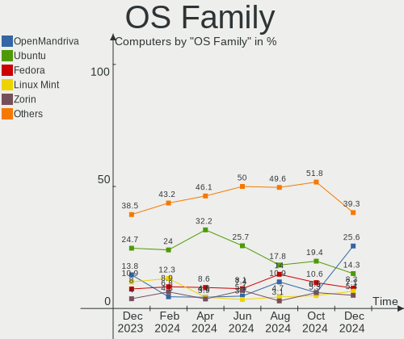

| Name         | Computers | Percent |
|--------------|-----------|---------|
| Ubuntu       | 37        | 21.76%  |
| OpenMandriva | 26        | 15.29%  |
| Fedora       | 20        | 11.76%  |
| Linux Mint   | 17        | 10%     |
| Debian       | 11        | 6.47%   |
| ArcoLinux    | 7         | 4.12%   |
| Zorin        | 6         | 3.53%   |
| Arch         | 6         | 3.53%   |
| Kubuntu      | 4         | 2.35%   |
| Gentoo       | 4         | 2.35%   |
| SteamOS      | 3         | 1.76%   |
| Kali         | 3         | 1.76%   |
| Sparky       | 2         | 1.18%   |
| ROSA         | 2         | 1.18%   |
| MX           | 2         | 1.18%   |
| Clear Linux  | 2         | 1.18%   |
| Archcraft    | 2         | 1.18%   |
| Xero         | 1         | 0.59%   |
| Ubuntu MATE  | 1         | 0.59%   |
| TUXEDO OS    | 1         | 0.59%   |
| Rocky Linux  | 1         | 0.59%   |
| Raspbian     | 1         | 0.59%   |
| Pop!_OS      | 1         | 0.59%   |
| Oracle Linux | 1         | 0.59%   |
| openSUSE     | 1         | 0.59%   |
| Manjaro      | 1         | 0.59%   |
| LMDE         | 1         | 0.59%   |
| KDE neon     | 1         | 0.59%   |
| Garuda Linux | 1         | 0.59%   |
| ChimeraOS    | 1         | 0.59%   |
| BunsenLabs   | 1         | 0.59%   |
| BlackPanther | 1         | 0.59%   |
| Alpine       | 1         | 0.59%   |

Kernel
------

Version of the Linux kernel

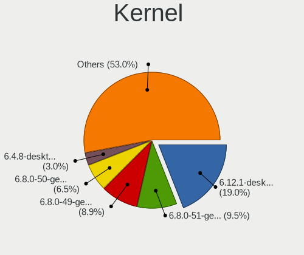

| Version                  | Computers | Percent |
|--------------------------|-----------|---------|
| 6.2.0-32-generic         | 15        | 8.82%   |
| 6.2.0-33-generic         | 11        | 6.47%   |
| 5.15.0-84-generic        | 11        | 6.47%   |
| 6.4.11-desktop-1omv2390  | 10        | 5.88%   |
| 5.15.0-83-generic        | 10        | 5.88%   |
| 6.1.0-12-amd64           | 7         | 4.12%   |
| 6.4.8-desktop-2omv2390   | 6         | 3.53%   |
| 6.4.13-200.fc38.x86_64   | 5         | 2.94%   |
| 6.4.12-arch1-1           | 4         | 2.35%   |
| 6.4.15-200.fc38.x86_64   | 3         | 1.76%   |
| 6.4.14-200.fc38.x86_64   | 3         | 1.76%   |
| 6.4.12-zen1-1-zen        | 3         | 1.76%   |
| 6.2.9-300.fc38.x86_64    | 3         | 1.76%   |
| 6.2.0-31-generic         | 3         | 1.76%   |
| 5.10.14-desktop-1omv4002 | 3         | 1.76%   |
| 6.5.5-200.fc38.x86_64    | 2         | 1.18%   |
| 6.5.3-arch1-1            | 2         | 1.18%   |
| 6.5.3-1360.native        | 2         | 1.18%   |
| 6.5.2-arch1-1            | 2         | 1.18%   |
| 6.5.1-desktop-1omv2390   | 2         | 1.18%   |
| 6.5.0-kali1-amd64        | 2         | 1.18%   |
| 6.1.0-10-amd64           | 2         | 1.18%   |
| 5.4.0-162-generic        | 2         | 1.18%   |
| 5.16.7-desktop-1omv4003  | 2         | 1.18%   |
| 5.15.0-82-generic        | 2         | 1.18%   |
| 5.10.0-24-amd64          | 2         | 1.18%   |
| 6.5.5-zen1-1-zen         | 1         | 0.59%   |
| 6.5.4-arch2-1            | 1         | 0.59%   |
| 6.5.4-300.fc39.x86_64    | 1         | 0.59%   |
| 6.5.3-zen1-1-zen         | 1         | 0.59%   |
| 6.5.3-x64v4-xanmod1      | 1         | 0.59%   |
| 6.5.3-desktop-1omv2390   | 1         | 0.59%   |
| 6.5.1-1-MANJARO          | 1         | 0.59%   |
| 6.5.0-desktop-1omv2390   | 1         | 0.59%   |
| 6.4.8-arch1-1            | 1         | 0.59%   |
| 6.4.6-76060406-generic   | 1         | 0.59%   |
| 6.4.12-200.fc38.x86_64   | 1         | 0.59%   |
| 6.4.11-200.fc38.x86_64   | 1         | 0.59%   |
| 6.4.11-1-default         | 1         | 0.59%   |
| 6.4.0-kali3-amd64        | 1         | 0.59%   |

Kernel Family
-------------

Linux kernel without a distro release

| Version | Computers | Percent |
|---------|-----------|---------|
| 6.2.0   | 32        | 18.82%  |
| 5.15.0  | 28        | 16.47%  |
| 6.4.11  | 12        | 7.06%   |
| 6.1.0   | 12        | 7.06%   |
| 6.4.12  | 8         | 4.71%   |
| 6.5.3   | 7         | 4.12%   |
| 6.4.8   | 7         | 4.12%   |
| 6.4.13  | 5         | 2.94%   |
| 5.4.0   | 4         | 2.35%   |
| 5.10.0  | 4         | 2.35%   |
| 6.5.5   | 3         | 1.76%   |
| 6.5.1   | 3         | 1.76%   |
| 6.5.0   | 3         | 1.76%   |
| 6.4.15  | 3         | 1.76%   |
| 6.4.14  | 3         | 1.76%   |
| 6.4.0   | 3         | 1.76%   |
| 6.2.9   | 3         | 1.76%   |
| 5.10.14 | 3         | 1.76%   |
| 6.5.4   | 2         | 1.18%   |
| 6.5.2   | 2         | 1.18%   |
| 6.1.53  | 2         | 1.18%   |
| 5.19.0  | 2         | 1.18%   |
| 5.16.7  | 2         | 1.18%   |
| 6.4.6   | 1         | 0.59%   |
| 6.3.9   | 1         | 0.59%   |
| 6.3.8   | 1         | 0.59%   |
| 6.3.7   | 1         | 0.59%   |
| 6.2.6   | 1         | 0.59%   |
| 6.1.46  | 1         | 0.59%   |
| 6.1.43  | 1         | 0.59%   |
| 6.1.21  | 1         | 0.59%   |
| 5.19.13 | 1         | 0.59%   |
| 5.17.5  | 1         | 0.59%   |
| 5.15.79 | 1         | 0.59%   |
| 5.15.32 | 1         | 0.59%   |
| 5.14.0  | 1         | 0.59%   |
| 5.13.0  | 1         | 0.59%   |
| 5.10.74 | 1         | 0.59%   |
| 4.19.0  | 1         | 0.59%   |
| 4.18.16 | 1         | 0.59%   |

Kernel Major Ver.
-----------------

Linux kernel major version

| Version | Computers | Percent |
|---------|-----------|---------|
| 6.4     | 42        | 24.71%  |
| 6.2     | 36        | 21.18%  |
| 5.15    | 30        | 17.65%  |
| 6.5     | 20        | 11.76%  |
| 6.1     | 17        | 10%     |
| 5.10    | 8         | 4.71%   |
| 5.4     | 4         | 2.35%   |
| 6.3     | 3         | 1.76%   |
| 5.19    | 3         | 1.76%   |
| 5.16    | 2         | 1.18%   |
| 5.17    | 1         | 0.59%   |
| 5.14    | 1         | 0.59%   |
| 5.13    | 1         | 0.59%   |
| 4.19    | 1         | 0.59%   |
| 4.18    | 1         | 0.59%   |

Arch
----

OS architecture (x86_64, i586, etc.)

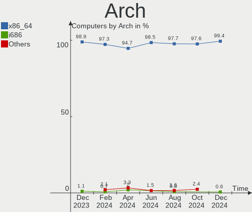

| Name   | Computers | Percent |
|--------|-----------|---------|
| x86_64 | 169       | 99.41%  |
| armv7l | 1         | 0.59%   |

DE
--

Desktop Environment

| Name       | Computers | Percent |
|------------|-----------|---------|
| GNOME      | 76        | 44.71%  |
| KDE5       | 48        | 28.24%  |
| XFCE       | 14        | 8.24%   |
| X-Cinnamon | 14        | 8.24%   |
| LXQt       | 4         | 2.35%   |
| MATE       | 3         | 1.76%   |
| i3         | 3         | 1.76%   |
| Unknown    | 3         | 1.76%   |
| Hyprland   | 2         | 1.18%   |
| LXDE       | 1         | 0.59%   |
| Budgie     | 1         | 0.59%   |
| awesome    | 1         | 0.59%   |

Display Server
--------------

X11 or Wayland

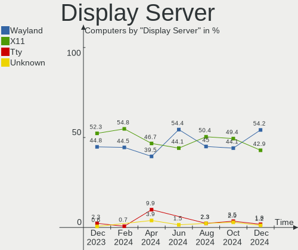

| Name    | Computers | Percent |
|---------|-----------|---------|
| X11     | 89        | 52.35%  |
| Wayland | 77        | 45.29%  |
| Unknown | 3         | 1.76%   |
| Tty     | 1         | 0.59%   |

Display Manager
---------------

SDDM, LightDM, etc.

| Name    | Computers | Percent |
|---------|-----------|---------|
| Unknown | 58        | 34.12%  |
| SDDM    | 48        | 28.24%  |
| GDM3    | 38        | 22.35%  |
| LightDM | 19        | 11.18%  |
| GDM     | 7         | 4.12%   |

OS Lang
-------

Language

| Lang    | Computers | Percent |
|---------|-----------|---------|
| es_ES   | 97        | 57.06%  |
| en_US   | 53        | 31.18%  |
| ca_ES   | 5         | 2.94%   |
| C       | 4         | 2.35%   |
| Unknown | 4         | 2.35%   |
| en_GB   | 3         | 1.76%   |
| gl_ES   | 2         | 1.18%   |
| pt_BR   | 1         | 0.59%   |
| de_DE   | 1         | 0.59%   |

Boot Mode
---------

EFI or BIOS

| Mode | Computers | Percent |
|------|-----------|---------|
| EFI  | 114       | 67.06%  |
| BIOS | 56        | 32.94%  |

Filesystem
----------

Type of filesystem

| Type    | Computers | Percent |
|---------|-----------|---------|
| Ext4    | 101       | 59.41%  |
| Btrfs   | 31        | 18.24%  |
| Overlay | 18        | 10.59%  |
| Tmpfs   | 17        | 10%     |
| Xfs     | 3         | 1.76%   |

Part. scheme
------------

Scheme of partitioning

| Type    | Computers | Percent |
|---------|-----------|---------|
| GPT     | 106       | 62.35%  |
| Unknown | 52        | 30.59%  |
| MBR     | 12        | 7.06%   |

Dual Boot with Linux/BSD
------------------------

Hosting more than one Linux/BSD

| Dual boot | Computers | Percent |
|-----------|-----------|---------|
| No        | 134       | 78.82%  |
| Yes       | 36        | 21.18%  |

Dual Boot (Win)
---------------

Hosting Linux and Windows

| Dual boot | Computers | Percent |
|-----------|-----------|---------|
| No        | 116       | 68.24%  |
| Yes       | 54        | 31.76%  |

Board
-----

Vendor
------

Motherboard manufacturer

| Name                    | Computers | Percent |
|-------------------------|-----------|---------|
| ASUSTek Computer        | 32        | 18.82%  |
| Lenovo                  | 28        | 16.47%  |
| Hewlett-Packard         | 26        | 15.29%  |
| MSI                     | 17        | 10%     |
| Dell                    | 10        | 5.88%   |
| Gigabyte Technology     | 9         | 5.29%   |
| Acer                    | 6         | 3.53%   |
| Toshiba                 | 5         | 2.94%   |
| Apple                   | 4         | 2.35%   |
| Sony                    | 3         | 1.76%   |
| SLIMBOOK                | 3         | 1.76%   |
| Chuwi                   | 3         | 1.76%   |
| Valve                   | 2         | 1.18%   |
| Samsung Electronics     | 2         | 1.18%   |
| Intel                   | 2         | 1.18%   |
| Fujitsu                 | 2         | 1.18%   |
| BESSTAR Tech            | 2         | 1.18%   |
| ASRock                  | 2         | 1.18%   |
| ZOTAC                   | 1         | 0.59%   |
| Raspberry Pi Foundation | 1         | 0.59%   |
| Primux Tech             | 1         | 0.59%   |
| Packard Bell            | 1         | 0.59%   |
| Notebook                | 1         | 0.59%   |
| Microsoft               | 1         | 0.59%   |
| LG Electronics          | 1         | 0.59%   |
| IP3 Technology          | 1         | 0.59%   |
| HUAWEI                  | 1         | 0.59%   |
| Google                  | 1         | 0.59%   |
| Fanless Mini PC         | 1         | 0.59%   |
| Biostar                 | 1         | 0.59%   |

Model
-----

Motherboard model

| Name                                  | Computers | Percent |
|---------------------------------------|-----------|---------|
| Valve Jupiter                         | 2         | 1.18%   |
| MSI Prestige 14H B12UCX               | 2         | 1.18%   |
| Lenovo V15 G2 ALC 82KD                | 2         | 1.18%   |
| Lenovo Legion 5 Pro 16ACH6H 82JQ      | 2         | 1.18%   |
| Lenovo IdeaPad 3 15ITL6 82H8          | 2         | 1.18%   |
| Lenovo IdeaPad 3 15ALC6 82KU          | 2         | 1.18%   |
| HP Pavilion g6                        | 2         | 1.18%   |
| HP Pavilion dv6                       | 2         | 1.18%   |
| HP Laptop 15-fc0xxx                   | 2         | 1.18%   |
| Chuwi GemiBook Pro                    | 2         | 1.18%   |
| ASUS ROG Zephyrus G14 GA401II_GA401II | 2         | 1.18%   |
| ASUS ROG STRIX B365-G GAMING          | 2         | 1.18%   |
| ASUS All Series                       | 2         | 1.18%   |
| ZOTAC ZBOX-ID88/ID89/ID90             | 1         | 0.59%   |
| Toshiba Satellite Pro R40-D           | 1         | 0.59%   |
| Toshiba Satellite L50-A-1DL           | 1         | 0.59%   |
| Toshiba Satellite L10W-B-101          | 1         | 0.59%   |
| Toshiba PORTEGE Z830                  | 1         | 0.59%   |
| Toshiba PORTEGE X30-E                 | 1         | 0.59%   |
| Sony VPCSB2L1R                        | 1         | 0.59%   |
| Sony VGN-AW41MF_H                     | 1         | 0.59%   |
| Sony SVF14A15CXB                      | 1         | 0.59%   |
| SLIMBOOK PROX14-AMD                   | 1         | 0.59%   |
| SLIMBOOK ONE-AM5                      | 1         | 0.59%   |
| SLIMBOOK Essential15L                 | 1         | 0.59%   |
| Samsung Galaxy Book 12 LTE            | 1         | 0.59%   |
| Samsung 950QED                        | 1         | 0.59%   |
| RPi Raspberry Pi 2 Model B Rev 1.1    | 1         | 0.59%   |
| Primux Tech Primux_1406F_W10          | 1         | 0.59%   |
| Packard Bell EasyNote TK85            | 1         | 0.59%   |
| Notebook W65_67SR                     | 1         | 0.59%   |
| MSI Prestige 15 A10SC                 | 1         | 0.59%   |
| MSI Prestige 14 A10SC                 | 1         | 0.59%   |
| MSI PPPPP-CCC#MMMMMMMM                | 1         | 0.59%   |
| MSI NQ874AA-ABE p6010es               | 1         | 0.59%   |
| MSI MS-7D78                           | 1         | 0.59%   |
| MSI MS-7D07                           | 1         | 0.59%   |
| MSI MS-7C91                           | 1         | 0.59%   |
| MSI MS-7C75                           | 1         | 0.59%   |
| MSI MS-7A38                           | 1         | 0.59%   |

Model Family
------------

Motherboard model prefix

| Name                   | Computers | Percent |
|------------------------|-----------|---------|
| Lenovo ThinkPad        | 8         | 4.71%   |
| Lenovo IdeaPad         | 8         | 4.71%   |
| HP Pavilion            | 8         | 4.71%   |
| HP Laptop              | 7         | 4.12%   |
| ASUS ROG               | 7         | 4.12%   |
| ASUS ZenBook           | 5         | 2.94%   |
| Acer Aspire            | 5         | 2.94%   |
| MSI Prestige           | 4         | 2.35%   |
| Lenovo Legion          | 4         | 2.35%   |
| Dell XPS               | 4         | 2.35%   |
| ASUS PRIME             | 4         | 2.35%   |
| Toshiba Satellite      | 3         | 1.76%   |
| Lenovo V15             | 3         | 1.76%   |
| Chuwi GemiBook         | 3         | 1.76%   |
| Valve Jupiter          | 2         | 1.18%   |
| Toshiba PORTEGE        | 2         | 1.18%   |
| HP ProBook             | 2         | 1.18%   |
| Gigabyte B450M         | 2         | 1.18%   |
| Fujitsu LIFEBOOK       | 2         | 1.18%   |
| Dell Precision         | 2         | 1.18%   |
| Dell Inspiron          | 2         | 1.18%   |
| ASUS VivoBook          | 2         | 1.18%   |
| ASUS TUF               | 2         | 1.18%   |
| ASUS All               | 2         | 1.18%   |
| ZOTAC ZBOX-ID88        | 1         | 0.59%   |
| Sony VPCSB2L1R         | 1         | 0.59%   |
| Sony VGN-AW41MF        | 1         | 0.59%   |
| Sony SVF14A15CXB       | 1         | 0.59%   |
| SLIMBOOK PROX14-AMD    | 1         | 0.59%   |
| SLIMBOOK ONE-AM5       | 1         | 0.59%   |
| SLIMBOOK Essential15L  | 1         | 0.59%   |
| Samsung Galaxy         | 1         | 0.59%   |
| Samsung 950QED         | 1         | 0.59%   |
| RPi Raspberry          | 1         | 0.59%   |
| Primux Tech Primux     | 1         | 0.59%   |
| Packard Bell EasyNote  | 1         | 0.59%   |
| Notebook W65           | 1         | 0.59%   |
| MSI PPPPP-CCC#MMMMMMMM | 1         | 0.59%   |
| MSI NQ874AA-ABE        | 1         | 0.59%   |
| MSI MS-7D78            | 1         | 0.59%   |

MFG Year
--------

Motherboard manufacture year

| Year    | Computers | Percent |
|---------|-----------|---------|
| 2021    | 28        | 16.47%  |
| 2022    | 20        | 11.76%  |
| 2020    | 17        | 10%     |
| 2019    | 16        | 9.41%   |
| 2018    | 14        | 8.24%   |
| 2013    | 10        | 5.88%   |
| 2011    | 10        | 5.88%   |
| 2023    | 9         | 5.29%   |
| 2014    | 8         | 4.71%   |
| 2017    | 7         | 4.12%   |
| 2015    | 6         | 3.53%   |
| 2012    | 6         | 3.53%   |
| 2010    | 5         | 2.94%   |
| 2009    | 4         | 2.35%   |
| 2016    | 3         | 1.76%   |
| 2008    | 3         | 1.76%   |
| 2007    | 2         | 1.18%   |
| 2006    | 1         | 0.59%   |
| Unknown | 1         | 0.59%   |

Form Factor
-----------

Physical design of the computer

| Name           | Computers | Percent |
|----------------|-----------|---------|
| Notebook       | 113       | 66.47%  |
| Desktop        | 44        | 25.88%  |
| All in one     | 4         | 2.35%   |
| Convertible    | 3         | 1.76%   |
| Tablet         | 2         | 1.18%   |
| Stick pc       | 1         | 0.59%   |
| System on chip | 1         | 0.59%   |
| Mini pc        | 1         | 0.59%   |
| Server         | 1         | 0.59%   |

Secure Boot
-----------

Enabled or disabled

| State    | Computers | Percent |
|----------|-----------|---------|
| Disabled | 158       | 92.94%  |
| Enabled  | 12        | 7.06%   |

Coreboot
--------

Have coreboot on board

| Used | Computers | Percent |
|------|-----------|---------|
| No   | 169       | 99.41%  |
| Yes  | 1         | 0.59%   |

RAM Size
--------

Total RAM memory

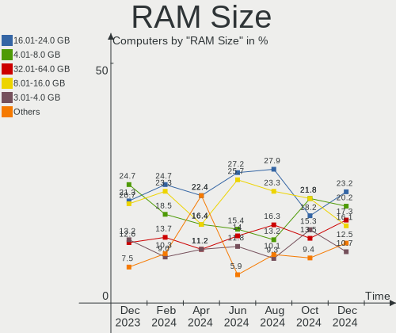

| Size in GB  | Computers | Percent |
|-------------|-----------|---------|
| 8.01-16.0   | 47        | 27.65%  |
| 4.01-8.0    | 41        | 24.12%  |
| 16.01-24.0  | 31        | 18.24%  |
| 3.01-4.0    | 20        | 11.76%  |
| 32.01-64.0  | 17        | 10%     |
| 64.01-256.0 | 8         | 4.71%   |
| 24.01-32.0  | 4         | 2.35%   |
| 2.01-3.0    | 1         | 0.59%   |
| 0.51-1.0    | 1         | 0.59%   |

RAM Used
--------

Used RAM memory

| Used GB   | Computers | Percent |
|-----------|-----------|---------|
| 2.01-3.0  | 46        | 27.06%  |
| 1.01-2.0  | 43        | 25.29%  |
| 4.01-8.0  | 32        | 18.82%  |
| 3.01-4.0  | 32        | 18.82%  |
| 0.51-1.0  | 9         | 5.29%   |
| 8.01-16.0 | 7         | 4.12%   |
| 0.01-0.5  | 1         | 0.59%   |

Total Drives
------------

Number of drives on board

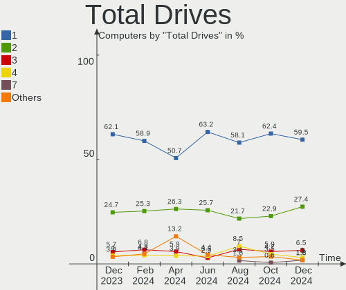

| Drives | Computers | Percent |
|--------|-----------|---------|
| 1      | 104       | 61.18%  |
| 2      | 43        | 25.29%  |
| 3      | 9         | 5.29%   |
| 4      | 6         | 3.53%   |
| 5      | 4         | 2.35%   |
| 0      | 2         | 1.18%   |
| 9      | 1         | 0.59%   |
| 8      | 1         | 0.59%   |

Has CD-ROM
----------

Has CD-ROM on board

| Presented | Computers | Percent |
|-----------|-----------|---------|
| No        | 123       | 72.35%  |
| Yes       | 47        | 27.65%  |

Has Ethernet
------------

Has Ethernet on board

| Presented | Computers | Percent |
|-----------|-----------|---------|
| Yes       | 132       | 77.65%  |
| No        | 38        | 22.35%  |

Has WiFi
--------

Has WiFi module

| Presented | Computers | Percent |
|-----------|-----------|---------|
| Yes       | 147       | 86.47%  |
| No        | 23        | 13.53%  |

Has Bluetooth
-------------

Has Bluetooth module

| Presented | Computers | Percent |
|-----------|-----------|---------|
| Yes       | 136       | 80%     |
| No        | 34        | 20%     |

Location
--------

Country
-------

Geographic location (country)

| Country | Computers | Percent |
|---------|-----------|---------|
| Spain   | 170       | 100%    |

City
----

Geographic location (city)

| City                       | Computers | Percent |
|----------------------------|-----------|---------|
| Madrid                     | 27        | 15.88%  |
| Barcelona                  | 22        | 12.94%  |
| Zaragoza                   | 7         | 4.12%   |
| Valencia                   | 5         | 2.94%   |
| Seville                    | 4         | 2.35%   |
| Alicante                   | 4         | 2.35%   |
| Vigo                       | 3         | 1.76%   |
| Málaga                    | 3         | 1.76%   |
| Burgos                     | 3         | 1.76%   |
| Bilbao                     | 3         | 1.76%   |
| Vitoria-Gasteiz            | 2         | 1.18%   |
| Valladolid                 | 2         | 1.18%   |
| Santiago de Compostela     | 2         | 1.18%   |
| Sant Pere de Ribes         | 2         | 1.18%   |
| San Vicent del Raspeig     | 2         | 1.18%   |
| Oviedo                     | 2         | 1.18%   |
| Las Palmas de Gran Canaria | 2         | 1.18%   |
| Guía de Isora             | 2         | 1.18%   |
| Girona                     | 2         | 1.18%   |
| Getafe                     | 2         | 1.18%   |
| Castelló de la Plana      | 2         | 1.18%   |
| Vila-seca                  | 1         | 0.59%   |
| Totana                     | 1         | 0.59%   |
| Torrejón de Ardoz         | 1         | 0.59%   |
| Torredembarra              | 1         | 0.59%   |
| Soria                      | 1         | 0.59%   |
| Santa Eugènia             | 1         | 0.59%   |
| Santa Cruz de Tenerife     | 1         | 0.59%   |
| Sant Quirze del Valles     | 1         | 0.59%   |
| San Juan de Aznalfarache   | 1         | 0.59%   |
| Salamanca                  | 1         | 0.59%   |
| Sabadell                   | 1         | 0.59%   |
| Rivas-Vaciamadrid          | 1         | 0.59%   |
| Reus                       | 1         | 0.59%   |
| Puente La Reina – Gares  | 1         | 0.59%   |
| Pontevedra                 | 1         | 0.59%   |
| Ponte Caldelas             | 1         | 0.59%   |
| Pliego                     | 1         | 0.59%   |
| Pinto                      | 1         | 0.59%   |
| Paracuellos de Jarama      | 1         | 0.59%   |

Drives
------

Drive Vendor
------------

Hard drive vendors

| Vendor                      | Computers | Drives | Percent |
|-----------------------------|-----------|--------|---------|
| Samsung Electronics         | 31        | 34     | 12.55%  |
| SanDisk                     | 24        | 28     | 9.72%   |
| WDC                         | 23        | 28     | 9.31%   |
| Toshiba                     | 22        | 26     | 8.91%   |
| Seagate                     | 22        | 25     | 8.91%   |
| Kingston                    | 18        | 21     | 7.29%   |
| Crucial                     | 14        | 16     | 5.67%   |
| SK hynix                    | 13        | 13     | 5.26%   |
| Micron Technology           | 12        | 14     | 4.86%   |
| Unknown                     | 9         | 10     | 3.64%   |
| Intel                       | 7         | 7      | 2.83%   |
| Phison Electronics          | 6         | 6      | 2.43%   |
| China                       | 5         | 5      | 2.02%   |
| Kingston Technology Company | 4         | 4      | 1.62%   |
| KIOXIA-EXCERIA              | 3         | 3      | 1.21%   |
| Hitachi                     | 3         | 3      | 1.21%   |
| SABRENT                     | 2         | 2      | 0.81%   |
| Micron/Crucial Technology   | 2         | 3      | 0.81%   |
| KIOXIA                      | 2         | 2      | 0.81%   |
| KingDian                    | 2         | 2      | 0.81%   |
| Intenso                     | 2         | 2      | 0.81%   |
| Inateck                     | 2         | 2      | 0.81%   |
| Apple                       | 2         | 2      | 0.81%   |
| Unknown                     | 2         | 2      | 0.81%   |
| Transcend                   | 1         | 1      | 0.4%    |
| TCSUNBOW                    | 1         | 1      | 0.4%    |
| Solid State Storage         | 1         | 1      | 0.4%    |
| OCZ                         | 1         | 1      | 0.4%    |
| Netac                       | 1         | 1      | 0.4%    |
| Maxtor                      | 1         | 1      | 0.4%    |
| LITEON                      | 1         | 1      | 0.4%    |
| Lexar                       | 1         | 1      | 0.4%    |
| HGST                        | 1         | 1      | 0.4%    |
| GLOWAY                      | 1         | 1      | 0.4%    |
| Emtec                       | 1         | 1      | 0.4%    |
| Drevo                       | 1         | 1      | 0.4%    |
| BAITITON                    | 1         | 1      | 0.4%    |
| AMD                         | 1         | 2      | 0.4%    |
| AEW                         | 1         | 1      | 0.4%    |

Drive Model
-----------

Hard drive models

| Model                                               | Computers | Percent |
|-----------------------------------------------------|-----------|---------|
| Kingston SA400S37480G 480GB SSD                     | 8         | 3.05%   |
| Kingston SA400S37240G 240GB SSD                     | 5         | 1.91%   |
| Seagate ST1000DM003-1ER162 1TB                      | 4         | 1.53%   |
| Samsung NVMe SSD Controller SM981/PM981/PM983 256GB | 4         | 1.53%   |
| Kingston SV300S37A120G 120GB SSD                    | 4         | 1.53%   |
| Toshiba TR200 240GB SSD                             | 3         | 1.15%   |
| SK hynix HFM512GD3JX013N 512GB                      | 3         | 1.15%   |
| Seagate ST500DM002-1BD142 500GB                     | 3         | 1.15%   |
| Sandisk WD Blue SN550 NVMe SSD 512GB                | 3         | 1.15%   |
| SanDisk SSD PLUS 480GB                              | 3         | 1.15%   |
| SanDisk NVMe SSD Drive 1TB                          | 3         | 1.15%   |
| Samsung SSD 850 EVO 250GB                           | 3         | 1.15%   |
| Phison PS5013 E13 NVMe Controller 512GB             | 3         | 1.15%   |
| Crucial CT500MX500SSD1 500GB                        | 3         | 1.15%   |
| Crucial CT1000MX500SSD1 1TB                         | 3         | 1.15%   |
| WDC WDS100T2B0A-00SM50 1TB SSD                      | 2         | 0.76%   |
| WDC WD40EFAX-68JH4N0 4TB                            | 2         | 0.76%   |
| WDC WD10EZEX-60M2NA0 1TB                            | 2         | 0.76%   |
| Unknown SD/MMC/MS PRO 128GB                         | 2         | 0.76%   |
| Unknown MMC Card  128GB                             | 2         | 0.76%   |
| Toshiba THNSNH128GMCT 128GB SSD                     | 2         | 0.76%   |
| Toshiba HDWR160 6TB                                 | 2         | 0.76%   |
| Toshiba DT01ACA100 1TB                              | 2         | 0.76%   |
| SK hynix SKHynix_HFS001TDE9X084N 1TB                | 2         | 0.76%   |
| Seagate ST500LT012-1DG142 500GB                     | 2         | 0.76%   |
| Seagate ST1000DM010-2EP102 1TB                      | 2         | 0.76%   |
| Seagate Expansion 1TB                               | 2         | 0.76%   |
| Sandisk WD_BLACK SN770 2TB                          | 2         | 0.76%   |
| Sandisk WD Black SN850 1TB                          | 2         | 0.76%   |
| SanDisk SSD PLUS 2000GB                             | 2         | 0.76%   |
| Samsung SSD 860 EVO 500GB                           | 2         | 0.76%   |
| Samsung SSD 840 EVO 120GB                           | 2         | 0.76%   |
| Samsung MZVLQ512HALU-000H1 512GB                    | 2         | 0.76%   |
| Micron/Crucial P2 NVMe PCIe SSD 1TB                 | 2         | 0.76%   |
| KIOXIA-EXCERIA SATA SSD 480GB                       | 2         | 0.76%   |
| KIOXIA KBG40ZNV512G 512GB                           | 2         | 0.76%   |
| KingDian S280-240GB SSD                             | 2         | 0.76%   |
| Intel SSDPEKNW512GZL 512GB                          | 2         | 0.76%   |
| Intel SSDPEKNU512GZH 512GB                          | 2         | 0.76%   |
| Inateck FE202x Series 1TB                           | 2         | 0.76%   |

HDD Vendor
----------

Hard disk drive vendors

| Vendor  | Computers | Drives | Percent |
|---------|-----------|--------|---------|
| Seagate | 21        | 24     | 35.59%  |
| WDC     | 16        | 19     | 27.12%  |
| Toshiba | 13        | 14     | 22.03%  |
| Hitachi | 3         | 3      | 5.08%   |
| Unknown | 2         | 2      | 3.39%   |
| SABRENT | 2         | 2      | 3.39%   |
| HGST    | 1         | 1      | 1.69%   |
| Apple   | 1         | 1      | 1.69%   |

SSD Vendor
----------

Solid state drive vendors

| Vendor              | Computers | Drives | Percent |
|---------------------|-----------|--------|---------|
| Kingston            | 17        | 20     | 18.09%  |
| Samsung Electronics | 15        | 15     | 15.96%  |
| Crucial             | 12        | 14     | 12.77%  |
| SanDisk             | 11        | 12     | 11.7%   |
| Toshiba             | 7         | 9      | 7.45%   |
| China               | 5         | 5      | 5.32%   |
| WDC                 | 4         | 4      | 4.26%   |
| SK hynix            | 3         | 3      | 3.19%   |
| KIOXIA-EXCERIA      | 3         | 3      | 3.19%   |
| KingDian            | 2         | 2      | 2.13%   |
| Intenso             | 2         | 2      | 2.13%   |
| Transcend           | 1         | 1      | 1.06%   |
| TCSUNBOW            | 1         | 1      | 1.06%   |
| OCZ                 | 1         | 1      | 1.06%   |
| Netac               | 1         | 1      | 1.06%   |
| Micron Technology   | 1         | 2      | 1.06%   |
| Maxtor              | 1         | 1      | 1.06%   |
| GLOWAY              | 1         | 1      | 1.06%   |
| Emtec               | 1         | 1      | 1.06%   |
| Drevo               | 1         | 1      | 1.06%   |
| BAITITON            | 1         | 1      | 1.06%   |
| Apple               | 1         | 1      | 1.06%   |
| AEW                 | 1         | 1      | 1.06%   |
| Unknown             | 1         | 1      | 1.06%   |

Drive Kind
----------

HDD or SSD

| Kind    | Computers | Drives | Percent |
|---------|-----------|--------|---------|
| NVMe    | 87        | 97     | 39.73%  |
| SSD     | 70        | 103    | 31.96%  |
| HDD     | 53        | 66     | 24.2%   |
| MMC     | 8         | 9      | 3.65%   |
| Unknown | 1         | 1      | 0.46%   |

Drive Connector
---------------

SATA, SAS, NVMe, etc.

| Type | Computers | Drives | Percent |
|------|-----------|--------|---------|
| SATA | 97        | 159    | 48.02%  |
| NVMe | 86        | 95     | 42.57%  |
| SAS  | 11        | 13     | 5.45%   |
| MMC  | 8         | 9      | 3.96%   |

Drive Size
----------

Size of hard drive

| Size in TB | Computers | Drives | Percent |
|------------|-----------|--------|---------|
| 0.01-0.5   | 70        | 102    | 53.85%  |
| 0.51-1.0   | 43        | 47     | 33.08%  |
| 1.01-2.0   | 8         | 10     | 6.15%   |
| 4.01-10.0  | 5         | 6      | 3.85%   |
| 3.01-4.0   | 3         | 3      | 2.31%   |
| 2.01-3.0   | 1         | 1      | 0.77%   |

Space Total
-----------

Amount of disk space available on the file system

| Size in GB     | Computers | Percent |
|----------------|-----------|---------|
| 251-500        | 42        | 24.71%  |
| 501-1000       | 29        | 17.06%  |
| 101-250        | 28        | 16.47%  |
| 1001-2000      | 18        | 10.59%  |
| 1-20           | 15        | 8.82%   |
| More than 3000 | 13        | 7.65%   |
| Unknown        | 9         | 5.29%   |
| 21-50          | 7         | 4.12%   |
| 51-100         | 6         | 3.53%   |
| 2001-3000      | 3         | 1.76%   |

Space Used
----------

Amount of used disk space

| Used GB        | Computers | Percent |
|----------------|-----------|---------|
| 1-20           | 59        | 34.71%  |
| 21-50          | 33        | 19.41%  |
| 51-100         | 19        | 11.18%  |
| 101-250        | 17        | 10%     |
| 501-1000       | 12        | 7.06%   |
| 251-500        | 10        | 5.88%   |
| Unknown        | 9         | 5.29%   |
| 1001-2000      | 5         | 2.94%   |
| More than 3000 | 4         | 2.35%   |
| 2001-3000      | 2         | 1.18%   |

Malfunc. Drives
---------------

Drive models with a malfunction

| Model                                            | Computers | Drives | Percent |
|--------------------------------------------------|-----------|--------|---------|
| Seagate ST500DM002-1BD142 500GB                  | 3         | 3      | 17.65%  |
| WDC WD3200AAJS-40H3A0 320GB                      | 1         | 1      | 5.88%   |
| Transcend TS1TSSD230S 1TB                        | 1         | 1      | 5.88%   |
| Toshiba DT01ACA100 1TB                           | 1         | 1      | 5.88%   |
| SK hynix HFS256G39TND-N210A 256GB SSD            | 1         | 1      | 5.88%   |
| SK hynix HFS256G32TNH-73A0A 256GB SSD            | 1         | 1      | 5.88%   |
| Seagate ST500LT012-9WS142 500GB                  | 1         | 1      | 5.88%   |
| Seagate ST500LT012-1DG142 500GB                  | 1         | 1      | 5.88%   |
| SanDisk SSD PLUS 240GB                           | 1         | 1      | 5.88%   |
| Samsung Electronics MZNLH128HBHQ-000H1 128GB SSD | 1         | 1      | 5.88%   |
| Kingston SA400S37480G 480GB SSD                  | 1         | 1      | 5.88%   |
| Kingston SA400S37240G 240GB SSD                  | 1         | 1      | 5.88%   |
| KingDian S280-240GB SSD                          | 1         | 1      | 5.88%   |
| Hitachi HTS543216L9SA00 160GB                    | 1         | 1      | 5.88%   |
| China G521N256GB                                 | 1         | 1      | 5.88%   |

Malfunc. Drive Vendor
---------------------

Vendors of faulty drives

| Vendor              | Computers | Drives | Percent |
|---------------------|-----------|--------|---------|
| Seagate             | 5         | 5      | 29.41%  |
| SK hynix            | 2         | 2      | 11.76%  |
| Kingston            | 2         | 2      | 11.76%  |
| WDC                 | 1         | 1      | 5.88%   |
| Transcend           | 1         | 1      | 5.88%   |
| Toshiba             | 1         | 1      | 5.88%   |
| SanDisk             | 1         | 1      | 5.88%   |
| Samsung Electronics | 1         | 1      | 5.88%   |
| KingDian            | 1         | 1      | 5.88%   |
| Hitachi             | 1         | 1      | 5.88%   |
| China               | 1         | 1      | 5.88%   |

Malfunc. HDD Vendor
-------------------

Vendors of faulty HDD drives

| Vendor  | Computers | Drives | Percent |
|---------|-----------|--------|---------|
| Seagate | 5         | 5      | 62.5%   |
| WDC     | 1         | 1      | 12.5%   |
| Toshiba | 1         | 1      | 12.5%   |
| Hitachi | 1         | 1      | 12.5%   |

Malfunc. Drive Kind
-------------------

Kinds of faulty drives

| Kind | Computers | Drives | Percent |
|------|-----------|--------|---------|
| SSD  | 8         | 9      | 50%     |
| HDD  | 8         | 8      | 50%     |

Failed Drives
-------------

Failed drive models

Zero info for selected period =(

Failed Drive Vendor
-------------------

Failed drive vendors

Zero info for selected period =(

Drive Status
------------

Number of failed and malfunc. drives

| Status   | Computers | Drives | Percent |
|----------|-----------|--------|---------|
| Detected | 84        | 134    | 46.15%  |
| Works    | 82        | 125    | 45.05%  |
| Malfunc  | 16        | 17     | 8.79%   |

Storage controller
------------------

Storage Vendor
--------------

Storage controller vendors

| Vendor                         | Computers | Percent |
|--------------------------------|-----------|---------|
| Intel                          | 99        | 44.39%  |
| AMD                            | 37        | 16.59%  |
| SanDisk                        | 19        | 8.52%   |
| Samsung Electronics            | 18        | 8.07%   |
| Micron Technology              | 11        | 4.93%   |
| SK hynix                       | 10        | 4.48%   |
| Phison Electronics             | 6         | 2.69%   |
| Kingston Technology Company    | 5         | 2.24%   |
| Micron/Crucial Technology      | 4         | 1.79%   |
| Toshiba America Info Systems   | 2         | 0.9%    |
| Nvidia                         | 2         | 0.9%    |
| KIOXIA                         | 2         | 0.9%    |
| ASMedia Technology             | 2         | 0.9%    |
| Solid State Storage Technology | 1         | 0.45%   |
| Shenzhen Longsys Electronics   | 1         | 0.45%   |
| Marvell Technology Group       | 1         | 0.45%   |
| Lite-On Technology             | 1         | 0.45%   |
| JMicron Technology             | 1         | 0.45%   |
| Broadcom / LSI                 | 1         | 0.45%   |

Storage Model
-------------

Storage controller models

| Model                                                                          | Computers | Percent |
|--------------------------------------------------------------------------------|-----------|---------|
| AMD FCH SATA Controller [AHCI mode]                                            | 30        | 12.45%  |
| Intel Volume Management Device NVMe RAID Controller                            | 10        | 4.15%   |
| Intel 8 Series/C220 Series Chipset Family 6-port SATA Controller 1 [AHCI mode] | 8         | 3.32%   |
| Samsung NVMe SSD Controller 980                                                | 7         | 2.9%    |
| Intel Celeron/Pentium Silver Processor SATA Controller                         | 7         | 2.9%    |
| SK hynix Gold P31/BC711/PC711 NVMe Solid State Drive                           | 6         | 2.49%   |
| Samsung NVMe SSD Controller SM981/PM981/PM983                                  | 6         | 2.49%   |
| Intel SSD 670p Series [Keystone Harbor]                                        | 6         | 2.49%   |
| Intel 6 Series/C200 Series Chipset Family 6 port Mobile SATA AHCI Controller   | 6         | 2.49%   |
| SanDisk WD Black SN770 / PC SN740 256GB / PC SN560 (DRAM-less) NVMe SSD        | 5         | 2.07%   |
| Intel Sunrise Point-LP SATA Controller [AHCI mode]                             | 5         | 2.07%   |
| Intel 7 Series Chipset Family 6-port SATA Controller [AHCI mode]               | 5         | 2.07%   |
| Micron/Crucial P2 [Nick P2] / P3 / P3 Plus NVMe PCIe SSD (DRAM-less)           | 4         | 1.66%   |
| Intel 82801 Mobile SATA Controller [RAID mode]                                 | 4         | 1.66%   |
| Intel 8 Series SATA Controller 1 [AHCI mode]                                   | 4         | 1.66%   |
| Intel 200 Series PCH SATA controller [AHCI mode]                               | 4         | 1.66%   |
| AMD 400 Series Chipset SATA Controller                                         | 4         | 1.66%   |
| SanDisk WD PC SN810 / Black SN850 NVMe SSD                                     | 3         | 1.24%   |
| SanDisk WD Blue SN550 NVMe SSD                                                 | 3         | 1.24%   |
| SanDisk WD Black SN750 / PC SN730 NVMe SSD                                     | 3         | 1.24%   |
| Phison PS5013 E13 NVMe Controller                                              | 3         | 1.24%   |
| Micron 2450 NVMe SSD [HendrixV] (DRAM-less)                                    | 3         | 1.24%   |
| Micron 2210 NVMe SSD [Cobain]                                                  | 3         | 1.24%   |
| Intel Tiger Lake-LP SATA Controller                                            | 3         | 1.24%   |
| Intel NM10/ICH7 Family SATA Controller [IDE mode]                              | 3         | 1.24%   |
| Intel 82801IBM/IEM (ICH9M/ICH9M-E) 4 port SATA Controller [AHCI mode]          | 3         | 1.24%   |
| Intel 6 Series/C200 Series Chipset Family 6 port Desktop SATA AHCI Controller  | 3         | 1.24%   |
| AMD SB7x0/SB8x0/SB9x0 SATA Controller [AHCI mode]                              | 3         | 1.24%   |
| SanDisk WD Black 2018/SN750 / PC SN720 NVMe SSD                                | 2         | 0.83%   |
| Micron 2400 NVMe SSD (DRAM-less)                                               | 2         | 0.83%   |
| Micron 2300 NVMe SSD [Santana]                                                 | 2         | 0.83%   |
| KIOXIA NVMe SSD Controller BG4 (DRAM-less)                                     | 2         | 0.83%   |
| Intel Q170/Q150/B150/H170/H110/Z170/CM236 Chipset SATA Controller [AHCI Mode]  | 2         | 0.83%   |
| Intel Jasper Lake SATA AHCI Controller                                         | 2         | 0.83%   |
| Intel Comet Lake SATA AHCI Controller                                          | 2         | 0.83%   |
| Intel Atom Processor E3800 Series SATA AHCI Controller                         | 2         | 0.83%   |
| Intel 9 Series Chipset Family SATA Controller [AHCI Mode]                      | 2         | 0.83%   |
| Intel 500 Series Chipset Family SATA AHCI Controller                           | 2         | 0.83%   |
| Intel 5 Series/3400 Series Chipset 4 port SATA AHCI Controller                 | 2         | 0.83%   |
| AMD SB7x0/SB8x0/SB9x0 IDE Controller                                           | 2         | 0.83%   |

Storage Kind
------------

Kind of storage controller (IDE, SATA, NVMe, SAS, ...)

| Kind | Computers | Percent |
|------|-----------|---------|
| SATA | 116       | 50.43%  |
| NVMe | 86        | 37.39%  |
| RAID | 17        | 7.39%   |
| IDE  | 10        | 4.35%   |
| SAS  | 1         | 0.43%   |

Processor
---------

CPU Vendor
----------

Processor vendors

| Vendor | Computers | Percent |
|--------|-----------|---------|
| Intel  | 115       | 67.65%  |
| AMD    | 54        | 31.76%  |
| ARM    | 1         | 0.59%   |

CPU Model
---------

Processor models

| Model                                       | Computers | Percent |
|---------------------------------------------|-----------|---------|
| AMD Ryzen 7 5700U with Radeon Graphics      | 6         | 3.53%   |
| Intel 12th Gen Core i7-12700H               | 4         | 2.35%   |
| Intel 11th Gen Core i5-1135G7 @ 2.40GHz     | 4         | 2.35%   |
| AMD Ryzen 7 5800H with Radeon Graphics      | 4         | 2.35%   |
| Intel Core i7-10510U CPU @ 1.80GHz          | 3         | 1.76%   |
| Intel Core i3-9100 CPU @ 3.60GHz            | 3         | 1.76%   |
| Intel Celeron N4020 CPU @ 1.10GHz           | 3         | 1.76%   |
| Intel Celeron N4000 CPU @ 1.10GHz           | 3         | 1.76%   |
| AMD Ryzen 7 4800H with Radeon Graphics      | 3         | 1.76%   |
| Intel Core i7-8565U CPU @ 1.80GHz           | 2         | 1.18%   |
| Intel Core i7-7700HQ CPU @ 2.80GHz          | 2         | 1.18%   |
| Intel Core i7-4700MQ CPU @ 2.40GHz          | 2         | 1.18%   |
| Intel Core i7-4500U CPU @ 1.80GHz           | 2         | 1.18%   |
| Intel Core i7-2640M CPU @ 2.80GHz           | 2         | 1.18%   |
| Intel Core i7-10710U CPU @ 1.10GHz          | 2         | 1.18%   |
| Intel Core i5-8250U CPU @ 1.60GHz           | 2         | 1.18%   |
| Intel Core i5-6300U CPU @ 2.40GHz           | 2         | 1.18%   |
| Intel Core i5-1035G1 CPU @ 1.00GHz          | 2         | 1.18%   |
| Intel Celeron N5100 @ 1.10GHz               | 2         | 1.18%   |
| Intel Celeron J4125 CPU @ 2.00GHz           | 2         | 1.18%   |
| Intel 12th Gen Core i7-12650H               | 2         | 1.18%   |
| AMD Ryzen 9 5900HX with Radeon Graphics     | 2         | 1.18%   |
| AMD Ryzen 7 5800X 8-Core Processor          | 2         | 1.18%   |
| AMD Ryzen 7 4800HS with Radeon Graphics     | 2         | 1.18%   |
| AMD FX-8350 Eight-Core Processor            | 2         | 1.18%   |
| AMD Custom APU 0405                         | 2         | 1.18%   |
| Intel Xeon Silver 4309Y CPU @ 2.80GHz       | 1         | 0.59%   |
| Intel Xeon CPU W3680 @ 3.33GHz              | 1         | 0.59%   |
| Intel Xeon CPU E5-2690 0 @ 2.90GHz          | 1         | 0.59%   |
| Intel Pentium Dual-Core CPU T4300 @ 2.10GHz | 1         | 0.59%   |
| Intel Pentium Dual CPU E2220 @ 2.40GHz      | 1         | 0.59%   |
| Intel Pentium CPU N3710 @ 1.60GHz           | 1         | 0.59%   |
| Intel Core i7-9750H CPU @ 2.60GHz           | 1         | 0.59%   |
| Intel Core i7-9700 CPU @ 3.00GHz            | 1         | 0.59%   |
| Intel Core i7-8750H CPU @ 2.20GHz           | 1         | 0.59%   |
| Intel Core i7-8550U CPU @ 1.80GHz           | 1         | 0.59%   |
| Intel Core i7-5820K CPU @ 3.30GHz           | 1         | 0.59%   |
| Intel Core i7-4790K CPU @ 4.00GHz           | 1         | 0.59%   |
| Intel Core i7-4770 CPU @ 3.40GHz            | 1         | 0.59%   |
| Intel Core i7-4710MQ CPU @ 2.50GHz          | 1         | 0.59%   |

CPU Model Family
----------------

Processor model prefix

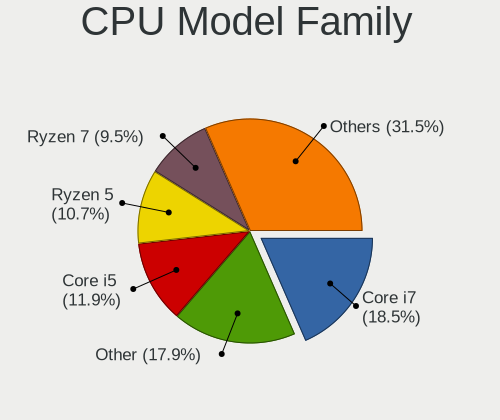

| Model                   | Computers | Percent |
|-------------------------|-----------|---------|
| Intel Core i7           | 31        | 18.24%  |
| Intel Core i5           | 26        | 15.29%  |
| AMD Ryzen 7             | 25        | 14.71%  |
| Other                   | 24        | 14.12%  |
| Intel Celeron           | 13        | 7.65%   |
| Intel Core i3           | 11        | 6.47%   |
| AMD Ryzen 5             | 7         | 4.12%   |
| AMD Ryzen 9             | 6         | 3.53%   |
| Intel Core 2 Duo        | 5         | 2.94%   |
| AMD FX                  | 3         | 1.76%   |
| Intel Xeon              | 2         | 1.18%   |
| Intel Core 2 Quad       | 2         | 1.18%   |
| AMD Ryzen 7 PRO         | 2         | 1.18%   |
| AMD Ryzen 3             | 2         | 1.18%   |
| AMD A8                  | 2         | 1.18%   |
| AMD A4                  | 2         | 1.18%   |
| Intel Xeon Silver       | 1         | 0.59%   |
| Intel Pentium Dual-Core | 1         | 0.59%   |
| Intel Pentium Dual      | 1         | 0.59%   |
| Intel Pentium           | 1         | 0.59%   |
| ARM BCM                 | 1         | 0.59%   |
| AMD E1                  | 1         | 0.59%   |
| AMD Athlon 64 X2        | 1         | 0.59%   |

CPU Cores
---------

Number of processor cores

| Number | Computers | Percent |
|--------|-----------|---------|
| 4      | 58        | 34.12%  |
| 2      | 51        | 30%     |
| 8      | 31        | 18.24%  |
| 6      | 12        | 7.06%   |
| 14     | 6         | 3.53%   |
| 10     | 5         | 2.94%   |
| 16     | 4         | 2.35%   |
| 12     | 3         | 1.76%   |

CPU Sockets
-----------

Number of sockets

| Number | Computers | Percent |
|--------|-----------|---------|
| 1      | 168       | 98.82%  |
| 2      | 2         | 1.18%   |

CPU Threads
-----------

Threads per core (Hyper-Threading)

| Number | Computers | Percent |
|--------|-----------|---------|
| 2      | 123       | 72.35%  |
| 1      | 47        | 27.65%  |

CPU Op-Modes
------------

CPU Operation Modes (32-bit, 64-bit)

| Op mode        | Computers | Percent |
|----------------|-----------|---------|
| 32-bit, 64-bit | 169       | 99.41%  |
| Unknown        | 1         | 0.59%   |

CPU Microcode
-------------

Microcode number

| Number     | Computers | Percent |
|------------|-----------|---------|
| Unknown    | 85        | 50%     |
| 0x0a50000d | 5         | 2.94%   |
| 0x306c3    | 4         | 2.35%   |
| 0x0a601203 | 4         | 2.35%   |
| 0x0a50000c | 4         | 2.35%   |
| 0x08608103 | 4         | 2.35%   |
| 0x706a8    | 3         | 1.76%   |
| 0x406e3    | 3         | 1.76%   |
| 0x1067a    | 3         | 1.76%   |
| 0x08600106 | 3         | 1.76%   |
| 0x906a3    | 2         | 1.18%   |
| 0x806c2    | 2         | 1.18%   |
| 0x706e5    | 2         | 1.18%   |
| 0x306a9    | 2         | 1.18%   |
| 0x206a7    | 2         | 1.18%   |
| 0x10676    | 2         | 1.18%   |
| 0x08608102 | 2         | 1.18%   |
| 0x08600104 | 2         | 1.18%   |
| 0x0800820d | 2         | 1.18%   |
| 0x06006704 | 2         | 1.18%   |
| 0xb06a2    | 1         | 0.59%   |
| 0xa0671    | 1         | 0.59%   |
| 0x906ed    | 1         | 0.59%   |
| 0x906e9    | 1         | 0.59%   |
| 0x906a4    | 1         | 0.59%   |
| 0x90672    | 1         | 0.59%   |
| 0x806ec    | 1         | 0.59%   |
| 0x806eb    | 1         | 0.59%   |
| 0x806ea    | 1         | 0.59%   |
| 0x806e9    | 1         | 0.59%   |
| 0x806c1    | 1         | 0.59%   |
| 0x706a1    | 1         | 0.59%   |
| 0x6fb      | 1         | 0.59%   |
| 0x406c4    | 1         | 0.59%   |
| 0x40671    | 1         | 0.59%   |
| 0x40651    | 1         | 0.59%   |
| 0x30678    | 1         | 0.59%   |
| 0x0a704103 | 1         | 0.59%   |
| 0x0a50000b | 1         | 0.59%   |
| 0x0a20120a | 1         | 0.59%   |

CPU Microarch
-------------

Microarchitecture

| Name             | Computers | Percent |
|------------------|-----------|---------|
| KabyLake         | 22        | 12.94%  |
| Unknown          | 19        | 11.18%  |
| Haswell          | 14        | 8.24%   |
| Zen 3            | 13        | 7.65%   |
| Zen 2            | 10        | 5.88%   |
| SandyBridge      | 10        | 5.88%   |
| Alderlake Hybrid | 10        | 5.88%   |
| Goldmont plus    | 8         | 4.71%   |
| Penryn           | 7         | 4.12%   |
| TigerLake        | 6         | 3.53%   |
| IvyBridge        | 6         | 3.53%   |
| Zen+             | 5         | 2.94%   |
| Icelake          | 5         | 2.94%   |
| CometLake        | 5         | 2.94%   |
| Westmere         | 4         | 2.35%   |
| Skylake          | 4         | 2.35%   |
| Piledriver       | 4         | 2.35%   |
| Silvermont       | 3         | 1.76%   |
| Excavator        | 3         | 1.76%   |
| Broadwell        | 3         | 1.76%   |
| Tremont          | 2         | 1.18%   |
| Core             | 2         | 1.18%   |
| Zen              | 1         | 0.59%   |
| Steamroller      | 1         | 0.59%   |
| Puma             | 1         | 0.59%   |
| Nehalem          | 1         | 0.59%   |
| K8 Hammer        | 1         | 0.59%   |

Graphics
--------

GPU Vendor
----------

Vendors of graphics cards

| Vendor                     | Computers | Percent |
|----------------------------|-----------|---------|
| Intel                      | 96        | 45.07%  |
| Nvidia                     | 58        | 27.23%  |
| AMD                        | 58        | 27.23%  |
| Matrox Electronics Systems | 1         | 0.47%   |

GPU Model
---------

Graphics card models

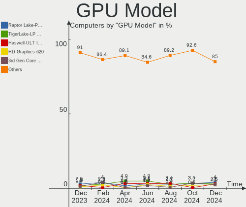

| Model                                                                       | Computers | Percent |
|-----------------------------------------------------------------------------|-----------|---------|
| Intel 2nd Generation Core Processor Family Integrated Graphics Controller   | 9         | 4.15%   |
| AMD Renoir                                                                  | 9         | 4.15%   |
| Intel GeminiLake [UHD Graphics 600]                                         | 8         | 3.69%   |
| AMD Lucienne                                                                | 7         | 3.23%   |
| AMD Cezanne [Radeon Vega Series / Radeon Vega Mobile Series]                | 7         | 3.23%   |
| Intel Alder Lake-P Integrated Graphics Controller                           | 6         | 2.76%   |
| Intel TigerLake-LP GT2 [Iris Xe Graphics]                                   | 5         | 2.3%    |
| Nvidia TU117M [GeForce GTX 1650 Mobile / Max-Q]                             | 4         | 1.84%   |
| Nvidia GA107M [GeForce RTX 3050 Mobile]                                     | 4         | 1.84%   |
| Intel UHD Graphics 620                                                      | 4         | 1.84%   |
| Intel Haswell-ULT Integrated Graphics Controller                            | 4         | 1.84%   |
| Intel CometLake-U GT2 [UHD Graphics]                                        | 4         | 1.84%   |
| Intel 4th Gen Core Processor Integrated Graphics Controller                 | 4         | 1.84%   |
| Intel 3rd Gen Core processor Graphics Controller                            | 4         | 1.84%   |
| AMD Raphael                                                                 | 4         | 1.84%   |
| Nvidia GA104M [GeForce RTX 3070 Mobile / Max-Q]                             | 3         | 1.38%   |
| Intel Xeon E3-1200 v3/4th Gen Core Processor Integrated Graphics Controller | 3         | 1.38%   |
| Intel Skylake GT2 [HD Graphics 520]                                         | 3         | 1.38%   |
| Intel HD Graphics 630                                                       | 3         | 1.38%   |
| Intel CoffeeLake-S GT2 [UHD Graphics 630]                                   | 3         | 1.38%   |
| AMD Stoney [Radeon R2/R3/R4/R5 Graphics]                                    | 3         | 1.38%   |
| AMD Picasso/Raven 2 [Radeon Vega Series / Radeon Vega Mobile Series]        | 3         | 1.38%   |
| AMD Barcelo                                                                 | 3         | 1.38%   |
| Nvidia TU116M [GeForce GTX 1650 Ti Mobile]                                  | 2         | 0.92%   |
| Nvidia TU116 [GeForce GTX 1650 SUPER]                                       | 2         | 0.92%   |
| Nvidia GP107M [GeForce GTX 1050 Mobile]                                     | 2         | 0.92%   |
| Nvidia GK208B [GeForce GT 710]                                              | 2         | 0.92%   |
| Nvidia GF117M [GeForce 610M/710M/810M/820M / GT 620M/625M/630M/720M]        | 2         | 0.92%   |
| Nvidia GA107M [GeForce RTX 2050]                                            | 2         | 0.92%   |
| Nvidia AD107M [GeForce RTX 4060 Max-Q / Mobile]                             | 2         | 0.92%   |
| Intel WhiskeyLake-U GT2 [UHD Graphics 620]                                  | 2         | 0.92%   |
| Intel Raptor Lake-P [Iris Xe Graphics]                                      | 2         | 0.92%   |
| Intel JasperLake [UHD Graphics]                                             | 2         | 0.92%   |
| Intel Iris Plus Graphics G1 (Ice Lake)                                      | 2         | 0.92%   |
| Intel Core Processor Integrated Graphics Controller                         | 2         | 0.92%   |
| Intel CometLake-H GT2 [UHD Graphics]                                        | 2         | 0.92%   |
| Intel Comet Lake UHD Graphics                                               | 2         | 0.92%   |
| Intel CoffeeLake-H GT2 [UHD Graphics 630]                                   | 2         | 0.92%   |
| Intel Atom Processor Z36xxx/Z37xxx Series Graphics & Display                | 2         | 0.92%   |
| Intel Alder Lake-P GT1 [UHD Graphics]                                       | 2         | 0.92%   |

GPU Combo
---------

Combinations of graphics cards

| Name           | Computers | Percent |
|----------------|-----------|---------|
| 1 x Intel      | 61        | 35.88%  |
| 1 x AMD        | 38        | 22.35%  |
| Intel + Nvidia | 26        | 15.29%  |
| 1 x Nvidia     | 21        | 12.35%  |
| AMD + Nvidia   | 10        | 5.88%   |
| Intel + AMD    | 7         | 4.12%   |
| 2 x AMD        | 3         | 1.76%   |
| Other          | 2         | 1.18%   |
| 2 x Nvidia     | 1         | 0.59%   |
| 1 x Matrox     | 1         | 0.59%   |

GPU Driver
----------

Free vs proprietary

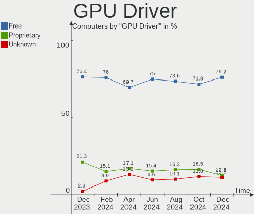

| Driver      | Computers | Percent |
|-------------|-----------|---------|
| Free        | 134       | 78.82%  |
| Proprietary | 28        | 16.47%  |
| Unknown     | 8         | 4.71%   |

GPU Memory
----------

Total video memory

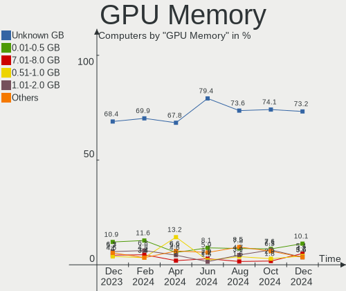

| Size in GB | Computers | Percent |
|------------|-----------|---------|
| Unknown    | 105       | 61.76%  |
| 0.01-0.5   | 26        | 15.29%  |
| 1.01-2.0   | 17        | 10%     |
| 3.01-4.0   | 8         | 4.71%   |
| 0.51-1.0   | 5         | 2.94%   |
| 7.01-8.0   | 4         | 2.35%   |
| 5.01-6.0   | 3         | 1.76%   |
| 8.01-16.0  | 2         | 1.18%   |

Monitor
-------

Monitor Vendor
--------------

Monitor vendors

| Vendor                  | Computers | Percent |
|-------------------------|-----------|---------|
| Chimei Innolux          | 28        | 14.58%  |
| Samsung Electronics     | 22        | 11.46%  |
| AU Optronics            | 21        | 10.94%  |
| BOE                     | 20        | 10.42%  |
| Goldstar                | 15        | 7.81%   |
| LG Display              | 13        | 6.77%   |
| Hewlett-Packard         | 8         | 4.17%   |
| Dell                    | 7         | 3.65%   |
| Philips                 | 6         | 3.13%   |
| BenQ                    | 6         | 3.13%   |
| Acer                    | 6         | 3.13%   |
| PANDA                   | 4         | 2.08%   |
| Lenovo                  | 4         | 2.08%   |
| Chi Mei Optoelectronics | 4         | 2.08%   |
| Apple                   | 4         | 2.08%   |
| Sharp                   | 3         | 1.56%   |
| AOC                     | 3         | 1.56%   |
| Ancor Communications    | 3         | 1.56%   |
| Valve                   | 2         | 1.04%   |
| Toshiba                 | 2         | 1.04%   |
| ViewSonic               | 1         | 0.52%   |
| VIE                     | 1         | 0.52%   |
| Unknown                 | 1         | 0.52%   |
| TR_                     | 1         | 0.52%   |
| OEM                     | 1         | 0.52%   |
| NEC Computers           | 1         | 0.52%   |
| LG Electronics          | 1         | 0.52%   |
| HKC                     | 1         | 0.52%   |
| HannStar                | 1         | 0.52%   |
| Fujitsu Siemens         | 1         | 0.52%   |
| CSO                     | 1         | 0.52%   |

Monitor Model
-------------

Monitor models

| Model                                                                     | Computers | Percent |
|---------------------------------------------------------------------------|-----------|---------|
| Chimei Innolux LCD Monitor CMN15F5 1920x1080 344x193mm 15.5-inch          | 3         | 1.51%   |
| Chimei Innolux LCD Monitor CMN14D5 1920x1080 309x173mm 13.9-inch          | 3         | 1.51%   |
| Chimei Innolux LCD Monitor CMN14D4 1920x1080 309x173mm 13.9-inch          | 3         | 1.51%   |
| Valve ANX7530 U VLV3001 800x1280 100x150mm 7.1-inch                       | 2         | 1.01%   |
| Samsung Electronics S24E450 SAM0C80 1920x1080 520x290mm 23.4-inch         | 2         | 1.01%   |
| Samsung Electronics LCD Monitor SDC4158 1920x1080 294x165mm 13.3-inch     | 2         | 1.01%   |
| PANDA LCD Monitor NCP0050 1920x1080 309x174mm 14.0-inch                   | 2         | 1.01%   |
| Chimei Innolux LCD Monitor CMN15E8 1920x1080 344x193mm 15.5-inch          | 2         | 1.01%   |
| Chimei Innolux LCD Monitor CMN15DB 1366x768 344x193mm 15.5-inch           | 2         | 1.01%   |
| Chimei Innolux LCD Monitor CMN14C3 1366x768 309x173mm 13.9-inch           | 2         | 1.01%   |
| Chi Mei Optoelectronics LCD Monitor CMO1720 1920x1080 380x210mm 17.1-inch | 2         | 1.01%   |
| Chi Mei Optoelectronics LCD Monitor CMO15A1 1366x768 344x193mm 15.5-inch  | 2         | 1.01%   |
| BOE LCD Monitor BOE0A42 1920x1200 302x188mm 14.0-inch                     | 2         | 1.01%   |
| BOE LCD Monitor BOE08D5 1920x1080 344x194mm 15.5-inch                     | 2         | 1.01%   |
| BOE LCD Monitor BOE0893 2160x1440 296x197mm 14.0-inch                     | 2         | 1.01%   |
| AU Optronics LCD Monitor AUO403D 1920x1080 309x173mm 13.9-inch            | 2         | 1.01%   |
| ViewSonic VA3456-WQHD VSCFC3A 3440x1440 800x335mm 34.1-inch               | 1         | 0.5%    |
| VIE NXM27REG02 VIE0023 1920x1080 600x330mm 27.0-inch                      | 1         | 0.5%    |
| Unknown LCD Monitor FFFF 2288x1287 2550x2550mm 142.0-inch                 | 1         | 0.5%    |
| TR_ LCD Monitor TR_5511 1920x1080 518x333mm 24.2-inch                     | 1         | 0.5%    |
| Toshiba no-audio-HD TSB8888 1080x1920 1080x1920mm 86.7-inch               | 1         | 0.5%    |
| Toshiba LT133EE09500 LCD090A 1366x768 295x166mm 13.3-inch                 | 1         | 0.5%    |
| Sharp LCD Monitor SHP1548 1920x1200 288x180mm 13.4-inch                   | 1         | 0.5%    |
| Sharp LCD Monitor SHP14BA 1920x1080 344x194mm 15.5-inch                   | 1         | 0.5%    |
| Sharp LCD Monitor SHP1476 3840x2160 346x194mm 15.6-inch                   | 1         | 0.5%    |
| Samsung Electronics U32J59x SAM0F35 3840x2160 697x392mm 31.5-inch         | 1         | 0.5%    |
| Samsung Electronics U28E590 SAM0C4D 3840x2160 610x350mm 27.7-inch         | 1         | 0.5%    |
| Samsung Electronics U28E590 SAM0C4C 3840x2160 608x345mm 27.5-inch         | 1         | 0.5%    |
| Samsung Electronics SyncMaster SAM01B9 1280x1024 340x270mm 17.1-inch      | 1         | 0.5%    |
| Samsung Electronics SyncMaster SAM01B8 1280x1024 338x270mm 17.0-inch      | 1         | 0.5%    |
| Samsung Electronics SyncMaster SAM010C 1280x1024 340x270mm 17.1-inch      | 1         | 0.5%    |
| Samsung Electronics S27F358 SAM0D73 1920x1080 598x336mm 27.0-inch         | 1         | 0.5%    |
| Samsung Electronics S24F350 SAM0D20 1920x1080 521x293mm 23.5-inch         | 1         | 0.5%    |
| Samsung Electronics LU28R55 SAM1017 3840x2160 632x360mm 28.6-inch         | 1         | 0.5%    |
| Samsung Electronics LF24T35 SAM707D 1920x1080 528x297mm 23.9-inch         | 1         | 0.5%    |
| Samsung Electronics LCD Monitor SDCA029 3840x2160 344x194mm 15.5-inch     | 1         | 0.5%    |
| Samsung Electronics LCD Monitor SDC4181 2880x1800 302x189mm 14.0-inch     | 1         | 0.5%    |
| Samsung Electronics LCD Monitor SDC4171 2880x1800 302x189mm 14.0-inch     | 1         | 0.5%    |
| Samsung Electronics LCD Monitor SDC4164 3840x2400 344x215mm 16.0-inch     | 1         | 0.5%    |
| Samsung Electronics LCD Monitor SDC4163 3456x2160 288x180mm 13.4-inch     | 1         | 0.5%    |

Monitor Resolution
------------------

Monitor screen resolution

| Resolution         | Computers | Percent |
|--------------------|-----------|---------|
| 1920x1080 (FHD)    | 87        | 49.43%  |
| 1366x768 (WXGA)    | 28        | 15.91%  |
| 3840x2160 (4K)     | 11        | 6.25%   |
| 1920x1200 (WUXGA)  | 7         | 3.98%   |
| 2560x1440 (QHD)    | 6         | 3.41%   |
| 1280x1024 (SXGA)   | 5         | 2.84%   |
| 2160x1440          | 4         | 2.27%   |
| 2560x1600          | 3         | 1.7%    |
| 2560x1080          | 3         | 1.7%    |
| 1680x1050 (WSXGA+) | 3         | 1.7%    |
| 1600x900 (HD+)     | 3         | 1.7%    |
| 800x1280           | 2         | 1.14%   |
| 2880x1800          | 2         | 1.14%   |
| 1440x900 (WXGA+)   | 2         | 1.14%   |
| 1360x768           | 2         | 1.14%   |
| 3840x2400          | 1         | 0.57%   |
| 3456x2160          | 1         | 0.57%   |
| 3440x1440          | 1         | 0.57%   |
| 2736x1824          | 1         | 0.57%   |
| 2560x2880          | 1         | 0.57%   |
| 2288x1287          | 1         | 0.57%   |
| 1920x540           | 1         | 0.57%   |
| 1280x768           | 1         | 0.57%   |

Monitor Diagonal
----------------

Diagonal size in inches

| Inches  | Computers | Percent |
|---------|-----------|---------|
| 15      | 46        | 23.47%  |
| 13      | 25        | 12.76%  |
| 27      | 19        | 9.69%   |
| 14      | 18        | 9.18%   |
| 23      | 14        | 7.14%   |
| 24      | 12        | 6.12%   |
| 17      | 10        | 5.1%    |
| 21      | 9         | 4.59%   |
| 34      | 5         | 2.55%   |
| 31      | 5         | 2.55%   |
| 16      | 5         | 2.55%   |
| Unknown | 5         | 2.55%   |
| 18      | 4         | 2.04%   |
| 12      | 3         | 1.53%   |
| 22      | 2         | 1.02%   |
| 20      | 2         | 1.02%   |
| 19      | 2         | 1.02%   |
| 11      | 2         | 1.02%   |
| 7       | 2         | 1.02%   |
| 142     | 1         | 0.51%   |
| 86      | 1         | 0.51%   |
| 43      | 1         | 0.51%   |
| 40      | 1         | 0.51%   |
| 28      | 1         | 0.51%   |
| 25      | 1         | 0.51%   |

Monitor Width
-------------

Physical width

| Width in mm    | Computers | Percent |
|----------------|-----------|---------|
| 301-350        | 80        | 41.88%  |
| 501-600        | 37        | 19.37%  |
| 201-300        | 20        | 10.47%  |
| 401-500        | 19        | 9.95%   |
| 601-700        | 10        | 5.24%   |
| 351-400        | 9         | 4.71%   |
| 701-800        | 5         | 2.62%   |
| Unknown        | 5         | 2.62%   |
| 1-100          | 2         | 1.05%   |
| More than 2000 | 1         | 0.52%   |
| 801-900        | 1         | 0.52%   |
| 1001-1500      | 1         | 0.52%   |
| 901-1000       | 1         | 0.52%   |

Aspect Ratio
------------

Proportional relationship between the width and the height

| Ratio   | Computers | Percent |
|---------|-----------|---------|
| 16/9    | 128       | 74.85%  |
| 16/10   | 22        | 12.87%  |
| 3/2     | 5         | 2.92%   |
| 5/4     | 4         | 2.34%   |
| 21/9    | 4         | 2.34%   |
| Unknown | 3         | 1.75%   |
| 0.67    | 2         | 1.17%   |
| 1.00    | 1         | 0.58%   |
| 0.89    | 1         | 0.58%   |
| 0.56    | 1         | 0.58%   |

Monitor Area
------------

Area in inch²

| Area in inch² | Computers | Percent |
|----------------|-----------|---------|
| 101-110        | 47        | 24.48%  |
| 81-90          | 31        | 16.15%  |
| 201-250        | 30        | 15.63%  |
| 301-350        | 18        | 9.38%   |
| 71-80          | 12        | 6.25%   |
| 351-500        | 11        | 5.73%   |
| 141-150        | 6         | 3.13%   |
| 121-130        | 6         | 3.13%   |
| 151-200        | 5         | 2.6%    |
| Unknown        | 5         | 2.6%    |
| 251-300        | 4         | 2.08%   |
| 111-120        | 4         | 2.08%   |
| 61-70          | 3         | 1.56%   |
| 501-1000       | 3         | 1.56%   |
| More than 1000 | 2         | 1.04%   |
| 51-60          | 2         | 1.04%   |
| 1-40           | 2         | 1.04%   |
| 131-140        | 1         | 0.52%   |

Pixel Density
-------------

Pixels per inch

| Density       | Computers | Percent |
|---------------|-----------|---------|
| 121-160       | 66        | 34.92%  |
| 51-100        | 53        | 28.04%  |
| 101-120       | 34        | 17.99%  |
| 161-240       | 21        | 11.11%  |
| More than 240 | 7         | 3.7%    |
| Unknown       | 5         | 2.65%   |
| 1-50          | 3         | 1.59%   |

Multiple Monitors
-----------------

Total monitors connected

| Total | Computers | Percent |
|-------|-----------|---------|
| 1     | 127       | 74.71%  |
| 2     | 29        | 17.06%  |
| 0     | 7         | 4.12%   |
| 3     | 6         | 3.53%   |
| 4     | 1         | 0.59%   |

Network
-------

Net Controller Vendor
---------------------

Controller vendors

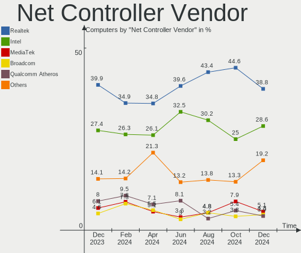

| Vendor                          | Computers | Percent |
|---------------------------------|-----------|---------|
| Realtek Semiconductor           | 98        | 38.28%  |
| Intel                           | 81        | 31.64%  |
| Qualcomm Atheros                | 20        | 7.81%   |
| MediaTek                        | 13        | 5.08%   |
| Broadcom                        | 12        | 4.69%   |
| TP-Link                         | 5         | 1.95%   |
| Ralink                          | 4         | 1.56%   |
| Marvell Technology Group        | 4         | 1.56%   |
| Broadcom Limited                | 3         | 1.17%   |
| Ralink Technology               | 2         | 0.78%   |
| Nvidia                          | 2         | 0.78%   |
| ASIX Electronics                | 2         | 0.78%   |
| Sierra Wireless                 | 1         | 0.39%   |
| Qualcomm Atheros Communications | 1         | 0.39%   |
| Motorola PCS                    | 1         | 0.39%   |
| Microchip Technology            | 1         | 0.39%   |
| Huawei Technologies             | 1         | 0.39%   |
| Google                          | 1         | 0.39%   |
| Edimax Technology               | 1         | 0.39%   |
| D-Link System                   | 1         | 0.39%   |
| D-Link                          | 1         | 0.39%   |
| Aquantia                        | 1         | 0.39%   |

Net Controller Model
--------------------

Controller models

| Model                                                             | Computers | Percent |
|-------------------------------------------------------------------|-----------|---------|
| Realtek RTL8111/8168/8411 PCI Express Gigabit Ethernet Controller | 68        | 22.82%  |
| Intel Wi-Fi 6 AX200                                               | 13        | 4.36%   |
| Intel Alder Lake-P PCH CNVi WiFi                                  | 10        | 3.36%   |
| Realtek RTL8822CE 802.11ac PCIe Wireless Network Adapter          | 9         | 3.02%   |
| Realtek RTL8153 Gigabit Ethernet Adapter                          | 8         | 2.68%   |
| Realtek RTL8821CE 802.11ac PCIe Wireless Network Adapter          | 5         | 1.68%   |
| Realtek RTL8125 2.5GbE Controller                                 | 5         | 1.68%   |
| MediaTek MT7921 802.11ax PCI Express Wireless Network Adapter     | 5         | 1.68%   |
| Intel Wireless 8265 / 8275                                        | 5         | 1.68%   |
| Intel Ethernet Controller I225-V                                  | 5         | 1.68%   |
| Intel Comet Lake PCH-LP CNVi WiFi                                 | 5         | 1.68%   |
| Realtek RTL88x2bu [AC1200 Techkey]                                | 4         | 1.34%   |
| Realtek RTL810xE PCI Express Fast Ethernet controller             | 4         | 1.34%   |
| MediaTek MT7922 802.11ax PCI Express Wireless Network Adapter     | 4         | 1.34%   |
| Intel Wireless 3165                                               | 4         | 1.34%   |
| Intel Wi-Fi 6 AX201                                               | 4         | 1.34%   |
| Realtek RTL8852AE 802.11ax PCIe Wireless Network Adapter          | 3         | 1.01%   |
| Ralink RT3290 Wireless 802.11n 1T/1R PCIe                         | 3         | 1.01%   |
| Qualcomm Atheros QCA9565 / AR9565 Wireless Network Adapter        | 3         | 1.01%   |
| Qualcomm Atheros QCA9377 802.11ac Wireless Network Adapter        | 3         | 1.01%   |
| Qualcomm Atheros QCA6174 802.11ac Wireless Network Adapter        | 3         | 1.01%   |
| Qualcomm Atheros AR9285 Wireless Network Adapter (PCI-Express)    | 3         | 1.01%   |
| Intel 82579LM Gigabit Network Connection (Lewisville)             | 3         | 1.01%   |
| TP-Link UE300 10/100/1000 LAN (ethernet mode) [Realtek RTL8153]   | 2         | 0.67%   |
| TP-Link Archer T2U PLUS [RTL8821AU]                               | 2         | 0.67%   |
| Realtek RTL8852BE PCIe 802.11ax Wireless Network Controller       | 2         | 0.67%   |
| Realtek RTL8723DE Wireless Network Adapter                        | 2         | 0.67%   |
| Realtek RTL8723BE PCIe Wireless Network Adapter                   | 2         | 0.67%   |
| Realtek RTL8152 Fast Ethernet Adapter                             | 2         | 0.67%   |
| Realtek 802.11ac NIC                                              | 2         | 0.67%   |
| Qualcomm Atheros Killer E220x Gigabit Ethernet Controller         | 2         | 0.67%   |
| Qualcomm Atheros AR8131 Gigabit Ethernet                          | 2         | 0.67%   |
| MediaTek MT7921K (RZ608) Wi-Fi 6E 80MHz                           | 2         | 0.67%   |
| Intel Wireless-AC 9260                                            | 2         | 0.67%   |
| Intel Wireless 7260                                               | 2         | 0.67%   |
| Intel Wireless 3160                                               | 2         | 0.67%   |
| Intel Wi-Fi 6 AX210/AX211/AX411 160MHz                            | 2         | 0.67%   |
| Intel Gemini Lake PCH CNVi WiFi                                   | 2         | 0.67%   |
| Intel Ethernet Connection I217-LM                                 | 2         | 0.67%   |
| Intel Ethernet Connection (2) I219-V                              | 2         | 0.67%   |

Wireless Vendor
---------------

Wireless vendors

| Vendor                          | Computers | Percent |
|---------------------------------|-----------|---------|
| Intel                           | 70        | 45.45%  |
| Realtek Semiconductor           | 33        | 21.43%  |
| Qualcomm Atheros                | 13        | 8.44%   |
| MediaTek                        | 12        | 7.79%   |
| Broadcom                        | 8         | 5.19%   |
| Ralink                          | 4         | 2.6%    |
| TP-Link                         | 3         | 1.95%   |
| Broadcom Limited                | 3         | 1.95%   |
| Ralink Technology               | 2         | 1.3%    |
| Sierra Wireless                 | 1         | 0.65%   |
| Qualcomm Atheros Communications | 1         | 0.65%   |
| Marvell Technology Group        | 1         | 0.65%   |
| Edimax Technology               | 1         | 0.65%   |
| D-Link System                   | 1         | 0.65%   |
| D-Link                          | 1         | 0.65%   |

Wireless Model
--------------

Wireless models

| Model                                                          | Computers | Percent |
|----------------------------------------------------------------|-----------|---------|
| Intel Wi-Fi 6 AX200                                            | 13        | 8.33%   |
| Intel Alder Lake-P PCH CNVi WiFi                               | 10        | 6.41%   |
| Realtek RTL8822CE 802.11ac PCIe Wireless Network Adapter       | 9         | 5.77%   |
| Realtek RTL8821CE 802.11ac PCIe Wireless Network Adapter       | 5         | 3.21%   |
| MediaTek MT7921 802.11ax PCI Express Wireless Network Adapter  | 5         | 3.21%   |
| Intel Wireless 8265 / 8275                                     | 5         | 3.21%   |
| Intel Comet Lake PCH-LP CNVi WiFi                              | 5         | 3.21%   |
| Realtek RTL88x2bu [AC1200 Techkey]                             | 4         | 2.56%   |
| MediaTek MT7922 802.11ax PCI Express Wireless Network Adapter  | 4         | 2.56%   |
| Intel Wireless 3165                                            | 4         | 2.56%   |
| Intel Wi-Fi 6 AX201                                            | 4         | 2.56%   |
| Realtek RTL8852AE 802.11ax PCIe Wireless Network Adapter       | 3         | 1.92%   |
| Ralink RT3290 Wireless 802.11n 1T/1R PCIe                      | 3         | 1.92%   |
| Qualcomm Atheros QCA9565 / AR9565 Wireless Network Adapter     | 3         | 1.92%   |
| Qualcomm Atheros QCA9377 802.11ac Wireless Network Adapter     | 3         | 1.92%   |
| Qualcomm Atheros QCA6174 802.11ac Wireless Network Adapter     | 3         | 1.92%   |
| Qualcomm Atheros AR9285 Wireless Network Adapter (PCI-Express) | 3         | 1.92%   |
| TP-Link Archer T2U PLUS [RTL8821AU]                            | 2         | 1.28%   |
| Realtek RTL8852BE PCIe 802.11ax Wireless Network Controller    | 2         | 1.28%   |
| Realtek RTL8723DE Wireless Network Adapter                     | 2         | 1.28%   |
| Realtek RTL8723BE PCIe Wireless Network Adapter                | 2         | 1.28%   |
| Realtek 802.11ac NIC                                           | 2         | 1.28%   |
| MediaTek MT7921K (RZ608) Wi-Fi 6E 80MHz                        | 2         | 1.28%   |
| Intel Wireless-AC 9260                                         | 2         | 1.28%   |
| Intel Wireless 7260                                            | 2         | 1.28%   |
| Intel Wireless 3160                                            | 2         | 1.28%   |
| Intel Wi-Fi 6 AX210/AX211/AX411 160MHz                         | 2         | 1.28%   |
| Intel Gemini Lake PCH CNVi WiFi                                | 2         | 1.28%   |
| Intel Dual Band Wireless-AC 3168NGW [Stone Peak]               | 2         | 1.28%   |
| Intel Comet Lake PCH CNVi WiFi                                 | 2         | 1.28%   |
| Intel Cannon Lake PCH CNVi WiFi                                | 2         | 1.28%   |
| Broadcom BCM43142 802.11b/g/n                                  | 2         | 1.28%   |
| Broadcom BCM4313 802.11bgn Wireless Network Adapter            | 2         | 1.28%   |
| TP-Link 802.11ac WLAN Adapter                                  | 1         | 0.64%   |
| Sierra Wireless MC8305 Modem                                   | 1         | 0.64%   |
| Realtek RTL8821AE 802.11ac PCIe Wireless Network Adapter       | 1         | 0.64%   |
| Realtek RTL8812AE 802.11ac PCIe Wireless Network Adapter       | 1         | 0.64%   |
| Realtek RTL8192CE PCIe Wireless Network Adapter                | 1         | 0.64%   |
| Realtek RTL8188EUS 802.11n Wireless Network Adapter            | 1         | 0.64%   |
| Realtek RTL8187 Wireless Adapter                               | 1         | 0.64%   |

Ethernet Vendor
---------------

Ethernet vendors

| Vendor                   | Computers | Percent |
|--------------------------|-----------|---------|
| Realtek Semiconductor    | 85        | 62.96%  |
| Intel                    | 24        | 17.78%  |
| Qualcomm Atheros         | 8         | 5.93%   |
| Broadcom                 | 6         | 4.44%   |
| Marvell Technology Group | 3         | 2.22%   |
| TP-Link                  | 2         | 1.48%   |
| Nvidia                   | 2         | 1.48%   |
| ASIX Electronics         | 2         | 1.48%   |
| Microchip Technology     | 1         | 0.74%   |
| Google                   | 1         | 0.74%   |
| Aquantia                 | 1         | 0.74%   |

Ethernet Model
--------------

Ethernet models

| Model                                                             | Computers | Percent |
|-------------------------------------------------------------------|-----------|---------|
| Realtek RTL8111/8168/8411 PCI Express Gigabit Ethernet Controller | 68        | 48.92%  |
| Realtek RTL8153 Gigabit Ethernet Adapter                          | 8         | 5.76%   |
| Realtek RTL8125 2.5GbE Controller                                 | 5         | 3.6%    |
| Intel Ethernet Controller I225-V                                  | 5         | 3.6%    |
| Realtek RTL810xE PCI Express Fast Ethernet controller             | 4         | 2.88%   |
| Intel 82579LM Gigabit Network Connection (Lewisville)             | 3         | 2.16%   |
| TP-Link UE300 10/100/1000 LAN (ethernet mode) [Realtek RTL8153]   | 2         | 1.44%   |
| Realtek RTL8152 Fast Ethernet Adapter                             | 2         | 1.44%   |
| Qualcomm Atheros Killer E220x Gigabit Ethernet Controller         | 2         | 1.44%   |
| Qualcomm Atheros AR8131 Gigabit Ethernet                          | 2         | 1.44%   |
| Intel Ethernet Connection I217-LM                                 | 2         | 1.44%   |
| Intel Ethernet Connection (2) I219-V                              | 2         | 1.44%   |
| Intel 82579V Gigabit Network Connection                           | 2         | 1.44%   |
| ASIX AX88179 Gigabit Ethernet                                     | 2         | 1.44%   |
| Realtek Killer E2600 Gigabit Ethernet Controller                  | 1         | 0.72%   |
| Qualcomm Atheros QCA8171 Gigabit Ethernet                         | 1         | 0.72%   |
| Qualcomm Atheros Killer E2500 Gigabit Ethernet Controller         | 1         | 0.72%   |
| Qualcomm Atheros AR8162 Fast Ethernet                             | 1         | 0.72%   |
| Qualcomm Atheros AR8151 v2.0 Gigabit Ethernet                     | 1         | 0.72%   |
| Nvidia MCP79 Ethernet                                             | 1         | 0.72%   |
| Nvidia CK804 Ethernet Controller                                  | 1         | 0.72%   |
| Microchip SMSC9512/9514 Fast Ethernet Adapter                     | 1         | 0.72%   |
| Marvell Group 88E8058 PCI-E Gigabit Ethernet Controller           | 1         | 0.72%   |
| Marvell Group 88E8057 PCI-E Gigabit Ethernet Controller           | 1         | 0.72%   |
| Marvell Group 88E8056 PCI-E Gigabit Ethernet Controller           | 1         | 0.72%   |
| Intel I211 Gigabit Network Connection                             | 1         | 0.72%   |
| Intel Ethernet Connection I219-LM                                 | 1         | 0.72%   |
| Intel Ethernet Connection (7) I219-V                              | 1         | 0.72%   |
| Intel Ethernet Connection (6) I219-V                              | 1         | 0.72%   |
| Intel Ethernet Connection (4) I219-V                              | 1         | 0.72%   |
| Intel Ethernet Connection (2) I218-V                              | 1         | 0.72%   |
| Intel Ethernet Connection (17) I219-LM                            | 1         | 0.72%   |
| Intel Ethernet Connection (16) I219-V                             | 1         | 0.72%   |
| Intel Ethernet Connection (10) I219-V                             | 1         | 0.72%   |
| Intel 82577LM Gigabit Network Connection                          | 1         | 0.72%   |
| Google Pixel 7 Pro                                                | 1         | 0.72%   |
| Broadcom NetXtreme BCM57786 Gigabit Ethernet PCIe                 | 1         | 0.72%   |
| Broadcom NetXtreme BCM57766 Gigabit Ethernet PCIe                 | 1         | 0.72%   |
| Broadcom NetXtreme BCM5764M Gigabit Ethernet PCIe                 | 1         | 0.72%   |
| Broadcom NetXtreme BCM5720 Gigabit Ethernet PCIe                  | 1         | 0.72%   |

Net Controller Kind
-------------------

Ethernet, WiFi or modem

| Kind     | Computers | Percent |
|----------|-----------|---------|
| WiFi     | 147       | 52.31%  |
| Ethernet | 131       | 46.62%  |
| Modem    | 2         | 0.71%   |
| Unknown  | 1         | 0.36%   |

Used Controller
---------------

Currently used network controller

| Kind     | Computers | Percent |
|----------|-----------|---------|
| WiFi     | 111       | 62.71%  |
| Ethernet | 66        | 37.29%  |

NICs
----

Total network controllers on board

| Total | Computers | Percent |
|-------|-----------|---------|
| 2     | 87        | 51.18%  |
| 1     | 79        | 46.47%  |
| 3     | 2         | 1.18%   |
| 4     | 1         | 0.59%   |
| 0     | 1         | 0.59%   |

IPv6
----

IPv6 vs IPv4

| Used | Computers | Percent |
|------|-----------|---------|
| No   | 154       | 90.59%  |
| Yes  | 16        | 9.41%   |

Bluetooth
---------

Bluetooth Vendor
----------------

Controller vendors

| Vendor                          | Computers | Percent |
|---------------------------------|-----------|---------|
| Intel                           | 64        | 47.06%  |
| Realtek Semiconductor           | 20        | 14.71%  |
| IMC Networks                    | 9         | 6.62%   |
| Foxconn / Hon Hai               | 8         | 5.88%   |
| Qualcomm Atheros Communications | 7         | 5.15%   |
| MediaTek                        | 4         | 2.94%   |
| Apple                           | 4         | 2.94%   |
| Ralink                          | 3         | 2.21%   |
| Lite-On Technology              | 3         | 2.21%   |
| Cambridge Silicon Radio         | 3         | 2.21%   |
| TP-Link                         | 1         | 0.74%   |
| Toshiba                         | 1         | 0.74%   |
| Realtek                         | 1         | 0.74%   |
| Marvell Semiconductor           | 1         | 0.74%   |
| Integrated System Solution      | 1         | 0.74%   |
| Foxconn International           | 1         | 0.74%   |
| Broadcom                        | 1         | 0.74%   |
| Belkin Components               | 1         | 0.74%   |
| Askey Computer                  | 1         | 0.74%   |
| Alps Electric                   | 1         | 0.74%   |
| Actions                         | 1         | 0.74%   |

Bluetooth Model
---------------

Controller models

| Model                                                | Computers | Percent |
|------------------------------------------------------|-----------|---------|
| Realtek Bluetooth Radio                              | 16        | 11.76%  |
| Intel Bluetooth wireless interface                   | 15        | 11.03%  |
| Intel AX200 Bluetooth                                | 12        | 8.82%   |
| Intel AX201 Bluetooth                                | 11        | 8.09%   |
| Intel Bluetooth Device                               | 10        | 7.35%   |
| Intel Bluetooth 9460/9560 Jefferson Peak (JfP)       | 9         | 6.62%   |
| IMC Networks Bluetooth Radio                         | 5         | 3.68%   |
| Realtek  Bluetooth 4.2 Adapter                       | 4         | 2.94%   |
| MediaTek Wireless_Device                             | 4         | 2.94%   |
| Ralink RT3290 Bluetooth                              | 3         | 2.21%   |
| Qualcomm Atheros QCA61x4 Bluetooth 4.0               | 3         | 2.21%   |
| Qualcomm Atheros AR3011 Bluetooth                    | 3         | 2.21%   |
| IMC Networks Wireless_Device                         | 3         | 2.21%   |
| Foxconn / Hon Hai MediaTek Bluetooth Adapter         | 3         | 2.21%   |
| Cambridge Silicon Radio Bluetooth Dongle (HCI mode)  | 3         | 2.21%   |
| Lite-On Qualcomm Atheros QCA9377 Bluetooth           | 2         | 1.47%   |
| Intel Wireless-AC 3168 Bluetooth                     | 2         | 1.47%   |
| Intel AX210 Bluetooth                                | 2         | 1.47%   |
| Foxconn / Hon Hai Wireless_Device                    | 2         | 1.47%   |
| Apple Bluetooth USB Host Controller                  | 2         | 1.47%   |
| TP-Link UB5A Adapter                                 | 1         | 0.74%   |
| Toshiba Bluetooth Radio                              | 1         | 0.74%   |
| Realtek Bluetooth Radio                              | 1         | 0.74%   |
| Qualcomm Atheros  Bluetooth Device                   | 1         | 0.74%   |
| Marvell Bluetooth and Wireless LAN Composite         | 1         | 0.74%   |
| Lite-On Atheros AR3012 Bluetooth                     | 1         | 0.74%   |
| Intel Wireless-AC 9260 Bluetooth Adapter             | 1         | 0.74%   |
| Intel Centrino Bluetooth Wireless Transceiver        | 1         | 0.74%   |
| Intel Centrino Advanced-N 6230 Bluetooth adapter     | 1         | 0.74%   |
| Integrated System Solution Bluetooth Device          | 1         | 0.74%   |
| IMC Networks Bluetooth Device                        | 1         | 0.74%   |
| Foxconn International BCM43142A0 Bluetooth module    | 1         | 0.74%   |
| Foxconn / Hon Hai Broadcom BCM20702 Bluetooth        | 1         | 0.74%   |
| Foxconn / Hon Hai BCM43142A0                         | 1         | 0.74%   |
| Foxconn / Hon Hai BCM20702A0                         | 1         | 0.74%   |
| Broadcom BCM20702A0 Bluetooth 4.0                    | 1         | 0.74%   |
| Belkin Components Bluetooth Device with trace filter | 1         | 0.74%   |
| Askey Bluetooth Device                               | 1         | 0.74%   |
| Apple Built-in Bluetooth 2.0+EDR HCI                 | 1         | 0.74%   |
| Apple Bluetooth HCI                                  | 1         | 0.74%   |

Sound
-----

Sound Vendor
------------

Sound card vendors

| Vendor                   | Computers | Percent |
|--------------------------|-----------|---------|
| Intel                    | 113       | 50.45%  |
| AMD                      | 56        | 25%     |
| Nvidia                   | 36        | 16.07%  |
| C-Media Electronics      | 3         | 1.34%   |
| ASUSTek Computer         | 3         | 1.34%   |
| Texas Instruments        | 2         | 0.89%   |
| JMTek                    | 2         | 0.89%   |
| Focusrite-Novation       | 2         | 0.89%   |
| SteelSeries ApS          | 1         | 0.45%   |
| Sony                     | 1         | 0.45%   |
| Razer USA                | 1         | 0.45%   |
| Plantronics              | 1         | 0.45%   |
| Micro Star International | 1         | 0.45%   |
| Lenovo                   | 1         | 0.45%   |
| AKAI Professional M.I.   | 1         | 0.45%   |

Sound Model
-----------

Sound card models

| Model                                                                      | Computers | Percent |
|----------------------------------------------------------------------------|-----------|---------|
| AMD Family 17h/19h HD Audio Controller                                     | 35        | 12.54%  |
| AMD Renoir Radeon High Definition Audio Controller                         | 24        | 8.6%    |
| Intel 6 Series/C200 Series Chipset Family High Definition Audio Controller | 10        | 3.58%   |
| Intel Sunrise Point-LP HD Audio                                            | 9         | 3.23%   |
| Intel Alder Lake PCH-P High Definition Audio Controller                    | 9         | 3.23%   |
| Intel Celeron/Pentium Silver Processor High Definition Audio               | 8         | 2.87%   |
| Intel 8 Series/C220 Series Chipset High Definition Audio Controller        | 8         | 2.87%   |
| AMD Rembrandt Radeon High Definition Audio Controller                      | 7         | 2.51%   |
| Intel Xeon E3-1200 v3/4th Gen Core Processor HD Audio Controller           | 6         | 2.15%   |
| Intel Tiger Lake-LP Smart Sound Technology Audio Controller                | 6         | 2.15%   |
| Intel Comet Lake PCH-LP cAVS                                               | 6         | 2.15%   |
| Nvidia Audio device                                                        | 5         | 1.79%   |
| Intel 7 Series/C216 Chipset Family High Definition Audio Controller        | 5         | 1.79%   |
| Nvidia TU116 High Definition Audio Controller                              | 4         | 1.43%   |
| Intel Haswell-ULT HD Audio Controller                                      | 4         | 1.43%   |
| Intel 82801I (ICH9 Family) HD Audio Controller                             | 4         | 1.43%   |
| Intel 8 Series HD Audio Controller                                         | 4         | 1.43%   |
| Intel 5 Series/3400 Series Chipset High Definition Audio                   | 4         | 1.43%   |
| Intel 200 Series PCH HD Audio                                              | 4         | 1.43%   |
| Nvidia TU104 HD Audio Controller                                           | 3         | 1.08%   |
| Nvidia GP107GL High Definition Audio Controller                            | 3         | 1.08%   |
| Nvidia GK208 HDMI/DP Audio Controller                                      | 3         | 1.08%   |
| Nvidia GA106 High Definition Audio Controller                              | 3         | 1.08%   |
| Nvidia GA104 High Definition Audio Controller                              | 3         | 1.08%   |
| Intel NM10/ICH7 Family High Definition Audio Controller                    | 3         | 1.08%   |
| Intel Comet Lake PCH cAVS                                                  | 3         | 1.08%   |
| Intel Cannon Lake PCH cAVS                                                 | 3         | 1.08%   |
| Intel Broadwell-U Audio Controller                                         | 3         | 1.08%   |
| AMD Starship/Matisse HD Audio Controller                                   | 3         | 1.08%   |
| AMD SBx00 Azalia (Intel HDA)                                               | 3         | 1.08%   |
| AMD High Definition Audio Controller                                       | 3         | 1.08%   |
| AMD FCH Azalia Controller                                                  | 3         | 1.08%   |
| AMD Family 15h (Models 60h-6fh) Audio Controller                           | 3         | 1.08%   |
| Texas Instruments PCM2902 Audio Codec                                      | 2         | 0.72%   |
| Nvidia TU107 GeForce GTX 1650 High Definition Audio Controller             | 2         | 0.72%   |
| Nvidia GP106 High Definition Audio Controller                              | 2         | 0.72%   |
| JMTek USB PnP Audio Device                                                 | 2         | 0.72%   |
| Intel Wildcat Point-LP High Definition Audio Controller                    | 2         | 0.72%   |
| Intel Tiger Lake-H HD Audio Controller                                     | 2         | 0.72%   |
| Intel Raptor Lake-P/U/H cAVS                                               | 2         | 0.72%   |

Memory
------

Memory Vendor
-------------

Memory module vendors

| Vendor              | Computers | Percent |
|---------------------|-----------|---------|
| Samsung Electronics | 40        | 31.25%  |
| SK hynix            | 20        | 15.63%  |
| Micron Technology   | 17        | 13.28%  |
| Kingston            | 17        | 13.28%  |
| Crucial             | 7         | 5.47%   |
| Corsair             | 6         | 4.69%   |
| Unknown             | 3         | 2.34%   |
| Ramaxel Technology  | 2         | 1.56%   |
| GOODRAM             | 2         | 1.56%   |
| G.Skill             | 2         | 1.56%   |
| A-DATA Technology   | 2         | 1.56%   |
| Unknown             | 2         | 1.56%   |
| Wodposit            | 1         | 0.78%   |
| Unknown (ABCD)      | 1         | 0.78%   |
| Timetec             | 1         | 0.78%   |
| Nanya Technology    | 1         | 0.78%   |
| ff                  | 1         | 0.78%   |
| Elpida              | 1         | 0.78%   |
| 8CFD000080AD        | 1         | 0.78%   |
| 4ea5                | 1         | 0.78%   |

Memory Model
------------

Memory module models

| Model                                                            | Computers | Percent |
|------------------------------------------------------------------|-----------|---------|
| Samsung RAM M471A1G44AB0-CWE 8GB SODIMM DDR4 3200MT/s            | 7         | 5.26%   |
| SK hynix RAM HMAA1GS6CJR6N-XN 8GB SODIMM DDR4 3200MT/s           | 4         | 3.01%   |
| Samsung RAM M471B5273DH0-CH9 4GB SODIMM DDR3 1334MT/s            | 3         | 2.26%   |
| SK hynix RAM HMT351S6CFR8C-PB 4GB SODIMM DDR3 1600MT/s           | 2         | 1.5%    |
| SK hynix RAM HMA81GS6CJR8N-VK 8GB SODIMM DDR4 2667MT/s           | 2         | 1.5%    |
| SK hynix RAM HMA81GS6AFR8N-UH 8GB SODIMM DDR4 2667MT/s           | 2         | 1.5%    |
| Samsung RAM M471A2K43EB1-CWE 16GB SODIMM DDR4 3200MT/s           | 2         | 1.5%    |
| Samsung RAM M471A1K43CB1-CRC 8GB SODIMM DDR4 2667MT/s            | 2         | 1.5%    |
| Samsung RAM M471A1G44AB0-CWE 8GB Row Of Chips DDR4 3200MT/s      | 2         | 1.5%    |
| Micron RAM 8ATF1G64HZ-3G2J1 8GB SODIMM DDR4 3200MT/s             | 2         | 1.5%    |
| Micron RAM 53E1G32D4NQ-046WTE 1GB Row Of Chips LPDDR4 3200MT/s   | 2         | 1.5%    |
| Corsair RAM CMK32GX4M2Z3600C18 16GB DIMM DDR4 3800MT/s           | 2         | 1.5%    |
| Corsair RAM CMK32GX4M2B3000C15 16GB DIMM DDR4 3000MT/s           | 2         | 1.5%    |
| Unknown                                                          | 2         | 1.5%    |
| Wodposit RAM WPBH16D316SWA-8G 8GB SODIMM DDR3 1600MT/s           | 1         | 0.75%   |
| Unknown RAM Module 2GB SODIMM DDR3 1333MT/s                      | 1         | 0.75%   |
| Unknown RAM Module 2GB DIMM DDR 667MT/s                          | 1         | 0.75%   |
| Unknown RAM Module 2048MB DIMM 667MT/s                           | 1         | 0.75%   |
| Unknown (ABCD) RAM 123456789012345678 1GB SODIMM LPDDR4 2400MT/s | 1         | 0.75%   |
| Timetec RAM Module 4GB SODIMM DDR3 1067MT/s                      | 1         | 0.75%   |
| SK hynix RAM HMT451U6BFR8A-PB 4GB DIMM DDR3 1600MT/s             | 1         | 0.75%   |
| SK hynix RAM HMT451S6BFR8A-PB 4GB SODIMM DDR3 1600MT/s           | 1         | 0.75%   |
| SK hynix RAM HMT41GS6AFR8A-PB 8192MB SODIMM DDR3 1600MT/s        | 1         | 0.75%   |
| SK hynix RAM HMT351U6CFR8C-PB 4GB DIMM DDR3 1800MT/s             | 1         | 0.75%   |
| SK hynix RAM HMAA1GS6DMR6N-XN 8GB Row Of Chips DDR4 3200MT/s     | 1         | 0.75%   |
| SK hynix RAM HMA851S6JJR6N-VK 4GB SODIMM DDR4 2667MT/s           | 1         | 0.75%   |
| SK hynix RAM HMA851S6AFR6N-UH 4GB SODIMM DDR4 2400MT/s           | 1         | 0.75%   |
| SK hynix RAM HMA81GS6MFR8N-UH 8192MB SODIMM DDR4 2400MT/s        | 1         | 0.75%   |
| SK hynix RAM H9JCNNNFA5MLYR-N6E 4GB Row Of Chips LPDDR5 6400MT/s | 1         | 0.75%   |
| SK hynix RAM H9HCNNNCPMMLXR-NEE 8GB SODIMM LPDDR4 4266MT/s       | 1         | 0.75%   |
| Samsung RAM UBE3D4AA-MGCR 2048MB Row Of Chips LPDDR4 4267MT/s    | 1         | 0.75%   |
| Samsung RAM Module 8GB SODIMM DDR5 4800MT/s                      | 1         | 0.75%   |
| Samsung RAM Module 8GB SODIMM DDR4 3200MT/s                      | 1         | 0.75%   |
| Samsung RAM Module 16GB SODIMM DDR4 3200MT/s                     | 1         | 0.75%   |
| Samsung RAM M471B5173EB0-YK0 4GB SODIMM DDR3 1600MT/s            | 1         | 0.75%   |
| Samsung RAM M471B1G73QH0-YK0 8GB SODIMM DDR3 1867MT/s            | 1         | 0.75%   |
| Samsung RAM M471A5244CB0-CWE 4GB SODIMM DDR4 3200MT/s            | 1         | 0.75%   |
| Samsung RAM M471A5244CB0-CTD 4GB SODIMM DDR4 3266MT/s            | 1         | 0.75%   |
| Samsung RAM M471A5244CB0-CRC 4GB SODIMM DDR4 2667MT/s            | 1         | 0.75%   |
| Samsung RAM M471A5244BB0-CWE 4GB SODIMM DDR4 3200MT/s            | 1         | 0.75%   |

Memory Kind
-----------

Memory module kinds

| Kind    | Computers | Percent |
|---------|-----------|---------|
| DDR4    | 59        | 53.64%  |
| DDR3    | 23        | 20.91%  |
| DDR5    | 9         | 8.18%   |
| LPDDR4  | 6         | 5.45%   |
| LPDDR5  | 3         | 2.73%   |
| LPDDR3  | 3         | 2.73%   |
| SDRAM   | 2         | 1.82%   |
| DDR2    | 2         | 1.82%   |
| Unknown | 2         | 1.82%   |
| DDR     | 1         | 0.91%   |

Memory Form Factor
------------------

Physical design of the memory module

| Name            | Computers | Percent |
|-----------------|-----------|---------|
| SODIMM          | 73        | 64.04%  |
| DIMM            | 21        | 18.42%  |
| Row Of Chips    | 18        | 15.79%  |
| Proprietary Car | 1         | 0.88%   |
| Unknown         | 1         | 0.88%   |

Memory Size
-----------

Memory module size

| Size  | Computers | Percent |
|-------|-----------|---------|
| 8192  | 60        | 51.28%  |
| 4096  | 26        | 22.22%  |
| 16384 | 18        | 15.38%  |
| 2048  | 7         | 5.98%   |
| 32768 | 4         | 3.42%   |
| 1024  | 2         | 1.71%   |

Memory Speed
------------

Memory module speed

| Speed | Computers | Percent |
|-------|-----------|---------|
| 3200  | 35        | 30.43%  |
| 2667  | 14        | 12.17%  |
| 1600  | 13        | 11.3%   |
| 2400  | 10        | 8.7%    |
| 4800  | 8         | 6.96%   |
| 1334  | 4         | 3.48%   |
| 6400  | 3         | 2.61%   |
| 3000  | 3         | 2.61%   |
| 2133  | 3         | 2.61%   |
| 3800  | 2         | 1.74%   |
| 667   | 2         | 1.74%   |
| 52217 | 1         | 0.87%   |
| 8400  | 1         | 0.87%   |
| 5600  | 1         | 0.87%   |
| 4267  | 1         | 0.87%   |
| 4266  | 1         | 0.87%   |
| 3600  | 1         | 0.87%   |
| 3533  | 1         | 0.87%   |
| 3266  | 1         | 0.87%   |
| 2933  | 1         | 0.87%   |
| 2048  | 1         | 0.87%   |
| 1867  | 1         | 0.87%   |
| 1866  | 1         | 0.87%   |
| 1800  | 1         | 0.87%   |
| 1648  | 1         | 0.87%   |
| 1639  | 1         | 0.87%   |
| 1333  | 1         | 0.87%   |
| 1067  | 1         | 0.87%   |
| 800   | 1         | 0.87%   |

Printers & scanners
-------------------

Printer Vendor
--------------

Printer device vendors

| Vendor          | Computers | Percent |
|-----------------|-----------|---------|
| Hewlett-Packard | 2         | 66.67%  |
| Canon           | 1         | 33.33%  |

Printer Model
-------------

Printer device models

| Model                     | Computers | Percent |
|---------------------------|-----------|---------|
| HP DeskJet 2600 series    | 1         | 33.33%  |
| HP Deskjet 2050 J510      | 1         | 33.33%  |
| Canon PIXMA MG2900 Series | 1         | 33.33%  |

Scanner Vendor
--------------

Scanner device vendors

Zero info for selected period =(

Scanner Model
-------------

Scanner device models

Zero info for selected period =(

Camera
------

Camera Vendor
-------------

Camera device vendors

| Vendor                                 | Computers | Percent |
|----------------------------------------|-----------|---------|
| Chicony Electronics                    | 22        | 19.82%  |
| IMC Networks                           | 16        | 14.41%  |
| Microdia                               | 11        | 9.91%   |
| Quanta                                 | 9         | 8.11%   |
| Bison Electronics                      | 9         | 8.11%   |
| Sunplus Innovation Technology          | 6         | 5.41%   |
| Logitech                               | 6         | 5.41%   |
| Suyin                                  | 4         | 3.6%    |
| Cheng Uei Precision Industry (Foxlink) | 4         | 3.6%    |
| Apple                                  | 4         | 3.6%    |
| Acer                                   | 4         | 3.6%    |
| Trust                                  | 2         | 1.8%    |
| Sonix Technology                       | 2         | 1.8%    |
| Realtek Semiconductor                  | 2         | 1.8%    |
| Luxvisions Innotech Limited            | 2         | 1.8%    |
| Syntek                                 | 1         | 0.9%    |
| Ricoh                                  | 1         | 0.9%    |
| Lite-On Technology                     | 1         | 0.9%    |
| DHZJ-221208-K                          | 1         | 0.9%    |
| Creative Technology                    | 1         | 0.9%    |
| Colorado                               | 1         | 0.9%    |
| ARC International                      | 1         | 0.9%    |
| Alcor Micro                            | 1         | 0.9%    |

Camera Model
------------

Camera device models

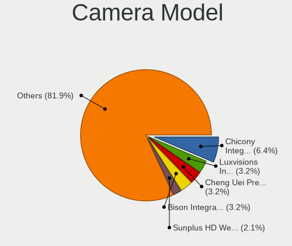

| Model                                                       | Computers | Percent |
|-------------------------------------------------------------|-----------|---------|
| IMC Networks USB2.0 HD UVC WebCam                           | 7         | 6.31%   |
| IMC Networks Integrated Camera                              | 5         | 4.5%    |
| Chicony Integrated Camera                                   | 5         | 4.5%    |
| Microdia Webcam Vitade AF                                   | 3         | 2.7%    |
| Bison Integrated Camera                                     | 3         | 2.7%    |
| Bison HD Webcam                                             | 3         | 2.7%    |
| Quanta HP Webcam                                            | 2         | 1.8%    |
| Quanta HP True Vision FHD Camera                            | 2         | 1.8%    |
| Microdia Integrated_Webcam_HD                               | 2         | 1.8%    |
| Microdia Camera                                             | 2         | 1.8%    |
| Luxvisions Innotech Limited HP TrueVision HD Camera         | 2         | 1.8%    |
| Chicony HP Truevision HD camera                             | 2         | 1.8%    |
| Chicony HD Webcam                                           | 2         | 1.8%    |
| Chicony FJ Camera                                           | 2         | 1.8%    |
| Apple Built-in iSight                                       | 2         | 1.8%    |
| Acer Integrated Camera                                      | 2         | 1.8%    |
| Trust USB Camera                                            | 1         | 0.9%    |
| Trust Full HD Webcam                                        | 1         | 0.9%    |
| Syntek Integrated Camera                                    | 1         | 0.9%    |
| Suyin HP TrueVision HD                                      | 1         | 0.9%    |
| Suyin HD Webcam                                             | 1         | 0.9%    |
| Suyin Acer/HP Integrated Webcam [CN0314]                    | 1         | 0.9%    |
| Suyin 1.3M WebCam (notebook emachines E730, Acer sub-brand) | 1         | 0.9%    |
| Sunplus TOSHIBA Web Camera - HD                             | 1         | 0.9%    |
| Sunplus Laptop_Integrated_Webcam_FHD                        | 1         | 0.9%    |
| Sunplus Hy HD Camera                                        | 1         | 0.9%    |
| Sunplus HP Truevision HD                                    | 1         | 0.9%    |
| Sunplus HD720P Webcam                                       | 1         | 0.9%    |
| Sunplus 1080p FHD Camera                                    | 1         | 0.9%    |
| Sonix USB2.0 HD UVC WebCam                                  | 1         | 0.9%    |
| Sonix USB2.0 FHD UVC WebCam                                 | 1         | 0.9%    |
| Ricoh Visual Communication Camera VGP-VCC9 [R5U870]         | 1         | 0.9%    |
| Realtek Integrated_Webcam_HD                                | 1         | 0.9%    |
| Realtek HP Webcam                                           | 1         | 0.9%    |
| Quanta VGA WebCam                                           | 1         | 0.9%    |
| Quanta USB2.0 HD UVC WebCam                                 | 1         | 0.9%    |
| Quanta HP Wide Vision HD Camera                             | 1         | 0.9%    |
| Quanta HP 5MP Camera                                        | 1         | 0.9%    |
| Quanta HD User Facing                                       | 1         | 0.9%    |
| Microdia USB 2.0 Camera                                     | 1         | 0.9%    |

Security
--------

Fingerprint Vendor
------------------

Fingerprint sensor vendors

| Vendor                     | Computers | Percent |
|----------------------------|-----------|---------|
| Synaptics                  | 8         | 36.36%  |
| Validity Sensors           | 5         | 22.73%  |
| Shenzhen Goodix Technology | 3         | 13.64%  |
| Elan Microelectronics      | 3         | 13.64%  |
| AuthenTec                  | 3         | 13.64%  |

Fingerprint Model
-----------------

Fingerprint sensor models

| Model                                                    | Computers | Percent |
|----------------------------------------------------------|-----------|---------|
| Synaptics Prometheus MIS Touch Fingerprint Reader        | 3         | 13.64%  |
| Synaptics WBDI Fingerprint Reader USB 086                | 2         | 9.09%   |
| Shenzhen Goodix  FingerPrint Device                      | 2         | 9.09%   |
| Elan ELAN:ARM-M4                                         | 2         | 9.09%   |
| Validity Sensors VFS5011 Fingerprint Reader              | 1         | 4.55%   |
| Validity Sensors VFS495 Fingerprint Reader               | 1         | 4.55%   |
| Validity Sensors VFS471 Fingerprint Reader               | 1         | 4.55%   |
| Validity Sensors Synaptics WBDI                          | 1         | 4.55%   |
| Validity Sensors Fingerprint scanner                     | 1         | 4.55%   |
| Synaptics WBDI                                           | 1         | 4.55%   |
| Synaptics Metallica MOH Touch Fingerprint Reader         | 1         | 4.55%   |
| Synaptics FS7604 Touch Fingerprint Sensor with PurePrint | 1         | 4.55%   |
| Shenzhen Goodix Fingerprint Reader                       | 1         | 4.55%   |
| Elan ELAN:Fingerprint                                    | 1         | 4.55%   |
| AuthenTec Fingerprint Sensor                             | 1         | 4.55%   |
| AuthenTec AES2550 Fingerprint Sensor                     | 1         | 4.55%   |
| AuthenTec AES1660 Fingerprint Sensor                     | 1         | 4.55%   |

Chipcard Vendor
---------------

Chipcard module vendors

| Vendor           | Computers | Percent |
|------------------|-----------|---------|
| Alcor Micro      | 5         | 62.5%   |
| O2 Micro         | 2         | 25%     |
| SCM Microsystems | 1         | 12.5%   |

Chipcard Model
--------------

Chipcard module models

| Model                                          | Computers | Percent |
|------------------------------------------------|-----------|---------|
| Alcor Micro AU9540 Smartcard Reader            | 4         | 50%     |
| O2 Micro OZ776 CCID Smartcard Reader           | 2         | 25%     |
| SCM Microsystems SCR35xx USB Smart Card Reader | 1         | 12.5%   |
| Alcor Micro Watchdata W 1981                   | 1         | 12.5%   |

Unsupported
-----------

Unsupported Devices
-------------------

Total unsupported devices on board

| Total | Computers | Percent |
|-------|-----------|---------|
| 0     | 113       | 66.47%  |
| 1     | 37        | 21.76%  |
| 2     | 13        | 7.65%   |
| 3     | 3         | 1.76%   |
| 4     | 2         | 1.18%   |
| 6     | 1         | 0.59%   |
| 5     | 1         | 0.59%   |

Unsupported Device Types
------------------------

Types of unsupported devices

| Type                     | Computers | Percent |
|--------------------------|-----------|---------|
| Graphics card            | 21        | 24.71%  |
| Fingerprint reader       | 21        | 24.71%  |
| Net/wireless             | 10        | 11.76%  |
| Multimedia controller    | 8         | 9.41%   |
| Chipcard                 | 8         | 9.41%   |
| Bluetooth                | 6         | 7.06%   |
| Unassigned class         | 3         | 3.53%   |
| Communication controller | 2         | 2.35%   |
| Card reader              | 2         | 2.35%   |
| Camera                   | 2         | 2.35%   |
| Storage/raid             | 1         | 1.18%   |
| Sound                    | 1         | 1.18%   |

