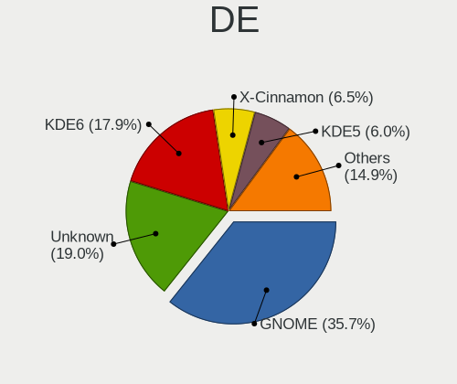
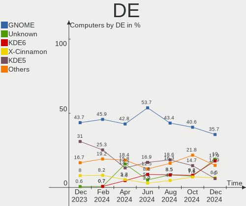
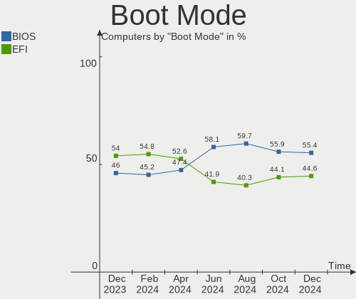
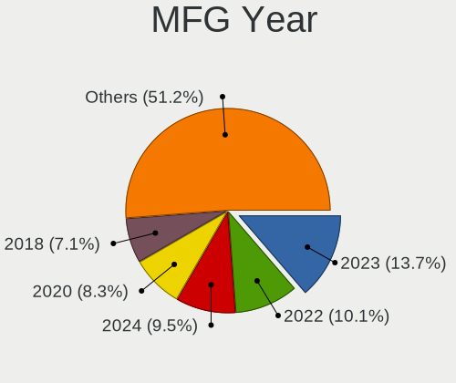
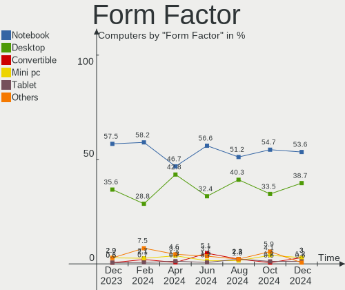
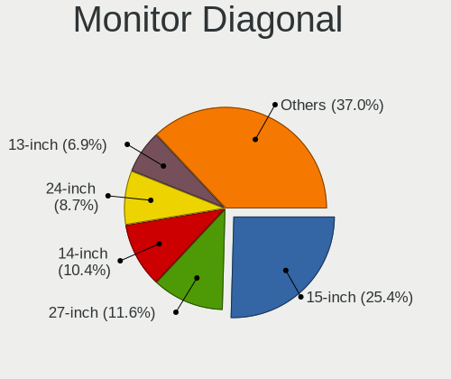
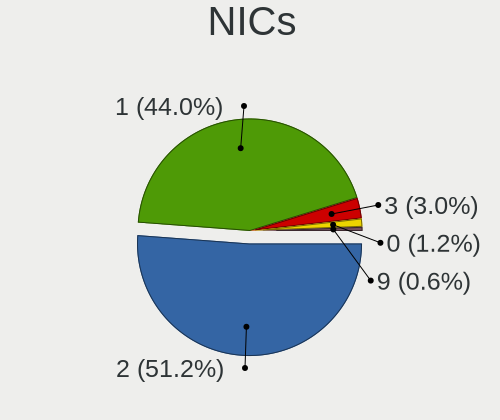
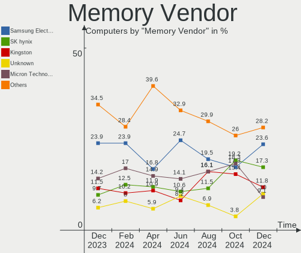
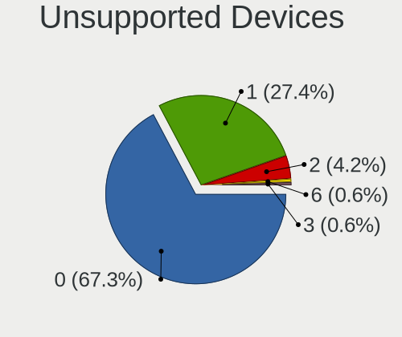

Linux in Spain - Hardware Trends
--------------------------------

A project to identify most popular hardware characteristics and track their change
over time based on data collected by Linux users at https://Linux-Hardware.org.

Anyone can contribute to this report by the [hw-probe](https://github.com/linuxhw/hw-probe) tool:

    sudo -E hw-probe -all -upload

This is a report for all computer types. See also reports for [desktops](/Location/Spain/Desktop/README.md) and [notebooks](/Location/Spain/Notebook/README.md).

Period: Feb, 2023.

Contents
--------

* [ System ](#system)
  - [ OS                       ](#os)
  - [ OS Family                ](#os-family)
  - [ Kernel                   ](#kernel)
  - [ Kernel Family            ](#kernel-family)
  - [ Kernel Major Ver.        ](#kernel-major-ver)
  - [ Arch                     ](#arch)
  - [ DE                       ](#de)
  - [ Display Server           ](#display-server)
  - [ Display Manager          ](#display-manager)
  - [ OS Lang                  ](#os-lang)
  - [ Boot Mode                ](#boot-mode)
  - [ Filesystem               ](#filesystem)
  - [ Part. scheme             ](#part-scheme)
  - [ Dual Boot with Linux/BSD ](#dual-boot-with-linuxbsd)
  - [ Dual Boot (Win)          ](#dual-boot-win)

* [ Board ](#board)
  - [ Vendor                   ](#vendor)
  - [ Model                    ](#model)
  - [ Model Family             ](#model-family)
  - [ MFG Year                 ](#mfg-year)
  - [ Form Factor              ](#form-factor)
  - [ Secure Boot              ](#secure-boot)
  - [ Coreboot                 ](#coreboot)
  - [ RAM Size                 ](#ram-size)
  - [ RAM Used                 ](#ram-used)
  - [ Total Drives             ](#total-drives)
  - [ Has CD-ROM               ](#has-cd-rom)
  - [ Has Ethernet             ](#has-ethernet)
  - [ Has WiFi                 ](#has-wifi)
  - [ Has Bluetooth            ](#has-bluetooth)

* [ Location ](#location)
  - [ Country                  ](#country)
  - [ City                     ](#city)

* [ Drives ](#drives)
  - [ Drive Vendor             ](#drive-vendor)
  - [ Drive Model              ](#drive-model)
  - [ HDD Vendor               ](#hdd-vendor)
  - [ SSD Vendor               ](#ssd-vendor)
  - [ Drive Kind               ](#drive-kind)
  - [ Drive Connector          ](#drive-connector)
  - [ Drive Size               ](#drive-size)
  - [ Space Total              ](#space-total)
  - [ Space Used               ](#space-used)
  - [ Malfunc. Drives          ](#malfunc-drives)
  - [ Malfunc. Drive Vendor    ](#malfunc-drive-vendor)
  - [ Malfunc. HDD Vendor      ](#malfunc-hdd-vendor)
  - [ Malfunc. Drive Kind      ](#malfunc-drive-kind)
  - [ Failed Drives            ](#failed-drives)
  - [ Failed Drive Vendor      ](#failed-drive-vendor)
  - [ Drive Status             ](#drive-status)

* [ Storage controller ](#storage-controller)
  - [ Storage Vendor           ](#storage-vendor)
  - [ Storage Model            ](#storage-model)
  - [ Storage Kind             ](#storage-kind)

* [ Processor ](#processor)
  - [ CPU Vendor               ](#cpu-vendor)
  - [ CPU Model                ](#cpu-model)
  - [ CPU Model Family         ](#cpu-model-family)
  - [ CPU Cores                ](#cpu-cores)
  - [ CPU Sockets              ](#cpu-sockets)
  - [ CPU Threads              ](#cpu-threads)
  - [ CPU Op-Modes             ](#cpu-op-modes)
  - [ CPU Microcode            ](#cpu-microcode)
  - [ CPU Microarch            ](#cpu-microarch)

* [ Graphics ](#graphics)
  - [ GPU Vendor               ](#gpu-vendor)
  - [ GPU Model                ](#gpu-model)
  - [ GPU Combo                ](#gpu-combo)
  - [ GPU Driver               ](#gpu-driver)
  - [ GPU Memory               ](#gpu-memory)

* [ Monitor ](#monitor)
  - [ Monitor Vendor           ](#monitor-vendor)
  - [ Monitor Model            ](#monitor-model)
  - [ Monitor Resolution       ](#monitor-resolution)
  - [ Monitor Diagonal         ](#monitor-diagonal)
  - [ Monitor Width            ](#monitor-width)
  - [ Aspect Ratio             ](#aspect-ratio)
  - [ Monitor Area             ](#monitor-area)
  - [ Pixel Density            ](#pixel-density)
  - [ Multiple Monitors        ](#multiple-monitors)

* [ Network ](#network)
  - [ Net Controller Vendor    ](#net-controller-vendor)
  - [ Net Controller Model     ](#net-controller-model)
  - [ Wireless Vendor          ](#wireless-vendor)
  - [ Wireless Model           ](#wireless-model)
  - [ Ethernet Vendor          ](#ethernet-vendor)
  - [ Ethernet Model           ](#ethernet-model)
  - [ Net Controller Kind      ](#net-controller-kind)
  - [ Used Controller          ](#used-controller)
  - [ NICs                     ](#nics)
  - [ IPv6                     ](#ipv6)

* [ Bluetooth ](#bluetooth)
  - [ Bluetooth Vendor         ](#bluetooth-vendor)
  - [ Bluetooth Model          ](#bluetooth-model)

* [ Sound ](#sound)
  - [ Sound Vendor             ](#sound-vendor)
  - [ Sound Model              ](#sound-model)

* [ Memory ](#memory)
  - [ Memory Vendor            ](#memory-vendor)
  - [ Memory Model             ](#memory-model)
  - [ Memory Kind              ](#memory-kind)
  - [ Memory Form Factor       ](#memory-form-factor)
  - [ Memory Size              ](#memory-size)
  - [ Memory Speed             ](#memory-speed)

* [ Printers & scanners ](#printers--scanners)
  - [ Printer Vendor           ](#printer-vendor)
  - [ Printer Model            ](#printer-model)
  - [ Scanner Vendor           ](#scanner-vendor)
  - [ Scanner Model            ](#scanner-model)

* [ Camera ](#camera)
  - [ Camera Vendor            ](#camera-vendor)
  - [ Camera Model             ](#camera-model)

* [ Security ](#security)
  - [ Fingerprint Vendor       ](#fingerprint-vendor)
  - [ Fingerprint Model        ](#fingerprint-model)
  - [ Chipcard Vendor          ](#chipcard-vendor)
  - [ Chipcard Model           ](#chipcard-model)

* [ Unsupported ](#unsupported)
  - [ Unsupported Devices      ](#unsupported-devices)
  - [ Unsupported Device Types ](#unsupported-device-types)

System
------

OS
--

Installed operating systems

| Name                         | Computers | Percent |
|------------------------------|-----------|---------|
| Ubuntu 22.04                 | 21        | 13.64%  |
| Linux Mint 21.1              | 19        | 12.34%  |
| OpenMandriva 23.01           | 14        | 9.09%   |
| Debian 11                    | 14        | 9.09%   |
| Fedora 37                    | 10        | 6.49%   |
| Ubuntu 22.10                 | 6         | 3.9%    |
| Zorin 16                     | 5         | 3.25%   |
| Ubuntu 20.04                 | 5         | 3.25%   |
| Pop!_OS 22.04                | 4         | 2.6%    |
| Ubuntu 18.04                 | 3         | 1.95%   |
| openSUSE Tumbleweed-XXXXXXXX | 3         | 1.95%   |
| KDE neon 22.04               | 3         | 1.95%   |
| Ubuntu MATE 22.04            | 2         | 1.3%    |
| ROSA 12.3                    | 2         | 1.3%    |
| Nobara 37                    | 2         | 1.3%    |
| MX 21                        | 2         | 1.3%    |
| MX 19                        | 2         | 1.3%    |
| Manjaro 22.0.4               | 2         | 1.3%    |
| Manjaro                      | 2         | 1.3%    |
| Linux Mint 20.3              | 2         | 1.3%    |
| Elementary 7                 | 2         | 1.3%    |
| Debian                       | 2         | 1.3%    |
| CentOS 7                     | 2         | 1.3%    |
| BunsenLabs 11                | 2         | 1.3%    |
| Arch Rolling                 | 2         | 1.3%    |
| Xubuntu 20.04                | 1         | 0.65%   |
| Ubuntu 23.04                 | 1         | 0.65%   |
| SteamOS 3.5                  | 1         | 0.65%   |
| SteamOS 3.4.4                | 1         | 0.65%   |
| Sparky 7                     | 1         | 0.65%   |
| ROSA 12.1                    | 1         | 0.65%   |
| OpenMandriva 4.3             | 1         | 0.65%   |
| OpenMandriva 22.12           | 1         | 0.65%   |
| Nobara 36                    | 1         | 0.65%   |
| Lubuntu 22.10                | 1         | 0.65%   |
| Linux Mint 21                | 1         | 0.65%   |
| Kubuntu 22.04                | 1         | 0.65%   |
| KDE neon 20.04               | 1         | 0.65%   |
| Kali 2022.4                  | 1         | 0.65%   |
| Gentoo 2.9                   | 1         | 0.65%   |

OS Family
---------

OS without a version

| Name         | Computers | Percent |
|--------------|-----------|---------|
| Ubuntu       | 36        | 23.38%  |
| Linux Mint   | 22        | 14.29%  |
| OpenMandriva | 16        | 10.39%  |
| Debian       | 16        | 10.39%  |
| Fedora       | 10        | 6.49%   |
| Zorin        | 5         | 3.25%   |
| Pop!_OS      | 4         | 2.6%    |
| MX           | 4         | 2.6%    |
| Manjaro      | 4         | 2.6%    |
| KDE neon     | 4         | 2.6%    |
| ROSA         | 3         | 1.95%   |
| openSUSE     | 3         | 1.95%   |
| Nobara       | 3         | 1.95%   |
| Ubuntu MATE  | 2         | 1.3%    |
| SteamOS      | 2         | 1.3%    |
| Elementary   | 2         | 1.3%    |
| CentOS       | 2         | 1.3%    |
| BunsenLabs   | 2         | 1.3%    |
| ArcoLinux    | 2         | 1.3%    |
| Arch         | 2         | 1.3%    |
| Xubuntu      | 1         | 0.65%   |
| Sparky       | 1         | 0.65%   |
| Lubuntu      | 1         | 0.65%   |
| Kubuntu      | 1         | 0.65%   |
| Kali         | 1         | 0.65%   |
| Gentoo       | 1         | 0.65%   |
| CloudLinux   | 1         | 0.65%   |
| Clear Linux  | 1         | 0.65%   |
| Artix        | 1         | 0.65%   |
| Alpine       | 1         | 0.65%   |

Kernel
------

Version of the Linux kernel

| Version                      | Computers | Percent |
|------------------------------|-----------|---------|
| 5.15.0-60-generic            | 28        | 18.18%  |
| 5.15.0-58-generic            | 14        | 9.09%   |
| 5.19.0-32-generic            | 11        | 7.14%   |
| 5.10.0-21-amd64              | 10        | 6.49%   |
| 6.1.1-desktop-1omv2290       | 9         | 5.84%   |
| 6.1.4-desktop-1omv2301       | 4         | 2.6%    |
| 6.1.11-200.fc37.x86_64       | 4         | 2.6%    |
| 6.0.12-76060006-generic      | 4         | 2.6%    |
| 5.19.0-29-generic            | 4         | 2.6%    |
| 5.15.0-56-generic            | 3         | 1.95%   |
| 5.10.0-21-686-pae            | 3         | 1.95%   |
| 6.1.9-1-MANJARO              | 2         | 1.3%    |
| 6.1.12-1-MANJARO             | 2         | 1.3%    |
| 6.1.11-201.fsync.fc37.x86_64 | 2         | 1.3%    |
| 6.1.0-3-amd64                | 2         | 1.3%    |
| 5.4.0-137-generic            | 2         | 1.3%    |
| 5.19.0-31-generic            | 2         | 1.3%    |
| 5.10.0-5mx-amd64             | 2         | 1.3%    |
| 5.10.0-18-amd64              | 2         | 1.3%    |
| 6.2.1-desktop-1omv2390       | 1         | 0.65%   |
| 6.2.0-sparky-amd64           | 1         | 0.65%   |
| 6.1.9-valve2-1-neptune-61    | 1         | 0.65%   |
| 6.1.9-200.fc37.x86_64        | 1         | 0.65%   |
| 6.1.8-200.fc37.x86_64        | 1         | 0.65%   |
| 6.1.8-1-default              | 1         | 0.65%   |
| 6.1.13-200.fc37.x86_64       | 1         | 0.65%   |
| 6.1.12-surface               | 1         | 0.65%   |
| 6.1.12-arch1-1               | 1         | 0.65%   |
| 6.1.12-200.fc37.x86_64       | 1         | 0.65%   |
| 6.1.12-1265.native           | 1         | 0.65%   |
| 6.1.12-1-default             | 1         | 0.65%   |
| 6.1.11-zen1-1-zen            | 1         | 0.65%   |
| 6.1.11-arch1-1.1             | 1         | 0.65%   |
| 6.1.11-0-edge                | 1         | 0.65%   |
| 6.1.10-hardened1-1-hardened  | 1         | 0.65%   |
| 6.1.10-200.fc37.x86_64       | 1         | 0.65%   |
| 6.1.10-1-default             | 1         | 0.65%   |
| 6.0.12-300.fc37.x86_64       | 1         | 0.65%   |
| 6.0.10-desktop-2omv22090     | 1         | 0.65%   |
| 6.0.10-201.fc36.x86_64       | 1         | 0.65%   |

Kernel Family
-------------

Linux kernel without a distro release

| Version | Computers | Percent |
|---------|-----------|---------|
| 5.15.0  | 46        | 29.87%  |
| 5.19.0  | 18        | 11.69%  |
| 5.10.0  | 17        | 11.04%  |
| 6.1.11  | 9         | 5.84%   |
| 6.1.1   | 9         | 5.84%   |
| 6.1.12  | 7         | 4.55%   |
| 6.0.12  | 5         | 3.25%   |
| 5.4.0   | 5         | 3.25%   |
| 6.1.9   | 4         | 2.6%    |
| 6.1.4   | 4         | 2.6%    |
| 6.1.10  | 3         | 1.95%   |
| 6.1.8   | 2         | 1.3%    |
| 6.1.0   | 2         | 1.3%    |
| 6.0.10  | 2         | 1.3%    |
| 6.0.0   | 2         | 1.3%    |
| 3.10.0  | 2         | 1.3%    |
| 6.2.1   | 1         | 0.65%   |
| 6.2.0   | 1         | 0.65%   |
| 6.1.13  | 1         | 0.65%   |
| 5.19.17 | 1         | 0.65%   |
| 5.17.0  | 1         | 0.65%   |
| 5.16.13 | 1         | 0.65%   |
| 5.16.0  | 1         | 0.65%   |
| 5.15.91 | 1         | 0.65%   |
| 5.15.88 | 1         | 0.65%   |
| 5.15.79 | 1         | 0.65%   |
| 5.15.75 | 1         | 0.65%   |
| 5.15.74 | 1         | 0.65%   |
| 5.13.0  | 1         | 0.65%   |
| 5.11.0  | 1         | 0.65%   |
| 5.10.74 | 1         | 0.65%   |
| 4.18.0  | 1         | 0.65%   |
| 4.15.0  | 1         | 0.65%   |

Kernel Major Ver.
-----------------

Linux kernel major version

| Version | Computers | Percent |
|---------|-----------|---------|
| 5.15    | 51        | 33.12%  |
| 6.1     | 41        | 26.62%  |
| 5.19    | 19        | 12.34%  |
| 5.10    | 18        | 11.69%  |
| 6.0     | 9         | 5.84%   |
| 5.4     | 5         | 3.25%   |
| 6.2     | 2         | 1.3%    |
| 5.16    | 2         | 1.3%    |
| 3.10    | 2         | 1.3%    |
| 5.17    | 1         | 0.65%   |
| 5.13    | 1         | 0.65%   |
| 5.11    | 1         | 0.65%   |
| 4.18    | 1         | 0.65%   |
| 4.15    | 1         | 0.65%   |

Arch
----

OS architecture (x86_64, i586, etc.)

| Name   | Computers | Percent |
|--------|-----------|---------|
| x86_64 | 151       | 98.05%  |
| i686   | 3         | 1.95%   |

DE
--

Desktop Environment

| Name       | Computers | Percent |
|------------|-----------|---------|
| GNOME      | 66        | 42.86%  |
| KDE5       | 32        | 20.78%  |
| XFCE       | 17        | 11.04%  |
| X-Cinnamon | 17        | 11.04%  |
| Unknown    | 6         | 3.9%    |
| MATE       | 3         | 1.95%   |
| i3         | 3         | 1.95%   |
| Pantheon   | 2         | 1.3%    |
| LXQt       | 2         | 1.3%    |
| Cinnamon   | 2         | 1.3%    |
| xmonad     | 1         | 0.65%   |
| openbox    | 1         | 0.65%   |
| KDE4       | 1         | 0.65%   |
| BunsenLabs | 1         | 0.65%   |

Display Server
--------------

X11 or Wayland

| Name    | Computers | Percent |
|---------|-----------|---------|
| X11     | 101       | 65.58%  |
| Wayland | 44        | 28.57%  |
| Tty     | 6         | 3.9%    |
| Unknown | 3         | 1.95%   |

Display Manager
---------------

SDDM, LightDM, etc.

| Name    | Computers | Percent |
|---------|-----------|---------|
| Unknown | 61        | 39.61%  |
| GDM3    | 33        | 21.43%  |
| SDDM    | 24        | 15.58%  |
| LightDM | 21        | 13.64%  |
| GDM     | 14        | 9.09%   |
| LXDM    | 1         | 0.65%   |

OS Lang
-------

Language

| Lang             | Computers | Percent |
|------------------|-----------|---------|
| es_ES            | 101       | 65.58%  |
| en_US            | 29        | 18.83%  |
| ca_ES            | 5         | 3.25%   |
| en_GB            | 4         | 2.6%    |
| C                | 4         | 2.6%    |
| de_DE            | 2         | 1.3%    |
| ru_RU            | 1         | 0.65%   |
| pl_PL            | 1         | 0.65%   |
| fr_FR            | 1         | 0.65%   |
| eu_ES            | 1         | 0.65%   |
| es_MX            | 1         | 0.65%   |
| es_ES.ISO-8859-1 | 1         | 0.65%   |
| de_AT            | 1         | 0.65%   |
| ca_ES@valencia   | 1         | 0.65%   |
| Unknown          | 1         | 0.65%   |

Boot Mode
---------

EFI or BIOS

| Mode | Computers | Percent |
|------|-----------|---------|
| EFI  | 83        | 53.9%   |
| BIOS | 71        | 46.1%   |

Filesystem
----------

Type of filesystem

| Type    | Computers | Percent |
|---------|-----------|---------|
| Ext4    | 116       | 75.32%  |
| Btrfs   | 22        | 14.29%  |
| Overlay | 9         | 5.84%   |
| Xfs     | 6         | 3.9%    |
| Tmpfs   | 1         | 0.65%   |

Part. scheme
------------

Scheme of partitioning

| Type    | Computers | Percent |
|---------|-----------|---------|
| GPT     | 75        | 48.7%   |
| Unknown | 54        | 35.06%  |
| MBR     | 25        | 16.23%  |

Dual Boot with Linux/BSD
------------------------

Hosting more than one Linux/BSD

| Dual boot | Computers | Percent |
|-----------|-----------|---------|
| No        | 131       | 85.06%  |
| Yes       | 23        | 14.94%  |

Dual Boot (Win)
---------------

Hosting Linux and Windows

| Dual boot | Computers | Percent |
|-----------|-----------|---------|
| No        | 109       | 70.78%  |
| Yes       | 45        | 29.22%  |

Board
-----

Vendor
------

Motherboard manufacturer

| Name                                 | Computers | Percent |
|--------------------------------------|-----------|---------|
| ASUSTek Computer                     | 27        | 17.53%  |
| Lenovo                               | 23        | 14.94%  |
| Hewlett-Packard                      | 18        | 11.69%  |
| Acer                                 | 13        | 8.44%   |
| Gigabyte Technology                  | 12        | 7.79%   |
| MSI                                  | 8         | 5.19%   |
| Dell                                 | 8         | 5.19%   |
| Unknown                              | 5         | 3.25%   |
| Apple                                | 4         | 2.6%    |
| Supermicro                           | 3         | 1.95%   |
| SLIMBOOK                             | 3         | 1.95%   |
| Intel                                | 3         | 1.95%   |
| HUAWEI                               | 3         | 1.95%   |
| Valve                                | 2         | 1.3%    |
| Toshiba                              | 2         | 1.3%    |
| Sony                                 | 2         | 1.3%    |
| Microsoft                            | 2         | 1.3%    |
| Chuwi                                | 2         | 1.3%    |
| BESSTAR Tech                         | 2         | 1.3%    |
| ASRock                               | 2         | 1.3%    |
| WinPAD 110W                          | 1         | 0.65%   |
| VANT                                 | 1         | 0.65%   |
| Teclast                              | 1         | 0.65%   |
| Shenzhen Meigao Electronic Equipment | 1         | 0.65%   |
| Samsung Electronics                  | 1         | 0.65%   |
| Notebook                             | 1         | 0.65%   |
| Google                               | 1         | 0.65%   |
| Cisco Systems                        | 1         | 0.65%   |
| AZW                                  | 1         | 0.65%   |
| AMI                                  | 1         | 0.65%   |

Model
-----

Motherboard model

| Name                                       | Computers | Percent |
|--------------------------------------------|-----------|---------|
| Unknown                                    | 5         | 3.25%   |
| Valve Jupiter                              | 2         | 1.3%    |
| HUAWEI BOHK-WAX9X                          | 2         | 1.3%    |
| HP Pavilion 15                             | 2         | 1.3%    |
| HP OMEN by Laptop 16-c0xxx                 | 2         | 1.3%    |
| Gigabyte H81M-S2H                          | 2         | 1.3%    |
| BESSTAR Tech B550                          | 2         | 1.3%    |
| ASUS VivoBook_ASUSLaptop X513EAN_K513EA    | 2         | 1.3%    |
| ASUS AT4NM10T-I                            | 2         | 1.3%    |
| WinPAD 110W WinPAD 110W                    | 1         | 0.65%   |
| VANT MOOVE3-14                             | 1         | 0.65%   |
| Toshiba Satellite C855-1T5                 | 1         | 0.65%   |
| Toshiba PORTEGE Z30-A                      | 1         | 0.65%   |
| Teclast F7S                                | 1         | 0.65%   |
| Supermicro X8DTL                           | 1         | 0.65%   |
| Supermicro SYS-6017B-MTF                   | 1         | 0.65%   |
| Supermicro AS -1024US-TRT                  | 1         | 0.65%   |
| Sony VPCZ13M9E                             | 1         | 0.65%   |
| Sony SVF1521N6EW                           | 1         | 0.65%   |
| SLIMBOOK TITAN                             | 1         | 0.65%   |
| SLIMBOOK ONE-AMD-M4                        | 1         | 0.65%   |
| SLIMBOOK Essential15L                      | 1         | 0.65%   |
| Shenzhen Meigao Electronic Equipment UM690 | 1         | 0.65%   |
| Samsung R530/R730                          | 1         | 0.65%   |
| Notebook W54_55SU1,SUW                     | 1         | 0.65%   |
| MSI Stealth 15M B12UE                      | 1         | 0.65%   |
| MSI Prestige 15 A12UD                      | 1         | 0.65%   |
| MSI MS-7C84                                | 1         | 0.65%   |
| MSI MS-7B93                                | 1         | 0.65%   |
| MSI MS-7B61                                | 1         | 0.65%   |
| MSI MS-7A72                                | 1         | 0.65%   |
| MSI MS-7A62 mod by 10729.com               | 1         | 0.65%   |
| MSI Alpha 15 A3DDK                         | 1         | 0.65%   |
| Microsoft Surface Pro                      | 1         | 0.65%   |
| Microsoft Surface Book 3                   | 1         | 0.65%   |
| Lenovo V14-ADA 82C6                        | 1         | 0.65%   |
| Lenovo ThinkPad X250 20CLS2GD00            | 1         | 0.65%   |
| Lenovo ThinkPad X201 3680U6V               | 1         | 0.65%   |
| Lenovo ThinkPad X1 Yoga 3rd 20LES1U800     | 1         | 0.65%   |
| Lenovo ThinkPad T510 43147VG               | 1         | 0.65%   |

Model Family
------------

Motherboard model prefix

| Name                                       | Computers | Percent |
|--------------------------------------------|-----------|---------|
| Lenovo ThinkPad                            | 10        | 6.49%   |
| Acer Aspire                                | 8         | 5.19%   |
| Lenovo IdeaPad                             | 5         | 3.25%   |
| HP Pavilion                                | 5         | 3.25%   |
| ASUS ROG                                   | 5         | 3.25%   |
| Unknown                                    | 5         | 3.25%   |
| ASUS VivoBook                              | 4         | 2.6%    |
| HP EliteBook                               | 3         | 1.95%   |
| Dell OptiPlex                              | 3         | 1.95%   |
| ASUS ZenBook                               | 3         | 1.95%   |
| Valve Jupiter                              | 2         | 1.3%    |
| Microsoft Surface                          | 2         | 1.3%    |
| Lenovo ThinkCentre                         | 2         | 1.3%    |
| Lenovo Legion                              | 2         | 1.3%    |
| Lenovo IdeaCentre                          | 2         | 1.3%    |
| HUAWEI BOHK-WAX9X                          | 2         | 1.3%    |
| HP OMEN                                    | 2         | 1.3%    |
| HP Compaq                                  | 2         | 1.3%    |
| Gigabyte H81M-S2H                          | 2         | 1.3%    |
| Gigabyte B450M                             | 2         | 1.3%    |
| Dell XPS                                   | 2         | 1.3%    |
| Dell Latitude                              | 2         | 1.3%    |
| BESSTAR Tech B550                          | 2         | 1.3%    |
| ASUS PRIME                                 | 2         | 1.3%    |
| ASUS AT4NM10T-I                            | 2         | 1.3%    |
| Acer Extensa                               | 2         | 1.3%    |
| WinPAD 110W WinPAD                         | 1         | 0.65%   |
| VANT MOOVE3-14                             | 1         | 0.65%   |
| Toshiba Satellite                          | 1         | 0.65%   |
| Toshiba PORTEGE                            | 1         | 0.65%   |
| Teclast F7S                                | 1         | 0.65%   |
| Supermicro X8DTL                           | 1         | 0.65%   |
| Supermicro SYS-6017B-MTF                   | 1         | 0.65%   |
| Supermicro AS                              | 1         | 0.65%   |
| Sony VPCZ13M9E                             | 1         | 0.65%   |
| Sony SVF1521N6EW                           | 1         | 0.65%   |
| SLIMBOOK TITAN                             | 1         | 0.65%   |
| SLIMBOOK ONE-AMD-M4                        | 1         | 0.65%   |
| SLIMBOOK Essential15L                      | 1         | 0.65%   |
| Shenzhen Meigao Electronic Equipment UM690 | 1         | 0.65%   |

MFG Year
--------

Motherboard manufacture year

| Year | Computers | Percent |
|------|-----------|---------|
| 2021 | 26        | 16.88%  |
| 2019 | 16        | 10.39%  |
| 2022 | 12        | 7.79%   |
| 2020 | 12        | 7.79%   |
| 2014 | 12        | 7.79%   |
| 2015 | 11        | 7.14%   |
| 2013 | 10        | 6.49%   |
| 2018 | 9         | 5.84%   |
| 2017 | 8         | 5.19%   |
| 2012 | 8         | 5.19%   |
| 2009 | 6         | 3.9%    |
| 2011 | 5         | 3.25%   |
| 2010 | 5         | 3.25%   |
| 2016 | 4         | 2.6%    |
| 2008 | 4         | 2.6%    |
| 2007 | 4         | 2.6%    |
| 2023 | 1         | 0.65%   |
| 2006 | 1         | 0.65%   |

Form Factor
-----------

Physical design of the computer

| Name        | Computers | Percent |
|-------------|-----------|---------|
| Notebook    | 87        | 56.49%  |
| Desktop     | 53        | 34.42%  |
| Convertible | 5         | 3.25%   |
| Mini pc     | 3         | 1.95%   |
| All in one  | 3         | 1.95%   |
| Tablet      | 2         | 1.3%    |
| Server      | 1         | 0.65%   |

Secure Boot
-----------

Enabled or disabled

| State    | Computers | Percent |
|----------|-----------|---------|
| Disabled | 146       | 94.81%  |
| Enabled  | 8         | 5.19%   |

Coreboot
--------

Have coreboot on board

| Used | Computers | Percent |
|------|-----------|---------|
| No   | 153       | 99.35%  |
| Yes  | 1         | 0.65%   |

RAM Size
--------

Total RAM memory

| Size in GB      | Computers | Percent |
|-----------------|-----------|---------|
| 4.01-8.0        | 38        | 24.68%  |
| 16.01-24.0      | 27        | 17.53%  |
| 3.01-4.0        | 25        | 16.23%  |
| 8.01-16.0       | 25        | 16.23%  |
| 32.01-64.0      | 24        | 15.58%  |
| 24.01-32.0      | 4         | 2.6%    |
| 1.01-2.0        | 4         | 2.6%    |
| 64.01-256.0     | 3         | 1.95%   |
| 2.01-3.0        | 2         | 1.3%    |
| More than 256.0 | 1         | 0.65%   |
| 0.51-1.0        | 1         | 0.65%   |

RAM Used
--------

Used RAM memory

| Used GB    | Computers | Percent |
|------------|-----------|---------|
| 1.01-2.0   | 49        | 31.82%  |
| 2.01-3.0   | 42        | 27.27%  |
| 4.01-8.0   | 26        | 16.88%  |
| 3.01-4.0   | 20        | 12.99%  |
| 0.51-1.0   | 9         | 5.84%   |
| 8.01-16.0  | 4         | 2.6%    |
| 24.01-32.0 | 2         | 1.3%    |
| 0.01-0.5   | 2         | 1.3%    |

Total Drives
------------

Number of drives on board

| Drives | Computers | Percent |
|--------|-----------|---------|
| 1      | 96        | 62.34%  |
| 2      | 35        | 22.73%  |
| 3      | 10        | 6.49%   |
| 4      | 6         | 3.9%    |
| 6      | 3         | 1.95%   |
| 5      | 2         | 1.3%    |
| 12     | 1         | 0.65%   |
| 10     | 1         | 0.65%   |

Has CD-ROM
----------

Has CD-ROM on board

| Presented | Computers | Percent |
|-----------|-----------|---------|
| No        | 112       | 72.73%  |
| Yes       | 42        | 27.27%  |

Has Ethernet
------------

Has Ethernet on board

| Presented | Computers | Percent |
|-----------|-----------|---------|
| Yes       | 125       | 81.17%  |
| No        | 29        | 18.83%  |

Has WiFi
--------

Has WiFi module

| Presented | Computers | Percent |
|-----------|-----------|---------|
| Yes       | 122       | 79.22%  |
| No        | 32        | 20.78%  |

Has Bluetooth
-------------

Has Bluetooth module

| Presented | Computers | Percent |
|-----------|-----------|---------|
| Yes       | 100       | 64.94%  |
| No        | 54        | 35.06%  |

Location
--------

Country
-------

Geographic location (country)

| Country | Computers | Percent |
|---------|-----------|---------|
| Spain   | 154       | 100%    |

City
----

Geographic location (city)

| City                        | Computers | Percent |
|-----------------------------|-----------|---------|
| Barcelona                   | 24        | 15.58%  |
| Madrid                      | 22        | 14.29%  |
| Seville                     | 9         | 5.84%   |
| Valladolid                  | 5         | 3.25%   |
| Vigo                        | 3         | 1.95%   |
| Granada                     | 3         | 1.95%   |
| Vera                        | 2         | 1.3%    |
| Valencia                    | 2         | 1.3%    |
| Terrassa                    | 2         | 1.3%    |
| Ponferrada                  | 2         | 1.3%    |
| Oviedo                      | 2         | 1.3%    |
| Málaga                     | 2         | 1.3%    |
| León                       | 2         | 1.3%    |
| Guadalajara                 | 2         | 1.3%    |
| Collado Villalba            | 2         | 1.3%    |
| Cartagena                   | 2         | 1.3%    |
| Carballo                    | 2         | 1.3%    |
| Almería                    | 2         | 1.3%    |
| Alcobendas                  | 2         | 1.3%    |
| Alcalá de Henares          | 2         | 1.3%    |
| Zujar                       | 1         | 0.65%   |
| Zafra                       | 1         | 0.65%   |
| Talavera de la Reina        | 1         | 0.65%   |
| Simat de la Valldigna       | 1         | 0.65%   |
| Santona                     | 1         | 0.65%   |
| Santander                   | 1         | 0.65%   |
| Santa Coloma de Gramenet    | 1         | 0.65%   |
| San Juan de Aznalfarache    | 1         | 0.65%   |
| San Jose de la Rinconada    | 1         | 0.65%   |
| San Cristóbal de La Laguna | 1         | 0.65%   |
| Sabadell                    | 1         | 0.65%   |
| Roda de Berà               | 1         | 0.65%   |
| Rincon de la Victoria       | 1         | 0.65%   |
| Retamar                     | 1         | 0.65%   |
| Puentecesures               | 1         | 0.65%   |
| Porto Cristo                | 1         | 0.65%   |
| Porrino                     | 1         | 0.65%   |
| Pamplona                    | 1         | 0.65%   |
| Palma                       | 1         | 0.65%   |
| Oropesa                     | 1         | 0.65%   |

Drives
------

Drive Vendor
------------

Hard drive vendors

| Vendor                      | Computers | Drives | Percent |
|-----------------------------|-----------|--------|---------|
| Samsung Electronics         | 31        | 41     | 13.66%  |
| WDC                         | 28        | 30     | 12.33%  |
| Seagate                     | 27        | 36     | 11.89%  |
| Kingston                    | 25        | 25     | 11.01%  |
| Toshiba                     | 16        | 24     | 7.05%   |
| Crucial                     | 13        | 16     | 5.73%   |
| SanDisk                     | 11        | 13     | 4.85%   |
| Unknown                     | 9         | 10     | 3.96%   |
| SK hynix                    | 9         | 9      | 3.96%   |
| Micron Technology           | 6         | 6      | 2.64%   |
| Intel                       | 6         | 6      | 2.64%   |
| Kingston Technology Company | 4         | 4      | 1.76%   |
| Hitachi                     | 4         | 4      | 1.76%   |
| Phison Electronics          | 3         | 3      | 1.32%   |
| KIOXIA                      | 3         | 6      | 1.32%   |
| Intenso                     | 3         | 4      | 1.32%   |
| China                       | 3         | 3      | 1.32%   |
| Transcend                   | 2         | 2      | 0.88%   |
| Teclast                     | 2         | 2      | 0.88%   |
| Netac                       | 2         | 2      | 0.88%   |
| Micron/Crucial Technology   | 2         | 3      | 0.88%   |
| JMicron Technology          | 2         | 2      | 0.88%   |
| HGST                        | 2         | 2      | 0.88%   |
| Apple                       | 2         | 2      | 0.88%   |
| USB30                       | 1         | 3      | 0.44%   |
| USB2.0                      | 1         | 1      | 0.44%   |
| Union Memory (Shenzhen)     | 1         | 1      | 0.44%   |
| Union Memory                | 1         | 1      | 0.44%   |
| TCSUNBOW                    | 1         | 1      | 0.44%   |
| SABRENT                     | 1         | 1      | 0.44%   |
| PNY                         | 1         | 1      | 0.44%   |
| OCZ                         | 1         | 1      | 0.44%   |
| Indilinx                    | 1         | 1      | 0.44%   |
| Hewlett-Packard             | 1         | 1      | 0.44%   |
| Dogfish                     | 1         | 1      | 0.44%   |
| Unknown                     | 1         | 1      | 0.44%   |

Drive Model
-----------

Hard drive models

| Model                                                | Computers | Percent |
|------------------------------------------------------|-----------|---------|
| Kingston SA400S37240G 240GB SSD                      | 11        | 4.49%   |
| Samsung NVMe SSD Controller SM981/PM981/PM983 250GB  | 5         | 2.04%   |
| Crucial CT480BX500SSD1 480GB                         | 4         | 1.63%   |
| Seagate ST500DM002-1BD142 500GB                      | 3         | 1.22%   |
| Seagate ST3500418AS 500GB                            | 3         | 1.22%   |
| Seagate ST1000DM010-2EP102 1TB                       | 3         | 1.22%   |
| Kingston SUV400S37240G 240GB SSD                     | 3         | 1.22%   |
| Kingston SA400S37120G 120GB SSD                      | 3         | 1.22%   |
| Crucial CT500MX500SSD1 500GB                         | 3         | 1.22%   |
| WDC WD20EARX-00PASB0 2TB                             | 2         | 0.82%   |
| WDC WD10EZRX-00A8LB0 1TB                             | 2         | 0.82%   |
| Unknown MMC Card  128GB                              | 2         | 0.82%   |
| Toshiba MQ01ABD050 500GB                             | 2         | 0.82%   |
| Toshiba DT01ACA050 500GB                             | 2         | 0.82%   |
| Teclast BD256GB SHCB-2280 SSD                        | 2         | 0.82%   |
| SK hynix HFM001TD3JX013N 1TB                         | 2         | 0.82%   |
| SK hynix BC501 NVMe Solid State Drive 512GB          | 2         | 0.82%   |
| Seagate ST9500325AS 500GB                            | 2         | 0.82%   |
| Seagate ST2000LM015-2E8174 2TB                       | 2         | 0.82%   |
| Seagate Expansion 1TB                                | 2         | 0.82%   |
| Samsung SSD 980 PRO 1TB                              | 2         | 0.82%   |
| Samsung SSD 840 EVO 250GB                            | 2         | 0.82%   |
| Samsung NVMe SSD Controller PM9A1/PM9A3/980PRO 960GB | 2         | 0.82%   |
| Phison E16 PCIe4 NVMe Controller 512GB               | 2         | 0.82%   |
| Micron/Crucial P2 NVMe PCIe SSD 1TB                  | 2         | 0.82%   |
| Micron 2210_MTFDHBA512QFD 512GB                      | 2         | 0.82%   |
| Kingston SA400S37480G 480GB SSD                      | 2         | 0.82%   |
| JMicron Generic 200GB                                | 2         | 0.82%   |
| Intel SSDPEKNU512GZ 512GB                            | 2         | 0.82%   |
| Crucial CT525MX300SSD1 528GB                         | 2         | 0.82%   |
| China SSD 64GB                                       | 2         | 0.82%   |
| WDC WDS250G2B0C-00PXH0 250GB                         | 1         | 0.41%   |
| WDC WDS240G2G0A-00JH30 240GB SSD                     | 1         | 0.41%   |
| WDC WDS200T2B0C-00PXH0 2TB                           | 1         | 0.41%   |
| WDC WDS100T2B0A-00SM50 1TB SSD                       | 1         | 0.41%   |
| WDC WDS100T1R0B-68A4Z0 1TB SSD                       | 1         | 0.41%   |
| WDC WD8003FFBX-68B9AN0 8TB                           | 1         | 0.41%   |
| WDC WD5000LPCX-24VHAT0 500GB                         | 1         | 0.41%   |
| WDC WD5000BEVT-75ZAT0 500GB                          | 1         | 0.41%   |
| WDC WD5000AAKX-75U6AA0 500GB                         | 1         | 0.41%   |

HDD Vendor
----------

Hard disk drive vendors

| Vendor              | Computers | Drives | Percent |
|---------------------|-----------|--------|---------|
| Seagate             | 27        | 36     | 36%     |
| WDC                 | 22        | 23     | 29.33%  |
| Toshiba             | 11        | 17     | 14.67%  |
| Hitachi             | 4         | 4      | 5.33%   |
| Samsung Electronics | 3         | 3      | 4%      |
| JMicron Technology  | 2         | 2      | 2.67%   |
| HGST                | 2         | 2      | 2.67%   |
| Unknown             | 1         | 1      | 1.33%   |
| SABRENT             | 1         | 1      | 1.33%   |
| Intenso             | 1         | 1      | 1.33%   |
| Apple               | 1         | 1      | 1.33%   |

SSD Vendor
----------

Solid state drive vendors

| Vendor              | Computers | Drives | Percent |
|---------------------|-----------|--------|---------|
| Kingston            | 22        | 22     | 27.16%  |
| Samsung Electronics | 13        | 14     | 16.05%  |
| Crucial             | 13        | 14     | 16.05%  |
| SanDisk             | 5         | 7      | 6.17%   |
| WDC                 | 4         | 4      | 4.94%   |
| Toshiba             | 3         | 5      | 3.7%    |
| Intenso             | 3         | 3      | 3.7%    |
| China               | 3         | 3      | 3.7%    |
| Transcend           | 2         | 2      | 2.47%   |
| Teclast             | 2         | 2      | 2.47%   |
| SK hynix            | 2         | 2      | 2.47%   |
| Netac               | 2         | 2      | 2.47%   |
| USB30               | 1         | 3      | 1.23%   |
| PNY                 | 1         | 1      | 1.23%   |
| OCZ                 | 1         | 1      | 1.23%   |
| Micron Technology   | 1         | 1      | 1.23%   |
| Intel               | 1         | 1      | 1.23%   |
| Dogfish             | 1         | 1      | 1.23%   |
| Apple               | 1         | 1      | 1.23%   |

Drive Kind
----------

HDD or SSD

| Kind    | Computers | Drives | Percent |
|---------|-----------|--------|---------|
| SSD     | 68        | 89     | 33.5%   |
| NVMe    | 62        | 76     | 30.54%  |
| HDD     | 61        | 91     | 30.05%  |
| MMC     | 9         | 10     | 4.43%   |
| Unknown | 3         | 3      | 1.48%   |

Drive Connector
---------------

SATA, SAS, NVMe, etc.

| Type | Computers | Drives | Percent |
|------|-----------|--------|---------|
| SATA | 105       | 168    | 56.15%  |
| NVMe | 62        | 76     | 33.16%  |
| SAS  | 11        | 15     | 5.88%   |
| MMC  | 9         | 10     | 4.81%   |

Drive Size
----------

Size of hard drive

| Size in TB | Computers | Drives | Percent |
|------------|-----------|--------|---------|
| 0.01-0.5   | 83        | 114    | 59.71%  |
| 0.51-1.0   | 35        | 37     | 25.18%  |
| 1.01-2.0   | 15        | 21     | 10.79%  |
| 4.01-10.0  | 3         | 4      | 2.16%   |
| 3.01-4.0   | 2         | 2      | 1.44%   |
| 2.01-3.0   | 1         | 2      | 0.72%   |

Space Total
-----------

Amount of disk space available on the file system

| Size in GB     | Computers | Percent |
|----------------|-----------|---------|
| 251-500        | 38        | 24.68%  |
| 101-250        | 30        | 19.48%  |
| 501-1000       | 28        | 18.18%  |
| 1001-2000      | 13        | 8.44%   |
| 2001-3000      | 12        | 7.79%   |
| 51-100         | 8         | 5.19%   |
| 1-20           | 7         | 4.55%   |
| More than 3000 | 6         | 3.9%    |
| 21-50          | 6         | 3.9%    |
| Unknown        | 6         | 3.9%    |

Space Used
----------

Amount of used disk space

| Used GB        | Computers | Percent |
|----------------|-----------|---------|
| 1-20           | 51        | 33.12%  |
| 21-50          | 21        | 13.64%  |
| 101-250        | 21        | 13.64%  |
| 51-100         | 21        | 13.64%  |
| 501-1000       | 13        | 8.44%   |
| 251-500        | 12        | 7.79%   |
| Unknown        | 6         | 3.9%    |
| 1001-2000      | 5         | 3.25%   |
| More than 3000 | 2         | 1.3%    |
| 2001-3000      | 2         | 1.3%    |

Malfunc. Drives
---------------

Drive models with a malfunction

| Model                                                           | Computers | Drives | Percent |
|-----------------------------------------------------------------|-----------|--------|---------|
| Seagate ST3500418AS 500GB                                       | 2         | 2      | 9.52%   |
| WDC WD25EZRX-00MMMB0 2TB                                        | 1         | 1      | 4.76%   |
| WDC WD20PURZ-85GU6Y0 2TB                                        | 1         | 1      | 4.76%   |
| Transcend TS1TSSD230S 1TB                                       | 1         | 1      | 4.76%   |
| Toshiba MQ01ABD032 320GB                                        | 1         | 1      | 4.76%   |
| Toshiba DT01ACA100 1TB                                          | 1         | 1      | 4.76%   |
| Toshiba DT01ACA050 500GB                                        | 1         | 1      | 4.76%   |
| Seagate ST5000LM000-2AN170 5TB                                  | 1         | 2      | 4.76%   |
| Seagate ST3200822A 200GB                                        | 1         | 1      | 4.76%   |
| SanDisk SSD PLUS 480GB                                          | 1         | 2      | 4.76%   |
| Samsung Electronics NVMe SSD Controller SM981/PM981/PM983 250GB | 1         | 1      | 4.76%   |
| Micron Technology C400-MTFDDAK256MAM 256GB SSD                  | 1         | 1      | 4.76%   |
| Kingston SV300S37A120G 120GB SSD                                | 1         | 1      | 4.76%   |
| Kingston SUV400S37240G 240GB SSD                                | 1         | 1      | 4.76%   |
| Intel MEMPEK1J016GA 16GB                                        | 1         | 1      | 4.76%   |
| Hitachi HTS543232A7A384 320GB                                   | 1         | 1      | 4.76%   |
| Hitachi HDS721010CLA332 1TB                                     | 1         | 1      | 4.76%   |
| Hitachi HDS5C1010CLA382 1TB                                     | 1         | 1      | 4.76%   |
| Crucial CT525MX300SSD1 528GB                                    | 1         | 1      | 4.76%   |
| Crucial CT275MX300SSD1 275GB                                    | 1         | 1      | 4.76%   |

Malfunc. Drive Vendor
---------------------

Vendors of faulty drives

| Vendor              | Computers | Drives | Percent |
|---------------------|-----------|--------|---------|
| Seagate             | 4         | 5      | 19.05%  |
| Toshiba             | 3         | 3      | 14.29%  |
| Hitachi             | 3         | 3      | 14.29%  |
| WDC                 | 2         | 2      | 9.52%   |
| Kingston            | 2         | 2      | 9.52%   |
| Crucial             | 2         | 2      | 9.52%   |
| Transcend           | 1         | 1      | 4.76%   |
| SanDisk             | 1         | 2      | 4.76%   |
| Samsung Electronics | 1         | 1      | 4.76%   |
| Micron Technology   | 1         | 1      | 4.76%   |
| Intel               | 1         | 1      | 4.76%   |

Malfunc. HDD Vendor
-------------------

Vendors of faulty HDD drives

| Vendor  | Computers | Drives | Percent |
|---------|-----------|--------|---------|
| Seagate | 4         | 5      | 33.33%  |
| Toshiba | 3         | 3      | 25%     |
| Hitachi | 3         | 3      | 25%     |
| WDC     | 2         | 2      | 16.67%  |

Malfunc. Drive Kind
-------------------

Kinds of faulty drives

| Kind | Computers | Drives | Percent |
|------|-----------|--------|---------|
| HDD  | 12        | 13     | 57.14%  |
| SSD  | 7         | 8      | 33.33%  |
| NVMe | 2         | 2      | 9.52%   |

Failed Drives
-------------

Failed drive models

| Model                     | Computers | Drives | Percent |
|---------------------------|-----------|--------|---------|
| Seagate ST3500418AS 500GB | 1         | 1      | 100%    |

Failed Drive Vendor
-------------------

Failed drive vendors

| Vendor  | Computers | Drives | Percent |
|---------|-----------|--------|---------|
| Seagate | 1         | 1      | 100%    |

Drive Status
------------

Number of failed and malfunc. drives

| Status   | Computers | Drives | Percent |
|----------|-----------|--------|---------|
| Detected | 88        | 137    | 50.57%  |
| Works    | 65        | 108    | 37.36%  |
| Malfunc  | 20        | 23     | 11.49%  |
| Failed   | 1         | 1      | 0.57%   |

Storage controller
------------------

Storage Vendor
--------------

Storage controller vendors

| Vendor                       | Computers | Percent |
|------------------------------|-----------|---------|
| Intel                        | 100       | 51.81%  |
| AMD                          | 21        | 10.88%  |
| Samsung Electronics          | 17        | 8.81%   |
| SanDisk                      | 9         | 4.66%   |
| SK hynix                     | 7         | 3.63%   |
| Kingston Technology Company  | 7         | 3.63%   |
| Micron Technology            | 5         | 2.59%   |
| Micron/Crucial Technology    | 4         | 2.07%   |
| Phison Electronics           | 3         | 1.55%   |
| KIOXIA                       | 3         | 1.55%   |
| JMicron Technology           | 3         | 1.55%   |
| ASMedia Technology           | 3         | 1.55%   |
| Union Memory (Shenzhen)      | 2         | 1.04%   |
| Toshiba America Info Systems | 2         | 1.04%   |
| Marvell Technology Group     | 2         | 1.04%   |
| 3ware                        | 2         | 1.04%   |
| VIA Technologies             | 1         | 0.52%   |
| Silicon Motion               | 1         | 0.52%   |
| Broadcom / LSI               | 1         | 0.52%   |

Storage Model
-------------

Storage controller models

| Model                                                                          | Computers | Percent |
|--------------------------------------------------------------------------------|-----------|---------|
| AMD FCH SATA Controller [AHCI mode]                                            | 18        | 7.83%   |
| Samsung NVMe SSD Controller SM981/PM981/PM983                                  | 9         | 3.91%   |
| Intel Volume Management Device NVMe RAID Controller                            | 9         | 3.91%   |
| Intel Sunrise Point-LP SATA Controller [AHCI mode]                             | 8         | 3.48%   |
| Intel Tiger Lake-LP SATA Controller                                            | 7         | 3.04%   |
| Intel Q170/Q150/B150/H170/H110/Z170/CM236 Chipset SATA Controller [AHCI Mode]  | 6         | 2.61%   |
| Intel 8 Series/C220 Series Chipset Family 6-port SATA Controller 1 [AHCI mode] | 6         | 2.61%   |
| Samsung NVMe SSD Controller PM9A1/PM9A3/980PRO                                 | 5         | 2.17%   |
| Micron Non-Volatile memory controller                                          | 5         | 2.17%   |
| Intel 8 Series SATA Controller 1 [AHCI mode]                                   | 5         | 2.17%   |
| Intel 7 Series Chipset Family 6-port SATA Controller [AHCI mode]               | 5         | 2.17%   |
| SK hynix Gold P31/PC711 NVMe Solid State Drive                                 | 4         | 1.74%   |
| Micron/Crucial P2 NVMe PCIe SSD                                                | 4         | 1.74%   |
| Intel Celeron/Pentium Silver Processor SATA Controller                         | 4         | 1.74%   |
| Intel 82801HM/HEM (ICH8M/ICH8M-E) SATA Controller [AHCI mode]                  | 4         | 1.74%   |
| Intel 82801HM/HEM (ICH8M/ICH8M-E) IDE Controller                               | 4         | 1.74%   |
| Intel 6 Series/C200 Series Chipset Family 6 port Desktop SATA AHCI Controller  | 4         | 1.74%   |
| Intel 200 Series PCH SATA controller [AHCI mode]                               | 4         | 1.74%   |
| SanDisk Non-Volatile memory controller                                         | 3         | 1.3%    |
| Intel NM10/ICH7 Family SATA Controller [AHCI mode]                             | 3         | 1.3%    |
| Intel Alder Lake-S PCH SATA Controller [AHCI Mode]                             | 3         | 1.3%    |
| Intel 82801IBM/IEM (ICH9M/ICH9M-E) 4 port SATA Controller [AHCI mode]          | 3         | 1.3%    |
| Intel 82801 Mobile SATA Controller [RAID mode]                                 | 3         | 1.3%    |
| Intel 5 Series/3400 Series Chipset 6 port SATA AHCI Controller                 | 3         | 1.3%    |
| AMD 500 Series Chipset SATA Controller                                         | 3         | 1.3%    |
| AMD 400 Series Chipset SATA Controller                                         | 3         | 1.3%    |
| Toshiba America Info Systems XG6 NVMe SSD Controller                           | 2         | 0.87%   |
| SK hynix BC501 NVMe Solid State Drive                                          | 2         | 0.87%   |
| SanDisk WD Blue SN550 NVMe SSD                                                 | 2         | 0.87%   |
| SanDisk WD Black SN750 / PC SN730 NVMe SSD                                     | 2         | 0.87%   |
| Samsung Electronics Non-Volatile memory controller                             | 2         | 0.87%   |
| Phison E16 PCIe4 NVMe Controller                                               | 2         | 0.87%   |
| Kingston Company Company Non-Volatile memory controller                        | 2         | 0.87%   |
| Kingston Company OM3PDP3 NVMe SSD                                              | 2         | 0.87%   |
| JMicron JMB362 SATA Controller                                                 | 2         | 0.87%   |
| Intel SSD 660P Series                                                          | 2         | 0.87%   |
| Intel Non-Volatile memory controller                                           | 2         | 0.87%   |
| Intel NM10/ICH7 Family SATA Controller [IDE mode]                              | 2         | 0.87%   |
| Intel Cannon Lake Mobile PCH SATA AHCI Controller                              | 2         | 0.87%   |
| Intel 82801JI (ICH10 Family) 4 port SATA IDE Controller #1                     | 2         | 0.87%   |

Storage Kind
------------

Kind of storage controller (IDE, SATA, NVMe, SAS, ...)

| Kind | Computers | Percent |
|------|-----------|---------|
| SATA | 106       | 51.71%  |
| NVMe | 62        | 30.24%  |
| IDE  | 19        | 9.27%   |
| RAID | 17        | 8.29%   |
| SAS  | 1         | 0.49%   |

Processor
---------

CPU Vendor
----------

Processor vendors

| Vendor | Computers | Percent |
|--------|-----------|---------|
| Intel  | 118       | 76.62%  |
| AMD    | 36        | 23.38%  |

CPU Model
---------

Processor models

| Model                                         | Computers | Percent |
|-----------------------------------------------|-----------|---------|
| Intel 11th Gen Core i5-1135G7 @ 2.40GHz       | 5         | 3.25%   |
| Intel Core i5-6200U CPU @ 2.30GHz             | 3         | 1.95%   |
| AMD Ryzen 9 5900HX with Radeon Graphics       | 3         | 1.95%   |
| Intel Xeon CPU E5-2689 0 @ 2.60GHz            | 2         | 1.3%    |
| Intel Pentium Dual-Core CPU E5200 @ 2.50GHz   | 2         | 1.3%    |
| Intel Core i5-6500 CPU @ 3.20GHz              | 2         | 1.3%    |
| Intel Core i5-4200U CPU @ 1.60GHz             | 2         | 1.3%    |
| Intel Core i5-1035G1 CPU @ 1.00GHz            | 2         | 1.3%    |
| Intel Celeron N4120 CPU @ 1.10GHz             | 2         | 1.3%    |
| Intel Celeron N4020 CPU @ 1.10GHz             | 2         | 1.3%    |
| Intel Atom CPU D425 @ 1.80GHz                 | 2         | 1.3%    |
| Intel 12th Gen Core i7-1280P                  | 2         | 1.3%    |
| Intel 12th Gen Core i5-12400F                 | 2         | 1.3%    |
| Intel 11th Gen Core i7-1165G7 @ 2.80GHz       | 2         | 1.3%    |
| AMD Ryzen 7 5800H with Radeon Graphics        | 2         | 1.3%    |
| AMD Ryzen 7 5700G with Radeon Graphics        | 2         | 1.3%    |
| AMD Ryzen 7 3700X 8-Core Processor            | 2         | 1.3%    |
| AMD Ryzen 5 5600H with Radeon Graphics        | 2         | 1.3%    |
| AMD Ryzen 5 3500U with Radeon Vega Mobile Gfx | 2         | 1.3%    |
| AMD Custom APU 0405                           | 2         | 1.3%    |
| Intel Xeon CPU E5520 @ 2.27GHz                | 1         | 0.65%   |
| Intel Xeon CPU E5-2609 0 @ 2.40GHz            | 1         | 0.65%   |
| Intel Xeon CPU E5-2407 v2 @ 2.40GHz           | 1         | 0.65%   |
| Intel Xeon CPU E31270 @ 3.40GHz               | 1         | 0.65%   |
| Intel Pentium Dual-Core CPU T4400 @ 2.20GHz   | 1         | 0.65%   |
| Intel Pentium Dual-Core CPU T4300 @ 2.10GHz   | 1         | 0.65%   |
| Intel Pentium CPU N3540 @ 2.16GHz             | 1         | 0.65%   |
| Intel Pentium CPU G630 @ 2.70GHz              | 1         | 0.65%   |
| Intel Genuine CPU 575 @ 2.00GHz               | 1         | 0.65%   |
| Intel Genuine CPU 0000 @ 2.80GHz              | 1         | 0.65%   |
| Intel Core i9-9880H CPU @ 2.30GHz             | 1         | 0.65%   |
| Intel Core i7-9750H CPU @ 2.60GHz             | 1         | 0.65%   |
| Intel Core i7-8650U CPU @ 1.90GHz             | 1         | 0.65%   |
| Intel Core i7-8565U CPU @ 1.80GHz             | 1         | 0.65%   |
| Intel Core i7-8550U CPU @ 1.80GHz             | 1         | 0.65%   |
| Intel Core i7-7820HQ CPU @ 2.90GHz            | 1         | 0.65%   |
| Intel Core i7-7700HQ CPU @ 2.80GHz            | 1         | 0.65%   |
| Intel Core i7-7500U CPU @ 2.70GHz             | 1         | 0.65%   |
| Intel Core i7-6820HQ CPU @ 2.70GHz            | 1         | 0.65%   |
| Intel Core i7-6700 CPU @ 3.40GHz              | 1         | 0.65%   |

CPU Model Family
----------------

Processor model prefix

| Model                   | Computers | Percent |
|-------------------------|-----------|---------|
| Intel Core i5           | 32        | 20.78%  |
| Other                   | 21        | 13.64%  |
| Intel Core i7           | 18        | 11.69%  |
| AMD Ryzen 7             | 12        | 7.79%   |
| Intel Core i3           | 11        | 7.14%   |
| Intel Celeron           | 10        | 6.49%   |
| AMD Ryzen 5             | 8         | 5.19%   |
| Intel Xeon              | 6         | 3.9%    |
| Intel Atom              | 6         | 3.9%    |
| Intel Pentium Dual-Core | 4         | 2.6%    |
| Intel Core 2 Duo        | 4         | 2.6%    |
| AMD Ryzen 9             | 4         | 2.6%    |
| AMD A8                  | 3         | 1.95%   |
| Intel Pentium           | 2         | 1.3%    |
| Intel Genuine           | 2         | 1.3%    |
| Intel Core 2            | 2         | 1.3%    |
| AMD Ryzen 3             | 2         | 1.3%    |
| Intel Core i9           | 1         | 0.65%   |
| Intel Celeron M         | 1         | 0.65%   |
| AMD Ryzen Threadripper  | 1         | 0.65%   |
| AMD EPYC                | 1         | 0.65%   |
| AMD E                   | 1         | 0.65%   |
| AMD Athlon II X2        | 1         | 0.65%   |
| AMD A6                  | 1         | 0.65%   |

CPU Cores
---------

Number of processor cores

| Number | Computers | Percent |
|--------|-----------|---------|
| 4      | 55        | 35.71%  |
| 2      | 51        | 33.12%  |
| 8      | 23        | 14.94%  |
| 6      | 12        | 7.79%   |
| 1      | 7         | 4.55%   |
| 14     | 2         | 1.3%    |
| 32     | 1         | 0.65%   |
| 16     | 1         | 0.65%   |
| 12     | 1         | 0.65%   |
| 10     | 1         | 0.65%   |

CPU Sockets
-----------

Number of sockets

| Number | Computers | Percent |
|--------|-----------|---------|
| 1      | 150       | 97.4%   |
| 2      | 4         | 2.6%    |

CPU Threads
-----------

Threads per core (Hyper-Threading)

| Number | Computers | Percent |
|--------|-----------|---------|
| 2      | 107       | 69.48%  |
| 1      | 47        | 30.52%  |

CPU Op-Modes
------------

CPU Operation Modes (32-bit, 64-bit)

| Op mode        | Computers | Percent |
|----------------|-----------|---------|
| 32-bit, 64-bit | 154       | 100%    |

CPU Microcode
-------------

Microcode number

| Number     | Computers | Percent |
|------------|-----------|---------|
| Unknown    | 37        | 24.03%  |
| 0x306a9    | 6         | 3.9%    |
| 0x206a7    | 6         | 3.9%    |
| 0x806c1    | 5         | 3.25%   |
| 0x0a50000c | 5         | 3.25%   |
| 0x806ea    | 4         | 2.6%    |
| 0x506e3    | 4         | 2.6%    |
| 0x40651    | 4         | 2.6%    |
| 0x306c3    | 4         | 2.6%    |
| 0x20655    | 4         | 2.6%    |
| 0x906ea    | 3         | 1.95%   |
| 0x906e9    | 3         | 1.95%   |
| 0x806ec    | 3         | 1.95%   |
| 0x706a8    | 3         | 1.95%   |
| 0x406e3    | 3         | 1.95%   |
| 0x106ca    | 3         | 1.95%   |
| 0x10676    | 3         | 1.95%   |
| 0x0a50000d | 3         | 1.95%   |
| 0x08108109 | 3         | 1.95%   |
| 0x906ed    | 2         | 1.3%    |
| 0x90672    | 2         | 1.3%    |
| 0x806e9    | 2         | 1.3%    |
| 0x806d1    | 2         | 1.3%    |
| 0x706e5    | 2         | 1.3%    |
| 0x6fb      | 2         | 1.3%    |
| 0x30678    | 2         | 1.3%    |
| 0x1067a    | 2         | 1.3%    |
| 0x08600104 | 2         | 1.3%    |
| 0x0800820d | 2         | 1.3%    |
| 0xa0653    | 1         | 0.65%   |
| 0x906eb    | 1         | 0.65%   |
| 0x906c0    | 1         | 0.65%   |
| 0x906a4    | 1         | 0.65%   |
| 0x906a3    | 1         | 0.65%   |
| 0x90675    | 1         | 0.65%   |
| 0x806c2    | 1         | 0.65%   |
| 0x706a1    | 1         | 0.65%   |
| 0x6fd      | 1         | 0.65%   |
| 0x6fa      | 1         | 0.65%   |
| 0x506c9    | 1         | 0.65%   |

CPU Microarch
-------------

Microarchitecture

| Name             | Computers | Percent |
|------------------|-----------|---------|
| KabyLake         | 21        | 13.64%  |
| Haswell          | 12        | 7.79%   |
| Zen 3            | 11        | 7.14%   |
| TigerLake        | 10        | 6.49%   |
| SandyBridge      | 10        | 6.49%   |
| Skylake          | 9         | 5.84%   |
| IvyBridge        | 8         | 5.19%   |
| Zen 2            | 7         | 4.55%   |
| Core             | 7         | 4.55%   |
| Unknown          | 7         | 4.55%   |
| Zen+             | 6         | 3.9%    |
| Penryn           | 6         | 3.9%    |
| Westmere         | 5         | 3.25%   |
| IceLake          | 5         | 3.25%   |
| Goldmont plus    | 5         | 3.25%   |
| Silvermont       | 4         | 2.6%    |
| Alderlake Hybrid | 4         | 2.6%    |
| Bonnell          | 3         | 1.95%   |
| Zen              | 2         | 1.3%    |
| Puma             | 2         | 1.3%    |
| Nehalem          | 2         | 1.3%    |
| Tremont          | 1         | 0.65%   |
| Steamroller      | 1         | 0.65%   |
| K10              | 1         | 0.65%   |
| Goldmont         | 1         | 0.65%   |
| Excavator        | 1         | 0.65%   |
| CometLake        | 1         | 0.65%   |
| Broadwell        | 1         | 0.65%   |
| Bobcat           | 1         | 0.65%   |

Graphics
--------

GPU Vendor
----------

Vendors of graphics cards

| Vendor                     | Computers | Percent |
|----------------------------|-----------|---------|
| Intel                      | 91        | 50%     |
| Nvidia                     | 48        | 26.37%  |
| AMD                        | 38        | 20.88%  |
| Matrox Electronics Systems | 4         | 2.2%    |
| ASPEED Technology          | 1         | 0.55%   |

GPU Model
---------

Graphics card models

| Model                                                                                    | Computers | Percent |
|------------------------------------------------------------------------------------------|-----------|---------|
| Intel TigerLake-LP GT2 [Iris Xe Graphics]                                                | 10        | 5.41%   |
| AMD Cezanne [Radeon Vega Series / Radeon Vega Mobile Series]                             | 9         | 4.86%   |
| Intel Haswell-ULT Integrated Graphics Controller                                         | 6         | 3.24%   |
| Intel 2nd Generation Core Processor Family Integrated Graphics Controller                | 6         | 3.24%   |
| Intel GeminiLake [UHD Graphics 600]                                                      | 5         | 2.7%    |
| Nvidia GA106M [GeForce RTX 3060 Mobile / Max-Q]                                          | 4         | 2.16%   |
| Intel Skylake GT2 [HD Graphics 520]                                                      | 4         | 2.16%   |
| Intel HD Graphics 620                                                                    | 4         | 2.16%   |
| Intel 3rd Gen Core processor Graphics Controller                                         | 4         | 2.16%   |
| AMD Picasso/Raven 2 [Radeon Vega Series / Radeon Vega Mobile Series]                     | 4         | 2.16%   |
| Nvidia GP108 [GeForce GT 1030]                                                           | 3         | 1.62%   |
| Nvidia GP107M [GeForce GTX 1050 Mobile]                                                  | 3         | 1.62%   |
| Intel Xeon E3-1200 v3/4th Gen Core Processor Integrated Graphics Controller              | 3         | 1.62%   |
| Intel Xeon E3-1200 v2/3rd Gen Core processor Graphics Controller                         | 3         | 1.62%   |
| Intel UHD Graphics 620                                                                   | 3         | 1.62%   |
| Intel HD Graphics 630                                                                    | 3         | 1.62%   |
| Intel HD Graphics 530                                                                    | 3         | 1.62%   |
| Intel Core Processor Integrated Graphics Controller                                      | 3         | 1.62%   |
| Intel CoffeeLake-H GT2 [UHD Graphics 630]                                                | 3         | 1.62%   |
| Intel Atom Processor D4xx/D5xx/N4xx/N5xx Integrated Graphics Controller                  | 3         | 1.62%   |
| AMD Renoir                                                                               | 3         | 1.62%   |
| Nvidia TU117M [GeForce GTX 1650 Mobile / Max-Q]                                          | 2         | 1.08%   |
| Nvidia GT218M [GeForce 310M]                                                             | 2         | 1.08%   |
| Nvidia GT216M [GeForce GT 330M]                                                          | 2         | 1.08%   |
| Nvidia GK208B [GeForce GT 710]                                                           | 2         | 1.08%   |
| Nvidia GA107M [GeForce RTX 3050 Mobile]                                                  | 2         | 1.08%   |
| Nvidia GA104M [GeForce RTX 3070 Mobile / Max-Q]                                          | 2         | 1.08%   |
| Matrox Electronics Systems MGA G200eW WPCM450                                            | 2         | 1.08%   |
| Intel TigerLake-H GT1 [UHD Graphics]                                                     | 2         | 1.08%   |
| Intel Iris Plus Graphics G1 (Ice Lake)                                                   | 2         | 1.08%   |
| Intel CometLake-U GT2 [UHD Graphics]                                                     | 2         | 1.08%   |
| Intel Atom/Celeron/Pentium Processor x5-E8000/J3xxx/N3xxx Integrated Graphics Controller | 2         | 1.08%   |
| Intel Atom Processor Z36xxx/Z37xxx Series Graphics & Display                             | 2         | 1.08%   |
| Intel Alder Lake-P Integrated Graphics Controller                                        | 2         | 1.08%   |
| Intel 4th Gen Core Processor Integrated Graphics Controller                              | 2         | 1.08%   |
| AMD VanGogh [AMD Custom GPU 0405]                                                        | 2         | 1.08%   |
| AMD Rembrandt [Radeon 680M]                                                              | 2         | 1.08%   |
| AMD Mullins [Radeon R4/R5 Graphics]                                                      | 2         | 1.08%   |
| AMD Baffin [Radeon RX 460/560D / Pro 450/455/460/555/555X/560/560X]                      | 2         | 1.08%   |
| Nvidia TU116 [GeForce GTX 1660 SUPER]                                                    | 1         | 0.54%   |

GPU Combo
---------

Combinations of graphics cards

| Name           | Computers | Percent |
|----------------|-----------|---------|
| 1 x Intel      | 65        | 42.21%  |
| 1 x AMD        | 30        | 19.48%  |
| 1 x Nvidia     | 23        | 14.94%  |
| Intel + Nvidia | 21        | 13.64%  |
| 1 x Matrox     | 4         | 2.6%    |
| AMD + Nvidia   | 4         | 2.6%    |
| 2 x AMD        | 2         | 1.3%    |
| Intel + AMD    | 2         | 1.3%    |
| Other          | 1         | 0.65%   |
| 2 x Intel      | 1         | 0.65%   |
| 1 x ASPEED     | 1         | 0.65%   |

GPU Driver
----------

Free vs proprietary

| Driver      | Computers | Percent |
|-------------|-----------|---------|
| Free        | 128       | 83.12%  |
| Proprietary | 24        | 15.58%  |
| Unknown     | 2         | 1.3%    |

GPU Memory
----------

Total video memory

| Size in GB | Computers | Percent |
|------------|-----------|---------|
| Unknown    | 103       | 66.88%  |
| 0.01-0.5   | 14        | 9.09%   |
| 1.01-2.0   | 10        | 6.49%   |
| 0.51-1.0   | 9         | 5.84%   |
| 7.01-8.0   | 6         | 3.9%    |
| 3.01-4.0   | 5         | 3.25%   |
| 5.01-6.0   | 3         | 1.95%   |
| 8.01-16.0  | 2         | 1.3%    |
| 2.01-3.0   | 1         | 0.65%   |
| 16.01-24.0 | 1         | 0.65%   |

Monitor
-------

Monitor Vendor
--------------

Monitor vendors

| Vendor                  | Computers | Percent |
|-------------------------|-----------|---------|
| Samsung Electronics     | 18        | 10.98%  |
| Chimei Innolux          | 17        | 10.37%  |
| BOE                     | 16        | 9.76%   |
| AU Optronics            | 16        | 9.76%   |
| LG Display              | 10        | 6.1%    |
| BenQ                    | 9         | 5.49%   |
| Lenovo                  | 7         | 4.27%   |
| Hewlett-Packard         | 7         | 4.27%   |
| Dell                    | 7         | 4.27%   |
| Goldstar                | 6         | 3.66%   |
| Sharp                   | 4         | 2.44%   |
| Chi Mei Optoelectronics | 4         | 2.44%   |
| AOC                     | 4         | 2.44%   |
| Acer                    | 4         | 2.44%   |
| Sony                    | 3         | 1.83%   |
| LG Philips              | 3         | 1.83%   |
| Apple                   | 3         | 1.83%   |
| Ancor Communications    | 3         | 1.83%   |
| Valve                   | 2         | 1.22%   |
| Philips                 | 2         | 1.22%   |
| PANDA                   | 2         | 1.22%   |
| Fujitsu Siemens         | 2         | 1.22%   |
| ASUSTek Computer        | 2         | 1.22%   |
| VIE                     | 1         | 0.61%   |
| Toshiba                 | 1         | 0.61%   |
| Pixio                   | 1         | 0.61%   |
| Panasonic               | 1         | 0.61%   |
| NEC Computers           | 1         | 0.61%   |
| Mi                      | 1         | 0.61%   |
| JRY                     | 1         | 0.61%   |
| InfoVision              | 1         | 0.61%   |
| HKC                     | 1         | 0.61%   |
| FUS                     | 1         | 0.61%   |
| Eizo                    | 1         | 0.61%   |
| CPT                     | 1         | 0.61%   |
| AVX                     | 1         | 0.61%   |

Monitor Model
-------------

Monitor models

| Model                                                                 | Computers | Percent |
|-----------------------------------------------------------------------|-----------|---------|
| Hewlett-Packard E201 HWP305F 1600x900 443x249mm 20.0-inch             | 3         | 1.79%   |
| AU Optronics LCD Monitor AUO403D 1920x1080 309x173mm 13.9-inch        | 3         | 1.79%   |
| Valve ANX7530 U VLV3001 800x1280 100x150mm 7.1-inch                   | 2         | 1.19%   |
| Samsung Electronics SyncMaster SAM03EE 1680x1050                      | 2         | 1.19%   |
| Chimei Innolux LCD Monitor CMN15F5 1920x1080 344x193mm 15.5-inch      | 2         | 1.19%   |
| Chimei Innolux LCD Monitor CMN15DB 1366x768 344x193mm 15.5-inch       | 2         | 1.19%   |
| BOE LCD Monitor BOE0872 1920x1080 344x194mm 15.5-inch                 | 2         | 1.19%   |
| BenQ GL2460 BNQ78CE 1920x1080 531x299mm 24.0-inch                     | 2         | 1.19%   |
| AU Optronics LCD Monitor AUO61ED 1920x1080 344x193mm 15.5-inch        | 2         | 1.19%   |
| VIE NXM24FHD01 VIEA238 1920x1080 520x310mm 23.8-inch                  | 1         | 0.6%    |
| Toshiba LCD Monitor 1 5" LCD000D 1024x768 304x228mm 15.0-inch         | 1         | 0.6%    |
| Sony TV *02 SNYC403 1920x1080 952x535mm 43.0-inch                     | 1         | 0.6%    |
| Sony TV *00 SNY8004 3840x2160 1439x809mm 65.0-inch                    | 1         | 0.6%    |
| Sony LCD SNY06FA 1600x900 291x164mm 13.2-inch                         | 1         | 0.6%    |
| Sharp LQ173M1JW04 SHP14E1 1920x1080 382x215mm 17.3-inch               | 1         | 0.6%    |
| Sharp LQ134N1JW55 SHP1558 1920x1200 288x180mm 13.4-inch               | 1         | 0.6%    |
| Sharp LCD Monitor SHP1484 1920x1080 294x165mm 13.3-inch               | 1         | 0.6%    |
| Sharp LCD Monitor SHP1479 1920x1280 259x173mm 12.3-inch               | 1         | 0.6%    |
| Samsung Electronics T23C350 SAM0ABC 1920x1080 510x287mm 23.0-inch     | 1         | 0.6%    |
| Samsung Electronics SyncMaster SAM05CC 1920x1080 530x300mm 24.0-inch  | 1         | 0.6%    |
| Samsung Electronics SyncMaster SAM03EB 1680x1050 433x271mm 20.1-inch  | 1         | 0.6%    |
| Samsung Electronics SMB2240W SAM0699 1680x1050 459x296mm 21.5-inch    | 1         | 0.6%    |
| Samsung Electronics SA300/SA350 SAM07D2 1920x1080 477x268mm 21.5-inch | 1         | 0.6%    |
| Samsung Electronics S34J55x SAM0F71 3440x1440 797x333mm 34.0-inch     | 1         | 0.6%    |
| Samsung Electronics S22D300 SAM0B3F 1920x1080 477x268mm 21.5-inch     | 1         | 0.6%    |
| Samsung Electronics LCD Monitor SEC3152 1366x768 344x194mm 15.5-inch  | 1         | 0.6%    |
| Samsung Electronics LCD Monitor SDC4A51 1366x768 344x194mm 15.5-inch  | 1         | 0.6%    |
| Samsung Electronics LCD Monitor SDC4161 1920x1080 344x194mm 15.5-inch | 1         | 0.6%    |
| Samsung Electronics LCD Monitor SDC415D 3840x2400 344x215mm 16.0-inch | 1         | 0.6%    |
| Samsung Electronics LCD Monitor SDC4158 1920x1080 294x165mm 13.3-inch | 1         | 0.6%    |
| Samsung Electronics LCD Monitor SAM712A 3840x1600 950x540mm 43.0-inch | 1         | 0.6%    |
| Samsung Electronics LCD Monitor SAM04FB 1920x1080                     | 1         | 0.6%    |
| Samsung Electronics LCD Monitor SAM01D1 1360x768                      | 1         | 0.6%    |
| Samsung Electronics LCD Monitor S24B150 1920x1080                     | 1         | 0.6%    |
| Samsung Electronics LCD Monitor Odyssey G8 7680x2160                  | 1         | 0.6%    |
| Pixio OZDSP27IPS WAM2700 2560x1440 597x336mm 27.0-inch                | 1         | 0.6%    |
| Philips PHL 278E1 PHLC217 3840x2160 597x336mm 27.0-inch               | 1         | 0.6%    |
| Philips PHL 243V7 PHLC155 1920x1080 527x296mm 23.8-inch               | 1         | 0.6%    |
| PANDA LCD Monitor NCP0046 1920x1080 344x194mm 15.5-inch               | 1         | 0.6%    |
| PANDA LCD Monitor NCP0035 1920x1080 344x194mm 15.5-inch               | 1         | 0.6%    |

Monitor Resolution
------------------

Monitor screen resolution

| Resolution         | Computers | Percent |
|--------------------|-----------|---------|
| 1920x1080 (FHD)    | 72        | 45.86%  |
| 1366x768 (WXGA)    | 26        | 16.56%  |
| 3840x2160 (4K)     | 12        | 7.64%   |
| 1600x900 (HD+)     | 6         | 3.82%   |
| 1280x800 (WXGA)    | 6         | 3.82%   |
| 2560x1440 (QHD)    | 5         | 3.18%   |
| 1680x1050 (WSXGA+) | 4         | 2.55%   |
| 1280x1024 (SXGA)   | 3         | 1.91%   |
| 800x1280           | 2         | 1.27%   |
| 2560x1600          | 2         | 1.27%   |
| 2560x1080          | 2         | 1.27%   |
| 2160x1440          | 2         | 1.27%   |
| 1920x1200 (WUXGA)  | 2         | 1.27%   |
| 1440x900 (WXGA+)   | 2         | 1.27%   |
| 1360x768           | 2         | 1.27%   |
| 7680x2160          | 1         | 0.64%   |
| 3840x2400          | 1         | 0.64%   |
| 3840x1600          | 1         | 0.64%   |
| 3440x1440          | 1         | 0.64%   |
| 2736x1824          | 1         | 0.64%   |
| 1920x1280          | 1         | 0.64%   |
| 1024x768 (XGA)     | 1         | 0.64%   |
| 1024x600           | 1         | 0.64%   |
| Unknown            | 1         | 0.64%   |

Monitor Diagonal
----------------

Diagonal size in inches

| Inches  | Computers | Percent |
|---------|-----------|---------|
| 15      | 51        | 31.29%  |
| 27      | 13        | 7.98%   |
| 14      | 13        | 7.98%   |
| 13      | 11        | 6.75%   |
| 24      | 10        | 6.13%   |
| 23      | 10        | 6.13%   |
| 21      | 10        | 6.13%   |
| Unknown | 8         | 4.91%   |
| 20      | 5         | 3.07%   |
| 17      | 5         | 3.07%   |
| 12      | 4         | 2.45%   |
| 34      | 3         | 1.84%   |
| 16      | 3         | 1.84%   |
| 31      | 2         | 1.23%   |
| 18      | 2         | 1.23%   |
| 7       | 2         | 1.23%   |
| 65      | 1         | 0.61%   |
| 55      | 1         | 0.61%   |
| 43      | 1         | 0.61%   |
| 38      | 1         | 0.61%   |
| 32      | 1         | 0.61%   |
| 26      | 1         | 0.61%   |
| 25      | 1         | 0.61%   |
| 22      | 1         | 0.61%   |
| 19      | 1         | 0.61%   |
| 11      | 1         | 0.61%   |
| 10      | 1         | 0.61%   |

Monitor Width
-------------

Physical width

| Width in mm | Computers | Percent |
|-------------|-----------|---------|
| 301-350     | 70        | 43.48%  |
| 501-600     | 32        | 19.88%  |
| 401-500     | 18        | 11.18%  |
| 201-300     | 15        | 9.32%   |
| Unknown     | 8         | 4.97%   |
| 351-400     | 5         | 3.11%   |
| 701-800     | 4         | 2.48%   |
| 601-700     | 3         | 1.86%   |
| 1001-1500   | 2         | 1.24%   |
| 1-100       | 2         | 1.24%   |
| 801-900     | 1         | 0.62%   |
| 901-1000    | 1         | 0.62%   |

Aspect Ratio
------------

Proportional relationship between the width and the height

| Ratio   | Computers | Percent |
|---------|-----------|---------|
| 16/9    | 114       | 76.51%  |
| 16/10   | 17        | 11.41%  |
| 3/2     | 5         | 3.36%   |
| Unknown | 4         | 2.68%   |
| 5/4     | 3         | 2.01%   |
| 21/9    | 3         | 2.01%   |
| 0.67    | 2         | 1.34%   |
| 4/3     | 1         | 0.67%   |

Monitor Area
------------

Area in inch²

| Area in inch² | Computers | Percent |
|----------------|-----------|---------|
| 101-110        | 52        | 32.1%   |
| 201-250        | 25        | 15.43%  |
| 81-90          | 17        | 10.49%  |
| 301-350        | 14        | 8.64%   |
| 151-200        | 11        | 6.79%   |
| 71-80          | 8         | 4.94%   |
| Unknown        | 8         | 4.94%   |
| 351-500        | 6         | 3.7%    |
| 61-70          | 3         | 1.85%   |
| 141-150        | 3         | 1.85%   |
| 121-130        | 3         | 1.85%   |
| More than 1000 | 2         | 1.23%   |
| 1-40           | 2         | 1.23%   |
| 251-300        | 2         | 1.23%   |
| 111-120        | 2         | 1.23%   |
| 501-1000       | 2         | 1.23%   |
| 51-60          | 1         | 0.62%   |
| 41-50          | 1         | 0.62%   |

Pixel Density
-------------

Pixels per inch

| Density       | Computers | Percent |
|---------------|-----------|---------|
| 51-100        | 50        | 31.85%  |
| 121-160       | 44        | 28.03%  |
| 101-120       | 37        | 23.57%  |
| 161-240       | 15        | 9.55%   |
| Unknown       | 8         | 5.1%    |
| More than 240 | 2         | 1.27%   |
| 1-50          | 1         | 0.64%   |

Multiple Monitors
-----------------

Total monitors connected

| Total | Computers | Percent |
|-------|-----------|---------|
| 1     | 127       | 82.47%  |
| 2     | 19        | 12.34%  |
| 0     | 6         | 3.9%    |
| 4     | 1         | 0.65%   |
| 3     | 1         | 0.65%   |

Network
-------

Net Controller Vendor
---------------------

Controller vendors

| Vendor                            | Computers | Percent |
|-----------------------------------|-----------|---------|
| Realtek Semiconductor             | 92        | 39.48%  |
| Intel                             | 79        | 33.91%  |
| Qualcomm Atheros                  | 14        | 6.01%   |
| Broadcom                          | 11        | 4.72%   |
| MediaTek                          | 8         | 3.43%   |
| Ralink                            | 5         | 2.15%   |
| Marvell Technology Group          | 3         | 1.29%   |
| DisplayLink                       | 3         | 1.29%   |
| TP-Link                           | 2         | 0.86%   |
| Ralink Technology                 | 2         | 0.86%   |
| Lenovo                            | 2         | 0.86%   |
| Xiaomi                            | 1         | 0.43%   |
| Sierra Wireless                   | 1         | 0.43%   |
| Samsung Electronics               | 1         | 0.43%   |
| Qualcomm Atheros Communications   | 1         | 0.43%   |
| Microsoft                         | 1         | 0.43%   |
| Huawei Technologies               | 1         | 0.43%   |
| Ericsson Business Mobile Networks | 1         | 0.43%   |
| Edimax Technology                 | 1         | 0.43%   |
| Dell                              | 1         | 0.43%   |
| Broadcom Limited                  | 1         | 0.43%   |
| ASIX Electronics                  | 1         | 0.43%   |
| Aquantia                          | 1         | 0.43%   |

Net Controller Model
--------------------

Controller models

| Model                                                             | Computers | Percent |
|-------------------------------------------------------------------|-----------|---------|
| Realtek RTL8111/8168/8411 PCI Express Gigabit Ethernet Controller | 53        | 19.7%   |
| Intel Wi-Fi 6 AX200                                               | 9         | 3.35%   |
| Realtek RTL8822CE 802.11ac PCIe Wireless Network Adapter          | 8         | 2.97%   |
| Realtek RTL810xE PCI Express Fast Ethernet controller             | 7         | 2.6%    |
| Intel Wi-Fi 6 AX201                                               | 7         | 2.6%    |
| Realtek RTL8153 Gigabit Ethernet Adapter                          | 6         | 2.23%   |
| Realtek RTL8821CE 802.11ac PCIe Wireless Network Adapter          | 5         | 1.86%   |
| Realtek RTL8125 2.5GbE Controller                                 | 5         | 1.86%   |
| Intel Ethernet Connection (2) I219-V                              | 5         | 1.86%   |
| MediaTek MT7921K (RZ608) Wi-Fi 6E 80MHz                           | 4         | 1.49%   |
| Intel Wireless 8265 / 8275                                        | 4         | 1.49%   |
| Intel Wireless 7265                                               | 4         | 1.49%   |
| Intel Wi-Fi 6 AX210/AX211/AX411 160MHz                            | 4         | 1.49%   |
| Intel Ethernet Controller I225-V                                  | 4         | 1.49%   |
| Realtek RTL8852AE 802.11ax PCIe Wireless Network Adapter          | 3         | 1.12%   |
| Realtek RTL8188EUS 802.11n Wireless Network Adapter               | 3         | 1.12%   |
| Realtek 802.11ac NIC                                              | 3         | 1.12%   |
| Qualcomm Atheros QCA9377 802.11ac Wireless Network Adapter        | 3         | 1.12%   |
| Intel Ice Lake-LP PCH CNVi WiFi                                   | 3         | 1.12%   |
| Intel I211 Gigabit Network Connection                             | 3         | 1.12%   |
| Intel Alder Lake-P PCH CNVi WiFi                                  | 3         | 1.12%   |
| Intel 82574L Gigabit Network Connection                           | 3         | 1.12%   |
| Broadcom BCM43142 802.11b/g/n                                     | 3         | 1.12%   |
| Ralink RT5390 Wireless 802.11n 1T/1R PCIe                         | 2         | 0.74%   |
| Ralink RT3090 Wireless 802.11n 1T/1R PCIe                         | 2         | 0.74%   |
| Qualcomm Atheros QCA6174 802.11ac Wireless Network Adapter        | 2         | 0.74%   |
| Qualcomm Atheros AR9285 Wireless Network Adapter (PCI-Express)    | 2         | 0.74%   |
| MediaTek WLAN controller                                          | 2         | 0.74%   |
| Marvell Group 88E8040 PCI-E Fast Ethernet Controller              | 2         | 0.74%   |
| Intel Wireless 8260                                               | 2         | 0.74%   |
| Intel Wireless 7260                                               | 2         | 0.74%   |
| Intel Wireless 3165                                               | 2         | 0.74%   |
| Intel Ethernet Connection (6) I219-V                              | 2         | 0.74%   |
| Intel Ethernet Connection (2) I219-LM                             | 2         | 0.74%   |
| Intel Comet Lake PCH-LP CNVi WiFi                                 | 2         | 0.74%   |
| Intel Centrino Advanced-N 6200                                    | 2         | 0.74%   |
| Intel Cannon Point-LP CNVi [Wireless-AC]                          | 2         | 0.74%   |
| Intel Cannon Lake PCH CNVi WiFi                                   | 2         | 0.74%   |
| Intel Alder Lake-S PCH CNVi WiFi                                  | 2         | 0.74%   |
| Intel 82577LM Gigabit Network Connection                          | 2         | 0.74%   |

Wireless Vendor
---------------

Wireless vendors

| Vendor                            | Computers | Percent |
|-----------------------------------|-----------|---------|
| Intel                             | 58        | 44.96%  |
| Realtek Semiconductor             | 29        | 22.48%  |
| Qualcomm Atheros                  | 10        | 7.75%   |
| Broadcom                          | 9         | 6.98%   |
| MediaTek                          | 7         | 5.43%   |
| Ralink                            | 5         | 3.88%   |
| TP-Link                           | 2         | 1.55%   |
| Ralink Technology                 | 2         | 1.55%   |
| Sierra Wireless                   | 1         | 0.78%   |
| Qualcomm Atheros Communications   | 1         | 0.78%   |
| Marvell Technology Group          | 1         | 0.78%   |
| Ericsson Business Mobile Networks | 1         | 0.78%   |
| Edimax Technology                 | 1         | 0.78%   |
| Dell                              | 1         | 0.78%   |
| Broadcom Limited                  | 1         | 0.78%   |

Wireless Model
--------------

Wireless models

| Model                                                          | Computers | Percent |
|----------------------------------------------------------------|-----------|---------|
| Intel Wi-Fi 6 AX200                                            | 9         | 6.98%   |
| Realtek RTL8822CE 802.11ac PCIe Wireless Network Adapter       | 8         | 6.2%    |
| Intel Wi-Fi 6 AX201                                            | 7         | 5.43%   |
| Realtek RTL8821CE 802.11ac PCIe Wireless Network Adapter       | 5         | 3.88%   |
| MediaTek MT7921K (RZ608) Wi-Fi 6E 80MHz                        | 4         | 3.1%    |
| Intel Wireless 8265 / 8275                                     | 4         | 3.1%    |
| Intel Wireless 7265                                            | 4         | 3.1%    |
| Intel Wi-Fi 6 AX210/AX211/AX411 160MHz                         | 4         | 3.1%    |
| Realtek RTL8852AE 802.11ax PCIe Wireless Network Adapter       | 3         | 2.33%   |
| Realtek RTL8188EUS 802.11n Wireless Network Adapter            | 3         | 2.33%   |
| Realtek 802.11ac NIC                                           | 3         | 2.33%   |
| Qualcomm Atheros QCA9377 802.11ac Wireless Network Adapter     | 3         | 2.33%   |
| Intel Ice Lake-LP PCH CNVi WiFi                                | 3         | 2.33%   |
| Intel Alder Lake-P PCH CNVi WiFi                               | 3         | 2.33%   |
| Broadcom BCM43142 802.11b/g/n                                  | 3         | 2.33%   |
| Ralink RT5390 Wireless 802.11n 1T/1R PCIe                      | 2         | 1.55%   |
| Ralink RT3090 Wireless 802.11n 1T/1R PCIe                      | 2         | 1.55%   |
| Qualcomm Atheros QCA6174 802.11ac Wireless Network Adapter     | 2         | 1.55%   |
| Qualcomm Atheros AR9285 Wireless Network Adapter (PCI-Express) | 2         | 1.55%   |
| MediaTek WLAN controller                                       | 2         | 1.55%   |
| Intel Wireless 8260                                            | 2         | 1.55%   |
| Intel Wireless 7260                                            | 2         | 1.55%   |
| Intel Wireless 3165                                            | 2         | 1.55%   |
| Intel Comet Lake PCH-LP CNVi WiFi                              | 2         | 1.55%   |
| Intel Centrino Advanced-N 6200                                 | 2         | 1.55%   |
| Intel Cannon Point-LP CNVi [Wireless-AC]                       | 2         | 1.55%   |
| Intel Cannon Lake PCH CNVi WiFi                                | 2         | 1.55%   |
| Intel Alder Lake-S PCH CNVi WiFi                               | 2         | 1.55%   |
| Broadcom BCM4313 802.11bgn Wireless Network Adapter            | 2         | 1.55%   |
| TP-Link TL-WN822N Version 4 RTL8192EU                          | 1         | 0.78%   |
| TP-Link 802.11ac NIC                                           | 1         | 0.78%   |
| Sierra Wireless EM7305                                         | 1         | 0.78%   |
| Realtek RTL8812AU 802.11a/b/g/n/ac 2T2R DB WLAN Adapter        | 1         | 0.78%   |
| Realtek RTL8811AU 802.11a/b/g/n/ac WLAN Adapter                | 1         | 0.78%   |
| Realtek RTL8723BU 802.11b/g/n WLAN Adapter                     | 1         | 0.78%   |
| Realtek RTL8723AE PCIe Wireless Network Adapter                | 1         | 0.78%   |
| Realtek RTL8192EE PCIe Wireless Network Adapter                | 1         | 0.78%   |
| Realtek RTL8191SEvB Wireless LAN Controller                    | 1         | 0.78%   |
| Realtek RTL8188EE Wireless Network Adapter                     | 1         | 0.78%   |
| Ralink RT2870/RT3070 Wireless Adapter                          | 1         | 0.78%   |

Ethernet Vendor
---------------

Ethernet vendors

| Vendor                   | Computers | Percent |
|--------------------------|-----------|---------|
| Realtek Semiconductor    | 73        | 52.9%   |
| Intel                    | 42        | 30.43%  |
| Broadcom                 | 5         | 3.62%   |
| Qualcomm Atheros         | 4         | 2.9%    |
| DisplayLink              | 3         | 2.17%   |
| Marvell Technology Group | 2         | 1.45%   |
| Lenovo                   | 2         | 1.45%   |
| Xiaomi                   | 1         | 0.72%   |
| Samsung Electronics      | 1         | 0.72%   |
| Microsoft                | 1         | 0.72%   |
| MediaTek                 | 1         | 0.72%   |
| Huawei Technologies      | 1         | 0.72%   |
| ASIX Electronics         | 1         | 0.72%   |
| Aquantia                 | 1         | 0.72%   |

Ethernet Model
--------------

Ethernet models

| Model                                                             | Computers | Percent |
|-------------------------------------------------------------------|-----------|---------|
| Realtek RTL8111/8168/8411 PCI Express Gigabit Ethernet Controller | 53        | 37.86%  |
| Realtek RTL810xE PCI Express Fast Ethernet controller             | 7         | 5%      |
| Realtek RTL8153 Gigabit Ethernet Adapter                          | 6         | 4.29%   |
| Realtek RTL8125 2.5GbE Controller                                 | 5         | 3.57%   |
| Intel Ethernet Connection (2) I219-V                              | 5         | 3.57%   |
| Intel Ethernet Controller I225-V                                  | 4         | 2.86%   |
| Intel I211 Gigabit Network Connection                             | 3         | 2.14%   |
| Intel 82574L Gigabit Network Connection                           | 3         | 2.14%   |
| Marvell Group 88E8040 PCI-E Fast Ethernet Controller              | 2         | 1.43%   |
| Intel Ethernet Connection (6) I219-V                              | 2         | 1.43%   |
| Intel Ethernet Connection (2) I219-LM                             | 2         | 1.43%   |
| Intel 82577LM Gigabit Network Connection                          | 2         | 1.43%   |
| Broadcom NetXtreme BCM57766 Gigabit Ethernet PCIe                 | 2         | 1.43%   |
| Broadcom NetXtreme BCM5764M Gigabit Ethernet PCIe                 | 2         | 1.43%   |
| Xiaomi Mi/Redmi series (RNDIS)                                    | 1         | 0.71%   |
| Samsung Galaxy series, misc. (tethering mode)                     | 1         | 0.71%   |
| Realtek RTL8152 Fast Ethernet Adapter                             | 1         | 0.71%   |
| Realtek RTL-8110SC/8169SC Gigabit Ethernet                        | 1         | 0.71%   |
| Realtek Killer E2600 Gigabit Ethernet Controller                  | 1         | 0.71%   |
| Realtek Killer E2500 Gigabit Ethernet Controller                  | 1         | 0.71%   |
| Qualcomm Atheros Killer E2500 Gigabit Ethernet Controller         | 1         | 0.71%   |
| Qualcomm Atheros AR8152 v1.1 Fast Ethernet                        | 1         | 0.71%   |
| Qualcomm Atheros AR8151 v2.0 Gigabit Ethernet                     | 1         | 0.71%   |
| Qualcomm Atheros AR8121/AR8113/AR8114 Gigabit or Fast Ethernet    | 1         | 0.71%   |
| Microsoft RTL8153B GigE [Surface Ethernet Adapter]                | 1         | 0.71%   |
| MediaTek moto e(6) plus                                           | 1         | 0.71%   |
| Lenovo USB-C Dock Ethernet                                        | 1         | 0.71%   |
| Lenovo ThinkPad TBT 3 Dock                                        | 1         | 0.71%   |
| Intel I350 Gigabit Network Connection                             | 1         | 0.71%   |
| Intel Ethernet Controller X710 for 10GBASE-T                      | 1         | 0.71%   |
| Intel Ethernet Connection I219-V                                  | 1         | 0.71%   |
| Intel Ethernet Connection I218-LM                                 | 1         | 0.71%   |
| Intel Ethernet Connection I217-LM                                 | 1         | 0.71%   |
| Intel Ethernet Connection (5) I219-LM                             | 1         | 0.71%   |
| Intel Ethernet Connection (4) I219-LM                             | 1         | 0.71%   |
| Intel Ethernet Connection (3) I218-LM                             | 1         | 0.71%   |
| Intel Ethernet Connection (17) I219-V                             | 1         | 0.71%   |
| Intel Ethernet Connection (16) I219-V                             | 1         | 0.71%   |
| Intel Ethernet Connection (14) I219-V                             | 1         | 0.71%   |
| Intel Ethernet Connection (13) I219-V                             | 1         | 0.71%   |

Net Controller Kind
-------------------

Ethernet, WiFi or modem

| Kind     | Computers | Percent |
|----------|-----------|---------|
| Ethernet | 124       | 50.41%  |
| WiFi     | 122       | 49.59%  |

Used Controller
---------------

Currently used network controller

| Kind     | Computers | Percent |
|----------|-----------|---------|
| WiFi     | 90        | 56.96%  |
| Ethernet | 68        | 43.04%  |

NICs
----

Total network controllers on board

| Total | Computers | Percent |
|-------|-----------|---------|
| 2     | 81        | 52.6%   |
| 1     | 65        | 42.21%  |
| 3     | 4         | 2.6%    |
| 0     | 4         | 2.6%    |

IPv6
----

IPv6 vs IPv4

| Used | Computers | Percent |
|------|-----------|---------|
| No   | 137       | 88.96%  |
| Yes  | 17        | 11.04%  |

Bluetooth
---------

Bluetooth Vendor
----------------

Controller vendors

| Vendor                          | Computers | Percent |
|---------------------------------|-----------|---------|
| Intel                           | 51        | 51%     |
| Realtek Semiconductor           | 10        | 10%     |
| Lite-On Technology              | 7         | 7%      |
| IMC Networks                    | 6         | 6%      |
| Cambridge Silicon Radio         | 5         | 5%      |
| Broadcom                        | 4         | 4%      |
| Apple                           | 4         | 4%      |
| Realtek                         | 3         | 3%      |
| MediaTek                        | 3         | 3%      |
| Foxconn / Hon Hai               | 2         | 2%      |
| Qualcomm Atheros Communications | 1         | 1%      |
| Marvell Semiconductor           | 1         | 1%      |
| Integrated System Solution      | 1         | 1%      |
| Hewlett-Packard                 | 1         | 1%      |
| Dell                            | 1         | 1%      |

Bluetooth Model
---------------

Controller models

| Model                                               | Computers | Percent |
|-----------------------------------------------------|-----------|---------|
| Intel Bluetooth wireless interface                  | 14        | 14%     |
| Intel AX201 Bluetooth                               | 13        | 13%     |
| Realtek Bluetooth Radio                             | 9         | 9%      |
| Intel AX200 Bluetooth                               | 9         | 9%      |
| Intel Bluetooth 9460/9560 Jefferson Peak (JfP)      | 7         | 7%      |
| Cambridge Silicon Radio Bluetooth Dongle (HCI mode) | 5         | 5%      |
| Intel AX210 Bluetooth                               | 4         | 4%      |
| IMC Networks Bluetooth Radio                        | 4         | 4%      |
| Realtek 802.11ac WLAN Adapter                       | 3         | 3%      |
| MediaTek Wireless_Device                            | 3         | 3%      |
| Lite-On Qualcomm Atheros QCA9377 Bluetooth          | 2         | 2%      |
| Intel Centrino Bluetooth Wireless Transceiver       | 2         | 2%      |
| Intel Bluetooth Device                              | 2         | 2%      |
| IMC Networks Wireless_Device                        | 2         | 2%      |
| Broadcom BCM2045B (BDC-2.1)                         | 2         | 2%      |
| Apple Bluetooth USB Host Controller                 | 2         | 2%      |
| Apple Bluetooth Host Controller                     | 2         | 2%      |
| Realtek  Bluetooth 4.2 Adapter                      | 1         | 1%      |
| Qualcomm Atheros  Bluetooth Device                  | 1         | 1%      |
| Marvell Bluetooth and Wireless LAN Composite        | 1         | 1%      |
| Lite-On Wireless_Device                             | 1         | 1%      |
| Lite-On Broadcom BCM43142A0 Bluetooth Device        | 1         | 1%      |
| Lite-On Bluetooth USB Host Controller               | 1         | 1%      |
| Lite-On Bluetooth Device                            | 1         | 1%      |
| Lite-On Atheros AR3012 Bluetooth                    | 1         | 1%      |
| Integrated System Solution Bluetooth Device         | 1         | 1%      |
| HP Bluetooth 2.0 Interface [Broadcom BCM2045]       | 1         | 1%      |
| Foxconn / Hon Hai Bluetooth Device                  | 1         | 1%      |
| Foxconn / Hon Hai BCM43142A0                        | 1         | 1%      |
| Dell Wireless 355 Bluetooth                         | 1         | 1%      |
| Broadcom BCM43142A0 Bluetooth 4.0                   | 1         | 1%      |
| Broadcom BCM2070 Bluetooth Device                   | 1         | 1%      |

Sound
-----

Sound Vendor
------------

Sound card vendors

| Vendor                | Computers | Percent |
|-----------------------|-----------|---------|
| Intel                 | 111       | 56.06%  |
| AMD                   | 39        | 19.7%   |
| Nvidia                | 30        | 15.15%  |
| C-Media Electronics   | 5         | 2.53%   |
| Plantronics           | 2         | 1.01%   |
| Lenovo                | 2         | 1.01%   |
| VIA Technologies      | 1         | 0.51%   |
| Realtek Semiconductor | 1         | 0.51%   |
| Microsoft             | 1         | 0.51%   |
| Mackie Designs        | 1         | 0.51%   |
| Kingston Technology   | 1         | 0.51%   |
| Focusrite-Novation    | 1         | 0.51%   |
| Corsair               | 1         | 0.51%   |
| ASUSTek Computer      | 1         | 0.51%   |
| Apple                 | 1         | 0.51%   |

Sound Model
-----------

Sound card models

| Model                                                                      | Computers | Percent |
|----------------------------------------------------------------------------|-----------|---------|
| AMD Family 17h/19h HD Audio Controller                                     | 20        | 8.33%   |
| Intel Sunrise Point-LP HD Audio                                            | 11        | 4.58%   |
| AMD Renoir Radeon High Definition Audio Controller                         | 11        | 4.58%   |
| Intel Tiger Lake-LP Smart Sound Technology Audio Controller                | 10        | 4.17%   |
| Intel 7 Series/C216 Chipset Family High Definition Audio Controller        | 8         | 3.33%   |
| Intel 6 Series/C200 Series Chipset Family High Definition Audio Controller | 7         | 2.92%   |
| Intel Xeon E3-1200 v3/4th Gen Core Processor HD Audio Controller           | 6         | 2.5%    |
| Intel Haswell-ULT HD Audio Controller                                      | 6         | 2.5%    |
| Intel 8 Series/C220 Series Chipset High Definition Audio Controller        | 6         | 2.5%    |
| Intel 8 Series HD Audio Controller                                         | 6         | 2.5%    |
| Intel 5 Series/3400 Series Chipset High Definition Audio                   | 6         | 2.5%    |
| Nvidia GA106 High Definition Audio Controller                              | 5         | 2.08%   |
| Intel NM10/ICH7 Family High Definition Audio Controller                    | 5         | 2.08%   |
| Intel Celeron/Pentium Silver Processor High Definition Audio               | 5         | 2.08%   |
| Intel 100 Series/C230 Series Chipset Family HD Audio Controller            | 5         | 2.08%   |
| Intel 82801I (ICH9 Family) HD Audio Controller                             | 4         | 1.67%   |
| Intel 82801H (ICH8 Family) HD Audio Controller                             | 4         | 1.67%   |
| Intel 200 Series PCH HD Audio                                              | 4         | 1.67%   |
| AMD Starship/Matisse HD Audio Controller                                   | 4         | 1.67%   |
| AMD Rembrandt Radeon High Definition Audio Controller                      | 4         | 1.67%   |
| AMD Raven/Raven2/Fenghuang HDMI/DP Audio Controller                        | 4         | 1.67%   |
| Nvidia High Definition Audio Controller                                    | 3         | 1.25%   |
| Nvidia GP108 High Definition Audio Controller                              | 3         | 1.25%   |
| Nvidia GK208 HDMI/DP Audio Controller                                      | 3         | 1.25%   |
| Nvidia GA104 High Definition Audio Controller                              | 3         | 1.25%   |
| Intel Tiger Lake-H HD Audio Controller                                     | 3         | 1.25%   |
| Intel Ice Lake-LP Smart Sound Technology Audio Controller                  | 3         | 1.25%   |
| Intel CM238 HD Audio Controller                                            | 3         | 1.25%   |
| Intel Cannon Lake PCH cAVS                                                 | 3         | 1.25%   |
| Intel Alder Lake-S HD Audio Controller                                     | 3         | 1.25%   |
| Intel Alder Lake PCH-P High Definition Audio Controller                    | 3         | 1.25%   |
| C-Media Electronics Audio Adapter (Unitek Y-247A)                          | 3         | 1.25%   |
| AMD FCH Azalia Controller                                                  | 3         | 1.25%   |
| AMD Family 17h (Models 00h-0fh) HD Audio Controller                        | 3         | 1.25%   |
| Nvidia TU116 High Definition Audio Controller                              | 2         | 0.83%   |
| Nvidia GT216 HDMI Audio Controller                                         | 2         | 0.83%   |
| Nvidia GP106 High Definition Audio Controller                              | 2         | 0.83%   |
| Intel Comet Lake PCH-LP cAVS                                               | 2         | 0.83%   |
| Intel Cannon Point-LP High Definition Audio Controller                     | 2         | 0.83%   |
| Intel 82801JI (ICH10 Family) HD Audio Controller                           | 2         | 0.83%   |

Memory
------

Memory Vendor
-------------

Memory module vendors

| Vendor              | Computers | Percent |
|---------------------|-----------|---------|
| SK hynix            | 17        | 17.53%  |
| Unknown             | 15        | 15.46%  |
| Samsung Electronics | 14        | 14.43%  |
| Kingston            | 13        | 13.4%   |
| Micron Technology   | 10        | 10.31%  |
| Crucial             | 8         | 8.25%   |
| Corsair             | 6         | 6.19%   |
| GOODRAM             | 3         | 3.09%   |
| Elpida              | 2         | 2.06%   |
| Unknown             | 2         | 2.06%   |
| Unknown (ABCD)      | 1         | 1.03%   |
| Team                | 1         | 1.03%   |
| Silicon Power       | 1         | 1.03%   |
| Ramaxel Technology  | 1         | 1.03%   |
| Kllisre             | 1         | 1.03%   |
| ff                  | 1         | 1.03%   |
| 4ea5                | 1         | 1.03%   |

Memory Model
------------

Memory module models

| Model                                                                     | Computers | Percent |
|---------------------------------------------------------------------------|-----------|---------|
| Unknown RAM Module 2GB SODIMM DDR3 800MT/s                                | 2         | 1.94%   |
| SK hynix RAM HMA81GS6JJR8N-VK 8GB SODIMM DDR4 2667MT/s                    | 2         | 1.94%   |
| Samsung RAM M471A1K43EB1-CWE 8GB SODIMM DDR4 3200MT/s                     | 2         | 1.94%   |
| Samsung RAM M471A1G44AB0-CWE 8GB SODIMM DDR4 3200MT/s                     | 2         | 1.94%   |
| GOODRAM RAM GR2400S464L17/16G 16GB SODIMM DDR4 2400MT/s                   | 2         | 1.94%   |
| Unknown                                                                   | 2         | 1.94%   |
| Unknown RAM Module 8GB DIMM DDR3 1333MT/s                                 | 1         | 0.97%   |
| Unknown RAM Module 4GB SODIMM DDR3 1333MT/s                               | 1         | 0.97%   |
| Unknown RAM Module 4GB Row Of Chips LPDDR3 1867MT/s                       | 1         | 0.97%   |
| Unknown RAM Module 4GB DIMM DDR3 1600MT/s                                 | 1         | 0.97%   |
| Unknown RAM Module 4GB DIMM DDR3 1067MT/s                                 | 1         | 0.97%   |
| Unknown RAM Module 2GB SODIMM DDR2 800MT/s                                | 1         | 0.97%   |
| Unknown RAM Module 2GB SODIMM DDR2 667MT/s                                | 1         | 0.97%   |
| Unknown RAM Module 2GB DIMM DDR3 1333MT/s                                 | 1         | 0.97%   |
| Unknown RAM Module 2GB DIMM DDR2 533MT/s                                  | 1         | 0.97%   |
| Unknown RAM Module 2GB DIMM DDR 800MT/s                                   | 1         | 0.97%   |
| Unknown RAM Module 2GB DIMM DDR 1066MT/s                                  | 1         | 0.97%   |
| Unknown RAM Module 2GB DIMM 800MT/s                                       | 1         | 0.97%   |
| Unknown RAM Module 2GB DIMM 400MT/s                                       | 1         | 0.97%   |
| Unknown RAM Module 1GB DIMM DDR2 533MT/s                                  | 1         | 0.97%   |
| Unknown RAM Module 1GB DIMM DDR 800MT/s                                   | 1         | 0.97%   |
| Unknown (ABCD) RAM 123456789012345678 2GB SODIMM LPDDR4 2400MT/s          | 1         | 0.97%   |
| Team RAM TEAMGROUP-UD4-3600 16GB DIMM DDR4 3733MT/s                       | 1         | 0.97%   |
| SK hynix RAM Module 8GB SODIMM DDR3 1600MT/s                              | 1         | 0.97%   |
| SK hynix RAM Module 4GB SODIMM DDR4 2400MT/s                              | 1         | 0.97%   |
| SK hynix RAM HMT451S6AFR8A-PB 4GB SODIMM DDR3 1600MT/s                    | 1         | 0.97%   |
| SK hynix RAM HMT351U7EFR8A-H9 4GB DIMM DDR3 1067MT/s                      | 1         | 0.97%   |
| SK hynix RAM HMAA8GR7AJR4N-XN 64GB DIMM DDR4 3200MT/s                     | 1         | 0.97%   |
| SK hynix RAM HMA851S6DJR6N-XN 4GB Row Of Chips DDR4 3200MT/s              | 1         | 0.97%   |
| SK hynix RAM HMA851S6AFR6N-UH 4GB SODIMM DDR4 2667MT/s                    | 1         | 0.97%   |
| SK hynix RAM HMA82GS6AFR8N-UH 16GB SODIMM DDR4 2667MT/s                   | 1         | 0.97%   |
| SK hynix RAM HMA81GS6CJR8N-VK 8GB SODIMM DDR4 2400MT/s                    | 1         | 0.97%   |
| SK hynix RAM HMA81GS6AFR8N-UH 8GB SODIMM DDR4 2667MT/s                    | 1         | 0.97%   |
| SK hynix RAM H9HCNNNFAMMLXR-NEE 4GB Row Of Chips LPDDR4 4267MT/s          | 1         | 0.97%   |
| SK hynix RAM H9HCNNNCPMMLXR-NEE 8GB SODIMM LPDDR4 4266MT/s                | 1         | 0.97%   |
| SK hynix RAM H9HCNNNCPMALHR-NEE 8GB Row Of Chips LPDDR4 4800MT/s          | 1         | 0.97%   |
| SK hynix RAM H9CCNNNCLGALAR-NVD 8GB Row Of Chips LPDDR3 2133MT/s          | 1         | 0.97%   |
| SK hynix RAM 48594D503132355336344350382D53362020 2GB SODIMM DDR2 667MT/s | 1         | 0.97%   |
| Silicon Power RAM SP004GLSTU160N02 4GB SODIMM DDR3 1600MT/s               | 1         | 0.97%   |
| Samsung RAM M471A5244CB0-CTD 4GB SODIMM DDR4 3266MT/s                     | 1         | 0.97%   |

Memory Kind
-----------

Memory module kinds

| Kind    | Computers | Percent |
|---------|-----------|---------|
| DDR4    | 39        | 46.43%  |
| DDR3    | 23        | 27.38%  |
| LPDDR4  | 9         | 10.71%  |
| LPDDR3  | 4         | 4.76%   |
| DDR2    | 4         | 4.76%   |
| DDR     | 2         | 2.38%   |
| Unknown | 2         | 2.38%   |
| DDR5    | 1         | 1.19%   |

Memory Form Factor
------------------

Physical design of the memory module

| Name         | Computers | Percent |
|--------------|-----------|---------|
| SODIMM       | 46        | 54.76%  |
| DIMM         | 26        | 30.95%  |
| Row Of Chips | 11        | 13.1%   |
| Unknown      | 1         | 1.19%   |

Memory Size
-----------

Memory module size

| Size  | Computers | Percent |
|-------|-----------|---------|
| 8192  | 32        | 35.16%  |
| 4096  | 24        | 26.37%  |
| 16384 | 14        | 15.38%  |
| 2048  | 14        | 15.38%  |
| 1024  | 4         | 4.4%    |
| 32768 | 2         | 2.2%    |
| 65536 | 1         | 1.1%    |

Memory Speed
------------

Memory module speed

| Speed | Computers | Percent |
|-------|-----------|---------|
| 3200  | 16        | 17.58%  |
| 1600  | 13        | 14.29%  |
| 2400  | 10        | 10.99%  |
| 2667  | 8         | 8.79%   |
| 2133  | 8         | 8.79%   |
| 1333  | 8         | 8.79%   |
| 800   | 5         | 5.49%   |
| 4267  | 3         | 3.3%    |
| 1067  | 3         | 3.3%    |
| 3400  | 2         | 2.2%    |
| 1867  | 2         | 2.2%    |
| 667   | 2         | 2.2%    |
| 5200  | 1         | 1.1%    |
| 4800  | 1         | 1.1%    |
| 4266  | 1         | 1.1%    |
| 3733  | 1         | 1.1%    |
| 3600  | 1         | 1.1%    |
| 3466  | 1         | 1.1%    |
| 3266  | 1         | 1.1%    |
| 3000  | 1         | 1.1%    |
| 1066  | 1         | 1.1%    |
| 533   | 1         | 1.1%    |
| 400   | 1         | 1.1%    |

Printers & scanners
-------------------

Printer Vendor
--------------

Printer device vendors

Zero info for selected period =(

Printer Model
-------------

Printer device models

Zero info for selected period =(

Scanner Vendor
--------------

Scanner device vendors

| Vendor                      | Computers | Percent |
|-----------------------------|-----------|---------|
| Acer Peripherals (now BenQ) | 1         | 100%    |

Scanner Model
-------------

Scanner device models

| Model                                       | Computers | Percent |
|---------------------------------------------|-----------|---------|
| Acer Peripherals (now BenQ) S2W 3300U/4300U | 1         | 100%    |

Camera
------

Camera Vendor
-------------

Camera device vendors

| Vendor                                 | Computers | Percent |
|----------------------------------------|-----------|---------|
| Chicony Electronics                    | 21        | 23.08%  |
| IMC Networks                           | 12        | 13.19%  |
| Quanta                                 | 8         | 8.79%   |
| Acer                                   | 8         | 8.79%   |
| Realtek Semiconductor                  | 5         | 5.49%   |
| Microdia                               | 4         | 4.4%    |
| Cheng Uei Precision Industry (Foxlink) | 4         | 4.4%    |
| Apple                                  | 4         | 4.4%    |
| Suyin                                  | 3         | 3.3%    |
| Logitech                               | 3         | 3.3%    |
| icSpring                               | 3         | 3.3%    |
| Luxvisions Innotech Limited            | 2         | 2.2%    |
| Lenovo                                 | 2         | 2.2%    |
| Syntek                                 | 1         | 1.1%    |
| SunplusIT                              | 1         | 1.1%    |
| Sunplus Innovation Technology          | 1         | 1.1%    |
| Sonix Technology                       | 1         | 1.1%    |
| Ricoh                                  | 1         | 1.1%    |
| Razer USA                              | 1         | 1.1%    |
| OmniVision Technologies                | 1         | 1.1%    |
| MacroSilicon                           | 1         | 1.1%    |
| Intel                                  | 1         | 1.1%    |
| DigiTech                               | 1         | 1.1%    |
| ALi                                    | 1         | 1.1%    |
| Alcor Micro                            | 1         | 1.1%    |

Camera Model
------------

Camera device models

| Model                                             | Computers | Percent |
|---------------------------------------------------|-----------|---------|
| Chicony HD WebCam                                 | 5         | 5.49%   |
| IMC Networks USB2.0 HD UVC WebCam                 | 4         | 4.4%    |
| Quanta USB2.0 HD UVC WebCam                       | 3         | 3.3%    |
| IMC Networks Integrated Camera                    | 3         | 3.3%    |
| icSpring camera                                   | 3         | 3.3%    |
| Chicony Integrated Camera                         | 3         | 3.3%    |
| Realtek HP Truevision HD                          | 2         | 2.2%    |
| Quanta HP Wide Vision HD Camera                   | 2         | 2.2%    |
| Microdia Integrated_Webcam_HD                     | 2         | 2.2%    |
| Logitech Webcam C270                              | 2         | 2.2%    |
| IMC Networks ov9734_azurewave_camera              | 2         | 2.2%    |
| Chicony USB2.0 Camera                             | 2         | 2.2%    |
| Chicony EasyCamera                                | 2         | 2.2%    |
| Cheng Uei Precision Industry (Foxlink) HP Webcam  | 2         | 2.2%    |
| Apple iPhone 5/5C/5S/6/SE                         | 2         | 2.2%    |
| Acer BisonCam,NB Pro                              | 2         | 2.2%    |
| Syntek Integrated Camera                          | 1         | 1.1%    |
| Suyin HP Truevision HD                            | 1         | 1.1%    |
| Suyin Acer/HP Integrated Webcam [CN0314]          | 1         | 1.1%    |
| Suyin 1.3M HD WebCam                              | 1         | 1.1%    |
| SunplusIT USB camera                              | 1         | 1.1%    |
| Sunplus HD WebCam                                 | 1         | 1.1%    |
| Sonix USB2.0 HD UVC WebCam                        | 1         | 1.1%    |
| Ricoh Sony Visual Communication Camera            | 1         | 1.1%    |
| Realtek USB Camera                                | 1         | 1.1%    |
| Realtek Integrated_Webcam_HD                      | 1         | 1.1%    |
| Realtek EasyCamera                                | 1         | 1.1%    |
| Razer USA Razer Kiyo                              | 1         | 1.1%    |
| Quanta HP Webcam-101                              | 1         | 1.1%    |
| Quanta HD Webcam                                  | 1         | 1.1%    |
| Quanta HD User Facing                             | 1         | 1.1%    |
| OmniVision OV2640 Webcam                          | 1         | 1.1%    |
| Microdia Webcam Vitade AF                         | 1         | 1.1%    |
| Microdia HP Integrated Webcam                     | 1         | 1.1%    |
| MacroSilicon USB Video                            | 1         | 1.1%    |
| Luxvisions Innotech Limited Integrated RGB Camera | 1         | 1.1%    |
| Luxvisions Innotech Limited HP HD Camera          | 1         | 1.1%    |
| Logitech BRIO Ultra HD Webcam                     | 1         | 1.1%    |
| Lenovo Integrated Webcam [R5U877]                 | 1         | 1.1%    |
| Lenovo Integrated Webcam                          | 1         | 1.1%    |

Security
--------

Fingerprint Vendor
------------------

Fingerprint sensor vendors

| Vendor                     | Computers | Percent |
|----------------------------|-----------|---------|
| Synaptics                  | 4         | 28.57%  |
| Validity Sensors           | 3         | 21.43%  |
| Shenzhen Goodix Technology | 3         | 21.43%  |
| Upek                       | 2         | 14.29%  |
| STMicroelectronics         | 1         | 7.14%   |
| LighTuning Technology      | 1         | 7.14%   |

Fingerprint Model
-----------------

Fingerprint sensor models

| Model                                                     | Computers | Percent |
|-----------------------------------------------------------|-----------|---------|
| Shenzhen Goodix  Fingerprint Device                       | 3         | 21.43%  |
| Unknown                                                   | 2         | 14.29%  |
| Validity Sensors VFS7500 Touch Fingerprint Sensor         | 1         | 7.14%   |
| Validity Sensors VFS5011 Fingerprint Reader               | 1         | 7.14%   |
| Validity Sensors VFS491                                   | 1         | 7.14%   |
| Upek TCS5B Fingerprint sensor                             | 1         | 7.14%   |
| Upek Biometric Touchchip/Touchstrip Fingerprint Sensor    | 1         | 7.14%   |
| Synaptics  FS7604 Touch Fingerprint Sensor with PurePrint | 1         | 7.14%   |
| Synaptics Prometheus MIS Touch Fingerprint Reader         | 1         | 7.14%   |
| STMicroelectronics Fingerprint Reader                     | 1         | 7.14%   |
| LighTuning EgisTec Touch Fingerprint Sensor               | 1         | 7.14%   |

Chipcard Vendor
---------------

Chipcard module vendors

| Vendor      | Computers | Percent |
|-------------|-----------|---------|
| Broadcom    | 2         | 66.67%  |
| Alcor Micro | 1         | 33.33%  |

Chipcard Model
--------------

Chipcard module models

| Model                               | Computers | Percent |
|-------------------------------------|-----------|---------|
| Broadcom 5880                       | 2         | 66.67%  |
| Alcor Micro AU9540 Smartcard Reader | 1         | 33.33%  |

Unsupported
-----------

Unsupported Devices
-------------------

Total unsupported devices on board

| Total | Computers | Percent |
|-------|-----------|---------|
| 0     | 113       | 73.38%  |
| 1     | 32        | 20.78%  |
| 2     | 8         | 5.19%   |
| 3     | 1         | 0.65%   |

Unsupported Device Types
------------------------

Types of unsupported devices

| Type                     | Computers | Percent |
|--------------------------|-----------|---------|
| Fingerprint reader       | 14        | 28%     |
| Graphics card            | 11        | 22%     |
| Net/wireless             | 7         | 14%     |
| Multimedia controller    | 5         | 10%     |
| Communication controller | 4         | 8%      |
| Chipcard                 | 2         | 4%      |
| Camera                   | 2         | 4%      |
| Storage                  | 1         | 2%      |
| Network                  | 1         | 2%      |
| Dvb card                 | 1         | 2%      |
| Card reader              | 1         | 2%      |
| Bluetooth                | 1         | 2%      |

