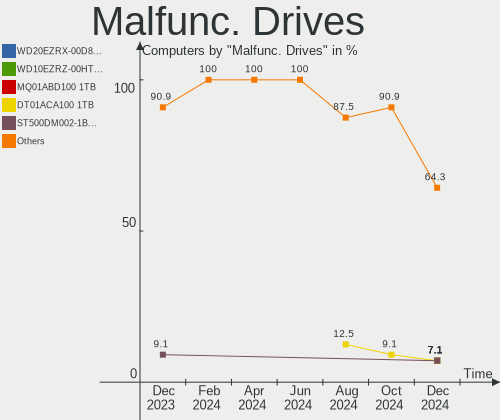
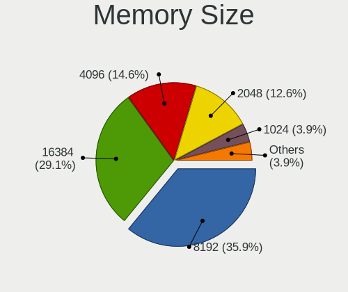
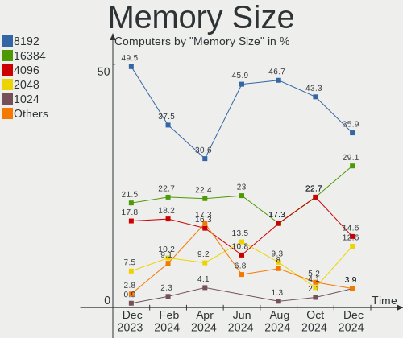

Linux in Spain - Hardware Trends
--------------------------------

A project to identify most popular hardware characteristics and track their change
over time based on data collected by Linux users at https://Linux-Hardware.org.

Anyone can contribute to this report by the [hw-probe](https://github.com/linuxhw/hw-probe) tool:

    sudo -E hw-probe -all -upload

This is a report for all computer types. See also reports for [desktops](/Location/Spain/Desktop/README.md) and [notebooks](/Location/Spain/Notebook/README.md).

Period: Nov, 2023.

Contents
--------

* [ System ](#system)
  - [ OS                       ](#os)
  - [ OS Family                ](#os-family)
  - [ Kernel                   ](#kernel)
  - [ Kernel Family            ](#kernel-family)
  - [ Kernel Major Ver.        ](#kernel-major-ver)
  - [ Arch                     ](#arch)
  - [ DE                       ](#de)
  - [ Display Server           ](#display-server)
  - [ Display Manager          ](#display-manager)
  - [ OS Lang                  ](#os-lang)
  - [ Boot Mode                ](#boot-mode)
  - [ Filesystem               ](#filesystem)
  - [ Part. scheme             ](#part-scheme)
  - [ Dual Boot with Linux/BSD ](#dual-boot-with-linuxbsd)
  - [ Dual Boot (Win)          ](#dual-boot-win)

* [ Board ](#board)
  - [ Vendor                   ](#vendor)
  - [ Model                    ](#model)
  - [ Model Family             ](#model-family)
  - [ MFG Year                 ](#mfg-year)
  - [ Form Factor              ](#form-factor)
  - [ Secure Boot              ](#secure-boot)
  - [ Coreboot                 ](#coreboot)
  - [ RAM Size                 ](#ram-size)
  - [ RAM Used                 ](#ram-used)
  - [ Total Drives             ](#total-drives)
  - [ Has CD-ROM               ](#has-cd-rom)
  - [ Has Ethernet             ](#has-ethernet)
  - [ Has WiFi                 ](#has-wifi)
  - [ Has Bluetooth            ](#has-bluetooth)

* [ Location ](#location)
  - [ Country                  ](#country)
  - [ City                     ](#city)

* [ Drives ](#drives)
  - [ Drive Vendor             ](#drive-vendor)
  - [ Drive Model              ](#drive-model)
  - [ HDD Vendor               ](#hdd-vendor)
  - [ SSD Vendor               ](#ssd-vendor)
  - [ Drive Kind               ](#drive-kind)
  - [ Drive Connector          ](#drive-connector)
  - [ Drive Size               ](#drive-size)
  - [ Space Total              ](#space-total)
  - [ Space Used               ](#space-used)
  - [ Malfunc. Drives          ](#malfunc-drives)
  - [ Malfunc. Drive Vendor    ](#malfunc-drive-vendor)
  - [ Malfunc. HDD Vendor      ](#malfunc-hdd-vendor)
  - [ Malfunc. Drive Kind      ](#malfunc-drive-kind)
  - [ Failed Drives            ](#failed-drives)
  - [ Failed Drive Vendor      ](#failed-drive-vendor)
  - [ Drive Status             ](#drive-status)

* [ Storage controller ](#storage-controller)
  - [ Storage Vendor           ](#storage-vendor)
  - [ Storage Model            ](#storage-model)
  - [ Storage Kind             ](#storage-kind)

* [ Processor ](#processor)
  - [ CPU Vendor               ](#cpu-vendor)
  - [ CPU Model                ](#cpu-model)
  - [ CPU Model Family         ](#cpu-model-family)
  - [ CPU Cores                ](#cpu-cores)
  - [ CPU Sockets              ](#cpu-sockets)
  - [ CPU Threads              ](#cpu-threads)
  - [ CPU Op-Modes             ](#cpu-op-modes)
  - [ CPU Microcode            ](#cpu-microcode)
  - [ CPU Microarch            ](#cpu-microarch)

* [ Graphics ](#graphics)
  - [ GPU Vendor               ](#gpu-vendor)
  - [ GPU Model                ](#gpu-model)
  - [ GPU Combo                ](#gpu-combo)
  - [ GPU Driver               ](#gpu-driver)
  - [ GPU Memory               ](#gpu-memory)

* [ Monitor ](#monitor)
  - [ Monitor Vendor           ](#monitor-vendor)
  - [ Monitor Model            ](#monitor-model)
  - [ Monitor Resolution       ](#monitor-resolution)
  - [ Monitor Diagonal         ](#monitor-diagonal)
  - [ Monitor Width            ](#monitor-width)
  - [ Aspect Ratio             ](#aspect-ratio)
  - [ Monitor Area             ](#monitor-area)
  - [ Pixel Density            ](#pixel-density)
  - [ Multiple Monitors        ](#multiple-monitors)

* [ Network ](#network)
  - [ Net Controller Vendor    ](#net-controller-vendor)
  - [ Net Controller Model     ](#net-controller-model)
  - [ Wireless Vendor          ](#wireless-vendor)
  - [ Wireless Model           ](#wireless-model)
  - [ Ethernet Vendor          ](#ethernet-vendor)
  - [ Ethernet Model           ](#ethernet-model)
  - [ Net Controller Kind      ](#net-controller-kind)
  - [ Used Controller          ](#used-controller)
  - [ NICs                     ](#nics)
  - [ IPv6                     ](#ipv6)

* [ Bluetooth ](#bluetooth)
  - [ Bluetooth Vendor         ](#bluetooth-vendor)
  - [ Bluetooth Model          ](#bluetooth-model)

* [ Sound ](#sound)
  - [ Sound Vendor             ](#sound-vendor)
  - [ Sound Model              ](#sound-model)

* [ Memory ](#memory)
  - [ Memory Vendor            ](#memory-vendor)
  - [ Memory Model             ](#memory-model)
  - [ Memory Kind              ](#memory-kind)
  - [ Memory Form Factor       ](#memory-form-factor)
  - [ Memory Size              ](#memory-size)
  - [ Memory Speed             ](#memory-speed)

* [ Printers & scanners ](#printers--scanners)
  - [ Printer Vendor           ](#printer-vendor)
  - [ Printer Model            ](#printer-model)
  - [ Scanner Vendor           ](#scanner-vendor)
  - [ Scanner Model            ](#scanner-model)

* [ Camera ](#camera)
  - [ Camera Vendor            ](#camera-vendor)
  - [ Camera Model             ](#camera-model)

* [ Security ](#security)
  - [ Fingerprint Vendor       ](#fingerprint-vendor)
  - [ Fingerprint Model        ](#fingerprint-model)
  - [ Chipcard Vendor          ](#chipcard-vendor)
  - [ Chipcard Model           ](#chipcard-model)

* [ Unsupported ](#unsupported)
  - [ Unsupported Devices      ](#unsupported-devices)
  - [ Unsupported Device Types ](#unsupported-device-types)

System
------

OS
--

Installed operating systems

| Name                         | Computers | Percent |
|------------------------------|-----------|---------|
| Ubuntu 22.04                 | 37        | 22.29%  |
| Debian 12                    | 14        | 8.43%   |
| Linux Mint 21.2              | 11        | 6.63%   |
| Fedora 39                    | 11        | 6.63%   |
| Ubuntu 23.10                 | 9         | 5.42%   |
| Fedora 38                    | 7         | 4.22%   |
| OpenMandriva 5.0             | 6         | 3.61%   |
| Zorin 16                     | 5         | 3.01%   |
| OpenMandriva 23.08           | 5         | 3.01%   |
| Kubuntu 23.10                | 4         | 2.41%   |
| ArcoLinux Rolling            | 4         | 2.41%   |
| Arch Rolling                 | 4         | 2.41%   |
| OpenMandriva 23.11           | 3         | 1.81%   |
| Kali 2023.3                  | 3         | 1.81%   |
| Gentoo 2.14                  | 3         | 1.81%   |
| Debian 11                    | 3         | 1.81%   |
| openSUSE Tumbleweed-XXXXXXXX | 2         | 1.2%    |
| OpenMandriva 4.2             | 2         | 1.2%    |
| Manjaro                      | 2         | 1.2%    |
| LMDE 6                       | 2         | 1.2%    |
| Kubuntu 22.04                | 2         | 1.2%    |
| EndeavourOS Rolling          | 2         | 1.2%    |
| Debian                       | 2         | 1.2%    |
| Xubuntu 22.04                | 1         | 0.6%    |
| Xero Rolling                 | 1         | 0.6%    |
| Ubuntu 23.04                 | 1         | 0.6%    |
| Ubuntu 22.10                 | 1         | 0.6%    |
| Ubuntu 21.10                 | 1         | 0.6%    |
| Ubuntu 20.04                 | 1         | 0.6%    |
| SteamOS 3.5.5                | 1         | 0.6%    |
| Pop!_OS 22.04                | 1         | 0.6%    |
| openSUSE Leap-15.5           | 1         | 0.6%    |
| OpenMandriva 23.10           | 1         | 0.6%    |
| OpenMandriva 23.01           | 1         | 0.6%    |
| Nobara 38                    | 1         | 0.6%    |
| Linux Mint 21                | 1         | 0.6%    |
| KDE neon 22.04               | 1         | 0.6%    |
| Fedora 33                    | 1         | 0.6%    |
| Endless 5.0.6                | 1         | 0.6%    |
| Endless 4.0.14               | 1         | 0.6%    |

OS Family
---------

OS without a version

| Name         | Computers | Percent |
|--------------|-----------|---------|
| Ubuntu       | 50        | 30.12%  |
| Fedora       | 19        | 11.45%  |
| Debian       | 19        | 11.45%  |
| OpenMandriva | 18        | 10.84%  |
| Linux Mint   | 12        | 7.23%   |
| Kubuntu      | 6         | 3.61%   |
| Zorin        | 5         | 3.01%   |
| ArcoLinux    | 5         | 3.01%   |
| Arch         | 4         | 2.41%   |
| openSUSE     | 3         | 1.81%   |
| Kali         | 3         | 1.81%   |
| Gentoo       | 3         | 1.81%   |
| Manjaro      | 2         | 1.2%    |
| LMDE         | 2         | 1.2%    |
| Endless      | 2         | 1.2%    |
| EndeavourOS  | 2         | 1.2%    |
| Xubuntu      | 1         | 0.6%    |
| Xero         | 1         | 0.6%    |
| SteamOS      | 1         | 0.6%    |
| Pop!_OS      | 1         | 0.6%    |
| Nobara       | 1         | 0.6%    |
| KDE neon     | 1         | 0.6%    |
| Elementary   | 1         | 0.6%    |
| Devuan       | 1         | 0.6%    |
| ChimeraOS    | 1         | 0.6%    |
| BunsenLabs   | 1         | 0.6%    |
| blendOS      | 1         | 0.6%    |

Kernel
------

Version of the Linux kernel

| Version                      | Computers | Percent |
|------------------------------|-----------|---------|
| 6.2.0-36-generic             | 24        | 14.46%  |
| 6.1.0-13-amd64               | 16        | 9.64%   |
| 6.2.0-37-generic             | 12        | 7.23%   |
| 6.5.0-10-generic             | 9         | 5.42%   |
| 5.15.0-88-generic            | 8         | 4.82%   |
| 6.5.11-300.fc39.x86_64       | 6         | 3.61%   |
| 6.6.2-desktop-1omv2390       | 5         | 3.01%   |
| 6.6.1-arch1-1                | 5         | 3.01%   |
| 6.4.11-desktop-1omv2390      | 5         | 3.01%   |
| 5.15.0-89-generic            | 5         | 3.01%   |
| 6.5.8-200.fc38.x86_64        | 4         | 2.41%   |
| 6.5.9-arch2-1                | 3         | 1.81%   |
| 6.5.0-kali3-amd64            | 3         | 1.81%   |
| 6.2.0-26-generic             | 3         | 1.81%   |
| 6.6.0-desktop-1omv2390       | 2         | 1.2%    |
| 6.5.10-300.fc39.x86_64       | 2         | 1.2%    |
| 6.5.10-200.fc38.x86_64       | 2         | 1.2%    |
| 6.5.0-13-generic             | 2         | 1.2%    |
| 6.1.61-1-lts                 | 2         | 1.2%    |
| 5.15.0-87-generic            | 2         | 1.2%    |
| 5.10.14-desktop-1omv4002     | 2         | 1.2%    |
| 5.10.0-26-amd64              | 2         | 1.2%    |
| 6.7.0-desktop-0.rc2.1omv2390 | 1         | 0.6%    |
| 6.6.2-arch1-1                | 1         | 0.6%    |
| 6.6.2-1-default              | 1         | 0.6%    |
| 6.6.1-desktop-1omv2390       | 1         | 0.6%    |
| 6.6.1-55.g1fcc265-default    | 1         | 0.6%    |
| 6.6.1-060601-generic         | 1         | 0.6%    |
| 6.6.0-gentoo-Ryzen           | 1         | 0.6%    |
| 6.6.0-gentoo                 | 1         | 0.6%    |
| 6.6.0-1-MANJARO              | 1         | 0.6%    |
| 6.5.9-300.fc39.x86_64        | 1         | 0.6%    |
| 6.5.9-200.fc38.x86_64        | 1         | 0.6%    |
| 6.5.6-chos1-chimeraos-1      | 1         | 0.6%    |
| 6.5.6-76060506-generic       | 1         | 0.6%    |
| 6.5.6-300.fc39.x86_64        | 1         | 0.6%    |
| 6.5.5-zen1-1-zen             | 1         | 0.6%    |
| 6.5.5-desktop-1omv2390       | 1         | 0.6%    |
| 6.5.4-060504-generic         | 1         | 0.6%    |
| 6.5.12-300.fc39.x86_64       | 1         | 0.6%    |

Kernel Family
-------------

Linux kernel without a distro release

| Version | Computers | Percent |
|---------|-----------|---------|
| 6.2.0   | 41        | 24.7%   |
| 5.15.0  | 19        | 11.45%  |
| 6.5.0   | 17        | 10.24%  |
| 6.1.0   | 17        | 10.24%  |
| 6.5.11  | 9         | 5.42%   |
| 6.6.1   | 8         | 4.82%   |
| 6.6.2   | 7         | 4.22%   |
| 6.6.0   | 5         | 3.01%   |
| 6.5.9   | 5         | 3.01%   |
| 6.4.11  | 5         | 3.01%   |
| 6.5.8   | 4         | 2.41%   |
| 6.5.10  | 4         | 2.41%   |
| 5.10.0  | 4         | 2.41%   |
| 6.5.6   | 3         | 1.81%   |
| 6.5.5   | 2         | 1.2%    |
| 6.1.61  | 2         | 1.2%    |
| 5.10.14 | 2         | 1.2%    |
| 6.7.0   | 1         | 0.6%    |
| 6.5.4   | 1         | 0.6%    |
| 6.5.12  | 1         | 0.6%    |
| 6.1.57  | 1         | 0.6%    |
| 6.1.52  | 1         | 0.6%    |
| 6.1.1   | 1         | 0.6%    |
| 5.19.0  | 1         | 0.6%    |
| 5.14.21 | 1         | 0.6%    |
| 5.14.18 | 1         | 0.6%    |
| 5.14.0  | 1         | 0.6%    |
| 5.13.0  | 1         | 0.6%    |
| 5.11.0  | 1         | 0.6%    |

Kernel Major Ver.
-----------------

Linux kernel major version

| Version | Computers | Percent |
|---------|-----------|---------|
| 6.5     | 46        | 27.71%  |
| 6.2     | 41        | 24.7%   |
| 6.1     | 22        | 13.25%  |
| 6.6     | 20        | 12.05%  |
| 5.15    | 19        | 11.45%  |
| 5.10    | 6         | 3.61%   |
| 6.4     | 5         | 3.01%   |
| 5.14    | 3         | 1.81%   |
| 6.7     | 1         | 0.6%    |
| 5.19    | 1         | 0.6%    |
| 5.13    | 1         | 0.6%    |
| 5.11    | 1         | 0.6%    |

Arch
----

OS architecture (x86_64, i586, etc.)

| Name   | Computers | Percent |
|--------|-----------|---------|
| x86_64 | 166       | 100%    |

DE
--

Desktop Environment

| Name          | Computers | Percent |
|---------------|-----------|---------|
| GNOME         | 84        | 50.6%   |
| KDE5          | 43        | 25.9%   |
| X-Cinnamon    | 13        | 7.83%   |
| XFCE          | 8         | 4.82%   |
| MATE          | 3         | 1.81%   |
| LXQt          | 3         | 1.81%   |
| Deepin        | 2         | 1.2%    |
| Unknown       | 2         | 1.2%    |
| Pantheon      | 1         | 0.6%    |
| openbox       | 1         | 0.6%    |
| LXDE          | 1         | 0.6%    |
| KDE           | 1         | 0.6%    |
| i3            | 1         | 0.6%    |
| Endless:GNOME | 1         | 0.6%    |
| BunsenLabs    | 1         | 0.6%    |
| Budgie        | 1         | 0.6%    |

Display Server
--------------

X11 or Wayland

| Name    | Computers | Percent |
|---------|-----------|---------|
| X11     | 84        | 50.6%   |
| Wayland | 74        | 44.58%  |
| Tty     | 5         | 3.01%   |
| Unknown | 3         | 1.81%   |

Display Manager
---------------

SDDM, LightDM, etc.

| Name    | Computers | Percent |
|---------|-----------|---------|
| Unknown | 58        | 34.94%  |
| GDM3    | 50        | 30.12%  |
| SDDM    | 33        | 19.88%  |
| LightDM | 18        | 10.84%  |
| GDM     | 6         | 3.61%   |
| KDM     | 1         | 0.6%    |

OS Lang
-------

Language

| Lang       | Computers | Percent |
|------------|-----------|---------|
| es_ES      | 106       | 63.86%  |
| en_US      | 31        | 18.67%  |
| ca_ES      | 6         | 3.61%   |
| C          | 6         | 3.61%   |
| en_GB      | 4         | 2.41%   |
| de_DE      | 3         | 1.81%   |
| fr_FR      | 2         | 1.2%    |
| es_AR      | 2         | 1.2%    |
| Unknown    | 2         | 1.2%    |
| pl_PL      | 1         | 0.6%    |
| gl_ES      | 1         | 0.6%    |
| eu_ES      | 1         | 0.6%    |
| es_ES.UTF8 | 1         | 0.6%    |

Boot Mode
---------

EFI or BIOS

| Mode | Computers | Percent |
|------|-----------|---------|
| EFI  | 96        | 57.83%  |
| BIOS | 70        | 42.17%  |

Filesystem
----------

Type of filesystem

| Type    | Computers | Percent |
|---------|-----------|---------|
| Ext4    | 95        | 57.23%  |
| Btrfs   | 30        | 18.07%  |
| Tmpfs   | 25        | 15.06%  |
| Overlay | 12        | 7.23%   |
| Xfs     | 4         | 2.41%   |

Part. scheme
------------

Scheme of partitioning

| Type    | Computers | Percent |
|---------|-----------|---------|
| GPT     | 101       | 60.84%  |
| Unknown | 53        | 31.93%  |
| MBR     | 12        | 7.23%   |

Dual Boot with Linux/BSD
------------------------

Hosting more than one Linux/BSD

| Dual boot | Computers | Percent |
|-----------|-----------|---------|
| No        | 141       | 84.94%  |
| Yes       | 25        | 15.06%  |

Dual Boot (Win)
---------------

Hosting Linux and Windows

| Dual boot | Computers | Percent |
|-----------|-----------|---------|
| No        | 114       | 68.67%  |
| Yes       | 52        | 31.33%  |

Board
-----

Vendor
------

Motherboard manufacturer

| Name                                 | Computers | Percent |
|--------------------------------------|-----------|---------|
| ASUSTek Computer                     | 31        | 18.67%  |
| Lenovo                               | 28        | 16.87%  |
| MSI                                  | 25        | 15.06%  |
| Hewlett-Packard                      | 25        | 15.06%  |
| Gigabyte Technology                  | 11        | 6.63%   |
| Dell                                 | 8         | 4.82%   |
| Toshiba                              | 3         | 1.81%   |
| ASRock                               | 3         | 1.81%   |
| Apple                                | 3         | 1.81%   |
| Acer                                 | 3         | 1.81%   |
| Unknown                              | 3         | 1.81%   |
| Shenzhen Meigao Electronic Equipment | 2         | 1.2%    |
| Intel                                | 2         | 1.2%    |
| AZW                                  | 2         | 1.2%    |
| AMI                                  | 2         | 1.2%    |
| Alurin                               | 2         | 1.2%    |
| Valve                                | 1         | 0.6%    |
| Trigkey                              | 1         | 0.6%    |
| Star Labs                            | 1         | 0.6%    |
| Sony                                 | 1         | 0.6%    |
| Shuttle                              | 1         | 0.6%    |
| SHENZHEN YOUDISI E-COMMERCE          | 1         | 0.6%    |
| Microsoft                            | 1         | 0.6%    |
| LG Electronics                       | 1         | 0.6%    |
| HONOR                                | 1         | 0.6%    |
| Chuwi                                | 1         | 0.6%    |
| Allview                              | 1         | 0.6%    |
| ALLDOCUBE                            | 1         | 0.6%    |
| Adreamer                             | 1         | 0.6%    |

Model
-----

Motherboard model

| Name                                       | Computers | Percent |
|--------------------------------------------|-----------|---------|
| Unknown                                    | 3         | 1.81%   |
| MSI MS-7971                                | 2         | 1.2%    |
| Gigabyte H61M-DS2                          | 2         | 1.2%    |
| ASUS VivoBook_ASUSLaptop M1502YA_M1502YA   | 2         | 1.2%    |
| ASUS TUF Gaming X570-PRO                   | 2         | 1.2%    |
| ASUS H110M-D                               | 2         | 1.2%    |
| ASUS All Series                            | 2         | 1.2%    |
| Valve Jupiter                              | 1         | 0.6%    |
| Trigkey S5                                 | 1         | 0.6%    |
| Toshiba TECRA R950                         | 1         | 0.6%    |
| Toshiba PORTEGE Z30-B                      | 1         | 0.6%    |
| Toshiba PORTEGE Z30-A                      | 1         | 0.6%    |
| Star Labs Lite                             | 1         | 0.6%    |
| Sony VPCEB1J8E                             | 1         | 0.6%    |
| Shuttle SH87R                              | 1         | 0.6%    |
| SHENZHEN YOUDISI E-COMMERCE XBOOK-3        | 1         | 0.6%    |
| Shenzhen Meigao Electronic Equipment UM690 | 1         | 0.6%    |
| Shenzhen Meigao Electronic Equipment F7BSC | 1         | 0.6%    |
| MSI Pulse GL76 12UEK                       | 1         | 0.6%    |
| MSI Pulse GL66 12UEK                       | 1         | 0.6%    |
| MSI Prestige 16Studio A13VF                | 1         | 0.6%    |
| MSI Prestige 15 A10SC                      | 1         | 0.6%    |
| MSI Prestige 14 A11SCS                     | 1         | 0.6%    |
| MSI Prestige 14 A10SC                      | 1         | 0.6%    |
| MSI MS-7E26                                | 1         | 0.6%    |
| MSI MS-7D38                                | 1         | 0.6%    |
| MSI MS-7D18                                | 1         | 0.6%    |
| MSI MS-7C75                                | 1         | 0.6%    |
| MSI MS-7C37                                | 1         | 0.6%    |
| MSI MS-7B93                                | 1         | 0.6%    |
| MSI MS-7B86                                | 1         | 0.6%    |
| MSI MS-7B85                                | 1         | 0.6%    |
| MSI MS-7B79                                | 1         | 0.6%    |
| MSI MS-7B24                                | 1         | 0.6%    |
| MSI MS-7994                                | 1         | 0.6%    |
| MSI MS-7976                                | 1         | 0.6%    |
| MSI MS-7636                                | 1         | 0.6%    |
| MSI Modern 15 B7M                          | 1         | 0.6%    |
| MSI KBL-U Pro Cubi 3 Silent S (MS-B159)    | 1         | 0.6%    |
| MSI GF75 Thin 10SC                         | 1         | 0.6%    |

Model Family
------------

Motherboard model prefix

| Name                                       | Computers | Percent |
|--------------------------------------------|-----------|---------|
| Lenovo ThinkPad                            | 11        | 6.63%   |
| ASUS Vivobook                              | 5         | 3.01%   |
| ASUS TUF                                   | 5         | 3.01%   |
| ASUS ROG                                   | 5         | 3.01%   |
| MSI Prestige                               | 4         | 2.41%   |
| HP Compaq                                  | 4         | 2.41%   |
| Lenovo IdeaPad                             | 3         | 1.81%   |
| HP Pavilion                                | 3         | 1.81%   |
| HP EliteDesk                               | 3         | 1.81%   |
| Dell Latitude                              | 3         | 1.81%   |
| Unknown                                    | 3         | 1.81%   |
| Toshiba PORTEGE                            | 2         | 1.2%    |
| MSI Pulse                                  | 2         | 1.2%    |
| MSI MS-7971                                | 2         | 1.2%    |
| Lenovo Yoga                                | 2         | 1.2%    |
| Lenovo ThinkCentre                         | 2         | 1.2%    |
| Lenovo Legion                              | 2         | 1.2%    |
| HP ProBook                                 | 2         | 1.2%    |
| HP Laptop                                  | 2         | 1.2%    |
| HP ENVY                                    | 2         | 1.2%    |
| Gigabyte H61M-DS2                          | 2         | 1.2%    |
| Gigabyte B450M                             | 2         | 1.2%    |
| ASUS H110M-D                               | 2         | 1.2%    |
| ASUS All                                   | 2         | 1.2%    |
| Acer Aspire                                | 2         | 1.2%    |
| Valve Jupiter                              | 1         | 0.6%    |
| Trigkey S5                                 | 1         | 0.6%    |
| Toshiba TECRA                              | 1         | 0.6%    |
| Star Labs Lite                             | 1         | 0.6%    |
| Sony VPCEB1J8E                             | 1         | 0.6%    |
| Shuttle SH87R                              | 1         | 0.6%    |
| SHENZHEN YOUDISI E-COMMERCE XBOOK-3        | 1         | 0.6%    |
| Shenzhen Meigao Electronic Equipment UM690 | 1         | 0.6%    |
| Shenzhen Meigao Electronic Equipment F7BSC | 1         | 0.6%    |
| MSI MS-7E26                                | 1         | 0.6%    |
| MSI MS-7D38                                | 1         | 0.6%    |
| MSI MS-7D18                                | 1         | 0.6%    |
| MSI MS-7C75                                | 1         | 0.6%    |
| MSI MS-7C37                                | 1         | 0.6%    |
| MSI MS-7B93                                | 1         | 0.6%    |

MFG Year
--------

Motherboard manufacture year

| Year | Computers | Percent |
|------|-----------|---------|
| 2023 | 20        | 12.05%  |
| 2021 | 19        | 11.45%  |
| 2022 | 17        | 10.24%  |
| 2019 | 17        | 10.24%  |
| 2020 | 13        | 7.83%   |
| 2015 | 11        | 6.63%   |
| 2013 | 11        | 6.63%   |
| 2018 | 10        | 6.02%   |
| 2012 | 9         | 5.42%   |
| 2014 | 8         | 4.82%   |
| 2017 | 6         | 3.61%   |
| 2016 | 6         | 3.61%   |
| 2011 | 5         | 3.01%   |
| 2009 | 4         | 2.41%   |
| 2010 | 3         | 1.81%   |
| 2008 | 3         | 1.81%   |
| 2007 | 3         | 1.81%   |
| 2006 | 1         | 0.6%    |

Form Factor
-----------

Physical design of the computer

| Name        | Computers | Percent |
|-------------|-----------|---------|
| Notebook    | 85        | 51.2%   |
| Desktop     | 70        | 42.17%  |
| Mini pc     | 5         | 3.01%   |
| Tablet      | 2         | 1.2%    |
| Convertible | 2         | 1.2%    |
| All in one  | 2         | 1.2%    |

Secure Boot
-----------

Enabled or disabled

| State    | Computers | Percent |
|----------|-----------|---------|
| Disabled | 150       | 90.36%  |
| Enabled  | 16        | 9.64%   |

Coreboot
--------

Have coreboot on board

| Used | Computers | Percent |
|------|-----------|---------|
| No   | 166       | 100%    |

RAM Size
--------

Total RAM memory

| Size in GB      | Computers | Percent |
|-----------------|-----------|---------|
| 4.01-8.0        | 41        | 24.7%   |
| 8.01-16.0       | 34        | 20.48%  |
| 16.01-24.0      | 30        | 18.07%  |
| 32.01-64.0      | 28        | 16.87%  |
| 3.01-4.0        | 22        | 13.25%  |
| 64.01-256.0     | 5         | 3.01%   |
| 24.01-32.0      | 4         | 2.41%   |
| More than 256.0 | 1         | 0.6%    |
| 2.01-3.0        | 1         | 0.6%    |

RAM Used
--------

Used RAM memory

| Used GB    | Computers | Percent |
|------------|-----------|---------|
| 1.01-2.0   | 43        | 25.9%   |
| 4.01-8.0   | 39        | 23.49%  |
| 2.01-3.0   | 37        | 22.29%  |
| 3.01-4.0   | 31        | 18.67%  |
| 8.01-16.0  | 7         | 4.22%   |
| 16.01-24.0 | 4         | 2.41%   |
| 0.51-1.0   | 3         | 1.81%   |
| 0.01-0.5   | 2         | 1.2%    |

Total Drives
------------

Number of drives on board

| Drives | Computers | Percent |
|--------|-----------|---------|
| 1      | 96        | 57.83%  |
| 2      | 38        | 22.89%  |
| 3      | 14        | 8.43%   |
| 5      | 8         | 4.82%   |
| 4      | 7         | 4.22%   |
| 9      | 1         | 0.6%    |
| 6      | 1         | 0.6%    |
| 0      | 1         | 0.6%    |

Has CD-ROM
----------

Has CD-ROM on board

| Presented | Computers | Percent |
|-----------|-----------|---------|
| No        | 125       | 75.3%   |
| Yes       | 41        | 24.7%   |

Has Ethernet
------------

Has Ethernet on board

| Presented | Computers | Percent |
|-----------|-----------|---------|
| Yes       | 133       | 80.12%  |
| No        | 33        | 19.88%  |

Has WiFi
--------

Has WiFi module

| Presented | Computers | Percent |
|-----------|-----------|---------|
| Yes       | 134       | 80.72%  |
| No        | 32        | 19.28%  |

Has Bluetooth
-------------

Has Bluetooth module

| Presented | Computers | Percent |
|-----------|-----------|---------|
| Yes       | 112       | 67.47%  |
| No        | 54        | 32.53%  |

Location
--------

Country
-------

Geographic location (country)

| Country | Computers | Percent |
|---------|-----------|---------|
| Spain   | 166       | 100%    |

City
----

Geographic location (city)

| City                      | Computers | Percent |
|---------------------------|-----------|---------|
| Madrid                    | 27        | 16.27%  |
| Barcelona                 | 19        | 11.45%  |
| Valencia                  | 11        | 6.63%   |
| Sabadell                  | 5         | 3.01%   |
| Alicante                  | 5         | 3.01%   |
| Zaragoza                  | 4         | 2.41%   |
| Seville                   | 4         | 2.41%   |
| Palma                     | 4         | 2.41%   |
| Santander                 | 3         | 1.81%   |
| Granada                   | 3         | 1.81%   |
| A Coruña                 | 3         | 1.81%   |
| Torrent                   | 2         | 1.2%    |
| Oviedo                    | 2         | 1.2%    |
| Lugo                      | 2         | 1.2%    |
| Lleida                    | 2         | 1.2%    |
| Guadalajara               | 2         | 1.2%    |
| Córdoba                  | 2         | 1.2%    |
| Xinzo de Limia            | 1         | 0.6%    |
| Vitoria-Gasteiz           | 1         | 0.6%    |
| Vigo                      | 1         | 0.6%    |
| Vallmoll                  | 1         | 0.6%    |
| Valle Gran Rey            | 1         | 0.6%    |
| Valladolid                | 1         | 0.6%    |
| Tres Cantos               | 1         | 0.6%    |
| Torremolinos              | 1         | 0.6%    |
| Telde                     | 1         | 0.6%    |
| Tarragona                 | 1         | 0.6%    |
| Santiago de Compostela    | 1         | 0.6%    |
| Santa Cruz de Tenerife    | 1         | 0.6%    |
| Santa Coloma de Gramenet  | 1         | 0.6%    |
| Sant Vicenç dels Horts   | 1         | 0.6%    |
| Sant Andreu de la Barca   | 1         | 0.6%    |
| Ripollet                  | 1         | 0.6%    |
| Puerto Real               | 1         | 0.6%    |
| Puente La Reina – Gares | 1         | 0.6%    |
| Priego de Cordoba         | 1         | 0.6%    |
| Pontevedra                | 1         | 0.6%    |
| Ponferrada                | 1         | 0.6%    |
| Paracuellos de Jarama     | 1         | 0.6%    |
| Pamplona                  | 1         | 0.6%    |

Drives
------

Drive Vendor
------------

Hard drive vendors

| Vendor                      | Computers | Drives | Percent |
|-----------------------------|-----------|--------|---------|
| Samsung Electronics         | 39        | 49     | 14.89%  |
| WDC                         | 30        | 37     | 11.45%  |
| Seagate                     | 30        | 37     | 11.45%  |
| SanDisk                     | 22        | 27     | 8.4%    |
| Kingston                    | 19        | 20     | 7.25%   |
| Toshiba                     | 14        | 14     | 5.34%   |
| Crucial                     | 14        | 14     | 5.34%   |
| Unknown                     | 11        | 12     | 4.2%    |
| Micron Technology           | 10        | 10     | 3.82%   |
| Intel                       | 7         | 7      | 2.67%   |
| SK hynix                    | 6         | 6      | 2.29%   |
| Hitachi                     | 6         | 6      | 2.29%   |
| Phison Electronics          | 5         | 6      | 1.91%   |
| Kingston Technology Company | 4         | 5      | 1.53%   |
| Fanxiang                    | 4         | 6      | 1.53%   |
| Micron/Crucial Technology   | 3         | 3      | 1.15%   |
| JMicron Technology          | 3         | 3      | 1.15%   |
| China                       | 3         | 8      | 1.15%   |
| Silicon Motion              | 2         | 2      | 0.76%   |
| Patriot                     | 2         | 3      | 0.76%   |
| Lexar                       | 2         | 2      | 0.76%   |
| KIOXIA-EXCERIA              | 2         | 2      | 0.76%   |
| VISIPRO                     | 1         | 1      | 0.38%   |
| Timetec                     | 1         | 1      | 0.38%   |
| Star                        | 1         | 1      | 0.38%   |
| SPCC                        | 1         | 1      | 0.38%   |
| Realtek Semiconductor       | 1         | 1      | 0.38%   |
| Netac                       | 1         | 1      | 0.38%   |
| MSI                         | 1         | 1      | 0.38%   |
| Maxtor                      | 1         | 1      | 0.38%   |
| LITEONIT                    | 1         | 1      | 0.38%   |
| LITEON                      | 1         | 1      | 0.38%   |
| LaCie                       | 1         | 1      | 0.38%   |
| KUU                         | 1         | 1      | 0.38%   |
| KIOXIA                      | 1         | 1      | 0.38%   |
| KingDian                    | 1         | 1      | 0.38%   |
| Intenso                     | 1         | 1      | 0.38%   |
| HGST                        | 1         | 1      | 0.38%   |
| Emtec                       | 1         | 1      | 0.38%   |
| Dogfish                     | 1         | 1      | 0.38%   |

Drive Model
-----------

Hard drive models

| Model                                                 | Computers | Percent |
|-------------------------------------------------------|-----------|---------|
| Kingston SA400S37480G 480GB SSD                       | 7         | 2.45%   |
| Samsung NVMe SSD Controller SM981/PM981/PM983 250GB   | 5         | 1.75%   |
| Unknown MMC Card  128GB                               | 4         | 1.4%    |
| SanDisk SSD PLUS 480GB                                | 4         | 1.4%    |
| Samsung NVMe SSD Controller PM9A1/PM9A3/980PRO 2TB    | 4         | 1.4%    |
| Kingston SA400S37240G 240GB SSD                       | 4         | 1.4%    |
| Crucial CT500MX500SSD1 500GB                          | 4         | 1.4%    |
| Sandisk WD Blue SN550 NVMe SSD 512GB                  | 3         | 1.05%   |
| Micron/Crucial P2 NVMe PCIe SSD 1TB                   | 3         | 1.05%   |
| Micron 2400_MTFDKBA512QFM 512GB                       | 3         | 1.05%   |
| Crucial CT1000MX500SSD1 1TB                           | 3         | 1.05%   |
| WDC WDS500G2B0A-00SM50 500GB SSD                      | 2         | 0.7%    |
| Unknown SD/MMC/MS PRO 128GB                           | 2         | 0.7%    |
| Unknown MMC Card  64GB                                | 2         | 0.7%    |
| Toshiba MQ04ABF100 1TB                                | 2         | 0.7%    |
| Toshiba MQ01ABD100 1TB                                | 2         | 0.7%    |
| Toshiba MQ01ABD050 500GB                              | 2         | 0.7%    |
| Silicon Motion SM2263EN/SM2263XT SSD Controller 256GB | 2         | 0.7%    |
| Seagate ST500DM002-1BD142 500GB                       | 2         | 0.7%    |
| Seagate ST31000524AS 1TB                              | 2         | 0.7%    |
| Seagate ST2000DM008-2FR102 2TB                        | 2         | 0.7%    |
| Seagate ST1000LM035-1RK172 1TB                        | 2         | 0.7%    |
| Seagate ST1000DM003-1ER162 1TB                        | 2         | 0.7%    |
| SanDisk SSD PLUS 2000GB                               | 2         | 0.7%    |
| Samsung SSD 980 500GB                                 | 2         | 0.7%    |
| Samsung SSD 870 EVO 1TB                               | 2         | 0.7%    |
| Samsung SSD 860 EVO 500GB                             | 2         | 0.7%    |
| Samsung SSD 850 EVO 500GB                             | 2         | 0.7%    |
| Samsung SSD 850 EVO 250GB                             | 2         | 0.7%    |
| Samsung NVMe SSD Controller SM961/PM961/SM963 256GB   | 2         | 0.7%    |
| Samsung MZVLB1T0HBLR-000H1 1TB                        | 2         | 0.7%    |
| Phison E12 NVMe Controller 512GB                      | 2         | 0.7%    |
| Micron 2450_MTFDKBA1T0TFK 1TB                         | 2         | 0.7%    |
| Kingston SV300S37A240G 240GB SSD                      | 2         | 0.7%    |
| JMicron Generic 250GB                                 | 2         | 0.7%    |
| Intel SSDPEKNU512GZ 512GB                             | 2         | 0.7%    |
| Fanxiang S101 2TB                                     | 2         | 0.7%    |
| Crucial CT2000MX500SSD1 2TB                           | 2         | 0.7%    |
| Crucial CT1000BX500SSD1 1TB                           | 2         | 0.7%    |
| WDC WDS250G2B0B-00YS70 250GB SSD                      | 1         | 0.35%   |

HDD Vendor
----------

Hard disk drive vendors

| Vendor  | Computers | Drives | Percent |
|---------|-----------|--------|---------|
| Seagate | 29        | 36     | 38.67%  |
| WDC     | 24        | 28     | 32%     |
| Toshiba | 10        | 10     | 13.33%  |
| Hitachi | 6         | 6      | 8%      |
| Unknown | 2         | 2      | 2.67%   |
| Maxtor  | 1         | 1      | 1.33%   |
| HGST    | 1         | 1      | 1.33%   |
| CIRAGO  | 1         | 1      | 1.33%   |
| Apple   | 1         | 1      | 1.33%   |

SSD Vendor
----------

Solid state drive vendors

| Vendor              | Computers | Drives | Percent |
|---------------------|-----------|--------|---------|
| Kingston            | 17        | 18     | 18.28%  |
| Samsung Electronics | 14        | 16     | 15.05%  |
| Crucial             | 13        | 13     | 13.98%  |
| SanDisk             | 12        | 12     | 12.9%   |
| WDC                 | 5         | 5      | 5.38%   |
| Fanxiang            | 4         | 6      | 4.3%    |
| China               | 3         | 8      | 3.23%   |
| Toshiba             | 2         | 2      | 2.15%   |
| Patriot             | 2         | 3      | 2.15%   |
| JMicron Technology  | 2         | 2      | 2.15%   |
| VISIPRO             | 1         | 1      | 1.08%   |
| Timetec             | 1         | 1      | 1.08%   |
| Star                | 1         | 1      | 1.08%   |
| SPCC                | 1         | 1      | 1.08%   |
| SK hynix            | 1         | 1      | 1.08%   |
| Netac               | 1         | 1      | 1.08%   |
| Micron Technology   | 1         | 1      | 1.08%   |
| LITEONIT            | 1         | 1      | 1.08%   |
| LITEON              | 1         | 1      | 1.08%   |
| LaCie               | 1         | 1      | 1.08%   |
| KUU                 | 1         | 1      | 1.08%   |
| KIOXIA-EXCERIA      | 1         | 1      | 1.08%   |
| KingDian            | 1         | 1      | 1.08%   |
| Intenso             | 1         | 1      | 1.08%   |
| Intel               | 1         | 1      | 1.08%   |
| Dogfish             | 1         | 1      | 1.08%   |
| BAITITON            | 1         | 1      | 1.08%   |
| AirDisk             | 1         | 1      | 1.08%   |
| A-DATA Technology   | 1         | 1      | 1.08%   |

Drive Kind
----------

HDD or SSD

| Kind    | Computers | Drives | Percent |
|---------|-----------|--------|---------|
| NVMe    | 82        | 99     | 35.5%   |
| SSD     | 78        | 104    | 33.77%  |
| HDD     | 59        | 86     | 25.54%  |
| MMC     | 9         | 11     | 3.9%    |
| Unknown | 3         | 3      | 1.3%    |

Drive Connector
---------------

SATA, SAS, NVMe, etc.

| Type | Computers | Drives | Percent |
|------|-----------|--------|---------|
| SATA | 107       | 182    | 51.44%  |
| NVMe | 81        | 98     | 38.94%  |
| SAS  | 11        | 12     | 5.29%   |
| MMC  | 9         | 11     | 4.33%   |

Drive Size
----------

Size of hard drive

| Size in TB | Computers | Drives | Percent |
|------------|-----------|--------|---------|
| 0.01-0.5   | 77        | 98     | 54.23%  |
| 0.51-1.0   | 42        | 56     | 29.58%  |
| 1.01-2.0   | 12        | 16     | 8.45%   |
| 3.01-4.0   | 6         | 11     | 4.23%   |
| 2.01-3.0   | 3         | 4      | 2.11%   |
| 4.01-10.0  | 2         | 5      | 1.41%   |

Space Total
-----------

Amount of disk space available on the file system

| Size in GB     | Computers | Percent |
|----------------|-----------|---------|
| 251-500        | 38        | 22.89%  |
| 501-1000       | 32        | 19.28%  |
| 101-250        | 30        | 18.07%  |
| More than 3000 | 15        | 9.04%   |
| 1001-2000      | 15        | 9.04%   |
| 1-20           | 13        | 7.83%   |
| 51-100         | 9         | 5.42%   |
| 2001-3000      | 7         | 4.22%   |
| 21-50          | 4         | 2.41%   |
| Unknown        | 3         | 1.81%   |

Space Used
----------

Amount of used disk space

| Used GB        | Computers | Percent |
|----------------|-----------|---------|
| 1-20           | 46        | 27.71%  |
| 21-50          | 32        | 19.28%  |
| 101-250        | 21        | 12.65%  |
| 251-500        | 20        | 12.05%  |
| 51-100         | 16        | 9.64%   |
| 501-1000       | 11        | 6.63%   |
| 1001-2000      | 9         | 5.42%   |
| More than 3000 | 5         | 3.01%   |
| 2001-3000      | 3         | 1.81%   |
| Unknown        | 3         | 1.81%   |

Malfunc. Drives
---------------

Drive models with a malfunction

| Model                                       | Computers | Drives | Percent |
|---------------------------------------------|-----------|--------|---------|
| WDC WD5000LPVX-08V0TT5 500GB                | 1         | 1      | 6.67%   |
| WDC WD5000AAKX-60U6AA0 500GB                | 1         | 1      | 6.67%   |
| WDC WD2500JS-60MHB5 250GB                   | 1         | 1      | 6.67%   |
| WDC WD10EZEX-21WN4A0 1TB                    | 1         | 1      | 6.67%   |
| Toshiba MQ01ABD100 1TB                      | 1         | 1      | 6.67%   |
| Seagate ST9250311CS 250GB                   | 1         | 1      | 6.67%   |
| Seagate ST500LM021-1KJ152 500GB             | 1         | 1      | 6.67%   |
| Seagate ST4000LM024-2AN17V 4TB              | 1         | 1      | 6.67%   |
| Seagate ST3250318AS 250GB                   | 1         | 1      | 6.67%   |
| Seagate ST31000528AS 1TB                    | 1         | 1      | 6.67%   |
| Seagate ST2000DM008-2UB102 2TB              | 1         | 1      | 6.67%   |
| SanDisk SSD PLUS 480GB                      | 1         | 1      | 6.67%   |
| Samsung Electronics SSD 840 EVO 250GB mSATA | 1         | 1      | 6.67%   |
| HGST HTS721010A9E630 1TB                    | 1         | 1      | 6.67%   |
| Crucial CT1000BX500SSD1 1TB                 | 1         | 1      | 6.67%   |

Malfunc. Drive Vendor
---------------------

Vendors of faulty drives

| Vendor              | Computers | Drives | Percent |
|---------------------|-----------|--------|---------|
| Seagate             | 6         | 6      | 40%     |
| WDC                 | 4         | 4      | 26.67%  |
| Toshiba             | 1         | 1      | 6.67%   |
| SanDisk             | 1         | 1      | 6.67%   |
| Samsung Electronics | 1         | 1      | 6.67%   |
| HGST                | 1         | 1      | 6.67%   |
| Crucial             | 1         | 1      | 6.67%   |

Malfunc. HDD Vendor
-------------------

Vendors of faulty HDD drives

| Vendor  | Computers | Drives | Percent |
|---------|-----------|--------|---------|
| Seagate | 6         | 6      | 50%     |
| WDC     | 4         | 4      | 33.33%  |
| Toshiba | 1         | 1      | 8.33%   |
| HGST    | 1         | 1      | 8.33%   |

Malfunc. Drive Kind
-------------------

Kinds of faulty drives

| Kind | Computers | Drives | Percent |
|------|-----------|--------|---------|
| HDD  | 12        | 12     | 80%     |
| SSD  | 3         | 3      | 20%     |

Failed Drives
-------------

Failed drive models

| Model                           | Computers | Drives | Percent |
|---------------------------------|-----------|--------|---------|
| Samsung Electronics SSD 980 1TB | 1         | 1      | 100%    |

Failed Drive Vendor
-------------------

Failed drive vendors

| Vendor              | Computers | Drives | Percent |
|---------------------|-----------|--------|---------|
| Samsung Electronics | 1         | 1      | 100%    |

Drive Status
------------

Number of failed and malfunc. drives

| Status   | Computers | Drives | Percent |
|----------|-----------|--------|---------|
| Detected | 95        | 164    | 50.53%  |
| Works    | 78        | 123    | 41.49%  |
| Malfunc  | 14        | 15     | 7.45%   |
| Failed   | 1         | 1      | 0.53%   |

Storage controller
------------------

Storage Vendor
--------------

Storage controller vendors

| Vendor                       | Computers | Percent |
|------------------------------|-----------|---------|
| Intel                        | 107       | 47.77%  |
| AMD                          | 27        | 12.05%  |
| Samsung Electronics          | 25        | 11.16%  |
| SanDisk                      | 16        | 7.14%   |
| Micron Technology            | 9         | 4.02%   |
| Phison Electronics           | 6         | 2.68%   |
| Kingston Technology Company  | 6         | 2.68%   |
| SK hynix                     | 5         | 2.23%   |
| ASMedia Technology           | 5         | 2.23%   |
| Micron/Crucial Technology    | 4         | 1.79%   |
| Toshiba America Info Systems | 2         | 0.89%   |
| Silicon Motion               | 2         | 0.89%   |
| Nvidia                       | 2         | 0.89%   |
| KIOXIA                       | 2         | 0.89%   |
| Shenzhen Longsys Electronics | 1         | 0.45%   |
| Seagate Technology           | 1         | 0.45%   |
| Realtek Semiconductor        | 1         | 0.45%   |
| MAXIO Technology (Hangzhou)  | 1         | 0.45%   |
| Marvell Technology Group     | 1         | 0.45%   |
| JMicron Technology           | 1         | 0.45%   |

Storage Model
-------------

Storage controller models

| Model                                                                          | Computers | Percent |
|--------------------------------------------------------------------------------|-----------|---------|
| AMD FCH SATA Controller [AHCI mode]                                            | 20        | 8.13%   |
| Intel Q170/Q150/B150/H170/H110/Z170/CM236 Chipset SATA Controller [AHCI Mode]  | 10        | 4.07%   |
| Intel 8 Series/C220 Series Chipset Family 6-port SATA Controller 1 [AHCI mode] | 9         | 3.66%   |
| Intel Sunrise Point-LP SATA Controller [AHCI mode]                             | 8         | 3.25%   |
| Samsung NVMe SSD Controller SM981/PM981/PM983                                  | 7         | 2.85%   |
| Samsung NVMe SSD Controller PM9A1/PM9A3/980PRO                                 | 7         | 2.85%   |
| Intel Celeron/Pentium Silver Processor SATA Controller                         | 7         | 2.85%   |
| Samsung NVMe SSD Controller 980 (DRAM-less)                                    | 6         | 2.44%   |
| Intel 82801 Mobile SATA Controller [RAID mode]                                 | 6         | 2.44%   |
| Intel 8 Series SATA Controller 1 [AHCI mode]                                   | 6         | 2.44%   |
| AMD 400 Series Chipset SATA Controller                                         | 6         | 2.44%   |
| SanDisk Ultra 3D / WD Blue SN550 NVMe SSD                                      | 4         | 1.63%   |
| Micron 2450 NVMe SSD [HendrixV] (DRAM-less)                                    | 4         | 1.63%   |
| Intel Tiger Lake-LP SATA Controller                                            | 4         | 1.63%   |
| Intel 6 Series/C200 Series Chipset Family 6 port Desktop SATA AHCI Controller  | 4         | 1.63%   |
| Intel 5 Series/3400 Series Chipset 4 port SATA AHCI Controller                 | 4         | 1.63%   |
| ASMedia ASM1062 Serial ATA Controller                                          | 4         | 1.63%   |
| SanDisk WD PC SN810 / Black SN850 NVMe SSD                                     | 3         | 1.22%   |
| Samsung NVMe SSD Controller PM9B1 (DRAM-less)                                  | 3         | 1.22%   |
| Micron/Crucial P2 [Nick P2] / P3 / P3 Plus NVMe PCIe SSD (DRAM-less)           | 3         | 1.22%   |
| Micron 2400 NVMe SSD (DRAM-less)                                               | 3         | 1.22%   |
| Intel Volume Management Device NVMe RAID Controller Intel Corporation          | 3         | 1.22%   |
| Intel SSD 670p Series [Keystone Harbor]                                        | 3         | 1.22%   |
| Intel Cannon Lake PCH SATA AHCI Controller                                     | 3         | 1.22%   |
| Intel 7 Series Chipset Family 6-port SATA Controller [AHCI mode]               | 3         | 1.22%   |
| Intel 500 Series Chipset Family SATA AHCI Controller                           | 3         | 1.22%   |
| Intel 200 Series PCH SATA controller [AHCI mode]                               | 3         | 1.22%   |
| AMD 500 Series Chipset SATA Controller                                         | 3         | 1.22%   |
| Silicon Motion SM2263EN/SM2263XT (DRAM-less) NVMe SSD Controllers              | 2         | 0.81%   |
| SanDisk WD Black SN770 / PC SN740 256GB / PC SN560 (DRAM-less) NVMe SSD        | 2         | 0.81%   |
| SanDisk Ultra 3D / WD Blue SN570 NVMe SSD (DRAM-less)                          | 2         | 0.81%   |
| SanDisk Extreme Pro / WD Black SN750 / PC SN730 / Red SN700 NVMe SSD           | 2         | 0.81%   |
| Samsung NVMe SSD Controller SM961/PM961/SM963                                  | 2         | 0.81%   |
| Phison PS5015-E15 PCIe3 NVMe Controller (DRAM-less)                            | 2         | 0.81%   |
| Phison E18 PCIe4 NVMe Controller                                               | 2         | 0.81%   |
| Phison E12 NVMe Controller                                                     | 2         | 0.81%   |
| Nvidia MCP73 IDE Controller                                                    | 2         | 0.81%   |
| Intel Wildcat Point-LP SATA Controller [AHCI Mode]                             | 2         | 0.81%   |
| Intel SSD 660P Series                                                          | 2         | 0.81%   |
| Intel SATA controller                                                          | 2         | 0.81%   |

Storage Kind
------------

Kind of storage controller (IDE, SATA, NVMe, SAS, ...)

| Kind | Computers | Percent |
|------|-----------|---------|
| SATA | 117       | 53.42%  |
| NVMe | 81        | 36.99%  |
| RAID | 11        | 5.02%   |
| IDE  | 10        | 4.57%   |

Processor
---------

CPU Vendor
----------

Processor vendors

| Vendor | Computers | Percent |
|--------|-----------|---------|
| Intel  | 121       | 72.89%  |
| AMD    | 45        | 27.11%  |

CPU Model
---------

Processor models

| Model                                       | Computers | Percent |
|---------------------------------------------|-----------|---------|
| AMD Ryzen 7 3700X 8-Core Processor          | 4         | 2.41%   |
| Intel Core i7-6700K CPU @ 4.00GHz           | 3         | 1.81%   |
| Intel Core i5-6300U CPU @ 2.40GHz           | 3         | 1.81%   |
| AMD Ryzen 7 7730U with Radeon Graphics      | 3         | 1.81%   |
| Intel N100                                  | 2         | 1.2%    |
| Intel Core i7-9750H CPU @ 2.60GHz           | 2         | 1.2%    |
| Intel Core i7-5500U CPU @ 2.40GHz           | 2         | 1.2%    |
| Intel Core i7-10710U CPU @ 1.10GHz          | 2         | 1.2%    |
| Intel Core i5-6400 CPU @ 2.70GHz            | 2         | 1.2%    |
| Intel Core i5-4210M CPU @ 2.60GHz           | 2         | 1.2%    |
| Intel Core i3-4170 CPU @ 3.70GHz            | 2         | 1.2%    |
| Intel Core i3-1005G1 CPU @ 1.20GHz          | 2         | 1.2%    |
| Intel Celeron N4020 CPU @ 1.10GHz           | 2         | 1.2%    |
| Intel Celeron N4000 CPU @ 1.10GHz           | 2         | 1.2%    |
| Intel Atom x5-Z8350 CPU @ 1.44GHz           | 2         | 1.2%    |
| AMD Ryzen 9 5900X 12-Core Processor         | 2         | 1.2%    |
| AMD Ryzen 7 6800H with Radeon Graphics      | 2         | 1.2%    |
| AMD Ryzen 7 5800H with Radeon Graphics      | 2         | 1.2%    |
| AMD Ryzen 7 5700U with Radeon Graphics      | 2         | 1.2%    |
| AMD Ryzen 7 4800H with Radeon Graphics      | 2         | 1.2%    |
| AMD Ryzen 5 5625U with Radeon Graphics      | 2         | 1.2%    |
| Intel Xeon CPU X3430 @ 2.40GHz              | 1         | 0.6%    |
| Intel Xeon CPU E5-2695 v4 @ 2.10GHz         | 1         | 0.6%    |
| Intel Xeon CPU E3-1265L V2 @ 2.50GHz        | 1         | 0.6%    |
| Intel Pentium Silver N5000 CPU @ 1.10GHz    | 1         | 0.6%    |
| Intel Pentium Dual-Core CPU E5700 @ 3.00GHz | 1         | 0.6%    |
| Intel Pentium Dual CPU E2140 @ 1.60GHz      | 1         | 0.6%    |
| Intel Pentium CPU J3710 @ 1.60GHz           | 1         | 0.6%    |
| Intel Pentium CPU G4400 @ 3.30GHz           | 1         | 0.6%    |
| Intel Pentium CPU G3240 @ 3.10GHz           | 1         | 0.6%    |
| Intel Core m5-6Y57 CPU @ 1.10GHz            | 1         | 0.6%    |
| Intel Core i9-10900K CPU @ 3.70GHz          | 1         | 0.6%    |
| Intel Core i7-9700 CPU @ 3.00GHz            | 1         | 0.6%    |
| Intel Core i7-8565U CPU @ 1.80GHz           | 1         | 0.6%    |
| Intel Core i7-7Y75 CPU @ 1.30GHz            | 1         | 0.6%    |
| Intel Core i7-7700 CPU @ 3.60GHz            | 1         | 0.6%    |
| Intel Core i7-6700 CPU @ 3.40GHz            | 1         | 0.6%    |
| Intel Core i7-6500U CPU @ 2.50GHz           | 1         | 0.6%    |
| Intel Core i7-4600M CPU @ 2.90GHz           | 1         | 0.6%    |
| Intel Core i7-4510U CPU @ 2.00GHz           | 1         | 0.6%    |

CPU Model Family
----------------

Processor model prefix

| Model                   | Computers | Percent |
|-------------------------|-----------|---------|
| Intel Core i5           | 32        | 19.28%  |
| Intel Core i7           | 24        | 14.46%  |
| Other                   | 20        | 12.05%  |
| AMD Ryzen 7             | 20        | 12.05%  |
| Intel Core i3           | 18        | 10.84%  |
| Intel Celeron           | 11        | 6.63%   |
| AMD Ryzen 5             | 10        | 6.02%   |
| AMD Ryzen 9             | 6         | 3.61%   |
| Intel Xeon              | 3         | 1.81%   |
| Intel Pentium           | 3         | 1.81%   |
| Intel Core 2 Duo        | 2         | 1.2%    |
| Intel Atom              | 2         | 1.2%    |
| AMD Ryzen 3             | 2         | 1.2%    |
| AMD Phenom              | 2         | 1.2%    |
| Intel Pentium Silver    | 1         | 0.6%    |
| Intel Pentium Dual-Core | 1         | 0.6%    |
| Intel Pentium Dual      | 1         | 0.6%    |
| Intel Core m5           | 1         | 0.6%    |
| Intel Core i9           | 1         | 0.6%    |
| Intel Core 2 Quad       | 1         | 0.6%    |
| Intel Core 2            | 1         | 0.6%    |
| AMD Ryzen 7 PRO         | 1         | 0.6%    |
| AMD FX                  | 1         | 0.6%    |
| AMD E1                  | 1         | 0.6%    |
| AMD A10                 | 1         | 0.6%    |

CPU Cores
---------

Number of processor cores

| Number | Computers | Percent |
|--------|-----------|---------|
| 2      | 61        | 36.75%  |
| 4      | 43        | 25.9%   |
| 8      | 27        | 16.27%  |
| 6      | 18        | 10.84%  |
| 14     | 5         | 3.01%   |
| 12     | 5         | 3.01%   |
| 16     | 2         | 1.2%    |
| 10     | 2         | 1.2%    |
| 36     | 1         | 0.6%    |
| 5      | 1         | 0.6%    |
| 3      | 1         | 0.6%    |

CPU Sockets
-----------

Number of sockets

| Number | Computers | Percent |
|--------|-----------|---------|
| 1      | 165       | 99.4%   |
| 2      | 1         | 0.6%    |

CPU Threads
-----------

Threads per core (Hyper-Threading)

| Number | Computers | Percent |
|--------|-----------|---------|
| 2      | 120       | 72.29%  |
| 1      | 46        | 27.71%  |

CPU Op-Modes
------------

CPU Operation Modes (32-bit, 64-bit)

| Op mode        | Computers | Percent |
|----------------|-----------|---------|
| 32-bit, 64-bit | 166       | 100%    |

CPU Microcode
-------------

Microcode number

| Number     | Computers | Percent |
|------------|-----------|---------|
| Unknown    | 105       | 63.25%  |
| 0x0a50000d | 6         | 3.61%   |
| 0x40651    | 4         | 2.41%   |
| 0x406e3    | 3         | 1.81%   |
| 0x306a9    | 3         | 1.81%   |
| 0x0a404102 | 3         | 1.81%   |
| 0x08600104 | 3         | 1.81%   |
| 0x506e3    | 2         | 1.2%    |
| 0x306c3    | 2         | 1.2%    |
| 0x206a7    | 2         | 1.2%    |
| 0x08701030 | 2         | 1.2%    |
| 0x08701021 | 2         | 1.2%    |
| 0xa0660    | 1         | 0.6%    |
| 0xa0655    | 1         | 0.6%    |
| 0x906ea    | 1         | 0.6%    |
| 0x906e9    | 1         | 0.6%    |
| 0x90675    | 1         | 0.6%    |
| 0x806ec    | 1         | 0.6%    |
| 0x806ea    | 1         | 0.6%    |
| 0x806e9    | 1         | 0.6%    |
| 0x806c1    | 1         | 0.6%    |
| 0x706e5    | 1         | 0.6%    |
| 0x706a8    | 1         | 0.6%    |
| 0x706a1    | 1         | 0.6%    |
| 0x6fd      | 1         | 0.6%    |
| 0x6f6      | 1         | 0.6%    |
| 0x506c9    | 1         | 0.6%    |
| 0x1067a    | 1         | 0.6%    |
| 0x0a50000f | 1         | 0.6%    |
| 0x0a50000c | 1         | 0.6%    |
| 0x0a404101 | 1         | 0.6%    |
| 0x0a20120a | 1         | 0.6%    |
| 0x0a20102b | 1         | 0.6%    |
| 0x0a201009 | 1         | 0.6%    |
| 0x08a00008 | 1         | 0.6%    |
| 0x08608104 | 1         | 0.6%    |
| 0x08608103 | 1         | 0.6%    |
| 0x08001138 | 1         | 0.6%    |
| 0x07030105 | 1         | 0.6%    |
| 0x06003106 | 1         | 0.6%    |

CPU Microarch
-------------

Microarchitecture

| Name             | Computers | Percent |
|------------------|-----------|---------|
| Unknown          | 18        | 10.84%  |
| Skylake          | 17        | 10.24%  |
| KabyLake         | 16        | 9.64%   |
| Haswell          | 15        | 9.04%   |
| Zen 3            | 13        | 7.83%   |
| Zen 2            | 9         | 5.42%   |
| IvyBridge        | 8         | 4.82%   |
| Goldmont plus    | 8         | 4.82%   |
| Alderlake Hybrid | 8         | 4.82%   |
| Westmere         | 6         | 3.61%   |
| SandyBridge      | 6         | 3.61%   |
| CometLake        | 6         | 3.61%   |
| TigerLake        | 5         | 3.01%   |
| Silvermont       | 5         | 3.01%   |
| Icelake          | 4         | 2.41%   |
| Core             | 4         | 2.41%   |
| Zen+             | 3         | 1.81%   |
| Broadwell        | 3         | 1.81%   |
| Penryn           | 2         | 1.2%    |
| K10              | 2         | 1.2%    |
| Zen              | 1         | 0.6%    |
| Tremont          | 1         | 0.6%    |
| Steamroller      | 1         | 0.6%    |
| Puma             | 1         | 0.6%    |
| Nehalem          | 1         | 0.6%    |
| Gracemont        | 1         | 0.6%    |
| Goldmont         | 1         | 0.6%    |
| Excavator        | 1         | 0.6%    |

Graphics
--------

GPU Vendor
----------

Vendors of graphics cards

| Vendor                     | Computers | Percent |
|----------------------------|-----------|---------|
| Intel                      | 96        | 50.26%  |
| Nvidia                     | 49        | 25.65%  |
| AMD                        | 45        | 23.56%  |
| Matrox Electronics Systems | 1         | 0.52%   |

GPU Model
---------

Graphics card models

| Model                                                                                    | Computers | Percent |
|------------------------------------------------------------------------------------------|-----------|---------|
| Intel GeminiLake [UHD Graphics 600]                                                      | 7         | 3.59%   |
| Intel Skylake GT2 [HD Graphics 520]                                                      | 6         | 3.08%   |
| Intel Haswell-ULT Integrated Graphics Controller                                         | 6         | 3.08%   |
| AMD Barcelo                                                                              | 6         | 3.08%   |
| Nvidia TU117M [GeForce GTX 1650 Mobile / Max-Q]                                          | 5         | 2.56%   |
| Intel TigerLake-LP GT2 [Iris Xe Graphics]                                                | 5         | 2.56%   |
| Intel HD Graphics 530                                                                    | 5         | 2.56%   |
| Intel 3rd Gen Core processor Graphics Controller                                         | 5         | 2.56%   |
| Nvidia GA106M [GeForce RTX 3060 Mobile / Max-Q]                                          | 4         | 2.05%   |
| Intel Raptor Lake-P [Iris Xe Graphics]                                                   | 4         | 2.05%   |
| Intel Core Processor Integrated Graphics Controller                                      | 4         | 2.05%   |
| Intel 2nd Generation Core Processor Family Integrated Graphics Controller                | 4         | 2.05%   |
| AMD Rembrandt [Radeon 680M]                                                              | 4         | 2.05%   |
| AMD Polaris 20 XL [Radeon RX 580 2048SP]                                                 | 4         | 2.05%   |
| Intel Xeon E3-1200 v3/4th Gen Core Processor Integrated Graphics Controller              | 3         | 1.54%   |
| Intel CoffeeLake-H GT2 [UHD Graphics 630]                                                | 3         | 1.54%   |
| Intel Atom/Celeron/Pentium Processor x5-E8000/J3xxx/N3xxx Integrated Graphics Controller | 3         | 1.54%   |
| Intel Alder Lake-P GT2 [Iris Xe Graphics]                                                | 3         | 1.54%   |
| Intel 4th Gen Core Processor Integrated Graphics Controller                              | 3         | 1.54%   |
| AMD Renoir [Radeon RX Vega 6 (Ryzen 4000/5000 Mobile Series)]                            | 3         | 1.54%   |
| AMD Lucienne                                                                             | 3         | 1.54%   |
| AMD Ellesmere [Radeon RX 470/480/570/570X/580/580X/590]                                  | 3         | 1.54%   |
| AMD Cezanne [Radeon Vega Series / Radeon Vega Mobile Series]                             | 3         | 1.54%   |
| Nvidia TU116 [GeForce GTX 1650 SUPER]                                                    | 2         | 1.03%   |
| Nvidia GT218 [GeForce 210]                                                               | 2         | 1.03%   |
| Nvidia GP107 [GeForce GTX 1050 Ti]                                                       | 2         | 1.03%   |
| Nvidia GK208B [GeForce GT 730]                                                           | 2         | 1.03%   |
| Nvidia GK208B [GeForce GT 710]                                                           | 2         | 1.03%   |
| Intel Xeon E3-1200 v2/3rd Gen Core processor Graphics Controller                         | 2         | 1.03%   |
| Intel WhiskeyLake-U GT2 [UHD Graphics 620]                                               | 2         | 1.03%   |
| Intel Iris Plus Graphics G1 (Ice Lake)                                                   | 2         | 1.03%   |
| Intel HD Graphics 630                                                                    | 2         | 1.03%   |
| Intel HD Graphics 620                                                                    | 2         | 1.03%   |
| Intel HD Graphics 5500                                                                   | 2         | 1.03%   |
| Intel Comet Lake UHD Graphics                                                            | 2         | 1.03%   |
| Intel Atom Processor Z36xxx/Z37xxx Series Graphics & Display                             | 2         | 1.03%   |
| Intel Alder Lake-P Integrated Graphics Controller                                        | 2         | 1.03%   |
| Intel Alder Lake-N [UHD Graphics]                                                        | 2         | 1.03%   |
| AMD Sun XT [Radeon HD 8670A/8670M/8690M / R5 M330 / M430 / Radeon 520 Mobile]            | 2         | 1.03%   |
| AMD Phoenix1                                                                             | 2         | 1.03%   |

GPU Combo
---------

Combinations of graphics cards

| Name           | Computers | Percent |
|----------------|-----------|---------|
| 1 x Intel      | 74        | 44.58%  |
| 1 x AMD        | 33        | 19.88%  |
| 1 x Nvidia     | 29        | 17.47%  |
| Intel + Nvidia | 16        | 9.64%   |
| 2 x AMD        | 4         | 2.41%   |
| Intel + AMD    | 4         | 2.41%   |
| AMD + Nvidia   | 4         | 2.41%   |
| 2 x Intel      | 1         | 0.6%    |
| 1 x Matrox     | 1         | 0.6%    |

GPU Driver
----------

Free vs proprietary

| Driver      | Computers | Percent |
|-------------|-----------|---------|
| Free        | 129       | 77.71%  |
| Proprietary | 29        | 17.47%  |
| Unknown     | 8         | 4.82%   |

GPU Memory
----------

Total video memory

| Size in GB | Computers | Percent |
|------------|-----------|---------|
| Unknown    | 113       | 68.07%  |
| 3.01-4.0   | 12        | 7.23%   |
| 0.01-0.5   | 11        | 6.63%   |
| 7.01-8.0   | 9         | 5.42%   |
| 1.01-2.0   | 8         | 4.82%   |
| 0.51-1.0   | 5         | 3.01%   |
| 5.01-6.0   | 4         | 2.41%   |
| 32.01-64.0 | 1         | 0.6%    |
| 2.01-3.0   | 1         | 0.6%    |
| 16.01-24.0 | 1         | 0.6%    |
| 8.01-16.0  | 1         | 0.6%    |

Monitor
-------

Monitor Vendor
--------------

Monitor vendors

| Vendor               | Computers | Percent |
|----------------------|-----------|---------|
| Samsung Electronics  | 22        | 12.22%  |
| Chimei Innolux       | 19        | 10.56%  |
| AU Optronics         | 19        | 10.56%  |
| BOE                  | 17        | 9.44%   |
| Goldstar             | 11        | 6.11%   |
| Philips              | 9         | 5%      |
| LG Display           | 9         | 5%      |
| Hewlett-Packard      | 9         | 5%      |
| Dell                 | 8         | 4.44%   |
| Acer                 | 6         | 3.33%   |
| BenQ                 | 5         | 2.78%   |
| AOC                  | 4         | 2.22%   |
| Unknown              | 3         | 1.67%   |
| Sharp                | 3         | 1.67%   |
| PANDA                | 3         | 1.67%   |
| Lenovo               | 3         | 1.67%   |
| HannStar             | 2         | 1.11%   |
| ASUSTek Computer     | 2         | 1.11%   |
| Arzopa               | 2         | 1.11%   |
| Apple                | 2         | 1.11%   |
| Unknown              | 2         | 1.11%   |
| ___                  | 1         | 0.56%   |
| Xiaomi               | 1         | 0.56%   |
| ViewSonic            | 1         | 0.56%   |
| VIE                  | 1         | 0.56%   |
| Valve                | 1         | 0.56%   |
| Sony                 | 1         | 0.56%   |
| S2-Tek               | 1         | 0.56%   |
| MSI                  | 1         | 0.56%   |
| MDP                  | 1         | 0.56%   |
| LG Philips           | 1         | 0.56%   |
| Lenovo Group Limited | 1         | 0.56%   |
| LED                  | 1         | 0.56%   |
| ITE                  | 1         | 0.56%   |
| Gigabyte Technology  | 1         | 0.56%   |
| Fujitsu Siemens      | 1         | 0.56%   |
| FL_                  | 1         | 0.56%   |
| EFL                  | 1         | 0.56%   |
| CVT                  | 1         | 0.56%   |
| CSO                  | 1         | 0.56%   |

Monitor Model
-------------

Monitor models

| Model                                                                  | Computers | Percent |
|------------------------------------------------------------------------|-----------|---------|
| Chimei Innolux LCD Monitor CMN15F5 1920x1080 344x193mm 15.5-inch       | 3         | 1.61%   |
| Philips PHL 273V7 PHLC156 1920x1080 598x336mm 27.0-inch                | 2         | 1.08%   |
| Philips PHL 271V8 PHLC213 1920x1080 598x336mm 27.0-inch                | 2         | 1.08%   |
| LG Display LCD Monitor LGD0521 1920x1080 309x174mm 14.0-inch           | 2         | 1.08%   |
| Goldstar HDR WFHD GSM7714 2560x1080 798x334mm 34.1-inch                | 2         | 1.08%   |
| Goldstar HDR WFHD GSM5BB9 2560x1080 798x334mm 34.1-inch                | 2         | 1.08%   |
| BOE LCD Monitor BOE0747 1920x1080 345x195mm 15.6-inch                  | 2         | 1.08%   |
| AU Optronics LCD Monitor AUOAF90 1920x1080 344x193mm 15.5-inch         | 2         | 1.08%   |
| AU Optronics LCD Monitor AUO71EC 1366x768 344x193mm 15.5-inch          | 2         | 1.08%   |
| Arzopa Ultra 1 GBR0156 1920x1080 346x194mm 15.6-inch                   | 2         | 1.08%   |
| Unknown                                                                | 2         | 1.08%   |
| ___ LCDTV16 ___9000 1360x768                                           | 1         | 0.54%   |
| Xiaomi Mi TV XMD0076 3840x2160 800x450mm 36.1-inch                     | 1         | 0.54%   |
| ViewSonic XG2401 SERIES VSCBB31 1920x1080 531x299mm 24.0-inch          | 1         | 0.54%   |
| VIE IM27VL1 VIE1919 1920x1080 600x330mm 27.0-inch                      | 1         | 0.54%   |
| Valve ANX7530 U VLV3001 800x1280 100x150mm 7.1-inch                    | 1         | 0.54%   |
| Unknown LCD TV 9000 1360x768 1600x900mm 72.3-inch                      | 1         | 0.54%   |
| Unknown LCD Monitor SAMSUNG 1920x1080                                  | 1         | 0.54%   |
| Unknown LCD Monitor FFFF 2288x1287 2550x2550mm 142.0-inch              | 1         | 0.54%   |
| Sony LCD Monitor TV  *00 3840x2160                                     | 1         | 0.54%   |
| Sharp LQ173M1JW08 SHP1544 1920x1080 382x215mm 17.3-inch                | 1         | 0.54%   |
| Sharp LQ133M1JW02 SHP141A 1920x1080 294x165mm 13.3-inch                | 1         | 0.54%   |
| Sharp LCD Monitor SHP146B 3200x1800 294x165mm 13.3-inch                | 1         | 0.54%   |
| Samsung Electronics U28E590 SAM0C4E 3840x2160 608x345mm 27.5-inch      | 1         | 0.54%   |
| Samsung Electronics U28E590 SAM0C4D 3840x2160 610x350mm 27.7-inch      | 1         | 0.54%   |
| Samsung Electronics U28D590 SAM0B81 3840x2160 608x345mm 27.5-inch      | 1         | 0.54%   |
| Samsung Electronics S24F350 SAM0D20 1920x1080 521x293mm 23.5-inch      | 1         | 0.54%   |
| Samsung Electronics S24E450 SAM0C80 1920x1080 520x290mm 23.4-inch      | 1         | 0.54%   |
| Samsung Electronics S24D590 SAM0B47 1920x1080 521x293mm 23.5-inch      | 1         | 0.54%   |
| Samsung Electronics S24D330 SAM0D92 1920x1080 531x299mm 24.0-inch      | 1         | 0.54%   |
| Samsung Electronics S24D300 SAM0B43 1920x1080 531x299mm 24.0-inch      | 1         | 0.54%   |
| Samsung Electronics LF27T35 SAM707F 1920x1080 598x337mm 27.0-inch      | 1         | 0.54%   |
| Samsung Electronics LF24T35 SAM707D 1920x1080 528x297mm 23.9-inch      | 1         | 0.54%   |
| Samsung Electronics LCD Monitor SDC4852 1366x768 344x194mm 15.5-inch   | 1         | 0.54%   |
| Samsung Electronics LCD Monitor SDC418E 1920x1080 344x194mm 15.5-inch  | 1         | 0.54%   |
| Samsung Electronics LCD Monitor SDC4171 2880x1800 302x189mm 14.0-inch  | 1         | 0.54%   |
| Samsung Electronics LCD Monitor SDC415A 3200x1800 293x165mm 13.2-inch  | 1         | 0.54%   |
| Samsung Electronics LCD Monitor SDC4152 2880x1800 302x189mm 14.0-inch  | 1         | 0.54%   |
| Samsung Electronics LCD Monitor SDC3853 2736x1824 260x173mm 12.3-inch  | 1         | 0.54%   |
| Samsung Electronics LCD Monitor SAM71A5 1920x1080 1210x680mm 54.6-inch | 1         | 0.54%   |

Monitor Resolution
------------------

Monitor screen resolution

| Resolution         | Computers | Percent |
|--------------------|-----------|---------|
| 1920x1080 (FHD)    | 83        | 48.54%  |
| 1366x768 (WXGA)    | 22        | 12.87%  |
| 3840x2160 (4K)     | 13        | 7.6%    |
| 2560x1440 (QHD)    | 9         | 5.26%   |
| 1440x900 (WXGA+)   | 6         | 3.51%   |
| 2560x1600          | 5         | 2.92%   |
| 2560x1080          | 5         | 2.92%   |
| 1280x1024 (SXGA)   | 5         | 2.92%   |
| 1920x1200 (WUXGA)  | 4         | 2.34%   |
| 1360x768           | 3         | 1.75%   |
| 3840x1080          | 2         | 1.17%   |
| 2880x1800          | 2         | 1.17%   |
| 1680x1050 (WSXGA+) | 2         | 1.17%   |
| 800x1280           | 1         | 0.58%   |
| 3840x2400          | 1         | 0.58%   |
| 3440x1440          | 1         | 0.58%   |
| 3200x1800 (QHD+)   | 1         | 0.58%   |
| 2736x1824          | 1         | 0.58%   |
| 2288x1287          | 1         | 0.58%   |
| 1920x1280          | 1         | 0.58%   |
| 1600x900 (HD+)     | 1         | 0.58%   |
| 1280x800 (WXGA)    | 1         | 0.58%   |
| Unknown            | 1         | 0.58%   |

Monitor Diagonal
----------------

Diagonal size in inches

| Inches  | Computers | Percent |
|---------|-----------|---------|
| 15      | 43        | 24.02%  |
| 27      | 22        | 12.29%  |
| 13      | 17        | 9.5%    |
| 24      | 14        | 7.82%   |
| 23      | 11        | 6.15%   |
| 14      | 9         | 5.03%   |
| Unknown | 9         | 5.03%   |
| 34      | 7         | 3.91%   |
| 17      | 7         | 3.91%   |
| 19      | 5         | 2.79%   |
| 16      | 5         | 2.79%   |
| 54      | 4         | 2.23%   |
| 31      | 4         | 2.23%   |
| 21      | 4         | 2.23%   |
| 12      | 3         | 1.68%   |
| 42      | 2         | 1.12%   |
| 22      | 2         | 1.12%   |
| 11      | 2         | 1.12%   |
| 142     | 1         | 0.56%   |
| 84      | 1         | 0.56%   |
| 72      | 1         | 0.56%   |
| 48      | 1         | 0.56%   |
| 36      | 1         | 0.56%   |
| 32      | 1         | 0.56%   |
| 20      | 1         | 0.56%   |
| 18      | 1         | 0.56%   |
| 7       | 1         | 0.56%   |

Monitor Width
-------------

Physical width

| Width in mm    | Computers | Percent |
|----------------|-----------|---------|
| 301-350        | 67        | 38.07%  |
| 501-600        | 39        | 22.16%  |
| 201-300        | 14        | 7.95%   |
| 401-500        | 12        | 6.82%   |
| 701-800        | 9         | 5.11%   |
| Unknown        | 9         | 5.11%   |
| 601-700        | 8         | 4.55%   |
| 351-400        | 7         | 3.98%   |
| 1001-1500      | 5         | 2.84%   |
| 1501-2000      | 2         | 1.14%   |
| 901-1000       | 2         | 1.14%   |
| More than 2000 | 1         | 0.57%   |
| 1-100          | 1         | 0.57%   |

Aspect Ratio
------------

Proportional relationship between the width and the height

| Ratio   | Computers | Percent |
|---------|-----------|---------|
| 16/9    | 119       | 74.84%  |
| 16/10   | 18        | 11.32%  |
| Unknown | 7         | 4.4%    |
| 21/9    | 6         | 3.77%   |
| 5/4     | 5         | 3.14%   |
| 3/2     | 2         | 1.26%   |
| 1.00    | 1         | 0.63%   |
| 0.67    | 1         | 0.63%   |

Monitor Area
------------

Area in inch²

| Area in inch² | Computers | Percent |
|----------------|-----------|---------|
| 101-110        | 44        | 24.58%  |
| 201-250        | 27        | 15.08%  |
| 301-350        | 22        | 12.29%  |
| 81-90          | 18        | 10.06%  |
| 351-500        | 11        | 6.15%   |
| Unknown        | 9         | 5.03%   |
| More than 1000 | 8         | 4.47%   |
| 71-80          | 8         | 4.47%   |
| 151-200        | 6         | 3.35%   |
| 251-300        | 4         | 2.23%   |
| 141-150        | 4         | 2.23%   |
| 111-120        | 4         | 2.23%   |
| 501-1000       | 4         | 2.23%   |
| 61-70          | 3         | 1.68%   |
| 121-130        | 3         | 1.68%   |
| 51-60          | 2         | 1.12%   |
| 1-40           | 1         | 0.56%   |
| 131-140        | 1         | 0.56%   |

Pixel Density
-------------

Pixels per inch

| Density       | Computers | Percent |
|---------------|-----------|---------|
| 51-100        | 58        | 33.92%  |
| 121-160       | 49        | 28.65%  |
| 101-120       | 26        | 15.2%   |
| 161-240       | 16        | 9.36%   |
| Unknown       | 9         | 5.26%   |
| 1-50          | 7         | 4.09%   |
| More than 240 | 6         | 3.51%   |

Multiple Monitors
-----------------

Total monitors connected

| Total | Computers | Percent |
|-------|-----------|---------|
| 1     | 123       | 74.1%   |
| 2     | 29        | 17.47%  |
| 0     | 11        | 6.63%   |
| 3     | 2         | 1.2%    |
| 4     | 1         | 0.6%    |

Network
-------

Net Controller Vendor
---------------------

Controller vendors

| Vendor                          | Computers | Percent |
|---------------------------------|-----------|---------|
| Realtek Semiconductor           | 97        | 38.8%   |
| Intel                           | 77        | 30.8%   |
| Qualcomm Atheros                | 17        | 6.8%    |
| MediaTek                        | 14        | 5.6%    |
| Broadcom                        | 9         | 3.6%    |
| TP-Link                         | 7         | 2.8%    |
| Samsung Electronics             | 3         | 1.2%    |
| Ralink                          | 3         | 1.2%    |
| Sierra Wireless                 | 2         | 0.8%    |
| Ralink Technology               | 2         | 0.8%    |
| Qualcomm Atheros Communications | 2         | 0.8%    |
| Marvell Technology Group        | 2         | 0.8%    |
| Broadcom Limited                | 2         | 0.8%    |
| Aquantia                        | 2         | 0.8%    |
| Xiaomi                          | 1         | 0.4%    |
| Qualcomm                        | 1         | 0.4%    |
| QinHeng Electronics             | 1         | 0.4%    |
| Nvidia                          | 1         | 0.4%    |
| Lenovo                          | 1         | 0.4%    |
| JMicron Technology              | 1         | 0.4%    |
| Hewlett-Packard                 | 1         | 0.4%    |
| DisplayLink                     | 1         | 0.4%    |
| D-Link System                   | 1         | 0.4%    |
| Belkin Components               | 1         | 0.4%    |
| ASIX Electronics                | 1         | 0.4%    |

Net Controller Model
--------------------

Controller models

| Model                                                             | Computers | Percent |
|-------------------------------------------------------------------|-----------|---------|
| Realtek RTL8111/8168/8411 PCI Express Gigabit Ethernet Controller | 66        | 22.22%  |
| Intel Wi-Fi 6 AX200                                               | 11        | 3.7%    |
| Realtek RTL8125 2.5GbE Controller                                 | 10        | 3.37%   |
| Realtek RTL8153 Gigabit Ethernet Adapter                          | 7         | 2.36%   |
| Intel Ethernet Controller I225-V                                  | 6         | 2.02%   |
| MediaTek MT7921 802.11ax PCI Express Wireless Network Adapter     | 5         | 1.68%   |
| Intel Wireless 8260                                               | 5         | 1.68%   |
| Intel Alder Lake-P PCH CNVi WiFi                                  | 5         | 1.68%   |
| Realtek RTL88x2bu [AC1200 Techkey]                                | 4         | 1.35%   |
| Realtek RTL8821CE 802.11ac PCIe Wireless Network Adapter          | 4         | 1.35%   |
| Intel Wireless 7260                                               | 4         | 1.35%   |
| Intel Raptor Lake PCH CNVi WiFi                                   | 4         | 1.35%   |
| Intel I211 Gigabit Network Connection                             | 4         | 1.35%   |
| TP-Link Archer T3U [Realtek RTL8812BU]                            | 3         | 1.01%   |
| Samsung Galaxy series, misc. (tethering mode)                     | 3         | 1.01%   |
| Realtek RTL8822CE 802.11ac PCIe Wireless Network Adapter          | 3         | 1.01%   |
| Realtek RTL810xE PCI Express Fast Ethernet controller             | 3         | 1.01%   |
| Qualcomm Atheros QCA9565 / AR9565 Wireless Network Adapter        | 3         | 1.01%   |
| Qualcomm Atheros AR9285 Wireless Network Adapter (PCI-Express)    | 3         | 1.01%   |
| MediaTek Wi-Fi 6E MT7902 Wireless Network Adapter                 | 3         | 1.01%   |
| MediaTek MT7922 802.11ax PCI Express Wireless Network Adapter     | 3         | 1.01%   |
| MediaTek MT7921K (RZ608) Wi-Fi 6E 80MHz                           | 3         | 1.01%   |
| Intel Wi-Fi 6 AX210/AX211/AX411 160MHz                            | 3         | 1.01%   |
| Intel Wi-Fi 6 AX201                                               | 3         | 1.01%   |
| Intel Ethernet Connection (2) I219-V                              | 3         | 1.01%   |
| Intel Dual Band Wireless-AC 3168NGW [Stone Peak]                  | 3         | 1.01%   |
| Intel Cannon Lake PCH CNVi WiFi                                   | 3         | 1.01%   |
| Intel 82579LM Gigabit Network Connection (Lewisville)             | 3         | 1.01%   |
| Sierra Wireless EM7305                                            | 2         | 0.67%   |
| Realtek RTL8852BE PCIe 802.11ax Wireless Network Controller       | 2         | 0.67%   |
| Realtek RTL8812AU 802.11a/b/g/n/ac 2T2R DB WLAN Adapter           | 2         | 0.67%   |
| Realtek RTL8723BU 802.11b/g/n WLAN Adapter                        | 2         | 0.67%   |
| Realtek RTL8723BE PCIe Wireless Network Adapter                   | 2         | 0.67%   |
| Realtek RTL8188EUS 802.11n Wireless Network Adapter               | 2         | 0.67%   |
| Realtek 802.11n WLAN Adapter                                      | 2         | 0.67%   |
| Realtek 802.11ac NIC                                              | 2         | 0.67%   |
| Qualcomm Atheros QCA9377 802.11ac Wireless Network Adapter        | 2         | 0.67%   |
| Qualcomm Atheros AR9271 802.11n                                   | 2         | 0.67%   |
| Qualcomm Atheros AR9485 Wireless Network Adapter                  | 2         | 0.67%   |
| Intel Wireless 3160                                               | 2         | 0.67%   |

Wireless Vendor
---------------

Wireless vendors

| Vendor                          | Computers | Percent |
|---------------------------------|-----------|---------|
| Intel                           | 60        | 41.1%   |
| Realtek Semiconductor           | 32        | 21.92%  |
| MediaTek                        | 14        | 9.59%   |
| Qualcomm Atheros                | 13        | 8.9%    |
| TP-Link                         | 7         | 4.79%   |
| Broadcom                        | 6         | 4.11%   |
| Ralink                          | 3         | 2.05%   |
| Sierra Wireless                 | 2         | 1.37%   |
| Ralink Technology               | 2         | 1.37%   |
| Qualcomm Atheros Communications | 2         | 1.37%   |
| Broadcom Limited                | 2         | 1.37%   |
| Qualcomm                        | 1         | 0.68%   |
| Marvell Technology Group        | 1         | 0.68%   |
| Belkin Components               | 1         | 0.68%   |

Wireless Model
--------------

Wireless models

| Model                                                          | Computers | Percent |
|----------------------------------------------------------------|-----------|---------|
| Intel Wi-Fi 6 AX200                                            | 11        | 7.43%   |
| MediaTek MT7921 802.11ax PCI Express Wireless Network Adapter  | 5         | 3.38%   |
| Intel Wireless 8260                                            | 5         | 3.38%   |
| Intel Alder Lake-P PCH CNVi WiFi                               | 5         | 3.38%   |
| Realtek RTL88x2bu [AC1200 Techkey]                             | 4         | 2.7%    |
| Realtek RTL8821CE 802.11ac PCIe Wireless Network Adapter       | 4         | 2.7%    |
| Intel Wireless 7260                                            | 4         | 2.7%    |
| Intel Raptor Lake PCH CNVi WiFi                                | 4         | 2.7%    |
| TP-Link Archer T3U [Realtek RTL8812BU]                         | 3         | 2.03%   |
| Realtek RTL8822CE 802.11ac PCIe Wireless Network Adapter       | 3         | 2.03%   |
| Qualcomm Atheros QCA9565 / AR9565 Wireless Network Adapter     | 3         | 2.03%   |
| Qualcomm Atheros AR9285 Wireless Network Adapter (PCI-Express) | 3         | 2.03%   |
| MediaTek Wi-Fi 6E MT7902 Wireless Network Adapter              | 3         | 2.03%   |
| MediaTek MT7922 802.11ax PCI Express Wireless Network Adapter  | 3         | 2.03%   |
| MediaTek MT7921K (RZ608) Wi-Fi 6E 80MHz                        | 3         | 2.03%   |
| Intel Wi-Fi 6 AX210/AX211/AX411 160MHz                         | 3         | 2.03%   |
| Intel Wi-Fi 6 AX201                                            | 3         | 2.03%   |
| Intel Dual Band Wireless-AC 3168NGW [Stone Peak]               | 3         | 2.03%   |
| Intel Cannon Lake PCH CNVi WiFi                                | 3         | 2.03%   |
| Sierra Wireless EM7305                                         | 2         | 1.35%   |
| Realtek RTL8852BE PCIe 802.11ax Wireless Network Controller    | 2         | 1.35%   |
| Realtek RTL8812AU 802.11a/b/g/n/ac 2T2R DB WLAN Adapter        | 2         | 1.35%   |
| Realtek RTL8723BU 802.11b/g/n WLAN Adapter                     | 2         | 1.35%   |
| Realtek RTL8723BE PCIe Wireless Network Adapter                | 2         | 1.35%   |
| Realtek RTL8188EUS 802.11n Wireless Network Adapter            | 2         | 1.35%   |
| Realtek 802.11n WLAN Adapter                                   | 2         | 1.35%   |
| Realtek 802.11ac NIC                                           | 2         | 1.35%   |
| Qualcomm Atheros QCA9377 802.11ac Wireless Network Adapter     | 2         | 1.35%   |
| Qualcomm Atheros AR9271 802.11n                                | 2         | 1.35%   |
| Qualcomm Atheros AR9485 Wireless Network Adapter               | 2         | 1.35%   |
| Intel Wireless 3160                                            | 2         | 1.35%   |
| Intel Comet Lake PCH-LP CNVi WiFi                              | 2         | 1.35%   |
| Intel CNVi: Wi-Fi                                              | 2         | 1.35%   |
| Intel Centrino Advanced-N 6205 [Taylor Peak]                   | 2         | 1.35%   |
| Intel Cannon Point-LP CNVi [Wireless-AC]                       | 2         | 1.35%   |
| Broadcom BCM43228 802.11a/b/g/n                                | 2         | 1.35%   |
| TP-Link TL-WN823N v2/v3 [Realtek RTL8192EU]                    | 1         | 0.68%   |
| TP-Link TL-WN722N v2/v3 [Realtek RTL8188EUS]                   | 1         | 0.68%   |
| TP-Link 802.11ac WLAN Adapter                                  | 1         | 0.68%   |
| TP-Link 802.11ac NIC                                           | 1         | 0.68%   |

Ethernet Vendor
---------------

Ethernet vendors

| Vendor                   | Computers | Percent |
|--------------------------|-----------|---------|
| Realtek Semiconductor    | 82        | 58.16%  |
| Intel                    | 36        | 25.53%  |
| Broadcom                 | 5         | 3.55%   |
| Qualcomm Atheros         | 4         | 2.84%   |
| Samsung Electronics      | 3         | 2.13%   |
| Aquantia                 | 2         | 1.42%   |
| Xiaomi                   | 1         | 0.71%   |
| Nvidia                   | 1         | 0.71%   |
| Marvell Technology Group | 1         | 0.71%   |
| Lenovo                   | 1         | 0.71%   |
| JMicron Technology       | 1         | 0.71%   |
| Hewlett-Packard          | 1         | 0.71%   |
| DisplayLink              | 1         | 0.71%   |
| D-Link System            | 1         | 0.71%   |
| ASIX Electronics         | 1         | 0.71%   |

Ethernet Model
--------------

Ethernet models

| Model                                                                          | Computers | Percent |
|--------------------------------------------------------------------------------|-----------|---------|
| Realtek RTL8111/8168/8411 PCI Express Gigabit Ethernet Controller              | 66        | 44.59%  |
| Realtek RTL8125 2.5GbE Controller                                              | 10        | 6.76%   |
| Realtek RTL8153 Gigabit Ethernet Adapter                                       | 7         | 4.73%   |
| Intel Ethernet Controller I225-V                                               | 6         | 4.05%   |
| Intel I211 Gigabit Network Connection                                          | 4         | 2.7%    |
| Samsung Galaxy series, misc. (tethering mode)                                  | 3         | 2.03%   |
| Realtek RTL810xE PCI Express Fast Ethernet controller                          | 3         | 2.03%   |
| Intel Ethernet Connection (2) I219-V                                           | 3         | 2.03%   |
| Intel 82579LM Gigabit Network Connection (Lewisville)                          | 3         | 2.03%   |
| Intel Ethernet Connection I219-LM                                              | 2         | 1.35%   |
| Intel Ethernet Connection I218-LM                                              | 2         | 1.35%   |
| Intel Ethernet Connection I217-V                                               | 2         | 1.35%   |
| Intel Ethernet Connection I217-LM                                              | 2         | 1.35%   |
| Intel Ethernet Connection (2) I219-LM                                          | 2         | 1.35%   |
| Broadcom NetXtreme BCM57766 Gigabit Ethernet PCIe                              | 2         | 1.35%   |
| Xiaomi Mi/Redmi series (RNDIS)                                                 | 1         | 0.68%   |
| Realtek USB 10/100/1G/2.5G LAN                                                 | 1         | 0.68%   |
| Realtek RTL8152 Fast Ethernet Adapter                                          | 1         | 0.68%   |
| Qualcomm Atheros Killer E2400 Gigabit Ethernet Controller                      | 1         | 0.68%   |
| Qualcomm Atheros AR8162 Fast Ethernet                                          | 1         | 0.68%   |
| Qualcomm Atheros AR8151 v2.0 Gigabit Ethernet                                  | 1         | 0.68%   |
| Qualcomm Atheros AR8131 Gigabit Ethernet                                       | 1         | 0.68%   |
| Nvidia MCP73 Ethernet                                                          | 1         | 0.68%   |
| Marvell Group Yukon Optima 88E8059 [PCIe Gigabit Ethernet Controller with AVB] | 1         | 0.68%   |
| Lenovo USB-C Dock Ethernet                                                     | 1         | 0.68%   |
| JMicron JMC250 PCI Express Gigabit Ethernet Controller                         | 1         | 0.68%   |
| Intel Ethernet Connection I219-V                                               | 1         | 0.68%   |
| Intel Ethernet Connection I218-V                                               | 1         | 0.68%   |
| Intel Ethernet Connection (7) I219-LM                                          | 1         | 0.68%   |
| Intel Ethernet Connection (6) I219-V                                           | 1         | 0.68%   |
| Intel Ethernet Connection (5) I219-LM                                          | 1         | 0.68%   |
| Intel Ethernet Connection (3) I218-V                                           | 1         | 0.68%   |
| Intel Ethernet Connection (16) I219-LM                                         | 1         | 0.68%   |
| Intel Ethernet Connection (12) I219-V                                          | 1         | 0.68%   |
| Intel 82579V Gigabit Network Connection                                        | 1         | 0.68%   |
| Intel 82578DM Gigabit Network Connection                                       | 1         | 0.68%   |
| Intel 82566DM Gigabit Network Connection                                       | 1         | 0.68%   |
| HP lt4120 Snapdragon X5 LTE                                                    | 1         | 0.68%   |
| DisplayLink Comsol CMDL32D                                                     | 1         | 0.68%   |
| D-Link System DGE-528T Gigabit Ethernet Adapter                                | 1         | 0.68%   |

Net Controller Kind
-------------------

Ethernet, WiFi or modem

| Kind     | Computers | Percent |
|----------|-----------|---------|
| WiFi     | 134       | 50%     |
| Ethernet | 133       | 49.63%  |
| Modem    | 1         | 0.37%   |

Used Controller
---------------

Currently used network controller

| Kind     | Computers | Percent |
|----------|-----------|---------|
| WiFi     | 96        | 54.55%  |
| Ethernet | 80        | 45.45%  |

NICs
----

Total network controllers on board

| Total | Computers | Percent |
|-------|-----------|---------|
| 2     | 84        | 50.6%   |
| 1     | 75        | 45.18%  |
| 0     | 4         | 2.41%   |
| 3     | 3         | 1.81%   |

IPv6
----

IPv6 vs IPv4

| Used | Computers | Percent |
|------|-----------|---------|
| No   | 149       | 89.76%  |
| Yes  | 17        | 10.24%  |

Bluetooth
---------

Bluetooth Vendor
----------------

Controller vendors

| Vendor                          | Computers | Percent |
|---------------------------------|-----------|---------|
| Intel                           | 54        | 46.96%  |
| Realtek Semiconductor           | 13        | 11.3%   |
| IMC Networks                    | 12        | 10.43%  |
| Cambridge Silicon Radio         | 8         | 6.96%   |
| Foxconn / Hon Hai               | 7         | 6.09%   |
| Broadcom                        | 4         | 3.48%   |
| Qualcomm Atheros Communications | 3         | 2.61%   |
| MediaTek                        | 3         | 2.61%   |
| Lite-On Technology              | 2         | 1.74%   |
| ASUSTek Computer                | 2         | 1.74%   |
| Apple                           | 2         | 1.74%   |
| USI                             | 1         | 0.87%   |
| Toshiba                         | 1         | 0.87%   |
| Realtek                         | 1         | 0.87%   |
| Ralink                          | 1         | 0.87%   |
| Actions                         | 1         | 0.87%   |

Bluetooth Model
---------------

Controller models

| Model                                                                               | Computers | Percent |
|-------------------------------------------------------------------------------------|-----------|---------|
| Intel Bluetooth wireless interface                                                  | 14        | 12.17%  |
| Intel AX201 Bluetooth                                                               | 11        | 9.57%   |
| Realtek Bluetooth Radio                                                             | 9         | 7.83%   |
| Intel AX200 Bluetooth                                                               | 9         | 7.83%   |
| Cambridge Silicon Radio Bluetooth Dongle (HCI mode)                                 | 8         | 6.96%   |
| Intel Bluetooth Device                                                              | 7         | 6.09%   |
| Intel Bluetooth 9460/9560 Jefferson Peak (JfP)                                      | 7         | 6.09%   |
| IMC Networks Wireless_Device                                                        | 6         | 5.22%   |
| IMC Networks Bluetooth Radio                                                        | 4         | 3.48%   |
| Realtek  Bluetooth 4.2 Adapter                                                      | 3         | 2.61%   |
| MediaTek Wireless_Device                                                            | 3         | 2.61%   |
| Intel Wireless-AC 3168 Bluetooth                                                    | 3         | 2.61%   |
| Foxconn / Hon Hai MediaTek Bluetooth Adapter                                        | 3         | 2.61%   |
| Intel AX210 Bluetooth                                                               | 2         | 1.74%   |
| IMC Networks Bluetooth Device                                                       | 2         | 1.74%   |
| Broadcom HP Portable Bumble Bee                                                     | 2         | 1.74%   |
| Apple Bluetooth Host Controller                                                     | 2         | 1.74%   |
| USI Bluetooth Device                                                                | 1         | 0.87%   |
| Toshiba Bluetooth USB Host Controller                                               | 1         | 0.87%   |
| Realtek Bluetooth 5.1 Radio                                                         | 1         | 0.87%   |
| Realtek 802.11ac WLAN Adapter                                                       | 1         | 0.87%   |
| Ralink RT3290 Bluetooth                                                             | 1         | 0.87%   |
| Qualcomm Atheros  Bluetooth Device                                                  | 1         | 0.87%   |
| Qualcomm Atheros AR3012 Bluetooth 4.0                                               | 1         | 0.87%   |
| Qualcomm Atheros AR3011 Bluetooth                                                   | 1         | 0.87%   |
| Lite-On Qualcomm Atheros QCA9377 Bluetooth                                          | 1         | 0.87%   |
| Lite-On Atheros AR3012 Bluetooth                                                    | 1         | 0.87%   |
| Intel Wireless-AC 9260 Bluetooth Adapter                                            | 1         | 0.87%   |
| Foxconn / Hon Hai Wireless_Device                                                   | 1         | 0.87%   |
| Foxconn / Hon Hai Foxconn T77H114 BCM2070 [Single-Chip Bluetooth 2.1 + EDR Adapter] | 1         | 0.87%   |
| Foxconn / Hon Hai Broadcom BCM20702 Bluetooth                                       | 1         | 0.87%   |
| Foxconn / Hon Hai Bluetooth Adapter                                                 | 1         | 0.87%   |
| Broadcom BCM20702 Bluetooth 4.0 [ThinkPad]                                          | 1         | 0.87%   |
| Broadcom BCM2045B (BDC-2.1)                                                         | 1         | 0.87%   |
| ASUS BT-253 Bluetooth Adapter                                                       | 1         | 0.87%   |
| ASUS ASUS USB-BT500                                                                 | 1         | 0.87%   |
| Actions general adapter                                                             | 1         | 0.87%   |

Sound
-----

Sound Vendor
------------

Sound card vendors

| Vendor                   | Computers | Percent |
|--------------------------|-----------|---------|
| Intel                    | 116       | 48.13%  |
| AMD                      | 50        | 20.75%  |
| Nvidia                   | 41        | 17.01%  |
| Logitech                 | 3         | 1.24%   |
| C-Media Electronics      | 3         | 1.24%   |
| Texas Instruments        | 2         | 0.83%   |
| Razer USA                | 2         | 0.83%   |
| Lenovo                   | 2         | 0.83%   |
| JMTek                    | 2         | 0.83%   |
| Dell                     | 2         | 0.83%   |
| Creative Labs            | 2         | 0.83%   |
| ASUSTek Computer         | 2         | 0.83%   |
| Trust                    | 1         | 0.41%   |
| SteelSeries ApS          | 1         | 0.41%   |
| RODE Microphones         | 1         | 0.41%   |
| RELOOP                   | 1         | 0.41%   |
| Native Instruments       | 1         | 0.41%   |
| Micro Star International | 1         | 0.41%   |
| Kingston Technology      | 1         | 0.41%   |
| iCreate Technologies     | 1         | 0.41%   |
| Giga-Byte Technology     | 1         | 0.41%   |
| DSEA A/S                 | 1         | 0.41%   |
| Creative Technology      | 1         | 0.41%   |
| BEHRINGER International  | 1         | 0.41%   |
| Apple                    | 1         | 0.41%   |
| Anlya.cn                 | 1         | 0.41%   |

Sound Model
-----------

Sound card models

| Model                                                                      | Computers | Percent |
|----------------------------------------------------------------------------|-----------|---------|
| AMD Family 17h/19h HD Audio Controller                                     | 26        | 9.06%   |
| AMD Renoir Radeon High Definition Audio Controller                         | 13        | 4.53%   |
| Intel Sunrise Point-LP HD Audio                                            | 11        | 3.83%   |
| Intel 100 Series/C230 Series Chipset Family HD Audio Controller            | 10        | 3.48%   |
| Intel 8 Series/C220 Series Chipset High Definition Audio Controller        | 9         | 3.14%   |
| Intel Celeron/Pentium Silver Processor High Definition Audio               | 8         | 2.79%   |
| AMD Rembrandt Radeon High Definition Audio Controller                      | 8         | 2.79%   |
| Intel 7 Series/C216 Chipset Family High Definition Audio Controller        | 7         | 2.44%   |
| AMD Starship/Matisse HD Audio Controller                                   | 7         | 2.44%   |
| AMD Ellesmere HDMI Audio [Radeon RX 470/480 / 570/580/590]                 | 7         | 2.44%   |
| Intel Xeon E3-1200 v3/4th Gen Core Processor HD Audio Controller           | 6         | 2.09%   |
| Intel Haswell-ULT HD Audio Controller                                      | 6         | 2.09%   |
| Intel Cannon Lake PCH cAVS                                                 | 6         | 2.09%   |
| Intel 8 Series HD Audio Controller                                         | 6         | 2.09%   |
| Intel 6 Series/C200 Series Chipset Family High Definition Audio Controller | 6         | 2.09%   |
| Intel 5 Series/3400 Series Chipset High Definition Audio                   | 6         | 2.09%   |
| Nvidia GK208 HDMI/DP Audio Controller                                      | 5         | 1.74%   |
| Nvidia GA106 High Definition Audio Controller                              | 5         | 1.74%   |
| Intel Tiger Lake-LP Smart Sound Technology Audio Controller                | 5         | 1.74%   |
| Intel Alder Lake PCH-P High Definition Audio Controller                    | 5         | 1.74%   |
| Nvidia TU116 High Definition Audio Controller                              | 4         | 1.39%   |
| Nvidia GP107GL High Definition Audio Controller                            | 4         | 1.39%   |
| Intel Raptor Lake-P/U/H cAVS                                               | 4         | 1.39%   |
| Nvidia GA104 High Definition Audio Controller                              | 3         | 1.05%   |
| Nvidia Audio device                                                        | 3         | 1.05%   |
| Intel Comet Lake PCH-LP cAVS                                               | 3         | 1.05%   |
| Intel 200 Series PCH HD Audio                                              | 3         | 1.05%   |
| AMD Family 17h (Models 00h-0fh) HD Audio Controller                        | 3         | 1.05%   |
| Texas Instruments PCM2902 Audio Codec                                      | 2         | 0.7%    |
| Nvidia TU107 GeForce GTX 1650 High Definition Audio Controller             | 2         | 0.7%    |
| Nvidia MCP73 High Definition Audio                                         | 2         | 0.7%    |
| Nvidia High Definition Audio Controller                                    | 2         | 0.7%    |
| Nvidia GP104 High Definition Audio Controller                              | 2         | 0.7%    |
| JMTek USB PnP Audio Device                                                 | 2         | 0.7%    |
| Intel Wildcat Point-LP High Definition Audio Controller                    | 2         | 0.7%    |
| Intel Tiger Lake-H HD Audio Controller                                     | 2         | 0.7%    |
| Intel Ice Lake-LP Smart Sound Technology Audio Controller                  | 2         | 0.7%    |
| Intel Comet Lake PCH cAVS                                                  | 2         | 0.7%    |
| Intel Cannon Point-LP High Definition Audio Controller                     | 2         | 0.7%    |
| Intel Broadwell-U Audio Controller                                         | 2         | 0.7%    |

Memory
------

Memory Vendor
-------------

Memory module vendors

| Vendor              | Computers | Percent |
|---------------------|-----------|---------|
| Samsung Electronics | 26        | 22.03%  |
| SK hynix            | 21        | 17.8%   |
| Kingston            | 18        | 15.25%  |
| Micron Technology   | 14        | 11.86%  |
| Unknown             | 7         | 5.93%   |
| Crucial             | 5         | 4.24%   |
| Corsair             | 5         | 4.24%   |
| Elpida              | 4         | 3.39%   |
| Ramaxel Technology  | 3         | 2.54%   |
| G.Skill             | 3         | 2.54%   |
| Transcend           | 2         | 1.69%   |
| Unknown             | 2         | 1.69%   |
| Unknown (ABCD)      | 1         | 0.85%   |
| Timetec             | 1         | 0.85%   |
| Team                | 1         | 0.85%   |
| Netac               | 1         | 0.85%   |
| Nanya Technology    | 1         | 0.85%   |
| Micron/Elpida       | 1         | 0.85%   |
| Kllisre             | 1         | 0.85%   |
| A-DATA Technology   | 1         | 0.85%   |

Memory Model
------------

Memory module models

| Model                                                            | Computers | Percent |
|------------------------------------------------------------------|-----------|---------|
| Samsung RAM M471A1K43EB1-CWE 8GB SODIMM DDR4 3200MT/s            | 4         | 3.23%   |
| Samsung RAM M471A1G44BB0-CWE 8GB SODIMM DDR4 3200MT/s            | 4         | 3.23%   |
| SK hynix RAM HMA81GS6DJR8N-XN 8GB SODIMM DDR4 3200MT/s           | 2         | 1.61%   |
| Samsung RAM M471B1G73QH0-YK0 8GB SODIMM DDR3 1867MT/s            | 2         | 1.61%   |
| Unknown                                                          | 2         | 1.61%   |
| Unknown RAM Module 8GB SODIMM DDR3 1600MT/s                      | 1         | 0.81%   |
| Unknown RAM Module 8GB DIMM DDR3 1600MT/s                        | 1         | 0.81%   |
| Unknown RAM Module 4GB DIMM 400MT/s                              | 1         | 0.81%   |
| Unknown RAM Module 2GB SODIMM DDR3                               | 1         | 0.81%   |
| Unknown RAM Module 2GB DIMM DDR2 800MT/s                         | 1         | 0.81%   |
| Unknown RAM Module 2GB DIMM DDR2 667MT/s                         | 1         | 0.81%   |
| Unknown RAM Module 1GB DIMM DDR2 667MT/s                         | 1         | 0.81%   |
| Unknown RAM DDR4 NB 16G 2666 16384MB SODIMM DDR4 2667MT/s        | 1         | 0.81%   |
| Unknown (ABCD) RAM 123456789012345678 2GB SODIMM LPDDR4 2400MT/s | 1         | 0.81%   |
| Transcend RAM JM667QSU-2G 2GB SODIMM DDR2 667MT/s                | 1         | 0.81%   |
| Transcend RAM JM2400HLB-8G 8GB DIMM DDR4 2667MT/s                | 1         | 0.81%   |
| Timetec RAM S16G-2133 16GB SODIMM DDR4 2133MT/s                  | 1         | 0.81%   |
| Team RAM TEAMGROUP-UD4-3600 8GB DIMM DDR4 3733MT/s               | 1         | 0.81%   |
| SK hynix RAM Module 8GB SODIMM DDR3 1066MT/s                     | 1         | 0.81%   |
| SK hynix RAM Module 8GB DIMM DDR4 2400MT/s                       | 1         | 0.81%   |
| SK hynix RAM HYMP512U64CP8-Y5 1GB DIMM DDR2 1331MT/s             | 1         | 0.81%   |
| SK hynix RAM HYMP112S64CP6-Y5 1GB SODIMM DDR2 667MT/s            | 1         | 0.81%   |
| SK hynix RAM HMT451S6CFR6A-PB 4GB SODIMM DDR3 1600MT/s           | 1         | 0.81%   |
| SK hynix RAM HMT451S6BFR8A-PB 4GB SODIMM DDR3 1600MT/s           | 1         | 0.81%   |
| SK hynix RAM HMT41GS6DFR8A-PB 8GB SODIMM DDR3 1600MT/s           | 1         | 0.81%   |
| SK hynix RAM HMT351U6EFR8A-PB 8GB DIMM DDR3 1600MT/s             | 1         | 0.81%   |
| SK hynix RAM HMT351S6EFR8A-PB 4096MB SODIMM DDR3 1600MT/s        | 1         | 0.81%   |
| SK hynix RAM HMT351S6CFR8C-PB 4GB SODIMM DDR3 1600MT/s           | 1         | 0.81%   |
| SK hynix RAM HMCG78AGBSA095N 16GB SODIMM DDR5 5600MT/s           | 1         | 0.81%   |
| SK hynix RAM HMAA1GS6CJR6N-XN 8GB SODIMM DDR4 3200MT/s           | 1         | 0.81%   |
| SK hynix RAM HMA851S6DJR6N-XN 4GB SODIMM DDR4 3200MT/s           | 1         | 0.81%   |
| SK hynix RAM HMA81GS6JJR8N-VK 8GB SODIMM DDR4 2667MT/s           | 1         | 0.81%   |
| SK hynix RAM HMA81GS6CJR8N-VK 8GB SODIMM DDR4 2667MT/s           | 1         | 0.81%   |
| SK hynix RAM HMA451U6AFR8N-TF 4GB DIMM DDR4 2133MT/s             | 1         | 0.81%   |
| SK hynix RAM H9JCNNNFA5MLYR-N6E 4GB Row Of Chips LPDDR5 6400MT/s | 1         | 0.81%   |
| SK hynix RAM H9JCNNNCP3MLYR-N6E 2GB Row Of Chips LPDDR5 6400MT/s | 1         | 0.81%   |
| SK hynix RAM H9HCNNNCPMMLXR-NEE 8GB SODIMM LPDDR4 4266MT/s       | 1         | 0.81%   |
| Samsung RAM Module 16GB SODIMM DDR4 3200MT/s                     | 1         | 0.81%   |
| Samsung RAM Module 16GB SODIMM DDR4 2667MT/s                     | 1         | 0.81%   |
| Samsung RAM M471B5173EB0-YK0 4GB SODIMM DDR3 1600MT/s            | 1         | 0.81%   |

Memory Kind
-----------

Memory module kinds

| Kind    | Computers | Percent |
|---------|-----------|---------|
| DDR4    | 48        | 48.48%  |
| DDR3    | 27        | 27.27%  |
| LPDDR5  | 6         | 6.06%   |
| DDR5    | 5         | 5.05%   |
| DDR2    | 4         | 4.04%   |
| SDRAM   | 3         | 3.03%   |
| LPDDR4  | 3         | 3.03%   |
| LPDDR3  | 2         | 2.02%   |
| Unknown | 1         | 1.01%   |

Memory Form Factor
------------------

Physical design of the memory module

| Name         | Computers | Percent |
|--------------|-----------|---------|
| SODIMM       | 56        | 57.14%  |
| DIMM         | 32        | 32.65%  |
| Row Of Chips | 9         | 9.18%   |
| Chip         | 1         | 1.02%   |

Memory Size
-----------

Memory module size

| Size  | Computers | Percent |
|-------|-----------|---------|
| 8192  | 44        | 40%     |
| 4096  | 29        | 26.36%  |
| 16384 | 18        | 16.36%  |
| 2048  | 11        | 10%     |
| 32768 | 5         | 4.55%   |
| 1024  | 3         | 2.73%   |

Memory Speed
------------

Memory module speed

| Speed   | Computers | Percent |
|---------|-----------|---------|
| 3200    | 18        | 17.14%  |
| 1600    | 17        | 16.19%  |
| 2667    | 14        | 13.33%  |
| 2400    | 10        | 9.52%   |
| 6400    | 6         | 5.71%   |
| 1333    | 5         | 4.76%   |
| 5600    | 3         | 2.86%   |
| 2133    | 3         | 2.86%   |
| 1867    | 3         | 2.86%   |
| 4800    | 2         | 1.9%    |
| 3800    | 2         | 1.9%    |
| 3600    | 2         | 1.9%    |
| 667     | 2         | 1.9%    |
| 4267    | 1         | 0.95%   |
| 4266    | 1         | 0.95%   |
| 3933    | 1         | 0.95%   |
| 3733    | 1         | 0.95%   |
| 3666    | 1         | 0.95%   |
| 3534    | 1         | 0.95%   |
| 3400    | 1         | 0.95%   |
| 3000    | 1         | 0.95%   |
| 2933    | 1         | 0.95%   |
| 2733    | 1         | 0.95%   |
| 1866    | 1         | 0.95%   |
| 1334    | 1         | 0.95%   |
| 1331    | 1         | 0.95%   |
| 1066    | 1         | 0.95%   |
| 975     | 1         | 0.95%   |
| 800     | 1         | 0.95%   |
| 400     | 1         | 0.95%   |
| Unknown | 1         | 0.95%   |

Printers & scanners
-------------------

Printer Vendor
--------------

Printer device vendors

| Vendor             | Computers | Percent |
|--------------------|-----------|---------|
| Hewlett-Packard    | 2         | 50%     |
| STMicroelectronics | 1         | 25%     |
| Brother Industries | 1         | 25%     |

Printer Model
-------------

Printer device models

| Model                            | Computers | Percent |
|----------------------------------|-----------|---------|
| STMicroelectronics USB Printer P | 1         | 25%     |
| HP Printing Support              | 1         | 25%     |
| HP ENVY 5000 series              | 1         | 25%     |
| Brother DCP-L2520DW              | 1         | 25%     |

Scanner Vendor
--------------

Scanner device vendors

| Vendor | Computers | Percent |
|--------|-----------|---------|
| Canon  | 1         | 100%    |

Scanner Model
-------------

Scanner device models

| Model                   | Computers | Percent |
|-------------------------|-----------|---------|
| Canon CanoScan LiDE 210 | 1         | 100%    |

Camera
------

Camera Vendor
-------------

Camera device vendors

| Vendor                                 | Computers | Percent |
|----------------------------------------|-----------|---------|
| Chicony Electronics                    | 16        | 16.16%  |
| Bison Electronics                      | 14        | 14.14%  |
| Realtek Semiconductor                  | 8         | 8.08%   |
| IMC Networks                           | 8         | 8.08%   |
| Microdia                               | 7         | 7.07%   |
| Logitech                               | 6         | 6.06%   |
| Apple                                  | 6         | 6.06%   |
| Sunplus Innovation Technology          | 4         | 4.04%   |
| Luxvisions Innotech Limited            | 4         | 4.04%   |
| Quanta                                 | 3         | 3.03%   |
| Cheng Uei Precision Industry (Foxlink) | 3         | 3.03%   |
| Syntek                                 | 2         | 2.02%   |
| Sonix Technology                       | 2         | 2.02%   |
| Lite-On Technology                     | 2         | 2.02%   |
| Z-Star Microelectronics                | 1         | 1.01%   |
| WaveRider Communications               | 1         | 1.01%   |
| Suyin                                  | 1         | 1.01%   |
| SunplusIT                              | 1         | 1.01%   |
| ShineTech                              | 1         | 1.01%   |
| Netchip Technology                     | 1         | 1.01%   |
| Microsoft                              | 1         | 1.01%   |
| Importek                               | 1         | 1.01%   |
| HDR webcam                             | 1         | 1.01%   |
| GEMBIRD                                | 1         | 1.01%   |
| Elgato Systems                         | 1         | 1.01%   |
| Cubeternet                             | 1         | 1.01%   |
| Alcor Micro                            | 1         | 1.01%   |
| Unknown                                | 1         | 1.01%   |

Camera Model
------------

Camera device models

| Model                                             | Computers | Percent |
|---------------------------------------------------|-----------|---------|
| Chicony Integrated Camera                         | 8         | 8.08%   |
| Realtek USB Camera                                | 4         | 4.04%   |
| IMC Networks USB2.0 HD UVC WebCam                 | 3         | 3.03%   |
| IMC Networks Integrated Camera                    | 3         | 3.03%   |
| Bison Lenovo EasyCamera                           | 3         | 3.03%   |
| Bison Integrated Camera                           | 3         | 3.03%   |
| Bison HD Webcam                                   | 3         | 3.03%   |
| Apple iPhone 5/5C/5S/6/SE/7/8/X/XR                | 3         | 3.03%   |
| Sonix USB2.0 HD UVC WebCam                        | 2         | 2.02%   |
| Microdia Integrated_Webcam_HD                     | 2         | 2.02%   |
| Microdia HP Integrated Webcam                     | 2         | 2.02%   |
| Microdia Camera                                   | 2         | 2.02%   |
| Logitech HD Pro Webcam C920                       | 2         | 2.02%   |
| Chicony TOSHIBA Web Camera - FHD                  | 2         | 2.02%   |
| Bison HD Camera                                   | 2         | 2.02%   |
| Z-Star Sirius USB2.0 Camera                       | 1         | 1.01%   |
| WaveRider USB 2.0 Camera                          | 1         | 1.01%   |
| Syntek Integrated RGB Camera                      | 1         | 1.01%   |
| Syntek Integrated Camera                          | 1         | 1.01%   |
| Suyin Acer/Lenovo Webcam [CN0316]                 | 1         | 1.01%   |
| SunplusIT HP TrueVision HD Camera                 | 1         | 1.01%   |
| Sunplus Integrated_Webcam_HD                      | 1         | 1.01%   |
| Sunplus HP Truevision HD                          | 1         | 1.01%   |
| Sunplus HD WebCam                                 | 1         | 1.01%   |
| Sunplus 5Mega Webcam                              | 1         | 1.01%   |
| ShineTech USB2.0 HD UVC WebCam                    | 1         | 1.01%   |
| Realtek USB2.0 VGA UVC WebCam                     | 1         | 1.01%   |
| Realtek Integrated Webcam HD                      | 1         | 1.01%   |
| Realtek HP Webcam                                 | 1         | 1.01%   |
| Realtek Bluetooth Radio                           | 1         | 1.01%   |
| Quanta HP Wide Vision HD Camera                   | 1         | 1.01%   |
| Quanta HP Webcam                                  | 1         | 1.01%   |
| Quanta HD Camera                                  | 1         | 1.01%   |
| Netchip Nuroum V11                                | 1         | 1.01%   |
| Microsoft LifeCam HD-3000                         | 1         | 1.01%   |
| Microdia Webcam                                   | 1         | 1.01%   |
| Luxvisions Innotech Limited LGE Camera            | 1         | 1.01%   |
| Luxvisions Innotech Limited Integrated RGB Camera | 1         | 1.01%   |
| Luxvisions Innotech Limited Integrated Camera     | 1         | 1.01%   |
| Luxvisions Innotech Limited HP HD Camera          | 1         | 1.01%   |

Security
--------

Fingerprint Vendor
------------------

Fingerprint sensor vendors

| Vendor                     | Computers | Percent |
|----------------------------|-----------|---------|
| Validity Sensors           | 8         | 50%     |
| Synaptics                  | 5         | 31.25%  |
| Shenzhen Goodix Technology | 1         | 6.25%   |
| Focal-systems.Corp         | 1         | 6.25%   |
| AuthenTec                  | 1         | 6.25%   |

Fingerprint Model
-----------------

Fingerprint sensor models

| Model                                             | Computers | Percent |
|---------------------------------------------------|-----------|---------|
| Synaptics WBDI Fingerprint Reader USB 086         | 3         | 18.75%  |
| Validity Sensors VFS 5011 fingerprint sensor      | 2         | 12.5%   |
| Validity Sensors VFS7552 Touch Fingerprint Sensor | 1         | 6.25%   |
| Validity Sensors VFS5011 Fingerprint Reader       | 1         | 6.25%   |
| Validity Sensors VFS495 Fingerprint Reader        | 1         | 6.25%   |
| Validity Sensors VFS301 Fingerprint Reader        | 1         | 6.25%   |
| Validity Sensors VFS Fingerprint sensor           | 1         | 6.25%   |
| Validity Sensors Fingerprint scanner              | 1         | 6.25%   |
| Synaptics UWP WBDI                                | 1         | 6.25%   |
| Synaptics Fingerprint reader [HP G6]              | 1         | 6.25%   |
| Shenzhen Goodix Fingerprint Reader                | 1         | 6.25%   |
| Focal-systems.Corp FT9201Fingerprint.             | 1         | 6.25%   |
| AuthenTec Fingerprint Sensor                      | 1         | 6.25%   |

Chipcard Vendor
---------------

Chipcard module vendors

| Vendor           | Computers | Percent |
|------------------|-----------|---------|
| Alcor Micro      | 5         | 55.56%  |
| Upek             | 1         | 11.11%  |
| SCM Microsystems | 1         | 11.11%  |
| O2 Micro         | 1         | 11.11%  |
| Broadcom         | 1         | 11.11%  |

Chipcard Model
--------------

Chipcard module models

| Model                                                      | Computers | Percent |
|------------------------------------------------------------|-----------|---------|
| Alcor Micro AU9540 Smartcard Reader                        | 4         | 44.44%  |
| Upek TouchChip Fingerprint Coprocessor (WBF advanced mode) | 1         | 11.11%  |
| SCM Microsystems SCR331-LC1 / SCR3310 SmartCard Reader     | 1         | 11.11%  |
| O2 Micro OZ776 CCID Smartcard Reader                       | 1         | 11.11%  |
| Broadcom 58200                                             | 1         | 11.11%  |
| Alcor Micro Watchdata W 1981                               | 1         | 11.11%  |

Unsupported
-----------

Unsupported Devices
-------------------

Total unsupported devices on board

| Total | Computers | Percent |
|-------|-----------|---------|
| 0     | 115       | 69.28%  |
| 1     | 38        | 22.89%  |
| 2     | 10        | 6.02%   |
| 3     | 2         | 1.2%    |
| 4     | 1         | 0.6%    |

Unsupported Device Types
------------------------

Types of unsupported devices

| Type                     | Computers | Percent |
|--------------------------|-----------|---------|
| Graphics card            | 16        | 23.88%  |
| Fingerprint reader       | 16        | 23.88%  |
| Multimedia controller    | 8         | 11.94%  |
| Chipcard                 | 8         | 11.94%  |
| Net/wireless             | 7         | 10.45%  |
| Camera                   | 4         | 5.97%   |
| Bluetooth                | 3         | 4.48%   |
| Sound                    | 2         | 2.99%   |
| Unassigned class         | 1         | 1.49%   |
| Communication controller | 1         | 1.49%   |
| Card reader              | 1         | 1.49%   |

