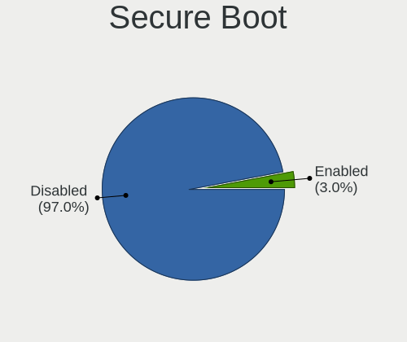
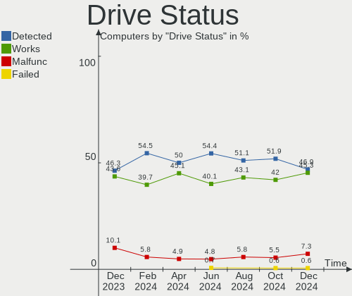
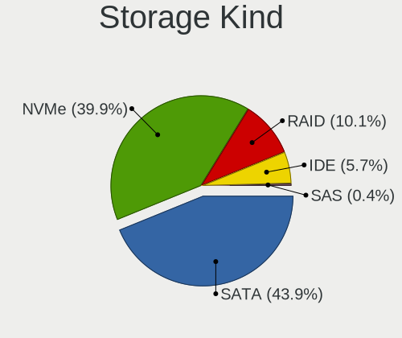
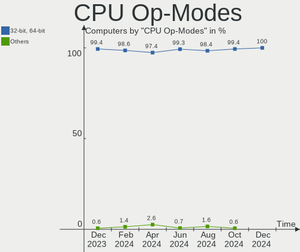
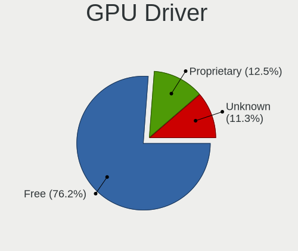
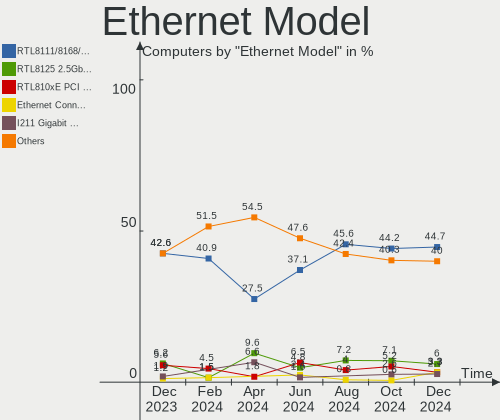
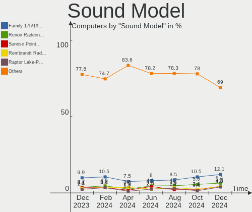
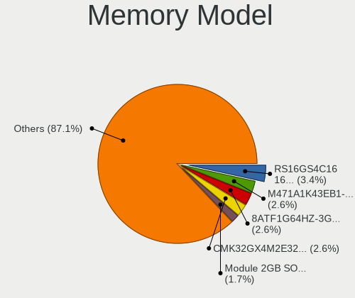
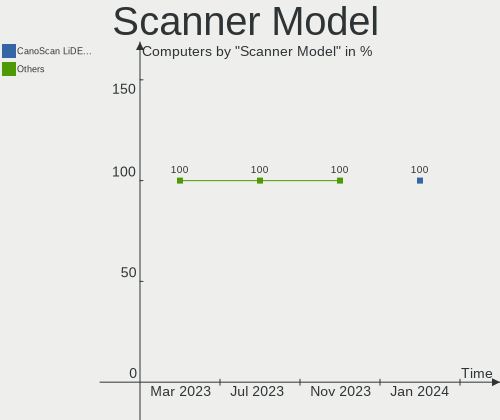
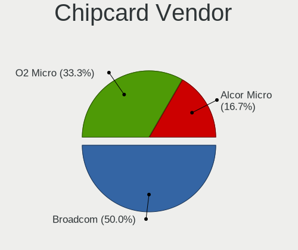

Linux in Spain - Hardware Trends
--------------------------------

A project to identify most popular hardware characteristics and track their change
over time based on data collected by Linux users at https://Linux-Hardware.org.

Anyone can contribute to this report by the [hw-probe](https://github.com/linuxhw/hw-probe) tool:

    sudo -E hw-probe -all -upload

This is a report for all computer types. See also reports for [desktops](/Location/Spain/Desktop/README.md) and [notebooks](/Location/Spain/Notebook/README.md).

Period: Nov, 2022.

Contents
--------

* [ System ](#system)
  - [ OS                       ](#os)
  - [ OS Family                ](#os-family)
  - [ Kernel                   ](#kernel)
  - [ Kernel Family            ](#kernel-family)
  - [ Kernel Major Ver.        ](#kernel-major-ver)
  - [ Arch                     ](#arch)
  - [ DE                       ](#de)
  - [ Display Server           ](#display-server)
  - [ Display Manager          ](#display-manager)
  - [ OS Lang                  ](#os-lang)
  - [ Boot Mode                ](#boot-mode)
  - [ Filesystem               ](#filesystem)
  - [ Part. scheme             ](#part-scheme)
  - [ Dual Boot with Linux/BSD ](#dual-boot-with-linuxbsd)
  - [ Dual Boot (Win)          ](#dual-boot-win)

* [ Board ](#board)
  - [ Vendor                   ](#vendor)
  - [ Model                    ](#model)
  - [ Model Family             ](#model-family)
  - [ MFG Year                 ](#mfg-year)
  - [ Form Factor              ](#form-factor)
  - [ Secure Boot              ](#secure-boot)
  - [ Coreboot                 ](#coreboot)
  - [ RAM Size                 ](#ram-size)
  - [ RAM Used                 ](#ram-used)
  - [ Total Drives             ](#total-drives)
  - [ Has CD-ROM               ](#has-cd-rom)
  - [ Has Ethernet             ](#has-ethernet)
  - [ Has WiFi                 ](#has-wifi)
  - [ Has Bluetooth            ](#has-bluetooth)

* [ Location ](#location)
  - [ Country                  ](#country)
  - [ City                     ](#city)

* [ Drives ](#drives)
  - [ Drive Vendor             ](#drive-vendor)
  - [ Drive Model              ](#drive-model)
  - [ HDD Vendor               ](#hdd-vendor)
  - [ SSD Vendor               ](#ssd-vendor)
  - [ Drive Kind               ](#drive-kind)
  - [ Drive Connector          ](#drive-connector)
  - [ Drive Size               ](#drive-size)
  - [ Space Total              ](#space-total)
  - [ Space Used               ](#space-used)
  - [ Malfunc. Drives          ](#malfunc-drives)
  - [ Malfunc. Drive Vendor    ](#malfunc-drive-vendor)
  - [ Malfunc. HDD Vendor      ](#malfunc-hdd-vendor)
  - [ Malfunc. Drive Kind      ](#malfunc-drive-kind)
  - [ Failed Drives            ](#failed-drives)
  - [ Failed Drive Vendor      ](#failed-drive-vendor)
  - [ Drive Status             ](#drive-status)

* [ Storage controller ](#storage-controller)
  - [ Storage Vendor           ](#storage-vendor)
  - [ Storage Model            ](#storage-model)
  - [ Storage Kind             ](#storage-kind)

* [ Processor ](#processor)
  - [ CPU Vendor               ](#cpu-vendor)
  - [ CPU Model                ](#cpu-model)
  - [ CPU Model Family         ](#cpu-model-family)
  - [ CPU Cores                ](#cpu-cores)
  - [ CPU Sockets              ](#cpu-sockets)
  - [ CPU Threads              ](#cpu-threads)
  - [ CPU Op-Modes             ](#cpu-op-modes)
  - [ CPU Microcode            ](#cpu-microcode)
  - [ CPU Microarch            ](#cpu-microarch)

* [ Graphics ](#graphics)
  - [ GPU Vendor               ](#gpu-vendor)
  - [ GPU Model                ](#gpu-model)
  - [ GPU Combo                ](#gpu-combo)
  - [ GPU Driver               ](#gpu-driver)
  - [ GPU Memory               ](#gpu-memory)

* [ Monitor ](#monitor)
  - [ Monitor Vendor           ](#monitor-vendor)
  - [ Monitor Model            ](#monitor-model)
  - [ Monitor Resolution       ](#monitor-resolution)
  - [ Monitor Diagonal         ](#monitor-diagonal)
  - [ Monitor Width            ](#monitor-width)
  - [ Aspect Ratio             ](#aspect-ratio)
  - [ Monitor Area             ](#monitor-area)
  - [ Pixel Density            ](#pixel-density)
  - [ Multiple Monitors        ](#multiple-monitors)

* [ Network ](#network)
  - [ Net Controller Vendor    ](#net-controller-vendor)
  - [ Net Controller Model     ](#net-controller-model)
  - [ Wireless Vendor          ](#wireless-vendor)
  - [ Wireless Model           ](#wireless-model)
  - [ Ethernet Vendor          ](#ethernet-vendor)
  - [ Ethernet Model           ](#ethernet-model)
  - [ Net Controller Kind      ](#net-controller-kind)
  - [ Used Controller          ](#used-controller)
  - [ NICs                     ](#nics)
  - [ IPv6                     ](#ipv6)

* [ Bluetooth ](#bluetooth)
  - [ Bluetooth Vendor         ](#bluetooth-vendor)
  - [ Bluetooth Model          ](#bluetooth-model)

* [ Sound ](#sound)
  - [ Sound Vendor             ](#sound-vendor)
  - [ Sound Model              ](#sound-model)

* [ Memory ](#memory)
  - [ Memory Vendor            ](#memory-vendor)
  - [ Memory Model             ](#memory-model)
  - [ Memory Kind              ](#memory-kind)
  - [ Memory Form Factor       ](#memory-form-factor)
  - [ Memory Size              ](#memory-size)
  - [ Memory Speed             ](#memory-speed)

* [ Printers & scanners ](#printers--scanners)
  - [ Printer Vendor           ](#printer-vendor)
  - [ Printer Model            ](#printer-model)
  - [ Scanner Vendor           ](#scanner-vendor)
  - [ Scanner Model            ](#scanner-model)

* [ Camera ](#camera)
  - [ Camera Vendor            ](#camera-vendor)
  - [ Camera Model             ](#camera-model)

* [ Security ](#security)
  - [ Fingerprint Vendor       ](#fingerprint-vendor)
  - [ Fingerprint Model        ](#fingerprint-model)
  - [ Chipcard Vendor          ](#chipcard-vendor)
  - [ Chipcard Model           ](#chipcard-model)

* [ Unsupported ](#unsupported)
  - [ Unsupported Devices      ](#unsupported-devices)
  - [ Unsupported Device Types ](#unsupported-device-types)

System
------

OS
--

Installed operating systems

| Name                         | Computers | Percent |
|------------------------------|-----------|---------|
| Ubuntu 22.04                 | 22        | 16.67%  |
| Linux Mint 21                | 11        | 8.33%   |
| Debian 11                    | 9         | 6.82%   |
| OpenMandriva 4.3             | 7         | 5.3%    |
| Pop!_OS 22.04                | 6         | 4.55%   |
| Fedora 36                    | 6         | 4.55%   |
| Zorin 16                     | 5         | 3.79%   |
| Ubuntu 22.10                 | 5         | 3.79%   |
| Linux Mint 20.3              | 5         | 3.79%   |
| Fedora 37                    | 5         | 3.79%   |
| Ubuntu 20.04                 | 4         | 3.03%   |
| SteamOS 3.3.2                | 4         | 3.03%   |
| Manjaro 22.0.0               | 4         | 3.03%   |
| Debian                       | 4         | 3.03%   |
| OpenMandriva 4.50            | 3         | 2.27%   |
| Manjaro                      | 3         | 2.27%   |
| KDE neon 22.04               | 3         | 2.27%   |
| Kali 2022.3                  | 3         | 2.27%   |
| Arch Rolling                 | 3         | 2.27%   |
| Ubuntu MATE 22.04            | 2         | 1.52%   |
| org.kde.Platform 5.15-21.08  | 2         | 1.52%   |
| EndeavourOS Rolling          | 2         | 1.52%   |
| Ubuntu MATE 20.04            | 1         | 0.76%   |
| Ubuntu Budgie 22.10          | 1         | 0.76%   |
| Ubuntu 18.04                 | 1         | 0.76%   |
| openSUSE Tumbleweed-XXXXXXXX | 1         | 0.76%   |
| OpenMandriva 4.90            | 1         | 0.76%   |
| LFS                          | 1         | 0.76%   |
| Kubuntu 22.10                | 1         | 0.76%   |
| Kubuntu 22.04                | 1         | 0.76%   |
| Kubuntu 20.04                | 1         | 0.76%   |
| Kubuntu 18.04                | 1         | 0.76%   |
| Fedora 33                    | 1         | 0.76%   |
| Elementary 6.1               | 1         | 0.76%   |
| Debian 10                    | 1         | 0.76%   |
| AlmaLinux 9.0                | 1         | 0.76%   |

OS Family
---------

OS without a version

| Name             | Computers | Percent |
|------------------|-----------|---------|
| Ubuntu           | 32        | 24.24%  |
| Linux Mint       | 16        | 12.12%  |
| Debian           | 14        | 10.61%  |
| Fedora           | 12        | 9.09%   |
| OpenMandriva     | 11        | 8.33%   |
| Manjaro          | 7         | 5.3%    |
| Pop!_OS          | 6         | 4.55%   |
| Zorin            | 5         | 3.79%   |
| SteamOS          | 4         | 3.03%   |
| Kubuntu          | 4         | 3.03%   |
| Ubuntu MATE      | 3         | 2.27%   |
| KDE neon         | 3         | 2.27%   |
| Kali             | 3         | 2.27%   |
| Arch             | 3         | 2.27%   |
| org.kde.Platform | 2         | 1.52%   |
| EndeavourOS      | 2         | 1.52%   |
| Ubuntu Budgie    | 1         | 0.76%   |
| openSUSE         | 1         | 0.76%   |
| LFS              | 1         | 0.76%   |
| Elementary       | 1         | 0.76%   |
| AlmaLinux        | 1         | 0.76%   |

Kernel
------

Version of the Linux kernel

| Version                    | Computers | Percent |
|----------------------------|-----------|---------|
| 5.15.0-52-generic          | 23        | 17.42%  |
| 5.15.0-53-generic          | 19        | 14.39%  |
| 5.16.7-desktop-1omv4003    | 7         | 5.3%    |
| 5.19.0-23-generic          | 5         | 3.79%   |
| 5.10.0-19-amd64            | 5         | 3.79%   |
| 6.0.6-76060006-generic     | 4         | 3.03%   |
| 5.13.0-valve21.3-1-neptune | 4         | 3.03%   |
| 6.0.0-4-amd64              | 3         | 2.27%   |
| 5.4.0-131-generic          | 3         | 2.27%   |
| 5.19.12-desktop-2omv4090   | 3         | 2.27%   |
| 6.0.9-300.fc37.x86_64      | 2         | 1.52%   |
| 6.0.9-200.fc36.x86_64      | 2         | 1.52%   |
| 6.0.8-300.fc37.x86_64      | 2         | 1.52%   |
| 6.0.8-1-MANJARO            | 2         | 1.52%   |
| 6.0.7-200.fc36.x86_64      | 2         | 1.52%   |
| 5.4.0-128-generic          | 2         | 1.52%   |
| 5.15.78-1-MANJARO          | 2         | 1.52%   |
| 5.15.0-48-generic          | 2         | 1.52%   |
| 5.15.0-43-generic          | 2         | 1.52%   |
| 6.0.9-arch1-1              | 1         | 0.76%   |
| 6.0.8-arch1-1              | 1         | 0.76%   |
| 6.0.8-1-default            | 1         | 0.76%   |
| 6.0.7-arch1-1              | 1         | 0.76%   |
| 6.0.7-060007-generic       | 1         | 0.76%   |
| 6.0.6-zen1-1-zen           | 1         | 0.76%   |
| 6.0.6-arch1-1              | 1         | 0.76%   |
| 6.0.5-desktop-1omv4090     | 1         | 0.76%   |
| 6.0.5-200.fc36.x86_64      | 1         | 0.76%   |
| 6.0.3-76060003-generic     | 1         | 0.76%   |
| 6.0.0-9.1-liquorix-amd64   | 1         | 0.76%   |
| 6.0.0-2-amd64              | 1         | 0.76%   |
| 5.4.224-1-MANJARO          | 1         | 0.76%   |
| 5.4.0-80-generic           | 1         | 0.76%   |
| 5.4.0-42-generic           | 1         | 0.76%   |
| 5.4.0-132-generic          | 1         | 0.76%   |
| 5.19.16-76051916-generic   | 1         | 0.76%   |
| 5.19.16-301.fc37.x86_64    | 1         | 0.76%   |
| 5.19.0-kali2-amd64         | 1         | 0.76%   |
| 5.19.0-24-generic          | 1         | 0.76%   |
| 5.19.0-21-generic          | 1         | 0.76%   |

Kernel Family
-------------

Linux kernel without a distro release

| Version | Computers | Percent |
|---------|-----------|---------|
| 5.15.0  | 47        | 35.61%  |
| 5.19.0  | 9         | 6.82%   |
| 5.4.0   | 8         | 6.06%   |
| 5.16.7  | 7         | 5.3%    |
| 6.0.8   | 6         | 4.55%   |
| 6.0.6   | 6         | 4.55%   |
| 5.10.0  | 6         | 4.55%   |
| 6.0.9   | 5         | 3.79%   |
| 6.0.0   | 5         | 3.79%   |
| 6.0.7   | 4         | 3.03%   |
| 5.13.0  | 4         | 3.03%   |
| 5.19.12 | 3         | 2.27%   |
| 5.18.0  | 3         | 2.27%   |
| 6.0.5   | 2         | 1.52%   |
| 5.19.16 | 2         | 1.52%   |
| 5.15.78 | 2         | 1.52%   |
| 5.14.0  | 2         | 1.52%   |
| 6.0.3   | 1         | 0.76%   |
| 5.4.224 | 1         | 0.76%   |
| 5.18.17 | 1         | 0.76%   |
| 5.17.5  | 1         | 0.76%   |
| 5.15.76 | 1         | 0.76%   |
| 5.15.74 | 1         | 0.76%   |
| 5.15.64 | 1         | 0.76%   |
| 5.15.45 | 1         | 0.76%   |
| 5.14.18 | 1         | 0.76%   |
| 5.11.15 | 1         | 0.76%   |
| 4.19.0  | 1         | 0.76%   |

Kernel Major Ver.
-----------------

Linux kernel major version

| Version | Computers | Percent |
|---------|-----------|---------|
| 5.15    | 53        | 40.15%  |
| 6.0     | 29        | 21.97%  |
| 5.19    | 14        | 10.61%  |
| 5.4     | 9         | 6.82%   |
| 5.16    | 7         | 5.3%    |
| 5.10    | 6         | 4.55%   |
| 5.18    | 4         | 3.03%   |
| 5.13    | 4         | 3.03%   |
| 5.14    | 3         | 2.27%   |
| 5.17    | 1         | 0.76%   |
| 5.11    | 1         | 0.76%   |
| 4.19    | 1         | 0.76%   |

Arch
----

OS architecture (x86_64, i586, etc.)

| Name   | Computers | Percent |
|--------|-----------|---------|
| x86_64 | 132       | 100%    |

DE
--

Desktop Environment

| Name          | Computers | Percent |
|---------------|-----------|---------|
| GNOME         | 65        | 49.24%  |
| KDE5          | 32        | 24.24%  |
| X-Cinnamon    | 11        | 8.33%   |
| XFCE          | 9         | 6.82%   |
| Unknown       | 4         | 3.03%   |
| MATE          | 3         | 2.27%   |
| GNOME Classic | 2         | 1.52%   |
| Deepin        | 2         | 1.52%   |
| Pantheon      | 1         | 0.76%   |
| LXDE          | 1         | 0.76%   |
| i3            | 1         | 0.76%   |
| Budgie        | 1         | 0.76%   |

Display Server
--------------

X11 or Wayland

| Name    | Computers | Percent |
|---------|-----------|---------|
| X11     | 93        | 70.45%  |
| Wayland | 33        | 25%     |
| Tty     | 4         | 3.03%   |
| Unknown | 2         | 1.52%   |

Display Manager
---------------

SDDM, LightDM, etc.

| Name    | Computers | Percent |
|---------|-----------|---------|
| Unknown | 49        | 37.12%  |
| GDM3    | 32        | 24.24%  |
| SDDM    | 20        | 15.15%  |
| LightDM | 15        | 11.36%  |
| GDM     | 15        | 11.36%  |
| KDM     | 1         | 0.76%   |

OS Lang
-------

Language

| Lang           | Computers | Percent |
|----------------|-----------|---------|
| es_ES          | 86        | 65.15%  |
| en_US          | 33        | 25%     |
| en_GB          | 3         | 2.27%   |
| an_ES          | 2         | 1.52%   |
| es_AR          | 1         | 0.76%   |
| en_AG          | 1         | 0.76%   |
| de_DE          | 1         | 0.76%   |
| de_AT          | 1         | 0.76%   |
| ca_ES@valencia | 1         | 0.76%   |
| ca_AD          | 1         | 0.76%   |
| C              | 1         | 0.76%   |
| Unknown        | 1         | 0.76%   |

Boot Mode
---------

EFI or BIOS

| Mode | Computers | Percent |
|------|-----------|---------|
| EFI  | 78        | 59.09%  |
| BIOS | 54        | 40.91%  |

Filesystem
----------

Type of filesystem

| Type    | Computers | Percent |
|---------|-----------|---------|
| Ext4    | 99        | 75%     |
| Btrfs   | 17        | 12.88%  |
| Overlay | 12        | 9.09%   |
| Xfs     | 2         | 1.52%   |
| Zfs     | 1         | 0.76%   |
| Ext2    | 1         | 0.76%   |

Part. scheme
------------

Scheme of partitioning

| Type    | Computers | Percent |
|---------|-----------|---------|
| GPT     | 79        | 59.85%  |
| Unknown | 44        | 33.33%  |
| MBR     | 9         | 6.82%   |

Dual Boot with Linux/BSD
------------------------

Hosting more than one Linux/BSD

| Dual boot | Computers | Percent |
|-----------|-----------|---------|
| No        | 111       | 84.09%  |
| Yes       | 21        | 15.91%  |

Dual Boot (Win)
---------------

Hosting Linux and Windows

| Dual boot | Computers | Percent |
|-----------|-----------|---------|
| No        | 86        | 65.15%  |
| Yes       | 46        | 34.85%  |

Board
-----

Vendor
------

Motherboard manufacturer

| Name                | Computers | Percent |
|---------------------|-----------|---------|
| Hewlett-Packard     | 29        | 21.97%  |
| ASUSTek Computer    | 24        | 18.18%  |
| Lenovo              | 21        | 15.91%  |
| Gigabyte Technology | 9         | 6.82%   |
| MSI                 | 7         | 5.3%    |
| Dell                | 6         | 4.55%   |
| Toshiba             | 5         | 3.79%   |
| Acer                | 5         | 3.79%   |
| Valve               | 4         | 3.03%   |
| HUAWEI              | 3         | 2.27%   |
| Apple               | 3         | 2.27%   |
| Samsung Electronics | 2         | 1.52%   |
| PC Specialist       | 2         | 1.52%   |
| LG Electronics      | 2         | 1.52%   |
| Timi                | 1         | 0.76%   |
| Packard Bell        | 1         | 0.76%   |
| Medion              | 1         | 0.76%   |
| Intel               | 1         | 0.76%   |
| Foxconn             | 1         | 0.76%   |
| ASRock              | 1         | 0.76%   |
| ALURIN              | 1         | 0.76%   |
| ALLDOCUBE           | 1         | 0.76%   |
| Acidanthera         | 1         | 0.76%   |
| Unknown             | 1         | 0.76%   |

Model
-----

Motherboard model

| Name                                        | Computers | Percent |
|---------------------------------------------|-----------|---------|
| Valve Jupiter                               | 4         | 3.03%   |
| Lenovo Legion 5 15ACH6H 82JU                | 2         | 1.52%   |
| Toshiba Satellite Pro A200                  | 1         | 0.76%   |
| Toshiba Satellite P50-B-10Z                 | 1         | 0.76%   |
| Toshiba Satellite L50-C                     | 1         | 0.76%   |
| Toshiba Satellite L10W-B-101                | 1         | 0.76%   |
| Toshiba PORTEGE Z30-A                       | 1         | 0.76%   |
| Timi TM1703                                 | 1         | 0.76%   |
| Samsung R610                                | 1         | 0.76%   |
| Samsung 305V4A/305V5A                       | 1         | 0.76%   |
| PC Specialist PB50_70RF,RD,RC               | 1         | 0.76%   |
| PC Specialist NH5xAx                        | 1         | 0.76%   |
| Packard Bell EasyNote MZ45                  | 1         | 0.76%   |
| MSI MS-7D43                                 | 1         | 0.76%   |
| MSI MS-7D18                                 | 1         | 0.76%   |
| MSI MS-7C56                                 | 1         | 0.76%   |
| MSI MS-7978                                 | 1         | 0.76%   |
| MSI Modern 14 B11SB                         | 1         | 0.76%   |
| MSI Modern 14 A10M                          | 1         | 0.76%   |
| MSI GF63 8RD                                | 1         | 0.76%   |
| Medion D3F3-EM                              | 1         | 0.76%   |
| LG 16Z90Q-G.AD78B                           | 1         | 0.76%   |
| LG 15Z990-V.AA78B                           | 1         | 0.76%   |
| Lenovo V14-ADA 82C6                         | 1         | 0.76%   |
| Lenovo ThinkPad X270 W10DG 20K60014MX       | 1         | 0.76%   |
| Lenovo ThinkPad X1 Carbon Gen 9 20XWS21H00  | 1         | 0.76%   |
| Lenovo ThinkPad X1 Carbon Gen 10 21CCS60U00 | 1         | 0.76%   |
| Lenovo ThinkPad T480 20L6S3H108             | 1         | 0.76%   |
| Lenovo ThinkPad T420 4180GH5                | 1         | 0.76%   |
| Lenovo ThinkPad T16 Gen 1 21BWS11X00        | 1         | 0.76%   |
| Lenovo ThinkCentre M800 10FXS26A00          | 1         | 0.76%   |
| Lenovo ThinkCentre M720s 10STS02300         | 1         | 0.76%   |
| Lenovo ThinkBook 16p Gen 2 20YM             | 1         | 0.76%   |
| Lenovo ThinkBook 15-IIL 20SM                | 1         | 0.76%   |
| Lenovo IdeaPad Y510P 20217                  | 1         | 0.76%   |
| Lenovo IdeaPad Gaming 3 15IAH7 82S9         | 1         | 0.76%   |
| Lenovo IdeaPad Gaming 3 15ACH6 82K2         | 1         | 0.76%   |
| Lenovo IdeaPad 720S-13IKB 81BV              | 1         | 0.76%   |
| Lenovo IdeaPad 320-15IKB 80XL               | 1         | 0.76%   |
| Lenovo IdeaPad 320-15IAP 80XR               | 1         | 0.76%   |

Model Family
------------

Motherboard model prefix

| Name                  | Computers | Percent |
|-----------------------|-----------|---------|
| Lenovo IdeaPad        | 8         | 6.06%   |
| Lenovo ThinkPad       | 6         | 4.55%   |
| HP Pavilion           | 6         | 4.55%   |
| Valve Jupiter         | 4         | 3.03%   |
| Toshiba Satellite     | 4         | 3.03%   |
| HP ProBook            | 4         | 3.03%   |
| HP EliteBook          | 4         | 3.03%   |
| ASUS PRIME            | 4         | 3.03%   |
| Acer Aspire           | 4         | 3.03%   |
| HP Compaq             | 3         | 2.27%   |
| ASUS VivoBook         | 3         | 2.27%   |
| MSI Modern            | 2         | 1.52%   |
| Lenovo ThinkCentre    | 2         | 1.52%   |
| Lenovo ThinkBook      | 2         | 1.52%   |
| Lenovo Legion         | 2         | 1.52%   |
| HP Laptop             | 2         | 1.52%   |
| Gigabyte B550M        | 2         | 1.52%   |
| Dell XPS              | 2         | 1.52%   |
| ASUS ZenBook          | 2         | 1.52%   |
| ASUS ROG              | 2         | 1.52%   |
| ASUS ASUS             | 2         | 1.52%   |
| Toshiba PORTEGE       | 1         | 0.76%   |
| Timi TM1703           | 1         | 0.76%   |
| Samsung R610          | 1         | 0.76%   |
| Samsung 305V4A        | 1         | 0.76%   |
| PC Specialist PB50    | 1         | 0.76%   |
| PC Specialist NH5xAx  | 1         | 0.76%   |
| Packard Bell EasyNote | 1         | 0.76%   |
| MSI MS-7D43           | 1         | 0.76%   |
| MSI MS-7D18           | 1         | 0.76%   |
| MSI MS-7C56           | 1         | 0.76%   |
| MSI MS-7978           | 1         | 0.76%   |
| MSI GF63              | 1         | 0.76%   |
| Medion D3F3-EM        | 1         | 0.76%   |
| LG 16Z90Q-G.AD78B     | 1         | 0.76%   |
| LG 15Z990-V.AA78B     | 1         | 0.76%   |
| Lenovo V14-ADA        | 1         | 0.76%   |
| Intel NUC8i5BEH       | 1         | 0.76%   |
| HUAWEI CREM-WXX9      | 1         | 0.76%   |
| HUAWEI BOHK-WAX9X     | 1         | 0.76%   |

MFG Year
--------

Motherboard manufacture year

| Year | Computers | Percent |
|------|-----------|---------|
| 2021 | 19        | 14.39%  |
| 2022 | 17        | 12.88%  |
| 2019 | 13        | 9.85%   |
| 2018 | 13        | 9.85%   |
| 2017 | 11        | 8.33%   |
| 2020 | 9         | 6.82%   |
| 2016 | 8         | 6.06%   |
| 2013 | 8         | 6.06%   |
| 2015 | 7         | 5.3%    |
| 2014 | 7         | 5.3%    |
| 2011 | 5         | 3.79%   |
| 2007 | 5         | 3.79%   |
| 2010 | 4         | 3.03%   |
| 2012 | 2         | 1.52%   |
| 2009 | 2         | 1.52%   |
| 2008 | 2         | 1.52%   |

Form Factor
-----------

Physical design of the computer

| Name        | Computers | Percent |
|-------------|-----------|---------|
| Notebook    | 91        | 68.94%  |
| Desktop     | 36        | 27.27%  |
| Convertible | 2         | 1.52%   |
| All in one  | 2         | 1.52%   |
| Mini pc     | 1         | 0.76%   |

Secure Boot
-----------

Enabled or disabled

| State    | Computers | Percent |
|----------|-----------|---------|
| Disabled | 117       | 88.64%  |
| Enabled  | 15        | 11.36%  |

Coreboot
--------

Have coreboot on board

| Used | Computers | Percent |
|------|-----------|---------|
| No   | 132       | 100%    |

RAM Size
--------

Total RAM memory

| Size in GB  | Computers | Percent |
|-------------|-----------|---------|
| 4.01-8.0    | 42        | 31.82%  |
| 16.01-24.0  | 34        | 25.76%  |
| 8.01-16.0   | 22        | 16.67%  |
| 32.01-64.0  | 16        | 12.12%  |
| 3.01-4.0    | 13        | 9.85%   |
| 1.01-2.0    | 3         | 2.27%   |
| 2.01-3.0    | 1         | 0.76%   |
| 64.01-256.0 | 1         | 0.76%   |

RAM Used
--------

Used RAM memory

| Used GB    | Computers | Percent |
|------------|-----------|---------|
| 2.01-3.0   | 40        | 30.3%   |
| 1.01-2.0   | 37        | 28.03%  |
| 4.01-8.0   | 25        | 18.94%  |
| 3.01-4.0   | 19        | 14.39%  |
| 0.51-1.0   | 5         | 3.79%   |
| 8.01-16.0  | 4         | 3.03%   |
| 16.01-24.0 | 1         | 0.76%   |
| 0.01-0.5   | 1         | 0.76%   |

Total Drives
------------

Number of drives on board

| Drives | Computers | Percent |
|--------|-----------|---------|
| 1      | 85        | 64.39%  |
| 2      | 29        | 21.97%  |
| 3      | 7         | 5.3%    |
| 4      | 5         | 3.79%   |
| 5      | 3         | 2.27%   |
| 6      | 2         | 1.52%   |
| 0      | 1         | 0.76%   |

Has CD-ROM
----------

Has CD-ROM on board

| Presented | Computers | Percent |
|-----------|-----------|---------|
| No        | 97        | 73.48%  |
| Yes       | 35        | 26.52%  |

Has Ethernet
------------

Has Ethernet on board

| Presented | Computers | Percent |
|-----------|-----------|---------|
| Yes       | 108       | 81.82%  |
| No        | 24        | 18.18%  |

Has WiFi
--------

Has WiFi module

| Presented | Computers | Percent |
|-----------|-----------|---------|
| Yes       | 106       | 80.3%   |
| No        | 26        | 19.7%   |

Has Bluetooth
-------------

Has Bluetooth module

| Presented | Computers | Percent |
|-----------|-----------|---------|
| Yes       | 99        | 75%     |
| No        | 33        | 25%     |

Location
--------

Country
-------

Geographic location (country)

| Country | Computers | Percent |
|---------|-----------|---------|
| Spain   | 132       | 100%    |

City
----

Geographic location (city)

| City                     | Computers | Percent |
|--------------------------|-----------|---------|
| Madrid                   | 22        | 16.67%  |
| Barcelona                | 10        | 7.58%   |
| Valencia                 | 5         | 3.79%   |
| Málaga                  | 5         | 3.79%   |
| Alcobendas               | 5         | 3.79%   |
| Seville                  | 4         | 3.03%   |
| Santa Cruz de Tenerife   | 3         | 2.27%   |
| Bilbao                   | 3         | 2.27%   |
| Portugalete              | 2         | 1.52%   |
| Mostoles                 | 2         | 1.52%   |
| Lugo                     | 2         | 1.52%   |
| Granada                  | 2         | 1.52%   |
| Donostia / San Sebastian | 2         | 1.52%   |
| Alcazar de San Juan      | 2         | 1.52%   |
| Albacete                 | 2         | 1.52%   |
| Zaragoza                 | 1         | 0.76%   |
| Zalamea la Real          | 1         | 0.76%   |
| Vigo                     | 1         | 0.76%   |
| Valladolid               | 1         | 0.76%   |
| Valdemoro                | 1         | 0.76%   |
| Úbeda                   | 1         | 0.76%   |
| Tres Cantos              | 1         | 0.76%   |
| Torrevieja               | 1         | 0.76%   |
| Toledo                   | 1         | 0.76%   |
| Terrassa                 | 1         | 0.76%   |
| Santander                | 1         | 0.76%   |
| Sant Vicenc de Montalt   | 1         | 0.76%   |
| Sabadell                 | 1         | 0.76%   |
| Requena                  | 1         | 0.76%   |
| Reinosa                  | 1         | 0.76%   |
| Pozuelo de Alarcón      | 1         | 0.76%   |
| Parla                    | 1         | 0.76%   |
| Pamplona                 | 1         | 0.76%   |
| Palma                    | 1         | 0.76%   |
| Palencia                 | 1         | 0.76%   |
| Oviedo                   | 1         | 0.76%   |
| Órgiva                  | 1         | 0.76%   |
| Monòver                 | 1         | 0.76%   |
| Mérida                  | 1         | 0.76%   |
| Mazarrón                | 1         | 0.76%   |

Drives
------

Drive Vendor
------------

Hard drive vendors

| Vendor                      | Computers | Drives | Percent |
|-----------------------------|-----------|--------|---------|
| Samsung Electronics         | 35        | 39     | 18.42%  |
| WDC                         | 24        | 29     | 12.63%  |
| Seagate                     | 15        | 18     | 7.89%   |
| Kingston                    | 12        | 12     | 6.32%   |
| SanDisk                     | 11        | 12     | 5.79%   |
| Intel                       | 10        | 11     | 5.26%   |
| Crucial                     | 10        | 11     | 5.26%   |
| Unknown                     | 9         | 9      | 4.74%   |
| HGST                        | 9         | 9      | 4.74%   |
| Toshiba                     | 5         | 5      | 2.63%   |
| SK hynix                    | 5         | 5      | 2.63%   |
| Kingston Technology Company | 5         | 6      | 2.63%   |
| Phison Electronics          | 4         | 5      | 2.11%   |
| Micron Technology           | 4         | 4      | 2.11%   |
| KIOXIA-EXCERIA              | 3         | 3      | 1.58%   |
| Silicon Motion              | 2         | 2      | 1.05%   |
| KIOXIA                      | 2         | 2      | 1.05%   |
| Intenso                     | 2         | 2      | 1.05%   |
| Hitachi                     | 2         | 2      | 1.05%   |
| Apple                       | 2         | 2      | 1.05%   |
| Unknown                     | 2         | 2      | 1.05%   |
| USB                         | 1         | 1      | 0.53%   |
| Transcend                   | 1         | 1      | 0.53%   |
| Realtek                     | 1         | 1      | 0.53%   |
| PNY                         | 1         | 1      | 0.53%   |
| Phison                      | 1         | 1      | 0.53%   |
| OCZ                         | 1         | 2      | 0.53%   |
| O2 Micro                    | 1         | 1      | 0.53%   |
| Netac                       | 1         | 1      | 0.53%   |
| Micron/Crucial Technology   | 1         | 1      | 0.53%   |
| Maxtor                      | 1         | 1      | 0.53%   |
| LITEONIT                    | 1         | 1      | 0.53%   |
| KingDian                    | 1         | 1      | 0.53%   |
| JMicron Technology          | 1         | 1      | 0.53%   |
| Hewlett-Packard             | 1         | 1      | 0.53%   |
| Emtec                       | 1         | 1      | 0.53%   |
| DragonDiamond               | 1         | 1      | 0.53%   |
| China                       | 1         | 1      | 0.53%   |

Drive Model
-----------

Hard drive models

| Model                                                 | Computers | Percent |
|-------------------------------------------------------|-----------|---------|
| Kingston SA400S37240G 240GB SSD                       | 4         | 2.02%   |
| Samsung NVMe SSD Controller SM981/PM981/PM983 1TB     | 3         | 1.52%   |
| Samsung NVMe SSD Controller PM9A1/PM9A3/980PRO 250GB  | 3         | 1.52%   |
| Kingston Company OM3PDP3 NVMe SSD 256GB               | 3         | 1.52%   |
| Kingston SA400S37480G 480GB SSD                       | 3         | 1.52%   |
| Crucial CT500MX500SSD1 500GB                          | 3         | 1.52%   |
| Unknown MMC Card  128GB                               | 2         | 1.01%   |
| Silicon Motion SM2263EN/SM2263XT SSD Controller 128GB | 2         | 1.01%   |
| Seagate ST1000DM010-2EP102 1TB                        | 2         | 1.01%   |
| Sandisk WD Black SN750 / PC SN730 NVMe SSD 1024GB     | 2         | 1.01%   |
| Sandisk WD Black 2018/SN750 / PC SN720 NVMe SSD 500GB | 2         | 1.01%   |
| Samsung SSD 980 500GB                                 | 2         | 1.01%   |
| Samsung SSD 970 EVO Plus 500GB                        | 2         | 1.01%   |
| Samsung SSD 870 EVO 1TB                               | 2         | 1.01%   |
| Samsung SSD 860 EVO 500GB                             | 2         | 1.01%   |
| Samsung SSD 860 EVO 1TB                               | 2         | 1.01%   |
| Samsung MZVL2512HCJQ-00BL7 512GB                      | 2         | 1.01%   |
| Intel SSDPEKNU512GZH 512GB                            | 2         | 1.01%   |
| Intel SSDPEKNU512GZ 512GB                             | 2         | 1.01%   |
| HGST HTS545050A7E680 500GB                            | 2         | 1.01%   |
| HGST HTS545050A7E380 500GB                            | 2         | 1.01%   |
| HGST HTS541010A9E680 1TB                              | 2         | 1.01%   |
| Unknown                                               | 2         | 1.01%   |
| WDC WDS500G2B0A-00SM50 500GB SSD                      | 1         | 0.51%   |
| WDC WDS200T2B0B-00YS70 2TB SSD                        | 1         | 0.51%   |
| WDC WDBNCE0010PNC 1TB SSD                             | 1         | 0.51%   |
| WDC WD5000LPCX-24VHAT0 500GB                          | 1         | 0.51%   |
| WDC WD5000AAKX-60U6AA0 500GB                          | 1         | 0.51%   |
| WDC WD5000AAKX-08U6AA0 500GB                          | 1         | 0.51%   |
| WDC WD5000AAKX-001CA0 500GB                           | 1         | 0.51%   |
| WDC WD40EZRZ-75GXCB0 4TB                              | 1         | 0.51%   |
| WDC WD3200BEVT-35ZCT0 320GB                           | 1         | 0.51%   |
| WDC WD30EFRX-68EUZN0 3TB                              | 1         | 0.51%   |
| WDC WD20EFRX-68AX9N0 2TB                              | 1         | 0.51%   |
| WDC WD20EARX-00PASB0 2TB                              | 1         | 0.51%   |
| WDC WD1600BEVT-80A23T0 160GB                          | 1         | 0.51%   |
| WDC WD1200BEVS-75UST0 120GB                           | 1         | 0.51%   |
| WDC WD10SPZX-21Z10T0 1TB                              | 1         | 0.51%   |
| WDC WD10EZRZ-00HTKB0 1TB                              | 1         | 0.51%   |
| WDC WD10EZRX-00D8PB0 1TB                              | 1         | 0.51%   |

HDD Vendor
----------

Hard disk drive vendors

| Vendor              | Computers | Drives | Percent |
|---------------------|-----------|--------|---------|
| WDC                 | 17        | 21     | 32.69%  |
| Seagate             | 15        | 18     | 28.85%  |
| HGST                | 9         | 9      | 17.31%  |
| Toshiba             | 4         | 4      | 7.69%   |
| Hitachi             | 2         | 2      | 3.85%   |
| USB                 | 1         | 1      | 1.92%   |
| Unknown             | 1         | 1      | 1.92%   |
| Samsung Electronics | 1         | 1      | 1.92%   |
| Maxtor              | 1         | 1      | 1.92%   |
| Intenso             | 1         | 1      | 1.92%   |

SSD Vendor
----------

Solid state drive vendors

| Vendor              | Computers | Drives | Percent |
|---------------------|-----------|--------|---------|
| Samsung Electronics | 20        | 22     | 33.33%  |
| Kingston            | 12        | 12     | 20%     |
| Crucial             | 10        | 11     | 16.67%  |
| WDC                 | 3         | 3      | 5%      |
| SanDisk             | 2         | 2      | 3.33%   |
| Unknown             | 2         | 2      | 3.33%   |
| Transcend           | 1         | 1      | 1.67%   |
| OCZ                 | 1         | 2      | 1.67%   |
| Netac               | 1         | 1      | 1.67%   |
| LITEONIT            | 1         | 1      | 1.67%   |
| KIOXIA-EXCERIA      | 1         | 1      | 1.67%   |
| KingDian            | 1         | 1      | 1.67%   |
| Intenso             | 1         | 1      | 1.67%   |
| Hewlett-Packard     | 1         | 1      | 1.67%   |
| Emtec               | 1         | 1      | 1.67%   |
| China               | 1         | 1      | 1.67%   |
| Apple               | 1         | 1      | 1.67%   |

Drive Kind
----------

HDD or SSD

| Kind    | Computers | Drives | Percent |
|---------|-----------|--------|---------|
| NVMe    | 66        | 75     | 37.71%  |
| SSD     | 56        | 64     | 32%     |
| HDD     | 43        | 59     | 24.57%  |
| MMC     | 8         | 8      | 4.57%   |
| Unknown | 2         | 2      | 1.14%   |

Drive Connector
---------------

SATA, SAS, NVMe, etc.

| Type | Computers | Drives | Percent |
|------|-----------|--------|---------|
| SATA | 78        | 121    | 50%     |
| NVMe | 65        | 74     | 41.67%  |
| MMC  | 8         | 8      | 5.13%   |
| SAS  | 5         | 5      | 3.21%   |

Drive Size
----------

Size of hard drive

| Size in TB | Computers | Drives | Percent |
|------------|-----------|--------|---------|
| 0.01-0.5   | 57        | 73     | 58.16%  |
| 0.51-1.0   | 27        | 32     | 27.55%  |
| 1.01-2.0   | 6         | 8      | 6.12%   |
| 3.01-4.0   | 4         | 6      | 4.08%   |
| 2.01-3.0   | 4         | 4      | 4.08%   |

Space Total
-----------

Amount of disk space available on the file system

| Size in GB     | Computers | Percent |
|----------------|-----------|---------|
| 251-500        | 37        | 28.03%  |
| 101-250        | 31        | 23.48%  |
| 501-1000       | 21        | 15.91%  |
| 1-20           | 13        | 9.85%   |
| More than 3000 | 8         | 6.06%   |
| 51-100         | 8         | 6.06%   |
| 1001-2000      | 6         | 4.55%   |
| 21-50          | 5         | 3.79%   |
| Unknown        | 2         | 1.52%   |
| 2001-3000      | 1         | 0.76%   |

Space Used
----------

Amount of used disk space

| Used GB        | Computers | Percent |
|----------------|-----------|---------|
| 1-20           | 52        | 39.39%  |
| 21-50          | 22        | 16.67%  |
| 101-250        | 19        | 14.39%  |
| 251-500        | 14        | 10.61%  |
| 51-100         | 11        | 8.33%   |
| 501-1000       | 5         | 3.79%   |
| More than 3000 | 4         | 3.03%   |
| 2001-3000      | 2         | 1.52%   |
| Unknown        | 2         | 1.52%   |
| 1001-2000      | 1         | 0.76%   |

Malfunc. Drives
---------------

Drive models with a malfunction

| Model                                | Computers | Drives | Percent |
|--------------------------------------|-----------|--------|---------|
| WDC WD20EFRX-68AX9N0 2TB             | 1         | 2      | 10%     |
| WDC WD20EARX-00PASB0 2TB             | 1         | 1      | 10%     |
| WDC WD10EAVS-00D7B0 1TB              | 1         | 1      | 10%     |
| Toshiba HDWD130 3TB                  | 1         | 1      | 10%     |
| SK hynix BC711 HFM512GD3JX013N 512GB | 1         | 1      | 10%     |
| Seagate ST1000DM010-2EP102 1TB       | 1         | 1      | 10%     |
| Samsung Electronics SSD 870 EVO 1TB  | 1         | 1      | 10%     |
| Maxtor STM3320820AS 320GB            | 1         | 1      | 10%     |
| HGST HTS545050A7E680 500GB           | 1         | 1      | 10%     |
| HGST HTS541075A9E680 752GB           | 1         | 1      | 10%     |

Malfunc. Drive Vendor
---------------------

Vendors of faulty drives

| Vendor              | Computers | Drives | Percent |
|---------------------|-----------|--------|---------|
| WDC                 | 3         | 4      | 30%     |
| HGST                | 2         | 2      | 20%     |
| Toshiba             | 1         | 1      | 10%     |
| SK hynix            | 1         | 1      | 10%     |
| Seagate             | 1         | 1      | 10%     |
| Samsung Electronics | 1         | 1      | 10%     |
| Maxtor              | 1         | 1      | 10%     |

Malfunc. HDD Vendor
-------------------

Vendors of faulty HDD drives

| Vendor  | Computers | Drives | Percent |
|---------|-----------|--------|---------|
| WDC     | 3         | 4      | 37.5%   |
| HGST    | 2         | 2      | 25%     |
| Toshiba | 1         | 1      | 12.5%   |
| Seagate | 1         | 1      | 12.5%   |
| Maxtor  | 1         | 1      | 12.5%   |

Malfunc. Drive Kind
-------------------

Kinds of faulty drives

| Kind | Computers | Drives | Percent |
|------|-----------|--------|---------|
| HDD  | 8         | 9      | 80%     |
| NVMe | 1         | 1      | 10%     |
| SSD  | 1         | 1      | 10%     |

Failed Drives
-------------

Failed drive models

| Model                             | Computers | Drives | Percent |
|-----------------------------------|-----------|--------|---------|
| Samsung Electronics HD253GJ 250GB | 1         | 1      | 100%    |

Failed Drive Vendor
-------------------

Failed drive vendors

| Vendor              | Computers | Drives | Percent |
|---------------------|-----------|--------|---------|
| Samsung Electronics | 1         | 1      | 100%    |

Drive Status
------------

Number of failed and malfunc. drives

| Status   | Computers | Drives | Percent |
|----------|-----------|--------|---------|
| Detected | 72        | 113    | 50.7%   |
| Works    | 59        | 83     | 41.55%  |
| Malfunc  | 10        | 11     | 7.04%   |
| Failed   | 1         | 1      | 0.7%    |

Storage controller
------------------

Storage Vendor
--------------

Storage controller vendors

| Vendor                       | Computers | Percent |
|------------------------------|-----------|---------|
| Intel                        | 78        | 45.09%  |
| AMD                          | 28        | 16.18%  |
| Samsung Electronics          | 17        | 9.83%   |
| SanDisk                      | 14        | 8.09%   |
| Phison Electronics           | 6         | 3.47%   |
| SK hynix                     | 5         | 2.89%   |
| Kingston Technology Company  | 5         | 2.89%   |
| Micron Technology            | 4         | 2.31%   |
| Nvidia                       | 3         | 1.73%   |
| KIOXIA                       | 3         | 1.73%   |
| Toshiba America Info Systems | 2         | 1.16%   |
| Silicon Motion               | 2         | 1.16%   |
| ASMedia Technology           | 2         | 1.16%   |
| O2 Micro                     | 1         | 0.58%   |
| Micron/Crucial Technology    | 1         | 0.58%   |
| Marvell Technology Group     | 1         | 0.58%   |
| Broadcom / LSI               | 1         | 0.58%   |

Storage Model
-------------

Storage controller models

| Model                                                                          | Computers | Percent |
|--------------------------------------------------------------------------------|-----------|---------|
| AMD FCH SATA Controller [AHCI mode]                                            | 19        | 9.64%   |
| Intel Sunrise Point-LP SATA Controller [AHCI mode]                             | 8         | 4.06%   |
| Samsung NVMe SSD Controller SM981/PM981/PM983                                  | 7         | 3.55%   |
| Intel Volume Management Device NVMe RAID Controller                            | 7         | 3.55%   |
| Samsung NVMe SSD Controller PM9A1/PM9A3/980PRO                                 | 6         | 3.05%   |
| Intel Q170/Q150/B150/H170/H110/Z170/CM236 Chipset SATA Controller [AHCI Mode]  | 5         | 2.54%   |
| Intel Non-Volatile memory controller                                           | 5         | 2.54%   |
| Intel Cannon Lake Mobile PCH SATA AHCI Controller                              | 5         | 2.54%   |
| Intel 8 Series SATA Controller 1 [AHCI mode]                                   | 5         | 2.54%   |
| SanDisk WD Black SN750 / PC SN730 NVMe SSD                                     | 4         | 2.03%   |
| Micron Non-Volatile memory controller                                          | 4         | 2.03%   |
| Intel SSD 660P Series                                                          | 4         | 2.03%   |
| Intel 82801HM/HEM (ICH8M/ICH8M-E) IDE Controller                               | 4         | 2.03%   |
| Intel 8 Series/C220 Series Chipset Family 6-port SATA Controller 1 [AHCI mode] | 4         | 2.03%   |
| AMD 500 Series Chipset SATA Controller                                         | 4         | 2.03%   |
| Kingston Company OM3PDP3 NVMe SSD                                              | 3         | 1.52%   |
| Intel Wildcat Point-LP SATA Controller [AHCI Mode]                             | 3         | 1.52%   |
| Intel 82801HM/HEM (ICH8M/ICH8M-E) SATA Controller [AHCI mode]                  | 3         | 1.52%   |
| Intel 200 Series PCH SATA controller [AHCI mode]                               | 3         | 1.52%   |
| SK hynix PC401 NVMe Solid State Drive 256GB                                    | 2         | 1.02%   |
| SK hynix Gold P31/PC711 NVMe Solid State Drive                                 | 2         | 1.02%   |
| Silicon Motion SM2263EN/SM2263XT SSD Controller                                | 2         | 1.02%   |
| SanDisk WD Blue SN550 NVMe SSD                                                 | 2         | 1.02%   |
| SanDisk WD Blue SN500 / PC SN520 NVMe SSD                                      | 2         | 1.02%   |
| SanDisk WD Black 2018/SN750 / PC SN720 NVMe SSD                                | 2         | 1.02%   |
| SanDisk Non-Volatile memory controller                                         | 2         | 1.02%   |
| Samsung NVMe SSD Controller SM961/PM961/SM963                                  | 2         | 1.02%   |
| Samsung NVMe SSD Controller 980                                                | 2         | 1.02%   |
| Phison PS5013 E13 NVMe Controller                                              | 2         | 1.02%   |
| Phison E12 NVMe Controller                                                     | 2         | 1.02%   |
| Nvidia MCP79 AHCI Controller                                                   | 2         | 1.02%   |
| KIOXIA Non-Volatile memory controller                                          | 2         | 1.02%   |
| Intel Tiger Lake-LP SATA Controller                                            | 2         | 1.02%   |
| Intel Celeron/Pentium Silver Processor SATA Controller                         | 2         | 1.02%   |
| Intel Celeron N3350/Pentium N4200/Atom E3900 Series SATA AHCI Controller       | 2         | 1.02%   |
| Intel Cannon Point-LP SATA Controller [AHCI Mode]                              | 2         | 1.02%   |
| Intel Cannon Lake PCH SATA AHCI Controller                                     | 2         | 1.02%   |
| Intel 82801 Mobile SATA Controller [RAID mode]                                 | 2         | 1.02%   |
| Intel 7 Series/C210 Series Chipset Family 6-port SATA Controller [AHCI mode]   | 2         | 1.02%   |
| Intel 6 Series/C200 Series Chipset Family 6 port Desktop SATA AHCI Controller  | 2         | 1.02%   |

Storage Kind
------------

Kind of storage controller (IDE, SATA, NVMe, SAS, ...)

| Kind | Computers | Percent |
|------|-----------|---------|
| SATA | 95        | 52.49%  |
| NVMe | 65        | 35.91%  |
| RAID | 11        | 6.08%   |
| IDE  | 9         | 4.97%   |
| SAS  | 1         | 0.55%   |

Processor
---------

CPU Vendor
----------

Processor vendors

| Vendor | Computers | Percent |
|--------|-----------|---------|
| Intel  | 92        | 69.7%   |
| AMD    | 40        | 30.3%   |

CPU Model
---------

Processor models

| Model                                         | Computers | Percent |
|-----------------------------------------------|-----------|---------|
| AMD Ryzen 7 5800H with Radeon Graphics        | 6         | 4.55%   |
| AMD Custom APU 0405                           | 4         | 3.03%   |
| Intel 11th Gen Core i5-1135G7 @ 2.40GHz       | 3         | 2.27%   |
| AMD Ryzen 5 3500U with Radeon Vega Mobile Gfx | 3         | 2.27%   |
| Intel Core i7-9750H CPU @ 2.60GHz             | 2         | 1.52%   |
| Intel Core i7-7700K CPU @ 4.20GHz             | 2         | 1.52%   |
| Intel Core i5-8300H CPU @ 2.30GHz             | 2         | 1.52%   |
| Intel Core i5-8250U CPU @ 1.60GHz             | 2         | 1.52%   |
| Intel Core i5-6600K CPU @ 3.50GHz             | 2         | 1.52%   |
| Intel Core i5-6300U CPU @ 2.40GHz             | 2         | 1.52%   |
| Intel 11th Gen Core i7-1165G7 @ 2.80GHz       | 2         | 1.52%   |
| AMD Ryzen 7 5700U with Radeon Graphics        | 2         | 1.52%   |
| AMD Ryzen 5 5600X 6-Core Processor            | 2         | 1.52%   |
| Intel Xeon CPU E5-2678 v3 @ 2.50GHz           | 1         | 0.76%   |
| Intel Pentium Dual-Core CPU T4400 @ 2.20GHz   | 1         | 0.76%   |
| Intel Pentium Dual CPU T2330 @ 1.60GHz        | 1         | 0.76%   |
| Intel Pentium Dual CPU T2310 @ 1.46GHz        | 1         | 0.76%   |
| Intel Pentium CPU N4200 @ 1.10GHz             | 1         | 0.76%   |
| Intel Pentium CPU G4400 @ 3.30GHz             | 1         | 0.76%   |
| Intel Core m5-6Y57 CPU @ 1.10GHz              | 1         | 0.76%   |
| Intel Core i7-8750H CPU @ 2.20GHz             | 1         | 0.76%   |
| Intel Core i7-8700 CPU @ 3.20GHz              | 1         | 0.76%   |
| Intel Core i7-8650U CPU @ 1.90GHz             | 1         | 0.76%   |
| Intel Core i7-8565U CPU @ 1.80GHz             | 1         | 0.76%   |
| Intel Core i7-8550U CPU @ 1.80GHz             | 1         | 0.76%   |
| Intel Core i7-7Y75 CPU @ 1.30GHz              | 1         | 0.76%   |
| Intel Core i7-7700HQ CPU @ 2.80GHz            | 1         | 0.76%   |
| Intel Core i7-7500U CPU @ 2.70GHz             | 1         | 0.76%   |
| Intel Core i7-6700 CPU @ 3.40GHz              | 1         | 0.76%   |
| Intel Core i7-6500U CPU @ 2.50GHz             | 1         | 0.76%   |
| Intel Core i7-5500U CPU @ 2.40GHz             | 1         | 0.76%   |
| Intel Core i7-4790 CPU @ 3.60GHz              | 1         | 0.76%   |
| Intel Core i7-4710HQ CPU @ 2.50GHz            | 1         | 0.76%   |
| Intel Core i7-4700MQ CPU @ 2.40GHz            | 1         | 0.76%   |
| Intel Core i7-4650U CPU @ 1.70GHz             | 1         | 0.76%   |
| Intel Core i7-4600U CPU @ 2.10GHz             | 1         | 0.76%   |
| Intel Core i7-4500U CPU @ 1.80GHz             | 1         | 0.76%   |
| Intel Core i7-2600 CPU @ 3.40GHz              | 1         | 0.76%   |
| Intel Core i7-1065G7 CPU @ 1.30GHz            | 1         | 0.76%   |
| Intel Core i7-10510U CPU @ 1.80GHz            | 1         | 0.76%   |

CPU Model Family
----------------

Processor model prefix

| Model                   | Computers | Percent |
|-------------------------|-----------|---------|
| Intel Core i5           | 26        | 19.7%   |
| Intel Core i7           | 24        | 18.18%  |
| Other                   | 23        | 17.42%  |
| AMD Ryzen 7             | 10        | 7.58%   |
| AMD Ryzen 5             | 8         | 6.06%   |
| Intel Celeron           | 7         | 5.3%    |
| Intel Core i3           | 6         | 4.55%   |
| Intel Core 2 Duo        | 4         | 3.03%   |
| Intel Pentium Dual      | 2         | 1.52%   |
| Intel Pentium           | 2         | 1.52%   |
| AMD Ryzen 9             | 2         | 1.52%   |
| AMD A8                  | 2         | 1.52%   |
| AMD A6                  | 2         | 1.52%   |
| AMD A10                 | 2         | 1.52%   |
| Intel Xeon              | 1         | 0.76%   |
| Intel Pentium Dual-Core | 1         | 0.76%   |
| Intel Core m5           | 1         | 0.76%   |
| Intel Atom              | 1         | 0.76%   |
| AMD Ryzen 3             | 1         | 0.76%   |
| AMD Phenom II X6        | 1         | 0.76%   |
| AMD FX                  | 1         | 0.76%   |
| AMD E1                  | 1         | 0.76%   |
| AMD Athlon II           | 1         | 0.76%   |
| AMD Athlon 64 X2        | 1         | 0.76%   |
| AMD Athlon              | 1         | 0.76%   |
| AMD A4                  | 1         | 0.76%   |

CPU Cores
---------

Number of processor cores

| Number | Computers | Percent |
|--------|-----------|---------|
| 4      | 49        | 37.12%  |
| 2      | 44        | 33.33%  |
| 6      | 14        | 10.61%  |
| 8      | 12        | 9.09%   |
| 12     | 6         | 4.55%   |
| 1      | 3         | 2.27%   |
| 10     | 2         | 1.52%   |
| 16     | 1         | 0.76%   |
| 14     | 1         | 0.76%   |

CPU Sockets
-----------

Number of sockets

| Number | Computers | Percent |
|--------|-----------|---------|
| 1      | 132       | 100%    |

CPU Threads
-----------

Threads per core (Hyper-Threading)

| Number | Computers | Percent |
|--------|-----------|---------|
| 2      | 96        | 72.73%  |
| 1      | 36        | 27.27%  |

CPU Op-Modes
------------

CPU Operation Modes (32-bit, 64-bit)

| Op mode        | Computers | Percent |
|----------------|-----------|---------|
| 32-bit, 64-bit | 132       | 100%    |

CPU Microcode
-------------

Microcode number

| Number     | Computers | Percent |
|------------|-----------|---------|
| Unknown    | 40        | 30.3%   |
| 0x506e3    | 5         | 3.79%   |
| 0x40651    | 5         | 3.79%   |
| 0x806c1    | 4         | 3.03%   |
| 0x6fd      | 4         | 3.03%   |
| 0x406e3    | 4         | 3.03%   |
| 0x206a7    | 4         | 3.03%   |
| 0x906ea    | 3         | 2.27%   |
| 0x906a3    | 3         | 2.27%   |
| 0x806ea    | 3         | 2.27%   |
| 0x806e9    | 3         | 2.27%   |
| 0x0a201016 | 3         | 2.27%   |
| 0x906e9    | 2         | 1.52%   |
| 0x806ec    | 2         | 1.52%   |
| 0x806d1    | 2         | 1.52%   |
| 0x706a8    | 2         | 1.52%   |
| 0x506c9    | 2         | 1.52%   |
| 0x306c3    | 2         | 1.52%   |
| 0x0a50000c | 2         | 1.52%   |
| 0x08608103 | 2         | 1.52%   |
| 0x08600106 | 2         | 1.52%   |
| 0x08108109 | 2         | 1.52%   |
| 0x06006705 | 2         | 1.52%   |
| 0x06001119 | 2         | 1.52%   |
| 0xa0655    | 1         | 0.76%   |
| 0xa0653    | 1         | 0.76%   |
| 0xa0652    | 1         | 0.76%   |
| 0x906ed    | 1         | 0.76%   |
| 0x906c0    | 1         | 0.76%   |
| 0x906a4    | 1         | 0.76%   |
| 0x90672    | 1         | 0.76%   |
| 0x806c2    | 1         | 0.76%   |
| 0x706e5    | 1         | 0.76%   |
| 0x6fb      | 1         | 0.76%   |
| 0x406c4    | 1         | 0.76%   |
| 0x306f2    | 1         | 0.76%   |
| 0x306d4    | 1         | 0.76%   |
| 0x306a9    | 1         | 0.76%   |
| 0x20655    | 1         | 0.76%   |
| 0x106ca    | 1         | 0.76%   |

CPU Microarch
-------------

Microarchitecture

| Name             | Computers | Percent |
|------------------|-----------|---------|
| KabyLake         | 23        | 17.42%  |
| Haswell          | 12        | 9.09%   |
| Skylake          | 11        | 8.33%   |
| Zen 3            | 10        | 7.58%   |
| Unknown          | 10        | 7.58%   |
| TigerLake        | 7         | 5.3%    |
| Core             | 6         | 4.55%   |
| Alderlake Hybrid | 5         | 3.79%   |
| Zen+             | 4         | 3.03%   |
| SandyBridge      | 4         | 3.03%   |
| Zen 2            | 3         | 2.27%   |
| Zen              | 3         | 2.27%   |
| Piledriver       | 3         | 2.27%   |
| Icelake          | 3         | 2.27%   |
| CometLake        | 3         | 2.27%   |
| Broadwell        | 3         | 2.27%   |
| Silvermont       | 2         | 1.52%   |
| Puma             | 2         | 1.52%   |
| Penryn           | 2         | 1.52%   |
| K10              | 2         | 1.52%   |
| Goldmont plus    | 2         | 1.52%   |
| Goldmont         | 2         | 1.52%   |
| Excavator        | 2         | 1.52%   |
| Westmere         | 1         | 0.76%   |
| Tremont          | 1         | 0.76%   |
| Steamroller      | 1         | 0.76%   |
| K8 Hammer        | 1         | 0.76%   |
| K10 Llano        | 1         | 0.76%   |
| Jaguar           | 1         | 0.76%   |
| IvyBridge        | 1         | 0.76%   |
| Bonnell          | 1         | 0.76%   |

Graphics
--------

GPU Vendor
----------

Vendors of graphics cards

| Vendor | Computers | Percent |
|--------|-----------|---------|
| Intel  | 75        | 46.88%  |
| Nvidia | 46        | 28.75%  |
| AMD    | 39        | 24.38%  |

GPU Model
---------

Graphics card models

| Model                                                                         | Computers | Percent |
|-------------------------------------------------------------------------------|-----------|---------|
| Intel TigerLake-LP GT2 [Iris Xe Graphics]                                     | 7         | 4.14%   |
| AMD Cezanne [Radeon Vega Series / Radeon Vega Mobile Series]                  | 7         | 4.14%   |
| Intel Haswell-ULT Integrated Graphics Controller                              | 6         | 3.55%   |
| Nvidia GA106M [GeForce RTX 3060 Mobile / Max-Q]                               | 5         | 2.96%   |
| Intel UHD Graphics 620                                                        | 4         | 2.37%   |
| Intel Skylake GT2 [HD Graphics 520]                                           | 4         | 2.37%   |
| Intel Mobile GM965/GL960 Integrated Graphics Controller (secondary)           | 4         | 2.37%   |
| Intel Mobile GM965/GL960 Integrated Graphics Controller (primary)             | 4         | 2.37%   |
| Intel CoffeeLake-H GT2 [UHD Graphics 630]                                     | 4         | 2.37%   |
| Intel Alder Lake-P Integrated Graphics Controller                             | 4         | 2.37%   |
| AMD VanGogh [AMD Custom GPU 0405]                                             | 4         | 2.37%   |
| AMD Picasso/Raven 2 [Radeon Vega Series / Radeon Vega Mobile Series]          | 4         | 2.37%   |
| AMD Ellesmere [Radeon RX 470/480/570/570X/580/580X/590]                       | 4         | 2.37%   |
| Nvidia GP107M [GeForce GTX 1050 Mobile]                                       | 3         | 1.78%   |
| Nvidia GP107 [GeForce GTX 1050 Ti]                                            | 3         | 1.78%   |
| Intel HD Graphics 5500                                                        | 3         | 1.78%   |
| Intel 4th Gen Core Processor Integrated Graphics Controller                   | 3         | 1.78%   |
| Intel 2nd Generation Core Processor Family Integrated Graphics Controller     | 3         | 1.78%   |
| Nvidia TU117M                                                                 | 2         | 1.18%   |
| Nvidia GP108M [GeForce MX150]                                                 | 2         | 1.18%   |
| Nvidia GM206 [GeForce GTX 960]                                                | 2         | 1.18%   |
| Nvidia GK208B [GeForce GT 710]                                                | 2         | 1.18%   |
| Nvidia GA107M [GeForce RTX 3050 Ti Mobile]                                    | 2         | 1.18%   |
| Intel Xeon E3-1200 v3/4th Gen Core Processor Integrated Graphics Controller   | 2         | 1.18%   |
| Intel TigerLake-H GT1 [UHD Graphics]                                          | 2         | 1.18%   |
| Intel HD Graphics 630                                                         | 2         | 1.18%   |
| Intel HD Graphics 620                                                         | 2         | 1.18%   |
| Intel HD Graphics 530                                                         | 2         | 1.18%   |
| Intel GeminiLake [UHD Graphics 600]                                           | 2         | 1.18%   |
| Intel CometLake-U GT2 [UHD Graphics]                                          | 2         | 1.18%   |
| AMD Sun XT [Radeon HD 8670A/8670M/8690M / R5 M330 / M430 / Radeon 520 Mobile] | 2         | 1.18%   |
| AMD Stoney [Radeon R2/R3/R4/R5 Graphics]                                      | 2         | 1.18%   |
| AMD Renoir                                                                    | 2         | 1.18%   |
| AMD Raven Ridge [Radeon Vega Series / Radeon Vega Mobile Series]              | 2         | 1.18%   |
| AMD Lucienne                                                                  | 2         | 1.18%   |
| Nvidia TU117M [GeForce MX450]                                                 | 1         | 0.59%   |
| Nvidia TU116 [GeForce GTX 1660 SUPER]                                         | 1         | 0.59%   |
| Nvidia TU106M [GeForce RTX 2070 Mobile / Max-Q Refresh]                       | 1         | 0.59%   |
| Nvidia TU106BM [GeForce RTX 2070 Mobile / Max-Q]                              | 1         | 0.59%   |
| Nvidia GT218 [GeForce 405]                                                    | 1         | 0.59%   |

GPU Combo
---------

Combinations of graphics cards

| Name           | Computers | Percent |
|----------------|-----------|---------|
| 1 x Intel      | 51        | 38.64%  |
| 1 x AMD        | 26        | 19.7%   |
| 1 x Nvidia     | 22        | 16.67%  |
| Intel + Nvidia | 19        | 14.39%  |
| 2 x AMD        | 5         | 3.79%   |
| AMD + Nvidia   | 5         | 3.79%   |
| Intel + AMD    | 3         | 2.27%   |
| 2 x Intel      | 1         | 0.76%   |

GPU Driver
----------

Free vs proprietary

| Driver      | Computers | Percent |
|-------------|-----------|---------|
| Free        | 105       | 79.55%  |
| Proprietary | 22        | 16.67%  |
| Unknown     | 5         | 3.79%   |

GPU Memory
----------

Total video memory

| Size in GB | Computers | Percent |
|------------|-----------|---------|
| Unknown    | 90        | 68.18%  |
| 0.01-0.5   | 11        | 8.33%   |
| 1.01-2.0   | 10        | 7.58%   |
| 7.01-8.0   | 6         | 4.55%   |
| 0.51-1.0   | 5         | 3.79%   |
| 3.01-4.0   | 4         | 3.03%   |
| 5.01-6.0   | 3         | 2.27%   |
| 8.01-16.0  | 2         | 1.52%   |
| 16.01-24.0 | 1         | 0.76%   |

Monitor
-------

Monitor Vendor
--------------

Monitor vendors

| Vendor                  | Computers | Percent |
|-------------------------|-----------|---------|
| BOE                     | 19        | 11.8%   |
| AU Optronics            | 18        | 11.18%  |
| Chimei Innolux          | 16        | 9.94%   |
| Samsung Electronics     | 15        | 9.32%   |
| Goldstar                | 13        | 8.07%   |
| LG Display              | 11        | 6.83%   |
| BenQ                    | 8         | 4.97%   |
| Dell                    | 7         | 4.35%   |
| Hewlett-Packard         | 6         | 3.73%   |
| Philips                 | 5         | 3.11%   |
| PANDA                   | 4         | 2.48%   |
| Apple                   | 4         | 2.48%   |
| Analogix                | 4         | 2.48%   |
| Acer                    | 4         | 2.48%   |
| ViewSonic               | 3         | 1.86%   |
| AOC                     | 3         | 1.86%   |
| Ancor Communications    | 3         | 1.86%   |
| Sharp                   | 2         | 1.24%   |
| Lenovo                  | 2         | 1.24%   |
| HannStar                | 2         | 1.24%   |
| Chi Mei Optoelectronics | 2         | 1.24%   |
| Videoseven              | 1         | 0.62%   |
| Unknown (XXX)           | 1         | 0.62%   |
| STD                     | 1         | 0.62%   |
| Sony                    | 1         | 0.62%   |
| Quanta Display          | 1         | 0.62%   |
| MSI                     | 1         | 0.62%   |
| LG Philips              | 1         | 0.62%   |
| LG Electronics          | 1         | 0.62%   |
| CSO                     | 1         | 0.62%   |
| ASUSTek Computer        | 1         | 0.62%   |

Monitor Model
-------------

Monitor models

| Model                                                                   | Computers | Percent |
|-------------------------------------------------------------------------|-----------|---------|
| Analogix ANX7530 U ANX7539 800x1280                                     | 4         | 2.45%   |
| AU Optronics LCD Monitor AUO21ED 1920x1080 344x193mm 15.5-inch          | 3         | 1.84%   |
| Goldstar LG ULTRAWIDE GSM59F1 2560x1080 670x280mm 28.6-inch             | 2         | 1.23%   |
| Chimei Innolux LCD Monitor CMN15F5 1920x1080 344x193mm 15.5-inch        | 2         | 1.23%   |
| BOE LCD Monitor BOE06DF 1920x1080 309x173mm 13.9-inch                   | 2         | 1.23%   |
| ViewSonic XG270 VSCF638 1920x1080 598x336mm 27.0-inch                   | 1         | 0.61%   |
| ViewSonic VA2465 SERIES VSCB730 1920x1080 521x293mm 23.5-inch           | 1         | 0.61%   |
| ViewSonic VA2407 Series VSC8C31 1920x1080 521x293mm 23.5-inch           | 1         | 0.61%   |
| Videoseven L17GM IGM0508 1280x1024 338x270mm 17.0-inch                  | 1         | 0.61%   |
| Unknown (XXX) Beyond TV XXX2851 3840x2160 1209x680mm 54.6-inch          | 1         | 0.61%   |
| STD LCD Monitor STD0001 1920x1080                                       | 1         | 0.61%   |
| Sony TV *30 SNYB105 3840x2160 1439x809mm 65.0-inch                      | 1         | 0.61%   |
| Sharp LCD Monitor SHP146B 3200x1800 294x165mm 13.3-inch                 | 1         | 0.61%   |
| Sharp LCD Monitor SHP1421 3200x1800 294x165mm 13.3-inch                 | 1         | 0.61%   |
| Samsung Electronics U28E570 SAM0D70 3840x2160 608x345mm 27.5-inch       | 1         | 0.61%   |
| Samsung Electronics SyncMaster SAM022A 1280x1024 338x270mm 17.0-inch    | 1         | 0.61%   |
| Samsung Electronics SMBX2231 SAM076D 1920x1080 477x268mm 21.5-inch      | 1         | 0.61%   |
| Samsung Electronics SA300/SA350 SAM078F 1920x1080 477x268mm 21.5-inch   | 1         | 0.61%   |
| Samsung Electronics LU28R55 SAM1017 3840x2160 632x360mm 28.6-inch       | 1         | 0.61%   |
| Samsung Electronics LCD Monitor SEC3645 1280x800 331x207mm 15.4-inch    | 1         | 0.61%   |
| Samsung Electronics LCD Monitor SEC324A 1366x768 344x194mm 15.5-inch    | 1         | 0.61%   |
| Samsung Electronics LCD Monitor SEC304C 1366x768 309x174mm 14.0-inch    | 1         | 0.61%   |
| Samsung Electronics LCD Monitor SDC4651 1366x768 344x194mm 15.5-inch    | 1         | 0.61%   |
| Samsung Electronics LCD Monitor SDC415D 3840x2400 344x215mm 16.0-inch   | 1         | 0.61%   |
| Samsung Electronics LCD Monitor SDC4158 1920x1080 294x165mm 13.3-inch   | 1         | 0.61%   |
| Samsung Electronics LCD Monitor SDC4141 1366x768 344x194mm 15.5-inch    | 1         | 0.61%   |
| Samsung Electronics LCD Monitor SAM0F13 3840x2160 1872x1053mm 84.6-inch | 1         | 0.61%   |
| Samsung Electronics LCD Monitor SAM0A7A 1920x1080 1060x626mm 48.5-inch  | 1         | 0.61%   |
| Samsung Electronics F24G3xTF SAM710A 1920x1080 527x296mm 23.8-inch      | 1         | 0.61%   |
| Quanta Display LCD Monitor QDS004B 1280x800 331x207mm 15.4-inch         | 1         | 0.61%   |
| Philips PHL 244E5 PHLC0C0 1920x1080 527x296mm 23.8-inch                 | 1         | 0.61%   |
| Philips PHL 243V7 PHLC155 1920x1080 527x296mm 23.8-inch                 | 1         | 0.61%   |
| Philips PHL 241E1 PHLC207 1920x1080 527x296mm 23.8-inch                 | 1         | 0.61%   |
| Philips PHL 223V5 PHLC0CF 1920x1080 477x268mm 21.5-inch                 | 1         | 0.61%   |
| Philips 226V4 PHLC0B1 1920x1080 477x268mm 21.5-inch                     | 1         | 0.61%   |
| PANDA LCD Monitor NCP0064 1920x1080 344x194mm 15.5-inch                 | 1         | 0.61%   |
| PANDA LCD Monitor NCP004D 1920x1080 344x194mm 15.5-inch                 | 1         | 0.61%   |
| PANDA LCD Monitor NCP004B 1920x1080 344x194mm 15.5-inch                 | 1         | 0.61%   |
| PANDA LCD Monitor NCP0035 1920x1080 344x194mm 15.5-inch                 | 1         | 0.61%   |
| MSI MAG273R MSI3CB6 1920x1080 599x335mm 27.0-inch                       | 1         | 0.61%   |

Monitor Resolution
------------------

Monitor screen resolution

| Resolution         | Computers | Percent |
|--------------------|-----------|---------|
| 1920x1080 (FHD)    | 68        | 45.64%  |
| 1366x768 (WXGA)    | 24        | 16.11%  |
| 3840x2160 (4K)     | 11        | 7.38%   |
| 1440x900 (WXGA+)   | 7         | 4.7%    |
| 2560x1440 (QHD)    | 6         | 4.03%   |
| 800x1280           | 4         | 2.68%   |
| 2560x1600          | 4         | 2.68%   |
| 1920x1200 (WUXGA)  | 4         | 2.68%   |
| 1280x800 (WXGA)    | 4         | 2.68%   |
| 3200x1800 (QHD+)   | 2         | 1.34%   |
| 2560x1080          | 2         | 1.34%   |
| 1600x900 (HD+)     | 2         | 1.34%   |
| 1280x1024 (SXGA)   | 2         | 1.34%   |
| 3840x2400          | 1         | 0.67%   |
| 3840x1600          | 1         | 0.67%   |
| 3440x1440          | 1         | 0.67%   |
| 2880x1800          | 1         | 0.67%   |
| 2520x1680          | 1         | 0.67%   |
| 1920x1280          | 1         | 0.67%   |
| 1680x1050 (WSXGA+) | 1         | 0.67%   |
| 1024x600           | 1         | 0.67%   |
| Unknown            | 1         | 0.67%   |

Monitor Diagonal
----------------

Diagonal size in inches

| Inches  | Computers | Percent |
|---------|-----------|---------|
| 15      | 48        | 30.19%  |
| 13      | 16        | 10.06%  |
| 27      | 15        | 9.43%   |
| 24      | 15        | 9.43%   |
| 23      | 10        | 6.29%   |
| 21      | 8         | 5.03%   |
| 14      | 8         | 5.03%   |
| 16      | 7         | 4.4%    |
| 17      | 5         | 3.14%   |
| Unknown | 5         | 3.14%   |
| 19      | 4         | 2.52%   |
| 34      | 3         | 1.89%   |
| 12      | 3         | 1.89%   |
| 84      | 1         | 0.63%   |
| 75      | 1         | 0.63%   |
| 72      | 1         | 0.63%   |
| 54      | 1         | 0.63%   |
| 48      | 1         | 0.63%   |
| 37      | 1         | 0.63%   |
| 29      | 1         | 0.63%   |
| 28      | 1         | 0.63%   |
| 25      | 1         | 0.63%   |
| 20      | 1         | 0.63%   |
| 11      | 1         | 0.63%   |
| 10      | 1         | 0.63%   |

Monitor Width
-------------

Physical width

| Width in mm | Computers | Percent |
|-------------|-----------|---------|
| 301-350     | 68        | 43.87%  |
| 501-600     | 33        | 21.29%  |
| 201-300     | 16        | 10.32%  |
| 401-500     | 13        | 8.39%   |
| 601-700     | 6         | 3.87%   |
| 351-400     | 5         | 3.23%   |
| Unknown     | 5         | 3.23%   |
| 701-800     | 3         | 1.94%   |
| 1501-2000   | 3         | 1.94%   |
| 1001-1500   | 2         | 1.29%   |
| 801-900     | 1         | 0.65%   |

Aspect Ratio
------------

Proportional relationship between the width and the height

| Ratio   | Computers | Percent |
|---------|-----------|---------|
| 16/9    | 106       | 74.65%  |
| 16/10   | 23        | 16.2%   |
| 21/9    | 4         | 2.82%   |
| 0.62    | 4         | 2.82%   |
| 5/4     | 2         | 1.41%   |
| 3/2     | 2         | 1.41%   |
| Unknown | 1         | 0.7%    |

Monitor Area
------------

Area in inch²

| Area in inch² | Computers | Percent |
|----------------|-----------|---------|
| 101-110        | 49        | 31.21%  |
| 201-250        | 28        | 17.83%  |
| 301-350        | 15        | 9.55%   |
| 81-90          | 14        | 8.92%   |
| 71-80          | 10        | 6.37%   |
| 351-500        | 6         | 3.82%   |
| 151-200        | 6         | 3.82%   |
| 111-120        | 6         | 3.82%   |
| More than 1000 | 5         | 3.18%   |
| Unknown        | 5         | 3.18%   |
| 61-70          | 3         | 1.91%   |
| 251-300        | 3         | 1.91%   |
| 141-150        | 2         | 1.27%   |
| 131-140        | 2         | 1.27%   |
| 51-60          | 1         | 0.64%   |
| 41-50          | 1         | 0.64%   |
| 121-130        | 1         | 0.64%   |

Pixel Density
-------------

Pixels per inch

| Density       | Computers | Percent |
|---------------|-----------|---------|
| 51-100        | 50        | 32.05%  |
| 121-160       | 42        | 26.92%  |
| 101-120       | 38        | 24.36%  |
| 161-240       | 15        | 9.62%   |
| More than 240 | 5         | 3.21%   |
| Unknown       | 5         | 3.21%   |
| 1-50          | 1         | 0.64%   |

Multiple Monitors
-----------------

Total monitors connected

| Total | Computers | Percent |
|-------|-----------|---------|
| 1     | 94        | 71.21%  |
| 2     | 27        | 20.45%  |
| 3     | 5         | 3.79%   |
| 0     | 5         | 3.79%   |
| 4     | 1         | 0.76%   |

Network
-------

Net Controller Vendor
---------------------

Controller vendors

| Vendor                   | Computers | Percent |
|--------------------------|-----------|---------|
| Realtek Semiconductor    | 81        | 41.97%  |
| Intel                    | 63        | 32.64%  |
| Qualcomm Atheros         | 18        | 9.33%   |
| Broadcom                 | 7         | 3.63%   |
| ASIX Electronics         | 4         | 2.07%   |
| TP-Link                  | 3         | 1.55%   |
| Broadcom Limited         | 3         | 1.55%   |
| Samsung Electronics      | 2         | 1.04%   |
| Nvidia                   | 2         | 1.04%   |
| MediaTek                 | 2         | 1.04%   |
| Hewlett-Packard          | 2         | 1.04%   |
| Sierra Wireless          | 1         | 0.52%   |
| Ralink                   | 1         | 0.52%   |
| Marvell Technology Group | 1         | 0.52%   |
| Fibocom                  | 1         | 0.52%   |
| D-Link                   | 1         | 0.52%   |
| Accton Technology        | 1         | 0.52%   |

Net Controller Model
--------------------

Controller models

| Model                                                                   | Computers | Percent |
|-------------------------------------------------------------------------|-----------|---------|
| Realtek RTL8111/8168/8411 PCI Express Gigabit Ethernet Controller       | 45        | 19.65%  |
| Realtek RTL8822CE 802.11ac PCIe Wireless Network Adapter                | 9         | 3.93%   |
| Realtek RTL8153 Gigabit Ethernet Adapter                                | 8         | 3.49%   |
| Realtek RTL810xE PCI Express Fast Ethernet controller                   | 7         | 3.06%   |
| Intel Wireless 8265 / 8275                                              | 6         | 2.62%   |
| Intel Wi-Fi 6 AX201                                                     | 5         | 2.18%   |
| Intel Alder Lake-P PCH CNVi WiFi                                        | 5         | 2.18%   |
| Realtek RTL8852AE 802.11ax PCIe Wireless Network Adapter                | 4         | 1.75%   |
| Realtek RTL8821CE 802.11ac PCIe Wireless Network Adapter                | 4         | 1.75%   |
| Intel Wireless 8260                                                     | 4         | 1.75%   |
| Intel Wi-Fi 6 AX200                                                     | 4         | 1.75%   |
| ASIX AX88179 Gigabit Ethernet                                           | 4         | 1.75%   |
| Qualcomm Atheros QCA9377 802.11ac Wireless Network Adapter              | 3         | 1.31%   |
| Qualcomm Atheros AR9485 Wireless Network Adapter                        | 3         | 1.31%   |
| Intel Wireless 7265                                                     | 3         | 1.31%   |
| Intel Wireless 7260                                                     | 3         | 1.31%   |
| Intel Ethernet Controller I225-V                                        | 3         | 1.31%   |
| Intel Ethernet Connection I218-LM                                       | 3         | 1.31%   |
| Intel Ethernet Connection (2) I219-V                                    | 3         | 1.31%   |
| Intel 82579LM Gigabit Network Connection (Lewisville)                   | 3         | 1.31%   |
| Samsung Galaxy series, misc. (tethering mode)                           | 2         | 0.87%   |
| Realtek RTL88x2bu [AC1200 Techkey]                                      | 2         | 0.87%   |
| Realtek RTL8822BE 802.11a/b/g/n/ac WiFi adapter                         | 2         | 0.87%   |
| Realtek RTL8723BE PCIe Wireless Network Adapter                         | 2         | 0.87%   |
| Realtek RTL8125 2.5GbE Controller                                       | 2         | 0.87%   |
| Realtek 802.11ac NIC                                                    | 2         | 0.87%   |
| Qualcomm Atheros QCA9565 / AR9565 Wireless Network Adapter              | 2         | 0.87%   |
| Qualcomm Atheros QCA8171 Gigabit Ethernet                               | 2         | 0.87%   |
| Qualcomm Atheros QCA6174 802.11ac Wireless Network Adapter              | 2         | 0.87%   |
| Qualcomm Atheros AR242x / AR542x Wireless Network Adapter (PCI-Express) | 2         | 0.87%   |
| MediaTek MT7921 802.11ax PCI Express Wireless Network Adapter           | 2         | 0.87%   |
| Intel Wireless 3165                                                     | 2         | 0.87%   |
| Intel Wi-Fi 6 AX210/AX211/AX411 160MHz                                  | 2         | 0.87%   |
| Intel Tiger Lake PCH CNVi WiFi                                          | 2         | 0.87%   |
| Intel I211 Gigabit Network Connection                                   | 2         | 0.87%   |
| Intel Ethernet Connection I219-LM                                       | 2         | 0.87%   |
| Intel Ethernet Connection I217-LM                                       | 2         | 0.87%   |
| Intel Ethernet Connection (7) I219-V                                    | 2         | 0.87%   |
| Intel Ethernet Connection (2) I219-LM                                   | 2         | 0.87%   |
| Intel Ethernet Connection (16) I219-LM                                  | 2         | 0.87%   |

Wireless Vendor
---------------

Wireless vendors

| Vendor                | Computers | Percent |
|-----------------------|-----------|---------|
| Intel                 | 50        | 43.1%   |
| Realtek Semiconductor | 32        | 27.59%  |
| Qualcomm Atheros      | 15        | 12.93%  |
| Broadcom              | 5         | 4.31%   |
| TP-Link               | 3         | 2.59%   |
| MediaTek              | 2         | 1.72%   |
| Hewlett-Packard       | 2         | 1.72%   |
| Broadcom Limited      | 2         | 1.72%   |
| Sierra Wireless       | 1         | 0.86%   |
| Ralink                | 1         | 0.86%   |
| Fibocom               | 1         | 0.86%   |
| D-Link                | 1         | 0.86%   |
| Accton Technology     | 1         | 0.86%   |

Wireless Model
--------------

Wireless models

| Model                                                                   | Computers | Percent |
|-------------------------------------------------------------------------|-----------|---------|
| Realtek RTL8822CE 802.11ac PCIe Wireless Network Adapter                | 9         | 7.63%   |
| Intel Wireless 8265 / 8275                                              | 6         | 5.08%   |
| Intel Wi-Fi 6 AX201                                                     | 5         | 4.24%   |
| Intel Alder Lake-P PCH CNVi WiFi                                        | 5         | 4.24%   |
| Realtek RTL8852AE 802.11ax PCIe Wireless Network Adapter                | 4         | 3.39%   |
| Realtek RTL8821CE 802.11ac PCIe Wireless Network Adapter                | 4         | 3.39%   |
| Intel Wireless 8260                                                     | 4         | 3.39%   |
| Intel Wi-Fi 6 AX200                                                     | 4         | 3.39%   |
| Qualcomm Atheros QCA9377 802.11ac Wireless Network Adapter              | 3         | 2.54%   |
| Qualcomm Atheros AR9485 Wireless Network Adapter                        | 3         | 2.54%   |
| Intel Wireless 7265                                                     | 3         | 2.54%   |
| Intel Wireless 7260                                                     | 3         | 2.54%   |
| Realtek RTL88x2bu [AC1200 Techkey]                                      | 2         | 1.69%   |
| Realtek RTL8822BE 802.11a/b/g/n/ac WiFi adapter                         | 2         | 1.69%   |
| Realtek RTL8723BE PCIe Wireless Network Adapter                         | 2         | 1.69%   |
| Realtek 802.11ac NIC                                                    | 2         | 1.69%   |
| Qualcomm Atheros QCA9565 / AR9565 Wireless Network Adapter              | 2         | 1.69%   |
| Qualcomm Atheros QCA6174 802.11ac Wireless Network Adapter              | 2         | 1.69%   |
| Qualcomm Atheros AR242x / AR542x Wireless Network Adapter (PCI-Express) | 2         | 1.69%   |
| MediaTek MT7921 802.11ax PCI Express Wireless Network Adapter           | 2         | 1.69%   |
| Intel Wireless 3165                                                     | 2         | 1.69%   |
| Intel Wi-Fi 6 AX210/AX211/AX411 160MHz                                  | 2         | 1.69%   |
| Intel Tiger Lake PCH CNVi WiFi                                          | 2         | 1.69%   |
| Intel Comet Lake PCH-LP CNVi WiFi                                       | 2         | 1.69%   |
| Intel Cannon Point-LP CNVi [Wireless-AC]                                | 2         | 1.69%   |
| Intel Cannon Lake PCH CNVi WiFi                                         | 2         | 1.69%   |
| TP-Link TL-WN823N v2/v3 [Realtek RTL8192EU]                             | 1         | 0.85%   |
| TP-Link Archer T3U [Realtek RTL8812BU]                                  | 1         | 0.85%   |
| TP-Link 802.11ac WLAN Adapter                                           | 1         | 0.85%   |
| Sierra Wireless EM7305                                                  | 1         | 0.85%   |
| Realtek RTL8821AE 802.11ac PCIe Wireless Network Adapter                | 1         | 0.85%   |
| Realtek RTL8812AE 802.11ac PCIe Wireless Network Adapter                | 1         | 0.85%   |
| Realtek RTL8723DE Wireless Network Adapter                              | 1         | 0.85%   |
| Realtek RTL8191SU 802.11n WLAN Adapter                                  | 1         | 0.85%   |
| Realtek RTL8191SEvB Wireless LAN Controller                             | 1         | 0.85%   |
| Realtek RTL8191SEvA Wireless LAN Controller                             | 1         | 0.85%   |
| Realtek RTL8187 Wireless Adapter                                        | 1         | 0.85%   |
| Realtek Realtek Network controller                                      | 1         | 0.85%   |
| Realtek 802.11n WLAN Adapter                                            | 1         | 0.85%   |
| Ralink RT5390 Wireless 802.11n 1T/1R PCIe                               | 1         | 0.85%   |

Ethernet Vendor
---------------

Ethernet vendors

| Vendor                   | Computers | Percent |
|--------------------------|-----------|---------|
| Realtek Semiconductor    | 63        | 57.8%   |
| Intel                    | 30        | 27.52%  |
| Qualcomm Atheros         | 4         | 3.67%   |
| ASIX Electronics         | 4         | 3.67%   |
| Samsung Electronics      | 2         | 1.83%   |
| Nvidia                   | 2         | 1.83%   |
| Broadcom                 | 2         | 1.83%   |
| Marvell Technology Group | 1         | 0.92%   |
| Broadcom Limited         | 1         | 0.92%   |

Ethernet Model
--------------

Ethernet models

| Model                                                             | Computers | Percent |
|-------------------------------------------------------------------|-----------|---------|
| Realtek RTL8111/8168/8411 PCI Express Gigabit Ethernet Controller | 45        | 40.54%  |
| Realtek RTL8153 Gigabit Ethernet Adapter                          | 8         | 7.21%   |
| Realtek RTL810xE PCI Express Fast Ethernet controller             | 7         | 6.31%   |
| ASIX AX88179 Gigabit Ethernet                                     | 4         | 3.6%    |
| Intel Ethernet Controller I225-V                                  | 3         | 2.7%    |
| Intel Ethernet Connection I218-LM                                 | 3         | 2.7%    |
| Intel Ethernet Connection (2) I219-V                              | 3         | 2.7%    |
| Intel 82579LM Gigabit Network Connection (Lewisville)             | 3         | 2.7%    |
| Samsung Galaxy series, misc. (tethering mode)                     | 2         | 1.8%    |
| Realtek RTL8125 2.5GbE Controller                                 | 2         | 1.8%    |
| Qualcomm Atheros QCA8171 Gigabit Ethernet                         | 2         | 1.8%    |
| Intel I211 Gigabit Network Connection                             | 2         | 1.8%    |
| Intel Ethernet Connection I219-LM                                 | 2         | 1.8%    |
| Intel Ethernet Connection I217-LM                                 | 2         | 1.8%    |
| Intel Ethernet Connection (7) I219-V                              | 2         | 1.8%    |
| Intel Ethernet Connection (2) I219-LM                             | 2         | 1.8%    |
| Intel Ethernet Connection (16) I219-LM                            | 2         | 1.8%    |
| Realtek RTL8152 Fast Ethernet Adapter                             | 1         | 0.9%    |
| Realtek RTL-8100/8101L/8139 PCI Fast Ethernet Adapter             | 1         | 0.9%    |
| Qualcomm Atheros Killer E2400 Gigabit Ethernet Controller         | 1         | 0.9%    |
| Qualcomm Atheros AR8132 Fast Ethernet                             | 1         | 0.9%    |
| Nvidia MCP79 Ethernet                                             | 1         | 0.9%    |
| Nvidia MCP77 Ethernet                                             | 1         | 0.9%    |
| Marvell Group 88E8039 PCI-E Fast Ethernet Controller              | 1         | 0.9%    |
| Intel I210 Gigabit Network Connection                             | 1         | 0.9%    |
| Intel Ethernet Connection (6) I219-V                              | 1         | 0.9%    |
| Intel Ethernet Connection (5) I219-LM                             | 1         | 0.9%    |
| Intel Ethernet Connection (4) I219-LM                             | 1         | 0.9%    |
| Intel Ethernet Connection (3) I218-LM                             | 1         | 0.9%    |
| Intel Ethernet Connection (2) I218-V                              | 1         | 0.9%    |
| Intel 82566DM-2 Gigabit Network Connection                        | 1         | 0.9%    |
| Broadcom NetXtreme BCM57786 Gigabit Ethernet PCIe                 | 1         | 0.9%    |
| Broadcom NetLink BCM5787M Gigabit Ethernet PCI Express            | 1         | 0.9%    |
| Broadcom Limited NetLink BCM57780 Gigabit Ethernet PCIe           | 1         | 0.9%    |

Net Controller Kind
-------------------

Ethernet, WiFi or modem

| Kind     | Computers | Percent |
|----------|-----------|---------|
| WiFi     | 106       | 50%     |
| Ethernet | 106       | 50%     |

Used Controller
---------------

Currently used network controller

| Kind     | Computers | Percent |
|----------|-----------|---------|
| WiFi     | 80        | 56.74%  |
| Ethernet | 61        | 43.26%  |

NICs
----

Total network controllers on board

| Total | Computers | Percent |
|-------|-----------|---------|
| 2     | 67        | 50.76%  |
| 1     | 64        | 48.48%  |
| 0     | 1         | 0.76%   |

IPv6
----

IPv6 vs IPv4

| Used | Computers | Percent |
|------|-----------|---------|
| No   | 125       | 94.7%   |
| Yes  | 7         | 5.3%    |

Bluetooth
---------

Bluetooth Vendor
----------------

Controller vendors

| Vendor                          | Computers | Percent |
|---------------------------------|-----------|---------|
| Intel                           | 48        | 48%     |
| Realtek Semiconductor           | 16        | 16%     |
| IMC Networks                    | 9         | 9%      |
| Cambridge Silicon Radio         | 6         | 6%      |
| Qualcomm Atheros Communications | 4         | 4%      |
| Lite-On Technology              | 3         | 3%      |
| Apple                           | 3         | 3%      |
| Realtek                         | 2         | 2%      |
| Broadcom                        | 2         | 2%      |
| ASUSTek Computer                | 2         | 2%      |
| TP-Link                         | 1         | 1%      |
| Toshiba                         | 1         | 1%      |
| Foxconn International           | 1         | 1%      |
| Foxconn / Hon Hai               | 1         | 1%      |
| Edimax Technology               | 1         | 1%      |

Bluetooth Model
---------------

Controller models

| Model                                                 | Computers | Percent |
|-------------------------------------------------------|-----------|---------|
| Intel Bluetooth wireless interface                    | 20        | 20%     |
| Realtek Bluetooth Radio                               | 11        | 11%     |
| Intel AX201 Bluetooth                                 | 11        | 11%     |
| IMC Networks Bluetooth Radio                          | 7         | 7%      |
| Intel Bluetooth 9460/9560 Jefferson Peak (JfP)        | 6         | 6%      |
| Cambridge Silicon Radio Bluetooth Dongle (HCI mode)   | 6         | 6%      |
| Realtek  Bluetooth 4.2 Adapter                        | 4         | 4%      |
| Intel Bluetooth Device                                | 4         | 4%      |
| Intel AX200 Bluetooth                                 | 4         | 4%      |
| Realtek Bluetooth Radio                               | 2         | 2%      |
| Qualcomm Atheros  Bluetooth Device                    | 2         | 2%      |
| Intel AX210 Bluetooth                                 | 2         | 2%      |
| Apple Bluetooth USB Host Controller                   | 2         | 2%      |
| TP-Link UB500 Adapter                                 | 1         | 1%      |
| Toshiba Bluetooth Radio                               | 1         | 1%      |
| Realtek RTL8821A Bluetooth                            | 1         | 1%      |
| Qualcomm Atheros QCA61x4 Bluetooth 4.0                | 1         | 1%      |
| Qualcomm Atheros AR3012 Bluetooth 4.0                 | 1         | 1%      |
| Lite-On Qualcomm Atheros QCA9377 Bluetooth            | 1         | 1%      |
| Lite-On Bluetooth Device                              | 1         | 1%      |
| Lite-On Atheros AR3012 Bluetooth                      | 1         | 1%      |
| Intel Centrino Bluetooth Wireless Transceiver         | 1         | 1%      |
| IMC Networks Wireless_Device                          | 1         | 1%      |
| IMC Networks Bluetooth Device                         | 1         | 1%      |
| Foxconn International BCM43142A0 Bluetooth module     | 1         | 1%      |
| Foxconn / Hon Hai Wireless_Device                     | 1         | 1%      |
| Edimax Bluetooth Adapter                              | 1         | 1%      |
| Broadcom BCM20702A0 Bluetooth                         | 1         | 1%      |
| Broadcom BCM2045B (BDC-2.1)                           | 1         | 1%      |
| ASUS Broadcom BCM20702 Single-Chip Bluetooth 4.0 + LE | 1         | 1%      |
| ASUS ASUS USB-BT500                                   | 1         | 1%      |
| Apple Bluetooth Host Controller                       | 1         | 1%      |

Sound
-----

Sound Vendor
------------

Sound card vendors

| Vendor                          | Computers | Percent |
|---------------------------------|-----------|---------|
| Intel                           | 90        | 48.65%  |
| AMD                             | 43        | 23.24%  |
| Nvidia                          | 35        | 18.92%  |
| ASUSTek Computer                | 3         | 1.62%   |
| JMTek                           | 2         | 1.08%   |
| Unknown                         | 1         | 0.54%   |
| Texas Instruments               | 1         | 0.54%   |
| Sennheiser Communications       | 1         | 0.54%   |
| Realtek Semiconductor           | 1         | 0.54%   |
| Razer USA                       | 1         | 0.54%   |
| Plantronics                     | 1         | 0.54%   |
| Numark                          | 1         | 0.54%   |
| Logitech                        | 1         | 0.54%   |
| Dell                            | 1         | 0.54%   |
| Corsair                         | 1         | 0.54%   |
| Cambridge Silicon Radio         | 1         | 0.54%   |
| Blackstar Amplification Limited | 1         | 0.54%   |

Sound Model
-----------

Sound card models

| Model                                                                      | Computers | Percent |
|----------------------------------------------------------------------------|-----------|---------|
| AMD Family 17h/19h HD Audio Controller                                     | 17        | 7.52%   |
| Intel Sunrise Point-LP HD Audio                                            | 13        | 5.75%   |
| Nvidia GP107GL High Definition Audio Controller                            | 7         | 3.1%    |
| Intel Tiger Lake-LP Smart Sound Technology Audio Controller                | 7         | 3.1%    |
| Intel Cannon Lake PCH cAVS                                                 | 7         | 3.1%    |
| AMD Renoir Radeon High Definition Audio Controller                         | 7         | 3.1%    |
| AMD FCH Azalia Controller                                                  | 7         | 3.1%    |
| Nvidia GA106 High Definition Audio Controller                              | 6         | 2.65%   |
| Intel Haswell-ULT HD Audio Controller                                      | 6         | 2.65%   |
| Intel Alder Lake PCH-P High Definition Audio Controller                    | 6         | 2.65%   |
| Intel 8 Series HD Audio Controller                                         | 6         | 2.65%   |
| AMD Raven/Raven2/Fenghuang HDMI/DP Audio Controller                        | 6         | 2.65%   |
| Intel Xeon E3-1200 v3/4th Gen Core Processor HD Audio Controller           | 5         | 2.21%   |
| Intel 100 Series/C230 Series Chipset Family HD Audio Controller            | 5         | 2.21%   |
| Intel 82801H (ICH8 Family) HD Audio Controller                             | 4         | 1.77%   |
| Intel 8 Series/C220 Series Chipset High Definition Audio Controller        | 4         | 1.77%   |
| Intel 200 Series PCH HD Audio                                              | 4         | 1.77%   |
| AMD Starship/Matisse HD Audio Controller                                   | 4         | 1.77%   |
| AMD Rembrandt Radeon High Definition Audio Controller                      | 4         | 1.77%   |
| AMD Ellesmere HDMI Audio [Radeon RX 470/480 / 570/580/590]                 | 4         | 1.77%   |
| Nvidia GF108 High Definition Audio Controller                              | 3         | 1.33%   |
| Intel Wildcat Point-LP High Definition Audio Controller                    | 3         | 1.33%   |
| Intel Tiger Lake-H HD Audio Controller                                     | 3         | 1.33%   |
| Intel Broadwell-U Audio Controller                                         | 3         | 1.33%   |
| Intel 6 Series/C200 Series Chipset Family High Definition Audio Controller | 3         | 1.33%   |
| AMD SBx00 Azalia (Intel HDA)                                               | 3         | 1.33%   |
| AMD Kabini HDMI/DP Audio                                                   | 3         | 1.33%   |
| Nvidia TU107 GeForce GTX 1650 High Definition Audio Controller             | 2         | 0.88%   |
| Nvidia TU106 High Definition Audio Controller                              | 2         | 0.88%   |
| Nvidia MCP79 High Definition Audio                                         | 2         | 0.88%   |
| Nvidia GM206 High Definition Audio Controller                              | 2         | 0.88%   |
| Nvidia GK208 HDMI/DP Audio Controller                                      | 2         | 0.88%   |
| Nvidia GA104 High Definition Audio Controller                              | 2         | 0.88%   |
| Nvidia GA102 High Definition Audio Controller                              | 2         | 0.88%   |
| Nvidia Audio device                                                        | 2         | 0.88%   |
| JMTek USB PnP Audio Device                                                 | 2         | 0.88%   |
| Intel Comet Lake PCH-LP cAVS                                               | 2         | 0.88%   |
| Intel Comet Lake PCH cAVS                                                  | 2         | 0.88%   |
| Intel Celeron/Pentium Silver Processor High Definition Audio               | 2         | 0.88%   |
| Intel Celeron N3350/Pentium N4200/Atom E3900 Series Audio Cluster          | 2         | 0.88%   |

Memory
------

Memory Vendor
-------------

Memory module vendors

| Vendor              | Computers | Percent |
|---------------------|-----------|---------|
| Samsung Electronics | 24        | 30%     |
| SK hynix            | 17        | 21.25%  |
| Micron Technology   | 8         | 10%     |
| Kingston            | 8         | 10%     |
| Corsair             | 6         | 7.5%    |
| Unknown             | 4         | 5%      |
| G.Skill             | 3         | 3.75%   |
| Timetec             | 2         | 2.5%    |
| Ramaxel Technology  | 2         | 2.5%    |
| Crucial             | 2         | 2.5%    |
| A-DATA Technology   | 2         | 2.5%    |
| Nanya Technology    | 1         | 1.25%   |
| Micron/Elpida       | 1         | 1.25%   |

Memory Model
------------

Memory module models

| Model                                                            | Computers | Percent |
|------------------------------------------------------------------|-----------|---------|
| SK hynix RAM HMT451S6BFR8A-PB 4GB SODIMM DDR3 1600MT/s           | 2         | 2.35%   |
| Samsung RAM M471B1G73DB0-YK0 8GB SODIMM DDR3 1600MT/s            | 2         | 2.35%   |
| Samsung RAM M471A5244CB0-CTD 4GB Row Of Chips DDR4 2667MT/s      | 2         | 2.35%   |
| Samsung RAM M471A2K43CB1-CTD 16GB SODIMM DDR4 8400MT/s           | 2         | 2.35%   |
| Samsung RAM M471A1K43CB1-CRC 8GB SODIMM DDR4 2667MT/s            | 2         | 2.35%   |
| Samsung RAM M471A1G44AB0-CWE 8GB SODIMM DDR4 3200MT/s            | 2         | 2.35%   |
| Kingston RAM KHX2400C15/8G 8GB DIMM DDR4 3400MT/s                | 2         | 2.35%   |
| Kingston RAM KHX1600C10D3/8G 8192MB DIMM DDR3 1600MT/s           | 2         | 2.35%   |
| A-DATA RAM Module 8GB DIMM DDR4 2666MT/s                         | 2         | 2.35%   |
| Unknown RAM Module 8GB SODIMM DDR4 2133MT/s                      | 1         | 1.18%   |
| Unknown RAM Module 2GB SODIMM DDR2 667MT/s                       | 1         | 1.18%   |
| Unknown RAM Module 2048MB DIMM DDR2 800MT/s                      | 1         | 1.18%   |
| Unknown RAM Module 1GB SODIMM DDR2 533MT/s                       | 1         | 1.18%   |
| Timetec RAM UD3-1333 8GB DIMM DDR3 1333MT/s                      | 1         | 1.18%   |
| Timetec RAM SD3-1600 8192MB SODIMM DDR3                          | 1         | 1.18%   |
| SK hynix RAM Module 8GB SODIMM DDR4 3200MT/s                     | 1         | 1.18%   |
| SK hynix RAM Module 4GB SODIMM DDR3 1600MT/s                     | 1         | 1.18%   |
| SK hynix RAM Module 32GB SODIMM DDR5 4800MT/s                    | 1         | 1.18%   |
| SK hynix RAM Module 2GB DIMM DDR3 1333MT/s                       | 1         | 1.18%   |
| SK hynix RAM Module 1GB SODIMM DDR2 533MT/s                      | 1         | 1.18%   |
| SK hynix RAM Module 16384MB SODIMM DDR4 3200MT/s                 | 1         | 1.18%   |
| SK hynix RAM HMT451S6CFR6A-PB 4GB SODIMM DDR3 1600MT/s           | 1         | 1.18%   |
| SK hynix RAM HMT351S6CFR8C-PB 4GB SODIMM DDR3 1600MT/s           | 1         | 1.18%   |
| SK hynix RAM HMA851S6JJR6N-VK 4GB SODIMM DDR4 2667MT/s           | 1         | 1.18%   |
| SK hynix RAM HMA851S6DJR6N-XN 4GB SODIMM DDR4 3200MT/s           | 1         | 1.18%   |
| SK hynix RAM HMA851S6AFR6N-UH 4GB SODIMM DDR4 2667MT/s           | 1         | 1.18%   |
| SK hynix RAM HMA82GS6AFR8N-UH 16384MB SODIMM DDR4 2667MT/s       | 1         | 1.18%   |
| SK hynix RAM HMA81GU6MFR8N-UH 8GB DIMM DDR4 2400MT/s             | 1         | 1.18%   |
| SK hynix RAM HMA81GU6AFR8N-UH 8GB DIMM DDR4 2400MT/s             | 1         | 1.18%   |
| SK hynix RAM HMA81GS6CJR8N-VK 8GB SODIMM DDR4 2667MT/s           | 1         | 1.18%   |
| SK hynix RAM H9HCNNNCPMMLXR-NEE 8GB SODIMM LPDDR4 4266MT/s       | 1         | 1.18%   |
| SK hynix RAM H9CCNNNBJTMLAR-NUD 4GB Row Of Chips LPDDR3 1867MT/s | 1         | 1.18%   |
| Samsung RAM Module 8GB SODIMM DDR4 2133MT/s                      | 1         | 1.18%   |
| Samsung RAM Module 4GB SODIMM DDR3 1600MT/s                      | 1         | 1.18%   |
| Samsung RAM Module 2GB DIMM DDR3 1333MT/s                        | 1         | 1.18%   |
| Samsung RAM M471B5173EB0-YK0 4GB SODIMM DDR3 1600MT/s            | 1         | 1.18%   |
| Samsung RAM M471A5244CB0-CWE 4096MB SODIMM DDR4 3200MT/s         | 1         | 1.18%   |
| Samsung RAM M471A5244CB0-CTD 4GB SODIMM DDR4 3266MT/s            | 1         | 1.18%   |
| Samsung RAM M471A5244CB0-CRC 4GB SODIMM DDR4 2667MT/s            | 1         | 1.18%   |
| Samsung RAM M471A2G43BB2-CWE 16GB SODIMM DDR4 3200MT/s           | 1         | 1.18%   |

Memory Kind
-----------

Memory module kinds

| Kind   | Computers | Percent |
|--------|-----------|---------|
| DDR4   | 39        | 54.17%  |
| DDR3   | 16        | 22.22%  |
| LPDDR4 | 4         | 5.56%   |
| LPDDR3 | 4         | 5.56%   |
| DDR2   | 4         | 5.56%   |
| LPDDR5 | 2         | 2.78%   |
| DDR5   | 2         | 2.78%   |
| SDRAM  | 1         | 1.39%   |

Memory Form Factor
------------------

Physical design of the memory module

| Name         | Computers | Percent |
|--------------|-----------|---------|
| SODIMM       | 44        | 61.11%  |
| DIMM         | 18        | 25%     |
| Row Of Chips | 10        | 13.89%  |

Memory Size
-----------

Memory module size

| Size  | Computers | Percent |
|-------|-----------|---------|
| 8192  | 34        | 46.58%  |
| 4096  | 20        | 27.4%   |
| 16384 | 11        | 15.07%  |
| 2048  | 4         | 5.48%   |
| 32768 | 2         | 2.74%   |
| 1024  | 2         | 2.74%   |

Memory Speed
------------

Memory module speed

| Speed | Computers | Percent |
|-------|-----------|---------|
| 2667  | 14        | 18.42%  |
| 3200  | 12        | 15.79%  |
| 1600  | 11        | 14.47%  |
| 2133  | 7         | 9.21%   |
| 1867  | 4         | 5.26%   |
| 2400  | 3         | 3.95%   |
| 8400  | 2         | 2.63%   |
| 6400  | 2         | 2.63%   |
| 4800  | 2         | 2.63%   |
| 4267  | 2         | 2.63%   |
| 3600  | 2         | 2.63%   |
| 3400  | 2         | 2.63%   |
| 2666  | 2         | 2.63%   |
| 1334  | 2         | 2.63%   |
| 1333  | 2         | 2.63%   |
| 533   | 2         | 2.63%   |
| 4266  | 1         | 1.32%   |
| 3266  | 1         | 1.32%   |
| 2048  | 1         | 1.32%   |
| 800   | 1         | 1.32%   |
| 667   | 1         | 1.32%   |

Printers & scanners
-------------------

Printer Vendor
--------------

Printer device vendors

| Vendor          | Computers | Percent |
|-----------------|-----------|---------|
| Hewlett-Packard | 2         | 100%    |

Printer Model
-------------

Printer device models

| Model                              | Computers | Percent |
|------------------------------------|-----------|---------|
| HP DeskJet 2620 All-in-One Printer | 1         | 50%     |
| HP Deskjet 2050 J510               | 1         | 50%     |

Scanner Vendor
--------------

Scanner device vendors

| Vendor                      | Computers | Percent |
|-----------------------------|-----------|---------|
| Acer Peripherals (now BenQ) | 1         | 100%    |

Scanner Model
-------------

Scanner device models

| Model                                       | Computers | Percent |
|---------------------------------------------|-----------|---------|
| Acer Peripherals (now BenQ) S2W 3300U/4300U | 1         | 100%    |

Camera
------

Camera Vendor
-------------

Camera device vendors

| Vendor                                 | Computers | Percent |
|----------------------------------------|-----------|---------|
| Chicony Electronics                    | 22        | 22.45%  |
| IMC Networks                           | 15        | 15.31%  |
| Acer                                   | 7         | 7.14%   |
| Syntek                                 | 6         | 6.12%   |
| Realtek Semiconductor                  | 6         | 6.12%   |
| Microdia                               | 5         | 5.1%    |
| Logitech                               | 5         | 5.1%    |
| Cheng Uei Precision Industry (Foxlink) | 5         | 5.1%    |
| Quanta                                 | 4         | 4.08%   |
| Sonix Technology                       | 3         | 3.06%   |
| Luxvisions Innotech Limited            | 3         | 3.06%   |
| Microsoft                              | 2         | 2.04%   |
| Apple                                  | 2         | 2.04%   |
| Z-Star Microelectronics                | 1         | 1.02%   |
| USB Camera                             | 1         | 1.02%   |
| Trust                                  | 1         | 1.02%   |
| Suyin                                  | 1         | 1.02%   |
| SunplusIT                              | 1         | 1.02%   |
| Sunplus Technology                     | 1         | 1.02%   |
| Sunplus Innovation Technology          | 1         | 1.02%   |
| Silicon Motion                         | 1         | 1.02%   |
| ShineTech                              | 1         | 1.02%   |
| Lite-On Technology                     | 1         | 1.02%   |
| Cubeternet                             | 1         | 1.02%   |
| Creative Technology                    | 1         | 1.02%   |
| Alcor Micro                            | 1         | 1.02%   |

Camera Model
------------

Camera device models

| Model                                               | Computers | Percent |
|-----------------------------------------------------|-----------|---------|
| Chicony Integrated Camera                           | 5         | 5.05%   |
| Syntek Integrated Camera                            | 3         | 3.03%   |
| Sonix USB2.0 HD UVC WebCam                          | 3         | 3.03%   |
| Realtek USB Camera                                  | 3         | 3.03%   |
| IMC Networks USB2.0 VGA UVC WebCam                  | 3         | 3.03%   |
| IMC Networks USB2.0 HD UVC WebCam                   | 3         | 3.03%   |
| IMC Networks Integrated Camera                      | 3         | 3.03%   |
| Realtek Integrated_Webcam_HD                        | 2         | 2.02%   |
| Quanta HP Wide Vision HD Camera                     | 2         | 2.02%   |
| Microdia Webcam Vitade AF                           | 2         | 2.02%   |
| IMC Networks TOSHIBA Web Camera - HD                | 2         | 2.02%   |
| Chicony HP Wide Vision HD Camera                    | 2         | 2.02%   |
| Chicony HP TrueVision HD                            | 2         | 2.02%   |
| Chicony HP HD Webcam                                | 2         | 2.02%   |
| Chicony HP HD Camera                                | 2         | 2.02%   |
| Acer HD Webcam                                      | 2         | 2.02%   |
| Acer BisonCam,NB Pro                                | 2         | 2.02%   |
| Z-Star Vega USB 2.0 Camera                          | 1         | 1.01%   |
| USB Camera USB Camera                               | 1         | 1.01%   |
| Trust USB Camera                                    | 1         | 1.01%   |
| Syntek USB 2.0 UVC PC Camera                        | 1         | 1.01%   |
| Syntek Lenovo EasyCamera                            | 1         | 1.01%   |
| Syntek EasyCamera                                   | 1         | 1.01%   |
| Suyin HP 2.0MP High Definition Webcam               | 1         | 1.01%   |
| SunplusIT AUKEY PC—LM4                         | 1         | 1.01%   |
| Sunplus 1.3M HD WebCam                              | 1         | 1.01%   |
| Sunplus HD WebCam                                   | 1         | 1.01%   |
| Silicon Motion WebCam SCB-1100N                     | 1         | 1.01%   |
| ShineTech HD Camera                                 | 1         | 1.01%   |
| Realtek Integrated Webcam HD                        | 1         | 1.01%   |
| Quanta HP HD Camera                                 | 1         | 1.01%   |
| Quanta HD User Facing                               | 1         | 1.01%   |
| Microsoft LifeCam HD-5000                           | 1         | 1.01%   |
| Microsoft LifeCam HD-3000                           | 1         | 1.01%   |
| Microdia Integrated_Webcam_HD                       | 1         | 1.01%   |
| Microdia Hy-HD-Camera                               | 1         | 1.01%   |
| Microdia HP Webcam                                  | 1         | 1.01%   |
| Luxvisions Innotech Limited LGE Camera              | 1         | 1.01%   |
| Luxvisions Innotech Limited HP TrueVision HD Camera | 1         | 1.01%   |
| Luxvisions Innotech Limited HP HD Camera            | 1         | 1.01%   |

Security
--------

Fingerprint Vendor
------------------

Fingerprint sensor vendors

| Vendor                     | Computers | Percent |
|----------------------------|-----------|---------|
| Synaptics                  | 6         | 37.5%   |
| Shenzhen Goodix Technology | 4         | 25%     |
| Validity Sensors           | 3         | 18.75%  |
| Elan Microelectronics      | 2         | 12.5%   |
| LighTuning Technology      | 1         | 6.25%   |

Fingerprint Model
-----------------

Fingerprint sensor models

| Model                                             | Computers | Percent |
|---------------------------------------------------|-----------|---------|
| Shenzhen Goodix  Fingerprint Device               | 4         | 25%     |
| Unknown                                           | 4         | 25%     |
| Validity Sensors VFS7552 Touch Fingerprint Sensor | 1         | 6.25%   |
| Validity Sensors VFS495 Fingerprint Reader        | 1         | 6.25%   |
| Validity Sensors Synaptics WBDI                   | 1         | 6.25%   |
| Synaptics  WBDI                                   | 1         | 6.25%   |
| Synaptics Metallica MIS Touch Fingerprint Reader  | 1         | 6.25%   |
| LighTuning EgisTec Touch Fingerprint Sensor       | 1         | 6.25%   |
| Elan ELAN:Fingerprint                             | 1         | 6.25%   |
| Elan ELAN:ARM-M4                                  | 1         | 6.25%   |

Chipcard Vendor
---------------

Chipcard module vendors

| Vendor                | Computers | Percent |
|-----------------------|-----------|---------|
| Realtek Semiconductor | 1         | 25%     |
| Lenovo                | 1         | 25%     |
| Broadcom              | 1         | 25%     |
| Alcor Micro           | 1         | 25%     |

Chipcard Model
--------------

Chipcard module models

| Model                                             | Computers | Percent |
|---------------------------------------------------|-----------|---------|
| Realtek Semiconductor Smart Card Reader Interface | 1         | 25%     |
| Lenovo Integrated Smart Card Reader               | 1         | 25%     |
| Broadcom 5880                                     | 1         | 25%     |
| Alcor Micro AU9540 Smartcard Reader               | 1         | 25%     |

Unsupported
-----------

Unsupported Devices
-------------------

Total unsupported devices on board

| Total | Computers | Percent |
|-------|-----------|---------|
| 0     | 86        | 65.15%  |
| 1     | 34        | 25.76%  |
| 2     | 12        | 9.09%   |

Unsupported Device Types
------------------------

Types of unsupported devices

| Type                     | Computers | Percent |
|--------------------------|-----------|---------|
| Fingerprint reader       | 15        | 26.79%  |
| Graphics card            | 13        | 23.21%  |
| Net/wireless             | 8         | 14.29%  |
| Camera                   | 7         | 12.5%   |
| Multimedia controller    | 4         | 7.14%   |
| Chipcard                 | 3         | 5.36%   |
| Communication controller | 2         | 3.57%   |
| Bluetooth                | 2         | 3.57%   |
| Unassigned class         | 1         | 1.79%   |
| Sound                    | 1         | 1.79%   |

