Linux in Spain - Hardware Trends (Desktops)
-------------------------------------------

A project to identify most popular hardware characteristics and track their change
over time based on data collected by Linux users at https://Linux-Hardware.org.

Anyone can contribute to this report by the [hw-probe](https://github.com/linuxhw/hw-probe) tool:

    sudo -E hw-probe -all -upload

Period: Dec, 2025.

Contents
--------

* [ System ](#system)
  - [ OS                       ](#os)
  - [ OS Family                ](#os-family)
  - [ Kernel                   ](#kernel)
  - [ Kernel Family            ](#kernel-family)
  - [ Kernel Major Ver.        ](#kernel-major-ver)
  - [ Arch                     ](#arch)
  - [ DE                       ](#de)
  - [ Display Server           ](#display-server)
  - [ Display Manager          ](#display-manager)
  - [ OS Lang                  ](#os-lang)
  - [ Boot Mode                ](#boot-mode)
  - [ Filesystem               ](#filesystem)
  - [ Part. scheme             ](#part-scheme)
  - [ Dual Boot with Linux/BSD ](#dual-boot-with-linuxbsd)
  - [ Dual Boot (Win)          ](#dual-boot-win)

* [ Board ](#board)
  - [ Vendor                   ](#vendor)
  - [ Model                    ](#model)
  - [ Model Family             ](#model-family)
  - [ MFG Year                 ](#mfg-year)
  - [ Form Factor              ](#form-factor)
  - [ Secure Boot              ](#secure-boot)
  - [ Coreboot                 ](#coreboot)
  - [ RAM Size                 ](#ram-size)
  - [ RAM Used                 ](#ram-used)
  - [ Total Drives             ](#total-drives)
  - [ Has CD-ROM               ](#has-cd-rom)
  - [ Has Ethernet             ](#has-ethernet)
  - [ Has WiFi                 ](#has-wifi)
  - [ Has Bluetooth            ](#has-bluetooth)

* [ Location ](#location)
  - [ Country                  ](#country)
  - [ City                     ](#city)

* [ Drives ](#drives)
  - [ Drive Vendor             ](#drive-vendor)
  - [ Drive Model              ](#drive-model)
  - [ HDD Vendor               ](#hdd-vendor)
  - [ SSD Vendor               ](#ssd-vendor)
  - [ Drive Kind               ](#drive-kind)
  - [ Drive Connector          ](#drive-connector)
  - [ Drive Size               ](#drive-size)
  - [ Space Total              ](#space-total)
  - [ Space Used               ](#space-used)
  - [ Malfunc. Drives          ](#malfunc-drives)
  - [ Malfunc. Drive Vendor    ](#malfunc-drive-vendor)
  - [ Malfunc. HDD Vendor      ](#malfunc-hdd-vendor)
  - [ Malfunc. Drive Kind      ](#malfunc-drive-kind)
  - [ Failed Drives            ](#failed-drives)
  - [ Failed Drive Vendor      ](#failed-drive-vendor)
  - [ Drive Status             ](#drive-status)

* [ Storage controller ](#storage-controller)
  - [ Storage Vendor           ](#storage-vendor)
  - [ Storage Model            ](#storage-model)
  - [ Storage Kind             ](#storage-kind)

* [ Processor ](#processor)
  - [ CPU Vendor               ](#cpu-vendor)
  - [ CPU Model                ](#cpu-model)
  - [ CPU Model Family         ](#cpu-model-family)
  - [ CPU Cores                ](#cpu-cores)
  - [ CPU Sockets              ](#cpu-sockets)
  - [ CPU Threads              ](#cpu-threads)
  - [ CPU Op-Modes             ](#cpu-op-modes)
  - [ CPU Microcode            ](#cpu-microcode)
  - [ CPU Microarch            ](#cpu-microarch)

* [ Graphics ](#graphics)
  - [ GPU Vendor               ](#gpu-vendor)
  - [ GPU Model                ](#gpu-model)
  - [ GPU Combo                ](#gpu-combo)
  - [ GPU Driver               ](#gpu-driver)
  - [ GPU Memory               ](#gpu-memory)

* [ Monitor ](#monitor)
  - [ Monitor Vendor           ](#monitor-vendor)
  - [ Monitor Model            ](#monitor-model)
  - [ Monitor Resolution       ](#monitor-resolution)
  - [ Monitor Diagonal         ](#monitor-diagonal)
  - [ Monitor Width            ](#monitor-width)
  - [ Aspect Ratio             ](#aspect-ratio)
  - [ Monitor Area             ](#monitor-area)
  - [ Pixel Density            ](#pixel-density)
  - [ Multiple Monitors        ](#multiple-monitors)

* [ Network ](#network)
  - [ Net Controller Vendor    ](#net-controller-vendor)
  - [ Net Controller Model     ](#net-controller-model)
  - [ Wireless Vendor          ](#wireless-vendor)
  - [ Wireless Model           ](#wireless-model)
  - [ Ethernet Vendor          ](#ethernet-vendor)
  - [ Ethernet Model           ](#ethernet-model)
  - [ Net Controller Kind      ](#net-controller-kind)
  - [ Used Controller          ](#used-controller)
  - [ NICs                     ](#nics)
  - [ IPv6                     ](#ipv6)

* [ Bluetooth ](#bluetooth)
  - [ Bluetooth Vendor         ](#bluetooth-vendor)
  - [ Bluetooth Model          ](#bluetooth-model)

* [ Sound ](#sound)
  - [ Sound Vendor             ](#sound-vendor)
  - [ Sound Model              ](#sound-model)

* [ Memory ](#memory)
  - [ Memory Vendor            ](#memory-vendor)
  - [ Memory Model             ](#memory-model)
  - [ Memory Kind              ](#memory-kind)
  - [ Memory Form Factor       ](#memory-form-factor)
  - [ Memory Size              ](#memory-size)
  - [ Memory Speed             ](#memory-speed)

* [ Printers & scanners ](#printers--scanners)
  - [ Printer Vendor           ](#printer-vendor)
  - [ Printer Model            ](#printer-model)
  - [ Scanner Vendor           ](#scanner-vendor)
  - [ Scanner Model            ](#scanner-model)

* [ Camera ](#camera)
  - [ Camera Vendor            ](#camera-vendor)
  - [ Camera Model             ](#camera-model)

* [ Security ](#security)
  - [ Fingerprint Vendor       ](#fingerprint-vendor)
  - [ Fingerprint Model        ](#fingerprint-model)
  - [ Chipcard Vendor          ](#chipcard-vendor)
  - [ Chipcard Model           ](#chipcard-model)

* [ Unsupported ](#unsupported)
  - [ Unsupported Devices      ](#unsupported-devices)
  - [ Unsupported Device Types ](#unsupported-device-types)

System
------

OS
--

Installed operating systems

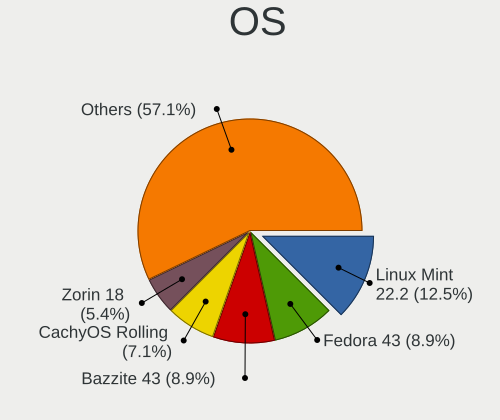

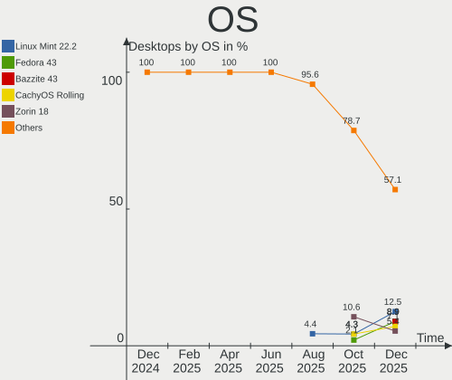

| Name                | Desktops | Percent |
|---------------------|----------|---------|
| Linux Mint 22.2     | 7        | 12.5%   |
| Fedora 43           | 5        | 8.93%   |
| Bazzite 43          | 5        | 8.93%   |
| CachyOS Rolling     | 4        | 7.14%   |
| Zorin 18            | 3        | 5.36%   |
| OpenMandriva 25.90  | 3        | 5.36%   |
| OpenMandriva 25.11  | 3        | 5.36%   |
| Debian 13           | 3        | 5.36%   |
| Linux Mint 22.1     | 2        | 3.57%   |
| Linux Mint 21.3     | 2        | 3.57%   |
| Kubuntu 25.10       | 2        | 3.57%   |
| KDE neon 24.04      | 2        | 3.57%   |
| EndeavourOS Rolling | 2        | 3.57%   |
| Xubuntu 24.04       | 1        | 1.79%   |
| TUXEDO OS 24.04     | 1        | 1.79%   |
| Secureblue 43       | 1        | 1.79%   |
| Pop!_OS 24.04       | 1        | 1.79%   |
| OpenMandriva 6.0    | 1        | 1.79%   |
| Nobara 43           | 1        | 1.79%   |
| Manjaro 25.0.10     | 1        | 1.79%   |
| LMDE 7              | 1        | 1.79%   |
| Linux Mint 21       | 1        | 1.79%   |
| Kubuntu 24.04       | 1        | 1.79%   |
| Gentoo 2.18         | 1        | 1.79%   |
| CachyOS             | 1        | 1.79%   |
| Arch Rolling        | 1        | 1.79%   |

OS Family
---------

OS without a version

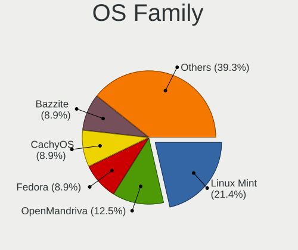

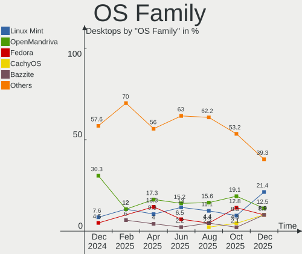

| Name         | Desktops | Percent |
|--------------|----------|---------|
| Linux Mint   | 12       | 21.43%  |
| OpenMandriva | 7        | 12.5%   |
| Fedora       | 5        | 8.93%   |
| CachyOS      | 5        | 8.93%   |
| Bazzite      | 5        | 8.93%   |
| Zorin        | 3        | 5.36%   |
| Kubuntu      | 3        | 5.36%   |
| Debian       | 3        | 5.36%   |
| KDE neon     | 2        | 3.57%   |
| EndeavourOS  | 2        | 3.57%   |
| Xubuntu      | 1        | 1.79%   |
| TUXEDO OS    | 1        | 1.79%   |
| Secureblue   | 1        | 1.79%   |
| Pop!_OS      | 1        | 1.79%   |
| Nobara       | 1        | 1.79%   |
| Manjaro      | 1        | 1.79%   |
| LMDE         | 1        | 1.79%   |
| Gentoo       | 1        | 1.79%   |
| Arch         | 1        | 1.79%   |

Kernel
------

Version of the Linux kernel

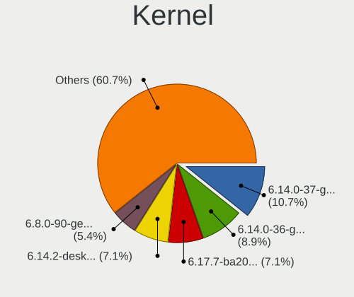

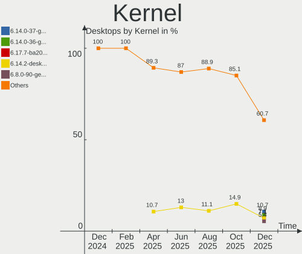

| Version                       | Desktops | Percent |
|-------------------------------|----------|---------|
| 6.14.0-37-generic             | 6        | 10.71%  |
| 6.14.0-36-generic             | 5        | 8.93%   |
| 6.17.7-ba20.fc43.x86_64       | 4        | 7.14%   |
| 6.14.2-desktop-3omv2590       | 4        | 7.14%   |
| 6.8.0-90-generic              | 3        | 5.36%   |
| 6.8.0-88-generic              | 3        | 5.36%   |
| 6.18.0-desktop-1omv2590       | 3        | 5.36%   |
| 6.12.57+deb13-amd64           | 3        | 5.36%   |
| 6.17.9-arch1-1                | 2        | 3.57%   |
| 6.17.9-300.fc43.x86_64        | 2        | 3.57%   |
| 6.8.0-87-generic              | 1        | 1.79%   |
| 6.18.2-gentoo-x86_64          | 1        | 1.79%   |
| 6.18.2-3-cachyos              | 1        | 1.79%   |
| 6.18.2-200.nobara.fc43.x86_64 | 1        | 1.79%   |
| 6.18.2-2-cachyos              | 1        | 1.79%   |
| 6.18.2-1-liquorix-amd64       | 1        | 1.79%   |
| 6.18.1-2-cachyos              | 1        | 1.79%   |
| 6.18.0-3-cachyos              | 1        | 1.79%   |
| 6.18.0-273-tkg-eevdf          | 1        | 1.79%   |
| 6.17.9-76061709-generic       | 1        | 1.79%   |
| 6.17.9-2-cachyos              | 1        | 1.79%   |
| 6.17.8-300.fc43.x86_64        | 1        | 1.79%   |
| 6.17.7-ba19.fc43.x86_64       | 1        | 1.79%   |
| 6.17.7-300.fc43.x86_64        | 1        | 1.79%   |
| 6.17.12-300.fc43.x86_64       | 1        | 1.79%   |
| 6.17.11-300.fc43.x86_64       | 1        | 1.79%   |
| 6.17.1-0-MANJARO              | 1        | 1.79%   |
| 6.17.0-7-generic              | 1        | 1.79%   |
| 6.14.0-117036-tuxedo          | 1        | 1.79%   |
| 6.12.48+deb13-amd64           | 1        | 1.79%   |
| 6.1.0-1016-oem                | 1        | 1.79%   |

Kernel Family
-------------

Linux kernel without a distro release

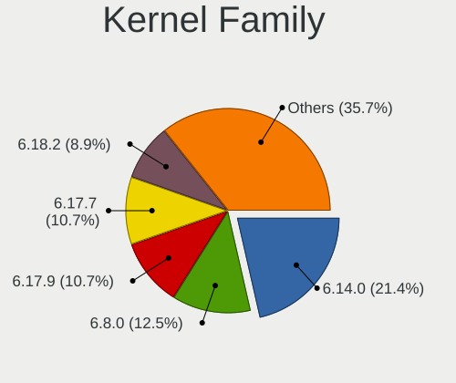

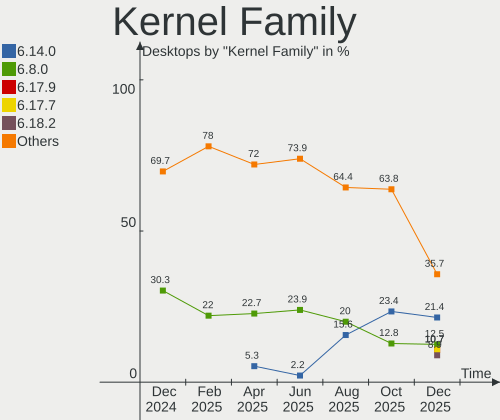

| Version | Desktops | Percent |
|---------|----------|---------|
| 6.14.0  | 12       | 21.43%  |
| 6.8.0   | 7        | 12.5%   |
| 6.17.9  | 6        | 10.71%  |
| 6.17.7  | 6        | 10.71%  |
| 6.18.2  | 5        | 8.93%   |
| 6.18.0  | 5        | 8.93%   |
| 6.14.2  | 4        | 7.14%   |
| 6.12.57 | 3        | 5.36%   |
| 6.18.1  | 1        | 1.79%   |
| 6.17.8  | 1        | 1.79%   |
| 6.17.12 | 1        | 1.79%   |
| 6.17.11 | 1        | 1.79%   |
| 6.17.1  | 1        | 1.79%   |
| 6.17.0  | 1        | 1.79%   |
| 6.12.48 | 1        | 1.79%   |
| 6.1.0   | 1        | 1.79%   |

Kernel Major Ver.
-----------------

Linux kernel major version

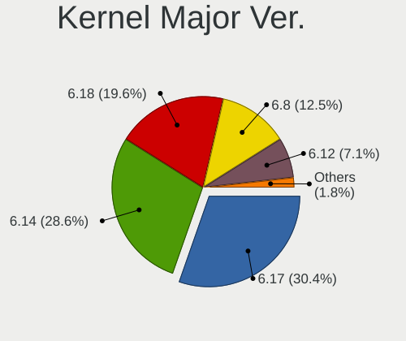

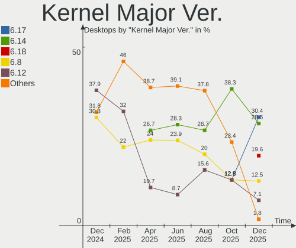

| Version | Desktops | Percent |
|---------|----------|---------|
| 6.17    | 17       | 30.36%  |
| 6.14    | 16       | 28.57%  |
| 6.18    | 11       | 19.64%  |
| 6.8     | 7        | 12.5%   |
| 6.12    | 4        | 7.14%   |
| 6.1     | 1        | 1.79%   |

Arch
----

OS architecture (x86_64, i586, etc.)

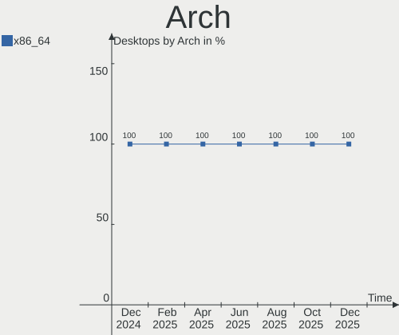

| Name   | Desktops | Percent |
|--------|----------|---------|
| x86_64 | 56       | 100%    |

DE
--

Desktop Environment

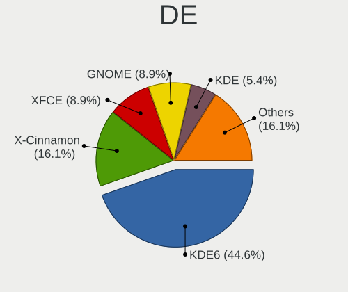

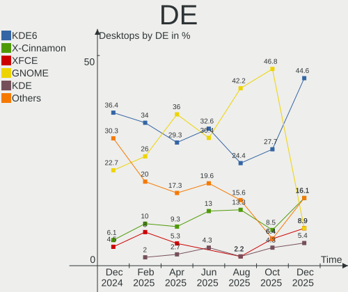

| Name       | Desktops | Percent |
|------------|----------|---------|
| KDE6       | 25       | 44.64%  |
| X-Cinnamon | 9        | 16.07%  |
| XFCE       | 5        | 8.93%   |
| GNOME      | 5        | 8.93%   |
| KDE        | 3        | 5.36%   |
| Hyprland   | 2        | 3.57%   |
| Unknown    | 2        | 3.57%   |
| MATE       | 1        | 1.79%   |
| KDE5       | 1        | 1.79%   |
| KDE4       | 1        | 1.79%   |
| COSMIC     | 1        | 1.79%   |
| bspwm      | 1        | 1.79%   |

Display Server
--------------

X11 or Wayland

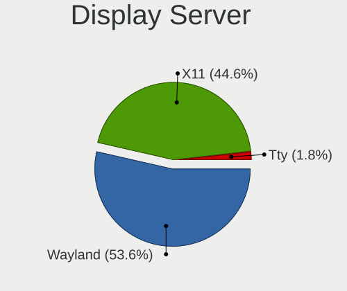

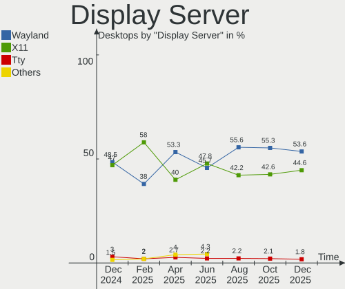

| Name    | Desktops | Percent |
|---------|----------|---------|
| Wayland | 30       | 53.57%  |
| X11     | 25       | 44.64%  |
| Tty     | 1        | 1.79%   |

Display Manager
---------------

SDDM, LightDM, etc.

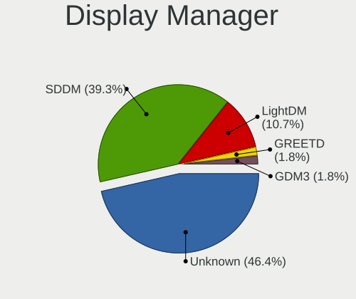

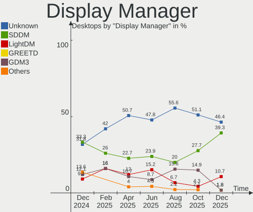

| Name    | Desktops | Percent |
|---------|----------|---------|
| Unknown | 26       | 46.43%  |
| SDDM    | 22       | 39.29%  |
| LightDM | 6        | 10.71%  |
| GREETD  | 1        | 1.79%   |
| GDM3    | 1        | 1.79%   |

OS Lang
-------

Language

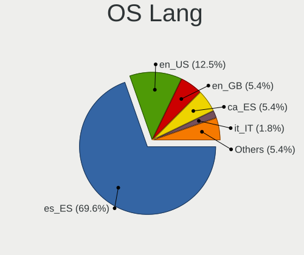

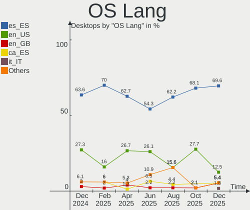

| Lang  | Desktops | Percent |
|-------|----------|---------|
| es_ES | 39       | 69.64%  |
| en_US | 7        | 12.5%   |
| en_GB | 3        | 5.36%   |
| ca_ES | 3        | 5.36%   |
| it_IT | 1        | 1.79%   |
| fr_FR | 1        | 1.79%   |
| eu_ES | 1        | 1.79%   |
| de_DE | 1        | 1.79%   |

Boot Mode
---------

EFI or BIOS

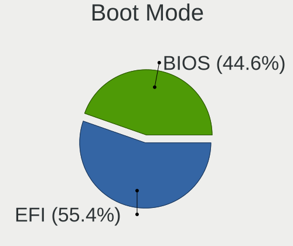

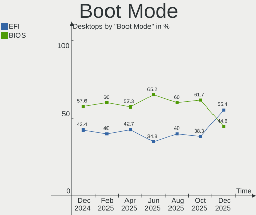

| Mode | Desktops | Percent |
|------|----------|---------|
| EFI  | 31       | 55.36%  |
| BIOS | 25       | 44.64%  |

Filesystem
----------

Type of filesystem

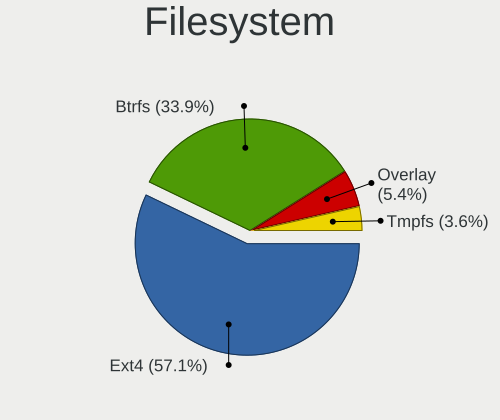

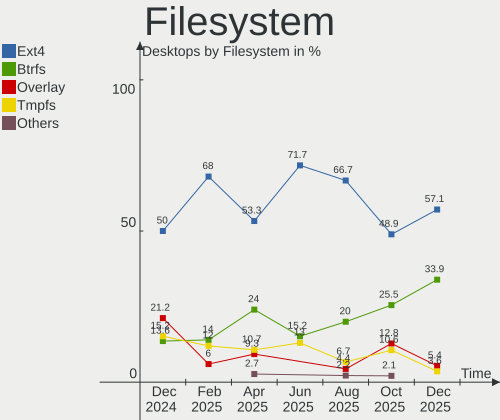

| Type    | Desktops | Percent |
|---------|----------|---------|
| Ext4    | 32       | 57.14%  |
| Btrfs   | 19       | 33.93%  |
| Overlay | 3        | 5.36%   |
| Tmpfs   | 2        | 3.57%   |

Part. scheme
------------

Scheme of partitioning

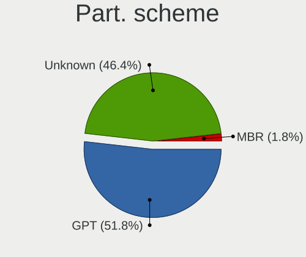

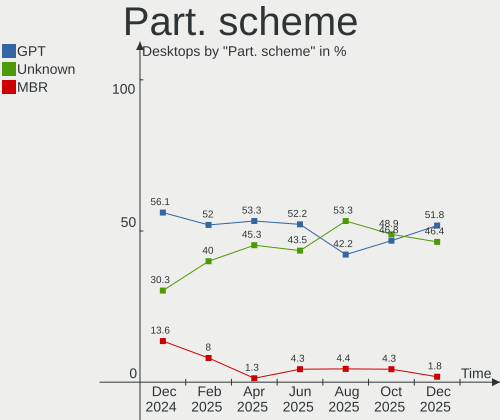

| Type    | Desktops | Percent |
|---------|----------|---------|
| GPT     | 29       | 51.79%  |
| Unknown | 26       | 46.43%  |
| MBR     | 1        | 1.79%   |

Dual Boot with Linux/BSD
------------------------

Hosting more than one Linux/BSD

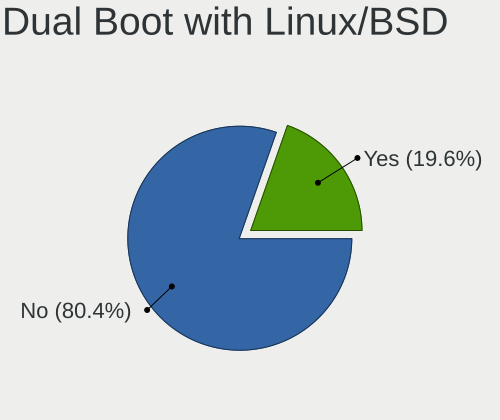

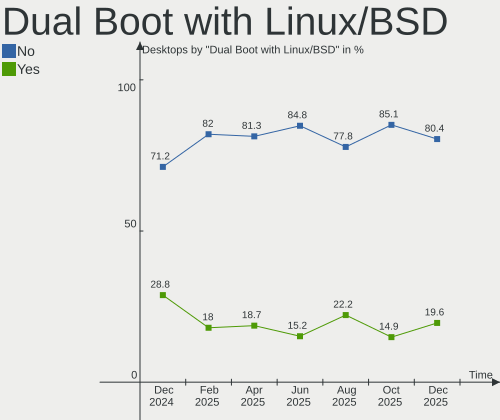

| Dual boot | Desktops | Percent |
|-----------|----------|---------|
| No        | 45       | 80.36%  |
| Yes       | 11       | 19.64%  |

Dual Boot (Win)
---------------

Hosting Linux and Windows

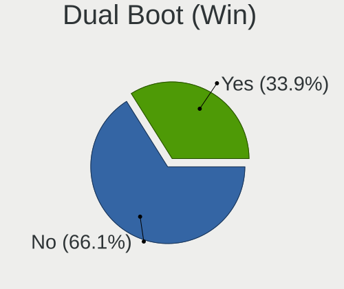

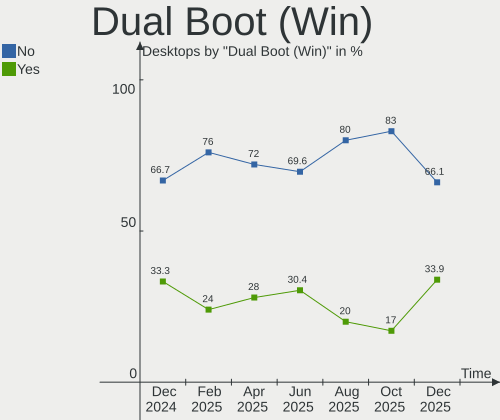

| Dual boot | Desktops | Percent |
|-----------|----------|---------|
| No        | 37       | 66.07%  |
| Yes       | 19       | 33.93%  |

Board
-----

Vendor
------

Motherboard manufacturer

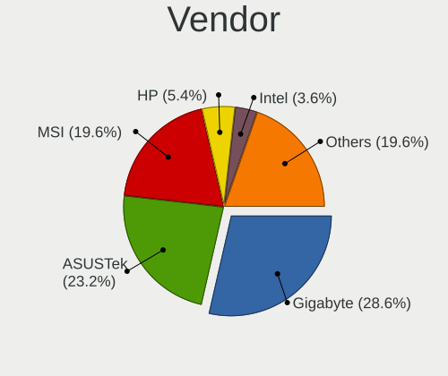

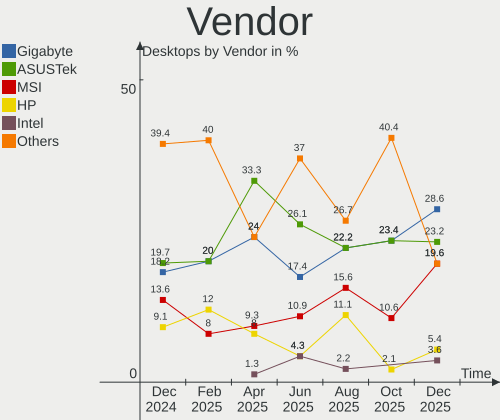

| Name                | Desktops | Percent |
|---------------------|----------|---------|
| Gigabyte Technology | 16       | 28.57%  |
| ASUSTek Computer    | 13       | 23.21%  |
| MSI                 | 11       | 19.64%  |
| Hewlett-Packard     | 3        | 5.36%   |
| Intel               | 2        | 3.57%   |
| ASRock              | 2        | 3.57%   |
| Unknown             | 2        | 3.57%   |
| Lenovo              | 1        | 1.79%   |
| Huanan              | 1        | 1.79%   |
| HC Technology.      | 1        | 1.79%   |
| GEEKOM              | 1        | 1.79%   |
| Foxconn             | 1        | 1.79%   |
| Apple               | 1        | 1.79%   |
| Acer                | 1        | 1.79%   |

Model
-----

Motherboard model

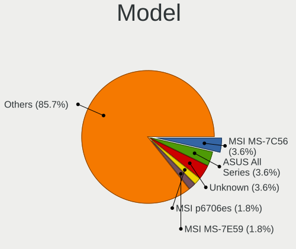

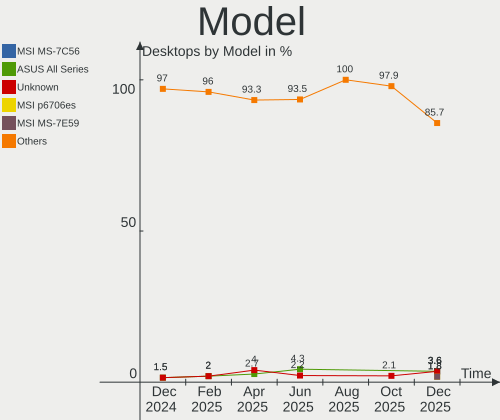

| Name                                   | Desktops | Percent |
|----------------------------------------|----------|---------|
| MSI MS-7C56                            | 2        | 3.57%   |
| ASUS All Series                        | 2        | 3.57%   |
| Unknown                                | 2        | 3.57%   |
| MSI p6706es                            | 1        | 1.79%   |
| MSI MS-7E59                            | 1        | 1.79%   |
| MSI MS-7E34                            | 1        | 1.79%   |
| MSI MS-7E26                            | 1        | 1.79%   |
| MSI MS-7E16                            | 1        | 1.79%   |
| MSI MS-7C02                            | 1        | 1.79%   |
| MSI MS-7B49                            | 1        | 1.79%   |
| MSI MS-7A32                            | 1        | 1.79%   |
| MSI MS-7917                            | 1        | 1.79%   |
| Lenovo ThinkCentre M93p 10AB000YMX     | 1        | 1.79%   |
| Intel E5-A99 V1.2                      | 1        | 1.79%   |
| Intel DG31PR AAD97573-205              | 1        | 1.79%   |
| Huanan X99-F8 GAMING V5.0              | 1        | 1.79%   |
| HP EliteDesk 800 G1 SFF                | 1        | 1.79%   |
| HP Compaq dc7900 Convertible Minitower | 1        | 1.79%   |
| HP Compaq 6005 Pro MT PC               | 1        | 1.79%   |
| HC Technology. HCAR5000-MI             | 1        | 1.79%   |
| Gigabyte Z97-HD3                       | 1        | 1.79%   |
| Gigabyte Z390 UD                       | 1        | 1.79%   |
| Gigabyte Z390 GAMING X                 | 1        | 1.79%   |
| Gigabyte X670 AORUS ELITE AX           | 1        | 1.79%   |
| Gigabyte X570 GAMING X                 | 1        | 1.79%   |
| Gigabyte P55M-UD2                      | 1        | 1.79%   |
| Gigabyte H61M-USB3H                    | 1        | 1.79%   |
| Gigabyte H61M-S2PV                     | 1        | 1.79%   |
| Gigabyte H610M S2H V3 DDR4             | 1        | 1.79%   |
| Gigabyte GA-MA78GM-UD2H                | 1        | 1.79%   |
| Gigabyte B660M DS3H DDR4               | 1        | 1.79%   |
| Gigabyte B650 AORUS ELITE AX V2        | 1        | 1.79%   |
| Gigabyte B560M DS3H V2                 | 1        | 1.79%   |
| Gigabyte B550 AORUS ELITE V2           | 1        | 1.79%   |
| Gigabyte B460MDS3H                     | 1        | 1.79%   |
| Gigabyte B365M DS3H                    | 1        | 1.79%   |
| GEEKOM A7                              | 1        | 1.79%   |
| Foxconn G5460es                        | 1        | 1.79%   |
| ASUS TUF Gaming X570-PLUS              | 1        | 1.79%   |
| ASUS TUF Gaming A620M-PLUS WIFI        | 1        | 1.79%   |

Model Family
------------

Motherboard model prefix

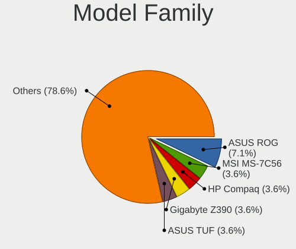

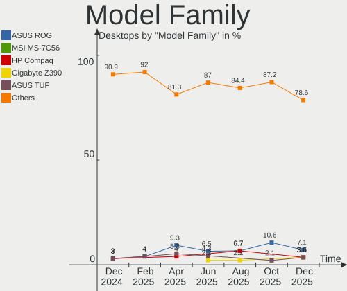

| Name                       | Desktops | Percent |
|----------------------------|----------|---------|
| ASUS ROG                   | 4        | 7.14%   |
| MSI MS-7C56                | 2        | 3.57%   |
| HP Compaq                  | 2        | 3.57%   |
| Gigabyte Z390              | 2        | 3.57%   |
| ASUS TUF                   | 2        | 3.57%   |
| ASUS PRIME                 | 2        | 3.57%   |
| ASUS All                   | 2        | 3.57%   |
| Unknown                    | 2        | 3.57%   |
| MSI p6706es                | 1        | 1.79%   |
| MSI MS-7E59                | 1        | 1.79%   |
| MSI MS-7E34                | 1        | 1.79%   |
| MSI MS-7E26                | 1        | 1.79%   |
| MSI MS-7E16                | 1        | 1.79%   |
| MSI MS-7C02                | 1        | 1.79%   |
| MSI MS-7B49                | 1        | 1.79%   |
| MSI MS-7A32                | 1        | 1.79%   |
| MSI MS-7917                | 1        | 1.79%   |
| Lenovo ThinkCentre         | 1        | 1.79%   |
| Intel E5-A99               | 1        | 1.79%   |
| Intel DG31PR               | 1        | 1.79%   |
| Huanan X99-F8              | 1        | 1.79%   |
| HP EliteDesk               | 1        | 1.79%   |
| HC Technology. HCAR5000-MI | 1        | 1.79%   |
| Gigabyte Z97-HD3           | 1        | 1.79%   |
| Gigabyte X670              | 1        | 1.79%   |
| Gigabyte X570              | 1        | 1.79%   |
| Gigabyte P55M-UD2          | 1        | 1.79%   |
| Gigabyte H61M-USB3H        | 1        | 1.79%   |
| Gigabyte H61M-S2PV         | 1        | 1.79%   |
| Gigabyte H610M             | 1        | 1.79%   |
| Gigabyte GA-MA78GM-UD2H    | 1        | 1.79%   |
| Gigabyte B660M             | 1        | 1.79%   |
| Gigabyte B650              | 1        | 1.79%   |
| Gigabyte B560M             | 1        | 1.79%   |
| Gigabyte B550              | 1        | 1.79%   |
| Gigabyte B460MDS3H         | 1        | 1.79%   |
| Gigabyte B365M             | 1        | 1.79%   |
| GEEKOM A7                  | 1        | 1.79%   |
| Foxconn G5460es            | 1        | 1.79%   |
| ASUS P5KPL-AM              | 1        | 1.79%   |

MFG Year
--------

Motherboard manufacture year

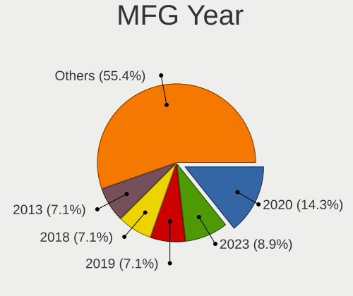

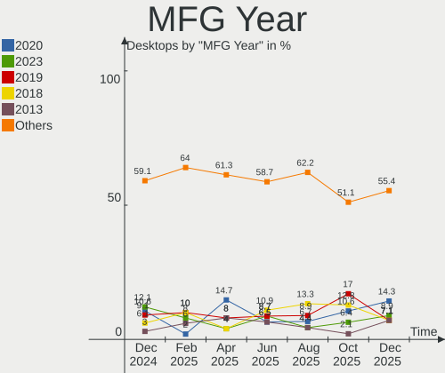

| Year | Desktops | Percent |
|------|----------|---------|
| 2020 | 8        | 14.29%  |
| 2023 | 5        | 8.93%   |
| 2019 | 4        | 7.14%   |
| 2018 | 4        | 7.14%   |
| 2013 | 4        | 7.14%   |
| 2009 | 4        | 7.14%   |
| 2025 | 3        | 5.36%   |
| 2024 | 3        | 5.36%   |
| 2022 | 3        | 5.36%   |
| 2014 | 3        | 5.36%   |
| 2021 | 2        | 3.57%   |
| 2017 | 2        | 3.57%   |
| 2016 | 2        | 3.57%   |
| 2012 | 2        | 3.57%   |
| 2011 | 2        | 3.57%   |
| 2008 | 2        | 3.57%   |
| 2015 | 1        | 1.79%   |
| 2010 | 1        | 1.79%   |
| 2007 | 1        | 1.79%   |

Form Factor
-----------

Physical design of the computer

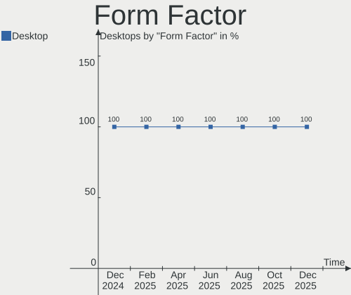

| Name    | Desktops | Percent |
|---------|----------|---------|
| Desktop | 56       | 100%    |

Secure Boot
-----------

Enabled or disabled

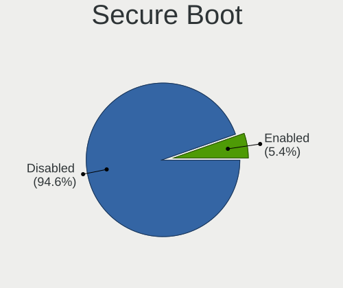

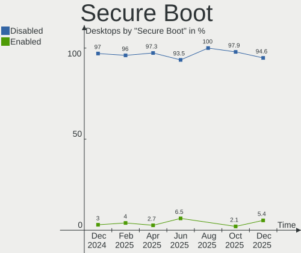

| State    | Desktops | Percent |
|----------|----------|---------|
| Disabled | 53       | 94.64%  |
| Enabled  | 3        | 5.36%   |

Coreboot
--------

Have coreboot on board

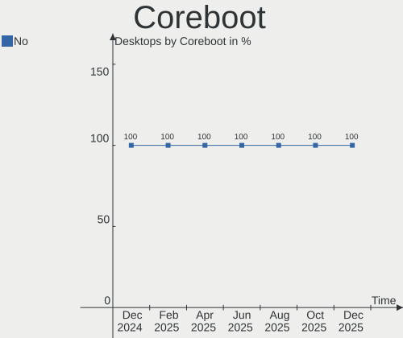

| Used | Desktops | Percent |
|------|----------|---------|
| No   | 56       | 100%    |

RAM Size
--------

Total RAM memory

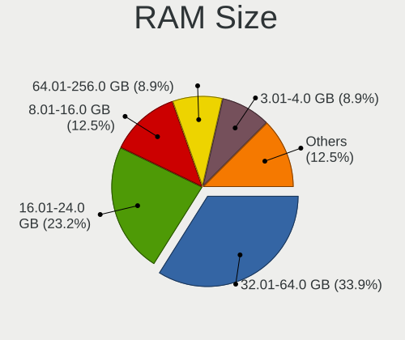

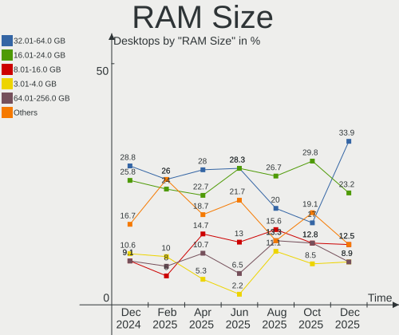

| Size in GB  | Desktops | Percent |
|-------------|----------|---------|
| 32.01-64.0  | 19       | 33.93%  |
| 16.01-24.0  | 13       | 23.21%  |
| 8.01-16.0   | 7        | 12.5%   |
| 3.01-4.0    | 5        | 8.93%   |
| 64.01-256.0 | 5        | 8.93%   |
| 4.01-8.0    | 4        | 7.14%   |
| 24.01-32.0  | 3        | 5.36%   |

RAM Used
--------

Used RAM memory

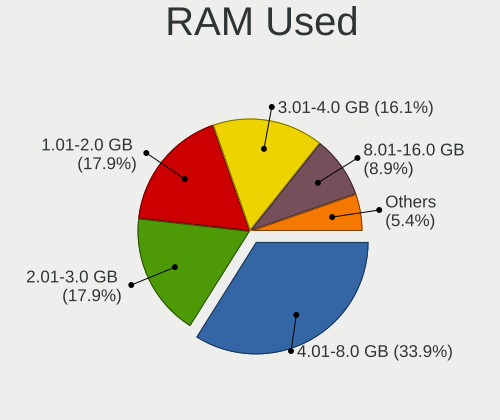

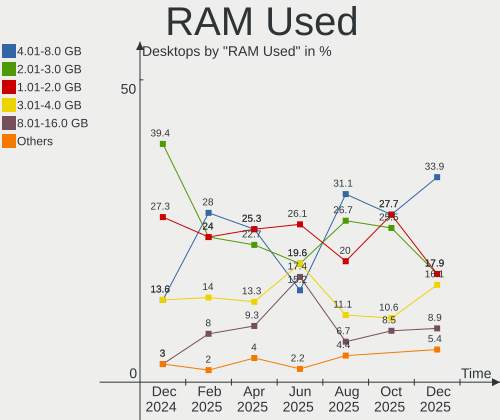

| Used GB    | Desktops | Percent |
|------------|----------|---------|
| 4.01-8.0   | 19       | 33.93%  |
| 2.01-3.0   | 10       | 17.86%  |
| 1.01-2.0   | 10       | 17.86%  |
| 3.01-4.0   | 9        | 16.07%  |
| 8.01-16.0  | 5        | 8.93%   |
| 24.01-32.0 | 1        | 1.79%   |
| 16.01-24.0 | 1        | 1.79%   |
| 0.51-1.0   | 1        | 1.79%   |

Total Drives
------------

Number of drives on board

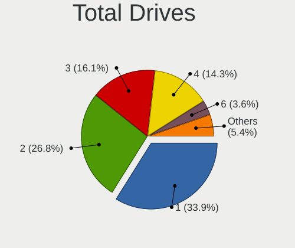

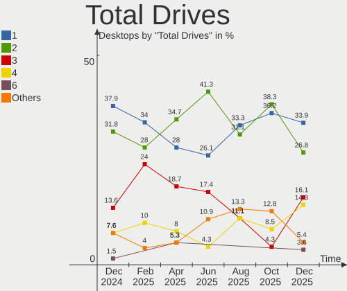

| Drives | Desktops | Percent |
|--------|----------|---------|
| 1      | 19       | 33.93%  |
| 2      | 15       | 26.79%  |
| 3      | 9        | 16.07%  |
| 4      | 8        | 14.29%  |
| 6      | 2        | 3.57%   |
| 5      | 2        | 3.57%   |
| 8      | 1        | 1.79%   |

Has CD-ROM
----------

Has CD-ROM on board

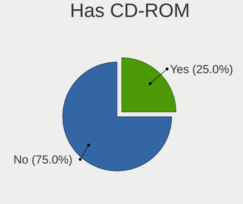

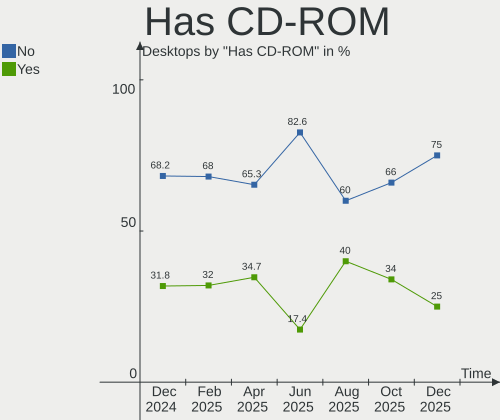

| Presented | Desktops | Percent |
|-----------|----------|---------|
| No        | 42       | 75%     |
| Yes       | 14       | 25%     |

Has Ethernet
------------

Has Ethernet on board

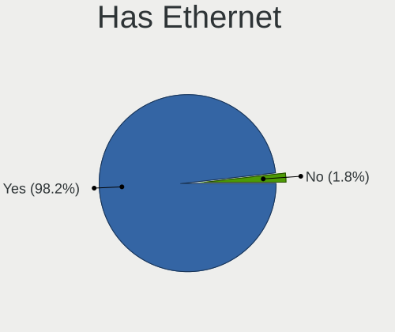

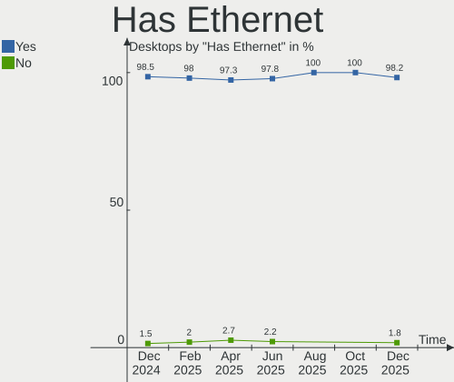

| Presented | Desktops | Percent |
|-----------|----------|---------|
| Yes       | 55       | 98.21%  |
| No        | 1        | 1.79%   |

Has WiFi
--------

Has WiFi module

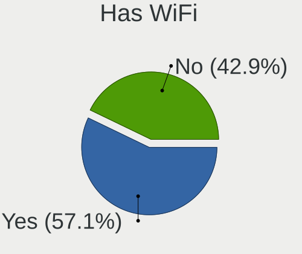

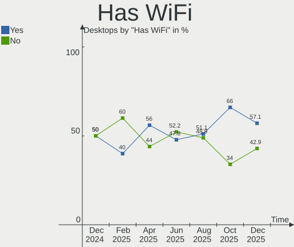

| Presented | Desktops | Percent |
|-----------|----------|---------|
| Yes       | 32       | 57.14%  |
| No        | 24       | 42.86%  |

Has Bluetooth
-------------

Has Bluetooth module

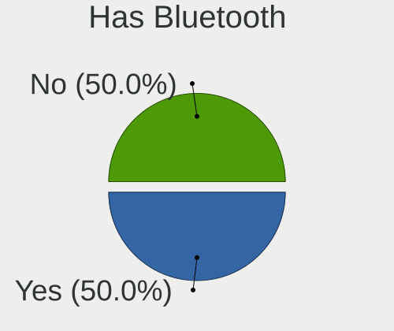

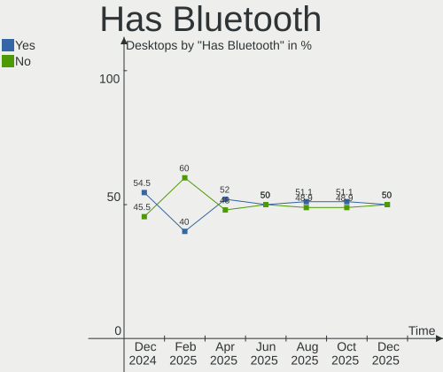

| Presented | Desktops | Percent |
|-----------|----------|---------|
| Yes       | 28       | 50%     |
| No        | 28       | 50%     |

Location
--------

Country
-------

Geographic location (country)

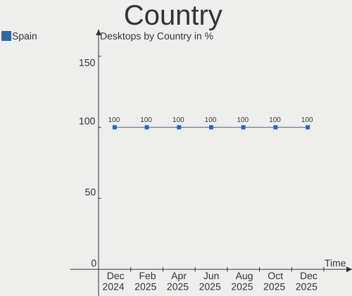

| Country | Desktops | Percent |
|---------|----------|---------|
| Spain   | 56       | 100%    |

City
----

Geographic location (city)

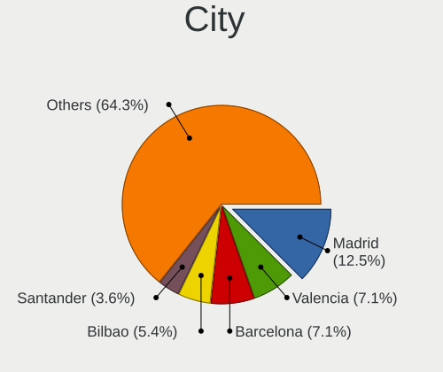

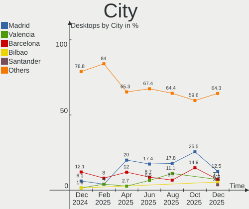

| City                    | Desktops | Percent |
|-------------------------|----------|---------|
| Madrid                  | 7        | 12.5%   |
| Valencia                | 4        | 7.14%   |
| Barcelona               | 4        | 7.14%   |
| Bilbao                  | 3        | 5.36%   |
| Santander               | 2        | 3.57%   |
| Mostoles                | 2        | 3.57%   |
| Barakaldo               | 2        | 3.57%   |
| Almería                | 2        | 3.57%   |
| Zaragoza                | 1        | 1.79%   |
| Vila-real               | 1        | 1.79%   |
| Vic                     | 1        | 1.79%   |
| Utrera                  | 1        | 1.79%   |
| Torrellano              | 1        | 1.79%   |
| Santa Cruz de Tenerife  | 1        | 1.79%   |
| Rada de Haro            | 1        | 1.79%   |
| Quijorna                | 1        | 1.79%   |
| Puerto del Rosario      | 1        | 1.79%   |
| Pontevedra              | 1        | 1.79%   |
| Palafolls               | 1        | 1.79%   |
| Oviedo                  | 1        | 1.79%   |
| Ourense                 | 1        | 1.79%   |
| Muriedas                | 1        | 1.79%   |
| Mollet del Vallès      | 1        | 1.79%   |
| Málaga                 | 1        | 1.79%   |
| Lugones                 | 1        | 1.79%   |
| Los Llanos de Aridane   | 1        | 1.79%   |
| Lesaka                  | 1        | 1.79%   |
| Leganés                | 1        | 1.79%   |
| La Victoria de Acentejo | 1        | 1.79%   |
| Ibi                     | 1        | 1.79%   |
| Granada                 | 1        | 1.79%   |
| El Tiemblo              | 1        | 1.79%   |
| El Astillero            | 1        | 1.79%   |
| Crevillent              | 1        | 1.79%   |
| Cabezon de la Sal       | 1        | 1.79%   |
| Almedinilla             | 1        | 1.79%   |
| Alicante                | 1        | 1.79%   |
| A Coruña               | 1        | 1.79%   |

Drives
------

Drive Vendor
------------

Hard drive vendors

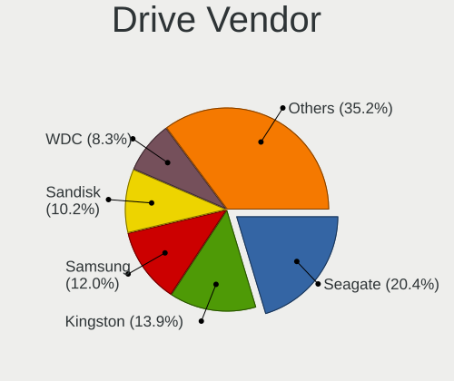

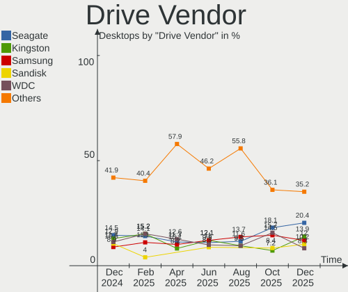

| Vendor                      | Desktops | Drives | Percent |
|-----------------------------|----------|--------|---------|
| Seagate                     | 22       | 31     | 20.37%  |
| Kingston                    | 15       | 17     | 13.89%  |
| Samsung Electronics         | 13       | 22     | 12.04%  |
| Sandisk                     | 11       | 11     | 10.19%  |
| WDC                         | 9        | 12     | 8.33%   |
| Kingston Technology Company | 7        | 8      | 6.48%   |
| Crucial                     | 7        | 11     | 6.48%   |
| Toshiba                     | 4        | 4      | 3.7%    |
| Phison Electronics          | 2        | 2      | 1.85%   |
| Micron/Crucial Technology   | 2        | 2      | 1.85%   |
| KIOXIA-EXCERIA              | 2        | 3      | 1.85%   |
| Hitachi                     | 2        | 2      | 1.85%   |
| USB                         | 1        | 1      | 0.93%   |
| Unknown                     | 1        | 1      | 0.93%   |
| Rayson                      | 1        | 1      | 0.93%   |
| Phison                      | 1        | 1      | 0.93%   |
| Lenovo                      | 1        | 1      | 0.93%   |
| KIOXIA                      | 1        | 1      | 0.93%   |
| JMicron Technology          | 1        | 1      | 0.93%   |
| HGST                        | 1        | 1      | 0.93%   |
| Go-Infinity                 | 1        | 1      | 0.93%   |
| Emtec                       | 1        | 2      | 0.93%   |
| ASMT                        | 1        | 1      | 0.93%   |
| AirDisk                     | 1        | 1      | 0.93%   |

Drive Model
-----------

Hard drive models

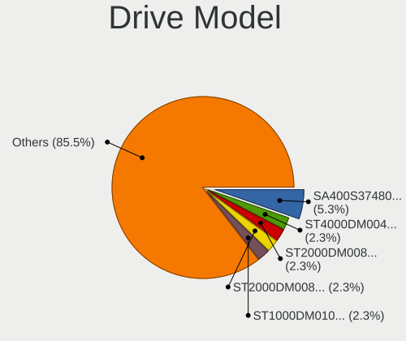

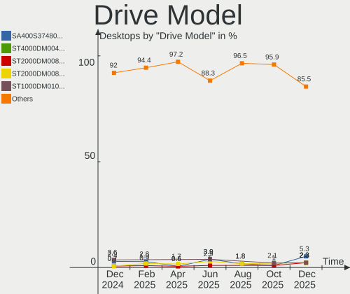

| Model                                                    | Desktops | Percent |
|----------------------------------------------------------|----------|---------|
| Kingston SA400S37480G 480GB SSD                          | 7        | 5.34%   |
| Seagate ST4000DM004-2U9104 4TB                           | 3        | 2.29%   |
| Seagate ST2000DM008-2UB102 2TB                           | 3        | 2.29%   |
| Seagate ST2000DM008-2FR102 2TB                           | 3        | 2.29%   |
| Seagate ST1000DM010-2EP102 1TB                           | 3        | 2.29%   |
| Seagate ST1000DM003-1CH162 1TB                           | 3        | 2.29%   |
| Samsung NVMe SSD Controller SM981/PM981/PM983 1TB        | 3        | 2.29%   |
| Kingston SA400S37960G 960GB SSD                          | 3        | 2.29%   |
| Toshiba MQ01ABF050 500GB                                 | 2        | 1.53%   |
| Sandisk WD_BLACK SN770 2TB                               | 2        | 1.53%   |
| Samsung SSD 990 PRO 4TB                                  | 2        | 1.53%   |
| Samsung SSD 990 PRO 2TB                                  | 2        | 1.53%   |
| Samsung NVMe SSD Controller PM9A1/PM9A3/980PRO 1TB       | 2        | 1.53%   |
| Samsung HD103UJ 1TB                                      | 2        | 1.53%   |
| Phison E12 NVMe Controller 1TB                           | 2        | 1.53%   |
| Kingston Company NV2 NVMe SSD [SM2267XT] (DRAM-less) 1TB | 2        | 1.53%   |
| Kingston SV300S37A240G 240GB SSD                         | 2        | 1.53%   |
| WDC WDS100T1R0A-68A4W0 1TB                               | 1        | 0.76%   |
| WDC WD40EZRZ-75GXCB0 4TB                                 | 1        | 0.76%   |
| WDC WD3200BPVT-22JJ5T0 320GB                             | 1        | 0.76%   |
| WDC WD20EZRX-00D8PB0 2TB                                 | 1        | 0.76%   |
| WDC WD20EARX-00PASB0 2TB                                 | 1        | 0.76%   |
| WDC WD2003FZEX-00Z4SA0 2TB                               | 1        | 0.76%   |
| WDC WD10EZEX-60ZF5A0 1TB                                 | 1        | 0.76%   |
| WDC WD10EZEX-22RKKA0 1TB                                 | 1        | 0.76%   |
| WDC WD10EZEX-22MFCA0 1TB                                 | 1        | 0.76%   |
| WDC WD10EZEX-21WN4A0 1TB                                 | 1        | 0.76%   |
| WDC WD10EZEX-00RKKA0 1TB                                 | 1        | 0.76%   |
| USB SanDisk 3.2Gen1 496GB                                | 1        | 0.76%   |
| Unknown SD/MMC/MS PRO 2GB                                | 1        | 0.76%   |
| Toshiba MQ01ABD100 1TB                                   | 1        | 0.76%   |
| Toshiba DT01ACA100 1TB                                   | 1        | 0.76%   |
| Seagate ST9500325AS 500GB                                | 1        | 0.76%   |
| Seagate ST500DM002-1BD142 500GB                          | 1        | 0.76%   |
| Seagate ST4000VX016-3CV104 4TB                           | 1        | 0.76%   |
| Seagate ST4000VN006-3CW104 4TB                           | 1        | 0.76%   |
| Seagate ST3320620AS 320GB                                | 1        | 0.76%   |
| Seagate ST3250620AS 250GB                                | 1        | 0.76%   |
| Seagate ST3250310AS 250GB                                | 1        | 0.76%   |
| Seagate ST3160815AS 160GB                                | 1        | 0.76%   |

HDD Vendor
----------

Hard disk drive vendors

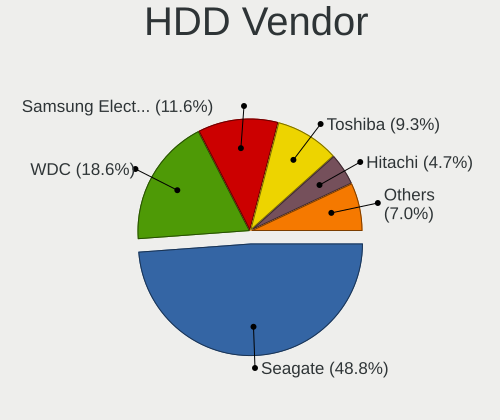

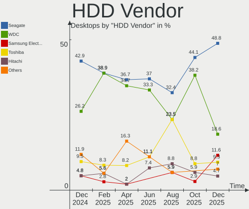

| Vendor              | Desktops | Drives | Percent |
|---------------------|----------|--------|---------|
| Seagate             | 21       | 29     | 48.84%  |
| WDC                 | 8        | 10     | 18.6%   |
| Samsung Electronics | 5        | 5      | 11.63%  |
| Toshiba             | 4        | 4      | 9.3%    |
| Hitachi             | 2        | 2      | 4.65%   |
| Unknown             | 1        | 1      | 2.33%   |
| HGST                | 1        | 1      | 2.33%   |
| ASMT                | 1        | 1      | 2.33%   |

SSD Vendor
----------

Solid state drive vendors

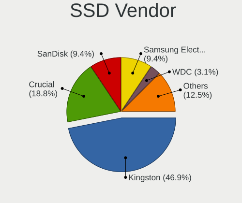

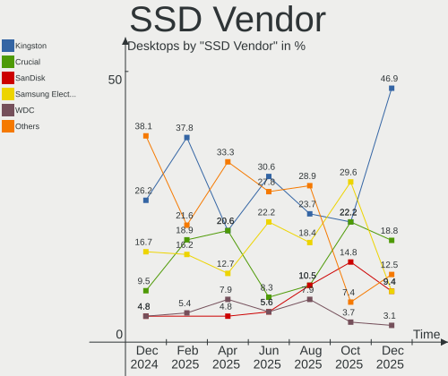

| Vendor              | Desktops | Drives | Percent |
|---------------------|----------|--------|---------|
| Kingston            | 15       | 16     | 46.88%  |
| Crucial             | 6        | 10     | 18.75%  |
| SanDisk             | 3        | 3      | 9.38%   |
| Samsung Electronics | 3        | 4      | 9.38%   |
| WDC                 | 1        | 2      | 3.13%   |
| Rayson              | 1        | 1      | 3.13%   |
| KIOXIA-EXCERIA      | 1        | 1      | 3.13%   |
| Emtec               | 1        | 2      | 3.13%   |
| AirDisk             | 1        | 1      | 3.13%   |

Drive Kind
----------

HDD or SSD

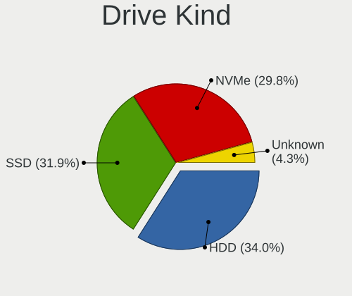

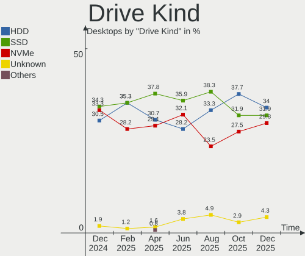

| Kind    | Desktops | Drives | Percent |
|---------|----------|--------|---------|
| HDD     | 32       | 53     | 34.04%  |
| SSD     | 30       | 40     | 31.91%  |
| NVMe    | 28       | 41     | 29.79%  |
| Unknown | 4        | 4      | 4.26%   |

Drive Connector
---------------

SATA, SAS, NVMe, etc.

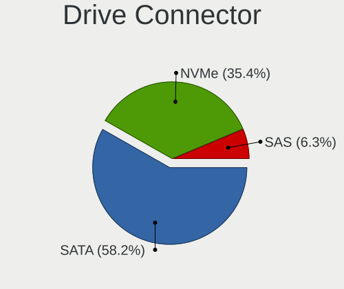

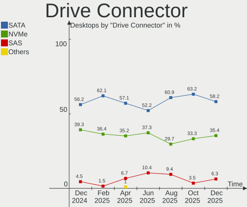

| Type | Desktops | Drives | Percent |
|------|----------|--------|---------|
| SATA | 46       | 92     | 58.23%  |
| NVMe | 28       | 41     | 35.44%  |
| SAS  | 5        | 5      | 6.33%   |

Drive Size
----------

Size of hard drive

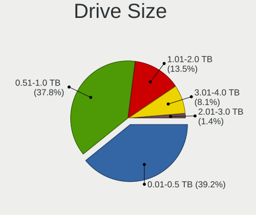

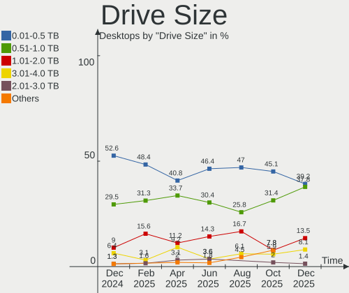

| Size in TB | Desktops | Drives | Percent |
|------------|----------|--------|---------|
| 0.01-0.5   | 29       | 37     | 39.19%  |
| 0.51-1.0   | 28       | 35     | 37.84%  |
| 1.01-2.0   | 10       | 12     | 13.51%  |
| 3.01-4.0   | 6        | 8      | 8.11%   |
| 2.01-3.0   | 1        | 1      | 1.35%   |

Space Total
-----------

Amount of disk space available on the file system

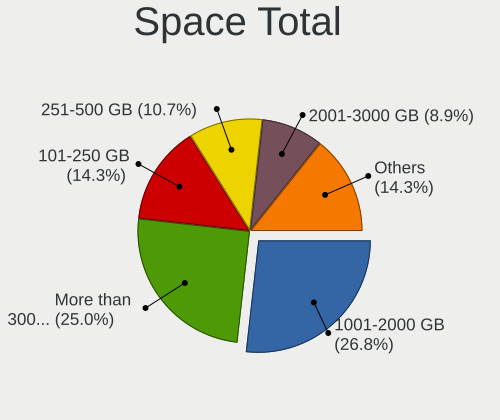

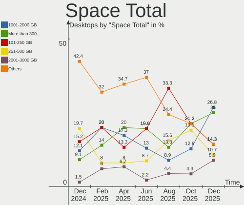

| Size in GB     | Desktops | Percent |
|----------------|----------|---------|
| 1001-2000      | 15       | 26.79%  |
| More than 3000 | 14       | 25%     |
| 101-250        | 8        | 14.29%  |
| 251-500        | 6        | 10.71%  |
| 2001-3000      | 5        | 8.93%   |
| 501-1000       | 3        | 5.36%   |
| Unknown        | 3        | 5.36%   |
| 1-20           | 1        | 1.79%   |
| 51-100         | 1        | 1.79%   |

Space Used
----------

Amount of used disk space

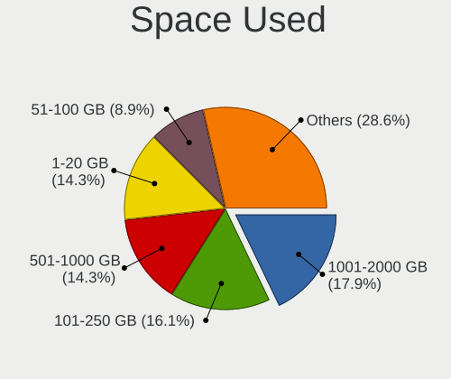

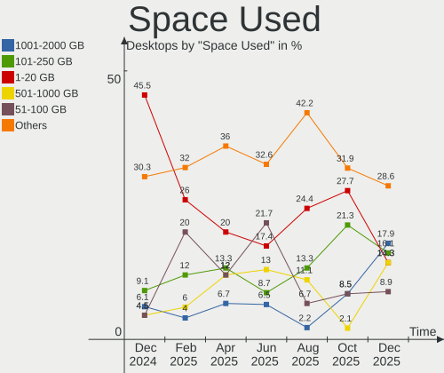

| Used GB        | Desktops | Percent |
|----------------|----------|---------|
| 1001-2000      | 10       | 17.86%  |
| 101-250        | 9        | 16.07%  |
| 1-20           | 8        | 14.29%  |
| 501-1000       | 8        | 14.29%  |
| 51-100         | 5        | 8.93%   |
| 21-50          | 4        | 7.14%   |
| More than 3000 | 3        | 5.36%   |
| 251-500        | 3        | 5.36%   |
| 2001-3000      | 3        | 5.36%   |
| Unknown        | 3        | 5.36%   |

Malfunc. Drives
---------------

Drive models with a malfunction

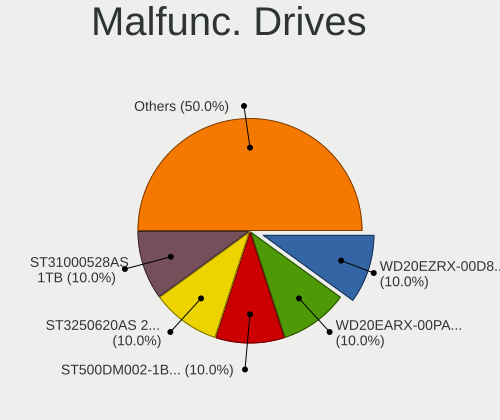

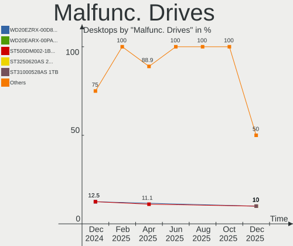

| Model                                                         | Desktops | Drives | Percent |
|---------------------------------------------------------------|----------|--------|---------|
| WDC WD20EZRX-00D8PB0 2TB                                      | 1        | 1      | 10%     |
| WDC WD20EARX-00PASB0 2TB                                      | 1        | 1      | 10%     |
| Seagate ST500DM002-1BD142 500GB                               | 1        | 1      | 10%     |
| Seagate ST3250620AS 250GB                                     | 1        | 1      | 10%     |
| Seagate ST31000528AS 1TB                                      | 1        | 1      | 10%     |
| Seagate ST1000DM003-9YN162 1TB                                | 1        | 1      | 10%     |
| Seagate ST1000DM003-1CH162 1TB                                | 1        | 1      | 10%     |
| Samsung Electronics NVMe SSD Controller SM981/PM981/PM983 1TB | 1        | 1      | 10%     |
| Hitachi HDS721010CLA332 1TB                                   | 1        | 1      | 10%     |
| Crucial CT480M500SSD1 480GB                                   | 1        | 1      | 10%     |

Malfunc. Drive Vendor
---------------------

Vendors of faulty drives

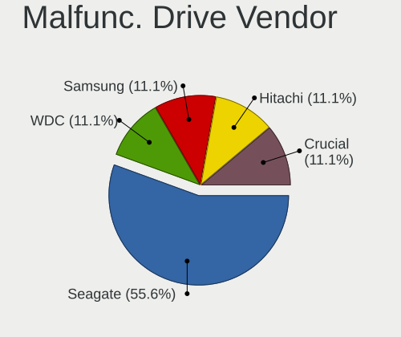

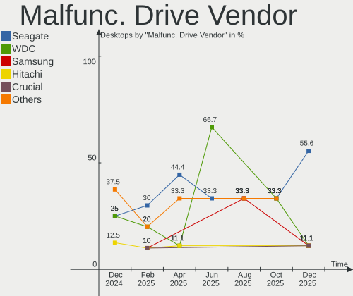

| Vendor              | Desktops | Drives | Percent |
|---------------------|----------|--------|---------|
| Seagate             | 5        | 5      | 55.56%  |
| WDC                 | 1        | 2      | 11.11%  |
| Samsung Electronics | 1        | 1      | 11.11%  |
| Hitachi             | 1        | 1      | 11.11%  |
| Crucial             | 1        | 1      | 11.11%  |

Malfunc. HDD Vendor
-------------------

Vendors of faulty HDD drives

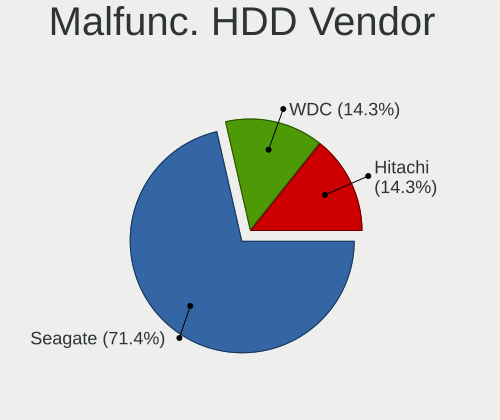

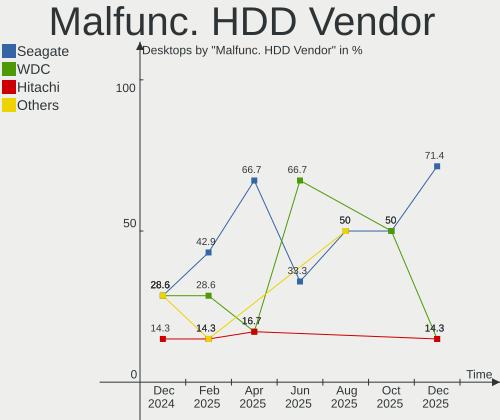

| Vendor  | Desktops | Drives | Percent |
|---------|----------|--------|---------|
| Seagate | 5        | 5      | 71.43%  |
| WDC     | 1        | 2      | 14.29%  |
| Hitachi | 1        | 1      | 14.29%  |

Malfunc. Drive Kind
-------------------

Kinds of faulty drives

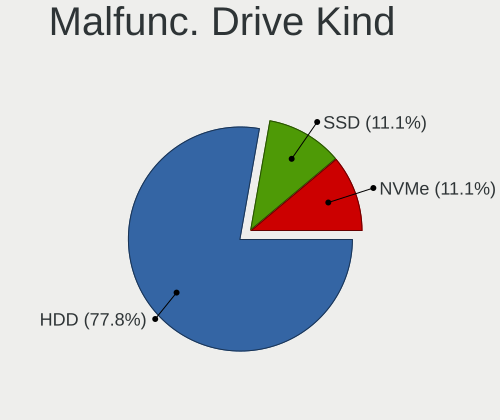

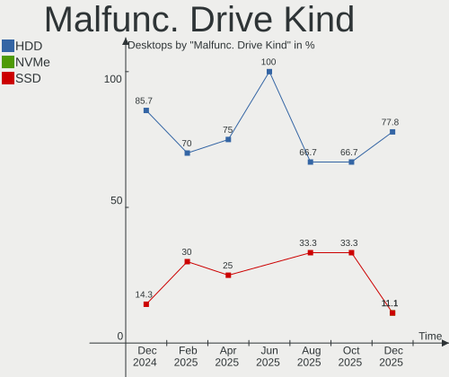

| Kind | Desktops | Drives | Percent |
|------|----------|--------|---------|
| HDD  | 7        | 8      | 77.78%  |
| NVMe | 1        | 1      | 11.11%  |
| SSD  | 1        | 1      | 11.11%  |

Failed Drives
-------------

Failed drive models

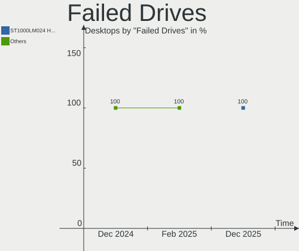

| Model                              | Desktops | Drives | Percent |
|------------------------------------|----------|--------|---------|
| Seagate ST1000LM024 HN-M101MBB 1TB | 1        | 1      | 100%    |

Failed Drive Vendor
-------------------

Failed drive vendors

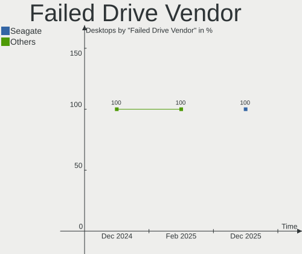

| Vendor  | Desktops | Drives | Percent |
|---------|----------|--------|---------|
| Seagate | 1        | 1      | 100%    |

Drive Status
------------

Number of failed and malfunc. drives

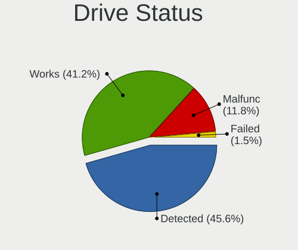

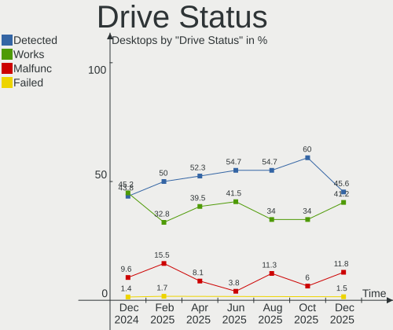

| Status   | Desktops | Drives | Percent |
|----------|----------|--------|---------|
| Detected | 31       | 65     | 45.59%  |
| Works    | 28       | 62     | 41.18%  |
| Malfunc  | 8        | 10     | 11.76%  |
| Failed   | 1        | 1      | 1.47%   |

Storage controller
------------------

Storage Vendor
--------------

Storage controller vendors

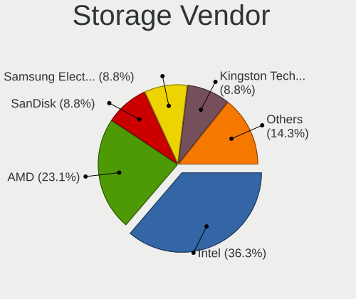

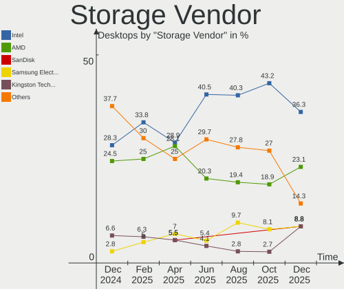

| Vendor                      | Desktops | Percent |
|-----------------------------|----------|---------|
| Intel                       | 33       | 36.26%  |
| AMD                         | 21       | 23.08%  |
| SanDisk                     | 8        | 8.79%   |
| Samsung Electronics         | 8        | 8.79%   |
| Kingston Technology Company | 8        | 8.79%   |
| Phison Electronics          | 3        | 3.3%    |
| Micron/Crucial Technology   | 3        | 3.3%    |
| Marvell Technology Group    | 2        | 2.2%    |
| KIOXIA                      | 2        | 2.2%    |
| Seagate Technology          | 1        | 1.1%    |
| Lenovo                      | 1        | 1.1%    |
| ASMedia Technology          | 1        | 1.1%    |

Storage Model
-------------

Storage controller models

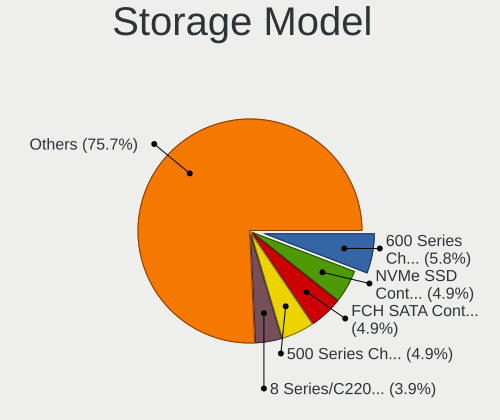

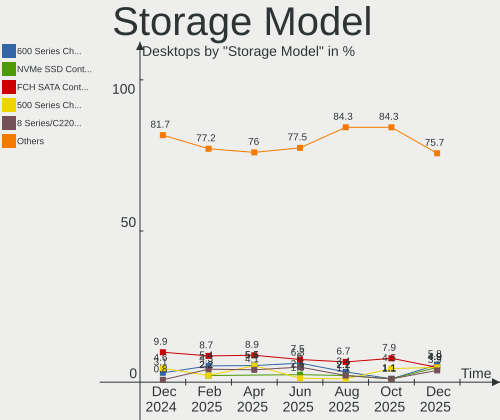

| Model                                                                                   | Desktops | Percent |
|-----------------------------------------------------------------------------------------|----------|---------|
| AMD 600 Series Chipset SATA Controller                                                  | 6        | 5.83%   |
| Samsung NVMe SSD Controller S4LV008[Pascal]                                             | 5        | 4.85%   |
| AMD FCH SATA Controller [AHCI mode]                                                     | 5        | 4.85%   |
| AMD 500 Series Chipset SATA Controller                                                  | 5        | 4.85%   |
| Intel 8 Series/C220 Series Chipset Family 6-port SATA Controller 1 [AHCI mode]          | 4        | 3.88%   |
| Samsung NVMe SSD Controller SM981/PM981/PM983                                           | 3        | 2.91%   |
| Phison E12 NVMe Controller                                                              | 3        | 2.91%   |
| Kingston Company NV2 NVMe SSD [SM2267XT] (DRAM-less)                                    | 3        | 2.91%   |
| Intel Q170/Q150/B150/H170/H110/Z170/CM236 Chipset SATA Controller [AHCI Mode]           | 3        | 2.91%   |
| Intel Alder Lake-S PCH SATA Controller [AHCI Mode]                                      | 3        | 2.91%   |
| Intel 9 Series Chipset Family SATA Controller [AHCI Mode]                               | 3        | 2.91%   |
| Intel 6 Series/C200 Series Chipset Family 6 port Desktop SATA AHCI Controller           | 3        | 2.91%   |
| AMD 400 Series Chipset SATA Controller                                                  | 3        | 2.91%   |
| SanDisk WD SN560/SN740/SN770/SN5000 NVMe SSD                                            | 2        | 1.94%   |
| SanDisk Ultra 3D / WD Blue SN570 NVMe SSD (DRAM-less)                                   | 2        | 1.94%   |
| Samsung NVMe SSD Controller PM9A1/PM9A3/980PRO                                          | 2        | 1.94%   |
| Micron/Crucial P2 [Nick P2] / P3 / P3 Plus NVMe PCIe SSD (DRAM-less)                    | 2        | 1.94%   |
| Kingston Company NV2 NVMe SSD [E21T] (DRAM-less)                                        | 2        | 1.94%   |
| Intel SATA Controller [RAID mode]                                                       | 2        | 1.94%   |
| Intel NM10/ICH7 Family SATA Controller [IDE mode]                                       | 2        | 1.94%   |
| Intel 6 Series/C200 Series Chipset Family Desktop SATA Controller (IDE mode, ports 4-5) | 2        | 1.94%   |
| Intel 6 Series/C200 Series Chipset Family Desktop SATA Controller (IDE mode, ports 0-3) | 2        | 1.94%   |
| Intel 5 Series/3400 Series Chipset 6 port SATA AHCI Controller                          | 2        | 1.94%   |
| Intel 200 Series PCH SATA controller [AHCI mode]                                        | 2        | 1.94%   |
| Seagate E18 PCIe SSD                                                                    | 1        | 0.97%   |
| SanDisk WD Blue SN570 NVMe SSD 2TB                                                      | 1        | 0.97%   |
| Sandisk WD Black SN850X NVMe SSD                                                        | 1        | 0.97%   |
| SanDisk WD Black NVMe SSD                                                               | 1        | 0.97%   |
| SanDisk Extreme Pro / WD Black SN750 / PC SN730 / Red SN700 NVMe SSD                    | 1        | 0.97%   |
| Samsung NVMe SSD Controller 980 (DRAM-less)                                             | 1        | 0.97%   |
| Micron/Crucial P1 NVMe PCIe SSD[Frampton]                                               | 1        | 0.97%   |
| Marvell Group 88SE9215 PCIe 2.0 x1 4-port SATA 6 Gb/s Controller                        | 1        | 0.97%   |
| Marvell Group 88SE9120 SATA 6Gb/s Controller                                            | 1        | 0.97%   |
| Lenovo LENSE20256GMSP34MEAT2TA                                                          | 1        | 0.97%   |
| KIOXIA NVMe SSD                                                                         | 1        | 0.97%   |
| KIOXIA Exceria Pro NVMe SSD                                                             | 1        | 0.97%   |
| Kingston Company NV3 NVMe SSD [SM2268XT2] (DRAM-less)                                   | 1        | 0.97%   |
| Kingston Company FURY Renegade NVMe SSD [E18] (Heatsink)                                | 1        | 0.97%   |
| Kingston Company A2000 NVMe SSD [SM2263EN]                                              | 1        | 0.97%   |
| Intel Volume Management Device NVMe RAID Controller                                     | 1        | 0.97%   |

Storage Kind
------------

Kind of storage controller (IDE, SATA, NVMe, SAS, ...)

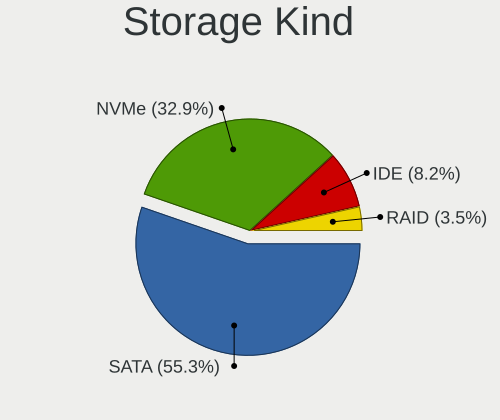

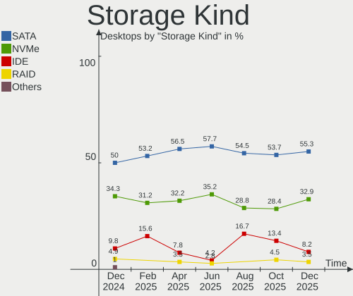

| Kind | Desktops | Percent |
|------|----------|---------|
| SATA | 47       | 55.29%  |
| NVMe | 28       | 32.94%  |
| IDE  | 7        | 8.24%   |
| RAID | 3        | 3.53%   |

Processor
---------

CPU Vendor
----------

Processor vendors

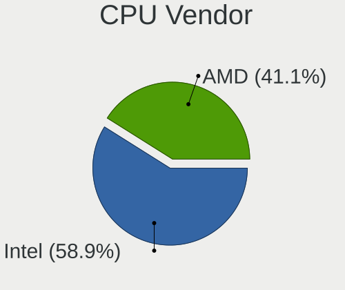

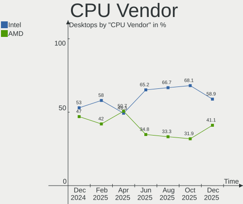

| Vendor | Desktops | Percent |
|--------|----------|---------|
| Intel  | 33       | 58.93%  |
| AMD    | 23       | 41.07%  |

CPU Model
---------

Processor models

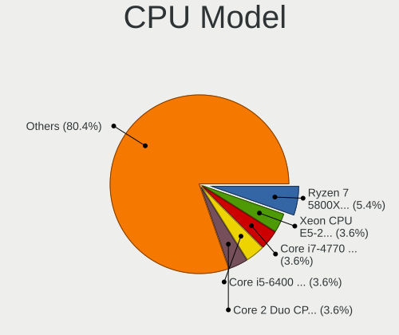

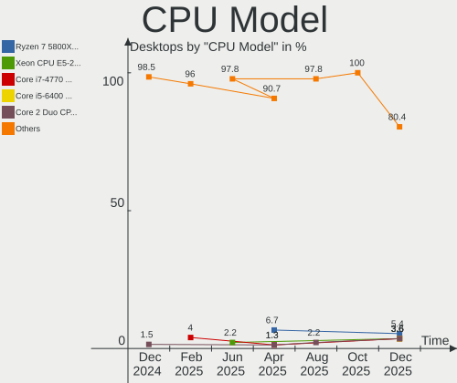

| Model                                      | Desktops | Percent |
|--------------------------------------------|----------|---------|
| AMD Ryzen 7 5800X 8-Core Processor         | 3        | 5.36%   |
| Intel Xeon CPU E5-2680 v4 @ 2.40GHz        | 2        | 3.57%   |
| Intel Core i7-4770 CPU @ 3.40GHz           | 2        | 3.57%   |
| Intel Core i5-6400 CPU @ 2.70GHz           | 2        | 3.57%   |
| Intel Core 2 Duo CPU E8400 @ 3.00GHz       | 2        | 3.57%   |
| AMD Ryzen 9 5900X 12-Core Processor        | 2        | 3.57%   |
| Intel Xeon CPU E5462 @ 2.80GHz             | 1        | 1.79%   |
| Intel Xeon CPU E5-2630L v2 @ 2.40GHz       | 1        | 1.79%   |
| Intel Core Ultra 7 265K                    | 1        | 1.79%   |
| Intel Core i7-9700F CPU @ 3.00GHz          | 1        | 1.79%   |
| Intel Core i7-8700K CPU @ 3.70GHz          | 1        | 1.79%   |
| Intel Core i7-4790K CPU @ 4.00GHz          | 1        | 1.79%   |
| Intel Core i7-4790 CPU @ 3.60GHz           | 1        | 1.79%   |
| Intel Core i7-2600 CPU @ 3.40GHz           | 1        | 1.79%   |
| Intel Core i5-9400 CPU @ 2.90GHz           | 1        | 1.79%   |
| Intel Core i5-8400 CPU @ 2.80GHz           | 1        | 1.79%   |
| Intel Core i5-6600K CPU @ 3.50GHz          | 1        | 1.79%   |
| Intel Core i5-4690K CPU @ 3.50GHz          | 1        | 1.79%   |
| Intel Core i5-4570T CPU @ 2.90GHz          | 1        | 1.79%   |
| Intel Core i5-3330 CPU @ 3.00GHz           | 1        | 1.79%   |
| Intel Core i5-2400 CPU @ 3.10GHz           | 1        | 1.79%   |
| Intel Core i5-2320 CPU @ 3.00GHz           | 1        | 1.79%   |
| Intel Core i5-10400 CPU @ 2.90GHz          | 1        | 1.79%   |
| Intel Core i5 CPU 750 @ 2.67GHz            | 1        | 1.79%   |
| Intel Core i5 CPU 650 @ 3.20GHz            | 1        | 1.79%   |
| Intel Core i3-2100 CPU @ 3.10GHz           | 1        | 1.79%   |
| Intel Core 2 Duo CPU E7500 @ 2.93GHz       | 1        | 1.79%   |
| Intel 13th Gen Core i5-13500               | 1        | 1.79%   |
| Intel 13th Gen Core i5-13400F              | 1        | 1.79%   |
| Intel 12th Gen Core i5-12400F              | 1        | 1.79%   |
| Intel 11th Gen Core i5-11400F @ 2.60GHz    | 1        | 1.79%   |
| AMD Ryzen 9 9950X 16-Core Processor        | 1        | 1.79%   |
| AMD Ryzen 9 7940HS w/ Radeon 780M Graphics | 1        | 1.79%   |
| AMD Ryzen 9 7900 12-Core Processor         | 1        | 1.79%   |
| AMD Ryzen 9 5950X 16-Core Processor        | 1        | 1.79%   |
| AMD Ryzen 7 9800X3D 8-Core Processor       | 1        | 1.79%   |
| AMD Ryzen 7 7800X3D 8-Core Processor       | 1        | 1.79%   |
| AMD Ryzen 7 5800X3D 8-Core Processor       | 1        | 1.79%   |
| AMD Ryzen 7 5700X 8-Core Processor         | 1        | 1.79%   |
| AMD Ryzen 7 5700U with Radeon Graphics     | 1        | 1.79%   |

CPU Model Family
----------------

Processor model prefix

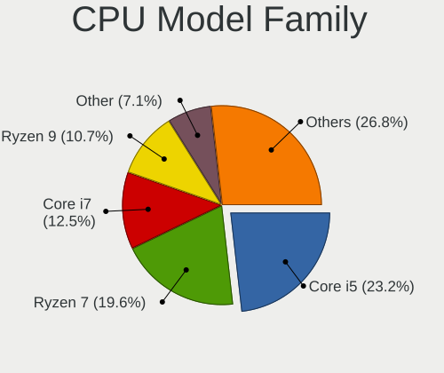

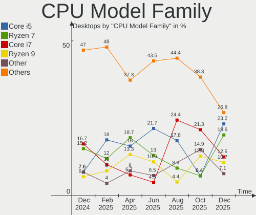

| Model            | Desktops | Percent |
|------------------|----------|---------|
| Intel Core i5    | 13       | 23.21%  |
| AMD Ryzen 7      | 11       | 19.64%  |
| Intel Core i7    | 7        | 12.5%   |
| AMD Ryzen 9      | 6        | 10.71%  |
| Other            | 4        | 7.14%   |
| Intel Xeon       | 4        | 7.14%   |
| AMD Ryzen 5      | 4        | 7.14%   |
| Intel Core 2 Duo | 3        | 5.36%   |
| Intel Core i3    | 1        | 1.79%   |
| Intel Core       | 1        | 1.79%   |
| AMD Phenom II X6 | 1        | 1.79%   |
| AMD Phenom II X2 | 1        | 1.79%   |

CPU Cores
---------

Number of processor cores

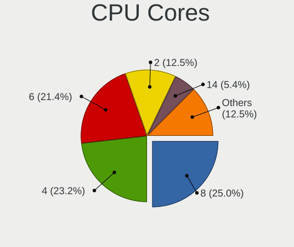

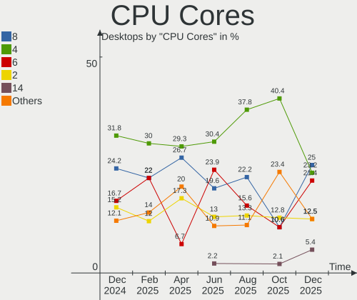

| Number | Desktops | Percent |
|--------|----------|---------|
| 8      | 14       | 25%     |
| 4      | 13       | 23.21%  |
| 6      | 12       | 21.43%  |
| 2      | 7        | 12.5%   |
| 14     | 3        | 5.36%   |
| 12     | 3        | 5.36%   |
| 16     | 2        | 3.57%   |
| 20     | 1        | 1.79%   |
| 10     | 1        | 1.79%   |

CPU Sockets
-----------

Number of sockets

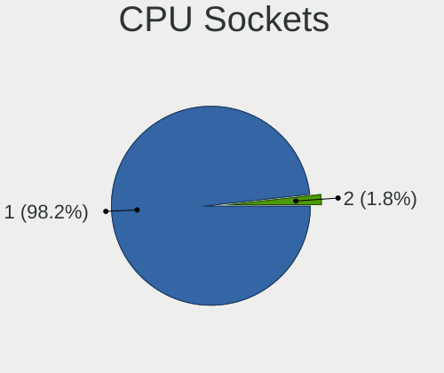

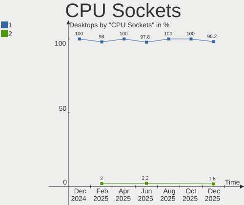

| Number | Desktops | Percent |
|--------|----------|---------|
| 1      | 55       | 98.21%  |
| 2      | 1        | 1.79%   |

CPU Threads
-----------

Threads per core (Hyper-Threading)

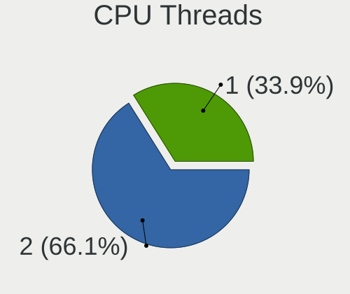

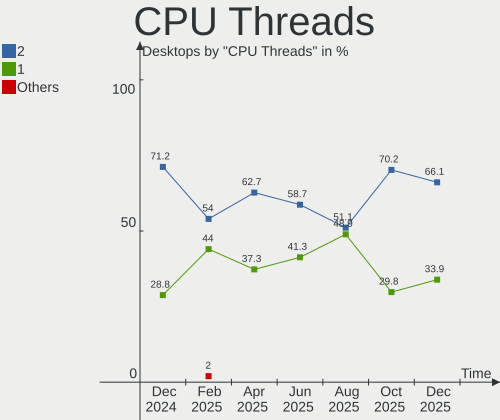

| Number | Desktops | Percent |
|--------|----------|---------|
| 2      | 37       | 66.07%  |
| 1      | 19       | 33.93%  |

CPU Op-Modes
------------

CPU Operation Modes (32-bit, 64-bit)

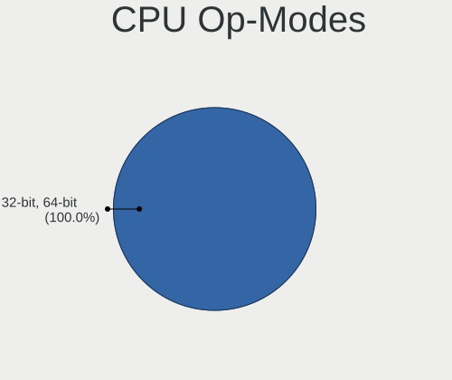

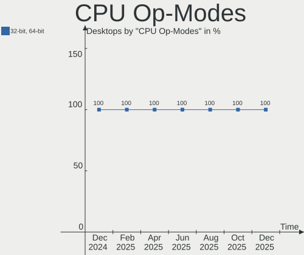

| Op mode        | Desktops | Percent |
|----------------|----------|---------|
| 32-bit, 64-bit | 56       | 100%    |

CPU Microcode
-------------

Microcode number

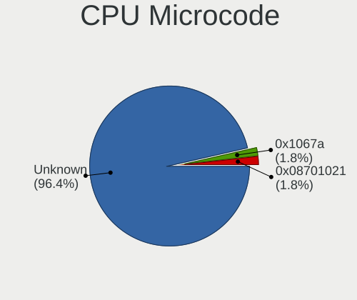

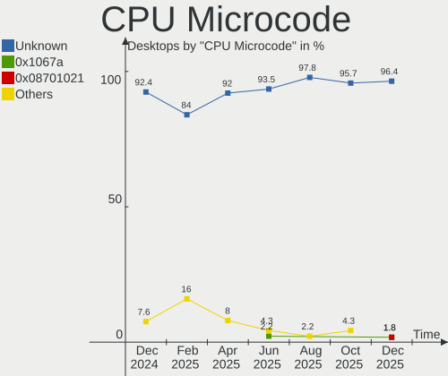

| Number     | Desktops | Percent |
|------------|----------|---------|
| Unknown    | 54       | 96.43%  |
| 0x1067a    | 1        | 1.79%   |
| 0x08701021 | 1        | 1.79%   |

CPU Microarch
-------------

Microarchitecture

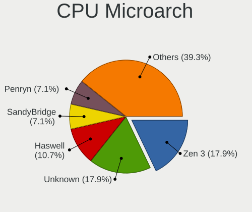

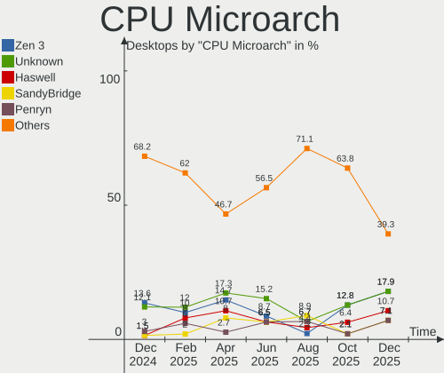

| Name             | Desktops | Percent |
|------------------|----------|---------|
| Zen 3            | 10       | 17.86%  |
| Unknown          | 10       | 17.86%  |
| Haswell          | 6        | 10.71%  |
| SandyBridge      | 4        | 7.14%   |
| Penryn           | 4        | 7.14%   |
| KabyLake         | 4        | 7.14%   |
| Skylake          | 3        | 5.36%   |
| Zen 2            | 2        | 3.57%   |
| K10              | 2        | 3.57%   |
| IvyBridge        | 2        | 3.57%   |
| Broadwell        | 2        | 3.57%   |
| Alderlake Hybrid | 2        | 3.57%   |
| Zen              | 1        | 1.79%   |
| Westmere         | 1        | 1.79%   |
| Nehalem          | 1        | 1.79%   |
| Lunarlake Hybrid | 1        | 1.79%   |
| CometLake        | 1        | 1.79%   |

Graphics
--------

GPU Vendor
----------

Vendors of graphics cards

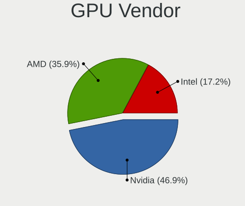

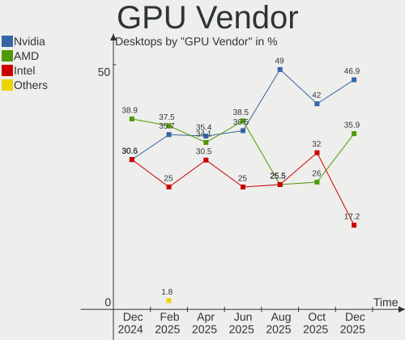

| Vendor | Desktops | Percent |
|--------|----------|---------|
| Nvidia | 30       | 46.88%  |
| AMD    | 23       | 35.94%  |
| Intel  | 11       | 17.19%  |

GPU Model
---------

Graphics card models

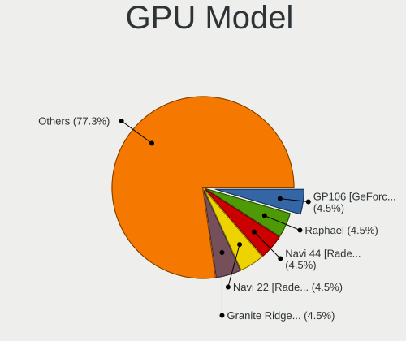

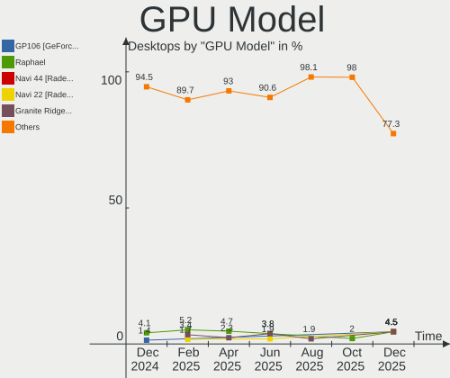

| Model                                                                       | Desktops | Percent |
|-----------------------------------------------------------------------------|----------|---------|
| Nvidia GP106 [GeForce GTX 1060 6GB]                                         | 3        | 4.55%   |
| AMD Raphael                                                                 | 3        | 4.55%   |
| AMD Navi 44 [Radeon RX 9060 XT]                                             | 3        | 4.55%   |
| AMD Navi 22 [Radeon RX 6700/6700 XT/6750 XT / 6800M/6850M XT]               | 3        | 4.55%   |
| AMD Granite Ridge [Radeon Graphics]                                         | 3        | 4.55%   |
| Nvidia GT218 [GeForce 210]                                                  | 2        | 3.03%   |
| Nvidia GB203 [GeForce RTX 5070 Ti]                                          | 2        | 3.03%   |
| Nvidia GA106 [GeForce RTX 3060 Lite Hash Rate]                              | 2        | 3.03%   |
| Nvidia AD106 [GeForce RTX 4060 Ti]                                          | 2        | 3.03%   |
| Intel Xeon E3-1200 v3/4th Gen Core Processor Integrated Graphics Controller | 2        | 3.03%   |
| Intel Skylake-S GT2 [HD Graphics 530]                                       | 2        | 3.03%   |
| Intel 2nd Generation Core Processor Family Integrated Graphics Controller   | 2        | 3.03%   |
| AMD Polaris 20 XL [Radeon RX 580 2048SP]                                    | 2        | 3.03%   |
| Nvidia TU117 [GeForce GTX 1650]                                             | 1        | 1.52%   |
| Nvidia TU116 [GeForce GTX 1660 SUPER]                                       | 1        | 1.52%   |
| Nvidia TU106 [GeForce GTX 1650]                                             | 1        | 1.52%   |
| Nvidia NV43 [GeForce 6600]                                                  | 1        | 1.52%   |
| Nvidia GT218 [GeForce 405]                                                  | 1        | 1.52%   |
| Nvidia GP107 [GeForce GTX 1050 Ti]                                          | 1        | 1.52%   |
| Nvidia GP104 [GeForce GTX 1060 6GB]                                         | 1        | 1.52%   |
| Nvidia GP102 [GeForce GTX 1080 Ti]                                          | 1        | 1.52%   |
| Nvidia GM204 [GeForce GTX 970]                                              | 1        | 1.52%   |
| Nvidia GK208B [GeForce GT 720]                                              | 1        | 1.52%   |
| Nvidia GK208B [GeForce GT 710]                                              | 1        | 1.52%   |
| Nvidia GK208 [GeForce GT 630 Rev. 2]                                        | 1        | 1.52%   |
| Nvidia GK107 [GeForce GTX 650]                                              | 1        | 1.52%   |
| Nvidia GF108 [GeForce GT 430]                                               | 1        | 1.52%   |
| Nvidia GA104 [GeForce RTX 3060 Ti Lite Hash Rate]                           | 1        | 1.52%   |
| Nvidia GA104 [GeForce RTX 3060 Ti GDDR6X]                                   | 1        | 1.52%   |
| Nvidia AD106 [GeForce RTX 4060]                                             | 1        | 1.52%   |
| Nvidia AD103 [GeForce RTX 4080]                                             | 1        | 1.52%   |
| Nvidia AD103 [GeForce RTX 4080 SUPER]                                       | 1        | 1.52%   |
| Intel CoffeeLake-S GT2 [UHD Graphics 630]                                   | 1        | 1.52%   |
| Intel Arrow Lake-S [Intel Graphics]                                         | 1        | 1.52%   |
| Intel Alder Lake-S GT1 [UHD Graphics 770]                                   | 1        | 1.52%   |
| Intel 82G33/G31 Express Integrated Graphics Controller                      | 1        | 1.52%   |
| Intel 4 Series Chipset Integrated Graphics Controller                       | 1        | 1.52%   |
| AMD RV670 [Radeon HD 3870]                                                  | 1        | 1.52%   |
| AMD Phoenix1                                                                | 1        | 1.52%   |
| AMD Navi 48 [Radeon RX 9070/9070 XT/9070 GRE]                               | 1        | 1.52%   |

GPU Combo
---------

Combinations of graphics cards

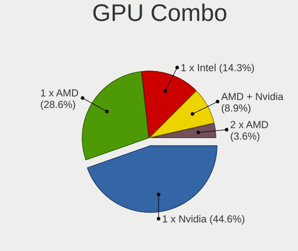

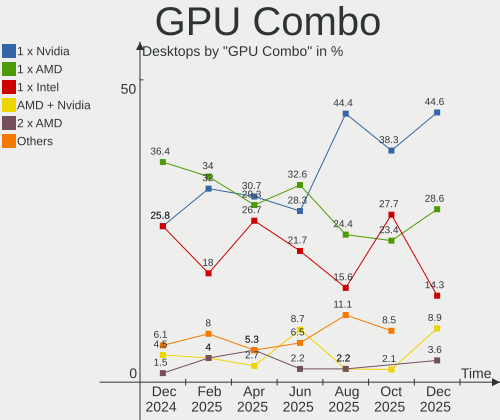

| Name         | Desktops | Percent |
|--------------|----------|---------|
| 1 x Nvidia   | 25       | 44.64%  |
| 1 x AMD      | 16       | 28.57%  |
| 1 x Intel    | 8        | 14.29%  |
| AMD + Nvidia | 5        | 8.93%   |
| 2 x AMD      | 2        | 3.57%   |

GPU Driver
----------

Free vs proprietary

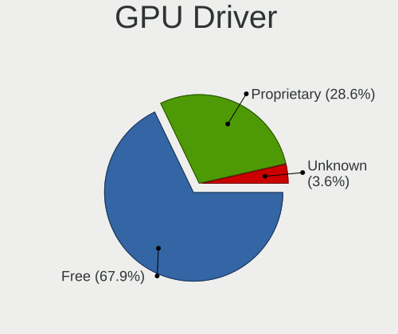

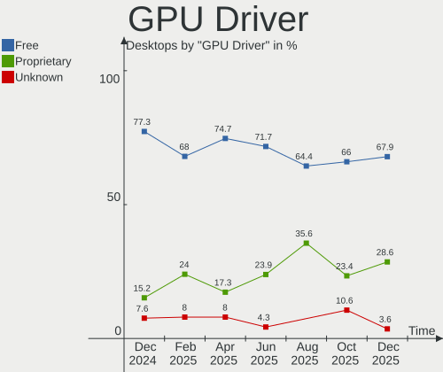

| Driver      | Desktops | Percent |
|-------------|----------|---------|
| Free        | 38       | 67.86%  |
| Proprietary | 16       | 28.57%  |
| Unknown     | 2        | 3.57%   |

GPU Memory
----------

Total video memory

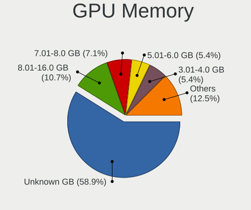

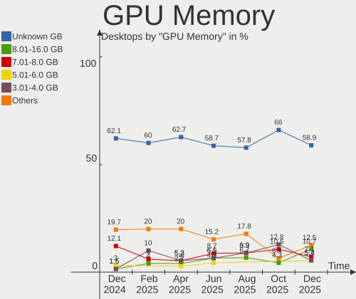

| Size in GB | Desktops | Percent |
|------------|----------|---------|
| Unknown    | 33       | 58.93%  |
| 8.01-16.0  | 6        | 10.71%  |
| 7.01-8.0   | 4        | 7.14%   |
| 5.01-6.0   | 3        | 5.36%   |
| 3.01-4.0   | 3        | 5.36%   |
| 1.01-2.0   | 2        | 3.57%   |
| 0.51-1.0   | 2        | 3.57%   |
| 0.01-0.5   | 2        | 3.57%   |
| 16.01-24.0 | 1        | 1.79%   |

Monitor
-------

Monitor Vendor
--------------

Monitor vendors

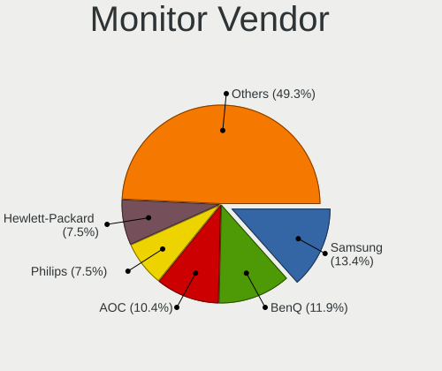

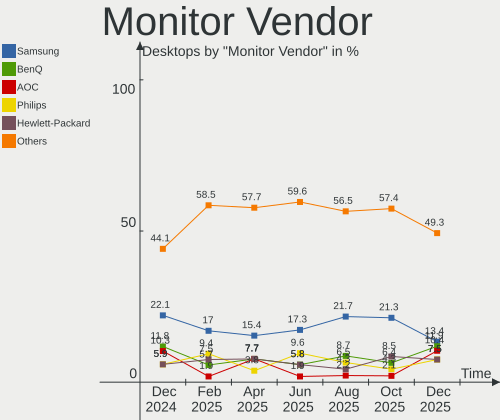

| Vendor               | Desktops | Percent |
|----------------------|----------|---------|
| Samsung Electronics  | 9        | 13.43%  |
| BenQ                 | 8        | 11.94%  |
| AOC                  | 7        | 10.45%  |
| Philips              | 5        | 7.46%   |
| Hewlett-Packard      | 5        | 7.46%   |
| ASUSTek Computer     | 5        | 7.46%   |
| Goldstar             | 4        | 5.97%   |
| Gigabyte Technology  | 3        | 4.48%   |
| Acer                 | 3        | 4.48%   |
| Packard Bell         | 2        | 2.99%   |
| Lenovo               | 2        | 2.99%   |
| Dell                 | 2        | 2.99%   |
| Ancor Communications | 2        | 2.99%   |
| Unknown (XXX)        | 1        | 1.49%   |
| Sony                 | 1        | 1.49%   |
| SKG                  | 1        | 1.49%   |
| Philco               | 1        | 1.49%   |
| OEM                  | 1        | 1.49%   |
| MSI                  | 1        | 1.49%   |
| Hitachi              | 1        | 1.49%   |
| HannStar Display     | 1        | 1.49%   |
| CHO                  | 1        | 1.49%   |
| CHD                  | 1        | 1.49%   |

Monitor Model
-------------

Monitor models

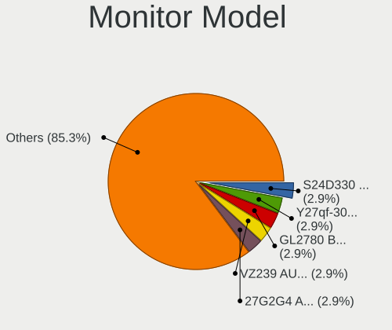

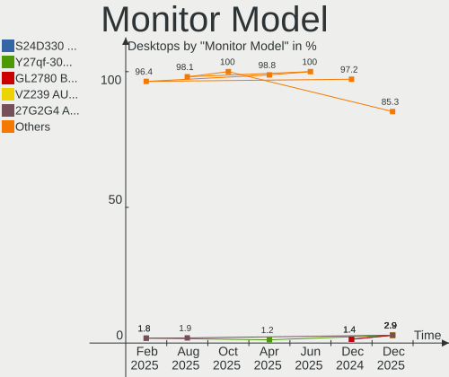

| Model                                                                    | Desktops | Percent |
|--------------------------------------------------------------------------|----------|---------|
| Samsung Electronics S24D330 SAM0D92 1920x1080 531x299mm 24.0-inch        | 2        | 2.94%   |
| Lenovo Y27qf-30 LEN67A7 2560x1440 597x336mm 27.0-inch                    | 2        | 2.94%   |
| BenQ GL2780 BNQ78EC 1920x1080 600x340mm 27.2-inch                        | 2        | 2.94%   |
| ASUSTek Computer VZ239 AUS23CC 1920x1080 509x286mm 23.0-inch             | 2        | 2.94%   |
| AOC 27G2G4 AOC2702 1920x1080 598x336mm 27.0-inch                         | 2        | 2.94%   |
| Unknown (XXX) Beyond TV XXX9221 1920x1080 1209x680mm 54.6-inch           | 1        | 1.47%   |
| Sony TV SNYA500 1360x768                                                 | 1        | 1.47%   |
| SKG PMO G241-FFK SKG2409 1920x1080 600x330mm 27.0-inch                   | 1        | 1.47%   |
| Samsung Electronics T23B350 SAM093B 1920x1080 510x287mm 23.0-inch        | 1        | 1.47%   |
| Samsung Electronics SyncMaster SAM03EB 1680x1050 433x271mm 20.1-inch     | 1        | 1.47%   |
| Samsung Electronics S24D590 SAM0B47 1920x1080 521x293mm 23.5-inch        | 1        | 1.47%   |
| Samsung Electronics Odyssey G95SC SAME02A 2560x1440 1193x336mm 48.8-inch | 1        | 1.47%   |
| Samsung Electronics Odyssey G70B SAM7232 3840x2160 698x392mm 31.5-inch   | 1        | 1.47%   |
| Samsung Electronics LCD Monitor SAM0C28 1920x1080 1209x680mm 54.6-inch   | 1        | 1.47%   |
| Samsung Electronics LC24RG50 SAM0F90 1920x1080 532x304mm 24.1-inch       | 1        | 1.47%   |
| Philips UHDTV PHL2084 3840x2160 1440x810mm 65.0-inch                     | 1        | 1.47%   |
| Philips UHDTV PHL198B 3840x2160 1440x810mm 65.0-inch                     | 1        | 1.47%   |
| Philips PHL 221S8L PHL091C 1920x1080 477x268mm 21.5-inch                 | 1        | 1.47%   |
| Philips PHL 193V5 PHLC0CD 1366x768 410x230mm 18.5-inch                   | 1        | 1.47%   |
| Philips 220E PHLC02E 1920x1080 476x268mm 21.5-inch                       | 1        | 1.47%   |
| Philco PHILCO GDH0030 1440x900 708x398mm 32.0-inch                       | 1        | 1.47%   |
| Packard Bell Viseo 190W PKB00DF 1366x768 409x230mm 18.5-inch             | 1        | 1.47%   |
| Packard Bell Maestro223DXL PKB01B2 1920x1080 477x268mm 21.5-inch         | 1        | 1.47%   |
| OEM 32W_LCD_TV OEM3700 1920x540                                          | 1        | 1.47%   |
| MSI G27CQ4 E2 MSI4CB0 2560x1440 597x336mm 27.0-inch                      | 1        | 1.47%   |
| Hitachi HISENSE HEC0030 3840x2160 1872x1053mm 84.6-inch                  | 1        | 1.47%   |
| Hewlett-Packard vs19b HWP264C 1280x1024 376x301mm 19.0-inch              | 1        | 1.47%   |
| Hewlett-Packard E232 HWP3279 1920x1080 509x286mm 23.0-inch               | 1        | 1.47%   |
| Hewlett-Packard Compaq W220q HWP2809 1680x1050 473x296mm 22.0-inch       | 1        | 1.47%   |
| Hewlett-Packard 22w HPN342E 1920x1080 476x268mm 21.5-inch                | 1        | 1.47%   |
| Hewlett-Packard 2011 HWP2934 1600x900 443x249mm 20.0-inch                | 1        | 1.47%   |
| HannStar Display LCD Monitor HL249DPB 1920x1080                          | 1        | 1.47%   |
| Goldstar W1943 GSM4BAD 1360x768 406x229mm 18.4-inch                      | 1        | 1.47%   |
| Goldstar M2762D GSM576F 1920x1080 598x336mm 27.0-inch                    | 1        | 1.47%   |
| Goldstar FULL HD GSM5BDE 1920x1080 527x296mm 23.8-inch                   | 1        | 1.47%   |
| Goldstar FHD GSM5BCA 1920x1080 480x270mm 21.7-inch                       | 1        | 1.47%   |
| Gigabyte Technology MO27Q2 GBT2733 2560x1440 590x334mm 26.7-inch         | 1        | 1.47%   |
| Gigabyte Technology M28U GBT2800 3840x2160 697x392mm 31.5-inch           | 1        | 1.47%   |
| Gigabyte Technology GS27U GBT2728 3840x2160 596x335mm 26.9-inch          | 1        | 1.47%   |
| Dell S2417DG DELA0E7 2560x1440 527x296mm 23.8-inch                       | 1        | 1.47%   |

Monitor Resolution
------------------

Monitor screen resolution

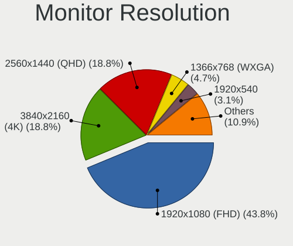

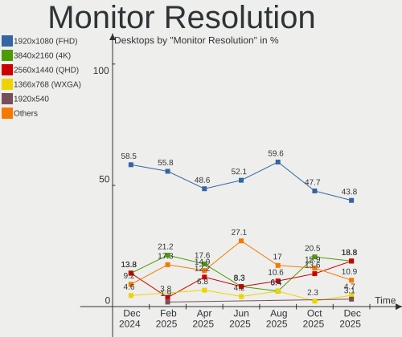

| Resolution         | Desktops | Percent |
|--------------------|----------|---------|
| 1920x1080 (FHD)    | 28       | 43.75%  |
| 3840x2160 (4K)     | 12       | 18.75%  |
| 2560x1440 (QHD)    | 12       | 18.75%  |
| 1366x768 (WXGA)    | 3        | 4.69%   |
| 1920x540           | 2        | 3.13%   |
| 1680x1050 (WSXGA+) | 2        | 3.13%   |
| 1360x768           | 2        | 3.13%   |
| 1600x900 (HD+)     | 1        | 1.56%   |
| 1440x900 (WXGA+)   | 1        | 1.56%   |
| 1280x1024 (SXGA)   | 1        | 1.56%   |

Monitor Diagonal
----------------

Diagonal size in inches

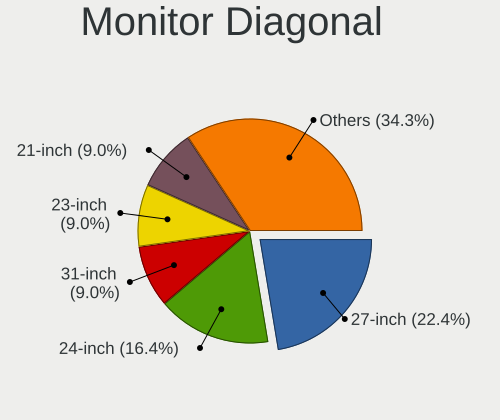

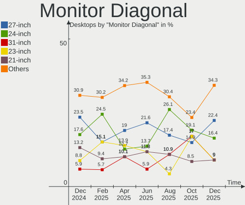

| Inches  | Desktops | Percent |
|---------|----------|---------|
| 27      | 15       | 22.39%  |
| 24      | 11       | 16.42%  |
| 31      | 6        | 8.96%   |
| 23      | 6        | 8.96%   |
| 21      | 6        | 8.96%   |
| 18      | 3        | 4.48%   |
| Unknown | 3        | 4.48%   |
| 65      | 2        | 2.99%   |
| 54      | 2        | 2.99%   |
| 26      | 2        | 2.99%   |
| 22      | 2        | 2.99%   |
| 20      | 2        | 2.99%   |
| 19      | 2        | 2.99%   |
| 84      | 1        | 1.49%   |
| 63      | 1        | 1.49%   |
| 48      | 1        | 1.49%   |
| 32      | 1        | 1.49%   |
| 15      | 1        | 1.49%   |

Monitor Width
-------------

Physical width

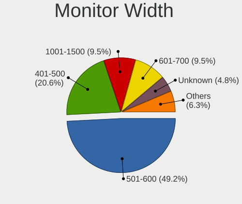

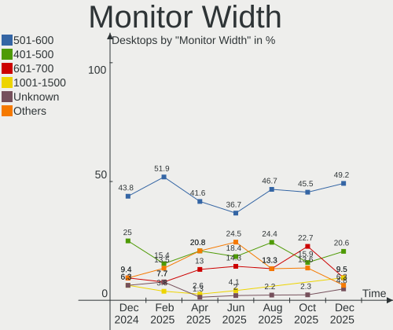

| Width in mm | Desktops | Percent |
|-------------|----------|---------|
| 501-600     | 31       | 49.21%  |
| 401-500     | 13       | 20.63%  |
| 601-700     | 6        | 9.52%   |
| 1001-1500   | 6        | 9.52%   |
| Unknown     | 3        | 4.76%   |
| 701-800     | 1        | 1.59%   |
| 351-400     | 1        | 1.59%   |
| 301-350     | 1        | 1.59%   |
| 1501-2000   | 1        | 1.59%   |

Aspect Ratio
------------

Proportional relationship between the width and the height

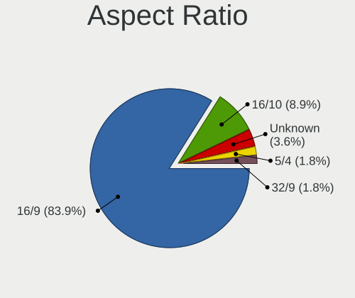

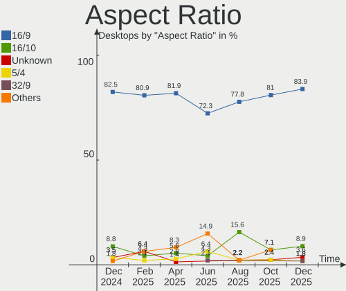

| Ratio   | Desktops | Percent |
|---------|----------|---------|
| 16/9    | 47       | 83.93%  |
| 16/10   | 5        | 8.93%   |
| Unknown | 2        | 3.57%   |
| 5/4     | 1        | 1.79%   |
| 32/9    | 1        | 1.79%   |

Monitor Area
------------

Area in inch²

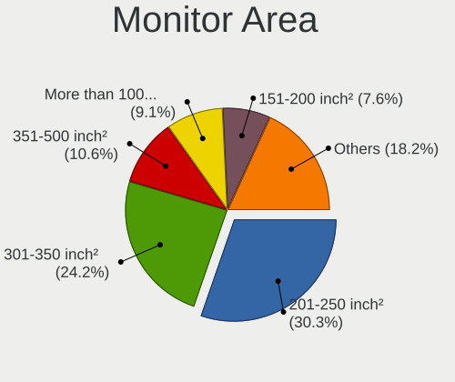

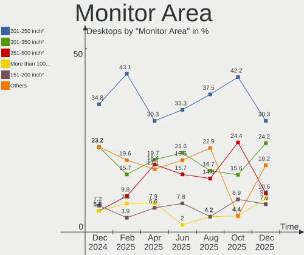

| Area in inch² | Desktops | Percent |
|----------------|----------|---------|
| 201-250        | 20       | 30.3%   |
| 301-350        | 16       | 24.24%  |
| 351-500        | 7        | 10.61%  |
| More than 1000 | 6        | 9.09%   |
| 151-200        | 5        | 7.58%   |
| 251-300        | 4        | 6.06%   |
| 141-150        | 3        | 4.55%   |
| Unknown        | 3        | 4.55%   |
| 101-110        | 1        | 1.52%   |
| 501-1000       | 1        | 1.52%   |

Pixel Density
-------------

Pixels per inch

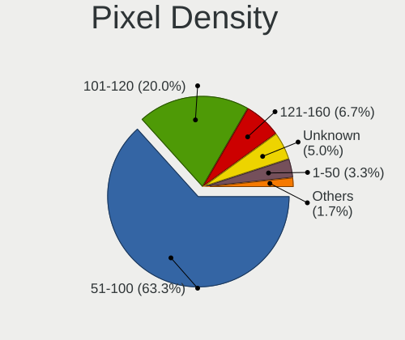

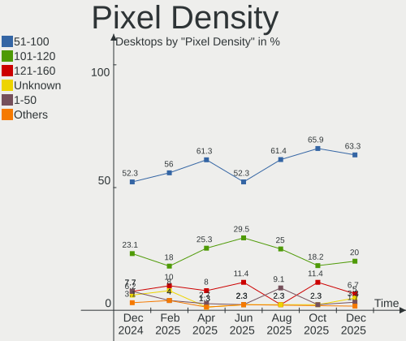

| Density | Desktops | Percent |
|---------|----------|---------|
| 51-100  | 38       | 63.33%  |
| 101-120 | 12       | 20%     |
| 121-160 | 4        | 6.67%   |
| Unknown | 3        | 5%      |
| 1-50    | 2        | 3.33%   |
| 161-240 | 1        | 1.67%   |

Multiple Monitors
-----------------

Total monitors connected

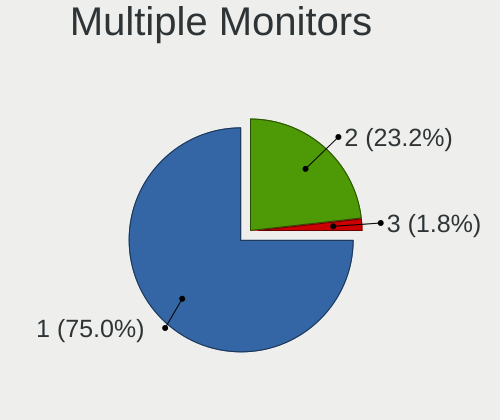

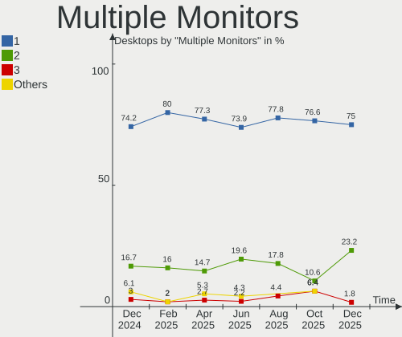

| Total | Desktops | Percent |
|-------|----------|---------|
| 1     | 42       | 75%     |
| 2     | 13       | 23.21%  |
| 3     | 1        | 1.79%   |

Network
-------

Net Controller Vendor
---------------------

Controller vendors

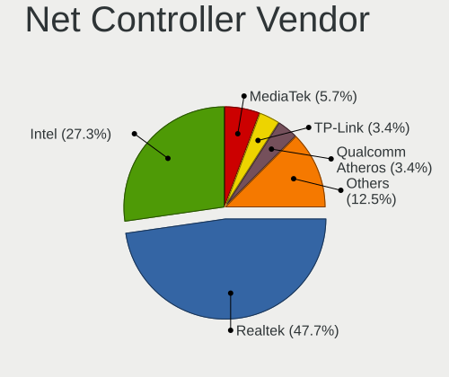

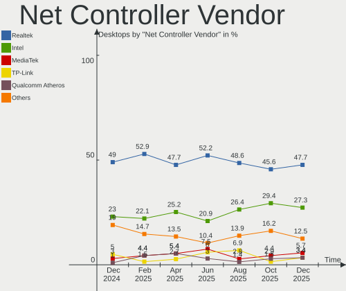

| Vendor                          | Desktops | Percent |
|---------------------------------|----------|---------|
| Realtek Semiconductor           | 42       | 47.73%  |
| Intel                           | 24       | 27.27%  |
| MediaTek                        | 5        | 5.68%   |
| TP-Link                         | 3        | 3.41%   |
| Qualcomm Atheros                | 3        | 3.41%   |
| Microsoft                       | 2        | 2.27%   |
| Broadcom                        | 2        | 2.27%   |
| Ralink Technology               | 1        | 1.14%   |
| Qualcomm Technologies           | 1        | 1.14%   |
| Qualcomm Atheros Communications | 1        | 1.14%   |
| Mercucys                        | 1        | 1.14%   |
| Huawei Technologies             | 1        | 1.14%   |
| DisplayLink                     | 1        | 1.14%   |
| D-Link                          | 1        | 1.14%   |

Net Controller Model
--------------------

Controller models

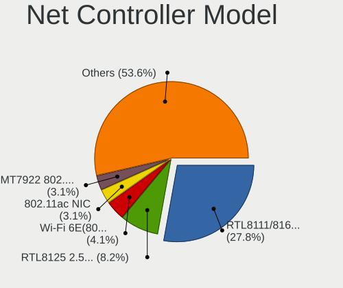

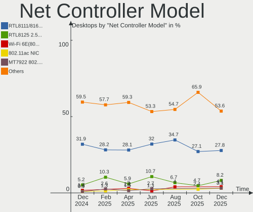

| Model                                                                  | Desktops | Percent |
|------------------------------------------------------------------------|----------|---------|
| Realtek RTL8111/8168/8211/8411 PCI Express Gigabit Ethernet Controller | 27       | 27.84%  |
| Realtek RTL8125 2.5GbE Controller                                      | 8        | 8.25%   |
| Intel Wi-Fi 6E(802.11ax) AX210/AX1675* 2x2 [Typhoon Peak]              | 4        | 4.12%   |
| Realtek 802.11ac NIC                                                   | 3        | 3.09%   |
| MediaTek MT7922 802.11ax PCI Express Wireless Network Adapter          | 3        | 3.09%   |
| Intel Wi-Fi 6 AX200                                                    | 3        | 3.09%   |
| Intel I211 Gigabit Network Connection                                  | 3        | 3.09%   |
| Realtek RTL8192EE PCIe Wireless Network Adapter                        | 2        | 2.06%   |
| MediaTek MT7902 802.11ax PCIe Wireless Network Adapter [Filogic 310]   | 2        | 2.06%   |
| Intel Ethernet Controller I225-V                                       | 2        | 2.06%   |
| Intel Ethernet Connection I217-LM                                      | 2        | 2.06%   |
| Intel Ethernet Connection (2) I219-V                                   | 2        | 2.06%   |
| TP-Link Archer T3U [Realtek RTL8812BU]                                 | 1        | 1.03%   |
| TP-Link Archer T2U PLUS [RTL8821AU]                                    | 1        | 1.03%   |
| TP-Link 802.11ac NIC                                                   | 1        | 1.03%   |
| Realtek RTL8852CE PCIe 802.11ax Wireless Network Controller            | 1        | 1.03%   |
| Realtek RTL8852BE PCIe 802.11ax Wireless Network Controller            | 1        | 1.03%   |
| Realtek RTL8821AE 802.11ac PCIe Wireless Network Adapter               | 1        | 1.03%   |
| Realtek RTL8192EU 802.11b/g/n WLAN Adapter                             | 1        | 1.03%   |
| Realtek RTL8192CE PCIe Wireless Network Adapter                        | 1        | 1.03%   |
| Realtek RTL8188EUS 802.11n Wireless Network Adapter                    | 1        | 1.03%   |
| Realtek RTL8126 5GbE Controller                                        | 1        | 1.03%   |
| Realtek RTL810xE PCI Express Fast Ethernet controller                  | 1        | 1.03%   |
| Realtek Killer E5000 5GbE Controller                                   | 1        | 1.03%   |
| Ralink RT2870/RT3070 Wireless Adapter                                  | 1        | 1.03%   |
| Qualcomm WCN785x Wi-Fi 7(802.11be) 320MHz 2x2 [FastConnect 7800]       | 1        | 1.03%   |
| Qualcomm Atheros Killer E220x Gigabit Ethernet Controller              | 1        | 1.03%   |
| Qualcomm Atheros AR9271 802.11n                                        | 1        | 1.03%   |
| Qualcomm Atheros AR9285 Wireless Network Adapter (PCI-Express)         | 1        | 1.03%   |
| Qualcomm Atheros AR9227 Wireless Network Adapter                       | 1        | 1.03%   |
| Qualcomm Atheros AR8151 v2.0 Gigabit Ethernet                          | 1        | 1.03%   |
| Microsoft Xbox 360 Wireless Adapter                                    | 1        | 1.03%   |
| Microsoft Wireless XBox Controller Dongle                              | 1        | 1.03%   |
| Mercucys 802.11ac NIC                                                  | 1        | 1.03%   |
| Intel Wireless 3160                                                    | 1        | 1.03%   |
| Intel Wi-Fi 7(802.11be) AX1775*/AX1790*/BE20*/BE401/BE1750* 2x2        | 1        | 1.03%   |
| Intel Wi-Fi 5(802.11ac) Wireless-AC 9x6x [Thunder Peak]                | 1        | 1.03%   |
| Intel Ethernet Controller I226-V                                       | 1        | 1.03%   |
| Intel Ethernet Controller 10-Gigabit X540-AT2                          | 1        | 1.03%   |
| Intel Ethernet Connection I217-V                                       | 1        | 1.03%   |

Wireless Vendor
---------------

Wireless vendors

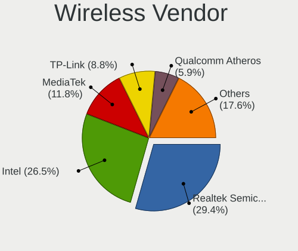

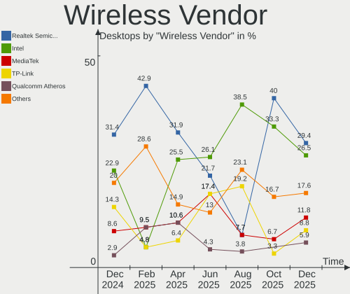

| Vendor                          | Desktops | Percent |
|---------------------------------|----------|---------|
| Realtek Semiconductor           | 10       | 29.41%  |
| Intel                           | 9        | 26.47%  |
| MediaTek                        | 4        | 11.76%  |
| TP-Link                         | 3        | 8.82%   |
| Qualcomm Atheros                | 2        | 5.88%   |
| Microsoft                       | 2        | 5.88%   |
| Ralink Technology               | 1        | 2.94%   |
| Qualcomm Atheros Communications | 1        | 2.94%   |
| Mercucys                        | 1        | 2.94%   |
| D-Link                          | 1        | 2.94%   |

Wireless Model
--------------

Wireless models

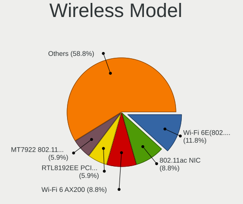

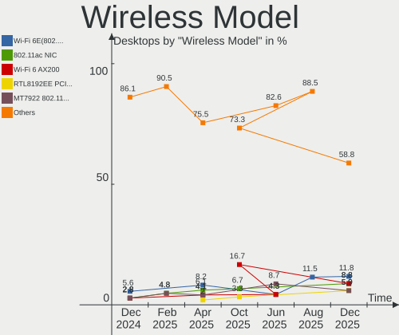

| Model                                                                | Desktops | Percent |
|----------------------------------------------------------------------|----------|---------|
| Intel Wi-Fi 6E(802.11ax) AX210/AX1675* 2x2 [Typhoon Peak]            | 4        | 11.76%  |
| Realtek 802.11ac NIC                                                 | 3        | 8.82%   |
| Intel Wi-Fi 6 AX200                                                  | 3        | 8.82%   |
| Realtek RTL8192EE PCIe Wireless Network Adapter                      | 2        | 5.88%   |
| MediaTek MT7922 802.11ax PCI Express Wireless Network Adapter        | 2        | 5.88%   |
| MediaTek MT7902 802.11ax PCIe Wireless Network Adapter [Filogic 310] | 2        | 5.88%   |
| TP-Link Archer T3U [Realtek RTL8812BU]                               | 1        | 2.94%   |
| TP-Link Archer T2U PLUS [RTL8821AU]                                  | 1        | 2.94%   |
| TP-Link 802.11ac NIC                                                 | 1        | 2.94%   |
| Realtek RTL8852CE PCIe 802.11ax Wireless Network Controller          | 1        | 2.94%   |
| Realtek RTL8821AE 802.11ac PCIe Wireless Network Adapter             | 1        | 2.94%   |
| Realtek RTL8192EU 802.11b/g/n WLAN Adapter                           | 1        | 2.94%   |
| Realtek RTL8192CE PCIe Wireless Network Adapter                      | 1        | 2.94%   |
| Realtek RTL8188EUS 802.11n Wireless Network Adapter                  | 1        | 2.94%   |
| Ralink RT2870/RT3070 Wireless Adapter                                | 1        | 2.94%   |
| Qualcomm Atheros AR9271 802.11n                                      | 1        | 2.94%   |
| Qualcomm Atheros AR9285 Wireless Network Adapter (PCI-Express)       | 1        | 2.94%   |
| Qualcomm Atheros AR9227 Wireless Network Adapter                     | 1        | 2.94%   |
| Microsoft Xbox 360 Wireless Adapter                                  | 1        | 2.94%   |
| Microsoft Wireless XBox Controller Dongle                            | 1        | 2.94%   |
| Mercucys 802.11ac NIC                                                | 1        | 2.94%   |
| Intel Wireless 3160                                                  | 1        | 2.94%   |
| Intel Wi-Fi 5(802.11ac) Wireless-AC 9x6x [Thunder Peak]              | 1        | 2.94%   |
| D-Link DWA-131 Wireless N Nano Adapter (Rev. E1) [Realtek RTL8192EU] | 1        | 2.94%   |

Ethernet Vendor
---------------

Ethernet vendors

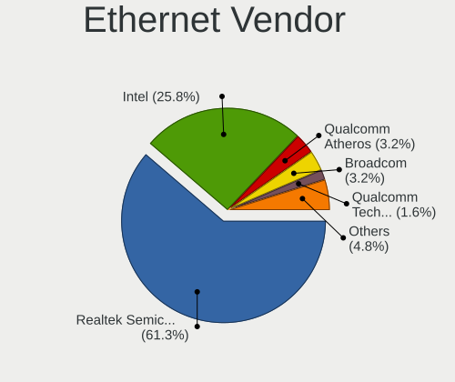

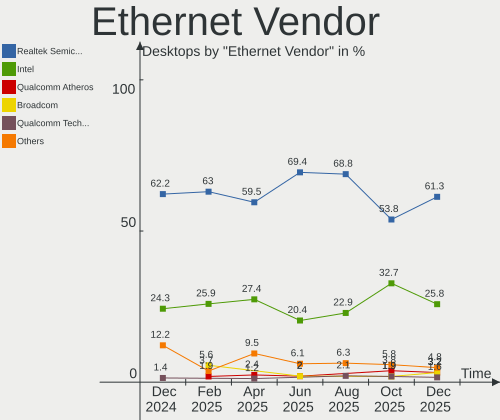

| Vendor                | Desktops | Percent |
|-----------------------|----------|---------|
| Realtek Semiconductor | 38       | 61.29%  |
| Intel                 | 16       | 25.81%  |
| Qualcomm Atheros      | 2        | 3.23%   |
| Broadcom              | 2        | 3.23%   |
| Qualcomm Technologies | 1        | 1.61%   |
| MediaTek              | 1        | 1.61%   |
| Huawei Technologies   | 1        | 1.61%   |
| DisplayLink           | 1        | 1.61%   |

Ethernet Model
--------------

Ethernet models

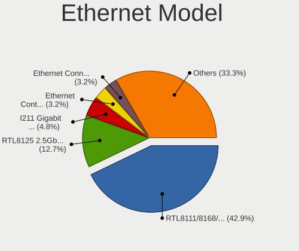

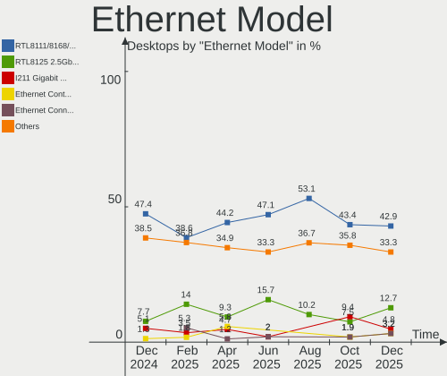

| Model                                                                  | Desktops | Percent |
|------------------------------------------------------------------------|----------|---------|
| Realtek RTL8111/8168/8211/8411 PCI Express Gigabit Ethernet Controller | 27       | 42.86%  |
| Realtek RTL8125 2.5GbE Controller                                      | 8        | 12.7%   |
| Intel I211 Gigabit Network Connection                                  | 3        | 4.76%   |
| Intel Ethernet Controller I225-V                                       | 2        | 3.17%   |
| Intel Ethernet Connection I217-LM                                      | 2        | 3.17%   |
| Intel Ethernet Connection (2) I219-V                                   | 2        | 3.17%   |
| Realtek RTL8852BE PCIe 802.11ax Wireless Network Controller            | 1        | 1.59%   |
| Realtek RTL8126 5GbE Controller                                        | 1        | 1.59%   |
| Realtek RTL810xE PCI Express Fast Ethernet controller                  | 1        | 1.59%   |
| Realtek Killer E5000 5GbE Controller                                   | 1        | 1.59%   |
| Qualcomm WCN785x Wi-Fi 7(802.11be) 320MHz 2x2 [FastConnect 7800]       | 1        | 1.59%   |
| Qualcomm Atheros Killer E220x Gigabit Ethernet Controller              | 1        | 1.59%   |
| Qualcomm Atheros AR8151 v2.0 Gigabit Ethernet                          | 1        | 1.59%   |
| MediaTek MT7922 802.11ax PCI Express Wireless Network Adapter          | 1        | 1.59%   |
| Intel Wi-Fi 7(802.11be) AX1775*/AX1790*/BE20*/BE401/BE1750* 2x2        | 1        | 1.59%   |
| Intel Ethernet Controller I226-V                                       | 1        | 1.59%   |
| Intel Ethernet Controller 10-Gigabit X540-AT2                          | 1        | 1.59%   |
| Intel Ethernet Connection I217-V                                       | 1        | 1.59%   |
| Intel Ethernet Connection (2) I218-V                                   | 1        | 1.59%   |
| Intel 82567LM-3 Gigabit Network Connection                             | 1        | 1.59%   |
| Intel 80003ES2LAN Gigabit Ethernet Controller (Copper)                 | 1        | 1.59%   |
| Huawei FOA-LX9                                                         | 1        | 1.59%   |
| DisplayLink Kensington SD3600 Dual Video Dock                          | 1        | 1.59%   |
| Broadcom NetXtreme BCM5761 Gigabit Ethernet PCIe                       | 1        | 1.59%   |
| Broadcom NetLink BCM57781 Gigabit Ethernet PCIe                        | 1        | 1.59%   |

Net Controller Kind
-------------------

Ethernet, WiFi or modem

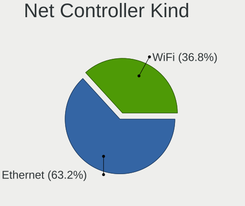

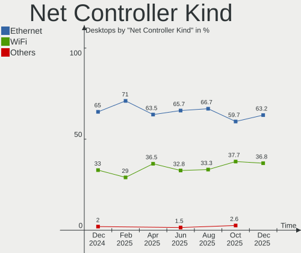

| Kind     | Desktops | Percent |
|----------|----------|---------|
| Ethernet | 55       | 63.22%  |
| WiFi     | 32       | 36.78%  |

Used Controller
---------------

Currently used network controller

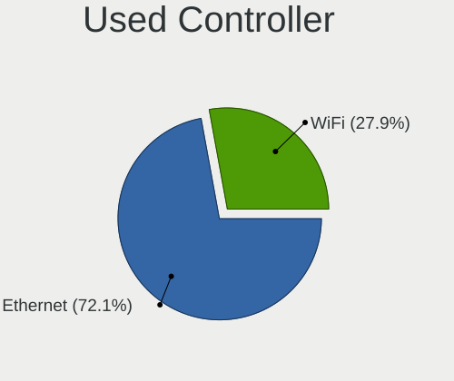

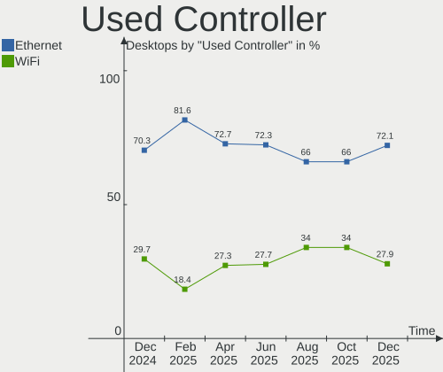

| Kind     | Desktops | Percent |
|----------|----------|---------|
| Ethernet | 44       | 72.13%  |
| WiFi     | 17       | 27.87%  |

NICs
----

Total network controllers on board

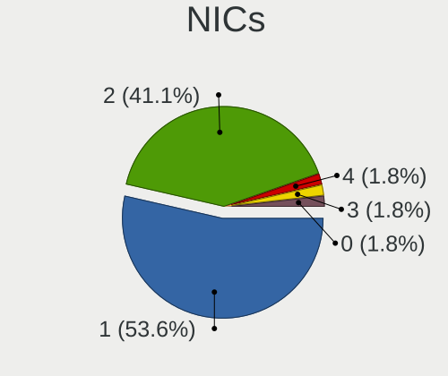

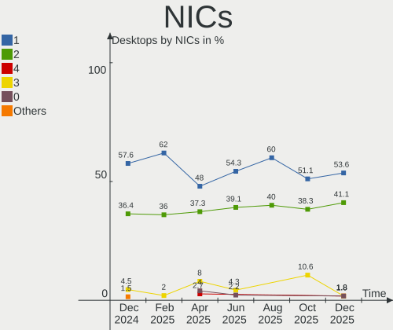

| Total | Desktops | Percent |
|-------|----------|---------|
| 1     | 30       | 53.57%  |
| 2     | 23       | 41.07%  |
| 4     | 1        | 1.79%   |
| 3     | 1        | 1.79%   |
| 0     | 1        | 1.79%   |

IPv6
----

IPv6 vs IPv4

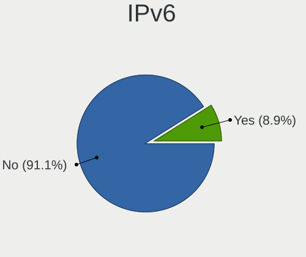

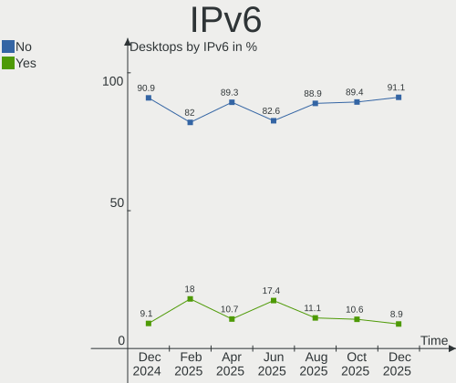

| Used | Desktops | Percent |
|------|----------|---------|
| No   | 51       | 91.07%  |
| Yes  | 5        | 8.93%   |

Bluetooth
---------

Bluetooth Vendor
----------------

Controller vendors

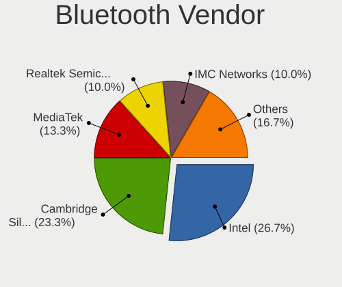

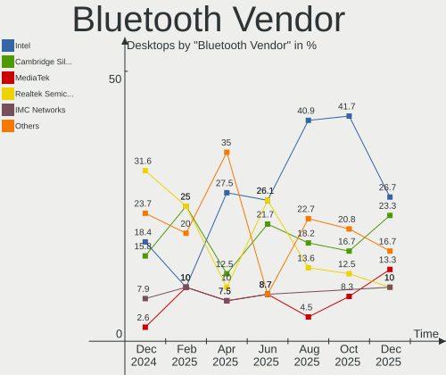

| Vendor                  | Desktops | Percent |
|-------------------------|----------|---------|
| Intel                   | 8        | 26.67%  |
| Cambridge Silicon Radio | 7        | 23.33%  |
| MediaTek                | 4        | 13.33%  |
| Realtek Semiconductor   | 3        | 10%     |
| IMC Networks            | 3        | 10%     |
| Mercucys                | 2        | 6.67%   |
| ASUSTek Computer        | 2        | 6.67%   |
| Foxconn / Hon Hai       | 1        | 3.33%   |

Bluetooth Model
---------------

Controller models

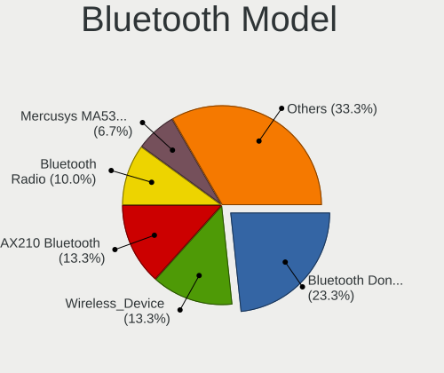

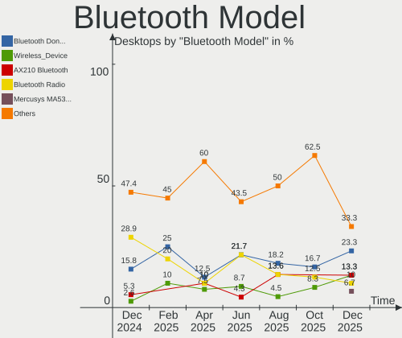

| Model                                               | Desktops | Percent |
|-----------------------------------------------------|----------|---------|
| Cambridge Silicon Radio Bluetooth Dongle (HCI mode) | 7        | 23.33%  |
| MediaTek Wireless_Device                            | 4        | 13.33%  |
| Intel AX210 Bluetooth                               | 4        | 13.33%  |
| Realtek Bluetooth Radio                             | 3        | 10%     |
| Mercucys Mercusys MA530 Adapter                     | 2        | 6.67%   |
| IMC Networks Wireless_Device                        | 2        | 6.67%   |
| Intel Wireless-AC 9260 Bluetooth Adapter            | 1        | 3.33%   |
| Intel Bluetooth wireless interface                  | 1        | 3.33%   |
| Intel Bluetooth Device                              | 1        | 3.33%   |
| Intel AX200 Bluetooth                               | 1        | 3.33%   |
| IMC Networks Bluetooth Radio                        | 1        | 3.33%   |
| Foxconn / Hon Hai Bluetooth Device                  | 1        | 3.33%   |
| ASUS Broadcom BCM20702A0 Bluetooth                  | 1        | 3.33%   |
| ASUS ASUS USB-BT500                                 | 1        | 3.33%   |

Sound
-----

Sound Vendor
------------

Sound card vendors

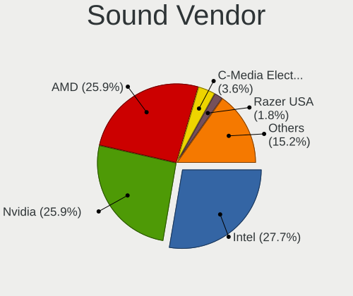

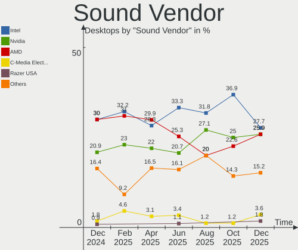

| Vendor                   | Desktops | Percent |
|--------------------------|----------|---------|
| Intel                    | 31       | 27.68%  |
| Nvidia                   | 29       | 25.89%  |
| AMD                      | 29       | 25.89%  |
| C-Media Electronics      | 4        | 3.57%   |
| Razer USA                | 2        | 1.79%   |
| JMTek                    | 2        | 1.79%   |
| Texas Instruments        | 1        | 0.89%   |
| SteelSeries ApS          | 1        | 0.89%   |
| SOMIC Industrial         | 1        | 0.89%   |
| Samson Technologies      | 1        | 0.89%   |
| Micro Star International | 1        | 0.89%   |
| Medeli Electronics       | 1        | 0.89%   |
| Logitech                 | 1        | 0.89%   |
| Logic3                   | 1        | 0.89%   |
| Kingston Technology      | 1        | 0.89%   |
| JieLi Technology         | 1        | 0.89%   |
| Hewlett-Packard          | 1        | 0.89%   |
| Focusrite-Novation       | 1        | 0.89%   |
| Creative Technology      | 1        | 0.89%   |
| Corsair                  | 1        | 0.89%   |
| Actions Semiconductor    | 1        | 0.89%   |

Sound Model
-----------

Sound card models

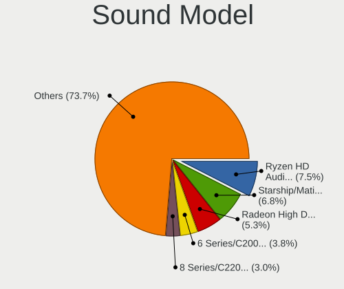

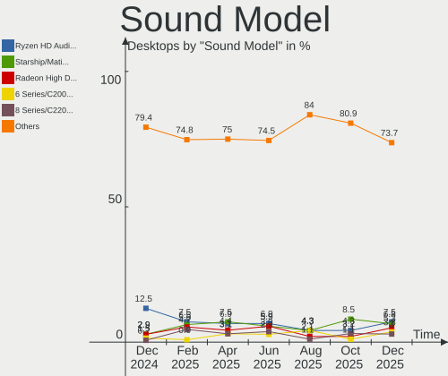

| Model                                                                      | Desktops | Percent |
|----------------------------------------------------------------------------|----------|---------|
| AMD Ryzen HD Audio Controller                                              | 10       | 7.52%   |
| AMD Starship/Matisse HD Audio Controller                                   | 9        | 6.77%   |
| AMD Radeon High Definition Audio Controller                                | 7        | 5.26%   |
| Intel 6 Series/C200 Series Chipset Family High Definition Audio Controller | 5        | 3.76%   |
| Intel 8 Series/C220 Series Chipset High Definition Audio Controller        | 4        | 3.01%   |
| AMD Navi 48 HDMI/DP Audio Controller                                       | 4        | 3.01%   |
| Nvidia High Definition Audio Controller                                    | 3        | 2.26%   |
| Nvidia GP106 High Definition Audio Controller                              | 3        | 2.26%   |
| Nvidia GK208 HDMI/DP Audio Controller                                      | 3        | 2.26%   |
| Nvidia AD106M High Definition Audio Controller                             | 3        | 2.26%   |
| Intel Alder Lake-S HD Audio Controller                                     | 3        | 2.26%   |
| Intel 100 Series/C230 Series Chipset Family HD Audio Controller            | 3        | 2.26%   |
| AMD Renoir/Cezanne HDMI/DP Audio Controller                                | 3        | 2.26%   |
| AMD Navi 21/23 HDMI/DP Audio Controller                                    | 3        | 2.26%   |
| AMD Ellesmere HDMI Audio [Radeon RX 470/480 / 570/580/590]                 | 3        | 2.26%   |
| Razer USA Razer Barracuda X 2.4                                            | 2        | 1.5%    |
| Nvidia GB203 High Definition Audio Controller                              | 2        | 1.5%    |
| Nvidia GA106 High Definition Audio Controller                              | 2        | 1.5%    |
| Nvidia GA104 High Definition Audio Controller                              | 2        | 1.5%    |
| Nvidia AD103 High Definition Audio Controller                              | 2        | 1.5%    |
| JMTek USB PnP Audio Device                                                 | 2        | 1.5%    |
| Intel Xeon E3-1200 v3/4th Gen Core Processor HD Audio Controller           | 2        | 1.5%    |
| Intel NM10/ICH7 Family High Definition Audio Controller                    | 2        | 1.5%    |
| Intel 9 Series Chipset Family HD Audio Controller                          | 2        | 1.5%    |
| Intel 5 Series/3400 Series Chipset High Definition Audio                   | 2        | 1.5%    |
| Intel 200 Series PCH HD Audio                                              | 2        | 1.5%    |
| C-Media Electronics Audio Adapter (Unitek Y-247A)                          | 2        | 1.5%    |
| AMD SBx00 Azalia (Intel HDA)                                               | 2        | 1.5%    |
| Texas Instruments PCM2902 Audio Codec                                      | 1        | 0.75%   |
| SteelSeries ApS SteelSeries Arena 9                                        | 1        | 0.75%   |
| SOMIC Industrial G941_White_Shark                                          | 1        | 0.75%   |
| Samson Technologies Meteor condenser microphone                            | 1        | 0.75%   |
| Nvidia TU116 High Definition Audio Controller                              | 1        | 0.75%   |
| Nvidia TU107 GeForce GTX 1650 High Definition Audio Controller             | 1        | 0.75%   |
| Nvidia TU106 High Definition Audio Controller                              | 1        | 0.75%   |
| Nvidia GP107GL High Definition Audio Controller                            | 1        | 0.75%   |
| Nvidia GP104 High Definition Audio Controller                              | 1        | 0.75%   |
| Nvidia GP102 HDMI Audio Controller                                         | 1        | 0.75%   |
| Nvidia GM204 High Definition Audio Controller                              | 1        | 0.75%   |
| Nvidia GK107 HDMI Audio Controller                                         | 1        | 0.75%   |

Memory
------

Memory Vendor
-------------

Memory module vendors

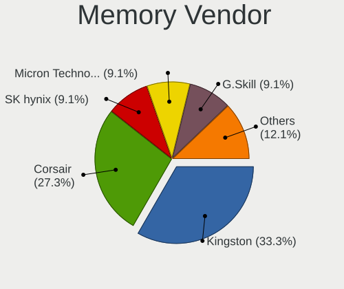

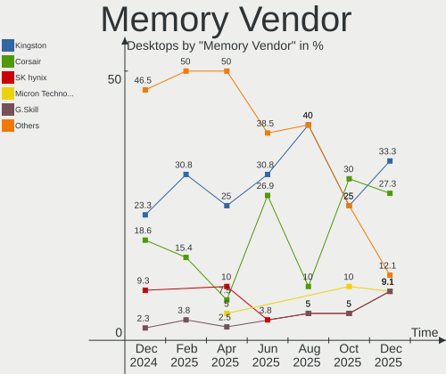

| Vendor              | Desktops | Percent |
|---------------------|----------|---------|
| Kingston            | 11       | 33.33%  |
| Corsair             | 9        | 27.27%  |
| SK hynix            | 3        | 9.09%   |
| Micron Technology   | 3        | 9.09%   |
| G.Skill             | 3        | 9.09%   |
| Samsung Electronics | 2        | 6.06%   |
| Crucial             | 1        | 3.03%   |
| Unknown             | 1        | 3.03%   |

Memory Model
------------

Memory module models

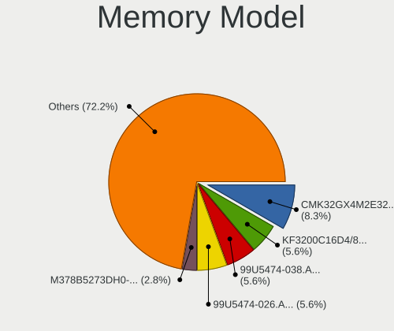

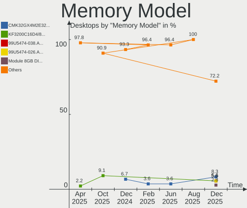

| Model                                                   | Desktops | Percent |
|---------------------------------------------------------|----------|---------|
| Corsair RAM CMK32GX4M2E3200C16 16GB DIMM DDR4 3600MT/s  | 3        | 8.33%   |
| Kingston RAM KF3200C16D4/8GX 8GiB DIMM DDR4 3600MT/s    | 2        | 5.56%   |
| Kingston RAM 99U5474-038.A00LF 4GB DIMM DDR3 1333MT/s   | 2        | 5.56%   |
| Kingston RAM 99U5474-026.A00LF 4GB DIMM DDR3 1333MT/s   | 2        | 5.56%   |
| SK hynix RAM Module 8GB DIMM DDR4 2133MT/s              | 1        | 2.78%   |
| SK hynix RAM HMT351U6CFR8C-PB 4GB DIMM DDR3 1800MT/s    | 1        | 2.78%   |
| SK hynix RAM HMA41GU6AFR8N-TF 8GB DIMM DDR4 2465MT/s    | 1        | 2.78%   |
| Samsung RAM M378B5273DH0-CH9 4GB DIMM DDR3 2133MT/s     | 1        | 2.78%   |
| Samsung RAM M378B1G73EB0-YK0 8GB DIMM DDR3 1600MT/s     | 1        | 2.78%   |
| Micron RAM CP16G56C46U5.C8D 16GB DIMM DDR5 5600MT/s     | 1        | 2.78%   |
| Micron RAM 16JTF51264AZ-1G4D1 4GB DIMM DDR3 1333MT/s    | 1        | 2.78%   |
| Micron RAM 16ATF2G64AZ-2G6J1 16GB DIMM DDR4 2667MT/s    | 1        | 2.78%   |
| Kingston RAM KHX3200C16D4/16GX 16GB DIMM DDR4 3600MT/s  | 1        | 2.78%   |
| Kingston RAM KHX2666C16/8G 8GiB DIMM DDR4 3466MT/s      | 1        | 2.78%   |
| Kingston RAM KHX2133C14D4/8G 8GB DIMM DDR4 3000MT/s     | 1        | 2.78%   |
| Kingston RAM KHX1600C10D3/8G 8GB DIMM DDR3 2133MT/s     | 1        | 2.78%   |
| Kingston RAM KF560C32-48 48GB DIMM DDR5 6000MT/s        | 1        | 2.78%   |
| Kingston RAM ACR16D3LU1NGG/4G 4GB DIMM DDR3 1600MT/s    | 1        | 2.78%   |
| Kingston RAM 99U5584-009.A00LF 4GB DIMM DDR3 1600MT/s   | 1        | 2.78%   |
| Kingston RAM 99U5471-012.A00LF 4GB DIMM DDR3 1333MT/s   | 1        | 2.78%   |
| G.Skill RAM F5-5600S4040A32G 32GB SODIMM DDR5 5600MT/s  | 1        | 2.78%   |
| G.Skill RAM F4-3600C17-16GTZR 16GB DIMM DDR4 3666MT/s   | 1        | 2.78%   |
| G.Skill RAM F4-3200C14-16GTZSK 16GB DIMM DDR4 3200MT/s  | 1        | 2.78%   |
| Crucial RAM ST51264BA1339.16FM 4GB DIMM DDR3 1333MT/s   | 1        | 2.78%   |
| Corsair RAM CMK64GX5M2B6000Z30 32GB DIMM DDR5 6000MT/s  | 1        | 2.78%   |
| Corsair RAM CMK32GX5M2X7000C34 16GB DIMM DDR5 7000MT/s  | 1        | 2.78%   |
| Corsair RAM CMK32GX5M2E6000Z36 16GB DIMM DDR5 6000MT/s  | 1        | 2.78%   |
| Corsair RAM CMK32GX5M2E6000C36 16GiB DIMM DDR5 6000MT/s | 1        | 2.78%   |
| Corsair RAM CMK32GX4M2Z3600C18 16GB DIMM DDR4 3800MT/s  | 1        | 2.78%   |
| Corsair RAM CMK16GX4M2E3200C16 8GB DIMM DDR4 3466MT/s   | 1        | 2.78%   |
| Unknown                                                 | 1        | 2.78%   |

Memory Kind
-----------

Memory module kinds

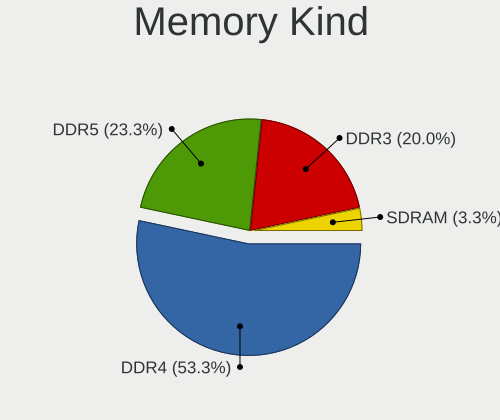

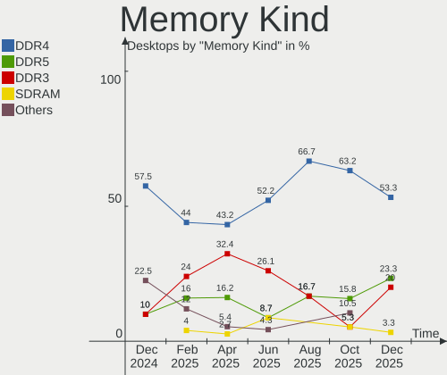

| Kind  | Desktops | Percent |
|-------|----------|---------|
| DDR4  | 16       | 53.33%  |
| DDR5  | 7        | 23.33%  |
| DDR3  | 6        | 20%     |
| SDRAM | 1        | 3.33%   |

Memory Form Factor
------------------

Physical design of the memory module

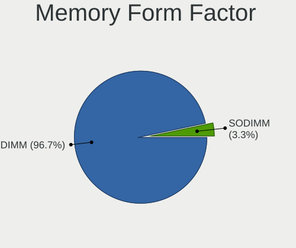

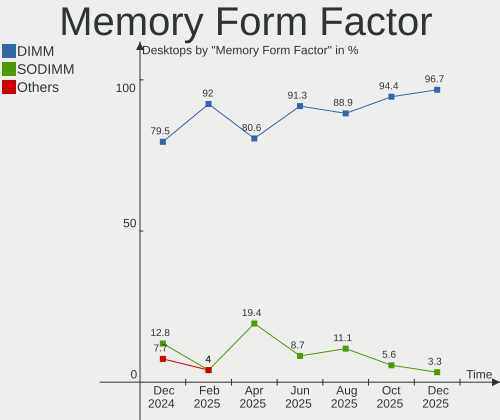

| Name   | Desktops | Percent |
|--------|----------|---------|
| DIMM   | 29       | 96.67%  |
| SODIMM | 1        | 3.33%   |

Memory Size
-----------

Memory module size

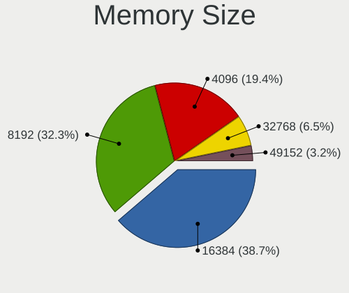

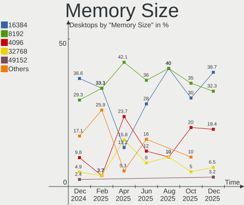

| Size  | Desktops | Percent |
|-------|----------|---------|
| 16384 | 12       | 38.71%  |
| 8192  | 10       | 32.26%  |
| 4096  | 6        | 19.35%  |
| 32768 | 2        | 6.45%   |
| 49152 | 1        | 3.23%   |

Memory Speed
------------

Memory module speed

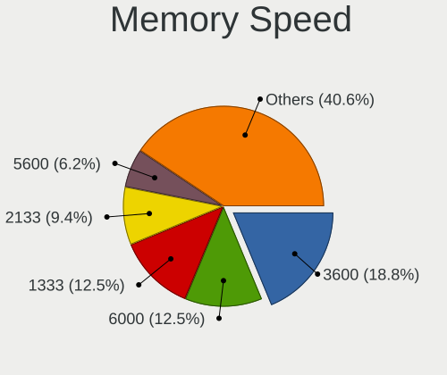

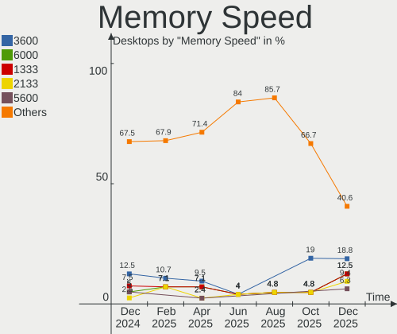

| Speed | Desktops | Percent |
|-------|----------|---------|
| 3600  | 6        | 18.75%  |
| 6000  | 4        | 12.5%   |
| 1333  | 4        | 12.5%   |
| 2133  | 3        | 9.38%   |
| 5600  | 2        | 6.25%   |
| 3466  | 2        | 6.25%   |
| 3200  | 2        | 6.25%   |
| 1600  | 2        | 6.25%   |
| 7000  | 1        | 3.13%   |
| 3800  | 1        | 3.13%   |
| 3666  | 1        | 3.13%   |
| 3000  | 1        | 3.13%   |
| 2667  | 1        | 3.13%   |
| 2465  | 1        | 3.13%   |
| 1800  | 1        | 3.13%   |

Printers & scanners
-------------------

Printer Vendor
--------------

Printer device vendors

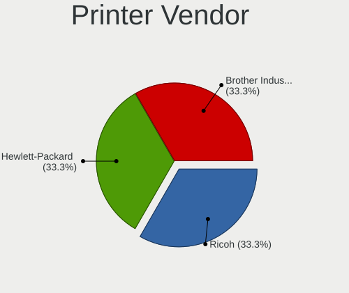

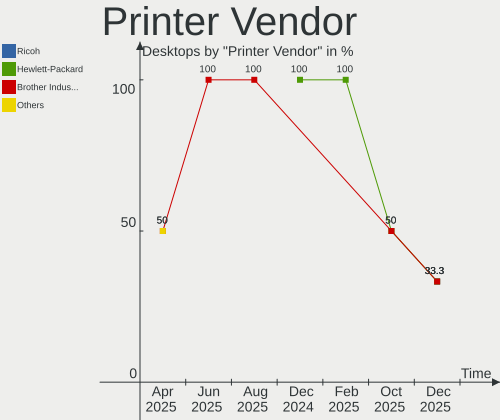

| Vendor             | Desktops | Percent |
|--------------------|----------|---------|
| Ricoh              | 1        | 33.33%  |
| Hewlett-Packard    | 1        | 33.33%  |
| Brother Industries | 1        | 33.33%  |

Printer Model
-------------

Printer device models

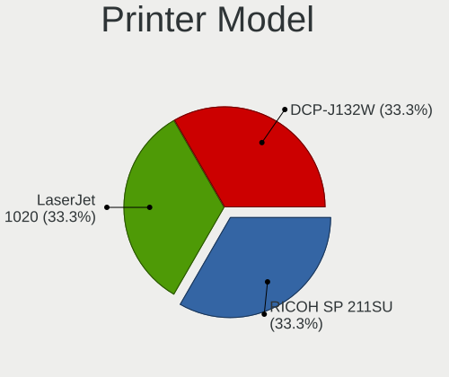

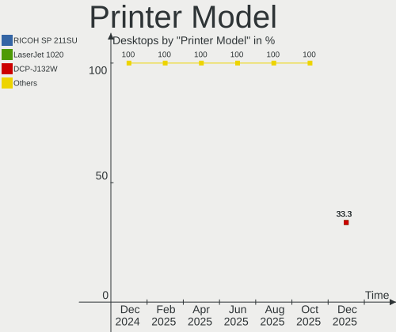

| Model                | Desktops | Percent |
|----------------------|----------|---------|
| Ricoh RICOH SP 211SU | 1        | 33.33%  |
| HP LaserJet 1020     | 1        | 33.33%  |
| Brother DCP-J132W    | 1        | 33.33%  |

Scanner Vendor
--------------

Scanner device vendors

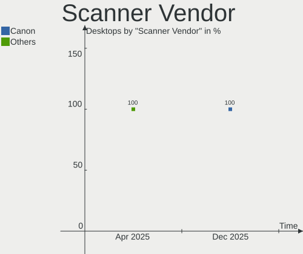

| Vendor | Desktops | Percent |
|--------|----------|---------|
| Canon  | 1        | 100%    |

Scanner Model
-------------

Scanner device models

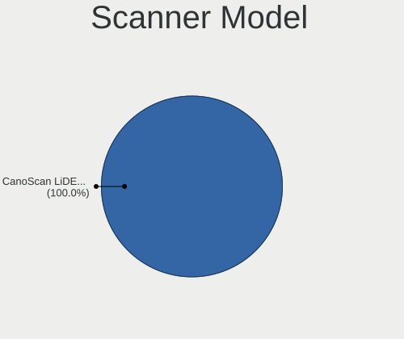

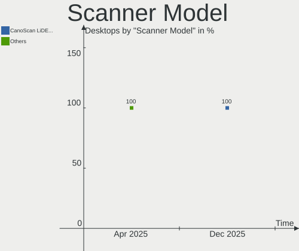

| Model                    | Desktops | Percent |
|--------------------------|----------|---------|
| Canon CanoScan LiDE 700F | 1        | 100%    |

Camera
------

Camera Vendor
-------------

Camera device vendors

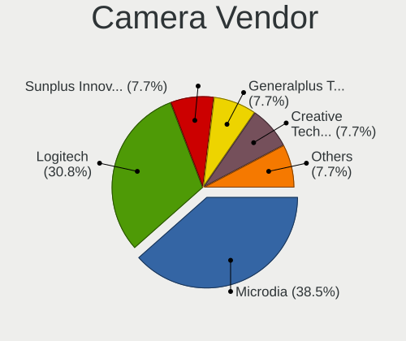

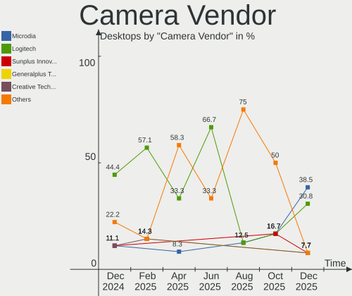

| Vendor                        | Desktops | Percent |
|-------------------------------|----------|---------|
| Microdia                      | 5        | 38.46%  |
| Logitech                      | 4        | 30.77%  |
| Sunplus Innovation Technology | 1        | 7.69%   |
| Generalplus Technology        | 1        | 7.69%   |
| Creative Technology           | 1        | 7.69%   |
| AVerMedia Technologies        | 1        | 7.69%   |

Camera Model
------------

Camera device models

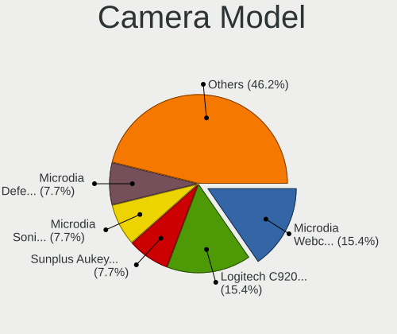

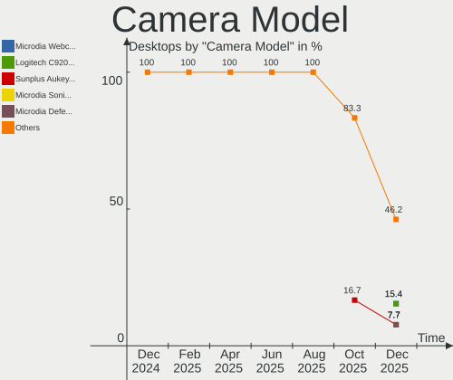

| Model                                       | Desktops | Percent |
|---------------------------------------------|----------|---------|
| Microdia Webcam Vitade AF                   | 2        | 15.38%  |
| Logitech C920 PRO HD Webcam                 | 2        | 15.38%  |
| Sunplus Aukey-PC-LM1E Camera                | 1        | 7.69%   |
| Microdia Sonix USB 2.0 Camera               | 1        | 7.69%   |
| Microdia Defender G-Lens 2577 HD720p Camera | 1        | 7.69%   |
| Microdia CyberTrack H7                      | 1        | 7.69%   |
| Logitech Webcam C170                        | 1        | 7.69%   |
| Logitech StreamCam                          | 1        | 7.69%   |
| Generalplus MMIC                            | 1        | 7.69%   |
| Creative Live! Cam Sync 1080p               | 1        | 7.69%   |
| AVerMedia PW310O Webcam                     | 1        | 7.69%   |

Security
--------

Fingerprint Vendor
------------------

Fingerprint sensor vendors

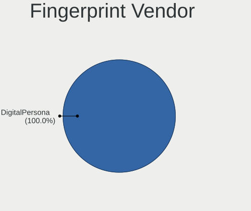

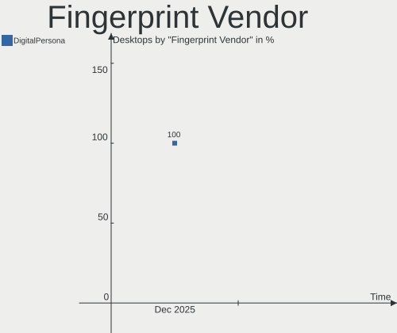

| Vendor         | Desktops | Percent |
|----------------|----------|---------|
| DigitalPersona | 1        | 100%    |

Fingerprint Model
-----------------

Fingerprint sensor models

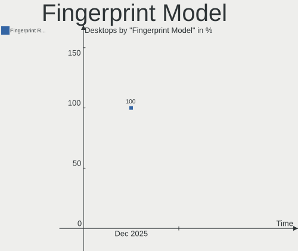

| Model                             | Desktops | Percent |
|-----------------------------------|----------|---------|
| DigitalPersona Fingerprint Reader | 1        | 100%    |

Chipcard Vendor
---------------

Chipcard module vendors

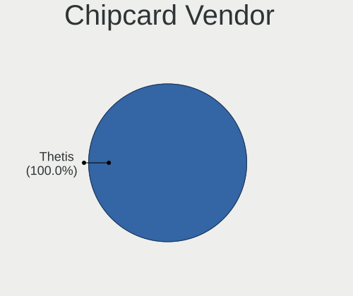

| Vendor | Desktops | Percent |
|--------|----------|---------|
| Thetis | 1        | 100%    |

Chipcard Model
--------------

Chipcard module models

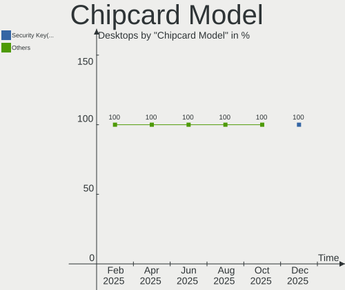

| Model                     | Desktops | Percent |
|---------------------------|----------|---------|
| Thetis Security Key(F825) | 1        | 100%    |

Unsupported
-----------

Unsupported Devices
-------------------

Total unsupported devices on board

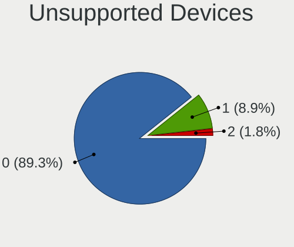

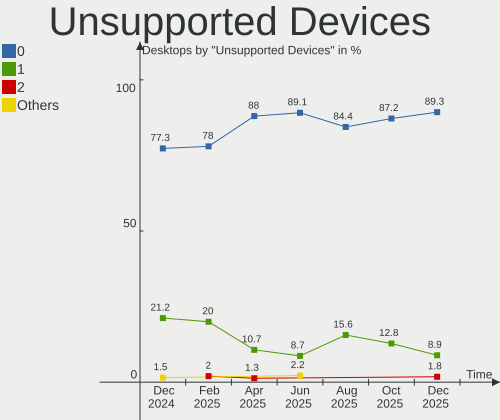

| Total | Desktops | Percent |
|-------|----------|---------|
| 0     | 50       | 89.29%  |
| 1     | 5        | 8.93%   |
| 2     | 1        | 1.79%   |

Unsupported Device Types
------------------------

Types of unsupported devices

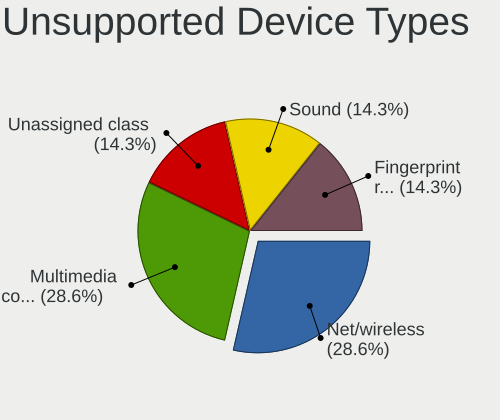

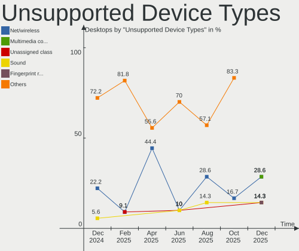

| Type                  | Desktops | Percent |
|-----------------------|----------|---------|
| Net/wireless          | 2        | 28.57%  |
| Multimedia controller | 2        | 28.57%  |
| Unassigned class      | 1        | 14.29%  |
| Sound                 | 1        | 14.29%  |
| Fingerprint reader    | 1        | 14.29%  |

