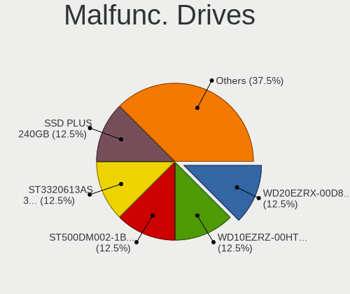
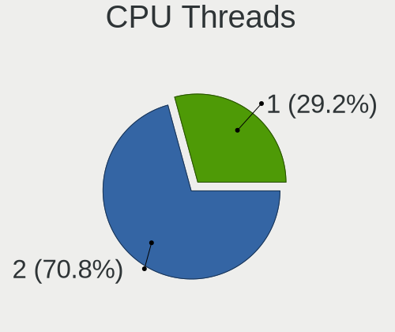
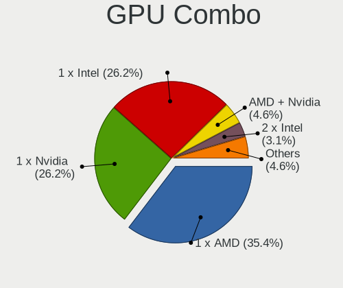
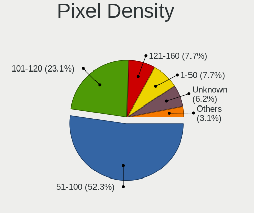
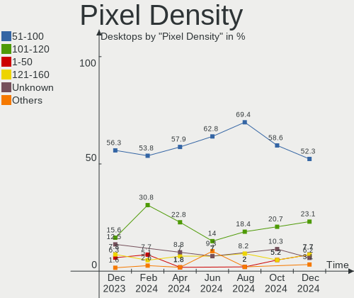
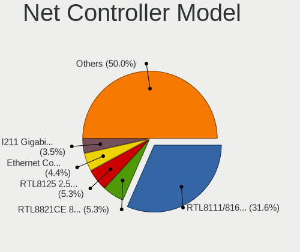
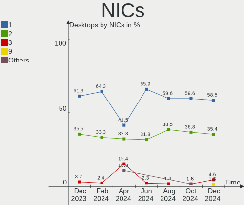

Linux in Spain - Hardware Trends (Desktops)
-------------------------------------------

A project to identify most popular hardware characteristics and track their change
over time based on data collected by Linux users at https://Linux-Hardware.org.

Anyone can contribute to this report by the [hw-probe](https://github.com/linuxhw/hw-probe) tool:

    sudo -E hw-probe -all -upload

Period: Nov, 2023.

Contents
--------

* [ System ](#system)
  - [ OS                       ](#os)
  - [ OS Family                ](#os-family)
  - [ Kernel                   ](#kernel)
  - [ Kernel Family            ](#kernel-family)
  - [ Kernel Major Ver.        ](#kernel-major-ver)
  - [ Arch                     ](#arch)
  - [ DE                       ](#de)
  - [ Display Server           ](#display-server)
  - [ Display Manager          ](#display-manager)
  - [ OS Lang                  ](#os-lang)
  - [ Boot Mode                ](#boot-mode)
  - [ Filesystem               ](#filesystem)
  - [ Part. scheme             ](#part-scheme)
  - [ Dual Boot with Linux/BSD ](#dual-boot-with-linuxbsd)
  - [ Dual Boot (Win)          ](#dual-boot-win)

* [ Board ](#board)
  - [ Vendor                   ](#vendor)
  - [ Model                    ](#model)
  - [ Model Family             ](#model-family)
  - [ MFG Year                 ](#mfg-year)
  - [ Form Factor              ](#form-factor)
  - [ Secure Boot              ](#secure-boot)
  - [ Coreboot                 ](#coreboot)
  - [ RAM Size                 ](#ram-size)
  - [ RAM Used                 ](#ram-used)
  - [ Total Drives             ](#total-drives)
  - [ Has CD-ROM               ](#has-cd-rom)
  - [ Has Ethernet             ](#has-ethernet)
  - [ Has WiFi                 ](#has-wifi)
  - [ Has Bluetooth            ](#has-bluetooth)

* [ Location ](#location)
  - [ Country                  ](#country)
  - [ City                     ](#city)

* [ Drives ](#drives)
  - [ Drive Vendor             ](#drive-vendor)
  - [ Drive Model              ](#drive-model)
  - [ HDD Vendor               ](#hdd-vendor)
  - [ SSD Vendor               ](#ssd-vendor)
  - [ Drive Kind               ](#drive-kind)
  - [ Drive Connector          ](#drive-connector)
  - [ Drive Size               ](#drive-size)
  - [ Space Total              ](#space-total)
  - [ Space Used               ](#space-used)
  - [ Malfunc. Drives          ](#malfunc-drives)
  - [ Malfunc. Drive Vendor    ](#malfunc-drive-vendor)
  - [ Malfunc. HDD Vendor      ](#malfunc-hdd-vendor)
  - [ Malfunc. Drive Kind      ](#malfunc-drive-kind)
  - [ Failed Drives            ](#failed-drives)
  - [ Failed Drive Vendor      ](#failed-drive-vendor)
  - [ Drive Status             ](#drive-status)

* [ Storage controller ](#storage-controller)
  - [ Storage Vendor           ](#storage-vendor)
  - [ Storage Model            ](#storage-model)
  - [ Storage Kind             ](#storage-kind)

* [ Processor ](#processor)
  - [ CPU Vendor               ](#cpu-vendor)
  - [ CPU Model                ](#cpu-model)
  - [ CPU Model Family         ](#cpu-model-family)
  - [ CPU Cores                ](#cpu-cores)
  - [ CPU Sockets              ](#cpu-sockets)
  - [ CPU Threads              ](#cpu-threads)
  - [ CPU Op-Modes             ](#cpu-op-modes)
  - [ CPU Microcode            ](#cpu-microcode)
  - [ CPU Microarch            ](#cpu-microarch)

* [ Graphics ](#graphics)
  - [ GPU Vendor               ](#gpu-vendor)
  - [ GPU Model                ](#gpu-model)
  - [ GPU Combo                ](#gpu-combo)
  - [ GPU Driver               ](#gpu-driver)
  - [ GPU Memory               ](#gpu-memory)

* [ Monitor ](#monitor)
  - [ Monitor Vendor           ](#monitor-vendor)
  - [ Monitor Model            ](#monitor-model)
  - [ Monitor Resolution       ](#monitor-resolution)
  - [ Monitor Diagonal         ](#monitor-diagonal)
  - [ Monitor Width            ](#monitor-width)
  - [ Aspect Ratio             ](#aspect-ratio)
  - [ Monitor Area             ](#monitor-area)
  - [ Pixel Density            ](#pixel-density)
  - [ Multiple Monitors        ](#multiple-monitors)

* [ Network ](#network)
  - [ Net Controller Vendor    ](#net-controller-vendor)
  - [ Net Controller Model     ](#net-controller-model)
  - [ Wireless Vendor          ](#wireless-vendor)
  - [ Wireless Model           ](#wireless-model)
  - [ Ethernet Vendor          ](#ethernet-vendor)
  - [ Ethernet Model           ](#ethernet-model)
  - [ Net Controller Kind      ](#net-controller-kind)
  - [ Used Controller          ](#used-controller)
  - [ NICs                     ](#nics)
  - [ IPv6                     ](#ipv6)

* [ Bluetooth ](#bluetooth)
  - [ Bluetooth Vendor         ](#bluetooth-vendor)
  - [ Bluetooth Model          ](#bluetooth-model)

* [ Sound ](#sound)
  - [ Sound Vendor             ](#sound-vendor)
  - [ Sound Model              ](#sound-model)

* [ Memory ](#memory)
  - [ Memory Vendor            ](#memory-vendor)
  - [ Memory Model             ](#memory-model)
  - [ Memory Kind              ](#memory-kind)
  - [ Memory Form Factor       ](#memory-form-factor)
  - [ Memory Size              ](#memory-size)
  - [ Memory Speed             ](#memory-speed)

* [ Printers & scanners ](#printers--scanners)
  - [ Printer Vendor           ](#printer-vendor)
  - [ Printer Model            ](#printer-model)
  - [ Scanner Vendor           ](#scanner-vendor)
  - [ Scanner Model            ](#scanner-model)

* [ Camera ](#camera)
  - [ Camera Vendor            ](#camera-vendor)
  - [ Camera Model             ](#camera-model)

* [ Security ](#security)
  - [ Fingerprint Vendor       ](#fingerprint-vendor)
  - [ Fingerprint Model        ](#fingerprint-model)
  - [ Chipcard Vendor          ](#chipcard-vendor)
  - [ Chipcard Model           ](#chipcard-model)

* [ Unsupported ](#unsupported)
  - [ Unsupported Devices      ](#unsupported-devices)
  - [ Unsupported Device Types ](#unsupported-device-types)

System
------

OS
--

Installed operating systems

| Name                         | Desktops | Percent |
|------------------------------|----------|---------|
| Ubuntu 22.04                 | 13       | 18.57%  |
| Linux Mint 21.2              | 7        | 10%     |
| Debian 12                    | 6        | 8.57%   |
| Ubuntu 23.10                 | 4        | 5.71%   |
| OpenMandriva 5.0             | 4        | 5.71%   |
| OpenMandriva 23.08           | 3        | 4.29%   |
| Fedora 39                    | 3        | 4.29%   |
| Fedora 38                    | 3        | 4.29%   |
| ArcoLinux Rolling            | 3        | 4.29%   |
| Debian 11                    | 2        | 2.86%   |
| Debian                       | 2        | 2.86%   |
| Zorin 16                     | 1        | 1.43%   |
| Xubuntu 22.04                | 1        | 1.43%   |
| Ubuntu 23.04                 | 1        | 1.43%   |
| Ubuntu 20.04                 | 1        | 1.43%   |
| openSUSE Tumbleweed-XXXXXXXX | 1        | 1.43%   |
| openSUSE Leap-15.5           | 1        | 1.43%   |
| OpenMandriva 4.2             | 1        | 1.43%   |
| OpenMandriva 23.01           | 1        | 1.43%   |
| Nobara 38                    | 1        | 1.43%   |
| LMDE 6                       | 1        | 1.43%   |
| Linux Mint 21                | 1        | 1.43%   |
| Kubuntu 23.10                | 1        | 1.43%   |
| Kubuntu 22.04                | 1        | 1.43%   |
| KDE neon 22.04               | 1        | 1.43%   |
| Kali 2023.3                  | 1        | 1.43%   |
| Gentoo 2.14                  | 1        | 1.43%   |
| EndeavourOS Rolling          | 1        | 1.43%   |
| ChimeraOS 44-1               | 1        | 1.43%   |
| blendOS                      | 1        | 1.43%   |
| Arch Rolling                 | 1        | 1.43%   |

OS Family
---------

OS without a version

| Name         | Desktops | Percent |
|--------------|----------|---------|
| Ubuntu       | 19       | 27.14%  |
| Debian       | 10       | 14.29%  |
| OpenMandriva | 9        | 12.86%  |
| Linux Mint   | 8        | 11.43%  |
| Fedora       | 6        | 8.57%   |
| ArcoLinux    | 3        | 4.29%   |
| openSUSE     | 2        | 2.86%   |
| Kubuntu      | 2        | 2.86%   |
| Zorin        | 1        | 1.43%   |
| Xubuntu      | 1        | 1.43%   |
| Nobara       | 1        | 1.43%   |
| LMDE         | 1        | 1.43%   |
| KDE neon     | 1        | 1.43%   |
| Kali         | 1        | 1.43%   |
| Gentoo       | 1        | 1.43%   |
| EndeavourOS  | 1        | 1.43%   |
| ChimeraOS    | 1        | 1.43%   |
| blendOS      | 1        | 1.43%   |
| Arch         | 1        | 1.43%   |

Kernel
------

Version of the Linux kernel

| Version                      | Desktops | Percent |
|------------------------------|----------|---------|
| 6.2.0-36-generic             | 12       | 17.14%  |
| 6.1.0-13-amd64               | 7        | 10%     |
| 6.6.2-desktop-1omv2390       | 3        | 4.29%   |
| 6.5.0-10-generic             | 3        | 4.29%   |
| 6.4.11-desktop-1omv2390      | 3        | 4.29%   |
| 6.2.0-37-generic             | 3        | 4.29%   |
| 5.15.0-88-generic            | 3        | 4.29%   |
| 6.6.1-arch1-1                | 2        | 2.86%   |
| 6.5.9-arch2-1                | 2        | 2.86%   |
| 6.5.8-200.fc38.x86_64        | 2        | 2.86%   |
| 6.5.0-13-generic             | 2        | 2.86%   |
| 6.2.0-26-generic             | 2        | 2.86%   |
| 5.15.0-87-generic            | 2        | 2.86%   |
| 6.7.0-desktop-0.rc2.1omv2390 | 1        | 1.43%   |
| 6.6.2-1-default              | 1        | 1.43%   |
| 6.6.0-gentoo-Ryzen           | 1        | 1.43%   |
| 6.5.6-chos1-chimeraos-1      | 1        | 1.43%   |
| 6.5.6-300.fc39.x86_64        | 1        | 1.43%   |
| 6.5.5-zen1-1-zen             | 1        | 1.43%   |
| 6.5.11-300.fc39.x86_64       | 1        | 1.43%   |
| 6.5.11-201.fsync.fc38.x86_64 | 1        | 1.43%   |
| 6.5.10-300.fc39.x86_64       | 1        | 1.43%   |
| 6.5.10-200.fc38.x86_64       | 1        | 1.43%   |
| 6.5.0-kali3-amd64            | 1        | 1.43%   |
| 6.5.0-4-amd64                | 1        | 1.43%   |
| 6.5.0-2-amd64                | 1        | 1.43%   |
| 6.2.0-39-generic             | 1        | 1.43%   |
| 6.2.0-1015-oracle            | 1        | 1.43%   |
| 6.1.61-1-lts                 | 1        | 1.43%   |
| 6.1.1-desktop-1omv2290       | 1        | 1.43%   |
| 5.15.0-89-generic            | 1        | 1.43%   |
| 5.15.0-76-generic            | 1        | 1.43%   |
| 5.15.0-56-generic            | 1        | 1.43%   |
| 5.14.21-150500.55.36-default | 1        | 1.43%   |
| 5.10.14-desktop-1omv4002     | 1        | 1.43%   |
| 5.10.0-26-amd64              | 1        | 1.43%   |
| 5.10.0-15-amd64              | 1        | 1.43%   |

Kernel Family
-------------

Linux kernel without a distro release

| Version | Desktops | Percent |
|---------|----------|---------|
| 6.2.0   | 19       | 27.14%  |
| 6.5.0   | 8        | 11.43%  |
| 5.15.0  | 8        | 11.43%  |
| 6.1.0   | 7        | 10%     |
| 6.6.2   | 4        | 5.71%   |
| 6.4.11  | 3        | 4.29%   |
| 6.6.1   | 2        | 2.86%   |
| 6.5.9   | 2        | 2.86%   |
| 6.5.8   | 2        | 2.86%   |
| 6.5.6   | 2        | 2.86%   |
| 6.5.11  | 2        | 2.86%   |
| 6.5.10  | 2        | 2.86%   |
| 5.10.0  | 2        | 2.86%   |
| 6.7.0   | 1        | 1.43%   |
| 6.6.0   | 1        | 1.43%   |
| 6.5.5   | 1        | 1.43%   |
| 6.1.61  | 1        | 1.43%   |
| 6.1.1   | 1        | 1.43%   |
| 5.14.21 | 1        | 1.43%   |
| 5.10.14 | 1        | 1.43%   |

Kernel Major Ver.
-----------------

Linux kernel major version

| Version | Desktops | Percent |
|---------|----------|---------|
| 6.5     | 19       | 27.14%  |
| 6.2     | 19       | 27.14%  |
| 6.1     | 9        | 12.86%  |
| 5.15    | 8        | 11.43%  |
| 6.6     | 7        | 10%     |
| 6.4     | 3        | 4.29%   |
| 5.10    | 3        | 4.29%   |
| 6.7     | 1        | 1.43%   |
| 5.14    | 1        | 1.43%   |

Arch
----

OS architecture (x86_64, i586, etc.)

| Name   | Desktops | Percent |
|--------|----------|---------|
| x86_64 | 70       | 100%    |

DE
--

Desktop Environment

| Name       | Desktops | Percent |
|------------|----------|---------|
| GNOME      | 27       | 38.57%  |
| KDE5       | 22       | 31.43%  |
| XFCE       | 7        | 10%     |
| X-Cinnamon | 7        | 10%     |
| Unknown    | 2        | 2.86%   |
| openbox    | 1        | 1.43%   |
| MATE       | 1        | 1.43%   |
| LXQt       | 1        | 1.43%   |
| Deepin     | 1        | 1.43%   |
| Budgie     | 1        | 1.43%   |

Display Server
--------------

X11 or Wayland

| Name    | Desktops | Percent |
|---------|----------|---------|
| X11     | 41       | 58.57%  |
| Wayland | 26       | 37.14%  |
| Tty     | 3        | 4.29%   |

Display Manager
---------------

SDDM, LightDM, etc.

| Name    | Desktops | Percent |
|---------|----------|---------|
| Unknown | 28       | 40%     |
| GDM3    | 17       | 24.29%  |
| SDDM    | 15       | 21.43%  |
| LightDM | 9        | 12.86%  |
| GDM     | 1        | 1.43%   |

OS Lang
-------

Language

| Lang       | Desktops | Percent |
|------------|----------|---------|
| es_ES      | 46       | 65.71%  |
| en_US      | 12       | 17.14%  |
| ca_ES      | 2        | 2.86%   |
| C          | 2        | 2.86%   |
| pl_PL      | 1        | 1.43%   |
| gl_ES      | 1        | 1.43%   |
| fr_FR      | 1        | 1.43%   |
| eu_ES      | 1        | 1.43%   |
| es_ES.UTF8 | 1        | 1.43%   |
| es_AR      | 1        | 1.43%   |
| de_DE      | 1        | 1.43%   |
| Unknown    | 1        | 1.43%   |

Boot Mode
---------

EFI or BIOS

| Mode | Desktops | Percent |
|------|----------|---------|
| BIOS | 35       | 50%     |
| EFI  | 35       | 50%     |

Filesystem
----------

Type of filesystem

| Type    | Desktops | Percent |
|---------|----------|---------|
| Ext4    | 39       | 55.71%  |
| Tmpfs   | 12       | 17.14%  |
| Btrfs   | 11       | 15.71%  |
| Overlay | 6        | 8.57%   |
| Xfs     | 2        | 2.86%   |

Part. scheme
------------

Scheme of partitioning

| Type    | Desktops | Percent |
|---------|----------|---------|
| GPT     | 38       | 54.29%  |
| Unknown | 26       | 37.14%  |
| MBR     | 6        | 8.57%   |

Dual Boot with Linux/BSD
------------------------

Hosting more than one Linux/BSD

| Dual boot | Desktops | Percent |
|-----------|----------|---------|
| No        | 55       | 78.57%  |
| Yes       | 15       | 21.43%  |

Dual Boot (Win)
---------------

Hosting Linux and Windows

| Dual boot | Desktops | Percent |
|-----------|----------|---------|
| No        | 45       | 64.29%  |
| Yes       | 25       | 35.71%  |

Board
-----

Vendor
------

Motherboard manufacturer

| Name                                 | Desktops | Percent |
|--------------------------------------|----------|---------|
| ASUSTek Computer                     | 18       | 25.71%  |
| MSI                                  | 16       | 22.86%  |
| Gigabyte Technology                  | 11       | 15.71%  |
| Hewlett-Packard                      | 7        | 10%     |
| Lenovo                               | 3        | 4.29%   |
| ASRock                               | 3        | 4.29%   |
| Shenzhen Meigao Electronic Equipment | 2        | 2.86%   |
| Intel                                | 2        | 2.86%   |
| AZW                                  | 2        | 2.86%   |
| Acer                                 | 2        | 2.86%   |
| Shuttle                              | 1        | 1.43%   |
| Dell                                 | 1        | 1.43%   |
| AMI                                  | 1        | 1.43%   |
| Unknown                              | 1        | 1.43%   |

Model
-----

Motherboard model

| Name                                       | Desktops | Percent |
|--------------------------------------------|----------|---------|
| MSI MS-7971                                | 2        | 2.86%   |
| Gigabyte H61M-DS2                          | 2        | 2.86%   |
| ASUS TUF Gaming X570-PRO                   | 2        | 2.86%   |
| ASUS H110M-D                               | 2        | 2.86%   |
| ASUS All Series                            | 2        | 2.86%   |
| Shuttle SH87R                              | 1        | 1.43%   |
| Shenzhen Meigao Electronic Equipment UM690 | 1        | 1.43%   |
| Shenzhen Meigao Electronic Equipment F7BSC | 1        | 1.43%   |
| MSI MS-7E26                                | 1        | 1.43%   |
| MSI MS-7D38                                | 1        | 1.43%   |
| MSI MS-7D18                                | 1        | 1.43%   |
| MSI MS-7C75                                | 1        | 1.43%   |
| MSI MS-7C37                                | 1        | 1.43%   |
| MSI MS-7B93                                | 1        | 1.43%   |
| MSI MS-7B86                                | 1        | 1.43%   |
| MSI MS-7B85                                | 1        | 1.43%   |
| MSI MS-7B79                                | 1        | 1.43%   |
| MSI MS-7B24                                | 1        | 1.43%   |
| MSI MS-7994                                | 1        | 1.43%   |
| MSI MS-7976                                | 1        | 1.43%   |
| MSI MS-7636                                | 1        | 1.43%   |
| MSI KBL-U Pro Cubi 3 Silent S (MS-B159)    | 1        | 1.43%   |
| Lenovo ThinkStation P330 30CY0006US        | 1        | 1.43%   |
| Lenovo ThinkCentre M900 10FH000KUS         | 1        | 1.43%   |
| Lenovo ThinkCentre M710s 10M8S4GW00        | 1        | 1.43%   |
| Intel X99                                  | 1        | 1.43%   |
| Intel D34010WYK H14771-304                 | 1        | 1.43%   |
| HP ProLiant MicroServer Gen8               | 1        | 1.43%   |
| HP EliteDesk 800 G3 TWR                    | 1        | 1.43%   |
| HP EliteDesk 800 G2 SFF                    | 1        | 1.43%   |
| HP EliteDesk 800 G1 USDT                   | 1        | 1.43%   |
| HP Compaq Pro 6300 SFF                     | 1        | 1.43%   |
| HP Compaq dc7700p Small Form Factor        | 1        | 1.43%   |
| HP Compaq 8100 Elite SFF PC                | 1        | 1.43%   |
| Gigabyte Z690 UD DDR4                      | 1        | 1.43%   |
| Gigabyte Z590I VISION D                    | 1        | 1.43%   |
| Gigabyte X58A-UD3R                         | 1        | 1.43%   |
| Gigabyte P67A-D3-B3                        | 1        | 1.43%   |
| Gigabyte GB-BXBT-2807                      | 1        | 1.43%   |
| Gigabyte GA-MA770-DS3                      | 1        | 1.43%   |

Model Family
------------

Motherboard model prefix

| Name                                       | Desktops | Percent |
|--------------------------------------------|----------|---------|
| ASUS TUF                                   | 5        | 7.14%   |
| HP EliteDesk                               | 3        | 4.29%   |
| HP Compaq                                  | 3        | 4.29%   |
| ASUS ROG                                   | 3        | 4.29%   |
| MSI MS-7971                                | 2        | 2.86%   |
| Lenovo ThinkCentre                         | 2        | 2.86%   |
| Gigabyte H61M-DS2                          | 2        | 2.86%   |
| Gigabyte B450M                             | 2        | 2.86%   |
| ASUS H110M-D                               | 2        | 2.86%   |
| ASUS All                                   | 2        | 2.86%   |
| Shuttle SH87R                              | 1        | 1.43%   |
| Shenzhen Meigao Electronic Equipment UM690 | 1        | 1.43%   |
| Shenzhen Meigao Electronic Equipment F7BSC | 1        | 1.43%   |
| MSI MS-7E26                                | 1        | 1.43%   |
| MSI MS-7D38                                | 1        | 1.43%   |
| MSI MS-7D18                                | 1        | 1.43%   |
| MSI MS-7C75                                | 1        | 1.43%   |
| MSI MS-7C37                                | 1        | 1.43%   |
| MSI MS-7B93                                | 1        | 1.43%   |
| MSI MS-7B86                                | 1        | 1.43%   |
| MSI MS-7B85                                | 1        | 1.43%   |
| MSI MS-7B79                                | 1        | 1.43%   |
| MSI MS-7B24                                | 1        | 1.43%   |
| MSI MS-7994                                | 1        | 1.43%   |
| MSI MS-7976                                | 1        | 1.43%   |
| MSI MS-7636                                | 1        | 1.43%   |
| MSI KBL-U                                  | 1        | 1.43%   |
| Lenovo ThinkStation                        | 1        | 1.43%   |
| Intel X99                                  | 1        | 1.43%   |
| Intel D34010WYK                            | 1        | 1.43%   |
| HP ProLiant                                | 1        | 1.43%   |
| Gigabyte Z690                              | 1        | 1.43%   |
| Gigabyte Z590I                             | 1        | 1.43%   |
| Gigabyte X58A-UD3R                         | 1        | 1.43%   |
| Gigabyte P67A-D3-B3                        | 1        | 1.43%   |
| Gigabyte GB-BXBT-2807                      | 1        | 1.43%   |
| Gigabyte GA-MA770-DS3                      | 1        | 1.43%   |
| Gigabyte GA-73PVM-S2H                      | 1        | 1.43%   |
| Dell OptiPlex                              | 1        | 1.43%   |
| AZW SEi                                    | 1        | 1.43%   |

MFG Year
--------

Motherboard manufacture year

| Year | Desktops | Percent |
|------|----------|---------|
| 2020 | 8        | 11.43%  |
| 2019 | 8        | 11.43%  |
| 2015 | 8        | 11.43%  |
| 2018 | 6        | 8.57%   |
| 2022 | 5        | 7.14%   |
| 2021 | 5        | 7.14%   |
| 2013 | 5        | 7.14%   |
| 2023 | 4        | 5.71%   |
| 2014 | 4        | 5.71%   |
| 2012 | 4        | 5.71%   |
| 2009 | 3        | 4.29%   |
| 2007 | 3        | 4.29%   |
| 2017 | 2        | 2.86%   |
| 2016 | 1        | 1.43%   |
| 2011 | 1        | 1.43%   |
| 2010 | 1        | 1.43%   |
| 2008 | 1        | 1.43%   |
| 2006 | 1        | 1.43%   |

Form Factor
-----------

Physical design of the computer

| Name    | Desktops | Percent |
|---------|----------|---------|
| Desktop | 70       | 100%    |

Secure Boot
-----------

Enabled or disabled

| State    | Desktops | Percent |
|----------|----------|---------|
| Disabled | 66       | 94.29%  |
| Enabled  | 4        | 5.71%   |

Coreboot
--------

Have coreboot on board

| Used | Desktops | Percent |
|------|----------|---------|
| No   | 70       | 100%    |

RAM Size
--------

Total RAM memory

| Size in GB      | Desktops | Percent |
|-----------------|----------|---------|
| 32.01-64.0      | 18       | 25.71%  |
| 16.01-24.0      | 15       | 21.43%  |
| 3.01-4.0        | 10       | 14.29%  |
| 4.01-8.0        | 9        | 12.86%  |
| 8.01-16.0       | 9        | 12.86%  |
| 64.01-256.0     | 5        | 7.14%   |
| 24.01-32.0      | 3        | 4.29%   |
| More than 256.0 | 1        | 1.43%   |

RAM Used
--------

Used RAM memory

| Used GB    | Desktops | Percent |
|------------|----------|---------|
| 4.01-8.0   | 20       | 28.57%  |
| 1.01-2.0   | 19       | 27.14%  |
| 2.01-3.0   | 15       | 21.43%  |
| 3.01-4.0   | 9        | 12.86%  |
| 8.01-16.0  | 3        | 4.29%   |
| 16.01-24.0 | 2        | 2.86%   |
| 0.51-1.0   | 1        | 1.43%   |
| 0.01-0.5   | 1        | 1.43%   |

Total Drives
------------

Number of drives on board

| Drives | Desktops | Percent |
|--------|----------|---------|
| 1      | 24       | 34.29%  |
| 3      | 14       | 20%     |
| 2      | 14       | 20%     |
| 5      | 8        | 11.43%  |
| 4      | 7        | 10%     |
| 9      | 1        | 1.43%   |
| 6      | 1        | 1.43%   |
| 0      | 1        | 1.43%   |

Has CD-ROM
----------

Has CD-ROM on board

| Presented | Desktops | Percent |
|-----------|----------|---------|
| No        | 49       | 70%     |
| Yes       | 21       | 30%     |

Has Ethernet
------------

Has Ethernet on board

| Presented | Desktops | Percent |
|-----------|----------|---------|
| Yes       | 67       | 95.71%  |
| No        | 3        | 4.29%   |

Has WiFi
--------

Has WiFi module

| Presented | Desktops | Percent |
|-----------|----------|---------|
| Yes       | 39       | 55.71%  |
| No        | 31       | 44.29%  |

Has Bluetooth
-------------

Has Bluetooth module

| Presented | Desktops | Percent |
|-----------|----------|---------|
| No        | 37       | 52.86%  |
| Yes       | 33       | 47.14%  |

Location
--------

Country
-------

Geographic location (country)

| Country | Desktops | Percent |
|---------|----------|---------|
| Spain   | 70       | 100%    |

City
----

Geographic location (city)

| City                      | Desktops | Percent |
|---------------------------|----------|---------|
| Barcelona                 | 11       | 15.71%  |
| Madrid                    | 8        | 11.43%  |
| Valencia                  | 5        | 7.14%   |
| Palma                     | 3        | 4.29%   |
| Zaragoza                  | 2        | 2.86%   |
| Seville                   | 2        | 2.86%   |
| Sabadell                  | 2        | 2.86%   |
| Granada                   | 2        | 2.86%   |
| Alicante                  | 2        | 2.86%   |
| Xinzo de Limia            | 1        | 1.43%   |
| Valladolid                | 1        | 1.43%   |
| Torrent                   | 1        | 1.43%   |
| Santiago de Compostela    | 1        | 1.43%   |
| Santander                 | 1        | 1.43%   |
| Sant Vicenç dels Horts   | 1        | 1.43%   |
| Puente La Reina – Gares | 1        | 1.43%   |
| Priego de Cordoba         | 1        | 1.43%   |
| Ponferrada                | 1        | 1.43%   |
| Paracuellos de Jarama     | 1        | 1.43%   |
| Pamplona                  | 1        | 1.43%   |
| Oropesa del Mar           | 1        | 1.43%   |
| Mahon                     | 1        | 1.43%   |
| Lugo                      | 1        | 1.43%   |
| Llucmajor                 | 1        | 1.43%   |
| Lleida                    | 1        | 1.43%   |
| La Adrada                 | 1        | 1.43%   |
| Ingenio                   | 1        | 1.43%   |
| Igualada                  | 1        | 1.43%   |
| Guadalajara               | 1        | 1.43%   |
| Grinon                    | 1        | 1.43%   |
| Fuengirola                | 1        | 1.43%   |
| Elda                      | 1        | 1.43%   |
| Durcal                    | 1        | 1.43%   |
| Coria del Río            | 1        | 1.43%   |
| Córdoba                  | 1        | 1.43%   |
| Consell                   | 1        | 1.43%   |
| Carcaixent                | 1        | 1.43%   |
| Canet d'En Berenguer      | 1        | 1.43%   |
| Badajoz                   | 1        | 1.43%   |
| Arboleas                  | 1        | 1.43%   |

Drives
------

Drive Vendor
------------

Hard drive vendors

| Vendor                      | Desktops | Drives | Percent |
|-----------------------------|----------|--------|---------|
| Seagate                     | 24       | 31     | 16.44%  |
| WDC                         | 22       | 28     | 15.07%  |
| Samsung Electronics         | 20       | 28     | 13.7%   |
| Kingston                    | 14       | 14     | 9.59%   |
| Sandisk                     | 11       | 16     | 7.53%   |
| Crucial                     | 10       | 10     | 6.85%   |
| Toshiba                     | 6        | 6      | 4.11%   |
| Hitachi                     | 4        | 4      | 2.74%   |
| Phison Electronics          | 3        | 4      | 2.05%   |
| JMicron Technology          | 3        | 3      | 2.05%   |
| Fanxiang                    | 3        | 5      | 2.05%   |
| Unknown                     | 2        | 3      | 1.37%   |
| Patriot                     | 2        | 3      | 1.37%   |
| Micron/Crucial Technology   | 2        | 2      | 1.37%   |
| Lexar                       | 2        | 2      | 1.37%   |
| Kingston Technology Company | 2        | 2      | 1.37%   |
| China                       | 2        | 7      | 1.37%   |
| Timetec                     | 1        | 1      | 0.68%   |
| SK hynix                    | 1        | 1      | 0.68%   |
| Silicon Motion              | 1        | 1      | 0.68%   |
| Realtek Semiconductor       | 1        | 1      | 0.68%   |
| MSI                         | 1        | 1      | 0.68%   |
| Maxtor                      | 1        | 1      | 0.68%   |
| LaCie                       | 1        | 1      | 0.68%   |
| KIOXIA-EXCERIA              | 1        | 1      | 0.68%   |
| KIOXIA                      | 1        | 1      | 0.68%   |
| Intel                       | 1        | 1      | 0.68%   |
| HGST                        | 1        | 1      | 0.68%   |
| CIRAGO                      | 1        | 1      | 0.68%   |
| Apple                       | 1        | 1      | 0.68%   |
| A-DATA Technology           | 1        | 1      | 0.68%   |

Drive Model
-----------

Hard drive models

| Model                                               | Desktops | Percent |
|-----------------------------------------------------|----------|---------|
| Kingston SA400S37480G 480GB SSD                     | 5        | 3.01%   |
| Samsung NVMe SSD Controller SM981/PM981/PM983 250GB | 3        | 1.81%   |
| Samsung NVMe SSD Controller PM9A1/PM9A3/980PRO 2TB  | 3        | 1.81%   |
| Kingston SA400S37240G 240GB SSD                     | 3        | 1.81%   |
| Crucial CT500MX500SSD1 500GB                        | 3        | 1.81%   |
| Crucial CT1000MX500SSD1 1TB                         | 3        | 1.81%   |
| Toshiba MQ01ABD050 500GB                            | 2        | 1.2%    |
| Seagate ST31000524AS 1TB                            | 2        | 1.2%    |
| Seagate ST2000DM008-2FR102 2TB                      | 2        | 1.2%    |
| Seagate ST1000DM003-1ER162 1TB                      | 2        | 1.2%    |
| Sandisk WD Blue SN550 NVMe SSD 512GB                | 2        | 1.2%    |
| SanDisk SSD PLUS 480GB                              | 2        | 1.2%    |
| Samsung SSD 870 EVO 1TB                             | 2        | 1.2%    |
| Samsung SSD 860 EVO 500GB                           | 2        | 1.2%    |
| Samsung SSD 850 EVO 250GB                           | 2        | 1.2%    |
| Micron/Crucial P2 NVMe PCIe SSD 1TB                 | 2        | 1.2%    |
| JMicron Generic 250GB                               | 2        | 1.2%    |
| Fanxiang S101 2TB                                   | 2        | 1.2%    |
| Crucial CT2000MX500SSD1 2TB                         | 2        | 1.2%    |
| WDC WDS500G2B0A-00SM50 500GB SSD                    | 1        | 0.6%    |
| WDC WDS250G2B0B-00YS70 250GB SSD                    | 1        | 0.6%    |
| WDC WDS240G2G0B-00EPW0 240GB SSD                    | 1        | 0.6%    |
| WDC WDS100T2B0A-00SM50 1TB SSD                      | 1        | 0.6%    |
| WDC WD80EZAZ-11TDBA0 8TB                            | 1        | 0.6%    |
| WDC WD80EFZX-68UW8N0 8TB                            | 1        | 0.6%    |
| WDC WD800JD-60LSA5 80GB                             | 1        | 0.6%    |
| WDC WD800JD-08LSA0 80GB                             | 1        | 0.6%    |
| WDC WD5000LPVX-08V0TT5 500GB                        | 1        | 0.6%    |
| WDC WD5000AZLX-21K2TA0 500GB                        | 1        | 0.6%    |
| WDC WD5000AAKX-60U6AA0 500GB                        | 1        | 0.6%    |
| WDC WD40EZRZ-00WN9B0 4TB                            | 1        | 0.6%    |
| WDC WD40EZAZ-00SF3B0 4TB                            | 1        | 0.6%    |
| WDC WD40EFAX-68JH4N0 4TB                            | 1        | 0.6%    |
| WDC WD3200AAJS-22B4A0 320GB                         | 1        | 0.6%    |
| WDC WD30EZRX-00DC0B0 3TB                            | 1        | 0.6%    |
| WDC WD2500JS-60MHB5 250GB                           | 1        | 0.6%    |
| WDC WD2500AAJS-00VTA0 250GB                         | 1        | 0.6%    |
| WDC WD10EZRX-00DC0B0 1TB                            | 1        | 0.6%    |
| WDC WD10EZEX-75WN4A0 1TB                            | 1        | 0.6%    |
| WDC WD10EZEX-21WN4A0 1TB                            | 1        | 0.6%    |

HDD Vendor
----------

Hard disk drive vendors

| Vendor  | Desktops | Drives | Percent |
|---------|----------|--------|---------|
| Seagate | 24       | 31     | 41.38%  |
| WDC     | 20       | 24     | 34.48%  |
| Toshiba | 5        | 5      | 8.62%   |
| Hitachi | 4        | 4      | 6.9%    |
| Unknown | 1        | 1      | 1.72%   |
| Maxtor  | 1        | 1      | 1.72%   |
| HGST    | 1        | 1      | 1.72%   |
| CIRAGO  | 1        | 1      | 1.72%   |
| Apple   | 1        | 1      | 1.72%   |

SSD Vendor
----------

Solid state drive vendors

| Vendor              | Desktops | Drives | Percent |
|---------------------|----------|--------|---------|
| Kingston            | 13       | 13     | 22.81%  |
| Samsung Electronics | 10       | 11     | 17.54%  |
| Crucial             | 10       | 10     | 17.54%  |
| SanDisk             | 5        | 5      | 8.77%   |
| WDC                 | 4        | 4      | 7.02%   |
| Fanxiang            | 3        | 5      | 5.26%   |
| Patriot             | 2        | 3      | 3.51%   |
| JMicron Technology  | 2        | 2      | 3.51%   |
| China               | 2        | 7      | 3.51%   |
| Toshiba             | 1        | 1      | 1.75%   |
| Timetec             | 1        | 1      | 1.75%   |
| SK hynix            | 1        | 1      | 1.75%   |
| LaCie               | 1        | 1      | 1.75%   |
| KIOXIA-EXCERIA      | 1        | 1      | 1.75%   |
| A-DATA Technology   | 1        | 1      | 1.75%   |

Drive Kind
----------

HDD or SSD

| Kind    | Desktops | Drives | Percent |
|---------|----------|--------|---------|
| SSD     | 43       | 66     | 36.75%  |
| HDD     | 42       | 69     | 35.9%   |
| NVMe    | 30       | 44     | 25.64%  |
| MMC     | 1        | 2      | 0.85%   |
| Unknown | 1        | 1      | 0.85%   |

Drive Connector
---------------

SATA, SAS, NVMe, etc.

| Type | Desktops | Drives | Percent |
|------|----------|--------|---------|
| SATA | 60       | 129    | 61.86%  |
| NVMe | 29       | 43     | 29.9%   |
| SAS  | 7        | 8      | 7.22%   |
| MMC  | 1        | 2      | 1.03%   |

Drive Size
----------

Size of hard drive

| Size in TB | Desktops | Drives | Percent |
|------------|----------|--------|---------|
| 0.01-0.5   | 42       | 58     | 45.65%  |
| 0.51-1.0   | 28       | 42     | 30.43%  |
| 1.01-2.0   | 11       | 15     | 11.96%  |
| 3.01-4.0   | 6        | 11     | 6.52%   |
| 2.01-3.0   | 3        | 4      | 3.26%   |
| 4.01-10.0  | 2        | 5      | 2.17%   |

Space Total
-----------

Amount of disk space available on the file system

| Size in GB     | Desktops | Percent |
|----------------|----------|---------|
| 501-1000       | 14       | 20%     |
| More than 3000 | 12       | 17.14%  |
| 251-500        | 12       | 17.14%  |
| 101-250        | 10       | 14.29%  |
| 1-20           | 7        | 10%     |
| 2001-3000      | 5        | 7.14%   |
| 1001-2000      | 5        | 7.14%   |
| 51-100         | 2        | 2.86%   |
| Unknown        | 2        | 2.86%   |
| 21-50          | 1        | 1.43%   |

Space Used
----------

Amount of used disk space

| Used GB        | Desktops | Percent |
|----------------|----------|---------|
| 1-20           | 16       | 22.86%  |
| 251-500        | 11       | 15.71%  |
| 21-50          | 10       | 14.29%  |
| 101-250        | 8        | 11.43%  |
| 51-100         | 7        | 10%     |
| 501-1000       | 6        | 8.57%   |
| More than 3000 | 4        | 5.71%   |
| 2001-3000      | 3        | 4.29%   |
| 1001-2000      | 3        | 4.29%   |
| Unknown        | 2        | 2.86%   |

Malfunc. Drives
---------------

Drive models with a malfunction

| Model                          | Desktops | Drives | Percent |
|--------------------------------|----------|--------|---------|
| WDC WD5000LPVX-08V0TT5 500GB   | 1        | 1      | 9.09%   |
| WDC WD5000AAKX-60U6AA0 500GB   | 1        | 1      | 9.09%   |
| WDC WD2500JS-60MHB5 250GB      | 1        | 1      | 9.09%   |
| WDC WD10EZEX-21WN4A0 1TB       | 1        | 1      | 9.09%   |
| Seagate ST4000LM024-2AN17V 4TB | 1        | 1      | 9.09%   |
| Seagate ST3250318AS 250GB      | 1        | 1      | 9.09%   |
| Seagate ST31000528AS 1TB       | 1        | 1      | 9.09%   |
| Seagate ST2000DM008-2UB102 2TB | 1        | 1      | 9.09%   |
| SanDisk SSD PLUS 480GB         | 1        | 1      | 9.09%   |
| HGST HTS721010A9E630 1TB       | 1        | 1      | 9.09%   |
| Crucial CT1000BX500SSD1 1TB    | 1        | 1      | 9.09%   |

Malfunc. Drive Vendor
---------------------

Vendors of faulty drives

| Vendor  | Desktops | Drives | Percent |
|---------|----------|--------|---------|
| WDC     | 4        | 4      | 36.36%  |
| Seagate | 4        | 4      | 36.36%  |
| SanDisk | 1        | 1      | 9.09%   |
| HGST    | 1        | 1      | 9.09%   |
| Crucial | 1        | 1      | 9.09%   |

Malfunc. HDD Vendor
-------------------

Vendors of faulty HDD drives

| Vendor  | Desktops | Drives | Percent |
|---------|----------|--------|---------|
| WDC     | 4        | 4      | 44.44%  |
| Seagate | 4        | 4      | 44.44%  |
| HGST    | 1        | 1      | 11.11%  |

Malfunc. Drive Kind
-------------------

Kinds of faulty drives

| Kind | Desktops | Drives | Percent |
|------|----------|--------|---------|
| HDD  | 9        | 9      | 81.82%  |
| SSD  | 2        | 2      | 18.18%  |

Failed Drives
-------------

Failed drive models

| Model                           | Desktops | Drives | Percent |
|---------------------------------|----------|--------|---------|
| Samsung Electronics SSD 980 1TB | 1        | 1      | 100%    |

Failed Drive Vendor
-------------------

Failed drive vendors

| Vendor              | Desktops | Drives | Percent |
|---------------------|----------|--------|---------|
| Samsung Electronics | 1        | 1      | 100%    |

Drive Status
------------

Number of failed and malfunc. drives

| Status   | Desktops | Drives | Percent |
|----------|----------|--------|---------|
| Detected | 45       | 102    | 52.33%  |
| Works    | 30       | 68     | 34.88%  |
| Malfunc  | 10       | 11     | 11.63%  |
| Failed   | 1        | 1      | 1.16%   |

Storage controller
------------------

Storage Vendor
--------------

Storage controller vendors

| Vendor                       | Desktops | Percent |
|------------------------------|----------|---------|
| Intel                        | 47       | 43.52%  |
| AMD                          | 19       | 17.59%  |
| Samsung Electronics          | 10       | 9.26%   |
| SanDisk                      | 9        | 8.33%   |
| ASMedia Technology           | 5        | 4.63%   |
| Phison Electronics           | 4        | 3.7%    |
| Kingston Technology Company  | 3        | 2.78%   |
| Nvidia                       | 2        | 1.85%   |
| Micron/Crucial Technology    | 2        | 1.85%   |
| Silicon Motion               | 1        | 0.93%   |
| Shenzhen Longsys Electronics | 1        | 0.93%   |
| Realtek Semiconductor        | 1        | 0.93%   |
| MAXIO Technology (Hangzhou)  | 1        | 0.93%   |
| Marvell Technology Group     | 1        | 0.93%   |
| KIOXIA                       | 1        | 0.93%   |
| JMicron Technology           | 1        | 0.93%   |

Storage Model
-------------

Storage controller models

| Model                                                                          | Desktops | Percent |
|--------------------------------------------------------------------------------|----------|---------|
| AMD FCH SATA Controller [AHCI mode]                                            | 12       | 9.52%   |
| Intel Q170/Q150/B150/H170/H110/Z170/CM236 Chipset SATA Controller [AHCI Mode]  | 10       | 7.94%   |
| Intel 8 Series/C220 Series Chipset Family 6-port SATA Controller 1 [AHCI mode] | 6        | 4.76%   |
| AMD 400 Series Chipset SATA Controller                                         | 6        | 4.76%   |
| Samsung NVMe SSD Controller PM9A1/PM9A3/980PRO                                 | 5        | 3.97%   |
| Intel 6 Series/C200 Series Chipset Family 6 port Desktop SATA AHCI Controller  | 4        | 3.17%   |
| ASMedia ASM1062 Serial ATA Controller                                          | 4        | 3.17%   |
| Samsung NVMe SSD Controller SM981/PM981/PM983                                  | 3        | 2.38%   |
| Intel 500 Series Chipset Family SATA AHCI Controller                           | 3        | 2.38%   |
| Intel 200 Series PCH SATA controller [AHCI mode]                               | 3        | 2.38%   |
| AMD 500 Series Chipset SATA Controller                                         | 3        | 2.38%   |
| SanDisk Ultra 3D / WD Blue SN570 NVMe SSD (DRAM-less)                          | 2        | 1.59%   |
| SanDisk Ultra 3D / WD Blue SN550 NVMe SSD                                      | 2        | 1.59%   |
| Samsung NVMe SSD Controller 980 (DRAM-less)                                    | 2        | 1.59%   |
| Phison PS5015-E15 PCIe3 NVMe Controller (DRAM-less)                            | 2        | 1.59%   |
| Phison E18 PCIe4 NVMe Controller                                               | 2        | 1.59%   |
| Nvidia MCP73 IDE Controller                                                    | 2        | 1.59%   |
| Micron/Crucial P2 [Nick P2] / P3 / P3 Plus NVMe PCIe SSD (DRAM-less)           | 2        | 1.59%   |
| Intel Tiger Lake-LP SATA Controller                                            | 2        | 1.59%   |
| Intel Cannon Lake PCH SATA AHCI Controller                                     | 2        | 1.59%   |
| Intel 7 Series/C210 Series Chipset Family 4-port SATA Controller [IDE mode]    | 2        | 1.59%   |
| Intel 7 Series/C210 Series Chipset Family 2-port SATA Controller [IDE mode]    | 2        | 1.59%   |
| AMD SB7x0/SB8x0/SB9x0 SATA Controller [IDE mode]                               | 2        | 1.59%   |
| AMD SB7x0/SB8x0/SB9x0 IDE Controller                                           | 2        | 1.59%   |
| Silicon Motion SM2263EN/SM2263XT (DRAM-less) NVMe SSD Controllers              | 1        | 0.79%   |
| Shenzhen Longsys Lexar NM610 PRO NVME SSD (DRAM-less)                          | 1        | 0.79%   |
| SanDisk WD PC SN810 / Black SN850 NVMe SSD                                     | 1        | 0.79%   |
| SanDisk WD Green SN350 240GB (DRAM-less) / SN560E NVMe SSD                     | 1        | 0.79%   |
| Sandisk WD Black SN850X NVMe SSD                                               | 1        | 0.79%   |
| SanDisk WD Black SN770 / PC SN740 256GB / PC SN560 (DRAM-less) NVMe SSD        | 1        | 0.79%   |
| SanDisk Extreme Pro / WD Black SN750 / PC SN730 / Red SN700 NVMe SSD           | 1        | 0.79%   |
| Samsung NVMe SSD Controller SM961/PM961/SM963                                  | 1        | 0.79%   |
| Samsung NVMe SSD Controller S4LV008[Pascal]                                    | 1        | 0.79%   |
| Realtek RTS5765DL NVMe SSD Controller (DRAM-less)                              | 1        | 0.79%   |
| Phison E12 NVMe Controller                                                     | 1        | 0.79%   |
| Nvidia MCP73 SATA Controller (IDE mode)                                        | 1        | 0.79%   |
| Nvidia GeForce 7100/nForce 630i SATA                                           | 1        | 0.79%   |
| MAXIO (Hangzhou) NVMe SSD Controller MAP1202                                   | 1        | 0.79%   |
| Marvell Group 88SE9215 PCIe 2.0 x1 4-port SATA 6 Gb/s Controller               | 1        | 0.79%   |
| KIOXIA NVMe SSD                                                                | 1        | 0.79%   |

Storage Kind
------------

Kind of storage controller (IDE, SATA, NVMe, SAS, ...)

| Kind | Desktops | Percent |
|------|----------|---------|
| SATA | 60       | 60%     |
| NVMe | 29       | 29%     |
| IDE  | 10       | 10%     |
| RAID | 1        | 1%      |

Processor
---------

CPU Vendor
----------

Processor vendors

| Vendor | Desktops | Percent |
|--------|----------|---------|
| Intel  | 50       | 71.43%  |
| AMD    | 20       | 28.57%  |

CPU Model
---------

Processor models

| Model                                       | Desktops | Percent |
|---------------------------------------------|----------|---------|
| AMD Ryzen 7 3700X 8-Core Processor          | 4        | 5.71%   |
| Intel Core i7-6700K CPU @ 4.00GHz           | 3        | 4.29%   |
| Intel Core i5-6400 CPU @ 2.70GHz            | 2        | 2.86%   |
| Intel Core i3-4170 CPU @ 3.70GHz            | 2        | 2.86%   |
| AMD Ryzen 9 5900X 12-Core Processor         | 2        | 2.86%   |
| Intel Xeon CPU X3430 @ 2.40GHz              | 1        | 1.43%   |
| Intel Xeon CPU E5-2695 v4 @ 2.10GHz         | 1        | 1.43%   |
| Intel Xeon CPU E3-1265L V2 @ 2.50GHz        | 1        | 1.43%   |
| Intel Pentium Dual-Core CPU E5700 @ 3.00GHz | 1        | 1.43%   |
| Intel Pentium Dual CPU E2140 @ 1.60GHz      | 1        | 1.43%   |
| Intel Pentium CPU G4400 @ 3.30GHz           | 1        | 1.43%   |
| Intel Pentium CPU G3240 @ 3.10GHz           | 1        | 1.43%   |
| Intel N100                                  | 1        | 1.43%   |
| Intel Core i9-10900K CPU @ 3.70GHz          | 1        | 1.43%   |
| Intel Core i7-9700 CPU @ 3.00GHz            | 1        | 1.43%   |
| Intel Core i7-7700 CPU @ 3.60GHz            | 1        | 1.43%   |
| Intel Core i7-6700 CPU @ 3.40GHz            | 1        | 1.43%   |
| Intel Core i7-10700K CPU @ 3.80GHz          | 1        | 1.43%   |
| Intel Core i7-10700F CPU @ 2.90GHz          | 1        | 1.43%   |
| Intel Core i7 CPU X 980 @ 3.33GHz           | 1        | 1.43%   |
| Intel Core i5-8400 CPU @ 2.80GHz            | 1        | 1.43%   |
| Intel Core i5-7500 CPU @ 3.40GHz            | 1        | 1.43%   |
| Intel Core i5-6600K CPU @ 3.50GHz           | 1        | 1.43%   |
| Intel Core i5-6500 CPU @ 3.20GHz            | 1        | 1.43%   |
| Intel Core i5-4570T CPU @ 2.90GHz           | 1        | 1.43%   |
| Intel Core i5-4570S CPU @ 2.90GHz           | 1        | 1.43%   |
| Intel Core i5-3550 CPU @ 3.30GHz            | 1        | 1.43%   |
| Intel Core i5-2400 CPU @ 3.10GHz            | 1        | 1.43%   |
| Intel Core i5-2320 CPU @ 3.00GHz            | 1        | 1.43%   |
| Intel Core i3-9100 CPU @ 3.60GHz            | 1        | 1.43%   |
| Intel Core i3-7100U CPU @ 2.40GHz           | 1        | 1.43%   |
| Intel Core i3-6100 CPU @ 3.70GHz            | 1        | 1.43%   |
| Intel Core i3-4150 CPU @ 3.50GHz            | 1        | 1.43%   |
| Intel Core i3-4010U CPU @ 1.70GHz           | 1        | 1.43%   |
| Intel Core i3-3220 CPU @ 3.30GHz            | 1        | 1.43%   |
| Intel Core i3-2130 CPU @ 3.40GHz            | 1        | 1.43%   |
| Intel Core i3-2100 CPU @ 3.10GHz            | 1        | 1.43%   |
| Intel Core i3 CPU 540 @ 3.07GHz             | 1        | 1.43%   |
| Intel Core 2 Quad CPU Q6600 @ 2.40GHz       | 1        | 1.43%   |
| Intel Core 2 CPU 6600 @ 2.40GHz             | 1        | 1.43%   |

CPU Model Family
----------------

Processor model prefix

| Model                   | Desktops | Percent |
|-------------------------|----------|---------|
| Intel Core i5           | 11       | 15.71%  |
| Intel Core i3           | 11       | 15.71%  |
| Intel Core i7           | 9        | 12.86%  |
| AMD Ryzen 7             | 7        | 10%     |
| Other                   | 6        | 8.57%   |
| AMD Ryzen 9             | 5        | 7.14%   |
| AMD Ryzen 5             | 5        | 7.14%   |
| Intel Xeon              | 3        | 4.29%   |
| Intel Pentium           | 2        | 2.86%   |
| Intel Celeron           | 2        | 2.86%   |
| AMD Phenom              | 2        | 2.86%   |
| Intel Pentium Dual-Core | 1        | 1.43%   |
| Intel Pentium Dual      | 1        | 1.43%   |
| Intel Core i9           | 1        | 1.43%   |
| Intel Core 2 Quad       | 1        | 1.43%   |
| Intel Core 2            | 1        | 1.43%   |
| Intel Atom              | 1        | 1.43%   |
| AMD Ryzen 3             | 1        | 1.43%   |

CPU Cores
---------

Number of processor cores

| Number | Desktops | Percent |
|--------|----------|---------|
| 4      | 26       | 37.14%  |
| 2      | 17       | 24.29%  |
| 8      | 13       | 18.57%  |
| 6      | 8        | 11.43%  |
| 12     | 2        | 2.86%   |
| 36     | 1        | 1.43%   |
| 16     | 1        | 1.43%   |
| 10     | 1        | 1.43%   |
| 3      | 1        | 1.43%   |

CPU Sockets
-----------

Number of sockets

| Number | Desktops | Percent |
|--------|----------|---------|
| 1      | 69       | 98.57%  |
| 2      | 1        | 1.43%   |

CPU Threads
-----------

Threads per core (Hyper-Threading)

| Number | Desktops | Percent |
|--------|----------|---------|
| 2      | 44       | 62.86%  |
| 1      | 26       | 37.14%  |

CPU Op-Modes
------------

CPU Operation Modes (32-bit, 64-bit)

| Op mode        | Desktops | Percent |
|----------------|----------|---------|
| 32-bit, 64-bit | 70       | 100%    |

CPU Microcode
-------------

Microcode number

| Number     | Desktops | Percent |
|------------|----------|---------|
| Unknown    | 45       | 64.29%  |
| 0x506e3    | 2        | 2.86%   |
| 0x08701030 | 2        | 2.86%   |
| 0x08701021 | 2        | 2.86%   |
| 0xa0655    | 1        | 1.43%   |
| 0x906ea    | 1        | 1.43%   |
| 0x906e9    | 1        | 1.43%   |
| 0x90675    | 1        | 1.43%   |
| 0x806e9    | 1        | 1.43%   |
| 0x6fd      | 1        | 1.43%   |
| 0x6f6      | 1        | 1.43%   |
| 0x40651    | 1        | 1.43%   |
| 0x306c3    | 1        | 1.43%   |
| 0x306a9    | 1        | 1.43%   |
| 0x206a7    | 1        | 1.43%   |
| 0x1067a    | 1        | 1.43%   |
| 0x0a50000f | 1        | 1.43%   |
| 0x0a404102 | 1        | 1.43%   |
| 0x0a20120a | 1        | 1.43%   |
| 0x0a20102b | 1        | 1.43%   |
| 0x0a201009 | 1        | 1.43%   |
| 0x08001138 | 1        | 1.43%   |
| 0x01000095 | 1        | 1.43%   |

CPU Microarch
-------------

Microarchitecture

| Name             | Desktops | Percent |
|------------------|----------|---------|
| Skylake          | 10       | 14.29%  |
| Haswell          | 7        | 10%     |
| Zen 2            | 6        | 8.57%   |
| KabyLake         | 6        | 8.57%   |
| Zen 3            | 5        | 7.14%   |
| SandyBridge      | 4        | 5.71%   |
| Zen+             | 3        | 4.29%   |
| IvyBridge        | 3        | 4.29%   |
| Core             | 3        | 4.29%   |
| CometLake        | 3        | 4.29%   |
| Unknown          | 3        | 4.29%   |
| Westmere         | 2        | 2.86%   |
| TigerLake        | 2        | 2.86%   |
| Silvermont       | 2        | 2.86%   |
| K10              | 2        | 2.86%   |
| Icelake          | 2        | 2.86%   |
| Zen              | 1        | 1.43%   |
| Penryn           | 1        | 1.43%   |
| Nehalem          | 1        | 1.43%   |
| Gracemont        | 1        | 1.43%   |
| Goldmont plus    | 1        | 1.43%   |
| Broadwell        | 1        | 1.43%   |
| Alderlake Hybrid | 1        | 1.43%   |

Graphics
--------

GPU Vendor
----------

Vendors of graphics cards

| Vendor                     | Desktops | Percent |
|----------------------------|----------|---------|
| Nvidia                     | 31       | 41.89%  |
| Intel                      | 28       | 37.84%  |
| AMD                        | 14       | 18.92%  |
| Matrox Electronics Systems | 1        | 1.35%   |

GPU Model
---------

Graphics card models

| Model                                                                       | Desktops | Percent |
|-----------------------------------------------------------------------------|----------|---------|
| Intel HD Graphics 530                                                       | 5        | 6.67%   |
| AMD Polaris 20 XL [Radeon RX 580 2048SP]                                    | 4        | 5.33%   |
| Intel Xeon E3-1200 v3/4th Gen Core Processor Integrated Graphics Controller | 3        | 4%      |
| Nvidia TU116 [GeForce GTX 1650 SUPER]                                       | 2        | 2.67%   |
| Nvidia GT218 [GeForce 210]                                                  | 2        | 2.67%   |
| Nvidia GP107 [GeForce GTX 1050 Ti]                                          | 2        | 2.67%   |
| Nvidia GK208B [GeForce GT 730]                                              | 2        | 2.67%   |
| Nvidia GK208B [GeForce GT 710]                                              | 2        | 2.67%   |
| Intel Xeon E3-1200 v2/3rd Gen Core processor Graphics Controller            | 2        | 2.67%   |
| Intel TigerLake-LP GT2 [Iris Xe Graphics]                                   | 2        | 2.67%   |
| Intel HD Graphics 630                                                       | 2        | 2.67%   |
| Intel 2nd Generation Core Processor Family Integrated Graphics Controller   | 2        | 2.67%   |
| AMD Navi 23 [Radeon RX 6600/6600 XT/6600M]                                  | 2        | 2.67%   |
| AMD Ellesmere [Radeon RX 470/480/570/570X/580/580X/590]                     | 2        | 2.67%   |
| Nvidia TU116 [GeForce GTX 1660 SUPER]                                       | 1        | 1.33%   |
| Nvidia TU116 [GeForce GTX 1650]                                             | 1        | 1.33%   |
| Nvidia TU104 [GeForce RTX 2070 SUPER]                                       | 1        | 1.33%   |
| Nvidia TU102GL [Quadro RTX 6000/8000]                                       | 1        | 1.33%   |
| Nvidia GP107GL [Quadro P620]                                                | 1        | 1.33%   |
| Nvidia GP104 [GeForce GTX 1080]                                             | 1        | 1.33%   |
| Nvidia GP104 [GeForce GTX 1070]                                             | 1        | 1.33%   |
| Nvidia GM206 [GeForce GTX 960]                                              | 1        | 1.33%   |
| Nvidia GM204 [GeForce GTX 970]                                              | 1        | 1.33%   |
| Nvidia GM200 [GeForce GTX 980 Ti]                                           | 1        | 1.33%   |
| Nvidia GM107 [GeForce GTX 745]                                              | 1        | 1.33%   |
| Nvidia GK208B [GeForce GT 720]                                              | 1        | 1.33%   |
| Nvidia GK104 [GeForce GTX 760]                                              | 1        | 1.33%   |
| Nvidia GF108 [GeForce GT 430]                                               | 1        | 1.33%   |
| Nvidia GA106 [GeForce RTX 3060 Lite Hash Rate]                              | 1        | 1.33%   |
| Nvidia GA104 [GeForce RTX 3070]                                             | 1        | 1.33%   |
| Nvidia GA104 [GeForce RTX 3070 Ti]                                          | 1        | 1.33%   |
| Nvidia GA104 [GeForce RTX 3060 Ti Lite Hash Rate]                           | 1        | 1.33%   |
| Nvidia GA102 [GeForce RTX 3090]                                             | 1        | 1.33%   |
| Nvidia G96C [GeForce 9500 GT]                                               | 1        | 1.33%   |
| Nvidia C73 [GeForce 7050 / nForce 610i]                                     | 1        | 1.33%   |
| Matrox Electronics Systems MGA G200EH                                       | 1        | 1.33%   |
| Intel RocketLake-S GT1 [UHD Graphics 750]                                   | 1        | 1.33%   |
| Intel HD Graphics 620                                                       | 1        | 1.33%   |
| Intel Haswell-ULT Integrated Graphics Controller                            | 1        | 1.33%   |
| Intel GeminiLake [UHD Graphics 600]                                         | 1        | 1.33%   |

GPU Combo
---------

Combinations of graphics cards

| Name           | Desktops | Percent |
|----------------|----------|---------|
| 1 x Nvidia     | 28       | 40%     |
| 1 x Intel      | 24       | 34.29%  |
| 1 x AMD        | 13       | 18.57%  |
| Intel + Nvidia | 3        | 4.29%   |
| 2 x AMD        | 1        | 1.43%   |
| 1 x Matrox     | 1        | 1.43%   |

GPU Driver
----------

Free vs proprietary

| Driver      | Desktops | Percent |
|-------------|----------|---------|
| Free        | 46       | 65.71%  |
| Proprietary | 18       | 25.71%  |
| Unknown     | 6        | 8.57%   |

GPU Memory
----------

Total video memory

| Size in GB | Desktops | Percent |
|------------|----------|---------|
| Unknown    | 41       | 58.57%  |
| 7.01-8.0   | 9        | 12.86%  |
| 3.01-4.0   | 7        | 10%     |
| 1.01-2.0   | 3        | 4.29%   |
| 0.51-1.0   | 3        | 4.29%   |
| 5.01-6.0   | 2        | 2.86%   |
| 0.01-0.5   | 2        | 2.86%   |
| 32.01-64.0 | 1        | 1.43%   |
| 16.01-24.0 | 1        | 1.43%   |
| 8.01-16.0  | 1        | 1.43%   |

Monitor
-------

Monitor Vendor
--------------

Monitor vendors

| Vendor               | Desktops | Percent |
|----------------------|----------|---------|
| Samsung Electronics  | 11       | 15.94%  |
| Hewlett-Packard      | 8        | 11.59%  |
| Goldstar             | 8        | 11.59%  |
| Philips              | 6        | 8.7%    |
| Dell                 | 6        | 8.7%    |
| BenQ                 | 4        | 5.8%    |
| Acer                 | 4        | 5.8%    |
| Unknown              | 2        | 2.9%    |
| Lenovo               | 2        | 2.9%    |
| AOC                  | 2        | 2.9%    |
| Unknown              | 2        | 2.9%    |
| Xiaomi               | 1        | 1.45%   |
| ViewSonic            | 1        | 1.45%   |
| VIE                  | 1        | 1.45%   |
| Sony                 | 1        | 1.45%   |
| S2-Tek               | 1        | 1.45%   |
| MSI                  | 1        | 1.45%   |
| Lenovo Group Limited | 1        | 1.45%   |
| LED                  | 1        | 1.45%   |
| ITE                  | 1        | 1.45%   |
| HannStar             | 1        | 1.45%   |
| FL_                  | 1        | 1.45%   |
| CVT                  | 1        | 1.45%   |
| ASUSTek Computer     | 1        | 1.45%   |
| Arzopa               | 1        | 1.45%   |

Monitor Model
-------------

Monitor models

| Model                                                                   | Desktops | Percent |
|-------------------------------------------------------------------------|----------|---------|
| Goldstar HDR WFHD GSM7714 2560x1080 798x334mm 34.1-inch                 | 2        | 2.74%   |
| Unknown                                                                 | 2        | 2.74%   |
| Xiaomi Mi TV XMD0076 3840x2160 800x450mm 36.1-inch                      | 1        | 1.37%   |
| ViewSonic XG2401 SERIES VSCBB31 1920x1080 531x299mm 24.0-inch           | 1        | 1.37%   |
| VIE IM27VL1 VIE1919 1920x1080 600x330mm 27.0-inch                       | 1        | 1.37%   |
| Unknown LCD Monitor SAMSUNG 1920x1080                                   | 1        | 1.37%   |
| Unknown LCD Monitor FFFF 2288x1287 2550x2550mm 142.0-inch               | 1        | 1.37%   |
| Sony LCD Monitor TV  *00 3840x2160                                      | 1        | 1.37%   |
| Samsung Electronics U28E590 SAM0C4E 3840x2160 608x345mm 27.5-inch       | 1        | 1.37%   |
| Samsung Electronics U28E590 SAM0C4D 3840x2160 610x350mm 27.7-inch       | 1        | 1.37%   |
| Samsung Electronics U28D590 SAM0B81 3840x2160 608x345mm 27.5-inch       | 1        | 1.37%   |
| Samsung Electronics S24E450 SAM0C80 1920x1080 520x290mm 23.4-inch       | 1        | 1.37%   |
| Samsung Electronics S24D590 SAM0B47 1920x1080 521x293mm 23.5-inch       | 1        | 1.37%   |
| Samsung Electronics S24D300 SAM0B43 1920x1080 531x299mm 24.0-inch       | 1        | 1.37%   |
| Samsung Electronics LF27T35 SAM707F 1920x1080 598x337mm 27.0-inch       | 1        | 1.37%   |
| Samsung Electronics LF24T35 SAM707D 1920x1080 528x297mm 23.9-inch       | 1        | 1.37%   |
| Samsung Electronics LCD Monitor SAM7106 1920x1080 530x300mm 24.0-inch   | 1        | 1.37%   |
| Samsung Electronics LCD Monitor SAM0FEE 3840x2160 1872x1053mm 84.6-inch | 1        | 1.37%   |
| Samsung Electronics LCD Monitor SAM0A7A 1920x1080 1060x626mm 48.5-inch  | 1        | 1.37%   |
| Samsung Electronics LCD Monitor SAM067A 1360x768                        | 1        | 1.37%   |
| Samsung Electronics LCD Monitor S24R35x 1920x1080                       | 1        | 1.37%   |
| Samsung Electronics C27JG5x SAM0F58 2560x1440 597x336mm 27.0-inch       | 1        | 1.37%   |
| S2-Tek TV STK531A 1920x1080 930x530mm 42.1-inch                         | 1        | 1.37%   |
| Philips PHL 276E7 PHLC108 1920x1080 598x336mm 27.0-inch                 | 1        | 1.37%   |
| Philips PHL 273V7 PHLC156 1920x1080 598x336mm 27.0-inch                 | 1        | 1.37%   |
| Philips PHL 271V8 PHLC213 1920x1080 598x336mm 27.0-inch                 | 1        | 1.37%   |
| Philips PHL 241E1 PHLC207 1920x1080 527x296mm 23.8-inch                 | 1        | 1.37%   |
| Philips PHL 221V8 PHLC211 1920x1080 477x268mm 21.5-inch                 | 1        | 1.37%   |
| Philips LCD Monitor PHL 274E5 1920x1080                                 | 1        | 1.37%   |
| MSI MAG272CQR MSI3CA6 2560x1440 598x336mm 27.0-inch                     | 1        | 1.37%   |
| Lenovo Group Limited LCD Monitor D24-20 3840x1080                       | 1        | 1.37%   |
| Lenovo Group Limited LCD Monitor D24-20                                 | 1        | 1.37%   |
| Lenovo D27-30 LEN66B8 1920x1080 597x336mm 27.0-inch                     | 1        | 1.37%   |
| Lenovo D24-20 LEN66AE 1920x1080 527x296mm 23.8-inch                     | 1        | 1.37%   |
| LED TV LED2400 1920x1080 520x290mm 23.4-inch                            | 1        | 1.37%   |
| ITE DP2VGA V235 ITE6516 1920x1080 600x340mm 27.2-inch                   | 1        | 1.37%   |
| Hewlett-Packard Z24f G3 HPN36C6 1920x1080 527x296mm 23.8-inch           | 1        | 1.37%   |
| Hewlett-Packard x20LED HWP2910 1600x900 443x249mm 20.0-inch             | 1        | 1.37%   |
| Hewlett-Packard VH22 HWP3353 1920x1080 477x268mm 21.5-inch              | 1        | 1.37%   |
| Hewlett-Packard E243 HPN3468 1920x1080 527x296mm 23.8-inch              | 1        | 1.37%   |

Monitor Resolution
------------------

Monitor screen resolution

| Resolution         | Desktops | Percent |
|--------------------|----------|---------|
| 1920x1080 (FHD)    | 35       | 52.24%  |
| 3840x2160 (4K)     | 7        | 10.45%  |
| 2560x1440 (QHD)    | 6        | 8.96%   |
| 2560x1080          | 3        | 4.48%   |
| 1440x900 (WXGA+)   | 3        | 4.48%   |
| 1280x1024 (SXGA)   | 3        | 4.48%   |
| 3840x1080          | 2        | 2.99%   |
| 1680x1050 (WSXGA+) | 2        | 2.99%   |
| 1360x768           | 2        | 2.99%   |
| 2560x1600          | 1        | 1.49%   |
| 2288x1287          | 1        | 1.49%   |
| 1600x900 (HD+)     | 1        | 1.49%   |
| Unknown            | 1        | 1.49%   |

Monitor Diagonal
----------------

Diagonal size in inches

| Inches  | Desktops | Percent |
|---------|----------|---------|
| 27      | 17       | 25.37%  |
| 24      | 12       | 17.91%  |
| Unknown | 8        | 11.94%  |
| 23      | 6        | 8.96%   |
| 34      | 4        | 5.97%   |
| 19      | 4        | 5.97%   |
| 21      | 3        | 4.48%   |
| 54      | 2        | 2.99%   |
| 42      | 2        | 2.99%   |
| 22      | 2        | 2.99%   |
| 17      | 2        | 2.99%   |
| 142     | 1        | 1.49%   |
| 84      | 1        | 1.49%   |
| 48      | 1        | 1.49%   |
| 20      | 1        | 1.49%   |
| 15      | 1        | 1.49%   |

Monitor Width
-------------

Physical width

| Width in mm    | Desktops | Percent |
|----------------|----------|---------|
| 501-600        | 29       | 44.62%  |
| 401-500        | 9        | 13.85%  |
| Unknown        | 8        | 12.31%  |
| 701-800        | 4        | 6.15%   |
| 601-700        | 4        | 6.15%   |
| 301-350        | 3        | 4.62%   |
| 1001-1500      | 3        | 4.62%   |
| 901-1000       | 2        | 3.08%   |
| More than 2000 | 1        | 1.54%   |
| 351-400        | 1        | 1.54%   |
| 1501-2000      | 1        | 1.54%   |

Aspect Ratio
------------

Proportional relationship between the width and the height

| Ratio   | Desktops | Percent |
|---------|----------|---------|
| 16/9    | 45       | 70.31%  |
| Unknown | 7        | 10.94%  |
| 16/10   | 5        | 7.81%   |
| 5/4     | 3        | 4.69%   |
| 21/9    | 3        | 4.69%   |
| 1.00    | 1        | 1.56%   |

Monitor Area
------------

Area in inch²

| Area in inch² | Desktops | Percent |
|----------------|----------|---------|
| 201-250        | 21       | 31.34%  |
| 301-350        | 17       | 25.37%  |
| Unknown        | 8        | 11.94%  |
| More than 1000 | 5        | 7.46%   |
| 151-200        | 5        | 7.46%   |
| 351-500        | 3        | 4.48%   |
| 501-1000       | 3        | 4.48%   |
| 251-300        | 2        | 2.99%   |
| 141-150        | 2        | 2.99%   |
| 101-110        | 1        | 1.49%   |

Pixel Density
-------------

Pixels per inch

| Density | Desktops | Percent |
|---------|----------|---------|
| 51-100  | 37       | 59.68%  |
| Unknown | 8        | 12.9%   |
| 121-160 | 7        | 11.29%  |
| 101-120 | 5        | 8.06%   |
| 1-50    | 4        | 6.45%   |
| 161-240 | 1        | 1.61%   |

Multiple Monitors
-----------------

Total monitors connected

| Total | Desktops | Percent |
|-------|----------|---------|
| 1     | 51       | 72.86%  |
| 2     | 13       | 18.57%  |
| 0     | 6        | 8.57%   |

Network
-------

Net Controller Vendor
---------------------

Controller vendors

| Vendor                          | Desktops | Percent |
|---------------------------------|----------|---------|
| Realtek Semiconductor           | 46       | 46.94%  |
| Intel                           | 29       | 29.59%  |
| Qualcomm Atheros                | 4        | 4.08%   |
| MediaTek                        | 3        | 3.06%   |
| Samsung Electronics             | 2        | 2.04%   |
| Ralink Technology               | 2        | 2.04%   |
| Ralink                          | 2        | 2.04%   |
| Broadcom                        | 2        | 2.04%   |
| Aquantia                        | 2        | 2.04%   |
| Xiaomi                          | 1        | 1.02%   |
| TP-Link                         | 1        | 1.02%   |
| Qualcomm Atheros Communications | 1        | 1.02%   |
| Nvidia                          | 1        | 1.02%   |
| D-Link System                   | 1        | 1.02%   |
| Belkin Components               | 1        | 1.02%   |

Net Controller Model
--------------------

Controller models

| Model                                                             | Desktops | Percent |
|-------------------------------------------------------------------|----------|---------|
| Realtek RTL8111/8168/8411 PCI Express Gigabit Ethernet Controller | 32       | 27.83%  |
| Realtek RTL8125 2.5GbE Controller                                 | 8        | 6.96%   |
| Intel Wi-Fi 6 AX200                                               | 6        | 5.22%   |
| Intel Ethernet Controller I225-V                                  | 6        | 5.22%   |
| Intel I211 Gigabit Network Connection                             | 4        | 3.48%   |
| Intel Wi-Fi 6 AX210/AX211/AX411 160MHz                            | 3        | 2.61%   |
| Intel Ethernet Connection (2) I219-V                              | 3        | 2.61%   |
| Samsung Galaxy series, misc. (tethering mode)                     | 2        | 1.74%   |
| Realtek RTL88x2bu [AC1200 Techkey]                                | 2        | 1.74%   |
| Realtek RTL8188EUS 802.11n Wireless Network Adapter               | 2        | 1.74%   |
| MediaTek MT7921K (RZ608) Wi-Fi 6E 80MHz                           | 2        | 1.74%   |
| Intel Ethernet Connection (2) I219-LM                             | 2        | 1.74%   |
| Intel Dual Band Wireless-AC 3168NGW [Stone Peak]                  | 2        | 1.74%   |
| Intel 82579LM Gigabit Network Connection (Lewisville)             | 2        | 1.74%   |
| Xiaomi Mi/Redmi series (RNDIS)                                    | 1        | 0.87%   |
| TP-Link TL-WN722N v2/v3 [Realtek RTL8188EUS]                      | 1        | 0.87%   |
| Realtek RTL8852BE PCIe 802.11ax Wireless Network Controller       | 1        | 0.87%   |
| Realtek RTL8812AU 802.11a/b/g/n/ac 2T2R DB WLAN Adapter           | 1        | 0.87%   |
| Realtek RTL8812AE 802.11ac PCIe Wireless Network Adapter          | 1        | 0.87%   |
| Realtek RTL8723BE PCIe Wireless Network Adapter                   | 1        | 0.87%   |
| Realtek RTL8192CU 802.11n WLAN Adapter                            | 1        | 0.87%   |
| Realtek RTL8188CE 802.11b/g/n WiFi Adapter                        | 1        | 0.87%   |
| Realtek RTL8153 Gigabit Ethernet Adapter                          | 1        | 0.87%   |
| Realtek RTL-8185 IEEE 802.11a/b/g Wireless LAN Controller         | 1        | 0.87%   |
| Realtek 802.11ac NIC                                              | 1        | 0.87%   |
| Ralink MT7610U ("Archer T2U" 2.4G+5G WLAN Adapter                 | 1        | 0.87%   |
| Ralink MT7601U Wireless Adapter                                   | 1        | 0.87%   |
| Ralink RT2790 Wireless 802.11n 1T/2R PCIe                         | 1        | 0.87%   |
| Ralink RT2561/RT61 rev B 802.11g                                  | 1        | 0.87%   |
| Qualcomm Atheros QCA9377 802.11ac Wireless Network Adapter        | 1        | 0.87%   |
| Qualcomm Atheros Killer E2400 Gigabit Ethernet Controller         | 1        | 0.87%   |
| Qualcomm Atheros AR9271 802.11n                                   | 1        | 0.87%   |
| Qualcomm Atheros AR9462 Wireless Network Adapter                  | 1        | 0.87%   |
| Qualcomm Atheros AR8131 Gigabit Ethernet                          | 1        | 0.87%   |
| Nvidia MCP73 Ethernet                                             | 1        | 0.87%   |
| MediaTek MT7921 802.11ax PCI Express Wireless Network Adapter     | 1        | 0.87%   |
| Intel Wireless-AC 9260                                            | 1        | 0.87%   |
| Intel Wireless 7265                                               | 1        | 0.87%   |
| Intel Wi-Fi 6 AX201                                               | 1        | 0.87%   |
| Intel Ethernet Connection I218-V                                  | 1        | 0.87%   |

Wireless Vendor
---------------

Wireless vendors

| Vendor                          | Desktops | Percent |
|---------------------------------|----------|---------|
| Intel                           | 15       | 37.5%   |
| Realtek Semiconductor           | 12       | 30%     |
| MediaTek                        | 3        | 7.5%    |
| Ralink Technology               | 2        | 5%      |
| Ralink                          | 2        | 5%      |
| Qualcomm Atheros                | 2        | 5%      |
| TP-Link                         | 1        | 2.5%    |
| Qualcomm Atheros Communications | 1        | 2.5%    |
| Broadcom                        | 1        | 2.5%    |
| Belkin Components               | 1        | 2.5%    |

Wireless Model
--------------

Wireless models

| Model                                                                                     | Desktops | Percent |
|-------------------------------------------------------------------------------------------|----------|---------|
| Intel Wi-Fi 6 AX200                                                                       | 6        | 15%     |
| Intel Wi-Fi 6 AX210/AX211/AX411 160MHz                                                    | 3        | 7.5%    |
| Realtek RTL88x2bu [AC1200 Techkey]                                                        | 2        | 5%      |
| Realtek RTL8188EUS 802.11n Wireless Network Adapter                                       | 2        | 5%      |
| MediaTek MT7921K (RZ608) Wi-Fi 6E 80MHz                                                   | 2        | 5%      |
| Intel Dual Band Wireless-AC 3168NGW [Stone Peak]                                          | 2        | 5%      |
| TP-Link TL-WN722N v2/v3 [Realtek RTL8188EUS]                                              | 1        | 2.5%    |
| Realtek RTL8852BE PCIe 802.11ax Wireless Network Controller                               | 1        | 2.5%    |
| Realtek RTL8812AU 802.11a/b/g/n/ac 2T2R DB WLAN Adapter                                   | 1        | 2.5%    |
| Realtek RTL8812AE 802.11ac PCIe Wireless Network Adapter                                  | 1        | 2.5%    |
| Realtek RTL8723BE PCIe Wireless Network Adapter                                           | 1        | 2.5%    |
| Realtek RTL8192CU 802.11n WLAN Adapter                                                    | 1        | 2.5%    |
| Realtek RTL8188CE 802.11b/g/n WiFi Adapter                                                | 1        | 2.5%    |
| Realtek RTL-8185 IEEE 802.11a/b/g Wireless LAN Controller                                 | 1        | 2.5%    |
| Realtek 802.11ac NIC                                                                      | 1        | 2.5%    |
| Ralink MT7610U ("Archer T2U" 2.4G+5G WLAN Adapter                                         | 1        | 2.5%    |
| Ralink MT7601U Wireless Adapter                                                           | 1        | 2.5%    |
| Ralink RT2790 Wireless 802.11n 1T/2R PCIe                                                 | 1        | 2.5%    |
| Ralink RT2561/RT61 rev B 802.11g                                                          | 1        | 2.5%    |
| Qualcomm Atheros QCA9377 802.11ac Wireless Network Adapter                                | 1        | 2.5%    |
| Qualcomm Atheros AR9271 802.11n                                                           | 1        | 2.5%    |
| Qualcomm Atheros AR9462 Wireless Network Adapter                                          | 1        | 2.5%    |
| MediaTek MT7921 802.11ax PCI Express Wireless Network Adapter                             | 1        | 2.5%    |
| Intel Wireless-AC 9260                                                                    | 1        | 2.5%    |
| Intel Wireless 7265                                                                       | 1        | 2.5%    |
| Intel Wi-Fi 6 AX201                                                                       | 1        | 2.5%    |
| Intel CNVi: Wi-Fi                                                                         | 1        | 2.5%    |
| Broadcom BCM4313 802.11bgn Wireless Network Adapter                                       | 1        | 2.5%    |
| Belkin Components F7D2101 802.11n Surf & Share Wireless Adapter v1000 [Realtek RTL8192SU] | 1        | 2.5%    |

Ethernet Vendor
---------------

Ethernet vendors

| Vendor                | Desktops | Percent |
|-----------------------|----------|---------|
| Realtek Semiconductor | 39       | 54.17%  |
| Intel                 | 23       | 31.94%  |
| Samsung Electronics   | 2        | 2.78%   |
| Qualcomm Atheros      | 2        | 2.78%   |
| Aquantia              | 2        | 2.78%   |
| Xiaomi                | 1        | 1.39%   |
| Nvidia                | 1        | 1.39%   |
| D-Link System         | 1        | 1.39%   |
| Broadcom              | 1        | 1.39%   |

Ethernet Model
--------------

Ethernet models

| Model                                                               | Desktops | Percent |
|---------------------------------------------------------------------|----------|---------|
| Realtek RTL8111/8168/8411 PCI Express Gigabit Ethernet Controller   | 32       | 42.67%  |
| Realtek RTL8125 2.5GbE Controller                                   | 8        | 10.67%  |
| Intel Ethernet Controller I225-V                                    | 6        | 8%      |
| Intel I211 Gigabit Network Connection                               | 4        | 5.33%   |
| Intel Ethernet Connection (2) I219-V                                | 3        | 4%      |
| Samsung Galaxy series, misc. (tethering mode)                       | 2        | 2.67%   |
| Intel Ethernet Connection (2) I219-LM                               | 2        | 2.67%   |
| Intel 82579LM Gigabit Network Connection (Lewisville)               | 2        | 2.67%   |
| Xiaomi Mi/Redmi series (RNDIS)                                      | 1        | 1.33%   |
| Realtek RTL8153 Gigabit Ethernet Adapter                            | 1        | 1.33%   |
| Qualcomm Atheros Killer E2400 Gigabit Ethernet Controller           | 1        | 1.33%   |
| Qualcomm Atheros AR8131 Gigabit Ethernet                            | 1        | 1.33%   |
| Nvidia MCP73 Ethernet                                               | 1        | 1.33%   |
| Intel Ethernet Connection I218-V                                    | 1        | 1.33%   |
| Intel Ethernet Connection I217-LM                                   | 1        | 1.33%   |
| Intel Ethernet Connection (7) I219-LM                               | 1        | 1.33%   |
| Intel Ethernet Connection (5) I219-LM                               | 1        | 1.33%   |
| Intel Ethernet Connection (12) I219-V                               | 1        | 1.33%   |
| Intel 82578DM Gigabit Network Connection                            | 1        | 1.33%   |
| Intel 82566DM Gigabit Network Connection                            | 1        | 1.33%   |
| D-Link System DGE-528T Gigabit Ethernet Adapter                     | 1        | 1.33%   |
| Broadcom NetXtreme BCM5720 Gigabit Ethernet PCIe                    | 1        | 1.33%   |
| Aquantia AQC113CS NBase-T/IEEE 802.3bz Ethernet Controller [AQtion] | 1        | 1.33%   |
| Aquantia AQC111 NBase-T/IEEE 802.3bz Ethernet Controller [AQtion]   | 1        | 1.33%   |

Net Controller Kind
-------------------

Ethernet, WiFi or modem

| Kind     | Desktops | Percent |
|----------|----------|---------|
| Ethernet | 67       | 63.21%  |
| WiFi     | 39       | 36.79%  |

Used Controller
---------------

Currently used network controller

| Kind     | Desktops | Percent |
|----------|----------|---------|
| Ethernet | 50       | 71.43%  |
| WiFi     | 20       | 28.57%  |

NICs
----

Total network controllers on board

| Total | Desktops | Percent |
|-------|----------|---------|
| 1     | 39       | 55.71%  |
| 2     | 28       | 40%     |
| 3     | 2        | 2.86%   |
| 0     | 1        | 1.43%   |

IPv6
----

IPv6 vs IPv4

| Used | Desktops | Percent |
|------|----------|---------|
| No   | 62       | 88.57%  |
| Yes  | 8        | 11.43%  |

Bluetooth
---------

Bluetooth Vendor
----------------

Controller vendors

| Vendor                  | Desktops | Percent |
|-------------------------|----------|---------|
| Intel                   | 14       | 42.42%  |
| Cambridge Silicon Radio | 7        | 21.21%  |
| Realtek Semiconductor   | 5        | 15.15%  |
| MediaTek                | 2        | 6.06%   |
| IMC Networks            | 2        | 6.06%   |
| Lite-On Technology      | 1        | 3.03%   |
| ASUSTek Computer        | 1        | 3.03%   |
| Actions                 | 1        | 3.03%   |

Bluetooth Model
---------------

Controller models

| Model                                               | Desktops | Percent |
|-----------------------------------------------------|----------|---------|
| Cambridge Silicon Radio Bluetooth Dongle (HCI mode) | 7        | 21.21%  |
| Intel AX200 Bluetooth                               | 6        | 18.18%  |
| Realtek Bluetooth Radio                             | 5        | 15.15%  |
| MediaTek Wireless_Device                            | 2        | 6.06%   |
| Intel Wireless-AC 3168 Bluetooth                    | 2        | 6.06%   |
| Intel AX210 Bluetooth                               | 2        | 6.06%   |
| Intel AX201 Bluetooth                               | 2        | 6.06%   |
| Lite-On Qualcomm Atheros QCA9377 Bluetooth          | 1        | 3.03%   |
| Intel Wireless-AC 9260 Bluetooth Adapter            | 1        | 3.03%   |
| Intel Bluetooth wireless interface                  | 1        | 3.03%   |
| IMC Networks Wireless_Device                        | 1        | 3.03%   |
| IMC Networks Bluetooth Radio                        | 1        | 3.03%   |
| ASUS ASUS USB-BT500                                 | 1        | 3.03%   |
| Actions general adapter                             | 1        | 3.03%   |

Sound
-----

Sound Vendor
------------

Sound card vendors

| Vendor                   | Desktops | Percent |
|--------------------------|----------|---------|
| Intel                    | 46       | 38.02%  |
| Nvidia                   | 30       | 24.79%  |
| AMD                      | 23       | 19.01%  |
| Texas Instruments        | 2        | 1.65%   |
| Razer USA                | 2        | 1.65%   |
| Logitech                 | 2        | 1.65%   |
| JMTek                    | 2        | 1.65%   |
| Creative Labs            | 2        | 1.65%   |
| C-Media Electronics      | 2        | 1.65%   |
| RODE Microphones         | 1        | 0.83%   |
| RELOOP                   | 1        | 0.83%   |
| Native Instruments       | 1        | 0.83%   |
| Micro Star International | 1        | 0.83%   |
| Kingston Technology      | 1        | 0.83%   |
| iCreate Technologies     | 1        | 0.83%   |
| Giga-Byte Technology     | 1        | 0.83%   |
| DSEA A/S                 | 1        | 0.83%   |
| BEHRINGER International  | 1        | 0.83%   |
| ASUSTek Computer         | 1        | 0.83%   |

Sound Model
-----------

Sound card models

| Model                                                                      | Desktops | Percent |
|----------------------------------------------------------------------------|----------|---------|
| Intel 100 Series/C230 Series Chipset Family HD Audio Controller            | 10       | 7.25%   |
| AMD Starship/Matisse HD Audio Controller                                   | 7        | 5.07%   |
| Intel 8 Series/C220 Series Chipset High Definition Audio Controller        | 6        | 4.35%   |
| AMD Family 17h/19h HD Audio Controller                                     | 6        | 4.35%   |
| AMD Ellesmere HDMI Audio [Radeon RX 470/480 / 570/580/590]                 | 6        | 4.35%   |
| Nvidia GK208 HDMI/DP Audio Controller                                      | 5        | 3.62%   |
| Nvidia TU116 High Definition Audio Controller                              | 4        | 2.9%    |
| Intel 6 Series/C200 Series Chipset Family High Definition Audio Controller | 4        | 2.9%    |
| Nvidia GP107GL High Definition Audio Controller                            | 3        | 2.17%   |
| Nvidia GA104 High Definition Audio Controller                              | 3        | 2.17%   |
| Intel Xeon E3-1200 v3/4th Gen Core Processor HD Audio Controller           | 3        | 2.17%   |
| Intel 200 Series PCH HD Audio                                              | 3        | 2.17%   |
| AMD Rembrandt Radeon High Definition Audio Controller                      | 3        | 2.17%   |
| AMD Family 17h (Models 00h-0fh) HD Audio Controller                        | 3        | 2.17%   |
| Texas Instruments PCM2902 Audio Codec                                      | 2        | 1.45%   |
| Nvidia MCP73 High Definition Audio                                         | 2        | 1.45%   |
| Nvidia High Definition Audio Controller                                    | 2        | 1.45%   |
| Nvidia GP104 High Definition Audio Controller                              | 2        | 1.45%   |
| JMTek USB PnP Audio Device                                                 | 2        | 1.45%   |
| Intel Tiger Lake-LP Smart Sound Technology Audio Controller                | 2        | 1.45%   |
| Intel Tiger Lake-H HD Audio Controller                                     | 2        | 1.45%   |
| Intel Cannon Lake PCH cAVS                                                 | 2        | 1.45%   |
| Intel 7 Series/C216 Chipset Family High Definition Audio Controller        | 2        | 1.45%   |
| Intel 5 Series/3400 Series Chipset High Definition Audio                   | 2        | 1.45%   |
| AMD SBx00 Azalia (Intel HDA)                                               | 2        | 1.45%   |
| AMD Renoir Radeon High Definition Audio Controller                         | 2        | 1.45%   |
| AMD Navi 21/23 HDMI/DP Audio Controller                                    | 2        | 1.45%   |
| RODE Microphones RODE NT-USB                                               | 1        | 0.72%   |
| RELOOP MIXTOUR                                                             | 1        | 0.72%   |
| Razer USA Razer BlackShark V2 Pro                                          | 1        | 0.72%   |
| Razer USA Kraken Tournament Edition                                        | 1        | 0.72%   |
| Nvidia TU104 HD Audio Controller                                           | 1        | 0.72%   |
| Nvidia TU102 High Definition Audio Controller                              | 1        | 0.72%   |
| Nvidia GM206 High Definition Audio Controller                              | 1        | 0.72%   |
| Nvidia GM204 High Definition Audio Controller                              | 1        | 0.72%   |
| Nvidia GM200 High Definition Audio                                         | 1        | 0.72%   |
| Nvidia GM107 High Definition Audio Controller [GeForce 940MX]              | 1        | 0.72%   |
| Nvidia GK104 HDMI Audio Controller                                         | 1        | 0.72%   |
| Nvidia GF108 High Definition Audio Controller                              | 1        | 0.72%   |
| Nvidia GA106 High Definition Audio Controller                              | 1        | 0.72%   |

Memory
------

Memory Vendor
-------------

Memory module vendors

| Vendor              | Desktops | Percent |
|---------------------|----------|---------|
| Kingston            | 13       | 28.26%  |
| Unknown             | 5        | 10.87%  |
| Samsung Electronics | 5        | 10.87%  |
| Crucial             | 5        | 10.87%  |
| Corsair             | 5        | 10.87%  |
| SK hynix            | 4        | 8.7%    |
| Micron Technology   | 2        | 4.35%   |
| G.Skill             | 2        | 4.35%   |
| Transcend           | 1        | 2.17%   |
| Team                | 1        | 2.17%   |
| Netac               | 1        | 2.17%   |
| Elpida              | 1        | 2.17%   |
| A-DATA Technology   | 1        | 2.17%   |

Memory Model
------------

Memory module models

| Model                                                     | Desktops | Percent |
|-----------------------------------------------------------|----------|---------|
| Unknown RAM Module 8GB DIMM DDR3 1600MT/s                 | 1        | 2.04%   |
| Unknown RAM Module 4GB DIMM 400MT/s                       | 1        | 2.04%   |
| Unknown RAM Module 2GB DIMM DDR2 800MT/s                  | 1        | 2.04%   |
| Unknown RAM Module 2GB DIMM DDR2 667MT/s                  | 1        | 2.04%   |
| Unknown RAM Module 1GB DIMM DDR2 667MT/s                  | 1        | 2.04%   |
| Unknown RAM DDR4 NB 16G 2666 16384MB SODIMM DDR4 2667MT/s | 1        | 2.04%   |
| Transcend RAM JM2400HLB-8G 8GB DIMM DDR4 2667MT/s         | 1        | 2.04%   |
| Team RAM TEAMGROUP-UD4-3600 8GB DIMM DDR4 3733MT/s        | 1        | 2.04%   |
| SK hynix RAM Module 8GB DIMM DDR4 2400MT/s                | 1        | 2.04%   |
| SK hynix RAM HYMP512U64CP8-Y5 1GB DIMM DDR2 1331MT/s      | 1        | 2.04%   |
| SK hynix RAM HMT351U6EFR8A-PB 8GB DIMM DDR3 1600MT/s      | 1        | 2.04%   |
| SK hynix RAM HMA451U6AFR8N-TF 4GB DIMM DDR4 2133MT/s      | 1        | 2.04%   |
| Samsung RAM M471B1G73QH0-YK0 8GB SODIMM DDR3 1867MT/s     | 1        | 2.04%   |
| Samsung RAM M386A4G40DM0-CPB 32GB DIMM DDR4 2400MT/s      | 1        | 2.04%   |
| Samsung RAM M378B5773CH0-CH9 2048MB DIMM DDR3 1867MT/s    | 1        | 2.04%   |
| Samsung RAM M378B5173QH0-CK0 4GB DIMM DDR3 1600MT/s       | 1        | 2.04%   |
| Samsung RAM M378A1K43BB2-CRC 8GB DIMM DDR4 3400MT/s       | 1        | 2.04%   |
| Netac RAM Module 16GB DIMM DDR4 3200MT/s                  | 1        | 2.04%   |
| Micron RAM Module 8GB DIMM DDR4 2400MT/s                  | 1        | 2.04%   |
| Micron RAM 8JTF51264AZ-1G6E1 4GB DIMM DDR3 1600MT/s       | 1        | 2.04%   |
| Kingston RAM KHX2666C16D4/4G 4GB DIMM DDR4 2667MT/s       | 1        | 2.04%   |
| Kingston RAM KHX1600C9D3/4GX 4GB DIMM DDR3 1600MT/s       | 1        | 2.04%   |
| Kingston RAM KF556S40-16 16GB SODIMM DDR5 5600MT/s        | 1        | 2.04%   |
| Kingston RAM KF3600C17D4/8GX 8GB DIMM DDR4 3600MT/s       | 1        | 2.04%   |
| Kingston RAM KF3200C16D4/8GX 8GB DIMM DDR4 3600MT/s       | 1        | 2.04%   |
| Kingston RAM KF3200C16D4/32GX 32GB DIMM DDR4 3933MT/s     | 1        | 2.04%   |
| Kingston RAM ACR24D4U7S8MB-8 8GB DIMM DDR4 2400MT/s       | 1        | 2.04%   |
| Kingston RAM 99U5474-038.A00LF 4GB DIMM DDR3 1333MT/s     | 1        | 2.04%   |
| Kingston RAM 99U5471-012.A00LF 4GB DIMM DDR3 1600MT/s     | 1        | 2.04%   |
| Kingston RAM 9905702-137.A00G 8192MB DIMM DDR4 2400MT/s   | 1        | 2.04%   |
| Kingston RAM 9905630-051.A00G 16GB SODIMM DDR4 2400MT/s   | 1        | 2.04%   |
| Kingston RAM 9905595-011.A00LF 2GB DIMM DDR3 1333MT/s     | 1        | 2.04%   |
| Kingston RAM 9905584-032.A00LF 4GB DIMM DDR3 1600MT/s     | 1        | 2.04%   |
| Kingston RAM 9905471-011.A00LF 4GB DIMM DDR3 1600MT/s     | 1        | 2.04%   |
| G.Skill RAM F4-2400C15-4GVR 4GB DIMM DDR4 2733MT/s        | 1        | 2.04%   |
| G.Skill RAM F3-12800CL10-8GBXL 8GB DIMM DDR3 1600MT/s     | 1        | 2.04%   |
| Elpida RAM EBJ21UE8BDF0-DJ-F 2GB DIMM DDR3 1333MT/s       | 1        | 2.04%   |
| Crucial RAM Module 4GB DIMM DDR3 1333MT/s                 | 1        | 2.04%   |
| Crucial RAM CT8G4SFS832A.C8FR 8GB SODIMM DDR4 3200MT/s    | 1        | 2.04%   |
| Crucial RAM CT8G4DFS824A.M8FR 8GB DIMM DDR4 2400MT/s      | 1        | 2.04%   |

Memory Kind
-----------

Memory module kinds

| Kind    | Desktops | Percent |
|---------|----------|---------|
| DDR4    | 21       | 53.85%  |
| DDR3    | 10       | 25.64%  |
| SDRAM   | 3        | 7.69%   |
| DDR5    | 2        | 5.13%   |
| DDR2    | 2        | 5.13%   |
| Unknown | 1        | 2.56%   |

Memory Form Factor
------------------

Physical design of the memory module

| Name   | Desktops | Percent |
|--------|----------|---------|
| DIMM   | 31       | 83.78%  |
| SODIMM | 6        | 16.22%  |

Memory Size
-----------

Memory module size

| Size  | Desktops | Percent |
|-------|----------|---------|
| 8192  | 12       | 27.91%  |
| 4096  | 11       | 25.58%  |
| 16384 | 10       | 23.26%  |
| 2048  | 5        | 11.63%  |
| 32768 | 3        | 6.98%   |
| 1024  | 2        | 4.65%   |

Memory Speed
------------

Memory module speed

| Speed | Desktops | Percent |
|-------|----------|---------|
| 2400  | 6        | 13.64%  |
| 1600  | 6        | 13.64%  |
| 2667  | 4        | 9.09%   |
| 3200  | 3        | 6.82%   |
| 1333  | 3        | 6.82%   |
| 5600  | 2        | 4.55%   |
| 3800  | 2        | 4.55%   |
| 3600  | 2        | 4.55%   |
| 2133  | 2        | 4.55%   |
| 3933  | 1        | 2.27%   |
| 3733  | 1        | 2.27%   |
| 3666  | 1        | 2.27%   |
| 3534  | 1        | 2.27%   |
| 3400  | 1        | 2.27%   |
| 3000  | 1        | 2.27%   |
| 2933  | 1        | 2.27%   |
| 2733  | 1        | 2.27%   |
| 1867  | 1        | 2.27%   |
| 1866  | 1        | 2.27%   |
| 1331  | 1        | 2.27%   |
| 800   | 1        | 2.27%   |
| 667   | 1        | 2.27%   |
| 400   | 1        | 2.27%   |

Printers & scanners
-------------------

Printer Vendor
--------------

Printer device vendors

| Vendor             | Desktops | Percent |
|--------------------|----------|---------|
| STMicroelectronics | 1        | 33.33%  |
| Hewlett-Packard    | 1        | 33.33%  |
| Brother Industries | 1        | 33.33%  |

Printer Model
-------------

Printer device models

| Model                            | Desktops | Percent |
|----------------------------------|----------|---------|
| STMicroelectronics USB Printer P | 1        | 33.33%  |
| HP ENVY 5000 series              | 1        | 33.33%  |
| Brother DCP-L2520DW              | 1        | 33.33%  |

Scanner Vendor
--------------

Scanner device vendors

Zero info for selected period =(

Scanner Model
-------------

Scanner device models

Zero info for selected period =(

Camera
------

Camera Vendor
-------------

Camera device vendors

| Vendor                        | Desktops | Percent |
|-------------------------------|----------|---------|
| Logitech                      | 5        | 38.46%  |
| Microdia                      | 2        | 15.38%  |
| Z-Star Microelectronics       | 1        | 7.69%   |
| WaveRider Communications      | 1        | 7.69%   |
| Sunplus Innovation Technology | 1        | 7.69%   |
| Netchip Technology            | 1        | 7.69%   |
| Microsoft                     | 1        | 7.69%   |
| Elgato Systems                | 1        | 7.69%   |

Camera Model
------------

Camera device models

| Model                          | Desktops | Percent |
|--------------------------------|----------|---------|
| Microdia Camera                | 2        | 15.38%  |
| Logitech HD Pro Webcam C920    | 2        | 15.38%  |
| Z-Star Sirius USB2.0 Camera    | 1        | 7.69%   |
| WaveRider USB 2.0 Camera       | 1        | 7.69%   |
| Sunplus 5Mega Webcam           | 1        | 7.69%   |
| Netchip Nuroum V11             | 1        | 7.69%   |
| Microsoft LifeCam HD-3000      | 1        | 7.69%   |
| Logitech Logitech Webcam C925e | 1        | 7.69%   |
| Logitech HD Webcam C615        | 1        | 7.69%   |
| Logitech BRIO Ultra HD Webcam  | 1        | 7.69%   |
| Elgato Systems Elgato Facecam  | 1        | 7.69%   |

Security
--------

Fingerprint Vendor
------------------

Fingerprint sensor vendors

Zero info for selected period =(

Fingerprint Model
-----------------

Fingerprint sensor models

Zero info for selected period =(

Chipcard Vendor
---------------

Chipcard module vendors

| Vendor           | Desktops | Percent |
|------------------|----------|---------|
| SCM Microsystems | 1        | 50%     |
| Alcor Micro      | 1        | 50%     |

Chipcard Model
--------------

Chipcard module models

| Model                                                  | Desktops | Percent |
|--------------------------------------------------------|----------|---------|
| SCM Microsystems SCR331-LC1 / SCR3310 SmartCard Reader | 1        | 50%     |
| Alcor Micro Watchdata W 1981                           | 1        | 50%     |

Unsupported
-----------

Unsupported Devices
-------------------

Total unsupported devices on board

| Total | Desktops | Percent |
|-------|----------|---------|
| 0     | 59       | 84.29%  |
| 1     | 8        | 11.43%  |
| 2     | 2        | 2.86%   |
| 4     | 1        | 1.43%   |

Unsupported Device Types
------------------------

Types of unsupported devices

| Type                  | Desktops | Percent |
|-----------------------|----------|---------|
| Graphics card         | 8        | 53.33%  |
| Chipcard              | 2        | 13.33%  |
| Unassigned class      | 1        | 6.67%   |
| Sound                 | 1        | 6.67%   |
| Net/wireless          | 1        | 6.67%   |
| Multimedia controller | 1        | 6.67%   |
| Bluetooth             | 1        | 6.67%   |

