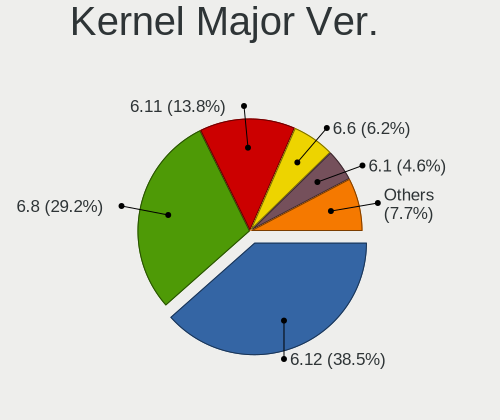
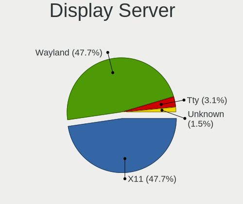
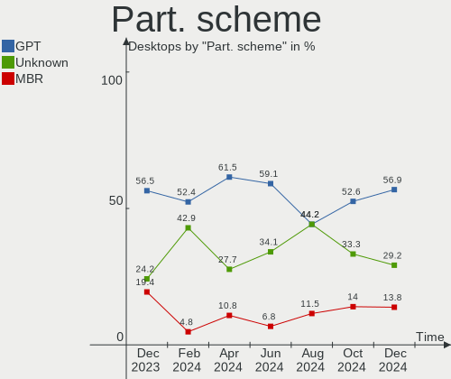
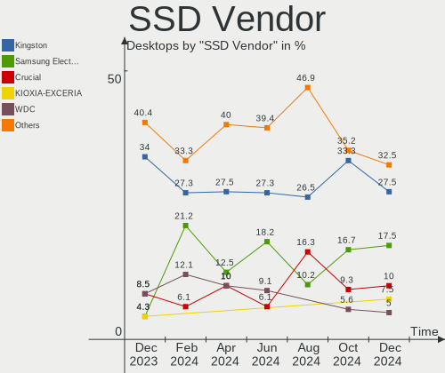
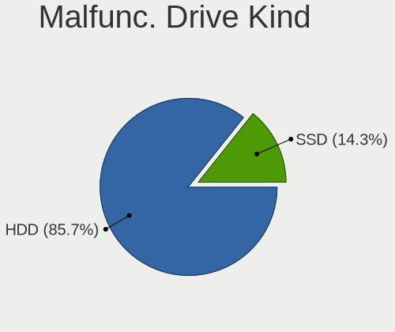
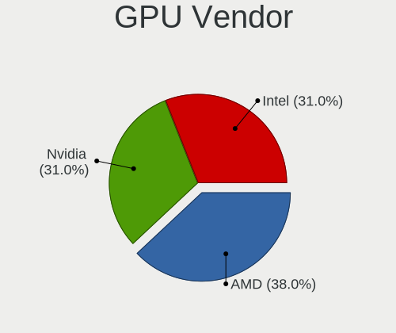
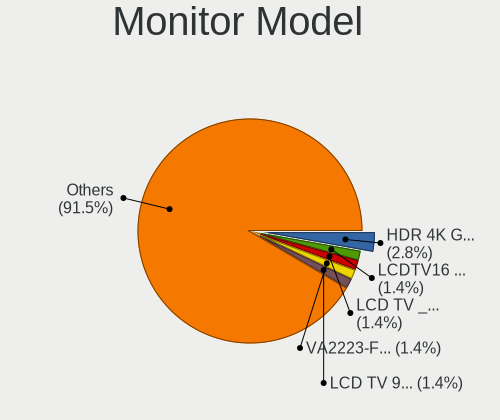
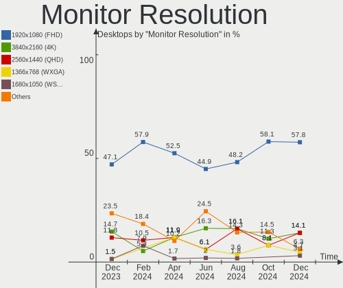
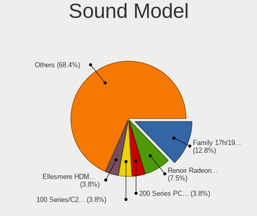
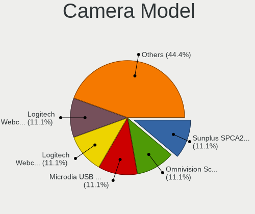

Linux in Spain - Hardware Trends (Desktops)
-------------------------------------------

A project to identify most popular hardware characteristics and track their change
over time based on data collected by Linux users at https://Linux-Hardware.org.

Anyone can contribute to this report by the [hw-probe](https://github.com/linuxhw/hw-probe) tool:

    sudo -E hw-probe -all -upload

Period: Apr, 2024.

Contents
--------

* [ System ](#system)
  - [ OS                       ](#os)
  - [ OS Family                ](#os-family)
  - [ Kernel                   ](#kernel)
  - [ Kernel Family            ](#kernel-family)
  - [ Kernel Major Ver.        ](#kernel-major-ver)
  - [ Arch                     ](#arch)
  - [ DE                       ](#de)
  - [ Display Server           ](#display-server)
  - [ Display Manager          ](#display-manager)
  - [ OS Lang                  ](#os-lang)
  - [ Boot Mode                ](#boot-mode)
  - [ Filesystem               ](#filesystem)
  - [ Part. scheme             ](#part-scheme)
  - [ Dual Boot with Linux/BSD ](#dual-boot-with-linuxbsd)
  - [ Dual Boot (Win)          ](#dual-boot-win)

* [ Board ](#board)
  - [ Vendor                   ](#vendor)
  - [ Model                    ](#model)
  - [ Model Family             ](#model-family)
  - [ MFG Year                 ](#mfg-year)
  - [ Form Factor              ](#form-factor)
  - [ Secure Boot              ](#secure-boot)
  - [ Coreboot                 ](#coreboot)
  - [ RAM Size                 ](#ram-size)
  - [ RAM Used                 ](#ram-used)
  - [ Total Drives             ](#total-drives)
  - [ Has CD-ROM               ](#has-cd-rom)
  - [ Has Ethernet             ](#has-ethernet)
  - [ Has WiFi                 ](#has-wifi)
  - [ Has Bluetooth            ](#has-bluetooth)

* [ Location ](#location)
  - [ Country                  ](#country)
  - [ City                     ](#city)

* [ Drives ](#drives)
  - [ Drive Vendor             ](#drive-vendor)
  - [ Drive Model              ](#drive-model)
  - [ HDD Vendor               ](#hdd-vendor)
  - [ SSD Vendor               ](#ssd-vendor)
  - [ Drive Kind               ](#drive-kind)
  - [ Drive Connector          ](#drive-connector)
  - [ Drive Size               ](#drive-size)
  - [ Space Total              ](#space-total)
  - [ Space Used               ](#space-used)
  - [ Malfunc. Drives          ](#malfunc-drives)
  - [ Malfunc. Drive Vendor    ](#malfunc-drive-vendor)
  - [ Malfunc. HDD Vendor      ](#malfunc-hdd-vendor)
  - [ Malfunc. Drive Kind      ](#malfunc-drive-kind)
  - [ Failed Drives            ](#failed-drives)
  - [ Failed Drive Vendor      ](#failed-drive-vendor)
  - [ Drive Status             ](#drive-status)

* [ Storage controller ](#storage-controller)
  - [ Storage Vendor           ](#storage-vendor)
  - [ Storage Model            ](#storage-model)
  - [ Storage Kind             ](#storage-kind)

* [ Processor ](#processor)
  - [ CPU Vendor               ](#cpu-vendor)
  - [ CPU Model                ](#cpu-model)
  - [ CPU Model Family         ](#cpu-model-family)
  - [ CPU Cores                ](#cpu-cores)
  - [ CPU Sockets              ](#cpu-sockets)
  - [ CPU Threads              ](#cpu-threads)
  - [ CPU Op-Modes             ](#cpu-op-modes)
  - [ CPU Microcode            ](#cpu-microcode)
  - [ CPU Microarch            ](#cpu-microarch)

* [ Graphics ](#graphics)
  - [ GPU Vendor               ](#gpu-vendor)
  - [ GPU Model                ](#gpu-model)
  - [ GPU Combo                ](#gpu-combo)
  - [ GPU Driver               ](#gpu-driver)
  - [ GPU Memory               ](#gpu-memory)

* [ Monitor ](#monitor)
  - [ Monitor Vendor           ](#monitor-vendor)
  - [ Monitor Model            ](#monitor-model)
  - [ Monitor Resolution       ](#monitor-resolution)
  - [ Monitor Diagonal         ](#monitor-diagonal)
  - [ Monitor Width            ](#monitor-width)
  - [ Aspect Ratio             ](#aspect-ratio)
  - [ Monitor Area             ](#monitor-area)
  - [ Pixel Density            ](#pixel-density)
  - [ Multiple Monitors        ](#multiple-monitors)

* [ Network ](#network)
  - [ Net Controller Vendor    ](#net-controller-vendor)
  - [ Net Controller Model     ](#net-controller-model)
  - [ Wireless Vendor          ](#wireless-vendor)
  - [ Wireless Model           ](#wireless-model)
  - [ Ethernet Vendor          ](#ethernet-vendor)
  - [ Ethernet Model           ](#ethernet-model)
  - [ Net Controller Kind      ](#net-controller-kind)
  - [ Used Controller          ](#used-controller)
  - [ NICs                     ](#nics)
  - [ IPv6                     ](#ipv6)

* [ Bluetooth ](#bluetooth)
  - [ Bluetooth Vendor         ](#bluetooth-vendor)
  - [ Bluetooth Model          ](#bluetooth-model)

* [ Sound ](#sound)
  - [ Sound Vendor             ](#sound-vendor)
  - [ Sound Model              ](#sound-model)

* [ Memory ](#memory)
  - [ Memory Vendor            ](#memory-vendor)
  - [ Memory Model             ](#memory-model)
  - [ Memory Kind              ](#memory-kind)
  - [ Memory Form Factor       ](#memory-form-factor)
  - [ Memory Size              ](#memory-size)
  - [ Memory Speed             ](#memory-speed)

* [ Printers & scanners ](#printers--scanners)
  - [ Printer Vendor           ](#printer-vendor)
  - [ Printer Model            ](#printer-model)
  - [ Scanner Vendor           ](#scanner-vendor)
  - [ Scanner Model            ](#scanner-model)

* [ Camera ](#camera)
  - [ Camera Vendor            ](#camera-vendor)
  - [ Camera Model             ](#camera-model)

* [ Security ](#security)
  - [ Fingerprint Vendor       ](#fingerprint-vendor)
  - [ Fingerprint Model        ](#fingerprint-model)
  - [ Chipcard Vendor          ](#chipcard-vendor)
  - [ Chipcard Model           ](#chipcard-model)

* [ Unsupported ](#unsupported)
  - [ Unsupported Devices      ](#unsupported-devices)
  - [ Unsupported Device Types ](#unsupported-device-types)

System
------

OS
--

Installed operating systems

| Name                | Desktops | Percent |
|---------------------|----------|---------|
| Ubuntu 22.04        | 22       | 34.38%  |
| Debian 12           | 7        | 10.94%  |
| Fedora 39           | 4        | 6.25%   |
| Ubuntu 23.10        | 3        | 4.69%   |
| Linux Mint 21.3     | 3        | 4.69%   |
| Arch Rolling        | 3        | 4.69%   |
| Xubuntu 22.04       | 2        | 3.13%   |
| Ubuntu 20.04        | 2        | 3.13%   |
| Pop!_OS 22.04       | 2        | 3.13%   |
| KDE neon 22.04      | 2        | 3.13%   |
| ArcoLinux Rolling   | 2        | 3.13%   |
| Zorin 17            | 1        | 1.56%   |
| Ubuntu Studio 22.04 | 1        | 1.56%   |
| OpenMandriva 4.2    | 1        | 1.56%   |
| OpenMandriva 23.11  | 1        | 1.56%   |
| OpenMandriva 23.08  | 1        | 1.56%   |
| Nobara 39           | 1        | 1.56%   |
| Manjaro 23.1.4      | 1        | 1.56%   |
| Manjaro             | 1        | 1.56%   |
| Kubuntu 23.10       | 1        | 1.56%   |
| Kubuntu 20.04       | 1        | 1.56%   |
| Kali 2024.1         | 1        | 1.56%   |
| Elementary 7.1      | 1        | 1.56%   |

OS Family
---------

OS without a version

| Name          | Desktops | Percent |
|---------------|----------|---------|
| Ubuntu        | 27       | 42.19%  |
| Debian        | 7        | 10.94%  |
| Fedora        | 4        | 6.25%   |
| OpenMandriva  | 3        | 4.69%   |
| Linux Mint    | 3        | 4.69%   |
| Arch          | 3        | 4.69%   |
| Xubuntu       | 2        | 3.13%   |
| Pop!_OS       | 2        | 3.13%   |
| Manjaro       | 2        | 3.13%   |
| Kubuntu       | 2        | 3.13%   |
| KDE neon      | 2        | 3.13%   |
| ArcoLinux     | 2        | 3.13%   |
| Zorin         | 1        | 1.56%   |
| Ubuntu Studio | 1        | 1.56%   |
| Nobara        | 1        | 1.56%   |
| Kali          | 1        | 1.56%   |
| Elementary    | 1        | 1.56%   |

Kernel
------

Version of the Linux kernel

| Version                             | Desktops | Percent |
|-------------------------------------|----------|---------|
| 6.5.0-28-generic                    | 6        | 9.38%   |
| 6.5.0-27-generic                    | 6        | 9.38%   |
| 6.5.0-26-generic                    | 5        | 7.81%   |
| 6.5.0-17-generic                    | 5        | 7.81%   |
| 6.1.0-20-amd64                      | 5        | 7.81%   |
| 6.5.0-15-generic                    | 3        | 4.69%   |
| 5.15.0-94-generic                   | 3        | 4.69%   |
| 6.8.7-200.fc39.x86_64               | 2        | 3.13%   |
| 6.8.0-76060800daily20240311-generic | 2        | 3.13%   |
| 6.1.0-18-amd64                      | 2        | 3.13%   |
| 5.15.0-102-generic                  | 2        | 3.13%   |
| 6.8.6-200.fc39.x86_64               | 1        | 1.56%   |
| 6.8.5-arch1-1                       | 1        | 1.56%   |
| 6.8.5-1-MANJARO                     | 1        | 1.56%   |
| 6.8.4-200.fc39.x86_64               | 1        | 1.56%   |
| 6.8.2-zen2-1-zen                    | 1        | 1.56%   |
| 6.8.2-arch2-1                       | 1        | 1.56%   |
| 6.7.6-201.fsync.fc39.x86_64         | 1        | 1.56%   |
| 6.7.6-060706-generic                | 1        | 1.56%   |
| 6.7.2-273-tkg-pds-llvm              | 1        | 1.56%   |
| 6.6.9-amd64                         | 1        | 1.56%   |
| 6.6.23-1-lts                        | 1        | 1.56%   |
| 6.6.2-desktop-1omv2390              | 1        | 1.56%   |
| 6.5.0-9-generic                     | 1        | 1.56%   |
| 6.5.0-27-lowlatency                 | 1        | 1.56%   |
| 6.4.11-desktop-1omv2390             | 1        | 1.56%   |
| 6.1.84-1-MANJARO                    | 1        | 1.56%   |
| 5.4.0-73-generic                    | 1        | 1.56%   |
| 5.4.0-173-generic                   | 1        | 1.56%   |
| 5.4.0-144-generic                   | 1        | 1.56%   |
| 5.15.0-92-generic                   | 1        | 1.56%   |
| 5.15.0-57-generic                   | 1        | 1.56%   |
| 5.15.0-101-generic                  | 1        | 1.56%   |
| 5.10.14-desktop-1omv4002            | 1        | 1.56%   |

Kernel Family
-------------

Linux kernel without a distro release

| Version | Desktops | Percent |
|---------|----------|---------|
| 6.5.0   | 27       | 42.19%  |
| 5.15.0  | 8        | 12.5%   |
| 6.1.0   | 7        | 10.94%  |
| 5.4.0   | 3        | 4.69%   |
| 6.8.7   | 2        | 3.13%   |
| 6.8.5   | 2        | 3.13%   |
| 6.8.2   | 2        | 3.13%   |
| 6.8.0   | 2        | 3.13%   |
| 6.7.6   | 2        | 3.13%   |
| 6.8.6   | 1        | 1.56%   |
| 6.8.4   | 1        | 1.56%   |
| 6.7.2   | 1        | 1.56%   |
| 6.6.9   | 1        | 1.56%   |
| 6.6.23  | 1        | 1.56%   |
| 6.6.2   | 1        | 1.56%   |
| 6.4.11  | 1        | 1.56%   |
| 6.1.84  | 1        | 1.56%   |
| 5.10.14 | 1        | 1.56%   |

Kernel Major Ver.
-----------------

Linux kernel major version

| Version | Desktops | Percent |
|---------|----------|---------|
| 6.5     | 27       | 42.19%  |
| 6.8     | 10       | 15.63%  |
| 6.1     | 8        | 12.5%   |
| 5.15    | 8        | 12.5%   |
| 6.7     | 3        | 4.69%   |
| 6.6     | 3        | 4.69%   |
| 5.4     | 3        | 4.69%   |
| 6.4     | 1        | 1.56%   |
| 5.10    | 1        | 1.56%   |

Arch
----

OS architecture (x86_64, i586, etc.)

| Name   | Desktops | Percent |
|--------|----------|---------|
| x86_64 | 64       | 100%    |

DE
--

Desktop Environment

| Name            | Desktops | Percent |
|-----------------|----------|---------|
| GNOME           | 23       | 35.94%  |
| Unknown         | 15       | 23.44%  |
| KDE5            | 10       | 15.63%  |
| XFCE            | 3        | 4.69%   |
| KDE6            | 3        | 4.69%   |
| X-Cinnamon      | 2        | 3.13%   |
| MATE            | 2        | 3.13%   |
| LXQt            | 2        | 3.13%   |
| Pantheon        | 1        | 1.56%   |
| KDE             | 1        | 1.56%   |
| Hyprland        | 1        | 1.56%   |
| GNOME Flashback | 1        | 1.56%   |

Display Server
--------------

X11 or Wayland

| Name    | Desktops | Percent |
|---------|----------|---------|
| X11     | 28       | 43.75%  |
| Wayland | 20       | 31.25%  |
| Tty     | 11       | 17.19%  |
| Unknown | 5        | 7.81%   |

Display Manager
---------------

SDDM, LightDM, etc.

| Name    | Desktops | Percent |
|---------|----------|---------|
| Unknown | 32       | 50%     |
| GDM3    | 15       | 23.44%  |
| SDDM    | 11       | 17.19%  |
| LightDM | 6        | 9.38%   |

OS Lang
-------

Language

| Lang           | Desktops | Percent |
|----------------|----------|---------|
| es_ES          | 41       | 64.06%  |
| en_US          | 16       | 25%     |
| ca_ES          | 3        | 4.69%   |
| ru_RU          | 1        | 1.56%   |
| en_IE          | 1        | 1.56%   |
| ca_ES@valencia | 1        | 1.56%   |
| C              | 1        | 1.56%   |

Boot Mode
---------

EFI or BIOS

| Mode | Desktops | Percent |
|------|----------|---------|
| EFI  | 33       | 51.56%  |
| BIOS | 31       | 48.44%  |

Filesystem
----------

Type of filesystem

| Type    | Desktops | Percent |
|---------|----------|---------|
| Ext4    | 43       | 67.19%  |
| Tmpfs   | 10       | 15.63%  |
| Btrfs   | 7        | 10.94%  |
| Zfs     | 2        | 3.13%   |
| Overlay | 2        | 3.13%   |

Part. scheme
------------

Scheme of partitioning

| Type    | Desktops | Percent |
|---------|----------|---------|
| GPT     | 39       | 60.94%  |
| Unknown | 18       | 28.13%  |
| MBR     | 7        | 10.94%  |

Dual Boot with Linux/BSD
------------------------

Hosting more than one Linux/BSD

| Dual boot | Desktops | Percent |
|-----------|----------|---------|
| No        | 55       | 85.94%  |
| Yes       | 9        | 14.06%  |

Dual Boot (Win)
---------------

Hosting Linux and Windows

| Dual boot | Desktops | Percent |
|-----------|----------|---------|
| No        | 46       | 71.88%  |
| Yes       | 18       | 28.13%  |

Board
-----

Vendor
------

Motherboard manufacturer

| Name                                 | Desktops | Percent |
|--------------------------------------|----------|---------|
| ASUSTek Computer                     | 15       | 23.44%  |
| Gigabyte Technology                  | 12       | 18.75%  |
| MSI                                  | 11       | 17.19%  |
| ASRock                               | 9        | 14.06%  |
| Hewlett-Packard                      | 3        | 4.69%   |
| Lenovo                               | 2        | 3.13%   |
| Intel                                | 2        | 3.13%   |
| Acer                                 | 2        | 3.13%   |
| Shenzhen Meigao Electronic Equipment | 1        | 1.56%   |
| Pegatron                             | 1        | 1.56%   |
| Packard Bell                         | 1        | 1.56%   |
| MACHINIST                            | 1        | 1.56%   |
| Fujitsu                              | 1        | 1.56%   |
| AZW                                  | 1        | 1.56%   |
| AMI                                  | 1        | 1.56%   |
| Unknown                              | 1        | 1.56%   |

Model
-----

Motherboard model

| Name                                       | Desktops | Percent |
|--------------------------------------------|----------|---------|
| Gigabyte TRX40 AORUS MASTER                | 6        | 9.38%   |
| ASRock TRX40 Creator                       | 6        | 9.38%   |
| MSI MS-7E16                                | 2        | 3.13%   |
| MSI MS-7817                                | 2        | 3.13%   |
| ASUS ROG ZENITH II EXTREME                 | 2        | 3.13%   |
| ASUS All Series                            | 2        | 3.13%   |
| Shenzhen Meigao Electronic Equipment UM690 | 1        | 1.56%   |
| Pegatron H81-M1                            | 1        | 1.56%   |
| Packard Bell ISTART 2025                   | 1        | 1.56%   |
| MSI MS-7E26                                | 1        | 1.56%   |
| MSI MS-7C52                                | 1        | 1.56%   |
| MSI MS-7C37                                | 1        | 1.56%   |
| MSI MS-7B86                                | 1        | 1.56%   |
| MSI MS-7B79                                | 1        | 1.56%   |
| MSI MS-7A38                                | 1        | 1.56%   |
| MSI MS-7816                                | 1        | 1.56%   |
| MACHINIST X99-MR9A PRO MAX V1.2            | 1        | 1.56%   |
| Lenovo ThinkCentre M910q 10MUS0U12E        | 1        | 1.56%   |
| Lenovo IdeaCentre 510-15ICB 90HU002JSP     | 1        | 1.56%   |
| Intel D945GCL AAD67193-205                 | 1        | 1.56%   |
| Intel ADL-F10                              | 1        | 1.56%   |
| HP Victus by 15L Gaming Desktop TG02-0xxx  | 1        | 1.56%   |
| HP ProDesk 405 G6 Small Form Factor PC     | 1        | 1.56%   |
| HP Compaq 8200 Elite SFF PC                | 1        | 1.56%   |
| Gigabyte Z77X-UD3H                         | 1        | 1.56%   |
| Gigabyte Z390 UD                           | 1        | 1.56%   |
| Gigabyte X399 AORUS PRO                    | 1        | 1.56%   |
| Gigabyte M68M-S2P                          | 1        | 1.56%   |
| Gigabyte GA-MA790XT-UD4P                   | 1        | 1.56%   |
| Gigabyte B450M DS3H                        | 1        | 1.56%   |
| Fujitsu ALDA-CE                            | 1        | 1.56%   |
| AZW EQ                                     | 1        | 1.56%   |
| ASUS TUF Gaming X570-PLUS                  | 1        | 1.56%   |
| ASUS TUF Gaming B650-PLUS WIFI             | 1        | 1.56%   |
| ASUS TUF B450M-PLUS GAMING                 | 1        | 1.56%   |
| ASUS Studio Extreme                        | 1        | 1.56%   |
| ASUS ROG STRIX X570-E GAMING               | 1        | 1.56%   |
| ASUS PRIME B450M-A                         | 1        | 1.56%   |
| ASUS PRIME A320M-K                         | 1        | 1.56%   |
| ASUS P6T                                   | 1        | 1.56%   |

Model Family
------------

Motherboard model prefix

| Name                                       | Desktops | Percent |
|--------------------------------------------|----------|---------|
| Gigabyte TRX40                             | 6        | 9.38%   |
| ASRock TRX40                               | 6        | 9.38%   |
| ASUS TUF                                   | 3        | 4.69%   |
| ASUS ROG                                   | 3        | 4.69%   |
| MSI MS-7E16                                | 2        | 3.13%   |
| MSI MS-7817                                | 2        | 3.13%   |
| ASUS PRIME                                 | 2        | 3.13%   |
| ASUS All                                   | 2        | 3.13%   |
| Shenzhen Meigao Electronic Equipment UM690 | 1        | 1.56%   |
| Pegatron H81-M1                            | 1        | 1.56%   |
| Packard Bell ISTART                        | 1        | 1.56%   |
| MSI MS-7E26                                | 1        | 1.56%   |
| MSI MS-7C52                                | 1        | 1.56%   |
| MSI MS-7C37                                | 1        | 1.56%   |
| MSI MS-7B86                                | 1        | 1.56%   |
| MSI MS-7B79                                | 1        | 1.56%   |
| MSI MS-7A38                                | 1        | 1.56%   |
| MSI MS-7816                                | 1        | 1.56%   |
| MACHINIST X99-MR9A                         | 1        | 1.56%   |
| Lenovo ThinkCentre                         | 1        | 1.56%   |
| Lenovo IdeaCentre                          | 1        | 1.56%   |
| Intel D945GCL                              | 1        | 1.56%   |
| Intel ADL-F10                              | 1        | 1.56%   |
| HP Victus                                  | 1        | 1.56%   |
| HP ProDesk                                 | 1        | 1.56%   |
| HP Compaq                                  | 1        | 1.56%   |
| Gigabyte Z77X-UD3H                         | 1        | 1.56%   |
| Gigabyte Z390                              | 1        | 1.56%   |
| Gigabyte X399                              | 1        | 1.56%   |
| Gigabyte M68M-S2P                          | 1        | 1.56%   |
| Gigabyte GA-MA790XT-UD4P                   | 1        | 1.56%   |
| Gigabyte B450M                             | 1        | 1.56%   |
| Fujitsu ALDA-CE                            | 1        | 1.56%   |
| AZW EQ                                     | 1        | 1.56%   |
| ASUS Studio                                | 1        | 1.56%   |
| ASUS P6T                                   | 1        | 1.56%   |
| ASUS P5WDG2                                | 1        | 1.56%   |
| ASUS M4N72-E                               | 1        | 1.56%   |
| ASUS A88X-PLUS                             | 1        | 1.56%   |
| ASRock Z690                                | 1        | 1.56%   |

MFG Year
--------

Motherboard manufacture year

| Year | Desktops | Percent |
|------|----------|---------|
| 2019 | 14       | 21.88%  |
| 2018 | 7        | 10.94%  |
| 2023 | 6        | 9.38%   |
| 2020 | 6        | 9.38%   |
| 2013 | 5        | 7.81%   |
| 2022 | 4        | 6.25%   |
| 2021 | 4        | 6.25%   |
| 2017 | 3        | 4.69%   |
| 2014 | 3        | 4.69%   |
| 2009 | 3        | 4.69%   |
| 2008 | 3        | 4.69%   |
| 2024 | 2        | 3.13%   |
| 2006 | 2        | 3.13%   |
| 2012 | 1        | 1.56%   |
| 2011 | 1        | 1.56%   |

Form Factor
-----------

Physical design of the computer

| Name    | Desktops | Percent |
|---------|----------|---------|
| Desktop | 64       | 100%    |

Secure Boot
-----------

Enabled or disabled

| State    | Desktops | Percent |
|----------|----------|---------|
| Disabled | 61       | 95.31%  |
| Enabled  | 3        | 4.69%   |

Coreboot
--------

Have coreboot on board

| Used | Desktops | Percent |
|------|----------|---------|
| No   | 64       | 100%    |

RAM Size
--------

Total RAM memory

| Size in GB      | Desktops | Percent |
|-----------------|----------|---------|
| More than 256.0 | 13       | 20.31%  |
| 16.01-24.0      | 13       | 20.31%  |
| 32.01-64.0      | 9        | 14.06%  |
| 8.01-16.0       | 8        | 12.5%   |
| 64.01-256.0     | 6        | 9.38%   |
| 4.01-8.0        | 5        | 7.81%   |
| 24.01-32.0      | 5        | 7.81%   |
| 3.01-4.0        | 4        | 6.25%   |
| 1.01-2.0        | 1        | 1.56%   |

RAM Used
--------

Used RAM memory

| Used GB     | Desktops | Percent |
|-------------|----------|---------|
| 4.01-8.0    | 15       | 23.44%  |
| 2.01-3.0    | 12       | 18.75%  |
| 64.01-256.0 | 12       | 18.75%  |
| 1.01-2.0    | 9        | 14.06%  |
| 3.01-4.0    | 7        | 10.94%  |
| 32.01-64.0  | 2        | 3.13%   |
| 24.01-32.0  | 2        | 3.13%   |
| 16.01-24.0  | 2        | 3.13%   |
| 8.01-16.0   | 2        | 3.13%   |
| 0.51-1.0    | 1        | 1.56%   |

Total Drives
------------

Number of drives on board

| Drives | Desktops | Percent |
|--------|----------|---------|
| 2      | 19       | 29.69%  |
| 1      | 15       | 23.44%  |
| 13     | 6        | 9.38%   |
| 3      | 6        | 9.38%   |
| 4      | 5        | 7.81%   |
| 6      | 4        | 6.25%   |
| 5      | 4        | 6.25%   |
| 9      | 3        | 4.69%   |
| 21     | 1        | 1.56%   |
| 12     | 1        | 1.56%   |

Has CD-ROM
----------

Has CD-ROM on board

| Presented | Desktops | Percent |
|-----------|----------|---------|
| No        | 46       | 71.88%  |
| Yes       | 18       | 28.13%  |

Has Ethernet
------------

Has Ethernet on board

| Presented | Desktops | Percent |
|-----------|----------|---------|
| Yes       | 64       | 100%    |

Has WiFi
--------

Has WiFi module

| Presented | Desktops | Percent |
|-----------|----------|---------|
| Yes       | 37       | 57.81%  |
| No        | 27       | 42.19%  |

Has Bluetooth
-------------

Has Bluetooth module

| Presented | Desktops | Percent |
|-----------|----------|---------|
| Yes       | 36       | 56.25%  |
| No        | 28       | 43.75%  |

Location
--------

Country
-------

Geographic location (country)

| Country | Desktops | Percent |
|---------|----------|---------|
| Spain   | 64       | 100%    |

City
----

Geographic location (city)

| City                    | Desktops | Percent |
|-------------------------|----------|---------|
| Terrassa                | 15       | 23.44%  |
| Madrid                  | 8        | 12.5%   |
| Barcelona               | 4        | 6.25%   |
| Paracuellos de Jarama   | 2        | 3.13%   |
| León                   | 2        | 3.13%   |
| Zubia                   | 1        | 1.56%   |
| Zaragoza                | 1        | 1.56%   |
| Xinzo de Limia          | 1        | 1.56%   |
| Vitoria-Gasteiz         | 1        | 1.56%   |
| Villanueva de la Canada | 1        | 1.56%   |
| Valencia                | 1        | 1.56%   |
| Teguise                 | 1        | 1.56%   |
| Santiago de Compostela  | 1        | 1.56%   |
| Santanyí               | 1        | 1.56%   |
| Sant Joan d'Alacant     | 1        | 1.56%   |
| Salamanca               | 1        | 1.56%   |
| Rabade                  | 1        | 1.56%   |
| Pontevedra              | 1        | 1.56%   |
| Ponferrada              | 1        | 1.56%   |
| Parla                   | 1        | 1.56%   |
| Orcoyen                 | 1        | 1.56%   |
| Motril                  | 1        | 1.56%   |
| Mahon                   | 1        | 1.56%   |
| Linares                 | 1        | 1.56%   |
| Leganés                | 1        | 1.56%   |
| La Carolina             | 1        | 1.56%   |
| Huarte-Uharte           | 1        | 1.56%   |
| Coslada                 | 1        | 1.56%   |
| Córdoba                | 1        | 1.56%   |
| Ciudad Real             | 1        | 1.56%   |
| Chamartin               | 1        | 1.56%   |
| Castelldefels           | 1        | 1.56%   |
| Casa de Uceda           | 1        | 1.56%   |
| Benicarló              | 1        | 1.56%   |
| Basauri                 | 1        | 1.56%   |
| Badalona                | 1        | 1.56%   |
| Arona                   | 1        | 1.56%   |
| Alicante                | 1        | 1.56%   |

Drives
------

Drive Vendor
------------

Hard drive vendors

| Vendor                      | Desktops | Drives | Percent |
|-----------------------------|----------|--------|---------|
| WDC                         | 17       | 26     | 12.32%  |
| Seagate                     | 14       | 41     | 10.14%  |
| Samsung Electronics         | 13       | 15     | 9.42%   |
| PNY                         | 13       | 16     | 9.42%   |
| Kingston                    | 12       | 13     | 8.7%    |
| Phison                      | 11       | 53     | 7.97%   |
| Crucial                     | 10       | 55     | 7.25%   |
| Toshiba                     | 7        | 10     | 5.07%   |
| SanDisk                     | 7        | 7      | 5.07%   |
| Phison Electronics          | 4        | 5      | 2.9%    |
| SK hynix                    | 3        | 3      | 2.17%   |
| Silicon Motion              | 3        | 4      | 2.17%   |
| Maxtor                      | 3        | 3      | 2.17%   |
| China                       | 3        | 3      | 2.17%   |
| Kingston Technology Company | 2        | 2      | 1.45%   |
| Unknown                     | 1        | 1      | 0.72%   |
| OCZ                         | 1        | 1      | 0.72%   |
| Mushkin                     | 1        | 2      | 0.72%   |
| KODAK                       | 1        | 1      | 0.72%   |
| KIOXIA-EXCERIA              | 1        | 1      | 0.72%   |
| KIOXIA                      | 1        | 1      | 0.72%   |
| KingDian                    | 1        | 1      | 0.72%   |
| JMicron Technology          | 1        | 1      | 0.72%   |
| HUAWEI                      | 1        | 1      | 0.72%   |
| Hitachi                     | 1        | 1      | 0.72%   |
| Emtec                       | 1        | 1      | 0.72%   |
| Corsair                     | 1        | 1      | 0.72%   |
| ASMT                        | 1        | 1      | 0.72%   |
| addlink                     | 1        | 1      | 0.72%   |
| A-DATA Technology           | 1        | 1      | 0.72%   |
| Unknown                     | 1        | 1      | 0.72%   |

Drive Model
-----------

Hard drive models

| Model                                                 | Desktops | Percent |
|-------------------------------------------------------|----------|---------|
| PNY CS3030 250GB SSD                                  | 12       | 7.74%   |
| Phison Sabrent Rocket Q 8TB                           | 10       | 6.45%   |
| Crucial CT4000P3SSD8 4TB                              | 6        | 3.87%   |
| Kingston SA400S37480G 480GB SSD                       | 5        | 3.23%   |
| Silicon Motion SM2263EN/SM2263XT SSD Controller 256GB | 3        | 1.94%   |
| Kingston SA400S37240G 240GB SSD                       | 3        | 1.94%   |
| WDC WD40EFAX-68JH4N1 4TB                              | 2        | 1.29%   |
| WDC WD20EZRZ-00Z5HB0 2TB                              | 2        | 1.29%   |
| Toshiba TR200 240GB SSD                               | 2        | 1.29%   |
| Seagate ST4000DM004-2CV104 4TB                        | 2        | 1.29%   |
| Seagate ST1000DM010-2EP102 1TB                        | 2        | 1.29%   |
| Seagate ST1000DM003-1ER162 1TB                        | 2        | 1.29%   |
| Samsung SSD 850 EVO 250GB                             | 2        | 1.29%   |
| Samsung NVMe SSD Controller SM981/PM981/PM983 1TB     | 2        | 1.29%   |
| Samsung NVMe SSD Controller PM9A1/PM9A3/980PRO 1TB    | 2        | 1.29%   |
| Maxtor Z1 SSD 480GB                                   | 2        | 1.29%   |
| WDC WDS250G2B0A-00SM50 250GB SSD                      | 1        | 0.65%   |
| WDC WDS240G2G0B-00EPW0 240GB SSD                      | 1        | 0.65%   |
| WDC WDS100T3X0C-00SJG0 1TB                            | 1        | 0.65%   |
| WDC WDS100T2B0B-00YS70 1TB SSD                        | 1        | 0.65%   |
| WDC WD80EMAZ-00WJTA0 8TB                              | 1        | 0.65%   |
| WDC WD800JD-08MSA1 80GB                               | 1        | 0.65%   |
| WDC WD4005FZBX-00K5WB0 4TB                            | 1        | 0.65%   |
| WDC WD30EZRZ-00GXCB0 3TB                              | 1        | 0.65%   |
| WDC WD30EZRX-00MMMB0 3TB                              | 1        | 0.65%   |
| WDC WD30EZRX-00D8PB0 3TB                              | 1        | 0.65%   |
| WDC WD20EZRX-00DC0B0 2TB                              | 1        | 0.65%   |
| WDC WD20EFRX-68EUZN0 2TB                              | 1        | 0.65%   |
| WDC WD20EARS-00MVWB0 2TB                              | 1        | 0.65%   |
| WDC WD10EZEX-60WN4A2 1TB                              | 1        | 0.65%   |
| WDC WD10EZEX-21WN4A0 1TB                              | 1        | 0.65%   |
| WDC WD10EZEX-08WN4A0 1TB                              | 1        | 0.65%   |
| WDC WD10EZEX-00BN5A0 1TB                              | 1        | 0.65%   |
| WDC WD10EADS-11M2B1 1TB                               | 1        | 0.65%   |
| WDC WD Green M.2 2280 480GB SSD                       | 1        | 0.65%   |
| Unknown SD/MMC/MS PRO 128GB                           | 1        | 0.65%   |
| Toshiba MQ01ABD050 500GB                              | 1        | 0.65%   |
| Toshiba MG09ACA18TE 18TB                              | 1        | 0.65%   |
| Toshiba HDWD130 3TB                                   | 1        | 0.65%   |
| Toshiba DT01ACA200 2TB                                | 1        | 0.65%   |

HDD Vendor
----------

Hard disk drive vendors

| Vendor             | Desktops | Drives | Percent |
|--------------------|----------|--------|---------|
| Seagate            | 14       | 41     | 37.84%  |
| WDC                | 13       | 21     | 35.14%  |
| Toshiba            | 5        | 8      | 13.51%  |
| Unknown            | 1        | 1      | 2.7%    |
| Maxtor             | 1        | 1      | 2.7%    |
| JMicron Technology | 1        | 1      | 2.7%    |
| Hitachi            | 1        | 1      | 2.7%    |
| ASMT               | 1        | 1      | 2.7%    |

SSD Vendor
----------

Solid state drive vendors

| Vendor              | Desktops | Drives | Percent |
|---------------------|----------|--------|---------|
| Kingston            | 11       | 12     | 28.21%  |
| Samsung Electronics | 5        | 7      | 12.82%  |
| WDC                 | 4        | 4      | 10.26%  |
| Crucial             | 4        | 7      | 10.26%  |
| China               | 3        | 3      | 7.69%   |
| Toshiba             | 2        | 2      | 5.13%   |
| Maxtor              | 2        | 2      | 5.13%   |
| SK hynix            | 1        | 1      | 2.56%   |
| SanDisk             | 1        | 1      | 2.56%   |
| OCZ                 | 1        | 1      | 2.56%   |
| Mushkin             | 1        | 2      | 2.56%   |
| KODAK               | 1        | 1      | 2.56%   |
| KingDian            | 1        | 1      | 2.56%   |
| Emtec               | 1        | 1      | 2.56%   |
| A-DATA Technology   | 1        | 1      | 2.56%   |

Drive Kind
----------

HDD or SSD

| Kind    | Desktops | Drives | Percent |
|---------|----------|--------|---------|
| NVMe    | 40       | 150    | 40%     |
| SSD     | 29       | 46     | 29%     |
| HDD     | 29       | 75     | 29%     |
| MMC     | 1        | 1      | 1%      |
| Unknown | 1        | 1      | 1%      |

Drive Connector
---------------

SATA, SAS, NVMe, etc.

| Type | Desktops | Drives | Percent |
|------|----------|--------|---------|
| SATA | 44       | 118    | 49.44%  |
| NVMe | 40       | 150    | 44.94%  |
| SAS  | 4        | 4      | 4.49%   |
| MMC  | 1        | 1      | 1.12%   |

Drive Size
----------

Size of hard drive

| Size in TB | Desktops | Drives | Percent |
|------------|----------|--------|---------|
| 0.01-0.5   | 31       | 49     | 46.27%  |
| 0.51-1.0   | 13       | 15     | 19.4%   |
| 1.01-2.0   | 8        | 20     | 11.94%  |
| 2.01-3.0   | 5        | 6      | 7.46%   |
| 3.01-4.0   | 4        | 5      | 5.97%   |
| 4.01-10.0  | 4        | 24     | 5.97%   |
| 10.01-20.0 | 2        | 2      | 2.99%   |

Space Total
-----------

Amount of disk space available on the file system

| Size in GB     | Desktops | Percent |
|----------------|----------|---------|
| 101-250        | 28       | 43.75%  |
| 1001-2000      | 9        | 14.06%  |
| More than 3000 | 8        | 12.5%   |
| 501-1000       | 8        | 12.5%   |
| 251-500        | 4        | 6.25%   |
| 1-20           | 3        | 4.69%   |
| Unknown        | 2        | 3.13%   |
| 21-50          | 1        | 1.56%   |
| 51-100         | 1        | 1.56%   |

Space Used
----------

Amount of used disk space

| Used GB        | Desktops | Percent |
|----------------|----------|---------|
| 21-50          | 15       | 23.44%  |
| 101-250        | 12       | 18.75%  |
| 1-20           | 11       | 17.19%  |
| 51-100         | 9        | 14.06%  |
| More than 3000 | 7        | 10.94%  |
| 251-500        | 5        | 7.81%   |
| 501-1000       | 2        | 3.13%   |
| Unknown        | 2        | 3.13%   |
| 2001-3000      | 1        | 1.56%   |

Malfunc. Drives
---------------

Drive models with a malfunction

| Model                               | Desktops | Drives | Percent |
|-------------------------------------|----------|--------|---------|
| WDC WD Green M.2 2280 480GB SSD     | 1        | 1      | 20%     |
| Samsung Electronics SSD 980 PRO 2TB | 1        | 1      | 20%     |
| Maxtor STM3250310AS 250GB           | 1        | 1      | 20%     |
| China SSD 1TB                       | 1        | 1      | 20%     |
| A-DATA Technology SP900 256GB SSD   | 1        | 1      | 20%     |

Malfunc. Drive Vendor
---------------------

Vendors of faulty drives

| Vendor              | Desktops | Drives | Percent |
|---------------------|----------|--------|---------|
| WDC                 | 1        | 1      | 20%     |
| Samsung Electronics | 1        | 1      | 20%     |
| Maxtor              | 1        | 1      | 20%     |
| China               | 1        | 1      | 20%     |
| A-DATA Technology   | 1        | 1      | 20%     |

Malfunc. HDD Vendor
-------------------

Vendors of faulty HDD drives

| Vendor | Desktops | Drives | Percent |
|--------|----------|--------|---------|
| Maxtor | 1        | 1      | 100%    |

Malfunc. Drive Kind
-------------------

Kinds of faulty drives

| Kind | Desktops | Drives | Percent |
|------|----------|--------|---------|
| SSD  | 3        | 3      | 60%     |
| NVMe | 1        | 1      | 20%     |
| HDD  | 1        | 1      | 20%     |

Failed Drives
-------------

Failed drive models

Zero info for selected period =(

Failed Drive Vendor
-------------------

Failed drive vendors

Zero info for selected period =(

Drive Status
------------

Number of failed and malfunc. drives

| Status   | Desktops | Drives | Percent |
|----------|----------|--------|---------|
| Detected | 34       | 90     | 49.28%  |
| Works    | 30       | 178    | 43.48%  |
| Malfunc  | 5        | 5      | 7.25%   |

Storage controller
------------------

Storage Vendor
--------------

Storage controller vendors

| Vendor                      | Desktops | Percent |
|-----------------------------|----------|---------|
| AMD                         | 38       | 29.23%  |
| Intel                       | 22       | 16.92%  |
| Phison Electronics          | 21       | 16.15%  |
| Samsung Electronics         | 8        | 6.15%   |
| SanDisk                     | 7        | 5.38%   |
| Micron/Crucial Technology   | 6        | 4.62%   |
| HighPoint Technologies      | 6        | 4.62%   |
| Nvidia                      | 4        | 3.08%   |
| Silicon Motion              | 3        | 2.31%   |
| Marvell Technology Group    | 3        | 2.31%   |
| Kingston Technology Company | 3        | 2.31%   |
| SK hynix                    | 2        | 1.54%   |
| KIOXIA                      | 2        | 1.54%   |
| JMicron Technology          | 2        | 1.54%   |
| ASMedia Technology          | 2        | 1.54%   |
| LSI Logic / Symbios Logic   | 1        | 0.77%   |

Storage Model
-------------

Storage controller models

| Model                                                                          | Desktops | Percent |
|--------------------------------------------------------------------------------|----------|---------|
| AMD FCH SATA Controller [AHCI mode]                                            | 29       | 19.86%  |
| Phison E12 NVMe Controller                                                     | 18       | 12.33%  |
| AMD 400 Series Chipset SATA Controller                                         | 8        | 5.48%   |
| Micron/Crucial P2 [Nick P2] / P3 / P3 Plus NVMe PCIe SSD (DRAM-less)           | 6        | 4.11%   |
| HighPoint SSD7540 PCIe Gen4 x16 8-Port M.2 NVMe RAID Controller                | 6        | 4.11%   |
| Intel 8 Series/C220 Series Chipset Family 6-port SATA Controller 1 [AHCI mode] | 5        | 3.42%   |
| AMD 600 Series Chipset SATA Controller                                         | 4        | 2.74%   |
| Silicon Motion SM2263EN/SM2263XT (DRAM-less) NVMe SSD Controllers              | 3        | 2.05%   |
| Samsung NVMe SSD Controller SM981/PM981/PM983                                  | 3        | 2.05%   |
| Samsung NVMe SSD Controller PM9A1/PM9A3/980PRO                                 | 3        | 2.05%   |
| Intel Cannon Lake PCH SATA AHCI Controller                                     | 3        | 2.05%   |
| Sandisk WD Black SN850X NVMe SSD                                               | 2        | 1.37%   |
| Phison E18 PCIe4 NVMe Controller                                               | 2        | 1.37%   |
| Nvidia MCP61 SATA Controller                                                   | 2        | 1.37%   |
| Nvidia MCP61 IDE                                                               | 2        | 1.37%   |
| JMicron JMB363 SATA/IDE Controller                                             | 2        | 1.37%   |
| Intel SATA controller                                                          | 2        | 1.37%   |
| Intel NM10/ICH7 Family SATA Controller [IDE mode]                              | 2        | 1.37%   |
| Intel Alder Lake-S PCH SATA Controller [AHCI Mode]                             | 2        | 1.37%   |
| Intel 9 Series Chipset Family SATA Controller [AHCI Mode]                      | 2        | 1.37%   |
| Intel 82801G (ICH7 Family) IDE Controller                                      | 2        | 1.37%   |
| ASMedia ASM1061/ASM1062 Serial ATA Controller                                  | 2        | 1.37%   |
| AMD X399 Series Chipset SATA Controller                                        | 2        | 1.37%   |
| SK hynix Platinum P41/PC801 NVMe Solid State Drive                             | 1        | 0.68%   |
| SK hynix Gold P31/BC711/PC711 NVMe Solid State Drive                           | 1        | 0.68%   |
| SanDisk WD PC SN540 / Green SN350 NVMe SSD 1 TB (DRAM-less)                    | 1        | 0.68%   |
| SanDisk WD Blue SN550 NVMe SSD 2TB (DRAM-less)                                 | 1        | 0.68%   |
| SanDisk Ultra 3D / WD Blue SN550 NVMe SSD                                      | 1        | 0.68%   |
| SanDisk PC SN735 NVMe SSD (DRAM-less)                                          | 1        | 0.68%   |
| SanDisk Extreme Pro / WD Black SN750 / PC SN730 / Red SN700 NVMe SSD           | 1        | 0.68%   |
| Samsung NVMe SSD Controller S4LV008[Pascal]                                    | 1        | 0.68%   |
| Samsung NVMe SSD Controller 980 (DRAM-less)                                    | 1        | 0.68%   |
| Phison PS5015-E15 PCIe3 NVMe Controller (DRAM-less)                            | 1        | 0.68%   |
| Nvidia MCP78S [GeForce 8200] IDE                                               | 1        | 0.68%   |
| Nvidia MCP78S [GeForce 8200] AHCI Controller                                   | 1        | 0.68%   |
| Nvidia MCP73 IDE Controller                                                    | 1        | 0.68%   |
| Nvidia GeForce 7100/nForce 630i SATA                                           | 1        | 0.68%   |
| Marvell Group 88SE9230 PCIe 2.0 x2 4-port SATA 6 Gb/s RAID Controller          | 1        | 0.68%   |
| Marvell Group 88SE9215 PCIe 2.0 x1 4-port SATA 6 Gb/s Controller               | 1        | 0.68%   |
| Marvell Group 88SE9172 SATA 6Gb/s Controller                                   | 1        | 0.68%   |

Storage Kind
------------

Kind of storage controller (IDE, SATA, NVMe, SAS, ...)

| Kind | Desktops | Percent |
|------|----------|---------|
| SATA | 59       | 51.75%  |
| NVMe | 40       | 35.09%  |
| IDE  | 8        | 7.02%   |
| RAID | 6        | 5.26%   |
| SAS  | 1        | 0.88%   |

Processor
---------

CPU Vendor
----------

Processor vendors

| Vendor | Desktops | Percent |
|--------|----------|---------|
| AMD    | 41       | 64.06%  |
| Intel  | 23       | 35.94%  |

CPU Model
---------

Processor models

| Model                                           | Desktops | Percent |
|-------------------------------------------------|----------|---------|
| AMD Ryzen Threadripper 3990X 64-Core Processor  | 13       | 20.31%  |
| AMD Ryzen 5 3600 6-Core Processor               | 3        | 4.69%   |
| Intel Core i7-8700 CPU @ 3.20GHz                | 2        | 3.13%   |
| Intel Core i5-4460 CPU @ 3.20GHz                | 2        | 3.13%   |
| Intel 12th Gen Core i9-12900K                   | 2        | 3.13%   |
| AMD Ryzen 5 5600G with Radeon Graphics          | 2        | 3.13%   |
| Intel Xeon CPU E5-2680 v4 @ 2.40GHz             | 1        | 1.56%   |
| Intel Pentium Dual-Core CPU E5200 @ 2.50GHz     | 1        | 1.56%   |
| Intel N95                                       | 1        | 1.56%   |
| Intel N100                                      | 1        | 1.56%   |
| Intel Core i9-9900K CPU @ 3.60GHz               | 1        | 1.56%   |
| Intel Core i7-7700 CPU @ 3.60GHz                | 1        | 1.56%   |
| Intel Core i7-4770 CPU @ 3.40GHz                | 1        | 1.56%   |
| Intel Core i7-3770 CPU @ 3.40GHz                | 1        | 1.56%   |
| Intel Core i7 CPU 920 @ 2.67GHz                 | 1        | 1.56%   |
| Intel Core i5-4590 CPU @ 3.30GHz                | 1        | 1.56%   |
| Intel Core i5-4440 CPU @ 3.10GHz                | 1        | 1.56%   |
| Intel Core i3-4150 CPU @ 3.50GHz                | 1        | 1.56%   |
| Intel Core i3-2100 CPU @ 3.10GHz                | 1        | 1.56%   |
| Intel Core 2 Quad CPU Q6600 @ 2.40GHz           | 1        | 1.56%   |
| Intel Core 2 CPU 6320 @ 1.86GHz                 | 1        | 1.56%   |
| Intel Celeron CPU N3350 @ 1.10GHz               | 1        | 1.56%   |
| Intel 11th Gen Core i7-1165G7 @ 2.80GHz         | 1        | 1.56%   |
| AMD Sempron Processor 3000+                     | 1        | 1.56%   |
| AMD Ryzen Threadripper 3970X 32-Core Processor  | 1        | 1.56%   |
| AMD Ryzen Threadripper 2920X 12-Core Processor  | 1        | 1.56%   |
| AMD Ryzen Threadripper 1920X 12-Core Processor  | 1        | 1.56%   |
| AMD Ryzen 9 7900 12-Core Processor              | 1        | 1.56%   |
| AMD Ryzen 9 6900HX with Radeon Graphics         | 1        | 1.56%   |
| AMD Ryzen 9 5950X 16-Core Processor             | 1        | 1.56%   |
| AMD Ryzen 7 7800X3D 8-Core Processor            | 1        | 1.56%   |
| AMD Ryzen 7 7700X 8-Core Processor              | 1        | 1.56%   |
| AMD Ryzen 7 5800X3D 8-Core Processor            | 1        | 1.56%   |
| AMD Ryzen 7 3800X 8-Core Processor              | 1        | 1.56%   |
| AMD Ryzen 7 2700X Eight-Core Processor          | 1        | 1.56%   |
| AMD Ryzen 7 2700 Eight-Core Processor           | 1        | 1.56%   |
| AMD Ryzen 5 PRO 3400G with Radeon Vega Graphics | 1        | 1.56%   |
| AMD Ryzen 5 7600X 6-Core Processor              | 1        | 1.56%   |
| AMD Ryzen 5 3400G with Radeon Vega Graphics     | 1        | 1.56%   |
| AMD Ryzen 5 2600 Six-Core Processor             | 1        | 1.56%   |

CPU Model Family
----------------

Processor model prefix

| Model                   | Desktops | Percent |
|-------------------------|----------|---------|
| AMD Ryzen Threadripper  | 16       | 25%     |
| AMD Ryzen 5             | 9        | 14.06%  |
| Intel Core i7           | 6        | 9.38%   |
| AMD Ryzen 7             | 6        | 9.38%   |
| Other                   | 5        | 7.81%   |
| Intel Core i5           | 4        | 6.25%   |
| AMD Ryzen 9             | 3        | 4.69%   |
| Intel Core i3           | 2        | 3.13%   |
| AMD A10                 | 2        | 3.13%   |
| Intel Xeon              | 1        | 1.56%   |
| Intel Pentium Dual-Core | 1        | 1.56%   |
| Intel Core i9           | 1        | 1.56%   |
| Intel Core 2 Quad       | 1        | 1.56%   |
| Intel Core 2            | 1        | 1.56%   |
| Intel Celeron           | 1        | 1.56%   |
| AMD Sempron             | 1        | 1.56%   |
| AMD Ryzen 5 PRO         | 1        | 1.56%   |
| AMD Phenom II X6        | 1        | 1.56%   |
| AMD Phenom II X4        | 1        | 1.56%   |
| AMD Athlon II X2        | 1        | 1.56%   |

CPU Cores
---------

Number of processor cores

| Number | Desktops | Percent |
|--------|----------|---------|
| 4      | 16       | 25%     |
| 64     | 13       | 20.31%  |
| 6      | 10       | 15.63%  |
| 8      | 8        | 12.5%   |
| 2      | 8        | 12.5%   |
| 16     | 3        | 4.69%   |
| 12     | 3        | 4.69%   |
| 32     | 1        | 1.56%   |
| 14     | 1        | 1.56%   |
| 1      | 1        | 1.56%   |

CPU Sockets
-----------

Number of sockets

| Number | Desktops | Percent |
|--------|----------|---------|
| 1      | 64       | 100%    |

CPU Threads
-----------

Threads per core (Hyper-Threading)

| Number | Desktops | Percent |
|--------|----------|---------|
| 2      | 49       | 76.56%  |
| 1      | 15       | 23.44%  |

CPU Op-Modes
------------

CPU Operation Modes (32-bit, 64-bit)

| Op mode        | Desktops | Percent |
|----------------|----------|---------|
| 32-bit, 64-bit | 64       | 100%    |

CPU Microcode
-------------

Microcode number

| Number     | Desktops | Percent |
|------------|----------|---------|
| Unknown    | 34       | 53.13%  |
| 0x0830107a | 12       | 18.75%  |
| 0x0a601206 | 2        | 3.13%   |
| 0x0a50000c | 2        | 3.13%   |
| 0x08701030 | 2        | 3.13%   |
| 0x08301025 | 2        | 3.13%   |
| 0xb06e0    | 1        | 1.56%   |
| 0x906ea    | 1        | 1.56%   |
| 0x506c9    | 1        | 1.56%   |
| 0x306c3    | 1        | 1.56%   |
| 0x0a201204 | 1        | 1.56%   |
| 0x08701021 | 1        | 1.56%   |
| 0x08108109 | 1        | 1.56%   |
| 0x0800820d | 1        | 1.56%   |
| 0x06003106 | 1        | 1.56%   |
| 0x010000c8 | 1        | 1.56%   |

CPU Microarch
-------------

Microarchitecture

| Name             | Desktops | Percent |
|------------------|----------|---------|
| Zen 2            | 18       | 28.13%  |
| Unknown          | 7        | 10.94%  |
| Zen+             | 6        | 9.38%   |
| Haswell          | 6        | 9.38%   |
| Zen 3            | 4        | 6.25%   |
| KabyLake         | 4        | 6.25%   |
| K10              | 3        | 4.69%   |
| Zen              | 2        | 3.13%   |
| Steamroller      | 2        | 3.13%   |
| Core             | 2        | 3.13%   |
| TigerLake        | 1        | 1.56%   |
| SandyBridge      | 1        | 1.56%   |
| Penryn           | 1        | 1.56%   |
| Nehalem          | 1        | 1.56%   |
| K8 Hammer        | 1        | 1.56%   |
| IvyBridge        | 1        | 1.56%   |
| Gracemont        | 1        | 1.56%   |
| Goldmont         | 1        | 1.56%   |
| Broadwell        | 1        | 1.56%   |
| Alderlake Hybrid | 1        | 1.56%   |

Graphics
--------

GPU Vendor
----------

Vendors of graphics cards

| Vendor | Desktops | Percent |
|--------|----------|---------|
| Nvidia | 37       | 54.41%  |
| AMD    | 19       | 27.94%  |
| Intel  | 12       | 17.65%  |

GPU Model
---------

Graphics card models

| Model                                                                       | Desktops | Percent |
|-----------------------------------------------------------------------------|----------|---------|
| Nvidia GK208B [GeForce GT 710]                                              | 16       | 22.54%  |
| AMD Raphael                                                                 | 3        | 4.23%   |
| AMD Lexa PRO [Radeon 540/540X/550/550X / RX 540X/550/550X]                  | 3        | 4.23%   |
| Nvidia TU117 [GeForce GTX 1650]                                             | 2        | 2.82%   |
| Nvidia GP107 [GeForce GTX 1050 Ti]                                          | 2        | 2.82%   |
| Nvidia GA102 [GeForce RTX 3090]                                             | 2        | 2.82%   |
| Intel CoffeeLake-S GT2 [UHD Graphics 630]                                   | 2        | 2.82%   |
| Intel Alder Lake-N [UHD Graphics]                                           | 2        | 2.82%   |
| AMD Picasso/Raven 2 [Radeon Vega Series / Radeon Vega Mobile Series]        | 2        | 2.82%   |
| AMD Navi 23 [Radeon RX 6600/6600 XT/6600M]                                  | 2        | 2.82%   |
| AMD Navi 22 [Radeon RX 6700/6700 XT/6750 XT / 6800M/6850M XT]               | 2        | 2.82%   |
| AMD Cezanne [Radeon Vega Series / Radeon Vega Mobile Series]                | 2        | 2.82%   |
| Nvidia TU116 [GeForce GTX 1660 SUPER]                                       | 1        | 1.41%   |
| Nvidia GP108 [GeForce GT 1030]                                              | 1        | 1.41%   |
| Nvidia GP107GL [Quadro P400]                                                | 1        | 1.41%   |
| Nvidia GP107 [GeForce GTX 1050]                                             | 1        | 1.41%   |
| Nvidia GM107 [GeForce GTX 750 Ti]                                           | 1        | 1.41%   |
| Nvidia GK107 [GeForce GTX 650]                                              | 1        | 1.41%   |
| Nvidia GF119 [GeForce GT 610]                                               | 1        | 1.41%   |
| Nvidia GF114 [GeForce GTX 560]                                              | 1        | 1.41%   |
| Nvidia GA106 [GeForce RTX 3060]                                             | 1        | 1.41%   |
| Nvidia GA106 [GeForce RTX 3060 Lite Hash Rate]                              | 1        | 1.41%   |
| Nvidia GA102 [GeForce RTX 3080]                                             | 1        | 1.41%   |
| Nvidia GA102 [GeForce RTX 3080 Lite Hash Rate]                              | 1        | 1.41%   |
| Nvidia C73 [GeForce 7100 / nForce 630i]                                     | 1        | 1.41%   |
| Nvidia C61 [GeForce 7025 / nForce 630a]                                     | 1        | 1.41%   |
| Nvidia AD104 [GeForce RTX 4070 SUPER]                                       | 1        | 1.41%   |
| Intel Xeon E3-1200 v3/4th Gen Core Processor Integrated Graphics Controller | 1        | 1.41%   |
| Intel TigerLake-LP GT2 [Iris Xe Graphics]                                   | 1        | 1.41%   |
| Intel IvyBridge GT2 [HD Graphics 4000]                                      | 1        | 1.41%   |
| Intel HD Graphics 630                                                       | 1        | 1.41%   |
| Intel HD Graphics 500                                                       | 1        | 1.41%   |
| Intel AlderLake-S GT1                                                       | 1        | 1.41%   |
| Intel 4th Generation Core Processor Family Integrated Graphics Controller   | 1        | 1.41%   |
| Intel 2nd Generation Core Processor Family Integrated Graphics Controller   | 1        | 1.41%   |
| AMD Rembrandt [Radeon 680M]                                                 | 1        | 1.41%   |
| AMD Raven Ridge [Radeon Vega Series / Radeon Vega Mobile Series]            | 1        | 1.41%   |
| AMD Navi 21 [Radeon RX 6900 XT]                                             | 1        | 1.41%   |
| AMD Navi 10 [Radeon RX 5600 OEM/5600 XT / 5700/5700 XT]                     | 1        | 1.41%   |
| AMD Kaveri [Radeon R7 Graphics]                                             | 1        | 1.41%   |

GPU Combo
---------

Combinations of graphics cards

| Name           | Desktops | Percent |
|----------------|----------|---------|
| 1 x Nvidia     | 34       | 53.13%  |
| 1 x AMD        | 14       | 21.88%  |
| 1 x Intel      | 10       | 15.63%  |
| 2 x AMD        | 2        | 3.13%   |
| AMD + Nvidia   | 2        | 3.13%   |
| 3 x AMD        | 1        | 1.56%   |
| Intel + Nvidia | 1        | 1.56%   |

GPU Driver
----------

Free vs proprietary

| Driver      | Desktops | Percent |
|-------------|----------|---------|
| Free        | 37       | 57.81%  |
| Proprietary | 15       | 23.44%  |
| Unknown     | 12       | 18.75%  |

GPU Memory
----------

Total video memory

| Size in GB | Desktops | Percent |
|------------|----------|---------|
| Unknown    | 29       | 45.31%  |
| 0.51-1.0   | 17       | 26.56%  |
| 1.01-2.0   | 5        | 7.81%   |
| 7.01-8.0   | 3        | 4.69%   |
| 3.01-4.0   | 3        | 4.69%   |
| 8.01-16.0  | 3        | 4.69%   |
| 0.01-0.5   | 3        | 4.69%   |
| 5.01-6.0   | 1        | 1.56%   |

Monitor
-------

Monitor Vendor
--------------

Monitor vendors

| Vendor               | Desktops | Percent |
|----------------------|----------|---------|
| BenQ                 | 8        | 13.33%  |
| Samsung Electronics  | 7        | 11.67%  |
| Hewlett-Packard      | 6        | 10%     |
| AOC                  | 6        | 10%     |
| Philips              | 5        | 8.33%   |
| Goldstar             | 5        | 8.33%   |
| Dell                 | 5        | 8.33%   |
| Acer                 | 5        | 8.33%   |
| MSI                  | 3        | 5%      |
| Unknown              | 2        | 3.33%   |
| PCC                  | 1        | 1.67%   |
| Onkyo                | 1        | 1.67%   |
| NEC Computers        | 1        | 1.67%   |
| MiTAC                | 1        | 1.67%   |
| Mi                   | 1        | 1.67%   |
| LG Electronics       | 1        | 1.67%   |
| FUN                  | 1        | 1.67%   |
| Ancor Communications | 1        | 1.67%   |

Monitor Model
-------------

Monitor models

| Model                                                                   | Desktops | Percent |
|-------------------------------------------------------------------------|----------|---------|
| Unknown LCD Monitor SAMSUNG 1920x1080                                   | 1        | 1.64%   |
| Unknown LCD Monitor FFFF 2288x1287 2550x2550mm 142.0-inch               | 1        | 1.64%   |
| Samsung Electronics SyncMaster SAM0484 1920x1080 520x320mm 24.0-inch    | 1        | 1.64%   |
| Samsung Electronics S24F350 SAM0D20 1920x1080 521x293mm 23.5-inch       | 1        | 1.64%   |
| Samsung Electronics LCD Monitor SAM71FF 3840x2160 1872x1053mm 84.6-inch | 1        | 1.64%   |
| Samsung Electronics LCD Monitor SAM0FA1 3840x2160 1872x1053mm 84.6-inch | 1        | 1.64%   |
| Samsung Electronics LCD Monitor SAM0659 1920x1080                       | 1        | 1.64%   |
| Samsung Electronics LC34G55T SAM711A 3440x1440 798x334mm 34.1-inch      | 1        | 1.64%   |
| Samsung Electronics LC24RG50 SAM0F91 1920x1080 532x304mm 24.1-inch      | 1        | 1.64%   |
| Philips PHL 243V7 PHLC155 1920x1080 527x296mm 23.8-inch                 | 1        | 1.64%   |
| Philips PHL 243V5 PHLC0D1 1920x1080 521x293mm 23.5-inch                 | 1        | 1.64%   |
| Philips 247E4 PHLC0C0 1920x1080 521x293mm 23.5-inch                     | 1        | 1.64%   |
| Philips 196VL PHLC07F 1366x768 409x230mm 18.5-inch                      | 1        | 1.64%   |
| Philips 192E PHLC04D 1366x768 410x230mm 18.5-inch                       | 1        | 1.64%   |
| PCC ALU-24-100-H PCC1610 1920x1080 527x296mm 23.8-inch                  | 1        | 1.64%   |
| Onkyo AV Receiver ONK1060 3840x2160                                     | 1        | 1.64%   |
| NEC Computers EA241WM NEC674E 1920x1200 480x300mm 22.3-inch             | 1        | 1.64%   |
| MSI MS321UP MSI4DA9 3840x2160 708x399mm 32.0-inch                       | 1        | 1.64%   |
| MSI MAG274R2 MSI3CA7 1920x1080 590x330mm 26.6-inch                      | 1        | 1.64%   |
| MSI G2722 MSI9CB5 1920x1080 597x336mm 27.0-inch                         | 1        | 1.64%   |
| MSI G241V MSI3BA7 1920x1080 530x300mm 24.0-inch                         | 1        | 1.64%   |
| MiTAC MON-SIS289 MTC0289 1920x1080 930x530mm 42.1-inch                  | 1        | 1.64%   |
| Mi Monitor XMI2701 2560x1440 597x336mm 27.0-inch                        | 1        | 1.64%   |
| LG Electronics LCD Monitor L192WS 1440x900                              | 1        | 1.64%   |
| Hewlett-Packard Z27n HWP3216 2560x1440 597x336mm 27.0-inch              | 1        | 1.64%   |
| Hewlett-Packard w2007 HWP26A6 1680x1050 433x271mm 20.1-inch             | 1        | 1.64%   |
| Hewlett-Packard V27e HPN36AF 1920x1080 598x336mm 27.0-inch              | 1        | 1.64%   |
| Hewlett-Packard E232 HWP327A 1920x1080 509x286mm 23.0-inch              | 1        | 1.64%   |
| Hewlett-Packard 27f HPN354B 1920x1080 598x336mm 27.0-inch               | 1        | 1.64%   |
| Hewlett-Packard 22vx HWP3294 1920x1080 480x270mm 21.7-inch              | 1        | 1.64%   |
| Goldstar TV SSCR2 GSMC0C8 3840x2160                                     | 1        | 1.64%   |
| Goldstar M2550D GSM57F7 1920x1080 598x336mm 27.0-inch                   | 1        | 1.64%   |
| Goldstar IPS FULLHD GSM5AB7 1920x1080 480x270mm 21.7-inch               | 1        | 1.64%   |
| Goldstar HD GSM5ACD 1366x768 410x230mm 18.5-inch                        | 1        | 1.64%   |
| Goldstar E2260 GSM57DF 1920x1080 480x270mm 21.7-inch                    | 1        | 1.64%   |
| FUN EK1080T4KHR FUN7F52 3840x2160 544x303mm 24.5-inch                   | 1        | 1.64%   |
| Dell U2415 DELA0B9 1920x1200 518x324mm 24.1-inch                        | 1        | 1.64%   |
| Dell S2721DS DELA19D 2560x1440 597x336mm 27.0-inch                      | 1        | 1.64%   |
| Dell LCD Monitor U2312HM 1920x1080                                      | 1        | 1.64%   |
| Dell AW3420DW DELA149 3440x1440 798x335mm 34.1-inch                     | 1        | 1.64%   |

Monitor Resolution
------------------

Monitor screen resolution

| Resolution         | Desktops | Percent |
|--------------------|----------|---------|
| 1920x1080 (FHD)    | 30       | 51.72%  |
| 3840x2160 (4K)     | 7        | 12.07%  |
| 2560x1440 (QHD)    | 7        | 12.07%  |
| 1366x768 (WXGA)    | 7        | 12.07%  |
| 3440x1440          | 2        | 3.45%   |
| 2288x1287          | 1        | 1.72%   |
| 1920x1200 (WUXGA)  | 1        | 1.72%   |
| 1680x1050 (WSXGA+) | 1        | 1.72%   |
| 1600x1200          | 1        | 1.72%   |
| 1440x900 (WXGA+)   | 1        | 1.72%   |

Monitor Diagonal
----------------

Diagonal size in inches

| Inches  | Desktops | Percent |
|---------|----------|---------|
| 24      | 13       | 21.67%  |
| 27      | 8        | 13.33%  |
| 21      | 8        | 13.33%  |
| 18      | 6        | 10%     |
| 23      | 5        | 8.33%   |
| Unknown | 5        | 8.33%   |
| 84      | 2        | 3.33%   |
| 34      | 2        | 3.33%   |
| 32      | 2        | 3.33%   |
| 20      | 2        | 3.33%   |
| 142     | 1        | 1.67%   |
| 72      | 1        | 1.67%   |
| 42      | 1        | 1.67%   |
| 31      | 1        | 1.67%   |
| 26      | 1        | 1.67%   |
| 22      | 1        | 1.67%   |
| 15      | 1        | 1.67%   |

Monitor Width
-------------

Physical width

| Width in mm    | Desktops | Percent |
|----------------|----------|---------|
| 501-600        | 22       | 40%     |
| 401-500        | 17       | 30.91%  |
| Unknown        | 5        | 9.09%   |
| 701-800        | 4        | 7.27%   |
| 1501-2000      | 3        | 5.45%   |
| More than 2000 | 1        | 1.82%   |
| 601-700        | 1        | 1.82%   |
| 301-350        | 1        | 1.82%   |
| 901-1000       | 1        | 1.82%   |

Aspect Ratio
------------

Proportional relationship between the width and the height

| Ratio   | Desktops | Percent |
|---------|----------|---------|
| 16/9    | 42       | 76.36%  |
| 16/10   | 5        | 9.09%   |
| Unknown | 4        | 7.27%   |
| 21/9    | 2        | 3.64%   |
| 4/3     | 1        | 1.82%   |
| 1.00    | 1        | 1.82%   |

Monitor Area
------------

Area in inch²

| Area in inch² | Desktops | Percent |
|----------------|----------|---------|
| 201-250        | 20       | 32.79%  |
| 301-350        | 9        | 14.75%  |
| 251-300        | 6        | 9.84%   |
| 141-150        | 6        | 9.84%   |
| 351-500        | 5        | 8.2%    |
| Unknown        | 5        | 8.2%    |
| More than 1000 | 4        | 6.56%   |
| 151-200        | 4        | 6.56%   |
| 101-110        | 1        | 1.64%   |
| 501-1000       | 1        | 1.64%   |

Pixel Density
-------------

Pixels per inch

| Density | Desktops | Percent |
|---------|----------|---------|
| 51-100  | 33       | 58.93%  |
| 101-120 | 13       | 23.21%  |
| Unknown | 5        | 8.93%   |
| 121-160 | 3        | 5.36%   |
| 1-50    | 1        | 1.79%   |
| 161-240 | 1        | 1.79%   |

Multiple Monitors
-----------------

Total monitors connected

| Total | Desktops | Percent |
|-------|----------|---------|
| 1     | 44       | 68.75%  |
| 0     | 11       | 17.19%  |
| 2     | 8        | 12.5%   |
| 3     | 1        | 1.56%   |

Network
-------

Net Controller Vendor
---------------------

Controller vendors

| Vendor                   | Desktops | Percent |
|--------------------------|----------|---------|
| Realtek Semiconductor    | 44       | 40.37%  |
| Intel                    | 30       | 27.52%  |
| Aquantia                 | 14       | 12.84%  |
| Qualcomm Atheros         | 4        | 3.67%   |
| Nvidia                   | 4        | 3.67%   |
| MediaTek                 | 3        | 2.75%   |
| Ralink Technology        | 2        | 1.83%   |
| Microsoft                | 2        | 1.83%   |
| Xiaomi                   | 1        | 0.92%   |
| TP-Link                  | 1        | 0.92%   |
| Texas Instruments        | 1        | 0.92%   |
| Samsung Electronics      | 1        | 0.92%   |
| Marvell Technology Group | 1        | 0.92%   |
| Huawei Technologies      | 1        | 0.92%   |

Net Controller Model
--------------------

Controller models

| Model                                                                          | Desktops | Percent |
|--------------------------------------------------------------------------------|----------|---------|
| Realtek RTL8111/8168/8211/8411 PCI Express Gigabit Ethernet Controller         | 26       | 19.12%  |
| Aquantia AQtion AQC107 NBase-T/IEEE 802.3an Ethernet Controller [Atlantic 10G] | 14       | 10.29%  |
| Intel Wi-Fi 6 AX200                                                            | 13       | 9.56%   |
| Realtek RTL8125 2.5GbE Controller                                              | 12       | 8.82%   |
| Intel I211 Gigabit Network Connection                                          | 11       | 8.09%   |
| Aquantia AQC111 NBase-T/IEEE 802.3bz Ethernet Controller [AQtion]              | 6        | 4.41%   |
| Realtek RTL8821CE 802.11ac PCIe Wireless Network Adapter                       | 3        | 2.21%   |
| Realtek RTL8153 Gigabit Ethernet Adapter                                       | 2        | 1.47%   |
| Realtek Killer E3000 2.5GbE Controller                                         | 2        | 1.47%   |
| Nvidia MCP61 Ethernet                                                          | 2        | 1.47%   |
| Microsoft XBOX ACC                                                             | 2        | 1.47%   |
| MediaTek MT7922 802.11ax PCI Express Wireless Network Adapter                  | 2        | 1.47%   |
| Intel Wi-Fi 6E(802.11ax) AX210/AX1675* 2x2 [Typhoon Peak]                      | 2        | 1.47%   |
| Intel Wi-Fi 5(802.11ac) Wireless-AC 9x6x [Thunder Peak]                        | 2        | 1.47%   |
| Intel Ethernet Controller I225-V                                               | 2        | 1.47%   |
| Xiaomi Mi/Redmi series (RNDIS)                                                 | 1        | 0.74%   |
| TP-Link 802.11ac WLAN Adapter                                                  | 1        | 0.74%   |
| Texas Instruments CC2531 ZigBee                                                | 1        | 0.74%   |
| Samsung GT-I9070 (network tethering, USB debugging enabled)                    | 1        | 0.74%   |
| Realtek RTL88x2bu [AC1200 Techkey]                                             | 1        | 0.74%   |
| Realtek RTL8852BE PCIe 802.11ax Wireless Network Controller                    | 1        | 0.74%   |
| Realtek RTL8852AE 802.11ax PCIe Wireless Network Adapter                       | 1        | 0.74%   |
| Realtek RTL8812AU 802.11a/b/g/n/ac 2T2R DB WLAN Adapter                        | 1        | 0.74%   |
| Realtek RTL8192CU 802.11n WLAN Adapter                                         | 1        | 0.74%   |
| Realtek RTL8188EUS 802.11n Wireless Network Adapter                            | 1        | 0.74%   |
| Realtek RTL8169 PCI Gigabit Ethernet Controller                                | 1        | 0.74%   |
| Ralink RT2870/RT3070 Wireless Adapter                                          | 1        | 0.74%   |
| Ralink MT7610U ("Archer T2U" 2.4G+5G WLAN Adapter                              | 1        | 0.74%   |
| Qualcomm Atheros QCA8171 Gigabit Ethernet                                      | 1        | 0.74%   |
| Qualcomm Atheros AR9227 Wireless Network Adapter                               | 1        | 0.74%   |
| Qualcomm Atheros AR8161 Gigabit Ethernet                                       | 1        | 0.74%   |
| Qualcomm Atheros AR5212/5213/2414 Wireless Network Adapter                     | 1        | 0.74%   |
| Nvidia MCP77 Ethernet                                                          | 1        | 0.74%   |
| Nvidia MCP73 Ethernet                                                          | 1        | 0.74%   |
| Microsoft Xbox 360 Wireless Adapter                                            | 1        | 0.74%   |
| MediaTek MT7921K (RZ608) Wi-Fi 6E 80MHz                                        | 1        | 0.74%   |
| Marvell Group 88E8052 PCI-E ASF Gigabit Ethernet Controller                    | 1        | 0.74%   |
| Marvell Group 88E8001 Gigabit Ethernet Controller                              | 1        | 0.74%   |
| Intel Wireless 8265 / 8275                                                     | 1        | 0.74%   |
| Intel Wireless 8260                                                            | 1        | 0.74%   |

Wireless Vendor
---------------

Wireless vendors

| Vendor                | Desktops | Percent |
|-----------------------|----------|---------|
| Intel                 | 22       | 53.66%  |
| Realtek Semiconductor | 9        | 21.95%  |
| MediaTek              | 3        | 7.32%   |
| Ralink Technology     | 2        | 4.88%   |
| Qualcomm Atheros      | 2        | 4.88%   |
| Microsoft             | 2        | 4.88%   |
| TP-Link               | 1        | 2.44%   |

Wireless Model
--------------

Wireless models

| Model                                                         | Desktops | Percent |
|---------------------------------------------------------------|----------|---------|
| Intel Wi-Fi 6 AX200                                           | 13       | 30.95%  |
| Realtek RTL8821CE 802.11ac PCIe Wireless Network Adapter      | 3        | 7.14%   |
| Microsoft XBOX ACC                                            | 2        | 4.76%   |
| MediaTek MT7922 802.11ax PCI Express Wireless Network Adapter | 2        | 4.76%   |
| Intel Wi-Fi 6E(802.11ax) AX210/AX1675* 2x2 [Typhoon Peak]     | 2        | 4.76%   |
| Intel Wi-Fi 5(802.11ac) Wireless-AC 9x6x [Thunder Peak]       | 2        | 4.76%   |
| TP-Link 802.11ac WLAN Adapter                                 | 1        | 2.38%   |
| Realtek RTL88x2bu [AC1200 Techkey]                            | 1        | 2.38%   |
| Realtek RTL8852BE PCIe 802.11ax Wireless Network Controller   | 1        | 2.38%   |
| Realtek RTL8852AE 802.11ax PCIe Wireless Network Adapter      | 1        | 2.38%   |
| Realtek RTL8812AU 802.11a/b/g/n/ac 2T2R DB WLAN Adapter       | 1        | 2.38%   |
| Realtek RTL8192CU 802.11n WLAN Adapter                        | 1        | 2.38%   |
| Realtek RTL8188EUS 802.11n Wireless Network Adapter           | 1        | 2.38%   |
| Ralink RT2870/RT3070 Wireless Adapter                         | 1        | 2.38%   |
| Ralink MT7610U ("Archer T2U" 2.4G+5G WLAN Adapter             | 1        | 2.38%   |
| Qualcomm Atheros AR9227 Wireless Network Adapter              | 1        | 2.38%   |
| Qualcomm Atheros AR5212/5213/2414 Wireless Network Adapter    | 1        | 2.38%   |
| Microsoft Xbox 360 Wireless Adapter                           | 1        | 2.38%   |
| MediaTek MT7921K (RZ608) Wi-Fi 6E 80MHz                       | 1        | 2.38%   |
| Intel Wireless 8265 / 8275                                    | 1        | 2.38%   |
| Intel Wireless 8260                                           | 1        | 2.38%   |
| Intel Dual Band Wireless-AC 3168NGW [Stone Peak]              | 1        | 2.38%   |
| Intel CNVi: Wi-Fi                                             | 1        | 2.38%   |
| Intel Alder Lake-S PCH CNVi WiFi                              | 1        | 2.38%   |

Ethernet Vendor
---------------

Ethernet vendors

| Vendor                   | Desktops | Percent |
|--------------------------|----------|---------|
| Realtek Semiconductor    | 40       | 48.78%  |
| Intel                    | 19       | 23.17%  |
| Aquantia                 | 14       | 17.07%  |
| Nvidia                   | 4        | 4.88%   |
| Qualcomm Atheros         | 2        | 2.44%   |
| Xiaomi                   | 1        | 1.22%   |
| Samsung Electronics      | 1        | 1.22%   |
| Marvell Technology Group | 1        | 1.22%   |

Ethernet Model
--------------

Ethernet models

| Model                                                                          | Desktops | Percent |
|--------------------------------------------------------------------------------|----------|---------|
| Realtek RTL8111/8168/8211/8411 PCI Express Gigabit Ethernet Controller         | 26       | 28.26%  |
| Aquantia AQtion AQC107 NBase-T/IEEE 802.3an Ethernet Controller [Atlantic 10G] | 14       | 15.22%  |
| Realtek RTL8125 2.5GbE Controller                                              | 12       | 13.04%  |
| Intel I211 Gigabit Network Connection                                          | 11       | 11.96%  |
| Aquantia AQC111 NBase-T/IEEE 802.3bz Ethernet Controller [AQtion]              | 6        | 6.52%   |
| Realtek RTL8153 Gigabit Ethernet Adapter                                       | 2        | 2.17%   |
| Realtek Killer E3000 2.5GbE Controller                                         | 2        | 2.17%   |
| Nvidia MCP61 Ethernet                                                          | 2        | 2.17%   |
| Intel Ethernet Controller I225-V                                               | 2        | 2.17%   |
| Xiaomi Mi/Redmi series (RNDIS)                                                 | 1        | 1.09%   |
| Samsung GT-I9070 (network tethering, USB debugging enabled)                    | 1        | 1.09%   |
| Realtek RTL8169 PCI Gigabit Ethernet Controller                                | 1        | 1.09%   |
| Qualcomm Atheros QCA8171 Gigabit Ethernet                                      | 1        | 1.09%   |
| Qualcomm Atheros AR8161 Gigabit Ethernet                                       | 1        | 1.09%   |
| Nvidia MCP77 Ethernet                                                          | 1        | 1.09%   |
| Nvidia MCP73 Ethernet                                                          | 1        | 1.09%   |
| Marvell Group 88E8052 PCI-E ASF Gigabit Ethernet Controller                    | 1        | 1.09%   |
| Marvell Group 88E8001 Gigabit Ethernet Controller                              | 1        | 1.09%   |
| Intel PRO/100 VE Network Connection                                            | 1        | 1.09%   |
| Intel Ethernet Controller 10-Gigabit X540-AT2                                  | 1        | 1.09%   |
| Intel Ethernet Connection (7) I219-V                                           | 1        | 1.09%   |
| Intel Ethernet Connection (7) I219-LM                                          | 1        | 1.09%   |
| Intel Ethernet Connection (2) I219-LM                                          | 1        | 1.09%   |
| Intel 82579LM Gigabit Network Connection (Lewisville)                          | 1        | 1.09%   |

Net Controller Kind
-------------------

Ethernet, WiFi or modem

| Kind     | Desktops | Percent |
|----------|----------|---------|
| Ethernet | 64       | 61.54%  |
| WiFi     | 38       | 36.54%  |
| Modem    | 2        | 1.92%   |

Used Controller
---------------

Currently used network controller

| Kind     | Desktops | Percent |
|----------|----------|---------|
| Ethernet | 53       | 80.3%   |
| WiFi     | 13       | 19.7%   |

NICs
----

Total network controllers on board

| Total | Desktops | Percent |
|-------|----------|---------|
| 1     | 26       | 40.63%  |
| 2     | 21       | 32.81%  |
| 3     | 10       | 15.63%  |
| 4     | 6        | 9.38%   |
| 5     | 1        | 1.56%   |

IPv6
----

IPv6 vs IPv4

| Used | Desktops | Percent |
|------|----------|---------|
| No   | 59       | 92.19%  |
| Yes  | 5        | 7.81%   |

Bluetooth
---------

Bluetooth Vendor
----------------

Controller vendors

| Vendor                     | Desktops | Percent |
|----------------------------|----------|---------|
| Intel                      | 22       | 61.11%  |
| Realtek Semiconductor      | 4        | 11.11%  |
| MediaTek                   | 3        | 8.33%   |
| Cambridge Silicon Radio    | 3        | 8.33%   |
| Integrated System Solution | 2        | 5.56%   |
| IMC Networks               | 1        | 2.78%   |
| Actions                    | 1        | 2.78%   |

Bluetooth Model
---------------

Controller models

| Model                                                 | Desktops | Percent |
|-------------------------------------------------------|----------|---------|
| Intel AX200 Bluetooth                                 | 13       | 36.11%  |
| Realtek Bluetooth Radio                               | 4        | 11.11%  |
| MediaTek Wireless_Device                              | 3        | 8.33%   |
| Cambridge Silicon Radio Bluetooth Dongle (HCI mode)   | 3        | 8.33%   |
| Intel Wireless-AC 9260 Bluetooth Adapter              | 2        | 5.56%   |
| Intel Bluetooth Device                                | 2        | 5.56%   |
| Intel AX210 Bluetooth                                 | 2        | 5.56%   |
| Intel Wireless-AC 3168 Bluetooth                      | 1        | 2.78%   |
| Intel AX211 Bluetooth                                 | 1        | 2.78%   |
| Intel AX201 Bluetooth                                 | 1        | 2.78%   |
| Integrated System Solution KY-BT100 Bluetooth Adapter | 1        | 2.78%   |
| Integrated System Solution Bluetooth Device           | 1        | 2.78%   |
| IMC Networks Bluetooth Radio                          | 1        | 2.78%   |
| Actions general adapter                               | 1        | 2.78%   |

Sound
-----

Sound Vendor
------------

Sound card vendors

| Vendor                                       | Desktops | Percent |
|----------------------------------------------|----------|---------|
| AMD                                          | 40       | 31.5%   |
| Nvidia                                       | 37       | 29.13%  |
| Intel                                        | 22       | 17.32%  |
| Giga-Byte Technology                         | 6        | 4.72%   |
| ASRock                                       | 6        | 4.72%   |
| Zoran Co. Personal Media Division (Nogatech) | 2        | 1.57%   |
| C-Media Electronics                          | 2        | 1.57%   |
| SteelSeries ApS                              | 1        | 0.79%   |
| SAVITECH                                     | 1        | 0.79%   |
| Roland                                       | 1        | 0.79%   |
| Razer USA                                    | 1        | 0.79%   |
| PreSonus Audio Electronics                   | 1        | 0.79%   |
| Focusrite-Novation                           | 1        | 0.79%   |
| Ensoniq                                      | 1        | 0.79%   |
| Creative Technology                          | 1        | 0.79%   |
| Creative Labs                                | 1        | 0.79%   |
| Corsair                                      | 1        | 0.79%   |
| Astro Gaming                                 | 1        | 0.79%   |
| AKAI                                         | 1        | 0.79%   |

Sound Model
-----------

Sound card models

| Model                                                               | Desktops | Percent |
|---------------------------------------------------------------------|----------|---------|
| AMD Starship/Matisse HD Audio Controller                            | 18       | 12%     |
| Nvidia GK208 HDMI/DP Audio Controller                               | 16       | 10.67%  |
| AMD Family 17h/19h HD Audio Controller                              | 10       | 6.67%   |
| Giga-Byte Technology USB Audio                                      | 6        | 4%      |
| ASRock USB Audio                                                    | 6        | 4%      |
| Intel 8 Series/C220 Series Chipset High Definition Audio Controller | 5        | 3.33%   |
| AMD Navi 21/23 HDMI/DP Audio Controller                             | 5        | 3.33%   |
| AMD Family 17h (Models 00h-0fh) HD Audio Controller                 | 5        | 3.33%   |
| Nvidia GP107GL High Definition Audio Controller                     | 4        | 2.67%   |
| Nvidia GA102 High Definition Audio Controller                       | 4        | 2.67%   |
| AMD Rembrandt Radeon High Definition Audio Controller               | 4        | 2.67%   |
| Intel Cannon Lake PCH cAVS                                          | 3        | 2%      |
| AMD Raven/Raven2/Fenghuang HDMI/DP Audio Controller                 | 3        | 2%      |
| AMD Baffin HDMI/DP Audio [Radeon RX 550 640SP / RX 560/560X]        | 3        | 2%      |
| Zoran Co. Personal Media Division (Nogatech) USB Audio and HID      | 2        | 1.33%   |
| Nvidia TU107 GeForce GTX 1650 High Definition Audio Controller      | 2        | 1.33%   |
| Nvidia MCP61 High Definition Audio                                  | 2        | 1.33%   |
| Nvidia GA106 High Definition Audio Controller                       | 2        | 1.33%   |
| Intel Xeon E3-1200 v3/4th Gen Core Processor HD Audio Controller    | 2        | 1.33%   |
| Intel NM10/ICH7 Family High Definition Audio Controller             | 2        | 1.33%   |
| Intel Alder Lake-S HD Audio Controller                              | 2        | 1.33%   |
| Intel Alder Lake-N PCH High Definition Audio Controller             | 2        | 1.33%   |
| Intel 9 Series Chipset Family HD Audio Controller                   | 2        | 1.33%   |
| AMD Renoir Radeon High Definition Audio Controller                  | 2        | 1.33%   |
| AMD FCH Azalia Controller                                           | 2        | 1.33%   |
| SteelSeries ApS Arctis Pro Wireless                                 | 1        | 0.67%   |
| SAVITECH SA9023 audio controller                                    | 1        | 0.67%   |
| Roland QUAD-CAPTURE                                                 | 1        | 0.67%   |
| Roland Digital Piano                                                | 1        | 0.67%   |
| Razer USA RZ19-0229 Gaming Microphone                               | 1        | 0.67%   |
| PreSonus Audio Electronics AudioBox USB                             | 1        | 0.67%   |
| Nvidia TU116 High Definition Audio Controller                       | 1        | 0.67%   |
| Nvidia MCP73 High Definition Audio                                  | 1        | 0.67%   |
| Nvidia MCP72XE/MCP72P/MCP78U/MCP78S High Definition Audio           | 1        | 0.67%   |
| Nvidia GP108 High Definition Audio Controller                       | 1        | 0.67%   |
| Nvidia GM107 High Definition Audio Controller [GeForce 940MX]       | 1        | 0.67%   |
| Nvidia GK107 HDMI Audio Controller                                  | 1        | 0.67%   |
| Nvidia GF119 HDMI Audio Controller                                  | 1        | 0.67%   |
| Nvidia GF114 HDMI Audio Controller                                  | 1        | 0.67%   |
| Nvidia Audio device                                                 | 1        | 0.67%   |

Memory
------

Memory Vendor
-------------

Memory module vendors

| Vendor              | Desktops | Percent |
|---------------------|----------|---------|
| Corsair             | 19       | 46.34%  |
| Kingston            | 4        | 9.76%   |
| Unknown             | 3        | 7.32%   |
| Samsung Electronics | 3        | 7.32%   |
| Micron Technology   | 2        | 4.88%   |
| G.Skill             | 2        | 4.88%   |
| Unknown (ABCD)      | 1        | 2.44%   |
| Unknown (0x0B38)    | 1        | 2.44%   |
| SK hynix            | 1        | 2.44%   |
| Ramaxel Technology  | 1        | 2.44%   |
| Hoodisk             | 1        | 2.44%   |
| CSX                 | 1        | 2.44%   |
| Crucial             | 1        | 2.44%   |
| Unknown             | 1        | 2.44%   |

Memory Model
------------

Memory module models

| Model                                                            | Desktops | Percent |
|------------------------------------------------------------------|----------|---------|
| Corsair RAM CMK64GX4M2E3200C16 32GB DIMM DDR4 3600MT/s           | 10       | 21.74%  |
| Corsair RAM CMK32GX4M1D3000C16 32GB DIMM DDR4 3000MT/s           | 3        | 6.52%   |
| Corsair RAM CMK16GX4M2E3200C16 8GB DIMM DDR4 3200MT/s            | 2        | 4.35%   |
| Corsair RAM CMK16GX4M2B3200C16 8GB DIMM DDR4 3600MT/s            | 2        | 4.35%   |
| Unknown RAM Module 2GB DIMM DDR2 667MT/s                         | 1        | 2.17%   |
| Unknown RAM Module 2GB DIMM DDR2                                 | 1        | 2.17%   |
| Unknown RAM Module 1GB DIMM DDR2 667MT/s                         | 1        | 2.17%   |
| Unknown RAM Module 1GB DIMM 800MT/s                              | 1        | 2.17%   |
| Unknown (ABCD) RAM 123456789012345678 4GB DIMM DDR4 2400MT/s     | 1        | 2.17%   |
| Unknown (0x0B38) RAM GMA16G4SCL196P-26 16GB SODIMM DDR4 2667MT/s | 1        | 2.17%   |
| SK hynix RAM HMA81GU6AFR8N-UH 8GB DIMM DDR4 2400MT/s             | 1        | 2.17%   |
| Samsung RAM Module 8GB DIMM DDR5 4800MT/s                        | 1        | 2.17%   |
| Samsung RAM Module 8GB DIMM DDR4 3200MT/s                        | 1        | 2.17%   |
| Samsung RAM Module 2GB DIMM DDR3 1333MT/s                        | 1        | 2.17%   |
| Ramaxel RAM RMUA5110ME78HAF-2666 8GB DIMM DDR4 2667MT/s          | 1        | 2.17%   |
| Micron RAM Module 16GB SODIMM DDR4 2667MT/s                      | 1        | 2.17%   |
| Micron RAM 8ATF2G64AZ-3G2E1 16GB DIMM DDR4 3200MT/s              | 1        | 2.17%   |
| Kingston RAM KHX3200C18D4/16G 16GB DIMM DDR4 3200MT/s            | 1        | 2.17%   |
| Kingston RAM KHX3200C16D4/16GX 16GB DIMM DDR4 3600MT/s           | 1        | 2.17%   |
| Kingston RAM KHX1600C9D3/4GX 4GB DIMM DDR3 1600MT/s              | 1        | 2.17%   |
| Kingston RAM KF556S40-16 16GB SODIMM DDR5 5600MT/s               | 1        | 2.17%   |
| Kingston RAM KF3200C16D4/8GX 8192MB DIMM DDR4 3600MT/s           | 1        | 2.17%   |
| Kingston RAM 9905402-544.A00LF 4GB DIMM DDR3 1333MT/s            | 1        | 2.17%   |
| Hoodisk RAM 16GB 2666 16GB SODIMM DDR4 2667MT/s                  | 1        | 2.17%   |
| G.Skill RAM F4-3600C16-8GTZNC 8GB DIMM DDR4 3800MT/s             | 1        | 2.17%   |
| G.Skill RAM F3-2133C11-8GZL 8GB DIMM DDR3 1600MT/s               | 1        | 2.17%   |
| CSX RAM Module 2GB DIMM DDR2 667MT/s                             | 1        | 2.17%   |
| Crucial RAM BLS8G4D240FSCK.8FD 8GB DIMM DDR4 2400MT/s            | 1        | 2.17%   |
| Corsair RAM CMK64GX4M2C3000C15 32GB DIMM DDR4 3000MT/s           | 1        | 2.17%   |
| Corsair RAM CMK32GX4M2B3200C16 16GB DIMM DDR4 3800MT/s           | 1        | 2.17%   |
| Corsair RAM CMH32GX5M2B6000Z30 16GB DIMM DDR5 4800MT/s           | 1        | 2.17%   |
| Corsair RAM CM4X16GC3200C16K4 16GB DIMM DDR4 3200MT/s            | 1        | 2.17%   |
| Unknown                                                          | 1        | 2.17%   |

Memory Kind
-----------

Memory module kinds

| Kind    | Desktops | Percent |
|---------|----------|---------|
| DDR4    | 28       | 70%     |
| DDR5    | 4        | 10%     |
| DDR3    | 3        | 7.5%    |
| DDR2    | 3        | 7.5%    |
| LPDDR4  | 1        | 2.5%    |
| Unknown | 1        | 2.5%    |

Memory Form Factor
------------------

Physical design of the memory module

| Name   | Desktops | Percent |
|--------|----------|---------|
| DIMM   | 36       | 90%     |
| SODIMM | 4        | 10%     |

Memory Size
-----------

Memory module size

| Size  | Desktops | Percent |
|-------|----------|---------|
| 32768 | 13       | 31.71%  |
| 16384 | 11       | 26.83%  |
| 8192  | 10       | 24.39%  |
| 2048  | 4        | 9.76%   |
| 1024  | 2        | 4.88%   |
| 4096  | 1        | 2.44%   |

Memory Speed
------------

Memory module speed

| Speed   | Desktops | Percent |
|---------|----------|---------|
| 3600    | 14       | 31.82%  |
| 3200    | 6        | 13.64%  |
| 2667    | 4        | 9.09%   |
| 2400    | 4        | 9.09%   |
| 4800    | 3        | 6.82%   |
| 3000    | 3        | 6.82%   |
| 3800    | 2        | 4.55%   |
| 1333    | 2        | 4.55%   |
| 667     | 2        | 4.55%   |
| 5600    | 1        | 2.27%   |
| 2133    | 1        | 2.27%   |
| 800     | 1        | 2.27%   |
| Unknown | 1        | 2.27%   |

Printers & scanners
-------------------

Printer Vendor
--------------

Printer device vendors

Zero info for selected period =(

Printer Model
-------------

Printer device models

Zero info for selected period =(

Scanner Vendor
--------------

Scanner device vendors

Zero info for selected period =(

Scanner Model
-------------

Scanner device models

Zero info for selected period =(

Camera
------

Camera Vendor
-------------

Camera device vendors

| Vendor                 | Desktops | Percent |
|------------------------|----------|---------|
| Trust                  | 1        | 12.5%   |
| Realtek Semiconductor  | 1        | 12.5%   |
| Razer USA              | 1        | 12.5%   |
| MacroSilicon           | 1        | 12.5%   |
| Logitech               | 1        | 12.5%   |
| AVerMedia Technologies | 1        | 12.5%   |
| Arkmicro Technologies  | 1        | 12.5%   |
| ARC International      | 1        | 12.5%   |

Camera Model
------------

Camera device models

| Model                         | Desktops | Percent |
|-------------------------------|----------|---------|
| Trust USB Camera              | 1        | 11.11%  |
| Realtek USB Camera            | 1        | 11.11%  |
| Realtek Realtek USB MIC       | 1        | 11.11%  |
| Razer USA Razer Kiyo Pro      | 1        | 11.11%  |
| MacroSilicon USB3 Video       | 1        | 11.11%  |
| Logitech Portable Webcam C905 | 1        | 11.11%  |
| AVerMedia PW310O Webcam       | 1        | 11.11%  |
| Arkmicro USB2.0 PC CAMERA     | 1        | 11.11%  |
| ARC International Camera      | 1        | 11.11%  |

Security
--------

Fingerprint Vendor
------------------

Fingerprint sensor vendors

Zero info for selected period =(

Fingerprint Model
-----------------

Fingerprint sensor models

Zero info for selected period =(

Chipcard Vendor
---------------

Chipcard module vendors

| Vendor      | Desktops | Percent |
|-------------|----------|---------|
| CHERRY      | 1        | 50%     |
| Alcor Micro | 1        | 50%     |

Chipcard Model
--------------

Chipcard module models

| Model                                       | Desktops | Percent |
|---------------------------------------------|----------|---------|
| CHERRY SmartCard Reader Keyboard KC 1000 SC | 1        | 50%     |
| Alcor Micro AU9540 Smartcard Reader         | 1        | 50%     |

Unsupported
-----------

Unsupported Devices
-------------------

Total unsupported devices on board

| Total | Desktops | Percent |
|-------|----------|---------|
| 0     | 45       | 70.31%  |
| 1     | 13       | 20.31%  |
| 2     | 5        | 7.81%   |
| 4     | 1        | 1.56%   |

Unsupported Device Types
------------------------

Types of unsupported devices

| Type                  | Desktops | Percent |
|-----------------------|----------|---------|
| Graphics card         | 13       | 50%     |
| Storage/raid          | 6        | 23.08%  |
| Net/wireless          | 2        | 7.69%   |
| Unassigned class      | 1        | 3.85%   |
| Sound                 | 1        | 3.85%   |
| Multimedia controller | 1        | 3.85%   |
| Chipcard              | 1        | 3.85%   |
| Bluetooth             | 1        | 3.85%   |

