Linux in Spain - Hardware Trends (Desktops)
-------------------------------------------

A project to identify most popular hardware characteristics and track their change
over time based on data collected by Linux users at https://Linux-Hardware.org.

Anyone can contribute to this report by the [hw-probe](https://github.com/linuxhw/hw-probe) tool:

    sudo -E hw-probe -all -upload

Period: Jun, 2023.

Contents
--------

* [ System ](#system)
  - [ OS                       ](#os)
  - [ OS Family                ](#os-family)
  - [ Kernel                   ](#kernel)
  - [ Kernel Family            ](#kernel-family)
  - [ Kernel Major Ver.        ](#kernel-major-ver)
  - [ Arch                     ](#arch)
  - [ DE                       ](#de)
  - [ Display Server           ](#display-server)
  - [ Display Manager          ](#display-manager)
  - [ OS Lang                  ](#os-lang)
  - [ Boot Mode                ](#boot-mode)
  - [ Filesystem               ](#filesystem)
  - [ Part. scheme             ](#part-scheme)
  - [ Dual Boot with Linux/BSD ](#dual-boot-with-linuxbsd)
  - [ Dual Boot (Win)          ](#dual-boot-win)

* [ Board ](#board)
  - [ Vendor                   ](#vendor)
  - [ Model                    ](#model)
  - [ Model Family             ](#model-family)
  - [ MFG Year                 ](#mfg-year)
  - [ Form Factor              ](#form-factor)
  - [ Secure Boot              ](#secure-boot)
  - [ Coreboot                 ](#coreboot)
  - [ RAM Size                 ](#ram-size)
  - [ RAM Used                 ](#ram-used)
  - [ Total Drives             ](#total-drives)
  - [ Has CD-ROM               ](#has-cd-rom)
  - [ Has Ethernet             ](#has-ethernet)
  - [ Has WiFi                 ](#has-wifi)
  - [ Has Bluetooth            ](#has-bluetooth)

* [ Location ](#location)
  - [ Country                  ](#country)
  - [ City                     ](#city)

* [ Drives ](#drives)
  - [ Drive Vendor             ](#drive-vendor)
  - [ Drive Model              ](#drive-model)
  - [ HDD Vendor               ](#hdd-vendor)
  - [ SSD Vendor               ](#ssd-vendor)
  - [ Drive Kind               ](#drive-kind)
  - [ Drive Connector          ](#drive-connector)
  - [ Drive Size               ](#drive-size)
  - [ Space Total              ](#space-total)
  - [ Space Used               ](#space-used)
  - [ Malfunc. Drives          ](#malfunc-drives)
  - [ Malfunc. Drive Vendor    ](#malfunc-drive-vendor)
  - [ Malfunc. HDD Vendor      ](#malfunc-hdd-vendor)
  - [ Malfunc. Drive Kind      ](#malfunc-drive-kind)
  - [ Failed Drives            ](#failed-drives)
  - [ Failed Drive Vendor      ](#failed-drive-vendor)
  - [ Drive Status             ](#drive-status)

* [ Storage controller ](#storage-controller)
  - [ Storage Vendor           ](#storage-vendor)
  - [ Storage Model            ](#storage-model)
  - [ Storage Kind             ](#storage-kind)

* [ Processor ](#processor)
  - [ CPU Vendor               ](#cpu-vendor)
  - [ CPU Model                ](#cpu-model)
  - [ CPU Model Family         ](#cpu-model-family)
  - [ CPU Cores                ](#cpu-cores)
  - [ CPU Sockets              ](#cpu-sockets)
  - [ CPU Threads              ](#cpu-threads)
  - [ CPU Op-Modes             ](#cpu-op-modes)
  - [ CPU Microcode            ](#cpu-microcode)
  - [ CPU Microarch            ](#cpu-microarch)

* [ Graphics ](#graphics)
  - [ GPU Vendor               ](#gpu-vendor)
  - [ GPU Model                ](#gpu-model)
  - [ GPU Combo                ](#gpu-combo)
  - [ GPU Driver               ](#gpu-driver)
  - [ GPU Memory               ](#gpu-memory)

* [ Monitor ](#monitor)
  - [ Monitor Vendor           ](#monitor-vendor)
  - [ Monitor Model            ](#monitor-model)
  - [ Monitor Resolution       ](#monitor-resolution)
  - [ Monitor Diagonal         ](#monitor-diagonal)
  - [ Monitor Width            ](#monitor-width)
  - [ Aspect Ratio             ](#aspect-ratio)
  - [ Monitor Area             ](#monitor-area)
  - [ Pixel Density            ](#pixel-density)
  - [ Multiple Monitors        ](#multiple-monitors)

* [ Network ](#network)
  - [ Net Controller Vendor    ](#net-controller-vendor)
  - [ Net Controller Model     ](#net-controller-model)
  - [ Wireless Vendor          ](#wireless-vendor)
  - [ Wireless Model           ](#wireless-model)
  - [ Ethernet Vendor          ](#ethernet-vendor)
  - [ Ethernet Model           ](#ethernet-model)
  - [ Net Controller Kind      ](#net-controller-kind)
  - [ Used Controller          ](#used-controller)
  - [ NICs                     ](#nics)
  - [ IPv6                     ](#ipv6)

* [ Bluetooth ](#bluetooth)
  - [ Bluetooth Vendor         ](#bluetooth-vendor)
  - [ Bluetooth Model          ](#bluetooth-model)

* [ Sound ](#sound)
  - [ Sound Vendor             ](#sound-vendor)
  - [ Sound Model              ](#sound-model)

* [ Memory ](#memory)
  - [ Memory Vendor            ](#memory-vendor)
  - [ Memory Model             ](#memory-model)
  - [ Memory Kind              ](#memory-kind)
  - [ Memory Form Factor       ](#memory-form-factor)
  - [ Memory Size              ](#memory-size)
  - [ Memory Speed             ](#memory-speed)

* [ Printers & scanners ](#printers--scanners)
  - [ Printer Vendor           ](#printer-vendor)
  - [ Printer Model            ](#printer-model)
  - [ Scanner Vendor           ](#scanner-vendor)
  - [ Scanner Model            ](#scanner-model)

* [ Camera ](#camera)
  - [ Camera Vendor            ](#camera-vendor)
  - [ Camera Model             ](#camera-model)

* [ Security ](#security)
  - [ Fingerprint Vendor       ](#fingerprint-vendor)
  - [ Fingerprint Model        ](#fingerprint-model)
  - [ Chipcard Vendor          ](#chipcard-vendor)
  - [ Chipcard Model           ](#chipcard-model)

* [ Unsupported ](#unsupported)
  - [ Unsupported Devices      ](#unsupported-devices)
  - [ Unsupported Device Types ](#unsupported-device-types)

System
------

OS
--

Installed operating systems

| Name                         | Desktops | Percent |
|------------------------------|----------|---------|
| OpenMandriva 23.03           | 5        | 8.77%   |
| Fedora 38                    | 5        | 8.77%   |
| Arch Rolling                 | 5        | 8.77%   |
| Linux Mint 21.1              | 4        | 7.02%   |
| Ubuntu 22.04                 | 3        | 5.26%   |
| Pop!_OS 22.04                | 3        | 5.26%   |
| openSUSE Tumbleweed-XXXXXXXX | 3        | 5.26%   |
| Debian 11                    | 3        | 5.26%   |
| ArcoLinux Rolling            | 3        | 5.26%   |
| Ubuntu 23.04                 | 2        | 3.51%   |
| Ubuntu 20.04                 | 2        | 3.51%   |
| Lubuntu 22.04                | 2        | 3.51%   |
| KDE neon 22.04               | 2        | 3.51%   |
| Debian 12                    | 2        | 3.51%   |
| Zorin 16                     | 1        | 1.75%   |
| Ubuntu MATE 20.04            | 1        | 1.75%   |
| Ubuntu 22.10                 | 1        | 1.75%   |
| Ubuntu 18.04                 | 1        | 1.75%   |
| ROSA 12.4                    | 1        | 1.75%   |
| openSUSE Microos-XXXXXXXX    | 1        | 1.75%   |
| OpenMandriva 23.06           | 1        | 1.75%   |
| OpenMandriva 23.01           | 1        | 1.75%   |
| Manjaro                      | 1        | 1.75%   |
| Linux Lite 6.4               | 1        | 1.75%   |
| Kaisen 2.3                   | 1        | 1.75%   |
| EndeavourOS Rolling          | 1        | 1.75%   |
| Blizos Rolling               | 1        | 1.75%   |

OS Family
---------

OS without a version

| Name         | Desktops | Percent |
|--------------|----------|---------|
| Ubuntu       | 9        | 15.79%  |
| OpenMandriva | 7        | 12.28%  |
| Fedora       | 5        | 8.77%   |
| Debian       | 5        | 8.77%   |
| Arch         | 5        | 8.77%   |
| openSUSE     | 4        | 7.02%   |
| Linux Mint   | 4        | 7.02%   |
| Pop!_OS      | 3        | 5.26%   |
| ArcoLinux    | 3        | 5.26%   |
| Lubuntu      | 2        | 3.51%   |
| KDE neon     | 2        | 3.51%   |
| Zorin        | 1        | 1.75%   |
| Ubuntu MATE  | 1        | 1.75%   |
| ROSA         | 1        | 1.75%   |
| Manjaro      | 1        | 1.75%   |
| Linux Lite   | 1        | 1.75%   |
| Kaisen       | 1        | 1.75%   |
| EndeavourOS  | 1        | 1.75%   |
| Blizos       | 1        | 1.75%   |

Kernel
------

Version of the Linux kernel

| Version                           | Desktops | Percent |
|-----------------------------------|----------|---------|
| 6.2.6-desktop-1omv2390            | 5        | 8.77%   |
| 5.15.0-73-generic                 | 5        | 8.77%   |
| 6.3.6-arch1-1                     | 4        | 7.02%   |
| 6.3.5-200.fc38.x86_64             | 4        | 7.02%   |
| 5.19.0-43-generic                 | 4        | 7.02%   |
| 6.3.7-1-default                   | 3        | 5.26%   |
| 6.2.6-76060206-generic            | 2        | 3.51%   |
| 6.1.1-desktop-1omv2290            | 2        | 3.51%   |
| 6.1.0-9-amd64                     | 2        | 3.51%   |
| 5.10.0-23-amd64                   | 2        | 3.51%   |
| 6.3.8-x64v1-xanmod1-1             | 1        | 1.75%   |
| 6.3.8-arch1-1                     | 1        | 1.75%   |
| 6.3.7-arch1-1                     | 1        | 1.75%   |
| 6.3.7-200.fc38.x86_64             | 1        | 1.75%   |
| 6.3.6-zen1-1-zen                  | 1        | 1.75%   |
| 6.3.5-zen2-1-zen                  | 1        | 1.75%   |
| 6.3.5-arch1-1                     | 1        | 1.75%   |
| 6.2.0-23-generic                  | 1        | 1.75%   |
| 6.2.0-20-generic                  | 1        | 1.75%   |
| 6.1.31-2-MANJARO                  | 1        | 1.75%   |
| 6.1.20-generic-2rosa2021.1-x86_64 | 1        | 1.75%   |
| 6.1.0-1kaisen-amd64               | 1        | 1.75%   |
| 6.0.6-76060006-generic            | 1        | 1.75%   |
| 5.4.0-113-generic                 | 1        | 1.75%   |
| 5.19.0-46-generic                 | 1        | 1.75%   |
| 5.19.0-45-generic                 | 1        | 1.75%   |
| 5.19.0-44-generic                 | 1        | 1.75%   |
| 5.19.0-32-generic                 | 1        | 1.75%   |
| 5.17.9-1-default                  | 1        | 1.75%   |
| 5.15.0-75-generic                 | 1        | 1.75%   |
| 5.15.0-74-generic                 | 1        | 1.75%   |
| 5.15.0-56-generic                 | 1        | 1.75%   |
| 5.10.0-22-amd64                   | 1        | 1.75%   |
| 4.15.0-166-generic                | 1        | 1.75%   |

Kernel Family
-------------

Linux kernel without a distro release

| Version | Desktops | Percent |
|---------|----------|---------|
| 5.19.0  | 8        | 14.04%  |
| 5.15.0  | 8        | 14.04%  |
| 6.2.6   | 7        | 12.28%  |
| 6.3.5   | 6        | 10.53%  |
| 6.3.7   | 5        | 8.77%   |
| 6.3.6   | 5        | 8.77%   |
| 6.1.0   | 3        | 5.26%   |
| 5.10.0  | 3        | 5.26%   |
| 6.3.8   | 2        | 3.51%   |
| 6.2.0   | 2        | 3.51%   |
| 6.1.1   | 2        | 3.51%   |
| 6.1.31  | 1        | 1.75%   |
| 6.1.20  | 1        | 1.75%   |
| 6.0.6   | 1        | 1.75%   |
| 5.4.0   | 1        | 1.75%   |
| 5.17.9  | 1        | 1.75%   |
| 4.15.0  | 1        | 1.75%   |

Kernel Major Ver.
-----------------

Linux kernel major version

| Version | Desktops | Percent |
|---------|----------|---------|
| 6.3     | 18       | 31.58%  |
| 6.2     | 9        | 15.79%  |
| 5.19    | 8        | 14.04%  |
| 5.15    | 8        | 14.04%  |
| 6.1     | 7        | 12.28%  |
| 5.10    | 3        | 5.26%   |
| 6.0     | 1        | 1.75%   |
| 5.4     | 1        | 1.75%   |
| 5.17    | 1        | 1.75%   |
| 4.15    | 1        | 1.75%   |

Arch
----

OS architecture (x86_64, i586, etc.)

| Name   | Desktops | Percent |
|--------|----------|---------|
| x86_64 | 57       | 100%    |

DE
--

Desktop Environment

| Name            | Desktops | Percent |
|-----------------|----------|---------|
| GNOME           | 18       | 31.58%  |
| KDE5            | 17       | 29.82%  |
| XFCE            | 7        | 12.28%  |
| MATE            | 5        | 8.77%   |
| X-Cinnamon      | 2        | 3.51%   |
| LXQt            | 2        | 3.51%   |
| sway            | 1        | 1.75%   |
| KDE             | 1        | 1.75%   |
| ICEWM           | 1        | 1.75%   |
| GNOME Flashback | 1        | 1.75%   |
| Budgie          | 1        | 1.75%   |
| Unknown         | 1        | 1.75%   |

Display Server
--------------

X11 or Wayland

| Name    | Desktops | Percent |
|---------|----------|---------|
| X11     | 44       | 77.19%  |
| Wayland | 12       | 21.05%  |
| Tty     | 1        | 1.75%   |

Display Manager
---------------

SDDM, LightDM, etc.

| Name    | Desktops | Percent |
|---------|----------|---------|
| Unknown | 21       | 36.84%  |
| SDDM    | 16       | 28.07%  |
| GDM3    | 8        | 14.04%  |
| LightDM | 7        | 12.28%  |
| GDM     | 5        | 8.77%   |

OS Lang
-------

Language

| Lang    | Desktops | Percent |
|---------|----------|---------|
| es_ES   | 42       | 73.68%  |
| en_US   | 9        | 15.79%  |
| pt_BR   | 1        | 1.75%   |
| POSIX   | 1        | 1.75%   |
| fr_FR   | 1        | 1.75%   |
| es_AR   | 1        | 1.75%   |
| ca_ES   | 1        | 1.75%   |
| Unknown | 1        | 1.75%   |

Boot Mode
---------

EFI or BIOS

| Mode | Desktops | Percent |
|------|----------|---------|
| EFI  | 31       | 54.39%  |
| BIOS | 26       | 45.61%  |

Filesystem
----------

Type of filesystem

| Type    | Desktops | Percent |
|---------|----------|---------|
| Ext4    | 34       | 59.65%  |
| Btrfs   | 9        | 15.79%  |
| Overlay | 7        | 12.28%  |
| Tmpfs   | 6        | 10.53%  |
| Xfs     | 1        | 1.75%   |

Part. scheme
------------

Scheme of partitioning

| Type    | Desktops | Percent |
|---------|----------|---------|
| GPT     | 32       | 56.14%  |
| Unknown | 19       | 33.33%  |
| MBR     | 6        | 10.53%  |

Dual Boot with Linux/BSD
------------------------

Hosting more than one Linux/BSD

| Dual boot | Desktops | Percent |
|-----------|----------|---------|
| No        | 43       | 75.44%  |
| Yes       | 14       | 24.56%  |

Dual Boot (Win)
---------------

Hosting Linux and Windows

| Dual boot | Desktops | Percent |
|-----------|----------|---------|
| No        | 33       | 57.89%  |
| Yes       | 24       | 42.11%  |

Board
-----

Vendor
------

Motherboard manufacturer

| Name                | Desktops | Percent |
|---------------------|----------|---------|
| MSI                 | 16       | 28.07%  |
| ASUSTek Computer    | 13       | 22.81%  |
| Gigabyte Technology | 11       | 19.3%   |
| Dell                | 4        | 7.02%   |
| Pegatron            | 2        | 3.51%   |
| Lenovo              | 2        | 3.51%   |
| Hewlett-Packard     | 2        | 3.51%   |
| ASRock              | 2        | 3.51%   |
| SYWZ                | 1        | 1.75%   |
| MW                  | 1        | 1.75%   |
| Intel               | 1        | 1.75%   |
| Foxconn             | 1        | 1.75%   |
| AMI                 | 1        | 1.75%   |

Model
-----

Motherboard model

| Name                                    | Desktops | Percent |
|-----------------------------------------|----------|---------|
| MSI MS-7C91                             | 2        | 3.51%   |
| MSI MS-7B86                             | 2        | 3.51%   |
| SYWZ S200 Series                        | 1        | 1.75%   |
| Pegatron h8-1120es                      | 1        | 1.75%   |
| Pegatron Compaq dx2400 Microtower PC    | 1        | 1.75%   |
| MW NVR-N5105                            | 1        | 1.75%   |
| MSI NQ874AA-ABE p6010es                 | 1        | 1.75%   |
| MSI MS-7E07                             | 1        | 1.75%   |
| MSI MS-7D45                             | 1        | 1.75%   |
| MSI MS-7C96                             | 1        | 1.75%   |
| MSI MS-7C52                             | 1        | 1.75%   |
| MSI MS-7C51                             | 1        | 1.75%   |
| MSI MS-7A38                             | 1        | 1.75%   |
| MSI MS-7A32                             | 1        | 1.75%   |
| MSI MS-7976                             | 1        | 1.75%   |
| MSI MS-7885                             | 1        | 1.75%   |
| MSI MS-7817                             | 1        | 1.75%   |
| MSI MS-7788                             | 1        | 1.75%   |
| Lenovo ThinkCentre M93p 10AAA0WGUK      | 1        | 1.75%   |
| Lenovo IdeaCentre 510S-07ICB 90K80041SP | 1        | 1.75%   |
| Intel X99 V102                          | 1        | 1.75%   |
| HP Compaq Elite 8300 SFF                | 1        | 1.75%   |
| HP Compaq Elite 8300 CMT                | 1        | 1.75%   |
| Gigabyte Z370 AORUS Gaming 5            | 1        | 1.75%   |
| Gigabyte X670 GAMING X AX               | 1        | 1.75%   |
| Gigabyte X570 I AORUS PRO WIFI          | 1        | 1.75%   |
| Gigabyte H97-HD3                        | 1        | 1.75%   |
| Gigabyte H81M-S2H                       | 1        | 1.75%   |
| Gigabyte H61M-DS2                       | 1        | 1.75%   |
| Gigabyte H470M DS3H                     | 1        | 1.75%   |
| Gigabyte H410M S2H V3                   | 1        | 1.75%   |
| Gigabyte H110M-S2H                      | 1        | 1.75%   |
| Gigabyte GA-MA770-DS3                   | 1        | 1.75%   |
| Gigabyte B550 AORUS ELITE V2            | 1        | 1.75%   |
| Foxconn WE230AA-ABE CQ5315ES            | 1        | 1.75%   |
| Dell Precision Tower 7810               | 1        | 1.75%   |
| Dell OptiPlex 9020                      | 1        | 1.75%   |
| Dell OptiPlex 745                       | 1        | 1.75%   |
| Dell OptiPlex 7050                      | 1        | 1.75%   |
| ASUS Z170-P                             | 1        | 1.75%   |

Model Family
------------

Motherboard model prefix

| Name                  | Desktops | Percent |
|-----------------------|----------|---------|
| Dell OptiPlex         | 3        | 5.26%   |
| ASUS TUF              | 3        | 5.26%   |
| ASUS PRIME            | 3        | 5.26%   |
| MSI MS-7C91           | 2        | 3.51%   |
| MSI MS-7B86           | 2        | 3.51%   |
| HP Compaq             | 2        | 3.51%   |
| ASUS ROG              | 2        | 3.51%   |
| SYWZ S200             | 1        | 1.75%   |
| Pegatron h8-1120es    | 1        | 1.75%   |
| Pegatron Compaq       | 1        | 1.75%   |
| MW NVR-N5105          | 1        | 1.75%   |
| MSI NQ874AA-ABE       | 1        | 1.75%   |
| MSI MS-7E07           | 1        | 1.75%   |
| MSI MS-7D45           | 1        | 1.75%   |
| MSI MS-7C96           | 1        | 1.75%   |
| MSI MS-7C52           | 1        | 1.75%   |
| MSI MS-7C51           | 1        | 1.75%   |
| MSI MS-7A38           | 1        | 1.75%   |
| MSI MS-7A32           | 1        | 1.75%   |
| MSI MS-7976           | 1        | 1.75%   |
| MSI MS-7885           | 1        | 1.75%   |
| MSI MS-7817           | 1        | 1.75%   |
| MSI MS-7788           | 1        | 1.75%   |
| Lenovo ThinkCentre    | 1        | 1.75%   |
| Lenovo IdeaCentre     | 1        | 1.75%   |
| Intel X99             | 1        | 1.75%   |
| Gigabyte Z370         | 1        | 1.75%   |
| Gigabyte X670         | 1        | 1.75%   |
| Gigabyte X570         | 1        | 1.75%   |
| Gigabyte H97-HD3      | 1        | 1.75%   |
| Gigabyte H81M-S2H     | 1        | 1.75%   |
| Gigabyte H61M-DS2     | 1        | 1.75%   |
| Gigabyte H470M        | 1        | 1.75%   |
| Gigabyte H410M        | 1        | 1.75%   |
| Gigabyte H110M-S2H    | 1        | 1.75%   |
| Gigabyte GA-MA770-DS3 | 1        | 1.75%   |
| Gigabyte B550         | 1        | 1.75%   |
| Foxconn WE230AA-ABE   | 1        | 1.75%   |
| Dell Precision        | 1        | 1.75%   |
| ASUS Z170-P           | 1        | 1.75%   |

MFG Year
--------

Motherboard manufacture year

| Year | Desktops | Percent |
|------|----------|---------|
| 2020 | 8        | 14.04%  |
| 2019 | 7        | 12.28%  |
| 2022 | 5        | 8.77%   |
| 2018 | 5        | 8.77%   |
| 2021 | 4        | 7.02%   |
| 2014 | 4        | 7.02%   |
| 2011 | 4        | 7.02%   |
| 2016 | 3        | 5.26%   |
| 2012 | 3        | 5.26%   |
| 2017 | 2        | 3.51%   |
| 2015 | 2        | 3.51%   |
| 2013 | 2        | 3.51%   |
| 2010 | 2        | 3.51%   |
| 2008 | 2        | 3.51%   |
| 2007 | 2        | 3.51%   |
| 2023 | 1        | 1.75%   |
| 2009 | 1        | 1.75%   |

Form Factor
-----------

Physical design of the computer

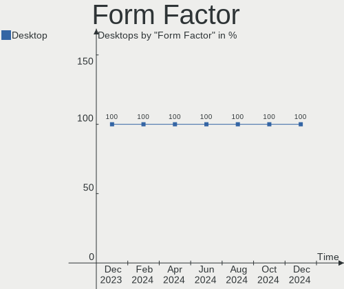

| Name    | Desktops | Percent |
|---------|----------|---------|
| Desktop | 57       | 100%    |

Secure Boot
-----------

Enabled or disabled

| State    | Desktops | Percent |
|----------|----------|---------|
| Disabled | 56       | 98.25%  |
| Enabled  | 1        | 1.75%   |

Coreboot
--------

Have coreboot on board

| Used | Desktops | Percent |
|------|----------|---------|
| No   | 57       | 100%    |

RAM Size
--------

Total RAM memory

| Size in GB  | Desktops | Percent |
|-------------|----------|---------|
| 16.01-24.0  | 16       | 28.07%  |
| 32.01-64.0  | 11       | 19.3%   |
| 8.01-16.0   | 9        | 15.79%  |
| 4.01-8.0    | 8        | 14.04%  |
| 64.01-256.0 | 8        | 14.04%  |
| 3.01-4.0    | 2        | 3.51%   |
| 2.01-3.0    | 2        | 3.51%   |
| 1.01-2.0    | 1        | 1.75%   |

RAM Used
--------

Used RAM memory

| Used GB   | Desktops | Percent |
|-----------|----------|---------|
| 1.01-2.0  | 16       | 28.07%  |
| 4.01-8.0  | 13       | 22.81%  |
| 3.01-4.0  | 11       | 19.3%   |
| 2.01-3.0  | 11       | 19.3%   |
| 8.01-16.0 | 5        | 8.77%   |
| 0.51-1.0  | 1        | 1.75%   |

Total Drives
------------

Number of drives on board

| Drives | Desktops | Percent |
|--------|----------|---------|
| 2      | 24       | 42.11%  |
| 1      | 17       | 29.82%  |
| 4      | 6        | 10.53%  |
| 3      | 6        | 10.53%  |
| 6      | 2        | 3.51%   |
| 5      | 2        | 3.51%   |

Has CD-ROM
----------

Has CD-ROM on board

| Presented | Desktops | Percent |
|-----------|----------|---------|
| No        | 38       | 66.67%  |
| Yes       | 19       | 33.33%  |

Has Ethernet
------------

Has Ethernet on board

| Presented | Desktops | Percent |
|-----------|----------|---------|
| Yes       | 57       | 100%    |

Has WiFi
--------

Has WiFi module

| Presented | Desktops | Percent |
|-----------|----------|---------|
| Yes       | 31       | 54.39%  |
| No        | 26       | 45.61%  |

Has Bluetooth
-------------

Has Bluetooth module

| Presented | Desktops | Percent |
|-----------|----------|---------|
| No        | 32       | 56.14%  |
| Yes       | 25       | 43.86%  |

Location
--------

Country
-------

Geographic location (country)

| Country | Desktops | Percent |
|---------|----------|---------|
| Spain   | 57       | 100%    |

City
----

Geographic location (city)

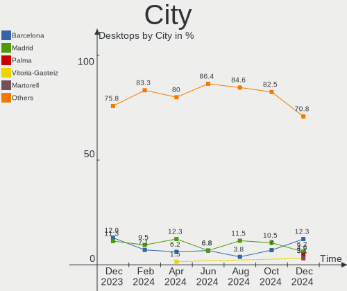

| City                       | Desktops | Percent |
|----------------------------|----------|---------|
| Madrid                     | 8        | 14.04%  |
| Zaragoza                   | 3        | 5.26%   |
| Valencia                   | 3        | 5.26%   |
| Seville                    | 2        | 3.51%   |
| Sabadell                   | 2        | 3.51%   |
| Málaga                    | 2        | 3.51%   |
| Granada                    | 2        | 3.51%   |
| Elda                       | 2        | 3.51%   |
| Donostia / San Sebastian   | 2        | 3.51%   |
| Córdoba                   | 2        | 3.51%   |
| Viladecans                 | 1        | 1.75%   |
| Vigo                       | 1        | 1.75%   |
| Santiago de Compostela     | 1        | 1.75%   |
| Santa Cruz de Tenerife     | 1        | 1.75%   |
| San Miguel de Meruelo      | 1        | 1.75%   |
| Salamanca                  | 1        | 1.75%   |
| Rodonya                    | 1        | 1.75%   |
| Rivas-Vaciamadrid          | 1        | 1.75%   |
| Ponte Caldelas             | 1        | 1.75%   |
| Palma                      | 1        | 1.75%   |
| Oviedo                     | 1        | 1.75%   |
| Mostoles                   | 1        | 1.75%   |
| Las Palmas de Gran Canaria | 1        | 1.75%   |
| Las Gabias                 | 1        | 1.75%   |
| Guadassuar                 | 1        | 1.75%   |
| Gijón                     | 1        | 1.75%   |
| Getxo                      | 1        | 1.75%   |
| El Astillero               | 1        | 1.75%   |
| Cullera                    | 1        | 1.75%   |
| Cadalso de los Vidrios     | 1        | 1.75%   |
| Burgos                     | 1        | 1.75%   |
| Bilbao                     | 1        | 1.75%   |
| Barcelona                  | 1        | 1.75%   |
| Amposta                    | 1        | 1.75%   |
| Alovera                    | 1        | 1.75%   |
| Almacelles                 | 1        | 1.75%   |
| Alcolea de Cinca           | 1        | 1.75%   |
| Alcobendas                 | 1        | 1.75%   |
| A Coruña                  | 1        | 1.75%   |

Drives
------

Drive Vendor
------------

Hard drive vendors

| Vendor                    | Desktops | Drives | Percent |
|---------------------------|----------|--------|---------|
| Seagate                   | 24       | 32     | 22.64%  |
| WDC                       | 14       | 17     | 13.21%  |
| Samsung Electronics       | 11       | 14     | 10.38%  |
| SanDisk                   | 10       | 10     | 9.43%   |
| Kingston                  | 8        | 11     | 7.55%   |
| Crucial                   | 7        | 8      | 6.6%    |
| Toshiba                   | 6        | 6      | 5.66%   |
| Phison Electronics        | 5        | 6      | 4.72%   |
| Hitachi                   | 4        | 4      | 3.77%   |
| Maxtor                    | 3        | 4      | 2.83%   |
| Unknown                   | 1        | 1      | 0.94%   |
| Union Memory              | 1        | 1      | 0.94%   |
| SK hynix                  | 1        | 1      | 0.94%   |
| Silicon Motion            | 1        | 1      | 0.94%   |
| Realtek Semiconductor     | 1        | 1      | 0.94%   |
| Patriot                   | 1        | 1      | 0.94%   |
| Micron/Crucial Technology | 1        | 2      | 0.94%   |
| Micron Technology         | 1        | 1      | 0.94%   |
| KingFast                  | 1        | 1      | 0.94%   |
| KingDian                  | 1        | 1      | 0.94%   |
| Kingchuxing               | 1        | 1      | 0.94%   |
| Intel                     | 1        | 2      | 0.94%   |
| A-DATA Technology         | 1        | 1      | 0.94%   |
| 240G                      | 1        | 1      | 0.94%   |

Drive Model
-----------

Hard drive models

| Model                                               | Desktops | Percent |
|-----------------------------------------------------|----------|---------|
| Seagate ST2000DM008-2FR102 2TB                      | 4        | 3.33%   |
| Seagate ST1000DM010-2EP102 1TB                      | 4        | 3.33%   |
| Phison E12 NVMe Controller 1TB                      | 4        | 3.33%   |
| Seagate ST1000DM003-1SB102 1TB                      | 3        | 2.5%    |
| Toshiba TR200 240GB SSD                             | 2        | 1.67%   |
| Seagate ST500DM002-1BD142 500GB                     | 2        | 1.67%   |
| Seagate ST1000DM003-1ER162 1TB                      | 2        | 1.67%   |
| SanDisk SSD PLUS 480GB                              | 2        | 1.67%   |
| Samsung SSD 980 PRO 1TB                             | 2        | 1.67%   |
| Samsung NVMe SSD Controller SM981/PM981/PM983 250GB | 2        | 1.67%   |
| Kingston SA400S37480G 480GB SSD                     | 2        | 1.67%   |
| Kingston SA400S37240G 240GB SSD                     | 2        | 1.67%   |
| Crucial CT500MX500SSD1 500GB                        | 2        | 1.67%   |
| Crucial CT480BX500SSD1 480GB                        | 2        | 1.67%   |
| WDC WDS100T3X0C-00SJG0 1TB                          | 1        | 0.83%   |
| WDC WDS100T2B0C-00PXH0 1TB                          | 1        | 0.83%   |
| WDC WDS100T2B0B-00YS70 1TB SSD                      | 1        | 0.83%   |
| WDC WDS100T2B0A 1TB SSD                             | 1        | 0.83%   |
| WDC WD800JD-75MSA3 80GB                             | 1        | 0.83%   |
| WDC WD5000AAKX-001CA0 500GB                         | 1        | 0.83%   |
| WDC WD5000AAKS-65A7B2 500GB                         | 1        | 0.83%   |
| WDC WD40EZRZ-00GXCB0 4TB                            | 1        | 0.83%   |
| WDC WD3200BEVT-60A23T0 320GB                        | 1        | 0.83%   |
| WDC WD2500AAJS-75M0A0 249GB                         | 1        | 0.83%   |
| WDC WD20PURX-64P6ZY0 2TB                            | 1        | 0.83%   |
| WDC WD20EARX-00PASB0 2TB                            | 1        | 0.83%   |
| WDC WD1600AAJS-75PSA0 160GB                         | 1        | 0.83%   |
| WDC WD10EZRZ-00HTKB0 1TB                            | 1        | 0.83%   |
| WDC WD10EZEX-75ZF5A0 1TB                            | 1        | 0.83%   |
| WDC WD10EZEX-22BN5A0 1TB                            | 1        | 0.83%   |
| WDC WD10EZEX-00WN4A0 1TB                            | 1        | 0.83%   |
| Unknown MMC Card  64GB                              | 1        | 0.83%   |
| Union Memory UMIS RPJTJ512MEE1OWX 512GB             | 1        | 0.83%   |
| Toshiba Q300. 240GB SSD                             | 1        | 0.83%   |
| Toshiba HDWD130 3TB                                 | 1        | 0.83%   |
| Toshiba DT01ACA100 1TB                              | 1        | 0.83%   |
| Toshiba DT01ACA050 500GB                            | 1        | 0.83%   |
| SK hynix BC501 NVMe Solid State Drive 512GB         | 1        | 0.83%   |
| Silicon Motion SM2262/SM2262EN SSD Controller 480GB | 1        | 0.83%   |
| Seagate ST9500325AS 500GB                           | 1        | 0.83%   |

HDD Vendor
----------

Hard disk drive vendors

| Vendor              | Desktops | Drives | Percent |
|---------------------|----------|--------|---------|
| Seagate             | 24       | 32     | 52.17%  |
| WDC                 | 11       | 13     | 23.91%  |
| Hitachi             | 4        | 4      | 8.7%    |
| Toshiba             | 3        | 3      | 6.52%   |
| Maxtor              | 3        | 4      | 6.52%   |
| Samsung Electronics | 1        | 1      | 2.17%   |

SSD Vendor
----------

Solid state drive vendors

| Vendor              | Desktops | Drives | Percent |
|---------------------|----------|--------|---------|
| Kingston            | 8        | 10     | 25%     |
| Samsung Electronics | 6        | 6      | 18.75%  |
| Crucial             | 5        | 6      | 15.63%  |
| SanDisk             | 4        | 4      | 12.5%   |
| Toshiba             | 3        | 3      | 9.38%   |
| WDC                 | 1        | 2      | 3.13%   |
| Patriot             | 1        | 1      | 3.13%   |
| KingDian            | 1        | 1      | 3.13%   |
| Kingchuxing         | 1        | 1      | 3.13%   |
| A-DATA Technology   | 1        | 1      | 3.13%   |
| 240G                | 1        | 1      | 3.13%   |

Drive Kind
----------

HDD or SSD

| Kind    | Desktops | Drives | Percent |
|---------|----------|--------|---------|
| HDD     | 36       | 57     | 40.91%  |
| NVMe    | 25       | 33     | 28.41%  |
| SSD     | 25       | 36     | 28.41%  |
| MMC     | 1        | 1      | 1.14%   |
| Unknown | 1        | 1      | 1.14%   |

Drive Connector
---------------

SATA, SAS, NVMe, etc.

| Type | Desktops | Drives | Percent |
|------|----------|--------|---------|
| SATA | 47       | 93     | 63.51%  |
| NVMe | 25       | 33     | 33.78%  |
| SAS  | 1        | 1      | 1.35%   |
| MMC  | 1        | 1      | 1.35%   |

Drive Size
----------

Size of hard drive

| Size in TB      | Desktops | Drives | Percent |
|-----------------|----------|--------|---------|
| 0.01-0.5        | 33       | 45     | 44%     |
| 0.51-1.0        | 23       | 27     | 30.67%  |
| 1.01-2.0        | 13       | 15     | 17.33%  |
| 3.01-4.0        | 3        | 3      | 4%      |
| More than 100.0 | 1        | 1      | 1.33%   |
| 2.01-3.0        | 1        | 1      | 1.33%   |
| 4.01-10.0       | 1        | 1      | 1.33%   |

Space Total
-----------

Amount of disk space available on the file system

| Size in GB     | Desktops | Percent |
|----------------|----------|---------|
| 501-1000       | 16       | 28.07%  |
| More than 3000 | 10       | 17.54%  |
| 101-250        | 8        | 14.04%  |
| 1001-2000      | 5        | 8.77%   |
| 251-500        | 4        | 7.02%   |
| 2001-3000      | 3        | 5.26%   |
| 1-20           | 3        | 5.26%   |
| 51-100         | 3        | 5.26%   |
| Unknown        | 3        | 5.26%   |
| 21-50          | 2        | 3.51%   |

Space Used
----------

Amount of used disk space

| Used GB        | Desktops | Percent |
|----------------|----------|---------|
| 1-20           | 15       | 26.32%  |
| 21-50          | 9        | 15.79%  |
| 51-100         | 8        | 14.04%  |
| More than 3000 | 5        | 8.77%   |
| 1001-2000      | 5        | 8.77%   |
| 101-250        | 4        | 7.02%   |
| 501-1000       | 4        | 7.02%   |
| 251-500        | 3        | 5.26%   |
| Unknown        | 3        | 5.26%   |
| 2001-3000      | 1        | 1.75%   |

Malfunc. Drives
---------------

Drive models with a malfunction

| Model                           | Desktops | Drives | Percent |
|---------------------------------|----------|--------|---------|
| WDC WD3200BEVT-60A23T0 320GB    | 1        | 1      | 14.29%  |
| WDC WD20EARX-00PASB0 2TB        | 1        | 1      | 14.29%  |
| WDC WD10EZRZ-00HTKB0 1TB        | 1        | 1      | 14.29%  |
| WDC WD10EZEX-00WN4A0 1TB        | 1        | 1      | 14.29%  |
| Maxtor StM380215a 18015TB       | 1        | 1      | 14.29%  |
| Maxtor 6Y080L0 82GB             | 1        | 1      | 14.29%  |
| Kingston SA400S37240G 240GB SSD | 1        | 1      | 14.29%  |

Malfunc. Drive Vendor
---------------------

Vendors of faulty drives

| Vendor   | Desktops | Drives | Percent |
|----------|----------|--------|---------|
| WDC      | 4        | 4      | 66.67%  |
| Maxtor   | 1        | 2      | 16.67%  |
| Kingston | 1        | 1      | 16.67%  |

Malfunc. HDD Vendor
-------------------

Vendors of faulty HDD drives

| Vendor | Desktops | Drives | Percent |
|--------|----------|--------|---------|
| WDC    | 4        | 4      | 80%     |
| Maxtor | 1        | 2      | 20%     |

Malfunc. Drive Kind
-------------------

Kinds of faulty drives

| Kind | Desktops | Drives | Percent |
|------|----------|--------|---------|
| HDD  | 4        | 6      | 80%     |
| SSD  | 1        | 1      | 20%     |

Failed Drives
-------------

Failed drive models

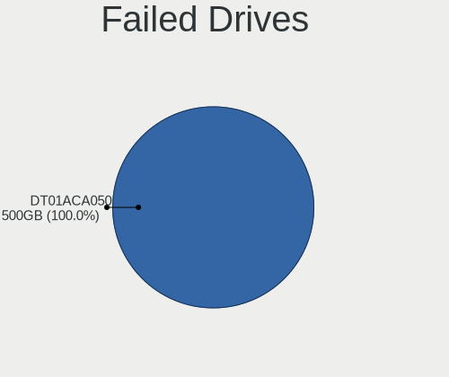

| Model                    | Desktops | Drives | Percent |
|--------------------------|----------|--------|---------|
| Toshiba DT01ACA050 500GB | 1        | 1      | 100%    |

Failed Drive Vendor
-------------------

Failed drive vendors

| Vendor  | Desktops | Drives | Percent |
|---------|----------|--------|---------|
| Toshiba | 1        | 1      | 100%    |

Drive Status
------------

Number of failed and malfunc. drives

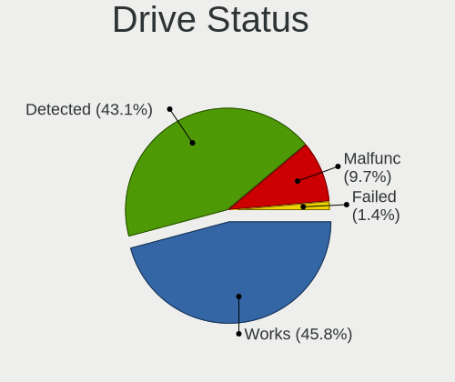

| Status   | Desktops | Drives | Percent |
|----------|----------|--------|---------|
| Detected | 30       | 57     | 48.39%  |
| Works    | 27       | 63     | 43.55%  |
| Malfunc  | 4        | 7      | 6.45%   |
| Failed   | 1        | 1      | 1.61%   |

Storage controller
------------------

Storage Vendor
--------------

Storage controller vendors

| Vendor                      | Desktops | Percent |
|-----------------------------|----------|---------|
| Intel                       | 37       | 41.11%  |
| AMD                         | 19       | 21.11%  |
| SanDisk                     | 8        | 8.89%   |
| Samsung Electronics         | 6        | 6.67%   |
| Phison Electronics          | 5        | 5.56%   |
| Micron/Crucial Technology   | 3        | 3.33%   |
| JMicron Technology          | 2        | 2.22%   |
| VIA Technologies            | 1        | 1.11%   |
| Union Memory (Shenzhen)     | 1        | 1.11%   |
| SK hynix                    | 1        | 1.11%   |
| Silicon Motion              | 1        | 1.11%   |
| Realtek Semiconductor       | 1        | 1.11%   |
| Nvidia                      | 1        | 1.11%   |
| Micron Technology           | 1        | 1.11%   |
| Marvell Technology Group    | 1        | 1.11%   |
| Kingston Technology Company | 1        | 1.11%   |
| ASMedia Technology          | 1        | 1.11%   |

Storage Model
-------------

Storage controller models

| Model                                                                          | Desktops | Percent |
|--------------------------------------------------------------------------------|----------|---------|
| AMD FCH SATA Controller [AHCI mode]                                            | 9        | 8.57%   |
| AMD 500 Series Chipset SATA Controller                                         | 5        | 4.76%   |
| AMD 400 Series Chipset SATA Controller                                         | 5        | 4.76%   |
| Phison E12 NVMe Controller                                                     | 4        | 3.81%   |
| Intel Q170/Q150/B150/H170/H110/Z170/CM236 Chipset SATA Controller [AHCI Mode]  | 4        | 3.81%   |
| Intel 8 Series/C220 Series Chipset Family 6-port SATA Controller 1 [AHCI mode] | 4        | 3.81%   |
| Samsung NVMe SSD Controller SM981/PM981/PM983                                  | 3        | 2.86%   |
| Samsung NVMe SSD Controller PM9A1/PM9A3/980PRO                                 | 3        | 2.86%   |
| Intel NM10/ICH7 Family SATA Controller [IDE mode]                              | 3        | 2.86%   |
| Intel 6 Series/C200 Series Chipset Family 6 port Desktop SATA AHCI Controller  | 3        | 2.86%   |
| SanDisk WD Blue SN550 NVMe SSD                                                 | 2        | 1.9%    |
| SanDisk WD Black 2018/SN750 / PC SN720 NVMe SSD                                | 2        | 1.9%    |
| Micron/Crucial P2 NVMe PCIe SSD                                                | 2        | 1.9%    |
| Intel Cannon Lake PCH SATA AHCI Controller                                     | 2        | 1.9%    |
| Intel C610/X99 series chipset sSATA Controller [AHCI mode]                     | 2        | 1.9%    |
| Intel C610/X99 series chipset 6-Port SATA Controller [AHCI mode]               | 2        | 1.9%    |
| Intel 82801G (ICH7 Family) IDE Controller                                      | 2        | 1.9%    |
| Intel 7 Series/C210 Series Chipset Family 6-port SATA Controller [AHCI mode]   | 2        | 1.9%    |
| Intel 500 Series Chipset Family SATA AHCI Controller                           | 2        | 1.9%    |
| Intel 200 Series PCH SATA controller [AHCI mode]                               | 2        | 1.9%    |
| AMD SB7x0/SB8x0/SB9x0 SATA Controller [IDE mode]                               | 2        | 1.9%    |
| AMD SB7x0/SB8x0/SB9x0 IDE Controller                                           | 2        | 1.9%    |
| VIA VT6415 PATA IDE Host Controller                                            | 1        | 0.95%   |
| Union Memory (Shenzhen) Non-Volatile memory controller                         | 1        | 0.95%   |
| SK hynix BC501 NVMe Solid State Drive                                          | 1        | 0.95%   |
| Silicon Motion SM2262/SM2262EN SSD Controller                                  | 1        | 0.95%   |
| SanDisk WD PC SN810 / Black SN850 NVMe SSD                                     | 1        | 0.95%   |
| SanDisk WD Blue SN570 NVMe SSD 2TB                                             | 1        | 0.95%   |
| SanDisk WD Black SN770 NVMe SSD                                                | 1        | 0.95%   |
| SanDisk WD Black SN750 / PC SN730 NVMe SSD                                     | 1        | 0.95%   |
| Realtek NVMe Controller                                                        | 1        | 0.95%   |
| Phison PS5013 E13 NVMe Controller                                              | 1        | 0.95%   |
| Phison E18 PCIe4 NVMe Controller                                               | 1        | 0.95%   |
| Nvidia MCP78S [GeForce 8200] IDE                                               | 1        | 0.95%   |
| Nvidia MCP78S [GeForce 8200] AHCI Controller                                   | 1        | 0.95%   |
| Micron/Crucial P5 Plus NVMe PCIe SSD                                           | 1        | 0.95%   |
| Micron NVMe Storage Controller                                                 | 1        | 0.95%   |
| Marvell Group 88SE9172 SATA 6Gb/s Controller                                   | 1        | 0.95%   |
| Kingston Company Company Non-Volatile memory controller                        | 1        | 0.95%   |
| JMicron JMB58x AHCI SATA controller                                            | 1        | 0.95%   |

Storage Kind
------------

Kind of storage controller (IDE, SATA, NVMe, SAS, ...)

| Kind | Desktops | Percent |
|------|----------|---------|
| SATA | 48       | 56.47%  |
| NVMe | 25       | 29.41%  |
| IDE  | 9        | 10.59%  |
| RAID | 3        | 3.53%   |

Processor
---------

CPU Vendor
----------

Processor vendors

| Vendor | Desktops | Percent |
|--------|----------|---------|
| Intel  | 37       | 64.91%  |
| AMD    | 20       | 35.09%  |

CPU Model
---------

Processor models

| Model                                       | Desktops | Percent |
|---------------------------------------------|----------|---------|
| AMD Ryzen 9 7950X 16-Core Processor         | 3        | 5.26%   |
| AMD Ryzen 7 3700X 8-Core Processor          | 3        | 5.26%   |
| Intel Core i5-4460 CPU @ 3.20GHz            | 2        | 3.51%   |
| Intel Core i5-10400 CPU @ 2.90GHz           | 2        | 3.51%   |
| AMD Ryzen 5 3600 6-Core Processor           | 2        | 3.51%   |
| Intel Xeon CPU E5-2680 v3 @ 2.50GHz         | 1        | 1.75%   |
| Intel Xeon CPU E5-2678 v3 @ 2.50GHz         | 1        | 1.75%   |
| Intel Pentium Dual-Core CPU E5700 @ 3.00GHz | 1        | 1.75%   |
| Intel Pentium Dual-Core CPU E5300 @ 2.60GHz | 1        | 1.75%   |
| Intel Pentium Dual-Core CPU E5200 @ 2.50GHz | 1        | 1.75%   |
| Intel Pentium Dual CPU E2220 @ 2.40GHz      | 1        | 1.75%   |
| Intel Core i9-8950HK CPU @ 2.90GHz          | 1        | 1.75%   |
| Intel Core i7-8700K CPU @ 3.70GHz           | 1        | 1.75%   |
| Intel Core i7-7700 CPU @ 3.60GHz            | 1        | 1.75%   |
| Intel Core i7-6700K CPU @ 4.00GHz           | 1        | 1.75%   |
| Intel Core i7-6700 CPU @ 3.40GHz            | 1        | 1.75%   |
| Intel Core i7-5820K CPU @ 3.30GHz           | 1        | 1.75%   |
| Intel Core i7-4790S CPU @ 3.20GHz           | 1        | 1.75%   |
| Intel Core i7-4790 CPU @ 3.60GHz            | 1        | 1.75%   |
| Intel Core i7-3770 CPU @ 3.40GHz            | 1        | 1.75%   |
| Intel Core i7-2600 CPU @ 3.40GHz            | 1        | 1.75%   |
| Intel Core i7-10700K CPU @ 3.80GHz          | 1        | 1.75%   |
| Intel Core i5-9400F CPU @ 2.90GHz           | 1        | 1.75%   |
| Intel Core i5-6500 CPU @ 3.20GHz            | 1        | 1.75%   |
| Intel Core i5-4570T CPU @ 2.90GHz           | 1        | 1.75%   |
| Intel Core i5-3570 CPU @ 3.40GHz            | 1        | 1.75%   |
| Intel Core i5-2500K CPU @ 3.30GHz           | 1        | 1.75%   |
| Intel Core i5-10400F CPU @ 2.90GHz          | 1        | 1.75%   |
| Intel Core i3-8100 CPU @ 3.60GHz            | 1        | 1.75%   |
| Intel Core i3-4150 CPU @ 3.50GHz            | 1        | 1.75%   |
| Intel Core i3-2120 CPU @ 3.30GHz            | 1        | 1.75%   |
| Intel Core i3-2100 CPU @ 3.10GHz            | 1        | 1.75%   |
| Intel Core 2 CPU 4300 @ 1.80GHz             | 1        | 1.75%   |
| Intel Celeron N5105 @ 2.00GHz               | 1        | 1.75%   |
| Intel Celeron CPU N3350 @ 1.10GHz           | 1        | 1.75%   |
| Intel 13th Gen Core i5-13600K               | 1        | 1.75%   |
| Intel 12th Gen Core i5-12400                | 1        | 1.75%   |
| Intel 11th Gen Core i7-11700K @ 3.60GHz     | 1        | 1.75%   |
| AMD Ryzen 9 5900X 12-Core Processor         | 1        | 1.75%   |
| AMD Ryzen 9 3950X 16-Core Processor         | 1        | 1.75%   |

CPU Model Family
----------------

Processor model prefix

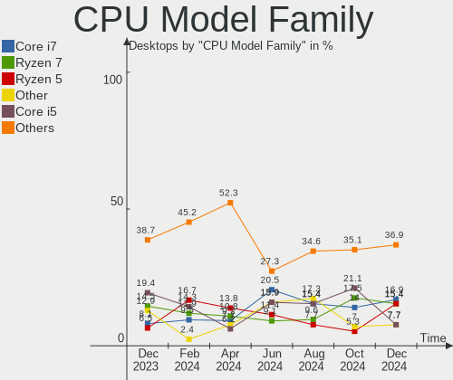

| Model                   | Desktops | Percent |
|-------------------------|----------|---------|
| Intel Core i7           | 10       | 17.54%  |
| Intel Core i5           | 10       | 17.54%  |
| AMD Ryzen 9             | 6        | 10.53%  |
| AMD Ryzen 7             | 6        | 10.53%  |
| Intel Core i3           | 4        | 7.02%   |
| AMD Ryzen 5             | 4        | 7.02%   |
| Other                   | 3        | 5.26%   |
| Intel Pentium Dual-Core | 3        | 5.26%   |
| Intel Xeon              | 2        | 3.51%   |
| Intel Celeron           | 2        | 3.51%   |
| Intel Pentium Dual      | 1        | 1.75%   |
| Intel Core i9           | 1        | 1.75%   |
| Intel Core 2            | 1        | 1.75%   |
| AMD Ryzen 5 PRO         | 1        | 1.75%   |
| AMD Phenom II X6        | 1        | 1.75%   |
| AMD Phenom              | 1        | 1.75%   |
| AMD FX                  | 1        | 1.75%   |

CPU Cores
---------

Number of processor cores

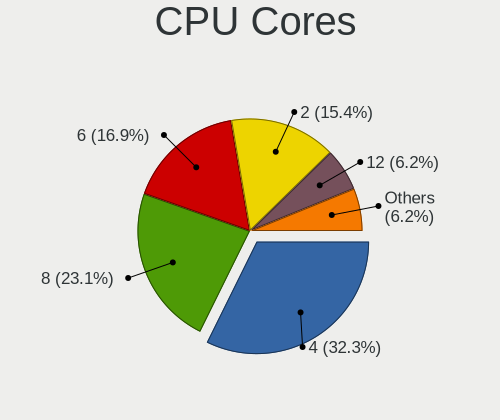

| Number | Desktops | Percent |
|--------|----------|---------|
| 4      | 16       | 28.07%  |
| 6      | 12       | 21.05%  |
| 2      | 11       | 19.3%   |
| 8      | 8        | 14.04%  |
| 16     | 4        | 7.02%   |
| 12     | 3        | 5.26%   |
| 24     | 1        | 1.75%   |
| 14     | 1        | 1.75%   |
| 3      | 1        | 1.75%   |

CPU Sockets
-----------

Number of sockets

| Number | Desktops | Percent |
|--------|----------|---------|
| 1      | 56       | 98.25%  |
| 2      | 1        | 1.75%   |

CPU Threads
-----------

Threads per core (Hyper-Threading)

| Number | Desktops | Percent |
|--------|----------|---------|
| 2      | 40       | 70.18%  |
| 1      | 17       | 29.82%  |

CPU Op-Modes
------------

CPU Operation Modes (32-bit, 64-bit)

| Op mode        | Desktops | Percent |
|----------------|----------|---------|
| 32-bit, 64-bit | 57       | 100%    |

CPU Microcode
-------------

Microcode number

| Number     | Desktops | Percent |
|------------|----------|---------|
| Unknown    | 28       | 49.12%  |
| 0x08701021 | 5        | 8.77%   |
| 0x206a7    | 3        | 5.26%   |
| 0x0a601203 | 3        | 5.26%   |
| 0xa0653    | 2        | 3.51%   |
| 0x506e3    | 2        | 3.51%   |
| 0x08108109 | 2        | 3.51%   |
| 0xa0671    | 1        | 1.75%   |
| 0x906ea    | 1        | 1.75%   |
| 0x906c0    | 1        | 1.75%   |
| 0x6f2      | 1        | 1.75%   |
| 0x506c9    | 1        | 1.75%   |
| 0x306c3    | 1        | 1.75%   |
| 0x1067a    | 1        | 1.75%   |
| 0x10676    | 1        | 1.75%   |
| 0x0a201016 | 1        | 1.75%   |
| 0x08701030 | 1        | 1.75%   |
| 0x08600106 | 1        | 1.75%   |
| 0x06000626 | 1        | 1.75%   |

CPU Microarch
-------------

Microarchitecture

| Name             | Desktops | Percent |
|------------------|----------|---------|
| Haswell          | 9        | 15.79%  |
| Zen 2            | 8        | 14.04%  |
| KabyLake         | 5        | 8.77%   |
| Zen+             | 4        | 7.02%   |
| SandyBridge      | 4        | 7.02%   |
| CometLake        | 4        | 7.02%   |
| Skylake          | 3        | 5.26%   |
| Penryn           | 3        | 5.26%   |
| Unknown          | 3        | 5.26%   |
| Zen 3            | 2        | 3.51%   |
| K10              | 2        | 3.51%   |
| IvyBridge        | 2        | 3.51%   |
| Core             | 2        | 3.51%   |
| Alderlake Hybrid | 2        | 3.51%   |
| Tremont          | 1        | 1.75%   |
| Icelake          | 1        | 1.75%   |
| Goldmont         | 1        | 1.75%   |
| Bulldozer        | 1        | 1.75%   |

Graphics
--------

GPU Vendor
----------

Vendors of graphics cards

| Vendor | Desktops | Percent |
|--------|----------|---------|
| Nvidia | 25       | 39.68%  |
| Intel  | 22       | 34.92%  |
| AMD    | 16       | 25.4%   |

GPU Model
---------

Graphics card models

| Model                                                                       | Desktops | Percent |
|-----------------------------------------------------------------------------|----------|---------|
| Nvidia GT218 [GeForce 210]                                                  | 3        | 4.76%   |
| Nvidia GP108 [GeForce GT 1030]                                              | 3        | 4.76%   |
| Nvidia GK208B [GeForce GT 730]                                              | 3        | 4.76%   |
| Intel Xeon E3-1200 v3/4th Gen Core Processor Integrated Graphics Controller | 3        | 4.76%   |
| Intel HD Graphics 530                                                       | 3        | 4.76%   |
| AMD Raphael                                                                 | 3        | 4.76%   |
| AMD Ellesmere [Radeon RX 470/480/570/570X/580/580X/590]                     | 3        | 4.76%   |
| Nvidia TU104 [GeForce RTX 2070 SUPER]                                       | 2        | 3.17%   |
| Nvidia GA104 [GeForce RTX 3060 Ti Lite Hash Rate]                           | 2        | 3.17%   |
| Intel CometLake-S GT2 [UHD Graphics 630]                                    | 2        | 3.17%   |
| Intel 82G33/G31 Express Integrated Graphics Controller                      | 2        | 3.17%   |
| AMD Picasso/Raven 2 [Radeon Vega Series / Radeon Vega Mobile Series]        | 2        | 3.17%   |
| AMD Navi 23 [Radeon RX 6600/6600 XT/6600M]                                  | 2        | 3.17%   |
| Nvidia TU106 [GeForce RTX 2060 SUPER]                                       | 1        | 1.59%   |
| Nvidia GP107 [GeForce GTX 1050 Ti]                                          | 1        | 1.59%   |
| Nvidia GP106 [GeForce GTX 1060 6GB]                                         | 1        | 1.59%   |
| Nvidia GP106 [GeForce GTX 1060 3GB]                                         | 1        | 1.59%   |
| Nvidia GP102 [TITAN Xp]                                                     | 1        | 1.59%   |
| Nvidia GM107 [GeForce GTX 750]                                              | 1        | 1.59%   |
| Nvidia GK208B [GeForce GT 720]                                              | 1        | 1.59%   |
| Nvidia GK208B [GeForce GT 710]                                              | 1        | 1.59%   |
| Nvidia GK107GL [Quadro K2000]                                               | 1        | 1.59%   |
| Nvidia GF116 [GeForce GT 545]                                               | 1        | 1.59%   |
| Nvidia GF108 [GeForce GT 430]                                               | 1        | 1.59%   |
| Nvidia GA104 [GeForce RTX 3070 Ti]                                          | 1        | 1.59%   |
| Intel Raptor Lake-S GT1 [UHD Graphics 770]                                  | 1        | 1.59%   |
| Intel JasperLake [UHD Graphics]                                             | 1        | 1.59%   |
| Intel IvyBridge GT2 [HD Graphics 4000]                                      | 1        | 1.59%   |
| Intel HD Graphics 630                                                       | 1        | 1.59%   |
| Intel HD Graphics 500                                                       | 1        | 1.59%   |
| Intel CoffeeLake-S GT2 [UHD Graphics 630]                                   | 1        | 1.59%   |
| Intel CoffeeLake-H GT2 [UHD Graphics 630]                                   | 1        | 1.59%   |
| Intel Alder Lake-S GT1 [UHD Graphics 730]                                   | 1        | 1.59%   |
| Intel 82Q963/Q965 Integrated Graphics Controller                            | 1        | 1.59%   |
| Intel 4th Generation Core Processor Family Integrated Graphics Controller   | 1        | 1.59%   |
| Intel 4 Series Chipset Integrated Graphics Controller                       | 1        | 1.59%   |
| Intel 2nd Generation Core Processor Family Integrated Graphics Controller   | 1        | 1.59%   |
| AMD Turks [Radeon HD 7600 Series]                                           | 1        | 1.59%   |
| AMD RS880 [Radeon HD 4250]                                                  | 1        | 1.59%   |
| AMD Renoir                                                                  | 1        | 1.59%   |

GPU Combo
---------

Combinations of graphics cards

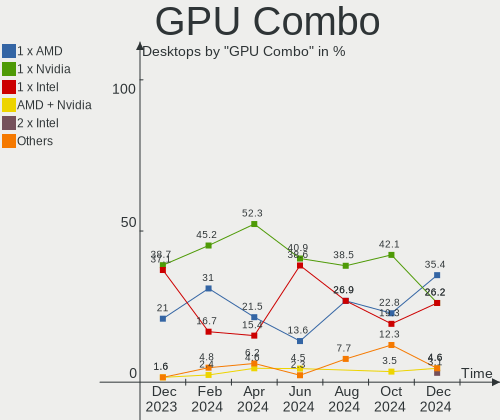

| Name           | Desktops | Percent |
|----------------|----------|---------|
| 1 x Nvidia     | 22       | 38.6%   |
| 1 x Intel      | 17       | 29.82%  |
| 1 x AMD        | 14       | 24.56%  |
| Intel + Nvidia | 2        | 3.51%   |
| Intel + AMD    | 1        | 1.75%   |
| AMD + Nvidia   | 1        | 1.75%   |

GPU Driver
----------

Free vs proprietary

| Driver      | Desktops | Percent |
|-------------|----------|---------|
| Free        | 38       | 66.67%  |
| Proprietary | 18       | 31.58%  |
| Unknown     | 1        | 1.75%   |

GPU Memory
----------

Total video memory

| Size in GB | Desktops | Percent |
|------------|----------|---------|
| Unknown    | 29       | 50.88%  |
| 7.01-8.0   | 9        | 15.79%  |
| 1.01-2.0   | 8        | 14.04%  |
| 0.01-0.5   | 5        | 8.77%   |
| 8.01-16.0  | 3        | 5.26%   |
| 5.01-6.0   | 1        | 1.75%   |
| 3.01-4.0   | 1        | 1.75%   |
| 0.51-1.0   | 1        | 1.75%   |

Monitor
-------

Monitor Vendor
--------------

Monitor vendors

| Vendor               | Desktops | Percent |
|----------------------|----------|---------|
| Samsung Electronics  | 13       | 20.63%  |
| Goldstar             | 12       | 19.05%  |
| Hewlett-Packard      | 7        | 11.11%  |
| Acer                 | 5        | 7.94%   |
| ViewSonic            | 4        | 6.35%   |
| BenQ                 | 4        | 6.35%   |
| AOC                  | 4        | 6.35%   |
| ASUSTek Computer     | 3        | 4.76%   |
| Dell                 | 2        | 3.17%   |
| Ancor Communications | 2        | 3.17%   |
| Vestel Elektronik    | 1        | 1.59%   |
| Sony                 | 1        | 1.59%   |
| Plain Tree Systems   | 1        | 1.59%   |
| Packard Bell         | 1        | 1.59%   |
| Lenovo               | 1        | 1.59%   |
| HannStar             | 1        | 1.59%   |
| AGO                  | 1        | 1.59%   |

Monitor Model
-------------

Monitor models

| Model                                                                 | Desktops | Percent |
|-----------------------------------------------------------------------|----------|---------|
| Acer V193HQV ACR013E 1366x768 410x230mm 18.5-inch                     | 2        | 3.08%   |
| ViewSonic XG2401 SERIES VSCBB31 1920x1080 531x299mm 24.0-inch         | 1        | 1.54%   |
| ViewSonic VX3276-QHD VSCE635 2560x1440 698x393mm 31.5-inch            | 1        | 1.54%   |
| ViewSonic VA2406-FHD VSC3B66 1920x1080 527x296mm 23.8-inch            | 1        | 1.54%   |
| ViewSonic LCD Monitor VA2406-FHD                                      | 1        | 1.54%   |
| Vestel Elektronik 32FHD_LCD_TV VES3700 1920x1080 700x400mm 31.7-inch  | 1        | 1.54%   |
| Sony SDM-HS75 SNY2400 1280x1024 338x270mm 17.0-inch                   | 1        | 1.54%   |
| Samsung Electronics U32R59x SAM0F96 3840x2160 697x392mm 31.5-inch     | 1        | 1.54%   |
| Samsung Electronics SMBX2235 SAM0700 1920x1080 477x268mm 21.5-inch    | 1        | 1.54%   |
| Samsung Electronics S24F350 SAM0D20 1920x1080 521x293mm 23.5-inch     | 1        | 1.54%   |
| Samsung Electronics S24D330 SAM0D92 1920x1080 531x299mm 24.0-inch     | 1        | 1.54%   |
| Samsung Electronics S19B150 SAM08A2 1366x768 410x230mm 18.5-inch      | 1        | 1.54%   |
| Samsung Electronics LS49AG95 SAM71AC 3840x1080 1193x336mm 48.8-inch   | 1        | 1.54%   |
| Samsung Electronics LCD Monitor SAM712A 3840x1600 950x540mm 43.0-inch | 1        | 1.54%   |
| Samsung Electronics LCD Monitor SAM7106 1920x1080 600x340mm 27.2-inch | 1        | 1.54%   |
| Samsung Electronics LCD Monitor SAM0B60 1920x1080 887x500mm 40.1-inch | 1        | 1.54%   |
| Samsung Electronics LCD Monitor SAM0A7A 1920x1080 890x500mm 40.2-inch | 1        | 1.54%   |
| Samsung Electronics LCD Monitor SAM0658 1920x1080 886x498mm 40.0-inch | 1        | 1.54%   |
| Samsung Electronics LCD Monitor LC34G55T 3440x1440                    | 1        | 1.54%   |
| Samsung Electronics C27F390 SAM0D32 1920x1080 598x336mm 27.0-inch     | 1        | 1.54%   |
| Plain Tree Systems Monitor PTS0770 1440x900 410x256mm 19.0-inch       | 1        | 1.54%   |
| Packard Bell Viseo 190W PKB00DF 1366x768 409x230mm 18.5-inch          | 1        | 1.54%   |
| Lenovo L197 Wide LEN1152 1440x900 410x257mm 19.1-inch                 | 1        | 1.54%   |
| Hewlett-Packard S2331 HWP2907 1920x1080 510x290mm 23.1-inch           | 1        | 1.54%   |
| Hewlett-Packard LP2475w HWP26F7 1920x1200 546x352mm 25.6-inch         | 1        | 1.54%   |
| Hewlett-Packard L1908w HWP26F0 1440x900 410x256mm 19.0-inch           | 1        | 1.54%   |
| Hewlett-Packard 27f HPN354B 1920x1080 598x336mm 27.0-inch             | 1        | 1.54%   |
| Hewlett-Packard 23xi HWP3032 1920x1080 509x286mm 23.0-inch            | 1        | 1.54%   |
| Hewlett-Packard 22xi HWP3030 1920x1080 480x270mm 21.7-inch            | 1        | 1.54%   |
| Hewlett-Packard 22fw HPN3541 1920x1080 476x268mm 21.5-inch            | 1        | 1.54%   |
| HannStar LM02 HSP0013 1440x900 410x260mm 19.1-inch                    | 1        | 1.54%   |
| Goldstar ULTRAWIDE GSM5AE4 2560x1080 677x290mm 29.0-inch              | 1        | 1.54%   |
| Goldstar ULTRAWIDE GSM59F1 2560x1080 673x284mm 28.8-inch              | 1        | 1.54%   |
| Goldstar ULTRAGEAR+ GSM5BBF 3840x2160 600x340mm 27.2-inch             | 1        | 1.54%   |
| Goldstar ULTRAGEAR GSM774B 3440x1440 800x335mm 34.1-inch              | 1        | 1.54%   |
| Goldstar M228WD-BZ GSM5670 1680x1050 473x296mm 22.0-inch              | 1        | 1.54%   |
| Goldstar M2262D GSM5754 1920x1080 598x336mm 27.0-inch                 | 1        | 1.54%   |
| Goldstar M2232 GSM595C 1920x1080 476x267mm 21.5-inch                  | 1        | 1.54%   |
| Goldstar L1750SQ GSM43E8 1280x1024 338x270mm 17.0-inch                | 1        | 1.54%   |
| Goldstar IPS WSXGA GSM5B01 1440x900 419x262mm 19.5-inch               | 1        | 1.54%   |

Monitor Resolution
------------------

Monitor screen resolution

| Resolution         | Desktops | Percent |
|--------------------|----------|---------|
| 1920x1080 (FHD)    | 27       | 45.76%  |
| 3840x2160 (4K)     | 6        | 10.17%  |
| 1366x768 (WXGA)    | 5        | 8.47%   |
| 1440x900 (WXGA+)   | 4        | 6.78%   |
| 2560x1440 (QHD)    | 3        | 5.08%   |
| 3840x1080          | 2        | 3.39%   |
| 3440x1440          | 2        | 3.39%   |
| 2560x1080          | 2        | 3.39%   |
| 1280x1024 (SXGA)   | 2        | 3.39%   |
| Unknown            | 2        | 3.39%   |
| 3840x1600          | 1        | 1.69%   |
| 2944x1080          | 1        | 1.69%   |
| 1920x1200 (WUXGA)  | 1        | 1.69%   |
| 1680x1050 (WSXGA+) | 1        | 1.69%   |

Monitor Diagonal
----------------

Diagonal size in inches

| Inches  | Desktops | Percent |
|---------|----------|---------|
| 24      | 10       | 16.39%  |
| 27      | 9        | 14.75%  |
| 23      | 8        | 13.11%  |
| 18      | 5        | 8.2%    |
| 21      | 4        | 6.56%   |
| 19      | 4        | 6.56%   |
| 40      | 3        | 4.92%   |
| Unknown | 3        | 4.92%   |
| 48      | 2        | 3.28%   |
| 34      | 2        | 3.28%   |
| 31      | 2        | 3.28%   |
| 17      | 2        | 3.28%   |
| 84      | 1        | 1.64%   |
| 54      | 1        | 1.64%   |
| 43      | 1        | 1.64%   |
| 33      | 1        | 1.64%   |
| 29      | 1        | 1.64%   |
| 25      | 1        | 1.64%   |
| 22      | 1        | 1.64%   |

Monitor Width
-------------

Physical width

| Width in mm | Desktops | Percent |
|-------------|----------|---------|
| 501-600     | 22       | 37.93%  |
| 401-500     | 15       | 25.86%  |
| 601-700     | 5        | 8.62%   |
| 801-900     | 3        | 5.17%   |
| 701-800     | 3        | 5.17%   |
| 1001-1500   | 3        | 5.17%   |
| Unknown     | 3        | 5.17%   |
| 301-350     | 2        | 3.45%   |
| 1501-2000   | 1        | 1.72%   |
| 901-1000    | 1        | 1.72%   |

Aspect Ratio
------------

Proportional relationship between the width and the height

| Ratio   | Desktops | Percent |
|---------|----------|---------|
| 16/9    | 41       | 73.21%  |
| 16/10   | 6        | 10.71%  |
| 21/9    | 3        | 5.36%   |
| Unknown | 3        | 5.36%   |
| 5/4     | 2        | 3.57%   |
| 32/9    | 1        | 1.79%   |

Monitor Area
------------

Area in inch²

| Area in inch² | Desktops | Percent |
|----------------|----------|---------|
| 201-250        | 18       | 31.03%  |
| 301-350        | 10       | 17.24%  |
| 141-150        | 7        | 12.07%  |
| 151-200        | 5        | 8.62%   |
| 501-1000       | 5        | 8.62%   |
| 351-500        | 4        | 6.9%    |
| More than 1000 | 3        | 5.17%   |
| 251-300        | 3        | 5.17%   |
| Unknown        | 3        | 5.17%   |

Pixel Density
-------------

Pixels per inch

| Density | Desktops | Percent |
|---------|----------|---------|
| 51-100  | 39       | 72.22%  |
| 101-120 | 6        | 11.11%  |
| Unknown | 3        | 5.56%   |
| 1-50    | 2        | 3.7%    |
| 161-240 | 2        | 3.7%    |
| 121-160 | 2        | 3.7%    |

Multiple Monitors
-----------------

Total monitors connected

| Total | Desktops | Percent |
|-------|----------|---------|
| 1     | 44       | 77.19%  |
| 2     | 11       | 19.3%   |
| 3     | 1        | 1.75%   |
| 0     | 1        | 1.75%   |

Network
-------

Net Controller Vendor
---------------------

Controller vendors

| Vendor                          | Desktops | Percent |
|---------------------------------|----------|---------|
| Realtek Semiconductor           | 38       | 45.78%  |
| Intel                           | 21       | 25.3%   |
| Qualcomm Atheros                | 5        | 6.02%   |
| TP-Link                         | 4        | 4.82%   |
| MediaTek                        | 4        | 4.82%   |
| Ralink Technology               | 2        | 2.41%   |
| Samsung Electronics             | 1        | 1.2%    |
| Ralink                          | 1        | 1.2%    |
| Qualcomm Atheros Communications | 1        | 1.2%    |
| Nvidia                          | 1        | 1.2%    |
| Microsoft                       | 1        | 1.2%    |
| Huawei Technologies             | 1        | 1.2%    |
| Edimax Technology               | 1        | 1.2%    |
| Broadcom                        | 1        | 1.2%    |
| ASIX Electronics                | 1        | 1.2%    |

Net Controller Model
--------------------

Controller models

| Model                                                                         | Desktops | Percent |
|-------------------------------------------------------------------------------|----------|---------|
| Realtek RTL8111/8168/8411 PCI Express Gigabit Ethernet Controller             | 29       | 29.59%  |
| Realtek RTL8125 2.5GbE Controller                                             | 7        | 7.14%   |
| Intel Wi-Fi 6 AX200                                                           | 4        | 4.08%   |
| Intel Ethernet Controller I225-V                                              | 4        | 4.08%   |
| MediaTek MT7922 802.11ax PCI Express Wireless Network Adapter                 | 3        | 3.06%   |
| Intel Ethernet Connection I217-LM                                             | 3        | 3.06%   |
| TP-Link TL-WN823N v2/v3 [Realtek RTL8192EU]                                   | 2        | 2.04%   |
| Realtek RTL8812AE 802.11ac PCIe Wireless Network Adapter                      | 2        | 2.04%   |
| Realtek RTL8192EE PCIe Wireless Network Adapter                               | 2        | 2.04%   |
| Realtek RTL810xE PCI Express Fast Ethernet controller                         | 2        | 2.04%   |
| Qualcomm Atheros AR9485 Wireless Network Adapter                              | 2        | 2.04%   |
| Intel Wireless 3165                                                           | 2        | 2.04%   |
| Intel I211 Gigabit Network Connection                                         | 2        | 2.04%   |
| Intel 82579LM Gigabit Network Connection (Lewisville)                         | 2        | 2.04%   |
| TP-Link AC600 wireless Realtek RTL8811AU [Archer T2U Nano]                    | 1        | 1.02%   |
| TP-Link 802.11ac NIC                                                          | 1        | 1.02%   |
| Samsung GT-I9070 (network tethering, USB debugging enabled)                   | 1        | 1.02%   |
| Realtek RTL8821CE 802.11ac PCIe Wireless Network Adapter                      | 1        | 1.02%   |
| Realtek RTL8821AE 802.11ac PCIe Wireless Network Adapter                      | 1        | 1.02%   |
| Realtek RTL8192CU 802.11n WLAN Adapter                                        | 1        | 1.02%   |
| Realtek 802.11ac NIC                                                          | 1        | 1.02%   |
| Ralink MT7610U ("Archer T2U" 2.4G+5G WLAN Adapter                             | 1        | 1.02%   |
| Ralink MT7601U Wireless Adapter                                               | 1        | 1.02%   |
| Ralink RT5390 Wireless 802.11n 1T/1R PCIe                                     | 1        | 1.02%   |
| Qualcomm Atheros Killer E2400 Gigabit Ethernet Controller                     | 1        | 1.02%   |
| Qualcomm Atheros TP-Link TL-WN322G v3 / TL-WN422G v2 802.11g [Atheros AR9271] | 1        | 1.02%   |
| Qualcomm Atheros AR93xx Wireless Network Adapter                              | 1        | 1.02%   |
| Qualcomm Atheros AR9287 Wireless Network Adapter (PCI-Express)                | 1        | 1.02%   |
| Nvidia MCP77 Ethernet                                                         | 1        | 1.02%   |
| Microsoft Xbox 360 Wireless Adapter                                           | 1        | 1.02%   |
| MediaTek MT7921 802.11ax PCI Express Wireless Network Adapter                 | 1        | 1.02%   |
| Intel Wireless 8265 / 8275                                                    | 1        | 1.02%   |
| Intel Wi-Fi 6 AX210/AX211/AX411 160MHz                                        | 1        | 1.02%   |
| Intel I210 Gigabit Network Connection                                         | 1        | 1.02%   |
| Intel Ethernet Controller I226-V                                              | 1        | 1.02%   |
| Intel Ethernet Connection I217-V                                              | 1        | 1.02%   |
| Intel Ethernet Connection (5) I219-LM                                         | 1        | 1.02%   |
| Intel Ethernet Connection (2) I219-V                                          | 1        | 1.02%   |
| Intel Ethernet Connection (14) I219-V                                         | 1        | 1.02%   |
| Intel Ethernet Connection (11) I219-V                                         | 1        | 1.02%   |

Wireless Vendor
---------------

Wireless vendors

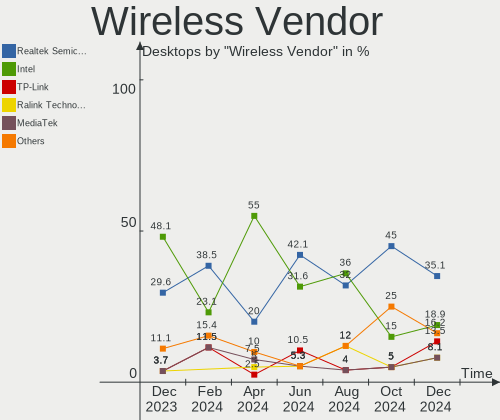

| Vendor                          | Desktops | Percent |
|---------------------------------|----------|---------|
| Intel                           | 9        | 25.71%  |
| Realtek Semiconductor           | 8        | 22.86%  |
| TP-Link                         | 4        | 11.43%  |
| Qualcomm Atheros                | 4        | 11.43%  |
| MediaTek                        | 4        | 11.43%  |
| Ralink Technology               | 2        | 5.71%   |
| Ralink                          | 1        | 2.86%   |
| Qualcomm Atheros Communications | 1        | 2.86%   |
| Microsoft                       | 1        | 2.86%   |
| Edimax Technology               | 1        | 2.86%   |

Wireless Model
--------------

Wireless models

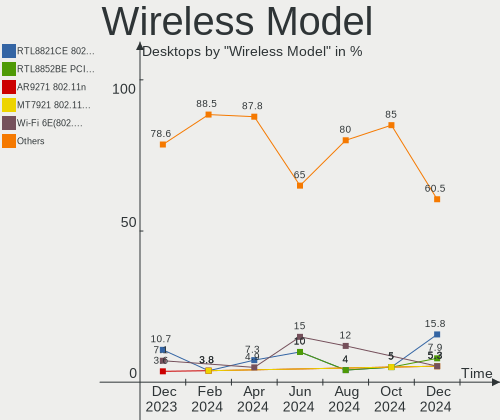

| Model                                                                         | Desktops | Percent |
|-------------------------------------------------------------------------------|----------|---------|
| Intel Wi-Fi 6 AX200                                                           | 4        | 11.43%  |
| MediaTek MT7922 802.11ax PCI Express Wireless Network Adapter                 | 3        | 8.57%   |
| TP-Link TL-WN823N v2/v3 [Realtek RTL8192EU]                                   | 2        | 5.71%   |
| Realtek RTL8812AE 802.11ac PCIe Wireless Network Adapter                      | 2        | 5.71%   |
| Realtek RTL8192EE PCIe Wireless Network Adapter                               | 2        | 5.71%   |
| Qualcomm Atheros AR9485 Wireless Network Adapter                              | 2        | 5.71%   |
| Intel Wireless 3165                                                           | 2        | 5.71%   |
| TP-Link AC600 wireless Realtek RTL8811AU [Archer T2U Nano]                    | 1        | 2.86%   |
| TP-Link 802.11ac NIC                                                          | 1        | 2.86%   |
| Realtek RTL8821CE 802.11ac PCIe Wireless Network Adapter                      | 1        | 2.86%   |
| Realtek RTL8821AE 802.11ac PCIe Wireless Network Adapter                      | 1        | 2.86%   |
| Realtek RTL8192CU 802.11n WLAN Adapter                                        | 1        | 2.86%   |
| Realtek 802.11ac NIC                                                          | 1        | 2.86%   |
| Ralink MT7610U ("Archer T2U" 2.4G+5G WLAN Adapter                             | 1        | 2.86%   |
| Ralink MT7601U Wireless Adapter                                               | 1        | 2.86%   |
| Ralink RT5390 Wireless 802.11n 1T/1R PCIe                                     | 1        | 2.86%   |
| Qualcomm Atheros TP-Link TL-WN322G v3 / TL-WN422G v2 802.11g [Atheros AR9271] | 1        | 2.86%   |
| Qualcomm Atheros AR93xx Wireless Network Adapter                              | 1        | 2.86%   |
| Qualcomm Atheros AR9287 Wireless Network Adapter (PCI-Express)                | 1        | 2.86%   |
| Microsoft Xbox 360 Wireless Adapter                                           | 1        | 2.86%   |
| MediaTek MT7921 802.11ax PCI Express Wireless Network Adapter                 | 1        | 2.86%   |
| Intel Wireless 8265 / 8275                                                    | 1        | 2.86%   |
| Intel Wi-Fi 6 AX210/AX211/AX411 160MHz                                        | 1        | 2.86%   |
| Intel 700 Series Chipset Family Wi-Fi                                         | 1        | 2.86%   |
| Edimax AC600 USB                                                              | 1        | 2.86%   |

Ethernet Vendor
---------------

Ethernet vendors

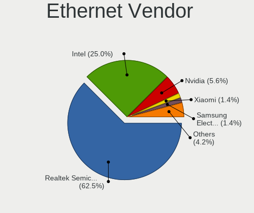

| Vendor                | Desktops | Percent |
|-----------------------|----------|---------|
| Realtek Semiconductor | 36       | 60%     |
| Intel                 | 19       | 31.67%  |
| Qualcomm Atheros      | 1        | 1.67%   |
| Nvidia                | 1        | 1.67%   |
| Huawei Technologies   | 1        | 1.67%   |
| Broadcom              | 1        | 1.67%   |
| ASIX Electronics      | 1        | 1.67%   |

Ethernet Model
--------------

Ethernet models

| Model                                                             | Desktops | Percent |
|-------------------------------------------------------------------|----------|---------|
| Realtek RTL8111/8168/8411 PCI Express Gigabit Ethernet Controller | 29       | 46.77%  |
| Realtek RTL8125 2.5GbE Controller                                 | 7        | 11.29%  |
| Intel Ethernet Controller I225-V                                  | 4        | 6.45%   |
| Intel Ethernet Connection I217-LM                                 | 3        | 4.84%   |
| Realtek RTL810xE PCI Express Fast Ethernet controller             | 2        | 3.23%   |
| Intel I211 Gigabit Network Connection                             | 2        | 3.23%   |
| Intel 82579LM Gigabit Network Connection (Lewisville)             | 2        | 3.23%   |
| Qualcomm Atheros Killer E2400 Gigabit Ethernet Controller         | 1        | 1.61%   |
| Nvidia MCP77 Ethernet                                             | 1        | 1.61%   |
| Intel I210 Gigabit Network Connection                             | 1        | 1.61%   |
| Intel Ethernet Controller I226-V                                  | 1        | 1.61%   |
| Intel Ethernet Connection I217-V                                  | 1        | 1.61%   |
| Intel Ethernet Connection (5) I219-LM                             | 1        | 1.61%   |
| Intel Ethernet Connection (2) I219-V                              | 1        | 1.61%   |
| Intel Ethernet Connection (14) I219-V                             | 1        | 1.61%   |
| Intel Ethernet Connection (11) I219-V                             | 1        | 1.61%   |
| Intel 82579V Gigabit Network Connection                           | 1        | 1.61%   |
| Huawei LLD-L21                                                    | 1        | 1.61%   |
| Broadcom NetXtreme BCM5754 Gigabit Ethernet PCI Express           | 1        | 1.61%   |
| ASIX AX88179 Gigabit Ethernet                                     | 1        | 1.61%   |

Net Controller Kind
-------------------

Ethernet, WiFi or modem

| Kind     | Desktops | Percent |
|----------|----------|---------|
| Ethernet | 57       | 64.04%  |
| WiFi     | 31       | 34.83%  |
| Modem    | 1        | 1.12%   |

Used Controller
---------------

Currently used network controller

| Kind     | Desktops | Percent |
|----------|----------|---------|
| Ethernet | 46       | 75.41%  |
| WiFi     | 15       | 24.59%  |

NICs
----

Total network controllers on board

| Total | Desktops | Percent |
|-------|----------|---------|
| 1     | 31       | 54.39%  |
| 2     | 24       | 42.11%  |
| 4     | 1        | 1.75%   |
| 3     | 1        | 1.75%   |

IPv6
----

IPv6 vs IPv4

| Used | Desktops | Percent |
|------|----------|---------|
| No   | 53       | 92.98%  |
| Yes  | 4        | 7.02%   |

Bluetooth
---------

Bluetooth Vendor
----------------

Controller vendors

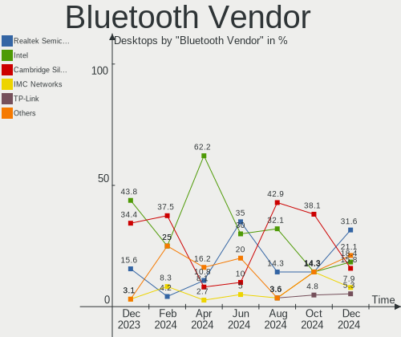

| Vendor                  | Desktops | Percent |
|-------------------------|----------|---------|
| Intel                   | 9        | 34.62%  |
| Cambridge Silicon Radio | 6        | 23.08%  |
| Realtek Semiconductor   | 3        | 11.54%  |
| IMC Networks            | 2        | 7.69%   |
| Foxconn / Hon Hai       | 2        | 7.69%   |
| Broadcom                | 2        | 7.69%   |
| MediaTek                | 1        | 3.85%   |
| Actions                 | 1        | 3.85%   |

Bluetooth Model
---------------

Controller models

| Model                                               | Desktops | Percent |
|-----------------------------------------------------|----------|---------|
| Cambridge Silicon Radio Bluetooth Dongle (HCI mode) | 6        | 23.08%  |
| Intel AX200 Bluetooth                               | 4        | 15.38%  |
| Realtek Bluetooth Radio                             | 3        | 11.54%  |
| Intel Bluetooth wireless interface                  | 3        | 11.54%  |
| MediaTek Wireless_Device                            | 1        | 3.85%   |
| Intel Bluetooth Device                              | 1        | 3.85%   |
| Intel AX210 Bluetooth                               | 1        | 3.85%   |
| IMC Networks Wireless_Device                        | 1        | 3.85%   |
| IMC Networks Bluetooth Radio                        | 1        | 3.85%   |
| Foxconn / Hon Hai Wireless_Device                   | 1        | 3.85%   |
| Foxconn / Hon Hai MediaTek Bluetooth Adapter        | 1        | 3.85%   |
| Broadcom Bluetooth 3.0 USB Dongle                   | 1        | 3.85%   |
| Broadcom BCM20702A0 Bluetooth 4.0                   | 1        | 3.85%   |
| Actions general adapter                             | 1        | 3.85%   |

Sound
-----

Sound Vendor
------------

Sound card vendors

| Vendor                   | Desktops | Percent |
|--------------------------|----------|---------|
| Intel                    | 37       | 37.37%  |
| Nvidia                   | 25       | 25.25%  |
| AMD                      | 23       | 23.23%  |
| ASUSTek Computer         | 2        | 2.02%   |
| SteelSeries ApS          | 1        | 1.01%   |
| Micro Star International | 1        | 1.01%   |
| Logitech                 | 1        | 1.01%   |
| JMTek                    | 1        | 1.01%   |
| Generalplus Technology   | 1        | 1.01%   |
| FIFINE Microphones       | 1        | 1.01%   |
| Creative Technology      | 1        | 1.01%   |
| Creative Labs            | 1        | 1.01%   |
| Corsair                  | 1        | 1.01%   |
| C-Media Electronics      | 1        | 1.01%   |
| BEHRINGER International  | 1        | 1.01%   |
| Asahi Kasei Microsystems | 1        | 1.01%   |

Sound Model
-----------

Sound card models

| Model                                                                      | Desktops | Percent |
|----------------------------------------------------------------------------|----------|---------|
| AMD Starship/Matisse HD Audio Controller                                   | 8        | 7.02%   |
| Nvidia GK208 HDMI/DP Audio Controller                                      | 5        | 4.39%   |
| Intel 8 Series/C220 Series Chipset High Definition Audio Controller        | 5        | 4.39%   |
| AMD Family 17h/19h HD Audio Controller                                     | 5        | 4.39%   |
| Intel Xeon E3-1200 v3/4th Gen Core Processor HD Audio Controller           | 4        | 3.51%   |
| Intel 6 Series/C200 Series Chipset Family High Definition Audio Controller | 4        | 3.51%   |
| AMD Navi 21/23 HDMI/DP Audio Controller                                    | 4        | 3.51%   |
| Nvidia High Definition Audio Controller                                    | 3        | 2.63%   |
| Nvidia GP108 High Definition Audio Controller                              | 3        | 2.63%   |
| Nvidia GA104 High Definition Audio Controller                              | 3        | 2.63%   |
| Intel NM10/ICH7 Family High Definition Audio Controller                    | 3        | 2.63%   |
| Intel C610/X99 series chipset HD Audio Controller                          | 3        | 2.63%   |
| Intel 100 Series/C230 Series Chipset Family HD Audio Controller            | 3        | 2.63%   |
| AMD Rembrandt Radeon High Definition Audio Controller                      | 3        | 2.63%   |
| AMD Ellesmere HDMI Audio [Radeon RX 470/480 / 570/580/590]                 | 3        | 2.63%   |
| Nvidia TU104 HD Audio Controller                                           | 2        | 1.75%   |
| Nvidia GP106 High Definition Audio Controller                              | 2        | 1.75%   |
| Intel Smart Sound Technology (SST) Audio Controller                        | 2        | 1.75%   |
| Intel Cannon Lake PCH cAVS                                                 | 2        | 1.75%   |
| Intel 7 Series/C216 Chipset Family High Definition Audio Controller        | 2        | 1.75%   |
| Intel 200 Series PCH HD Audio                                              | 2        | 1.75%   |
| ASUSTek Computer USB Audio                                                 | 2        | 1.75%   |
| AMD SBx00 Azalia (Intel HDA)                                               | 2        | 1.75%   |
| AMD Raven/Raven2/Fenghuang HDMI/DP Audio Controller                        | 2        | 1.75%   |
| AMD Family 17h (Models 00h-0fh) HD Audio Controller                        | 2        | 1.75%   |
| SteelSeries ApS Arctis 7 wireless adapter                                  | 1        | 0.88%   |
| Nvidia TU106 High Definition Audio Controller                              | 1        | 0.88%   |
| Nvidia MCP72XE/MCP72P/MCP78U/MCP78S High Definition Audio                  | 1        | 0.88%   |
| Nvidia GP107GL High Definition Audio Controller                            | 1        | 0.88%   |
| Nvidia GP102 HDMI Audio Controller                                         | 1        | 0.88%   |
| Nvidia GM107 High Definition Audio Controller [GeForce 940MX]              | 1        | 0.88%   |
| Nvidia GK107 HDMI Audio Controller                                         | 1        | 0.88%   |
| Nvidia GF116 High Definition Audio Controller                              | 1        | 0.88%   |
| Nvidia GF108 High Definition Audio Controller                              | 1        | 0.88%   |
| Micro Star International USB Audio                                         | 1        | 0.88%   |
| Logitech G535 Wireless Gaming Headset                                      | 1        | 0.88%   |
| JMTek Sharkoon 7.1 Sound Extension                                         | 1        | 0.88%   |
| Intel Tiger Lake-H HD Audio Controller                                     | 1        | 0.88%   |
| Intel Jasper Lake HD Audio                                                 | 1        | 0.88%   |
| Intel Comet Lake PCH-V cAVS                                                | 1        | 0.88%   |

Memory
------

Memory Vendor
-------------

Memory module vendors

| Vendor              | Desktops | Percent |
|---------------------|----------|---------|
| Kingston            | 11       | 29.73%  |
| Crucial             | 7        | 18.92%  |
| Corsair             | 6        | 16.22%  |
| Samsung Electronics | 5        | 13.51%  |
| Unknown             | 2        | 5.41%   |
| Micron Technology   | 2        | 5.41%   |
| G.Skill             | 2        | 5.41%   |
| Unknown (ABCD)      | 1        | 2.7%    |
| SK hynix            | 1        | 2.7%    |

Memory Model
------------

Memory module models

| Model                                                          | Desktops | Percent |
|----------------------------------------------------------------|----------|---------|
| Unknown RAM Module 4GB DIMM SDRAM                              | 1        | 2.27%   |
| Unknown RAM Module 4GB DIMM 1600MT/s                           | 1        | 2.27%   |
| Unknown RAM Module 1GB DIMM 1600MT/s                           | 1        | 2.27%   |
| Unknown (ABCD) RAM 123456789012345678 2GB DIMM LPDDR4 2400MT/s | 1        | 2.27%   |
| SK hynix RAM HMT351U6EFR8C-PB 4GB DIMM DDR3 1800MT/s           | 1        | 2.27%   |
| Samsung RAM M471A2K43CB1-CTD 16GB SODIMM DDR4 8400MT/s         | 1        | 2.27%   |
| Samsung RAM M471A1K43CB1-CTD 8GB SODIMM DDR4 2667MT/s          | 1        | 2.27%   |
| Samsung RAM M471A1K43BB1-CRC 8GB SODIMM DDR4 2667MT/s          | 1        | 2.27%   |
| Samsung RAM M378B5673FH0-CH9 2GB DIMM DDR3 1600MT/s            | 1        | 2.27%   |
| Samsung RAM M378A1K43EB2-CWE 8GB DIMM DDR4 3200MT/s            | 1        | 2.27%   |
| Samsung RAM M378A1K43CB2-CTD 8GB DIMM DDR4 3266MT/s            | 1        | 2.27%   |
| Micron RAM 8JTF25664AZ-1G6M1 2GB DIMM DDR3 1600MT/s            | 1        | 2.27%   |
| Micron RAM 8HTF12864AY-800G1 1GB DIMM DDR2 800MT/s             | 1        | 2.27%   |
| Kingston RAM KHX3200C16D4/8GX 8GB DIMM DDR4 3600MT/s           | 1        | 2.27%   |
| Kingston RAM KHX3200C16D4/16GX 16GB DIMM DDR4 3600MT/s         | 1        | 2.27%   |
| Kingston RAM KHX2666C16/16G 16GB DIMM DDR4 3200MT/s            | 1        | 2.27%   |
| Kingston RAM KHX2666C15D4/8G 8GB DIMM DDR4 3200MT/s            | 1        | 2.27%   |
| Kingston RAM KHX2133C14/16G 16384MB DIMM DDR4 2176MT/s         | 1        | 2.27%   |
| Kingston RAM KHX1600C10D3/8G 8GB DIMM DDR3 1600MT/s            | 1        | 2.27%   |
| Kingston RAM KHX1600C10D3/4G 4GB DIMM DDR3 1866MT/s            | 1        | 2.27%   |
| Kingston RAM KF548C38-32 32GB DIMM DDR5 4800MT/s               | 1        | 2.27%   |
| Kingston RAM KF3200C16D4/8GX 8GB DIMM DDR4 3600MT/s            | 1        | 2.27%   |
| Kingston RAM KF3200C16D4/32GX 32GB DIMM DDR4 3933MT/s          | 1        | 2.27%   |
| Kingston RAM KF3200C16D4/16GX 16GB DIMM DDR4 3200MT/s          | 1        | 2.27%   |
| Kingston RAM 99U5469-046.A00LF 8GB DIMM DDR3 1600MT/s          | 1        | 2.27%   |
| Kingston RAM 9905743-045.A00G 16384MB DIMM DDR4 2667MT/s       | 1        | 2.27%   |
| Kingston RAM 9905678-027.A00G 8GB DIMM DDR4 2133MT/s           | 1        | 2.27%   |
| Kingston RAM 9905403-181.A00LF 4GB DIMM DDR3 2200MT/s          | 1        | 2.27%   |
| G.Skill RAM F4-3200C16-8GTZRX 8GB DIMM DDR4 3200MT/s           | 1        | 2.27%   |
| G.Skill RAM F4-2400C15-16GVR 16GB DIMM DDR4 2400MT/s           | 1        | 2.27%   |
| Crucial RAM CT8G4DFS824A.M8FH 8GB DIMM DDR4 2400MT/s           | 1        | 2.27%   |
| Crucial RAM CT8G4DFS824A.C8FDD1 8192MB DIMM DDR4 3200MT/s      | 1        | 2.27%   |
| Crucial RAM CT8G4DFRA32A.C8FN 8GB DIMM DDR4 3200MT/s           | 1        | 2.27%   |
| Crucial RAM CT51264BA160BJ.C8 4GB DIMM DDR3 1600MT/s           | 1        | 2.27%   |
| Crucial RAM CT51264BA160B.C16F 4GB DIMM DDR3 1600MT/s          | 1        | 2.27%   |
| Crucial RAM CT16G4DFD824A.M16FR 16GB DIMM DDR4 2400MT/s        | 1        | 2.27%   |
| Crucial RAM BLS8G4D32AESCK.M8FE 8GB DIMM DDR4 3200MT/s         | 1        | 2.27%   |
| Crucial RAM BL8G32C16U4WL.M8FE 8GB DIMM DDR4 3200MT/s          | 1        | 2.27%   |
| Corsair RAM CMV8GX4M1A2133C15 8GB DIMM DDR4 2733MT/s           | 1        | 2.27%   |
| Corsair RAM CMK64GX5M2B5200Z40 32GB DIMM 4800MT/s              | 1        | 2.27%   |

Memory Kind
-----------

Memory module kinds

| Kind    | Desktops | Percent |
|---------|----------|---------|
| DDR4    | 22       | 64.71%  |
| DDR3    | 4        | 11.76%  |
| DDR5    | 3        | 8.82%   |
| SDRAM   | 2        | 5.88%   |
| LPDDR4  | 1        | 2.94%   |
| DDR2    | 1        | 2.94%   |
| Unknown | 1        | 2.94%   |

Memory Form Factor
------------------

Physical design of the memory module

| Name   | Desktops | Percent |
|--------|----------|---------|
| DIMM   | 32       | 94.12%  |
| SODIMM | 2        | 5.88%   |

Memory Size
-----------

Memory module size

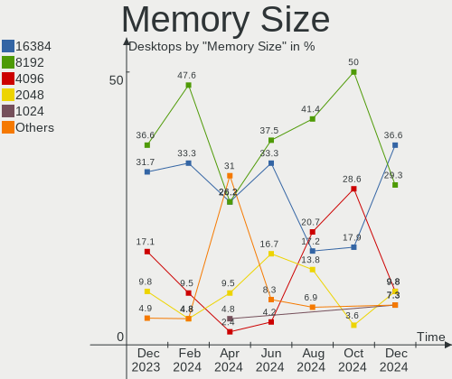

| Size  | Desktops | Percent |
|-------|----------|---------|
| 8192  | 17       | 44.74%  |
| 16384 | 10       | 26.32%  |
| 32768 | 4        | 10.53%  |
| 4096  | 4        | 10.53%  |
| 1024  | 2        | 5.26%   |
| 2048  | 1        | 2.63%   |

Memory Speed
------------

Memory module speed

| Speed   | Desktops | Percent |
|---------|----------|---------|
| 3200    | 9        | 23.08%  |
| 1600    | 5        | 12.82%  |
| 2400    | 4        | 10.26%  |
| 4800    | 3        | 7.69%   |
| 3600    | 3        | 7.69%   |
| 2667    | 2        | 5.13%   |
| 8400    | 1        | 2.56%   |
| 3933    | 1        | 2.56%   |
| 3533    | 1        | 2.56%   |
| 3266    | 1        | 2.56%   |
| 2733    | 1        | 2.56%   |
| 2200    | 1        | 2.56%   |
| 2176    | 1        | 2.56%   |
| 2133    | 1        | 2.56%   |
| 1867    | 1        | 2.56%   |
| 1866    | 1        | 2.56%   |
| 1800    | 1        | 2.56%   |
| 800     | 1        | 2.56%   |
| Unknown | 1        | 2.56%   |

Printers & scanners
-------------------

Printer Vendor
--------------

Printer device vendors

| Vendor          | Desktops | Percent |
|-----------------|----------|---------|
| Hewlett-Packard | 2        | 100%    |

Printer Model
-------------

Printer device models

| Model                  | Desktops | Percent |
|------------------------|----------|---------|
| HP ENVY 5000 series    | 1        | 50%     |
| HP DeskJet 3630 series | 1        | 50%     |

Scanner Vendor
--------------

Scanner device vendors

Zero info for selected period =(

Scanner Model
-------------

Scanner device models

Zero info for selected period =(

Camera
------

Camera Vendor
-------------

Camera device vendors

| Vendor                 | Desktops | Percent |
|------------------------|----------|---------|
| Microdia               | 4        | 40%     |
| Logitech               | 2        | 20%     |
| Owon                   | 1        | 10%     |
| Generalplus Technology | 1        | 10%     |
| Creative Technology    | 1        | 10%     |
| 2M UVC CAMERA          | 1        | 10%     |

Camera Model
------------

Camera device models

| Model                                       | Desktops | Percent |
|---------------------------------------------|----------|---------|
| Microdia Webcam Vitade AF                   | 2        | 20%     |
| Owon USB CAMERA                             | 1        | 10%     |
| Microdia REDRAGON Live Camera Audio         | 1        | 10%     |
| Microdia Defender G-Lens 2577 HD720p Camera | 1        | 10%     |
| Logitech Webcam C170                        | 1        | 10%     |
| Logitech C920 PRO HD Webcam                 | 1        | 10%     |
| Generalplus GENERAL WEBCAM                  | 1        | 10%     |
| Creative Live! Cam Sync HD [VF0770]         | 1        | 10%     |
| 2M UVC CAMERA NexiGo N660 FHD Webcam        | 1        | 10%     |

Security
--------

Fingerprint Vendor
------------------

Fingerprint sensor vendors

Zero info for selected period =(

Fingerprint Model
-----------------

Fingerprint sensor models

Zero info for selected period =(

Chipcard Vendor
---------------

Chipcard module vendors

| Vendor | Desktops | Percent |
|--------|----------|---------|
| C3PO   | 1        | 100%    |

Chipcard Model
--------------

Chipcard module models

| Model        | Desktops | Percent |
|--------------|----------|---------|
| C3PO LTC31v2 | 1        | 100%    |

Unsupported
-----------

Unsupported Devices
-------------------

Total unsupported devices on board

| Total | Desktops | Percent |
|-------|----------|---------|
| 0     | 49       | 85.96%  |
| 1     | 7        | 12.28%  |
| 2     | 1        | 1.75%   |

Unsupported Device Types
------------------------

Types of unsupported devices

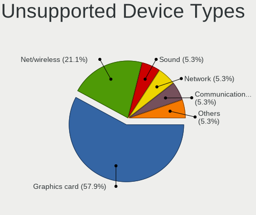

| Type             | Desktops | Percent |
|------------------|----------|---------|
| Unassigned class | 3        | 33.33%  |
| Net/wireless     | 3        | 33.33%  |
| Storage/raid     | 1        | 11.11%  |
| Graphics card    | 1        | 11.11%  |
| Chipcard         | 1        | 11.11%  |

