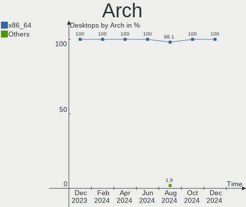
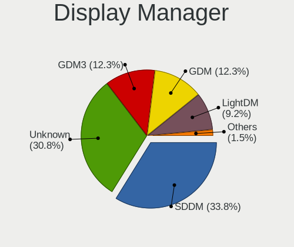
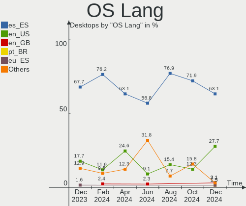
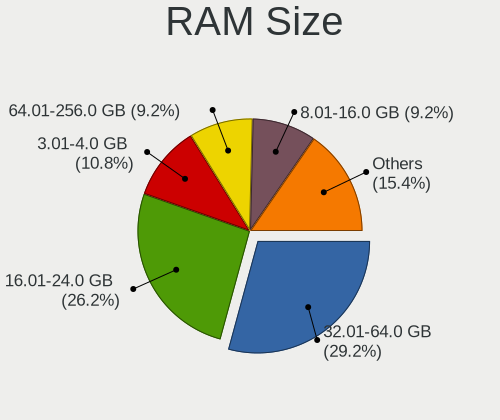
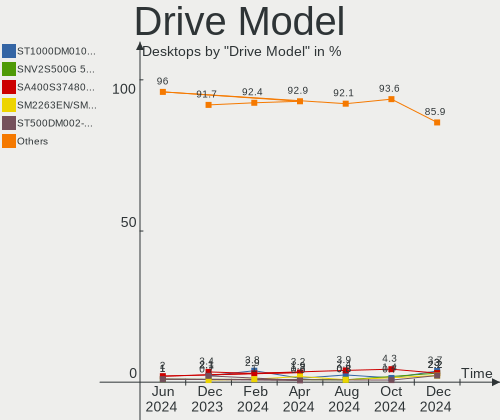
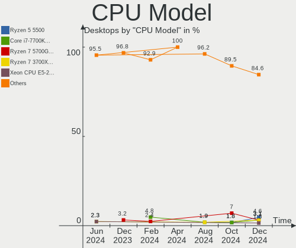
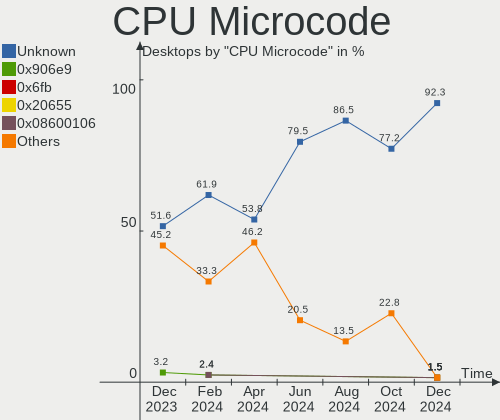
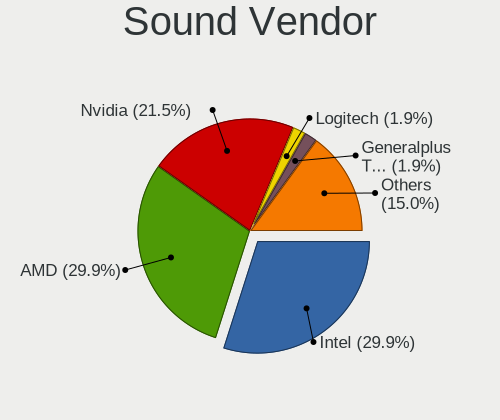
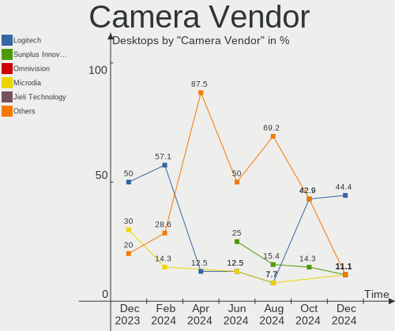

Linux in Spain - Hardware Trends (Desktops)
-------------------------------------------

A project to identify most popular hardware characteristics and track their change
over time based on data collected by Linux users at https://Linux-Hardware.org.

Anyone can contribute to this report by the [hw-probe](https://github.com/linuxhw/hw-probe) tool:

    sudo -E hw-probe -all -upload

Period: Feb, 2023.

Contents
--------

* [ System ](#system)
  - [ OS                       ](#os)
  - [ OS Family                ](#os-family)
  - [ Kernel                   ](#kernel)
  - [ Kernel Family            ](#kernel-family)
  - [ Kernel Major Ver.        ](#kernel-major-ver)
  - [ Arch                     ](#arch)
  - [ DE                       ](#de)
  - [ Display Server           ](#display-server)
  - [ Display Manager          ](#display-manager)
  - [ OS Lang                  ](#os-lang)
  - [ Boot Mode                ](#boot-mode)
  - [ Filesystem               ](#filesystem)
  - [ Part. scheme             ](#part-scheme)
  - [ Dual Boot with Linux/BSD ](#dual-boot-with-linuxbsd)
  - [ Dual Boot (Win)          ](#dual-boot-win)

* [ Board ](#board)
  - [ Vendor                   ](#vendor)
  - [ Model                    ](#model)
  - [ Model Family             ](#model-family)
  - [ MFG Year                 ](#mfg-year)
  - [ Form Factor              ](#form-factor)
  - [ Secure Boot              ](#secure-boot)
  - [ Coreboot                 ](#coreboot)
  - [ RAM Size                 ](#ram-size)
  - [ RAM Used                 ](#ram-used)
  - [ Total Drives             ](#total-drives)
  - [ Has CD-ROM               ](#has-cd-rom)
  - [ Has Ethernet             ](#has-ethernet)
  - [ Has WiFi                 ](#has-wifi)
  - [ Has Bluetooth            ](#has-bluetooth)

* [ Location ](#location)
  - [ Country                  ](#country)
  - [ City                     ](#city)

* [ Drives ](#drives)
  - [ Drive Vendor             ](#drive-vendor)
  - [ Drive Model              ](#drive-model)
  - [ HDD Vendor               ](#hdd-vendor)
  - [ SSD Vendor               ](#ssd-vendor)
  - [ Drive Kind               ](#drive-kind)
  - [ Drive Connector          ](#drive-connector)
  - [ Drive Size               ](#drive-size)
  - [ Space Total              ](#space-total)
  - [ Space Used               ](#space-used)
  - [ Malfunc. Drives          ](#malfunc-drives)
  - [ Malfunc. Drive Vendor    ](#malfunc-drive-vendor)
  - [ Malfunc. HDD Vendor      ](#malfunc-hdd-vendor)
  - [ Malfunc. Drive Kind      ](#malfunc-drive-kind)
  - [ Failed Drives            ](#failed-drives)
  - [ Failed Drive Vendor      ](#failed-drive-vendor)
  - [ Drive Status             ](#drive-status)

* [ Storage controller ](#storage-controller)
  - [ Storage Vendor           ](#storage-vendor)
  - [ Storage Model            ](#storage-model)
  - [ Storage Kind             ](#storage-kind)

* [ Processor ](#processor)
  - [ CPU Vendor               ](#cpu-vendor)
  - [ CPU Model                ](#cpu-model)
  - [ CPU Model Family         ](#cpu-model-family)
  - [ CPU Cores                ](#cpu-cores)
  - [ CPU Sockets              ](#cpu-sockets)
  - [ CPU Threads              ](#cpu-threads)
  - [ CPU Op-Modes             ](#cpu-op-modes)
  - [ CPU Microcode            ](#cpu-microcode)
  - [ CPU Microarch            ](#cpu-microarch)

* [ Graphics ](#graphics)
  - [ GPU Vendor               ](#gpu-vendor)
  - [ GPU Model                ](#gpu-model)
  - [ GPU Combo                ](#gpu-combo)
  - [ GPU Driver               ](#gpu-driver)
  - [ GPU Memory               ](#gpu-memory)

* [ Monitor ](#monitor)
  - [ Monitor Vendor           ](#monitor-vendor)
  - [ Monitor Model            ](#monitor-model)
  - [ Monitor Resolution       ](#monitor-resolution)
  - [ Monitor Diagonal         ](#monitor-diagonal)
  - [ Monitor Width            ](#monitor-width)
  - [ Aspect Ratio             ](#aspect-ratio)
  - [ Monitor Area             ](#monitor-area)
  - [ Pixel Density            ](#pixel-density)
  - [ Multiple Monitors        ](#multiple-monitors)

* [ Network ](#network)
  - [ Net Controller Vendor    ](#net-controller-vendor)
  - [ Net Controller Model     ](#net-controller-model)
  - [ Wireless Vendor          ](#wireless-vendor)
  - [ Wireless Model           ](#wireless-model)
  - [ Ethernet Vendor          ](#ethernet-vendor)
  - [ Ethernet Model           ](#ethernet-model)
  - [ Net Controller Kind      ](#net-controller-kind)
  - [ Used Controller          ](#used-controller)
  - [ NICs                     ](#nics)
  - [ IPv6                     ](#ipv6)

* [ Bluetooth ](#bluetooth)
  - [ Bluetooth Vendor         ](#bluetooth-vendor)
  - [ Bluetooth Model          ](#bluetooth-model)

* [ Sound ](#sound)
  - [ Sound Vendor             ](#sound-vendor)
  - [ Sound Model              ](#sound-model)

* [ Memory ](#memory)
  - [ Memory Vendor            ](#memory-vendor)
  - [ Memory Model             ](#memory-model)
  - [ Memory Kind              ](#memory-kind)
  - [ Memory Form Factor       ](#memory-form-factor)
  - [ Memory Size              ](#memory-size)
  - [ Memory Speed             ](#memory-speed)

* [ Printers & scanners ](#printers--scanners)
  - [ Printer Vendor           ](#printer-vendor)
  - [ Printer Model            ](#printer-model)
  - [ Scanner Vendor           ](#scanner-vendor)
  - [ Scanner Model            ](#scanner-model)

* [ Camera ](#camera)
  - [ Camera Vendor            ](#camera-vendor)
  - [ Camera Model             ](#camera-model)

* [ Security ](#security)
  - [ Fingerprint Vendor       ](#fingerprint-vendor)
  - [ Fingerprint Model        ](#fingerprint-model)
  - [ Chipcard Vendor          ](#chipcard-vendor)
  - [ Chipcard Model           ](#chipcard-model)

* [ Unsupported ](#unsupported)
  - [ Unsupported Devices      ](#unsupported-devices)
  - [ Unsupported Device Types ](#unsupported-device-types)

System
------

OS
--

Installed operating systems

| Name                         | Desktops | Percent |
|------------------------------|----------|---------|
| Linux Mint 21.1              | 10       | 18.87%  |
| Ubuntu 22.04                 | 7        | 13.21%  |
| OpenMandriva 23.01           | 6        | 11.32%  |
| Debian 11                    | 6        | 11.32%  |
| KDE neon 22.04               | 3        | 5.66%   |
| Ubuntu 20.04                 | 2        | 3.77%   |
| Ubuntu 18.04                 | 2        | 3.77%   |
| Zorin 16                     | 1        | 1.89%   |
| ROSA 12.3                    | 1        | 1.89%   |
| openSUSE Tumbleweed-XXXXXXXX | 1        | 1.89%   |
| MX 19                        | 1        | 1.89%   |
| Manjaro 22.0.4               | 1        | 1.89%   |
| Manjaro                      | 1        | 1.89%   |
| Lubuntu 22.10                | 1        | 1.89%   |
| Linux Mint 20.3              | 1        | 1.89%   |
| KDE neon 20.04               | 1        | 1.89%   |
| Kali 2022.4                  | 1        | 1.89%   |
| Gentoo 2.9                   | 1        | 1.89%   |
| Fedora 37                    | 1        | 1.89%   |
| Elementary 7                 | 1        | 1.89%   |
| Debian                       | 1        | 1.89%   |
| CloudLinux 8.7               | 1        | 1.89%   |
| CentOS 7                     | 1        | 1.89%   |
| Arch Rolling                 | 1        | 1.89%   |

OS Family
---------

OS without a version

| Name         | Desktops | Percent |
|--------------|----------|---------|
| Ubuntu       | 11       | 20.75%  |
| Linux Mint   | 11       | 20.75%  |
| Debian       | 7        | 13.21%  |
| OpenMandriva | 6        | 11.32%  |
| KDE neon     | 4        | 7.55%   |
| Manjaro      | 2        | 3.77%   |
| Zorin        | 1        | 1.89%   |
| ROSA         | 1        | 1.89%   |
| openSUSE     | 1        | 1.89%   |
| MX           | 1        | 1.89%   |
| Lubuntu      | 1        | 1.89%   |
| Kali         | 1        | 1.89%   |
| Gentoo       | 1        | 1.89%   |
| Fedora       | 1        | 1.89%   |
| Elementary   | 1        | 1.89%   |
| CloudLinux   | 1        | 1.89%   |
| CentOS       | 1        | 1.89%   |
| Arch         | 1        | 1.89%   |

Kernel
------

Version of the Linux kernel

| Version                            | Desktops | Percent |
|------------------------------------|----------|---------|
| 5.15.0-60-generic                  | 12       | 22.64%  |
| 5.15.0-58-generic                  | 6        | 11.32%  |
| 5.19.0-32-generic                  | 4        | 7.55%   |
| 6.1.1-desktop-1omv2290             | 3        | 5.66%   |
| 6.1.4-desktop-1omv2301             | 2        | 3.77%   |
| 5.4.0-137-generic                  | 2        | 3.77%   |
| 5.10.0-21-amd64                    | 2        | 3.77%   |
| 6.2.1-desktop-1omv2390             | 1        | 1.89%   |
| 6.1.9-200.fc37.x86_64              | 1        | 1.89%   |
| 6.1.9-1-MANJARO                    | 1        | 1.89%   |
| 6.1.12-1-MANJARO                   | 1        | 1.89%   |
| 6.1.11-zen1-1-zen                  | 1        | 1.89%   |
| 6.1.10-1-default                   | 1        | 1.89%   |
| 6.1.0-3-amd64                      | 1        | 1.89%   |
| 6.0.0-kali6-amd64                  | 1        | 1.89%   |
| 5.4.0-139-generic                  | 1        | 1.89%   |
| 5.4.0-113-generic                  | 1        | 1.89%   |
| 5.19.17-051917-generic             | 1        | 1.89%   |
| 5.19.0-29-generic                  | 1        | 1.89%   |
| 5.16.0-0.bpo.4-amd64               | 1        | 1.89%   |
| 5.15.88-gentoo-x86_64              | 1        | 1.89%   |
| 5.15.75-generic-1rosa2021.1-x86_64 | 1        | 1.89%   |
| 5.15.74-1-pve                      | 1        | 1.89%   |
| 5.15.0-56-generic                  | 1        | 1.89%   |
| 5.10.0-5mx-amd64                   | 1        | 1.89%   |
| 5.10.0-21-686-pae                  | 1        | 1.89%   |
| 5.10.0-18-amd64                    | 1        | 1.89%   |
| 4.18.0-348.20.1.lve.1.el8.x86_64   | 1        | 1.89%   |
| 3.10.0-1160.76.1.el7.x86_64        | 1        | 1.89%   |

Kernel Family
-------------

Linux kernel without a distro release

| Version | Desktops | Percent |
|---------|----------|---------|
| 5.15.0  | 19       | 35.85%  |
| 5.19.0  | 5        | 9.43%   |
| 5.10.0  | 5        | 9.43%   |
| 5.4.0   | 4        | 7.55%   |
| 6.1.1   | 3        | 5.66%   |
| 6.1.9   | 2        | 3.77%   |
| 6.1.4   | 2        | 3.77%   |
| 6.2.1   | 1        | 1.89%   |
| 6.1.12  | 1        | 1.89%   |
| 6.1.11  | 1        | 1.89%   |
| 6.1.10  | 1        | 1.89%   |
| 6.1.0   | 1        | 1.89%   |
| 6.0.0   | 1        | 1.89%   |
| 5.19.17 | 1        | 1.89%   |
| 5.16.0  | 1        | 1.89%   |
| 5.15.88 | 1        | 1.89%   |
| 5.15.75 | 1        | 1.89%   |
| 5.15.74 | 1        | 1.89%   |
| 4.18.0  | 1        | 1.89%   |
| 3.10.0  | 1        | 1.89%   |

Kernel Major Ver.
-----------------

Linux kernel major version

| Version | Desktops | Percent |
|---------|----------|---------|
| 5.15    | 22       | 41.51%  |
| 6.1     | 11       | 20.75%  |
| 5.19    | 6        | 11.32%  |
| 5.10    | 5        | 9.43%   |
| 5.4     | 4        | 7.55%   |
| 6.2     | 1        | 1.89%   |
| 6.0     | 1        | 1.89%   |
| 5.16    | 1        | 1.89%   |
| 4.18    | 1        | 1.89%   |
| 3.10    | 1        | 1.89%   |

Arch
----

OS architecture (x86_64, i586, etc.)

| Name   | Desktops | Percent |
|--------|----------|---------|
| x86_64 | 52       | 98.11%  |
| i686   | 1        | 1.89%   |

DE
--

Desktop Environment

| Name       | Desktops | Percent |
|------------|----------|---------|
| GNOME      | 19       | 35.85%  |
| KDE5       | 12       | 22.64%  |
| X-Cinnamon | 10       | 18.87%  |
| XFCE       | 5        | 9.43%   |
| Unknown    | 4        | 7.55%   |
| Pantheon   | 1        | 1.89%   |
| LXQt       | 1        | 1.89%   |
| i3         | 1        | 1.89%   |

Display Server
--------------

X11 or Wayland

| Name    | Desktops | Percent |
|---------|----------|---------|
| X11     | 35       | 66.04%  |
| Wayland | 12       | 22.64%  |
| Tty     | 5        | 9.43%   |
| Unknown | 1        | 1.89%   |

Display Manager
---------------

SDDM, LightDM, etc.

| Name    | Desktops | Percent |
|---------|----------|---------|
| Unknown | 22       | 41.51%  |
| GDM3    | 11       | 20.75%  |
| SDDM    | 10       | 18.87%  |
| LightDM | 5        | 9.43%   |
| GDM     | 4        | 7.55%   |
| LXDM    | 1        | 1.89%   |

OS Lang
-------

Language

| Lang             | Desktops | Percent |
|------------------|----------|---------|
| es_ES            | 39       | 73.58%  |
| en_US            | 7        | 13.21%  |
| en_GB            | 2        | 3.77%   |
| es_ES.ISO-8859-1 | 1        | 1.89%   |
| de_DE            | 1        | 1.89%   |
| ca_ES@valencia   | 1        | 1.89%   |
| ca_ES            | 1        | 1.89%   |
| C                | 1        | 1.89%   |

Boot Mode
---------

EFI or BIOS

| Mode | Desktops | Percent |
|------|----------|---------|
| BIOS | 28       | 52.83%  |
| EFI  | 25       | 47.17%  |

Filesystem
----------

Type of filesystem

| Type    | Desktops | Percent |
|---------|----------|---------|
| Ext4    | 41       | 77.36%  |
| Btrfs   | 5        | 9.43%   |
| Xfs     | 4        | 7.55%   |
| Overlay | 3        | 5.66%   |

Part. scheme
------------

Scheme of partitioning

| Type    | Desktops | Percent |
|---------|----------|---------|
| GPT     | 23       | 43.4%   |
| Unknown | 18       | 33.96%  |
| MBR     | 12       | 22.64%  |

Dual Boot with Linux/BSD
------------------------

Hosting more than one Linux/BSD

| Dual boot | Desktops | Percent |
|-----------|----------|---------|
| No        | 41       | 77.36%  |
| Yes       | 12       | 22.64%  |

Dual Boot (Win)
---------------

Hosting Linux and Windows

| Dual boot | Desktops | Percent |
|-----------|----------|---------|
| No        | 41       | 77.36%  |
| Yes       | 12       | 22.64%  |

Board
-----

Vendor
------

Motherboard manufacturer

| Name                                 | Desktops | Percent |
|--------------------------------------|----------|---------|
| ASUSTek Computer                     | 14       | 26.42%  |
| Gigabyte Technology                  | 10       | 18.87%  |
| MSI                                  | 5        | 9.43%   |
| Lenovo                               | 3        | 5.66%   |
| Hewlett-Packard                      | 3        | 5.66%   |
| Dell                                 | 3        | 5.66%   |
| Supermicro                           | 2        | 3.77%   |
| Intel                                | 2        | 3.77%   |
| BESSTAR Tech                         | 2        | 3.77%   |
| ASRock                               | 2        | 3.77%   |
| Acer                                 | 2        | 3.77%   |
| SLIMBOOK                             | 1        | 1.89%   |
| Shenzhen Meigao Electronic Equipment | 1        | 1.89%   |
| Cisco Systems                        | 1        | 1.89%   |
| AMI                                  | 1        | 1.89%   |
| Unknown                              | 1        | 1.89%   |

Model
-----

Motherboard model

| Name                                        | Desktops | Percent |
|---------------------------------------------|----------|---------|
| Gigabyte H81M-S2H                           | 2        | 3.77%   |
| BESSTAR Tech B550                           | 2        | 3.77%   |
| ASUS AT4NM10T-I                             | 2        | 3.77%   |
| Supermicro SYS-6017B-MTF                    | 1        | 1.89%   |
| Supermicro AS -1024US-TRT                   | 1        | 1.89%   |
| SLIMBOOK ONE-AMD-M4                         | 1        | 1.89%   |
| Shenzhen Meigao Electronic Equipment UM690  | 1        | 1.89%   |
| MSI MS-7C84                                 | 1        | 1.89%   |
| MSI MS-7B93                                 | 1        | 1.89%   |
| MSI MS-7B61                                 | 1        | 1.89%   |
| MSI MS-7A72                                 | 1        | 1.89%   |
| MSI MS-7A62 mod by 10729.com                | 1        | 1.89%   |
| Lenovo ThinkCentre M93p 10A8S3UN00          | 1        | 1.89%   |
| Lenovo ThinkCentre M700 10J0S3UA00          | 1        | 1.89%   |
| Lenovo IdeaCentre Gaming5 17IAB7 90T10077ES | 1        | 1.89%   |
| Intel X79M-S                                | 1        | 1.89%   |
| Intel DH77DF AAG40293-301                   | 1        | 1.89%   |
| HP ProLiant ML110 G7                        | 1        | 1.89%   |
| HP ProDesk 600 G2 SFF                       | 1        | 1.89%   |
| HP Compaq dc7800 Small Form Factor          | 1        | 1.89%   |
| Gigabyte P31-ES3G                           | 1        | 1.89%   |
| Gigabyte H77-DS3H                           | 1        | 1.89%   |
| Gigabyte H61MA-D2V                          | 1        | 1.89%   |
| Gigabyte G41MT-D3V                          | 1        | 1.89%   |
| Gigabyte F2A88XM-DS2                        | 1        | 1.89%   |
| Gigabyte B550M AORUS ELITE                  | 1        | 1.89%   |
| Gigabyte B450M S2H                          | 1        | 1.89%   |
| Gigabyte B450M DS3H                         | 1        | 1.89%   |
| Dell OptiPlex 780                           | 1        | 1.89%   |
| Dell OptiPlex 3020                          | 1        | 1.89%   |
| Dell OptiPlex 3010                          | 1        | 1.89%   |
| Cisco Systems UCSC-C220-M3SBE               | 1        | 1.89%   |
| ASUS Z170-A                                 | 1        | 1.89%   |
| ASUS TUF B450-PLUS GAMING                   | 1        | 1.89%   |
| ASUS ROG STRIX X570-E GAMING                | 1        | 1.89%   |
| ASUS ROG STRIX B365-G GAMING                | 1        | 1.89%   |
| ASUS ROG Maximus Z690 FORMULA               | 1        | 1.89%   |
| ASUS PRIME Z590-A                           | 1        | 1.89%   |
| ASUS PRIME B660M-A WIFI D4                  | 1        | 1.89%   |
| ASUS P8H61-M LX3 PLUS                       | 1        | 1.89%   |

Model Family
------------

Motherboard model prefix

| Name                                       | Desktops | Percent |
|--------------------------------------------|----------|---------|
| Dell OptiPlex                              | 3        | 5.66%   |
| ASUS ROG                                   | 3        | 5.66%   |
| Lenovo ThinkCentre                         | 2        | 3.77%   |
| Gigabyte H81M-S2H                          | 2        | 3.77%   |
| Gigabyte B450M                             | 2        | 3.77%   |
| BESSTAR Tech B550                          | 2        | 3.77%   |
| ASUS PRIME                                 | 2        | 3.77%   |
| ASUS AT4NM10T-I                            | 2        | 3.77%   |
| Acer Aspire                                | 2        | 3.77%   |
| Supermicro SYS-6017B-MTF                   | 1        | 1.89%   |
| Supermicro AS                              | 1        | 1.89%   |
| SLIMBOOK ONE-AMD-M4                        | 1        | 1.89%   |
| Shenzhen Meigao Electronic Equipment UM690 | 1        | 1.89%   |
| MSI MS-7C84                                | 1        | 1.89%   |
| MSI MS-7B93                                | 1        | 1.89%   |
| MSI MS-7B61                                | 1        | 1.89%   |
| MSI MS-7A72                                | 1        | 1.89%   |
| MSI MS-7A62                                | 1        | 1.89%   |
| Lenovo IdeaCentre                          | 1        | 1.89%   |
| Intel X79M-S                               | 1        | 1.89%   |
| Intel DH77DF                               | 1        | 1.89%   |
| HP ProLiant                                | 1        | 1.89%   |
| HP ProDesk                                 | 1        | 1.89%   |
| HP Compaq                                  | 1        | 1.89%   |
| Gigabyte P31-ES3G                          | 1        | 1.89%   |
| Gigabyte H77-DS3H                          | 1        | 1.89%   |
| Gigabyte H61MA-D2V                         | 1        | 1.89%   |
| Gigabyte G41MT-D3V                         | 1        | 1.89%   |
| Gigabyte F2A88XM-DS2                       | 1        | 1.89%   |
| Gigabyte B550M                             | 1        | 1.89%   |
| Cisco Systems UCSC-C220-M3SBE              | 1        | 1.89%   |
| ASUS Z170-A                                | 1        | 1.89%   |
| ASUS TUF                                   | 1        | 1.89%   |
| ASUS P8H61-M                               | 1        | 1.89%   |
| ASUS P5VD2-X                               | 1        | 1.89%   |
| ASUS P5QL                                  | 1        | 1.89%   |
| ASUS M5A78L-M                              | 1        | 1.89%   |
| ASUS H61M-K                                | 1        | 1.89%   |
| ASRock X399                                | 1        | 1.89%   |
| ASRock A320M-HDV                           | 1        | 1.89%   |

MFG Year
--------

Motherboard manufacture year

| Year | Desktops | Percent |
|------|----------|---------|
| 2021 | 6        | 11.32%  |
| 2022 | 5        | 9.43%   |
| 2019 | 5        | 9.43%   |
| 2018 | 5        | 9.43%   |
| 2014 | 5        | 9.43%   |
| 2013 | 5        | 9.43%   |
| 2012 | 4        | 7.55%   |
| 2020 | 3        | 5.66%   |
| 2015 | 3        | 5.66%   |
| 2017 | 2        | 3.77%   |
| 2016 | 2        | 3.77%   |
| 2011 | 2        | 3.77%   |
| 2009 | 2        | 3.77%   |
| 2008 | 2        | 3.77%   |
| 2007 | 1        | 1.89%   |
| 2006 | 1        | 1.89%   |

Form Factor
-----------

Physical design of the computer

| Name    | Desktops | Percent |
|---------|----------|---------|
| Desktop | 53       | 100%    |

Secure Boot
-----------

Enabled or disabled

| State    | Desktops | Percent |
|----------|----------|---------|
| Disabled | 51       | 96.23%  |
| Enabled  | 2        | 3.77%   |

Coreboot
--------

Have coreboot on board

| Used | Desktops | Percent |
|------|----------|---------|
| No   | 53       | 100%    |

RAM Size
--------

Total RAM memory

| Size in GB      | Desktops | Percent |
|-----------------|----------|---------|
| 32.01-64.0      | 15       | 28.3%   |
| 4.01-8.0        | 9        | 16.98%  |
| 3.01-4.0        | 9        | 16.98%  |
| 16.01-24.0      | 9        | 16.98%  |
| 8.01-16.0       | 7        | 13.21%  |
| More than 256.0 | 1        | 1.89%   |
| 24.01-32.0      | 1        | 1.89%   |
| 64.01-256.0     | 1        | 1.89%   |
| 1.01-2.0        | 1        | 1.89%   |

RAM Used
--------

Used RAM memory

| Used GB    | Desktops | Percent |
|------------|----------|---------|
| 1.01-2.0   | 17       | 32.08%  |
| 2.01-3.0   | 13       | 24.53%  |
| 4.01-8.0   | 8        | 15.09%  |
| 3.01-4.0   | 7        | 13.21%  |
| 0.51-1.0   | 3        | 5.66%   |
| 24.01-32.0 | 2        | 3.77%   |
| 0.01-0.5   | 2        | 3.77%   |
| 8.01-16.0  | 1        | 1.89%   |

Total Drives
------------

Number of drives on board

| Drives | Desktops | Percent |
|--------|----------|---------|
| 2      | 18       | 33.96%  |
| 1      | 18       | 33.96%  |
| 4      | 6        | 11.32%  |
| 3      | 4        | 7.55%   |
| 6      | 3        | 5.66%   |
| 5      | 2        | 3.77%   |
| 12     | 1        | 1.89%   |
| 10     | 1        | 1.89%   |

Has CD-ROM
----------

Has CD-ROM on board

| Presented | Desktops | Percent |
|-----------|----------|---------|
| No        | 37       | 69.81%  |
| Yes       | 16       | 30.19%  |

Has Ethernet
------------

Has Ethernet on board

| Presented | Desktops | Percent |
|-----------|----------|---------|
| Yes       | 53       | 100%    |

Has WiFi
--------

Has WiFi module

| Presented | Desktops | Percent |
|-----------|----------|---------|
| No        | 27       | 50.94%  |
| Yes       | 26       | 49.06%  |

Has Bluetooth
-------------

Has Bluetooth module

| Presented | Desktops | Percent |
|-----------|----------|---------|
| No        | 33       | 62.26%  |
| Yes       | 20       | 37.74%  |

Location
--------

Country
-------

Geographic location (country)

| Country | Desktops | Percent |
|---------|----------|---------|
| Spain   | 53       | 100%    |

City
----

Geographic location (city)

| City                     | Desktops | Percent |
|--------------------------|----------|---------|
| Madrid                   | 6        | 11.32%  |
| Barcelona                | 5        | 9.43%   |
| Seville                  | 4        | 7.55%   |
| Valladolid               | 3        | 5.66%   |
| Ponferrada               | 2        | 3.77%   |
| Zujar                    | 1        | 1.89%   |
| Vigo                     | 1        | 1.89%   |
| Vera                     | 1        | 1.89%   |
| Valencia                 | 1        | 1.89%   |
| Simat de la Valldigna    | 1        | 1.89%   |
| Santona                  | 1        | 1.89%   |
| San Jose de la Rinconada | 1        | 1.89%   |
| Sabadell                 | 1        | 1.89%   |
| Retamar                  | 1        | 1.89%   |
| Porto Cristo             | 1        | 1.89%   |
| Oviedo                   | 1        | 1.89%   |
| Noia                     | 1        | 1.89%   |
| Lugo                     | 1        | 1.89%   |
| Los Montesinos           | 1        | 1.89%   |
| León                    | 1        | 1.89%   |
| Leganés                 | 1        | 1.89%   |
| La Rapita                | 1        | 1.89%   |
| Igualada                 | 1        | 1.89%   |
| Guadalajara              | 1        | 1.89%   |
| Granada                  | 1        | 1.89%   |
| Fuenlabrada              | 1        | 1.89%   |
| Elche                    | 1        | 1.89%   |
| El Alamo                 | 1        | 1.89%   |
| Collado Villalba         | 1        | 1.89%   |
| Ciempozuelos             | 1        | 1.89%   |
| Castelló de la Plana    | 1        | 1.89%   |
| Cartagena                | 1        | 1.89%   |
| Bilbao                   | 1        | 1.89%   |
| Badalona                 | 1        | 1.89%   |
| Almería                 | 1        | 1.89%   |
| Alcorcón                | 1        | 1.89%   |
| Alcalá de Henares       | 1        | 1.89%   |
| Alba de Tormes           | 1        | 1.89%   |

Drives
------

Drive Vendor
------------

Hard drive vendors

| Vendor                      | Desktops | Drives | Percent |
|-----------------------------|----------|--------|---------|
| Seagate                     | 21       | 30     | 20.59%  |
| WDC                         | 16       | 18     | 15.69%  |
| Samsung Electronics         | 13       | 20     | 12.75%  |
| Kingston                    | 11       | 11     | 10.78%  |
| Toshiba                     | 7        | 15     | 6.86%   |
| SanDisk                     | 6        | 8      | 5.88%   |
| Crucial                     | 5        | 7      | 4.9%    |
| Hitachi                     | 3        | 3      | 2.94%   |
| China                       | 3        | 3      | 2.94%   |
| Unknown                     | 2        | 2      | 1.96%   |
| Micron/Crucial Technology   | 2        | 3      | 1.96%   |
| KIOXIA                      | 2        | 5      | 1.96%   |
| USB30                       | 1        | 3      | 0.98%   |
| Union Memory (Shenzhen)     | 1        | 1      | 0.98%   |
| Transcend                   | 1        | 1      | 0.98%   |
| SK hynix                    | 1        | 1      | 0.98%   |
| SABRENT                     | 1        | 1      | 0.98%   |
| PNY                         | 1        | 1      | 0.98%   |
| Phison Electronics          | 1        | 1      | 0.98%   |
| OCZ                         | 1        | 1      | 0.98%   |
| Kingston Technology Company | 1        | 1      | 0.98%   |
| Intenso                     | 1        | 2      | 0.98%   |
| Intel                       | 1        | 1      | 0.98%   |

Drive Model
-----------

Hard drive models

| Model                                              | Desktops | Percent |
|----------------------------------------------------|----------|---------|
| Kingston SA400S37240G 240GB SSD                    | 5        | 4.27%   |
| Seagate ST500DM002-1BD142 500GB                    | 3        | 2.56%   |
| Seagate ST3500418AS 500GB                          | 3        | 2.56%   |
| Seagate ST1000DM010-2EP102 1TB                     | 3        | 2.56%   |
| Crucial CT500MX500SSD1 500GB                       | 3        | 2.56%   |
| WDC WD20EARX-00PASB0 2TB                           | 2        | 1.71%   |
| WDC WD10EZRX-00A8LB0 1TB                           | 2        | 1.71%   |
| Toshiba DT01ACA050 500GB                           | 2        | 1.71%   |
| Seagate ST2000LM015-2E8174 2TB                     | 2        | 1.71%   |
| Micron/Crucial P2 NVMe PCIe SSD 1TB                | 2        | 1.71%   |
| Crucial CT480BX500SSD1 480GB                       | 2        | 1.71%   |
| China SSD 64GB                                     | 2        | 1.71%   |
| WDC WDS250G2B0C-00PXH0 250GB                       | 1        | 0.85%   |
| WDC WDS240G2G0A-00JH30 240GB SSD                   | 1        | 0.85%   |
| WDC WDS100T2B0A-00SM50 1TB SSD                     | 1        | 0.85%   |
| WDC WD5000AAKX-75U6AA0 500GB                       | 1        | 0.85%   |
| WDC WD5000AAKX-60U6AA0 500GB                       | 1        | 0.85%   |
| WDC WD5000AAKX-221CA0 500GB                        | 1        | 0.85%   |
| WDC WD5000AAKX-083CA1 500GB                        | 1        | 0.85%   |
| WDC WD5000AAKX-00ERMA0 500GB                       | 1        | 0.85%   |
| WDC WD40EFAX-68JH4N0 4TB                           | 1        | 0.85%   |
| WDC WD400BD-75MRA3 40GB                            | 1        | 0.85%   |
| WDC WD25EZRX-00MMMB0 2TB                           | 1        | 0.85%   |
| WDC WD2500BEVT-22ZCT0 250GB                        | 1        | 0.85%   |
| WDC WD20PURZ-85GU6Y0 2TB                           | 1        | 0.85%   |
| WDC WD20EZRX-00D8PB0 2TB                           | 1        | 0.85%   |
| USB30 Disk 500GB                                   | 1        | 0.85%   |
| Unknown SD/MMC/MS PRO 16GB                         | 1        | 0.85%   |
| Unknown MMC Card  32GB                             | 1        | 0.85%   |
| Union Memory (Shenzhen) UMIS RPETJ512MGE2QDQ 512GB | 1        | 0.85%   |
| Transcend TS1TSSD230S 1TB                          | 1        | 0.85%   |
| Toshiba TR200 480GB SSD                            | 1        | 0.85%   |
| Toshiba MQ04ABD200 2TB                             | 1        | 0.85%   |
| Toshiba HDWR160 6TB                                | 1        | 0.85%   |
| Toshiba HDWD130 3TB                                | 1        | 0.85%   |
| Toshiba HDWD120 2TB                                | 1        | 0.85%   |
| Toshiba DT01ACA100 1TB                             | 1        | 0.85%   |
| SK hynix BC501 NVMe Solid State Drive 512GB        | 1        | 0.85%   |
| Seagate ST9250320AS 250GB                          | 1        | 0.85%   |
| Seagate ST500LM000-SSHD-8GB                        | 1        | 0.85%   |

HDD Vendor
----------

Hard disk drive vendors

| Vendor              | Desktops | Drives | Percent |
|---------------------|----------|--------|---------|
| Seagate             | 21       | 30     | 42%     |
| WDC                 | 14       | 15     | 28%     |
| Toshiba             | 6        | 12     | 12%     |
| Samsung Electronics | 3        | 3      | 6%      |
| Hitachi             | 3        | 3      | 6%      |
| Unknown             | 1        | 1      | 2%      |
| SABRENT             | 1        | 1      | 2%      |
| Intenso             | 1        | 1      | 2%      |

SSD Vendor
----------

Solid state drive vendors

| Vendor              | Desktops | Drives | Percent |
|---------------------|----------|--------|---------|
| Kingston            | 9        | 9      | 24.32%  |
| Samsung Electronics | 7        | 7      | 18.92%  |
| SanDisk             | 5        | 7      | 13.51%  |
| Crucial             | 5        | 6      | 13.51%  |
| China               | 3        | 3      | 8.11%   |
| WDC                 | 2        | 2      | 5.41%   |
| USB30               | 1        | 3      | 2.7%    |
| Transcend           | 1        | 1      | 2.7%    |
| Toshiba             | 1        | 3      | 2.7%    |
| PNY                 | 1        | 1      | 2.7%    |
| OCZ                 | 1        | 1      | 2.7%    |
| Intenso             | 1        | 1      | 2.7%    |

Drive Kind
----------

HDD or SSD

| Kind | Desktops | Drives | Percent |
|------|----------|--------|---------|
| HDD  | 38       | 66     | 45.78%  |
| SSD  | 27       | 44     | 32.53%  |
| NVMe | 17       | 28     | 20.48%  |
| MMC  | 1        | 1      | 1.2%    |

Drive Connector
---------------

SATA, SAS, NVMe, etc.

| Type | Desktops | Drives | Percent |
|------|----------|--------|---------|
| SATA | 46       | 103    | 67.65%  |
| NVMe | 17       | 28     | 25%     |
| SAS  | 4        | 7      | 5.88%   |
| MMC  | 1        | 1      | 1.47%   |

Drive Size
----------

Size of hard drive

| Size in TB | Desktops | Drives | Percent |
|------------|----------|--------|---------|
| 0.01-0.5   | 38       | 65     | 51.35%  |
| 0.51-1.0   | 17       | 18     | 22.97%  |
| 1.01-2.0   | 14       | 20     | 18.92%  |
| 3.01-4.0   | 2        | 2      | 2.7%    |
| 4.01-10.0  | 2        | 3      | 2.7%    |
| 2.01-3.0   | 1        | 2      | 1.35%   |

Space Total
-----------

Amount of disk space available on the file system

| Size in GB     | Desktops | Percent |
|----------------|----------|---------|
| 501-1000       | 13       | 24.53%  |
| 2001-3000      | 9        | 16.98%  |
| 251-500        | 7        | 13.21%  |
| 101-250        | 6        | 11.32%  |
| 1001-2000      | 5        | 9.43%   |
| 51-100         | 4        | 7.55%   |
| More than 3000 | 3        | 5.66%   |
| 1-20           | 3        | 5.66%   |
| 21-50          | 2        | 3.77%   |
| Unknown        | 1        | 1.89%   |

Space Used
----------

Amount of used disk space

| Used GB        | Desktops | Percent |
|----------------|----------|---------|
| 1-20           | 16       | 30.19%  |
| 101-250        | 8        | 15.09%  |
| 21-50          | 7        | 13.21%  |
| 501-1000       | 7        | 13.21%  |
| 51-100         | 6        | 11.32%  |
| 251-500        | 4        | 7.55%   |
| 1001-2000      | 2        | 3.77%   |
| More than 3000 | 1        | 1.89%   |
| 2001-3000      | 1        | 1.89%   |
| Unknown        | 1        | 1.89%   |

Malfunc. Drives
---------------

Drive models with a malfunction

| Model                            | Desktops | Drives | Percent |
|----------------------------------|----------|--------|---------|
| Seagate ST3500418AS 500GB        | 2        | 2      | 13.33%  |
| WDC WD25EZRX-00MMMB0 2TB         | 1        | 1      | 6.67%   |
| WDC WD20PURZ-85GU6Y0 2TB         | 1        | 1      | 6.67%   |
| Transcend TS1TSSD230S 1TB        | 1        | 1      | 6.67%   |
| Toshiba DT01ACA100 1TB           | 1        | 1      | 6.67%   |
| Toshiba DT01ACA050 500GB         | 1        | 1      | 6.67%   |
| Seagate ST5000LM000-2AN170 5TB   | 1        | 2      | 6.67%   |
| Seagate ST3200822A 200GB         | 1        | 1      | 6.67%   |
| SanDisk SSD PLUS 480GB           | 1        | 2      | 6.67%   |
| Kingston SV300S37A120G 120GB SSD | 1        | 1      | 6.67%   |
| Intel MEMPEK1J016GA 16GB         | 1        | 1      | 6.67%   |
| Hitachi HDS721010CLA332 1TB      | 1        | 1      | 6.67%   |
| Hitachi HDS5C1010CLA382 1TB      | 1        | 1      | 6.67%   |
| Crucial CT275MX300SSD1 275GB     | 1        | 1      | 6.67%   |

Malfunc. Drive Vendor
---------------------

Vendors of faulty drives

| Vendor    | Desktops | Drives | Percent |
|-----------|----------|--------|---------|
| Seagate   | 4        | 5      | 26.67%  |
| WDC       | 2        | 2      | 13.33%  |
| Toshiba   | 2        | 2      | 13.33%  |
| Hitachi   | 2        | 2      | 13.33%  |
| Transcend | 1        | 1      | 6.67%   |
| SanDisk   | 1        | 2      | 6.67%   |
| Kingston  | 1        | 1      | 6.67%   |
| Intel     | 1        | 1      | 6.67%   |
| Crucial   | 1        | 1      | 6.67%   |

Malfunc. HDD Vendor
-------------------

Vendors of faulty HDD drives

| Vendor  | Desktops | Drives | Percent |
|---------|----------|--------|---------|
| Seagate | 4        | 5      | 40%     |
| WDC     | 2        | 2      | 20%     |
| Toshiba | 2        | 2      | 20%     |
| Hitachi | 2        | 2      | 20%     |

Malfunc. Drive Kind
-------------------

Kinds of faulty drives

| Kind | Desktops | Drives | Percent |
|------|----------|--------|---------|
| HDD  | 10       | 11     | 66.67%  |
| SSD  | 4        | 5      | 26.67%  |
| NVMe | 1        | 1      | 6.67%   |

Failed Drives
-------------

Failed drive models

| Model                     | Desktops | Drives | Percent |
|---------------------------|----------|--------|---------|
| Seagate ST3500418AS 500GB | 1        | 1      | 100%    |

Failed Drive Vendor
-------------------

Failed drive vendors

| Vendor  | Desktops | Drives | Percent |
|---------|----------|--------|---------|
| Seagate | 1        | 1      | 100%    |

Drive Status
------------

Number of failed and malfunc. drives

| Status   | Desktops | Drives | Percent |
|----------|----------|--------|---------|
| Detected | 30       | 62     | 44.78%  |
| Works    | 22       | 59     | 32.84%  |
| Malfunc  | 14       | 17     | 20.9%   |
| Failed   | 1        | 1      | 1.49%   |

Storage controller
------------------

Storage Vendor
--------------

Storage controller vendors

| Vendor                      | Desktops | Percent |
|-----------------------------|----------|---------|
| Intel                       | 34       | 45.33%  |
| AMD                         | 14       | 18.67%  |
| Samsung Electronics         | 4        | 5.33%   |
| Micron/Crucial Technology   | 3        | 4%      |
| Kingston Technology Company | 3        | 4%      |
| JMicron Technology          | 3        | 4%      |
| ASMedia Technology          | 3        | 4%      |
| SanDisk                     | 2        | 2.67%   |
| KIOXIA                      | 2        | 2.67%   |
| VIA Technologies            | 1        | 1.33%   |
| Union Memory (Shenzhen)     | 1        | 1.33%   |
| SK hynix                    | 1        | 1.33%   |
| Phison Electronics          | 1        | 1.33%   |
| Marvell Technology Group    | 1        | 1.33%   |
| Broadcom / LSI              | 1        | 1.33%   |
| 3ware                       | 1        | 1.33%   |

Storage Model
-------------

Storage controller models

| Model                                                                                   | Desktops | Percent |
|-----------------------------------------------------------------------------------------|----------|---------|
| AMD FCH SATA Controller [AHCI mode]                                                     | 12       | 12.24%  |
| Intel 8 Series/C220 Series Chipset Family 6-port SATA Controller 1 [AHCI mode]          | 4        | 4.08%   |
| Intel 6 Series/C200 Series Chipset Family 6 port Desktop SATA AHCI Controller           | 4        | 4.08%   |
| Intel 200 Series PCH SATA controller [AHCI mode]                                        | 4        | 4.08%   |
| Micron/Crucial P2 NVMe PCIe SSD                                                         | 3        | 3.06%   |
| Intel Q170/Q150/B150/H170/H110/Z170/CM236 Chipset SATA Controller [AHCI Mode]           | 3        | 3.06%   |
| Intel Alder Lake-S PCH SATA Controller [AHCI Mode]                                      | 3        | 3.06%   |
| AMD 500 Series Chipset SATA Controller                                                  | 3        | 3.06%   |
| AMD 400 Series Chipset SATA Controller                                                  | 3        | 3.06%   |
| Samsung NVMe SSD Controller SM981/PM981/PM983                                           | 2        | 2.04%   |
| Samsung NVMe SSD Controller PM9A1/PM9A3/980PRO                                          | 2        | 2.04%   |
| JMicron JMB362 SATA Controller                                                          | 2        | 2.04%   |
| Intel Volume Management Device NVMe RAID Controller                                     | 2        | 2.04%   |
| Intel NM10/ICH7 Family SATA Controller [IDE mode]                                       | 2        | 2.04%   |
| Intel NM10/ICH7 Family SATA Controller [AHCI mode]                                      | 2        | 2.04%   |
| Intel 7 Series/C210 Series Chipset Family 6-port SATA Controller [AHCI mode]            | 2        | 2.04%   |
| Intel 6 Series/C200 Series Chipset Family Desktop SATA Controller (IDE mode, ports 4-5) | 2        | 2.04%   |
| Intel 6 Series/C200 Series Chipset Family Desktop SATA Controller (IDE mode, ports 0-3) | 2        | 2.04%   |
| ASMedia ASM1062 Serial ATA Controller                                                   | 2        | 2.04%   |
| VIA VT82C586A/B/VT82C686/A/B/VT823x/A/C PIPC Bus Master IDE                             | 1        | 1.02%   |
| VIA VT8237A SATA 2-Port Controller                                                      | 1        | 1.02%   |
| Union Memory (Shenzhen) AM630 PCIe 4.0 x4 NVMe SSD Controller                           | 1        | 1.02%   |
| SK hynix BC501 NVMe Solid State Drive                                                   | 1        | 1.02%   |
| SanDisk WD Blue SN550 NVMe SSD                                                          | 1        | 1.02%   |
| SanDisk WD Blue SN500 / PC SN520 NVMe SSD                                               | 1        | 1.02%   |
| Samsung Electronics Non-Volatile memory controller                                      | 1        | 1.02%   |
| Phison PS5013 E13 NVMe Controller                                                       | 1        | 1.02%   |
| Marvell Group 88SE9215 PCIe 2.0 x1 4-port SATA 6 Gb/s Controller                        | 1        | 1.02%   |
| KIOXIA NVMe SSD Controller Cx6                                                          | 1        | 1.02%   |
| KIOXIA NVMe SSD                                                                         | 1        | 1.02%   |
| Kingston Company Company Non-Volatile memory controller                                 | 1        | 1.02%   |
| Kingston Company OM3PDP3 NVMe SSD                                                       | 1        | 1.02%   |
| Kingston Company A2000 NVMe SSD                                                         | 1        | 1.02%   |
| JMicron JMB363 SATA/IDE Controller                                                      | 1        | 1.02%   |
| Intel SATA Controller [RAID mode]                                                       | 1        | 1.02%   |
| Intel NVMe Optane Memory Series                                                         | 1        | 1.02%   |
| Intel C602 chipset 4-Port SATA Storage Control Unit                                     | 1        | 1.02%   |
| Intel C600/X79 series chipset 6-Port SATA AHCI Controller                               | 1        | 1.02%   |
| Intel 82Q35 Express PT IDER Controller                                                  | 1        | 1.02%   |
| Intel 82801JI (ICH10 Family) 4 port SATA IDE Controller #1                              | 1        | 1.02%   |

Storage Kind
------------

Kind of storage controller (IDE, SATA, NVMe, SAS, ...)

| Kind | Desktops | Percent |
|------|----------|---------|
| SATA | 40       | 51.95%  |
| NVMe | 17       | 22.08%  |
| IDE  | 13       | 16.88%  |
| RAID | 6        | 7.79%   |
| SAS  | 1        | 1.3%    |

Processor
---------

CPU Vendor
----------

Processor vendors

| Vendor | Desktops | Percent |
|--------|----------|---------|
| Intel  | 37       | 69.81%  |
| AMD    | 16       | 30.19%  |

CPU Model
---------

Processor models

| Model                                          | Desktops | Percent |
|------------------------------------------------|----------|---------|
| Intel Xeon CPU E5-2689 0 @ 2.60GHz             | 2        | 3.77%   |
| Intel Pentium Dual-Core CPU E5200 @ 2.50GHz    | 2        | 3.77%   |
| Intel Core i5-6500 CPU @ 3.20GHz               | 2        | 3.77%   |
| Intel Atom CPU D425 @ 1.80GHz                  | 2        | 3.77%   |
| Intel 12th Gen Core i5-12400F                  | 2        | 3.77%   |
| AMD Ryzen 7 5700G with Radeon Graphics         | 2        | 3.77%   |
| AMD Ryzen 7 3700X 8-Core Processor             | 2        | 3.77%   |
| Intel Xeon CPU E5-2609 0 @ 2.40GHz             | 1        | 1.89%   |
| Intel Xeon CPU E5-2407 v2 @ 2.40GHz            | 1        | 1.89%   |
| Intel Xeon CPU E31270 @ 3.40GHz                | 1        | 1.89%   |
| Intel Pentium CPU G630 @ 2.70GHz               | 1        | 1.89%   |
| Intel Genuine CPU 0000 @ 2.80GHz               | 1        | 1.89%   |
| Intel Core i7-6700 CPU @ 3.40GHz               | 1        | 1.89%   |
| Intel Core i7-2600 CPU @ 3.40GHz               | 1        | 1.89%   |
| Intel Core i7 CPU 860 @ 2.80GHz                | 1        | 1.89%   |
| Intel Core i5-8400 CPU @ 2.80GHz               | 1        | 1.89%   |
| Intel Core i5-4590 CPU @ 3.30GHz               | 1        | 1.89%   |
| Intel Core i5-4570 CPU @ 3.20GHz               | 1        | 1.89%   |
| Intel Core i5-4460 CPU @ 3.20GHz               | 1        | 1.89%   |
| Intel Core i5-3570 CPU @ 3.40GHz               | 1        | 1.89%   |
| Intel Core i5-10400 CPU @ 2.90GHz              | 1        | 1.89%   |
| Intel Core i3-9100 CPU @ 3.60GHz               | 1        | 1.89%   |
| Intel Core i3-6100T CPU @ 3.20GHz              | 1        | 1.89%   |
| Intel Core i3-4170 CPU @ 3.70GHz               | 1        | 1.89%   |
| Intel Core i3-3240 CPU @ 3.40GHz               | 1        | 1.89%   |
| Intel Core 2 Duo CPU E6850 @ 3.00GHz           | 1        | 1.89%   |
| Intel Core 2 Duo CPU E6750 @ 2.66GHz           | 1        | 1.89%   |
| Intel Core 2 CPU 6420 @ 2.13GHz                | 1        | 1.89%   |
| Intel Core 2 CPU 6400 @ 2.13GHz                | 1        | 1.89%   |
| Intel Celeron CPU G540 @ 2.50GHz               | 1        | 1.89%   |
| Intel Celeron CPU G1620 @ 2.70GHz              | 1        | 1.89%   |
| Intel Atom x5-Z8350 CPU @ 1.44GHz              | 1        | 1.89%   |
| Intel 12th Gen Core i9-12900K                  | 1        | 1.89%   |
| Intel 11th Gen Core i5-11600KF @ 3.90GHz       | 1        | 1.89%   |
| AMD Ryzen Threadripper 1920X 12-Core Processor | 1        | 1.89%   |
| AMD Ryzen 9 6900HX with Radeon Graphics        | 1        | 1.89%   |
| AMD Ryzen 7 5800X 8-Core Processor             | 1        | 1.89%   |
| AMD Ryzen 7 4800H with Radeon Graphics         | 1        | 1.89%   |
| AMD Ryzen 7 2700X Eight-Core Processor         | 1        | 1.89%   |
| AMD Ryzen 7 2700 Eight-Core Processor          | 1        | 1.89%   |

CPU Model Family
----------------

Processor model prefix

| Model                   | Desktops | Percent |
|-------------------------|----------|---------|
| Intel Core i5           | 8        | 15.09%  |
| AMD Ryzen 7             | 8        | 15.09%  |
| Intel Xeon              | 5        | 9.43%   |
| Other                   | 4        | 7.55%   |
| Intel Core i3           | 4        | 7.55%   |
| Intel Core i7           | 3        | 5.66%   |
| Intel Atom              | 3        | 5.66%   |
| Intel Pentium Dual-Core | 2        | 3.77%   |
| Intel Core 2 Duo        | 2        | 3.77%   |
| Intel Core 2            | 2        | 3.77%   |
| Intel Celeron           | 2        | 3.77%   |
| AMD Ryzen 5             | 2        | 3.77%   |
| Intel Pentium           | 1        | 1.89%   |
| Intel Genuine           | 1        | 1.89%   |
| AMD Ryzen Threadripper  | 1        | 1.89%   |
| AMD Ryzen 9             | 1        | 1.89%   |
| AMD Ryzen 3             | 1        | 1.89%   |
| AMD EPYC                | 1        | 1.89%   |
| AMD Athlon II X2        | 1        | 1.89%   |
| AMD A8                  | 1        | 1.89%   |

CPU Cores
---------

Number of processor cores

| Number | Desktops | Percent |
|--------|----------|---------|
| 8      | 14       | 26.42%  |
| 4      | 14       | 26.42%  |
| 2      | 13       | 24.53%  |
| 6      | 6        | 11.32%  |
| 1      | 3        | 5.66%   |
| 32     | 1        | 1.89%   |
| 16     | 1        | 1.89%   |
| 12     | 1        | 1.89%   |

CPU Sockets
-----------

Number of sockets

| Number | Desktops | Percent |
|--------|----------|---------|
| 1      | 50       | 94.34%  |
| 2      | 3        | 5.66%   |

CPU Threads
-----------

Threads per core (Hyper-Threading)

| Number | Desktops | Percent |
|--------|----------|---------|
| 2      | 32       | 60.38%  |
| 1      | 21       | 39.62%  |

CPU Op-Modes
------------

CPU Operation Modes (32-bit, 64-bit)

| Op mode        | Desktops | Percent |
|----------------|----------|---------|
| 32-bit, 64-bit | 53       | 100%    |

CPU Microcode
-------------

Microcode number

| Number     | Desktops | Percent |
|------------|----------|---------|
| Unknown    | 14       | 26.42%  |
| 0x206a7    | 4        | 7.55%   |
| 0x506e3    | 3        | 5.66%   |
| 0x306c3    | 3        | 5.66%   |
| 0x90672    | 2        | 3.77%   |
| 0x6fb      | 2        | 3.77%   |
| 0x306a9    | 2        | 3.77%   |
| 0x106ca    | 2        | 3.77%   |
| 0x10676    | 2        | 3.77%   |
| 0x0800820d | 2        | 3.77%   |
| 0xa0653    | 1        | 1.89%   |
| 0x906ed    | 1        | 1.89%   |
| 0x906eb    | 1        | 1.89%   |
| 0x906ea    | 1        | 1.89%   |
| 0x90675    | 1        | 1.89%   |
| 0x406c4    | 1        | 1.89%   |
| 0x206d7    | 1        | 1.89%   |
| 0x106e5    | 1        | 1.89%   |
| 0x0a50000d | 1        | 1.89%   |
| 0x0a50000c | 1        | 1.89%   |
| 0x0a404102 | 1        | 1.89%   |
| 0x0a201016 | 1        | 1.89%   |
| 0x08701021 | 1        | 1.89%   |
| 0x08701013 | 1        | 1.89%   |
| 0x08600106 | 1        | 1.89%   |
| 0x08001137 | 1        | 1.89%   |
| 0x010000c7 | 1        | 1.89%   |

CPU Microarch
-------------

Microarchitecture

| Name             | Desktops | Percent |
|------------------|----------|---------|
| SandyBridge      | 7        | 13.21%  |
| Zen 2            | 5        | 9.43%   |
| Zen 3            | 4        | 7.55%   |
| Skylake          | 4        | 7.55%   |
| IvyBridge        | 4        | 7.55%   |
| Haswell          | 4        | 7.55%   |
| Core             | 4        | 7.55%   |
| KabyLake         | 3        | 5.66%   |
| Alderlake Hybrid | 3        | 5.66%   |
| Zen+             | 2        | 3.77%   |
| Zen              | 2        | 3.77%   |
| Penryn           | 2        | 3.77%   |
| Bonnell          | 2        | 3.77%   |
| Unknown          | 2        | 3.77%   |
| Steamroller      | 1        | 1.89%   |
| Silvermont       | 1        | 1.89%   |
| Nehalem          | 1        | 1.89%   |
| K10              | 1        | 1.89%   |
| CometLake        | 1        | 1.89%   |

Graphics
--------

GPU Vendor
----------

Vendors of graphics cards

| Vendor                     | Desktops | Percent |
|----------------------------|----------|---------|
| Intel                      | 19       | 34.55%  |
| Nvidia                     | 16       | 29.09%  |
| AMD                        | 16       | 29.09%  |
| Matrox Electronics Systems | 3        | 5.45%   |
| ASPEED Technology          | 1        | 1.82%   |

GPU Model
---------

Graphics card models

| Model                                                                                    | Desktops | Percent |
|------------------------------------------------------------------------------------------|----------|---------|
| Nvidia GP108 [GeForce GT 1030]                                                           | 3        | 5.45%   |
| Intel Xeon E3-1200 v3/4th Gen Core Processor Integrated Graphics Controller              | 3        | 5.45%   |
| Intel Xeon E3-1200 v2/3rd Gen Core processor Graphics Controller                         | 3        | 5.45%   |
| Intel HD Graphics 530                                                                    | 3        | 5.45%   |
| Intel 2nd Generation Core Processor Family Integrated Graphics Controller                | 3        | 5.45%   |
| AMD Cezanne [Radeon Vega Series / Radeon Vega Mobile Series]                             | 3        | 5.45%   |
| Nvidia GK208B [GeForce GT 710]                                                           | 2        | 3.64%   |
| Intel Atom Processor D4xx/D5xx/N4xx/N5xx Integrated Graphics Controller                  | 2        | 3.64%   |
| Nvidia TU116 [GeForce GTX 1660 SUPER]                                                    | 1        | 1.82%   |
| Nvidia TU116 [GeForce GTX 1650 SUPER]                                                    | 1        | 1.82%   |
| Nvidia TU104 [GeForce RTX 2080 Rev. A]                                                   | 1        | 1.82%   |
| Nvidia GP106 [GeForce GTX 1060 6GB]                                                      | 1        | 1.82%   |
| Nvidia GP106 [GeForce GTX 1060 3GB]                                                      | 1        | 1.82%   |
| Nvidia GP104 [GeForce GTX 1080]                                                          | 1        | 1.82%   |
| Nvidia GF116 [GeForce GTX 550 Ti]                                                        | 1        | 1.82%   |
| Nvidia GA106 [GeForce RTX 3060 Lite Hash Rate]                                           | 1        | 1.82%   |
| Nvidia GA104 [GeForce RTX 3060 Ti Lite Hash Rate]                                        | 1        | 1.82%   |
| Nvidia GA102 [GeForce RTX 3090 Ti]                                                       | 1        | 1.82%   |
| Nvidia G98 [GeForce 8400 GS Rev. 2]                                                      | 1        | 1.82%   |
| Matrox Electronics Systems MGA G200eW WPCM450                                            | 1        | 1.82%   |
| Matrox Electronics Systems MGA G200EH                                                    | 1        | 1.82%   |
| Matrox Electronics Systems MGA G200e [Pilot] ServerEngines (SEP1)                        | 1        | 1.82%   |
| Intel CoffeeLake-S GT2 [UHD Graphics 630]                                                | 1        | 1.82%   |
| Intel Atom/Celeron/Pentium Processor x5-E8000/J3xxx/N3xxx Integrated Graphics Controller | 1        | 1.82%   |
| Intel 82Q35 Express Integrated Graphics Controller                                       | 1        | 1.82%   |
| Intel 4th Generation Core Processor Family Integrated Graphics Controller                | 1        | 1.82%   |
| Intel 4 Series Chipset Integrated Graphics Controller                                    | 1        | 1.82%   |
| ASPEED Technology ASPEED Graphics Family                                                 | 1        | 1.82%   |
| AMD Tonga XT / Amethyst XT [Radeon R9 380X / R9 M295X]                                   | 1        | 1.82%   |
| AMD Tahiti PRO [Radeon HD 7950/8950 OEM / R9 280]                                        | 1        | 1.82%   |
| AMD RV635 [Radeon HD 3650/3750/4570/4580]                                                | 1        | 1.82%   |
| AMD RS780L [Radeon 3000]                                                                 | 1        | 1.82%   |
| AMD Renoir                                                                               | 1        | 1.82%   |
| AMD Rembrandt [Radeon 680M]                                                              | 1        | 1.82%   |
| AMD Raven Ridge [Radeon Vega Series / Radeon Vega Mobile Series]                         | 1        | 1.82%   |
| AMD Park [Mobility Radeon HD 5430]                                                       | 1        | 1.82%   |
| AMD Navi 22 [Radeon RX 6700/6700 XT/6750 XT / 6800M/6850M XT]                            | 1        | 1.82%   |
| AMD Kaveri [Radeon R7 Graphics]                                                          | 1        | 1.82%   |
| AMD Ellesmere [Radeon RX 470/480/570/570X/580/580X/590]                                  | 1        | 1.82%   |
| AMD Caicos [Radeon HD 6450/7450/8450 / R5 230 OEM]                                       | 1        | 1.82%   |

GPU Combo
---------

Combinations of graphics cards

| Name           | Desktops | Percent |
|----------------|----------|---------|
| 1 x Intel      | 16       | 30.19%  |
| 1 x AMD        | 16       | 30.19%  |
| 1 x Nvidia     | 15       | 28.3%   |
| 1 x Matrox     | 3        | 5.66%   |
| 2 x Intel      | 1        | 1.89%   |
| Intel + Nvidia | 1        | 1.89%   |
| 1 x ASPEED     | 1        | 1.89%   |

GPU Driver
----------

Free vs proprietary

| Driver      | Desktops | Percent |
|-------------|----------|---------|
| Free        | 42       | 79.25%  |
| Proprietary | 11       | 20.75%  |

GPU Memory
----------

Total video memory

| Size in GB | Desktops | Percent |
|------------|----------|---------|
| Unknown    | 29       | 54.72%  |
| 1.01-2.0   | 5        | 9.43%   |
| 0.01-0.5   | 5        | 9.43%   |
| 7.01-8.0   | 4        | 7.55%   |
| 5.01-6.0   | 2        | 3.77%   |
| 3.01-4.0   | 2        | 3.77%   |
| 8.01-16.0  | 2        | 3.77%   |
| 0.51-1.0   | 2        | 3.77%   |
| 2.01-3.0   | 1        | 1.89%   |
| 16.01-24.0 | 1        | 1.89%   |

Monitor
-------

Monitor Vendor
--------------

Monitor vendors

| Vendor               | Desktops | Percent |
|----------------------|----------|---------|
| Samsung Electronics  | 10       | 19.23%  |
| Hewlett-Packard      | 6        | 11.54%  |
| BenQ                 | 6        | 11.54%  |
| Goldstar             | 5        | 9.62%   |
| AOC                  | 3        | 5.77%   |
| Acer                 | 3        | 5.77%   |
| Sony                 | 2        | 3.85%   |
| Philips              | 2        | 3.85%   |
| Fujitsu Siemens      | 2        | 3.85%   |
| Ancor Communications | 2        | 3.85%   |
| VIE                  | 1        | 1.92%   |
| Toshiba              | 1        | 1.92%   |
| Pixio                | 1        | 1.92%   |
| Mi                   | 1        | 1.92%   |
| Lenovo               | 1        | 1.92%   |
| JRY                  | 1        | 1.92%   |
| HKC                  | 1        | 1.92%   |
| FUS                  | 1        | 1.92%   |
| Eizo                 | 1        | 1.92%   |
| AVX                  | 1        | 1.92%   |
| ASUSTek Computer     | 1        | 1.92%   |

Monitor Model
-------------

Monitor models

| Model                                                                 | Desktops | Percent |
|-----------------------------------------------------------------------|----------|---------|
| Hewlett-Packard E201 HWP305F 1600x900 443x249mm 20.0-inch             | 3        | 5.45%   |
| VIE NXM24FHD01 VIEA238 1920x1080 520x310mm 23.8-inch                  | 1        | 1.82%   |
| Toshiba LCD Monitor 1 5" LCD000D 1024x768 304x228mm 15.0-inch         | 1        | 1.82%   |
| Sony TV *02 SNYC403 1920x1080 952x535mm 43.0-inch                     | 1        | 1.82%   |
| Sony TV *00 SNY8004 3840x2160 1439x809mm 65.0-inch                    | 1        | 1.82%   |
| Samsung Electronics T23C350 SAM0ABC 1920x1080 510x287mm 23.0-inch     | 1        | 1.82%   |
| Samsung Electronics SyncMaster SAM05CC 1920x1080 530x300mm 24.0-inch  | 1        | 1.82%   |
| Samsung Electronics SyncMaster SAM03EE 1680x1050                      | 1        | 1.82%   |
| Samsung Electronics SyncMaster SAM03EB 1680x1050 433x271mm 20.1-inch  | 1        | 1.82%   |
| Samsung Electronics SA300/SA350 SAM07D2 1920x1080 477x268mm 21.5-inch | 1        | 1.82%   |
| Samsung Electronics S34J55x SAM0F71 3440x1440 797x333mm 34.0-inch     | 1        | 1.82%   |
| Samsung Electronics S22D300 SAM0B3F 1920x1080 477x268mm 21.5-inch     | 1        | 1.82%   |
| Samsung Electronics LCD Monitor SAM04FB 1920x1080                     | 1        | 1.82%   |
| Samsung Electronics LCD Monitor SAM01D1 1360x768                      | 1        | 1.82%   |
| Samsung Electronics LCD Monitor S24B150 1920x1080                     | 1        | 1.82%   |
| Samsung Electronics LCD Monitor Odyssey G8 7680x2160                  | 1        | 1.82%   |
| Pixio OZDSP27IPS WAM2700 2560x1440 597x336mm 27.0-inch                | 1        | 1.82%   |
| Philips PHL 278E1 PHLC217 3840x2160 597x336mm 27.0-inch               | 1        | 1.82%   |
| Philips PHL 243V7 PHLC155 1920x1080 527x296mm 23.8-inch               | 1        | 1.82%   |
| Mi Monitor XMI23C3 1920x1080 527x293mm 23.7-inch                      | 1        | 1.82%   |
| Lenovo LEN T2220wA LEN60B7 1920x1080 477x268mm 21.5-inch              | 1        | 1.82%   |
| JRY HDMI JRY2380 1920x1080 527x296mm 23.8-inch                        | 1        | 1.82%   |
| HKC LCD Monitor TV 1360x768                                           | 1        | 1.82%   |
| Hewlett-Packard VH27 HPN3525 1920x1080 598x336mm 27.0-inch            | 1        | 1.82%   |
| Hewlett-Packard L1740 HWP2648 1280x1024 337x270mm 17.0-inch           | 1        | 1.82%   |
| Hewlett-Packard E201 HWP305C 1600x900 443x249mm 20.0-inch             | 1        | 1.82%   |
| Hewlett-Packard 27w HPN3494 1920x1080 598x336mm 27.0-inch             | 1        | 1.82%   |
| Goldstar ULTRAWIDE GSM76FA 2560x1080 531x298mm 24.0-inch              | 1        | 1.82%   |
| Goldstar ULTRAGEAR GSM5BB4 2560x1440 597x336mm 27.0-inch              | 1        | 1.82%   |
| Goldstar ULTRAFINE GSM5BC1 3840x2160 600x340mm 27.2-inch              | 1        | 1.82%   |
| Goldstar IPS FULLHD GSM5AB8 1920x1080 480x270mm 21.7-inch             | 1        | 1.82%   |
| Goldstar HDR WFHD GSM7714 2560x1080 798x334mm 34.1-inch               | 1        | 1.82%   |
| FUS LCD Monitor L22T-7 LED 1920x1080                                  | 1        | 1.82%   |
| Fujitsu Siemens L22T-7 LED FUS084C 1920x1080 477x268mm 21.5-inch      | 1        | 1.82%   |
| Fujitsu Siemens B20T-6 LED FUS0843 1600x900 443x249mm 20.0-inch       | 1        | 1.82%   |
| Eizo S2431W ENC1887 1920x1200 519x324mm 24.1-inch                     | 1        | 1.82%   |
| BenQ LCD BNQ8024 2560x1440 597x336mm 27.0-inch                        | 1        | 1.82%   |
| BenQ LCD BNQ801B 2560x1440 527x296mm 23.8-inch                        | 1        | 1.82%   |
| BenQ GW2270 BNQ78DB 1920x1080 476x268mm 21.5-inch                     | 1        | 1.82%   |
| BenQ GW2250 BNQ78BA 1920x1080 477x268mm 21.5-inch                     | 1        | 1.82%   |

Monitor Resolution
------------------

Monitor screen resolution

| Resolution         | Desktops | Percent |
|--------------------|----------|---------|
| 1920x1080 (FHD)    | 24       | 46.15%  |
| 3840x2160 (4K)     | 7        | 13.46%  |
| 1600x900 (HD+)     | 4        | 7.69%   |
| 2560x1440 (QHD)    | 3        | 5.77%   |
| 2560x1080          | 2        | 3.85%   |
| 1680x1050 (WSXGA+) | 2        | 3.85%   |
| 1360x768           | 2        | 3.85%   |
| 7680x2160          | 1        | 1.92%   |
| 3440x1440          | 1        | 1.92%   |
| 1920x1200 (WUXGA)  | 1        | 1.92%   |
| 1440x900 (WXGA+)   | 1        | 1.92%   |
| 1366x768 (WXGA)    | 1        | 1.92%   |
| 1280x1024 (SXGA)   | 1        | 1.92%   |
| 1024x768 (XGA)     | 1        | 1.92%   |
| Unknown            | 1        | 1.92%   |

Monitor Diagonal
----------------

Diagonal size in inches

| Inches  | Desktops | Percent |
|---------|----------|---------|
| 27      | 9        | 17.65%  |
| 24      | 7        | 13.73%  |
| Unknown | 7        | 13.73%  |
| 23      | 6        | 11.76%  |
| 21      | 6        | 11.76%  |
| 20      | 5        | 9.8%    |
| 34      | 3        | 5.88%   |
| 18      | 2        | 3.92%   |
| 65      | 1        | 1.96%   |
| 55      | 1        | 1.96%   |
| 32      | 1        | 1.96%   |
| 31      | 1        | 1.96%   |
| 17      | 1        | 1.96%   |
| 15      | 1        | 1.96%   |

Monitor Width
-------------

Physical width

| Width in mm | Desktops | Percent |
|-------------|----------|---------|
| 501-600     | 21       | 42%     |
| 401-500     | 13       | 26%     |
| Unknown     | 7        | 14%     |
| 701-800     | 4        | 8%      |
| 301-350     | 2        | 4%      |
| 1001-1500   | 2        | 4%      |
| 601-700     | 1        | 2%      |

Aspect Ratio
------------

Proportional relationship between the width and the height

| Ratio   | Desktops | Percent |
|---------|----------|---------|
| 16/9    | 37       | 74%     |
| 16/10   | 4        | 8%      |
| Unknown | 4        | 8%      |
| 21/9    | 3        | 6%      |
| 5/4     | 1        | 2%      |
| 4/3     | 1        | 2%      |

Monitor Area
------------

Area in inch²

| Area in inch² | Desktops | Percent |
|----------------|----------|---------|
| 201-250        | 16       | 31.37%  |
| 301-350        | 9        | 17.65%  |
| 151-200        | 8        | 15.69%  |
| Unknown        | 7        | 13.73%  |
| 351-500        | 5        | 9.8%    |
| More than 1000 | 2        | 3.92%   |
| 141-150        | 2        | 3.92%   |
| 251-300        | 1        | 1.96%   |
| 101-110        | 1        | 1.96%   |

Pixel Density
-------------

Pixels per inch

| Density | Desktops | Percent |
|---------|----------|---------|
| 51-100  | 27       | 55.1%   |
| 101-120 | 10       | 20.41%  |
| Unknown | 7        | 14.29%  |
| 161-240 | 2        | 4.08%   |
| 121-160 | 2        | 4.08%   |
| 1-50    | 1        | 2.04%   |

Multiple Monitors
-----------------

Total monitors connected

| Total | Desktops | Percent |
|-------|----------|---------|
| 1     | 43       | 81.13%  |
| 2     | 6        | 11.32%  |
| 0     | 4        | 7.55%   |

Network
-------

Net Controller Vendor
---------------------

Controller vendors

| Vendor                          | Desktops | Percent |
|---------------------------------|----------|---------|
| Realtek Semiconductor           | 35       | 43.75%  |
| Intel                           | 31       | 38.75%  |
| Qualcomm Atheros                | 3        | 3.75%   |
| MediaTek                        | 3        | 3.75%   |
| Ralink Technology               | 2        | 2.5%    |
| TP-Link                         | 1        | 1.25%   |
| Samsung Electronics             | 1        | 1.25%   |
| Ralink                          | 1        | 1.25%   |
| Qualcomm Atheros Communications | 1        | 1.25%   |
| Edimax Technology               | 1        | 1.25%   |
| Aquantia                        | 1        | 1.25%   |

Net Controller Model
--------------------

Controller models

| Model                                                               | Desktops | Percent |
|---------------------------------------------------------------------|----------|---------|
| Realtek RTL8111/8168/8411 PCI Express Gigabit Ethernet Controller   | 25       | 28.74%  |
| Intel Wi-Fi 6 AX200                                                 | 6        | 6.9%    |
| Intel Ethernet Connection (2) I219-V                                | 5        | 5.75%   |
| Realtek RTL8125 2.5GbE Controller                                   | 4        | 4.6%    |
| Intel Ethernet Controller I225-V                                    | 4        | 4.6%    |
| MediaTek MT7921K (RZ608) Wi-Fi 6E 80MHz                             | 3        | 3.45%   |
| Intel Wi-Fi 6 AX210/AX211/AX411 160MHz                              | 3        | 3.45%   |
| Intel I211 Gigabit Network Connection                               | 3        | 3.45%   |
| Realtek RTL8188EUS 802.11n Wireless Network Adapter                 | 2        | 2.3%    |
| Intel Alder Lake-S PCH CNVi WiFi                                    | 2        | 2.3%    |
| Intel 82574L Gigabit Network Connection                             | 2        | 2.3%    |
| TP-Link 802.11ac NIC                                                | 1        | 1.15%   |
| Samsung Galaxy series, misc. (tethering mode)                       | 1        | 1.15%   |
| Realtek RTL8811AU 802.11a/b/g/n/ac WLAN Adapter                     | 1        | 1.15%   |
| Realtek RTL8192EE PCIe Wireless Network Adapter                     | 1        | 1.15%   |
| Realtek RTL8153 Gigabit Ethernet Adapter                            | 1        | 1.15%   |
| Realtek RTL8152 Fast Ethernet Adapter                               | 1        | 1.15%   |
| Realtek RTL-8110SC/8169SC Gigabit Ethernet                          | 1        | 1.15%   |
| Realtek 802.11ac NIC                                                | 1        | 1.15%   |
| Ralink RT2870/RT3070 Wireless Adapter                               | 1        | 1.15%   |
| Ralink MT7610U ("Archer T2U" 2.4G+5G WLAN Adapter                   | 1        | 1.15%   |
| Ralink RT2561/RT61 rev B 802.11g                                    | 1        | 1.15%   |
| Qualcomm Atheros Killer E2500 Gigabit Ethernet Controller           | 1        | 1.15%   |
| Qualcomm Atheros AR9271 802.11n                                     | 1        | 1.15%   |
| Qualcomm Atheros AR8151 v2.0 Gigabit Ethernet                       | 1        | 1.15%   |
| Qualcomm Atheros AR8121/AR8113/AR8114 Gigabit or Fast Ethernet      | 1        | 1.15%   |
| Intel Wireless 7265                                                 | 1        | 1.15%   |
| Intel I350 Gigabit Network Connection                               | 1        | 1.15%   |
| Intel Ethernet Controller X710 for 10GBASE-T                        | 1        | 1.15%   |
| Intel Ethernet Connection I217-LM                                   | 1        | 1.15%   |
| Intel Ethernet Connection (2) I219-LM                               | 1        | 1.15%   |
| Intel Ethernet Connection (17) I219-V                               | 1        | 1.15%   |
| Intel 82579V Gigabit Network Connection                             | 1        | 1.15%   |
| Intel 82578DC Gigabit Network Connection                            | 1        | 1.15%   |
| Intel 82567LM-3 Gigabit Network Connection                          | 1        | 1.15%   |
| Intel 82566DM-2 Gigabit Network Connection                          | 1        | 1.15%   |
| Intel 82557/8/9/0/1 Ethernet Pro 100                                | 1        | 1.15%   |
| Edimax EW-7612UAn V2 802.11n Wireless Adapter [Realtek RTL8192CU]   | 1        | 1.15%   |
| Aquantia AQC113CS NBase-T/IEEE 802.3bz Ethernet Controller [AQtion] | 1        | 1.15%   |

Wireless Vendor
---------------

Wireless vendors

| Vendor                          | Desktops | Percent |
|---------------------------------|----------|---------|
| Intel                           | 12       | 46.15%  |
| Realtek Semiconductor           | 5        | 19.23%  |
| MediaTek                        | 3        | 11.54%  |
| Ralink Technology               | 2        | 7.69%   |
| TP-Link                         | 1        | 3.85%   |
| Ralink                          | 1        | 3.85%   |
| Qualcomm Atheros Communications | 1        | 3.85%   |
| Edimax Technology               | 1        | 3.85%   |

Wireless Model
--------------

Wireless models

| Model                                                             | Desktops | Percent |
|-------------------------------------------------------------------|----------|---------|
| Intel Wi-Fi 6 AX200                                               | 6        | 23.08%  |
| MediaTek MT7921K (RZ608) Wi-Fi 6E 80MHz                           | 3        | 11.54%  |
| Intel Wi-Fi 6 AX210/AX211/AX411 160MHz                            | 3        | 11.54%  |
| Realtek RTL8188EUS 802.11n Wireless Network Adapter               | 2        | 7.69%   |
| Intel Alder Lake-S PCH CNVi WiFi                                  | 2        | 7.69%   |
| TP-Link 802.11ac NIC                                              | 1        | 3.85%   |
| Realtek RTL8811AU 802.11a/b/g/n/ac WLAN Adapter                   | 1        | 3.85%   |
| Realtek RTL8192EE PCIe Wireless Network Adapter                   | 1        | 3.85%   |
| Realtek 802.11ac NIC                                              | 1        | 3.85%   |
| Ralink RT2870/RT3070 Wireless Adapter                             | 1        | 3.85%   |
| Ralink MT7610U ("Archer T2U" 2.4G+5G WLAN Adapter                 | 1        | 3.85%   |
| Ralink RT2561/RT61 rev B 802.11g                                  | 1        | 3.85%   |
| Qualcomm Atheros AR9271 802.11n                                   | 1        | 3.85%   |
| Intel Wireless 7265                                               | 1        | 3.85%   |
| Edimax EW-7612UAn V2 802.11n Wireless Adapter [Realtek RTL8192CU] | 1        | 3.85%   |

Ethernet Vendor
---------------

Ethernet vendors

| Vendor                | Desktops | Percent |
|-----------------------|----------|---------|
| Realtek Semiconductor | 31       | 51.67%  |
| Intel                 | 24       | 40%     |
| Qualcomm Atheros      | 3        | 5%      |
| Samsung Electronics   | 1        | 1.67%   |
| Aquantia              | 1        | 1.67%   |

Ethernet Model
--------------

Ethernet models

| Model                                                               | Desktops | Percent |
|---------------------------------------------------------------------|----------|---------|
| Realtek RTL8111/8168/8411 PCI Express Gigabit Ethernet Controller   | 25       | 40.98%  |
| Intel Ethernet Connection (2) I219-V                                | 5        | 8.2%    |
| Realtek RTL8125 2.5GbE Controller                                   | 4        | 6.56%   |
| Intel Ethernet Controller I225-V                                    | 4        | 6.56%   |
| Intel I211 Gigabit Network Connection                               | 3        | 4.92%   |
| Intel 82574L Gigabit Network Connection                             | 2        | 3.28%   |
| Samsung Galaxy series, misc. (tethering mode)                       | 1        | 1.64%   |
| Realtek RTL8153 Gigabit Ethernet Adapter                            | 1        | 1.64%   |
| Realtek RTL8152 Fast Ethernet Adapter                               | 1        | 1.64%   |
| Realtek RTL-8110SC/8169SC Gigabit Ethernet                          | 1        | 1.64%   |
| Qualcomm Atheros Killer E2500 Gigabit Ethernet Controller           | 1        | 1.64%   |
| Qualcomm Atheros AR8151 v2.0 Gigabit Ethernet                       | 1        | 1.64%   |
| Qualcomm Atheros AR8121/AR8113/AR8114 Gigabit or Fast Ethernet      | 1        | 1.64%   |
| Intel I350 Gigabit Network Connection                               | 1        | 1.64%   |
| Intel Ethernet Controller X710 for 10GBASE-T                        | 1        | 1.64%   |
| Intel Ethernet Connection I217-LM                                   | 1        | 1.64%   |
| Intel Ethernet Connection (2) I219-LM                               | 1        | 1.64%   |
| Intel Ethernet Connection (17) I219-V                               | 1        | 1.64%   |
| Intel 82579V Gigabit Network Connection                             | 1        | 1.64%   |
| Intel 82578DC Gigabit Network Connection                            | 1        | 1.64%   |
| Intel 82567LM-3 Gigabit Network Connection                          | 1        | 1.64%   |
| Intel 82566DM-2 Gigabit Network Connection                          | 1        | 1.64%   |
| Intel 82557/8/9/0/1 Ethernet Pro 100                                | 1        | 1.64%   |
| Aquantia AQC113CS NBase-T/IEEE 802.3bz Ethernet Controller [AQtion] | 1        | 1.64%   |

Net Controller Kind
-------------------

Ethernet, WiFi or modem

| Kind     | Desktops | Percent |
|----------|----------|---------|
| Ethernet | 53       | 67.09%  |
| WiFi     | 26       | 32.91%  |

Used Controller
---------------

Currently used network controller

| Kind     | Desktops | Percent |
|----------|----------|---------|
| Ethernet | 41       | 73.21%  |
| WiFi     | 15       | 26.79%  |

NICs
----

Total network controllers on board

| Total | Desktops | Percent |
|-------|----------|---------|
| 1     | 30       | 56.6%   |
| 2     | 20       | 37.74%  |
| 3     | 3        | 5.66%   |

IPv6
----

IPv6 vs IPv4

| Used | Desktops | Percent |
|------|----------|---------|
| No   | 43       | 81.13%  |
| Yes  | 10       | 18.87%  |

Bluetooth
---------

Bluetooth Vendor
----------------

Controller vendors

| Vendor                     | Desktops | Percent |
|----------------------------|----------|---------|
| Intel                      | 12       | 60%     |
| Cambridge Silicon Radio    | 4        | 20%     |
| MediaTek                   | 2        | 10%     |
| Realtek Semiconductor      | 1        | 5%      |
| Integrated System Solution | 1        | 5%      |

Bluetooth Model
---------------

Controller models

| Model                                               | Desktops | Percent |
|-----------------------------------------------------|----------|---------|
| Intel AX200 Bluetooth                               | 6        | 30%     |
| Cambridge Silicon Radio Bluetooth Dongle (HCI mode) | 4        | 20%     |
| Intel AX210 Bluetooth                               | 3        | 15%     |
| MediaTek Wireless_Device                            | 2        | 10%     |
| Intel AX201 Bluetooth                               | 2        | 10%     |
| Realtek Bluetooth Radio                             | 1        | 5%      |
| Intel Bluetooth wireless interface                  | 1        | 5%      |
| Integrated System Solution Bluetooth Device         | 1        | 5%      |

Sound
-----

Sound Vendor
------------

Sound card vendors

| Vendor              | Desktops | Percent |
|---------------------|----------|---------|
| Intel               | 32       | 42.67%  |
| AMD                 | 18       | 24%     |
| Nvidia              | 15       | 20%     |
| C-Media Electronics | 4        | 5.33%   |
| VIA Technologies    | 1        | 1.33%   |
| Plantronics         | 1        | 1.33%   |
| Mackie Designs      | 1        | 1.33%   |
| Corsair             | 1        | 1.33%   |
| ASUSTek Computer    | 1        | 1.33%   |
| Apple               | 1        | 1.33%   |

Sound Model
-----------

Sound card models

| Model                                                                      | Desktops | Percent |
|----------------------------------------------------------------------------|----------|---------|
| AMD Family 17h/19h HD Audio Controller                                     | 6        | 6.52%   |
| Intel 6 Series/C200 Series Chipset Family High Definition Audio Controller | 5        | 5.43%   |
| Intel Xeon E3-1200 v3/4th Gen Core Processor HD Audio Controller           | 4        | 4.35%   |
| Intel NM10/ICH7 Family High Definition Audio Controller                    | 4        | 4.35%   |
| Intel 8 Series/C220 Series Chipset High Definition Audio Controller        | 4        | 4.35%   |
| Intel 200 Series PCH HD Audio                                              | 4        | 4.35%   |
| AMD Starship/Matisse HD Audio Controller                                   | 4        | 4.35%   |
| AMD Renoir Radeon High Definition Audio Controller                         | 4        | 4.35%   |
| Nvidia GP108 High Definition Audio Controller                              | 3        | 3.26%   |
| Intel Alder Lake-S HD Audio Controller                                     | 3        | 3.26%   |
| Intel 7 Series/C216 Chipset Family High Definition Audio Controller        | 3        | 3.26%   |
| Intel 100 Series/C230 Series Chipset Family HD Audio Controller            | 3        | 3.26%   |
| C-Media Electronics Audio Adapter (Unitek Y-247A)                          | 3        | 3.26%   |
| AMD Family 17h (Models 00h-0fh) HD Audio Controller                        | 3        | 3.26%   |
| Nvidia TU116 High Definition Audio Controller                              | 2        | 2.17%   |
| Nvidia GP106 High Definition Audio Controller                              | 2        | 2.17%   |
| Nvidia GK208 HDMI/DP Audio Controller                                      | 2        | 2.17%   |
| VIA Technologies VX900/VT8xxx High Definition Audio Controller             | 1        | 1.09%   |
| Plantronics P610                                                           | 1        | 1.09%   |
| Nvidia TU104 HD Audio Controller                                           | 1        | 1.09%   |
| Nvidia GP104 High Definition Audio Controller                              | 1        | 1.09%   |
| Nvidia GF116 High Definition Audio Controller                              | 1        | 1.09%   |
| Nvidia GA106 High Definition Audio Controller                              | 1        | 1.09%   |
| Nvidia GA104 High Definition Audio Controller                              | 1        | 1.09%   |
| Nvidia GA102 High Definition Audio Controller                              | 1        | 1.09%   |
| Mackie Designs Onyx Blackjack                                              | 1        | 1.09%   |
| Intel Tiger Lake-H HD Audio Controller                                     | 1        | 1.09%   |
| Intel Comet Lake PCH-V cAVS                                                | 1        | 1.09%   |
| Intel 82801JI (ICH10 Family) HD Audio Controller                           | 1        | 1.09%   |
| Intel 82801JD/DO (ICH10 Family) HD Audio Controller                        | 1        | 1.09%   |
| Intel 82801I (ICH9 Family) HD Audio Controller                             | 1        | 1.09%   |
| Intel 5 Series/3400 Series Chipset High Definition Audio                   | 1        | 1.09%   |
| Corsair VOID ELITE Wireless Gaming Dongle                                  | 1        | 1.09%   |
| Corsair Corsair ST100 Headset Output                                      | 1        | 1.09%   |
| C-Media Electronics CMI8738/CMI8768 PCI Audio                              | 1        | 1.09%   |
| ASUSTek Computer USB Audio                                                 | 1        | 1.09%   |
| Apple USB-C to 3.5mm Headphone Jack Adapter                                | 1        | 1.09%   |
| AMD Tonga HDMI Audio [Radeon R9 285/380]                                   | 1        | 1.09%   |
| AMD Tahiti HDMI Audio [Radeon HD 7870 XT / 7950/7970]                      | 1        | 1.09%   |
| AMD SBx00 Azalia (Intel HDA)                                               | 1        | 1.09%   |

Memory
------

Memory Vendor
-------------

Memory module vendors

| Vendor              | Desktops | Percent |
|---------------------|----------|---------|
| Unknown             | 9        | 31.03%  |
| Kingston            | 7        | 24.14%  |
| Corsair             | 5        | 17.24%  |
| SK hynix            | 2        | 6.9%    |
| Samsung Electronics | 2        | 6.9%    |
| Team                | 1        | 3.45%   |
| Micron Technology   | 1        | 3.45%   |
| Crucial             | 1        | 3.45%   |
| Unknown             | 1        | 3.45%   |

Memory Model
------------

Memory module models

| Model                                                    | Desktops | Percent |
|----------------------------------------------------------|----------|---------|
| Unknown RAM Module 2GB SODIMM DDR3 800MT/s               | 2        | 6.25%   |
| Unknown RAM Module 8GB DIMM DDR3 1333MT/s                | 1        | 3.13%   |
| Unknown RAM Module 4GB DIMM DDR3 1600MT/s                | 1        | 3.13%   |
| Unknown RAM Module 4GB DIMM DDR3 1067MT/s                | 1        | 3.13%   |
| Unknown RAM Module 2GB DIMM DDR2 533MT/s                 | 1        | 3.13%   |
| Unknown RAM Module 2GB DIMM DDR 800MT/s                  | 1        | 3.13%   |
| Unknown RAM Module 2GB DIMM 800MT/s                      | 1        | 3.13%   |
| Unknown RAM Module 2GB DIMM 400MT/s                      | 1        | 3.13%   |
| Unknown RAM Module 1GB DIMM DDR2 533MT/s                 | 1        | 3.13%   |
| Unknown RAM Module 1GB DIMM DDR 800MT/s                  | 1        | 3.13%   |
| Team RAM TEAMGROUP-UD4-3600 16GB DIMM DDR4 3733MT/s      | 1        | 3.13%   |
| SK hynix RAM HMT351U7EFR8A-H9 4GB DIMM DDR3 1067MT/s     | 1        | 3.13%   |
| SK hynix RAM HMAA8GR7AJR4N-XN 64GB DIMM DDR4 3200MT/s    | 1        | 3.13%   |
| Samsung RAM M471A1K43BB0-CPB 8192MB SODIMM DDR4 2133MT/s | 1        | 3.13%   |
| Samsung RAM M393B1K70CH0-YH9 8192MB DIMM DDR3 1333MT/s   | 1        | 3.13%   |
| Micron RAM Module 8GB DIMM DDR4 3200MT/s                 | 1        | 3.13%   |
| Kingston RAM KF3600C18D4/16GX 16GB DIMM DDR4 3600MT/s    | 1        | 3.13%   |
| Kingston RAM CBD32D4S2S8MF-16 16GB SODIMM DDR4 3200MT/s  | 1        | 3.13%   |
| Kingston RAM 99U5701-049.A00G 16GB DIMM DDR4 2400MT/s    | 1        | 3.13%   |
| Kingston RAM 99U5474-028.A00LF 4GB DIMM DDR3 1333MT/s    | 1        | 3.13%   |
| Kingston RAM 99U5471-020.A00LF 4GB DIMM DDR3 1600MT/s    | 1        | 3.13%   |
| Kingston RAM 9905625-030.A00G 8GB DIMM DDR4 2133MT/s     | 1        | 3.13%   |
| Kingston RAM 9905403-442.A00LF 4GB DIMM DDR3 1333MT/s    | 1        | 3.13%   |
| Crucial RAM CT8G4SFRA32A.M8FRS 8GB SODIMM DDR4 3200MT/s  | 1        | 3.13%   |
| Crucial RAM CT8G4SFRA32A.C8FE 8GB SODIMM DDR4 3200MT/s   | 1        | 3.13%   |
| Corsair RAM CMT64GX5M2B5200C40 32GB DIMM DDR5 5200MT/s   | 1        | 3.13%   |
| Corsair RAM CMK32GX4M2B3200C16 16GB DIMM DDR4 3400MT/s   | 1        | 3.13%   |
| Corsair RAM CMK32GX4M2B3000C15 16GB DIMM DDR4 3000MT/s   | 1        | 3.13%   |
| Corsair RAM CMK16GX4M2B3000C15 8GB DIMM DDR4 3200MT/s    | 1        | 3.13%   |
| Corsair RAM CMK16GX4M2A2666C16 8GB DIMM DDR4 3400MT/s    | 1        | 3.13%   |
| Unknown                                                  | 1        | 3.13%   |

Memory Kind
-----------

Memory module kinds

| Kind    | Desktops | Percent |
|---------|----------|---------|
| DDR4    | 13       | 46.43%  |
| DDR3    | 10       | 35.71%  |
| Unknown | 2        | 7.14%   |
| DDR5    | 1        | 3.57%   |
| DDR2    | 1        | 3.57%   |
| DDR     | 1        | 3.57%   |

Memory Form Factor
------------------

Physical design of the memory module

| Name   | Desktops | Percent |
|--------|----------|---------|
| DIMM   | 23       | 82.14%  |
| SODIMM | 5        | 17.86%  |

Memory Size
-----------

Memory module size

| Size  | Desktops | Percent |
|-------|----------|---------|
| 8192  | 8        | 26.67%  |
| 2048  | 7        | 23.33%  |
| 16384 | 5        | 16.67%  |
| 4096  | 5        | 16.67%  |
| 32768 | 2        | 6.67%   |
| 1024  | 2        | 6.67%   |
| 65536 | 1        | 3.33%   |

Memory Speed
------------

Memory module speed

| Speed | Desktops | Percent |
|-------|----------|---------|
| 3200  | 4        | 13.79%  |
| 1333  | 4        | 13.79%  |
| 800   | 4        | 13.79%  |
| 1600  | 3        | 10.34%  |
| 3400  | 2        | 6.9%    |
| 2133  | 2        | 6.9%    |
| 1067  | 2        | 6.9%    |
| 5200  | 1        | 3.45%   |
| 3733  | 1        | 3.45%   |
| 3600  | 1        | 3.45%   |
| 3466  | 1        | 3.45%   |
| 3000  | 1        | 3.45%   |
| 2400  | 1        | 3.45%   |
| 533   | 1        | 3.45%   |
| 400   | 1        | 3.45%   |

Printers & scanners
-------------------

Printer Vendor
--------------

Printer device vendors

Zero info for selected period =(

Printer Model
-------------

Printer device models

Zero info for selected period =(

Scanner Vendor
--------------

Scanner device vendors

| Vendor                      | Desktops | Percent |
|-----------------------------|----------|---------|
| Acer Peripherals (now BenQ) | 1        | 100%    |

Scanner Model
-------------

Scanner device models

| Model                                       | Desktops | Percent |
|---------------------------------------------|----------|---------|
| Acer Peripherals (now BenQ) S2W 3300U/4300U | 1        | 100%    |

Camera
------

Camera Vendor
-------------

Camera device vendors

| Vendor    | Desktops | Percent |
|-----------|----------|---------|
| SunplusIT | 1        | 50%     |
| Logitech  | 1        | 50%     |

Camera Model
------------

Camera device models

| Model                | Desktops | Percent |
|----------------------|----------|---------|
| SunplusIT USB camera | 1        | 50%     |
| Logitech Webcam C270 | 1        | 50%     |

Security
--------

Fingerprint Vendor
------------------

Fingerprint sensor vendors

Zero info for selected period =(

Fingerprint Model
-----------------

Fingerprint sensor models

Zero info for selected period =(

Chipcard Vendor
---------------

Chipcard module vendors

Zero info for selected period =(

Chipcard Model
--------------

Chipcard module models

Zero info for selected period =(

Unsupported
-----------

Unsupported Devices
-------------------

Total unsupported devices on board

| Total | Desktops | Percent |
|-------|----------|---------|
| 0     | 48       | 90.57%  |
| 1     | 5        | 9.43%   |

Unsupported Device Types
------------------------

Types of unsupported devices

| Type                     | Desktops | Percent |
|--------------------------|----------|---------|
| Net/wireless             | 2        | 40%     |
| Multimedia controller    | 1        | 20%     |
| Graphics card            | 1        | 20%     |
| Communication controller | 1        | 20%     |

