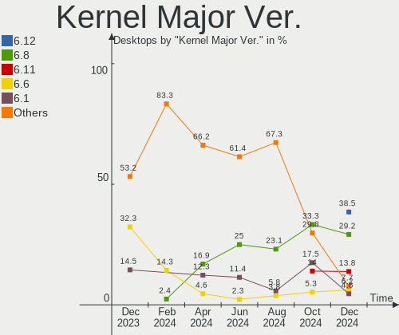
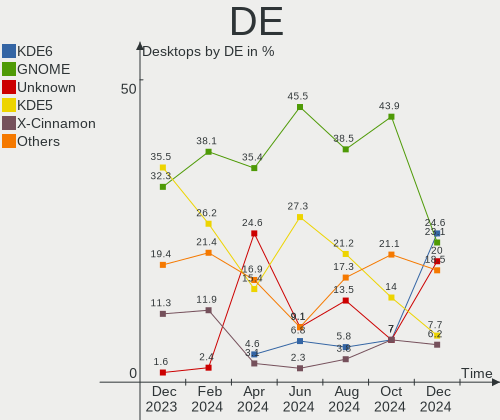
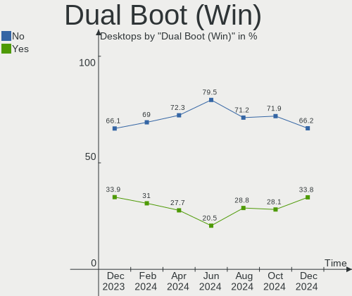
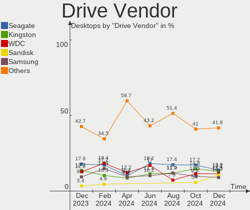
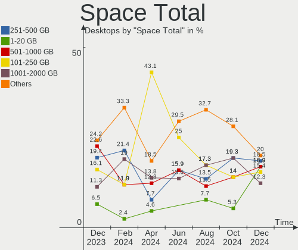
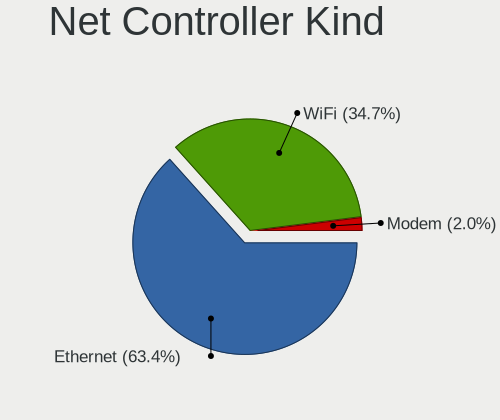
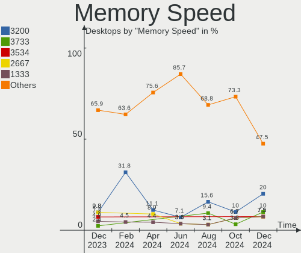

Linux in Spain - Hardware Trends (Desktops)
-------------------------------------------

A project to identify most popular hardware characteristics and track their change
over time based on data collected by Linux users at https://Linux-Hardware.org.

Anyone can contribute to this report by the [hw-probe](https://github.com/linuxhw/hw-probe) tool:

    sudo -E hw-probe -all -upload

Period: Dec, 2024.

Contents
--------

* [ System ](#system)
  - [ OS                       ](#os)
  - [ OS Family                ](#os-family)
  - [ Kernel                   ](#kernel)
  - [ Kernel Family            ](#kernel-family)
  - [ Kernel Major Ver.        ](#kernel-major-ver)
  - [ Arch                     ](#arch)
  - [ DE                       ](#de)
  - [ Display Server           ](#display-server)
  - [ Display Manager          ](#display-manager)
  - [ OS Lang                  ](#os-lang)
  - [ Boot Mode                ](#boot-mode)
  - [ Filesystem               ](#filesystem)
  - [ Part. scheme             ](#part-scheme)
  - [ Dual Boot with Linux/BSD ](#dual-boot-with-linuxbsd)
  - [ Dual Boot (Win)          ](#dual-boot-win)

* [ Board ](#board)
  - [ Vendor                   ](#vendor)
  - [ Model                    ](#model)
  - [ Model Family             ](#model-family)
  - [ MFG Year                 ](#mfg-year)
  - [ Form Factor              ](#form-factor)
  - [ Secure Boot              ](#secure-boot)
  - [ Coreboot                 ](#coreboot)
  - [ RAM Size                 ](#ram-size)
  - [ RAM Used                 ](#ram-used)
  - [ Total Drives             ](#total-drives)
  - [ Has CD-ROM               ](#has-cd-rom)
  - [ Has Ethernet             ](#has-ethernet)
  - [ Has WiFi                 ](#has-wifi)
  - [ Has Bluetooth            ](#has-bluetooth)

* [ Location ](#location)
  - [ Country                  ](#country)
  - [ City                     ](#city)

* [ Drives ](#drives)
  - [ Drive Vendor             ](#drive-vendor)
  - [ Drive Model              ](#drive-model)
  - [ HDD Vendor               ](#hdd-vendor)
  - [ SSD Vendor               ](#ssd-vendor)
  - [ Drive Kind               ](#drive-kind)
  - [ Drive Connector          ](#drive-connector)
  - [ Drive Size               ](#drive-size)
  - [ Space Total              ](#space-total)
  - [ Space Used               ](#space-used)
  - [ Malfunc. Drives          ](#malfunc-drives)
  - [ Malfunc. Drive Vendor    ](#malfunc-drive-vendor)
  - [ Malfunc. HDD Vendor      ](#malfunc-hdd-vendor)
  - [ Malfunc. Drive Kind      ](#malfunc-drive-kind)
  - [ Failed Drives            ](#failed-drives)
  - [ Failed Drive Vendor      ](#failed-drive-vendor)
  - [ Drive Status             ](#drive-status)

* [ Storage controller ](#storage-controller)
  - [ Storage Vendor           ](#storage-vendor)
  - [ Storage Model            ](#storage-model)
  - [ Storage Kind             ](#storage-kind)

* [ Processor ](#processor)
  - [ CPU Vendor               ](#cpu-vendor)
  - [ CPU Model                ](#cpu-model)
  - [ CPU Model Family         ](#cpu-model-family)
  - [ CPU Cores                ](#cpu-cores)
  - [ CPU Sockets              ](#cpu-sockets)
  - [ CPU Threads              ](#cpu-threads)
  - [ CPU Op-Modes             ](#cpu-op-modes)
  - [ CPU Microcode            ](#cpu-microcode)
  - [ CPU Microarch            ](#cpu-microarch)

* [ Graphics ](#graphics)
  - [ GPU Vendor               ](#gpu-vendor)
  - [ GPU Model                ](#gpu-model)
  - [ GPU Combo                ](#gpu-combo)
  - [ GPU Driver               ](#gpu-driver)
  - [ GPU Memory               ](#gpu-memory)

* [ Monitor ](#monitor)
  - [ Monitor Vendor           ](#monitor-vendor)
  - [ Monitor Model            ](#monitor-model)
  - [ Monitor Resolution       ](#monitor-resolution)
  - [ Monitor Diagonal         ](#monitor-diagonal)
  - [ Monitor Width            ](#monitor-width)
  - [ Aspect Ratio             ](#aspect-ratio)
  - [ Monitor Area             ](#monitor-area)
  - [ Pixel Density            ](#pixel-density)
  - [ Multiple Monitors        ](#multiple-monitors)

* [ Network ](#network)
  - [ Net Controller Vendor    ](#net-controller-vendor)
  - [ Net Controller Model     ](#net-controller-model)
  - [ Wireless Vendor          ](#wireless-vendor)
  - [ Wireless Model           ](#wireless-model)
  - [ Ethernet Vendor          ](#ethernet-vendor)
  - [ Ethernet Model           ](#ethernet-model)
  - [ Net Controller Kind      ](#net-controller-kind)
  - [ Used Controller          ](#used-controller)
  - [ NICs                     ](#nics)
  - [ IPv6                     ](#ipv6)

* [ Bluetooth ](#bluetooth)
  - [ Bluetooth Vendor         ](#bluetooth-vendor)
  - [ Bluetooth Model          ](#bluetooth-model)

* [ Sound ](#sound)
  - [ Sound Vendor             ](#sound-vendor)
  - [ Sound Model              ](#sound-model)

* [ Memory ](#memory)
  - [ Memory Vendor            ](#memory-vendor)
  - [ Memory Model             ](#memory-model)
  - [ Memory Kind              ](#memory-kind)
  - [ Memory Form Factor       ](#memory-form-factor)
  - [ Memory Size              ](#memory-size)
  - [ Memory Speed             ](#memory-speed)

* [ Printers & scanners ](#printers--scanners)
  - [ Printer Vendor           ](#printer-vendor)
  - [ Printer Model            ](#printer-model)
  - [ Scanner Vendor           ](#scanner-vendor)
  - [ Scanner Model            ](#scanner-model)

* [ Camera ](#camera)
  - [ Camera Vendor            ](#camera-vendor)
  - [ Camera Model             ](#camera-model)

* [ Security ](#security)
  - [ Fingerprint Vendor       ](#fingerprint-vendor)
  - [ Fingerprint Model        ](#fingerprint-model)
  - [ Chipcard Vendor          ](#chipcard-vendor)
  - [ Chipcard Model           ](#chipcard-model)

* [ Unsupported ](#unsupported)
  - [ Unsupported Devices      ](#unsupported-devices)
  - [ Unsupported Device Types ](#unsupported-device-types)

System
------

OS
--

Installed operating systems

| Name                         | Desktops | Percent |
|------------------------------|----------|---------|
| OpenMandriva 24.12           | 17       | 26.15%  |
| Ubuntu 24.04                 | 6        | 9.23%   |
| Linux Mint 22                | 4        | 6.15%   |
| Manjaro                      | 3        | 4.62%   |
| Elementary 8                 | 3        | 4.62%   |
| Debian 12                    | 3        | 4.62%   |
| Arch Rolling                 | 3        | 4.62%   |
| Zorin 17                     | 2        | 3.08%   |
| openSUSE Tumbleweed-XXXXXXXX | 2        | 3.08%   |
| OpenMandriva 23.08           | 2        | 3.08%   |
| Manjaro 24.2.1               | 2        | 3.08%   |
| Fedora 41                    | 2        | 3.08%   |
| Xubuntu 24.04                | 1        | 1.54%   |
| Ubuntu 24.0                  | 1        | 1.54%   |
| Ubuntu 20.04                 | 1        | 1.54%   |
| Parrot 6.2                   | 1        | 1.54%   |
| OpenMandriva 5.0             | 1        | 1.54%   |
| Nobara 41                    | 1        | 1.54%   |
| Nobara 40                    | 1        | 1.54%   |
| MX 23                        | 1        | 1.54%   |
| Manjaro 24.1.2               | 1        | 1.54%   |
| Linux Mint 21.3              | 1        | 1.54%   |
| Kubuntu 24.10                | 1        | 1.54%   |
| Kubuntu 24.04                | 1        | 1.54%   |
| Fedora 40                    | 1        | 1.54%   |
| EndeavourOS Rolling          | 1        | 1.54%   |
| Debian                       | 1        | 1.54%   |
| ArcoLinux Rolling            | 1        | 1.54%   |

OS Family
---------

OS without a version

| Name         | Desktops | Percent |
|--------------|----------|---------|
| OpenMandriva | 20       | 30.77%  |
| Ubuntu       | 8        | 12.31%  |
| Manjaro      | 6        | 9.23%   |
| Linux Mint   | 5        | 7.69%   |
| Debian       | 4        | 6.15%   |
| Fedora       | 3        | 4.62%   |
| Elementary   | 3        | 4.62%   |
| Arch         | 3        | 4.62%   |
| Zorin        | 2        | 3.08%   |
| openSUSE     | 2        | 3.08%   |
| Nobara       | 2        | 3.08%   |
| Kubuntu      | 2        | 3.08%   |
| Xubuntu      | 1        | 1.54%   |
| Parrot       | 1        | 1.54%   |
| MX           | 1        | 1.54%   |
| EndeavourOS  | 1        | 1.54%   |
| ArcoLinux    | 1        | 1.54%   |

Kernel
------

Version of the Linux kernel

| Version                      | Desktops | Percent |
|------------------------------|----------|---------|
| 6.12.1-desktop-1omv2490      | 16       | 24.62%  |
| 6.8.0-51-generic             | 6        | 9.23%   |
| 6.8.0-49-generic             | 6        | 9.23%   |
| 6.8.0-50-generic             | 3        | 4.62%   |
| 6.8.0-41-generic             | 2        | 3.08%   |
| 6.4.8-desktop-2omv2390       | 2        | 3.08%   |
| 6.12.4-arch1-1               | 2        | 3.08%   |
| 6.12.4-1-MANJARO             | 2        | 3.08%   |
| 6.1.0-28-amd64               | 2        | 3.08%   |
| 6.8.0-47-generic             | 1        | 1.54%   |
| 6.8.0-38-generic             | 1        | 1.54%   |
| 6.6.65-1-lts                 | 1        | 1.54%   |
| 6.6.63-1-MANJARO             | 1        | 1.54%   |
| 6.6.63-1-lts                 | 1        | 1.54%   |
| 6.6.2-desktop-1omv2390       | 1        | 1.54%   |
| 6.12.7-zen1-1-zen            | 1        | 1.54%   |
| 6.12.6-desktop-1omv2490      | 1        | 1.54%   |
| 6.12.6-1-liquorix-amd64      | 1        | 1.54%   |
| 6.12.6-1-default             | 1        | 1.54%   |
| 6.12.5-200.fsync.fc41.x86_64 | 1        | 1.54%   |
| 6.11.9-200.fsync.fc40.x86_64 | 1        | 1.54%   |
| 6.11.8-1-default             | 1        | 1.54%   |
| 6.11.4-301.fc41.x86_64       | 1        | 1.54%   |
| 6.11.11-1-MANJARO            | 1        | 1.54%   |
| 6.11.10-amd64                | 1        | 1.54%   |
| 6.11.10-300.fc41.x86_64      | 1        | 1.54%   |
| 6.11.10-200.fc40.x86_64      | 1        | 1.54%   |
| 6.11.10-2-MANJARO            | 1        | 1.54%   |
| 6.11.0-8-generic             | 1        | 1.54%   |
| 6.11+parrot-amd64            | 1        | 1.54%   |
| 6.1.0-9-amd64                | 1        | 1.54%   |
| 5.15.0-126-generic           | 1        | 1.54%   |
| 5.10.226-1-MANJARO           | 1        | 1.54%   |

Kernel Family
-------------

Linux kernel without a distro release

| Version  | Desktops | Percent |
|----------|----------|---------|
| 6.8.0    | 19       | 29.23%  |
| 6.12.1   | 16       | 24.62%  |
| 6.12.4   | 4        | 6.15%   |
| 6.11.10  | 4        | 6.15%   |
| 6.12.6   | 3        | 4.62%   |
| 6.1.0    | 3        | 4.62%   |
| 6.6.63   | 2        | 3.08%   |
| 6.4.8    | 2        | 3.08%   |
| 6.6.65   | 1        | 1.54%   |
| 6.6.2    | 1        | 1.54%   |
| 6.12.7   | 1        | 1.54%   |
| 6.12.5   | 1        | 1.54%   |
| 6.11.9   | 1        | 1.54%   |
| 6.11.8   | 1        | 1.54%   |
| 6.11.4   | 1        | 1.54%   |
| 6.11.11  | 1        | 1.54%   |
| 6.11.0   | 1        | 1.54%   |
| 6.11     | 1        | 1.54%   |
| 5.15.0   | 1        | 1.54%   |
| 5.10.226 | 1        | 1.54%   |

Kernel Major Ver.
-----------------

Linux kernel major version

| Version | Desktops | Percent |
|---------|----------|---------|
| 6.12    | 25       | 38.46%  |
| 6.8     | 19       | 29.23%  |
| 6.11    | 9        | 13.85%  |
| 6.6     | 4        | 6.15%   |
| 6.1     | 3        | 4.62%   |
| 6.4     | 2        | 3.08%   |
| 6       | 1        | 1.54%   |
| 5.15    | 1        | 1.54%   |
| 5.10    | 1        | 1.54%   |

Arch
----

OS architecture (x86_64, i586, etc.)

| Name   | Desktops | Percent |
|--------|----------|---------|
| x86_64 | 65       | 100%    |

DE
--

Desktop Environment

| Name       | Desktops | Percent |
|------------|----------|---------|
| KDE6       | 16       | 24.62%  |
| GNOME      | 15       | 23.08%  |
| Unknown    | 13       | 20%     |
| KDE5       | 5        | 7.69%   |
| X-Cinnamon | 4        | 6.15%   |
| XFCE       | 3        | 4.62%   |
| Pantheon   | 3        | 4.62%   |
| LXQt       | 2        | 3.08%   |
| MATE       | 1        | 1.54%   |
| LXDE       | 1        | 1.54%   |
| Hyprland   | 1        | 1.54%   |
| Budgie     | 1        | 1.54%   |

Display Server
--------------

X11 or Wayland

| Name    | Desktops | Percent |
|---------|----------|---------|
| X11     | 31       | 47.69%  |
| Wayland | 31       | 47.69%  |
| Tty     | 2        | 3.08%   |
| Unknown | 1        | 1.54%   |

Display Manager
---------------

SDDM, LightDM, etc.

| Name    | Desktops | Percent |
|---------|----------|---------|
| SDDM    | 22       | 33.85%  |
| Unknown | 20       | 30.77%  |
| GDM3    | 8        | 12.31%  |
| GDM     | 8        | 12.31%  |
| LightDM | 6        | 9.23%   |
| LXDM    | 1        | 1.54%   |

OS Lang
-------

Language

| Lang  | Desktops | Percent |
|-------|----------|---------|
| es_ES | 41       | 63.08%  |
| en_US | 18       | 27.69%  |
| en_GB | 2        | 3.08%   |
| pt_BR | 1        | 1.54%   |
| eu_ES | 1        | 1.54%   |
| es_UY | 1        | 1.54%   |
| C     | 1        | 1.54%   |

Boot Mode
---------

EFI or BIOS

| Mode | Desktops | Percent |
|------|----------|---------|
| BIOS | 37       | 56.92%  |
| EFI  | 28       | 43.08%  |

Filesystem
----------

Type of filesystem

| Type    | Desktops | Percent |
|---------|----------|---------|
| Ext4    | 32       | 49.23%  |
| Overlay | 14       | 21.54%  |
| Tmpfs   | 10       | 15.38%  |
| Btrfs   | 9        | 13.85%  |

Part. scheme
------------

Scheme of partitioning

| Type    | Desktops | Percent |
|---------|----------|---------|
| GPT     | 37       | 56.92%  |
| Unknown | 19       | 29.23%  |
| MBR     | 9        | 13.85%  |

Dual Boot with Linux/BSD
------------------------

Hosting more than one Linux/BSD

| Dual boot | Desktops | Percent |
|-----------|----------|---------|
| No        | 46       | 70.77%  |
| Yes       | 19       | 29.23%  |

Dual Boot (Win)
---------------

Hosting Linux and Windows

| Dual boot | Desktops | Percent |
|-----------|----------|---------|
| No        | 43       | 66.15%  |
| Yes       | 22       | 33.85%  |

Board
-----

Vendor
------

Motherboard manufacturer

| Name                                 | Desktops | Percent |
|--------------------------------------|----------|---------|
| ASUSTek Computer                     | 13       | 20%     |
| Gigabyte Technology                  | 12       | 18.46%  |
| MSI                                  | 9        | 13.85%  |
| ASRock                               | 8        | 12.31%  |
| Hewlett-Packard                      | 6        | 9.23%   |
| AMI                                  | 4        | 6.15%   |
| Acer                                 | 2        | 3.08%   |
| Win Element                          | 1        | 1.54%   |
| SLIMBOOK                             | 1        | 1.54%   |
| Shenzhen Meigao Electronic Equipment | 1        | 1.54%   |
| Shenzhen DOKE electronic             | 1        | 1.54%   |
| MUCAI                                | 1        | 1.54%   |
| Lenovo                               | 1        | 1.54%   |
| JGINYUE                              | 1        | 1.54%   |
| EVGA                                 | 1        | 1.54%   |
| Dell                                 | 1        | 1.54%   |
| Acidanthera                          | 1        | 1.54%   |
| Unknown                              | 1        | 1.54%   |

Model
-----

Motherboard model

| Name                                                | Desktops | Percent |
|-----------------------------------------------------|----------|---------|
| AMI Intel                                           | 4        | 6.15%   |
| Win Element M9S                                     | 1        | 1.54%   |
| SLIMBOOK ONE-AM5                                    | 1        | 1.54%   |
| Shenzhen Meigao Electronic Equipment Mercury series | 1        | 1.54%   |
| Shenzhen DOKE electronic MP100                      | 1        | 1.54%   |
| MUCAI H61 V1.5                                      | 1        | 1.54%   |
| MSI MS-7D88                                         | 1        | 1.54%   |
| MSI MS-7D86                                         | 1        | 1.54%   |
| MSI MS-7C95                                         | 1        | 1.54%   |
| MSI MS-7C37                                         | 1        | 1.54%   |
| MSI MS-7C31                                         | 1        | 1.54%   |
| MSI MS-7B86                                         | 1        | 1.54%   |
| MSI MS-7A70                                         | 1        | 1.54%   |
| MSI MS-7A38                                         | 1        | 1.54%   |
| MSI MS-7721                                         | 1        | 1.54%   |
| Lenovo ThinkCentre M900 10FLS35D00                  | 1        | 1.54%   |
| JGINYUE B650I Night Devil                           | 1        | 1.54%   |
| HP Z420 Workstation                                 | 1        | 1.54%   |
| HP Slim Desktop S01-pF1xxx                          | 1        | 1.54%   |
| HP Desktop M01-F3xxx                                | 1        | 1.54%   |
| HP Compaq Elite 8300 SFF                            | 1        | 1.54%   |
| HP Compaq dc7800p Small Form Factor                 | 1        | 1.54%   |
| HP 260-a103ns                                       | 1        | 1.54%   |
| Gigabyte Z270-HD3P                                  | 1        | 1.54%   |
| Gigabyte X670 GAMING X AX                           | 1        | 1.54%   |
| Gigabyte X470 AORUS ULTRA GAMING                    | 1        | 1.54%   |
| Gigabyte H61M-USB3H                                 | 1        | 1.54%   |
| Gigabyte H55M-UD2H                                  | 1        | 1.54%   |
| Gigabyte H410M H V3                                 | 1        | 1.54%   |
| Gigabyte B650M DS3H                                 | 1        | 1.54%   |
| Gigabyte B550M S2H                                  | 1        | 1.54%   |
| Gigabyte B550M AORUS ELITE                          | 1        | 1.54%   |
| Gigabyte B450M DS3H V2                              | 1        | 1.54%   |
| Gigabyte AB350-Gaming 3                             | 1        | 1.54%   |
| Gigabyte A520M K V2                                 | 1        | 1.54%   |
| EVGA 122-CK-NF68                                    | 1        | 1.54%   |
| Dell OptiPlex 5040                                  | 1        | 1.54%   |
| ASUS TUF Gaming X570-PLUS                           | 1        | 1.54%   |
| ASUS TUF Gaming B650-PLUS WIFI                      | 1        | 1.54%   |
| ASUS TERRA_PC                                       | 1        | 1.54%   |

Model Family
------------

Motherboard model prefix

| Name                                         | Desktops | Percent |
|----------------------------------------------|----------|---------|
| ASUS PRIME                                   | 4        | 6.15%   |
| AMI Intel                                    | 4        | 6.15%   |
| HP Compaq                                    | 2        | 3.08%   |
| Gigabyte B550M                               | 2        | 3.08%   |
| ASUS TUF                                     | 2        | 3.08%   |
| ASUS ROG                                     | 2        | 3.08%   |
| Win Element M9S                              | 1        | 1.54%   |
| SLIMBOOK ONE-AM5                             | 1        | 1.54%   |
| Shenzhen Meigao Electronic Equipment Mercury | 1        | 1.54%   |
| Shenzhen DOKE electronic MP100               | 1        | 1.54%   |
| MUCAI H61                                    | 1        | 1.54%   |
| MSI MS-7D88                                  | 1        | 1.54%   |
| MSI MS-7D86                                  | 1        | 1.54%   |
| MSI MS-7C95                                  | 1        | 1.54%   |
| MSI MS-7C37                                  | 1        | 1.54%   |
| MSI MS-7C31                                  | 1        | 1.54%   |
| MSI MS-7B86                                  | 1        | 1.54%   |
| MSI MS-7A70                                  | 1        | 1.54%   |
| MSI MS-7A38                                  | 1        | 1.54%   |
| MSI MS-7721                                  | 1        | 1.54%   |
| Lenovo ThinkCentre                           | 1        | 1.54%   |
| JGINYUE B650I                                | 1        | 1.54%   |
| HP Z420                                      | 1        | 1.54%   |
| HP Slim                                      | 1        | 1.54%   |
| HP Desktop                                   | 1        | 1.54%   |
| HP 260-a103ns                                | 1        | 1.54%   |
| Gigabyte Z270-HD3P                           | 1        | 1.54%   |
| Gigabyte X670                                | 1        | 1.54%   |
| Gigabyte X470                                | 1        | 1.54%   |
| Gigabyte H61M-USB3H                          | 1        | 1.54%   |
| Gigabyte H55M-UD2H                           | 1        | 1.54%   |
| Gigabyte H410M                               | 1        | 1.54%   |
| Gigabyte B650M                               | 1        | 1.54%   |
| Gigabyte B450M                               | 1        | 1.54%   |
| Gigabyte AB350-Gaming                        | 1        | 1.54%   |
| Gigabyte A520M                               | 1        | 1.54%   |
| EVGA 122-CK-NF68                             | 1        | 1.54%   |
| Dell OptiPlex                                | 1        | 1.54%   |
| ASUS TERRA                                   | 1        | 1.54%   |
| ASUS STRIX                                   | 1        | 1.54%   |

MFG Year
--------

Motherboard manufacture year

| Year | Desktops | Percent |
|------|----------|---------|
| 2022 | 10       | 15.38%  |
| 2023 | 7        | 10.77%  |
| 2020 | 7        | 10.77%  |
| 2019 | 6        | 9.23%   |
| 2016 | 6        | 9.23%   |
| 2024 | 5        | 7.69%   |
| 2017 | 5        | 7.69%   |
| 2018 | 4        | 6.15%   |
| 2012 | 3        | 4.62%   |
| 2009 | 3        | 4.62%   |
| 2007 | 3        | 4.62%   |
| 2015 | 2        | 3.08%   |
| 2013 | 2        | 3.08%   |
| 2021 | 1        | 1.54%   |
| 2014 | 1        | 1.54%   |

Form Factor
-----------

Physical design of the computer

| Name    | Desktops | Percent |
|---------|----------|---------|
| Desktop | 65       | 100%    |

Secure Boot
-----------

Enabled or disabled

| State    | Desktops | Percent |
|----------|----------|---------|
| Disabled | 63       | 96.92%  |
| Enabled  | 2        | 3.08%   |

Coreboot
--------

Have coreboot on board

| Used | Desktops | Percent |
|------|----------|---------|
| No   | 65       | 100%    |

RAM Size
--------

Total RAM memory

| Size in GB  | Desktops | Percent |
|-------------|----------|---------|
| 32.01-64.0  | 19       | 29.23%  |
| 16.01-24.0  | 17       | 26.15%  |
| 3.01-4.0    | 7        | 10.77%  |
| 4.01-8.0    | 6        | 9.23%   |
| 64.01-256.0 | 6        | 9.23%   |
| 8.01-16.0   | 6        | 9.23%   |
| 24.01-32.0  | 2        | 3.08%   |
| 2.01-3.0    | 1        | 1.54%   |
| 1.01-2.0    | 1        | 1.54%   |

RAM Used
--------

Used RAM memory

| Used GB    | Desktops | Percent |
|------------|----------|---------|
| 2.01-3.0   | 26       | 40%     |
| 1.01-2.0   | 17       | 26.15%  |
| 4.01-8.0   | 9        | 13.85%  |
| 3.01-4.0   | 9        | 13.85%  |
| 8.01-16.0  | 2        | 3.08%   |
| 32.01-64.0 | 1        | 1.54%   |
| 0.51-1.0   | 1        | 1.54%   |

Total Drives
------------

Number of drives on board

| Drives | Desktops | Percent |
|--------|----------|---------|
| 1      | 25       | 38.46%  |
| 2      | 20       | 30.77%  |
| 3      | 9        | 13.85%  |
| 4      | 5        | 7.69%   |
| 7      | 3        | 4.62%   |
| 6      | 1        | 1.54%   |
| 5      | 1        | 1.54%   |
| 0      | 1        | 1.54%   |

Has CD-ROM
----------

Has CD-ROM on board

| Presented | Desktops | Percent |
|-----------|----------|---------|
| No        | 44       | 67.69%  |
| Yes       | 21       | 32.31%  |

Has Ethernet
------------

Has Ethernet on board

| Presented | Desktops | Percent |
|-----------|----------|---------|
| Yes       | 64       | 98.46%  |
| No        | 1        | 1.54%   |

Has WiFi
--------

Has WiFi module

| Presented | Desktops | Percent |
|-----------|----------|---------|
| Yes       | 35       | 53.85%  |
| No        | 30       | 46.15%  |

Has Bluetooth
-------------

Has Bluetooth module

| Presented | Desktops | Percent |
|-----------|----------|---------|
| Yes       | 36       | 55.38%  |
| No        | 29       | 44.62%  |

Location
--------

Country
-------

Geographic location (country)

| Country | Desktops | Percent |
|---------|----------|---------|
| Spain   | 65       | 100%    |

City
----

Geographic location (city)

| City                       | Desktops | Percent |
|----------------------------|----------|---------|
| Barcelona                  | 8        | 12.31%  |
| Madrid                     | 4        | 6.15%   |
| Palma                      | 3        | 4.62%   |
| Vitoria-Gasteiz            | 2        | 3.08%   |
| Martorell                  | 2        | 3.08%   |
| El Vendrell                | 2        | 3.08%   |
| Zaragoza                   | 1        | 1.54%   |
| Villanueva de la Canada    | 1        | 1.54%   |
| Villajoyosa                | 1        | 1.54%   |
| Vigo                       | 1        | 1.54%   |
| Valencia                   | 1        | 1.54%   |
| Valderrobres               | 1        | 1.54%   |
| Seville                    | 1        | 1.54%   |
| Segovia                    | 1        | 1.54%   |
| San Fernando               | 1        | 1.54%   |
| Reus                       | 1        | 1.54%   |
| Pinoso                     | 1        | 1.54%   |
| Paracuellos de Jarama      | 1        | 1.54%   |
| Oviedo                     | 1        | 1.54%   |
| Orihuela Costa             | 1        | 1.54%   |
| Olivares                   | 1        | 1.54%   |
| Oliva                      | 1        | 1.54%   |
| Nigran                     | 1        | 1.54%   |
| Nerja                      | 1        | 1.54%   |
| Narón                     | 1        | 1.54%   |
| Mostoles                   | 1        | 1.54%   |
| Moana                      | 1        | 1.54%   |
| Málaga                    | 1        | 1.54%   |
| Logroño                   | 1        | 1.54%   |
| Las Palmas de Gran Canaria | 1        | 1.54%   |
| Huesca                     | 1        | 1.54%   |
| Huelva                     | 1        | 1.54%   |
| Granollers                 | 1        | 1.54%   |
| Gijón                     | 1        | 1.54%   |
| Galapagar                  | 1        | 1.54%   |
| El Ejido                   | 1        | 1.54%   |
| Eibar                      | 1        | 1.54%   |
| Donostia / San Sebastian   | 1        | 1.54%   |
| Cuevas del Almanzora       | 1        | 1.54%   |
| Celra                      | 1        | 1.54%   |

Drives
------

Drive Vendor
------------

Hard drive vendors

| Vendor                      | Desktops | Drives | Percent |
|-----------------------------|----------|--------|---------|
| Seagate                     | 17       | 25     | 13.93%  |
| Kingston                    | 16       | 18     | 13.11%  |
| WDC                         | 14       | 16     | 11.48%  |
| Sandisk                     | 13       | 15     | 10.66%  |
| Samsung Electronics         | 11       | 15     | 9.02%   |
| Toshiba                     | 6        | 6      | 4.92%   |
| Crucial                     | 5        | 5      | 4.1%    |
| Silicon Motion              | 4        | 4      | 3.28%   |
| MAXIO Technology (Hangzhou) | 3        | 5      | 2.46%   |
| KIOXIA-EXCERIA              | 3        | 3      | 2.46%   |
| Phison Electronics          | 2        | 2      | 1.64%   |
| OCZ                         | 2        | 2      | 1.64%   |
| Micron/Crucial Technology   | 2        | 3      | 1.64%   |
| Maxtor                      | 2        | 2      | 1.64%   |
| Intel                       | 2        | 2      | 1.64%   |
| Hitachi                     | 2        | 2      | 1.64%   |
| Fanxiang                    | 2        | 2      | 1.64%   |
| China                       | 2        | 2      | 1.64%   |
| XrayDisk                    | 1        | 1      | 0.82%   |
| Vaseky                      | 1        | 1      | 0.82%   |
| Unknown                     | 1        | 1      | 0.82%   |
| Union Memory (Shenzhen)     | 1        | 1      | 0.82%   |
| SK hynix                    | 1        | 1      | 0.82%   |
| SABRENT                     | 1        | 2      | 0.82%   |
| KIOXIA                      | 1        | 1      | 0.82%   |
| Kingston Technology Company | 1        | 1      | 0.82%   |
| KingFast                    | 1        | 1      | 0.82%   |
| HPE                         | 1        | 1      | 0.82%   |
| HGST                        | 1        | 1      | 0.82%   |
| BR                          | 1        | 1      | 0.82%   |
| ADATA Technology            | 1        | 1      | 0.82%   |
| Unknown                     | 1        | 1      | 0.82%   |

Drive Model
-----------

Hard drive models

| Model                                                 | Desktops | Percent |
|-------------------------------------------------------|----------|---------|
| Seagate ST1000DM010-2EP102 1TB                        | 5        | 3.7%    |
| Kingston SNV2S500G 500GB                              | 4        | 2.96%   |
| Kingston SA400S37480G 480GB SSD                       | 4        | 2.96%   |
| Silicon Motion SM2263EN/SM2263XT SSD Controller 256GB | 3        | 2.22%   |
| Seagate ST500DM002-1BD142 500GB                       | 3        | 2.22%   |
| Kingston SA400S37960G 960GB SSD                       | 3        | 2.22%   |
| Toshiba DT01ACA050 500GB                              | 2        | 1.48%   |
| Sandisk WD_BLACK SN770 2TB                            | 2        | 1.48%   |
| SanDisk NVMe SSD Drive 1TB                            | 2        | 1.48%   |
| Samsung NVMe SSD Controller PM9A1/PM9A3/980PRO 512GB  | 2        | 1.48%   |
| MAXIO (Hangzhou) NVMe SSD Controller MAP1202 512GB    | 2        | 1.48%   |
| KIOXIA-EXCERIA SATA SSD 480GB                         | 2        | 1.48%   |
| Kingston SA400S37240G 240GB SSD                       | 2        | 1.48%   |
| Kingston SA400S37120G 120GB SSD                       | 2        | 1.48%   |
| Kingston OM3PGP41024P-A0 1TB                          | 2        | 1.48%   |
| XrayDisk 512GB                                        | 1        | 0.74%   |
| WDC WDS500G2B0A-00SM50 500GB SSD                      | 1        | 0.74%   |
| WDC WDS200T2B0A-00SM50 2TB SSD                        | 1        | 0.74%   |
| WDC WDS120G2G0A-00JH30 120GB SSD                      | 1        | 0.74%   |
| WDC WDS100T2B0C-00PXH0 1TB                            | 1        | 0.74%   |
| WDC WD6400AAKS-07A7B0 640GB                           | 1        | 0.74%   |
| WDC WD5000AZRX-00L4HB0 500GB                          | 1        | 0.74%   |
| WDC WD5000AZRX-00A8LB0 500GB                          | 1        | 0.74%   |
| WDC WD40EFAX-68JH4N1 4TB                              | 1        | 0.74%   |
| WDC WD4003FZEX-00Z4SA0 4TB                            | 1        | 0.74%   |
| WDC WD30EZRZ-00GXCB0 3TB                              | 1        | 0.74%   |
| WDC WD25 00BEVT-22ZCT0 250GB                          | 1        | 0.74%   |
| WDC WD20EZRX-00D8PB0 2TB                              | 1        | 0.74%   |
| WDC WD10EZRZ-00HTKB0 1TB                              | 1        | 0.74%   |
| WDC WD10EZEX-00BBHA0 1TB                              | 1        | 0.74%   |
| WDC WD10EFRX-68FYTN0 1TB                              | 1        | 0.74%   |
| WDC WD10EARS-22Y5B1 1TB                               | 1        | 0.74%   |
| Vaseky V880/500G 500GB SSD                            | 1        | 0.74%   |
| Unknown SD/MMC/MS PRO 128GB                           | 1        | 0.74%   |
| Union Memory (Shenzhen) UMIS RPETJ512MGE2QDQ 512GB    | 1        | 0.74%   |
| Toshiba TR200 240GB SSD                               | 1        | 0.74%   |
| Toshiba TL100 240GB SSD                               | 1        | 0.74%   |
| Toshiba HDWD120 2TB                                   | 1        | 0.74%   |
| Toshiba DT01ACA100 1TB                                | 1        | 0.74%   |
| SK hynix BC901 HFS512GEJ9X108N 512GB                  | 1        | 0.74%   |

HDD Vendor
----------

Hard disk drive vendors

| Vendor              | Desktops | Drives | Percent |
|---------------------|----------|--------|---------|
| Seagate             | 17       | 24     | 40.48%  |
| WDC                 | 11       | 12     | 26.19%  |
| Toshiba             | 4        | 4      | 9.52%   |
| Samsung Electronics | 2        | 2      | 4.76%   |
| Maxtor              | 2        | 2      | 4.76%   |
| Hitachi             | 2        | 2      | 4.76%   |
| Unknown             | 1        | 1      | 2.38%   |
| SABRENT             | 1        | 2      | 2.38%   |
| HPE                 | 1        | 1      | 2.38%   |
| HGST                | 1        | 1      | 2.38%   |

SSD Vendor
----------

Solid state drive vendors

| Vendor              | Desktops | Drives | Percent |
|---------------------|----------|--------|---------|
| Kingston            | 11       | 12     | 27.5%   |
| Samsung Electronics | 7        | 9      | 17.5%   |
| Crucial             | 4        | 4      | 10%     |
| KIOXIA-EXCERIA      | 3        | 3      | 7.5%    |
| WDC                 | 2        | 3      | 5%      |
| Toshiba             | 2        | 2      | 5%      |
| SanDisk             | 2        | 3      | 5%      |
| OCZ                 | 2        | 2      | 5%      |
| China               | 2        | 2      | 5%      |
| Vaseky              | 1        | 1      | 2.5%    |
| Intel               | 1        | 1      | 2.5%    |
| Fanxiang            | 1        | 1      | 2.5%    |
| BR                  | 1        | 1      | 2.5%    |
| Unknown             | 1        | 1      | 2.5%    |

Drive Kind
----------

HDD or SSD

| Kind    | Desktops | Drives | Percent |
|---------|----------|--------|---------|
| NVMe    | 35       | 46     | 34.31%  |
| SSD     | 34       | 45     | 33.33%  |
| HDD     | 31       | 51     | 30.39%  |
| Unknown | 2        | 2      | 1.96%   |

Drive Connector
---------------

SATA, SAS, NVMe, etc.

| Type | Desktops | Drives | Percent |
|------|----------|--------|---------|
| SATA | 49       | 93     | 55.68%  |
| NVMe | 35       | 46     | 39.77%  |
| SAS  | 4        | 5      | 4.55%   |

Drive Size
----------

Size of hard drive

| Size in TB | Desktops | Drives | Percent |
|------------|----------|--------|---------|
| 0.01-0.5   | 40       | 51     | 51.95%  |
| 0.51-1.0   | 23       | 27     | 29.87%  |
| 1.01-2.0   | 8        | 12     | 10.39%  |
| 3.01-4.0   | 4        | 4      | 5.19%   |
| 2.01-3.0   | 1        | 1      | 1.3%    |
| 4.01-10.0  | 1        | 1      | 1.3%    |

Space Total
-----------

Amount of disk space available on the file system

| Size in GB     | Desktops | Percent |
|----------------|----------|---------|
| 251-500        | 12       | 18.46%  |
| 1-20           | 11       | 16.92%  |
| 501-1000       | 11       | 16.92%  |
| 101-250        | 10       | 15.38%  |
| 1001-2000      | 8        | 12.31%  |
| More than 3000 | 6        | 9.23%   |
| 21-50          | 3        | 4.62%   |
| Unknown        | 2        | 3.08%   |
| 2001-3000      | 1        | 1.54%   |
| 51-100         | 1        | 1.54%   |

Space Used
----------

Amount of used disk space

| Used GB        | Desktops | Percent |
|----------------|----------|---------|
| 1-20           | 29       | 44.62%  |
| 21-50          | 9        | 13.85%  |
| 101-250        | 6        | 9.23%   |
| 251-500        | 4        | 6.15%   |
| 1001-2000      | 4        | 6.15%   |
| 2001-3000      | 3        | 4.62%   |
| 501-1000       | 3        | 4.62%   |
| 51-100         | 3        | 4.62%   |
| Unknown        | 2        | 3.08%   |
| More than 3000 | 1        | 1.54%   |
| 0              | 1        | 1.54%   |

Malfunc. Drives
---------------

Drive models with a malfunction

| Model                           | Desktops | Drives | Percent |
|---------------------------------|----------|--------|---------|
| WDC WD20EZRX-00D8PB0 2TB        | 1        | 1      | 12.5%   |
| WDC WD10EZRZ-00HTKB0 1TB        | 1        | 1      | 12.5%   |
| Seagate ST500DM002-1BD142 500GB | 1        | 1      | 12.5%   |
| Seagate ST3320613AS 320GB       | 1        | 1      | 12.5%   |
| SanDisk SSD PLUS 240GB          | 1        | 1      | 12.5%   |
| Maxtor 6L200M0 208GB            | 1        | 1      | 12.5%   |
| HPE MB0500EBNCR 500GB           | 1        | 1      | 12.5%   |
| Hitachi HDT721010SLA360 1TB     | 1        | 1      | 12.5%   |

Malfunc. Drive Vendor
---------------------

Vendors of faulty drives

| Vendor  | Desktops | Drives | Percent |
|---------|----------|--------|---------|
| WDC     | 2        | 2      | 25%     |
| Seagate | 2        | 2      | 25%     |
| SanDisk | 1        | 1      | 12.5%   |
| Maxtor  | 1        | 1      | 12.5%   |
| HPE     | 1        | 1      | 12.5%   |
| Hitachi | 1        | 1      | 12.5%   |

Malfunc. HDD Vendor
-------------------

Vendors of faulty HDD drives

| Vendor  | Desktops | Drives | Percent |
|---------|----------|--------|---------|
| WDC     | 2        | 2      | 28.57%  |
| Seagate | 2        | 2      | 28.57%  |
| Maxtor  | 1        | 1      | 14.29%  |
| HPE     | 1        | 1      | 14.29%  |
| Hitachi | 1        | 1      | 14.29%  |

Malfunc. Drive Kind
-------------------

Kinds of faulty drives

| Kind | Desktops | Drives | Percent |
|------|----------|--------|---------|
| HDD  | 6        | 7      | 85.71%  |
| SSD  | 1        | 1      | 14.29%  |

Failed Drives
-------------

Failed drive models

| Model                    | Desktops | Drives | Percent |
|--------------------------|----------|--------|---------|
| Toshiba DT01ACA050 500GB | 1        | 1      | 100%    |

Failed Drive Vendor
-------------------

Failed drive vendors

| Vendor  | Desktops | Drives | Percent |
|---------|----------|--------|---------|
| Toshiba | 1        | 1      | 100%    |

Drive Status
------------

Number of failed and malfunc. drives

| Status   | Desktops | Drives | Percent |
|----------|----------|--------|---------|
| Works    | 33       | 56     | 45.83%  |
| Detected | 31       | 79     | 43.06%  |
| Malfunc  | 7        | 8      | 9.72%   |
| Failed   | 1        | 1      | 1.39%   |

Storage controller
------------------

Storage Vendor
--------------

Storage controller vendors

| Vendor                      | Desktops | Percent |
|-----------------------------|----------|---------|
| Intel                       | 29       | 27.62%  |
| AMD                         | 26       | 24.76%  |
| SanDisk                     | 12       | 11.43%  |
| Kingston Technology Company | 7        | 6.67%   |
| Silicon Motion              | 4        | 3.81%   |
| Nvidia                      | 4        | 3.81%   |
| MAXIO Technology (Hangzhou) | 4        | 3.81%   |
| ASMedia Technology          | 4        | 3.81%   |
| Samsung Electronics         | 3        | 2.86%   |
| Micron/Crucial Technology   | 3        | 2.86%   |
| Phison Electronics          | 2        | 1.9%    |
| Union Memory (Shenzhen)     | 1        | 0.95%   |
| SK hynix                    | 1        | 0.95%   |
| Seagate Technology          | 1        | 0.95%   |
| Marvell Technology Group    | 1        | 0.95%   |
| KIOXIA                      | 1        | 0.95%   |
| JMicron Technology          | 1        | 0.95%   |
| ADATA Technology            | 1        | 0.95%   |

Storage Model
-------------

Storage controller models

| Model                                                                         | Desktops | Percent |
|-------------------------------------------------------------------------------|----------|---------|
| AMD FCH SATA Controller [AHCI mode]                                           | 13       | 10%     |
| AMD 400 Series Chipset SATA Controller                                        | 8        | 6.15%   |
| AMD 500 Series Chipset SATA Controller                                        | 6        | 4.62%   |
| Intel Q170/Q150/B150/H170/H110/Z170/CM236 Chipset SATA Controller [AHCI Mode] | 5        | 3.85%   |
| Intel 200 Series PCH SATA controller [AHCI mode]                              | 5        | 3.85%   |
| Silicon Motion SM2263EN/SM2263XT (DRAM-less) NVMe SSD Controllers             | 4        | 3.08%   |
| Intel Raptor Lake SATA AHCI Controller                                        | 4        | 3.08%   |
| ASMedia ASM1061/ASM1062 Serial ATA Controller                                 | 4        | 3.08%   |
| AMD 600 Series Chipset SATA Controller                                        | 4        | 3.08%   |
| Sandisk WD Black SN850X NVMe SSD                                              | 3        | 2.31%   |
| SanDisk WD Black SN770 / PC SN740 256GB / PC SN560 (DRAM-less) NVMe SSD       | 3        | 2.31%   |
| MAXIO (Hangzhou) NVMe SSD Controller MAP1202 (DRAM-less)                      | 3        | 2.31%   |
| Intel SATA Controller [RAID mode]                                             | 3        | 2.31%   |
| Samsung NVMe SSD Controller PM9A1/PM9A3/980PRO                                | 2        | 1.54%   |
| MAXIO (Hangzhou) NVMe SSD Controller MAP1602 (DRAM-less)                      | 2        | 1.54%   |
| Kingston Company OM3PGP4 NVMe SSD                                             | 2        | 1.54%   |
| Kingston Company NV2 NVMe SSD [E21T] (DRAM-less)                              | 2        | 1.54%   |
| Intel Volume Management Device NVMe RAID Controller                           | 2        | 1.54%   |
| AMD 300 Series Chipset SATA Controller                                        | 2        | 1.54%   |
| Union Memory (Shenzhen) AM630 PCIe 4.0 x4 NVMe SSD Controller                 | 1        | 0.77%   |
| SK hynix BC901 NVMe Solid State Drive (DRAM-less)                             | 1        | 0.77%   |
| Seagate E18 PCIe SSD                                                          | 1        | 0.77%   |
| SanDisk WD Green SN350 240GB (DRAM-less) / SN560E NVMe SSD                    | 1        | 0.77%   |
| Sandisk WD Blue SN580 NVMe SSD (DRAM-less)                                    | 1        | 0.77%   |
| SanDisk Ultra 3D / WD PC SN530, IX SN530, Blue SN550 NVMe SSD (DRAM-less)     | 1        | 0.77%   |
| SanDisk Ultra 3D / WD Blue SN570 NVMe SSD (DRAM-less)                         | 1        | 0.77%   |
| SanDisk PC SN735 / WD_BLACK SN750 SE NVMe SSD (DRAM-less)                     | 1        | 0.77%   |
| SanDisk Extreme Pro / WD Black SN750 / PC SN730 / Red SN700 NVMe SSD          | 1        | 0.77%   |
| Samsung NVMe SSD Controller SM981/PM981/PM983                                 | 1        | 0.77%   |
| Phison PS5021-E21 PCIe4 NVMe Controller (DRAM-less)                           | 1        | 0.77%   |
| Phison PS5013-E13 PCIe3 NVMe Controller (DRAM-less)                           | 1        | 0.77%   |
| Nvidia MCP67 AHCI Controller                                                  | 1        | 0.77%   |
| Nvidia MCP61 SATA Controller                                                  | 1        | 0.77%   |
| Nvidia MCP61 IDE                                                              | 1        | 0.77%   |
| Nvidia MCP55 SATA Controller                                                  | 1        | 0.77%   |
| Nvidia MCP55 IDE                                                              | 1        | 0.77%   |
| Nvidia CK804 Serial ATA Controller                                            | 1        | 0.77%   |
| Nvidia CK804 IDE                                                              | 1        | 0.77%   |
| Micron/Crucial P3 Plus NVMe PCIe SSD (DRAM-less)                              | 1        | 0.77%   |
| Micron/Crucial P2 [Nick P2] / P3 / P3 Plus NVMe PCIe SSD (DRAM-less)          | 1        | 0.77%   |

Storage Kind
------------

Kind of storage controller (IDE, SATA, NVMe, SAS, ...)

| Kind | Desktops | Percent |
|------|----------|---------|
| SATA | 50       | 49.5%   |
| NVMe | 35       | 34.65%  |
| IDE  | 10       | 9.9%    |
| RAID | 5        | 4.95%   |
| SAS  | 1        | 0.99%   |

Processor
---------

CPU Vendor
----------

Processor vendors

| Vendor | Desktops | Percent |
|--------|----------|---------|
| Intel  | 34       | 52.31%  |
| AMD    | 31       | 47.69%  |

CPU Model
---------

Processor models

| Model                                       | Desktops | Percent |
|---------------------------------------------|----------|---------|
| AMD Ryzen 5 5500                            | 3        | 4.62%   |
| Intel Core i7-7700K CPU @ 4.20GHz           | 2        | 3.08%   |
| AMD Ryzen 7 5700G with Radeon Graphics      | 2        | 3.08%   |
| AMD Ryzen 7 3700X 8-Core Processor          | 2        | 3.08%   |
| Intel Xeon CPU E5-2697 v2 @ 2.70GHz         | 1        | 1.54%   |
| Intel Pentium Dual-Core CPU E5200 @ 2.50GHz | 1        | 1.54%   |
| Intel Pentium CPU G4400 @ 3.30GHz           | 1        | 1.54%   |
| Intel Pentium CPU G2120 @ 3.10GHz           | 1        | 1.54%   |
| Intel N100                                  | 1        | 1.54%   |
| Intel Core i7-7700 CPU @ 3.60GHz            | 1        | 1.54%   |
| Intel Core i7-6700 CPU @ 3.40GHz            | 1        | 1.54%   |
| Intel Core i7-4770K CPU @ 3.50GHz           | 1        | 1.54%   |
| Intel Core i7-3770 CPU @ 3.40GHz            | 1        | 1.54%   |
| Intel Core i7-2600K CPU @ 3.40GHz           | 1        | 1.54%   |
| Intel Core i7-14700KF                       | 1        | 1.54%   |
| Intel Core i7-10700F CPU @ 2.90GHz          | 1        | 1.54%   |
| Intel Core i7-10700 CPU @ 2.90GHz           | 1        | 1.54%   |
| Intel Core i7-1060NG7 CPU @ 1.20GHz         | 1        | 1.54%   |
| Intel Core i5-8259U CPU @ 2.30GHz           | 1        | 1.54%   |
| Intel Core i5-7600 CPU @ 3.50GHz            | 1        | 1.54%   |
| Intel Core i5-6600T CPU @ 2.70GHz           | 1        | 1.54%   |
| Intel Core i5-6500 CPU @ 3.20GHz            | 1        | 1.54%   |
| Intel Core i5-1030NG7 CPU @ 1.10GHz         | 1        | 1.54%   |
| Intel Core i3-N305                          | 1        | 1.54%   |
| Intel Core i3-9100 CPU @ 3.60GHz            | 1        | 1.54%   |
| Intel Core i3-10100 CPU @ 3.60GHz           | 1        | 1.54%   |
| Intel Core i3 CPU 540 @ 3.07GHz             | 1        | 1.54%   |
| Intel Core 2 Quad CPU Q6700 @ 2.66GHz       | 1        | 1.54%   |
| Intel Core 2 Duo CPU E8400 @ 3.00GHz        | 1        | 1.54%   |
| Intel Celeron N5095A @ 2.00GHz              | 1        | 1.54%   |
| Intel Celeron CPU J3060 @ 1.60GHz           | 1        | 1.54%   |
| Intel Celeron CPU G3900 @ 2.80GHz           | 1        | 1.54%   |
| Intel 12th Gen Core i7-12700KF              | 1        | 1.54%   |
| Intel 12th Gen Core i5-12600K               | 1        | 1.54%   |
| Intel 12th Gen Core i5-12400F               | 1        | 1.54%   |
| Intel 12th Gen Core i5-12400                | 1        | 1.54%   |
| AMD Ryzen 9 7900X 12-Core Processor         | 1        | 1.54%   |
| AMD Ryzen 9 5900X 12-Core Processor         | 1        | 1.54%   |
| AMD Ryzen 9 5900HX with Radeon Graphics     | 1        | 1.54%   |
| AMD Ryzen 9 3950X 16-Core Processor         | 1        | 1.54%   |

CPU Model Family
----------------

Processor model prefix

| Model                   | Desktops | Percent |
|-------------------------|----------|---------|
| Intel Core i7           | 11       | 16.92%  |
| AMD Ryzen 7             | 10       | 15.38%  |
| AMD Ryzen 5             | 10       | 15.38%  |
| Other                   | 5        | 7.69%   |
| Intel Core i5           | 5        | 7.69%   |
| Intel Core i3           | 4        | 6.15%   |
| AMD Ryzen 9             | 4        | 6.15%   |
| Intel Celeron           | 3        | 4.62%   |
| AMD Athlon 64 X2        | 3        | 4.62%   |
| Intel Pentium           | 2        | 3.08%   |
| Intel Xeon              | 1        | 1.54%   |
| Intel Pentium Dual-Core | 1        | 1.54%   |
| Intel Core 2 Quad       | 1        | 1.54%   |
| Intel Core 2 Duo        | 1        | 1.54%   |
| AMD Ryzen 5 PRO         | 1        | 1.54%   |
| AMD Ryzen 3             | 1        | 1.54%   |
| AMD FX                  | 1        | 1.54%   |
| AMD A8                  | 1        | 1.54%   |

CPU Cores
---------

Number of processor cores

| Number | Desktops | Percent |
|--------|----------|---------|
| 4      | 21       | 32.31%  |
| 8      | 15       | 23.08%  |
| 6      | 11       | 16.92%  |
| 2      | 10       | 15.38%  |
| 12     | 4        | 6.15%   |
| 20     | 1        | 1.54%   |
| 16     | 1        | 1.54%   |
| 10     | 1        | 1.54%   |
| 1      | 1        | 1.54%   |

CPU Sockets
-----------

Number of sockets

| Number | Desktops | Percent |
|--------|----------|---------|
| 1      | 65       | 100%    |

CPU Threads
-----------

Threads per core (Hyper-Threading)

| Number | Desktops | Percent |
|--------|----------|---------|
| 2      | 46       | 70.77%  |
| 1      | 19       | 29.23%  |

CPU Op-Modes
------------

CPU Operation Modes (32-bit, 64-bit)

| Op mode        | Desktops | Percent |
|----------------|----------|---------|
| 32-bit, 64-bit | 65       | 100%    |

CPU Microcode
-------------

Microcode number

| Number     | Desktops | Percent |
|------------|----------|---------|
| Unknown    | 60       | 92.31%  |
| 0x906e9    | 1        | 1.54%   |
| 0x6fb      | 1        | 1.54%   |
| 0x20655    | 1        | 1.54%   |
| 0x08600106 | 1        | 1.54%   |
| 0x0800820d | 1        | 1.54%   |

CPU Microarch
-------------

Microarchitecture

| Name             | Desktops | Percent |
|------------------|----------|---------|
| Zen 3            | 9        | 13.85%  |
| Unknown          | 8        | 12.31%  |
| KabyLake         | 6        | 9.23%   |
| Zen+             | 5        | 7.69%   |
| Zen 2            | 5        | 7.69%   |
| Skylake          | 5        | 7.69%   |
| K8 Hammer        | 3        | 4.62%   |
| IvyBridge        | 3        | 4.62%   |
| CometLake        | 3        | 4.62%   |
| Alderlake Hybrid | 3        | 4.62%   |
| Zen              | 2        | 3.08%   |
| Penryn           | 2        | 3.08%   |
| IceLake          | 2        | 3.08%   |
| Westmere         | 1        | 1.54%   |
| Tremont          | 1        | 1.54%   |
| Steamroller      | 1        | 1.54%   |
| Silvermont       | 1        | 1.54%   |
| SandyBridge      | 1        | 1.54%   |
| Piledriver       | 1        | 1.54%   |
| Haswell          | 1        | 1.54%   |
| Gracemont        | 1        | 1.54%   |
| Core             | 1        | 1.54%   |

Graphics
--------

GPU Vendor
----------

Vendors of graphics cards

| Vendor | Desktops | Percent |
|--------|----------|---------|
| AMD    | 27       | 38.03%  |
| Nvidia | 22       | 30.99%  |
| Intel  | 22       | 30.99%  |

GPU Model
---------

Graphics card models

| Model                                                                                    | Desktops | Percent |
|------------------------------------------------------------------------------------------|----------|---------|
| AMD Ellesmere [Radeon RX 470/480/570/570X/580/580X/590]                                  | 5        | 6.94%   |
| AMD Raphael                                                                              | 3        | 4.17%   |
| AMD Cezanne [Radeon Vega Series / Radeon Vega Mobile Series]                             | 3        | 4.17%   |
| Nvidia GA106 [GeForce RTX 3060 Lite Hash Rate]                                           | 2        | 2.78%   |
| Nvidia AD104 [GeForce RTX 4070 SUPER]                                                    | 2        | 2.78%   |
| Intel Iris Plus Graphics G7 (Ice Lake)                                                   | 2        | 2.78%   |
| Intel HD Graphics 630                                                                    | 2        | 2.78%   |
| Intel HD Graphics 530                                                                    | 2        | 2.78%   |
| Intel HD Graphics 510                                                                    | 2        | 2.78%   |
| Intel Alder Lake-N [UHD Graphics]                                                        | 2        | 2.78%   |
| AMD Lexa PRO [Radeon 540/540X/550/550X / RX 540X/550/550X]                               | 2        | 2.78%   |
| Nvidia TU116 [GeForce GTX 1660 SUPER]                                                    | 1        | 1.39%   |
| Nvidia GT218 [GeForce 210]                                                               | 1        | 1.39%   |
| Nvidia GP108 [GeForce GT 1030]                                                           | 1        | 1.39%   |
| Nvidia GP107 [GeForce GTX 1050 Ti]                                                       | 1        | 1.39%   |
| Nvidia GP106 [GeForce GTX 1060 6GB]                                                      | 1        | 1.39%   |
| Nvidia GP104 [GeForce GTX 1070]                                                          | 1        | 1.39%   |
| Nvidia GM204 [GeForce GTX 970]                                                           | 1        | 1.39%   |
| Nvidia GK107 [GeForce GTX 650]                                                           | 1        | 1.39%   |
| Nvidia GF119 [GeForce GT 610]                                                            | 1        | 1.39%   |
| Nvidia GF108GL [Quadro 600]                                                              | 1        | 1.39%   |
| Nvidia GA107 [GeForce RTX 3050 8GB]                                                      | 1        | 1.39%   |
| Nvidia GA106 [Geforce RTX 3050]                                                          | 1        | 1.39%   |
| Nvidia GA104 [GeForce RTX 3070]                                                          | 1        | 1.39%   |
| Nvidia GA104 [GeForce RTX 3060 Ti Lite Hash Rate]                                        | 1        | 1.39%   |
| Nvidia GA102 [GeForce RTX 3090]                                                          | 1        | 1.39%   |
| Nvidia GA102 [GeForce RTX 3080]                                                          | 1        | 1.39%   |
| Nvidia C68 [GeForce 7050 PV / nForce 630a]                                               | 1        | 1.39%   |
| Nvidia AD103 [GeForce RTX 4080 SUPER]                                                    | 1        | 1.39%   |
| Intel Xeon E3-1200 v2/3rd Gen Core processor Graphics Controller                         | 1        | 1.39%   |
| Intel JasperLake [UHD Graphics]                                                          | 1        | 1.39%   |
| Intel IvyBridge GT2 [HD Graphics 4000]                                                   | 1        | 1.39%   |
| Intel Core Processor Integrated Graphics Controller                                      | 1        | 1.39%   |
| Intel CometLake-S GT2 [UHD Graphics 630]                                                 | 1        | 1.39%   |
| Intel CoffeeLake-U GT3e [Iris Plus Graphics 655]                                         | 1        | 1.39%   |
| Intel CoffeeLake-S GT2 [UHD Graphics 630]                                                | 1        | 1.39%   |
| Intel Atom/Celeron/Pentium Processor x5-E8000/J3xxx/N3xxx Integrated Graphics Controller | 1        | 1.39%   |
| Intel Alder Lake-S GT1 [UHD Graphics 730]                                                | 1        | 1.39%   |
| Intel 82Q35 Express Integrated Graphics Controller                                       | 1        | 1.39%   |
| Intel 4 Series Chipset Integrated Graphics Controller                                    | 1        | 1.39%   |

GPU Combo
---------

Combinations of graphics cards

| Name           | Desktops | Percent |
|----------------|----------|---------|
| 1 x AMD        | 23       | 35.38%  |
| 1 x Nvidia     | 17       | 26.15%  |
| 1 x Intel      | 17       | 26.15%  |
| AMD + Nvidia   | 3        | 4.62%   |
| 2 x Intel      | 2        | 3.08%   |
| Intel + Nvidia | 2        | 3.08%   |
| 2 x AMD        | 1        | 1.54%   |

GPU Driver
----------

Free vs proprietary

| Driver      | Desktops | Percent |
|-------------|----------|---------|
| Free        | 50       | 76.92%  |
| Proprietary | 10       | 15.38%  |
| Unknown     | 5        | 7.69%   |

GPU Memory
----------

Total video memory

| Size in GB | Desktops | Percent |
|------------|----------|---------|
| Unknown    | 40       | 61.54%  |
| 7.01-8.0   | 8        | 12.31%  |
| 0.01-0.5   | 6        | 9.23%   |
| 0.51-1.0   | 4        | 6.15%   |
| 5.01-6.0   | 2        | 3.08%   |
| 1.01-2.0   | 2        | 3.08%   |
| 3.01-4.0   | 1        | 1.54%   |
| 16.01-24.0 | 1        | 1.54%   |
| 8.01-16.0  | 1        | 1.54%   |

Monitor
-------

Monitor Vendor
--------------

Monitor vendors

| Vendor               | Desktops | Percent |
|----------------------|----------|---------|
| Samsung Electronics  | 15       | 22.39%  |
| Goldstar             | 10       | 14.93%  |
| BenQ                 | 8        | 11.94%  |
| AOC                  | 7        | 10.45%  |
| Hewlett-Packard      | 4        | 5.97%   |
| Dell                 | 4        | 5.97%   |
| Philips              | 3        | 4.48%   |
| Acer                 | 3        | 4.48%   |
| ___                  | 2        | 2.99%   |
| Unknown              | 2        | 2.99%   |
| Lenovo               | 2        | 2.99%   |
| ViewSonic            | 1        | 1.49%   |
| NEC Computers        | 1        | 1.49%   |
| MSI                  | 1        | 1.49%   |
| JCH                  | 1        | 1.49%   |
| HKC                  | 1        | 1.49%   |
| Cbox                 | 1        | 1.49%   |
| Ancor Communications | 1        | 1.49%   |

Monitor Model
-------------

Monitor models

| Model                                                                  | Desktops | Percent |
|------------------------------------------------------------------------|----------|---------|
| Goldstar HDR 4K GSM7707 3840x2160 600x340mm 27.2-inch                  | 2        | 2.82%   |
| ___ LCDTV16 ___0101 1920x1080                                          | 1        | 1.41%   |
| ___ LCD TV ___9000 1360x768                                            | 1        | 1.41%   |
| ViewSonic VA2223-FHD VSC9239 1920x1080 477x268mm 21.5-inch             | 1        | 1.41%   |
| Unknown LCD TV 9000 1360x768 1600x900mm 72.3-inch                      | 1        | 1.41%   |
| Unknown BLUSENS TV 0101 1920x1080 476x268mm 21.5-inch                  | 1        | 1.41%   |
| Samsung Electronics SyncMaster SAM0428 1680x1050 459x296mm 21.5-inch   | 1        | 1.41%   |
| Samsung Electronics S27E330 SAM0D90 1920x1080 598x336mm 27.0-inch      | 1        | 1.41%   |
| Samsung Electronics S24D330 SAM0D92 1920x1080 531x299mm 24.0-inch      | 1        | 1.41%   |
| Samsung Electronics S22F350 SAM0D1A 1920x1080 477x268mm 21.5-inch      | 1        | 1.41%   |
| Samsung Electronics LS27R75 SAM0F98 2560x1440 598x336mm 27.0-inch      | 1        | 1.41%   |
| Samsung Electronics LS24C33xG SAM7435 1920x1080 527x296mm 23.8-inch    | 1        | 1.41%   |
| Samsung Electronics LCD Monitor SAM735B 3840x2160 1420x800mm 64.2-inch | 1        | 1.41%   |
| Samsung Electronics LCD Monitor SAM7106 1920x1080 1210x680mm 54.6-inch | 1        | 1.41%   |
| Samsung Electronics LCD Monitor SAM7102 3840x2160 700x390mm 31.5-inch  | 1        | 1.41%   |
| Samsung Electronics LCD Monitor SAM7081 2560x1440 597x336mm 27.0-inch  | 1        | 1.41%   |
| Samsung Electronics LCD Monitor SAM0B60 1920x1080 887x500mm 40.1-inch  | 1        | 1.41%   |
| Samsung Electronics LCD Monitor SAM0902 1920x1080 700x390mm 31.5-inch  | 1        | 1.41%   |
| Samsung Electronics LCD Monitor SAM069B 1920x1080 1020x570mm 46.0-inch | 1        | 1.41%   |
| Samsung Electronics LCD Monitor SAM0659 1920x1080                      | 1        | 1.41%   |
| Samsung Electronics LCD Monitor SAM0658 1920x1080 886x498mm 40.0-inch  | 1        | 1.41%   |
| Philips PHL 278E8Q PHLC161 1920x1080 598x336mm 27.0-inch               | 1        | 1.41%   |
| Philips LCD Monitor PHL 246E9Q 1920x1080                               | 1        | 1.41%   |
| Philips 196V4 PHLC0AF 1366x768 410x230mm 18.5-inch                     | 1        | 1.41%   |
| NEC Computers PA271W NEC67DC 2560x1440 597x336mm 27.0-inch             | 1        | 1.41%   |
| MSI G241V E2 MSI3BA7 1920x1080 527x296mm 23.8-inch                     | 1        | 1.41%   |
| Lenovo LEN L28u-30 LEN65FA 3840x2160 621x341mm 27.9-inch               | 1        | 1.41%   |
| Lenovo LEN L171p LEN24C9 1280x1024 338x270mm 17.0-inch                 | 1        | 1.41%   |
| JCH F24 JCH1919 1920x1080 520x310mm 23.8-inch                          | 1        | 1.41%   |
| HKC 27E1QA HKC2711 2560x1440 597x336mm 27.0-inch                       | 1        | 1.41%   |
| Hewlett-Packard E24i G4 HPN368F 1920x1200 518x324mm 24.1-inch          | 1        | 1.41%   |
| Hewlett-Packard E243i HPN3463 1920x1200 518x324mm 24.1-inch            | 1        | 1.41%   |
| Hewlett-Packard 27mq HPN3671 2560x1440 597x336mm 27.0-inch             | 1        | 1.41%   |
| Hewlett-Packard 27m HPN3579 1920x1080 598x336mm 27.0-inch              | 1        | 1.41%   |
| Hewlett-Packard 24w HPN3431 1920x1080 527x296mm 23.8-inch              | 1        | 1.41%   |
| Hewlett-Packard 24o HPN337B 1920x1080 531x299mm 24.0-inch              | 1        | 1.41%   |
| Goldstar M2294D-PZ GSM56B2 1920x1080 473x266mm 21.4-inch               | 1        | 1.41%   |
| Goldstar M227WDP GSM5776 1920x1080 598x336mm 27.0-inch                 | 1        | 1.41%   |
| Goldstar L225W GSM5662 1680x1050 474x296mm 22.0-inch                   | 1        | 1.41%   |
| Goldstar L1718S GSM443C 1280x1024 338x270mm 17.0-inch                  | 1        | 1.41%   |

Monitor Resolution
------------------

Monitor screen resolution

| Resolution         | Desktops | Percent |
|--------------------|----------|---------|
| 1920x1080 (FHD)    | 37       | 57.81%  |
| 3840x2160 (4K)     | 9        | 14.06%  |
| 2560x1440 (QHD)    | 9        | 14.06%  |
| 1366x768 (WXGA)    | 3        | 4.69%   |
| 1680x1050 (WSXGA+) | 2        | 3.13%   |
| 1280x1024 (SXGA)   | 2        | 3.13%   |
| 1600x900 (HD+)     | 1        | 1.56%   |
| 1360x768           | 1        | 1.56%   |

Monitor Diagonal
----------------

Diagonal size in inches

| Inches  | Desktops | Percent |
|---------|----------|---------|
| 27      | 17       | 25.37%  |
| 24      | 12       | 17.91%  |
| 21      | 8        | 11.94%  |
| 23      | 6        | 8.96%   |
| Unknown | 4        | 5.97%   |
| 31      | 3        | 4.48%   |
| 22      | 3        | 4.48%   |
| 18      | 3        | 4.48%   |
| 54      | 2        | 2.99%   |
| 17      | 2        | 2.99%   |
| 72      | 1        | 1.49%   |
| 64      | 1        | 1.49%   |
| 47      | 1        | 1.49%   |
| 46      | 1        | 1.49%   |
| 43      | 1        | 1.49%   |
| 40      | 1        | 1.49%   |
| 19      | 1        | 1.49%   |

Monitor Width
-------------

Physical width

| Width in mm | Desktops | Percent |
|-------------|----------|---------|
| 501-600     | 28       | 45.16%  |
| 401-500     | 15       | 24.19%  |
| 601-700     | 5        | 8.06%   |
| 1001-1500   | 5        | 8.06%   |
| Unknown     | 4        | 6.45%   |
| 301-350     | 2        | 3.23%   |
| 801-900     | 1        | 1.61%   |
| 1501-2000   | 1        | 1.61%   |
| 901-1000    | 1        | 1.61%   |

Aspect Ratio
------------

Proportional relationship between the width and the height

| Ratio   | Desktops | Percent |
|---------|----------|---------|
| 16/9    | 46       | 82.14%  |
| 16/10   | 5        | 8.93%   |
| 5/4     | 2        | 3.57%   |
| Unknown | 2        | 3.57%   |
| 3/2     | 1        | 1.79%   |

Monitor Area
------------

Area in inch²

| Area in inch² | Desktops | Percent |
|----------------|----------|---------|
| 201-250        | 23       | 33.82%  |
| 301-350        | 17       | 25%     |
| 151-200        | 5        | 7.35%   |
| 141-150        | 5        | 7.35%   |
| More than 1000 | 4        | 5.88%   |
| 501-1000       | 4        | 5.88%   |
| Unknown        | 4        | 5.88%   |
| 351-500        | 3        | 4.41%   |
| 251-300        | 3        | 4.41%   |

Pixel Density
-------------

Pixels per inch

| Density | Desktops | Percent |
|---------|----------|---------|
| 51-100  | 34       | 52.31%  |
| 101-120 | 15       | 23.08%  |
| 1-50    | 5        | 7.69%   |
| 121-160 | 5        | 7.69%   |
| Unknown | 4        | 6.15%   |
| 161-240 | 2        | 3.08%   |

Multiple Monitors
-----------------

Total monitors connected

| Total | Desktops | Percent |
|-------|----------|---------|
| 1     | 48       | 73.85%  |
| 2     | 11       | 16.92%  |
| 0     | 4        | 6.15%   |
| 3     | 2        | 3.08%   |

Network
-------

Net Controller Vendor
---------------------

Controller vendors

| Vendor                          | Desktops | Percent |
|---------------------------------|----------|---------|
| Realtek Semiconductor           | 48       | 48.98%  |
| Intel                           | 22       | 22.45%  |
| TP-Link                         | 5        | 5.1%    |
| Nvidia                          | 4        | 4.08%   |
| Ralink Technology               | 3        | 3.06%   |
| MediaTek                        | 3        | 3.06%   |
| Qualcomm Atheros Communications | 2        | 2.04%   |
| Xiaomi                          | 1        | 1.02%   |
| Samsung Electronics             | 1        | 1.02%   |
| Qualcomm Technologies           | 1        | 1.02%   |
| Qualcomm Atheros                | 1        | 1.02%   |
| Qualcomm                        | 1        | 1.02%   |
| QinHeng Electronics             | 1        | 1.02%   |
| Marvell Technology Group        | 1        | 1.02%   |
| Huawei Technologies             | 1        | 1.02%   |
| D-Link                          | 1        | 1.02%   |
| Broadcom Limited                | 1        | 1.02%   |
| ASIX Electronics                | 1        | 1.02%   |

Net Controller Model
--------------------

Controller models

| Model                                                                  | Desktops | Percent |
|------------------------------------------------------------------------|----------|---------|
| Realtek RTL8111/8168/8211/8411 PCI Express Gigabit Ethernet Controller | 36       | 31.58%  |
| Realtek RTL8821CE 802.11ac PCIe Wireless Network Adapter               | 6        | 5.26%   |
| Realtek RTL8125 2.5GbE Controller                                      | 6        | 5.26%   |
| Intel Ethernet Connection (2) I219-V                                   | 5        | 4.39%   |
| Intel I211 Gigabit Network Connection                                  | 4        | 3.51%   |
| Realtek RTL8852BE PCIe 802.11ax Wireless Network Controller            | 3        | 2.63%   |
| Intel Ethernet Controller I226-V                                       | 3        | 2.63%   |
| Qualcomm Atheros AR9271 802.11n                                        | 2        | 1.75%   |
| MediaTek MT7921 802.11ax PCI Express Wireless Network Adapter          | 2        | 1.75%   |
| Intel Wi-Fi 6E(802.11ax) AX210/AX1675* 2x2 [Typhoon Peak]              | 2        | 1.75%   |
| Intel Raptor Lake-S PCH CNVi WiFi                                      | 2        | 1.75%   |
| Intel 82579LM Gigabit Network Connection (Lewisville)                  | 2        | 1.75%   |
| Xiaomi Mi/Redmi series (RNDIS)                                         | 1        | 0.88%   |
| TP-Link TL-WN822N Version 4 RTL8192EU                                  | 1        | 0.88%   |
| TP-Link TL-WN821N v5/v6 [RTL8192EU]                                    | 1        | 0.88%   |
| TP-Link Archer T2U PLUS [RTL8821AU]                                    | 1        | 0.88%   |
| TP-Link AC600 wireless Realtek RTL8811AU [Archer T2U Nano]             | 1        | 0.88%   |
| TP-Link 802.11ac WLAN Adapter                                          | 1        | 0.88%   |
| Samsung Galaxy series, misc. (tethering mode)                          | 1        | 0.88%   |
| Realtek RTL88x2bu [AC1200 Techkey]                                     | 1        | 0.88%   |
| Realtek RTL8723BE PCIe Wireless Network Adapter                        | 1        | 0.88%   |
| Realtek RTL8192CU 802.11n WLAN Adapter                                 | 1        | 0.88%   |
| Realtek RTL8188ETV Wireless LAN 802.11n Network Adapter                | 1        | 0.88%   |
| Realtek RTL8169 PCI Gigabit Ethernet Controller                        | 1        | 0.88%   |
| Realtek RTL8111/8168/8411 PCI Express Gigabit Ethernet Controller      | 1        | 0.88%   |
| Realtek RTL810xE PCI Express Fast Ethernet controller                  | 1        | 0.88%   |
| Realtek 802.11ac NIC                                                   | 1        | 0.88%   |
| Ralink RT5370 Wireless Adapter                                         | 1        | 0.88%   |
| Ralink RT2870/RT3070 Wireless Adapter                                  | 1        | 0.88%   |
| Ralink RT2870 Wireless Adapter                                         | 1        | 0.88%   |
| Qualcomm WCN785x Wi-Fi 7(802.11be) 320MHz 2x2 [FastConnect 7800]       | 1        | 0.88%   |
| Qualcomm POCO F3                                                       | 1        | 0.88%   |
| Qualcomm Atheros QCA9377 802.11ac Wireless Network Adapter             | 1        | 0.88%   |
| QinHeng SONOFF Zigbee 3.0 USB Dongle Plus V2                           | 1        | 0.88%   |
| Nvidia MCP67 Ethernet                                                  | 1        | 0.88%   |
| Nvidia MCP61 Ethernet                                                  | 1        | 0.88%   |
| Nvidia MCP55 Ethernet                                                  | 1        | 0.88%   |
| Nvidia CK804 Ethernet Controller                                       | 1        | 0.88%   |
| MediaTek MT7922 802.11ax PCI Express Wireless Network Adapter          | 1        | 0.88%   |
| Marvell Group 88E8071 PCI-E Gigabit Ethernet Controller                | 1        | 0.88%   |

Wireless Vendor
---------------

Wireless vendors

| Vendor                          | Desktops | Percent |
|---------------------------------|----------|---------|
| Realtek Semiconductor           | 13       | 35.14%  |
| Intel                           | 7        | 18.92%  |
| TP-Link                         | 5        | 13.51%  |
| Ralink Technology               | 3        | 8.11%   |
| MediaTek                        | 3        | 8.11%   |
| Qualcomm Atheros Communications | 2        | 5.41%   |
| Qualcomm Technologies           | 1        | 2.7%    |
| Qualcomm Atheros                | 1        | 2.7%    |
| D-Link                          | 1        | 2.7%    |
| Broadcom Limited                | 1        | 2.7%    |

Wireless Model
--------------

Wireless models

| Model                                                                | Desktops | Percent |
|----------------------------------------------------------------------|----------|---------|
| Realtek RTL8821CE 802.11ac PCIe Wireless Network Adapter             | 6        | 15.79%  |
| Realtek RTL8852BE PCIe 802.11ax Wireless Network Controller          | 3        | 7.89%   |
| Qualcomm Atheros AR9271 802.11n                                      | 2        | 5.26%   |
| MediaTek MT7921 802.11ax PCI Express Wireless Network Adapter        | 2        | 5.26%   |
| Intel Wi-Fi 6E(802.11ax) AX210/AX1675* 2x2 [Typhoon Peak]            | 2        | 5.26%   |
| Intel Raptor Lake-S PCH CNVi WiFi                                    | 2        | 5.26%   |
| TP-Link TL-WN822N Version 4 RTL8192EU                                | 1        | 2.63%   |
| TP-Link TL-WN821N v5/v6 [RTL8192EU]                                  | 1        | 2.63%   |
| TP-Link Archer T2U PLUS [RTL8821AU]                                  | 1        | 2.63%   |
| TP-Link AC600 wireless Realtek RTL8811AU [Archer T2U Nano]           | 1        | 2.63%   |
| TP-Link 802.11ac WLAN Adapter                                        | 1        | 2.63%   |
| Realtek RTL88x2bu [AC1200 Techkey]                                   | 1        | 2.63%   |
| Realtek RTL8723BE PCIe Wireless Network Adapter                      | 1        | 2.63%   |
| Realtek RTL8192CU 802.11n WLAN Adapter                               | 1        | 2.63%   |
| Realtek RTL8188ETV Wireless LAN 802.11n Network Adapter              | 1        | 2.63%   |
| Realtek 802.11ac NIC                                                 | 1        | 2.63%   |
| Ralink RT5370 Wireless Adapter                                       | 1        | 2.63%   |
| Ralink RT2870/RT3070 Wireless Adapter                                | 1        | 2.63%   |
| Ralink RT2870 Wireless Adapter                                       | 1        | 2.63%   |
| Qualcomm WCN785x Wi-Fi 7(802.11be) 320MHz 2x2 [FastConnect 7800]     | 1        | 2.63%   |
| Qualcomm Atheros QCA9377 802.11ac Wireless Network Adapter           | 1        | 2.63%   |
| MediaTek MT7922 802.11ax PCI Express Wireless Network Adapter        | 1        | 2.63%   |
| Intel Wi-Fi 6 AX200                                                  | 1        | 2.63%   |
| Intel Dual Band Wireless-AC 3168NGW [Stone Peak]                     | 1        | 2.63%   |
| Intel CNVi: Wi-Fi                                                    | 1        | 2.63%   |
| D-Link DWA-160 Xtreme N Dual Band USB Adapter(rev.C1)                | 1        | 2.63%   |
| Broadcom Limited BCM4360 802.11ac Dual Band Wireless Network Adapter | 1        | 2.63%   |

Ethernet Vendor
---------------

Ethernet vendors

| Vendor                   | Desktops | Percent |
|--------------------------|----------|---------|
| Realtek Semiconductor    | 45       | 62.5%   |
| Intel                    | 18       | 25%     |
| Nvidia                   | 4        | 5.56%   |
| Xiaomi                   | 1        | 1.39%   |
| Samsung Electronics      | 1        | 1.39%   |
| Qualcomm                 | 1        | 1.39%   |
| Marvell Technology Group | 1        | 1.39%   |
| ASIX Electronics         | 1        | 1.39%   |

Ethernet Model
--------------

Ethernet models

| Model                                                                  | Desktops | Percent |
|------------------------------------------------------------------------|----------|---------|
| Realtek RTL8111/8168/8211/8411 PCI Express Gigabit Ethernet Controller | 36       | 48.65%  |
| Realtek RTL8125 2.5GbE Controller                                      | 6        | 8.11%   |
| Intel Ethernet Connection (2) I219-V                                   | 5        | 6.76%   |
| Intel I211 Gigabit Network Connection                                  | 4        | 5.41%   |
| Intel Ethernet Controller I226-V                                       | 3        | 4.05%   |
| Intel 82579LM Gigabit Network Connection (Lewisville)                  | 2        | 2.7%    |
| Xiaomi Mi/Redmi series (RNDIS)                                         | 1        | 1.35%   |
| Samsung Galaxy series, misc. (tethering mode)                          | 1        | 1.35%   |
| Realtek RTL8169 PCI Gigabit Ethernet Controller                        | 1        | 1.35%   |
| Realtek RTL8111/8168/8411 PCI Express Gigabit Ethernet Controller      | 1        | 1.35%   |
| Realtek RTL810xE PCI Express Fast Ethernet controller                  | 1        | 1.35%   |
| Qualcomm POCO F3                                                       | 1        | 1.35%   |
| Nvidia MCP67 Ethernet                                                  | 1        | 1.35%   |
| Nvidia MCP61 Ethernet                                                  | 1        | 1.35%   |
| Nvidia MCP55 Ethernet                                                  | 1        | 1.35%   |
| Nvidia CK804 Ethernet Controller                                       | 1        | 1.35%   |
| Marvell Group 88E8071 PCI-E Gigabit Ethernet Controller                | 1        | 1.35%   |
| Intel Ethernet Controller I225-V                                       | 1        | 1.35%   |
| Intel Ethernet Connection (5) I219-V                                   | 1        | 1.35%   |
| Intel Ethernet Connection (2) I219-LM                                  | 1        | 1.35%   |
| Intel Ethernet Connection (2) I218-V                                   | 1        | 1.35%   |
| Intel Ethernet Connection (12) I219-V                                  | 1        | 1.35%   |
| Intel 82566DM-2 Gigabit Network Connection                             | 1        | 1.35%   |
| ASIX AX88772                                                           | 1        | 1.35%   |

Net Controller Kind
-------------------

Ethernet, WiFi or modem

| Kind     | Desktops | Percent |
|----------|----------|---------|
| Ethernet | 64       | 63.37%  |
| WiFi     | 35       | 34.65%  |
| Modem    | 2        | 1.98%   |

Used Controller
---------------

Currently used network controller

| Kind     | Desktops | Percent |
|----------|----------|---------|
| Ethernet | 44       | 69.84%  |
| WiFi     | 19       | 30.16%  |

NICs
----

Total network controllers on board

| Total | Desktops | Percent |
|-------|----------|---------|
| 1     | 38       | 58.46%  |
| 2     | 23       | 35.38%  |
| 3     | 3        | 4.62%   |
| 9     | 1        | 1.54%   |

IPv6
----

IPv6 vs IPv4

| Used | Desktops | Percent |
|------|----------|---------|
| No   | 60       | 92.31%  |
| Yes  | 5        | 7.69%   |

Bluetooth
---------

Bluetooth Vendor
----------------

Controller vendors

| Vendor                  | Desktops | Percent |
|-------------------------|----------|---------|
| Realtek Semiconductor   | 12       | 31.58%  |
| Intel                   | 7        | 18.42%  |
| Cambridge Silicon Radio | 6        | 15.79%  |
| IMC Networks            | 3        | 7.89%   |
| TP-Link                 | 2        | 5.26%   |
| Realtek                 | 1        | 2.63%   |
| MediaTek                | 1        | 2.63%   |
| Lite-On Technology      | 1        | 2.63%   |
| Foxconn / Hon Hai       | 1        | 2.63%   |
| Broadcom                | 1        | 2.63%   |
| ASUSTek Computer        | 1        | 2.63%   |
| Apple                   | 1        | 2.63%   |
| Unknown                 | 1        | 2.63%   |

Bluetooth Model
---------------

Controller models

| Model                                               | Desktops | Percent |
|-----------------------------------------------------|----------|---------|
| Realtek Bluetooth Radio                             | 11       | 28.95%  |
| Cambridge Silicon Radio Bluetooth Dongle (HCI mode) | 6        | 15.79%  |
| TP-Link TP-Link Bluetooth USB Adapter               | 2        | 5.26%   |
| Intel AX211 Bluetooth                               | 2        | 5.26%   |
| Intel AX210 Bluetooth                               | 2        | 5.26%   |
| IMC Networks Wireless_Device                        | 2        | 5.26%   |
| Realtek  Bluetooth 4.2 Adapter                      | 1        | 2.63%   |
| Realtek Bluetooth Radio                             | 1        | 2.63%   |
| MediaTek Wireless_Device                            | 1        | 2.63%   |
| Lite-On Qualcomm Atheros QCA9377 Bluetooth          | 1        | 2.63%   |
| Intel Wireless-AC 3168 Bluetooth                    | 1        | 2.63%   |
| Intel AX201 Bluetooth                               | 1        | 2.63%   |
| Intel AX200 Bluetooth                               | 1        | 2.63%   |
| IMC Networks Bluetooth Radio                        | 1        | 2.63%   |
| Foxconn / Hon Hai Bluetooth Device                  | 1        | 2.63%   |
| Broadcom BCM20702A0 Bluetooth 4.0                   | 1        | 2.63%   |
| ASUS ASUS USB-BT500                                 | 1        | 2.63%   |
| Apple Bluetooth Host Controller                     | 1        | 2.63%   |
| Unknown                                             | 1        | 2.63%   |

Sound
-----

Sound Vendor
------------

Sound card vendors

| Vendor                                       | Desktops | Percent |
|----------------------------------------------|----------|---------|
| Intel                                        | 32       | 29.91%  |
| AMD                                          | 32       | 29.91%  |
| Nvidia                                       | 23       | 21.5%   |
| Logitech                                     | 2        | 1.87%   |
| Generalplus Technology                       | 2        | 1.87%   |
| Creative Labs                                | 2        | 1.87%   |
| C-Media Electronics                          | 2        | 1.87%   |
| Zoran Co. Personal Media Division (Nogatech) | 1        | 0.93%   |
| Unknown                                      | 1        | 0.93%   |
| Texas Instruments                            | 1        | 0.93%   |
| Razer USA                                    | 1        | 0.93%   |
| Micro Star International                     | 1        | 0.93%   |
| Kingston Technology                          | 1        | 0.93%   |
| JMTek                                        | 1        | 0.93%   |
| Jieli Technology                             | 1        | 0.93%   |
| Huawei Technologies                          | 1        | 0.93%   |
| Dell                                         | 1        | 0.93%   |
| Corsair                                      | 1        | 0.93%   |
| Cambridge Silicon Radio                      | 1        | 0.93%   |

Sound Model
-----------

Sound card models

| Model                                                                      | Desktops | Percent |
|----------------------------------------------------------------------------|----------|---------|
| AMD Family 17h/19h/1ah HD Audio Controller                                 | 17       | 12.78%  |
| AMD Renoir Radeon High Definition Audio Controller                         | 10       | 7.52%   |
| Intel 200 Series PCH HD Audio                                              | 5        | 3.76%   |
| Intel 100 Series/C230 Series Chipset Family HD Audio Controller            | 5        | 3.76%   |
| AMD Ellesmere HDMI Audio [Radeon RX 470/480 / 570/580/590]                 | 5        | 3.76%   |
| AMD Starship/Matisse HD Audio Controller                                   | 4        | 3.01%   |
| AMD Rembrandt Radeon High Definition Audio Controller                      | 4        | 3.01%   |
| AMD Family 17h (Models 00h-0fh) HD Audio Controller                        | 4        | 3.01%   |
| Nvidia GA106 High Definition Audio Controller                              | 3        | 2.26%   |
| Intel Raptor Lake High Definition Audio Controller                         | 3        | 2.26%   |
| Nvidia GA104 High Definition Audio Controller                              | 2        | 1.5%    |
| Nvidia GA102 High Definition Audio Controller                              | 2        | 1.5%    |
| Nvidia AD104 High Definition Audio Controller                              | 2        | 1.5%    |
| Intel Ice Lake-LP Smart Sound Technology Audio Controller                  | 2        | 1.5%    |
| Intel Comet Lake PCH-V cAVS                                                | 2        | 1.5%    |
| Intel Alder Lake-N PCH High Definition Audio Controller                    | 2        | 1.5%    |
| Intel 6 Series/C200 Series Chipset Family High Definition Audio Controller | 2        | 1.5%    |
| Generalplus Technology USB Audio Device                                    | 2        | 1.5%    |
| AMD Raven/Raven2/Fenghuang HDMI/DP Audio Controller                        | 2        | 1.5%    |
| AMD Baffin HDMI/DP Audio [Radeon RX 550 640SP / RX 560/560X]               | 2        | 1.5%    |
| Zoran Co. Personal Media Division (Nogatech) USB Audio and HID             | 1        | 0.75%   |
| Unknown USB PnP Audio Device                                               | 1        | 0.75%   |
| Texas Instruments PCM2902 Audio Codec                                      | 1        | 0.75%   |
| Razer USA Nommo Chroma                                                     | 1        | 0.75%   |
| Nvidia TU116 High Definition Audio Controller                              | 1        | 0.75%   |
| Nvidia MCP67 High Definition Audio                                         | 1        | 0.75%   |
| Nvidia MCP61 High Definition Audio                                         | 1        | 0.75%   |
| Nvidia MCP55 High Definition Audio                                         | 1        | 0.75%   |
| Nvidia High Definition Audio Controller                                    | 1        | 0.75%   |
| Nvidia GP108 High Definition Audio Controller                              | 1        | 0.75%   |
| Nvidia GP107GL High Definition Audio Controller                            | 1        | 0.75%   |
| Nvidia GP106 High Definition Audio Controller                              | 1        | 0.75%   |
| Nvidia GP104 High Definition Audio Controller                              | 1        | 0.75%   |
| Nvidia GM204 High Definition Audio Controller                              | 1        | 0.75%   |
| Nvidia GK107 HDMI Audio Controller                                         | 1        | 0.75%   |
| Nvidia GF119 HDMI Audio Controller                                         | 1        | 0.75%   |
| Nvidia GF108 High Definition Audio Controller                              | 1        | 0.75%   |
| Nvidia GA107 High Definition Audio Controller                              | 1        | 0.75%   |
| Nvidia Audio device                                                        | 1        | 0.75%   |
| Micro Star International USB Audio                                         | 1        | 0.75%   |

Memory
------

Memory Vendor
-------------

Memory module vendors

| Vendor              | Desktops | Percent |
|---------------------|----------|---------|
| Kingston            | 10       | 23.26%  |
| Corsair             | 8        | 18.6%   |
| Samsung Electronics | 6        | 13.95%  |
| Unknown             | 4        | 9.3%    |
| SK hynix            | 4        | 9.3%    |
| Crucial             | 4        | 9.3%    |
| Unknown             | 4        | 9.3%    |
| Ramaxel Technology  | 1        | 2.33%   |
| G.Skill             | 1        | 2.33%   |
| Elpida              | 1        | 2.33%   |

Memory Model
------------

Memory module models

| Model                                                            | Desktops | Percent |
|------------------------------------------------------------------|----------|---------|
| Unknown                                                          | 4        | 8.89%   |
| Corsair RAM CMK32GX4M2E3200C16 16GB DIMM DDR4 3534MT/s           | 3        | 6.67%   |
| Samsung RAM MT53D512M64D4RQ-046 8GB Row Of Chips LPDDR4 3733MT/s | 2        | 4.44%   |
| Kingston RAM KHX3200C16D4/8GX 8GB DIMM DDR4 3733MT/s             | 2        | 4.44%   |
| Unknown RAM Module 2GB DIMM 800MT/s                              | 1        | 2.22%   |
| Unknown RAM Module 2GB DIMM 1333MT/s                             | 1        | 2.22%   |
| Unknown RAM Module 1GB DIMM DDR 400MT/s                          | 1        | 2.22%   |
| Unknown RAM Module 1GB DIMM 800MT/s                              | 1        | 2.22%   |
| Unknown RAM DDR4 NB 16G 2666 16384MB SODIMM DDR4 2667MT/s        | 1        | 2.22%   |
| SK hynix RAM Module 8GB Row Of Chips LPDDR3 1600MT/s             | 1        | 2.22%   |
| SK hynix RAM HMT451U6AFR8A-PB 4GB DIMM DDR3 1600MT/s             | 1        | 2.22%   |
| SK hynix RAM HMT325U7BFR8C-H9 2GB DIMM DDR3 1333MT/s             | 1        | 2.22%   |
| SK hynix RAM HMAG68EXNUA076N 8GB DIMM DDR4 3200MT/s              | 1        | 2.22%   |
| Samsung RAM Module 8GB DIMM DDR4 2667MT/s                        | 1        | 2.22%   |
| Samsung RAM Module 2GB DIMM DDR3 1333MT/s                        | 1        | 2.22%   |
| Samsung RAM M471A2K43BB1-CPB 16GB SODIMM DDR4 2133MT/s           | 1        | 2.22%   |
| Samsung RAM M393B2K70CM0-YF8 16GB DIMM DDR3 1067MT/s             | 1        | 2.22%   |
| Ramaxel RAM RMR5030MN68F9F1600 4GB DIMM DDR3 1600MT/s            | 1        | 2.22%   |
| Kingston RAM Module 8GB DIMM DDR4 2400MT/s                       | 1        | 2.22%   |
| Kingston RAM Module 2GB DIMM DDR3 1333MT/s                       | 1        | 2.22%   |
| Kingston RAM Module 1GB DIMM DDR2 800MT/s                        | 1        | 2.22%   |
| Kingston RAM KHX3200C16D4/16GX 16GB DIMM DDR4 3600MT/s           | 1        | 2.22%   |
| Kingston RAM KHX2133C14D4/8G 8GB DIMM DDR4 3000MT/s              | 1        | 2.22%   |
| Kingston RAM KHX2133C14D4/4G 4GB DIMM DDR4 2933MT/s              | 1        | 2.22%   |
| Kingston RAM KF556C36-32 32GB DIMM DDR5 5600MT/s                 | 1        | 2.22%   |
| Kingston RAM 9905743-220.A00G 16GB DIMM DDR4 3200MT/s            | 1        | 2.22%   |
| G.Skill RAM F4-2400C15-8GVR 8GB DIMM DDR4 3200MT/s               | 1        | 2.22%   |
| Elpida RAM EBE10UE8ACWA-8G-E 1GB DIMM DDR2 800MT/s               | 1        | 2.22%   |
| Crucial RAM CT8G4DFRA266.C8FP 8GB DIMM DDR4 2667MT/s             | 1        | 2.22%   |
| Crucial RAM CT48G56C46S5.M16B1 48GB SODIMM DDR5 5600MT/s         | 1        | 2.22%   |
| Crucial RAM CT32G4SFD832A.M16FF 32GB SODIMM DDR4 3200MT/s        | 1        | 2.22%   |
| Crucial RAM BLS4G4D240FSE.8FBD2 4GB DIMM DDR4 2666MT/s           | 1        | 2.22%   |
| Crucial RAM BLS4G4D240FSE.8FBD 4GB DIMM DDR4 2667MT/s            | 1        | 2.22%   |
| Corsair RAM CMW32GX4M2E3200C16 16GB DIMM DDR4 3200MT/s           | 1        | 2.22%   |
| Corsair RAM CMK32GX5M2D6000Z36 16GB DIMM DDR5 6000MT/s           | 1        | 2.22%   |
| Corsair RAM CMK32GX4M2A2400C16 16GB DIMM DDR4 2400MT/s           | 1        | 2.22%   |
| Corsair RAM CMK16GX4M2B3000C15 8GB DIMM DDR4 3600MT/s            | 1        | 2.22%   |
| Corsair RAM CMH32GX5M2B6000Z30 16GB DIMM DDR5 6000MT/s           | 1        | 2.22%   |

Memory Kind
-----------

Memory module kinds

| Kind    | Desktops | Percent |
|---------|----------|---------|
| DDR4    | 23       | 57.5%   |
| DDR5    | 4        | 10%     |
| DDR3    | 4        | 10%     |
| Unknown | 3        | 7.5%    |
| LPDDR4  | 2        | 5%      |
| DDR2    | 2        | 5%      |
| LPDDR3  | 1        | 2.5%    |
| DDR     | 1        | 2.5%    |

Memory Form Factor
------------------

Physical design of the memory module

| Name         | Desktops | Percent |
|--------------|----------|---------|
| DIMM         | 31       | 79.49%  |
| SODIMM       | 5        | 12.82%  |
| Row Of Chips | 3        | 7.69%   |

Memory Size
-----------

Memory module size

| Size  | Desktops | Percent |
|-------|----------|---------|
| 16384 | 15       | 36.59%  |
| 8192  | 12       | 29.27%  |
| 4096  | 4        | 9.76%   |
| 2048  | 4        | 9.76%   |
| 1024  | 3        | 7.32%   |
| 32768 | 2        | 4.88%   |
| 49152 | 1        | 2.44%   |

Memory Speed
------------

Memory module speed

| Speed | Desktops | Percent |
|-------|----------|---------|
| 3200  | 8        | 20%     |
| 3733  | 4        | 10%     |
| 3534  | 3        | 7.5%    |
| 2667  | 3        | 7.5%    |
| 1333  | 3        | 7.5%    |
| 6000  | 2        | 5%      |
| 5600  | 2        | 5%      |
| 3600  | 2        | 5%      |
| 2400  | 2        | 5%      |
| 1600  | 2        | 5%      |
| 800   | 2        | 5%      |
| 52217 | 1        | 2.5%    |
| 3000  | 1        | 2.5%    |
| 2933  | 1        | 2.5%    |
| 2666  | 1        | 2.5%    |
| 2133  | 1        | 2.5%    |
| 1067  | 1        | 2.5%    |
| 400   | 1        | 2.5%    |

Printers & scanners
-------------------

Printer Vendor
--------------

Printer device vendors

| Vendor          | Desktops | Percent |
|-----------------|----------|---------|
| Hewlett-Packard | 1        | 100%    |

Printer Model
-------------

Printer device models

| Model               | Desktops | Percent |
|---------------------|----------|---------|
| HP ENVY 4500 series | 1        | 100%    |

Scanner Vendor
--------------

Scanner device vendors

Zero info for selected period =(

Scanner Model
-------------

Scanner device models

Zero info for selected period =(

Camera
------

Camera Vendor
-------------

Camera device vendors

| Vendor                        | Desktops | Percent |
|-------------------------------|----------|---------|
| Logitech                      | 4        | 44.44%  |
| Sunplus Innovation Technology | 1        | 11.11%  |
| Omnivision                    | 1        | 11.11%  |
| Microdia                      | 1        | 11.11%  |
| Jieli Technology              | 1        | 11.11%  |
| Creative Technology           | 1        | 11.11%  |

Camera Model
------------

Camera device models

| Model                            | Desktops | Percent |
|----------------------------------|----------|---------|
| Sunplus SPCA2281 Web Camera      | 1        | 11.11%  |
| Omnivision Scanner Mouse         | 1        | 11.11%  |
| Microdia USB 2.0 Camera          | 1        | 11.11%  |
| Logitech Webcam C930e            | 1        | 11.11%  |
| Logitech Webcam C270             | 1        | 11.11%  |
| Logitech HD Webcam C525          | 1        | 11.11%  |
| Logitech C922 Pro Stream Webcam  | 1        | 11.11%  |
| Jieli USB PHY 2.0                | 1        | 11.11%  |
| Creative Live! Cam Sync 1080p V2 | 1        | 11.11%  |

Security
--------

Fingerprint Vendor
------------------

Fingerprint sensor vendors

Zero info for selected period =(

Fingerprint Model
-----------------

Fingerprint sensor models

Zero info for selected period =(

Chipcard Vendor
---------------

Chipcard module vendors

Zero info for selected period =(

Chipcard Model
--------------

Chipcard module models

Zero info for selected period =(

Unsupported
-----------

Unsupported Devices
-------------------

Total unsupported devices on board

| Total | Desktops | Percent |
|-------|----------|---------|
| 0     | 50       | 76.92%  |
| 1     | 13       | 20%     |
| 6     | 1        | 1.54%   |
| 2     | 1        | 1.54%   |

Unsupported Device Types
------------------------

Types of unsupported devices

| Type                     | Desktops | Percent |
|--------------------------|----------|---------|
| Graphics card            | 11       | 57.89%  |
| Net/wireless             | 4        | 21.05%  |
| Sound                    | 1        | 5.26%   |
| Network                  | 1        | 5.26%   |
| Communication controller | 1        | 5.26%   |
| Bluetooth                | 1        | 5.26%   |

