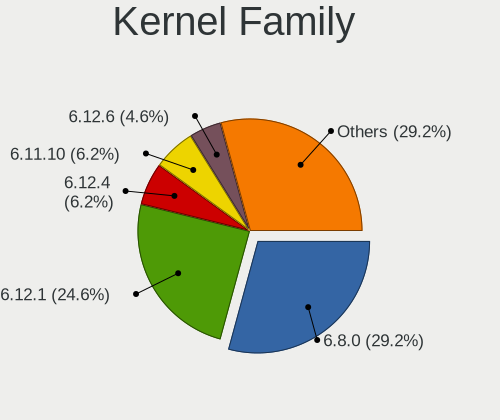
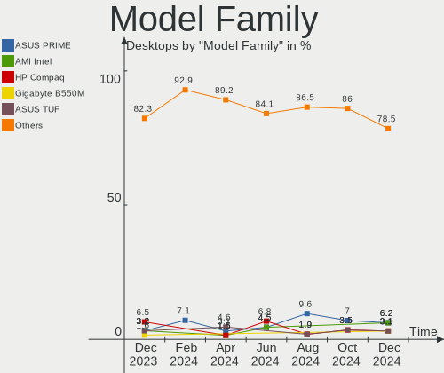
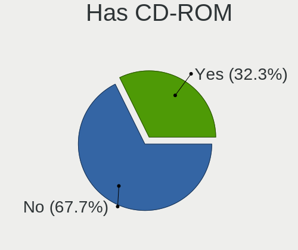
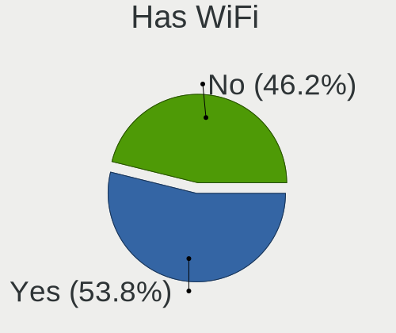
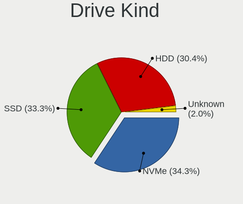
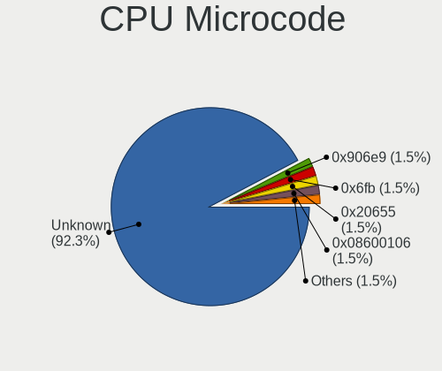
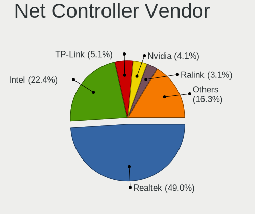
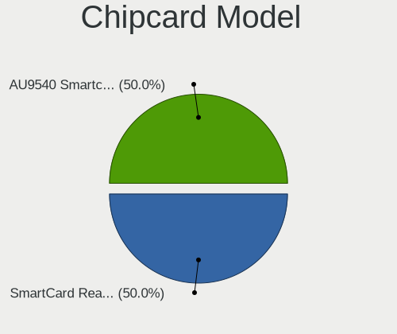

Linux in Spain - Hardware Trends (Desktops)
-------------------------------------------

A project to identify most popular hardware characteristics and track their change
over time based on data collected by Linux users at https://Linux-Hardware.org.

Anyone can contribute to this report by the [hw-probe](https://github.com/linuxhw/hw-probe) tool:

    sudo -E hw-probe -all -upload

Contents
--------

* [ System ](#system)
  - [ OS                       ](#os)
  - [ OS Family                ](#os-family)
  - [ Kernel                   ](#kernel)
  - [ Kernel Family            ](#kernel-family)
  - [ Kernel Major Ver.        ](#kernel-major-ver)
  - [ Arch                     ](#arch)
  - [ DE                       ](#de)
  - [ Display Server           ](#display-server)
  - [ Display Manager          ](#display-manager)
  - [ OS Lang                  ](#os-lang)
  - [ Boot Mode                ](#boot-mode)
  - [ Filesystem               ](#filesystem)
  - [ Part. scheme             ](#part-scheme)
  - [ Dual Boot with Linux/BSD ](#dual-boot-with-linuxbsd)
  - [ Dual Boot (Win)          ](#dual-boot-win)

* [ Board ](#board)
  - [ Vendor                   ](#vendor)
  - [ Model                    ](#model)
  - [ Model Family             ](#model-family)
  - [ MFG Year                 ](#mfg-year)
  - [ Form Factor              ](#form-factor)
  - [ Secure Boot              ](#secure-boot)
  - [ Coreboot                 ](#coreboot)
  - [ RAM Size                 ](#ram-size)
  - [ RAM Used                 ](#ram-used)
  - [ Total Drives             ](#total-drives)
  - [ Has CD-ROM               ](#has-cd-rom)
  - [ Has Ethernet             ](#has-ethernet)
  - [ Has WiFi                 ](#has-wifi)
  - [ Has Bluetooth            ](#has-bluetooth)

* [ Location ](#location)
  - [ Country                  ](#country)
  - [ City                     ](#city)

* [ Drives ](#drives)
  - [ Drive Vendor             ](#drive-vendor)
  - [ Drive Model              ](#drive-model)
  - [ HDD Vendor               ](#hdd-vendor)
  - [ SSD Vendor               ](#ssd-vendor)
  - [ Drive Kind               ](#drive-kind)
  - [ Drive Connector          ](#drive-connector)
  - [ Drive Size               ](#drive-size)
  - [ Space Total              ](#space-total)
  - [ Space Used               ](#space-used)
  - [ Malfunc. Drives          ](#malfunc-drives)
  - [ Malfunc. Drive Vendor    ](#malfunc-drive-vendor)
  - [ Malfunc. HDD Vendor      ](#malfunc-hdd-vendor)
  - [ Malfunc. Drive Kind      ](#malfunc-drive-kind)
  - [ Failed Drives            ](#failed-drives)
  - [ Failed Drive Vendor      ](#failed-drive-vendor)
  - [ Drive Status             ](#drive-status)

* [ Storage controller ](#storage-controller)
  - [ Storage Vendor           ](#storage-vendor)
  - [ Storage Model            ](#storage-model)
  - [ Storage Kind             ](#storage-kind)

* [ Processor ](#processor)
  - [ CPU Vendor               ](#cpu-vendor)
  - [ CPU Model                ](#cpu-model)
  - [ CPU Model Family         ](#cpu-model-family)
  - [ CPU Cores                ](#cpu-cores)
  - [ CPU Sockets              ](#cpu-sockets)
  - [ CPU Threads              ](#cpu-threads)
  - [ CPU Op-Modes             ](#cpu-op-modes)
  - [ CPU Microcode            ](#cpu-microcode)
  - [ CPU Microarch            ](#cpu-microarch)

* [ Graphics ](#graphics)
  - [ GPU Vendor               ](#gpu-vendor)
  - [ GPU Model                ](#gpu-model)
  - [ GPU Combo                ](#gpu-combo)
  - [ GPU Driver               ](#gpu-driver)
  - [ GPU Memory               ](#gpu-memory)

* [ Monitor ](#monitor)
  - [ Monitor Vendor           ](#monitor-vendor)
  - [ Monitor Model            ](#monitor-model)
  - [ Monitor Resolution       ](#monitor-resolution)
  - [ Monitor Diagonal         ](#monitor-diagonal)
  - [ Monitor Width            ](#monitor-width)
  - [ Aspect Ratio             ](#aspect-ratio)
  - [ Monitor Area             ](#monitor-area)
  - [ Pixel Density            ](#pixel-density)
  - [ Multiple Monitors        ](#multiple-monitors)

* [ Network ](#network)
  - [ Net Controller Vendor    ](#net-controller-vendor)
  - [ Net Controller Model     ](#net-controller-model)
  - [ Wireless Vendor          ](#wireless-vendor)
  - [ Wireless Model           ](#wireless-model)
  - [ Ethernet Vendor          ](#ethernet-vendor)
  - [ Ethernet Model           ](#ethernet-model)
  - [ Net Controller Kind      ](#net-controller-kind)
  - [ Used Controller          ](#used-controller)
  - [ NICs                     ](#nics)
  - [ IPv6                     ](#ipv6)

* [ Bluetooth ](#bluetooth)
  - [ Bluetooth Vendor         ](#bluetooth-vendor)
  - [ Bluetooth Model          ](#bluetooth-model)

* [ Sound ](#sound)
  - [ Sound Vendor             ](#sound-vendor)
  - [ Sound Model              ](#sound-model)

* [ Memory ](#memory)
  - [ Memory Vendor            ](#memory-vendor)
  - [ Memory Model             ](#memory-model)
  - [ Memory Kind              ](#memory-kind)
  - [ Memory Form Factor       ](#memory-form-factor)
  - [ Memory Size              ](#memory-size)
  - [ Memory Speed             ](#memory-speed)

* [ Printers & scanners ](#printers--scanners)
  - [ Printer Vendor           ](#printer-vendor)
  - [ Printer Model            ](#printer-model)
  - [ Scanner Vendor           ](#scanner-vendor)
  - [ Scanner Model            ](#scanner-model)

* [ Camera ](#camera)
  - [ Camera Vendor            ](#camera-vendor)
  - [ Camera Model             ](#camera-model)

* [ Security ](#security)
  - [ Fingerprint Vendor       ](#fingerprint-vendor)
  - [ Fingerprint Model        ](#fingerprint-model)
  - [ Chipcard Vendor          ](#chipcard-vendor)
  - [ Chipcard Model           ](#chipcard-model)

* [ Unsupported ](#unsupported)
  - [ Unsupported Devices      ](#unsupported-devices)
  - [ Unsupported Device Types ](#unsupported-device-types)

System
------

OS
--

Installed operating systems

| Name              | Desktops | Percent |
|-------------------|----------|---------|
| Ubuntu 20.04      | 12       | 21.05%  |
| Debian 11         | 6        | 10.53%  |
| Ubuntu 21.10      | 4        | 7.02%   |
| Manjaro           | 3        | 5.26%   |
| Linux Mint 20.3   | 3        | 5.26%   |
| Fedora 35         | 3        | 5.26%   |
| Elementary 6.1    | 3        | 5.26%   |
| Ubuntu 22.04      | 2        | 3.51%   |
| OpenMandriva 4.3  | 2        | 3.51%   |
| OpenMandriva 4.2  | 2        | 3.51%   |
| Manjaro 21.2.5    | 2        | 3.51%   |
| Zorin 16          | 1        | 1.75%   |
| Xubuntu 20.04     | 1        | 1.75%   |
| Ubuntu MATE 18.04 | 1        | 1.75%   |
| ROSA 12.2         | 1        | 1.75%   |
| Pop!_OS 21.10     | 1        | 1.75%   |
| MX 21             | 1        | 1.75%   |
| LMDE 5            | 1        | 1.75%   |
| Linux Mint 19.3   | 1        | 1.75%   |
| Kubuntu 20.10     | 1        | 1.75%   |
| Kubuntu 20.04     | 1        | 1.75%   |
| Kali 2022.1       | 1        | 1.75%   |
| Gentoo 2.8        | 1        | 1.75%   |
| Gentoo 2.7        | 1        | 1.75%   |
| Gentoo 2.6        | 1        | 1.75%   |
| Fedora 36         | 1        | 1.75%   |

OS Family
---------

OS without a version

| Name         | Desktops | Percent |
|--------------|----------|---------|
| Ubuntu       | 18       | 31.58%  |
| Debian       | 6        | 10.53%  |
| Manjaro      | 5        | 8.77%   |
| OpenMandriva | 4        | 7.02%   |
| Linux Mint   | 4        | 7.02%   |
| Fedora       | 4        | 7.02%   |
| Gentoo       | 3        | 5.26%   |
| Elementary   | 3        | 5.26%   |
| Kubuntu      | 2        | 3.51%   |
| Zorin        | 1        | 1.75%   |
| Xubuntu      | 1        | 1.75%   |
| Ubuntu MATE  | 1        | 1.75%   |
| ROSA         | 1        | 1.75%   |
| Pop!_OS      | 1        | 1.75%   |
| MX           | 1        | 1.75%   |
| LMDE         | 1        | 1.75%   |
| Kali         | 1        | 1.75%   |

Kernel
------

Version of the Linux kernel

| Version                            | Desktops | Percent |
|------------------------------------|----------|---------|
| 5.13.0-39-generic                  | 9        | 15.79%  |
| 5.10.0-13-amd64                    | 7        | 12.28%  |
| 5.13.0-40-generic                  | 6        | 10.53%  |
| 5.15.28-1-MANJARO                  | 3        | 5.26%   |
| 5.4.0-109-generic                  | 2        | 3.51%   |
| 5.4.0-107-generic                  | 2        | 3.51%   |
| 5.16.7-desktop-1omv4003            | 2        | 3.51%   |
| 5.13.0-30-generic                  | 2        | 3.51%   |
| 5.10.14-desktop-1omv4002           | 2        | 3.51%   |
| 5.8.0-63-lowlatency                | 1        | 1.75%   |
| 5.17.5-051705-generic              | 1        | 1.75%   |
| 5.17.3-051703-generic              | 1        | 1.75%   |
| 5.17.1-gentoo-r1-gentoo            | 1        | 1.75%   |
| 5.17.1-300.fc36.x86_64             | 1        | 1.75%   |
| 5.16.20-200.fc35.x86_64            | 1        | 1.75%   |
| 5.16.2-2-rt19-MANJARO              | 1        | 1.75%   |
| 5.16.19-200.fc35.x86_64            | 1        | 1.75%   |
| 5.16.11-gentoo-x86_64              | 1        | 1.75%   |
| 5.16.0-kali6-amd64                 | 1        | 1.75%   |
| 5.15.32-gentoo-r1-cp003            | 1        | 1.75%   |
| 5.15.32-1-MANJARO                  | 1        | 1.75%   |
| 5.15.16-200.fc35.x86_64            | 1        | 1.75%   |
| 5.15.15-76051515-generic           | 1        | 1.75%   |
| 5.15.0-25-generic                  | 1        | 1.75%   |
| 5.13.0-37-generic                  | 1        | 1.75%   |
| 5.13.0-27-generic                  | 1        | 1.75%   |
| 5.13.0-19-generic                  | 1        | 1.75%   |
| 5.11.0-43-generic                  | 1        | 1.75%   |
| 5.10.74-generic-2rosa2021.1-x86_64 | 1        | 1.75%   |
| 5.10.0-10-amd64                    | 1        | 1.75%   |
| 4.15.0-175-generic                 | 1        | 1.75%   |

Kernel Family
-------------

Linux kernel without a distro release

| Version | Desktops | Percent |
|---------|----------|---------|
| 5.13.0  | 20       | 35.09%  |
| 5.10.0  | 8        | 14.04%  |
| 5.4.0   | 4        | 7.02%   |
| 5.15.28 | 3        | 5.26%   |
| 5.17.1  | 2        | 3.51%   |
| 5.16.7  | 2        | 3.51%   |
| 5.15.32 | 2        | 3.51%   |
| 5.10.14 | 2        | 3.51%   |
| 5.8.0   | 1        | 1.75%   |
| 5.17.5  | 1        | 1.75%   |
| 5.17.3  | 1        | 1.75%   |
| 5.16.20 | 1        | 1.75%   |
| 5.16.2  | 1        | 1.75%   |
| 5.16.19 | 1        | 1.75%   |
| 5.16.11 | 1        | 1.75%   |
| 5.16.0  | 1        | 1.75%   |
| 5.15.16 | 1        | 1.75%   |
| 5.15.15 | 1        | 1.75%   |
| 5.15.0  | 1        | 1.75%   |
| 5.11.0  | 1        | 1.75%   |
| 5.10.74 | 1        | 1.75%   |
| 4.15.0  | 1        | 1.75%   |

Kernel Major Ver.
-----------------

Linux kernel major version

| Version | Desktops | Percent |
|---------|----------|---------|
| 5.13    | 20       | 35.09%  |
| 5.10    | 11       | 19.3%   |
| 5.15    | 8        | 14.04%  |
| 5.16    | 7        | 12.28%  |
| 5.4     | 4        | 7.02%   |
| 5.17    | 4        | 7.02%   |
| 5.8     | 1        | 1.75%   |
| 5.11    | 1        | 1.75%   |
| 4.15    | 1        | 1.75%   |

Arch
----

OS architecture (x86_64, i586, etc.)

| Name   | Desktops | Percent |
|--------|----------|---------|
| x86_64 | 56       | 98.25%  |
| i686   | 1        | 1.75%   |

DE
--

Desktop Environment

| Name       | Desktops | Percent |
|------------|----------|---------|
| GNOME      | 27       | 47.37%  |
| KDE5       | 11       | 19.3%   |
| XFCE       | 5        | 8.77%   |
| X-Cinnamon | 5        | 8.77%   |
| Pantheon   | 3        | 5.26%   |
| MATE       | 2        | 3.51%   |
| Unknown    | 2        | 3.51%   |
| openbox    | 1        | 1.75%   |
| Cinnamon   | 1        | 1.75%   |

Display Server
--------------

X11 or Wayland

| Name    | Desktops | Percent |
|---------|----------|---------|
| X11     | 45       | 78.95%  |
| Wayland | 9        | 15.79%  |
| Tty     | 2        | 3.51%   |
| Unknown | 1        | 1.75%   |

Display Manager
---------------

SDDM, LightDM, etc.

| Name    | Desktops | Percent |
|---------|----------|---------|
| Unknown | 19       | 33.33%  |
| GDM3    | 11       | 19.3%   |
| SDDM    | 10       | 17.54%  |
| LightDM | 9        | 15.79%  |
| GDM     | 7        | 12.28%  |
| LXDM    | 1        | 1.75%   |

OS Lang
-------

Language

| Lang   | Desktops | Percent |
|--------|----------|---------|
| es_ES  | 35       | 61.4%   |
| en_US  | 14       | 24.56%  |
| ca_ES  | 4        | 7.02%   |
| ru_RU  | 1        | 1.75%   |
| en_IE  | 1        | 1.75%   |
| en_GB  | 1        | 1.75%   |
| C.UTF8 | 1        | 1.75%   |

Boot Mode
---------

EFI or BIOS

| Mode | Desktops | Percent |
|------|----------|---------|
| BIOS | 33       | 57.89%  |
| EFI  | 24       | 42.11%  |

Filesystem
----------

Type of filesystem

| Type     | Desktops | Percent |
|----------|----------|---------|
| Ext4     | 47       | 82.46%  |
| Btrfs    | 6        | 10.53%  |
| Overlay  | 3        | 5.26%   |
| Reiserfs | 1        | 1.75%   |

Part. scheme
------------

Scheme of partitioning

| Type    | Desktops | Percent |
|---------|----------|---------|
| Unknown | 35       | 61.4%   |
| GPT     | 16       | 28.07%  |
| MBR     | 6        | 10.53%  |

Dual Boot with Linux/BSD
------------------------

Hosting more than one Linux/BSD

| Dual boot | Desktops | Percent |
|-----------|----------|---------|
| No        | 47       | 82.46%  |
| Yes       | 10       | 17.54%  |

Dual Boot (Win)
---------------

Hosting Linux and Windows

| Dual boot | Desktops | Percent |
|-----------|----------|---------|
| No        | 37       | 64.91%  |
| Yes       | 20       | 35.09%  |

Board
-----

Vendor
------

Motherboard manufacturer

| Name                | Desktops | Percent |
|---------------------|----------|---------|
| ASUSTek Computer    | 17       | 29.82%  |
| Gigabyte Technology | 12       | 21.05%  |
| MSI                 | 5        | 8.77%   |
| Dell                | 4        | 7.02%   |
| Medion              | 3        | 5.26%   |
| ASRock              | 3        | 5.26%   |
| Lenovo              | 2        | 3.51%   |
| Wistron             | 1        | 1.75%   |
| MACHINIST           | 1        | 1.75%   |
| Intel               | 1        | 1.75%   |
| Hewlett-Packard     | 1        | 1.75%   |
| Gateway             | 1        | 1.75%   |
| Foxconn             | 1        | 1.75%   |
| ECS                 | 1        | 1.75%   |
| BESSTAR Tech        | 1        | 1.75%   |
| AZW                 | 1        | 1.75%   |
| AMI                 | 1        | 1.75%   |
| Unknown             | 1        | 1.75%   |

Model
-----

Motherboard model

| Name                               | Desktops | Percent |
|------------------------------------|----------|---------|
| ASUS All Series                    | 3        | 5.26%   |
| Gigabyte 970A-DS3P                 | 2        | 3.51%   |
| Dell OptiPlex 3050                 | 2        | 3.51%   |
| ASUS TUF Gaming Z690-PLUS D4       | 2        | 3.51%   |
| Wistron ProLiant ML110 G5          | 1        | 1.75%   |
| MSI MS-7C52                        | 1        | 1.75%   |
| MSI MS-7B79                        | 1        | 1.75%   |
| MSI MS-7A70                        | 1        | 1.75%   |
| MSI MS-7971                        | 1        | 1.75%   |
| MSI MS-7817                        | 1        | 1.75%   |
| Medion MS-7728                     | 1        | 1.75%   |
| Medion MS-7366                     | 1        | 1.75%   |
| Medion MD34189/C731                | 1        | 1.75%   |
| MACHINIST X99-RS9 V2.0             | 1        | 1.75%   |
| Lenovo ThinkCentre M93p 10A90011MX | 1        | 1.75%   |
| Lenovo ThinkCentre E73 10AS0035SP  | 1        | 1.75%   |
| Intel V1.3                         | 1        | 1.75%   |
| HP EliteDesk 800 G1 USDT           | 1        | 1.75%   |
| Gigabyte Q67M-D2H                  | 1        | 1.75%   |
| Gigabyte P55M-UD2                  | 1        | 1.75%   |
| Gigabyte H81M-S2H                  | 1        | 1.75%   |
| Gigabyte H310M S2H 2.0             | 1        | 1.75%   |
| Gigabyte GA-990FX-GAMING           | 1        | 1.75%   |
| Gigabyte GA-78LMT-USB3             | 1        | 1.75%   |
| Gigabyte F2A88XN-WIFI              | 1        | 1.75%   |
| Gigabyte F2A88XM-D3H               | 1        | 1.75%   |
| Gigabyte F2A68HM-DS2               | 1        | 1.75%   |
| Gigabyte B85M-DS3H                 | 1        | 1.75%   |
| Gateway DS71                       | 1        | 1.75%   |
| Foxconn 945 7AD Series             | 1        | 1.75%   |
| ECS D5468AT-ABA ALONPAV            | 1        | 1.75%   |
| Dell OptiPlex 7080                 | 1        | 1.75%   |
| Dell OptiPlex 3020                 | 1        | 1.75%   |
| BESSTAR Tech UM250                 | 1        | 1.75%   |
| AZW GTi                            | 1        | 1.75%   |
| ASUS TUF Z390-PLUS GAMING          | 1        | 1.75%   |
| ASUS TUF Gaming B560-PLUS WIFI     | 1        | 1.75%   |
| ASUS TUF Gaming B460M-PLUS         | 1        | 1.75%   |
| ASUS STRIX H270F GAMING            | 1        | 1.75%   |
| ASUS ROG STRIX Z370-H GAMING       | 1        | 1.75%   |
| ASUS ROG STRIX B365-G GAMING       | 1        | 1.75%   |
| ASUS PRIME X570-PRO                | 1        | 1.75%   |
| ASUS PRIME H610M-A D4              | 1        | 1.75%   |
| ASUS PRIME B660-PLUS D4            | 1        | 1.75%   |
| ASUS PRIME A320M-K                 | 1        | 1.75%   |
| ASUS P5VD2-MX                      | 1        | 1.75%   |
| ASUS Maximus II Formula            | 1        | 1.75%   |
| ASRock X399 Phantom Gaming 6       | 1        | 1.75%   |
| ASRock C226 WS                     | 1        | 1.75%   |
| ASRock AB350M-HDV                  | 1        | 1.75%   |
| AMI Intel Education Tablet         | 1        | 1.75%   |
| Unknown                            | 1        | 1.75%   |

Model Family
------------

Motherboard model prefix

| Name                     | Desktops | Percent |
|--------------------------|----------|---------|
| ASUS TUF                 | 5        | 8.77%   |
| Dell OptiPlex            | 4        | 7.02%   |
| ASUS PRIME               | 4        | 7.02%   |
| ASUS All                 | 3        | 5.26%   |
| Lenovo ThinkCentre       | 2        | 3.51%   |
| Gigabyte 970A-DS3P       | 2        | 3.51%   |
| ASUS ROG                 | 2        | 3.51%   |
| Wistron ProLiant         | 1        | 1.75%   |
| MSI MS-7C52              | 1        | 1.75%   |
| MSI MS-7B79              | 1        | 1.75%   |
| MSI MS-7A70              | 1        | 1.75%   |
| MSI MS-7971              | 1        | 1.75%   |
| MSI MS-7817              | 1        | 1.75%   |
| Medion MS-7728           | 1        | 1.75%   |
| Medion MS-7366           | 1        | 1.75%   |
| Medion MD34189           | 1        | 1.75%   |
| MACHINIST X99-RS9        | 1        | 1.75%   |
| Intel V1.3               | 1        | 1.75%   |
| HP EliteDesk             | 1        | 1.75%   |
| Gigabyte Q67M-D2H        | 1        | 1.75%   |
| Gigabyte P55M-UD2        | 1        | 1.75%   |
| Gigabyte H81M-S2H        | 1        | 1.75%   |
| Gigabyte H310M           | 1        | 1.75%   |
| Gigabyte GA-990FX-GAMING | 1        | 1.75%   |
| Gigabyte GA-78LMT-USB3   | 1        | 1.75%   |
| Gigabyte F2A88XN-WIFI    | 1        | 1.75%   |
| Gigabyte F2A88XM-D3H     | 1        | 1.75%   |
| Gigabyte F2A68HM-DS2     | 1        | 1.75%   |
| Gigabyte B85M-DS3H       | 1        | 1.75%   |
| Gateway DS71             | 1        | 1.75%   |
| Foxconn 945              | 1        | 1.75%   |
| ECS D5468AT-ABA          | 1        | 1.75%   |
| BESSTAR Tech UM250       | 1        | 1.75%   |
| AZW GTi                  | 1        | 1.75%   |
| ASUS STRIX               | 1        | 1.75%   |
| ASUS P5VD2-MX            | 1        | 1.75%   |
| ASUS Maximus             | 1        | 1.75%   |
| ASRock X399              | 1        | 1.75%   |
| ASRock C226              | 1        | 1.75%   |
| ASRock AB350M-HDV        | 1        | 1.75%   |
| AMI Intel                | 1        | 1.75%   |
| Unknown                  | 1        | 1.75%   |

MFG Year
--------

Motherboard manufacture year

| Year | Desktops | Percent |
|------|----------|---------|
| 2013 | 9        | 15.79%  |
| 2021 | 8        | 14.04%  |
| 2017 | 7        | 12.28%  |
| 2014 | 7        | 12.28%  |
| 2019 | 5        | 8.77%   |
| 2018 | 4        | 7.02%   |
| 2016 | 3        | 5.26%   |
| 2009 | 3        | 5.26%   |
| 2020 | 2        | 3.51%   |
| 2011 | 2        | 3.51%   |
| 2007 | 2        | 3.51%   |
| 2006 | 2        | 3.51%   |
| 2015 | 1        | 1.75%   |
| 2012 | 1        | 1.75%   |
| 2010 | 1        | 1.75%   |

Form Factor
-----------

Physical design of the computer

| Name    | Desktops | Percent |
|---------|----------|---------|
| Desktop | 57       | 100%    |

Secure Boot
-----------

Enabled or disabled

| State    | Desktops | Percent |
|----------|----------|---------|
| Disabled | 55       | 96.49%  |
| Enabled  | 2        | 3.51%   |

Coreboot
--------

Have coreboot on board

| Used | Desktops | Percent |
|------|----------|---------|
| No   | 57       | 100%    |

RAM Size
--------

Total RAM memory

| Size in GB  | Desktops | Percent |
|-------------|----------|---------|
| 16.01-24.0  | 17       | 29.82%  |
| 3.01-4.0    | 12       | 21.05%  |
| 4.01-8.0    | 8        | 14.04%  |
| 32.01-64.0  | 8        | 14.04%  |
| 8.01-16.0   | 8        | 14.04%  |
| 64.01-256.0 | 2        | 3.51%   |
| 2.01-3.0    | 1        | 1.75%   |
| 1.01-2.0    | 1        | 1.75%   |

RAM Used
--------

Used RAM memory

| Used GB    | Desktops | Percent |
|------------|----------|---------|
| 1.01-2.0   | 19       | 33.33%  |
| 2.01-3.0   | 15       | 26.32%  |
| 3.01-4.0   | 8        | 14.04%  |
| 4.01-8.0   | 7        | 12.28%  |
| 0.51-1.0   | 5        | 8.77%   |
| 16.01-24.0 | 2        | 3.51%   |
| 24.01-32.0 | 1        | 1.75%   |

Total Drives
------------

Number of drives on board

| Drives | Desktops | Percent |
|--------|----------|---------|
| 1      | 19       | 33.33%  |
| 2      | 15       | 26.32%  |
| 3      | 11       | 19.3%   |
| 4      | 6        | 10.53%  |
| 6      | 3        | 5.26%   |
| 11     | 1        | 1.75%   |
| 9      | 1        | 1.75%   |
| 5      | 1        | 1.75%   |

Has CD-ROM
----------

Has CD-ROM on board

| Presented | Desktops | Percent |
|-----------|----------|---------|
| No        | 34       | 59.65%  |
| Yes       | 23       | 40.35%  |

Has Ethernet
------------

Has Ethernet on board

| Presented | Desktops | Percent |
|-----------|----------|---------|
| Yes       | 57       | 100%    |

Has WiFi
--------

Has WiFi module

| Presented | Desktops | Percent |
|-----------|----------|---------|
| No        | 30       | 52.63%  |
| Yes       | 27       | 47.37%  |

Has Bluetooth
-------------

Has Bluetooth module

| Presented | Desktops | Percent |
|-----------|----------|---------|
| No        | 39       | 68.42%  |
| Yes       | 18       | 31.58%  |

Location
--------

Country
-------

Geographic location (country)

| Country | Desktops | Percent |
|---------|----------|---------|
| Spain   | 57       | 100%    |

City
----

Geographic location (city)

| City                     | Desktops | Percent |
|--------------------------|----------|---------|
| Madrid                   | 11       | 19.3%   |
| Barcelona                | 6        | 10.53%  |
| Seville                  | 5        | 8.77%   |
| Las Rozas de Madrid      | 2        | 3.51%   |
| Granada                  | 2        | 3.51%   |
| Valencia                 | 1        | 1.75%   |
| Torrejón de Ardoz       | 1        | 1.75%   |
| Teruel                   | 1        | 1.75%   |
| Tarragona                | 1        | 1.75%   |
| Santa Úrsula            | 1        | 1.75%   |
| Salamanca                | 1        | 1.75%   |
| Ronda                    | 1        | 1.75%   |
| Ripollet                 | 1        | 1.75%   |
| Ourense                  | 1        | 1.75%   |
| Murcia                   | 1        | 1.75%   |
| Monreal                  | 1        | 1.75%   |
| Mollet del Vallès       | 1        | 1.75%   |
| Maspalomas               | 1        | 1.75%   |
| Marchena                 | 1        | 1.75%   |
| Málaga                  | 1        | 1.75%   |
| Leganés                 | 1        | 1.75%   |
| Laracha                  | 1        | 1.75%   |
| Illescas                 | 1        | 1.75%   |
| Granadilla de Abona      | 1        | 1.75%   |
| Getafe                   | 1        | 1.75%   |
| Fuenlabrada              | 1        | 1.75%   |
| Donostia / San Sebastian | 1        | 1.75%   |
| Cervo                    | 1        | 1.75%   |
| Calaf                    | 1        | 1.75%   |
| Cáceres                 | 1        | 1.75%   |
| Burgos                   | 1        | 1.75%   |
| Benaguasil               | 1        | 1.75%   |
| Bellaterra               | 1        | 1.75%   |
| Baiona                   | 1        | 1.75%   |
| Alzira                   | 1        | 1.75%   |
| Alcoy                    | 1        | 1.75%   |

Drives
------

Drive Vendor
------------

Hard drive vendors

| Vendor                    | Desktops | Drives | Percent |
|---------------------------|----------|--------|---------|
| Seagate                   | 20       | 40     | 17.24%  |
| WDC                       | 19       | 24     | 16.38%  |
| Kingston                  | 18       | 19     | 15.52%  |
| Samsung Electronics       | 17       | 21     | 14.66%  |
| Toshiba                   | 16       | 18     | 13.79%  |
| SanDisk                   | 9        | 10     | 7.76%   |
| Crucial                   | 5        | 7      | 4.31%   |
| SK Hynix                  | 1        | 1      | 0.86%   |
| PNY                       | 1        | 1      | 0.86%   |
| OCZ-VERTEX                | 1        | 1      | 0.86%   |
| OCZ                       | 1        | 1      | 0.86%   |
| Micron/Crucial Technology | 1        | 1      | 0.86%   |
| MAXTOR                    | 1        | 1      | 0.86%   |
| Intel                     | 1        | 1      | 0.86%   |
| Hitachi                   | 1        | 1      | 0.86%   |
| HGST                      | 1        | 1      | 0.86%   |
| Fujitsu                   | 1        | 1      | 0.86%   |
| China                     | 1        | 1      | 0.86%   |
| Unknown                   | 1        | 1      | 0.86%   |

Drive Model
-----------

Hard drive models

| Model                              | Desktops | Percent |
|------------------------------------|----------|---------|
| Samsung SSD 860 EVO 500GB          | 5        | 3.73%   |
| Kingston SA400S37240G 240GB SSD    | 5        | 3.73%   |
| Kingston SV300S37A120G 120GB SSD   | 4        | 2.99%   |
| WDC WD20EARX-00PASB0 2TB           | 3        | 2.24%   |
| Seagate ST3500418AS 500GB          | 3        | 2.24%   |
| Samsung SSD 850 EVO 500GB          | 3        | 2.24%   |
| Samsung NVMe SSD Drive 250GB       | 3        | 2.24%   |
| WDC WDS500G1B0A-00H9H0 500GB SSD   | 2        | 1.49%   |
| Toshiba TR200 480GB SSD            | 2        | 1.49%   |
| Toshiba MQ01ACF050 500GB           | 2        | 1.49%   |
| Toshiba MQ01ABD100 1TB             | 2        | 1.49%   |
| Toshiba DT01ACA100 1TB             | 2        | 1.49%   |
| Seagate ST1000DM010-2EP102 1TB     | 2        | 1.49%   |
| Seagate ST1000DM003-1CH162 1TB     | 2        | 1.49%   |
| Kingston SA400S37120G 120GB SSD    | 2        | 1.49%   |
| Crucial CT1000MX500SSD1 1TB        | 2        | 1.49%   |
| WDC WDS500G2B0A-00SM50 500GB SSD   | 1        | 0.75%   |
| WDC WDS250G2B0B-00YS70 250GB SSD   | 1        | 0.75%   |
| WDC WDS100T2B0A-00SM50 1TB SSD     | 1        | 0.75%   |
| WDC WD6400AAKS-22A7B0 640GB        | 1        | 0.75%   |
| WDC WD5000LPLX-00ZNTT0 500GB       | 1        | 0.75%   |
| WDC WD5000BPKX-66HPJT0 500GB       | 1        | 0.75%   |
| WDC WD5000AAKX-75U6AA0 500GB       | 1        | 0.75%   |
| WDC WD5000AAKX-60U6AA0 500GB       | 1        | 0.75%   |
| WDC WD5000AAKX-08U6AA0 500GB       | 1        | 0.75%   |
| WDC WD5000AAKX-00ERMA0 500GB       | 1        | 0.75%   |
| WDC WD40EFRX-68WT0N0 4TB           | 1        | 0.75%   |
| WDC WD40EFAX-68JH4N0 4TB           | 1        | 0.75%   |
| WDC WD3200BEKT-00F3T0 320GB        | 1        | 0.75%   |
| WDC WD3200AAJS-22L7A0 320GB        | 1        | 0.75%   |
| WDC WD10JUCT-63CYNY0 1TB           | 1        | 0.75%   |
| WDC WD10EZEX-00RKKA0 1TB           | 1        | 0.75%   |
| WDC WD1001FALS-55J7B0 1TB          | 1        | 0.75%   |
| Toshiba TR200 240GB SSD            | 1        | 0.75%   |
| Toshiba MQ01ABD075 752GB           | 1        | 0.75%   |
| Toshiba MQ01ABD050 500GB           | 1        | 0.75%   |
| Toshiba MQ01ABC150 1TB             | 1        | 0.75%   |
| Toshiba MK8052GSX 80GB             | 1        | 0.75%   |
| Toshiba HDWR160 6TB                | 1        | 0.75%   |
| Toshiba HDWE150 5TB                | 1        | 0.75%   |
| Toshiba HDWE140 4TB                | 1        | 0.75%   |
| Toshiba DT01ACA300 3TB             | 1        | 0.75%   |
| Toshiba DT01ACA200 2TB             | 1        | 0.75%   |
| SK Hynix PC611 NVMe 512GB          | 1        | 0.75%   |
| Seagate ST96812AS 64GB             | 1        | 0.75%   |
| Seagate ST500DM002-1BD142 500GB    | 1        | 0.75%   |
| Seagate ST4000DM004-2CV104 4TB     | 1        | 0.75%   |
| Seagate ST350041 8AS 500GB         | 1        | 0.75%   |
| Seagate ST3500312CS 500GB          | 1        | 0.75%   |
| Seagate ST3320620AS 320GB          | 1        | 0.75%   |
| Seagate ST3250823AS 250GB          | 1        | 0.75%   |
| Seagate ST3160215A 160GB           | 1        | 0.75%   |
| Seagate ST3160021A 160GB           | 1        | 0.75%   |
| Seagate ST31500341AS 1TB           | 1        | 0.75%   |
| Seagate ST3120827AS 120GB          | 1        | 0.75%   |
| Seagate ST31000528AS 1TB           | 1        | 0.75%   |
| Seagate ST31000520AS 1TB           | 1        | 0.75%   |
| Seagate ST2000DM006-2DM164 2TB     | 1        | 0.75%   |
| Seagate ST2000DM001-1CH164 2TB     | 1        | 0.75%   |
| Seagate ST1000LM024 HN-M101MBB 1TB | 1        | 0.75%   |

HDD Vendor
----------

Hard disk drive vendors

| Vendor  | Desktops | Drives | Percent |
|---------|----------|--------|---------|
| Seagate | 19       | 39     | 36.54%  |
| WDC     | 16       | 19     | 30.77%  |
| Toshiba | 13       | 15     | 25%     |
| MAXTOR  | 1        | 1      | 1.92%   |
| Hitachi | 1        | 1      | 1.92%   |
| HGST    | 1        | 1      | 1.92%   |
| Fujitsu | 1        | 1      | 1.92%   |

SSD Vendor
----------

Solid state drive vendors

| Vendor              | Desktops | Drives | Percent |
|---------------------|----------|--------|---------|
| Kingston            | 17       | 17     | 31.48%  |
| Samsung Electronics | 14       | 16     | 25.93%  |
| WDC                 | 5        | 5      | 9.26%   |
| SanDisk             | 5        | 6      | 9.26%   |
| Crucial             | 5        | 6      | 9.26%   |
| Toshiba             | 3        | 3      | 5.56%   |
| PNY                 | 1        | 1      | 1.85%   |
| OCZ-VERTEX          | 1        | 1      | 1.85%   |
| OCZ                 | 1        | 1      | 1.85%   |
| Intel               | 1        | 1      | 1.85%   |
| China               | 1        | 1      | 1.85%   |

Drive Kind
----------

HDD or SSD

| Kind | Desktops | Drives | Percent |
|------|----------|--------|---------|
| HDD  | 42       | 77     | 44.68%  |
| SSD  | 39       | 58     | 41.49%  |
| NVMe | 12       | 15     | 12.77%  |
| MMC  | 1        | 1      | 1.06%   |

Drive Connector
---------------

SATA, SAS, NVMe, etc.

| Type | Desktops | Drives | Percent |
|------|----------|--------|---------|
| SATA | 55       | 126    | 78.57%  |
| NVMe | 12       | 15     | 17.14%  |
| SAS  | 2        | 9      | 2.86%   |
| MMC  | 1        | 1      | 1.43%   |

Drive Size
----------

Size of hard drive

| Size in TB | Desktops | Drives | Percent |
|------------|----------|--------|---------|
| 0.01-0.5   | 46       | 76     | 54.12%  |
| 0.51-1.0   | 26       | 33     | 30.59%  |
| 1.01-2.0   | 6        | 7      | 7.06%   |
| 3.01-4.0   | 4        | 8      | 4.71%   |
| 4.01-10.0  | 2        | 10     | 2.35%   |
| 2.01-3.0   | 1        | 1      | 1.18%   |

Space Total
-----------

Amount of disk space available on the file system

| Size in GB     | Desktops | Percent |
|----------------|----------|---------|
| 101-250        | 12       | 21.05%  |
| 251-500        | 11       | 19.3%   |
| 501-1000       | 9        | 15.79%  |
| 2001-3000      | 7        | 12.28%  |
| More than 3000 | 5        | 8.77%   |
| 1001-2000      | 4        | 7.02%   |
| 51-100         | 4        | 7.02%   |
| 21-50          | 2        | 3.51%   |
| Unknown        | 2        | 3.51%   |
| 1-20           | 1        | 1.75%   |

Space Used
----------

Amount of used disk space

| Used GB        | Desktops | Percent |
|----------------|----------|---------|
| 1-20           | 18       | 31.58%  |
| 101-250        | 8        | 14.04%  |
| 251-500        | 7        | 12.28%  |
| 51-100         | 7        | 12.28%  |
| 1001-2000      | 5        | 8.77%   |
| 21-50          | 4        | 7.02%   |
| 501-1000       | 3        | 5.26%   |
| More than 3000 | 2        | 3.51%   |
| Unknown        | 2        | 3.51%   |
| 2001-3000      | 1        | 1.75%   |

Malfunc. Drives
---------------

Drive models with a malfunction

| Model                                 | Desktops | Drives | Percent |
|---------------------------------------|----------|--------|---------|
| WDC WD5000LPLX-00ZNTT0 500GB          | 1        | 2      | 11.11%  |
| WDC WD40EFRX-68WT0N0 4TB              | 1        | 1      | 11.11%  |
| Toshiba MQ01ABC150 1TB                | 1        | 1      | 11.11%  |
| Seagate ST3250823AS 250GB             | 1        | 1      | 11.11%  |
| Seagate ST3120827AS 120GB             | 1        | 1      | 11.11%  |
| Seagate ST1000LM024 HN-M101MBB 1TB    | 1        | 1      | 11.11%  |
| Seagate ST1000DM003-1ER162 1TB        | 1        | 1      | 11.11%  |
| Samsung Electronics SSD 850 EVO 500GB | 1        | 1      | 11.11%  |
| MAXTOR STM3250310AS 250GB             | 1        | 1      | 11.11%  |

Malfunc. Drive Vendor
---------------------

Vendors of faulty drives

| Vendor              | Desktops | Drives | Percent |
|---------------------|----------|--------|---------|
| Seagate             | 4        | 4      | 44.44%  |
| WDC                 | 2        | 3      | 22.22%  |
| Toshiba             | 1        | 1      | 11.11%  |
| Samsung Electronics | 1        | 1      | 11.11%  |
| MAXTOR              | 1        | 1      | 11.11%  |

Malfunc. HDD Vendor
-------------------

Vendors of faulty HDD drives

| Vendor  | Desktops | Drives | Percent |
|---------|----------|--------|---------|
| Seagate | 4        | 4      | 50%     |
| WDC     | 2        | 3      | 25%     |
| Toshiba | 1        | 1      | 12.5%   |
| MAXTOR  | 1        | 1      | 12.5%   |

Malfunc. Drive Kind
-------------------

Kinds of faulty drives

| Kind | Desktops | Drives | Percent |
|------|----------|--------|---------|
| HDD  | 5        | 9      | 83.33%  |
| SSD  | 1        | 1      | 16.67%  |

Failed Drives
-------------

Failed drive models

| Model                    | Desktops | Drives | Percent |
|--------------------------|----------|--------|---------|
| Seagate ST31000520AS 1TB | 1        | 1      | 100%    |

Failed Drive Vendor
-------------------

Failed drive vendors

| Vendor  | Desktops | Drives | Percent |
|---------|----------|--------|---------|
| Seagate | 1        | 1      | 100%    |

Drive Status
------------

Number of failed and malfunc. drives

| Status   | Desktops | Drives | Percent |
|----------|----------|--------|---------|
| Detected | 38       | 97     | 60.32%  |
| Works    | 19       | 43     | 30.16%  |
| Malfunc  | 5        | 10     | 7.94%   |
| Failed   | 1        | 1      | 1.59%   |

Storage controller
------------------

Storage Vendor
--------------

Storage controller vendors

| Vendor                      | Desktops | Percent |
|-----------------------------|----------|---------|
| Intel                       | 38       | 47.5%   |
| AMD                         | 14       | 17.5%   |
| Sandisk                     | 4        | 5%      |
| Samsung Electronics         | 4        | 5%      |
| Marvell Technology Group    | 4        | 5%      |
| ASMedia Technology          | 4        | 5%      |
| Nvidia                      | 3        | 3.75%   |
| Micron/Crucial Technology   | 2        | 2.5%    |
| Kingston Technology Company | 2        | 2.5%    |
| JMicron Technology          | 2        | 2.5%    |
| VIA Technologies            | 1        | 1.25%   |
| SK Hynix                    | 1        | 1.25%   |
| Seagate Technology          | 1        | 1.25%   |

Storage Model
-------------

Storage controller models

| Model                                                                                   | Desktops | Percent |
|-----------------------------------------------------------------------------------------|----------|---------|
| Intel 8 Series/C220 Series Chipset Family 6-port SATA Controller 1 [AHCI mode]          | 11       | 11.11%  |
| AMD FCH SATA Controller [AHCI mode]                                                     | 9        | 9.09%   |
| Intel SATA Controller [RAID mode]                                                       | 5        | 5.05%   |
| Intel Alder Lake-S PCH SATA Controller [AHCI Mode]                                      | 4        | 4.04%   |
| Intel 200 Series PCH SATA controller [AHCI mode]                                        | 4        | 4.04%   |
| ASMedia ASM1062 Serial ATA Controller                                                   | 4        | 4.04%   |
| Samsung NVMe SSD Controller SM961/PM961/SM963                                           | 3        | 3.03%   |
| Intel Volume Management Device NVMe RAID Controller                                     | 3        | 3.03%   |
| AMD SB7x0/SB8x0/SB9x0 SATA Controller [AHCI mode]                                       | 3        | 3.03%   |
| Samsung NVMe SSD Controller SM981/PM981/PM983                                           | 2        | 2.02%   |
| Intel 6 Series/C200 Series Chipset Family Desktop SATA Controller (IDE mode, ports 4-5) | 2        | 2.02%   |
| Intel 6 Series/C200 Series Chipset Family Desktop SATA Controller (IDE mode, ports 0-3) | 2        | 2.02%   |
| AMD FCH SATA Controller D                                                               | 2        | 2.02%   |
| VIA VT82C586A/B/VT82C686/A/B/VT823x/A/C PIPC Bus Master IDE                             | 1        | 1.01%   |
| VIA Serial ATA Controller                                                               | 1        | 1.01%   |
| SK Hynix Non-Volatile memory controller                                                 | 1        | 1.01%   |
| Seagate FireCuda 520 SSD                                                                | 1        | 1.01%   |
| Sandisk WD Blue SN570 NVMe SSD                                                          | 1        | 1.01%   |
| Sandisk WD Blue SN500 / PC SN520 NVMe SSD                                               | 1        | 1.01%   |
| Sandisk WD Black NVMe SSD                                                               | 1        | 1.01%   |
| Sandisk WD Black 2018/SN750 / PC SN720 NVMe SSD                                         | 1        | 1.01%   |
| Nvidia MCP79 SATA Controller                                                            | 1        | 1.01%   |
| Nvidia MCP73 IDE Controller                                                             | 1        | 1.01%   |
| Nvidia MCP61 SATA Controller                                                            | 1        | 1.01%   |
| Nvidia MCP61 IDE                                                                        | 1        | 1.01%   |
| Nvidia GeForce 7100/nForce 630i SATA                                                    | 1        | 1.01%   |
| Micron/Crucial P1 NVMe PCIe SSD                                                         | 1        | 1.01%   |
| Micron/Crucial Non-Volatile memory controller                                           | 1        | 1.01%   |
| Marvell Group 88SE9230 PCIe 2.0 x2 4-port SATA 6 Gb/s RAID Controller                   | 1        | 1.01%   |
| Marvell Group 88SE9215 PCIe 2.0 x1 4-port SATA 6 Gb/s Controller                        | 1        | 1.01%   |
| Marvell Group 88SE9172 SATA 6Gb/s Controller                                            | 1        | 1.01%   |
| Marvell Group 88SE6111/6121 SATA II / PATA Controller                                   | 1        | 1.01%   |
| Kingston Company KC2000 NVMe SSD                                                        | 1        | 1.01%   |
| Kingston Company A2000 NVMe SSD                                                         | 1        | 1.01%   |
| JMicron JMB363 SATA/IDE Controller                                                      | 1        | 1.01%   |
| JMicron JMB361 AHCI/IDE                                                                 | 1        | 1.01%   |
| Intel Tiger Lake-LP SATA Controller [AHCI mode]                                         | 1        | 1.01%   |
| Intel Q170/Q150/B150/H170/H110/Z170/CM236 Chipset SATA Controller [AHCI Mode]           | 1        | 1.01%   |
| Intel NM10/ICH7 Family SATA Controller [IDE mode]                                       | 1        | 1.01%   |
| Intel Comet Lake SATA AHCI Controller                                                   | 1        | 1.01%   |
| Intel 9 Series Chipset Family SATA Controller [AHCI Mode]                               | 1        | 1.01%   |
| Intel 82801JI (ICH10 Family) SATA AHCI Controller                                       | 1        | 1.01%   |
| Intel 82801IR/IO/IH (ICH9R/DO/DH) 4 port SATA Controller [IDE mode]                     | 1        | 1.01%   |
| Intel 82801I (ICH9 Family) 2 port SATA Controller [IDE mode]                            | 1        | 1.01%   |
| Intel 82801G (ICH7 Family) IDE Controller                                               | 1        | 1.01%   |
| Intel 6 Series/C200 Series Chipset Family IDE-r Controller                              | 1        | 1.01%   |
| Intel 6 Series/C200 Series Chipset Family 6 port Desktop SATA AHCI Controller           | 1        | 1.01%   |
| Intel 500 Series Chipset Family SATA AHCI Controller                                    | 1        | 1.01%   |
| Intel 5 Series/3400 Series Chipset 6 port SATA AHCI Controller                          | 1        | 1.01%   |
| Intel 5 Series/3400 Series Chipset 4 port SATA IDE Controller                           | 1        | 1.01%   |
| Intel 5 Series/3400 Series Chipset 2 port SATA IDE Controller                           | 1        | 1.01%   |
| Intel 300 Series Chipset Family SATA RAID Controller                                    | 1        | 1.01%   |
| AMD X399 Series Chipset SATA Controller                                                 | 1        | 1.01%   |
| AMD SB7x0/SB8x0/SB9x0 SATA Controller [IDE mode]                                        | 1        | 1.01%   |
| AMD SB7x0/SB8x0/SB9x0 IDE Controller                                                    | 1        | 1.01%   |
| AMD FCH SATA Controller [IDE mode]                                                      | 1        | 1.01%   |
| AMD 400 Series Chipset SATA Controller                                                  | 1        | 1.01%   |
| AMD 300 Series Chipset SATA Controller                                                  | 1        | 1.01%   |

Storage Kind
------------

Kind of storage controller (IDE, SATA, NVMe, SAS, ...)

| Kind | Desktops | Percent |
|------|----------|---------|
| SATA | 43       | 56.58%  |
| NVMe | 12       | 15.79%  |
| IDE  | 12       | 15.79%  |
| RAID | 9        | 11.84%  |

Processor
---------

CPU Vendor
----------

Processor vendors

| Vendor | Desktops | Percent |
|--------|----------|---------|
| Intel  | 42       | 73.68%  |
| AMD    | 15       | 26.32%  |

CPU Model
---------

Processor models

| Model                                           | Desktops | Percent |
|-------------------------------------------------|----------|---------|
| Intel Core i3-4130 CPU @ 3.40GHz                | 3        | 5.26%   |
| Intel Pentium CPU G4400T @ 2.90GHz              | 2        | 3.51%   |
| Intel Core i7-4770 CPU @ 3.40GHz                | 2        | 3.51%   |
| Intel Core i5-4570 CPU @ 3.20GHz                | 2        | 3.51%   |
| Intel Xeon CPU E5-2666 v3 @ 2.90GHz             | 1        | 1.75%   |
| Intel Pentium Dual-Core CPU E5200 @ 2.50GHz     | 1        | 1.75%   |
| Intel Pentium CPU G2030 @ 3.00GHz               | 1        | 1.75%   |
| Intel Genuine CPU 2160 @ 1.80GHz                | 1        | 1.75%   |
| Intel Core i9-9900KF CPU @ 3.60GHz              | 1        | 1.75%   |
| Intel Core i7-8700 CPU @ 3.20GHz                | 1        | 1.75%   |
| Intel Core i7-7700 CPU @ 3.60GHz                | 1        | 1.75%   |
| Intel Core i7-4790K CPU @ 4.00GHz               | 1        | 1.75%   |
| Intel Core i7-10700 CPU @ 2.90GHz               | 1        | 1.75%   |
| Intel Core i5-9400 CPU @ 2.90GHz                | 1        | 1.75%   |
| Intel Core i5-8400 CPU @ 2.80GHz                | 1        | 1.75%   |
| Intel Core i5-6500 CPU @ 3.20GHz                | 1        | 1.75%   |
| Intel Core i5-4570S CPU @ 2.90GHz               | 1        | 1.75%   |
| Intel Core i5-4460 CPU @ 3.20GHz                | 1        | 1.75%   |
| Intel Core i5-2320 CPU @ 3.00GHz                | 1        | 1.75%   |
| Intel Core i5-10400 CPU @ 2.90GHz               | 1        | 1.75%   |
| Intel Core i5 CPU M 520 @ 2.40GHz               | 1        | 1.75%   |
| Intel Core i5 CPU 750 @ 2.67GHz                 | 1        | 1.75%   |
| Intel Core i3-9100 CPU @ 3.60GHz                | 1        | 1.75%   |
| Intel Core i3-7100 CPU @ 3.90GHz                | 1        | 1.75%   |
| Intel Core i3-4150 CPU @ 3.50GHz                | 1        | 1.75%   |
| Intel Core i3-2100 CPU @ 3.10GHz                | 1        | 1.75%   |
| Intel Core 2 Quad CPU Q6600 @ 2.40GHz           | 1        | 1.75%   |
| Intel Core 2 Duo CPU E7400 @ 2.80GHz            | 1        | 1.75%   |
| Intel Core 2 CPU 6420 @ 2.13GHz                 | 1        | 1.75%   |
| Intel Atom x5-Z8350 CPU @ 1.44GHz               | 1        | 1.75%   |
| Intel Atom CPU 330 @ 1.60GHz                    | 1        | 1.75%   |
| Intel 12th Gen Core i9-12900K                   | 1        | 1.75%   |
| Intel 12th Gen Core i7-12700K                   | 1        | 1.75%   |
| Intel 12th Gen Core i5-12600K                   | 1        | 1.75%   |
| Intel 12th Gen Core i3-12100F                   | 1        | 1.75%   |
| Intel 11th Gen Core i5-11400F @ 2.60GHz         | 1        | 1.75%   |
| Intel 11th Gen Core i5-1135G7 @ 2.40GHz         | 1        | 1.75%   |
| AMD Ryzen Threadripper 1920X 12-Core Processor  | 1        | 1.75%   |
| AMD Ryzen Embedded V1605B with Radeon Vega Gfx  | 1        | 1.75%   |
| AMD Ryzen 7 2700 Eight-Core Processor           | 1        | 1.75%   |
| AMD Ryzen 5 3600XT 6-Core Processor             | 1        | 1.75%   |
| AMD Ryzen 5 2600X Six-Core Processor            | 1        | 1.75%   |
| AMD Ryzen 5 2600 Six-Core Processor             | 1        | 1.75%   |
| AMD Ryzen 5 2400GE with Radeon Vega Graphics    | 1        | 1.75%   |
| AMD FX-8320E Eight-Core Processor               | 1        | 1.75%   |
| AMD FX-8320 Eight-Core Processor                | 1        | 1.75%   |
| AMD FX-6300 Six-Core Processor                  | 1        | 1.75%   |
| AMD FX-4320 Quad-Core Processor                 | 1        | 1.75%   |
| AMD Athlon 64 X2 Dual Core Processor 4000+      | 1        | 1.75%   |
| AMD A10-7850K Radeon R7, 12 Compute Cores 4C+8G | 1        | 1.75%   |
| AMD A10-6800K APU with Radeon HD Graphics       | 1        | 1.75%   |
| AMD A10-6700 APU with Radeon HD Graphics        | 1        | 1.75%   |

CPU Model Family
----------------

Processor model prefix

| Model                   | Desktops | Percent |
|-------------------------|----------|---------|
| Intel Core i5           | 11       | 19.3%   |
| Intel Core i3           | 7        | 12.28%  |
| Other                   | 6        | 10.53%  |
| Intel Core i7           | 6        | 10.53%  |
| AMD Ryzen 5             | 4        | 7.02%   |
| AMD FX                  | 4        | 7.02%   |
| Intel Pentium           | 3        | 5.26%   |
| AMD A10                 | 3        | 5.26%   |
| Intel Atom              | 2        | 3.51%   |
| Intel Xeon              | 1        | 1.75%   |
| Intel Pentium Dual-Core | 1        | 1.75%   |
| Intel Genuine           | 1        | 1.75%   |
| Intel Core i9           | 1        | 1.75%   |
| Intel Core 2 Quad       | 1        | 1.75%   |
| Intel Core 2 Duo        | 1        | 1.75%   |
| Intel Core 2            | 1        | 1.75%   |
| AMD Ryzen Threadripper  | 1        | 1.75%   |
| AMD Ryzen Embedded      | 1        | 1.75%   |
| AMD Ryzen 7             | 1        | 1.75%   |
| AMD Athlon 64 X2        | 1        | 1.75%   |

CPU Cores
---------

Number of processor cores

| Number | Desktops | Percent |
|--------|----------|---------|
| 2      | 20       | 35.09%  |
| 4      | 19       | 33.33%  |
| 6      | 8        | 14.04%  |
| 8      | 3        | 5.26%   |
| 12     | 2        | 3.51%   |
| 10     | 2        | 3.51%   |
| 3      | 2        | 3.51%   |
| 16     | 1        | 1.75%   |

CPU Sockets
-----------

Number of sockets

| Number | Desktops | Percent |
|--------|----------|---------|
| 1      | 57       | 100%    |

CPU Threads
-----------

Threads per core (Hyper-Threading)

| Number | Desktops | Percent |
|--------|----------|---------|
| 2      | 34       | 59.65%  |
| 1      | 23       | 40.35%  |

CPU Op-Modes
------------

CPU Operation Modes (32-bit, 64-bit)

| Op mode        | Desktops | Percent |
|----------------|----------|---------|
| 32-bit, 64-bit | 57       | 100%    |

CPU Microcode
-------------

Microcode number

| Number     | Desktops | Percent |
|------------|----------|---------|
| Unknown    | 17       | 29.82%  |
| 0x306c3    | 8        | 14.04%  |
| 0x506e3    | 3        | 5.26%   |
| 0x06000852 | 3        | 5.26%   |
| 0x906e9    | 2        | 3.51%   |
| 0x206a7    | 2        | 3.51%   |
| 0x0800820d | 2        | 3.51%   |
| 0xa0655    | 1        | 1.75%   |
| 0xa0653    | 1        | 1.75%   |
| 0x906ed    | 1        | 1.75%   |
| 0x906eb    | 1        | 1.75%   |
| 0x906ea    | 1        | 1.75%   |
| 0x90675    | 1        | 1.75%   |
| 0x90672    | 1        | 1.75%   |
| 0x806c1    | 1        | 1.75%   |
| 0x6fb      | 1        | 1.75%   |
| 0x6f6      | 1        | 1.75%   |
| 0x6f2      | 1        | 1.75%   |
| 0x306a9    | 1        | 1.75%   |
| 0x20655    | 1        | 1.75%   |
| 0x106c2    | 1        | 1.75%   |
| 0x1067a    | 1        | 1.75%   |
| 0x10676    | 1        | 1.75%   |
| 0x08701021 | 1        | 1.75%   |
| 0x08001137 | 1        | 1.75%   |
| 0x06003106 | 1        | 1.75%   |
| 0x0600081c | 1        | 1.75%   |

CPU Microarch
-------------

Microarchitecture

| Name             | Desktops | Percent |
|------------------|----------|---------|
| Haswell          | 12       | 21.05%  |
| KabyLake         | 7        | 12.28%  |
| Piledriver       | 6        | 10.53%  |
| Unknown          | 4        | 7.02%   |
| Zen+             | 3        | 5.26%   |
| Zen              | 3        | 5.26%   |
| Skylake          | 3        | 5.26%   |
| Core             | 3        | 5.26%   |
| SandyBridge      | 2        | 3.51%   |
| Penryn           | 2        | 3.51%   |
| CometLake        | 2        | 3.51%   |
| Zen 2            | 1        | 1.75%   |
| Westmere         | 1        | 1.75%   |
| TigerLake        | 1        | 1.75%   |
| Steamroller      | 1        | 1.75%   |
| Silvermont       | 1        | 1.75%   |
| Nehalem          | 1        | 1.75%   |
| K8 Hammer        | 1        | 1.75%   |
| IvyBridge        | 1        | 1.75%   |
| Bonnell          | 1        | 1.75%   |
| Alderlake Hybrid | 1        | 1.75%   |

Graphics
--------

GPU Vendor
----------

Vendors of graphics cards

| Vendor                     | Desktops | Percent |
|----------------------------|----------|---------|
| Nvidia                     | 25       | 41.67%  |
| Intel                      | 18       | 30%     |
| AMD                        | 16       | 26.67%  |
| Matrox Electronics Systems | 1        | 1.67%   |

GPU Model
---------

Graphics card models

| Model                                                                                    | Desktops | Percent |
|------------------------------------------------------------------------------------------|----------|---------|
| AMD Ellesmere [Radeon RX 470/480/570/570X/580/580X/590]                                  | 6        | 10%     |
| Intel Xeon E3-1200 v3/4th Gen Core Processor Integrated Graphics Controller              | 4        | 6.67%   |
| Nvidia GP107 [GeForce GTX 1050 Ti]                                                       | 3        | 5%      |
| Nvidia GK208B [GeForce GT 710]                                                           | 3        | 5%      |
| Intel 4th Generation Core Processor Family Integrated Graphics Controller                | 3        | 5%      |
| Nvidia GT218 [GeForce 210]                                                               | 2        | 3.33%   |
| Nvidia GM206 [GeForce GTX 960]                                                           | 2        | 3.33%   |
| Nvidia GM107 [GeForce GTX 750 Ti]                                                        | 2        | 3.33%   |
| Intel HD Graphics 510                                                                    | 2        | 3.33%   |
| Intel CometLake-S GT2 [UHD Graphics 630]                                                 | 2        | 3.33%   |
| Intel CoffeeLake-S GT2 [UHD Graphics 630]                                                | 2        | 3.33%   |
| AMD Raven Ridge [Radeon Vega Series / Radeon Vega Mobile Series]                         | 2        | 3.33%   |
| Nvidia TU116 [GeForce GTX 1650 SUPER]                                                    | 1        | 1.67%   |
| Nvidia TU102 [GeForce RTX 2080 Ti Rev. A]                                                | 1        | 1.67%   |
| Nvidia GP108 [GeForce GT 1030]                                                           | 1        | 1.67%   |
| Nvidia GP107 [GeForce GTX 1050]                                                          | 1        | 1.67%   |
| Nvidia GP106 [GeForce GTX 1060 6GB]                                                      | 1        | 1.67%   |
| Nvidia GM204 [GeForce GTX 970]                                                           | 1        | 1.67%   |
| Nvidia GF114 [GeForce GTX 560]                                                           | 1        | 1.67%   |
| Nvidia GA104 [GeForce RTX 3060 Ti Lite Hash Rate]                                        | 1        | 1.67%   |
| Nvidia GA102 [GeForce RTX 3080 Lite Hash Rate]                                           | 1        | 1.67%   |
| Nvidia G84 [GeForce 8600 GT]                                                             | 1        | 1.67%   |
| Nvidia G72 [GeForce 7300 LE]                                                             | 1        | 1.67%   |
| Nvidia C79 [ION]                                                                         | 1        | 1.67%   |
| Nvidia C73 [GeForce 7100 / nForce 630i]                                                  | 1        | 1.67%   |
| Matrox Electronics Systems MGA G200e [Pilot] ServerEngines (SEP1)                        | 1        | 1.67%   |
| Intel Xeon E3-1200 v2/3rd Gen Core processor Graphics Controller                         | 1        | 1.67%   |
| Intel TigerLake-LP GT2 [Iris Xe Graphics]                                                | 1        | 1.67%   |
| Intel HD Graphics 630                                                                    | 1        | 1.67%   |
| Intel Core Processor Integrated Graphics Controller                                      | 1        | 1.67%   |
| Intel Atom/Celeron/Pentium Processor x5-E8000/J3xxx/N3xxx Integrated Graphics Controller | 1        | 1.67%   |
| AMD Turks PRO [Radeon HD 7570]                                                           | 1        | 1.67%   |
| AMD Tonga PRO [Radeon R9 285/380]                                                        | 1        | 1.67%   |
| AMD RV730 XT [Radeon HD 4670]                                                            | 1        | 1.67%   |
| AMD Navi 24 [Radeon RX 6400 / 6500 XT]                                                   | 1        | 1.67%   |
| AMD Kaveri [Radeon R7 Graphics]                                                          | 1        | 1.67%   |
| AMD Juniper XT [Radeon HD 5770]                                                          | 1        | 1.67%   |
| AMD Cayman XT [Radeon HD 6970]                                                           | 1        | 1.67%   |
| AMD Caicos [Radeon HD 6450/7450/8450 / R5 230 OEM]                                       | 1        | 1.67%   |

GPU Combo
---------

Combinations of graphics cards

| Name           | Desktops | Percent |
|----------------|----------|---------|
| 1 x Nvidia     | 23       | 40.35%  |
| 1 x Intel      | 16       | 28.07%  |
| 1 x AMD        | 14       | 24.56%  |
| 1 x Matrox     | 1        | 1.75%   |
| Intel + Nvidia | 1        | 1.75%   |
| Intel + AMD    | 1        | 1.75%   |
| AMD + Nvidia   | 1        | 1.75%   |

GPU Driver
----------

Free vs proprietary

| Driver      | Desktops | Percent |
|-------------|----------|---------|
| Free        | 44       | 77.19%  |
| Proprietary | 11       | 19.3%   |
| Unknown     | 2        | 3.51%   |

GPU Memory
----------

Total video memory

| Size in GB | Desktops | Percent |
|------------|----------|---------|
| Unknown    | 28       | 49.12%  |
| 3.01-4.0   | 8        | 14.04%  |
| 1.01-2.0   | 6        | 10.53%  |
| 0.51-1.0   | 6        | 10.53%  |
| 7.01-8.0   | 4        | 7.02%   |
| 0.01-0.5   | 3        | 5.26%   |
| 5.01-6.0   | 1        | 1.75%   |
| 8.01-16.0  | 1        | 1.75%   |

Monitor
-------

Monitor Vendor
--------------

Monitor vendors

| Vendor                  | Desktops | Percent |
|-------------------------|----------|---------|
| Samsung Electronics     | 10       | 14.29%  |
| Acer                    | 8        | 11.43%  |
| Ancor Communications    | 7        | 10%     |
| Goldstar                | 6        | 8.57%   |
| Dell                    | 6        | 8.57%   |
| Hewlett-Packard         | 5        | 7.14%   |
| Philips                 | 4        | 5.71%   |
| BenQ                    | 4        | 5.71%   |
| LG Electronics          | 3        | 4.29%   |
| Lenovo                  | 3        | 4.29%   |
| Unknown                 | 2        | 2.86%   |
| S2-Tek                  | 2        | 2.86%   |
| AOC                     | 2        | 2.86%   |
| Unknown                 | 2        | 2.86%   |
| ViewSonic               | 1        | 1.43%   |
| NAV                     | 1        | 1.43%   |
| Microstep               | 1        | 1.43%   |
| HannStar                | 1        | 1.43%   |
| CTV                     | 1        | 1.43%   |
| Chi Mei Optoelectronics | 1        | 1.43%   |

Monitor Model
-------------

Monitor models

| Model                                                                 | Desktops | Percent |
|-----------------------------------------------------------------------|----------|---------|
| S2-Tek TV STK531A 1920x1080 930x530mm 42.1-inch                       | 2        | 2.67%   |
| Dell E1916He DELF067 1366x768 410x230mm 18.5-inch                     | 2        | 2.67%   |
| Unknown                                                               | 2        | 2.67%   |
| ViewSonic VX2718-2KPC VSCB73A 2560x1440 598x336mm 27.0-inch           | 1        | 1.33%   |
| Unknown LCD Monitor Toshiba PA3552                                    | 1        | 1.33%   |
| Unknown LCD Monitor FFFF 2288x1287 2550x2550mm 142.0-inch             | 1        | 1.33%   |
| Samsung Electronics U28E590 SAM0C4D 3840x2160 607x345mm 27.5-inch     | 1        | 1.33%   |
| Samsung Electronics SyncMaster SAM0255 1680x1050 474x296mm 22.0-inch  | 1        | 1.33%   |
| Samsung Electronics SyncMaster SAM0226 1440x900 410x260mm 19.1-inch   | 1        | 1.33%   |
| Samsung Electronics SyncMaster SAM01F9 1280x1024 376x301mm 19.0-inch  | 1        | 1.33%   |
| Samsung Electronics SyncMaster SAM0022 1280x1024 312x234mm 15.4-inch  | 1        | 1.33%   |
| Samsung Electronics SMEX2220 SAM0686 1920x1080 477x268mm 21.5-inch    | 1        | 1.33%   |
| Samsung Electronics SA300/SA350 SAM07D2 1920x1080 477x268mm 21.5-inch | 1        | 1.33%   |
| Samsung Electronics SA300/SA350 SAM07D1 1920x1080 477x268mm 21.5-inch | 1        | 1.33%   |
| Samsung Electronics S24E450 SAM0C80 1920x1080 521x293mm 23.5-inch     | 1        | 1.33%   |
| Samsung Electronics S22D300 SAM0B3F 1920x1080 477x268mm 21.5-inch     | 1        | 1.33%   |
| Samsung Electronics M3704C SAM064E 1920x1080                          | 1        | 1.33%   |
| Samsung Electronics LCD Monitor SAM0678 1360x768                      | 1        | 1.33%   |
| Samsung Electronics C32F391 SAM0D35 1920x1080 698x393mm 31.5-inch     | 1        | 1.33%   |
| Philips PHL 273V7 PHLC156 1920x1080 598x336mm 27.0-inch               | 1        | 1.33%   |
| Philips PHL 243V7 PHLC155 1920x1080 527x296mm 23.8-inch               | 1        | 1.33%   |
| Philips PHL 193V5 PHLC0CD 1366x768 410x230mm 18.5-inch                | 1        | 1.33%   |
| Philips 234CL PHLC066 1920x1080 509x286mm 23.0-inch                   | 1        | 1.33%   |
| NAV NANOVISION NAV0010 800x480 80x50mm 3.7-inch                       | 1        | 1.33%   |
| Microstep LCD Monitor MSI MP271 1920x1080                             | 1        | 1.33%   |
| LG Electronics LCD Monitor LG ULTRAGEAR                               | 1        | 1.33%   |
| LG Electronics LCD Monitor LG IPS FULLHD                              | 1        | 1.33%   |
| LG Electronics LCD Monitor LG HDR WFHD                                | 1        | 1.33%   |
| Lenovo LEN T2454pA LEN60C9 1920x1200 518x324mm 24.1-inch              | 1        | 1.33%   |
| Lenovo D24-20 LEN66AE 1920x1080 527x296mm 23.8-inch                   | 1        | 1.33%   |
| Lenovo C24-25 LEN66B0 1920x1080 527x296mm 23.8-inch                   | 1        | 1.33%   |
| Hewlett-Packard M27fe FHD HPN378E 1920x1080 597x336mm 27.0-inch       | 1        | 1.33%   |
| Hewlett-Packard LA1905 HWP2844 1440x900 408x255mm 18.9-inch           | 1        | 1.33%   |
| Hewlett-Packard L2245w HWP26FC 1680x1050 473x296mm 22.0-inch          | 1        | 1.33%   |
| Hewlett-Packard 24m HPN3577 1920x1080 527x297mm 23.8-inch             | 1        | 1.33%   |
| Hewlett-Packard 24f HPN3545 1920x1080 530x300mm 24.0-inch             | 1        | 1.33%   |
| HannStar HW191D HSD8991 1440x900 408x255mm 18.9-inch                  | 1        | 1.33%   |
| Goldstar M2380D GSM57BA 1920x1080 509x286mm 23.0-inch                 | 1        | 1.33%   |
| Goldstar M2062D GSME4F0 1600x900 443x249mm 20.0-inch                  | 1        | 1.33%   |
| Goldstar M1994D-PZ GSM4B89 1680x1050 408x255mm 18.9-inch              | 1        | 1.33%   |
| Goldstar HDR 4K GSM7750 3840x2160 697x392mm 31.5-inch                 | 1        | 1.33%   |
| Goldstar 27GL650F GSM5B71 1920x1080 597x336mm 27.0-inch               | 1        | 1.33%   |
| Goldstar 23MP55 GSM5A23 1920x1080 510x290mm 23.1-inch                 | 1        | 1.33%   |
| Dell U2715H DELD065 2560x1440 600x340mm 27.2-inch                     | 1        | 1.33%   |
| Dell P2312H DEL4076 1920x1080 510x287mm 23.0-inch                     | 1        | 1.33%   |
| Dell E190S DELA04B 1280x1024 376x301mm 19.0-inch                      | 1        | 1.33%   |
| Dell 2001FP DELA007 1600x1200 367x275mm 18.1-inch                     | 1        | 1.33%   |
| Dell 1908FP DEL4025 1280x1024 376x301mm 19.0-inch                     | 1        | 1.33%   |
| CTV TV CTV0030 1920x1080 708x398mm 32.0-inch                          | 1        | 1.33%   |
| Chi Mei Optoelectronics CMC 19AW CMO2198 1440x900 408x255mm 18.9-inch | 1        | 1.33%   |
| BenQ VZ2770H BNQ7B3C 1920x1080 598x336mm 27.0-inch                    | 1        | 1.33%   |
| BenQ GW2406Z BNQ78E1 1920x1080 527x296mm 23.8-inch                    | 1        | 1.33%   |
| BenQ GW2280 BNQ78E8 1920x1080 476x268mm 21.5-inch                     | 1        | 1.33%   |
| BenQ GW2270 BNQ78DB 1920x1080 480x270mm 21.7-inch                     | 1        | 1.33%   |
| BenQ EW3270U BNQ7950 3840x2160 698x393mm 31.5-inch                    | 1        | 1.33%   |
| AOC 2270W AOC2270 1920x1080 477x268mm 21.5-inch                       | 1        | 1.33%   |
| AOC 2066 AOC2066 1600x900 443x249mm 20.0-inch                         | 1        | 1.33%   |
| Ancor Communications VW222 ACI22A2 1680x1050 473x296mm 22.0-inch      | 1        | 1.33%   |
| Ancor Communications LCD Monitor ASUS VS229 5520x1080                 | 1        | 1.33%   |
| Ancor Communications ASUS VX279 ACI27E4 1920x1080 598x336mm 27.0-inch | 1        | 1.33%   |

Monitor Resolution
------------------

Monitor screen resolution

| Resolution         | Desktops | Percent |
|--------------------|----------|---------|
| 1920x1080 (FHD)    | 28       | 41.79%  |
| 1440x900 (WXGA+)   | 7        | 10.45%  |
| 1680x1050 (WSXGA+) | 5        | 7.46%   |
| 3840x2160 (4K)     | 4        | 5.97%   |
| 1366x768 (WXGA)    | 4        | 5.97%   |
| Unknown            | 4        | 5.97%   |
| 1280x1024 (SXGA)   | 3        | 4.48%   |
| 2560x1440 (QHD)    | 2        | 2.99%   |
| 1600x900 (HD+)     | 2        | 2.99%   |
| 800x480            | 1        | 1.49%   |
| 5520x1080          | 1        | 1.49%   |
| 4480x1440          | 1        | 1.49%   |
| 4480x1080          | 1        | 1.49%   |
| 3200x1080          | 1        | 1.49%   |
| 2288x1287          | 1        | 1.49%   |
| 1600x1200          | 1        | 1.49%   |
| 1360x768           | 1        | 1.49%   |

Monitor Diagonal
----------------

Diagonal size in inches

| Inches  | Desktops | Percent |
|---------|----------|---------|
| 27      | 9        | 13.43%  |
| 23      | 9        | 13.43%  |
| Unknown | 8        | 11.94%  |
| 19      | 7        | 10.45%  |
| 24      | 6        | 8.96%   |
| 21      | 6        | 8.96%   |
| 18      | 6        | 8.96%   |
| 22      | 4        | 5.97%   |
| 31      | 3        | 4.48%   |
| 20      | 3        | 4.48%   |
| 42      | 2        | 2.99%   |
| 142     | 1        | 1.49%   |
| 32      | 1        | 1.49%   |
| 15      | 1        | 1.49%   |
| 3       | 1        | 1.49%   |

Monitor Width
-------------

Physical width

| Width in mm    | Desktops | Percent |
|----------------|----------|---------|
| 401-500        | 22       | 36.07%  |
| 501-600        | 18       | 29.51%  |
| Unknown        | 8        | 13.11%  |
| 601-700        | 5        | 8.2%    |
| 351-400        | 2        | 3.28%   |
| 901-1000       | 2        | 3.28%   |
| More than 2000 | 1        | 1.64%   |
| 701-800        | 1        | 1.64%   |
| 301-350        | 1        | 1.64%   |
| 1-100          | 1        | 1.64%   |

Aspect Ratio
------------

Proportional relationship between the width and the height

| Ratio   | Desktops | Percent |
|---------|----------|---------|
| 16/9    | 35       | 59.32%  |
| 16/10   | 13       | 22.03%  |
| Unknown | 6        | 10.17%  |
| 5/4     | 2        | 3.39%   |
| 4/3     | 2        | 3.39%   |
| 1.00    | 1        | 1.69%   |

Monitor Area
------------

Area in inch²

| Area in inch² | Desktops | Percent |
|----------------|----------|---------|
| 201-250        | 19       | 29.23%  |
| 151-200        | 15       | 23.08%  |
| 301-350        | 9        | 13.85%  |
| Unknown        | 8        | 12.31%  |
| 351-500        | 4        | 6.15%   |
| 141-150        | 4        | 6.15%   |
| 501-1000       | 2        | 3.08%   |
| More than 1000 | 1        | 1.54%   |
| 1-40           | 1        | 1.54%   |
| 251-300        | 1        | 1.54%   |
| 111-120        | 1        | 1.54%   |

Pixel Density
-------------

Pixels per inch

| Density       | Desktops | Percent |
|---------------|----------|---------|
| 51-100        | 38       | 63.33%  |
| 101-120       | 9        | 15%     |
| Unknown       | 8        | 13.33%  |
| 121-160       | 3        | 5%      |
| More than 240 | 1        | 1.67%   |
| 1-50          | 1        | 1.67%   |

Multiple Monitors
-----------------

Total monitors connected

| Total | Desktops | Percent |
|-------|----------|---------|
| 1     | 38       | 66.67%  |
| 2     | 15       | 26.32%  |
| 3     | 2        | 3.51%   |
| 4     | 1        | 1.75%   |
| 0     | 1        | 1.75%   |

Network
-------

Net Controller Vendor
---------------------

Controller vendors

| Vendor                          | Desktops | Percent |
|---------------------------------|----------|---------|
| Realtek Semiconductor           | 36       | 42.86%  |
| Intel                           | 29       | 34.52%  |
| Ralink Technology               | 4        | 4.76%   |
| Qualcomm Atheros                | 4        | 4.76%   |
| Nvidia                          | 3        | 3.57%   |
| D-Link                          | 2        | 2.38%   |
| VIA Technologies                | 1        | 1.19%   |
| TP-Link                         | 1        | 1.19%   |
| Qualcomm Atheros Communications | 1        | 1.19%   |
| Marvell Technology Group        | 1        | 1.19%   |
| Broadcom Limited                | 1        | 1.19%   |
| Broadcom                        | 1        | 1.19%   |

Net Controller Model
--------------------

Controller models

| Model                                                             | Desktops | Percent |
|-------------------------------------------------------------------|----------|---------|
| Realtek RTL8111/8168/8411 PCI Express Gigabit Ethernet Controller | 27       | 29.35%  |
| Intel Ethernet Controller I225-V                                  | 4        | 4.35%   |
| Realtek RTL8125 2.5GbE Controller                                 | 3        | 3.26%   |
| Ralink RT2870/RT3070 Wireless Adapter                             | 3        | 3.26%   |
| Intel Wireless 3165                                               | 3        | 3.26%   |
| Intel Wi-Fi 6 AX200                                               | 3        | 3.26%   |
| Intel Ethernet Connection (2) I219-V                              | 3        | 3.26%   |
| Realtek RTL88x2bu [AC1200 Techkey]                                | 2        | 2.17%   |
| Intel I211 Gigabit Network Connection                             | 2        | 2.17%   |
| Intel I210 Gigabit Network Connection                             | 2        | 2.17%   |
| Intel Ethernet Connection I217-LM                                 | 2        | 2.17%   |
| Intel 82579LM Gigabit Network Connection (Lewisville)             | 2        | 2.17%   |
| D-Link 802.11 n WLAN                                              | 2        | 2.17%   |
| VIA VT6102/VT6103 [Rhine-II]                                      | 1        | 1.09%   |
| TP-Link Archer T3U [Realtek RTL8812BU]                            | 1        | 1.09%   |
| Realtek RTL8822BE 802.11a/b/g/n/ac WiFi adapter                   | 1        | 1.09%   |
| Realtek RTL8812AU 802.11a/b/g/n/ac 2T2R DB WLAN Adapter           | 1        | 1.09%   |
| Realtek RTL8188SU 802.11n WLAN Adapter                            | 1        | 1.09%   |
| Realtek RTL8153 Gigabit Ethernet Adapter                          | 1        | 1.09%   |
| Realtek RTL8152 Fast Ethernet Adapter                             | 1        | 1.09%   |
| Realtek RTL810xE PCI Express Fast Ethernet controller             | 1        | 1.09%   |
| Realtek RTL-8100/8101L/8139 PCI Fast Ethernet Adapter             | 1        | 1.09%   |
| Realtek 802.11ac NIC                                              | 1        | 1.09%   |
| Ralink RT5372 Wireless Adapter                                    | 1        | 1.09%   |
| Qualcomm Atheros Killer E2400 Gigabit Ethernet Controller         | 1        | 1.09%   |
| Qualcomm Atheros AR9271 802.11n                                   | 1        | 1.09%   |
| Qualcomm Atheros AR93xx Wireless Network Adapter                  | 1        | 1.09%   |
| Qualcomm Atheros AR928X Wireless Network Adapter (PCI-Express)    | 1        | 1.09%   |
| Qualcomm Atheros AR9285 Wireless Network Adapter (PCI-Express)    | 1        | 1.09%   |
| Nvidia MCP79 Ethernet                                             | 1        | 1.09%   |
| Nvidia MCP73 Ethernet                                             | 1        | 1.09%   |
| Nvidia MCP61 Ethernet                                             | 1        | 1.09%   |
| Marvell Group 88E8056 PCI-E Gigabit Ethernet Controller           | 1        | 1.09%   |
| Intel Wireless-AC 9260                                            | 1        | 1.09%   |
| Intel Wireless 7265                                               | 1        | 1.09%   |
| Intel Wireless 7260                                               | 1        | 1.09%   |
| Intel Wi-Fi 6 AX210/AX211/AX411 160MHz                            | 1        | 1.09%   |
| Intel Wi-Fi 6 AX201                                               | 1        | 1.09%   |
| Intel Tiger Lake PCH CNVi WiFi                                    | 1        | 1.09%   |
| Intel Ethernet Connection (7) I219-V                              | 1        | 1.09%   |
| Intel Ethernet Connection (2) I218-V                              | 1        | 1.09%   |
| Intel Ethernet Connection (17) I219-V                             | 1        | 1.09%   |
| Intel Ethernet Connection (12) I219-V                             | 1        | 1.09%   |
| Intel Ethernet Connection (11) I219-LM                            | 1        | 1.09%   |
| Intel Cannon Lake PCH CNVi WiFi                                   | 1        | 1.09%   |
| Broadcom Limited NetXtreme BCM5722 Gigabit Ethernet PCI Express   | 1        | 1.09%   |
| Broadcom BCM43602 802.11ac Wireless LAN SoC                       | 1        | 1.09%   |

Wireless Vendor
---------------

Wireless vendors

| Vendor                          | Desktops | Percent |
|---------------------------------|----------|---------|
| Intel                           | 13       | 41.94%  |
| Realtek Semiconductor           | 6        | 19.35%  |
| Ralink Technology               | 4        | 12.9%   |
| Qualcomm Atheros                | 3        | 9.68%   |
| D-Link                          | 2        | 6.45%   |
| TP-Link                         | 1        | 3.23%   |
| Qualcomm Atheros Communications | 1        | 3.23%   |
| Broadcom                        | 1        | 3.23%   |

Wireless Model
--------------

Wireless models

| Model                                                          | Desktops | Percent |
|----------------------------------------------------------------|----------|---------|
| Ralink RT2870/RT3070 Wireless Adapter                          | 3        | 9.68%   |
| Intel Wireless 3165                                            | 3        | 9.68%   |
| Intel Wi-Fi 6 AX200                                            | 3        | 9.68%   |
| Realtek RTL88x2bu [AC1200 Techkey]                             | 2        | 6.45%   |
| D-Link 802.11 n WLAN                                           | 2        | 6.45%   |
| TP-Link Archer T3U [Realtek RTL8812BU]                         | 1        | 3.23%   |
| Realtek RTL8822BE 802.11a/b/g/n/ac WiFi adapter                | 1        | 3.23%   |
| Realtek RTL8812AU 802.11a/b/g/n/ac 2T2R DB WLAN Adapter        | 1        | 3.23%   |
| Realtek RTL8188SU 802.11n WLAN Adapter                         | 1        | 3.23%   |
| Realtek 802.11ac NIC                                           | 1        | 3.23%   |
| Ralink RT5372 Wireless Adapter                                 | 1        | 3.23%   |
| Qualcomm Atheros AR9271 802.11n                                | 1        | 3.23%   |
| Qualcomm Atheros AR93xx Wireless Network Adapter               | 1        | 3.23%   |
| Qualcomm Atheros AR928X Wireless Network Adapter (PCI-Express) | 1        | 3.23%   |
| Qualcomm Atheros AR9285 Wireless Network Adapter (PCI-Express) | 1        | 3.23%   |
| Intel Wireless-AC 9260                                         | 1        | 3.23%   |
| Intel Wireless 7265                                            | 1        | 3.23%   |
| Intel Wireless 7260                                            | 1        | 3.23%   |
| Intel Wi-Fi 6 AX210/AX211/AX411 160MHz                         | 1        | 3.23%   |
| Intel Wi-Fi 6 AX201                                            | 1        | 3.23%   |
| Intel Tiger Lake PCH CNVi WiFi                                 | 1        | 3.23%   |
| Intel Cannon Lake PCH CNVi WiFi                                | 1        | 3.23%   |
| Broadcom BCM43602 802.11ac Wireless LAN SoC                    | 1        | 3.23%   |

Ethernet Vendor
---------------

Ethernet vendors

| Vendor                   | Desktops | Percent |
|--------------------------|----------|---------|
| Realtek Semiconductor    | 33       | 55%     |
| Intel                    | 20       | 33.33%  |
| Nvidia                   | 3        | 5%      |
| VIA Technologies         | 1        | 1.67%   |
| Qualcomm Atheros         | 1        | 1.67%   |
| Marvell Technology Group | 1        | 1.67%   |
| Broadcom Limited         | 1        | 1.67%   |

Ethernet Model
--------------

Ethernet models

| Model                                                             | Desktops | Percent |
|-------------------------------------------------------------------|----------|---------|
| Realtek RTL8111/8168/8411 PCI Express Gigabit Ethernet Controller | 27       | 44.26%  |
| Intel Ethernet Controller I225-V                                  | 4        | 6.56%   |
| Realtek RTL8125 2.5GbE Controller                                 | 3        | 4.92%   |
| Intel Ethernet Connection (2) I219-V                              | 3        | 4.92%   |
| Intel I211 Gigabit Network Connection                             | 2        | 3.28%   |
| Intel I210 Gigabit Network Connection                             | 2        | 3.28%   |
| Intel Ethernet Connection I217-LM                                 | 2        | 3.28%   |
| Intel 82579LM Gigabit Network Connection (Lewisville)             | 2        | 3.28%   |
| VIA VT6102/VT6103 [Rhine-II]                                      | 1        | 1.64%   |
| Realtek RTL8153 Gigabit Ethernet Adapter                          | 1        | 1.64%   |
| Realtek RTL8152 Fast Ethernet Adapter                             | 1        | 1.64%   |
| Realtek RTL810xE PCI Express Fast Ethernet controller             | 1        | 1.64%   |
| Realtek RTL-8100/8101L/8139 PCI Fast Ethernet Adapter             | 1        | 1.64%   |
| Qualcomm Atheros Killer E2400 Gigabit Ethernet Controller         | 1        | 1.64%   |
| Nvidia MCP79 Ethernet                                             | 1        | 1.64%   |
| Nvidia MCP73 Ethernet                                             | 1        | 1.64%   |
| Nvidia MCP61 Ethernet                                             | 1        | 1.64%   |
| Marvell Group 88E8056 PCI-E Gigabit Ethernet Controller           | 1        | 1.64%   |
| Intel Ethernet Connection (7) I219-V                              | 1        | 1.64%   |
| Intel Ethernet Connection (2) I218-V                              | 1        | 1.64%   |
| Intel Ethernet Connection (17) I219-V                             | 1        | 1.64%   |
| Intel Ethernet Connection (12) I219-V                             | 1        | 1.64%   |
| Intel Ethernet Connection (11) I219-LM                            | 1        | 1.64%   |
| Broadcom Limited NetXtreme BCM5722 Gigabit Ethernet PCI Express   | 1        | 1.64%   |

Net Controller Kind
-------------------

Ethernet, WiFi or modem

| Kind     | Desktops | Percent |
|----------|----------|---------|
| Ethernet | 57       | 67.86%  |
| WiFi     | 27       | 32.14%  |

Used Controller
---------------

Currently used network controller

| Kind     | Desktops | Percent |
|----------|----------|---------|
| Ethernet | 44       | 69.84%  |
| WiFi     | 19       | 30.16%  |

NICs
----

Total network controllers on board

| Total | Desktops | Percent |
|-------|----------|---------|
| 1     | 36       | 63.16%  |
| 2     | 19       | 33.33%  |
| 3     | 2        | 3.51%   |

IPv6
----

IPv6 vs IPv4

| Used | Desktops | Percent |
|------|----------|---------|
| No   | 50       | 87.72%  |
| Yes  | 7        | 12.28%  |

Bluetooth
---------

Bluetooth Vendor
----------------

Controller vendors

| Vendor                  | Desktops | Percent |
|-------------------------|----------|---------|
| Intel                   | 13       | 68.42%  |
| Cambridge Silicon Radio | 4        | 21.05%  |
| Realtek Semiconductor   | 2        | 10.53%  |

Bluetooth Model
---------------

Controller models

| Model                                               | Desktops | Percent |
|-----------------------------------------------------|----------|---------|
| Intel Bluetooth wireless interface                  | 5        | 26.32%  |
| Cambridge Silicon Radio Bluetooth Dongle (HCI mode) | 4        | 21.05%  |
| Intel AX200 Bluetooth                               | 3        | 15.79%  |
| Realtek Bluetooth Radio                             | 2        | 10.53%  |
| Intel AX201 Bluetooth                               | 2        | 10.53%  |
| Intel Wireless-AC 9260 Bluetooth Adapter            | 1        | 5.26%   |
| Intel Bluetooth 9460/9560 Jefferson Peak (JfP)      | 1        | 5.26%   |
| Intel AX210 Bluetooth                               | 1        | 5.26%   |

Sound
-----

Sound Vendor
------------

Sound card vendors

| Vendor                    | Desktops | Percent |
|---------------------------|----------|---------|
| Intel                     | 35       | 35.35%  |
| Nvidia                    | 23       | 23.23%  |
| AMD                       | 22       | 22.22%  |
| Creative Labs             | 4        | 4.04%   |
| C-Media Electronics       | 3        | 3.03%   |
| Logitech                  | 2        | 2.02%   |
| Focusrite-Novation        | 2        | 2.02%   |
| VIA Technologies          | 1        | 1.01%   |
| Sennheiser Communications | 1        | 1.01%   |
| Kingston Technology       | 1        | 1.01%   |
| JMTek                     | 1        | 1.01%   |
| GN Netcom                 | 1        | 1.01%   |
| Generalplus Technology    | 1        | 1.01%   |
| Corsair                   | 1        | 1.01%   |
| ASUSTek Computer          | 1        | 1.01%   |

Sound Model
-----------

Sound card models

| Model                                                                      | Desktops | Percent |
|----------------------------------------------------------------------------|----------|---------|
| Intel 8 Series/C220 Series Chipset High Definition Audio Controller        | 10       | 8.77%   |
| Intel 200 Series PCH HD Audio                                              | 8        | 7.02%   |
| Intel Xeon E3-1200 v3/4th Gen Core Processor HD Audio Controller           | 7        | 6.14%   |
| AMD Ellesmere HDMI Audio [Radeon RX 470/480 / 570/580/590]                 | 6        | 5.26%   |
| Nvidia GP107GL High Definition Audio Controller                            | 4        | 3.51%   |
| AMD Family 17h (Models 00h-0fh) HD Audio Controller                        | 4        | 3.51%   |
| Nvidia GK208 HDMI/DP Audio Controller                                      | 3        | 2.63%   |
| Intel Alder Lake-S HD Audio Controller                                     | 3        | 2.63%   |
| Intel 6 Series/C200 Series Chipset Family High Definition Audio Controller | 3        | 2.63%   |
| AMD SBx00 Azalia (Intel HDA)                                               | 3        | 2.63%   |
| AMD FCH Azalia Controller                                                  | 3        | 2.63%   |
| Nvidia High Definition Audio Controller                                    | 2        | 1.75%   |
| Nvidia GM206 High Definition Audio Controller                              | 2        | 1.75%   |
| Nvidia GM107 High Definition Audio Controller [GeForce 940MX]              | 2        | 1.75%   |
| Intel 5 Series/3400 Series Chipset High Definition Audio                   | 2        | 1.75%   |
| Focusrite-Novation Scarlett 2i2 Camera                                     | 2        | 1.75%   |
| Creative Labs Sound Core3D [Sound Blaster Recon3D / Z-Series]              | 2        | 1.75%   |
| AMD Raven/Raven2/Fenghuang HDMI/DP Audio Controller                        | 2        | 1.75%   |
| AMD Family 17h/19h HD Audio Controller                                     | 2        | 1.75%   |
| VIA Technologies VX900/VT8xxx High Definition Audio Controller             | 1        | 0.88%   |
| Sennheiser Communications Headset [PC 8]                                   | 1        | 0.88%   |
| Nvidia TU116 High Definition Audio Controller                              | 1        | 0.88%   |
| Nvidia TU102 High Definition Audio Controller                              | 1        | 0.88%   |
| Nvidia MCP79 High Definition Audio                                         | 1        | 0.88%   |
| Nvidia MCP73 High Definition Audio                                         | 1        | 0.88%   |
| Nvidia MCP61 High Definition Audio                                         | 1        | 0.88%   |
| Nvidia GP108 High Definition Audio Controller                              | 1        | 0.88%   |
| Nvidia GP106 High Definition Audio Controller                              | 1        | 0.88%   |
| Nvidia GM204 High Definition Audio Controller                              | 1        | 0.88%   |
| Nvidia GF114 HDMI Audio Controller                                         | 1        | 0.88%   |
| Nvidia GA104 High Definition Audio Controller                              | 1        | 0.88%   |
| Nvidia GA102 High Definition Audio Controller                              | 1        | 0.88%   |
| Logitech PRO X Wireless Gaming Headset                                     | 1        | 0.88%   |
| Logitech G933 Wireless Headset Dongle                                      | 1        | 0.88%   |
| Kingston Technology HyperX Cloud Flight Wireless Headset                   | 1        | 0.88%   |
| JMTek audio controller                                                     | 1        | 0.88%   |
| Intel Tiger Lake-LP Smart Sound Technology Audio Controller                | 1        | 0.88%   |
| Intel Tiger Lake-H HD Audio Controller                                     | 1        | 0.88%   |
| Intel NM10/ICH7 Family High Definition Audio Controller                    | 1        | 0.88%   |
| Intel Comet Lake PCH-V cAVS                                                | 1        | 0.88%   |
| Intel Comet Lake PCH cAVS                                                  | 1        | 0.88%   |
| Intel Cannon Lake PCH cAVS                                                 | 1        | 0.88%   |
| Intel 9 Series Chipset Family HD Audio Controller                          | 1        | 0.88%   |
| Intel 82801JI (ICH10 Family) HD Audio Controller                           | 1        | 0.88%   |
| Intel 100 Series/C230 Series Chipset Family HD Audio Controller            | 1        | 0.88%   |
| GN Netcom Jabra BIZ 2300                                                   | 1        | 0.88%   |
| Generalplus Technology Usb Audio Device                                    | 1        | 0.88%   |
| Creative Labs EMU10k1 [Sound Blaster Live! Series]                         | 1        | 0.88%   |
| Creative Labs CA0108/CA10300 [Sound Blaster Audigy Series]                 | 1        | 0.88%   |
| Corsair VOID ELITE Wireless Gaming Dongle                                  | 1        | 0.88%   |
| C-Media Electronics Redragon Gaming Headset                                | 1        | 0.88%   |
| C-Media Electronics Blue Snowball                                          | 1        | 0.88%   |
| C-Media Electronics Audio Adapter (Unitek Y-247A)                          | 1        | 0.88%   |
| ASUSTek Computer ROG CLAVIS                                                | 1        | 0.88%   |
| AMD Turks HDMI Audio [Radeon HD 6500/6600 / 6700M Series]                  | 1        | 0.88%   |
| AMD Tonga HDMI Audio [Radeon R9 285/380]                                   | 1        | 0.88%   |
| AMD Starship/Matisse HD Audio Controller                                   | 1        | 0.88%   |
| AMD RV710/730 HDMI Audio [Radeon HD 4000 series]                           | 1        | 0.88%   |
| AMD Navi 21/23 HDMI/DP Audio Controller                                    | 1        | 0.88%   |
| AMD Kaveri HDMI/DP Audio Controller                                        | 1        | 0.88%   |

Memory
------

Memory Vendor
-------------

Memory module vendors

| Vendor              | Desktops | Percent |
|---------------------|----------|---------|
| Kingston            | 7        | 26.92%  |
| Unknown             | 4        | 15.38%  |
| Crucial             | 4        | 15.38%  |
| Corsair             | 4        | 15.38%  |
| Samsung Electronics | 2        | 7.69%   |
| SK Hynix            | 1        | 3.85%   |
| Micron Technology   | 1        | 3.85%   |
| GOODRAM             | 1        | 3.85%   |
| G.Skill             | 1        | 3.85%   |
| Unknown             | 1        | 3.85%   |

Memory Model
------------

Memory module models

| Model                                                      | Desktops | Percent |
|------------------------------------------------------------|----------|---------|
| Kingston RAM KHX1600C9D3/4GX 4GB DIMM DDR3 2400MT/s        | 2        | 7.41%   |
| Unknown RAM Module 8GB DIMM 1333MT/s                       | 1        | 3.7%    |
| Unknown RAM Module 4GB DIMM SDRAM                          | 1        | 3.7%    |
| Unknown RAM Module 2GB DIMM DDR2 800MT/s                   | 1        | 3.7%    |
| Unknown RAM Module 2048MB DIMM DDR 667MT/s                 | 1        | 3.7%    |
| SK Hynix RAM Module 2GB DIMM DDR3 1600MT/s                 | 1        | 3.7%    |
| Samsung RAM M378A1K43CB2-CRC 8192MB DIMM DDR4 3500MT/s     | 1        | 3.7%    |
| Samsung RAM M3 78T2953EZ3-CE6 1024MB DIMM DDR 667MT/s      | 1        | 3.7%    |
| Micron RAM 8ATF1G64AZ-3G2J1 8GB DIMM DDR4 3200MT/s         | 1        | 3.7%    |
| Kingston RAM KHX3200C16D4/16GX 16384MB DIMM DDR4 3600MT/s  | 1        | 3.7%    |
| Kingston RAM KF3200C16D4/32GX 32GB DIMM DDR4 3200MT/s      | 1        | 3.7%    |
| Kingston RAM KC6844-ELG37 1GB DIMM                         | 1        | 3.7%    |
| Kingston RAM 99U5471-020.A 4GB DIMM DDR3 667MT/s           | 1        | 3.7%    |
| Kingston RAM 99U5471-012.A 4GB DIMM DDR3 1333MT/s          | 1        | 3.7%    |
| Kingston RAM 9905471-064.A00LF 8192MB DIMM 1600MT/s        | 1        | 3.7%    |
| GOODRAM RAM IRX2666D464L16S/8G 8192MB DIMM DDR4 3200MT/s   | 1        | 3.7%    |
| G.Skill RAM F3-17000CL11 4GB DIMM DDR3 2133MT/s            | 1        | 3.7%    |
| Crucial RAM CT16G4DFD824A.C16FE 16384MB DIMM DDR4 2400MT/s | 1        | 3.7%    |
| Crucial RAM BLS8G3D169DS3 8192MB DIMM DDR3 800MT/s         | 1        | 3.7%    |
| Crucial RAM BLS4G3D1609DS 4GB DIMM DDR3 1600MT/s           | 1        | 3.7%    |
| Crucial RAM BL16G32C16U4W.16FE 16GB DIMM DDR4 3200MT/s     | 1        | 3.7%    |
| Corsair RAM CML16GX3M2A18 8GB DIMM DDR3 1333MT/s           | 1        | 3.7%    |
| Corsair RAM CMK32GX4M2B3000C15 16384MB DIMM DDR4 3000MT/s  | 1        | 3.7%    |
| Corsair RAM CMK16GX4M2D3600C18 8GB DIMM DDR4 3600MT/s      | 1        | 3.7%    |
| Corsair RAM CMK16GX4M2B3200C16 8GB DIMM DDR4 3600MT/s      | 1        | 3.7%    |
| Unknown                                                    | 1        | 3.7%    |

Memory Kind
-----------

Memory module kinds

| Kind    | Desktops | Percent |
|---------|----------|---------|
| DDR4    | 10       | 40%     |
| DDR3    | 8        | 32%     |
| SDRAM   | 2        | 8%      |
| DDR2    | 2        | 8%      |
| DDR     | 2        | 8%      |
| Unknown | 1        | 4%      |

Memory Form Factor
------------------

Physical design of the memory module

| Name | Desktops | Percent |
|------|----------|---------|
| DIMM | 24       | 100%    |

Memory Size
-----------

Memory module size

| Size  | Desktops | Percent |
|-------|----------|---------|
| 8192  | 9        | 37.5%   |
| 4096  | 5        | 20.83%  |
| 16384 | 4        | 16.67%  |
| 2048  | 4        | 16.67%  |
| 32768 | 1        | 4.17%   |
| 1024  | 1        | 4.17%   |

Memory Speed
------------

Memory module speed

| Speed   | Desktops | Percent |
|---------|----------|---------|
| 3200    | 4        | 14.81%  |
| 3600    | 3        | 11.11%  |
| 2400    | 3        | 11.11%  |
| 1600    | 3        | 11.11%  |
| 1333    | 3        | 11.11%  |
| 667     | 3        | 11.11%  |
| 800     | 2        | 7.41%   |
| 57535   | 1        | 3.7%    |
| 3500    | 1        | 3.7%    |
| 3000    | 1        | 3.7%    |
| 2133    | 1        | 3.7%    |
| 533     | 1        | 3.7%    |
| Unknown | 1        | 3.7%    |

Printers & scanners
-------------------

Printer Vendor
--------------

Printer device vendors

Zero info for selected period =(

Printer Model
-------------

Printer device models

Zero info for selected period =(

Scanner Vendor
--------------

Scanner device vendors

Zero info for selected period =(

Scanner Model
-------------

Scanner device models

Zero info for selected period =(

Camera
------

Camera Vendor
-------------

Camera device vendors

| Vendor                  | Desktops | Percent |
|-------------------------|----------|---------|
| Logitech                | 3        | 25%     |
| Generalplus Technology  | 2        | 16.67%  |
| Z-Star Microelectronics | 1        | 8.33%   |
| Panasonic (Matsushita)  | 1        | 8.33%   |
| Jieli Technology        | 1        | 8.33%   |
| Hewlett-Packard         | 1        | 8.33%   |
| Google                  | 1        | 8.33%   |
| CQG-5693-201019         | 1        | 8.33%   |
| Alcor Micro             | 1        | 8.33%   |

Camera Model
------------

Camera device models

| Model                                    | Desktops | Percent |
|------------------------------------------|----------|---------|
| Logitech Webcam C270                     | 3        | 25%     |
| Z-Star Venus USB2.0 Camera               | 1        | 8.33%   |
| Panasonic (Matsushita) TY-CC20W          | 1        | 8.33%   |
| Jieli USB PHY 2.0                        | 1        | 8.33%   |
| HP HD-4110 Webcam                        | 1        | 8.33%   |
| Google HD USB Camera                     | 1        | 8.33%   |
| Generalplus USB WEBCAM                   | 1        | 8.33%   |
| Generalplus 808 Camera #9 (web-cam mode) | 1        | 8.33%   |
| CQG-5693-201019 Real QHD(2592x1944)      | 1        | 8.33%   |
| Alcor Micro USB 2.0 PC Camera            | 1        | 8.33%   |

Security
--------

Fingerprint Vendor
------------------

Fingerprint sensor vendors

| Vendor                | Desktops | Percent |
|-----------------------|----------|---------|
| LighTuning Technology | 1        | 100%    |

Fingerprint Model
-----------------

Fingerprint sensor models

| Model                         | Desktops | Percent |
|-------------------------------|----------|---------|
| LighTuning Fingerprint Sensor | 1        | 100%    |

Chipcard Vendor
---------------

Chipcard module vendors

| Vendor                | Desktops | Percent |
|-----------------------|----------|---------|
| Advanced Card Systems | 1        | 100%    |

Chipcard Model
--------------

Chipcard module models

| Model                                        | Desktops | Percent |
|----------------------------------------------|----------|---------|
| Advanced Card Systems ACR38 SmartCard Reader | 1        | 100%    |

Unsupported
-----------

Unsupported Devices
-------------------

Total unsupported devices on board

| Total | Desktops | Percent |
|-------|----------|---------|
| 0     | 51       | 89.47%  |
| 1     | 5        | 8.77%   |
| 2     | 1        | 1.75%   |

Unsupported Device Types
------------------------

Types of unsupported devices

| Type               | Desktops | Percent |
|--------------------|----------|---------|
| Net/wireless       | 3        | 50%     |
| Graphics card      | 2        | 33.33%  |
| Fingerprint reader | 1        | 16.67%  |

