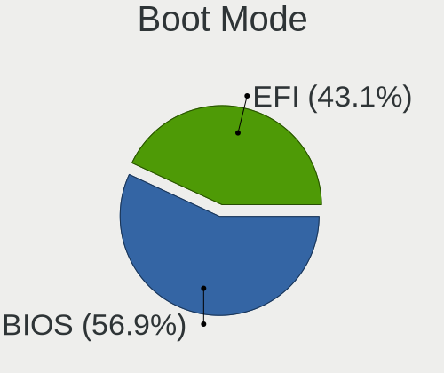
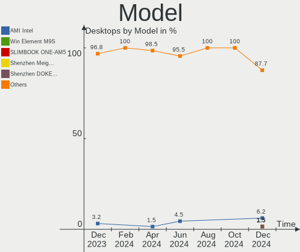
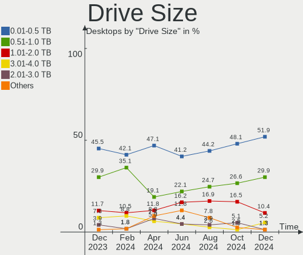
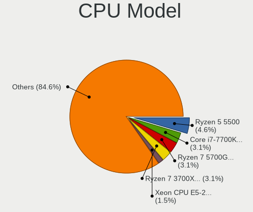
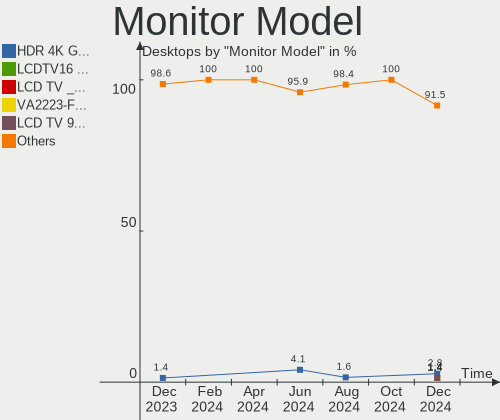
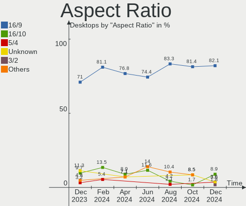
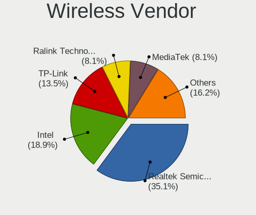
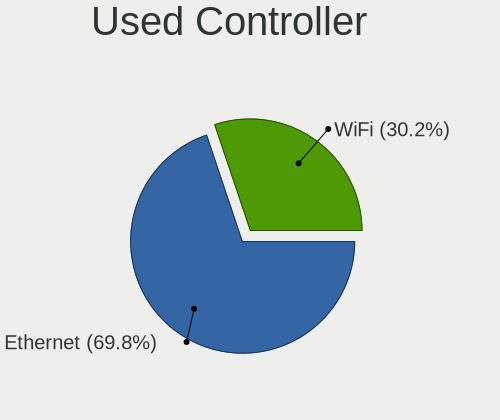

Linux in Spain - Hardware Trends (Desktops)
-------------------------------------------

A project to identify most popular hardware characteristics and track their change
over time based on data collected by Linux users at https://Linux-Hardware.org.

Anyone can contribute to this report by the [hw-probe](https://github.com/linuxhw/hw-probe) tool:

    sudo -E hw-probe -all -upload

Period: May, 2023.

Contents
--------

* [ System ](#system)
  - [ OS                       ](#os)
  - [ OS Family                ](#os-family)
  - [ Kernel                   ](#kernel)
  - [ Kernel Family            ](#kernel-family)
  - [ Kernel Major Ver.        ](#kernel-major-ver)
  - [ Arch                     ](#arch)
  - [ DE                       ](#de)
  - [ Display Server           ](#display-server)
  - [ Display Manager          ](#display-manager)
  - [ OS Lang                  ](#os-lang)
  - [ Boot Mode                ](#boot-mode)
  - [ Filesystem               ](#filesystem)
  - [ Part. scheme             ](#part-scheme)
  - [ Dual Boot with Linux/BSD ](#dual-boot-with-linuxbsd)
  - [ Dual Boot (Win)          ](#dual-boot-win)

* [ Board ](#board)
  - [ Vendor                   ](#vendor)
  - [ Model                    ](#model)
  - [ Model Family             ](#model-family)
  - [ MFG Year                 ](#mfg-year)
  - [ Form Factor              ](#form-factor)
  - [ Secure Boot              ](#secure-boot)
  - [ Coreboot                 ](#coreboot)
  - [ RAM Size                 ](#ram-size)
  - [ RAM Used                 ](#ram-used)
  - [ Total Drives             ](#total-drives)
  - [ Has CD-ROM               ](#has-cd-rom)
  - [ Has Ethernet             ](#has-ethernet)
  - [ Has WiFi                 ](#has-wifi)
  - [ Has Bluetooth            ](#has-bluetooth)

* [ Location ](#location)
  - [ Country                  ](#country)
  - [ City                     ](#city)

* [ Drives ](#drives)
  - [ Drive Vendor             ](#drive-vendor)
  - [ Drive Model              ](#drive-model)
  - [ HDD Vendor               ](#hdd-vendor)
  - [ SSD Vendor               ](#ssd-vendor)
  - [ Drive Kind               ](#drive-kind)
  - [ Drive Connector          ](#drive-connector)
  - [ Drive Size               ](#drive-size)
  - [ Space Total              ](#space-total)
  - [ Space Used               ](#space-used)
  - [ Malfunc. Drives          ](#malfunc-drives)
  - [ Malfunc. Drive Vendor    ](#malfunc-drive-vendor)
  - [ Malfunc. HDD Vendor      ](#malfunc-hdd-vendor)
  - [ Malfunc. Drive Kind      ](#malfunc-drive-kind)
  - [ Failed Drives            ](#failed-drives)
  - [ Failed Drive Vendor      ](#failed-drive-vendor)
  - [ Drive Status             ](#drive-status)

* [ Storage controller ](#storage-controller)
  - [ Storage Vendor           ](#storage-vendor)
  - [ Storage Model            ](#storage-model)
  - [ Storage Kind             ](#storage-kind)

* [ Processor ](#processor)
  - [ CPU Vendor               ](#cpu-vendor)
  - [ CPU Model                ](#cpu-model)
  - [ CPU Model Family         ](#cpu-model-family)
  - [ CPU Cores                ](#cpu-cores)
  - [ CPU Sockets              ](#cpu-sockets)
  - [ CPU Threads              ](#cpu-threads)
  - [ CPU Op-Modes             ](#cpu-op-modes)
  - [ CPU Microcode            ](#cpu-microcode)
  - [ CPU Microarch            ](#cpu-microarch)

* [ Graphics ](#graphics)
  - [ GPU Vendor               ](#gpu-vendor)
  - [ GPU Model                ](#gpu-model)
  - [ GPU Combo                ](#gpu-combo)
  - [ GPU Driver               ](#gpu-driver)
  - [ GPU Memory               ](#gpu-memory)

* [ Monitor ](#monitor)
  - [ Monitor Vendor           ](#monitor-vendor)
  - [ Monitor Model            ](#monitor-model)
  - [ Monitor Resolution       ](#monitor-resolution)
  - [ Monitor Diagonal         ](#monitor-diagonal)
  - [ Monitor Width            ](#monitor-width)
  - [ Aspect Ratio             ](#aspect-ratio)
  - [ Monitor Area             ](#monitor-area)
  - [ Pixel Density            ](#pixel-density)
  - [ Multiple Monitors        ](#multiple-monitors)

* [ Network ](#network)
  - [ Net Controller Vendor    ](#net-controller-vendor)
  - [ Net Controller Model     ](#net-controller-model)
  - [ Wireless Vendor          ](#wireless-vendor)
  - [ Wireless Model           ](#wireless-model)
  - [ Ethernet Vendor          ](#ethernet-vendor)
  - [ Ethernet Model           ](#ethernet-model)
  - [ Net Controller Kind      ](#net-controller-kind)
  - [ Used Controller          ](#used-controller)
  - [ NICs                     ](#nics)
  - [ IPv6                     ](#ipv6)

* [ Bluetooth ](#bluetooth)
  - [ Bluetooth Vendor         ](#bluetooth-vendor)
  - [ Bluetooth Model          ](#bluetooth-model)

* [ Sound ](#sound)
  - [ Sound Vendor             ](#sound-vendor)
  - [ Sound Model              ](#sound-model)

* [ Memory ](#memory)
  - [ Memory Vendor            ](#memory-vendor)
  - [ Memory Model             ](#memory-model)
  - [ Memory Kind              ](#memory-kind)
  - [ Memory Form Factor       ](#memory-form-factor)
  - [ Memory Size              ](#memory-size)
  - [ Memory Speed             ](#memory-speed)

* [ Printers & scanners ](#printers--scanners)
  - [ Printer Vendor           ](#printer-vendor)
  - [ Printer Model            ](#printer-model)
  - [ Scanner Vendor           ](#scanner-vendor)
  - [ Scanner Model            ](#scanner-model)

* [ Camera ](#camera)
  - [ Camera Vendor            ](#camera-vendor)
  - [ Camera Model             ](#camera-model)

* [ Security ](#security)
  - [ Fingerprint Vendor       ](#fingerprint-vendor)
  - [ Fingerprint Model        ](#fingerprint-model)
  - [ Chipcard Vendor          ](#chipcard-vendor)
  - [ Chipcard Model           ](#chipcard-model)

* [ Unsupported ](#unsupported)
  - [ Unsupported Devices      ](#unsupported-devices)
  - [ Unsupported Device Types ](#unsupported-device-types)

System
------

OS
--

Installed operating systems

| Name                         | Desktops | Percent |
|------------------------------|----------|---------|
| Debian 11                    | 5        | 11.9%   |
| Ubuntu 22.04                 | 4        | 9.52%   |
| Fedora 38                    | 3        | 7.14%   |
| Ubuntu 23.04                 | 2        | 4.76%   |
| OpenMandriva 23.03           | 2        | 4.76%   |
| Linux Mint 21.1              | 2        | 4.76%   |
| Arch Rolling                 | 2        | 4.76%   |
| Xubuntu 22.04                | 1        | 2.38%   |
| Xero Rolling                 | 1        | 2.38%   |
| Ubuntu Studio 22.04          | 1        | 2.38%   |
| Ubuntu 20.04                 | 1        | 2.38%   |
| Ubuntu 18.04                 | 1        | 2.38%   |
| ROSA 12.4                    | 1        | 2.38%   |
| RHEL 9                       | 1        | 2.38%   |
| openSUSE Tumbleweed-XXXXXXXX | 1        | 2.38%   |
| OpenMandriva 23.90           | 1        | 2.38%   |
| Nobara 37                    | 1        | 2.38%   |
| MX 21                        | 1        | 2.38%   |
| Manjaro 22.1.2               | 1        | 2.38%   |
| Lubuntu 22.04                | 1        | 2.38%   |
| Linux-super-forever 2022.10  | 1        | 2.38%   |
| Linux Mint 20.3              | 1        | 2.38%   |
| Linux Mint 20.2              | 1        | 2.38%   |
| Kubuntu 23.04                | 1        | 2.38%   |
| Kubuntu 22.04                | 1        | 2.38%   |
| KDE neon 22.04               | 1        | 2.38%   |
| Kali 2023.1                  | 1        | 2.38%   |
| Fedora 37                    | 1        | 2.38%   |
| BlackPanther 18.1            | 1        | 2.38%   |

OS Family
---------

OS without a version

| Name                | Desktops | Percent |
|---------------------|----------|---------|
| Ubuntu              | 8        | 19.05%  |
| Debian              | 5        | 11.9%   |
| Linux Mint          | 4        | 9.52%   |
| Fedora              | 4        | 9.52%   |
| OpenMandriva        | 3        | 7.14%   |
| Kubuntu             | 2        | 4.76%   |
| Arch                | 2        | 4.76%   |
| Xubuntu             | 1        | 2.38%   |
| Xero                | 1        | 2.38%   |
| Ubuntu Studio       | 1        | 2.38%   |
| ROSA                | 1        | 2.38%   |
| RHEL                | 1        | 2.38%   |
| openSUSE            | 1        | 2.38%   |
| Nobara              | 1        | 2.38%   |
| MX                  | 1        | 2.38%   |
| Manjaro             | 1        | 2.38%   |
| Lubuntu             | 1        | 2.38%   |
| Linux-super-forever | 1        | 2.38%   |
| KDE neon            | 1        | 2.38%   |
| Kali                | 1        | 2.38%   |
| BlackPanther        | 1        | 2.38%   |

Kernel
------

Version of the Linux kernel

| Version                           | Desktops | Percent |
|-----------------------------------|----------|---------|
| 5.15.0-71-generic                 | 4        | 9.52%   |
| 6.2.0-20-generic                  | 3        | 7.14%   |
| 5.4.0-148-generic                 | 3        | 7.14%   |
| 5.19.0-41-generic                 | 3        | 7.14%   |
| 5.10.0-22-amd64                   | 3        | 7.14%   |
| 6.2.6-desktop-1omv2390            | 2        | 4.76%   |
| 5.19.0-42-generic                 | 2        | 4.76%   |
| 5.10.0-23-amd64                   | 2        | 4.76%   |
| 6.3.4-zen1-1-zen                  | 1        | 2.38%   |
| 6.3.3-desktop-2omv2390            | 1        | 2.38%   |
| 6.3.1-1-default                   | 1        | 2.38%   |
| 6.2.9-300.fc38.x86_64             | 1        | 2.38%   |
| 6.2.15-300.fc38.x86_64            | 1        | 2.38%   |
| 6.2.14-300.fc38.x86_64            | 1        | 2.38%   |
| 6.2.13-arch1-1                    | 1        | 2.38%   |
| 6.2.12-arch1-1                    | 1        | 2.38%   |
| 6.2.12-200.fsync.fc37.x86_64      | 1        | 2.38%   |
| 6.1.29-1-MANJARO                  | 1        | 2.38%   |
| 6.1.26-lfs-lts                    | 1        | 2.38%   |
| 6.1.20-generic-2rosa2021.1-x86_64 | 1        | 2.38%   |
| 6.1.0-kali7-amd64                 | 1        | 2.38%   |
| 6.0.7-301.fc37.x86_64             | 1        | 2.38%   |
| 5.19.0-35-generic                 | 1        | 2.38%   |
| 5.18.0-4mx-amd64                  | 1        | 2.38%   |
| 5.15.0-71-lowlatency              | 1        | 2.38%   |
| 5.15.0-58-generic                 | 1        | 2.38%   |
| 5.14.0-284.11.1.el9_2.x86_64      | 1        | 2.38%   |
| 4.18.16-desktop-1bP               | 1        | 2.38%   |

Kernel Family
-------------

Linux kernel without a distro release

| Version | Desktops | Percent |
|---------|----------|---------|
| 5.19.0  | 6        | 14.29%  |
| 5.15.0  | 6        | 14.29%  |
| 5.10.0  | 5        | 11.9%   |
| 6.2.0   | 3        | 7.14%   |
| 5.4.0   | 3        | 7.14%   |
| 6.2.6   | 2        | 4.76%   |
| 6.2.12  | 2        | 4.76%   |
| 6.3.4   | 1        | 2.38%   |
| 6.3.3   | 1        | 2.38%   |
| 6.3.1   | 1        | 2.38%   |
| 6.2.9   | 1        | 2.38%   |
| 6.2.15  | 1        | 2.38%   |
| 6.2.14  | 1        | 2.38%   |
| 6.2.13  | 1        | 2.38%   |
| 6.1.29  | 1        | 2.38%   |
| 6.1.26  | 1        | 2.38%   |
| 6.1.20  | 1        | 2.38%   |
| 6.1.0   | 1        | 2.38%   |
| 6.0.7   | 1        | 2.38%   |
| 5.18.0  | 1        | 2.38%   |
| 5.14.0  | 1        | 2.38%   |
| 4.18.16 | 1        | 2.38%   |

Kernel Major Ver.
-----------------

Linux kernel major version

| Version | Desktops | Percent |
|---------|----------|---------|
| 6.2     | 11       | 26.19%  |
| 5.19    | 6        | 14.29%  |
| 5.15    | 6        | 14.29%  |
| 5.10    | 5        | 11.9%   |
| 6.1     | 4        | 9.52%   |
| 6.3     | 3        | 7.14%   |
| 5.4     | 3        | 7.14%   |
| 6.0     | 1        | 2.38%   |
| 5.18    | 1        | 2.38%   |
| 5.14    | 1        | 2.38%   |
| 4.18    | 1        | 2.38%   |

Arch
----

OS architecture (x86_64, i586, etc.)

| Name   | Desktops | Percent |
|--------|----------|---------|
| x86_64 | 42       | 100%    |

DE
--

Desktop Environment

| Name           | Desktops | Percent |
|----------------|----------|---------|
| GNOME          | 15       | 35.71%  |
| KDE5           | 13       | 30.95%  |
| X-Cinnamon     | 4        | 9.52%   |
| XFCE           | 3        | 7.14%   |
| LXQt           | 2        | 4.76%   |
| Unknown        | 2        | 4.76%   |
| openbox        | 1        | 2.38%   |
| MATE           | 1        | 2.38%   |
| i3-with-shmlog | 1        | 2.38%   |

Display Server
--------------

X11 or Wayland

| Name    | Desktops | Percent |
|---------|----------|---------|
| X11     | 30       | 71.43%  |
| Wayland | 10       | 23.81%  |
| Tty     | 2        | 4.76%   |

Display Manager
---------------

SDDM, LightDM, etc.

| Name    | Desktops | Percent |
|---------|----------|---------|
| SDDM    | 11       | 26.19%  |
| Unknown | 11       | 26.19%  |
| LightDM | 9        | 21.43%  |
| GDM3    | 6        | 14.29%  |
| GDM     | 5        | 11.9%   |

OS Lang
-------

Language

| Lang    | Desktops | Percent |
|---------|----------|---------|
| es_ES   | 28       | 66.67%  |
| en_US   | 7        | 16.67%  |
| ca_ES   | 4        | 9.52%   |
| en_GB   | 1        | 2.38%   |
| C       | 1        | 2.38%   |
| Unknown | 1        | 2.38%   |

Boot Mode
---------

EFI or BIOS

| Mode | Desktops | Percent |
|------|----------|---------|
| BIOS | 23       | 54.76%  |
| EFI  | 19       | 45.24%  |

Filesystem
----------

Type of filesystem

| Type    | Desktops | Percent |
|---------|----------|---------|
| Ext4    | 26       | 61.9%   |
| Tmpfs   | 5        | 11.9%   |
| Btrfs   | 5        | 11.9%   |
| Xfs     | 4        | 9.52%   |
| Overlay | 2        | 4.76%   |

Part. scheme
------------

Scheme of partitioning

| Type    | Desktops | Percent |
|---------|----------|---------|
| GPT     | 26       | 61.9%   |
| Unknown | 9        | 21.43%  |
| MBR     | 7        | 16.67%  |

Dual Boot with Linux/BSD
------------------------

Hosting more than one Linux/BSD

| Dual boot | Desktops | Percent |
|-----------|----------|---------|
| No        | 31       | 73.81%  |
| Yes       | 11       | 26.19%  |

Dual Boot (Win)
---------------

Hosting Linux and Windows

| Dual boot | Desktops | Percent |
|-----------|----------|---------|
| Yes       | 21       | 50%     |
| No        | 21       | 50%     |

Board
-----

Vendor
------

Motherboard manufacturer

| Name                | Desktops | Percent |
|---------------------|----------|---------|
| Gigabyte Technology | 11       | 26.19%  |
| ASUSTek Computer    | 11       | 26.19%  |
| ASRock              | 4        | 9.52%   |
| Hewlett-Packard     | 3        | 7.14%   |
| MSI                 | 2        | 4.76%   |
| Medion              | 2        | 4.76%   |
| Lenovo              | 2        | 4.76%   |
| Acer                | 2        | 4.76%   |
| Unknown             | 2        | 4.76%   |
| NEC Computers       | 1        | 2.38%   |
| Fujitsu             | 1        | 2.38%   |
| Dell                | 1        | 2.38%   |

Model
-----

Motherboard model

| Name                               | Desktops | Percent |
|------------------------------------|----------|---------|
| Gigabyte X99-UD4-CF                | 2        | 4.76%   |
| ASUS PRIME B550-PLUS               | 2        | 4.76%   |
| Unknown                            | 2        | 4.76%   |
| NEC Computers ECS-945G             | 1        | 2.38%   |
| MSI MS-7D54                        | 1        | 2.38%   |
| MSI MS-7971                        | 1        | 2.38%   |
| Medion MS-7848                     | 1        | 2.38%   |
| Medion MS-7675                     | 1        | 2.38%   |
| Lenovo ThinkCentre M93 10A4A03NUK  | 1        | 2.38%   |
| Lenovo ThinkCentre M73z 10BC000JSP | 1        | 2.38%   |
| HP Compaq dc5800 Small Form Factor | 1        | 2.38%   |
| HP Compaq 8200 Elite SFF PC        | 1        | 2.38%   |
| HP Compaq 8100 Elite SFF PC        | 1        | 2.38%   |
| Gigabyte Z370 AORUS Gaming 5       | 1        | 2.38%   |
| Gigabyte X670 GAMING X AX          | 1        | 2.38%   |
| Gigabyte X570 I AORUS PRO WIFI     | 1        | 2.38%   |
| Gigabyte P43-ES3G                  | 1        | 2.38%   |
| Gigabyte MW51-HP0-00               | 1        | 2.38%   |
| Gigabyte H61M-D2H-USB3             | 1        | 2.38%   |
| Gigabyte H310M S2H 2.0             | 1        | 2.38%   |
| Gigabyte GA-MA790XT-UD4P           | 1        | 2.38%   |
| Gigabyte EX58-UD5                  | 1        | 2.38%   |
| Fujitsu ESPRIMO Q920               | 1        | 2.38%   |
| Dell Precision WorkStation T3500   | 1        | 2.38%   |
| ASUS Z170-PRO                      | 1        | 2.38%   |
| ASUS TUF Gaming X570-PLUS          | 1        | 2.38%   |
| ASUS ROG STRIX B365-G GAMING       | 1        | 2.38%   |
| ASUS PRIME Z590-A                  | 1        | 2.38%   |
| ASUS PRIME X299-DELUXE             | 1        | 2.38%   |
| ASUS P8H61-M LX                    | 1        | 2.38%   |
| ASUS K30AD_M31AD_M51AD             | 1        | 2.38%   |
| ASUS B150M-A/M.2                   | 1        | 2.38%   |
| ASUS All Series                    | 1        | 2.38%   |
| ASRock Z390 Phantom Gaming SLI     | 1        | 2.38%   |
| ASRock X99 Extreme6/ac             | 1        | 2.38%   |
| ASRock A55M-DGS                    | 1        | 2.38%   |
| ASRock A320M-HDV R4.0              | 1        | 2.38%   |
| Acer Aspire XC-330                 | 1        | 2.38%   |
| Acer Aspire TC-605                 | 1        | 2.38%   |

Model Family
------------

Motherboard model prefix

| Name                     | Desktops | Percent |
|--------------------------|----------|---------|
| ASUS PRIME               | 4        | 9.52%   |
| HP Compaq                | 3        | 7.14%   |
| Lenovo ThinkCentre       | 2        | 4.76%   |
| Gigabyte X99-UD4-CF      | 2        | 4.76%   |
| Acer Aspire              | 2        | 4.76%   |
| Unknown                  | 2        | 4.76%   |
| NEC Computers ECS-945G   | 1        | 2.38%   |
| MSI MS-7D54              | 1        | 2.38%   |
| MSI MS-7971              | 1        | 2.38%   |
| Medion MS-7848           | 1        | 2.38%   |
| Medion MS-7675           | 1        | 2.38%   |
| Gigabyte Z370            | 1        | 2.38%   |
| Gigabyte X670            | 1        | 2.38%   |
| Gigabyte X570            | 1        | 2.38%   |
| Gigabyte P43-ES3G        | 1        | 2.38%   |
| Gigabyte MW51-HP0-00     | 1        | 2.38%   |
| Gigabyte H61M-D2H-USB3   | 1        | 2.38%   |
| Gigabyte H310M           | 1        | 2.38%   |
| Gigabyte GA-MA790XT-UD4P | 1        | 2.38%   |
| Gigabyte EX58-UD5        | 1        | 2.38%   |
| Fujitsu ESPRIMO          | 1        | 2.38%   |
| Dell Precision           | 1        | 2.38%   |
| ASUS Z170-PRO            | 1        | 2.38%   |
| ASUS TUF                 | 1        | 2.38%   |
| ASUS ROG                 | 1        | 2.38%   |
| ASUS P8H61-M             | 1        | 2.38%   |
| ASUS K30AD               | 1        | 2.38%   |
| ASUS B150M-A             | 1        | 2.38%   |
| ASUS All                 | 1        | 2.38%   |
| ASRock Z390              | 1        | 2.38%   |
| ASRock X99               | 1        | 2.38%   |
| ASRock A55M-DGS          | 1        | 2.38%   |
| ASRock A320M-HDV         | 1        | 2.38%   |

MFG Year
--------

Motherboard manufacture year

| Year | Desktops | Percent |
|------|----------|---------|
| 2018 | 6        | 14.29%  |
| 2019 | 4        | 9.52%   |
| 2013 | 4        | 9.52%   |
| 2021 | 3        | 7.14%   |
| 2016 | 3        | 7.14%   |
| 2014 | 3        | 7.14%   |
| 2011 | 3        | 7.14%   |
| 2009 | 3        | 7.14%   |
| 2022 | 2        | 4.76%   |
| 2020 | 2        | 4.76%   |
| 2017 | 2        | 4.76%   |
| 2010 | 2        | 4.76%   |
| 2008 | 2        | 4.76%   |
| 2015 | 1        | 2.38%   |
| 2012 | 1        | 2.38%   |
| 2007 | 1        | 2.38%   |

Form Factor
-----------

Physical design of the computer

| Name    | Desktops | Percent |
|---------|----------|---------|
| Desktop | 42       | 100%    |

Secure Boot
-----------

Enabled or disabled

| State    | Desktops | Percent |
|----------|----------|---------|
| Disabled | 42       | 100%    |

Coreboot
--------

Have coreboot on board

| Used | Desktops | Percent |
|------|----------|---------|
| No   | 42       | 100%    |

RAM Size
--------

Total RAM memory

| Size in GB  | Desktops | Percent |
|-------------|----------|---------|
| 32.01-64.0  | 11       | 26.19%  |
| 16.01-24.0  | 8        | 19.05%  |
| 8.01-16.0   | 7        | 16.67%  |
| 4.01-8.0    | 6        | 14.29%  |
| 3.01-4.0    | 4        | 9.52%   |
| 24.01-32.0  | 4        | 9.52%   |
| 64.01-256.0 | 2        | 4.76%   |

RAM Used
--------

Used RAM memory

| Used GB   | Desktops | Percent |
|-----------|----------|---------|
| 4.01-8.0  | 11       | 26.19%  |
| 2.01-3.0  | 11       | 26.19%  |
| 1.01-2.0  | 10       | 23.81%  |
| 3.01-4.0  | 6        | 14.29%  |
| 8.01-16.0 | 2        | 4.76%   |
| 0.51-1.0  | 1        | 2.38%   |
| 0.01-0.5  | 1        | 2.38%   |

Total Drives
------------

Number of drives on board

| Drives | Desktops | Percent |
|--------|----------|---------|
| 2      | 14       | 33.33%  |
| 1      | 9        | 21.43%  |
| 3      | 7        | 16.67%  |
| 4      | 4        | 9.52%   |
| 5      | 3        | 7.14%   |
| 13     | 1        | 2.38%   |
| 9      | 1        | 2.38%   |
| 8      | 1        | 2.38%   |
| 7      | 1        | 2.38%   |
| 6      | 1        | 2.38%   |

Has CD-ROM
----------

Has CD-ROM on board

| Presented | Desktops | Percent |
|-----------|----------|---------|
| No        | 23       | 54.76%  |
| Yes       | 19       | 45.24%  |

Has Ethernet
------------

Has Ethernet on board

| Presented | Desktops | Percent |
|-----------|----------|---------|
| Yes       | 42       | 100%    |

Has WiFi
--------

Has WiFi module

| Presented | Desktops | Percent |
|-----------|----------|---------|
| Yes       | 22       | 52.38%  |
| No        | 20       | 47.62%  |

Has Bluetooth
-------------

Has Bluetooth module

| Presented | Desktops | Percent |
|-----------|----------|---------|
| No        | 25       | 59.52%  |
| Yes       | 17       | 40.48%  |

Location
--------

Country
-------

Geographic location (country)

| Country | Desktops | Percent |
|---------|----------|---------|
| Spain   | 42       | 100%    |

City
----

Geographic location (city)

| City                       | Desktops | Percent |
|----------------------------|----------|---------|
| Barcelona                  | 6        | 14.29%  |
| Madrid                     | 5        | 11.9%   |
| Valencia                   | 4        | 9.52%   |
| Seville                    | 2        | 4.76%   |
| Urdiain                    | 1        | 2.38%   |
| Sant Boi de Llobregat      | 1        | 2.38%   |
| Sangonera la Verde         | 1        | 2.38%   |
| San Jose de la Rinconada   | 1        | 2.38%   |
| San Fernando               | 1        | 2.38%   |
| Priego de Cordoba          | 1        | 2.38%   |
| Niebla                     | 1        | 2.38%   |
| Mostoles                   | 1        | 2.38%   |
| Manises                    | 1        | 2.38%   |
| Las Palmas de Gran Canaria | 1        | 2.38%   |
| Larrabetzu                 | 1        | 2.38%   |
| La Calahorra               | 1        | 2.38%   |
| La Almunia de Dona Godina  | 1        | 2.38%   |
| Jerez de la Frontera       | 1        | 2.38%   |
| Igualada                   | 1        | 2.38%   |
| Guadalajara                | 1        | 2.38%   |
| Granada                    | 1        | 2.38%   |
| Getxo                      | 1        | 2.38%   |
| Fuenlabrada                | 1        | 2.38%   |
| Elda                       | 1        | 2.38%   |
| Bilbao                     | 1        | 2.38%   |
| Badalona                   | 1        | 2.38%   |
| Alcorcón                  | 1        | 2.38%   |
| Alaior                     | 1        | 2.38%   |
| Águilas                   | 1        | 2.38%   |

Drives
------

Drive Vendor
------------

Hard drive vendors

| Vendor                      | Desktops | Drives | Percent |
|-----------------------------|----------|--------|---------|
| Seagate                     | 18       | 21     | 17.14%  |
| Samsung Electronics         | 17       | 29     | 16.19%  |
| WDC                         | 15       | 20     | 14.29%  |
| Kingston                    | 12       | 14     | 11.43%  |
| Toshiba                     | 6        | 8      | 5.71%   |
| Crucial                     | 6        | 6      | 5.71%   |
| SanDisk                     | 4        | 4      | 3.81%   |
| China                       | 4        | 4      | 3.81%   |
| Micron/Crucial Technology   | 3        | 4      | 2.86%   |
| Intel                       | 3        | 3      | 2.86%   |
| Unknown                     | 2        | 2      | 1.9%    |
| Transcend                   | 2        | 2      | 1.9%    |
| Vaseky                      | 1        | 1      | 0.95%   |
| Silicon Motion              | 1        | 1      | 0.95%   |
| PNY                         | 1        | 1      | 0.95%   |
| Phison Electronics          | 1        | 1      | 0.95%   |
| Micron Technology           | 1        | 1      | 0.95%   |
| MAXIO Technology (Hangzhou) | 1        | 1      | 0.95%   |
| Londisk                     | 1        | 1      | 0.95%   |
| KingSpec                    | 1        | 1      | 0.95%   |
| Hjwdz                       | 1        | 1      | 0.95%   |
| Hitachi                     | 1        | 1      | 0.95%   |
| FCS                         | 1        | 1      | 0.95%   |
| Dogfish                     | 1        | 1      | 0.95%   |
| BAITITON                    | 1        | 2      | 0.95%   |

Drive Model
-----------

Hard drive models

| Model                                               | Desktops | Percent |
|-----------------------------------------------------|----------|---------|
| Kingston SA400S37240G 240GB SSD                     | 4        | 3.28%   |
| Seagate ST1000DM003-1CH162 1TB                      | 3        | 2.46%   |
| Samsung SSD 850 EVO 250GB                           | 3        | 2.46%   |
| Kingston SA400S37480G 480GB SSD                     | 3        | 2.46%   |
| WDC WD5000AAKX-08U6AA0 500GB                        | 2        | 1.64%   |
| WDC WD40PURZ-85TTDY0 4TB                            | 2        | 1.64%   |
| Toshiba DT01ACA100 1TB                              | 2        | 1.64%   |
| Seagate ST2000DM006-2DM164 2TB                      | 2        | 1.64%   |
| Seagate ST1000DM010-2EP102 1TB                      | 2        | 1.64%   |
| Seagate ST1000DM003-1SB102 1TB                      | 2        | 1.64%   |
| Samsung SSD 970 EVO 500GB                           | 2        | 1.64%   |
| Samsung SSD 850 PRO 256GB                           | 2        | 1.64%   |
| Samsung SSD 850 EVO 500GB                           | 2        | 1.64%   |
| Samsung NVMe SSD Controller SM981/PM981/PM983 256GB | 2        | 1.64%   |
| Micron/Crucial CT1000P5PSSD8 1TB                    | 2        | 1.64%   |
| Kingston SV300S37A120G 120GB SSD                    | 2        | 1.64%   |
| Kingston SA400S37120G 120GB SSD                     | 2        | 1.64%   |
| Crucial CT480BX500SSD1 480GB                        | 2        | 1.64%   |
| Crucial CT1000MX500SSD1 1TB                         | 2        | 1.64%   |
| WDC WDS500G2B0C-00PXH0 500GB                        | 1        | 0.82%   |
| WDC WDS256G1X0C-00ENX0 256GB                        | 1        | 0.82%   |
| WDC WDS250G2X0C-00L350 250GB                        | 1        | 0.82%   |
| WDC WDS200T2B0A-00SM50 2TB SSD                      | 1        | 0.82%   |
| WDC WDS100T2B0A-00SM50 1TB SSD                      | 1        | 0.82%   |
| WDC WD5000AADS-00S9B0 500GB                         | 1        | 0.82%   |
| WDC WD50 00LPVX-22V0TT0 500GB                       | 1        | 0.82%   |
| WDC WD40EFAX-68JH4N0 4TB                            | 1        | 0.82%   |
| WDC WD4005FZBX-00K5WB0 4TB                          | 1        | 0.82%   |
| WDC WD30EZRZ-00GXCB0 3TB                            | 1        | 0.82%   |
| WDC WD30EFRX-68EUZN0 3TB                            | 1        | 0.82%   |
| WDC WD20PURZ-85GU6Y0 2TB                            | 1        | 0.82%   |
| WDC WD20PURX-64P6ZY0 2TB                            | 1        | 0.82%   |
| WDC WD10EZEX-22BN5A0 1TB                            | 1        | 0.82%   |
| WDC WD10EZEX-08WN4A0 1TB                            | 1        | 0.82%   |
| WDC WD Blue SA510 2.5 1000GB                        | 1        | 0.82%   |
| Vaseky V880/500G 500GB SSD                          | 1        | 0.82%   |
| Unknown NVMe SSD Drive 1TB                          | 1        | 0.82%   |
| Unknown CKTM4R  64GB                                | 1        | 0.82%   |
| Transcend TS1TSSD230S 1TB                           | 1        | 0.82%   |
| Transcend TS128GSSD340 128GB                        | 1        | 0.82%   |

HDD Vendor
----------

Hard disk drive vendors

| Vendor              | Desktops | Drives | Percent |
|---------------------|----------|--------|---------|
| Seagate             | 18       | 21     | 48.65%  |
| WDC                 | 12       | 14     | 32.43%  |
| Toshiba             | 4        | 4      | 10.81%  |
| Samsung Electronics | 2        | 3      | 5.41%   |
| Hitachi             | 1        | 1      | 2.7%    |

SSD Vendor
----------

Solid state drive vendors

| Vendor              | Desktops | Drives | Percent |
|---------------------|----------|--------|---------|
| Kingston            | 12       | 14     | 24.49%  |
| Samsung Electronics | 11       | 14     | 22.45%  |
| Crucial             | 6        | 6      | 12.24%  |
| China               | 4        | 4      | 8.16%   |
| WDC                 | 3        | 3      | 6.12%   |
| Transcend           | 2        | 2      | 4.08%   |
| Toshiba             | 2        | 4      | 4.08%   |
| Vaseky              | 1        | 1      | 2.04%   |
| SanDisk             | 1        | 1      | 2.04%   |
| PNY                 | 1        | 1      | 2.04%   |
| Londisk             | 1        | 1      | 2.04%   |
| KingSpec            | 1        | 1      | 2.04%   |
| Intel               | 1        | 1      | 2.04%   |
| FCS                 | 1        | 1      | 2.04%   |
| Dogfish             | 1        | 1      | 2.04%   |
| BAITITON            | 1        | 2      | 2.04%   |

Drive Kind
----------

HDD or SSD

| Kind    | Desktops | Drives | Percent |
|---------|----------|--------|---------|
| SSD     | 30       | 57     | 38.46%  |
| HDD     | 30       | 43     | 38.46%  |
| NVMe    | 16       | 29     | 20.51%  |
| MMC     | 1        | 1      | 1.28%   |
| Unknown | 1        | 1      | 1.28%   |

Drive Connector
---------------

SATA, SAS, NVMe, etc.

| Type | Desktops | Drives | Percent |
|------|----------|--------|---------|
| SATA | 39       | 96     | 65%     |
| NVMe | 16       | 29     | 26.67%  |
| SAS  | 4        | 5      | 6.67%   |
| MMC  | 1        | 1      | 1.67%   |

Drive Size
----------

Size of hard drive

| Size in TB | Desktops | Drives | Percent |
|------------|----------|--------|---------|
| 0.01-0.5   | 31       | 53     | 43.66%  |
| 0.51-1.0   | 20       | 26     | 28.17%  |
| 1.01-2.0   | 9        | 9      | 12.68%  |
| 3.01-4.0   | 5        | 5      | 7.04%   |
| 2.01-3.0   | 4        | 4      | 5.63%   |
| 4.01-10.0  | 2        | 3      | 2.82%   |

Space Total
-----------

Amount of disk space available on the file system

| Size in GB     | Desktops | Percent |
|----------------|----------|---------|
| 501-1000       | 9        | 21.43%  |
| 101-250        | 8        | 19.05%  |
| More than 3000 | 7        | 16.67%  |
| 251-500        | 6        | 14.29%  |
| 1001-2000      | 4        | 9.52%   |
| 2001-3000      | 3        | 7.14%   |
| 1-20           | 2        | 4.76%   |
| 51-100         | 2        | 4.76%   |
| Unknown        | 1        | 2.38%   |

Space Used
----------

Amount of used disk space

| Used GB        | Desktops | Percent |
|----------------|----------|---------|
| 251-500        | 8        | 19.05%  |
| 1-20           | 8        | 19.05%  |
| More than 3000 | 6        | 14.29%  |
| 21-50          | 6        | 14.29%  |
| 101-250        | 5        | 11.9%   |
| 51-100         | 4        | 9.52%   |
| 1001-2000      | 2        | 4.76%   |
| 501-1000       | 2        | 4.76%   |
| Unknown        | 1        | 2.38%   |

Malfunc. Drives
---------------

Drive models with a malfunction

| Model                               | Desktops | Drives | Percent |
|-------------------------------------|----------|--------|---------|
| WDC WD5000AAKX-08U6AA0 500GB        | 1        | 1      | 7.69%   |
| WDC WD50 00LPVX-22V0TT0 500GB       | 1        | 1      | 7.69%   |
| WDC WD20PURZ-85GU6Y0 2TB            | 1        | 1      | 7.69%   |
| WDC WD20PURX-64P6ZY0 2TB            | 1        | 1      | 7.69%   |
| Transcend TS1TSSD230S 1TB           | 1        | 1      | 7.69%   |
| Toshiba DT01ACA100 1TB              | 1        | 1      | 7.69%   |
| Seagate ST9160412AS 160GB           | 1        | 1      | 7.69%   |
| Seagate ST1000DM010-2EP102 1TB      | 1        | 1      | 7.69%   |
| Samsung Electronics SSD 870 EVO 1TB | 1        | 2      | 7.69%   |
| Kingston SA400S37120G 120GB SSD     | 1        | 1      | 7.69%   |
| KingSpec P4-960 960GB SSD           | 1        | 1      | 7.69%   |
| Intel SSDMAEMC040G2 40GB            | 1        | 1      | 7.69%   |
| China SSD 512GB                     | 1        | 1      | 7.69%   |

Malfunc. Drive Vendor
---------------------

Vendors of faulty drives

| Vendor              | Desktops | Drives | Percent |
|---------------------|----------|--------|---------|
| WDC                 | 4        | 4      | 30.77%  |
| Seagate             | 2        | 2      | 15.38%  |
| Transcend           | 1        | 1      | 7.69%   |
| Toshiba             | 1        | 1      | 7.69%   |
| Samsung Electronics | 1        | 2      | 7.69%   |
| Kingston            | 1        | 1      | 7.69%   |
| KingSpec            | 1        | 1      | 7.69%   |
| Intel               | 1        | 1      | 7.69%   |
| China               | 1        | 1      | 7.69%   |

Malfunc. HDD Vendor
-------------------

Vendors of faulty HDD drives

| Vendor  | Desktops | Drives | Percent |
|---------|----------|--------|---------|
| WDC     | 4        | 4      | 57.14%  |
| Seagate | 2        | 2      | 28.57%  |
| Toshiba | 1        | 1      | 14.29%  |

Malfunc. Drive Kind
-------------------

Kinds of faulty drives

| Kind | Desktops | Drives | Percent |
|------|----------|--------|---------|
| HDD  | 6        | 7      | 54.55%  |
| SSD  | 5        | 7      | 45.45%  |

Failed Drives
-------------

Failed drive models

| Model                           | Desktops | Drives | Percent |
|---------------------------------|----------|--------|---------|
| Samsung Electronics HD103SJ 1TB | 1        | 1      | 100%    |

Failed Drive Vendor
-------------------

Failed drive vendors

| Vendor              | Desktops | Drives | Percent |
|---------------------|----------|--------|---------|
| Samsung Electronics | 1        | 1      | 100%    |

Drive Status
------------

Number of failed and malfunc. drives

| Status   | Desktops | Drives | Percent |
|----------|----------|--------|---------|
| Works    | 23       | 77     | 42.59%  |
| Detected | 20       | 39     | 37.04%  |
| Malfunc  | 10       | 14     | 18.52%  |
| Failed   | 1        | 1      | 1.85%   |

Storage controller
------------------

Storage Vendor
--------------

Storage controller vendors

| Vendor                      | Desktops | Percent |
|-----------------------------|----------|---------|
| Intel                       | 33       | 49.25%  |
| AMD                         | 10       | 14.93%  |
| Samsung Electronics         | 6        | 8.96%   |
| SanDisk                     | 5        | 7.46%   |
| Micron/Crucial Technology   | 3        | 4.48%   |
| MAXIO Technology (Hangzhou) | 2        | 2.99%   |
| Marvell Technology Group    | 2        | 2.99%   |
| JMicron Technology          | 2        | 2.99%   |
| Silicon Motion              | 1        | 1.49%   |
| Phison Electronics          | 1        | 1.49%   |
| Micron Technology           | 1        | 1.49%   |
| ASMedia Technology          | 1        | 1.49%   |

Storage Model
-------------

Storage controller models

| Model                                                                                   | Desktops | Percent |
|-----------------------------------------------------------------------------------------|----------|---------|
| Intel 8 Series/C220 Series Chipset Family 6-port SATA Controller 1 [AHCI mode]          | 7        | 9.09%   |
| AMD FCH SATA Controller [AHCI mode]                                                     | 7        | 9.09%   |
| Samsung NVMe SSD Controller SM981/PM981/PM983                                           | 6        | 7.79%   |
| Intel 200 Series PCH SATA controller [AHCI mode]                                        | 5        | 6.49%   |
| Intel Q170/Q150/B150/H170/H110/Z170/CM236 Chipset SATA Controller [AHCI Mode]           | 3        | 3.9%    |
| SanDisk WD Black 2018/SN750 / PC SN720 NVMe SSD                                         | 2        | 2.6%    |
| Micron/Crucial P5 Plus NVMe PCIe SSD                                                    | 2        | 2.6%    |
| JMicron JMB363 SATA/IDE Controller                                                      | 2        | 2.6%    |
| Intel C610/X99 series chipset 6-Port SATA Controller [AHCI mode]                        | 2        | 2.6%    |
| Intel 82801JI (ICH10 Family) SATA AHCI Controller                                       | 2        | 2.6%    |
| Intel 6 Series/C200 Series Chipset Family 6 port Desktop SATA AHCI Controller           | 2        | 2.6%    |
| Intel 5 Series/3400 Series Chipset 6 port SATA AHCI Controller                          | 2        | 2.6%    |
| AMD 500 Series Chipset SATA Controller                                                  | 2        | 2.6%    |
| Silicon Motion SM2263EN/SM2263XT SSD Controller                                         | 1        | 1.3%    |
| SanDisk WD Blue SN570 NVMe SSD 1TB                                                      | 1        | 1.3%    |
| SanDisk WD Blue SN550 NVMe SSD                                                          | 1        | 1.3%    |
| SanDisk WD Black SN750 / PC SN730 NVMe SSD                                              | 1        | 1.3%    |
| SanDisk WD Black NVMe SSD                                                               | 1        | 1.3%    |
| Samsung NVMe SSD Controller SM961/PM961/SM963                                           | 1        | 1.3%    |
| Samsung NVMe SSD Controller PM9A1/PM9A3/980PRO                                          | 1        | 1.3%    |
| Phison E12 NVMe Controller                                                              | 1        | 1.3%    |
| Micron/Crucial NVMe Storage Controller                                                  | 1        | 1.3%    |
| Micron NVMe Storage Controller                                                          | 1        | 1.3%    |
| MAXIO (Hangzhou) NVMe SSD Controller MAP1202                                            | 1        | 1.3%    |
| MAXIO (Hangzhou) Non-Volatile memory controller                                         | 1        | 1.3%    |
| Marvell Group 88SE9215 PCIe 2.0 x1 4-port SATA 6 Gb/s Controller                        | 1        | 1.3%    |
| Marvell Group 88SE9172 SATA 6Gb/s Controller                                            | 1        | 1.3%    |
| Intel SSD Pro 7600p/760p/E 6100p Series                                                 | 1        | 1.3%    |
| Intel SSD 660P Series                                                                   | 1        | 1.3%    |
| Intel SATA Controller [RAID mode]                                                       | 1        | 1.3%    |
| Intel NM10/ICH7 Family SATA Controller [IDE mode]                                       | 1        | 1.3%    |
| Intel Celeron N3350/Pentium N4200/Atom E3900 Series SATA AHCI Controller                | 1        | 1.3%    |
| Intel Cannon Lake PCH SATA AHCI Controller                                              | 1        | 1.3%    |
| Intel C610/X99 series chipset sSATA Controller [AHCI mode]                              | 1        | 1.3%    |
| Intel C600/X79 series chipset 6-Port SATA AHCI Controller                               | 1        | 1.3%    |
| Intel 82801IB (ICH9) 2 port SATA Controller [IDE mode]                                  | 1        | 1.3%    |
| Intel 82801I (ICH9 Family) 2 port SATA Controller [IDE mode]                            | 1        | 1.3%    |
| Intel 82801G (ICH7 Family) IDE Controller                                               | 1        | 1.3%    |
| Intel 6 Series/C200 Series Chipset Family Desktop SATA Controller (IDE mode, ports 4-5) | 1        | 1.3%    |
| Intel 6 Series/C200 Series Chipset Family Desktop SATA Controller (IDE mode, ports 0-3) | 1        | 1.3%    |

Storage Kind
------------

Kind of storage controller (IDE, SATA, NVMe, SAS, ...)

| Kind | Desktops | Percent |
|------|----------|---------|
| SATA | 38       | 62.3%   |
| NVMe | 16       | 26.23%  |
| IDE  | 6        | 9.84%   |
| RAID | 1        | 1.64%   |

Processor
---------

CPU Vendor
----------

Processor vendors

| Vendor | Desktops | Percent |
|--------|----------|---------|
| Intel  | 32       | 76.19%  |
| AMD    | 10       | 23.81%  |

CPU Model
---------

Processor models

| Model                                        | Desktops | Percent |
|----------------------------------------------|----------|---------|
| Intel Core i7-5820K CPU @ 3.30GHz            | 2        | 4.76%   |
| Intel Core i5-2400 CPU @ 3.10GHz             | 2        | 4.76%   |
| Intel Core i5 CPU 650 @ 3.20GHz              | 2        | 4.76%   |
| Intel Xeon W-2123 CPU @ 3.60GHz              | 1        | 2.38%   |
| Intel Xeon CPU X5690 @ 3.47GHz               | 1        | 2.38%   |
| Intel Xeon CPU X5680 @ 3.33GHz               | 1        | 2.38%   |
| Intel Xeon CPU X5460 @ 3.16GHz               | 1        | 2.38%   |
| Intel Xeon CPU E5-2689 0 @ 2.60GHz           | 1        | 2.38%   |
| Intel Pentium Dual CPU E2140 @ 1.60GHz       | 1        | 2.38%   |
| Intel Pentium CPU G860 @ 3.00GHz             | 1        | 2.38%   |
| Intel Pentium CPU G3220 @ 3.00GHz            | 1        | 2.38%   |
| Intel Core i9-7900X CPU @ 3.30GHz            | 1        | 2.38%   |
| Intel Core i7-9700K CPU @ 3.60GHz            | 1        | 2.38%   |
| Intel Core i7-8700K CPU @ 3.70GHz            | 1        | 2.38%   |
| Intel Core i7-6950X CPU @ 3.00GHz            | 1        | 2.38%   |
| Intel Core i7-6700K CPU @ 4.00GHz            | 1        | 2.38%   |
| Intel Core i7-4790S CPU @ 3.20GHz            | 1        | 2.38%   |
| Intel Core i7-4770 CPU @ 3.40GHz             | 1        | 2.38%   |
| Intel Core i5-9400F CPU @ 2.90GHz            | 1        | 2.38%   |
| Intel Core i5-6400 CPU @ 2.70GHz             | 1        | 2.38%   |
| Intel Core i5-4590T CPU @ 2.00GHz            | 1        | 2.38%   |
| Intel Core i5-4460 CPU @ 3.20GHz             | 1        | 2.38%   |
| Intel Core i5-4440 CPU @ 3.10GHz             | 1        | 2.38%   |
| Intel Core i3-9100 CPU @ 3.60GHz             | 1        | 2.38%   |
| Intel Core i3-6100 CPU @ 3.70GHz             | 1        | 2.38%   |
| Intel Core i3-4170 CPU @ 3.70GHz             | 1        | 2.38%   |
| Intel Core 2 Quad CPU Q9400 @ 2.66GHz        | 1        | 2.38%   |
| Intel Celeron CPU N3350 @ 1.10GHz            | 1        | 2.38%   |
| Intel 11th Gen Core i5-11600KF @ 3.90GHz     | 1        | 2.38%   |
| AMD Ryzen 9 5900X 12-Core Processor          | 1        | 2.38%   |
| AMD Ryzen 9 3900X 12-Core Processor          | 1        | 2.38%   |
| AMD Ryzen 7 7700 8-Core Processor            | 1        | 2.38%   |
| AMD Ryzen 7 3700X 8-Core Processor           | 1        | 2.38%   |
| AMD Ryzen 7 2700 Eight-Core Processor        | 1        | 2.38%   |
| AMD Ryzen 5 5600X 6-Core Processor           | 1        | 2.38%   |
| AMD Ryzen 5 3400G with Radeon Vega Graphics  | 1        | 2.38%   |
| AMD Phenom II X4 905e Processor              | 1        | 2.38%   |
| AMD A4-9120 RADEON R3, 4 COMPUTE CORES 2C+2G | 1        | 2.38%   |
| AMD A4-3400 APU with Radeon HD Graphics      | 1        | 2.38%   |

CPU Model Family
----------------

Processor model prefix

| Model              | Desktops | Percent |
|--------------------|----------|---------|
| Intel Core i5      | 9        | 21.43%  |
| Intel Core i7      | 8        | 19.05%  |
| Intel Xeon         | 5        | 11.9%   |
| Intel Core i3      | 3        | 7.14%   |
| AMD Ryzen 7        | 3        | 7.14%   |
| Intel Pentium      | 2        | 4.76%   |
| AMD Ryzen 9        | 2        | 4.76%   |
| AMD Ryzen 5        | 2        | 4.76%   |
| AMD A4             | 2        | 4.76%   |
| Other              | 1        | 2.38%   |
| Intel Pentium Dual | 1        | 2.38%   |
| Intel Core i9      | 1        | 2.38%   |
| Intel Core 2 Quad  | 1        | 2.38%   |
| Intel Celeron      | 1        | 2.38%   |
| AMD Phenom II X4   | 1        | 2.38%   |

CPU Cores
---------

Number of processor cores

| Number | Desktops | Percent |
|--------|----------|---------|
| 4      | 15       | 35.71%  |
| 2      | 10       | 23.81%  |
| 6      | 8        | 19.05%  |
| 8      | 5        | 11.9%   |
| 12     | 2        | 4.76%   |
| 10     | 2        | 4.76%   |

CPU Sockets
-----------

Number of sockets

| Number | Desktops | Percent |
|--------|----------|---------|
| 1      | 42       | 100%    |

CPU Threads
-----------

Threads per core (Hyper-Threading)

| Number | Desktops | Percent |
|--------|----------|---------|
| 2      | 24       | 57.14%  |
| 1      | 18       | 42.86%  |

CPU Op-Modes
------------

CPU Operation Modes (32-bit, 64-bit)

| Op mode        | Desktops | Percent |
|----------------|----------|---------|
| 32-bit, 64-bit | 42       | 100%    |

CPU Microcode
-------------

Microcode number

| Number     | Desktops | Percent |
|------------|----------|---------|
| Unknown    | 16       | 38.1%   |
| 0x306c3    | 5        | 11.9%   |
| 0x506e3    | 2        | 4.76%   |
| 0x206c2    | 2        | 4.76%   |
| 0x206a7    | 2        | 4.76%   |
| 0x0a20120a | 2        | 4.76%   |
| 0x08701021 | 2        | 4.76%   |
| 0x906ed    | 1        | 2.38%   |
| 0x906eb    | 1        | 2.38%   |
| 0x506c9    | 1        | 2.38%   |
| 0x50654    | 1        | 2.38%   |
| 0x406f1    | 1        | 2.38%   |
| 0x20655    | 1        | 2.38%   |
| 0x0a601201 | 1        | 2.38%   |
| 0x08108109 | 1        | 2.38%   |
| 0x0800820d | 1        | 2.38%   |
| 0x06006705 | 1        | 2.38%   |
| 0x03000027 | 1        | 2.38%   |

CPU Microarch
-------------

Microarchitecture

| Name        | Desktops | Percent |
|-------------|----------|---------|
| Haswell     | 9        | 21.43%  |
| Skylake     | 5        | 11.9%   |
| Westmere    | 4        | 9.52%   |
| SandyBridge | 4        | 9.52%   |
| KabyLake    | 4        | 9.52%   |
| Zen+        | 2        | 4.76%   |
| Zen 3       | 2        | 4.76%   |
| Zen 2       | 2        | 4.76%   |
| Penryn      | 2        | 4.76%   |
| K10 Llano   | 1        | 2.38%   |
| K10         | 1        | 2.38%   |
| Icelake     | 1        | 2.38%   |
| Goldmont    | 1        | 2.38%   |
| Excavator   | 1        | 2.38%   |
| Core        | 1        | 2.38%   |
| Broadwell   | 1        | 2.38%   |
| Unknown     | 1        | 2.38%   |

Graphics
--------

GPU Vendor
----------

Vendors of graphics cards

| Vendor | Desktops | Percent |
|--------|----------|---------|
| Nvidia | 23       | 52.27%  |
| AMD    | 13       | 29.55%  |
| Intel  | 8        | 18.18%  |

GPU Model
---------

Graphics card models

| Model                                                                       | Desktops | Percent |
|-----------------------------------------------------------------------------|----------|---------|
| Intel Xeon E3-1200 v3/4th Gen Core Processor Integrated Graphics Controller | 3        | 6.82%   |
| Nvidia TU104 [GeForce RTX 2060]                                             | 2        | 4.55%   |
| Nvidia GT218 [GeForce 210]                                                  | 2        | 4.55%   |
| Nvidia GP108 [GeForce GT 1030]                                              | 2        | 4.55%   |
| Nvidia GP106 [GeForce GTX 1060 6GB]                                         | 2        | 4.55%   |
| Nvidia GF119 [GeForce GT 610]                                               | 2        | 4.55%   |
| AMD Ellesmere [Radeon RX 470/480/570/570X/580/580X/590]                     | 2        | 4.55%   |
| AMD Baffin [Radeon RX 460/560D / Pro 450/455/460/555/555X/560/560X]         | 2        | 4.55%   |
| Nvidia TU116 [GeForce GTX 1650 SUPER]                                       | 1        | 2.27%   |
| Nvidia TU106 [GeForce GTX 1650]                                             | 1        | 2.27%   |
| Nvidia TU104 [GeForce RTX 2080 Rev. A]                                      | 1        | 2.27%   |
| Nvidia TU104 [GeForce RTX 2070 SUPER]                                       | 1        | 2.27%   |
| Nvidia TU102 [GeForce RTX 2080 Ti]                                          | 1        | 2.27%   |
| Nvidia GT218 [GeForce 8400 GS Rev. 3]                                       | 1        | 2.27%   |
| Nvidia GP107GL [Quadro P620]                                                | 1        | 2.27%   |
| Nvidia GP107 [GeForce GTX 1050 Ti]                                          | 1        | 2.27%   |
| Nvidia GP104 [GeForce GTX 1070]                                             | 1        | 2.27%   |
| Nvidia GM107GL [Quadro K2200]                                               | 1        | 2.27%   |
| Nvidia GK208B [GeForce GT 720]                                              | 1        | 2.27%   |
| Nvidia GK107 [GeForce GTX 650]                                              | 1        | 2.27%   |
| Nvidia GF119 [GeForce GT 520]                                               | 1        | 2.27%   |
| Intel HD Graphics 530                                                       | 1        | 2.27%   |
| Intel HD Graphics 500                                                       | 1        | 2.27%   |
| Intel Core Processor Integrated Graphics Controller                         | 1        | 2.27%   |
| Intel 82Q33 Express Integrated Graphics Controller                          | 1        | 2.27%   |
| Intel 2nd Generation Core Processor Family Integrated Graphics Controller   | 1        | 2.27%   |
| AMD Vega 10 XL/XT [Radeon RX Vega 56/64]                                    | 1        | 2.27%   |
| AMD SuperSumo [Radeon HD 6410D]                                             | 1        | 2.27%   |
| AMD Stoney [Radeon R2/R3/R4/R5 Graphics]                                    | 1        | 2.27%   |
| AMD Raphael                                                                 | 1        | 2.27%   |
| AMD Polaris 20 XL [Radeon RX 580 2048SP]                                    | 1        | 2.27%   |
| AMD Picasso/Raven 2 [Radeon Vega Series / Radeon Vega Mobile Series]        | 1        | 2.27%   |
| AMD Navi 24 [Radeon RX 6400/6500 XT/6500M]                                  | 1        | 2.27%   |
| AMD Navi 14 [Radeon RX 5500/5500M / Pro 5500M]                              | 1        | 2.27%   |
| AMD Cape Verde XT [Radeon HD 7770/8760 / R7 250X]                           | 1        | 2.27%   |

GPU Combo
---------

Combinations of graphics cards

| Name         | Desktops | Percent |
|--------------|----------|---------|
| 1 x Nvidia   | 20       | 47.62%  |
| 1 x AMD      | 11       | 26.19%  |
| 1 x Intel    | 8        | 19.05%  |
| AMD + Nvidia | 2        | 4.76%   |
| 2 x Nvidia   | 1        | 2.38%   |

GPU Driver
----------

Free vs proprietary

| Driver      | Desktops | Percent |
|-------------|----------|---------|
| Free        | 26       | 61.9%   |
| Proprietary | 16       | 38.1%   |

GPU Memory
----------

Total video memory

| Size in GB | Desktops | Percent |
|------------|----------|---------|
| Unknown    | 15       | 35.71%  |
| 7.01-8.0   | 7        | 16.67%  |
| 1.01-2.0   | 6        | 14.29%  |
| 3.01-4.0   | 5        | 11.9%   |
| 5.01-6.0   | 4        | 9.52%   |
| 0.01-0.5   | 3        | 7.14%   |
| 0.51-1.0   | 2        | 4.76%   |

Monitor
-------

Monitor Vendor
--------------

Monitor vendors

| Vendor               | Desktops | Percent |
|----------------------|----------|---------|
| Hewlett-Packard      | 8        | 16.33%  |
| Dell                 | 7        | 14.29%  |
| Acer                 | 5        | 10.2%   |
| Goldstar             | 4        | 8.16%   |
| AOC                  | 4        | 8.16%   |
| BenQ                 | 3        | 6.12%   |
| Ancor Communications | 3        | 6.12%   |
| Sony                 | 2        | 4.08%   |
| Samsung Electronics  | 2        | 4.08%   |
| Philips              | 2        | 4.08%   |
| ASUSTek Computer     | 2        | 4.08%   |
| Plain Tree Systems   | 1        | 2.04%   |
| MSI                  | 1        | 2.04%   |
| Medion               | 1        | 2.04%   |
| LG Electronics       | 1        | 2.04%   |
| Lenovo               | 1        | 2.04%   |
| JINGLITAI            | 1        | 2.04%   |
| HannStar             | 1        | 2.04%   |

Monitor Model
-------------

Monitor models

| Model                                                              | Desktops | Percent |
|--------------------------------------------------------------------|----------|---------|
| Hewlett-Packard 27w HPN3494 1920x1080 598x336mm 27.0-inch          | 2        | 3.77%   |
| Sony SDM-S73 SNY2770 1280x1024 359x287mm 18.1-inch                 | 1        | 1.89%   |
| Sony LCD Monitor AVSYSTEM 1280x720                                 | 1        | 1.89%   |
| Samsung Electronics U28E590 SAM0C4D 1680x1050 610x350mm 27.7-inch  | 1        | 1.89%   |
| Samsung Electronics S24E450 SAM0C80 1920x1080 520x290mm 23.4-inch  | 1        | 1.89%   |
| Samsung Electronics S22D300 SAM0B3F 1920x1080 477x268mm 21.5-inch  | 1        | 1.89%   |
| Samsung Electronics C49RG9x SAM0F9C 3840x1080 1193x336mm 48.8-inch | 1        | 1.89%   |
| Plain Tree Systems TV PTS00B9 1366x768 410x230mm 18.5-inch         | 1        | 1.89%   |
| Philips PHL 271V8 PHLC213 1920x1080 598x336mm 27.0-inch            | 1        | 1.89%   |
| Philips PHL 223V5 PHLC0CF 1920x1080 477x268mm 21.5-inch            | 1        | 1.89%   |
| MSI MAG271C MSI3FA6 1920x1080 598x336mm 27.0-inch                  | 1        | 1.89%   |
| Medion MD21426 MEB8304 1920x1080 698x393mm 31.5-inch               | 1        | 1.89%   |
| LG Electronics LCD Monitor LG TV 1360x768                          | 1        | 1.89%   |
| Lenovo LEN-M73Z-D LEN00A0 1600x900 442x249mm 20.0-inch             | 1        | 1.89%   |
| Lenovo D24-20 LEN66AE 1920x1080 530x300mm 24.0-inch                | 1        | 1.89%   |
| JINGLITAI JRP7003 JRP7003 1280x1024 476x268mm 21.5-inch            | 1        | 1.89%   |
| Hewlett-Packard LP2475w HWP26F7 1920x1200 546x352mm 25.6-inch      | 1        | 1.89%   |
| Hewlett-Packard LE1901w HWP2842 1440x900 410x256mm 19.0-inch       | 1        | 1.89%   |
| Hewlett-Packard E201 HWP305E 1600x900 440x250mm 19.9-inch          | 1        | 1.89%   |
| Hewlett-Packard E190i HWP3118 1280x1024 380x300mm 19.1-inch        | 1        | 1.89%   |
| Hewlett-Packard 24mq HPN366F 2560x1440 530x300mm 24.0-inch         | 1        | 1.89%   |
| Hewlett-Packard 22xi HWP3030 1920x1080 480x270mm 21.7-inch         | 1        | 1.89%   |
| HannStar JC198D HSD05C6 1280x1024 376x301mm 19.0-inch              | 1        | 1.89%   |
| Goldstar ULTRAWIDE GSM5AFB 2560x1080 798x334mm 34.1-inch           | 1        | 1.89%   |
| Goldstar M227WD GSM56D5 1920x1080 476x268mm 21.5-inch              | 1        | 1.89%   |
| Goldstar HDR 5K GSM771F 3440x1440 800x330mm 34.1-inch              | 1        | 1.89%   |
| Goldstar 34GN850 GSM774B 3440x1440 800x335mm 34.1-inch             | 1        | 1.89%   |
| Dell W2600 LCD TV DEL4003 1280x768 531x398mm 26.1-inch             | 1        | 1.89%   |
| Dell U2715H DELD067 2560x1440 597x336mm 27.0-inch                  | 1        | 1.89%   |
| Dell U2715H DELD065 2560x1440 597x336mm 27.0-inch                  | 1        | 1.89%   |
| Dell U2414H DELA0A3 1920x1080 527x296mm 23.8-inch                  | 1        | 1.89%   |
| Dell U2412M DELA07B 1920x1200 518x324mm 24.1-inch                  | 1        | 1.89%   |
| Dell S2721NX DEL41FF 1920x1080 598x336mm 27.0-inch                 | 1        | 1.89%   |
| Dell P2717H DEL40F6 1920x1080 598x336mm 27.0-inch                  | 1        | 1.89%   |
| Dell 1704FPV DEL3015 1280x1024 338x270mm 17.0-inch                 | 1        | 1.89%   |
| BenQ LCD BNQ8024 2560x1440 597x336mm 27.0-inch                     | 1        | 1.89%   |
| BenQ LCD BNQ801B 2560x1440 527x296mm 23.8-inch                     | 1        | 1.89%   |
| BenQ EX2780Q BNQ7F76 2560x1440 600x340mm 27.2-inch                 | 1        | 1.89%   |
| ASUSTek Computer VZ24EHE AUS24D4 1920x1080 527x296mm 23.8-inch     | 1        | 1.89%   |
| ASUSTek Computer VG249Q1A AUS242A 1920x1080 521x293mm 23.5-inch    | 1        | 1.89%   |

Monitor Resolution
------------------

Monitor screen resolution

| Resolution        | Desktops | Percent |
|-------------------|----------|---------|
| 1920x1080 (FHD)   | 20       | 42.55%  |
| 1280x1024 (SXGA)  | 8        | 17.02%  |
| 2560x1440 (QHD)   | 6        | 12.77%  |
| 3840x2160 (4K)    | 2        | 4.26%   |
| 3440x1440         | 2        | 4.26%   |
| 1600x900 (HD+)    | 2        | 4.26%   |
| 3840x1080         | 1        | 2.13%   |
| 2560x1080         | 1        | 2.13%   |
| 1920x1200 (WUXGA) | 1        | 2.13%   |
| 1440x900 (WXGA+)  | 1        | 2.13%   |
| 1366x768 (WXGA)   | 1        | 2.13%   |
| 1360x768          | 1        | 2.13%   |
| 1280x720 (HD)     | 1        | 2.13%   |

Monitor Diagonal
----------------

Diagonal size in inches

| Inches  | Desktops | Percent |
|---------|----------|---------|
| 27      | 11       | 22%     |
| 21      | 7        | 14%     |
| 24      | 6        | 12%     |
| 23      | 4        | 8%      |
| 19      | 4        | 8%      |
| 34      | 3        | 6%      |
| 32      | 2        | 4%      |
| 20      | 2        | 4%      |
| 18      | 2        | 4%      |
| 17      | 2        | 4%      |
| Unknown | 2        | 4%      |
| 48      | 1        | 2%      |
| 33      | 1        | 2%      |
| 31      | 1        | 2%      |
| 26      | 1        | 2%      |
| 25      | 1        | 2%      |

Monitor Width
-------------

Physical width

| Width in mm | Desktops | Percent |
|-------------|----------|---------|
| 501-600     | 20       | 43.48%  |
| 401-500     | 10       | 21.74%  |
| 701-800     | 5        | 10.87%  |
| 351-400     | 4        | 8.7%    |
| 601-700     | 2        | 4.35%   |
| 301-350     | 2        | 4.35%   |
| Unknown     | 2        | 4.35%   |
| 1001-1500   | 1        | 2.17%   |

Aspect Ratio
------------

Proportional relationship between the width and the height

| Ratio   | Desktops | Percent |
|---------|----------|---------|
| 16/9    | 29       | 65.91%  |
| 5/4     | 6        | 13.64%  |
| 21/9    | 3        | 6.82%   |
| 16/10   | 2        | 4.55%   |
| Unknown | 2        | 4.55%   |
| 4/3     | 1        | 2.27%   |
| 32/9    | 1        | 2.27%   |

Monitor Area
------------

Area in inch²

| Area in inch² | Desktops | Percent |
|----------------|----------|---------|
| 301-350        | 12       | 25.53%  |
| 201-250        | 12       | 25.53%  |
| 151-200        | 9        | 19.15%  |
| 351-500        | 6        | 12.77%  |
| 141-150        | 3        | 6.38%   |
| 251-300        | 2        | 4.26%   |
| Unknown        | 2        | 4.26%   |
| 501-1000       | 1        | 2.13%   |

Pixel Density
-------------

Pixels per inch

| Density | Desktops | Percent |
|---------|----------|---------|
| 51-100  | 29       | 64.44%  |
| 101-120 | 11       | 24.44%  |
| 121-160 | 3        | 6.67%   |
| Unknown | 2        | 4.44%   |

Multiple Monitors
-----------------

Total monitors connected

| Total | Desktops | Percent |
|-------|----------|---------|
| 1     | 28       | 66.67%  |
| 2     | 12       | 28.57%  |
| 3     | 1        | 2.38%   |
| 0     | 1        | 2.38%   |

Network
-------

Net Controller Vendor
---------------------

Controller vendors

| Vendor                | Desktops | Percent |
|-----------------------|----------|---------|
| Realtek Semiconductor | 25       | 37.31%  |
| Intel                 | 20       | 29.85%  |
| Qualcomm Atheros      | 5        | 7.46%   |
| TP-Link               | 3        | 4.48%   |
| Broadcom              | 3        | 4.48%   |
| Ralink Technology     | 2        | 2.99%   |
| ZyDAS                 | 1        | 1.49%   |
| Wilocity              | 1        | 1.49%   |
| Sigma Designs         | 1        | 1.49%   |
| Realtek               | 1        | 1.49%   |
| Qualcomm              | 1        | 1.49%   |
| MosChip Semiconductor | 1        | 1.49%   |
| MediaTek              | 1        | 1.49%   |
| DisplayLink           | 1        | 1.49%   |
| Aquantia              | 1        | 1.49%   |

Net Controller Model
--------------------

Controller models

| Model                                                                                         | Desktops | Percent |
|-----------------------------------------------------------------------------------------------|----------|---------|
| Realtek RTL8111/8168/8411 PCI Express Gigabit Ethernet Controller                             | 20       | 25.97%  |
| Realtek RTL8125 2.5GbE Controller                                                             | 4        | 5.19%   |
| Intel Ethernet Connection (2) I219-V                                                          | 4        | 5.19%   |
| Intel Ethernet Connection (2) I218-V                                                          | 3        | 3.9%    |
| Ralink RT2870/RT3070 Wireless Adapter                                                         | 2        | 2.6%    |
| Intel Wi-Fi 6 AX210/AX211/AX411 160MHz                                                        | 2        | 2.6%    |
| Intel Wi-Fi 6 AX200                                                                           | 2        | 2.6%    |
| Intel I211 Gigabit Network Connection                                                         | 2        | 2.6%    |
| Intel Ethernet Controller I225-V                                                              | 2        | 2.6%    |
| Intel Ethernet Connection I217-V                                                              | 2        | 2.6%    |
| Intel Ethernet Connection I217-LM                                                             | 2        | 2.6%    |
| ZyDAS ZD1211 802.11g                                                                          | 1        | 1.3%    |
| Wilocity Wil6200 802.11ad Wireless Network Adapter                                            | 1        | 1.3%    |
| TP-Link TL-WN823N v2/v3 [Realtek RTL8192EU]                                                   | 1        | 1.3%    |
| TP-Link TL-WN822N Version 4 RTL8192EU                                                         | 1        | 1.3%    |
| TP-Link AC600 wireless Realtek RTL8811AU [Archer T2U Nano]                                    | 1        | 1.3%    |
| Sigma Designs Aeotec Z-Stick Gen5 (ZW090) - UZB                                               | 1        | 1.3%    |
| Realtek RTL8821CE 802.11ac PCIe Wireless Network Adapter                                      | 1        | 1.3%    |
| Realtek RTL8821AE 802.11ac PCIe Wireless Network Adapter                                      | 1        | 1.3%    |
| Realtek RTL8188EUS 802.11n Wireless Network Adapter                                           | 1        | 1.3%    |
| Realtek Realtek 8812AU/8821AU 802.11ac WLAN Adapter [USB Wireless Dual-Band Adapter 2.4/5Ghz] | 1        | 1.3%    |
| Realtek 802.11ac NIC                                                                          | 1        | 1.3%    |
| Realtek 802.11n NIC                                                                           | 1        | 1.3%    |
| Qualcomm Fairphone 4 5G                                                                       | 1        | 1.3%    |
| Qualcomm Atheros QCA8171 Gigabit Ethernet                                                     | 1        | 1.3%    |
| Qualcomm Atheros QCA6174 802.11ac Wireless Network Adapter                                    | 1        | 1.3%    |
| Qualcomm Atheros AR9462 Wireless Network Adapter                                              | 1        | 1.3%    |
| Qualcomm Atheros AR93xx Wireless Network Adapter                                              | 1        | 1.3%    |
| Qualcomm Atheros AR9285 Wireless Network Adapter (PCI-Express)                                | 1        | 1.3%    |
| Qualcomm Atheros AR8151 v2.0 Gigabit Ethernet                                                 | 1        | 1.3%    |
| MosChip MCS7830 10/100 Mbps Ethernet adapter                                                  | 1        | 1.3%    |
| MediaTek MT7922 802.11ax PCI Express Wireless Network Adapter                                 | 1        | 1.3%    |
| Intel Wireless 3165                                                                           | 1        | 1.3%    |
| Intel I210 Gigabit Network Connection                                                         | 1        | 1.3%    |
| Intel Centrino Wireless-N 2230                                                                | 1        | 1.3%    |
| Intel 82579LM Gigabit Network Connection (Lewisville)                                         | 1        | 1.3%    |
| Intel 82578DM Gigabit Network Connection                                                      | 1        | 1.3%    |
| Intel 82566DM-2 Gigabit Network Connection                                                    | 1        | 1.3%    |
| DisplayLink USB3.0 5K Graphic Docking                                                         | 1        | 1.3%    |
| Broadcom NetXtreme BCM5761 Gigabit Ethernet PCIe                                              | 1        | 1.3%    |

Wireless Vendor
---------------

Wireless vendors

| Vendor                | Desktops | Percent |
|-----------------------|----------|---------|
| Intel                 | 6        | 23.08%  |
| Realtek Semiconductor | 5        | 19.23%  |
| Qualcomm Atheros      | 4        | 15.38%  |
| TP-Link               | 3        | 11.54%  |
| Ralink Technology     | 2        | 7.69%   |
| Broadcom              | 2        | 7.69%   |
| ZyDAS                 | 1        | 3.85%   |
| Wilocity              | 1        | 3.85%   |
| Realtek               | 1        | 3.85%   |
| MediaTek              | 1        | 3.85%   |

Wireless Model
--------------

Wireless models

| Model                                                                                         | Desktops | Percent |
|-----------------------------------------------------------------------------------------------|----------|---------|
| Ralink RT2870/RT3070 Wireless Adapter                                                         | 2        | 7.69%   |
| Intel Wi-Fi 6 AX210/AX211/AX411 160MHz                                                        | 2        | 7.69%   |
| Intel Wi-Fi 6 AX200                                                                           | 2        | 7.69%   |
| ZyDAS ZD1211 802.11g                                                                          | 1        | 3.85%   |
| Wilocity Wil6200 802.11ad Wireless Network Adapter                                            | 1        | 3.85%   |
| TP-Link TL-WN823N v2/v3 [Realtek RTL8192EU]                                                   | 1        | 3.85%   |
| TP-Link TL-WN822N Version 4 RTL8192EU                                                         | 1        | 3.85%   |
| TP-Link AC600 wireless Realtek RTL8811AU [Archer T2U Nano]                                    | 1        | 3.85%   |
| Realtek RTL8821CE 802.11ac PCIe Wireless Network Adapter                                      | 1        | 3.85%   |
| Realtek RTL8821AE 802.11ac PCIe Wireless Network Adapter                                      | 1        | 3.85%   |
| Realtek RTL8188EUS 802.11n Wireless Network Adapter                                           | 1        | 3.85%   |
| Realtek Realtek 8812AU/8821AU 802.11ac WLAN Adapter [USB Wireless Dual-Band Adapter 2.4/5Ghz] | 1        | 3.85%   |
| Realtek 802.11ac NIC                                                                          | 1        | 3.85%   |
| Realtek 802.11n NIC                                                                           | 1        | 3.85%   |
| Qualcomm Atheros QCA6174 802.11ac Wireless Network Adapter                                    | 1        | 3.85%   |
| Qualcomm Atheros AR9462 Wireless Network Adapter                                              | 1        | 3.85%   |
| Qualcomm Atheros AR93xx Wireless Network Adapter                                              | 1        | 3.85%   |
| Qualcomm Atheros AR9285 Wireless Network Adapter (PCI-Express)                                | 1        | 3.85%   |
| MediaTek MT7922 802.11ax PCI Express Wireless Network Adapter                                 | 1        | 3.85%   |
| Intel Wireless 3165                                                                           | 1        | 3.85%   |
| Intel Centrino Wireless-N 2230                                                                | 1        | 3.85%   |
| Broadcom Network controller                                                                   | 1        | 3.85%   |
| Broadcom BCM4352 802.11ac Wireless Network Adapter                                            | 1        | 3.85%   |

Ethernet Vendor
---------------

Ethernet vendors

| Vendor                | Desktops | Percent |
|-----------------------|----------|---------|
| Realtek Semiconductor | 23       | 47.92%  |
| Intel                 | 18       | 37.5%   |
| Qualcomm Atheros      | 2        | 4.17%   |
| Qualcomm              | 1        | 2.08%   |
| MosChip Semiconductor | 1        | 2.08%   |
| DisplayLink           | 1        | 2.08%   |
| Broadcom              | 1        | 2.08%   |
| Aquantia              | 1        | 2.08%   |

Ethernet Model
--------------

Ethernet models

| Model                                                             | Desktops | Percent |
|-------------------------------------------------------------------|----------|---------|
| Realtek RTL8111/8168/8411 PCI Express Gigabit Ethernet Controller | 20       | 40%     |
| Realtek RTL8125 2.5GbE Controller                                 | 4        | 8%      |
| Intel Ethernet Connection (2) I219-V                              | 4        | 8%      |
| Intel Ethernet Connection (2) I218-V                              | 3        | 6%      |
| Intel I211 Gigabit Network Connection                             | 2        | 4%      |
| Intel Ethernet Controller I225-V                                  | 2        | 4%      |
| Intel Ethernet Connection I217-V                                  | 2        | 4%      |
| Intel Ethernet Connection I217-LM                                 | 2        | 4%      |
| Qualcomm Fairphone 4 5G                                           | 1        | 2%      |
| Qualcomm Atheros QCA8171 Gigabit Ethernet                         | 1        | 2%      |
| Qualcomm Atheros AR8151 v2.0 Gigabit Ethernet                     | 1        | 2%      |
| MosChip MCS7830 10/100 Mbps Ethernet adapter                      | 1        | 2%      |
| Intel I210 Gigabit Network Connection                             | 1        | 2%      |
| Intel 82579LM Gigabit Network Connection (Lewisville)             | 1        | 2%      |
| Intel 82578DM Gigabit Network Connection                          | 1        | 2%      |
| Intel 82566DM-2 Gigabit Network Connection                        | 1        | 2%      |
| DisplayLink USB3.0 5K Graphic Docking                             | 1        | 2%      |
| Broadcom NetXtreme BCM5761 Gigabit Ethernet PCIe                  | 1        | 2%      |
| Aquantia AQC107 NBase-T/IEEE 802.3bz Ethernet Controller [AQtion] | 1        | 2%      |

Net Controller Kind
-------------------

Ethernet, WiFi or modem

| Kind     | Desktops | Percent |
|----------|----------|---------|
| Ethernet | 42       | 64.62%  |
| WiFi     | 22       | 33.85%  |
| Modem    | 1        | 1.54%   |

Used Controller
---------------

Currently used network controller

| Kind     | Desktops | Percent |
|----------|----------|---------|
| Ethernet | 33       | 76.74%  |
| WiFi     | 10       | 23.26%  |

NICs
----

Total network controllers on board

| Total | Desktops | Percent |
|-------|----------|---------|
| 1     | 24       | 57.14%  |
| 2     | 16       | 38.1%   |
| 5     | 1        | 2.38%   |
| 4     | 1        | 2.38%   |

IPv6
----

IPv6 vs IPv4

| Used | Desktops | Percent |
|------|----------|---------|
| No   | 39       | 92.86%  |
| Yes  | 3        | 7.14%   |

Bluetooth
---------

Bluetooth Vendor
----------------

Controller vendors

| Vendor                  | Desktops | Percent |
|-------------------------|----------|---------|
| Intel                   | 5        | 26.32%  |
| Cambridge Silicon Radio | 5        | 26.32%  |
| Realtek Semiconductor   | 3        | 15.79%  |
| IMC Networks            | 2        | 10.53%  |
| TP-Link                 | 1        | 5.26%   |
| MediaTek                | 1        | 5.26%   |
| Lite-On Technology      | 1        | 5.26%   |
| ASUSTek Computer        | 1        | 5.26%   |

Bluetooth Model
---------------

Controller models

| Model                                               | Desktops | Percent |
|-----------------------------------------------------|----------|---------|
| Cambridge Silicon Radio Bluetooth Dongle (HCI mode) | 5        | 26.32%  |
| Realtek Bluetooth Radio                             | 3        | 15.79%  |
| Intel AX200 Bluetooth                               | 2        | 10.53%  |
| TP-Link UB500 Adapter                               | 1        | 5.26%   |
| MediaTek Wireless_Device                            | 1        | 5.26%   |
| Lite-On Bluetooth Device                            | 1        | 5.26%   |
| Intel Centrino Bluetooth Wireless Transceiver       | 1        | 5.26%   |
| Intel Bluetooth wireless interface                  | 1        | 5.26%   |
| Intel AX210 Bluetooth                               | 1        | 5.26%   |
| IMC Networks Bluetooth Radio                        | 1        | 5.26%   |
| IMC Networks BCM20702A0                             | 1        | 5.26%   |
| ASUS Bluetooth Device                               | 1        | 5.26%   |

Sound
-----

Sound Vendor
------------

Sound card vendors

| Vendor                   | Desktops | Percent |
|--------------------------|----------|---------|
| Intel                    | 31       | 37.8%   |
| Nvidia                   | 23       | 28.05%  |
| AMD                      | 15       | 18.29%  |
| SteelSeries ApS          | 2        | 2.44%   |
| Texas Instruments        | 1        | 1.22%   |
| Realtek Semiconductor    | 1        | 1.22%   |
| OPPO Electronics         | 1        | 1.22%   |
| Nam Tai E&E Products     | 1        | 1.22%   |
| Micro Star International | 1        | 1.22%   |
| JMTek                    | 1        | 1.22%   |
| Dell                     | 1        | 1.22%   |
| Creative Technology      | 1        | 1.22%   |
| Creative Labs            | 1        | 1.22%   |
| Cirrus Logic             | 1        | 1.22%   |
| B & W Group              | 1        | 1.22%   |

Sound Model
-----------

Sound card models

| Model                                                                      | Desktops | Percent |
|----------------------------------------------------------------------------|----------|---------|
| Intel 8 Series/C220 Series Chipset High Definition Audio Controller        | 7        | 7.61%   |
| Intel 200 Series PCH HD Audio                                              | 5        | 5.43%   |
| Nvidia TU104 HD Audio Controller                                           | 4        | 4.35%   |
| AMD Starship/Matisse HD Audio Controller                                   | 4        | 4.35%   |
| Nvidia High Definition Audio Controller                                    | 3        | 3.26%   |
| Nvidia GF119 HDMI Audio Controller                                         | 3        | 3.26%   |
| Intel C610/X99 series chipset HD Audio Controller                          | 3        | 3.26%   |
| Intel 82801JI (ICH10 Family) HD Audio Controller                           | 3        | 3.26%   |
| Intel 6 Series/C200 Series Chipset Family High Definition Audio Controller | 3        | 3.26%   |
| Intel 100 Series/C230 Series Chipset Family HD Audio Controller            | 3        | 3.26%   |
| AMD Ellesmere HDMI Audio [Radeon RX 470/480 / 570/580/590]                 | 3        | 3.26%   |
| Nvidia GP108 High Definition Audio Controller                              | 2        | 2.17%   |
| Nvidia GP107GL High Definition Audio Controller                            | 2        | 2.17%   |
| Nvidia GP106 High Definition Audio Controller                              | 2        | 2.17%   |
| Intel Xeon E3-1200 v3/4th Gen Core Processor HD Audio Controller           | 2        | 2.17%   |
| Intel 5 Series/3400 Series Chipset High Definition Audio                   | 2        | 2.17%   |
| AMD Family 17h/19h HD Audio Controller                                     | 2        | 2.17%   |
| AMD Baffin HDMI/DP Audio [Radeon RX 550 640SP / RX 560/560X]               | 2        | 2.17%   |
| Texas Instruments PCM2902 Audio Codec                                      | 1        | 1.09%   |
| SteelSeries ApS SteelSeries Arctis 1 Wireless                              | 1        | 1.09%   |
| SteelSeries ApS Arctis 7 wireless adapter                                  | 1        | 1.09%   |
| Realtek Semiconductor TX-Hifi Type_C Audio                                 | 1        | 1.09%   |
| OPPO Electronics CPH2269                                                   | 1        | 1.09%   |
| Nvidia TU116 High Definition Audio Controller                              | 1        | 1.09%   |
| Nvidia TU106 High Definition Audio Controller                              | 1        | 1.09%   |
| Nvidia TU102 High Definition Audio Controller                              | 1        | 1.09%   |
| Nvidia GP104 High Definition Audio Controller                              | 1        | 1.09%   |
| Nvidia GM107 High Definition Audio Controller [GeForce 940MX]              | 1        | 1.09%   |
| Nvidia GK208 HDMI/DP Audio Controller                                      | 1        | 1.09%   |
| Nvidia GK107 HDMI Audio Controller                                         | 1        | 1.09%   |
| Nam Tai E&E Products Sony SingStar USBMIC                                  | 1        | 1.09%   |
| Micro Star International USB Audio                                         | 1        | 1.09%   |
| JMTek CM383-80864                                                          | 1        | 1.09%   |
| Intel Tiger Lake-H HD Audio Controller                                     | 1        | 1.09%   |
| Intel NM10/ICH7 Family High Definition Audio Controller                    | 1        | 1.09%   |
| Intel Celeron N3350/Pentium N4200/Atom E3900 Series Audio Cluster          | 1        | 1.09%   |
| Intel Cannon Lake PCH cAVS                                                 | 1        | 1.09%   |
| Intel C600/X79 series chipset High Definition Audio Controller             | 1        | 1.09%   |
| Dell AC511 Sound Bar                                                       | 1        | 1.09%   |
| Creative Technology Sound Blaster Play! 3                                  | 1        | 1.09%   |

Memory
------

Memory Vendor
-------------

Memory module vendors

| Vendor              | Desktops | Percent |
|---------------------|----------|---------|
| Kingston            | 10       | 30.3%   |
| Corsair             | 7        | 21.21%  |
| G.Skill             | 4        | 12.12%  |
| Samsung Electronics | 3        | 9.09%   |
| Crucial             | 3        | 9.09%   |
| Micron Technology   | 2        | 6.06%   |
| Unknown (ABCD)      | 1        | 3.03%   |
| Unknown (AB)        | 1        | 3.03%   |
| Unknown             | 1        | 3.03%   |
| SK hynix            | 1        | 3.03%   |

Memory Model
------------

Memory module models

| Model                                                          | Desktops | Percent |
|----------------------------------------------------------------|----------|---------|
| Corsair RAM CMK16GX4M2B3200C16 8GB DIMM DDR4 3600MT/s          | 2        | 5.26%   |
| Unknown RAM Module 4GB DIMM 1066MT/s                           | 1        | 2.63%   |
| Unknown (ABCD) RAM 123456789012345678 2GB DIMM LPDDR4 2400MT/s | 1        | 2.63%   |
| Unknown (AB) RAM Module 2GB DIMM LPDDR3 1333MT/s               | 1        | 2.63%   |
| SK hynix RAM HMT41GS6MFR8C-PB 8GB SODIMM DDR3 1600MT/s         | 1        | 2.63%   |
| Samsung RAM M471B5173QH0-YK0 4GB SODIMM DDR3 1600MT/s          | 1        | 2.63%   |
| Samsung RAM M391B5673FH0-CH9 2GB DIMM DDR3 1333MT/s            | 1        | 2.63%   |
| Samsung RAM M378B2873FH0-CH9 1GB DIMM DDR3 1333MT/s            | 1        | 2.63%   |
| Micron RAM 4ATF51264AZ-2G3H1R 4GB DIMM DDR4 2400MT/s           | 1        | 2.63%   |
| Micron RAM 16ATF1G64AZ-2G1B1 8GB DIMM DDR4 2133MT/s            | 1        | 2.63%   |
| Kingston RAM Module 4096MB DIMM DDR3 1600MT/s                  | 1        | 2.63%   |
| Kingston RAM Module 2GB DIMM DDR2 800MT/s                      | 1        | 2.63%   |
| Kingston RAM Module 16GB DIMM DDR4 2133MT/s                    | 1        | 2.63%   |
| Kingston RAM KTC1G-UDIMM 1GB DIMM DDR2 1639MT/s                | 1        | 2.63%   |
| Kingston RAM KHX2800C14D4/8GX 8GB DIMM DDR4 2800MT/s           | 1        | 2.63%   |
| Kingston RAM KHX2400C12D4/8GX 8GB DIMM DDR4 2400MT/s           | 1        | 2.63%   |
| Kingston RAM 99U5701-049.A00G 16GB DIMM DDR4 2400MT/s          | 1        | 2.63%   |
| Kingston RAM 99U5584-017.A00LF 4096MB DIMM DDR3 1600MT/s       | 1        | 2.63%   |
| Kingston RAM 99U5584-005.A00LF 4GB DIMM DDR3 1600MT/s          | 1        | 2.63%   |
| Kingston RAM 99U5584-001.A00LF 4096MB DIMM DDR3 1600MT/s       | 1        | 2.63%   |
| Kingston RAM 99U5458-008.A00LF 4GB DIMM DDR3 1333MT/s          | 1        | 2.63%   |
| Kingston RAM 99U5458-005.A01LF 4GB DIMM DDR3 1333MT/s          | 1        | 2.63%   |
| Kingston RAM 9965698-001.A00G 16GB DIMM DDR4 2666MT/s          | 1        | 2.63%   |
| Kingston RAM 9905471-011.A00LF 4GB DIMM DDR3 1600MT/s          | 1        | 2.63%   |
| Kingston RAM 2G-UDIMM 2GB DIMM DDR2 800MT/s                    | 1        | 2.63%   |
| G.Skill RAM Module 16GB DIMM DDR4 2133MT/s                     | 1        | 2.63%   |
| G.Skill RAM F4-2400C15-8GIS 8GB DIMM DDR4 2400MT/s             | 1        | 2.63%   |
| G.Skill RAM F4-2400C15-4GRK 4GB DIMM DDR4 2400MT/s             | 1        | 2.63%   |
| G.Skill RAM F4-2133C15-8GVR 8GB DIMM DDR4 2133MT/s             | 1        | 2.63%   |
| Crucial RAM CT102464BF160B.C16 8GB SODIMM DDR3 1600MT/s        | 1        | 2.63%   |
| Crucial RAM BL51264BA160A.16FH 4GB DIMM DDR3 1333MT/s          | 1        | 2.63%   |
| Crucial RAM BL16G32C16U4W.16FE 16GB DIMM DDR4 3200MT/s         | 1        | 2.63%   |
| Corsair RAM CMK32GX5M2D6000Z36 16GB DIMM DDR5 6000MT/s         | 1        | 2.63%   |
| Corsair RAM CMK32GX4M2B3200C16 16GB DIMM DDR4 3400MT/s         | 1        | 2.63%   |
| Corsair RAM CMK32GX4M2B3000C15 16GB DIMM DDR4 3000MT/s         | 1        | 2.63%   |
| Corsair RAM CMK16GX4M2B3000C15 8GB DIMM DDR4 3533MT/s          | 1        | 2.63%   |
| Corsair RAM CMK16GX4M2A2400C16 8GB DIMM DDR4 2933MT/s          | 1        | 2.63%   |

Memory Kind
-----------

Memory module kinds

| Kind    | Desktops | Percent |
|---------|----------|---------|
| DDR4    | 15       | 51.72%  |
| DDR3    | 8        | 27.59%  |
| SDRAM   | 1        | 3.45%   |
| LPDDR4  | 1        | 3.45%   |
| LPDDR3  | 1        | 3.45%   |
| DDR5    | 1        | 3.45%   |
| DDR2    | 1        | 3.45%   |
| Unknown | 1        | 3.45%   |

Memory Form Factor
------------------

Physical design of the memory module

| Name   | Desktops | Percent |
|--------|----------|---------|
| DIMM   | 24       | 88.89%  |
| SODIMM | 3        | 11.11%  |

Memory Size
-----------

Memory module size

| Size  | Desktops | Percent |
|-------|----------|---------|
| 8192  | 10       | 32.26%  |
| 16384 | 8        | 25.81%  |
| 4096  | 8        | 25.81%  |
| 2048  | 3        | 9.68%   |
| 1024  | 2        | 6.45%   |

Memory Speed
------------

Memory module speed

| Speed | Desktops | Percent |
|-------|----------|---------|
| 1600  | 6        | 19.35%  |
| 2400  | 5        | 16.13%  |
| 1333  | 4        | 12.9%   |
| 2133  | 3        | 9.68%   |
| 3600  | 2        | 6.45%   |
| 6000  | 1        | 3.23%   |
| 3533  | 1        | 3.23%   |
| 3400  | 1        | 3.23%   |
| 3200  | 1        | 3.23%   |
| 3000  | 1        | 3.23%   |
| 2933  | 1        | 3.23%   |
| 2800  | 1        | 3.23%   |
| 2666  | 1        | 3.23%   |
| 1639  | 1        | 3.23%   |
| 1066  | 1        | 3.23%   |
| 800   | 1        | 3.23%   |

Printers & scanners
-------------------

Printer Vendor
--------------

Printer device vendors

| Vendor          | Desktops | Percent |
|-----------------|----------|---------|
| Hewlett-Packard | 2        | 66.67%  |
| Canon           | 1        | 33.33%  |

Printer Model
-------------

Printer device models

| Model               | Desktops | Percent |
|---------------------|----------|---------|
| HP LaserJet CP1025  | 1        | 33.33%  |
| HP ENVY 4500 series | 1        | 33.33%  |
| Canon LiDE 400      | 1        | 33.33%  |

Scanner Vendor
--------------

Scanner device vendors

Zero info for selected period =(

Scanner Model
-------------

Scanner device models

Zero info for selected period =(

Camera
------

Camera Vendor
-------------

Camera device vendors

| Vendor                 | Desktops | Percent |
|------------------------|----------|---------|
| Logitech               | 2        | 25%     |
| Panasonic (Matsushita) | 1        | 12.5%   |
| OPPO Electronics       | 1        | 12.5%   |
| MacroSilicon           | 1        | 12.5%   |
| Chicony Electronics    | 1        | 12.5%   |
| ARC International      | 1        | 12.5%   |
| Unknown                | 1        | 12.5%   |

Camera Model
------------

Camera device models

| Model                            | Desktops | Percent |
|----------------------------------|----------|---------|
| Panasonic (Matsushita) TY-CC20W  | 1        | 12.5%   |
| OPPO SDM665-IDP _SN:9DAF99F9     | 1        | 12.5%   |
| MacroSilicon usb video           | 1        | 12.5%   |
| Logitech Webcam C270             | 1        | 12.5%   |
| Logitech HD Pro Webcam C920      | 1        | 12.5%   |
| Chicony HP Deluxe Webcam KQ246AA | 1        | 12.5%   |
| ARC International Camera         | 1        | 12.5%   |
| Unknown                          | 1        | 12.5%   |

Security
--------

Fingerprint Vendor
------------------

Fingerprint sensor vendors

Zero info for selected period =(

Fingerprint Model
-----------------

Fingerprint sensor models

Zero info for selected period =(

Chipcard Vendor
---------------

Chipcard module vendors

| Vendor                | Desktops | Percent |
|-----------------------|----------|---------|
| Realtek Semiconductor | 1        | 100%    |

Chipcard Model
--------------

Chipcard module models

| Model                                             | Desktops | Percent |
|---------------------------------------------------|----------|---------|
| Realtek Semiconductor Smart Card Reader Interface | 1        | 100%    |

Unsupported
-----------

Unsupported Devices
-------------------

Total unsupported devices on board

| Total | Desktops | Percent |
|-------|----------|---------|
| 0     | 31       | 73.81%  |
| 1     | 11       | 26.19%  |

Unsupported Device Types
------------------------

Types of unsupported devices

| Type             | Desktops | Percent |
|------------------|----------|---------|
| Unassigned class | 3        | 27.27%  |
| Net/wireless     | 3        | 27.27%  |
| Graphics card    | 2        | 18.18%  |
| Net/ethernet     | 1        | 9.09%   |
| Chipcard         | 1        | 9.09%   |
| Camera           | 1        | 9.09%   |

